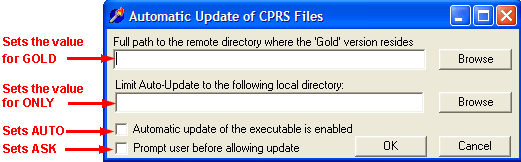

**Installation Guide**

CPRS: GUI Version

April 2007

[**Introduction 6**](#introduction)  
[**Pre-Install Instructions 7**](#pre-install-instructions)
[**Pre-Install Instructions 7**](#pre-install-instructions)  
[ We recommend that you install CPRS first in a training or test account that is a mirror of your production account. 7](#we-recommend-that-you-install-cprs-first-in-a-training-or-test-account-that-is-a-mirror-of-your-production-account)  
[ Update the Terminal Type file for the VT100s, if necessary. 7](#update-the-terminal-type-file-for-the-vt100s-if-necessary)  
[ Ensure that Patch OR\*2.5\*49 is implemented. 8](#ensure-that-patch-or2549-is-implemented)  
[ Make sure all required V](#make-sure-all-required-vista-software-is-installed)*IST*A software is installed 8  
[ Make sure that you have at least 300-400 meg free disk space before installing CPRS. 9](#make-sure-that-you-have-at-least-300-400-meg-free-disk-space-before-installing-cprs)  
[ (CMOP sites) Ensure that required CMOP tasks are completed. 9](#cmop-sites-ensure-that-required-cmop-tasks-are-completed)  
[ Place and protect the two new globals introduced with CPRS: 17](#place-and-protect-the-two-new-globals-introduced-with-cprs)  
[ Load the distribution for CPRS V. 1.0 19](#load-the-distribution-for-cprs-v-10)  
[ Verify Checksums in the transport global. 23](#verify-checksums-in-the-transport-global)  
[ Take users off the system. (The sequential order for this and the next two steps is up to your site's discretion.) 24](#take-users-off-the-system-the-sequential-order-for-this-and-the-next-two-steps-is-up-to-your-sites-discretion)  
[ Shut down Taskman. 24](#shut-down-taskman)  
[ Back up all systems. 24](#back-up-all-systems)  
[ Unmap OR\*, GMRC\*, and PS\* Routines. 24](#unmap-or-gmrc-and-ps-routines)  
[ Sign into a partition with journaling disabled. 24](#sign-into-a-partition-with-journaling-disabled)  
[ Delete OR\*, GMRC\*, and PSO\* routines. 24](#delete-or-gmrc-and-pso-routines)  
[**Installation 25**](#installation)  
[**Post-Installation 60**](#post-installation)  
[ Install the “Released Patch” and “Unreleased Patch” builds after the main CPRS installation and before the following post-installation steps. 60](#install-the-released-patch-and-unreleased-patch-builds-after-the-main-cprs-installation-and-before-the-following-post-installation-steps)  
[ Review and edit CPRS parameters, if necessary. 60](#review-and-edit-cprs-parameters-if-necessary)  
[*Consult/Request Tracking Parameters 61*](#consultrequest-tracking-parameters)  
[*Outpatient Pharmacy Parameters 61*](#outpatient-pharmacy-parameters)  
[*Inpatient Medications Parameters 61*](#inpatient-medications-parameters)  
[ Re-build the map set for the following OR\*, GMRC\*, and PS\* routines: 62](#re-build-the-map-set-for-the-following-or-gmrc-and-ps-routines)  
[ Re-enable journaling for the following globals: 62](#re-enable-journaling-for-the-following-globals)  
[ Re-start TaskMan. (Among other things, this will task the conversions.) 63](#re-start-taskman-among-other-things-this-will-task-the-conversions)  
[ Bring users back on the system. 63](#bring-users-back-on-the-system)  
[Run PSOPOST1 to see if the Outpatient Pharmacy conversion has finished. 64](#run-psopost1-to-see-if-the-outpatient-pharmacy-conversion-has-finished)  
[ Inpatient Pharmacy conversion 64](#inpatient-pharmacy-conversion)  
[ Run STATUS\^OR3CONV1 to check the status of the orders conversion. 64](#run-statusor3conv1-to-check-the-status-of-the-orders-conversion)  
[ (CMOP sites) Post-installation steps. 66](#cmop-sites-post-installation-steps)  
[ Review and assign sequence numbers to protocols in the DGPM Movement Events field of the Protocol file. 69](#review-and-assign-sequence-numbers-to-protocols-in-the-dgpm-movement-events-field-of-the-protocol-file)  
[ Set up Imaging Nature of Order. 69](#set-up-imaging-nature-of-order)  
[ Set up the CPRS Graphic User Interface (GUI). 71](#set-up-the-cprs-graphic-user-interface-gui)  
[**Release Notes 77**](#release-notes)  
[OE/RR 3.0 Enhancements since 12/97 Release 77](#oerr-30-enhancements-since-1297-release)  
[*Consults Enhancements 81*](#consults-enhancements)  
[*GUI Enhancements 82*](#gui-enhancements)  
[Released Patches 105](#released-patches)  
[**Appendix A: Define CONSULTS for TIU/CT Interface 117**](#appendix-a-define-consults-for-tiuct-interface)  
[**Appendix B: CPRS Hardware & Software Requirements and Recommendations 123**](#appendix-b-cprs-hardware--software-requirements-and-recommendations)  
***

# Introduction

Purpose of Installation Guide

This Installation Guide describes how to prepare for, install, and set up the Computerized Patient Record System (CPRS) V. 1.0 (both the List Manager, terminal-based version and the Windows-based GUI version).

CPRS is the combined installation of Order Entry/Results Reporting V. 3.0, Consult/Request Tracking V. 3.0, Inpatient Medications V. 5.0, Outpatient Pharmacy V. 7.0, and supporting patches.

Related Manuals

Computerized Patient Record System V. 1.0 Clinician Guide

Computerized Patient Record System V. 1.0 Setup Guide

Computerized Patient Record System V. 1.0 Technical Manual

Consult/Request Tracking V. 3.0 Technical Manual

Inpatient Medications V. 5.0 Technical Manual

Outpatient Pharmacy V. 7.0 Technical Manual

# Pre-Install Instructions

## We recommend that you install CPRS first in a training or test account that is a mirror of your production account.

-   We recommend that you start installation into your production account on a Friday night, to allow time over the weekend for the conversions to run. As soon as CPRS is installed, new versions of Order Entry/Results Reporting, Consult/Request Tracking, Outpatient Pharmacy, and Inpatient Medications will be in place.

Estimated Installation and Conversion Times

Installation: 30-90 minutes

Conversions: approximately two-three days

■ Install the “Released Patch” and “Unreleased Patch” builds after the main CPRS installation and before the post-installation steps.

## Update the Terminal Type file for the VT100s, if necessary.

If the “Insert Line” field is empty, this will cause List Manager to revert back to scroll mode

List Manager uses 11 video attributes, which are in the Terminal Type file (\#3.2). These are listed (along with recommended values) in the Site Preparation section of the *List Manager Developer’s Guide* (http://www.vista.med.va.gov/softserv/infrastr.uct/index.html).

| Attribute            | Value for a VT series terminal                 |
|----------------------|------------------------------------------------|
| Form Feed            | \#,\$C(27,91,50,74, 27,91,72)                  |
| XY CRT               | W \$C(27,91)_((DY+1))_\$C(59)_((DX+1))_\$C(72) |
| Erase to End of Page | \$C(27,91,74)                                  |
| Insert Line          | \$C(27),”[L”                                   |
| Underline On         | \$C(27,91**,**52,109)                          |
| Underline Off        | \$C(27,91, 109)                                |
| High Intensity       | \$C(27,91,49,109)                              |
| Normal Intensity     | \$C(27,91,109)                                 |
| Save Cursor Pos      | \$C(27,55)                                     |
| Restore Cursor Pos   | \$C(27,56)                                     |
| Set Top/Bottom Marg  | \$C(27,91)_(+IOTM)_\$C(59)_(+IOBM)_\$C(114)    |

## Ensure that Patch OR\*2.5\*49 is implemented.

**☞NOTE**: If OE/RR has never been installed at your site, it isn’t necessary to install and implement Patch 49.

After you install Patch 49, review your menus and quick orders, using the options on the Implementation Menu, to ensure that everything was converted correctly, and to make any desired changes.

Many locally created quick orders include entry and exit actions containing M code. These can’t be converted as such, but must be modified by options on the CPRS Implementation Menu included with Patch 49. They can then be converted with the *Convert Protocols* on the same menu.

Create a system-wide default Add Orders menu

If your site has a default *Add Orders* menu, this will be converted.

If your site doesn’t have a default *Add Orders* menu, a new one will have to be created, using the options on the *Implementation Menu* of patch 49 or the *Order Menu Management* menu on the *CPRS Configuration Menu (Clin Coord)*. CPRS doesn’t import a working *Add Orders* menu (the exported one is an example with placeholders ⎯ the quick orders don’t work).

## Make sure all required V*IST*A software is installed

Before CPRS can be installed, the following packages and patches must be installed and **fully** patched in your accounts.

| Application Name                                                                        | Minimum Version     |
|-----------------------------------------------------------------------------------------|---------------------|
| Automated Information Collection System (AICS)                                          | V 3.0               |
| Adverse Reaction Tracking (ART)                                                         | V 4.0               |
| Authorization/Subscription Utility (ASU)                                                | V 1.0               |
| \*\*\*Consolidated Mail Outpatient Pharmacy (CMOP)                                      | V 2.0               |
| \*\*Consult/Request Tracking                                                            | V 2.5 GMRC\*2.5\*17 |
| Dietetics                                                                               | V 5.0               |
| Gen. Med. Rec.-Vitals                                                                   | V. 3.0              |
| Health Summary                                                                          | V. 2.7              |
| HL7                                                                                     | V. 1.6              |
| Integrated Funds Distribution, Control Point Activity, Accounting & Procurement (IFCAP) | V. 4.0              |
| \*Inpatient Medications (IM)                                                            | V. 4.5              |
| Integrated Billing (IB)                                                                 | V. 2.0              |
| Kernel                                                                                  | V. 8.0              |
| Laboratory                                                                              | V. 5.2              |
| Lexicon Utility                                                                         | V. 2.0              |

| Application Name                        | Minimum Version  |
|-----------------------------------------|------------------|
| National Drug File (NDF)                | V. 3.17          |
| \*Order Entry/Results Reporting (OE/RR) | V. 2.5           |
| \*Outpatient Pharmacy                   | V. 6.0           |
| Patient Care Encounter (PCE)            | V. 1.0           |
| Pharmacy Data Management (PDM)          | V. 1.0           |
| Problem List                            | V 2.0            |
| Radiology/Nuclear Medicine              | V 4.5            |
| RPC Broker                              | V 1.1            |
| Registration                            | V 5.3            |
| Scheduling                              | V 5.3            |
| Text Integration Utilities (TIU)        | V 1.0            |
| ToolKit                                 |  V. 7.3          |
| VA FileMan                              |  V. 21.0         |
| Visit Tracking                          | V 2.0            |

\* If the package is installed on your system prior to CPRS, the required version and patches must be installed. If they are not installed, the package will be installed with CPRS.

\*\* GMRC\*2.5\*17 should be installed *just* before CPRS. If you make any updates to the GMRCR protocol file links after this install and prior to the CPRS install, you must run GMRCRFIX again (which means installing the patch again).

\*\*\* Patch PSX\*2\*3 is required if you have CMOP installed.

## Make sure that you have at least 300-400 meg free disk space before installing CPRS.

It is recommended that CPRS test sites increase their symbol table to 204,800.

## (CMOP sites) Ensure that required CMOP tasks are completed.

To prevent data corruption and/or interruption of background processes, the following pre-installation tasks **must** be completed **prior to the installation** of the CPRS KIDS Build. This ensures that the installation is not running simultaneously with CMOP data transmissions, background release filer, or other associated tasks.

CMOP pre-install tasks, cont’d  
***

**Step 1** – Determine System Status for CMOP

Use the *Display System Setup* [PSXR STATUS] option from the *CMOP Site Manager Menu* [PSXR CMOP MANAGER] to review the CMOP System Status. CMOP can be inactivated only if line one of the display includes the text, “No current transmission.” If this text is not displayed, a CMOP process is currently running and **inactivation** cannot take place. Once the task is completed, the display will read “No current transmission,” as in line one of the CMOP System Status report shown below. If line one does not contain the text “No current transmission,” try again later. Normally, CMOP tasks require only a few minutes to complete, so the waiting time to retry should be minimal.  
Example Step 1:

Select the CMOP Site Manager Menu Option: **DIS**play System Setup  
CMOP SYSTEM STATUS

LEAVENWORTH (ACTIVE) No current transmission

CMOP Domain : CMOP-LEAV.MED.VA.GOV

Last Batch Transmitted : 338

CMOP RX Queue purged : SEP 19,1997@08:41:14

Auto Transmission setup : YES

Select CMOP Site Manager Menu Option: **\<Enter\>**

**Step 2** – Record Auto Transmission Information for Rescheduling

If the last line of the display in the example above reads:  
***

Auto Transmission setup : NO  
Proceed directly to Step 3.  
If the last line of the display in the example above reads:  
***

Auto Transmission setup : YES  
Auto Transmission setup is in effect. Use the *Setup Auto-transmission* [PSXR AUTO TRANSMIT] menu option from the *Transmission Menu* [PSXR TRANSMIT MENU] on the *CMOP Site Manager Menu* [PSXR CMOP MANAGER] to display the information regarding the current transmission schedule. Print the screen display or retain this information for reference when completing the Post Install Tasks to reschedule Auto Transmissions.  
CMOP pre-install tasks, cont’d  
***

Example Step 2:

Select CMOP Site Manager Menu Option: **T**ransmission Menu

Select Transmission Menu Option: **S**etup Auto-transmission

Auto Transmissions are already scheduled.

Current schedule began : Aug 05, 1997 6:00 pm

Number of days to transmit thru: 1

Next transmission scheduled for: Sep 04, 1997@18:00

Rescheduling Frequency : 24 hours

Do you want to unschedule automatic processing ? NO//**\<Enter\>**

Select CMOP Site Manager Menu Option: **\<Enter\>**  
**Step 3** – Inactivate CMOP Processing  
Use the *Activate/Inactivate CMOP Processing* [PSXR ACTIVATE] option from the *CMOP Site Manager Menu* [PSXR CMOP MANAGER] to inactivate CMOP as illustrated in the following example.  
 If prescription workload is currently suspended for CMOP transmission, a WARNING message will be displayed as shown in the example below. Take no action on this warning. These prescriptions will be handled appropriately when the patch Post Install Tasks are completed and CMOP processing is Activated.

Example Step 3:

Select CMOP Site Manager Menu Option: **AC**tivate/Inactivate CMOP Processing

\*\*\*\*\*\*\*\*\*\*\*\*\*\*\*\*\*\*\*\*\*\*\*\*\*\*\*\*\*\*\*\*\*\*\*\*\*\*\*\*\*\*\*\*\*\*\*\*\*\*\*\*\*\*\*\*\*\*\*\*\*\*

WARNING: There are Rx's currently suspended for CMOP.

If you inactivate CMOP processing:

1) These Rx's will not transmit to the CMOP, but will remain

in the RX SUSPENSE file. These Rx's cannot be accessed by

Outpatient Pharmacy options. Ideally, these Rx's should

be transmitted or printed before inactivation takes place.

If CMOP processing is activated, these prescriptions can

be transmitted.

2) Before inactivating, please have all pharmacy users sign

off until inactivation is complete. CMOP Rx's input by

users who do not sign off the system will be suspended for

CMOP transmission. (See \#1)

3) Your current auto transmission schedule will be

cancelled on inactivation.

\*\*\*\*\*\*\*\*\*\*\*\*\*\*\*\*\*\*\*\*\*\*\*\*\*\*\*\*\*\*\*\*\*\*\*\*\*\*\*\*\*\*\*\*\*\*\*\*\*\*\*\*\*\*\*\*\*\*\*\*\*\*\*

LEAVENWORTH is the current active CMOP system.

Do you want to Inactivate the LEAVENWORTH system? NO// **Y**ES

Are you sure? NO// **Y**ES

The LEAVENWORTH system has been inactivated.

Activate another system? NO// **\<Enter\>**

CMOP pre-install tasks, cont’d  
Selecting Display System Setup as follows will show the site has inactivated.  
***

Select CMOP Site Manager Menu Option: **DIS**play System Setup

Enter CMOP System: **LEAVENWORTH** INACTIVE

CMOP SYSTEM STATUS

LEAVENWORTH (INACTIVE) No current transmission

CMOP Domain : CMOP-LEAV.MED.VA.GOV

Last Batch Transmitted : 338

CMOP RX Queue purged : SEP 19,1997@08:41:14

Auto Transmission setup : NO  
**Step 4** – Check the CMOP Resource Device  
***

To prevent CMOP background tasks, such as the CMOP Release Filer from running during the install and possibly causing data corruption, carefully follow the instructions listed below. Any CMOP task currently running must be allowed to complete before the resource device entry is locked. Check Taskman as shown below for PSX namespaced tasks running:  
Example Step 4a:

Select Systems Manager Menu Option: **TASK**man Management

Select Taskman Management Option: **LIS**t Tasks

List Tasks Option

All your tasks.

Your future tasks.

Every task.

List of tasks.

Unsuccessful tasks.

Future tasks.

Running tasks.

Select Type Of Listing: **R**unning tasks.

Running tasks...

240905: \^XMADJF0, MailMan Delivery Mover. No device. BAB,PAA.

From TODAY at 8:43, By you. Started running TODAY at 8:43.

Job \#: 43

\---------------------------------------------------------------------

235907: TRANS\^PSXRSUS, CMOP Data Transmission. Device PSX. WPB,PAA.

From TODAY at 9:10, By you. Started running TODAY at 9:10

Job \#: 46

In the previous example, task number 235907, Job \#46 is a PSX namespaced CMOP task currently running. Continue to list running tasks in this manner until this task is completed and no other PSX tasks are running.  
CMOP pre-install tasks, cont’d  
*Example Step 4b:* Checking the Resource device:

Display of the PSX Resource DEVICE entry when IN USE:

Select OPTION NAME: **EVE** Systems Manager Menu

Select Systems Manager Menu Option: **FM** VA FileMan

VA FileMan Version 21.0

Select VA FileMan Option: **I**nquire to File Entries

OUTPUT FROM WHAT FILE: RESOURCE// **\<Enter\>**

Select RESOURCE NAME: **PSX**

ANOTHER ONE: **\<Enter\>**

STANDARD CAPTIONED OUTPUT? Yes// **\<Enter\>** (Yes)

Include COMPUTED fields: (N/Y/R/B): NO// **\<Enter\>** - No record number (IEN), no Computed Fields

NAME: PSX AVAILABLE SLOTS: 0

SLOT IN USE: 1 JOB \#: 46

Select RESOURCE NAME: **\<Enter\>**

Display of the Resource DEVICE entry for PSX when FREE:  
Select Systems Manager Menu Option: **FM**  VA FileMan

VA FileMan Version 21.0

Select VA FileMan Option: **I**nquire to File Entries

OUTPUT FROM WHAT FILE: RESOURCE// **\<Enter\>**

Select RESOURCE NAME: **PSX**

ANOTHER ONE: **\<Enter\>**

STANDARD CAPTIONED OUTPUT? Yes// **\<Enter\>** (Yes)

Include COMPUTED fields: (N/Y/R/B): NO// **\<Enter\>** - No record number (IEN), no Computed Fields

NAME: PSX AVAILABLE SLOTS: 1

Select RESOURCE NAME: **\<Enter\>**

**Step 5** – Edit the CMOP Resource Device entry  
***

When the display (Step 4, Example 4b) indicates the PSX device entry in the RESOURCE file (\#3.54) is **free** (i.e., **Available Slots=1**), the PSX device entry may be edited and locked as shown in the example below. Locking the device in this manner signals Taskman that the device is busy. Tasks scheduled for this device will be placed on the waiting list for the device and not run until Taskman indicates the device is free.

CMOP pre-install tasks, cont’d  
Example Step 5:  
Editing the Resource file (\#3.54) entry for PSX to lock the device:  
Select Systems Manager Menu Option: **FM** VA FileMan

VA FileMan Version 21.0

Select VA FileMan Option: **E**nter or Edit File Entries

INPUT TO WHAT FILE: RESOURCE// **\<Enter\>**

EDIT WHICH FIELD: ALL// **AVAILABLE SLOTS**  
THEN EDIT FIELD: **SLOTS IN USE** (multiple)  
EDIT WHICH SLOTS IN USE SUB-FIELD: ALL// **\<Enter\>**

THEN EDIT FIELD: **\<Enter\>**  
Select RESOURCE NAME: **PSX**

AVAILABLE SLOTS: 1//  **@** - use the ‘@’ sign to delete this value in the field

SURE YOU WANT TO DELETE? **Y** (Yes)

Select SLOT IN USE: **1**

CPU/VOL: **\<Enter\>**

JOB \#: **\<Enter\>**

Select SLOT IN USE: **\<Enter\>**

The screen indicating the PSX Resource Device is FREE will now be displayed.

## Place and protect the two new globals introduced with CPRS:

| Global | Type    | Comments                                                                                                                                                  | Placement                                                     | Journal                                                                                  | Protection |
|--------|---------|-----------------------------------------------------------------------------------------------------------------------------------------------------------|---------------------------------------------------------------|------------------------------------------------------------------------------------------|------------|
| OCXD   | dynamic | The maximum size for this global will be about 138,000 blocks with raw data logging turned on and about 6000-7000 blocks with raw data logging turned off | Place in a volume set large enough for this kind of growth    | Not applicable                                                                           | RWP or D   |
| OCXS   | static  |                                                                                                                                                           | Place in the same volume set as the OR and other CPRS globals | Sign into a partition with journaling disabled; after installation, re-enable journaling | RWP or D   |

## Load the distribution for CPRS V. 1.0

 **NOTE:** We recommend that you set your PC or terminal for scroll-back (with a large enough buffer size) and plan to run the installation to the screen. This will allow you to monitor the process and include the scrolling region data in the history log.

Select the option *Kernel Installation and Distribution System*, XPD MAIN. Choose the *Installation* option, followed by the option, *Load the distribution*. When prompted to enter a host file, enter CPRS1_0.KID, as shown below:

\>D \^XUP

Select OPTION NAME: **XPD MAIN** Kernel Installation & Distribution System

Edits and Distribution ...

Utilities ...

Installation ...

Select Kernel Installation & Distribution System Option: **IN**stallation

1 Load a Distribution

2 Verify Checksums in Transport Global

3 Print Transport Global

4 Compare Transport Global to Current System

5 Backup a Transport Global

6 Install Package(s)

Restart Install of Package(s)

Unload a Distribution

Select Installation Option: **LOAD** a Distribution

Enter a Host File: D:\\ANONYMOUS\\CPRS1_0.KID

KIDS Distribution saved on Dec 29, 1997@07:46:23

Comment: CPRS 1.0

This Distribution contains Transport Globals for the following Package(s):

CPRS 1.0

ORDER ENTRY/RESULTS REPORTING 3.0

OUTPATIENT PHARMACY VERSION 7.0

PSS\*1.0\*1

INPATIENT MEDICATIONS 5.0

CONSULT/REQUEST TRACKING 3.0

GMPL\*2.0\*10

FH\*5.0\*6

LR\*5.2\*166

CPRS POST INSTALL 1.0

Want to Continue with Load? YES// **\<Enter\>**

Loading Distribution...

Want to RUN the Environment Check Routine? YES// **\<Enter\>**

CPRS 1.0

ORDER ENTRY/RESULTS REPORTING 3.0

Load Distribution, cont’d

Will first run the Environment Check Routine, ORCENV

Checking for key variables...

Key variables are defined properly.

Checking for active CMOP transmissions...

CMOP is inactivated...ok to continue

Checking status of packages and patches...

Checking Adverse Reaction Tracking v4.0...

Adverse Reaction Tracking v4.0 is up to date

Checking Consult/Request Tracking v2.5...

Consult/Request Tracking v2.5 is up to date

Checking CMOP v2.0...

optional CMOP is not on system...ok

Checking Dietetics v5.0...

Dietetics v5.0 is up to date

Checking Vitals v3.0...

Vitals v3.0 is up to date

Checking Health Level Seven v1.6...

Health Level Seven v1.6 is up to date

Checking Health Summary v2.7...

Health Summary v2.7 is up to date

Checking Kernel v8.0...

Kernel v8.0 is up to date

Checking Laboratory v5.2...

Laboratory v5.2 is up to date

Checking OE/RR v2.5...

OE/RR v2.5 is up to date

Checking Patient Care Encounter v1.0...

Patient Care Encounter v1.0 is up to date

Checking Outpatient Pharmacy v6...

Outpatient Pharmacy v6 is up to date

Checking Inpatient Pharmacy v4.5...

Inpatient Pharmacy v4.5 is up to date

Checking Radiology v4.5...

Radiology is up to version 5...OK

Checking Registration v5.3...

Registration v5.3 is up to date

Checking Scheduling (including PCMM) v5.3...

Scheduling (including PCMM) v5.3 is up to date

Checking RPC Broker v1.1...

RPC Broker v1.1 is up to date

Checking Text Integration Utility v1.0...

Text Integration Utility v1.0 is up to date

Load Distribution, cont’d

Checking VA FileMan v21.0...

VA FileMan v21.0 is up to date

Checking Visit Tracking v2.0...

Visit Tracking v2.0 is up to date

OUTPATIENT PHARMACY VERSION 7.0

PSS\*1.0\*1

INPATIENT MEDICATIONS 5.0

Will first run the Environment Check Routine, PSJIENV

CONSULT/REQUEST TRACKING 3.0

GMPL\*2.0\*10

FH\*5.0\*6

LR\*5.2\*166

CPRS POST INSTALL 1.0

Use INSTALL NAME: CPRS 1.0 to install this Distribution.

Select Installation Option:

-   **(optional) Print a list of package components with the KIDS Build File Print option** if you would like a complete listing of package components (e.g., files, routines, and options) exported with this software.  
***

 **NOTE**: You must request separate prints for each of the components of this multi-package build.  
## Verify Checksums in the transport global.

Run the option *Verify Checksums in Transport Global* to verify that all routines have the correct checksum. If there are any discrepancies, do not run the Install Package(s) option. Instead, run the Unload a Distribution option to remove the Transport Global from your system. Log a NOIS and/or call the national Help Desk and report the problem.

-   **Unschedule the ORTASK PURGE option.** This functionality will be re-introduced with a patch to CPRS V. 1.0.

## Take users off the system. (The sequential order for this and the next two steps is up to your site's discretion.)

## Shut down Taskman.

## Back up all systems.

## Unmap OR\*, GMRC\*, and PS\* Routines.

## Sign into a partition with journaling disabled.

During installation, journaling needs to be disabled for the following globals:

OR, OCXS, ORD, GMR, XTV, PS.

During the conversion, the following globals are modified and will generate entries in the journal files: OR, PS, and PSRX.

**NOTE:** Make sure you have adequate journal space available to enable journaling *after* CPRS is installed. The conversion will continue for approximately 24 – 48 hours after CPRS is installed. You will need to monitor your journal space during the time that the conversion is running.

## Delete OR\*, GMRC\*, and PSO\* routines.

Use the system utility to delete all GMRC\*, OR\*, and PSO\* routines. If you have local modifications to any PSO\* routines, back up those routines. After installation of Outpatient Pharmacy V. 7.0, compare routines to note the changes between your locally modified routines and the V. 7.0 routines. Version 7.0 of Outpatient Pharmacy has been modified greatly; please be careful when installing local modifications.

Inpatient Medications routines exported in previous versions are automatically deleted with this installation if they are not used in V. 5.0.

# Installation

A new mail group will be added that generates bulletins when the order check expert system rules are invoked. KIDS will ask you for this mail group and for someone in IRM to be assigned as the mail group coordinator.

Enter the Coordinator for Mail Group 'OCX DEVELOPERS’:

This bulletin lets IRMS know when someone edits the rules and recompiles the system. If no one wants to get these bulletins, then enter POSTMASTER. After the installation has finished, remove POSTMASTER from the bulletin in the bulletin file.

-   Install CPRS 1.0

Select the option Kernel Installation and Distribution System, XPD MAIN. Choose the Installation option, followed by the option, Installation. When prompted to enter the install name, enter CPRS 1.0, as shown below:

\>D \^XUP

Select OPTION NAME: **XPD MAIN** Kernel Installation & Distribution System

Edits and Distribution ...

Utilities ...

Installation ...

Select Kernel Installation & Distribution System Option: **IN**stallation

CPRS Installation Example

1 Load a Distribution

2 Verify Checksums in Transport Global

3 Print Transport Global

4 Compare Transport Global to Current System

5 Backup a Transport Global

6 Install Package(s)

Restart Install of Package(s)

Unload a Distribution

Select Installation Option: **INS**tall Package(s)

Select INSTALL NAME: **CPRS 1.0** Loaded from Distribution 8/28/96@11:56:44

=\> CPRS 1.0 ;Created on Dec 29, 1997@07:46:23

This Distribution was loaded on Aug 28, 1996@11:56:44 with header of

CPRS 1.0 ;Created on Dec 29, 1997@07:46:23

It consisted of the following Install(s):

CPRS 1.0

ORDER ENTRY/RESULTS REPORTING 3.0

OUTPATIENT PHARMACY VERSION 7.0

PSS\*1.0\*1

INPATIENT MEDICATIONS 5.0

CPRS Installation, cont’d

CONSULT/REQUEST TRACKING 3.0

GMPL\*2.0\*10

FH\*5.0\*6

LR\*5.2\*166

CPRS POST INSTALL 1.0

CPRS 1.0

Install Questions for CPRS 1.0

ORDER ENTRY/RESULTS REPORTING 3.0

Will first run the Environment Check Routine, ORCENV

Checking for key variables...

Key variables are defined properly.

Checking for active CMOP transmissions...

CMOP is inactivated...ok to continue

Checking status of packages and patches...

Checking Adverse Reaction Tracking v4.0...

Adverse Reaction Tracking v4.0 is up to date

Checking Consult/Request Tracking v2.5...

Consult/Request Tracking v2.5 is up to date

Checking CMOP v2.0...

optional CMOP is not on system...ok

Checking Dietetics v5.0...

Dietetics v5.0 is up to date

Checking Vitals v3.0...

Vitals v3.0 is up to date

Checking Health Level Seven v1.6...

Health Level Seven v1.6 is up to date

Checking Health Summary v2.7...

Health Summary v2.7 is up to date

Checking Kernel v8.0...

Kernel v8.0 is up to date

Checking Laboratory v5.2...

Laboratory v5.2 is up to date

Checking OE/RR v2.5...

OE/RR v2.5 is up to date

Checking Patient Care Encounter v1.0...

Patient Care Encounter v1.0 is up to date

Checking Outpatient Pharmacy v6...

Outpatient Pharmacy v6 is up to date

Checking Inpatient Pharmacy v4.5...

Inpatient Pharmacy v4.5 is up to date

Checking Radiology v4.5...

Radiology is up to version 5...OK

CPRS Installation, cont’d

Checking Registration v5.3...

Registration v5.3 is up to date

Checking Scheduling (including PCMM) v5.3...

Scheduling (including PCMM) v5.3 is up to date

Checking RPC Broker v1.1...

RPC Broker v1.1 is up to date

Checking Text Integration Utility v1.0...

Text Integration Utility v1.0 is up to date

Checking VA FileMan v21.0...

VA FileMan v21.0 is up to date

Checking Visit Tracking v2.0...

Visit Tracking v2.0 is up to date

Install Questions for ORDER ENTRY/RESULTS REPORTING 3.0

100 ORDER

Note: You already have the 'ORDER' File.

100.01 ORDER STATUS (including data)

Note: You already have the 'ORDER STATUS' File.

I will REPLACE your data with mine.

100.02 NATURE OF ORDER (including data)

100.03 ORDER REASON (including data)

100.2 OE/RR PATIENT

Note: You already have the 'OE/RR PATIENT' File.

100.22 OE/RR PRINT FIELDS (including data)

Note: You already have the 'OE/RR PRINT FIELDS' File.

I will REPLACE your data with mine.

100.23 OE/RR PRINT FORMATS (including data)

Note: You already have the 'OE/RR PRINT FORMATS' File.

I will REPLACE your data with mine.

100.4 OE/RR ERRORS

Note: You already have the 'OE/RR ERRORS' File.

100.8 ORDER CHECKS (including data)

100.9 OE/RR NOTIFICATIONS (including data)

Note: You already have the 'OE/RR NOTIFICATIONS' File.

I will REPLACE your data with mine.

100.98 DISPLAY GROUP (including data)

CPRS Installation, cont’d

Note: You already have the 'DISPLAY GROUP' File.

I will OVERWRITE your data with mine.

100.99 ORDER PARAMETERS

Note: You already have the 'ORDER PARAMETERS' File.

101 PROTOCOL

Note: You already have the 'PROTOCOL' File.

101.41 ORDER DIALOG (including data)

Note: You already have the 'ORDER DIALOG' File.

I will REPLACE your data with mine.

101.42 ORDER URGENCY (including data)

Note: You already have the 'ORDER URGENCY' File.

I will REPLACE your data with mine.

101.43 ORDERABLE ITEMS

Note: You already have the 'ORDERABLE ITEMS' File.

860.1 ORDER CHECK PATIENT ACTIVE DATA

860.2 ORDER CHECK RULE (including data)

860.3 ORDER CHECK ELEMENT (including data)

860.4 ORDER CHECK DATA FIELD (including data)

860.5 ORDER CHECK DATA SOURCE (including data)

860.6 ORDER CHECK DATA CONTEXT (including data)

860.7 ORDER CHECK PATIENT RULE EVENT

860.8 ORDER CHECK COMPILER FUNCTIONS (including data)

860.9 ORDER CHECK NATIONAL TERM

861 ORDER CHECK RAW DATA LOG

863 OCX MDD CLASS (including data)

863.1 OCX MDD APPLICATION (including data)

863.2 OCX MDD SUBJECT (including data)

863.3 OCX MDD LINK (including data)

863.4 OCX MDD ATTRIBUTE (including data)

863.5 OCX MDD VALUES (including data)

863.6 OCX MDD METHOD (including data)

863.7 OCX MDD PUBLIC FUNCTION (including data)

CPRS Installation, cont’d

863.8 OCX MDD PARAMETER (including data)

863.9 OCX MDD CONDITION/FUNCTION (including data)

864 OCX MDD SITE PREFERENCES

864.1 OCX MDD DATATYPE (including data)

8989.51 PARAMETER DEFINITION (including data)

Note: You already have the 'PARAMETER DEFINITION' File.

I will REPLACE your data with mine.

8989.52 PARAMETER TEMPLATE (including data)

Note: You already have the 'PARAMETER TEMPLATE' File.

OUTPATIENT PHARMACY VERSION 7.0

Install Questions for OUTPATIENT PHARMACY VERSION 7.0

2 PATIENT (Partial Definition)

Note: You already have the 'PATIENT' File.

50.073 DUE QUESTIONNAIRE

Note: You already have the 'DUE QUESTIONNAIRE' File.

50.0731 DUE ANSWER SHEET

Note: You already have the 'DUE ANSWER SHEET' File.

50.0732 DUE QUESTION

Note: You already have the 'DUE QUESTION' File.

50.0733 DUE SECTION

Note: You already have the 'DUE SECTION' File.

50.9 DRUG COST

Note: You already have the 'DRUG COST' File.

52 PRESCRIPTION

Note: You already have the 'PRESCRIPTION' File.

52.11 PATIENT NOTIFICATION (Rx READY)

Note: You already have the 'PATIENT NOTIFICATION (Rx READY)' File.

52.4 RX VERIFY

Note: You already have the 'RX VERIFY' File.

52.41 PENDING OUTPATIENT ORDERS

\*BUT YOU ALREADY HAVE '\*REFILL WITH NON VERIFIED NEWS' AS FILE \#52.41!

Shall I write over your \*REFILL WITH NON VERIFIED NEWS File? YES// **\<Enter\>**

52.5 RX SUSPENSE

CPRS Installation, cont’d

Note: You already have the 'RX SUSPENSE' File.

52.51 PHARMACY EXTERNAL INTERFACE

52.52 CLOZAPINE PRESCRIPTION OVERRIDES

Note: You already have the 'CLOZAPINE PRESCRIPTION OVERRIDES' File.

52.8 PHARMACY ARCHIVE

Note: You already have the 'PHARMACY ARCHIVE' File.

52.9 PHARMACY PRINTED QUEUE

Note: You already have the 'PHARMACY PRINTED QUEUE' File.

53 RX PATIENT STATUS

Note: You already have the 'RX PATIENT STATUS' File.

59 OUTPATIENT SITE

Note: You already have the 'OUTPATIENT SITE' File.

59.1 OUTPATIENT AMIS DATA

Note: You already have the 'OUTPATIENT AMIS DATA' File.

59.12 OUTPATIENT PHARMACY MANAGEMENT DATA

Note: You already have the 'OUTPATIENT PHARMACY MANAGEMENT DATA' File.

59.2 WAITING TIME

Note: You already have the 'WAITING TIME' File.

59.3 GROUP DISPLAY

Note: You already have the 'GROUP DISPLAY' File.

59.8 OUTPATIENT CLINIC SORT GROUP

PSS\*1.0\*1Install Questions for PSS\*1.0\*1

55 PHARMACY PATIENT

Note: You already have the 'PHARMACY PATIENT' File.

INPATIENT MEDICATIONS 5.0

Will first run the Environment Check Routine, PSJIENV

Install Questions for INPATIENT MEDICATIONS 5.0 50.2 IV CATEGORY

Note: You already have the 'IV CATEGORY' File.

50.8 IV STATS

Note: You already have the 'IV STATS' File.

51.15 ADMINISTRATION SHIFT

Note: You already have the 'ADMINISTRATION SHIFT' File.

CPRS Installation, cont’d

53.1 NON-VERIFIED ORDERS

Note: You already have the 'NON-VERIFIED ORDERS' File.

53.2 UNIT DOSE ORDER SET

Note: You already have the 'UNIT DOSE ORDER SET' File.

53.3 ACTIVITY LOG REASON

Note: You already have the 'ACTIVITY LOG REASON' File.

53.4 PRE-EXCHANGE NEEDS

Note: You already have the 'PRE-EXCHANGE NEEDS' File.

53.41 MAR LABELS

Note: You already have the 'MAR LABELS' File.

53.42 INPATIENT BACKGROUND JOB

Note: You already have the 'INPATIENT BACKGROUND JOB' File.

53.43 MISCELLANEOUS REPORT FILE

Note: You already have the 'MISCELLANEOUS REPORT FILE' File.

53.44 PHYSICIANS' ORDERS

Note: You already have the 'PHYSICIANS' ORDERS' File.

53.45 INPATIENT USER PARAMETERS

Note: You already have the 'INPATIENT USER PARAMETERS' File.

53.5 PICK LIST

Note: You already have the 'PICK LIST' File.

53.55 UNIT DOSE/ATC MEDS

Note: You already have the 'UNIT DOSE/ATC MEDS' File.

57.5 WARD GROUP

Note: You already have the 'WARD GROUP' File.

57.6 UNIT DOSE PICK LIST STATS

Note: You already have the 'UNIT DOSE PICK LIST STATS' File.

57.7 MEDICATION ADMINISTERING TEAM

Note: You already have the 'MEDICATION ADMINISTERING TEAM' File.

59.5 IV ROOM

Note: You already have the 'IV ROOM' File.

59.6 INPATIENT WARD PARAMETERS

Note: You already have the 'INPATIENT WARD PARAMETERS' File.

CPRS Installation, cont’d

CONSULT/REQUEST TRACKING 3.0

Install Questions for CONSULT/REQUEST TRACKING 3.0

123 REQUEST/CONSULTATION

Note: You already have the 'REQUEST/CONSULTATION' File.

123.1 REQUEST ACTION TYPES (including data)

Note: You already have the 'REQUEST ACTION TYPES' File.

I will REPLACE your data with mine.

123.5 REQUEST SERVICES

Note: You already have the 'REQUEST SERVICES' File.

123.9 CONSULTS PARAMETERS FILE

GMPL\*2.0\*10

Install Questions for GMPL\*2.0\*10

FH\*5.0\*6

Install Questions for FH\*5.0\*6

115 DIETETICS PATIENT

Note: You already have the 'DIETETICS PATIENT' File.

LR\*5.2\*166

Install Questions for LR\*5.2\*166

60 LABORATORY TEST (Partial Definition)

Note: You already have the 'LABORATORY TEST' File.

69.9 LABORATORY SITE (Partial Definition)

Note: You already have the 'LABORATORY SITE' File.

8989.51 PARAMETER DEFINITION (including data)

Note: You already have the 'PARAMETER DEFINITION' File.

I will REPLACE your data with mine.

8989.52 PARAMETER TEMPLATE (including data)

Note: You already have the 'PARAMETER TEMPLATE' File.

CPRS POST INSTALL 1.0

Install Questions for CPRS POST INSTALL 1.0

Want to MOVE routines to other CPUs? NO// \<**Enter\>**

Enter the Device you want to print the Install messages.

You can queue the install by enter a 'Q' at the device prompt.

Enter a '\^' to abort the install.

DEVICE: HOME// **\<Enter\>**

CPRS Installation Print Example

Install Started for CPRS 1.0 :  
Aug 28, 1996@12:01:50  
***

Installing Routines:.  
Aug 28, 1996@12:01:50  
***

Updating Routine file.....  
***

Updating KIDS files.....  
***

CPRS 1.0 Installed.  
Aug 28, 1996@12:01:50  
***

Install Started for ORDER ENTRY/RESULTS REPORTING 3.0 :  
Aug 28, 1996@12:01:50  
***

Installing Routines:...................................................  
Aug 28, 1996@12:03:05  
***

Running Pre-Install Routine: \^ORCPRE.  
***

PRE-conversion of notifications... Stubbing notifications 30-49,51-58.  
***

Notification stubbing completed. Renaming notifications 14,21,22,24,25,26,50. Notification renaming completed. Converting existing alerts... Cleaning up old alerts...  
***

LAB RESULTS cleaned up.  
FLAGGED ORDERS cleaned up.  
UNSIGNED PROGRESS NOTES cleaned up.  
ORDER REQUIRES ELEC SIGNATURE cleaned up.  
CO-SIGNATURE ON PROGRESS NOTES cleaned up.  
ABNORMAL LAB RESULTS (ACTION) cleaned up.  
CYTOLOGY RESULTS cleaned up.  
ANATOMIC PATHOLOGY RESULTS cleaned up.  
AUTOPSY REPORT cleaned up.  
CRITICAL LAB RESULT (INFO) cleaned up.  
NEW ORDER cleaned up.  
TEST NOTIFICATION (97) cleaned up.  
PRE-conversion of notifications completed.  
***

Installing Data Dictionaries: .......................................  
***

Data Dictionary for File \#8989.51 not installed..  
***

Data Dictionary for File \#8989.52 not installed..  
Aug 28, 1996@12:05:27  
***

Installing Data: ........ Aug 28, 1996@12:07:34  
***

Installing PACKAGE COMPONENTS:  
***

Installing BULLETIN......  
***

Installing SECURITY KEY.....  
***

Installing INPUT TEMPLATE....  
***

Installing MAIL GROUP..  
***

Installing PROTOCOL.............  
Not a known package or a local namespace..........  
Not a known package or a local namespace......  
Not a known package or a local namespace...................................  
***

CPRS Installation Print, cont’d  
***

Installing REMOTE PROCEDURE.............................................  
***

Installing LIST TEMPLATE...........  
***

Installing OPTION.......................................................  
Aug 28, 1996@12:10:22  
***

Running Post-Install Routine: \^ORCPOST.  
***

Converting user pt selection defaults to parameters.....................  
***

Conversion of user pt selection defaults completed.  
***

POST-conversion of notifications...  
***

Adding protocol DGPM PROVIDER UPDATE EVENT as an item on protocol OR EVSEND DGPM  
.........................................................................................................................................................................................................................................................................................................................................................  
POST-conversion of notifications completed.  
***

Cleaning up unused data and fields ...  
***

Populating Parameters file ...  
***

Error: ORPF SERVICE COPY DEFLT DEVICE Value failed validation logic. Entity:LOC.\`21 Inst:\`121 Val:\`371  
Error: ORPF SERVICE COPY DEFLT DEVICE Value failed validation logic. Entity:LOC.\`209 Inst:\`121 Val:\`216  
Error: ORPF SERVICE COPY DEFLT DEVICE Value failed validation logic. Entity:LOC.\`476 Inst:\`121 Val:\`216  
.  
.  
***

Setting up Display Group file ...  
***

Adding Consult/Request urgencies to Order Urgency file ...  
***

Converting protocol menus ...  
***

206 protocols could not be converted.  
These will be sent to [your name] in a bulletin.Sending bulletin ...  
***

Updating Routine file....  
***

The following Routines were created during this install:  
ORD2  
ORD21  
ORD210  
ORD211  
ORD212  
ORD22  
ORD23  
ORD24  
ORD25  
ORD26  
ORD27  
ORD28  
ORD29  
ORD1  
ORD11  
CPRS Installation Print, cont’d  
ORD110  
ORD111  
ORD112  
ORD12  
ORD13  
ORD14  
ORD15  
ORD16  
ORD17  
ORD18  
ORD19..  
***

Updating KIDS files.......  
***

ORDER ENTRY/RESULTS REPORTING 3.0 Installed.  
Aug 28, 1996@12:15:48.  
***

Install Message sent \#2642666  
***

Install Started for OUTPATIENT PHARMACY VERSION 7.0 :  
Aug 28, 1996@12:15:49  
***

Installing Routines:  
. Aug 28, 1996@12:16:34  
***

Running Pre-Install Routine: \^PSOSTART....  
***

Installing Data Dictionaries: ..........................  
Aug 28, 1996@12:18:31  
***

Installing PACKAGE COMPONENTS:  
***

Installing HELP FRAME.......  
***

Installing SECURITY KEY.....  
***

Installing FUNCTION..  
***

Installing PRINT TEMPLATE...................  
***

Installing SORT TEMPLATE.........  
***

Installing INPUT TEMPLATE...............  
***

Installing HL LOWER LEVEL PROTOCOL PARAMETER.....  
***

Installing HL LOGICAL LINK..  
***

Installing HL7 APPLICATION PARAMETER...  
***

Installing PROTOCOL.....................................................  
***

Installing LIST TEMPLATE............  
***

Installing OPTION..............................................  
Aug 28, 1996@12:20:27  
***

Running Post-Install Routine: \^PSOPOST. ...  
***

Setting up Outpatient Pharmacy's protocols...  
***

Protocol 'PS RECEIVE OR' is already set up under protocol menu 'OR EVSEND PS'.  
***

Protocol 'OR RECEIVE' is already set up under protocol menu 'PS EVSEND OR'.  
Initialization Completed in 233 seconds.  
CPRS Installation Print, cont’d  
***

Updating Routine file....  
***

The following Routines were created during this install:  
PSOXZA  
PSOXZA1  
PSOXZA2  
PSOXZA3  
PSOXZA4  
PSOXZA5  
PSOXZA6  
APSPT05  
APSPT051  
APSPT04  
APSPT041  
APSPT16  
PSOXX..  
***

Updating KIDS files.......  
***

OUTPATIENT PHARMACY VERSION 7.0 Installed.  
Aug 28, 1996@12:20:55.  
***

Install Message sent \#2642667  
***

Install Started for PSS\*1.0\*1 :  
Aug 28, 1996@12:20:57  
***

Installing Routines:....  
Aug 28, 1996@12:20:58  
***

Installing Data Dictionaries: ..  
Aug 28, 1996@12:21:24  
***

Installing PACKAGE COMPONENTS:  
***

Installing OPTION.......  
Aug 28, 1996@12:21:24  
***

Updating Routine file....  
***

The following Routines were created during this install:  
PSSJXR  
PSSJXR1  
PSSJXR10  
PSSJXR11  
PSSJXR12  
PSSJXR13  
PSSJXR14  
PSSJXR15  
PSSJXR16  
PSSJXR17  
PSSJXR18  
PSSJXR19  
PSSJXR2  
PSSJXR20  
PSSJXR21  
PSSJXR22  
PSSJXR3  
PSSJXR4  
PSSJXR5  
PSSJXR6  
PSSJXR7  
PSSJXR8  
PSSJXR9..  
CPRS Installation Print, cont’d  
***

Updating KIDS files.......  
***

PSS\*1.0\*1 Installed.  
Aug 28, 1996@12:21:25  
***

Install Started for INPATIENT MEDICATIONS 5.0 :  
Aug 28, 1996@12:21:25  
***

Installing Routines:....................................................  
Aug 28, 1996@12:22:13  
***

Running Pre-Install Routine: \^PSJIPRE.  
***

In order to prevent the corruption of existing data while running version 5.0 install, all of the Inpatient Medications options will be placed OUT OF ORDER. They will be made available again once the version 5.0 install is finished.  
....working....  
***

Installing Data Dictionaries:  
.................... Aug 28, 1996@12:22:56  
***

Installing PACKAGE COMPONENTS:  
***

Installing SECURITY KEY........  
***

Installing PRINT TEMPLATE..  
***

Installing INPUT TEMPLATE.............................  
***

Installing PROTOCOL.....................................................  
***

Installing LIST TEMPLATE....................  
***

Installing OPTION.................................................  
Aug 28, 1996@12:23:59  
***

Running Post-Install Routine: \^PSJIPST.  
***

POST-INIT STARTED AT AUG 28, 1996@12:24 ....  
....Updating the Activity Log Reason file....  
***

Protocol 'PSJ OR PAT ADT' is already set up under the protocol menu 'DGPM MOVEMENT EVENTS'  
.removing the 'OUT OF ORDER' message from the Inpatient Medications options.....  
removing the 'DISABLE' message from the Inpatient Medications protocols...  
***

POST-INSTALL COMPLETED AT AUG 28, 1996@12:24:10 ....  
***

Updating Routine file....  
***

The following Routines were created during this install:  
***

PSGXR3  
PSGXR31  
PSGXR310  
PSGXR32  
PSGXR33  
PSGXR34  
PSGXR35  
PSGXR36  
PSGXR37  
PSGXR38  
PSGXR39..  
CPRS Installation Print, cont’d  
Updating KIDS files.......  
***

INPATIENT MEDICATIONS 5.0 Installed.  
Aug 28, 1996@12:24:42.  
***

Install Message sent \#2642669  
***

Install Started for CONSULT/REQUEST TRACKING 3.0 :  
Aug 28, 1996@12:24:42  
***

Installing Routines:.....................................................  
Aug 28, 1996@12:24:52  
***

Running Pre-Install Routine: \^GMRCPRE.  
***

Change Protocol Name from: GMRCACT DENY REQUEST to: GMRCACT CANCEL REQUEST  
***

Remove menu from: GMRCACTM MEDICINE PKG MENU  
Remove menu from: GMRCACTM SERVICE ACTION MENU Remove menu from: GMRCACTM USER REVIEW SCREEN  
Remove menu from: GMRCRM REQUEST TYPES  
***

Installing Data Dictionaries: ..... Aug 28, 1996@12:25:57  
***

Installing Data:  
\*\* ERROR IN POINTER RESOLUTION OF DATA  
\*\*Unable to find exact match and resolve pointer (\^ORD(101, Entry:GMRCACT FORWARD).  
Aug 28, 1996@12:25:58  
***

Installing PACKAGE COMPONENTS:  
***

Installing SECURITY KEY..  
***

Installing PRINT TEMPLATE......  
***

Installing SORT TEMPLATE...  
***

Installing INPUT TEMPLATE...  
***

Installing PROTOCOL....................................  
***

Installing REMOTE PROCEDURE..  
***

Installing LIST TEMPLATE..............  
***

Installing OPTION.  
Aug 28, 1996@12:26:19  
***

Running Post-Install Routine: \^GMRCPOS.  
***

Updating Routine file......  
***

Updating KIDS files.......  
***

CONSULT/REQUEST TRACKING 3.0 Installed.  
Aug 28, 1996@12:26:27.  
***

Install Message sent \#2642670  
***

Install Started for GMPL\*2.0\*10 :  
Aug 28, 1996@12:26:27  
***

Installing Routines:.  
.. Aug 28, 1996@12:26:28  
CPRS Installation Print, cont’d  
***

Updating Routine file......  
***

Updating KIDS files.......  
***

GMPL\*2.0\*10 Installed.  
Aug 28, 1996@12:26:28  
***

Install Started for FH\*5.0\*6 :  
Aug 28, 1996@12:26:29  
***

Installing Routines:.  
Aug 28, 1996@12:26:35  
***

Installing Data Dictionaries:  
.. Aug 28, 1996@12:26:41  
***

Running Post-Install Routine: \^FHIPST.  
***

Updating Routine file......  
***

Updating KIDS files.......  
***

FH\*5.0\*6 Installed.  
Aug 28, 1996@12:27:37  
***  
Install Started for LR\*5.2\*166 :  
Aug 28, 1996@12:27:37  
***

Installing Routines:  
Aug 28, 1996@12:27:43  
***

Running Pre-Install Routine: EN\^LR7OPRE.  
DISPLAY GROUP field removed from file 60  
OE/RR DEFAULT PROTOCOL field removed from file 69.9  
CANCEL ON WARD TRANSFER field removed from file 69.9  
CANCEL ON SERVICE TRANSFER field removed from file 69.9  
***

Installing Data Dictionaries: ...  
***

Data Dictionary for File \#8989.51 not installed..  
***

Data Dictionary for File \#8989.52 not installed..  
Aug 28, 1996@12:27:57  
***

Installing Data:  
. Aug 28, 1996@12:28:10  
***

Installing PACKAGE COMPONENTS:  
***

Installing PROTOCOL..  
***

Installing OPTION.  
....... Aug 28, 1996@12:28:36  
***

Running Post-Install Routine: EN\^LR7OPOS..  
***

Now sending Lab order parameters to OE/RR...  
***

Updating Routine file......  
***

Updating KIDS files.......  
***

LR\*5.2\*166 Installed.  
CPRS Installation Print, cont’d  
Aug 28, 1996@12:28:39.  
***

Install Message sent \#2642671  
***

Install Started for CPRS POST INSTALL 1.0 :  
Aug 28, 1996@12:28:39  
***

Installing Routines:.  
. Aug 28, 1996@12:28:39  
***

Running Post-Install Routine: EN\^OR3POST.  
***

\---Order Check Integrity Check------------------------------------  
***

Order Check Expert System Diagnostic Tool  
***

Created: DEC 15,1997 at 14:01 in UCI: OEX,OER  
***

Current Date: AUG 28,1996 at 12:28 Current UCI: VAH,TOA  
***

Loading Data  
***

Scanning Routines ............  
***

Scanning Data Files  
***

Scanning '863.8 OCX MDD PARAMETER' file .................................................  
Scanning '864.1 OCX MDD DATATYPE' file ............  
***

Scanning '863.7 OCX MDD PUBLIC FUNCTION' file .................................  
***

Scanning '863.9 OCX MDD CONDITION/FUNCTION' file .................  
***

Scanning '863.6 OCX MDD METHOD' file .......  
***

Scanning '863.4 OCX MDD ATTRIBUTE' file ..................  
***

Scanning '863.2 OCX MDD SUBJECT' file .  
***

Scanning '863.1 OCX MDD APPLICATION' file  
***

Scanning '863.3 OCX MDD LINK' file ......................................................  
***

Scanning '863 OCX MDD CLASS' file ......  
***

Scanning '860.9 ORDER CHECK NATIONAL TERM' file .  
***

Scanning '860.8 ORDER CHECK COMPILER FUNCTIONS' file .......................  
***

Scanning '860.6 ORDER CHECK DATA CONTEXT' file .  
***

Scanning '860.5 ORDER CHECK DATA SOURCE' file ..  
***

Scanning '860.4 ORDER CHECK DATA FIELD' file ..........................  
***

Scanning '860.3 ORDER CHECK ELEMENT' file .........................................  
Scanning '860.2 ORDER CHECK RULE' file ..............  
***

CPRS Installation Print, cont’d  
Checking protocols  
***

'OCX ORDER CHECK PATIENT MOVE.' added as an Item to the 'DGPM MOVEMENT EVENTS' protocol  
'OCX ORDER CHECK HL7 RECIEVE' added as an Item to the 'PS EVSEND OR' protocol  
'OCX ORDER CHECK HL7 RECIEVE' added as an Item to the 'RA EVSEND OR' protocol  
'OCX ORDER CHECK HL7 RECIEVE' added as an Item to the 'LR7O CH EVSEND OR' protocol  
'OCX ORDER CHECK HL7 RECIEVE' added as an Item to the 'LR7O BB EVSEND OR' protocol  
'OCX ORDER CHECK HL7 RECIEVE' added as an Item to the 'LR7O AP EVSEND OR' protocol  
'OCX ORDER CHECK HL7 RECIEVE' added as an Item to the 'FH EVSEND OR' protocol  
'OCX ORDER CHECK HL7 RECIEVE' added as an Item to the 'OR EVSEND ORG' protocol  
'OCX ORDER CHECK HL7 RECIEVE' added as an Item to the 'GMRC EVSEND OR' protocol  
***

Diagnostic Finished...  
***

\---Retotaling Order Check files-----------------------------------  
\---Creating Order Check Routines-----------------------------------.  
***

Build list of Active Rules, Elements and Datafields....  
***

68 DATA FIELDS  
***

49 ELEMENTS  
***

33 RULES.  
***

Compile DataField Navigation code....  
***

72 DataField Navigation Code Arrays.  
***

Compile Element Evaluation code....  
***

45 Event Evaluation Code Arrays.  
***

Compile Element MetaCode....  
***

49 Element Metacode Arrays.  
***

Get Compiler Function Code....  
***

36 Compiler Include Functions.  
***

Compile Rule Element Relation code....  
***

38 Rule Element Relation Code Arrays.  
***

Construct Decision Tree....  
***

516 Sub-Routines.  
***

Optimize Sub-Routines....  
***

190 Sub-Routines  
***

63.2% Optimization.  
***  
CPRS Installation Print, cont’d  
Assemble Routines....  
***

24 OCXOZ\* Routines  
***

5601 Lines of code generated..  
Orders conversion tasked - \#85..  
***

Updating Routine file......  
***

Updating KIDS files.....  
***

CPRS POST INSTALL 1.0 Installed.  
Aug 28, 1996@12:34:43  
## 

# Post-Installation

## Install the “Released Patch” and “Unreleased Patch” builds after the main CPRS installation and before the following post-installation steps.

## Review and edit CPRS parameters, if necessary.

Use the CPRS Configuration Menu (Clin Coord) to review and edit OE/RR parameters. See the *CPRS Setup Guide* for more details.

OE/RR parameters

Notifications

Notifications are exported as disabled to allow the installation and conversions to run more efficiently. To initiate notifications, use the *Enable or Disable Notification System* option to enable Notifications. This option is on the *Notification Mgmt Menu* under the *CPRS Manager Menu* option  
Order Checking

Use the *Enable or Disable Order Checking System* option to enable order checking for users or systems. This option is on the *Order Checking Mgmt Menu* on the *CPRS Manager Menu*.

If your site is multidivisional, you can enable or disable the system for each division.

Link lab, radiology, and DNR terms used in the CPRS Expert System to local terms using the option *Edit Local Terms* on the *Order Checking Mgmt Menu*. Because some terms used for ordering (lab test names, for example) vary from site to site, the order checking system has created a file of standard terms related to the order checks used in CPRS. Sites must map the locally used term in the Orderable Items file (\#124) or the Lab Test file (\#60) to one in the order check file. After mapping the terms, the system automatically re-compiles the order checking rules. A message is sent to the person mapping the terms when the compiling has completed.  
Order Check National Terms  
SERUM CREATININE  
SERUM UREA NITROGEN  
DNR  
PROTHROMBIN TIME  
THROMBOPLASTIN TIME PARTIAL  
NPO  
SERUM SPECIMEN  
PARTIAL THROMBOPLASTIN TIME  
ANGIOGRAM (PERIPHERAL)  
WBC

### Consult/Request Tracking Parameters

To implement Consults, follow the steps below:

1\. Define Service Hierarchy

Sites must determine which services/specialties should be set up to receive consults and requests. The Request Services file (\#123.5) is distributed with a small selection of services. The hierarchical relationships are not in place upon distribution.

2\. Set up Consults Services

Once you’ve defined (on paper) a service/specialty hierarchy, use the option *Set up Consult Services* on the *Consult Management* menu to create the hierarchy.

3\. Set Up Consult Protocols

To set up protocols that can be used on an *Add New Orders* menu, use the *Set up Consult Protocols* on the *Consult Management* menu.

4\. Set Up Consult Site Parameters

The *Set up Consult Site Parameters* option on the *Consult Management* menu lets you define a medicine service for each site or division in multi-division or multi-site facilities.

-   See the *Consult/Request Tracking Technical Manual* for instructions and examples of the above set-up steps.

5\. Define CONSULTS for the TIU/CT Interface

Patch TIU\*1.0\*4 contains an option that allows you to set Consults up as part of the Document Definition hierarchy. A description of this setup is included in Appendix A of this manual.

### Outpatient Pharmacy Parameters

*Pharmacy ADPACs*: Set up Outpatient Pharmacy parameters, using guidelines in the *Outpatient Pharmacy Technical Manual* or the *CPRS Set-Up Guide*.

MUMPS Audiofax (Telephone Refill Requests)

If you are using MUMPS Audiofax to process telephone refill requests, a new VEXRX routine must be installed to interface with Outpatient Pharmacy V. 7.0. To install this routine, go to SHOP ALL on FORUM and in the TELEPHONE REFILL REQUESTS Basket, retrieve the message “VEXRX for Outpatient V. 7.” This message contains the new VEXRX routine. This routine must be forwarded and installed on your production account.

☞ **Important :** You cannot process telephone refill requests (MUMPS Audiofax) without the new VEXRX routine.

### Inpatient Medications Parameters

*Pharmacy ADPACs:* Set up Inpatient Medications parameters, using guidelines in the *Inpatient Medications Technical Manual* or the *CPRS Set-Up Guide*.

## Re-build the map set for the following OR\*, GMRC\*, and PS\* routines:

OE/RR routines:

*1. Do Not Map:* OCXOHL7, OCXODGPM, OCXOERR, OCXOEPS, OCXOZ\*

2\. Mapping Recommended: ORC\*, ORM\*

Pharmacy routines:

Routines not listed here are used sparingly, and can be mapped if desired.

1\. Do Not Map

PSGXR\* PSJIP\* PSJXR\*

The PSGXR\* and PSJXR\* routines are created by VA FileMan when it compiles the cross-references of the NON-VERIFIED ORDERS (\#53.1) and PHARMACY PATIENT (\#55) files.

2\. Mapping Highly Recommended

PSGAL5 PSGAMSA PSGAP\* PSGAXR PSGCAP\* PSGCT PSGDL PSGDS\* PSGEUD PSGGAO PSGIU PSGL\* PSGMAR\* PSGMMAR\* PSGNE3 PSGO\* PSGP PSGPEN PSGPL\* PSGPR PSGRETPSGS0 PSGSEL PSGSET\* PSGSICHK PSGTAP\* PSGTI PSGVBW\* PSGVDSPSGVW\* PSIV PSIVACT PSIVAL PSIVCAL PSIVCHK\* PSIVHYP\* PSIVLABL PSIVLBL1 PSIVLTR\* PSIVMAN\* PSIVOPT PSIVORE\* PSIVPRO PSIVSTAT PSIVSUS\* PSIVUWL PSIVVW\* PSIVWL\* PSIVXU PSJA\* PSJEEU\* PSJHL\* PSJL\* PSJO\* PSJP

3\. Mapping Recommended

PSGAMS PSGAMS0 PSGBRJ PSGDC\* PSGFILD\* PSGFILED

PSGSC\* PSGSH PSGTC\* PSIVDCR\* PSIVHLD PSIVOE\*

PSIVQUI PSIVRQ\* PSIVSP

Consults routines

GMRCA1 GMRCACTM GMRCAFRD GMRCALRT GMRCASV GMRCEDIT

GMRCGUIA GMRCHL7 GMRCHL72 GMRCHL7A GMRCHL7B GMRCHL7U

GMRCSLM1 GMRCSLM2 GMRCU GMRCUTIL GMRCUTL1

## Re-enable journaling for the following globals:

OR, OCXS, ORD, GMR, XTV, PS.

## Re-start TaskMan. (Among other things, this will task the conversions.)

**NOTE**: ORMTIME is automatically scheduled once the Orders conversion is done. REQUEUE\^ORMTIME is called from CLEANUP\^OR3CONV1, which occurs when the conversion completes. Several notifications/alerts are triggered via ORMTIME. If ORMTIME is not running/queued, they will not be sent.

## Bring users back on the system.

## Run PSOPOST1 to see if the Outpatient Pharmacy conversion has finished.

To determine if the Outpatient Pharmacy V. 7.0 background conversion and backfill jobs have finished, do the following:  
\>D \^PSOPOST1  
DEVICE: [Select Print Device]  
Outpatient Pharmacy Background Job Status JUN 26,1997 09:57:55 Page 1  
\-------------------------------------------------------------------------  
Site Name: *[site name]*  
Current Version Installed: 7.0  
***

Background Conversion Job Started: DEC 31, 1997 13:12:05  
Job Completed: JAN 01, 1998 03:15:52  
***

If the JOB COMPLETED field does not have a date and time, the conversion is still running or it stopped abnormally. If it has stopped, check your system error trap for an error.  
***

If the job stops abnormally and the error has been corrected, the following entry point may be called: D RESTART\^PSOPOST. This will queue the Outpatient Pharmacy version V. 7.0 background conversion to rerun.  
***

## Inpatient Pharmacy conversion

If the Inpatient Pharmacy conversion job stops abnormally and the error has been corrected, the following entry point may be called: D \^PSJIPST. This will queue the Inpatient Medications V. 5.0 background conversions to rerun.  
***

## Run STATUS\^OR3CONV1 to check the status of the orders conversion.

Several entry points can be called while the orders conversion is running⎯to stop, restart, or check the status of the conversion.

STATUS\^OR3CONV1 gives the status of the conversion, including a status of the background process according to TaskMan. This status message varies, depending on the stage the conversion is.

STATUS\^OR3CONV1 message example:

D STATUS\^OR3CONV1

So far orders for 3000 patients have been converted.

There are currently 15,000 patients left to process.

When the conversion is complete, one of the following mail messages is sent:

Successful completion

Subject: OE/RR version 3.0 conversion complete

The orders conversion has completed

The conversion was first started: Jun 08, 1997@09:30

It ran to completion: Jun 10, 1997@07:42

Unsuccessful completion

(if it gets to the end of the conversion and still finds patient orders that could not be converted).

Subject: OE/RR version 3.0 conversion encountered problem

A problem was encountered in the OE/RR conversion. After going through all patients, it was still unable to convert orders for some patients. Please contact the national customer support help desk for further assistance.

The conversion utilities to stop or restart the conversion are: STOP\^OR3CONV1 and RESTART\^OR3CONV1.

We recommend that you NOT stop the conversion unless you will be taking your system down.

## (CMOP sites) Post-installation steps.

 **Important:** The Post-Installation tasks for CMOP must be completed AFTER the Outpatient Pharmacy Background Job Status displays the date and time. Obtain this information by running the PSOPOST1 routine as described previously in the Post-Installation section titled **“Run PSOPOST1 to see if the Outpatient Pharmacy conversion has finished.”**

**Step 1** – Restart CMOP tasks  
The resource device entry, PSX, must now be cleared to allow CMOP tasks to run as scheduled. FREE the RESOURCE file (\#3.54) entry for PSX as shown in the example below.  
***

Example Step 1:

Select Systems Manager Menu Option: **FM** VA FileMan

VA FileMan Version 21.0

Select VA FileMan Option: **E**nter or Edit File Entries

INPUT TO WHAT FILE: RESOURCE// **\<Enter\>**

EDIT WHICH FIELD: ALL// **SLOTS IN USE** (multiple)

EDIT WHICH SLOTS IN USE SUB-FIELD: ALL// **\<Enter\>**

THEN EDIT FIELD: **AVAILABLE SLOTS**

THEN EDIT FIELD: **\<Enter\>**

Select RESOURCE NAME: **PSX**

Select SLOT IN USE: 1// **1**

SLOT IN USE: 1// **@**

SURE YOU WANT TO DELETE THE ENTIRE ‘1’ SLOT IN USE? **Y** (Yes)

Select SLOT IN USE: **\<Enter\>**

AVAILABLE SLOTS: 0// **1**

Step 2 – Activate CMOP Processing  
Use the *Activate/Inactivate CMOP Processing* [PSXR ACTIVATE] option from the *CMOP Site Manager Menu* [PSXR CMOP MANAGER] to activate CMOP processing as illustrated in the following example.  
Example Step 2:

Select CMOP Site Manager Menu Option: **ACT**ivate/Inactivate CMOP Processing

Enter CMOP System: **LEAVENWORTH** INACTIVE

Enter mailman domain: CMOP-LEAV.MED.VA.GOV// **\<Enter\>**

CMOP SYSTEM STATUS

LEAVENWORTH (INACTIVE) No current transmission

CMOP Domain : CMOP-LEAV.MED.VA.GOV

Last Batch Transmitted : 338

CMOP RX Queue purged : SEP 19,1997@08:41:14

Auto Transmission setup : NO

Are you sure you want to activate the LEAVENWORTH system? NO// **Y**ES

Request to activate sent to LEAVENWORTH.

======================================

Step 3 – Reschedule Automatic Transmissions  
***

Reschedule Automatic Transmissions to begin when Outpatient Pharmacy has resumed normal operations. This is accomplished using the *Setup Auto-transmission* [PSXR AUTO TRANSMIT] option as shown in the following example.  
Example Step 3:

Select CMOP Site Manager Menu Option: **T**ransmission Menu

Select Transmission Menu Option: **S**etup Auto-transmission

Enter the date to start automatic processing: NOW// **\<Enter\>** **JAN 08, 1998@6:00**  
Number of days to transmit thru: (0-10): 0// **1**

Enter rescheduling frequency (hours) for transmission: (1-96): **24**

Begin Automatic Transmissions : SEP 8,1997@09:29

Rescheduling Frequency : 24 hours

Number of days to transmit through : 1

Is this correct? NO// YES

This example has set up automatic transmissions to begin on the selected date and time. The PSX Resource Device is free and normal Consolidated Mail Outpatient Pharmacy operations may resume.

## Review and assign sequence numbers to protocols in the DGPM Movement Events field of the Protocol file.

All the package protocols in the ITEM field of the DGPM Movement Events Protocol of the PROTOCOL file (\#101) must be sequenced before the OR protocols.

Most of the necessary movement event protocols are automatically assigned during the CPRS installation. Make sure the following CPRS protocols are in the DGPM Movement Events field, in a sequence similar to the following:

ITEM: DGOERR NOTE SEQUENCE: 13 (*this should have the*

lowest sequence \#)

ITEM: FHWMAS SEQUENCE: 14

ITEM: LR70 MOVEMENT EVENT SEQUENCE: 15

ITEM: OCX ORDER CHECK PATIENT MOVE SEQUENCE: 16

ITEM: PSJ OR PAT ADT SEQUENCE: 19

ITEM: ORU AUTOLIST SEQUENCE: 21

ITEM: ORU PATIENT MOVMT SEQUENCE: 100

ITEM: OR GUA EVENT PROCESSOR NOTASK SEQUENCE: 999

Example: Entering a protocol sequence \# for DGPM MOVEMENT EVENTS

Select OPTION: **ENTER** OR EDIT FILE ENTRIES

INPUT TO WHAT FILE: OPTION// **101** PROTOCOL (3374 entries)

EDIT WHICH FIELD: ALL// **ITEM**

EDIT WHICH ITEM SUB-FIELD: ALL// **\<Enter\>**

THEN EDIT FIELD: **\<Enter\>**

Select PROTOCOL NAME: **DGPM** MOVEMENT EVENTS MOVEMENT EVENTS v 5.0

Select ITEM: **DGOERR NOTE**

ITEM: DGOERR NOTE// **\<Enter\>**

MNEMONIC: **\<Enter\>**

SEQUENCE: 69// 13 [This \# should be less than all OR\* item sequences]

MODIFYING ACTION:**\^**

Select ITEM: **\<Enter\>**

## Set up Imaging Nature of Order.

After CPRS is installed, Radiology/Nuclear Medicine ADPACs will need to assign a CPRS code to each reason in the NATURE OF ORDER ACTIVITY field in File \#75.2. These will determine whether or not a chart copy will be printed, whether an electronic signature is needed, and whether this action should be printed on the CPRS summary, for order hold and cancel reasons. The *Reason Edit* [RA REASON EDIT] option has been modified to allow editing of this new field if CPRS is installed. See the *Imaging Technical Manual* for further information.

## Set up the CPRS Graphic User Interface (GUI).

Required Files:

CPRSChart1.0.exe CPRS executable

CPRS.hlp CPRS help file

CPRS.cnt CPRS help contents file

HOSTS should reside on the client already

Steps for setting up the CPRS GUI

**1**. Assign OR CPRS GUICHART as a secondary menu item to anyone who will be using the GUI.

**2.** Make sure servers are listed in the HOSTS file. If necessary, modify the HOSTS file of each client (PC) to set the appropriate mappings between names and IP addresses. The HOSTS file is located as follows:

| Version of Windows OS | File (Location and Name)                   |
|-----------------------|--------------------------------------------|
| Windows 95            | C:\\WINDOWS\\HOSTS                         |
| Windows NT 3.51       | C:\\WINDOWS\\SYSTEM32\\DRIVERS\\ETC\\HOSTS |
| Windows NT 4.0        | C:\\WINNT\\SYSTEM32\\DRIVERS\\ETC\\HOSTS   |

Example of a Windows 95 HOSTS file

\# Copyright (c) 1994 Microsoft Corp.

\#

\# This is a sample HOSTS file used by Microsoft TCP/IP for Chicago

\#

\# This file contains the mappings of IP addresses to host names. Each

\# entry should be kept on an individual line. The IP address should

\# be placed in the first column followed by the corresponding host name.

\# The IP address and the host name should be separated by at least one

\# space.

\#

\# Additionally, comments (such as these) may be inserted on individual

\# lines or following the machine name denoted by a '\#' symbol.

\#

\# For example:

\#

\# 102.54.94.97 rhino.acme.com \# source server

\# 38.25.63.10 x.acme.com \# x client host

\#

a. Move the cursor to the end of the last line displayed in the file.

b. Press the Enter Key to create a new line.

c. On the new line, enter the desired IP address beginning in the first column, as described in the example above. As recommended, add an appropriate IP address for the DHCPSERVER Host name as the next entry below 127.0.0.1.

d. After typing the IP address, type at least one space, and enter the Host name that corresponds to that IP address. As recommended, type in DHCPSERVER as the next entry below “loopback.”

For example, the entry for a server at your site with an IP address of 192.1.1.1 would look like this:

127.0.0.1 localhost \# loopback **\<---existing entry**

192.1.1.1 DHCPSERVER \# cprs **\<---added entry**

e. Repeat steps a - d until you have entered all of the IP addresses and corresponding Host names you wish to enter.

f. When your entries are complete, use Notepad’s **File \| Save** command to save the HOSTS file.

** NOTE:** Do not save the HOSTS file with an extension; delete the .sam!

g. Close the HOSTS file.

** NOTE:** The HOSTS file location on NT 4.0 Client is different from on WIN95. The CPRS executable attempts⎯using RPC Broker⎯to log in to the default DHCP server when CPRS executes. RPC Broker cannot find the HOSTS file, so it uses the default.

The best workaround is to create a shortcut to the CPRS executable on your PC:

-   right click on the shortcut icon

-   select “Properties”

-   add s="your server name" p="your listener port" after the .exe command

For more information, see the *RPC Broker V.1.1 Systems Manual*.

**3**. Copy the file CPRSChart1.0.exe, CPRS.cnt, and CPRS.hlp to the workstations or put the files in a shared directory on the network. Rename CPRSChart1.0.exe to CPRSChart. (See Auto-Update instructions on the next page.)

**4**. **(optional)** If desired, you can either create a shortcut or an icon for CPRSChart or add it to the Start menu.

**NOTE to VMS sites:** We recommend that you modify the \$I to use whatever scratch directory your site has set up to store all HFS files.

**Auto-Update Program – CPRSUpdate.exe**  
To help sites ensure that their version of the CPRS GUI and the associated Help files on local workstations are synchronized with the latest released or test versions, developers created the CPRSUpdate.exe tool. CPRSUpdate.exe serves two purposes:  
-   Setting the values (parameters) in the registry that are required for the updates  
-   Performing the copy functions when an update is in progress  
**Note:** Sites are not required to use CPRSUpdate.exe, especially if they use a different method of distributing software, such as Systems Management Server (SMS) or some other method.  
***

**Where Does CPRSUpate.exe Reside?**  
CPRSUpdate.exe should reside either in the gold directory on the server as described below or in the same directory on the local or network machine as CPRSChart.exe (the CPRS GUI application).  
**How Does CPRSUpdate.exe Work?**  
CPRSUpdate.exe normally does not run unless called by CPRS. When the user launches the CPRS GUI, it checks the date of the CPRSChart.exe, cprs.hlp, and cprs.cnt files in the gold directory.  
-   If the file dates match, CPRSUpate.exe is not called and CPRS runs as normal.  
-   If the file dates are different, CPRS calls CPRSUpdate.exe and shuts itself down. CPRSUpdate.exe copies the new versions of the files to the workstation, launches the new version of CPRS, and then closes itself.  
***

**CPRSUpdate.exe Options**  
Users can configure CPRSUpdate.exe to set the registry values interactively or non-interactively. CPRSUpdate.exe uses the following command-line parameters, which are discussed in greater detail below:  
-   GOLD (required for automatic updates)  
-   ONLY  
-   AUTO (required for automatic updates)  
-   ASK  
-   SHOW (interactive vs. non-interactive setting of registry values)  
***  
*GOLD=remote directory path*  
GOLD defines the path to the directory where the copy of CPRS that matches the current server version (sometimes called the gold copy) is located. Remember to put double quote marks around directory names that include spaces if you enter the path on the command line. In the GUI dialog, the quotes are not necessary. CPRS looks for CPRSUpdate.exe in the gold directory first. If it is not there, it will check in the same directory where the CPRSChart.exe is located. If it is not in either of those two places, it will not attempt to update the executable.  
***

*ONLY=local directory path*  
If this registry value is present, the auto-update will only occur for CPRS executables that reside in the listed directory. This allows you to put executables that you do NOT want updated (like test versions) on the same machine but in different directories. Remember that double quote marks are required around directory names that include spaces on the command line.  
***

*AUTO=YES or NO*  
This registry value enables/disables the auto-update functionality. If AUTO=NO, no automatic updates will occur on the system regardless of other parameter settings. This is a way to disable automatic updates.  
*ASK=YES or NO*  
If ASK=YES, the user will be prompted before any updates occur. If ASK=NO, the update will occur without any user interaction.  
*SHOW*  
CPRSUpdate.exe can be used to set the registry values either from the command-line or from a GUI dialog. An example of setting this from the command-line might look like this:  
CPRSUpdate.exe GOLD="\\\\vamcserver\\gold" ONLY="c:\\program files\\vista\\cprs"  
AUTO=YES ASK=NO  
***

In the above example, the user would not see anything happen on the screen, but CPRSUpdate values would be set.  
***

If the SHOW parameter is used, CPRSUpdate.exe will display a GUI dialog where the user can set the values. The SHOW parameter was created to lessen the chance that a user would accidentally run the interactive version and change the parameters. For example,  
***

"C:\\Program Files\\vista\\cprs\\CPRSUpdate.exe" SHOW  
will launch a small interactive program (GUI dialog) that will let the user view and change the auto-update registry values.  
  
***

Remember that this is just set up. CPRSUpdate.exe copies the new files as these parameters dictate when it is called by CPRSChart.exe.  
***

Using the auto-update functionality would likely involve the following steps (it may vary at your site) -  
***

1.  If your site does not have one, create a directory on a server where the “gold” copy of CPRSChart.exe, CPRS.hlp, and CPRS.cnt will be placed. This directory should be shared so that all the workstations have access to it.  
1.  Distribute CPRSUpdate.exe to the workstations or network server and place it in the same directory as CPRSChart.exe (generally C:\\program files\\vista\\cprs). You may want to use SMS to do this.  
1.  Run CPRSUpdate.exe on each workstation with the command line parameters to setup the path to the gold copy. The GOLD and AUTO parameters must be set for the updates to work. ONLY and ASK are optional. You may also want to do this using SMS.  
1.  When the site installs the next version of CPRSChart.exe on the server, place the new executable file in the gold directory. When users access CPRS, they should be updated to the latest version automatically, depending on the registry settings.  
The registry values are kept in:  
HKEY_LOCAL_MACHINE\\Software\\Vista\\CPRS  
***

# Release Notes

## OE/RR 3.0 Enhancements since 12/97 Release

(In Released and Unreleased patch builds)

-   Modifications have been made to process medication order checks based on type (inpatient, outpatient.) This allows determination between inpatient and outpatient med orders when looking for duplicate drugs and drug classes. Order check messages for duplicate drug and duplicate drug class are sent only if the drug being ordered is in the same order display group as the existing (duplicate) drug/class. Inpatient meds can be duplicates against other inpatient meds. Outpatient meds can be duplicates against other outpatient meds.

-   An order date/time to consult orders was added to allow order checking for duplicate consult orders. This consult order date/time occurs within order checking processes only and is not stored with the consult order.

-   Orderable items can be set up to have an Orderable Item Duplicate Order Range value of zero. This tells the order checking system to not perform duplicate order checks for the orderable item. To prevent duplicate order checks for an orderable item, set the duplicate order range for that orderable item to zero. Do this via the Order Check Mgmt menu (Clin Coord), option *Orderable Item Duplicate Order Range*. For most instances, select the System level. Enter the orderable item, then 0 (zero) as the hours value. Note: users will see the duplicate order message for orders flagged prior to setting the hours value.

-   For duplicate lab order check messages, the status now displays COLLECTED vs. COMPLETE and UNCOLLECTED vs. PENDING.

-   The follow-up action for *Order Requires Electronic Signature* notifications varies, depending upon the user's privileges. If the user has the ORES key, but is not linked to the patient via OE/RR teams, nor as attending or inpatient primary provider, the follow-up action will check all unsigned orders for the patient. If the most recent unsigned action on any order was requested/entered by the user, the alert won't be deleted; e.g. if the user still has an unsigned action on one or more of the patient's orders. If none of the unsigned orders' most recent actions is credited to the user, the alert is deleted for that user only; i.e. the user has no unsigned actions for the patient's orders. This process was improved to use the unsigned action for each order to determine who was responsible for the order's unsigned status. Previously, the provider who originally requested the order was used. This caused incorrect user comparisons when a non-original ordering provider DCed an order without electronically signing the DC action.

-   The default action on the List Manager Orders screen is now "Next Screen" until viewing the final page of orders when it will change to "Sign All Orders".

Enhancements, cont'd

-   After signing and/or releasing a lab order, the lab order number is now displayed. The parameter "Show Lab \#" used to turn this functionality on or off for ORES key holders in OE/RR 2.5 will also be restored in this patch.

-   Orders that do not require a signature can now be released via the 'Sign' action with the other orders.

-   The RV Review New Orders action now includes all unsigned orders for the current patient every time, regardless of which ordering session the orders were placed in.

-   When placing a new diet order, the user is prompted to cancel any future diet orders that exist for the patient. The status of those orders is checked and the program will not prompt if they have already been cancelled.

-   When placing a new tubefeeding order, the current tubefeeding order for the patient is displayed if one exists.

-   A late tray for a new diet order that missed the mealtime cutoff had incorrectly required an additional step to sign and/or release the order, after the diet order itself had been released; the order for the late tray will now be released with the diet order. Also, checks have been added to ensure that the tray time selected has not passed, and NPO orders that incorrectly prompted for a late tray will no longer do so.

-   When discontinuing orders that have not been signed and released to the service, ORELSE and OREMAS users had been prompted for the requesting provider and a reason for dc; these prompts have been moved to later in the dc action, as unreleased orders are simply deleted from the Orders file.

-   Releasing orders without a physician's signature will now require ORELSE key holders to enter an electronic signature code as well. If the nature of order selected is "policy," then the order is considered to be signed and the current user becomes the requesting provider, otherwise the designated provider will still receive an alert to sign the order as usual. Also, a parameter has been created to determine the default signature action for ORELSE users.

-   The Inactive Date field in the New Person file (\#200) will now be checked to screen out inactive users at the Requesting Provider prompt. Also, inactive locations are now screened out at the Patient Location prompt, and inpatient locations will no longer be selectable for patients who are not currently admitted.

enhancements, cont'd

-   The default action on the Review New Orders screen (RV) was "Sign All Orders." A parameter from OE/RR 2.5 has been reinstated that allows the default action to be changed to "Sign & Release," which will prompt the user for the orders that are to be signed and/or released instead of assuming all orders. This parameter may be changed via the *Miscellaneous Parameters* option on the CPRS Configuration (Clin Coord) menu.

-   When using the *Enter/edit generic orders* option and answering YES to the prompt "Do you wish to copy an existing one?," the software assumed the package to be Order Entry. It will now copy the package into the new order dialog to permit local customization of dialogs.

-   A new option has been created to allow users to enter and edit action-type entries in the Order Dialog file. Also, the Entry and Exit Action fields may now be used with order sets.

-   A new option has been created to allow users to search for a specified item and list the menus that it appears on. This option also prompts for a new item to automatically replace the current one on the listed menus, if desired.

-   Before allowing an entry to be deleted from the Order Dialog file, a check will now be done to ensure that nothing is pointing to that item. If the item is in use, a message will be displayed and the deletion prevented.

-   "Other Hospital Services" is now a choice at the "Type of Orderable" prompt.

-   An output transform has been added to the Value field of the Response multiple in the Order Dialog file, so that standard FileMan displays and reports can display the external form of the value instead of the internal form.

-   For the "Toggle Display" option, the editor will now redisplay the menu at the same screen; prior to this patch, the editor would always force the display back to the first screen of the menu.

-   Users can now set up surrogates to receive their notifications (OE/RR alerts).

-   The order summary report has been enhanced to print in a condensed format to get multiple patient reports on one page. This is controlled by a new parameter ORPF CONDENSED ORDER SUMMARY, that can be edited from the Summary Reports Parameter menu.

-   Four new fields have been added to the Orders file (100) to help track the printing of chart copies.

-   The Protocol ORS RX ACTION PROFILE is being exported in this patch with a new name to make it consistent with other places where this report is found. The new name text is *Outpatient RX Profile.*

enhancements, cont'd

-   A new parameter is being exported to allow a condensed version of the Order Summary reports, called ORPF CONDENSED ORDER SUMMARY. This parameter is being added to the ORP SUMMARY REPORTS parameter template, so it can be edited by the clinical coordinator from the Summary Report Parameters menu.

-   Notifications are now exported as disabled (unless Mandatory).

-   The messages displayed when using the option *Determine Recipients for a Notification* have been modified. The team (or personal list) type is now included in the display. The team type now appears in brackets "[\<team type\>]" after the team name.

-   The *Task 24hr Order Summary by Location* [ORTASK 24HR SUMMARY] option is now using the parameter to sort the orders in forward date/time. Also a change was made in the routine that prints location header pages to keep the header page from over-flowing onto a second page.

-   A parameter that allows a site to specify whether or not to dc generic orders on transfer, and if so on a specialty change or a ward location transfer has been added (with a default value of "specialty change"). This parameter value may be modified via the CPRS Configuration (Clin Coord) menu, *Miscellaneous Parameters* option.

-   A parameter has been added to allow generic orders to be auto-discontinued on admission. The default will be to not auto-dc on admission to be backwards-compatible, but this value may be modified via the CPRS Configuration (Clin Coord) menu, *Miscellaneous Parameters* option.

-   A parameter has been added to allow sites to define a cutoff time when delayed orders are to be considered "lapsed" instead of being released on an MAS patient event. This value will be the number of days to allow delayed orders to remain eligible for release, and may be modified via the CPRS Configuration (Clin Coord) menu, *Miscellaneous Parameters* option.

-   An optional entry point in the post-init routine will loop through the Orders file and update the status of any generic order that has a past stop date, or a start date more than 90 days ago, and update the status of Allergy orders that have been placed more that 90 days ago to complete. This cleanup job may be tasked from programmer mode by D TASK\^ORY24.

-   The column header for the date displayed in the D/C Summary tab has been changed to "Ref Date" to match the "Reference Date" header used in TIU and to avoid the ambiguity of discharge vs transcription date.

enhancements, cont'd

-   The date displayed on the Notes tab showed the time instead of the year if the note was written within the past year; otherwise it showed the year instead of the time. This has been changed to always show both time and year. The Orders tab will also now include the year whenever possible in the start and stop date columns of the Long Format. For orders with both dates, the year will appear with the stop date.

-   A "sort order by status" capability has now been applied to the Meds tab, for both Inpatient and Outpatient views. Orders with an active status (active, suspended, hold) will be grouped together at the top of the list, followed by pending orders (pending, non-verified) and non-active orders (expired, dc'd, dc'd due to edit). The Start Date has also been added to the Inpatient view, and the Change View (CV) option "Save as Preferred View" will now save the Inpatient vs Outpatient specification as well.

-   The Verify action has been corrected to prevent users holding the OREMAS from verifying problems.

-   Comments may now be viewed on the Problems tab via a new option under Change View (CV). This is a toggle that will simply turn on or off the display of the comments with each problem in the list.

-   The case number has been added to the display for each exam listed on the Imaging Tab.

-   The Recent Orders view on the Orders tab (via CV/Status) has been corrected to match the Daily Order Summary.

-   The Orders Tab will now show the provider who signed the order instead of the original requestor of the order, if they are different users.

-   The Verify action for users holding either the ORELSE or OREMAS key has now become a sub-menu containing the old Verify action (here renamed "Acknowledge") and a new "Chart Review" action. Another column has been added to the far right of the Orders tab labeled "Chart" to display the user's initials who reviewed the order via this new action.

### Consults Enhancements

-   The menu of actions for service update users on the Consults tab of CPRS will be updated to match the text and mnemonics used in the Consults package options; this includes the addition of two more actions to the CPRS menu: Results Display and Significant Findings.

-   The default urgency for consult and procedure orders will now always be Routine; the Order Dialog file entries GMRCOR CONSULT and GMRCOR REQUEST are updated in this patch to accomplish this.

-   A new prompt for "Service" has been added to the Procedures ordering dialog. If only one service is available to select from, that value will be stuffed in and the user will not be prompted.

-   A new free text field has been added to the Consult ordering dialog to support Consult Types. This field will only be presented while placing orders using one of these quick orders, and this text will now be sent to the Consults package as part of the order. Any existing Consult Type quick orders may now be edited via the Order Menu Management options to populate this new field with the desired text.

### GUI Enhancements

The most current information about the CPRS GUI can be found at:

http://vista.med.va.gov/cprs

OR\*3.0\*10 v12

NEW FUNCTIONALITY

Added full-SSN lookup to patient selection screen. Input can be with or without hyphens, and can include a 'P' as the last character. (NOIS PUG-1098-51396, BAN-0599-11138, and BIR-0599-30797 and E3R 11969)

Added the ability to save of view preferences on Problems, Consults, Notes, and Discharge Summary tabs.

Ordering:

It is now possible to use the "Copy to New Order" action to copy orders to a delayed event. When copying meds, the order is converted to the appropriate pharmacy package. For example, when an inpatient med is transferred to a discharge event, it is converted to an outpatient med order.

'Transfer to Inpatient" and "Transfer to Outpatient" are now available actions on the meds tab (in addition to copy to delayed event).

Menus are now recognized within order sets. When a menu is displayed within an order set, the menu window is displayed and the "Done" button changes to "Next." Pressing this button will exit the menu and continue with the order set.

Order sets are now interruptible. When an order set is activated, another window is displayed that represents the items in the order set. As each item is processed, it is checked off. The set may be interrupted by pressing the stop button in this window.

Version 12 Patch 10, cont'd

The ORWDPS ROUTING DEFAULT may now be set to "no default." This will make it so the first outpatient med order entered in a session has no default value for Pickup. Subsequent orders will default to what was initially selected.

Size and position information is now recorded for order dialogs. So if you resize an ordering dialog, that size is used the next time it is activated.

The complete action is now available for all users with ordering keys.

Lab order dialog:

Added processing of server environment variables. This includes support for LRFZX, LRFURG, LRFSPEC, LRFSAMP, LRFSCH, and LRFDATE. These variables need to be defined in the entry action of the Add Orders menu on which the items appear. (PUG-0399-50419)

TIU Templates:

TIU boilerplate templates have been added to the Notes, Consults and Discharge Summary tabs. These tabs now have an "Options" menu that will allow the user to "Edit Templates" or "Create New Template". Clinical Coordinators will also have "Edit Shared Templates" and "Create New Shared Template" menu options. When text is selected, a right-click menu option will "Copy into New Template." All these options enter the template editor, which allows for the modification of existing templates, the creation of new templates, and the organizing of templates into a hierarchical structure.

All users are allowed to build their own personal list of templates, which is automatically created the first time they enter the template editor. Initially called "My Templates," this list can contain templates copied from the shared list, or can contain customized templates built by the user. The TIU\*1.0\*76 post install routine will initialize Shared Templates to contain a TIU Objects folder, and an inactive Boilerplate Titles folder, based on current active titles. Clinical Coordinators have an extra check box available in the template editor, called "Edit Shared Templates." When checked, editing of the shared template list is allowed, as well as access to the inactive Boilerplate Titles folder (when the Hide Inactive check box is not checked).

Templates can be arranged into folders or groups. A folder is similar to a directory of computer files. A group is like a folder, except that the group can be added to a note as a single template, allowing for all templates within its hierarchy to be included in its boilerplate.

Version 12 Patch 10, cont'd

When editing a document, a new "Templates drawer" appears that, when selected, will reveal a tree view of available templates. These templates can be dragged into the note, or double-clicked, and the corresponding expanded boilerplate text will be added to the note. A right-click menu allows for a preview of the template's contents, as well as templates searching capabilities.

Encounter Form:

The encounter form has added the ability to change the primary provider and add secondary providers to an encounter. The selection box for providers is located on the "Visit Type" tab and will open an additional window when the "Update" button is pressed. From this window you may add or delete providers and designate the primary.

Problem List:

The operation of filters and problem list display has been changed to more closely match that in the List Manager Problem List package. On the filters screen, selectable services/clinics now include a shortlist of those existing in the patient's current list, followed by all those on file and active at the site. Selecting Inpatient or Outpatient as the view preference will still display the same number and list of problems based on any filters in effect, but will now show different columns of information about those same problems. Display of comments can now be turned on or off, as well.

BUG FIXES

Allergy order dialog:

The display of top ten site symptoms on allergy dialog has been corrected. The display is now limited to the first ten items in the Allergy Site Parameters file.

Consults:

The editing of consult service and procedure on those ordering dialogs when presented via a quick order, edit, or copy action has been disabled (also on the Edit/Resubmit screens). (WRJ-0399-10783, PUG-1198-51875)

We've changed Edit/Resubmit of cancelled consult so that while processing a notification, other cancelled consults cannot be selected and resubmitted. The procedure resubmit form has been corrected so that it correctly closes after resubmitting the consult. Both of these problems were discovered in testing.

Version 12 Patch 10, cont'd

Urgency and Place of Consultation are now correctly being enforced as required fields in ordering, forwarding, or editing/resubmitting a consult or procedure.

When ordering a consult, if a grouper service is selected via the service combo box, the informational message about selecting a grouper was not displaying. In v12, the message will display, and when the tree-view button is clicked, the grouper will be highlighted and expanded to show its subservices. (ATG-0599-31709)

An "Edit/Resubmit" button has been added to the main consults form. It will only be visible when processing a cancelled consult alert. (PUG-0299-51901)

Problem List:

Corrected editing of existing problems so that correct service/clinic combo box is now displayed.

Fixed check for adding of duplicate problem. This had originally worked, but was broken by the addition of comments to the list display. (BIL-0499-31339)

Corrected list of exposures on detailed display, so that the actual entries of exposures are now shown instead of just the number of exposure types. Discovered in testing.

Corrected saving of problem so that problem names with embedded quotes are now accepted without error. (MAD-0599-41830)

If no user problem lists are defined for the user, and lexicon search is enabled at the site, the lexicon dialog will appear immediately on selecting the 'New Problem' action, instead of requiring a second click on the 'Other' button. (LON-0599-61882)

Ordering:

In the outpatient med dialog, route and schedule should now default to what they have been set to in the pharmacy orderable item file.

The service-connected prompt should now be enabled/disabled appropriately.

The ordering actions on the meds tab are now disabled if the user has no ordering keys.

Ordering menus should now calculate the number of columns in the menu correctly.

It is now possible to create personal quick orders when an order dialog is activated from within the ordering menus.

Version 12 Patch 10, cont'd

Lab order dialog:

Corrected to not allow collection TYPES other than those remaining in the combo box for the selected test. (LON-0399-61834)

Corrected validation of lab collect times \>7 days in the future for inpatients. This had been subtracting FileMan dates and returning a number \>7 when crossing an end-of-month boundary. (BAY-0399-33248)

Corrected the collection type precedence so it is now as follows (but also depending on whether there is a lab collection sample for the test): (IND-0499-40692)

\- quick order definition

\- LRFZX value of menu

\- default type for location (LR DEFAULT QUICK ORDER)

\- patient status

Corrected so that "How often" defaults to "ONE TIME" and is not prompted for unless the value of the parameter "LR MAX DAYS CONTINUOUS ORDERS" has a value greater than "0" for the location.

Corrected so that if there is no default specimen for the sample, and no value is set for variable LRFSPEC in the menu entry action, the specimen selection defaults to "Other...," and the list of the topography file automatically pops up when the specimen combo box is entered. (WRJ-0499-11423)

After the ACCEPT button is clicked, the selected test combo box will now be reset so that no test or quick order remains selected.

Radiology ordering dialog:

Imaging location is no longer required, and this box will not default to a value unless there is only one location defined for the imaging type selected. (BIL-0399-32796)

Changed list of available modifiers to display in alphabetical order.

When the exam category does not match the encounter location type, an ordering location is prompted for on clicking the ACCEPT button. With v12, the list of locations presented will be only those matching the exam category. This should reduce the number of orders rejected by the radiology package. (PUG-1298-52434, AMA-0599-70531)

Corrected handling and validation of Request Date so that quick orders with relative dates should now work correctly. (HUN-0499-21971)

Version 12 Patch 10, cont'd

Corrected problem when PREOP prompt in order dialog [RA OERR EXAM] was set to "ASK ON EDIT ONLY = NO." Interactive code was then being executed, hanging the GUI. This should now work correctly. (ASH-0499-32066)

The "History/Reason for Exam" box will now require at least two consecutive alphanumeric characters before the order will be accepted. This will be consistent with both CPRS List Manager and the Radiology package. (PUG-0699-50527)

Notifications:

Corrected processing of "Imaging Request Held" alerts, which were not being handled correctly. Discovered in testing.

Excluded alerts not of type 'OR' or 'TIU' from being returned to the GUI for processing. (IND-0499-41707) Screened out Network Health Exchange alerts from being displayed in the GUI. Changed processing of TIU alerts so that upload filing error alerts are displayed in the GUI, but the user is instructed to process these via List Manager. (SFC-0499-62250)

Corrected handling of INFO ONLY alerts to look at the TAG\^ROUTINE of the followup action instead of the action flag field of file 100.9. This is in response to some changes that were made by patch OR\*3\*31.

Corrected processing of unsigned order alerts, so that they should now be getting reevaluated and cleaned up after a signature or DC action.

If a progress note was begun while processing an alert, and the NEXT ALERT button pressed before signature, the user was correctly prompted for a signature before the next alert changed patients. The signed note was then incorrectly assigned to the second patient instead of the first. (SHE-0599-51494)

Uploaded consult completion documents that produced an alert could not be edited or signed from the consults tab. While this is more a TIU upload issue than a GUI malfunction issue, the menu-enabling code has been changed to allow processing of these alerts from the consults tab. However, if the consult in question is selected outside of the context of processing the alert, the note will not show up as being linked to the consult. This will require a TIU patch to correct the linking of the document to the consult on upload. (MON-0499-52242)

The Edit/Resubmit menu item on the Consults tab was not enabled for all recipients of the "Cancelled Consult" notification. This has now been corrected.

Version 12 Patch 10, cont'd

Identify Additional Signers:

Corrected "List Index Out of bounds" error when changing cosigner via "Identify Additional Signers" action. Discovered in testing.

If the user removed the current cosigner from the cosigner combo box, and closed the form with no cosigner specified, the cosigner for the document was being stored as the character "0." The new behavior will remove the current cosigner from the document while retaining the requirement that a cosigner be specified before the author is allowed to sign.

Vital Entry Window:

The tab order of the items in the window is now the same order the items appear on the form. (PUG-0399-51842)

Encounter Form:

Values entered into the Vitals tab will no longer disappear if another tab is selected. (PUG-0399-51842)

Corrected index out-of-bounds error when trying to delete an education topic and the location does not have a defined AICS form. (WPB-0399-32811, LIT-0499-73084, LOM-0599-60380)

Notes:

If there are multiple TIU titles associated with an encounter, the encounter will not be deleted when the note is deleted. Former versions of the CPRS GUI deleted all encounters associated with a note when a note was deleted.

Spelling and grammar checking have been added to the Notes, Consults, and Discharge Summary tabs. If Microsoft Word is installed on the workstation, these items will appear on the right-click popup menu while entering/editing a note. Optional custom dictionaries of medical terms have also been provided.

Corrected electronic signature entry screens so that if an incorrect signature is entered, the signature box becomes focused and selected, allowing retyping of the signature without first deleting or backspacing over the incorrect entry. (HUN-0199-20767)

Corrected Notes, Consults, and Discharge summary tabs so that VISIT DATE object should now be correctly resolved in boilerplated text. (WPB-0498-30070)

Version 12 Patch 10, cont'd

Corrected a problem with cosigner persisting between documents if the first document required a cosigner and the next did not. The user was never prompted, but the prior cosigner was saved in the second document, nonetheless. This was occurring on the Notes and Consults tabs.

Corrected a problem on the Notes, Discharge Summary, and Consults tabs where an incorrect cosigner could be selected/entered, and a menu item clicked, thus bypassing the validity check on the cosigner entry. The note could then be signed with an incorrect cosigner specified. (SFC-0398-62567, HUN-0598-22312)

Corrected Notes, Consults, and D/C Summary so that when a provider edits a note created by a student, signs it, and then selects a new note (or Consult or D/C Summary), the default Author entry is reset to the provider, not the student. (HUN-0499-21568 and CTX-0499-71389)

Cover Sheet:

The window showing appointments and admissions will now also show unscheduled visits. (NOIS JAC-0499-70254, ANC-0499-51532, and NHM-0599-12322)

Patient Selection:

Changed lookup by specialty to disallow lookup of inactive specialties. (NOIS MWV-0599-21105)

Changed lookup by provider to disallow selection of terminated providers. (NOIS OKL-0399-71563)

Reports Tab:

Imaging reports will now display the case number and exam date. (NOIS SHE-0699-50618 and NOIS WPB-0998-30888)

The display of imaging reports will be based on list manager preferences (user defined, if available, or default of 10 exams or 5 year date range). Parameters used will display. (NOIS LON-0399-62219)

Version 12 Patch 10, cont'd

NOIS calls addressed by this test version:

AMA-0599-70531 IND-0499-40692 SDC-0499-61086

ANC-0499-51532 IND-0499-41707 SDC-0699-60387

ASH-0499-32066 JAC-0499-70254 SFC-0398-62567

ATG-0599-31709 JAC-0699-71389 SFC-0499-62250

BAN-0399-12151 KAN-0199-41984 SHE-0399-53096

BAN-0599-11138 LIT-0499-73084 SHE-0599-51494

BAN-0599-11231 LOM-0299-61672 SHE-0699-50618

BAY-0399-33248 LOM-0599-60380 SUX-0499-41453

BAY-0599-31744 LON-0399-61834 SUX-0499-41644

BIL-0399-32796 LON-0599-61882 WAS-0699-21586

BIL-0499-31339 MAD-0499-43038 WIC-0499-41757

BIR-0599-30797 MAD-0599-41830 WNY-0399-12104

BIR-0699-30390 MIW-0399-42411 WPB-0399-32811

BUT-0599-22224 MIW-0499-40836 WPB-0498-30070

BYN-0599-12172 MRN-0699-40889 WPB-0499-30830

CIH-0599-42123 MWV-0599-21105 WPB-0499-32947

CTX-0499-71389 NHM-0599-12322 WPB-0499-33115

CTX-0599-70032 NYN-0898-10156 WPB-0599-32103

DAY-0499-41549 OKL-0399-71563 WPB-0599-32753

DEN-0599-51604 PAL-0399-61380 WPB-0998-30888

DEN-0599-52277 PUG-0299-51901 WPB-1098-30159

FAR-0599-40140 PUG-0399-50419 WRJ-0399-12098

HUN-0199-20767 PUG-0399-50425 WRJ-0499-11423

HUN-0199-22561 PUG-0399-51621 WRJ-0499-11775

HUN-0299-20084 PUG-0399-51654 WRJ-0599-11480

HUN-0299-20241 PUG-0399-51842 WRJ-0599-12407

HUN-0398-20735 PUG-0399-52464

HUN-0399-20691 PUG-0699-50527

HUN-0499-21568 PUG-0699-50606

HUN-0499-21965 PUG-0798-51954

HUN-0499-21971 PUG-1098-51396

HUN-0598-22312 PUG-1098-52071

HUN-1298-22634 PUG-1198-50457

PUG-1198-50704

PUG-1198-51875

PUG-1298-52434

OR\*3.0\*10 v11

New functionality in v11

Ordering

-   Event delayed (admit, transfer, discharge) orders may now be entered. This is accomplished by selecting the event for which you wish to enter delayed orders from the Order Sheet list box on the left upper side of the orders screen. You may also use the items in the Order Sheets list to view event delayed orders that have already been written.

-   A new parameter will allow you to suppress the display of mnemonics on ordering menus. The parameter is ORWDXM ORDER MENU STYLE. The default is to show the mnemonics.

Graphs

-   Zoom feature added to Lab Worksheet.

-   Graphs on worksheet and vitals will retain a zoomed date range when viewing other results in the list.

-   Points are graphed so that they do not fit exactly against an axis - the margin is slightly inflated.

-   Date/Time axis can display a label on increments down to one minute.

-   Date range selection added to Lab tab and the Vitals form.

-   Right click on graphs have actions for Values, 3D, Enable Zoom, Zoom Back, Copy, and Details.

-   Details are enabled when right clicking on a point on the graph or the graph legend. Details on the legend provide a detailed report for all test values within the date range of the graph. Details on a point provide all results (any vitals or lab results) for that particular day. Details are also displayed by simply clicking on the legend or on any point on the graph.

Printing

-   Added printing of orders on signature/release in cases where the orders are not auto-printed.

-   The File \| Print actions on the Orders tab has also been implemented.

GUI Enhancements, cont'd

Vitals

-   The Vital entry form now includes a place for entering the pain scale.

Reports

-   When configuring the health summaries that display on the reports tab, you may now use fractional numbers as the sequence number.

CPRSUpdate

-   CPRSUpdate has been recompiled with Delphi 4 (as has CPRSChart). This should allow the registry to be opened read-only and accessed with a lower level of privilege. The latest CPRSUpdate.exe is available in the Salt Lake City BETA directory.

-   Note that when the updates run, the current version of CPRSChart (v10) will still be accessing the registry in read/write mode. So you may not see a difference in behavior until this version (v11) needs to be updated.

Patch 10 v11 bug fixes

-   Changed Allergy ordering dialog so that the site's top ten symptoms are presented at the top of the symptoms list, as defined in the Allergy Site Parameters file (120.84).

-   Changed main form so that the CWAD indicator is updated when an allergy is added to a patient who did not previously have one.

-   Corrected a problem in the Lab order dialog where, if a personal quick order was selected and the ACCEPT button clicked, the user was not correctly returned to the list of quick orders, but was instead left down the list at the orderable item contained in that quick order. (WPB-1198-31615)

-   Corrected a sporadic access violation on initialization of the lab order dialog when certain tests were selected.

-   Corrected some miscellaneous filtering problems on the Problems tab.

GUI Enhancements, cont'd

-   Corrected a problem on the Radiology order dialog related to patient status and ordering category not matching (inpatient/outpatient). This was partially fixed in v10, but the selected location was not being correctly recorded in the order. (PUG-1298-52434, SHE-0299-50666)

-   Corrected a problem in the Consults and Procedures dialogs that was causing the dialogs to display partially off the right side of the screen when the user was in 640x480 mode. This error was introduced by v10b when the 'Reason for Request' field was widened to prevent incorrect word wrap.

-   The forms have been rearranged to maximize the size of the 'Reason' box, the treeview has been hidden, and a button has been added to make the treeview drop down and be usable if the button is clicked.(PUG-0299-51180, LOM-0299-60729)

-   Fixed problem on Lab results list on cover sheet, where orders with non-integer IENs (e.g., 123456.7;1) would not display results when clicked.

-   Changed "OTHER" selection in Lab Collection Time list to "FUTURE". Also added a check to prevent ordering 'LAB COLLECT' times for INPATIENTS more than one week in the future. This is now consistent with List Manager. (DAY-0299-40917)

-   Corrected a problem on the reports tab with the processing of Imaging notifications. Recent changes to the upper list box contents caused the previous functionality to stop working.

-   Added code to Notes tab to ensure the list of consults on the Consults tab gets updated on signature of a progress note completing a consult.

-   Corrected Problem List tab so that the check for a clinical user is determined by the presence of the ORES or ORELSE keys, rather than by the absence of the OREMAS key.

-   The Consults and Procedures ordering dialogs now check for the presence of the variables GMRCNOAT and GMRCNOPD, and disable the Attention and Provisional Diagnosis entry boxes if these variables are greater than zero, as defined in the entry action of the ordering menu. This setting affects all quick orders on the menu where it is set.

-   Added code to Notes tab to ensure the service connected encounter questions are answered when TIU indicates this requirement. The same code was also added to the Consults tab. (HUN-0199-22223)

GUI Enhancements, cont'd

-   Added code to the notes tab so all titles marked by TIU to prompt for workload will provide a prompt before signing. The same code was also added to the Consults tab. (SHE-0199-51122, HIN-1198-40606, HIN-1198-40606)

-   Added code disabling encounters for future dates. (HUN-0199-20762)

-   The orders tab should now display orders the same as list manager. Previously, there were differences in the way the two dealt with context hours and filtered outpatient meds while the patient was an inpatient.

-   There should no longer be a server error when long text strings are pasted into the progress notes title box.

-   Renewing medications now checks to make sure the provider is authorized to write med orders.

Patch 10 v10

New Functionality in v10

Quick Orders

The mechanism for handling quick orders has been changed substantially. When a quick order is selected, the default and condition actions are now executed, as with the LM interface. This should fix some problems where fields didn't get set properly and will more accurately determine if an interactive dialog needs to be presented.

It is VERY IMPORTANT, if you have added any executable code to the condition or default fields, that they be checked to make sure they don t require user interaction. The exported order dialogs have been checked. The fields that are executed are (in the ITEMS multiple):

ASK ON CONDITION (101.412, 13)

DEFAULT (101.412, 17)

In particular, it is important that these fields not do any READs that could get into a loop when the null device is the current device. (WRITEs and READs that don't re-prompt are not as big a problem, since the null device is used).

GUI Enhancements, cont'd

When a quick order is selected, if a field needs to be answered, the ordering dialog will be presented. If there is no need for input, and VERIFY ORDER is true, an Accept / Edit / Cancel dialog (similar to LM) will appear. If VERIFY ORDER is false, the order will simply be entered. This means the auto-accept flag at this point just determines whether the auto-accept indicator appears on the menu. If auto-accept is set, and the default and condition code indicates a need for input, the ordering dialog will still appear.

The entry actions for menus and quick orders are now parsed to see if values have been set for key variables that control order prompting (the variables used since OE/RR 2.5). In particular, the actions are parsed for the variables LRFZX, LFRSAMP, LRFSPEC, LFRDATE, LRFURG, LFRSCH, PSJNOPC, GMRCNOPD, GMRCNOAT, and GRMCREAF. If these variables are found, they are set as they would be with the LM interface.

Ordering

-   The actions on the meds tab have now been implemented.

-   Mnemonics will now display on the ordering menus.

-   An ordering dialog for Allergies has been added.

Consults

-   Added Edit/Resubmit followup action for alerts regarding cancelled Consults and Procedures.

-   Changed Enabled property of Consults tab ordering buttons/menus to reflect the state of [ORWOR WRITE ORDERS LIST] for the user. If User. No Ordering is true, then all are disabled. Otherwise, they correspond to the presence or absence of the particular ordering dialog for the user. The Add New Orders menu will still allow ordering, if present.

-   Added combo box for selection of Consult service to Order Dialog, Forward, View by Service, Custom List, and Edit/Resubmit actions. Changed display of consults list to match the new format used in List Manager.

GUI Enhancements, cont'd

Printing

-   Printing has been enabled for the Reports Tab. This functionality will allow printing of reports using printer devices defined on Server.

-   Printing has been enabled for the Labs Tab. This functionality will allow printing of Lab reports using printer devices defined on Server. Some of the reports on this tab contain window graphics and cannot be printed to printers on the server. These are the Worksheet, Graph, and Most Recent displays.

-   The device selection window, used in the Consults, Notes, Labs and Reports tabs, now does similar screening on devices found in Kernel s Device Handler. Screening now includes:

-   'P'rinter subtypes

-   Device Types of HG and TRM allowed

-   Queuing allowed

-   Out of Service

-   Prohibited times

-   Security checks

General

-   Added context-sensitive help at the tab level.

-   Added double-click event handler to notifications list box, to allow processing of a single alert by double-clicking.

-   The Lab Status report has been added to the Labs Tab.

-   The user is now warned when a deceased patient is selected.

Patch 10 v10 BUG FIXES

-   Corrected a problem where notes created for patients who had been interward-transferred were still picking up and storing the original ward as the note location. (STX-1098-71924)

-   Added display of Admission and Discharge dates to Discharge Summary tab.(PUG-0998-51778, and test site call request)

-   Widened Consults and Procedures order dialogs slightly to accommodate the full width of List Manager-entered text in the Reason for Request memo box and prevent unwanted word wrap. (PUG-1198-52546)

GUI Enhancements, cont'd

-   Corrected a problem with the Collection Times box on the Lab Order Dialog screen. If a quick order left that field blank, the combo box was initializing as empty until a collection type was reselected. (DAY-1198-42472) Also changed the label to read "Collection Date/Time", per Washington request on test site call of 12/2/98.

-   Corrected a problem in all 5 of the Consults service Treeviews, where if a grouper service was added under a grouper service, but also appeared elsewhere in the tree, all of its children would appear doubled in both places. (PUG-0798-51923)

-   Fixed an error at ORDERS+4\^ORCXPND1 that could only have been occurring in the processing of Site-flagged or Order-flagged Results alerts or displaying lab results from the cover sheet. (DAY-1198-42111)

-   Changed logic for retrieval of orderable procedures to check for both an inactivation date in the Orderable Items file and a DISABLED entry in the Protocol file, and whether a Consults service is defined that can perform each procedure. Only procedures that are active in all three places will be displayed for selection. (HUN-0898-20422, PAL-1098-61762)

-   Changed alert processing logic so that unsigned order alerts are deleted when there are no more unsigned orders for the patient. (SHE-1098-52598)

-   Corrected error on Problem List tab, where the current Problem List User Parameters were getting set based on Encounter.Provider instead of User.DUZ. (PUG-0798-51948)

-   On patient selection screen, if any alerts were selected and the 'Process Info' button clicked, the selected alerts would be processed in addition to the informational alerts. Corrected.

-   Changed color of 'Previous Tests' box on Radiology dialog to display correctly regardless of the user's color scheme.

-   Changed Radiology order dialog to preserve the contents of the REASON box both when a different procedure is selected and on accepting an order and reinitializing the dialog. (WPB-1298-30758)

-   Corrected M error in Radiology order dialog related to retrieval of APPROVAL requirement for a radiology procedure. (POP-1298-41460)

GUI Enhancements, cont'd

-   Added code to check for a zero Display Group value on clicking the Imaging Type selection box. If zero, procedure exits without error. This should prevent an intermittent error on some systems reported by Denver and Huntington. (DEN-1198-51849, HUN-1298-20562)

-   Corrected a problem on the Lab order dialog where Collection Sample was not being correctly prompted when only one collection sample was defined, even though it was not a UNIQUE collection sample. (IND-1298-41218)

-   Corrected a problem on the Lab order dialog where selecting same orderable item twice in sequence failed to populate, allow selection from, or enable the collection sample or specimen combo boxes. (PRO-1298-10967)

-   Corrected the radiology order dialog so that text in the 'History and Reason for Exam' box automatically wraps at 74 characters.

-   Added keyboard control-key shortcuts to the Consults tab for 'Significant Findings' and 'Administrative Complete' actions. Changed several other existing shortcuts on the 'Tracking' menu to eliminate duplicates already present.

-   Corrected problem on Radiology order dialog where an inpatient procedure could not be ordered for a current outpatient, and vice versa. Added a new prompt for Ordering Location in these circumstances. (PUG-1298-52434)

-   Corrected a problem in the processing of TIU notifications on the Consults tab, where no consult was found to be associated with the alert. (SHE-0199-50142)

-   Corrected the order that vitals are entered to provide consistency with the list manager interface. (PUG-1098-52654)

-   Corrected an error with the "Add to PL." check box, on the diagnoses page of the encounter form, not remaining checked for the associated item. (WPB-1298-30757)

-   Corrected an error with the problem list items, on the diagnoses page of the encounter form, not being reloaded when the patient changes and the clinic does not. (WPB-1198-31958)

-   The problem list items on the diagnoses page of the encounter form have been moved to the top of the list. (WPB-1198-31749)

-   When displaying the Lab cumulative, a limitation has been imposed because of restrictions in previous versions of Delphi. This limitation is no longer necessary, and has been removed. (PUG-1298-50885)

GUI Enhancements, cont'd

-   When a nurse releases orders, electronic signature is now prompted.

-   When a med student enters an order, the notifications should now fire.

-   The disabled flag is now checked for each quick order, ordering menu, and order dialog.

-   Orders that are only a few pixels high (and thus unreadable) should no longer appear on the Orders tab.

-   An order may no longer be verified twice.

-   The IV Fluids dialog should no longer inappropriately reject some infusion rates.

-   The values for routing and refills in an outpatient med quick order should no longer be overwritten.

Patch 10 v10b

The following changes are in the 10b executable:

-   Corrected hanging of Consults and Procedures order dialogs when information was missing and the Accept button was clicked. Error message now correctly displays ON TOP of the dialog instead of behind it.

-   Corrected extreme slowness problem on building of consults service tree for large sites. Additional speed should be achievable by defining the services hierarchically in file 123.5 rather than placing 300 services under ALL SERVICES.

-   Corrected cover sheet so that Allergy list and Postings list are correctly updated when a new allergy is entered and the order signed, either from the Review screen or from the Orders tab menus. CWAD indicator updating will be included in v11. (ALB-0199-51747)

-   Corrected Problems tab so that the initially highlighted problem when displaying the tab is actually selected and appropriate menus are active. (ALB-0199-51747)

-   Corrected Problems tab so that (u)nverified status indicator is visible to ALL users, but only clinical users are still allowed to actually verify the problem. (PUG-0798-51948)

GUI Enhancements, cont'd

-   Corrected bug in the grid component on the Problems tab that was preventing filtering from working correctly. View/Filters should now correctly select problems by clinic, service, provider, and inpatient/outpatient status. (WPB-1098-30159)

-   Changed Problems tab so that ENTERED BY will be set to the current user, and RECORDED BY will be set to the selected encounter provider. Previously, ENTERED BY was being set to the selected encounter provider.

-   Changed behavior of memo boxes on Notes, Consults, and Discharge Summary tabs to allow use of the tab key within the note.

Patch 10v9

-   Order Checking has been implemented.

-   Order sets are now supported when selected from an orders menu. When an order set is selected, the system iterates through each order, as with list manager. If there is user interaction required, a dialog is displayed. Otherwise, the order is simply placed. At this point in time, if the order set contains a menu, the menu is skipped. There needs to be a considerable amount of additional work if menus are to be accessed from within an order set.

-   New orders now always go to the top of the Orders screen when placed. At the point they are signed, they get reshuffled into their various categories. Since new orders now always appear at the top of the orders list, the small box at the bottom of the ordering menu has been removed. It was only there to provide feedback that an order was actually placed when there was no interactive dialog. This was problematic for order sets, so it seemed better to consistently have the feedback on the orders sheet itself.

-   The Lab ordering dialog has been enhanced to include a prompt for collection type, including Immediate Collect, if available at the ordering location. Collection sample and specimen selection has also been enhanced to include "Other" in appropriate circumstances.

-   The Problem List tab now includes the display of active comments for any problems, where they are present.

-   The encounter button on the progress notes tab is enabled for outpatient clinics. This enabled capture of encounters for inpatients assigned to an outpatient clinic.

-   Problem list items are now selectable from the diagnoses tab on the encounter form.

GUI Enhancements, cont'd

Bug Fixes

-   Corrected Problem List tab so that current category of problems is redisplayed when switching to another tab and back again. (WPB-0998-31907)

-   Corrected another problem list error of original provider being recorded as the source of comment actions. (PUG-0998-52376)

-   Added display of active comments to Problems tab for problems that have had comments added. (WPB-0398-31730)

-   Wrapped text in 'Reason for Request' field of Consults and Procedures order dialogs at 74 characters. (WPB-1098-30158, WPB-1098-30857)

-   Corrected problem where clerks were able to verify unverified problems under certain circumstances. (PUG-0998-52377)

-   Fixed a problem where a value of '0' was being passed in to a function that returned information about a Consult IEN. UNDEF was the result. (LIT-0998-72059)

-   Fixed a situation where a clinic's list of problem categories was not being returned on entry of new encounter information. (HUN-0898-20848)

-   Corrected a problem where the ICD9 code was not being correctly returned/stored when a problem was selected from a user's common problem list. (WPB-1098-30709)

-   Corrected tab order on the "Receive a Consult" screen. (WPB-1098-30856)

-   Added the selection of multiple statuses to the consults list by status and custom list, both on the View menu. (PUG-1098-52071)

-   Added logic to the Lab Ordering Dialog to respect the location's defined value for parameter "LR DEFAULT TYPE QUICK" when first opening the dialog. (IND-1098-42170)

-   The value of POS was showing up in lab results displays. This was happening after a test was selected that had a Print Code associated with it. (PUG-0998-51770)

-   Corrected updating to Most Recent lab report (WPB-0798-30392)

-   Properly displays Most Recent and All Tests lab reports when chem and micro samples have the same exact collection time (WPB-0898-31674, BAY-1098-31866)

GUI Enhancements, cont'd

-   Corrected passing a zero as a provider when a diagnosis was selected from the encounter form, using the "other button (EKH-1098-41755, DAY-0898-41009, CIN-0898-40916, SHE-0798-52204).

-   A provider is no longer required to enter vitals (SHE-0698-51955).

Previous GUI Patches

-   The ability to enter Skin Tests, Immunizations, Health Factors, Patient Education, and Exams from the Encounter Form while entering a new Progress Note has been added.

-   The Reports Tab has been enhanced to include:

-   Summary of Patient Procedures report from the Medicine package.

-   The same Anatomic Path report that is used in the ListMan interface.

-   Daily Order Summary

-   Order Summary for a Date Range

-   Chart Copy Summary

-   Outpatient RX Profile

-   It is now possible to process notifications that have follow-up actions. Notifications are selected from the Patient Selection window. Pressing the Process button will navigate the user to the proper location in the chart where action on the selected notification may be taken. The notification being processed is displayed in the status bar at the bottom. The Next button, displayed alongside it, will take the user to the next selected notification. While processing a notification, all the other chart tabs are active and may be used.

-   Order dialogs for Consults, Diet, IV, Labs, Inpatient and Outpatient Meds, Procedures, Radiology, Text Only, and Vitals are available.

-   Vitals can also be ordered from the Cover Sheet.

-   The Consults, Notes, and Discharge Summary Tabs have been enhanced to include "Identify Additional Signers."

-   The cover sheet can now load some of the boxes in the background. This is controlled by the parameter, ORWOR COVER RETRIEVAL. The exported behavior is to load Clinical Reminders, Lab Tests, and Appointments in the background. This can be modified locally.

GUI Enhancements, cont'd

-   The GUI will timeout and close if there is no mouse or keyboard activity for DTIME. A parameter is available for setting the timeout used by the GUI. This timeout will not affect any applications except CPRSChart.exe. The parameter is named ORWOR TIMEOUT CHART. (It also needs to be edited using General Parameter Tools). It can be set at the site level or for individual users.

-   Locking the patient when ordering has now been implemented. During the time that you have the lock on the patient, the word 'LOCK' is displayed in the status bar.

-   The Discharge Summary tab is now implemented, and is very similar to the current Notes tab. Only one summary is allowed per admission. Incomplete summaries can be edited with appropriate user privileges. The attending is the required cosigner in all cases. Entry by a transcriptionist is not yet supported.

-   Quick Orders are now available. An Add New Orders choice is available from the Write Orders box; this selection presents a screen of quick orders similar to the List Manager (and OE/RR 2.5) Add Order screen. Order menus like those used in the List Manager interface may now be used from the GUI. These menus are displayed in a navigation window, allowing the user to quickly traverse the menus. To use these menus from the GUI they need to be added so that they appear in the Write Orders listbox. This can be done by adding the menu(s) to the parameter, ORWOR WRITE ORDERS LIST, the same way an ordering dialog would be added. Alternatively, you can use a -new- parameter, ORWDX WRITE ORDERS LIST. This is a single valued parameter that points to entries of type MENU in the ORDER DIALOG file. The selected menu will be used to create the items in the listbox.

-   The primary care team, primary care physician, and attending physician (in the case of inpatients) are now displayed in the header bar. Clicking on the area will display phone and pager numbers. There is also a place in the header bar for an indicator that CIRN data is available. This is disabled at present.

-   When pasting into a progress note, the paste is now intercepted so that formatting information (font changes, bolding, etc.), which can't be stored on the M server, doesn't appear in the progress note.

-   When a TIU document is deleted by a user authorized to do so, a reason for deletion is prompted if the progress note has been signed.

-   Users without the provider key can now be selected as the encounter provider so that they can fill out encounter data. The provider key isn't checked until the user starts to place orders.

GUI Enhancements, cont'd

-   The Problem List tab now requires entry of encounter information, if not already present, before any entry/update action can be taken on a problem.

-   A new menu, Options, appears when the Orders tab is selected. The items on this menu manage quick orders. A user may, during the course of most ordering dialogs, choose to save the responses they have entered as a quick order. The quick orders a user has saved will then appear at the top of the initial listbox the next time the user clicks that dialog in the "Write Orders" list.

-   Order sets can be set up for the GUI now.

-   The ability to add an Encounter diagnosis to the Problem List is available now.

## Released Patches

OR\*3\*01 PREVENT OPENERR IN %ZISH CALL

OR\*3\*02 FIX ALLOCATION ERRORS ON NOTES TAB

OR\*3\*03 FIXES FOR ALLOCATION, MESSAGING ERRORS

OR\*3\*04 ORDER DIALOG CORRECTIONS

OR\*3\*05 NO ORDER TEXT = NULL SUBSCRIPT

OR\*3\*06 PHARM API/UNSIGNED ORDER FUP/DUP CONSULT

OR\*3\*07 NEW ORDERS CORRECTIONS

OR\*3\*08 MENU EDITOR CORRECTIONS

OR\*3\*09 TEAM LIST DISPLAY FIX

OR\*3\*12 LAB ORDER COMMENTS NOT DISPLAYING

OR\*3\*13 RETURN OF ORX8

OR\*3\*14 DISALLOW STARTING CONVERSION FROM START

OR\*3\*15 DC BY PRINT FIELD

OR\*3\*16 PATIENT LOCKOUT

OR\*3\*18 NUMERIC TEAM LIST NAME

OR\*3\*19 PROTOCOL REPLACEMENT

OR\*3\*20 ENHANCED INCONSISTENCY CHECKER

OR\*3\*21 CPRS API FOR CONSULTS

OR\*3\*22 CPRS/TIU INTERFACE FIXES

OR\*3\*23 TASKED DAILY ORDER SUMMARY SORT

OR\*3\*24 AUTO-DC OF GENERIC VER

OR\*3\*25 SUPPRESSING PATIENT REPORT HEADERS

OR\*3\*26 CONSULTS INTERFACE, ORDERABLES

OR\*3\*27 CHART TAB DISPLAYS

OR\*3\*28 BLANK CHART COPIES ON DC'ED ORDERS

OR\*3\*29 CPRS-LAB INTERFACE CORRECTIONS

OR\*3\*30 CONSISTENT 'NO DATA' MESSAGES

OR\*3\*31 LAB ACTION ALERTS & UNVERIFIED ORDERS

OR\*3\*33 CPRS-ARTS COMPLIANCE W/ NDF RE-DESIGN

OR\*3\*34 DETAILED DISPLAY DATA

OR\*3\*35 RX ACTION PROFILE

OR\*3\*36 ORDERING LOCATION/PROVIDER AND VIEW ALERTS

OR\*3\*37 CPRS DAILY ORDER SUMMARY

OR\*3\*38 PHARMACY INTERFACE FIXES

OR\*3\*39 RELEASE DELAYED ALLERGY ORDERS

OR\*3\*41 ADD ORDERS OPTION

OR\*3\*43 PRINT LAB STATUS FROM GUI

OR\*3\*45 AUTO-DC BY SPEC CHANGE

OR\*3\*46 ORDER DIALOG FILE AND EDITOR

OR\*3\*49 LABORATORY ORDERING

OR\*3\*52 PATIENT SELECTION SCREEN CHANGES

OR\*3\*53 RADIOLOGY INTERFACE, MED DETAILS

OR\*3\*54 NURSE VERIFICATION, PHARMACY MESSAGING

OR\*3\*55 REQUESTING CLINICIAN PROMPT

OR\*3\*56 NATURE OF ORDER, ORDER CK FIXES FOR RELEASE

OR\*3\*57 CONVERT PROTOCOLS FIX

OR\*3\*58 LMGR COVER SHEET DISPLAY

E3Rs Resolved in CPRS

| Ref. \# | Description                                         | Resolution                |
|---------|-----------------------------------------------------|---------------------------|
| 360     | ALLOW URGENCY FOR RANGE OF TESTS                    | Functionality in CPRS 1.0 |
| 360     | ALLOW URGENCY FOR RANGE OF TESTS                    | In CPRS 1.0               |
| 766     | NPO AT MIDNIGHT                                     | In CPRS 1.0               |
| 766     | NPO AT MIDNIGHT                                     | In CPRS 1.0               |
| 777     | CHART COPIES & ELECTRONIC SIGNATURE                 | In CPRS 1.0               |
| 779     | MENU DISPLAY CONTROL                                | In CPRS 1.0               |
| 781     | LAB TESTS IN PROTOCOL FILE                          | In CPRS 1.0               |
| 781     | LAB TESTS IN PROTOCOL FILE                          | In CPRS 1.0               |
| 782     | \# OF LAB REQUISITIONS PRINTED                      | In CPRS 1.0               |
| 911     | LAB ORDER COMMENT PROBLEM WITH OE/RR                | In CPRS 1.0               |
| 1461    | PATIENT CATEGORY ON OE/RR SCREEN                    | In CPRS 1.0               |
| 2095    | DC-RENEWAL-DRUG                                     | In CPRS 1.0               |
| 2141    | FORMATTED PROGRESS NOTE FUNCTIONALITY               | In CPRS 1.0               |
| 2254    | ALLERGIES AS ORDERABLES                             | In CPRS 1.0               |
| 2276    | DELETE ORDER(S) DISPLAY SCREEN                      | In CPRS 1.0               |
| 2279    | ALLOW \# OF DAYS IN ADMINISTRATION SCHEDULE         | In CPRS 1.0               |
| 2387    | SELECTIVE RELEASE OF ORDERS                         | In CPRS 1.0               |
| 2429    | ALLOW COLLECTION TYPE TO BE CHANGED                 | In CPRS 1.0               |
| 2430    | COLLECTION DATE/TIME DEFAULT                        | In CPRS 1.0               |
| 2454    | Consult package-word processing field added         | Duplicate of 3076         |
| 2454    | Consult package-word processing field added         | Duplicate of 3076         |
| 2455    | EDIT 'OTHER ORDERS' AFTER SIGNATURE                 | In CPRS 1.0               |
| 2527    | REVIEW ON PATIENT MOVEMENT                          | In CPRS 1.0               |
| 2538    | VERBOSE INPUT TRANSFORMS                            | In CPRS 1.0               |
| 2579    |  ACTION ALERT MODIFICATION                          | In CPRS 1.0               |
| 2650    | Daily order summary - ward parameter for sort order | Duplicate of 10578        |
| 2650    | Daily order summary - ward parameter for sort order | Duplicate of 10578        |
| 2674    | LAB REQUISITIONS PRINT CHANGE REQUEST               | In CPRS 1.0               |
| 2684    | PREVENT DUPLICATE PHARMACY ORDERS                   | In CPRS 1.0               |
| 2690    | CONSULT TRACKING COMMENTS                           | In CPRS 1.0               |
| 2693    | DUPLICATE MEDICATION ORDER WARNING                  | In CPRS 1.0               |
| 2753    | INPATIENT LOCATION                                  | In CPRS 1.0               |
| 2754    | RADIOLOGY -CT/US PROCEDURES                         | In CPRS 1.0               |
| 2775    | Vitals special instructions don't print             | In CPRS 1.0               |
| 2775    | Vitals special instructions don't print             | In CPRS 1.0               |
| 2776    | NOT ENOUGH PRINT FIELDS FOR PHARMACY LABEL          | In CPRS 1.0               |
| 2780    | RENEWAL OF TEXT ORDERS                              | In CPRS 1.0               |
| 2786    | Ability to edit location needed                     | In CPRS 1.0               |
| 2786    | Ability to edit location needed                     | In CPRS 1.0               |
| 2843    | START/STOP ON TEXT ORDERS                           | In CPRS 1.0               |
| 2844    | ALERT ON NEW ORDERS AND STAT ORDERS                 | In CPRS 1.0               |
| 2882    | Time dependent service copies                       | Duplicate of 10644        |
| 2882    | Time dependent service copies                       | Duplicate of 10644        |
| 2907    | INPATIENT MEDS BEFORE PAT ADMITTED                  | In CPRS 1.0               |
| 2909    | NEW NATURE OF ORDER                                 | In CPRS 1.0               |
| 3040    | SERVICE/SPECIALTY DISPLAY                           | In CPRS 1.0               |
| 3062    | COSIGNATURE OF ORDERS                               | In CPRS 1.0               |
| 3067    | SOP ORDERS                                          | In CPRS 1.0               |

| Ref. \# | Description                                           | Resolution         |
|---------|-------------------------------------------------------|--------------------|
| 3072    | ALLERGY ORDER                                         | In CPRS 1.0        |
| 3077    | OE/RR PRINT FIELDS                                    | In CPRS 1.0        |
| 3098    | ADDITION OF DRUG & LAB TEST COSTS ON ORDERING SCREENS | In CPRS 1.0        |
| 3126    | NOTIFICATION STATS                                    | In CPRS 1.0        |
| 3178    | PROVIDER COMMENTS IN PHARM ORDER SETS                 | In CPRS 1.0        |
| 3198    | RENEWAL IN REAL TIME                                  | In CPRS 1.0        |
| 3219    | SCREEN HANDLING                                       | In CPRS 1.0        |
| 3337    | REVIEW ORDERS                                         | In CPRS 1.0        |
| 3339    | DC ALL ORDERS UPON MOVEMENT                           | In CPRS 1.0        |
| 3387    | STOP ORDER NOTICES                                    | In CPRS 1.0        |
| 3388    | ALLOW FOR RENEWAL OF COMPLETED/EXPIRED ORDERS         | In CPRS 1.0        |
| 3401    | PRINT FORMATS FOR LABELS                              | In CPRS 1.0        |
| 3435    | INCREASING PROVIDER ACCURACY                          | In CPRS 1.0        |
| 3436    | INCREASING PROVIDER ACCURACY                          | In CPRS 1.0        |
| 3450    | PHYSICIAN ORDER SUMMARY                               | In CPRS 1.0        |
| 3479    | CONTINUOUS ORDER START/STOP DATES                     | In CPRS 1.0        |
| 3499    | ORDER SUMMARY DATES                                   | In CPRS 1.0        |
| 3507    | SWITCH PATIENT BEDS                                   | In CPRS 1.0        |
| 3656    | DELETE COMPONENTS OF ORDER SETS                       | In CPRS 1.0        |
| 3740    | BUILD TEAM LISTS BY CLINIC ENROLLMENT                 | In CPRS 1.0        |
| 3798    | FUTURE CONSULT/REQUEST ORDERS                         | In CPRS 1.0        |
| 3800    | Addition to print fields list                         | Duplicate of 6610  |
| 3800    | Addition to print fields list                         | Duplicate of 6610  |
| 3838    | DAILY ORDER SUMMARY                                   | In CPRS 1.0        |
| 3854    | CHOOSE ORDERS TO ACCEPT                               | In CPRS 1.0        |
| 3879    | LAB TEST LABEL CHOICES.                               | In CPRS 1.0        |
| 3896    | ADD NOTIFICATION ON DISCHARGE                         | In CPRS 1.0        |
| 3904    | NOTIFICATIONS WITH LAB PANELS                         | In CPRS 1.0        |
| 3917    | Allergy/ADR display                                   | Duplicate of 10891 |
| 3917    | Allergy/ADR display                                   | Duplicate of 10891 |
| 4003    | LAB DELETION                                          | In CPRS 1.0        |
| 4053    | DOCTOR'S ORDERS SHEET                                 | In CPRS 1.0        |
| 4054    | CHART SUMMARY ORDER                                   | In CPRS 1.0        |
| 4056    | TUBEFEEDING/EXPIRATION DATE                           | In CPRS 1.0        |
| 4112    |  ATS WARNING WHEN REQUESTING RAD ORDER                | In CPRS 1.0        |
| 4181    | CREATE MORE LAB PROTOCOLS FOR RESULTS REPORTING       | In CPRS 1.0        |
| 4189    | NOTIFICATIONS AND USER ASSISTANCE                     | In CPRS 1.0        |
| 4195    | ORDER SUMMARY BY SERVICE                              | In CPRS 1.0        |
| 4196    | STOP DATE FOR GENERIC ORDERS                          | In CPRS 1.0        |
| 4198    | STAT ORDER PRINT FORMAT                               | In CPRS 1.0        |
| 4199    | SAME EDITING FORMAT                                   | In CPRS 1.0        |
| 4368    | CWAD                                                  | In CPRS 1.0        |
| 4422    | Text order to print on remote printer                 | Duplicate of 5169  |
| 4422    | Text order to print on remote printer                 | Duplicate of 5169  |
| 4516    | NOTIFICATIONS                                         | In CPRS 1.0        |
| 4536    | Service copy printer default                          | Duplicate of 10644 |
| 4536    | Service copy printer default                          | Duplicate of 10644 |
| 4566    | VITALS (SPECIAL INSTRUCTIONS).                        | In CPRS 1.0        |
| Ref. \# | Description                                           | Resolution         |
| 4704    | CONSULTS/RECORD TRACKING                              | In CPRS 1.0        |
| 4717    | SCREEN DISPLAYS GO BY TOO FAST TO READ                | In CPRS 1.0        |
| 4732    |                                                       | In CPRS 1.0        |
| 4732    | PERMIT SOME (RATHER THAN NONE/ALL) PN CO-SIGNING      | In CPRS 1.0        |
| 4783    | DATE/TIME ASSIGNED TO CO-SIGNED ORDERS                | In CPRS 1.0        |
| 4817    | DNR TRACKING                                          | In CPRS 1.0        |
| 4901    | UNSIGNED ORDERS BECOMING ACTIVE                       | In CPRS 1.0        |
| 4944    | BACKWARD SCROLLING IN RR                              | In CPRS 1.0        |
| 4971    | RADIOLOGY ENHANCEMENT                                 | In CPRS 1.0        |
| 5024    | COMPUTERIZE NURSE VERIFICATION OF ORDERS              | In CPRS 1.0        |
| 5045    | ACT OF EXISTING ORDERS - ADD YEAR TO DATE COLUMNS     | In CPRS 1.0        |
| 5091    | TEXT ORDER EXPIRE DATE                                | In CPRS 1.0        |
| 5124    | HOLDING PHARMACY ORDERS                               | In CPRS 1.0        |
| 5125    | DELETE A DUPLICATE ORDER                              | In CPRS 1.0        |
| 5169    | Text order to remote printer                          | Duplicate of 11549 |
| 5169    | Text order to remote printer                          | Duplicate of 11549 |
| 5196    | DISPLAY GENERAL WARD INSTRUCTIONS                     | In CPRS 1.0        |
| 5210    | OE/RR print fields                                    | In CPRS 1.0        |
| 5210    | OE/RR print fields                                    | In CPRS 1.0        |
| 5230    | DISCHARGE LOCATION PROBLEM                            | In CPRS 1.0        |
| 5232    | Discontinue orders/add new orders                     | In CPRS 1.0        |
| 5234    | DC generic orders at transfer except to UA or AA      | In CPRS 1.0        |
| 5234    | DC generic orders at transfer except to UA or AA      | In CPRS 1.0        |
| 5286    | NEW NOTIFICATIONS                                     | In CPRS 1.0        |
| 5392    | OE/RR IV SOLN ORDER PRINT CONFUSING                   | In CPRS 1.0        |
| 5655    | DISPLAY OE/RR PARAMETERS                              | In CPRS 1.0        |
| 5698    | Eliminate trailer to orders                           | In CPRS 1.0        |
| 5698    | Eliminate trailer to orders                           | In CPRS 1.0        |
| 5727    | RA QUICK ORDERS/CLINICAL HIST                         | In CPRS 1.0        |
| 5756    | ALLOW RADIOLOGY QUICK ORDERS TO INCLUDE MODIFIERS     | In CPRS 1.0        |
| 5770    | NEW ORDERS UNDER REVIEW ORDERS IF NONE ON FILE        | In CPRS 1.0        |
| 5822    | ALLOW MULTIPLE LAB QUICK PROTOCOLS                    | In CPRS 1.0        |
| 5834    | TEXT ORDERS TO CALL SCREEN EDITOR                     | In CPRS 1.0        |
| 5872    | Improve daily order summary                           | In CPRS 1.0        |
| 5872    | Improve daily order summary                           | In CPRS 1.0        |
| 5876    | CHANGE DOSAGE OF ORDERED MEDICATION                   | In CPRS 1.0        |
| 5877    | REMOVE "GIVE" FROM A DISCONTINUED ORDER               | In CPRS 1.0        |
| 5879    | Daily order summary order enhancement                 | In CPRS 1.0        |
| 5879    | Daily order summary order enhancement                 | In CPRS 1.0        |
| 5899    | Lab orders not showing collection method              | In CPRS 1.0        |
| 5899    | Lab orders not showing collection method              | In CPRS 1.0        |
| 5932    | SHORTEN LAB REQUEST TIME                              | In CPRS 1.0        |
| 5934    | Select new patient                                    | In CPRS 1.0        |
| 5934    | Select new patient                                    | In CPRS 1.0        |
| 5969    | DATA FLEXIBILITY                                      | In CPRS 1.0        |
| 5982    | SAME LAB TEST ORDERED CONSECUTIVE DAYS                | In CPRS 1.0        |
| 6107    | DC REMOVE EDITED DC'D ORDERS                          | In CPRS 1.0        |
| 6124    | BULLETIN FOR FLAGGED ORDERS                           | In CPRS 1.0        |

| Ref. \# | Description                                        | Resolution           |
|---------|----------------------------------------------------|----------------------|
| 6133    | FLAGGED ORDERS/VIEW ALERTS                         | In CPRS 1.0          |
| 6135    | Restrict access to sign unsigned orders            | Duplicate of 6823    |
| 6135    | Restrict access to sign unsigned orders            | Duplicate of 6823    |
| 6186    | RANKING OF ORDERS                                  | In CPRS 1.0          |
| 6314    | Sort daily order summary by room-bed               | Duplicate of 10578   |
| 6314    | Sort daily order summary by room-bed               | Duplicate of 10578   |
| 6325    | ADD PROVIDER COMMENT TO DC ORDERS                  | In CPRS 1.0          |
| 6428    | PROVIDERS COMMENTS PROBLEMS                        | In CPRS 1.0          |
| 6554    | Daily order summary                                | Duplicate of 10578   |
| 6554    | Daily order summary                                | Duplicate of 10578   |
| 6687    | REMOVE USER FROM TEAM LIST ON TERMINATION DATE     | In CPRS 1.0          |
| 6824    | NOTIFICATIONS FOR WARD CLERKS                      | In CPRS 1.0          |
| 6917    | PROVIDE ON-LINE NURSING VERIFICATION OF NEW ORDERS | In CPRS 1.0          |
| 6941    | DEFINITION OF ORDERING PROVIDER                    | In CPRS 1.0          |
| 6979    | MULTIPLE TF ORDERS W/DIETETICS V5.0                | In CPRS 1.0          |
| 6980    | Start/stop dates for providers                     | In CPRS 1.0          |
| 6980    | Start/stop dates for providers                     | In CPRS 1.0          |
| 7125    | DC-ADR pharmacy action command                     | Patched in OR\*3\*48 |
| 7125    | DC-ADR pharmacy action command                     | Patched in OR\*3\*48 |
| 7172    | GLUCOPHAGE ALERT                                   | In CPRS 1.0          |
| 7187    | NEW FIELD TO PROMPT FOR NPO AT MIDNIGHT            | In CPRS 1.0          |
| 7236    | Display last drug level with new orders            | In CPRS 1.0          |
| 7236    | Display last drug level with new orders            | In CPRS 1.0          |
| 7287    | MAKE LRUMDA A PROTOCOL FOR USE IN OE/RR            | In CPRS 1.0          |
| 7297    | Need multiple service copy devices                 | Duplicate of 10644   |
| 7297    | Need multiple service copy devices                 | Duplicate of 10644   |
| 7334    | LIMITED PARAMETERS EDIT                            | In CPRS 1.0          |
| 7412    | Suspense orders                                    | In CPRS 1.0          |
| 7412    | Suspense orders                                    | In CPRS 1.0          |
| 7469    | 24-HR order summaries                              | In CPRS 1.0          |
| 7469    | 24-HR order summaries                              | In CPRS 1.0          |
| 7497    | Discharge instruction sheet                        | In CPRS 1.0          |
| 7497    | Discharge instruction sheet                        | In CPRS 1.0          |
| 7515    | CHANGE TO REQUISITIONS PARAMETERS                  | In CPRS 1.0          |
| 7533    | NEED FINER CONTROL OVER NOTIFICATIONS              | In CPRS 1.0          |
| 7534    | HIGHLIGHTED "UNSIGNED UNRELEASED" ORDERS           | In CPRS 1.0          |
| 7538    | NOT OE/RR; ORF2 ROUTINE DESCRIBED AS KERNEL 8.0    |                      |
| 7561    | PROVIDE LAB GRAPHS IN CPRS 1.0                     | In CPRS 1.0          |
| 7586    | REVISE RELEASE OF ORDERS WITH UNASSIGNED SIG CODE  | In CPRS 1.0          |
| 7638    | Template for long term care (NHCU)                 | In CPRS 1.0          |
| 7638    | Template for long term care (NHCU)                 | In CPRS 1.0          |
| 7645    | ALLOW REINSTATEMENT OF AUTO-DC'D PHARM ORDERS      | In CPRS 1.0          |
| 7708    | ADD ORDER TEXT TO FLAGGED BULLETIN                 | In CPRS 1.0          |
| Ref. \# | Description                                        | Resolution           |
| 7829    | Act on orders screen                               | Duplicate of 11798   |
| 7829    | Act on orders screen                               | Duplicate of 11798   |
| 7837    | REQUEST FOR PROTOCOL TEST OPTION                   | In CPRS 1.0          |
| 7911    | Print title under 'entered by'                     | In CPRS 1.0          |
| 7911    | Print title under 'entered by'                     | In CPRS 1.0          |
| 7931    | SELECT NOTES BY NUMBER FROM REVIEW SCREEN          | In CPRS 1.0          |
| 7948    | CHANGE PATIENT LOCATION DEFAULT FOR OUTPTS         | In CPRS 1.0          |
| 8010    | DOESN'T INTERFACE W/NUTR ASSESSMENT                | In CPRS 1.0          |
| 8019    | Modify order summary reports                       | In CPRS 1.0          |
| 8019    | Modify order summary reports                       | In CPRS 1.0          |
| 8184    | Correct auto-cancel of orders on transfer          | In CPRS 1.0          |
| 8184    | Correct auto-cancel of orders on transfer          | In CPRS 1.0          |
| 8280    | DETAILED ORDER DISP LACKS DETAILS ON DC'D ORDERS   | In CPRS 1.0          |
| 8383    | ADD YEAR TO START DATE                             | In CPRS 1.0          |
| 8396    | DON'T PRINT "NO ORDERS" ON DAILY SUMMARY           | In CPRS 1.0          |
| 8459    | DISPLAY MODIFIED RADIOLOGY ORDERS                  | In CPRS 1.0          |
| 8500    | SEND FLAGGED ORDER MESSAGE TO SENDER               | In CPRS 1.0          |
| 8645    | STOP DATE FOR GENERIC ORDERS                       | In CPRS 1.0          |
| 8666    | OE/RR ENTRIES ARE DEFAULTING TO THE FIRST ENTRY    | In CPRS 1.0          |
| 8681    | EDITED ORDERS BEING UNRELEASED                     | In CPRS 1.0          |
| 8746    | ADD ORDER NUMBER TO DT DISPLAY                     | In CPRS 1.0          |
| 8796    | ADD ABILITY TO COMPLETE GENERIC ORDERS             | In CPRS 1.0          |
| 8894    | DC REASON FILE IS INADEQUATE                       | In CPRS 1.0          |
| 8938    | SHOW PRIMARY CARE TEAM ASSIGNMENT                  | In CPRS 1.0          |
| 9035    | ABLE TO DUPLICATE LAB TEST ORDERS                  | In CPRS 1.0          |
| 9198    | PROMPT NEEDED FOR REQUESTING LOCATION IN OERR      | In CPRS 1.0          |
| 9395    | ADMISSION & DEATH ALERT                            | In CPRS 1.0          |
| 9517    | VERBAL ORDER SIGNATURES                            | In CPRS 1.0          |
| 9520    | Clarify daily order summary                        | Duplicate of 11921   |
| 9520    | Clarify daily order summary                        | Duplicate of 11921   |
| 9558    | DIET OR NPO OR TUBE FEEDING REQUIREMENT            | In CPRS 1.0          |
| 9567    | PREGNANCY PROMPT                                   | In CPRS 1.0          |
| 9587    | PATIENT FLAGGING                                   | In CPRS 1.0          |
| 9619    | DC orders for surgery patients                     | Patched in OR\*3\*45 |
| 9619    | DC orders for surgery patients                     | Patched in OR\*3\*45 |
| 9678    | Notifications to users                             | In CPRS 1.0          |
| 9678    | Notifications to users                             | In CPRS 1.0          |
| 9679    | RENEW ORDERS                                       | In CPRS 1.0          |
| 9682    | Additional health summary protocols                | In CPRS 1.0          |
| 9682    | Additional health summary protocols                | In CPRS 1.0          |
| 9773    | DAILY SUMMARY REPORT                               | In CPRS 1.0          |
| 9798    | DISCHARGE NOTIFICATION                             | In CPRS 1.0          |
| 9978    | ALERTS FOR NEW CONSULTS                            | In CPRS 1.0          |
| 9979    | Lab quick orders                                   | In CPRS 1.0          |
| 9979    | Lab quick orders                                   | In CPRS 1.0          |
| 10037   | VIEW ALERTS GO TO ALL MEMBERS OF ALL TEAMS         | In CPRS 1.0          |
| 10119   | DCing orders after discharge                       | In CPRS 1.0          |

| Ref. \# | Description                                        | Resolution                        |
|---------|----------------------------------------------------|-----------------------------------|
| 10156   | ORDER DATE SHOWN ON DC ORDER                       | In CPRS 1.0                       |
| 10253   | PROPOSE "EDITED BY:" FIELD UNDER DT DISPLAY        | In CPRS 1.0                       |
| 10427   | IMMEDIATE LAB COLLECT                              | In CPRS 1.0                       |
| 10690   | FORMULARY ALTERNATIVES                             | In CPRS 1.0                       |
| 10700   | NAMED PROVIDER NOT DISPLACED BY ELEC. SIGNATORY    | In CPRS 1.0                       |
| 10704   | FLAG HOLIDAYS TO USERS SCHEDULING FUTURE ORDERS.   | In CPRS 1.0                       |
| 10716   | ADD ORDERS/OERR                                    | In CPRS 1.0                       |
| 10719   | FLAG CHART/SERVICE COPY REPRINTS & DATE/TIME STAMP | In CPRS 1.0                       |
| 10816   | 24 HR ORDER VERIFICATION                           | In CPRS 1.0                       |
| 10853   | Change diet prompt                                 | Duplicate of 11061                |
| 10925   | NEED ADDED FIELD ON PRINT FORMATS                  | In CPRS 1.0                       |
| 10926   | Entering vitals, fingersticks in CPRS              | Duplicate of 12073                |
| 10940   | Allergy editing                                    | Duplicate of 12150                |
| 10956   | UNSIGNED ORDERS                                    | In CPRS 1.0                       |
| 10957   | EDITED PHARMACY ORDERS                             | In CPRS 1.0                       |
| 11018   | ALERTS                                             | In CPRS 1.0                       |
| 11118   | Complex unit dose orders                           | Duplicate of 11486                |
| 11155   | Request RN order entry for scope of practice       | Patched in OR\*3\*7               |
| 11163   | Case number on the imaging tab                     | Patched in OR\*3\*34              |
| 11214   | Cond. Report                                       | In CPRS 1.0                       |
| 11340   | Auto-resequence in CAC menu edit option            | Duplicate of 11982                |
| 11350   | Team list update w/user deactivation               | Duplicate of 11509                |
| 11358   | Add expiring meds as a search function in GUI      | Patched in OR\*3\*10              |
| 11367   | Cover sheet enhancement                            | In CPRS 1.0                       |
| 11482   | Display CWAD title instead of document class       | Patched in OR\*3\*10              |
| 11493   | All PCMM info to show on header                    | Patched in OR\*3\*10              |
| 11533   | NEED DEATH ALERT IN GUI                            | In CPRS 1.0                       |
| 11591   | Request O2 sat on cover sheet                      | Duplicate of 11535                |
| 11615   | CPRS GUI lacking                                   | Patched in OR\*3\*10              |
| 11619   | FileMan search and print                           | Patched in OR\*3\*8               |
| 11661   | Allow 'CT' Change Title within CPRS                | In CPRS 1.0                       |
| 11673   | GUI-double click on view alert to process          | Patched in OR\*3\*10              |
| 11697   | Doctor order form 10-1158 enhancement              | In CPRS 1.0                       |
| 11735   | Move orders on wrong patient                       | disapproved                       |
| 11742   | Report screen                                      | In CPRS 1.0                       |
| 11766   | Hold order needs duration                          | Duplicate of 12215                |
| 11812   | Verified meds print initial on MAR                 | Patched in OR\*3\*52 & PSJ\*5\*28 |

| Ref. \# | Description                                    | Resolution           |
|---------|------------------------------------------------|----------------------|
| 11848   | Map inpatient orders to outpatient orders      | Duplicate of 11850   |
| 11863   | Mail/Window print on electronic orders         | In CPRS 1.0          |
| 11893   | Inconsistencies with 'hold' option             | Patched in OR\*3\*27 |
| 11947   | Remove error-prone mail default                | Patched in OR\*3\*10 |
| 11969   | GUI patient look-up                            | Patched in OR\*3\*10 |
| 12085   | Add script \# to detailed display              | Patched in OR\*3\*34 |
| 12151   | Ability to set default stop dates in orders    | In CPRS 1.0          |
| 12182   | Need intake and output in CPRS                 | Duplicate of 11531   |
| 12200   | Need I&O Tracking                              | Duplicate of 11531   |
| 12213   | GUI routing prompt                             | Patched in OR\*3\*10 |
| 12252   | Dom. patient print location while in amb. care | Patched in OR\*3\*38 |
| 12380   | Alert for active orders                        | In CPRS 1.0          |
| 12447   | Add an indication field to CPRS order entry    | Duplicate of 11279   |
| 12462   | Team list to point to any file                 | disapproved          |
| 12499   | DC order printing                              | Patched in OR\*3\*54 |

# Appendix A: Define CONSULTS for TIU/CT Interface

Patch TIU\*1.0\*4 contains an option that allows you to set Consults up as part of the Document Definition hierarchy. The following is a description of the option and the other steps necessary for allowing Consults to be accessed through TIU and CPRS.

1\. Select the option *Define Consults for TIU/CT Interface* and enter the relevant information.

Select OPTION NAME: **TIU DEFINE CONSULTS** Define CONSULTS for

TIU/CT Interface

Define CONSULTS for TIU/CT Interface

I'm going to create a new Document Definition for CONSULTS now.

GREAT! A new Document Definition has been created for CONSULTS.

Next, you need to decide whether you want CONSULTS to be set up

as a separate CLASS (comparable to DISCHARGE SUMMARY or PROGRESS

NOTES), or whether you want CONSULTS defined as a DOCUMENT CLASS

under PROGRESS NOTES. The benefits of each strategy are outlined

in the POST-INSTALLATION instructions for this patch.

NOTE: If you're not yet CERTAIN which strategy you want your site

to adopt, then quit here, and get consensus first (it's easier to

get permission than forgiveness, in this case)!

Select one of the following:

CL Class

DC Document Class

Define CONSULTS as a CLASS or DOCUMENT CLASS: DC Document Class

Okay, you've indicated that you want to make CONSULTS a Document Class.

Okay to continue? NO// **YES**

FANTASTIC! Your NEW DOCUMENT CLASS CONSULTS will now be added under

the PROGRESS NOTES Class...

Okay, I'm done...Please finish your implementation of CONSULTS by adding

any Titles as appropriate using the Create Document Definitions Option

under the TIUF DOCUMENT DEFINITION MGR Menu, as described in Step \#3 of

the Post-Installation Instructions.

Press RETURN to continue...

Consults Setup, cont’d

2\. You can verify that the upload header is appropriately defined for Consults using the option [TIU UPLOAD HELP]. The output will look something like this:

\<Message Header Signal\>: CONSULTS

TITLE: CARDIOLOGY CONSULT

SSN: 666-12-1234

VISIT/EVENT DATE: 5/00/97@08:00

AUTHOR: CPRSPROVIDER,TWO

TRANSCRIBER: K5420

DATE/TIME OF DICTATION: 5/13/97@11:00

LOCATION: MEDICAL-CONSULT 6200

EXPECTED COSIGNER: CPRSPROVIDER,ONE

CONSULT REQUEST NUMBER: 1455

\<Begin Text Signal\>

CONSULTS Text

-   File should be ASCII with width no greater than 80 columns.

-   Use "@@@" for “BLANKS” (word or phrase in dictation that isn’t understood), where \<Message Header Signal\> and \<Begin Text Signal\> will appear as you’ve defined them in your Upload Parameters for your site (e.g., \$HDR and \$TXT, etc.).

3\. Use the *Create Document Definitions* option [TIUFC CREATE DDEFS MGR], under the IRM Maintenance Menu option [TIU IRM MAINTENANCE MENU], to construct a new document definition sub-tree for Consults that looks something like this:

**Edit Document Definitions** Sep 00, 1997 11:59:04 Page: 1 of 1

BASICS

Name Type

1 CLINICAL DOCUMENTS CL

2 +DISCHARGE SUMMARY CL

3 +PROGRESS NOTES CL

4 CONSULTS DC

5 MEDICINE CONSULTS DC

6 MEDICINE CONSULT TL

7 ENDOSCOPY TL

8 CARDIOLOGY CONSULTS DC

9 CARDIOLOGY COSULT TL

10 ELECTROCARDOGRAM TL

11 ECHOCARDIOGRAM INTERPRETATION TL

12 +ADDENDUM DC

?Help \>ScrollRight PS/PL PrintScrn/List +/- \>\>\>

Expand/Collapse Detailed Display/Edit Items: Seq Mnem MenuTxt

Jump to Document Def Status... Delete

Boilerplate Text Name/Owner/PrintName... Copy/Move

Select Action: Quit//

Consults Setup, cont’d

The example above suggests a Service-oriented set of Document Classes with one or more titles under each. Of course, just like Progress Notes, these can include boilerplate text with embedded objects. It will probably take some time, with substantial cooperation between your Clinical Coordinator, IRMS, and the Consulting Services, to develop a complete set of Document Definitions for Consults at your site.

4\. Next, define a set of Document Parameters for the new Consults class, using the Document Parameter Edit [TIU DOCUMENT PARAMETER EDIT] option under the TIU IRM MAINTENANCE MENU option, as follows:

1 TIU Parameters Menu ...

2 Document Definitions (Manager) ...

3 User Class Management ...

Select TIU Maintenance Menu Option: **1** TIU Parameters Menu

1 Basic TIU Parameters

2 Modify Upload Parameters

3 Document Parameter Edit

4 Progress Notes Batch Print Locations

5 Division - Progress Notes Print Params

Select TIU Parameters Menu Option: **DOC**ument Parameter Edit

First edit Institution-wide parameters:

Select DOCUMENT DEFINITION: **CONSULTS** DOCUMENT CLASS

...OK? Yes// **\<Enter\>** (Yes)

DOCUMENT DEFINITION: CONSULTS// \<Enter\>

REQUIRE RELEASE: **n** NO

REQUIRE MAS VERIFICATION: **u** UPLOAD ONLY

REQUIRE AUTHOR TO SIGN: **y** YES

ROUTINE PRINT EVENT(S): **\<Enter\>**

STAT PRINT EVENT(S): **\<Enter\>**

MANUAL PRINT AFTER ENTRY: **y** YES

ALLOW CHART PRINT OUTSIDE MAS: **y** YES

ALLOW \>1 RECORDS PER VISIT: **n** NO

ENABLE IRT INTERFACE: **\<Enter\>**

SUPPRESS DX/CPT ON NEW VISIT: **\<Enter\>**

EDITOR SET-UP CODE: **\<Enter\>**

If document is to be uploaded, specify Filing Alert Recipients:

Select FILING ERROR ALERT RECIPIENTS:

Now enter the USER CLASSES for which cosignature will be required:

Select USERS REQUIRING COSIGNATURE: STUDENT//

Now enter the DIVISIONAL parameters:

Select DIVISION: [optional...you probably won't need to set up

auto-printing devices]

Press RETURN to continue...

Consults Setup, cont’d

5\. Finally, use the option to Manage Business Rules, under the User Class Management Menu to specify the following rules, allowing Linking (or re-linking) of TIU documents with “requests” in a client application:

1 An UNSIGNED (CLASS) CLINICAL DOCUMENT may be LINKED by An AUTHOR/DICTATOR

2 An UNCOSIGNED (CLASS) CLINICAL DOCUMENT may be LINKED by An EXPECTED

COSIGNER

3 A COMPLETED (CLASS) CLINICAL DOCUMENT may be LINKED by A CHIEF, MIS

4 An UNSIGNED (CLASS) CLINICAL DOCUMENT may be LINKED by A MEDICAL

RECORDS TECHNICIAN

# Appendix B: CPRS Hardware & Software Requirements and Recommendations

The following information contains recommendations for workstations, servers, and cabling plants. These recommendations are for requirements beyond the basic upgrading of the facility's main computer cluster to the newer DEC Alpha systems to provide the additional capacity needed to run CPRS and related packages (e.g. TIU, PCMM, PDM),

VHA facilities are encouraged to budget and purchase PC workstations as replacements for dumb terminals. The VHA LAN and Workstation Requirements task force report should be used too as a guide.

NOTE: The List Manager interface, non-GUI version, of CPRS does not require a PC workstation.

Workstation Hardware

CPRS does not have specific workstation requirements beyond the VA Standard Desktop Configurations. Please see the following web page: <http://vaww.vairm.vaco.va.gov/vadesktop/>

Local Area Networks

**Server** hardware (non *VISTA* servers)

For simplicity of support, facilities should consider purchasing the same type of hardware used for the *VISTA* servers. These systems would both run the recommended server NOS (network operating system) of Microsoft Windows NT. General features to be considered include:

-   Single processor system with capacity to expand to multi-processor

-   RAID magnetic disk drive configurations for critical applications

-   Backup device

-   Fast disk controller (SCSI-2)

-   Uninterruptible power supply (UPS) with shutdown software

-   Modems for RAS and system access by support personnel

Server software

-   Microsoft Windows NT 3.5x or 4.x. Microsoft Windows NT has been selected as the recommended server NOS (network operating system) for non- *VISTA* applications within VHA

-   Electronic mail: Microsoft Exchange Enterprise Version.

-   *VISTA* Request Broker on *VISTA* servers

-   CD ROM resources: Network versions of medical reference sources such as Physicians Data Reference

-   Optional workstation management software, e.g. SMS

LAN naming conventions

LAN naming conventions are important as we maximize the benefit from our installed systems. The best trade-offs need to be made to ensure that the results are user friendly, compatible with evolving computer networking technology, and compatible with other VA organizations. Conventions are needed for objects such as user names, domains, servers, shared directories, post offices, printers, printer queues, groups, workstation computer names, login scripts, and shared resource names (FAX, modem pools, CD ROM towers). It is possible that these conventions will need to change over time. The VHA NT naming conventions documents can be found on the internal VA Intranet server under medical automation, at link *h ttp://152.128.2. 7/mediauto/domain7. doc.*

LAN architecture

The VHA Office of the Chief Information Officer (OCIO) has developed the VHA LAN Architecture for use as guidance in the implementation of a scaleable, open local area network (LAN) architecture at VHA facilities.

The key assumption underlying the design of the recommended architecture is reflected in the 1992 VHA report, DHCP Facility Data Communications Cabling Recommendations and Implementation Strategies *(http://vaww. va.gov/tss/ datanetd/ttf1992, doc). The* network backbone is a fiber optic implementation and the horizontal wiring is realized using three four-pair unshielded twisted pair (UTP) category 5 cables to the workspace. Three corresponding architectures were recommended in support of the three business cases.

The crux of the recommended VAMC architecture is LAN switching realized with Ethernet, FDDI, and ultimately, ATM technologies. The augmented recommended architecture includes an alternative architecture for VA facilities with conservative demands and limited economic resources.

Facility wiring/cabling

Facility wiring and cabling recommendations are outlined in the 1992 VHA report DHCP Facility Data Communications Cabling Recommendations and Implementation Strategies *(http://vaww.va.gov/tss/ datanetd/tt£1992, doc),* released to the field in January 1992.

Facility-wide connectivity would include a multi-mode fiber optic backbone to all wiring locations, and category 5 unshielded twisted pair (UTP) wiring to all work/user locations. Such a cabling scheme is anticipated to support any future recommendation for a LAN architecture. The VII Telecommunications Infrastructure Project (TIP) is currently underway aimed at helping sites upgrade to the appropriate cabling and LAN architecture.
