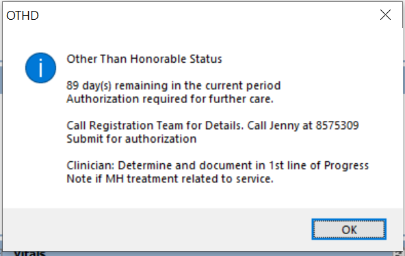
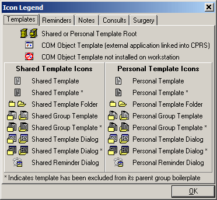
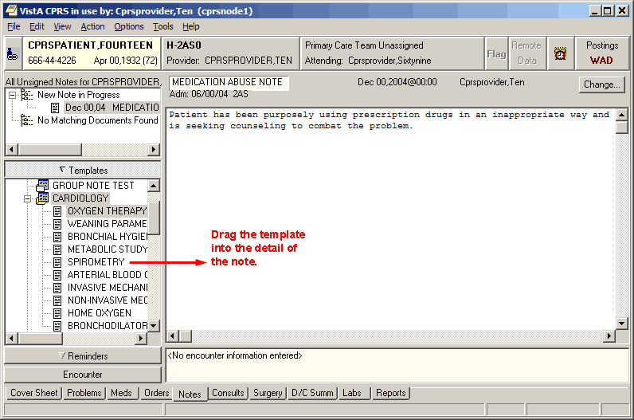

# Setup Guide

# CPRS: GUI Version

# June 2023

[**I. Introduction 1**](#i-introduction)  
[**Purpose of CPRS Setup Guide 1**](#purpose-of-cprs-setup-guide)  
[**Overview of CPRS 2**](#overview-of-cprs)  
[**Differences between OE/RR 2.5 and CPRS 5**](#differences-between-oerr-25-and-cprs)  
[**II. Preparation & Implementation Checklist 8**](#ii-preparation--implementation-checklist)  
[**CPRS Competency Assessment 14**](#cprs-competency-assessment)  
[**III. CPRS Setup Instructions 18**](#iii-cprs-setup-instructions)  
[**A. OE/RR-CPRS Clean-up 19**](#a-oerr-cprs-clean-up)  
[**B. CPRS Configuration (Clinical Coordinator) 21**](#b-cprs-configuration-clinical-coordinator)  
[1. Auto-DC Parameters 22](#1-auto-dc-parameters)  
[2. Key Assignment and Electronic Signature Set-up 23](#2-key-assignment-and-electronic-signature-set-up)  
[Check for Multiple Keys 25](#check-for-multiple-keys)  
[Electronic Signature 25](#electronic-signature)  
[3. Edit DC Reasons 29](#3-edit-dc-reasons)  
[4. GUI Setup 30](#4-gui-setup)  
[GUI Parameters Menu Options 32](#gui-parameters-menu-options)  
[GUI Cover Sheet Display Parameters Menu 32](#gui-cover-sheet-display-parameters-menu)  
[GUI Health Summary Types 35](#gui-health-summary-types)  
[GUI Tool Menu Items 36](#gui-tool-menu-items)  
[Adding an Add Orders Menu to the GUI 37](#adding-an-add-orders-menu-to-the-gui)  
[GUI Add/Edit Local Message for OTH Button 39](#gui-addedit-local-message-for-oth-button)  
[Add Local Message for OTH Button 39](#add-local-message-for-oth-button)  
[Edit/Remove Local Message 40](#editremove-local-message)  
[ZIPM Enter/Edit Missing ZIP Code Message Parameter 41](#_kgcv8k)  
[Enter/Edit Missing ZIP Code Message Parameter 41](#enteredit-missing-zip-code-message-parameter)  
[Edit/Remove Local Message 42](#editremove-local-message-1)  
[Document Templates 43](#document-templates)  
[Template Editor 43](#_3hv69ve)  
[Personal and Shared Templates 44](#_2w5ecyt)  
[Types of Templates 47](#_3vac5uf)  
[Folders 48](#_pkwqa1)  
[Reminder Dialog 48](#_39kk8xu)  
[Arranging Templates for Ease of Use 48](#_1opuj5n)  
[Adding a Template to a Note 48](#_48pi1tg)  
[Searching for Templates 50](#_2nusc19)  
[Previewing a Template 50](#_1302m92)  
[Deleting Document Templates 50](#_3mzq4wv)  
[**Creating Personal Document Templates 51**](#_2250f4o)  
[Personal Template 51](#_haapch)  
[Group Template 51](#_319y80a)  
[Associating a Template with a Document Title, Consult, or Procedure 53](#_1gf8i83)  
[Importing a Document Template 54](#_40ew0vw)  
[Exporting a Document Template 54](#_2fk6b3p)  
[Dialog Template 55](#_upglbi)  
[Reminder Dialog 56](#_3ep43zb)  
[Folder 57](#_1tuee74)  
[View Template Notes 57](#_4du1wux)  
[Copying Template Text 58](#_2szc72q)  
[**Template Fields 59**](#_184mhaj)  
[Using the Template Field Editor 60](#_3s49zyc)  
[Inserting Template Fields into a Template 62](#_279ka65)  
[5. Miscellaneous Parameters 63](#5-miscellaneous-parameters)  
[6. Notifications 66](#6-notifications)  
[Notification Management Menu 71](#notification-management-menu)  
[7. Order Checking 83](#7-order-checking)  
[Order Checking Management Menu 85](#order-checking-management-menu)  
[8. Menu Management 102](#8-menu-management)  
[a. CPRS Menu Assignment 102](#a-cprs-menu-assignment)  
[b. Order Menu Management 105](#b-order-menu-management)  
[Generic Orders 106](#generic-orders)  
[Naming Conventions 106](#naming-conventions)  
[Enter/Edit Orderable Items 107](#enteredit-orderable-items)  
[Enter/edit Prompts 108](#enteredit-prompts)  
[Enter/edit Generic Orders 111](#enteredit-generic-orders)  
[Enter/Edit Quick Orders 119](#enteredit-quick-orders)  
[Enter/Edit Order Sets 133](#enteredit-order-sets)  
[Enter/Edit Actions 135](#enteredit-actions)  
[Enter/Edit Order Menus 136](#enteredit-order-menus)  
[Assign Primary Order Menu 142](#assign-primary-order-menu)  
[Convert Protocols 143](#convert-protocols)  
[Search/Replace Components 144](#searchreplace-components)  
[List Primary Order Menus 145](#list-primary-order-menus)  
[9. Patient and Team Lists 146](#9-patient-and-team-lists)  
[Patient Selection Preference Management Menu 149](#patient-selection-preference-management-menu)  
[10. Print Formats 150](#10-print-formats)  
[11. Print/Report Parameters 158](#11-printreport-parameters)  
[12. Release/Delete Delayed Orders 168](#12-releasedelete-delayed-orders)  
[**C. CPRS Configuration (IRM) 169**](#c-cprs-configuration-irm)  
[1. Order Check Expert System 170](#1-order-check-expert-system)  
[2. ORMTIME and Job Tasking 176](#2-ormtime-and-job-tasking)  
[ORMTIME Main Menu [ORMTIME MAIN] 176](#ormtime-main-menu-ormtime-main)  
[3. CPRS Clean-up Utilities 178](#3-cprs-clean-up-utilities)  
[4. General Parameter Tools 181](#4-general-parameter-tools)  
[Disabling Ordering per User 184](#disabling-ordering-per-user)  
[**D. Other CPRS Configuration 187**](#d-other-cprs-configuration)  
[List Manager Terminal Setup 187](#list-manager-terminal-setup)  
[Nature of Order File 188](#nature-of-order-file)  
[Workstation Hardware 190](#_434ayfz)  
[Local Area Networks 190](#_2i9l8ns)  
[**IV. Set-Up for Other CPRS Packages 192**](#iv-set-up-for-other-cprs-packages)  
[**Parameters for Packages Related to CPRS 192**](#parameters-for-packages-related-to-cprs)  
[**A. Adverse Reaction Tracking (ART) 196**](#a-adverse-reaction-tracking-art)  
[**B. Patient Movement 197**](#b-patient-movement)  
[**C. Consult/Request Tracking 199**](#c-consultrequest-tracking)  
[Sample Hierarchy 200](#sample-hierarchy)  
[Consults Install, Planning, and Implementation Checklist 201](#consults-install-planning-and-implementation-checklist)  
[IMPLEMENTATION AND MAINTENANCE (Abbreviated guidelines) 203](#implementation-and-maintenance-abbreviated-guidelines)  
[Multi-Site 205](#multi-site)  
[**D. Dietetics 206**](#d-dietetics)  
[**E. Health Summary 207**](#e-health-summary)  
[**F. Laboratory 208**](#f-laboratory)  
[Lab Site parameters set within CPRS 208](#lab-site-parameters-set-within-cprs)  
[Inpt Lab Order/Result Search Range 209](#inpt-lab-orderresult-search-range)  
[Lab Site parameters set within Lab 210](#lab-site-parameters-set-within-lab)  
[Lab Patch LR\*5.2\*121 211](#lab-patch-lr52121)  
[**G. Pharmacy Packages 217**](#g-pharmacy-packages)  
[G-1. Pharmacy Data Management (PDM) 217](#g-1-pharmacy-data-management-pdm)  
[G-2. Outpatient Pharmacy Setup 218](#g-2-outpatient-pharmacy-setup)  
[G-3. Inpatient Medications 220](#g-3-inpatient-medications)  
[Inpatient Medications Conversion 220](#inpatient-medications-conversion)  
[*Inpatient Medications Options*](#inpatient-medications-options) [223](#inpatient-medications-options)  
[Inpatient Medications Security Keys 223](#inpatient-medications-security-keys)  
[*Auto-Discontinue Setup*](#auto-discontinue-setup) [223](#auto-discontinue-setup)  
[*Medication Administration Setup*](#medication-administration-setup) [224](#medication-administration-setup)  
[G-3.a IV Setup 224](#g-3a-iv-setup)  
[Site Parameters (IV) [PSJI SITE PARAMETERS] 225](#site-parameters-iv-psji-site-parameters)  
[G-3.b Unit Dose Setup 225](#g-3b-unit-dose-setup)  
[Menus and Security Keys 225](#menus-and-security-keys)  
[Files Needed to Run Unit Dose 226](#files-needed-to-run-unit-dose)  
[**H. Problem List 227**](#h-problem-list)  
[**I. Radiology/Nuclear Medicine 228**](#i-radiologynuclear-medicine)  
[**J. Text Integration Utilities (TIU) 229**](#j-text-integration-utilities-tiu)  
[**V. Troubleshooting 234**](#v-troubleshooting)  
[**VI. Glossary 241**](#vi-glossary)  
[**VA and V**](#va-and-vista-acronyms)[**IST**](#va-and-vista-acronyms)[**A Acronyms 247**](#va-and-vista-acronyms)  
[**Appendix A: Order Set Examples 253**](#appendix-a-order-set-examples)  
# I. Introduction

## Purpose of CPRS Setup Guide

This guide is directed towards staff in IRMS and Clinical Coordinators who will be implementing the CPRS package for their local medical center.

**Post-Installation Set-up**

This guide contains instructions for setting up or editing parameters, menus, notifications, order checking, etc. It primarily focuses on CPRS core implementation (OE/RR), but it also gives a summary of set-up for the other packages interfacing within CPRS. For complete details on implementation of those packages, see their package documentation.

**Troubleshooting & Tricks**

This section contains additional information gleaned from test sites and others that may be helpful to you.

**Current Users of OE/RR 2.5**

Version 1.0 of CPRS (both the GUI and List Manager versions) requires many of the same planning and set-up steps as OE/RR 2.5. Most of the set-up applies to both user interfaces. If you implemented OE/RR 2.5, most of the work you did for 2.5 can be converted with the utilities developed for CPRS. The Pre-installation patch (OR\*2.5\*49) helps you convert menus, quick orders, and parameters for conversion.

**Sites or Services not using OE/RR 2.5**

Your site will require more preparation and setup to customize menus, protocols, quick orders, and parameters. Instructions in this manual can help you with this. You can use options on the Order Menu Management menu (distributed with the pre-installation patch, OR\*2.5\*49, or on the CPRS Configuration Menu when CPRS is installed) to begin creating menus, quick orders, and parameters.

**CPRS Web Page**

Address REDACTED

## Overview of CPRS

CPRS provides clinicians, managers, support staff, researchers, and others an integrated patient record system. VISTA software for Pharmacy, Lab, Radiology, Allergy Tracking, Consults, Dietetics, Progress Notes, Problem List, Scheduling, MAS (A/D/T), Kernel, FileManager, Vitals, PCMM, PCE, TIU, ASU and Clinical Lexicon packages was written or modified to support and communicate with CPRS. OE/RR was completely re-written. Together, these clinical components of VISTA provide a single interface for physicians to manage patient care and records, as well as an efficient means for others to access and use patient information.

**Features:**

-   **Smooth transition from OE/RR** When a VAMC installs CPRS, a fully automated process converts existing orders, order dialogs, orderable items, medications, labs, consults, clinical notifications and other components into CPRS. No patient data is lost and little or no manual conversion is required. Installation of CPRS only requires 1-2 hours of system downtime, with little impact on users and patient care. Because of its “user-friendly” design, most VA clinicians can use CPRS with minimal training.

-   **OE/RR core module**. All basic CPRS tasks occur within the M environment. Tasks relegated to the GUI workstation include those necessary to communicate with the server and to present and obtain data. Specific components of the core M module for OE/RR include:

-   *Order processing and storage*. Processing orders in CPRS includes: 1) order dialog presentation, 2) order checking, 3) appropriate holding/processing/status assignment related to user credentials, order signature status, and filling package, 4) HL7 formatting, and 5) event posting for filling package and other interested parties, 6) receiving order status messages from filling package, and 7) updating the appropriate data files. Order storage in CPRS includes a complete, date/time-stamped history of all events related to the order including status changes, ordering, requesting, and signatory personnel, related order checks, and override reason, flagged order data, and various components related to the filling package.

-   *Mechanism for clinical orderable items*. Orderable items are phrased in physician-friendly terms, centrally stored and can be updated at individual VAMCs. Updating is coordinated between OE/RR core and ancillary packages via HL7 messages.

-   *Flagged orders*. An order can be flagged when it requires special attention. A notification regarding the flagged order is sent to appropriate caregivers assigned to the patient.

-   *Electronic signature*. Orderable items can be assigned varying degrees of electronic signature requirements. Unsigned orders trigger a notification to appropriate patient caregivers.

**CPRS Overview, cont’d**

-   *Encounter management*. Orders are linked with specific patient encounters, facilitating point-of-care management and data exchange with encounter-oriented management processes.

-   *Patient selection*. Extensive patient selection capabilities allow physicians to build patient lists based on ward, room-bed, clinic appointment, patient’s primary provider/attending physician, team and individual patient. Once created, providers’ preferred patient lists are automatically loaded when they access CPRS. For example, a provider can set up a patient list based on each day’s clinic appointments. This list is built automatically each day and displayed to facilitate easier patient selection.

-   **List Manager Interface**. Non-GUI, ANSI terminals use the CPRS List Manager interface. Designed with a great deal of clinician usability feedback, this interface displays allergies, lab results, medications, existing orders, consults, and other clinical data in a format conducive to decision making. The order entry process has been streamlined to gather the most pertinent information necessary to fill the order.

-   **GUI Interface.** Clinical workstations in the Windows environment access CPRS through a Delphi-based Graphical User Interface (GUI). Based on years of prototyping, usability studies, and actual clinical use, the CPRS GUI is a full implementation of results reporting and order entry. It communicates with CPRS server processes through the Kernel Broker client-server utility. Data is exchanged via an extensive list of remote procedure calls.

-   **HL7 Messaging/Event Processing**. Communication between VISTA packages participating in CPRS is accomplished primarily through event-driven HL7 messaging. This approach allows multiple processes to subscribe to a single CPRS event. The structure and content of the HL7 message provides consistent data for processes subscribing to an event. Additional application programmer interfaces (APIs) exist between OE/RR and ancillary packages to provide data not supported by HL7.

-   **VAMC Parameters and Defaults.** Every VAMC has specialized needs regarding CPRS functionality and processing. To allow variation and modification among VAMCs, CPRS provides a hierarchically structured set of parameters. Each parameter can have a user, team, service/section, patient location, division, system, and package value. The extensive set of parameters exported with CPRS allows VAMC administrators and CPRS users to fine-tune the functionalities and processes specific to their needs.

-   **Remote Procedure Calls.** Generically written data extraction/storage remote procedure calls (RPCs) provide access to VISTA clinical data for CPRS interfaces, VAMC-developed software, and HOST/COTS applications.

**CPRS Overview, cont’d**

-   **Consult/Request Tracking**. A fully functional consulting package is exported with CPRS. Integrated tightly with CPRS, consults provides consult ordering/requesting, tracking, and resulting. Consulting events such as requesting and resulting trigger notifications to appropriate health care providers, who can then quickly react to the request or result.

-   **Patient/Team Lists**. Patient and Team List functionality in CPRS provides several methods for linking health care providers with patients. Team relationships can be based on ward, room-bed, provider, specialty, and/or clinic. Membership is updated automatically when patients are admitted, discharged, transferred, or assigned to a clinic.

-   **Expert System**. The CPRS Expert System is a modular, rule-oriented, knowledge-based system. It supports CPRS as the basis for real-time order checking (e.g. critical drug interactions, duplicate orders) and background notifications (e.g. critical lab results, expiring medications.) Components include: a Meta-Dictionary for linking discrete medical concepts with data located in files, messages and dialogs; a Rule Editor for creating and editing medical logic modules (MLMs) or rules which relate meta-dictionary concepts in logical expressions; an Inferencing Engine for processing the rules against data; and a Router for distributing results or messages.

-   **Clinical Notifications.**  The Notifications component generates patient-specific clinical alerts regarding order entry, consult, radiology, lab, pharmacy, dietetics, and A/D/T information. Alerts are displayed to **V***IST***A** users when they sign onto the computer. They can also be delivered to printers, files, and terminals. Many alerts allow recipients to take related follow-up actions. For example, a patient’s unsigned order triggers an alert to appropriate health care providers. When a recipient selects the alert, the follow-up action displays the patient’s unsigned orders and prompts for electronic signature. Via parameters, VAMCs can disable or enable notifications for users, teams, patient locations, services, divisions, and systems.

-   **Order Checking**. Order Checks are messages interactively displayed to the ordering provider during an ordering session. They occur in real-time and are driven by responses entered by the ordering provider in conjunction with existing patient data. Order Checks are rated according to potential clinical danger level. Order check messages with a low or moderate clinical danger level can be ignored. High clinical danger level order checks require the entry of a reason if they are overridden. This information is passed on to the filling package (e.g. pharmacy) as part of the order. All order check messages include a prompt to cancel or change the order. Via parameters, VAMCs can adjust order check clinical danger levels and disable or enable order checks for users, teams, patient locations, services, divisions, and systems.

## Differences between OE/RR 2.5 and CPRS

| **OE/RR 2.5**                                                                                                                                                                                                                                                                                                                | **CPRS 1.0**                                                                                                                                                                                                                                                                                                                                                                                                                                                                                                                                                                                                                                                                                                                                                                                                                                                                                                                                             |
|------------------------------------------------------------------------------------------------------------------------------------------------------------------------------------------------------------------------------------------------------------------------------------------------------------------------------|----------------------------------------------------------------------------------------------------------------------------------------------------------------------------------------------------------------------------------------------------------------------------------------------------------------------------------------------------------------------------------------------------------------------------------------------------------------------------------------------------------------------------------------------------------------------------------------------------------------------------------------------------------------------------------------------------------------------------------------------------------------------------------------------------------------------------------------------------------------------------------------------------------------------------------------------------------|
| 1- Screen-like interface                                                                                                                                                                                                                                                                                                     | Windows and List Manager interfaces                                                                                                                                                                                                                                                                                                                                                                                                                                                                                                                                                                                                                                                                                                                                                                                                                                                                                                                      |
| 2- "Backdoor" packages controlled ordering dialogs                                                                                                                                                                                                                                                                           | CPRS controls all the ordering dialogs                                                                                                                                                                                                                                                                                                                                                                                                                                                                                                                                                                                                                                                                                                                                                                                                                                                                                                                   |
| 3- Multiple patient selection available                                                                                                                                                                                                                                                                                      | Only single patient selection is available except through the Results Reporting Menu                                                                                                                                                                                                                                                                                                                                                                                                                                                                                                                                                                                                                                                                                                                                                                                                                                                                     |
| 4- Select an action, then an item                                                                                                                                                                                                                                                                                            | You now select an item then an action                                                                                                                                                                                                                                                                                                                                                                                                                                                                                                                                                                                                                                                                                                                                                                                                                                                                                                                    |
| 5- Navigation of electronic record took place through a menu structure of options and protocols                                                                                                                                                                                                                              | The List Manager version allows navigation through the electronic record by way of actions that are equivalent to the tabs of a chart; GUI version allows navigation by clicking on tabs                                                                                                                                                                                                                                                                                                                                                                                                                                                                                                                                                                                                                                                                                                                                                                 |
| 6- Outpatient Pharmacy ordering not available through OE/RR                                                                                                                                                                                                                                                                  | Outpatient Pharmacy is now available                                                                                                                                                                                                                                                                                                                                                                                                                                                                                                                                                                                                                                                                                                                                                                                                                                                                                                                     |
| 7- Consults resulting and tracking not available through OE/RR                                                                                                                                                                                                                                                               | Consults fully accessible through CPRS                                                                                                                                                                                                                                                                                                                                                                                                                                                                                                                                                                                                                                                                                                                                                                                                                                                                                                                   |
| 8- No access to Discharge Summary                                                                                                                                                                                                                                                                                            | Discharge Summary is now available thru CPRS                                                                                                                                                                                                                                                                                                                                                                                                                                                                                                                                                                                                                                                                                                                                                                                                                                                                                                             |
| 9- No time-delay ordering capability                                                                                                                                                                                                                                                                                         | Time-delayed orders now available (admission, discharge, and transfer)                                                                                                                                                                                                                                                                                                                                                                                                                                                                                                                                                                                                                                                                                                                                                                                                                                                                                   |
| 10- Actions available for orders: Discontinue Orders Edit Orders Hold/Unhold Orders Flag/Unflag Orders Renew Orders Comments for Ward/Clinic Signature on Chart Results Display Long/Short Order Format Detailed Order Display Print Orders Print Labels Requisition Print Print Chart Copy Print Service Copy Accept Orders | More actions available for orders: Copy Discontinue Change Hold Release Hold Flag Unflag Renew Verify Ward Comments Sign/On Chart Results Details Print List and Print Screen (List Manager actions)  Print Labels Print Requisitions Print Chart Copies Print Service Copies Print Work Copies                                                                                                                                                                                                                                                                                                                                                                                                                                                                                                                                                                                                                                                          |
| 11- Duplicate order was the only order check                                                                                                                                                                                                                                                                                 | Twenty-one Order checks now available  ALLERGY-CONTRAST MEDIA INTERAC  ALLERGY-DRUG INTERACTION  AMINOGLYCOSIDE ORDERED  BIOCHEM ABNORMALITY FOR CONTRA  CLOZAPINE APPROPRIATENESS  CRITICAL DRUG INTERACTION  CT & MRI PHYSICAL LIMITATIONS  DISPENSE DRUG NOT SELECTED  DUPLICATE DRUG THERAPY ORDER  DUPLICATE DRUG ORDER  DUPLICATE ORDER  ERROR MESSAGE  ESTIMATED CREATININE CLEARANCE  GLUCOPHAGE-CONTRAST MEDIA  LAB ORDER FREQ RESTRICTIONS  MISSING LAB TESTS FOR ANGIOGRA  ORDER CHECKING NOT AVAILABLE  POLYPHARMACY  RECENT BARIUM STUDY  RECENT ORAL CHOLECYSTOGRAM  RENAL FUNCTIONS OVER AGE 65                                                                                                                                                                                                                                                                                                                                           |
| 12- Twenty-three Notifications available                                                                                                                                                                                                                                                                                     | Forty Notifications now available  LAB RESULTS  ORDER REQUIRES CHART SIGNATURE  FLAGGED ORDERS  ORDER REQUIRES ELEC SIGNATURE  ABNORMAL LAB RESULTS (ACTION)  ADMISSION  UNSCHEDULED VISIT  DECEASED PATIENT  IMAGING PATIENT EXAMINED  IMAGING RESULTS  CONSULT/REQUEST RESOLUTION  CRITICAL LAB RESULT (INFO)  ABNORMAL IMAGING RESULTS  IMAGING REQUEST CANCEL/HELD  NEW SERVICE CONSULT/REQUEST  SERVICE ORDER REQ CHART SIGN  CONSULT/REQUEST CANCEL/HOLD  NPO DIET MORE THAN 72 HRS  SITE-FLAGGED RESULTS  ORDERER-FLAGGED RESULTS  DISCHARGE  TRANSFER FROM PSYCHIATRY  ORDER REQUIRES CO-SIGNATURE  SITE-FLAGGED ORDER  LAB ORDER CANCELED  STAT ORDER  STAT RESULTS  DNR EXPIRING  FREE TEXT  MEDICATIONS EXPIRING  UNVERIFIED MEDICATION ORDER  NEW ORDER  STAT IMAGING REQUEST  URGENT IMAGING REQUEST  IMAGING RESULTS AMENDED  ORDER CHECK  FOOD/DRUG INTERACTION  ERROR MESSAGE  CRITICAL LAB RESULTS (ACTION)  ABNORMAL LAB RESULT (INFO) |
| 13- Processing action for notifications exported by OE/RR                                                                                                                                                                                                                                                                    | The site can now control the processing action                                                                                                                                                                                                                                                                                                                                                                                                                                                                                                                                                                                                                                                                                                                                                                                                                                                                                                           |
| 14- Problem list available only outside OE/RR                                                                                                                                                                                                                                                                                | Problem List now has a tab in CPRS                                                                                                                                                                                                                                                                                                                                                                                                                                                                                                                                                                                                                                                                                                                                                                                                                                                                                                                       |
| 15- No patient data overview available                                                                                                                                                                                                                                                                                       | The Cover Sheet provides a clinical overview of the patient.                                                                                                                                                                                                                                                                                                                                                                                                                                                                                                                                                                                                                                                                                                                                                                                                                                                                                             |

# II. Preparation & Implementation Checklist

**Recommended Pre-Installation/Implementation Activities**

**1. Facility activities before CPRS**

-   Establish CPRS Implementation committee composed of service chiefs, clinicians, Clinical Application Coordinators (CACs), upper management, and IRM

-   Create Mail Groups for CPRS Super Users, CPRS Admin., and CPRS CACs

-   Recruit a Clinical Champion who is well respected by the clinicians and who can dedicate time to CPRS activities. At both West Palm Beach and Puget Sound, the Clinical Champions assumed the “lion’s share” of the responsibility for making sure their staff were familiar with CPRS before going live.

-   Establish a schedule for CPRS Orientation Kick-Off

-   Establish a Training Schedule for CPRS Super Users and End Users

-   Establish a Training Schedule for Pharmacy Super Users and End Users

**2. Production activities before CPRS is installed into test**

-   Implement Pharmacy Data Management and TIU in Production

-   Create Mirror Image of Production Account for CPRS Test Environment

**3. Test account activities before CPRS**

-   Disable Domains that transmit data, e.g., workload transmittals, PDM transmittals

-   Review Printer set-ups; make sure that printers in patient care areas and supporting areas such as Lab and Pharmacy are NOT defined for use by applications in the test account

-   Review tasked jobs and unschedule tasks that don’t need to be run

-   Install test patches required for CPRS

-   Install OR\*2.5\*49

-   Review protocols that did not convert to Orderable Items

-   Exercise all the options introduced by OR\*2.5\*49

**Pre-Installation/Implementation Activities, cont’d**

**4. Facility Activities after CPRS is installed into test**

-   *Orient your staff to CPRS*: Use existing service meetings to discuss the impact of CPRS. For example, one of your clinical champions may want to attend the Medical Service, Surgical Service, and Ambulatory Care committee meetings to orient the clinicians to CPRS and discuss potential problems and solutions related to patient care practices and the software. West Palm Beach used those meetings to discuss CPRS and exercise the software as a group where each individual played a different role. It was really helpful in terms of making sure all aspects of the software were exercised and in establishing CPRS expertise in key clinicians, ADPACs, and CACs.

-   *Emphasize the impact of installing CPRS:* It is important that your staff understands the impact that the installation of CPRS into production will have on all the current OERR 2.5 users as well as the Outpatient and Inpatient Pharmacy users.

-   *Review site-specific menus:* Make sure that menus created specifically for your site have been reviewed and modified as needed to include CPRS options. Make sure that these changes are documented so that when CPRS is installed into production the changes can be transferred easily.

-   *Exercise every aspect of CPRS:* Make sure that all OE/RR 2.5 users have exercised CPRS functionality that relates to their work processes. Encourage them to exercise the software for at least 4 hours.

-   *Assign individuals to become experts in CPRS functional areas*:

1.  **CPRS Configuration:**

    Establish an understanding of CPRS management.

    *CPRS Configuration (Clin Coord) Options:*

    Allocate OE/RR Security Keys  
Check for Multiple Keys  
Edit DC Reasons  
GUI Parameters ...  
Miscellaneous Parameters  
Notification Mgmt  
Order Checking Mgmt  
Order Menu Management  
Patient List Mgmt  
Print Formats  
Print/Report Parameters  
Release/Cancel Delayed Orders  
**Pre-Installation/Implementation Activities, cont’d**

*CPRS Configuration (IRM) Options:*

Order Check Expert System Main Menu ...  
ORMTIME Main Menu ...  
CPRS Clean-up Utilities ...  
General Parameter Tools ...  
1.  **Consults**

    Establish a good understanding of how to set up services as well as all the consult actions that can be taken on a consult. A Consult expert must be able to help users manage consults through CPRS, TIU, and Consults Requests/Tracking.

    Receive Forward Add Comments  
Cancel Discontinue Detailed Display  
Complete Make Addendum Print SF 513  
1.  **Order Checks**

    Establish a good understanding of what triggers an order check as well as how to manage order checks.

    *Management Options*

    Enable/Disable an Order Check  
Set Clinical Danger Level for an Order Check  
CT Scanner Height Limit  
CT Scanner Weight Limit  
MRI Scanner Height Limit  
MRI Scanner Weight Limit  
Orderable Item Duplicate Order Range  
Lab Duplicate Order Range  
Radiology Duplicate Order Range  
Enable or Disable Order Checking System  
Enable or Disable Debug Message Logging  
Display the Order Checks a User Can Receive  
Link Local Terms with Nat'l Expert System Terms  
1.  **Notifications**:

    Establish a good understanding of what triggers a notification, as well as how to manage notifications.

    *Management Options*

    1 Enable/Disable Notifications  
2 Erase Notifications  
3 Set Urgency for Notifications (GUI)  
4 Set Deletion Parameters for Notifications  
5 Set Default Recipient(s) for Notifications  
6 Set Default Recipient Device(s) for Notifications  
7 Set Provider Recipients for Notifications  
8 Flag Orderable Item(s) to Send Notifications  
**Pre-Installation/Implementation Activities, cont’d**

*Notifications Management Options, cont’d*

9 Archive(delete) after \<x\> Days  
10 Forward Notifications ...  
11 Set Delays for Unverified Orders ...  
12 Set Notification Display Sort Method (GUI)  
13 Send Flagged Orders Bulletin  
14 Determine Recipients for a Notification  
15 Display Patient Alerts and Alert Recipients  
16 Enable or Disable Notification System  
17 Display the Notifications a User Can Receive  
18 Set Surrogate Notification Recipient for a User  
1.  **Order Management**

    Establish a good understanding of all the actions that can be taken on an order for each category of order such as Radiology, Pharmacy, Laboratory, Dietetics, and Consults.

    Change Sign on Chart Flag Verify Details  
Renew Hold Unflag Copy Results Discontinue  
Print… Release Hold Ward Comments  
1.  **Time Delay Orders**

    Establish a good understanding of how time-delayed orders are placed and activated

2.  **Transfer Inpatient Medication Orders to Outpatient Medication Orders**

    Establish a good understanding of how orders are transferred from inpatient to outpatient and vice versa.

-   *Establish consistent use of the software:* Not everyone in the medical center uses the software the same way. For instance, in one service a consult may be considered complete after the physician in the receiving service sees the patient and enters a result. In another service the request may be considered complete if the patient was given a scheduled appointment. Many of these things are process issues, but they need to be tested in each specialty, to make sure everyone is using the same rulebook.

-   *Review Clinical Practices and Administrative Process Work Flows:* Ensure that patient care practices that are specific to your site are carefully reviewed and tested/implemented via CPRS functionality.

**Pre-Installation/Implementation Activities, cont’d**

#### 

*Collect several charts from selected clinical areas*

-   Replicate the ordering process as noted in those charts in CPRS

-   Note timeliness, optimal menus, user configurations, print features, displays etc.

-   Modify the software configurations to accommodate these user groups/clinical areas

-   Save your discoveries for configuring the production account

**5. Facility activities two weeks before CPRS is installed into production**

-   *Alert all CPRS users*: At least one-two weeks before your production installation date, remind your CPRS users that CPRS is coming and that they need to be familiar with the software functionality that will impact them. Offer additional training classes. West Palm Beach administered competency tests to all their users to assess their understanding of how the software functions. An example of a competency test is included with this checklist.

-   *Modify your computer sign-on bulletin*: Consider adding a statement to your computer sign-on bulletin one week before CPRS is installed, informing users that CPRS is coming. Include the scheduled CPRS installation time as well as the expected downtime. We recommend that you consider installing CPRS around 8:00pm on a Friday and plan for at least 2-3 hours downtime.

-   *Create a schedule of patient care areas where CPRS will be implemented:* Create a schedule assigning Super Users and CACs to patient care areas during the first week of CPRS implementation. Staff will need to be scheduled for every shift on every patient care location. You will also need to create an on-call schedule for the most experienced users, e.g., your CACs. Include in that list one or more clinicians who are experts in the software.

-   *Create a protocol for obtaining CPRS help:* During the first week of implementation, it is common for users who are not familiar with CPRS to get lost in the software. Create a protocol for obtaining CPRS help and distribute it to all CPRS Users.

-   *Identify patient care areas that may be problematic:* Avoid potential disasters in patient care areas that require special considerations by anticipating problems and identifying solutions before CPRS is implemented.

**Pre-Installation/Implementation Activities, cont’d**

#### 

-   *Assign installation/implementation responsibilities to staff:* Identify which staff will be available for the installation and what their responsibilities will be related to parameter review, printer set-up reviews, exercising the software, and patient care area patrols.

-   *Assign a CPRS Command Center Coordinator:* Identify the individual at your site who will be the responsible individual at the CPRS Command Center. This individual will need to have a complete understanding of all CPRS functionality and will need to know your staff and the unique problems that could be encountered.

**IRM Activities Just Before CPRS is Installed**

-   *Read the CPRS Installation and Setup Guides:* Make sure you have thoroughly read the CPRS Installation Guide and the CPRS Setup Guide several days before your installation date. Resolve any questions that arise.

-   *Back up your system:* Make a backup of your system no later than the day before you install CPRS.

-   *Ensure that you have adequate disk space:* Make sure you have at least 300-400 mg free disk space before installing CPRS.

-   *Ensure that you have adequate journal space:* Make sure you have adequate journal space available to enable journaling after CPRS is installed. The conversion will continue for approximately 24 – 48 hours after CPRS is installed. You will need to monitor your journal space during the time that the conversion is running.

-   *XQALERT DELETE OLD--Delete Old (\>14 d) Alerts:* Make sure you schedule this option to run daily. If Notifications/Alerts are enabled through CPRS, the \^XTV global will experience a significant growth. Ensuring that this option is run on a daily basis will manage the growth of \^XTV.

-   *Establish downtime procedures:* When CPRS is installed, plan for at least 2-3 hours of downtime. Advise your users and establish downtime procedures.

-   *Allocate OE/RR keys to new CPRS users:* Allocate OE/RR keys to CPRS users who weren’t OE/RR 2.5 users. CPRS uses the same keys as OE/RR 2.5.

## CPRS Competency Assessment

| **\#** | **ACTIVITY**                                                                                                                                                                                                                                                                                                                                                                                                                                                                                                                                | Ok | **Needs Help** |
|--------|---------------------------------------------------------------------------------------------------------------------------------------------------------------------------------------------------------------------------------------------------------------------------------------------------------------------------------------------------------------------------------------------------------------------------------------------------------------------------------------------------------------------------------------------|----|----------------|
| 1      | Renew Current Orders                                                                                                                                                                                                                                                                                                                                                                                                                                                                                                                        |    |                |
| 2      | Discontinue Current Orders                                                                                                                                                                                                                                                                                                                                                                                                                                                                                                                  |    |                |
| 3      | Review Results of Completed Orders                                                                                                                                                                                                                                                                                                                                                                                                                                                                                                          |    |                |
| 4      | **Progress Notes** Enter a Telephone Contact progress note from the Notes Tab. Create a *new* telephone visit to a telephone clinic; use a diagnosis of your choice and a telephone CPT code of 99371 as the procedure for the visit. View a list of Progress Notes Pick one of the authors on the list of notes and display a list of all the notes by that author.                                                                                                                                                                        |    |                |
| 5      | Write New Problems (Problem List) Add a problem to the problem list on a patient. Print the active problems on this patient                                                                                                                                                                                                                                                                                                                                                                                                                 |    |                |
| 6      | Add Allergies Add a new allergy for the patient                                                                                                                                                                                                                                                                                                                                                                                                                                                                                             |    |                |
| 7      | **Pharmacy Orders** Enter/Sign Order for any outpatient medication for hypertension or CHF. Enter/Sign Order for any inpatient medication for hypertension or CHF DC all IV fluid orders Enter an order for IV fluids d5 ½ NS with 2g Mg, 20 meq KCL 120 cc/hr Imagine that you are admitting an outpatient to the hospital. Choose one of the outpatient medications and transfer it to inpatient status.                                                                                                                                  |    |                |
| 8      | Lab Orders Enter/Sign Orders for a CBC & diff, Chem 7 and sputum C&S and gram stain Using the orders tab, print a list of pending lab orders                                                                                                                                                                                                                                                                                                                                                                                                |    |                |
| 9      | Diet Orders Enter an NPO Diet order Enter a “Regular” Diet order                                                                                                                                                                                                                                                                                                                                                                                                                                                                            |    |                |
| 10     | Consults Request a Consult Receive a Consult Forward a Consult Complete a Consult Result Consults in Consult Tab of CPRS, in TIU, and in the Consult package Define a Team for a Consult Service                                                                                                                                                                                                                                                                                                                                            |    |                |
| 11     | Radiology Orders Enter a radiology Order Print the last radiology result                                                                                                                                                                                                                                                                                                                                                                                                                                                                    |    |                |
| 12     | Nursing Orders Enter an order to turn the patient Display a list of active nursing orders                                                                                                                                                                                                                                                                                                                                                                                                                                                   |    |                |
| 13     | Reports Tab Review Outpatient RX Profile Review Dietetic Profile Review Lab Reports Review Health Summary Reports Review Vital Reports                                                                                                                                                                                                                                                                                                                                                                                                      |    |                |
| 14     | Work Through Admission Order Sets Place orders based on an admission order set                                                                                                                                                                                                                                                                                                                                                                                                                                                              |    |                |
| 15     | Patient Inquiry Get the patient’s demographic information and find the patient’s phone number.                                                                                                                                                                                                                                                                                                                                                                                                                                              |    |                |
| 16     | CWAD Review the patient postings for a patient                                                                                                                                                                                                                                                                                                                                                                                                                                                                                              |    |                |
| 17     | Enter Time-Delay Orders Enter a time-delayed order for an immunization and a Pneumovax Enter a time-delayed order for an imaging study.                                                                                                                                                                                                                                                                                                                                                                                                     |    |                |
| 18     | Change your View of Patient Data by: Status  Date range  Service/Section  Short Format                                                                                                                                                                                                                                                                                                                                                                                                                                                      |    |                |
| 19     | Results Reporting Options                                                                                                                                                                                                                                                                                                                                                                                                                                                                                                                   |    |                |
| 20     | Detailed Display: Look at the information included in a detailed display for:  a lab order a pharmacy order a consult.                                                                                                                                                                                                                                                                                                                                                                                                                      |    |                |
| 21     | Verify Orders As a Nurse, Verify an Order As a Ward Clerk, Verify an Order View the Verified Orders through the Orders Tab                                                                                                                                                                                                                                                                                                                                                                                                                  |    |                |
| 22     | Review of List Manager Hidden Actions: + Next Screen  UP Up a Line  AD Add New Orders - Previous Screen  DN Down a Line  RV Review New Orders FS First Screen  \> Shift View to Right CWAD Display CWAD Info LS Last Screen  \< Shift View to Left  PI Patient Inquiry  GO Go to Page PS Print Screen  SL Search List RD Redisplay Screen  PT Print List  EX Exit ADPL Auto Display On/Off                                                                                                                                                  |    |                |
| 23     | List Patient by: Clinic  Primary Provider  Specialty Ward  Team/Personal  Sort Order                                                                                                                                                                                                                                                                                                                                                                                                                                                        |    |                |
| 24     | Select New Patient                                                                                                                                                                                                                                                                                                                                                                                                                                                                                                                          |    |                |
| 25     | Flag/Unflag Orders                                                                                                                                                                                                                                                                                                                                                                                                                                                                                                                          |    |                |
| 26     | Patient List: Through Personal Preferences, create: Clinic Patient List Provider Patient List                                                                                                                                                                                                                                                                                                                                                                                                                                               |    |                |
| 27     | Notifications: Through Personal Preferences, Look at the Notifications you can receive Enable the notifications you want to receive                                                                                                                                                                                                                                                                                                                                                                                                         |    |                |
| 28     | Order Checks Look at the Order Checks you can receive Enable the Order Checks you want to receive                                                                                                                                                                                                                                                                                                                                                                                                                                           |    |                |
| 29     | Review Patient Selection Preferences Set My Preferred Clinic Start Date Set My Preferred Clinic Stop Date Set My Preferred Clinic Sunday Set My Preferred Clinic Monday Set My Preferred Clinic Tuesday Set My Preferred Clinic Wednesday Set My Preferred Clinic Thursday Set My Preferred Clinic Friday Set My Preferred Clinic Saturday Set My Preferred Sort Order for Patient List Set My Preferred List Source Set My Preferred Primary Provider Set My Preferred Treating Specialty Set My Preferred Team List Set My Preferred Ward |    |                |

# III. CPRS Setup Instructions

This section contains instructions and information about setting up CPRS. It is organized according to the sequence of options on the CPRS Manager [ORMGR] Menu.

A. OE/RR Clean-up

B. CPRS Configuration (Clinical Coordinator)

1\. Electronic signature set-up/assigning security keys

2\. GUI setup

3\. Miscellaneous Parameters

4\. Notifications/alerts

5\. Order Checking

6\. Menu management

-   Order Menu Management

-   Menus and menu assignment

7\. Patient and team lists  
8\. Printing set-up

-   Chart copies, labels, requisitions, and other copies

-   Print Formats  
C. CPRS Configuration (IRM)

1\. Order Check Expert System

2\. Purge and Task jobs (ORMTIME Menu)

3\. CPRS Clean-up Utilities ...

D. Other CPRS Configuration

1.  List Manager Terminal Settings  
1.  Nature of Order File  
## A. OE/RR-CPRS Clean-up  
***

We recommend cleaning up and re-setting various files, menus, and parameters before beginning to use CPRS.  
***

**1. CPRS Clean-up Utilities Menu**  
***

The Lab Order Checks options on this menu are used to check and clean up some files as you move from OE/RR 2.5 to CPRS.  
***

**2. Alerts**  
***

Clean up old alerts, either through the option Erase Notifications [ORB3 ERASE NOTIFICATIONS] or by running the Kernel utility XQALERT DELETE OLD.  
*Erase Notifications* lets you do one of the following:  
1\. Erase all notifications for a User

2\. Erase all notifications for a Patient

3\. Erase all instances of a notification (regardless of patient).  
The XQALERT DELETE OLD option can be queued to run regularly. You can set the number of days an alert is held with the option *Archive(delete) after \<x\> Days [ORB3 ARCHIVE PERIOD*] on the Notification Mgmt Menu*.* You can also designate that alerts be forwarded to a surrogate or supervisor after a certain number of days.

Because this option cleans up old alerts (the archives are still kept), it should be run daily/nightly.  
**3. Patient Lists**  
***

Review patient and team lists set up at your hospital to determine if they are all being used, or if some could be combined.  
***

**4. Lab pending orders**  
***

Go through lab orders, especially those with statuses of pending, to see if these are still active orders. Lab doesn't purge old orders as many packages do. At test sites, many inactive lab orders were shown as pending, which caused problems. Clean up your records by discontinuing lab orders you don’t need.  
***

**5. Ward and clinic names**  
***

You may want to rename wards and clinics if you have defined a lot of wards and clinics, especially if many begin with the same standard identifiers.

*Examples:*

ATC/AL Dual Dx Gr

ATC/AL Dual Dx Indiv

ATC/AL Dual Dx Int Outpt Gp

It’s hard to do look-ups on this kind of naming system.  
**6. Consults**  
***

If you had consults categorized as Progress Notes before the Consult/ Request Tracking link to TIU, you may want to delete these if you create new Document Classes and Titles for Consults.  
## B. CPRS Configuration (Clinical Coordinator)

The options and functionality described in this section are in alphabetical order, as listed on the Clinical Coordinator’s CPRS Configuration menu.

**CPRS Configuration (Clin Coord) Menu**

AU Auto-DC Parameters  
AL Allocate OE/RR Security Keys  
KK Check for Multiple Keys  
DC Edit DC Reasons  
GP GUI Parameters ...  
MI Miscellaneous Parameters  
NO Notification Mgmt Menu ...  
OC Order Checking Mgmt Menu ...  
MM Order Menu Management ...  
LI Patient List Mgmt Menu ...  
FP Print Formats  
PR Print/Report Parameters ...  
RE Release/Cancel Delayed Orders  
### 1. Auto-DC Parameters

This option is for editing hospital-wide parameters that control how CPRS automatically discontinues orders on patient movements.

**Example:**

Select CPRS Configuration (Clin Coord) Option: **au** Auto-DC Parameters  
***

Auto-DC Parameters for System: OEX.ISC-SLC.VA.GOV  
\------------------------------------------------------------------------------  
DC Generic Orders on Admission NO  
DC Generic Orders on Ward Transfer NO  
DC on Specialty Change ORDER ENTRY/RESULTS REPORTING YES  
INPATIENT MEDICATIONS YES  
\------------------------------------------------------------------------------  
DC GENERIC ORDERS ON ADMISSION: NO// **\<Enter\>**  
DC GENERIC ORDERS ON WARD TRANSFER: NO// **\<Enter\>**  
***

For DC on Specialty Change -  
Select PACKAGE: **lab**  
1 LAB HL7 OERR LR7O  
2 LAB MESSAGING LA7  
3 LAB ORDER ENTRY LRX  
4 LAB PRE-RELEASE OERR_V3 LR02  
5 LAB SERVICE LR  
Press \<RETURN\> to see more, '\^' to exit this list, OR  
CHOOSE 1-5: **5** LAB SERVICE LR  
Are you adding LAB SERVICE as a new PACKAGE? Yes// **\<Enter\>** YES  
***

PACKAGE: LAB SERVICE//**\<Enter\>** LAB SERVICE LR LAB SERVICE  
Value: **y** YES  
***

For DC on Specialty Change -  
Select PACKAGE: **\<Enter\>**  
### 2. Key Assignment and Electronic Signature Set-up

**Allocate CPRS Security Keys**

The ORES, ORELSE, and OREMAS keys deal with authorization for writing orders. More than one of them should not be assigned to the same user.

**ORES**

-   Assigned to users authorized to write and sign orders.

-   Typically assigned to licensed physician.

-   Allows holders to electronically sign orders.

    **ORELSE**

-   Assigned to users authorized to release physician’s orders.

-   Typically assigned to RN’s.

    **OREMAS**

-   Assigned to users authorized to release patient orders as signed on chart.

-   Typically assigned to Ward Clerks.

**ORSUPPLY**

-   Assigned to users authorized to write and release Supply-only orders.

-   Typically assigned to Nurses who are not currently AUTHORIZED TO WRITE MED ORDERS.

    **Allocate CPRS Security Keys Example**

    Select CPRS Configuration (Clin Coord) Option: AL Allocate OE/RR Security Keys  
***

KEY: ORES  
***

This key is given to users that are authorized to write orders in  
the chart. Users with this key can verify with their electronic  
signature patient orders.  
***

This key is typically given to licensed Physicians.  
***

Orders entered by users with this key can be released to the ancillary  
service for immediate action.  
***

DO NOT give users both the ORES key and the ORELSE key.  
***

Edit Holders? Yes// **\<Enter\>** (Yes)  
***

Select HOLDER: **CPRSPROVIDER,ONE**  
Added.  
***

Select HOLDER: **\<Enter\>**  
==============================================================================  
***

KEY: ORELSE  
***

This key is given to users that are authorized to release doctors  
orders to an ancillary service for action.  
***

This key is typically given to Nurses.  
Users with this key are allowed to put verbal orders in the system  
and release them to the service for action.  
***  
DO NOT give users both the ORES key and the ORELSE key.  
***

Edit Holders? Yes// **\<Enter\>** (Yes)  
***

Select HOLDER: **CPRSNURSE,ONE**  NO  
Added.  
***

Select HOLDER: **\<Enter\>**  
==============================================================================  
***

KEY: OREMAS  
***

This is the key given to MAS Ward Clerks. It allows the user to  
specify patient orders as 'signed on chart' when entered, which  
releases the orders to the service for action. Users with this  
key are not allowed to put verbal orders in the system.  
***

Edit Holders? Yes// **Y** (Yes)  
***

Select HOLDER: **CPRSUSER,ONE** CNO  
Added.  
***

Select HOLDER: **\<Enter\>**  
====================================== ========================================  
### Check for Multiple Keys

This option identifies users who have more than one OR key assigned. It also displays which keys they have.

Users with more than one key can encounter problems when adding orders.

Use the *Allocate CPRS Security Keys* option to delete and re-assign keys for the users listed.

Select CPRS Configuration (Clin Coord) Option: **KK**  Check for Multiple Keys  
This utility identifies users that have more than one OR key assigned.  
Users with more than one key can encounter problems when adding orders.  
Any users listed will need to have their Keys edited and correctly assigned.  
***

Ok to continue? Yes//**\<Enter\>** (Yes)  
CPRSUSER,TWO (1088) has more than 1 OR key: ORES ORELSE OREMAS  
CPRSUSER,ONE (1117) has more than 1 OR key: ORES OREMAS  
CPRSUSER,THREE (1119) has more than 1 OR key: ORES ORELSE OREMAS  
CPRSUSER,FOUR (1306) has more than 1 OR key: ORES ORELSE OREMAS  
CPRSUSER,FIVE (1307) has more than 1 OR key: ORELSE OREMAS  
CPRSUSER,SIX (1314) has more than 1 OR key: ORES ORELSE OREMAS  
CPRS,COORDINATOR (1340) has more than 1 OR key: ORES ORELSE OREMAS  
### Electronic Signature

An electronic signature is the private code that an authorized user types into the system after performing certain actions. For CPRS, it’s used by clinicians entering orders. This signature has the same validity as the written signature on the chart.

Implementing electronic signature for CPRS is a four-step process:

1\. Define the clinician as a provider in the NEW PERSON file.

2\. Assign the clinician the Provider key (while in the NEW PERSON file).

2\. Assign the ORES key to clinicians who have signature authority.

3\. Assign electronic signature codes (this can be done by the coordinator, at the same time as defining the clinician as a provider in the NEW PERSON file, or by the clinician, using *Electronic Signature Code Edit* on the User’s Toolbox menu. See instructions on following pages).

Users may have the ORES key but not have an electronic signature code, and will, therefore, not be allowed to electronically sign orders on the system.

☞**NOTE**: Until ORES key holders have an electronic signature code, the system assumes that orders entered have been entered and manually signed “on chart”; orders are automatically released to the ancillary service for action.

Once ORES key holders have an electronic signature code, they will be prompted to enter the electronic signature after accepting the orders. If the electronic signature code is entered correctly, the orders are released to the ancillary services for action. If the electronic signature code is not entered, or is entered incorrectly, the orders are *not* released to the ancillary services for action, but are held in an unreleased/unsigned status. Key holders are given three chances to correctly enter their signature codes.

**GUI Review and Sign works as follows, according to signature status:**

**User has provider key only (med student):** If there are notes the user can sign, the ES panel appears in Review/Sign Changes; otherwise it is hidden. Orders appear on the list with the checkbox grayed. If the ES is entered for documents, it is NOT applied to the orders.

**User has OREMAS key:** If users (clerks) have entered notes for which they are the author AND orders on behalf of a provider, TWO review screens will appear⎯one prompting for ES for the things the clerk can sign (a note), and one to allow the clerk to process the orders (mark signed on chart).

**User has ORELSE key:** Works the same as for clerks, but the user can also release the orders.

**User has ORES key:** Sees the review screen with the ES prompting, both for notes and orders.

**Note:** Outpatient med orders cannot be released to pharmacy unless an authorized provider signs the order. Verbal, telephoned, and written orders are no longer accepted.

**Electronic Signature Edit option**

Key holders may enter or edit their electronic signature codes through the option, “Electronic Signature Edit,” on the User’s Toolbox menu. To change an existing code, the user must type in the current code and then enter the new one.

**Set-up of Electronic Signature**

If key holders forget their electronic signature codes, they must contact their IRM Service so that the old code can be deleted. Once this has been done, the user will be allowed to enter a new code without having to know the old code. IRM staff can delete the electronic signature code by editing the field, ELECTRONIC SIGNATURE CODE (20.4) in the NEW PERSON file (200), or by using the option, “Clear Electronic Signature Code [XUSESIG CLEAR].”

**Allocate CPRS Security Keys**

1\. Assign the appropriate keys to the appropriate users, using the CPRS Configuration (Clin Coord) option, *Allocate CPRS Security Keys*.

2\. Users add their signature codes through the option, *Electronic Signature Code Edit,* on the User’s Toolbox menu. Users with the ORES key will not see the electronic signature prompts until they do this.

If the ORES key holder hits Enter at the electronic signature prompt (in the List Manager version of CPRS), this dialogue appears:

You did not enter a signature code!  
...orders requiring signature will be marked as 'SIGNED ON CHART'.  
***

Once ORES keyholders add their signature codes, they will see:

To electronically sign these orders...  
Enter Signature Code: (xxxxxxx) \<hidden\>  
SIGNED  
4\. Users with the ORELSE and OREMAS keys will see the following prompts after entering orders:

Select Action: Accept Orders// **\<Enter\>** Accept Orders  
***

...insufficient signature authority  
NOT SIGNED  
Do you want to mark these orders as 'Signed on Chart'? YES// **\<Enter\>** (YES)  
4 a. If ORELSE key holders answer no, the computer dialogue will be:

...insufficient signature authority  
NOT SIGNED  
Do you want to mark these orders as 'Signed on Chart'? YES// **n** (NO)  
These orders have not been signed by an authorized physician  
Do you still want to release these orders to the service? YES//**\<Enter\>**  
NATURE OF ORDER: VERBAL// **\<Enter\>**  
4 b. If OREMAS key holders answer no, the dialogue will be :

...insufficient signature authority  
NOT SIGNED  
Do you want to mark these orders as 'Signed on Chart'? YES// **n** (NO)  
UNRELEASED ORDERS:  
\$ PROTHROMBIN TIME BLOOD PLASMA LB \#1971 WC  
**Electronic Signature Code Edit [XUSESIG]**

**This option on the User’s Toolbox menu (on any VISTA menu) lets you enter or change your initials, signature block information, or office phone number. You can also enter a new Electronic Signature Code or change an existing code. If you forget your existing signature code, you will have to have it deleted by your clinical coordinator or site manager before you can enter a new one.**  
***

Select Option: **tb** User’s Toolbox  
Select User's Toolbox Option: **electronic Signature code Edit**  
This option is designed to permit you to enter or change your Initials, Signature Block Information Office Phone number , and Voice and Digital Pagers numbers. In addition, you are permitted to enter a new Electronic Signature Code or to change an existing code.  
***  
INITIALS: JG// **\<Enter\>**  
SIGNATURE BLOCK PRINTED NAME: **?**  
Enter your name as you want it to appear on official documents  
SIGNATURE BLOCK PRINTED NAME: CPRSUSER/SEVEN// **??**  
The name entered must contain the surname of the user.  
***

This field can then contain the name of the user as they wish it  
to be displayed with the notation that they signed the document  
electronically.  
For example: CPRSPROVIDER,TWO M.D. or CPRSNURSE,TWO RN.  
***

SIGNATURE BLOCK TITLE: CPRSUSER/SEVEN // **??**  
This field should contain the title of the person who is  
electronically signing a document. Examples of titles are Chief  
of Surgery, Dietician, Clinical Pharmacist, etc. This title will  
print next to the name of the person who signs the document. The  
person's name will be taken from the SIGNATURE BLOCK PRINTED NAME  
field.  
SIGNATURE BLOCK TITLE: **Chief of Surgery**  
OFFICE PHONE:  
ANALOG PAGER:  
DIGITAL PAGER:  
Enter your Current Signature Code: \<hidden **CU1234\>** SIGNATURE VERIFIED  
***

ENTER NEW SIGNATURE CODE:\<hidden **CUSER7\>** SIGNATURE VERIFIED  
***

Your typing will not show.  
RE-ENTER SIGNATURE CODE FOR VERIFICATION:\<hidden\> **CUSER7**  
***

DONE  
***  
**Note:**  If the SIGNATURE BLOCK PRINTED NAME and SIGNATURE BLOCK TITLE fields are disabled at your site, contact your supervisor to request entry of your name and title.

### 3. Edit DC Reasons

This option allows you to enter or edit the possible reasons (as listed in the Order Reason file) for discontinuing orders. The exported reasons are:

Duplicate Orders

Discharge

Transfer

Treating Specialty Change

Admit

Requesting Physician Cancelled

Obsolete Order

**Example**

Select CPRS Configuration (Clin Coord) Option: **Edit** DC Reasons  
***

Select DC REASON: **Entered in error**  
Are you adding 'Entered in error' as a new ORDER REASON? No// **y** (Yes)  
ORDER REASON NUMBER: 16// **\<Enter\>**  
NAME: Entered in error// **\<Enter\>**  
SYNONYM: **ER**  
INACTIVE: **\<Enter\>**  
NATURE OF ACTIVITY: **?**  
Answer with NATURE OF ORDER NUMBER, or NAME, or CODE  
Do you want the entire 11-Entry NATURE OF ORDER List? **y** (Yes)  
Choose from:  
1 WRITTEN W  
2 VERBAL V  
3 TELEPHONED P  
4 SERVICE CORRECTION S  
5 POLICY I  
6 DUPLICATE D  
7 REJECTED X  
8 PHYSICIAN ENTERED E  
9 AUTO A  
10 CHANGED C  
11 MAINTENANCE M  
***

NATURE OF ACTIVITY: **4**  
### 4. GUI Setup

**Required Files:**

CPRSChart.exe CPRS executable

CPRS.hlp CPRS help file

HOSTS should reside on the client already

**Steps for setting up the CPRS GUI**

**a.**  Assign OR CPRS GUICHART as a secondary menu item to anyone who will be using the GUI.

**b.** Make sure servers are listed in the HOSTS file. If necessary, modify the HOSTS file of each client (PC) to set the appropriate mappings between names and IP addresses. The HOSTS file is located as follows:

| **Version of Windows OS** | **File (Location and Name)**               |
|---------------------------|--------------------------------------------|
| Windows 95                | C:\\WINDOWS\\HOSTS                         |
| Windows NT 3.51           | C:\\WINDOWS\\SYSTEM32\\DRIVERS\\ETC\\HOSTS |
| Windows NT 4.0            | C:\\WINNT\\SYSTEM32\\DRIVERS\\ETC\\HOSTS   |

**Example of a Windows 95 HOSTS file**  
\# Copyright (c) 1994 Microsoft Corp.  
\#  
\# This is a sample HOSTS file used by Microsoft TCP/IP for Chicago  
\#  
\# This file contains the mappings of IP addresses to host names. Each  
\# entry should be kept on an individual line. The IP address should  
\# be placed in the first column followed by the corresponding host name.  
\# The IP address and the host name should be separated by at least one  
\# space.  
\#  
\# Additionally, comments (such as these) may be inserted on individual  
\# lines or following the machine name denoted by a '\#' symbol.  
\#  
\# For example:  
\#  
\# 102.54.94.97 rhino.acme.com \# source server  
\# 38.25.63.10 x.acme.com \# x client host  
\#  
1) Move the cursor to the end of the last line displayed in the file.

2) Press the Enter Key to create a new line.

3) On the new line, enter the desired IP address beginning in the first column, as described in the example above. As recommended, add an appropriate IP address for the DHCPSERVER Host name as the next entry below 127.0.0.1.

3) After typing the IP address, type at least one space, and enter the Host name that corresponds to that IP address. As recommended, type in DHCPSERVER as the next entry below “loopback.”

For example, the entry for a server at your site with an IP address of 192.1.1.1 would look like this:

127.0.0.1 localhost \# loopback **\<---existing entry**  
192.1.1.1 DHCPSERVER \# cprs **\<---added entry**  
4) Repeat steps a - d until you have entered all of the IP addresses and corresponding Host names you wish to enter.

5) When your entries are complete, use Notepad's **File \| Save** command to save the HOSTS file.

** NOTE:** *Do not save the HOSTS file with an extension; delete the .sam!*

6) Close the HOSTS file.

** NOTE:** The HOSTS file location on NT 4.0 Client is different from on WIN95. The CPRS executable attempts⎯using RPC Broker⎯to log in to the default DHCP server when CPRS executes. RPC Broker cannot find the HOSTS file, so it uses the default.

The best workaround is to create a shortcut to the CPRS executable on your PC:

-   right click on the executable icon

-   select “Properties”

-   add s="your server name" p="your listener port" after the .exe command

    For more information, see the *RPC Broker V.1.1 Systems Manual*.

    **c**. Copy the file CPRSChart1.0.exe and CPRS.hlp to the workstations or put the files in a shared directory on the network. Rename CPRSChart1.0.exe to CPRSChart.

    **d**. **(optional)** If desired, you can either create a shortcut or an icon for CPRSChart or add it to the Start menu.

### GUI Parameters Menu Options

The table below lists the Graphical User Interface (GUI) Parameters menu options, by text, by name, and description.

| **Option Text**                               | **Option Name**           | **Description**                                                                                                                                                                                                                                                       |
|-----------------------------------------------|---------------------------|-----------------------------------------------------------------------------------------------------------------------------------------------------------------------------------------------------------------------------------------------------------------------|
| GUI Cover Sheet Display Parameters            | ORQ SEARCH RANGE MGR MENU | This option allows IRM staff to modify the default number of days to display on the cover sheet.                                                                                                                                                                      |
| GUI Health Summary Types                      | ORW HEALTH SUMMARY TYPES  | This option lets you set up a list of health summary types available in the CPRS GUI (on the Reports tab). Don’t add health summaries that do additional prompting (such as for date ranges & occurrence limits), since the GUI can’t support this type of prompting. |
| GUI Tool Menu Items                           | ORW TOOL MENU ITEMS       | This option lets you add items that will appear on your Tools menu in the CPRS GUI. Items that appear on the tools menu should be Windows executable files.                                                                                                           |
| GUI Add/Edit Local Message for OTH Button     | OTH                       | This option lets you add, edit and remove a local message that displays in the OTH-90 button pop-up window in CPRS GUI.                                                                                                                                               |
| Enter/Edit Missing ZIP Code Message Parameter | ZIPM                      | This option lets you add, edit and remove a local message that displays in the “Controlled substance prescriptions require a patient address” pop-up window in CPRS GUI.                                                                                              |

### GUI Cover Sheet Display Parameters Menu

Options on this menu are used to set the default date or item ranges of items displayed on the CPRS GUI Cover Sheet.

| **Option Text**                              | **Option Name**                | **Description**                                                                                                                                                                                                                                                                                                  |
|----------------------------------------------|--------------------------------|------------------------------------------------------------------------------------------------------------------------------------------------------------------------------------------------------------------------------------------------------------------------------------------------------------------|
| GUI Cover Sheet Division Display Parameters  | ORQ SEARCH RANGE               | This option allows you to modify a *division's* default number of days to display on the cover sheet for Inpatient Lab Orders and Results, Outpatient Lab Orders and Results, Radiology Exams, Consult/Requests, Appt Start Dates, Appt Stop Dates, Visit Start Dates, Visit Stop Dates, and Clinical Reminders. |
| GUI Cover Sheet Location Display Parameters  | ORQ SEARCH RANGE               | This option allows you to modify a *location's* default number of days to display on the cover sheet for Inpatient Lab Orders and Results, Outpatient Lab Orders and Results, Radiology Exams, Consult/Requests, Appt Start Dates, Appt Stop Dates, Visit Start Dates, Visit Stop Dates, and Clinical Reminders. |
| GUI Cover Sheet Service Display Parameters   | ORQ SEARCH RANGE SERVICE PARAM | This option allows you to modify a *service's* default number of days to display on the cover sheet for Inpatient Lab Orders and Results, Outpatient Lab Orders and Results, Radiology Exams, Consult/Requests, Appt Start Dates, Appt Stop Dates, Visit Start Dates, Visit Stop Dates, and Clinical Reminders.  |
| GUI Cover Sheet System Display Parameters    | ORQ SEARCH RANGE SYSTEM PARAM  | This option allows you to modify the *system's* default number of days to display on the cover sheet for Inpatient Lab Orders and Results, Outpatient Lab Orders and Results, Radiology Exams, Consult/Requests, Appt Start Dates, Appt Stop Dates, Visit Start Dates, Visit Stop Dates, and Clinical Reminders. |
| GUI Cover Sheet User Display Parameters      | ORQ SEARCH RANGE USER PARAM    | This option allows a *user* to modify the default number of days to display on the cover sheet for Inpatient Lab Orders and Results, Outpatient Lab Orders and Results, Radiology Exams, Consult/Requests, Appt Start Dates, Appt Stop Dates, Visit Start Dates, Visit Stop Dates, and Clinical Reminders.       |

**GUI Cover Sheet User Display Parameters Example**

This option allows you to modify the *user’s* default number of days to display on the cover sheet for Inpatient Lab Orders and Results, Outpatient Lab Orders and Results, Appt Start and Stop Dates, Visit Start and Stop Dates, and Clinical Reminders.

All of the options on this menu are very similar to this example.

Select GUI Parameters Option: **US**  GUI Cover Sheet Display Parameters  
***

SY GUI Cover Sheet System Display Parameters  
DI GUI Cover Sheet Division Display Parameters  
SE GUI Cover Sheet Service Display Parameters  
LO GUI Cover Sheet Location Display Parameters  
US GUI Cover Sheet User Display Parameters  
***

Select GUI Cover Sheet Display Parameters Option: US GUI Cover Sheet User Display Parameters  
Select NEW PERSON NAME: **CPRSPROVIDER,FIVE** CPF  
***

GUI Cover Sheet - User for User: CPRSPROVIDER,FIVE  
\----------------------------------------------------------------------------  
Lab Order/Result Inpatient Date Range 60  
Lab Order/Result Outpatient Date Range  
Appt Search Start Date  
Appt Search Stop Date  
Visit Search Start Date  
Visit Search Stop Date  
Clinical Reminders for Search  
\----------------------------------------------------------------------------  
Inpatient Lab Number of Display Days: 60//  
Outpatient Lab Number of Display Days: 120  
Appt Search Start Date: T// T-30  
Appt Search Stop Date: T+90// T+60  
Visit Search Start Date:T-365// T-30  
Visit Search Stop Date: T// T+60  
***

For Clinical Reminders for Search -  
Select Number: 10  
Are you adding 10 as a new Number? Yes// YES  
***

Number: 10//**\<Enter\>** 10  
Value: **?**  
Answer with PCE REMINDER/MAINTENANCE ITEM NAME, or REMINDER TYPE, or  
PRINT NAME  
Do you want the entire 34-Entry PCE REMINDER/MAINTENANCE ITEM List? **Y** (Yes)  
Choose from:  
VA-\*BREAST CANCER SCREEN  
VA-\*CERVICAL CANCER SCREEN  
VA-\*CHOLESTEROL SCREEN (F)  
VA-\*CHOLESTEROL SCREEN (M)  
VA-\*COLORECTAL CANCER SCREEN (  
VA-\*COLORECTAL CANCER SCREEN (  
VA-\*FITNESS AND EXERCISE SCREE  
VA-\*HYPERTENSION SCREEN  
VA-\*INFLUENZA IMMUNIZATION  
VA-\*PNEUMOCOCCAL VACCINE  
VA-\*PROBLEM DRINKING SCREEN  
VA-\*SEAT BELT AND ACCIDENT SCR  
**GUI Cover Sheet User Display Parameters, cont’d**

VA-\*TETANUS DIPTHERIA IMMUNIZA  
VA-\*TOBACCO USE SCREEN  
VA-\*WEIGHT AND NUTRITION SCREE  
VA-ADVANCED DIRECTIVES EDUCATI  
VA-ALCOHOL ABUSE EDUCATION  
VA-BLOOD PRESSURE CHECK  
VA-BREAST EXAM  
VA-BREAST SELF EXAM EDUCATION  
VA-DIGITAL RECTAL (PROSTATE) E  
VA-EXERCISE EDUCATION  
VA-FECAL OCCULT BLOOD TEST  
VA-FLEXISIGMOIDOSCOPY  
VA-INFLUENZA VACCINE  
VA-MAMMOGRAM  
VA-NUTRITION/OBESITY EDUCATION  
VA-PAP SMEAR  
VA-PNEUMOVAX  
VA-PPD  
VA-PSA  
VA-SEAT BELT EDUCATION  
VA-TOBACCO EDUCATION  
VA-WEIGHT  
***

Value: INFLUENZA **??**  
Value: **VA-INFLUENZA VACCINE**  
***

For Clinical Reminders for Search -  
Select Number: **\<Enter\>**  
***

### GUI Health Summary Types

Use this option to enter Health Summary types that may be displayed on the Reports screen. Include only health summaries that do no additional prompting, such as for time and occurrence limits; these must be already defined. Since the GUI can’t drop into a character-based scrolling dialog, ad hoc health summaries are not allowed.

Select GUI Parameters Option: **HS** GUI Health Summary Types  
***

\--- Setting Allowable Health Summary Types for System: OEX.ISC-SLC.VA.GOV  
***

Sequence: **?**  
***

Enter the sequence in which this health summary should appear in the list.  
Select Sequence: 1  
Sequence: 1// 1  
Health Summary: **GMTS HS EYE CLINIC**  
Select Sequence: **\<Enter\>**  
***

CS GUI Cover Sheet Display Parameters ...  
HS GUI Health Summary Types  
TM GUI Tool Menu Items  
***

Select GUI Parameters Option: \<Enter\>  
### GUI Tool Menu Items

This option lets you add items that will appear on your Tools menu in the CPRS GUI. Items that appear on the tools menu should be Windows executable files. Enter them in this format: “Display Text=Executable.”

For example, Vista Terminal Emulator=KEA.EXE VISTA.

Select GUI Parameters Option: tm **GUI** Tool Menu Items  
***

CPRS GUI Tools Menu may be set for the following:  
***

1 User USR [choose from NEW PERSON]  
2 Location LOC [choose from HOSPITAL LOCATION]  
3 Division DIV [REGION 5]  
4 System SYS [OEX.ISC-SLC.VA.GOV]  
***

Enter selection: **1** User NEW PERSON  
Select NEW PERSON NAME: **CPRSPROVIDER,FIVE** CPF  
***

\------------- Setting CPRS GUI Tools Menu for User: CPRSPROVIDER,FIVE----------  
Sequence: **?**  
***

Enter the sequence in which this menu item should appear.  
Select Sequence: **1**  
Are you adding 1 as a new Sequence? Yes// **YES**  
Sequence: 2// **\<Enter\>**  
***

Name=Command: **??**  
***

This parameter may be used to identify which items should appear on the  
tools menu which is displayed by the CPRS GUI. Each item should contain  
a name that should be displayed on the menu, followed by an equal sign,  
followed by the command string used to invoke the executable. This  
string may also include parameters that are passed to the executable.  
Some example entries are:  
***

Hospital Policy=C:\\WINNT\\SYSTEM32\\VIEWERS\\QUIKVIEW.EXE LOCPLCY.DOC  
VISTA Terminal=C:\\PROGRA\~1\\KEA\\KEAVT.EXE VISTA.KTC  
***

An ampersand may be used in the name portion to identify a letter that  
should be underlined on the menu for quick keyboard access. For example,  
to underscore the letter H in Hospital Policy, enter \&Hospital Policy as  
the name part.  
***

Name=Command: **c:\\MSOFFICE\\\$WINWORD.EXE**  
***

Example: Notepad=C:\\WINDOWS\\NOTEPAD.EXE.  
***

Name=Command:  
### Adding an Add Orders Menu to the GUI

The parameters that control the "Write Orders" list are edited through the General Parameter Tools menu (XPAR MENU TOOLS).

**Using General Parameter Tools on the CPRS Configuration menu (IRM)**

1\. Use the *List Values for a Selected Parameter* option to see how the parameter for the write orders list is exported (the package level of the parameter ORWOR WRITE ORDERS LIST).

2\. Use *Edit Parameter Values*, select ORWOR WRITE ORDERS LIST.

3\. Select "System" to enter the dialogs and menus that you want to appear in the list at your site.

**Using Order Menu Management - Enter/edit order menus on the CPRS configuration menu (Clin Coord).**

1\. Create a new menu. Remember, this menu will be what shows up in the list box on the left side of the orders tab, so it should be a single column. You can put what you want in this list. The idea was that it would contain the most common ordering menus and dialogs to which a user needs access.

2\. After creating the menu, use *Edit Parameter Values* and select ORWDX WRITE ORDERS LIST as the parameter.

3\. Select "System" and enter the menu you just created as the value. You can override by exception what you set for the system level by setting the parameter for a particular division or user. The ORWDX WRITE ORDERS LIST parameter takes precedence over the ORWOR WRITE ORDERS LIST parameter, if both are present.

You can find what was on the "Write Orders" list to start with by using the parameter tools menu (XPAR MENU TOOLS), selecting List Values for a selected parameter, and entering ORWOR WRITE ORDERS LIST as the parameter. The exported list will be preceded by PKG. If the list has been modified at your site, each item will be preceded by SYS. If a list has been set up for a specific user, it will be preceded by USR.

The "Write Orders" list, as exported, contains the following dialogs:

Sequence Value Display Name  
30 FHW1 Diet  
52 PSJ OR PAT OE Meds, Inpatient  
55 PSO OERR Meds, Outpatient  
58 PSJI OR PAT FLUID OE IV Fluids  
60 LR OTHER LAB TESTS Lab Tests  
70 RA OERR EXAM Radiology  
80 GMRCOR CONSULT Consult  
85 GMRCOR REQUEST Procedure  
90 GMRVOR Vitals  
99 OR GXTEXT WORD PROCESSING ORDER Text Only Order  
The sequence is just an arbitrary number to indicate the order that the dialog should be in the list.

Select OPTION NAME: **ORMGR** CPRS Manager Menu menu  
***

CL Clinician Menu ...  
NM Nurse Menu ...  
WC Ward Clerk Menu ...  
PE CPRS Configuration (Clin Coord) ...  
IR CPRS Configuration (IRM) ...  
***

Select CPRS Manager Menu Option: **IR** CPRS Configuration (IRM)  
***

OC Order Check Expert System Main Menu ...  
TI ORMTIME Main Menu ...  
UT CPRS Clean-up Utilities ...  
XX General Parameter Tools ...  
***

Select CPRS Configuration (IRM) Option: **XX** General Parameter Tools  
***

LV List Values for a Selected Parameter  
LE List Values for a Selected Entity  
LP List Values for a Selected Package  
LT List Values for a Selected Template  
EP Edit Parameter Values  
ET Edit Parameter Values with Template  
***

Select General Parameter Tools Option: **EP** Edit Parameter Values  
\--- Edit Parameter Values ---  
***

Select PARAMETER DEFINITION NAME:**ORWDX** WRITE ORDERS LIST Menu for Write  
Orders List  
***

ORWDX WRITE ORDERS LIST may be set for the following:  
***

2 User USR [choose from NEW PERSON]  
7 Division DIV [REGION 5]  
8 System SYS [OEX.ISC-SLC.VA.GOV]  
***

Enter selection: **2** User NEW PERSON  
Select NEW PERSON NAME: **CPRSPROVIDER,FIVE** CPF  
***

\----------- Setting ORWDX WRITE ORDERS LIST for User: CPRSPROVIDER,FIVE------  
Order Dialog: **??**  
***

Choose from:  
FHWMENU  
GMRVORMENU  
OR ADD MENU CLINICIAN  
OR GMENU ACTIVITY ORDERS  
OR GMENU ORDER SETS  
OR GMENU OTHER ORDERS  
OR GMENU PATIENT CARE ORDERS  
OR GXMOVE PATIENT MOVEMENT  
ORZ WHATEVER  
ZZCURTIS  
ZZJFR MENU  
ZZJFR TEST MENU  
ZZKCM MENU  
ZZKCM MENU 1  
ZZMARCIA  
ZZMEL MENU  
ZZRV1  
***

Order Dialog: **ZZMEL MENU**  
### GUI Add/Edit Local Message for OTH Button

This option lets you add, edit and remove a local message that displays in the OTH/OTH-90 pop-up window in CPRS GUI. To navigate to this option, select option OTH from the GUI Parameters menu option; see new option highlighted (yellow) below:

CS GUI Cover Sheet Display Parameters ...

HS GUI Health Summary Types

TM GUI Tool Menu Items

MP GUI Parameters - Miscellaneous

UC GUI Clear Size & Position Settings for User

RE GUI Report Parameters ...

NV GUI Non-VA Med Statements/Reasons

EX GUI Expired Orders Search Hours

RM GUI Remove Button Enabled

NON GUI Remove Button Enabled for Non-OR Alerts

ZIPM Enter/Edit Missing ZIP Code Message Parameter

OTH GUI Add/Edit Local Message for OTH Button

CLOZ GUI Edit Inpatient Clozapine Message

COAG GUI Anticoagulation Parameters ...

DEA GUI ePCS Management Menu ...

EIE GUI Mark Allergy Entered in Error

#### Add Local Message for OTH Button

To add a local message to display in the OTH-90 pop-up window in CPRS GUI follow the steps below:

1.  Select GUI Parameters Option: OTH GUI Add/Edit Local Message for OTH Button OR OTH BTN LOCAL MSG ADD/EDIT.  
1.  Add optional text in line 1 and press enter when finished.  
1.  Add optional text in line 2 and press enter when finished.  
The following is an example of the new feature.  
Add/Edit Text for Display in OTH Button in CPRS

\-----------------------------------------------

The text 'Call Registration Team for Details.' will always be displayed.

It cannot be edited or deleted.

All messages will display like this:

Call Registration Team for Details. Optional Line 1

Optional Line 2

Current Local Message:

Call Registration Team for Details.

When you press enter on line two, you will be returned to the GUI Parameters menu options.

An example of a local message is shown below.

Enter Line 1 (optional, 24 char max): // Call Jenny at 8575309

Enter Line 2 (optional, 70 char max): // Submit for authorization

The figure below is an example of the local message displayed in OTH pop-up window in CPRS GUI.

**Figure 1 OTH popup window in CPRS GUI**  
### Edit/Remove Local Message

To edit a local message follow the steps below:

1.  From GUI Parameters menu, enter option: OTH GUI Add/Edit Local Message for OTH Button.  
1.  Editing is consistent with fileman options, such as Replace \<type the text you with to replace\> With \<type new text to display\>.  
1.  To remove a line of text, type @ and press enter.  
1.  Once you press enter at line two (2), you will be returned to the GUI Parameters menu.  
### ZIPM Enter/Edit Missing ZIP Code Message Parameter

This option lets you add, edit and remove a local message that displays in the pop-up window in CPRS GUI when an attempt is made to place an Outpatient Controlled Substance medication order for a patient with a United States address and no ZIP code. The custom message should contain contact information for the person or office responsible for updating patient address information at the local facility.

Select GUI Parameters Option:

CS GUI Cover Sheet Display Parameters ...

HS GUI Health Summary Types

TM GUI Tool Menu Items

MP GUI Parameters - Miscellaneous

UC GUI Clear Size & Position Settings for User

RE GUI Report Parameters ...

NV GUI Non-VA Med Statements/Reasons

EX GUI Expired Orders Search Hours

RM GUI Remove Button Enabled

NON GUI Remove Button Enabled for Non-OR Alerts

ZIPM Enter/Edit Missing ZIP Code Message Parameter

OTH GUI Add/Edit Local Message for OTH Button

CLOZ GUI Edit Inpatient Clozapine Message

COAG GUI Anticoagulation Parameters ...

DEA GUI ePCS Management Menu ...

EIE GUI Mark Allergy Entered in Error

#### Enter/Edit Missing ZIP Code Message Parameter

To add a custom missing ZIP code message to display in the “Controlled substance prescriptions require a patient address” pop-up window in CPRS GUI, follow the steps below:

1.  At the “Enter selection:” prompt, select “Division” to enter/edit a custom message for a specific Division, or “System” to enter/edit a custom default message for the entire facility. If a custom message is entered for both a specific Division and System, the System message will continue to display for Divisions for which a specific custom message was not entered.  
1.  If “Division” was entered in Step 1, enter the division at the “INSTITUTION NAME:” prompt. If “System” was entered in Step 1, proceed to step 3.  
1.  At the “Value:” prompt, enter the contact information for the person or office responsible for updating patient address information at the local facility.  
When you press Enter on line three, you will be returned to the GUI Parameters menu options.

Example, entering custom ZIP code message:

Patient Missing ZIP Code Message may be set for the following:  
***

1 Division DIV [choose from INSTITUTION]  
2 System SYS [DOSO.FO-BIRM.MED.VA.GOV]  
***

Enter selection: 1 Division INSTITUTION  
Select INSTITUTION NAME: ALBANY OPC NY OCMC 500A4  
***

\--- Setting Patient Missing ZIP Code Message for Division: ALBANY OPC ---  
Value: Please contact Cprsname Admin at (800) 555-1212.  
Example of the pop-up window that displays when an attempt is made to place an Outpatient Controlled Substance medication order for a patient with a United States address and no ZIP code:

### Edit/Remove Local Message

To edit or remove a custom ZIP code message follow the steps below:

1.  From GUI Parameters menu, enter option: ZIPM Enter/Edit Missing ZIP Code Message Parameter.  
1.  Editing is consistent with fileman options, such as Replace \<type the text you with to replace\> With \<type new text to display\>.  
1.  To remove a line of text, type @ and press enter.  
1.  Once you press enter at line two (2), you will be returned to the GUI Parameters menu.  
### Document Templates

With the CPRS GUI, you can create document templates to make writing or editing progress notes, completing consults, or writing discharge summaries quicker and easier. In addition, you can import or export templates and convert Microsoft Word files to document templates.  
**Template Editor**  
The Template Editor is used to create and manage document templates. To access the Template Editor select **Options \| Create New Template…**from the Notes, Consults, or D/C Summ tab.**  
**  

The Template Editor window  
For an explanation of the icons used in the Template Editor, select **Tools** \| **Template Icon Legend** and click the **Templates** tab.   
  
  
The Icon Legend

**Personal and Shared Templates**  
You can create and use your own templates or you can use shared templates created by your Clinical Coordinator.  
**Personal Templates**  
Authorized users can create personal templates. You can copy and paste text into a template, type in new content, add template fields, or copy a shared template into your personal templates folder. A shared template that you simply copy into your personal templates folder without changing continues to be updated whenever the original template is changed or modified in the Shared Templates folder. Once you personalize or change the copy of the shared template in your personal templates field, the icon used to represent it changes and it becomes a personal template. From that moment on, the personal template is not related to the shared template and is not updated with the original. In the tree view, personal template and folder icons have a folded upper right corner.  
**Shared Templates.**  
Only members of the Clinical Coordinator Authorization/Subscription Utility (ASU) class can create shared templates. Shared templates are available to all users. Clinical Coordinators can copy and paste text into a template, type in new content, add Template Fields, or copy a personal template and then modify it as needed. In the tree view, shared template and folder icons do not have a folded corner.  
**Note**: When you install CPRS, a copy of all your existing boilerplate titles is placed in the inactive boilerplates folder under shared templates.  
Clinical Coordinators can arrange the boilerplate titles that have been copied into the shared templates, use them to create new shared templates, or make them available to users by moving them out of the inactive boilerplates folder. Users will not see the inactive boilerplates folder or its templates unless you choose to make the folder active.  
**To activate the boilerplates folder, Clinical Coordinators should follow these steps:**  
1.  Open the Templates Editor.  
1.  Verify that Edit Shared Templates is checked.  
1.  Uncheck Hide Inactive (under shared templates).  
1.  Click the plus sign beside the shared icon.  
Shared Templates includes a lock property that prevents users from making personal changes when it has been set. The status of the lock property is displayed in a check box on the Template Editor dialog. When the Shared Templates root template is locked, no shared templates can be modified.  
For more information on boilerplates, refer to the *Text Integration Utility User Manual*.  
Another area of shared templates is creating Patient Data Object templates for newly created TIU objects that will enable users to place these objects into their other templates.  
**To create a new Patient Data Object template, use the following steps:**  
1.  Open the Template Editor by selecting from the Notes, Consults, or DC/Summ tab by selecting **Options \| Edit Shared Templates…**.

2.  Verify that Edit Shared Templates is checked.

3.  Expand the treeview of Shared Templates and then Patient Data Objects by clicking on the plus sign beside each.

4.  Click on the existing object above which you want your new object to be.

5.  Click New Template and edit the name of the template.

6.  Place the cursor in the Template Boilerplate box and select Edit \| Insert Patient Data Object or right-click and select Insert Patient Data Object to bring up a dialog containing a list of TUI objects.

7.  Click the appropriate TIU object (that was probably just created).

8.  Click **Apply** or **OK** to make the new object available in GUI templates.  
**Mark a Template as Default**  
A default template will automatically be selected the first time you open the Templates Drawer. The default template can also be accessed at any time with the Go to Default Template option. Each tab (Notes, Consults, and D/C Summ) can have its own default templates.

**To set a template as your default template, follow these steps:**  
1.  Open the Template Drawer on the Notes tab by clicking on it.  
    The available templates will be displayed in a tree view.  
1.  Right-click on any template and select Mark as Default from the right-click menu.  

You can set a template as your default template with a right click menu option.

**Hide Child Templates**  
**To make child templates unavailable from the template drawer, follow these steps:**  
1.  Start the Template Editor by selecting **Options** \| **Edit Templates** from the Notes tab.  
1.  Click Hide Dialog Items from the Dialog Properties option group.  
1.  Click **OK**.  
**Display Only**  
Click this check box to make individual parts of a dialog as display only. When a template is display only, the check box is removed and the item is used for information or instructions  
***

**Only Show First Line**  
Click on this check box and the template will display only the first line of text followed by an ellipsis (...). The ellipsis indicates that more text exists. Hold the cursor over the line of text and a Hint box displays the complete text. This feature gives you the ability to have long paragraphs of text that do not take up a lot of room on the template. If selected, the entire paragraph is be inserted into the note.  
***

**Indent Dialog Items**  
Clicking on this check box affects the way that children items are displayed on the template. When selected, this feature gives the ability to show hierarchical structure in the dialog. All of the subordinate items for the selected item are indented.  
**One Item Only**  
Clicking on this check box affects the way that children items are displayed on the template. Click on this check box if you want to allow only one of the subordinate items to be selectable. Clicking on this check box changes the check boxes into radio buttons so that only one item can be selected at a time. To deselect all items, click on the one that is selected and the radio button will be cleared.  
***

**Hide Dialog Items**  
Clicking on this check box affects the way that children items are displayed on the template. Click on this option to have subordinate items appear only if the parent item is selected. This feature allows for custom user input. The user only sees the options related to the items selected. This feature requires boilerplated text at the parent level.  
***

**Allow Long Lines**  
*A check box in the Template Editor named “Allow Long Lines” allows template lines to be up to 240 characters in length. This feature mainly accommodates template field markup.*

**Types of Templates**  
When you create templates, you can go directly into the Template Editor. There, you can type in text, and add Template Fields. If you are in a document and type in something you will use repeatedly, you simply select that text, right-click, select Create New Template, and the editor comes up with the selected text in the editing area. You can create individual templates, group templates, dialog templates, folders, or link templates to Reminder dialogs. Template dialogs are resizable.  
***

**Templates**  
Templates contain text, TIU objects, and Template Fields that you can place in a document.  
***

**Group Templates**  
Group templates contain text and TIU objects and can also contain other templates. If you place a group template in a document, all text and objects in the group template and all the templates it contains (unless they are excluded from the group template) will be placed in the document. You can also expand the view of the group template and place the individual templates it contains in a document one at a time.  
***

**Dialog Templates**  
Dialog templates are like group templates in that they contain other templates. You can place a number of other templates under a dialog template. Then, when you drag the dialog template into your document, a dialog appears that has a checkbox for each template under the Dialog template. The person writing the document can check the items they want and click OK to place them in the note.  
**Folders**  
Folders are used to group and organize templates and assist in navigating the template tree view. For example, you could create a folder called "radiology" for all of the templates relating to radiology.  
**Reminder Dialog**  
Reminder dialogs can be linked to templates. This allows you to place orders and enter PCE information, vitals information, and mental health data from a template. (Refer to Creating Reminder Dialogs for this procedure.)  
**Arranging Templates for Ease of Use**  
You can use file cabinets and folders to group similar templates together to make them easier to find and use. For example, you may want to place all of the pulmonary templates together rather than listing the templates in alphabetical order.  
**Adding a Template to a Note**  
**To add a template to a Note, use the following steps:**  
1.  From the Notes tab, create a new note by clicking on **New Note**.  
1.  Complete the Progress Note Properties dialog.  
1.  Click **OK**.  
    The Progress Note Properties dialog will close and the Templates Drawer will appear above the Reminder Drawer.  
The Templates Drawer  
1.  Click the **Templates** drawer  
    The available templates will appear.  
1.  Select the template that you would like to use (click the + to expand a heading)  
1.  Drag the template into the detail area of the note  
    \-or-  
    double click on the template  
    \-or-  
    right click on the template and select Insert Template.  
  
Drag the template into the detail area of the note.  
**Searching for Templates**  
**To search for a template, use the following steps:**  
1.  Right-click in the tree view (in either the Template Editor or the Templates drawer).  
1.  Select the appropriate option: Find Templates, Find Personal Templates, or Find Shared Templates (depending on which tree view you are in).  
    A search screen will appear.  
**Note**: You may want to narrow your search by using the Find Options feature.  
1.  Enter the word or words you want to find and check the appropriate boxes.  
1.  Click **Find**.  
1.  If you do not find the template you want, scan the list or click **Find Next**.  
1.  Repeat step 5 until you find the desired template.  
**Previewing a Template**  
**To preview a template before inserting it into your document, follow these steps:**  
1.  Right-click the template in the Templates drawer on the Notes tab.  
1.  Select Preview/Print Template.  
    The preview dialog will appear.  
      
    **Note**: You can print a copy of the template by pressing the Print button.  
**Deleting Document Templates**  
**To delete a document template, follow these steps:**  
1.  Click the **Notes**, **Consults**, or **D/C Summ** tab.  
1.  Select **Options \| Edit Templates**   
    \-or-  
    if the Templates drawer is open, right-click in the drawer and select **Edit Templates**.  
1.  Find the template you want to delete. (Click the + sign to expand a heading.)  
1.  Right-click the template you want to delete and select **Delete**.   
    \-or-  
    select the template you want to delete and then click the **Delete** button under the tree view.  
1.  Click **Yes** to confirm the deletion.  
**Creating Personal Document Templates**  
To speed document creation, you can create personal templates consisting of text, Template Fields, and Patient Data Objects. You can use the templates to create progress notes, complete consults, and write discharge summaries.  
**Personal Template**  
To create a personal document template, follow these steps**:**

1.  Click the **Notes**, **Consults**, or **D/C Summ** tab.  
1.  Start the Template Editor by selecting **Options** \| **Create New Template**   
    \-or-  
    Select the text that you would like to save as a template, right-click the text, and select **Copy into New Template**.  
1.  Type in a name for the new template in the Name field under Personal Template Properties.  
**Note:** Template names must begin with a letter or a number, be between 3 and 30 characters in length (including spaces), and cannot be named "New Template."  
1.  Click the drop-down button in the Template Type field and select **Template**.  
1.  Enter the content for the template by copying and pasting from documents outside CPRS, typing in text, and/or inserting Template Fields.  
**Note**: After you enter the content, you can right-click in the Template Boilerplate area to select spell check, grammar check, or check for errors (which looks for invalid Template Fields).  
1.  Place the template in the tree view in the desired location. (To do this, click the plus sign next to an item to view its subordinate objects and then drag-and-drop the template to its desired location. You can also move the template by using the arrows below the personal templates tree view.)  
1.  Click **Apply** to save the template.  
1.  Click **OK** to save and exit the editor.  
**Note**: You are not required to click Apply after each template, but it is recommended. If you click Cancel, you will lose all changes you have made since the last time you clicked Apply or OK.  
**Group Template**  
You can create group templates which contain other templates. You can then place the entire group template in the note, which brings in the text and Template Fields from all templates in that group, or expands the tree view in the Templates drawer and places the individual templates under the group template in the note.  
**To create a personal Group Template, follow these steps:**  
1.  Click the **Notes**, **Consults**, or **D/C Summ** tab  
1.  Select **Options** \| **Create New Template**   
    \-or-  
    Select the text that you would like to save as a template, right-click the text, and select **Copy into New Template.**  
1.  Enter a name for the new template in the Name field under Personal Template Properties.  
**Note:** Template names must begin with a letter or a number, be between 3 and 30 characters in length (including spaces), and cannot be named "New Template."  
1.  Click the drop-down button in the Template Type field and select Group Template.  
1.  Enter the text and Template Fields to create content in the main text area of the group template, if desired. (You can enter content by copying and pasting from documents outside CPRS, typing in text, and/or inserting Template Fields.)  
**Note**: After you enter the content, you can right-click in the Template Boilerplate area to select spell check, grammar check, or Check Boilerplate for Errors, which looks for invalid Template Fields.  
**Note:** You can also create additional templates under the Group Template that you just created. To do this, simply highlight the appropriate group template and click New Template. Then complete the steps for creating a new template outlined above.  
1.  Place the template in the tree view in the desired location. (To do this, click the plus sign next to an item to view its subordinate objects and then drag-and-drop the template to its desired location. You can also move the template by using the arrows below the personal templates tree view.)  
1.  Click **Apply** to save the template.  
1.  Click **OK** to exit the template editor.  
**Note**: You are not required to click Apply after each template, but it is recommended. If you click Cancel, you will lose all changes you have made since the last time you clicked Apply or OK.  
**Associating a Template with a Document Title, Consult, or Procedure**  
Clinical Coordinators and others who are authorized to edit shared templates and who are also members of the appropriate user class (specified in the EDITOR CLASS field, \#.07 of the TIU TEMPLATE file \#8927) may see the Document Titles, Consult Reasons for Request, and/or the Procedure Reasons for Request template folders. These folders allow you to associate a template with a progress note title, a procedure, or a type of consult. After an association is created, the appropriate template content is inserted in either the body of a note (when a new note is started) or in the Reason for Request field (when a new consult or procedure is ordered).  
**To associate a template with a document title, type of consult, or a procedure, follow these steps:**

1.  Create a new template (by following the instructions above for either the personal template or the group template)   
    \-or-  
    edit an existing template by selecting **Options** \| **Edit Templates**….from the Notes, Consults, or D/C Summ tab.  
1.  Click the Edit Shared Templates check box located in the lower left-hand corner of the Template Editor window.  
1.  Select the template you would like to associate from the Personal Templates section of the Template Editor window.  
1.  Drag and drop the template into either the Document Titles, Consult Reasons for Request, or Procedure Reasons for Request folder in the Shared Templates area of the window.  
1.  Select the template that you just moved (click “+” to expand a heading) in the Shared Templates area of the window.  
1.  Select a procedure from the Associated Procedure drop-down list   
    \-or-  
    select a consult service from the Associated Consult Service drop-down list.  
1.  Click **OK**.  
    The template is now associated.  
When you order a consult or a procedure, the associated template text will appear in the Reason for Request field. When you enter a new progress note the associated template text will appear in the text of the note.  
**Importing a Document Template**  
You can import existing template files (.txml), Microsoft Word files (Word 97 or higher), or XML files into the CPRS Template Editor.  
To import a template, follow these steps:  
1.  Start the Template Editor.

2.  Browse to the file cabinet or folder where you would like to store the imported template (click “+” to expand a heading).

    **Note**: In order to import a template to the Shared Templates area of the screen, you must be authorized to edit shared temples *and* place a checkmark in the Edit Shared Templates check box (located in the lower left side of the Template Editor).  
1.  Select Tools \| Import Template.

2.  Select the file you would like to import and click Open.

3.  The template will appear in the Template Editor.

4.  If you press OK, the template will be imported without the new fields. If you press Cancel, the import process will be cancelled.

    **Note**: If you do not have authorization to edit template fields, you may see this dialog.  
  
The template field warning dialog  
**Exporting a Document Template**  
You can also export a template or a group of templates with the Template Editor. Exported templates are saved with the .txml file extension.  
**Note**: Patient data objects are not exported with a template.  
**To export a template or a group of templates, follow these steps:**  
1.  Start the Template Editor.  
1.  Select the template or group of templates (file cabinet) that you would like to export.  
1.  Select **Tools \| Export Template**.  
1.  Choose a destination and file name for the template file.  
1.  Click **Save**.  
**Dialog Template**  
Dialog templates contain other templates. If there is more than one template, each template under a dialog template will have a check box next to it when the template is placed in a document. A single template under a dialog template will not have a check box. Pressing the OK button inserts the dialog element into the note.  
If you double-click a dialog template or drag it onto the note, a dialog appears. The dialog shows the text for each template preceded by a check box.  
Click the box to check which items are to be included in the note. You can click All to select all of the elements or None to start over. Click OK when you have completed your selection.  
  
A dialog template

**To create a personal Dialog Template, follow these steps:**  
1.  Select **Options** \| **Create New Template** on the Notes, Consults, or D/C Summ tab to bring up the Template Editor  
    \-or-  
    Select the text that you would like to save as a template, right-click the text, and select **Copy into New Template.**  
1.  Enter a name for the new template in the Name field under Personal Template Properties.  
**Note:** Template names must begin with a letter or a number, be between 3 and 30 characters in length (including spaces), and cannot be named "New Template."  
1.  Click the drop-down button in the Template Type field and select **Dialog**.  
1.  Enter the text and Template Fields to create content in the main text area of the template, if desired. You can enter content by copying and pasting from documents outside CPRS, typing in text, and/or inserting Template Fields.  
**Note**: After you enter the content, you can right-click in the Template Boilerplate area to select spell check, grammar check, or Check Boilerplate for Errors, which looks for invalid Template Fields.  
**Note:** You can also create additional templates under the Group Template that you just created. To do this, simply highlight the appropriate group template and click New Template. Then complete the steps for creating a new template outlined above.  
1.  Place the template in the tree view in the desired location. (To do this, click the plus sign next to an item to view its subordinate objects and then drag-and-drop the template to its desired location. You can also move the template by using the arrows below the personal templates tree view.)  
1.  Click **Apply** to save the template.  
1.  Click **OK** to exit the template editor.  
**Note**: You are not required to click Apply after each template, but it is recommended. If you click Cancel, you will lose all changes you have made since the last time you clicked Apply or OK.  
**Reminder Dialog**  
Templates can be linked to Reminder dialogs that are listed in the TIU Reminder Dialogs parameter. This enables you to use templates to place orders, enter PCE information, and enter vital signs and mental health data. If there are no Reminder Dialogs in the TIU Reminders Dialog parameter, the Reminder Dialog template type will not be available.  
**To create a Reminder Dialog, follow these steps:**  
1.  Select **Options** \| **Create New Template**… on the Notes, Consults, or D/C Summ tab   
    The Template Editor will appear.  
1.  Type in a name for the new template in the *Name* field under Personal Template Properties.  
**Note:** Template names must begin with a letter or a number, be between 3 and 30 characters in length (including spaces), and cannot be named "New Template."  
1.  Click the drop-down button in the Template Type field and select Reminder Dialog.  
1.  Click the drop-down button in the Dialog field and select the Reminder Dialog desired.  
1.  Place the template in the tree view in the desired location. (To do this, click the plus sign next to an item to view its subordinate objects and then drag-and-drop the template to its desired location. You can also move the template by using the arrows below the personal templates tree view.)  
1.  Click Apply to save the template.  
1.  Click OK to exit the editor.  
**Note:** You do not have to click Apply after each template, but it is recommended because if you click Cancel, you will lose all changes you have made since the last time you clicked Apply or OK.  
**Folder**  
Folders are simply containers that allow you to organize and categorize your templates. For example, you might want to create a folder for templates about diabetes or one for templates about mental health issues.  
**To create a personal template folder, complete the following steps:**  
1.  Select **Options** \| **Create New Template** on the Notes, Consults, or D/C Summ tab to bring up the Template Editor  
    \-or-  
    Select the text that you would like to save as a template, right-click the text, and select **Copy into New Template**.  
1.  In the Name field under Personal Template Properties, enter a name for the new folder. For ease of use, you should create a name that describes the content of the template.  
1.  Click the template type: Folder.  
1.  Drag-and-drop relevant templates into the template folder that you have created.  
**Note**: It is recommended that you click Apply after adding a template to save your changes. If you accidentally click Cancel, you will lose all the changes you have made since the last time you clicked Apply or OK.  
**View Template Notes**  
Template Notes can be used to describe what is in the template or to track changes to the template.  
**To add or display Template Notes, follow these steps:**

1.  Click the **Notes** tab.  
1.  Click **Options** *\|* **Edit Templates**.  
1.  Select the shared or personal template for which you wish to add or change the Template Notes.  
1.  Click the Show Template Notes check box at the bottom of the dialog. The *Template Notes* field appears below the *Template Boilerplate* field.  
1.  Add or change the note as much as you wish.  
**Note**: If the template you wish to edit is a shared template and you have the authority to edit it, you will need to click the Edit Shared Templates check box on the lower left corner of the Template Editor dialog.  
**To add or display Template Notes from the Template Drawer, complete the following steps:**  
1.  Select **Options** \| **Edit Templates…** from the Notes, Orders, or D/C Summ tab.   
    The Template Editor will appear.  
1.  Select the shared or personal template for which you wish to add or change the Template Notes.  
1.  Click the Show Template Notes check box at the bottom of the dialog. The *Template Notes* field appears below the *Template Boilerplate* field.  
1.  Add or change the note as much as you wish.  
**Note**: If the template you wish to edit is a shared template and you have the authority to edit it, you will need to click the Edit Shared Templates check box on the lower left corner of the Template Editor dialog.  
**Copying Template Text**  
**To copy text from a template to any text field, complete the following steps:**  
1.  Open a new note, consult or discharge summary.  
1.  Select a note, consult or discharge summary title.  
1.  Click the **Notes** tab  
1.  Click the Templates drawer button.  
1.  Expand either the Shared Template or Personal Templates tree.  
1.  Right-click the desired template.  
1.  Click **Copy Template Text** (or press Control+C) to copy the text to the clipboard.  
**Note:** You can paste the copied text into any text field by right clicking in the desired field and selecting Paste.  
**Template Fields**  
Template fields allow you to create text edit boxes and lists of text that can be selected via combo boxes, buttons, check boxes, or radio buttons. Through a new type of markup syntax {FLD:TemplateFieldName}, these controls can be added to templates, boilerplate titles, boiler plate reasons for request, and reminder dialogs. A Template field editor has also been added that can be used by members of the ASU user classes listed in the new TIU FIELD EDITOR CLASSES parameter. You can access the template field editor through the options menu on Notes, Consults and D/C Summaries tabs, as well as through the new Template Editor Tools menu. There is also a new Insert Template Field menu option in the Template Editor, following the Insert Patient Data Object menu option. You can enter free text into Template Field Combo boxes.  
Template Dialogs will now show an asterisk ( \* ) before required template fields, and will not allow you to press the OK button if you have not completed the required fields. A message has also been added at the bottom of the template dialogs that states "\* Indicates a Required Field.”  
***

Template Fields can also be used in boilerplate text that can be associated to a new Note, Consult, or Discharge Summary.  
***

The Template Field Editor  
***

When you click the Preview button, you can view how the template dialog will appear. Since the Separate Lines check box is enabled on the Template field Editor dialog, the check box items on the preview are listed on a separate line. You can mark these fields as required if desired. Template Field Preview forms are resizable.  
  
You can use the Preview button to preview a template dialog.  
**Using the Template Field Editor**  
You can reduce the time required to complete a note, consult, or discharge summary by adding template fields to your templates and dialogs. Information that you would normally have to look up can be pulled directly into your note, consult, or discharge summary from the template fields in your templates.  
**To view the predefined characteristics of the template fields:**

1.  Click either the **Notes**, **Consults**, or **D/C Summ** tab.  
1.  Select **Options** \| **Edit Templates**.  
    Click the desired template field in the Template Fields list on the left side of the dialog. The field is copied to the Name field on the right side of the dialog and all of the existing elements of the field are displayed.  
1.  Click Preview to see how the Template Field will appear on a template or click **OK** to complete the procedure.  
1.  To create a new template field:  
1.  Click either the **Notes**, **Consults**, or **D/C Summ tab**.  
1.  Select **Options** \| **Edit Templates**.  
1.  Click New Template in the upper right corner of the Template Field Editor dialog.  
1.  Type a unique name for the new template field.  
1.  Select a Type.  
If Edit Box is selected, type or select a number between 1 and 70 into the Maximum Number of Characters field. If Combo Box, Button, Check Boxes or Radio Buttons are selected as the Type, the Default field and Maximum Number of Characters fields are unavailable. The Items field and the Default field below Items are active.  
The Default field below the Type field is available only when Edit Box is the Type selected. Type the text that you wish to have appears in the Edit Box by default. On the template, the user can accept the default text or change it, as long as the new text is within the Maximum Number of Characters limit.  
***

If the Type is Combo Box, Button, Check Boxes, or Radio Buttons, the Items field will be active. Type the different choices from which you wish to let the user choose. Each item must be on a separate line in the Items field. However, if you wish to have the Items listed on separate lines in the template, you must enable the Separate Lines check box.  
If the Type is Combo Box, Button, Check Boxes, or Radio Buttons, the second Default field will be active. If you wish, you may click the drop-down button and select one of the items as the default.  
***

If you wish, you may type text in the LM Text field and it will appear in the List Manager version. Template Fields have been developed strictly for GUI functionality. If you are still using LM, the text {FLD:TEMPLATE FIELD NAME} will appear in LM body of the note. To avoid this, type text in this field.  
***

If the field being created on the template is required, enable the Required check box, which will prevent the template from being closed without the field being selected or completed.  
You may include text in the Notes field that will explain or describe the Template Field. You may also use it to record changes that have been made to the Template field. The text typed into this field will not appear on the template. These notes will not appear to a user when entering a note. They are for development use only as notes to the creator.  
Click Preview to see how the Template Field will appear on a template or click OK to complete the procedure.  
**Inserting Template Fields into a Template**  
Once you have decided which Template fields to use or you have defined the Template Field that you need, you can add them into a template. With the Template field in the Template, you can quickly and easily select the items you wish to add to a note, consult or discharge summary.  
**To add a Template Field into a Template:**

1.  From the **Notes**, **Consults** or D**/C Summ tab**, click **Options** \| **Edit Templates**... or **Create Templates**, **Edit Shared Templates**, or **Create New Shared Template**...  
1.  From the Template Editor, select the template to which you wish to add a Template Field.  
1.  Insert the cursor at the place in the Template Boilerplate field where you wish to insert the Template Field.  
1.  From the toolbar, click **Edit** \| **Insert Template** Field or right-click in the template and select Insert Template Field.  
1.  On the Insert Template Field dialog, type the first few letters of the desired field or scroll through the list until the desired field is located.  
1.  Click the field you wish to insert.  
1.  Click **Insert Field**.  
1.  Repeat steps 5 through 7 for each additional Template Field you wish to insert.  
1.  Click Done when you have added all of the desired template fields.  
1.  From the tool bar, click **Edit** \| **Preview/Print Template** or right-click in the template and select Preview/Print Template. This will preview the template. If the template does not display with the desired appearance, you may continue to edit it.  
1.  On the Template Editor dialog, click **OK** to save the changes to the template.  
**Note**: The Insert Template Field dialog is non-modal and can be used as a boilerplate if desired.  
***

### 5. Miscellaneous Parameters

### 

This option is for editing miscellaneous hospital-wide CPRS parameters, such as the length of time orders are displayed as Active after they have been completed, what prompts to suppress, whether to display statuses, etc.

AL Allocate OE/RR Security Keys  
KK Check for Multiple Keys  
DC Edit DC Reasons  
GP GUI Parameters ...  
MI Miscellaneous Parameters  
NO Notification Mgmt Menu ...  
OC Order Checking Mgmt Menu ...  
MM Order Menu Management ...  
LI Patient List Mgmt Menu ...  
FP Print Formats  
PR Print/Report Parameters ...  
RE Release/Cancel Delayed Orders  
Select CPRS Configuration (Clin Coord) Option: **mi** Miscellaneous Parameters  
***

Miscellaneous OE/RR Definition for System: OEX.ISC-SLC.VA.GOV  
\-------------------------------------------------------------------------  
Active Orders Context Hours 1  
Auto Unflag YES  
Confirm Provider NO  
Default Provider YES  
DC Generic Orders on Admission NO  
DC Generic Orders on Transfer SPECIALTY TRANSFER  
Error Days 30  
Grace Days before Purge 90  
Lapse Delayed Orders in \#Days 180  
New Orders Default Sign All Orders  
Restrict Requestor NO  
Review on Patient Movement YES  
Show Lab \# YES  
Show Status Description YES  
Signature Default Action Release w/o Signature  
Signed on Chart Default NO  
\-------------------------------------------------------------------------  
ACTIVE ORDERS CONTEXT HOURS: 0// **??**  
This parameter defines the number of hours that orders remain in the  
"Active/Current Orders" context after they have been completed.  
***

ACTIVE ORDERS CONTEXT HOURS: 0// **2**  
AUTO UNFLAG: YES// **??**  
This parameter, when set to YES, will automatically cancel  
the Flag Orders Notification and unflag all orders for a  
patient when a user process a Flagged Orders Notification.  
***

AUTO UNFLAG: YES// **\<Enter\>**  
CONFIRM PROVIDER: NO// **??**  
This field will allow an additional prompt to confirm the provider  
selection when adding new orders.  
Entering 2 in this field will exclude holders of the ORES key  
(providers) from this check.  
Notice that these parameters also control the default presented to the user:  
'Are you sure? \<no -or- yes\>'  
**Miscellaneous Parameters, cont’d**

CONFIRM PROVIDER: NO// **?**  
Enter YES to prompt the user for confirmation whenever a provider is  
entered.  
Select one of the following:  
0 NO  
1 YES (Default NO)  
2 YES (Exclude ORES)  
3 YES (Default YES)  
CONFIRM PROVIDER: NO// **2** YES (Exclude ORES)  
DEFAULT PROVIDER: YES// **??**  
This parameter allows the attending physician to be prompted as a default  
when adding new orders.  
DEFAULT PROVIDER: YES//**\<Enter\>**  
DC GENERIC ORDERS ON ADMISSION: NO// **??**  
This parameter controls the DC'ing of generic orders (orders that are not  
transmitted to any ancillary service for action) when a patient is  
admitted. If set to YES, then generic orders are DC'd whenever a patient  
is admitted to the hospital; if empty or set to NO, no automatic DC'ing  
will take place on admission.  
DC GENERIC ORDERS ON ADMISSION: NO// **\<Enter\>**  
DC GENERIC ORDERS ON: SPECIALTY TRANSFER// **?**  
Select the type of transfer on which to DC a patient's generic orders.  
Select one of the following:  
0 NONE  
1 WARD TRANSFER  
2 SPECIALTY TRANSFER  
DC GENERIC ORDERS ON: SPECIALTY TRANSFER// **\<Enter\>**  
ERROR DAYS: 1// **?**  
This response must be a number.  
ERROR DAYS: 1//**\<Enter\>**  
GRACE DAYS BEFORE PURGE: 30//**\<Enter\>**  
LAPSE DELAYED ORDERS IN \#DAYS: 180// **??**  
This parameter sets a limit on the number of days that delayed orders may  
remain in the Orders file able to be released and activated. If a value  
is entered here, then any order awaiting release via an MAS event that  
has been in the Orders file more than the number days specified by this  
value will be set to a status of "lapsed" instead of released to the  
service for action. If no value is entered here, then the orders will be  
processed regardless of the length of time they have been in the file  
awaiting action.  
LAPSE DELAYED ORDERS IN \#DAYS: 180// **\<Enter\>**  
NEW ORDERS DEFAULT: Sign All Orders// **??**  
This parameter determines the default action to be presented at the end of  
the Review New Orders screen; the action 'Next Screen' will be used until  
the last screen of orders, if there are more than one. If there is no  
action specified here, then 'Sign All Orders' will be used.  
NEW ORDERS DEFAULT: Sign All Orders// **\<Enter\>**  
RESTRICT REQUESTOR: YES (ORELSE & OREMAS)// **??**  
This field allows a site to restrict the selection of providers  
when adding new orders at the 'Requesting CLINICIAN: ' prompt for  
holders of the ORELSE and OREMAS key. The restriction being that  
they cannot select themselves as the requestor even though they may  
also hold the PROVIDER key.  
1 YES (ORELSE) -restricts only holders of the ORELSE key.  
2 YES (ORELSE & OREMAS) -restricts holders of either key.  
RESTRICT REQUESTOR: YES (ORELSE & OREMAS)//**\<Enter\>**  
**Miscellaneous Parameters, cont’d**

REVIEW ORDERS ON PATIENT MOVEMENT: YES// **??**  
This parameter allows orders to be reviewed when a patient is transferred  
or discharged, and when a clinic appointment is made or canceled.  
REVIEW ORDERS ON PATIENT MOVEMENT: YES//**\<Enter\>**  
SHOW LAB \#: NO// ??  
This field controls the listing of lab orders for holders of the ORES key,  
after the electronic signature has been entered when entering new orders.  
Only after the order is released to Lab service is the number assigned;  
if physicians want to see the lab order \# with the order after entering  
and signing the orders, this parameter must be set to YES. All other  
users get the listing regardless of what this parameter is set to.  
SHOW LAB \#: NO//\<Enter\>  
SHOW STATUS DESCRIPTION: YES// ??  
This parameter allows the description associated with a status to be  
displayed with the current status of an order when a detailed  
display is requested.  
SHOW STATUS DESCRIPTION: YES// \<Enter\>  
SIGNATURE DEFAULT ACTION: Release w/o Signature// ?  
Enter the desired default signature action for ORELSE key holders.  
Select one of the following:  
OC Signed on Chart  
RS Release w/o Signature  
***

SIGNATURE DEFAULT ACTION: Release w/o Signature//\<Enter\>  
SIGNED ON CHART DEFAULT: NO// ??  
This defines the default value to be presented when the user gets the  
prompt to mark orders as Signed on Chart; if no value is entered, then  
NO is used as the default.  
SIGNED ON CHART DEFAULT: NO// \<Enter\>  
### 6. Notifications

##### Overview

The Notifications component in CPRS generates clinical alerts regarding patient information from DHCP packages such as CPRS, Lab, Radiology, and Consults. A notification consists of one line of text that is displayed to the user at sign-on and option prompts.

CPRSUSER,EIGHT (T2342): New order(s) placed.  
CPRSPROVIDER,FOUR (A3456): Order requires electronic signature.  
CPRSUSER,TEN (A4321): Medication order(s) unverified by nurse.  
CPRSUSER1,ONE (N4723): Medications nearing expiration.  
Some notifications allow the user to perform a follow-up action to the notification. Notifications are deleted after being displayed and/or a follow-up action is taken. Sites have control over the use of CPRS Notifications at their Medical Centers. Kernel utilities handle the display, deletion, and follow-up actions for CPRS Notifications.

CPRS Notifications furnish providers with timely feedback regarding clinically relevant events. Some notifications allow the notification recipient to take direct follow-up action to the clinically relevant event.

The Team List utility (discussed in the next section) is used by the Notification utility to help identify potential notification recipients.

**Setup**  
To initiate notifications after the CPRS installation is complete, do the following steps:  
**a. Enable Notifications, as needed by your site.** Notifications are exported as disabled to allow the conversions and install to run more rapidly. To enable Notifications, use the Notification Mgmt Menu for CPRS Mgr [ORB NOT MGR MENU] under the CPRS Configuration Menu (Clin Coord), then pick *Enable or Disable Notification System* If your site is multidivisional, you can enable or disable the system for each division. If it isn’t, or you want to enable for all divisions at once, select “System.” For each division or the system enter “Enable” at the value prompt.

**The new notifications that didn’t exist in OE/RR 2.5 are exported as “disabled.” This allows you to review and enable new notifications as needed by your site. Early installations of CPRS with all new notifications enabled tended to overwhelm users. Therefore, we recommend that you enable the new notifications for a few users at a time or a ward/clinic/service-section at a time.**  
***

**b. Use the options on the Notification Management Menu to control the way notifications work for individuals, departments/services, or the entire medical center. (These options are described in following pages.)**  
***

**c. Edit Site Local Terms**

After CPRS installation, each site must run this option to link terms used in the expert system to local terms. Some terms like DNR and NPO diet must be mapped to one or more entries in the orderable item file. Other terms like Serum Creatinine must be mapped to the lab test file.

| **Nat’l Expert System Term** | **Linked File** | **Order Check**                          |
|------------------------------|-----------------|------------------------------------------|
| SERUM CREATININE             | LAB [60]        | AMINOGLYCOSIDE ORDERED                   |
|                              |                 | BIOCHEM ABNORMALITY FOR CONTRAST MEDIA   |
|                              |                 | ESTIMATED CREATININE CLEARANCE           |
|                              |                 | RENAL FUNCTIONS OVER AGE 65              |
|                              |                 |                                          |
| SERUM UREA NITROGEN          | LAB [60]        | AMINOGLYCOSIDE ORDERED                   |
|                              |                 | BIOCHEM ABNORMALITY FOR CONTRAST MEDIA   |
|                              |                 | ESTIMATED CREATININE CLEARANCE           |
|                              |                 | RENAL FUNCTIONS OVER AGE 65              |
|                              |                 |                                          |
| ANGIOGRAM,CATH – PERIPHERAL  | OI [101.43]     | MISSING LAB TESTS FOR ANGIOGRAM PROCEDUR |
|                              |                 |                                          |
| PROTHROMBIN TIME             | OI [101.43]     | MISSING LAB TESTS FOR ANGIOGRAM PROCEDUR |
|                              |                 |                                          |
| THROMBOPLASTIN TIME PARTIAL  | OI [101.43]     | MISSING LAB TESTS FOR ANGIOGRAM PROCEDUR |
|                              |                 |                                          |
| WHITE BLOOD COUNT (WBC)      | LAB [60]        | CLOZAPINE APPROPRIATENESS                |
|                              |                 |                                          |
| BLOOD SPECIMEN               | TOPOG [61]      | CLOZAPINE APPROPRIATENESS                |
|                              |                 |                                          |
| SERUM SPECIMEN               | TOPOG [61]      | AMINOGLYCOSIDE ORDERED                   |
|                              |                 | BIOCHEM ABNORMALITY FOR CONTRAST MEDIA   |
|                              |                 | ESTIMATED CREATININE CLEARANCE           |
|                              |                 | RENAL FUNCTIONS OVER AGE 65              |

**Edit Site Local Terms Example**

**Select Order Checking Mgmt Menu Option: 13 Edit Site Local Terms**  
**Order Check National Terms**  
**SERUM CREATININE**  
**SERUM UREA NITROGEN**  
**DNR**  
**PROTHROMBIN TIME**  
**NPO**  
**SERUM SPECIMEN**  
**PARTIAL THROMBOPLASTIN TIME**  
**ANGIOGRAM (PERIPHERAL)**  
**WBC**  
**BLOOD SPECIMEN**  
**\< Enter ?? to see the rest of the national terms on this list\>**  
**Edit Site Local Terms Example, cont‘d**

**Select National Term: PROTHROMBIN TIME**  
***

**National Term: PROTHROMBIN TIME**  
***

**Translated from file: 'ORDERABLE ITEMS' 101.43**  
***

**PROTHROMBIN TIME (2623)**  
***

Select ORDERABLE ITEMS NAME: PT  
1 PT (2977)  
2 PT CONTROL (2906)  
3 PT WITH MIX (3391)  
4 PT. TEMP (2645)  
5 PTH (C-TERMINAL) (2790)  
Press \<RETURN\> to see more, '\^' to exit this list, OR  
CHOOSE 1-5: 1 PT (2977)  
National Term: PROTHROMBIN TIME  
***

Translated from file: 'ORDERABLE ITEMS' 101.43  
***

PROTHROMBIN TIME (2623)  
PT (2977)  
***

Select ORDERABLE ITEMS NAME: \<Enter\>  
**Mail message sent after automatic recompiling**

Subj: Order Check Compiler Status [\#16691] 00 Jan 98 10:53 14 Lines  
From: POSTMASTER (Sender: CPRSPROVIDER,FIVE) in 'IN' basket. Page 1 \*\*NEW\*\*  
\----------------------------------------------------------------------------  
***

The Order Check routine compiler has completed normally  
on JAN 00,1998 at 10:53 by [15] CPRSPROVIDER,FIVE.  
***

ORDER CHECK EXPERT version 1.0 (rev15) released DEC 15,1997 at 12:18  
***

Elapsed time: 6 minutes 50 seconds  
Queued  
Execution Trace Mode: ON  
Elapsed time Logging Mode:  
Raw Data Logging Mode: ON Keep data for 3 days then purge.  
Lines of code generated: 7835  
***

Select MESSAGE Action: IGNORE (in IN basket)//  
**Clean-up of OE/RR 2.5 Alerts**

Some active notifications are converted to information-only alerts when CPRS 1.0 is installed, because CPRS no longer supports their follow-up action. The following alerts are converted:

Lab Results

Flagged Orders

Order Requiring Electronic Signature (Unsigned Orders)

Abnormal Lab Results

Critical Lab Results

Lab critical/abnormal/new result

Unsigned Progress Notes

Progress Notes Require Co-signature

**Notifications, cont’d**

The following alerts are now handled by TIU functionality and are no longer triggered by CPRS:

Unsigned Progress Note

Progress Note Requires Co-signature

The following alerts are supported by CPRS and will not be converted:

Radiology Results

Abnormal Radiology Results

Radiology Request Cancel/Held

Consult/Request Cancel/Held

New Service Consult/Request

**☞ NOTE:** Please notify your users that the above-mentioned alerts will be converted during install to make way for the new alerts and functionality of CPRS:

This is what the newly converted alerts will look like:

[CONV] CPRSUSER1,TWO (O6641): Order requires electronic signature.  
[CONV] CPRSUSER1,THREE(A8900): LAB Critical GLUC.:NA:K:CA:PO4:URIC AC:...  
[CONV] CPRSUSER1,FOUR (S5293): Orders needing clarification.  
**Lab Alert Changes**

The lab series of alerts have been altered to work in conjunction as follows:

1\. Users who work from lab results should have the Lab Results alert enabled and the Abnormal Lab Results alerts disabled.

2\. Users (most clinicians) should enable one of the Abnormal Lab Results alerts and disable the Lab Results alert.

3\. The Critical Lab Results alert [Info] is usually mandatory and sent to everyone linked to the patient or the order.

4\. Abnormal Lab Results [Action], Critical Lab Result [Action], and Lab Results have follow-up actions that show the results of the order for abnormal/critical tests and normal tests. For most users, they should have one of these alerts enabled but not both.

5\. Abnormal Lab Result [Info] and Critical Lab Result [Info] display the result and collection date/time in the message and have no follow-up.

With these alerts, users can get alerts for all or abnormal lab results, then see the actual results of the order via follow-up action. To supplement this, critical lab results are displayed.

**Notifications, cont’d**

**Notification Processing**

A particular notification can be enabled (set to “Mandatory”) or disabled by Users, Clinical Coordinators, or IRMS staff. Clinical Coordinators or IRMS staff can make a notification mandatory by setting its value to “Mandatory.” This is accomplished by using options on the Notifications Management Menus. For example, the notification LAB RESULTS is exported as “disabled.” A site may want to “enable” this notification. Once enabled, the LAB RESULTS notification will be sent to all appropriate users.

Notifications are deleted after being selected in the VIEW ALERTS option and/or a follow-up action is taken.

**Notifications recipients**

-   Ordering clinician/provider

-   Members of a defined team related to the ordering clinician/ provider (Order Requires Electronic Signature and Order Requires Co-Signature notifications only)

-   Providers with the notification patient on one or more of their patient lists (personal or team)

-   Patient’s attending physician

-   Patient’s primary provider

    **When Notifications can be seen**

-   When you sign onto the system.

-   After you reach a menu display and are prompted to “Select OPTION:” This includes notifications occurring since the last time you were at a “Select OPTION” prompt.

-   If you select “VIEW ALERTS” at any “Select OPTION” prompt.

-   In Windows (GUI) when you select a new patient.

    **Notification Actions**

-   Some Notifications are information-only and disappear after you select them.

-   Other Notifications require a follow-up action before they are removed. The follow-up action takes you to a screen to perform the desired action.

-   To review notifications and/or take follow-up action, select the VIEW ALERTS option, and enter the number(s) of the notification(s) you wish to process. You can also enter the following:

    A to process all of the pending alerts in the order shown.

    I to process all of the INFORMATION ONLY alerts, if any

    P to print a copy of the pending alerts on a printer

    M to receive a MailMan message containing a copy of these pending alerts

    F to Forward alerts

    R to Redisplay the available alerts

    \^ to exit

### Notification Management Menu

| **Option**                                                                                                                  | **Description**                                                                                                                                                                                    |
|-----------------------------------------------------------------------------------------------------------------------------|----------------------------------------------------------------------------------------------------------------------------------------------------------------------------------------------------|
| 1. Enable/Disable Notifications                                                                                             | Turns notifications on or off for a user, team, location, service, divisions, or system.                                                                                                           |
| 2. Erase Notifications                                                                                                      | This option lets you erase all notifications for a user, patient or a specific notification.                                                                                                       |
| 3. Set Urgency for Notifications (GUI)                                                                                      | This option lets you set the urgency for a notification to high, moderate, or low.                                                                                                                 |
| 4. Set Deletion Parameters for Notifications                                                                                | This option lets you specify under what circumstances a notification is deleted after a review action.                                                                                             |
| 5. Set Default Recipient(s) for Notifications                                                                               | This option lets you specify whether a notification is sent to a user or a team.                                                                                                                   |
| 6. Set Default Recipient Device(s) for Notifications                                                                        | This option lets you specify whether division and system devices receive notifications.                                                                                                            |
| 7. Set Provider Recipients for Notifications                                                                                | This option lets you specify which providers receive notifications on a patient.                                                                                                                   |
| 8. Flag Orderable Item(s) to Send Notifications                                                                             | This option contains two sub-options to flag specific orderable items to send notifications when they are ordered, resulted, or expiring.                                                          |
| 9. Archive(delete) after \<x\> Days                                                                                         | This option sets the number of days to save notifications after action is taken on them.                                                                                                           |
| 10. Forward Notifications ... Forward Unprocessed Notification to Supervisor Forward Unprocessed Notification to Surrogates | These options let you specify a number of days a notification waits without action before forwarding it to the supervisor or the mailman surrogate.                                                |
| 11. Set Delays for Unverified Orders ... Set Delay for All Unverified Orders Set Delay for Unverified Medication Orders     | Enter the number of hours’ delay to wait after an order is placed before triggering an Unverified Order or Unverified Medication Order notification/ alert. The maximum number of hours is 10,000. |
| 12. Set Notification Display Sort Method (GUI)                                                                              | This option lets you specify the GUI display order for user, division, and system.                                                                                                                 |
| 13. Send Flagged Orders Bulletin                                                                                            | This option lets you specify if a bulletin is sent when an order is flagged for clarification.                                                                                                     |
| 14. Determine Recipients for a Notification                                                                                 | Debugging tool to determine if and why a user receives a notification.                                                                                                                             |
| 15. Display Patient Alerts and Alert Recipients                                                                             | This option lets you see all Kernel Alerts for a patient or recipients of selected alerts along with relevant data. This option uses the Alert Tracking file [\^XTV(8992.1].                       |
| 16. Enable or Disable Notification System                                                                                   | This option determines if any notification processing will occur in the entire Notifications system. Can be set at the Institution or System level.                                                |
| 17. Display the Notifications a User Can Receive                                                                            | This option prompts for a user/recipient then processes each notification to determine if and why the user will receive the notification. This information is then displayed.                      |
| 18. Set Surrogate Notification Recipient for a User                                                                         | This option lets you set up a surrogate to receive all notifications for a user.                                                                                                                   |

**Notifications Management Menu Option Descriptions**

**Enable/Disable Notifications [ORB3 PROCESSING FLAG]**

This option allows a coordinator or user to turn specific notifications on or off.

E (Enabled): notification enabled for entity unless entity of higher precedence has notification disabled (e.g. Enabled at System level and Disabled at User level - User will not receive notification.)

D (Disabled): notification disabled for entity unless entity of higher precedence has notification enabled (see the Recipient Matrix) (e.g. Disabled at System level and Enabled at User level - User will receive notification.)

**☞ NOTE**: If a coordinator or IRMS person has answered “Yes” in the option *Set Default Recipients for Notification,* indicating that the user should *always* receive the notification, that Team or User will always receive the notification, regardless of the Enabled/Disabled settings.

**Enable/Disable Notifications Example**

Select Notification Mgmt Menu Option: **1** Enable/Disable Notifications  
***

Set PROCESSING FLAG Parameters for Notifications  
\---------------------------------------------------------------------------  
may be set for the following:  
1 User USR [choose from NEW PERSON]  
2 Team TEA [choose from TEAM]  
3 Service SRV [choose from SERVICE/SECTION]  
4 Location LOC [choose from HOSPITAL LOCATION]  
5 Division DIV [REGION 5]  
6 System SYS [OEX.ISC-SLC.VA.GOV]  
***

Enter selection: **1** User NEW PERSON  
Select NEW PERSON NAME: **CPRSUSER1,FIVE** DM CPRSUSER1,SIX  
***

\--------------------- Setting for User: CPRSUSER1,FIVE -------------------  
Select Notification: **??**  
Notification Value  
\------------ -----  
ORDER REQUIRES ELEC SIGNATURE Enabled  
***

Answer with OE/RR NOTIFICATIONS NUMBER, or NAME, or PACKAGE ID, or  
MESSAGE TEXT, or RECIPIENT USERS  
***

Do you want the entire 47-Entry OE/RR NOTIFICATIONS List? y (Yes)  
Choose from:  
3 LAB RESULTS  
5 ORDER REQUIRES CHART SIGNATURE  
6 FLAG ORDER FOR CLARIFICATION  
12 ORDER REQUIRES ELEC SIGNATURE  
14 ABNORMAL LAB RESULTS (ACTION)  
18 ADMISSION  
19 UNSCHEDULED VISIT  
20 DECEASED PATIENT  
21 IMAGING PATIENT EXAMINED  
22 IMAGING RESULTS  
23 CONSULT/REQUEST RESOLUTION  
24 CRITICAL LAB RESULT (INFO)  
25 ABNORMAL IMAGING RESULTS  
26 IMAGING REQUEST CANCEL/HELD  
27 NEW SERVICE CONSULT/REQUEST  
28 SERVICE ORDER REQ CHART SIGN  
30 CONSULT/REQUEST CANCEL/HOLD  
31 NPO DIET MORE THAN 72 HRS  
32 FLAGGED OI RESULTS - INPT  
33 ORDERER-FLAGGED RESULTS  
35 DISCHARGE  
36 TRANSFER FROM PSYCHIATRY  
37 ORDER REQUIRES CO-SIGNATURE  
41 FLAGGED OI ORDER - INPT  
42 LAB ORDER CANCELED  
43 STAT ORDER  
44 STAT RESULTS  
45 DNR EXPIRING  
46 FREE TEXT  
47 MEDICATIONS EXPIRING  
48 UNVERIFIED MEDICATION ORDER  
50 NEW ORDER  
51 STAT IMAGING REQUEST  
52 URGENT IMAGING REQUEST  
53 IMAGING RESULTS AMENDED  
54 ORDER CHECK  
55 FOOD/DRUG INTERACTION  
56 ERROR MESSAGE  
57 CRITICAL LAB RESULTS (ACTION)  
58 ABNORMAL LAB RESULT (INFO)  
59 UNVERIFIED ORDER  
60 FLAGGED OI RESULTS - OUTPT  
61 FLAGGED OI ORDER - OUTPT  
62 DC ORDER  
63 CONSULT/REQUEST UPDATED  
64 FLAGGED OI EXPIRING - INPT  
65 FLAGGED OI EXPIRING - OUTPT  
Notification: STAT RESULTS// **\<Enter\>** STAT RESULTS STAT RESULTS  
Value: **?**  
Code indicating processing flag for the entity and notification.  
Select one of the following:  
M Mandatory  
E Enabled  
D Disabled  
Value: **e** Enabled  
***

**Disabling a Notification**  
Disabling a notification follows the same process, but it seems counter-intuitive. When the program asks if you want to add a new Notification, logically you’d want to say “No,” but the program is really asking if you want to add a new notification to a temporary list for consideration about enabling or disabling. The program is using a generic FileMan call⎯we hope that in the near future a more user-friendly utility will be written for this option.  
***

Select Notification Mgmt Menu Option: **1** Enable/Disable Notifications  
***

Set PROCESSING FLAG Parameters for Notifications  
***

Processing Flag may be set for the following:  
1 User USR [choose from NEW PERSON]  
2 Team (OE/RR) OTL [choose from OE/RR LIST]  
3 Service SRV [choose from SERVICE/SECTION]  
4 Location LOC [choose from HOSPITAL LOCATION]  
5 Division DIV [REGION 5]  
6 System SYS [OEX.ISC-SLC.VA.GOV]  
7 Package PKG [ORDER ENTRY/RESULTS REPORTING]  
**Notifications, cont’d**  
Enter selection: 1 **User** NEW PERSON  
Select NEW PERSON NAME: **CPRSPROVIDER,FIVE** CPF  
***

\--------------- Setting Processing Flag for User: CPRSPROVIDER,FIVE --------------  
Select Notification: **?**  
***

Notification Value  
\------------ -----  
LAB RESULTS Disabled  
ORDER REQUIRES ELEC SIGNATURE Mandatory  
CRITICAL LAB RESULT (INFO) Mandatory  
STAT RESULTS Mandatory  
FREE TEXT Disabled  
***

Answer with OE/RR NOTIFICATIONS NUMBER, or NAME, or PACKAGE ID, or  
MESSAGE TEXT, or RECIPIENT USERS  
Do you want the entire 41-Entry OE/RR NOTIFICATIONS List? **N** (NO)  
***

Select Notification: **ADMISSION**  
Are you adding ADMISSION as a new Notification? Yes// \<Enter\> YES  
***

Notification: ADMISSION// \<Enter\> ADMISSION ADMISSION  
***

Value: **Disabled**  
Select Notification: \<Enter\>  
***

**Erase Notifications [ORB3 ERASE NOTIFICATIONS]**  
This option allows you to do one of the following:

1\. Erase all notifications for a User

2\. Erase all notifications for a Patient

3\. Erase all instances of a notification (regardless of Patient or User)

**Set Urgency for Notifications (GUI) [ORB3 URGENCY]**

This option lets you set the Urgency for a notification. The urgency is mainly used for sorting in GUI displays. The Urgencies include:

1.  (High): notification is Highly urgent.

2.  (Moderate): notification is Moderately urgent.

3.  (Low): notification is of Low urgency.

    **Set Deletion Parameters for Notifications [ORB3 DELETE MECHANISM]**  
This option lets you set parameters to determine deletion conditions.

It uses a set of codes to determine how a notification will be deleted at a site. The codes include:

**I** (Individual Recipient): delete the notification for an individual recipient when:

a) that individual completes the follow-up action on notifications with associated follow-up action.

b) that individual reviews notifications without follow-up actions.

**Notifications, cont’d**

**A** (All Recipients): delete the notification for all recipients when:

1.  any recipient completes the follow-up action on notifications with follow-up actions.

2.  any recipient reviews notifications without follow-up actions.

    **Set Default Recipient(s) for Notifications [ORB3 DEFAULT RECIPIENTS]**  
Enter “Yes” if the recipient should always receive this notification. Recipients (users, teams) will receive the notification on a regular basis⎯despite settings in the option Enable/Disable Notifications. These recipients will always receive the notification, regardless of patient.

**Set Default Recipient Device(s) for Notifications [ORB3 DEFAULT DEVICE RECIPIENTS]**

Enter “Yes” if the device (from the Device file) should always receive this notification. Recipient devices will receive the notification on a regular basis⎯despite settings in the option Enable/Disable Notifications. These recipient devices will always receive the notification, regardless of patient.

**Set Provider Recipients for Notifications [ORB3 PROVIDER RECIPIENTS]**  
This option lets you set any one or combination of a set of codes indicating default [provider] recipients of a notification by their title or relationship to the patient. Notifications can be set up with any or all of the following codes:

P (Primary Provider): deliver notification to the patient’s Inpatient Primary Provider.  
A (Attending Physician): deliver notification to the patient's Attending Physician  
T (Patient Care Team): deliver notification to the patient's primary care Team.  
O (Ordering Provider): deliver notification to the provider who placed the order that triggered the notification.  
The providers, physicians, and teams must be set up properly and accurately for the correct individuals to receive the notification.

**Notifications, cont’d**

**Flag Orderable Item(s) to Send Notifications [ORB3 FLAG ORDERABLE ITEMS]**

This option has two sub-options to flag specific orderable items to send notifications when they are ordered, resulted, or expiring.  
**Archive(delete) after \<x\> Days [ORB3 ARCHIVE PERIOD]**  
Enter the number of days to archive this notification before deletion in the Alert Tracking file. If not indicated, the default period of 30 days is used. The maximum number of days is 100,000 or about 220 years. This value is passed to the Kernel Alert Utility where the actual archiving and deletion of alerts/notifications occurs.  
**Forward Unprocessed Notification to Supervisor [ORB3 FORWARD SUPERVISOR]**  
This option lets you set the number of days to hold a notification before forwarding it to the recipient’s supervisor. The maximum is 30 days. If not indicated or zero, the notification will not be forwarded. For example, if a notification has a value of 14 for this option, it will be forwarded to the supervisor of each recipient who hasn’t processed the notification after 14 days. Determination of recipients who have not processed the notification and who their supervisors are is made by the Kernel Alert Utility. Kernel identifies the supervisor as the service chief of the user’s service. The notification will not be forwarded to supervisors of recipients who have processed the alert within 14 days. If the value of this option is zero or non-existent, the alert/notification will never be forwarded. Forwarding of unprocessed alerts is triggered by the option XQALERT DELETE OLD. This option is a Kernel option that should be tasked to run periodically. In addition to forwarding alerts, it cleans up old alerts greater than 14 days old.  
**Forward Unprocessed Notification to Surrogates [ORB3 FORWARD SURROGATES]**  
This option lets you set the number of days before a notification is forwarded to a recipient's Mailman surrogates. The maximum is 30 days. If not indicated or zero, the notification will not be forwarded. For example, if a notification has a value of 14 for this option, it will be forwarded to the Mailman surrogates of each recipient who hasn't processed the notification after 14 days.

The Kernel Alert Utility determines recipients who have not processed the notification and their Mailman surrogates. If the value of this option is zero or non-existent, the alert/notification will never be forwarded. Forwarding of unprocessed alerts is triggered by the option XQALERT DELETE OLD, a Kernel option that should be tasked to run periodically. In addition to forwarding alerts, it cleans up old alerts greater than 14 days old.

**Notifications, cont’d**

**Example of forwarded alerts:**

1\. CPRSUSER1,SEVEN (H2591): New order(s) placed.  
Forwarded by: CPRSPROVIDER,FOUR Generated: 07/02/97 16:26:36  
ALERT NOT PROCESSED BY CPRSPROVIDER,FOUR  
2\. CPRSUSER1,EIGHT (F1990): New order(s) placed.  
Forwarded by: CPRSPROVIDER,FOUR Generated: 07/02/97 14:40:32  
ALERT NOT PROCESSED BY CPRSPROVIDER,FOUR  
For this notification to work, a link must exist between the term DNR used by the CPRS expert system and each site’s local term used to denote DNR. After CPRS installation, each site must run the option OCX NATIONAL TERM EDIT (on the CPRS Configuration Menu (IRM). This option links terms used in the expert system to local terms. Some terms like DNR and NPO diet must be mapped to one or more entries in the orderable item file. Other terms like Serum Creatinine must be mapped to the lab test file.

**Set Delays for Unverified Orders [ORB3 UNVERIFIED ORDERS MENU]**  
This menu provides access to options that set up parameters for delaying unverified orders alert triggers.  
***

**Set Delay for All Unverified Orders [ORB3 UNVERIFIED ORDER]**  
This option lets you enter the number of hours delay to wait after an order is placed before triggering an Unverified Order notification/alert. The maximum number of hours is 10,000.  
***

**Set Delay for Unverified Medication Orders [ORB3 UNVERIFIED MED ORDER]**  
This option lets you enter the number of hours delay to wait after a medication order is placed before triggering an Unverified Medication Order notification/alert. The maximum number of hours is 10,000.  
***

**Set Notification Display Sort Method (GUI) [ORB3 SORT METHOD]**  
This option lets you determine the order in which items of a notification are displayed in the GUI. The items include: by Patient, by Type (Notification name), and by Urgency. Within these sort methods notifications are presented in reverse chronological order.

**Send Flagged Orders Bulletin [ORB3 FLAGGED ORDERS BULLETIN]**  
This option lets you indicate whether to send a bulletin when an order is flagged for clarification. “Yes” indicates a MailMan bulletin will be sent to the order’s Current Provider (usually the Ordering Provider). This option has no effect on the Flagged Orders notification which is also triggered when an order is flagged for clarification.

**Notifications, cont’d**

**Determine Recipients for a Notification [ORB3 DETERMINE RECIPIENTS]**  
This option lets you create a simulated notification recipient list, without sending the alert. You are prompted for information about recipients: patient, and notification, with the option to enter an order number and/or a recipient. Output can be directed to a device. This option is intended to serve as a tool to help determine why a user did or did not receive a particular notification. Please note: if team lists, patient-provider relationships (e.g. Attending and Primary), and/or parameter values have changed between the moment when the original notification was triggered and when this option is triggered, the outcome of the recipient list may be different.  
**Display Patient Alerts and Alert recipients [ORB3 ALERT RECIPIENTS]**  
This option produces a list of all OE/RR alerts for a specified patient for the dates you enter. You can also get a detailed listing on specific alerts attached to the patient record. The detailed report shows each recipient and gives dates and times of key actions concerning the alert (such as 1st displayed, processed, deleted, etc.)

In the following example, the alerts are listed for a specific patient and details are listed on one of the alerts. The order number, if it exists, (and sometimes other information) is included in brackets after the alert name. This information is here for troubleshooting purposes.

Display Patient Alerts and Alert recipients example

Select Notification Mgmt Menu Option: 15 Display Patient Alerts and Alert Recipients  
PATIENT (req'd): CPRSPATIENT,ONE 9-00-44 000000001 YES SC VETE  
RAN  
Enrollment Priority: GROUP 1 Category: IN PROCESS End Date:  
***

Start Date/Time (req'd): T-30// (JUL 22, 2000)  
End Date/Time (req'd): NOW// (AUG 21, 2000@14:27)  
***

Processing.................................................................  
***

ALERTS FOR PATIENT: CPRSPATIENT,ONE  
***

1 [2B M] WARFARIN TAB ordered - adjust diet according 8/00/00@00:00  
2 [2B M] New order(s) placed. [7094486] 8/00/00@00:00  
3 [2B M] New order(s) placed. [7095466] 8/00/00@00:00  
4 Lab order canceled: POTASSIUM BLOOD SERUM LC LB \# [70954648/00/00@00:00  
5 Lab order canceled: POTASSIUM BLOOD SERUM LC LB \# [70954628/00/00@00:00  
6 Lab order canceled: POTASSIUM BLOOD SERUM LC LB \# [70954638/00/00@00:00  
7 Lab order canceled: POTASSIUM BLOOD SERUM LC LB \# [70954618/00/00@00:00  
8 Lab order canceled: POTASSIUM BLOOD SERUM LC LB \# [70954608/00/00@00:00  
9 Lab order canceled: POTASSIUM BLOOD SERUM WC LB \# [70954588/00/00@00:00  
10 Lab order canceled: POTASSIUM BLOOD SERUM WC LB \# [70954598/00/00@00:00  
11 [2B MED] New DC order(s) placed. [7095457] 8/00/00@00:00  
999 MORE...  
***

Enter alerts to display in detail:  
**Notifications, cont’d**

CPRSPATIENT,TWO  
1st displayed to recipient:  
1st selected by recipient:  
Processed by recipient:  
Deleted via follow-up:  
Auto deleted:  
Forwarded by:  
Press RETURN to continue or '\^' to exit:  
***

RECIPIENTS OF ALERTS FOR PATIENT: CPRSPATIENT,ONE Page: 2  
***

Forwarded to recipient:  
***

CPRSPATIENT,THREE  
1st displayed to recipient: Nov 00, 1997@00:00:00  
1st selected by recipient:  
Processed by recipient:  
Deleted via follow-up:  
Auto deleted:  
Forwarded by:  
Forwarded to recipient:  
***

\- End of Report -  
Press RETURN to continue:  
Select Notification Mgmt Menu Option:  
**Enable or Disable Notification System** **[ORB3 ENABLE/DISABLE ]**  
This option turns on or off the entire Notifications system for a medical center.

**Display the Notifications a User Can Receive [ORB3 RECIP NOTIFICATIONS]**  
This is a debugging tool to help determine why (or why not) notifications are being received by a particular individual. It lists each notification and its processing flag. It also lists the reason for the processing flag value.

\*OERR is the exported value for a parameter. It can’t be altered at a site.

**Example**  
Select Notification Mgmt Menu for OE/RR Mgr Option: 17 Display the Notifications a User Can Receive  
Enter user's name: CPRSUSER1,NINE//**\<Enter\>**  
***

Would you like help understanding the list of notifications? No//**\<Enter\>**(No)  
***

This will take a moment or two, please stand by.......................  
DEVICE: HOME//**\<Enter\>** ALPHA  
***

**Notifications, cont’d**

**Example Notifications List**  
Notification List for CPRSUSER1,NINE Page: 1  
***  
Notification ON/OFF For This User and Why  
\-------------------------------------------------------------------------------  
ABNORMAL IMAGING RESULTS ON OERR value is Mandatory  
ABNORMAL LAB RESULT (INFO) OFF User's service MEDICINE value is Disabled  
ABNORMAL LAB RESULTS (ACTION) OFF OERR value is Disabled  
ADMISSION ON OERR value is Enabled  
CONSULT/REQUEST CANCEL/HOLD ON OERR value is Enabled  
CONSULT/REQUEST RESOLUTION ON OERR value is Enabled  
CONSULT/REQUEST UPDATED OFF OERR value is Disabled  
CRITICAL LAB RESULT (INFO) ON OERR value is Mandatory  
CRITICAL LAB RESULTS (ACTION) ON OERR value is Mandatory  
DC ORDER OFF OERR value is Disabled  
DECEASED PATIENT ON OERR value is Enabled  
DISCHARGE OFF OERR value is Disabled  
DNR EXPIRING OFF OERR value is Disabled  
ERROR MESSAGE OFF User's service MEDICINE value is Disabled  
FLAG ORDER FOR CLARIFICATION ON OERR value is Enabled  
FLAGGED OI EXPIRING – INPT OFF OERR value is Disabled  
FLAGGED OI EXPIRING – OUTPT OFF OERR value is Disabled  
FLAGGED OI ORDER – INPT OFF OERR value is Disabled  
FLAGGED OI ORDER – OUTPT ON System value is Enabled  
FLAGGED OI RESULTS – INPT OFF OERR value is Disabled  
FLAGGED OI RESULTS – OUTPT OFF OERR value is Disabled  
FOOD/DRUG INTERACTION OFF OERR value is Disabled  
FREE TEXT OFF OERR value is Disabled  
IMAGING PATIENT EXAMINED ON OERR value is Enabled  
IMAGING REQUEST CANCEL/HELD ON OERR value is Enabled  
IMAGING RESULTS ON OERR value is Enabled  
IMAGING RESULTS AMENDED OFF OERR value is Disabled  
LAB ORDER CANCELED OFF OERR value is Disabled  
LAB RESULTS OFF OERR value is Disabled  
MEDICATIONS EXPIRING OFF OERR value is Disabled  
NEW ORDER ON Division ISC SALT LAKE value is Mandatory  
NEW SERVICE CONSULT/REQUEST ON OERR value is Enabled  
NPO DIET MORE THAN 72 HRS OFF OERR value is Disabled  
ORDER CHECK OFF OERR value is Disabled  
ORDER REQUIRES CHART SIGNATURE ON OERR value is Mandatory  
ORDER REQUIRES CO-SIGNATURE OFF OERR value is Disabled  
ORDER REQUIRES ELEC SIGNATURE ON Division ISC SALT LAKE value is Mandatory  
ORDERER-FLAGGED RESULTS OFF OERR value is Disabled  
SERVICE ORDER REQ CHART SIGN ON OERR value is Mandatory  
STAT IMAGING REQUEST OFF OERR value is Disabled  
STAT ORDER OFF OERR value is Disabled  
STAT RESULTS OFF OERR value is Disabled  
TRANSFER FROM PSYCHIATRY OFF OERR value is Disabled  
UNSCHEDULED VISIT ON OERR value is Enabled  
UNVERIFIED MEDICATION ORDER OFF OERR value is Disabled  
UNVERIFIED ORDER OFF OERR value is Disabled  
URGENT IMAGING REQUEST OFF OERR value is Disabled  
***

\- End of Report -  
***

**Notifications, cont’d**

**Explanations of ON/OFF For This User and Why**  
| **Reason**                         | **Explanation**                                                                              |
|------------------------------------|----------------------------------------------------------------------------------------------|
| Division/System value is Mandatory | The site determined that the notification is mandatory for either a division or a hospital.  |
| OERR value is Mandatory            | The notification is exported as mandatory.                                                   |
| OERR value is Disabled             | The notification is exported as disabled by CPRS.                                            |
| No Disabled values found           | This notification is enabled since no one (a manager, coordinator, or user) has disabled it. |
| User value is Enabled              | A manager, coordinator, or user has enabled this notification for this user.                 |
| User value is Disabled             | A manager, coordinator, or user has disabled this notification for this user.                |
| Division value is Disabled         | A manager or coordinator has disabled this notification for the division.                    |
| System value is Disabled           | A manager or coordinator has disabled this notification for the system.                      |  
**Set Surrogate Notification Recipient for a User [ORB3 SET SURROGATE RECIPIENT]**

This option sets up a surrogate to receive all notifications (OE/RR alerts) for a user.

Select Notification Mgmt Menu Option: **Set Surrogate Notification Recipient for a User**  
Current Recipient:  **CPRSPROVIDER,FOUR**  CPF PHYSICIAN  
***

\--------------------------------- Setting -------------------------------  
Surrogate Recipient: **CPRSPROVIDER,**FIVE CPF  
Sending bulletin to CPRSPROVIDER,FIVE...  
Subj: Surrogate Recipient for OE/RR Notifications/Alerts [\#16738]  
00 Jan 98 00:00 2 Lines  
From: CPRSPROVIDER,FIVE in 'IN' basket. Page 1 \*\*NEW\*\*  
\---------------------------------------------------------------------------  
***

You have been designated as the surrogate to receive  
OE/RR Notifications/Alerts for CPRSPROVIDER,FOUR.  
***

Select MESSAGE Action: IGNORE (in IN basket)//  
### 7. Order Checking  
**Order checking, a component of order entry, is based on a system of rules, which review orders to see if they meet defined criteria. If they meet the criteria, an electronic message is sent to the ordering provider before the order is completed (such as duplicate order, drug-lab interaction, etc.). The provider can then choose to cancel the order or override the order check and place the order.**  
**☞ NOTE:** All order checks are exported disabled at the system level. When IRMS turns them on at the system level, they are then turned on for everyone. IRMS, Clinical Coordinators, individuals, or services can then disable individual order checks if they choose to.

**IMPORTANT:** If your site doesn’t want individuals to be able to disable order checks, consider not assigning users the option *Enable/Disable Order Checks.*  
**Relationship of Order Checking to Notifications**

Order Checks are similar to Notifications in that both review existing data and current events to produce a relevant message that is presented to patient care-givers. Also, both systems use the CPRS expert system (OCX namespace), to define logical expressions for this evaluation and message creation. In addition to the expert system, both systems have some hard-coded algorithms. For example, the critical drug interaction order check is made via an entry point in the pharmacy package whereas renal functions for patients over 65 is defined as a rule in the CPRS expert system.

The main difference between the two systems is their focus. Order Checks are a real-time process that occurs during the ordering session and are driven by responses entered by the ordering provider. Order Check messages are displayed interactively in the ordering session. In contrast, Notifications occur behinds the scenes, monitoring data as it flows through DHCP and when certain trigger events occur.

**Order Checking, cont’d**

**How does Order Checking work?**

Order Checking performs checks while ordering is taking place.

Before orders go to services such as Lab and Pharmacy, they are sent to Order Checking where the ordered item is evaluated by an expert system rule against data from patient files. If one or more of the designated rules of logic for that type of order is met, order check messages are presented to the clinician placing the order.  
**Order checks exported with CPRS**

ALLERGY-CONTRAST MEDIA INTERACTION  
ALLERGY-DRUG INTERACTION  
AMINOGLYCOSIDE ORDERED  
BIOCHEM ABNORMALITY FOR CONTRAST MEDIA  
CLOZAPINE APPROPRIATENESS  
CRITICAL DRUG INTERACTION  
CT & MRI PHYSICAL LIMITATIONS  
DISPENSE DRUG NOT SELECTED  
DUPLICATE DRUG THERAPY ORDER (new with CPRS GUI v.28)  
DUPLICATE DRUG ORDER  
DUPLICATE ORDER (Non-Med)  
ERROR MESSAGE  
ESTIMATED CREATININE CLEARANCE  
GLUCOPHAGE-CONTRAST MEDIA  
LAB ORDER FREQ RESTRICTIONS  
MISSING LAB TESTS FOR ANGIOGRAM PROCEDURE  
ORDER CHECKING NOT AVAILABLE  
POLYPHARMACY  
RECENT BARIUM STUDY  
RECENT ORAL CHOLECYSTOGRAM  
RENAL FUNCTIONS OVER AGE 65  
SIGNIFICANT DRUG INTERACTION  
**Note:** The DRUG-DRUG INTERACTION order check has been renamed CRITICAL DRUG INTERACTION. All parameter values associated with DRUG-DRUG are now associated with CRITICAL DRUG INTERACTION. A new order check, SIGNIFICANT DRUG INTERACTION, has been added to the Order Check File ([\#100.8]. The exported, package-level parameter values for this new order check are ORK PROCESSING FLAG = "Enabled" and ORK CLINICAL DANGER LEVEL = "Moderate". The new order check lets sites designate significant drug interaction with a lower clinical danger level.

**☞ REMEMBER:** All of these order checks are exported disabled at the system level. When IRMS turns them on at the system level, they are then turned on for everyone. IRMS, Clinical Coordinators, individuals, or services can then disable individual order checks if they choose to.

### Order Checking Management Menu

**Several parameters must be set before certain order checks can work properly. Options in the Order Checking Management Options Menu allow you to set these parameters.**  
| **Option**                                     | **Description**                                                                                                                  |
|------------------------------------------------|----------------------------------------------------------------------------------------------------------------------------------|
| 1 Enable/Disable an Order Check                | Enter the processing flag for an entity.                                                                                         |
| 2 Set Clinical Danger Level for an Order Check | Enter the code indicating the clinical danger level of an order check.                                                           |
| 3 CAT Scanner Height Limit                     | Enter a value in inches witch Order Checking uses to see if a patient is too tall to be examined by the CAT scanner.             |
| 4 CAT Scanner Weight Limit                     | Enter a value in pounds witch Order Checking uses to see if a patient weighs too much to be examined by the CAT scanner.         |
| 5 MRI Scanner Height Limit                     | Enter a value in inches witch Order Checking uses to see if the patient is too tall to be safely examined by the MRI Scanner.    |
| 6 MRI Scanner Weight Limit                     | Enter a value in pounds witch Order Checking uses to see if the patient weighs too much to be safely examined by the MRI Scanner |
| 7 Orderable Item Duplicate Order Range         | Enter the number of hours back in time to check for duplicate orders for a specific orderable item.                              |
| 8 Lab Duplicate Order Range                    | Enter the number of hours back in time to check for duplicate Lab orders.                                                        |
| 9 Radiology Duplicate Order Range              | Enter the number of hours back in time to check for duplicate Radiology orders.                                                  |
| 10 Enable or Disable Order Checking System     | Turns order checking on or off for the entire institution or for a single division.                                              |
| 11 Enable or Disable Debug Message Logging     | Turn Debug Message Logging on or off                                                                                             |
| 12 Display the Order Checks a User Can Receive | Produces a report giving the Enable/ Disable status of each order check for a particular user.                                   |
| 13 Edit Site Local Terms                       | Map local orderable items or laboratory test names to standard terms used by the Order Checking system.                          |
| 14. Set Number of Medications for Polypharmacy | Use this option to set the number of medications for determining polypharmacy.                                                   |

**☞ NOTE:** The pharmacy duplicate order range is not determined by CPRS parameters. It is determined within the Pharmacy packages. See the Pharmacy National Drug File (NDF) documentation for a list of Pharmacy order checks.  
**Order Checking, cont’d**

**Enable/Disable an Order Check**

Use this option to turn specific order checks on or off for a user or location. The option works by entering a processing flag for an entity and order check. The entity can be a user, location, service, division, or system.

**Processing flags**

**E** (Enabled): Order check is enabled for the entity unless an entity of higher precedence has order check disabled (e.g. if Enabled at System level and Disabled at User level, order check is not processed).

**D** (Disabled): Order check is disabled for the entity unless an entity of higher precedence has the order check Enabled (e.g. if Disabled at System level and Enabled at User level, order check is processed).

**Example**  
Select Order Checking Management Options Option: **1** Enable/Disable an Order Check  
Enable/Disable an Order Check  
\------------------------------------------------------------------------  
may be set for the following:  
***

1 User USR [choose from NEW PERSON]  
2 Location LOC [choose from HOSPITAL LOCATION]  
3 Service SRV [choose from SERVICE/SECTION]  
4 Division DIV [REGION 5]  
5 System SYS [OEX.ISC-SLC.VA.GOV]  
Enter selection: **1** User NEW PERSON  
Select NEW PERSON NAME: **CRPSPROVIDER**,THREE CPT PHYSICIAN  
***

\---------------- Setting for User: CPRSPROVIDER,THREE ----------------  
Order Check Value  
\----------- -----  
DUPLICATE ORDER Enabled  
***

Select Order Check: **?**  
Answer with ORDER CHECKS NAME  
Do you want the entire 21-Entry ORDER CHECKS List? Y (Yes)  
Choose from:  
ALLERGY-CONTRAST MEDIA INTERAC  
ALLERGY-DRUG INTERACTION  
AMINOGLYCOSIDE ORDERED  
BIOCHEM ABNORMALITY FOR CONTRA  
CLOZAPINE APPROPRIATENESS  
CRITICAL DRUG INTERACTION  
CT & MRI PHYSICAL LIMITATIONS  
DISPENSE DRUG NOT SELECTED  
DUPLICATE DRUG THERAPY ORDER (changed with CPRS GUI v.28)  
DUPLICATE DRUG ORDER  
DUPLICATE ORDER  
ERROR MESSAGE  
ESTIMATED CREATININE CLEARANCE  
GLUCOPHAGE-CONTRAST MEDIA  
LAB ORDER FREQ RESTRICTIONS  
MISSING LAB TESTS FOR ANGIOGRA  
ORDER CHECKING NOT AVAILABLE  
POLYPHARMACY  
**Order Checking, cont’d**

**Enable/Disable an Order Check, cont’d**

RECENT BARIUM STUDY  
RECENT ORAL CHOLECYSTOGRAM  
RENAL FUNCTIONS OVER AGE 65  
SIGNIFICANT DRUG INTERACTION  
***

Order Check Value  
\----------- -----  
DUPLICATE ORDER Enabled  
***  
Select Order Check: **EST**IMATED CREATININE CLEARANCE  
Are you adding ESTIMATED CREATININE CLEARANCE as a new Order Check? Yes// **\<Enter\>** YES  
1 Enabled  
2 Disabled  
Choose 1-2: **1** Enabled  
***

Value: Enabled  
Select Order Check: \<Enter\>  
***

may be set for the following:  
***

1 User USR [choose from NEW PERSON]  
2 Location LOC [choose from HOSPITAL LOCATION]  
3 Service SRV [choose from SERVICE/SECTION]  
4 Division DIV [REGION 5]  
5 System SYS [OEX.ISC-SLC.VA.GOV]  
***

Enter selection: **\<Enter\>**  
***

Select Order Checking Management Option:  
**Set Clinical Danger Level for an Order Check**

**Enter the code indicating the clinical danger level of an order check. Order checks come with a pre-set danger level as given in the following table:**  
| **PARAMETER: ORK CLINICAL DANGER LEVEL** **ENTITY: ORDER ENTRY/RESULTS REPORTING** |           |
|------------------------------------------------------------------------------------|-----------|
| **Order Check**                                                                    | **Value** |
| ALLERGY-CONTRAST MEDIA INTERAC                                                     | High      |
| ALLERGY-DRUG INTERACTION                                                           | High      |
| AMINOGLYCOSIDE ORDERED                                                             | High      |
| BIOCHEM ABNORMALITY FOR CONTRA                                                     | High      |
| CLOZAPINE APPROPRIATENESS                                                          | High      |
| CRITICAL DRUG INTERACTION                                                          | High      |
| CT & MRI PHYSICAL LIMITATIONS                                                      | High      |
| DISPENSE DRUG NOT SELECTED                                                         | High      |
| DUPLICATE DRUG THERAPY ORDER                                                       | High      |
| DUPLICATE DRUG ORDER                                                               | High      |
| DUPLICATE ORDER                                                                    | Moderate  |
| ERROR MESSAGE                                                                      | Low       |
| ESTIMATED CREATININE CLEARANCE                                                     | Moderate  |
| GLUCOPHAGE-CONTRAST MEDIA                                                          | High      |
| LAB ORDER FREQ RESTRICTIONS                                                        | Moderate  |
| MISSING LAB TESTS FOR ANGIOGRA                                                     | High      |
| ORDER CHECKING NOT AVAILABLE                                                       | Low       |
| POLYPHARMCY                                                                        | Moderate  |
| RECENT BARIUM STUDY                                                                | High      |
| RECENT ORAL CHOLECYSTOGRAM                                                         | High      |
| RENAL FUNCTIONS OVER AGE 65                                                        | Moderate  |
| SIGNIFICANT DRUG INTERACTION                                                       | Moderate  |  
**These danger levels are based on rules supplied by a panel of physicians.**  
**Danger level codes:**

**1** (High): Order check indicates a potentially high danger to the patient.

**2** (Moderate): Order check indicates a moderate danger to the patient.

**3** (Low): Order check indicates a low danger to the patient.

 NOTE: High danger level order checks require entry of a reason if they are overridden. Moderate and low order checks can be overridden without entry of a reason.

**Order Checking, cont’d**

**Example: Changing the clinical danger level on an order check**

Select CPRS Configuration Menu (Clin Coord)Option: **OC** Order Checking Management Options  
Select Order Checking Management Options Option: **2** Set Clinical Danger Level for an Order Check  
Set Clinical Danger Level for an Order Check  
\------------------------------------------------------------------------  
may be set for the following:  
1 Division DIV [REGION 5]  
2 System SYS [OEX.ISC-SLC.VA.GOV]  
***

Enter selection: **1** Division REGION 5  
***

\--------- Setting CLINICAL DANGER LEVEL for Division: REGION 5 -------  
Order Check Value  
\----------- -----  
CRITICAL DRUG INTERACTION High  
DUPLICATE DRUG THERAPY ORDER High  
Select Order Check: **?**  
Answer with ORDER CHECKS NAME  
Do you want the entire 20-Entry ORDER CHECKS List? **Y** (Yes)  
Choose from:  
ALLERGY-CONTRAST MEDIA INTERAC  
ALLERGY-DRUG INTERACTION  
AMINOGLYCOSIDE ORDERED  
BIOCHEM ABNORMALITY FOR CONTRA  
CLOZAPINE APPROPRIATENESS  
CRITICAL DRUG INTERACTION  
CT & MRI PHYSICAL LIMITATIONS  
DUPLICATE DRUG THERAPY ORDER  
DUPLICATE DRUG ORDER  
DUPLICATE ORDER  
ESTIMATED CREATININE CLEARANCE  
GLUCOPHAGE-CONTRAST MEDIA  
LAB ORDER FREQ RESTRICTIONS  
MISSING LAB TESTS FOR ANGIOGRA  
ORDER CHECKING NOT AVAILABLE  
PT & PTT FOR FRESH FROZEN PLAS  
RECENT BARIUM STUDY  
RECENT ORAL CHOLECYSTOGRAM  
RENAL FUNCTIONS OVER AGE 65  
SIGNIFICANT DRUG INTERACTION  
Order Check Value  
\----------- -----  
CRITICAL DRUG INTERACTION High  
DUPLICATE DRUG THERAPY ORDER High  
***

Select Order Check: **DUPLICATE DRUG THERAPY ORDER**  
***

Order Check: DUPLICATE DRUG THERAPY ORDER Replace **\<Enter\>** DUPLICATE DRUG THERAPY ORDER  
Value: High// **Moderate** Moderate  
Order Check Value  
\----------- -----  
CRITICAL DRUG INTERACTION High  
DUPLICATE DRUG THERAPY ORDER Moderate  
Select Order Check: **\<Enter\>**  
**Order Checking, cont’d**

**CAT Scanner Height Limit**

Enter the maximum height that the Computerized Axial Tomography (CAT) scanner can accommodate. This figure is then used in the built-in order check for patient height triggered whenever an order is submitted for a CAT scan procedure. The height is entered in whole inches.

**Example: the maximum height for system is changed from 75 (6' 3") to 76 inches (6' 4").**  
Select Order Checking Management Options Option:**3** CAT Scanner Height Limit  
TITLE = CT Scanner Height Limit  
CT Scanner Height Limit  
\-----------------------------------------------------------------------  
***

may be set for the following:  
***

1 Division DIV [REGION 5]  
2 System SYS [OEX.ISC-SLC.VA.GOV]  
***

Enter selection: **2** System OEX.ISC-SLC.VA.GOV  
***

\--------------- Setting for System: OEX.ISC-SLC.VA.GOV ---------------  
***

Value: 75// **76** 76  
***

may be set for the following:  
***

1 Division DIV [REGION 5]  
2 System SYS [OEX.ISC-SLC.VA.GOV]  
***

Enter selection: **\<Enter\>**  
***

Select Order Checking Management Options Option: **\<Enter\>**  
**Order Checking, cont’d**

**CAT Scanner Weight Limit**

Enter the maximum weight the CAT scanner can accommodate. This figure is then used in the built-in order check for patient weight triggered whenever an order is submitted for a CAT scan procedure. The weight is entered in whole pounds.

**Example: the maximum weight for system is changed from 200 to 225 pounds.**

Select Order Checking Management Options Option:4 CAT Scanner Weight Limit  
TITLE = CAT Scanner Weight Limit  
CAT Scanner Weight Limit  
\----------------------------------------------------------------------  
***

may be set for the following:  
***

1 Division DIV [REGION 5]  
2 System SYS [OEX.ISC-SLC.VA.GOV]  
***

Enter selection: **2** System OEX.ISC-SLC.VA.GOV  
***

\--------------- Setting for System: OEX.ISC-SLC.VA.GOV --------------  
***

Value: 200// **225** 225  
***

may be set for the following:  
***

1 Division DIV [REGION 5]  
2 System SYS [OEX.ISC-SLC.VA.GOV]  
***

Enter selection: **\<Enter\>**  
***

Select Order Checking Management Options Option: **\<Enter\>**  
**Order Checking, cont’d**

**MRI Scanner Height Limit**

Enter the maximum height that the Magnetic Resonance Imaging (MRI) scanner can accommodate. This figure is then used in the built-in order check for patient height triggered whenever an order is submitted for an MRI procedure. The height is entered in whole inches.

In the following example, the height limit for the scanner at division is changed from 6 feet 5 inches (77 inches) to 6 feet 3 inches:

Select Order Checking Management Option: **5** MRI Scanner Height Limit  
TITLE = MRI Scanner Height Limit  
MRI Scanner Height Limit  
\-------------------------------------------------------------------------  
***

may be set for the following:  
***

1 Division DIV [REGION 5]  
2 System SYS [OEX.ISC-SLC.VA.GOV]  
***

Enter selection: **1** Division REGION 5  
***

\---------------------- Setting for Division: REGION 5 ------------------  
***

Value: 77// **75** 75  
***

may be set for the following:  
***

1 Division DIV [REGION 5]  
2 System SYS [OEX.ISC-SLC.VA.GOV]  
***

Enter selection:**\<Enter\>**  
**Order Checking, cont’d**

**MRI Scanner Weight Limit**

This parameter is used by order checking to determine if a patient is too heavy to be examined in the MRI scanner. The value indicates the maximum weight (in pounds) allowed.  
**Example: the MRI weight limit for system is changed from 275 to 250 pounds:**

Select Order Checking Management Option: **6** MRI Scanner Weight Limit  
TITLE = MRI Scanner Weight Limit  
***  
***

MRI Scanner Weight Limit  
\-------------------------------------------------------------------------  
***

may be set for the following:  
***

1 Division DIV [REGION 5]  
2 System SYS [OEX.ISC-SLC.VA.GOV]  
***

Enter selection: **2** System OEX.ISC-SLC.VA.GOV  
***

\------------------ Setting for System: OEX.ISC-SLC.VA.GOV --------------  
***

Value: 275// **250** 250  
***

may be set for the following:  
***

1 Division DIV [REGION 5]  
2 System SYS [OEX.ISC-SLC.VA.GOV]  
***

Enter selection:**\<Enter\>**  
**Order Checking, cont’d**

**Orderable Item Duplicate Order Range**

Use this option to set the number of hours backwards in time to look for duplicate orders related to specific orderable items. The duplicate order range for lab and radiology procedures in general is set by the Lab Duplicate Order Range and Radiology Duplicate Order Range options.

**Example:**  
Select Order Checking Mgmt Menu Option: **7** Orderable Item Duplicate Order Range  
TITLE = Orderable Item Duplicate Order Range  
***  
Orderable Item Duplicate Order Range  
\---------------------------------------------------------------------------  
***

may be set for the following:  
***

1 Location LOC [choose from HOSPITAL LOCATION]  
2 Service SRV [choose from SERVICE/SECTION]  
3 Division DIV [REGION 5]  
4 System SYS [OEX.ISC-SLC.VA.GOV]  
***

Enter selection: **1** Location HOSPITAL LOCATION  
Select HOSPITAL LOCATION NAME: **CARDIOLOGY** CPRSPATIENT,THREE  
***

\--------------------- Setting for Location: CARDIOLOGY ------------------  
Select Instance: **GASTROENTEROLOGY**  
Are you adding GASTROENTEROLOGY as a new Instance? Yes//**\<Enter\>** YES  
***

Instance: GASTROENTEROLOGY// **\<Enter\>** GASTROENTEROLOGY GASTROENTEROLOGY  
Value: **?**  
***

Enter the number of hours back in time you wish to check for duplicate  
orders.  
***

Value: **24**  
Select Instance: **\<Enter\>**  
***

may be set for the following:  
***

1 Location LOC [choose from HOSPITAL LOCATION]  
2 Service SRV [choose from SERVICE/SECTION]  
3 Division DIV [REGION 5]  
4 System SYS [OEX.ISC-SLC.VA.GOV]  
***

Enter selection: **\<Enter\>**  
**Order Checking, cont’d**

**Lab Duplicate Order Range**

Use this option to set the number of hours backwards in time to look for duplicate lab orders. For example, a value of “24” indicates a lab procedure intended to be collected within 24 hours of the collection of the same lab procedure will trigger an order check indicating duplicate lab order.

**☞NOTE**: If the lab procedure has an entry in the option (parameter) ORK DUP ORDER RANGE OI, the OI parameter value takes precedence.

**Example**: the duplicate lab order range is changed from 24 hours to 48 hours for System:

Select Order Checking Management Option: **8** Lab Duplicate Order Range  
TITLE = Lab Duplicate Order Range  
***  
***

Lab Duplicate Order Range  
\-------------------------------------------------------------------------  
***

may be set for the following:  
***

1 Service SRV [choose from SERVICE/SECTION]  
2 Division DIV [REGION 5]  
3 System SYS [OEX.ISC-SLC.VA.GOV]  
***

Enter selection: **3** System OEX.ISC-SLC.VA.GOV  
***

\------------------ Setting for System: OEX.ISC-SLC.VA.GOV --------------  
***

Value: 24// **48** 48  
***

may be set for the following:  
***

1 Service SRV [choose from SERVICE/SECTION]  
2 Division DIV [REGION 5]  
3 System SYS [OEX.ISC-SLC.VA.GOV]  
***

Enter selection:**\<Enter\>**  
In this example, all lab procedures except those with an entry in the Orderable Item Duplicate Order Range option will have a duplicate order range of 48 hours.

**☞NOTE**: Previously entered orders, which are unsigned, are not included in duplicate order checking.

**☞NOTE**: Lab tests may be configured to have a “single day maximum order frequency” or “maximum order frequency” that will generate “frequency” order checks as well as “duplicate order” order checks. For more information, refer to the *Laboratory Planning and Implementation Guide*.

**Order Checking, cont’d**

**Radiology Duplicate Order Range**

**Use this option to set the number of hours backwards in time to look for duplicate radiology orders. For example, a value of “48” indicates a radiology procedure intended to be performed within 48 hours of the completion of the same radiology procedure will trigger an order check indicating duplicate radiology order.**  
***

**☞ NOTE: If the radiology procedure has an entry in the option (parameter) ORK DUP ORDER RANGE OI, the OI parameter value takes precedence.**  
**Example: The duplicate radiology order range is changed from 48 hours to 24 hours for Division:**

Select Order Checking Management Option: **9** Radiology Duplicate Order Range  
TITLE = Imaging Duplicate Order Range  
***

Imaging Duplicate Order Range  
\---------------------------------------------------------------------------  
***

may be set for the following:  
***

1 Service SRV [choose from SERVICE/SECTION]  
2 Division DIV [REGION 5]  
3 System SYS [OEX.ISC-SLC.VA.GOV]  
***

Enter selection: **2** Division REGION 5  
***

\---------------------- Setting for Division: REGION 5 --------------------  
***

Value: 48// **24** 24  
***

may be set for the following:  
***

1 Service SRV [choose from SERVICE/SECTION]  
2 Division DIV [REGION 5]  
3 System SYS [OEX.ISC-SLC.VA.GOV]  
***

Enter selection:**\<Enter\>**  
In this example, all radiology procedures except those with an entry in the Orderable Item Duplicate Order Range option will have a duplicate order range of 24 hours.

**Order Checking, cont’d**

**Enable or Disable Order Checking System**

**This option lets you determine if any order checking processing occurs in the entire Order Checking system.**  
**E** (Enabled): Indicates the Order Checking system is enabled and running.

**D** (Disabled): Indicates the Order Checking system is disabled and not running.

This parameter is set to Disabled in the exported version of Order Checking. IRMS can set this to Enabled as part of the implementation process.

**Example: Order Checking is enabled on the Division level:**

Select Order Checking Management Option: 10 Enable or Disable Order Checking System  
***  
Enable or Disable Order Checking System  
\--------------------------------------------------------------------------  
***

may be set for the following:  
***

1 Division DIV [REGION 5]  
2 System SYS [OEX.ISC-SLC.VA.GOV]  
***

Enter selection: **1** Division REGION 5  
***

\---------------------- Setting for Division: REGION 5 -------------------  
***

Value: Disable// **e** Enable Enable  
***

may be set for the following:  
***

1 Division DIV [REGION 5]  
2 System SYS [OEX.ISC-SLC.VA.GOV]  
***

Enter selection:**\<Enter\>**  
**Order Checking, cont’d**

**Enable or Disable Debug Message Logging**

**The Order Checking system can keep a log of special messages designed to assist in debugging Order Checking problems.**  
**Example: Turning on Order Checking Debug Messages log**  
Select Order Checking Management Option: **11** Enable or Disable Debug Message Logging  
TITLE = Enable or Disable Logging Debug Messages  
***  
***

Enable or Disable Logging Debug Messages  
\--------------------------------------------------------------------------  
***

may be set for the following:  
***

1 Division DIV [REGION 5]  
2 System SYS [OEX.ISC-SLC.VA.GOV]  
***

Enter selection: **2** System OEX.ISC-SLC.VA.GOV  
***

\------------------ Setting for System: OEX.ISC-SLC.VA.GOV ---------------  
***

Value: **?**  
***

Enter 'Enable/E' to log debug messages.  
***

Select one of the following:  
***

E Enable  
D Disable  
***

Value: **E** Enable Enable  
***

may be set for the following:  
***

1 Division DIV [REGION 5]  
2 System SYS [OEX.ISC-SLC.VA.GOV]  
***

Enter selection:  
**☞ NOTE**: **The Log File takes a large amount of disk space when it is enabled. This option should be disabled again as soon as logging is no longer needed for debugging purposes.**

**Order Checking, cont’d**

**Display the Order Checks a User Can Receive**

This option displays a list of all Order Checks annotated with the status of each processing flag. The right hand column has an explanation for the processing flag status.

The processing flag can be set on one or more of five levels. The flag that is in effect is the one with the lowest entity precedence as given in the following list:

ENTITY PRECEDENCE: 1 ENTITY TYPE: User

ENTITY PRECEDENCE: 2 ENTITY TYPE: Location

ENTITY PRECEDENCE: 3 ENTITY TYPE: Service

ENTITY PRECEDENCE: 4 ENTITY TYPE: Division

ENTITY PRECEDENCE: 5 ENTITY TYPE: System

**Example List:**  
Select Order Checking Management Option: **12** Display the Order Checks a User Can Receive  
Enter user's name: **CPRSPROVIDER,THREE**// **\<Enter\>** CPT  
***

Would you like help understanding the list of order checks? No// **Y** (Yes)  
DEVICE: HOME// **\<Enter\>** VAX  
***

Order Check List Help Message Page: 1  
***  
The delivery of order checks is determined from values set for Users,  
Inpatient Locations, Service/Sections, Hospital Divisions, Computer System and  
OERR. Possible values include 'Enabled' and 'Disabled'. These values indicate  
a User's, Location's, Service/Section's, Division's, System's and OERR's  
desire for the order check to be 'Enabled' (displayed under most  
circumstances) or 'Disabled' (normally not displayed.)  
***

All values, except the OERR (Order Entry) value, can be set by IRM  
or Clinical Coordinators. Individual users can set their 'Enabled/Disabled'  
values for each specific order check via the 'Enable/Disable My Order Checks'  
option under the Personal Preferences and Order Check Management for Users.  
'ON' indicates the user will receive the order check under normal conditions.  
'OFF' indicates the user normally will not receive the order check.  
Order check recipient determination can also be influenced by patient  
location (inpatients only.) This list does not consider patient location  
when calculating the ON/OFF value for an order check because a patient is  
not known when the option is selected.  
***

Press RETURN to continue or '\^' to exit:  
***

Order Check List Help Message Page: 2  
\- End of Report -  
***

Press RETURN to continue: **\<Enter\>**  
***

This will take a moment or two, please stand by......................  
DEVICE: HOME// **\<Enter\>** VAX  
**Order Checking, cont’d**

**Display the Order Checks a User Can Receive, cont’d**

Order Check List for CPRSUSER,SEVEN Page: 1  
***  
Order Check ON/OFF For This User and Why  
\-------------------------------- -----------------------------------------  
ALLERGY-CONTRAST MEDIA INTERAC ON OERR value is Enabled  
ALLERGY-DRUG INTERACTION ON User's service MEDICINE value is Enabled  
AMINOGLYCOSIDE ORDERED OFF Division value is Disabled  
BIOCHEM ABNORMALITY FOR CONTRA ON OERR value is Enabled  
CLOZAPINE APPROPRIATENESS ON OERR value is Enabled  
CRITICAL DRUG INTERACTION ON User value is Enabled  
CT & MRI PHYSICAL LIMITATIONS OFF User's service MEDICINE value is Disabled  
DISPENSE DRUG NOT SELECTED ON OERR value is Enabled  
DUPLICATE DRUG THERAPY ORDER ON OERR value is Enabled  
DUPLICATE DRUG ORDER ON User value is Enabled  
DUPLICATE ORDER ON System value is Enabled  
ERROR MESSAGE ON OERR value is Enabled  
ESTIMATED CREATININE CLEARANCE ON OERR value is Enabled  
GLUCOPHAGE-CONTRAST MEDIA ON Division value is Enabled  
GLUCOPHAGE-LAB RESULTS ON OERR is Enabled  
LAB ORDER FREQ RESTRICTIONS OFF Division value is Disabled  
MISSING LAB TESTS FOR ANGIOGRA ON OERR value is Enabled  
ORDER CHECKING NOT AVAILABLE ON OERR value is Enabled  
POLYPHARMACY ON OERR value is Enabled  
RECENT BARIUM STUDY ON OERR value is Enabled  
RECENT ORAL CHOLECYSTOGRAM ON OERR value is Enabled  
RENAL FUNCTIONS OVER AGE 65 ON OERR value is Enabled  
SIGNIFICANT DRUG INTERACTION ON User value is Enabled  
***

\- End of Report -  
***

Press RETURN to continue:  
**Edit Site Local Terms**

After CPRS installation, each site must run this option to link terms used in the expert system to local terms. Some terms like DNR and NPO diet must be mapped to one or more entries in the orderable item file. Other terms like Serum Creatinine must be mapped to the lab test file. See the Notifications section in this manual for a description of this option.

| **Nat’l Expert System Term** | **Linked File** | **Order Check**                          |
|------------------------------|-----------------|------------------------------------------|
| SERUM CREATININE             | LAB [60]        | AMINOGLYCOSIDE ORDERED                   |
|                              |                 | BIOCHEM ABNORMALITY FOR CONTRAST MEDIA   |
|                              |                 | ESTIMATED CREATININE CLEARANCE           |
|                              |                 | RENAL FUNCTIONS OVER AGE 65              |
|                              |                 |                                          |
| SERUM UREA NITROGEN          | LAB [60]        | AMINOGLYCOSIDE ORDERED                   |
|                              |                 | BIOCHEM ABNORMALITY FOR CONTRAST MEDIA   |
|                              |                 | ESTIMATED CREATININE CLEARANCE           |
|                              |                 | RENAL FUNCTIONS OVER AGE 65              |
|                              |                 |                                          |
| ANGIOGRAM,CATH – PERIPHERAL  | OI [101.43]     | MISSING LAB TESTS FOR ANGIOGRAM PROCEDUR |
|                              |                 |                                          |
| PROTHROMBIN TIME             | OI [101.43]     | MISSING LAB TESTS FOR ANGIOGRAM PROCEDUR |
|                              |                 |                                          |
| THROMBOPLASTIN TIME PARTIAL  | OI [101.43]     | MISSING LAB TESTS FOR ANGIOGRAM PROCEDUR |
|                              |                 |                                          |
| WHITE BLOOD COUNT (WBC)      | LAB [60]        | CLOZAPINE APPROPRIATENESS                |
|                              |                 |                                          |
| BLOOD SPECIMEN               | TOPOG [61]      | CLOZAPINE APPROPRIATENESS                |
|                              |                 |                                          |
| SERUM SPECIMEN               | TOPOG [61]      | AMINOGLYCOSIDE ORDERED                   |
|                              |                 | BIOCHEM ABNORMALITY FOR CONTRAST MEDIA   |
|                              |                 | ESTIMATED CREATININE CLEARANCE           |
|                              |                 | RENAL FUNCTIONS OVER AGE 65              |

### 8. Menu Management

### a. CPRS Menu Assignment

We recommend that you assign menus as follows:

| **Menu Text**                        | **Option Name**         | **Assignment**                                                                         |
|--------------------------------------|-------------------------|----------------------------------------------------------------------------------------|
| CPRS Manager Menu                    | ORMGR MENU              | IRMS specialists assigned to CPRS                                                      |
| Clinician Menu                       | OR MAIN MENU CLINICIAN  | Clinicians (physicians, psychologists, social workers, nurse practitioners, PAs, etc.) |
| Nurse Menu                           | OR MAIN MENU NURSE      | Nurses                                                                                 |
| Ward Clerk Menu                      | OR MAIN MENU WARD CLERK | Ward Clerks, MAS personnel                                                             |
| CPRS Configuration Menu (Clin Coord) | ORCL MENU               | Clinical Coordinators, ADPACS,                                                         |
| CPRS Configuration Menu (IRM)        | ORE MGR                 | IRMS CPRS specialist (locked with XUPROG key)                                          |

**Clinician, Nurse, or Ward Clerk Menus**

These menus all contain the same options, but available actions are defined by keys and the assignment of a primary add order menu. These are also the same options available with OE/RR 2.5, but they function somewhat differently in CPRS.

| **Abbr** | **Menu text**          | **Name**                | **Description**                                                                                                                                                                                                                                                   |
|----------|------------------------|-------------------------|-------------------------------------------------------------------------------------------------------------------------------------------------------------------------------------------------------------------------------------------------------------------|
| RO       | Act On Existing Orders | OR REVIEW ORDERS        | This option takes you to the patient selection screen.                                                                                                                                                                                                            |
| AD       | Add New Orders         | OR ADD MENU CLINICIAN   | This option takes you to the patient selection screen,                                                                                                                                                                                                            |
| OE       | CPRS Clinician Menu    | OR OE/RR MENU CLINICIAN | This is the main option for accessing the patient chart.                                                                                                                                                                                                          |
| PP       | Personal Preferences   | ORPO MENU               | This menu allows users to select their personal preferences in options and formats used in CPRS.                                                                                                                                                                  |
| RR       | Results Reporting Menu | OR RESULTS REPORTING    | This action type option sets up and calls MAIN\^ORSDVR to allow selection of multiple patients, followed by multiple reports. It then asks any parameters associated with the selected reports and gets a device to which the reports will be printed by patient. |

**CPRS Configuration Menu [OR PARAM COORDINATOR MENU]**

This menu is intended for Clinical Application Coordinators. It contains options for setting up and managing CPRS options and parameters.

| **Menu Text**                 | **Option name**             | **Description**                                                                                                                                                                                                                                               |
|-------------------------------|-----------------------------|---------------------------------------------------------------------------------------------------------------------------------------------------------------------------------------------------------------------------------------------------------------|
| Allocate OE/RR Security Keys  | ORCL KEY ALLOCATION         | This option lets Clinical Coordinators allocate security keys to CPRS clinicians, nurses, or ward clerks.                                                                                                                                                     |
| Check for Multiple Keys       | OR PARAM SYSTEM             | This menu, for IRMS and coordinators, lets you set various parameters, including order checking and notification parameters. It also lets you allocate security keys.                                                                                         |
| Edit DC Reasons               | ORCL ORDER REASON           | This option allows access to the Order Reason file to enter or edit reasons for discontinuing an order.                                                                                                                                                       |
| GUI Parameters                | ORW PARAM GUI               | Configuration parameters for the CPRS GUI.                                                                                                                                                                                                                    |
| Miscellaneous Parameters      | OR PARAM ORDER MISC         | This option is for editing miscellaneous hospital wide CPRS parameters, such as active orders time range, grace days before purge, whether to automatically unflag orders, confirm providers, review on patient movement, etc.                                |
| Notification Mgmt Menu        | ORB NOT COORD MENU          | This menu is used by clinical coordinators and IRM staff to turn notifications on or off for a provider. It prompts the coordinator for the user, then calls other notification mgmt options. It also contains options that can purge existing notifications. |
| Order Checking Management …   | ORK ORDER CHK MGMT MENU     | Options on this menu allow IRMS to set order checking parameters for each of the possible entities: System, Division, Service, Location, Team, Class, or User, as applicable.                                                                                 |
| Order Menu Management …       | ORCM MGMT                   | Options on this menu let you enter or edit orderable items, prompts, generic orders, quick orders, order sets, and order menus. It also lets you convert protocols.                                                                                           |
| Patient List Mgmt Menu..      | ORLP PATIENT LIST MGMT MENU | This menu allows coordinators and IRMS to create and manage personal and patient team lists and to set default patient list parameters.                                                                                                                       |
| Print/Report Parameters       | OR PARAM PRINTS             | This menu is for editing print parameters. It should be available to the clinical coordinator and IRM Staff.                                                                                                                                                  |
| Print Formats                 | ORCL PRINT FORMAT           | This option allows the user to define formats for printing labels and requisitions for orders.                                                                                                                                                                |
| Release/Cancel Delayed Orders | ORC DELAYED ORDERS          | This option allows clinical coordinators to release or cancel orders that have been put on delay, but then weren’t ever released for some reason.                                                                                                             |

**CPRS Configuration (IRM) [OR PARAM IRM MENU]**

As the name implies, this menu is intended primarily for IRMS specialists who will be maintaining and troubleshooting the more technical aspects of CPRS.

| **Option**      | **Menu Text**                       | **Description**                                                                                                                                                                         |
|-----------------|-------------------------------------|-----------------------------------------------------------------------------------------------------------------------------------------------------------------------------------------|
| OCX MAIN        | Order Check Expert System Main Menu | These options are used for troubleshooting Order Checking and Notifications, for compiling the expert system rules, and for linking local terms with national terms for order checking. |
| ORMTIME MAIN    | ORMTIME Main Menu                   | These options are intended for IRMS only, and are used in conjunction with the ORTASK routines.                                                                                         |
| ORE MGR         | CPRS Clean-up Utilities             | This menu contains an option that checks consistency between lab files and OE/RR files.                                                                                                 |
| XPAR MENU TOOLS | General Parameter Tools             | This menu contains general-purpose tools for managing parameters.                                                                                                                       |

### b. Order Menu Management

This menu is exported with Patch 49, and is also on the CPRS Configuration Menu (Clin Coord), on the CPRS Manager Menu.

If your site used OE/RR 2.5, most of your menus, quick orders, and generic orders are converted to CPRS when it’s installed. Order Menu Management options can help you convert protocols that weren't automatically converted, edit or create quick orders and generic orders, create order sets, and assign primary order menus.

If your site hasn't used OE/RR 2.5, you can use options on the Order Menu Management menu (distributed with the pre-installation patch, OR\*2.5\*49, or on the CPRS Configuration Menu when CPRS is installed) to begin creating menus, quick orders, and parameters.

**If your site hasn't used OE/RR 2.5, you must create and assign primary order menus for all of your users.**

| **Option Name**       | **Menu Text**              | **Description**                                                                                                                                                                                                                                               |
|-----------------------|----------------------------|---------------------------------------------------------------------------------------------------------------------------------------------------------------------------------------------------------------------------------------------------------------|
| ORCM ORDERABLES       | Enter/edit orderable items | Lets you enter or edit generic order items.                                                                                                                                                                                                                   |
| ORCM PROMPTS          | Enter/edit prompts         | Lets you add or edit prompts for generic order dialogs.                                                                                                                                                                                                       |
| ORCM ORDERS           | Enter/edit generic orders  | Lets you add or edit free-text orders.                                                                                                                                                                                                                        |
| ORCM QUICK ORDERS     | Enter/edit quick orders    | Lets you create or modify quick orders.                                                                                                                                                                                                                       |
| ORCM ORDER SETS       | Enter/edit order sets      | Lets you create or modify order sets.                                                                                                                                                                                                                         |
| ORCM ACTIONS          | Enter/edit actions         | Lets you enter or edit entry and exit actions for order dialogs.                                                                                                                                                                                              |
| ORCM MENU             | Enter/edit order menus     | Lets you modify the current order menus or create new ones for your site.                                                                                                                                                                                     |
| ORCM PROTOCOLS        | Convert protocols          | Lets you convert any protocols that didn’t get automatically converted by the installation.                                                                                                                                                                   |
| OR PARAM ADD MENU     | Assign Primary Order Menu  | This option is used to assign a primary order menu to users. A primary order menu must be assigned to each user in order to add orders using OE/RR. Examples of menus assigned to users:  ORZ ADD MENU CLINICIAN  ORZ ADD MENU NURSE  ORZ ADD MENU WARD CLERK |
| ORCM SEARCH/ REPLACE  | Search/Replace Components  | Lets you search for specific components on menus and replace them with new ones.                                                                                                                                                                              |
| ORCM LIST ORDER MENUS | List Primary Order Menus   | This option lets you print a list of the add order menu assigned to particular users, locations, divisions etc. .                                                                                                                                             |

*Menu Management, cont’d*

**Orderable Items**

Orderable items correspond to those services or products that may be requested and provided by the patient care services. They can be things such as a lab test, an imaging procedure, or a medication. The ORDERABLE ITEM file (\#101.43) contains the orderable items for each service. CPRS uses orderable items to identify the specific thing that has been ordered. Each package that interfaces with CPRS provides a mechanism to update or add to the orderable items belonging to the package.

### Generic Orders

Nursing and Activity orders, often referred to as *generic orders*, have no defined specifications for the required prompts or the format of the order text. The option *Enter/edit* *orderable items* [ORCM ORDERABLES] lets you add new entries of the nursing care or activity types.

Generic orders are comprised of:

1\. *Orderable Item*

Defines the exact service or product being requested. This is easy to define for ancillary service orders in the hospital such as radiology or pharmacy, but for generic orders, the Clinical Coordinator or IRMS defines and creates the orderable items.

2\. *Prompts*

Prompts ask information about the order being placed.

3\. *Start and stop dates*

To create a generic order, we recommend that you first write the text of the order, as you would like it to read. Then you can construct a generic order that will put the text together to read as you have written it.

### Naming Conventions

We recommend that you select naming conventions for the orderable items, prompts, and generic orders that you create using the Order Menu Management options.

Advantages:

-   Allows similar types of order dialogs to be grouped together by name so that the type is apparent

-   Allows those managing the order dialogs to find a specific order dialog more quickly because the names are organized by type

    All applications interfacing with CPRS use consistent naming conventions to easily identify those order dialogs that belong with that application.

    Suggested naming conventions:

    ORZ GTX prompt type

    ORZ dialog type (generic orders)

    ORZ ADD MENU add order menus

#### Enter/Edit Orderable Items

This option lets you enter new generic orderable items to be placed on CPRS Add Orders menus, or to edit existing generic orderable items (e.g., change their names to ones more meaningful to your users).

**1.** Select Enter/edit orderable items from the Order Menu Management menu.

Select Option: **Order Menu Management** Option  
***

OI Enter/edit orderable items  
PM Enter/edit prompts  
GO Enter/edit generic orders  
QO Enter/edit quick orders  
ST Enter/edit order sets  
AC Enter/edit actions  
MN Enter/edit order menus  
AO Assign Primary Order Menu  
CP Convert protocols  
SR Search/replace components  
LM List Primary Order Menu  
***

You have PENDING ALERTS  
Enter "VA VIEW ALERTS to review alerts  
***

Select Order Menu Management Option: **OI** Enter/edit orderable items  
**2.** Enter the Type of orderable item, Activity or Nursing that you wish to add or edit.

**3.** Enter the orderable item for the type you chose. If you enter two question marks, a list of generic orders for your site is displayed. Select the orderable item you wish to edit, or enter a new orderable item.

**Activity order**

Type of Orderable: **?**  
Answer with DISPLAY GROUP NAME  
Do you want the entire DISPLAY GROUP List? **Y** (Yes)  
Choose from:  
ACTIVITY  
NURSING  
Type of Orderable: **Activity**  
Select ORDERABLE ITEMS: **?**  
Answer with ORDERABLE ITEMS  
Do you want the entire ORDERABLE ITEMS List? **Y** (Yes)  
Choose from:  
AIR MATTRESS  
ARTERIAL LINE  
ARTERIAL SHEATH  
**\^**  
You may enter a new ORDERABLE ITEMS, if you wish  
Answer must be 3-63 characters in length.  
Select ORDERABLE ITEMS: **EXERCISE**  
Are you adding 'EXERCISE' as a new ORDERABLE ITEMS (the 3364TH)? No// **Y** (Yes)  
#### Enter/edit Prompts

Prompts are the second component of the order dialog that makes up a generic order dialog. This type of order dialog corresponds to the *term type* protocol in OE/RR 2.5. However, rather than using VA FileMan to create the prompt, you can now use this option.

This option lets you add or edit prompts of the following types:

D date/time

R relative date/time

F free text

N numeric

S set of codes

P pointer to a file

Y yes/no

W word processing

**Date/Time Example**

Select Order Menu Management Option: **Enter/edit prompts**  
Select PROMPT: **start date/tim**e ORZ GTX START DATE/TIME  
Are you adding 'ORZ GTX START DATE/TIME **'** as  
a new ORDER DIALOG? No// **y** YES  
TEXT OF PROMPT: **Start Date/Time**  
TYPE OF PROMPT: **date/time**  
CAN DATE BE IMPRECISE? NO// **?**  
***

Enter either 'Y' or 'N'.  
***

CAN DATE BE IMPRECISE? NO// **y**  YES  
CAN TIME OF DAY BE ENTERED? YES//**\<Enter\>**  
CAN SECONDS BE ENTERED? NO//**\<Enter\>**  
IS TIME REQUIRED? NO// **y**  YES  
DESCRIPTION:  
1\>**\<Enter\>**  
Select PROMPT:**\<Enter\>**  
**Free Text Example**

Select Order Menu Management Option: **Enter/edit prompts**  
Select PROMPT: **Free Text** ORZ GTX FREE TEXT JG  
Are you adding 'ORZ GTX FREE TEXT JG' as  
a new ORDER DIALOG? No// **y** YES  
NAME: ORZ GTX FREE TEXT JG Replace **\<Enter\>**  
TEXT OF PROMPT: Special Instructions: Replace  
TYPE OF PROMPT: **free text//**  
DESCRIPTION:  
No existing text  
Edit? NO// **\<Enter\>**  
Min/max length  
*Enter/edit Prompts, cont’d*

**Numeric Example**

Select Order Menu Management Option: **Enter/edit prompts**  
Select PROMPT: **start date/tim**e ORZ NUMBER 1-24  
Are you adding 'ORZ NUMBER 1-24**'** as  
a new ORDER DIALOG? No// **y** YES  
TEXT OF PROMPT: Number of hours:  
TYPE OF PROMPT: **numeric**  
INCLUSIVE LOWER BOUND: 1// **\<Enter\>**  
INCLUSIVE UPPER BOUND: 24// **\<Enter\>**  
MAXIMUM NUMBER OF FRACTIONAL DIGITS: 1// **\<Enter\>**  
DESCRIPTION:  
**No existing text**  
Edit? NO// **\<Enter\>**  
**Set of Codes Example**

Select Order Menu Management Option: **Enter/edit prompts**  
Select PROMPT: **DAY OF WEEK** ORZ DAY OF WEEK  
Are you adding **'** ORZ DAY OF WEEK**'** as  
a new ORDER DIALOG? No// **y** YES  
TEXT OF PROMPT: **DAY OF WEEK**  
TYPE OF PROMPT: **set of codes**  
INTERNALLY-STORED CODE: M// WILL STAND FOR: Monday// **\<Enter\>**  
INTERNALLY-STORED CODE: T// WILL STAND FOR: Tuesday//**\<Enter\>**  
INTERNALLY-STORED CODE: W// WILL STAND FOR: Wednesday//**\<Enter\>**  
INTERNALLY-STORED CODE: TH// WILL STAND FOR: Thursday//**\<Enter\>**  
INTERNALLY-STORED CODE: F// WILL STAND FOR: Friday//**\<Enter\>**  
DESCRIPTION: **\<Enter\>**  
This prompt will ask for a selection from the local treatment group file.  
Edit? NO//**\<Enter\>**  
***

**Pointer Example**

Select Order Menu Management Option: **Enter/edit prompts**  
Select PROMPT: **location**: ORZ GTX LOCATION  
TEXT OF PROMPT: Location: //**\<Enter\>**  
TYPE OF PROMPT: pointer to a file//**\<Enter\>**  
POINT TO WHICH FILE: HOSPITAL LOCATION//**\<Enter\>**  
DESCRIPTION:  
1\>The ward the patient is in or the clinic he is visiting.  
2\>**\<Enter\>**  
EDIT Option:**\<Enter\>**  
**Yes/No Example**

Select Order Menu Management Option: **Enter/edit prompts**  
Select PROMPT: ORZ GTX **YES/NO**  
Are you adding 'ORZ GTX YES/NO' as  
a new ORDER DIALOG? No// **y** YES  
TEXT OF PROMPT: YES/NO PROMPT//**\<Enter\>**  
TYPE OF PROMPT: yes/no//**\<Enter\>**  
DESCRIPTION:  
No existing text  
Edit? NO// **\<Enter\>**  
*Enter/edit Prompts, cont’d*

**Word-processing Example**

Select Order Menu Management Option: **Enter/edit prompts**  
Select PROMPT: **WORD-PROCESSING**: ORZ GTX WORD-PROCESSING JG  
Are you adding 'ORZ GTX WORD-PROCESSING JG' as  
a new ORDER DIALOG? No// **y** YES  
TEXT OF PROMPT: Comment: //**\<Enter\>**  
TYPE OF PROMPT: word processing//**\<Enter\>**  
DESCRIPTION:  
No existing text  
Edit? NO// **\<Enter\>**  
#### Enter/edit Generic Orders

Generic order dialogs in CPRS serve the same function as generic text orders in OE/RR v 2.5. They define a patient’s activities or document instructions to nursing or ward staff for the care of the patient. Text order protocols used in OE/RR are converted to the ORDER DIALOG (\#101.41) file and can now be used in CPRS.

The process for creating new generic order dialogs in CPRS is quite different from the process used in the previous version. All generic order dialogs are created or modified using this option. When you create a new generic order dialog, you will be given the choice of copying an existing order dialog. A good guideline for creating most new generic order dialogs would be to copy the existing order dialog OR GXMISC GENERAL. This order dialog has the four basic prompts that make up a generic order: an orderable item, at least one comment-type prompt, a start date, and a stop date.

The following sequence shows:

-   The process of creating a new generic order dialog that will assign the patient to a specific counseling group, ask the approximate date of the traumatic event, ask which days the group will meet, and ask whether the patient’s family should participate.

-   The prompts as they would be asked during an ordering session

-   The help text for each prompt that the user is required to answer

-   The appearance of the order once it becomes part of the patient record.

    **1.** Select *Enter/edit generic orders* from the Order Menu Management menu.

OI Enter/edit orderable items  
PM Enter/edit prompts  
GO Enter/edit generic orders  
QO Enter/edit quick orders  
ST Enter/edit order sets  
AC Enter/edit actions  
MN Enter/edit order menus  
AO Assign Primary Order Menu  
CP Convert protocols  
SR Search/replace components  
LM List Primary Order Menu  
***

Select Order Menu Management Option: **GO** Enter/edit generic orders  
**2.** Enter the generic order name. You can choose from the list of generic orders used at your site, or enter a new one.

** NOTE:** The shaded fields in the example are only available to programmers with the @ as their FileManager access code.

**Creating or editing a generic order, cont’d**

Select Order Menu Management Option: **GO** Enter/Edit generic orders  
Select ORDER DIALOG NAME: **ORZ PATIENT COUNSELING**  
Are you adding ‘ORZ PATIENT COUNSELING’ as a new ORDER DIALOG? No// **Y**  (Yes)  
ORDER DIALOG DISPLAY GROUP: **??**  
This field determines what display group this dialog has been defined for. It will define which orderable items are selectable with this dialog, as well as what service to send the order to when it is complete.  
Choose from:  
ACTIVITY  
ALL SERVICES  
ALLERGIES  
ANATOMIC PATHOLOGY  
.  
.  
.  
ORDER DIALOG DISPLAY GROUP: NURS NURSING  
ORDERABLE ITEM: ??  
***

Choose from:  
AIR MATTRESS Air Mattress  
ARTERIAL LINE Arterial Line  
ARTERIAL SHEATH Arterial Sheath  
CALL HO ON Call HO on  
.  
.  
Do you wish to copy an existing order dialog? YES// \<Enter\>  
Select ORDER DIALOG TO COPY: **OR GXMISC GENERAL**  
Copying ...  
NAME: ORZ PATIENT COUNSELING Replace \<Enter\>  
DISPLAY TEXT: **??**  
The text of this dialog's name as it appears on a menu or subheader.  
DISPLAY TEXT: **Patient Counseling**  
SIGNATURE REQUIRED: ??  
This field indicates what signature will be required for orders created by this dialog, to be considered complete and ready to release to the service for action. If this flag is set to NO and the dialog contains a prompt for item(s) from the Orderable Item file, the order created may still require a signature if any of the items ordered are individually flagged as requiring a signature.  
Choose from:  
0 NONE  
1 ORELSE  
2 ORES  
SIGNATURE REQUIRED: **ORELSE**  
VERIFY ORDER: ??  
This field is a flag, which determines if the order created by this dialog will be presented to the user for verification before saving in the Orders file; for most quick orders, this flag should be set to 0 (no).  
**Enter/edit generic orders, cont’d**

Choose from:  
1 YES  
0 NO  
VERIFY ORDER: **YES**  
ASK FOR ANOTHER ORDER: NO// ??  
This field allows the user to add another order from this dialog, when the initial order is accepted and placed; if set to YES, the user will be asked "Add another \<dialog display text\> order?" to allow for either exiting the processor or adding an additional order of the same type. This field can also be set to YES-DON'T ASK to force the processor to automatically drop into prompting for another order without asking first.  
Choose from:  
0 NO  
1 YES  
2 YES-DON'T ASK  
ASK FOR ANOTHER ORDER: NO// **\<Enter\>**  
DESCRIPTION:  
This dialog will allow assignment of patient to a counseling group.  
Edit? NO//  
ENTRY ACTION:  
EXIT ACTION:  
VALIDATION: ??  
This is MUMPS code that will be executed at the time of releasing an order created with this dialog; dialog responses may be checked again  
here before releasing the order To the service.  
VALIDATION:  
ADDITIONAL TEXT: ??  
This is MUMPS code that will be executed when order ORIFN created by this dialog is about to be displayed; any string that should be appended to the order text should be returned in Y.  
ADDITIONAL TEXT:  
***

Select PROMPT: **1** ORZ GTX COUNSELING GROUP  
SEQUENCE: 1//  
PROMPT: **ORZ GTX COUNSELING GROUP** pointer to a file  
INDEX: **??**  
For pointer-type prompts, this is the index to use when searching the file; it must be in the form of a regular cross-reference. To search on multiple indices, enter a string of index names separated by semi-colons, i.e."B;C"  
INDEX: **\<Enter\>**  
SCREEN: ??  
For pointer-type prompts, this field may contain MUMPS code that will be set into DIC("S") to screen the possible choices in the pointed-to file.  
SCREEN:  
SPECIAL LOOKUP ROUTINE: ??  
This field contains a routine to execute that will replace the standard DIC lookup for this prompt; it must be entered here as LINETAG;ROUTINE using a ; instead of \^ and where LINETAG is optional.  
SPECIAL LOOKUP ROUTINE:  
DISPLAY TEXT: ??  
This field allows the text that normally appears for this item to  
be replaced with alternate text for use in this dialog or menu.  
DISPLAY TEXT: **Choose group:**  
REQUIRED: **??**  
This field indicates that the user must enter a response to this  
prompt.  
Choose from:  
1 YES  
0 NO  
REQUIRED: **YES**  
**Enter/edit generic orders, cont’d**

MULTIPLE VALUED: **??**  
This field determines if this prompt will be allowed to have multiple values, or be prompted for only once; if this prompt is a sub-dialog, the entire dialog will be asked once or many times, as a group.  
Choose from:  
1 YES  
0 NO  
MULTIPLE VALUED: **N** NO  
ASK ON EDIT ONLY: **??**  
This field determines the behavior of the dialog driver for this prompt; if no value or the defined default is usually correct for this prompt, enter YES here to have this prompt skipped on the first pass through this dialog when creating an order.  
Choose from:  
1 YES  
0 NO  
ASK ON EDIT ONLY: **\<Enter\>**  
ASK ON ACTION: **??**  
This field determines the behavior of the dialog driver for this prompt when taking a particular action on an order created by this dialog. If this string contains "R", this prompt will be asked when renewing an order if this string contains "C", this prompt will be asked when changing an order; if this string contains "W", this prompt will be asked when  
rewriting an order.  
ASK ON ACTION: **\<Enter\>**  
HELP MESSAGE: **??**  
This field contains the help message to be presented when the user enters a question mark at this prompt.  
HELP MESSAGE: Choose the event corresponding to the need for counseling.  
Replace  
XECUTABLE HELP: **??**

This is code that is to be executed when the user enters two or more question marks at this prompt.  
XECUTABLE HELP:

ASK ON CONDITION: ??

This is MUMPS code that sets \$T to determine if prompt should be asked or simply given a default value and presented to the user for acceptance or editing. For example, the prompt "Pregnant: " may have code here to check the sex of the current patient, i.e. I ORSEX="F" will allow it to be asked for female patients.  
ASK ON CONDITION:

INPUT TRANSFORM: ??

This is code that will be used as the third piece of DIR(0) when asking this prompt.

INPUT TRANSFORM:  
DEFAULT: **??**  
Choose from:  
DEPRESSION  
FAMILY COUNSELING  
FAMILY LOSS  
NEW PROSTHESIS  
PTSD  
UNEMPLOYMENT  
DEFAULT: **\<Enter\>**  
VALIDATION: ??

This is code that will be executed after a response is entered to this prompt; if this prompt should be re-asked, kill the variable DONE.  
If execution of the ordering dialog should be stopped, set ORQUIT=1.  
VALIDATION:  
**Enter/edit generic orders, cont’d**

ORDER TEXT SEQUENCE: ??  
This field indicates the order in which values will be concatenated  
together to build the order text; this may differ from the prompting  
sequence defined in the .01 Position field.  
ORDER TEXT SEQUENCE: **1**  
FORMAT: ??  
This is a string of characters that will define any exceptions to how  
the external form of this value is generated. Possible values  
include:  
Pointer -\> Field number (default = .01)  
Set of Codes -\> 1 to return code instead of name  
Date/Time -\> Format string to pass \$\$FMTE\^XLFDT (default = 2)  
Suppress value -\> @  
Replace value -\> @\<ptr\> where ptr is the Dialog IEN of the prompt  
whose value, when present, supersedes this  
value  
Required value -\> \*\<ptr\> where ptr is the Dialog IEN of the prompt  
whose value is required to be present to  
include this value  
FORMAT:  
OMIT TEXT: **??**  
This is the external form of a value that is not to be included when building the order text. E.g. to include the urgency in the order text unless it is routine, enter "ROUTINE" here.  
OMIT TEXT: **\<Enter\>**  
LEADING TEXT: **??**  
This field contains text that will be appended to the order text  
immediately in front of this value, e.g. "Instructions:.” If this text is contained in a variable, enter @NAME where NAME is the variable name  
LEADING TEXT: **Assign patient to:**  
TRAILING TEXT: **??**  
This field contains text that will be appended to the order text  
immediately following this value, e.g. "refills.” If this text is  
contained in a variable, enter @NAME where NAME is the variable name  
TRAILING TEXT: **group**  
Select PROMPT: **2**  
SEQUENCE: 2//  
PROMPT: **ORZ GTX DATE OF EVENT** date/time  
DISPLAY TEXT: **Date of event:**  
REQUIRED: NO// **\<Enter\>**  
MULTIPLE VALUED: NO// **\<Enter\>**  
ASK ON EDIT ONLY: **\<Enter\>**  
.  
.  
.  
ORDER TEXT SEQUENCE: **2**  
FORMAT:  
OMIT TEXT: **\<Enter\>**  
LEADING TEXT: **following event on/about**  
TRAILING TEXT: **\<Enter\>**  
Select PROMPT: **3**  
SEQUENCE: 3// **\<Enter\>**  
PROMPT: **ORZ GTX DAY OF WEEK** set of codes  
DISPLAY TEXT: **Day group meets:**  
REQUIRED: NO// **\<Enter\>**  
MULTIPLE VALUED: **Y** YES  
MAX NUMBER OF MULTIPLES: **??**  
This is the maximum number of values that may be entered for this prompt, if it is flagged as being multiple-valued. For example, a diet order may have up to 5 diet modifications entered, where 5 is the maximum allowed that would be entered here.  
MAX NUMBER OF MULTIPLES: **3**  
**Enter/edit generic orders, cont’d**

TITLE : **??**  
This is text that will be used in place of the prompt when the order is displayed for place, edit, or cancel, or at the top of a multiple-valued prompt. The Display Text for the prompt will be used together with the instance number to prompt for user input; for example if Title="Lab Tests:" and Display Text="Test:" the user would see  
Lab Tests:  
1\. Test:  
2\. Test:  
TITLE: **Meeting Dates:**  
.  
.  
.  
ORDER TEXT SEQUENCE: **3**  
FORMAT:  
OMIT TEXT: **\<Enter\>**  
LEADING TEXT: **Group meets**  
TRAILING TEXT: **.**  
***

Select PROMPT: **4**  
SEQUENCE: 4// **\<Enter\>**  
PROMPT: **ORZ GTX YES/NO** yes/no  
DISPLAY TEXT: **Family participation:**  
REQUIRED: NO// **YES**  
MULTIPLE VALUED: **\<Enter\>**  
.  
.  
.  
ORDER TEXT SEQUENCE: **4**  
FORMAT:  
OMIT TEXT: **YES**  
LEADING TEXT: **\<Enter\>**  
TRAILING TEXT: **family participation.**  
***

Select PROMPT: **5**  
SEQUENCE: 5// **\<Enter\>**  
PROMPT: **ORZ GTX WP**  
DISPLAY TEXT: **Comments:**  
REQUIRED: **\<Enter\>**  
MULTIPLE VALUED: **\<Enter\>**  
ASK ON EDIT ONLY: **YES**  
ASK ON ACTION: **\<Enter\>**  
HELP MESSAGE: **\<Enter\>**  
XECUTABLE HELP:  
ASK ON CONDITION:  
INPUT TRANSFORM:  
DEFAULT WORD-PROCESSING TEXT:  
No existing text  
Edit? NO// **\<Enter\>**  
VALIDATION:  
ORDER TEXT SEQUENCE: **5**  
FORMAT:  
OMIT TEXT: **\<Enter\>**  
LEADING TEXT: **\<Enter\>**  
TRAILING TEXT: **\<Enter\>**  
***

Select PROMPT: 6 OR GTX START DATE/TIME  
SEQUENCE: 6//  
PROMPT: OR GTX START DATE/TIME// relative date/time  
DISPLAY TEXT: **Start date:**  
REQUIRED: NO// **YES**  
**Enter/edit generic orders, cont’d**

MULTIPLE VALUED: **\<Enter\>**  
.  
.  
DEFAULT: "NOW"// **\<Enter\>**  
VALIDATION:  
ORDER TEXT SEQUENCE: **\<Enter\>**  
FORMAT:  
OMIT TEXT: **\<Enter\>**  
LEADING TEXT: **\<Enter\>**  
TRAILING TEXT: **\<Enter\>**  
***

Select PROMPT: **7** OR GTX STOP DATE/TIME  
SEQUENCE: 7// **\<Enter\>**  
PROMPT: OR GTX STOP DATE/TIME// **\<Enter\>** relative date/time  
DISPLAY TEXT: **Stop date:**  
REQUIRED: NO// **\<Enter\>**  
MULTIPLE VALUED: **\<Enter\>**  
.  
.  
.  
DEFAULT: **\<Enter\>**  
VALIDATION: I \$\$FTDCOMP\^ORCD("START DATE/TIME","STOP DATE/TIME","\>") K DONE W \$C(7),!," Cannot end before start date/time!",! Replace  
ORDER TEXT SEQUENCE: **\<Enter\>**  
FORMAT:  
OMIT TEXT: **\<Enter\>**  
LEADING TEXT: **\<Enter\>**  
TRAILING TEXT: **\<Enter\>**  
#### 

**Ordering this Generic order from an Add Order Menu**

Select Item(s): Next Screen// **Patient Counseling**  
***

\-- Patient Counseling --  
***

Choose group: **PTSD**  
Date of event: **1991** (1991)  
Day group meets: **Wednesday**  
Another Day group meets: **Friday**  
Another Day group meets: **\<Enter\>**  
Family participation: **NO**  
Start date: NOW// **\<Enter\>**  
Stop date: **T+60** (NOV 01, 1997)  
***

\------------------------------------------------------------------------  
Orderable Item: PATIENT COUNSELING  
Choose group: PTSD  
Date of event: 1991  
Meeting Dates: Wednesday  
Friday  
Family participation: NO  
Start date: NOW (9/2/97@13:10)  
Stop date: T+60 (11/1/97)  
\------------------------------------------------------------------------  
(P)lace, (E)dit, or (C)ancel this order? PLACE// **\<Enter\>**  
... order placed.  
This dialog will create an order with the order text as follows on the next page, depending on the answer to the question regarding family participation.

**Enter/edit generic orders, cont’d**

**Order text created when answering NO to the family participation question:**

| \>\> Assign patient to PTSD group following event on/about 1991 . Group meets Wednesday, Friday . NO family participation. |
|----------------------------------------------------------------------------------------------------------------------------|

**Order text created when answering YES to the family participation question:**

| \>\> Assign patient to PTSD group following event on/about 1991 .   Group meets Wednesday, Friday |
|---------------------------------------------------------------------------------------------------|

**General Information**

1.  The use of an orderable item in each generic order is advised, as it will allow ordering statistics to be gathered. The orderable item is stored in the ORDER (\#100) file and cross referenced to facilitate gathering of such statistics

1.  Spaces are not required at the beginning or end of the leading or trailing text, the dialog driver will insert them.

1.  Generic orders may use a start date and stop date. There are existing prompts that are a start date (OR GTX START DATE ), stop date (OR GTX STOP DATE), start date/time (OR GTX START DATE/TIME) and stop date/time (OR GTX STOP DATE/TIME). We recommend that you use the existing prompts, as they already contain validation code to ensure proper date and/or time input. Defaults may also be entered for the start date or stop date on each generic order dialog.

1.  **NOTE**: No changes are saved until PLACE is selected.

#### Enter/Edit Quick Orders

**Quick orders in CPRS have the same functionality as they did in OE/RR V. 2.5⎯they speed up the ordering process by predefining many of the answers that a user would normally have to type in while placing orders.**  
The process for creating quick orders has been standardized with this option. In OE/RR v 2.5, quick orders for Radiology, Inpatient Medications, Vitals, and Consults were created using an option in those packages. Lab and Dietetics quick orders required programmer level access. With CPRS, quick orders for all packages are created and edited using this option; no special VA FileManager access is required.

The dialog presented while creating quick orders varies, depending on the package associated with the quick order. The dialog is very similar to what is seen while actually placing an order for that package. In addition, you may indicate for each quick order if the ordering person will be allowed/should be required to review and verify the order before accepting.

A major advantage in CPRS is that quick orders can be edited. As was the recommendation in OE/RR v 2.5, the creation of quick orders for any package should be done in coordination with the application coordinator for that service. It is also a good practice to create quick orders based on real need instead of anticipated need. Once created, the quick orders can be placed on any appropriate order menu.

##### Namespacing

Quick Orders should follow a consistent naming convention. Starting each quick order name with a consistent set of letters will make the quick orders easy to identify, easy to organize, and prevent creation of duplicates.

*Recommended Guidelines for naming quick orders:*

1.  Append a Z to the end of the exported namespace for each package

2.  Make the name of the quick order as descriptive as possible. The name of the quick order should contain the name of the orderable item and should include reference to as many of the defined prompts as possible (e.g., RAZ CHEST 2 VIEWS STAT PORTABLE).

3.  Quick Order names should be unique within the first 30 characters.

    **Exported package namespaces**

-   Consult/Request Tracking GMRC

-   Dietetics FH

-   IV Medications PSJI

-   Laboratory LR

-   Radiology/Nuclear Medicine RA

-   Outpatient Medications PSO

-   Unit Dose Medications PSJ

-   Vital Measurements GMRV

    **Protocol conversion of quick orders**

    Most of the protocols that aren’t converted with the installation of this pre-release package are quick orders that have been created locally with entry and exit action code. This option lets you recreate them, or complete those quick orders that didn’t fully convert.

    **1.** Select *Enter/edit quick orders* from the Order Menu Management menu.

Select Option: **Order Menu Management**  
OI Enter/edit orderable items  
PM Enter/edit prompts  
GO Enter/edit generic orders  
QO Enter/edit quick orders  
ST Enter/edit order sets  
AC Enter/edit actions  
MN Enter/edit order menus  
CP Convert protocols  
SR Search/replace components  
LM List Primary Order Menu  
You have PENDING ALERTS  
Enter "VA VIEW ALERTS to review alerts  
Select Order Menu Management Option: **QO** Enter/edit quick orders  
**2.** Enter the order dialog name. You can choose from a list of quick orders used at your site, or create a new one.

Select QUICK ORDER DIALOG NAME: ??  
Choose from:  
FHWN1  
FHWN2  
GMRVORADMIT V/M  
GMRVORB/P  
GMRVORHT  
GMRVORPULSE  
GMRVORRESP  
GMRVORTEMP  
GMRVORTPR  
GMRVORTPR B/P  
GMRVORWT  
OR GXACTV AD LIB  
OR GXACTV AMBULATE  
OR GXACTV AMBULATE TID  
OR GXACTV BATHROOM PRIVILEGES  
OR GXACTV BED REST  
OR GXACTV BED REST / BRP  
OR GXACTV HOB UP  
**Enter/edit quick orders, cont’d**

OR GXACTV MAY LEAVE WARD  
OR GXACTV OUT OF BED  
OR GXACTV PROVIDE TRAPEZE  
OR GXACTV ROM EXERCISE  
OR GXACTV TURN PATIENT  
OR GXACTV UP IN CHAIR  
OR GXACTV UP IN CHAIR TID  
OR GXHEMO ARTERIAL LINE  
OR GXHEMO ARTERIAL SHEATH  
OR GXHEMO CARDIAC OUTPUT  
OR GXHEMO HEMODYNAMICS ITEM  
OR GXHEMO SWAN GANZ CATHETER  
OR GXHEMO VENOUS SHEATH  
OR GXNURS CHEST TUBE  
OR GXNURS GLASCOW COMA  
OR GXNURS GUAIAC ASPIRATE  
OR GXNURS GUAIAC EMESIS  
OR GXNURS GUAIAC STOOLS  
OR GXNURS NEURO CHECK  
OR GXNURS NURSING ITEM  
OR GXNURS PUSH FLUIDS  
OR GXNURS URINE PH  
OR GXNURS URINE SPEC GRAV  
OR GXOXGN MASK 35 PER CENT  
OR GXOXGN MASK 40 PER CENT  
OR GXOXGN MASK 50 PER CENT  
OR GXOXGN O2 3 LT NASAL CANNUL  
OR GXOXGN O2 4 LT NASAL CANNUL  
OR GXOXGN OXYGEN THERAPY ITEM  
OR GXOXGN VENTILATOR  
OR GXPARM I AND O  
OR GXRESP CHEST PT  
OR GXRESP INCENTIVE SPIROMETER  
OR GXRESP RESPIRATORY ITEM  
OR GXRESP SUCTION  
OR GXRESP TCDB  
OR GXRESP TRACH CARE  
OR GXSKIN AIR MATTRESS  
OR GXSKIN COLD PACKS  
OR GXSKIN SHEEPSKIN  
OR GXSKIN SKIN AND WOUND ITEM  
OR GXSKIN WARM PACKS  
OR GXSKIN WARM SOAKS  
OR GXSKIN WATER MATTRESS  
OR GXTUBE COLOSTOMY  
OR GXTUBE CONDOM CATHETER  
OR GXTUBE DRAINS ITEM  
OR GXTUBE HEMOVAC  
OR GXTUBE ILEOSTOMY  
OR GXTUBE INDWELLING URINARY C  
OR GXTUBE JACKSON PRATT  
OR GXTUBE NASOGASTRIC  
OR GXTUBE PENROSE  
OR GXTUBE RECTAL TUBE  
OR GXTUBE SUPRAPUBIC CATHETER  
OR GXTUBE UROSTOMY  
You may enter a new ORDER DIALOG, if you wish  
Answer must be 3-63 characters in length.  
**Enter/edit quick orders, cont’d**

**Consults Quick Order Example**  
Select Order Menu Management Option: **QO** Enter/edit quick orders  
Select QUICK ORDER NAME: **GMRCZ EKG STAT ER**  
Are you adding 'GMRCZ EKG STAT ER' as a new ORDER DIALOG? No// **Y** (Yes)  
TYPE OF QUICK ORDER: **CONSULTS**  
NAME: GMRCZ EKG STAT ER// **\<Enter\>**  
DISPLAY TEXT: **Stat EKG**  
VERIFY ORDER: **\<Enter\>**  
DESCRIPTION:  
1\> **\<Enter\>**  
ENTRY ACTION: **\<Enter\>**  
***

Consult to Service/Specialty: **CARDIOLOGY**  
1 CARDIOLOGY  
2 CARDIOLOGY CLINIC  
CHOOSE 1-2: **1** CARDIOLOGY  
Reason for Request:  
1\>**r/o MI and arrythmia**  
2\>  
EDIT Option: **\<Enter\>**  
Category: **O**UTPATIENT  
Urgency: **STAT**  
Place of Consultation: **EMERGENCY ROOM**  
Attention: **\<Enter\>**  
Provisional Diagnosis: **\<Enter\>**  
***

\------------------------------------------------------------------------  
Consult to Service/Specialty: CARDIOLOGY  
Reason for Request: r/o MI and arrythmia  
Category: OUTPATIENT  
Urgency: STAT  
Place of Consultation: Emergency Room  
\------------------------------------------------------------------------  
***

(P)lace, (E)dit, or (C)ancel this quick order? PLACE// **\<Enter\>**  
***

Select QUICK ORDER NAME: **\<Enter\>**  
 NOTE: No changes are saved until PLACE is selected.

**Diet Quick Order Example**  
Select QUICK ORDER NAME: **OR FHWN3**  
Are you adding 'OR FHWN3' as a new ORDER DIALOG? No// **Y** (Yes)  
TYPE OF QUICK ORDER: **DIET**  
1 DIET ADDITIONAL ORDERS  
2 DIET ORDERS  
CHOOSE 1-2: **2**  
DISPLAY TEXT: **Junk Food**  
VERIFY ORDER: **?**  
Enter YES to have orders created by this dialog presented to the  
user before saving, with the opportunity to edit.  
Choose from:  
1 YES  
0 NO  
VERIFY ORDER: **0** NO  
DESCRIPTION:  
1\>Junk food consists of a double Mac cheeseburger with fries and  
2\>a coke, available whenever the patient requests it.  
3\> **\<Enter\>**  
EDIT Option: **\<Enter\>**  
Diets:  
1\. Diet: **?**  
Choose from:  
DIRT HIGH MINERAL  
HIGH MINERAL HIGH MINERAL  
REGULAR REGULAR  
Enter a diet modifications to be ordered for this patient.  
1\. Diet: **High Mineral**  
Effective date/time: NOW// **\<Enter\>**  
Expiration date/time: **\<Enter\>**  
Delivery: TRAY// **\<Enter\>**  
Special Instructions: **\<Enter\>**  
\------------------------------------------------------------------------  
Diets: HIGH MINERAL  
Effective date/time: NOW  
Delivery: TRAY  
Special Instructions: Always be polite (don't say "You shouldn't  
\------------------------------------------------------------------------  
(P)lace, (E)dit, or (C)ancel this quick order? PLACE// **\<Enter\>**  
Select QUICK ORDER DIALOG NAME: **\<Enter\>**  
**IV Medications Quick Order Example**

Select Order Menu Management Option: **Enter/edit quick orders**  
***

Select QUICK ORDER NAME: **PSJZ AMINOPH 1GM**  
Are you adding 'PSJZ AMINOPH 1GM' as a new ORDER DIALOG? No// **Y** (Yes)  
TYPE OF QUICK ORDER: **IV MEDICATIONS**  
NAME: PSJZ AMINOPH 1GM// **\<Enter\>**  
DISPLAY TEXT: **Aminophylline drip**  
VERIFY ORDER: NO// **\<Enter\>**  
DESCRIPTION:  
No existing text  
Edit? NO// **\<Enter\>**  
***

Solution: **D5W INJ,SOLN IV**  
Volume (in ml): 50// **1000**  
Additive**: AMINOPHYLLINE INJ,SOLN IV** AMINOPHYLLINE INJ,SOLN IV AMINOPHYLLINE  
INJ,SOLN IV  
(Units for this additive are MG)  
Strength: **1000**  
Another Additive: **\<Enter\>**  
Infusion Rate: **10**  
Priority: ROUTINE// **\<Enter\>**Provider Comments:  
1\> **Titrate to effect.**  
2\> **\<Enter\>**  
Edit OPTION: **\<Enter\>**  
***

\------------------------------------------------------------------------  
Solutions: D5W INJ,SOLN IV 1000 ml  
Additives: AMINOPHYLLINE INJ,SOLN IV 1000 MG  
Infusion Rate: 10 ml/hr  
Priority: ROUTINE  
Provider Comments: Titrate to effect.  
\------------------------------------------------------------------------  
***

(P)lace, (E)dit, or (C)ancel this quick order? PLACE//\<Enter\>  
**Lab Quick Order Example**

Select QUICK ORDER NAME: **LR GLUCOSE**  
NAME: LR GLUCOSE// **\<Enter\>**  
DISPLAY TEXT: GLUCOSE// **\<Enter\>**  
VERIFY ORDER: NO// **\<Enter\>**  
DESCRIPTION:  
1\>**\<Enter\>**  
ENTRY ACTION: **\<Enter\>**  
***

Lab Test: GLUCOSE// **\<Enter\>**  
SEND TO LAB - Means the patient is ambulatory and will be sent to the  
Laboratory draw room to have blood drawn.  
WARD COLLECT - Means that either the physician or a nurse will be collecting the sample on the ward.  
LAB BLOOD TEAM - Means the phlebotomist from Lab will draw the blood on the ward. This method is limited to laboratory defined collection times.  
***

SP Send patient to lab  
WC Ward collect & deliver  
LC Lab blood team  
Collected By: **SP** Send patient to lab  
Is BLOOD MARBLED TOP the correct sample to collect? Yes// **\<Enter\>** YES  
Collection Date/Time: **N** (JUN 18, 1997@14:11)  
Enter Order Comment: **\<Enter\>**  
***

\------------------------------------------------------------------------  
Lab Test: GLUCOSE  
Collected By: Send patient to lab  
Collection Sample: BLOOD  
Specimen: SERUM  
Collection Date/Time: NOW  
\------------------------------------------------------------------------  
(P)lace, (E)dit, or (C)ancel this quick order? PLACE//**\<Enter\>**  
**Outpatient Medications Quick Order Example**

Select Order Menu Management Option: **Enter/edit quick orders**  
***

Select QUICK ORDER NAME: **PSO DIGOXIN QD**  
Are you adding 'PSO DIGOXIN QD' as a new ORDER DIALOG? No// **Y** (Yes)  
TYPE OF QUICK ORDER: **OUTPATIENT MEDICATIONS**  
NAME: PSO DIGOXIN QD// **\<Enter\>**  
DISPLAY TEXT: **Digoxin QD** (opt)  
VERIFY ORDER: **\<Enter\>**  
DESCRIPTION:  
No existing text  
Edit? NO// **\<Enter\>**  
***

Medication: **DIGOXIN TAB**  
***

Choose from:  
1 DIGOXIN 0.125MG TAB \$0.210  
2 DIGOXIN 0.25MG TAB TAB \$0.114  
Dispense Drug: **2** DIGOXIN 0.25MG TAB TAB \$0.114  
Complex dose? NO// **\<cr\>**  
Take (in TABLET(S)): **1**  
Route: ORAL// **\<Enter\>**  
Schedule: **QD**  
***

Limit duration to (in DAYS): 30  
Quantity: **30**  
Refills (0-11): **1**  
Pick Up: WINDOW// **\<Enter\>**  
Provider Instructions:  
No existing text  
Edit? No// **\<Enter\>** (No)  
Priority: ROUTINE// **\<Enter\>**  
\------------------------------------------------------------------------  
Medication: DIGOXIN TAB  
Dispense Drug: DIGOXIN 0.25MG TAB  
Take: 1 TABLET(S) ORAL QD for 30 days  
Quantity: 30  
Refills (0-11): 1  
Pick Up: WINDOW  
Priority: ROUTINE  
SC: NO  
\------------------------------------------------------------------------  
***

(P)lace, (E)dit, or (C)ancel this quick order? PLACE// \<Enter\>  
**Radiology Quick Order Example**

Select Order Menu Management Option: **Enter/edit quick orders**  
***

Select QUICK ORDER NAME: **RAZ CHEST 2 VIEWS STAT TODAY**  
Are you adding 'RAZ CHEST 2 VIEWS STAT TODAY' as a new ORDER DIALOG? No// **Y** (Yes)  
TYPE OF QUICK ORDER: **IMAGING**  
NAME: RAZ CHEST 2 VIEWS STAT TODAY Replace  
DISPLAY TEXT: **Stat Chest 2 views**  
VERIFY ORDER: **N** NO  
DESCRIPTION:  
1\> **\<Enter\>**  
Edit OPTION: **\<Enter\>**  
Select one of the following imaging types:  
NUCLEAR MEDICINE  
GENERAL RADIOLOGY  
***

Select IMAGING TYPE: **GENERAL RADIOLOGY**  
Common General Radiology Procedures:  
1 ABDOMEN 1 VIEW 21 FOOT 3 OR MORE VIEWS  
2 ABDOMEN 2 VIEWS 22 FOREARM 2 VIEWS  
3 ANKLE 3 OR MORE VIEWS 23 HAND 3 OR MORE VIEWS  
4 CALCANEOUS 2 VIEWS 24 HIP 1 VIEW  
5 CHEST 2 VIEWS PA&LAT 25 HUMERUS 2 OR MORE VIEWS  
6 CHEST SINGLE VIEW 26 KNEE 3 VIEWS  
7 CHOLECYSTOGRAM ORAL CONT 27 NASAL BONES MIN 3 VIEWS  
8 COLON AIR CONTRAST 28 NON-INVAS.,DUPLEX SCAN OF CRAN  
9 COLON BARIUM ENEMA 29 PELVIS 1 VIEW  
10 CT ABDOMEN W/O CONT 30 RIBS UNILAT 2 VIEWS  
11 CT CERVICAL SPINE W/O CONT 31 SHOULDER 2 OR MORE VIEWS  
12 CT HEAD W/O CONT 32 SINUSES 3 OR MORE VIEWS  
13 CT LUMBAR SPINE W/O CONT 33 SKULL 4 OR MORE VIEWS  
14 CT MAXILLOFACIAL W/O CONT 34 SPINE CERVICAL MIN 4 VIEWS  
15 CT NECK SOFT TISSUE W/O CONT 35 SPINE LUMBOSACRAL MIN 2 VIEWS  
16 CT THORAX W/O CONT 36 SPINE THORACIC 2 VIEWS  
17 ELBOW 3 OR MORE VIEWS 37 TIBIA & FIBULA 2 VIEWS  
18 ESOPHAGUS 38 UPPER GI AIR CONT W/O KUB  
19 ESOPHAGUS RAPID SEQUENCE FILMS 39 UROGRAM IV W NEPHROTOMOGRAMS  
20 FEMUR 2 VIEWS 40 WRIST 3 OR MORE VIEWS  
Radiology Procedure: **5** CHEST 2 VIEWS PA&LAT  
Modifier:  
History and Reason for Exam:  
1.  **R/O pneumonia or mass.**  
1.  **\<Enter\>**  
Edit OPTION: **\<Enter\>**  
Category: **\<Enter\>**  
Is this patient scheduled for pre-op? NO// **\<Enter\>**  
Date Desired: TODAY// **T** (AUG 30, 1997)  
Mode of Transport: **P** PORTABLE  
Is patient on isolation procedures? **\<Enter\>**  
Urgency: ROUTINE// **STAT**  
Submit request to: **TUSCALOOSA VAMC**  
\--------------------------------------------------------------------------  
Radiology Procedure: CHEST 2 VIEWS PA&LAT  
History and Reason for Exam: R/O pneumonia or mass.  
Date Desired: NOW  
Mode of Transport: PORTABLE  
Urgency: STAT  
Submit request to: TUSCALOOSA VAMC  
\--------------------------------------------------------------------------  
***

(P)lace, (E)dit, or (C)ancel this quick order? PLACE// **\<Enter\>**  
**Unit Dose Medications Quick Order Example**

Select Order Menu Management Option: **Enter/edit quick orders**  
***

Select QUICK ORDER NAME: **PSJZ CIMETIDINE**  
Are you adding 'PSJZ CIMETIDINE ' as a new ORDER DIALOG? No// **Y** (Yes)  
TYPE OF QUICK ORDER: **UNIT DOSE MEDICATIONS**  
NAME: PSJZ CIMETIDINE // **\<Enter\>**  
DISPLAY TEXT: **Tagamet q8h**  
VERIFY ORDER: **\<Enter\>**  
DESCRIPTION:  
1\> **\<cr\>**  
Edit OPTION: **\<Enter\>**  
***  
Medication: **CIMETIDINE TAB**  
***

Choose from:  
1 CIMETIDINE 200MG TAB UD PK \$0.018  
2 CIMETIDINE 300MG TAB UD PK \$0.107  
3 CIMETIDINE 400MG TAB UD TAB \$0.251  
Dispense Drug: **CIMETIDINE 200MG TAB UD PK \$0.018 U.D.**  
Dosage: **200mg**  
Route: ORAL// **\<Enter\>**  
Schedule: **Q8H**  
Priority: ROUTINE// **\<Enter\>**  
Provider Comments:  
No existing text Edit? No// **\<Enter\>** (No)  
\------------------------------------------------------------------------  
Medication: CIMETIDINE TAB  
Dispense Drug: CIMETIDINE 200MG TAB UD  
Dosage: 200mg  
Route: ORAL  
Schedule: Q8H  
Priority: ROUTINE  
\------------------------------------------------------------------------  
***

(P)lace, (E)dit, or (C)ancel this quick order? PLACE// **\<Enter\>**  
**Vital Measurements Quick Order Example**

Select Order Menu Management Option: **Enter/edit quick orders**  
***

Select QUICK ORDER NAME: **GMRVZ BP**  
Are you adding ‘GMRVZ BP’ as a new ORDER DIALOG? No// **Y** (Yes)  
TYPE OF QUICK ORDER: **VITALS/MEASUREMENTS**  
NAME: GMRVZ BP// **\<Enter\>**  
DISPLAY TEXT: **BP Q4h**  
VERIFY ORDER: **\<Enter\>**  
DESCRIPTION:  
1.  **\<Enter\>**  
Edit OPTION: **\<Enter\>**  
***

Vital Sign: **B/P** B/P  
Start Date/Time: **NOW**  
Schedule: **Q4H**  
Stop Date/Time: **NOW**  
Special Instructions: **\<cr\>**  
***

\------------------------------------------------------------------------  
Vital Sign: B/P  
Start Date/Time: NOW  
Schedule: Q4H  
Stop Date/Time: NOW  
\------------------------------------------------------------------------  
***

(P)lace, (E)dit, or (C)ancel this quick order? PLACE// **EDIT**  
Vital Sign: B/P// **\<Enter\>**  
Start Date/Time: NOW// **\<Enter\>**  
Schedule: Q4H// **\<Enter\>**  
Stop Date/Time: NOW// **@**  
Are you sure you want to delete this value? NO// **YES**  
Special Instructions: **\<Enter\>**  
***

\------------------------------------------------------------------------  
Vital Sign: B/P  
Start Date/Time: NOW  
Schedule: Q4H  
\------------------------------------------------------------------------  
***

(P)lace, (E)dit, or (C)ancel this quick order? PLACE// **\<Enter\>**  
**Edit Personal Quick Orders by User**

The ORCM QUICK ORDERS BY USER "Edit personal quick orders by user” option is designed to allow selection of a user, to show a list of personal quick orders for that user, allow the selection of any personal quick order on that list, and then allow the editing of that personal quick order.

1.  Select **Edit personal quick orders by user**  from the Order Menu Management menu:

OI Enter/edit orderable items  
PM Enter/edit prompts  
GO Enter/edit generic orders  
QO Enter/edit quick orders  
**QU Edit personal quick orders by user**  
ST Enter/edit order sets  
AC Enter/edit actions  
MN Enter/edit order menus  
AO Assign Primary Order Menu  
CP Convert protocols  
SR Search/replace components  
LM List Primary Order Menu  
DS Disable/Enable order dialogs  
CS Review Quick Orders for Inactive ICD9 Codes  
***

You have PENDING ALERTS  
Enter "VA VIEW ALERTS to review alerts  
***

Select Order Menu Management Option: **QU** **Edit personal quick orders by user**  
1.  Enter a user name. If you select a user that does not have any personal quick orders, you will be asked if you would like to see a list of users with personal quick orders. If you say yes, only users with personal quick orders will appear on the list.  
Select Order Menu Management Option: QU Edit personal quick orders by user  
Select NEW PERSON NAME: CPRSUser,one  
***

CPRSUser,one does not have any personal quick orders.  
Would you like to see a list of users with personal quick orders? YES//  
***

Choose from:  
CPRSUser,two  
CPRSUser,three  
CPRSUser,four  
***

'\^' TO STOP:  
***

**Edit Personal Quick Orders by User, con’t**

1.  As soon as you select a user with personal quick orders, you will see all the user’s personal quick orders displayed, grouped by display group.  
Select NEW PERSON NAME: CPRSUser,three  
***

CPRSUser,three personal quick orders.  
LABORATORY  
1 H. Pylori  
2 Dhea  
3 ebv titer  
4 lipids  
5 free T4  
6 HBA1C  
7 HEPATITIS B PROFILE  
8 BLOOD SUGAR  
NUCLEAR MEDICINE  
9 dexa scan  
OUTPATIENT MEDICATIONS  
10 calcium carbonate  
11 robaxin  
12 septra  
13 naprosyn  
14 ACYCLOVIR CAPS  
15 amoxicillin xxxx  
***

Press \<RETURN\> to see more, '\^' to exit this list, OR  
CHOOSE 1-15:  
***

CPRSUser,three personal quick orders:  
OUTPATIENT MEDICATIONS  
16 triphasil  
17 motrin  
18 naprosyn  
19 DOXCYCLINE  
GENERAL RADIOLOGY  
20 UGI Series  
21 hands  
22 foot  
23 knee  
24 sinus  
GENERAL RADIOLOGY  
25 Thoracic Spine  
26 LUMBAR SPINE  
27 CXR  
ULTRASOUND  
28 Pelvic ultrasound  
***

CHOOSE 1-28:  
***

**Edit Personal Quick Orders by User, con’t**

1.  Because personal quick orders are stored by the quick order definition, rather than by user, it is possible that multiple users can share the same personal quick order. When you attempt to edit such a quick order, you will be informed about all other users that share the quick order.  
Select NEW PERSON NAME: CPRSUser,four  
***

CPRSUser,four personal quick orders.  
LABORATORY  
1 ca 125  
2 H. Pylori  
3 CBC  
4 Dhea  
***

CHOOSE 1-4: 3  
***  
\*\*\*\*\*\*\*\*\*\*\*\*\*\*\*\*\*\*\*\*\*  
\*\*\*\*\* WARNING \*\*\*\*\*  
\*\*\*\*\*\*\*\*\*\*\*\*\*\*\*\*\*\*\*\*\*  
***

Multiple users share this personal quick order.  
Modifying this personal quick order will change  
it for all of the following users:  
***

CPRSuser,two  
CPRSuser,four  
CPRSuser,seven  
***

Are you sure you want to edit this personal quick order? NO//  
***

If you proceed and modify the personal quick order, you should contact each individual who uses the personal quick order, to make sure they are aware of the changes.

1.  Once you select a personal quick order to edit, you enter the same code used by the existing ORCM QUICK ORDERS "Enter/edit quick orders" option. Once you have finished modifying a personal quick order, you will be brought back to the list of the user’s quick orders.

#### Enter/Edit Order Sets

**This option lets you add or edit order sets. Order sets are groups of quick orders that are commonly ordered together for certain situations, such as pre-admission, pre-operative, etc. The sets can be created through this option by selecting quick orders from all services. Then when you enter the order screens for CPRS, you can pick an order set by the name you gave it in this option.**  
***

** NOTE:** Order Sets in CPRS are slightly different than they were in OE/RR v 2.5. In version 2.5, order sets could be of the protocol menu type where ordering items could be grouped and the user would choose which items to order from that menu. Order sets could also be extended action type protocols which ordered all of the items upon choice of the order set. CPRS considers all order sets to be extended action types and doesn’t prompt the user for the items contained within.  
**1.** Select *Enter/edit order sets* from the Order Menu Management menu

OI Enter/edit orderable items  
PM Enter/edit prompts  
GO Enter/edit generic orders  
QO Enter/edit quick orders  
ST Enter/edit order sets  
AC Enter/edit actions  
MN Enter/edit order menus  
AO Assign Primary Order Menu  
CP Convert protocols  
SR Search/replace components  
LM List Primary Order Menu  
***

You have PENDING ALERTS  
Enter "VA VIEW ALERTS to review alerts  
***

Select **Order** Menu Management Option: **st** Enter/edit order sets  
**2.** Enter an order set name (either a pre-existing one or a new one).

Select ORDER SET NAME: **??**  
Answer with ORDER DIALOG NAME  
Do you want the entire ORDER DIALOG List? **Y** (Yes)  
Choose from:  
ORZ GMENU AD PROTOCOL  
ORZ GMENU ROPES COURSE VERBAL  
ORZ GMENU SLIDING SCALE INSULI  
ORZ GMENU URINE DRUGS OF ABUSE  
ORZ GSET MAURI  
ORZ GXTEXT NPO AT MN X MEDS  
ORZ GXTEXT NPO X MEDS  
PSJQOS ACET PO/PR  
PSJQOS ACETPO/PR  
PSJQOS ADMIT 3ET  
PSJQOS ADMIT 61C  
Press RETURN to continue or \^ to exit: **\^**  
You may enter a new ORDER DIALOG, if you wish  
**Enter/edit order sets, cont’d**

Select ORDER SET NAME: **ZZPRE-OP**  
Are you adding 'ZZPRE-OP' as a new ORDER DIALOG? No// **Y** (Yes)  
Do you wish to copy an existing order set? YES// **NO**  
NAME: PRE-OP//**\<Enter\>**  
DISPLAY TEXT: **Pre-Operative Order Set**  
DESCRIPTION:  
1\>**A set of standard orders for patients prior to surgery**  
2\>**\<Enter\>**  
EDIT Option:**\<Enter\>**  
**3.** Enter the items you want to include in the order set.  
Select ORDER SET COMPONENT: **?**  
This field specifies the order in which this item will be displayed  
or processed.  
Select ORDER SET COMPONENT: **1**  
SEQUENCE: 1//**\<Enter\>**  
ITEM: **ADMIT PATIENT** OR GXMOVE ADMIT PATIENT  
***

Select ORDER SET COMPONENT: **2**  
SEQUENCE: 2//**\<Enter\>**  
ITEM: **LRTZ CHEM 7**  
***

Select ORDER SET COMPONENT: **3**  
SEQUENCE: 3//**\<Enter\>**  
ITEM: ACETOMENOPHINE??  
Enter an order dialog; a dialog that is an ancestor may not also be a  
sub-item.  
Answer with ORDER DIALOG NAME, or DISPLAY TEXTITEM: **??**  
***

This field points to an order dialog which is subordinate to this.  
dialog NOTE: The parent dialog menu or one of its ancestors may not  
be entered as an item.  
***

ITEM: **ORWD GENERIC VITALS**  
***

Select ORDER SET COMPONENT: **4**  
SEQUENCE: 4//**\<Enter\>**  
ITEM: **\<Enter\>**  
#### Enter/Edit Actions

This option provides the equivalent of a feature of OE/RR 2.5 that allowed sites to have access to a protocol's entry or exit actions. This enables you to add Surgery or other programs to a CPRS menu.

**☞  NOTE:** This option is intended for programmers who can modify M code.

OI Enter/edit orderable items  
PM Enter/edit prompts  
GO Enter/edit generic orders  
QO Enter/edit quick orders  
ST Enter/edit order sets  
AC Enter/edit actions  
MN Enter/edit order menus  
AO Assign Primary Order Menu  
CP Convert protocols  
SR Search/replace components  
LM List Primary Order Menu  
***

You have PENDING ALERTS  
Enter "VA VIEW ALERTS to review alerts  
***

Select Order Menu Management Option: **AC** Enter/edit actions  
Select ACTION NAME: **?**  
Answer with ORDER DIALOG NAME  
Do you want the entire ORDER DIALOG List? Y (Yes)  
Choose from:  
LRX NEW COLLECTION TYPE  
LRX NEW TIME  
ZDGOERR TRANSFER  
***

This is the name of the dialog; entries that were converted from the  
Protocol file will retain the same name. Namespacing is not required,  
but still encouraged.  
You may enter a new ORDER DIALOG, if you wish  
Answer must be 3-63 characters in length.  
Select ACTION NAME: **ZDGOERR TRANSFER**  
NAME: ZDGOERR TRANSFER// **\<Enter\>**  
DISPLAY TEXT: TRANSFER PATIENT// **\<Enter\>**  
ENTRY ACTION: D SAVE\^ORXD S DGPMT=2 D LO\^DGUTL,OREN\^DGPMV K VAINDT D INP\^VADPT,R  
EAD\^ORUTL  
Replace **\<Enter\>**  
EXIT ACTION: K DGPMASIH D RSTR\^ORXD Replace **\<Enter\>**  
DESCRIPTION:  
1\>**\<Enter\>**  
***

Select ACTION NAME: **\<Enter\>**  
#### Enter/Edit Order Menus

Use this option to edit the items on an existing order menu or to create new order menus. Order menus you create here will be available to your users in both the List Manager and GUI interfaces when you assign them as primary order menus.

Order Menus in CPRS are just one type of Order dialog.

All add order menus in CPRS are order menus. Add order menus in CPRS allow great customization. In addition to adding, deleting, and editing items, you now have the ability to insert headers or titles to further organize the ordering items. You may add or delete rows as well and you can define the exact position of a specific item, as opposed to items shifting when an item is inserted.

To make order menus as friendly to users as possible, you should try to keep the length of the menu to 17 rows. When the menu is displayed to users, they will only be able to see the first 17 rows of a menu on the first page. Longer menus force users to scroll to the next screen to see all of the available items. This can lead to frustration and mistakes by new users because order items are “hidden” from view.

** NOTE:** In OE/RR v 2.5, order sets could be created by using the protocol menu type, which allowed the selection of items to be ordered. In CPRS, these order sets are now order menus and allow the same customization as described above.

** NOTE:** We recommend that you add “Z” or your local namespace to new items that you create. This isn’t required, but it helps for distinguishing local changes from exported items.

**1.** Select Enter/edit order menus from the CPRS Implementation Menu.

Select Option: **Order Menu Management** Option  
***

OI Enter/edit orderable items  
PM Enter/edit prompts  
GO Enter/edit generic orders  
QO Enter/edit quick orders  
ST Enter/edit order sets  
AC Enter/edit actions  
MN Enter/edit order menus  
AO Assign Primary Order Menu  
CP Convert protocols  
SR Search/replace components  
LM List Primary Order Menu  
***

You have PENDING ALERTS  
Enter "VA VIEW ALERTS to review alerts  
***

Select **Order Menu Management** Option: **mn** Enter/edit order menus  
*Enter/edit order menus, cont’d*

**2.** Select an existing menu to add items to or enter the name of a new menu.

Select ORDER MENU: **?**  
Answer with ORDER DIALOG NAME  
Do you want the entire ORDER DIALOG List? **Y** (Yes)  
Choose from:  
FHWMENU  
GMRVORMENU  
OR ADD MENU CLINICIAN  
OR GMENU ACTIVITY ORDERS  
OR GMENU ORDER SETS  
OR GMENU OTHER ORDERS  
OR GMENU PATIENT CARE ORDERS  
OR GXMOVE PATIENT MOVEMENT  
***

You may enter a new ORDER DIALOG, if you wish  
Answer must be 3-63 characters in length.  
Select ORDER MENU: **ORZ ADD MENU CLINICIAN**  
**3.** The menu editor appears. Choose an action (add items, remove items, edit items, etc.). Note that the menu editor has horizontal and vertical coordinates. These let you specify where on the menu to place items.

**Clinician Menu Example**

**1.** Select Enter/edit order menus, then enter ORZ ADD MENU CLINICIAN.

Select **Order Menu Management** Option: **mn** Enter/edit order menus  
Select ORDER MENU: **ORZ ADD MENU CLINICIAN**  
**2.** After the Menu Editor screen appears, select Add to add items, then select Menu, to add menu items.

*Enter/edit order menus, cont’d*

**Clinician Menu Example**

**Menu Editor**  Jul 15, 1997 14:01:13 Page: 1 of 1  
Menu: ORZ ADD MENU CLINICIAN Column Width: 26  
1 2 3 4  
\|0 ORDER SETS... 30 PATIENT CARE... 70 LABORATORY...  
\|1 Patient Movement 31 Condom Catheter 71 Chem 7  
\|2 Diagnosis 32 Guaiac Stools 72 T&S  
\|3 Condition 33 Incentive Spirometer 73 Glucose  
\+4 Allergies 34 Dressing Change 74 CBC w/Diff  
\| 75 PT  
\|10 PARAMETERS... 40 DIETETICS... 76 PTT  
\|11 TPR B/P 41 Regular Diet 77 CPK  
\|12 Weight 42 Tubefeeding 78 CPK  
113 I & O 43 NPO at Midnight 79 LDH  
\|14 Call HO on 80 Urinalysis  
\| 50 IV FLUIDS... 81 Culture & Suscept  
\|20 ACTIVITY... 51 OUTPATIENT MEDS...  
\|21 Ad Lib 55 INPATIENT MEDS... 90 OTHER ORDERS...  
\+23 Bed Rest / BRP 91 EKG: Portable  
\|24 Ambulate TID 60 IMAGING ...  
\|25 Up in Chair TID 61 Chest 2 views PA&LAT 99 Text Only Order  
**+ Next Screen - Prev Screen ?? More Actions \>\>\>**  
Add ... Edit ... Assign to User(s) Select New Menu  
Remove ... Toggle Display Order Dialogs ... Quit  
Select Action: Quit//  
***

**3.** Answer the following prompts about the new orderable.

Select Action: Quit// **A** Add Items  
***

Menu Items Text or Header Row  
***

Add: **M**  
ITEM: **ORZ GXACTV EXERCISE**  
ROW: **17**  
COLUMN: **1**  
DISPLAY TEXT: **Exercise**  
MNEMONIC**: 25**  
ITEM**: \<Enter\>**  
Rebuilding menu display ...  
*Enter/edit order menus, cont’d*

**4.** The new menu appears with your new item on it. You can now perform any of the actions listed below: Add another item, remove an item, edit, and toggle display (to show the technical name of the item; e.g., ORZ GXACTV, instead of the menu text), assign to User(s), etc.

**Menu Editor**  Jul 15, 1997 14:01:13 Page: 1 of 1  
Menu: OR ADD MENU CLINICIAN Column Width: 26  
1 2 3 4  
\|0 ORDER SETS... 30 PATIENT CARE... 70 LABORATORY...  
\|1 Patient Movement 31 Condom Catheter 71 Chem 7  
\|2 Diagnosis 32 Guaiac Stools 72 T&S  
\|3 Condition 33 Incentive Spirometer 73 Glucose  
\+4 Allergies 34 Dressing Change 74 CBC w/Diff  
\| 75 PT  
\|10 PARAMETERS... 40 DIETETICS... 76 PTT  
\|11 TPR B/P 41 Regular Diet 77 CPK  
\|12 Weight 42 Tubefeeding 78 CPK  
113 I & O 43 NPO at Midnight 79 LDH  
\|14 Call HO on 80 Urinalysis  
\| 50 IV FLUIDS... 81 Culture & Suscept  
\|20 ACTIVITY... 51 OUTPATIENT MEDS...  
\|21 Ad Lib 55 INPATIENT MEDS... 90 OTHER ORDERS...  
\+23 Bed Rest / BRP 91 EKG: Portable  
\|24 Ambulate TID 60 IMAGING ...  
\|25 Exercise 61 Chest 2 views PA&LAT 99 Text Only Order  
**+ Next Screen - Prev Screen ?? More Actions \>\>\>**  
Add ... Edit ... Assign to User(s) Select New Menu  
Remove ... Toggle Display Order Dialogs ... Quit  
Select Action: Quit// **A** Add Items  
***

**Dietetics Order Menu Example**

**1.** Select Enter/edit order menus, then enter FHMENUZ for Dietetics.  
Select **Order Menu Management** Option: **mn** Enter/edit order menus  
Select ORDER MENU: **FHMENUZ**  
**2.** After the Menu Editor screen appears, select the Add action.

**Menu Editor**  Jul 15, 1997 16:11:17 Page: 1 of 1  
Menu: FHWMENUZ Column Width: 40  
1 2  
\|1 Diet Order  
\|2 NPO N1 NPO Now  
\|3 Early/Late Tray N2 NPO at Midnight  
\|4 Tubefeeding  
\+5 Additional Orders  
\|  
\|7 Isolation/Precautions  
\|  
\|  
1  
\|  
\|  
\|  
\|  
\+  
***  
**+ Next Screen - Prev Screen ?? More Actions \>\>\>**  
Add ... Edit ... Assign to User(s) Select New Menu  
Remove ... Toggle Display Order Dialogs ... Quit  
Select Action: Quit// **A** ADD  
**Menu Editor** Jul 15, 1997 16:11:17 Page: 1 of 1  
Menu: FHWMENUZ Column Width: 40  
1 2  
\|1 Diet Order  
\|2 NPO N1 NPO Now  
\|3 Early/Late Tray N2 NPO at Midnight  
\|4 Tubefeeding  
\+5 Additional Orders  
\|  
\|7 Isolation/Precautions  
\|  
\|  
1  
\|  
\|  
\|  
\|  
\+  
**+ Next Screen - Prev Screen ?? More Actions \>\>\>**  
Menu Items Text or Header Row  
***

Add: M  
***

**Enter/edit order menus, cont’d**

#### 

1.  Answer the following prompts about the new orderable.

ITEM: **FHW9Z**  
ROW: **4**  
COLUMN: **2**  
DISPLAY TEXT: **Junk Food**  
MNEMONIC**: JF**  
***

ITEM: **\<Enter\>**  
***

Rebuilding menu display ...  
**Menu Editor** Jul 15, 1997 16:20:20 Page: 1 of 1  
Menu: FHWMENU Column Width: 40  
1 2  
\|1 Diet Order  
\|2 NPO N1 NPO Now  
\|3 Early/Late Tray N2 NPO at Midnight  
\|4 Tubefeeding JF Junk Food  
\+5 Additional Orders  
\|  
\|7 Isolation/Precautions  
\|  
\|  
\|  
**+ Next Screen - Prev Screen ?? More Actions \>\>\>**  
Add ... Edit ... Assign to User(s) Select New Menu  
Remove ... Toggle Display Order Dialogs ... Quit  
Select Action: Quit// **ASSIGN TO USER(S)**  
#### Assign Primary Order Menu

This option is used to assign a primary order menu to users. A primary order menu must be assigned to each user who will add orders in CPRS. This menu appears in the List Manager interface after assignment.

Examples of menus assigned to users:

OR ADD MENU CLINICIAN

OR ADD MENU NURSE

OR ADD MENU WARD CLERK

ORZ ADD MENU DR BROWN

OI Enter/edit orderable items  
PM Enter/edit prompts  
GO Enter/edit generic orders  
QO Enter/edit quick orders  
ST Enter/edit order sets  
AC Enter/edit actions  
MN Enter/edit order menus  
AO Assign Primary Order Menu  
CP Convert protocols  
SR Search/replace components  
LM List Primary Order Menu  
***

You have PENDING ALERTS  
Enter "VA VIEW ALERTS to review alerts  
***

Select Order Menu Management Option: **A** Assign Primary Order Menu  
***

Select NEW PERSON NAME: **CPRSPROVIDER,FIVE** CPF  
***

Add Orders Menu Default for User: **CPRSPROVIDER,FIVE**  
\-------------------------------------------------------------------------  
Add New Orders ORZ ADD MENU CLINICIAN  
\-------------------------------------------------------------------------  
Add Order Menu Default: ORZ ADD MENU CLINICIAN// **\<Enter\>** ORZ ADD MENU CLINICIAN  
***

OI Enter/edit orderable items  
PM Enter/edit prompts  
GO Enter/edit generic orders  
QO Enter/edit quick orders  
ST Enter/edit order sets  
AC Enter/edit actions  
MN Enter/edit order menus  
AO Assign Primary Order Menu  
CP Convert protocols  
SR Search/replace components  
LM List Primary Order Menu  
***

You have PENDING ALERTS  
Enter "VA VIEW ALERTS to review alerts  
***

Select Order Menu Management Option: **\<Enter\>**  
#### Convert Protocols

This option lets you convert individual protocols used in OE/RR 2.5 to CPRS orderable items.

**☞ NOTE:** Most protocols currently on OE/RR 2.5 menus at a site are automatically converted to CPRS menus. However, many quick orders created by sites have entry and exit actions containing M code, which the conversion utility can’t convert. Before converting these, you need to use the *Enter/Edit Orderable Items* to delete the entry and exit actions.

1.  Select Convert Protocols from the Order Menu Management menu on the CPRS Implementation menu.  
***

Select CPRS Configuration Menu Option: **MM** Order Menu Management  
OI Enter/edit orderable items  
PM Enter/edit prompts  
GO Enter/edit generic orders  
QO Enter/edit quick orders  
ST Enter/edit order sets  
AC Enter/edit actions  
MN Enter/edit order menus  
AO Assign primary order menu  
CP Convert protocols  
SR Search/replace components  
LM List Primary Order Menu  
***

Select Order Menu Management Option: **CP** Convert protocols  
***

**2.** Enter the protocol name that you want to convert.

Select PROTOCOL NAME: **?**  
Answer with PROTOCOL NAME, or ITEM TEXT, or SYNONYM, or ACCESS, or  
SET MEMBERSHIP  
Do you want the entire 3405-Entry PROTOCOL List? **N** (NO)  
Select PROTOCOL NAME:**LRTZ CHOLESTEROL SERUM MARBLED**  
Add this item to the same menus again? YES// **\<Enter\>**  
Converting ...done  
#### Search/Replace Components

This option lets you search for a specific component (orderable item, order dialog, order set, protocol, etc.). You can then replace any or all instances of the component with a new component or delete the component. The option displays the ancestors of the component to let you choose which instances to change.

**Example**

OI Enter/edit orderable items  
PM Enter/edit prompts  
GO Enter/edit generic orders  
QO Enter/edit quick orders  
ST Enter/edit order sets  
AC Enter/edit actions  
MN Enter/edit order menus  
AO Assign Primary Order Menu  
CP Convert protocols  
SR Search/replace components  
LM List Primary Order Menu  
Select Order Menu Management Option: **SR** Search/replace components  
Search for: LRTZ  
1 LRTZ CBC  
2 LRTZ CBC W/DIFF  
3 LRTZ GLUCOSE SERUM  
4 LRTZ UA  
CHOOSE 1-4: **1**  
***

Ancestors of LRTZ CBC  
Name Type  
\-----------------------------------------------------------------------------  
1 ORZ ADD MENU CLINICIAN menu  
2 LRZ TEST SET order set  
\-----------------------------------------------------------------------------  
Replace LRTZ CBC with: **?**  
***

Enter the name of the item you to replace this one with, or @ to remove  
this item; to quit without changing anything, press \<return\>.  
***

Replace LRTZ CBC with: LRTZ CBC W/DIFF  
Replace in: 1-2// **1**  
***

Are you ready? NO// **YES**  
***

Replacing LRTZ CBC with LRTZ CBC W/DIFF in:  
ORZ ADD MENU CLINICIAN ...done.  
***

Search for: **\<Enter\>**  
***

OI Enter/edit orderable items  
PM Enter/edit prompts  
GO Enter/edit generic orders  
QO Enter/edit quick orders  
ST Enter/edit order sets  
AC Enter/edit actions  
MN Enter/edit order menus  
AO Assign Primary Order Menu  
CP Convert protocols  
SR Search/replace components  
LM List Primary Order Menu  
Select Order Menu Management Option: **\<Enter\>**  
### List Primary Order Menus

This option lets you print a list of all the users who have a particular add order menu assigned to them. You will also get a list of the locations, divisions etc. that have those menus. You can also request a complete list of all add order menus and all users.

**Example**

OI Enter/edit orderable items  
PM Enter/edit prompts  
GO Enter/edit generic orders  
QO Enter/edit quick orders  
ST Enter/edit order sets  
AC Enter/edit actions  
MN Enter/edit order menus  
AO Assign Primary Order Menu  
CP Convert protocols  
SR Search/replace components  
LM List Primary Order Menus  
***

Select Order Menu Management Option: **LM** List Primary Order Menus  
***

START WITH Add order menu: FIRST// OR ADD MENU CLINICIAN  
DEVICE: ANYWHERE RIGHT MARGIN: 80//  
***  
CPRS Add order menu list NOV 2,1998 09:09 PAGE 1  
Menu User/Location/etc.  
\--------------------------------------------------------------------------  
***

OR ADD MENU CLINICIAN ORDER ENTRY/RESULTS REPORTING  
CPRSCLINICIAN,ONE  
CPRSCLINICIAN,TWO  
CPRSCLINICIAN,THREE  
CPRSCLINICIAN,FOUR  
CPRSCLINICIAN,FIVE  
CPRSCLINICIAN,SIX  
***

### 9. Patient and Team Lists

If your site has patient and team lists set up through OE/RR 2.5, these will be automatically converted during the installation process. Review these after the installation, and modify, if necessary.

##### Creating Patient or Team Lists

Clinicians can create patient lists by ward, clinic, or by patient to use for displaying results or creating reports. They can build lists, delete lists, merge lists, add or delete patients from lists, or inquire to a file of patient lists.

Clinical Coordinators can help to set up team lists for groups of clinicians and related hospital personnel. Clinicians can create patient lists by ward, clinic, or by patient to use for displaying results or creating reports. They can build lists, delete lists, merge lists, add or delete patients from lists, or inquire to a file of patient lists.

If a user has a list defined and loaded (as determined in the Personal Preferences options), the list will be available every time the user selects the CPRS Clinician, Nurse, or Ward Clerk Menu. The user will then select a patient from the list. This list can also be used for printing reports.

The team lists also help determine who receives notifications for patients defined on the lists.

**Patient List Mgmt Menu**

| **Option Text**                              | **Option Name**           | **Description**                                                                                                                                                                                                                                               |
|----------------------------------------------|---------------------------|---------------------------------------------------------------------------------------------------------------------------------------------------------------------------------------------------------------------------------------------------------------|
| Team List Mgmt Menu                          | ORLP TEAM MENU            | Options on this menu allow you to create team patient lists. You can create or add autolinks to a team list, review existing team lists, remove patients or users from team lists, delete autolinks from an existing team list or delete an entire team list. |
| Patient Selection Preference Mgmt            | ORLP3M DEFAULT MGR MENU   | This menu allows IRM to set ORLP default patient list parameters for all entities that are allowed except PACKAGE.                                                                                                                                            |
| Display User's Teams                         | ORLP3M USER TEAMS         | Displays teams from the OE/RR LIST file [\#100.21] linked to a user.                                                                                                                                                                                          |
| Display Patients Linked to a User via Teams  | ORLP3M USER PTS VIA TEAMS | Displays patients linked to a user via teams from the OE/RR LIST file [\#100.21].                                                                                                                                                                             |

**Team List Mgmt Menu**

| **Option Text**                | **Option Name**            | **Description**                                                                                                           |
|--------------------------------|----------------------------|---------------------------------------------------------------------------------------------------------------------------|
| Create/Add to Team List        | ORLP TEAM ADD              | This option allows team list creation or the addition of autolinks, providers, and/or patients to existing lists.         |
| Examine/Print Existing List(s) | ORLP EXAMINE/ PRINT        | This option allows you to examine or print an existing patient list.                                                      |
| Remove Providers from a List   | ORLP TEAM DELETE  USERS    | Use this option remove users/providers from a team list.                                                                  |
| Remove Patients from a List    | DELETE PATI ENTS           | Use this option to remove patients from a team list.                                                                      |
| Delete Existing List(s)        | ORLP TEAM DELETE           | When you no longer need a team list that you have built, you can use this option to delete the list.                      |
| Remove Autolinks               | ORLP TEAM DELETE AUTOLINKS | This option is used to remove existing Autolinks from a team list and the patients associated with the removed autolinks. |

**Create/Add to Team List Example**

Select Team List Mgmt Menu Option: **CR** Create/Add to Team List  
***

A team list is a list containing patients related to several providers.  
These providers are the list's users. You may now create a new team list  
or add autolinks, users and/or patients to an existing team list. Autolinks  
automatically add or remove patients with ADT movements. Users on the list  
may receive notifications regarding patients on the same list. Please prefix  
your list name with 'TEAM' or 'SERVICE' (e.g. TEAM7B, SERVICECARDIOLOGY.)  
***

Enter team list name: **teamqa**  
Are you adding 'teamqa' as a new OE/RR LIST? No// **y** (Yes)  
TYPE: **??**  
This is the type of list being defined. List type currently includes  
team and personal.  
o Team lists  
o TM - Manually maintained (addition and removal)  
o TA - Maintained by Autolinks for addition and removal of  
patients.  
o MRAL - Manual removal of patients from the list with Autolink  
addition of patients to the list.  
***

o Personal lists  
o P - Manually maintained (addition and removal)  
***

Choose from:  
P PERSONAL PATIENT  
TA TEAM PATIENT AUTOLINKED  
TM TEAM PATIENT MANUAL  
MRAL MANUAL REMOVAL/AUTOLINK ADDITION  
***

**Create/Add to Team List, cont’d**

TYPE: **TM** TEAM PATIENT MANUAL  
***

Select one of the following:  
***

N NAME  
W WARD  
C CLINIC  
P PROVIDER  
T TREATING SPECIALTY  
***

to enter additional patients. (? for help): **?**  
***

You may add patients to this list individually by patient NAME, or as a  
group such as an entire WARD, patients in a CLINIC, all patients seeing  
a PROVIDER, or patients in a TREATING SPECIALTY.  
***

\*\* CAUTION \*\*  
The patients added here will create a static list that will not change  
through MAS movements.  
***

Select one of the following:  
N NAME  
W WARD  
C CLINIC  
P PROVIDER  
T TREATING SPECIALTY  
***

to enter additional patients. (? for help): **CLINIC**  
Select CLINIC: **CARDIOLOGY**  
Patient Appointment STARTING DATE: T//**T-60** (AUG 28, 1997)  
Patient Appointment ENDING DATE: AUG 28, 1997//**T+60** (DEC 26, 1997)  
Working...  
Select CLINIC:  
12 patient(s) added.  
Storing list for future reference...  
***

Select one of the following:  
***

N NAME  
W WARD  
C CLINIC  
P PROVIDER  
T TREATING SPECIALTY  
***

to enter additional patients. (? for help): **\<Enter\>**  
Enter Team Provider/User: **\<Enter\>**  
***

Enter Device: **\<Enter\>**  
***

#### Patient Selection Preference Management Menu

This menu on the Clinical Coordinator Menu or on a clinician’s Personal Preferences Menu contains options that let coordinators or users set default parameters for patient lists.  
| **Option**                                | **Description**                                                                                                                                                                               |
|-------------------------------------------|-----------------------------------------------------------------------------------------------------------------------------------------------------------------------------------------------|
| Display User’s Patient List Source        | Display a user’s default patient list source.                                                                                                                                                 |
| Set Preferred Clinic Start Date           | Patients with appointment dates as early as this date will be added to the Clinic List. Patients will be added with appointment dates between START DATE and STOP DATE.                       |
| Set Preferred Clinic Stop Date            | Patients with appointment dates as recent as this date will be added to the Clinic List. Patients will be added with appointment dates between START DATE and STOP DATE.                      |
| Set Preferred Clinic Sunday               | Clinic to be default source of Sunday's patient list.                                                                                                                                         |
| Set Preferred Clinic Monday               | Clinic to be default source of Monday's patient list.                                                                                                                                         |
| Set Preferred Clinic Tuesday              | Clinic to be default of Tuesday's patient list.                                                                                                                                               |
| Set Preferred Clinic Wednesday            | Clinic to be default source of Wednesday's patient list.                                                                                                                                      |
| Set Preferred Clinic Thursday             | Clinic to be default source of Thursday's patient list.                                                                                                                                       |
| Set Preferred Clinic Friday               | Clinic to be source of Friday's patient list.                                                                                                                                                 |
| Set Preferred Clinic Saturday             | Clinic to be default source of Saturday's patient list.                                                                                                                                       |
| Set Preferred Sort Order for Patient List | Default sort order for the patient list. Room/Bed is valid only for inpatients list (Ward, Team/Personal, Provider, Specialty). Appointment Date is valid only for outpatient lists (Clinic)  |
| Set Preferred List Source                 | Default preference for patient list source.                                                                                                                                                   |
| Set Preferred Primary Provider            | Provider who is basis for building the Provider List of patients.                                                                                                                             |
| Set Preferred Treating Specialty          | Treating Specialty used as a source for patients on the Specialty List.                                                                                                                       |
| Set Preferred Team List                   | Team/Personal list to be default source of patients.                                                                                                                                          |
| Set Preferred Ward                        | Ward for default list of patients.                                                                                                                                                            |  
**Display your Patient List Source example**  
Select Patient Selection Preference Menu Option: **1** Display Your Patient List Source  
***

Your default list of patients is based on: Ward 2B  
\<RETURN\> to continue: **\<Enter\>**  
***

Select Patient Selection Preference Menu Option: **13** Set Default Provider  
***

Set Default Provider  
\-------------------------------------------------------------------------  
***

\----------------------- Setting for User: CPRSPROVIDER,FIVE ------------  
***

Value: CPRSPROVIDER,FIVE // **CPRSPROVIDER,ONE**, Doctor  
### 10. Print Formats

The CPRS *Print Formats* option allows a lot of flexibility in customizing reports for CPRS. Each site must select the print formats it will use for printing labels, requisitions, order copies, and chart copies. The hospital’s Medical Records Committee needs to approve the print formats chosen for its site. Be sure to determine how many printers you’ll need for each ward, and where they’ll be located.

We distribute pre-defined print formats that point to pre-defined print fields. You may copy these to a number space between 1 and 999 and modify these for your use. If the pre-defined print fields don’t satisfy your print requirements, then create a new field in the CPRS PRINT FIELDS file in the number space between 1 and 999. If you are transferring an entry in the PRINT FIELDS file (\#100.22) to the 1-999 range for local use, answer “NO” to the prompt “Do you want the pointers updated?”; otherwise, existing print formats that depend on old definitions will be altered.

**Definitions**

| **Print type** | **Definition**                                                                                                                                                                                                                                                        |
|----------------|-----------------------------------------------------------------------------------------------------------------------------------------------------------------------------------------------------------------------------------------------------------------------|
| Service copy   | Copies of orders and actions for a particular service that can be printed upon request for the use of that service. The service copy can also be set up for automatic printing at a defined location (usually in the service). Contains header, body, and footer.     |
| Chart Copy     | A copy of all current orders that appear on a patient’s chart, using a pre-defined format. Each hospital can only have one format for Chart Copies. Chart copies can also be automatically printed on the ward. **This is the official copy for the medical record.** |
| Work Copy      | A working copy of order(s) that will be kept                                                                                                                                                                                                                          |
| Requisition    | A working copy of order(s) that will be sent with the order to the service.                                                                                                                                                                                           |
| Label          | A copy of the order that is printed on a label to be stuck on the container of the order (e.g., a medication or a lab sample).                                                                                                                                        |

**Defining a New Print Format**

Select Clinical Coordinators Menu Option: **FP** Print Formats  
Select CPRS PRINT FORMATS NAME: **?**  
Answer with CPRS PRINT FORMATS NUMBER, or NAME  
Do you want the entire 26-Entry OE/RR PRINT FORMATS List? **Y**  (Yes)  
Choose from:  
1 LAB LABEL/INTERMEC  
2 LOCAL RX LABEL  
1002 LAB ORDER LABEL  
1003 LAB REQUISITION  
1004 CHART COPY 1  
1005 CHART COPY 2  
1006 CHART COPY HEADER  
1007 CHART COPY FOOTER  
1008 SHORT  
1009 LONG  
1010 DOCTOR'S ORDERS  
1011 CONSULTATION FOOTER  
1012 CONSULTATION HEADER  
1013 CONSULTATION BODY  
1015 CHART COPY BODY  
1016 DOCTORS ORDERS FOOTER  
1017 DOCTOR'S ORDERS HEADER  
1018 LAB SERVICE COPY HEADER  
1019 RX HEADER  
1020 LAB LABEL (Buffalo)  
1021 RX FOOTER  
1022 GENERIC ORDER LABEL  
1023 WORK COPY FORMAT  
1024 WORK COPY HEADER  
1025 WORK COPY FOOTER  
1026 RX LABEL FORMAT  
Select OE/RR PRINT FORMATS NAME: DOCTORS ORDERS  
NAME: DOCTORS ORDERS// **\<Enter\>**  
Select FIELDS: AGE of Patient// **?**  
Answer with FIELDS  
Choose from:  
NAME of Patient Row: 1 Col: 41 Caption: NONE  
SSN of Patient Row: 2 Col: 41 Caption: NONE  
AGE of Patient Row: 2 Col: 66 Caption: NONE  
DOB of Patient Row: 2 Col: 55 Caption: NONE  
REQUESTING PHYSICIAN Row: 4 Col: 1 Caption:  
ROOM/BED of Patient Row: 3 Col: 58 Caption: NONE  
LOCATION of Patient Row: 4 Col: 58 Caption: NONE  
ORDER TEXT Row: 2 Col: 1 Caption: NONE  
START DATE Row: 1 Col: 1 Caption: Start Date:  
You may enter a new FIELDS, if you wish  
Enter the field to be added to this format.  
Answer with OE/RR PRINT FIELDS NUMBER, or NAME  
Do you want the entire 59-Entry OE/RR PRINT FIELDS List? **Y** (Yes)  
Choose from:  
1 LAB INTERMEC ORDER LABEL  
2 RX INTERMEC MAR LABEL  
1001 NAME of Patient  
1002 SSN of Patient  
1003 SEX of Patient  
1004 AGE of Patient  
1005 DOB of Patient  
1006 REQUESTING LOCATION  
1007 REQUESTING PHYSICIAN  
1008 ROOM/BED of Patient  
**Defining a new Print Format (cont’d)**

1009 LOCATION of Patient  
1010 ORDER TEXT  
1011 START DATE  
1012 STOP DATE  
1013 ORDER DATE  
1014 FREE TEXT  
1015 ATTENDING PHYSICIAN  
1016 COLLECTION TYPE (LAB)  
1017 LAB ORDER \#  
1018 LAB TEST  
1019 LAB URGENCY  
1020 TIME COLLECTED  
1021 ENTERED BY  
1022 STATUS OF ORDER  
1026 ELECTRONIC SIGNATURE NAME  
1028 ENTERED BY (Initials)  
1029 HORIZONTAL LINE  
1032 NATURE OF ORDER  
1033 CURRENT DATE  
1034 REASON FOR REQUEST  
1035 PROVISIONAL DIAGNOSIS  
1036 CONSULTANT  
1037 PLACE OF CONSULTATION  
1038 CONSULT URGENCY  
1039 REQUEST TYPE  
1040 LAB ACCESSION  
1041 PROCEDURE/CONSULT TYPE  
1042 ELECTRONIC SIGNATURE TITLE  
1043 LAB COLLECTION w/CONTAINER  
1044 CURRENT DATE/TIME  
1045 DC by & when  
1046 WARD COMMENTS ON LAB SPECIMEN  
1047 RX ADMINISTRATION TIMES  
1048 RX SPECIAL INSTRUCTIONS  
1050 PRIMARY CARE PHYSICIAN  
1070 DC REASON  
1071 DC PERSON  
1072 DC DATE  
1074 WHEN PRINTED  
1075 EFFECTIVE DATE  
1076 RX LABEL-INPATIENT  
1077 LAB TEST.SPECIMEN COMMENTS  
1078 LAB TEST COMMENTS  
1079 CONSULT RESULTS  
1080 RX ROUTING  
1081 DIGITAL PAGER CLINICIAN  
1082 ANALOG PAGER CLINICIAN  
1083 RX URGENCY  
1084 ENTERED BY SIGNATURE TITLE  
Select FIELDS: **START DATE**  
...OK? Yes// (Yes)  
Row: 1 Col: 1 Caption: Start Date:  
FIELDS: START DATE// **\<Enter\>**  
ROW: 1//**\<Enter\>**  
COLUMN: 1//**\<Enter\>**  
CAPTION (Optional): Start Date: //**\<Enter\>**  
SUPPRESS CAPTION: **?**  
Answer YES to suppress printing of caption when no data for field.  
Choose from:  
0 NO  
1 YES  
SUPPRESS CAPTION: **1**  
**Defining a new Print Format (cont’d)**

YES FORMAT: **?**  
***

Enter the format specifier of the selected field.  
Allowable values include:  
MM - Numeric months  
DD - Numeric Days  
YY - Numeric Years  
CC - Numeric Century  
HR - Numeric Hour of Day  
MIN - Numeric Minute  
SEC - Numeric Second  
AMTH - Alphabetic Month  
All other characters will be treated as delimiters.  
Examples: MM/DD/YY HR:MIN ==\> 04/29/91 11:15, or  
DD AMTH CCYY ==\> 29 APR 1991  
FORMAT: **MM/DD HR:MIN**  
Select FIELDS: **ORDER TEXT**  
...OK? Yes// **\<Enter\>** (Yes)  
Row: 2 Col: 1 Caption: NONE  
FIELDS: ORDER TEXT// **\<Enter\>**  
ROW: 2//**\<Enter\>**  
COLUMN: 1//**\<Enter\>**  
CAPTION (Optional): NONE//**\<Enter\>**  
SUPPRESS CAPTION: **Y** YES  
FORMAT: 38//**\<Enter\>**  
Select FIELDS: **NAME of Patient**  
...OK? Yes// (Yes)  
Row: 4 Col: 1 Caption:  
FIELDS: **NAME of Patient**// **\<Enter\>**  
ROW: 4//**\<Enter\>**  
COLUMN: 1//**\<Enter\>**  
CAPTION (Optional): **\<Enter\>**  
SUPPRESS CAPTION: **Y** YES FORMAT: **?**  
Enter the format specifier of the selected field.  
Allowable values include:  
LAST - Last Name  
FIRST - First Name  
MI - Middle Initial  
FI - First Initial  
LI - Last Initial  
All other characters will be treated as delimiters.  
Examples: LAST,FIRST MI ==\> CPRSPATIENT,ONE B or  
FI MI LAST ==\> O B CPRSPATIENT  
FORMAT: **LAST,FI**  
Select FIELDS:**\<Enter\>**  
**Defining a new Print Format (cont’d)**

... 'GENERIC ORDER LABEL' format has been compiled.  
***

\|\|\|\|\|----------------------- Column Numbers ----------------------\|\|\|\|\|  
***

0--+---1----+----2----+----3----+----4----+----5----+----6----+---7---+---8  
1 0 0 0 0 0 0 0 0  
***

Start Date: 03/04/97 CPRSPATIENT,TWO  
LDH BLOOD SERUM LB \#123 WC ROUTINE 000-00-0002 ??  
A3/1  
PHY: **CPRSPROVIDER,ONE** 2A  
***  
***

Select OE/RR PRINT FORMATS NAME: **\<Enter\>**  
The format above is the result of the selections you have made for fields, row \#s and column \#s. It can be the format used for requisitions, labels, service order copies, work copies, and chart copy printouts you (or a clinician) request through the “Order Entry/ Review/Profiles” option.

**Example of the Chart Copy as defined in the options above**  
MEDICAL RECORD \| D O C T O R ’ S O R D E R S  
\----------------------------------------------------------------------------  
NOTE: Physician's signature must accompany each entry including standing orders  
Date and time for instituting and discontinuing the orders must be recorded  
\----------------------------------------------------------------------------  
DATE & TIME \| O R D E R S \| SIGNATURES  
\----------------------------------------------------------------------------  
***

04/07 15:04 Diet Order: REGULAR /es/ CPRSPROVIDER,SIX Chief of Staff  
***  
03/22 10:24 CT THORAX W&W/O CONT LEFT /es/ CPRSPROVIDER,SEVEN, Att. Phys.  
***  
\--------------------------------------------------------------------  
\|  
CPRSPATIENT,FIVE 000-00-00005 \| MEDICAL RECORD  
Loc: Date: 02/06/92 \|  
\| D O C T O R 'S O R D E R S  
\|  
\| VA FORM 10-1158  
\| \|________________________\_  
***

 NOTE: The title is taken from the name entered in the SIGNATURE BLOCK field in the *Edit Electronic Signature Code* on the Personal Preferences menu.

**Exported Print Formats**  
LAB ORDER LABEL  
LAB REQUISITION  
CHART COPY 1  
CHART COPY 2  
CHART COPY HEADER  
CHART COPY FOOTER  
SHORT  
LONG  
DOCTOR'S ORDERS  
CONSULTATION FOOTER  
CONSULTATION HEADER  
CONSULTATION BODY  
CHART COPY BODY  
DOCTORS ORDERS FOOTER  
DOCTOR'S ORDERS HEADER  
LAB SERVICE COPY HEADER  
RX HEADER  
LAB LABEL (Buffalo)  
RX FOOTER  
GENERIC ORDER LABEL  
WORK COPY FORMAT  
WORK COPY HEADER  
WORK COPY FOOTER  
RX LABEL FORMAT  
***

**Print Formats ⎯Review and Print orders**

After you have defined the print formats for your hospital, wards, and clinics, the print options can be used to review or print copies from CPRS screens ⎯ either in the GUI or List Manager Interfaces.

An example of the sequence of actions to get to the print options for the List Manager interface is shown below:

1.  After selecting a patient, select the Chart Contents (CC) action.  
**Cover Sheet**  Jun 00, 1997 08:34:01 Page: 1 of 3  
CPRSPATIENT,SIX 000-00-0006 2B JAN 00,1951 (46) \<CWA\>  
Item Entered  
Allergies/Adverse Reactions \|  
1 PENICILLIN 1 (rash, nausea,vomiting) \| 01/00/97  
2 BEESWAX (hives, itching,watering eyes, \| 03/00/97  
anxiety) \|  
\|  
Patient Postings \|  
7 CRISIS NOTE \| 06/00/97 08:28  
**+ Enter the numbers of the items you wish to act on. \>\>\>**  
NW Add New Orders CG Change List ... SP Select New Patient  
\+ Next Screen CC Chart Contents ... Q Close Patient Chart  
Select: Next Screen//**CC;O** Chart Contents ...  
Searching for the patient's chart ...  
2\.  When the Orders screen appears, enter the number of an order to review.

**Active Orders** Jun 26, 1997 08:34:31 Page: 1 of 17  
CPRSPATIENT,SIX 000-00-0006 2B JAN 00,1951 (46) \<CWA\>  
Selected date range: Not Applicable (active orders being viewed)  
Item Ordered Requestor Start Stop Sts  
1 Electrocardiogram Bedside \| CPRSPROVIDER,EIGHT pend  
2 GLUCOSE SERUM WC QD \| CPRSPROVIDER,NINE 06/00 06/21 actv  
3 GENTAMICIN CREAM,TOP ONCE TOP ONCE \| CPRSPROVIDER,NINE pend  
4 TRIAMCINOLONE 0.1% CREAM 454GM Apply 1 \| CPRSPROVIDER,TEN pend  
DAB TOP Q2H for 10 DAYS days Quantity: 1 \|  
refills PROVIDER INSTRUCTIONS GO HERE \|  
5 ENALAPRIL 10MG Quantity: 1 5 refills \| CPRSPROVIDER,TEN 06/00 06/16 pend  
TAKE ONE PILL QD \|  
6 PARTIAL THROMBOPLASTIN TIME PLASMA WC \| CPRSPROVIDER,TEN 05/00/97 pend  
LB \#1304 \| 16:14  
7 Reaction to NOIS CALLS Feb 10, 1997 \| CPRSPROVIDER,TEN 02/00/97 actv  
\|  
8 GLUCOSE SERUM WC LB \#1295 \| CPRSPROVIDER1,ONE 05/00/97 pend  
\| 10:48  
**+ Enter the numbers of the items you wish to act on. \>\>\>**  
NW Add New Orders CG Change List ... SP Select New Patient  
\+ Next Screen CC Chart Contents ... Q Close Patient Chart  
Select: Next Screen// **4**  
**Review and Print orders, cont’d**

3\. The order you selected is highlighted.

A new set of actions, which you can perform on this order, appears.

**Active Orders** Jun 26, 1997 08:40:13 Page: 1 of 17  
CPRSPATIENT,ONE 000-00-0001 2B JAN 00,1951 (46) \<CWA\>  
Selected date range: Not Applicable (active orders being viewed)  
Item Ordered Requestor Start Stop Sts  
1 Electrocardiogram Bedside \| CPRSPROVI pend  
2 GLUCOSE SERUM WC QD \| CPRSPRO 06/00 06/21 actv  
\|  
3 DAB TOP Q2H for 10 DAYS Quantity: 1 \|  
GENTAMICIN CREAM,TOP ONCE TOP ONCE \| CPRSPRO pend  
4 TRIAMCINOLONE 0.1% CREAM 454GM Apply 1 \| CPRSPROVI pend  
refills PROVIDER INSTRUCTIONS GO HERE \|  
5 ENALAPRIL 10MG Quantity: 1 5 refills \| CPRSPROVI 06/-00 06/16 pend  
TAKE ONE PILL QD \|  
6 PARTIAL THROMBOPLASTIN TIME PLASMA WC LB \| CPRSPROVI 05/00/97 pend  
\#1304 \| 16:14  
7 Reaction to NOIS CALLS Feb 10, 1997 \| CPRSPROVI 02/00/97 actv  
\|  
8 GLUCOSE SERUM WC LB \#1295 \| CPRSPROVI 05/00/97 pend  
\| 10:48  
**+ Enter ?? for more actions \>\>\>**  
Change Sign Flag Details Print ...  
Renew Hold Unflag Results  
Discontinue Release Hold Ward Comments Alert Results  
Select Action: **P Print**  
***

4\. If you select Print, the available Print types are presented

CPRSPATIENT,ONE 000-00-0001 2B JAN 00,1951 (46) \<CWA\>  
Selected date range: Not Applicable (active orders being viewed)  
Item Ordered Requestor Start Stop Sts  
1 Electrocardiogram Bedside \| CPRSPROVI pend  
2 GLUCOSE SERUM WC QD \| CPRSPRO 06/00 06/21 actv  
\|  
3 DAB TOP Q2H for 10 DAYS Quantity: 1 \|  
GENTAMICIN CREAM,TOP ONCE TOP ONCE \| CPRSPRO pend  
4 TRIAMCINOLONE 0.1% CREAM 454GM Apply 1 \| CPRSPROVI pend  
refills PROVIDER INSTRUCTIONS GO HERE \|  
5 ENALAPRIL 10MG Quantity: 1 5 refills \| CPRSPROVI 06/-00 06/16 pend  
TAKE ONE PILL QD \|  
6 PARTIAL THROMBOPLASTIN TIME PLASMA WC LB \| CPRSPROVI 05/00/97 pend  
\#1304 \| 16:14  
7 Reaction to NOIS CALLS Feb 10, 1997 \| CPRSPROVI 02/00/97 actv  
\|  
8 GLUCOSE SERUM WC LB \#1295 \| CPRSPROVI 05/00/97 pend  
\| 10:48  
**+ Enter ?? for more actions \>\>\>**  
Labels Work Copies Service Copies  
Requisitions Labels  
***

**Select type of print:**  
***

### 11. Print/Report Parameters

The Print/Report Parameters menu contains options for editing the parameters of various types of reports printed at hospitals. It should be available to the clinical coordinator and IRM Staff.

| **Option Name**           | **Menu Text**                      | **Description**                                                            |
|---------------------------|------------------------------------|----------------------------------------------------------------------------|
| OR PARAM CHART COPY       | Chart Copy Parameters              | This option is for editing hospital wide Chart Copy parameters.            |
| OR PARAM WORK COPY        | Work Copy Parameters               | This option is for editing Work Copy site parameters.                      |
| OR PARAM SERVICE COPY     | Service Copy Parameters            | This option is for editing Service Copy site parameters.                   |
| OR PARAM REQ/LABEL        | Requisition/Label Parameters       | This option is for editing requisition and label site parameters.          |
| OR PARAM SUMMARY REPORTS  | Summary Report Parameters          | This option is for editing Summary Report site parameters.                 |
| OR PARAM PRINTS (HOSP)    | Print Parameters for Hospital      | This option is for editing hospital wide print parameters for CPRS.        |
| OR PARAM PRINTS (LOC)     | Print Parameters for Wards/Clinics | This option is for editing print parameters for each ward/clinic location. |

**Chart Copy Parameters**

Chart Copies are the official copy for the record of all current orders that appear on a patient’s chart, using a pre-defined format. Each hospital can only have one format for Chart Copies. Chart copies can also be automatically printed on the ward.

Select CPRS Configuration Menu (Clin Coord) Option: **PE** Print/Report Parameters  
***

CC Chart Copy Parameters  
WC Work Copy Parameters  
SC Service Copy Parameters  
RE Requisition/Label Parameters  
UM Summary Report Parameters  
HO Print Parameters for Hospital  
LO Print Parameters for Wards/Clinics  
***  
You have PENDING ALERTS  
Enter "VA VIEW ALERTS to review alerts  
***

Select Print/Report Parameters Option: **CC** Chart Copy Parameters  
***

Chart Copy Definition for System: OEX.ISC-SLC.VA.GOV  
\-------------------------------------------------------------------------  
Chart Copy Format DOCTOR'S ORDERS  
Chart Copy Header CHART COPY HEADER  
Chart Copy Footer CHART COPY FOOTER  
Expand Continuous Orders NO  
Print Chart Copy When signing orders  
\-------------------------------------------------------------------------  
CHART COPY FORMAT: DOCTOR'S ORDERS// **??**  
***

Choose from:  
1 LAB LABEL/INTERMEC  
1002 LAB ORDER LABEL  
1003 LAB REQUISITION  
1004 CHART COPY 1  
1005 CHART COPY 2  
1006 CHART COPY HEADER  
1007 CHART COPY FOOTER  
1008 SHORT  
1009 LONG  
1010 DOCTOR'S ORDERS  
1011 CONSULTATION FOOTER  
1012 CONSULTATION HEADER  
1013 CONSULTATION BODY  
1015 CHART COPY BODY  
1016 DOCTORS ORDERS FOOTER  
1017 DOCTOR'S ORDERS HEADER  
1018 LAB SERVICE COPY HEADER  
1019 RX HEADER  
1020 LAB LABEL (Buffalo)  
1021 RX FOOTER  
1022 GENERIC ORDER LABEL  
1023 WORK COPY FORMAT  
1024 WORK COPY HEADER  
**Chart Copy Parameters, cont’d**

1025 WORK COPY FOOTER  
1026 RX LABEL FORMAT  
CHART COPY FORMAT: DOCTOR'S ORDERS// **\<Enter\>** DOCTOR'S ORDERS  
CHART COPY HEADER: CHART COPY HEADER// **\<Enter\>** CHART COPY HEADER  
CHART COPY FOOTER: CHART COPY FOOTER// **\<Enter\>** CHART COPY FOOTER  
EXPAND CONTINUOUS ORDERS: NO// **??**  
***

This is a site parameter to enable continuous orders (i.e., orders with a  
continuous schedule, e.g., QD or Q4H) to be expanded or not on the chart  
copy. If set to YES, an order for GLUCOSE BLOOD SERUM with the schedule  
QD would appear on the chart as:  
***

05/17 11:04 GLUCOSE BLOOD SERUM TEN CPRSPROVIDER  
LB \#805 WC ROUTINE  
***

05/18 11:04 GLUCOSE BLOOD SERUM TEN CPRSPROVIDER  
LB \#806 WC ROUTINE  
***

05/19 11:04 GLUCOSE BLOOD SERUM TEN CPRSPROVIDER  
LB \#807 WC ROUTINE  
***

If this parameter is set to NO, the same order would appear as:  
***

05/17 11:04 GLUCOSE BLOOD SERUM QD TEN CPRSPROVIDER  
***

EXPAND CONTINUOUS ORDERS: NO// **\<Enter\>**  
PRINT CHART COPY WHEN: signing orders// **?**  
'R' prints chart copy when orders are released; 'S' prints when orders  
signed.  
Select one of the following:  
R releasing order  
S signing orders  
***

PRINT CHART COPY WHEN: signing orders// **??**  
***

Chart copies may be printed when orders are  
a) released to the service  
b) signed by a clinician (may be after the orders are released)  
***

This parameter determines at which point the chart copy of orders will  
print. The chart copy may be printed when the order is released to the  
service or delayed until the order is actually signed.  
***

PRINT CHART COPY WHEN: signing orders// **R** releasing order  
***

CC Chart Copy Parameters  
WC Work Copy Parameters  
SC Service Copy Parameters  
RE Requisition/Label Parameters  
UM Summary Report Parameters  
HO Print Parameters for Hospital  
LO Print Parameters for Wards/Clinics  
***

You have PENDING ALERTS  
Enter "VA VIEW ALERTS to review alerts  
***

Select Print/Report Parameters Option: **\<Enter\>**  
**Work Copy Parameters**

Select CPRS Configuration Menu (Clin Coord) Option: **PE** Print/Report Parameters  
***

CC Chart Copy Parameters  
WC Work Copy Parameters  
SC Service Copy Parameters  
RE Requisition/Label Parameters  
UM Summary Report Parameters  
HO Print Parameters for Hospital  
LO Print Parameters for Wards/Clinics  
Select Print/Report Parameters Option: **W** Work Copy Parameters  
***

Work Copy Definition for System: OEX.ISC-SLC.VA.GOV  
\-------------------------------------------------------------------------  
Work Copy Format WORK COPY FORMAT  
Work Copy Header WORK COPY HEADER  
Work Copy Footer WORK COPY FOOTER  
\-------------------------------------------------------------------------  
WORK COPY FORMAT: WORK COPY FORMAT// **\<Enter\>** WORK COPY FORMAT  
WORK COPY HEADER: WORK COPY HEADER// **\<Enter\>** WORK COPY HEADER  
WORK COPY FOOTER: WORK COPY FOOTER// **\<Enter\>** WORK COPY FOOTER  
***

CC Chart Copy Parameters  
WC Work Copy Parameters  
SC Service Copy Parameters  
RE Requisition/Label Parameters  
UM Summary Report Parameters  
HO Print Parameters for Hospital  
LO Print Parameters for Wards/Clinics  
***

Select Print/Report Parameters Option:**\<Enter\>**  
**Service Copy Parameters**  
**This option is for editing Service Copy site parameters.**  
Select CPRS Configuration Menu (Clin Coord) Option: **PE** Print/Report Parameters  
***

CC Chart Copy Parameters  
WC Work Copy Parameters  
SC Service Copy Parameters  
RE Requisition/Label Parameters  
UM Summary Report Parameters  
HO Print Parameters for Hospital  
LO Print Parameters for Wards/Clinics  
***

You have PENDING ALERTS  
Enter "VA VIEW ALERTS to review alerts  
***

Select Print/Report Parameters Option: **SC** Service Copy Parameters  
Service Copy Parameters  
Select PACKAGE: LAB SERVICE LR  
***

Service Copy Definition for System: OEX.ISC-SLC.VA.GOV, LAB SERVICE  
\-------------------------------------------------------------------------  
Service Copy Format LAB SERVICE DOCTOR'S ORDERS  
Service Copy Header LAB SERVICE LAB SERVICE COPY HEADER  
Service Copy Footer LAB SERVICE CHART COPY FOOTER  
Service Copy Default Device LAB SERVICE LASER  
\-------------------------------------------------------------------------  
FORMAT: DOCTOR'S ORDERS// **?**  
Answer with OE/RR PRINT FORMATS NUMBER, or NAME  
Do you want the entire 25-Entry OE/RR PRINT FORMATS List? **N** (No)  
FORMAT: DOCTOR'S ORDERS// **\<Enter\>** DOCTOR'S ORDERS  
HEADER: LAB SERVICE COPY HEADER// **\<Enter\>** LAB SERVICE COPY HEADER  
FOOTER: CHART COPY FOOTER// **\<Enter\>** CHART COPY FOOTER  
DEVICE: LASER// **\<Enter\>** LASER PRINTER ROOM LN11 12 PITCH \_LTA36:  
***

Service Copy Definition for System: OEX.ISC-SLC.VA.GOV, LAB SERVICE is now:  
\-------------------------------------------------------------------------  
Service Copy Format LAB SERVICE DOCTOR'S ORDERS  
Service Copy Header LAB SERVICE LAB SERVICE COPY HEADER  
Service Copy Footer LAB SERVICE CHART COPY FOOTER  
Service Copy Default Device LAB SERVICE LASER  
\-------------------------------------------------------------------------  
Enter RETURN to continue or '\^' to exit: **\<Enter\>**  
***

CC Chart Copy Parameters  
WC Work Copy Parameters  
SC Service Copy Parameters  
RE Requisition/Label Parameters  
UM Summary Report Parameters  
MI Miscellaneous OE/RR Parameters  
HO Print Parameters for Hospital  
LO Print Parameters for Wards/Clinics  
***

You have PENDING ALERTS  
Enter "VA VIEW ALERTS to review alerts  
Select Parameter Edit Option: **\<Enter\>**  
***

**Requisition/Label Parameters**

This option is for editing print parameters for requisitions or labels. A Requisition is a working copy of order(s) that will be sent with the order to the service. It doesn’t contain a header or footer.

Select Print/Report Parameters Option: **RE** Requisition/Label Parameters  
***

Requisition/Label Definition for System: OEX.ISC-SLC.VA.GOV  
\-------------------------------------------------------------------------  
Ward Requisition Format LAB SERVICE LAB REQUISITION  
RADIOLOGY/NUCLEAR MEDICINE CHART COPY BODY  
MEDICINE DOCTOR'S ORDERS  
CONSULT TRACKING  
Ward Requisition Header RADIOLOGY/NUCLEAR MEDICINE CHART COPY HEADER  
Ward Requisition Footer RADIOLOGY/NUCLEAR MEDICINE CHART COPY FOOTER  
Ward Label Format LAB SERVICE LAB ORDER LABEL  
RADIOLOGY/NUCLEAR MEDICINE GENERIC ORDER LABEL  
INPATIENT MEDICATIONS RX LABEL FORMAT  
MEDICINE DOCTOR'S ORDERS  
\-------------------------------------------------------------------------  
For Ward Requisition Format -  
Select package: **PHARMACY**  
1 PHARMACY PS  
Are you adding PHARMACY as a new package? Yes// **\<Enter\>** YES  
package: PHARMACY// **\<Enter\>**  PHARMACY PS PHARMACY  
***

WARD REQUISITION FORMAT: **DOCTOR'S ORDERS**  
For Ward Requisition Format -  
Select package:**\<Enter\>**  
***

For Ward Requisition Header -  
Select package: **PHARMACY** PS  
Are you adding PHARMACY as a new package? Yes// **\<Enter\>** YES  
package: PHARMACY// **\<Enter\>** PHARMACY PS PHARMACY  
WARD REQUISTION HEADER: **RX HEADER**  
***

For Ward Requisition Header -  
Select package: **\<Enter\>**  
For Ward Requisition Footer -  
Select package: **PHARMACY** PS  
Are you adding PHARMACY as a new package? Yes// **\<Enter\>** YES  
package: PHARMACY// **\<Enter\>** PHARMACY PS PHARMACY  
WARD REQUISTITION FOOTER: **RX FOOTER**  
***

For Ward Requisition Footer -  
Select package: **\<Enter\>**  
For Ward Label Format -  
Select PACKAGE: **PHARMACY**  
Are you adding PHARMACY as a new PACKAGE? Yes// **\<Enter\>** YES  
***

PACKAGE: PHARMACY// **\<Enter\>** PHARMACY PS PHARMACY  
WARD LABEL FORMAT: **RX LABEL FORMAT**  
For Ward Label Format -  
Select PACKAGE: **\<Enter\>**  
***

**Summary Report Parameters**

This option is for editing Summary Report site parameters.

CC Chart Copy Parameters  
WC Work Copy Parameters  
SC Service Copy Parameters  
RE Requisition/Label Parameters  
UM Summary Report Parameters  
HO Print Parameters for Hospital  
LO Print Parameters for Wards/Clinics  
***  
You have PENDING ALERTS  
Enter "VA VIEW ALERTS to review alerts  
***

Select Print/Report Parameters Option: **UM** Summary Report Parameters  
***

Summary Report Definition for System: OEX.ISC-SLC.VA.GOV  
\-------------------------------------------------------------------------  
Chart Copy Summary Sort Forward YES  
Work Copy Summary Sort Forward YES  
\-------------------------------------------------------------------------  
CHART SUMMARY ORDER: YES// **?**  
***

Enter YES to have the Chart Copy Summaries sort by forward date/time.  
***

CHART SUMMARY ORDER: YES// **??**  
***

This parameter allows the Chart Copy summaries to print in forward  
chronological order.  
***

CHART SUMMARY ORDER: YES// **\<Enter\>**  
WORK COPY SUMMARY SORT: YES// **?**  
***

Enter YES to have the Work Copy Summaries sort by forward date/time.  
***

WORK COPY SUMMARY SORT: YES// **??**  
***

This parameter allows the Work Copy summaries to print in forward  
chronological order.  
***

WORK COPY SUMMARY SORT: YES// **\<Enter\>**  
**Print Parameters for Hospital**

This option is for editing hospital-wide print parameters for CPRS.

Select Print/Report Parameters Option: **ho** Print Parameters for Hospital  
***

Miscellaneous Hospital Prints for System: OEX.ISC-SLC.VA.GOV  
\----------------------------------------------------------------------------  
Initials on Summary YES  
Requisition Sort Field LAB SERVICE SAMPLE  
Label Sort Field LAB SERVICE SAMPLE  
Order Summary Sort Forward YES  
\----------------------------------------------------------------------------  
PRINT INITIALS ON SUMMARY REPORT: YES// **??**  
This parameter allows the initials of the person who entered the order to  
be displayed on the order summary reports. The initials take up an  
additional line on the display and are shown just below the Ord'd date  
time.  
PRINT INITIALS ON SUMMARY REPORT: YES// **n** NO  
***

For Requisition Sort Field -  
Select package: **?**  
***

package Value  
\------- -----  
LAB SERVICE SAMPLE  
***

Answer with PACKAGE NAME, or PREFIX, or SYNONYM, or ROUTINE  
Do you want the entire 280-Entry PACKAGE List? **n**  (No)  
Select package: **dietetics** FH  
Are you adding DIETETICS as a new package? Yes//**\<Enter\>** YES  
***

package: DIETETICS// **\<Enter\>** DIETETICS FH DIETETICS  
REQUISITION SORT FIELD: ?  
Enter the field name to sort requisitions by.  
***

REQUISITION SORT FIELD: **??**  
This is the field as defined at the \^OR(100,ifn,4.5 level in file 100  
to be used to sort requisitions by.  
***

REQUISITION SORT FIELD: dietetics  
***

For Requisition Sort Field -  
Select package: **radiology**  
1 RADIOLOGY - HL7 RAHL  
2 RADIOLOGY PATCH 23 RAAE  
3 RADIOLOGY PATCH INIT4 RAAD  
4 RADIOLOGY PATCH18 INIT RAAF  
5 RADIOLOGY/NUCLEAR MEDICINE RA  
CHOOSE 1-5: 5 RADIOLOGY/NUCLEAR MEDICINE  
For Label Sort Field -  
Select package: **dietetics** FH  
Are you adding DIETETICS as a new package? Yes//**\<Enter\>**  
SUMMARY SORT FORWARD: YES// **??**  
This parameter allows the Order summaries to print in forward  
chronological order.  
SUMMARY SORT FORWARD: YES// **\<Enter\>**  
**Print Parameters for Wards/Clinics**

This option is for editing print parameters for each ward/clinic location.

Select Print/Report Parameters Option: **LO** Print Parameters for Wards/ Clinics  
Select HOSPITAL LOCATION NAME: **XRAY CLINIC**  
***

Print Definition (Loc) for Location: XRAY CLINIC  
\-------------------------------------------------------------------------  
Chart Copy Print Device WORK  
Prompt for Chart Copy DON'T PROMPT  
Work Copy Print Device WORK  
Prompt for Work Copy DON'T PROMPT  
Requisition Print Device WORK  
Prompt for Requisitions PROMPT AND ASK DEVICE  
Label Print Device WORK  
Prompt for Labels DON'T PROMPT  
Daily Order Summary Device WORK  
Service Copy Default Device RADIOLOGY/NUCLEAR MEDICINE WORK  
Print Chart Copy Summary  
Print Daily Order Summary  
\-------------------------------------------------------------------------  
CHART COPY PRINT DEVICE: WORK// **?**  
Answer with DEVICE NAME, or LOCAL SYNONYM, or \$I, or VOLUME SET(CPU), or  
SIGN-ON/SYSTEM DEVICE, or SUBTYPE, or FORM CURRENTLY MOUNTED  
Do you want the entire DEVICE List? N (No)  
***

CHART COPY PRINT DEVICE: WORK// **\<Enter\>** WORK OTC \_LTA33:  
PROMPT FOR CHART COPY: DON'T PROMPT// **?**  
***

Specify how the printing of chart copies will work for this location.  
Select one of the following:  
0 DON'T PROMPT  
1 PROMPT AND ASK DEVICE  
2 PROMPT AND NOT ASK DEVICE  
\* DON'T PRINT  
PROMPT FOR CHART COPY: DON'T PROMPT// **??**  
***

This field allows various levels of user interaction for printing a  
chart copy of the orders.  
ENTER 0 for no prompts- chart copy is automatically generated.  
1 to prompt for chart copy and ask which printer should be used.  
2 to prompt for chart copy and automatically print to the  
printer defined in the CHART COPY PRINT DEVICE field.  
\* don't print.  
PROMPT FOR CHART COPY: DON'T PROMPT// **1** PROMPT AND ASK DEVICE  
WORK COPY PRINT DEVICE: WORK// **\<Enter\>** WORK OTC \_LTA33:  
PROMPT FOR WORK COPY: DON'T PROMPT// **1** PROMPT AND ASK DEVICE  
REQUISITION PRINT DEVICE: WORK// **\<Enter\>** WORK OTC \_LTA33:  
PROMPT FOR REQUISITIONS: PROMPT AND ASK DEVICE//**\<Enter\>**  
LABEL PRINT DEVICE: WORK// **LABEL**  
1 LABEL PRINTER NAME \_LTA9999:  
2 LABEL TABLE INTERMEC 4100 LABEL TABLE \_LTA370:  
CHOOSE 1-2: 2 INTERMEC 4100  
**Print Parameters for Wards/Clinics, cont’d**

PROMPT FOR LABELS: DON'T PROMPT// **\<Enter\>**  
DAILY ORDER SUMMARY DEVICE: WORK// **\<Enter\>** WORK OTC \_LTA33:  
***

For Service Copy Default Device -  
Select PACKAGE: **LAB**  
1 LAB HL7 OERR LR7O  
2 LAB MESSAGING LA7  
3 LAB ORDER ENTRY LRX  
4 LAB PRE-RELEASE OERR_V3 LR02  
5 LAB SERVICE LR  
Press \<RETURN\> to see more, '\^' to exit this list, OR  
CHOOSE 1-5: **3**  
Are you adding LAB ORDER ENTRY as a new PACKAGE? Yes//**\<Enter\>** YES  
***

PACKAGE: LAB ORDER ENTRY//**\<Enter\>** LAB ORDER ENTRY LRX LAB ORDER ENTRY  
SERVICE COPY DEVICE: **WORK**  
1 WORK WORK OTC \_LTA33:  
2 WORK SHORT WORK BOX ROOM \_LTA33:  
3 WORKSTATION Workstation Redirector WS.DAT OER  
4 WORK VIC CARD REGISTRATION WORK  
CHOOSE 1-4: **1** WORK  
***

For Service Copy Default Device -  
Select PACKAGE:**\<Enter\>**  
PRINT CHART COPY SUMMARY: **?**  
***

Specify whether chart copy summary will print for this location.  
***

PRINT CHART COPY SUMMARY: **??**  
***

This parameter specifies to the nightly background job ORTASK 24HR CHART  
COPIES that a daily Chart Copy summary should be queued to the device  
specified by the CHART COPY DEVICE field.  
***

PRINT CHART COPY SUMMARY: **YES**  
PRINT DAILY ORDER SUMMARY: **YES**  
***

CC Chart Copy Parameters  
WC Work Copy Parameters  
SC Service Copy Parameters  
RE Requisition/Label Parameters  
UM Summary Report Parameters  
HO Print Parameters for Hospital  
LO Print Parameters for Wards/Clinics  
***

Select Print/Report Parameters Option:**\<Enter\>**  
### 12. Release/Delete Delayed Orders

This option lets coordinators or IRMS release or cancel delayed orders that haven’t been processed for some reason.

Select CPRS Configuration (Clin Coord) Option: **RE** Release/Cancel Delayed Orders  
***

**Ward 1A** Nov 00, 1997 15:08:52 Page: 1 of 1  
Current patient: \*\* No patient selected \*\*  
***

Patient Name ID DOB Room-Bed  
1 CPRSPATIENT,ONE (O0001) Sep 00, 1944 A-2  
2 CPRSPATIENT,SEVEN (S0007) Dec 00, 1951  
3 CPRSPATIENT,EIGHT (E0008) Apr 00, 1931  
4 CPRSPATIENT,NINE (N0009) May 00, 1932  
5 CPRSPATIENT,TEN (T0010) Feb 00, 1923 B-5  
6 CPRSPATIENT1,ONE (00011) Sep 00, 1950 B-4  
7 CPRSPATIENT1,TWO (T0012) Apr 00, 1911  
***

**Enter the number of the patient chart to be opened**  
\+ Next Screen CV Change View ... FD Find Patient  
\- Previous Screen SV Save as Default List Q Close  
***

Select Patient: Close// **5** CPRSPATIENT,TEN 2-00-23 000000010 YES SC VETERAN  
Delayed Orders Nov 00, 1997 08:00:51 Page: 1 of 1  
CPRSPATIENT,TEN 000-00-0010 1A/B-5 FEB 00,1923 (74) \<A\>  
Selected date range: None Selected  
Item Ordered Delayed Until  
1 ACETAMINOPHEN 325MG Take 2 TABLET(S) PO \| Discharge  
Q4H Quantity: 100 0 refills \|  
2 IBUPROFEN SUSP 1TSP PO Q6H Quantity: 1 0 \| Discharge  
refills \|  
***

Enter the numbers of the items you wish to act on. \>\>\>  
\+ Next Screen - Previous Screen Q Quit  
***

Select: Quit// **1**  
**Delayed Orders** Nov 12, 1997 08:00:51 Page: 1 of 1  
CPRSPATIENT,TEN 000-00-0010 1A/B-5 FEB 00,1923 (74) \<A\>  
Selected date range: None Selected  
Item Ordered Delayed Until  
1 ACETAMINOPHEN 325MG Take 2 TABLET(S) PO \| Discharge  
Q4H Quantity: 100 0 refills \|  
2 IBUPROFEN SUSP 1TSP PO Q6H Quantity: 1 0 \| Discharge  
refills \|  
***

**Enter the numbers of the items you wish to act on. \>\>\>**  
Release to service Cancel Detailed Display  
***

Select action: C Cancel  
Are you sure you want to cancel these order(s)? NO// **YES**  
Deleted  
## C. CPRS Configuration (IRM)

**OR PARAM IRM MENU**

This menu is only available to those with Programmer access (holders of the XUPROG key). IRMS staff can assign options on this menu at their discretion.

| **Option**      | **Menu Text**                       | **Description**                                                                                                                                                                         |
|-----------------|-------------------------------------|-----------------------------------------------------------------------------------------------------------------------------------------------------------------------------------------|
| OCX MAIN        | Order Check Expert System Main Menu | These options are used for troubleshooting Order Checking and Notifications, for compiling the expert system rules, and for linking local terms with national terms for order checking. |
| ORMTIME MAIN    | ORMTIME Main Menu                   | These options are intended for IRMS only, and are used in conjunction with the ORTASK routines.                                                                                         |
| ORE MGR         | CPRS Clean-up Utilities             | This menu contains an option that checks consistency between lab files and OE/RR files.                                                                                                 |
| XPAR MENU TOOLS | General Parameter Tools             | This menu contains general purpose tools for managing parameters.                                                                                                                       |

### 1. Order Check Expert System  
**Order Checking and Notifications both rely on a subset of CPRS called the Order Check Expert System. This includes a library of rules, elements, and a data dictionary, as well as facilities to maintain these data sets. Eventually the Expert System may be used for clinicians and others to create rules of their own by combining entities, elements, and rules.**  
***

**How it works:**  
**The Order Check Expert System is based on a set of Rules or Medical Logic Modules (MLM). The term Medical Logic Module, synonymous with rule or frame, is derived from the Arden Syntax, a standard for sharing MLMs and knowledge bases among decision support developers. The Order Check Expert System will support the Arden Syntax and will be able to share knowledge bases with other nonprofit entities.**  
***

**At this point, the Expert System is mostly used as a compiler and as a tool for monitoring and debugging Order Checking and Notifications. The options on the Order Check Expert System Main Menu can be used to perform these functions.**  
***

**Compiler**  
The compiler generates routines. The OCX post-install routine runs the compiler to generate an initial set of Order Checking routines. The post-install runs the compiler with default compiler options. One of the options is called Execution Trace. The default for this option is NO. When this option is set to YES, the compiler adds write statements to the compiled code that displays various aspects of the runtime environment. It displays information about the runtime datastream as well as the sequence of line labels as the compiled routine set executes. When this option is set to NO it does not add these additional statements. Adding this extra code makes the compiled routines bigger, but, since the compiler has a routine size limit (4k) imposed on it, it tends to make more routines instead. Thus, you may wind up with more routines.

**Order Check Expert System Main Menu**  
***

1 Compile Rules [OCX RUN COMPILER]  
2 Expert System Rule Activate/Inactivate [OCX RULE ACTIVATE]  
3 Edit Site Local Terms [OCX LOCAL TERM EDIT]  
4 Expert System Inquire [OCX EXPERT SYSTEM INQUIRE]  
**Edit Site Local Terms**

After CPRS installation, each site must run this option to link terms used in the expert system to local terms. Some terms like DNR and NPO diet must be mapped to one or more entries in the orderable item file. Other terms like Serum Creatinine must be mapped to the lab test file.

| **Nat’l Expert System Term** | **Linked File** | **Order Check**                          |
|------------------------------|-----------------|------------------------------------------|
| SERUM CREATININE             | LAB [60]        | AMINOGLYCOSIDE ORDERED                   |
|                              |                 | BIOCHEM ABNORMALITY FOR CONTRAST MEDIA   |
|                              |                 | ESTIMATED CREATININE CLEARANCE           |
|                              |                 | RENAL FUNCTIONS OVER AGE 65              |
|                              |                 |                                          |
| SERUM UREA NITROGEN          | LAB [60]        | AMINOGLYCOSIDE ORDERED                   |
|                              |                 | BIOCHEM ABNORMALITY FOR CONTRAST MEDIA   |
|                              |                 | ESTIMATED CREATININE CLEARANCE           |
|                              |                 | RENAL FUNCTIONS OVER AGE 65              |
|                              |                 |                                          |
| ANGIOGRAM,CATH – PERIPHERAL  | OI [101.43]     | MISSING LAB TESTS FOR ANGIOGRAM PROCEDUR |
|                              |                 |                                          |
| PROTHROMBIN TIME             | OI [101.43]     | MISSING LAB TESTS FOR ANGIOGRAM PROCEDUR |
|                              |                 |                                          |
| THROMBOPLASTIN TIME PARTIAL  | OI [101.43]     | MISSING LAB TESTS FOR ANGIOGRAM PROCEDUR |
|                              |                 |                                          |
| WHITE BLOOD COUNT (WBC)      | LAB [60]        | CLOZAPINE APPROPRIATENESS                |
|                              |                 |                                          |
| BLOOD SPECIMEN               | TOPOG [61]      | CLOZAPINE APPROPRIATENESS                |
|                              |                 |                                          |
| SERUM SPECIMEN               | TOPOG [61]      | AMINOGLYCOSIDE ORDERED                   |
|                              |                 | BIOCHEM ABNORMALITY FOR CONTRAST MEDIA   |
|                              |                 | ESTIMATED CREATININE CLEARANCE           |
|                              |                 | RENAL FUNCTIONS OVER AGE 65              |

**Edit Site Local Terms Example**

**Select OPTION NAME: OCX MAIN Order Check Expert System Main Menu**  
***

**1 Compile Rules**  
**2 Expert System Rule Activate/Inactivate**  
**3 Edit Site Local Terms**  
**4 Expert System Inquire**  
***

**Select Order Check Expert System Main Menu Option: 3 Edit Site Local Terms**  
***

**Order Check National Terms**  
**SERUM CREATININE**  
**SERUM UREA NITROGEN**  
**DNR**  
**PROTHROMBIN TIME**  
**THROMBOPLASTIN TIME PARTIAL**  
**NPO**  
**SERUM SPECIMEN**  
**PARTIAL THROMBOPLASTIN TIME**  
**ANGIOGRAM (PERIPHERAL)**  
**WBC**  
***

**\< Enter ?? to see the rest of the national terms on this list\>**  
***

**Select National Term: PROTHROMBIN TIME**  
***

**National Term: PROTHROMBIN TIME**  
***

**Translated from file: 'LABORATORY TEST' 60**  
***

**Select LABORATORY TEST NAME: PT**  
**467 PT**  
**Select LABORATORY TEST name: \<Enter\>**  
After you exit *Edit Site Local Terms,* the Expert System automatically runs the compiler. When the compiler is finished, the following e-mail message is automatically sent:

**Mail Message**

Subj: Order Check Compiler Status [\#16691] 13 Jan 98 10:53 14 Lines  
From: POSTMASTER (Sender: PROVIDER,FIVE in 'IN' basket. Page 1 \*\*NEW\*\*  
\------------------------------------------------------------------------------  
***

The Order Check routine compiler has completed normally  
on JAN 13,1998 at 10:53 by [15] CPRSPROVIDER,FIVE.  
***

ORDER CHECK EXPERT version 1.0 (rev15) released DEC 15,1997 at 12:18  
***

Elapsed time: 6 minutes 50 seconds  
Queued  
Execution Trace Mode: ON  
Elapsed time Logging Mode:  
Raw Data Logging Mode: ON Keep data for 3 days then purge.  
Lines of code generated: 7835  
***

Select MESSAGE Action: IGNORE (in IN basket)//  
**Expert System Inquire**

This option lets you display the components that make up the rules that control order checking and notifications.

1 Compile Rules  
2 Expert System Rule Activate/Inactivate  
3 Edit Site Local Terms  
4 Expert System Inquire  
***

Select Order Check Expert System Main Menu Option: **4** Expert System Inquire  
***

Expert System Display  
***

Rule Display a Rule  
***

Element Display an Element  
***

Field Display a Data Field  
***

Option List -\> Element, Field, Rule  
***

Choose an Option: **R**  
Select ORDER CHECK RULE NAME: **?**  
Answer with ORDER CHECK RULE NAME  
Do you want the entire 38-Entry ORDER CHECK RULE List? **Y** (Yes)  
Choose from:  
ABNORMAL LAB RESULTS  
ALLERGY - CONTRAST MEDIA REACTION  
AMINOGLYCOSIDE ORDER  
BIOCHEM ABNORMALITIES/CONTRAST MEDIA CHECK  
CLOZAPINE  
CONCURRENT LAB ORDERS FOR ANGIOGRAM, CATH - PERIPHERAL  
CONSULT/REQUEST CANCELED/HELD \*\*\*INACTIVE  
CONSULT/REQUEST RESOLUTION \*\*\*INACTIVE  
CREATININE CLEARANCE ESTIMATION  
CRITICAL HIGH LAB RESULTS  
CRITICAL LOW LAB RESULTS  
CT OR MRI PHYSICAL LIMIT CHECK  
FOOD/DRUG INTERACTION  
GLUCOPHAGE - CONTRAST MEDIA  
IMAGING REQUEST CANCELLED/HELD  
LAB ORDER CANCELLED  
LAB RESULTS  
NEW ORDER PLACED  
NPO DIET FOR MORE THAN 72 HOURS \*\*\*INACTIVE  
ORDER FLAGGED FOR CLARIFICATION  
ORDER REQUIRES CHART SIGNATURE  
ORDER REQUIRES CO-SIGNATURE  
ORDER REQUIRES ELECTRONIC SIGNATURE  
ORDERABLE ITEM MESSAGE  
ORDERER FLAGGED RESULTS AVAILABLE  
PATIENT ADMISSION  
PATIENT DISCHARGE  
PATIENT TRANSFERRED FROM PSYCHIATRY TO ANOTHER UNIT  
POLYPHARMACY  
RECENT BARIUM STUDY  
RECENT CHOLECYSTOGRAM ORDER  
RENAL FUNCTIONS OVER AGE 65 CHECK  
SERVICE ORDER REQUIRES CHART SIGNATURE  
SITE FLAGGED ORDER  
SITE FLAGGED RESULT  
**Order Check Expert System, cont’d**

STAT ORDER PLACED  
STAT RESULTS AVAILABLE  
ZZ TEST RULE \*\*\*INACTIVE  
***

Select ORDER CHECK RULE NAME: **L**  
1 LAB ORDER CANCELLED  
2 LAB RESULTS  
CHOOSE 1-2: **2**  
DEVICE: HOME// **\<Enter\>** ALPHA  
***

Rule: LAB RESULTS (ACTIVE Status)  
***

Rule Element Label: HL7 LAB RESULTS  
Element: HL7 FINAL LAB RESULT  
***

Event-Element Name: HL7 FINAL LAB RESULT  
Data Context: GENERIC HL7 MESSAGE ARRAY  
Compiled Routine:  
Expression \#3: IF \|CONTROL CODE\| EQUALS ELEMENT IN SET'RE'  
Expression \#4: IF \|FILLER\| STARTS WITH 'LR'  
Expression \#5: IF \|REQUEST STATUS (OBR)\| EQ FREE TEXT'F'  
***

Data Field Name: CONTROL CODE  
Abbreviation:  
Data Context: GENERIC HL7 MESSAGE ARRAY  
***

Metadictionary Link: PATIENT.HL7_CONTROL_CODE  
Attribute: HL7 CONTROL CODE  
Data Type: FREE TEXT  
OCXO VARIABLE NAME: OCXODATA("ORC",1)  
OCXO UP-ARROW PIECE NUMBER: 1  
OCXO DATA DRIVE SOURCE: HL7  
***

Data Field Name: FILLER  
Abbreviation: FILL  
Data Context: GENERIC HL7 MESSAGE ARRAY  
***

Metadictionary Link: PATIENT.HL7_FILLER  
Attribute: HL7 FILLER  
Data Type: FREE TEXT  
OCXO UP-ARROW PIECE NUMBER: 2  
OCXO VARIABLE NAME: OCXODATA("ORC",3)  
OCXO DATA DRIVE SOURCE: HL7  
***

Data Field Name: REQUEST STATUS (OBR)  
Abbreviation:  
Data Context: GENERIC HL7 MESSAGE ARRAY  
***

Metadictionary Link: PATIENT.HL7_REQUEST_STATUS  
Attribute: REQUEST STATUS  
Data Type: FREE TEXT  
OCXO VARIABLE NAME: OCXODATA("OBR",25)  
OCXO UP-ARROW PIECE NUMBER: 1  
OCXO DATA DRIVE SOURCE: HL7  
***

Relation Expression: HL7 LAB RESULTS  
Notification: LAB RESULTS  
Notification Message: Lab results: \|ORDERABLE ITEM NAME\|  
***

Data Field Name: ORDERABLE ITEM NAME  
Abbreviation:  
Data Context: DATABASE LOOKUP  
**Order Check Expert System, cont’d**

Metadictionary Link: PATIENT.ORD_ITEM_NAME  
Attribute: ORDERABLE ITEM  
Data Type: FREE TEXT  
OCXO EXTERNAL FUNCTION CALL: ORDITEM(\|ORDER NUMBER\|)  
***

Press \<enter\> to continue... **\<Enter\>**  
***

Expert System Display  
***  
Rule Display a Rule  
***

Element Display an Element  
***

Field Display a Data Field  
***

Option List -\> Element, Field, Rule  
***

Choose an Option:  
### 2. ORMTIME and Job Tasking

ORMTIME is a background processor that is used in conjunction with the ORTASK routines to manage background jobs for order processing. They are intended for IRMS only.

ORMTIME is automatically scheduled once the Orders conversion is done. REQUEUE\^ORMTIME is called from CLEANUP\^OR3CONV1, which occurs when the conversion completes.

The following notifications/alerts are triggered via ORMTIME. If ORMTIME

is not running/queued, they will not be sent.

DNR Expiring

Medications Expiring

NPO Diet \> 72 Hours

Unverified Medication Order

Unverified Order

### ORMTIME Main Menu [ORMTIME MAIN]

This menu contains options that are used for managing ORMTIME.

**NOTE**: As of 12/98, these options are not exported.

| **Option**                      | **Name**                       | **Description**                                                                                                                                                                                                                                                              |
|---------------------------------|--------------------------------|------------------------------------------------------------------------------------------------------------------------------------------------------------------------------------------------------------------------------------------------------------------------------|
| Reschedule Background Processor | ORMTIME REQUEUE BACKGROUND JOB | Use this opton to Queue or Requeue ORMTIME. It is safe to run this option if ORMTIME is already queued. There is a check in the queueing code to see if the job is already queued and will not queue another if it finds one already there.                                  |
| Get Background Job Status       | ORMTIME BACKGROUND JOB STATUS  | This option gives a status report of when ORMTIME last ran and also indicates when it is next scheduled to run. It also indicates when each of the seven ORMTIME failsafe jobs are supposed to run.                                                                          |
| Kill all ORMTIME Taskman Tasks  | ORMTIME KILL ALL TASKS         | This option is used to stop ORMTIME and all of its failsafe jobs. BE VERY CAREFUL WITH THIS OPTION. There are several Expert System purges that depend on ORMTIME and if ORMTIME is not running then the Expert System will eventually fill up the Volume Set it resides in. |

**ORTASK Routines**

Schedule the following tasks, as appropriate for your site:

| **Routine**              | **Name**                               | **Description** |
|--------------------------|----------------------------------------|-----------------|
| ORTASK 24HR CHART COPIES | Task 24hr Chart Copy Print by Location | run routine     |
| ORTASK 24HR SUMMARY      | Task 24hr Chart Copy Print by Location | run routine     |

**Example**  
Select Taskman Management Option: **schedule**/Unschedule Options  
Select OPTION to schedule or reschedule: **ortask** 24HR CHART COPIES Task 24hr Chart Copy Print by Location run routine  
...OK? Yes// **\<Enter\>** (Yes)  
Edit Option Schedule  
Option Name: ORTASK 24HR CHART COPIES  
Menu Text: Task 24hr Chart Copy Print by Lo TASK ID: 385010  
\_________________________________________________________________________\_  
***

QUEUED TO RUN AT WHAT TIME: OCT 18,1997@00:05  
***

DEVICE FOR QUEUED JOB OUTPUT: WORK;P-DOC132;132;64  
***

QUEUED TO RUN ON VOLUME SET:  
***

RESCHEDULING FREQUENCY: 1D  
***

TASK PARAMETERS:  
***

SPECIAL QUEUEING:  
\___________________________________________________________________________\_  
COMMAND: Press \<PF1\>H for help Insert  
### 3. CPRS Clean-up Utilities  
**Lab-OE/RR Inconsistency Checker**

Check Lab orders from file 100 to 69 [ORE LAB ORDERS CHECK 100=\>69]

This option does a number of consistency checks between OE/RR’s Order file (100) and Lab’s Order file (69). It was originally developed as a programmer’s utility to check the integrity of data between the two applications. Later, code was added to correct the inconsistencies. It has proved useful to sites in troubleshooting and correcting problems. Some of the problems, such as incorrect status updates, have been occurring since the previous version of OE/RR. Other problems happen as a result of system crashes or errors during the ordering process.

This option gathers information without making any changes to the database. It takes a long time to run⎯several hours to several days⎯depending on the size of the global, so it would be best to run this at night or on the weekend.

The program starts by looping through all the entries in the Orders file (100). It checks to make sure that required global nodes are present. If the nodes are unrecognized or beyond repair, they are simple removed, so that programs that expect this data to exist do not crash. Checks for missing or invalid pointers are made and corrected. The status of the order in the Orders file (100) is compared to the status in the Lab files and corrected if necessary. Incorrect OE/RR statuses have been a problem in the past. This option is what has been used to make things consistent.

The answers you give to several questions affect the way this option affects the database. Here are explanations of these questions:

1\. *Any problems will be displayed. Continue?*

This question allows the user to get out of the option before doing anything, after reviewing the help text.

2\. *Check for CPRS orders that no longer exist in the Lab Order file?*

Answering YES to this question causes the links between OE/RR and Lab to be checked. If the link is gone, and the order has not gone to completion or has been cancelled, then the order’s status is changed to cancelled. Answering NO leaves the status alone.

3\. *Do you want to remove old PENDING, ACTIVE and UNRELEASED orders?*

Answering YES to this question affects orders with a status of pending, active, and unreleased, that also have a start date in the past. The user gets to pick how far back to start looking for those start dates. Old Unreleased orders are removed from the system. Old pending orders are changed to a Lapsed status, which will remove them from the current orders context. Active orders that no longer have corresponding entries in the lab files are changed to a status of Lapsed.

4\. *OK, which ORIFN do you want to start with: 0//*

This question allows you to select a starting point in the Orders file (100) to begin checking. ORIFN is the internal entry number in file 100 to start with [ \^OR(100,ORIFN) ]. This is useful if you only want to check entries recently added to the file. For example, you might suspect a recent patch might have affected the way a status is updated in OE/RR files. You could find a starting point in file 100 about the same time the patch was installed and start checking orders from that point. Looking at the 3rd ‘\^’ piece of the global \^OR(100,0) will give you the last entry in file 100.

5\. *Do you want me to correct the inconsistencies now?*

Answering YES to this question will correct any problems that can be corrected. Answering NO will not correct the problem, but it will display a message when a problem is found.

At the end of the report, any problems found will be totaled and displayed.

If you have never run this option, it should be done at your earliest convenience. After that, it can be run as often as once a month or as little as once a year, unless otherwise instructed. If your site is journaling the \^OR global and you have not run this option for a very long time, special precautions may need to be taken. Most of the corrections are status updates. A status update would make approximately three entries in a journal file. To get an idea of the total impact on the journal, run this option once without correcting the inconsistencies, take the total number of inconsistencies, and multiply by three. This should give you a general idea of how many sets and kills will be added to the journal; then you can adjust the journal space accordingly.  
**Example**

Select CPRS Manager Menu Option: IR CPRS Configuration (IRM)  
OC Order Check Expert System Main Menu ...  
UT CPRS Clean-up Utilities ...  
***

Select CPRS Configuration (IRM) Option: UT CPRS Clean-up Utilities  
LA Lab Order Checks ...  
***

Select CPRS Clean-up Utilities Option: LA Lab Order Checks  
1 Check Lab orders from file 69 to 100  
\*\*\> Out of order: UNDER CONSTRUCTION  
2 Check Lab orders from file 100 to 69  
***

Select Lab Order Checks Option: **2** Check Lab orders from file 100 to 69  
This utility will look for inconsistencies between OE/RR 3.0 and Lab files.  
It will compare records in the Orders file (100) with the Lab Order file (69).  
***

Problems identified Resolution  
\------------------- ----------  
\^OR(100,IFN,0) does not exist \^OR(100,IFN) killed  
Bad pointers on child orders Pointers removed  
Child orders with no parent order Pointer removed  
Child order missing parent pointer Pointer restored  
Incorrect status on parent order Status corrected  
Old veiled orders Purged  
Unrecognized pointer to file 69 Order cancelled  
Unconverted orders from OE/RR 2.5 Order lapsed  
Invalid pointer to file 69 Order cancelled  
**CPRS Clean-up Utilities, cont’d**

Incorrect status on uncollected specimens Status updated  
Incorrect status on completed orders Status updated  
Missing reference to file 69 Cancelled (optional)  
Old pending, active & unreleased orders Status changed  
***

Any problems will be displayed. Continue? No// **Y** (Yes)  
Check for CPRS orders that no longer exist in the Lab Order file? No// **Y** (Yes)  
Do you want to remove old PENDING, ACTIVE and UNRELEASED orders? No// **?**  
***

Unreleased orders are removed from the system.  
Old pending orders are changed to a Lapsed status, which will  
remove them from the current orders context.  
Active orders that no longer have corresponding entries in the lab files  
are changed to Lapsed  
Do you want to remove old PENDING, ACTIVE and UNRELEASED orders? No// **Y** (Yes)  
Remove old orders with Start dates before: T-30// **\<Enter\>** (AUG 29, 1998)  
Do you want me to correct the inconsistencies now? No// **Y** (Yes)p  
2.2=\>GLUCOSE BLOOD S\<2961022.115121\>6\<Didn't get converted, NOT IN 69  
5.2=\>DIGOXIN BLOOD S\<2961022.131419\>6\<Didn't get converted, NOT IN 69  
12.2=\>DIGOXIN BLOOD S\<2961029.154314\>6\<Didn't get converted, NOT IN 69  
23.2=\>PT {Profile} B\<2961031.164613\>6\<Didn't get converted, NOT IN 69  
24.2=\>COAGULATION (PT\<2961031.164613\>6\<Didn't get converted, NOT IN 69  
32.2=\>COAGULATION (PT\<2961101.095846\>6\<Didn't get converted, NOT IN 69  
34.2=\>SMAC (CHEM 20) \<2961101.101734\>6\<Didn't get converted, NOT IN 69  
37.2=\>COAGULATION (PT\<2961101.101814\>6\<Didn't get converted, NOT IN 69  
89.1=\>CHOLESTEROL BLO\<2941129.154843\>6\<Didn't get converted, NOT IN 69  
90.1=\>GLUCOSE BLOOD S\<2941129.154843\>6\<Didn't get converted, NOT IN 69  
91.1=\>HDL BLOOD SERUM\<2941129.154843\>6\<Didn't get converted, NOT IN 69  
96.1=\>CHOLESTEROL BLO\<2941129.155258\>6\<Didn't get converted, NOT IN 69  
97.1=\>GLUCOSE BLOOD S\<2941129.155258\>6\<Didn't get converted, NOT IN 69  
101.1=\>TRANSFUSION REQ\<2950120.120443\>6\<Status should be Complete  
102.1=\>TRANSFUSION REQ\<2950120.125307\>6\<Status should be Complete  
178=\>OCCULT BLOOD (S\<2911120.0936\>5\<Status should be Complete  
277=\>CHOLESTEROL BLO\<2911120.154\>5\<Status should be Complete  
278=\>GLUCOSE BLOOD S\<2911120.154\>5\<Status should be Complete  
281=\>GLUCOSE BLOOD S\<2911121.1127\>5\<Status should be Complete  
304=\>TRANSFUSION REQ\<2931217.1327\>5\<Status should be Complete  
306=\>Consult to PULM\<\>\<No package defined  
307=\>Consult to PULM\<\>\<No package defined  
308=\>Consult to PULM\<\>\<No package defined  
309=\>Consult to PULM\<\>\<No package defined  
310=\>Consult to PULM\<\>\<No package defined  
311=\>Consult to PULM\<\>\<No package defined  
394=\>CHEM 7 BLOOD SE\<2980317.142517\>6\<Status should be Complete  
409=\>CO2 BLOOD SERUM\<2980317.142527\>6\<Status should be Complete  
445=\>TRANSFUSION REQ\<2980317.144511\>6\<Status should be Complete  
472=\>CO2 BLOOD SERUM\<2980611.120016\>6\<Status should be Complete  
560=\>GLUCOSE BLOOD S\<2980616.142934\>6\<Status should be Complete  
***

Total inconsistencies: 221  
Old Pending orders total: 185  
Old Unreleased orders total: 5  
Unconverted 2.5 orders total: 13  
Status should be complete: 12  
### 4. General Parameter Tools

### 

Options on this menu let you display or edit the values for selected parameters, entities, packages, and templates. You can also create Add Orders menus or add order menus to the orders list in the GUI.

The Parameter File (8989.1) has four fields:

Entity The person, place, or thing the parameter is being defined for

Parameter The definition of this particular parameter

Instance For multi-division or integrated sites

Value What you define or set for this parameter

| **Name**               | **Text**                             | **Definition**                                                                                                                                                                                             |
|------------------------|--------------------------------------|------------------------------------------------------------------------------------------------------------------------------------------------------------------------------------------------------------|
| XPAR LIST BY PARAM     | List Values for a Selected Parameter | This option prompts for a parameter (defined in the PARAMETER DEFINITION file) and lists all value instances for that parameter.                                                                           |
| XPAR LIST BY ENTITY    | List Values for a Selected Entity    | This option prompts for the entry of an entity (location, user, etc.) and lists all value instances for that entity.                                                                                       |
| XPAR LIST BY PACKAGE   | List Values for a Selected Package   | This option prompts for a package and lists all parameter values for the selected package.                                                                                                                 |
| XPAR LIST BY TEMPLATE  | List Values for a Selected Template  | This option prompts for a parameter template. Depending on the definition of the template, additional information may be prompted for and then the parameter values defined by the template are displayed. |
| XPAR EDIT PARAMETER    | Edit Parameter Values                | The option calls the low level parameter editor, which allows you to edit the values for every parameter. Normally packages supply other means of editing parameters.                                      |
| XPAR EDIT BY TEMPLATE  | Edit Parameter Values with Template  | This option prompts for a Parameter Template and then uses the selected template to edit parameter values.                                                                                                 |

**List Values for a Selected Parameter**

Select CPRS Configuration (IRM) Option: **XX** General Parameter Tools  
***

LV List Values for a Selected Parameter  
LE List Values for a Selected Entity  
LP List Values for a Selected Package  
LT List Values for a Selected Template  
EP Edit Parameter Values  
ET Edit Parameter Values with Template  
***

Select General Parameter Tools Option: **LV** List Values for a Selected Parameter  
Select PARAMETER DEFINITION NAME: **ORPF** SERVICE COPY FORMAT Service Copy Format  
***

Values for ORPF SERVICE COPY FORMAT  
***

SYS: OEX.ISC-SLC.VA.GOV PHARMACY DOCTOR'S ORDERS  
SYS: OEX.ISC-SLC.VA.GOV LAB SERVICE DOCTOR'S ORDERS  
SYS: OEX.ISC-SLC.VA.GOV RADIOLOGY/NUCLEAR ME DOCTOR'S ORDERS  
SYS: OEX.ISC-SLC.VA.GOV OUTPATIENT PHARMACY DOCTOR'S ORDERS  
SYS: OEX.ISC-SLC.VA.GOV CONSULT/REQUEST TRAC CONSULTATION BODY  
SYS: OEX.ISC-SLC.VA.GOV CONSULT TRACKING CONSULTATION BODY  
***

Enter RETURN to continue or '\^' to exit:  
**List Values for a Selected Template**

List templates have been created for many parameters, to ensure a consistent format for displaying and editing parameters. You can view the default values or local settings for any of these templates through these options.

Select General Parameter Tools Option: **List Values for a Selected Template**  
Select PARAMETER TEMPLATE NAME: **?**  
Answer with PARAMETER TEMPLATE NAME  
Do you want the entire 23-Entry PARAMETER TEMPLATE List? **y** (Yes)  
Choose from:  
LR DOMAIN Lab Domain Level Parameters  
LR LOC Lab Location Level Parameters  
LR PKG Lab Package Level Parameters  
ORP CHART COPY Chart Copy Definition  
ORP ORDER MISC Miscellaneous OE/RR Definition  
ORP PRINTS (HOSP) Miscellaneous Hospital Prints  
ORP PRINTS (LOC) Print Definition (Loc)  
ORP REQUISITIONS/LABELS Requisition/Label Definition  
ORP SERVICE COPY Service Copy Definition  
ORP SUMMARY REPORTS Summary Report Definition  
ORP WORK COPY Work Copy Definition  
ORQQ SEARCH RANGE (DIVISION) GUI Cover Sheet - Division  
ORQQ SEARCH RANGE (LOCATION) GUI Cover Sheet - Location  
ORQQ SEARCH RANGE (SERVICE) GUI Cover Sheet - Service  
ORQQ SEARCH RANGE (SYSTEM) GUI Cover Sheet - System  
ORQQ SEARCH RANGE (USER) GUI Cover Sheet - User  
XPAR TEST 2 TEST 2  
XPAR TEST TEMPLATE Parameter Tools Test Template  
ZZORQQ SEARCH RANGE (DIVISION) GUI Cover Sheet - Division  
ZZORQQ SEARCH RANGE (LOCATION) GUI Cover Sheet - Location  
ZZORQQ SEARCH RANGE (SERVICE) GUI Cover Sheet - Service  
ZZORQQ SEARCH RANGE (SYSTEM) GUI Cover Sheet - System  
ZZTEST GUI Cover Sheet Display Parm U  
***

Select PARAMETER TEMPLATE NAME: **ORP ORDER MISC** Miscellaneous OE/RR Definition  
***

Miscellaneous OE/RR Definition for System: OEX.ISC-SLC.VA.GOV  
\---------------------------------------------------------------------  
Active Orders Context Hours 24  
Auto Unflag YES  
Confirm Provider YES (Exclude ORES)  
Default Provider YES  
Error Days 2  
Grace Days before Purge 30  
Restrict Requestor YES (ORELSE & OREMAS)  
Review on Patient Movement YES  
Show Status Description YES  
Signed on Chart Default NO  
\---------------------------------------------------------------------  
Enter RETURN to continue or '\^' to exit:  
### Disabling Ordering per User

You can use *General Parameter Tools* to disable ordering for individual users, if you have access to this option; otherwise, get an IRMS specialist to help you.

Select OPTION NAME: **ORMGR** CPRS Manager Menu menu  
***

CL Clinician Menu ...  
NM Nurse Menu ...  
WC Ward Clerk Menu ...  
PE CPRS Configuration (Clin Coord) ...  
IR CPRS Configuration (IRM) ...  
Select CPRS Manager Menu Option: **IR** CPRS Configuration (IRM)  
OC Order Check Expert System Main Menu ...  
TI ORMTIME Main Menu ...  
UT CPRS Clean-up Utilities ...  
XX General Parameter Tools ...  
Select CPRS Configuration (IRM) Option: **XX** General Parameter Tools  
LV List Values for a Selected Parameter  
LE List Values for a Selected Entity  
LP List Values for a Selected Package  
LT List Values for a Selected Template  
EP Edit Parameter Values  
ET Edit Parameter Values with Template  
Select General Parameter Tools Option: **EP** Edit Parameter Values  
***

Select PARAMETER DEFINITION NAME: **ORWOR DISABLE ORDERING**  Disable  
Ordering in GUI  
***

ORWOR DISABLE ORDERING may be set for the following:  
***

2 User USR [choose from NEW PERSON]  
5 System SYS [OEX.ISC-SLC.VA.GOV]  
10 Package PKG [ORDER ENTRY/RESULTS REPORTING]  
***

Enter selection: **2** User NEW PERSON  
Select NEW PERSON NAME: **CPRSUSER**,SEVEN RAF COMPUTER TYPE  
***

\--- Setting ORWOR DISABLE ORDERING for User: CPRSUSER,SEVEN-----  
Disable Ordering: **?**  
***

Enter 'Yes' if you wish to disable ordering and order action in the GUI.  
***

Disable Ordering: **YES**  
***

ORWOR DISABLE ORDERING may be set for the following:  
***

2 User USR [choose from NEW PERSON]  
5 System SYS [OEX.ISC-SLC.VA.GOV]  
10 Package PKG [ORDER ENTRY/RESULTS REPORTING]  
***

This will disable all BUT NEW PROBLEM, NEW NOTE, and NEW DISCHARGE SUMMARY  
**Creating or adding to the Write Orders list**

The parameters that control the "Write Orders" list are edited via the General Parameter Tools menu (XPAR MENU TOOLS).

**Using General Parameter Tools on the CPRS Configuration menu (IRM)**

1\. Use the *List Values for a Selected Parameter* option to see how the parameter for the write orders list is exported (the package level of the parameter ORWOR WRITE ORDERS LIST).

2\. Use *Edit Parameter Values*, select ORWOR WRITE ORDERS LIST.

3\. Select "System" to enter the dialogs and menus that you want to appear in the list at your site.

**Using Order Menu Management - Enter/edit order menus on the CPRS configuration menu (Clin Coord).**

1\. Create a new menu. Remember, this menu will be what shows up in the list box on the left side of the orders tab, so it should be a single column. You can put what you want in this list. The idea was that it would contain the most common ordering menus and dialogs to which a user needs access.

2\. After creating the menu, use *Edit Parameter Values* and select ORWDX WRITE ORDERS LIST as the parameter.

3\. Select "System" and enter the menu you just created as the value. You can override by exception what you set for the system level by setting the parameter for a particular division or user. The ORWDX WRITE ORDERS LIST parameter takes precedence over the ORWOR WRITE ORDERS LIST parameter, if both are present.

You can find what was on the "Write Orders" list to start with by using the parameter tools menu (XPAR MENU TOOLS), selecting List Values for a selected parameter, and entering ORWOR WRITE ORDERS LIST as the parameter. The exported list will be preceded by PKG. If the list has been modified at your site, each item will be preceded by SYS. If a list has been set up for a specific user, it will be preceded by USR.

The "Write Orders" list, as exported, contains the following dialogs:

Sequence Value Display Name  
30 FHW1 Diet  
52 PSJ OR PAT OE Meds, Inpatient  
55 PSO OERR Meds, Outpatient  
58 PSJI OR PAT FLUID OE IV Fluids  
60 LR OTHER LAB TESTS Lab Tests  
70 RA OERR EXAM Radiology  
80 GMRCOR CONSULT Consult  
85 GMRCOR REQUEST Procedure  
90 GMRVOR Vitals  
99 OR GXTEXT WORD PROCESSING ORDER Text Only Order  
The sequence is just an arbitrary number to indicate the order that the dialog should be in the list.

Select OPTION NAME: **ORMGR** CPRS Manager Menu menu  
***

CL Clinician Menu ...  
NM Nurse Menu ...  
WC Ward Clerk Menu ...  
PE CPRS Configuration (Clin Coord) ...  
IR CPRS Configuration (IRM) ...  
***

Select CPRS Manager Menu Option: **IR** CPRS Configuration (IRM)  
***

OC Order Check Expert System Main Menu ...  
TI ORMTIME Main Menu ...  
UT CPRS Clean-up Utilities ...  
XX General Parameter Tools ...  
***

Select CPRS Configuration (IRM) Option: **XX** General Parameter Tools  
***

LV List Values for a Selected Parameter  
LE List Values for a Selected Entity  
LP List Values for a Selected Package  
LT List Values for a Selected Template  
EP Edit Parameter Values  
ET Edit Parameter Values with Template  
***

Select General Parameter Tools Option: **EP** Edit Parameter Values  
\--- Edit Parameter Values ---  
***

Select PARAMETER DEFINITION NAME:**ORWDX** WRITE ORDERS LIST Menu for Write  
Orders List  
***

ORWDX WRITE ORDERS LIST may be set for the following:  
***

2 User USR [choose from NEW PERSON]  
7 Division DIV [REGION 5]  
8 System SYS [OEX.ISC-SLC.VA.GOV]  
***

Enter selection: **2** User NEW PERSON  
Select NEW PERSON NAME: **CPRSPROVIDER**,FIVE CF  
***

\----------- Setting ORWDX WRITE ORDERS LIST for User: CPRSPROVIDER,FIVE------  
Order Dialog: **??**  
***

Choose from:  
FHWMENU  
GMRVORMENU  
OR ADD MENU CLINICIAN  
OR GMENU ACTIVITY ORDERS  
OR GMENU ORDER SETS  
OR GMENU OTHER ORDERS  
OR GMENU PATIENT CARE ORDERS  
OR GXMOVE PATIENT MOVEMENT  
ORZ WHATEVER  
ZZCURTIS  
ZZJFR MENU  
ZZJFR TEST MENU  
ZZKCM MENU  
ZZKCM MENU 1  
ZZMARCIA  
ZZMEL MENU  
ZZRV1  
***

Order Dialog: **ZZMEL MENU**  
## D. Other CPRS Configuration

### List Manager Terminal Setup

Check the List Manager Attributes file. You may need to update the Terminal Type file for the VT100's. If the “Insert Line” field is empty, this will cause List Manager to revert back to scroll mode.

List Manager uses 11 video attributes, which are in the Terminal Type file (\#3.2). These are listed (along with recommended values) in the Site Preparation section of the *List Manager Developer’s Guide*.

| **Attribute**        | **Value for a VT series terminal**               |
|----------------------|--------------------------------------------------|
| Form Feed            | \#,\$C(27,91,50,74, 27,91,72)                    |
| XY CRT               | W , \$C(27,91)_((DY+1))_\$C(59)_((DX+1))_\$C(72) |
| Erase to End of Page | \$C(27,91,74)                                    |
| Insert Line          | \$C(27),”[L”                                     |
| Underline On         | \$C(27,91**,**52,109)                            |
| Underline Off        | \$C(27,91, 109)                                  |
| High Intensity       | \$C(27,91,49,109)                                |
| Normal Intensity     | \$C(27,91,109)                                   |
| Save Cursor Pos      | \$C(27,55)                                       |
| Restore Cursor Pos   | \$C(27,56)                                       |
| Set Top/Bottom Marg  | \$C(27,91)_(+IOTM)_\$C(59)_(+IOBM)_\$C(114)      |

### Nature of Order File

Entries in this file determine the actions that are to be taken based on the nature of an order or change to an order.

**Nature of Order names**

-   WRITTEN  
-   VERBAL  
-   TELEPHONED  
-   SERVICE CORRECTION  
-   POLICY  
-   DUPLICATE  
-   REJECTED  
-   PHYSICIAN ENTERED  
-   AUTO  
-   CHANGED  
-   MAINTENANCE  
Per VHA Directive 2005-044, this file has been "locked down" by Data Standardization (DS). The file definition (i.e. data dictionary) shall not be modified. All additions, changes and deletions to entries in the file shall be done by Enterprise Reference Terminology (ERT) using the Master File Server (MFS), provided by Common Services (CS). Creating and/or editing locally defined fields in the file are not permitted. Use of locally defined fields that were created prior to VHA Directive 2005-044 shall not be supported.  
The Orders Domain has approved editing of the following fields in this file:  
-   PRINT CHART COPY (\#.12)  
-   PRINT DAILY SUMMARY (\#.13)  
-   PRINT WORK COPY (\#.15)  
-   INCLUDE IN ACTIVE ORDERS (\#.16)  
**Nature of Order Example**  
Select OPTION NAME: OR PARAM PRIN  
1 OR PARAM PRINTS Print/Report Parameters menu  
2 OR PARAM PRINTS (HOSP) Print Parameters for Hospital action  
3 OR PARAM PRINTS (LOC) Print Parameters for Wards/Clinics action  
CHOOSE 1-3: 1 OR PARAM PRINTS Print/Report Parameters menu  
***  
CC Chart Copy Parameters  
WC Work Copy Parameters  
SC Service Copy Parameters  
RE Requisition/Label Parameters  
UM Summary Report Parameters  
HO Print Parameters for Hospital  
LO Print Parameters for Wards/Clinics  
NA Print Parameters for Nature of Order  
***  
Select Print/Report Parameters Option: NA Print Parameters for Nature of Order  
***

Select NATURE OF ORDER: WRITTEN W  
PRINT CHART COPY: NO//  
PRINT DAILY SUMMARY: YES//  
PRINT WORK COPY:  
INCLUDE IN ACTIVE ORDERS: YES//  
Select NATURE OF ORDER NAME: **\<Enter\>**  
***

**E. CPRS Hardware & Software Requirements and Recommendations**

The following information contains recommendations for workstations, servers, and cabling plants. These recommendations are for requirements beyond the basic upgrading of the facility's main computer cluster to the newer DEC Alpha systems to provide the additional capacity needed to run CPRS and related packages (e.g. TIU, PCMM, PDM),  
VHA facilities are encouraged to budget and purchase PC workstations as replacements for dumb terminals. The VHA LAN and Workstation Requirements task force report should be used too as a guide.  
**Note:** The List Manager interface, non-GUI version, of CPRS does not require a PC workstation.  
**Workstation Hardware**  
CPRS does not have specific workstation requirements beyond the VA Standard Desktop Configurations.  
**Local Area Networks**  
**Server hardware (non VISTA servers)**  
For simplicity of support, facilities should consider purchasing the same type of hardware used for the *VISTA* servers. These systems would both run the recommended server NOS (network operating system) of Microsoft Windows NT. General features to be considered include:  
-   Single processor system with capacity to expand to multi-processor  
-   RAID magnetic disk drive configurations for critical applications  
-   Backup device  
-   Fast disk controller (SCSI-2)  
-   Uninterruptable power supply (UPS) with shutdown software  
-   Modems for RAS and system access by support personnel  
**Server software**  
-   Microsoft Windows NT 3.5x or 4.x. Microsoft Windows NT has been selected as the recommended server NOS (network operating system) for non- *VISTA* applications within VHA  
-   Electronic mail: Microsoft Exchange Enterprise Version.  
-   *VISTA* Request Broker on *VISTA* servers  
-   CD ROM resources: Network versions of medical reference sources such as Physicians Data Reference  
-   Optional workstation management software, e.g. SMS  
**LAN naming conventions**  
LAN naming conventions are important as we maximize the benefit from our installed systems. The best trade-offs need to be made to ensure that the results are user friendly, compatible with evolving computer networking technology, and compatible with other VA organizations. Conventions are needed for objects such as user names, domains, servers, shared directories, post offices, printers, printer queues, groups, workstation computer names, login scripts, and shared resource names (FAX, modem pools, CD ROM towers). It is possible that these conventions will need to change over time. The VHA NT naming conventions documents can be found on the internal VA Intranet server under medical automation, at link *h ttp://152.128.2. 7/mediauto/domain7. doc.*  
**LAN architecture**  
The VHA Office of the Chief Information Officer (OCIO) has developed the VHA LAN Architecture for use as guidance in the implementation of a scaleable, open local area network (LAN) architecture at VHA facilities.  
***

The key assumption underlying the design of the recommended architecture is reflected in the 1992 VHA report, DHCP Facility Data Communications Cabling Recommendations and Implementation Strategies. The network backbone is a fiber optic implementation and the horizontal wiring is realized using three four-pair unshielded twisted pair (UTP) category 5 cables to the workspace. Three corresponding architectures were recommended in support of the three business cases.  
***

The crux of the recommended VAMC architecture is LAN switching realized with Ethernet, FDDI, and ultimately, ATM technologies. The augmented recommended architecture includes an alternative architecture for VA facilities with conservative demands and limited economic resources.  
**Facility wiring/cabling**  
Facility wiring and cabling recommendations are outlined in the 1992 VHA report DHCP Facility Data Communications Cabling Recommendations and Implementation Strategies released to the field in January 1992.  
***

Facility-wide connectivity would include a multi-mode fiber optic backbone to all wiring locations, and category 5 unshielded twisted pair (UTP) wiring to all work/user locations. Such a cabling scheme is anticipated to support any future recommendation for a LAN architecture. The VII Telecommunications Infrastructure Project (TIP) is currently underway aimed at helping sites upgrade to the appropriate cabling and LAN architecture.  
# IV. Set-Up for Other CPRS Packages

1.  Adverse Reaction Tracking

2.  Consult/Request Tracking

3.  Dietetics

4.  Health Summary

5.  Imaging

6.  Lab

7.  Pharmacy:

    Pharmacy Data Management

    Outpatient Pharmacy

    Inpatient Medications

    IV

    Unit Dose

8.  Text Integration Utilities (TIU)  
***  
## Parameters for Packages Related to CPRS

The behavior of CPRS is affected by parameters controlled by the following options in ancillary packages that interface with CPRS:

**Imaging**

Common Procedure Enter/Edit

Rad/NM Procedure Entry/Edit

Modifier List

Procedure Modifier Entry

Division Parameter Set-up

Location Parameter Set-up

Device Specifications for Imaging Locations

Location Parameter List

Sharing Agreement/Contract Entry/Edit

Active Procedure List (Long)

Examination Status Entry/Edit

Examination Status List

Rad/NM Diagnostic Code Enter/Edit

Diagnostic Code List

**Lab**

LR7O PAR DOMAIN Domain Level Parameter Edit

LR7O PAR LOC Location Level Parameter Edit

LR7O PAR PKG Package Level Parameter Edit

LR7O PARAM MENU Update CPRS Parameters

LR7O ORDER PARAMETERS Update CPRS with Lab order parameters

LR7O SINGLE LAB TEST Update CPRS with Single Lab test

LR7O ALL LAB TESTS Update CPRS with all Lab test parameters

LRACC MERG Merge Accessions

**Pharmacy**

**Pharmacy Data Management Menu**

Pharmacy/VA Generic Orderable Item Report

VA Generic Orderable Item Report

Create Pharmacy Orderable Items

Manually Match Dispense Drugs

Orderable Item Matching Status

Edit Orderable Items

Dispense Drug/Orderable Item Maintenance

Additive/Solutions, Orderable Item

Orderable Item Report

Drug Enter/Edit

Lookup into Dispense Drug File

Med Route/Instructions Table Maintenance

Med. Route/Instruction File Add/Edit

Medication Instruction File Add/Edit

Standard Schedule Edit

Electrolyte File (IV)

EnterEdit Local Drug Interaction

Edit Drug Interaction Severity

Primary Drug Edit

Edit IV Identifier

CMOP Mark/Unmark (Single drug)

Locked with PSXCMOPMGR

**Outpatient Pharmacy**

The system parameter, ADMISSION CANCEL OF RXS, if set to yes

will discontinue med orders 72 hours after admission. The option used to determine

this parameter is called Site Parameter Enter/Edit [PSO SITE PARAMETERS].

When renewing OP orders through the front door, there’s a function call that

is used to help determine if OP orders can be renewed.

S X=\$\$RENEW\^PSORENW(ORIFN). Returned X=-1,1 or 0_"\^"_reason

(-1=invalid order, 1=renewable, 0=not renewable).

**Maintenance (Outpatient Pharmacy) Menu**

Site Parameter Enter/Edit

Edit Provider

Add New Providers

Queue Background Jobs

Autocancel Rx's on Admission

Bingo Board Manager ...

Edit Data for a Patient in the Clozapine Program

Enter/Edit Clinic Sort Groups

Initialize Rx Cost Statistics

Edit Pharmacy Intervention

Delete Intervention

Auto-delete from Suspense

Delete a Prescription

Expire Prescriptions

Purge Drug Cost Data

Purge External Batches

Recompile AMIS Data

**Parameters for Packages Related to CPRS, cont’d**

**Inpatient Meds**

**Options**

*Auto-Discontinue Set-Up* (to auto-discontinue patients’ orders whenever patients are transferred between wards, services, or to Authorized or Unauthorized Absence)

*Inpatient Ward Parameters Edit* (to edit MAR Parameters)

*Site Parameters (IV)*

**Files**

Inpatient Meds uses the following fields from the Pharmacy System file

(\^PS(59.7)):

NON-FORMULARY MESSAGE: This is a message that will be shown to non-pharmacists when they order patient drugs that are not currently stocked by the pharmacy. This is typically a warning and/or a procedure the non-pharmacist must follow before pharmacy will dispense the non-formulary drug.

ALLOW THE CHANGE OF ORDER TYPES ON ORDERS FROM OERR: This field is a site parameter that will allow the pharmacist to change the type of order from what is received from CPRS. If this field is set to yes, it will be possible to change the order type on orders where the Orderable Item has data in the CORRESPONDING IV ITEM field for unit dose orders or data in the CORRESPONDING UD ITEM for IV orders.

IV IDENTIFIER: This is a free-text field that can be up to 30 characters. If the Orderable Item is marked for IV usage, this text will display next to the Orderable Item to distinguish a Unit dose from an IV drug.

These fields can be accessed through the *Systems Parameters Edit* [PSJ SYS EDIT] option.

**Text Integration Utilities (TIU) and Authorization/Subscription Utility (ASU)**

**TIU Maintenance Menu {TIU IRM MAINTENANCE MENU}**

TIU Parameters Menu...[TIU SET-UP MENU]

Basic TIU Parameters [TIU BASIC PARAMETER EDIT]

Modify Upload Parameters [TIU UPLOAD PARAMETER EDIT]

Document Parameter Edit [TIU DOCUMENT PARAMETER EDIT]

Document Definitions (Manager)...[TIUF DOCUMENT DEFINITION MGR]

Edit Document Definitions [TIUFH EDIT DDEFS MGR]

Create Objects [TIUFJ CREATE OBJECTS MGR]

User Class Management ...[USR CLASS MANAGEMENT MENU]

User Class Definition [USR CLASS DEFINITION]

Edit Business Rules [USR EDIT BUSINESS RULES]

Manage Business Rules [USR MANAGE BUSINESS RULES]  
## A. Adverse Reaction Tracking (ART)  
Adverse Reaction Tracking (ART) doesn’t require any set-up for CPRS.

Patch GMRA\*4\*4 contains interface routines and fixes to the CPRS/ART interface. It needs to be installed before CPRS.

## B. Patient Movement

The Bed Control (Admission, Discharge, and Transfer) package doesn’t require any special set-up or have any special options for setting parameters for CPRS. However, Bed Control options can be used by other packages to tie their various events to the MAS events. These package events are processed after the DGPM MOVEMENT EVENTS option has been completed.

-   **Review and assign sequence numbers to protocols in the DGPM Movement Events field of the Protocol file.**

    All protocols in this ITEM field of the PROTOCOL file must be sequenced before the OR protocols.

    Most of the necessary movement event protocols are automatically assigned during the CPRS installation. Make sure the following CPRS protocols are in the DGPM Movement Events field, in a sequence similar to the following:

    ITEM: DGOERR NOTE SEQUENCE: 13 (*this should have the    lowest sequence \#)*

    ITEM: FHWMAS SEQUENCE: 14

    ITEM: LR70 MOVEMENT EVENT SEQUENCE: 15

    ITEM: OCX ORDER CHECK PATIENT MOVE SEQUENCE: 16

    ITEM: PSJ OR PAT ADT SEQUENCE: 19

    ITEM: ORU AUTOLIST SEQUENCE: 21

    ITEM: ORU REVIEW DELAYED ORDERS SEQUENCE: 22

    ITEM: ORU PATIENT MOVMT SEQUENCE: 100

    ITEM: OR GUA EVENT PROCESSOR NOTASK SEQUENCE: 999 (*this should have the    highest sequence \#)*

    **Example: Entering a protocol sequence \# for DGPM MOVEMENT EVENTS**

    Select OPTION: **ENTER** OR EDIT FILE ENTRIES  
INPUT TO WHAT FILE: OPTION// **101** PROTOCOL (3374 entries)  
EDIT WHICH FIELD: ALL// **ITEM**  
EDIT WHICH ITEM SUB-FIELD: ALL// **\<Enter\>**  
THEN EDIT FIELD: **\<Enter\>**  
Select PROTOCOL NAME: **DGPM** MOVEMENT EVENTS MOVEMENT EVENTS v 5.0  
Select ITEM: **DGOERR NOTE**  
ITEM: DGOERR NOTE// **\<Enter\>**  
MNEMONIC: **\<Enter\>**  
SEQUENCE: 69// **13**  
MODIFYING ACTION:**\^**  
Select ITEM: **\<Enter\>**  
**DGPM Movement Events**

At the completion of a patient movement, the following events take place through this option:

1.  The PTF record is updated when a patient is admitted, discharged, or transferred.

2.  The appointment status for a patient is updated to “inpatient” for admissions and “outpatient” for discharges. Admissions to the domiciliary have an “outpatient” appointment status.

3.  When a patient is admitted, dietetics creates a dietetic patient file entry and creates an admission diet order. When a patient is discharged, all active diet orders are discontinued. If a patient is absent or on pass, the diet orders are suspended.

4.  Inpatient pharmacy cancels all active orders when a patient is admitted, discharged, or on unauthorized absence. A patient can’t be given Unit Dose meds unless s/he is admitted to a ward. The patient can receive IV meds, however. When a patient is transferred, an inpatient system parameter is used to determine whether or not the orders should be cancelled. When a patient goes on authorized absence, the inpatient system parameter is used to determine whether the orders should be cancelled, placed on hold, or no action taken. When a patient returns from authorized absence, any orders placed on hold will no longer be on hold.

5.  Orders for a patient may be reviewed for further action by the user.

6.  MAS notifications may be displayed to users defined in a CPRS list for that patient. These notifications are displayed for admissions, deaths, and discharges.

    **Protocols hooked to MAS Event Driver in File 101**

    Name  Type

    DGPM MOVEMENT EVENTS X

    DGPM TREATING SPECIALTY EVENT X

    SD APPT STATUS X

    DGJ INCOMPLETE EVENT X

    DGOERR NOTE X

    FHWMAS X

    PSJ OR PAT ADT A

    ORU PATIENT MOVEMENT A

## C. Consult/Request Tracking

**See the Consult/Request Tracking V. 3.0 Technical Manual for complete details on implementing and maintaining the package.**

**See the TIU section in this manual for instructions on setting up the TIU/Consults/CPRS interface.**

**Patch GMRC\*2.5\*17**

All sites running v2.5 of Consult/Request Tracking must install this patch prior to installing CPRS v1.0. This patch can be loaded anytime prior to the CPRS v1.0 installation at your site but it is recommended that you load it just prior to installing CPRS v1.0. If you create a new GMRCR protocol after installing this patch you must reinstall the patch. Installing the patch multiple times does not cause any problems. The CPRS v1.0 installation includes Consult/Request Tracking v3.0.

**NOTE**: Since this patch was created after the CPRS v1.0 build, the environment checks for CPRS v1.0 and Consult/Request Tracking v3.0 do not check to see that this patch has been installed prior to the CPRS v1.0 install.

**Service and Specialty Hierarchy**

If your site has set up a Service and Specialty hierarchy through version 2.5, this is converted with the installation of CPRS.

The Request Services file (\#123.5) is distributed with a small selection of services. The hierarchical relationships are not in place upon distribution.

The small selection of services distributed with the package should not be deleted from the Request Services file (\#123.5) under any circumstances. You may delete locally defined services and their associated hierarchies until the services are selected for ordering consults. Once the ordering process has begun **DO NOT DELETE** a service entry. Instead, disable the service using the SERVICE USAGE field in file 123.5. Disabled services are not selectable for ordering or tracking.  
The Service/Specialty hierarchy you define can be as complex as needed to meet service requirements at your site. To get started you will probably want to specify a small subset of services/specialties and add to them over a period of time. ALL SERVICES needs to be the top entry in the hierarchy.

In order to build the service hierarchy, you will need to know how the service entry in the Request Services file (\#123.5) will be used. Some services will be used as a GROUPER ONLY and other services may be used for TRACKING ONLY. The SERVICE USAGE field is provided for you to differentiate the services in the hierarchy.

To see your site’s hierarchy, use the *Consults Service Tracking* [GMRC SERVICE TRACKING] option and enter ?? at the "Select Service/Specialty:"

**For the Consults tab of CPRS to function properly, any new service added to the hierarchy must be made a sub-service of ALL SERVICES!!**  
If the service is not directly placed under the ALL SERVICES heading, it must be a sub-service of a service that IS under ALL SERVICES. If a service is not in the hierarchy under the ALL SERVICES heading, users will not be able to view or respond to the consult from the consults tab in CPRS after it has been sent.

### Sample Hierarchy

ALL SERVICES  
REHAB MEDICINE (GROUPER)  
PHYSICAL MEDICINE & REHABILITATION  
OCCUPATIONAL THERAPY (TRACKER)  
KENESIOTHERAPY (TRACKER)  
PHYSICAL THERAPY (TRACKER)  
MEDICINE (GROUPER)  
CARDIOLOGY  
ALLERGY/IMMUNOLOGY  
GI INFECTIOUS DISEASE  
#### 

Each hospital service or primary care team should work with the IRMS staff and its Clinical Coordinator to define its service and specialty hierarchy, who the users will be, and the types of consults that are orderable from its specialties. Service users may range from clerks to nurses, pharmacists, clinical technicians, physicians, and other types of clinicians.

Plan every detail of your site’s consult hierarchy before ever trying to do the setup in production. It is critical not only to draw your entire hierarchy out on paper so that all tiers are perfectly clear, but also to speak with every service involved so that the correct users and hardware are identified at the time of the Setup. Doing this before the Consults Package is turned on in **V***IST***A** will save countless hours of frustration and misunderstanding later.

### Consults Install, Planning, and Implementation Checklist

This checklist can help you walk through the steps needed to implement the Consults package.

** NOTE:**  Important changes since Consults/Request Tacking Version 2.5 are emphasized with a note.  
**INSTALL NOTES**

 The Consult/Request Tracking V. 3.0 package installs automatically when CPRS V. 1.0 installed.  
**PLANNING NOTES**

**NOTE:** Effective with Consults/Request Tracking V. 3.0:  
1.  A service is only selectable for update/tracking if it is defined as part of the All Services hierarchy.  
1.  Disabled services can be left in the All Services hierarchy so their order results can be returned, but are not selectable in the ordering process.  
1.  Tracking services must be in the All Services hierarchy in order to receive forwarded consults. The tracking service can only be selectable in the order forwarding process if the user is an update user for the tracking service or its parent service.  
**Plan the Consult Service Hierarchy**

 1a. Identify services to receive consults.  
 1b. Determine if the service should be selectable in the ordering process from CPRS.  
For some consults, the order may need to be sent to a Service control point for forwarding to a service that has been identified as a “Tracking Only” service. (Tracking Only services are not selectable during the initial CPRS order process.) If a service control point is desired, the tracking services should be sub-specialties under the control point service within the All Services hierarchy.  
 1c. Determine if there should be a service that will be used as a “Grouper Only” (e.g., Inpatient Services, Outpatient Services, and Outside Services might be good services to define as groupers).  
**Consults Install, Planning, and Implementation Checklist, cont’d**

When a Grouper Only service is selected in the CPRS order process, the service hierarchy defined under the grouper service will be displayed for selection items. The Grouper Only cannot be selected to receive an order. The All Services service is a Grouper Only, provided to build the Consult Service hierarchy upon.  
**Plan Service Users and Notification Recipients**  
 2. Identify individuals at the receiving service who should be notified when a consult is being sent to the receiving service.  
 3. Identify service teams of clinicians or service users who should receive notifications.  
Team definitions may be used in addition to (or in lieu of) naming individuals to receive notifications. The teams for each service may be broken down by hospital locations that the clinicians follow if desired.  
 4. Identify individuals at the receiving service who will NOT receive notifications about new consults, but should be able to perform update capabilities for this service.  
 5. Identify the service printers that will be used to automatically print Consult Form 513s when a consult order is received from CPRS.  
***

** NOTE:**  Effective with Consult/Request Tracking V. 3.0, all Consult Form 513 prints are done from Consult routines. OE/RR print templates are no longer used for consult prints.  
**Plan Specific Procedures or Requests for Service(s)**

 6a. *Optional*: Identify direct request or procedure orders that specific consult services may receive, which do not require a Consult. (e.g.,EKG: Portable)  
 6b. Plan questions/templates for ordering clinicians to be asked when the order is placed. This would become the text for the Reason for Request.  
 7. Identify the types of information the Receiving Services will need to see for their patients in a Health Summary report.  
**Consults Install, Planning, and Implementation Checklist, cont’d**

 8. Identify Ordering Providers who should receive a notification when the Receiving Service has reached a resolution of *completed*, *denied*, or *discontinued* for a consult ordered by the provider.  
**TIU Setup**

 9. Plan your hospital’s TIU hierarchy. See the *Text Integration Utility (TIU) Implementation Guide* for details on this step.

 10. If you have not already done so, install TIU\*1\*4.

 11. Run the TIU DEFINE CONSULTS option.

** NOTE:**  If you do not run the TIU DEFINE CONSULTS option, no status update takes place when the TIU note is entered.  
***

 12. Enter the rest of your planned TIU document hierarchy using the Manager Document Definition Menu.

 13. Define consult document parameters using the *Document Parameter Edit* option.

** NOTE:**  We strongly recommend entering Yes to ALLOW \>1 RECORDS PER VISIT.  
#### IMPLEMENTATION AND MAINTENANCE (Abbreviated guidelines)

 1. Add the GMRC MGR option menu to the ORMGR option menu, with a mnemonic of CS.  
 2. Add the ORLP TEAM MENU option to GMRC MGR option menu, with a mnemonic of TE.  
 3. Add the ORB NOT MENU option to the GMRC MGR option menu, with a mnemonic of NO.  
 4. Add the GMRC GENERAL SERVICE USER, GMRC MEDICINE USER, or the GMRC PHARMACY USER menu to the menus of Consults users who need more functionality than the CPRS consults tab provides.  
**Consults Install, Planning, and Implementation Checklist, cont’d**

 5. (optional) Set up a team for each consult service. Use the *Team Mgmt Menu* option, ORLP TEAM MENU.

 6. Turn on the NEW SERVICE CONSULT/REQUEST notification for each of the individuals who were identified to receive notifications. Use the *Enable/Disable Notifications* option of the NOTIFICATION MGMT MENU, ORB NOT MGR MENU.  
** NOTE:**  Unless Consult notifications are set to mandatory, individual users must use the *Enable/Disable My Notifications* option of the Notifications Management Menu to individually enable the notifications they want to receive.  
 7. Turn on the CONSULT/REQUEST RESOLUTION notification for all the ordering provider users identified to receive this notification, or train them to do it themselves. Use the *Enable/Disable Notifications* option of the NOTIFICATION MGMT MENU, ORB NOT MGR MENU.  
 8. Turn on the CONSULT/REQUEST CANCEL/HOLD notification for all the ordering providers identified to receive this notification, or train them to do it themselves. Use the *Enable/Disable Notifications* option of the NOTIFICATION MGMT MENU, ORB NOT MGR MENU.  
 9. Define the Service hierarchy in the Request Services File (\#123.5) with the associated users and service printer. Use the *Set up Consult Services* option, GMRC SETUP REQUEST SERVICES.  
 10. Add the *Set up Service Users* [GMRC SETUP SERVICE USERS] option to the users who are allowed to manage service users.  
 11. Add the following two options to Service update users’ primary or secondary menu option: *Consult Tracking* [GMRC SERVICE TRACKING] and *Service Consults Pending Resolution* [GMRC RPT PENDING CONSULTS].  
 12a. (*Optional*. With V. 3.0, services do not need to be protocols to be included on the Add New Orders screen. Adding the service to the hierarchy makes it a valid orderable item.) Create Protocol entries in the PROTOCOL File for each Service that should appear on the Add New Orders Screens.  
**Consults Install, Planning, and Implementation Checklist, cont’d**

 12b. Use the *Set up Consult Protocols* [GMRC SETUP PROTOCOLS] option to define these services as “Consult Types.” These Protocol entries will be created with a name prefix of “GMRCT.”  
 13a. *(Optional)* If direct request items were identified related to a RECEIVING SERVICE, create Protocol entries in the PROTOCOL File for each Direct Request Item which should appear on an Add New Orders Screen. Use the *Set up Consult Protocols* [GMRC SETUP PROTOCOLS] option to define these direct request items as “Procedure Requests.” These Protocol entries will be created with a name prefix of “GMRCR.”  
 13b. Add the “PROCEDURES...,” GMRCOR REQUEST protocol item to the OR GMENU OTHER ORDERS protocol menu. Use the *Protocol Menu Edit* [ORCL PROTOCOL MENU EDIT] option.  
 14. If using a site-defined Form 513: Transfer Consult Form print formats (defined in File 100.23) needing changes to a local print format and make the changes needed. Then alter the Order Parameters file (\#100.99) Service Copy Header, Footer, or Body for the Consult Tracking Package.  
 15. Turn on the Package Site Parameter “ON:” field for the Consult Tracking Package in the ORDER PARAMETERS FILE (\#100.99).  
 16a. Define Health Summary Types that the receiving services need.  
 16b. Provide Health Summary options to appropriate service users and inform them of the Health Summary Type defined for their use.  
#### Multi-Site

 Use the *Set up Consult Site Parameters* (PA) on the Consult Management menu to add multi-site or multi-division information to the Request Services list.  
***

## D. Dietetics

Dietetics Patch 6 is installed with CPRS, but it doesn’t require any set-up for CPRS.

## E. Health Summary

**New Health Summary parameter and option**

*GUI Health Summary Types* [ORW HEALTH SUMMARY TYPES]

This option allows you to set up a list of health summary types to be displayed on the GUI Reports tab. Don’t add health summaries that require additional prompting (e.g., for date ranges & occurrence limits) since the GUI cannot support this type of prompting.

**Patch GMTS\*2.7\*12**

This patch contains a new Health Summary component, *Selected Progress Notes*, which allows selection of specific Progress Notes Titles for display on Health Summaries. The Progress Notes, Discharge Summary, and CWAD components now extract data from TIU, rather than Progress Notes (GMRP) or Discharge Summary (GMRD). Care has been taken to assure that the formatting and content of the components have remained the same, except that the signature block information will now reflect the author’s (and cosigner’s) name and title at the time of signature, rather than displaying their current values at the time of output.

**Patch GMTS\*2.7\*14**

The purpose of Health Summary Patch 14 is to update the Radiology/Nuclear Medicine Health Summary to reflect Exam Sets on the Radiology Profile and Radiology Impression components. Diagnostic codes have been added to the profile, and the wording of labels, descriptions, and default header names has been changed from Radiology to Imaging to reflect the inclusion of Nuclear Medicine and other imaging types in the health summary data.

After the installation of this patch, Health Summary ADPACs should check the headers on Health Summary Types created prior to the installation of GMTS\*2.7\*14. Headers created prior to GMTS\*2.7\*14 can be edited through the *Create/Modify Health Summary Type* option. Health Summary ADPACs should review the components displayed when using the *Ad Hoc Health Summary* option. If header changes are needed, edit the header by using the *Edit Ad Hoc Health Summary Type* option.

GMTS\*2.7\*14 updates the default header names of the following entries in the Health Summary Component file \#142.1: RADIOLOGY IMPRESSION, RADIOLOGY IMPRESSION SELECTED, RADIOLOGY PROFILE, and RADIOLOGY STATUS. (This will take effect in health summary types created after this patch is installed⎯new health summary types will contain the new default headers.)

**Patch GMTS\*2.7\*15**

This patch updates the Current Orders, IV Pharmacy, Outpatient Pharmacy, and Unit Dose Pharmacy components, to make them compatible with new the file design in CPRS.

## F. Laboratory

Both the Lab package and the CPRS package contain site parameters for the CPRS-Lab interface. Previous options on the Lab Liaison Menu still operate to set parameters for CPRS. Lab patch LR\*5.2\*121 introduces new parameters options.

### Lab Site parameters set within CPRS

**Edit Site Local Terms**

After CPRS installation, each site must run this option to link terms used in the expert system to local terms. Terms like Serum Creatinine must be mapped to the lab test file.

**Edit Site Local Terms Example**

**Select OPTION NAME: OCX MAIN Order Check Expert System Main Menu**  
***

**1 Compile Rules**  
**2 Expert System Rule Activate/Inactivate**  
**3 Edit Site Local Terms**  
**4 Expert System Inquire**  
***

**Select Order Check Expert System Main Menu Option: 3 Edit Site Local Terms**  
***

**Order Check National Terms**  
**SERUM CREATININE**  
**SERUM UREA NITROGEN**  
**DNR**  
**PROTHROMBIN TIME**  
**THROMBOPLASTIN TIME PARTIAL**  
**NPO**  
**SERUM SPECIMEN**  
**PARTIAL THROMBOPLASTIN TIME**  
**ANGIOGRAM (PERIPHERAL)**  
**WBC**  
***

**\< Enter ?? to see the rest of the national terms on this list\>**  
***

**Select National Term: PROTHROMBIN TIME**  
***

**National Term: PROTHROMBIN TIME**  
***

**Translated from file: 'LABORATORY TEST' 60**  
***

**PT (467)**  
***

**Select LABORATORY TEST NAME: PT**  
**467. PT**  
**Select LABORATORY TEST name: \<Enter\>**  
**Lab Interface, cont’d**

#### 

#### Inpt Lab Order/Result Search Range

This option on the GUI Cover Sheet Display Parameter menu on the CPRS Parameters menu sets the range of dates for lab orders and results to be displayed on the Cover Sheet. This option allows you to modify the *system's* default number of days to display on the cover sheet for Inpatient Lab Orders and Results, Outpatient Lab Orders and Results, Radiology Exams, Consult/Requests, Appt Start Dates, Appt Stop Dates, Visit Start Dates, Visit Stop Dates, and Clinical Reminders.

All of the options on this menu are very similar to this example.

Select CPRS Parameters Option: **se**  GUI Cover Sheet Display Parameters  
***

SY GUI Cover Sheet System Display Parameters  
DI GUI Cover Sheet Division Display Parameters  
SE GUI Cover Sheet Service Display Parameters  
LO GUI Cover Sheet Location Display Parameters  
US GUI Cover Sheet User Display Parameters  
***

Select GUI Cover Sheet Display Parameters Option: **SY**  GUI Cover Sheet System Display Parameters  
***

GUI Cover Sheet - System for System: OEX.ISC-SLC.VA.GOV  
\----------------------------------------------------------------------------  
Lab Order/Result Inpatient Search Range  
Lab Order/Result Outpatient Search Range  
Radiology Exam Search Range 60  
Consult/Request Search Range  
Appt Search Start Date  
Appt Search Stop Date  
Visit Search Start Date  
Visit Search Stop Date  
Clinical Reminders for Search  
\----------------------------------------------------------------------------  
Inpatient Lab Number of Search Days: **60**  
Outpatient Lab Number of Search Days: 365  
Radiology Exam Number of Search Days: 60// **\<Enter\>**  
Consult/Request Number of Search Days: **120**  
***

For Appt Search Start Date -  
Select Clinic: **\<Enter\>**  
***

For Appt Search Stop Date -  
Select Clinic: **\<Enter\>**  
***

For Visit Search Start Date -  
Select Hospital Location: **\<Enter\>**  
***

For Visit Search Stop Date -  
Select Hospital Location: **\<Enter\>**  
***

For Clincal Reminders for Search -  
Select Number: **\<Enter\>**  
**Lab Interface, cont’d**

### Lab Site parameters set within Lab

-   Some lab tests are not meant to be resulted. This is indicated in the Lab test file (\#60) and the Orderable Items file (\#101.43). In both files there is a field called TYPE. The field in both files is a set of codes which indicates if the lab test is to be resulted or not. The codes consist of I:Input, O:Output, B:Both and N:Neither. If the TYPE for a lab test in the Lab file or Orderable Item file is set to “I” or “N,” results will not be sent by lab. This may sometimes be set incorrectly and should be looked at when troubleshooting lab results-related notifications/alerts such as Lab Results, Abnormal Lab Results, Critical Lab Results, and STAT Results Available. If a lab results-related notification is not firing for a particular lab test, check the TYPE field for that test in the Lab Test and Orderable Items files. If it is “I” or “N” in either file, the results will not be posted via HL7 and the alert will not be sent.  
-   **Edit Hospital Site parameters**

    This option (on the OE/RR Interface Parameters menu on the Lab Liaison menu) sets the parameters used in the Lab – CPRS interface, by location, to define the maximum number of days for continuous lab orders, whether or not to ask for an urgency, and the default type of collection.

**Edit Hospital Site parameters example**

Select OE/RR Interface parameters Option: **EH** Edit HOSPITAL SITE parameters  
***

Select LABORATORY SITE SITE NAME: **HOSPITAL**  
Select HOSPITAL SITE: **?**  
Enter hospital location you wish to establish parameters for.  
MAX DAYS FOR CONTINUOUS ORDERS:// **??**  
This is the maximum number of days that multiple-continuous orders can be placed for this location.  
CANCEL ON WARD TRANSFER: **??**  
CANCEL ON SERVICE TRANSFER: **??**  
ASK URGENCY: // **??**  
Answer yes to this field to prompt for urgency for every test when ordering through OE/RR. Tests with a forced urgency, as defined in the LABORATORY TEST file, override this parameter.  
DEFAULT TYPE OF COLLECTION: **??**  
Enter the default type of collection for blood draws that this location uses the majority of the time. If one is not defined the default will be based upon the following:  
Inpatient Locations: Lab Collect (LC)  
All other locations: Send Patient (SP)  
**Lab Interface, cont’d**

-   **Edit Lab Administration Schedule**

    Use the *Inquire to lab administration schedule* option (on the OE/RR Interface Parameters menu on the Lab Liaison menu) to view schedules, and *Edit a lab administration schedule* option to make changes or to add new schedules.

    Select OE/RR interface parameters Option: **AS** Edit a lab administration schedule  
***

Select ADMINISTRATION SCHEDULE: **QAM**  
NAME: QAM// **\<Enter\>**  
TYPE OF SCHEDULE: **??**  
The type of schedule determines how the schedule will be processed.  
STANDARD ADMINISTRATION TIMES: **??**  
The times of the day for this schedule that the action should take place. Use military time (24 hour clock) when entering the times.  
FREQUENCY (IN MINUTES): // **??**  
The number of minutes between each time that the action should take place.  
Select HOSPITAL LOCATION: **??**  
Enter a hospital location for which a specific set of times or shifts pertain.  
Select ADMINISTRATION SCHEDULE:**??**  
This is a set of administration times for this schedule specific to this hospital.  
 NOTE: Lab administration schedules are fully functional as exported. If sites choose to use the lab administration schedules as they are exported, all hospital location sites will have the same administration schedule. Many sites set CPRS up through a phased implementation, activating hospital locations as users become proficient with the software. Edit the administration schedules to create schedules for specific hospital locations.

### Lab Patch LR\*5.2\*121

This patch helps prepare sites for the release of OE/RR 3.0. All of the changes in this patch are compatible with OE/RR 2.5. This patch includes new routines, Data Dictionary changes, and new Options and Protocols. The majority of the changes introduced with this patch will not take effect until CPRS/OE/RR 3.0 is installed.

Associated patches that must be installed BEFORE LR\*5.2\*121:

LR\*5.2\*100

LR\*5.2\*127

LR\*5.2\*171

**Lab Interface, cont’d**

This patch requires the installation of patch LR\*5.2\*127, which has some new utilities to facilitate the linking of Laboratory Tests to the National VA Lab Codes found in file 64. This linking process needs to be done before the installation of OE/RR version 3 and should be done by Laboratory personnel familiar with all Laboratory Procedures, perhaps the Laboratory Information Manager.

This patch also includes some programmer APIs for retrieving lab results, by patient, in structured arrays and also in formatted arrays. These APIs are currently being used by OE/RR 3.0, Imaging, TIU and some HOST initiatives. These APIs will be documented as Supported References on FORUM as Integration Agreements.

**Implementation**

Inform Lab users that canceled tests are no longer removed from the Lab files. The tests are marked as canceled and a record of the cancellation is maintained and displayed on the various lab status displays.

The Clinical Coordinator and the Lab Coordinator need to decide if/when to implement the automatic cancellation of lab orders when a patient movement occurs. To set up this functionality, the Laboratory Site file requires changes to three fields, and the Protocol file requires addition of a new item to the DGPM Movement Events protocol.

**1**. Go into VA Fileman and select *Enter or Edit File Entries*.

Select the Laboratory Site file.

Select OPTION: **ENTER** OR EDIT FILE ENTRIES  
INPUT TO WHAT FILE: **LABORATORY SITE**  
EDIT WHICH FIELD: ALL// **150.3**  CANCEL ON ADMIT  
THEN EDIT FIELD: **150.4** CANCEL ON DISCHARGE  
THEN EDIT FIELD: **150.5**  CANCEL ON SPECIALTY TRANSFER  
THEN EDIT FIELD: **\<Enter\>**  
***

Select LABORATORY SITE SITE NAME: **HOSPITAL**  
CANCEL ON ADMIT: YES// **??**  
This field allows the automatic cancellation of pending/uncollected  
lab orders when a patient is admitted. If this field is set to YES,  
the orders will be cancelled in the lab files and the OE/RR files.  
Choose from:  
0 NO  
1 YES  
CANCEL ON ADMIT: YES// **\<Enter\>**  
CANCEL ON DISCHARGE: YES// **??**  
This field allows the automatic cancellation of pending/uncollected  
lab orders when a patient is discharged. If this field is set to YES,  
the orders will be cancelled in the lab files and the OE/RR files.  
Choose from:  
0 NO  
**Lab Interface, cont’d**

1 YES  
CANCEL ON DISCHARGE: YES// **\<Enter\>**  
CANCEL ON SPECIALTY TRANSFER: YES// **??**  
This field will enable cancellation of pending/uncollected lab orders  
when a patient's treating specialty changes.  
Choose from:  
0 NO  
1 YES  
CANCEL ON SPECIALTY TRANSFER: YES// **\<Enter\>**  
Select LABORATORY SITE SITE NAME: **\<Enter\>**  
**2**. Go into VA Fileman again and select *Enter or Edit File Entries*. This time select the Protocol file.

Select OPTION: **ENTER** OR EDIT FILE ENTRIES  
INPUT TO WHAT FILE: OPTION// **101** PROTOCOL (3374 entries)  
EDIT WHICH FIELD: ALL// **ITEM**  
1 ITEM (multiple)  
2 ITEM TEXT  
CHOOSE 1-2: **1**  
EDIT WHICH ITEM SUB-FIELD: ALL// **\<Enter\>**  
THEN EDIT FIELD: **\<Enter\>**  
***

Select PROTOCOL NAME: **DGPM** MOVEMENT EVENTS MOVEMENT EVENTS v 5.0  
Select ITEM: LR7O MOVEMENT EVENT// **?**  
Answer with ITEM  
Do you want the entire 22-Entry ITEM List? Y (Yes)  
Choose from:  
ORU PATIENT MOVMT  
DGPM TREATING SPECIALTY EVENT  
SD APPT STATUS  
FHWMAS  
PSJ OR PAT ADT  
DGJ INCOMPLETE EVENT  
DGOERR NOTE  
GMRADGPM MARK CHART  
ORU AUTOLIST  
DG MEANS TEST DOM  
IB CATEGORY C BILLING  
VAFED EDR INPATIENT CAPTURE  
YS PATIENT MOVEMENT  
SC PCMM INPATIENT ACTIVITY  
SC ASSIGN PC TEAM ON DISCHARGE  
OCX ORDER CHECK PATIENT MOVE.  
OR GUA EVENT PROCESSOR NOTASK  
VSIT PATIENT STATUS  
LR7O MOVEMENT EVENT  
You may enter a new ITEM, if you wish  
Enter a protocol. A protocol that is an ancestor may not also be a sub-item.  
Answer with PROTOCOL NAME, or ITEM TEXT, or SYNONYM, or ACCESS, or  
SET MEMBERSHIP  
Do you want the entire 3374-Entry PROTOCOL List?  
Select ITEM: LR7O MOVEMENT EVENT// **LR7O MOVEMENT EVENT** \<==Add this as a new item  
ITEM: LR7O MOVEMENT EVENT// **\<Enter\>**  
MNEMONIC: **\<Enter\>**  
SEQUENCE: 69// **[This \# should be less than all OR\* item sequences]**  
MODIFYING ACTION:**\^**  
Select ITEM: **\<Enter\>**  
Select PROTOCOL NAME: **\<Enter\>**  
**Lab Interface, cont’d**

**Blood Bank Evaluations**

Since this patch contains a Blood Bank namespaced routine, the following

evaluations are necessary to be in compliance with FDA requirements.

THE CHANGE IN THE LRBLPE ROUTINE WAS CLEARED FOR INSTALLATION IN PRODUCTION ENVIRONMENT BY FDA OFFICE OF COMPLIANCE, CENTER FOR BIOLOGICS EVALUATION AND RESEARCH, ON 5-30-97.

PROBLEM: It is necessary to modify the Blood Bank software to create an HL7 message to update CPRS when a Blood Bank order is processed. This is so that no functionality is lost when CPRS 1.0 is installed at the sites, which will be dependent upon HL7 messages rather than direct global reads to display information to the user.

RISK ANALYSIS: Changes made are totally transparent to the user and have no effect on blood bank software functionality, therefore the risk is NONE.

EFFECT ON BLOOD BANK FUNCTIONAL REQUIREMENTS: Problems do not involve any software design safeguards for safety critical elements.

POTENTIAL IMPACT ON SITES: Changes in this patch specific to the blood bank routine modified should have no impact on sites installing this patch.

VALIDATION REQUIREMENTS BY OPTION: Because of the nature of the changes made, no specific validation requirements exist as a result of installation of this patch.

**New Lab Options**

LR7O PAR DOMAIN Domain Level Parameter Edit  
LR7O PAR LOC Location Level Parameter Edit  
LR7O PAR PKG Package Level Parameter Edit  
LR7O PARAM MENU Update CPRS Parameters  
LR7O ORDER PARAMETERS Update CPRS with Lab order parameters  
LR7O SINGLE LAB TEST Update CPRS with Single Lab test  
LR7O ALL LAB TESTS Update CPRS with all Lab test parameters  
LRACC MERG Merge Accessions  
With the exception of LRACC MERG, these options are not used until OE/RR 3.0 is installed.

**Lab Interface, cont’d**

LRACC MERG is installed on the Lab Accessioning menu (LR IN). It is used to merge 2 accessions in one step. Before this option was created, it was necessary to delete tests from an accession and then add them back onto the appropriate accession. This had the effect of DCing an order and Adding an order in OE/RR. The Merge option now maintains all the links to the original Doctor’s order without DCing and adding new entries. See the option description for more information.

**New Protocols**

LR7O AP EVSEND OR ANATOMIC PATH =\> OE/RR ORDER MESSAGE  
LR7O BB EVSEND OR BLOOD BANK =\> OE/RR ORDER MESSAGE  
LR7O CH EVSEND OR LAB =\> OE/RR ORDER MESSAGE EVENT  
LR7O ALL EVSEND RESULTS LAB RESULTS =\> EXTERNAL PACKAGE  
These new Protocols create HL7 messages to be used by applications that want to receive orders, status updates, and completed lab results from the Lab package. When OE/RR 3.0 is released, it will connect to the EVSEND protocols to pick up the HL7 messages and create new orders.

If a package is only interested in messages that contain verified lab results, then the protocol LR7O ALL EVSEND RESULTS should be used to eliminate the need to look for result-only type messages (Control code=RE).

**Tricks & Tips**

**1.** Code to screen out the printing of LC Lab collect type orders on the service device:

File: OE/RR Print FORMAT  
Name: LAB REQUlSITlON  
Screen: I \$G(ORIFN),\$\$VALUE\^ORCSAVE2(ORIFN,”COLLECT”)’=”lc”  
**2.** Setting Up ASK URGENCY

ASK URGENCY: There are three different ways that this parameter will manifest itself. Other parameters that play a part in the decision tree are the DEFAULT URGENCY field in 69.9, which is a hospital-wide parameter and the FORCED URGENCY and HIGHEST URGENCY ALLOWED fields in File 60 (LABORATORY TEST File).

**This is how it works**

-   If ASK URGENCY = YES, DEFAULT URGENCY = ROUTINE and FORCED URGENCY = NULL, the user will he prompted for an urgency with a default of ROUTINE,

-   If ASK URGENCY = NO, DEFAULT URGENCY =ROU'I'INE and FORCED URGENCY = NULL, the user will not be prompted for an urgency and the default will he ROUTINE,

-   If ASK URGENCY = YES, DEFAULT URGENCY ROUTINE and FORCED URGENCY = STAT, the user will not he prompted for an urgency and the default will he STAT,

    The HIGHEST URGENCY field in File 60 is overridden by FORCED URGENCY and if ASK URGENCY is set to NO, then the test will he given the DEFAULT URGENCY even if it is higher than the HIGHEST URGENCY ALLOWED.

     **IMPORTANT POINT**: The DEFAULT URGENCY field in File 6.9S is a required field and will normally he set to ROUTINE. Remember that the ASK URGENCY prompt is defined by location, If you are ordering for a location that has not been entered into the HOSPITAL SITE multiple in File 69.9, the urgency will not he asked and the DEFAULT URGENCY will be used unless a FORCED URGENCY is defined.

## G. Pharmacy Packages

The Pharmacy packages relevant to CPRS are:

-   Pharmacy Data Management (PDM) V. 1.0 (released prior to CPRS)

-   Outpatient Pharmacy V. 7.0

-   Inpatient Medications V. 5.0

    IV

    Unit Dose

    Summaries of the set-up procedures for these packages are included on the following pages.

    **See the Pharmacy Technical Manuals for COMPLETE details on implementing and maintaining these packages.**

### G-1. Pharmacy Data Management (PDM)

**PHARMACY ORDERABLE ITEM file**

When medication orders are entered through CPRS, the name and dose form of the medication to be administered will be selected from the PHARMACY ORDERABLE ITEM file (\#50.7). After the drug and dose form have been identified, the user will have the option of selecting from the list of the dispense drug(s). To provide this functionality, a new file was created by pharmacy to create the list of Orderable items available through CPRS. This new PHARMACY ORDERABLE ITEM file (\#50.7) is similar to the current PRIMARY DRUG file (\#50.3), but also includes a dose form field that will always be displayed along with the drug name.

The Pharmacy Orderable Item name can be printed on Inpatient reports, profiles, MAR labels etc., in place of the Primary Drug Name. The Pharmacy Orderable Item name will also print on Outpatient reports and profiles, along with the Dispense drug name. The only time this is not the case is when finishing an order entered through CPRS in which a Dispense drug was not chosen. A more detailed explanation is included in the Inpatient Medications V. 5.0 and Outpatient Pharmacy V. 7.0 documentation. PDM contains the options necessary to create and populate the new PHARMACY ORDERABLE ITEM file (\#50.7).

The following page contains the options exported with this package used to complete all of the Pharmacy tasks required for the installation of Outpatient Pharmacy V. 7.0 and Inpatient Medications V. 5.0.

**Pharmacy Data Management Menu**

\* These items are for pre-release only and will be deleted with the installation of Outpatient Version 7.0.

### 

### G-2. Outpatient Pharmacy Setup

**See the Outpatient Pharmacy V. 7.0 Technical Manual for complete details on implementing and maintaining the package and the User Manual** for an explanation of these options.

**Maintenance (Outpatient Pharmacy) [PSO MAINTENANCE]**

Site Parameter Enter/Edit  
Edit Provider  
Add New Providers  
Queue Background Jobs  
Autocancel Rx's on Admission  
Bingo Board Manager ...  
Edit Data for a Patient in the Clozapine Program  
Enter/Edit Clinic Sort Groups  
Initialize Rx Cost Statistics  
Edit Pharmacy Intervention  
Delete Intervention  
##### Auto-delete from Suspense  
Delete a Prescription  
Expire Prescriptions  
Purge Drug Cost Data  
Purge External Batches  
Recompile AMIS Data  
**Outpatient Pharmacy Keys**

| **Key**      | **Assignment**                                                                                                                                                                                                                                                                                                                                                                                          |
|--------------|---------------------------------------------------------------------------------------------------------------------------------------------------------------------------------------------------------------------------------------------------------------------------------------------------------------------------------------------------------------------------------------------------------|
| PSORPH       | All pharmacists, the package coordinator, and all appropriate members of the ADP/IRM staff.                                                                                                                                                                                                                                                                                                             |
| PSOA PURGE   | The package coordinator and/or any person who will be responsible for archiving prescriptions.                                                                                                                                                                                                                                                                                                          |
| PSOLOCKCLOZ  | This key is used to override the lockouts in the Clozapine option. All members of the Clozapine treatment team must be entered as users on your system and must be given this key. All pharmacists who have the ability to override the lockouts in this option must also hold this key. These pharmacists should be identified by the Pharmacy Service representative of the Clozapine treatment team. |
| PSOINTERFACE | Users of the *External Interface Menu*.                                                                                                                                                                                                                                                                                                                                                                 |

**Archiving Device Setup**

The following are examples for the archive device setup for file and tape. These examples may differ from site to site. If your device differs, check with your IRM service for information on setting up your device.

HOST FILE SERVER (HFS) DEVICE SETUP:  
***  
NAME: HFS \$I: ARC0797.TMP  
ASK DEVICE: YES ASK PARAMETERS: NO  
VOLUME SET(CPU): VAA QUEUING: ALLOWED  
LOCATION OF TERMINAL: COMPUTER AREA ASK HOST FILE: YES  
ASK HFS I/O OPERATION: YES \*MARGIN WIDTH: 132  
\*FORM FEED: \# \*PAGE LENGTH: 64  
\*BACK SPACE: \$C(8) SUBTYPE: P-OTHER  
TYPE: HOST FILE SERVER  
BAUD RATE (c): UNKNOWN  
***

MAGNETIC TAPE DEVICE SETUP:  
***  
NAME: TAPE (T7867) \$I: \$3\$MKA600:  
ASK DEVICE: YES ASK PARAMETERS: YES  
SIGN-ON/SYSTEM DEVICE: NO  
LOCATION OF TERMINAL: COMPUTER ROOM  
\*MARGIN WIDTH: 255 \*FORM FEED: \#  
\*PAGE LENGTH: 256 \*BACK SPACE: \$C(8)  
OPEN PARAMETERS: (FORMAT="VAL4":BLOCKSIZE=2048)  
SUBTYPE: MAGTAPE TYPE: MAGTAPE  
PERFORM DEVICE CHECKING: NO  
BAUD RATE (c): UNKNOWN  
**Outpatient Pharmacy, cont’d**

**Bingo Board Device Setup**

You must set up a dedicated device to be used for the bingo board. See the VAX DSM Systems Guide V. 2.0 for information on setting up the bingo board device. Only devices with the sub-type C-VT will be allowed to be entered at the DISPLAY DEVICE prompt in the *Enter/Edit Display* option found on the *Bingo Board Manager* menu. Once a dedicated device is setup, the bingo board can be scheduled to automatically start and/or stop at user-defined times.

**MUMPS Audiofax (Telephone Refill Requests)**

If you are using MUMPS Audiofax to process telephone refill requests, a new VEXRX routine must be installed to interface with Outpatient Pharmacy V. 7.0. To install this routine, go to SHOP ALL on FORUM and in the TELEPHONE REFILL REQUESTS Basket, retrieve the message “VEXRX for Outpatient V. 7.” This message will contain the new VEXRX routine. This routine must be forwarded and installed on your production account.

 **Important :** You cannot process telephone refill requests (MUMPS Audiofax) without the new VEXRX routine.

### G-3. Inpatient Medications

**See the Inpatient Medications V. 5.0 Technical Manual for complete details on implementing and maintaining the package.**

### Inpatient Medications Conversion

**Order Conversion**

For version 5.0, the PRIMARY DRUG is replaced by ORDERABLE ITEM. Conversions are included with this version that copy data in the old DOSAGE ORDERED field (\#102) to the new DOSAGE ORDERED field (\#109), and determines and adds an ORDERABLE ITEM (\#108) to each order. Only orders that have a stop date less than 365 days prior to the 5.0 installation date will be converted. The installation date used by both methods described below is determined by the DATE KIDS BUILD LAST RUN field (\#20.2) in the PHARMACY SYSTEM file (\#59.7).

**Inpatient Medications, cont’d**

Order Location Codes will be standardized to **V** for the IV subfile of PHARMACY PATIENT file (\#55), **U** for the Unit Dose subfile of PHARMACY PATIENT file (\#55), and **P** for Orders in NON-VERFIED ORDERS file (\#53.1). On orders in the IV subfile of 55, a new field was added to the ACTIVITY LOG multiple which is a pointer to NEW PERSON file (\#200). This field ENTRY BY (\#6) is populated by taking the free text data from the ENTRY CODE field (\#.23) and determining the corresponding INTERNAL ENTRY NUMBER (IEN) in File 200. If the determination can not be made a mail message is sent to holders of the PSJI MGR key with these identified.

Two methods are used to perform this conversion:

**Background**

When version 5.0 is installed, a process is queued to run in the background and convert existing Inpatient Medications orders. After a patient’s orders have been processed, that patient’s IEN will be stored in the LAST PATIENT CONVERTED TO 5.0 field (\#25.1) of the PHARMACY SYSTEM file (\#59.7). This will be used to determine where the process should begin if it must be restarted. When all of the orders for a patient have been processed, the CONVERTED FOR VERSION 5.0? field (\#104) of the PHARMACY PATIENT file (\#55) is set, showing the conversion has been accomplished for that patient. When all Inpatient Medications orders within the specified time frame on the system have been converted, the date/time the process completed will be stored in the DATE 5.0 CONVERSION COMPLETED field (\#25.2) of the PHARMACY SYSTEM file (\#59.7).

**Patient Selection**

Hooks have been added to convert the data “on the fly”, if an order is accessed before the background conversion completes and before the selected patient’s data has been converted by the background process. After converting the orders for the selected patient, the CONVERTED FOR VERSION 5.0? field (\#104) of the PHARMACY PATIENT file (\#55) is set, showing the conversion has been accomplished for that patient.

**Pick List Conversion**

A new field , ORDERABLE ITEM, is added to the Pick List file (\#53.5). This field (\#.06) of the ORDER multiple is populated as part of this conversion and the cross-references are recompiled so that the pick lists are ready for use with Version 5.0

**Inpatient Medications, cont’d**

**Order Set Conversion**

The dispense drug is used to determine Orderable Item which replaces Primary Drug. Once this conversion occurs the Order Sets are ready for use with Version 5.0. If any order within an order set is found that has multiple dispense drugs matched to different Orderable Items, the Order Set is not converted. A mail message is sent to all holders of the RPHARM key with these Order Sets identified.

**Verification Data Conversion**

Additional cross references have been added to identify orders which have not been verified by nursing or pharmacy.

Inpatient Medications protocols will be installed into the PROTOCOL file (\#101). These protocols will be used for Inpatient Medication’s interactions with CPRS, and to trigger the appropriate order action when a patient movement is entered by MAS.

The data in the ACTIVITY LOG REASON file (\#53.3) will be deleted and rebuilt. This will be done to allow new entries to be added, and to update several existing entries.

Inpatient Medications List Templates will be installed into the LIST TEMPLATE file (\#409.61). These will be used for Inpatient Medication’s ListMan order processing functions.

These options are no longer used in Version 5.0 and will be deleted as part of the installation process.

PSJ QUICK ORDER REPORT

PSJ QUICK ORDERS

PSJ QUICK ORDERS MENU

PSJI NON-VERIFIED ORDERS

**Input Templates**

The functionality provided by the following input templates is now available through the Pharmacy Data Management (PDM) package and will be deleted as a part of the Version 5.0 installation.

PSJ EXT SCHEDULE EDIT

PSJ PD EDIT

PSJ SCHEDULE EDIT

PSJFILED

PSJI ADD

PSJI SOL

PSJQ FLUID

PSJQ MED

PSJUPDE

#### Inpatient Medications Options

There is no top-level Inpatient Medications menu. The Inpatient Medications options are contained within the IV and Unit Dose top-level menus (PSJI MGR and PSJU MGR respectively).

#### Inpatient Medications Security Keys

| **Key**        | **Assignment**                                                                                                                   |
|----------------|----------------------------------------------------------------------------------------------------------------------------------|
| PSJ RPHARM     | All pharmacists; designates the user as a PHARMACIST                                                                             |
| PSJ RNURSE     | Nurses                                                                                                                           |
| PSJ PHARM TECH | Pharmacy Technician                                                                                                              |
| PSJI MGR       | Inpatient coordinator, for access to the PSJI MGR option.                                                                        |
| PSJI PURGE     | Inpatient coordinator, for purging of expired orders.                                                                            |
| PSJU MGR       | Unit Dose package coordinator and/or Inpatient supervisor, for editing of basic background files and various management reports. |

The PSJ RPHARM supersedes the other two keys - if a user is assigned the PSJ RPHARM key and either of the other two keys, the user will be seen by the package as a Pharmacist. In the same manner, the PSJ RNURSE key supersedes the PSJ PHARM TECH key.

#### Auto-Discontinue Setup

The following parameters deal with auto-discontinuing patients’ orders whenever patients are transferred between wards, services, or to Authorized or Unauthorized Absence.

To edit the AUTO-DISCONTINUE SET-UP from within the IV Medications module, choose the following sequence of options:

IV Menu Option

Supervisor’s Menu (IV)

Auto-Discontinue Set-Up

To edit the AUTO-DISCONTINUE SET-UP from within the Unit Dose Medications module, choose the following sequence of options:

Unit Dose Medications Option

Supervisor’s Menu

Parameters Edit Menu

AUto-Discontinue Set-Up

Refer also to the *Unit Dose User Manual* or the *IV User Manual*.

**Inpatient Medications, cont’d**

#### Medication Administration Setup

To edit the MAR parameters choose the following sequence of options:

Unit Dose Medications Option

Supervisor’s Menu

Parameters Edit Menu

Inpatient Ward Parameters Edit

**Inpatient Meds and CPRS**  
The Inpatient Medications’ protocols for use with CPRS are automatically installed as part of the KIDS build process.  
### G-3.a IV Setup

If your site is currently running Inpatient Medications Version 4.5, no additional set-up is required. Otherwise, do the following:

1\. Enter package users into the system, assigning the following option as the primary menu option:

| **User**                                                   | **Primary Menu Option:** |
|------------------------------------------------------------|--------------------------|
| Nurses                                                     | PSJI USR1                |
| Technicians                                                | PSJI USR2                |
| Pharmacists, Supervisors, and Pharmacy Package Coordinator | PSJI MGR                 |  
2\. Key allocation: In order for the package coordinator to have access to the *Supervisor’s Menu*, he or she must hold the PSJI MGR key. Certain users allowed to purge orders (usually the package coordinator) must hold the PSJI PURGE key.

3\. The background option *PSJI BACKGROUND JOB* should be scheduled to run nightly by someone in your IRM Service or ADP Department. This option compiles the IV statistical data for each day.

**Inpatient Medications, cont’d**

4\. The functionality accomplished by the following options has been moved to PDM:

PRimary Drug Edit [PSJ PRIMARY DRUG EDIT]  
ADditives File [PSJI DRUG]  
STandard Schedule Edit (IV) [PSJI SCHEDULE EDIT]  
PRimary Solution File (IV) [PSJI SOLN]  
Dispense Drug Fields [PSJU DRG]  
MARk/Unmark Dispense Drugs For Unit Dose [PSJU MARK UD ITEMS]  
Instructions (Medications) [PSJU MI]  
MEdication Routes [PSJU MR]  
Standard Schedule Edit [PSJU SCHEDULE EDIT]  
***

#### Site Parameters (IV) [PSJI SITE PARAMETERS]

This option allows the package coordinator to define the characteristics of the IV room and/or satellites to the package. Such things as manufacturing and delivery times, label size, use of suspense, and same day IV order expiration are identified. This information is stored in the IV ROOM file (\#59.5). You must define at least one IV room in order for the IV module to function correctly. You can, at any time, alter the definition of the IV room, and you do not have to exit the module and re-enter for the change to be in effect.

To enter or edit the IV ROOM file, choose the following sequence of options:

IV Menu

SUPervisor’s Menu (IV)

SIte Parameters (IV)

*Refer also to the IV User Manual.*

### G-3.b Unit Dose Setup  
### Menus and Security Keys

*PSJU MGR* is the only menu to be assigned to the users of this package.

| **Key**  | **Assignment**                                                                                                                                              |
|----------|-------------------------------------------------------------------------------------------------------------------------------------------------------------|
| PSJU PL  | This key locks the *Pick List Menu* [PSJU PLMGR]. Assign this key to the Pharmacists and/or Pharmacy technicians who will be using the *Pick List* options. |
| PSJU MGR | This key locks the *Supervisor’s menu* [PSJU FILE]. Assign this key to the Pharmacy package coordinators and/or Supervisors.                                |

**NOTE:** The PSJU RPH security key is no longer exported. You may wish to review and remove the key from options, if appropriate.  
**Unit Dose Setup, cont’d**

#### Files Needed to Run Unit Dose

The following files must have data before the module can effectively run. See the Unit Dose Technical Manual for more information on each of the files:

DRUG file.

ORDERABLE ITEM.

WARD GROUP file.

MEDICATION ROUTES file.

INPATIENT WARD PARAMETERS file.

INPATIENT USER PARAMETERS file.

**NOTE:** The background option *PSJU BRJ* should be scheduled by someone in your IRM Service or ADP Department to run nightly. This option compiles the Unit Dose statistical data and purges information that has become out of date.  
## H. Problem List

Problem List doesn’t require any set-up for CPRS.

Patch GMPL\*2\*10 contains changes needed to support CPRS:

New APIs were created to provide data to CPRS.

## I. Radiology/Nuclear Medicine

**Radiology Patch RA\*4.5\*11**

This purpose of this patch is to:

-   support OE/RR v.3 (CPRS) nature of order activity functionality,

-   support CPRS quick order conversion prior to installation of CPRS,

-   provide a CPRS HL7 interface to purge orders,

-   correct various bugs in the Rad/OE3 interface, and

-   provide a few other miscellaneous interface fixes and enhancements.

    All CPRS-related functionality will be “invisible” to ADPACs and end users until CPRS is installed.

-   In the Rad/Nuc Med Reason file \#75.2, field NATURE OF ORDER ACTIVITY (\#4) has been added. After CPRS is installed, Rad/Nuc Med ADPACs will need to assign each reason in this file to a CPRS code. This code will determine (for order hold and cancel reasons) whether or not a chart copy will be printed, whether an electronic signature is needed, and whether this action should be printed on the CPRS summary. The *Reason Edit* [RA REASON EDIT] option has been modified to allow editing this new field if CPRS is installed. Prior to installing CPRS this field will also be “invisible.”

-   The RACOMDEL routine included with this patch will be executed upon the installation of CPRS (OE/RR v3). If there are multiple entries in the Rad/Nuc Med Common Procedure file 71.3 pointing to the same procedure in the Rad/Nuc Med Procedure file \#71, this routine will remove the duplicates, leaving the entry that is active on the common procedure list. It may also resequence the common procedure list causing the identifying numbers to change on user displays. This is necessary to insure that the orderable item updates sent from Rad/Nuc Med to CPRS work properly. This will have no effect on sites until CPRS is installed.

-   The [RA COMMON PROCEDURE EDIT] template for the Rad/Nuc Med Common Procedure file \#71.3 and routines RAORDU, RAORDU1 and RAMAIN2 have been modified to support a future OE/RR 2.5 patch which will convert quick orders prior to installation of CPRS (OE/RR 3.0). Changes in Rad/Nuc Med will use the existence or absence of file 101.41 to detect whether the OE/RR patch is installed. If the OE/RR patch is installed, the orderable item update HL7 messaging will be turned on to continuously update the new CPRS file whenever Rad/Nuc Med ADPACs add/edit a procedure or change its status on the common procedure lists.

## J. Text Integration Utilities (TIU)

The Text Integration Utilities (TIU) package consists of Progress Notes, Discharge Summary, and a set of utilities for managing clinical documents. Progress Notes and Discharge Summary can be accessed directly through TIU for one or more patients, or through CPRS for individual patients. TIU is closely tied to Authorization/Subscription Utility (ASU), which helps to define roles and business rules (who can do what to TIU documents). Other clinical document applications, such as Consult/Request can use its utilities for uploading documents into **V***IST***A**, or to take advantage of the document definition hierarchy benefits, boilerplating, and other features of TIU.

**Setting up Consult/Request Tracking in TIU**

You can set Consults up as a separate Class (comparable to Discharge Summary or Progress Notes) or you can define Consults as a Document Class under Progress Notes. There are pros and cons to either strategy.

**A:** *Create Consults as an independent CLASS, under Clinical Documents*

**Pro:** 1. Provides a *clear* separation of Consults from Progress Notes, and minimizes the number of choices for the end-user.

2\. Simple, with few concerns for maintainability (e.g., no question as to whether heritable methods and properties of Progress Notes were appropriately overridden, etc.).

**Con**: 1. Not necessarily consistent with the way providers have been documenting their Consult Results in the past. (i.e., if they've been using PN titles to “result” consults, and referring to the notes on the 513's in the past, this will be a departure from that practice).

2\. Limits flexibility of access to the information. (i.e., if set up this way, they may only access the data through Integrated Document Management options on the TIU side, and through the Consults tab of the CPRS chart).

**B:** *Create Consults as a Document Class under Progress Notes.*

**Pro**: 1. Consistent with the way many providers have been documenting their Consult Results in the past.

2\. Enhances flexibility of access to the information. (allows access to data through any option in TIU, as well as through *either* the Consults or Progress Notes tabs of the CPRS chart).

**Con**: 1. Does not provide a clear separation of Consults from Progress Notes, and may offer too many choices for the end-user.

2\. Complex, with some concerns for maintainability (e.g., if printing or filing appear incorrect, may result from heritable methods and properties of Progress Notes not being appropriately overridden, etc.).

**TIU, cont’d**

**Define CONSULTS for TIU/CT Interface**

Patch TIU\*1.0\*4 contains an option that allows you to set Consults up as part of the Document Definition hierarchy. The following is a description of the option and the other steps necessary for allowing Consults to be accessed through TIU and CPRS.

1\. Select the option *Define Consults for TIU/CT Interface* and enter the relevant information.

Select OPTION NAME: **TIU DEFINE CONSULTS** Define CONSULTS for  
TIU/CT Interface  
Define CONSULTS for TIU/CT Interface  
***

I'm going to create a new Document Definition for CONSULTS now.  
***

GREAT! A new Document Definition has been created for CONSULTS.  
Next, you need to decide whether you want CONSULTS to be set up  
as a separate CLASS (comparable to DISCHARGE SUMMARY or PROGRESS  
NOTES), or whether you want CONSULTS defined as a DOCUMENT CLASS  
under PROGRESS NOTES. The benefits of each strategy are outlined  
in the POST-INSTALLATION instructions for this patch.  
***

NOTE: If you're not yet CERTAIN which strategy you want your site  
to adopt, then quit here, and get consensus first (it's easier to  
get permission than forgiveness, in this case)!  
***

Select one of the following:  
***

CL Class  
DC Document Class  
***

Define CONSULTS as a CLASS or DOCUMENT CLASS: DC Document Class  
***

Okay, you've indicated that you want to make CONSULTS a Document Class.  
***

Okay to continue? NO// **YES**  
***

FANTASTIC! Your NEW DOCUMENT CLASS CONSULTS will now be added under  
the PROGRESS NOTES Class...  
***

Okay, I'm done...Please finish your implementation of CONSULTS by adding  
any Titles as appropriate using the Create Document Definitions Option  
under the TIUF DOCUMENT DEFINITION MGR Menu, as described in Step \#3 of  
the Post-Installation Instructions.  
***

Press RETURN to continue...  
**TIU, cont’d**

2\. You can verify that the upload header is appropriately defined for Consults using the option [TIU UPLOAD HELP]. The output will look something like this:

\<Message Header Signal\>: CONSULTS  
TITLE: CARDIOLOGY CONSULT  
SSN: 000-00-0001  
VISIT/EVENT DATE: 5/13/97@08:00  
AUTHOR: CPRSPROVIDER1,TWO  
TRANSCRIBER: K5420  
DATE/TIME OF DICTATION: 5/13/97@11:00  
LOCATION: MEDICAL-CONSULT 6200  
EXPECTED COSIGNER: CPRSPROVIDER,ONE  
CONSULT REQUEST NUMBER: 1455  
\<Begin Text Signal\>  
CONSULTS Text  
-   File should be ASCII with width no greater than 80 columns.

-   Use "@@@" for “BLANKS” (word or phrase in dictation that isn’t understood), where \<Message Header Signal\> and \<Begin Text Signal\> will appear as you’ve defined them in your Upload Parameters for your site (e.g., \$HDR and \$TXT, etc.).

    3\. Use the *Create Document Definitions* option [TIUFC CREATE DDEFS MGR], under the IRM Maintenance Menu option [TIU IRM MAINTENANCE MENU], to construct a new document definition sub-tree for Consults that looks something like this:

    **Edit Document Definitions** Sep 03, 1997 11:59:04 Page: 1 of 1  
BASICS  
Name Type  
1 CLINICAL DOCUMENTS CL  
2 +DISCHARGE SUMMARY CL  
3 +PROGRESS NOTES CL  
4 CONSULTS DC  
5 MEDICINE CONSULTS DC  
6 MEDICINE CONSULT TL  
7 ENDOSCOPY TL  
8 CARDIOLOGY CONSULTS DC  
9 CARDIOLOGY COSULT TL  
10 ELECTROCARDOGRAM TL  
11 ECHOCARDIOGRAM INTERPRETATION TL  
12 +ADDENDUM DC  
**?Help \>ScrollRight PS/PL PrintScrn/List +/- \>\>\>**  
Expand/Collapse Detailed Display/Edit Items: Seq Mnem MenuTxt  
Jump to Document Def Status... Delete  
Boilerplate Text Name/Owner/PrintName... Copy/Move  
Select Action: Quit//  
**TIU, cont’d**

The example above suggests a Service-oriented set of Document Classes with

one or more titles under each. Of course, just like Progress Notes, these

can include boilerplate text with embedded objects. It will probably

take some time, with substantial cooperation between your Clinical

Coordinator, IRMS, and the Consulting Services, to develop a complete set

of Document Definitions for Consults at your site.

4\. Next, define a set of Document Parameters for the new Consults class, using the Document Parameter Edit [TIU DOCUMENT PARAMETER EDIT] option under the TIU IRM MAINTENANCE MENU option, as follows:

1 TIU Parameters Menu ...  
2 Document Definitions (Manager) ...  
3 User Class Management ...  
***

Select TIU Maintenance Menu Option: **1** TIU Parameters Menu  
***

1 Basic TIU Parameters  
2 Modify Upload Parameters  
3 Document Parameter Edit  
4 Progress Notes Batch Print Locations  
5 Division - Progress Notes Print Params  
***

Select TIU Parameters Menu Option: **DOC**ument Parameter Edit  
***

First edit Institution-wide parameters:  
***

Select DOCUMENT DEFINITION: **CONSULTS** DOCUMENT CLASS  
...OK? Yes// **\<Enter\>** (Yes)  
***

DOCUMENT DEFINITION: CONSULTS// \<Enter\>  
REQUIRE RELEASE: **n** NO  
REQUIRE MAS VERIFICATION: **u** UPLOAD ONLY  
REQUIRE AUTHOR TO SIGN: **y** YES  
ROUTINE PRINT EVENT(S): **\<Enter\>**  
STAT PRINT EVENT(S): **\<Enter\>**  
MANUAL PRINT AFTER ENTRY: **y** YES  
ALLOW CHART PRINT OUTSIDE MAS: **y** YES  
ALLOW \>1 RECORDS PER VISIT: **n** NO  
ENABLE IRT INTERFACE: **\<Enter\>**  
SUPPRESS DX/CPT ON NEW VISIT: **\<Enter\>**  
EDITOR SET-UP CODE: **\<Enter\>**  
***

If document is to be uploaded, specify Filing Alert Recipients:  
***

Select FILING ERROR ALERT RECIPIENTS:  
***

Now enter the USER CLASSES for which cosignature will be required:  
***

Select USERS REQUIRING COSIGNATURE: STUDENT//  
Now enter the DIVISIONAL parameters:  
***

Select DIVISION: [optional...you probably won't need to set up  
auto-printing devices]  
***

Press RETURN to continue...  
**TIU, cont’d**

5\. Finally, use the option to Manage Business Rules, under the User Class Management Menu to specify the following rules, allowing Linking (or re-linking) of TIU documents with “requests” in a client application:

1 An UNSIGNED (CLASS) CLINICAL DOCUMENT may be LINKED by An AUTHOR/DICTATOR  
***

2 An UNCOSIGNED (CLASS) CLINICAL DOCUMENT may be LINKED by An EXPECTED  
COSIGNER  
***

3 A COMPLETED (CLASS) CLINICAL DOCUMENT may be LINKED by A CHIEF, MIS  
***

4 An UNSIGNED (CLASS) CLINICAL DOCUMENT may be LINKED by A MEDICAL  
RECORDS TECHNICIAN  
# V. Troubleshooting

**NOTE:** See the CPRS Troubleshooting page on the CPRS home page.

**Q.** How do sites handle document verification (nurse and clerk)? Do they still print 24-hour summaries, chart copies, etc. for nurses and clerks to initial? How would they know, otherwise, what’s been done?

**A.** West Palm Beach requires online verification. Nurses do the majority of the verification, and they do this online, periodically throughout the day, at designated workstations on the wards or clinics. Some copies are printed and put in the chart for contingencies and backup, but basically, it’s a paperless system.

**Q:**  Where do you enter comments on an order?

**A:** You can add them under Ward Comments, under the Flag action, or in a Notification.

**Q.** What are the benefits of a GUI over the traditional **V***IST***A** programs or the List Manager version of CPRS?

**A.** A Windows-type environment (GUI) allows you to do many things easier and more efficiently. The visibility and accessibility of many components of a patient record allow you to move among them more freely to review and link data. You can choose your own workflow rather than having it dictated by the computer in a sequential way. Sometimes, the traditional roll ‘n’ scroll and List Manager have advantages. For straightforward data entry, these methods can be faster and less complex.

**Q:** My List Manager Screens aren’t displaying or scrolling right; are there any reasons for this, or settings I can change?

**A:** You may have to update the Terminal Type file for the VT100. If the "Insert Line" field is empty, which for some reason is not uncommon, this will cause List Manager to revert back to scroll mode - which may also be contributing to the weirdness you've been seeing on the screen.

**Q:** Chart copies are not printing to the clinics when placing med orders thru the GUI. I have the print parameters for Location set to print a chart copy to print to specific devices and under packages (still within the Location Print Parameter setup) to print outpatient meds to a specific device in Pharmacy. Orders are printing to pharmacy, however, the chart copies are not printing to the location (which happens to be clinic locations). Works ok in List Mgr. Question: Is the GUI capable of handlign this functionality?

**A:** Printing of chart copies works in the GUI if the location is set up to auto-print. The GUI can't prompt for a chart copy print device. You may want to use the List Values option on the XPAR MENU TOOLS option to check the values for the parameters ORPF PROMPT FOR CHART COPY and ORPF CHART COPY PRINT DEVICE. If the values for the location in question are DON'T PROMPT and a valid device is listed, the chart copies should auto print.

**Q:** How do you correct Vitals entered in error in the GUI?

**A:** You have to enter a new order to replace the incorrect one. Since the Vitals/Measurement files will not store more than one of any one type of measurement for one encounter (patient, location, date/time), if you enter a new vital for the encounter, it replaces the old one.

**Q:** When our clinicians are selecting an image type while ordering radiology exams in the GUI, they get a message box that says "not a valid integer value." It appears to be machine-specific (3 or more PCs are experiencing it). Any ideas?

**A:** Two sites reported this problem. In one case it was Express Meter running as a local process on the workstations. They ended the EM32.EXE process on the local workstation and this resolved the problem. In the other case, it was the Microsoft Intellipoint program, and they removed POINT32.EXE to correct the problem.

**Q:**  Our CAC and others reported that when a name is typed in the Patient Selection box (before selection is entered), a display of the patient's SSN, DOB, and age automatically appears. This is not consistent with the way VistA handles sensitive patients. The appearance of the display is indiscriminate, and occurs for all types of patients. Can this be changed in a future version of the CPRS GUI?

**A:** In doing some investigation in a roll-and-scroll as opposed to GUI, you see the same thing. In a roll-and-scroll, the following appears:

Select Patient: Change View// CPRSPATIENT1,THREE 11-00-50 000000013 NO NSC VETERAN  
\*\*\* WARNING \*\*\*  
\*\*\* RESTRICTED RECORD \*\*\*  
\* \* \* \* \* \* \* \* \* \* \* \* \* \* \* \* \* \* \* \* \* \* \* \* \* \* \* \* \* \* \* \* \* \* \* \* \*  
\* This record is protected by the Privacy Act of 1974. If you elect \*  
\* to proceed, you will be required to prove you have a need to know. \*  
\* Accessing this patient is tracked, and your station Security Officer \*  
\* will contact you for your justification. \*  
\* \* \* \* \* \* \* \* \* \* \* \* \* \* \* \* \* \* \* \* \* \* \* \* \* \* \* \* \* \* \* \* \* \* \* \* \*  
Do you want to continue processing this patient record? No// (No)  
In roll-and-scroll, you still see the SSN, DOB, and Service connection as these are identifiers.

In the CPRS GUI, at the Patient Selection window, if the same patient is clicked on, we see just below and to the left of the OK and CANCEL buttons:

CPRSPATIENT1,THREE SSN: 000-00-0001 DOB: Nov 00,1950 Female, age 48 Veteran

So both formats, although displayed differently, are showing the same data.

If this isn't the way you are seeing the lookup on the VistA side, it may be because you have a local modification in place to hide identifiers if the patient is sensitive.

**MISS Position**

Here is input from the security folks on this issue in relation to the CPRS GUI lookup⎯the original dialog as well as the response from MISS.

\--------------------------------------------------------------------------

Original Message sent on May 1, 1998:

We had a site raise a concern about the way CPRS does the display of identifers from the patient selection screen. I feel we're mimicking what is done on the roll and scroll (DPTLK) side of things, but I'd like to start a dialog.

When you type in a partial name or ?? in DPTLK, you get a list of choices to choose from. After the patient name, the date of birth, SSN, and patient type are displayed along with locally created identifiers. Nothing is stored. In the GUI, a list box is displayed of patient names. If you highlight the patient name, the above information displays to the right of the listbox. The site in question feels this is a confidentiality issue. Again, nothing is stored in terms of logging a hit on a sensitive record until the record is actually selected from the list. In MAS, this issue came up at least once a year. There were always requests for items to be left of when there was a sensitive patient involved. The problem was always pointed out was that not showing the information could lead to the wrong patient being selected. Additionally, it was pointed out that users sign an access agreement letter agreeing to not use the information in the system other than for official business. To my knowledge, no change was ever approved.

The particular site in question has modified DPTLK locally to NOT show any identifiers for a sensitive patient. They are asking for the same change to be made nationally with the GUI. I guess the bottom line is there are two issues:

1\. Do you feel we are sufficiently mimicking what is in DPTLK?

2\. Are there changes planned to DPTLK to address this issue?

\--------------------------------------------------------------------------

Response from Sarah Daly, MISS: This is a frequently asked question by ISOs and employees. The purpose of presenting these data fields to users is to uniquely and unambiguously identify computer entries. In this case the data fields are people's identifiers. This practice is established in tradition by long use in DHCP. This is a privacy issue only in the context that the information is used subsequently to invade the individual's privacy. The security issue is loss of confidentiality.

The following three paragraphs outline VHA's countermeasures against the threat of breach of confidentiality, including this instance of it.

1\. VHA's information security program emphasizes training of all users. This includes sensitizing users to the responsibility they have for maintaining the confidentiality of information they access, view, and use. They are responsible for using these data in a pre- determined manner.

2\. In addition, DHCP has technical mechanisms built in (password challenges, menus, keys, access attributes) that can limit access of data to only that set of users that need them in the discharge of their official duties. The system incorporates mechanisms for applying and reviewing audits of system events, including the ability to follow user activity. Facilities can apply additional security on locally-selected records to detect who accessed the records. This is the "sensitive record" review.

3\. Finally, facility management has staff in place that manages all the training, technical, and administration components of the system. This includes periodic review of information security.

When combined with administrative and legal recourse that can be taken against violators, these mechanisms and procedures ensure that personal data are protected to the extent required to accommodate both privacy concerns and easy data access. The VA's O.G.C. (Office of the General Counsel) has provided an Advisory Opinion (AO 1- 93) on this subject. They interpreted Privacy Act as allowing VA to use SSNs and dates of birth as identifiers to look up and select patients.

**Order Checks and Notifications Troubleshooting**

**Key Options for Troubleshooting Notifications**  
Notification Mgmt Menu  
Display the Notifications a User Can Receive  
Determine Recipients for a Notification  
Display Patient Alerts and Alert Recipients  
***

Patient List Mgmt Menu  
Display User’s Teams  
Display Patients Linked to a User via Teams  
***

**Key Option for Troubleshooting Order Checking**  
Order Checking Mgmt Menu  
Display the Order Checks a User Can Receive  
**Q:** When I write an order for digoxin and quinidine at the same time, the order check does not seem to take place until after it would with an order check between a new med and an old one. Did I understand that correctly?

**A**: Your observations are correct regarding the order checking against new meds vs. old meds. Almost all medication-related order checks are performed by querying the pharmacy package. During the ordering process, pharmacy does not know about the meds placed during the ordering session. Meds are not “released” to the pharmacy service until they have been signed so checks between meds placed in the session cannot occur. Checks against meds already released to Pharmacy occur within the ordering process. Checking is postponed until after the session is completed (just before electronic signature), because order checks are fairly resource-intensive and this minimizes the delays between prompts.

**Q:** I’m having trouble disabling duplicate order checks. Can you give more information about how the different levels affect this?

**A:** You can disable the duplicate order checks through the Order Checking Mgmt menu, option \#1 Enable/Disable an Order Check. Do this at the Division level if the site is “multi-division”; otherwise, do it at the System level. Of course, if one of the users has the User level value set to “Enabled” they will still get the order check. Or if the patient Location value for the patient they are working with is “Enabled,” they will get the

Order Check. Or if the user’s service has the value of “Enabled,” users of that service will get that Order Check. Most Order Checks are exported with the Package level set to “Enabled.”

**Order Checks and Notifications Troubleshooting, cont’d**

**Q:** Why don’t some lab results produce notifications?

**A:** Some lab tests are not meant to be resulted. This is indicated in the Lab test file (\#60) and the Orderable Items file (\#101.43). In both files there is a field called TYPE. The field in both files is a set of codes which indicates if the lab test is to be resulted or not. The codes consist of I:Input, O:Output, B:Both and N:Neither. If the TYPE for a lab test in the Lab file or Orderable Item file is set to "I" or "N", results will not be sent by lab. This rarely is set incorrectly, but is something to look at when troubleshooting lab results-related notifications/alerts such as Lab Results, Abnormal Lab Results, and Critical Lab Results. If a lab results-related notification is not firing for a particular lab test, check the TYPE field for that test in the Lab Test and Orderable Items files. If it is "I" or "N" in either file, the results will not be posted via HL7 and the alert will not be sent.

** NOTE:** Both “Enabled” and “Mandatory” override lower-level entity values. Both override a system value of “Disabled.” This was requested by users to reduce confusion over the two values and how they impact notification processing.

The lab series of alerts have been altered to work in conjunction as follows:

1\. Users who work from lab results should have the Lab Results alert enabled and the Abnormal Lab Results alerts disabled.

2\. All other users (most clinicians) should enable the Abnormal Lab Results (Action) or Abnormal Lab Results (Info) alerts and disable the Lab Results alert.

3\. The Critical Lab Results alerts are usually mandatory and sent to everyone linked to the patient or the order.

4\. Abnormal Lab Results (action) and Lab Results have follow-up actions that show the results of the order for abnormal/critical tests and normal tests. For most users, they should have one of these alerts enabled but not both.

5\. Abnormal Lab Results (Info) and Critical lab results (Info) display the result and collection date/time in the message and have no follow-up.

With these alerts, users can get alerts for all or abnormal lab results, then see the actual results of the order via follow-up action. To supplement this, critical lab results are displayed.

Another item to remember is that alerts can be disabled for a patient location. This feature of CPRS was specifically included to reduce the number of abnormal and critical lab alerts for patients in critical care units like ICU. Patient location is enabled or disabled by the *Enable/Disable Notifications* option, then selecting “Location.” This option is not available on end user Notification Mgmt menus, only via ORMGR and clinical coordinator menus.

**Order Checks and Notifications Troubleshooting, cont’d**

**Q:** Is there is a way to downgrade a “critical” order check to “significant” so that an override reason is not required?

**A:** To reduce the “Clinical Danger Level” of an order check, you need access to the Order Checking Management menu for managers. (This parameter is set at the Division or System level so it is not available to all users.) Under the Order Checking Mgmt menu select *Set Clinical Danger Level for an Order Check*. Depending on if you are setting it for a single site or more than one site in a consolidated system, select Division or System. Next enter DUP DRUG ORDER as the order check. Enter “Moderate” as the value. Only “High” valued order checks require an override reason. You should no longer be prompted for override reason for this order check.

**Q:** In version 2.5, there was a Clinical Coordinator option in ORLB TEAM MGMT to: TRIGGER A TEST NOTIFICATION (ORB NOT TEST). This action option runs a routine which triggers a test notification. The notification is processed and sent to the identified recipient. Because the new notifications module is much more complex, I think having the ability to fire off a test alert would aid Clinical Coordinators & CPRS Mgrs in troubleshooting and assisting users.

**A:** This already exists but with greatly extended flexibility. Try using the *Determine Recipients for a Notification* option under the Notification Mgmt menu. Another way to trigger a “test” notification/alert is to “flag” an existing order. The Order Requires Clarification alert will go to the provider who entered /requested the order. You could set up a test order on a test patient and flag/unflag the order forever to keep triggering the alert.

# VI. Glossary

**ASU**  Authorization/Subscription Utility, -a utility that allows sites to associate users with user classes, allowing them to specify the level of authorization needed to sign or order specific document types and orderables.

**Action** A functional process that a clinician or clerk uses in the a List Manager computer program. “Edit,” “Create,” and “Find” are examples of actions.

**Activate** To make an inactive window active by clicking anywhere in it.

**AICS** Automated Information Collection System, formerly Integrated Billing; software supported by MCCR, producing scannable Encounter Forms.

**Alerts** Brief online notices that are issued to users as they complete a cycle through the menu system. Alerts are designed to provide interactive notification of pending computing activities, such as the need to reorder supplies or review a patient's clinical test results. Along with the alert message is an indication that the View Alerts common option should be chosen to take further action.

**Application**  A person at a hospital or clinic assigned to coordinate the

**Coordinator (ADPAC)** automated data processing (ADP) activities in a specific department. This person is usually a specialist in his or her department (e.g., a medical technologist or a pharmacist) first and the applications coordinator second. These specialists are also known as Clinical Coordinators or Clinical Application Coordinators (CAC) when they are associated with OE/RR, CPRS, and clinical applications.

**Application Program-** Programmer calls provided for use by application

**ming Interface (API)** programmers. APIs allow programmers to carry out standard computing activities without needing to duplicate Kernel utilities in their own packages. APIs also further Database Administration (DBA) goals of system integration by channeling activities, such as adding new users, through a limited number of callable entry points.

**Boilerplate Text** A pre-defined Progress Notes or Discharge Summary template containing standard text, with blanks to fill in for specific data about a patient.

**Broker** See RPC Broker

**Glossary, cont’d**

**Chart Copy** A copy of all current orders that appear on a patient’s chart, using a pre-defined format. Each hospital can only have one format for Chart Copies. Chart copies can also be automatically printed on the ward. **This is the official copy for the medical record.**

**CIO Field Office** Chief Information Office Field Office (formerly known as IRMFOs-- Information Resource Management Field Office and ISCs – Information Systems Centers). **V***IST***A** has nine CIOFOs, each responsible for developing assigned application packages and for supporting the medical centers' VISNs within the IRMFO region.

**Client** A single term used interchangeably to refer to the user, the workstation, and the portion of the program that runs on the workstation. In an object-oriented environment, a client is a member of a group that uses the services of an unrelated group. If the client is on a local area network (LAN), it can share resources with another computer (server).

**Client Server** A Network consisting of a workstation (client) and a

**Architecture**  central computer holding the database, linked by TCP/IP.

**Clinician** A doctor or other provider in a medical center who is authorized to provide patient care.

**Component** In Progress Notes, Components are "sections" or "pieces" of documents, such as Subjective, Objective, Assessment, and Plan in a SOAP Progress Components may have (sub)Components as items. They may have Boilerplate Text. Components may be designated SHARED.

**Consult/Request**  Also known as Consults. Consults can function as part of

**Tracking** CPRS, independently as a standalone package, or as part of TIU). Consults are referrals of patients by the primary care physician to another hospital service/specialty, to obtain a medical opinion based on patient evaluation and completion of any procedures, modalities, or treatments the consulting specialist deems necessary to render a medical opinion. For instance, if a primary care physician orders a patient evaluation from Cardiology Service, and the cardiology specialist orders an Electrocardiogram (EKG) to complete the evaluation and provide an opinion concerning the patient’s condition, this type of order is considered a “Consult.”  
**Control** An object in a window on the screen which the user can cause action with visible results or change settings to modify a future action.

**COTS** Commercial Off the Shelf ; products not developed by **V***IST***A**.

**Glossary, cont’d**

**Cover Sheet** A screen of the CPRS patient chart that displays an overview of the patient’s record, with tabs at the bottom representing components of a patient’s chart.

**CWAD** Crises, Warnings, Allergies/Adverse Reactions, and Advance Directives.

**Discharge Summary** A discharge summary is a formal synopsis of a patient’s medical care during a single hospitalization. It includes the pertinent diagnostic and therapeutic tests and procedures as well as the conclusions generated by those tests. A discharge summary is prepared for all discharges and transfers from a VA medical center or domiciliary or from nursing home care. The automated Discharge Summary module provides an efficient and immediate mechanism for clinicians to capture transcribed patient discharge summaries online, where they’re available for review, signing, adding addendum, etc.

**DLL** Dynamic Link Library. A DLL allows executable routines to be stored separately as files with a DLL extension. These routines are only loaded when a program calls for them. DLLs provide several advantages:

1\. DLLs help save on computer memory, since memory is only consumed when a DLL is loaded.

2\. DLLs ease maintenance tasks. Because the DLL is a separate file, any modifications made to the DLL will not affect the operation of the calling program or any other DLL.

3\. DLLs help avoid redundant routines. They provide generic functions that can be utilized by a variety of programs.

**Events** An object-oriented term that represents user actions that a GUI application interface recognizes, such as a mouse click or pressing the down arrow key.

**GUI** Graphical User Interface. A type of display format that enables users to choose commands, initiate programs, and other options by selecting pictorial representations (icons) via a mouse or a keyboard.

**Health Summary** A **V***IST***A** product which can be viewed through CPRS. It includes snapshots of part or all of a patient’s tests and results (based on how the site has it set up).

**HL7** Communications standards/protocols to link different computer systems together.

**Icon** A picture or symbol that graphically represents an object or a concept.

**Glossary, cont’d**

**IDCU** The Integrated Data Communications Utility which is a wide area network used by VA for transmitting data between VA sites.

**Imaging** A component of the patient chart; which includes Radiology, X-rays, Nuclear Medicine, etc.

**IRMS** Information Resource Management Service. A service at VA medical centers responsible for computer management and system security.

**Modal** A state or "mode" in which the user can only act or respond to a single dialogue box or window. You must select a response before you can exit or do anything else in the program.

**Modeless** The user is free to select and act in any window.

**Namespacing** A convention for naming **V***IST***A** package elements. The Database Administrator (DBA) assigns unique character strings for package developers to use in naming routines, options, and other package elements so that packages may coexist. The DBA also assigns a separate range of file numbers to each package.

**Notifications** Alerts regarding specific patients that appear on the CPRS patient chart.

**OCIO** Office of the Chief Information Officer, located in Washington, D.C. All CIO Field Offices ultimately report to this entity, which is subordinate to the Office of the Undersecretary for Health.

**Object-Based** Involves the use of components.

**Programming**

**Object-Oriented** Involves the creation of components. These

**Programming** components are self contained collections of data structures and routines that interact with other components or objects.

**OE/RR** Order Entry/Results Reporting; a generic package developed to interface with all **V***IST***A** packages, now part of CPRS.

**Orderable Items** Orderable items correspond to those services or products that may be requested and provided by the patient care services; can be things such as a lab test, an imaging procedure, or a medication. The ORDERABLE ITEM file (\#101.43) contains the orderable items for each service; CPRS uses orderable items to identify the specific thing that has been ordered.

**Glossary, cont’d**

**Patient Postings** A component of the patient chart; includes messages about patient; an expanded version of CWAD (see above).

**PCE** Patient Care Encounter; a **V***IST***A** program that’s part of the Ambulatory Data Capture Project (ADCP), and also provides Clinical Reminders, which appear on Health Summaries.

**PCMM** Patient Care Management Module, a **V***IST***A** product that manages patient/provider lists.

**Print Formats**

Service copy Copies of orders and actions for a particular service that can be printed upon request for the use of that service. The service copy can also be set up for automatic printing at a defined location (usually in the service). Contains header, body, and footer.

Chart Copy A copy of all current orders that appear on a patient’s chart, using a pre-defined format. Each hospital can only have one format for Chart Copies. Chart copies can also be automatically printed on the ward. **This is the official copy for the medical record.**

Work Copy A working copy of order(s) that will be kept

Requisition A working copy of order(s) that will be sent with the order to the service.

Label A copy of the order that is printed on a label to be stuck on the container of the order (e.g., a medication or a lab sample).

**Progress Notes**  The Progress Notes module of TIU is used by health care givers to enter and sign online patient progress notes and by transcriptionists to enter notes to be signed by caregivers at a later date. Caregivers may review progress notes online or print progress notes in chart format for filing in the patient’s record.

**Remote Procedure Call**  A remote procedure call (RPC) is essentially some M code that may take optional parameters to do some work and then return either a single value or an array back to the client application.

**RPC Broker** Tools to facilitate communications between M and windows.

**Requisition** A working copy of order(s) that will be sent with the order to the service.

**Resource** In **V***IST***A** , a method that enables sequential processing of tasks. The processing is accomplished with a RES device type designed by the application programmer and implemented by IRM. The process is controlled via the RESOURCE file (\#3.54).

**Semi-modal** A window or dialogue box that will yield focus to the parent window for some limited processing. Typically, semi-modal dialogue boxes remain in the foreground even after yielding focus.

**Glossary, cont’d**

**Server** The computer where the data and the Business Rules reside. It makes resources available to client workstations on the network. In **V***IST***A**, it is an entry in the OPTION file (\#19). An automated mail protocol that is activated by sending a message to a server at another location with the “S.server” syntax. A server's activity is specified in the OPTION file (\#19) and can be the running of a routine or the placement of data into a file.

**Service Copy** Copies of orders and actions for a particular service that can be printed upon request for the use of that service. The service copy can also be set up for automatic printing at a defined location (usually in the service). Contains header, body, and footer.

**TIU** Text Integration Utilities, a **V***IST***A** package which contains Consults Results, Progress Notes, and Discharge Summary. Other text-based packages can use its database structure and upload utilities. Consults and CPRS both have interfaces with TIU.

**Usability** The ease and comfort a program provides to people. Programs that are user-centered rather than machine or programmer-centered.

**User Class**  The basic component of ASU (Authorization/ Subscription Utility). The User Class file contains the different categories of users within a hospital. ASU allows sites to designate who is authorized to do what.

**User-Centered** A program designed to match the way people do things

**User Interface** The way the package is presented to the user, such as Graphical User Interfaces that display option prompts, help messages, and menu choices, the List Manager User Interface (described at the beginning of this manual), and the roll and scroll interface, the traditional **V***IST***A** terminal-based user interface.

**VHA** Veterans Health Administration

**VISN** Veterans Integrated Service Networks, geographic groupings of VA Medical Centers which together share resources and collaborate to maximize use of resources and efficiently meet the needs of veterans in their service areas.

**V***IST***A** (VHA Information Systems & Technology Architecture, formerly DHCP (Decentralized Hospital Computer Program), the VA's comprehensive, integrated, medical center computer system. It consists of hardware, software packages, and comprehensive support for system-wide and station-specific, clinical and administrative automation needs.

**Window** An object on the screen that presents information such as a document or message.

## VA and V*IST*A Acronyms

| **Acronym** | **Meaning**                                                                                                                                                |
|-------------|------------------------------------------------------------------------------------------------------------------------------------------------------------|
| AAC         | Austin Automation Center                                                                                                                                   |
| AACS        | Automated Allocation & Control System                                                                                                                      |
| AC          | Ambulatory Care                                                                                                                                            |
| ACG         | Ambulatory Care Group (from Provider Profiling Project – VISN 20)                                                                                          |
| ACIS        | Ambulatory Care Information System (formerly PACE)                                                                                                         |
| ACOS        | American College of Surgeons                                                                                                                               |
| ACRP        | Ambulatory Care Reporting Project                                                                                                                          |
| ADP         | Automated Data Processing                                                                                                                                  |
| ADPAC       | Automated Data Processing Application Coordinator                                                                                                          |
| AEMS        | Automated Medical Equipment Reporting System (Engineering)                                                                                                 |
| AICS        | Automated Information Collection System v.3.0                                                                                                              |
| AMIA        | American Medical Informatics Association                                                                                                                   |
| AMIE        | Automated Medical Information Exchange                                                                                                                     |
| AMIS        | Automated Management Information System                                                                                                                    |
| ANSI        | American National Standards Institute                                                                                                                      |
| ANSOS       | a Nursing Scheduling COTS                                                                                                                                  |
| AP          | Anatomic Pathology                                                                                                                                         |
| API         | Application Programming Interface                                                                                                                          |
| AR          | Accounts Receivable                                                                                                                                        |
| ART         | Adverse Reaction Tracking V. 4.0, formerly Allergy Tracking System                                                                                         |
| AR/WS       | Automatic Replenishment/Ward Stock (a Pharmacy module)                                                                                                     |
| ASI         | Addictive Substance Interview                                                                                                                              |
| ASU         | Authorization/Subscription Utility                                                                                                                         |
| BBS         | Bulletin Board System                                                                                                                                      |
| BDK         | Broker Development Kit                                                                                                                                     |
| BEST        | Business Enterprise Solutions & Technologies Service                                                                                                       |
| C&P         | Compensation & Pension                                                                                                                                     |
| CAC         | Clinical Application Coordinator                                                                                                                           |
| CAIRO       | Center for Applied Research and Operations                                                                                                                 |
| CALM        | Centralized Accounting for Local Mgmt (replaced by FMS)                                                                                                    |
| CAT         | Computerized Axial Tomography                                                                                                                              |
| CBOC        | Community Based Outpatient Clinics                                                                                                                         |
| CIO         | Chief Information Officer                                                                                                                                  |
| CIOFO       | Chief Information Office Field Office                                                                                                                      |
| CIRN        | Clinical Information Resources Network                                                                                                                     |
| CMOP        | Consolidated Mail Outpatient Pharmacy                                                                                                                      |
| CMR         | Consolidated Memorandum of Receipt Official (new official for IFCAP w/Eqpmt Turn-In/Request Module)                                                        |
| COD         | Clinical Objects Dictionary (w/b nat'l VHA std vocab for clin concepts)                                                                                    |
| COS         | Chief of Staff                                                                                                                                             |
| COTS        | Commercial Off-the-shelf products                                                                                                                          |
| CPRS        | Computerized Patient Record System - formerly OE/RR                                                                                                        |
| CPT         | Current Procedural Terminology                                                                                                                             |
| CPU         | Central Processing Unit                                                                                                                                    |
| DEA         | Drug Enforcement Agency                                                                                                                                    |
| DHCP        | Decentralized Hospital Computer Program Dynamic Host Control/Configuration/Communication Protocol                                                          |
| D&PPM       | Drug and Pharmaceutical Products Mgmt V. 2.0                                                                                                               |
| DLL         | Dynamic Link Library (file)                                                                                                                                |
| DMMS        | Decentralized Medical Management System                                                                                                                    |
| DNS         | Domain Name Service (for locating Internet addresses)                                                                                                      |
| DOB         | Date of Birth                                                                                                                                              |
| DoD         | Department of Defense                                                                                                                                      |
| DOD         | Date of Death                                                                                                                                              |
| DOM         | VA Domiciliary                                                                                                                                             |
| DPC         | Austin Data Processing Center                                                                                                                              |
| DSM         | Digital Standard MUMPS                                                                                                                                     |
| DSM-IV      | Diagnostic & Statistical Manual of Mental Disorders, 4th edition                                                                                           |
| DSS         | Decision Support System                                                                                                                                    |
| DSS         | Document Storage Systems (vendor)                                                                                                                          |
| DUE         | Drug Use Evaluation                                                                                                                                        |
| EDR         | Event Driven Reporting                                                                                                                                     |
| E3R         | Electronic Error and Enhancement Report (on Forum)                                                                                                         |
| EIS         | Executive Information System                                                                                                                               |
| EPI         | Emerging Pathogens Initiative                                                                                                                              |
| EUCLID      | a site-developed (Boise VAMC) computerized patient record system                                                                                           |
| FIPS        | Federal Information Processing Standards                                                                                                                   |
| FIRMAC      | Field Information Resource Mgmt Advisory Committee                                                                                                         |
| FM          | VA FileMan                                                                                                                                                 |
| FMS         | Financial Management System                                                                                                                                |
| FTEE        | Full-time Employee Equivalent                                                                                                                              |
| FTP         | File Transfer Protocol                                                                                                                                     |
| GAO         | General Accounting Office                                                                                                                                  |
| G-CPRS      | Government Computerized Patient Record System, a VA, DOD, HIS project to integrate the automated patient record                                            |
| GRECC       | Geriatric Research, Education and Clinical Center                                                                                                          |
| GUI         | Graphical User Interface                                                                                                                                   |
| HBHC        | Hospital-Based Home Care                                                                                                                                   |
| HCFA        | Health Care Financing Administration                                                                                                                       |
| HEC         | Health Eligibility Center                                                                                                                                  |
| HIMSS       | Health Information Management System Society                                                                                                               |
| HINQ        | Hospital INQuiry                                                                                                                                           |
| HL7         | Health Level 7, an international communications protocol. Also refers to the VISTA infrastructure package, which facilitates use of this messaging system. |
| HLLP        | Hybrid Lower Level Protocol                                                                                                                                |
| HOST        | Hybrid Open Systems Technology                                                                                                                             |
| HSR&D       | Health Services Research & Development                                                                                                                     |
| IB          | Integrated Billing                                                                                                                                         |
| ICD-9       | International Classification of Diseases, 9th ed.                                                                                                          |
| ICR         | Immunology Case Registry                                                                                                                                   |
| IDCU        | Integrated Data Communications Utility                                                                                                                     |
| IFCAP       | Integrated Funds Distribution, Control Point Activity                                                                                                      |
| IG          | Inspector General                                                                                                                                          |
| IHS         | Indian Health Service or Integrated Hospital System (HOST)                                                                                                 |
| IP          | Internet Protocol                                                                                                                                          |
| IRA         | Initial Request Analysis                                                                                                                                   |
| IRM         | Information Resources Management                                                                                                                           |
| IRT         | Incomplete Record Tracking                                                                                                                                 |
| IVM         | Income Verification Matching                                                                                                                               |
| JCAHO       | Joint Commission on Accreditation of Hospitals                                                                                                             |
| KIDS        | Kernel Installation & Distribution System                                                                                                                  |
| LEDI        | Laboratory Electronic Data Interchange (a new module of Lab that allows labs to send data to each other )                                                  |
| LOINC       | Logical Obsvtn Id'r Nms & Codes (standard scheme for coding Lab tests)                                                                                     |
| MAR         | Medical Administration Record(s)                                                                                                                           |
| MAS         | Medical Administration Service - now PIMS                                                                                                                  |
| MCCR        | Medical Care Cost Recovery                                                                                                                                 |
| MDC         | M Development Committee                                                                                                                                    |
| MediPhor    | Clinical workstation commercial product - HOST                                                                                                             |
| MIME        | Multimedia Internet Mail Extensions                                                                                                                        |
| MIS         | Medical Information Section                                                                                                                                |
| MISD        | Management Infrastructure Development (Albany, San Francisco, Wash DC CIO Field Offices)                                                                   |
| MIT         | Means Test Indication                                                                                                                                      |
| MPD         | Minimal Patient Dataset                                                                                                                                    |
| MPI         | Master Patient Index (was Master Veteran Record)                                                                                                           |
| MRT         | Medical Record Technician                                                                                                                                  |
| MRTS        | Messaging Routing and Translation System                                                                                                                   |
| MSM         | Micronetics Standard MUMPS (replaced by OpenM/Avanti)                                                                                                      |
| MUMPS       | Massachusetts General Hospital Utility Multiprogramming (now M)                                                                                            |
| MVR         | Master Veteran Record (now Master Patient Index )                                                                                                          |
| NANDA       | Nursing terminology coding scheme                                                                                                                          |
| NDF         | National Drug File                                                                                                                                         |
| NLT         | National Laboratory Test                                                                                                                                   |
| NOIS        | National On-line Information Sharing system                                                                                                                |
| NPCDB       | National Patient Care Data Base                                                                                                                            |
| NPF         | New Person File                                                                                                                                            |
| NTEO        | National Training & Education Office (of OCIO)                                                                                                             |
| NVS         | National VISTA Support (formerly Customer Support), part of Customer Services                                                                              |
| ODBC        | Open Database Connectivity                                                                                                                                 |
| OE/RR       | Order Entry / Results Reporting - now CPRS                                                                                                                 |
| OIG         | Office of Inspector General                                                                                                                                |
| OPC         | Outpatient Clinic                                                                                                                                          |
| PAID        | Personnel & Accounting Integrated Data                                                                                                                     |
| PANDAS      | Patient Encounter Data Acquisition System                                                                                                                  |
| PCE         | Patient Care Encounter                                                                                                                                     |
| PCHS        | Federal equipment purchasing contract                                                                                                                      |
| PCMM        | Primary Care Management Module                                                                                                                             |
| PDM         | Pharmacy Data Management                                                                                                                                   |
| PDX         | Patient Data Exchange                                                                                                                                      |
| PFOP        | Personal Funds of Patients                                                                                                                                 |
| PGY 1-10    | Medical student status defined by Academic Affairs                                                                                                         |
| PIMS        | Patient Info Mgmt System (?) - formerly MAS (AD/R) & SD                                                                                                    |
| PL          | Problem List                                                                                                                                               |
| PM&R        | Physical Medicine & Rehabilitation Services                                                                                                                |
| PMIS        | Patient Medication Information Sheet                                                                                                                       |
| PN          | Progress Notes                                                                                                                                             |
| PPP         | Pharmacy Prescription Practices/Package                                                                                                                    |
| PRD         | Product Requirements Document                                                                                                                              |
| PRS         | Procurement of Automated Information Resources Solutions                                                                                                   |
| PTF         | Patient Treatment File                                                                                                                                     |
| QUIC        | Quality Improvement Checklist                                                                                                                              |
| RAM         | Random Access Memory                                                                                                                                       |
| ROES        | Remote Order Entry System                                                                                                                                  |
| RPC         | Remote Procedure Call                                                                                                                                      |
| SCD         | Spinal Cord Dysfunction Registry                                                                                                                           |
| SISP        | (VHA) Strategic Information Systems Plan                                                                                                                   |
| SNOMED      | Systematized Nomenclature of Medicine                                                                                                                      |
| SOAP        | Strategic Objective Assessment Plan for patient treatment plan                                                                                             |
| SP          | Surgical Pathology                                                                                                                                         |
| SQL         | Structured Query Language                                                                                                                                  |
| SRS         | Software Requirement Specification                                                                                                                         |
| T&A         | Time and Attendance                                                                                                                                        |
| T&L         | Time & Leave Unit                                                                                                                                          |
| TCP/IP      | Transmission Control Protocol/Internet Protocol                                                                                                            |
| TIU         | Text Integration Utilities                                                                                                                                 |
| UCI         | User Class Identification: a computing area or account                                                                                                     |
| UD          | Unit Dose Pharmacy                                                                                                                                         |
| UI          | Universal Interface, replacement system for Lab's LSI)                                                                                                     |
| UMLS        | Universal Medical Language System                                                                                                                          |
| UR          | Utilization Review                                                                                                                                         |
| VA          | Department of Veterans Affairs                                                                                                                             |
| VACO        | VA Central Office (headquarters)                                                                                                                           |
| VADDC       | VA Denver Distribution Center                                                                                                                              |
| VALNET      | VA Library Network                                                                                                                                         |
| VARO        | VA Regional Office                                                                                                                                         |
| VHA         | Veterans Health Administration                                                                                                                             |
| VIC         | Veterans Identification Card                                                                                                                               |
| VISN        | Veterans Integrated Service Network(s)                                                                                                                     |
| VISTA       | Veterans Health Information System & Technology Architecture                                                                                               |
| VS          | Vital Signs                                                                                                                                                |
| WLN         | Western Library Network                                                                                                                                    |
| WWW         | World Wide Web                                                                                                                                             |
| YOB         | Year of Birth                                                                                                                                              |

# Appendix A: Order Set Examples

**Samples of West Palm Beach order sets**

** NOTE:** West Palm Beach enters “AXA” as the first letters of their order sets, as a distinguishing designation.

**ER Order Menu:**

Menu: AXA ER LAB ORDERS Column Width: 26

1 2 3 4

\| CARDIAC 15 ASAP AMYLASE 43 STAT URINALYSIS

\|1 STAT CBC + DIFF 16 LIPASE

\|2 STAT CHEM 7 17 STAT PT/PTT DIABETIC

\|3 STAT CALCIUM 18 STAT URINALYSIS 61 STAT CBC + DIFF

\+4 STAT MAGNESIUM 62 STAT CHEM 7

\|5 STAT ALBUMIN ETOH/DRUG INGESTION 63 ASAP ACETONE

\|6 STAT PT/PTT 31 STAT CBC + DIFF 64 STAT URINALYSIS

\|7 STAT URINALYSIS 32 STAT CHEM 7 65 RT orders (abg gas)

\|8 CK AND CK-MB 33 STAT ETOH LEVEL

1 34 STAT TOX PROFILE PLUS ADDITIONAL

\| GI 35 STAT URINALYSIS 90 BLOOD CULTURE

\|11 STAT CBC + DIFF 36 STAT PT/PTT 91 BLOOD CX X 2 (15MIN)

\|12 STAT CHEM 7 37 STAT CALCIUM

\|13 ASAP LIVER 1 38 STAT MAGNESIUM 97 Microbiology

\+14 ASAP LIVER 2 39 STAT LIVER 1 98 Laboratory ...

\| 40 STAT LIVER 2 99 Lab Tests by Name

\----------------------------------------------------------------------------------

**Rheumatology Order Sets Menu:**

1 Methtrexate Panel

2 Gold Panel

3 Initial Rheumatology Panel

4 Comprehensive Rheumatology Panel

5 Osteoporosis Panel

6 Synovial Fluid Panel

\-----------------------------------------------------------------------------

**General Admission Order Set:**

1 Admit to 11 Inpatient Meds PRN ...

2 Diagnosis 12 IV Fluids

3 Condition 13 Laboratory ...

4 Enter/Edit Patient Allergies 14 Lab Order Sets ...

5 Dietetic Orders ... 15 Imaging ...

6 Activity/Privileges ... 16 Consults

7 Vital Signs ... 17 Attending MD for care of Patient

8 Nursing Care ... 18 Code Status (DNR)

9 Isolation / Precautions ...

10 Inpatient Medications

**Samples of West Palm Beach order sets, cont’d**

**Psychiatry Admission Order Set:**

1 Admit to 13 Mental Health

2 Diagnosis 14 Lab Order Sets ...

3 Mental Health Condition 15 Imaging

4 Enter/Edit Patient Allergies 16 Consults

5 Dietetic Orders 17 MH Discharge Data

6 Mental Health Activity Order

7 Vital Signs ...

8 Nursing Care ... 30 Streichenwein Admit

9 Seclusion/Restraint 31 Streichenwein Detox

10 Isolation / Precautions ... 32 Mental Health Observation Orders

11 MH PRN medication

12 Laboratory ...

\-------------------------------------------------------------------------------

**Detox Admission Order Set:**

1 Admit to 4C 14 KAOLIN/PECTIN 30ML MAX 6/DAY

2 Diagnosis 15 PYRIDOXINE 50MG PO QD

3 Dietetic Orders 16 MAGNESIUM OXIDE 400MG PO BID

4 Allergies 17 MULTIVITAMIN 1 TAB PO QD

5 Mental Health Activity Order 18 FOLIC ACID 1MG PO QD

6 Vital Signs MH 19 THIAMINE 100MG PO QD

7 Lab: Routine admission 20 Librium 25mg PO QID X 24h (day 1)

8 CHEST 21 Librium 25mg PO TID X 24h (day 2)

9 Electrocardiogram 22 Librium 25mg PO BID X 24h (day 3)

10 MOM 60ML BID PRN 23 Librium 25mg PO once (day 4)

11 AL/MG OH SUSP 15ML PO Q2H PRN

12 ACETAMINOPHEN 650MG PO Q4H PRN 25 Librium 50mg PO q4h prn X 96h

13 DIPHENHYDRAMINE 50MG PO QHSPRN

**Samples of West Palm Beach order sets, cont’d**

**This is what Order Sets look like in the Order Dialog file:**

**RENAL:**

NAME: AXA RENAL DIALYSIS DISPLAY TEXT: Dialysis Order Set

TYPE: order set SIGNATURE REQUIRED: ORES

PACKAGE: ORDER ENTRY/RESULTS REPORTING

CREATE PARENT ORDER: NO DISPLAY SUBHEADER: YES

SEQUENCE: 1.1 ITEM: LRTZ MH/IM CBC BLOOD LAVENDER

SEQUENCE: 2.1

ITEM: LRTZ MH/IMZ IM DIFF COUNT (BLOOD) BLOOD LAVENDER

SEQUENCE: 7.1

ITEM: LRTZ IM PROTEIN,TOTAL SERUM MARBLED

SEQUENCE: 8.1 ITEM: LRTZ IM ALBUMIN SERUM MARBLED

SEQUENCE: 9.1 ITEM: LRTZ MH/IM ALT SERUM MARBLED

SEQUENCE: 10.1 ITEM: LRTZ IM AST SERUM MARBLED

SEQUENCE: 11.1 ITEM: LRTZ IM LDH SERUM MARBLED

SEQUENCE: 12.1

ITEM: LRTZ IM ALKALINE PHOSPHATASE SERUM MARBLED

SEQUENCE: 13.1 ITEM: LRTZ IM CALCIUM SERUM MARBLED

SEQUENCE: 15.1 ITEM: LRT CHEM 7 SERUM MARBLED

SEQUENCE: 3.1 ITEM: LRT IRON GROUP SERUM MARBLED

SEQUENCE: 4.1 ITEM: LRT BILIRUBIN,TOTAL SERUM MARBLED

SEQUENCE: 5.1 ITEM: LRT URIC ACID SERUM MARBLED

SEQUENCE: 6.1 ITEM: LRT PHOSPHORUS SERUM MARBLED

SEQUENCE: 14.1 ITEM: LRT CHOLESTEROL SERUM MARBLED

SEQUENCE: 16.1 ITEM: LRT MAGNESIUM SERUM MARBLED

SEQUENCE: 17.1 ITEM: LRT FERRITIN SERUM MARBLED

NAME: LRTZ MH/IM CBC BLOOD LAVENDER DISPLAY TEXT: CBC

TYPE: quick order DISPLAY GROUP: CHEMISTRY

SIGNATURE REQUIRED: ORES PACKAGE: LAB SERVICE

VERIFY ORDER: NO ASK FOR ANOTHER ORDER: NO

ITEM ENTRY: 1 DIALOG: OR GTX ORDERABLE ITEM

INSTANCE: 1 VALUE: 394

ITEM ENTRY: 7 DIALOG: OR GTX COLLECTION SAMPLE

INSTANCE: 1 VALUE: 3

ITEM ENTRY: 8 DIALOG: OR GTX SPECIMEN

INSTANCE: 1 VALUE: 70

NAME: LRTZ IM ALBUMIN SERUM MARBLED DISPLAY TEXT: ALBUMIN

TYPE: quick order DISPLAY GROUP: CHEMISTRY

SIGNATURE REQUIRED: ORES PACKAGE: LAB SERVICE

VERIFY ORDER: NO ASK FOR ANOTHER ORDER: NO

ITEM ENTRY: 1 DIALOG: OR GTX ORDERABLE ITEM

INSTANCE: 1 VALUE: 1400

ITEM ENTRY: 7 DIALOG: OR GTX COLLECTION SAMPLE

INSTANCE: 1 VALUE: 1

ITEM ENTRY: 8 DIALOG: OR GTX SPECIMEN

INSTANCE: 1 VALUE: 72

NAME: LRTZ MH/IM ALT SERUM MARBLED DISPLAY TEXT: ALT

TYPE: quick order DISPLAY GROUP: CHEMISTRY

SIGNATURE REQUIRED: ORES PACKAGE: LAB SERVICE

VERIFY ORDER: NO ASK FOR ANOTHER ORDER: NO

ITEM ENTRY: 1 DIALOG: OR GTX ORDERABLE ITEM

INSTANCE: 1 VALUE: 1403

ITEM ENTRY: 7 DIALOG: OR GTX COLLECTION SAMPLE

INSTANCE: 1 VALUE: 1

ITEM ENTRY: 8 DIALOG: OR GTX SPECIMEN

INSTANCE: 1 VALUE: 72

**Samples of West Palm Beach order sets, cont’d**

NAME: LRTZ IM AST SERUM MARBLED DISPLAY TEXT: AST

TYPE: quick order DISPLAY GROUP: CHEMISTRY

SIGNATURE REQUIRED: ORES PACKAGE: LAB SERVICE

VERIFY ORDER: NO ASK FOR ANOTHER ORDER: NO

ITEM ENTRY: 1 DIALOG: OR GTX ORDERABLE ITEM

INSTANCE: 1 VALUE: 1404

ITEM ENTRY: 7 DIALOG: OR GTX COLLECTION SAMPLE

INSTANCE: 1 VALUE: 1

ITEM ENTRY: 8 DIALOG: OR GTX SPECIMEN

INSTANCE: 1 VALUE: 72

NAME: LRTZ IM LDH SERUM MARBLED DISPLAY TEXT: LDH

TYPE: quick order DISPLAY GROUP: CHEMISTRY

SIGNATURE REQUIRED: ORES PACKAGE: LAB SERVICE

VERIFY ORDER: NO ASK FOR ANOTHER ORDER: NO

ITEM ENTRY: 1 DIALOG: OR GTX ORDERABLE ITEM

INSTANCE: 1 VALUE: 1414

ITEM ENTRY: 7 DIALOG: OR GTX COLLECTION SAMPLE

INSTANCE: 1 VALUE: 1

ITEM ENTRY: 8 DIALOG: OR GTX SPECIMEN

INSTANCE: 1 VALUE: 72

NAME: LRTZ IM CALCIUM SERUM MARBLED DISPLAY TEXT: CALCIUM

TYPE: quick order DISPLAY GROUP: CHEMISTRY

SIGNATURE REQUIRED: ORES PACKAGE: LAB SERVICE

VERIFY ORDER: NO ASK FOR ANOTHER ORDER: NO

ITEM ENTRY: 1 DIALOG: OR GTX ORDERABLE ITEM

INSTANCE: 1 VALUE: 1406

ITEM ENTRY: 7 DIALOG: OR GTX COLLECTION SAMPLE

INSTANCE: 1 VALUE: 1

ITEM ENTRY: 8 DIALOG: OR GTX SPECIMEN

INSTANCE: 1 VALUE: 72

NAME: AXA RHEU METHOTREXATE PANEL DISPLAY TEXT: Methtrexate Panel

TYPE: order set SIGNATURE REQUIRED: ORES

PACKAGE: ORDER ENTRY/RESULTS REPORTING

CREATE PARENT ORDER: NO DISPLAY SUBHEADER: YES

SEQUENCE: 1.1 ITEM: LRT CBC BLOOD LAVENDER

SEQUENCE: 2.1 ITEM: LRT AST (SGOT) SERUM MARBLED

SEQUENCE: 3.1

ITEM: LRT ALKALINE PHOSPHATASE SERUM MARBLED

NAME: AXA RHEU GOLD PANEL DISPLAY TEXT: Gold Panel

TYPE: order set SIGNATURE REQUIRED: ORES

PACKAGE: ORDER ENTRY/RESULTS REPORTING

CREATE PARENT ORDER: NO DISPLAY SUBHEADER: YES

SEQUENCE: 1.1 ITEM: LRT CBC BLOOD LAVENDER

SEQUENCE: 2.1 ITEM: LRT URINALYSIS URINE

NAME: AXA RHEU INITIAL RHEU PANEL DISPLAY TEXT: Initial

Rheumatology Panel

TYPE: order set SIGNATURE REQUIRED: ORES

PACKAGE: ORDER ENTRY/RESULTS REPORTING

CREATE PARENT ORDER: NO DISPLAY SUBHEADER: YES

SEQUENCE: 1.1 ITEM: LRT ANA SERUM MARBLED

SEQUENCE: 2.1

ITEM: LRT RHEUMATOID FACTOR SERUM MARBLED

SEQUENCE: 3.1 ITEM: LRT TSH SERUM MARBLED

SEQUENCE: 4.1 ITEM: LRT CK TOTAL SERUM MARBLED

SEQUENCE: 5.1 ITEM: LRT SED RATE BLOOD LAVENDER

**Samples of West Palm Beach order sets, cont’d**

NAME: AXA RHEU COMPREHENSIVE PANEL

DISPLAY TEXT: Comprehensive Rheumatology Panel

TYPE: order set SIGNATURE REQUIRED: ORES

PACKAGE: ORDER ENTRY/RESULTS REPORTING

CREATE PARENT ORDER: NO DISPLAY SUBHEADER: YES

SEQUENCE: 1.1

ITEM: LRT ANTI-DNA (DOUBLE STRANDED) SERUM MARBLED

SEQUENCE: 2.1

ITEM: LRT ANTI-EXTRACTABLE NUCLEAR ANTIGEN SERUM MARBLED

SEQUENCE: 3.1

ITEM: LRT SJOGREN ANTIBODY SERUM MARBLED

SEQUENCE: 4.1 ITEM: LRT COMPLEMENT C3 SERUM MARBLED

SEQUENCE: 5.1 ITEM: LRT COMPLEMENT C4 SERUM MARBLED

NAME: AXA RHEU OSTEOPOROSIS PANEL DISPLAY TEXT: Osteoporosis Panel

TYPE: order set SIGNATURE REQUIRED: ORES

PACKAGE: ORDER ENTRY/RESULTS REPORTING

CREATE PARENT ORDER: NO DISPLAY SUBHEADER: YES

SEQUENCE: 1.1 ITEM: LRT CALCIUM SERUM MARBLED

SEQUENCE: 2.1 ITEM: LRT MAGNESIUM SERUM MARBLED

SEQUENCE: 3.1 ITEM: LRT PHOSPHORUS SERUM MARBLED

SEQUENCE: 4.1 ITEM: LRT ALBUMIN SERUM MARBLED

SEQUENCE: 5.1 ITEM: LRT PROTEIN,TOTAL SERUM MARBLED

SEQUENCE: 6.1 ITEM: LRT THYROID PROFILE SERUM MARBLED

SEQUENCE: 7.1

ITEM: LRT ALKALINE PHOSPHATASE SERUM MARBLED

SEQUENCE: 8.1 ITEM: LRT AST (SGOT) SERUM MARBLED

SEQUENCE: 9.1 ITEM: LRT TESTOSTERONE SERUM

MARBLED

SEQUENCE: 10.1

ITEM: LRT LEUTENIZING HORMONE SERUM MARBLED

SEQUENCE: 11.1 ITEM: LRT 25 OH VITAMIN D SERUM MARBLED

NAME: AXA RHEU SYNOVIAL FLUID PANEL DISPLAY TEXT: Synovial Fluid Panel

TYPE: order set SIGNATURE REQUIRED: ORES

PACKAGE: ORDER ENTRY/RESULTS REPORTING

CREATE PARENT ORDER: NO DISPLAY SUBHEADER: YES

SEQUENCE: 1.1

ITEM: LRT CELL COUNT (FLUID) SYNOVIAL FLUID LAVENDER

SEQUENCE: 2.1

ITEM: LRT SYNOVIAL CULTURE SYNOVIAL FLUID STERILE

SEQUENCE: 3.1

ITEM: LRT SYNOVIAL FLUID CRYSTALS SYNOVIAL FLUID LAVENDER

Appendix B: West Palm Beach's description for GUI menu creation

Subj: **GUI Order Menus** [\#29274058] 24 Mar 99 07:33 247 lines

From: CPRSSUPPORT,ONE (West Palm Beach) 1 of 1 response read. In 'IN' basket.

Page 1

\-----------------------------------------------------------------------------

As requested on the CPRS call yesterday, here are some differences between

the two XPAR parameters that control what appears in the Write Orders box

on the Orders tab of the CPRS GUI.

The GUI is distributed with the standard ordering dialogs entered into the

ORWOR WRITE ORDERS LIST parameter at the Package level.

Example:

Sequence Value

\-------- -----

20 GMRAOR ALLERGY ENTER/EDIT

30 FHW1

52 PSJ OR PAT OE

55 PSO OERR

58 PSJI OR PAT FLUID OE

60 LR OTHER LAB TESTS

70 RA OERR EXAM

80 GMRCOR CONSULT

85 GMRCOR REQUEST

90 GMRVOR

99 OR GXTEXT WORD PROCESSING ORDER

The advice nationally has been to add/delete from this list or to build a

customized list at the System level. This is what West Palm Beach and

many others sites have done.

Example:

Sequence Value

\-------- -----

2 GMRAOR ALLERGY ENTER/EDIT

5 FHW1

7 GMRVOR

10 PSJ OR PAT OE

15 PSJI OR PAT FLUID OE

20 PSO OERR

21 ORZ GMENU GUI RXOP MAIN MENU

25 LR OTHER LAB TESTS

26 ORZ GMENU GUI LAB QUICK

28 ORZ GMENU GUI LAB ONCE

30 RA OERR EXAM

40 OR GXTEXT WORD PROCESSING ORDER

44 ORZ GMENU GUI CONSULTS MAIN

47 ORZ GMENU GUI ER MAIN

50 ORZ ADD MENU CLINICIAN

Some noted limitations/problems with this approach include:

\#1. Maintenance! The XPAR menu is difficult for even IRM staff to get to,

it is not very friendly (there is no edit template for ORWOR WRITE ORDERS

LIST), and thus the CACs generally cannot maintain what appears there.

\#2. Need for care when controlling what folks see. If you have a group of

users that you want to limit access or give special access to, you must

re-enter all items you want them to have at the individual USER level.

(possible E3R or NOIS for the enterprising--the Location level does not

appear to have any effect on the limited tests I have done)

\*\*\*\*\*\*\*\*\*\*\*\*\*\*\*\*\*\*\*\*\*\*\*\*\*\*\*\*\*\*\*\*\*\*\*\*\*\*\*\*\*\*\*\*\*\*\*\*\*\*\*\*\*\*\*\*\*\*\*\*\*\*\*\*\*\*\*\*\*\*\*\*

Some ways around these limitations can be found by using the approach

pioneered in VISN 8 by CACs Ruth Gorman and Regina Crane with the

fantastic support of their IMS support Prima! During testing for CPRS

they discovered that if you put an add order screen into the XPAR

parameter ORWDX WRITE ORDERS LIST, that the contents of that menu appear

in the Write Orders box on the Orders Tab of CPRS GUI.

This parameter is also a bit more flexible because where you can assign

ORWOR WRITE ORDERS LIST only to Package, System, Location and User, ORWDX

WRITE ORDERS LIST can be assigned to System, Division, and User. Since

Gainesville and Lake City are integrated, the divisional parameter was

particularly useful for them.

Prima made a very simple order screen that had all the order dialogs

listed above in the same order, then she made an empty generic order

dialog with display text of --------------------- to create a line in the

list of items in the Write Orders box, and placed the local menus or

dialogs below that. The menu was only 1 column wide, and it mimicked the

functionality of the ORWOR WRITE ORDERS LIST perfectly!

This made maintenance a breeze for the CACs because they only had to edit

the menu through their CAC tools (Menu Management) and the changes would

be reflected in the GUI--no IRM involvement.

While IRM still needs to help when you are restricting/changing access for

individual users... once a user has an individual or group menu assigned

via this parameter, any subsequent changes you might need to make to them

can easily be made by simply editing the contents of the menu they have

assigned to them.

An example of how this parameter entry looks:

Select PARAMETER DEFINITION NAME: ORWDX WRITE ORDERS LIST Menu

ORWDX WRITE ORDERS LIST may be set for the following:

2 User USR [choose from NEW PERSON]

7 Division DIV [WEST PALM BEACH, FL]

8 System SYS [WEST-PALM.VA.GOV]

Enter selection: 2 User NEW PERSON

Select NEW PERSON NAME: CPRSPROVIDER1,THREE CT 711

\--------- Setting ORWDX WRITE ORDERS LIST for User: CPRSPROVIDER1,THREE -

Order Dialog: orz add menu test

1 ORZ ADD MENU TEST

2 ORZ ADD MENU TEST COFFEY

3 ORZ ADD MENU TEST2

4 ORZ ADD MENU TESTING MODE

CHOOSE 1-4: 1 ORZ ADD MENU TEST

ORWDX WRITE ORDERS LIST may be set for the following:

2 User USR [choose from NEW PERSON]

7 Division DIV [WEST PALM BEACH, FL]

8 System SYS [WEST-PALM.VA.GOV]

Enter selection:

\*\*\*\*\*\*\*\*\*\*\*\*\*\*\*\*\*\*\*\*\*\*\*\*\*\*\*\*\*\*\*\*\*\*\*\*\*\*\*\*\*\*\*\*\*\*\*\*\*\*\*\*\*\*\*\*\*\*\*\*\*\*\*\*\*\*\*\*\*\*\*\*

Now you will ask me... it is four months down the road and a user is

calling with a problem, how can I figure out which menu they have assigned

in the GUI? Great question!!!

That used to be held directly in the new person file, then it moved to the

Parameter file.... so... In fileman (or your IRM can make an option for

you) can do a search or a print or enter edit. For me, right now, I get

the most reliable results from enter/edit, even though it is a bit of a

pain (mostly because my searches come up empty--grin). I am in to test

many things and I have set many of my own personal parameters to see how

they work so that I can teach others, so my list is very long! A "Common

User" would have a shorter list (Typically \<20). Anyway, here is your

example using me, I hope this helps!

Enter or Edit File Entries

Print File Entries

Search File Entries

Modify File Attributes

Inquire to File Entries

Utility Functions ...

Data Dictionary Utilities ...

Transfer Entries

Other Options ...

You have PENDING ALERTS

Enter "VA VIEW ALERTS to review alerts

Select VA FileMan Option: ENTER or Edit File Entries

INPUT TO WHAT FILE: PARAMETERS//

EDIT WHICH FIELD: ALL//

Select PARAMETERS ENTITY: CPRSROVIDER1 CPRSPROVIDER1,THREE CT 711

...OK? Yes// (Yes)

1 OR ADD ORDERS MENU 1

2 ORLP DEFAULT PROVIDER 1

3 ORLP DEFAULT LIST ORDER 1

4 ORLP DEFAULT TEAM 1

5 ORLP DEFAULT CLINIC MONDAY 1

Press \<RETURN\> to see more, '\^' to exit this list, OR

CHOOSE 1-5:

6 ORLP DEFAULT CLINIC TUESDAY 1

7 ORLP DEFAULT CLINIC WEDNESDAY 1

8 ORLP DEFAULT CLINIC THURSDAY 1

9 ORLP DEFAULT CLINIC FRIDAY 1

10 ORLP DEFAULT CLINIC SATURDAY 1

Press \<RETURN\> to see more, '\^' to exit this list, OR

CHOOSE 1-10:

11 ORLP DEFAULT CLINIC SUNDAY 1

12 ORLP DEFAULT CLINIC START DATE 1

13 ORLP DEFAULT CLINIC STOP DATE 1

14 ORB SORT METHOD 1

15 ORWCH BOUNDS frmFrame

Press \<RETURN\> to see more, '\^' to exit this list, OR

CHOOSE 1-15:

16 ORWCH WIDTH frmProblems.pnlLeft

17 ORWCH WIDTH frmOrders.pnlLeft

18 ORWCH WIDTH frmNotes.pnlLeft

19 ORWCH WIDTH frmConsults.pnlLeft

20 ORWCH WIDTH frmDCSumm.pnlLeft

Press \<RETURN\> to see more, '\^' to exit this list, OR

CHOOSE 1-20:

21 ORWCH WIDTH frmLabs.pnlLeft

22 ORWCH WIDTH frmReports.pnlLeft

23 ORWCH COLUMNS frmOrders.hdrOrders

24 ORWCH COLUMNS frmMeds.hdrMedsIn

25 ORWCH COLUMNS frmMeds.hdrMedsOut

Press \<RETURN\> to see more, '\^' to exit this list, OR

CHOOSE 1-25:

26 ORLP DEFAULT WARD 1

27 ORB PROCESSING FLAG DNR EXPIRING

28 ORQQRA SEARCH RANGE 1

29 ORQQCN SEARCH RANGE 1

30 ORQQAP SEARCH RANGE START 1

Press \<RETURN\> to see more, '\^' to exit this list, OR

CHOOSE 1-30:

31 ORQQAP SEARCH RANGE STOP 1

32 ORQQVS SEARCH RANGE START 1

33 ORQQVS SEARCH RANGE STOP 1

34 ORK PROCESSING FLAG ERROR MESSAGE

35 OR ORDER REVIEW DT CPRSPATIENT,SIX

Press \<RETURN\> to see more, '\^' to exit this list, OR

CHOOSE 1-35:

36 OR ORDER REVIEW DT CPRSPATIENT1,FOUR

37 ORB PROCESSING FLAG NEW ORDER

38 ORB ORDERABLE ITEM RESULTS SODIUM (SERUM)

39 ORB PROCESSING FLAG SITE-FLAGGED ORDER

40 ORWDQ CSLT 1

Press \<RETURN\> to see more, '\^' to exit this list, OR

CHOOSE 1-40:

41 ORB PROCESSING FLAG MEDICATIONS EXPIRING

42 ORWOR TIMEOUT CHART 1

43 OR ORDER REVIEW DT CPRSPATIENT1,FIVE

44 ORK PROCESSING FLAG BIOCHEM ABNORMALITY FOR CON

45 ORB PROCESSING FLAG NEW SERVICE CONSULT/REQUEST

Press \<RETURN\> to see more, '\^' to exit this list, OR

CHOOSE 1-45:

46 ORWDQ LAB 1

47 ORWDQ LAB 2

48 ORLP DEFAULT LIST SOURCE 1

49 ORB PROCESSING FLAG UNVERIFIED MEDICATION ORDER

50 ORB ORDERABLE ITEM ORDERED VANCOMYCIN CAP,ORAL

Press \<RETURN\> to see more, '\^' to exit this list, OR

CHOOSE 1-50:

51 ORB ORDERABLE ITEM ORDERED VANCOMYCIN INJ

52 ORB ORDERABLE ITEM ORDERED VANCOMYCIN ORAL SOLN

53 ORB ORDERABLE ITEM ORDERED VANCOMYCIN HCL 50MG/

54 ORB ORDERABLE ITEM ORDERED VANCOMYCIN INJ \*

55 ORCH CONTEXT ORDERS 1

Press \<RETURN\> to see more, '\^' to exit this list, OR

CHOOSE 1-55:

56 ORWDX WRITE ORDERS LIST 1

CHOOSE 1-56: 56 ORWDX WRITE ORDERS LIST 1

ENTITY: CPRSPROVIDER,THREE//

PARAMETER: ORWDX WRITE ORDERS LIST//

INSTANCE: 1//

VALUE: ORZ ADD MENU TEST// \<-----at long last!!! here is their menu!

WORD PROCESSING TEXT:

No existing text

Edit? NO//

M CODE: \^

Select PARAMETERS ENTITY:

Index

**A**  
Action, 241  
**ACTIVATE**, 241  
Add Orders menus, 107  
**ADPAC**, 241  
**AICS**, 241  
**ALERTS**, 241  
**Allocate CPRS Security Keys Example**, 24  
**API**, 241  
Appendix A: Order Set Examples, 253  
Assign Primary Order Menu, 142  
ASU, 44, 241, 246  
Authorization/ Subscription Utility, 246  
Authorization/Subscription Utility, 241  
*Auto-Discontinue Set-Up*, 223  
**B**  
Boilerplate, 241  
**BROKER**, 245  
**C**  
**CAT Scanner Height Limit**, 90  
**CAT Scanner Weight Limit**, 91  
Chart Copy, 150, 154, 242, 245  
**Chart Copy Parameters**, 159  
Checklist, 201, 202, 203, 204, 205  
**CIO FIELD OFFICE**, 242  
CIOFOs, 242  
**CLIENT-SERVER**, 242  
Clinical Coordinator, 44  
Clinical Coordinator’s Menu, 102  
**Clinical Danger Level**, 88  
Clinician, 242  
Clinician Menu, 102, 137, 138  
**CONSULT/REQUEST**, 242  
Consult/Request Tracking Set-Up, 199  
Consults, 43, 50, 53, 242, 246  
**CONTROL**, 242  
Convert protocols, 143  
**COTS**, 242  
**COVER SHEET**, 243  
CPRS, 44, 51, 52, 56  
CPRS Clean-up Utilities, 102  
CPRS PRINT FIELDS file, 150  
**CWAD**, 243  
**D**  
D/C Summ tab, 50  
**Danger level codes:**, 88  
**Defining a New Print Format**, 151  
Dialog template, 55  
Dialog templates, 47  
**Dietetics Order Menu**, 140  
Discharge Summary, 246  
**DISCHARGE SUMMARY**, 243  
Display Patient Alerts and Alert recipients, 79  
**Display the Order Checks a User Can Receive**, 99  
**DLL**, 243  
Document Templates, 50, 51  
DRUG file, 226  
**Duplicate Order Range**, 94  
**E**  
ELECTRONIC SIGNATURE CODE, 26  
Electronic Signature Set-up, 23  
**Enable or Disable Debug Message Logging**, 98  
**Enable or Disable Notification System**, 80  
**Enable or Disable Order Checking System**, 97  
**Enable/Disable an Order Check**, 86  
**Enable/Disable Notifications**, 73  
Encounter Forms, 241  
Enter/edit order menus, 141  
Enter/edit orderable items, 107  
Enter/edit prompts, 108  
Erase Notifications, 19, 75  
**EVENTS**, 243  
Expert System, 171, 174, 175  
**Exported Print Formats**, 155  
**F**  
Files Needed to Run Unit Dose, 226  
**Flag Orderable Item(s) to Send Notifications**, 77  
Folder, 57  
**forwarded alerts**, 78  
**G**  
Glossary, 241  
GMRC SETUP REQUEST SERVICES, 204  
Graphical User Interface, 243  
Group templates, 47, 51  
**GUI**, 243  
**H**  
**HEALTH SUMMARY**, 243  
Health Summary component, 207  
**HL7**, 243  
HOSPITAL SITE parameter, 210  
**I**  
**ICON**, 243  
**IDCU**, 244  
**IMAGING**, 244  
Inpatient Medications, 220  
Inpatient Medications Conversion, 220  
*Inpatient Medications Options*, 223  
Inpatient Medications Security Keys, 223  
**Inpatient Meds and CPRS**, 224  
INPATIENT USER PARAMETERS file, 226  
INPATIENT WARD PARAMETERS file, 226  
Introduction, 1  
**IRMS**, 244  
IV ROOM file, 225  
IV Set-Up, 224  
**K**  
**KERNEL DATA BROKER**, 245  
key holders, 25  
**Keys**, 219  
**L**  
lab administration schedule, 211  
**Lab Duplicate Order Range**, 95  
Label, 150, 245  
Laboratory, 208  
**M**  
MCCR, 241  
*Medication Administration Set-up*, 224  
MEDICATION ROUTES file., 226  
Menu Assignment, 102  
Miscellaneous Parameters, 63  
**MODAL**, 244  
**MRI Scanner Height Limit**, 92  
**MRI Scanner Weight Limit**, 93  
**N**  
**NAMESPACING**, 244  
NEW PERSON file, 26  
Notification Management Menu, 71  
Notifications, 66  
**NOTIFICATIONS**, 244  
Notifications List Example, 81  
Nurse Menu, 102  
**O**  
**OCIO**, 244  
**OE/RR**, 244  
**OE/RR 2.5**, 1  
OR MAIN MENU CLINICIAN, 102  
OR MAIN MENU NURSE, 102  
OR MAIN MENU WARD CLERK, 102  
ORB NOT COORD MENU, 66  
**ORB3 DEFAULT DEVICE RECIPIENTS**, 76  
ORB3 DELETE MECHANISM, 75  
ORB3 DETERMINE RECIPIENTS, 79, 80  
ORB3 ERASE NOTIFICATIONS, 19, 75  
ORB3 FORWARD SUPERVISOR, 77  
**ORB3 PROCESSING FLAG**, 73  
ORB3 PROVIDER RECIPIENTS, 76  
ORB3 SORT METHOD, 78  
**ORB3 URGENCY**, 75  
ORCL MENU, 102  
Order Check Expert System, 170  
Order Check Expert System Main Menu, 171  
Order Checking, 83  
Order Checking Management Menu, 85  
**Order checks exported with CPRS**, 84  
**Order Conversion**, 220  
Order Menu Management, 105  
Order Menu Management …, 103  
Order Set Examples, 253  
**Orderable Item Duplicate Order Range**, 94  
ORE MGR, 102  
**ORELSE**, 23, 27  
**OREMAS**, 23, 27  
ORES, 27  
ORES key, 25  
ORZ ADD MENU CLINICIAN, 142  
ORZ ADD MENU NURSE, 142  
ORZ ADD MENU WARD CLERK, 142  
Other CPRS Packages, 192  
**Outpatient Pharmacy Keys**, 219  
Outpatient Pharmacy Set-up, 218  
**P**  
Parameters for Packages Related to CPRS, 193, 195  
Parameters, miscellaneous, 63  
Patient and Team Lists, 146  
Patient Care Encounter, 245  
Patient Data Objects, 45, 51  
**PATIENT POSTINGS**, 245  
**PCE**, 245  
**PCMM**, 245  
Personal templates, 44  
PRIMARY DRUG, 220  
**PRINT FORMATS**, 245  
**Print Parameters for Hospital**, 165  
**Print Parameters for Wards/Clinics**, 166  
Print/Report Parameters, 158  
PROCESSING FLAG field, 70  
**Processing flags**, 86  
**PROGRESS NOTES**, 245  
PSJI SITE PARAMETERS, 225  
**PSO MAINTENANCE**, 194, 218  
PSOA PURGE, 220  
PSOINTERFACE, 220  
PSOLOCKCLOZ, 220  
PSORPH, 219  
**R**  
**Radiology Duplicate Order Range**, 96  
Reminders, 47  
**REMOTE PROCEDURE**, 245  
REQUEST SERVICES (123.5) file, 199  
REQUEST SERVICES File (123.5), 204  
REQUEST SERVICES file (123.5), 199  
Request Services list, 205  
Requisition, 150, 245  
**Requisition/Label Parameters**, 163  
**RESOURCE**, 245  
Results Reporting Search Range Queries Options, 32  
**review and print orders**, 156, 157  
**S**  
scannable Encounter Forms, 241  
**Security Keys**, 23, 223  
*Selected Progress Notes*,, 207  
Send Flagged Orders Bulletin, 78  
**SERVER**, 246  
Service copy, 150, 245, 246  
**Service Copy Parameters**, 162  
**Set Clinical Danger Level for an Order Check**, 88  
**Set Default Recipient Device(s) for Notifications**, 76  
Set Notification Display Sort Method, 78  
Set Provider Recipients for Notifications, 76  
Set-Up for Other CPRS Packages, 192  
Set-Up Instructions, 18  
Shared templates, 44  
SIGNATURE BLOCK, 154  
**Summary Report Parameters**, 164  
**T**  
Team List utility, 66  
Team Lists, 146  
Template  
editor, 43  
fields, 44, 47, 51, 52, 56  
Templates, 43, 44, 47, 51, 52, 56, 57  
Text Integration Utilities, 246  
TIU, 47, 246  
**U**  
Unit Dose Menus, 225  
Unit Dose Security Keys, 225  
Unit Dose Set-Up, 225  
**USABILITY**, 246  
**USER CLASS**, 246  
**USER INTERFACE**, 246  
**USER-CENTERED**, 246  
**V**  
**VHA**, 246  
View Alerts, 241  
**VISN**, 246  
**V***IST***A**, 246  
**W**  
Ward Clerk Menu, 102  
**WINDOW**, 246  
Work Copy, 150, 245  
**Work Copy Parameters**, 161  
**X**  
**XUSESIG**, 28  
XUSESIG CLEAR, 26  