# Getting Started
CPRS: List Manager Version  
March 2005


### TOC
```text

INTRODUCTION                                                6
    WHAT IS CPRS?                                           6
    Using CPRS Documentation                                6
    Conventions in This Manual                              7
    Notifications                                           9
    CPRS and the List Manager User Interface                9
    LIST MANAGER CONVENTIONS                                10
USING CPRS                                                  11
    ENTERING CPRS                                           11
    Selecting a Patient                                     11
THE COVER SHEET                                             12
    Actions                                                 12
    More Actions                                            13
    Alerts, Allergies, and Patient Postings                 13
    Allergies/Alerts Detailed Display                       14
CHART CONTENTS                                              15
PROBLEMS                                                    16
NOTES                                                       19
ORDERS                                                      23
    Reviewing orders                                        23
    Change View                                             24
    Order Screen Actions                                    26
    Order Actions                                           27
    Add New Orders                                          28
    Event-Delayed Orders                                    30
        Placing an Event-Delayed Order                      31
        Changing the Release Event of an Existing Order     31
        Removing the Release Event from an Existing Order   32
    Manually Releasing Event-Delayed Orders                 32
    Viewing Event Delayed Orders After they are Released    34
Quick Orders                                                34
Order Sets                                                  34
Reviewing and Signing New Orders                            35
Ordering, by Service/Category                               38
Patient Movement                                            38
ORDERING DIETS                                              39
OVERVIEW OF NEW CPRS/POE FUNCTIONALITY                      40
ORDERING OUTPATIENT MEDICATIONS WITH A SIMPLE DOSE          41
ORDERING OUTPATIENT MEDICATIONS WITH COMPLEX DOSES          43
ORDERING INPATIENT MEDICATIONS WITH A SIMPLE DOSE           46
ORDERING INPATIENT MEDICATIONS WITH A COMPLEX DOSE          48
ORDERING IV FLUIDS                                          50
ORDERING IMAGING OR RADIOLOGY EXAMS                         51
ORDERING LABS                                               51
ORDERING CONSULTS & PROCEDURES                              51
MEDS                                                        52
    Meds Change View                                        54
LABS                                                        55
    Lab Change View                                         56
CONSULTS                                                    58
IMAGING                                                     61
    Change View                                             62
D/C SUMMARIES                                               63
REPORTS                                                     65
    LAB CUMULATIVE EXAMPLE                                  66
    DIETETIC PROFILE EXAMPLE                                67
PERSONAL PREFERENCES                                        71
    Personal Preferences Menu                               71
    GUI Cover Sheet Display Parameters                      72
    Notification Mgmt Menu Options                          73
    Order Checking Mgmt Menu                                76
    Personal Patient List Menu                              77
    Patient Selection Preference Menu                       79
    DISPLAY PATIENTS LINKED TO ME VIA TEAMS                 80
    DISPLAY MY TEAMS                                        81
HELPFUL HINTS                                               82
GLOSSARY                                                    85
APPENDIX: SCREEN ACTIONS                                    87
    ACTIONS AVAILABLE, BY TAB                               87
INDEX                                                       89
```

### Contents


# Introduction

## What is CPRS?
The Computerized Patient Record System V. 1.0 (CPRS) is a Veterans Health Information Systems and Technology Architecture (VISTA) computer application. CPRS enables you to enter, review, and continuously update all information connected with any patient. With CPRS, you can order lab tests, medications, diets, radiology tests and procedures, record a patient’s allergies or adverse reactions to medications, request and track consults, enter progress notes, diagnoses, and treatments for each encounter, and enter discharge summaries.

CPRS not only allows you to keep comprehensive patient records, it enables you to review and analyze the data gathered on any patient in a way that directly supports clinical decision-making.

## Using CPRS Documentation

Related Manuals
Computerized Patient Record System V. 1.0 
Installation Guide Computerized Patient Record System V. 1.0 
Setup Guide Computerized Patient Record System V. 1.0 
Technical Manual Text Integration Utility (TIU) Clinical Coordinator and User Manual 
Consult/Request Tracking User Manual

World Wide Web
CPRS documentation is also available on the  Intranet. The Intranet version will be constantly updated, and thus might contain more current information than this print version.
Intranet address: vista.med.va.gov/cprs/

First time VISTA users
If you are unfamiliar with this package or other Veterans Health Information Systems and Technology Architecture (*VISTA*) software applications, we recommend that you study the *User’s Guide to Computing.* This orientation guide is a comprehensive handbook for first-time users of any *VISTA* application to help you become familiar with basic computer terms and the components of a computer. It is reproduced and distributed periodically by the Kernel Development Group. To request a copy, contact your local Information Resources Management Service (IRMS) staff.

## Conventions in This Manual
**Option examples:** Menus and examples of computer dialogue that you see on the screen are shown in courier font in boxes:***********User responses:** User responses are shown here in **bold**, but do not appear bold on the screen. The bold part of the entry is the letter or letters that must be typed so that the computer can identify the response. In most cases, you need only enter the first few letters. This increases speed and accuracy.********NOTE:** Names and social security numbers used in the examples are fictitious.********\<Enter\>** This indicates the Enter or Return key, which is pressed after every response you enter or when you wish to bypass a prompt, accept a default (//), or return to a previous action. In this manual, it is only shown in examples when it might be unclear that such a keystroke must be entered.********\^, \^\^, \^\^\^** Enter the Up-arrow (also known as a caret or circumflex) at a prompt to leave the current option, menu, sequence of prompts, or help. To get completely out of your current context and back to your original menu, you may need to enter two or three up-arrows. (You may see a message, “Press RETURN to continue or \^ or \^\^ to exit:” after each screen in a series of screen displays; e.g., for reports or online help.)********?, ??, ???** Enter one, two, or three question marks at a prompt for help about the menu, option, or prompt you are at. One question mark elicits a brief statement of what information is appropriate for responding to the prompt; two question marks show a list (and sometimes descriptions) of more actions; and three question marks provide more detailed help, including a list of possible answers, if appropriate.********Defaults (//)** Defaults are responses provided to speed up your entry process. They are either the most common responses, the safest responses, or the previous response.*****Example:** Select Action: Quit//

****Replace..With** If the default entry is longer than 20 characters, you will see the “Replace. With”***editor instead of the double slashes (//).***1.  Enter @ after Replace if you want to replace the entire default entry, **or*****1.  type one or two letters followed by three dots ( ) to change part of the letters***(e.g., to correct a misspelling),***1.  press Return,***1.  When the word With appears, type the correct name********Example***:*Provider: Clinical Coordinator Replace **Co...** With **Nurse**********\>\>** Side-arrows (Greater-than/Less-than; shift-comma, shift,period) indicate that more information is available on the right side of the screen. Enter these arrows at any prompt. If the arrows appear in front of an order, it means that the order requires action by a clerk or nurse.********+**, **-** The plus symbol at the bottom left-hand side of a screen of information indicates that more than one screen of information exists. Use the plus and minus keys to navigate up and down. If the + is displayed in front of a lab order, it means that the lab test will be done multiple times, according to a selected schedule.********Shortcut** You can jump through a sequence of actions and screens by entering the names (or their abbreviations) separated by semi-colons.*****Shortcut Example:** CC;O;AD;L will take you through Chart Contents, Orders, Add Orders, and to Lab.********Icons**s***\+ Indicates important information that the user should take note of.
***************

## Notifications
Notifications are important messages that alert providers to certain clinical events (for example, a critical lab value). Some notifications are for information only; others allow you to take follow-up action to the event that triggered the notification. They may also notify providers of conditions such as unsigned orders. Notifications are automatically deleted after being displayed or when a follow-up action is taken.******Notifications are retained for a predetermined amount of time (up to 30 days), after which they may be sent to another destination, such as your MailMan surrogate or your supervisor. Confer with your CAC to establish and set up these options. You can also confer with your CAC to select what types of notifications you will receive. Some notifications are mandatory, however, and cannot be disabled. See the Personal Preferences section in this manual for further information about notifications.*********## CPRS and the List Manager User InterfaceCPRS was built to run in both the Windows operating environment (usually referred to simply as Windows) and on terminals. The Windows version of CPRS is described in another manual. This manual describes the terminal, text-based version of CPRS.***If you are not already familiar with List Manager applications, this section will take you on a quick tour of the interface. If you are already familiar with the List Manager interface, you can skip to the next section, **Using CPRS**.***List Manager is designed to display a list of clinical items (based on criteria you set) that you perform various actions on. An example of a CPRS screen in List Manager format is shown here, with explanations of the various components on the screen.
************************

## List Manager Conventions
List Manager is a tool designed so that a list of items can be presented to the user to perform *actions* on.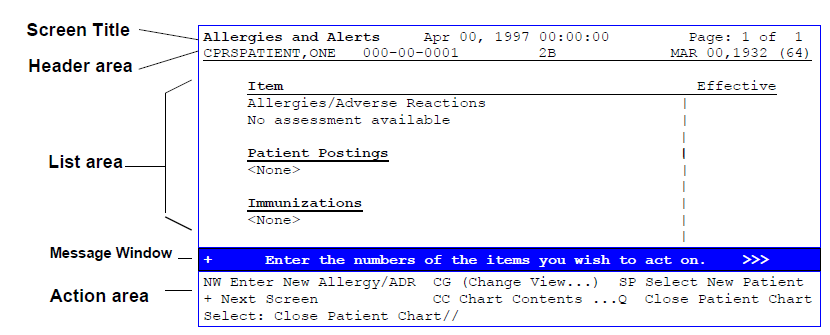

*Descriptions of List Manager Screen Components*
****| **Component**  | **Description**                                                                                                                                                                                                                                                                                                                                                                                                                              |
|----------------|----------------------------------------------------------------------------------------------------------------------------------------------------------------------------------------------------------------------------------------------------------------------------------------------------------------------------------------------------------------------------------------------------------------------------------------------|
| Screen title   | The screen title changes according to what type of information List Manager is displaying (e.g., Chart Contents, Cover Sheet, Active Orders, Lab Orders, etc.). Use this title as an identifier to confirm your location at any time.                                                                                                                                                                                                        |
| Header area    | The header area is a “fixed” (non-scrollable) area that displays patient information. It also tells if there is more than one page of information and which page you’re currently on (e.g., Page: 1 of 3).                                                                                                                                                                                                                                   |
| List area      | (scrolling region) This area scrolls and displays the information that you can take action on.                                                                                                                                                                                                                                                                                                                                               |
| Message window | This section displays a plus (+) sign, minus (-) sign, \>\> symbols, or informational text (i.e., Enter ?? for more actions). A plus sign means more information is available; enter it at the action prompt to “jump” forward a page; a minus sign “jumps” back a screen.; \> moves you to more information on the right; and \< moves you back to the left or main screen. Other allowable actions may be displayed in the message window. |
| Action area    | A list of actions display in this area of the screen. If you enter double question marks (??) at the “Select Action(s)” prompt, you are shown a “hidden” list of additional actions that are available to you.   


## Entering CPRS
You can take several routes to get into CPRS to enter orders and progress notes, review them, and display reports and results for individual patients. The route you choose depends on how your site has set up your menus, what your primary purpose is, and what seems most convenient to you.***-   The **CPRS Clinician Menu** on the main Clinician’s Menu.***-   One of the following menus or options on the Clinician’s Menu***-   Add New Orders***-   Act on Existing Orders***-   Results Reporting***This Guide describes going through the CPRS Clinician Menu, which provides a multi-faceted view of a patient’s medical record.******When you enter the CPRS Clinician Menu, you will see this screen:***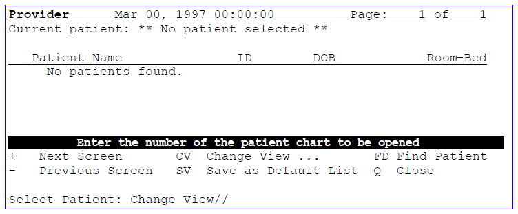

## Selecting a Patient
The Patient Selection screen offers three methods for finding your patient:******-   Entering a name from a list (if you have one defined and set as your default,***-   Entering a patient’s name (or last initial + last 4 letters of SSN) at the Select Patient prompt, or***-   Entering FD (Find Patient), entering a ward or clinic name, then selecting a patient name from the list that appears.
******The Cover Sheet of the selected patient chart displays the patient’s name, SSN, date of birth, age, unit/location, allergies/adverse reactions, patient postings, vitals, immunizations, and service connection.******###### NOTES:-   **You may only have one patient chart open at any given time*****-   **Two users may not simultaneously take actions on orders for the same patient**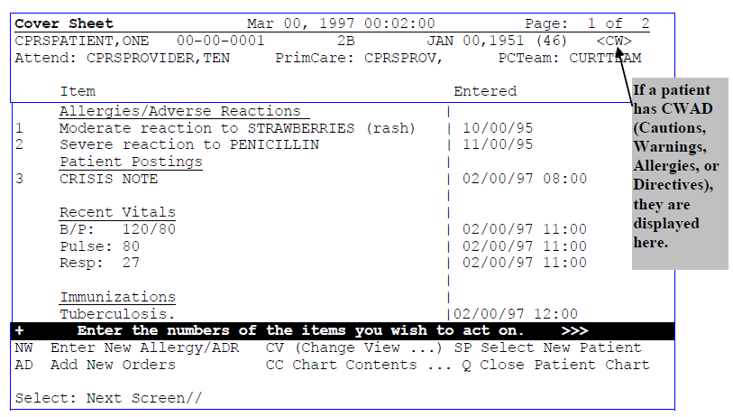*********## ActionsEnter the display numbers of the items you wish to change or act on. A menu of available actions is then presented for selection. You can also choose the action first and then the item.***-   Enter NW to document a new allergy.***-   Enter AD to add new orders for this patient from any page in the chart.***-   Enter CC to see a list of the other “pages” of the chart.***-   Enter SP to select a different patient.***-   Enter ?? to see a list of other actions available.
******## More Actions***When you enter two question marks (??) at the prompt, the following (hidden) actions are displayed. They can also be used at any prompt.*********## Alerts, Allergies, and Patient Postings***You can access some patient information directly from the Cover Sheet, without going to other tabs.******-   Allergies***-   Patient Postings***-   Recent Vitals***-   Immunizations***-   Eligibility***-   ***From this screen, you can view a detailed display of any of these items, or you can record new allergies.**************************Allergies/Alerts Detailed Display**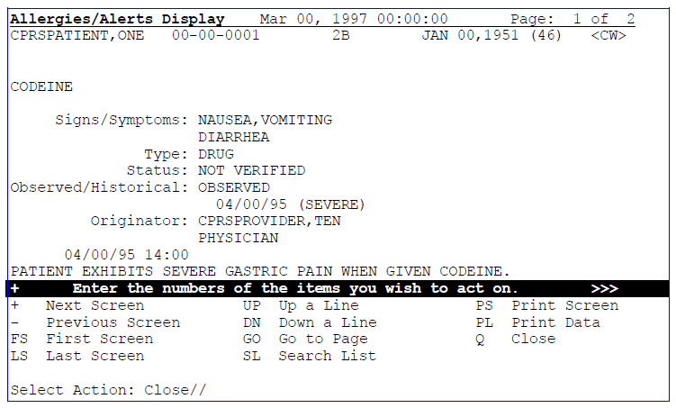

# Chart ContentsThe Patient Chart is composed of screens that represent the pages of a traditional paper patient chart. The Chart Contents screen provides easy, logical access to other screens that show specialized patient information.******


| Cover Sheet | Orders | Imaging       | Reports |
|-------------|--------|---------------|---------|
| Problems    | Meds   | Consults      |         |
| Notes       | Labs   | D/C Summaries |         |

When you choose most of these, the first thing you see is a list of current items for this patient (active problems, progress notes, lab results, orders, or meds). You can then review any of the items in greater detail, edit or cancel them if appropriate, or order new ones.**HINT**: To quickly jump through a series of screens, enter the names or abbreviations of the actions, separated by semi-colons. Example: CC;Orders;Meds.***

# Problems
The Problems tab is used to document and track a patient’s health care problems. It provides you with a current and historical view of the patient’s problems across clinical specialties and it allows you to trace each identified problem through the *VISTA* system in terms of treatment, test results, and outcome. To go to the Problems screen, select the Problems tab at the bottom of the Chart Contents screen.******In the Problems tab, you can change the display to see customized lists of problems, edit a problem to reflect changes, and add a new problem.**To enter the Problems screen:*****1.  Go into the Clinician Menu and select OE for CPRS Clinician Menu.***1.  The patient selection screen appears, with your personal patient list if you’ve created one (through Personal Preferences).***1.  Select a patient from the list, or enter another one.***1.  The Cover Sheet for this patient appears.***1.  Choose Chart Contents (CC); the Chart Contents tabs appear at the bottom of the screen.**Hint:** Enter CC;P for a shortcut***1.  Choose Problems from the Chart Contents list.

 The Problem List appears. The default is to show Active Problems (status is listed on the far right of the screen).
 
 **Problem List Example**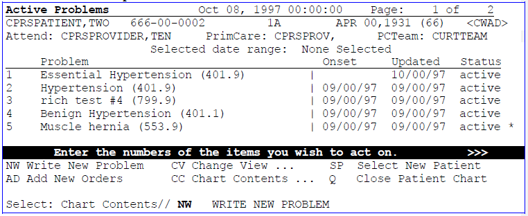1.  If you select one of the listed problems to review, you can choose one of the actions displayed below: Inactivate, Remove, Add Comment, or Detailed Display.******1.  To add a new problem, enter NW at the Select: Chart Contents: prompt, and then answer the prompts as shown in the example below:***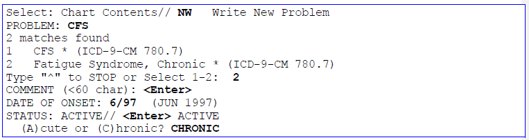*****************Problems, cont’d*******Note:** When you enter a new problem, CPRS will check to see if the code for that problem is active as of the date entered as part of Code Set Versioning (CSV). If not, it will ask you change the code for the problem before allowing the user to enter the problem.**Change View*****If you select Change View here, you can change the display to a different status; i.e., inactive problems or both inactive and active problems.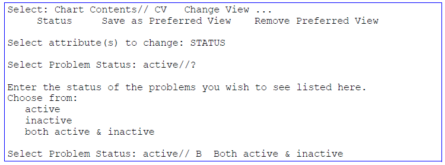
***You can review, enter, sign, or edit progress notes for one patient at a time through the CPRS. To review, edit, or sign progress notes for multiple patients, use the Text Integration Utilities menu.*****To enter a Progress Note:*****1.  Go into the Clinician Menu and select OE for CPRS Clinician Menu.***1.  The patient selection screen appears, with your personal patient list if you’ve created one (through Personal Preferences).***1.  Select a patient from the list, or enter another one.***1.  The Cover Sheet for this patient appears.***1.  Choose Chart Contents (CC).*****Shortcut**: Enter CC;N***6\. Choose Notes from the Chart Contents list.
**Notes, cont’d*****1.  A list of notes appears (the default is to show Signed Notes).***1.  Enter NW for Write New Note. Respond to the following prompts as appropriate.**************Notes, cont’d**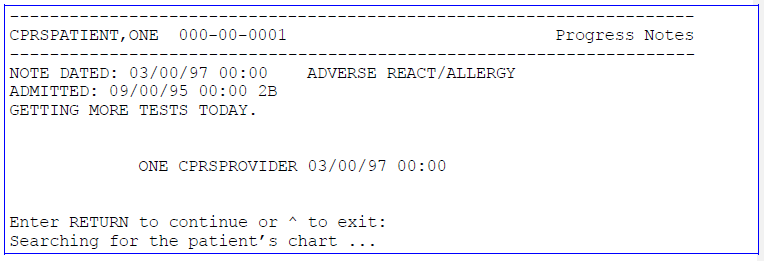*****To sign a Progress Note:**9\. Select Notes from the Chart Components screen.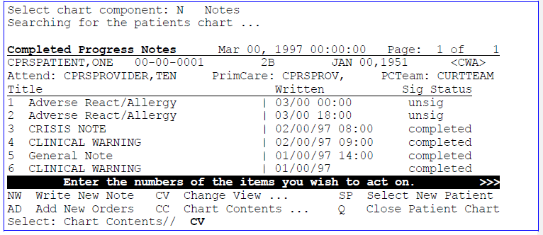***10\. Select CV for Change View, to see all your unsigned notes.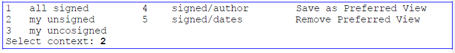11\. Enter the number of the note to be signed.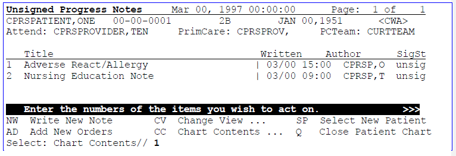***************************12\. The selected unsigned note and actions appear. Select Sign******

************# Orders***From the Orders tab, you can review current orders for a patient and place new orders for consults, medications, lab tests, radiology procedures, diets, consults, and procedures, as well as nursing and activity orders.******## Reviewing orders***1\. After selecting a patient, select the Chart Contents (CC) action.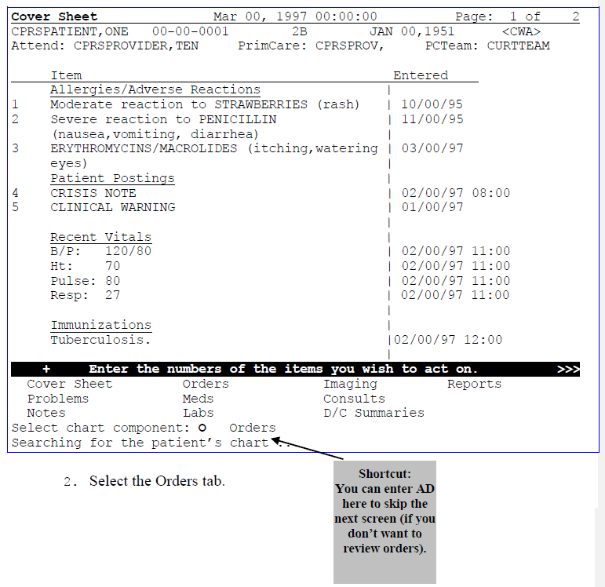
**Orders, cont’d*****3\. The Active Orders screen for your patient is displayed.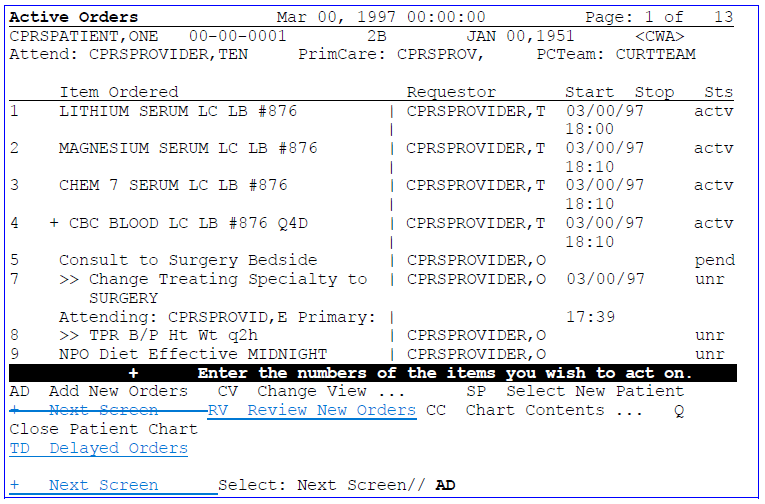*****NOTE: +** in front of a Lab order indicates that this order will be done multiple times according to a selected schedule.## Change ViewYou can change the way orders are displayed by selecting Change View at the Active Orders screen and choosing one of the criteria listed. You can save a view to be your default view; i.e., the view that displays whenever you go into the orders screen.**Short Format Example**This format doesn’t list the requestor or stop date.*****************Orders, cont’d*****## Order Screen ActionsWhen you select an order (by entering the number of the order at the Select Action prompt), a list of actions appears that you can perform on that order.********+** **NOTE:** This is a significant change from OE/RR, where the actions were visible at the bottom of the review screen before you selected an order.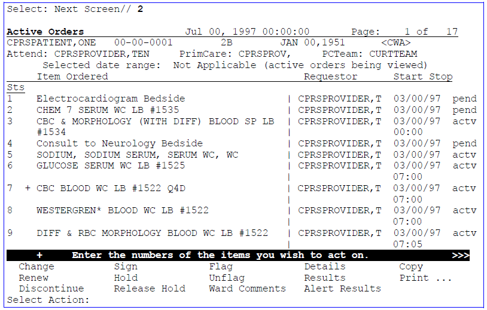*********These actions are described on the next page.
********************Orders, cont’d*****## Order Actions| Action                                                            | **Description**                                                                                                                                                                                                                                                                                                                                                                                                                                                                                                                      |
|-------------------------------------------------------------------|--------------------------------------------------------------------------------------------------------------------------------------------------------------------------------------------------------------------------------------------------------------------------------------------------------------------------------------------------------------------------------------------------------------------------------------------------------------------------------------------------------------------------------------|
| Change                                                            | Inpatient Medications allows editing of orders while they are still pending. Other service/sections require the old order to be “DC’d” (cancelled) and a new order to be added, if the original was incorrect. Changed orders appear on the Review Screen as DC’d orders, along with the new order.                                                                                                                                                                                                                                  |
| Renew                                                             | If allowed by the service (usually only Pharmacy), you can renew/reinstate order(s) that have been discontinued.                                                                                                                                                                                                                                                                                                                                                                                                                     |
| Discontinue                                                       | Lets you discontinue orders that haven’t been released to the service yet or that hasn’t expired yet. After you request that an order be discontinued, you must electronically sign it or indicate that it’s been signed on the chart. It will then show up on the “New/Unsigned Orders” screen as a discontinued order. If an order is discontinued by the service, a notification will be triggered that the order (for discontinuation) requires a chart signature.                                                               |
| Sign                                                              | This lets you sign an order electronically by entering your electronic signature code, or indicate that the order was signed on-chart.                                                                                                                                                                                                                                                                                                                                                                                               |
| Hold                                                              | You can place an Order on hold, preventing further processing until "unhold" action or expiration of order. Not all packages may allow their orders to be placed on hold; Pharmacy orders may be placed on hold, but Lab orders can’t.                                                                                                                                                                                                                                                                                               |
| Release Hold                                                      | This action allows an order to continue its processing.                                                                                                                                                                                                                                                                                                                                                                                                                                                                              |
| Flag                                                              | This action lets you place a notice that the order needs clarification or further instructions.                                                                                                                                                                                                                                                                                                                                                                                                                                      |
| Unflag                                                            | Takes the flag off after clarification or instructions are received.                                                                                                                                                                                                                                                                                                                                                                                                                                                                 |
| Ward Comments                                                     | You can add ward comments about an order; these will be displayed on the Details screen.                                                                                                                                                                                                                                                                                                                                                                                                                                             |
| Details                                                           | More information about the selected order is displayed.                                                                                                                                                                                                                                                                                                                                                                                                                                                                              |
| Results                                                           | Allows you to (enter or view) results for an order.                                                                                                                                                                                                                                                                                                                                                                                                                                                                                  |
| Alert Results                                                     | Allows you to (enter or view) alert results for an order.                                                                                                                                                                                                                                                                                                                                                                                                                                                                            |
| Copy                                                              | This is a shortcut that allows you to copy an order, rather than having to completely write a new order. This action is useful for when hospital policy requires that new orders be written periodically, or when orders are discontinued for ward transfers.                                                                                                                                                                                                                                                                        |
| Print Labels Work Copies Service Copies Requisitions Chart Copies | When you select the Print action, it presents the types of printing allowed. You can print Labels or Requisitions. You can print a copy of all current orders, by service or Ward, using a pre-defined format. Each hospital can only have one format for Service Copies or Work Copies. These copies will normally be printed on a service printer. You can print a copy of all current orders that would appear on a patient’s chart, using a pre-defined format. **Each hospital can only** **have one format for Chart Copies.** |
*****Add New Orders*****The *Add New Orders* action leads to the Add Orders screen. The Add Orders screen varies widely from user to user, based on how your local coordinators have set it up to best fit your needs. You can order from many services, by individual order, by several selections separated by commas, or by a range of numbers separated by a hyphen. After completing one order, you proceed automatically to the next.******When you have finished placing orders, enter Q. You will then be prompted to sign these new orders. When the order(s) are signed, service copies print to the appropriate area(s) for action. Chart copies may print at the nurses’ station/patient location.******Items with ellipses (…) after them bring up menus of available items within that category. Other orders are “quick orders.” These are commonly ordered items that have been set up with pre-defined defaults, reducing the number of prompts.********Add Orders Screen Example**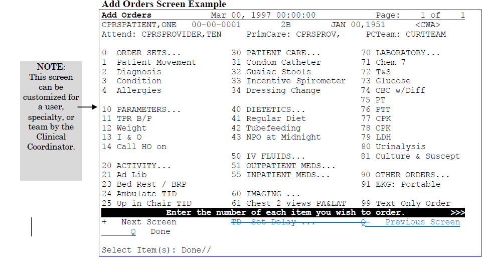*****Set Delay**An event-delayed order is an order that is executed only after a predefined event (known as a release event) occurs. A release event can be an event such as an admission, discharge, or transfer. For example, you could write an event-delayed diet order that would not execute until a patient is transferred to a specific ward.******A CAC defines the release events at your site. (For more information on defining release events, see Appendix G of the *CPRS List Manager Technical Manual* or the Event- Delayed Orders topic in the *CPRS GUI Technical Manual*). Once a CAC has defined a release event, you can write an order that will not execute until that release event occurs.
NW Add New Orders CV Change View ... SP Select New Patient RV Review New Orders CC Chart Contents ... Q Close Patient Chart TD Delayed OrdersSelect: Chart Contents// Event-delayed orders for the Admit to Medicine release event appear on the Orders tab.***1.  Add a new order by typing **NW**.***1.  Enter the order as you normally would.******### Changing the Release Event of an Existing Order*****To change the release event of an existing order, follow these steps:**1.  From the Orders tab, select Delayed Orders by typing **TD**.***1.  At the *Select RELEASE EVENT* prompt, select the release event currently associated with the existing order.******The orders associated with that release event will appear.******1.  Type the number of the order that you would like to change.***Delayed Surgery Event Orders Mar 00, 2002 00:00:00 Page: 1 of 1CPRSPATIENT,TWELVE 666-00-0012 W-6AS0 11/00/66(38)PrimCare: UNKNOWN PCTeam: \<A\>\<CWAD\>Item Ordered Provider Start Stop Sts1.  NPO none \| CPRSPROV,T 03/00 03/00/02 dc***\<Replaced with new diet order\> \| 11:00 12:001.  CATHETERIZATION CARDIOLOGY (OEX) Proc \| CPRSPROV,T 03/00 pend***Bedside \| 11:001.  Reaction to BEER \| CPRSPROV,T dlay***1.  0.9NS INJ 250 ml 200 ml/hr \| CPRSPROV,T pend***1.  NPO \*UNSIGNED\* \| CPRSPROV,T dlay***1.  Tubefeeding: MAGNACAL FULL strength 2000\| CPRSPROV,T 03/00/02 actv***KCAL/QD \| 08:00***NW Add New Orders CV Change View ... SP Select New Patient RV Review New Orders CC Chart Contents ... Q Close Patient Chart TD Delayed Orders******************1.  Select Edit Release Event by typing **Edit Release** at the *Select Action* prompt.***1.  Type **No** at the *Remove the release event from these orders?* prompt.***1.  Select a new release event at the *Select RELEASE EVENT* prompt.******### Removing the Release Event from an Existing Order*****To remove the release event from an existing order, follow these steps:*****1.  From the Orders tab, select Delayed Orders by typing **TD**.***1.  At the *Select RELEASE EVENT* prompt, select the release event currently associated with the order.******The orders associated with that release event will appear.******1.  Type the number of the order that you would like to change.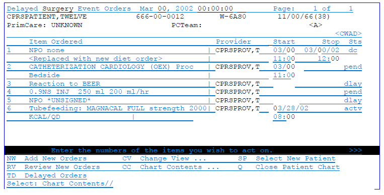*********1.  Select Edit Release Event by typing **Edit Release** at the *Select Action* prompt.***1.  Type **Yes** at the *Remove the release event from these orders?* prompt.******### Manually Releasing Event-Delayed Orders**To release an event-delayed order manually (before the delay event occurs) follow these steps:*******Note**: You must sign an order before it can be released.***1.  From the Orders tab, select Delayed Orders by typing **TD**.***1.  At the *Select RELEASE EVENT* prompt, select the release event currently associated with the order.******The orders that are associated with the release event will appear in a numbered list.*********1.  Type the number of the order that you would like to release.***The order that you selected will be highlighted.***4\. Select Release Orders by typing R.***5\. If the Patient Location prompt appears, enter a location.***6\. If the Enter your Current Signature Code prompt appears, enter your signature code***7\. Enter the appropriate response at the Should the orders be printed using the new location? prompt.***8\. Enter the appropriate response at the Print CHART COPY for the orders ? prompt.***9\. Enter the appropriate response at the Print LABELS? for the orders prompt***

*********************### Viewing Event Delayed Orders After they are Released***1.  From the Orders tab, select Change View by typing **CV**.***1.  Select Auto DC/Release Event by typing **A**.***1.  At the *Select Patient Event* prompt, enter the release event associated with the orders you would like to view.******The appropriate orders will appear on the Orders tab.******## Quick OrdersQuick Orders allow you to enter diets, labs, meds, etc. without going through as many steps. These are types of orders that clinicians have determined to be their most commonly ordered items, with standard collection times, routes, and other conditions. To select a quick order from the AD order screen, simply enter the number shown on your Add Orders menu (other than the \#s for the categories LABORATORY, MEDICATIONS, IMAGING, DIETETICS, etc.), then the conditions for the order are displayed for you to accept, edit, or cancel.******## Order SetsOrder sets are comprised of a group of related quick orders. The purpose is to minimize the number of prompts to answer for a common protocol or set of orders.***See your coordinator or the CPRS Set-Up Guide for instructions about creating order sets. If your site has created order sets (e.g., for admission orders, pre-op orders, etc.), you can select one from the Add Orders screen.

## Reviewing and Signing New Orders
After you have entered all of your orders for a patient and you accept the default of DONE at the Select Action Prompt, you are returned to the Cover Sheet. If you enter Q to exit the patient chart, the New Orders screen is displayed and you are prompted to sign all orders you have just placed.***You can also enter RV from other screens where Review New Orders doesn’t appear as an action (it’s on the hidden menu). You can then sign all orders, if you wish.***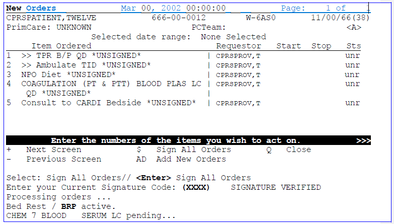***************If the current patient has outpatient medication orders that need to be signed and certain additional conditions are met, the Copay prompts may appear. The Copay prompts are usedIn order to sign some medication orders, you may need to indicate whetheran outpatient medication order is related to some (or all) of the conditions below.******-   The criteria used to determine if the Copay prompts appear are explained below.***-   of these exemptions then CPRS displays the appropriate Copay prompt(s).***-   Radiation***-   Persian Gulf War***-   Head or Neck Cancer

## Adding New Orders
Sequence of Screens and Actions
****Ordering, by Service/Category*****## Patient MovementYou can order patient movements ⎯ Admit, Transfer, Discharge, and Treating Specialty changes ⎯ with this order type.*****Example**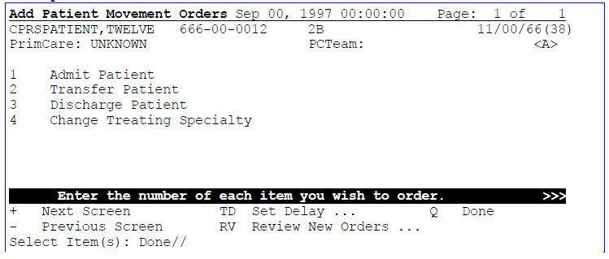********Ordering Parameters/Activity/Patient Care Orders/Free Text*****Parameters, Activity, Patient Care, and Free Text orders are different kinds of orders that are placed for nursing and ward staff to take action on. They **print only at the patient’s ward/ location, and are not transmitted electronically to other Services for completion**.

Examples of these various kinds of nursing orders are:

| **Order type** | **Order**                                 |
|----------------|-------------------------------------------|
| Parameters     | vital signs                               |
| Activity       | bed rest, ambulate, up in chair           |
| Patient Care   | skin and wound care, drains, hemodynamics |
| Free text      | immunizations                             |

Pre-defined nursing orders (quick orders) may be available under various sub-menus. Nursing orders may also be composed by selecting the Text Only option from the Order Screen. These orders require the ward staff to take action to complete the request.

*****Patient Care Orders Example**
******## Ordering Diets***1.  Select 40, Dietetics, from the Add Orders screen.***1.  Enter the number (1) from the list of diet options.***1.  At the Diet prompt, type in the specific diet. A Diet prompt appears which provides for combination diets. Each combination is entered separately, e.g. Low Sodium \<Enter\> High protein \<Enter\>. If additional types are not desired, press \<Enter\>.***1.  Enter the Effective date/time. (Automatically defaults to NOW.)***1.  Enter the Expiration date/time. (Usually +28D for Med. and Psych. and +84D for EC)***1.  Indicate the Delivery type. (Defaults to the unit’s specific policy.)***1.  The order displays. Select Edit, Cancel, or Place.********NOTE**: If you enter a diet request after routine meal times, you will automatically be prompted for a late tray. If needed, select the time of delivery.

## Overview of New CPRS/POE Functionality
To make it easier for providers to enter medication orders and have fewer orders that needed to be changed by pharmacy and sent back for provider signature, the Pharmacy Ordering Enhancement (POE) project was undertaken. The aim of this project was to make it easier for clinicians to enter medication orders and have the computer do the work in the background to also get pharmacists the information they need to fill the orders appropriately.******In doing this, the ORDER DIALOG file was changed to alter how CPRS prompts clinicians for the information needed in a way that is more natural for them and will hopefully reduce the number of orders that need to be edited and sent back for signature again. Changes include removing the Dispense drug prompt and instead request a dose, using an API to ensure that the VA policy that a provider ordering a controlled substance must have a DEA or VA number, autocalculation of the quantity if a common dispense drug and a standard schedule are entered, and the availability of standard schedules to name a few.******For the List Manager interface, the changes will be seen in the dialogs that you normally use. In addition, another Medications item called Medications may have been added to your ordering menu. The Medications item can be used in addition to the existing dialogs for INPATIENT MEDS, OUTPATIENT MEDS, and IV FLUIDS. The only difference between this new dialog and the Inpatient and Outpatient dialogs is that Medications will automatically assign the ordering context (Inpatient vs. Outpatient) based on the selected patient's current admission/visit status. The Medications item provides a single dialog for medication orders instead of forcing the provider to pick among the INPATIENT MEDS, OUTPATIENT MEDS, and IV FLUIDS order dialogs. If the provider wants to use those specific dialogs, they are still available.*****Note:** With the new Medications item, the provider will not be able to write a prescription if the patient is currently admitted, or order an inpatient IV med for a patient in an outpatient clinic (i.e. you won’t be able to write an order for the opposite context).***Therefore, the old INPATIENT MEDS, OUTPATIENT MEDS, and IV FLUIDS items should still be available for the provider to use.******There are several other changes that are explained in the POE Release Notes.

## Ordering Outpatient Medications with a Simple Dose***1.  
Select Medications or your normal outpatient medications menu item from your Add Order Screen (AD).***1.  Type in the medication name.***1.  Select the medication formulation.*****Note:** CPRS now uses a look up from Pharmacy to check if the selected medication is a controlled substance that will require the signature of a provider with a DEA or VA number or a Schedule II (i.e., narcotics) drug that requires a wet signature (rather than an electronic one). **For controlled substances**, CPRS displays the message “Provider must have DEA\# or VA\# to order this drug!” Before an order for a controlled substance can be entered, the provider selected for the encounter must be able to sign the order. You may need to exit the dialog, change the provider, and then reenter the dialog. **For a Schedule II** (i.e., narcotics), the message is “This order will require a wet signature!”***Non-formulary medications are identified by the words “non-formulary” in parenthesis to the right of the medication. For example, you might see******ASPIRIN SUPP,RTL (non-formulary)******if you type in aspirin as the medication.******1.  For a simple dose, type **N** and press \<**Enter**\>.***1.  Select the dose, if one is displayed, or enter a dose.***1.  Enter Route. (Automatically defaults to the common route for this drug).***1.  Enter a Schedule.***A message may display indicating what the normal fill for the selected medication is.******1.  Enter a Days Supply. (The default fill is usually displayed.)***1.  Enter the Quantity needed.***1.  Enter Refills. This prompt must be answered. Enter 0 if no refills are desired.***1.  Enter the method of delivery (WINDOW (automatic default), clinic or mail).***1.  Enter a priority.***1.  Enter comments if needed or desired.***1.  The prescription displays. Select Edit, Cancel, or Place.***1.  Enter another medication if desired. If you are finished and want to exit, press***\<Enter\>.
********Example: Ordering an Outpatient Medication with a Simple Dose*************Ordering Outpatient Medications with Complex Doses*****1.  Select Medications or your normal outpatient medications menu item from your Add Order Screen (AD).***1.  Type in the medication name.***1.  Select the medication formulation.*****Note:** CPRS now uses a look up from Pharmacy to check if the selected medication is a controlled substance that will require the signature of a provider with a DEA or VA number or a Schedule II (i.e., narcotics) that requires a wet signature (rather than an electronic one). **For controlled substances**, CPRS displays the message “Provider must have DEA\# or VA\# to order this drug!” Before an order for a controlled substance can be entered, the provider selected for the encounter must be able to sign the order. You may need to exit the dialog, change the provider, and then reenter the dialog. **For a Schedule II** (i.e., narcotics), the message is “This order will require a wet signature!”***Non-formulary medications are identified by the words “non-formulary” in parenthesis to the right of the medication. For example, you might see******ASPIRIN SUPP,RTL (non-formulary)******if you type in aspirin as the medication.******1.  For a complex dose, type **Y** and press \<**Enter**\>.***1.  Select the first dose, if one is displayed, or enter a first dose.***1.  Enter Route. (Automatically defaults to the common route for this drug).***1.  Enter a Schedule.***A message may display indicating what the normal fill for the selected medication is.******1.  Enter How Long the patient should take this dose.***1.  If you want to enter another dose, select a conjunction (the choices are and, then, or except). When you are through entering additional doses, press***\<**Enter**\> at this prompt.1.  Repeat steps 5-9 as needed to create the complex dose.***1.  Enter a Days Supply. (The default fill is usually displayed.)***1.  Enter the Quantity needed. If a common dispense drug can be found, the application will try to calculate the quantity using this formula: schedule x days supply = quantity.***1.  Enter Refills. This prompt must be answered. Enter 0 if no refills are desired.***1.  Enter the method of delivery (WINDOW (automatic default), clinic or mail).***1.  Enter a priority.***1.  Enter comments if needed or desired.***1.  The prescription displays. Select Edit, Cancel, or Place.***1.  Enter another medication if desired. If you are finished and want to exit, press***\<**Enter**\>.***********************Example: Entering an Outpatient Order with a Complex Dose**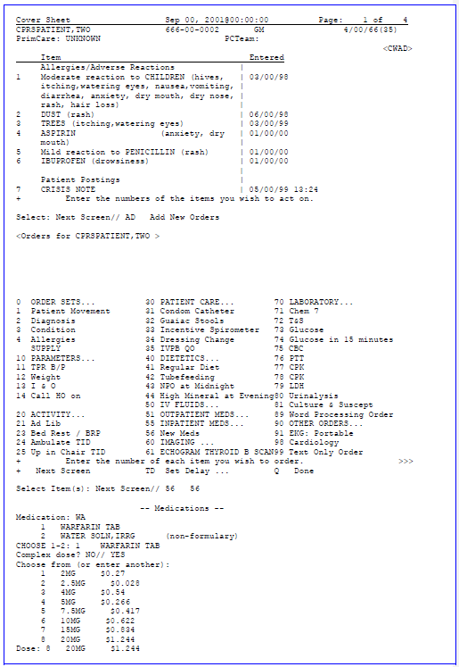********Example: Entering an Outpatient Order with a Complex Dose (cont’d.)*****| Route: ORAL//         |         |
|-----------------------|---------|
| Schedule: Q8H         |         |
| How long: 30          |         |
| And/then/except: THEN |         |
| Another Dose: 10MG    | \$0.622 |
| Schedule: Q12H        |         |
| How long: 30          |         |
| And/then/except: THEN |         |
| Another Dose: 4 5MG   | \$0.266 |


***## Ordering Inpatient Medications with a Simple Dose***1.  Select Medications or your normal inpatient medications menu item from the Add Order Screen (AD).***1.  Type in the medication name.***1.  Select the medication formulation.*****Note:** CPRS now uses a look up from Pharmacy to check if the selected medication is a controlled substance that will require the signature of a provider with a DEA or VA number. For controlled substances, CPRS displays the message “Provider must have DEA\# or VA\# to order this drug!” Before an order for a controlled substance can be entered, the provider selected for the encounter must be able to sign the order. You may need to assign a different provider for the encounter.***Non-formulary medications are identified by the words “non-formulary” in parenthesis to the right of the medication. For example, you might see******ASPIRIN SUPP,RTL (non-formulary)******if you type in aspirin as the medication.******1.  For a simple dose, type **N** and press \<**Enter**\>.***1.  If possible doses have been entered, CPRS provides a list of possible doses. Select a listed dose or enter a dose.***1.  Enter Route. (Automatically defaults to the common route for this drug).***1.  Enter schedule, e.g., QID. Use caution when entering schedule. **Use ALL uppercase, Use H for hour(s), and leave a space between time and PRN, e.g., Q4-6H PRN.*****1.  CPRS shows you the next scheduled administration time. Indicate whether you want to give the first dose now.*****Note:** Be careful when using “Give First Dose Now” that you do not overmedicate the patient. If you select yes to the prompt “Give First Dose Now?”, a separate order will be created for the “Now” dose and another order will be created for the other dose. Check that the combination of the Now dose and the original schedule does not overmedicate the patient.***1.  Type in provider comments, if any, e.g., X 7 days, or special instructions.***1.  The order displays. Select Edit, Cancel, or Place.***1.  Enter another medication if desired or at the Medication prompt, press \<**Enter**\>.
**************Example: Entering an Inpatient Medication with a Simple Dose**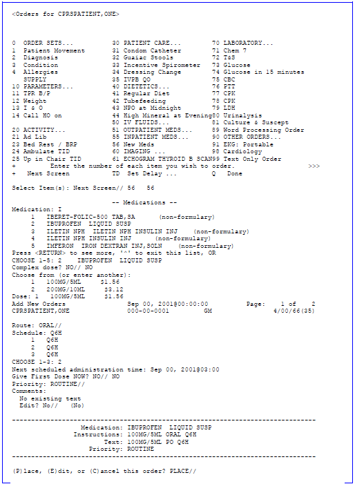************## Ordering Inpatient Medications with a Complex Dose***1.  Select Medications or your normal outpatient medications menu item from the Add Order Screen (AD).***1.  Type in the medication name.***1.  Select the medication formulation.*****Note:** CPRS now uses a look up from Pharmacy to check if the selected medication is a controlled substance that will require the signature of a provider with a DEA or VA number. For controlled substances, CPRS displays the message “Provider must have DEA\# or VA\# to order this drug!” Before an order for a controlled substance can be entered, the provider selected for the encounter must be able to sign the order. You may need to exit the dialog, change the provider, and then reenter the dialog.***Non-formulary medications are identified by the words “non-formulary” in parenthesis to the right of the medication. For example, you might see******ASPIRIN SUPP,RTL (non-formulary)******if you type in aspirin as the medication.******1.  For a simple dose, type **Y** and press \<**Enter**\>.***1.  If possible doses have been entered, CPRS provides a list of possible doses. Select a listed dose or enter a dose.***1.  Enter Route. (Automatically defaults to the common route for this drug).***1.  Enter schedule, e.g., QID. Use caution when entering schedule. **Use ALL uppercase, Use H for hour(s), and leave a space between time and PRN, e.g., Q4-6H PRN.*****1.  Enter for how long (the number of days).***1.  Select a conjunction (and or then) if you want to enter another dose, or when finished with dosing information, press \<**Enter**\> to go to the next prompt.***1.  Repeat steps 5-9 until you have the dose as you want it.***1.  Indicate whether you want to give the first dose now.*****Note:** Be careful when using “Give First Dose Now” that you do not overmedicate the patient. If you select yes to the prompt “Give First Dose Now?”, a separate order will be created for the “Now” dose and another order will be created for the other dose. CPRS also display a message: “First Dose NOW is in addition to those already entered. Please adjust the duration of the first one, if necessary.” Check that the combination of the Now dose and the original schedule does not overmedicate the patient.***1.  Type in provider comments, if any, e.g., X 7 days, or special instructions.***1.  The order displays. Select Edit, Cancel, or Place.***1.  Enter another medication if desired or at the Medication prompt, press \<Enter\>.
**Example: Entering an Inpatient Order with Complex Dosing**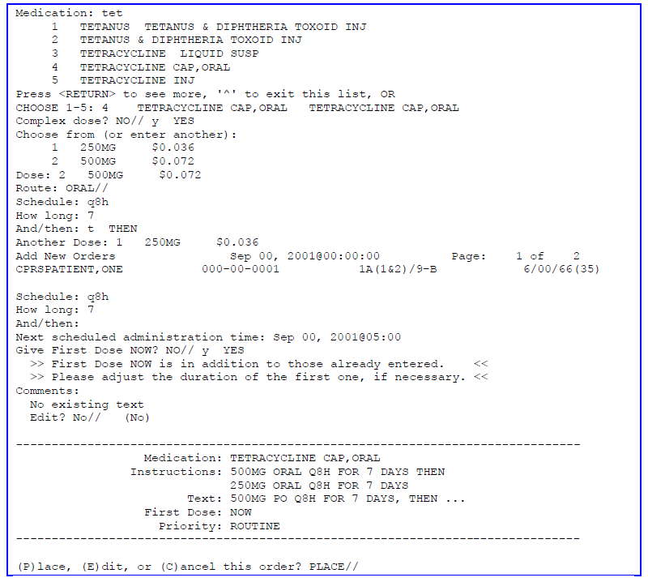
******## Ordering IV Fluids***1.  Select IVs.from the Add Order Screen (AD).***1.  Available options are displayed; for example:***-   IV FLUIDS (WITH ADMIXTURE)...***-   IV MEDS...***-   **[others, e.g., IV FLUIDS (NO ADDITIVES)...]*****1.  A fluid with NO ADDITIVE leads to the free text/word-processing screen for order entry.***1.  A fluid with an ADMIXTURE leads to the IV pharmacy package.***1.  Type in fluid desired (Use ?? for available selections). Entering a BASE fluid, i.e., D5, produces a fluid selection list containing that base.***1.  Enter Volume of fluid if different from default.***1.  Enter Additive by typing in the name of the additive.***1.  Additive will again be prompted for to allow for additional additives. Bypass by pressing \<Enter\> if no other additives are desired.***1.  Enter infusion rate in number(s) only. The numeric indicates the rate in cc/hr. Pharmacy uses ML/HR.***1.  Enter provider comments if desired, e.g. -- \# of days or special instructions, e.g. MVI in one bag per day. **NOTE**-Placing the name of an additive as a comment **DOES NOT** constitute a valid order unless it is also entered at the Additive prompt.***1.  The order displays. Select Edit, Cancel, or Place.***1.  Respond Y or N to the prompt for another request.********Note:** An IV MEDICATION leads to the Inpatient Medication package. Answer these prompts like any other inpatient medication. If you enter an IV MEDICATION with more than one additive, it will be saved as an IV FLUID so that all additives can be saved and displayed.
***************************## Ordering Imaging or Radiology Exams***1.  Select the radiology procedure from the Common Radiology Procedure List by entering the appropriate number. This list automatically displays (enter ?? for additional choices).***1.  Enter Modifier(s) if appropriate, e.g., Right, Portable (enter ?? for a complete list of choices).***1.  Enter a Reason for the Request.***1.  The order displays. Select Edit, Cancel, or Place.***1.  Respond Y or N to the prompt for Another Request.***********Ordering Labs*****1.  Enter the name of the lab tests desired.***1.  Choose the method of collection ⎯Send to Lab, Ward Collect and Deliver, Lab Blood Team, or Immediate Collect by Lab Team.***1.  Enter the collection date and time, e.g., T+3@0500, or Now.***1.  Enter the Urgency.***1.  Enter how often. (**NOTE:** If you select that this order will be done multiple times, a*****+** will appear in front of the Lab order on the Orders screen).***1.  The choices you have made are displayed.***1.  Choose place, edit, or cancel.********NOTE:** An Order Check notice such as the following might appear. This notice states that an order is a duplicate of a previously placed order for this patient. You have the option to place, edit, or cancel the order, based on this information.******## Ordering Consults & Procedures1.  Select 90, Other Orders, from the Add Orders screen.***1.  Enter the service/specialty you’re requesting the consultation from.***1.  Enter the reason for the request.***1.  Specify whether the service rendered will be on an inpatient or outpatient basis.***1.  Enter the urgency for the consultation (stat, routine, within 48 hours, or within 72 hours).***1.  Enter the place of Consultation (bedside or consultant’s choice).***1.  Enter the provisional diagnosis.*****Note:** CPRS checks if the diagnosis code is active as of the entry date as specified in Code Set Versioning (CSV). If the code is inactive, the user must change the code before proceeding. The check would occur on copy and change as well.1.  A list of the categories and their responses is displayed; verify or edit these by selecting Place, Edit, or Cancel.***1.  You can now add another consult order or exit.************# MedsYou can review and order Meds either through the Meds tab in Chart Contents or through the Add New Orders option on the Orders tab.********Example**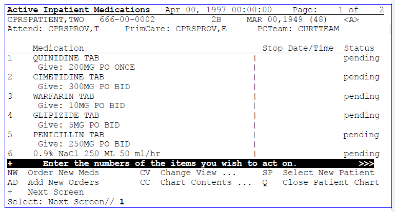**Meds, cont’d**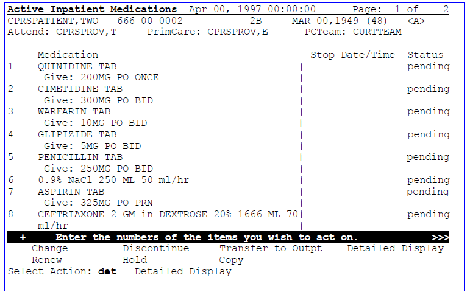***###### Meds Detailed Display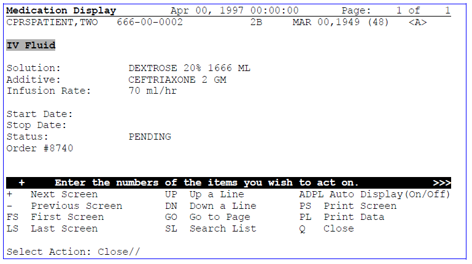********************Meds, cont’d********## Meds Change ViewChange View in Meds lets you change your view from Inpatient to Outpatient or to change the date range.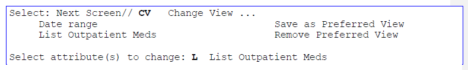***********Note:** The Active status for outpatient meds will display as “active (susp)” to improve clarity.
***************# LabsYou can review and order Labs either through the Labs tab in Chart Contents or through the Add New Orders option on the Orders tab.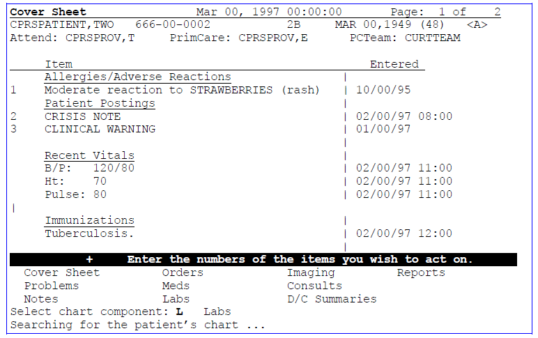***************************## Lab Change View***Change View in Lab lets you change the date range to be displayed, to go to a specific section of Lab to see results, or to use a list format for display. Examples of the Go To a Section and List Format are shown here.***********Go To a Section Example:**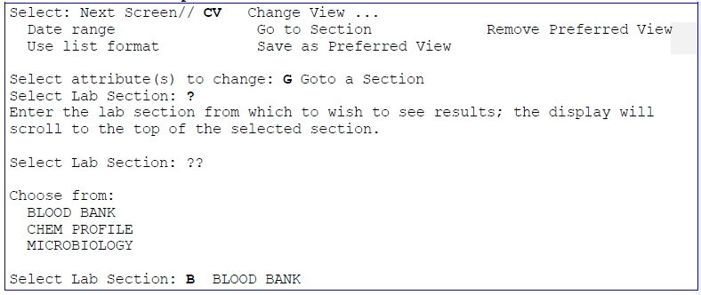
********Labs, cont’d*******Go To a Section Example, cont’d:**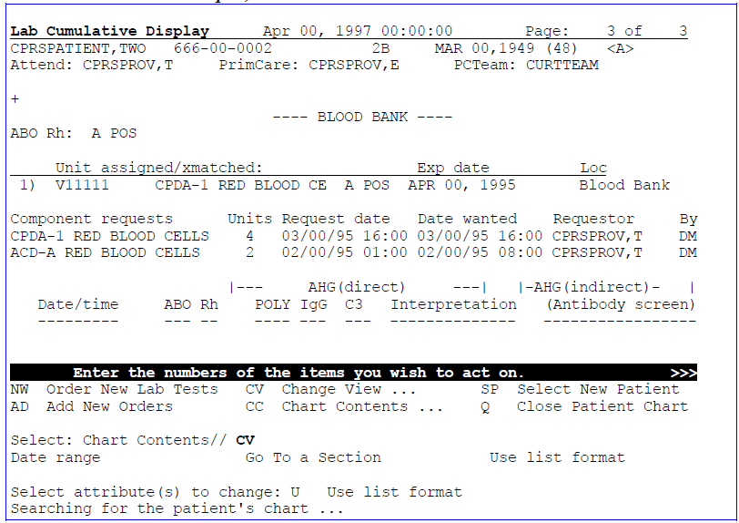********Use List Format Example:**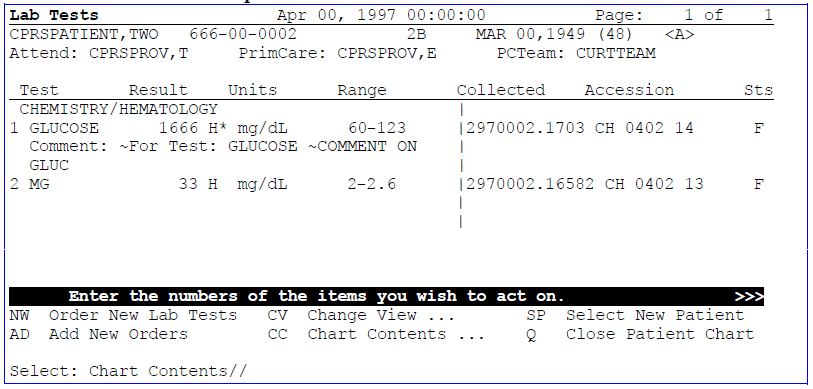******************************# ConsultsYou can enter, edit, and review consult and procedure requests through CPRS.******1.  Go into the Clinician Menu and select OE for CPRS Clinician Menu.***1.  The patient selection screen appears, with your personal patient list if you’ve created one (through Personal Preferences).***1.  Select a patient from the list, or enter another one.
1.  The Cover Sheet for this patient appears.*****Example:**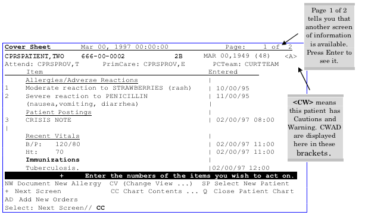******1.  Choose Chart Contents and then Consults (**Shortcut:** CC;CONS).***1.  The Consults screen appears with a list of consults for this patient, and possible actions you can perform at this time (e.g., order a new consult or procedure).**************************Consults, cont’d*****1.  You can also see more details about any of the consults listed, view results for completed consults, or you can print the Consult Form 513, by entering the number of one of the consults and then the appropriate action’s initial.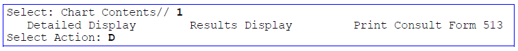***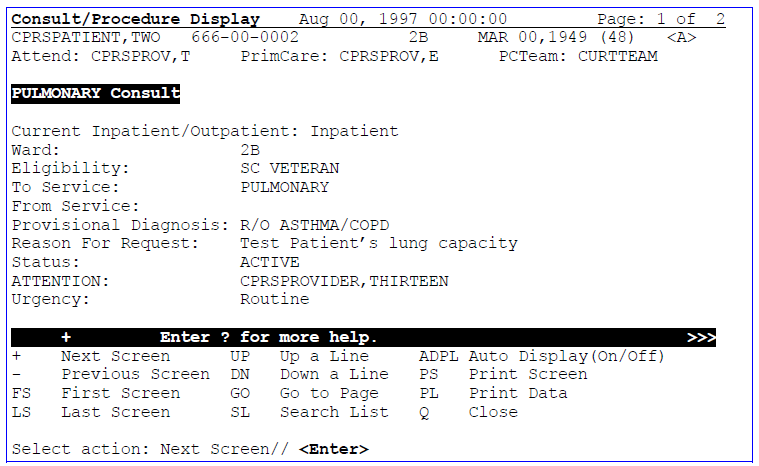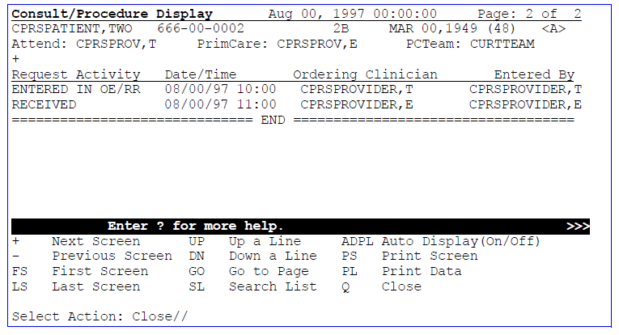**************************Consults, cont’d*******Results Display**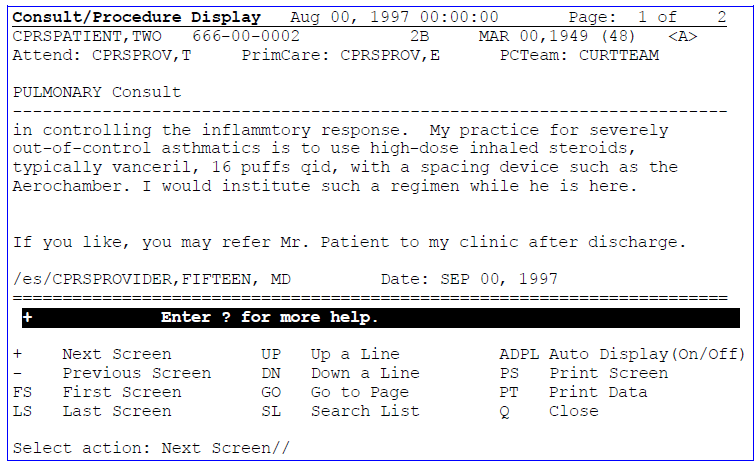******1.  You can now print a 513, order new consults or procedures, return to Chart Contents, select a new patient, or exit from the patient’s chart.*****+** **NOTE**: Occasionally a consult result is linked to the wrong consult. Information on how to make corrections is contained in the Consult/Request Tracking documentation.******************************# ImagingYou can review Radiology results by choosing the Imaging tab in Chart Contents or by selecting Results Reporting from the Clinician menu. You can also order new tests through the Imaging tab or by going through the Add New Orders option on the Orders tab.********To review Radiology Results:*****1.  After selecting a patient, select Chart Contents and then the Imaging tab.***1.  The following screen appears:***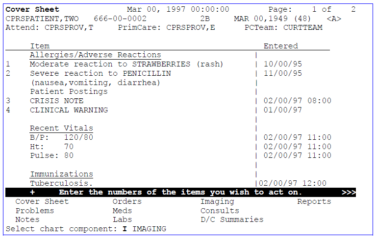******1.  The Imaging Procedures screen appears: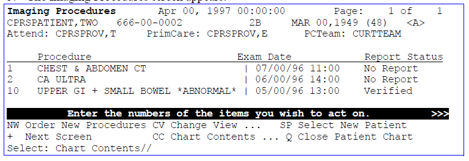**************************Imaging, cont’d**## Change ViewThe Change View action in Imaging lets you change your view to a different date range ora smaller number of items.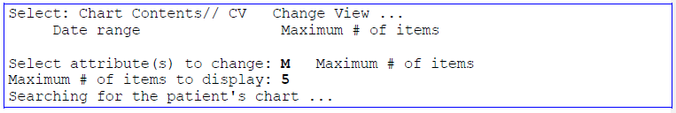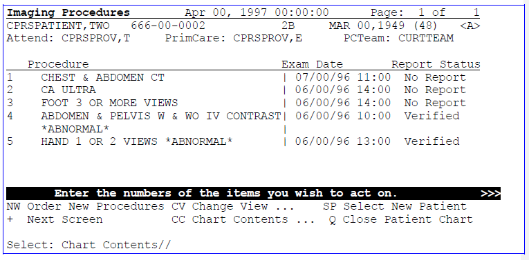## 

***# D/C SummariesYou can review, edit, and write new Discharge Summaries through CPRS.******1.  Select D/C Summaries from Chart Contents.***1.  If one or more Discharge Summaries are listed, select a number of one you wish to review or take action on. If you pick Detailed Display, the entire Discharge Summary is displayed (screen-by-screen) in the List Manager list area.***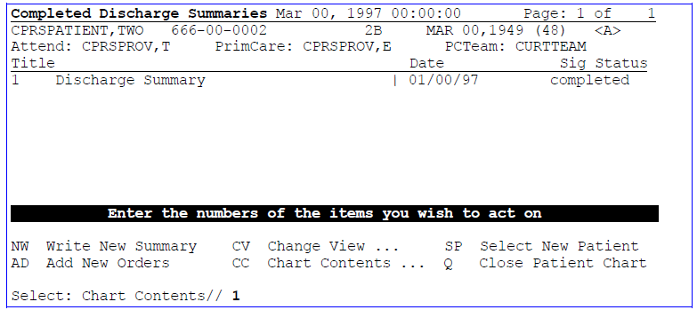***1.  New actions are displayed on the screen; select one of these.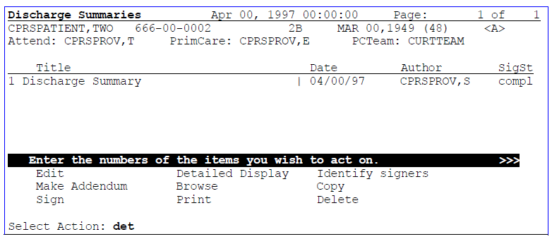
*****D/C Summaries, cont’d*******Discharge Summary Detailed Display Example**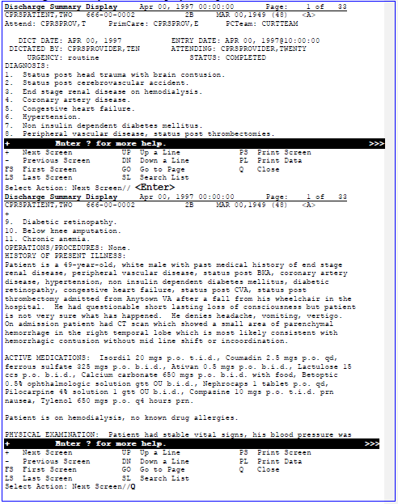***************************# ReportsYou can view or print reports and results from either the Results Reporting option on the Clinician Menu or from the Reports tab on the Chart Contents screen. The Reports tab only lets you print for individual patients. The RR option lets you select more than one patient at a time.********Reports Tab Example: Shortcut:** Select CC;R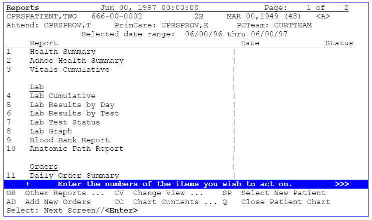**************Reports, cont’d*****##### Lab Cumulative Example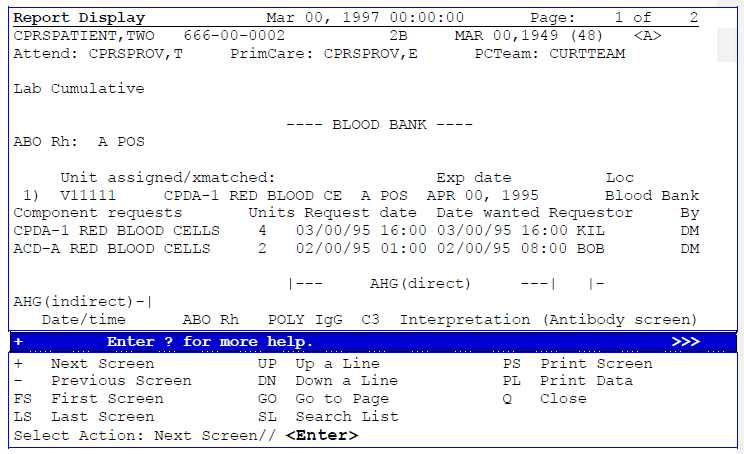
********Reports, cont’d**##### Dietetic Profile Example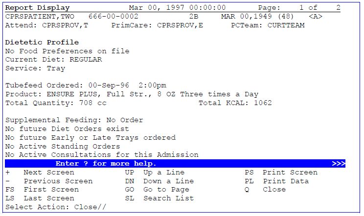

**Reports, cont’d****Health Summary Example***********************## Results Reporting***You can print reports for multiple patients (e.g., all of the patients in a ward, or all of a patients on a Personal or Team List) through the Results Reporting option on the Clinician Menu.********Order Summary for Date/Time Range Example**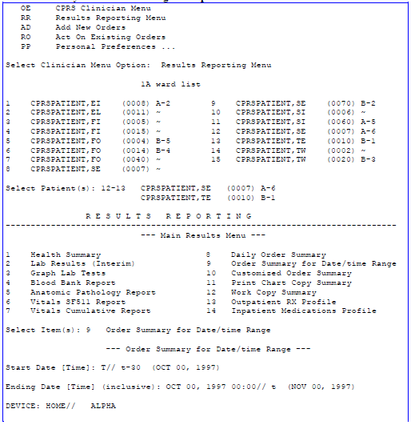**************************Order Summary for Date/Time Range Example, cont’d**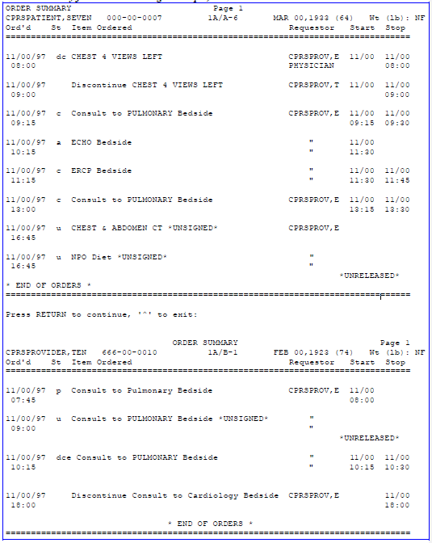
******# Personal PreferencesYou can change many of the parameters that control the way CPRS works for you. The Personal Preferences Menu on your Clinician Menu contains sub-menus that may allow you to change which notifications and order checking messages you get, the team or personal lists you will use, and the default patients you’ll have.***## Personal Preferences Menu| **Option or Menu**                      | **Description**                                                                                                                                                                                                                                                                                                                                                                                                 |
|-----------------------------------------|-----------------------------------------------------------------------------------------------------------------------------------------------------------------------------------------------------------------------------------------------------------------------------------------------------------------------------------------------------------------------------------------------------------------|
| GUI Cover Sheet Display Parameters      | This option lets you modify the default number of days to display on the cover sheet.                                                                                                                                                                                                                                                                                                                           |
| Notification Mgmt Menu                  | This menu contains an option that allows you to review the notifications you should be currently receiving. You may also have an option for adding or removing notifications to those you are scheduled to receive (whether you have this depends on local site set-up). Use this option to turn notifications on or off. You may also be able to remove all of your existing notifications via a purge option. |
| Order Checking Management Menu          | This menu contains one or two options (depending on local set-up) which allow you to check which order checks you get and possibly to set parameters for order checking.                                                                                                                                                                                                                                        |
| Personal Patient List Menu              | Options on this menu allow clinicians to create patient lists by ward, clinic, or by patient to use for displaying results or creating reports. You can build lists, delete lists, merge lists, add or remove patients from lists, or inquire to a file of patient lists.                                                                                                                                       |
| Patient Selection Preference Mgmt       | This menu allows you to set default parameters for patient lists.                                                                                                                                                                                                                                                                                                                                               |
| Display Patients Linked to Me via Teams | This option displays patients linked to the current user via teams from the OE/RR LIST file [\#100.21].                                                                                                                                                                                                                                                                                                         |
| Display My Teams                        | This option displays teams linked to the current user.                                                                                                                                                                                                                                                                                                                                                          |**To access the Personal Preferences Menu:**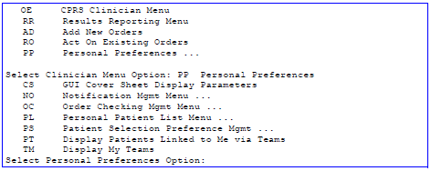
**Personal Preferences, cont’d**## GUI Cover Sheet Display Parameters**Example**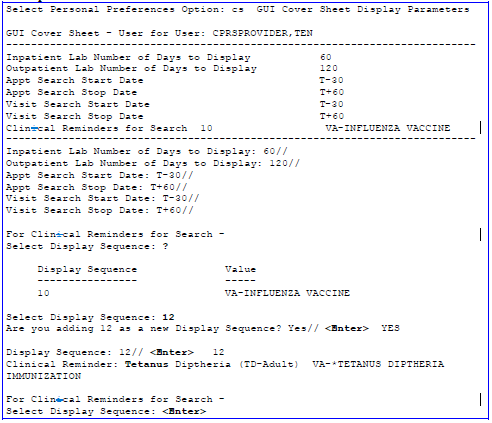
************************## Notification Mgmt Menu OptionsThe following options may be available on your Personal Preference Menu, depending on how your local coordinators have set up your menus.******|                                               | **Option**                                                                                                                                                                                                                                                                                         |   |   | **Description** |   |
|-----------------------------------------------|----------------------------------------------------------------------------------------------------------------------------------------------------------------------------------------------------------------------------------------------------------------------------------------------------|---|---|-----------------|---|
| Enable/Disable My Notifications               | If you have this option, you can indicate that a notification should not be processed for you.                                                                                                                                                                                                     |   |   |                 |   |
| Erase All of My Notifications                 | Use this option to erase all of your own notifications.                                                                                                                                                                                                                                            |   |   |                 |   |
| Send me a MailMan bulletin for Flagged Orders | Enter Yes to send a bulletin to the order’s Current Provider (usually the Ordering Provider) when an order is flagged for clarification. This parameter has no effect on the Flagged Orders notification which is also triggered when an order is flagged for clarification.                       |   |   |                 |   |
| Set Notification Display Sort Method (GUI)    | Method for sorting notifications when displayed in the GUI, including by Patient, Type (Notification name), and Urgency. Within these sort methods notifications are presented in reverse chronological order.                                                                                     |   |   |                 |   |
| Send me a MailMan Bulletin for Flagged Orders | If this is turned on, a MailMan bulletin is sent to the order's Current Provider (usually the Ordering Provider) when the order is flagged for clarification. This parameter has no effect on the Flagged Orders notification, which is also triggered when an order is flagged for clarification. |   |   |                 |   |
| Show Me the Notifications I Can Receive       | This option displays if and why you are a recipient for each notification.                                                                                                                                                                                                                         |   |   |                 |   |
| Set Surrogate to Receive My Notifications     | Sets up a surrogate to receive all notifications (OE/RR alerts) for you.                                                                                                                                                                                                                           |   |   |                 |   |*****Show Me the Notifications I Can Receive****************************Show Me the Notifications I Can Receive, cont’d*******Explanations of ON/OFF For This User and Why*****|                                    | **Reason**                                                                                                           |   |   | **Explanation** |   |
|------------------------------------|----------------------------------------------------------------------------------------------------------------------|---|---|-----------------|---|
| Division/System value is Mandatory | Either the site or the CPRS package determined that a notification is mandatory for either a division or a hospital. |   |   |                 |   |
| OERR value is Mandatory            | The notification is exported as mandatory.                                                                           |   |   |                 |   |
| OERR value is Disabled             | The site disabled the mandatory status of an exported notification.                                                  |   |   |                 |   |
| No Disabled values found           | No one (a manager, coordinator, or user) has disabled this notification.                                             |   |   |                 |   |
| User value is Disabled             | A manager, coordinator, or user disabled this notification for this user.                                            |   |   |                 |   |*****Disabling a Notification Example**The process for disabling a notification seems counter-intuitive. When the program asks if you want to add a new Notification, logically you’d want to say “No,” but the program is really asking if you want to add a new notification to a temporary list for consideration about enabling or disabling. The program is using a generic FileMan call⎯we hope that in the near future a more user- friendly utility will be written for this option.
**Notifications, cont’d**
*****************************Personal Preferences, cont’d**## Order Checking Mgmt Menu***| **Option**                                 | Description                                                                                                                          |
|--------------------------------------------|--------------------------------------------------------------------------------------------------------------------------------------|
| Show Me the Order Checks I Can Receive     | This option processes each order check to determine if and why you receive an order check message during the ordering process.       |
| Enable/Disable an Order Check for Yourself | A list of available order checks is displayed when you enter a question mark. You can then select order checks to enable or disable. |*****Enable/Disable an Order Check for Yourself Example*******************Personal Preferences, cont’d**## Personal Patient List MenuCACs can help setup team lists for groups of clinicians and related hospital personnel. Clinicians can create patient lists by ward, clinic, or by patient to use for displaying results or creating reports. You can build lists, delete lists, merge lists, add or delete patients from lists, or inquire to a file of patient lists.***If you have a list defined and loaded (as determined in the Personal Preferences options), the list will be available every time you select the CPRS Clinician Menu. You then select a patient from the list. This list can also be used for printing reports.***The team lists also help determine who receives notifications for patients defined on the lists.******| **Name**                        | **Synonym** | **Description**                                                                                                                                                                             |
|---------------------------------|-------------|---------------------------------------------------------------------------------------------------------------------------------------------------------------------------------------------|
| Build Patient List Menu         | AD          | Options on this menu allow you to create patient lists by patient, ward, or clinic. These lists can then be used to display results or to print reports, or can be merged with other lists. |
| Delete Existing List(s)         | DE          | When you no longer need a patient list that you have built, you can use this option to delete the list.                                                                                     |
| Examine/ Print Existing List(s) | EX          | This option allows you to examine or print an existing patient list.                                                                                                                        |
| Load Primary Patient List       | LO          | This option loads into the current session the user’s primary patient list.                                                                                                                 |
| Merge Existing Lists            | ME          | This option lets you merge the patients from one or several lists together to create a bigger or more comprehensive list.                                                                   |

**Personal Preferences, cont’d*******Build Patient List Menu Example**
*****Personal Preferences, cont’d*****## Patient Selection Preference MenuThis menu contains options that let you set default parameters for patient lists.******| **Option**                                       | **Description**                                                                                                                                                                                                               |
|--------------------------------------------------|-------------------------------------------------------------------------------------------------------------------------------------------------------------------------------------------------------------------------------|
| 1. Display Your Patient List Source              | This option lets you display a user’s default patient list source.                                                                                                                                                            |
| 2. Set My Preferred Clinic Friday                | This option lets you specify the clinic that will be the default source of Friday's patient list.                                                                                                                             |
| 3. Set My Preferred Clinic Monday                | This option lets you specify the clinic that will be the default source of Monday's patient list.                                                                                                                             |
| 4. Set My Preferred Clinic Saturday              | This option lets you specify the clinic that will be the default source of Saturday's patient list.                                                                                                                           |
| 5. Set My Preferred Clinic Start Date            | Patients with appointment dates as early as this date will be added to the Clinic List. Patients will be added with appointment dates between START DATE and STOP DATE.                                                       |
| 6. Set My Preferred Clinic Stop Date             | Patients with appointment dates as recent as this date will be added to the Clinic List.Patients will be added with appointment dates between START DATE and STOP DATE.                                                       |
| 7. Set My Preferred Clinic Sundays               | This option lets you specify the clinic that will be the default source of Sunday's patient list.                                                                                                                             |
| 8. Set My Preferred Clinic Thursday              | This option lets you specify the clinic that will be the default source of Thursday's patient list.                                                                                                                           |
| 9. Set My Preferred Clinic Tuesday               | This option lets you specify the clinic that will be the default of Tuesday's patient list.                                                                                                                                   |
| 10. Set My Preferred Clinic Wednesday            | This option lets you specify the clinic that will be the default source of Wednesday's patient list.                                                                                                                          |
| 11. Set My Preferred List Source                 | This option lets you specify the default preference for patient list source.                                                                                                                                                  |
| 12. Set My Preferred Provider                    | Provider who is basis for building the Provider List of patients.                                                                                                                                                             |
| 13. Set My Preferred Sort Order for Patient List | This option lets you specify the default sort order for the patient list. Room/Bed is valid only for inpatients list (Ward, Team/Personal, Provider, Specialty). Appointment Date is valid only for outpatient lists (Clinic) |
| 14. Set My Preferred Team List                   | This option lets you specify the Team/Personal list to be the default source of patients.                                                                                                                                     |
| 15. Set My Preferred Treating Specialty          | This option lets you specify the Treating Specialty used as a source for patients on the Specialty List.                                                                                                                      |
| 16. Set My Preferred Ward                        | This option lets you specify the Ward that will be the default list of patients.                                                                                                                                              |
*****Personal Preferences, cont’d*******Display Your Patient List Source Example**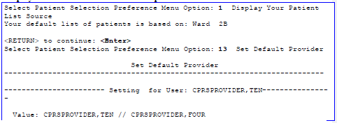******## Display Patients Linked to Me via TeamsThis option lets you see what patients are on teams that you are currently on.********Example**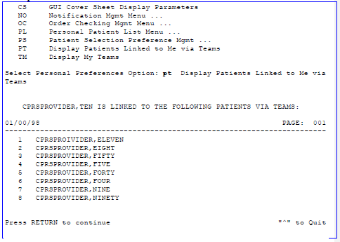***************************## Display My TeamsThis option lets you see what teams you are currently on.***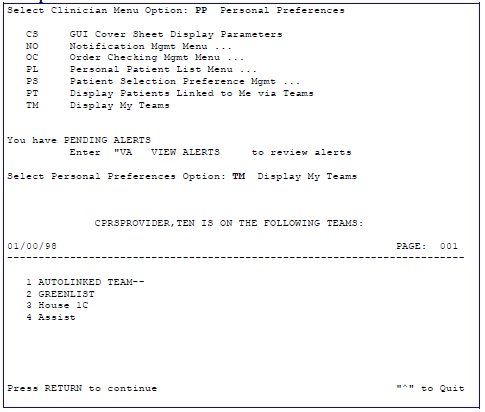*****Example
***********************###### ACTIONSActions (also known as protocols) are the items listed on the bottom part of the list manager screens. Sometimes these are processes that you can perform on screen items (processes such as sign, print, discontinue, renew, etc.), and sometimes they are the names of other screens (chart tabs) that you can go to.*****NOTE:** Order actions in CPRS work differently from OE/RR. In CPRS, you must pick an order from the review screen before the available actions appear at the bottom of the screen. In OE/RR the actions were visible at the bottom of the review screen before you selected an order.******###### CHART TABSChart Tabs are another name for the Chart Contents actions or pages. They allow you the following choices: Orders, Notes, Meds, Lab, D/C Summaries, and Problem Lists. (They are called Tabs to be consistent with the GUI version of CPRS, which uses the Windows convention of having tab-like graphic images for selecting options.) If you select one of these tabs, you will be given the option of NW. This allows you to write new notes, meds, labs, and problems without going through the order screen. You may also view results relating to these tabs by using the following steps: (1) Select CC; (2) Select a tab; e.g., consults, lab, (3) Select the number of the item you want information on, (4) Select Detailed Display.******###### CONSULTSConsults may be ordered via CPRS by selecting Other from the Add Orders screen or by selecting the Consults tab. You can also see Consults results through CPRS.******###### DETAILED DISPLAYWhen you select the action Detailed Display (DD) you can see additional information about an order, including *Who* entered the order, *what* physician or nurse initiated the order, and the *date* the order was entered or discontinued. You may view this information by selecting the number of the order in question, and then choosing Detailed Display .******###### ELECTRONIC SIGNATUREAn Electronic signature must accompany all orders entered by a physician, nurse practitioner, or physician’s assistant. These orders are not released to the services until signed (except for verbal orders). For outpatient medications, the order must be signed by an authorized provider. Verbal, telephoned, and written orders cannot be released to the pharmacy until they are signed.*****Note:** The purpose of this is to comply with VHA policy. You can read the policy on the intranet at [http://vaww.va.gov/pub/direc/health/manual/020704.htm.](http://vaww.va.gov/pub/direc/health/manual/020704.htm)******###### EXPIRED MED ORDERSExpired Med orders remain on the order screen for a time designated by your site.
********Helpful Hints, cont’d*****###### \>\> INDICATORSThe “greater-than” symbols (**\>\>**) beside an order indicates that this order needs to be completed or have action taken by a nurse or ward clerk.***When \>\> is shown in the black bar of the List Manager screen, it means that more information is available to the right of the screen; enter one or more of these symbols to see this information.******###### INORDERABLE ITEM IN PHARMACYThis is a notation that is seen when the pharmacy has changed its dispense drugs. An inorderable item can’t be renewed. The med in question can be continued by choosing the Change option, which automatically DCs the original and creates a new order that will be renewable thereafter. The Change option takes you through each field of the medication and allows you to edit as needed.******###### LAB TIP***To change a lab urgency “on-the-fly”: When you select a quick order from the menu, enter the number of the item followed by =\*.******###### MEDICATION ENTRY TIPS1.  Always use upper case when entering the schedule. The approved abbreviation for hours is***H. If other letters are listed, such as hr or hrs, the pharmacy package doesn’t read the schedule accurately, and incorrect times will appear on your MARS. Currently administration times can be edited under the Unit Dose option only.***1.  Enter the Schedules for these orders as follows: Insulin BID BID-INSULIN***ISMO BID-ISMO***PRN Q4-6H PRN***1.  Multiple Meds may be renewed or discontinued by selecting the order numbers, pressing enter, and choosing Renew or DC.***1.  Hard copies of orders automatically print to the service(s).***1.  Meds for discharge or pass can be selected and converted to outpatient status. This prevents the need for carbon copies of orders with original signatures. To place Meds on hold, enter a free-text order. Pharmacy considers orders to be either active or discontinued. They do not act on Hold orders. This is an action taken only by a unit’s nursing staff.***1.  If an order is questioned by pharmacy, it will be flagged, stating the reason for the flag, and the physician receives a View Alert. A Med can be unflagged if you choose the Med in question and then select UNFLAG.***1.  Verbal orders cause a View Alert to be automatically generated for the physician who needs to electronically sign the order.
*****Helpful Hints, cont’d*****###### NOTESProgress Notes can be accessed directly from the patient’s chart or through TIU as a separate menu option.******###### PATIENT LISTSYou can set up a specific list as your default. To enter a list, choose CHANGE VIEW (CV), then select WARD, CLINIC, or PROVIDER, etc., enter the name of the group (e.g., 2 west), then choose SV to save the list. This list must be saved after its selection for it to become your default. To change from one chart to another, the SP (Select Patient) choice returns the screen to your default list where you can select another patient. You may also enter a patient from another area of the unit by choosing FD (Find Patient) and entering the patient’s name. FD can be used even if you already have another unit loaded as your default list.******###### QUICK ORDERSQuick Orders allow you to enter labs and meds without going through as many steps. They are selected from the AD order screen by simply selecting a number (other than the \#s for the categories LABORATORY, MEDICATIONS, IMAGING, DIETETICS, etc.). Quick Orders are ones that physicians have determined to be their most commonly ordered items and have standard collection times, routes, and other conditions.******###### REPORTSReports for individual patients are available from the Reports tab. Reports for a ward/clinic can be found under the Results Reporting menu option. To print a Ward Summary, follow these steps:***1.  Select Results Reporting***1.  Select patient or patients***1.  Enter the range of numbers you want***1.  Choose \#8 to print Daily Order Summary, or \#11 for Chart Copies of orders***1.  Enter date range***1.  Answer Yes to *Display only those orders placed on this day: NO//****1.  Enter a printer name or hit ENTER at the DEVICE: HOME// prompt (This can also be queued)
******************# Glossary\+ A plus sign (+) in front of a Progress Note indicates that the note has addenda. A + in front of a lab order indicates that this lab test will be done multiple times according to a selected schedule.******\>\> These arrows (displayed in the center black bar) indicate that more information can be seen by scrolling to the left. If they are displayed beside an order, it means that a nurse or clerk needs to take action on the order.******CPRS Computerized Patient Record System, the *VISTA* package (in both GUI and character-based formats) that provides access to most components of the patient chart.******ASU Authorization/Subscription Utility, a *VISTA* application (initially released with TIU) that allows VAMCs to assign privileges such as who can do what in ordering, signing, releasing orders, etc.******Chart Contents The various components of the Patient Record, equivalent to the***major categories of a paper record; for example, Problem List, Progress Notes, Orders, Labs, Meds, Reports, etc. In CPRS, these components are listed at the bottom of the screen, to be selected individually for performing actions.******Consults Consult/Request Tracking, a *VISTA* product that is also part of CPRS (it can function as part of CPRS, independently as a standalone package, or as part of TIU). It’s used to request and track consultations or procedures from one clinician to another clinician or service.******Cover Sheet A screen of the CPRS patient chart that displays an overview of the patient’s record.******CWAD Crises, Warnings, Allergies/Adverse Reactions, and Directives.***These are displayed on the Cover Sheet of a patient’s computerized record, and can be edited, displayed in greater detail, or added to. *See Patient Postings.*******D/C Summary Discharge Summary; see below.******Discharge Summary A component of TIU that can function as part of CPRS, Discharge***Summaries are recapitulations of a patient’s course of care while in the hospital.******GUI Graphical User Interface—a Windows-like screen with pull-down menus, icons, pointer device, etc.******Health Summary A *VISTA* product that can be viewed through CPRS, Health***Summaries are components of patient information extracted from other *VISTA* applications.********Glossary, cont’d*****************Imaging A *VISTA* product that is also a component of CPRS; it includes Radiology, X-rays, Nuclear Medicine, etc.******Notifications Alerts regarding specific patients that appear on the CPRS patient***chart. They can be responded to through “VA View Alerts.”******OE/RR Order Entry/Results Reporting, a *VISTA* product that evolved into the more comprehensive CPRS.******Order Checking A component of CPRS that reviews orders as they are placed to see if they meet certain defined criteria that might cause the clinician placing the order to change or cancel the order (e.g., duplicate orders, drug-drug/diet/lab test interactions, etc.).******PCMM Patient Care Management Module, a *VISTA* product that manages patient/provider lists.******Patient Postings A component of CPRS that includes messages about patients; an***expanded version of CWAD (see above).******Progress Notes A component of TIU that can function as part of CPRS.******Quick Orders Quick Orders allow you to enter many kinds of orders without going through as many steps. They are types of orders that physicians have determined to be their most commonly ordered items and that have standard collection times, routes, and other conditions.******Reports A component of CPRS that includes Health Summary, Action Profile, and other summarized reports of patient care.******TIU Text Integration Utilities; a package for document handling, that includes Consults, Discharge Summary, and Progress Notes, and will later add other document types such as surgical pathology reports.***TIU components can be accessed for individual patients through the CPRS, or for multiple patients through the TIU interface.******VISN Veterans Information System Network, the regional organizations for managing computerization within a region.*******VISTA* Veterans Information Systems Technology Architecture, the new name for DHCP.
******| **Actions available, by tab**                         |    |                                |    |                     |
|-------------------------------------------------------|----|--------------------------------|----|---------------------|
| **Cover Sheet**                                       |    |                                |    |                     |
| NW Enter New Allergy/ADR                              | CV | (Change View ...)              | SP | Select New Patient  |
| AD Add New Orders                                     | CC | Chart Contents ...             | Q  | Close Patient Chart |
|  **Chart Contents**                                   |    |                                |    |                     |
| Cover Sheet Orders Problems Meds Notes Labs           |    | Imaging Consults D/C Summaries |    | Reports             |
|  **Problems**                                         |    |                                |    |                     |
| Inactivate Add Comment Detailed Display Remove Verify |    |                                |    |                     |*****Change View**********Progress Notes*******Change View*******Add Orders*******Change View********| **Order Actions**                                                            |                       |                        |                       |           |
|------------------------------------------------------------------------------|-----------------------|------------------------|-----------------------|-----------|
| Change                                                                       | Sign                  | Flag                   | Details               | Rewrite   |
| Renew Discontinue                                                            | Hold Release Hold     | Unflag Ward Comments   | Results Alert Results | Print ... |
|  **Meds**                                                                    |                       |                        |                       |           |
| NW Order New Meds ...                                                        | CV Change View ...    | SP Select New Patient  |                       |           |
| AD Add New Orders                                                            | CC Chart Contents ... | Q Close Patient Chart  |                       |           |
|  **Order Actions**                                                           |                       |                        |                       |           |
| Change Renew                                                                 | Discontinue Hold      | Transfer to Outpt Copy | Detailed Display      |           |
|  **Change View**                                                             |                       |                        |                       |           |
| Date range Save as Preferred View List Outpatient Meds Remove Preferred View |                       |                        |                       |           |**************************Actions available, by tab*******Labs*******Change View*******Imaging*******Change View*******Consults*******Change View*******Actions**********D/C Summaries*******Change View**| 1 | all signed    | 4 | signed/author | Save as Preferred View |
|---|---------------|---|---------------|------------------------|
| 2 | my unsigned   | 5 | signed/dates  | Remove Preferred View  |
| 3 | my uncosigned |   |               |                        |*****Actions*******Reports*******Change View*****************************# IndexGUI, 77, 80**\<****\<Enter\>**, 6*****\>****\>\>**, 78***#### A**AD**, 7, 23, 30, 36, 38, 41, 43, 45, 77, 79, 82**Add New Orders**, 23, 26, 56, 82Add Order Screen, 33, 36, 38, 41, 43, 45Alerts, 13, 81**Allergies**, 11, 12, 13, 14, 15, 18, 22, 26, 50, 53,56, 60, 77, 80Appendix A: Order Statuses, 82 ASU, 80***#### CChart Components, 20Chart Contents, 11, 12, 14, 15, 16, 18, 19, 20,22, 23, 47, 50, 53, 54, 56, 58, 60, 77, 80, 82**CHART TABS**, 77**Code Set Versioning**Consults and Procedures, 46**Problems**, 17Common Radiology Procedure List, 46 Computerized Patient Record System, 80, 14, 15, 18, 22, 46, 50, 53, 56, 60, 77, 80, 81,82Cover Sheet, 11, 12, 14, 15, 18, 22, 50, 53, 56, 60, 80,82**CPRS**, 8, 18, 58, 66, 77, 80, 81CWAD, 80, 81***#### DDEA number, 36, 38, 41, 43**Defaults**, 6, 34Detailed Display, 13, 21, 54, 77, 82**DETAILED DISPLAY**, 77diet, 34DIETETICS, 26, 30, 79Discharge Summaries, 58Discharge Summary, 58, 80, 81***#### E**ELECTRONIC SIGNATURE**, 77**H**Health Summary, 80Helpful Hints, 77, 78, 79***#### I**Icons**, 7Imaging, 14, 15, 18, 22, 50, 56, 57, 60, 77, 81, 82IMAGING, 26, 30, 46, 79INPATIENT MEDS, 26*Interface*, 80IV FLUIDS, 26, 45***#### LLab Cumulative, 61Labs, 50**List Manager**, 8***#### M**MED ORDERS**, 77Medications item, 35Meds, 47Modifier, 46***#### Nnotification, 68Notification Mgmt Menu Options, 67 Notifications, 68, 81***#### OOE, 15, 18, 53, 81Order Checking Management Options for Recipients, 71Order Statuses, 82, 14, 15, 18, 22, 23, 24, 25, 26, 30, 33, 34, 46,47, 50, 56, 60, 62, 68, 77, 79, 80, 81, 82DEA\# or VA\#, 36, 38, 41, 43First Dose Now, 41 **inpatient, complex dose**, 43 **inpatient, simple dose**, 41outpatient, complex dose, 38 outpatient, simple dose, 36 **POE overview**, 35wet signature, 36, 38#### FFind Patient, 10, 79First Dose Now. See Orders: First Dose Now, See Orders: First Dose Now***#### GGlossary, 80**P****PARAMETERS**, 26**PATIENT LISTS**, 79Patient Postings, 11, 12, 14, 15, 18, 22, 50, 53,56, 60, 81Patient Selection Preference Menu, 74 PCMM, 81Personal Preferences, 15, 18, 53, 66, 67, 71, 72, 73,74, 75*****************PHARMACY**, 78Problem List, 16, 17, 80Progress Notes, 18, 19, 20, 79, 80, 81***#### Qquick orders, 26, 33**QUICK ORDERS**, 79***#### RReports, 14, 15, 18, 22, 50, 56, 60, 61, 62, 63, 80, 81,82result, 55**RESULTS REPORTING**, 79**RR**, 10, 15, 18, 53, 81**S**Special Instructions for the First Time Computer User, 5Summaries, 80***#### TTIU, 81***#### U**User responses**, 6***#### VVA number, 36, 38, 41, 43VISN, 81V*IST*A, 80, 81

************
