# Technical Manual
CPRS: GUI Version
April 2024
∏
### Outline
```text
Introduction
General Application Settings
Personal Preferences (GUI)
Patient Selection Settings
Graphing Configuration
Remote Data View Configuration
Overview of Clinical Indicators Data Capture
SNOMED to Describe Problems in CPRS
Cover Sheet Settings
Problem Tab Settings
Medications Tab Settings
Orders Tab Settings
Notes Tab
Consults Tab Settings
Discharge Summary Tab Settings
Labs Tab Settings
Reports tab
Printing
Appendix A - RPCs
Appendix B - New Fields
Appendix C - Parameters by Function
Appendix D - Parameters By Name
Appendix E - Creating CPRS Extension COM Object in Delphi
Appendix F - Interface Specifications
Appendix G - Accessibility
Appendix H – USING NEWPERS DEBUGGER
Glossary
Index
```

### Contents

[**Introduction** ](#_tjcfya)**1**
[What is CPRS? 1](#what-is-cprs)  
[Using CPRS Documentation 1](#using-cprs-documentation)  
[*Related Manuals 1*](#related-manuals  
[*World Wide Web 1*](#world-wide-web)  
[CPRS GUI Interface 1](#cprs-gui-inteace)  
[The Organization of this Manual 1](#the-organization-of-this-manual)  
[**General Application Settings** ](#_3dizym3)**3**  
[Command Line Switches 3](#command-line-switches)  
[Initial View 4](#initial-view)  
[Women’s Health Features 5](#_4f1mdlm)  
[Tools Menu 5](#tools-menu)  
[*Format for Entering Items in ORWT TOOLS MENU 5*](#format-for-entering-items-in-orwt-tools-menu)  
[*Adding Items to the Tools Menu 7*](#adding-items-to-the-tools-menu)  
[*Removing an Item from the Tools Menu 7*](#removing-an-item-from-the-tools-menu)  
[*Automatic and User-Created Submenus 8*](#automatic-and-user-created-submenus)  
[*Window Layout 14*](#window-layout)  
[Entering Time into CPRS Fields 16](#entering-time-into-cprs-fields)  
[Timeouts 17](#timeouts)  
[Miscellaneous 17](#miscellaneous)  
[*Event Notification 17*](#event-notification)  
[*Web Access 17*](#web-access)
[**Personal Preferences (GUI)** ](#_1soa8tw)**18**  
[General Tab 18](#general-tab)  
[Notifications Tab 19](#notifications-tab)   
[Order Checks 20](#order-checks).  
[List/Team 20](#_34g0dwd).  
[Notes tab 23](#notes-tab).  
[Reports Tab 24](#reports-tab).  
[Surrogates Tab 24](#_xvir7l).  
[**Patient Selection Settings** ](#_4cnxrhp)**25**
[Patient List Settings 25](#patient-list-settings).  
[Notifications 25](#notifications).  
[**Graphing Configuration** ](#_2rt81pi)**26**  
[Disabling CPRS Graphing 26](#disabling-cprs-graphing).  
[Disabling CPRS Graphing Background Processing 26](#disabling-cprs-graphing-background-processing).  
[Disabling Data Sources 27](#disabling-data-sources).  
[Editing Public Display Options and Views 29](#editing-public-display-options-and-views).  
[Creating Graph Reports 29](#creating-graph-reports).  
[Creating Public Views 30](#creating-public-views)   
[Creating Graph Reports 30](#creating-graph-reports-1). 
[Creating a Graph-Reports Menu 31](#creating-a-graph-reports-menu). 
[Adding Your Graph Menu to the Available Reports List 32](#adding-your-graph-menu-to-the-available-reports-list). 
[**Remote Data View Configuration** ](#_16yibxb)**34**
[Master Patient Index (MPI) 34](#master-patient-index-mpi). 
[Configuring Remote Data Views 34](#configuring-remote-data-views). 
[Security 35](#security). 
[Department of Defense Data 35](#department-of-defense-data). 
[**Overview of Clinical Indicators Data Capture** ](#_3qy5ul4)**37**
[Enabling the Master Clinical Indicators Data Capture Switch 37](#enabling-the-master-clinical-indicators-data-capture-switch). 
[Disabling the Main Clinical Indicators Data Capture Switch 38](#disabling-the-main-clinical-indicators-data-capture-switch). 
[Assigning, Enabling, Disabling, and Reporting on the Clinical Indicators Data Capture Provider Switch 39](#assigning-enabling-disabling-and-reporting-on-the-clinical-indicators-data-capture-provider-switch). 
[*Managing the CIDC Provider Switch for Individual Providers 39*](#managing-the-cidc-provider-switch-for-individual-providers). 
[*Enabling the CIDC Provider Switch for Multiple Providers Simultaneously 41*](#enabling-the-cidc-provider-switch-for-multiple-providers-simultaneously)  
[*Assigning but Disabling the CIDC Provider Switch for Multiple Providers Simultaneously 43*](#assigning-but-disabling-the-cidc-provider-switch-for-multiple-providers-simultaneously)  
[*Creating Reports on the CIDC Provider Switch 45*](#creating-reports-on-the-cidc-provider-switch)  
[**SNOMED to Describe Problems in CPRS** ](#_263g4sx)**51**
[A New Mail Group for Term Review 51](#a-new-mail-group-for-term-review)  
[Adding Members to the OR CACS Mail Group 52](#adding-members-to-the-or-cacs-mail-group)  
[NTRT Request Bulletin Sent to OR CACS Mail Group 54](#ntrt-request-bulletin-sent-to-or-cacs-mail-group)  
[**Cover Sheet Settings** ](#_l8qf0q)**56**
[Background / Foreground Retrieval 56](#background--foreground-retrieval)  
[*Customizing the Cover Sheet Layout 58*](#_1qoc8b1)  
[Content Criteria 63](#content-criteria)  
[*Problem List 63*](#problem-list)  
[*Allergies 63*](#allergies)  
[*Postings 63*](#postings)  
[*Medications 63*](#medications)  
[*Reminders 64*](#reminders)  
[*Lab Results 64*](#lab-results)  
[*Vitals 64*](#vitals)  
[*Visits/Admissions 64*](#visitsadmissions)  
[*Immunizations 64*](#immunizations)  
[*Women’s Health 64*](#womens-health)  
[**Problem Tab Settings** ](#_358dxoj)**65**
[Default Views 65](#default-views)  
[Setting Up Problem Selection Lists 65](#setting-up-problem-selection-lists)  
[*What Is a Selection List? 66*](#what-is-a-selection-list)  
[*Assigning Problem Selection Lists 67*](#assigning-problem-selection-lists)  
[*User Access and Privileges 67*](#user-access-and-privileges)  
[**Medications Tab Settings** ](#_1kdo7wc)**68**
[Medication List Content 68](#medication-list-content)  
[*Active 68*](#active)  
[*Pending 68*](#pending)  
[*Non-active 68*](#non-active)  
[How Long to Display Expired and Discontinued Meds 68](#how-long-to-display-expired-and-discontinued-meds)  
[New Medication Orders 69](#new-medication-orders)  
[*Inpatient Medication Orders for Outpatients: Setting the ORWDX NEW MED Parameter 70*](#_2eclud0)  
[*Additional Options 70*](#additional-options)  
[**Orders Tab Settings** ](#_44dbqk5)**72**
[Order View 72](#order-view)  
[*Expiring Orders 73*](#expiring-orders)  
[*Active Orders 73*](#active-orders)  
[*Recent Activity 74*](#recent-activity)
[*Recently Expired 74*](#recently-expired)
[*Unified Action Profile 74*](#_3im3ia3)
[*Discharge Meds 75*](#_3abhhcj)
[Ordering Access/Authorization 75](#ordering-accessauthorization)
[*Clinic Orders (Inpatient Orders Administered in Clinic) 76*](#_22vxnjd)
[*Permission to Write Supply Orders 79*](#permission-to-write-supply-orders)
[*How Does CPRS Identify an Orderable Item as a Supply? 79*](#how-does-cprs-identify-an-orderable-item-as-a-supply)
[Writing Orders 80](#writing-orders)
[*Configuring the Orders List Using the ORWOR WRITE ORDERS LIST Parameter 80*](#configuring-the-orders-list-using-the-orwor-write-orders-list-parameter)
[*To configure the Orders List Using ORWDX WRITE ORDERS LIST Parameter 81*](#to-configure-the-orders-list-using-orwdx-write-orders-list-parameter)
[Event-Delayed Orders 83](#_280hiku)
[*Creating a Release Event 83*](#creating-a-release-event)
[*Creating a Child Release Event 84*](#creating-a-child-release-event)
[*Explanation of Release Event Prompts (Fields in the OE/RR RELEASE EVENTS file \#100.5) 86*](#_2vor4mt)
[*Sample Release Events 89*](#sample-release-events)
[*Activating/Inactivating a Release Event 92*](#activatinginactivating-a-release-event)
[*Detailed Display of a Release Event 94*](#detailed-display-of-a-release-event)
[*Tracking Event-Delayed Orders (OE/RR PATIENT EVENTS file \#100.2) 97*](#tracking-event-delayed-orders-oerr-patient-events-file-1002)
[*Creating a List of Commonly Used Release Events 97*](#creating-a-list-of-commonly-used-release-events)
[*Defining a Default Release Event 100*](#defining-a-default-release-event)
[*Defining the Orders Menu for a Release Event 103*](#defining-the-orders-menu-for-a-release-event)
[*Controlling who can Manually Release Orders 106*](#controlling-who-can-manually-release-orders)
[*Setting the Manual Release Parameter (OREVNT MANUAL RELEASE) 107*](#setting-the-manual-release-parameter-orevnt-manual-release)
[*Excluding Display Groups from the Copy Active Orders Dialog Box 108*](#_48zs1w5)
[*Changing the Display 110*](#changing-the-display)
[*Files Associated with Release Events 111*](#files-associated-with-release-events)
[Give Additional Dose Now Option on the Inpatient Medications Form 114](#_40p60yl)
[Automatically Discontinuing Orders (Auto-DC Rules) 115](#automatically-discontinuing-orders-auto-dc-rules)
[*Creating a New Auto-DC Rule 116*](#creating-a-new-auto-dc-rule)
[*Explanation of Auto-DC Rules Prompts (fields in the OE/RR AUTO-DC RULES FILE \#100.6) 117*](#_4ay9r1j)
[*Sample Rules 118*](#sample-rules)
[*Activating/Inactivating an Auto-DC Rule 123*](#activatinginactivating-an-auto-dc-rule)
[*Editing an Auto-DC Rule 123*](#editing-an-auto-dc-rule)
[*Changing the Display 127*](#changing-the-display-1)
[*Files Associated with Auto-DC Rules 129*](#files-associated-with-auto-dc-rules)
[*Frequently Asked Questions about Event-Delayed Orders and Automatically Discontinuing Orders (Auto-DC Rules) 136*](#_1hgfqph)
[Lapsing Orders 138](#lapsing-orders)
[Personal Quick Orders 140](#personal-quick-orders)
[Ordering Menus and Quick Orders 140](#_1uvlmoi)
[Tracking Antimicrobial Quick Orders 142](#tracking-antimicrobial-quick-orders)
[Antimicrobial Quick Order Auditing Options 145](#_2lpxemk)
[Using the OR Quick Order Audit Monthly Report 146](#_4jzt0ds)
[Ordering Dialogs 149](#ordering-dialogs)
[*Some Troubleshooting 149*](#some-troubleshooting)
[Allergy/Adverse Reaction Tracking Dialog 150](#_15zrjvu)
[Outpatient Medication Order Dialog 151](#outpatient-medication-order-dialog)
[Entering Custom Reasons for Non-VA Meds 151](#entering-custom-reasons-for-non-va-meds)
[Entering a Message for Inpatient Clozapine Orders 152](#entering-a-message-for-inpatient-clozapine-orders)
[Entering a Message for Controlled Substance Orders With No Patient Address 152](#_1jexfuv)
[Return to Clinic 153](#return-to-clinic)
[VBECS Installation and Setup 153](#vbecs-installation-and-setup)
[*Order Dialog 154*](#order-dialog)
[*Quick Orders 155*](#quick-orders)
[*Adding to the Order Menu 159*](#adding-to-the-order-menu)
[*Menus 162*](#menus)
[*Auto-DC Blood orders 163*](#auto-dc-blood-orders)
[*Parameters 163*](#parameters)
[Signing Orders / Exiting the Chart 164](#signing-orders--exiting-the-chart)
[*Digitally Signing Orders 164*](#digitally-signing-orders)
[Order Flagging and Unflagging Set Up 189](#order-flagging-and-unflagging-set-up)
[*Order Unflagging Restrictions 190*](#order-unflagging-restrictions)
[*Order Unflagging Key Setup 190*](#order-unflagging-key-setup)
[*Order Unflagging Message 190*](#order-unflagging-message)
[*Order Flag Expire Default 190*](#order-flag-expire-default)
[Consults Order Dialog 190](#consults-order-dialog)
[*Parameters 190*](#parameters-1)
[*Variables 190*](#variables)
[*Procedures Order Dialog 191*](#procedures-order-dialog)
[*Lab Order Dialog 191*](#lab-order-dialog)
[*Anatomic Pathology Order Dialog 195*](#_2c7qwyb)
[*Imaging Order Dialog 199*](#imaging-order-dialog)
[*Allergies Dialog 199*](#allergies-dialog)
[**Notes Tab** ](#_2jim0ry)**200**
[Criteria Used to Determine Notes Shown in List 200](#criteria-used-to-determine-notes-shown-in-list)
[TIU Personal Preferences Menu 200](#tiu-personal-preferences-menu)
[Document List Management 201](#document-list-management)
[Consult Completion Via the Notes Tab 201](#consult-completion-via-the-notes-tab)
[Autosaving Parameter 202](#autosaving-parameter)
[Spell Checking 202](#spell-checking)
[Additional Documentation 203](#additional-documentation)
[Populating the Encounter Forms 204](#populating-the-encounter-forms)
[Encounter Parameters 207](#encounter-parameters)
[*Prompting for encounter Entry When Signing a Note 207*](#prompting-for-encounter-entry-when-signing-a-note)
[*Availability of the Encounter Button 209*](#availability-of-the-encounter-button)
[*Managing Encounter Checkout 209*](#managing-encounter-checkout)
[*Restricting Encounter Form Entry of Encounter Data 210*](#restricting-encounter-form-entry-of-encounter-data)
[*Forcing Type of Visit Selection 210*](#forcing-type-of-visit-selection)
[Women’s Health Note Document Class 210](#womens-health-note-document-class)
[Templates – Access, Storage and Maintenance 212](#templates--access-storage-and-maintenance)
[*Shared Template Editor Authority 212*](#shared-template-editor-authority)
[*Personal Template Editor and Use Authority 213*](#personal-template-editor-and-use-authority)
[Template Links to Reminder Dialogs 214](#template-links-to-reminder-dialogs)
[Restricting Allowed Patient Data Objects within Templates 214](#restricting-allowed-patient-data-objects-within-templates)
[Template Import/Export Utility 215](#template-importexport-utility)
[Template Fields 215](#template-fields)
[Quick Order Auditing Templates 216](#_l0wvdy)
[Reminder Options 217](#reminder-options)
[*CPRS Reminder Configuration Menu 218*](#cprs-reminder-configuration-menu)
[*CPRS Cover Sheet Reminder List (CS) 219*](#cprs-cover-sheet-reminder-list-cs)
[*Add/Edit Reminder Categories (CA) 220*](#addedit-reminder-categories-ca)
[*Actions 220*](#actions)
[*Actions 221*](#actions-1)
[*CPRS Lookup Categories (CL) 221*](#cprs-lookup-categories-cl)
[*Progress Note Headers (PN) 222*](#progress-note-headers-pn)
[*Reminder GUI Resolution Active (RA) 224*](#reminder-gui-resolution-active-ra)
[*Reminder Icon Definitions 224*](#reminder-icon-definitions)
[*New Cover Sheet Reminder List 225*](#new-cover-sheet-reminder-list)
[*Reminder Dialog Outside Location Prompts 228*](#reminder-dialog-outside-location-prompts)
[*Placing Reminder Dialog Generated Text 229*](#placing-reminder-dialog-generated-text)
[*Configuring the Mental Health DLL Used with Reminders 229*](#configuring-the-mental-health-dll-used-with-reminders)
[*Customizing the Mental Health Assessments Pop-Up Message Text 230*](#customizing-the-mental-health-assessments-pop-up-message-text)
[OR CPRS USER CLASS EXCLUDE Parameter - Utilized to Limit Additional Signers and Filter Provider Dropdowns 230](#_va0lgw)
[**Consults Tab Settings** ](#_ynwazr)**231**
[Criteria Used to Determine Requests Displayed in List 231](#criteria-used-to-determine-requests-displayed-in-list)
[Access Determinations 231](#access-determinations)
[Setting New Request Parameters 232](#setting-new-request-parameters)
[COMMUNITY CARE -DS or -ADMIN Consult Orders with ADMIN Key 232](#_3sou03q)
[**Discharge Summary Tab Settings** ](#_3injtnk)**234**
[Requirements for Admission and Attending 234](#requirements-for-admission-and-attending)
[Criteria Used to Determine Summaries Shown in List 234](#criteria-used-to-determine-summaries-shown-in-list)
[**Labs Tab Settings** ](#_1xsu3vd)**236**
[Labs Reports 236](#labs-reports)
[**Reports tab** ](#_4hshmj6)**237**
[Host file setup 237](#host-file-setup)
[Quick Order Reports to Correct Dosages for Order Checks 237](#quick-order-reports-to-correct-dosages-for-order-checks)
[*Quick Order Mixed-Case Report 237*](#quick-order-mixed-case-report)
[*Fixing the Quick Orders listed the report 241*](#fixing-the-quick-orders-listed-the-report)
[*Quick Order Free Text Report 244*](#quick-order-free-text-report)
[*Comparison of System and Personal Type Quick Orders on two Sample Orders 250*](#comparison-of-system-and-personal-type-quick-orders-on-two-sample-orders)
[*Quick Order Report FAQs 258*](#quick-order-report-faqs)
[*Free Text Formatting 260*](#_32lfgkd)
[*Quick Order Free Text Report Checklist 261*](#quick-order-free-text-report-checklist)
[Health Summary Configuration 262](#health-summary-configuration)
[Daily Order Summary 262](#daily-order-summary)
[Improving Graphing Performance: Graphing Resource Device 262](#improving-graphing-performance-graphing-resource-device)
[**Printing** ](#_2wxrwqz)**264**
[Assigning a Default CPRS Printer 264](#assigning-a-default-cprs-printer)
[Setting a Default Printer 264](#setting-a-default-printer)
[Setting a Windows Printer as a User’s Default Printer 264](#setting-a-windows-printer-as-a-users-default-printer)
[Setting Up Orders Printing 265](#setting-up-orders-printing)
[*ORPF Prompt for Chart Copy and ORPF Prompt for Work Copy 265*](#orpf-prompt-for-chart-copy-and-orpf-prompt-for-work-copy)
[*ORPF CHART COPY PRINT DEVICE and ORPF WORK COPY PRINT DEVICE 266*](#orpf-chart-copy-print-device-and-orpf-work-copy-print-device)
[*ORCL NATURE 266*](#orcl-nature)
[**Appendix A - RPCs** ](#_1c326ys)**268**
[**Appendix B - New Fields** ](#_3w2ppml)**299**
[OR\*3.0\*10 299](#or3010)
[*Auto-Accept 299*](#auto-accept)
[OR\*3.0\*85 299](#or3085)
[*Description 299*](#description)
[OR\*3.0\*94 299](#or3094)
[*Non-Formulary 299*](#non-formulary)
[OR\*3.0\*441 299](#_33ccoz2)
[OR\*3.0\*444 300](#_42hahuo)
[*United Action Profile 300*](#united-action-profile)
[OR\*3.0\*490 300](#or30490)
[OR\*3.0\*377 300](#or30377)
[OR\*3.0\*519 302](#or30519)
[OR\*3.0\*539 302](#_3u6ogx4)
[OR\*3.0\*569 303](#_oh91cq)
[OR\*3.0\*405 305](#_47lucw5)
[**Appendix C - Parameters by Function** ](#_2b7zzue)**306**
[Menus for modifying Parameters 306](#menus-for-modifying-parameters)
[*COVID-19 306*](#_4l108v6)
[Ordering – Interactive Behaviors 308](#ordering--interactive-behaviors)
[*Authorization/Access 308*](#authorizationaccess)
[*Order List Content 310*](#order-list-content)
[*Order Action Behavior 313*](#order-action-behavior)
[*Review / Sign Orders 313*](#review--sign-orders)
[*Ordering—Blood Bank Order Dialog 314*](#orderingblood-bank-order-dialog)
[*Ordering—Return to Clinic Dialog 318*](#orderingreturn-to-clinic-dialog)
[*Ordering-Enable/Disable Unified Action Profile (UAP) 318*](#_1memdhn)
[*Ordering—Menus/Dialogs 319*](#orderingmenusdialogs)
[*Event-Delayed Orders 321*](#event-delayed-orders-1)
[*Personal Quick Orders 324*](#personal-quick-orders-1)
[*Med Ordering (GUI) 330*](#med-ordering-gui)
[*Documenting Non-VA Meds 331*](#documenting-non-va-meds)
[*Expired Meds 332*](#expired-meds)
[*Nature of Order 332*](#nature-of-order)
[*Order Flagging 333*](#order-flagging)
[Ordering – Reports & Printing 334](#ordering--reports--printing)
[*Report Generation 334*](#report-generation)
[*Report Formatting 335*](#report-formatting)
[*Devices 341*](#devices)
[*Printing (GUI) 345*](#printing-gui)
[Ordering – Notifications & Order Checks 346](#ordering--notifications--order-checks)
[*Notifications 346*](#notifications-1)
[*Order Checks 361*](#order-checks-1)
[*Ordering – Miscellaneous 366*](#ordering--miscellaneous)
[*System Management 368*](#system-management)
[*Auto-DC 368*](#auto-dc)
[*Patient Movement Actions 370*](#patient-movement-actions)
[Not Specific to Ordering 371](#not-specific-to-ordering)
[*General Behavior (GUI) 371*](#general-behavior-gui)
[*Desktop Layout (GUI) 373*](#desktop-layout-gui)
[*Patient Selection 379*](#patient-selection)
[*Remote Data Viewer 384*](#remote-data-viewer)
[*Reminders 384*](#reminders-1)
[*Cover Sheet 385*](#cover-sheet)
[*Problem List 390*](#problem-list-1)
[*Notes / Encounter 391*](#notes--encounter)
[*Labs 396*](#labs)
[*Reports 396*](#reports)
[*Surgery 400*](#surgery)
[*Graphing 400*](#graphing)
[*SMART Parameters 403*](#_1one2pq)
[*Providers with Similar Names 403*](#providers-with-similar-names)
[*Prescription Drug-Monitoring Programs (PDMP) 403*](#prescription-drug-monitoring-programs-pdmp)
[*Consults Tool Box (CTB) 408*](#consults-tool-box-ctb)
[*Decision Support Tool (DST) 411*](#decision-support-tool-dst)
[**Appendix D - Parameters By Name** ](#_qdaa27)**414**
[OR ADD ORDERS MENU 414](#or-add-orders-menu)
[OR ADMIN TIME HELP TEXT 414](#or-admin-time-help-text)
[OR ALLERGY ENTERED IN ERROR 414](#or-allergy-entered-in-error)
[OR BILLING AWARENESS BY USER 415](#or-billing-awareness-by-user)
[OR AUTORENEWAL USER 415](#or-autorenewal-user)
[OR CLOZ INPT MSG 415](#or-cloz-inpt-msg)
[OR CPRS CLOZAPINE CUSTOM MSG 416](#_3jr7ikv)
[OR CPRS DEBUG EMAIL 416](#or-cprs-debug-email)
[OR CPRS EXCEPTION EMAIL 417](#or-cprs-exception-email)
[OR CPRS EXCEPTION LOGGER 417](#or-cprs-exception-logger)
[OR CPRS EXCEPTION PURGE 418](#or-cprs-exception-purge)
[OR CPRS HELP DESK TEXT 418](#or-cprs-help-desk-text)
[OR CPRS ORDERS WRITE ACCESS 418](#_14w3uyj)
[OR CPRS OTHER WRITE ACCESS 419](#_2411nu5)
[OR CPRS TABS WRITE ACCESS 419](#_335zgpr)
[OR CPRS USER CLASS EXCLUDE 420](#or-cprs-user-class-exclude)
[OR CPRS WRITE ACCESS ERROR 420](#_3gl5cos)
[OR DC GEN ORD ON ADMISSION 420](#or-dc-gen-ord-on-admission)
[OR DC ON SPEC CHANGE 421](#or-dc-on-spec-change)
[OR DC REASON LIST 421](#or-dc-reason-list)
[OR DEA PIV LINK MSG 421](#or-dea-piv-link-msg)
[OR EXCLUDE FROM MIXCASE 422](#or-exclude-from-mixcase)
[OR FLAG ORDER EXPIRE DEFAULT 423](#_11q1p2g)
[OR FLAGGED & WARD COMMENTS 423](#_20uzhy2)
[OR FLAGGED ORD REASONS 423](#or-flagged-ord-reasons)
[OR GN LOCATIONS 424](#or-gn-locations)
[OR IMM CONTACT INFORMATION 424](#_tffo4w)
[OR IMM COVERSHEET DIAGNOSIS 425](#_1skdh0i)
[OR IMM REMINDER DIALOG 425](#_2rpb9w4)
[OR IMMUNIZATION DOCUMENT TITLE 425](#_3qu92rq)
[OR LAB CANCEL ERROR MESSAGE 426](#or-lab-cancel-error-message)
[OR LAB TAB DEFAULT REPORT 426](#or-lab-tab-default-report)
[OR LAPSE ORDERS 427](#or-lapse-orders)
[OR NATURE DEFAULT 427](#_3ijn1u6)
[OR LAPSE ORDERS DFLT 428](#or-lapse-orders-dflt)
[OR MHV URL 428](#_3vysxt7)
[OR MOB DLL NAME 428](#or-mob-dll-name)
[OR NATURE SWITCH 429](#_1pebb4f)
[OR ONE STEP CLINIC ADMIN OFF 429](#or-one-step-clinic-admin-off)
[OR ORDER REVIEW DT 430](#or-order-review-dt)
[OR ORDER SUMMARY CONTEXT 430](#or-order-summary-context)
[OR ORDER TEXT CONVERSION 430](#or-order-text-conversion)
[OR OREMAS MED ORDERS 431](#or-oremas-med-orders)
[OR OREMAS NON-VA MED ORDERS 431](#or-oremas-non-va-med-orders)
[OR OTH BTN LOCAL MSG 431](#or-oth-btn-local-msg)
[OR OTHER INFO ON 431](#_2tnsz1i)
[OR OTHER INFO REMINDER 432](#or-other-info-reminder)
[OR OTHER INFO USE COLOR 432](#or-other-info-use-color)
[OR PCE TASKING UPDATES OFF 432](#or-pce-tasking-updates-off)
[OR PRINT ALL ORDERS CHART SUM 433](#or-print-all-orders-chart-sum)
[OR PRINT NO ORDERS ON SUM 433](#or-print-no-orders-on-sum)
[OR RA RFS CARRY ON 434](#or-ra-rfs-carry-on-1)
[OR RADIOLOGY ISSUES 434](#or-radiology-issues)
[OR RDI CACHE TIME 434](#or-rdi-cache-time)
[OR RDI HAVE HDR 435](#or-rdi-have-hdr)
[OR RELEASE FORM HELP 435](#or-release-form-help)
[OR RELEASE FORM TEXT 435](#or-release-form-text)
[OR REPORT DATE SELECT TYPE 436](#or-report-date-select-type)
[OR RTN PROCESSED ALERTS 436](#_2qhqt5f)
[OR SD ADDITIONAL INFORMATION 436](#or-sd-additional-information)
[OR SD CIDC STOP OFFSET 437](#or-sd-cidc-stop-offset)
[OR SD DIALOG PREREQ 437](#or-sd-dialog-prereq)
[OR SIGNATURE DEFAULT ACTION 437](#or-signature-default-action)
[OR SIGNED ON CHART 438](#or-signed-on-chart)
[OR SIMILAR NAMES ENABLED 438](#_1whcvba)
[OR SIMULATE ON EHR 438](#_2vmao6w)
[OR SMART IMAGING PROCEDURE 439](#or-smart-imaging-procedure)
[OR SMART OUTSIDE HEALTH FACTOR 439](#or-smart-outside-health-factor)
[OR TURNED ON REPORT BOX 439](#_391gk5x)
[OR UNFLAGGING MESSAGE 440](#_486ed1j)
[OR UNFLAGGING RESTRICTIONS 440](#_12gyxh5)
[OR UNIFIED ACTION PROFILE OFF 440](#_3mgmg4y)
[OR UNSIGNED ORDERS ON EXIT 441](#or-unsigned-orders-on-exit)
[OR USE MH DLL 441](#or-use-mh-dll)
[OR VBECS COMPONENT ORDER 442](#or-vbecs-component-order)
[OR VBECS DIAGNOSTIC PANEL 1ST 442](#or-vbecs-diagnostic-panel-1st)
[OR VBECS DIAGNOSTIC TEST ORDER 443](#or-vbecs-diagnostic-test-order)
[OR VBECS ERROR MESSAGE 443](#or-vbecs-error-message)
[OR VBECS LEGACY REPORT 444](#or-vbecs-legacy-report)
[OR VBECS MODIFIERS 444](#or-vbecs-modifiers)
[OR VBECS ON 444](#or-vbecs-on)
[OR VBECS REASON FOR REQUEST 445](#or-vbecs-reason-for-request)
[OR VBECS REMOVE COLL TIME 445](#or-vbecs-remove-coll-time)
[OR VBECS SUPPRESS NURS ADMIN 446](#or-vbecs-suppress-nurs-admin)
[OR VIMM IMM REMINDERS 446](#_r0aqni)
[OR VIMM SKIN REMINDERS 446](#_1q58jj4)
[OR VIMM USE ICE 447](#_2pa6ceq)
[OR ZIP CODE MESSAGE 447](#_14fgmmj)
[OR ZIP CODE SWITCH 448](#_23kefi5)
[ORB ARCHIVE PERIOD 448](#orb-archive-period)
[ORB DAYS FOR PROCESSED ALERTS 448](#_41ua19d)
[ORB DEFAULT RECIPIENT DEVICES 449](#orb-default-recipient-devices)
[ORB DEFAULT RECIPIENTS 449](#orb-default-recipients)
[ORB DELETE MECHANISM 450](#orb-delete-mechanism)
[ORB ERASE ALL 450](#orb-erase-all)
[ORB FLAGGED ORDERS BULLETIN 451](#orb-flagged-orders-bulletin)
[ORB FORWARD BACKUP REVIEWER 451](#orb-forward-backup-reviewer)
[ORB FORWARD SUPERVISOR 452](#orb-forward-supervisor)
[ORB FORWARD SURROGATES 452](#orb-forward-surrogates)
[ORB LAB \> THRESHOLD 453](#orb-lab--threshold)
[ORB LAB \< THRESHOLD 453](#orb-lab--threshold-1)
[ORB LAST QUEUE DATE 454](#orb-last-queue-date)
[ORB MAX PROCESSED ALERTS 454](#_4kdzs9v)
[ORB OI EXPIRING - INPT 454](#orb-oi-expiring---inpt)
[ORB OI EXPIRING - INPT PR 455](#orb-oi-expiring---inpt-pr)
[ORB OI EXPIRING - OUTPT 456](#orb-oi-expiring---outpt)
[ORB OI EXPIRING - OUTPT PR 457](#orb-oi-expiring---outpt-pr)
[ORB OI ORDERED - INPT 458](#orb-oi-ordered---inpt)
[ORB OI ORDERED - INPT PR 458](#orb-oi-ordered---inpt-pr)
[ORB OI ORDERED - OUTPT PR 459](#orb-oi-ordered---outpt-pr)
[ORB OI ORDERED - OUTPT 460](#orb-oi-ordered---outpt)
[ORB OI RESULTS - INPT 461](#orb-oi-results---inpt)
[ORB OI RESULTS - INPT PR 461](#orb-oi-results---inpt-pr)
[ORB OI RESULTS - OUTPT 463](#orb-oi-results---outpt)
[ORB OI RESULTS - OUTPT PR 463](#orb-oi-results---outpt-pr)
[ORB PROCESSING FLAG 465](#orb-processing-flag)
[ORB PROVIDER RECIPIENTS 465](#orb-provider-recipients)
[ORB REMOVE 466](#orb-remove)
[ORB REMOVE NON-OR 467](#orb-remove-non-or)
[ORB SORT DIRECTION 467](#orb-sort-direction)
[ORB SORT METHOD 468](#orb-sort-method)
[ORB SURROGATE RECIPIENT 468](#orb-surrogate-recipient)
[ORB SYSTEM ENABLE/DISABLE 469](#orb-system-enabledisable)
[ORB UNVERIFIED MED ORDER 469](#orb-unverified-med-order)
[ORB UNVERIFIED ORDER 469](#orb-unverified-order)
[ORB URGENCY 470](#orb-urgency)
[ORBC CONVERSION 470](#orbc-conversion)
[ORCD COMMON LAB MENU INPT 470](#orcd-common-lab-menu-inpt)
[ORCDGMRC CLIN IND DATE DEFAULT 471](#orcdgmrc-clin-ind-date-default)
[ORCDGMRC EARLIEST DATE DEFAULT 471](#orcdgmrc-earliest-date-default)
[ORCDLR URGENCIES 471](#orcdlr-urgencies)
[ORCH CONTEXT CONSULTS 472](#orch-context-consults)
[ORCH CONTEXT INPT LABS 472](#orch-context-inpt-labs)
[ORCH CONTEXT MEDS 472](#orch-context-meds)
[ORCH CONTEXT MEDS INPAT 473](#_3k1hink)
[ORCH CONTEXT MEDS OUTPAT NONVA 473](#_4j6fbj6)
[ORCH CONTEXT NOTES 474](#orch-context-notes)
[ORCH CONTEXT ORDERS 474](#orch-context-orders)
[ORCH CONTEXT OUTPT LABS 474](#orch-context-outpt-labs)
[ORCH CONTEXT PROBLEMS 474](#orch-context-problems)
[ORCH CONTEXT REPORTS 475](#orch-context-reports)
[ORCH CONTEXT SUMMRIES 475](#orch-context-summries)
[ORCH CONTEXT SURGERY 475](#orch-context-surgery)
[ORCH CONTEXT XRAYS 475](#orch-context-xrays)
[ORCH INITIAL TAB 475](#orch-initial-tab)
[ORCH USE LAST TAB 476](#orch-use-last-tab)
[ORDER URGENCY ASAP ALTERNATIVE 476](#_1iljr09)
[OREVNT COMMON LIST 476](#orevnt-common-list)
[OREVNT DEFAULT 477](#_wvru3o)
[OREVNT EXCLUDE DGRP 477](#_1w0pmza)
[OREVNT MANUAL RELEASE 478](#_2v5nfuw)
[OREVNT MANUAL RELEASE CONTROL 478](#_3ual8qi)
[ORK CLINICAL DANGER LEVEL 479](#ork-clinical-danger-level)
[ORK CT LIMIT HT 479](#ork-ct-limit-ht)
[ORK CT LIMIT WT 480](#ork-ct-limit-wt)
[ORK DEBUG ENABLE/DISABLE 480](#ork-debug-enabledisable)
[ORK DUP ORDER RANGE LAB 480](#ork-dup-order-range-lab)
[ORK DUP ORDER RANGE OI 481](#ork-dup-order-range-oi)
[ORK DUP ORDER RANGE RADIOLOGY 481](#ork-dup-order-range-radiology)
[ORK EDITABLE BY USER 482](#ork-editable-by-user)
[ORK GLUCOPHAGE CREATININE 482](#ork-glucophage-creatinine)
[ORK MRI LIMIT HT 483](#ork-mri-limit-ht)
[ORK MRI LIMIT WT 483](#ork-mri-limit-wt)
[ORK POLYPHARMACY 483](#ork-polypharmacy)
[ORK PROCESSING FLAG 484](#ork-processing-flag)
[ORK SYSTEM ENABLE/DISABLE 484](#ork-system-enabledisable)
[ORLP DEFAULT CLINIC FRIDAY 485](#orlp-default-clinic-friday)
[ORLP DEFAULT CLINIC MONDAY 485](#orlp-default-clinic-monday)
[ORLP DEFAULT CLINIC SATURDAY 485](#orlp-default-clinic-saturday)
[ORLP DEFAULT CLINIC START DATE 486](#orlp-default-clinic-start-date)
[ORLP DEFAULT CLINIC STOP DATE 486](#orlp-default-clinic-stop-date)
[ORLP DEFAULT CLINIC SUNDAY 486](#orlp-default-clinic-sunday)
[ORLP DEFAULT CLINIC THURSDAY 487](#orlp-default-clinic-thursday)
[ORLP DEFAULT CLINIC TUESDAY 487](#orlp-default-clinic-tuesday)
[ORLP DEFAULT CLINIC WEDNESDAY 487](#orlp-default-clinic-wednesday)
[ORLP DEFAULT LIST ORDER 487](#orlp-default-list-order)
[ORLP DEFAULT LIST SOURCE 488](#orlp-default-list-source)
[ORLP DEFAULT PCMM TEAM 488](#_yu9j92)
[ORLP DEFAULT PROVIDER 489](#orlp-default-provider)
[ORLP DEFAULT SPECIALTY 489](#orlp-default-specialty)
[ORLP DEFAULT TEAM 489](#orlp-default-team)
[ORLP DEFAULT WARD 489](#orlp-default-ward)
[ORLP TEAM LIST FROM REM 490](#_2bed83p)
[ORLP TEAM LIST FROM REM FREQ 490](#_3ajb0zb)
[ORLP TEAM LIST FROM REM LAST 491](#_49o8tux)
[ORLP TEAM LIST FROM REM OVER 491](#_13yteaj)
[ORLPC CONVERSION 492](#orlpc-conversion)
[ORM ORMTIME LAST RUN 492](#orm-ormtime-last-run)
[ORM TASKMAN QUEUE FREQUENCY 492](#orm-taskman-queue-frequency)
[ORPF ACTIVE ORDERS CONTEXT HRS 493](#orpf-active-orders-context-hrs)
[ORPF AUTO UNFLAG 493](#orpf-auto-unflag)
[ORPF CHART COPY FOOTER 493](#orpf-chart-copy-footer)
[ORPF CHART COPY FORMAT 493](#orpf-chart-copy-format)
[ORPF CHART COPY HEADER 494](#orpf-chart-copy-header)
[ORPF CHART COPY PRINT DEVICE 494](#orpf-chart-copy-print-device)
[ORPF CHART SUMMARY SORT 495](#orpf-chart-summary-sort)
[ORPF CONDENSED ORDER SUMMARY 495](#orpf-condensed-order-summary)
[ORPF CONFIRM PROVIDER 496](#orpf-confirm-provider)
[ORPF DAILY ORDER SUMMARY DEVC 496](#orpf-daily-order-summary-devc)
[ORPF DC OF GENERIC ORDERS 496](#orpf-dc-of-generic-orders)
[ORPF DEFAULT PROVIDER 497](#orpf-default-provider)
[ORPF ERROR DAYS 497](#orpf-error-days)
[ORPF EXPAND CONTINUOUS ORDERS 497](#orpf-expand-continuous-orders)
[ORPF GRACE DAYS BEFORE PURGE 498](#orpf-grace-days-before-purge)
[ORPF INITIALS ON SUMMARY 498](#orpf-initials-on-summary)
[ORPF LABEL PRINT DEVICE 498](#orpf-label-print-device)
[ORPF LABEL SORT FIELD 499](#orpf-label-sort-field)
[ORPF LAST ORDER PURGED 499](#orpf-last-order-purged)
[ORPF LAST PURGE DATE 499](#orpf-last-purge-date)
[ORPF NEW ORDERS DEFAULT 500](#orpf-new-orders-default)
[ORPF PRINT CHART COPY SUMMARY 500](#orpf-print-chart-copy-summary)
[ORPF PRINT CHART COPY WHEN 500](#orpf-print-chart-copy-when)
[ORPF PRINT DAILY ORDER SUMMARY 501](#orpf-print-daily-order-summary)
[ORPF PROMPT FOR CHART COPY 501](#orpf-prompt-for-chart-copy)
[ORPF PROMPT FOR LABELS 502](#orpf-prompt-for-labels)
[ORPF PROMPT FOR REQUISITIONS 502](#orpf-prompt-for-requisitions)
[ORPF PROMPT FOR WORK COPY 503](#orpf-prompt-for-work-copy)
[ORPF REQUISITION PRINT DEVICE 503](#orpf-requisition-print-device)
[ORPF REQUISITION SORT FIELD 503](#orpf-requisition-sort-field)
[ORPF RESTRICT REQUESTOR 504](#orpf-restrict-requestor)
[ORPF REVIEW ON PATIENT MVMT 504](#orpf-review-on-patient-mvmt)
[ORPF SERVICE COPY DEFLT DEVICE 504](#orpf-service-copy-deflt-device)
[ORPF SERVICE COPY FOOTER 505](#orpf-service-copy-footer)
[ORPF SERVICE COPY FORMAT 505](#orpf-service-copy-format)
[ORPF SERVICE COPY HEADER 506](#orpf-service-copy-header)
[ORPF SERVICE COPY PRINT DEVICE 506](#orpf-service-copy-print-device)
[ORPF SETUP ACTION 507](#orpf-setup-action)
[ORPF SHOW LAB \# 507](#orpf-show-lab-)
[ORPF SHOW STATUS DESCRIPTION 507](#orpf-show-status-description)
[ORPF SUMMARY SORT FORWARD 507](#orpf-summary-sort-forward)
[ORPF WARD LABEL FORMAT 508](#orpf-ward-label-format)
[ORPF WARD REQUISITION FOOTER 508](#orpf-ward-requisition-footer)
[ORPF WARD REQUISITION FORMAT 509](#orpf-ward-requisition-format)
[ORPF WARD REQUISITION HEADER 509](#orpf-ward-requisition-header)
[ORPF WORK COPY FOOTER 510](#orpf-work-copy-footer)
[ORPF WORK COPY FORMAT 510](#orpf-work-copy-format)
[ORPF WORK COPY HEADER 510](#orpf-work-copy-header)
[ORPF WORK COPY PRINT DEVICE 511](#orpf-work-copy-print-device)
[ORPF WORK SUMMARY SORT 511](#orpf-work-summary-sort)
[ORQQAP SEARCH RANGE START 512](#orqqap-search-range-start)
[ORQQAP SEARCH RANGE STOP 512](#orqqap-search-range-stop)
[ORQQCN DATE RANGE 513](#orqqcn-date-range)
[ORQQCSDR CS RANGE START 513](#orqqcsdr-cs-range-start)
[ORQQCSDR CS RANGE STOP 514](#orqqcsdr-cs-range-stop)
[ORQQEAPT ENC APPT START 514](#orqqeapt-enc-appt-start)
[ORQQEAPT ENC APPT STOP 515](#orqqeapt-enc-appt-stop)
[ORQQEAFL ENC APPT FUTURE LIMIT 515](#_3jkuabk)
[ORQQLR DATE RANGE INPT 516](#orqqlr-date-range-inpt)
[ORQQLR DATE RANGE OUTPT 516](#orqqlr-date-range-outpt)
[ORQQPL SELECTION LIST 517](#_3x006al)
[ORQQPL SUPPRESS CODES 517](#orqqpl-suppress-codes)
[ORQQPX REMINDER FOLDERS 517](#orqqpx-reminder-folders)
[ORQQPX SEARCH ITEMS 518](#orqqpx-search-items)
[ORQQRA SEARCH RANGE 518](#orqqra-search-range)
[ORQQTIU COPY/PASTE EXCLUDE APP 519](#_3ope5d1)
[ORQQTIU COPY/PASTE IDENT 519](#_izypsn)
[ORQQVI CVP UNITS 521](#orqqvi-cvp-units)
[ORQQVI DEFAULT VITALS LIST 521](#orqqvi-default-vitals-list)
[ORQQVI METRIC FIRST 522](#_3ges4fh)
[ORQQVI METRIC VITAL ENTRY 522](#orqqvi-metric-vital-entry)
[ORQQVS SEARCH RANGE START 522](#orqqvs-search-range-start)
[ORQQVS SEARCH RANGE STOP 523](#orqqvs-search-range-stop)
[ORQQXQ SURROGATE DEFAULTS 523](#_o4iku4)
[ORWCH BOUNDS 524](#orwch-bounds)
[ORWCH COLUMNS 525](#orwch-columns)
[ORWCH COLUMNS REPORTS 525](#orwch-columns-reports)
[ORWCH FONT SIZE 526](#orwch-font-size)
[ORWCH PAUSE INPUT 526](#_3ljbzgy)
[ORWCH WIDTH 526](#orwch-width)
[ORWCOM ORDER ACCEPTED 527](#orwcom-order-accepted)
[ORWCOM PATIENT SELECTED 527](#orwcom-patient-selected)
[ORWCV1 COVERSHEET LIST 527](#_t92fvl)
[ORWD NONVA REASON 528](#orwd-nonva-reason)
[ORWDP DEFAULT PRINTER 528](#orwdp-default-printer)
[ORWDP WINPRINT DEFAULT 529](#orwdp-winprint-default)
[ORWDPS ROUTING DEFAULT 529](#_3qnvuif)
[ORWDQ ANI 529](#orwdq-ani)
[ORWDQ CARD 530](#orwdq-card)
[ORWDQ CSLT 530](#orwdq-cslt)
[ORWDQ CT 531](#orwdq-ct)
[ORWDQ DISPLAY NAME 532](#orwdq-display-name)
[ORWDQ DO 532](#orwdq-do)
[ORWDQ IV RX 533](#orwdq-iv-rx)
[ORWDQ LAB 533](#orwdq-lab)
[ORWDQ MAM 534](#orwdq-mam)
[ORWDQ MRI 534](#orwdq-mri)
[ORWDQ NM 535](#orwdq-nm)
[ORWDQ O RX 535](#orwdq-o-rx)
[ORWDQ PROC 536](#orwdq-proc)
[ORWDQ RAD 536](#orwdq-rad)
[ORWDQ TF 537](#orwdq-tf)
[ORWDQ UD RX 537](#orwdq-ud-rx)
[ORWDQ US 538](#orwdq-us)
[ORWDQ VAS 538](#orwdq-vas)
[ORWDQ XRAY 539](#orwdq-xray)
[ORWDX NEW CONSULT 539](#orwdx-new-consult)
[ORWDX NEW MED 540](#orwdx-new-med)
[ORWDX NEW PROCEDURE 540](#orwdx-new-procedure)
[ORWDX WRITE ORDERS EVENT LIST 541](#orwdx-write-orders-event-list)
[ORWDX WRITE ORDERS LIST 541](#orwdx-write-orders-list)
[ORWDXM ORDER MENU STYLE 542](#orwdxm-order-menu-style)
[ORWDXVB VBECS TNS CHECK 542](#orwdxvb-vbecs-tns-check)
[ORWG GRAPH EXCLUDE DATA TYPE 542](#orwg-graph-exclude-data-type)
[ORWG GRAPH PUBLIC EDITOR CLASS 543](#orwg-graph-public-editor-class)
[ORWG GRAPH SETTING 543](#orwg-graph-setting)
[ORWG GRAPH SIZING 544](#orwg-graph-sizing)
[ORWG GRAPH VIEW 545](#orwg-graph-view)
[ORWIM NSS MESSAGE 545](#orwim-nss-message)
[ORWLR LC CHANGED TO WC 545](#orwlr-lc-changed-to-wc)
[ORWOR AUTO CLOSE PT MSG 546](#orwor-auto-close-pt-msg)
[ORWOR AUTOSAVE NOTE 546](#orwor-autosave-note)
[ORWOR BROADCAST MESSAGES 547](#orwor-broadcast-messages)
[ORWOR CATEGORY SEQUENCE 547](#orwor-category-sequence)
[ORWOR COVER RETRIEVAL 547](#orwor-cover-retrieval)
[ORWOR DISABLE HOLD ORDERS 548](#orwor-disable-hold-orders)
[ORWOR DISABLE ORDERING 548](#orwor-disable-ordering)
[ORWOR DISABLE WEB ACCESS 548](#orwor-disable-web-access)
[ORWOR ENABLE VERIFY 549](#orwor-enable-verify)
[ORWOR EXPIRED ORDERS 549](#orwor-expired-orders)
[ORWOR PKI SITE 550](#orwor-pki-site)
[ORWOR PKI USE 550](#orwor-pki-use)
[ORWOR SHOW CONSULTS 550](#orwor-show-consults)
[ORWOR SHOW SURGERY TAB 551](#orwor-show-surgery-tab)
[ORWOR TIMEOUT CHART 551](#orwor-timeout-chart)
[ORWOR TIMEOUT COUNTDOWN 551](#orwor-timeout-countdown)
[ORWOR VERIFY NOTE TITLE 552](#orwor-verify-note-title)
[ORWOR WRITE ORDERS LIST 552](#orwor-write-orders-list)
[ORWPCE ASK ENCOUNTER UPDATE 553](#_1al7q5e)
[ORWPCE FORCE PCE ENTRY 553](#orwpce-force-pce-entry)
[ORWPFSS ACTIVE 554](#_48014s8)
[ORWRP ADHOC LOOKUP 554](#orwrp-adhoc-lookup)
[ORWRP CIRN REMOTE DATA ALLOW 555](#orwrp-cirn-remote-data-allow)
[ORWRP CIRN SITES 555](#orwrp-cirn-sites)
[ORWRP CIRN SITES ALL 555](#orwrp-cirn-sites-all)
[ORWRP HDR ON 556](#orwrp-hdr-on)
[ORWRP HEALTH SUMMARY LIST ALL 556](#orwrp-health-summary-list-all)
[ORWRP HEALTH SUMMARY TYPE LIST 556](#orwrp-health-summary-type-list)
[ORWRP LEGACY VIEWER LABEL 557](#orwrp-legacy-viewer-label)
[ORWRP REPORT LAB LIST 557](#orwrp-report-lab-list)
[ORWRP REPORT LIST 558](#orwrp-report-list)
[ORWRP TIME/OCC LIMITS ALL 558](#orwrp-timeocc-limits-all)
[ORWRP TIME/OCC LIMITS INDV 559](#orwrp-timeocc-limits-indv)
[ORWRP VISTAWEB ADDRESS 560](#orwrp-vistaweb-address)
[ORWRPT SHOW CAREGIVER 560](#orwrpt-show-caregiver)
[ORWT TOOLS MENU 561](#orwt-tools-menu)
[ORXP TEST DATE/TIME 561](#orxp-test-datetime)
[ORXP TEST FREE TEXT 561](#orxp-test-free-text)
[ORXP TEST MULTUSR DT 562](#orxp-test-multusr-dt)
[ORXP TEST NUMERIC 562](#orxp-test-numeric)
[ORXP TEST PARAM MULTIPLE 562](#orxp-test-param-multiple)
[ORXP TEST POINTER 562](#orxp-test-pointer)
[ORXP TEST SET OF CODES 563](#orxp-test-set-of-codes)
[ORXP TEST SINGLE PARAM 563](#orxp-test-single-param)
[ORXP TEST YES/NO 563](#orxp-test-yesno)
[OR PDMP BACKGROUND RETRIEVAL 563](#_3atl120)
[OR PDMP COMMENT LIMIT 564](#_49yitxm)
[OR PDMP COPY/PASTE ENABLED 564](#_1493ed8)
[OR PDMP DAYS BETWEEN REVIEWS 564](#_23e178u)
[OR PDMP DELEGATION ENABLED 564](#_32iz04g)
[OR PDMP DISCLOSED TO 564](#_41nwt02)
[OR PDMP NOTE TEXT 565](#_vyhdfo)
[OR PDMP NOTE TITLE 565](#_1v3f6ba)
[OR PDMP OPEN TIMEOUT 565](#_2u8cz6w)
[OR PDMP PERSON CLASS 565](#_3tdas2i)
[OR PDMP POLLING INTERVAL 565](#_nnvci4)
[OR PDMP REVIEW FORM 566](#_1mst5dq)
[OR PDMP SHOW BUTTON 566](#_2lxqy9c)
[OR PDMP TIME TO CACHE URL 566](#_3l2or4y)
[OR PDMP TIMEOUT QUERY 566](#_4k7mk0k)
[OR PDMP TURN ON 567](#_1ei74g6)
[OR PDMP USE DEFAULT BROWSER 567](#_2dn4xbs)
[ORQQCN CTB ADMIN COMP 567](#_3cs2q7e)
[ORQQCN CTB CANCEL 567](#_4bx0j30)
[ORQQCN CTB COMMENT 568](#_3q78m6f)
[ORQQCN CTB DC 568](#_kht6m1)
[ORQQCN CTB EDITRES 568](#_1jmqzhn)
[ORQQCN CTB FORWARD 569](#_2irosd9)
[ORQQCN CTB ORDER CNSLT 569](#_3hwml8v)
[ORQQCN CTB PATH 569](#_4h1ke4h)
[ORQQCN CTB RECEIVE 570](#_1bc4yk3)
[ORQQCN CTB SCHEDULE 570](#_2ah2rfp)
[ORQQCN CTB SIGFIND 570](#_39m0kbb)
[ORQQCN DST CONS DECISION 571](#_48qyd6x)
[ORQQCN DST CONS SAVE 571](#_131ixmj)
[ORQQCN DST PATH 571](#_226gqi5)
[ORQQCN DST PROD URL 571](#_31bejdr)
[ORQQCN DST TEST URL 572](#_40gcc9d)
[ORQQCN DST/CTB FEATURE SWITCH 573](#_uqwwoz)
[**Appendix E - Creating CPRS Extension COM Object in Delphi** ](#_3acxsq0)**574**
[CPRS GUI v21 Changes to COM Object Template Functionality 584](#_1862so0)
[Distribution 585](#distribution)
[CPRS Registration 586](#cprs-registration)
[**Appendix F - Interface Specifications** ](#_1pi82xt)**587**
[BrokerParamType Enumeration 587](#brokerparamtype-enumeration)
[ICPRSBroker Interface 587](#icprsbroker-interface)
[*SetContext function 587*](#setcontext-function)
[*Server function 587*](#server-function)
[*Port function 587*](#port-function)
[*DebugMode function 587*](#debugmode-function)
[*CallRPC procedure 587*](#callrpc-procedure)
[*RPCVersion property 587*](#rpcversion-property)
[*ClearParameters property 587*](#clearparameters-property)
[*ClearResults property 587*](#clearresults-property)
[*Results property 588*](#results-property)
[*Accessing the RPC Broker's Params property 588*](#accessing-the-rpc-brokers-params-property)
[ICPRSState Interface 588](#icprsstate-interface)
[*Handle function 588*](#handle-function)
[*UserDUZ function 588*](#userduz-function)
[*UserName function 589*](#username-function)
[*PatientDFN function 589*](#patientdfn-function)
[*PatientName function 589*](#patientname-function)
[*PatientDOB function 589*](#patientdob-function)
[*PatientSSN function 589*](#patientssn-function)
[*LocationIEN function 589*](#locationien-function)
[*LocationName function 589*](#locationname-function)
[ICPRSExtension Interface 589](#icprsextension-interface)
[*Execute function 590*](#execute-function)
[**Appendix G - Accessibility** ](#_49hvllm)**591**
[JAWS Files 591](#jaws-files)
[New Accessibility Framework 592](#new-accessibility-framework)
[**Appendix H – USING NEWPERS DEBUGGER** ](#_2on5vtf)**593**
[RPC Updates 593](#rpc-updates)
[*Detailed view of “Params” list sent by CPRS with parameters annotated: 593*](#detailed-view-of-params-list-sent-by-cprs-with-parameters-annotated)
[OR NEWPERS DEBUGGER 594](#or-newpers-debugger)
[ORNEWPERS ACTIVE 595](#ornewpers-active)
[*Using the OR NEWPERS DEBUGGER 596*](#using-the-or-newpers-debugger)
[*How the Required Parameters work & their locations in CPRS 596*](#how-the-required-parameters-work--their-locations-in-cprs)
[*Optional Parameters 598*](#optional-parameters)
[**Glossary** ](#_13sg618)**601**
[**Index** ](#_3ns3op1)**604**
## Introduction

### What is CPRS?

The Computerized Patient Record System v.1.0 (CPRS) is a Veterans Health Information Systems and Technology Architecture (VISTA) computer application. CPRS enables you to enter, review, and continuously update all information connected with any patient. With CPRS, you can order lab tests, medications, diets, radiology tests and procedures, record a patient’s allergies or adverse reactions to medications, request and track consults, enter progress notes, diagnoses, and treatments for each encounter, and enter discharge summaries.
CPRS not only allows you to keep comprehensive patient records, it enables you to review and analyze the data gathered on any patient in a way that directly supports clinical decision-making.
### Using CPRS Documentation

#### Related Manuals

-   Computerized Patient Record System Installation Guide
-   Computerized Patient Record System Setup Guide
-   Computerized Patient Record System Clinician Guide
-   Computerized Patient Record System Technical Manual
-   Text Integration Utility (TIU) Technical Manual
-   TIU/ASU Implementation Guide
-   Authorization/Subscription Utility (ASU) Technical Manual
-   Consult/Request Tracking Technical Manual
-   Clinical Reminders Manager Manual
***

**Note:** The CPRS Technical Manual is a companion to this manual and contains a wealth of information about setting up CPRS, files, and how order checking and notifications work to name just a few items. Sites should be familiar with and use both manuals.
#### World Wide Web

CPRS documentation is also available on the VistA Document Library (VDL) The online versions will be updated as needed. Please look for the latest version on the VDL:
<http://www.va.gov/vdl>
### CPRS GUI Interface

CPRS was built to run in both the Microsoft Windows operating environment (usually referred to simply as Windows) and on terminals. The terminal, text-based version of CPRS is not described in this manual. This manual describes the Windows version of CPRS. The Graphical User Interface (GUI) version of CPRS uses graphical elements, such as lines, boxes, and pictures, to display information instead of just text. Windows is another example of a GUI.
### The Organization of this Manual

This manual is organized in the way most people will see the CPRS GUI product. CPRS is patterned similar to the patient’s chart. The technical aspects of each tab in the chart are explained. The configuration of CPRS is controlled using the Parameter file. Several parameters affect the presentation of the chart by controlling defaults and allowing functionality to be enabled. Parameters are further listed in the appendix. Remote Procedure Calls (RPC) are also listed. An RPC is a procedure called from the client (the user’s workstation) communicating to the server (the M database).
## General Application Settings
The settings described in this section refer to those not generally tied to any tab in CPRS, but apply to the overall application. This section covers the following areas:
-   Command line switches
-   Initial View
-   Tools Menu
-   Window Layout
-   Timeouts
-   Miscellaneous
***

### Command Line Switches

CPRS supports several command line switches. The switches enable users define certain parameters, such as the name of the server or the port number. Others enable users to force certain behaviors in CPRS, such as debugging, showing which remote procedure calls are executing, forcing, limiting, or disabling context management, and turning off the CPRS splash screen.
The switches supported by CPRS are as follows:
SERVER= or S= name of server to connect to
PORT= or P= broker port on that server
DEBUG allow server-side debugging and breakpoints (see RPCBroker docs)
SHOWRPCS putting this on the command line enables the user to see the last 100 RPCs if by using the Last Broker Call option on the Help menu
CCOW= DISABLE - run in non-CCOW mode
FORCE - force second and subsequent instances of CPRS to link to context on startup
PATIENTONLY - limits context management to patient context only, not user context
SPLASH= OFF - do not show splash screen
***

**Note:** Although there are three CCOW command line switches, CPRS can only use one at a time. If users put more than one CCOW switch in the shortcut, CPRS will use only the first one.
***

These switches can be placed anywhere used to run CPRS, such as the Run window, a batch file, or in the Target field of a CPRS shortcut as shown in the graphic below:

This screen shot shows the Properties of a windows shortcut. In the Target field, command line switches defining the server and the port are shown.
***

### Initial View

The first tab that displays when a user starts CPRS may be set by the parameter ORCH INITIAL TAB. This parameter may be set for the site and then overridden at the division and user levels, as needed. If no value is set, the chart will open, by default, to the Cover Sheet. ORCH INITIAL TAB may be set to the following values:
-   1 Cover
-   2 Problems
-   3 Meds
-   4 Orders
-   6 Notes
-   7 Consults
-   8 DC Summ
-   9 Labs
-   10 Reports
**Note:** The number 5 is not one of the possible values. It is reserved.
***

Additionally, CPRS may be configured to remain on the same tab when the user changes to another patient record. Setting ORCH USE LAST TAB to “yes” will accomplish this. If ORCH USE LAST TAB is set to “no” or not set, the chart will always open to the tab identified by ORCH INITIAL TAB when changing patients.
### Women’s Health Features

CPRS has added support for Women’s Health features, including changes or additions to notifications, a new Women’s Health Notes Document Class, integration of Women’s Health quick orders and reminder dialogs, and reports.
### Tools Menu

A site may use the Tools menu to give users access to other client software from within CPRS. The parameter, ORWT TOOLS MENU, is used to set up the list of software that appears on the menu. This parameter may be set up for the site, then overridden as appropriate at the division, service, and user levels. Below, you will find instructions on the format for entering items on this list and the use of submenus.
#### Format for Entering Items in ORWT TOOLS MENU

Each item entered on the menu should have the form, NAME=COMMAND. NAME is the name you want the user to see on the menu. CPRS automatically assigns a letter in each item so that the user can select it using the keyboard. However, if you want to assign a specific letter for item, you can type an ampersand (&) in front of any letter to allow keyboard access to the menu item using that letter. In the example below, by entering the ampersand before the N in notepad, the user will see the item as Notepad on the menu. If the user had instead placed the ampersand before the “t”, the menu item would be Notepad. The COMMAND may be a line that can be executed by Windows. It may also be any file for which Windows has a file association.
*Example: Create a user’s tools menu that contains Notepad, access to the CPRS Web page, and a terminal session to the local site.*
Select General Parameter Tools Option: ep Edit Parameter Values
\--- Edit Parameter Values ---
Select PARAMETER DEFINITION NAME: orwt TOOLS MENU CPRS GUI Tools MenuORWT TOOLS MENU may be set for the following:
1 User USR [choose from NEW PERSON]
2 Location LOC [choose from HOSPITAL LOCATION]
2.5 Service SRV [choose from SERVICE/SECTION]
3 Division DIV [REGION 5]
4 System SYS [REDACTED]
Enter selection: **1 User NEW PERSON**
Select NEW PERSON NAME: **CPRSPROVIDER,TEN TC**
***

\-------------- Setting ORWT TOOLS MENU for User: CPRSPROVIDER, TEN -----
Select Sequence: **1**
Are you adding 1 as a new Sequence? Yes// **YES**
Sequence: 1// **1**
Name=Command: **\&Notepad=Notepad.exe**
Select Sequence: **2**
Are you adding 2 as a new Sequence? Yes// **YES**
Sequence: 2// **2**
Name=Command: **\&CPRSInfo=http://exampleurl.va.gov/cprs/index.html**
Select Sequence: **3**
Are you adding 3 as a new Sequence? Yes// **YES**
Sequence: 3// **3**
Name=Command: **\&VistA=”C:\\Program Files\\Attachmate\\KEA! VT\\keavt.exe” LOCALVAMC**
Select Sequence:
***

Note that CPRSInfo did not require an executable file to be identified. Since Windows understands hypertext transfer protocol (HTTP), it will launch the workstation’s default browser and navigate to the address. Also, note the quotation marks in the VistA Terminal example. A path that contains space characters (like C:\\Program Files\\...) must be surrounded by quotation marks. Entries on the command line may also contain parameters. In the example above, LOCALVAMC is the name of a KEA! session that is passed as a command line parameter.
It is possible to pass context-sensitive parameters. These are parameters that are entered as placeholders, and then converted to the appropriate values at runtime. These placeholder parameters are:
%SRV = Server name for the current broker connection.
%PORT = Port number for the current broker connection.
%MREF = M code giving the global reference where the patient DFN is stored.
%DFN = The actual DFN of the currently selected patient.
%DUZ = Internal entry number of the current user.
***

So, if you have another application that needs to know, for example, the identity of the current user and currently selected patient, you could list %DUZ and %DFN as parameters in the command that executes that program.
*Example: Add VistA Imaging as a fourth item on the Tools menu above. Pass it to the server and port used by CPRS, in addition to the global reference that contains the current patient identifier.*
Select General Parameter Tools Option: ep Edit Parameter Values
\--- Edit Parameter Values ---
Select PARAMETER DEFINITION NAME: orwt TOOLS MENU CPRS GUI Tools Menu
ORWT TOOLS MENU may be set for the following:
1 User USR [choose from NEW PERSON]
2 Location LOC [choose from HOSPITAL LOCATION]
2.5 Service SRV [choose from SERVICE/SECTION]
3 Division DIV [REGION 5]
4 System SYS [REDACTED]
Enter selection: **1 User NEW PERSON**
Select NEW PERSON NAME: **CPRSPROVIDER,TEN TC**
***

\-------------- Setting ORWT TOOLS MENU for User: CPRSPROVIDER, TEN -----
Select Sequence: **4**
Are you adding 4 as a new Sequence? Yes// **YES**
Sequence: 4// **4**
Name=Command: **Imaging=c:\\cprs\\exesave\\aRecvParam.exe S=%SRV P=%PORT M=%MREF**
When the user clicks “Imaging” from the Tools menu, Imaging will be called and the actual server, port, and global reference will be substituted as command line parameters.
#### Adding Items to the Tools Menu

To add an item to the Tools menu, you will need to know an appropriate sequence number to use. You can use the List Values option to see the sequence numbers of the items on the tools menu.
**To add an item to the Tools menu, use the following steps:**
1.  In the VistA roll and scroll interface, on the CPRS Manager Menu (ORMGR), type IR for the CPRS Configuration (IRM)… menu and press \<Enter\>.
1.  Select the General Parameter Tools… by typing XX and pressing \<Enter\>.
1.  Select the Edit Parameter Values options by typing EP and pressing \<Enter\>.
1.  At the Parameter Definition prompt, type ORWT TOOLS and press \<Enter\>.
1.  Select the level at which you want to set options for the Tools menu: System, Division, Service, Location, User and press \<Enter\>.
1.  At the Select Sequence prompt, type the sequence number that you have chosen. Remember to choose a number that is not in use unless you want to replace that item. The sequence number will also affect where the item will display in the list.
**Note:** If you do not know which sequence numbers are in use, type a question mark and press \<Enter\>. This will give you a listing with sequence number, name of the item, and what it represents. Then return to step 6.
1.  At the Are you adding *sequence number* as a new sequence?// prompt, type Y and press \<Enter\>.
1.  At the Sequence *sequence number* prompt, press \<Enter\>.
1.  At the NAME=COMMAND prompt, type the Name as you want it to display on the Tools menu followed by an equals sign (=) and then the item you want (it could be an executable, or a directory, or a web site) and then press \<Enter\>.
**Note:** Remember that executables or web sites with spaces will need quote marks around them. Also, for submenus, you will need a number of the menu. In addition, if you want to have a letter in the display name to be used for a short cut, you will need to put an ampersand (&) in front of the letter. See the examples in this section.
1.  Repeat steps 6 through 9 to add more items.
#### Removing an Item from the Tools Menu

To remove an item from the Tools Menu, you must know the sequence number of the item. You can find the sequence number using the List Values option. Check that you are using the right level.
**To add an item to the Tools menu, use the following steps:**
1.  In the VistA roll and scroll interface, on the CPRS Manager Menu (ORMGR), type IR for the CPRS Configuration (IRM)… menu and press \<Enter\>.
1.  Select the General Parameter Tools… by typing XX and pressing \<Enter\>.
1.  Select the Edit Parameter Values options by typing EP and pressing \<Enter\>.
1.  At the Parameter Definition prompt, type ORWT TOOLS and press \<Enter\>.
1.  Select the level at which you want to set options for the Tools menu: System, Division, Service, Location, User and press \<Enter\>.
1.  At the Select Sequence prompt, type the sequence number of the item you want to delete.
**Note:** If you do not know which sequence numbers are in use, type a question mark and press \<Enter\>. This will give you a listing with sequence number, name of the item, and what it represents. Then return to step 6.
1.  At the Sequence *sequence number* prompt, type @ press \<Enter\>.
1.  The item is then deleted.
1.  Repeat steps 5-7 should you wish to delete another item.
#### Automatic and User-Created Submenus

Previously, the ORWT TOOLS MENU enabled sites to place a maximum of 99 items on the tools menu, but with screen size, a lower number of items could be placed on the Tools menu before the menu would go off the screen. With the addition of submenus, the 99 items should now display on the screen.
##### Automatically Created More… Submenus

If CAC or IRM personnel make entries for over 30 items, CPRS automatically creates submenus so that the menus do not exceed 30 items per menu or submenu. When the number of items entered without manual submenus exceed 30 items, CPRS automatically creates a submenu labeled “More…”. Additional items entered with higher sequence numbers are then placed under the More submenu. If a user then adds more than 30 additional items (a total now of more than 60) another More… submenu is created from the first More… submenu.
###### User-Created Submenus

In addition, users can create their own submenus to help them organize the items on their Tools menu. To manually create submenus on the Tools menu, users must place special text in the name and command values. Submenus must have Command text SUBMENU *ID*, where *ID* is a unique identifier for the submenu. Menu items belonging to the submenu must specify which submenu they belong to by appending [*ID*] after the caption.
Thus, the following entries create a Utilities submenu with 2 child items that bring up Notepad and the Calculator:
Utilities=SUBMENU 1
Calculator[1]=calc.exe
Notepad[1]=notepad.exe
***

Select OPTION NAME: **ORMGR CPRS Manager Menu**
\<CPM\> Select CPRS Manager Menu Option: **PE CPRS Configuration (Clin Coord)**
\<CPM\> Select CPRS Configuration (Clin Coord) Option: **GP GUI Parameters**
\<CPM\> Select GUI Parameters Option: **TM GUI Tool Menu Items**
CPRS GUI Tools Menu may be set for the following:
***

1 User USR [choose from NEW PERSON]
2 Location LOC [choose from HOSPITAL LOCATION]
2.5 Service SRV [choose from SERVICE/SECTION]
3 Division DIV [choose from INSTITUTION]
4 System SYS [REDACTED]
***

Enter selection: **1 User NEW PERSON**
Select NEW PERSON NAME: **CPRSPROVIDER,FO**
1 CPRSPROVIDER,FORTYFOUR TR
2 CPRSPROVIDER,FORTYTHREE FTC
CHOOSE 1-2: 1 **CPRSPROVIDER,FORTYFOUR TR**
\------- Setting CPRS GUI Tools Menu for User: CPRSPROVIDER,FORTYFOUR -------
Select Sequence: **41**
Are you adding 41 as a new Sequence? Yes// **YES**
***

Sequence: 41// **41**
Name=Command: **Utilities=SUBMENU 2**
***

Select Sequence: **42**
Are you adding 42 as a new Sequence? Yes// **YES**
***

Sequence: 42// **42**
Name=Command: **Calculator[2]=calc.exe**
***

Select Sequence: **43**
Are you adding 43 as a new Sequence? Yes// **YES**
***

Sequence: 43// **43**
Name=Command: **Notepad[2]=notepad.exe**
Select Sequence: **\<Enter\>**
***

To create a nested submenu, you create a submenu that belongs to another submenu’s ID. For example, to create a nested submenu belonging the above Utilities submenu, you would do the following:
Utility Web Sites[2]=SUBMENU UtilWeb
Microsoft Tools[UtilWeb]=http:\\\\www.msdn.com
Submenu IDs at the end of a name are not displayed on the Tools menu—as long as a corresponding menu ID is found. If no Menu ID is found, the square brackets and included text will appear as part of the name on the Tools menu. This allows for existing bracketed text to remain displayed.
If two submenus share the same menu ID, the second submenu will be treated as belonging to the first menu.
Also, to create a divider, users can enter a name of a single dashes (hyphens or a single dash followed by a submenu id) to create a separator line in the menu or submenu. This is not new functionality, but may not have been previously documented.
CPRS GUI Tools Menu may be set for the following:
***

1 User USR [choose from NEW PERSON]
2 Location LOC [choose from HOSPITAL LOCATION]
2.5 Service SRV [choose from SERVICE/SECTION]
3 Division DIV [choose from INSTITUTION]
4 System SYS [REDACTED]
***

Enter selection: 1 User NEW PERSON
Select NEW PERSON NAME: cprsprovider, fo
1 CPRSPROVIDER,FORTYFOUR TR COMPUTER SPECIALIST
2 CPRSPROVIDER,FORTYTHREE FTC
CHOOSE 1-2: 1 CPRSPROVIDER,FORTYFOUR TR COMPUTER SPECIALIST
***

\------- Setting CPRS GUI Tools Menu for User: CPRSPROVIDER,FORTYFOUR -------
Select Sequence: ?
***

Sequence Value
\-------- -----
1 Tutorial="http://www.exampleurl.com/tutorial.htm"
3 Hu02=Hu02.exe
5 CPRS V.27.N Web Page=http:// REDACTED.va.gov/cprs/html/OR_3_296_test\_
7 Hu03=Hu03.exe
8 Hu04=Hu04.exe
10 \&Notepad=C:\\windows\\notepad.exe
12 Physical=”http://anyexampleurl.med.org”
13 Reporting Process="\\\\*server*\\docs\\reporting\\report.pdf"
14 ------------------=disabled on test system
15 V28 Docs Folder=\\\\*server*\\\\OR_3_280
16 TBI="\\\\*server*\\TBI\\newprocedure.doc”
17 Interdisc Team="\\\\*server*\\interdisciplinary team procedures.doc"
19 Shift Change="\\\\*server*\\shiftchange.xls"
20 Imag and Rad=SUBMENU 1
22 diabetes protocol="\\\\*server*\\lab ref range.docx"
23 Dom Request="\\\\*server*\\docs\\domiciliary request.doc”
25 Imaging[1]="C:\\Program Files\\Imaging\\image.exe"
26 Ward change=”\\\\*server*\\docs\\ward change procedures new.pdf”
27 Sequencing=seqalinio.exe
30 Tomography[1]=tomography.exe
33 Supplies="http://www.exampleurlonly.com/supplies.html"
34 Adverse Reaction="http://www.exampleurl.com\\advreac.html"
35 Radiology[1]= "\\\\*server*\\policies\\rad\\2010-01-01rev.docx"
40 Local Policy="\\\\*server*\\localpolicy"
41 Utilities=SUBMENU 2
42 Calculator[2]=calc.exe
43 Notepad[2]=notepad.exe
44 -=-
45 28 Release notes="\\\\*server*\\OR_3_280\\or_3_280rn.doc”
50 Nurse Policy="\\\\*server*\\docs\\nursing policy.pdf""
55 Room rotation="\\\\*server*\\room rotation.xlsx"
60 menu construct="\\\\*server*\\OR_3_280\\creating_sub_menus.doc"
65 CQ part 1="\\\\*server*\\OR_3_280\\cprs v28 cq 12-8-09.rtf"
70 SRS="\\\\*server*\\OR_3_280\\cprs srs v2.0.doc"
75 CQ part 2="\\\\*server*\\OR_3_280\\2010-01-12 v.28 CQ document.doc”
80 Mediflex="http://www.vaexampleonly.gov/mediflex.html"
85 Division Process="http://www.medintnews.exampleurl6.com"
90 Devices="http://exampleurl.va.gov/devices.htm"
95 VA Main Internet Web Page=[http://REDACTED](http://redacted)
The following screen captures shows what the tools menu would look like with the above entries made for a user.

This screen capture shows CPRS with the Tools menu displaying. CAC or IRM personnel at sites can create a listing of items to help users. When the number of items on a menu or submenu surpasses 30, CPRS automatically creates a More… submenu. This listing has dividers, links to applications, web pages, and documents.
***

**To add a submenu to the Tools menu, do the following:**
1.  After logging in to the appropriate account using your terminal emulator software that you use to edit CPRS parameters, type General Parameter Tools and press \<Enter\>.
1.  Select Edit Parameter Values by typing EP and pressing \<Enter\>.
1.  At the select PARAMETER DEFINITION NAME: prompt, type ORWT TOOLS MENU and press \<Enter\>.
1.  Select the appropriate level by typing the appropriate number from those listed and pressing \<Enter\>.
1 User USR [choose from NEW PERSON]
2 Location LOC [choose from HOSPITAL LOCATION]
2.5 Service SRV [choose from SERVICE/SECTION]
3 Division DIV [choose from INSTITUTION]
4 System SYS [REDACTED]
***

1.  If necessary, specify the user, location, service, or division that you want to set the Tools menu items for and press \<Enter\>.
1.  At the Select Sequence: prompt, type a sequence number to edit an item or type an unused number to create a new sequence (entry) and press \<Enter\>.
1.  At the Sequence: prompt, you can change the sequence number (where the item displays in the list) by typing a different number and pressing \<Enter\>, or to edit the item or create a new one, simply press \<Enter\>.
1.  To create a submenu item, type the new entry using the format NAME:=SUBMENU DESIGNATION (the designation can be a word or number, for example, Imaging=SUBMENU 3) and press \<Enter\>.
1.  To enter a new item, type a new entry using the format NAME[DESIGNATION]=COMMAND (for example, Dyes[3]=\\\\server\\docs\\dyes.pdf) and press \<Enter\>
**OR**
To edit an existing entry, use the Replace/With feature to add the submenu designation to an item (such as Replace = With [3]=) and press \<Enter\>.
1.  To add more items to a submenu, repeats step 9 until all appropriate items have been added.
1.  To create another submenu, repeat steps 8 and 9.
An example of a submenu is:
10 Imaging and Radiology=SUBMENU 2
15 X-Ray[2]=\\\\server\\docs\\xray.pdf
20 Local policy[2]=\\\\server\\docs\\dyes.doc
25 Imaging[2]=SUBMENU 3
30 CAT Scan[3]= \\\\server\\docs\\tomograpy.pdf
35 MRI[3]=\\\\server\\MRIprocedure.pdf
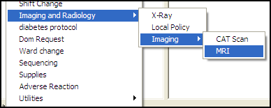
Nested submenus can help CAC or IRM personnel organize items on the Tools menus for users.
#### Window Layout

When a user exits, the sizes and positions of major CPRS windows and controls are saved. The following parameters are used to store window settings:
**ORWCH BOUNDS** stores the left, top, width, and height pixel positions of a window, splitter, or display area (areas on the Meds tab). The internal window name is used to identify each instance of this parameter. For example, if user CPRSPROVIDER, TEN exits the main window in CPRS (frmFrame), a ORWCH BOUNDS parameter might be stored as:
1.  Entity: USR:CPRSPROVIDER,TEN
1.  Instance: frmFrame
1.  Value: 0, 10, 730, 500
***

This would indicate that the window was to the left (left=0), 10 pixels from the top (top=0), 730 pixels wide and 500 pixels high.
Deleting an entry will reset the associated window or dialog to its default values. A value of all zeros (0,0,0,0) indicates that the window or dialog is maximized to fill the screen.
The following table lists the internal names that are commonly used with this parameter.
| **Name**     | **Description**                                     |
|--------------|-----------------------------------------------------|
| frmFrame     | Main CPRS window (contains tabs, menus, header bar) |
| frmODAllergy | Allergy ordering dialog                             |
| frmODAuto    | Auto-accept quick orders (normally not visible)     |
| frmODCslt    | Consult ordering dialog                             |
| frmODDiet    | Diet ordering dialog                                |
| frmODGen     | Dynamically created generic order dialog            |
| frmODLab     | Lab ordering dialog                                 |
| frmODMedIV   | IV ordering dialog                                  |
| frmODMedIn   | Inpatient medications ordering dialog               |
| frmODMedOut  | Outpatient medications ordering dialog              |
| frmODMisc    | Nursing orders dialog                               |
| frmODRad     | Imaging ordering dialog                             |
| frmODVitals  | Vitals ordering dialog                              |
| frmOMNavA    | Order menu window                                   |
| frmOMSet     | Order set display                                   |
| frmOMVerify  | Verify order dialog                                 |
| frmRemDlg    | Reminders dialog                                    |
There are two internal names used with this parameter that store splitter positions, rather than window positions, with each value representing a different splitter position.
| Name               | Description                                                                                                        |
|--------------------|--------------------------------------------------------------------------------------------------------------------|
| frmDrawerSplitters | Stores a different splitter value for drawer splitter position on the Notes, consults, and Discharge Summary tabs. |
| frmRemDlgSplitters | Stores two splitter positions for Reminder dialogs.                                                                |
There are three internal names used with this parameter that store the sizes of inpatient, Non-VA Meds, and outpatient medication area. The left, top, width, and height pixel positions of each area are stored. If a user changes the sizes, the new values are stored in this parameter.
| Name      | Description                                                                                    |
|-----------|------------------------------------------------------------------------------------------------|
| pnlMedIn  | Stores the left, top, width, and height pixel positions of the inpatient medications display.  |
| pnlMedOut | Stores the left, top, width, and height pixel positions of the outpatient medications display. |
| pnlNonVA  | Stores the left, top, width, and height pixel positions of the Non-VA medications display.     |
**ORWCH WIDTH** stores the position of the splitter bar on most tabs. Usually the width of the left-most pane in the window is stored. Each instance is identified by the internal name of the window and control. A sample of this parameter could be:
1.  Entity: USR: CPRSPROVIDER,TEN
1.  Instance: frmNotes.pnlLeft
1.  Value: 169
This would indicate that when the user last exited CPRS, the splitter bar on the notes tab was placed such that the left side (the list of notes) was 169 pixels wide.
The following tables list the internal names that are often used with this parameter.
| **Name**            | **Description**                                           |
|---------------------|-----------------------------------------------------------|
| frmConsults.pnlLeft | Consults tab, left side (list of consults)                |
| frmDCSumm.pnlLeft   | Discharge Summary tab, left side (list of summaries)      |
| frmLabs.pnlLeft     | Labs tab, left side (selection of report)                 |
| frmNotes.pnlLeft    | Notes tab, left side (list of progress notes)             |
| frmOrders.pnlLeft   | Orders tab, left side (Order Sheets & Write Orders lists) |
| frmProblems.pnlLeft | Problems tab, left side (problem status & pick lists)     |
| frmReports.pnlLeft  | Reports tab, left side (list of reports)                  |
**ORWCH COLUMNS** stores the width of columns for grid displays such as the medication lists. The width of individual columns is listed in a comma-delimited string. FormName.HeaderName identifies each instance. A sample of this parameter might be:
1.  Entity: USR: CPRSPROVIDER,TEN
1.  Instance: frmMeds.hdrMedsIn
Value: 42,516,62,62
***

This would indicate that the column widths for the list of inpatient medications was last saved as Action = 42 pixels, Medication = 516 pixels, stop date = 62 pixels, and status = 62 pixels.
The following table lists the internal names that are often used with this parameter.
| **Name**            | **Description**                       |
|---------------------|---------------------------------------|
| frmMeds.hdrMedsIn   | Meds tab, inpatient medications list  |
| frmMeds.hdrMedsOut  | Meds tab, outpatient medications list |
| frmOrders.hdrOrders | Orders tab, orders list               |
### Entering Time into CPRS Fields

CPRS generally allows users to enter time in several different formats. Users can often enter month-day-year dates (such as 05/01/65) or users can sometimes spell out the month (November 22, 2001) or as a date referenced from today (t-30 for a month in the past, today minus 30).
Users often can enter a time as well as a date. For tasks such as medication ordering and administration, entering a time can be critical. Times are entered as a 24-hour time, not with a 12-hour clock and an a.m. and p.m. For example, the time 8 a.m. is entered as 08:00:00, whereas 8 p.m. is entered as 20:00:00.
**Note:** The time 00:00 presents a challenge because it can be ambiguous as to when it is. To address this issue, CPRS changes the time of 00:00 to 00:01. This makes the time belong to a specific day, increasing clarity. Similarly, if a user selects Midnight, CPRS makes the time 23:59.
### Timeouts

Two parameters control the timeout behavior of the CPRS GUI.
-   **ORWOR TIMEOUT CHART** allows the CPRS GUI to have its own timeout, independent of DTIME. This is the number of seconds that CPRS should remain idle before timing out. This timeout applies only to the GUI version of CPRS and not to any other application. If it is not set, the value of DTIME is used.
-   **ORWOR TIMEOUT COUNTDOWN** is used to specify how long the warning window should appear before a user times out. It is possible that a user could timeout in CPRS while using another application on the workstation. So a warning window with a countdown is displayed to the user. The value is the number of seconds for the countdown before CPRS is closed.
### Miscellaneous

#### Event Notification

CPRS broadcasts messages to notify other applications about events within CPRS, such as when a patient changes.
ORWOR BROADCAST MESSAGES
#### Web Access

When this parameter is set to yes, web links in the CPRS GUI will be disabled or hidden.
ORWOR DISABLE WEB ACCESS.
## Personal Preferences (GUI)

Personal Preferences are edited in the GUI version of CPRS using the Tools \| Options menu. A user's configurations are primarily determined by settings in CPRS parameters in the Parameter file, while other defaults may use file settings or Kernel utilities. This outline shows which parameters are being used at the user level.

### General Tab

| Tab Element         | Dialog Element          | Field                                   | Parameter(s)              | Note                                                                                                                                                               |
|---------------------|-------------------------|-----------------------------------------|---------------------------|--------------------------------------------------------------------------------------------------------------------------------------------------------------------|
| Date Range Defaults | Lab Results             | Use Defaults (uses non-user defaults    | ORQQLR DATE RANGE INPT    |                                                                                                                                                                    |
| Date Range Defaults | Lab Results             | Use Defaults (uses non-user defaults    | ORQQLR DATE RANGE OUTPT   |                                                                                                                                                                    |
| Date Range Defaults | Lab Results             | Inpatient days                          | ORQQLR DATE RANGE INPT    |                                                                                                                                                                    |
| Date Range Defaults | Lab Results             | Outpatient day                          | ORQQLR DATE RANGE OUTPT   |                                                                                                                                                                    |
| Date Range Defaults | Appointments and Visits | Use Defaults (uses non-user defaults    | ORQQVS SEARCH RANGE START | When settings are stored: Both ORQQVS SEARCH RANGE START and ORQQAP SEARCH RANGE START store the same value.                                                       |
| Date Range Defaults | Appointments and Visits | Use Defaults (uses non-user defaults    | ORQQAP SEARCH RANGE STOP  | When settings are stored: Both ORQQVS SEARCH RANGE START and ORQQAP SEARCH RANGE START store the same value.                                                       |
| Date Range Defaults | Appointments and Visits | Start                                   | ORQQAP SEARCH RANGE START | When settings are stored: Both ORQQVS SEARCH RANGE STOP and ORQQAP SEARCH RANGE STOP store the same value.                                                         |
| Date Range Defaults | Appointments and Visits | Stop                                    | ORQQAP SEARCH RANGE STOP  | When settings are stored: Both ORQQVS SEARCH RANGE STOP and ORQQAP SEARCH RANGE STOP store the same value.                                                         |
| Clinical Reminders  |                         | Reminders not being displayed           |                           | These are the entries from the REMINDER DEFINITION file (\#811.9) except for entries that are used by the user (ORQQPX SEARCH ITEMS) or those that are not active. |
| Clinical Reminders  |                         | Reminders being displayed               | ORQQPX SEARCH ITEMS       | These are the entries from the REMINDER DEFINITION file (\#811.9) except for entries that are used by the user (ORQQPX SEARCH ITEMS) or those that are not active. |
| Other Parameters    | Chart tabs              | Initial tab                             | ORCH INITIAL TAB          |                                                                                                                                                                    |
| Other Parameters    | Chart tabs              | Use last selected tab on patient change | ORCH USE LAST TAB         |                                                                                                                                                                    |

### Notifications Tab

| Tab Element | Dialog Element | Field                                         | Parameter                   | Note                     |
|-------------|----------------|-----------------------------------------------|-----------------------------|--------------------------|
|             |                | Send me a MailMan bulletin for flagged orders | ORB FLAGGED ORDERS BULLETIN |                          |
|             |                | Remove Pending Notifications                  | ORB ERASE ALL               | (Used to allow removal.) |
|             |                | Display Sort                                  | ORB SORT METHOD             |                          |
|             |                | Notification List                             | ORB PROCESSING FLAG         |                          |

### Order Checks

| Tab Element | Dialog Element | Field            | Parameter            | Note |
|-------------|----------------|------------------|----------------------|------|
|             |                | Order Check List | ORK PROCESSING FLAG  |      |
|             |                |                  | ORK EDITABLE BY USER |      |

### List/Team

| Tab Element                | Dialog Element             | Field                            | Parameter                      | Note                                                                                                      |
|----------------------------|----------------------------|----------------------------------|--------------------------------|-----------------------------------------------------------------------------------------------------------|
| Patient Selection Defaults | Patient Selection Defaults | List Source                      | ORLP DEFAULT LIST SOURCE       |                                                                                                           |
| Patient Selection Defaults | Patient Selection Defaults | Sort Order                       | ORLP DEFAULT LIST ORDER        |                                                                                                           |
| Patient Selection Defaults | Patient Selection Defaults | Start                            | ORLP DEFAULT CLINIC START DATE |                                                                                                           |
| Patient Selection Defaults | Patient Selection Defaults | Stop                             | ORLP DEFAULT CLINIC STOP DATE  |                                                                                                           |
| Patient Selection Defaults | Patient Selection Defaults | Primary Provider                 | ORLP DEFAULT PROVIDER          |                                                                                                           |
| Patient Selection Defaults | Patient Selection Defaults | Treating Specialty               | ORLP DEFAULT SPECIALTY         |                                                                                                           |
| Patient Selection Defaults | Patient Selection Defaults | Team/List                        | ORLP DEFAULT TEAM              |                                                                                                           |
| Patient Selection Defaults | Patient Selection Defaults | Ward                             | ORLP DEFAULT WARD              |                                                                                                           |
| Patient Selection Defaults | Patient Selection Defaults | Monday                           | ORLP DEFAULT CLINIC MONDAY     |                                                                                                           |
| Patient Selection Defaults | Patient Selection Defaults | Tuesday                          | ORLP DEFAULT CLINIC TUESDAY    |                                                                                                           |
| Patient Selection Defaults | Patient Selection Defaults | Wednesday                        | ORLP DEFAULT CLINIC WEDNESDAY  |                                                                                                           |
| Patient Selection Defaults | Patient Selection Defaults | Thursday                         | ORLP DEFAULT CLINIC THURSDAY   |                                                                                                           |
| Patient Selection Defaults | Patient Selection Defaults | Friday                           | ORLP DEFAULT CLINIC FRIDAY     |                                                                                                           |
| Patient Selection Defaults | Patient Selection Defaults | Saturday                         | ORLP DEFAULT CLINIC SATURDAY   |                                                                                                           |
| Patient Selection Defaults | Patient Selection Defaults | Sunday                           | ORLP DEFAULT CLINIC SUNDAY     |                                                                                                           |
| Patient Selection Defaults | Source Combinations        | Combinations                     |                                | User’s definition of a combination list is stored in OE/RR PT SEL COMBO file (\#100.24)                   |
| Personal Lists and Teams   | Personal Lists             | Clinic Date Range                |                                | This is only used to display patients for selection that have clinic appointments during this date range. |
| Personal Lists and Teams   | Personal Lists             | New List (Name of personal list) |                                | Adds entry to OE/RR LIST file (\#100.21).                                                                 |
| Personal Lists and Teams   | Personal Lists             | Delete List                      |                                | Removes entry to OE/RR LIST file (\#100.21).                                                              |
| Personal Lists and Teams   | Personal Lists             | Save Changes                     |                                | Saves changes to OE/RR LIST file (\#100.21).                                                              |
| Personal Lists and Teams   | Teams Information          | Remove yourself from this team   |                                | Removes user from multiple in OE/RR LIST file (\#100.21)                                                  |
| Personal Lists and Teams   | Teams Information          | Subscribe to a team              |                                | Adds user to multiple in OE/RR LIST file (\#100.21)                                                       |
***
### Notes tab

| Tab Element     | Dialog Element | Field                          | Parameter               | Note                                                                                                                                     |
|-----------------|----------------|--------------------------------|-------------------------|------------------------------------------------------------------------------------------------------------------------------------------|
| Notes           |                | Interval for autosave          | ORWOR AUTOSAVE NOTE     |                                                                                                                                          |
| Notes           |                | Ask subject for progress notes |                         | Uses ASK SUBJECT FOR PROGRESS NOTES field in TIU PERSONAL PREFERENCES file (\#8926).                                                     |
| Notes           |                | Verify Note Title              | ORWOR VERIFY NOTE TITLE |                                                                                                                                          |
| Notes           |                | Default Cosigner               |                         | Uses DEFAULT COSIGNER field in TIU PERSONAL PREFERENCES file (\#8926).                                                                   |
| Document Titles |                | Your list of titles            |                         | Titles for a class are from TIU DOCUMENT DEFINITION file (\#8925.1) as determined from TIU PERSONAL DOCUMENT TYPE LIST file (\#8925.98). |
| Document Titles |                | Save changes                   |                         | Save changes to TIU PERSONAL DOCUMENT TYPE LIST file (\#8925.98).                                                                        |
| Document Titles |                | Set as Default only            |                         | Sets DEFAULT TYPE field in TIU PERSONAL DOCUMENT TYPE LIST file (\#8925.98).                                                             |

### Reports Tab

| Tab Element           | Dialog Element | Field       | Parameter                  | Note |
|-----------------------|----------------|-------------|----------------------------|------|
| Set All Reports       |                | Start Date  | ORWRP TIME/OCC LIMITS ALL  |      |
|                       |                | Stop Date   |                            |      |
|                       |                | Max         |                            |      |
| Set Individual Report |                | Report Name | ORWRP TIME/OCC LIMITS INDV |      |
|                       |                | Start Date  |                            |      |
|                       |                | Stop Date   |                            |      |
|                       |                | Max         |                            |      |
### Surrogates Tab

| Tab Element           | Dialog Element | Field                                                          | Parameter                  | Note                                               |
|-----------------------|----------------|----------------------------------------------------------------|----------------------------|----------------------------------------------------|
| Surrogates Management |                | Use default Start and Stop dates when entering a new surrogate | ORQQXQ SURROGATE DEFAULTS  | First piece of comma (,) delimited value.          |
|                       |                | Default surrogating period (1..30 days)                        | ORQQXQ SURROGATE DEFAULTS  | Second piece of comma (,) delimited value.         |
|                       |                | List of Surrogates                                             |                            | Stored and retrieved from the Alert (\#8992) file. |
## Patient Selection Settings

### Patient List Settings

Patients can be selected by typing their name and then selecting the patient or by selecting the patient from lists. Algorithms protect against displaying sensitive or inappropriate data. Patient list settings can be controlled through the List Manager version of CPRS.
User defaults can be set to display patients from a particular source (Primary Provider, Treating Specialty, Team/List, Ward Clinic, or Combination). The user can define the defaults (e.g. a specific clinic, ward, and provider) for each of these sources. Clinic locations can be specific for different days of the week. The patients displayed for a clinic can be restricted to only show patients with appointments during a specific date range. The order the patients are displayed can also be defined (e.g. alphabetical, room/bed, etc.). Personal patient lists can be defined. Criteria for a combination list of patients can be defined (e.g., patients for specific clinics and providers). These settings can be made using the Personal Preference options available from the CPRS menus (not the GUI menus). These parameters are further explained in the Appendices D and E of this manual that define the parameters in CPRS.
***

### Notifications

The order in which notifications are displayed on the patient selection screen of the GUI depends on the parameter ORB SORT METHOD. This parameter can be set at the SYSTEM, DIVISION, and USER level. The possible sort fields are:
-   P - Patient
-   M - Message
-   U - Urgency
-   I - Info
-   L - Location
-   D - Date/Time
-   F - Forwarded By/When
***

The sort order can be set using the Set Notification Display Sort Method (GUI) option on the Notification Management Menu [ORB NOT COORD MENU]. There should be no need to edit the parameter directly.
The urgency for any particular notification type can also be set from this menu, using the Set Urgency for Notifications (GUI) option. The urgency for a notification can be set at the USER, DIVISION, SERVICE, and SYSTEM levels. The combination of these two settings (urgency and sort order) allows a variety of methods for displaying the most important notifications for a given user.
## Graphing Configuration

The CPRS GUI 26 installation package includes new graphing functionality. Although graphing is enabled by default, to make the most of this functionality, you must configure graphing to use your site’s data sources and reflect its business rules. The following sections provide instructions for:
-   Disabling the graphing tool
-   Disabling the background graphing processing for caching
-   Identifying the data sources from which the graphing tool draws information
-   Setting up selected users with a privilege that enables them to create, edit, and save predefined graphs—called public views—that are available to all users
-   Creating graph reports (available on the **Reports** tab)
***

### Disabling CPRS Graphing

If you don’t want to provide graphing functionality for users at your site, you—or someone who has programmer access (required)—can disable it.
**Take the following steps to disable graphing:**
1.  Log into VistA.
1.  From the General Parameter Tools [XPAR MENU TOOLS] menu, select EP Edit Parameter Values.
1.  At the Select PARAMETER DEFINITION NAME prompt, type **ORWG GRAPH SETTING** and press the \<**Enter**\> key.
1.  At the Enter selection prompt, type one of the following expressions: **Package, PKG, or 9.** Press the \<**Enter**\> key.
1.  At the Replace prompt, type **@** and press the \<**Enter**\> key.
**To subsequently enable the graphing tool:**
1.  Follow steps 1–4 above.
1.  At the Replace prompt, type the following value: **63;53.79;55;55NVA;52;70;120.5\|BCEFGHIK\|1\|4\|90\|\|100\|\|**. (This value represents CPRS GUI 26 default settings for the ORWG GRAPH SETTING parameter.)
### Disabling CPRS Graphing Background Processing

CPRS graphing will sometimes cache patient data so that it improves the performance of displaying graph results to the user. This extra processing can sometimes slow the overall system performance. The processing is done in the background and restricted using a resource device - ORWG GRAPHING RESOURCE. This processing can be disabled or enabled at the System level.
**Take the following steps to disable graphing:**
1.  Log into VistA.
1.  From the General Parameter Tools [XPAR MENU TOOLS] menu, select EP Edit Parameter Values.
1.  At the Select PARAMETER DEFINITION NAME prompt, type **ORWG GRAPH SETTING** and press the \<**Enter**\> key.
1.  At the Enter selection prompt, type one of the following expressions: **System, SYS, or 8.** Press the \<**Enter**\> key.
1.  At the Replace prompt, make the 6th \| piece 0:
For example:
**63;53.79;55;55NVA;52;70;120.5\|BCEFGHIK\|1\|4\|90\|\|100\|\|.**
Replace 90\|\|100 with 90\|0\|100
It will now be
**63;53.79;55;55NVA;52;70;120.5\|BCEFGHIK\|1\|4\|90\|0\|100\|\|.**
***

**To subsequently enable background processing of the graphing tool:**
1.  Follow steps 1–4 above.
1.  At the Replace prompt, remove 0 as the 6th \| piece:
For example:
**63;53.79;55;55NVA;52;70;120.5\|BCEFGHIK\|1\|4\|90\|0\|100\|\|**.
Replace 90\|0\|100 with 90\|\|100
It will now be
**63;53.79;55;55NVA;52;70;120.5\|BCEFGHIK\|1\|4\|90\|\|100\|\|**.
***

### Disabling Data Sources

CPRS graphing includes the following data sources, which are enabled by default:
| **Source**                                        | **Type Value**                                    |
|---------------------------------------------------|---------------------------------------------------|
| Admissions                                        | 405                                               |
| Allergies                                         | 120.8                                             |
| Anatomic pathology                                | 63AP                                              |
| Blood bank                                        | 63BB                                              |
| Exams                                             | 9000010.13                                        |
| Health factors                                    | 9000010.23                                        |
| Immunizations                                     | 9000010.11                                        |
| Lab tests                                         | 63                                                |
| Medication, BCMA                                  | 53.79                                             |
| Medication, Inpatient                             | 55                                                |
| Medication, Non-VA                                | 55NVA                                             |
| Medication, Outpatient                            | 52                                                |
| Medicine                                          | 690                                               |
| Mental health                                     | 601.2                                             |
| Microbiology                                      | 63MI                                              |
| Notes                                             | 8925                                              |
| Orders                                            | 100                                               |
| Patient education                                 | 9000010.16                                        |
| Problems                                          | 9000011                                           |
| Procedures                                        | 9000010.18                                        |
| Purpose of visit                                  | 9000010.07                                        |
| Radiology exams                                   | 70                                                |
| Registration, DX                                  | 45DX                                              |
| Registration, OP/Proc                             | 450P                                              |
| Skin tests                                        | 9000010.12                                        |
| Surgery                                           | 130                                               |
| Visits                                            | 9000010                                           |
| Vitals                                            | 120.5                                             |
| **The following two data types are for grouping** | **The following two data types are for grouping** |
| Drug class                                        | 500.605                                           |
| Reminder Taxonomy                                 | 811.2                                             |
CPRS graphing uses the type value listed above for data mapping. If you want to disable one or more data sources—because your site doesn’t use them, they are politically sensitive, or they cause CPRS performance problems, for example—you use the type value to do so.
**Take the following steps to disable one or more data sources:**
1.  Log into VistA.
1.  From the General Parameter Tools [XPAR MENU TOOLS] menu, select EP Edit Parameter Values.
1.  At the Select PARAMETER DEFINITION NAME prompt, type **ORWG GRAPH EXCLUDE DATA TYPE** and  press the \<**Enter**\> key.
1.  At the Enter selection prompt, type one of the following expressions: **System,** **SYS,** or **8.** Press the \<**Enter**\> key.
1.  At the Value prompt, type the value types of each data source you want to exclude, separating each source with a semicolon. For example, type the following values to exclude laboratory tests and mental health assessments: **63; 601.2**. Press \<**Enter**\>.
**To enable all disabled data sources:**
1.  Follow steps 1–4 above.
1.  At the Value prompt, type **@** and press the \<**Enter**\> key.
***

### Editing Public Display Options and Views

CPRS graphing provides users with the ability to set and save display options and create and save predefined views. CPRS always displays graphs with user-level settings if these settings exist. If they don’t exist, CPRS displays graphs using public settings, which you or authorized users define at the system level. (Public views and settings are available to all of the users at your site, but only authorized users can create or alter these views and settings.)
CPRS stores all graph display settings using the ORWG GRAPH SETTING parameter. You can edit public settings by using the CPRS GUI. (See the “Configure Settings” section of *Computerized Patient Record System (CPRS) User Manual: GUI Version* for step-by-step instructions. This manual is available online at <http://www.va.gov/vdl>.)
Before you can save public settings and views, you must first add yourself as a value in the public-editor (ORWG GRAPH PUBLIC EDITOR) parameter.
**Take the following steps to add yourself and/or other (trusted) users to the public-editor class:**
1.  Log into VistA.
1.  From the General Parameter Tools [XPAR MENU TOOLS] menu, select EP Edit Parameter Values.
1.  At the Select PARAMETER DEFINITION NAME prompt, type **ORWG GRAPH PUBLIC EDITOR** and press the \<**Enter**\> key.
1.  At the Select Sequence Number prompt, type a sequence number and press the \<**Enter**\> key. (Type a question mark (**?**) at the prompt to determine the best sequence number. If no sequence numbers exist, type the number one (**1**) at the prompt.)
1.  At the User Class prompt, type your user class or the user class of the person to whom you are providing public-editor privileges. Press the \<**Enter**\> key.
1.  Repeat steps 4–7 as needed.
***

### Creating Graph Reports

If a significant number of users at your site frequently graph specific collections of items, you can incorporate these items in graph reports as a convenience to the users. That is, you can create graph reports and add them to the **Available Reports** list on the **Reports** tab. When users select graph reports, CPRS graphing opens to the selection of views that comprise the reports.
To create graph reports you must have:
-   Permission to edit file number 101.24 (OE/RR REPORT)
-   Permission to edit OR parameters
-   Permission to create, edit, or remove public settings and views (through the ORWG GRAPH PUBLIC EDITOR parameter)
***

Before you add graph reports to the **Available Reports** list, you must first:
-   Create the public views that you want to display as graph reports.
-   Create individual graph reports
-   Create a menu for graph reports
-   Add the menu to the **Available Reports** list
***

### Creating Public Views

Each graph report can incorporate one or two public views. If you plan to combine two views in a single graph report, set one of the views to display in the bottom of a split-pane view. You can find step-by-step instructions for creating public views in *Computerized Patient Record System (CPRS) User Manual: GUI Version.* (Look for the “Creating Predefined Views” section of “Using CPRS Graphing.”) This manual is available online at <http://www.va.gov/vdl>.
### Creating Graph Reports

Your site’s graph reports must follow the conventions of file 101.24 (the OE/RR REPORT file).
**Take the following steps to create graph reports:**
1.  Log in to VA FileMan.
1.  At the Select option prompt, type the number **1** (for the ENTER OR EDIT FILE ENTRIES selection) and press the \<**Enter**\> key.
1.  At the INPUT TO WHAT FILE prompt, type either **101.24** or **OE/RR REPORT** and press the \<**Enter**\> key.
1.  At the EDIT WHAT FIELD prompt, type **ALL** and press the \<**Enter**\> key.
1.  At the Select OE/RR REPORT NAME prompt, type a descriptive name for your report and press the \<**Enter**\> key. Your report name should begin with your site’s local namespace. For example, if your site’s namespace were ZZ and your report name were DIABETES INDICATORS, you would type the following report name: **ZZDIABETES INDICATORS.**
1.  At the Are you adding [your new report name] as a new OE/RR REPORT prompt, type **YES** and press the \<**Enter**\> key.
1.  At the OE/RR REPORT NUMBER prompt, accept the default next-available report number (which should be under 1000) by pressing the \<**Enter**\> key or type a different number for your report and press the \<**Enter**\> key. (The system will not accept the number of an existing report unless you are editing the existing report.)
Numbers for your site’s reports must be under 1000. Numbers over 1000 are reserved for national use. If you give your report a number that is greater than 1000, future patches will overwrite your entries.
1.  At the OE/RR REPORT HEADING prompt, type the name of the graph report as you want it to appear in the **Available Reports** list and press the \<**Enter**\> key.
1.  At the OE/RR REPORT DESCRIPTIVE TEXT prompt, type a word or phrase that describes the purpose of your graph report and press the \<**Enter**\> key.
1.  At the ID prompt, type **OR_GRAPHS** and press the \<**Enter**\> key.
1.  Press the \<**Enter**\> key to bypass unneeded fields.
1.  At the QUALIFIER prompt, type **DateTime** and press the \<**Enter**\> key.
1.  Press the \<**Enter**\> key to bypass unneeded fields.
1.  At the CATEGORY prompt, type **FIXED W/DATE** and press the \<**Enter**\> key.
1.  At the TAB prompt, type **REPORTS TAB** and press the \<**Enter**\> key.
1.  Press the \<**Enter**\> key to bypass unneeded fields
1.  At the TYPE prompt, type **GRAPH** and press the \<**Enter**\> key.
1.  Press the \<**Enter**\> key to bypass unneeded fields
1.  At the DATE FORMAT prompt, type **DATE WITH TIME** and press the \<**Enter**\> key.
Press the \<**Enter**\> key to bypass unneeded fields
1.  At the PARAM 1 prompt, type the name of the first public view you want to associate with your graph report. Press the \<**Enter**\> key.
1.  (Optional) If you want to associate a second public view with this graph report, type the name of the second public view at the PARAM 2 prompt and press the \<**Enter**\> key.
1.  At the Replace prompt, type the caret symbol (\^) and press the \<**Enter**\> key.
### Creating a Graph-Reports Menu

**Take the following steps to create a menu for graph reports:**
1.  Log in to VA FileMan.
1.  At the Select option prompt, type the number **1** (for the ENTER OR EDIT FILE ENTRIES selection) and press the \<**Enter**\> key.
1.  At the INPUT TO WHAT FILE prompt, type either **101.24** or **OE/RR REPORT** and press the \<**Enter**\> key.
1.  At the EDIT WHAT FIELD prompt, type **ALL** and press the \<**Enter**\> key.
1.  At the Select OE/RR REPORT NAME prompt, type a descriptive name for your menu and press the \<**Enter**\> key. Your menu name should begin with your site’s local namespace. For example, if your site’s namespace were ZZ and your menu name were GRAPHS, you would type the following menu name: **ZZGRAPHS.**
1.  At the Are you adding [your menu name] as a new OE/RR REPORT prompt, type **YES** and press the \<**Enter**\> key.
1.  At the OE/RR REPORT NUMBER prompt, accept the default next-available report number (which should be under 1000) by pressing the \<**Enter**\> key or type a different number for your report and press the \<**Enter**\> key. (The system will not accept the number of an existing report or menu unless you are editing the report or menu.)
Numbers for your site’s menus must be under 1000. Numbers over 1000 are reserved for national use. If you give your menu a number that is greater than 1000, future patches will overwrite your entries.
1.  At the OE/RR REPORT HEADING prompt, type the name of the menu as you want it to appear in the **Available Reports** list and press the \<**Enter**\> key.
1.  .At the OE/RR REPORT DESCRIPTIVE TEXT prompt, type a word or phrase that describes the purpose of your menu and press the \<**Enter**\> key.
1.  At the ID prompt, type **OR_GRAPHS** and press the \<**Enter**\> key.
1.  Press the \<**Enter**\> key to bypass unneeded fields.
1.  At the TAB prompt, type **REPORTS TAB** and press the \<**Enter**\> key.
1.  Press the \<**Enter**\> key to bypass unneeded fields
1.  At the TYPE prompt, type **MENU** and press the \<**Enter**\> key.
1.  Press the \<**Enter**\> key to bypass unneeded fields
1.  At the Select ITEM prompt, type the name or number of the first graph report and press the \<**Enter**\> key.
1.  At the Are you adding [report name] as a new ITEM (the 1st for this OE/RR REPORT prompt, type **YES** and press the \<**Enter**\> key.
Press the \<**Enter**\> key to bypass unneeded fields
1.  Repeat steps 13–14 until you have added all graph reports as items to this menu.
1.  Type the caret symbol (\^) and press the \<**Enter**\> key.
***

### Adding Your Graph Menu to the Available Reports List

The following instructions are for adding a graph menu to the **Available Reports** list, which you do by editing the ORWRP REPORT LIST parameter. This parameter is available for all levels (package level to user level). However, CPRS displays in its **Available Reports** list only the items in the lowest level that has entries.
For example, if this parameter has 20 reports listed at the package level and no reports at any other level, CPRS displays for all users the reports listed at the package level. If you then add one report at the system level, CPRS displays to all users on the system only this one report. Similarly, if you add one report at the user level, CPRS displays for this user only the one report.
In other words, if you want to add a report to the system level and still display all of the reports listed at the package level, you must add the package-level reports to the system level, and so on down to the user level.
**Take the following steps to view a listing of reports entered at all levels:**
1.  Log into VistA.
1.  From the General Parameter Tools [XPAR MENU TOOLS] menu, select LV List Parameter Values.
1.  At the Select PARAMETER DEFINITION NAME prompt, type **ORWRP REPORT LIST** and press the \<**Enter**\> key.
1.  Save this list for future reference.
***

**Take the following steps to add menus and reports to the** Available Reports **list:**
1.  Log into VistA.
1.  From the General Parameter Tools [XPAR MENU TOOLS] menu, select EP Edit Parameter Values.
1.  At the Select PARAMETER DEFINITION NAME prompt, type **ORWRP REPORT LIST** and press the \<**Enter**\> key.
1.  At the Enter selection prompt, type the name or number of the level to which you want to add the menu or report and press the \<**Enter**\> key.
1.  At the Select Sequence prompt, type an unused sequence number and press the \<**Enter**\> key. Sequence numbers determine the order in which CPRS displays reports. To determine which sequence numbers are unused, type a question mark (**?**) at the prompt.
1.  At the Are you adding [number] as a new Sequence prompt, type **Yes** and press the \<**Enter**\> key.
1.  Press the \<**Enter**\> key again to accept the sequence number.
1.  At the Report prompt, type the name of the report you want to add and press the \<**Enter**\> key.
1.  Repeat steps 5–8 until you have entered all menus and reports you want CPRS to display to users at the level you selected in step 4.
***
## Remote Data View Configuration

Remote Views allows you to review patient data that is collected at other facilities. Data can be retrieved from one, many, or all sites at which a patient has been seen. Those facilities must have Master Patient Index (MPI) installed. Remote Data Views use HL7 messaging and server-to-server connections with the RPC Broker. Health summaries can be used, but the retrieval site must have a health summary component of the same name. This means that nationally exported health summaries can be used. If sites wish to have specific types of health summaries available (e.g. VISN-specific patient reports), then those sites should coordinate the naming of those reports.
**Note:** The Adhoc health summary report and the imaging (local only) report (on the reports tab) will not return remote data. In addition, the Most Recent, Selected Tests by Date, Worksheet, and Graph lab report (on the labs tab) will not return remote data.
***

### Master Patient Index (MPI)

The Master Patient Index stores data about where and when patients are seen within the VA. The data as well as the location of the master record are transmitted to local facilities. This provides an index to where data has been stored. Data can be retrieved from these locations and viewed at any facility that has been configured for display.
### Configuring Remote Data Views

DEVICE file (\#3.5)
DSM sites
***

NAME: DEC-NETWORK **\$I: SYS\$NET**
LOCATION OF TERMINAL: DEC NETWORK DEVICE
SUBTYPE: P-OTHER TYPE: OTHER
***

TERMINAL TYPE file (\#3.2)
NAME: P-OTHER RIGHT MARGIN: **80**
FORM FEED: \# PAGE LENGTH: 64
BACKSPACE: \$C(8) DESCRIPTION: General printer (80 column)
***

Cache sites:
NAME: TCP/IP DEVICE **\$I: \|TCP\|**
ASK DEVICE: NO ASK PARAMETERS: NO
SIGN-ON/SYSTEM DEVICE: NO
LOCATION OF TERMINAL: TCP/IP DEVICE
SUBTYPE: P-OTHER TYPE: VIRTUAL TERMINAL
***

The following parameters may be set to control remote data:
-   ORWRP CIRN REMOTE DATA ALLOW – Set to Yes to enable Remote Data button on the GUI. (User, Division, or System level)
-   ORWRP CIRN SITES – Enter the facilities from which you want to allow data retrieval. (Division or System level)
-   ORWRP CIRN SITES ALL – Set to Yes and users will see data from any site at which a patient has been seen. (Division or System level)
***

Tips:
-   Test with just one site first
-   Test with only a few users initially
***

### Security

The names of the users who view data will be stored in the remote site’s database.
Sensitive record access will be audited, enabling a site to follow up on a record accessed by a remote location.
Parameters (as mentioned above) can be used to limit the users or sites that have access to retrievable data.
### Department of Defense Data

The following reports on the Reports tab can display remote data from the Department of Defense:
**Under the Clinical Reports heading:**
-   Allergies
-   Expanded ADT
-   Consults (DoD remote data only)
-   Discharge Summary
-   Histories
-   Family History
-   Social History
-   Other Past Medical History
-   Laboratory
-   Lab Orders
-   Chem & Hematology
-   Surgical Pathology
-   Cytology
-   Microbiology
-   Outpatient Encounter
-   Outpatient Medications
-   Progress Notes
-   All Problem List
-   Questionnaires (DoD remote data only)
-   Radiology Report
-   Vital Signs
***

If CPRS cannot communicate with the Health Data Repository but RDI is enabled, CPRS will display the following in the order check window if order checks display: “Remote Order Checking not available – checks done on local data only”.
Under the Clinical Reports \| Radiology heading:
-   Report
-   Status
Under the Clinical Reports \| Pharmacy heading:
-   Active Outpatient
-   All Outpatie
***

## Overview of Clinical Indicators Data Capture

CPRS controls the entry of Clinical Indicators Data Capture (CIDC) information using two switches. When the switches are turned on, clinicians who hold the Provider key will enter diagnoses for orders. Two List Manager options on the OR BDC MENU control the switches:
-   OR BDC MASTER SWITCH—The master switch turns on CIDC functionality at the system level. However, individual clinicians will not be prompted for CIDC information until the OR BDC PROVIDER SWITCH is enabled for individual clinicians holding the Provider key.
-   OR BDC PROVIDER SWITCH—The provider switch must be assigned and enabled for each clinician that will use the CIDC features. The switch can be assigned and enabled for individual clinicians holding the Provider key one-at-a-time to allow for training or for all clinicians holding the Provider key at once. This switch can also be assigned and disabled for all those providers who do not have the switch assigned.
***

The following table shows how the two switches work together.
**System Switch Provider Switch Is CIDC displayed?**
On Off No
On On Yes
Off On No
Off Off No
### Enabling the Master Clinical Indicators Data Capture Switch

The master Clinical Indicators Data Capture (CIDC) switch turns on the features at the system level, but users will see no changes until OR BDC PROVIDER SWITCH is enabled for the individual clinicians.
**Note:** Because this switch turns on or off these features for the system, great caution should be used before disabling this feature. If this switch is turned off, the diagnoses will not be collected. You must have Clinical Coordinator privileges to enable this switch.
***

**To enable the master CIDC switch, use the following steps:**
1.  In the List Manager interface, log in and type **OR BDC MENU** and press **\<Enter\>**.
1.  Type **MS** and press **\<Enter\>**.
**Note:** When you choose this option, the application checks the status of the main CIDC switch and displays the status on the screen.
***

1.  Check to make sure the switch is OFF. To enable the Main switch, type **E** and press **\<Enter\>**.
1.  Type **Q** and press **\<Enter\>** to leave this option.
***

The following capture shows an example of how to turn on the main CIDC Switch.

Select OPTION NAME: OR BDC MENU Billing Data Capture Configuration
***
MS Billing Data Capture Master Switch
PP Billing Data Capture By Provider Parameter
***
Select Billing Data Capture Configuration Option: MS Billing Data Capture Master Switch
***

Enable/Disable Billing Data Capture Master Switch
***

Billing Data Capture Master Switch is now \*\> OFF \<\*
***

Select one of the following:
***

E Enable Billing Capture Functionality
Q Quit
***

Selection: E
### Disabling the Main Clinical Indicators Data Capture Switch

The main Clinical Indicators Data Capture (CIDC) switch can be turned off if there is ever a need.
**Note:** Because this switch turns on or off these features for the system, be careful about disabling this feature. If this switch is turned off, the order diagnoses will not be collected. You must have Clinical Coordinator privileges to disable this switch.
**To disable the main CIDC switch, use the following steps:**
1.  In the List Manager interface, log in and type **OR BDC MENU** and press **\<Enter\>**.
1.  Type **MS** and press **\<Enter\>**.
**Note:** When you choose this option, the application checks the status of the main CIDC switch and displays the status on the screen.
1.  Check to make sure the switch is ON. To disable the Main switch, type **D** and press **\<Enter\>**.
1.  Type **Q** and press **\<Enter\>** to leave this option.
### Assigning, Enabling, Disabling, and Reporting on the Clinical Indicators Data Capture Provider Switch

To give providers the ability to enter Clinical Indicators Data Capture (CIDC), a coordinator or responsible person at each site must assign and enable this switch for individual providers. This switch (parameter) is somewhat different from other CPRS parameter because it is first assigned and then has a state of either enabled or disabled. CPRS provides the following methods to manage this switch:
-   **Manage Parameter by Provider** - This option allows the user to search for a specific clinician who has the Provider key and then assign and enable or assign and disable the switch (parameter) if it is not yet assigned. If the switch has already been assigned to the clinician, the user can either enable it if it is disabled or disable it if it is enabled.
-   **Assign Parameter and Enable for All Providers** - This option searches for all active clinicians who hold the Provider key that are not currently assigned the switch (parameter), assigns them the switch, and enables it.
-   **Assign Parameter and Disable for All Providers** - This option searches for all active clinicians who hold the Provider key that are not currently assigned the switch (parameter), assigns them the parameter, but disables the parameter. A coordinator or responsible person at the site would then have to enable these providers one-at-a-time.
**Note:** With the main CIDC switch disabled, the only change users will see if the CIDC patches are installed is that they will not have to address service connection for all eligible patients, not just those with more than 50% service connection.
***

Coordinators can also run three reports:
-   All active clinicians who hold the Provider key who have been assigned the switch and whether it is enabled or disabled
-   Active clinicians who hold the Provider key with the switch enabled
-   Active clinicians who hold the Provider key who have the switch but it is disabled
These reports show only active clinicians who hold the provider key and have been assigned the switch.
You must have Clinical Coordinator privileges to enable this switch and run the reports.
#### Managing the CIDC Provider Switch for Individual Providers

**To manage the provider switch for clinicians one at a time, use the following steps:**
1.  In the List Manager interface, log in and type **OR BDC MENU** and press **\<Enter\>**.
1.  Type **PP** and press **\<Enter\>**.
1.  To assign and enable or assign and disable the switch for an individual provider, type **M** and press **\<Enter\>**.
1.  Enter the name of the individual that you want to complete CIDC information for the appropriate orders and press **\<Enter\>**. If more than one name appears, select the number for the appropriate person and press **\<Enter\>**.
The text will indicate if the provider you selected is enabled or disabled.
1.  If the switch for the provider is not enabled and you want to enable the CIDC switch for this provider, the prompt will ask if you want to enable the switch for that provider and Yes will be the default, press **\<Enter\>**. If the provider is enabled and you want to disable the switch, the prompt will ask if you want to disable the switch, and Yes will be the default, press **\<Enter\>**.
1.  To enable additional providers, repeat steps 4 and 5 until you have assigned it to all the clinicians who need it.
1.  When you have enabled or disabled the switch for the necessary providers, press **\<Enter\>** until you exit the option.
***

The following capture shows enabling an individual provider the CIDC User Level Switch
Select OPTION NAME: OR BDC MENU Clinical Indicator Data Capture Configuration
***

MS Clinical Indicator Data Capture Master Switch
PP CIDC By Provider Parameter
***
Select Clinical Indicator Data Capture Configuration Option: PP CIDC By Provider Parameter
***
Enable Clinical Indicator Data Capture By Provider Parameter Management
Select Parameter Management Option
***

Select one of the following:
***

M Manage parameter by provider
E Assign parameter and Enable for all providers
D Assign parameter and Disable for all providers
L List providers with the assigned parameter
***

Select Enable CIDC By Provider parameter option: Manage parameter by provider
***

Clinical Indicator Data Capture By Provider Parameter Management
***

Select the provider to manage the parameter: CPRSPROVIDER,TEN
***

Clinical Indicator Data Capture By Provider Parameter Management
Edit Assigned CIDC Functionality Parameter of CPRSPROVIDER,TEN
CIDC Functionality for this provider is currently DISABLED
***

Enable CIDC Functionality (YES/NO)? YES//
#### Enabling the CIDC Provider Switch for Multiple Providers Simultaneously

To help sites quickly enable a group of providers, CPRS gives sites an option to assign and enable the CIDC provider switch for all active clinicians who hold the Provider key and who currently do NOT have the switch assigned to them.
**Note:** This option does NOT enable any provider who already has the switch assigned it has been disabled.
**To enable the provider switch for all providers who do not have it assigned currently, use the following steps:**
1.  In the List Manager interface, log in and type **OR BDC MENU** and press **\<Enter\>**.
1.  Type **PP** and press **\<Enter\>**.
1.  To assign and enable the switch for all providers who do not have the switch assigned currently, type **E** and press **\<Enter\>**.
**Note:** This option does NOT enable any provider who already has the switch assigned and it has been disabled. Users cannot disable these providers as a group after doing this, users must do it individually.
***

1.  If you want to proceed and assign the switch to all active clinicians who hold the Provider key who do not have it assigned and enable the switch, type **YES** (you must type the entire word in all capital letters) and press **\<Enter\>**. If users do not want to proceed, type **NO** and press **\<Enter\>**.
1.  When you have enabled it for the necessary providers, press **\<Enter\>** until you exit the option.
Example of assigning and enabling multiple providers simultaneously.
Select OPTION NAME: OR BDC MENU Clinical Indicator Data Capture Configuration
***

MS Clinical Indicator Data Capture Master Switch
PP CIDC By Provider Parameter
***
Select Clinical Indicator Data Capture Configuration Option: PP CIDC By Provider Parameter
***
Enable Clinical Indicator Data Capture By Provider Parameter Management
Select Parameter Management Option
***

Select one of the following:
***

M Manage parameter by provider
E Assign parameter and Enable for all providers
D Assign parameter and Disable for all providers
L List providers with the assigned parameter
***

Select Enable CIDC By Provider parameter option: E Assign parameter and Enable for all providers
***
Enable Clinical Indicator Data Capture By Provider Parameter Management
Assign/Enable Parameter For All Active Providers Option
***

Select one of the following:
***
YES Enter YES to begin process of assign/enable
NO Enter NO to cancel process of assign/enable and quit
***

105 active providers do not have this parameter assigned to them.
You have selected to assign the parameter and enable Clinical Indictor
Data Capture for all of these providers. This may take some time.
Are you sure you want to do this? (YES/NO - must be all cap): YES
***
#### Assigning but Disabling the CIDC Provider Switch for Multiple Providers Simultaneously

CPRS gives an additional method to assign a group of clinicians who hold the Provider key the switch but disable the switch. This option also affects only active clinicians who hold the Provider key and who currently do NOT have the switch assigned to them.
**Note:** This option does NOT disable any provider who already has the switch assigned it has been disabled.
**To assign and disable the provider switch for all providers who do not have it assigned currently, use the following steps:**
1.  In the List Manager interface, log in and type **OR BDC MENU** and press **\<Enter\>**.
1.  Type **PP** and press **\<Enter\>**.
1.  To assign but disable the switch for all active clinicians who hold the Provider key but who do NOT have the switch assigned currently, type **D** and press **\<Enter\>**.
**Note:** This option does NOT disable the switch for any provider who already has the switch assigned and it has been enabled. You cannot enable these providers as a group after doing this, you must do it individually.
1.  If you want to proceed and assign the switch to all active clinicians who hold the Provider key but who do NOT have the switch assigned and disable it, type **YES** (you must type the entire word in all capital letters) and press **\<Enter\>**. If you do not want to proceed, type **NO** and press **\<Enter\>**.
1.  When you have enabled it for the necessary providers, press **\<Enter\>** until you exit the option.
Example of assigning but disabling the switch for multiple provider simultaneously.
Select OPTION NAME: OR BDC MENU Clinical Indicator Data Capture Configuration
***
MS Clinical Indicator Data Capture Master Switch
PP CIDC By Provider Parameter
***
***

Select Clinical Indicator Data Capture Configuration Option: PP CIDC By Provider Parameter
***
Enable Clinical Indicator Data Capture By Provider Parameter Management
Select Parameter Management Option
***

Select one of the following:
***

M Manage parameter by provider
E Assign parameter and Enable for all providers
D Assign parameter and Disable for all providers
L List providers with the assigned parameter
***

Select Enable CIDC By Provider parameter option: D Assign parameter and Disable for all providers
***
Enable Clinical Indicator Data Capture By Provider Parameter Management
Assign/Disable Parameter For All Active Providers Option
***

Select one of the following:
***

YES Enter YES to begin process of assign/disable
NO Enter NO to cancel process of assign/disable and quit
***

105 active providers do not have this parameter assigned to them.
You have selected to assign the parameter and disable Clinical Indicator
Data Capture for all of these providers. This may take some time.
Are you sure you want to do this? (YES/NO - must be all cap): YES
***

#### Creating Reports on the CIDC Provider Switch

CPRS provides three reports regarding who has the CIDC provider switch assigned and enabled and disabled.
-   All active clinicians who hold the Provider key who have been assigned the switch and whether it is enabled or disabled
-   Active clinicians who hold the Provider key with the switch enabled
-   Active clinicians who hold the Provider key who have the switch but it is disabled
***

These reports show only active clinicians who hold the provider key and have been assigned the switch.
You must have Clinical Coordinator privileges to enable this switch and run the reports.
##### Reporting on All Providers Assigned the Provider Switch and Its Status

This option creates a report on all active providers who have the switch assigned and whether the switch is enabled and disabled.
**To run this report on all providers with the provider switch status, use the following steps:**
1.  In the List Manager interface, log in and type **OR BDC MENU** and press **\<Enter\>**.
1.  Type **PP** and press **\<Enter\>**.
1.  Select the reporting option by typing **L** and press **\<Enter\>**.
1.  Select All Providers with CIDC Parameter by typing **A** and pressing **\<Enter\>**.
1.  When finished, press **\<Enter\>** until you exit the option.
***

Below is an example of how to run this report.
Select OPTION NAME: OR BDC MENU Clinical Indicator Data Capture Configuration
***
MS Clinical Indicator Data Capture Master Switch
PP CIDC By Provider Parameter
***
Select Clinical Indicator Data Capture Configuration Option: PP CIDC By Provider Parameter
***
Enable Clinical Indicator Data Capture By Provider Parameter Management
Select Parameter Management Option
***

Select one of the following:
***

M Manage parameter by provider
E Assign parameter and Enable for all providers
D Assign parameter and Disable for all providers
L List providers with the assigned parameter
***

Select Enable CIDC By Provider parameter option: List providers with the assigned parameter
***
Enable Clinical Indicator Data Capture By Provider Parameter Management
Assigned Parameter Report
***

Select one of the following:
***

A All providers with CIDC parameter
E Only providers with CIDC enabled
D Only providers with CIDC disabled
***

Enter the search criteria: All providers with CIDC parameter
DEVICE: HOME// ANYWHERE
***

An example of the report is shown below.
Clinical Indicator Data Capture By Provider Parameter Report
Sep 00, 2004@00:00:00
***

All Providers With Clinical Indicator Data Capture Parameter
***

Provider Section Enabled
\--------------------------------------------------------------------------------
CPRSPROVIDER,FIVE MEDICINE Yes
CPRSPROVIDER,FOUR MEDICINE Yes
CPRSPROVIDER,NINE IRM FIELD OFFICE No
CPRSPROVIDER,ONE INFORMATION RESOURCE MGMT Yes
CPRSPROVIDER,SEVEN MEDICINE Yes
CPRSPROVIDER,SIX IRM FIELD OFFICE Yes
CPRSPROVIDER,TEN INFORMATION RESOURCE MGMT Yes
CPRSPROVIDER,THIRTY MEDICINE Yes
CPRSPROVIDER,THREE IRM FIELD OFFICE Yes
CPRSPROVIDER,TWO IRM FIELD OFFICE Yes
***

Run another report? N//
***
##### Reporting on All CIDC Enabled Providers

This option creates a report that lists all active providers who have the switch enabled.
**To run this report on all enabled providers, use the following steps:**
1.  In the List Manager interface, log in and type **OR BDC MENU** and press **\<Enter\>**.
1.  Type **PP** and press **\<Enter\>**.
1.  Select the reporting option by typing **L** and press **\<Enter\>**.
1.  Select Only Providers with CIDC Enabled by typing **E** and pressing **\<Enter\>**.
1.  When finished, press **\<Enter\>** until you exit the option.
***

Below is an example of how to run this report and a sample report.
Select OPTION NAME: OR BDC MENU Clinical Indicator Data Capture Configuration
***
MS Clinical Indicator Data Capture Master Switch
PP CIDC By Provider Parameter
***
Select Clinical Indicator Data Capture Configuration Option: PP CIDC By Provider Parameter
***
Enable Clinical Indicator Data Capture By Provider Parameter Management
Select Parameter Management Option
***

Select one of the following:
***

M Manage parameter by provider
E Assign parameter and Enable for all providers
D Assign parameter and Disable for all providers
L List providers with the assigned parameter
***

Select Enable CIDC By Provider parameter option: List providers with the assigned parameter
***
Enable Clinical Indicator Data Capture By Provider Parameter Management
Assigned Parameter Report
***

Select one of the following:
***

A All providers with CIDC parameter
E Only providers with CIDC enabled
D Only providers with CIDC disabled
***

Enter the search criteria: E Only providers with CIDC enabled
DEVICE: HOME// ANYWHERE
***
Clinical Indicator Data Capture By Provider Parameter Report
Sep 00, 2004@00:00:00
***

Only Providers With Clinical Indicator Data Capture Enabled
***

Provider Section Enabled
\--------------------------------------------------------------------------------
CPRSPROVIDER,FIVE MEDICINE Yes
CPRSPROVIDER,FOUR MEDICINE Yes
CPRSPROVIDER,ONE INFORMATION RESOURCE MGMT Yes
CPRSPROVIDER,SEVEN MEDICINE Yes
CPRSPROVIDER,SIX IRM FIELD OFFICE Yes
CPRSPROVIDER,TEN INFORMATION RESOURCE MGMT Yes
CPRSPROVIDER,THIRTY MEDICINE Yes
CPRSPROVIDER,THREE IRM FIELD OFFICE Yes
CPRSPROVIDER,TWO IRM FIELD OFFICE Yes
***

Run another report? N//
***

##### Reporting on All CIDC Disabled Providers

This option creates a report that lists all active providers who have the switch disabled.
**To run this report on all disabled providers, use the following steps:**
1.  In the List Manager interface, log in and type **OR BDC MENU** and press **\<Enter\>**.
1.  Type **PP** and press **\<Enter\>**.
1.  Select the reporting option by typing **L** and press **\<Enter\>**.
1.  Select Only Providers with CIDC Disabled by typing **D** and pressing **\<Enter\>**.
1.  When finished, press **\<Enter\>** until you exit the option.
Below is an example of how to run the report for active providers who have the CIDC switch assigned and disabled and a sample report.
Select OPTION NAME: OR BDC MENU Clinical Indicator Data Capture Configuration
***

MS Clinical Indicator Data Capture Master Switch
PP CIDC By Provider Parameter
***
Select Clinical Indicator Data Capture Configuration Option: PP CIDC By Provider Parameter
***
Enable Clinical Indicator Data Capture By Provider Parameter Management
Select Parameter Management Option
***

Select one of the following:
***

M Manage parameter by provider
E Assign parameter and Enable for all providers
D Assign parameter and Disable for all providers
L List providers with the assigned parameter
***

Select Enable CIDC By Provider parameter option: List providers with the assigned parameter
***
Enable Clinical Indicator Data Capture By Provider Parameter Management
Assigned Parameter Report
***

Select one of the following:
***

A All providers with CIDC parameter
E Only providers with CIDC enabled
D Only providers with CIDC disabled
***
***

Select one of the following:
***

A All providers with CIDC parameter
E Only providers with CIDC enabled
D Only providers with CIDC disabled
***

Enter the search criteria: D Only providers with CIDC disabled
DEVICE: HOME// ANYWHERE
***
Clinical Indicator Data Capture By Provider Parameter Report
Sep 30, 2004@17:58:16
***

Only Providers With Clinical Indicator Data Capture Disabled
***

Provider Section Enabled
\--------------------------------------------------------------------------------
CPRSPROVIDER,FIVE MEDICINE No
CPRSPROVIDER,FOUR MEDICINE No
***
Run another report? N//
## SNOMED to Describe Problems in CPRS

The Office of National Coordinator of Health IT (ONC) has defined that the national terminology standard for Problem List is Systematized Nomenclature of Medicine Clinical Terms (SNOMED CT). CPRS implemented SNOMED CT so that clinicians can describe the problems the patient is experiencing using terms more familiar to them. CPRS also uses the International Classification of Diseases (ICD) coding system version 10. SNOMED CT provides a standardized way to represent clinical statements, while the ICD system is more weighted toward billing codes.
### A New Mail Group for Term Review

When a clinician searches for the correct term for a patient’s problem, the look up and extended search may not find the term that the clinician wants. If the extended search fails, the clinician has the option to enter a free text term. The system creates a request that a new term be added to the clinical subset. Before this request is sent to the Standards and Terminology Services (STS) team, CPRS first sends it to the local OR CACS mail group, for them to review whether the site agrees that a new term should be requested. If the person reviewing the request agrees, the person can submit a new term request by going to the following web site and following the instructions there: http://REDACTED .
During the installation process for CPRS GUI v.29, one of the questions prompts the person installing the patch to designate the Mail Group Coordinator for the OR CACS mail group as shown below:
This Distribution was loaded on Oct 03, 2011@13:40:39 with header of
CPRS29V2 AND REQUIRED PATCHES ;Created on Aug 31, 2011@09:29:58
It consisted of the following Install(s):
OR GMPL GMTS 29 1.0 GMPL\*2.0\*36 GMTS\*2.7\*86 OR\*3.0\*306
Checking Install for Package OR GMPL GMTS 29 1.0
Will first run the Environment Check Routine, ORYCHKE
***
Install Questions for OR GMPL GMTS 29 1.0
***
Checking Install for Package GMPL\*2.0\*36
***

Install Questions for GMPL\*2.0\*36
***

Incoming Files:
***
125.99 PROBLEM LIST SITE PARAMETERS (Partial Definition)
Note: You already have the 'PROBLEM LIST SITE PARAMETERS' File.
***
9000011 PROBLEM (Partial Definition)
Note: You already have the 'PROBLEM' File.
***

Want KIDS to Rebuild Menu Trees Upon Completion of Install? NO//
***

Checking Install for Package GMTS\*2.7\*86
***

Install Questions for GMTS\*2.7\*86
***
Checking Install for Package OR\*3.0\*306
***

Install Questions for OR\*3.0\*306
***
Incoming Mail Groups:
***

Enter the Coordinator for Mail Group 'OR CACS': PROGRAMMER,ONE// PROGRAMMER,ONE
WARD Salt Lake City UTAH PO COMPUTER PROGRAMMER
***

Want KIDS to Rebuild Menu Trees Upon Completion of Install? NO//
***
Want KIDS to INHIBIT LOGONs during the install? NO//
Want to DISABLE Scheduled Options, Menu Options, and Protocols? NO//
***
The user entered at this prompt will be able to manage the OR CACS mail group, adding and removing members as needed.
### Adding Members to the OR CACS Mail Group

After the installation completes, the user designated during installation as the OR CACS mail group coordinator will need to go in to the [XMMGR-MAIL-GRP-COORDINATOR] option to specify who the members of the group will be.
**Note:** You may need to add as XMMGR-MAIL-GRP-COORDINATOR as a secondary menu for the user designated as the OR CACS mail group coordinator.
***

The people added to this group will receive the bulletins that will be sent out when new terms are created. Below is an example of adding members to this mail group.
Select OPTION NAME: **XMMGR-MAIL-GRP-COO**RDINATOR Mail Group Coordinator's Ed
it
Mail Group Coordinator's Edit
***

Select MAIL GROUP NAME: **OR CACS**
Select MEMBER: CPRSCAC,TEN// **?**
Answer with MEMBER:
CPRSCAC,TEN
***

You may enter a new MEMBER, if you wish
Enter a local user who should receive mail addressed to this group.
User must have an access code and a mailbox.
***

Answer with NEW PERSON NAME, or INITIAL, or SSN, or VERIFY CODE, or
NICK NAME, or SERVICE/SECTION, or DEA\#, or VA\#, or ALIAS, or NPI
Do you want the entire NEW PERSON List?
Select MEMBER: CPRSCAC,TEN // **CPRSCAC**
1 CPRSCAC,EIGHT NE NURSE
2 CPRSCAC,EIGHTEEN NE NURSE
3 CPRSCAC,ELEVEN NE NURSE
4 CPRSCAC,FIFTEEN NF NURSE
5 CPRSCAC,FIFTY NF NURSE
Press \<RETURN\> to see more, '\^' to exit this list, OR
CHOOSE 1-5: **1** CPRSCAC,EIGHT NE NURSE
Are you adding “
‘CPRSCAC,EIGHT' as a new MEMBER (the 2ND for this MAIL GROUP)? No
// **Y** (Yes)
TYPE: **?**
Choose from:
C CC
I INFO
TYPE: **\<Enter\>**
Select MEMBER: **NURSE,NINE**
1 NURSE,NINE NN NURSE
2 NURSE,NINETEEN NT NURSE
CHOOSE 1-2: **1** NURSE,NINE NN NURSE
Are you adding 'NURSE,NINE' as a new MEMBER (the 3RD for this MAIL GROUP)? No/
/ **Y** (Yes)
TYPE: **\<Enter\>**
Select MEMBER: NURSE,TEN NT NURSE
Are you adding 'NURSE,TEN' as a new MEMBER (the 4TH for this MAIL GROUP)? No//
**Y** (Yes)
TYPE: **\<Enter\>**
Select MEMBER: **\<Enter\>**
Select MEMBER GROUP NAME: **\<Enter\>**
***

Do you wish to forward past mail group messages
to the user(s) you just added to the mail group(s)? No// **YES 🡨 This is optional, but it fills the new members in…**
***

You will now choose a date range for the messages to be searched
and forwarded. The oldest message is from 2/5/2010.
***

Message sent on or after: (2/5/2010 - 10/3/2011): 10/3/2010// **\<Enter\>** (OCT 03, 2010)
Message sent on or before: (10/3/2010 - 10/3/2011): 10/3/2011// **\<Enter\>** (OCT 03, 2011)
***

Task \#460520 will find and forward past messages.
***

Select MAIL GROUP NAME: **\<Enter\>**
***

### NTRT Request Bulletin Sent to OR CACS Mail Group

After the creation of the mail group and installation of the necessary patches, when a user does a Problem List Extended Search that fails to find any candidate term, and the user chooses to enter a free text term, the system creates aN NTRT request, CPRS send the members of the OR CACS mail group a bulletin for a new term request that looks something like this:
Subj: NEW PROBLEM/DIAGNOSIS TERM REQUEST [\#106396] 10/03/11@14:13 33 lines
From: OR PROBLEM NTRT BULLETIN In 'IN' basket. Page 1 \*New\*
\-------------------------------------------------------------------------
\*\*\* New Problem/Diagnosis Term Request \*\*\*
***

Requested term: Steamroller Blues
Date/Time of request: 10/3/11@14:13
Name of requester: CPRSPROVIDER,FIFTY
Service: INFORMATION SYSTEMS CENTER
Location: ZZ ALBANY-PRRTP(500PA)
***

A New Term Rapid Turnaround (NTRT) mail message has been sent to you
because a user from your facility has failed to find a suitable term
after initiating the search options within the Problem List application
and has chosen to request a new term to be added to the Problem List
subset.
***

Please review the requested term and verify it is understandable,
clinically useful, and does not already exist within the Problem List
subset. If the term is found appropriate, then submit a NTRT request at
the NTRT website, http:// REDACTED. Follow the link to
Access the NTRT Request Web Site.
***

The Problem List domain steward will review each request and respond to
you with the outcome of this request. If the term is approved by the
Problem List NTRT committee it will be added to the Problem List subset
and made available within future searches.
***

The progress of this request may be monitored by accessing the NTRT
website at the NTRT website.
***

If you have questions, need more information, or are having accessibility
problems with this website, please contact STS by Exchange E-Mail: [VHA
OI HDI STS NTRT].
***

Thank-you.
***

After conferring with local subject matter experts (SMEs) to determine if the site concurs with sending an NTRT request, the site designee will log in to the NTRT web site and file the NTRT Request.
***

## Cover Sheet Settings

### Background / Foreground Retrieval

The CPRS Cover Sheet may be populated by a foreground process. You must wait until this process is complete before moving to other activities. Populating the cover sheet with a background process allows the user to perform other chart activities while the cover sheet loads. There is some TaskMan overhead in using the background process, so the cover sheet will not load as fast. The allergies list box always loads in the foreground. The parameter, ORWOR COVER RETRIEVAL, controls which of the other list boxes on the cover sheet load in the background. No matter how many sections are selected to load in the background, only *one* background process is used to load the cover sheet. The following table lists the sections of the cover sheet along with the default value for background loading as exported by CPRS. You may override these settings by setting the parameter at the system level.
| **Section**                 | **Default Value** | **Description**    |
|-----------------------------|-------------------|--------------------|
| Allergies/Adverse Reactions | No                | Load in foreground |
| Problem List                | No                | Load in foreground |
| Postings                    | No                | Load in foreground |
| Medications                 | No                | Load in foreground |
| Reminders                   | Yes               | Load in background |
| Lab Results                 | Yes               | Load in background |
| Vitals                      | No                | Load in background |
| Encounters                  | Yes               | Load in background |
To set any of these sections to load in the background, set the parameter ORWOR COVER RETRIEVAL for that section to “Yes.” To load a section in the foreground, set the parameter for that section to “No.” If you wish to change the exported setting for any section, it is best to set all sections. This will allow you to see exactly what is set.
*Example: Load all sections of the cover sheet in the foreground.*
Select General Parameter Tools Option: EP Edit Parameter Values
\--- Edit Parameter Values ---
Select PARAMETER DEFINITION NAME: ORWOR COVER RETRIEVAL Cover Sheet Retrieval Mode
\--- Setting ORWOR COVER RETRIEVAL for System: REDACTED ---
Select Section: **Problem List**
Section: Problem List// **Problem List**
Background Retrieval: YES// **NO**
Select Section: **CWAD (Postings)**
Section: CWAD (Postings)// **CWAD (Postings)**
Background Retrieval: **NO**//
Select Section: **Medications**
Section: Medications// Medications
Background Retrieval: YES// **NO**
Select Section: **Reminders**
Section: Reminders// Reminders
Background Retrieval: YES// **NO**
Select Section: **Lab Results**
Section: Lab Results// Lab Results
Background Retrieval: YES// **NO**
Select Section: **Vitals**
Section: Vitals// Vitals
Background Retrieval: YES// **NO**
Select Section: **Encounters**
Section: Encounters// Encounters
Background Retrieval: YES// **NO**
Select Section:
***

When the cover sheet is loaded in the background, a resource device is used to limit the number of background processes that are committed to loading cover sheets. The resource device is ORW THREAD RESOURCE. It is exported with nine slots. If an error occurs while loading the cover sheet, it is possible that all the slots could become unavailable. When this happens, use the option “Monitor TaskMan”(XUTM ZTMON) on the TaskMan Management menu to show tasks waiting for the ORW THREAD RESOURCE DEVICE:
Checking Taskman. Current \$H=58337,48570 (Sep 00, 2000@13:00:00)
RUN NODE=58337,48567 (Sep 00, 2000@13:00:00)
Taskman is current..
Checking the Status List:
Node weight status time \$J
OER:CACHE RUN T@13:00:00 262 Main Loop
***

Checking the Schedule List:
Taskman has no tasks scheduled.
Checking the IO Lists: Last TM scan: 1 sec,
**Device: ORW THREAD RESOURCE is not available, with one task waiting**.
Device: \|LAT\|ISC504:LOOP: is not available, with 3 tasks waiting.
Device: \|LAT\|ISC504:LTA35: is not available, with one task waiting.
Checking the Job List:
There are no tasks waiting for partitions.
Checking the Task List:
There is 1 task currently running.
On node OER:CACHE there are 3 free Sub-Manager(s). Run
On node OER:NTA there are no free Sub-Manager(s). Run
Enter monitor action: UPDATE//
***

To clear the resource device, use Clear One Resource on the Device Management menu to clear each slot. Start with the highest numbered slot and work back to the lowest number to avoid inadvertently clearing a slot that is in actual use.
Select Device Management Option: CLEAR ONE Resource
Select RESOURCE NAME: ORW THREAD RESOURCE
Select SLOTS IN USE SLOT IN USE: 9
Select Device Management Option: CLEAR ONE Resource
Select RESOURCE NAME: ORW THREAD RESOURCE
Select SLOTS IN USE SLOT IN USE: 8
Select Device Management Option: CLEAR ONE Resource
Select RESOURCE NAME: ORW THREAD RESOURCE
Select SLOTS IN USE SLOT IN USE: 7
etc....
***

It is important to find the source of the error and fix it. Since the cover sheet calls into a wide variety of packages, the error could be in almost any namespace.
#### Customizing the Cover Sheet Layout

The CPRS Cover Sheet can now be customized using the ORWV1 COVERSHEET LIST parameter. With this change, sites can now decide which of the 10 items to display on the Cover Sheet:
-   ORCV ACTIVE PROBLEMS
-   ORCV ALLERGIES
-   ORCV POSTINGS
-   ORCV ACTIVE MEDICATIONS
-   ORCV CLINICAL REMINDERS
-   ORCV RECENT LAB RESULTS
-   ORCV VITALS
-   ORCV APPOINTMENTS
-   ORCV IMMUNIZATIONS
-   ORCV WOMEN'S HEALTH
***

How sites enter the sequence numbers will determine how the panels display. This parameter can be set at the System, Division, and User levels.
Sequence 1 begins in the upper left corner and panels are then placed in rows and columns according to sequence order. If there is only one or two items in a row, the panels expand to take up to the entire row.
***

**To customize the display of Cover Sheet panels, use these steps:**
1.  In Vista, go to the ORMGR CPRS Manager Menu.
1.  Type **IR** for CPRS Configuration (IRM) ... and press \<Enter\>.
1.  Type **XX** for General Parameter Tools ... and press \<Enter\>.
1.  Type **EP** for Edit Parameter Values and press \<Enter\>.
1.  At the PARAMETER DEFINITION NAME prompt, type ORWCV1 COVERSHEET LIST and press \<Enter\>.
1.  Select the Level that you want to edit (available levels are System, Division, User).
1.  If you select Division or User, select the appropriate Division or User.
1.  If you are editing an already customized list and want to see what is already in a list, you may want to type a ? and press \<Enter\>.
1.  At the Select a Sequence prompt, select the sequence you want to add or edit (there are twelve possible, 1-12).
1.  If asked if you are adding a New Sequence, type Y and press \<Enter\>.
1.  At the Sequence *Number* prompt, press \<Enter\>.
1.  At the Coversheet Report prompt, you can enter a Cover Sheet report or if you are unsure, type ? and press \<Enter\>, which will display a list of the possible reports. Then choose the report you want.
1.  Repeat steps 11 and 12 as needed to build the appropriate list.
***

Below is an example of creating a customized Cover Sheet at the User level.
Select OPTION NAME: ORMGR CPRS Manager Menu
***
CL Clinician Menu ...
NM Nurse Menu ...
WC Ward Clerk Menu ...
PE CPRS Configuration (Clin Coord) ...
IR CPRS Configuration (IRM) ...
***

\<CPM\> Select CPRS Manager Menu \<ONEBCE\> Option: IR CPRS Configuration (IRM)
***
OC Order Check Expert System Main Menu ...
TI ORMTIME Main Menu ...
UT CPRS Clean-up Utilities ...
XX General Parameter Tools ...
DBG RPC DEBUG REPORT
HD HealtheVet Desktop Configuration ...
HD HealtheVet Desktop Configuration ...
RD Remote Data Order Checking Parameters
***

\<CPM\> Select CPRS Configuration (IRM) \<ONEBCE\> Option: XX General Parameter Too
ls
***
LV List Values for a Selected Parameter
LE List Values for a Selected Entity
LP List Values for a Selected Package
LT List Values for a Selected Template
EP Edit Parameter Values
ET Edit Parameter Values with Template
EK Edit Parameter Definition Keyword
***

\<CPM\> Select General Parameter Tools \<ONEBCE\> Option: EP Edit Parameter Values
\--- Edit Parameter Values ---
***

Select PARAMETER DEFINITION NAME: ORWCV1 COVERSHEET LIST of coversheet
reports
***

ORWCV1 COVERSHEET LIST may be set for the following:
***

2 User USR [choose from NEW PERSON]
3 Division DIV [choose from INSTITUTION]
4 System SYS [REDACTED]
***

Enter selection: 2 User NEW PERSON
Select NEW PERSON NAME: DOCTORONE,CPRS TR SYSTEMS ADMINISTRA
TOR
***

\----------- Setting ORWCV1 COVERSHEET LIST for User: ROBINSON,TOM -----------
Select Sequence: 1
Are you adding 1 as a new Sequence? Yes// YES
***

Sequence: 1// 1
Coversheet Report: ??
***

Choose from:
28 ORCV ACTIVE PROBLEMS Active Problems
29 ORCV ALLERGIES Allergies / Adverse Reactions
30 ORCV POSTINGS Postings
31 ORCV ACTIVE MEDICATIONS Active Medications
32 ORCV CLINICAL REMINDERS Clinical Reminders
Due Date
33 ORCV RECENT LAB RESULTS Recent Lab Results
34 ORCV VITALS Vitals
35 ORCV APPOINTMENTS Appointments/Visits/Admissions
1138 ORCV IMMUNIZATIONS Recent Immunizations Recent Immunizations
1606 ORCV WOMEN'S HEALTH Women's Health Women's Health Data
***

Coversheet Report: 28 ORCV ACTIVE PROBLEMS Active Problems
Select Sequence: 2
Are you adding 2 as a new Sequence? Yes// YES
***

Sequence: 2// 29
***

Enter the sequence in which the report should appear on the Cover Sheet.
***

Sequence: 2// 2
Coversheet Report: 29 ORCV ALLERGIES Allergies / Adverse Reactions
Select Sequence: 3
Are you adding 3 as a new Sequence? Yes// YES
***

Sequence: 3// 3
Coversheet Report: 30 ORCV POSTINGS Postings
Select Sequence: 5
Are you adding 5 as a new Sequence? Yes// YES
***

Sequence: 5// 5
Coversheet Report: 31 ORCV ACTIVE MEDICATIONS Active Medications
Select Sequence: 6
Are you adding 6 as a new Sequence? Yes// YES
***

Sequence: 6// 6
Coversheet Report: 32 ORCV CLINICAL REMINDERS Clinical Reminders
Due Date
Select Sequence: 7
Are you adding 7 as a new Sequence? Yes// YES
***

Sequence: 7// 7
Coversheet Report: 33 ORCV RECENT LAB RESULTS Recent Lab Results
Select Sequence: 8
Are you adding 8 as a new Sequence? Yes// YES
***

Sequence: 8// 8
Coversheet Report: 34 ORCV VITALS Vitals
Select Sequence: 9
Are you adding 9 as a new Sequence? Yes// YES
***

Sequence: 9// 9
Coversheet Report: 1138 ORCV IMMUNIZATIONS Recent Immunizations Recent
Immunizations
Select Sequence:
***
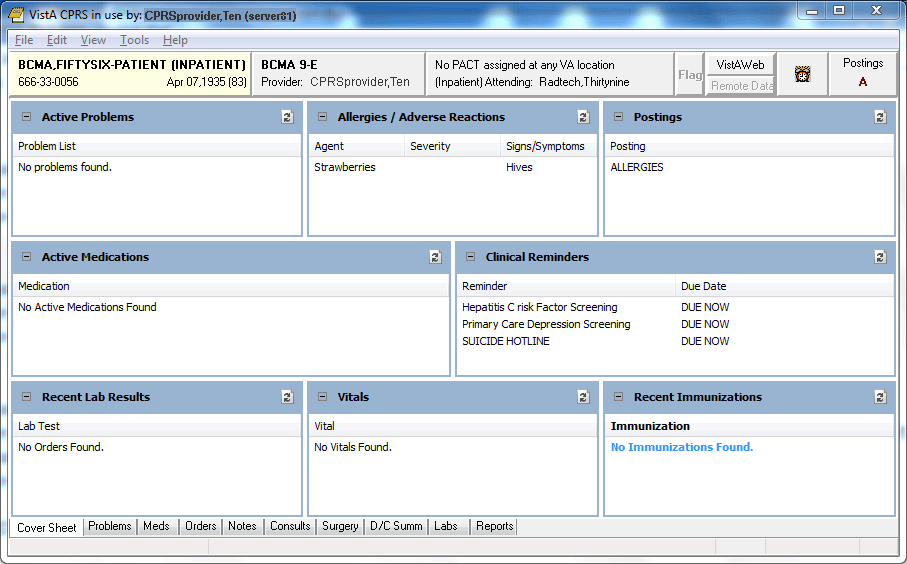
This screen capture shows the Cover Sheet as it has been customized.
***

### Content Criteria

The criteria for determining what gets loaded into each section of the cover sheet are listed below. Certain sections are affected by parameter settings. To set Cover Sheet parameters, use the “CPRS Configuration (Clin Coordinator)” menu option then “GUI Parameters” and then “GUI Cover Sheet Display Parameters” on the CPRS Configuration menu to set Cover Sheet parameters. These parameters may be set for the system, a division, a service, a location, or an individual user.
#### Problem List

Currently active problems are shown in the list.
#### Allergies

CPRS displays all allergies and reactions.
#### Postings

All currently active postings are shown.
#### Medications

If the patient is an outpatient, outpatient prescriptions are shown. If the patient is an inpatient, inpatient medications are shown. Only medications with the following statuses appear in the list:
-   Active
-   Drug Interactions
-   Hold
-   Incomplete
-   Non-verified
-   On Call
-   Pending
-   Provider Hold
-   Refill
-   Suspended
***

Medications that are not active (discontinued, expired, etc.) are not shown in the list. The medications on the list are displayed in inverse chronological order by the time of the order. In other words, they are listed from newest medication order to oldest medication order.
#### Reminders

The parameter, ORQQPX SEARCH ITEMS, controls which reminders are displayed on the Cover Sheet. After the reminders contained in ORQQPX SEARCH ITEMS are evaluated, those that are due are displayed. For sites with complex cover sheet reminder needs, a more comprehensive mechanism is available for defining cover sheet reminders (see the New Cover Sheet Reminder List section).
#### Lab Results

Lab orders that have been completed within the preceding number of days are listed. ORQQLR DATE RANGE INPT is used where the patient is an inpatient. The default value is two days. ORQQLR DATE RANGE OUTPT is used where the patient is an outpatient. The default value is 30 days. When changing the value of these parameters, caution should be used to not make the length of time too great. It can cause performance problems and memory allocation errors if a patient has a large number of lab orders and the time range is large.
#### Vitals

The most recent vital measurements are listed.
#### Visits/Admissions

Appointments and admissions that occur within a preset time frame are listed. The time frame is determined by the value of the parameters, ORQQVS SEARCH RANGE START and ORQQAP SEARCH RANGE STOP. ORQQVS SEARCH RANGE START identifies the beginning date for appointments and admissions. This date should be relative to the current date, entered as “T-n” where T is today and n is the number of days in the past. ORQQVS SEARCH RANGE STOP identifies the ending date for listing appointments and admissions. It should be entered as a relative number of days. CPRS is delivered with the beginning date set to “T-90” and the ending date set to “T”.
#### Immunizations
#### Women’s Health
## Problem Tab Settings

### Default Views

The user’s default view on the Problems tab is determined by two different settings.
Both the GUI and the List Manager versions of CPRS use the ORCH CONTEXT PROBLEMS parameter. Its value can be set at the SYSTEM and USER levels. The parameter takes the form of a semicolon-delimited string, with the different pieces meaning as follows:
a;b;c;d;e (example: T-180;T;A;1;1329)
a Begin date
b End date
c Status (A = active, I = inactive, B = both, R = removed)
d If “1”, show all comments as default
e Provider internal entry number
***

The user-level value for this parameter can be set using the **View \| Filter** menu and saving the selected settings as the default. There should be no need to edit the parameter directly at the user level.
Both the GUI and List Manager versions of CPRS use the PROBLEM LIST PRIMARY VIEW field (\#125) of the NEW PERSON (\#200) file. The contents of the field determine whether the outpatient (clinics) or inpatient (services) view of the problem list will be used, and can also be used to specify clinics or services to include in the list. The field will contain a “C” or “S,” followed by a list of internal entry numbers of clinics and services, separated by a forward slash ( / ) and ending with a trailing forward slash. Here is an example, excerpted from a VA FileMan INQUIRE into the NEW PERSON file for a user:
PROBLEM LIST PRIMARY VIEW: C/4/5/
-   “C” indicates outpatient (Clinics) view should be used. “S” indicates that the inpatient (Services) view should be used.
-   “4” and “5” are pointers to default clinics or services (depending on “C” or “S”) to include in the view. Others will be hidden. If none are specified, all will be shown.
***

For users of the GUI, it is best to use the **View \| Filter** menu to set this field. Save as Default will update it with the selected view and clinics or services to include. Because it is stored in the NEW PERSON file, it is applicable only to the individual user.
### Setting Up Problem Selection Lists

To create, maintain, customize, and assign problem selection lists for users, use the GMPL MGT MENU option, “Create Problem Selection Lists….” The following sub-options are available, and are documented in the manuals for the Problem List package:
1 Build Problem Selection List(s)
2 Copy Selection List from IB Encounter Form
\*\*\> Out of order: This option has been disabled due to the Problem List SNOMED CT implementation.
3 Assign/Remove Problem Selection List
4 Delete Problem Selection List
5 Check Problem Selection List Problem Codes
6 Import Problem Selection List
#### What Is a Selection List?

A Selection List is made up of CATEGORIES. Each CATEGORY contains specific PROBLEMS. Categories appear in the upper list box. When the user highlights a category in the upper list box, the problems in that category display in the lower list box.
There is now a National Problem Selection List that will display by default unless there is a Problem Selection List previously assigned. Use of National Problem Selection List is highly recommended because it will be maintained and distributed by a national group.
Sites can also create and use local lists, but the site will be responsible for maintaining all locals lists. Therefore, it is recommended that sites use the national list.
***


When a problem list is assigned, it will display on the left of the Problems tab. The VA-National Problem Selection List is shown above.
***

With the release of patch GMPL\*2.0\*49, some of the file locations where problem selection information is stored has changed. The new ORQQPL SELECTION LIST parameter will be where the selection lists for users or other entities will be assigned. This parameter holds a pointer to the Problem Selection List file \#125. Lists can be assigned at the User, Location, Division, or System levels.
As with all CPRS parameters, the higher the precedence or level will be used for the entity. For example, User is the highest or most specific precedence and System or Package is the lowest or most general. The package level is the most general and is only sent out by development normally. System would be more specific and so on, down to the user level.
#### Assigning Problem Selection Lists

With the changes with patches OR\*3.0\*429 and GMPL\*2.0\*49, please use the GMPL Assign/Remove list menu option to assign problem selection lists. See the *Problem List User Manual* and *Problem List Technical Manual* for additional information.
#### User Access and Privileges

If the user holds any of the ORES/ORELSE/PROVIDER keys, that user is viewed as a clinical user, and has full access privileges to all problem list options.
If a user holds the OREMAS key, that user is viewed as a clerical user. In that case, the Verify, Remove, Restore, and View Removed options will not be available. If the site parameter requiring verification is set to TRUE, then problems entered will be left in an UNVERIFIED state until a clinical user verifies them. Problems in the UNVERIFIED state are denoted by a dollar sign (\$) inserted at the beginning of the line.
These access levels are also enforced when problems are entered via the encounter form. Problems entered on the encounter form by clerical personnel will be left as UNVERIFIED.
CPRS List Manager and the Problem List package do not operate exactly the same as described above. The Problem List package evaluates the presence/absence of menu options in the user’s menu tree, and determines access accordingly. Since CPRS LM sometimes drops into PL package code, it uses a hybrid method of keys and menu options to determine access.
## Medications Tab Settings

### Medication List Content

All active medication orders are listed. In the case of outpatient orders, this includes medications that have been active within the last 120 days. So medications with a non-active status, such as DISCONTINUED, may be included in the list of outpatient medications. Each list of medications is sorted first by status. Active statuses are at the top of the list. Pending statuses are listed next, followed by any non-active statuses.
#### Active

Active statuses include:
-   Active
-   Refill
-   Hold
-   Suspended
-   Provider Hold
-   On Call
#### Pending

Pending statuses include:
-   Non-Verified
-   Drug Interactions
-   Incomplete
-   Pending
#### Non-active

Non-active statuses include:
-   Done
-   Expired
-   Discontinued
-   Deleted
-   Discontinued by Provider
-   Discontinued (Edit)
-   Reinstated
-   Renewed
***

Within each group of statuses, the medications are sorted by expiration date, with those that expire last at the top of the list.
### How Long to Display Expired and Discontinued Meds

The CPRS parameter ORCH CONTEXT MEDS enables sites to set the length of time that expired and discontinued medications display on the Meds tab. This parameter does not affect the display of active medications, only how long expired and discontinued medications continue to display on the Meds tab.
CPRS enables the user to set a date range for which the expired and discontinued medications will display. For example, a user could decide to view the expired medications for the user from one year in the past (T-365). Or the user could set a period in the past such as June 16, 2006 to September 16, 2006. Normally, this date range should use relative dates such as T-180, T-365, or something similar.
The rules for how the date the user sets affects the display of Inpatient Medications, Non-VA Medications (Documentation), and Outpatient Medications are slightly different:
-   **Inpatient Meds**
-   Under Inpatient Medications, CPRS displays all expired and discontinued orders received from Inpatient Medications that have stop date and time that falls between the beginning and ending dates specified by the ORCH CONTEXT MEDS parameter.
-   If ORCH CONTEXT MEDS does not have a date, CPRS displays all active inpatient medications (including Pending) only. No expired or discontinued medications are displayed.
***

-   **Non-VA Meds (Documentation)**
-   CPRS displays all Non-VA Meds (Documentation) without a start date/time.
-   For active Non-VA medications (Documentation) to be displayed, the order start date if it has one must be between ORCH CONTEXT MEDS start and stop date.
-   The order start date does not need to be absolute, meaning it could only be a month and a year.
-   To display a Non-VA medication (Documentation) that has expired, the order stop date must be after the ORCH CONTEXT MEDS start date.
***

-   **Outpatient Meds**
-   CPRS displays all Active orders, including “active” Pending orders regardless of ORCH CONTEXT MED’s settings.
-   CPRS filters out deleted prescriptions and Pending orders that are DC (discontinued), DE (Discontinue edit), or RF (refill).
-   For outpatient medications, CPRS displays the orders from Outpatient Pharmacy that have a medication expiration date that is the same as the start date from ORCH CONTEXT MEDS or is closer to the present.
-   Outpatient Pharmacy ignores the end date of ORCH CONTEXT MEDS.
-   If CPRS does not pass a start date to Outpatient Pharmacy, then Outpatient Pharmacy uses a start date of T-120 or 120 days in the past.
***

### New Medication Orders

When a user clicks **Action \| New Medication**, the order dialog that is displayed is controlled by the parameter ORWDX NEW MED. The parameter allows separate values to be set for the inpatient and outpatient settings. If your site uses the standard PSJ OR PAT OE or PSO OERR orderable-item display lists, the default behavior of CPRS is to display the Inpatient Medication ordering dialog for inpatients and the Outpatient Medication dialog for outpatients. Using CPRS GUI versions 23 and later, authorized hospital locations can order inpatient medications for outpatients. (To make this option available, you must first install the following pharmacy and scheduling patches: PS\*1.0\*59, PSJ\*5.0\*111, and SD\*5.3\*285.)
For hospital locations that are authorized to place inpatient medication orders for outpatients, you can override the default behavior of the **Action \| New Medication** option through the ORWDX NEW MED parameter. Specifically, you can set this parameter to include menus that enable users to place these orders from the **Meds** tab. (See the [“Inpatient Medication Orders for Outpatients: Setting the ORWDX NEW MED Parameter” and “Ordering Menus and Quick Orders”](#inpatient-medication-orders-for-outpatients-setting-the-orwdx-new-med-parameter) sections of this manual for more information about displaying menus. For information about authorizing a hospital location to place inpatient orders for outpatients, see the “[Inpatient (Unit Dose) Medications for Outpatients](#clinic-orders-inpatient-orders-administered-in-clinic)” section of this manual.)
#### Inpatient Medication Orders for Outpatients: Setting the ORWDX NEW MED Parameter

Take the following steps to enable users at authorized hospital locations to order inpatient medications for outpatients from the **Meds** tab:
1.  Access General Parameter Tools [XPAR MENU TOOLS].
1.  Select Edit Parameter Values [XPAR EDIT PARAMETER’
1.  Select the New Med Dialog [ORWDX NEW MED] parameter. You can set this parameter at one of the following three levels:
-   User (USR) [choose from NEW PERSON]
-   System (SYS) [YOUR SYSTEM NAME]
-   Package (PKG) [ORDER ENTRY/RESULTS REPORTING]
***

1.  Select the level at which you want to set the ORWDX NEW MED parameter.
1.  At the *Patient Status* prompt, enter o (for outpatient).
1.  At the *Order Dialog* prompt, enter your menu selection.
***

When (in CPRS) users subsequently select **Action \| New Medication** for outpatients, CPRS displays this menu. If the menu includes inpatient medications and users select an authorized Encounter Location for their orders, they can then order inpatient medications for outpatients.
***

#### Additional Options

##### Menu Options

You can also use the ORWDX NEW MED parameter to display other types of menus. For example, you can use this parameter to display a menu that directs users to the Orders tab for placing medication orders.
*Example: Display a menu that tells the user to use the orders tab for med ordering.*
The captioned output for a display-only menu looks similar to the following:
NAME: NO MED ORDERING DISPLAY TEXT: NO MED ORDERING
TYPE: menu COLUMN WIDTH: 80
SEQUENCE: 1.1
DISPLAY TEXT: Ordering not allowed from here - use the orders tab.
DISPLAY ONLY?: YES
TIMESTAMP: 58337,65573
***

Do the following, to attach this menu so that it displays when the user clicks **New Medication...**
Select General Parameter Tools Option: EP Edit Parameter Values
\--- Edit Parameter Values ---
Select PARAMETER DEFINITION NAME: ORWDX NEW MED New Med Dialog
ORWDX NEW MED may be set for the following:
1 User USR [choose from NEW PERSON]
3 System SYS [REDACTED]
4 Package PKG [ORDER ENTRY/RESULTS REPORTING]
***

Enter selection: 1 User NEW PERSON
Select NEW PERSON NAME: CPRSPROVIDER,TEN TC
***

\--------------- Setting ORWDX NEW MED for User: CPRSPROVIDER,TEN--------
Select Patient Status: Inpatient
Are you adding Inpatient as a new Patient Status? Yes// YES
Patient Status: Inpatient// Inpatient
Order Dialog: NO MED ORDERING
Select Patient Status: Outpatient
Are you adding Outpatient as a new Patient Status? Yes// YES
***

Patient Status: Outpatient// Outpatient
Order Dialog: NO MED ORDERING
Select Patient Status:
***

Note that the parameter needed to be set for both the inpatient and outpatient settings. Attaching a quick-order menu is done the same way. Of course, the quick order menu would contain medication quick orders and the medication ordering dialogs, rather than just display text.
##### Stop Date for Inpatient Medication Orders

With PSS\*1\*59 and PSJ\*5\*111 and later, you can specify a stop date that applies to all inpatient medication orders for outpatients. The PSJ CSD parameter allows you to define the information used to calculate the stop date for inpatient medication orders for outpatients.
**Note:**  Clinic Orders are affected by both CPRS auto-DC rules and Inpatient Medications rules for auto-discontinuing orders on admission and discharge. If sites do not want Clinic Orders to auto-discontinue on admission and discharge, sites will have to ensure that neither CPRS nor Inpatient Medications discontinues Clinic Orders.
## Orders Tab Settings

### Order View

The list of orders that are viewed may be configured in several ways. A user may list orders by Display Group. The sequence of Display Groups is controlled by the parameter, ORWOR CATEGORY SEQUENCE. This parameter may be set at the package, system, or user level.
*Example: Create a system level sequence for the order review screen and add a site defined Display Group for Restraints.*
From the XPAR MENU TOOLS option, use “LV” to list the exported values for the ORWOR CATEGORY SEQUENCE parameter.
Use “EP” to edit the ORWOR CATEGORY SEQUENCE parameter at the system or user level. The system and the user level do not “inherit” any values from the exported package level; it will be necessary to re-enter all the exported values for these levels.
If you wish to change the order of the exported display groups, you can change the sequence numbers.
Select Sequence: ?
***

Sequence Value
\-------- -----
10 M.A.S.
20 ALLERGIES
30 VITALS/MEASUREMENTS
35 ACTIVITY
40 NURSING
50 DIETETICS
59 CLINIC INFUSIONS
60 IV MEDICATIONS
65 OUTPATIENT MEDICATIONS
68 NON-VA MEDICATIONS (DOCUMENTATION)
69 CLINIC MEDICATIONS
70 INPATIENT MEDICATIONS
74 ANATOMIC PATHOLOGY
75 LABORATORY
80 IMAGING
90 CONSULTS
100 PROCEDURES
110 SURGERY
120 OTHER HOSPITAL SERVICES
130 SUPPLIES/DEVICES
135 CLINIC SCHEDULING
***

The initial view that is shown on the orders tab is controlled by the parameter, ORCH CONTEXT ORDERS. This parameter may be set at the system level or for an individual user. The parameter is updated at the user level whenever a user selects **View \| Save as Default View...** While seldom done, you can change the default for the site by editing the parameter directly using the XPAR MENU TOOLS option. The default view is saved as a semi-colon delimited string.
*Example: Context string for All Current Orders, Reverse Sort, Group by Service*
ORCH CONTEXT ORDERS = “;;2;ALL;L;R;1”
1 - Beginning Date 5 - For List Manager Use
2 - Ending Date 6 - “R” if Reverse Sort
3 - Status Filter 7 - “1” if Group by Service
4 - Display Group
***

If you want to show orders with a completed status (complete, DC, etc.) in the Current Orders list for a number of hours after the time of completion, set the number of hours in the ORPF ACTIVE ORDERS CONTEXT HRS parameter. This may only be set at the system level. If you want the Current Orders list to only show pending, active, and hold orders, set the number of hours to 0.
If you wish to show the lab-assigned order number in the text of a lab order after it has been released to lab service, set the ORPF SHOW LAB \# parameter to “yes”. This may only be set at the system level.
#### Expiring Orders

Expiring orders are those orders with a stop time between the present and midnight of the following day and on which no user has taken an action less than 24 hours from the expiration date/time. If the “following day” is a holiday, all orders with a stop date between now and midnight of the day after the holiday expire. If a user takes an action on the order less than 24 hours before the expiration date/time, the alert will not be generated. There is no parameter to change this.
#### Active Orders

Active orders include orders that have a status of:
-   Hold
-   Flagged
-   Pending
-   Active
-   Scheduled
-   Partial Results
-   Unreleased
-   Renewed
***

Also, orders with the following statuses are included if they have been assigned that status within the number of hours identified by the parameter ORPF ACTIVE ORDERS CONTEXT HRS:
-   Discontinued
-   Complete
-   Expired
-   Cancelled
***

So recent activity in this case means that the orders expired, the patient was discharged, etc. within the number of hours identified by the parameter, ORPF ACTIVE ORDERS CONTEXT HRS. The parameter may only be set for the entire site; there are no other levels.
#### Recent Activity

Recent Activity (today’s orders) means the orders that have been released since midnight.
#### Recently Expired

This view looks only at order status not order action status. Looking at orders action status was causing duplicates with a DC/Edit and an Expired status. The number of hours that CPRS looks in the past for expired orders is defined in the parameter ORWOR EXPIRED ORDERS. This parameter can be set only at the system level.
#### Unified Action Profile

This view displays a combined list of existing inpatient and outpatient medication orders from the local site on a single page. Using this view, a clinician can record decisions for all orders assigned to a patient to ensure that the correct medication orders are continued for the patient upon discharge.
The PHARMACY UAP Display Group includes the display members INPATIENT MEDICATIONS, OUTPATIENT MEDICATIONS, and NON-VA MEDICATIONS (DOCUMENTATION). If expected orders do not display in the Unified Action Profile (UAP) view, additional display members can be added to the group. For example, Supply orders are omitted from the UAP view by design, but they can be displayed if the SUPPLY Display Group is added as a member of the PHARMACY UAP Display Group.
##### Modifying the PHARMACY UAP Display Group

To add additional display group members to the PHAMACY UAP Display Group, contact OIT for assistance; access to VistA programmer mode and FileMan are required to modify display group members. The PHARMACY UAP Display Group is stored in the DISPLAY GROUP file (\#100.98).
**To add display group members to the PHARMACY UAP Display Group:**
1.  Log in to VistA in programmer mode and navigate to FileMan.
1.  Select the ENTER OR EDIT FILE ENTRIES option.
1.  At the “Input to what File: OPTION//” prompt, type DISPLAY GROUP.
1.  At the “EDIT WHICH FIELD: /ALL” prompt, type MEMBER.
1.  At the EDIT WHICH MEMBER SUB-FIELD: /ALL” prompt, press Enter.
1.  At the “Select DISPLAY GROUP NAME:” prompt, type PHARMACY UAP.
1.  At the “Select MEMBER: NON-VA MEDICATIONS (DOCUMENTATION) //” prompt, type the name of the Display Group to add to the PHARMACY UAP Display Group.
For example, type CLINIC MEDICATIONS to add the CLINIC MEDICATIONS member to the PHARMACY UAP Display Group.
1.  At the “Are you adding ‘CLINIC MEDICATIONS’ as a new MEMBER? No//” prompt, type Y (Yes).
1.  At the MEMBER SEQUENCE: 4//” prompt, press Enter to accept the default.
Note: The member sequence is not used by the UAP code modification.
1.  Repeat these steps to add each required display group to the PHARMACY UAP Display Group file.
#### Discharge Meds

This view displays a list of remaining active outpatient medication orders from the local site after order decisions are recorded in the Unified Action Profile. The orders to be released with the patient upon discharge are displayed.
***

### Ordering Access/Authorization

Access to ordering is controlled by a combination of several parameters. These parameters are modified from the XPAR MENU TOOLS option.
ORWOR DISABLE ORDERING can be used to prevent writing new orders and taking action on existing orders. It only affects ordering in the GUI; LM does not check this parameter. The main use for this parameter is for phasing in GUI order entry. It can be set at the system level initially (set ORWOR DISABLE ORDERING = “yes” at the system level). Then, as you wish to give individual users the ability to order via the GUI, the parameter may be set to “no” for each user.
ORWOR ENABLE VERIFY is used to allow nurses to verify orders in the GUI. List Manager does not check this parameter. It can be used in cases where you want to disallow GUI ordering, but still want the nurses to verify using the GUI and vice versa.
***

| Disable Ordering | Enable Verify | Behavior                                             |
|------------------|---------------|------------------------------------------------------|
| Yes              | Yes           | Nurses can verify but users cannot order via GUI.    |
| Yes              | No            | Both nurse verify & ordering are disabled via GUI.   |
| No               | Yes           | Both nurse verify & ordering are allowed via GUI.    |
| No               | No            | Ordering is allowed in GUI, but nurse verify is not. |
OR OREMAS MED ORDERS determines what holders of the OREMAS key (clerks) are allowed to do with medication orders. The parameter may only be set at the system level. It may have the following values:
-   **0 NO**: A clerk is completely prohibited from handling medication orders.
-   **1 UNRELEASED ONLY**: A clerk may only enter unreleased orders for both Inpatient and Outpatient.
-   **2 YES**: Clerks may take action on all medication orders. A clerk may enter new medication orders or DC these medication orders. Inpatient orders may be released to the Pharmacy as 'Signed on Chart'. Outpatient orders will require the physician's signature.
***

ORWOR DISABLE HOLD ORDERS will remove the “Hold” and “Release from Hold” items from the Action menu. Some sites prefer to implement holds as generic orders rather than require users to identify the specify orders to hold. For example, the generic order “Hold all oral medications” might be created and used instead of the hold action.
#### Clinic Orders (Inpatient Orders Administered in Clinic)

The Clinic Orders project is designed to enable a CPRS user to order a unit-dose medication that is dispensed by inpatient pharmacy and administered to an outpatient in a clinic setting. Users can also order intravenous (IV) fluid infusion orders and Nursing text orders from an clinic location.
Clinic Orders also implements the display of those unit-dose orders, IV Fluid (Infusion) orders, and Nursing text orders two new display groups named Clinic Medications for Unit Dose orders and Clinic Infusions for infusion or intravenous orders. Clinic Orders allow VistA order checks to function for such medication orders. For the purposes of this document, Clinic Orders are defined as unit-dose medication orders, IV Fluid (Infusion) orders, and Nursing text orders written from an authorized clinics.
Sites must do specific set up steps before users will be able to write Clinic Orders. To see more about set up and what sites need to consider before implementing Clinic Orders features, please see the Release Notes for patch PSJ\*5\*121.
##### Designating Clinic Orders Locations

To create a Clinic Orders location, sites designate specific clinics as Clinic Orders authorized locations by setting the ADMINISTER INPATIENT MEDS? field (\#2802) to YES for the clinic, using either of these menu options:
-   Set up a Clinic
-   Inpatient Medications to Clinic
***

**Note:** To determine whether a location is an authorized Clinic Orders location, CPRS calls a Scheduling API to check if the patient has an appointment scheduled. As of the release of CPRS v.27, the Scheduling database is not yet ready. The API then returns a value of -3 to CPRS, which tells CPRS that the database could not be reached. CPRS then checks the location file and if the clinic is designated as a Clinic Orders clinic, the user can write Clinic Orders.
***

##### Configuring Users to Order Clinic Medications

To order Clinic Medication or Infusions, users must have the correct keys and secondary menu options.
-   **Keys:** Provider and ORES
-   **Secondary menu options:** OR BCMA ORDER COM and PSB GUI CONTEXT – USER
##### Ordering Clinic Orders from the Meds Tab

Clinic Medications and Clinic Infusions orders use new ordering dialogs if orders are being placed from the Meds tab. To use the Meds tab to place either a clinic medication or a clinic infusion orders, sites must do the following:
1.  In List Manager, select the Edit Parameter Values [**XPAR EDIT PARAMETER**] option.
1.  Enter the parameter **ORWDX NEW MED** parameter.
1.  Select the appropriate level: User, System, or Package.
**Note:** To set the package level, the user must be in programmer mode.
***

1.  At the Patient Status prompt, enter **Outpatient**.
1.  Add the order dialog **PSJ OR PAT OE** to the menu you have assigned to the Outpatient patient status.
1.  When done, you may exit List Manager.
***

##### Displaying Clinic Orders on the Meds Tab

On the Meds tab, all statuses (unreleased, pending, active, discontinued, expired, etc.) of Clinic Orders display at the top of the Inpatient Medications pane. Users can tell which orders are Clinic Medications or Clinic Infusions orders because Clinic Orders have a location in the location column. There is no set up required for this display to occur.
***

##### Displaying Clinic Orders on the Orders Tab

On the Orders tab, the order of display groups depends on the parameter ORWOR CATGEORY SEQUENCE. Sites need to decide where the Clinic Medications and Clinic Infusions display groups will appear. Sites may want to ensure that both Clinic Medications and Clinic Infusions display near Inpatient and Outpatient display groups. To do this, pick a sequence number close to the numbers for these display groups.
The ORWOR CATEGORY SEQUENCE parameter can be set at the Package, System, or User levels. Remember that to set the parameter at the Package level, the user must be in programmer mode. An example of setting this parameter is shown under [Order View](#261ztfg).
##### Displaying Flagged Order and Ward Comments on the Orders Tab

On the Orders tab, the display of flagged Order comments and Ward comments depends on the parameter OR FLAGGED & WARD COMMENTS. Sites can use this function to display these comments where Clinical staff can plainly see them. The setting is applied to both flagged Order comments and Ward comments, which are used to coordinate lab orders.
This display function can be turned On/Off. The default position is OFF (“0”). The setting is applied to both flagged Order and Ward comments. To enable the functionality, a CAC or OIT member must use the XPAR MENU TOOLS option to set the OR FLAGGED & WARD COMMENTS parameter to ON (“1”). This parameter is stored in the PARAMETER DEFINITION file (\#8989.51).
##### Using Quick Orders with Clinic Orders

Sites must evaluate their quick orders based on the new processes to determine if they need to be edited for use with clinics.
For all of the following examples we will start on the Order Menu Management [ORCM MGMT] option in VistA.
###### Setting up Nursing Generic Text Orders

1.  Select **GO** Enter/Edit Generic Orders.
1.  At the select order dialog name, enter one of the following:
-   OR GXTEXT WORD PROCESSING ORDER
-   OR GXMISC GENERAL
-   OR GXTEXT TEXT ONLY ORDER
***

1.  Enter a generic order name at the Select Generic Order Name prompt.
1.  At the Type of Generic Order prompt select **Nursing.**
1.  Enter Display Text (optional).
1.  Continue through the rest of the prompts and answer appropriately for your site.
1.  The text instructions are entered at the Instructions: prompt.
**Note:** The Type of Display Group prompt is used to determine under which display group text orders will appear. If the user setting up Clinic Orders enters a group other than Nursing into this field, the text order will not follow the Clinic Orders rules. For Nursing quick orders, use the OR GXMISC GENERAL dialog.
***

###### To add text orders to an order set, use these steps:

1.  Select **ST** Enter/edit order sets.
1.  Enter the order set name.
1.  If entering a new order set, the user can copy the contents of another order set into the new order set.
1.  At the Select Component Sequence\#: prompt the user would select what sequence number they want the text order to appear in the order set.
1.  At the Item prompt the user would select name of the text order to add to the order set.
#### Permission to Write Supply Orders

The Supplies order dialog was created to separate ordering supplies from ordering medications. Supplies can be ordered by several kinds of users.
To order supplies, the following set ups can be used for these users:
-   For a provider or physician, the normal ordering keys and settings given to a physician (such as ORES, Provider, Authorized to Write Meds, etc.) will enable them to order supplies. They should NOT need to have the ORSUPPPLY key.
-   For nurses, an individual who holds the ORELSE and ORSUPPLY can order supplies without having the ability to order medications. A Clinical Application Coordinator (CAC) or similar person should assign the ORSUPPLY key to appropriate users with the Key Allocation option.
**Note:** If the user has the ORELSE and ORSUPPLY key, they user can order supplies and release the order to pharmacy. If the user has the ORELSE, ORSUPPLY, and PROVIDER key, the user will also show as the ordering provider.
-   For clerks, the user needs to have the OR OREMAS MED ORDER parameter set for the user and the ORSUPPLY key assigned to them. A CAC or similar person should assign these items to the clerk should the site want to give the ability to order supplies.
***

#### How Does CPRS Identify an Orderable Item as a Supply?

CPRS identifies an orderable item as a supply if it meets one of the following criteria:
-   drug class that begins with XA
-   drug class that begins with XX
-   a drug class of DX900 and the DEA special handling field set to Supply
***

### Writing Orders

The Write Orders list box serves as the point from which order writing is initiated. This list box can contain order menus, order sets, quick orders, or any order dialog. You may wish to begin by simply setting up the Write Orders list box so that it contains one item - a link to the same menu as that used by the OR ADD ORDERS MENU parameter. The CPRS GUI does not use OR ADD ORDERS MENU; it is used only by the List Manager interface. A different parameter is used because the “Write Orders” list box is not a multi-column orders menu. It was intended to provide an easy place to branch into a variety of order menus or general ordering dialogs. One way of looking at it is that it allows a user to have a series of context specific “Main Add Orders” menus.
There are two parameters that control the content of the “Write Orders” list box. Each parameter may be set at the system, division, service, location, or user levels. The older parameter is ORWOR WRITE ORDERS LIST. Each time this parameter is set for a given entity (user, location, etc.), every item in the list must be entered. To reduce the redundant entries, ORWDX WRITE ORDERS LIST was created. This parameter points to a menu in the Order Dialog file (101.41). You begin by creating the list of entries as a one-column menu in the Order Dialog file, and then set the parameter to reference that entry. Then, each time you need to set up a new user (or location, service, etc.) with that “Write Orders” list, you don’t have to re-enter every item.
A value for ORWDX WRITE ORDERS LIST will override a value for ORWOR WRITE ORDERS LIST if one is present. ORWDX WRITE ORDERS LIST will be the parameter that is manipulated set by future menu configuration tools. ORWOR WRITE ORDERS LIST remains for backwards compatibility.
*Example: Select a user and set up a “Write Orders” list that contains two quick order menus, an admission order set, plus the general laboratory ordering dialog.*
#### Configuring the Orders List Using the ORWOR WRITE ORDERS LIST Parameter

Use the General Parameter Tools option. Select EP, Edit Parameter Values.
Select PARAMETER DEFINITION NAME: ORWOR WRITE ORDERS LIST Write Orders (Inpatient)
ORWOR WRITE ORDERS LIST may be set for the following:
1 User USR [choose from NEW PERSON]
2 Location LOC [choose from HOSPITAL LOCATION]
2.3 Service SRV [choose from SERVICE/SECTION]
2.7 Division DIV [REGION 5]
3 System SYS [REDACTED]
Enter selection: 1 User NEW PERSON
***

Select NEW PERSON NAME: CPRSPROVIDER,TEN TC
***

\-------- Setting ORWOR WRITE ORDERS LIST for User: CPRSPROVIDER,TEN -----
Select Sequence: 10
Are you adding 10 as a new Sequence? Yes// YES
Sequence: 10// 10
Order Dialog: ORZ GEN MED QUICK ORDERS
Select Sequence: 20
Are you adding 20 as a new Sequence? Yes// YES
Sequence: 20// 20
Order Dialog: ORZ MENTAL HEALTH QUICK ORDERS
Select Sequence: 30
Are you adding 30 as a new Sequence? Yes// YES
Sequence: 30// 30
Order Dialog: ORZ ADMIT TO MEDICINE
Select Sequence: 40
Are you adding 40 as a new Sequence? Yes// YES
Sequence: 40// 40
Order Dialog: LR OTHER LAB TESTS
Select Sequence:
***

#### To configure the Orders List Using ORWDX WRITE ORDERS LIST Parameter

1.  use Enter/Edit order menus in Order Menu Management.
***

Select Order Menu Management Option: MN Enter/edit order menus
Select ORDER MENU: ORZ GEN MED WRITE ORDERS LIST
Are you adding ‘ORZ GEN MED WRITE ORDERS LIST’ as
a new ORDER DIALOG? No// Y (Yes)
Do you wish to copy an existing menu? YES// NO
DISPLAY TEXT: *\<-- ignored in GUI*
DESCRIPTION:
1\> General Medicine “Write Orders” list
COLUMN WIDTH: 80
MNEMONIC WIDTH: : *\<-- ignored in GUI*
PATH SWITCH: : *\<-- ignored in GUI*
***

The menu editor appears.
1.  Select Add..., then Menu Items...p
Add: menu Menu Items
ITEM: ORZ GEN
1 ORZ GEN MED QUICK ORDERS
2 ORZ GEN MED WRITE ORDERS LIST
CHOOSE 1-2: 1 ORZ GEN MED QUICK ORDERS
ROW: 1
COLUMN: 1
DISPLAY TEXT:
MNEMONIC: :
ITEM: ORZ MENTAL HEALTH QUICK ORDERS
ROW: 2
COLUMN: 1
DISPLAY TEXT:
MNEMONIC:
ITEM: ORZ ADMIT TO MEDICINE
ROW: 3
COLUMN: 1
DISPLAY TEXT:
MNEMONIC:
ITEM: LR OTHER LAB TESTS
ROW: 4
COLUMN: 1
DISPLAY TEXT:
MNEMONIC:
ITEM:
***

Use the General Parameter Tools option. Select EP, Edit Parameter Values.
Select PARAMETER DEFINITION NAME: ORWDX WRITE ORDERS LIST Menu for Write Orders List
ORWDX WRITE ORDERS LIST may be set for the following:
2 User USR [choose from NEW PERSON]
4 Location LOC [choose from HOSPITAL LOCATION]
5 Service SRV [choose from SERVICE/SECTION]
7 Division DIV [REGION 5]
8 System SYS [REDACTED]
Enter selection: 2 User NEW PERSON
Select NEW PERSON NAME: CPRSPROVIDER,TEN TC
***

\-------- Setting ORWDX WRITE ORDERS LIST for User: CPRSPROVIDER,TEN----
Order Dialog: ORZ GEN MED WRITE ORDERS LIST
***

Since the “Write Orders” list has been set up as a menu, you will only need to do the second step, setting the ORWDX WRITE ORDERS LIST parameter, for any additional users.
The actual text used in the “Write Orders” list box is the text found in the LIST BOX TEXT field (\#55) of the Order Dialog file (\#101.41). If no text is present in that field, the value of the DISPLAY TEXT field (\#2) is used.
***

### Event-Delayed Orders

This section describes how to create, edit, and view a release event. Creating a release event allows CPRS users to write event-delayed orders that are not executed until the release event occurs. For example, you could create a release event called “Transfer to Medicine Treating Specialty” that includes three different, but related treating specialties. A clinician could then write an order that would be delayed until the “Transfer to Medicine Treating Specialty” release event occurred (i.e., the patient is transferred to one of the treating specialties). After the “Transfer to Medicine Treating Specialty” event occurred, the order would be released.
#### Creating a Release Event

**Note:** Release events are stored in the OE/RR RELEASE EVENTS file (\#100.5).
**To create a release event, follow these steps**:
1.  Open the CPRS Configuration (Clin Coord) menu [OR PARAM COORDINATOR MENU].
AL Allocate OE/RR Security Keys [ORCL KEY ALLOCATION]
KK Check for Multiple Keys [ORE KEY CHECK]
DC Edit DC Reasons [ORCL ORDER REASON]
GP GUI Parameters ... [ORW PARAM GUI]
GA GUI Access - Tabs, RPL [ORCL CPRS ACCESS]
MI Miscellaneous Parameters [OR PARAM ORDER MISC]
NO Notification Mgmt Menu ... [ORB NOT COORD MENU]
OC Order Checking Mgmt Menu ... [ORK ORDER CHK MGMT MENU]
MM Order Menu Management ... [ORCM MGMT]
LI Patient List Mgmt Menu ... [ORLP PATIENT LIST MGMT]
FP Print Formats [ORCL PRINT FORMAT]
PR Print/Report Parameters ... [OR PARAM PRINTS]
RE Release/Cancel Delayed Orders [ORC DELAYED ORDERS]
US Unsigned orders search [OR UNSIGNED ORDERS]
EX Set Unsigned Orders View on Exit [OR PARAM UNSIGNED ORDERS VIEW]
NA Search orders by Nature or Status [OR NATURE/STATUS ORDER SEARCH]
DO Event Delayed Orders Menu ... [OR DELAYED ORDERS]
PM Performance Monitor Report [OR PERFORMANCE MONITOR]
***

1.  Select the Event Delayed Orders Menu by typing **DO**.
The following menu will appear:
DO Delayed Orders/Auto-DC Set-up [OR DELAYED ORDERS EDITOR]
EP Parameters for event delayed orders [OR EVENT PARAMETERS]
IN Inquire to OE/RR Patient Event File [OR PATINET EVENT INQUIRY]
***

1.  Select Delayed Orders/Auto-DC Set-up by typing **DO**.
The following menu will appear.
Select one of the following:
***

Auto-DC Rules
Release Events
Enter response:
1.  Select Release Events by typing **2**.
The existing release events will appear in a numbered list.
1.  Select Add/Edit by typing **AE**.
1.  Press **return** at the *Select item(s)* prompt.
1.  Type a name for the release event at the *Select OE/RR RELEASE EVENTS NAME* prompt and press **Return**.
1.  Type **Y** or **Yes** at the Are you adding [event name] as a new OE/RR RELEASE EVENTS? prompt.
1.  Enter one of these letters at the *OE/RR RELEASE EVENTS TYPE OF EVENT* prompt:
-   A for an admission event.
-   T for a transfer event.
-   D for a discharge event.
-   O for an O.R. event.
-   M for a manual release event.
1.  Enter a division at the *OE/RR RELEASE EVENTS DIVISION* prompt.
-   For admission events, enter the location where the patient will be admitted.
-   For transfer events, enter the location where the patient will be transferred.
-   For discharge events, enter the location the patient will be leaving.
-   For O.R. events, enter the location where the patient will have the procedure.
-   For manual release events, enter the location where the patient will be located.
***

1.  Enter **Y** or **N** at the Do you want to copy from an existing entry? prompt.
1.  You will now be prompted to enter additional required information. For an explanation of additional prompts and fields you may encounter, see the [**Explanation of Release Event Prompts (Fields in the OE/RR RELEASE EVENTS file \#100.5)**](#1au1eum) topic.
1.  Once you have entered all of the required information, the You have now entered the required fields and may \^ to exit prompt will appear. If you do not wish to further define this event, type \^ to exit.
**Note**: You can also create a new release event from the detailed display screen.
***

**Note**: New release events are inactive by default and must be activated (by following the steps in the [Activating / Inactivating a Release Event](#explanation-of-release-event-prompts-fields-in-the-oerr-release-events-file-1005) topic) before they are used.
***

#### Creating a Child Release Event

A child release event is a variation of a main or parent release event. A child release event shares the same trigger event as its parent; however, a child release event can be assigned to a different order menu than its parent release event.
For example, suppose your facility has a release event named “transfer to surgery ICU” that releases orders when a patient is transferred to the surgery ICU. This release event is appropriate for most of your needs; however, when a clinician writes delayed orders for a transfer to the orthopedic surgery ICU, you would like the clinician to be presented with a slightly different order menu. In this example, you could create a child release event called “transfer to orthopedic surgery ICU”. This child event would share the same trigger event as its parent; however, clinicians who selected the “transfer to orthopedic surgery ICU” child release event would be presented with a different order menu.
**To create a child release event, follow these steps:**
1.  Open the CPRS Configuration (Clin Coord) menu [OR PARAM COORDINATOR MENU].
AL Allocate OE/RR Security Keys [ORCL KEY ALLOCATION]
KK Check for Multiple Keys [ORE KEY CHECK]
DC Edit DC Reasons [ORCL ORDER REASON]
GP GUI Parameters ... [ORW PARAM GUI]
GA GUI Access - Tabs, RPL [ORCL CPRS ACCESS]
MI Miscellaneous Parameters [OR PARAM ORDER MISC]
NO Notification Mgmt Menu ... [ORB NOT COORD MENU]
OC Order Checking Mgmt Menu ... [ORK ORDER CHK MGMT MENU]
MM Order Menu Management ... [ORCM MGMT]
LI Patient List Mgmt Menu ... [ORLP PATIENT LIST MGMT]
FP Print Formats [ORCL PRINT FORMAT]
PR Print/Report Parameters ... [OR PARAM PRINTS]
RE Release/Cancel Delayed Orders [ORC DELAYED ORDERS]
US Unsigned orders search [OR UNSIGNED ORDERS]
EX Set Unsigned Orders View on Exit [OR PARAM UNSIGNED ORDERS VIEW]
NA Search orders by Nature or Status [OR NATURE/STATUS ORDER SEARCH]
DO Event Delayed Orders Menu ... [OR DELAYED ORDERS]
PM Performance Monitor Report [OR PERFORMANCE MONITOR]
***

1.  Select the Event Delayed Orders Menu by typing **DO**.
The following menu will appear:
DO Delayed Orders/Auto-DC Set-up [OR DELAYED ORDERS EDITOR]
EP Parameters for event delayed orders [OR EVENT PARAMETERS]
IN Inquire to OE/RR Patient Event File [OR PATINET EVENT INQUIRY]
***

1.  Select Delayed Orders/Auto-DC Set-up by typing **DO**.
The following menu will appear
Select one of the following:
1\. Auto-DC Rules
2\. Release Events
Enter response:
***

1.  Select Release Events by typing **2**.
The existing release events will appear in a numbered list.
1.  Select Create Child Event by typing **CC**.
1.  At the *Select item(s)* prompt, enter the number of the parent event that you want to associate with the new child release event.
1.  At the *Select OE/RR CHILD RELEASE EVENTS NAME* prompt, type a name for the new child release event.
1.  The name that you entered in step 6 will appear. Verify that you entered the name correctly and press **Return**.
1.  Enter the name that you would like displayed to CPRS users at the *DISPLAY TEXT* prompt.
1.  Once you have entered all of the required information, the *You have now entered the required fields and may \^ to exit* prompt will appear. If you do not wish to further define this child event, type \^ to exit. If you would like to enter additional information, please refer to the [**Explanation of Release Event Prompts (Fields in the OE/RR RELEASE EVENTS file \#100.5).**](#1au1eum)
***

**Note**: New child release events are inactive by default and must be activated (by following the steps in the [Activating / Inactivating a Release Event](#explanation-of-release-event-prompts-fields-in-the-oerr-release-events-file-1005) topic) before they are used.
**Note**: Child release events are indented and displayed under the associated parent event.

Items 3, 4, and 5 are child release events of the Admit to Medicine parent release event.
#### Explanation of Release Event Prompts (Fields in the OE/RR RELEASE EVENTS file \#100.5)

The list below explains the additional prompts (fields) that you may encounter when entering a new release event:
-   *Display Text* – the name of the release event as it appears to CPRS users.
-   *Type of Event* – the type of release event. The value of this field can be **A** (admission event), **T** (transfer event), **D** (discharge event), **O** (O.R. event), or **M** (manual release event).
-   *Division* – the division to which the release event will apply.
-   For admission events the division is the admitting location.
-   For discharge events the division is the location the patient is leaving.
-   For transfer events the division is the receiving location where the patient will be transferred.
-   For O.R. events the division is the location where the patient will have the procedure.
-   For manual release events the division is where the patient will be located.
***

-   *MAS Movement Type* – the MAS movement type that will trigger this release event.
-   For admission and discharge events it is recommended that this field be left blank unless you have a need for a very specific admission/discharge event. This way, any admission/discharge type will release delayed orders.
-   For O.R. events a MAS Movement type is not required.
***

-   *Select Included Locations* – the locations included in the release event.
-   *Select Included Treating Specialties* – the treating specialties included in the release event.
-   For O.R events a treating specialty is not required.
***

-   *Short Name* – a short name for the release event (used when space is limited on the Orders tab).
-   *Event Order Dialog* – the name of the dialog that appears when a user writes an event-delayed order assigned to the release event.
-   For admission events use OR(Z) GXMOVE EVENT or ADMIT PATIENT.
-   For discharge events use OR(Z) GXMOVE EVENT or DISCHARGE.
-   For transfer events use OR(Z) GXMOVE EVENT or TRANSFER.
The OR GXMOVE EVENT dialog.
***

-   *Order Set Menu* – the order set/menu that will appear when a user writes an event-delayed order assigned to the release event.
**Note**: Order sets listed in this field should be part of an order menu.
***

-   *Lapse in \# Days* – the number of days that an event-delayed order assigned to the release event will remain active. Once the number of days specified is exceeded, you can no longer release orders assigned to this release event.
-   *Ordering Parameters Location* – the location that the release event will use to retrieve its ordering parameters.
-   For admission, transfer, O.R., and manual release events, be sure to specify a representative location so that the appropriate parameter values for dialogs (such as dietetics and lab) are used.
-   For discharge events it is recommended that you specify a representative location so that the appropriate parameter values for dialogs are used. However, this is not required because the patient will be leaving the facility.
***

-   *Copy Active Orders* – indicates whether a user should be permitted to copy existing active orders to new event-delayed orders.
-   For admission and discharge events this field is usually set to no.
-   For transfer events this field is usually set to yes.
***

**Note**: You can configure the OREVNT EXCLUDE DGRP parameter to prevent orders belonging to specific display groups from being copied. For more information, refer to [Excluding Display Groups from the Copy Active Orders Dialog Box](#excluding-display-groups-from-the-copy-active-orders-dialog-box)
#### Sample Release Events

##### Sample Admission Event


This sample release event uses the OR GXMOVE EVENT dialog and does not specify a MAS movement type.
##### Sample Discharge Event


A sample discharge event
##### Sample Transfer Event: Ward or Division Change
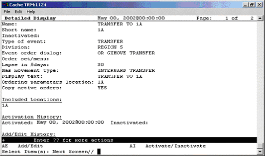

A sample transfer event for a ward or division change
##### Sample Transfer Event: From PASS


The MAS movement type specified in this event distinguishes the type of transfer.
##### Sample Transfer Event: to ASIH

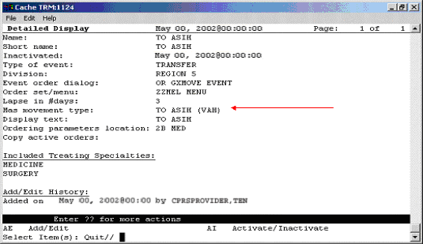

Sample transfer event: to ASIH
##### Sample Transfer Event: to NHCU
Sample transfer event: to NHCU

##### Sample O.R. Event

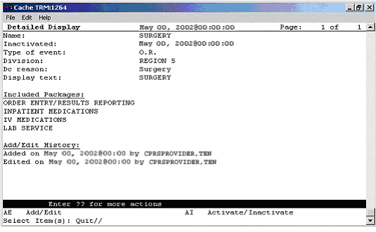

A sample O.R. event
##### Sample Manual Release Event

**A sample manual release event**
#### Activating/Inactivating a Release Event

**Note**: If a parent release event is inactive, all child release events will also be inactive. However, a child release event can be inactive while the parent release event is active.
**To activate/inactivate a release event, follow these steps:**
1.  Open the CPRS Configuration (Clin Coord) menu [OR PARAM COORDINATOR MENU].
***

AL Allocate OE/RR Security Keys [ORCL KEY ALLOCATION]
KK Check for Multiple Keys [ORE KEY CHECK]
DC Edit DC Reasons [ORCL ORDER REASON]
GP GUI Parameters ... [ORW PARAM GUI]
GA GUI Access - Tabs, RPL [ORCL CPRS ACCESS]
MI Miscellaneous Parameters [OR PARAM ORDER MISC]
NO Notification Mgmt Menu ... [ORB NOT COORD MENU]
OC Order Checking Mgmt Menu ... [ORK ORDER CHK MGMT MENU]
MM Order Menu Management ... [ORCM MGMT]
LI Patient List Mgmt Menu ... [ORLP PATIENT LIST MGMT]
FP Print Formats [ORCL PRINT FORMAT]
PR Print/Report Parameters ... [OR PARAM PRINTS]
RE Release/Cancel Delayed Orders [ORC DELAYED ORDERS]
US Unsigned orders search [OR UNSIGNED ORDERS]
EX Set Unsigned Orders View on Exit [OR PARAM UNSIGNED ORDERS VIEW]
NA Search orders by Nature or Status [OR NATURE/STATUS ORDER SEARCH]
DO Event Delayed Orders Menu ... [OR DELAYED ORDERS]
PM Performance Monitor Report [OR PERFORMANCE MONITOR]
***

1.  Select the Event Delayed Orders Menu by typing **DO**.
The following menu will appear:
DO Delayed Orders/Auto-DC Set-up [OR DELAYED ORDERS EDITOR]
EP Parameters for event delayed orders [OR EVENT PARAMETERS]
IN Inquire to OE/RR Patient Event File [OR PATINET EVENT INQUIRY]
1.  Select Delayed Orders/Auto-DC Set-up by typing **DO**.
The following menu will appear
Select one of the following:
***

1\. Auto-DC Rules
2\. Release Events
Enter response:
1.  Select Release Events by typing **2**.
The existing release events will appear in a numbered list.
1.  Select Activate/Inactivate by typing **AI**.
1.  Type the number of the release event you would like to activate/inactivate at the *Select items* prompt.
1.  The computer will display a message asking if you are sure you want to activate/inactivate this release event. Type the appropriate response.
**Note:** You can also activate/inactivate a release event from the detailed display screen.
**Note:**  Once you have activated a release event, the event will appear on the Event Delayed Orders dialog in the CPRS GUI. Users can now write orders that are delayed until the release event occurs.
***

#### Detailed Display of a Release Event

**To view a detailed display of a release event, follow these steps:**
1.  Open the CPRS Configuration (Clin Coord) menu [OR PARAM COORDINATOR MENU].
AL Allocate OE/RR Security Keys [ORCL KEY ALLOCATION]
KK Check for Multiple Keys [ORE KEY CHECK]
DC Edit DC Reasons [ORCL ORDER REASON]
GP GUI Parameters ... [ORW PARAM GUI]
GA GUI Access - Tabs, RPL [ORCL CPRS ACCESS]
MI Miscellaneous Parameters [OR PARAM ORDER MISC]
NO Notification Mgmt Menu ... [ORB NOT COORD MENU]
OC Order Checking Mgmt Menu ... [ORK ORDER CHK MGMT MENU]
MM Order Menu Management ... [ORCM MGMT]
LI Patient List Mgmt Menu ... [ORLP PATIENT LIST MGMT]
FP Print Formats [ORCL PRINT FORMAT]
PR Print/Report Parameters ... [OR PARAM PRINTS]
RE Release/Cancel Delayed Orders [ORC DELAYED ORDERS]
US Unsigned orders search [OR UNSIGNED ORDERS]
EX Set Unsigned Orders View on Exit [OR PARAM UNSIGNED ORDERS VIEW]
NA Search orders by Nature or Status [OR NATURE/STATUS ORDER SEARCH]
DO Event Delayed Orders Menu ... [OR DELAYED ORDERS]
PM Performance Monitor Report [OR PERFORMANCE MONITOR]
***

1.  Select the Event Delayed Orders Menu by typing DO.
The following menu will appear:
DO Delayed Orders/Auto-DC Set-up [OR DELAYED ORDERS EDITOR]
EP Parameters for event delayed orders [OR EVENT PARAMETERS]
IN Inquire to OE/RR Patient Event File [OR PATINET EVENT INQUIRY]
***

1.  Select Delayed Orders/Auto-DC Set-up by typing **DO**.
The following menu will appear:
Select one of the following:
***

1\. Auto-DC Rules
2\. Release Events
Enter response:
***

1.  Choose Release Events by typing **2**.
1.  Select Detailed Display by typing **DD**.
1.  At the *Select item(s)* prompt, type the number of the release event that you would like to display.
A detailed display of the release event will appear.
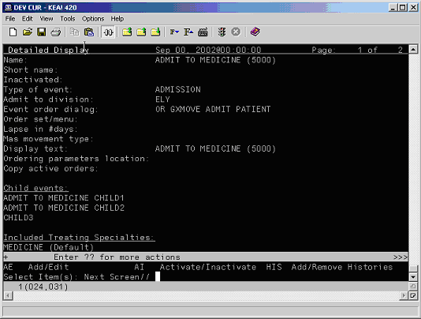
The release event detailed display
***

##### Audit and Activation History

The audit and activation histories on the detailed display can be toggled on or off depending on your preferences.
**To toggle the audit and activation histories on or off, follow these steps:**
1.  Open the CPRS Configuration (Clin Coord) menu [OR PARAM COORDINATOR MENU].
AL Allocate OE/RR Security Keys [ORCL KEY ALLOCATION]
KK Check for Multiple Keys [ORE KEY CHECK]
DC Edit DC Reasons [ORCL ORDER REASON]
GP GUI Parameters ... [ORW PARAM GUI]
GA GUI Access - Tabs, RPL [ORCL CPRS ACCESS]
MI Miscellaneous Parameters [OR PARAM ORDER MISC]
NO Notification Mgmt Menu ... [ORB NOT COORD MENU]
OC Order Checking Mgmt Menu ... [ORK ORDER CHK MGMT MENU]
MM Order Menu Management ... [ORCM MGMT]
LI Patient List Mgmt Menu ... [ORLP PATIENT LIST MGMT]
FP Print Formats [ORCL PRINT FORMAT]
PR Print/Report Parameters ... [OR PARAM PRINTS]
RE Release/Cancel Delayed Orders [ORC DELAYED ORDERS]
US Unsigned orders search [OR UNSIGNED ORDERS]
EX Set Unsigned Orders View on Exit [OR PARAM UNSIGNED ORDERS VIEW]
NA Search orders by Nature or Status [OR NATURE/STATUS ORDER SEARCH]
DO Event Delayed Orders Menu ... [OR DELAYED ORDERS]
PM Performance Monitor Report [OR PERFORMANCE MONITOR]
***

1.  Select the Event Delayed Orders Menu by typing DO.
The following menu will appear:
DO Delayed Orders/Auto-DC Set-up [OR DELAYED ORDERS EDITOR]
EP Parameters for event delayed orders [OR EVENT PARAMETERS]
IN Inquire to OE/RR Patient Event File [OR PATINET EVENT INQUIRY]
***

1.  Select Delayed Orders/Auto-DC Set-up by typing DO.
The following menu will appear
Select one of the following:
***

1\. Auto-DC Rules
2\. Release Events
Enter response:
***

1.  Type 1 to select Auto-DC Rules or 2 to select Release Events.
1.  Type DD to select Detailed Display.
1.  At the Select item(s) prompt, type the number of the release event or auto-DC rule that you would like to display.
A detailed display of the release event or auto-DC rule will appear.
1.  Type H to select Add/Remove Histories.
1.  At the Do you want to include them on the detailed display? prompt, type Y to include the audit and activation histories on the detailed display. Type N if you do not wish to display the audit and activation histories.

The audit and activation history can be toggled on or off on the detailed display screen.
***

#### Tracking Event-Delayed Orders (OE/RR PATIENT EVENTS file \#100.2)

You can use the information stored in the OE/RR PATIENT EVENTS file (\#100.2) to determine which orders were released as the result of a release event.

**To retrieve information from the OE/RR PATIENT EVENTS file (\#100.2), follow these steps:**
1.  Open the CPRS Configuration (Clin Coord) menu [OR PARAM COORDINATOR MENU].
AL Allocate OE/RR Security Keys [ORCL KEY ALLOCATION]
KK Check for Multiple Keys [ORE KEY CHECK]
DC Edit DC Reasons [ORCL ORDER REASON]
GP GUI Parameters ... [ORW PARAM GUI]
GA GUI Access - Tabs, RPL [ORCL CPRS ACCESS]
MI Miscellaneous Parameters [OR PARAM ORDER MISC]
NO Notification Mgmt Menu ... [ORB NOT COORD MENU]
OC Order Checking Mgmt Menu ... [ORK ORDER CHK MGMT MENU]
MM Order Menu Management ... [ORCM MGMT]
LI Patient List Mgmt Menu ... [ORLP PATIENT LIST MGMT]
FP Print Formats [ORCL PRINT FORMAT]
PR Print/Report Parameters ... [OR PARAM PRINTS]
RE Release/Cancel Delayed Orders [ORC DELAYED ORDERS]
US Unsigned orders search [OR UNSIGNED ORDERS]
EX Set Unsigned Orders View on Exit [OR PARAM UNSIGNED ORDERS VIEW]
NA Search orders by Nature or Status [OR NATURE/STATUS ORDER SEARCH]
DO Event Delayed Orders Menu ... [OR DELAYED ORDERS]
PM Performance Monitor Report [OR PERFORMANCE MONITOR]
***

1.  Select the Event Delayed Orders Menu by typing **DO**.
The following menu will appear:
DO Delayed Orders/Auto-DC Set-up [OR DELAYED ORDERS EDITOR]
EP Parameters for event delayed orders [OR EVENT PARAMETERS]
IN Inquire to OE/RR Patient Event File [OR PATINET EVENT INQUIRY]
***

1.  Select Inquire to OE/RR Patient Event File by typing **IN**.
1.  Enter either the name of the release event, the name of the patient, or the patient’s social security number at the *Select OE/RR PATIENT EVENT* prompt.
The records that match the criteria you specified will appear in a numbered list.
1.  If necessary, type the number of the record you would like to view.
1.  Choose the output device at the *DEVICE* prompt.
The details of the record will be sent to the appropriate device.
***

#### Creating a List of Commonly Used Release Events

The OREVNT COMMON LIST parameter allows a CAC to create a list of commonly used release events that will be displayed at the top of a users release event list.
**To define a list of commonly used release events, follow these steps:**
1.  Open the CPRS Configuration (Clin Coord) menu [OR PARAM COORDINATOR MENU].
AL Allocate OE/RR Security Keys [ORCL KEY ALLOCATION]
KK Check for Multiple Keys [ORE KEY CHECK]
DC Edit DC Reasons [ORCL ORDER REASON]
GP GUI Parameters ... [ORW PARAM GUI]
GA GUI Access - Tabs, RPL [ORCL CPRS ACCESS]
MI Miscellaneous Parameters [OR PARAM ORDER MISC]
NO Notification Mgmt Menu ... [ORB NOT COORD MENU]
OC Order Checking Mgmt Menu ... [ORK ORDER CHK MGMT MENU]
MM Order Menu Management ... [ORCM MGMT]
LI Patient List Mgmt Menu ... [ORLP PATIENT LIST MGMT]
FP Print Formats [ORCL PRINT FORMAT]
PR Print/Report Parameters ... [OR PARAM PRINTS]
RE Release/Cancel Delayed Orders [ORC DELAYED ORDERS]
US Unsigned orders search [OR UNSIGNED ORDERS]
EX Set Unsigned Orders View on Exit [OR PARAM UNSIGNED ORDERS VIEW]
NA Search orders by Nature or Status [OR NATURE/STATUS ORDER SEARCH]
DO Event Delayed Orders Menu ... [OR DELAYED ORDERS]
PM Performance Monitor Report [OR PERFORMANCE MONITOR]
***

1.  Select the Event Delayed Orders Menu by typing **DO**.
The following menu will appear:
DO Delayed Orders/Auto-DC Set-up [OR DELAYED ORDERS EDITOR]
EP Parameters for event delayed orders [OR EVENT PARAMETERS]
IN Inquire to OE/RR Patient Event File [OR PATINET EVENT INQUIRY]
***

1.  Select Parameters for event delayed orders by typing **EP**.
1.  Type **3** to choose Common release event list.
1.  Choose how you would like to set the OREVNT COMMON LIST parameter by typing one of the following at the *Enter Selection* prompt:
-   **1** – for user level
-   **2** – for class level
-   **3** – for team level
-   **4** – for location level
-   **5** – for service level
-   **6** – for division level
***

1.  If you selected 1, the *Select* *NEW PERSON NAME* prompt will appear. If you selected 2, the *Select USR CLASS* prompt will appear. If you selected 3, the *OE/RR LIST NAME* prompt will appear. If you selected 4, the *Select HOSPITAL LOCATION NAME* prompt will appear*.* If you selected 5, the *Select SERVICE/SECTION NAME* prompt will appear. If you selected 6, the *Select* *INSTITUTION NAME* prompt will appear. Type the appropriate response.
1.  At the *Select Entry Number* prompt, type a number for the entry. The number you enter is simply a placeholder and does **not** represent the position the release event will occupy in the common list. Rather, the list of commonly used release events will be displayed in alphabetical order.
1.  The number you entered in step 6 will be displayed. Verify that the number is correct and press **Return**.
1.  Type the name of the release event you would like to add to the common list at the *RELEASE EVEN*T prompt.
1.  Repeat steps 6-8 if you would like to add additional release events to the list.
1.  When you have finished adding release events to the list, press **Return** at the *RELEASE EVENT* prompt*.*
1.  If you have not yet defined a default release event (set the OREVNT DEFAULT parameter), you will be prompted to do so.
Setting OREVNT COMMON LIST for User: CPRSPROVIDER,THREE ------------
Select Entry number: 1
***

Entry number: 1// 1
Release Event: TRANSFER TO MEDICINE (5000)// TRANSFER TO MEDICINE (5000) T
RANSFER SALT LAKE CITY HCS
Select Entry number: 2
***

Entry number: 2// 2
Release Event: POST OP// POST OP O.R. ELY
Select Entry number: 3
***

Entry number: 3// 3
Release Event: TRANSFER TO ICU// TRANSFER TO ICU TRANSFER SALT LAKE CITY OIFO
In the example above, the Transfer to Medicine (5000), Post OP, and Transfer to ICU release events have been assigned to the list of commonly used release events for Cprsprovider,Three.
***

**Note**: A release event will only appear on the common list if it is context appropriate. For example, the release event “Transfer to Medicine” will not appear on the list if the current patient is an outpatient.
#### Defining a Default Release Event

The OREVNT DEFAULT parameter allows a CAC to control which event is presented as the default release event when a user writes a new event-delayed order (in both the CPRS GUI and List Manager).
**Note**: Before a default release event can be defined for a class, team, location, service, or division, you must define a list of commonly used release events for that level. (In other words, you must set the OREVNT DEFAULT LIST parameter.)
**To define a default release event, follow these steps:**
1.  Open the CPRS Configuration (Clin Coord) menu [OR PARAM COORDINATOR MENU].
AL Allocate OE/RR Security Keys [ORCL KEY ALLOCATION]
KK Check for Multiple Keys [ORE KEY CHECK]
DC Edit DC Reasons [ORCL ORDER REASON]
GP GUI Parameters ... [ORW PARAM GUI]
GA GUI Access - Tabs, RPL [ORCL CPRS ACCESS]
MI Miscellaneous Parameters [OR PARAM ORDER MISC]
NO Notification Mgmt Menu ... [ORB NOT COORD MENU]
OC Order Checking Mgmt Menu ... [ORK ORDER CHK MGMT MENU]
MM Order Menu Management ... [ORCM MGMT]
LI Patient List Mgmt Menu ... [ORLP PATIENT LIST MGMT]
FP Print Formats [ORCL PRINT FORMAT]
PR Print/Report Parameters ... [OR PARAM PRINTS]
RE Release/Cancel Delayed Orders [ORC DELAYED ORDERS]
US Unsigned orders search [OR UNSIGNED ORDERS]
EX Set Unsigned Orders View on Exit [OR PARAM UNSIGNED ORDERS VIEW]
NA Search orders by Nature or Status [OR NATURE/STATUS ORDER SEARCH]
DO Event Delayed Orders Menu ... [OR DELAYED ORDERS]
PM Performance Monitor Report [OR PERFORMANCE MONITOR]
***

1.  Select the Event Delayed Orders Menu by typing DO.
The following menu will appear:
DO Delayed Orders/Auto-DC Set-up [OR DELAYED ORDERS EDITOR]
EP Parameters for event delayed orders [OR EVENT PARAMETERS]
IN Inquire to OE/RR Patient Event File [OR PATINET EVENT INQUIRY]
***

1.  Select Parameters for event delayed orders by typing EP.
1.  Select 2 to choose Default release event.
1.  Choose how you would like to set the OREVNT DEFAULT parameter by typing one of the following at the Enter Selection prompt:
-   **1** – for user level
-   **2** – for class level
-   **3** – for team level
-   **4** – for location level
-   **5** – for service level
-   **6** – for division level
***

1.  If you selected 1, the Select NEW PERSON NAME prompt will appear. If you selected 2, the Select USR CLASS NAME prompt will appear. If you selected 3, the Select OE/RR LIST NAME prompt will appear. If you selected 4, the Select HOSPITAL LOCATION NAME prompt will appear. If you selected 5, the Select SERVICE/SECTION prompt will appear. If you selected 6, the Select INSTITUTION NAME prompt will appear. Type the appropriate response.
A list of available release events will appear.
OREVNT DEFAULT may be set for the following:
1 User USR [choose from NEW PERSON]
2 Class CLS [choose from USR CLASS]
3 Team (OE/RR) OTL [choose from OE/RR LIST]
4 Location LOC [choose from HOSPITAL LOCATION]
5 Service SRV [choose from SERVICE/SECTION]
6 Division DIV [choose from INSTITUTION]
The OREVNT DEFAULT parameter may be set at the user, class, team, location, service, or division level.
1.  Type the number of the release event that you would like to set as the default.
Enter selection: 2 Class USR CLASS
Select USR CLASS NAME: INTERN PHYSICIAN
***

No DEFAULT has been set yet.
***

1) TRANSFER TO BLIND REHAB OBSERVATION (5000)
2) ADMIT TO GENERAL SURGERY (660)
3) POST OP (\*INACTIVE\*)
Select default release event: (1-3): 2
In this example, the Admit to General Surgery (660) release event is set as the default event for the Intern Physician user class.
***

**Note**: When a user is writing an event-delayed order, the default release event will appear only if it is context appropriate. For example, the default release event “Transfer to Medicine” will not appear if the current patient is an outpatient.

The default release event, Admit to General Surgery (660) is highlighted on the Release Orders dialog box in the CPRS GUI.
***
CPRSPATIENT,SEVEN is not currently admitted.
Delayed orders exist for CPRSPATIENT,SEVEN for the following events:
1 ADMIT TO GENERAL SURGERY (660)
2 DISCHARGE (5000)
3 ADMIT TO BLIND REHAB OBSERVATION (5000)
To review or add delayed orders, select from (1-5) or enter a new event.
Select RELEASE EVENT: TRANSFER TO GENERAL SURGERY (660)//
The default release event, Transfer to General Surgery (660) is automatically selected in the List Manager version of CPRS.
**Configuring the Discharge Release Event for Unified Action Profile**
The OR UNIFIED ACTION PROFILE OFF parameter enables the [Unified Action Profile](#unified-action-profile) functionality. When this parameter is turned ON, the Unified Action Profile menu options (Unified Action Profile (UAP) and Discharge Meds) display on the View menu of the CPRS Orders tab. When it is turned OFF, these options are not available to users.
In addition to turning this parameter ON, enabling UAP requires changing two settings for the Discharge Release Event using the CPRS Configuration (Clin Coord) menu. Both settings are accessible from the Event Delayed Orders option.
-   Activate the DISCHARGE event – Navigate to Event Delayed Orders and select Release Events; then activate the DISCHARGE Release Event by changing the Activate/Inactivate [AI] setting for the DISCHARGE event to ACTIVATE.
-   Disable Copy Active Orders for Discharge Release Events – Navigate to Event Delayed Orders and then configure the Discharge Release Event option by changing the Copy Active Orders setting to NO.
The medication reconciliation performed by UAP and the Discharge Meds view will not function as intended until the parameter is turned ON and these settings are configured.
#### Defining the Orders Menu for a Release Event

You can define which orders menu appears in the Write Orders pane (in the GUI) for a particular release event. You can do this by setting the ORWDX WRITE ORDERS EVENT LIST parameter.
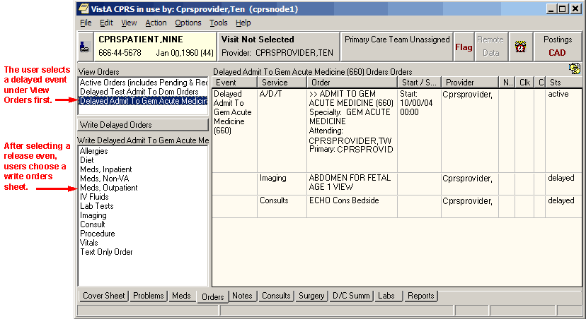
**The ORWDX WRITE ORDERS EVENT LIST parameter determines which orders menu appears in the Write Orders pane**
**To set the ORWDX WRITE ORDERS EVENT LIST parameter, follow these steps:**
1.  Open the CPRS Configuration (Clin Coord) menu [OR PARAM COORDINATOR MENU].
AL Allocate OE/RR Security Keys [ORCL KEY ALLOCATION]
KK Check for Multiple Keys [ORE KEY CHECK]
DC Edit DC Reasons [ORCL ORDER REASON]
GP GUI Parameters ... [ORW PARAM GUI]
GA GUI Access - Tabs, RPL [ORCL CPRS ACCESS]
MI Miscellaneous Parameters [OR PARAM ORDER MISC]
NO Notification Mgmt Menu ... [ORB NOT COORD MENU]
OC Order Checking Mgmt Menu ... [ORK ORDER CHK MGMT MENU]
MM Order Menu Management ... [ORCM MGMT]
LI Patient List Mgmt Menu ... [ORLP PATIENT LIST MGMT]
FP Print Formats [ORCL PRINT FORMAT]
PR Print/Report Parameters ... [OR PARAM PRINTS]
RE Release/Cancel Delayed Orders [ORC DELAYED ORDERS]
US Unsigned orders search [OR UNSIGNED ORDERS]
EX Set Unsigned Orders View on Exit [OR PARAM UNSIGNED ORDERS VIEW]
NA Search orders by Nature or Status [OR NATURE/STATUS ORDER SEARCH]
DO Event Delayed Orders Menu ... [OR DELAYED ORDERS]
PM Performance Monitor Report [OR PERFORMANCE MONITOR]
***

1.  Select the Event Delayed Orders Menu by typing **DO**.
The following menu will appear:
DO Delayed Orders/Auto-DC Set-up [OR DELAYED ORDERS EDITOR]
EP Parameters for event delayed orders [OR EVENT PARAMETERS]
IN Inquire to OE/RR Patient Event File [OR PATINET EVENT INQUIRY]
***

1.  Select Parameters for event delayed orders by typing **EP**.
1.  Select Write orders list by event by typing **1**.
1.  Choose how you would like to edit the ORWDX WRITE ORDERS EVENT LIST parameter by typing one of the following at the *Enter Selection* prompt:
-   2 – for user level
-   4 – for location level
-   5 – for service level
-   7 – for division level
-   8 – for system level
***

1.  If you selected 2, the *Select* *NEW PERSON NAME* prompt will appear. If you selected 4, the *Select HOSPITAL LOCATION NAME* prompt will appear. If you selected 5, the *Select SERVICE/SECTION NAME* prompt will appear*.* If you selected 7, the *Select INSTITUTION NAME* prompt will appear Type the appropriate response. If you selected 8, skip to step 6.
1.  At the *Select Release Event* prompt, type the name of the release event.
1.  Enter **Y** or **Yes** at the Are you adding [RELEASE EVENT NAME] as a new Release Event? prompt.
1.  The release event you entered in step 6 will appear. Verify that this is the correct release event and hit **Return**.
1.  Type the name of the order dialog or the display text at the *Value* prompt.
1.  Repeat steps 6-9 for additional release events. When you are finished, press Return at the *Select Release Event* prompt.
***
#### Controlling who can Manually Release Orders

The OREVNT MANUAL RELEASE CONTROL and OREVNT MANUAL RELEASE parameters determine who can manually release an event-delayed order.
The OREVNT MANUAL RELEASE CONTROL parameter determines if the permission to manually release an event-delayed order is granted by:
-   the ORES and ORELSE keys (keys only).
-   the OREVNT MANUAL RELEASE parameter (manual release parameter only).
\-or-
-   the ORES and ORELSE keys and the OREVNT MANUAL RELEASE parameter (both keys and parameter).
The OREVNT MANUAL RELEASE parameter must also be set if the OREVNT MANUAL RELEASE CONTROL parameter is set to “manual release parameter only” or to “both keys and parameter.”
**To set the OREVNT MANUAL RELEASE CONTROL parameter, follow these steps:**
1.  Open the CPRS Configuration (Clin Coord) menu [OR PARAM COORDINATOR MENU].
AL Allocate OE/RR Security Keys [ORCL KEY ALLOCATION]
KK Check for Multiple Keys [ORE KEY CHECK]
DC Edit DC Reasons [ORCL ORDER REASON]
GP GUI Parameters ... [ORW PARAM GUI]
GA GUI Access - Tabs, RPL [ORCL CPRS ACCESS]
MI Miscellaneous Parameters [OR PARAM ORDER MISC]
NO Notification Mgmt Menu ... [ORB NOT COORD MENU]
OC Order Checking Mgmt Menu ... [ORK ORDER CHK MGMT MENU]
MM Order Menu Management ... [ORCM MGMT]
LI Patient List Mgmt Menu ... [ORLP PATIENT LIST MGMT]
FP Print Formats [ORCL PRINT FORMAT]
PR Print/Report Parameters ... [OR PARAM PRINTS]
RE Release/Cancel Delayed Orders [ORC DELAYED ORDERS]
US Unsigned orders search [OR UNSIGNED ORDERS]
EX Set Unsigned Orders View on Exit [OR PARAM UNSIGNED ORDERS VIEW]
NA Search orders by Nature or Status [OR NATURE/STATUS ORDER SEARCH]
DO Event Delayed Orders Menu ... [OR DELAYED ORDERS]
PM Performance Monitor Report [OR PERFORMANCE MONITOR]
***

1.  Select the Event Delayed Orders Menu by typing **DO**.
The following menu will appear:
DO Delayed Orders/Auto-DC Set-up [OR DELAYED ORDERS EDITOR]
EP Parameters for event delayed orders [OR EVENT PARAMETERS]
IN Inquire to OE/RR Patient Event File [OR PATINET EVENT INQUIRY]
***
1.  Select Parameters for event delayed orders by typing **EP**.
The following menu will appear:
Select one of the following:
1 Write orders list by event
2 Default release event
3 Default release event list
4 Manual release controlled by
5 Set manual release parameter
1.  Type **4** to select Manual release controlled by.
1.  Choose how you would like to set the OREVNT MANUAL RELEASE CONTROL parameter by typing one of the following at the *Enter Selection* prompt:
-   **1** – for division level
-   **2** – for system level
***

1.  If you selected 1, the *Select* *INSTITUTION NAME* prompt will appear. Type the appropriate response. If you selected 2, skip to step 6.
***

1.  At the *Manual release controlled by* prompt, type one of the following responses:
-   **K (for Keys Only)**
Use this setting if you would like only users who are assigned the ORES and ORELSE key to manually release event-delayed orders. This is the default setting and the setting that CPRS used prior to the release of patch OR\*3.0\*141.
-   **P (Manual Release Parameter Only)**
Use this setting if you want the OREVNT MANUAL RELEASE parameter (discussed below) to control who can manually release an event-delayed order.
-   **B (Both Keys and Parameter)**
If you choose this option, CPRS will first check to see if the user has the ORES or ORELSE key. If they do, they will be allowed to manually release an event-delayed order. If the user does not have the ORES or ORELSE key, CPRS will then check the OREVNT MANUAL RELEASE parameter to see if they should be allowed to manually release the order.
**Note**: If you select P or B, you will also need to set the OREVNT MANUAL RELEASE parameter by following the instructions below in the [Setting the Manual Release Parameter (OREVNT MANUAL RELEASE)](#4hae2tp) section.
***

#### Setting the Manual Release Parameter (OREVNT MANUAL RELEASE)

**Note**: If the OREVNT MANUAL RELEASE CONTROL parameter is set to either P or B, users will be unable to manually release event-delayed orders until the OREVNT MANUAL RELEASE parameter is set. (It is distributed with the system level set to NO).
***

**To set the OREVNT MANUAL RELEASE parameter, follow these steps:**
1.  Open the CPRS Configuration (Clin Coord) menu [OR PARAM COORDINATOR MENU].
AL Allocate OE/RR Security Keys [ORCL KEY ALLOCATION]
KK Check for Multiple Keys [ORE KEY CHECK]
DC Edit DC Reasons [ORCL ORDER REASON]
GP GUI Parameters ... [ORW PARAM GUI]
GA GUI Access - Tabs, RPL [ORCL CPRS ACCESS]
MI Miscellaneous Parameters [OR PARAM ORDER MISC]
NO Notification Mgmt Menu ... [ORB NOT COORD MENU]
OC Order Checking Mgmt Menu ... [ORK ORDER CHK MGMT MENU]
MM Order Menu Management ... [ORCM MGMT]
LI Patient List Mgmt Menu ... [ORLP PATIENT LIST MGMT]
FP Print Formats [ORCL PRINT FORMAT]
PR Print/Report Parameters ... [OR PARAM PRINTS]
RE Release/Cancel Delayed Orders [ORC DELAYED ORDERS]
US Unsigned orders search [OR UNSIGNED ORDERS]
EX Set Unsigned Orders View on Exit [OR PARAM UNSIGNED ORDERS VIEW]
NA Search orders by Nature or Status [OR NATURE/STATUS ORDER SEARCH]
DO Event Delayed Orders Menu ... [OR DELAYED ORDERS]
PM Performance Monitor Report [OR PERFORMANCE MONITOR]
***

1.  Select the Event Delayed Orders Menu by typing **DO**.
The following menu will appear:
DO Delayed Orders/Auto-DC Set-up [OR DELAYED ORDERS EDITOR]
EP Parameters for event delayed orders [OR EVENT PARAMETERS]
IN Inquire to OE/RR Patient Event File [OR PATINET EVENT INQUIRY]
***

1.  Select Parameters for event delayed orders by typing **EP**.
The following menu will appear:
Select one of the following:
1 Write orders list by event
2 Default release event
3 Default release event list
4 Manual release controlled by
5 Set manual release parameter
***

1.  Type **5** to select Set manual release parameter.
1.  Choose how you would like to edit the manual release parameter (OREVNT MANUAL RELEASE) by typing one of the following at the *Enter Selection* prompt:
-   **1** – for user level
-   **2** – for class level
-   **3** – for team level
-   **4** – for location level
-   **5** – for service level
-   **6** – for division level
-   **7** – for system level
***

1.  If you selected 1, the *Select* *NEW PERSON NAME* prompt will appear. If you selected 2, the *Select USR CLASS NAME* prompt will appear. If you selected 3, the *Select OE/RR LIST NAME* prompt will appear. If you selected 4, the *Select* *HOSPITAL LOCATION NAME* prompt will appear. If you selected 5, the *Select* *SERVICE/SECTION NAME* prompt will appear. If you selected 6, the *Select INSTITUTION NAME* prompt will appear. If you selected 7, skip to step 6.
1.  At the *Allow manual release prompt*, type **Y** (yes) to allow users to manually release event-delayed orders or type **N** (no) to prevent users from manually releasing event-delayed orders.
***

#### Excluding Display Groups from the Copy Active Orders Dialog Box

The OREVNT EXCLUDE DGRP parameter allows you to prevent orders that belong to certain display groups from appearing on the *Copy Active Orders* dialog box.
**To set the OREVNT EXCLUDE DGRP parameter, follow these steps:**

1.  Open the CPRS Configuration (Clin Coord) menu [OR PARAM COORDINATOR MENU].
AL Allocate OE/RR Security Keys [ORCL KEY ALLOCATION]
KK Check for Multiple Keys [ORE KEY CHECK]
DC Edit DC Reasons [ORCL ORDER REASON]
GP GUI Parameters ... [ORW PARAM GUI]
GA GUI Access - Tabs, RPL [ORCL CPRS ACCESS]
MI Miscellaneous Parameters [OR PARAM ORDER MISC]
NO Notification Mgmt Menu ... [ORB NOT COORD MENU]
OC Order Checking Mgmt Menu ... [ORK ORDER CHK MGMT MENU]
MM Order Menu Management ... [ORCM MGMT]
LI Patient List Mgmt Menu ... [ORLP PATIENT LIST MGMT]
FP Print Formats [ORCL PRINT FORMAT]
PR Print/Report Parameters ... [OR PARAM PRINTS]
RE Release/Cancel Delayed Orders [ORC DELAYED ORDERS]
US Unsigned orders search [OR UNSIGNED ORDERS]
EX Set Unsigned Orders View on Exit [OR PARAM UNSIGNED ORDERS VIEW]
NA Search orders by Nature or Status [OR NATURE/STATUS ORDER SEARCH]
DO Event Delayed Orders Menu ... [OR DELAYED ORDERS]
PM Performance Monitor Report [OR PERFORMANCE MONITOR]
***

1.  Select the Event Delayed Orders Menu by typing **DO**.
The following menu will appear:
DO Delayed Orders/Auto-DC Set-up [OR DELAYED ORDERS EDITOR]
EP Parameters for event delayed orders [OR EVENT PARAMETERS]
IN Inquire to OE/RR Patient Event File [OR PATINET EVENT INQUIRY]
***

1.  Select Parameters for event delayed orders by typing **EP**.
The following menu will appear:
***

Select one of the following:
1 Write orders list by event
2 Default release event
3 Default release event list
4 Manual release controlled by
5 Set manual release parameter
6 Exclude display groups from copy
1.  Type **6** to select Exclude display groups from copy.
1.  Choose how you would like to edit the OREVNT EXCLUDE RELEASE parameter by typing one of the following at the *Enter Selection* prompt:
-   **1** – for division level
-   **2** – for system level
***

1.  If you selected 1, the *Select* *INSTITUTION NAME* prompt will appear. Enter the name for the institution. If you selected 2, continue to step 6.
1.  At the *Select Entry Number* prompt, type a number for the entry. The number you enter is simply a placeholder.
1.  If necessary, type **Y** or **Yes** at the Are you adding [number] as a new Entry Number?
1.  The number you entered in step 6 will appear. Press **Return**.
1.  Select the display group that you wish to exclude from the *Copy Active Orders* dialog.
***

#### Changing the Display

The change display function allows you to adjust the size of the Delayed Orders / Auto-DC Set-up editor and configure the display to show active entries, inactive entries, or all entries.
**To change the size or content of the display, follow these steps:**
1.  Open the CPRS Configuration (Clin Coord) menu [OR PARAM COORDINATOR MENU].
AL Allocate OE/RR Security Keys [ORCL KEY ALLOCATION]
KK Check for Multiple Keys [ORE KEY CHECK]
DC Edit DC Reasons [ORCL ORDER REASON]
GP GUI Parameters ... [ORW PARAM GUI]
GA GUI Access - Tabs, RPL [ORCL CPRS ACCESS]
MI Miscellaneous Parameters [OR PARAM ORDER MISC]
NO Notification Mgmt Menu ... [ORB NOT COORD MENU]
OC Order Checking Mgmt Menu ... [ORK ORDER CHK MGMT MENU]
MM Order Menu Management ... [ORCM MGMT]
LI Patient List Mgmt Menu ... [ORLP PATIENT LIST MGMT]
FP Print Formats [ORCL PRINT FORMAT]
PR Print/Report Parameters ... [OR PARAM PRINTS]
RE Release/Cancel Delayed Orders [ORC DELAYED ORDERS]
US Unsigned orders search [OR UNSIGNED ORDERS]
EX Set Unsigned Orders View on Exit [OR PARAM UNSIGNED ORDERS VIEW]
NA Search orders by Nature or Status [OR NATURE/STATUS ORDER SEARCH]
DO Event Delayed Orders Menu ... [OR DELAYED ORDERS]
PM Performance Monitor Report [OR PERFORMANCE MONITOR]
***

1.  Select the Event Delayed Orders Menu by typing DO.
The following menu will appear:
DO Delayed Orders/Auto-DC Set-up [OR DELAYED ORDERS EDITOR]
EP Parameters for event delayed orders [OR EVENT PARAMETERS]
IN Inquire to OE/RR Patient Event File [OR PATINET EVENT INQUIRY]
***

1.  Select Delayed Orders/Auto-DC Set-up by typing DO.
1.  Select either Auto-DC rules or Release Events by typing either 1 or 2.
1.  Select Change display by typing CD.
1.  Type Y or N at the Do you want to truncate/expand this display? prompt.
1.  Type Y or N at the Terminal emulator in 80-column mode? prompt.
1.  At the Select which entries should appear on the list prompt type one of the following numbers:
-   **1** for active entries only
-   **2** for inactive entries only
-   **3** for all entries
***

The orders that you specified will be displayed.
#### Files Associated with Release Events

This file contains the locally-defined events that can release delayed orders within each division. It is strongly recommended that this file not be edited with File Manager. Instead, CACs should use the event-delayed orders menu [OR DELAYED ORDERS]
**Fields in OE/RR RELEASE EVENTS (\#100.5)**

| **Field Number** | **Field Name**                | **Description**                                                                                                                                                                                                                                                                                                                                                                                                                                                                                                                                                                                                                                                |
|------------------|-------------------------------|----------------------------------------------------------------------------------------------------------------------------------------------------------------------------------------------------------------------------------------------------------------------------------------------------------------------------------------------------------------------------------------------------------------------------------------------------------------------------------------------------------------------------------------------------------------------------------------------------------------------------------------------------------------|
| .1               | SHORT NAME                    | This field contains a shorter version of the Display Text field. The Short Name is used to display and group delayed orders on the Orders tab when space is limited.                                                                                                                                                                                                                                                                                                                                                                                                                                                                                           |
| 1                | INACTIVATED                   | This field contains the date and time that this release event will become inactive. Once this date/time has passed, you will no longer be able to delay new orders to this release event. However, any event-delayed orders that are already associated with this release event will still be released when the event occurs.                                                                                                                                                                                                                                                                                                                                  |
| ,1.5             | ACTIVATION HISTORY            |                                                                                                                                                                                                                                                                                                                                                                                                                                                                                                                                                                                                                                                                |
| 100.52, .01      | ACTIVATION DATE/TIME          | The date/time that this event was activated.                                                                                                                                                                                                                                                                                                                                                                                                                                                                                                                                                                                                                   |
| 100.52 ,1        | INACTIVATION DATE/TIME        | The date/time that this event was inactivated.                                                                                                                                                                                                                                                                                                                                                                                                                                                                                                                                                                                                                 |
| 2                | TYPE OF EVENT                 | This is the event that should cause delayed orders to be released to the service(s) for action.  For OR events, the orders will be released when the TIME PAT IN OR field is entered in the Surgery package.   Orders delayed for Manual Release will not be automatically released by CPRS at all and can only be released via the "Release to Service" action by a user who is authorized to do so.  Authorization is controlled by the parameter OREVNT MANUAL RELEASE CONTROL, which lets sites choose whether release is controlled by keys or by the parameter OREVNT MANUAL RELEASE or both.                                                            |
| 3                | DIVISION                      | This is the division that this event will apply to. For transfers across divisions, this field should be the new division that the patient is going to.                                                                                                                                                                                                                                                                                                                                                                                                                                                                                                        |
| 4                | EVENT ORDER DIALOG            | This field contains the name of the dialog that will appear when you are writing a generic event-delayed order that requests this release event. If such an order is not necessary for this event, leave this field empty.  Unlike other delayed orders, the order created by this dialog will become active right away when signed and be visible on the Active Orders view as well as with the delayed orders on the Orders tab.                                                                                                                                                                                                                             |
| 5                | ORDER SET/MENU                | This is a menu or order set containing items that are either necessary or commonly ordered when this event occurs.   The menu or order specified in this field will be invoked when first placing delayed orders for this event. If an EVENT ORDER DIALOG was defined for this event, this order set/menu will be presented to the user immediately following that dialog. This field may be any type of order dialog except prompt types.   **Note**: Order sets listed in this field should be part of an order menu.                                                                                                                                        |
| 6                | LAPSE IN \#DAYS               | Patient events are evaluated whenever delayed orders are acted upon or viewed. If the number of days specified in this field have passed since delayed orders were entered for this event and for this patient, then the status of all orders delayed for this event will be changed to "lapsed" and the patient event itself will be terminated. The orders can no longer be released to the service.                                                                                                                                                                                                                                                         |
| 7                | MAS MOVEMENT TYPE             | This is an MAS Movement Type that can further define this event. This field is optional, but if it is defined then it must match the patient's movement data to satisfy the event and cause any delayed orders to be released.  For example, to have delayed orders released when a patient returns from pass, enter the movement type of AUTH ABSENCE 96 HOURS OR LESS, or leave this field empty to have the transfer event defined by other criteria such as treating specialty or ward location.                                                                                                                                                           |
|  8               | DISPLAY TEXT                  | This field is the name of the event as it will appear to the user in CPRS.                                                                                                                                                                                                                                                                                                                                                                                                                                                                                                                                                                                     |
| 9                | ORDERING PARAMETERS LOCATION  | Many order dialogs use parameters that depend on location. The location specified in the Ordering Parameters Location field is used as the default location for retrieving those parameter values when delaying orders to this event.  The patient's actual location will be saved with the order at the time of its release.                                                                                                                                                                                                                                                                                                                                  |
| 10               | INCLUDED TREATING SPECIALTIES | The treating specialties in this field are the treating specialties that can satisfy this event. If the patient's new specialty matches a specialty in this field, then orders delayed for this event may be released.                                                                                                                                                                                                                                                                                                                                                                                                                                         |
| 100.51,.01       | INCLUDED TREATING SPECIALTIES | This is a treating specialty that can satisfy this event. If the treating specialty is defined, then the patient's new specialty must match one in this list in order for any delayed orders to be released. A specialty may only be included in one active release event at a time.  If locations are also defined for this event then both the treating specialty and the location must match for orders to be released.                                                                                                                                                                                                                                     |
| 11               | INCLUDED LOCATIONS            | These are ward locations that can satisfy this event. If the patient's new location matches a location in this list, then orders delayed for this event may be released.                                                                                                                                                                                                                                                                                                                                                                                                                                                                                       |
| 100.511,.01      | INCLUDED LOCATIONS            | This is a ward location that can satisfy this event. If defined, then the patient's new location must match a location in this list for any delayed orders to be released.  A location may only be included in one active release event at a time. If this event also has treating specialties defined, then both the location and the treating specialty must match for orders to be released.                                                                                                                                                                                                                                                                |
| 12               | EDIT HISTORY                  |                                                                                                                                                                                                                                                                                                                                                                                                                                                                                                                                                                                                                                                                |
| 100.512,.01      | EDIT HISTORY                  | This field tracks when an event was added. It also tracks when the edit options were used on this event.                                                                                                                                                                                                                                                                                                                                                                                                                                                                                                                                                       |
| 100.512,1        | WHO ENTERED/EDITED            | This field identifies the person who entered or edited the release event.                                                                                                                                                                                                                                                                                                                                                                                                                                                                                                                                                                                      |
| 13               | COPY ACTIVE ORDERS            | This field determines whether or not the user is presented with a list of patient’s active orders, which may be copied to the new release event.  If this field is set to **no** then the user will not see the patient's active orders and will not be allowed to copy any current orders.  If this field is set to **yes** then the user will see the patient's active orders and may select orders to copy to the to the release event.  The list of active orders will be presented to the user after the ORDER DIALOG for the release event is processed (if it exists) and before the ORDER SET/MENU for the release event is processed (if it exists).  |

### Give Additional Dose Now Option on the Inpatient Medications Form

Clinicians working in CPRS can use the **Give additional dose now** option to order a new medication for an inpatient. The option is used when the first dose is to be administered immediately and ongoing doses are scheduled for administration on a regular schedule.
Depending on your version of CPRS, the order priority and dosing schedule may be set automatically or may require manual adjustments. The pop-up messages displayed will also vary.
When running CPRS v31a:
The dosing schedule and priority are set automatically for each order. However, both the NOW order and the ongoing order are given the priority selected when creating the order. For example, if the priority ROUTINE was selected, then both orders are assigned a priority of ROUTINE.
The administration schedule and priority for both orders are reflected in the Warning message displayed.
When running CPRS v32 or later:
The dosing schedule and priority are set automatically for each order.
VistA routine ORCSEND1 automatically creates two orders when the **Give additional dose now** checkbox is selected: one with the priority ASAP and one with the priority ROUTINE. The default value of ASAP can be changed by selecting a different value from the **Priority** field before submitting the order.
A popup warning message notifies users that selecting **Give additional dose now** creates two orders and automatically sets the priority. You need only sign once to send both orders to Inpatient Pharmacy.
For Complex orders, the functionality of the **Give additional dose** **now** option is the same as for Simple orders; however, a different popup message displays.
When running CPRS v32 or later, Delphi routine fODMeds.pas is used to enforce the required priority ASAP for the first Inpatient Medications order and ROUTINE for the second order when **Give additional dose now** is selected. This routine also modifies the warning message that displays to the user when this option is selected.
Sites that do not use the priority ASAP can select an alternative priority (for example, STAT) that will display in place of ASAP. A parameter (ORDER URGENCY ASAP ALTERNATIVE) in VistA enables sites that do not have the priority ASAP in the Order Urgency file (\#101.42) to use this feature. If the priority ASAP is not present, or not available, an alternative can be selected from the Order Urgency file using the General Parameter Tools [XPAR MENU TOOLS] to edit the ORDER URGENCY ASAP ALTERNATIVE parameter stored in the PARAMETER DEFINITION file (\#8989.51). If an alternative priority is defined, then CPRS displays the alternative to ASAP when a new inpatient medication order is placed and **Give additional dose now** is selected.
### Automatically Discontinuing Orders (Auto-DC Rules)

A CAC can set up rules that will automatically discontinue an order when a specific event occurs. These rules are known as auto-DC rules. For example, a CAC can set up an auto-DC rule named “Transfer to Medicine Treating Specialty” that automatically discontinues all lab, pharmacy, and diet orders when a patient is transferred to a medicine treating specialty. Although the auto-DC rule will discontinue lab, pharmacy, and diet orders, all other orders will remain active. A number of variables can be used in auto-DC rules, including specific divisions, orderable items, locations, and MAS movement types.
Prior to the release of OR\*3\*142 and OR\*3\*141, you could not specify which orders would be automatically discontinued when the specified event occurred. Instead, all of the orders would be discontinued.
**Note**: OR\*3.0\*142 changes the way auto-DC rules are created and processed. After OR\*3.0\*142 is installed, existing auto-DC parameters will be converted into entries in the OE/RR Auto-DC Rules file (\#100.6). The entries in the OE/RR Auto-DC Rules are for your division. Multidivisional sites will need to make copies of these rules for the other divisions in the system.
#### Creating a New Auto-DC Rule

**Note:** Auto-DC rules are stored in the OE/RR AUTO-DC RULES file (\#100.6)
***

**To create a new auto-DC rule, follow these steps:**
1.  Open the CPRS Configuration (Clin Coord) menu [OR PARAM COORDINATOR MENU].
AL Allocate OE/RR Security Keys [ORCL KEY ALLOCATION]
KK Check for Multiple Keys [ORE KEY CHECK]
DC Edit DC Reasons [ORCL ORDER REASON]
GP GUI Parameters ... [ORW PARAM GUI]
GA GUI Access - Tabs, RPL [ORCL CPRS ACCESS]
MI Miscellaneous Parameters [OR PARAM ORDER MISC]
NO Notification Mgmt Menu ... [ORB NOT COORD MENU]
OC Order Checking Mgmt Menu ... [ORK ORDER CHK MGMT MENU]
MM Order Menu Management ... [ORCM MGMT]
LI Patient List Mgmt Menu ... [ORLP PATIENT LIST MGMT]
FP Print Formats [ORCL PRINT FORMAT]
PR Print/Report Parameters ... [OR PARAM PRINTS]
RE Release/Cancel Delayed Orders [ORC DELAYED ORDERS]
US Unsigned orders search [OR UNSIGNED ORDERS]
EX Set Unsigned Orders View on Exit [OR PARAM UNSIGNED ORDERS VIEW]
NA Search orders by Nature or Status [OR NATURE/STATUS ORDER SEARCH]
DO Event Delayed Orders Menu ... [OR DELAYED ORDERS]
PM Performance Monitor Report [OR PERFORMANCE MONITOR]
***

1.  Select the Event Delayed Orders Menu by typing DO.
The following menu will appear:
DO Delayed Orders/Auto-DC Set-up [OR DELAYED ORDERS EDITOR]
EP Parameters for event delayed orders [OR EVENT PARAMETERS]
IN Inquire to OE/RR Patient Event File [OR PATINET EVENT INQUIRY]
***
1.  Select Delayed Orders/Auto-DC Set-up by typing DO.
1.  Type 1.
The existing auto-DC rules will appear.
1.  Select Add/Edit by typing AE.
1.  Press Return at the Select item(s) prompt.
1.  Type a name for the new rule at the Select OE/RR AUTO-DC RULES NAME prompt.
**Note**: The name should uniquely identify the rule. This is especially important at multidivisional sites.
1.  Type Y or Yes at the Are you adding [rule name] as a new OE/RR AUTO-DC RULES? prompt.
1.  Enter one of the following letters at the OE/RR AUTO-DC RULES TYPE OF EVENT prompt:
-   **A** for an admission event.
-   **T** for a transfer event.
-   **D** for a discharge event.
-   **S** for a specialty transfer event.
-   **O** for an O.R. event.
**Note**: Patch SR\*3.0\*110 is required to create O.R. rules.
***

1.  Enter the division that this auto-dc rule will apply to at the OE/RR AUTO-DC RULES DIVISION prompt.
-   For admission rules, enter the admitting location*.*
-   For discharge rules, enter the location the patient will be discharged from.
-   For O.R. rules, enter the location where the patient will have the procedure.
-   For transfer and specialty transfer events the division reflects the receiving location.
***

1.  Enter Y or N at the Do you want to copy from an existing entry? prompt.
1.  You will be prompted to enter additional required information. Once you have entered all the required information, the You have now entered the required fields and may \^ to exit prompt will appear. If you do not wish to further define this auto-DC rule, type \^ to exit. If you would like to enter additional information, please refer to the Explanation of Auto-DC Rules Prompts (fields in the OE/RR AUTO-DC RULES file \#100.6) topic.
**Note**: You can also create a new auto-DC rule from the detailed display screen.
**Note**: New auto-DC rules are inactive by default and must be activated by following the steps in Activating/Inactivating an Auto-DC rule before they are used.
#### Explanation of Auto-DC Rules Prompts (fields in the OE/RR AUTO-DC RULES FILE \#100.6)

The list below explains the additional prompts (fields) that you may encounter when entering a new auto-DC rule:
-   *Display Text* – The name of the auto-DC rule as it will appear to CPRS users.
-   *Division* – The division that the auto-DC rule will apply to.
-   For admission rules, the division reflects the admitting location*.*
-   For discharge rules, the division reflects the location the patient is discharged from.
-   For O.R. rules, the division reflects the location where the patient is having the procedure.
-   For transfer and specialty transfer events, the division reflects the receiving location.
***

-   *DC Reason* – The reason that this auto-DC rule will discontinue an order.
-   *Excluded Display Groups* – The groups of orders (often subsets of the included packages) that are exceptions to this rule (should not cause the order to be discontinued).
-   *Excluded Treating Specialties* – The specific sending and receiving specialties that are exceptions to the rule (should not cause an order to be discontinued). This prompt (field) is specific to specialty transfer events.
-   *Except for Orderable Item* – An orderable item that is an exception to the rule (should not cause an order to be discontinued).
-   *Except from Observation –*The field indicates whether a patient leaving an observation treating specialty should be an exception to this rule. This field is only used in discharge rules.
**Note:** Medication orders in a “Pending” status cannot be exceptions to Auto-Discontinue rules for a Discharge from an Observation Treating Specialty. If this field is set to “YES” or set to “If Readmitting” and the user inputs “YES,” a pending medication order will still be Auto-Discontinued upon Discharge from an Observation Treating Specialty. Only medication orders in an “Active” status will be reinstated if the Except from Observation field is set to “YES” or if the user enters “YES” to the question, “Will the patient be re-admitted immediately?”
This field can be set in the following ways:
-   **Yes** – if you set the field to yes, a discharge from an observation treating specialty will always be an exception to this rule (should not cause an order to be discontinued).**[**0F**[^1]]**

[^1]: Except from Observation - Medication orders in a “Pending” status cannot be exceptions to Auto-Discontinue rules for a Discharge from an Observation Treating Specialty. If this field is set to “YES” or set to “If Readmitting” and the user inputs “YES,” a pending medication order will still be Auto-Discontinued upon Discharge from an Observation Treating Specialty. Only medication orders in an “Active” status will be reinstated if the Except from Observation field is set to “YES” or if the user enters “YES” to the question, “Will the patient be re-admitted immediately?
-   **No** – if you set this field to no, this rule will be applied regardless of whether the patient is discharged from an observation treating specialty.
-   **If Readmitting** – If you set this field to If Readmitting, the user will be prompted to enter whether the patient will be immediately readmitted. If the user answers yes, the order will not be automatically discontinued. If the user answers no, the rule will be applied.**[]**
-   *Inactivated –* After the date/time listed in this field, the rule will no longer be applied.
-   *Included Divisions* – For multidivisional sites, the specific sending divisions that are included in this rule.
-   *Included Locations –* The specific sending and receiving wards that the auto-DC rule will apply to. This prompt (field) is only used with transfer events (no specialty change).
-   *MAS Movement Type* – The MAS movement type that will trigger the auto-DC rule.
For a specialty transfer rule, the only movement type allowed is “Provider Specialty Change”. However, any transfer that includes a specialty change will trigger this rule, even if another movement type is entered.
***

-   *Type of Event* – The type of event that will trigger the auto-DC rule. The value of this field can be A (admission event), T (transfer event), D (discharge event), S (specialty transfer event), or O (O.R event).
-   *Type of Orders to DC* – Orders generated by the VistA package specified in this field will be discontinued.
***

#### Sample Rules
##### Sample Admission Rule
Detailed Display Dec 00, 2004@00:00:00 Page: 1 of 1
Name: ADMISSION
Inactivated:
Type of event: ADMISSION
Admit to division: SUPPORT ISC
Dc reason: Admit
Display text: ADMISSION
***

Movement Types:
AMBULATORY CARE (OPT-AC)
TRANSFER IN
DIRECT
READMISSION TO IMLTC/NHCU/DOMICILIARY
NON-SERVICE CONNECTED (OPT-NSC)
PRE-BED CARE (OPT-PBC)
NON-VETERAN (OPT-NVE)
WAITING LIST
OPT-SC
***

Included Packages:
ORDER ENTRY/RESULTS REPORTING
***
***

##### Sample Discharge Rule
Detailed Display Dec 00, 2004@00:00:00 Page: 1 of 2
Name: DISCHARGE
Inactivated:
Type of event: DISCHARGE
Discharge from division: SALT LAKE CITY
Dc reason: Discharge
Display text: DISCHARGE
Except from observation:
***

Movement Types:
TRANSFER OUT
NON-SERVICE CONNECTED (OPT-NSC)
REGULAR
IRREGULAR
OPT-SC
NON-BED CARE
TO IMLTC/NHCU FROM HOSP
TO DOM FROM HOSP
TO IMLTC/NHCU FROM DOM
DISCHARGE TO CNH
VA IMLTC/NHCU TO CNH
The *Except from observation* field is specific to discharge auto-DC rules.

**Sample** **Discharge/Death Rule**

Detailed Display Dec 27, 2004@17:28:09 Page: 1 of 2
Name: DEATH
Inactivated:
Type of event: DISCHARGE
Discharge from division: SUPPORT ISC
Dc reason: Death
Display text: DEATH
***

Movement Types:
DEATH
DEATH WITH AUTOPSY
***

Included Packages:
ORDER ENTRY/RESULTS REPORTING
DIETETICS
CONSULT/REQUEST TRACKING
RADIOLOGY/NUCLEAR MEDICINE
***

Activation History:
Activated: Jul 00, 2002@00:00:00 Inactivated:
You can enter death and death with autopsy movement types for discharge/death rules.
***

##### Sample Specialty Change Rule

Detailed Display Dec 00, 2004@00:00:00 Page: 1 of 1
Name: SPECIALTY CHANGE
Inactivated:
Type of event: SPECIALTY TRANSFER
Tr sp change within division: SALT LAKE CITY
Dc reason: Treating Specialty Change
Display text: SPECIALTY CHANGE
***

Movement Types:
PROVIDER/SPECIALTY CHANGE
***

Included Packages:
ORDER ENTRY/RESULTS REPORTING
***

Activation History:
Activated: Dec 00, 2002@00:00:00 Inactivated:
***

Add/Edit History:
Added on Jul 00, 2002@00:00:00 by CPRSPROVIDER,THREE
Edited on Dec 00, 2002@00:00:00 by GNPROVIDER,TWO
***

A Specialty change rule
##### Sample Transfer Rule: On PASS

Detailed Display Dec 00, 2004@00:00:00 Page: 1 of 1
Name: ON PASS
Inactivated: JUL 00, 2002@00:00:00
Type of event: TRANSFER
Trans to/within division: SUPPORT ISC
Dc reason: Pass
Display text: ON PASS
***

Movement Types:
AUTH ABSENCE 96 HOURS OR LESS
AUTHORIZED ABSENCE
UNAUTHORIZED ABSENCE
***

Add/Edit History:
Added on Jul 00, 2002@00:00:00 by CPRSPROVIDER,TEN
Note the movement types and the lack of included locations or divisions. Also notice the add/edit history
##### Sample Transfer Rule: ASIH

Detailed Display Dec 00, 2004@00:00:00 Page: 1 of 1
Name: FROM ASIH
Inactivated: JUL 00, 2002@00:00:00
Type of event: TRANSFER
Trans to/within division: SUPPORT ISC
Dc reason: ASIH
Display text: FROM ASIH
Except from observation:
***

Movement Types:
FROM ASIH (VAH)
***

Add/Edit History:
Added on Jul 00, 2002@00:00:00 by CPRSPROVIDER,TEN
A sample ASIH transfer rule
##### Sample O.R. Rule

Detailed Display Dec 00, 2004@00:00:00 Page: 1 of 1
Name: SURGERY
Inactivated: JUL 00, 2002@00:00:00
Type of event: O.R.
Surgery within division: SUPPORT ISC
Dc reason: Surgery
Display text: SURGERY
***

Included Packages:
ORDER ENTRY/RESULTS REPORTING
***

Add/Edit History:
Added on Jul 00, 2002@00:00:00 by CPRSPROVIDER,TEN
A sample O.R. rule

#### Activating/Inactivating an Auto-DC Rule

**To activate/inactivate an auto-DC rule, follow these steps:**
1.  Open the CPRS Configuration (Clin Coord) menu [OR PARAM COORDINATOR MENU].
AL Allocate OE/RR Security Keys [ORCL KEY ALLOCATION]
KK Check for Multiple Keys [ORE KEY CHECK]
DC Edit DC Reasons [ORCL ORDER REASON]
GP GUI Parameters ... [ORW PARAM GUI]
GA GUI Access - Tabs, RPL [ORCL CPRS ACCESS]
MI Miscellaneous Parameters [OR PARAM ORDER MISC]
NO Notification Mgmt Menu ... [ORB NOT COORD MENU]
OC Order Checking Mgmt Menu ... [ORK ORDER CHK MGMT MENU]
MM Order Menu Management ... [ORCM MGMT]
LI Patient List Mgmt Menu ... [ORLP PATIENT LIST MGMT]
FP Print Formats [ORCL PRINT FORMAT]
PR Print/Report Parameters ... [OR PARAM PRINTS]
RE Release/Cancel Delayed Orders [ORC DELAYED ORDERS]
US Unsigned orders search [OR UNSIGNED ORDERS]
EX Set Unsigned Orders View on Exit [OR PARAM UNSIGNED ORDERS VIEW]
NA Search orders by Nature or Status [OR NATURE/STATUS ORDER SEARCH]
DO Event Delayed Orders Menu ... [OR DELAYED ORDERS]
PM Performance Monitor Report [OR PERFORMANCE MONITOR]
***

1.  Select the Event Delayed Orders Menu by typing **DO**.
The following menu will appear:
DO Delayed Orders/Auto-DC Set-up [OR DELAYED ORDERS EDITOR]
EP Parameters for event delayed orders [OR EVENT PARAMETERS]
IN Inquire to OE/RR Patient Event File [OR PATINET EVENT INQUIRY]
***

1.  Select Delayed Orders/Auto-DC Set-up by typing **DO**.
1.  Type **1** to select Auto-DC Rules.
The available auto-DC rules will appear in a numbered list.
1.  Select Activate/Inactivate by typing **AI**.
1.  Type the number of the rule you would like to activate/inactivate at the Select item(s) prompt.
1.  The computer will display a message asking you if you are sure you want to activate/inactivate this auto-DC rule. Type the appropriate response.
**Note**: You can also activate/inactivate an auto-DC rule from the detailed display screen.
#### Editing an Auto-DC Rule

**To edit an auto-DC rule, follow these steps:**
1.  Open the CPRS Configuration (Clin Coord) menu [OR PARAM COORDINATOR MENU].
AL Allocate OE/RR Security Keys [ORCL KEY ALLOCATION]
KK Check for Multiple Keys [ORE KEY CHECK]
DC Edit DC Reasons [ORCL ORDER REASON]
GP GUI Parameters ... [ORW PARAM GUI]
GA GUI Access - Tabs, RPL [ORCL CPRS ACCESS]
MI Miscellaneous Parameters [OR PARAM ORDER MISC]
NO Notification Mgmt Menu ... [ORB NOT COORD MENU]
OC Order Checking Mgmt Menu ... [ORK ORDER CHK MGMT MENU]
MM Order Menu Management ... [ORCM MGMT]
LI Patient List Mgmt Menu ... [ORLP PATIENT LIST MGMT]
FP Print Formats [ORCL PRINT FORMAT]
PR Print/Report Parameters ... [OR PARAM PRINTS]
RE Release/Cancel Delayed Orders [ORC DELAYED ORDERS]
US Unsigned orders search [OR UNSIGNED ORDERS]
EX Set Unsigned Orders View on Exit [OR PARAM UNSIGNED ORDERS VIEW]
NA Search orders by Nature or Status [OR NATURE/STATUS ORDER SEARCH]
DO Event Delayed Orders Menu ... [OR DELAYED ORDERS]
PM Performance Monitor Report [OR PERFORMANCE MONITOR]
***

1.  Select the Event Delayed Orders Menu by typing **DO**.
The following menu will appear:
DO Delayed Orders/Auto-DC Set-up [OR DELAYED ORDERS EDITOR]
EP Parameters for event delayed orders [OR EVENT PARAMETERS]
IN Inquire to OE/RR Patient Event File [OR PATINET EVENT INQUIRY]
***

1.  Select Delayed Orders/Auto-DC Set-up by typing **DO**.
1.  Type **1** to select Auto-DC Rules
The available auto-DC rules will appear in a numbered list.
1.  Select Add/Edit by typing **AE**.
1.  Type the number of the rule that you wish to edit at the *Select item(s)* prompt.
1.  The content of each of the rule’s fields will be displayed. You can either change the contents of the field, or press Return to advance to the next field. Press \^ to exit.
**Note**: You can also add or release an existing auto-DC rule from the detailed display screen.
***

**Viewing Details of an Auto-DC Rule**
**To view details of an auto-DC rule, follow these steps:**
1.  Open the CPRS Configuration (Clin Coord) menu [OR PARAM COORDINATOR MENU].
AL Allocate OE/RR Security Keys [ORCL KEY ALLOCATION]
KK Check for Multiple Keys [ORE KEY CHECK]
DC Edit DC Reasons [ORCL ORDER REASON]
GP GUI Parameters ... [ORW PARAM GUI]
GA GUI Access - Tabs, RPL [ORCL CPRS ACCESS]
MI Miscellaneous Parameters [OR PARAM ORDER MISC]
NO Notification Mgmt Menu ... [ORB NOT COORD MENU]
OC Order Checking Mgmt Menu ... [ORK ORDER CHK MGMT MENU]
MM Order Menu Management ... [ORCM MGMT]
LI Patient List Mgmt Menu ... [ORLP PATIENT LIST MGMT]
FP Print Formats [ORCL PRINT FORMAT]
PR Print/Report Parameters ... [OR PARAM PRINTS]
RE Release/Cancel Delayed Orders [ORC DELAYED ORDERS]
US Unsigned orders search [OR UNSIGNED ORDERS]
EX Set Unsigned Orders View on Exit [OR PARAM UNSIGNED ORDERS VIEW]
NA Search orders by Nature or Status [OR NATURE/STATUS ORDER SEARCH]
DO Event Delayed Orders Menu ... [OR DELAYED ORDERS]
PM Performance Monitor Report [OR PERFORMANCE MONITOR]
***

1.  Select the Event Delayed Orders Menu by typing **DO**.
The following menu will appear:
DO Delayed Orders/Auto-DC Set-up [OR DELAYED ORDERS EDITOR]
EP Parameters for event delayed orders [OR EVENT PARAMETERS]
IN Inquire to OE/RR Patient Event File [OR PATINET EVENT INQUIRY]
***

1.  Select Delayed Orders/Auto-DC Set-up by typing **DO**.
1.  Select Auto-DC Rules by typing **1**.
A numbered list of the current auto-DC rules will appear.
1.  Choose Detailed Display by typing **DD**.
1.  Enter the number of the rule you wish to view at the Select item(s) prompt.
A detailed display of the event or rule will appear.
Detailed Display Dec 00, 2004@00:00:00
Name: DISCHARGE
Inactivated:
Type of event: DISCHARGE
Discharge from division: SALT LAKE CITY
Dc reason: Discharge
Display text: DISCHARGE
Except from observation:
***

Movement Types:
TRANSFER OUT
NON-SERVICE CONNECTED (OPT-NSC)
REGULAR
IRREGULAR
OPT-SC
NON-BED CARE
TO IMLTC/NHCU FROM HOSP
TO DOM FROM HOSP
TO IMLTC/NHCU FROM DOM
DISCHARGE TO CNH
VA IMLTC/NHCU TO CNH
NON-VETERAN
WHILE ASIH
CONTINUED ASIH (OTHER FACILITY)
DISCHARGE FROM IMLTC/NHCU/DOM WHILE ASIH
***

Included Packages:
ORDER ENTRY/RESULTS REPORTING
DIETETICS
The detailed display screen
##### Audit and Activation History

The audit and activation histories on the detailed display can be toggled on or off depending on your preferences.
**To toggle the audit and activation histories on or off, follow these steps:**
1.  Open the CPRS Configuration (Clin Coord) menu [OR PARAM COORDINATOR MENU].
AL Allocate OE/RR Security Keys [ORCL KEY ALLOCATION]
KK Check for Multiple Keys [ORE KEY CHECK]
DC Edit DC Reasons [ORCL ORDER REASON]
GP GUI Parameters ... [ORW PARAM GUI]
GA GUI Access - Tabs, RPL [ORCL CPRS ACCESS]
MI Miscellaneous Parameters [OR PARAM ORDER MISC]
NO Notification Mgmt Menu ... [ORB NOT COORD MENU]
OC Order Checking Mgmt Menu ... [ORK ORDER CHK MGMT MENU]
MM Order Menu Management ... [ORCM MGMT]
LI Patient List Mgmt Menu ... [ORLP PATIENT LIST MGMT]
FP Print Formats [ORCL PRINT FORMAT]
PR Print/Report Parameters ... [OR PARAM PRINTS]
RE Release/Cancel Delayed Orders [ORC DELAYED ORDERS]
US Unsigned orders search [OR UNSIGNED ORDERS]
EX Set Unsigned Orders View on Exit [OR PARAM UNSIGNED ORDERS VIEW]
NA Search orders by Nature or Status [OR NATURE/STATUS ORDER SEARCH]
DO Event Delayed Orders Menu ... [OR DELAYED ORDERS]
PM Performance Monitor Report [OR PERFORMANCE MONITOR]
***

1.  Select the Event Delayed Orders Menu by typing **DO**.
The following menu will appear:
DO Delayed Orders/Auto-DC Set-up [OR DELAYED ORDERS EDITOR]
EP Parameters for event delayed orders [OR EVENT PARAMETERS]
IN Inquire to OE/RR Patient Event File [OR PATINET EVENT INQUIRY]
***

1.  Select Delayed Orders/Auto-DC Set-up by typing **DO**.
The following menu will appear:
Select one of the following:
***

1\. Auto-DC Rules
2\. Release Events
Enter response:
***

1.  Type **1** to select Auto-DC Rules or **2** to select Release Events.
1.  Type **DD** to select Detailed Display.
1.  At the *Select item(s)* prompt, type the number of the release event or auto-DC rule that you would like to display.
A detailed display of the release event or auto-DC rule will appear.
1.  Type **H** to select Add/Remove Histories.
1.  At the *Do you want to include them on the detailed display?* prompt, type **Y** to include the audit and activation histories on the detailed display. Type **N** if you do not wish to display the audit and activation histories.
***
#### Changing the Display

The change display function allows you to adjust the size of the Delayed Orders / Auto-DC Set-up editor and configure the display to show active entries, inactive entries, or all entries.
**To change the size or content of the display, follow these steps:**
1.  Open the CPRS Configuration (Clin Coord) menu [OR PARAM COORDINATOR MENU].
AL Allocate OE/RR Security Keys [ORCL KEY ALLOCATION]
KK Check for Multiple Keys [ORE KEY CHECK]
DC Edit DC Reasons [ORCL ORDER REASON]
GP GUI Parameters ... [ORW PARAM GUI]
GA GUI Access - Tabs, RPL [ORCL CPRS ACCESS]
MI Miscellaneous Parameters [OR PARAM ORDER MISC]
NO Notification Mgmt Menu ... [ORB NOT COORD MENU]
OC Order Checking Mgmt Menu ... [ORK ORDER CHK MGMT MENU]
MM Order Menu Management ... [ORCM MGMT]
LI Patient List Mgmt Menu ... [ORLP PATIENT LIST MGMT]
FP Print Formats [ORCL PRINT FORMAT]
PR Print/Report Parameters ... [OR PARAM PRINTS]
RE Release/Cancel Delayed Orders [ORC DELAYED ORDERS]
US Unsigned orders search [OR UNSIGNED ORDERS]
EX Set Unsigned Orders View on Exit [OR PARAM UNSIGNED ORDERS VIEW]
NA Search orders by Nature or Status [OR NATURE/STATUS ORDER SEARCH]
DO Event Delayed Orders Menu ... [OR DELAYED ORDERS]
PM Performance Monitor Report [OR PERFORMANCE MONITOR]
***

1.  Select the Event Delayed Orders Menu by typing **DO**.
The following menu will appear:
DO Delayed Orders/Auto-DC Set-up [OR DELAYED ORDERS EDITOR]
EP Parameters for event delayed orders [OR EVENT PARAMETERS]
IN Inquire to OE/RR Patient Event File [OR PATINET EVENT INQUIRY]
***

1.  Select Delayed Orders/Auto-DC Set-up by typing **DO**.
1.  The following menu will appear:
DO Delayed Orders/Auto-DC Set-up [OR DELAYED ORDERS EDITOR]
EP Parameters for event delayed orders [OR EVENT PARAMETERS]
IN Inquire to OE/RR Patient Event File [OR PATINET EVENT INQUIRY]
***

1.  Select Delayed Orders/Auto-DC Set-up by typing **DO**.
1.  Select either Auto-DC Rules or Release Events by typing either **1** or **2**.
1.  Select Change display by typing **CD**.
1.  Type **Y** or **N** at the Do you want to truncate/expand this display? prompt.
1.  Type Y or N at the Terminal emulator in 80-column mode? prompt.
1.  At the Select which entries should appear on the list prompt, type one of the following numbers:
**1** - for active entries only
**2** - for inactive entries only
**3** - for all entries
The orders that you specified will be displayed.
***

#### Files Associated with Auto-DC Rules

##### OE/RR AUTO-DC RULES (\#100.6)

This file contains the locally-defined rules that control if and when active orders are automatically discontinued within each division. It is strongly recommended that CACs use the event-delayed orders menu [OR DELAYED ORDERS ] to edit this file rather than using File Manager.
Fields in OE/RR AUTO-DC RULES (\#100.6)

| Field Number | Field Name                     | Description                                                                                                                                                                                                                                                                                                                                                                                                                                                                                                                                                                                                                                                                                                                                                                                                                                                                                                                                                                                                                                                                                                                                                                                                                                                                                                                                                                                                                             |
|--------------|--------------------------------|-----------------------------------------------------------------------------------------------------------------------------------------------------------------------------------------------------------------------------------------------------------------------------------------------------------------------------------------------------------------------------------------------------------------------------------------------------------------------------------------------------------------------------------------------------------------------------------------------------------------------------------------------------------------------------------------------------------------------------------------------------------------------------------------------------------------------------------------------------------------------------------------------------------------------------------------------------------------------------------------------------------------------------------------------------------------------------------------------------------------------------------------------------------------------------------------------------------------------------------------------------------------------------------------------------------------------------------------------------------------------------------------------------------------------------------------|
| .01          | NAME                           | This is the name of the auto-DC rule. It is visible in the Rule Editor only.                                                                                                                                                                                                                                                                                                                                                                                                                                                                                                                                                                                                                                                                                                                                                                                                                                                                                                                                                                                                                                                                                                                                                                                                                                                                                                                                                            |
| .1           | INACTIVATED                    | This rule will no longer apply after the date listed in this field.                                                                                                                                                                                                                                                                                                                                                                                                                                                                                                                                                                                                                                                                                                                                                                                                                                                                                                                                                                                                                                                                                                                                                                                                                                                                                                                                                                     |
| 1.5          | ACTIVATION HISTORY             |                                                                                                                                                                                                                                                                                                                                                                                                                                                                                                                                                                                                                                                                                                                                                                                                                                                                                                                                                                                                                                                                                                                                                                                                                                                                                                                                                                                                                                         |
| 100.61,.01   | ACTIVATION DATE/TIME           | The date/time that this event was activated.                                                                                                                                                                                                                                                                                                                                                                                                                                                                                                                                                                                                                                                                                                                                                                                                                                                                                                                                                                                                                                                                                                                                                                                                                                                                                                                                                                                            |
| 100.61,1     | INACTIVATION DATE/TIME         | This date/time that this event was inactivated.                                                                                                                                                                                                                                                                                                                                                                                                                                                                                                                                                                                                                                                                                                                                                                                                                                                                                                                                                                                                                                                                                                                                                                                                                                                                                                                                                                                         |
| .2           | TYPE OF EVENT                  | This is the event that should cause orders to be automatically discontinued. For OR events, the orders will be discontinued when the TIME PAT IN OR field is entered in the Surgery package.                                                                                                                                                                                                                                                                                                                                                                                                                                                                                                                                                                                                                                                                                                                                                                                                                                                                                                                                                                                                                                                                                                                                                                                                                                            |
| .3           | DIVISION                       | This is the division that this auto-dc rule should be applied to. For a transfer across divisions, this field should contain the division that the patient is going to.                                                                                                                                                                                                                                                                                                                                                                                                                                                                                                                                                                                                                                                                                                                                                                                                                                                                                                                                                                                                                                                                                                                                                                                                                                                                 |
| .4           | DC REASON                      | This field contains the reason the order was automatically discontinued.                                                                                                                                                                                                                                                                                                                                                                                                                                                                                                                                                                                                                                                                                                                                                                                                                                                                                                                                                                                                                                                                                                                                                                                                                                                                                                                                                                |
| .5           | DISPLAY TEXT                   | This field contains the name of the rule as it will appear to CPRS users.                                                                                                                                                                                                                                                                                                                                                                                                                                                                                                                                                                                                                                                                                                                                                                                                                                                                                                                                                                                                                                                                                                                                                                                                                                                                                                                                                               |
| .6           | EXCEPT FROM OBSERVATION        | The field indicates whether a patient leaving an observation treating specialty should be an exception to this rule. This field is only used in discharge rules.  **Note:** Medication orders in a “Pending” status cannot be exceptions to Auto-Discontinue rules for a Discharge from an Observation Treating Specialty. If this field is set to “YES” or set to “If Readmitting” and the user inputs “YES,” a pending medication order will still be Auto-Discontinued upon Discharge from an Observation Treating Specialty. Only medication orders in an “Active” status will be reinstated if the Except from Observation field is set to “YES” or if the user enters “YES” to the question, “Will the patient be re-admitted immediately?” This field can be set in the following ways: **Yes** – if you set the field to yes, a discharge from an observation treating specialty will always be an exception to this rule (should not cause an order to be discontinued).**[]** **No** – if you set this field to no, this rule will be applied regardless of whether the patient is discharged from an observation treating specialty. **If Readmitting** – If you set this field to If Readmitting, the user will be prompted to enter whether the patient will be immediately readmitted. If the user answers yes, the order will not be automatically discontinued. If the user answers no, the rule will be applied.**[]** |
| .30          | MAS MOVEMENT TYPES             | When the MAS movement types defined in this field occur, this rule will be processed (if it is active).                                                                                                                                                                                                                                                                                                                                                                                                                                                                                                                                                                                                                                                                                                                                                                                                                                                                                                                                                                                                                                                                                                                                                                                                                                                                                                                                 |
| 100.63, .01  | MAS MOVEMENT TYPE              | The MAS Movement Type field further defines the trigger event for this rule. This allows for different rules for various types of MAS events.   For example, to define a rule for canceling orders when a patient dies, enter the movement types DEATH and DEATH WITH AUTOPSY.  A MAS movement type may only be used in one active rule.                                                                                                                                                                                                                                                                                                                                                                                                                                                                                                                                                                                                                                                                                                                                                                                                                                                                                                                                                                                                                                                                                                |
| 40           | EXCLUDED TREATING SPECIALTIES  | These are treating specialties that will cause this rule to not be processed if the EXCEPT FROM and TO specialties match the patient's transfer.                                                                                                                                                                                                                                                                                                                                                                                                                                                                                                                                                                                                                                                                                                                                                                                                                                                                                                                                                                                                                                                                                                                                                                                                                                                                                        |
| 100.64, .01  | EXCEPT FROM SPECIALTY          | This is a treating specialty that will prevent this rule from being applied. Specialty transfer rules will discontinue active orders unless the patient is being transferred from this specialty to one listed in the TO SPECIALTY multiple.                                                                                                                                                                                                                                                                                                                                                                                                                                                                                                                                                                                                                                                                                                                                                                                                                                                                                                                                                                                                                                                                                                                                                                                            |
| 100.64,1     | TO SPECIALTY                   | These are treating specialties that will cause this rule to not be processed, if the EXCEPT FROM and TO specialties match the patient's transfer.                                                                                                                                                                                                                                                                                                                                                                                                                                                                                                                                                                                                                                                                                                                                                                                                                                                                                                                                                                                                                                                                                                                                                                                                                                                                                       |
| 100.641, .01 | TO SPECIALTY                   | This is a treating specialty that will prevent this rule from being applied; specialty transfer rules will discontinue active orders unless the patient is being transferred to this specialty from the EXCEPT FROM SPECIALTY.                                                                                                                                                                                                                                                                                                                                                                                                                                                                                                                                                                                                                                                                                                                                                                                                                                                                                                                                                                                                                                                                                                                                                                                                          |
| 50           | INCLUDED LOCATIONS             |                                                                                                                                                                                                                                                                                                                                                                                                                                                                                                                                                                                                                                                                                                                                                                                                                                                                                                                                                                                                                                                                                                                                                                                                                                                                                                                                                                                                                                         |
| 100.62,.01   | INCLUDED LOCATIONS ID          | Enter an ID (free text) that will represent an entry in the FROM - TO location matrix. The value of the ID field is insignificant as it simply represents a placeholder. You can use any naming or numbering convention that you want. Orders will not auto-dc for location (ward) type transfers unless the transfer from and transfer to locations are identified within the INCLUDED LOCATIONS from - to entries. If the transfer from and to locations are found in this multiple then orders will auto-dc.                                                                                                                                                                                                                                                                                                                                                                                                                                                                                                                                                                                                                                                                                                                                                                                                                                                                                                                         |
| 100.62,2     | FROM LOCATION                  | If you did not select **YES** for the FROM ALL LOCATIONS field then you must select an individual field for the patient to be coming from.                                                                                                                                                                                                                                                                                                                                                                                                                                                                                                                                                                                                                                                                                                                                                                                                                                                                                                                                                                                                                                                                                                                                                                                                                                                                                              |
| 100.62,3     | TO ALL LOCATIONS               | If this field is set to yes, it identifies all locations as possible “to” locations for the from-to pair.                                                                                                                                                                                                                                                                                                                                                                                                                                                                                                                                                                                                                                                                                                                                                                                                                                                                                                                                                                                                                                                                                                                                                                                                                                                                                                                               |
| 100.62,4     | TO LOCATION                    | If you did not select **YES** for the *TO ALL LOCATIONS* field then you must select an individual field for the patient to be going to.                                                                                                                                                                                                                                                                                                                                                                                                                                                                                                                                                                                                                                                                                                                                                                                                                                                                                                                                                                                                                                                                                                                                                                                                                                                                                                 |
| 60           | INCLUDED DIVISIONS             | If the division the patient was transferred from matches a value in this field, and the division has changed, the rule will be processed.                                                                                                                                                                                                                                                                                                                                                                                                                                                                                                                                                                                                                                                                                                                                                                                                                                                                                                                                                                                                                                                                                                                                                                                                                                                                                               |
| 100.66, 01   | FROM DIVISION                  | This is a division that will cause this rule to be applied. If a specialty change did not occur with the transfer, and the division has changed, then the patient must be moving from the division specified in this field in order for active orders to be discontinued.                                                                                                                                                                                                                                                                                                                                                                                                                                                                                                                                                                                                                                                                                                                                                                                                                                                                                                                                                                                                                                                                                                                                                               |
| 70           | INCLUDED PACKAGES              | Orders with the packages specified in this field will be automatically discontinued when this rule is processed.                                                                                                                                                                                                                                                                                                                                                                                                                                                                                                                                                                                                                                                                                                                                                                                                                                                                                                                                                                                                                                                                                                                                                                                                                                                                                                                        |
| 100.67,.01   | TYPE OF ORDERS TO DC           | This is a package whose active orders are to be automatically discontinued when the conditions of this rule are satisfied.                                                                                                                                                                                                                                                                                                                                                                                                                                                                                                                                                                                                                                                                                                                                                                                                                                                                                                                                                                                                                                                                                                                                                                                                                                                                                                              |
| 80           | EXCLUDED ORDERABLE ITEMS       | These are the orderable items that will **not** be automatically discontinued when this rule is processed.                                                                                                                                                                                                                                                                                                                                                                                                                                                                                                                                                                                                                                                                                                                                                                                                                                                                                                                                                                                                                                                                                                                                                                                                                                                                                                                              |
| 100.68,.01   | EXCEPT FOR ORDERABLE ITEM      | The orderable items specified in this field are the orderable items that will **not** be automatically discontinued when this rule is processed                                                                                                                                                                                                                                                                                                                                                                                                                                                                                                                                                                                                                                                                                                                                                                                                                                                                                                                                                                                                                                                                                                                                                                                                                                                                                         |
| 81           | EDIT HISTORY                   |                                                                                                                                                                                                                                                                                                                                                                                                                                                                                                                                                                                                                                                                                                                                                                                                                                                                                                                                                                                                                                                                                                                                                                                                                                                                                                                                                                                                                                         |
| 100.681,.01  | EDIT HISTORY                   | This field tracks the entering and editing of rules.                                                                                                                                                                                                                                                                                                                                                                                                                                                                                                                                                                                                                                                                                                                                                                                                                                                                                                                                                                                                                                                                                                                                                                                                                                                                                                                                                                                    |
| 100.681,1    | WHO ENTERED/EDITED             | Name of person who added or edited this rule                                                                                                                                                                                                                                                                                                                                                                                                                                                                                                                                                                                                                                                                                                                                                                                                                                                                                                                                                                                                                                                                                                                                                                                                                                                                                                                                                                                            |
| 100.681,2    | ACTION                         | This field contains what action was taken on the rule                                                                                                                                                                                                                                                                                                                                                                                                                                                                                                                                                                                                                                                                                                                                                                                                                                                                                                                                                                                                                                                                                                                                                                                                                                                                                                                                                                                   |
| 100          | EXCLUDED DISPLAY GROUP         | Any order related to the display group entered in the EXCLUDED DISPLAY GROUP multiple will be exempt from any auto-discontinuing normally triggered by this rule.  You can use the excluded display group to protect a group of orders from being auto-discontinued. If an order belonging to this display group is found while processing this rule, it will be skipped and will not be auto-discontinued.                                                                                                                                                                                                                                                                                                                                                                                                                                                                                                                                                                                                                                                                                                                                                                                                                                                                                                                                                                                                                             |
| 100.65,.01   | EXCEPT ORDERS IN DISPLAY GROUP | Orders related to this display group will not be auto-discontinued                                                                                                                                                                                                                                                                                                                                                                                                                                                                                                                                                                                                                                                                                                                                                                                                                                                                                                                                                                                                                                                                                                                                                                                                                                                                                                                                                                      |

##### OE/RR PATIENT EVENTS (\#100.2)

This file is used by CPRS to track what happened to a patient's orders as a result of an event, such as an MAS movement or returning from the OR.

**Fields in OE/RR PATIENT EVENTS FILE (\#100.2)**
| Field Number | Field Name                     | Description                                                                                                                                                                                                                                                                                                                                                                                                                        |
|--------------|--------------------------------|------------------------------------------------------------------------------------------------------------------------------------------------------------------------------------------------------------------------------------------------------------------------------------------------------------------------------------------------------------------------------------------------------------------------------------|
| .01          | Patient                        | This is a pointer to the patient file                                                                                                                                                                                                                                                                                                                                                                                              |
| .1           | Activity                       | This multiple contains a log of actions taken on this event that are relevant to the release or discontinuance of orders.                                                                                                                                                                                                                                                                                                          |
| 100.25.01    | Date/Time of Activity          | This is the actual date and time that activity occurred.                                                                                                                                                                                                                                                                                                                                                                           |
| 100.25.2     | Type of Event Activity         | This field is a code indicating the type of activity that occurred. This may be new, edited, re-entered, manually released, deleted, or cancelled An event may also be "lapsed" if it stays unprocessed beyond the time frame defined by the "Lapse in \#Days" field of the OE/RR RELEASE EVENTS file \#100.5 for this event.                                                                                                      |
| 100.25.3     | User                           | This field is the user who entered or modified the activity.                                                                                                                                                                                                                                                                                                                                                                       |
| 100.25.4     | Event Type                     | This field is the type of event that was processed. This could be an admission, discharge, transfer, out of O.R., or specialty change event.                                                                                                                                                                                                                                                                                       |
| 100.25.5     | MAS Movement Type              | This field is the MAS Movement Type of the activity that was processed, if it was a MAS patient movement.                                                                                                                                                                                                                                                                                                                          |
| 100.25.6     | Treating Specialty             | This field is the treating specialty associated with this activity, if it is a MAS patient movement.                                                                                                                                                                                                                                                                                                                               |
| 100.25.7     | Ward Location                  | This field is the ward location associated with this activity, if it is a MAS patient movement.                                                                                                                                                                                                                                                                                                                                    |
| .2           | Event                          | This field is a pointer to the OE/RR RELEASE EVENTS file, which defines the conditions under which delayed orders are to be released for this patient event, if delayed orders are related to this event.                                                                                                                                                                                                                          |
| .3           | Admission                      | This field is a pointer to the Admission movement for which this event is valid. If the patient is an inpatient when delayed orders are written, this field will be the current admission. Otherwise, the admission movement will be recorded when the patient is admitted and the orders are released. If the patient is discharged without this event occurring, it will be retired and any orders still delayed will be lapsed. |
| .4           | Order                          | This field is a pointer to the doctor's order requesting that this event occur for this patient when delayed orders are written.                                                                                                                                                                                                                                                                                                   |
| .5           | Created On                     | This field is the timestamp of when this event was entered into the file for this patient.                                                                                                                                                                                                                                                                                                                                         |
| .6           | Created By                     | This field is a pointer to the user who entered this event into the file for this patient.                                                                                                                                                                                                                                                                                                                                         |
| .11          | Event Date/Time                | This field is the date and time that this event occurred for this patient; if the event is a MAS movement, this time will be the DATE/TIME from the MAS movement file.                                                                                                                                                                                                                                                             |
| .12          | Patient Movement               | This field is a pointer to the MAS Patient Movement that satisfied this event for this patient; any changes to this movement that alter the conditions of the event will be tracked in the activity log.                                                                                                                                                                                                                           |
| .13          | Auto-DC Rule                   | This field is the Auto-DC Rule from file \#100.6 that was used to automatically discontinue active orders when this event occurred. Those orders that were dc'd are listed in the Discontinued Orders multiple of this file.                                                                                                                                                                                                       |
| .14          | Surgery                        | This field is a pointer to the Surgery case that satisfied this event for this patient when the TIME PAT IN OR field was entered; any changes to this field will be tracked in the Activity log.                                                                                                                                                                                                                                   |
| .20          | Released Orders                | This multiple field contains the orders that were released based on the release event defined in the OE/RR RELEASE EVENTS file \#100.5 when this event occurred.                                                                                                                                                                                                                                                                   |
| 100.26.01    | Released Orders                | This field is a pointer to the Orders file \#100 of an order that was released as a result of the event occurring.                                                                                                                                                                                                                                                                                                                 |
| .30          | Discontinued Orders            | This multiple contains the orders that were automatically discontinued based on the rules defined in the OE/RR AUTO-DC RULES file \#100.6 when this event occurred.                                                                                                                                                                                                                                                                |
| 100.27.01    | Discontinued Orders            | This field is the number of the order in the Orders file \#100.                                                                                                                                                                                                                                                                                                                                                                    |
| 100.62, 3    | To all Locations               | This is a hospital location that will cause this rule to be applied; if no specialty change occurs with the transfer, then the patient must be moving to this location from the FROM LOCATION for active orders to be discontinued.                                                                                                                                                                                                |
| 100.62, 4    | To Location                    | If you did not set the TO ALL LOCATIONS field to YES then you must specify the location the patient is moving TO that will match with the selection made for the FROM location (either all or individual).  This is a hospital location that will cause this rule to be applied; if no specialty change occurs with the transfer, then the patient must be moving to this location from                                            |
| 60           | Included Divisions             | These are the divisions that will cause this rule to be processed, if the FROM division matches the patient's transfer.                                                                                                                                                                                                                                                                                                            |
| 100.66,.01   | From Division                  | This is a division that will cause this rule to be applied; if no specialty change occurs with the transfer, then the patient must be moving from this division for active orders to be discontinued.                                                                                                                                                                                                                              |
| 70           | Included Packages              | These are the packages whose orders are to be automatically discontinued when this rule is processed.                                                                                                                                                                                                                                                                                                                              |
| 100.67,.01   | Type of Orders to DC           | This is a package whose active orders are to be automatically discontinued when the conditions of this rule are satisfied.                                                                                                                                                                                                                                                                                                         |
| 80           | EXCLUDED ORDERABLE ITEMS       | These are the orderable items that are NOT to be automatically discontinued when this rule is processed, even if an order for it belongs to a package in the INCLUDED PACKAGES multiple.                                                                                                                                                                                                                                           |
| 100.68, .01  | EXCEPT FOR ORDERABLE ITEM      | This is an orderable item that will be exempt from any automatic discontinuing of orders normally triggered by this rule; if an active order for this item is encountered while processing this rule, it will be skipped and not discontinued.                                                                                                                                                                                     |
| 81           | Edit History                   |                                                                                                                                                                                                                                                                                                                                                                                                                                    |
| 100.681,.01  | Edit History                   | Tracks the entering and editing of rules.                                                                                                                                                                                                                                                                                                                                                                                          |
| 100.681,1    | WHO ENTERED/EDITED             | Name of person who added or edited this rule                                                                                                                                                                                                                                                                                                                                                                                       |
| 100.681,2    | Action                         | What action was taken on the rule?                                                                                                                                                                                                                                                                                                                                                                                                 |
| 100          | Excluded Display Group         |                                                                                                                                                                                                                                                                                                                                                                                                                                    |
| 100.65, .01  | Except Orders in Display Group | Any order related to the display group entered in the excluded display group multiple will be exempt from any auto-discontinuing normally triggered by this rule.                                                                                                                                                                                                                                                                  |

#### Frequently Asked Questions about Event-Delayed Orders and Automatically Discontinuing Orders (Auto-DC Rules)
1.  **Can you disable the ability to write delayed orders?**
Yes. If a site has not defined any release events, then a user cannot write event-delayed orders.
1.  **Other packages (such as the Pharmacy package) have parameters that are related to events. Which parameters take precedence, front-door parameters (CPRS parameters) or back-door parameter (package parameters)?**
The package parameters are evaluated first and take precedence. If you want CPRS parameters to take precedence, turn off package parameters.
1.  **Can release events be created for non-MAS ward locations?**
Yes. Release events for non-MAS ward locations should be configured as manual release events.
1.  **Some sites have created service-display groups to sort generic text orders (for example, PCA and respiratory). Are the DC events related to the service or the display group?**
To identify orders, CPRS look at the package (OE/RR for all generic orders regardless of display group). If you define the OE/RR package as an included package for auto-dc, all generic orders will be discontinued regardless of the display group. However, if the *excluded display group* field is populated, the generic orders that are associated with the display group will not be auto-discontinued.
1.  **What happens if there is an excluded orderable item identified in the auto-DC file and the orderable item is changed in the host package?**
The excluded orderable items field should not be used to specify pharmacy items that may change frequently. If the orderable item is changed, the exception will not have any effect.
1.  **Should we remove our generic “transfer to” order dialog from the add orders menus?**
Yes, remove it from your add orders menus. However, you can use the “transfer to” order dialog as the order dialog for your transfer release events. You may also use the new OR GXMOVE EVENT dialog which prompts for the release event rather than the treating specialty.
1.  **Our Chief of Surgery does not feel that “Intensive Care Surgical” is a treating specialty. He wants, for example, “Vascular Surgery” with location of ICU. What do you suggest?**
There are two answers to this question. You can change your facility treating specialties to be more specific for intensive care. Or, you can create an “Admit to Vascular Surgery Intensive Care” release event and tie it to the appropriate treating specialties.
1.  **Can you delay outpatient meds for same-day surgery?**
Yes. You should use manual release in this case.
1.  **Treating specialty choices are controlled by MAS. What parameters should I look at or change to add a treating specialty?**
Facility treating specialties are usually edited by HIMS staff. Please consult with your site staff.
1.  **The patient goes from a ward to OR to PACU to ward. The patient is still on** **ward location when orders are written (e.g. patient is not transferred in the computer). How do we write orders to start in PACU?**
Create a release event called OR to PACU (of type “Surgery”). Set up a print location for each OR room and define the printer in PACU. When the OR nurse enters time out of OR, the post-op orders will release and print to PACU.
If you have other orders that need to release when the patient goes to ward, use the manual release function.
1.  **Do surgery events auto-DC in real-time? What happens if the system is down, the surgery information is entered later, and the patient has already returned to the ward?**
Yes, surgery events auto-DC in real-time. When the system is back online, coordinate recovery efforts between surgery staff members who are backloading data and clinicians who are processing orders. If necessary, inactivate the rule while time out of OR is backloaded and then reactivate.
1.  **Can you set lapse days differently for each ward or specialty?**
Yes.
1.  **Is there a field or other identifier on the orders tab indicating that an active order was originally entered as a delayed order?**
No, however, this information is included in the detailed order display.
1.  **Can you make an auto-DC rule that does not auto-dc specific generic text orders (e.g. DNR orders) that remains active throughout the patient’s hospitalizations?**
Yes, define it as an excluded orderable item in the appropriate auto-DC rule. You could also create a special display group for this type of order and then add that display group to the "excluded display group" field so that orders belonging to this display group would not be auto-discontinued.
1.  **Can MAS discontinue orders when a patient goes to surgery without a treating specialty or ward location change?**
Yes. You can define an auto-DC rule for a surgery type that will discontinue orders based on the time-out of OR.
1.  **What is the status of a delayed order that has lapsed?**
The status will be “Lapsed”.
***

### Lapsing Orders

CPRS has a function to lapse delayed orders and unsigned orders after a period of time that sites can set. CPRS lapses orders within one hour after the period of time the site sets have passed as long as the ORMTIME function is working. For example, if the site set unsigned Inpatient Medication orders to lapse after 3 days, CPRS lapses the order between 72 and 73 hours from the date/time that the user accepted the order.
CPRS has two parameters and a field in the delayed order event creation software that control how orders lapse:
-   **OR LAPSE ORDERS parameter** – For unsigned orders, this parameter controls after how many days the order in a specified display group should lapse. Each display group can have a different number of days. There is no default setting for this parameter. Sites must set this value if they want the orders from different display groups to lapse at the same time. This parameter works in conjunction with the OR LAPSE ORDERS DFLT parameter explained below. To have order lapse for after a specified number of days, site will have to set this parameter. To set this parameter, use IR CPRS Configuration (IRM), then XX General Parameter Tools, and EP Edit Parameter Values.
-   **OR LAPSE ORDERS DFLT parameter** – For unsigned orders, this parameter sets a default number of days after which orders will lapse if the number of days is not already defined for their display group in the OR LAPSE ORDERS parameter. This parameter does not have a value on installation and must be set by sites if they want orders to lapse automatically. Sites can therefore set this default and then any values for specific display groups or sites can simply set each display group in the OR LAPSE ORDERS parameter. To set this parameter, use IR CPRS Configuration (IRM), then XX General Parameter Tools, and EP Edit Parameter Values.
-   **LAPSE AFTER \# DAYS** **field** – For delayed orders, the user creating or editing events can define the number of days after which the orders for a release event can be released. After the number of days is exceeded, the orders cannot be released. For more information, please see the [**Explanation of Release Event Prompts (Fields in the OE/RR RELEASE EVENTS file \#100.5)**](#1au1eum) of this manual.
***

CPRS also has a report that identifies lapsed orders. The report is located under the CPRS Configuration (Clin Coord) menu:
Select CPRS Manager Menu Option: PE CPRS Configuration (Clin Coord)
***

Select CPRS Configuration (Clin Coord) Option: LO Lapsed Orders search
***
***

Lapsed Orders Search
This report is formatted for a 132 column output.
***
Select one of the following:
***

1 Service/Section
2 Provider
3 Patient
4 Location
5 Entered By
6 Division
***

Enter the sort criteria: 2 Provider
Would you like a specific Provider? NO// YES
Select Provider: CPRSPROVIDER,TEN TR MEDICINE PHYSICIAN
Select Provider:
Enter a starting date: T-365 (MAR 29, 2007)
Enter an ending date: T (MAR 28, 2008)
Print summary only ? NO// YES
DEVICE: HOME// HOME
***

Report Date: Mar 28, 2008@13:58:35 Sort Range From: Mar 29, 2007 To: Mar 28, 2008
***

Order Statistics for Provider sort
***

Provider Patient \# of Orders
\-------------------------------------------------------------------------
CPRSPROVIDER,TEN CPRSPATIENT,EIGHT 4
CPRSPROVIDER,TEN CPRSPATIENT,FOUR 12
CPRSPROVIDER,TEN CPRSPATIENT,TEN 2
CPRSPROVIDER,TEN CPRSPATIENT,TWELVE 3
CPRSPROVIDER,TEN CPRSPATIENT,TWENTY FOUR 3
CPRSPROVIDER,TEN CPRSPATIENT,TWO 3
SUBTOTAL: 28
\------------
TOTAL: 28
***
### Personal Quick Orders

Some exported ordering dialogs allow the user to create their own quick orders. These quick orders are shown at the top of the leftmost list box in the order dialog. The list of quick orders for each user is stored in the following parameters:
ORWDQ ANI Imaging Dialog, Angio/Neuro Orders
ORWDQ CARD Imaging Dialog, Cardiology (Nuc Med) Orders
ORWDQ CSLT Consult Dialog
ORWDQ CT Imaging Dialog, CT Scan Orders
ORWDQ DO Dietetics Dialog, Diet Orders
ORWDQ IV RX IV Fluid Dialog
ORWDQ LAB Dialog
ORWDQ MAM Imaging Dialog, Mammography Orders
ORWDQ MRI Imaging Dialog, MRI Orders
ORWDQ NM Imaging Dialog, Nuclear Med Orders
ORWDQ O RX Outpatient Medication Dialog
ORWDQ PROC Procedures Dialog
ORWDQ RAD Imaging Dialog, Radiology Orders
ORWDQ TF Dietetics Dialog, Tubefeeding Orders
ORWDQ UD RX Inpatient Medication Dialog
ORWDQ US Imaging Dialog, Ultrasound Orders
ORWDQ VAS Imaging Dialog, Vascular Lab Orders
ORWDQ XRAY Imaging Dialog
***

When a user creates a personal quick order, the contents of the quick order itself are stored in the Order Dialog file (\#101.41). These Quick Orders are all stored in the ORWDQ namespace. The internal name of the Quick Orders entry will look something like, ORWDQ 0D7682BC. The second part of the name is a hexadecimal representation of the quick order checksum. This hex number is used to avoid the creation of identical (and redundant) quick order entries.
### Ordering Menus and Quick Orders

Ordering menus may be activated from the “Write Orders” list box. The menu display window works like a browser window. The user moves through menus by selecting items in the display. It is possible to navigate forward and backwards through menus that have been selected by clicking the forward and backward arrows at the top of the screen. The user can exit the menu tree at any level by clicking “Done”. This behavior differs slightly from the List Manager interface. The Path Switch field (\#53) of the Order Dialog file (\#101.41) is currently ignored by the GUI menu navigator.
When a quick order is selected from the menu, the subsequent behavior depends on what is in the VERIFY ORDER (\#8) and the AUTO-ACCEPT QUICK ORDER (\#58) fields of the Order Dialog file (\#101.41).
| Verify | Auto-Accept | Behavior                                               |
|--------|-------------|--------------------------------------------------------|
| No     | No          | Full ordering dialog shows                             |
| Yes    | No          | Accept/Edit/Cancel dialog shows before order is placed |
| No     | Yes         | Order is placed without further user interaction       |
| Yes    | Yes         | Accept/Edit/Cancel dialog shows before order is placed |

If any required fields have not been set up in the quick order, the full order dialog is shown.
When the quick order is evaluated, the following steps are done for each prompt in the dialog on which the quick order is based:
1.  The value for the individual prompt is loaded, if available.
If the prompt does not have a value, the DEFAULT field (\#17) of the Order Dialog file is executed.
1.  The ASK ON EDIT ONLY (\#8), ASK ON ACTION (\#9) and REQUIRED (\#6) fields of the Order Dialog file are evaluated to see if this prompt requires user interaction.
1.  The ASK ON CONDITION field (\#13) of the Order Dialog file is executed, again to see if the prompt requires user interaction.
At the end of this evaluation, the order dialog responses are passed to the client. If user interaction is necessary, the ordering dialog is displayed with the evaluated responses as default values. If no further interaction is necessary and VERIFY ORDER is yes, the accept/edit/cancel dialog appears. If the order does not require verification and AUTO-ACCEPT is yes, the order is saved without any further interaction.
### Tracking Antimicrobial Quick Orders

Antimicrobial drug quick orders can be tracked to enhance auditing capabilities by adding a “tracking hook” to the orders. This functionality is enabled by two TIU Objects (hooks) added to the TIU DOCUMENT DEFINITION file (\#8925.1): the \|OR QUICK ORDER AUDIT\| hook tracks clinically preferred antimicrobial drug orders; the \|OR QUICK ORDER AUDIT(ALT)\| hook tracks orders that prescribe an alternative to a clinically preferred antimicrobial drug.
**Note**: Sites that do not wish to track antimicrobial prescribing practices using quick orders, or do not use the VISN 23 Antimicrobial Clinical Decision Support System (CDSS), do not need to perform the setup steps for using the antimicrobial hooks and reporting features described in this document.
To enable antimicrobial quick order auditing, a CAC or Office of Information and Technology (OIT) member must set up an antimicrobial drug quick order that includes the \|OR QUICK ORDER AUDIT\| hook or the \|OR QUICK ORDER AUDIT(ALT)\| hook in the Comments field. The CAC or OIT member must also add the antimicrobial quick orders to a menu in CPRS where they can be selected by clinicians when placing an antimicrobial drug order.
**Note:** When setting up Antimicrobial Quick Orders, respond YES at the "Verify Order" prompt and NO at the "Auto-Accept" prompt. If a YES response is made at the "Auto-Accept" prompt, then two pharmacy confirmation numbers will appear in the new antimicrobial quick order tracking file and subsequent Quick Order Audit reports. This does *not* result in the creation of multiple drug orders.
When a clinician places an antimicrobial drug quick order in CPRS by selecting a quick order containing the hook, a pharmacy confirmation number is displayed with other order information such as the medication, dose, schedule, and special instructions. This pharmacy confirmation number can be used to look up additional details about the order in VistA.
When the medication order is accepted by the clinician, an order number is assigned and serves as verification that the order was completed. The OR Quick Order Nightly Background Task [OR QUICK ORDER NIGHTLY BG] option is a background job that adds the order number to the QUICK ORDER AUDIT file (\#100.95) if an order is accepted. This job runs every 24 hours by default.
This functionality is turned ON by adding one of the two hooks to antimicrobial quick orders defined for the site. The functionality is turned OFF by removing the hook from the Comments section of any quick orders previously configured with the hook. To completely turn off this functionality, the scheduled background job [OR QUICK ORDER NIGHTLY BG] must also be turned off.
The following steps outline the process required to create antimicrobial quick orders that use one of the two antimicrobial tracking hooks and to add CPRS menu option that provide access to the preconfigured antimicrobial quick orders.
**Note**: Sites that utilize a CDSS to select quick orders associated with antimicrobial drugs can continue using the CDSS without interruption. Quick Orders preconfigured with a \|ZZ QUICK ORDER AUDIT\|, \|ZZ QUICK ORDER AUDIT (CI)\|, or \|ZZ QUICK ORDER AUDIT (NE)\| hook will be automatically converted to the \|OR QUICK ORDER AUDIT\| hook. Quick Orders preconfigured with the \|ZZ QUICK ORDER AUDIT (ALT)\|, \|ZZ QUICK ORDER AUDIT (CI-ALT)\|, or \|ZZ QUICK ORDER AUDIT (NE-ALT)\| hook will be automatically converted to the \|OR QUICK ORDER AUDIT(ALT)\| hook.
**STEP 1: Create a CPRS menu option for Antimicrobial Quick Orders**
In this example, the new menu is named “ANTIMICROBIAL QUICK ORDERS” and displays when the ANTIMICROBIALS option is selected from the Add New Orders menu.
To create a CPRS menu for antimicrobial quick orders, log in to VistA and then respond to the prompts as follows:
At the “OPTION NAME:” prompt enter ‘ORCL MENU’ (Clinical Coordinator's Menu).

At the “Clinical Coordinator's Menu Option:” prompt, enter ‘PE’ (CPRS Configuration (Clin Coord)).

At the “Order Menu Management Option:” prompt, enter ‘MN’ (Enter/edit order menus).

At the “ORDER MENU:” prompt, enter ‘ANTIMICROBIALS’.

At the “Are you adding 'ANTIMICROBIALS' as a new ORDER DIALOG? No//” prompt, enter ‘Y’ (Yes).

At the “Do you wish to copy an existing menu? YES//” prompt, enter ‘N’ (NO).

Enter the following to define the menu:

DISPLAY TEXT: ANTIMICROBIAL QUICK ORDERS

DESCRIPTION: \<ENTER\>

COLUMN WIDTH: 30

MNEMONIC WIDTH: 2

PATH SWITCH: \<ENTER\>

ENTRY ACTION: \<ENTER\>

**STEP 2: Create quick orders associated with antimicrobial drugs**
Create quick orders for commonly prescribed antimicrobial drugs. It is recommended that quick orders be created for both Primary and Alternative drug choices.
**Note**: Although not required, it is recommended that the naming schema for antimicrobial quick orders use a prefix to help clinicians easily distinguish between inpatient and outpatient orders. For example:
-   (PSOZID) for outpatient medication orders
-   (PSJZID) for inpatient Unit Dose orders
Configure the new antimicrobial quick orders for Primary (clinically preferred) and Alternative (alternative to a clinically preferred) drugs by placing one of the two antimicrobial tracking hooks in the Comments section of the quick order:
-   **Primary drugs**: Enter \|**OR QUICK ORDER AUDIT**\| in the Comments section of the quick order for a clinically preferred antimicrobial medication
-   **Alternative drugs:** Enter **\|OR QUICK ORDER AUDIT(ALT\|** in the Comments section of the quick order for an alternative antimicrobial drug.
**Note**: Although not required, it is recommended that the naming schema for antimicrobial quick orders help clinicians easily distinguish between Primary and Alternative drugs (e.g., include “ALT” in the name of a quick order for an Alternative medication).
**Example 1: Outpatient order for a Primary drug**
Create a quick order for ACYCLOVIR tablets and enter the \|OR QUICK ORDER AUDIT\| hook in the Comments section to enable auditing capabilities. In this example, ACYCLOVIR is a clinically preferred drug.
\-------------------------------------------------------------------------------
Medication: ACYCLOVIR
Instructions: 1 pill by mouth
Priority: ROUTINE
Comments: \|OR QUICK ORDER AUDIT\|
\-------------------------------------------------------------------------------
Consider naming the quick order using a schema that identifies it as an outpatient order. Use a prefix (e.g., “PSOZID”) in the name to indicate an outpatient order (“PSOZID ACYCLOVIR”).
**Example 2: Inpatient order for an Alternative drug**
Create a quick order for VALACYCLOVIR and enter the \|OR QUICK ORDER AUDIT(ALT)\| hook in the Comments section to enable auditing capabilities. In this example, VALACYCLOVIR is an alternative to a clinically preferred drug.
\-------------------------------------------------------------------------------
Medication: VALACYCLOVIR
Instructions: 2GM/1VIAL IV PIGGYBACK Q4H
Priority: ROUTINE
Comments: \|OR QUICK ORDER AUDIT(ALT)\|
\-------------------------------------------------------------------------------
Consider naming the quick order using a schema that identifies it as an inpatient order. Use a prefix (e.g., “PSJZID”) in the name to indicate an inpatient order (“PSJZID ACYCLOVIR”).
Because this is an Alternative drug choice, consider including that information ( e.g., “ALT”) in the quick order name (“PSJIZID-ALT VALACYCLOVIR”). These conventions make this quick order easily identifiable as an inpatient order for the Alternative antimicrobial VALACYCLOVIR.
**STEP 3: Add antimicrobial quick orders to the ANTIMICROBIAL QUICK ORDERS menu**
In this example, the ANTIMICROBIAL QUICK ORDERS menu displays when the ANTIMICROBIALS option is selected from the Add New Orders menu. This process will populate the ANTIMICROBIAL QUICK ORDERS menu to provide clinicians with a list of antimicrobial quick orders configured with the tracking hook.
At the “OPTION NAME:” prompt, enter ‘ORCL MENU’ (Clinical Coordinator's Menu).

At the “Clinical Coordinator's Menu Option:” prompt, enter ‘PE’ (CPRS Configuration (Clin Coord)).

At the “Order Menu Management Option:” prompt, enter ‘MN’ (Enter/edit order menus).

At the “ORDER MENU:” prompt, enter ‘ANTIMICROBIALS’.

At the “Select Action: Next Screen//" prompt, enter ‘Add’ and specify the quick order name and display details. For example:

ITEMS: \<ENTER QUICK ORDER NAME\>

ROW: \<ENTER\>

COLUMN: \<ENTER\>

Using the Menu Editor, add each previously configured antimicrobial quick order as a Menu Item on the new Antimicrobial Quick Orders menu.

### Antimicrobial Quick Order Auditing Options

Six VistA quick order auditing options enable auditing and tracking of quick orders for antimicrobial medications.
-   The OR Quick Order Nightly Background Task [OR QUICK ORDER NIGHTLY BG] adds the order number to the QUICK ORDER AUDIT file (\#100.95) after an order is accepted. This job runs every 24 hours by default and must be turned OFF to completely disable auditing functionality.
-   The OR Quick Order Audit Menu [OR QUICK ORDER AUDIT MENU] option provides access to four additional quick order auditing options:
-   The OR Quick Order Audit Inquiry [OR QUICK ORDER AUDIT INQUIRY] option retrieves order details from VistA for individual antimicrobial quick orders. The pharmacy confirmation number assigned to a quick order in CPRS can be used to look up order details in VistA. Enter the pharmacy confirmation number at the “Inquiry” prompt of the OR Quick Order Audit Inquiry option to display order information. If the drug order has been accepted by the clinician, the Order number displays with other order information. If the drug has not been accepted, no order number is assigned.
-   The OR Quick Order Audit Print option provides information about antimicrobial quick order usage. Date range fields are provided to limit the report output to a specific time period. The information in this report reflects provider medication decision trends because a pharmacy confirmation number is recorded any time an antimicrobial quick order containing one of the Quick Order Audit hooks is created, even if the order is not accepted. If the order is accepted, an order number is also included. This report uses a Print template and a Sort template, each named [OR QUICK ORDER AUDIT REPORT], to display information from the QUICK ORDER AUDIT file.
-   The OR Quick Order Audit Monthly [OR QUICK ORDER AUDIT MONTHLY] option prints a monthly report of antimicrobial medication orders for a specified group of Medical Center divisions configured in the QUICK ORDER DIVISION GROUPS file (\#100.953). This report separates antimicrobial orders into those placed using a quick order and those placed using a method other than a quick order.
This report is intended to be exported in a delimited format to an HFS (HOST FILE DEVICE) at the standard device prompt “DEVICE:” for import into Excel. Before the standard prompt is presented, the new prompt "Do you want a delimited report to a printer or home device ? NO//" is presented to facilitate those sites that do not have access to an HFS (HOST FILE DEVICE). For more information on generating this report, see [*Using the OR Quick Order Audit Monthly Report*](#using-the-or-quick-order-audit-monthly-report) on page [.](#using-the-or-quick-order-audit-monthly-report)
Before using this report, it must be configured using the OR Quick Order Division Groups Edit option.
-   The OR Quick Order Division Groups Edit option enables editing of the QUICK ORDER DIVISION GROUPS file. This file allows large facilities to filter the OR Quick Order Audit Monthly report into groups of Medical Center divisions to be included in separate reports. The selected divisions are stored in the MEDICAL CENTER DIVISIONS field (\#100.9531). This field only supports selecting from existing entries found in the MEDICAL CENTER DIVISION file (\#40.8). Proper configuration requires each site to create one or more group names and then add all subordinate divisions to include in the group. When a group is added, the user is prompted for the divisions to include; a different subset of divisions may be selected for each group. Sites desiring only one report must include all of the Medical Center divisions associated with their facility in a single group.
**Note**: The Quick Order Audit Inquiry [OR QUICK ORDER AUDIT INQUIRY] report may not accurately record antimicrobial quick orders in the QUICK ORDER AUDIT file (\#100.95) when processing multiple delayed orders at one time. Due to an issue with legacy delayed order processing of quick orders, the system does not transmit all the required variables for antimicrobial quick order tracking. This may result in inaccuracies when using the inquiry report.
However, the Quick Order Audit Monthly [OR QUICK ORDER AUDIT MONTHLY] report provides accurate information for all orders, and can be used in its place. This report retrieves information from the Order file (\#100), and provides real-time data on all antimicrobial orders. The report separates Quick Orders and Non-Quick Orders and can be used to identify antimicrobial quick orders for verification and auditing purposes. Those individuals assigned the Quick Order Audit Menu [OR QUICK ORDER AUDIT MENU] have access to the monthly report.
### Using the OR Quick Order Audit Monthly Report

Use the OR QUICK ORDER AUDIT MONTHLY option to create reports of Quick Order and Non-Quick Order antimicrobial ordering for a division.
The OR Quick Order Audit Monthly Report:

-   Includes orders that were placed using a quick order and orders that were placed using another ordering method.
-   Displays a comparison between unsigned antimicrobial orders and signed antimicrobial orders. A signed order has an order number because it was accepted.
-   Can be manually run as required to analyze antimicrobial order use.
**Note**: The report sorts through all orders written during a specified timeframe of 31 days or less. Results for antimicrobials accepted using a quick order are displayed first, followed by results for antimicrobials that were placed without a quick order. This distinction helps with auditing of antimicrobial prescribing practices.
-   Can be printed or exported as delimited output.
To use the OR Quick Order Audit Monthly Report, each site must first create one or more group names in the QUICK ORDER DIVISION GROUPS file (\#100.953).
Use the OR Quick Order Division Groups Edit option to configure group(s) by selecting them from the MEDICAL CENTER DIVISION file (\#40.8). A “?” can be entered at the prompt to retrieve a list of available divisions. All subordinate Medical Center divisions to display on one report must be added to a Division Group. Sites desiring only one report must add all Medical Center divisions to one group.
**Note**: This report can be run by a pharmacy user with permission to run the option for any period of up to 31 days for which data is present in the system. The report includes details on all antimicrobial drug orders placed during the reporting period specified by the user.
**To run an OR Quick Order Audit Monthly Report:**
1.  Select the OR Quick Order Audit Monthly option (3) from the OR Quick Order Audit Menu.
2.  At the “Enter Starting Date:” prompt. enter ‘T-31’ or any number of days less than 31 days.
3.  At the “Enter Ending Date:” prompt, enter ‘T’ or any date after the starting date covering a period of not more than 31 days.
4.  At the “Select MEDICAL CENTER DIVISION GROUP:” prompt, enter the name of a local division group (e.g., “CHEY”) to include in the Audit Report.
5.  At the “Do you want a delimited report to a printer or home device? NO//” prompt, accept the default NO response to export the report in a delimited format to an HFS (HOST FILE DEVICE), or enter YES if your site does not have access to a host file device.

    If you accept the default response NO, then the prompt “DEVICE: HOME//” displays. You can choose to send a delimited report to the HFS (HOST FILE DEVICE) or to have a non-delimited report sent to the screen or other printer.

    

    Delimited Report Sent to a Printer or Home Device – NO Response

    If you enter YES at this prompt, then the prompt “DELIMITED REPORT DEVICE: HOME//” displays, enabling you to send delimited output to any available device. From this prompt, you can send a delimited report to the screen or to a printer, but you will have to use other methods (for example, turning on logging) to capture the delimited report so that it can be imported into Excel the same way that a host file device would deliver the report.

    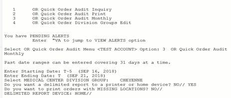

    Delimited Report Sent to a Printer or Home Device – YES Response

6.  At the “Do you want to print orders with MISSING LOCATIONS? NO//” prompt, accept the default NO response to leave out orders that do not include a location, or enter YES to include those orders.

    The report will print a list of antimicrobial prescriptions ordered by both quick order and non-quick order methods; it includes orders written during the specified time frame for all Medical Center divisions included in the selected Division Group.

    The following example depicts a report of antimicrobial orders for the Division Group “CHEYENNE” that were entered without using a quick order (“Non-Quick Orders”). The Order number is populated, indicating that the order was accepted.

    Orders placed using a quick order display in a separate section of the report.

    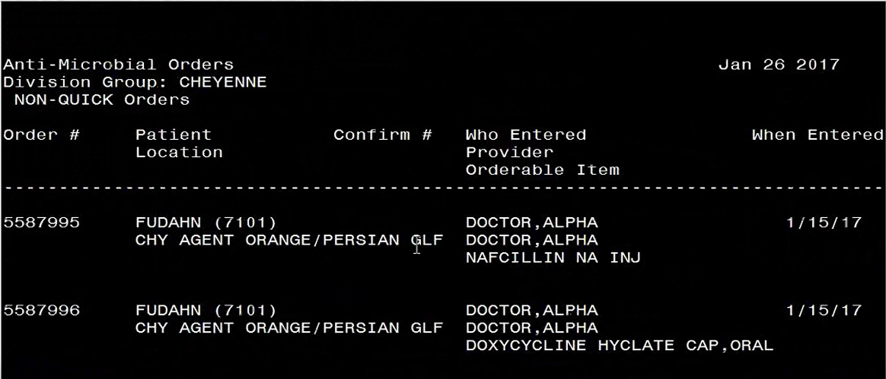
Output from the OR Quick Order Audit Monthly Report
***

### Ordering Dialogs

For entries in the Order Dialog file where TYPE=Dialog, an additional field, WINDOW FORM ID (\#55), is often present. This field tells the client which window should be displayed for that particular ordering dialog. The values this field can take are listed below:
-   1555 Clinic Infusions
-   117 Outpatient Meal/Dietetics
-   1105 Allergy/Adverse Reaction
-   110 Consult
-   112 Procedure
-   171 VITAL SIGNS
-   120 Laboratory
-   151 General Purpose Generic Order
-   999 Word Processing Order
-   100 Generic Activity
-   115 Diet
-   150 Patient Care
-   170 VITAL SIGNS
-   135 Medications
-   145 Non VA Medications
-   1444 Clinic Medications
-   130 Inpatient Medications
-   180 Infusion
-   140 Outpatient Medications
-   140 Supplies
-   160 Imaging
-   125 Blood Products
-   175 Return to Clinic
It is generally not necessary to edit the WINDOW FORM ID field. If no value is found, a value of 152 is assumed and a generic ordering dialog is constructed on the fly based on the prompts defined for the dialog. Most dialogs defined by sites will either be based on OR GXMISC GENERAL, where WINDOW FORM ID = 151, or will be generic dialogs constructed on the fly and have no WINDOW FORM ID.
#### Some Troubleshooting

If a generic ordering dialog allows selection of an Orderable Item (i.e., contains OR GTX ORDERABLE ITEM as a prompt), the INDEX value must be set for the appropriate subset of entries of the Orderable Item file. For example, in OR GXMISC GENERAL, the values for the first prompt are:
SEQUENCE: 1 ITEM: OR GTX ORDERABLE ITEM
DISPLAY TEXT: Patient Care: REQUIRED: YES
INDEX: S.NURS HELP MESSAGE: Enter a patient care item.
ORDER TEXT SEQUENCE: 1
SCREEN: I ‘\$G(\^(.1))!(\$G(\^(.1))\>\$\$NOW\^XLFDT)
XECUTABLE HELP: N IDX,SCR S IDX=\$G(ORDIALOG(PROMPT,”D”)),SCR=\$G(ORDIALOG(PROMP
T,”S”)) D XHELP\^ORDD43(IDX,SCR)
EXIT ACTION: N OI S OI=+\$G(ORDIALOG(PROMPT,INST)) D:OI ORDMSG\^ORCD(OI)
***

The S.NURS value for the INDEX field indicates that the selections should be limited to entries in the Orderable Item file that belong to the NURS set. If this is not set up properly, the “B” cross reference is used for sorting and you may see odd behavior with respect to items that are not all upper case.
Order dialog in the GUI use the ID field to reference different prompts within the dialog. There have been occasional circumstances where the text of diet additional orders appears to be blank. This is almost always caused by a missing ID value in the OR GTX FREE TEXT 1 entry of the Order Dialog file. This entry should look like this:
***

NAME: OR GTX FREE TEXT 1 DISPLAY TEXT: Instructions:
TYPE: prompt PACKAGE: ORDER ENTRY/RESULTS REPORTING
DATA TYPE: free text DOMAIN: 1:240
**ID: COMMENT**
DESCRIPTION: This term gets a line of free text for generic orders.
TIMESTAMP: 58261,43117
***

### Allergy/Adverse Reaction Tracking Dialog

CPRS uses the GMRAOR ALLERGY order dialog—which is stored in the ORDER DIALOG file—to communicate directly with the Allergy/Adverse Reaction Tracking (ART) package. The ART package does not allow users to enter free-text causative agents. When users attempt to enter allergies or adverse reactions for causative agents that are not in the local or national ALLERGIES file, CPRS displays a dialog box giving users the opportunity to request the addition of these agents. When users choose to initiate such requests, CPRS sends the requests to the GMRA REQUEST NEW REACTANT mail group, which patch GMRA\*4.0\*17 provides.
Each site must populate this mail group with people who are authorized to decide which causative agents should be included its local ALLERGY file. If sites have not populated this mail group, users who attempt to request additions to the local ALLERGY file receive the following message:

The message box CPRS displays if users request the addition of a reactant and their sites have not populated the GMRA REQUEST NEW REACTANT mail group.
***

Based on a parameter setting in the ART package, users may also be able to indicate via CPRS whether they have marked allergies and adverse reactions on patients’ identification (ID) bands (for inpatients). Specifically, if sites set the MARK ID BAND parameter to **1** (**YES)**, CPRS activates the **ID Band Marked** checkbox (for inpatients) in the **Enter Allergy or Adverse Reaction** dialog box. On the other hand, if sites set the parameter to **0** (**NO)**, CPRS deactivates the checkbox. Three related parameters determine if and how sites notify members of the GMRA MARK CHART mail group (or a specified order-entry team) when users do not indicate that they have marked allergies and adverse reactions on patients’ ID bands. For more information about these parameters, see the [*Adverse Reaction Tracking Technical Manual*](http://www.va.gov/vdl/VistA_Lib/Clinical/CPRS-Advrs_Reaction_Trk_(ART)/allr4_tm.pdf)*.*
***

### Outpatient Medication Order Dialog

The default value for the “Pick Up” prompt in the outpatient medication dialog may be controlled with a parameter. ORWDPS ROUTING DEFAULT may be set to the following values:
-   W Pick up at window.
-   M Send by mail
-   C Administered in clinic
-   N No default. The user is required to choose window, mail, or clinic.
***

This is the value used for the general medication dialog and for quick orders if the “Pick Up:” prompt (OR GTX ROUTING) has not been set. Once a value has been selected, that value becomes the default for subsequent orders in the session.
### Entering Custom Reasons for Non-VA Meds

For each Non-VA medication entered into CPRS, the user can select a reason why the patient is taking the medication. Four statements or reasons exported at the package level of the GUI Non-VA Med Statements/Reasons parameter are as follows:
-   Non-VA medication not recommended by VA provider.
-   Non-VA medication recommended by VA provider.
-   Patient wants to buy from Non-VA pharmacy.
-   Medication prescribed by Non-VA provider.
***

At the System or Division level for this parameter, sites can enter their own reasons or statements, including the above if they choose to, at the system or division level of this parameter. The parameter asks for a sequence number to let the user determine what order it should display the reasons, and the user can then enter a reason up to 60 characters in length. Sites can enter any number of reasons they choose, but should use good judgment and not create too many reasons that would make it difficult for users to enter the appropriate reasons.
**To change the reasons in the GUI Non-VA Med Statements/Reasons parameter, use the following steps:**
1.  In the List Manager interface, use the menu option **NV GUI Non-VA Med Statements/Reasons** under the **GUI Parameters** option of the **CPRS Configuration (Clin Coord)** menu and press \<Enter\>.
1.  Enter 1 for Division or 2 for system and press **\<Enter\>**.
1.  If you chose 1, type the name of the institution and press **\<Enter\>**.
1.  At the Select Sequence prompt, type a sequence number and press **\<Enter\>**.
1.  When asked if you are adding a new sequence with the number you entered, type **Y** and press **\<Enter\>**.
1.  When the Sequence prompt displays with the number by it, press **\<Enter\>**.
1.  At the Statement/Reason prompt, type the text that you want CPRS to display as one of the statements/reasons the patient is taking a non-VA medication. (The limit for the reason/statement is 60 characters.)
1.  Repeat steps 4-7 as needed to create the list of statements/reasons.
1.  When finished entering reasons, type an up caret (**\^**) and press **\<Enter\>** to exit the menu.
### Entering a Message for Inpatient Clozapine Orders

Clozapine is usually prescribed in an outpatient setting, but it can be ordered for inpatients. However, the special appropriateness order checks that occur when finishing in the backdoor Outpatient Pharmacy setting do not occur in the finishing process in backdoor Inpatient Pharmacy. In addition, backdoor Outpatient Pharmacy sends the clozapine information to the National Clozapine Coordinating Center (NCCC) database. Some sites have directed the ordering provider to place a corresponding outpatient order when placing an inpatient clozapine order. The sites that have this policy can use the new OR CLOZ INPT MSG parameter to help reinforce this policy to the ordering providers.
**To edit this text, use these steps:**
1.  In the List Manager interface, go to the menu option CPRS Configuration (Clin Coord)….
1.  Type **GP** and press \<**Enter**\> for GUI Parameters.
1.  Type **CLOZ** and press \<**Enter**\> for GUI Edit Inpatient Clozapine Message.
1.  Type the name of the warning and press \<**Enter**\>.
1.  In the text entry area that displays, enter the needed text.
1.  When finished, press \<**Num Lock\> + e**, which will save the text and exit to the GUI Parameters menu option.
### Entering a Message for Controlled Substance Orders With No Patient Address

Drug Enforcement Agency (DEA) regulations require a patient address for controlled substance prescriptions. If an attempt is made to place a controlled substance order for a patient without a valid ZIP code, a message is displayed informing the ordering provider that a valid patient address is required, and the order is not placed. Sites can use the OR ZIP CODE MESSAGE parameter to provide information to the ordering provider to assist with getting the patient’s address updated.
**To edit this text, use these steps:**
1.  In the List Manager interface, go to the menu option **CPRS Configuration (Clin Coord)**.
1.  Type **GP** for GUI Parameters and press \<**Enter**\>.
1.  Type **ZIPM** for Enter/Edit Missing ZIP Code Message Parameter and press **\<Enter\>.**
1.  Type **1** for Division to customize the message for the Division, type **2** to customize the message for the system and press **\<Enter\>.**
1.  If Division was selected in the previous step, select the Division name and press **\<Enter\>.** If System was selected in the previous step, proceed to the next step.
1.  At the “Value:” prompt, enter the needed text.
1.  When finished, press **\<Enter\>,** which will save the text and exit to the GUI Parameters menu option.
### Return to Clinic

To help improve scheduling capabilities in the VA, CPRS has added a Return to Clinic dialog that enables providers to place an order for one or more return appointments for a patient. The information is then transmitted to the Scheduling package where a scheduler can set one or more return appointments.
**Note:** The Return to Clinic dialog will only be accessible if the new Scheduling enhancements are in place, which will be released in patch SD\*5.3\*671. CACs can create Quick Orders and add the Return to Clinic Order Dialog to any menu before the SD patch is installed. If a user tries to access the Return to Clinic Order Dialog before the SD patch is installed, they will see an error message in CPRS stating the Order Dialog cannot be use until the SD patch is installed.
If your site does not use the package level settings for the Write Orders list, you will need to add the Return to Clinic items to the ORWDX WRITE ORDERS LIST set up for your site at the appropriate level (such as System, Division, etc).It may need to be added to your Write Orders menu.
There are two parameters that set up items in the Return to Clinic dialog:
-   OR SD ADDITIONAL INFORMATION that enables sites to put some information in a the More information field of the dialog.
-   OR SD PREREQ DIALOG where sites can add items to display in the Prerequisites drop down in the dialog. These are text only items to remind the scheduler to remind the patient of anything the provider wants them to do before the next visit, such as labs, radiology, etc.
### VBECS Installation and Setup

CPRS provides an electronic interface between VA providers and the updated Blood Bank Lab application, VistA Blood Establishment Computer Software (VBECS). For the CPRS VBECS order dialog to work effectively; quick orders meeting local operations need to be provided with administrative instructions by local Clinical Applications Coordinators (CACs).

A simultaneous Lab order is processed when a VBECS order is placed. Lab orders need to be accessioned in the Lab application to be available for processing in the VBECS application. This does NOT place a Nursing Administration order. An order set of quick orders may be locally configured to link the Nursing Administration order to the VBECS order dialog.

#### Order Dialog

The VBECS Order Dialog (VBEC BLOOD BANK) must be placed by the CAC appropriately in the site’s Order menus. This dialog creates an order for blood components to be made available by the VBECS system, as well as any supporting diagnostic tests. It includes 6 components and 5 diagnostic tests. This new VBECS Blood Bank order dialog is an important aspect of the system. This is the only way to order blood products—you cannot use the file 60 method to create blood bank quick orders.
**☞ Note:** When OR\*3.0\*212 is installed it removes the ability to order blood bank tests through the lab application. The only way to order blood bank tests now is through the VBECS Order dialog in CPRS.
The VBECS Order Dialog is a unique structure. During use, it has direct communication with the VBECS Package via HL7 and VistA Link. The dialog has 3 parts:
1.  Patient information tab displays Blood Bank information about the patient.
1.  The Orders tab gives access to the ordering dialogs.
1.  The Lab Results tab displays lab results defined within the VBECS application based on the components being ordered.

***

The VBECS order dialog can be used to create:
-   Order Sets
-   Quick orders
-   Personal Quick Orders
***

But its main purpose is to order blood products, a topic which is covered in the CPRS GUI User Manual
#### Quick Orders

The recommended method for creating quick orders for VBECS is to use the Enter/edit quick orders action of the Order Menu Management. Here follows an example to this process:
Select CPRS Configuration (Clin Coord) Option: **mm** Order Menu Management
***

OI Manage orderable items ...
PM Enter/edit prompts
GO Enter/edit generic orders
QO Enter/edit quick orders
QU Edit personal quick orders by user
ST Enter/edit order sets
AC Enter/edit actions
MN Enter/edit order menus
AO Assign Primary Order Menu
CP Convert protocols
SR Search/replace components
LM List Primary Order Menus
DS Disable/Enable order dialogs
CS Review Quick Orders for Inactive ICD9 Codes
MR Medication Quick Order Report
CV Convert IV Inpatient QO to Infusion QO
***

Select Order Menu Management Option: **QO** Enter/edit quick orders
Select QUICK ORDER NAME: **VBECS Mulitiple 2**
Are you adding 'VBECS Mulitiple 2' as a new ORDER DIALOG? No// **y**  (Yes)
TYPE OF QUICK ORDER: **??**
***

Choose from:
ACTIVITY
BLOOD PRODUCTS
CARDIOPULMONARY
CONDITION
CONSULTS
DIAGNOSIS
DIET ADDITIONAL ORDERS
DIET ORDERS
EARLY/LATE TRAYS
GENERAL RADIOLOGY
IMAGING
IV MEDICATIONS
LABORATORY
NON-VA MEDICATIONS
NURSING
OUTPATIENT MEALS
OUTPATIENT MEDICATIONS
PRECAUTIONS
PROCEDURES
***
TYPE OF QUICK ORDER: **Blood PRODUCTS**
NAME: VBECS Mulitiple 2// \<Enter\>
DISPLAY TEXT: \<Enter\>
VERIFY ORDER: \<Enter\>
DESCRIPTION:
No existing text
Edit? NO// \<Enter\>
***

Component or Test: \<Enter\>
Urgency: \<Enter\>
Date/Time Wanted: \<Enter\>
Comments:
***

\-------------------------------------------------------------------------
\-------------------------------------------------------------------------
***

(P)lace, (E)dit, or (C)ancel this quick order? PLACE//\<Enter\>
***

Select Order Menu Management Option: qo Enter/edit quick orders
Select QUICK ORDER NAME: **VBECS**
1 VBECS Mulitiple 2
2 VBECS Multiple 2
3 VBECS T&S
CHOOSE 1-3: 2 VBECS Multiple **2**
NAME: VBECS Multiple 2// \<Enter\>
DISPLAY TEXT: \<Enter\>
VERIFY ORDER: \<Enter\>
DESCRIPTION:
No existing text
Edit? NO// \<Enter\>
***

Component or Test: **??**
***

Choose from Blood Components:
CRYOPRECIPITATE
FROZEN PLASMA
OTHER
PLATELETS
RED BLOOD CELLS
WHOLE BLOOD
***

or Diagnostic Tests:
ABO/RH
ANTIBODY SCREEN
DIRECT ANTIGLOBULIN TEST
TRANSFUSION REACTION WORKUP
TYPE & SCREEN
***

Enter a blood component or diagnostic test for the patient from the Blood Bank.
***

Component or Test: **red** BLOOD CELLS RED BLOOD CELLS
Additional Requirements: **??**
Choose from:
1 Irradiated
2 Leuko Reduced
3 Volume Reduced
4 Divided
5 Leuko Reduced/Irradiated
6 irad/leukopoor
Select a modifier, if needed.
***

Additional Requirements:
Quantity: **2**
Another Component or Test: **t**
1 TRANSFUSION REACTION WORKUP
2 TYPE & SCREEN
CHOOSE 1-2: **2** TYPE & SCREEN
Another Component or Test: **plate**LETS PLATELETS
Additional Requirements: \<Enter\>
Quantity: **2**
Another Component or Test:
***

SEND TO LAB - Means the patient is ambulatory and will be sent to the
Laboratory draw room to have blood drawn.
WARD COLLECT - Means that either the physician or a nurse will be collecting
the sample on the ward.
LAB BLOOD TEAM - Means the phlebotomist from Lab will draw the blood on the
ward. This method is limited to laboratory defined collection times.
IMMEDIATE COLLECT BY BLOOD TEAM - Means the phlebotomist from Lab is on
call to draw blood on the ward. This method is available during times
defined by Laboratory.
***

SP Send patient to lab
WC Ward collect & deliver
LC Lab blood team
I Immediate collect by blood team
Collected By: **sp** Send patient to lab
Collection Date/Time: **today** (MAR 16, 2009)
Urgency: **stat**
Surgery: **toenail**
Date/Time Wanted: **t** (MAR 16, 2009)
Reason for Request: \<Enter\>
Comments:
***

\-------------------------------------------------------------------------
Blood Components/Tests: RED BLOOD CELLS 2 unit(s)
TYPE & SCREEN
PLATELETS 2 unit(s)
Collected By: Send patient to lab
Collection Date/Time: TODAY
Urgency: STAT
Surgery: toenail
Date/Time Wanted: TODAY
Reason for Request: surgery
\-------------------------------------------------------------------------
***

(P)lace, (E)dit, or (C)ancel this quick order? PLACE// **p** PLACE
***

#### Adding to the Order Menu

Since you can no longer order blood bank tests through the lab order dialogs, you need to put a blood bank dialog where it can be accessed by users who need it. In the following example we put the exported dialog into the WRITE ORDERS menu for doctors at our facility:
Select OPTION NAME: **ormgr**  CPRS Manager Menu
***
CL Clinician Menu ...
NM Nurse Menu ...
WC Ward Clerk Menu ...
PE CPRS Configuration (Clin Coord) ...
***

Select CPRS Manager Menu Option: **pe** CPRS Configuration (Clin Coord)
***

AL Allocate OE/RR Security Keys
KK Check for Multiple Keys
DC Edit DC Reasons
GP GUI Parameters ...
GA GUI Access - Tabs, RPL
MI Miscellaneous Parameters
NO Notification Mgmt Menu ...
OC Order Checking Mgmt Menu ...
MM Order Menu Management ...
LI Patient List Mgmt Menu ...
FP Print Formats
PR Print/Report Parameters ...
RE Release/Cancel Delayed Orders
US Unsigned orders search
EX Set Unsigned Orders View on Exit
NA Search orders by Nature or Status
CM Care Management Menu ...
DO Event Delayed Orders Menu ...
LO Lapsed Orders search
PM Performance Monitor Report
***

Select CPRS Configuration (Clin Coord) Option: **mm** Order Menu Management
***

OI Manage orderable items ...
PM Enter/edit prompts
GO Enter/edit generic orders
QO Enter/edit quick orders
QU Edit personal quick orders by user
ST Enter/edit order sets
AC Enter/edit actions
MN Enter/edit order menus
AO Assign Primary Order Menu
CP Convert protocols
SR Search/replace components
LM List Primary Order Menus
DS Disable/Enable order dialogs
CS Review Quick Orders for Inactive ICD9 Codes
MR Medication Quick Order Report
CV Convert IV Inpatient QO to Infusion QO
***

Select Order Menu Management Option: **MN** Enter/edit order menus
Select ORDER MENU: **WRITE ORDER LIST**
***

Menu Editor Jan 28, 2008@16:06:49 Page: 1 of 3
Menu: WRITE ORDER LIST Column Width: 80
1
\| ADD NEW ORDERS
\| ALLERGIES
\| DIET
\| MEDS INPATIENT
\+ MEDS NONVA
\| MEDS OUTPATIENT
\| IV FLUIDS
\| LAB TEST
\| IMAGING
1 CONSULTS
\| PROCEDURE
\| VITALS
\| TEXT ONLY ORDER
\|
\+
\|
\+ + Next Screen - Prev Screen ?? More Actions \>\>\>
Add ... Edit ... Assign to User(s) Select New Menu
Remove ... Toggle Display Order Dialogs ...
Select Action: Next Screen// **ADD** Add ...
***

Add: **ME** Menu Items
ITEM: **VBEC BLOOD BANK**
ROW: 14
COLUMN: 1
DISPLAY TEXT: BLOOD BANK
MNEMONIC:
***

ITEM: **\<Enter\>**
***

Rebuilding menu display ...
***
Menu Editor Jan 28, 2008@16:12:26 Page: 1 of 3
Menu: WRITE ORDER LIST Column Width: 80
1
\| ADD NEW ORDERS
\| ALLERGIES
\| DIET
\| MEDS INPATIENT
\+ MEDS NONVA
\| MEDS OUTPATIENT
\| IV FLUIDS
\| LAB TEST
\| IMAGING
1 CONSULTS
\| PROCEDURE
\| VITALS
\| TEXT ONLY ORDER
\| BLOOD BANK
\+
\|
\+ + Next Screen - Prev Screen ?? More Actions \>\>\>
Add ... Edit ... Assign to User(s) Select New Menu
Remove ... Toggle Display Order Dialogs ...
Select Action: Next Screen//
#### Menus

There is a new action in the Manage Orderables Menu for VBECS called Edit VBECS item display names [ORCM VBECS OI EDIT]. In this example we change the name of one of the VBECS orderable items:
OI Manage orderable items ...
PM Enter/edit prompts
GO Enter/edit generic orders
QU Edit personal quick orders by user
ST Enter/edit order sets
AC Enter/edit actions
MN Enter/edit order menus
AO Assign Primary Order Menu
CP Convert protocols
SR Search/replace components
LM List Primary Order Menus
DS Disable/Enable order dialogs
CS Review Quick Orders for Inactive ICD9 Codes
MR Medication Quick Order Report
***

Select Order Menu Management Option: **ma**nage orderable items
***
OI Enter/edit orderable items
QO Enter/edit QO restriction
SR Search/replace orderables
VB Edit VBECS item display names
***

Select Manage orderable items Option: **vb** Edit VBECS item display names
Select VBECS ORDERABLE ITEM: **?**
Answer with ORDERABLE ITEMS
Do you want the entire ORDERABLE ITEMS List? **y** (Yes)
Choose from:
ABO/RH
ANTIBODY SCREEN
CRYOPRECIPITATE
DIRECT ANTIGLOBULIN TEST
FRESH FROZEN PLASMA
OTHER
PLATELETS
RED BLOOD CELLS
TRANSFUSION REACTION WORKUP
TYPE & SCREEN
WHOLE BLOOD
***

Select VBECS ORDERABLE ITEM: **other**
NAME: OTHER// OTHER BLOOD PRODUCTS
***

Select VBECS ORDERABLE ITEM:
***

#### Auto-DC Blood orders

Your facility should consider how you want the BLOOD PRODUCTS dialogue orders to auto/dc and refer to Appendix G of this manual for further instructions.
#### Parameters

VBECS comes with the following parameters:
OR VBECS COMPONENT ORDER List of Blood Components
OR VBECS ERROR MESSAGE Text for Network Error
OR VBECS LEGACY REPORT Show Legacy (VISTA) Blood Bank Report
OR VBECS MODIFIERS List of Component Modifiers
OR VBECS ON VBECS Functionality Site Enabled
OR VBECS REASON FOR REQUEST List of Reasons for Request
OR VBECS SUPPRESS NURS ADMIN Suppress Nursing Admin Prompt
ORWDXVB VBECS TNS SCREEN Max time between TYPE & SCREEN and order
***

These are available for local setup for the sites particular requirements or local needs.
The OR VBECS COMPONENT ORDER parameter determines the sequence in which the components appear in the selection list.
The OR VBECS ERROR MESSAGE contains text for the error message displayed when CPRS cannot contact the VBECS server to fill in dialog information. The VBECS order process can still proceed because the finished order is transmitted via HL7. You can replace the supplied text of this message with information about your own local procedures, possibly including the Blood Bank phone number.
The OR VBECS LEGACY REPORT parameter determines whether the Legacy (VistA) Blood Bank Report is displayed after the VBECS blood bank report is displayed. Currently this must be Yes for you to see this information.
The OR VBECS MODIFIERS parameter allows local configuration of the blood component modifiers. Specifically, it allows you to enter the sequence in which the modifiers should appear in the selection list.
The OR VBECS ON parameter toggles VBECS ON and OFF. Yes means ON, which is the default.
The OR VBECS REASON FOR REQUEST can be used to add site specific reasons for requests making them available for the clinician to select when placing an order.
The OR VBECS SUPPRESS NURS ADMIN parameter disables the prompt/pop-up that tells the user they must enter a Nursing Administration Order manually after entering a VBECS Blood order. Disabling this feature is usually done when a Nursing Administration order has been created and added to a VBECS order set or quick orders.
The ORWDXVB VBECS TNS CHECK parameter sets the number of days to check for a Type & Screen Order. The default is 3 days, but a site may override this by modifying this parameter.
### Signing Orders / Exiting the Chart

When a user exits the chart a window may display that contains orders that require a signature. The orders displayed in this window are controlled by the parameter OR UNSIGNED ORDERS ON EXIT. This parameter may be set to the following:
-   0 Only unsigned orders from the current session appear.
-   1 Unsigned orders by the current user for the currently selected patient appear.
-   2 All unsigned orders for the currently selected patient appear.
The orders are checked initially in the list box. They may be individually unchecked to prevent a signature code from being applied to them.
For holders of the ORELSE key, the parameter OR SIGNATURE DEFAULT ACTION controls which radio button is checked by default on the Review / Sign Changes screen. The following values are possible:
-   OC Signed On Chart may be checked (based on OR SIGNED ON CHART).
-   RS Release without Signature will be checked.
***

The parameter, OR SIGNED ON CHART, applies to OREMAS key holders and ORELSE key holders who have “Signed On Chart” as their default action. If OR SIGNED ON CHART is yes, then “Signed on Chart” is checked by default. Otherwise the default is “Hold for Signature”.
#### Digitally Signing Orders

To allow provider to digitally sign orders, the Department of Veterans Affairs (VA) is implementing the Drug Enforcement Agency (DEA) requirements that uses card readers, smart cards known as Personal Identification Verification (PIV) cards with personal identification number (PIN), and digital certificates to authenticate users and digitally sign outpatient orders for controlled substances. This project would make it possible to eliminate the use of handwritten or “wet” signatures being sent to pharmacy and pave the way for completely electronic medication ordering.
There are several things that need to happen for the authentication to work correctly. When the user enters an order for a controlled substance, CPRS requests that the user insert the user’s PIV or smart card into the card reader and then enter the PIN. When the PIN has been entered, CPRS uses standard Windows security features to validate the certificates of the provider.
The PIV or smart card contains information about the provider including the following:
-   Subject Alternative Name (SAN)
-   PIN
-   Digital certificate
***

##### Digital Signatures Fields and Parameters

To make digital signatures possible in CPRS, developers added two new parameters and expanded one field and added four fields to CPRS files. The following fields were modified or added:
-   The Signature Status field (4) of the ORDER ACTION subfile (100.008) of the ORDERS file (100) was modified to include a “Digitally Signed” order status.
-   The External Text field (.01) of the ORDER ACTION subfile (100.008) of the ORDERS file (100) was added to store the external text of an order. The external text of an order gets passed to Kernel’s signing COM object and is used to create the digital hash.
-   The Digital Signature field (23) of the ORDER ACTION subfile (100.008) of the ORDERS file (100) stores the digital hash (encrypted external order text).
-   The Drug Schedule field (24) of the ORDER ACTION subfile (100.008) of the ORDERS file (100) stores the Controlled Substances Federal Schedule of the drug, which is used to see whether a digital signature is required.
-   The Digital Signature Required field (25) of the ORDER ACTION subfile (100.008) of the ORDERS file (100) stores the indicator of whether the order requires a digital signature.
***

| **Field Name**                        | **Field Description**                   | **New Field** | **Data Type**   | **Identifier** | **Uneditable** |
|---------------------------------------|-----------------------------------------|---------------|-----------------|----------------|----------------|
| SIGNATURE STATUS 100.008,4            | Signature status of the order           | No            | Set             | No             | No             |
| EXTERNAL TEXT 100.008, .01            | Order text stored in external format    | Yes           | Word Processing | No             | Yes            |
| DIGITAL SIGNATURE 100.008,23          | Digital Signature of the order          | Yes           | Free Text       | No             | Yes            |
| DRUG SCHEDULE 100.008,24              | CS Federal Schedule of the drug         | Yes           | Free Text       | No             | No             |
| DIGITAL SIGNATURE REQUIRED 100.008,25 | Set if a digital signature is required. | Yes           | Set             | No             | No             |

**Important Items**

-   **New Field Added to the Institution File** - Kernel patch XU\*8\*267 added a new field to the Institution file (\#4), called FACILITY DEA NUMBER, which must have a value before this patch is installed. Integrated sites, Multi-divisional sites and sites that have sub-stations that users are able to sign in to (clinics, nursing homes, etc.) must also have the Facility DEA Number entered for those sub-station entries in the Institution file (\#4).
-   **Required Information** - If you install this patch without entering the all the required Facility DEA Numbers, your physicians will not be able to order controlled substances. You should be able to get the Facility DEA\# from the Pharmacy or Pharmacy Chief. With the Facility DEA\# and your institution name, use VA FileMan to enter the data, as follows:
***

Select OPTION: ENTER OR EDIT FILE ENTRIES
***

INPUT TO WHAT FILE: INSTITUTION//
EDIT WHICH FIELD: ALL// FACILITY DEA NUMBER
THEN EDIT FIELD:
***

Select INSTITUTION NAME: \<Enter your institution name\>
FACILITY DEA NUMBER: \<Enter your Facility DEA\# here\>
***

##### Enabling Digital Signature Entries

To enable digital signature, also referred to as DEA ePrescribing, the Clinical Application Coordinator (CAC) must make sure two files entries are enabled. The two file entries are
-   **ePCS SITE ENABLE/DISABLE:** This enables the digital signature feature for the site in general, but individual users must still be enabled. To use this option, the user must hold the OREPCSSITE key.
-   **ePCS USER ENABLE/DISABLE:** This enables the digital signature feature for the individual user selected. To use this option, the user must hold the OREPCSUSER key.
***

Upon initial installation of patch OR\*3.0\*218, the post-install routine will automatically enable the entire site through the EPCS SITE ENABLE/DISABLE entry, and it will enable electronic prescribing of controlled substances entry for all users that have either a DEA number or a VA number that allows them to write orders for controlled substances. Someone at each site, such as the credentialing office or pharmacy (your site will need to decide who will do this), will need to ensure that the users are assigned the correct pharmacy schedule for which they should be allowed to write controlled substance medication orders (specified schedules or all schedules II-v). Instructions are given below.
***

###### Enabling or Disabling Users for DEA ePrescribing

**After the initial installation, sites will need to enable individuals using the following steps:**
**Note:** To enable the ePCS USER ENABLE/DISABLE parameter, the user must hold the OREPCSUSER key and must not hold the XUEPCSEDIT key. The keys are exclusive—if the user holds one, the user may not hold the other. If the user does not hold the OREPCSUSER key or holds the XUEPCSEDIT key, the system will not display the ePCS User Enable/Disable option.
***

1.  Log in to the appropriate VistA account.
1.  Select the ePCS User Enable/Disable option. (OR EPCS USERS PARAMETER or to navigate to it, use these options: ORMGR\> PE CPRS Configuration (Clin Coord) ...\> GP GUI Parameters\> DEA GUI ePCS Management Menu\> ePCS User Enable/Disable).
1.  At the USER NAME prompt, type the name of the provider and press \<Enter\>.
The system will then display the user’s current status of enabled or disabled and ask if you want to change it.
1.  Check that the provider is currently NOT enabled.
1.  When prompted if you want to enable the provider, type YES and press \<Enter\>.
1.  To enable or disable other users, repeat steps 3-5.
***

To disable a user, use the same steps as above. After you enter the user’s name, the system should show them as “enabled”, and ask if you want to disable them.
Below is an example showing how ePCS is enabled for a user.
Select OPTION NAME: CPRS CONFIGURATION
1 CPRS CONFIGURATION (CLIN COORD OR PARAM COORDINATOR MENU CPRS Configuration (Clin Coord)
2 CPRS CONFIGURATION (IRM) OR PARAM IRM MENU CPRS Configuration (IRM)
CHOOSE 1-2: 1 OR PARAM COORDINATOR MENU CPRS Configuration (Clin Coord)
***

AL Allocate OE/RR Security Keys
KK Check for Multiple Keys
DC Edit DC Reasons
GP GUI Parameters ...
GA GUI Access - Tabs, RPL
MI Miscellaneous Parameters
NO Notification Mgmt Menu ...
OC Order Checking Mgmt Menu ...
MM Order Menu Management ...
LI Patient List Mgmt Menu ...
FP Print Formats
PR Print/Report Parameters ...
RE Release/Cancel Delayed Orders
US Unsigned orders search
EX Set Unsigned Orders View on Exit
NA Search orders by Nature or Status
CM Care Management Menu ...
DO Event Delayed Orders Menu ...
LO Lapsed Orders search
PM Performance Monitor Report
***
Select CPRS Configuration (Clin Coord) \<TEST ACCOUNT\> Option: GP GUI Parameters
***

CS GUI Cover Sheet Display Parameters ...
HS GUI Health Summary Types
TM GUI Tool Menu Items
MP GUI Parameters - Miscellaneous
UC GUI Clear Size & Position Settings for User
RE GUI Report Parameters ...
NV GUI Non-VA Med Statements/Reasons
EX GUI Expired Orders Search Hours
RM GUI Remove Button Enabled
NON GUI Remove Button Enabled for Non-OR Alerts
CLOZ GUI Edit Inpatient Clozapine Message
COAG GUI Anticoagulation Parameters ...
DEA GUI ePCS Management Menu ...
EIE GUI Mark Allergy Entered in Error
OF GUI Order Flagging/Unflagging Setup ...
***

Select GUI Parameters \<TEST ACCOUNT\> Option: DEA GUI ePCS Management Menu
***

USER ePCS User Enable/Disable
Duplicate VA Numbers Report
Provider Incomplete Configuration Report
Check Provider Configuration
***
Select GUI ePCS Management Menu \<TEST ACCOUNT\> Option: USER ePCS User Enable/Disable
***

This option is used to enable or disable electronic prescribing of outpatient
controlled substances for individual users.
***

CONFIGURING SITE CAMP MASTER
***

Select the USER NAME: CPRSPROVIDER,FORTYFOUR TR PHYSICIAN
***

CPRSPROVIDER,FORTYFOUR is currently disabled.
Do you want to enable CPRSPROVIDER,FORTYFOUR? NO// YES
***

Successfully enabled CPRSPROVIDER,FORTYFOUR and it is permitted to prescribe
all schedules.
***

Select the USER NAME:
###### Enabling or Disabling the Site for DEA ePrescribing

When the DEA Set Up patches are installed, the site will be enabled for electronic prescription of outpatient controlled substance orders (ePCS). In case of an emergency, sites could turn off the ability to electronically prescribe these substances.
**Warning:** Do not disable this unless there is an emergency or you have been instructed to do so. When ePCS is disabled, providers are required to order all controlled substance using paper prescriptions.
***

**Note:** To use the ePCS SITE ENABLE/DISABLE option, the user must hold the OREPCSSITE key and must not hold the XUEPCSEDIT key. The two keys are exclusive—the user may not hold both keys at the same time. If the user does not hold the OREPCSSITE key or holds the XUEPCSEDIT key, the system will not display the ePCS SITE ENABLE/DISABLE option.
***

**If needed after the initial installation, sites can enable or disable the entire site using the following steps:**
1.  Log in to the appropriate VistA account.
1.  Select the ePCS User Enable/Disable option. (OR EPCS SITE PARAMETER or to navigate to it, use these options: ORMGR\> PE CPRS Configuration (Clin Coord) ...\> GP GUI Parameters\> DEA GUI ePCS Management Menu\> ePCS Site Enable/Disable).
1.  At the ENABLE EPCS prompt, type YES to enable or No to disable and press \<Enter\>.
***

##### PKISERVER.EXE

Another part of the system that must be set up is an application called PKISERVER.EXE, developed by KERNEL team. This application should be installed on a server (basically a computer with a static IP address so that CPRS can find it) for the authentication to happen when pharmacy finishes the order. PKISERVER.EXE must be installed in at least one location, but it can be installed in as many as three locations. After PKISERVER.EXE is installed, IRM or CAC staff must enter the Internet Protocol (IP) address for each location in the PKI Server field (\#53.1) in the KERNEL SYSTEM PARAMETERS file (\#8989.3). This field can hold up to three (3) IP addresses separated by commas (for example: 101.01.999,102.02.999).
Installation of the PKIServer as an automatic service is performed using the PKIVerifyServerSetup application. On Windows 7 systems, the application should be installed by right-clicking on PKIVerifyServerSetup.exe and selecting Run As Administrator. This installation will add the PKIServer.exe to the C:\\Windows directory, and then add it as an automatic service and then start the service. If the service has been previously installed, it will stop the service, remove the service, and then replace the earlier version of PKIServer.exe before setting up and starting the service.
**Note:** If you look at services on the server or computer with the static IP address, the service name will be PKI_verify_services.
***

##### Configuring Users Permissions for Digital Signature

Another part of the digital signature feature or electronic prescription of controlled substances (ePCS) is that of setting up the specific permission and attributes for the user. The Kernel team created the ePCSDataEntryForPresciber.exe application to set up the items necessary according to DEA regulations to enable or authorize users to electronically order and sign controlled substances.
To ensure that a user is authorized to digitally sign an outpatient controlled substance order, CPRS checks these attributes that are shown in the application:
-   Authorized to write orders (FILE 200 FIELD 53.1)
-   Subject Alternative Name (SAN): For VA employees, the SAN is usually the VA outlook e-mail address (if they have one) that is on the Smart or PIV card. However rotating staff or other providers may have a different format. The SAN information can be found on the card. See explanation on How to Find a User’s SAN below.
-   Facility DEA number that is used in conjunction with the prescriber’s VA number (FILE 4 FIELD 52)
-   Prescriber VA DEA number (FILE 200 FIELD 53.3)
-   Prescriber DEA Expiration Date
-   The schedules for which a prescriber can prescribe (FILE 200 FIELDS 55.1-55.6)
***

**WARNING:** If any user has been assigned any pharmacy schedules (any of the boxes have been checked at all) and then all checks are removed and the Update button is selected, the next time the user tries to order a medication, their information—including their DEA number—will be erased from the system.
To use this executable, a user must be assigned the XUEPCSEDIT key. To keep the two functions of assigning privileges and ordering controlled substances separate, the user who uses the ePCS Data Entry For Prescriber GUI application must not have the ORES key. When the keys are assigned a check will occur to make sure that both key are not assigned to the same user.
If a provider already has some of this information, it will display when the user selects the provider’s name. For example, if they are already authorized to write medication orders, the check box will be checked. If the user already has a DEA number, the DEA number will display and so forth.
###### How to Find a User’s SAN

The Subject Alternative Name or SAN for a user is found on the smart card. Below is an example of how to find the SAN. Normally, users can link their own PIV cards the first time they try to order outpatient controlled substance medication orders. However, sometimes something prevents this from occurring and the SAN on the card needs to be checked.
**Note:** For VA employees, the SAN is most often the same as their VA.GOV email address. If this does not work, someone at the site will have to examine the Digital Signing Certificate on their PIV card using ActivClient. See the example below:
**Steps needed to prepare for assigning the SAN**
1.  Open ActivClient.
***

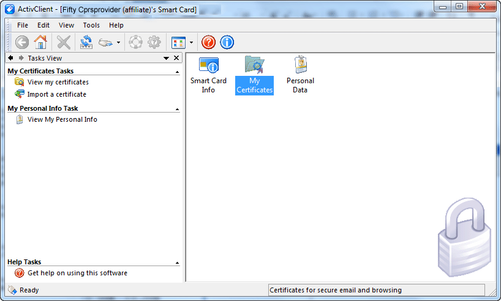
1.  Double click on ‘My Certificates’

1.  Select the “Digital Signature Key”.
***


1.  Select the ‘Advanced’ Tab:

***

Use this information to populate the SUBJECT ALTERNATIVE NAME through the Data Entry for ePrescribing of Controlled Substances application., which puts the information in file \#200.
The user can use the ePCS Data Entry for Prescriber tool to set up the subject alternative name for the remaining people who will use the tool or place outpatient controlled substance orders.
***
##### A New Key to Enter ePCS Data

To use the Data Entry for e-Prescribing Controlled Substances dialog, a user must be assigned the XUEPCSEDIT key through the normal key allocation process in VistA.
**Note:** The user may not be assigned both the XUEPCSEDIT key and ORES key at the same time. This is a simple security measure so that the person assigning permission may not also write medication orders.
***

##### Reports to Identify Providers that Need DEA Information Updates

There are several options to help the person setting up providers with the items needed to electronically prescribe outpatient controlled substances through CPRS. Authorized users can get to these options using the DEA GUI ePCS Management Menu. The full path to this menu is as shown below:
Select OPTION NAME: ORMGR CPRS Manager Menu
***

Select CPRS Manager Menu \<TEST ACCOUNT\> Option: PE CPRS Configuration (Clin Coord)
***

Select CPRS Configuration (Clin Coord) \<TEST ACCOUNT\> Option: GP GUI Parameters
***

Select GUI Parameters \<TEST ACCOUNT\> Option: DEA GUI ePCS Management Menu
***

SITE ePCS Site Enable/Disable
USER ePCS User Enable/Disable
CHK Check Provider ePCS Configuration
REP ePCS Data Validation Reports
***

The user may not see all of these options based on what keys the user holds. The two options that help the user check on users’ characteristics for ePCS are
-   Check Provider ePCS Configuration
-   ePCS Data Validation Reports
***

###### Check Provider ePCS Configuration

This option enables the user to check providers configuration one provider at a time. After evaluation of the items necessary to write outpatient controlled substances orders, it will either display that the provider is authorized and can write order, or it will display what the user is lacking.
A change was made to this report to better reflect the condition of providers attempting to sign. Specifically, the report previously show providers who had an expired DEA number but had a valid VA number as “not allowed” to prescribe, which was not correct.
See examples below:
Select GUI ePCS Management Menu \<TEST ACCOUNT\> Option: CHK Check Provider ePCS Configuration
Select the provider: CPRSPROVIDER
1 CPRSPROVIDER,EIGHT CAR PHYSICIAN
2 CPRSPROVIDER,FIFTY FC
3 CPRSPROVIDER,FORTYFOUR TR PHYSICIAN
4 CPRSPROVIDER,FORTYTHREE FTC
5 CPRSPROVIDER,NINETY SPECIALIST
Press \<RETURN\> to see more, '\^' to exit this list, OR
CHOOSE 1-5: 3 CPRSPROVIDER,FORTYFOUR TR PHYSICIAN
***

This provider is able to write controlled substance orders and is permitted to prescribe all schedules.
***

Select the provider: CPRSPROVIDER
1 CPRSPROVIDER,EIGHT CAR PHYSICIAN
2 CPRSPROVIDER,FIFTY FC
3 CPRSPROVIDER,FORTYFOUR TR PHYSICIAN
4 CPRSPROVIDER,FORTYTHREE FTC
5 CPRSPROVIDER,NINETY SPECIALIST
Press \<RETURN\> to see more, '\^' to exit this list, OR
CHOOSE 1-5: 4 CPRSPROVIDER,FORTYTHREE FTC
***

This provider is not able to write controlled substance orders for the
following reasons:
Does not hold the ORES security key.
Has neither a DEA number nor a VA number.
Is not an ENABLED USER in the OE/RR EPCS PARAMETERS file.
***

Once all of the issues above are resolved, the provider is permitted to
prescribe all schedules.
***

###### ePCS Data Validation Reports

In addition to checking the configuration of a single provider, CPRS has several reports to help identify which providers at a site need items to electronically prescribe controlled substance (ePCS) orders. The five available reports are
-   **Logical Access Control Audit:** This reports shows the activity with regard to the DEA set up.
***

Select OPTION NAME: ORMGR CPRS Manager Menu
***

Select CPRS Manager Menu \<TEST ACCOUNT\> Option: PE CPRS Configuration (Clin Coord)
***

Select CPRS Configuration (Clin Coord) \<TEST ACCOUNT\> Option: GP GUI Parameters
***

Select GUI Parameters \<TEST ACCOUNT\> Option: DEA GUI ePCS Management Menu
***

CHK Check Provider ePCS Configuration
REP ePCS Data Validation Reports
***
Select GUI ePCS Management Menu \<TEST ACCOUNT\> Option: REP ePCS Data Validation Reports
***

Select one of the following:
***

AUD Logical Access Control Audit
CFG Provider Incomplete Configuration
DUP Duplicate VA Numbers
FEE Fee Basis/C & A Providers Without a DEA Number
LAS Provider Last Names Containing Punctuation
***

Select the data validation report to run: AUD Logical Access Control Audit
***

This report displays the audit data for the logical access control feature.
***

START DATE: T-700 (MAR 03, 2014)
END DATE: T (FEB 01, 2016)
Select division: ALL//
DEVICE: HOME TELNET PORT
***
***

LOGICAL ACCESS CONTROL AUDIT REPORT FEB 01, 2016 14:34 PAGE 1
\---------------------------------------------------------------------
SITE: CAMP MASTER
***

DIVISION: CAMP MASTER
USER: CPRSPROVIDER, TWO
1: Disabled on Sep 17, 2014@07:42:42 by CLERK, DEA with option OR EPCS USERS
PARAMETER.
2: Enabled on Oct 27, 2014@07:01:10 by CLERK, DEA with option OR EPCS USERS
PARAMETER.
***

DIVISION: VA HEARTLAND - WEST, VISN 15
USER: CPRSPROVIDER,ONE
1: Enabled on Sep 17, 2014@09:28:49 by CLERK, DEA with option OR EPCS USERS PARAMETER.
***
***

-   **Provider Incomplete Configuration:** This report creates a list of providers who do not have all the pieces of information necessary in the system to enable them to electronically prescribe controlled substance orders according to the new Drug Enforcement Agency (DEA) rules. The report will show the name of the provider, their title just under the name, and the reason why they are not configured correctly.
***

A change was made to this report to better reflect the condition of providers attempting to sign. Specifically, the report previously show providers who had an expired DEA number but had a valid VA number as “not allowed” to prescribe, which was not correct.
This report can also be exported as comma separated values (CSV), allowing them to be imported into other kinds of programs, such as spreadsheet applications.
***

**To create the list of providers with incomplete configuration, use the following steps:**
1.  In the VistA roll-and-scroll, from the CPRS Manager menu, choose PE (CPRS Configuration (Clin Coord) ..., GP GUI Parameters ..., DEA GUI ePCS Management Menu ..., REP ePCS Data Validation Reports.
1.  Select CFG Provider Incomplete Configuration and press \<Enter\>.
1.  If you want to include Pharmacy schedule information for each provider, you will need to indicate it. The default is no. If you do not want Pharmacy schedule information for each provider, press \<Enter\>. To show pharmacy schedule information for each provider, at the Do you want to include prescribable schedules in the output? NO//, type Y and press \<Enter\>.
1.  The next prompt asks if you want to include disusered and terminated users. The default for this prompt is no so that they are not included. To create the report without disusered or terminated users, press \<Enter\>. To include disusered or terminated users, at the Do you want to include DISUSERed and TERMINATED users in the output? NO//, type Y and press \<Enter\>.
1.  Select the Division for this report or choose the default of All and press \<Enter\>.
1.  Do you want to generate the report in a delimited format suitable for import into third-party applications?
**Note:** Use these substeps only if you want to use this to export.
***

To create a file on your computer for use in third-party applications, perform the following:
1.  To queue the report, at the DEVICE: prompt, enter the letter Q.
1.  At the DEVICE: prompt, select the appropriate spooler device.
1.  Once the spooled document is ready, use option Download a Spool file entry
[XT-KERMIT SPOOL DL] to download the report to your computer.
**Note:** Refer to your terminal emulator's documentation for instructions on receiving files via the KERMIT protocol.
***

1.  DEVICE: **SPOOL**
***

1.  If you did not choose to generate the delimited format, at the Device prompt, enter where you would like this information to be sent.
Below is an example of the steps to run the Provider Incomplete Configuration report.
Select OPTION NAME: ORMGR CPRS Manager Menu
***

Select CPRS Manager Menu \<TEST ACCOUNT\> Option: PE CPRS Configuration (Clin Coord)
***

Select CPRS Configuration (Clin Coord) \<TEST ACCOUNT\> Option: GP GUI Parameters
***

Select GUI Parameters \<TEST ACCOUNT\> Option: DEA GUI ePCS Management Menu
***
SITE ePCS Site Enable/Disable
USER ePCS User Enable/Disable
CHK Check Provider ePCS Configuration
REP ePCS Data Validation Reports
***

Select GUI ePCS Management Menu \<TEST ACCOUNT\> Option: REP ePCS Data Validation Reports
***

Select one of the following:
***

CFG Provider Incomplete Configuration
DUP Duplicate VA Numbers
FEE Fee Basis/C & A Providers Without a DEA Number
LAS Provider Last Names Containing Punctuation
***

Select the data validation report to run: CFG Provider Incomplete Configuration
***

This report identifies all active providers who are unable to sign controlled substance orders. For the purposes of this report, a provider is a user who holds the ORES security key.
***

By default, the report lists the prescribable schedules for each provider (including those providers that are properly configured).
***

Do you want to include prescribable schedules in the output? NO//
***

Do you want to include DISUSERed and TERMINATED users in the output? NO//
Select division: ALL//
DEVICE: TELNET PORT
***
Below is an example of the data you might see in the Provider Incomplete Configuration report. The individual’s title is now displayed under the name.
PROVIDER INCOMPLETE CONFIGURATION REPORT APR 15, 2013 09:40 PAGE 8
DIVISION: CAMP MASTER
PROVIDER NAME DEFICIENCY
\---------------------------------------------------------------------
CPRSPROVIDER,SEVENTYONE Has neither a DEA number nor a VA number.
Doctor Is not an ENABLED USER in the OE/RR EPCS
PARAMETERS file.
Is not authorized to write medication
orders.
***

CPRSPROVIDER,THREE Has a DEA number with no expiration date.
Doctor Is not an ENABLED USER in the OE/RR EPCS
PARAMETERS file.
***
***

-   **Duplicate VA Numbers:** This report lists the provider in the system that have similar VA numbers after removing punctuation, and discounting for differences in uppercase and lowercase.
1.  In the VistA roll-and-scroll, from the CPRS Manager menu, choose PE (CPRS Configuration (Clin Coord) ..., GP GUI Parameters ..., DEA GUI ePCS Management Menu ..., REP ePCS Data Validation Reports.
1.  Select the DUP Duplicate VA Numbers report.
1.  Indicate whether the report should include disusered and inactive users (the default is no). If not, press \<Enter\>. To include disusered and inactive users, type y and press \<Enter\>.
1.  At the Device prompt, indicate to which device you want to the report sent.
Below is an example of the steps to run the Duplicate VA Numbers report and the type of data that would be displayed.
Select OPTION NAME: ORMGR CPRS Manager Menu
***

Select CPRS Manager Menu \<TEST ACCOUNT\> Option: PE CPRS Configuration (Clin Coord)
***
Select CPRS Configuration (Clin Coord) \<TEST ACCOUNT\> Option: GP GUI Parameters
***
Select GUI Parameters \<TEST ACCOUNT\> Option: DEA GUI ePCS Management Menu
***
SITE ePCS Site Enable/Disable
USER ePCS User Enable/Disable
CHK Check Provider ePCS Configuration
REP ePCS Data Validation Reports
***
Select GUI ePCS Management Menu \<TEST ACCOUNT\> Option: REP ePCS Data Validation Reports
***

Select one of the following:
***

CFG Provider Incomplete Configuration
DUP Duplicate VA Numbers
FEE Fee Basis/C & A Providers Without a DEA Number
LAS Provider Last Names Containing Punctuation
***

Select the data validation report to run: DUP Duplicate VA Numbers
***

This report identifies all users with similar VA numbers. To identify
similar numbers, the software builds a temporary index. First, it removes all
non-alphanumeric characters (such as punctuation and spaces) from the user's
VA number, then changes all letters to uppercase, and finally adds the VA
number to the temporary index. It then uses that index to build a list of
similar or duplicate numbers. For example, kc123, KC 123, and KC-123 are
considered similar.
***

Do you want to include DISUSERed and TERMINATED users in the output? NO//
DEVICE: TELNET PORT
***
***

NON-UNIQUE VA NUMBERS REPORT APR 15, 2013 12:10 PAGE 1
VA\# NAME ACCOUNT STATUS
\------------------------------------------------------------------------------
A986 PROVIDER,EIGHTY ACTIVE
a986 PROVIDER,EIGHTYEIGHT NEW
============================================================
KC 123 PROVIDER,TWOHUNDREDNINETYTWO NEW
KC-123 PROVIDER,TWOHUNDREDSEVENTYEIGHT ACTIVE
KC123 PROVIDER,TWOHUNDREDSEVENTEEN NEW
kc 123 PROVIDER,TWOHUNDREDNINETYTHREE NEW
kc-123 PROVIDER,TWOHUNDREDONE NEW
kc123 PROVIDER,TWOHUNDREDSEVENTY ACTIVE
============================================================
***

[END OF REPORT]
***
***

-   **Fee Basis/C & A Providers Without a DEA Number:** This report creates a list of providers, as the name implies, that are either fee basis or C & A providers who do not have DEA numbers. The list shows the provider name, type of provider, termination date, and account status.
***

To view the Fee Basis/C & A Providers Without a DEA Number report, use these steps:
1.  In the VistA roll-and-scroll, from the CPRS Manager menu, choose PE (CPRS Configuration (Clin Coord) ..., GP GUI Parameters ..., DEA GUI ePCS Management Menu ..., REP ePCS Data Validation Reports.
1.  Select the FEE Fee Basis/C & A Providers Without a DEA Number report.
1.  Indicate whether the report should include disusered and inactive users (the default is no). If not, press \<Enter\>. To include disusered and inactive users, type y and press \<Enter\>.
1.  Select the Division for this report or choose the default of All and press \<Enter\>.
1.  At the Device prompt, indicate to which device you want to the report sent.
***

Below is an example of the steps to run the Fee Basis/C & A Providers Without a DEA Number report and sample data similar to what a site might see.
Select OPTION NAME: ORMGR CPRS Manager Menu
***

Select CPRS Manager Menu \<TEST ACCOUNT\> Option: PE CPRS Configuration (Clin Coord)
***
Select CPRS Configuration (Clin Coord) \<TEST ACCOUNT\> Option: GP GUI Parameters
***
Select GUI Parameters \<TEST ACCOUNT\> Option: DEA GUI ePCS Management Menu
***
SITE ePCS Site Enable/Disable
USER ePCS User Enable/Disable
CHK Check Provider ePCS Configuration
REP ePCS Data Validation Reports
***
Select GUI ePCS Management Menu \<TEST ACCOUNT\> Option: REP ePCS Data Validation Reports
***

Select one of the following:
***

CFG Provider Incomplete Configuration
DUP Duplicate VA Numbers
FEE Fee Basis/C & A Providers Without a DEA Number
LAS Provider Last Names Containing Punctuation
***

Select the data validation report to run: FEE Fee Basis/C & A Providers Without a DEA Number
***

This report identifies Fee Basis and C & A providers who do not have a DEA\#
value in the NEW PERSON file (\#200). These providers will need values entered
into the DEA\# (\#53.2) and DEA EXPIRATION DATE (\#747.44) fields in the
NEW PERSON file (\#200) before they can order controlled substances.
***

Do you want to include DISUSERed and TERMINATED users in the output? NO//
Select division: ALL//
DEVICE: TELNET PORT
***

FEE BASIS/C & A PROVIDER MISSING DEA\# REPORT APR 15, 2013 14:17 PAGE 1
DIVISION: CAMP MASTER
PROVIDER TERMINATION ACCOUNT
PROVIDER NAME TYPE DATE STATUS
\------------------------------------------------------------------------------
PROVIDER,ONEHUNDREDEIGHTY FEE BASIS 5/7/2013 NEW
PROVIDER,ONEHUNDREDFIFTYFIVE FEE BASIS 5/5/2013 NEW
PROVIDER,ONEHUNDREDFIFTYFOUR C & A 4/21/2013 NEW
PROVIDER,ONEHUNDREDSIXTY C & A 4/20/2013 NEW
***

[END OF REPORT]
***
***

-   **Provider Last Names Containing Punctuation:** This report lists all providers whose last name contains punctuation or contains one or more spaces in their last name because their Subject Alternative Name (SAN) may need to be entered manually by an authorized user through the ePCS Data Entry for Prescriber application. This report will help identify those users who last names may present a problem and enable sites to assist those providers to get their PIV or smart card ready to use.
**Note:** With the linking feature in CPRS. Sites will only need to enter a SAN manually, if the linking feature does not work. If sites need to verify they user’s SAN, they can obtain the SAN by checking the information on the smart card.
***

To view the Fee Basis/C & A Providers Without a DEA Number report, use these steps:
1.  In the VistA roll-and-scroll, from the CPRS Manager menu, choose PE (CPRS Configuration (Clin Coord) ..., GP GUI Parameters ..., DEA GUI ePCS Management Menu ..., REP ePCS Data Validation Reports.
1.  Select the LAS Provider Last Names Containing Punctuation report.
1.  Indicate whether the report should include disusered and inactive users (the default is no). If not, press \<Enter\>. To include disusered and inactive users, type y and press \<Enter\>.
1.  Indicate whether the report should contain the names of users whose cards are already linked to their Vista account (the default is no). If you do not want users whose accounts are already linked, press \<Enter\> at the Do you want to include providers who have already linked their PIV card with their VistA account? NO//. If you want to list users with accounts already linked and punctuation in their last names, type y and press \<Enter\>.
1.  Select the Division for this report or choose the default of All and press \<Enter\>.
1.  At the Device prompt, indicate to which device you want to the report sent.
***

Below is an example of the steps to run the Provider Last Names Containing Punctuation report and sample data similar to what a site might see.
Select OPTION NAME: ORMGR CPRS Manager Menu
***

Select CPRS Manager Menu \<TEST ACCOUNT\> Option: PE CPRS Configuration (Clin Coord)
***

Select CPRS Configuration (Clin Coord) \<TEST ACCOUNT\> Option: GP GUI Parameters
***

Select GUI Parameters \<TEST ACCOUNT\> Option: DEA GUI ePCS Management Menu
***
SITE ePCS Site Enable/Disable
USER ePCS User Enable/Disable
CHK Check Provider ePCS Configuration
REP ePCS Data Validation Reports
***
Select GUI ePCS Management Menu \<TEST ACCOUNT\> Option: REP ePCS Data Validation Reports
***

Select one of the following:
***

CFG Provider Incomplete Configuration
DUP Duplicate VA Numbers
FEE Fee Basis/C & A Providers Without a DEA Number
LAS Provider Last Names Containing Punctuation
***

Select the data validation report to run: LAS Provider Last Names Containing Punctuation
***

This report identifies providers with one or more space or punctuation characters in their family (last) name. These providers may not be able to link their PIV card using CPRS GUI. For these providers, someone may have to use the Data Entry for e-Prescribing Controlled Substances GUI and manually enter the subject alternative name stored on the provider's PIV card.
***

Additionally, it is recommended that for those providers who's NAME COMPONENTS file (\#20) entry does not exactly match the value in the NAME field (\#.01) in the NEW PERSON file (\#200), either the NAME COMPONENTS file entry or the value in the NAME field in the NEW PERSON file are modified so that both are the same.
***

Do you want to include DISUSERed and TERMINATED users in the
output? NO//
***

Do you want to include providers who have already linked their PIV card with their VistA account? NO//
Select division: ALL//
DEVICE: TELNET PORT
***
PROVIDER LAST NAME REPORT APR 16, 2013 08:00 PAGE 1
DIVISION: CAMP MASTER
PROVIDER NAME ACCOUNT STATUS
\---------------------------------------------------------------------
D'CPRSPROVIDER,EIGHT ACTIVE
CPRSPROVIDER,EIGHTYONE ACTIVE
NAME COMPONENTS: CPRSPROVIDER,EIGHTYONE
THE NAME COMPONENTS FILE (\#20) ENTRY DOES NOT MATCH THE NAME FIELD (\#.01)
IN THE NEW PERSON FILE (\#200).
CPRSPROVIDER,FIFTY ACTIVE
NAME COMPONENTS: CPRSPROVIDER,FIFTY
THE NAME COMPONENTS FILE (\#20) ENTRY DOES NOT MATCH THE NAME FIELD (\#.01)
IN THE NEW PERSON FILE (\#200).
CPRSPROVIDER,FORTY ACTIVE
NAME COMPONENTS: CPRSPROVIDER,Forty
THE NAME COMPONENTS FILE (\#20) ENTRY DOES NOT MATCH THE NAME FIELD (\#.01)
IN THE NEW PERSON FILE (\#200).
CPRSPROVIDER,TWENTY ACTIVE
NAME COMPONENTS: CPRSPROVIDER,Twenty
THE NAME COMPONENTS FILE (\#20) ENTRY DOES NOT MATCH THE NAME
FIELD (\#.01) IN THE NEW PERSON FILE (\#200).
***
[END OF REPORT]
***
##### Logging In to the Data Entry for e-Prescribing Controlled Substances Application

To log in to the Data Entry for e-Prescribing Controlled Substances application, the following is required:
**Use these steps to launch the Data Entry for ePrescribing Controlled Substances application:**
1.  Insert your PIV card into the appropriate slot in your workstation or keyboard. (Users must have a PIV card to use this application.)
1.  Launch the Data Entry for e-Prescribing Controlled Substances application.
**Note:** If the server and port number have been entered in your shortcut so that the main application displays, skip to step 5.
***

1.  Do the appropriate action below:
1.  If the server and port number are already filled in, skip to step 4.
1.  If they are not filled in, but you know them, enter the server name and port number in the appropriate fields.
1.  If the Data Entry for e-Prescribing Controlled Substances application displays and you have access to multiple accounts, select the Get Server Info button.
***

This will only occur if you have access to multiple accounts, such as test and production. A dialog then displays with a list of possible accounts. Select the appropriate account (server and port).
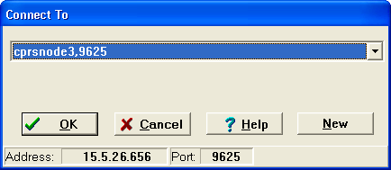
Connect To prompt
1.  The prompt for Personal Identity Verification (PIV) Personal Identification Number (PIN) displays. Enter your PIN code and press \<Enter\> or click OK. 
    Personal Identify Verification (PIV) PIN Prompt
1.  If the PIN prompt was bypassed by clicking Cancel, the VISTA Sign-on screen displays. If PIN was entered, skip to step 6.
Enter your Access Code, press Tab or click in the Verify Code field, enter your Verify Code, and press \<Enter\> or click OK. 
VistA login screen
##### Selecting a Prescriber to Edit

After logging in, the user needs to select a prescriber.
**To select a prescriber, use these steps:**
1.  Select the Select Provider button by either tabbing to the button and pressing \<Enter\> or click on the button.
1.  In the Look Up Utility dialog, select Find.
***

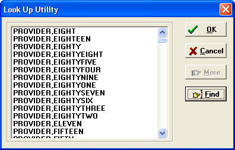
The Look Up Utility dialog lists the providers in the system. Users can scroll through the list or use the find button to search for a name.
***

1.  In the Find… dialog, type part or all of the prescriber’s name in the and select OK.
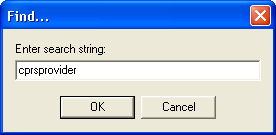
***

1.  If a list displays with multiple possible name, find the correct name, select it, and press \<Enter\> or click OK.
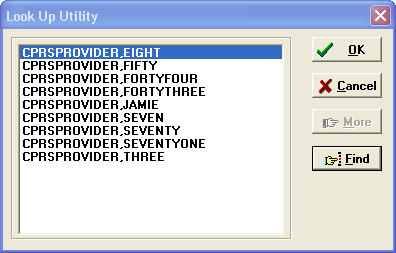
If there is more than one matching names in the system, the Look Up Utility displays a list of possible matches.
***

After the prescriber’s name is selected, the dialog displays any information that is available in VistA, such as in the screen capture below:
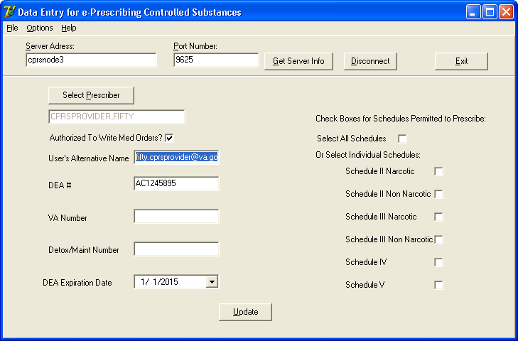
Once the user selects the prescriber to edit, the rest of the fields show information previously entered. The user can now edit this prescriber’s information.
##### Overview of Digital Signature Process

When an outpatient medication order is placed, CPRS uses an RPC call to a new Pharmacy Data Management (PDM) API to find out the drug’s exact Controlled Substance Federal Schedule type (1, 2, 2n, 3, 3n, 4, 5). For all orders for controlled substances except schedule 1, CPRS will store an indicator in the orders file to require a digital signature.
CPRS builds and stores an order’s external text. The following information is included in the external text as required by DEA:
-   Date of prescription
-   Full name and address of patient
-   Drug name
-   Drug strength (used in directions)
-   Drug dosage form (used in directions)
-   Drug quantity prescribed
-   Direction for use
-   Practitioner’s name
-   Practitioner’s address
-   Practitioner’s (DEA) registration number
-   Signature (in this case the digital signature of the physician)
***

When the clinician attempts to sign the orders, the normal electronic signature process within CPRS first takes place. Then, for Controlled Substance medication orders, the clinician must check the check box in from of each order to be signed and then insert the smart card (PIV card) if it is not already in the card reader and enter the PIN.
The above information is used to create a hash that is wrapped in a signed document and stored in VistA. CPRS stores the hash in the ORDERS ACTION subfile (100.008) of the ORDERS file (100). When pharmacy attempts to finish the order, it gathers the same information listed above and sends it to the PKISERVER.exe application running on an external server. PKISERVER.exe creates a hash based on that information and compares it to what is stored in VistA to see if the hashes match. If the hash values differ then the prescription cannot be filled.
In addition, the certificate that was used to sign the hash is checked to determine whether it has been revoked in the time between prescribing and being filled. If it has been revoked, the order cannot be filled.
###### User Messages for Possible Reasons the Digital Signature Failed

When CPRS tries to validate whether a provider can place or sign an order for controlled substances, several error messages that fall into four basic categories might be displayed to the user during the ordering or signature process:
-   invalid DEA number
-   not authorized to prescribe in Federal Schedule *x* (where *x* is the schedule number that the user is not authorized to write orders for)
-   expired DEA number
***

##### Notifications Sent to Users for Other Problems

For the following problems, CPRS sends a notification to the provider:
-   Hash mismatches (the pharmacist would see this error when the information from the original order and the information in pharmacy during finishing does not match exactly)
-   Revoked certificate
-   Expired certificate
##### Archiving Controlled Substances Prescription Data

When a provider writes an outpatient controlled substance medication order, CPRS will archive the information to file ORPA(101.52 – ORDER DEA ARCHIVE INFO FILE. This archive is required by the Drug Enforcement Agency (DEA) and will contain the prescription information from the time the order was signed. Pharmacy will run reports using data from this file.
**Warning**: Do NOT edit this file either manually or using Fileman. This data is to remain exactly as it was when the order was signed.
### Order Flagging and Unflagging Set Up

Order flagging and unflagging has some additional features that Clinical Application Coordinators (CACs) can configure using the GUI Order Flagging/Unflagging Setup menu.
To reach the GUI Order Flagging/Unflagging Setup menu, authorized users select the CPRS Configuration (Clin Coord) menu, then GUI Parameters – Miscellaneous, and then GUI Order Flagging/Unflagging Setup ... as shown below.
Select OPTION NAME: ORMGR CPRS Manager Menu
***

\<CPM\> Select CPRS Manager Menu \<\*\*CPRS32ASQA\*\*\> Option: PE CPRS Configuration (
Clin Coord)
***

\<CPM\> Select CPRS Configuration (Clin Coord) \<\*\*CPRS32ASQA\*\*\> Option: GP GUI Pa
rameters
***

CS GUI Cover Sheet Display Parameters ...
HS GUI Health Summary Types
TM GUI Tool Menu Items
MP GUI Parameters - Miscellaneous
UC GUI Clear Size & Position Settings for User
RE GUI Report Parameters ...
NV GUI Non-VA Med Statements/Reasons
EX GUI Expired Orders Search Hours
RM GUI Remove Button Enabled
NON GUI Remove Button Enabled for Non-OR Alerts
CLOZ GUI Edit Inpatient Clozapine Message
COAG GUI Anticoagulation Parameters ...
DEA GUI ePCS Management Menu ...
DST GUI Consults DST/CTB Configuration ...
EIE GUI Mark Allergy Entered in Error
OF GUI Order Flagging/Unflagging Setup ...
***

After selecting OF GUI Order Flagging/Unflagging Setup, the user will see four possible selections:
\<CPM\> Select GUI Parameters \<\*\*CPRS32ASQA\*\*\> Option: OF GUI Order Flagging/Unflagging Setup
***
REST Order Unflagging Restrictions
KEY Order Unflagging Key Setup
MESS Order Unflagging Message
EXP Order Flag Expire Default
***

#### Order Unflagging Restrictions

The Order Unflagging Restrictions option enables sites to turn unflagging restrictions ON or OFF at the Division or System level.
#### Order Unflagging Key Setup

The Order Unflagging Key Setup option enables sites to set unflagging by security key.
#### Order Unflagging Message

The Order Unflagging Restrictions option enables sites to include some additional text on the error message informing the user that they cannot remove the flag.
#### Order Flag Expire Default

The Order Flag Expire Default option enables sites to set the default time after which a flag will expire.
***

### Consults Order Dialog

#### Parameters

On the Consults tab, the “New Consult” button, as well as the “New…” menu option, can be linked to a specified order dialog, quick order, or order menu, resulting in behavior identical to ordering via the Orders tab. As exported, clicking on the button will display the generic consults ordering dialog. By changing the value of the parameter ORWDX NEW CONSULT, this default behavior can be modified and customized by SYSTEM, LOCATION, and USER.
This parameter cannot be directly changed using the GUI, and must be modified using the General Parameter Tools menu options. Any existing order dialog, quick order, or order menu can be assigned to the parameter, at any of the three levels. A common practice is to assign the same consults order menu to the button as is used on the Orders tab. This provides consistent functionality, and two ways to access the same lists of quick orders.
There is currently no available way to disable the button entirely. A common method of effectively disabling the buttons is to create an order menu consisting of only a text entry. That entry should advise the user that ordering is only available via the Orders tab. Assign that menu to the appropriate parameter, and the menu text will be displayed to the user when the button is selected.
#### Variables

The following variables, if set to a non-zero value in the entry action of either an order menu or an individual quick order, will cause the corresponding prompt to be disabled and not answerable in the GUI order dialog. If a particular quick order contains a conflicting value, the value stored in the quick order will take precedence.
-   GMRCNOPD Disables the “Provisional Diagnosis” prompt. If this variable is not set, logic in the consults package setup for the selected service will determine the behavior of this prompt.
-   GMRCNOAT Disables the “Attention:” prompt.
-   GMRCREAF Disables the “Reason for Request” edit box. If this variable is not set, logic in the consults package setup for the selected service will determine the behavior of this prompt.
***

#### Procedures Order Dialog

##### Parameters

On the Consults tab, the “New Procedure” button, as well as the “New…” menu option, (Action \| New) can be linked to a specified order dialog, quick order, or order menu, resulting in behavior identical to ordering via the Orders tab. As exported, clicking on the button will display the generic procedures ordering dialog. By changing the value of the parameter ORWDX NEW PROCEDURE, this default behavior can be modified and customized by SYSTEM, LOCATION, and USER.
This parameter cannot be directly changed using the GUI, and must be modified using the General Parameter Tools menu options. Any existing order dialog, quick order, or order menu can be assigned to the parameter, at any of the three levels. A common practice is to assign the same procedures order menu to the button as is used on the Orders tab. This provides consistent functionality, and two ways to access the same lists of quick orders.
There is currently no available way to disable the button entirely. A common method of effectively disabling the button is to create an order menu consisting of only a text entry. That entry should advise the user that ordering is only available via the Orders tab. Assign that menu to the parameter, and the menu text will be displayed to the user when the button is selected.
##### Variables

The following variables, if set to a non-zero value in the entry action of either an order menu or an individual quick order, will cause the corresponding prompt to be disabled and not answerable in the GUI order dialog. If a particular quick order contains a conflicting value, the value stored in the quick order will take precedence.
-   GMRCNOPD Disables the “Provisional Diagnosis” prompt. If this variable is not set, logic in the consults package setup for the service associated with the selected procedure will determine the behavior of this prompt.
-   GMRCNOAT Disables the “Attention:” prompt.
-   GMRCREAF Disables the “Reason for Request” edit box. If this variable is not set, logic in the consults package setup for the service associated with the selected procedure will determine the behavior of this prompt.
***

#### Lab Order Dialog
##### Parameters

All laboratory parameters used by the CPRS GUI are set via options in the Lab package, and not by editing the parameter values directly.
The value of the following parameters determines whether routine lab collections are performed on the corresponding day of the week. They can be set only at the SYSTEM level:
-   LR COLLECT MONDAY
-   LR COLLECT TUESDAY
-   LR COLLECT WEDNESDAY
-   LR COLLECT THURSDAY
-   LR COLLECT FRIDAY
-   LR COLLECT SATURDAY
-   LR COLLECT SUNDAY
***

If the parameter LR IGNORE HOLIDAYS is set to TRUE, also only possible at the SYSTEM level, then the lab at this site collects on holidays, and the holiday status of a date is ignored when determining routine collection times for that date.
If the parameter LR EXCEPTED LOCATIONS is set to TRUE for an ordering location, then weekend and holiday collection times are never skipped for that location. The same routine lab collection times are available on weekends and holidays for these locations as for any other day of the week.
The parameter LR PHLEBOTOMY COLLECTION is read to determine the routine lab collect times that will appear in the “Collection Time” combo box, and in the selection box on the calendar display window that appears if “Future” is selected as a Lab Collect time. On the “Future” calendar screen, only those routine lab collect times for the selected date are shown, and only those for that date which are not already beyond the defined cutoff time for each collection. The parameter’s value is set by DIVISION and SYSTEM, and is based on values in the LABORATORY SITE file (\#69.9).
The parameter LR DEFAULT TYPE QUICK determines the default collection type for the basic lab order dialog, and for quick orders where no collection type is otherwise defined, either by a dialog response, or by setting a value in the LRFZX variable (see below). This parameter is set by LOCATION.
The parameter LR MAX DAYS CONTINUOUS determines the total length of time that can be covered by the time span entered for a recurrent test. The response to the “How Long?” prompt is evaluated, either as a number of days or a number of times, and the total duration of the ordered test is compared against the parameter value to determine its validity. The parameter can be set by SYSTEM and LOCATION, and values can range from 1 to 370 days.
The parameter LR LAB COLLECT FUTURE defines how far in the future a lab-collected test can be ordered. The start date of the test cannot be further in the future than the number of days defined in the parameter. The parameter can be set by LOCATION, DIVISION, and SYSTEM, and values can range from 1 to 370 days.
##### Variables

The following variables, if set to a value in the entry action of either an order menu or an individual quick order, will cause the corresponding prompt to be pre-answered in the GUI order dialog. If set for a menu, all lab tests on that menu will be affected by the defined value. If a particular quick order contains a conflicting value, either as a dialog response or as an entry action redefinition of the variable, the value stored in the quick order will take precedence.
| LRFZX   | Defines the default collection type for the menu or quick order. Possible values include “LC”, “WC”, “SP”, or “I”. These correspond to “Lab Collect”, “Ward Collect”, “Send Patient to Lab”, and “Immediate Collect”, respectively. See discussion of parameter LR DEFAULT TYPE QUICK above. |
|---------|----------------------------------------------------------------------------------------------------------------------------------------------------------------------------------------------------------------------------------------------------------------------------------------------|
| LRFSAMP | Defines the default collection sample for the menu or quick order. The value is a pointer to the COLLECTION SAMPLE file (\#62).                                                                                                                                                              |
| LRFSPEC | Defines the default specimen for the menu or quick order. The value is a pointer to the TOPOGRAPHY FIELD file (\#61).                                                                                                                                                                        |
| LRFDATE | Defines the default collection date/time for the menu or quick order.                                                                                                                                                                                                                        |
| LRFURG  | Defines the default urgency for the menu or quick order. The value is a pointer to the URGENCY file (\#62.05).                                                                                                                                                                               |
| LRFSCH  | Defines the default schedule for the menu or quick order. The value is a pointer to the ADMINISTRATION SCHEDULE file (\#51.1).                                                                                                                                                               |

##### “Other” as a Choice for Collection Sample or Specimen

The “Other” selection for these items is available for any lab test with the "MI" (microbiology) subscript, for all users. Additionally, for users holding the LRLAB key, the “Other” selection is available for all lab tests, regardless of subscript.
##### Combining Lab Orders

When an order is sent to the Lab package an attempt is made to combine the request with any active Lab order number for the same:
-   Patient
-   Time
-   Collection Type
-   Specimen
-   Provider
***

The logic for combining orders is:
-   Don’t add to collected orders.
-   Don’t add if any part of the order is collected.
-   Don’t add to a combined order
-   Don’t add if collection types are different
-   If Collection type equals LC (Lab Collect):
-   Collection times must match exactly
If Collection type does not equal LC (is WC, SP, IM):

-   Collection times must be within 600 seconds (10 minutes) of each other
-   If the time is not exact (2980724), orders will be still be compared for 600 second limit
Don’t add if the order has been canceled
Duplicate tests (entered in the same session) are allowed to combine to the same lab order number only if the test specimens are different. Duplicate tests (entered in the same session), with the same test specimen get their own distinct lab order number.
Tests that are defined ‘not to combine’ will get their own unique Lab order number
Order is combined at the specimen level (\^LRO(69,LRODT,1,LRSN)) if the following match:
-   DUZ
-   Sample
-   Provider
-   Location
-   Specimen
***

Order is combined at Order number level (\^LRO(69,”C”,LRORD)) if the following match:

-   Sample
-   Specimen
***

##### Immediate Collect Issues

When ordering a lab test as “Immediate Collect”, there is a minimum lead time that is required by the lab, as defined in the Lab package. If the current time plus this minimum lead time is entered as the collect time for the order, it is possible that while making other selections on the order dialog, the minimum lead time originally selected will become insufficient as time passes. To prevent this from happening, the requested time is reevaluated on acceptance of the order, and is adjusted accordingly if the minimum required time has not been met.
##### Canceling Lab Orders

You should configure auto-DC rules to manage how lab orders are automatically discontinued. For more information, see the  [Automatically Discontinuing Orders (Auto-DC Rules)](#give-additional-dose-now-option-on-the-inpatient-medications-form) topic.
**Note**: Previously, automatic cancellation of lab orders was controlled by the CANCEL ON ADMIT, CANCEL ON DISCHARGE, and CANCEL ON SPECIALTY TRANSFER fields in the Laboratory Site File (\#69.9). It is recommended that you leave these fields null and use auto-DC rules.
***

#### Anatomic Pathology Order Dialog

Using the 'MN Enter/edit order menus' add the Anatomic Pathology order dialog (LR OTHER LAB AP TESTS) to the appropriate order menus for this dialog to be available in CPRS.
Select OPTION NAME: ORMGR CPRS Manager Menu
***
CL Clinician Menu ...
NM Nurse Menu ...
WC Ward Clerk Menu ...
PE CPRS Configuration (Clin Coord) ...
IR CPRS Configuration (IRM) ...
***
You have PENDING ALERTS
Enter "VA to jump to VIEW ALERTS option
***

\<CPM\> Select CPRS Manager Menu \<\*\*CPRS32ADEV\*\*\> Option: PE CPRS Configuration (
Clin Coord)
***
AL Allocate OE/RR Security Keys
KK Check for Multiple Keys
DC Edit DC Reasons
GP GUI Parameters ...
GA GUI Access - Tabs, RPL
MI Miscellaneous Parameters
NO Notification Mgmt Menu ...
OC Order Checking Mgmt Menu ...
MM Order Menu Management ...
LI Patient List Mgmt Menu ...
FP Print Formats
PR Print/Report Parameters ...
RE Release/Cancel Delayed Orders
US Unsigned orders search
EX Set Unsigned Orders View on Exit
NA Search orders by Nature or Status
CI Consults Clinically Indicated Date Default
DL Default Locations Administration
DO Event Delayed Orders Menu ...
LO Lapsed Orders search
PM Performance Monitor Report
UF Order Unflagging Setup
***

Press 'RETURN' to continue, '\^' to stop:
***
You have PENDING ALERTS
Enter "VA to jump to VIEW ALERTS option
***

\<CPM\> Select CPRS Configuration (Clin Coord) \<\*\*CPRS32ADEV\*\*\> Option: MM Order
Menu Management
***
OI Manage orderable items ...
PM Enter/edit prompts
GO Enter/edit generic orders
QO Enter/edit quick orders
QU Edit personal quick orders by user
ST Enter/edit order sets
AC Enter/edit actions
MN Enter/edit order menus
AO Assign Primary Order Menu
CP Convert protocols
SR Search/replace components
LM List Primary Order Menus
DS Disable/Enable order dialogs
CS Review Quick Orders for Inactive ICD9 Codes
MR Medication Quick Order Report
CA Quick Order Mixed-Case Report
CO Create Clinic Order QOs from Inpatient QOs
CV Convert IV Inpatient QO to Infusion QO
DF Quick Order Free-Text Report
FR IV Additive Frequency Utility
SP SUPPLY COVERSION UTILITY MENU ...
***
You have PENDING ALERTS
Enter "VA to jump to VIEW ALERTS option
***

\<CPM\> Select Order Menu Management \<\*\*CPRS32ADEV\*\*\> Option: MN Enter/edit order
menus
Select ORDER MENU: ZZJM
1 ZZJM TEST
2 ZZJM TEST ORDER SET
CHOOSE 1-2: 1 ZZJM TEST
***
***

Menu Editor Jan 08, 2021@13:03:49 Page: 1 of 3
Menu: ZZJM TEST Column Width: 26
\+1 2 3 4
\+23 Bed Rest / BRP 91 EKG: Portable
\|24 Ambulate TID 60 IMAGING ...
\|25 Up in Chair TID 61 Chest 2 views PA&LAT 99 Text Only Order
\|
\|
2
\|
\| Return To Clinic
\|
\|
\+ MAIN MENU
\| JM TEST 2
\|
\| JM TEST 4
\| JM TEST 3
3 JM TEST 5
\| ZZJMTEST 1
\+ + Next Screen - Prev Screen ?? More Actions \>\>\>
Menu Items Text or Header Row
***

Add: MENU Menu Items
ITEM: LR OTH
1 LR OTHER LAB AP TESTS
2 LR OTHER LAB TESTS
CHOOSE 1-2: 1 LR OTHER LAB AP TESTS
ROW: 20
COLUMN: 1
DISPLAY TEXT: Anatomic Pathology
MNEMONIC:
***

ITEM:
***

Rebuilding menu display ...
***
***

Menu Editor Jan 08, 2021@13:05:19 Page: 1 of 3
Menu: ZZJM TEST Column Width: 26
\+1 2 3 4
\+23 Bed Rest / BRP 91 EKG: Portable
\|24 Ambulate TID 60 IMAGING ...
\|25 Up in Chair TID 61 Chest 2 views PA&LAT 99 Text Only Order
\|
\|
2 Anatomic Pathology
\|
\| Return To Clinic
\|
\|
\+ MAIN MENU
\| JM TEST 2
\|
\| JM TEST 4
\| JM TEST 3
3 JM TEST 5
\| ZZJMTEST 1
\+ + Next Screen - Prev Screen ?? More Actions \>\>\>
Add ... Edit ... Assign to User(s) Select New Menu
Remove ... Toggle Display Order Dialogs ...
Select Action: Next Screen//
***
#### Imaging Order Dialog
##### Parameters

The parameter RA REQUIRE DETAILED controls whether restrictions are placed on imaging procedures orderable based on procedure type (possible procedure types are: Detailed, Series, Parent, Broad). If this parameter is set to “0”, users are allowed to order any imaging procedure regardless of type. If set to “1”, users are not allowed to select “Broad” type imaging procedures. These “Broad” procedures will not appear in the selection list. This parameter may be set by DIVISION and SYSTEM.
The parameter RA SUBMIT PROMPT controls whether the “Submit To:” combo box is enabled or disabled. The Imaging Location entered with the order determines where the Imaging Request form will print (IRM can assign each Imaging Location in the Radiology/Nuclear Medicine package a request printer). If this parameter is set to 0, the Imaging Request form will not be printed. If this parameter is set to 1, the system will first attempt to automatically determine the Imaging Location, enter it as the default in the combo box, and then disable the combo box. If the automatic attempt fails, then the combo box will be enabled. If there is more than one Imaging Location for the current imaging type (examples of imaging types selectable when ordering imaging procedures are Nuclear Med, Ultrasound, General Radiology, etc.), the automatic attempt will fail and the combo box will be enabled. If there is only one possible Imaging Location for the current imaging type, the system will automatically default to that location, and the combo box will be disabled. This parameter may be set by DIVISION and SYSTEM.
#### Allergies Dialog
##### Files Used for Lookup

A list of causative agents matching the search term entered by the user is returned from the following files:
-   GMR ALLERGIES (\#120.82)
-   Drug Ingredients (\#50.416)
-   VA Drug Class (\#50.605)
-   National Drug File (Generic Name)
-   National Drug File (Trade Name)
***

##### Top 10 Symptoms List

The top ten symptoms list is retrieved from the GMR ALLERGY SITE PARAMETERS file (\#120.84). These ten symptoms are presented at the top of the symptoms selection box, with the remaining available symptoms appearing below a separator line. These remaining items are retrieved from the SIGN/SYMPTOMS file (\#120.83).
## Notes Tab

### Criteria Used to Determine Notes Shown in List

The parameter ORCH CONTEXT NOTES contains information used to limit or customize the list of notes displayed to the user. This parameter is used by both the CPRS GUI and List Manager versions. It can be set by SYSTEM and by USER. The parameter’s value is a semicolon-delimited string, the pieces of which contain the following:
a;b;c;d;e;f;g;h;I;j;k;l Example: **T-90;T;1;1329;20;1;A;1;1;T;B;test**
***

a Begin date
b End date
c Status (pointer to the TIU STATUS file (\#8925.6))
d Author (pointer to the NEW PERSON file (\#200))
e Occurrence Limit - The number of notes actually shown by default is determined by using the Occurrence Limit from the parameter, and then, if not present, the NUMBER OF NOTES ON REV SCREEN from TIU preferences (see below).
f If present and non-zero, show subject in notes list.
g Sort notes in list view by visit date (D), author (A), title (T), location (L), or subject (s).
h If present and non-zero, sort tree view chronologically, otherwise reverse chronologically.
i If present and non-zero, sort list view chronologically, otherwise reverse chronologically.
j Group notes in tree view by visit date (D), author (A), title (T), or location (L).
k Field to search for keyword in (l). Subject (S), Title (T), or Both (B).
l Keyword to search for in fields defined in (k).
***

The user-level value for this parameter can be set using the “Custom View” menu and saving the selected options as the default.
***

### TIU Personal Preferences Menu

Items in **bold** are used by the GUI:
| **DEFAULT LOCATION**               | Can also be set by day of week.                                                                                                 |
|------------------------------------|---------------------------------------------------------------------------------------------------------------------------------|
| REVIEW SCREEN SORT FIELD           | Not used.                                                                                                                       |
| **REVIEW SCREEN SORT ORDER**       | Ascending or descending, by date.                                                                                               |
| DISPLAY MENUS                      | Not used.                                                                                                                       |
| PATIENT SELECTION PREFERENCE       | Not used.                                                                                                                       |
| ASK ‘Save changes?’ AFTER EDIT     | Not used.                                                                                                                       |
| **ASK SUBJECT FOR PROGRESS NOTES** | When entering a new progress note, should the edit box for entering a subject be displayed to the user?                         |
| **NUMBER OF NOTES ON REV SCREEN**  | If the parameter ORCH CONTEXT NOTES does not contain a value for Occurrence Limit, as described above, this value will be used. |
| SUPPRESS REVIEW NOTES PROMPT       | Not used.                                                                                                                       |
|  Select DAY OF WEEK                | Not used.                                                                                                                       |

### Document List Management

Also available from the TIU PERSONAL PREFERENCES menu is an option called DOCUMENT LIST MANAGEMENT. This option allows a user to select a default document title and to create personal lists of commonly used titles.
The first option allows the creation of a default title for a given document class. Within each document class (Progress Notes, Consults, Discharge Summary, etc) it is possible for a user to select a default title that will be pre-selected whenever creating a new document of that class. If there is a default title for the user, and all other information necessary to create the note is already present, the note properties dialog will be bypassed, and the note editor will appear immediately on clicking the “New Note” button or menu item. This behavior can be changed using the parameter ORWOR VERIFY NOTE TITLE. This parameter is only used in the GUI, and can be set by USER, DIVISION, and SYSTEM. If set to TRUE, the note properties dialog will always display, regardless of the presence of a default title for the user. The default title will be pre-selected in the title list, but the user will be required to click OK to exit the dialog, thereby verifying that the default title is the correct one to be used.
The second option allows the creation of personal title lists. When creating a new note belonging to a given class, the user will be asked to select a title belonging to that class. On the Notes tab, the class is usually PROGRESS NOTES, while on the Consults tab it is CONSULTS. On the Discharge Summary tab, it is DISCHARGE SUMMARY. For any particular class, it may be useful to only have to choose from among a few highly specific titles (e.g., a pulmonologist entering a Progress Note may wish to choose from a short list of three or four titles related to pulmonary function, or pulmonary disease). Rather than presenting a list of hundreds of unrelated titles, the list named and defined here will be presented at the very top of the list of titles. In the event that a title is needed which doesn’t appear on this short list, the remaining available titles are listed below the short list, separated by a horizontal bar.
***

### Consult Completion Via the Notes Tab

If a CONSULTS class document title is selected when creating a new note, a list of consults is presented for linking to the note. A document in this class requires linking to a consult request during creation of the document. Consults are included in the selection list if:
-   They were ordered within the number of days specified by the parameter GMRC CONSULT LIST DAYS. This parameter is used to allow a site to set the number of days that will be searched backwards for a Consult to be associated with a Note. A default parameter of 365 days will be set at the Package Level.
-   The user can complete the consult based on his/her access level to the service of the consult, as determined via settings in the Consults package.
-   The consult’s status allows completion via a TIU note.
### Autosaving Parameter

The parameter ORWOR AUTOSAVE NOTE allows setting of the time interval at which notes in progress will be automatically saved to the V*ist*A server. Its value can be set by SYSTEM and USER, and contains the number of seconds between successive auto-saves. The exported value is 180 seconds (every 3 minutes). Local system performance issues may affect the optimum value for a given site or user.
### Spell Checking

With the CPRS GUI, it is possible to do a spelling check of TIU documents, provided MS Word has been installed on the workstation, and spelling is enabled. CPRS uses the same dictionaries and settings as are in effect for MS Word.
These nine files have been made available as the CPRS Spelling Dictionary supplement:
-   CPRSlex-ab.dic
-   CPRSlex-c.dic
-   CPRSlex-caps.dic
-   CPRSlex-de.dic
-   CPRSlex-fh.dic
-   CPRSlex-ilwz.dic
-   CPRSlex-mo.dic
-   CPRSlex-pr.dic
-   CPRSlex-sv.dic
***

These files contain about 50,000 words from the VistA Lexicon. They are one way to provide medical words for CPRS to check. Local use of them is optional, and does not supersede other methods of providing a medical vocabulary.
You may download dictionary files from the CPRS National Development website at
<https://vaww.va.gov/cprs/cprs_spellcheck_files.asp>
and then clicking on *Spellcheck zip file*.
To use these files:
1.  Save the files into the *\\Program Files\\Common Files\\Microsoft Shared\\Proof\\* directory or whichever Windows directory holds the files with “.lex” and “.dic” extensions.
1.  From Word for Windows, select **Tools \| Options…**
1.  Select the Spelling & Grammar tab.
1.  Click the **Dictionaries…** button. The nine dictionary files are listed in the Custom dictionaries window.
1.  Make sure all nine files names have a check beside them.
1.  Click **OK** until all dialogs are closed.
Also, while on the Spelling & Grammar tab, make sure that the following items are checked:
-   Check spelling as you type
-   Always suggest corrections
***

Ignore Internet and file addresses, and be sure that the following items are NOT checked:
-   Hide spelling error in this document
-   Suggest from main dictionary only
-   Ignore words in UPPERCASE
-   Ignore words with numbers
***

To Use the spelling checker in the CPRS GUI, create a TIU document. Position the cursor at the beginning of the TIU document. Right click in the document and choose Check Spelling. The Spell Checker feature in Microsoft Word will be activated, and will operate exactly as it does in Word.
***

### Additional Documentation

For additional information related to the implementation of business rules, user classes, the Authorization/Subscription Utility (ASU), creation and use of boilerplate text, and TIU objects, please consult the documentation already available for the Text Integration Utility (TIU) and ASU packages.
### Populating the Encounter Forms

The Encounter Form is populated from AICS Encounter Forms on file for each location, and from the current patient record.
CPRS relies on the existence of well-formed AICS forms for each location. Data is retrieved from the form for the currently selected location to fill in the information in the top half of the encounter form. Eight of the 10 tabs shown across the top of the Windows form reflect the contents of this AICS form.
The GAF tab will appear when the currently selected location is a mental health clinic. The current criteria for this determination is a stop code that starts with a “5”, excluding the following codes: 526, 527, 528, 530, 536, 537, 542, 546, 579.
Vitals tab is entirely populated from the patient record.
Visit Type, Diagnosis, Procedures, Immunizations, Skin Tests, Patient Education, Health Factors, and Exams each correspond to a TYPE OF DATA used to populate lists in the AICS encounter form.
The following TYPE OF DATA values create entries that appear in the GUI Encounter Form:
| TYPE OF DATA Name                | Associated Tab |
|----------------------------------|----------------|
| SELECT VISIT TYPE CPT PROCEDURES | Visit Type     |
| SELECT ICD-9 DIAGNOSIS CODES     | Diagnosis      |
| SELECT CPT PROCEDURE CODES       | Procedures     |
| SELECT IMMUNIZATIONS             | Immunizations  |
| SELECT SKIN TESTS                | Skin Tests     |
| SELECT EDUCATION TOPICS          | Patient Ed     |
| SELECT HEALTH FACTORS            | Health Factors |
| SELECT EXAMS                     | Exams          |
All other TYPE OF DATA values have no effect on the GUI Encounter Form.
***

If the associated TYPE OF DATA is missing from the Encounter Form, then that tab is not populated.
The TYPE OF DATA is selected while defining a new list while using the ED (Edit Form) option of the Edit Encounter Forms menu as in the following example:
EDITING A FORM BLOCK Sep 00, 2000 00:00:00 Page: 1 of 2 •
1 2 3 4 5 6 7
123456789 123456789 123456789 123456789 123456789 123456789 123456789 123456
1 \___________________________________________________________________________\_
2 \| PROCEDURES
3 \| Pulmonary Function Tests \|
4 \| [ ] Breathing Capacity Test 94010 \|
5 \| [ ] Evaluation of Wheezing 94060 \|
6 \| [ ] Vital Capacity Test 94150 \|
7 \| [ ] Lung Function Test (MBC/MVV) 94200 \|
8 \| [ ] Measure Airflow Resistance 94360 \|
9 \| [ ] Pulmonary Compliance Study 94750 \|
10 \| \|
11 \| Blood gases: \|
12 \| [ ] Ph 82800 \|
13 \| [ ] PO2/PCO2 82803 \|
14 \| \|
15 \|\| CPT MODIFIERS DISPLAY \| \|
\+ Enter ?? for more actions
EH Header/Descr/Outline LN Straight Line SD Save/Discard Changes
BS Block Size TA Text Area Edit Form
LT List SH Shift Contents
DF Data Field VD View w/wo Data (Toggle)
Select Action: Next Screen// **LT** List
***

EDITING A FORM BLOCK Sep 07, 2000 08:34:58 Page: 1 of 2 •
1 2 3 4 5 6 7
123456789 123456789 123456789 123456789 123456789 123456789 123456789 123456
1 \___________________________________________________________________________\_
2 \| PROCEDURES
3 \| Pulmonary Function Tests \|
4 \| [ ] Breathing Capacity Test 94010 \|
5 \| [ ] Evaluation of Wheezing 94060 \|
6 \| [ ] Vital Capacity Test 94150 \|
7 \| [ ] Lung Function Test (MBC/MVV) 94200 \|
8 \| [ ] Measure Airflow Resisitance 94360 \|
9 \| [ ] Pulmonary Compliance Study 94750 \|
10 \| \|
11 \| Blood gases: \|
12 \| [ ] Ph 82800 \|
13 \| [ ] PO2/PCO2 82803 \|
14 \| \|
15 \|\| CPT MODIFIERS DISPLAY \| \|
\+ Enter ?? for more actions \>\>\>
***

You can create a [N]ew list, edit its [A]ppearance, [D]elete it,
edit its [Co]ntents, [P]osition or size its columns. Choose from:
[N]ew [A]ppearance [D]elete [C]ontents [P]osition: C// **N** NEW
Select the TYPE OF DATA that the list will contain:
***

Valid choices for the TYPE OF DATA include:
-   SELECT VISIT TYPE CPT PROCEDURES
-   SELECT ICD-9 DIAGNOSIS CODES
-   SELECT CPT PROCEDURE CODES
-   SELECT IMMUNIZATIONS
-   SELECT SKIN TESTS
-   SELECT EDUCATION TOPICS
-   SELECT HEALTH FACTORS
-   SELECT EXAMS
***

For example, the Procedures tab is populated from a list with the TYPE OF DATA set to SELECT CPT PROCEDURE CODES as follows:
***

The items in the first pane correspond to groups within each list.
The items in the Section Name pane correspond to selections within the group that is currently selected. In the Visit Type tab, this pane takes on the name of the section selected.
Only one tab has a Modifiers pane, the Procedures tab. The Modifiers pane is populated with appropriate modifiers based on selections in the Section Name pane. Pre-check modifiers are specified while editing the encounter form. Responding to the CPT MODIFIER prompt in the Add or Edit Selection command does this. This is only applicable while filling in the group contents of lists with TYPE OF DATA set to SELECT CPT PROCEDURE CODES.
***

### Encounter Parameters

#### Prompting for encounter Entry When Signing a Note

Users are never asked to enter encounter information if:
1.  The encounter date is for a date in the future.
1.  The encounter location is a non-count clinic.
1.  The encounter is for a scheduled appointment and that appointment has been canceled or is a no-show.
If none of the above conditions apply, the ORWPCE ASK ENCOUNTER UPDATE parameter determines when encounter information should be requested when signing a note. To fully understand this parameter, the user needs to understand how CPRS interprets the terms “Primary” and “Data Needed.”
##### Primary

Is the current user the primary provider for this encounter? If no primary encounter provider has been determined, CPRS attempts to identify one. All possible sources of encounter providers are filtered based on active person class, unless associated with a historical visit. The steps taken in identifying a possible primary encounter provider are (in order):
1.  Look at the value of the TIU parameter DEFAULT PRIMARY PROVIDER. This parameter has three possible settings:
-   NONE, DON’T PROMPT
-   DEFAULT, BY LOCATION
-   AUTHOR (IF PROVIDER)
***

1.  If this parameter is set to 1, a possible primary provider is identified as the default provider assigned to the given encounter location. This is determined by looking at the DEFAULT PROVIDER field (sub field \#.02) of the PROVIDER multiple (Field \#2600) of the HOSPITAL LOCATION file (\#44). If the current user is the primary encounter provider for the given location, that user is automatically assigned as the primary encounter provider.
1.  If there is still no primary encounter provider defined, CPRS looks at the provider identified with the primary CPRS visit. This is the same provider shown with the current visit, in the patient information bar. If this provider does not have an active person class, or has not been defined, the current user is substituted (provided they have an active person class). CPRS then asks if this user is the primary encounter provider.
1.  If there is still no primary encounter provider defined, the TIU parameter DEFAULT PRIMARY PROVIDER is again reviewed. If a provider is identified, either from the encounter location or the author, the user is asked if this individual is the primary encounter provider.
##### Data Needed

The ORWPCE ASK ENCOUNTER UPDATE parameter uses the term “Data Needed” to represent the fact the PCE data has been requested for the given note title. This is determined by looking at the following criteria:
1.  If the date of the encounter is in the future, no PCE data is needed.
1.  If the service category is not “A” (Ambulatory), “I” (In Hospital), or “T” (Telecommunications), no PCE data is needed.
1.  If the title specific TIU document parameter SUPPRESS DX/CPT ON ENTRY is set to YES, no PCE data is needed.
1.  If the encounter is a stand-alone visit, PCE data is needed.
1.  If the title specific TIU document parameter ASK DX/CPT ON ALL OPT VISITS is set to YES, PCE data is needed.
1.  Otherwise, PCE data is not needed.
1.  If it is determined that PCE data is needed for a given encounter, existing PCE entries are examined to determine exactly what is missing. A diagnosis and procedure are always required. Service connected information is required if the title specific TIU document parameter FORCE RESPONSE TO EXPOSURES is set to YES. If all needed data has already been entered, PCE data is not needed for the encounter.
##### Signing the Note

The ORWPCE ASK ENCOUNTER UPDATE parameter can be set at the user, location, service, division and system levels. When signing a note, this parameter is used to determine if the user should be prompted to enter encounter information, based on one of the possible settings:
0 Primary/Data Needed (Default Setting) - The user will be asked to enter encounter information if they are the primary encounter provider, and if data is needed for the encounter.
1 Primary/Outpatient - The user will be asked to enter encounter information if they are the primary encounter provider, and the service category is “A” (Ambulatory), “I” (In Hospital), or “T” (Telecommunications).
2 Primary Always - The user will be asked to enter encounter information on all encounters, if they are the primary encounter provider.
3 Data Needed - All users will be asked to enter encounter information if data is needed for the encounter.
4 Outpatient - All users will be asked to enter encounter information, if the service category is “A” (Ambulatory), “I” (In Hospital), or “T” (Telecommunications).
5 Always - All users will be asked to enter encounter information on all encounters.
6 Never – The user will never be asked to enter encounter information when signing the note.
7 Disable - The user will never be asked to enter encounter information when signing the note, and the encounter button will be disabled, even when a note is being edited.
##### Forcing PCE Entry

Once it has been determined that the user should be asked to enter encounter information, a dialog box is displayed, specifying any missing encounter data. If data is not needed, or if the user is not the primary encounter provider, the user will be given “Yes” and “No” buttons that can be used to determine if they want to enter encounter information. Pressing the “Yes” button will allow encounter information to be entered, followed by a continuation of the note signing process. Pressing the “No” button will bypass entry of encounter information, going directly to a continuation of the note signing process.
When data is needed, and the user is the primary encounter provider, the ORWPCE FORCE PCE ENTRY parameter will be checked to determine if the user must fill out all missing encounter information before being allowed to sign the note. If this parameter is set to YES, the user will be prompted “You must enter the encounter information before you can sign the note”, and given “OK” and “Cancel” buttons. Pressing the “Cancel” button will terminate the note signing process, resulting in an unsigned note (the user will be warned that the note was not signed). If this parameter is set to NO, the user will be asked if they want to enter encounter information, and will be given “Yes”, “No” and “Cancel” buttons. Again, pressing the “Cancel” button will terminate the note signing process, resulting in an unsigned note. Pressing the “No” button will allow the note to be signed.
When data is needed, the user is the primary encounter provider, and they go on to enter encounter information, continued checks will be made when exiting the encounter form to determine if there is any missing encounter data. If all missing information has been entered, the user will continue on with the note signing process. If there is missing encounter information, the user will continue to be prompted to enter it, regardless of the ORWPCE FORCE PCE ENTRY setting.
#### Availability of the Encounter Button

The ORWPCE ANYTIME ENCOUNTERS parameter allows encounter entry even when a note is not being edited. This allows for encounter entry for dictated notes, as well as updating encounters for notes that have already been signed. This parameter can be set at the User, Service, Division, and System levels. When set, the encounter button will appear on the Notes tab just above the New Note button. When pressing the encounter button (and no note is being edited) the user may be asked to specify the encounter to edit, either an encounter associated with the current visit, or the encounter associated with the currently selected note.
#### Managing Encounter Checkout

The default behavior of any encounter entered through the CPRS GUI is to automatically check out the encounter. Many sites have a workflow environment where this behavior is problematic. By setting the ORWPCE DISABLE AUTO CHECKOUT parameter to yes, encounters entered through the CPRS GUI will only check out if the encounter has a diagnosis, procedure or provider specified for the encounter. Other encounter entries, such as those containing only health factors or education topics, will not check out. With this parameter set, users will not be asked to enter a primary encounter provider when saving encounter information if there is no diagnosis, procedure or provider specified for that encounter. The ORWPCE DISABLE AUTO CHECKOUT parameter can be set at the User, Location, Service, Division, and System levels.
***
#### Restricting Encounter Form Entry of Encounter Data

Some types of encounter data can be restricted from entry within the encounter form. This may be needed when specific encounter information should only be entered through reminder dialogs. There are five parameters that allow specific encounter information to be excluded from the “Other” buttons on the encounter form tabs. These parameters are
-   ORWPCE EXCLUDE IMMUNIZATIONS
-   ORWPCE EXCLUDE SKIN TESTS
-   ORWPCE EXCLUDE PATIENT ED
-   ORWPCE EXCLUDE HEALTH FACTORS
-   ORWPCE EXCLUDE EXAMS
***

These multi-valued parameters can all be set at the User, Location, Service, Division, and System levels.
#### Forcing Type of Visit Selection

Normally, when first entering the Visit Type tab of the encounter form, the first Type of Visit defined for that encounter location is automatically selected. For some clinics that see a wide variety of different patient types, this behavior leads to user error where the wrong type of visit is selected. The ORWPCE DISABLE AUTO VISIT TYPE parameter can be set to force the selection of a Type of Visit before allowing selection of an E&M code.
***

### Women’s Health Note Document Class

For Women’s Health Notes, there must be a Women’s Health Note document class created in TIU for use in CPRS. Sites should verify if this Document Class exists. This document class should have been created before the CPRS v31b installation.
If it does not exist on your system, you must create the document class. The name of the document class should be WOMEN’S HEALTH NOTES document class. The instructions for creating the document class are given below or users can find the information for creating a document class in the Text Integration Utilities (TIU).
If the WOMEN’S HEALTH NOTES document class does not exist at your site, use these steps to create it:
1.  In VistA, go to the **TIU IRM MAINTENANCE MENU**.
1.  Select **2 Document Definitions (Manager) …** and press \<Enter\>.
1.  Select **3 Create Document Definitions…** and press \<Enter\>.
1.  Select the Class under which you will place the new Document Class and press \<Enter\>.
1.  At the Select Action prompt, select type CL (Class/DocumentClass) and press \<Enter\>.
1.  When prompted, type **Women’s Health Notes** for the new document class and press \<Enter\>.
1.  At the Clincal Owner prompt, select the appropriate owner and press \<Enter\>.
1.  At the STATUS prompt, press \<Enter\>.
1.  At the SEQUENCE prompt, type the appropriate sequence number and press \<Enter\>.
1.  At the MNEMONIC prompt, type a mnemonic if desired and press \<Enter\>.
1.  At the MENU TEXT prompt, where it displays Women's Health Notes Replace, press \<Enter\>.
***

Below is an example of creating the WOMEN’S HEALTH NOTES document class. In this example, the new class is created under the PROGRESS NOTES class. The site may choose to place the new class underneath a different class; it does not matter where in the document hierarchy the WOMEN’S HEALTH NOTES document class exists.
This is a TEST account.
***

Terminal Type set to: C-VT320
***

Select OPTION NAME: TIU IRM MAINTENANCE MENU TIU Maintenance Menu
***
1 TIU Parameters Menu ...
2 Document Definitions (Manager) ...
3 User Class Management ...
4 TIU Template Mgmt Functions ...
5 TIU Alert Tools
6 Active Title Cleanup Report
7 TIUHL7 Message Manager
8 Title Mapping Utilities ...
9 Text Event Edit
10 Unauthorized Abbreviations (Enter/Edit)
11 List Unauthorized Abbreviations
13 Contingency Downtime Bookmark Progress Notes
***

\<CPM\> Select TIU Maintenance Menu \<ONEBCE\> Option: 2 Document Definitions (Manager)
***
***
***

\--- Manager Document Definition Menu ---
***
1 Edit Document Definitions
2 Sort Document Definitions
3 Create Document Definitions
4 Create Objects
5 Create TIU/Health Summary Objects
6 Create Post-Signature Alerts
***

\<CPM\> Select Document Definitions (Manager) \<ONEBCE\> Option: 3 Create Document
Definitions.........
***
Class/DocumentClass Next Level Detailed Display/Edit
**Create Document Definitions** Nov 16, 2018@07:18:49 Page: 1 of 1
BASICS
***

Type Name
1 **CLINICAL DOCUMENTS** CL
2 PROGRESS NOTES CL
3 ADDENDUM DC
4 DISCHARGE SUMMARY CL
5 CLINICAL PROCEDURES CL
6 SURGICAL REPORTS CL
7 LR LABORATORY REPORTS CL
***
***
***
New Users, Please Enter '?NEW' for Help \>\>\>
(Title) Restart Status...
(Component) Boilerplate Text Delete
Select Action: Next Level// Next Level
Select CLINICAL DOCUMENTS Item (Line 2-7): 2..................................
..........................................................
***

**Create Document Definitions** Nov 16, 2018@07:18:54 Page: 1 of 4
BASICS
***

Name Type
1 CLINICAL DOCUMENTS CL
2 **PROGRESS NOTES** CL
3 ADVANCE DIRECTIVE DC
4 HISTORICAL TITLES DC
5 CRISIS NOTE DC
6 CLINICAL WARNING DC
7 ADVERSE REACTION/ALLERGY DC
8 ADDICTION SEVERITY INDEX DC
9 BLIND REHABILITATION SERVICE DC
10 NURSING TITLES DC
11 ADMISSION ASSESSMENT DC
12 IRMFO TITLES DC
13 SURGERY DC
14 DISCHARGE DC
\+ ?Help \>ScrollRight PS/PL PrintScrn/List +/- \>\>\>
Class/DocumentClass Next Level Detailed Display/Edit
(Title) Restart Status...
(Component) Boilerplate Text Delete
Select Action: Next Screen// CLASS Class/DocumentClass
Enter the Name of a new PROGRESS NOTES: WOMEN'S HEALTH NOTES
TYPE: (CL/DC): DC DOCUMENT CLASS
CLASS OWNER: CLINICAL COORDINATOR// CLINICAL COORDINATOR
STATUS: (A/I): INACTIVE// A ACTIVE Entry Activated.
***

SEQUENCE:
MNEMONIC:
MENU TEXT: Women's Health Notes Replace
***

Entry Created
### Templates – Access, Storage and Maintenance

The Options menu of the Notes, Consults, and Discharge Summary tabs contains several menu items:
-   Edit Templates
-   Create New Template
-   Edit Shared Templates
-   Create New Shared Template
-   Edit Template Fields (discussed in the next section)
***

Although each of the first four menu items starts the Template Editor, not all of these menu options may be enabled.
#### Shared Template Editor Authority

Edit Shared Templates and Create New Shared Template are enabled for members of the CLINICAL COORDINATOR ASU user class. There is a way for sites to open up the editing of shared templates to users outside the CLINICAL COORDINATOR user class (perhaps creating a SHARED TEMPLATE EDITOR user class), but FileMan access is required. To do this, edit the Shared Templates entry in the TIU TEMPLATE file (\#8927). This should be the first item in the file (IEN \#1), but if, for some reason, it is not item \#1, look in the AROOT cross-reference, under the “ROOT” entry, for the Shared Templates IEN. For example:
**\^TIU(8927,”AROOT”,”ROOT”,1)**
The 1 here indicates IEN 1 is the Shared Templates folder.
Using FileMan, modify the value of the EDITOR CLASS field (.07) to point to the ASU user class allowed to edit shared templates. For example:
VA FileMan 22.0
Select OPTION: ENTER OR EDIT FILE ENTRIES
INPUT TO WHAT FILE: TIU TEMPLATE// 8927 TIU TEMPLATE (311 entries)
EDIT WHICH FIELD: ALL// .07 EDITOR CLASS
THEN EDIT FIELD:
Select TIU TEMPLATE NAME: ‘1 Shared Templates
EDITOR CLASS: CLINICAL COORDINATOR// SHARED TEMPLATE EDITOR
Select TIU TEMPLATE NAME:
#### Personal Template Editor and Use Authority

The Edit Templates and Create New Template menu items are always enabled for those authorized to edit shared templates. For other users, two TIU parameters determine personal template access. These parameters must be set using the XPAR EDIT PARAMETER option. For both of these parameters, valid settings are:
-   0 FULL ACCESS
-   1 READ ONLY
-   2 NO ACCESS
***

FULL ACCESS allows users to create and use their own personal templates (this is the default setting).
READ ONLY access allows the use of personal templates - i.e. any personal templates appear in the templates drawer, but editing personal templates is not allowed. This is in preparation for when Clinical Coordinators can modify user’s personal templates.
NO ACCESS prevents users from editing templates, or using personal templates. Shared templates can still be used (but not edited).
The parameters are:
-   TIU PERSONAL TEMPLATE ACCESS parameter can be set by User, Location, Service, Division, or System.
-   TIU TEMPLATE ACCESS BY CLASS parameter can hold ASU user classes.
***

Note that these two parameters work together, in the following precedence order:
| **Precedence** | **Parameter**                |
|----------------|------------------------------|
| USER           | TIU PERSONAL TEMPLATE ACCESS |
| USER CLASS     | TIU TEMPLATE ACCESS BY CLASS |
| LOCATION       | TIU PERSONAL TEMPLATE ACCESS |
| SERVICE        | TIU PERSONAL TEMPLATE ACCESS |
| DIVISION       | TIU PERSONAL TEMPLATE ACCESS |
| SYSTEM         | TIU PERSONAL TEMPLATE ACCESS |
There are two other places within the CPRS GUI where personal templates can be created or edited:
1.  When right clicking on a template in the templates drawer, menu items of Edit Templates and Create New Template are available. These menu items are only enabled for users with the authority to edit and create personal templates.
1.  When right clicking on a note, a popup menu appears with an option to Copy into New Template. This option will create a new personal template, and copy selected text into that template’s boilerplate. This menu option is only enabled when text has been selected in the note, and only for users with the authority to edit and create personal templates.
***

### Template Links to Reminder Dialogs

Reminder dialogs (not reminders) can be linked to templates, so that a reminder dialog can be selected from the templates drawer (reminder specific text will not be inserted into the note when the Finish button is pressed). This allows templates to create orders, enter encounter data, vitals, and do everything else that a reminder dialog can do. When a template is defined as a reminder dialog type, a list of reminder dialogs contained in the TIU TEMPLATE REMINDER DIALOGS parameter is then available in the template editor that can be linked to that reminder dialog. This multiple valued parameter can be set at the User, Service, Division, and System levels. Unlike most other parameters, this parameter is cumulative, in that reminder dialogs specified at any level can be linked to a template.
***

### Restricting Allowed Patient Data Objects within Templates

Clinical Application Coordinators can control which patient data objects are available in the templates drawer by inactivating or deleting undesired entries in the shared Patient Data Objects folder. Users that are allowed to create personal templates, however, have access to all active patient data objects. The TIU TEMPLATE PERSONAL OBJECTS parameter can be used to limit the patient data objects available in the template editor for users that cannot create shared templates. Only those objects specified in this parameter will appear in the Insert Patient Data Objects dialog of the template editor. If this parameter is blank, all patient data objects will be available. Note that this parameter is cumulative, in that entries at the User, Service, Division and System levels will all be available to the end user.
***

### Template Import/Export Utility

Following are several items of interest about the Template Import/Export utility available from the tools menu of the template editor:
-   Requires Internet Explorer version 5.0 or higher installed on the workstation.
-   Templates are imported at the location of the currently selected template, as if the New Template button had been pressed.
-   When exporting a template, all children templates are also exported, meaning that the entire Shared Templates or My Templates folders can be exported as a single file.
-   If the workstation has Microsoft Word 97 or higher installed, Word documents can be imported and converted to templates. Form Fields in a word document are converted to Template Fields, but there are usually formatting problems with the final result that need manual correction.
-   Template Fields in a template are exported with the template.
-   Patient Data Objects in a template are not exported with the template.
-   When importing a template that contains template fields, any existing template fields with the same name are compared with the fields being imported. If the field definitions differ, the imported fields are renamed (along with the field references in the imported template boilerplate).
-   Imported Template Fields are automatically saved after import, even if the imported template is not saved.
***

### Template Fields

The Options menu of the Notes, Consults, and Discharge Summary tabs contains one additional menu item, Edit Template Fields. This menu option is enabled based on the user classes entered in the TIU FIELD EDITOR CLASSES parameter. This multi-valued parameter contains a list of ASU user classes, and can be set at the User, Service, Division and System levels. Users that are members of a user class specified in this parameter are allowed to edit template fields through this menu option. Other users will see this menu option disabled.
If you do not have authorization to edit template fields, you may see this dialog.


The template field warning dialog.

If you press **OK**, the template will be imported without the new fields. If you press **Cancel**, the import process will be cancelled.
***
### Quick Order Auditing Templates

The OR Quick Order Audit Print option provides information about antimicrobial quick order usage. This report uses a Print template and a Sort template, both of which are named [OR QUICK ORDER AUDIT REPORT]. The templates are used to display information from the QUICK ORDER AUDIT file (100.95). Both templates have the same name. The following provides information about the templates so that they can be modified or rebuilt as necessary by each site using the OR Quick Order Audit Print option.
**Print Template:**  OR QUICK ORDER AUDIT REPORT for the QUICK ORDER AUDIT file (\#100.95)
Select PRINT TEMPLATE: ORQOA AUDIT PRINT REPORT
(JAN 09, 2018@10:57) User \#520736441 File \#100.95
Another one:
Standard Captioned Output? Yes// (Yes)
Include COMPUTED fields: (N/Y/R/B): NO// BOTH Computed Fields and Record Number (IEN)
***

NUMBER: 5727 NAME: ORQOA AUDIT PRINT REPORT
DATE CREATED: JAN 09, 2018@10:57 READ ACCESS: @
FILE: QUICK ORDER AUDIT USER \#: 520736441
WRITE ACCESS: @ DATE LAST USED: JAN 09, 2018
LANGUAGE OF HEADING: ENGLISH
HEADER (c): QUICK ORDER AUDIT PRINT: An order \# appears if the order is processed.
PRINT FIELDS (c): "QUICK ORDER: "_QUICK ORDER;C1;S
: "PID: "_\$P(PATIENT,",",1)_"("_LAST4_")";C1
: "ORDER \#: "_ORDER;C1
: "USER: "_USER;C30
: DATE TIME;C55
: "CONFIRMATION \#: "_NUMBER;C1
: "PROVIDER: "_PROVIDER;C30
: "ORDER TYPE: "_TYPE;C1
: "DRUG: "_DRUG;C30
: "LOCATION: "_LOCATION;C1
COMPILED (c): NO
BUILD(S) (c): OR\*3.0\*441
***

**Sort Template**: OR QUICK ORDER AUDIT REPORT for the QUICK ORDER AUDIT file (\#100.95)
Select OPTION: INQUIRE TO FILE ENTRIES
Output from what File: SORT TEMPLATE// (3229 entries)
Select SORT TEMPLATE: ORQOA AUDIT PRINT REPORT
(DEC 20, 2017@18:17) User \#520736441 File \#100.95
SORT
Another one:
Standard Captioned Output? Yes// (Yes)
Include COMPUTED fields: (N/Y/R/B): NO// BOTH Computed Fields and Record Number
(IEN)
***

NUMBER: 450038 NAME: ORQOA AUDIT PRINT REPORT
DATE CREATED: DEC 20, 2017@18:17 READ ACCESS: @
FILE: QUICK ORDER AUDIT USER \#: 520736441
WRITE ACCESS: @ DATE LAST USED: JAN 09, 2018
FILE OR SUBFILE NO.: 100.95 FIELD NO.: .01
FIELD NAME: DATE TIME DATA TYPE FOR SORTING: DATE/TIME
ASK FOR FROM AND TO: YES FROM VALUE INTERNAL: 3171221.999999
FROM VALUE EXTERNAL: DEC 22,2017 FROM VALUE PRINTABLE: DEC 22,2017
GET CODE: S DISX(1)=\$P(\$G(\^OR(100.95,D0,0)),U)
CROSS REFERENCE DATA: \^OR(100.95,"B",\^OR(100.95,\^2
QUERY CONDITION: I (DISX(1)]]3171221.999999)&(DISX(1)']]3171227.24)
TO VALUE INTERNAL: 3171227.24 TO VALUE EXTERNAL: DEC 27,2017@2400
TO VALUE PRINTABLE: DEC 27,2017@24:00
DESCRIPTION OF SORT: DATE TIME from DEC 22,2017 to DEC 27,2017@24:00
DESCRIPTION:
***

This Sort template facilitates selecting the date/time period for the OR Quick Order Audit Report.
***

SORT BY: DATE TIME// (User is asked range)
COMPILED (c): NO
BUILD(S) (c): OR\*3.0\*441
***

### Reminder Options

Options: CPRS Reminder Configuration menu.
Options to activate clinical reminders for CPRS:
-   *CPRS Cover Sheet Reminder List* (parameter existed prior to this install) Use this option to enter reminders into the ORQQPX SEARCH ITEMS parameter. These reminders will be displayed on the CPRS cover sheet. You can also specify the sequence in which the reminders will be displayed. Set this for users, location, service, division, system, or package. Note that the ORQQPX SEARCH ITEMS parameter is ignored if the ORQQPX NEW REMINDER PARAMS parameter is set to YES (see New Reminders Parameters below.)
-   *CPRS Lookup Categories* Use this option to enter reminder categories that will be displayed in the Reminders Available tree list (right-click on reminder button) and the Reminder drawer (on the Notes Tab).
-   *Reminder GUI Resolution Active* Use this option to let users process reminders through the CPRS Notes or Consults tabs. This parameter can be set at the user, service, division, or system level. We recommend that you turn this on for a limited number of users to begin with until reminder dialogs are ready for use by clinicians. Users cannot use GUI resolution for a reminder until a reminder dialog is created for the reminder.
-   *Mental Health Dialogs Active* Use this option to turn this parameter on for the whole system to enable reminder resolution using mental health dialogs. This will make the appropriate mental health tests available to enter responses in the GUI resolution process. Other access settings include user and division.
-   *Progress Note Headers* Use this option to create a special header to distinguish the GUI resolution text generated for progress notes from other progress note text. The default header is “Clinical Reminder Activity.” Set this for users, location, service, division, system, or package.
-   *New Reminder Parameters* Use this option to activate cover sheet reminder retrieval from a new set of parameters. These parameters, ORQQPX COVER SHEET REM CLASSES and ORQQPX COVER SHEET REMINDERS contain coded information and should not be edited manually. See the New Cover Sheet Reminder List section for more information on setting up these parameters.
#### CPRS Reminder Configuration Menu

The options to maintain reminder categories and to implement reminders within CPRS are on this menu (which is on the Clinical Reminders Managers Menu – PXRM REMINDERS MANAGER).
| Synonym | Option                         | Option Name                   | Description                                                                                                                                                                                                                                                                                |
|---------|--------------------------------|-------------------------------|--------------------------------------------------------------------------------------------------------------------------------------------------------------------------------------------------------------------------------------------------------------------------------------------|
| CA      | Add/Edit Reminder Categories   | PXRM CATEGORY EDIT/INQUIRE    | Reminder categories used by CPRS GUI may be added or changed. A reminder category may contain a list of reminders and/or other sub-categories.                                                                                                                                             |
| CL      | CPRS Lookup Categories         | PXRM CPRS LOOKUP CATEGORIES   | Reminder Categories to be displayed in the Other folder of the note tab are entered here.                                                                                                                                                                                                  |
| CS      | CPRS Cover Sheet Reminder List | PXRM CPRS COVER SHEET LIST    | Use this option to enter reminders that will be displayed on the CPRS cover sheet.                                                                                                                                                                                                         |
| MH      | Mental Health Dialogs Active   | PXRM MENTAL HEALTH ACTIVE     | This option allows a user to modify the “Mental Health Active” CPRS parameter. This parameter defines the level to activate to use Mental Health dialogs for reminder resolution processing. When activated for a level, mental health tests in a reminder dialog can be performed.        |
| PN      | Progress Note Headers          | PXRM PN HEADER                | The header inserted into the progress note when processing a reminder may be modified for user, location, or service. The default header is Clinical Reminders Activity.                                                                                                                   |
| RA      | Reminder GUI Resolution Active | PXRM GUI REMINDERS ACTIVE     | This option allows a user to modify the “Reminders Active” CPRS parameter. You can activate GUI reminder resolution processing at a user, division, or system level. When activated for a level, a reminders drawer is available on the notes tab for selecting and processing reminders.  |
| NP      | New Reminders Parameters       | PXRM NEW REMINDERS PARAMETERS | This option allows a user to modify the ORQQPX NEW REMINDER PARAMS parameter, which controls which parameters are used to store cover sheet reminders.                                                                                                                                     |
#### CPRS Cover Sheet Reminder List (CS)

Use this option to enter reminders that will be displayed on the CPRS Cover Sheet, if the New Reminder Parameters setting is No.
Select CPRS Reminder Configuration Menus Option: **CS** CPRS Cover Sheet Reminder List
Clinical Reminders for Search may be set for the following:
1 User USR [choose from NEW PERSON]
2 Location LOC [choose from HOSPITAL LOCATION]
3 Service SRV [choose from SERVICE/SECTION]
4 Division DIV [ISC SALT LAKE]
5 System SYS [REDACTED]
6 Package PKG [ORDER ENTRY/RESULTS REPORTING]
***

Enter selection: **1** User NEW PERSON
Select NEW PERSON NAME: **CPRSPROVIDER,TEN** TC
***

\------- Setting Clinical Reminders for Search for User: CPRSPROVIDER,TEN
Select Display Sequence: **?**
Display Sequence Value
\---------------- -----
1 VA-DIABETIC FOOT CARE ED.
2 VA-TOBACCO EDUCATION
5 VA-\*PNEUMOCOCCAL VACCINE
10 VA-INFLUENZA VACCINE
15 VA-\*BREAST CANCER SCREEN
25 TOBACCO USE SCREEN
30 VA-\*CHOLESTEROL SCREEN (M)
35 VA-\*COLORECTAL CANCER SCREEN (FOBT)
40 VA-\*HYPERTENSION SCREEN
***

Select Display Sequence: **20**
Display Sequence: 20// **\<Enter\>** 20
Clinical Reminder: **MENTAL HEALTH TESTS**
Select Display Sequence: **\<Enter\>**
***

#### Add/Edit Reminder Categories (CA)

Reminder categories are maintained with this option. A category defines a group of reminders and may include other sub-categories. To activate categories so that they appear in the reminders window in CPRS (under OTHER), use the option CPRS Lookup Categories. Reminder categories are also used in the Reminder Report options.
The first screen in this option displays the existing reminder categories:
**Selection List** Aug 00, 1999 00:00:00 Page: 1 of 1
Reminder Categories
Item Reminder Category
1 DIABETES CLINIC REMINDERS
2 WEIGHT AND NUTRITION
***

AD Add PT List/Print All QU Quit
Select Item: Quit//
***

#### Actions

**AD** Add a new reminder category.
**PT** List or print all reminder categories
**QU** Return to menu
**\#** Enter the item number to be edited.
***

If you select a reminder category, a description and related reminders are displayed. You can then edit the category
**Edit List** Apr 00, 2000 00:00:00 Page: 1 of 1
Reminder Category Name: SLC DEMO CATEGORY
Category Description:
This is the text for that summarizes what this category represents. A
category may contain reminders and/or a number of sub-categories.
Sequence: 1 Reminder: SLC CANCER SCREEN
Sequence: 2 Reminder: SLC DIABETIC EYE EXAM
Sequence: 3 Reminder: SLC LIFE STYLE EDUCATION
Sequence: 4 Reminder: SLC PNEUMOCOCCAL VACCINE
Sequence: 90 Reminder: SLC DIABETIC FOOT CARE ED
Sequence: 97 Reminder: 571 TEST
Sequence: 98 Reminder: PROVIDER’S DIABETIC REVIEW
Sequence: 99 Reminder: MHTEST
***

Sub-category: SUBSTANCE ABUSE
Sequence: 1 Reminder: TOBACCO EDUCATION
Sequence: 2 Reminder: TOBACCO USE SCREEN
Sequence: 3 Reminder: VA-\*PROBLEM DRINKING SCREEN
\+ + Next Screen - Prev Screen ?? More Actions \>\>\>
ED Edit INQ Inquiry/Print QU Quit
Select Action: Quit//**ED**
#### Actions

**ED** Edit/Delete this reminder category
**INQ** List or print this reminder category
**QU** Return to previous screen.
#### CPRS Lookup Categories (CL)

Enter the Reminder Categories that you wish to be displayed on the reminder tree section of the note tab. These will appear in the “Other” folder.
Select CPRS Reminder Configuration Menus Option: CL CPRS Lookup Categories
Reminder Categories for Lookup may be set for the following:
1 User USR [choose from NEW PERSON]
2 Location LOC [choose from HOSPITAL LOCATION]
3 Service SRV [choose from SERVICE/SECTION]
4 Division DIV [ISC SALT LAKE]
5 System SYS [REDACTED]
6 Package PKG [CLINICAL REMINDERS]
***

Enter selection: 1 User NEW PERSON
Select NEW PERSON NAME: CPRSPROVIDER,TEN TC
***

\------ Setting Reminder Categories for Lookup for User: CPRSPROVIDER,TEN
Select Display Sequence: ?
***

Display Sequence Value
\---------------- -----
1 SUBSTANCE ABUSE
5 HEPATITIS C
10 WEIGHT AND NUTRITION
15 SLC REMINDER CATEGORY
20 Usability Test Reminders
***
Select Display Sequence: 25
Are you adding 25 as a new Display Sequence? Yes//\<Enter\> YES
Display Sequence: 25// \<Enter\> 25
Reminder Category: ??
***

Choose from:
Acute Pain
Cancer Pain
Chronic Pain
HEPATITIS C
JJL REMINDER CATEGORY
Pain Management
SLC REMINDER CATEGORY
SUBSTANCE ABUSE
USH POLICY
Usability Test Reminders
WEIGHT AND NUTRITION
***

Reminder Category: JKL REMINDER CATEGORY
...OK? Yes// \<Enter\> (Yes)
Select Display Sequence: \<Enter\>
#### Progress Note Headers (PN)

The header inserted into the progress note when processing a reminder may be modified for user, location, or service. The default header is Clinical Reminders Activity.
Select CPRS Reminder Configuration Menus Option: **PN** Progress Note Headers
Progress Note Header may be set for the following:
1 User USR [choose from NEW PERSON]
2 Location LOC [choose from HOSPITAL LOCATION]
3 Service SRV [choose from SERVICE/SECTION]
4 Division DIV [REGION 5]
5 System SYS [REDACTED]
6 Package PKG [CLINICAL REMINDERS]
***

Enter selection: **1** User NEW PERSON
Select NEW PERSON NAME: **CPRSPROVIDER,TEN** TC
***

\------------ Setting Progress Note Header for User: CPRSPROVIDER,TEN —
PROGRESS NOTE HEADER: **?**
This response can be free text.
PROGRESS NOTE HEADER: **GREEN NOTES**
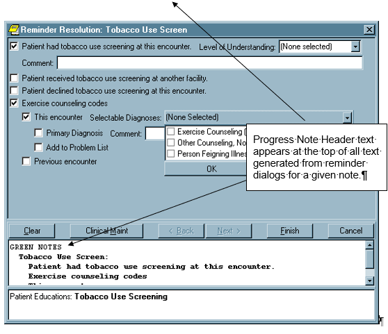

#### Reminder GUI Resolution Active (RA)

This option lets you activate GUI reminder resolution processing at a user, division, or system level. When activated, a reminders drawer is available on the notes tab for selecting and processing reminders.
Select CPRS Reminder Configuration Menus Option: **RA** Reminder GUI Resolution Active
Reminders Active may be set for the following:
1 User USR [choose from NEW PERSON]
2 Division DIV [ISC SALT LAKE]
3 System SYS [REDACTED]
***

Enter selection: **1** User NEW PERSON
Select NEW PERSON NAME: **CPRSPROVIDER,TEN** TC
***

\-------------- Setting Reminders Active for User: CPRSPROVIDER,TEN------
REMINDERS ACTIVE: YES// **\<Enter\>**
***

#### Reminder Icon Definitions

CPRS uses two sources for the lists of reminders, one for cover sheet reminder evaluation (dependent on the New Reminders Parameter setting) and one for the “Other” section of the tree (the PXRM CPRS LOOKUP CATEGORIES parameter). The CPRS GUI combines these two lists into one tree view.
| Icon                                                                                                                                                                                                                                                                                | Description                                                                                                                                                                                                                                                                                                             |
|-------------------------------------------------------------------------------------------------------------------------------------------------------------------------------------------------------------------------------------------------------------------------------------|-------------------------------------------------------------------------------------------------------------------------------------------------------------------------------------------------------------------------------------------------------------------------------------------------------------------------|
|                                                                                                                                       | Red, ringing alarm clock means that a reminder is due. When present in the reminders button, cover sheet reminders have been evaluated, and there is at least one reminder due.                                                                                                                                         |
|  | Blue, non-ringing alarm clock means that a reminder is not due, but applicable. When present in the reminders button, cover sheet reminders have been evaluated, none of them are evaluated as due, but at least one of them has been evaluated as applicable.                                                          |
|                                                                                                                  | Wall clock means that a reminder is not applicable. When present in the reminders button, coversheet reminders have been evaluated, but none of them have been evaluated as due or applicable. Reminders that were found in the PXRM CPRS LOOKUP CATEGORIES parameter have been evaluated as not applicable.            |
|                                                                                                                                                          | Question mark means that a reminder’s status of due, applicable or not applicable has yet to be evaluated. When present on the reminders button, no available reminders have been evaluated. This typically happens when reminders in the ORQQPX SEARCH ITEMS parameter are not defined or have not yet been evaluated. |
|                                                                                                                                | Present only in the reminders tree, a dialog icon is displayed in the lower right-hand corner of a clock icon when there is a reminder dialog associated with that reminder.                                                                                                                                            |
|                                                                                                                                                      | Present only in the reminders tree, a dialog icon, with a check mark over the dialog, is displayed in the lower right-hand corner of a clock icon after the reminder dialog associated with that reminder has been processed. When these reminders are re-evaluated, the check mark is removed.                         |
#### New Cover Sheet Reminder List

Users that are allowed access to the PXRM CPRS CONFIGURATION menu are allowed to modify the new reminder cover sheet parameters from within the CPRS GUI. This feature is available from the Edit Cover Sheet Reminder List menu option, under the Action menu of the Reminder Tree dialog. This dialog can be accessed even when the New Reminder Parameters setting is No, allowing for the setup of reminders before actually turning them on.
Reminders entered through this dialog are stored in the ORQQPX COVER SHEET REMINDERS and ORQQPX COVER SHEET REM CLASSES parameters. Since these parameters contain coded data, it is important that these parameters are not edited directly (they should only be modified through this dialog). Note that the cover sheet reminders entered through this dialog will only be active on the cover sheet if the ORQQPX NEW REMINDER PARAMS parameter is set.

The dialog consists mainly of three large list fields. The **Cover Sheet Reminders (Cumulative List)** field displays selected information on the Reminders that will be displayed on the Cover Sheet. The **Available Reminders & Categories** field lists all available Reminders and serves as a selection list. The **Level Reminders** field displays the Reminders that you have added to or removed from the cumulative list at a specified level.
You may sort the Reminders in the **Cover Sheet Reminders (Cumulative List)** field by clicking on any of the column headers. Click on the Seq (Sequence) column header to view the Reminders in the order in which they will be displayed on the Cover Sheet.
An icon legend is displayed to the right of the **Cover Sheet Reminders (Cumulative List)** field. A folder icon represents a Reminder Category while a red alarm clock represents an individual Reminder. A Reminder with a plus sign in the first column has been added to the list while a Reminder with a minus sign in the first column has been removed from the list, if it was specified at a higher level. A Reminder with a padlock in the first column has been added to the cover sheet list, and is locked in place, so that settings at lower levels cannot remove the reminder.
***

##### Cover Sheet Reminders (Cumulative List)

The Level column of the Cover Sheet Reminders (Cumulative List) field displays the originating authority of the Reminder, which can include System, Division, Service, Location, User Class, and User. The Seq (Sequence) column defines the order in which the Reminders will be displayed on the Cover Sheet. If there are two or more Reminders with the same sequence number, the Reminders will be listed by level (System, Division, Service, Location, User class, User).
***
##### Select Cover Sheet Parameter Level to Display / Edit

This area of the dialog allows selection of the level you want to modify. For example, if you want to set reminders at the system level, click on the System radio button. All but the system level have accompanying drop down boxes that allow selection of the Division, Service, Location, User Class or User. These settings also determine the list that is displayed in the Cover Sheet Reminders List. Note that, when not editing a specific user class, the User Class combo box will usually remain blank. This allows all user classes to be displayed for which the specified user is a member of.
##### Available Reminders & Categories

This field displays all of the Reminders and Reminder Categories available to the user. Notice that the reminder name is in parentheses after the print name. Categories are groups of related Reminders that can be added as a group. When editing a specific level of cover sheet reminders, highlight a Reminder or Category from the Available Reminders & Categories field and click the right arrow to add them to the cover sheet reminders defined at that level.
##### Level Reminders

This field displays all cover sheet Reminders defined for the current level. To add a Reminder to this list, highlight the desired Reminder in the Available Reminders & Categories field and click the right arrow button. To delete a Reminder from this list, highlight the Reminder in the Level Reminders field and click the left arrow.
You may determine the order in which the Reminders will be displayed on the Cover Sheet by changing the Reminder’s Sequence number. To change the order of User Level Reminders, highlight Reminders and click the up arrow or down arrow until the desired order is achieved.
You may remove any higher level Reminders that are not locked by adding the Reminder to the current level, and clicking the Remove button, which places a minus sign in front of the reminder. You can lock a reminder at any level (other than the User level) by pressing the Lock button.
##### Cover Sheet Reminders

Once you have the Cumulative List, as you want it, click **View Cover Sheet Reminders** to view how the reminders will be displayed on your Cover Sheet for the specified levels.

Once you have made all of the desired changes to the Reminders that will be displayed on the Cover Sheet, click OK.
#### Reminder Dialog Outside Location Prompts

Within portions of a reminder dialog where historical encounter information is entered, a new parameter, ORQQPX DEFAULT LOCATIONS, can be set up to define default outside locations for the PXRM OUTSIDE LOCATION prompt (PXRM OUTSIDE LOCATION is a reminder dialog prompt that is exported with the reminders package). Each free text entry in this multi-valued parameter will appear at the top of the list of locations in the drop down list. If a number is entered as the free text value, CPRS will attempt to locate an entry in the Institution file (\#4) with the same internal entry number.
For example, a parameter setting like this:
Display Sequence Value
\---------------- -----
1 663
2 Local Pharmacy
3 640
4 Outside Physician's Office
***

Will result in an outside location drop down list like this:

Note that Seattle, WA and Palo Alto are entries in the institution file with internal entry numbers of 663 and 640, respectively.
#### Placing Reminder Dialog Generated Text

The default behavior of reminder dialogs is to insert any text generated by the reminder dialog at the bottom of the current note. When the ORQQPX REMINDER TEXT AT CURSOR parameter is set, text will be inserted at the current cursor location.
#### Configuring the Mental Health DLL Used with Reminders

In order to use the Mental Health dynamic link library (YS_MHA.dll), some set up is necessary. A clinical application coordinator (CAC) or other individual at the site must ensure the following items have been done correctly:
-   The Mental Health DLL (YS_MHA.DLL) must be placed in the \\program files\\vista\\common directory. On the workstation, this is usually located at c:\\program files\\vista\\common files\\
-   The user must be given the YSBROKER1 menu option as a secondary menu. All users can be given this menu option because if the users do not have the appropriate key, they cannot use the restricted psychological assessment tools.
-   Individuals who will administer the psychological assessments must be given the YSP key.
**Note:** The YSP key belongs to the Mental Health package and is only necessary for a few test. This key is not new, but the individual using the new Mental Health assessments must hold the key.)
***
For additional information, please see the Mental Health and Clinical Reminders manuals.
***
#### Customizing the Mental Health Assessments Pop-Up Message Text

The CPRS GUI has an informational pop-up in which sites can define text that will display to the user when the Mental Health assessment is completed. Sites define the text for the pop-up at the same time that they define the text that will go into the progress note for the result element. For more information on how to define the text for this dialog, please see the Clinical Reminders documentation.
***

### OR CPRS USER CLASS EXCLUDE Parameter - Utilized to Limit Additional Signers and Filter Provider Dropdowns

OR CPRS USER CLASS EXCLUDE has been created to store an Authorization Subscription Utility (ASU) User Class that will no longer appear in listboxes called by the Remote Procedure Call, ORWU NEWPERS. Sites can set this parameter to an existing ASU User Class or create a new one.
This parameter will exclude users even if they are active with CPRS GUI “core” tab access.
In the example below, OR CPRS USER CLASS EXCLUDE is set to the ASU User Class, Clinical Dietician. The result is that all users in the Clinical Dietician ASU User Class will no longer get listed in the Additional Signers user selection box in CPRS.
Select OPTION NAME: XPAR MENU TOOLS General Parameter Tools
***

LV List Values for a Selected Parameter
LE List Values for a Selected Entity
LP List Values for a Selected Package
LT List Values for a Selected Template
EP Edit Parameter Values
ET Edit Parameter Values with Template
EK Edit Parameter Definition Keyword
***

Select General Parameter Tools \<TEST ACCOUNT\> Option: EP Edit Parameter Values
\--- Edit Parameter Values ---
***

Select PARAMETER DEFINITION NAME: OR CPRS USER CLASS EXCLUDE ASU User Class to exclude
\-- Setting OR CPRS USER CLASS EXCLUDE for System: REDACTED --

ASU User Class: CLINICAL DIETITIAN//
***

## Consults Tab Settings

### Criteria Used to Determine Requests Displayed in List

The parameter ORCH CONTEXT CONSULTS contains information used to limit or customize the list of consult requests displayed to the user. This parameter is used by both the CPRS GUI and List Manager versions. It can be set by SYSTEM and by USER.
The parameter’s value is a semicolon-delimited string, the pieces of which contain the following:
a;b;c,c,c;d;e;f (example: T-90;T;5,6,8;4;S;1)
a. Begin date
b. End date
c. Status (pointer to ORDER STATUS file (\#100.01); can be multiple statuses as a comma-separated list)
1.  Service (pointer to CONSULT SERVICES file (\#123.5))
1.  Group tree view by service (V), status (S) or type (T). Grouping by Type
separates consults and procedures.
1.  Order of consults in tree view. Either reverse chronological (0) or chronological
***

The user-level value for this parameter can be set using the “Custom View” menu and saving the selected options as the default.
***

### Access Determinations

The following fields in the REQUEST SERVICES file (\#123.5) determine all user access to Consults tab actions. See Consults 3.0 documentation for detailed explanations of these fields.
-   UPDATE USERS W/O NOTIFICATIONS
-   UPDATE TEAMS W/O NOTIFICATIONS
-   ADMINISTRATIVE UPDATE USERS
-   ADMINISTRATIVE UPDATE TEAMS
-   UPDATE USER CLASSES W/O NOTIFS
-   SPECIAL UPDATES INDIVIDUAL
***

A Consults package API, **CPRS\^GMRCACTM(Consult IEN),** evaluates the user and the above fields, and returns access level information for the user for a given consult and consult service. DUZ is expected to be set to that of the user being evaluated. The integer result is returned in the first piece of an **ORFLG(Consult IEN)** array element. Possible return values, and the Consults package menu options they allow, are as follows:
1.  GMRCACTM USER REVIEW SCREEN - simple actions. This user can basically only display information about the selected consult, or add a comment.
1.  GMRCACTM SERVICE ACTION menu - all actions possible for an update user in the selected consult’s service. This user has full access to all GUI menu options for this consult, including entering results via a TIU document. The exception is the “Administrative Complete” menu option, which is reserved for category (3) below.
1.  GMRCACTM ADMIN ACTION menu - administrative user. Administrative users have access to all consult tracking options, but do not have access to the TIU result options. They are still able to complete the selected consult via the separate “Administrative Complete” tracking menu option.
1.  User has the same access as if both 2 and 3 were in effect.
***

The second "\^" piece of the **ORFLG(Consult IEN)** array element contains the text version of the user's access level, and the third piece lists the service and field from which this access level is derived. This may be the service of the currently selected consult, or a parent service in the service hierarchy. Access to these text values is currently available for debugging via the "Last Broker Call" option on the Help menu.
***

### Setting New Request Parameters

The “New Consult” and “New Procedure” buttons, as well as the “New…” menu option, (Action \| New) can be linked to a specified order dialog, quick order, or order menu, resulting in behavior identical to ordering via the Orders tab. As exported, clicking on the buttons will display the generic consults or procedures ordering dialog. By changing the value of the parameters ORWDX NEW CONSULT or ORWDX NEW PROCEDURE, this default behavior can be modified and customized by SYSTEM, LOCATION, and USER.
These parameters cannot be directly changed using the GUI, and must be modified using the Parameter Tools menu options. Any existing order dialog, quick order, or order menu can be assigned to the parameter, at any of the three levels. A common practice is to assign the same consults or procedures order menu to the buttons as is used on the Orders tab. This provides consistent functionality, and two ways to access the same lists of quick orders.
There is currently no available way to disable the buttons entirely. A common method of effectively disabling the buttons is to create an order menu consisting of only a text entry. That entry should advise the user that ordering is only available via the Orders tab. Assign that menu to the appropriate parameter, and the menu text will be displayed to the user when the button is selected.
### COMMUNITY CARE -DS or -ADMIN Consult Orders with ADMIN Key

CPRS users who hold the security key OR ADMIN RBP TO CC are able to create and release a Community Care direct schedule or administrative consult order without possessing the ORES provider security key. The consults service order will start with Community Care (case-insensitive) and contain either –DS or –ADMIN (case insensitive). The consult order will be auto-signed as "Administratively Released by Policy" and released to the service as soon as the order has been accepted. The consult order will appear on the Orders tab with status "pending".
In addition to assigning the OR ADMIN RBP TO CC key to the user, each user will need to be added as an ADMINISTRATIVE UPDATE USER for each applicable Community Care Admin and DS consult as required for their role. Note that applicable consult types meet both of the following criteria:
-   The Consult title contains Community Care (not case sensitive) -and- the Consult title contains -ADMIN (case sensitive).
-   The Consult title contains Community Care (not case sensitive) -and- the Consult title contains -DS (case sensitive).
**NOTE**: The OR ADMIN RPB TO CC key is not exclusive and may be assigned in conjunction with other security keys. The most likely scenarios would be users who are assigned only the OR ADMIN RPB TO CC key or the “OR ADMIN RPB TO CC” key in conjunction with the OREMAS key. Any user who is assigned the OR ADMIN RPB TO CC key will also need to be added to the ADMINISTRATIVE UPDATE USER group of the applicable COMMUNITY CARE -ADMIN and -DS consults. See the Admin Key Technical Training Guide for detailed setup steps. VDL\>CPRS: Consult/Request Tracking\>oc_adminkey_tech_tg.docx.
## Discharge Summary Tab Settings

### Requirements for Admission and Attending

Creating a new discharge summary differs from creating a new progress note in two main areas.
First, every discharge summary must be linked to a hospital admission. The document properties dialog that is initially displayed when creating a new summary contains a list of admissions to which the new document can be linked. In the GUI, there is currently an enforced limit of one discharge summary per admission episode. The TIU document parameters defined for the DISCHARGE SUMMARY document class allow a setting of multiple documents per admission, but the GUI does not currently use this setting.
Secondly, for discharge summaries, the patient’s attending physician is always the expected cosigner of the document, and this co-signature is required in all cases. The document properties dialog displayed on creation of a new summary contains a selection box labeled “Attending” to set this value. There is no default value for this selection box.
An attending physician must be selected from the list of active users possessing the PROVIDER key. When you click OK, the selected attending physician is checked against the USER CLASS file to determine the presence of a currently active membership in the PROVIDER user class.
***

### Criteria Used to Determine Summaries Shown in List

The parameter ORCH CONTEXT SUMMRIES contains information used to limit or customize the list of summaries displayed to the user. This parameter is used by both the CPRS GUI and List Manager versions. It can be set by SYSTEM and by USER. The parameter’s value is a semicolon-delimited string, the pieces of which contain the following:
a;b;c;d;e;f;g;h;i;j;k;l Example: **T-90;T;1;1329;20;1;A;1;1;T;B;test**
***

a Begin date
b End date
c Status (pointer to the TIU STATUS file (\#8925.6))
d Author (pointer to the NEW PERSON file (\#200))
e Occurrence Limit - The number of notes actually shown by default is determined by using the Occurrence Limit from the parameter, and then, if not present, the NUMBER OF NOTES ON REV SCREEN from TIU preferences.
f If present and non-zero, show subject in notes list.
g Sort notes in list view by visit date (D), author (A), title (T), location (L), or subject (S).
h If present and non-zero, sort tree view chronologically, otherwise reverse chronologically.
i If present and non-zero, sort list view chronologically, otherwise reverse chronologically.
j Group notes in treeview by visit date (D), author (A), title (T), or location (L).
k Field to search for keyword in (l). Subject (S), Title (T), or Both (B).
l Keyword to search for in fields defined in (k).
***

The user-level value for this parameter can be set using the “Custom View” menu and saving the selected options as the default.
## Labs Tab Settings

The Labs tab is only used for reviewing lab results. Ordering is done from the Orders tab. You cannot make configuration changes to add other reports to the Labs tab.
The reports correspond to reports in the Lab package.
Remote Data Views are also available from the Labs tab. They are discussed in the Remote Data View section.
### Labs Reports

These reports are hard-coded specifically for the GUI:
| **Report**             | **Description**                                                                                                                                                             |
|------------------------|-----------------------------------------------------------------------------------------------------------------------------------------------------------------------------|
| Most Recent            | Similar to Interim Report but displayed in a table format. Displays one collection at a time.                                                                               |
| Cumulative             | Routine similar to Lab’s Cumulative (chart copy)                                                                                                                            |
| All Tests by Date      | Routine similar to Lab’s Interim Report                                                                                                                                     |
| Selected Tests by Date | Routine similar to Lab’s Interim Report for Selected Tests                                                                                                                  |
| Worksheet              | Similar to Lab’s General Report and LRUMD options also graphing and viewing only abnormal results (with features of Edit/Print/Display Pre-selected Lab Tests and Graphing) |
| Graph                  | Similar to Lab’s Graph Report (1 test)                                                                                                                                      |
| Microbiology           | Routine similar to Lab’s Micro Report used on Interim                                                                                                                       |
These reports use a HOST file to display results:
| Report             | Description                               |
|--------------------|-------------------------------------------|
| Anatomic Pathology | Lab’s AP Report                           |
| Blood Bank         | Lab’s Blood Bank Report                   |
| Lab Status         | Similar to Lab’s Order Test Status Report |
## Reports tab

The Reports tab has a collection of reports that are available to review. The following parameters are used in the Reports Tab:
ORCH CONTEXT REPORTS – This parameter is used when the imaging report is selected to determine the date range and occurrence limits of the reports to display for selection. This parameter can be set at the SYSTEM and USER levels.
*Example value:* **T-365;T;;;10**
This example value has a date range from a year ago (T-365) to today (T).
Remote Data Views are also viewable from the Reports tab (discussed later).
### Host file setup

Many of the reports use the same M code for display in the GUI and display to terminal based applications. Using a HOST file to act as a buffer to hold the report does this. The code uses the same M write commands and spacing as if writing to a printer or screen display. The data in the host file is then read into a global using %ZISH utilities provided by Kernel. The global can then be passed back to the GUI application via the RPC Broker or used for conventional reporting (e.g. List Manager). This allows report changes to affect both the GUI and screen displays.
### Quick Order Reports to Correct Dosages for Order Checks

CPRS has two quick order reports to help users check on the dosages so that they will function correctly with Medication Order Check HealthCare Application version 2 (MOCHA 2) Dosage Checks. The reports check CPRS quick orders for mixed case and free text dosages so that they can be corrected to comply with a local possible dose on the system. The reports are
-   Quick Order Mixed-Case Report (OR QO CASE REPORT)
-   Quick Order Free Text Report (OR QO FREE TEXT)
#### Quick Order Mixed-Case Report

The accuracy of local dosage setup is vitally important to a site’s success with MOCHA v2.0 Dosage Checks. Dosage and medication route reviews were first introduced with the MOCHA Pre-Implementation patch PSS\*1\*129 in 2009. Additionally, Quick Orders (QO) contain dosages which may need to be updated.
A Quick Order Mixed-Case Report is provided with the OR\*3\*366 patch and will be displayed on the Order Menu Management [ORCM MGMT] menu option. It will identify medication quick orders that are on an ordering menu and contain problematic dosages that do not match any of the Local Possible Dosages (LPD) because of case differences in the drug name. This report specifically looks at Dispense Drugs that have had a change in mixed-case (Tall Man Lettering) since the QO was created.
##### Display of Sample Report

Quick Order Mixed-Case Report [OR QO CASE REPORT]

This report identifies quick orders that have potentially had the DRUG name edited such that when the quick order is loaded in CPRS the dosage that is saved with the quick order does not match any of the dosages available for selection in the list. This causes the dosage checks not to be able to be performed correctly. The edit to the drug that this specifically looks for is a case change to the DRUG name. If the name is changed so that it contains different characters that are not just case changes, this report will not identify them.
***

DEVICE: TELNET TERMINAL
***

QUICK ORDER MIXED-CASE REPORT JAN 1, 2013 07:56 PAGE 1
\-----------------------------------------------------------------------------
QUICK ORDER (IEN): AMLODIPINE/ATORVASTATIN 10MG/40MG DAILY (602)
DISPLAY GROUP: OUTPATIENT MEDICATIONS
ORDERABLE ITEM IEN: 6882
ORDERABLE ITEM NAME: AMLODIPINE/ATORVASTATIN TAB
DRUG IEN: 94402
DRUG TEXT: amLODIPine 10MG/ATORVASTATIN 40MG TAB
QO INSTRUCTIONS: 1 TAB(10/40MG) OF AMLODIPINE 10MG/ATORVASTATIN 40MG TAB 1 Quick Orders Found
***

##### Purpose of Report

This report is used to identify which Quick Orders will cause the following type of order check message in CPRS until it is corrected:
**Generic Message**
Maximum Single Dose Check could not be done for Drug: \<\<DRUG NAME HERE\>\>, please complete a manual check for appropriate Dosing.
***

**Example Message**
Maximum Single Dose Check could not be done for Drug: amLODIPine 10MG/ATORVASTATIN 40MG TAB, please complete a manual check for appropriate Dosing.
***

**Note:** If there are no results displayed when running this report then there is nothing to update and no further action is required
***

##### Example Display in CPRS

The dosage from the drop down box should have been highlighted automatically. Since it is not, this is an indication that the Quick Order is not selecting the dispense drug. This will cause the dosage to be interpreted as a free text dosage and a manual dosing check may be required.


###### When does this happen?

This occurs when a site updates a dispense drug name to/from Tall Man Lettering.
###### Example of a drug being changed from all capital letters to mixed-case:

Select DRUG GENERIC NAME: AMLODIPINE 10MG/ATORVASTATIN 40MG TAB CV200
...OK? Yes// (Yes)
***
\*\*\*\*\*\*\*\*\*\*\*\*\*\*\*\*\*\*\*\*\*\*\*\*\*\*\*\*\*\*\*\*\*\*\*\*\*\*\*\*\*\*\*\*\*\*\*\*\*\*\*\*\*\*\*\*\*\*\*\*\*\*\*\*\*\*\*\*\*\*\*\*
This entry is marked for the following PHARMACY packages:
Outpatient
Unit Dose
Non-VA Med
GENERIC NAME: AMLODIPINE 10MG/ATORVASTATIN 40MG TAB
Replace ... With amLODIPine 10MG/ATORVASTATIN 40MG TAB
Replace
###### Is this an issue for all drugs that are changed to/from Tall Man Lettering?

No, this only applies to quick orders when the name of the drug is part of the dose. This name is displayed after the “OF” conjunction (those without a metric dose unit).
###### Example of Quick Order with mixed-cased that will not show up on the report:

**Note:** This example is listed here to explain why a mixed-case dispense drug may not be displayed on the report when you may expect it to be. These will not cause a manual dose check due to mixed-case and thus no editing of the quick order is required.
***

Select Order Menu Management Option:
Enter/edit quick orders
Select QUICK ORDER NAME: PSJQOS GLYBURIDE 5MG BID
NAME: PSJQOS GLYBURIDE 5MG BID Replace
DISPLAY TEXT: GLYBURIDE 5MG BID//
VERIFY ORDER:
DESCRIPTION:
1\>
ENTRY ACTION:
***

Medication: glyBURIDE TAB //
***

Patients with existing sulfa compound allergies may react to this
medication.
***

Complex dose? NO//
Dose: 1 TABLET OF 5MG// ??
Choose from (or enter another):
1 1 TABLET OF 5MG \$0.0496
2 1 TABLET OF 2.5MG \$0.0324
***

Enter the dosage instructions for this order, as a dose or amount.
***

Dose: 1 TABLET OF 5MG//
Route: ORAL//
Schedule: BID-AC//
Give additional dose NOW? NO//
Priority: ROUTINE//
Comments:
1\>
\-------------------------------------------------------------------------------
Medication: glyBURIDE TAB 5MG
Instructions: 1 TABLET OF 5MG ORAL BID-AC
Priority: ROUTINE
\-------------------------------------------------------------------------------
***

(P)lace, (E)dit, or (C)ancel this quick order? PLACE//
#### Fixing the Quick Orders listed the report

QUICK ORDER MIXED-CASE REPORT JAN 1, 2013 07:56 PAGE 1
\-----------------------------------------------------------------------------
QUICK ORDER (IEN): AMLODIPINE/ATORVASTATIN 10MG/40MG DAILY (602)
DISPLAY GROUP: OUTPATIENT MEDICATIONS
ORDERABLE ITEM IEN: 6882
ORDERABLE ITEM NAME: AMLODIPINE/ATORVASTATIN TAB
DRUG IEN: 94402
DRUG TEXT: amLODIPine 10MG/ATORVASTATIN 40MG TAB
QO INSTRUCTIONS: 1 TAB(10/40MG) OF AMLODIPINE 10MG/ATORVASTATIN 40MG TAB 1 Quick Orders Found
1.  Use Option - Enter/edit quick orders [ORCM QUICK ORDERS] located on the Order Menu Management menu option [ORCM MGMT]
Select QUICK ORDER NAME:
***

1.  Type back quote(grave accent) then the Quick Order (IEN)

Select QUICK ORDER NAME: \`602 PSJOZ AMLODIPINE/ATORVASTATIN 10MG/40MG DAILY
NAME: PSJOZ AMLODIPINE/ATORVASTATIN 10MG/40MG DAILY
Replace
***

1.  Press Enter until you reach the following prompt:
(P)lace, (E)dit, or (C)ancel this quick order? PLACE//
***

**Note:** Once you make changes to the dose, some of the data will be over-written so it is important to have a screen shot or have the ability to scroll back. This step allows you to see the order before any changes.
***

VERIFY ORDER:
DESCRIPTION:
1\>
ENTRY ACTION:
Medication: AMLODIPINE/ATORVASTATIN TAB //
Complex dose? NO//
Dose: 1 TABLET OF AMLODIPINE 10MG/ATORVASTATIN 40MG TAB
Replace
Route: ORAL (BY MOUTH)//
Schedule: QPM//
Days Supply: 90//
Quantity (TAB): 90//
Refills (0-3): 1//
Pick Up: WINDOW//
Priority: ROUTINE//
Comments:
1\>
***

\---------------------------------------------------------------------
Medication: AMLODIPINE/ATORVASTATIN TAB
Dispense Drug: amLODIPine 10MG/ATORVASTATIN 40MG TAB
Instructions: 1 TABLET OF AMLODIPINE 10MG/ATORVASTATIN 40MG TAB
ORAL (BY MOUTH) QPM
Days Supply: 90
Quantity (TAB): 90
Refills (0-3): 1
Pick Up: WINDOW
Priority: ROUTINE
\---------------------------------------------------------------------
1.  Type E to Edit
(P)lace, (E)dit, or (C)ancel this quick order? PLACE// EDIT
***

1.  Press Enter until you reach the Dose Prompt
Medication: AMLODIPINE/ATORVASTATIN TAB //
Complex dose? NO//
***

1.  Update the Dose (If you know the desired Local Possible Dose then use A. if not then use B.)
1.  Change the Dose:
1.  Type ...
1.  Press Enter
1.  Enter a Local Possible Dose
1.  Press Enter Twice
Dose: 1 TABLET OF amLODIPine 10MG/ATORVASTATIN 40MG TAB
Replace ... With 1 TABLET Replace
1 TABLET OF amLODIPine 10MG/ATORVASTATIN 40MG TAB \$0.2346
**Note:** If Dose is not a Local Possible Dose, then a warning will appear
Dose: 2 TABLETS
WARNING: Dosage check may not occur.
Route: ORAL (BY MOUTH)//
Schedule: QPM
Cannot determine dispense drug - some defaults and order checks may not occur!
***
1.  Delete the Dose :
1.  Type @
1.  Press Enter
Dose: 1 TABLET OF AMLODIPINE 10MG/ATORVASTATIN 40MG TAB
Replace @
***
***

1.  Press Enter until you reach the following prompt:
(P)lace, (E)dit, or (C)ancel this quick order? PLACE//
***

Are you sure you want to delete this value? NO// y YES
Days Supply: 90//
Quantity: 90//
Refills (0-3): 1//
Pick Up: WINDOW//
Priority: ROUTINE//
Comments:
1\>
***

\---------------------------------------------------------------------
Medication: AMLODIPINE/ATORVASTATIN TAB
Dispense Drug: amLODIPine 10MG/ATORVASTATIN 40MG TAB
Days Supply: 90
Quantity: 90
Refills (0-3): 1
Pick Up: WINDOW
Priority: ROUTINE
\---------------------------------------------------------------------
1.  Type E to Edit
(P)lace, (E)dit, or (C)ancel this quick order? PLACE// E EDIT
***

1.  Press enter until Dose Prompt
Medication: AMLODIPINE/ATORVASTATIN TAB //
Choose from (or enter another):
1 1 TABLET OF amLODIPine 10MG/ATORVASTATIN 40MG TAB \$0.2346
1.  Select dose from above
**Note:** If desired dose not listed then go to the Drug Enter/Edit [PSS DRUG ENTER/EDIT] Option or Enter/Edit Dosages [PSS EDIT DOSAGES] to add a new local possible dose.
***

Dose: 1 1 TABLET OF amLODIPine 10MG/ATORVASTATIN 40MG TAB \$0.2346 (non- formulary)
...OK? YES//
**Note:** If Dose is not a Local Possible Dose, then a warning will appear
Dose: 2 TABLETS
WARNING: Dosage check may not occur.
Route: ORAL (BY MOUTH)//
Schedule: QPM
Cannot determine dispense drug - some defaults and order checks may not occur!
1.  Enter the Route, Schedule, Days Supply and Refills based the data you obtained from step 3.
Route: ORAL (BY MOUTH)//
Schedule: QPM
Days Supply: 90
Quantity (TAB): 90
Refills (0-3): 1
Pick Up: WINDOW//
Priority: ROUTINE//
Comments:
1\>
***

\-------------------------------------------------------------------------------
Medication: AMLODIPINE/ATORVASTATIN TAB
Dispense Drug: amLODIPine 10MG/ATORVASTATIN 40MG TAB
Instructions: 1 TABLET OF amLODIPine 10MG/ATORVASTATIN 40MG TAB
ORAL (BY MOUTH)
Days Supply: 90
Quantity: 90
Refills (0-3): 1
Pick Up: WINDOW
Priority: ROUTINE
\-------------------------------------------------------------------------------
1.  Verify that it looks correct and type P to Place it
(P)lace, (E)dit, or (C)ancel this quick order? PLACE// PLACE
***
#### Quick Order Free Text Report

The accuracy of local dosage setup is vitally important to a site’s success with MOCHA v2.0 Dosage Checks. Dosage and medication route reviews were first introduced with the MOCHA Pre-Implementation patch PSS\*1\*129 in 2009. Additionally, Quick Orders contain dosages that may need to be updated.
A Quick Order Free Text Report is provided in the OR\*3\*366 patch. It will identify medication quick orders that potentially contain problematic dosages that do not match any of the Possible Dosages (PD) or Local Possible Dosages (LPD) that are associated with the defined Orderable Item.
When a match cannot be determined, then the dose is considered a free text dose. Dosage checks are possible with free text doses, but if improperly formatted they are more prone to Dose Check failures than orders associated with PDs and LPDs. After initial reviews are completed, the reports may be run periodically.
The Quick Order Free Text Report is designed to be run in a variety of ways, based on the type of quick order (System Level and Personal) and the type of dosage (PD and LPD). The intent is to group similar issues together in order help users to determine if/where an edit needs to occur and to expedite the review process.
To understand and perform the review process, users must have knowledge of and access to both quick orders and pharmacy dosage setup. As quick order roles and responsibilities vary from site to site, it is anticipated that a collaborative effort between Pharmacy Informatics and Clinical Coordinators will likely be required at most sites.
***
##### Report Options


##### Sample Report Output

**Example 1** System Quick Orders with Local Possible Doses
Quick Order Free-Text Report
***

This report identifies Medication Quick orders that have a free text dosage that does not match exactly one of the Local Dosages from Pharmacy.
***

Select one of the following:
***

S System Quick Orders
P Personal Quick Orders
PS Personal and System Quick Orders
***

SELECT THE TYPE OF QUICK ORDER: PS// **S System Quick Orders**
***
Select one of the following:
***

L Local Possible Dosages
P Possible Dosages
N No Local Possible and No Possible Dosages
***
SELECT THE TYPE OF DOSAGE: L// **L Local Possible Dosages**
DEVICE: 0;80;9999 TELNET TERMINAL
***

QUICK ORDER FREE-TEXT REPORT MAY 16, 2013 08:55 PAGE 1
\-------------------------------------------------------------------------
***

QUICK ORDER (IEN): PSJQOS MARTIN 1 (509)
QO DISPLAY NAME: ALBUTEROL SOLN,INHL
DISPLAY GROUP: UNIT DOSE MEDICATIONS
ORDERABLE ITEM IEN: 1987
ORDERABLE ITEM NAME: ALBUTEROL SOLN,INHL
QO INSTRUCTIONS: 1ML NEB SOLN
DISPENSE: ALBUTEROL 0.5% INHL SOLN
CPRS DOSAGE LIST:
1 MILLILITER OF 0.5%
***

QUICK ORDER (IEN): PSJQOS AUGMENTIN 500 PO TID 1 (512)
QO DISPLAY NAME: AMOXICILLIN/CLAVULANATE TAB
DISPLAY GROUP: UNIT DOSE MEDICATIONS
ORDERABLE ITEM IEN: 2032
ORDERABLE ITEM NAME: AMOXICILLIN/CLAVULANATE TAB
QO INSTRUCTIONS: 250MG/62.5MG TAB
DISPENSE: AMOXICILLIN 500/CLAV K 125MG TAB
CPRS DOSAGE LIST:
ONE TABLET OF AMOXICILLIN 500/CLAV K 125MG TAB
***

**Example 2** System Quick Orders with Possible Doses
Quick Order Free-Text Report
***

This report identifies Medication Quick orders that have a free text dosage
that does not match exactly one of the Local Dosages from Pharmacy.
***

Select one of the following:
***

S System Quick Orders
P Personal Quick Orders
PS Personal and System Quick Orders
***

SELECT THE TYPE OF QUICK ORDER: PS// **S System Quick Orders**
***

Select one of the following:
***

L Local Possible Dosages
P Possible Dosages
N No Local Possible and No Possible Dosages
***

SELECT THE TYPE OF DOSAGE: L// **P Possible Dosages**
***

DEVICE: TELNET TERMINAL
***
QUICK ORDER FREE-TEXT REPORT MAY 15, 2013 15:27 PAGE 1
\-------------------------------------------------------------------------
QUICK ORDER (IEN): PSUZ AMOXICILLIN 500MG PO TID (605)
QO DISPLAY NAME: Amoxicillin 500mg po TID
DISPLAY GROUP: UNIT DOSE MEDICATIONS
ORDERABLE ITEM IEN: 2033
ORDERABLE ITEM NAME: AMOXICILLIN CAP,ORAL
QO INSTRUCTIONS: 1 CAPSULE
DISPENSE: AMOXICILLIN 500MG CAP
CPRS DOSAGE LIST:
1000MG
250MG
500MG
QUICK ORDER (IEN): ONDANSETRON 8MG PO 60 MIN PRE CHEMO (1816)
QO DISPLAY NAME: ONDANSETRON 8MG PO 60 MIN PRE-CHEMO
DISPLAY GROUP: UNIT DOSE MEDICATIONS
ORDERABLE ITEM IEN: 2835
ORDERABLE ITEM NAME: ONDANSETRON HCL TAB
QO INSTRUCTIONS: 8MG
DISPENSE: ONDANSETRON HCL 8MG TAB
CPRS DOSAGE LIST:
16MG
4MG
***

**Example 3** Personal Quick Orders with Possible Doses
Quick Order Free-Text Report
***

This report identifies Medication Quick orders that have a free text dosage
that does not match exactly one of the Local Dosages from Pharmacy.
***

Select one of the following:
***

S System Quick Orders
P Personal Quick Orders
PS Personal and System Quick Orders
***

SELECT THE TYPE OF QUICK ORDER: PS// **P Personal Quick Orders**
***

Select one of the following:
***

L Local Possible Dosages
P Possible Dosages
N No Local Possible and No Possible Dosages
***

SELECT THE TYPE OF DOSAGE: L// **P Possible Dosages**
***

DEVICE: TELNET TERMINAL
***
QUICK ORDER FREE-TEXT REPORT MAY 15, 2013 15:27 PAGE 1
\-------------------------------------------------------------------------
***

QUICK ORDER (IEN): ORWDQ 7C406F44 (1339)
QO DISPLAY NAME: ASA 81mg
OWNER(S): PROVIDER, A
DISPLAY GROUP: UNIT DOSE MEDICATIONS
ORDERABLE ITEM IEN: 2056
ORDERABLE ITEM NAME: ASPIRIN TAB,CHEWABLE
QO INSTRUCTIONS: 81mg
DISPENSE: ASPIRIN 81MG CHEW TAB
CPRS DOSAGE LIST:
162MG
81MG
***

QUICK ORDER (IEN): ORWDQ 70CA3BA1 (1448)
QO DISPLAY NAME: lisinopril 5 mg daily
OWNER(S): PROVIDER, B
DISPLAY GROUP: UNIT DOSE MEDICATIONS
ORDERABLE ITEM IEN: 2680
ORDERABLE ITEM NAME: LISINOPRIL TAB
QO INSTRUCTIONS: 5 MG
DISPENSE: LISINOPRIL 20MG TAB
CPRS DOSAGE LIST:
10MG
20MG
40MG
5MG
***

#### Comparison of System and Personal Type Quick Orders on two Sample Orders


##### Dosage Basics for CPRS Displays

###### The CPRS dosage list and the Quick Order report share the same display rules

-   For Dosages to display the Dispense Drug must be *marked* and Dosage *assigned* to the same package as the Quick Order *type* being used.
**If:**
1.  PDs are *assigned* for Inpatient package *(250MG,500MG,1000MG)*
1.  LPDs are *assigned* for Outpatient package *(1 CAPSULE, 2 CAPSULES)*
1.  QO type is for entered for Unit Dose Medications
**Then:**
1.  The selectable dosages will be PDs (250MG,500MG,1000MG)

-   If an orderable item (OI) has multiple dispense drugs, and at least one of those dispense drugs has PDs set for a specific package, then PDs will be the only type of dose that is available for any Quick Order entered for that same package.
-   If no PD is marked for the package that is being used by a QO, then any available LPDs will display as choices during both CPRS ordering and listed on the QO LPD reports.
-   Free text doses can be entered on QO’s, but PDs and/or LPDs should be used whenever possible. Free-text rules apply for dosage checks.
###### Dosage Scenarios:

**Example 1**: System Quick Orders with Possible Dosages in the CPRS Dosage list
*Local Possible Dosages may also be present and assigned to the Orderable Item and assigned to both packages, but may not be viewable in the CPRS Dosage List because of the display rules for CPRS dosages.*
Orderable Item -\> **ACETAMINOPHEN**
Dosage Form -\> TAB
***

Dispense Drugs:
\---------------
ACETAMINOPHEN 325MG TAB MAY 10, 2013
ACETAMINOPHEN 500MG TAB U.D. JAN 30, 2013
**ACETAMINOPHEN 500MG TAB**
ACETAMINOPHEN 325MG TAB U.D. FEB 12, 2013
***

ACETAMINOPHEN 500MG TAB
***

**POSSIBLE DOSAGES:**
DISPENSE UNITS PER DOSE: 1 DOSE: **500MG** PACKAGE: **IO**
DISPENSE UNITS PER DOSE: 2 DOSE: **1000MG** PACKAGE: **IO**
***

**LOCAL POSSIBLE DOSAGES:**
**1 TABLET IO**
**1 TABLET OF 500MG IO**
**2 TABLETS IO**
***
***
**This entry is marked for the following PHARMACY packages:**
**Outpatient**
**Unit Dose**
**Ward Stock**
**Non-VA Med**
***

The following Quick Orders are all using the Orderable Item: ACETAMINOPHEN TAB which has a single active dispense drug ‘ACETAMINOPHEN 500MG TAB’ *assigned* to the respective package. For each display group (Outpatient Medications and Unit Dose Medications) there is either a ‘FREE TEXT’ dosage or a selected LPD.
1 PSUZ APAP IP FREE TEXT
2 PSUZ APAP IP LPD USED
3 PSOZ APAP OP FREE TEXT
4 PSOZ APAP OP LPD USED
***

Since none of the free text dosages in the QO INSTRUCTIONS match any of the Possible Dosages in the CPRS Dosage List, this report prints all four Quick Orders. Possible Dosages are available for both packages, so any Local Possible Dosages will not be seen.
If available, additional Possible Dosages from other Dispense Drugs(s) tied to the same Orderable Item (*such as ACETAMINOPHEN 325MG TAB*) would be displayed in the CPRS Dosage List. In this example, ACETAMINOPHEN 325MG TAB has Possible Dosages, but is inactive; therefore, none of the Possible Dosages (325MG or 650MG) are showing.
QUICK ORDER (IEN):  **PSOZ** **APAP OP LPD USED** (560)
QO DISPLAY NAME: APAP OP
DISPLAY GROUP: **OUTPATIENT MEDICATIONS**
ORDERABLE ITEM IEN: 1964
ORDERABLE ITEM NAME: ACETAMINOPHEN TAB
QO INSTRUCTIONS: **1 TABLET**
DISPENSE: ACETAMINOPHEN 500MG TAB
CPRS DOSAGE LIST:
**1000MG**
**500MG**
***

QUICK ORDER (IEN): **PSOZ APAP OP FREE TEXT** (561)
QO DISPLAY NAME: APAP OP FREE TEXT
DISPLAY GROUP: **OUTPATIENT MEDICATIONS**
ORDERABLE ITEM IEN: 1964
ORDERABLE ITEM NAME: ACETAMINOPHEN TAB
QO INSTRUCTIONS: **FREE TEXT**
DISPENSE: ACETAMINOPHEN 500MG TAB
CPRS DOSAGE LIST:
**1000MG**
**500MG**
***
QUICK ORDER (IEN): **PSUZ APAP IP LPD USED** (562)
QO DISPLAY NAME: APAP IP LPD USED
DISPLAY GROUP: **UNIT DOSE MEDICATIONS**
ORDERABLE ITEM IEN: 1964
ORDERABLE ITEM NAME: ACETAMINOPHEN TAB
QO INSTRUCTIONS: **1 TABLET OF 500MG**
DISPENSE: ACETAMINOPHEN 500MG TAB
CPRS DOSAGE LIST:
**1000MG**
**500MG**
***

QUICK ORDER (IEN): **PSUZ APAP IP FREE TEXT** (563)
QO DISPLAY NAME: APAP IP FREE TEXT
DISPLAY GROUP: **UNIT DOSE MEDICATIONS**
ORDERABLE ITEM IEN: 1964
ORDERABLE ITEM NAME: ACETAMINOPHEN TAB
QO INSTRUCTIONS: **FREE TEXT**
DISPENSE: ACETAMINOPHEN 500MG TAB
CPRS DOSAGE LIST:
**1000MG**
**500MG**
***
##### Editing Dosages of Quick Orders

Editing the dosages to match an available dosage in CPRS should prevent a Quick Order from appearing on the report.
###### System Quick Order Edits

**Enter/edit quick orders [ORCM QUICK ORDERS] (QO)**
Select QUICK ORDER NAME: **PSUZ APAP**
1 PSUZ APAP IP FREE TEXT
2 PSUZ APAP IP LPD USED
3 PSOZ APAP OP FREE TEXT
4 PSOZ APAP OP LPD USED
***

CHOOSE 1-4: **2 PSUZ APAP IP LPD USED**
NAME: APAP IP LPD USED//
DISPLAY TEXT: APAP IP LPD USED//
VERIFY ORDER: YES//
DESCRIPTION:
1\>
ENTRY ACTION:
***

Medication: ACETAMINOPHEN TAB //
Complex dose? NO//
Dose: **1 TABLET OF 500MG// 500MG**
Route: ORAL (BY MOUTH)//
Schedule: Q4H PRN//
Give additional dose NOW? NO//
Priority: ROUTINE//
Comments:
***

Since the Quick Order using the dosage ‘1 TABLET OF 500MG’ was edited and matched to a Possible Dosage of ‘500MG’, the Quick Order ‘APAP IP LPD USED’ is now removed from the report.
QUICK ORDER (IEN):  **PSOZ** **APAP OP LPD USED** (560)
QO DISPLAY NAME: APAP OP
DISPLAY GROUP: **OUTPATIENT MEDICATIONS**
ORDERABLE ITEM IEN: 1964
ORDERABLE ITEM NAME: ACETAMINOPHEN TAB
QO INSTRUCTIONS: **1 TABLET**
DISPENSE: ACETAMINOPHEN 500MG TAB
CPRS DOSAGE LIST:
**1000MG**
**500MG**
***

QUICK ORDER (IEN): **PSOZ APAP OP FREE TEXT** (561)
QO DISPLAY NAME: APAP OP FREE TEXT
DISPLAY GROUP: **OUTPATIENT MEDICATIONS**
ORDERABLE ITEM IEN: 1964
ORDERABLE ITEM NAME: ACETAMINOPHEN TAB
QO INSTRUCTIONS: **FREE TEXT**
DISPENSE: ACETAMINOPHEN 500MG TAB
CPRS DOSAGE LIST:
**1000MG**
**500MG**
***
QUICK ORDER (IEN): **PSUZ APAP IP FREE TEXT** (563)
QO DISPLAY NAME: APAP IP FREE TEXT
DISPLAY GROUP: **UNIT DOSE MEDICATIONS**
ORDERABLE ITEM IEN: 1964
ORDERABLE ITEM NAME: ACETAMINOPHEN TAB
QO INSTRUCTIONS: **FREE TEXT**
DISPENSE: ACETAMINOPHEN 500MG TAB
CPRS DOSAGE LIST:
**1000MG**
**500MG**
***

###### Personal Quick Order Edits

**Edit Personal Quick Orders by User [ORCM QUICK ORDERS BY USER]**
The **Edit personal quick orders by user** allows you to retrieve and edit personal quick orders by the user that created them
###### Personal Quick Order Displayed on Report

QUICK ORDER FREE-TEXT REPORT JUN 06, 2013 10:12 PAGE 4
\-------------------------------------------------------------------------
QUICK ORDER (IEN): ORWDQ E8209ACB (608)
QO DISPLAY NAME: **Augmentin Oral Solution BID**
OWNER(S): **PROVIDER, A**
DISPLAY GROUP: OUTPATIENT MEDICATIONS
ORDERABLE ITEM IEN: 2031
ORDERABLE ITEM NAME: AMOXICILLIN/CLAVULANATE PWDR,RENST-ORAL
QO INSTRUCTIONS: **1 SPOONFUL**
DISPENSE: AMOXICILLIN/CLAVUL 400MG/5ML SUSP
CPRS DOSAGE LIST:
**ONE TEASPOONFUL (400MG) OF AMOXICILLIN/CLAVUL 400MG/5ML SUSP**
**ONE-HALF TEASPOONFUL (200MG) OF AMOXICILLIN/CLAVUL 400MG/5ML SUSP**
###### Edit personal quick order by user

\^QU Edit personal quick orders by user
***

Select NEW PERSON NAME: PROVIDER, A ATP 123 OI&T STAFF
***

PROVIDER, A personal quick orders:
OUTPATIENT MEDICATIONS
1 Augmentin Oral Solution BID
2 Amoxicillin 500mg TID
***

CHOOSE 1-2: 1
NAME: ORWDQ E8209ACB//
DISPLAY TEXT: Augmentin Oral Solution BID Replace
VERIFY ORDER:
DESCRIPTION:
1\>
ENTRY ACTION:
***

Medication: AMOXICILLIN/CLAVULANATE PWDR,RENST-ORAL //
***

...
***

Complex dose? NO//
Dose: 1 SPOONFUL// ONE TEASPOONFUL (400MG) OF AMOXICILLIN/CLAVUL 400MG/5ML SUSP
\$0.12
WARNING: Dosage check may not occur.
Route: ORAL (BY MOUTH)//
Schedule: BID-WF//
Days Supply: 10//
Quantity: 100//
Refills (0-11): 0//
Pick Up: MAIL//
Priority: ROUTINE//
Comments:
1\>
***

\------------------------------------------------------------------------
Medication: AMOXICILLIN/CLAVULANATE PWDR,RENST-ORAL
Instructions: 1 SPOONFUL ORAL (BY MOUTH) BID-WF
Sig: TAKE 1 SPOONFUL BY MOUTH TWICE A DAY WIT ...
Days Supply: 10
Quantity: 100
Refills (0-11): 0
Pick Up: MAIL
Priority: ROUTINE
\-------------------------------------------------------------------------
***

(P)lace, (E)dit, or (C)ancel this quick order? PLACE//
##### Determining Menu(s) of Quick Orders

System Quick Orders that are not placed on a menu will be excluded from this report since a user is not able to order it until it is placed. Personal Quick Orders are not required to be placed on a menu but do require active owner(s).
The *Search/replace components* option allows you to find what menu a quick order is on and either replace or remove the quick order from a menu.
##### Search/replace components [ORCM SEARCH/REPLACE] (SR)

Select Order Menu Management \<TEST ACCOUNT\> Option: SR Search/replace components
Search for: **PSUZ APAP**
1 PSUZ APAP IP FREE TEXT
2 PSUZ APAP IP LPD USED
3 PSOZ APAP OP FREE TEXT
4 PSOZ APAP OP LPD USED
5 APAP - NO PDS ORWDQ CC07A0B4
CHOOSE 1-5: 1 **PSUZ APAP IP FREE TEXT**
***

Menu items of **PSUZ APAP IP FREE TEXT**
Name Type
\-------------------------------------------------------------------------
1 OR GMENU ORDER SETS menu
***

#### Quick Order Report FAQs

**Q: Does this report filter out Personal Quick Orders for Terminated Employees?**
**A:** The code examines all of the owners of a personal quick order. If all of the owners are inactive (either DISUSERED, TERMINATED, or do not have an access code), the personal quick order will not be listed on the report.
***

**Q: Does this report Exclude QO’s not used within specific time frame?**
**A:** This is not possible because we do not track usage of quick orders. However, a Fileman Report could be created to find these.
***

**Q: Does this report screen out QO’s that are not on any active menu?**
**A:** The code excludes quick orders that are either not on a menu, not a personal quick order, or not part of a reminder dialog.
***

**Q: How does the dispense drug get chosen? I am seeing several examples of some funny entries with wrong dispense drugs:**
QUICK ORDER (IEN): ORWDQ EC331281 (6123)
QO DISPLAY NAME: etodolac
OWNER(S): PROVIDER, A
DISPLAY GROUP: OUTPATIENT MEDICATIONS
ORDERABLE ITEM IEN: 4155
ORDERABLE ITEM NAME: eTODoLAC CAP,ORAL
QO INSTRUCTIONS: **400MG**
DISPENSE: ETODOLAC 300MG CAP **Why ETODOLAC 300MG?**
CPRS DOSAGE LIST:
200MG
300MG
***

**A:** CPRS builds a list of dispense drugs associated with an orderable item. In this case the OI comes from the quick order so we build the list of dispense drugs and since this is a free text entry we can’t determine what the dispense drug is yet on the CPRS side. So any dispense drugs under that OI show on this report but do not necessarily reflect the dispense drug sent to pharmacy, it is a best guess.
***

**Q: Is there any way to tell who created the quick orders? I’d like to know if anyone still uses them or not.**
**A:** It doesn’t store who created the quick order, but there is a way to determine if it is on a user’s list.
Option: Order Menu Management menu option.
OI Manage orderable items ...
PM Enter/edit prompts
GO Enter/edit generic orders
QO Enter/edit quick orders
QU Edit personal quick orders by user
ST Enter/edit order sets
AC Enter/edit actions
MN Enter/edit order menus
AO Assign Primary Order Menu
***

**Q: Is there a way to determine which quick orders are on a user’s list?**
**A:** Yes – By using the Order Menu Management menu option you can see all personal quick orders by a user
***

**Q: If you edit the dose on a Quick Order, it removes the information below the field. How is this issue addressed?**
***

**A:** You have to review each quick order entirely and then perform the edit. See example below:
**Current QO**
NAME: APAP OP LPD USED//
DISPLAY TEXT: APAP OP//
VERIFY ORDER: YES//
DESCRIPTION:
1\>
ENTRY ACTION:
***

Medication: ACETAMINOPHEN TAB //
Complex dose? NO//
Dose: 1 TABLET (325MG) OF 325MG Replace
Route: ORAL (BY MOUTH)//
Schedule: Q4H PRN//
***

**Days Supply: 30**
**TAB (100/BT ONLY)**
**Quantity (TAB): 30**
**Refills (0-11): 2**
Pick Up: WINDOW//
Priority: ROUTINE//
Comments:
1\>
**Edited QO**
NAME: APAP OP LPD USED//
DISPLAY TEXT: APAP OP//
VERIFY ORDER: YES//
***

Medication: ACETAMINOPHEN TAB //
Complex dose? NO//
Dose: 1 TABLET (325MG) OF 325MG Replace ... With 2 TABLETS
Replace
2 TABLETS (650MG) OF 325MG \$0.0074
Route: ORAL (BY MOUTH)//
Schedule: Q4H PRN//
***

**Days Supply:**
**TAB (100/BT ONLY)**
**Quantity (TAB):**
**Refills (0-11):**
Pick Up: WINDOW//
Priority: ROUTINE//
Comments:
#### Free Text Formatting

##### Basic logic for successful dose checks when using free text doses

*The following logic can be used to ensure free text dose entries perform dose checks, but may not prevent quick orders from appearing on this report.*
**Compatible Free Text Logic - will generate a successful dosing check**
-   Whole numbers (2, two) followed by a valid dose unit (mg, tablet)
-   Numbers with decimal points and commas (10.5, 1,000)
-   Sequential Ranges (2-3, 2 – 3, 2 or 3, two to three, two or three, two-three, two – three)
-   Fractions (1 and ½, one and one half, one and one-half, 1 and one half, 1 and one-half)
***

**Incompatible Free Text Logic - will generate a manual dose check alert**
-   More than one space between the numeric value and the dose unit
-   Trailing spaces or additional trailing data (10mg\<space\>)
-   Special characters (- &/) and extraneous textual information
-   Fractions less than ¼ or greater than 10 and ½
-   Ranges greater than 10 (10-11)
-   Non-sequential ranges (1-3, 2-5)
-   Metric ranges (1mg-2mg, 1mL-2mL)
***

**Examples:**
| **Valid Format** | **Invalid Format**                            |
|------------------|-----------------------------------------------|
| 10mg             | 10mg\<space\>                                 |
| 10 mg            | 10 mg (has 2 spaces between text)             |
| 10mL             | 1 tablet (*has 2 spaces*)                     |
| 1 tablet         | 10mg (1 tablet) or 10mg (10mL) or 10mg/10mL\* |
| 1tablet          |                                               |
\*This format will only work if a Local Possible Dosage is created. Name the Local Possible Dosage with the full text, but define the numeric dose (10) and dose unit (mg)
***

#### Quick Order Free Text Report Checklist

-   Review your hospital’s quick order policies prior to editing System Quick Orders.
-   Determine an action plan for editing Personal Quick Orders, whether the edit will be performed directly by the provider or alternatively via the Edit Personal Quick Orders by User option
-   Run each of the following report combinations:
-   Personal Quick Orders
-   Local Possible Dosages
-   Possible Dosages
-   No Local Possible and No Possible Dosages
***

-   System Quick Orders
-   Local Possible Dosages
-   Possible Dosages
-   No Local Possible and No Possible Dosages
***

-   For each Quick Order that displays on the report, look into Orderable Item and Drug File to determine what packages the Dispense Drug(s) and available dosages are marked/assigned to.
-   Review available/applicable Possible Dosages and Local Possible Dosages
-   Assign the most appropriate dosage to the Quick Order.
-   In some cases an existing Possible Dosage or Local Possible Dosage can be selected
-   In some cases the existing Local Possible Dosage may need to be edited to a format that is compatible with MOCHA Dosage Checks, and then the Quick Order dosage can also be updated
-   In some cases a new Possible Dosage or Local Possible Dosage may need to be added to the Drug File \#50
-   In some cases, the most appropriate dosage will be the one that already exists on that Quick Order, and no change is needed
-   In some cases a new free text dose will need to be entered. Ensure that a compatible free text format is used whenever possible
-   If a drug file edit is required, then other Quick Orders associated with that dispense drug or orderable item may also be affected by the edit. You may consider running a Fileman to identify the other Quick Orders using the drug.
**NOTE**: Not all Quick Orders listed on the report represent MOCHA Dose Check issues; they simply reveal mismatches between doses in quick orders and locally available possible and/or local possible dosages, which is a common cause for manual dose checks alerts.
***

### Health Summary Configuration

ORWRP HEALTH SUMMARY LIST ALL – Used on the Health Summary report to present all health summary types for selection. This parameter can be set by SYSTEM, DIVISION or USER.
ORWRP HEALTH SUMMARY TYPE LIST – Used on the Health Summary report to determine the sequence and allowable health summary types for selection. This parameter can be set by SYSTEM and USER.
***

### Daily Order Summary

The term Daily refers to a user specified date on which orders were entered. Any orders entered on the specified date will appear on the Daily Order Summary.
### Improving Graphing Performance: Graphing Resource Device

**Note:** In CPRS v.29, caching for graphing is disabled.
CPRS v27 has improved performance on graphing patient data by using a “cache” that gathers and temporarily stores the patient’s data in advance of using graphing functions.
Using the cache avoids always fetching the data. When caching is not used, the graphing functions extract data when items are selected, which can be time-consuming.
Caching is only used under specific conditions and is transparent to the user. Caching happens only when a user has previously graphed results on a specific patient. When Provider A is reviewing Patient Z for the first time, graphing will extract data only when items are selected. If Provider A selects Patient Z again and uses graphing, the following sequence happens:
1.  A job is started in the background, this job checks to see if the patient already has cached data.
-   If the patient has cached data, then only recent data is extracted to update that cache.
-   If there is no cached data, then all data on the patient is extracted to create a new cache. This ensures that the cache has all data on the patient.
***

1.  The cache is transferred to the CPRS application for use with graphing.
1.  While the user is graphing patient data, the application continuously checks if the cache has been transferred (if there is new data), and if it has it uses that new data. Otherwise, continues using the old method of extracting from selected items.
In order to make sure that there is not excessive system processing of extracting data, a new resource device (ORWG GRAPHING RESOURCE) is included in CPRS v27. It is initially set to only allow 3 processes to be running at one time. The Resource Slots field can be changed to allow more or less processes to occur.
***

NAME: ORWG GRAPHING RESOURCE \$I: ORWG GRAPHING RESOURCE
LOCATION OF TERMINAL: CPRS GUI graphing data retrieval
RESOURCE SLOTS: 3 SUBTYPE: P-OTHER
TYPE: RESOURCES
## Printing

### Assigning a Default CPRS Printer

You can designate which printer should be the default printer for a CPRS user and for the printing of orders, such as chart copy, work copy, and labels. You should know three things about printing in CPRS:
1.  Graphs and popup windows of detailed displays can ONLY be printed to a Windows printer.
1.  Printing of orders is affected by a different set of parameters than the default printer for other items that can be printed from the chart.
1.  When a user selects a printer during a print operation, that printer remains the default for the session unless the user selects a different printer or logs out and logs back in, which will change back to the saved defaults. They can also click the checkbox on the dialog to make the selected printer their default.
***

The two parameters that affect printer selection:
-   ORWDP DEFAULT PRINTER
-   ORWDP WINPRINT DEFAULT
***

### Setting a Default Printer

The parameter ORWDP DEFAULT PRINTER allows a default printer to be set at the LOCATION and USER levels. Setting this parameter to an entry in the DEVICE file will cause that device to be selected as the default in all VistA printer selection dialogs. The one exception is the Orders Print dialog. Because other parameters related to printing orders come into play in that case, the default printer defined here does not apply to printing orders. Those parameters are described in more detail below.
The session default printer, i.e., the most recently used printer, takes precedence over the value set in this parameter.
The check box on the printer dialog allows the individual user to set this parameter at the USER level without the need to use the roll-and-scroll parameter tools options.
***

### Setting a Windows Printer as a User’s Default Printer

You can designate a local, Windows, or network printer as the default. The parameter ORWDP WINPRINT DEFAULT can be set at the SYSTEM, LOCATION, and USER LEVEL.
If this parameter is set to TRUE, the default Windows printer for each workstation will be used as the default printer for all printing tasks except orders. When a user clicks on **File \| Print**, CPRS displays the standard Windows print dialog instead of the VistA printer selection dialog, and any output will be sent to the selected Windows printer.
Also, if “Windows Printer” is selected on the VistA printer selection dialog, and the “Save as User Default” checkbox is checked, this parameter will be set to TRUE for the user.
**Note:** As described above, selecting a Windows printer, regardless of whether it is the default, will result in that printer becoming the default printer for the session or until another printer is selected. When a user select a Windows printer, the VistA printer selection dialog no longer appears. A VistA printer cannot be selected. To select a VistA printer, the user must click on **File \| Print Setup** and choose the desired VistA printer.
***

Graphs and popup windows of detailed displays can ONLY be printed to a Windows printer. For these items, the Windows print dialog will appear regardless of any default printer settings.
***

### Setting Up Orders Printing

The Print/Report Parameters option sets up the printing of orders and is accomplished via the OR PARAM PRINTS parameter on the Clinical Coordinators menu. There should be no need to edit the parameters directly. The parameters affected are as follows:
-   ORPF CHART COPY PRINT DEVICE
-   ORPF PROMPT FOR CHART COPY
-   ORPF PROMPT FOR WORK COPY
-   ORPF WORK COPY PRINT DEVICE
-   ORPF PROMPT FOR REQUISITIONS
-   ORPF REQUISITION PRINT DEVICE
-   ORPF PROMPT FOR LABELS
-   ORPF LABEL PRINT DEVICE
-   ORCL NATURE
**NOTE:** If Room-Bed “device” configurations are needed, the parameters must be edited directly through the CPRS Manager Menu / CPRS Configuration (IRM) / General Parameter Tools menu. Room-Bed fields are not available under the Print/Report Parameters menu. Also, the corresponding locations for the Room-Bed settings must be defined in the “prompt” parameters since “prompts” can’t be set at the Room-Bed level.
***
#### ORPF Prompt for Chart Copy and ORPF Prompt for Work Copy

ORPF Prompt For CHART Copy and ORPF Prompt For WORK Copy parameters affect the checkbox and the “Change” button for each copy type.
##### Possible Values:

1.  PROMPT AND ASK DEVICE
-   Checkbox will be unchecked and enabled.
-   “Change” button will be enabled.
***

1.  PROMPT BUT DON’T ASK DEVICE
-   Checkbox will be unchecked and enabled.
-   “Change” button will be disabled.
***

1.  DON’T PROMPT
-   Checkbox will be checked and disabled.
-   “Change” button will be disabled.
-   Print type will be highlighted in reverse video.
***

1.  DON’T PRINT
-   Checkbox will be unchecked and disabled.
-   “Change” button will be disabled.
***

If none of the copy types are set up to require any prompting, the print dialog will not be displayed, and the appropriate copies will simply be printed or not, depending on the values of the respective parameters.
Highlighted items will always print, regardless of the method used to exit the print dialog. They have been defined to print in all cases without prompting.
Print formats are defined in the OE/RR PRINT FORMATS file (\#100.23). The parameters ORPF CHART COPY FORMAT and ORPF WORK COPY FORMAT determine which of the pre-defined formats will apply to a given copy type, for both the GUI and CPRS List Manager. If no print format is defined for the specific type of copy, the checkbox and the change button will be disabled in the GUI, and no device will be selected.
#### ORPF CHART COPY PRINT DEVICE and ORPF WORK COPY PRINT DEVICE

The ORPF CHART COPY PRINT DEVICE and ORPF WORK COPY PRINT DEVICE Parameters determine which, if any, device appears in the device selection box as the default.
#### ORCL NATURE

For each Nature of Order, CPRS can be configured through the Print Parameters for Nature of Order menu item to print a chart copy, print on the daily summary, or print a work copy and whether or not the specified nature of order should show under Active orders on the Orders tab. If the Nature of Order is configured to print, then the other parameters in the list above are checked to determine if CPRS should present the user with the dialog asking whether the user wants to print the copy or to which device the copy should be sent.
**Note:** Previously, these options for each Nature of Order could be set using Fileman, but Fileman access to these options will no longer be allowed. The menu item Print Parameters for Nature of Order is the only way to set these options.
***

The following four fields in the NATURE OF ORDER file (\#100.02) can be edited through this option:
-   PRINT CHART COPY (\#.12)
-   PRINT DAILY SUMMARY (\#.13)
-   PRINT WORK COPY (\#.15)
-   INCLUDE IN ACTIVE ORDERS (\#.16)
***

Below is a sample execution of the new option:
Select Print/Report Parameters Option: NA Print Parameters for Nature of Order
***

Select NATURE OF ORDER: AUTO A
PRINT CHART COPY: NO//
PRINT DAILY SUMMARY: NO//
PRINT WORK COPY: NO//
INCLUDE IN ACTIVE ORDERS: NO//
***

Select NATURE OF ORDER:
***

## Appendix A - RPCs

Remote procedure calls (RPCs) have the OR namespace in the Remote Procedure file. This listing shows the RPCs listed alphabetically with the tag and M routine. The GUI will call these M procedures using the RPC Broker.
These calls are not public utilities and may be subject to change in the future. A FileMan inquiry on the RPC entry in the Remote Procedure file will display other information.
All of these RPCs must be included in the OR CPRS GUI CHART option for users to use the GUI.
| RPC                             | TAG             | ROUTINE        | PATCH \#                               |
|---------------------------------|-----------------|----------------|----------------------------------------|
| ORACCESS EHRACTIVE              | EHRACTIVE       | ORACCESS       | OR\*3.0\*588                           |
| ORACCESS GETNOTES               | GETNOTES        | ORACCESS       | OR\*3.0\*588                           |
| ORACCES2 DIETINFO               | DIETINFO        | ORACCES2       | OR\*3.0\*588                           |
| ORACCES2 DLGOIINFO              | DLGOIINFO       | ORACCES2       | OR\*3.0\*588                           |
| ORACCES2 LABSBYXREF             | LABSBYXREF      | ORACCES2       | OR\*3.0\*588                           |
| ORB DELETE ALERT                | DEL             | ORB3FUP1       |                                        |
| ORB FOLLOW-UP ARRAY             | GUI             | ORB3FUP1       |                                        |
| ORB FOLLOW-UP STRING            | GUI             | ORB3FUP1       |                                        |
| ORB FOLLOW-UP TYPE              | TYPE            | ORB3FUP1       |                                        |
| ORB SORT METHOD                 | SORT            | ORQORB         |                                        |
| ORB3U2 GETRCPNT                 | GETRCPNT        | ORB3U2         | OR\*3.0\*405                           |
| ORFEDT BLDLAYOT                 | BLDLAYOT        | ORFEDT         | OR\*3.0\*405                           |
| ORFEDT BLDRESLT                 | BLDRESLT        | ORFEDT         | OR\*3.0\*405                           |
| ORFEDT GETLAYOT                 | GETLAYOT        | ORFEDT         | OR\*3.0\*405                           |
| ORK TRIGGER                     | EN              | ORKCHK         |                                        |
| OROTHCL GET                     | GET             | OROTHCL        | OR\*3.0\*377                           |
| ORQ NULL LIST                   | NLIST           | ORQPTQ2        |                                        |
| ORQQPXRM REMINDER DIALOG        | DIALOG          | ORQQPXRM       | OR\*3.0\*405                           |
| ORQOR DETAIL                    | DETAIL          | ORWOR          |                                        |
| ORQOR LIST                      | LIST            | ORQOR1         |                                        |
| ORQORB SORT                     | SORT            | ORQORB         |                                        |
| ORPDMP CHCKTASK                 | CHCKTASK        | ORPDMP         | OR\*3.0\*519                           |
| ORPDMP GETCACHE                 | GETCACHE        | ORPDMP         | OR\*3.0\*519                           |
| ORPDMP STOPTASK                 | STOPTASK        | ORPDMP         | OR\*3.0\*519                           |
| ORPDMP STRTPDMP                 | STRTPDMP        | ORPDMP         | OR\*3.0\*519                           |
| ORPDMP VIEWEDREPORT             | VIEWEDREPORT    | ORPDMP         | OR\*3.0\*519                           |
| ORPDMPNT MAKENOTE               | MAKENOTE        | ORPDMPNT       | OR\*3.0\*519                           |
| ORPDMPNT RECNTNOTE              | RECNTNOTE       | ORPDMPNT       | OR\*3.0\*519                           |
| ORQPT ATTENDING/PRIMARY         | ATTPRIM         | ORQPTQ3        |                                        |
| ORQPT CLINIC PATIENTS           | CLINPTS         | ORQPTQ2        |                                        |
| ORQPT CLINICS                   | CLIN            | ORQPTQ2        |                                        |
| ORQPT DEFAULT LIST SORT         | DEFSORT         | ORQPTQ11       |                                        |
| ORQPT DEFAULT LIST SOURCE       | DEFSRC          | ORQPTQ11       |                                        |
| ORQPT DEFAULT PATIENT LIST      | DEFLIST         | ORQPTQ11       |                                        |
| ORQPT PATIENT TEAM PROVIDERS    | TPTPR           | ORQPTQ1        |                                        |
| ORQPT PROVIDER PATIENTS         | PROVPTS         | ORQPTQ2        |                                        |
| ORQPT PROVIDERS                 | PROV            | ORQPTQ2        |                                        |
| ORQPT SPECIALTIES               | SPEC            | ORQPTQ2        |                                        |
| ORQPT SPECIALTY PATIENTS        | SPECPTS         | ORQPTQ2        |                                        |
| ORQPT TEAM PATIENTS             | TEAMPTS         | ORQPTQ1        |                                        |
| ORQPT TEAMS                     | TEAMS           | ORQPTQ1        |                                        |
| ORQPT WARD PATIENTS             | WARDPTS         | ORQPTQ2        |                                        |
| ORQPT WARDRMBED                 | WRB             | ORQPTQ3        |                                        |
| ORQPT WARDS                     | WARD            | ORQPTQ2        |                                        |
| ORQQAL DETAIL                   | DETAIL          | ORQQAL         |                                        |
| ORQQAL LIST                     | LIST            | ORQQAL         |                                        |
| ORQQAL LIST REPORT              | LRPT            | ORQQAL         |                                        |
| ORQQCN ADDCMT                   | CMT             | ORQQCN2        |                                        |
| ORQQCN ADMIN COMPLETE           | ADMCOMPL        | ORQQCN2        |                                        |
| ORQQCN ASSIGNABLE MED RESULTS   | GETMED          | ORQQCN3        |                                        |
| ORQQCN ATTACH MED RESULTS       | MEDCOMP         | ORQQCN3        |                                        |
| ORQQCN CANEDIT                  | CANEDIT         | ORQQCN1        |                                        |
| ORQQCN DEFAULT REQUEST REASON   | DEFRFREQ        | ORQQCN2        |                                        |
| ORQQCN DETAIL                   | DETAIL          | ORQQCN         |                                        |
| ORQQCN DISCONTINUE              | DC              | ORQQCN1        |                                        |
| ORQQCN EDIT DEFAULT REASON      | EDITDRFR        | ORQQCN2        |                                        |
| ORQQCN FIND CONSULT             | FINDCSLT        | ORQQCN1        |                                        |
| ORQQCN FORWARD                  | FR              | ORQQCN1        |                                        |
| ORQQCN GET CONSULT              | GETCSLT         | ORQQCN1        |                                        |
| ORQQCN GET MED RESULTS DETAILS  | DISPMED         | ORQQCN3        |                                        |
| ORQQCN GET ORDER NUMBER         | GETORDER        | ORQQCN1        |                                        |
| ORQQCN GET PROC SVCS            | PROCSVCS        | ORQQCN1        |                                        |
| ORQQCN GET SERVICE IEN          | SVCIEN          | ORQQCN2        |                                        |
| ORQQCN ISPROSVC                 | ISPROSVC        | ORQQCN2        |                                        |
| ORQQCN LIST                     | LIST            | ORQQCN         |                                        |
| ORQQCN LOAD FOR EDIT            | EDITLOAD        | ORQQCN1        |                                        |
| ORQQCN MED RESULTS              | MEDRSLT         | ORQQCN2        |                                        |
| ORQQCN PRINT SF513              | PRT513          | ORQQCN2        |                                        |
| ORQQCN PROVDX                   | PROVDX          | ORQQCN2        |                                        |
| ORQQCN RECEIVE                  | RC              | ORQQCN1        |                                        |
| ORQQCN REMOVABLE MED RESULTS    | GETRES          | ORQQCN3        |                                        |
| ORQQCN REMOVE MED RESULTS       | REMOVE          | ORQQCN3        |                                        |
| ORQQCN RESUBMIT                 | RESUBMIT        | ORQQCN1        |                                        |
| ORQQCN SET ACT MENUS            | SETACTM         | ORQQCN1        |                                        |
| ORQQCN SF513 WINDOWS PRINT      | WPRT513         | ORQQCN2        |                                        |
| ORQQCN SHOW SF513               | SHOW513         | ORQQCN2        |                                        |
| ORQQCN SIGFIND                  | SIGFIND         | ORQQCN2        |                                        |
| ORQQCN STATUS                   | STATUS          | ORQQCN2        |                                        |
| ORQQCN SVC W/SYNONYMS           | SVCSYN          | ORQQCN2        |                                        |
| ORQQCN SVCLIST                  | SVCLIST         | ORQQCN2        |                                        |
| ORQQCN SVCTREE                  | SVCTREE         | ORQQCN2        |                                        |
| ORQQCN URGENCIES                | URG             | ORQQCN1        |                                        |
| ORQQCN2 GET CONTEXT             | GETCTXT         | ORQQCN2        |                                        |
| ORQQCN2 GET PREREQUISITE        | PREREQ          | ORQQCN2        |                                        |
| ORQQCN2 SAVE CONTEXT            | SAVECTXT        | ORQQCN2        |                                        |
| ORQQCN2 SCHEDULE CONSULT        | SCH             | ORQQCN2        |                                        |
| ORQQLR DETAIL                   | DETAIL          | ORQQLR         |                                        |
| ORQQLR SEARCH RANGE INPT        | SRIN            | ORQQLR         |                                        |
| ORQQLR SEARCH RANGE OUTPT       | SROUT           | ORQQLR         |                                        |
| ORQQPL ADD SAVE                 | ADDSAVE         | ORQQPL1        |                                        |
| ORQQPL AUDIT HIST               | HIST            | ORQQPL2        |                                        |
| ORQQPL CHECK DUP                | DUP             | ORQQPL1        |                                        |
| ORQQPL CLIN FILTER LIST         | GETCLIN         | ORQQPL3        |                                        |
| ORQQPL CLIN SRCH                | CLINSRCH        | ORQQPL1        |                                        |
| ORQQPL DELETE                   | DELETE          | ORQQPL2        |                                        |
| ORQQPL DETAIL                   | DETAIL          | ORQQPL         |                                        |
| ORQQPL EDIT LOAD                | EDLOAD          | ORQQPL1        |                                        |
| ORQQPL EDIT SAVE                | EDSAVE          | ORQQPL1        |                                        |
| ORQQPL INACTIVATE               | INACT           | ORQQPL2        |                                        |
| ORQQPL INIT PT                  | INITPT          | ORQQPL1        |                                        |
| ORQQPL INIT USER                | INITUSER        | ORQQPL1        |                                        |
| ORQQPL LIST                     | LIST            | ORQQPL         |                                        |
| ORQQPL PROB COMMENTS            | GETCOMM         | ORQQPL2        |                                        |
| ORQQPL PROBLEM LEX SEARCH       | LEXSRCH         | ORQQPL1        |                                        |
| ORQQPL PROBLEM LIST             | PROBL           | ORQQPL3        |                                        |
| ORQQPL PROV FILTER LIST         | GETRPRV         | ORQQPL3        |                                        |
| ORQQPL PROVIDER LIST            | PROVSRCH        | ORQQPL1        |                                        |
| ORQQPL REPLACE                  | REPLACE         | ORQQPL2        |                                        |
| ORQQPL SAVEVIEW                 | SAVEVIEW        | ORQQPL2        |                                        |
| ORQQPL SERV FILTER LIST         | GETSRVC         | ORQQPL3        |                                        |
| ORQQPL SRVC SRCH                | SRVCSRCH        | ORQQPL1        |                                        |
| ORQQPL UPDATE                   | UPDATE          | ORQQPL1        |                                        |
| ORQQPL USER PROB CATS           | CAT             | ORQQPL3        |                                        |
| ORQQPL USER PROB LIST           | PROB            | ORQQPL3        |                                        |
| ORQQPL VERIFY                   | VERIFY          | ORQQPL2        |                                        |
| ORQQPP LIST                     | LIST            | ORQQPP         |                                        |
| ORQQPS DETAIL                   | DETAIL          | ORQQPS         |                                        |
| ORQQPS LIST                     | LIST            | ORQQPS         |                                        |
| ORQQPX GET DEF LOCATIONS        | GETDEFOL        | ORQQPX         |                                        |
| ORQQPX GET FOLDERS              | GETFLDRS        | ORQQPX         |                                        |
| ORQQPX GET HIST LOCATIONS       | HISTLOC         | ORQQPX         |                                        |
| ORQQPX IMMUNE LIST              | IMMLIST         | ORQQPX         |                                        |
| ORQQPX LVREMLIST                | LVREMLST        | ORQQPX         |                                        |
| ORQQPX NEW COVER SHEET ACTIVE   | NEWCVOK         | ORQQPX         |                                        |
| ORQQPX NEW COVER SHEET REMS     | REMLIST         | ORQQPX         |                                        |
| ORQQPX NEW REMINDERS ACTIVE     | NEWACTIV        | ORQQPX         |                                        |
| ORQQPX REM INSERT AT CURSOR     | INSCURS         | ORQQPX         |                                        |
| ORQQPX REMINDER DETAIL          | REMDET          | ORQQPX         |                                        |
| ORQQPX REMINDERS LIST           | REMIND          | ORQQPX         |                                        |
| ORQQPX SAVELVL                  | SAVELVL         | ORQQPX         |                                        |
| ORQQPX SET FOLDERS              | SETFLDRS        | ORQQPX         |                                        |
| ORQQPXRM DIALOG ACTIVE          | ACTIVE          | ORQQPXRM       |                                        |
| ORQQPXRM DIALOG PROMPTS         | PROMPT          | ORQQPXRM       |                                        |
| ORQQPXRM EDUCATION SUBTOPICS    | EDS             | ORQQPXRM       |                                        |
| ORQQPXRM EDUCATION SUMMARY      | EDL             | ORQQPXRM       |                                        |
| ORQQPXRM EDUCATION TOPIC        | EDU             | ORQQPXRM       |                                        |
| ORQQPXRM MENTAL HEALTH          | MH              | ORQQPXRM       |                                        |
| ORQQPXRM MENTAL HEALTH RESULTS  | MHR             | ORQQPXRM       |                                        |
| ORQQPXRM MENTAL HEALTH SAVE     | MHS             | ORQQPXRM       |                                        |
| ORQQPXRM PROGRESS NOTE HEADER   | HDR             | ORQQPXRM       |                                        |
| ORQQPXRM REMINDER CATEGORIES    | CATEGORY        | ORQQPXRM       |                                        |
| ORQQPXRM REMINDER DETAIL        | REMDET          | ORQQPXRM       |                                        |
| ORQQPXRM REMINDER DIALOG        | DIALOG          | ORQQPXRM       |                                        |
| ORQQPXRM REMINDER EVALUATION    | ALIST           | ORQQPXRM       |                                        |
| ORQQPXRM REMINDER INQUIRY       | RES             | ORQQPXRM       |                                        |
| ORQQPXRM REMINDER WEB           | WEB             | ORQQPXRM       |                                        |
| ORQQPXRM REMINDERS APPLICABLE   | APPL            | ORQQPXRM       |                                        |
| ORQQPXRM REMINDERS UNEVALUATED  | LIST            | ORQQPXRM       |                                        |
| ORQQVI NOTEVIT                  | NOTEVIT         | ORQQVI         |                                        |
| ORQQVI VITALS                   | FASTVIT         | ORQQVI         |                                        |
| ORQQVI VITALS FOR DATE RANGE    | VITALS          | ORQQVI         |                                        |
| ORQQVI1 DETAIL                  | DETAIL          | ORQQVI1        |                                        |
| ORQQVI1 GRID                    | GRID            | ORQQVI1        |                                        |
| ORQQVI2 VITALS HELP             | HELP            | ORQQVI2        |                                        |
| ORQQVI2 VITALS RATE CHECK       | RATECHK         | ORQQVI2        |                                        |
| ORQQVI2 VITALS VAL & STORE      | VALSTORE        | ORQQVI2        |                                        |
| ORQQVI2 VITALS VALIDATE         | VALIDATE        | ORQQVI2        |                                        |
| ORQQVI2 VITALS VALIDATE TYPE    | VMTYPES         | ORQQVI2        |                                        |
| ORQQVS DETAIL NOTES             | DETNOTE         | ORQQVS         |                                        |
| ORQQVS DETAIL SUMMARY           | DETSUM          | ORQQVS         |                                        |
| ORQQVS VISITS/APPTS             | VSITAPPT        | ORQQVS         |                                        |
| ORQQXMB MAIL GROUPS             | MAILG           | ORQQXQA        |                                        |
| ORQQXQA ALLPAT                  | ORQQXQA         | ORQQXQA ALLPAT |                                        |
| ORQQXQA PATIENT                 | PATIENT         | ORQQXQA        |                                        |
| ORQQXQA USER                    | USER            | ORQQXQA        |                                        |
| ORTO DGROUP                     | DGROUP          | ORTOULT4       | OR\*3.0\*444                           |
| ORTO GETRVW                     | GETRVW          | ORTOULT4       | OR\*3.0\*444 (init) OR\*3.0\*405 (mod) |
| ORTO SETRVW                     | SETRVW          | ORTOULT4       | OR\*3.0\*444 (init) OR\*3.0\*405 (mod) |
| ORTO SET UAP FLAG               | SETUAPF         | ORTOULT4       | OR\*3.0\*444 (init) OR\*3.0\*405 (mod) |
| ORTO UAPOFF                     | UAPOFF          | ORTOULT4       | OR\*3.0\*444 (init) OR\*3.0\*405 (mod) |
| ORUTL4 DLL                      | DLL             | ORUTL4         | OR\*3.0\*405                           |
| ORVIMM CHKTITLE                 | CHKTITLE        | ORVIMM         | OR\*3.0\*405                           |
| ORVIMM GETCODES                 | GETCODES        | ORVIMM         | OR\*3.0\*405                           |
| ORVIMM GETCTINF                 | GETCTINF        | ORVIMM         | OR\*3.0\*405                           |
| ORVIMM GETHIST                  | GETHIST         | ORVIMM         | OR\*3.0\*405                           |
| ORVIMM GETITEMS                 | GETITEMS        | ORVIMM         | OR\*3.0\*405                           |
| ORVIMM MAKENOTE                 | MAKENOTE        | ORVIMM         | OR\*3.0\*405                           |
| ORVIMM PLOC                     | PLOC            | ORVIMM         | OR\*3.0\*405                           |
| ORVIMM USEICE                   | USEICE          | ORVIMM         | OR\*3.0\*405                           |
| ORVIMM VIMMREM                  | VIMMREM         | ORVIMM         | OR\*3.0\*405                           |
| ORWCH LOADALL                   | LOADALL         | ORWCH          |                                        |
| ORWCH LOADSIZ                   | LOADSIZ         | ORWCH          |                                        |
| ORWCH SAVEALL                   | SAVEALL         | ORWCH          |                                        |
| ORWCH SAVESIZ                   | SAVESIZ         | ORWCH          |                                        |
| ORWCH SAVFONT                   | SAVFONT         | ORWCH          |                                        |
| ORWCIRN FACLIST                 | FACLIST         | ORWCIRN        |                                        |
| ORWCS LIST OF CONSULT REPORTS   | LIST            | ORWCS          |                                        |
| ORWCS PRINT REPORT              | PRINT           | ORWCSP         |                                        |
| ORWCS REPORT TEXT               | RPT             | ORWCS          |                                        |
| ORWCV DTLVST                    | DTLVST          | ORWCV          |                                        |
| ORWCV LAB                       | LAB             | ORWCV          |                                        |
| ORWCV POLL                      | POLL            | ORWCV          |                                        |
| ORWCV START                     | START           | ORWCV          |                                        |
| ORWCV STOP                      | STOP            | ORWCV          |                                        |
| ORWCV VST                       | VST             | ORWCV          |                                        |
| ORWCV1 COVERSHEET LIST          | COVERLST        | ORWCV1         |                                        |
| ORWD DEF                        | DEF             | ORWD           |                                        |
| ORWD DT                         | DT              | ORWD           |                                        |
| ORWD FORMID                     | FORMID          | ORWD           |                                        |
| ORWD GET4EDIT                   | GET4EDIT        | ORWD           |                                        |
| ORWD KEY                        | KEY             | ORWD           |                                        |
| ORWD OI                         | OI              | ORWD           |                                        |
| ORWD PROVKEY                    | PROVKEY         | ORWD           |                                        |
| ORWD SAVE                       | SAVE            | ORWD           |                                        |
| ORWD SAVEACT                    | SAVEACT         | ORWD           |                                        |
| ORWD SIGN                       | SIGN            | ORWD           |                                        |
| ORWD VALIDACT                   | VALIDACT        | ORWD           |                                        |
| ORWD1 COMLOC                    | COMLOC          | ORWD1          |                                        |
| ORWD1 PARAM                     | PARAM           | ORWD1          |                                        |
| ORWD1 PRINTGUI                  | PRINTGUI        | ORWD1          |                                        |
| ORWD1 RVPRINT                   | RVPRINT         | ORWD1          |                                        |
| ORWD1 SIG4ANY                   | SIG4ANY         | ORWD1          |                                        |
| ORWD1 SIG4ONE                   | SIG4ONE         | ORWD1          |                                        |
| ORWD1 SVONLY                    | SVONLY          | ORWD1          |                                        |
| ORWD2 DEVINFO                   | DEVINFO         | ORWD2          |                                        |
| ORWD2 MANUAL                    | MANUAL          | ORWD2          |                                        |
| ORWDAL32 ALLERGY MATCH          | ALLSRCH         | ORWDAL32       |                                        |
| ORWDAL32 CHKMEDS                | CHKMEDS         | ORWDAL32       |                                        |
| ORWDAL32 DEF                    | DEF             | ORWDAL32       |                                        |
| ORWDAL32 GETPROV                | GETPROV         | ORWDAL32       |                                        |
| ORWDAL32 SENDALRT               | SENDALRT        | ORWDAL32       |                                        |
| ORWDAL32 SYMPTOMS               | SYMPTOMS        | ORWDAL32       |                                        |
| ORWDCN32 DEF                    | DEF             | ORWDCN32       |                                        |
| ORWDCN32 NEWDLG                 | NEWDLG          | ORWDCN32       |                                        |
| ORWDCN32 ORDRMSG                | ORDRMSG         | ORWDCN32       | OR\*3.0\*405                           |
| ORWDCN32 PROCEDURES             | PROC            | ORWDCN32       |                                        |
| ORWDCSLT DEF                    | DEF             | ORWDCSLT       |                                        |
| ORWDCSLT LOOK200                | LOOK200         | ORWDCSLT       |                                        |
| ORWDFH ADDLATE                  | ADDLATE         | ORWDFH         |                                        |
| ORWDFH ATTR                     | ATTR            | ORWDFH         |                                        |
| ORWDFH CURISO                   | CURISO          | ORWDFH         |                                        |
| ORWDFH DIETS                    | DIETS           | ORWDFH         |                                        |
| ORWDFH FINDTYP                  | FINDTYP         | ORWDFH         |                                        |
| ORWDFH ISOIEN                   | ISOIEN          | ORWDFH         |                                        |
| ORWDFH ISOLIST                  | ISOLIST         | ORWDFH         |                                        |
| ORWDFH PARAM                    | PARAM           | ORWDFH         |                                        |
| ORWDFH QTY2CC                   | QTY2CC          | ORWDFH         |                                        |
| ORWDFH TFPROD                   | TFPROD          | ORWDFH         |                                        |
| ORWDFH TXT                      | TXT             | ORWDFH         |                                        |
| ORWDGX LOAD                     | LOAD            | ORWDGX         |                                        |
| ORWDGX VMDEF                    | VMDEF           | ORWDGX         |                                        |
| ORWDLR ABBSPEC                  | ABBSPEC         | ORWDLR         |                                        |
| ORWDLR ALLSAMP                  | ALLSAMP         | ORWDLR         |                                        |
| ORWDLR DEF                      | DEF             | ORWDLR         |                                        |
| ORWDLR LOAD                     | LOAD            | ORWDLR         |                                        |
| ORWDLR OIPARAM                  | LOAD            | ORWDLR         |                                        |
| ORWDLR STOP                     | STOP            | ORWDLR         |                                        |
| ORWDLR32 ABBSPEC                | ABBSPEC         | ORWDLR32       |                                        |
| ORWDLR32 ALLSAMP                | ALLSAMP         | ORWDLR32       |                                        |
| ORWDLR32 ALLSPEC                | ALLSPEC         | ORWDLR33       |                                        |
| ORWDLR32 DEF                    | DEF             | ORWDLR32       |                                        |
| ORWDLR32 GET LAB TIMES          | GETLABTM        | ORWDLR33       |                                        |
| ORWDLR32 IC DEFAULT             | ICDEFLT         | ORWDLR33       |                                        |
| ORWDLR32 IC VALID               | ICVALID         | ORWDLR33       |                                        |
| ORWDLR32 IMMED COLLECT          | IMMCOLL         | ORWDLR33       |                                        |
| ORWDLR32 LAB COLL TIME          | LABCOLTM        | ORWDLR33       |                                        |
| ORWDLR32 LOAD                   | LOAD            | ORWDLR32       |                                        |
| ORWDLR32 MAXDAYS                | MAXDAYS         | ORWDLR33       |                                        |
| ORWDLR32 ONE SAMPLE             | ONESAMP         | ORWDLR32       |                                        |
| ORWDLR32 ONE SPECIMEN           | ONESPEC         | ORWDLR32       |                                        |
| ORWDLR32 STOP                   | STOP            | ORWDLR33       |                                        |
| ORWDLR33 FUTURE LAB COLLECTS    | LCFUTR          | ORWDLR33       |                                        |
| ORWDLR33 LASTTIME               | LASTTIME        | ORWDLR33       |                                        |
| ORWDOR LKSCRN                   | LKSCRN          | ORWDOR         |                                        |
| ORWDOR VALNUM                   | VALNUM          | ORWDOR         |                                        |
| ORWDOR VMSLCT                   | VMSLCT          | ORWDOR         |                                        |
| ORWDPS DEF                      | DEF             | ORWDPS         |                                        |
| ORWDPS INPT                     | INPT            | ORWDPS         |                                        |
| ORWDPS LOAD                     | LOAD            | ORWDPS         |                                        |
| ORWDPS OUTPT                    | OUTPT           | ORWDPS         |                                        |
| ORWDPS1 CHK94                   | CHK94           | ORWDPS1        |                                        |
| ORWDPS1 DFLTSPLY                | DFLTSPLY        | ORWDPS1        |                                        |
| ORWDPS1 DOSEALT                 | DOSEALT         | ORWDPS1        |                                        |
| ORWDPS1 FORMALT                 | FORMALT         | ORWDPS1        |                                        |
| ORWDPS1 GETPRIEN                | GETPREIN        | ORWDPS1        | OR\*3.0\*435                           |
| ORWDPS1 GETPRIOR                | GETPRIOR        | ORWDPS1        | OR\*3.0\*435                           |
| ORWDPS1 ODSLCT                  | ODSLCT          | ORWDPS1        |                                        |
| ORWDPS1 SCHALL                  | SCHALL          | ORWDPS1        |                                        |
| ORWDPS2 ADMIN                   | ADMIN           | ORWDPS2        |                                        |
| ORWDPS2 DAY2QTY                 | DAY2QTY         | ORWDPS2        |                                        |
| ORWDPS2 MAXREF                  | MAXREF          | ORWDPS2        |                                        |
| ORWDPS2 OISLCT                  | OISLCT          | ORWDPS2        |                                        |
| ORWDPS2 QTY2DAY                 | QTY2DAY         | ORWDPS2        |                                        |
| ORWDPS2 REQST                   | REQST           | ORWDPS2        |                                        |
| ORWDPS2 SCHREQ                  | SCHREQ          | ORWDPS2        |                                        |
| ORWDPS32 ALLROUTE               | ALLROUTE        | ORWDPS32       |                                        |
| ORWDPS32 AUTH                   | AUTH            | ORWDPS32       |                                        |
| ORWDPS32 DLGSLCT                | DLGSLCT         | ORWDPS32       |                                        |
| ORWDPS32 DOSES                  | DOSES           | ORWDPS32       |                                        |
| ORWDPS32 DRUGMSG                | DRUGMSG         | ORWDPS32       |                                        |
| ORWDPS32 FORMALT                | FORMALT         | ORWDPS32       |                                        |
| ORWDPS32 ISSPLY                 | ISSPLY          | ORWDPS32       |                                        |
| ORWDPS32 IVAMT                  | IVAMT           | ORWDPS32       |                                        |
| ORWDPS32 MEDISIV                | MEDISIV         | ORWDPS32       |                                        |
| ORWDPS32 OISLCT                 | OISLCT          | ORWDPS32       |                                        |
| ORWDPS32 SCSTS                  | SCSTS           | ORWDPS32       |                                        |
| ORWDPS32 VALQTY                 | VALQTY          | ORWDPS32       |                                        |
| ORWDPS32 VALRATE                | VALRATE         | ORWDPS32       |                                        |
| ORWDPS32 VALROUTE               | VALROUTE        | ORWDPS32       |                                        |
| ORWDPS32 VALSCH                 | VALSCH          | ORWDPS32       |                                        |
| ORWDPS33 IVIND                  | IVIND           | ORWDPS33       | OR\*3.0\*405                           |
| ORWDRA DEF                      | DEF             | ORWDRA         |                                        |
| ORWDRA32 APPROVAL               | APPROVAL        | ORWDRA32       |                                        |
| ORWDRA32 DEF                    | DEF             | ORWDRA32       |                                        |
| ORWDRA32 IMTYPSEL               | IMTYPSEL        | ORWDRA32       |                                        |
| ORWDRA32 ISOLATN                | ISOLATN         | ORWDRA32       |                                        |
| ORWDRA32 LOCTYPE                | LOCTYPE         | ORWDRA32       |                                        |
| ORWDRA32 PROCMSG                | PROCMSG         | ORWDRA32       |                                        |
| ORWDRA32 RADSRC                 | RADSRC          | ORWDRA32       |                                        |
| ORWDRA32 RAORDITM               | RAORDITM        | ORWDRA32       |                                        |
| ORWDX AGAIN                     | AGAIN           | ORWDX          |                                        |
| ORWDX APORDITM                  | APORDITM        | ORWLRAP1       |                                        |
| ORWDX DGNM                      | DGNM            | ORWDX          |                                        |
| ORWDX DGRP                      | DGRP            | ORWDX          |                                        |
| ORWDX DISMSG                    | DISMSG          | ORWDX          |                                        |
| ORWDX DLGDEF                    | DLGDEF          | ORWDX          |                                        |
| ORWDX DLGID                     | DLGID           | ORWDX          |                                        |
| ORWDX DLGQUIK                   | DLGQUIK         | ORWDX          |                                        |
| ORWDX FORMID                    | FORMID          | ORWDX          |                                        |
| ORWDX LOADRSP                   | LOADRSP         | ORWDX          |                                        |
| ORWDX LOCK                      | LOCK            | ORWDX          |                                        |
| ORWDX LOCK ORDER                | LOCKORD         | ORWDX          |                                        |
| ORWDX MSG                       | MSG             | ORWDX          |                                        |
| ORWDX ORDITM                    | ORDITM          | ORWDX          |                                        |
| ORWDX SAVE                      | SAVE            | ORWDX          |                                        |
| ORWDX SEND                      | SEND            | ORWDX          |                                        |
| ORWDX SENDP                     | SENDP           | ORWDX          |                                        |
| ORWDX UNLOCK                    | UNLOCK          | ORWDX          |                                        |
| ORWDX UNLOCK ORDER              | UNLKORD         | ORWDX          |                                        |
| ORWDX WRLST                     | WRLST           | ORWDX          |                                        |
| ORWDXA ALERT                    | ALERT           | ORWDXA         |                                        |
| ORWDXA COMPLETE                 | COMPLETE        | ORWDXA         |                                        |
| ORWDXA DC                       | DC              | ORWDXA         |                                        |
| ORWDXA DCREASON                 | DCREASON        | ORWDXA         |                                        |
| ORWDXA DCREQIEN                 | DCREQIEN        | ORWDXA         |                                        |
| ORWDXA FLAG                     | FLAG            | ORWDXA         |                                        |
| ORWDXA FLAGTXT                  | FLAGTXT         | ORWDXA         |                                        |
| ORWDXA HOLD                     | HOLD            | ORWDXA         |                                        |
| ORWDXA UNFLAG                   | UNFLAG          | ORWDXA         |                                        |
| ORWDXA UNHOLD                   | UNHOLD          | ORWDXA         |                                        |
| ORWDXA VALID                    | VALID           | ORWDXA         |                                        |
| ORWDXA VERIFY                   | VERIFY          | ORWDXA         |                                        |
| ORWDXA WCGET                    | WCGET           | ORWDXA         |                                        |
| ORWDXA WCPUT                    | WCPUT           | ORWDXA         |                                        |
| ORWDXC ACCEPT                   | ACCEPT          | ORWDXC         |                                        |
| ORWDXC ALLERGY                  | ALLERGY         | ORWDXC         | OR\*3.0\*405                           |
| ORWDXC DELAY                    | DELAY           | ORWDXC         |                                        |
| ORWDXC DELORD                   | DELORD          | ORWDXC         |                                        |
| ORWDXC DISPLAY                  | DISPLAY         | ORWDXC         |                                        |
| ORWDXC FILLID                   | FILLID          | ORWDXC         |                                        |
| ORWDXC ON                       | ON              | ORWDXC         |                                        |
| ORWDXC REASON                   | REASON          | ORWDXC         | OR\*3.0\*405                           |
| ORWDXC SAVECHK                  | SAVECHK         | ORWDXC         | OR\*3.0\*405                           |
| ORWDXC SESSION                  | SESSION         | ORWDXC         |                                        |
| ORWDXM AUTOACK                  | AUTOACK         | ORWDXM         |                                        |
| ORWDXM DLGNAME                  | DLGNAME         | ORWDXM         |                                        |
| ORWDXM FORMID                   | FORMID          | ORWDXM         |                                        |
| ORWDXM LOADSET                  | LOADSET         | ORWDXM         |                                        |
| ORWDXM MENU                     | MENU            | ORWDXM         |                                        |
| ORWDXM MSTYLE                   | MSTYLE          | ORWDXM         |                                        |
| ORWDXM PROMPTS                  | PROMPTS         | ORWDXM         |                                        |
| ORWDXM1 BLDQRSP                 | BLDQRSP         | ORWDXM1        |                                        |
| ORWDXM2 CLRRCL                  | CLRRCL          | ORWDXM2        |                                        |
| ORWDXQ DLGNAME                  | DLGNAME         | ORWDXQ         |                                        |
| ORWDXQ DLGSAVE                  | DLGSAVE         | ORWDXQ         |                                        |
| ORWDXQ GETQLST                  | GETQLST         | ORWDXQ         |                                        |
| ORWDXQ GETQNAM                  | GETQNAM         | ORWDXQ         |                                        |
| ORWDXQ PUTQLST                  | PUTQLST         | ORWDXQ         |                                        |
| ORWDXQ PUTQNAM                  | PUTQNAM         | ORWDXQ         |                                        |
| ORWDXR ISREL                    | ISREL           | ORWDXR         |                                        |
| ORWDXR RENEW                    | RENEW           | ORWDXR         |                                        |
| ORWDXR RNWFLDS                  | RNWFLDS         | ORWDXR         |                                        |
| ORWDXR01 WARN                   | WARN            | ORWDXR01       | OR\*3.0\*405                           |
| ORWGEPT CLINRNG                 | CLINRNG         | ORWGEPT        |                                        |
| ORWLR CUMULATIVE REPORT         | CUM             | ORWLR          |                                        |
| ORWLR CUMULATIVE SECTION        | RPT             | ORWLR          |                                        |
| ORWLR REPORT LISTS              | LIST            | ORWLR          |                                        |
| ORWLRAP1 APORDITM               | APORDITM        | ORWLRAP1       | OR\*3.0\*588                           |
| ORWLRAP1 CONFIG                 | CONFIG          | ORWLRAP1       |                                        |
| ORWLRAP1 SPEC                   | SPEC            | ORWLRAP1       |                                        |
| ORWLRR ALLTESTS                 | ALLTESTS        | ORWLRR         |                                        |
| ORWLRR ATESTS                   | ATESTS          | ORWLRR         |                                        |
| ORWLRR ATG                      | ATG             | ORWLRR         |                                        |
| ORWLRR ATOMICS                  | ATOMICS         | ORWLRR         |                                        |
| ORWLRR CHART                    | CHART           | ORWLRR         |                                        |
| ORWLRR CHEMTEST                 | CHEMTEST        | ORWLRR         |                                        |
| ORWLRR GRID                     | GRID            | ORWLRR         |                                        |
| ORWLRR INFO                     | INFO            | ORWLRR         |                                        |
| ORWLRR INTERIM                  | INTERIM         | ORWLRR         |                                        |
| ORWLRR INTERIMG                 | INTERIMG        | ORWLRR         |                                        |
| ORWLRR INTERIMS                 | INTERIMS        | ORWLRR         |                                        |
| ORWLRR MICRO                    | MICRO           | ORWLRR         |                                        |
| ORWLRR NEWOLD                   | NEWOLD          | ORWLRR         |                                        |
| ORWLRR PARAM                    | PARAM           | ORWLRR         |                                        |
| ORWLRR SPEC                     | SPEC            | ORWLRR         |                                        |
| ORWLRR TG                       | TG              | ORWLRR         |                                        |
| ORWLRR USERS                    | USERS           | ORWLRR         |                                        |
| ORWLRR UTGA                     | UTGA            | ORWLRR         |                                        |
| ORWLRR UTGD                     | UTGD            | ORWLRR         |                                        |
| ORWLRR UTGR                     | UTGR            | ORWLRR         |                                        |
| ORWMC PATIENT PROCEDURES        | PROD            | ORWMC          |                                        |
| ORWOR RESULT                    | RESULT          | ORWOR          |                                        |
| ORWOR SHEETS                    | SHEETS          | ORWOR          |                                        |
| ORWOR TSALL                     | TSALL           | ORWOR          |                                        |
| ORWOR UNSIGN                    | UNSIGN          | ORWOR          |                                        |
| ORWOR VWGET                     | VWGET           | ORWOR          |                                        |
| ORWOR VWSET                     | VWSET           | ORWOR          |                                        |
| ORWORB AUTOUNFLAG ORDERS        | UNFLORD         | ORWORB         |                                        |
| ORWORB FASTUSER                 | FASTUSER        | ORWORB         |                                        |
| ORWORB GET TIU ALERT INFO       | GETALRT         | TIUSRVR        |                                        |
| ORWORB GETDATA                  | GETDATA         | ORWORB         |                                        |
| ORWORB KILL EXPIR MED ALERT     | KILEXMED        | ORWORB         |                                        |
| ORWORB KILL EXPIR OI ALERT      | KILEXOI         | ORWORB         |                                        |
| ORWORB KILL UNSIG ORDERS ALERT  | KILUNSNO        | ORWORB         |                                        |
| ORWORB PROUSER                  | PROUSER         | ORWORB         | OR\*3.0\*405                           |
| ORWORB UNSIG ORDERS FOLLOWUP    | ESORD           | ORWORB         |                                        |
| ORWORB URGENLST                 | URGENLST        | ORWORB         |                                        |
| ORWORDG ALLTREE                 | ALLTREE         | ORWORDG        |                                        |
| ORWORDG GRPSEQB                 | GRPSEQB         | ORWORDG        |                                        |
| ORWORDG IEN                     | IEN             | ORWORDG        |                                        |
| ORWORDG MAPSEQ                  | MAPSEQ          | ORWORDG        |                                        |
| ORWORDG REVSTS                  | REVSTS          | ORWORDG        |                                        |
| ORWORR AGET                     | AGET            | ORWORR         |                                        |
| ORWORR GET                      | GET             | ORWORR         |                                        |
| ORWORR GET4LST                  | GET4V11         | ORWORR         |                                        |
| ORWORR GETBYIFN                 | GETBYIFN        | ORWORR         |                                        |
| ORWORR GETTXT                   | GETTXT          | ORWORR         |                                        |
| ORWPCE ACTIVE PROV              | ACTIVPRV        | ORWPCE2        |                                        |
| ORWPCE ACTPROB                  | ACTPROB         | ORWPCE         |                                        |
| ORWPCE ALWAYS CHECKOUT          | DOCHKOUT        | ORWPCE2        |                                        |
| ORWPCE ANYTIME                  | ANYTIME         | ORWPCE2        |                                        |
| ORWPCE ASKPCE                   | ASKPCE          | ORWPCE2        |                                        |
| ORWPCE AUTO VISIT TYPE SELECT   | AUTOVISIT       | ORWPCE2        |                                        |
| ORWPCE CPTMODS                  | CPTMODS         | ORWPCE         |                                        |
| ORWPCE CPTREQD                  | CPTREQD         | ORWPCE         |                                        |
| ORWPCE DELETE                   | DELETE          | ORWPCE         |                                        |
| ORWPCE DIAG                     | DIAG            | ORWPCE         |                                        |
| ORWPCE FORCE                    | FORCE           | ORWPCE2        |                                        |
| ORWPCE GAFOK                    | GAFOK           | ORWPCE2        |                                        |
| ORWPCE GAFURL                   | GAFURL          | ORWPCE2        |                                        |
| ORWPCE GET EDUCATION TOPICS     | EDTTYPE         | ORWPCE2        |                                        |
| ORWPCE GET EXAM TYPE            | EXAMTYPE        | ORWPCE2        |                                        |
| ORWPCE GET EXCLUDED             | EXCLUDED        | ORWPCE2        |                                        |
| ORWPCE GET HEALTH FACTORS TY    | HFTYPE          | ORWPCE2        |                                        |
| ORWPCE GET IMMUNIZATION TYPE    | IMMTYPE         | ORWPCE2        |                                        |
| ORWPCE GET SET OF CODES         | GETSET          | ORWPCE2        |                                        |
| ORWPCE GET SKIN TEST TYPE       | SKTYPE          | ORWPCE2        |                                        |
| ORWPCE GET TREATMENT TYPE       | TRTTYPE         | ORWPCE2        |                                        |
| ORWPCE GET VISIT                | GETVISIT        | ORWPCE2        |                                        |
| ORWPCE GETMOD                   | GETMOD          | ORWPCE         |                                        |
| ORWPCE GETSVC                   | GETSVC          | ORWPCE         |                                        |
| ORWPCE HASCPT                   | HASCPT          | ORWPCE2        |                                        |
| ORWPCE HASVISIT                 | HASVISIT        | ORWPCE         |                                        |
| ORWPCE HF                       | HF              | ORWPCE         |                                        |
| ORWPCE IMM                      | IMM             | ORWPCE         |                                        |
| ORWPCE LEX                      | LEX             | ORWPCE         |                                        |
| ORWPCE LEXCODE                  | LEXCODE         | ORWPCE         |                                        |
| ORWPCE LOADGAF                  | LOADGAF         | ORWPCE2        |                                        |
| ORWPCE MH TEST AUTHORIZED       | MHATHRZD        | ORWPCE2        |                                        |
| ORWPCE MHCLINIC                 | MHCLINIC        | ORWPCE2        |                                        |
| ORWPCE MHTESTOK                 | MHTESTOK        | ORWPCE2        |                                        |
| ORWPCE NOTEVSTR                 | NOTEVSTR        | ORWPCE         |                                        |
| ORWPCE PCE4NOTE                 | PCE4NOTE        | ORWPCE3        |                                        |
| ORWPCE PED                      | PED             | ORWPCE         |                                        |
| ORWPCE PROC                     | PROC            | ORWPCE         |                                        |
| ORWPCE SAVE                     | SAVE            | ORWPCE         |                                        |
| ORWPCE SAVEGAF                  | SAVEGAF         | ORWPCE2        |                                        |
| ORWPCE SCDIS                    | SCDIS           | ORWPCE         |                                        |
| ORWPCE SCSEL                    | SCSEL           | ORWPCE         |                                        |
| ORWPCE SK                       | SK              | ORWPCE         |                                        |
| ORWPCE TRT                      | TRT             | ORWPCE         |                                        |
| ORWPCE VISIT                    | VISIT           | ORWPCE         |                                        |
| ORWPCE XAM                      | XAM             | ORWPCE         |                                        |
| ORWPCE4 STDCODES                | STDCODES        | ORWPCE4        | OR\*3.0\*405                           |
| ORWPCE5 MAGDAT                  | MAGDAT          | ORWPCE5        | OR\*3.0\*405                           |
| ORWPCE5 NOTEDATE                | NOTEDATE        | ORWPCE5        | OR\*3.0\*405                           |
| ORWPCE5 NOTELOC                 | NOTELOC         | ORWPCE5        | OR\*3.0\*405                           |
| ORWPCE5 REMTAX                  | REMTAX          | ORWPCE5        | OR\*3.0\*405                           |
| ORWPCE5 REPLCODE                | REPLCODE        | ORWPCE5        | OR\*3.0\*405                           |
| ORWPCE5 TAXCODES                | TAXCODES        | ORWPCE5        | OR\*3.0\*405                           |
| ORWPCE5 UCUMLIST                | UCUMLIST        | ORWPCE5        | OR\*3.0\*405                           |
| ORWPS ACTIVE                    | ACTIVE          | ORWPS          |                                        |
| ORWPS COVER                     | COVER           | ORWPS          |                                        |
| ORWPS DETAIL                    | DETAIL          | ORWPS          |                                        |
| ORWPS1 NEWDLG                   | NEWDLG          | ORWPS1         |                                        |
| ORWPS1 PICKUP                   | PICKUP          | ORWPS1         |                                        |
| ORWPS1 REFILL                   | REFILL          | ORWPS1         |                                        |
| ORWPT ADMITLST                  | ADMITLST        | ORWPT          |                                        |
| ORWPT APPTLST                   | APPTLST         | ORWPT          |                                        |
| ORWPT BYWARD                    | BYWARD          | ORWPT          |                                        |
| ORWPT CLINRNG                   | CLINRNG         | ORWPT          |                                        |
| ORWPT CWAD                      | CWAD            | ORWPT          |                                        |
| ORWPT DFLTSRC                   | DFLTSRC         | ORWPT          |                                        |
| ORWPT DIEDON                    | DIEDON          | ORWPT          |                                        |
| ORWPT DISCHARGE                 | DISCHRG         | ORWPT          |                                        |
| ORWPT ENCTITL                   | ENCTITL         | ORWPT          |                                        |
| ORWPT FULLSSN                   | FULLSSN         | ORWPT          |                                        |
| ORWPT GET FULL ICN              | GETFICN         | ORWPT          | OR\*3.0\*519                           |
| ORWPT ID INFO                   | IDINFO          | ORWPT          |                                        |
| ORWPT INPLOC                    | INPLOC          | ORWPT          |                                        |
| ORWPT LAST5                     | LAST5           | ORWPT          |                                        |
| ORWPT LEGACY                    | LEGACY          | ORWPT          |                                        |
| ORWPT LIST ALL                  | LISTALL         | ORWPT          |                                        |
| ORWPT PTINQ                     | PTINQ           | ORWPT          |                                        |
| ORWPT SAVDFLT                   | SAVDFLT         | ORWPT          |                                        |
| ORWPT SELCHK                    | SELCHK          | ORWPT          |                                        |
| ORWPT SELECT                    | SELECT          | ORWPT          |                                        |
| ORWPT SHARE                     | SHARE           | ORWPT          |                                        |
| ORWPT TOP                       | TOP             | ORWPT          |                                        |
| ORWTPR GETARCHP                 | GETARCHP        | ORWTPR         | OR\*3.0\*405                           |
| ORWPT1 PCDETAIL                 | PCDETAIL        | ORWPT1         |                                        |
| ORWPT1 PRCARE                   | PRCARE          | ORWPT1         |                                        |
| ORWPT16 ADMITLST                | ADMITLST        | ORWPT16        |                                        |
| ORWPT16 APPTLST                 | APPTLST         | ORWPT16        |                                        |
| ORWPT16 DEMOG                   | DEMOG           | ORWPT16        |                                        |
| ORWPT16 GETVSIT                 | GETVSIT         | ORWPT16        |                                        |
| ORWPT16 ID INFO                 | IDINFO          | ORWPT16        |                                        |
| ORWPT16 LIST ALL                | LISTALL         | ORWPT16        |                                        |
| ORWPT16 LOOKUP                  | LOOKUP          | ORWPT16        |                                        |
| ORWPT16 PSCNVT                  | PSCNVT          | ORWPT16        |                                        |
| ORWRA DEFAULT EXAM SETTINGS     | GETDEF          | ORWRA          |                                        |
| ORWRA IMAGING EXAMS             | EXAMS           | ORWRA          |                                        |
| ORWRA PRINT REPORT              | PRINT           | ORWRAP         |                                        |
| ORWRA REPORT TEXT               | RPT             | ORWRA          |                                        |
| ORWRP COLUMN HEADERS            | GETCOL          | ORWRP          |                                        |
| ORWRP GET DEFAULT PRINTER       | GETDFPRT        | ORWRP          |                                        |
| ORWRP LAB REPORT LISTS          | LABLIST         | ORWRP          |                                        |
| ORWRP PRINT LAB REMOTE          | REMOTE          | ORWRPL         |                                        |
| ORWRP PRINT LAB REPORTS         | PRINT           | ORWRPL         |                                        |
| ORWRP PRINT REMOTE REPORT       | REMOTE          | ORWRPP         |                                        |
| ORWRP PRINT REPORT              | PRINT           | ORWRPP         |                                        |
| ORWRP PRINT WINDOWS LAB REMOTE  | PRINTWR         | ORWRPL         |                                        |
| ORWRP PRINT WINDOWS REMOTE      | PRINTWR         | ORWRPP         |                                        |
| ORWRP PRINT WINDOWS REPORT      | PRINTW          | ORWRPP         |                                        |
| ORWRP REPORT LISTS              | LIST            | ORWRP          |                                        |
| ORWRP REPORT TEXT               | RPT             | ORWRP          |                                        |
| ORWRP SAVE DEFAULT PRINTER      | SAVDFPRT        | ORWRP          |                                        |
| ORWRP WINPRINT DEFAULT          | WINDFLT         | ORWRP          |                                        |
| ORWRP WINPRINT LAB REPORTS      | PRINTW          | ORWRPL         |                                        |
| ORWRP1 LISTNUTR                 | LISTNUTR        | ORWRP1         |                                        |
| ORWRP16 REPORT LISTS            | LIST            | ORWRP16        |                                        |
| ORWRP16 REPORT TEXT             | RPT             | ORWRP16        |                                        |
| ORWRP2 HS COMP FILES            | FILES           | ORWRP2         |                                        |
| ORWRP2 HS COMPONENT SUBS        | COMPSUB         | ORWRP2         |                                        |
| ORWRP2 HS COMPONENTS            | COMP            | ORWRP2         |                                        |
| ORWRP2 HS FILE LOOKUP           | FILESEL         | ORWRP2         |                                        |
| ORWRP2 HS REPORT TEXT           | REPORT          | ORWRP2         |                                        |
| ORWRP2 HS SUBITEMS              | SUBITEM         | ORWRP2         |                                        |
| ORWTIU GET DCSUMM CONTEXT       | GTDCCTX         | ORWTIU         |                                        |
| ORWTIU GET LIST BOX ITEM        | GTLSTITM        | ORWTIU         |                                        |
| ORWTIU GET TIU CONTEXT          | GTTIUCTX        | ORWTIU         |                                        |
| ORWTIU IDNOTES INSTALLED        | IDNOTES         | ORWTIU         |                                        |
| ORWTIU SAVE DCSUMM CONTEXT      | SVDCCTX         | ORWTIU         |                                        |
| ORWTIU SAVE TIU CONTEXT         | SVTIUCTX        | ORWTIU         |                                        |
| ORWTIU WINPRINT NOTE            | PRINTW          | ORWTIU         |                                        |
| ORWTPL GETNSORT                 | GETNSORT        | ORWTPN         |                                        |
| ORWTPN GETCLASS                 | GETCLASS        | ORWTPN         |                                        |
| ORWTPN GETTC                    | GETTC           | ORWTPN         |                                        |
| ORWTPO CSARNGD                  | CSARNGD         | ORWTPO         |                                        |
| ORWTPO CSLABD                   | CSLABD          | ORWTPO         |                                        |
| ORWTPO GETIMGD                  | GETIMGD         | ORWTPO         |                                        |
| ORWTPO GETTABS                  | GETTABS         | ORWTPO         |                                        |
| ORWTPP ADDLIST                  | ADDLIST         | ORWTPP         |                                        |
| ORWTPP CHKSURR                  | CHKSURR         | ORWTPP         |                                        |
| ORWTPP CLDAYS                   | CLDAYS          | ORWTPP         |                                        |
| ORWTPP CLEARNOT                 | CLEARNOT        | ORWTPP         |                                        |
| ORWTPP CLRANGE                  | CLRANGE         | ORWTPP         |                                        |
| ORWTPP CSARNG                   | CSARNG          | ORWTPP         |                                        |
| ORWTPP CSLAB                    | CSLAB           | ORWTPP         |                                        |
| ORWTPP DELLIST                  | DELLIST         | ORWTPP         |                                        |
| ORWTPP GETCOMBO                 | GETCOMBO        | ORWTPP         |                                        |
| ORWTPP GETCOS                   | GETCOS          | ORWTPP         |                                        |
| ORWTPP GETDCOS                  | GETDCOS         | ORWTPP         |                                        |
| ORWTPP GETIMG                   | GETIMG          | ORWTPP         |                                        |
| ORWTPP GETNOT                   | GETNOT          | ORWTPP         |                                        |
| ORWTPP GETNOTO                  | GETNOTO         | ORWTPP         |                                        |
| ORWTPP GETOC                    | GETOC           | ORWTPP         |                                        |
| ORWTPP GETOTHER                 | GETOTHER        | ORWTPP         |                                        |
| ORWTPP GETREM                   | GETREM          | ORWTPP         |                                        |
| ORWTPP GETSUB                   | GETSUB          | ORWTPP         |                                        |
| ORWTPP GETSURR                  | GETSURR         | ORWTPP         |                                        |
| ORWTPP GETTD                    | GETTD           | ORWTPP         |                                        |
| ORWTPP GETTU                    | GETTU           | ORWTPP         |                                        |
| ORWTPP LSDEF                    | LSDEF           | ORWTPP         |                                        |
| ORWTPP NEWLIST                  | NEWLIST         | ORWTPP         |                                        |
| ORWTPP PLISTS                   | PLISTS          | ORWTPP         |                                        |
| ORWTPP PLTEAMS                  | PLTEAMS         | ORWTPP         |                                        |
| ORWTPP REMLIST                  | REMLIST         | ORWTPP         |                                        |
| ORWTPP SAVECD                   | SAVECD          | ORWTPP         |                                        |
| ORWTPP SAVECS                   | SAVECS          | ORWTPP         |                                        |
| ORWTPP SAVELIST                 | SAVELIST        | ORWTPP         |                                        |
| ORWTPP SAVENOT                  | SAVENOT         | ORWTPP         |                                        |
| ORWTPP SAVENOTO                 | SAVENOTO        | ORWTPP         |                                        |
| ORWTPP SAVEOC                   | SAVEOC          | ORWTPP         |                                        |
| ORWTPP SAVEPLD                  | SAVEPLD         | ORWTPP         |                                        |
| ORWTPP SAVESURR                 | SAVESURR        | ORWTPP         |                                        |
| ORWTPP SAVET                    | SAVET           | ORWTPP         |                                        |
| ORWTPP SETCOMBO                 | SETCOMBO        | ORWTPP         |                                        |
| ORWTPP SETDCOS                  | SETDCOS         | ORWTPP         |                                        |
| ORWTPP SETIMG                   | SETIMG          | ORWTPP         |                                        |
| ORWTPP SETOTHER                 | SETOTHER        | ORWTPP         |                                        |
| ORWTPP SETREM                   | SETREM          | ORWTPP         |                                        |
| ORWTPP SETSUB                   | SETSUB          | ORWTPP         |                                        |
| ORWTPP SORTDEF                  | SORTDEF         | ORWTPP         |                                        |
| ORWTPP TEAMS                    | TEAMS           | ORWTPP         |                                        |
| ORWTPT ATEAMS                   | ATEAMS          | ORWTPT         |                                        |
| ORWTPT GETTEAM                  | GETTEAM         | ORWTPT         |                                        |
| ORWU CLINLOC                    | CLINLOC         | ORWU           |                                        |
| ORWU DEVICE                     | DEVICE          | ORWU           |                                        |
| ORWU DT                         | DT              | ORWU           |                                        |
| ORWU EXTNAME                    | EXTNAME         | ORWU           |                                        |
| ORWU FLDINFO                    | FLDINFO         | ORWU           | OR\*3.0\*588                           |
| ORWU GBLREF                     | GBLREF          | ORWU           |                                        |
| ORWU GENERIC                    | GENERIC         | ORWU           |                                        |
| ORWU HAS OPTION ACCESS          | HASOPTN         | ORWU           |                                        |
| ORWU HASKEY                     | HASKEY          | ORWU           |                                        |
| ORWU HOSPLOC                    | HOSPLOC         | ORWU           |                                        |
| ORWU INPLOC                     | INPLOC          | ORWU           |                                        |
| ORWU NEWPERS                    | NEWPERS         | ORWU           |                                        |
| ORWU NPHASKEY                   | NPHASKEY        | ORWU           |                                        |
| ORWU PARAM                      | PARAM           | ORWU           |                                        |
| ORWU PATCH                      | PATCH           | ORWU           |                                        |
| ORWU TOOLMENU                   | TOOLMENU        | ORWU           |                                        |
| ORWU USERINFO                   | USERINFO        | ORWU           |                                        |
| ORWU VALDT                      | VALDT           | ORWU           |                                        |
| ORWU VALIDSIG                   | VALIDSIG        | ORWU           |                                        |
| ORWU VERSRV                     | VERSRV          | ORWU           |                                        |
| ORWU16 DEVICE                   | DEVICE          | ORWU16         |                                        |
| ORWU16 HOSPLOC                  | HOSPLOC         | ORWU16         |                                        |
| ORWU16 NEWPERS                  | NEWPERS         | ORWU16         |                                        |
| ORWU16 USERINFO                 | USERINFO        | ORWU16         |                                        |
| ORWU16 VALDT                    | VALDT           | ORWU16         |                                        |
| ORWU16 VALIDSIG                 | VALIDSIG        | ORWU16         |                                        |
| ORWUH POPUP                     | POPUP           | ORWUH          |                                        |
| ORWUL FV4DG                     | FV4DG           | ORWUL          |                                        |
| ORWUL FVIDX                     | FVIDX           | ORWUL          |                                        |
| ORWUL FVSUB                     | FVSUB           | ORWUL          |                                        |
| ORWUL QV4DG                     | QV4DG           | ORWUL          |                                        |
| ORWUL QVIDX                     | QVIDX           | ORWUL          |                                        |
| ORWUL QVSUB                     | QVSUB           | ORWUL          |                                        |
| ORWUX SYMTAB                    | SYMTAB          | ORWUX          |                                        |
| ORWUXT LST                      | LST             | ORWUXT         |                                        |
| ORWUXT REF                      | REF             | ORWUXT         |                                        |
| ORWUXT VAL                      | VAL             | ORWUXT         |                                        |
| ORQQCN ATTACH MED RESULTS       | MEDCOMP         | ORQQCN3        |                                        |
| ORQQCN GET MED RESULT DETAILS   | DISPMED         | ORQQCN3        |                                        |
| ORQQCN REMOVABLE MED RESULTS    | GETRES          | ORQQCN3        |                                        |
| ORQQCN REMOVE MED RESULTS       | REMOVE          | ORQQCN3        |                                        |
| ORWORB KILL EXPIR OI ALERT      | KILEXOI         | ORWORB         |                                        |
| ORWRP LAB REPORT LISTS          | LABLIST         | ORWRP          |                                        |
| ORWPCE GETSVC                   | GETSVC          | ORWPCE         |                                        |
| ORQQCN SVC W/SYNONYMS           | SVCSYN          | ORQQCN2        |                                        |
| ORWCV1 COVERSHEET LIST          | COVERLST        | ORWCV1         |                                        |
| ORWTPL GETNSORT                 | GETNSORT        | ORWTPN         |                                        |
| ORWTPN GETCLASS                 | ORWTPN GETCLASS | ORWTPN         |                                        |
| ORWTPN GETTC                    | GETTC           | ORWTPN         |                                        |
| ORWTPO CSARNGD                  | CSARNGD         | ORWTPO         |                                        |
| ORWTPO CSLABD                   | CSLABD          | ORWTPO         |                                        |
| ORWTPO GETTABS                  | GETTABS         | ORWTPO         |                                        |
| ORWTPP ADDLIST                  | ADDLIST         | ORWTPP         |                                        |
| ORWTPP CHKSURR                  | CHKSURR         | ORWTPP         |                                        |
| ORWTPP CLDAYS                   | CLDAYS          | ORWTPP         |                                        |
| ORWTPP CLEARNOT                 | CLEARNOT        | ORWTPP         |                                        |
| ORWTPP CLRANGE                  | CLRANGE         | ORWTPP         |                                        |
| ORWTPP CSARNG                   | CSARNG          | ORWTPP         |                                        |
| ORWTPP CSLAB                    | CSLAB           | ORWTPP         |                                        |
| ORWTPP DELLIST                  | DELLIST         | ORWTPP         |                                        |
| ORWTPP GETCOMBO                 | GETCOMBO        | ORWTPP         |                                        |
| ORWTPP GETCOS                   | GETCOS          | ORWTPP         |                                        |
| ORWTPP GETDCOS                  | GETDCOS         | ORWTPP         |                                        |
| ORWTPP GETNOT                   | GETNOT          | ORWTPP         |                                        |
| ORWTPP GETNOTO                  | GETNOTO         | ORWTPP         |                                        |
| ORWTPP GETOC                    | GETOC           | ORWTPP         |                                        |
| ORWTPP GETOTHER                 | GETOTHER        | ORWTPP         |                                        |
| ORWTPP GETREM                   | GETREM          | ORWTPP         |                                        |
| ORWTPP GETSUB                   | GETSUB          | ORWTPP         |                                        |
| ORWTPP GETSURR                  | GETSURR         | ORWTPP         |                                        |
| ORWTPP GETTD                    | GETTD           | ORWTPP         |                                        |
| ORWTPP GETTU                    | GETTU           | ORWTPP         |                                        |
| ORWTPP LSDEF                    | LSDEF           | ORWTPP         |                                        |
| ORWTPP NEWLIST                  | NEWLIST         | ORWTPP         |                                        |
| ORWTPP PLISTS                   | PLISTS          | ORWTPP         |                                        |
| ORWTPP PLTEAMS                  | PLTEAMS         | ORWTPP         |                                        |
| ORWTPP REMLIST                  | REMLIST         | ORWTPP         |                                        |
| ORWTPP SAVECD                   | SAVECD          | ORWTPP         |                                        |
| ORWTPP SAVECS                   | SAVECS          | ORWTPP         |                                        |
| ORWTPP SAVELIST                 | SAVELIST        | ORWTPP         |                                        |
| ORWTPP SAVENOTO                 | SAVENOTO        | ORWTPP         |                                        |
| ORWTPP SAVEOC                   | SAVEOC          | ORWTPP         |                                        |
| ORWTPP SAVEPLD                  | SAVEPLD         | ORWTPP         |                                        |
| ORWTPP GETIMG                   | GETIMG          | ORWTPP         |                                        |
| ORWTPP SETIMG                   | SETIMG          | ORWTPP         |                                        |
| ORWTPP SETCOMBO                 | SETCOMBO        | ORWTPP         |                                        |
| ORWTPP SETDCOS                  | SETDCOS         | ORWTPP         |                                        |
| ORWTPP SETOTHER                 | SETOTHER        | ORWTPP         |                                        |
| ORWTPP SETREM                   | SETREM          | ORWTPP         |                                        |
| ORWTPP SETSUB                   | SETSUB          | ORWTPP         |                                        |
| ORWTPP SORTDEF                  | SORTDEF         | ORWTPP         |                                        |
| ORWTPP TEAMS                    | TEAMS           | ORWTPP         |                                        |
| ORWTPT ATEAMS                   | ATEAMS          | ORWTPT         |                                        |
| ORWTPT GETTEAM                  | GETTEAM         | ORWTPT         |                                        |
| ORWTIU IDNOTES INSTALLED        | IDNOTES         | ORWTIU         |                                        |
| ORQQAL DETAIL                   | DETAIL          | ORQQAL         |                                        |
| ORQQCN ASSIGNABLE MED RESULTS   | GETMED          | ORQQCN3        |                                        |
| ORQQPL DETAIL                   | DETAIL          | ORQQPL         |                                        |
| ORQQPX GET FOLDERS              | GETFLDRS        | ORQQPX         |                                        |
| ORQQPX SET FOLDERS              | SETFLDRS        | ORQQPX         |                                        |
| ORQQPX GET DEF LOCATIONS        | GETDEFOL        | ORQQPX         |                                        |
| ORWDPS1 CHK94                   | CHK94           | ORWDPS1        |                                        |
| ORWDPS1 ODSLCT                  | ODSLCT          | ORWDPS1        |                                        |
| ORWDPS1 SCHALL                  | SCHALL          | ORWDPS1        |                                        |
| ORWDPS2 ADMIN                   | ADMIN           | ORWDPS2        |                                        |
| ORWDPS2 DAY2QTY                 | DAY2QTY         | ORWDPS2        |                                        |
| ORWDPS2 OISLCT                  | OISLCT          | ORWDPS2        |                                        |
| ORWDPS2 REQST                   | REQST           | ORWDPS2        |                                        |
| ORWDX DGNM                      | DGNM            | ORWDX          |                                        |
| ORWUL FV4DG                     | FV4DG           | ORWUL          |                                        |
| ORWUL FVIDX                     | FVIDX           | ORWUL          |                                        |
| ORWUL FVSUB                     | FVSUB           | ORWUL          |                                        |
| ORWUL QV4DG                     | QV4DG           | ORWUL          |                                        |
| ORWUL QVIDX                     | QVIDX           | ORWUL          |                                        |
| ORWUL QVSUB                     | QVSUB           | ORWUL          |                                        |
| ORWDPS1 DFLTSPLY                | DFLTSPLY        | ORWDPS1        |                                        |
| ORWPCE ANYTIME                  | ANYTIME         | ORWPCE2        |                                        |
| ORQQPX REM INSERT AT CURSOR     | INSCURS         | ORQQPX         |                                        |
| ORWTPO GETIMGD                  | GETIMGD         | ORWTPO         |                                        |
| ORWDPS2 MAXREF                  | MAXREF          | ORWDPS2        |                                        |
| ORWDPS2 SCHREQ                  | SCHREQ          | ORWDPS2        |                                        |
| ORWPCE AUTO VISIT TYPE SELECT   | AUTOVISIT       | ORWPCE2        |                                        |
| ORQQCN LIST                     | LIST            | ORQQCN         |                                        |
| ORWDPS2 QTY2DAY                 | QTY2DAY         | ORWDPS2        |                                        |
| ORWRP COLUMN HEADERS            | GETCOL          | ORWRP          |                                        |
| ORQQPX SAVELVL                  | SAVELVL         | ORQQPX         |                                        |
| ORQQPX LVREMLST                 | LVREMLST        | ORQQPX         |                                        |
| ORQQPX NEW COVER SHEET ACTIVE   | NEWCVOK         | ORQQPX         |                                        |
| ORQQPX NEW COVER SHEET REMS     | REMLIST         | ORQQPX         |                                        |
| ORQQPX NEW REMINDERS ACTIVE     | NEWACTIV        | ORQQPX         |                                        |
| ORQQPX REMINDER DETAIL          | REMDET          | ORQQPX         |                                        |
| ORQQPX REMINDERS LIST           | REMIND          | ORQQPX         |                                        |
| ORWU HAS OPTION ACCESS          | HASOPTN         | ORWU           |                                        |
| ORWTPP SAVET                    | SAVET           | ORWTPP         |                                        |
| ORWTPP SAVESURR                 | SAVESURR        | ORWTPP         |                                        |
| ORWPCE ALWAYS CHECKOUT          | DOCHKOUT        | ORWPCE2        |                                        |
| ORWPCE GET EXCLUDED             | EXCLUDED        | ORWPCE2        |                                        |
| ORQQCN SET ACT MENUS            | SETACTM         | ORQQCN1        |                                        |
| ORWDPS1 FORMALT                 | FORMALT         | ORWDPS1        |                                        |
| ORWDPS1 DOSEALT                 | DOSEALT         | ORWDPS1        |                                        |
| ORQPT DEFAULT LIST SORT         | DEFSORT         | ORQPTQ11       |                                        |
| ORWTPR NOTDESC                  | NOTDESC         | ORWTPR         |                                        |
| ORWTPR OCDESC                   | OCDESC          | ORWTPR         |                                        |
| ORWDPS1 FAILDEA                 | FAILDEA         | ORWTPR         |                                        |
| ORQPT DEFAULT CLINIC DATE RANGE | CDATRANG        | ORQPTQ2        |                                        |
| ORWRP3 EXPAND COLUMNS           | LIST            | ORWRP3         | OR\*3\*109                             |
| ORWCH SAVECOL                   | SAVECOL         | ORWCH          | OR\*3\*109                             |
| ORWRP2 COMPABV                  | COMPABV         | ORWRP2         | OR\*3\*109                             |
| ORWRP2 SAVLKUP                  | SAVLKUP         | ORWRP2         | OR\*3\*109                             |
| ORWRP2 GETLKUP                  | GETLKUP         | ORWRP2         | OR\*3\*109                             |
| ORWRP2 COMPDISP                 | COMPDISP        | ORWRP2         | OR\*3\*109                             |
| ORWPCE ISCLINIC                 | ISCLINIC        | ORWPCE2        | OR\*3\*109                             |
| ORWCOM PTOBJ                    | PTOBJ           | ORWCOM         | OR\*3\*109                             |
| ORWCOM ORDEROBJ                 | ORDEROBJ        | ORWCOM         | OR\*3\*109                             |
| ORWCOM GETOBJS                  | GETOBJS         | ORWCOM         | OR\*3\*109                             |
| ORWCOM DETAILS                  | DETAILS         | ORWCOM         | OR\*3\*109                             |
| ORQQCN GET PROC IEN             | PROCIEN         | ORQQCN1        | OR\*3\*109                             |
| ORWSR CASELIST                  | CASELIST        | ORWSR          | OR\*3\*109                             |
| ORWSR GET SURG CONTEXT          | GTSURCTX        | ORWSR          | OR\*3\*109                             |
| ORWSR IS NON-OR PROC            | ISNONOR         | ORWSR          | OR\*3\*109                             |
| ORWSR LIST                      | LIST            | ORWSR          | OR\*3\*109                             |
| ORWSR ONECASE                   | ONECASE         | ORWSR          | OR\*3\*109                             |
| ORWSR OPTOP NON-OR              | OPTOPNOR        | ORWSR          | OR\*3\*109                             |
| ORWSR SAVE SURG CONTEXT         | SVSURCTX        | ORWSR          | OR\*3\*109                             |
| ORWSR SHOW OPTOP WHEN SIGNING   | SHOWOPTP        | ORWSR          | OR\*3\*109                             |
| ORWSR SHOW SURG TAB             | SHOWSURG        | ORWSR          | OR\*3\*109                             |
| ORWSR OPTOP                     | OPTOP           | ORWSR          | OR\*3\*109                             |
| ORQQPXRM MST UPDATE             | MST             | ORQQPXRM       | OR\*3\*116                             |
| ORWDPS4 CPLST                   | CPLST           | ORWDPS4        | OR\*3\*116                             |
| ORWDPS4 CPINFO                  | CPINFO          | ORWDPS4        | OR\*3\*116                             |
| ORWORB KILL UNVER MEDS ALERT    | KILUNVMD        | ORWORB         | OR\*3\*116                             |
| ORWORB KILL UNVER ORDERS ALERT  | KILUNVOR        | ORWORB         | OR\*3\*116                             |
| ORWPS MEDHIST                   | MEDHIST         | ORWPS          | OR\*3\*116                             |

## Appendix B - New Fields
### OR\*3.0\*10

#### Auto-Accept

File: Order Dialog (101.41)
Field: Auto-Accept Quick Order (\#58)
This field can be set to YES for a quick order. Clicking on the order in the GUI places the order without displaying the ordering dialog.
### OR\*3.0\*85

#### Description

File: Order Checks (100.8)
***

Field: Description (\#2)
***

This field describes the order check.
***

### OR\*3.0\*94

#### Non-Formulary

File: Orderable Items (101.43)
***

Field: Description (\#50.6)
***

This field tracks if an Orderable Item is non-formulary. An Orderable Item will only be marked as non-formulary if there are no active Dispense Drugs matched to the Orderable Item that are on the local formulary.
***

### OR\*3.0\*441

NEW File: Quick Order Audit (\#100.95)
Description: The QUICK ORDER AUDIT file is used to capture usage information about Pharmacy antimicrobial orders.
NEW File: Quick Order Division Groups (\#100.953)
Description: The Quick Order Division Groups file organizes Medical Center divisions and Division Groups whose results are included on the OR Quick Order Audit Monthly report [OR QUICK ORDER AUDIT MONTHLY]. A site with multiple Medical Center divisions can monitor the antimicrobial prescribing practices of specific Medical Center divisions and Division Groups. Sites desiring only one report may include all of the Medical Center divisions associated with their facility in a single group.
### OR\*3.0\*444

#### United Action Profile

File: Orders (100)
Field: 100,.61 UAP Reviewed?
This field indicates whether an order has been reviewed using a Unified Action Profile popup menu option.
Field: 100,.62 UAP Last Reviewed
This field indicates the date on which someone last reviewed an order using a Unified Action Profile popup menu option.
Field: 100,.63 UAP Last Reviewed By
This field indicates the DUZ of the person who last reviewed an order using a Unified Action Profile popup menu option.
### OR\*3.0\*490

NEW Field: In file \#100 (ORDERS) in subfile \#100.008 (ORDER ACTIONS), field \#80 ADMIN RELEASED BY POLICY.
Description: This is a flag to say that a consult was created and administratively released by policy.
### OR\*3.0\*377

There are several new fields in this patch as follows:
| **File Name (Number)**                      | **Field Name (Number)**                                                                                                                                                               | **New/Modified/Deleted**                |
|---------------------------------------------|---------------------------------------------------------------------------------------------------------------------------------------------------------------------------------------|-----------------------------------------|
| CANCELLED ORDERS AND ORDER CHECKS (\#100.3) |                                                                                                                                                                                       | New                                     |
| OE/RR AUTO-DC RULES (\#100.6)               | EXCEPT FOR ORDERABLE ITEM (multiple field .01, sub-file \#100.68)                                                                                                                     | Modified                                |
| OE/RR LIST (\#100.21)                       | LAST UPDATED D/T (\#12.1) CURATOR (\#12.2)  MEMBER (multiple field \#.01, sub-file \#100.2101)                                                                                        | New New  Modified                       |
| OE/RR NOTIFICATIONS (\#100.9)               | MESSAGE TEXT (\#.03) PROCESS AS SMART NOTIFICATION (\#6.1) NOTE TITLE (\#6.2) ALLOW ADDENDUM (\#6.3) TIU OBJECT (\#6.4) DEPENDENT (\#7) REPLACE DEPENDENT (\#8) DEPENDENT LOGIC (\#9) | Modified New  New New New New New New   |
| OE/RR PT SEL COMBO (\#100.24)               | COMBINATION ITEM (multiple field .01, sub-file \#100.241)                                                                                                                             | Modified                                |
| PROCESSING FLAGS Multiple (\#100.92)        | PROCESSING FLAG (\#.01)                                                                                                                                                               | Modified                                |
| SCHEDULED ALERTS (\#100.97)                 | PATIENT (\#.01) CREATED (\#1) WHEN (\#2) WHO (\#3) XQAID (\#4) TITLE (\#5) BODY (\#6)(Mult. 100.976) BODY (\#.01) FIRED (\#7)                                                         | New New New New New New New New New New |
### OR\*3.0\*519

There are new fields in this patch as follows
| **File Name (Number)**       | **Field Name (Number)**                                                                                                                                                                                                     | **New/Modified/Deleted**                        |
|------------------------------|-----------------------------------------------------------------------------------------------------------------------------------------------------------------------------------------------------------------------------|-------------------------------------------------|
| PDMP QUERY LOG (\#101.62)    | PATIENT (\#.01)                                                                                                                                                                                                             | New                                             |
| QUERIES Multiple (\#101.621) | DATE/TIME (\#.01) USER (\#.02) COSIGNER (\#.03) STATUS (\#.04) DATA SHARED? (\#.05) QUERY STATS (\#.06) VIEWED REPORT? (\#.07) AUTHORIZED USER? (\#.08) NOTE (\#.09) NOTE STATUS (\#.1) SESSION ID (\#.11) ERROR INFO (\#1) | New New New New New New New New New New New New |
***

### OR\*3.0\*539

| **File Name (Number)**    | **Field Name (Number)**   | **New/Modified/Deleted** |
|---------------------------|---------------------------|--------------------------|
| DISPLAY GROUP (100.98)    | SECURITY KEY (5)          | New                      |
| ORDER ACTIONS (100.008)   | REASON FOR FLAG (35)      | Modified                 |
| ORDER ACTIONS (100.008)   | REASON FOR UNFLAG (38)    | Modified                 |
| ORDER ACTIONS (100.008)   | NO ACTION ALERT DATE (44) | New                      |
| ORDER ACTIONS (100.008)   | FLAGGED RECIPIENTS (42)   | New                      |
| ORDER ACTIONS (100.008)   | FLAGGED COMMENTS (43)     | New                      |
| ORDER ACTIONS (100.008)   | FLAGGED HISTORY (45)      |                          |
| SCHEDULED ALERTS (100.97) | PLACER ORDER (8)          | New                      |
### OR\*3.0\*569

This patch releases the file AP DIALOG CONFIG (101.45).
| **File Name (Number)**                                                                                                                                                                                                                                                         | **Field Name (Number)**                                                                                                                                                                                                                                                                                                                                                                                                                                                                                                                                                                                                                                                                                         | **New/Modified/Deleted**                                                                                                                                     |
|--------------------------------------------------------------------------------------------------------------------------------------------------------------------------------------------------------------------------------------------------------------------------------|-----------------------------------------------------------------------------------------------------------------------------------------------------------------------------------------------------------------------------------------------------------------------------------------------------------------------------------------------------------------------------------------------------------------------------------------------------------------------------------------------------------------------------------------------------------------------------------------------------------------------------------------------------------------------------------------------------------------|--------------------------------------------------------------------------------------------------------------------------------------------------------------|
| AP DIALOG CONFIG (101.45)        ORDER PROMPTS Multiple (101.451)    PAGES Multiple (101.452)      BUILDER BLOCK Multiple (101.4521)    VALUES Multiple (101.45211)    SPECIMEN Multiple (101.453)       BUILDER BLOCK Multiple (101.4531)     VALUES Multiple (101.45311)     | NAME (.01) ALLOW OTHER SPECIMENS (.02) RESTRICT MULTIPLE SPECIMEN (.03) ORDERABLE ITEM (.04) NATIONAL STANDARD (.05) INACTIVE (.06) PROMPT CHANGE MESSAGE (4) ORDER PROMPT (.01) HIDE (.02) REQUIRED (.03) DEFAULT (.04) PAGE\# (.01) PAGE NAME (.02) HIDE (.03) REQUIRED (.04) RESPONSE ID (.05) WP TITLE (.06) PG BLOCK TITLE (.01) REQUIRED (.02) LIST (.03) DEFAULT (.04) VALUE (.01) ASSOCIATE WITH (.02) SPECIAL (.03) DATE RESTRICTION (.04) SPECIMEN (.01) HIDE FROM DESCRIPTION (.02) DESCRIPTION POSITION (.03) COLLECTION SAMPLE HIDE (2.1) COLLECTION SAMPLE DEFAULT (2.2) SP BLOCK TITLE (.01) INACTIVATE (.02) REQUIRED (.03) DEFAULT (.04) DESCRIPTION POSITION (.05) VALUES (.01) SPECIAL (.02) | New New  New  New New New New  New New New New New New New New New New New New New New New New New New New New  New  New  New  New New New New New New New   |
### OR\*3.0\*405

New fields are listed below:
| **File Name (Number)**                                  | **Field Name (Number)**                                  | **New/Modified/Deleted** |
|---------------------------------------------------------|----------------------------------------------------------|--------------------------|
| ORDER CHECK OVERRIDE REASONS (\#100.04)                 | NAME (\#.01) SYNONYM (\#.02) TYPE (\#.03) ACTIVE (\#.04) | New New New New          |
| ORDER CHECK INSTANCES (\#100.05)                        | COMMENT ON REMOTE ALLERGY (11)                           | New                      |
| PDMP QUERY LOG (\#101.62), QUERIES Multiple (\#101.621) | FROM REMINDERS (.12)                                     | New                      |

## Appendix C - Parameters by Function

Parameters provide many ways of setting defaults for an application. Parameters are defined in the Parameter Definition file (8989.51). The Parameters file (8989.5) contains the specific defaults. They are exported and installed in an application using the KIDS build. A parameter definition has associated with it one or more entities. An entity may be a user, location, system, package, or other category. Associated with a particular entity is a value. The different entities have precedence as to what default may apply in a particular circumstance. For example, a date range default for a report in the package CPRS is set at T-30 days. The user, CPRSPROVIDER,TEN, has a default for this report of 6 months, T-180 days. If the parameter is defined with a precedence of [User, Package], the user will be prompted with the T-180 default. Because of the precedence, the User default takes exception over the Package default. The parameter files allow for tremendous flexibility in arranging defaults. Parameters are a Kernel utility; more technical information is covered in the Kernel Toolkit documentation.
If a user does not have DUZ(0)= “@” then they will not see package level settings for parameters. Generally, it is recommended that the package level settings are not changed.
### Menus for modifying Parameters

CPRS users can access editing parameters from the following options.
| Personal Preference             | ORPO MENU                 |
|---------------------------------|---------------------------|
| CPRS Configuration (Clin Coord) | OR PARAM COORDINATOR MENU |
| CPRS Configuration (IRM)        | OR PARAM IRM MENU         |
| General Parameter Tools         | XPAR MENU TOOLS           |
CPRS parameters are in the OR\* namespace. They are listed in this documentation by functional categories and alphabetically. The alphabetical listing is a captioned printout of the OR namespaced entries in the Parameters file (8989.5).
#### COVID-19

##### Other Information Panel Reminder

This is the Clinical Reminder definition to use to evaluate and determine the text that shows on the other information panel in CPRS.
###### Parameter:

OR OTHER INFO REMINDER
###### Value:

Pointer
###### Precedence:

Package, System
##### Turn on other information panel

This parameter is used to determine if CPRS should show the other information panel or not.
###### Parameter:

OR OTHER INFO ON
###### Precedence:

Package, System
###### Value:

0:NO;1:YES
##### Show colors in other information panel

This parameter is used to determine if the other information panel should use colors to help show the urgency of data.
###### Parameter:

OR OTHER INFO USE COLOR
###### Precedence:

Package, System, User
###### Value:

0:NO;1:YES
##### Turn on report box

This parameter is used to determining if CPRS should allow a report box to show if the user clicks on the other information panel.
###### Parameter:

OR TURNED ON REPORT BOX
###### Precedence:

Package, System
###### Value:

0:NO;1:YES
***

### Ordering – Interactive Behaviors

#### Authorization/Access

##### Disable Ordering in GUI

This parameter disables writing orders and taking actions on orders in the GUI.
###### Parameter:

ORWOR DISABLE ORDERING
###### Precedence:

User, System, Package
###### Values:

Yes/No
***

##### Enable/Disable Order Verify Codes

This parameter controls whether nurses are allowed to verify orders in the GUI. The default value is 0, which allows nurses to verify orders only when ordering is enabled. To allow nurses to verify orders when ordering is disabled, set the value to 1. To never allow the verify actions, set the value to 2.
###### Parameter:

ORWOR ENABLE VERIFY
###### Precedence:

User, System, Package
###### Values:

0 Enable Verify Actions if Ordering Enabled
1 Enable Verify
***
##### Disable Hold/Unhold Actions in GUI

This parameter will prevent orders from being placed on hold.
###### Parameter:

ORWOR DISABLE HOLD ORDERS
###### Precedence:

System, Package
###### Values:

Yes/No
***
##### Allow Clerks to act on Med Orders

This parameter determines if clerks (i.e. users holding the OREMAS key) are allowed to act on medication orders. If set to YES, a clerk may enter new medication orders or DC these medication orders. Inpatient orders may be released to the Pharmacy as 'Signed on Chart'. Outpatient orders will require the physician's signature. If set to UNRELEASED ONLY, a clerk may only enter unreleased orders for both Inpatient and Outpatient. If set to NO, a clerk is completely prohibited from handling medication orders.
###### Parameter:

OR OREMAS MED ORDERS
###### Precedence:

System
###### Values:

0 No
1 Unreleased Only
2 Yes
***

##### Restrict Requestor

This field allows a site to restrict the selection of providers when adding new orders at the ‘Requesting CLINICIAN: ‘ prompt for holders of the ORELSE and OREMAS key. The restriction being that they cannot select themselves as the requestor even though they may also hold the PROVIDER key.
1 YES (ORELSE) restricts only holders of the ORELSE key.
2 YES (ORELSE & OREMAS) restricts holders of either key.
###### Parameter:

ORPF RESTRICT REQUESTOR
###### Precedence:

System
###### Values:

0 No
1 Yes (ORELSE)
2 Yes (ORELSE & OREMAS)
***
##### Default Provider

This parameter allows the attending physician to be prompted as a default when adding new orders.
###### Parameter:

ORPF DEFAULT PROVIDER
###### Precedence:

System
###### Values:

Yes/No
***
***

##### Confirm Provider

This field will allow an additional prompt to confirm the provider selection when adding new orders. Entering 2 in this field will exclude holders of the ORES key (providers) from this check. Notice that these parameters also control the default presented to the user: ‘Are you sure? \<no -or- yes\>’
###### Parameter:

ORPF CONFIRM PROVIDER
###### Precedence:

System
###### Values:

0 No
1 Yes (default No)
2 Yes (exclude ORES)
3 Yes (default Yes)
***
##### Enable Billing Awareness by User

This parameter enables the entry of Billing Awareness data in the sign order CPRS window if value is set to 1. Otherwise the Clinician will not be required to enter Billing Awareness data if value is set to 0.
###### Parameter

OR BILLING AWARENESS BY USER
###### Precedence:

User
###### Values

0 No
1 Yes
***

#### Order List Content
##### Orders Category Sequence

Multiple instances of this parameter combine to form a list of the display groups shown in the order review screen. Orders are displayed by the sequence identified in this list.
###### Parameter:

ORWOR CATEGORY SEQUENCE
###### Precedence:

Package, System, User
###### Values:

Multiple entries of Display Groups (file 100.98)
***
##### Active Orders Context Hours

This parameter defines the number of hours that orders remain in the “Active/Current Orders” context after they have been completed.
###### Parameter:

ORPF ACTIVE ORDERS CONTEXT HRS
###### Precedence:

System
###### Values:

Numeric
***
##### Show Lab \#

This field controls the listing of lab orders for holders of the ORES key, after the electronic signature has been entered when entering new orders. Only after the order is released to Lab service is the number assigned; if physicians want to see the lab order \# with the order after entering and signing the orders, this parameter must be set to YES. All other users get the listing regardless of what this parameter is set to.
###### Parameter:

ORPF SHOW LAB \#
###### Precedence:

System
###### Values:

Yes/No
***
##### Last Date/Time User Review Pt Orders

Date/time this user last review the patient’s orders.
###### Parameter:

OR ORDER REVIEW DT
###### Precedence:

System
###### Values:

Date/Time
***

##### Order Summary Context

A value of 0 will print all orders with ORDER dates within the selected date range. A value of 1 will print all orders with START dates within the selected date range. A value of 2 will print all orders with START dates and orders with any ACTIVITY within the selected date range.
###### Parameter:

OR ORDER SUMMARY CONTEXT
###### Precedence:

System
###### Values:

0 Order Date
1 Start Date
2 Start Date plus Activity
***
##### Print All Orders on Chart Summary

A value of 1 in this parameter will print all orders on the 24 Hour chart summary report options. A value of 0 will only print orders that originally printed a chart copy. This is the default value for this parameter. Some sites have had problems with this value, because the Chart Copy Summary may be different from the Order Summary report, which prints all orders. Some orders don’t print a chart copy automatically, because of the nature of order the order was given when entered, or because the location from which the order was entered, may not have been setup for printing. A value of 2 will look at the Nature of Order file to determine if the order should print on the summary report.
###### Parameter:

OR PRINT ALL ORDERS CHART SUM
###### Precedence:

System
###### Values:

0 Previously Printed
1 All
1.  Depends on Nature of Order
***
***

##### Print ‘NO ORDERS’ on Summary

A value of YES in this parameter will print a page showing ‘No Orders’ on an order summary if no orders exists for the patient within the specified parameters. A value of NO in this parameter will just skip the patient, printing nothing when no orders exist for the patient within the specified parameters.
###### Parameter:

OR PRINT NO ORDERS ON SUM
###### Precedence:

System
###### Values:

Yes/No
***

#### Order Action Behavior
##### Auto Unflag

This parameter, when set to YES, will automatically cancel the Flag Orders Notification and unflag all orders for a patient when a user process a Flagged Orders Notification.
###### Parameter:

ORPF AUTO UNFLAG
###### Precedence:

System
###### Values:

Yes/No
##### Object on Order Acceptance

This parameter determines the COM Objects to activate on order acceptance
###### Parameter:

ORWCOM ORDER ACCEPTED
###### Precedence:

Division, System, Service, User
###### Values:

Object
***

#### Review / Sign Orders

##### Unsigned Orders View on Exit

This determines which unsigned orders view that holders of the ORES key will see when exiting a patient’s chart; the Package default is to show My Unsigned Orders, i.e. all unsigned orders that the current user either placed or is the responsible provider for. This may also be set to list only those orders placed during the current session, or all unsigned orders for this patient regardless of provider.
###### Parameter:

OR UNSIGNED ORDERS ON EXIT
###### Precedence:

User, Service, Division, System, Package
###### Values:

0 New Orders Only
1 My Unsigned Orders
2 All Unsigned Orders
***
##### Signature Default Action

This defines the default action presented to ORELSE key holders when signing and/or releasing orders; if no value is entered, then ‘Release w/o Signature’ will be used.
###### Parameter:

OR SIGNATURE DEFAULT ACTION
###### Precedence:

System, Package
###### Values:

OC Signed on Chart
RS Release w/o Signature
***
##### Signed on Chart Default

This defines the default value to be presented when the user gets the prompt to mark orders as Signed on Chart; if no value is entered, then NO is used as the default.
###### Parameter:

OR SIGNED ON CHART
###### Precedence:

System, Package
###### Values:

Yes/No
***

##### New Orders Default

This parameter determines the default action to be presented at the end of the Review New Orders screen; the action ‘Next Screen’ will be used until the last screen of orders, if there are more than one. If there is no action specified here, then ‘Sign All Orders’ will be used.
###### Parameter:

ORPF NEW ORDERS DEFAULT
###### Precedence:

System, Package
###### Values:

0 Sign All Orders
1 Sign & Release
***
#### Ordering—Blood Bank Order Dialog
##### Days to check for Type & Screen

This is used in the VBECS Order Dialog to check for recent orders for a Type & Screen order. The default is 3 days, but a site can override this number by setting this parameter to something different.
###### Parameter:

ORWDXVB VBECS TNS CHECK
###### Precedence:

Division, System
###### Value:

\# of Days
***
##### List of Blood Components

This parameter allows a sequence to be assigned to Blood Components selectable from VBECS.
###### Parameter:

OR VBECS COMPONENT ORDER
###### Precedence:

Package, System, Division, User
###### Values:

Multiple valued pointer to file 101.43
***
##### List of Component Modifiers

This parameter allows local configuration of the blood component modifiers.
###### Parameter:

OR VBECS MODIFIERS
###### Precedence:

System, Package
###### Values:

Multiple valued, free text
***
##### List of Diagnostic Tests for VBECS

This parameter allows a sequence to be assigned to Diagnostic Tests selectable from VBECS.
###### Parameter:

OR VBECS DIAGNOSTIC TEST ORDER
###### Precedence:

Package, System, Division, User
###### Values:

Numeric
***
##### List of Reasons for Request

This parameter allows local configuration of the Reasons for Request.
###### Parameter:

OR VBECS REASON FOR REQUEST
###### Precedence:

System, Package
###### Values:

Multiple valued, free text
***
##### Remove Collection Time Default

This parameter can be used to remove any defaults for Collection Times in the VBECS Order Dialog. An entry of YES will set the default to null when using the VBECS Blood ordering dialog. Quick orders with a default defined in the quick order definition will not be affected by this parameter.
###### Parameter:

OR VBECS REMOVE COLL TIME
###### Precedence:

Package, System, Division
###### Value:

Yes/No
***
##### Show Diagnostic Panel 1st

This parameter will switch the location of the Diagnostic and Component panels on the VBECS Order Dialog. Set this parameter to YES to see the Diagnostic tests panel displayed on the left hand side of the display.
###### Parameter:

OR VBECS DIAGNOSTIC PANEL 1ST
###### Precedence:

Package, System, Division
###### Values:

Yes/No
***
***

##### Show Legacy (VISTA) Blood Bank Report

“Yes” will show the Legacy (VISTA) blood bank report after the VBECS blood bank report.
###### Parameter:

OR VBECS LEGACY REPORT
###### Precedence:

Package, System, Division
###### Value:

Yes/No
***
##### Suppress Nursing Admin Prompt

DESCRIPTION: This parameter disables the prompt/pop-up that tells the user they must enter a Nursing Administration Order manually after entering a VBECS Blood order. Disabling this feature is usually done when a Nursing Administration order has been created and added to a VBECS order set.
###### Parameter:

OR VBECS SUPPRESS NURS ADMIN
###### Precedence:

Package, System, Division
###### Values:

Yes/no
***
##### Text for Network Error

This parameter holds the text to be displayed when the VBECS order dialog is selected but the communication links between CPRS and VBECS are down. Site-specific directions for initiating blood bank orders are encouraged to be put here at the System or Division level.
###### Parameter:

OR VBECS ERROR MESSAGE
###### Precedence:

Package, System, Division
###### Value:

Word processing
***
##### VBECS Functionality Site Enabled

'Yes' indicates that VBECS functionality is enabled.
###### Parameter:

OR VBECS ON
###### Precedence:

Package, System, Division
###### Value:

Yes/No
***

#### Ordering—Return to Clinic Dialog
##### RTC Order Dialog Additional Information

This parameter allows sites to set what text they would like the users to see when placing a Return To Clinic Order.
###### Parameter:

OR SD ADDITIONAL INFORMATION
###### Precedence:

System, Division
###### Value:

word processing
**Note:** **Return to Clinic Additional Information Parameter:** An issue was identified during testing with the Division level usage of the Additional Information field in the Return to Clinic dialog. The Division level is being determined by the division to which the user is signed in, rather than the division to which the clinic belongs.
##### RTC Order Dialog Prerequisites

###### Parameter:

OR SD DIALOG PREREQ
###### Precedence:

System
###### Value:

free text
***

#### Ordering-Enable/Disable Unified Action Profile (UAP)

##### Unified Action Profile On/Off Switch

This parameter is used to make the two Unified Action Profile menu options ("Unified Action Profile (UAP)" and "Discharge Meds") available in CPRS under the View menu on the Orders tab. When activated, this parameter allows clinicians to use the Unified Action Profile function.
###### Parameter:

OR UNIFIED ACTION PROFILE OFF
###### Precedence:

System
###### Value:

set of codes, 0:OFF;1:ON
***

**NOTE**: In addition to turning this parameter ON, enabling UAP requires changing two settings for the Discharge Release Event using the CPRS Configuration (Clin Coord) menu in VistA. Both settings are accessible from the Event Delayed Orders option.
First, activate the DISCHARGE Release Event by changing the Activate/Inactivate [AI] setting to ACTIVATE. Second, disable Copy Active Orders by changing the Copy Active Orders setting to NO. The medication reconciliation performed by UAP will not function as intended until the parameter is turned ON and these settings are configured.
***
#### Ordering—Menus/Dialogs

##### Earliest Appropriate Date Default

This parameter was removed from systems when the OR\*3.0\*350 patch was installed. The value for this feature is now kept in the parameter ORCDGMRC CLIN IND DATE DEFAULT.
***

##### Clinically Indicated Date Default

This defines the default date value for the CLINICALLY INDICATED DATE (CID) field in consult and procedure orders. This date value can be TODAY or greater and must be a relative date (e.g. "TODAY", T+7D, "T+2W"). Past dates and precise dates are not permitted. The date value may also be a null/empty date, which is set by deleting (via XPAR MENU TOOLS) the current value for the parameter (if one is set).
Any new orders in CPRS GUI and new quick orders will default to the parameter value. Any quick orders that currently have a default value for the CID will retain that value. If that quick order should reflect the parameter value, simply remove the current default value for the quick order and save the change. The quick order would then default to the parameter value.
###### Parameter:

ORCDGMRC CLIN IND DATE DEFAULT
###### Precedence:

Division, System, Package
###### Value:

Free text
***

##### Write Orders (Inpatient)

\*\*\*This parameter has been superseded by ORWDX WRITE ORDERS LIST.\*\*\*
Currently, the GUI references only for backward compatibility reasons.
***

This parameter is used do list the order dialog names that should appear in the Write Orders list box of the CPRS GUI. This is the list of dialogs that should be used in the inpatient setting.
###### Parameter:

ORWOR WRITE ORDERS LIST
###### Precedence:

User, Location, Service, Division, System, Package
###### Values:

Multiple entries of Order Dialogs
***

##### Menu for Write Orders List

This parameter is used to identify a menu in the ORDER DIALOG file that will be used as the list of items that may be selected in the Write Orders list box of the CPRS GUI.
###### Parameter:

ORWDX WRITE ORDERS LIST
###### Precedence:

User, Location, Service, Division, System
###### Values:

Order Dialog Menu
***
##### Message for Non-Standard Schedule

Sites can use this parameter to enter the message that displays in the top warning box on the Order with Schedule “OTHER” dialog for inpatient medications. Through this dialog, providers can enter customized day-of-week or administration-time schedules for administering medications, but the message should inform providers how orders with customized schedules will be handled, such as the possibility of a delay or an action that the provider should take, such as calling the pharmacy to arrange a valid schedule.
***

###### Parameter:

ORWIM NSS MESSAGE
###### Precedence:

Service, Division, System
###### Values:

Free text
***
##### Message For LC Changed To WC

When the system automatically changes lab collect orders to ward collect, provides instructions to the user regarding specimen collection for those changed orders.
###### Parameter:

ORWLR LC CHANGED TO WC
###### Precedence:

Package, System, Division, Service, Location
###### Values:

free text
***
##### Msg to show after DEA PIV link

This parameter determines the information that is displayed on the popup dialog that is presented to the user after successfully linking their PIV card to their VISTA account. Information about contacting an administrative personnel should be included here if they are still unable to prescribe controlled substance orders and believe they should have that ability.
###### Parameter:

OR DEA PIV LINK MSG
###### Value:

word processing /text
PRECEDENCE:
Package, System, Division
***

#### Event-Delayed Orders
##### Allow Use of Manual Release Option

This parameter will control the ability to use the release delayed orders action if the OREVNT MANUAL RELEASE CONTROL parameter is set to Parameter or Both (Parameter and Keys). If set to No or left blank then manual release will not be allowed. If set to Yes then the manual release action may be used.
###### Parameter:

OREVNT MANUAL RELEASE
###### Precedence:

User, Class, Team (OE/RR), Location, Service, Division, System
###### Values:

Yes, No
***
##### Default Release Event

This parameter is used to provide a default release event in the event list box presented when the user clicks on the 'Write Delayed Orders' button in CPRS GUI.
###### Parameter:

OREVNT DEFAULT
###### Precedence:

User
###### Values:

Order Dialog Menu
***

##### Event Delayed Orders

This parameter is used to identify a menu in the ORDER DIALOG file that will be used as the list of items that may be selected in the Write Orders list box of the CPRS GUI when placing orders that are to be delayed until the selected EVENT occurs.
###### Parameter:

ORWDX WRITE ORDERS EVENT LIST
###### Precedence:

User, Location, Service, Division, System
###### Values:

Order Dialog Menu
***
##### Excluded Groups For Copy Active Order

If the "copy active orders" field of a release event is set to YES then any orders that belong to the display groups listed in this parameter will NOT be presented in the list of orders to copy. This parameter allows you to screen certain types of orders from being copied when writing delayed orders
###### Parameter:

OREVNT EXCLUDE DGRP
###### Precedence:

Division, System
***
##### List of Common Release Events

Release events defined by this parameter will appear first in the list box when the user is writing delayed orders. These commonly used release events will appear above a line with the rest of the available release events appearing below the line.
Before the list is presented to the user events that are inactive and events that are inappropriate for display (for example, transfer types when the patient is still an outpatient) will be removed from the list.
###### Parameter:

OREVNT COMMON LIST
###### Precedence:

User, Class, Team (OE/RR), Location, Service, Division
***
##### Manual Release Control Setting

This parameter defines how access to the manual release action is controlled. There are three possible settings:
1.  Keys Only - In this setting only holders of the ORES and ORELSE key may manually release a delayed order. This is how the system previously controlled access to this action. If the OREVNT MANUAL RELEASE CONTROL parameter is not set then this will be the default setting.
1.  Manual Release Parameter Only - In this setting the OREVNT MANUAL RELEASE parameter controls who is allowed to manually release a delayed order. The OREVNT MANUAL RELEASE parameter is distributed with no settings, which effectively denies access to manual release if the control parameter is set to P. In order to have the OREVNT MANUAL RELEASE parameter control access to the manual release action you must set some level of the parameter to a positive (YES) value.
1.  Both Keys and Parameter - In this setting a check is first made to see if the user has either the ORES or ORELSE key. If they do not then a check is made to see if the user will have access through the parameter settings. In this setting, if the user does not hold either the ORES or ORELSE key they could still have access to the action based on your parameter settings, which may be more liberal than you'd like. Be sure to check your settings
###### Parameter:

OREVNT MANUAL RELEASE CONTROL
###### Precedence:

Division, System
###### Values:

K Keys only
P Manual Release Parameter Only
B Both keys and parameter
***
##### Order Menu Style

Determines whether GUI order menus include mnemonics.
###### Parameter:

ORWDXM ORDER MENU STYLE
###### Precedence:

System, Package
###### Values:

0 Mnemonics Included
1 No Mnemonics
2 Reserved1
3 Reserved2
***

##### New Med Dialog

This parameter is used to present the order dialog for a New Medication on the Meds tab of the CPRS GUI. A separate order dialog can be used for inpatients and outpatients.
###### Parameter:

ORWDX NEW MED
###### Precedence:

User, System, Package
###### Values:

Inpatient Order Dialog
Outpatient Order Dialog
##### New Consult Dialog Default

This parameter is used to define the default menu, dialog, or quick order that should appear when the user selects New Consult from the consults tab.
###### Parameter:

ORWDX NEW CONSULT
###### Precedence:

User, Location, System, Package
###### Values:

Order Dialog
***
***

##### New Procedure Dialog Default

This parameter is used to define the default menu, dialog, or quick order that should appear when the user selects New Procedure from the consults tab.
###### Parameter:

ORWDX NEW PROCEDURE
###### Precedence:

User, Location, System, Package
###### Values:

Order Dialog
***

#### Personal Quick Orders
##### Personal Quick Order List

Contains the name of a personal quick order list for a specific display group.
###### Parameter:

ORWDQ QUICK VIEW
###### Precedence:

User, Location, Service, System, Division, Package
###### Values:

Free text
***
##### Common Angio/Neuro Orders

Contains the list of Angio/Neuro quick orders for display at the top of the procedures list box in the GUI ordering dialog.
###### Parameter:

ORWDQ ANI
###### Precedence:

User, Location, Division, System
###### Values:

Multiple entries of Quick Orders (file 101.41)
***
##### Common Cardiology (Nuc Med) Orders

Contains the list of Cardiology (Nuc Med) quick orders for display at the top of the procedures list box in the GUI ordering dialog.
###### Parameter:

ORWDQ CARD
###### Precedence:

User, Location, Division, System
###### Values:

Multiple entries of Quick Orders (file 101.41)
***
##### Common Consult Orders

Contains the list of common consult orders for display at the top of the Consult Service list box in the GUI ordering dialog.
###### Parameter:

ORWDQ CSLT
###### Precedence:

User, Location, Division, System
###### Values:

Multiple entries of Quick Orders (file 101.41)
***
##### Common CT Scan Orders

Contains the list of CT Scan quick orders for display at the top of the procedures list box in the GUI ordering dialog.
###### Parameter:

ORWDQ CT
###### Precedence:

User, Location, Division, System
###### Values:

Multiple entries of Quick Orders (file 101.41)
***
##### Common Diet Orders

Contains the list of common diet orders for display at the top of the Diet Components list box in the GUI ordering dialog.
###### Parameter:

ORWDQ DO
###### Precedence:

User, Location, Division, System
###### Values:

Multiple entries of Quick Orders (file 101.41)
***
##### Common IV Fluid Orders

Contains the list of common IV Fluid orders for display at the top of the IV Fluids list box in the GUI ordering dialog.
###### Parameter:

ORWDQ IV RX
###### Precedence:

User, Location, Division, System
###### Values:

Multiple entries of Quick Orders (file 101.41)
***
##### Common Lab Orders

Contains the list of common lab orders for display at the top of the Lab Tests list box in the GUI ordering dialog.
###### Parameter:

ORWDQ LAB
###### Precedence:

User, Location, Division, System
###### Values:

Multiple entries of Quick Orders (file 101.41)
***
##### Common Mammography Orders

Contains the list of Mammography quick orders for display at the top of the procedures list box in the GUI ordering dialog.
###### Parameter:

ORWDQ MAM
###### Precedence:

User, Location, Division, System
###### Values:

Multiple entries of Quick Orders (file 101.41)
***
##### Common MRI Orders

Contains the list of MRI quick orders for display at the top of the procedures list box in the GUI ordering dialog.
###### Parameter:

ORWDQ MRI
###### Precedence:

User, Location, Division, System
###### Values:

Multiple entries of Quick Orders (file 101.41)
***
##### Common Nuclear Med Orders

Contains the list of Nuclear Med quick orders for display at the top of the procedures list box in the GUI ordering dialog.
###### Parameter:

ORWDQ NM
###### Precedence:

User, Location, Division, System
###### Values:

Multiple entries of Quick Orders (file 101.41)
***
##### Common Med Orders (Outpatient)

Contains the list of common outpatient meds for display at the top of the Meds list box in the GUI ordering dialog.
###### Parameter:

ORWDQ O RX
###### Precedence:

User, Location, Division, System
###### Values:

Multiple entries of Quick Orders (file 101.41)
***
***

##### Common Procedure Orders

Contains the list of common procedure orders for display at the top of the Procedures list box in the GUI ordering dialog.
###### Parameter:

ORWDQ PROC
###### Precedence:

User, Location, Division, System
###### Values:

Multiple entries of Quick Orders (file 101.41)
***
##### Common Radiology Orders

Contains the list of common radiology orders for display at the top of the procedures list box in the GUI ordering dialog.
###### Parameter:

ORWDQ RAD
###### Precedence:

User, Location, Division, System
###### Values:

Multiple entries of Quick Orders (file 101.41)
***
##### Common Tubefeeding Orders

Contains the list of common tube feeding diet orders for display at the top of the Tubefeeding Products list box in the GUI ordering dialog.
###### Parameter:

ORWDQ TF
###### Precedence:

User, Location, Division, System
###### Values:

Multiple entries of Quick Orders (file 101.41)
***
##### Common Med Orders (Inpatient)

Contains the list of common inpatient meds for display at the top of the Meds list box in the GUI ordering dialog.
###### Parameter:

ORWDQ UD RX
###### Precedence:

User, Location, Division, System
###### Values:

Multiple entries of Quick Orders (file 101.41)
***
##### Common Ultrasound Orders

Contains the list of Ultrasound quick orders for display at the top of the procedures list box in the GUI ordering dialog.
###### Parameter:

ORWDQ US
###### Precedence:

User, Location, Division, System
###### Values:

Multiple entries of Quick Orders (file 101.41)
***

##### Common Vascular Lab Orders

Contains the list of Vascular Lab quick orders for display at the top of the procedures list box in the GUI ordering dialog.
###### Parameter:

ORWDQ VAS
###### Precedence:

User, Location, Division, System
###### Values:

Multiple entries of Quick Orders (file 101.41)
***
##### Common Imaging Orders

Contains the list of common imaging orders for display at the top of the procedures list box in the GUI ordering dialog.
###### Parameter:

ORWDQ XRAY
###### Precedence:

User, Location, Division, System
###### Values:

Multiple entries of Quick Orders (file 101.41)
***
##### Quick Order Display Name

This parameter allows users to create their own aliases for quick orders.
###### Parameter:

ORWDQ DISPLAY NAME
###### Precedence:

User
###### Values:

Quick Order (file 101.41)
***
#### Med Ordering (GUI)
##### CPRS Med Order Button DLL file name

This parameter is used to store the name of the .dll on the file system of the CPRS users of this VistA system.
###### Parameter

OR MOB DLL NAME
###### Precedence

USER, SYSTEM, PACKAGE
###### Value

free text
***
##### Suppress Dispense Drug Message

This parameter determiners whether Dispense Drug messages will be suppressed or not. Enter “Yes” to suppress display of the dispense drug message.
###### Parameter:

ORWDPS SUPPRESS DISPENSE MSG
###### Precedence:

System
###### Values:

Yes, No
***
***

##### CPRS Administration Times Help Text
###### Parameter:

OR ADMIN TIME HELP TEXT
###### Precedence:

SYSTEM
###### Value:

Free text message
***
##### Medication Routing Default (GUI)

This will be the default value for Pickup in the Outpatient Medications GUI ordering dialog.
###### Parameter:

ORWDPS ROUTING DEFAULT
###### Precedence:

System
###### Values:

W at Window
M by Mail
C in Clinic
N no Default
***
##### CPRS Auto-Renewal User DUZ

This parameter points to a proxy user in the NEW PERSON (\#200) file created for the auto-renewal process. This value is used to populate the 'entered by' field in the ORDERS (\#100) file, and the 'Entry by' field in the PRESCRIPTION (\#52) file, and is the proxy user IEN placed in the AudioRenewal module User Parameters field 'Host User ID\#'.
**Note:** This parameter is only for sites using auto-renewal with an automated telephone renewal system. Each site enters a value that points to a proxy user that the site has created. At sites implementing auto-renewal, the auto-renewal process uses this value to populate the 'entered by' value in the ORDERS (\#100) file. Because every renewal order will have the same proxy user in the “entered by” value, providers can easily identify that a prescription renewal was processed from AudioRENEWAL. Normally, this parameter is only set once.
###### Parameter:

OR AUTORENEWAL USER
###### Precedence:

System
###### Value:

Pointer
***

#### Documenting Non-VA Meds
##### Non-VA Meds Statement/Reason

This parameter lists the reasons and statements for ordering/documenting a non-VA medication. Non-VA meds include herbals, OTCs (over-the-counter medications) and prescriptions not obtained at VA pharmacies or from VA mail delivery services.
###### Parameter:

ORWD NONVA REASON
###### Precedence:

Package, System, Division
***
#### Expired Meds
##### Hours To Find Recently Expired Orders

Number of hours back in time to search for expired orders. Also used to determine number of hours back in time to search for expired med orders if the follow-up action for the Expiring Meds alert does not find expiring meds.
This parameter does NOT affect Meds tab display. To alter Meds tab display, please adjust the ORCH CONTEXT MEDS parameter accordingly.
###### Parameter:

ORWOR EXPIRED ORDERS
###### Precedence:

Package, System
***

#### Nature of Order
##### Default Nature of Order

This value will determine the default option selected for the nature of order for a nurse user in CPRS.
**Note:** VistA is not currently processing the OR NATURE DEFAULT parameter. Any value entered in OR NATURE DEFAULT will be ignored.

However, if the user holds the ORELSE key, one of the following will happen:
1\. If the user is the encounter provider, the Release to Service default value will be Policy.
2\. If the user is not the encounter provider, the Release to Service default value will be Verbal.
###### Parameter:

OR NATURE DEFAULT
###### Precedence:

Package, System, User
###### Value:

N:No Default;P:Policy;V:Verbal;T:Telephone
***
#### Order Flagging

##### When Flagged Order Expires

This is the number of hours to wait before sending a notification to the user who flagged the order to let them know it was not unflagged.
###### Parameter:

OR FLAG ORDER EXPIRE DEFAULT
###### Precedence:

Package, System, Division, Service, User
###### Value:

numeric
##### OR Unflagging Message

This Parameter is for the CPRS GUI application to set up a customized message to send to users who are unauthorized to unflag an order.
###### Parameter:

OR UNFLAGGING MESSAGE
###### Precedence:

Package, System, Division
###### Value:

Free Text
***

##### OR Unflagging Restrictions

This Parameter is for the CPRS GUI application to enable/disable unflagging restrictions on flagged orders. This can be set at the Package, System, and Division levels.
###### Parameter:

OR UNFLAGGING RESTRICTIONS
###### Precedence:

Package, System, Division
###### Value:

yes/no
***
***
***

### Ordering – Reports & Printing

#### Report Generation
##### Print Chart Copy When

Chart copies may be printed when orders are:
a) released to the service
b) signed by a clinician (may be after the orders are released)
This parameter determines at which point the chart copy of orders will print. The chart copy may be printed when the order is released to the service or delayed until the order is actually signed.
###### Parameter:

ORPF PRINT CHART COPY WHEN
###### Precedence:

System
###### Values:

R Releasing order
S Signing orders
***
##### Print Chart Copy Summary

This parameter specifies to the nightly background job ORTASK 24HR CHART COPIES that a daily Chart Copy summary should be queued to the device specified by the CHART COPY DEVICE field.
###### Parameter:

ORPF PRINT CHART COPY SUMMARY
###### Precedence:

Location
###### Values:

Yes/No
***
##### Print Daily Order Summary

This parameter specifies to the nightly background job ORTASK 24HR SUMMARY that a daily order summary should be queued to the device specified in the
###### Parameter:

ORPF PRINT DAILY ORDER SUMMARY
###### Precedence:

Location
###### Values:

Yes/No
##### Report List

This parameter allows custom lists of reports with sequencing. Templates: ORQP REPORT RANGE (USER); ORQP REPORT RANGE (SYSTEM).
###### Parameter:

ORWRP REPORT LIST
###### Precedence:

User, Division, System, Package
###### Values:
***

##### Lab Report List

This parameter allows custom lists of lab reports with sequencing. Templates: ORQP REPORT RANGE (USER); ORQP REPORT RANGE (SYSTEM).
###### Parameter:

ORWRP REPORT LAB LIST
###### Precedence:

User, Division, System, Package
###### Values:
***

#### Report Formatting
##### Chart Copy Format

This is the format used when printing chart copies of the orders for the hospital.
###### Parameter:

ORPF CHART COPY FORMAT
###### Precedence:

System
###### Values:

Format entry (file 100.23)
***
***

##### Chart Copy Footer

This is the format used to print the footer of the chart copies of orders for the hospital.
###### Parameter:

ORPF CHART COPY FOOTER
###### Precedence:

System
###### Values:

Format entry (file 100.23)
***
##### Chart Copy Header

This is the format used to print the header of the chart copies of orders for the hospital.
###### Parameter:

ORPF CHART COPY HEADER
###### Precedence:

System
###### Values:

Format entry (file 100.23)
***
##### Chart Copy Summary Sort Forward

This parameter allows the Chart Copy summaries to print in forward chronological order.
###### Parameter:

ORPF CHART SUMMARY SORT
###### Precedence:

System
###### Values:

Yes/No
***
##### Expand Continuous Orders

This is a site parameter to enable continuous orders (i.e., orders with a continuous schedule, e.g., QD or Q4H) to be expanded or not on the chart copy. If set to YES, an order for GLUCOSE BLOOD SERUM with the schedule QD would appear on the chart as:
05/17 11:04 GLUCOSE BLOOD SERUM Ten Cprsprovider
LB \#805 WC ROUTINE
***

05/18 11:04 GLUCOSE BLOOD SERUM Ten Cprsprovider
LB \#806 WC ROUTINE
***

05/19 11:04 GLUCOSE BLOOD SERUM Ten Cprsprovider
LB \#807 WC ROUTINE
***

If this parameter is set to NO, the same order would appear as:
05/17 11:04 GLUCOSE BLOOD SERUM QD Ten Cprsprovider
***

###### Parameter:

ORPF EXPAND CONTINUOUS ORDERS
###### Precedence:

System
###### Values:

Yes/No
***
##### Ward Requisition Format

This is the requisition format to be used when printing requisitions for this package.
###### Parameter:

ORPF WARD REQUISITION FORMAT
###### Precedence:

System
###### Values:

Format entry (file 100.23)
***
##### Ward Requisition Footer

This is the format used to print the footer of order requisitions for the hospital.
###### Parameter:

ORPF WARD REQUISITION FOOTER
###### Precedence:

System
###### Values:

Format entry (file 100.23)
***
##### Ward Requisition Header

This is the format used to print the header of order requisitions for the hospital.
###### Parameter:

ORPF WARD REQUISITION HEADER
###### Precedence:

System
###### Values:

Format entry (file 100.23)
***
##### Requisition Sort Field

This is the field as defined at the \^OR(100,ifn,4.5 level in file 100 to be used to sort requisitions by.
###### Parameter:

ORPF REQUISITION SORT FIELD
###### Precedence:

System
###### Values:

Field Entries
***
##### Ward Label Format

This is the label format to be used when printing labels for this package.
###### Parameter:

ORPF WARD LABEL FORMAT
###### Precedence:

System
###### Values:

Format entry (file 100.23)
***
##### Label Sort Field

This is the field as defined at the \^OR(100,ifn,4.5 level in file 100 to be used to sort labels by.
###### Parameter:

ORPF LABEL SORT FIELD
###### Precedence:

System
###### Values:

Field Entries
***
##### Work Copy Format

This is the format used when printing work copies of the orders for the hospital.
###### Parameter:

ORPF WORK COPY FORMAT
###### Precedence:

System
###### Values:

Format entry (file 100.23)
##### Work Copy Footer

This is the format used to print the footer of the work copies of orders for the hospital.
###### Parameter:

ORPF WORK COPY FOOTER
###### Precedence:

System
###### Values:

Format entry (file 100.23)
***
##### Work Copy Header

This is the format used to print the header of the work copies of orders for the hospital.
###### Parameter:

ORPF WORK COPY HEADER
###### Precedence:

System
###### Values:

Format entry (file 100.23)
***
##### Work Copy Summary Sort Forward

This parameter allows the Work Copy summaries to print in forward chronological order.
###### Parameter:

ORPF WORK SUMMARY SORT
###### Precedence:

System
###### Values:

Yes/No
***
##### Service Copy Format

This is the format to be used when printing order copies to the service.
###### Parameter:

ORPF SERVICE COPY FORMAT
###### Precedence:

System
###### Values:

Format entry (file 100.23)
***
##### Service Copy Footer

This is the format to be used for the footer portion of the order copy to the service for this package.
###### Parameter:

ORPF SERVICE COPY FOOTER
###### Precedence:

System
###### Values:

Format entry (file 100.23)
***
##### Service Copy Header

This is the format to be used for the header portion of the order copy to the service for this package.
###### Parameter:

ORPF SERVICE COPY HEADER
###### Precedence:

System
###### Values:

Format entry (file 100.23)
***
##### Condensed Order Summary

A value of YES in this parameter will print a condensed version of the order summary. The report will be continuous from one patient to the next, printing multiple patients on a page, if there is room. A value of NO will put a page break between patient reports.
###### Parameter:

ORPF CONDENSED ORDER SUMMARY
###### Precedence:

System
###### Values:

Yes/No
***
##### Initials on Summary

This parameter allows the initials of the person who entered the order to be displayed on the order summary reports. The initials take up an additional line on the display and are shown just below the Ord’d date time. YES will display the initials of entering person on order summary
###### Parameter:

ORPF INITIALS ON SUMMARY
###### Precedence:

System
###### Values:

Yes/No
***
##### Order Summary Sort Forward

This parameter allows the Order summaries to print in forward chronological order.
###### Parameter:

ORPF SUMMARY SORT FORWARD
###### Precedence:

System
###### Values:

Yes/No
***
#### Devices
##### Prompt for Chart Copy

This field allows various levels of user interaction for printing a chart copy of the orders.
ENTER:
0 for no prompts- chart copy is automatically generated.
1 to prompt for chart copy and ask which printer should be used.
2 to prompt for chart copy and automatically print to the printer defined in the CHART COPY PRINT DEVICE field.
\* don’t print.
###### Parameter:

ORPF PROMPT FOR CHART COPY
###### Precedence:

Location, Division, System
###### Values:

0 Don’t prompt
1 Prompt and ask device
2 Prompt and not ask device
\* don’t print
***
##### Prompt for Labels

This parameter allows various levels of user interaction for printing a label on the ward for orders.
ENTER:
0 for no prompts- labels are automatically generated.
1 to prompt for labels and ask which printer should be used.
2 to prompt for labels and automatically print to the printer defined in the LABEL PRINT DEVICE field.
\* Don’t print.
###### Parameter:

ORPF PROMPT FOR LABELS
###### Precedence:

Location, Division, System
###### Values:

0 Don’t prompt
1 Prompt and ask device
2 Prompt and not ask device
\* Don’t print
***
##### Prompt for Requisitions

This field allows various levels of user interaction for printing a requisition on the ward for orders.
ENTER:
0 for no prompts- requisitions are automatically generated.
1 to prompt for requisitions and which printer should be used.
2 to prompt for requisitions and automatically print to the printer defined in the REQUISITION PRINT DEVICE field.
\* Don’t print.
###### Parameter:

ORPF PROMPT FOR REQUISITIONS
###### Precedence:

Location, Division, System
###### Values:

0 Don’t prompt
1 Prompt and ask device
2 Prompt and not ask device
\* Don’t print
***
##### Prompt for Work Copy

This field allows various levels of user interaction for printing a work copy of the orders.
ENTER:
0 for no prompts- work copy is automatically generated.
1 to prompt for work copy and ask which printer should be used.
2 to prompt for work copy and automatically print to the printer defined in the WORK COPY PRINT DEVICE field.
\* Don’t print.
###### Parameter:

ORPF PROMPT FOR WORK COPY
###### Precedence:

Location, Division, System
###### Values:

0 Don’t prompt
1 Prompt and ask device
2 Prompt and not ask device
\* Don’t print
***
##### Chart Copy Print Device

This is the printer on the ward/clinic/other where the chart copy should be printed. If the field PROMPT FOR CHART COPY is 0 or 2, this printer is automatically used to print the report. If the field PROMPT FOR CHART COPY is 1, the user is asked for device with the entry in this field as a default.
###### Parameter:

ORPF CHART COPY PRINT DEVICE
###### Precedence:

Location, Room-Bed
###### Values:

Device entry
***
##### Label Print Device

This is the printer on the ward/clinic/other where the label should be printed. If the field PROMPT FOR LABELS is 0 or 2, this printer is automatically used to print the labels. If the field PROMPT FOR LABELS is 1, the user is asked for device with the entry in this field as a default.
###### Parameter:

ORPF LABEL PRINT DEVICE
###### Precedence:

Location, Room-Bed
###### Values:

Device entry
***
##### Requisition Print Device

This is the printer on the ward/clinic/other where the requisition should be printed. If the field PROMPT FOR REQUISITIONS is 0 or 2, this printer is automatically used to print the requisitions. If the field PROMPT FOR REQUISITIONS is 1, the user is asked for device with the entry in this field as a default.
###### Parameter:

ORPF REQUISITION PRINT DEVICE
###### Precedence:

Location, Room-Bed
###### Values:

Device entry
***
##### Work Copy Print Device

This is the printer on the ward/clinic/other where the work copy should be printed. If the field PROMPT FOR WORK COPY is 0 or 2, this printer is automatically used to print the report. If the field PROMPT FOR WORK COPY is 1, the user is asked for device with the entry in this field as a default.
###### Parameter:

ORPF WORK COPY PRINT DEVICE
###### Precedence:

Location, Room-Bed
###### Values:

Device entry
***
##### Service Copy Default Device

This is the printer that is to be used when printing order copies to the service.
###### Parameter:

ORPF SERVICE COPY DEFLT DEVICE
###### Precedence:

Room-Bed, Location, Division, System
###### Values:

Device entry
##### Daily Order Summary Device

This parameter specifies the device on which the DAILY ORDER SUMMARY should be queued by the nightly scheduled option ORTASK 24 HOUR SUMMARY.
###### Parameter:

ORPF DAILY ORDER SUMMARY DEVC
###### Precedence:

Location, Room-Bed
###### Values:

Device entry
***
#### Printing (GUI)
##### Default Printer for CPRS GUI

Default VistA printer for the CPRS GUI.
###### Parameter:

ORWDP DEFAULT PRINTER
###### Precedence:

User, Location
###### Values:

Device entry
***
##### Use Windows Printer as Default?

If set to YES, CPRS GUI will display Windows standard printer selection dialog instead of the VistA printer selection dialog. If set to NO, the standard VistA printer selection dialog will be displayed, still allowing selection of a Windows printer, but requiring an additional prompt.
###### Parameter:

ORWDP WINPRINT DEFAULT
###### Precedence:

User, Location, System, Package
###### Values:

Yes/No
***
***
***

### Ordering – Notifications & Order Checks

#### Notifications
##### Access to Erase All My Alerts option

Yes indicates the user can erase all of their notifications/alerts.
###### Parameter:

ORB ERASE ALL
###### Precedence:

User, Division, System, Package
###### Values:

Yes/No
***
##### Remove Alert Without Processing

System value indicates if the notification/alert can be deleted without processing. A "yes" value indicates the notification/alert can be deleted without processing. In the CPRS GUI a "yes" value signifies a selected alert can be deleted when the Remove button is clicked. If a notification/alert has a blank value or a "no" value, the notification/alert cannot be deleted without processing.
###### Parameter:

ORB REMOVE
###### Precedence:

System
###### Values:

Yes/No
***
##### Remove Non-OR Alerts Without Processing

Indicates if a non-CPRS (non-OERR) alert can be deleted without processing. Enter the alert identifier (or a portion of the alert identifier) for each type of alert you want to be able to remove in the CPRS GUI via the Remove button. The alert identifier or XQAID can be found in the ALERT ID field of the ALERT file [\#8992]. For this parameter use the first few characters of the ALERT ID. For example, to remove NOIS alerts enter FSC. You may enter as many alert identifiers as desired. Please note that most alert IDs include information specific to the patient or instance which triggered the alert. For this parameter you should only enter that portion of the alert ID which is consistent for all alerts of this type. For example, a NOIS alert's ID might actually look like FSC-M,275546. Entering the entire alert ID in this parameter will only allow removal of this specific alert. However if the parameter value is FSC, all NOIS alerts can be removed.
Other examples of non-OR alert IDs include:
NO-ID;17;3040628.131502 [Taskman alert] - use NO-ID in parameter
TIUERR,3423,1;1450;3040518.125801 [TIU error alert] - use TIUERR
TIU28907;17;3040720.134827 [TIU alert] - use TIU\* in parameter
***

\*Using TIU will also enable Removing TIUERR alerts. Use TIUERR if you only want to Remove TIUERR alerts.
###### Parameter:

ORB REMOVE NON-OR
###### Values:

Yes/No
###### Precedence:

System
***
##### Enable or Disable Notifications

Parameter determines if any notification processing will occur. ‘E’ or ‘Enable’ indicates the notifications system is enabled and running. ‘D’ or ‘Disabled’ indicates the notifications system is disabled and not running. Can be set at the Institution, System or Package level.
###### Parameter:

ORB SYSTEM ENABLE/DISABLE
###### Precedence:

Division, System, Package
###### Values:

E Enable
D Disable
***
##### Processing Flag

Flag used to determine if a notification should be delivered to a user/ recipient. Valid values include Mandatory, Enabled or Disabled.
###### Parameter:

ORB PROCESSING FLAG
###### Precedence:

User, Team (OE/RR), Service, Location, Division, System, Package
###### Values:

M Mandatory
E Enabled
D Disabled
***
##### Send Flagged Orders Bulletin

‘Yes’ indicates a MailMan bulletin will be sent to the order’s Current Provider (usually the Ordering Provider) when the order is flagged for clarification. This parameter has no effect on the Flagged Orders notification, which is also triggered when an order is flagged for clarification.
###### Parameter:

ORB FLAGGED ORDERS BULLETIN
###### Precedence:

User, Service, Division, System, Package
###### Values:

Yes/No
***
##### Flag Items for INPT EXPIRING Prov Recip

This parameter is used to trigger a notification/alert when a specific orderable item is expiring for an inpatient. The notification is delivered to a user based upon that user's relationship to the inpatient as defined by the following codes. Orderable Items can be set up with any or all of the following codes:
P (Primary Provider): deliver notification to the patient's Primary Provider.
A (Attending Physician): deliver notification to the patient's Attending Physician.
T (Patient Care Team): deliver notification to the patient's OE/RR Teams (personal patient and team lists are evaluated for potential recipients) and to devices on an OE/RR team.
O (Ordering Provider): deliver notification to the provider who placed the order which trigger the notification.
M (PCMM Team): deliver notification to users/providers linked to the patient via PCMM Team Position assignments.
E (Entering User): deliver notification to the user/provider who entered the order's most recent activity.
R (PCMM Primary Care Practitioner): deliver notification to the patient's PCMM Primary Care Practitioner.
S (PCMM Associate Provider): deliver notification to the patient's PCMM Associate Provider.
C (PCMM Mental Health Treatment Coordinator): deliver notification to the patient's PCMM Mental Health Treatment Coordinator.
###### Parameter:

ORB OI EXPIRING - INPT PR
###### Precedence:

DIVISION, SYSTEM
###### Value:

Free text (any combination of P, A, T, O, M, E, R, S and/or C)
***
##### Flag Items for INPT ORDER Providr Recip

This parameter is used to trigger a notification/alert when a specific orderable item is ordered for an inpatient. The notification is delivered to a user based upon that user's relationship to the inpatient as defined by the following codes. Orderable Items can be set up with any or all of the following codes:
P (Primary Provider): deliver notification to the patient's Primary Provider.
A (Attending Physician): deliver notification to the patient's Attending Physician.
T (Patient Care Team): deliver notification to the patient's OE/RR Teams (personal patient and team lists are evaluated for potential recipients) and to devices on an OE/RR team.
O (Ordering Provider): deliver notification to the provider who placed the order which trigger the notification.
M (PCMM Team): deliver notification to users/providers linked to the patient via PCMM Team Position assignments.
E (Entering User): deliver notification to the user/provider who entered the order's most recent activity.
R (PCMM Primary Care Practitioner): deliver notification to the patient's PCMM Primary Care Practitioner.
S (PCMM Associate Provider): deliver notification to the patient's PCMM Associate Provider.
C (PCMM Mental Health Treatment Coordinator): deliver notification to the patient's PCMM Mental Health Treatment Coordinator.
###### Parameter:

ORB OI ORDERED - INPT PR
###### Precedence:

Division, System
###### Value:

Free text (any combination of P, A, T, O, M, E, R, S and/or C)
***
##### Flag Items for INPT RESULT Provid Recip

DESCRIPTION: This parameter is used to trigger a notification/alert when a specific orderable item is resulted for an inpatient. Results only apply to orders which can be resulted (lab, imaging, consults.)
The notification is delivered to a user based upon that user's relationship to the inpatient as defined by the following codes. Orderable Items can be set up with any or all of the following codes:
P (Primary Provider): deliver notification to the patient's Primary Provider.
A (Attending Physician): deliver notification to the patient's Attending Physician.
T (Patient Care Team): deliver notification to the patient's OE/RR Teams (personal patient and team lists are evaluated for potential recipients) and to devices on an OE/RR team.
O (Ordering Provider): deliver notification to the provider who placed the order which trigger the notification.
M (PCMM Team): deliver notification to users/providers linked to the patient via PCMM Team Position assignments.
E (Entering User): deliver notification to the user/provider who entered the order's most recent activity.
R (PCMM Primary Care Practitioner): deliver notification to the patient's PCMM Primary Care Practitioner.
S (PCMM Associate Provider): deliver notification to the patient's PCMM Associate Provider.
C (PCMM Mental Health Treatment Coordinator): deliver notification to the patient's PCMM Mental Health Treatment Coordinator.
###### Parameter:

ORB OI RESULTS - INPT PR
###### Precedence:

Division, System
###### Value:

Free text (any combination of P, A, T, O, M, E, R, S and/or C)
***
##### Flag Items for OUTPT EXPIRING Prov Recip

This parameter is used to trigger a notification/alert when a specific orderable item is expiring for an outpatient. The notification is delivered to a user based upon that user's relationship to the outpatient as defined by the following codes. Orderable Items can be set up with any or all of the following codes:
P (Primary Provider): deliver notification to the patient's Primary Provider.
A (Attending Physician): deliver notification to the patient's Attending Physician.
T (Patient Care Team): deliver notification to the patient's OE/RR Teams (personal patient and team lists are evaluated for potential recipients) and to devices on an OE/RR team.
O (Ordering Provider): deliver notification to the provider who placed the order which trigger the notification.
M (PCMM Team): deliver notification to users/providers linked to the patient via PCMM Team Position assignments.
E (Entering User): deliver notification to the user/provider who entered the order's most recent activity.
R (PCMM Primary Care Practitioner): deliver notification to the patient's PCMM Primary Care Practitioner.
S (PCMM Associate Provider): deliver notification to the patient's PCMM Associate Provider.
R (PCMM Primary Care Practitioner): deliver notification to the patient's PCMM Primary Care Practitioner.
###### Parameter:

ORB OI EXPIRING - OUTPT PR
###### Precedence:

Division, System
###### Value:

Free text (any combination of P, A, T, O, M, E, R, S and/or C)
***
##### Flag Items for OUTPT ORDER Providr Recip

This parameter is used to trigger a notification/alert when a specific orderable item is ordered for an outpatient. The notification is delivered to a user based upon that user's relationship to the outpatient as defined by the following codes. Orderable Items can be set up with any or all of the following codes:
P (Primary Provider): deliver notification to the patient's Primary Provider.
A (Attending Physician): deliver notification to the patient's Attending Physician.
T (Patient Care Team): deliver notification to the patient's OE/RR Teams (personal patient and team lists are evaluated for potential recipients) and to devices on an OE/RR team.
O (Ordering Provider): deliver notification to the provider who placed the order which trigger the notification.
M (PCMM Team): deliver notification to users/providers linked to the patient via PCMM Team Position assignments.
E (Entering User): deliver notification to the user/provider who entered the order's most recent activity.
R (PCMM Primary Care Practitioner): deliver notification to the patient's PCMM Primary Care Practitioner.
S (PCMM Associate Provider): deliver notification to the patient's PCMM Associate Provider.
C (PCMM Mental Health Treatment Coordinator): deliver notification to the patient's PCMM Mental Health Treatment Coordinator.
###### Parameter:

ORB OI ORDERED - OUTPT PR
###### Precedence:

Division, System
###### Value:

Free text (any combination of P, A, T, O, M, E, R, S and/or C)
***
##### Flag Items for OUTPT RESULT Provid Recip

This parameter is used to trigger a notification/alert when a specific orderable item is resulted for an outpatient. Results only apply to orders which can be resulted (lab, imaging, consults.) The notification is delivered to a user based upon that user's relationship to the outpatient as defined by the following codes. An Orderable Item can be set up with any or all of the following codes:
P (Primary Provider): deliver notification to the patient's Primary Provider.
A (Attending Physician): deliver notification to the patient's Attending Physician.
T (Patient Care Team): deliver notification to the patient's OE/RR Teams (personal patient and team lists are evaluated for potential recipients) and to devices on an OE/RR team.
O (Ordering Provider): deliver notification to the provider who placed the order which trigger the notification.
M (PCMM Team): deliver notification to users/providers linked to the patient via PCMM Team Position assignments.
E (Entering User): deliver notification to the user/provider who entered the order's most recent activity.
R (PCMM Primary Care Practitioner): deliver notification to the patient's PCMM Primary Care Practitioner.
S (PCMM Associate Provider): deliver notification to the patient's PCMM Associate Provider.
C (PCMM Mental Health Treatment Coordinator): deliver notification to the patient's PCMM Mental Health Treatment Coordinator.
###### Parameter:

ORB OI RESULTS - OUTPT PR
###### Precedence:

Division, System
###### Value:

Free text (any combination of P, A, T, O, M, E, R, S and/or C)
***
##### Flag Items to Send Inpatient Order Notifications

This parameter is used to trigger a notification/alert when a specific orderable item is ordered for an inpatient.
If the value for the orderable item flag is “YES”, the entity (user, team, device), flagging the orderable item becomes a potential alert recipient for ALL patients. If the value is “NO”, the entity (user, team, device), flagging the orderable item only becomes a potential alert recipient if that entity is “linked” to the patient. (If a device is added to the potential recipient list, it will always receive the alert.)
Users are linked to a patient if the user is the patient’s attending physician, primary inpatient provider or share an OE/RR team with the patient. Teams are linked to a patient if the patient is on the team. (If a patient is on a team that has flagged an orderable item, all users on that team become potential alert recipients.) Devices (printers, etc.) are linked to a patient if the device and patient are on the same OE/RR team.
###### Parameter:

ORB OI ORDERED - INPT
###### Precedence:

User, Team (OE/RR), Device
###### Values:

Yes/No on multiple orderable items
***
***

##### Flag Items to Send Outpatient Order Notifications

This parameter is used to trigger a notification/alert when a specific orderable item is ordered for an outpatient.
If the value for the orderable item flag is “YES”, the entity (user, team, device), flagging the orderable item becomes a potential alert recipient for ALL patients. If the value is “NO”, the entity (user, team, device), flagging the orderable item only becomes a potential alert recipient if that entity is “linked” to the patient. (If a device is added to the potential recipient list, it will always receive the alert.)
Users are linked to a patient if the user is the patient’s attending physician, primary inpatient provider or share an OE/RR team with the patient. Teams are linked to a patient if the patient is on the team. (If a patient is on a team that has flagged an orderable item, all users on that team become potential alert recipients.) Devices (printers, etc.) are linked to a patient if the device and patient are on the same OE/RR team.
###### Parameter:

ORB OI ORDERED - OUTPT
###### Precedence:

User, Team (OE/RR), Device
###### Values:

Yes/No on multiple orderable items
***
##### Flag Item to Send Inpatient Result Notifications

This parameter is used to trigger a notification/alert when the results for a specific orderable item are returned. Results only apply to lab, imaging, and consults orders
If the value for the orderable item flag is “YES”, the entity (user, team, device), flagging the orderable item becomes a potential alert recipient for ALL patients. If the value is “NO”, the entity (user, team, device), flagging the orderable item only becomes a potential alert recipient if that entity is “linked” to the patient. (If a device is added to the potential recipient list, it will always receive the alert.)
Users are linked to a patient if the user is the patient’s attending physician, primary inpatient provider or share an OE/RR team with the patient. Teams are linked to a patient if the patient is on the team. (If a patient is on a team that has flagged an orderable item, all users on that team become potential alert recipients.) Devices (printers, etc.) are linked to a patient if the device and patient are on the same OE/RR team.
###### Parameter:

ORB OI RESULTS - INPT
###### Precedence:

User, Team (OE/RR), Device
###### Values:

Yes/No on multiple orderable items
***
##### Flag Item to Send Outpatient Result Notifications

This parameter is used to trigger a notification/alert when a specific orderable item is resulted for an outpatient. Results only apply to orders, which can be resulted (lab, imaging, consults.)
If the value for the orderable item flag is “YES”, the entity (user, team, device), flagging the orderable item becomes a potential alert recipient for ALL patients. If the value is “NO”, the entity (user, team, device), flagging the orderable item only becomes a potential alert recipient if that entity is “linked” to the patient. (If a device is added to the potential recipient list, it will always receive the alert.)
Users are linked to a patient if the user is the patient’s attending physician, primary inpatient provider or share an OE/RR team with the patient. Teams are linked to a patient if the patient is on the team. (If a patient is on a team that has flagged an orderable item, all users on that team become potential alert recipients.) Devices (printers, etc.) are linked to a patient if the device and patient are on the same OE/RR team.
###### Parameter:

ORB OI RESULTS - OUTPT
###### Precedence:

User, Team (OE/RR), Device
###### Values:

Yes/No on multiple orderable items
***

##### Lab \> Threshold Value for Alerts

This parameter permits users to set Lab test result threshold values that determine if an alert is sent to them. If a lab test's result is greater than the threshold value, the Lab Threshold Exceeded notification/alert is triggered.
The Instance (Lab Test;Specimen) must be entered in the format Lab Test \#;Specimen \#. Lab Test \# is the internal entry number from the LABORATORY TEST file [\#60]. Specimen \# is the internal entry number from the TOPOGRAPHY FIELD file [\#61].
###### Parameter:

ORB LAB \> THRESHOLD
###### Precedence

User
###### Value:

Numeric
##### Lab \< Threshold Value for Alerts

DESCRIPTION: This parameter permits users to set Lab test result threshold values that determine if an alert is sent to them. If a lab test's result is less than the threshold value, the Lab Threshold Exceeded notification/alert is triggered.
The Instance (Lab Test;Specimen) must be entered in the format Lab Test \#;Specimen \#. Lab Test \# is the internal entry number from the LABORATORY TEST file [\#60]. Specimen \# is the internal entry number from the TOPOGRAPHY FIELD file [\#61].
###### Parameter

ORB LAB \< THRESHOLD
###### Precedence:

User
###### Value:

Numeric
***
##### List of Generic Flag Reasons

This parameter allows sites to enter generic reason's for flagging orders that the users can choose in the CPRS GUI.
###### Parameter:

OR FLAGGED ORD REASONS
###### Precedence:

System
###### Values:

free text
***
##### Unverified Medication Orders

The number of hours to delay triggering an unverified medication order notification/alert. The maximum number of hours is 10,000.
###### Parameter:

ORB UNVERIFIED MED ORDER
###### Precedence:

Division, System, Package
###### Values:

Number of hours
***

##### Unverified Orders

This parameter defines the number of hours to delay triggering an unverified order notification/alert. This parameter is used for all types of orders (including medication.) The maximum number of hours is 10,000.
###### Parameter:

ORB UNVERIFIED ORDER
###### Precedence:

Division, System, Package
###### Values:

Number of hours
***
##### Notification Regular Recipient Devices

Default recipient devices of a notification despite settings in parameter ORB PROCESSING FLAG. These devices will always receive the notification, regardless of patient.
###### Parameter:

ORB DEFAULT RECIPIENT DEVICES
###### Precedence:

Division, System
###### Values:

Notification for devices
***
##### Notification Regular Recipients

Default user or team recipients of a notification despite settings in the parameter ORB PROCESSING FLAG. These users/teams will always receive the notification, regardless of patient.
###### Parameter:

ORB DEFAULT RECIPIENTS
###### Precedence:

User, Team (OE/RR)
###### Values:

Yes/No for Notifications (file 100.9)
***
##### Notification Sort Direction

Direction for sorting notifications when displayed in the CPRS GUI. Directions include: Forward and Reverse.
###### Parameter:

ORB SORT DIRECTION
###### Precedence:

User
VALU:
Set of codes
***
##### Provider Recipients

Set of codes indicating default provider recipients of a notification by their title or relationship to the patient. Notifications can be set up with any or all of the following codes:
-   **P** **(Primary Provider)** delivers notification to the patient’s primary provider.
-   **A (Attending Physician)** delivers notification to the patient’s attending physician.
-   **T (Patient Care Team):** deliver notification to the patient's OE/RR Teams (personal patient and team lists are evaluated for potential recipients) and to devices on an OE/RR team.
-   **O (Ordering Provider)** delivers notification to the provider who placed the order that trigger the notification.
-   **M (PCMM Team)** delivers notification to users/providers linked to the patient via PCMM Team Position assignments.
-   **E (Entering User)** delivers notification to the user/provider who entered the order's most recent activity.
-   **R (PCMM Primary Care Practitioner)** delivers notification to the patient's PCMM Primary Care Practitioner.
-   **S (PCMM Associate Provider)** delivers notification to the patient's PCMM Associate Provider.
-   **C (PCMM Mental Health Treatment Coordinator**): deliver notification to the patient's PCMM Mental Health Treatment Coordinator.
***

The providers, physicians and teams must be set up properly and accurately for the correct individuals to receive the notification.
###### Parameter:

ORB PROVIDER RECIPIENTS
###### Precedence:

Division, System, Package
###### Values:

P, A, T, O, M, E, R, S and/or C for Notifications (file 100.9)
***
***

##### Hold Days Before Forwarding to Supervisor

The number of days before a notification is forwarded to a recipient’s supervisor. The maximum is 30 days. If not indicated or zero, the notification will not be forwarded. For example, if a notification has a value of 14 for this parameter, it will be forwarded to the supervisor of each recipient who hasn’t processed the notification after 14 days. Determination of recipients who have not processed the notification and who their supervisors are is made by the Kernel Alert Utility. It will not be forwarded to supervisors of recipients who have processed the alert within 14 days. If the value of this parameter is zero or non-existent, the alert/notification will never be forwarded. For this purpose, the supervisor is identified as the recipient’s service/section chief.
###### Parameter:

ORB FORWARD SUPERVISOR
###### Precedence:

Division, System, Package
###### Values:

Number of days for Notifications (file 100.9)
***
##### Hold Days Before Forwarding to Surrogates

The number of days before a notification is forwarded to a recipient’s surrogates. The maximum is 30 days. If not indicated or zero, the notification will not be forwarded. For example, if a notification has a value of 14 for this parameter, it will be forwarded to the surrogates of each recipient who haven’t processed the notification after 14 days. Determination of recipients who have not processed the notification and who their surrogates are is made by the Kernel Alert Utility. It will not be forwarded to surrogates of recipients who have processed the alert within 14 days. If the value of this parameter is zero or non-existent, the alert/notification will never be forwarded. For this purpose, the surrogate(s) are identified as the recipient’s MailMan surrogate(s).
###### Parameter:

ORB FORWARD SURROGATES
###### Precedence:

Division, System, Package
###### Values:

Number of days for Notifications (file 100.9)
***

##### Holds Days before Forward to Backup

The number of days before a notification is forwarded to a recipient's backup alert reviewer. The maximum is 30 days. If not indicated or zero, the notification will not be forwarded. For example, if a notification has a value of 14 for this parameter, it will be forwarded to the backup reviewer of each recipient who hasn't processed the notification after 14 days. Determination of recipients who have not processed the notification and their backup alert reviewer is made by the Kernel Alert Utility. It will not be forwarded to backup reviewers of recipients who have processed the alert within 14 days. If the value of this parameter is zero or non-existent, the alert/notification will never be forwarded.
###### Parameter:

ORB FORWARD BACKUP REVIEWER
###### Precedence

Division, System, Package
###### Value:

Numeric (number of days to hold before forwarding to back up reviewer)
***
##### Surrogate Recipient for Notifications

Sets up a surrogate recipient to receive all notifications (Order Entry alerts), for a user.
**Note: This parameter will no longer be used.** Kernel now supports this function by allowing a surrogate to be entered by the user. Alerts will be forwarded to this surrogate.
###### Parameter:

ORB SURROGATE RECIPIENT
###### Precedence:

User
###### Values:

User (file 200)
##### Notification Sort Method

Method for sorting notifications when displayed in the CPRS GUI. Methods include: by Patient, Message (text), Urgency, Info, Location, Date/Time, and Forwarded By/When.
###### Parameter:

ORB SORT METHOD
###### Precedence:

User, Division, System, Package
###### Values:

P Patient
M Message
U Urgency
I Info
L Location
D Date/Time
F Forwarded By/When
***
##### Notification Urgency

Set of codes indicating the urgency for a notification for a site. The urgency is mainly used for sorting in displays. The codes include: 1 (High): notification is Highly urgent. 2 (Moderate): notification is Moderately urgent. 3 (Low): notification is of Low urgency.
###### Parameter:

ORB URGENCY
###### Precedence:

User, Service, Division, System, Package
###### Values:

1 High
2 Moderate
1.  Low
***

##### Grace Period Before Deletion

The number of days to archive a notification for a site. If not indicated, the default period of 30 days is used. The maximum number of days is 100,000 or about 220 years. This value is passed to the Kernel Alert Utility where the actual archiving and deletion of alerts/notifications occurs.
###### Parameter:

ORB ARCHIVE PERIOD
###### Precedence:

Division, System, Package
###### Values:

Number of days for Notifications (file 100.9)
***
##### Delete Mechanism

Set of codes used to determine how a notification will be deleted at a site. Codes include: I (Individual Recipient): delete the notification for an individual recipient when a) that individual completes the follow-up action on notifications with associated follow-up action, b) that individual reviews notifications without follow-up actions. A (All Recipients): delete the notification for all recipients when a) any recipient completes the follow-up action on notifications with follow-up actions, b) any recipient reviews notifications without follow-up actions.
###### Parameter:

ORB DELETE MECHANISM
###### Precedence:

Division, System, Package
###### Values:

I or A for Notifications (file 100.9)
***
##### Last Date/Time Tasked Notification was Queued

This is the last date/time the tasked/time-driven notifications were processed. It is set within routines.
###### Parameter:

ORB LAST QUEUE DATE
###### Precedence:

System
###### Values:

Date/Time
***
***
#### Order Checks

#####

##### Enable or Disable Order Checking System

Parameter determines if any order checking will occur. ‘E’ or ‘Enable’ indicates order checking is enabled and running. ‘D’ or ‘Disabled’ indicates order checking is disabled and not running. Can be set at the Institution, System, or Package level.
###### Parameter:

ORK SYSTEM ENABLE/DISABLE
Division, System, Package
###### Values:

E Enable
D Disable
***
##### Order Check Processing Flag

This is the last date/time the tasked/time-driven notifications were processed. It is set within routines.
###### Parameter:

ORK PROCESSING FLAG
###### Precedence:

System
###### Values:

Date/Time
***
##### Enable or Disable Debug Log

Flag indicating if an order check should be processed for a certain set of circumstances. An order check can be Enabled or Disabled. Only Enabled order checks will be processed.
###### Parameter:

ORK DEBUG ENABLE/DISABLE
###### Precedence:

User, Location, Service, Division, System, Package
###### Values:

E or D for Order Checks (file 100.8)
***
##### RDI Cache Time

This parameter enables users to set the length of time RDI should cache HDR data for order checking.
###### Parameter:

OR RDI CACHE TIME
###### Value

0:9999
###### Precedence:

System
***

**Note:** To edit the values of these parameters, users must use the OR RDI PARAMS menu. Users will not be able to use the general parameter editing menu options, such as XPAR EDIT. The default is 120 minutes.
***

##### RDI Have HDR

This parameter determines indicates if the system should check a Health Data Repository (HDR) for remote data from other VHA facilities and from Department of Defense data. The purpose of this parameter is to support the VistaOffice application that will not have an HDR.
**Note:** VistaOffice is a third-party version of VistA that can be used by private medical offices and other Non-VA institutions. RDI has not been tested in these settings, but the feature was included because VistA is used by other entities than the VA.
###### Parameter:

OR RDI HAVE HDR
###### Precedence:

System
###### Value:

Yes/No
***

**Note:** To edit the values of these parameters, users must use the OR RDI PARAMS menu. Users will not be able to use the general parameter editing menu options, such as XPAR EDIT. The default is NO, but will be set to YES when patch OR\*3.0\*238 is installed.
***
##### Order Check Clinical Danger Level

Package, System, and Division levels indicate the clinical danger level of an order check. Valid levels include High, Moderate, Low. The clinical danger level is used in sorting for order check display and prompting for override.
###### Parameter:

ORK CLINICAL DANGER LEVEL
###### Precedence:

Division, System, Package
###### Values:

0 High
1 Moderate
1.  Low
***
##### CT Scanner Height Limit

This parameter is used by order checking to determine if a patient is too tall to be examined by the CAT scanner.
###### Parameter:

ORK CT LIMIT HT
###### Precedence:

Division, System
###### Values:

Number of inches
***

##### CT Scanner Weight Limit

This parameter is used by order checking to determine if a patient is too heavy to be safely examined by the CAT Scanner.
###### Parameter:

ORK CT LIMIT WT
###### Precedence:

Division, System
###### Values:

Number of pounds
***
##### MRI Scanner Height Limit

This parameter is used by order checking to determine if a patient is too tall to be safely examined by the MRI scanner.
###### Parameter:

ORK MRI LIMIT HT
###### Precedence:

Division, System
###### Values:

Number of inches
***
##### MRI Scanner Weight Limit

This parameter is used by order checking to determine if a patient is too heavy to be safely examined by the MRI scanner.
###### Parameter:

ORK MRI LIMIT WT
###### Precedence:

Division, System
###### Values:

Number of pounds
***

##### Duplicate Lab Orders Date Range

This parameter sets the number of hours backwards in time to look for duplicate lab orders. For example, a value of ‘24’ indicates a lab procedure intended to be collected within 24 hours of the collection of the same lab procedure will trigger an order check indicating duplicate lab order. Note: if the lab procedure has an entry in the parameter OR DUP ORDER DATE RANGE OI, the OI parameter takes precedence.
###### Parameter:

ORK DUP ORDER RANGE LAB
###### Precedence:

Location, Service, Division, System, Package
###### Values:

Number of hours
***
##### Orderable Item Duplicate Date Range

The number of hours back in time to look for duplicate orders. For example, a value of ‘24’ indicates if a duplicate of the orderable item was placed within the previous 24 hours, an order check indicating duplicate order will occur. A value of ‘0’ (zero) indicates do not check for duplicates - duplicate order checking for this orderable item will not occur.
###### Parameter:

ORK DUP ORDER RANGE OI
###### Precedence:

Location, Service, Division, System
###### Values:

Number of hours for Orderable Items (file 101.43)
***
##### Duplicate Radiology Order Date Range

The number of hours backwards in time to look for duplicate radiology orders. For example, a value of ‘24’ indicates a radiology/imaging procedure performed within 24 hours of the current order’s effective date/ time will trigger an order check alerting the user to the duplicate.
###### Parameter:

ORK DUP ORDER RANGE RADIOLOGY
###### Precedence:

Location, Service, Division, System, Package
###### Values:

Number of hours
***
##### Number of Polypharmacy Medications

The number of medications used to determine polypharmacy. If the patient is taking more than the number of meds indicated by this parameter’s value, polypharmacy exists. This parameter is used by the order check Polypharmacy. This parameter accepts values from 0 to 100.
###### Parameter:

ORK POLYPHARMACY
###### Precedence:

Location, Division, System, Package
###### Values:

Number of medications
***

##### Creatinine Results for Glucophage

The number of days to look back in time for patient’s most recent creatinine. This value is used in the Glucophage - Lab Results order check.
###### Parameter:

ORK GLUCOPHAGE CREATININE
###### Precedence:

Location, Division, System, Package
###### Values:

Number of days
***

##### Msg To Display On Inpt Ord Of Clozapine

This parameter allows sites to set what text they would like for users to see when an inpatient order of Clozapine is made. This drug is generally ordered in an outpatient setting and thus is subject to the special order appropriateness checks. However, when ordered in an inpatient setting these checks are not done. Thus sites should determine a policy to handle this and provide instructions to users based on that policy.
**Note:** The above text is what is found in the parameter description. A clarification to this text will be included in the next build of CPRS. The description should read as follows:
***

Clozapine is usually prescribed in an outpatient setting, but it can be ordered for inpatients. However, the special appropriateness order checks that occur when finishing in the backdoor Outpatient Pharmacy setting do not occur in the finishing process in backdoor Inpatient Pharmacy. In addition, backdoor Outpatient Pharmacy sends the clozapine information to the National Clozapine Coordinating Center (NCCC) database. Some sites have directed the ordering provider to place a corresponding outpatient order when placing an inpatient clozapine order. The sites that have this policy can use the new OR CLOZ INPT MSG parameter to help reinforce this policy to the ordering providers.
###### Parameter:

OR CLOZ INPT MSG
###### Precedence:

System
###### Value:

Free text message
***

#### Ordering – Miscellaneous

##### Activate CPRS PFSS Switch

Parameter to tell CPRS if it needs to perform the PFSS functionality.
###### Parameter

ORWPFSS ACTIVE
###### Precedence

System
###### Values

Set of codes: 0:NO;1:Y
**Note:** This parameter was created to be used in testing and will not be used after the patch enabling PFSS is installed. Sites should NOT change this parameter. PFSS is in testing and will be implemented in a phased roll-out. Sites should wait until they receive instructions or a patch to activate this parameter.
***
##### Allow Clerks to act on Non-VA Med Orders

This parameter determines if clerks (i.e. users holding the OREMAS key) are allowed to act on non-VA med orders. Enter YES to permit a clerk to enter new or DC non-VA med orders and send them to Pharmacy for reports and order checks. To prohibit clerks from handling non-VA med orders entirely, select NO.
###### Parameter

OR OREMAS NON-VA MED ORDERS
###### Precedence

System
###### Values:

Set of codes: 0:NO; 2:YES
***
##### Order Number

The parameter tracks the progress of the Order Text conversion job, queued off by the post-init for Patch OR\*3\*92.
###### Parameter:

OR ORDER TEXT CONVERSION
###### Precedence:

System
###### Values:

Numeric
***
##### Freq. to check times events via TaskMan

This parameter determines the number of minutes to delay between processing OCX time-based events via TaskMan. If the parameter is not set, a default of 240 minutes will be used. The maximum number of minutes is 100,000 (1667 hours or 69 days)
###### Parameter:

ORM TASKMAN QUEUE FREQUENCY
###### Precedence:

Division, System, Package
###### Values:

Number of minutes
***
##### Object on Order Acceptance

This parameter determines the COM Objects to activate on order acceptance
###### Parameter:

ORWCOM ORDER ACCEPTED
###### Precedence:

Division, System, Service, User
###### Values:

Object
***
##### OR RA RFS CARRY ON

This value will determine if CPRS will carry on the text entered in the Reason for Study field of the Radiology (Imaging) order dialog. By carry on, it is meant that when one order is entered the value entered in the Reason for Study field will be held and used again in subsequent Radiology orders.
###### Parameter:

OR RA RFS CARRY ON
###### Precedence:

Package, System, Division, Service, User
###### Value:

yes/no
***

##### CPRS RADIOLOGY ISSUES MAIL GROUP
###### Parameter:

OR RADIOLOGY ISSUES
###### Precedence:

###### System

###### Value:

free text
***

#### System Management
##### Time of Last ORMTIME Run

This parameter is written and accessed by ORMTIME and related processing. No direct user access is intended.
###### Parameter:

ORM ORMTIME LAST RUN
###### Precedence:

System
###### Values:

Number
***
##### Error Days

The number of days to keep the OE/RR Error file current.
###### Parameter:

ORPF ERROR DAYS
###### Precedence:

System
###### Values:

Number of days
***
#### Auto-DC
##### DC Generic Orders on Ward Transfer

This parameter controls the discharging of generic orders (orders that are not transmitted to any ancillary service for action) when a patient’s ward location changes. If set to YES, then generic orders are discharged whenever the patient is transferred to a new location; if empty or set to NO, no automatic discharging will take place on ward transfers.
###### Parameter:

ORPF DC OF GENERIC ORDERS
###### Precedence:

System
###### Values:

Yes/No
***
##### DC Generic Orders on Admission

This parameter controls the discharging of generic orders (orders that are not transmitted to any ancillary service for action) when a patient is admitted. If set to YES, then generic orders are discharged whenever a patient is admitted to the hospital; if empty or set to NO, no automatic discharging will take place on admission.
###### Parameter:

OR DC GEN ORD ON ADMISSION
###### Precedence:

System
###### Values:

Yes/No
***
##### DC on Specialty Change

This parameter contains a list of packages whose orders are to be automatically discontinued by CPRS when a patient’s treating specialty changes. If the ‘DC Generic Orders on Transfer’ parameter is set to WARD LOCATION or NONE, this parameter will be ignored.
###### Parameter:

OR DC ON SPEC CHANGE
###### Precedence:

System
###### Values:

Yes on Packages (file 9.4)
***
##### DC Reason Sequence

###### Parameter:

OR DC REASON LIST
###### Precedence:

System
###### Value:

Pointer
##### Lapse Unsigned/Unreleased Orders by Group

The purpose of this parameter is to store the number of days that old orders will be lapsed. This parameter is multi valued with an instance term of DISPLAY GROUPS. Thus the way it works is that you can set “Display Group A” so that old orders from this display group will lapse in 10 days for instance. Then you could have “Display Group B” set so that those orders would lapse when they are 20 days old. Display groups not individually set by this parameter are affected by the OR LAPSE ORDERS DFLT parameter.
By lapsing, it is meant that the order is placed in a LAPSED status. Also see the description for parameter OR LAPSE ORDERS DFLT.
###### Parameter:

OR LAPSE ORDERS
###### Precedence:

Division, System
###### Value:

Number Of Days
***

##### Lapse Unsigned/Unreleased Orders Default

The purpose of this parameter is to store the number of days that old orders will be lapsed when those orders are from a DISPLAY GROUP that does not have parameter OR LAPSE ORDERS set. The default value that is set in this parameter will affect all orders that do not have a specific DISPLAY GROUP value. Thus if both “Display Group A” and “Display Group B” have parameter OR LAPSE ORDERS set for them but “Display Group C” does not, then orders from “Display Group C” will get lapsed in the number of days specified in OR LAPSE ORDERS DFLT.
###### Parameter:

OR LAPSE ORDERS DFLT
###### Precedence:

System, Division
###### Value:

Number of days
***

#### Patient Movement Actions
##### Review on Patient Movement

This parameter allows orders to be reviewed when a patient is transferred or discharged, and when a clinic appointment is made or canceled.
###### Parameter:

ORPF REVIEW ON PATIENT MVMT
###### Precedence:

System
###### Values:

Yes/No
***

### Not Specific to Ordering

#### General Behavior (GUI)
##### Timeout for GUI Chart

This value overrides the user’s DTIME only in the case of the CPRS chart, Windows version (CPRSChart.exe).
###### Parameter:

ORWOR TIMEOUT CHART
###### Precedence:

User, System
###### Values:

Number of seconds
***
##### Countdown Seconds upon Timeout

This value is the number of seconds used for the countdown when the timeout notification window appears.
###### Parameter:

ORWOR TIMEOUT COUNTDOWN
###### Precedence:

User, System, Package
###### Values:

Number of seconds
***
##### CPRS GUI Tool Menu

This parameter may be used to identify which items should appear on the tools menu that is displayed by the CPRS GUI. Each item should contain a name that should be displayed on the menu, followed by an equal sign, followed by the command string used to invoke the executable. This string may also include parameters that are passed to the executable.
Some example entries are:
Hospital Policy=C:\\WINNT\\SYSTEM32\\VIEWERS\\QUIKVIEW.EXE LOCPLCY.DOC
VISTA Terminal=C:\\PROGRA\~1\\KEA\\KEAVT.EXE VISTA.KTC
***

An ampersand may be used in the name portion to identify a letter that should be underlined on the menu for quick keyboard access. For example, to underscore the letter H in Hospital Policy, enter \&Hospital Policy as the name part.
###### Parameter:

ORWT TOOLS MENU
###### Precedence:

User, Location, Service, Division, System, Package
###### Values:

Sequence of commands
***
##### Broadcast Window Messages to Other Applications

This parameter may be used to disable the use of windows messaging to notify other applications of CPRS events. Normally, this parameter should be set to ‘Yes’. If other applications do not respond appropriately to broadcast messages, this parameter may be set to ‘No’ to debug these applications.
###### Parameter:

ORWOR BROADCAST MESSAGES
###### Precedence:

User, System, Package
###### Values:

Yes/No
***
##### Disable Web Links in GUI

When this parameter is set to yes, web links in the CPRS GUI will be disabled or hidden.
###### Parameter:

ORWOR DISABLE WEB ACCESS
###### Precedence:

User, Division, System, Package
###### Values:

Yes/No
***
##### VISTAWEB Address

A new parameter has been created to allow sites to edit the web address that points to the VistaWeb interface. Prior to this change, the web address was hard coded in Delphi. Now sites can change this parameter for testing in test accounts, or if the VistaWeb web address changes in the future.
###### Parameter:

ORWRP VISTAWEB ADDRESS
###### Precedence:

User, Division, System, Package
###### Value:

Free-text (web address without calculated parameters)
***

**Note:** The value of this parameter should NOT include any parameters in the address, because these are calculated when the call to VistaWeb is made. For example if the VistaWeb address is:
REDACTED
***

…the value of ORWRP VISTAWEB ADDRESS should be:
REDACTED
***

If no value is entered for this parameter, then CPRS will default to:
REDACTED
***
##### Turn Remote Queries to HDR On

This parameter determines if Remote patient queries are done to the HDR. The values for this parameter can be controlled down to the USER entity.
###### Parameter:

ORWRP HDR ON
###### Precedence:

User, Division, System, Package
###### Value:

yes/no
***
**WARNING:** Sites should not enable this parameter until they receive official instructions. There is the possibility that inaccurate or misaligned data could be displayed in CPRS. A future patch will either provide instructions or activate the ORWRP HDR ON parameter.
***
#### Desktop Layout (GUI)
##### Form or Control Boundaries

This parameter records bounds (position & size) information for the forms and controls in CPRSChart (Patient Chart GUI). The individual properties are comma delimited (left, top, width, height).
###### Parameter:

ORWCH BOUNDS
###### Precedence:

User, Package
###### Values:

Free Text
***
##### Control Width

This records the widths of each column in a grid type control. The column widths are entered from left to right and delimited by commas. For example, “50,260,25,78,129”.
###### Parameter:

ORWCH WIDTH
###### Precedence:

User, Package
###### Values:

Free Text
***
##### Column Width

This records the width property for a control in CPRSChart (Patient Chart GUI). In particular, it is used for recording the positions of splitter bars.
###### Parameter:

ORWCH COLUMNS
###### Precedence:

User, Package
###### Values:

Numeric entries on forms
***
##### Font Size for Chart

This saves the preferred font size for CPRS Chart.
###### Parameter:

ORWCH FONT SIZE
###### Precedence:

User, Division, System
###### Values:

Number of point size
***

**Initial Tab Views**
***

##### Initial Tab when CPRS Starts

This parameter identifies the tab that should be initially displayed when CPRS first starts. If ORCH USE LAST TAB is ‘no’, this tab is also used whenever a new patient is selected.
###### Parameter:

ORCH INITIAL TAB
###### Precedence:

User, Division, System, Package
###### Values:

0 Cover
1 Problems
2 Meds
3 Orders
4 Notes
5 Consults
6 DCSumm
7 Labs
8 Reports
***

##### Use Last Selected Tab on Patient Change

When this parameter is set to yes, CPRS will open to the last selected tab whenever changing patients. When set to no, CPRS will open to the tab identified by ORCH INITIAL TAB.
###### Parameter:

ORCH USE LAST TAB
###### Precedence:

User, Division, System, Package
###### Values:

Yes/No
***
##### Consults Tab Context

Saves the user’s preferred view when on the consults tab.
###### Parameter:

ORCH CONTEXT CONSULTS
###### Precedence:

User, System, Package
###### Values:

Free Text
##### Labs Tab Inpatient Context

Saves the user’s preferred view when on the labs tab (for an inpatient).
###### Parameter:

ORCH CONTEXT INPT LABS
###### Precedence:

User, System, Package
###### Values:

Free Text
***

##### Labs Tab Outpatient Context

Saves the user’s preferred view when on the labs tab (for an outpatient)
###### Parameter:

ORCH CONTEXT OUTPT LABS
###### Precedence:

User, System, Package
###### Values:

Free Text
***

##### Meds Tab Context

Specifies a date range (in days) for Meds tab display that dictates the length of time orders are displayed. The parameter provides strings of delimited ("; ) pieces, the first two of which are always a relative date range. Users can determine the date range of medications that display on the Medications tab through the Tools \| Options… pull-down menu in CPRS.
This parameter functions independently of display settings for the Orders tab. If you need to alter the display range for expired medication orders on the Orders tab, please adjust the ORWOR EXPIRED ORDERS parameter accordingly.
###### Parameter:

ORCH CONTEXT MEDS
###### Precedence:

User, System, Package
###### Values:

Free Text
***

##### Notes Tab Context

Saves the user’s preferred view when on the notes tab.
###### Parameter:

ORCH CONTEXT NOTES
###### Precedence:

User, System, Package
###### Values:

Free Text
***

##### Orders Tab Context

Saves the user’s preferred view when on the orders tab. A semi-colon delimits elements of the view. The contents of the parameter are:
BeginTime;EndTime;Status;DisplayGroup;Format;Chronological;ByGroup
where,
1 BeginTime is the earliest relative order date/time (T-1, T-30, etc.)
2 EndTime is the latest relative order date/time (NOW, T, T-20, etc.)
3 Status is the number passed as the FLG field to EN\^ORQ1
4 DisplayGroup is the short name of the display group
5 Format is “L” for long and “S” for short
6 Chronological is “R” for reverse and “F” for forward
7 ByGroup is “1” if the orders should be grouped by display group
###### Parameter:

ORCH CONTEXT ORDERS
###### Precedence:

User, System, Package
###### Values:

Free Text (formatted as described)
***
##### Problems Tab Context

Saves the user’s preferred view when on the problems tab.
###### Parameter:

ORCH CONTEXT PROBLEMS
###### Precedence:

User, System, Package
###### Values:

Free Text
***
##### Reports Columns Widths

Records the width of each column in a grid on the Reports tab. The column width is entered from left to right and delimited by commas. For example, "50,260,25,78,129".

###### Parameter:

ORWCH COLUMNS REPORTS
###### Precedence:

User, Package
###### Values:

Free Text
***
##### Reports Tab Context

Saves the user’s preferred view when on the reports tab.
###### Parameter:

ORCH CONTEXT REPORTS
###### Precedence:

User, System, Package
###### Values:

Free Text
***
##### Summaries Tab Context

Saves the user’s preferred view when on the summaries tab.
###### Parameter:

ORCH CONTEXT SUMMRIES
###### Precedence:

User, System, Package
###### Values:

Free Text
***
##### Imaging Tab Context

Saves the user’s preferred view when on the imaging tab.
###### Parameter:

ORCH CONTEXT XRAYS
###### Precedence:

User, System, Package
###### Values:

Free Text
***
***
***

#### Patient Selection
##### Select Patient From

Default preference for patient list source. Valid values include:
T Team/Personal List
W Ward List
C Clinic List
P Provider List
S Specialty List
M Combination List
###### Parameter:

ORLP DEFAULT LIST SOURCE
###### Precedence:

User, Service
###### Values:

T Team/Personal List
W Ward List
C Clinic List
P Provider List
S Specialty List
M Combination List
***

##### Sort Order

Default sort order for the patient list. Room/Bed is valid only for inpatients list (Ward, Team/Personal Team, Provider, Specialty). Appointment Date is valid only for outpatient lists (Clinic) and Combination lists. Source is valid only for Combination lists.
###### Parameter:

ORLP DEFAULT LIST ORDER
###### Precedence:

User, Service, Division, System, Package
###### Values:

A Alphabetical
R Room/Bed
P Appointment Date
T Terminal Digit
S Source
***
***
##### Clinic Start Date

Patients with appointment dates as early as this date will be added to the Clinic List. Patients will be added with appointment dates between START DATE and STOP DATE.
###### Parameter:

ORLP DEFAULT CLINIC START DATE
###### Precedence:

User, Service, Division, System, Package
###### Values:

Free Text
***
##### Clinic Stop Date

Patients with appointment dates as recent as this date will be added to the Clinic List. Patients will be added with appointment dates between START DATE and STOP DATE.
###### Parameter:

ORLP DEFAULT CLINIC STOP DATE
###### Precedence:

User, Service, Division, System, Package
###### Values:

Free Text
***
##### Monday’s Clinic

Clinic identified as a default source for patients on Monday.
###### Parameter:

ORLP DEFAULT CLINIC MONDAY
###### Precedence:

User, Service
###### Values:

Clinic entry (file 44)
***
##### Tuesday’s Clinic

Clinic to be default for determining patient list on Tuesdays.
###### Parameter:

ORLP DEFAULT CLINIC TUESDAY
###### Precedence:

User, Service
###### Values:

Clinic entry (file 44)
***
##### Wednesday’s Clinic

Clinic to be default source of Wednesday’s patient list.
###### Parameter:

ORLP DEFAULT CLINIC WEDNESDAY
###### Precedence:

User, Service
###### Values:

Clinic entry (file 44)
***
##### Thursday’s Clinic

Clinic to be default source of Thursday’s patient list.
###### Parameter:

ORLP DEFAULT CLINIC THURSDAY
###### Precedence:

User, Service
###### Values:

Clinic entry (file 44)
***
##### Friday’s Clinic

Clinic to be default source of Friday’s patient list.
###### Parameter:

ORLP DEFAULT CLINIC FRIDAY
###### Precedence:

User, Service
###### Values:

Clinic entry (file 44)
***
##### Saturday’s Clinic

Clinic to be default source of Saturday’s patient list.
###### Parameter:

ORLP DEFAULT CLINIC SATURDAY
###### Precedence:

User, Service
###### Values:

Clinic entry (file 44)
***
##### Sunday’s Clinic

Clinic to be default source of Sunday’s patient list.
###### Parameter:

ORLP DEFAULT CLINIC SUNDAY
###### Precedence:

User, Service
###### Values:

Clinic entry (file 44)
***
##### Provider

Provider who is basis for building the Provider List of patients.
###### Parameter:

ORLP DEFAULT PROVIDER
###### Precedence:

User, Service
###### Values:

Provider entry (file 200)
***
##### Specialty

Treating Specialty used as a source for patients on the Specialty List.
###### Parameter:

ORLP DEFAULT SPECIALTY
###### Precedence:

User, Service
###### Values:

Specialty entry (file 45.7)
***
##### Team/Personal

Team/Personal list to be default source of patients.
###### Parameter:

ORLP DEFAULT TEAM
###### Precedence:

User, Service
###### Values:

Team entry (file 100.21)
***
##### Ward

Ward for default list of patients.
###### Parameter:

ORLP DEFAULT WARD
###### Precedence:

User, Service
###### Values:

Ward entry (file 42)
***
##### Auto-Close Patient Messages

This parameter controls how long the patient messages window displays before automatically closing. The default is 5. If the number of seconds is set to 0, the window will remain open until the user clicks it closed.
###### Parameter:

ORWOR AUTO CLOSE PT MSG
###### Precedence:

User, System, Package
###### Values:

Number of seconds
***

##### Object on Patient Selection

This parameter indicates the COM Object on patient selection.
###### Parameter:

ORWCOM PATIENT SELECTED
###### Precedence:

System, Division, Service, Service
###### Value Term:

COM Object
***
***
#### Remote Data Viewer

##### JLV Remote Button Label Name

This parameter works with the ORWRP VISTAWEB ADDRESS parameter for viewing external remote data using the WEB. VistaWeb has been the vehicle for viewing external remote data, but the VA is transitioning to a new vehicle called JLV (Joint Legacy Viewer). When a site moves to JLV, this parameter value will need to be set to "JLV" and the URL will need to be updated to point to the JLV website.
###### Parameter:

ORWRP LEGACY VIEWER LABEL
###### Precedence:

Package , System, Division, User
###### Value:

free text
***

#### Reminders
##### Default Outside Locations

Returns a list of default outside locations for display in a reminder dialog.
###### Parameter:

ORQQPX DEFAULT LOCATIONS
###### Precedence:

User, Service, Division, System, Package
###### Values:

Free text
***

##### Reminder Folders

This parameter is used and set by the CPRS GUI. Each letter represents a reminder folder that is visible in the reminders tree.
###### Parameter:

ORQQPX REMINDER FOLDERS
###### Precedence:

User, Service, Division, System, Package
###### Values:

Free text
***
##### Position Reminder Text at Cursor

Allows text generated by a reminder dialog, when processing a reminder, to be inserted at the current cursor location instead of at the bottom of the note.
###### Parameter:

ORQQPX REMINDER TEXT AT CURSOR
###### Precedence:

User, Service, Division, System
###### Values:

0 - No
1 – Yes
***
##### Use MH DLL?

This parameter allows sites to stop CPRS from using the MH DLL when processing a MH test in a Reminder Dialog.
The default for this parameter is Y. This parameter should only be set to N if the site is having problems with CPRS and the MH DLL.
###### Parameter:

OR USE MH DLL
###### Precedence:

System
###### Values:

0:NO;1:YES
***

**Note:** The parameter OR USE MH DLL has been removed with CPRS v.29 and will no longer be checked. Rather than asking if sites want to use the Mental Health DLLs, CPRS will only use the Mental Health DLLs to resolve reminders. If the DLLs are not present, CPRS will not proceed.
***

#### Cover Sheet
##### Mark Allergy/ADR as Entered in Error

This parameter will control whether or not a user has access to the entered in error functionality available on the cover sheet in CPRS GUI.
###### Parameter

OR ALLERGY ENTERED IN ERROR
###### Precedence

User, Class, Division, System
###### Value

Yes/No
***

##### Cover Sheet Reminders by User Class

This parameter works in conjunction with the ORQQPX COVER SHEET REMINDERS parameter, acting as another level to the cumulative parameter of User Class, inserted between the User and Location Levels. Each line of the Value word processing field represents a different reminder or category, and is in the format Sequence;FlagTypeIEN, where Flag indicates L:Lock, R:Remove or N:Normal, Type is a 'C' or 'R', indicating that \# is the internal entry number of a Category or a Reminder.
###### Parameter:

ORQQPX COVER SHEET REM CLASSES
###### Precedence:

System
###### Values:

Word processing
***
##### New Cover Sheet Reminders Parameters

This parameter is cumulative, so sequence ranges should be assigned. Values are in the form of FlagTypeIEN, where Flag indicates L:Lock, R:Remove or N:Normal, Type is a 'C' or 'R', indicating that \# is the internal entry number of a Category or a Reminder.
###### Parameter:

ORQQPX COVER SHEET REMINDERS
###### Precedence:

User, Location, Service, Division, Package, System
###### Values:

Free text
***
##### Use New Reminders Parameters

This parameter indicates if the New Cover Sheet Reminders should be used.
###### Parameter:

ORQQPX NEW REMINDERS PARAMS
###### Precedence:

User, Service, Division, System, Package
###### Values:

0 – No
1 – Yes
***
##### List of Cover Sheet Reports

This parameter allows a custom view of the Cover Sheet in the CPRS GUI.
###### Parameter:

ORWCV1 COVERSHEET LIST
###### Precedence:

User, Division, Package, System
###### Values:

Pointer
***
##### Cover Sheet Retrieval Mode

This parameter controls whether each cover sheet section is loaded in the foreground or background.
###### Parameter:

ORWOR COVER RETRIEVAL
###### Precedence:

System, Package
###### Values:

P Problem List
C CWAD (Postings)
M Medications
R Reminders
L Lab Results
V Vitals
E Encounters
***
##### Coversheet List

This parameter allows customization of the Cover Sheet with sequencing. Templates: ORQQ SEARCH RANGE (USER); ORQQ SEARCH RANGE (DIVISION); ORQQ SEARCH RANGE (SYSTEM).
###### Parameter:

ORWCV1 COVERSHEET LIST
###### Precedence:

User, Division, System, Package
###### Values:
***

##### Cover Retrieval

This parameter replaces the parameter ORWOR COVER RETRIEVAL, which worked off a set of codes. The new parameter uses the new file OE/RR Reports (\#101.24). Templates: ORQQ SEARCH RANGE (SYSTEM).
###### Parameter:

ORWOR COVER RETRIEVAL NEW
###### Precedence:

Division, System, Package
***
##### Clinical Reminders for Search

Returns an array of clinical reminders for a patient which can then be used for searches and displays similar to the way they are used in Health Summary.
###### Parameter:

ORQQPX SEARCH ITEMS
###### Precedence:

User, Location, Service, Division, System, Package
###### Values:

Sequence of Clinical Reminders (file 811.9)
***
##### Inpatient Lab Number of Days to Display

The number of days backwards in time to search for lab orders/results. If not indicated, the default period of 2 days will be used. The maximum number of days is 100,000 or about 220 years for inpatients.
###### Parameter:

ORQQLR DATE RANGE INPT
###### Precedence:

User, Location, Service, Division, System, Package
###### Values:

Number of days
***
##### Outpatient Lab Number of Days to Display

The number of days backwards in time to search for lab orders/results. If not indicated, the default period of 30 days will be used. The maximum number of days is 100,000 or about 220 years for outpatients.
###### Parameter:

ORQQLR DATE RANGE OUTPT
###### Precedence:

User, Service, Division, System, Package
###### Values:

Number of days
***
##### Visit Search Start Date

**NOTE: This parameter is no longer used in CPRS. The parameter ORQQEAPT ENC APPT START now controls how many days in the past CPRS searches to display visits on the Encounter form.**
Returns the relative date to start listing visits for a patient. For example, ‘T-90’ will list visits beginning 90 days before today.
###### Parameter:

ORQQVS SEARCH RANGE START
###### Precedence:

User, Service, Division, System, Package
###### Values:

Free Text (formatted)
***

##### Appointment Search Stop Date

**NOTE: This parameter is no longer used in CPRS. The parameter ORQQCSDR CS RANGE START now controls how many days back CPRS searches to display appointments, visits, and admissions on the Cover Sheet.**
Returns the relative date to end listing visits for a patient. For example, ‘T’ will not list visits later than today. ‘T+30’ will not list visits after 30 days from now.
###### Parameter:

ORQQAP SEARCH RANGE STOP
###### Precedence:

User, Service, Division, System, Package
###### Values:

Free Text (formatted)
***

##### Cover Sheet Visit Range Start

Returns the relative date to start listing visits for a patient on the Cover Sheet. For example, 'T-90' will list visits beginning 90 days before today.
###### Parameter:

ORQQCSDR CS RANGE START
###### Precedence:

User, Service, Division, System, Package
###### Values:

Free Text
***
##### Cover Sheet Visit Range Stop

Returns the relative date to stop listing visits for a patient on the Cover Sheet. For example, 'T+2' will list visits ending two days from today.
###### Parameter:

ORQQCSDR CS RANGE STOP
###### Precedence:

User, Service, Division, System, Package
###### Values:

Free Text
***

##### Display Metric Vitals Values First

This parameter allows the site to control whether or not Vitals will display metric values in the first column or the third column on the CPRS coversheet.
If you opt to display metric values in the first column, imperial values will display in the third. The reverse is also true. If metric values stay in the third column, imperial values will display in the first.
###### Parameter:

ORQQVI METRIC FIRST
###### Precedence:

System, Division
###### Values:

Set of Code: 0-No, 1-Yes
***

#### Problem List
##### Default Problem Selection List Display

This parameter determines which Problem selection list the user will be shown when adding a new patient problem.
###### Parameter

ORQQPL SELECTION LIST
###### Precedence

User, Location, Division, System, Package
###### Value

Pointer
***
##### Suppress Codes in Lexicon Problem Search

This parameter determines whether the user will be shown SNOMED CT and ICD codes when searching for patient problems.
###### Parameter:

ORQQPL SUPPRESS CODES
###### Precedence:

User, Service, Division, System, Package
###### Value:

yes/no
***
#### Notes / Encounter

##### Anytime Encounters

This parameter allows encounter data to be entered at any time, even when a note is not being edited.
###### Parameter:

ORWPCE ANYTIME ENCOUNTERS
###### Precedence:

User, Service, Division, System
###### Values:

0 – No
1 – Yes
***
##### Enc Appt Range Start Offset

Returns the relative number of days before Today to begin listing appointments (0=Today, 1=Today-1 Day, etc.).
###### Parameter:

ORQQEAPT ENC APPT START
###### Precedence:

User, Service, Division, System, Package
###### Values:

Numeric
***
##### Enc Appt Range Stop Offset

Returns the relative number of days from Today to stop listing appointments (0=Today, 1=Today+1 Day, etc.).
###### Parameter:

ORQQEAPT ENC APPT STOP
###### Precedence:

User, Service, Division, System, Package
###### Values:

Numeric
***
##### Future Days Limit For PCE Selection

Number of days from Today when warning is given to user upon selection of a future appointment for Encounters.
###### Parameter:

ORQQEAFL ENC APPT FUTURE LIMIT
###### Precedence:

System, Package, Division
###### Values:

Numeric
***
##### Disable Automatic Checkout

This parameter disables the automatic checkout of encounters that do not have diagnosis, procedure, or provider information
###### Parameter:

ORWPCE DISABLE AUTO CHECKOUT
###### Precedence:

User, Location, Service, Division, System
###### Values:

0 – No
1 – Yes
***
##### Disable Auto Visit Type

When set to “Yes,” this parameter prevents the automatic selection of a Type of Visit on the Visit tab of the Encounter form.
###### Parameter:

ORWPCE DISABLE AUTO VISIT TYPE
###### Precedence:

User, Location, Service, Division, System
###### Values:

0 – No
1 – Yes
***

**Note**: Normally, when first entering the Visit Type tab of the encounter form, the first Type of Visit defined for that encounter location is automatically selected. For some clinics that see a wide variety of different patient types, this behavior leads to user error where the wrong type of visit is selected. The ORWPCE DISABLE AUTO VISIT TYPE parameter can be set to force the selection of a Type of Visit before allowing selection of an E&M code.
***

##### Excluded Exams

This parameter contains exams that are excluded from the list of Other Exams displayed in the Encounter form.
###### Parameter:

ORWPCE EXCLUDED EXAMS
###### Precedence:

User, Location, Service, Division, System, Package
###### Values:

Pointer
***
##### Excluded Health Factors

This parameter contains health factors that are excluded from the list of Other Health Factors displayed in the Encounter form.
###### Parameter:

ORWPCE EXCLUDE HEALTH FACTORS
###### Precedence:

User, Location, Service, Division, System, Package
###### Values:

Pointers
***
##### Excluded Immunizations

This parameter contains immunizations that are excluded from the list of Other Immunizations displayed in the Encounter form.
###### Parameter:

ORWPCE EXCLUDE IMMUNIZATI
###### Precedence:

User, Location, Service, Division, System, Package
###### Values:

Sequence number
***
##### Excluded Patient Education Topics

This parameter contains patient education topics that are excluded from the list of Other Education Topics displayed in the Encounter form.
###### Parameter:

ORWPCE EXCLUDE PATIENT ED
###### Precedence:

User, Location, Service, Division, System, Package
###### Values:

Pointer
***
##### Excluded Skin Tests

This parameter contains skin tests that are excluded from the lists of Other Skin Tests displayed in the Encounter form.
###### Parameter:

ORWPCE EXCLUDE SKIN TESTS
###### Precedence:

User, Location, Service, Division, System, Package
###### Values:

Numeric sequence representing skin test
***
##### OR GROUP NOTES LOCATIONS

This parameter enables sites to specify for which locations authorized users can write group notes. Specifying locations is a security feature to help ensure that group notes are not written for inappropriate uses. The parameter stores pointers to a location in the Hospital Location file (File \#44).
###### Parameter:

OR GN LOCATIONS
###### Precedence:

Division, System, Package
###### Value:

Pointer
***

##### Verify Note Title

If this parameter is set to YES, the window that allows the user to change a note title will appear whenever the user starts to enter a new note, even if they have a default title. If the parameter is set to NO, -and- the user has a default title, that title will be automatically loaded when a new note is entered.
###### Parameter:

ORWOR VERIFY NOTE TITLE
###### Precedence:

User, Division, System, Package
###### Values:

Yes/No
***
##### Show Unresolved Consults

If this parameter is set to YES, when starting a new note, a check will be made to determine if the current patient has pending, active or scheduled consult requests that the current user is authorized to complete/update. If any are found, a dialog will be displayed asking if the user would like to see a list of these consults. If this parameter is set to 'no', the dialog will not be displayed. Clicking "YES" will display the note title selection screen with unresolved consults listed below. Clicking "IGNORE" will proceed to the same title selection screen as if writing a progress note, and not display the consults. The exported PACKAGE value for this new parameter is to display the message (YES).
###### Parameter:

ORWOR SHOW CONSULTS
###### Precedence:

User, Division, System, Package
###### Values

Yes/No
***
***

##### Interval for Autosave of Notes

This parameter determines how many seconds should elapse between each auto-save of a note that is being edited in the GUI.
###### Parameter:

ORWOR AUTOSAVE NOTE
###### Precedence:

User, System, Package
###### Values:

Number of seconds
***

##### Ask Encounter Update

When signing a note in the CPRS GUI, this parameter is used to determine under what conditions to request the user enter encounter information.
Users are never asked to enter encounter information if:
1.  The encounter date is for a date in the future.
1.  The encounter location is a non-count clinic.
1.  The encounter is for a scheduled appointment and that appointment has been canceled or is a no-show.
For the purposes of this parameter:
1.  Outpatient Encounters include telehealth encounters and inpatients being seen at a clinic location.
1.  Encounter Data Needed is only applicable to Outpatient Encounters.
Valid settings for this parameter are:
0 = User is Primary Encounter Provider, and Encounter Data is Needed
1 = User is Primary Encounter Provider, and it is an Outpatient Encounter
2 = User is Primary Encounter Provider
3 = Encounter Data is Needed
4 = Outpatient Encounter
5 = Always
6 = Never
7 = Disable - Same as Never but disables the Encounter button
###### Parameter:

ORWPCE ASK ENCOUNTER UPDATE
###### Precedence:

User, Location, Service, Division, System, Package
###### Values:

0 Primary/Data Needed
1 Primary/Outpatient
2 Primary Always
3 Data Needed
4 Outpatient
5 Always
6 Never
7 Disable
***

##### Force PCE Entry

This parameter is used in the CPRS GUI to determine if PCE encounter information must be entered when required for a note.
###### Parameter:

ORWPCE FORCE PCE ENTRY
###### Precedence:

User, Location, Service, Division, System, Package
###### Values:

Yes/No
***

#### Labs

##### Lab Tab Default Report

This defines the preferred report to be shown when selecting the Labs Tab.
This report also will be the first one listed in the list of reports.
###### Parameter

OR LAB TAB DEFAULT REPORT
###### Precedence

User, Location, Service, Division, System, Package
###### VALUE DATA TYPE:

Pointer
***

#### Reports
##### List of Lab Reports

This parameter allows a custom list of reports, with sequencing, on the Labs tab.
###### Parameter:

ORWRP REPORT LAB LIST
###### Precedence:

System, User, Package, Division
###### Values:

Numeric sequence of reports
***
##### List of Reports

This parameter allows a custom list of reports, with sequencing, on the Reports tab.
###### Parameter:

ORWRP REPORT LIST
###### Precedence:

System, User, Package, Division
###### Values:

Numeric sequence of reports
***
##### Allow Remote Data Access

Allows access to remote patient data.
###### Parameter:

ORWRP CIRN REMOTE DATA ALLOW
###### Precedence:

User, Division, System, Package
###### Values:

Yes/No
***
##### Remote Access Allowed

Allows remote access to this site. Enter the institutions allowed for remote data.
###### Parameter:

ORWRP CIRN SITES
###### Precedence:

Division System
###### Values:

Yes/No on Institutions (file 4)
***
##### Allow Remote Data Access to All Sites

Allow remote data access to all sites.
###### Parameter:

ORWRP CIRN SITES ALL
###### Precedence:

Division, System
###### Values:

Yes/No
***

##### List All Health Summary Types

This parameter overrides the ORWRP HEALTH SUMMARY TYPE LIST by making all health summary types available, in alphabetic order.
###### Parameter:

ORWRP HEALTH SUMMARY LIST ALL
###### Precedence:

User, Division, System
###### Values:

Yes/No
***
##### Allowable Health Summary Types

Health Summary types that may be displayed by the CPRS GUI should be entered here. Only health summaries that do no additional prompting may be selected (i.e., all time and occurrence limits must be already defined). The exception to this is the Ad hoc Health Summary (GMTS HS ADHOC OPTION). The Ad hoc is a special case that is handled by the GUI.
###### Parameter:

ORWRP HEALTH SUMMARY TYPE LIST
###### Precedence:

User, System
###### Values:

Sequence of Health Summary Types (file 142)
***
##### Adhoc Health Summary Lookup

This parameter determines the lookup used to populate the Adhoc Health Summary types in CPRS Report Tab when an Adhoc report is requested.
###### Parameter:

ORWRP ADHOC LOOKUP
###### Precedence:

User, Division, System, Package
###### Value Data Type:

Set of Codes
***
##### Default time/occ for all reports

This parameter sets a default for all reports found on the Reports tab. Individual values of this parameter, for each report can be set by editing the parameter ORWRP TIME/OCC LIMITS ALL.
###### Parameter:

ORWRP TIME/OCC LIMITS ALL
###### Precedence:

User, Division, System, Package
###### Values:

Free text
***
##### Report Time & occurrence limits

This parameter sets the default time and occurrence limits for reports found on the Reports tab.
###### Parameter:

ORWRP TIME/OCC LIMITS INDV
###### Precedence:

User, Division, System, Package
###### Values:

Free text
**Note:** OR\*3.0\*406 established a default value at the PACKAGE level for the ORWRP TIME/OCC LIMITS INDV parameter. This parameter sets the date and time limits for an individual report. The parameter value for the reports listed below shall be: T-7;T;25. This sets a date range of the previous seven days up to the current date and will return a maximum number of 25 occurrences. This change was made in support of the ICD-10 Patient Treatment File Modifications project.
-   ORRPW ADT ADM DC - Adm./Discharge
-   ORRPW ADT DC DIAG - Discharge Diagnosis
-   ORRPW ADT EXP - Expanded ADT
-   ORRPW ADT ICD PROC - ICD Procedures
-   ORRPW ADT ICD SURG - ICD Surgeries
-   ORRPW DOD ADT EXP - DOD Expanded ADT
***
##### Reports/Lab Tab Date Select Type

'Yes' will change the way Date Ranges are selected on the Reports and Labs Tabs in CPRS, using Radio Buttons to make selections rather than from a list.
###### Parameter:

OR REPORT DATE SELECT TYPE
###### Precedence:

Division, System, Package
###### Value:

yes/no
***
#### Surgery
##### Show Surgery Tab in GUI

This parameter determines if the Surgery tab is visible.
###### Parameter:

ORWOR SHOW SURGERY TAB
###### Precedence:

User, Division, System, Package
###### Values:

0, 1
***
##### Surgery Tab Context

This parameter determines the current view context for the Surgery tab.
###### Parameter:

ORCH CONTEXT SURGERY
###### Precedence:

User, System, Package
###### Values:

Free Text
***
#### Graphing
##### CPRS Graph Exclude Data Types

DESCRIPTION: Used to exclude data types from being used by graphing. Value is semicolon delimited list of files to be excluded.
###### Parameter:

ORWG GRAPH EXCLUDE DATA TYPE
###### Precedence:

System, Division, Package, Service, User
###### Values:

Free text
***
***

##### CPRS Graph Position and Sizes

This parameter is used internally to save positions of graph forms.
###### Parameter:

ORWG GRAPH SIZING
###### Precedence:

User, Package
###### Values:

Free Text
***
##### CPRS Graph Public Editor Classes

This parameter contains a list of ASU user classes whose members are allowed to edit public views and settings for graphs. Users that belong to the user class for a specific entity have this authority.
For example:
**Parameter Instance Value**
SYS: REDACTED.VA.GOV 2 CLINICAL COORDINATOR
***

This provides Technical Users and Clinical Coordinators on this system with access to edit public views and settings on graphs.
***

###### Parameter:

ORWG GRAPH PUBLIC EDITOR CLASS
###### Precedence:

System
###### Values:

Pointer
***
##### CPRS Graph Settings

Used as preference of graph default styles and sources. Deletion of this value at the Package level will disable graphing. User settings and public default should use the Graph Settings dialog to change these values. The structure of this parameter is a \| delimited \| string where the pieces are:
1 - file listing delimited by ;
2 - options where the corresponding letter activates that feature
3 - sort column number (used internally)
4 - max graphs
5 - min graph height
6 - (not used)
7 - max selection
8 - max selection limit (may be set to system level to limit number of items that users may select for graphing—default is 1000)
Files:
Admissions - 405, Allergies - 120.8, Anatomic Pathology - 63AP, Blood Bank - 63BB, Exams - 9000010.13, Health Factors - 9000010.23, Immunizations - 9000010.11, Lab Tests - 63, Medication, BCMA - 53.79, Medication, Inpatient - 55, Medication, Non-VA - 55NVA, Medication, Outpatient - 52, Medicine - 690, Mental Health - 601.2, Microbiology - 63MI, Notes - 8925, Orders - 100, Patient Education - 9000010.16, Problems - 9000011, Procedures - 9000010.18, Purpose of Visit - 9000010.07, Radiology Exams - 70, Registration, DX - 45DX, Registration, OP/Proc - 45OP, Skin Tests - 9000010.12, Surgery - 130, Visits - 9000010, Vitals - 120.5
Also (for grouping):
Drug Class - 50.605, Reminder Taxonomy - 811.2
Options:
A - 3D, B - Clear Background, C - Dates, D - Gradient, E - Hints, F - Legend, G - Lines, H - Sort by Type, I - Stay on Top, J - Values, K - Zoom, Horizontal, L - Zoom, Vertical , M - Fixed Date Range
###### Parameter:

ORWG GRAPH SETTING
###### Precedence:

User, Package, System
###### Values:

Free text
***

##### CPRS Graph Views

This parameter is used internally to store graph views. Graph views are edited using the Define Views dialog.
###### Parameter:

ORWG GRAPH VIEW
###### Value:

Word processing
###### Precedence:
***
***
***

#### SMART Parameters
##### Smart Imaging Procedures

List of imaging procedures for the SMART Alerts
###### Parameter:

OR SMART IMAGING PROCEDURE
###### Value:

Pointer
###### Precedence:

System
***
##### Smart Health Factors - Outside Results

List of Health Factors to lookup for outside results.
###### Parameter:

OR SMART OUTSIDE HEALTH FACTOR
###### Value:

Health factor
###### Precedence:

System
***
#### Providers with Similar Names

##### Similar Names Enabled

###### Parameter:

OR SIMILAR NAMES ENABLED
###### Precedence:

Package, System, User
###### Value:

yes/no
***
#### Prescription Drug-Monitoring Programs (PDMP)

##### OR PDMP Background Retrieval

This parameter controls if the PDMP query runs in the background or foreground.
###### Parameter:

OR PDMP BACKGROUND RETRIEVAL
###### Value:

Yes/No
###### Precedence:

System, Package
##### PDMP Comment Limit

This parameter Controls the max number of characters allowed in the PDMP form text box.
###### Parameter:

OR PDMP COMMENT LIMIT
###### Precedence:

Package
###### Value:

Numeric
##### PDMP Copy/Paste Enabled

This parameter Controls if copy/paste is allowed in the PDMP form text box.
###### Parameter:

OR PDMP COPY/PSTE ENABLED
###### Precedence:

Package
###### Value:

Yes/No
##### PDMP Days Between Reviews

This parameter is used to define the frequency (in days) a site performs PDMP queries. This will be used on the PDMP review form.
###### Parameter:

OR DAYS BETWEEN REVIEWS
###### Precedence:

Division, System, Package
###### Value:

Numeric
***
##### PDMP Delegate Feature Enabled

This controls if copy/paste is allowed in the PDMP form text box.
###### Parameter:

OR PDMP DELEGATION ENABLED
###### Value:

Yes/No
###### Precedence:

System, Package
***

##### PDMP Disclosed To

This parameter is used to store the entity that patient data was shared via a PDMP query. This will be used when generating reports
###### Parameter:

OR PDMP DISCLOSED TO
###### Precedence:

Package
###### Value:

Free Text
##### PDMP Default Note Text

This parameter stores the text used when creating the auto-generated PDMP note.
###### Parameter:

OR PDMP NOTE TEXT
###### Precedence:

System, Package
###### Value:

Yes
##### PDMP Note Title

This parameter contains the TIU note title to be used to document PDMP queries.
###### Parameter:

OR PDMP NOTE TITLE
###### Precedence:

Package
###### Value:

Pointer to 8925.1
***
##### PDMP Open Timeout

This parameter controls the amount of time we will wait for the TCP/IP connection to open.
###### Parameter:

OR PDMP OPEN TIMEOUT
###### Precedence:

Package
###### Value:

Numeric
##### PDMP Person Class for Authorized User

This parameter will contain a list of Person Class VA codes. This will be used to determine if the user is an authorized PDMP user.
###### Parameter:

OR PDMP PERSON CLASS
###### Precedence:

Package
###### Value:

Numeric
***

##### PDMP Background Polling Interval

When a PDMP query runs in the background, this parameter defines the frequency (in seconds) that CPRS should check to see if the PDMP query completed.
###### Parameter:

OR PDMP POLLING INTERVAL
###### Precedence:

Package
###### Value:

Numeric
***

##### PDMP Review Form

This parameter will be used by the GUI to build the review form.
###### Parameter:

OR PDMP REVIEW FORM
###### Precedence:

System, Package
###### Value:

Yes
***
##### PDMP Show Button

This parameter controls if the PDMP button will show on the CPRS ribbon bar. (Regardless, the PDMP query can be triggered from the Tools menu).
###### Parameter:

OR PDMP SHOW BUTTON
###### Precedence:

User, Division, System, Package
###### Value:

set of codes (NEVER:NEVER; ALWAYS:ALWAYS; RESULTS ONLY:RESULTS ONLY)
***

##### PDMP Time To Keep Cached Url

This parameter is used to determine how long the PDMP report URL should be cached for. Setting it to "0" effectively disables the caching of the URL.
###### Parameter:

OR PDMP TIME TO CACHE URL
###### Precedence:

Package
###### Value:

Numeric
##### Timeout for PDMP Query

When a PDMP query is run in the background, this is the number of seconds that should be given for a PDMP query to complete. After this time expires, an error is returned to the user notifying them that their query has timed out
###### Parameter:

OR PDMP TIMEOUT QUERY
###### Precedence:

System, Package
###### Value:

Numeric
***

##### PDMP Functionality Turn On

This parameter enables/disables the PDMP functionality in CPRS. If disabled, no PDMP queries will be allowed, and the PDMP Query will not show on the ribbon bar and Tools menu.
###### Parameter:

OR PDMP TURN ON
###### Precedence:

Package
###### Value:

Yes/No
***
***

##### PDMP Use Default Browser?

This parameter Controls if the PDMP report should be displayed in the default system browser.
###### Parameter:

OR DAYS BETWEEN REVIEWS
###### Precedence:

Package
###### Value:

Yes/No
***

#### Consults Tool Box (CTB)

##### Test Yes/No

This parameter Enables the Open Consult Toolbox button on the Administratively Complete consult action dialog in CPRS GUI. A YES value enables the button and makes it visible; NO will keep the button hidden and disabled.
###### Parameter:

ORQQCN CTB ADMIN COMP
###### Precedence:

System, Package
###### Value:

Yes/No
##### Toolbox on/off Cancel (Deny) Consult

This parameter Enables the Open Consult Toolbox button on the on the Cancel (Deny) Consult action dialog in CPRS GUI. A YES value enables the button and makes it visible; NO will keep the button hidden and disabled.
###### Parameter:

ORQQCN CTB CANCEL
###### Precedence:

###### Value:

Yes/No
##### Toolbox on/off Add Comment to Consult

This parameter Enables the Launch DST/Open Consult Toolbox button on the Add Comment to Consult action dialog in CPRS GUI. A YES value enables the button and makes it visible; NO will keep the button hidden and disabled.
###### Parameter:

ORQQCN CTB COMMENT
###### Precedence:

System, Package
###### Value:

Yes/No
Setting the ORQQCN DST/CTB FEATURE SWITCH parameter to OFF will override any setting for this action dialog parameter.
##### Toolbox on/off Discontinue Consult

This parameter enables the Open Consult Toolbox button on the Discontinue Consult action dialog in CPRS GUI. A YES value enables the button and makes it visible; NO will keep the button hidden and disabled.
###### Parameter:

ORQQCN CTB DC
###### Precedence:

System, Package
###### Value:

Yes/No
Setting the ORQQCN DST/CTB FEATURE SWITCH parameter to OFF will override any setting for this action dialog parameter.
##### Toolbox on/off Edit/Resubmit Consult

This parameter enables the Launch DST/Open Consult Toolbox button on the Edit/Resubmit a Consult dialog in CPRS GUI. A YES value enables the button and makes it visible; NO will keep the button hidden and disabled.
###### Parameter:

ORQQCN CTB EDITRES
###### Precedence:

System, Package
###### Value:

Yes/No
Setting the ORQQCN DST/CTB FEATURE SWITCH parameter to OFF will override any setting for this action dialog parameter
##### Toolbox on/off Forward Consult

This parameter enables the Open Consult Toolbox button on the Forward Consult action dialog in CPRS GUI. A YES value enables the button and makes it visible; NO will keep the button hidden and disabled.
###### Parameter:

ORQQCN CTB FORWARD
###### Precedence:

System, Package
###### Value:

Yes/No
Setting the ORQQCN DST/CTB FEATURE SWITCH parameter to OFF will override any setting for this action dialog parameter.
***
***
##### Toolbox on/off Order a Consult

This parameter enables the Launch DST/Open Consult Toolbox button on the Order a Consult dialog in CPRS GUI. A YES value enables the button and makes it visible; NO will keep the button hidden and disabled.
###### Parameter:

ORQQCN CTB ORDER CNSLT
###### Precedence:

System, Package
###### Value:

Yes/No
##### Test Yes/No

This is the path that is appended to the Consult Toolbox (CTB) URL and is used by CPRS GUI when opening the associated web page for CTB.
###### Parameter:

ORQQCN CTB PATH
###### Precedence:

Package
###### Value:

Yes/No
##### Toolbox on/off Receive Consult

This parameter enables the Open Consult Toolbox button on the Receive Consult action dialog in CPRS GUI. A YES value enables the button and makes it visible; NO will keep the button hidden and disabled.
###### Parameter:

ORQQCN CTB RECEIVE
###### Precedence:

System, Package
###### Value:

Yes/No
##### Toolbox on/off Schedule Consult

This parameter enables the Open Consult Toolbox button on the Schedule Consult action dialog in CPRS GUI. A YES value enables the button and makes it visible; NO will keep the button hidden and disabled.
###### Parameter:

ORQQCN CTB SCHEDULE
###### Precedence:

System, Package
###### Value:

Yes/No
Setting the ORQQCN DST/CTB FEATURE SWITCH parameter to OFF will override any setting for this action dialog parameter.
##### Toolbox on/off Update Sig Findings

This parameter enables the Open Consult Toolbox button on the Update Significant Findings consult action dialog in CPRS GUI. A YES value enables the button and makes it visible; NO will keep the button hidden and disabled
###### Parameter:

ORQQCN CTB SIGFIND
###### Precedence:

System, Package
###### Value:

Yes/No
Setting the ORQQCN DST/CTB FEATURE SWITCH parameter to OFF will override any setting for this action dialog parameter.
#### Decision Support Tool (DST)

##### Get DST/CTB Decision API

Enter API for DST/CTB Decision beginning with leading backslash /
###### Parameter:

ORQQCN DST CONS DECISION
###### Precedence:

Package
###### Value:

No
***

##### DST/CTB Save Consult API

Enter API for DST/CTB Consult Save.
###### Parameter:

ORQQCN DST CONS SAVE
###### Precedence:

Package
###### Value:

No
***

##### DST UI Path

This is the path that is appended to the Decision Support Tool (DST) URL and is used by CPRS GUI when opening the associated web page for DST.
###### Parameter:

ORQQCN DST PATH
###### Precedence:

Package
###### Value:

No
***

##### Production URL for DST/CTB in CPRS GUI

Holds the value of the production URL used by the DST/CTB features within CPRS GUI. CPRS GUI will use this URL when invoking these web-based services. The URL should specify the protocol and domain. E.g .REDCTED. The only available setting is at the Package level. This parameter value should not ordinarily change outside of a VistA patch update or possibly VHA national program office guidance.
###### Parameter:

ORQQCN DST PROD URL
###### Precedence:

Package
###### Value:

No
***

##### Test URL for DST/CTB in CPRS GUI

Holds the value of the non-production URL used for testing the DST/CTB features within CPRS GUI. The URL value entered should point to a development, SQA, or pre-production web environment. The URL should specify the protocol and domain. E.g
REDACTED
This parameter is intended for use by software development and quality assurance staff needing to use the DST features within CPRS GUI against non-production web environments. CPRS GUI will use this URL when invoking DST web-based services.
This parameter is exported by patch OR\*3.0\*519 which, by design, does not auto-populate a value in a production VistA account.
###### Parameter:

ORQQCN DST TEST URL
###### Precedence:

Package
###### Value:

Pointer to 8925.1
***

##### Test Yes/No

This parameter controls whether or not the integrated Decision Support Tool (DST) or Consult Toolbox (CTB) integrated features of CPRS GUI are enabled.
###### Parameter:

ORQQCN DST/CTB FEATURE SWITCH
###### Precedence:

System, Package
###### Value:

Yes/No
## Appendix D - Parameters By Name
### OR ADD ORDERS MENU

DISPLAY TEXT: Add New Orders
VALUE TERM: Add Order Menu Default
VALUE DATA TYPE: pointer
VALUE DOMAIN: 101.41
VALUE HELP: Enter the preferred menu of orders to select from when adding orders
DESCRIPTION: This defines the preferred menu to select from when adding new orders, typically containing package ordering dialogs, quick (pre-answered) orders, or sub-menus.
PRECEDENCE: 1 ENTITY FILE: USER
PRECEDENCE: 4 ENTITY FILE: LOCATION
PRECEDENCE: 7 ENTITY FILE: SYSTEM
PRECEDENCE: 9 ENTITY FILE: PACKAGE
PRECEDENCE: 6 ENTITY FILE: DIVISION
PRECEDENCE: 5 ENTITY FILE: SERVICE
***

### OR ADMIN TIME HELP TEXT

DISPLAY TEXT: CPRS Administration Times Help Text
VALUE TERM: CPRS Administration Times Help Text
VALUE DATA TYPE: word processing
PRECEDENCE: 6 ENTITY FILE: SYSTEM
***

### OR ALLERGY ENTERED IN ERROR

DISPLAY TEXT: Mark allergy/adr as entered in error
VALUE TERM: Allow marking entry as entered in error
VALUE DATA TYPE:Yes/No
VALUE HELP: Enter YES if user should be allowed to use the entered in error functionality
DESCRIPTION: This parameter will control whether or not a user has access to the entered in error functionality available on the cover sheet in CPRS GUI.
PRECEDENCE: 1 ENTITY FILE: USER
PRECEDENCE: 2 ENTITY FILE: CLASS
PRECEDENCE: 3 ENTITY FILE: DIVISION
PRECEDENCE: 4 ENTITY FILE: SYSTEM
***

### OR BILLING AWARENESS BY USER

DISPLAY TEXT: Enable Billing Awareness by User
VALUE TERM: Enable Billing Awareness By User
VALUE DATA TYPE: Set of codes
VALUE DOMAIN: 0:NO;1:YES
VALUE HELP: Enter 1 to enable Billing Awareness for the Clinician or enter 0 to disable
DESCRIPTION: This parameter enables the entry of Billing Awareness data in the sign order CPRS window if value is set to 1. Otherwise the Clinician will not be required to enter Billing Awareness data if value is set to 0.
PRECEDENCE: 1 ENTITY FILE: USER
***

### OR AUTORENEWAL USER

DISPLAY TEXT: CPRS AUTO-RENEWAL USER DUZ
MULTIPLE VALUED: No
INSTANCE TERM: USER ID
VALUE TERM: CPRS AUTO-RENEWAL USER ID
VALUE DATA TYPE: pointer
VALUE DOMAIN: 200
**Note:** This parameter is only for sites using auto-renewal with an automated telephone renewal system. Each site enters a value that points to a proxy user that the site has created. At sites implementing auto-renewal, the auto-renewal process uses this value to populate the 'entered by' value in the ORDERS (\#100) file. Because every renewal order will have the same proxy user in the “entered by” value, providers can easily identify that a prescription renewal was processed from AudioRENEWAL. Normally, this parameter is only set once.
***

DESCRIPTION: This parameter points to a proxy user in the NEW PERSON (\#200) file created for the auto-renewal process. This value is used to populate the 'entered by' field in the ORDERS (\#100) file, and the 'Entry by' field in the PRESCRIPTION (\#52) file, and is the proxy user IEN placed in the AudioRenewal module User Parameters field 'Host User ID\#'.
VALUE HELP: Enter the DUZ of the ID to be used for auto-renewals.
INSTANCE DATA TYPE: pointer
PRECEDENCE: 1 ENTITY FILE: SYSTEM
***
***

### OR CLOZ INPT MSG

DISPLAY TEXT: Msg To Display On Inpt Ord Of Clozapine
MULTIPLE VALUED: No
INSTANCE TERM: Free Text
VALUE TERM: MSG TO DISPLAY ON INPT ORD OF CLOZAPINE
VALUE DATA TYPE: word processing
VALUE HELP: Enter a message to display when an Inpat. Order of Clozapine is made
INSTANCE DATA TYPE: free text
DESCRIPTION: This parameter allows sites to set what text they would like for users to see when an inpatient order of Clozapine is made. This drug is generally ordered in an outpatient setting and thus is subject to the special order appropriateness checks. However, when ordered in an inpatient setting these checks are not done. Thus, sites should determine a policy to handle this and provide instructions to users based on that policy.
**Note:** The above text is what is found in the parameter description. A clarification to this text will be included in the next build of CPRS. The parameter description should read as follows:
***

Clozapine is usually prescribed in an outpatient setting, but it can be ordered for inpatients. However, the special appropriateness order checks that occur when finishing in the backdoor Outpatient Pharmacy setting do not occur in the finishing process in backdoor Inpatient Pharmacy. In addition, backdoor Outpatient Pharmacy sends the clozapine information to the National Clozapine Coordinating Center (NCCC) database. Some sites have directed the ordering provider to place a corresponding outpatient order when placing an inpatient clozapine order. The sites that have this policy can use the new OR CLOZ INPT MSG parameter to help reinforce this policy to the ordering providers.
***

PRECEDENCE: 6 ENTITY FILE: SYSTEM
***

### OR CPRS CLOZAPINE CUSTOM MSG

DISPLAY TEXT: CPRS Custom Message
MULTIPLE VALUED: No
VALUE DATA TYPE: word processing
DESCRIPTION: This is the custom message text for both new and existing CLOZAPINE orders and for providers missing the YSCL AUTHORIZED security key and missing a DEA\#.
PRECEDENCE: 1 ENTITY FILE: SYSTEM
### OR CPRS DEBUG EMAIL

DISPLAY TEXT: CPRS Debug Email
MULTIPLE VALUED: Yes
VALUE TERM: VA.gov or G. email address
INSTANCE TERM: Entry Number (1-99)
PROHIBIT EDITING: No
VALUE DATA TYPE: free text
VALUE HELP: Enter a VA.gov or G. email address
VALUE VALIDATION CODE: K:\$S(X["VA.GOV":0,X["va.gov":0,\$E(X,1,2)="G.":0,1:1) X
VALUE SCREEN CODE: I \$\$SCR\^ORDEBUG(.Y)
INSTANCE DATA TYPE: numeric
INSTANCE DOMAIN: 1:99
INSTANCE HELP: Enter an email address
DESCRIPTION: Please enter a number from 1-99 for Instance and an email address for Value.
PRECEDENCE: 1 ENTITY FILE: SYSTEM
***

### OR CPRS EXCEPTION EMAIL

DISPLAY TEXT: Exception email address
MULTIPLE VALUED: Yes
VALUE TERM: Email Address
PROHIBIT EDITING: No
VALUE DATA TYPE: free text
VALUE HELP: Email address used to pre populate error email
INSTANCE DATA TYPE: numeric
DESCRIPTION: When the Exception Logger is enabled (OR CPRS EXCEPTION LOGGER), the user has the ability to pre populate an email through Microsoft Outlook. If this parameter is not empty than the user can email the error log and this email address will be used for the pre population of that email.
PRECEDENCE: 1 ENTITY FILE: SYSTEM
### OR CPRS EXCEPTION LOGGER

DISPLAY TEXT: Activate/Deactivate the Exception Logger
MULTIPLE VALUED: No
VALUE TERM: Activated?
VALUE DATA TYPE: yes/no
DESCRIPTION: When this parameter is set to "yes" the application will display a custom access violation screen to the user as well as logging the error stack and allowing this to be sent via an email (if OR CPRS EXCEPTION EMAIL is not blank).
The log files are currently stored in the following folder "C:\\Users\\USER'S VHA ID\\AppData\\Local\\APPLICATION NAME\\Unique Log File Name.txt".
Example: C:\\Users\\VHAISPUSER\\AppData\\Local\\CprsChart.exe\\CPRS_16136_01_13_16_16_43_LOG.TXT
PRECEDENCE: 1 ENTITY FILE: SYSTEM
### OR CPRS EXCEPTION PURGE

DISPLAY TEXT: Days to purge Exception Logs
MULTIPLE VALUED: No
VALUE TERM: Number of days
VALUE DATA TYPE: numeric
VALUE HELP: Number of days to use when purging the old log files
DESCRIPTION: When an error occurs and the Exception Logger is enabled (OR CPRS EXCEPTION LOGGER), then any file(s) that are older than the number of days set in this parameter will be removed from the user’s machine.
PRECEDENCE: 1 ENTITY FILE: SYSTEM
***
### OR CPRS HELP DESK TEXT

DISPLAY TEXT: Help text used by CPRS
MULTIPLE VALUED: No
PROHIBIT EDITING: No
VALUE DATA TYPE: free text
VALUE HELP: Message to display to the user
DESCRIPTION: This is the message that will inform the user on who to contact in case of issues with CPRS.
Example: "your local CPRS help desk" or "your local IRM".
This will be used in sentences such as "Please contact your local help desk to obtain the updated version of the DLL" or "Please contact your local IRM to obtain the updated version of the DLL"
PRECEDENCE: 1 ENTITY FILE: SYSTEM
***

### OR CPRS ORDERS WRITE ACCESS

DISPLAY TEXT: CPRS Orders Tab Write Access
MULTIPLE VALUED: Yes
VALUE DATA TYPE: yes/no
INSTANCE DATA TYPE: Pointer
INSTANCE DOMAIN: 100.98
DESCRIPTION: This parameter allows a site to control whether or not a user, a division, or the entire system (site) is allowed to write orders by assigning write privilege by order display groups. This parameter is only evaluated if the user has access to the Orders tab based on the parameter settings in the parameter OR CPRS TABS WRITE ACCESS. The parameter also has a package level but it should not be set by the site.
If the display group parameter is defined at a higher precedence level, the value will be passed down to the lower level if a lower level does not overwrite it.
PRECEDENCE: 7 ENTITY FILE: PACKAGE
PRECEDENCE: 6 ENTITY FILE: SYSTEM
PRECEDENCE: 1 ENTITY FILE: USER
PRECEDENCE: 5 ENTITY FILE: DIVISION
***

### OR CPRS OTHER WRITE ACCESS

DISPLAY TEXT: CPRS Other Write Access
MULTIPLE VALUED: Yes
VALUE DATA TYPE: yes/no
VALUE VALIDATION CODE:
D VALUEMSG\^ORACCES2(\$G(ENT),\$G(INST),\$G(X))
INSTANCE DATA TYPE: set of codes
INSTANCE DOMAIN: A:ALLERGIES;D:DELAYED ORDERS,E:ENCOUNTER,: I:IMMUNIZATION;R:REMINDER EDITOR;V:VITALS,W:WOMEN HEALTH
DESCRIPTION: This parameter allows the site to control the CPRS write access for some miscellaneous functions. The control can be at the user, division, or system (site). The functions that can be defined are: A for Allergies, D for Delayed Orders, E for Encounters, I for Immunizations, R for the Reminder Editor, and W for Women's Health. The parameter also has a package level but this should not be set by the site.
PRECEDENCE: 7 ENTITY FILE: PACKAGE
PRECEDENCE: 6 ENTITY FILE: SYSTEM
PRECEDENCE: 1 ENTITY FILE: USER
PRECEDENCE: 5 ENTITY FILE: DIVISION
***

### OR CPRS TABS WRITE ACCESS

DISPLAY TEXT: CPRS Tabs Write Access
MULTIPLE VALUED: Yes
VALUE DATA TYPE: yes/no
INSTANCE DATA TYPE: set of codes
INSTANCE DOMAIN: C:CONSULTS;D:DISCHARGE SUMMARY;M:MEDS;
N:NOTES;O:ORDERS;P:PROBLEMS;S:SURGERY
DESCRIPTION: This parameter allows the site to control the CPRS 'tabs' write access. The control can be at the user, division, system (site), or package level. The tabs that can be defined are: C for Consults, D for Discharge Summary, M for Meds, O for orders, P for Problems, or S for Surgery.
PRECEDENCE: 7 ENTITY FILE: PACKAGE
PRECEDENCE: 6 ENTITY FILE: SYSTEM
PRECEDENCE: 1 ENTITY FILE: USER
PRECEDENCE: 5 ENTITY FILE: DIVISION
***

### OR CPRS USER CLASS EXCLUDE

DISPLAY TEXT: ASU User Class to exclude
MULTIPLE VALUED: No
VALUE TERM: ASU User Class
VALUE DATA TYPE: pointer
VALUE DOMAIN: 8930
VALUE HELP: Enter the ASU User Class to exclude
INSTANCE DATA TYPE: numeric
DESCRIPTION: This is the ASU User Class whose members will be excluded from the Add Additional Signer List selection in CPRS.
PRECEDENCE: 1 ENTITY FILE: SYSTEM
***

### OR CPRS WRITE ACCESS ERROR

DISPLAY TEXT: CPRS Write Access Error Msg
MULTIPLE VALUED: No
VALUE DATA TYPE: free text
VALUE DOMAIN: 3:100
DESCRIPTION: This error message tells the CPRS user why they are not allowed to perform an attempted action. For example: if write access is restricted and a user attempts to create an order.
PRECEDENCE: 7 ENTITY FILE: PACKAGE
PRECEDENCE: 6 ENTITY FILE: SYSTEM
PRECEDENCE: 5 ENTITY FILE: DIVISION
***

### OR DC GEN ORD ON ADMISSION

DISPLAY TEXT: DC Generic Orders on Admission
VALUE TERM: DC GENERIC ORDERS ON ADMISSION
VALUE DATA TYPE: yes/no
VALUE HELP: Enter YES to have a patient’s active generic orders discharged on admission.
DESCRIPTION: This parameter controls the discharging of generic orders (orders that are not transmitted to any ancillary service for action) when a patient is admitted. If set to YES, then generic orders are discharged whenever a patient is admitted to the hospital; if empty or set to NO, no automatic discharging will take place on admission.
PRECEDENCE: 1 ENTITY FILE: SYSTEM
***
***

### OR DC ON SPEC CHANGE

DISPLAY TEXT: DC on Specialty Change
MULTIPLE VALUED: Yes
INSTANCE TERM: PACKAGE
VALUE DATA TYPE: set of codes
VALUE DOMAIN: 1:YES
VALUE HELP: Enter YES if orders to this package are to be auto-discharged on a specialty change.
INSTANCE DATA TYPE: pointer
INSTANCE DOMAIN: 9.4
INSTANCE HELP: Select a package whose orders are to be auto-discharged on a specialty change.
DESCRIPTION: This parameter contains a list of packages whose orders are to be automatically discontinued by CPRS when a patient’s treating specialty changes. If the ‘DC Generic Orders on Transfer’ parameter is set to WARD LOCATION or NONE, this parameter will be ignored.
PRECEDENCE: 1 ENTITY FILE: SYSTEM
***

### OR DC REASON LIST

DISPLAY TEXT: DC Reason Sequence
MULTIPLE VALUED: Yes
INSTANCE TERM: Display Sequence
VALUE DATA TYPE: Pointer
VALUE DOMAIN: 100.03
VALUE HELP: Enter the sequence you want the order DC reason to appear.
INSTANCE DATA TYPE: numeric
PRECEDENCE: 1 ENTITY FILE: SYSTEM
***

### OR DEA PIV LINK MSG

DISPLAY TEXT: Msg to show after DEA PIV link
MULTIPLE VALUED: No
INSTANCE TERM: FREE TEXT
VALUE TERM: PIV Link Message after success
VALUE DATA TYPE: word processing
INSTANCE DATA TYPE: free text
DESCRIPTION: This parameter determines the information that is displayed on the popup dialog that is presented to the user after successfully linking their PIV card to their VISTA account. Information about contacting an administrative personnel should be included here if they are still unable to prescribe controlled substance orders and believe they should have that ability.
PRECEDENCE: 6 ENTITY FILE: PACKAGE
PRECEDENCE: 5 ENTITY FILE: SYSTEM
PRECEDENCE: 4 ENTITY FILE: DIVISION
***
### OR EXCLUDE FROM MIXCASE

DISPLAY TEXT: OR EXCLUDE FROM MIXCASE
MULTIPLE VALUED: Yes
VALUE DATA TYPE: free text
VALUE HELP: This will be excluded from the mix case functionality within CPRS.
INSTANCE DATA TYPE: numeric
DESCRIPTION: This parameter is used to identify segments of text that should be excluded from the mix case functionality within CPRS.
By default, the first 8 entries in the example below are “hard coded” in the GUI so even without them here they would be excluded. This allows for the sites to make additions to the mixed case
***

Instance Value
\-------- -----
1 II
2 III
3 IV
4 VI
5 VII
6 VIII
7 IX
8 -VA
9 HCS
10 VAMC
11 VAMROC
***

PRECEDENCE: 1 ENTITY FILE: DIVISION
PRECEDENCE: 2 ENTITY FILE: SYSTEM
***

### OR FLAG ORDER EXPIRE DEFAULT

DISPLAY TEXT: When Flagged Order Expires
MULTIPLE VALUED: No
INSTANCE TERM: INSTANCE
VALUE TERM: HOURS TO EXPIRE
VALUE DATA TYPE: numeric
VALUE DOMAIN: 1:14400
VALUE HELP: Enter the number of hours after which the order flag should expire.
VALUE VALIDATION CODE: K:(X\>14400)!(X\<1) X
DESCRIPTION: This is the number of hours to wait before sending a notification to the user who flagged the order to let them know it was not unflagged.
PRECEDENCE: 1 ENTITY FILE: USER
PRECEDENCE: 2 ENTITY FILE: SERVICE
PRECEDENCE: 3 ENTITY FILE: DIVISION
PRECEDENCE: 4 ENTITY FILE: SYSTEM
PRECEDENCE: 5 ENTITY FILE: PACKAGE
***

### OR FLAGGED & WARD COMMENTS

DISPLAY TEXT: OR FLAGGED & WARD COMMENTS ON/OFF
MULTIPLE VALUED: No
VALUE TERM: FLAGGED AND WARD COMMENTS ON / OFF
VALUE DATA TYPE: set of codes
VALUE DOMAIN: 0:OFF; 1:ON
VALUE HELP: Enter 1 to turn on CPRS Flagged & Ward Comments, or enter 0 to turn it off.
DESCRIPTION: This parameter is used to turn on or off the display of two comment fields for CPRS orders: Flagged Order Comments and Ward Comments.
PRECEDENCE: 1 ENTITY FILE: SYSTEM
***
### OR FLAGGED ORD REASONS

DISPLAY TEXT: List of generic Flag reasons
MULTIPLE VALUED: Yes
INSTANCE TERM: sequence
VALUE TERM: Reason
VALUE DATA TYPE: free text
VALUE DOMAIN: 0:80
VALUE HELP: Enter a generic reason for flagging an order (1-80 characters)
KEYWORD: flag
INSTANCE DATA TYPE: numeric
INSTANCE DOMAIN: 0:999:0
INSTANCE HELP: Enter the sequence in which the reason should appear in the displayed list
DESCRIPTION: This parameter allows sites to enter generic reason's for flagging orders that the users can choose in the CPRS GUI.
PRECEDENCE: 1 ENTITY FILE: SYSTEM
***
### OR GN LOCATIONS

DISPLAY TEXT: OR Group Notes Locations
VALUE TERM: Select a location for GroupNotes
VALUE DATA TYPE: pointer
VALUE DOMAIN: 44
VALUE HELP: Enter a location that will be used for Group Notes
DESCRIPTION: This parameter enables sites to specify for which locations authorized users can write group notes. Specifying locations is a security feature to help ensure that group notes are not written for inappropriate uses. The parameter stores pointers to a location in the Hospital Location file (File \#44).
PRECEDENCE: 3 ENTITY FILE: PACKAGE
PRECEDENCE: 2 ENTITY FILE: SYSTEM
PRECEDENCE: 1 ENTITY FILE: DIVISION
***
### OR IMM CONTACT INFORMATION

DISPLAY TEXT: Immunization Contact Information
VALUE DATA TYPE: free text
VALUE DOMAIN: 3:240
VALUE HELP: Contact information for who maintains the immunization inventory
DESCRIPTION: This parameter let sites define the contact information that will appear in the no active immunization message in CPRS.
PRECEDENCE: 7 ENTITY FILE: PACKAGE
PRECEDENCE: 6 ENTITY FILE: SYSTEM
PRECEDENCE: 5 ENTITY FILE: DIVISION
***
### OR IMM COVERSHEET DIAGNOSIS

DISPLAY TEXT: Location to marked primary diagnosis
VALUE DATA TYPE: set of codes
VALUE DOMAIN: 0:NO;1:YES
VALUE HELP: Select 1 to have the immunization coversheet mark a diagnosis as a primary
DESCRIPTION: This parameter let sites marked location where the CPRS coversheet immunization should mark a diagnosis as a primary diagnosis.
PRECEDENCE: 3 ENTITY FILE: LOCATION
***

### OR IMM REMINDER DIALOG

DISPLAY TEXT: Immunization only from a Reminder Dialog
MULTIPLE VALUED: Yes
VALUE DATA TYPE: pointer
VALUE DOMAIN: 9999999.14
VALUE HELP: Select Immunization to mark to be entered from a Reminder Dialog
INSTANCE DATA TYPE: numeric
DESCRIPTION: This parameter allows a site to select which Immunization can only be entered through a Reminder Dialog and not access from the coversheet.
PRECEDENCE: 7 ENTITY FILE: PACKAGE
PRECEDENCE: 6 ENTITY FILE: SYSTEM
***
### OR IMMUNIZATION DOCUMENT TITLE

DISPLAY TEXT: Immunization CoverSheet Document Title
MULTIPLE VALUED: No
VALUE TERM: Document Title
VALUE DATA TYPE: pointer
VALUE DOMAIN: 8925.1
VALUE HELP: Enter a a title that should be used when generating a note from the CoverSheet.
VALUE SCREEN CODE: I \$P(\^(0),U,4)="DOC"
DESCRIPTION: This parameter allows site to define which note title should be used when generating a note from the Immunization CoverSheet Pane.
PRECEDENCE: 6 ENTITY FILE: SYSTEM
PRECEDENCE: 5 ENTITY FILE: DIVISION
***

### OR LAB CANCEL ERROR MESSAGE

DISPLAY TEXT: CANCEL MAY NOT BE SIGNED
MULTIPLE VALUED: No
PROHIBIT EDITING: No
VALUE DATA TYPE: free text
VALUE HELP: Enter text when a lab discontinue is no longer allowed to signed.
DESCRIPTION: This parameter determines the text to display in CPRS when a discontinue is no longer allowed to be signed because the Laboratory has processed the order.
PRECEDENCE: 1 ENTITY FILE: DIVISION
PRECEDENCE: 2 ENTITY FILE: SYSTEM
***
### OR LAB TAB DEFAULT REPORT

DISPLAY TEXT: Lab Tab Default Report
VALUE TERM: Lab Tab Default Report
VALUE DATA TYPE: pointer
VALUE DOMAIN: 101.24
VALUE HELP: Enter the Lab Report to be shown when selecting the Labs Tab
VALUE SCREEN CODE: I \$P(\$G(\^ORD(101.24,+Y,0)),"\^",8)="L"
DESCRIPTION: This defines the preferred report to be shown when selecting the Labs Tab.
This report also will be the first one listed in the list of reports.
PRECEDENCE: 1 ENTITY FILE: USER
PRECEDENCE: 4 ENTITY FILE: LOCATION
PRECEDENCE: 7 ENTITY FILE: SYSTEM
PRECEDENCE: 9 ENTITY FILE: PACKAGE
PRECEDENCE: 6 ENTITY FILE: DIVISION
PRECEDENCE: 5 ENTITY FILE: SERVICE
***
***
***
***

### OR LAPSE ORDERS

DISPLAY TEXT: Lapse Unsigned/Unreleased Order By Group
VALUE TERM: Number Of Days
VALUE DATA TYPE: numeric
VALUE DOMAIN: 1:999
VALUE HELP: Enter the number of days to keep unsigned/unreleased orders before
lapsing them.
INSTANCE DATA TYPE: pointer
INSTANCE DOMAIN: 100.98
INSTANCE HELP: Enter a display group.
DESCRIPTION: The purpose of this parameter is to store the number of days that old orders will be lapsed. This parameter is multi valued with an instance term of DISPLAY GROUPS. Thus the way it works is that you can set “Display Group A” so that old orders from this display group will lapse in 10 days for instance. Then you could have “Display Group B” set so that those orders would lapse when they are 20 days old. Display groups not individually set by this parameter are affected by the OR LAPSE ORDERS DFLT parameter.
By lapsing, it is meant that the order is placed in a LAPSED status. Also see the description for parameter OR LAPSE ORDERS DFLT.
PRECEDENCE: 5 ENTITY FILE: DIVISION
PRECEDENCE: 10 ENTITY FILE: SYSTEM
### OR NATURE DEFAULT

**Note:** VistA is not currently processing the OR NATURE DEFAULT parameter. Any value entered in OR NATURE DEFAULT will be ignored.

However, if the user holds the ORELSE key, one of the following will happen:
1\. If the user is the encounter provider, the Release to Service default value will be Policy.
2\. If the user is not the encounter provider, the Release to Service default value will be Verbal.
DISPLAY TEXT: Default Nature of Order
VALUE DATA TYPE: set of codes
VALUE DOMAIN: N:No Default;P:Policy;V:Verbal;T:Telephone
VALUE HELP: Code indicating what default value to select
KEYWORD: NATURE
DESCRIPTION: This value will determine the default option selected for the nature of order for a nurse user in CPRS.
PRECEDENCE: 1 ENTITY FILE: USER
PRECEDENCE: 10 ENTITY FILE: SYSTEM
PRECEDENCE: 20 ENTITY FILE: PACKAGE
***

### OR LAPSE ORDERS DFLT

DISPLAY TEXT: Lapse Unsigned/Unreleased Order Default
VALUE TERM: Number of days
VALUE DATA TYPE: numeric
VALUE DOMAIN: 1:999
VALUE HELP: Enter the number of days to keep unsigned/unreleased orders before lapsing them.
DESCRIPTION: The purpose of this parameter is to store the number of days that old orders will be lapsed when those orders are from a DISPLAY GROUP that does not have parameter OR LAPSE ORDERS set. The default value that is set in this parameter will affect all orders that do not have a specific DISPLAY GROUP value. Thus if both “Display Group A” and “Display Group B” have parameter OR LAPSE ORDERS set for them but “Display Group C” does not, then orders from "Display Group C" will get lapsed in the number of days specified in OR LAPSE ORDERS DFLT.
PRECEDENCE: 10 ENTITY FILE: SYSTEM
PRECEDENCE: 5 ENTITY FILE: DIVISION
### OR MHV URL

DISPLAY TEXT: URL for the MHV button in CPRS
MULTIPLE VALUED: No
INSTANCE TERM: URL
VALUE TERM: MHV URL for MHV button in CPRS
VALUE DATA TYPE: free text
KEYWORD: MHV
DESCRIPTION: This parameter contains the website URL that VistA will access after the user clicks on the MHV Button in the CPRS GUI.
PRECEDENCE: 7 ENTITY FILE: PACKAGE
### OR MOB DLL NAME

DISPLAY TEXT: CPRS Med Order Button DLL file name
MULTIPLE VALUED: No
INSTANCE TERM: CPRS MOB DLL name
PROHIBIT EDITING: No
VALUE DATA TYPE: free text
VALUE HELP: Name of the DLL on the windows file system
INSTANCE DATA TYPE: free text
INSTANCE DOMAIN: free
INSTANCE HELP: Name of the CPRS MOB DLL
DESCRIPTION: This parameter is used to store the name of the .dll on the file system of the CPRS users of this VistA system.
PRECEDENCE: 1 ENTITY FILE: USER
PRECEDENCE: 2 ENTITY FILE: SYSTEM
PRECEDENCE: 3 ENTITY FILE: PACKAGE
***

### OR NATURE SWITCH

DISPLAY TEXT: Assign Nature of Order default
MULTIPLE VALUED: No
VALUE DATA TYPE: set of codes
VALUE DOMAIN: N: No switching default; Y:Yes, switch default
VALUE HELP: Indicates whether or not ORMTIME should update the default nature of order.
KEYWORD: NATURE
DESCRIPTION: This parameter will determine whether or not the ORMTIME job will automatically define the nature of order for any user without a current default.
PRECEDENCE: 2 ENTITY FILE: SYSTEM
PRECEDENCE: 3 ENTITY FILE: PACKAGE
***

### OR ONE STEP CLINIC ADMIN OFF

DISPLAY TEXT: ONE STEP CLINIC ADMIN Menu Disable
VALUE TERM: Yes/No
VALUE DATA TYPE: yes/no
VALUE DOMAIN: Y:yes;N:no
VALUE HELP: Enter 'yes' to disable ONE STEP CLINIC ADMIN menu
DESCRIPTION: 'Yes' disables the display of the ONE STEP CLINIC ADMIN menu item found on the ACTION menu on the ORDERS TAB in CPRS. 'No' will allow the display of the ONE STEP CLINIC ADMIN menu item.
PRECEDENCE: 2 ENTITY FILE: USER
PRECEDENCE: 4 ENTITY FILE: DIVISION
PRECEDENCE: 6 ENTITY FILE: SYSTEM
PRECEDENCE: 10 ENTITY FILE: PACKAGE
***
***

### OR ORDER REVIEW DT

DISPLAY TEXT: Last Date/Time User Review Pt Orders
MULTIPLE VALUED: Yes
VALUE DATA TYPE: date/time
VALUE DOMAIN: ::T
VALUE HELP: Enter the date/time the user reviewed this patient’s orders.
INSTANCE DATA TYPE: pointer
INSTANCE DOMAIN: 2
INSTANCE HELP: Enter the patient whose orders were reviewed.
DESCRIPTION: Date/time this user last review the patient’s orders.
PRECEDENCE: 1 ENTITY FILE: USER
***
### OR ORDER SUMMARY CONTEXT

DISPLAY TEXT: Order Summary Context
VALUE TERM: ORDER SUMMARY CONTEXT
VALUE DATA TYPE: set of codes
VALUE DOMAIN: 0:ORDER DATE;1:START DATE;2:START DATE PLUS ACTIVITY
VALUE HELP: 0=based on order date, 1=based on start date, 2=start date plus any activity
DESCRIPTION: A value of 0 will print all orders with ORDER dates within the selected date range. A value of 1 will print all orders with START dates within the selected date range. A value of 2 will print all orders with START dates and orders with any ACTIVITY within the selected date range.
PRECEDENCE: 1 ENTITY FILE: SYSTEM
***

### OR ORDER TEXT CONVERSION

DISPLAY TEXT: Order Number
VALUE TERM: ORDER NUMBER
VALUE DATA TYPE: numeric
VALUE DOMAIN: 1:999999999:2
VALUE HELP: Enter the number of the order just processed in the conversion.
DESCRIPTION: This parameter tracks the progress of the Order Text conversion job, queued off by the post-init for patch OR\*3\*92.
PRECEDENCE: 1 ENTITY FILE: SYSTEM
***
### OR OREMAS MED ORDERS

DISPLAY TEXT: Allow Clerks to act on Med Orders
VALUE TERM: ALLOW CLERKS TO ACT ON MED ORDERS
VALUE DATA TYPE: set of codes
VALUE DOMAIN: 0:NO;1:UNRELEASED ONLY;2:YES
VALUE HELP: Enter 1 to allow clerks to enter med orders only or 2 to permit release as well
DESCRIPTION: This parameter determines if clerks (i.e. users holding the OREMAS key) are allowed to act on medication orders. If set to YES, a clerk may enter new medication orders or DC these medication orders. Inpatient orders may be released to the Pharmacy as 'Signed on Chart'. Outpatient orders will require the physician's signature. If set to UNRELEASED ONLY, a clerk may only enter unreleased orders for both Inpatient and Outpatient. If set to NO, a clerk is completely prohibited from handling medication orders.
PRECEDENCE: 1 ENTITY FILE: SYSTEM
***

### OR OREMAS NON-VA MED ORDERS

DISPLAY TEXT: Allow Clerks to act on Non-VA Med Orders
VALUE TERM: ALLOW CLERKS TO ACT ON NON-VA MED ORDERS
VALUE DATA TYPE: set of codes
VALUE DOMAIN: 0:NO;2:YES
VALUE HELP: Enter 0 to prevent clerk entry of non-VA meds, 2 to permit sending to Pharmacy as well
DESCRIPTION:
This parameter determines if clerks (i.e. users holding the OREMAS key) are allowed to act on non-VA med orders. Enter YES to permit a clerk to enter new or DC non-VA med orders and send them to Pharmacy for reports and order checks. To prohibit clerks from handling non-VA med orders entirely, select NO.
PRECEDENCE: 1 ENTITY FILE: SYSTEM
***

### OR OTH BTN LOCAL MSG

DISPLAY TEXT: OR OTH BTN LOCAL MSG ADD/EDIT

VALUE DATA TYPE: word processing

VALUE DOMAIN: 0:70

ENTITY FILE: SYSTEM
### OR OTHER INFO ON

DISPLAY TEXT: Turn on other information panel
MULTIPLE VALUED: No
VALUE DATA TYPE: set of codes
VALUE DOMAIN: 0:NO;1:YES
VALUE HELP: Select Yes to turn on the other information panel. Select No to turn it off.
DESCRIPTION:
This parameter is used to determine if CPRS should show the other information panel or not.
PRECEDENCE: 7 ENTITY FILE: PACKAGE
PRECEDENCE: 6 ENTITY FILE: SYSTEM
***

### OR OTHER INFO REMINDER

DISPLAY TEXT: Other Information panel reminder
VALUE DATA TYPE: pointer
VALUE DOMAIN: 811.9
VALUE HELP: Select Reminder Definition
DESCRIPTION:
This is the Clinical Reminder definition to use to evaluate and determine the text that shows on the other information panel in CPRS.
PRECEDENCE: 7 ENTITY FILE: PACKAGE
PRECEDENCE: 6 ENTITY FILE: SYSTEM
### OR OTHER INFO USE COLOR

DISPLAY TEXT: Show colors in other information panel
MULTIPLE VALUED: No
VALUE DATA TYPE: set of codes
VALUE DOMAIN: 0:NO;1:YES
VALUE HELP: Select Y to use colors in the other information panel.
DESCRIPTION:
This parameter is used to determine if the other information panel should use colors to help show the urgency of data.
PRECEDENCE: 7 ENTITY FILE: PACKAGE
PRECEDENCE: 6 ENTITY FILE: SYSTEM
PRECEDENCE: 1 ENTITY FILE: USER
***
### OR PCE TASKING UPDATES OFF

**WARNING:** This parameter is **ONLY FOR TESING if directed by the CPRS Development Team.** Sites should not do anything with this parameter unless specifically directed by the CPRS Development Team.
DISPLAY TEXT: Turn tasking PCE updates off
VALUE DATA TYPE: set of codes
VALUE DOMAIN: 0:No;1:Yes
VALUE HELP: Select Yes to turn off tasking of PCE updates from CPRS
DESCRIPTION:
This parameter allows the site to switch off tasking of PCE updates from CPRS.
PRECEDENCE: 6 ENTITY FILE: SYSTEM
PRECEDENCE: 5 ENTITY FILE: DIVISION
PRECEDENCE: 1 ENTITY FILE: USER
### OR PRINT ALL ORDERS CHART SUM

DISPLAY TEXT: Print All orders on Chart Summary
VALUE TERM: PRINT ALL ORDERS ON CHART SUMMARY
VALUE DATA TYPE: set of codes
VALUE DOMAIN: 0:PREVIOUSLY PRINTED;1:ALL;2:DEPENDS ON NATURE OF ORDER
VALUE HELP: 0=previously printed, 1=All, 2=depends on Nature of Order
DESCRIPTION: A value of 1 in this parameter will print all orders on the 24 Hour chart summary report options. A value of 0 will only print orders that originally printed a chart copy. This is the default value for this parameter. Some sites have had problems with this value, because the Chart Copy Summary may be different from the Order Summary report, which prints all orders. Some orders don’t print a chart copy automatically, because of the nature of order the order was given when entered, or because the location from which the order was entered, may not have been setup for printing. A value of 2 will look at the Nature of Order file to determine if the order should print on the summary report.
PRECEDENCE: 1 ENTITY FILE: SYSTEM
***

### OR PRINT NO ORDERS ON SUM

DISPLAY TEXT: Print ‘NO ORDERS’ on summary
VALUE TERM: PRINT ‘NO ORDERS’ ON SUMMARY
VALUE DATA TYPE: yes/no
VALUE HELP: Enter YES to print ‘NO ORDERS’ page, NO to skip patient
DESCRIPTION: A value of YES in this parameter will print a page showing ‘No Orders’ on an order summary if no orders exists for the patient within the specified parameters. A value of NO in this parameter will just skip the patient, printing nothing when no orders exist for the patient within the specified parameters.
PRECEDENCE: 1 ENTITY FILE: SYSTEM
***
### OR RA RFS CARRY ON

DISPLAY TEXT: OR RA RFS CARRY ON
MULTIPLE VALUED: No
VALUE DATA TYPE: yes/no
VALUE HELP: Enter yes or no for whether to carry on the value of Reason for Study
DESCRIPTION: This value will determine if CPRS will carry on the text entered in the Reason for Study field of the Radiology (Imaging) order dialog. By carry on, it is meant that when one order is entered the value entered in the Reason for Study field will be held and used again in subsequent Radiology orders.
PRECEDENCE: 3 ENTITY FILE: SERVICE
PRECEDENCE: 1 ENTITY FILE: USER
PRECEDENCE: 7 ENTITY FILE: DIVISION
PRECEDENCE: 9 ENTITY FILE: SYSTEM
PRECEDENCE: 11 ENTITY FILE: PACKAGE
***

### OR RADIOLOGY ISSUES

DISPLAY TEXT: CPRS RADIOLOGY ISSUES MAIL GROUP
MULTIPLE VALUED: No
INSTANCE TERM: MAIL G
VALUE TERM: CPRS RADIOLOGY MAIL GROUP
PROHIBIT EDITING: No
VALUE DATA TYPE: free text
VALUE HELP: Enter the Mail Group to be used to report Radiology issues.
INSTANCE DATA TYPE: pointer
INSTANCE DOMAIN: 3.8
PRECEDENCE: 1 ENTITY FILE: SYSTEM
### OR RDI CACHE TIME

DISPLAY TEXT: RDI CACHE TIME
VALUE TERM: RDI CACHE TIME
VALUE DATA TYPE: numeric
VALUE DOMAIN: 0:9999
VALUE HELP: Length of time RDI should cache HDR data for order checking
DESCRIPTION: This parameter enables sites to determine the amount of time data will be cached and considered valid for ordering checking before that data would need to be refreshed. The value is in minutes and can be set from 0 to 9999.
PRECEDENCE: 0 ENTITY FILE: SYSTEM
**Note:** To edit the values of these parameters, users must use the OR RDI PARAMS menu. Users will not be able to use the general parameter editing menu options, such as XPAR EDIT.
***

### OR RDI HAVE HDR

DISPLAY TEXT: RDI HAVE HDR
VALUE TERM: RDI HAVE HDR
VALUE DATA TYPE: yes/no
VALUE HELP: DOES THIS SYSTEM HAVE AN HDR
DESCRIPTION: The value in this parameter shows if a Health Data Repository exists from which remote data from other VHA facilities and Department of Defense medical facilities may be retrieved. This parameter supports the VistAOffice application that can work as a stand-alone application.
PRECEDENCE: 0 ENTITY FILE: SYSTEM
**Note:** VistaOffice is a third-party version of VistA that can be used by private medical offices and other Non-VA institutions. RDI has not been tested in these settings, but the feature was included because VistA is used by other entities than the VA.
***

**Note:** To edit the values of these parameters, users must use the OR RDI PARAMS menu. Users will not be able to use the general parameter editing menu options, such as XPAR EDIT.
***

### OR RELEASE FORM HELP

DISPLAY TEXT: RELEASE FORM HELP
MULTIPLE VALUED: No
INSTANCE TERM: FREE TEXT
VALUE TERM: HELP TO DISPLAY ON RELEASE ORDERS DIALOG
VALUE DATA TYPE: free text
INSTANCE DATA TYPE: free text
DESCRIPTION: This parameter allows sites to set what help they want to define for the use of the Release orders screen. Value should be a URL. If this is defined, when the Release orders screen is loaded a button/link will display that when clicked will open the URL in the user's default browser.
PRECEDENCE: 7 ENTITY FILE: SYSTEM
***
### OR RELEASE FORM TEXT

DISPLAY TEXT: RELEASE FORM TEXT
MULTIPLE VALUED: No
INSTANCE TERM: FREE TEXT
VALUE TERM: MSG TO DISPLAY ON RELEASE ORDERS DIALOG
VALUE DATA TYPE: word processing
VALUE HELP: Enter the text to display on the release orders screen for help
INSTANCE DATA TYPE: free text
DESCRIPTION: This parameter allows sites to set what text they would like for users to see when viewing the Release orders screen for an inpatient on writing delayed orders.
PRECEDENCE: 6 ENTITY FILE: SYSTEM
PRECEDENCE: 7 ENTITY FILE: PACKAGE
***
### OR REPORT DATE SELECT TYPE

DISPLAY TEXT: Reports/Lab Tab Date Select Type
VALUE TERM: Yes/No
VALUE DATA TYPE: yes/no
VALUE DOMAIN: Y:yes;N:no
VALUE HELP: Enter 'yes' to select Date Ranges by buttons
DESCRIPTION: 'Yes' will change the way Date Ranges are selected on the Reports and Labs Tabs in CPRS, using Radio Buttons to make selections rather than from a list.
PRECEDENCE: 2 ENTITY FILE: DIVISION
PRECEDENCE: 3 ENTITY FILE: SYSTEM
PRECEDENCE: 1 ENTITY FILE: PACKAGE
***

### OR RTN PROCESSED ALERTS

DISPLAY TEXT: OR RTN Processed Alerts
MULTIPLE VALUED: No
VALUE DATA TYPE: yes/no
PRECEDENCE: 1 ENTITY FILE: SYSTEM
***

### OR SD ADDITIONAL INFORMATION

DISPLAY TEXT: RTC Order Dialog Additional Information
MULTIPLE VALUED: No
VALUE TERM: Additional Information Message Text
VALUE DATA TYPE: word processing
VALUE HELP: Enter a message to display when writing a Return to Clinic Order
DESCRIPTION:
This parameter allows sites to set what text they would like the users to see when placing a Return To Clinic Order.
PRECEDENCE: 6 ENTITY FILE: SYSTEM
PRECEDENCE: 5 ENTITY FILE: DIVISION
**Note:** **Return to Clinic Additional Information Parameter:** An issue was identified during testing with the Division level usage of the Additional Information field in the Return to Clinic dialog. The Division level is being determined by the division to which the user is signed in, rather than the division to which the clinic belongs.
### OR SD CIDC STOP OFFSET

DISPLAY TEXT: RTC Order Dialog calculate stop date
MULTIPLE VALUED: No
VALUE TERM: RTC Order calculate stop date
VALUE DATA TYPE: numeric
PRECEDENCE: 6 ENTITY FILE: SYSTEM
***
### OR SD DIALOG PREREQ

DISPLAY TEXT: RTC Order Dialog Prerequisites
MULTIPLE VALUED: Yes
VALUE TERM: RTC Order Prerequisites
VALUE DATA TYPE: free text
VALUE HELP: Enter prerequisites that show in the RTC Order Dialog
INSTANCE DATA TYPE: free text
PRECEDENCE: 6 ENTITY FILE: SYSTEM
PRECEDENCE: 5 ENTITY FILE: DIVISION
PRECEDENCE: 4 ENTITY FILE: CLINIC STOP
PRECEDENCE: 3 ENTITY FILE: LOCATION
***
### OR SIGNATURE DEFAULT ACTION

DISPLAY TEXT: Signature Default Action
VALUE TERM: SIGNATURE DEFAULT ACTION
VALUE DATA TYPE: set of codes
VALUE DOMAIN: OC:Signed on Chart;RS:Release w/o Signature;
VALUE HELP: Enter the desired default signature action for ORELSE key holders
DESCRIPTION: This defines the default action presented to ORELSE key holders when signing and/or releasing orders; if no value is entered, then ‘Release w/o Signature’ will be used.
PRECEDENCE: 5 ENTITY FILE: SYSTEM
PRECEDENCE: 9 ENTITY FILE: PACKAGE
***

### OR SIGNED ON CHART

DISPLAY TEXT: Signed on Chart Default
VALUE TERM: SIGNED ON CHART DEFAULT
VALUE DATA TYPE: set of codes
VALUE DOMAIN: 1:YES;0:NO;
VALUE HELP: Enter the desired default to the ‘Signed on Chart?’ prompt
DESCRIPTION: This defines the default value to be presented when the user gets the prompt to mark orders as Signed on Chart; if no value is entered, then NO is used as the default.
PRECEDENCE: 5 ENTITY FILE: SYSTEM
PRECEDENCE: 9 ENTITY FILE: PACKAGE
***

### OR SIMILAR NAMES ENABLED

DISPLAY TEXT: Similar Names Enabled
MULTIPLE VALUED: No
VALUE DATA TYPE: yes/no
INSTANCE DATA TYPE: yes/no
PRECEDENCE: 7 ENTITY FILE: PACKAGE
PRECEDENCE: 6 ENTITY FILE: SYSTEM
PRECEDENCE: 1 ENTITY FILE: USER
***

### OR SIMULATE ON EHR

DISPLAY TEXT: Simulate Site Migrated to EHR
MULTIPLE VALUED: No
VALUE DATA TYPE: yes/no
DESCRIPTION: This parameter can be used to simulate as if the site migrated to an Electronic Health Record (EHR) system. This will only work in the test/pre-prod account. When set to YES, it will cause the ONEHR\^ORACCESS API to return a "1", as if the site is on EHR. It should only be used for testing purposes.

PRECEDENCE: 50 ENTITY FILE: PACKAGE
PRECEDENCE: 40 ENTITY FILE: SYSTEM
PRECEDENCE: 30 ENTITY FILE: DIVISION
PRECEDENCE: 20 ENTITY FILE: USER
***

### OR SMART IMAGING PROCEDURE

DISPLAY TEXT: Smart Imaging Procedures
MULTIPLE VALUED: Yes
INSTANCE TERM: Imaging Procedure
VALUE TERM: Include
VALUE DATA TYPE: yes/no
INSTANCE DATA TYPE: pointer
INSTANCE DOMAIN: 71
DESCRIPTION: List of imaging procedures for the SMART Alerts
PRECEDENCE: 1 ENTITY FILE: SYSTEM
***

### OR SMART OUTSIDE HEALTH FACTOR

DISPLAY TEXT: Smart Health Factors - Outside Results
MULTIPLE VALUED: Yes
INSTANCE TERM: Health Factor
VALUE TERM: Include
VALUE DATA TYPE: yes/no
INSTANCE DATA TYPE: pointer
INSTANCE DOMAIN: 9999999.64
DESCRIPTION: List of Health Factors to lookup for outside results.
PRECEDENCE: 1 ENTITY FILE: SYSTEM
***
### OR TURNED ON REPORT BOX

DISPLAY TEXT: Turn on report box
MULTIPLE VALUED: No
VALUE DATA TYPE: set of codes
VALUE DOMAIN: 0:NO;1:YES
VALUE HELP: Select Yes to turn on the other information panel report box.
DESCRIPTION:
This parameter is used to determining if CPRS should allow a report box to show if the user clicks on the other information panel.
PRECEDENCE: 7 ENTITY FILE: PACKAGE
PRECEDENCE: 6 ENTITY FILE: SYSTEM
***
### OR UNFLAGGING MESSAGE

DISPLAY TEXT: OR Unflagging Message
VALUE TERM: UNFLAGGING MESSAGE
VALUE DATA TYPE: free text
VALUE HELP: Enter a message up to 120 characters
VALUE VALIDATION CODE: K:\$L(X)\>120 X
DESCRIPTION: This Parameter is for the CPRS GUI application to set up a customized message to send to users who are unauthorized to unflag an order.
***

PRECEDENCE: 1 ENTITY FILE: DIVISION
PRECEDENCE: 2 ENTITY FILE: SYSTEM
PRECEDENCE: 3 ENTITY FILE: PACKAGE
***
### OR UNFLAGGING RESTRICTIONS

DISPLAY TEXT: OR Unflagging Restrictions
VALUE TERM: UNFLAGGING RESTRICTIONS
VALUE DATA TYPE: yes/no
DESCRIPTION: This Parameter is for the CPRS GUI application to enable/disable unflagging restrictions on flagged orders. This can be set at the Package, System, and Division levels.
***

PRECEDENCE: 1 ENTITY FILE: DIVISION
PRECEDENCE: 2 ENTITY FILE: SYSTEM
PRECEDENCE: 3 ENTITY FILE: PACKAGE
***

### OR UNIFIED ACTION PROFILE OFF

DISPLAY TEXT: Unified Action Profile On/Off Switch
MULTIPLE VALUED: No
VALUE TERM: UNIFIED ACTION PROFILE
VALUE DATA TYPE: set of codes
VALUE DOMAIN: 0:OFF;1:ON
VALUE HELP: Enter a 1 to turn on the Unified Action Profile function or a 0 to turn it off
DESCRIPTION: This parameter is used to make the two Unified Action Profile menu options ("Unified Action Profile (UAP)" and "Discharge Meds") available in CPRS under the View menu on the Orders tab. When activated, this parameter allows clinicians to use the Unified Action Profile function.
PRECEDENCE: 1 ENTITY FILE: SYSTEM
**NOTE**: In addition to turning this parameter ON, enabling UAP requires changing two settings for the Discharge Release Event using the CPRS Configuration (Clin Coord) menu in VistA. Both settings are accessible from the Event Delayed Orders option.
First, activate the DISCHARGE Release Event by changing the Activate/Inactivate [AI] setting to ACTIVATE. Second, disable Copy Active Orders by changing the Copy Active Orders setting to NO. The medication reconciliation performed by UAP will not function as intended until the parameter is turned ON and these settings are configured.
***
### OR UNSIGNED ORDERS ON EXIT

DISPLAY TEXT: Unsigned Orders View on Exit
VALUE TERM: UNSIGNED ORDERS VIEW ON EXIT
VALUE DATA TYPE: set of codes
VALUE DOMAIN: 0:NEW ORDERS ONLY;1:MY UNSIGNED ORDERS;2:ALL UNSIGNED ORDERS;
VALUE HELP: Enter the unsigned orders view to present ORES key holders on exit
DESCRIPTION: This determines which unsigned orders view that holders of the ORES key will see when exiting a patient’s chart; the Package default is to show My Unsigned Orders, i.e. all unsigned orders that the current user either placed or is the responsible provider for. This may also be set to list only those orders placed during the current session, or all unsigned orders for this patient regardless of provider.
PRECEDENCE: 1 ENTITY FILE: USER
PRECEDENCE: 5 ENTITY FILE: DIVISION
PRECEDENCE: 7 ENTITY FILE: SYSTEM
PRECEDENCE: 9 ENTITY FILE: PACKAGE
PRECEDENCE: 3 ENTITY FILE: SERVICE
***

### OR USE MH DLL

DISPLAY TEXT: Use MH DLL?
MULTIPLE VALUED: No
INSTANCE TERM: SET OF CODES
VALUE TERM: Use MH DLL?
VALUE DATA TYPE: set of codes
VALUE DOMAIN: 0:NO;1:YES
VALUE HELP: Enter No to not use the MH DLL in a Reminder Dialog.
DESCRIPTION: This parameter allows sites to stop CPRS from using the MH DLL when processing a MH test in a Reminder Dialog.
The default for this parameter is Y. This parameter should only be set to N if the site is having problems with CPRS and the MH DLL.
PRECEDENCE: 6 ENTITY FILE: SYSTEM
***

**Note:** The parameter OR USE MH DLL has been removed from CPRS v.29 and will no longer be checked. Rather than asking if sites want to use the Mental Health DLLs, CPRS will only use the Mental Health DLLs to resolve reminders. If the DLLs are not present, CPRS will not proceed.
***
### OR VBECS COMPONENT ORDER

DISPLAY TEXT: List of Blood Components
MULTIPLE VALUED: Yes
INSTANCE TERM: Sequence
VALUE TERM: Blood Component
VALUE DATA TYPE: pointer
VALUE DOMAIN: 101.43
VALUE HELP: Select a Blood Component for VBECS
INSTANCE DATA TYPE: numeric
INSTANCE HELP: Enter the sequence in which the component should appear in the selection list
DESCRIPTION: This parameter allows a sequence to be assigned to Blood Components selectable from VBECS.
PRECEDENCE: 6 ENTITY FILE: PACKAGE
PRECEDENCE: 4 ENTITY FILE: SYSTEM
PRECEDENCE: 3 ENTITY FILE: DIVISION
PRECEDENCE: 2 ENTITY FILE: USER
***

### OR VBECS DIAGNOSTIC PANEL 1ST

DISPLAY TEXT: Show Diagnostic Panel 1st
MULTIPLE VALUED: No
VALUE TERM: SHOW DIAGNOSTIC PANEL 1ST
VALUE DATA TYPE: yes/no
VALUE HELP: Enter YES to show Diagnostic Panel left of Components
DESCRIPTION: This parameter will switch the location of the Diagnostic and Component panels on the VBECS Order Dialog. Set this parameter to YES to see the Diagnostic tests panel displayed on the left hand side of the display.
PRECEDENCE: 1 ENTITY FILE: DIVISION
PRECEDENCE: 2 ENTITY FILE: SYSTEM
PRECEDENCE: 3 ENTITY FILE: PACKAGE
***
### OR VBECS DIAGNOSTIC TEST ORDER

DISPLAY TEXT: List of Diagnostic Tests for VBECS
MULTIPLE VALUED: Yes
INSTANCE TERM: Sequence
VALUE TERM: Diagnostic Test
VALUE DATA TYPE: pointer
VALUE DOMAIN: 101.43
VALUE HELP: Select a Diagnostic Test for VBECS
VALUE SCREEN CODE: I \$P(\$G(\^ORD(101.43,+Y,0)),"\^",2)["99VBC"
INSTANCE DATA TYPE: numeric
INSTANCE DOMAIN: 1:99:2
INSTANCE HELP: Enter the sequence in which the test should appear in the selection list
DESCRIPTION: This parameter allows a sequence to be assigned to Diagnostic Tests selectable from VBECS.
PRECEDENCE: 6 ENTITY FILE: PACKAGE
PRECEDENCE: 4 ENTITY FILE: SYSTEM
PRECEDENCE: 3 ENTITY FILE: DIVISION
PRECEDENCE: 2 ENTITY FILE: USER
***
### OR VBECS ERROR MESSAGE

DISPLAY TEXT: Text for Network Error
MULTIPLE VALUED: No
VALUE TERM: Description
PROHIBIT EDITING: No
VALUE DATA TYPE: word processing
VALUE HELP: Enter text to be displayed when CPRS cannot communicate with VBECS.
DESCRIPTION: This parameter holds the text to be displayed when the VBECS order dialog is selected but the communication links between CPRS and VBECS are down. Site-specific directions for initiating blood bank orders are encouraged to be put here at the System or Division level.
PRECEDENCE: 9 ENTITY FILE: PACKAGE
PRECEDENCE: 7 ENTITY FILE: SYSTEM
PRECEDENCE: 5 ENTITY FILE: DIVISION
***
### OR VBECS LEGACY REPORT

DISPLAY TEXT: Show Legacy (VISTA) Blood Bank Report
VALUE TERM: Yes/No
VALUE DATA TYPE: yes/no
VALUE DOMAIN: Y:yes;N:no
VALUE HELP: Enter 'yes' to show Legacy Blood Bank Report
DESCRIPTION: 'Yes' will show the Legacy (VISTA) blood bank report after the VBECS blood bank report.
PRECEDENCE: 2 ENTITY FILE: DIVISION
PRECEDENCE: 3 ENTITY FILE: SYSTEM
PRECEDENCE: 1 ENTITY FILE: PACKAGE
***
### OR VBECS MODIFIERS

DISPLAY TEXT: List of Component Modifiers
MULTIPLE VALUED: Yes
INSTANCE TERM: Sequence
VALUE TERM: Modifier
VALUE DATA TYPE: free text
VALUE HELP: Enter a blood component modifier
INSTANCE DATA TYPE: numeric
INSTANCE HELP: Enter the sequence in which the modifier should appear in the selection list
DESCRIPTION: This parameter allows local configuration of the blood component modifiers.
PRECEDENCE: 5 ENTITY FILE: SYSTEM
PRECEDENCE: 10 ENTITY FILE: PACKAGE
***
### OR VBECS ON

DISPLAY TEXT: VBECS Functionality Site Enabled
VALUE TERM: Yes/No
VALUE DATA TYPE: yes/no
VALUE DOMAIN: Y:yes;N:no
VALUE HELP: Enter 'yes' to turn on VBECS at site.
DESCRIPTION: 'Yes' indicates that VBECS functionality is enabled.
PRECEDENCE: 2 ENTITY FILE: DIVISION
PRECEDENCE: 3 ENTITY FILE: SYSTEM
PRECEDENCE: 1 ENTITY FILE: PACKAGE
***
### OR VBECS REASON FOR REQUEST

DISPLAY TEXT: List of Reasons for Request
MULTIPLE VALUED: Yes
INSTANCE TERM: Sequence
VALUE TERM: Reason
VALUE DATA TYPE: free text
VALUE HELP: Enter a reason for request
INSTANCE DATA TYPE: numeric
INSTANCE HELP: Enter the sequence in which the reason should appear in the selection list
DESCRIPTION: This parameter allows local configuration of the Reasons for Request.
PRECEDENCE: 5 ENTITY FILE: SYSTEM
PRECEDENCE: 10 ENTITY FILE: PACKAGE
***

### OR VBECS REMOVE COLL TIME

DISPLAY TEXT: Remove Collection Time Default
MULTIPLE VALUED: No
VALUE TERM: REMOVE COLLECTION TIME
VALUE DATA TYPE: yes/no
VALUE HELP: Enter YES to remove the Collection Time Default
DESCRIPTION: This parameter can be used to remove any defaults for Collection Times in the VBECS Order Dialog. An entry of YES will set the default to null when using the VBECS Blood ordering dialog. Quick orders with a default defined in the quick order definition will not be affected by this parameter.
PRECEDENCE: 1 ENTITY FILE: DIVISION
PRECEDENCE: 2 ENTITY FILE: SYSTEM
PRECEDENCE: 3 ENTITY FILE: PACKAGE
***
***

### OR VBECS SUPPRESS NURS ADMIN

DISPLAY TEXT: Suppress Nursing Admin Prompt
VALUE TERM: Suppress Nursing Admin Prompt
VALUE DATA TYPE: yes/no
VALUE HELP: Enter 'Yes' if you wish to suppress the Nursing Admin Order Prompt
DESCRIPTION: This parameter disables the prompt/pop-up that tells the user they must enter a Nursing Administration Order manually after entering a VBECS Blood order. Disabling this feature is usually done when a Nursing Administration order has been created and added to a VBECS order set.
PRECEDENCE: 10 ENTITY FILE: PACKAGE
PRECEDENCE: 5 ENTITY FILE: SYSTEM
PRECEDENCE: 3 ENTITY FILE: DIVISION
***

### OR VIMM IMM REMINDERS

DISPLAY TEXT: Immunization Reminders
MULTIPLE VALUED: Yes
VALUE TERM: Selection Number
VALUE DATA TYPE: pointer
VALUE DOMAIN: 811.9
VALUE HELP: Select the reminder definition to evaluate
INSTANCE DATA TYPE: numeric
INSTANCE HELP: Enter a sequence number
DESCRIPTION: This parameter is used to select the reminder defintion to evaluate when entering data for an immunization.
PRECEDENCE: 7 ENTITY FILE: PACKAGE
PRECEDENCE: 6 ENTITY FILE: SYSTEM
PRECEDENCE: 5 ENTITY FILE: DIVISION
PRECEDENCE: 4 ENTITY FILE: LOCATION
PRECEDENCE: 1 ENTITY FILE: USER
***

### OR VIMM SKIN REMINDERS

DISPLAY TEXT: Skin Tests Reminders
MULTIPLE VALUED: Yes
INSTANCE TERM: Selection Number
VALUE TERM: skin Test Reminders
VALUE DATA TYPE: pointer
VALUE DOMAIN: 811.9
VALUE HELP: Select the Reminder Definition to evaluate
INSTANCE DATA TYPE: numeric
INSTANCE HELP: Enter Sequence Number of the Reminder Definition
DESCRIPTION: This parameter is used to select the reminder definition to evaluate when entering data for a skin test.
PRECEDENCE: 7 ENTITY FILE: PACKAGE
PRECEDENCE: 6 ENTITY FILE: SYSTEM
PRECEDENCE: 5 ENTITY FILE: DIVISION
PRECEDENCE: 4 ENTITY FILE: LOCATION
PRECEDENCE: 1 ENTITY FILE: USER
***

### OR VIMM USE ICE

DISPLAY TEXT: Use ICE for Immunization input form
MULTIPLE VALUED: No
INSTANCE TERM: Selection Number
VALUE DATA TYPE: set of codes
VALUE DOMAIN: 0:NO;1:YES
VALUE HELP: Select Yes to use the ICE display. Select No to use the Reminder display
DESCRIPTION: This parameter is used to select the reminder defintion to evaluate when entering data for a skin test. This parameter is used to select if the ICE decision support display or the Clinical Reminder decision support display is shown when entering data for an immunization.
PRECEDENCE: 7 ENTITY FILE: PACKAGE
PRECEDENCE: 6 ENTITY FILE: SYSTEM
***

### OR ZIP CODE MESSAGE

DISPLAY TEXT: Patient Missing ZIP Code Message
MULTIPLE VALUED: No
VALUE DATA TYPE: free text
VALUE HELP: Enter the message to be displayed for CS orders for patients missing a ZIP code.
DESCRIPTION: When a Controlled Substance order is being created, this parameter provides the message displayed if a patient's ZIP code is missing or if the ZIP code is invalid.
***

The purpose of this message is to provide a point of contact to correct the invalid ZIP code. This message may be set differently for each Division within a multi-divisional facility. A message may also be set at the System level. If no message is set at the Division level or at the System level, then a generic message is provided at the package level. The order of precedence is as follows:
PRECEDENCE: 3 ENTITY FILE: PACKAGE
PRECEDENCE: 2 ENTITY FILE: SYSTEM
PRECEDENCE: 1 ENTITY FILE: DIVISION
***

### OR ZIP CODE SWITCH

DISPLAY TEXT: Allow Message Address Missing ZIP Code
MULTIPLE VALUED: No
VALUE DATA TYPE: yes/no
VALUE HELP: Yes allow message to be displayed for CS orders with missing ZIP code.
DESCRIPTION: This parameter determines if the Patient Missing ZIP Code Message parameter is in effect. A 'Yes' value means that the Patient Missing ZIP Code Message parameter is in effect. A 'No' value or a null value means that the Patient Missing ZIP Code Message parameter is not in effect.
PRECEDENCE: 1 ENTITY FILE: SYSTEM
***

### ORB ARCHIVE PERIOD

DISPLAY TEXT: Grace Period Before Deletion
MULTIPLE VALUED: Yes
INSTANCE TERM: Notification
VALUE DATA TYPE: numeric
VALUE DOMAIN: 0:100000:0
VALUE HELP: Enter the number of days to archive this notification before deletion.
INSTANCE DATA TYPE: pointer
INSTANCE DOMAIN: 100.9
INSTANCE HELP: Enter the notification related to this archive period.
DESCRIPTION: The number of days to archive a notification for a site. If not indicated, the default period of 30 days is used. The maximum number of days is 100,000 or about 220 years. This value is passed to the Kernel Alert Utility where the actual archiving and deletion of alerts/notifications occurs.
PRECEDENCE: 1 ENTITY FILE: DIVISION
PRECEDENCE: 2 ENTITY FILE: SYSTEM
PRECEDENCE: 3 ENTITY FILE: PACKAGE
***

### ORB DAYS FOR PROCESSED ALERTS

DISPLAY TEXT: Max Days for Alerts
MULTIPLE VALUED: No
PROHIBIT EDITING: No
VALUE DATA TYPE: numeric
VALUE DOMAIN: 0:30:0
VALUE HELP: This parameter specifies the maximum number of days of alert data to display when viewing processed alerts in CPRS GUI. Allowable values are from zero up to 30 days. This parameter may be set by individual users from within CPRS GUI. It corresponds to the "Show Log Data for (days)" field of the Processed Alert Preferences window. That window is opened by the Processed Alert Settings button found on the Notifications tab of the Options window (Tools \> Options \> Notifications).
PRECEDENCE: 1 ENTITY FILE: USER
***

### ORB DEFAULT RECIPIENT DEVICES

DISPLAY TEXT: Notification Regular Recipient Devices
MULTIPLE VALUED: Yes
INSTANCE TERM: Notification
VALUE DATA TYPE: pointer
VALUE DOMAIN: 3.5
VALUE HELP: Enter device that will always receive the notification.
INSTANCE DATA TYPE: pointer
INSTANCE DOMAIN: 100.9
INSTANCE HELP: Enter notification the device will always receive.
DESCRIPTION: Default recipient devices of a notification despite settings in parameter ORB PROCESSING FLAG. These devices will always receive the notification, regardless of patient.
PRECEDENCE: 1 ENTITY FILE: DIVISION
PRECEDENCE: 2 ENTITY FILE: SYSTEM
***

### ORB DEFAULT RECIPIENTS

DISPLAY TEXT: Notification Regular Recipients
MULTIPLE VALUED: Yes
INSTANCE TERM: Notification
VALUE DATA TYPE: yes/no
VALUE DOMAIN: Y:yes; N:no
VALUE HELP: Enter ‘yes’ if this person or team should always receive the notification.
INSTANCE DATA TYPE: pointer
INSTANCE DOMAIN: 100.9
INSTANCE HELP: Enter the notification the regular recipient will always receive.
DESCRIPTION: Default user or team recipients of a notification despite settings in the parameter ORB PROCESSING FLAG. These users/teams will always receive the notification, regardless of patient.
PRECEDENCE: 1 ENTITY FILE: USER
PRECEDENCE: 2 ENTITY FILE: TEAM (OE/RR)
***
### ORB DELETE MECHANISM

DISPLAY TEXT: Delete Mechanism
MULTIPLE VALUED: Yes
INSTANCE TERM: Notification
VALUE DATA TYPE: set of codes
VALUE DOMAIN: I:Individual Recipient;A:All Recipients
VALUE HELP: Enter ‘I’ if deleted on individual review/action; ‘A’ for all recipients.
INSTANCE DATA TYPE: pointer
INSTANCE DOMAIN: 100.9
INSTANCE HELP: Enter the notification related to the deletion.
DESCRIPTION: Set of codes used to determine how a notification will be deleted at a site. Codes include: I (Individual Recipient): delete the notification for an individual recipient when a) that individual completes the follow-up action on notifications with associated follow-up action, b) that individual reviews notifications without follow-up actions. A (All Recipients): delete the notification for all recipients when a) any recipient completes the follow-up action on notifications with follow-up actions, b) any recipient reviews notifications without follow-up actions.
PRECEDENCE: 1 ENTITY FILE: DIVISION
PRECEDENCE: 2 ENTITY FILE: SYSTEM
PRECEDENCE: 3 ENTITY FILE: PACKAGE
***

### ORB ERASE ALL

DISPLAY TEXT: Access to erase all my alerts option
VALUE TERM: Yes/No
VALUE DATA TYPE: yes/no
VALUE DOMAIN: Y:yes;N:no
VALUE HELP: Enter 'yes' to allow the user to erase all their notifications.
DESCRIPTION: “Yes” indicates the user can erase all their notifications/alerts.
PRECEDENCE: 1 ENTITY FILE: USER
PRECEDENCE: 2 ENTITY FILE: DIVISION
PRECEDENCE: 3 ENTITY FILE: SYSTEM
PRECEDENCE: 4 ENTITY FILE: PACKAGE
***

### ORB FLAGGED ORDERS BULLETIN

DISPLAY TEXT: Send Flagged Orders Bulletin
MULTIPLE VALUED: No
VALUE DATA TYPE: set of codes
VALUE DOMAIN: Y:yes;N:no
VALUE HELP: Enter ‘yes’ to send a bulletin when an order is flagged for clarification.
DESCRIPTION: ‘Yes’ indicates a MailMan bulletin will be sent to the order’s Current Provider (usually the Ordering Provider) when the order is flagged for clarification. This parameter has no effect on the Flagged Orders notification which is also triggered when an order is flagged for clarification.
PRECEDENCE: 1 ENTITY FILE: USER
PRECEDENCE: 2 ENTITY FILE: SERVICE
PRECEDENCE: 5 ENTITY FILE: PACKAGE
PRECEDENCE: 4 ENTITY FILE: SYSTEM
PRECEDENCE: 3 ENTITY FILE: DIVISION
***
### ORB FORWARD BACKUP REVIEWER

DISPLAY TEXT: Holds Days before Forward to Backup
MULTIPLE VALUED: Yes
INSTANCE TERM: Notification
VALUE DATA TYPE: numeric
VALUE DOMAIN: 0:30:0
VALUE HELP: Number of days to hold notif. before fwding to recipient's backup reviewer.
INSTANCE DATA TYPE: pointer
INSTANCE DOMAIN: 100.9
INSTANCE HELP: The notification related to this forwarding period.
DESCRIPTION: The number of days before a notification is forwarded to a recipient's backup alert reviewer. The maximum is 30 days. If not indicated or zero, the notification will not be forwarded. For example, if a notification has a value of 14 for this parameter, it will be forwarded to the backup reviewer of each recipient who hasn't processed the notification after 14 days. Determination of recipients who have not processed the notification and their backup alert reviewer is made by the Kernel Alert Utility. It will not be forwarded to backup reviewers of recipients who have processed the alert within 14 days. If the value of this parameter is zero or non-existent, the alert/notification will never be forwarded.
PRECEDENCE: 1 ENTITY FILE: DIVISION
PRECEDENCE: 2 ENTITY FILE: SYSTEM
PRECEDENCE: 3 ENTITY FILE: PACKAG
### ORB FORWARD SUPERVISOR

DISPLAY TEXT: Hold Days before Forward to Supervisor
MULTIPLE VALUED: Yes
INSTANCE TERM: Notification
VALUE DATA TYPE: numeric
VALUE DOMAIN: 0:30:0
VALUE HELP: The number of days to hold notification before forwarding to recipient’s supervisor.
INSTANCE DATA TYPE: pointer
INSTANCE DOMAIN: 100.9
INSTANCE HELP: The notification related to this forwarding period.
DESCRIPTION: The number of days before a notification is forwarded to a recipient’s supervisor. The maximum is 30 days. If not indicated or zero, the notification will not be forwarded. For example, if a notification has a value of 14 for this parameter, it will be forwarded to the supervisor of each recipient who hasn’t processed the notification after 14 days. The Kernel Alert Utility makes determination of recipients who have not processed the notification and who their supervisors are. It will not be forwarded to supervisors of recipients who have processed the alert within 14 days. If the value of this parameter is zero or non-existent, the alert/notification will never be forwarded. For this purpose, the supervisor is identified as the recipient’s service/ section chief.
PRECEDENCE: 1 ENTITY FILE: DIVISION
PRECEDENCE: 2 ENTITY FILE: SYSTEM
PRECEDENCE: 3 ENTITY FILE: PACKAGE
***

### ORB FORWARD SURROGATES

DISPLAY TEXT: Hold Days before Forward to Surrogates
MULTIPLE VALUED: Yes
INSTANCE TERM: Notification
VALUE DATA TYPE: numeric
VALUE DOMAIN: 0:30:0
VALUE HELP: Number of days to hold notification before forwarding to recipient’s surrogates.
INSTANCE DATA TYPE: pointer
INSTANCE DOMAIN: 100.9
INSTANCE HELP: The notification related to this forwarding period.
DESCRIPTION: The number of days before a notification is forwarded to a recipient’s surrogates. The maximum is 30 days. If not indicated or zero, the notification will not be forwarded. For example, if a notification has a value of 14 for this parameter, it will be forwarded to the surrogates of each recipient who haven’t processed the notification after 14 days. The Kernel Alert Utility makes determination of recipients who have not processed the notification and who their surrogates are. It will not be forwarded to surrogates of recipients who have processed the alert within 14 days. If the value of this parameter is zero or non-existent, the alert/notification will never be forwarded. For this purpose, the surrogate(s) are identified as the recipient’s MailMan surrogate(s).
PRECEDENCE: 1 ENTITY FILE: DIVISION
PRECEDENCE: 2 ENTITY FILE: SYSTEM
PRECEDENCE: 3 ENTITY FILE: PACKAGE
***

### ORB LAB \> THRESHOLD

DISPLAY TEXT: Lab \> Threshold Value for Alerts
MULTIPLE VALUED: Yes
INSTANCE TERM: Lab Test;Specimen
VALUE TERM: Threshold
VALUE DATA TYPE: numeric
VALUE DOMAIN: ::2
VALUE HELP: Enter the lab threshold value.
INSTANCE DATA TYPE: free text
INSTANCE DOMAIN: 3:30
INSTANCE HELP: Lab test;Specimen sends alert above threshold.
INSTANCE VALIDATION CODE: K:X'?1.N1";"1.N X
DESCRIPTION: This parameter permits users to set Lab test result threshold values that determine if an alert is sent to them. If a lab test's result is greater than the threshold value, the Lab Threshold Exceeded notification/alert is triggered.
The Instance (Lab Test;Specimen) must be entered in the format Lab Test \#;Specimen \#. Lab Test \# is the internal entry number from the LABORATORY TEST file [\#60]. Specimen \# is the internal entry number from the TOPOGRAPHY FIELD file [\#61].
PRECEDENCE: 1 ENTITY FILE: USER
***

### ORB LAB \< THRESHOLD

DISPLAY TEXT: Lab \< Threshold Value for Alerts
MULTIPLE VALUED: Yes
INSTANCE TERM: Lab Test;Specimen
VALUE TERM: Threshold
VALUE DATA TYPE: numeric
VALUE DOMAIN: ::2
VALUE HELP: Enter the lab threshold value.
INSTANCE DATA TYPE: free text
INSTANCE DOMAIN: 3:30
INSTANCE HELP: Lab test:Specimen sends alert below threshold.
INSTANCE VALIDATION CODE: K:X'?1.N1";"1.N X
DESCRIPTION: This parameter permits users to set Lab test result threshold values that determine if an alert is sent to them. If a lab test's result is less than the threshold value, the Lab Threshold Exceeded notification/alert is triggered.
The Instance (Lab Test;Specimen) must be entered in the format Lab Test \#;Specimen \#. Lab Test \# is the internal entry number from the LABORATORY TEST file [\#60]. Specimen \# is the internal entry number from the TOPOGRAPHY FIELD file [\#61].
PRECEDENCE: 1 ENTITY FILE: USER
***

### ORB LAST QUEUE DATE

DISPLAY TEXT: Last d/t tasked notifications queued
VALUE DATA TYPE: date/time
VALUE DOMAIN: ::T
DESCRIPTION: This is the last date/time the tasked/time-driven notifications were processed. It is set within routines.
PRECEDENCE: 1 ENTITY FILE: SYSTEM
***

### ORB MAX PROCESSED ALERTS

DISPLAY TEXT: Max alerts to show
MULTIPLE VALUED:No
PROHIBIT EDITING: No
VALUE DATA TYPE: numeric
INSTANCE DATA TYPE: numeric
DESCRIPTION: This parameter specifies the maximum number of individual alerts to display when viewing processed alerts in CPRS GUI. This parameter may be set by individual users from within CPRS GUI. It corresponds to the "Max \# of records to show" field of the Processed Alert Preferences window. That window is opened by the Processed Alert Settings button found on the Notifications tab of the Options window (Tools \> Options \> Notifications).
PRECEDENCE: 1 ENTITY FILE: USER
***

### ORB OI EXPIRING - INPT

DISPLAY TEXT: Flag Item to Send INPT EXPIRING Notifications
MULTIPLE VALUED: Yes
INSTANCE TERM: Orderable Item
VALUE DATA TYPE: yes/no
VALUE DOMAIN: Y:yes; N:no
VALUE HELP: Enter ‘Yes’ to trigger an alert for ALL patients, ‘No’ for only linked patients.
INSTANCE DATA TYPE: pointer
INSTANCE DOMAIN: 101.43
INSTANCE HELP: Enter the orderable item to trigger a notification when expiring.
DESCRIPTION: This parameter is used to trigger a notification/alert when a specific orderable item is expiring for an inpatient. If the value for the orderable item flag is “YES”, the entity (user, team, device), flagging the orderable item becomes a potential alert recipient for ALL patients. If the value is “NO”, the entity (user, team, device), flagging the orderable item only becomes a potential alert recipient if that entity is “linked” to the patient. (If a device is added to the potential recipient list, it will always receive the alert.) Users are linked to a patient if the user is the patient’s attending physician, primary inpatient provider or share an OE/RR team with the patient. Teams are linked to a patient if the patient is on the team. (If a patient is on a team that has flagged an orderable item, all users on that team become potential alert recipients.) Devices (printers, etc.) are linked to a patient if the device and patient are on the same OE/RR team.
PRECEDENCE: 1 ENTITY FILE: USER
PRECEDENCE: 2 ENTITY FILE: TEAM (OE/RR)
PRECEDENCE: 3 ENTITY FILE: DEVICE
***
### ORB OI EXPIRING - INPT PR

DISPLAY TEXT: Flag Items for INPT EXPIRING Prov Recip
MULTIPLE VALUED: Yes
INSTANCE TERM: Orderable Item
VALUE TERM: Provider Recipients
VALUE DATA TYPE: free text
VALUE DOMAIN: 0:8
VALUE HELP: Any one or combination of 'P', 'A', 'T', 'O', 'M', 'E', 'R', 'S' and/or 'C'.
VALUE VALIDATION CODE: K:\$L(\$TR(X,"PATOMERSC","")) X
INSTANCE DATA TYPE: pointer
INSTANCE DOMAIN: 101.43
INSTANCE HELP: Enter the orderable item to trigger a notification.
DESCRIPTION: This parameter is used to trigger a notification/alert when a specific orderable item is expiring for an inpatient. The notification is delivered to a user based upon that user's relationship to the inpatient as defined by the following codes. Orderable Items can be set up with any or all of the following codes:
P (Primary Provider): deliver notification to the patient's Primary Provider.
A (Attending Physician): deliver notification to the patient's Attending Physician.
T (Patient Care Team): deliver notification to the patient's OE/RR Teams (personal patient and team lists are evaluated for potential recipients) and to devices on an OE/RR team.
O (Ordering Provider): deliver notification to the provider who placed the order which trigger the notification.
M (PCMM Team): deliver notification to users/providers linked to the patient via PCMM Team Position assignments.
E (Entering User): deliver notification to the user/provider who entered the order's most recent activity.
R (PCMM Primary Care Practitioner): deliver notification to the patient's PCMM Primary Care Practitioner.
S (PCMM Associate Provider): deliver notification to the patient's PCMM Associate Provider.
C (PCMM Mental Health Treatment Coordinator): deliver notification to the patient's PCMM Mental Health Treatment Coordinator.
PRECEDENCE: 1 ENTITY FILE: DIVISION
PRECEDENCE: 2 ENTITY FILE: SYSTEM
***
### ORB OI EXPIRING - OUTPT

DISPLAY TEXT: Flag Item to Send OUTPT EXPIRING Notifications
MULTIPLE VALUED: Yes
INSTANCE TERM: Orderable Item
VALUE DATA TYPE: yes/no
VALUE DOMAIN: Y:yes;N:no
VALUE HELP: Enter ‘Yes’ to trigger an alert for ALL patients, ‘No’ for only linked patients.
INSTANCE DATA TYPE: pointer
INSTANCE DOMAIN: 101.43
INSTANCE HELP: Enter the orderable item to trigger a notification when expiring.
DESCRIPTION: This parameter is used to trigger a notification/alert when a specific orderable item is expiring for an outpatient. If the value for the orderable item flag is “YES”, the entity (user, team, device), flagging the orderable item becomes a potential alert recipient for ALL patients. If the value is “NO”, the entity (user, team, device), flagging the orderable item only becomes a potential alert recipient if that entity is “linked” to the patient. (If a device is added to the potential recipient list, it will always receive the alert.) Users are linked to a patient if the user is the patient’s attending physician, primary inpatient provider or share an OE/RR team with the patient. Teams are linked to a patient if the patient is on the team. (If a patient is on a team that has flagged an orderable item, all users on that team become potential alert recipients.) Devices (printers, etc.) are linked to a patient if the device and patient are on the same OE/RR team.
PRECEDENCE: 1 ENTITY FILE: USER
PRECEDENCE: 2 ENTITY FILE: TEAM (OE/RR)
PRECEDENCE: 3 ENTITY FILE: DEVICE
***
### ORB OI EXPIRING - OUTPT PR

DISPLAY TEXT: Flag Items for OUTPT EXPIRING Prov Recip
MULTIPLE VALUED: Yes
INSTANCE TERM: Orderable Item
VALUE TERM: Provider Recipients
VALUE DATA TYPE: free text
VALUE DOMAIN: 0:8
VALUE HELP: Any one or combination of 'P', 'A', 'T', 'O', 'M', 'E', 'R', 'S' and/or 'C'.
VALUE VALIDATION CODE: K:\$L(\$TR(X,"PATOMERSC","")) X
INSTANCE DATA TYPE: pointer
INSTANCE DOMAIN: 101.43
INSTANCE HELP: Enter the orderable item to trigger a notification.
DESCRIPTION: This parameter is used to trigger a notification/alert when a specific orderable item is expiring for an outpatient. The notification is delivered to a user based upon that user's relationship to the outpatient as defined by the following codes. Orderable Items can be set up with any or all of the following codes:
P (Primary Provider): deliver notification to the patient's Primary Provider.
A (Attending Physician): deliver notification to the patient's Attending Physician.
T (Patient Care Team): deliver notification to the patient's OE/RR Teams (personal patient and team lists are evaluated for potential recipients) and to devices on an OE/RR team.
O (Ordering Provider): deliver notification to the provider who placed the order which trigger the notification.
M (PCMM Team): deliver notification to users/providers linked to the patient via PCMM Team Position assignments.
E (Entering User): deliver notification to the user/provider who entered the order's most recent activity.
R (PCMM Primary Care Practitioner): deliver notification to the patient's PCMM Primary Care Practitioner.
S (PCMM Associate Provider): deliver notification to the patient's PCMM Associate Provider.
C (PCMM Mental Health Treatment Coordinator): deliver notification to the patient's PCMM Mental Health Treatment Coordinator.
PRECEDENCE: 1 ENTITY FILE: DIVISION
PRECEDENCE: 2 ENTITY FILE: SYSTEM
***
### ORB OI ORDERED - INPT

DISPLAY TEXT: Flag Items to Send INPT ORDER Notifications
MULTIPLE VALUED: Yes
INSTANCE TERM: Orderable Item
VALUE TERM: Send alert for ALL inpatients?
VALUE DATA TYPE: yes/no
VALUE DOMAIN: Y:yes;N:no
VALUE HELP: Enter ‘Yes’ to trigger an alert for ALL patients, ‘No’ for only linked patients.
INSTANCE DATA TYPE: pointer
INSTANCE DOMAIN: 101.43
INSTANCE HELP: Enter the orderable item to trigger a notification.
DESCRIPTION: This parameter is used to trigger a notification/alert when a specific orderable item is ordered for an inpatient. If the value for the orderable item flag is “YES”, the entity (user, team, device), flagging the orderable item becomes a potential alert recipient for ALL patients. If the value is “NO”, the entity (user, team, device), flagging the orderable item only becomes a potential alert recipient if that entity is “linked” to the patient. (If a device is added to the potential recipient list, it will always receive the alert.) Users are linked to a patient if the user is the patient’s attending physician, primary inpatient provider or share an OE/RR team with the patient. Teams are linked to a patient if the patient is on the team. (If a patient is on a team that has flagged an orderable item, all users on that team become potential alert recipients.) Devices (printers, etc.) are linked to a patient if the device and patient are on the same OE/RR team.
PRECEDENCE: 1 ENTITY FILE: USER
PRECEDENCE: 2 ENTITY FILE: TEAM (OE/RR)
PRECEDENCE: 3 ENTITY FILE: DEVICE
***
### ORB OI ORDERED - INPT PR

DISPLAY TEXT: Flag Items for INPT ORDER Providr Recip
MULTIPLE VALUED: Yes
INSTANCE TERM: Orderable Item
VALUE TERM: Provider Recipients
VALUE DATA TYPE: free text
VALUE DOMAIN: 0:8
VALUE HELP: Any one or combination of 'P', 'A', 'T' 'O', 'M', 'E', 'R', 'S' and/or 'C'.
VALUE VALIDATION CODE: K:\$L(\$TR(X,"PATOMERSC","")) X
INSTANCE DATA TYPE: pointer
INSTANCE DOMAIN: 101.43
INSTANCE HELP: Enter the orderable item to trigger a notification.
DESCRIPTION: This parameter is used to trigger a notification/alert when a specific orderable item is ordered for an inpatient. The notification is delivered to a user based upon that user's relationship to the inpatient as defined by the following codes. Orderable Items can be set up with any or all of the following codes:
P (Primary Provider): deliver notification to the patient's Primary Provider.
A (Attending Physician): deliver notification to the patient's Attending Physician.
T (Patient Care Team): deliver notification to the patient's OE/RR Teams (personal patient and team lists are evaluated for potential recipients) and to devices on an OE/RR team.
O (Ordering Provider): deliver notification to the provider who placed the order which trigger the notification.
M (PCMM Team): deliver notification to users/providers linked to the patient via PCMM Team Position assignments.
E (Entering User): deliver notification to the user/provider who entered the order's most recent activity.
R (PCMM Primary Care Practitioner): deliver notification to the patient's PCMM Primary Care Practitioner.
S (PCMM Associate Provider): deliver notification to the patient's PCMM Associate Provider.
C (PCMM Mental Health Treatment Coordinator): deliver notification to the patient's PCMM Mental Health Treatment Coordinator.
PRECEDENCE: 1 ENTITY FILE: DIVISION
PRECEDENCE: 2 ENTITY FILE: SYSTEM
***
### ORB OI ORDERED - OUTPT PR

DISPLAY TEXT: Flag Items for OUTPT ORDER Providr Recip
LTIPLE VALUED: Yes
INSTANCE TERM: Orderable Item
VALUE TERM: Provider Recipients
VALUE DATA TYPE: free text
VALUE DOMAIN: 0:8
VALUE HELP: Any one or combination of 'P', 'A', 'T', 'O', 'M', 'E', 'R', 'S' and/or 'C'.
VALUE VALIDATION CODE: K:\$L(\$TR(X,"PATOMERSC","")) X
INSTANCE DATA TYPE: pointer
INSTANCE DOMAIN: 101.43
INSTANCE HELP: Enter the orderable item to trigger a notification.
DESCRIPTION: This parameter is used to trigger a notification/alert when a specific orderable item is ordered for an outpatient. The notification is delivered to a user based upon that user's relationship to the outpatient as defined by the following codes. Orderable Items can be set up with any or all of the following codes:
P (Primary Provider): deliver notification to the patient's Primary Provider.
A (Attending Physician): deliver notification to the patient's Attending Physician.
T (Patient Care Team): deliver notification to the patient's OE/RR Teams (personal patient and team lists are evaluated for potential recipients) and to devices on an OE/RR team.
O (Ordering Provider): deliver notification to the provider who placed the order which trigger the notification.
M (PCMM Team): deliver notification to users/providers linked to the patient via PCMM Team Position assignments.
E (Entering User): deliver notification to the user/provider who entered the order's most recent activity.
R (PCMM Primary Care Practitioner): deliver notification to the patient's PCMM Primary Care Practitioner.
S (PCMM Associate Provider): deliver notification to the patient's PCMM Associate Provider.
C (PCMM Mental Health Treatment Coordinator): deliver notification to the patient's PCMM Mental Health Treatment Coordinator.
PRECEDENCE: 1 ENTITY FILE: DIVISION
PRECEDENCE: 2 ENTITY FILE: SYSTEM
***
### ORB OI ORDERED - OUTPT

DISPLAY TEXT: Flag Items to Send OUTPT ORDER Motifs
MULTIPLE VALUED: Yes
INSTANCE TERM: Orderable Item
VALUE TERM: Send alert for ALL outpatients?
VALUE DATA TYPE: yes/no
VALUE DOMAIN: Y:yes;N:no
VALUE HELP: Enter ‘Yes’ to trigger an alert for ALL patients, ‘No’ for only linked patients.
INSTANCE DATA TYPE: pointer
INSTANCE DOMAIN: 101.43
INSTANCE HELP: Enter the orderable item to trigger a notification
DESCRIPTION: This parameter is used to trigger a notification/alert when a specific orderable item is ordered for an outpatient. If the value for the orderable item flag is “YES”, the entity (user, team, device), flagging the orderable item becomes a potential alert recipient for ALL patients. If the value is “NO”, the entity (user, team, device), flagging the orderable item only becomes a potential alert recipient if that entity is “linked” to the patient. (If a device is added to the potential recipient list, it will always receive the alert.) Users are linked to a patient if the user is the patient’s attending physician, primary inpatient provider or share an OE/RR team with the patient. Teams are linked to a patient if the patient is on the team. (If a patient is on a team that has flagged an orderable item, all users on that team become potential alert recipients.) Devices (printers, etc.) are linked to a patient if the device and patient are on the same OE/RR team.
PRECEDENCE: 1 ENTITY FILE: USER
PRECEDENCE: 2 ENTITY FILE: TEAM (OE/RR)
PRECEDENCE: 3 ENTITY FILE: DEVICE
***

### ORB OI RESULTS - INPT

DISPLAY TEXT: Flag Item to Send INPT RESULT Notifications
MULTIPLE VALUED: Yes
INSTANCE TERM: Orderable Item
VALUE TERM: Send alert for ALL inpatients?
VALUE DATA TYPE: yes/no
VALUE DOMAIN: Y:yes;N:no
VALUE HELP: Enter ‘Yes’ to trigger an alert for ALL patients, ‘No’ for only linked patients.
INSTANCE DATA TYPE: pointer
INSTANCE DOMAIN: 101.43
INSTANCE HELP: Enter the orderable item to trigger a notification when resulted.
INSTANCE SCREEN CODE: I \$\$LRRAD\^ORB3F1(+Y)
DESCRIPTION: This parameter is used to trigger a notification/alert when a specific orderable item is resulted for an inpatient. Results only apply to orders that can be resulted (lab, imaging, consults.) If the value for the orderable item flag is “YES”, the entity (user, team, device), flagging the orderable item becomes a potential alert recipient for ALL patients. If the value is “NO”, the entity (user, team, device), flagging the orderable item only becomes a potential alert recipient if that entity is “linked” to the patient. (If a device is added to the potential recipient list, it will always receive the alert.) Users are linked to a patient if the user is the patient’s attending physician, primary inpatient provider or share an OE/RR team with the patient. Teams are linked to a patient if the patient is on the team. (If a patient is on a team that has flagged an orderable item, all users on that team become potential alert recipients.) Devices (printers, etc.) are linked to a patient if the device and patient are on the same OE/RR team.
PRECEDENCE: 1 ENTITY FILE: USER
PRECEDENCE: 2 ENTITY FILE: TEAM (OE/RR)
PRECEDENCE: 3 ENTITY FILE: DEVICE
***
### ORB OI RESULTS - INPT PR

DISPLAY TEXT: Flag Items for INPT RESULT Provid Recip
MULTIPLE VALUED: Yes
INSTANCE TERM: Orderable Item
VALUE TERM: Provider Recipients
VALUE DATA TYPE: free text
VALUE DOMAIN: 0:8
VALUE HELP: Any one or combination of 'P', 'A', 'T', 'O', 'M', 'E', 'R', 'S' and/or 'C'.
VALUE VALIDATION CODE: K:\$L(\$TR(X,"PATOMERSC","")) X
INSTANCE DATA TYPE: pointer
INSTANCE DOMAIN: 101.43
INSTANCE HELP: Enter the orderable item to trigger a notification.
INSTANCE SCREEN CODE: I \$\$LRRAD\^ORB3F1(+Y)
DESCRIPTION: This parameter is used to trigger a notification/alert when a specific orderable item is resulted for an inpatient. Results only apply to orders which can be resulted (lab, imaging, consults.)
The notification is delivered to a user based upon that user's relationship to the inpatient as defined by the following codes. Orderable Items can be set up with any or all of the following codes:
P (Primary Provider): deliver notification to the patient's Primary Provider.
A (Attending Physician): deliver notification to the patient's Attending Physician.
T (Patient Care Team): deliver notification to the patient's OE/RR Teams (personal patient and team lists are evaluated for potential recipients) and to devices on an OE/RR team.
O (Ordering Provider): deliver notification to the provider who placed the order which trigger the notification.
M (PCMM Team): deliver notification to users/providers linked to the patient via PCMM Team Position assignments.
E (Entering User): deliver notification to the user/provider who entered the order's most recent activity.
R (PCMM Primary Care Practitioner): deliver notification to the patient's PCMM Primary Care Practitioner.
S (PCMM Associate Provider): deliver notification to the patient's PCMM Associate Provider.
C (PCMM Mental Health Treatment Coordinator): deliver notification to the patient's PCMM Mental Health Treatment Coordinator.
PRECEDENCE: 1 ENTITY FILE: DIVISION
PRECEDENCE: 2 ENTITY FILE: SYSTEM
### ORB OI RESULTS - OUTPT

DISPLAY TEXT: Flag Item to Send OUTPT RESULT Notifications
MULTIPLE VALUED: Yes
INSTANCE TERM: Orderable Item
VALUE TERM: Send alert for ALL outpatients?
VALUE DATA TYPE: yes/no
VALUE DOMAIN: Y:yes;N:no
VALUE HELP: Enter ‘Yes’ to trigger an alert for ALL patients, ‘No’ for only linked patients.
INSTANCE DATA TYPE: pointer
INSTANCE DOMAIN: 101.43
INSTANCE HELP: Enter the orderable item to trigger a notification when resulted.
INSTANCE SCREEN CODE: I \$\$LRRAD\^ORB3F1(+Y)
DESCRIPTION: This parameter is used to trigger a notification/alert when a specific orderable item is resulted for an outpatient. Results only apply to orders that can be resulted (lab, imaging, consults.) If the value for the orderable item flag is “YES”, the entity (user, team, device), flagging the orderable item becomes a potential alert recipient for ALL patients. If the value is “NO”, the entity (user, team, device), flagging the orderable item only becomes a potential alert recipient if that entity is “linked” to the patient. (If a device is added to the potential recipient list, it will always receive the alert.) Users are linked to a patient if the user is the patient’s attending physician, primary inpatient provider or share an OE/RR team with the patient. Teams are linked to a patient if the patient is on the team. (If a patient is on a team that has flagged an orderable item, all users on that team become potential alert recipients.) Devices (printers, etc.) are linked to a patient if the device and patient are on the same OE/RR team.
PRECEDENCE: 1 ENTITY FILE: USER
PRECEDENCE: 2 ENTITY FILE: TEAM (OE/RR)
PRECEDENCE: 3 ENTITY FILE: DEVICE
***
### ORB OI RESULTS - OUTPT PR

DISPLAY TEXT: Flag Items for OUTPT RESULT Provid Recip
MULTIPLE VALUED: Yes
INSTANCE TERM: Orderable Item
VALUE TERM: Provider Recipients
VALUE DATA TYPE: free text
VALUE DOMAIN: 0:8
VALUE HELP: Any one or combination of 'P', 'A', 'T', 'O', 'M', 'E', 'R', 'S' and/or 'C'.
VALUE VALIDATION CODE: K:\$L(\$TR(X,"PATOMERSC","")) X
INSTANCE DATA TYPE: pointer
INSTANCE DOMAIN: 101.43
INSTANCE HELP: Enter the orderable item to trigger a notification.
INSTANCE SCREEN CODE: I \$\$LRRAD\^ORB3F1(+Y)
DESCRIPTION: This parameter is used to trigger a notification/alert when a specific orderable item is resulted for an outpatient. Results only apply to orders which can be resulted (lab, imaging, consults.) The notification is delivered to a user based upon that user's relationship to the outpatient as defined by the following codes. An Orderable Item can be set up with any or all of the following codes:
P (Primary Provider): deliver notification to the patient's Primary Provider.
A (Attending Physician): deliver notification to the patient's Attending Physician.
T (Patient Care Team): deliver notification to the patient's OE/RR Teams (personal patient and team lists are evaluated for potential recipients) and to devices on an OE/RR team.
O (Ordering Provider): deliver notification to the provider who placed the order which trigger the notification.
M (PCMM Team): deliver notification to users/providers linked to the patient via PCMM Team Position assignments.
E (Entering User): deliver notification to the user/provider who entered the order's most recent activity.
R (PCMM Primary Care Practitioner): deliver notification to the patient's PCMM Primary Care Practitioner.
S (PCMM Associate Provider): deliver notification to the patient's PCMM Associate Provider.
C (PCMM Mental Health Treatment Coordinator): deliver notification to the patient's PCMM Mental Health Treatment Coordinator.
PRECEDENCE: 1 ENTITY FILE: DIVISION
PRECEDENCE: 2 ENTITY FILE: SYSTEM
***

### ORB PROCESSING FLAG

DISPLAY TEXT: Processing Flag
MULTIPLE VALUED: Yes
INSTANCE TERM: Notification
VALUE DATA TYPE: set of codes
VALUE DOMAIN: M:Mandatory;E:Enabled;D:Disabled
VALUE HELP: Code indicating processing flag for the entity and notification.
INSTANCE DATA TYPE: pointer
INSTANCE DOMAIN: 100.9
INSTANCE HELP: Notification related to the processing flag.
DESCRIPTION: Flag used to determine if a notification should be delivered to a user/ recipient. Valid values include Mandatory, Enabled or Disabled.
PRECEDENCE: 1 ENTITY FILE: USER
PRECEDENCE: 2 ENTITY FILE: TEAM (OE/RR)
PRECEDENCE: 3 ENTITY FILE: SERVICE
PRECEDENCE: 4 ENTITY FILE: LOCATION
PRECEDENCE: 5 ENTITY FILE: DIVISION
PRECEDENCE: 6 ENTITY FILE: SYSTEM
PRECEDENCE: 7 ENTITY FILE: PACKAGE
***

### ORB PROVIDER RECIPIENTS

DISPLAY TEXT: Provider Recipients
MULTIPLE VALUED: Yes
INSTANCE TERM: Notification
VALUE DATA TYPE: free text
VALUE DOMAIN: 0:4
VALUE HELP: Any one or combination of 'P', 'A', 'T' 'O', 'M', 'E', 'R', 'S' and/or 'C'
VALUE VALIDATION CODE: K:\$L(\$TR(X,”PATOMERSC”,””)) X
INSTANCE DATA TYPE: pointer
INSTANCE DOMAIN: 100.9
INSTANCE HELP: Notification sent to the patient’s provider recipients.
DESCRIPTION: Set of codes indicating default provider recipients of a notification by their title or relationship to the patient. Notifications can be set up with any or all of the following codes:
P (Primary Provider): deliver notification to the patient’s Primary Provider.
A (Attending Physician): deliver notification to the patient’s Attending Physician.
T (Patient Care Team): deliver notification to the patient's OE/RR Teams (personal patient and team lists are evaluated for potential recipients) and to devices on an OE/RR team.
O (Ordering Provider): deliver notification to the provider who placed the order which triggered the notification. The providers, physicians and teams must be set up properly and accurately for the correct individuals to receive the notification.
M (PCMM Team): deliver notification to users/providers linked to the patient via PCMM Team Position assignments.
E (Entering User): deliver notification to the user/provider who entered the order's most recent activity.
R (PCMM Primary Care Practitioner): deliver notification to the patient's PCMM Primary Care Practitioner.
S (PCMM Associate Provider): deliver notification to the patient's PCMM Associate Provider.
C (PCMM Mental Health Treatment Coordinator): deliver notification to the patient's PCMM Mental Health Treatment Coordinator.
***

The providers, physicians and teams must be set up properly and accurately for the correct individuals to receive the notification.
PRECEDENCE: 1 ENTITY FILE: DIVISION
PRECEDENCE: 2 ENTITY FILE: SYSTEM
PRECEDENCE: 3 ENTITY FILE: PACKAGE
***

### ORB REMOVE

DISPLAY TEXT: Remove Alert Without Processing
MULTIPLE VALUED: Yes
INSTANCE TERM: Notification
VALUE TERM: Remove without Processing?
VALUE DATA TYPE: yes/no
VALUE DOMAIN: Y:yes;N:no
VALUE HELP: Enter 'yes' if the notification can be removed without processing.
INSTANCE DATA TYPE: pointer
INSTANCE DOMAIN: 100.9
DESCRIPTION: System value indicates if the notification/alert can be deleted without processing. A "yes" value indicates the notification/alert can be deleted without processing. In the CPRS GUI a "yes" value signifies a selected alert can be deleted when the Remove button is clicked. If a notification/alert has a blank value or a "no" value, the notification/alert cannot be deleted without processing.
PRECEDENCE: 1 ENTITY FILE: SYSTEM
***

### ORB REMOVE NON-OR

DISPLAY TEXT: Remove Non-OR Alerts Without Processing
MULTIPLE VALUED: Yes
INSTANCE TERM: Alert ID
VALUE TERM: Enable removing this type of alert?
VALUE DATA TYPE: yes/no
VALUE HELP: Enter "yes" to enable removing this type of alert via Remove button. INSTANCE DATA TYPE: free text
INSTANCE HELP: Enter Alert identifier for type of alert you wish to remove.
DESCRIPTION: Indicates if a non-CPRS (non-OERR) alert can be deleted without processing. Enter the alert identifier (or a portion of the alert identifier) for each type of alert you want to be able to remove in the CPRS GUI via the Remove button. The alert identifier or XQAID can be found in the ALERT ID field of the ALERT file [\#8992]. For this parameter use the first few characters of the ALERT ID. For example, to remove NOIS alerts enter FSC. You may enter as many alert identifiers as desired. Please note that most alert IDs include information specific to the patient or instance which triggered the alert. For this parameter you should only enter that portion of the alert ID which is consistent for all alerts of this type. For example, a NOIS alert's ID might actually look like FSC-M,275546. Entering the entire alert ID in this parameter will only allow removal of this specific alert. However if the parameter value is FSC, all NOIS alerts can be removed.
Other examples of non-OR alert IDs include:
NO-ID;17;3040628.131502 [Taskman alert] - use NO-ID in parameter
TIUERR,3423,1;1450;3040518.125801 [TIU error alert] - use TIUERR
TIU28907;17;3040720.134827 [TIU alert] - use TIU\* in parameter
\*Using TIU will also enable Removing TIUERR alerts. Use TIUERR if you only want to Remove TIUERR alerts.
PRECEDENCE: 1 ENTITY FILE: SYSTEM
***
### ORB SORT DIRECTION

DISPLAY TEXT: Notification Sort Direction
MULTIPLE VALUED: No
VALUE TERM: Direction
VALUE DATA TYPE: set of codes
VALUE DOMAIN: F:Forward;R:Reverse
VALUE HELP: F:Forward, R:Reverse
DESCRIPTION: Direction for sorting notifications when displayed in the CPRS GUI. Directions include: Forward and Reverse.
PRECEDENCE: 1 ENTITY FILE: USER
***
### ORB SORT METHOD

DISPLAY TEXT: Notification Sort Method
MULTIPLE VALUED: No
VALUE DATA TYPE: set of codes
VALUE DOMAIN: P:Patient;M:Message;U:Urgency;I:Info;L:Location;D:Date/Time;F:Forwarded By/When; VALUE HELP: Sort method for notification display as P:Patient, M:Message, :Urgency, I:Info, L:Location, D:Date, F:Fwd By.
DESCRIPTION: Method for sorting notifications when displayed in the CPRS GUI. Methods include: by Patient, Message (text), Urgency, Info, Location, Date/Time, and Forwarded By/When.
PRECEDENCE: 1 ENTITY FILE: USER
PRECEDENCE: 2 ENTITY FILE: DIVISION
PRECEDENCE: 3 ENTITY FILE: SYSTEM
PRECEDENCE: 4 ENTITY FILE: PACKAGE
***
### ORB SURROGATE RECIPIENT

**Note: This parameter will no longer be used.** Kernel now supports this function by allowing a surrogate to be entered by the user. Alerts will be forwarded to this surrogate.
***

DISPLAY TEXT: Surrogate Recipient for Notifications
VALUE TERM: Surrogate Recipient
VALUE DATA TYPE: pointer
VALUE DOMAIN: 200
VALUE HELP: Enter surrogate recipient for notifications
VALUE SCREEN CODE:
I +(\$\$ACTIVE\^XUSER(Y))
DESCRIPTION: Sets up a surrogate recipient to receive all notifications (Order Entry alerts), for a user.
PRECEDENCE: 1 ENTITY FILE: USER
***

### ORB SYSTEM ENABLE/DISABLE

DISPLAY TEXT: Enable or disable notifications.
VALUE DATA TYPE: set of codes
VALUE DOMAIN: E:Enable; D:Disable
VALUE HELP: Enter ‘Enable/E’ for notifications, ‘Disable/D’ to stop notifications.
DESCRIPTION: Parameter determines if any notification processing will occur. ‘E’ or ‘Enable’ indicates the notifications system is enabled and running. ‘D’ or ‘Disabled’ indicates the notifications system is disabled and not running. Can be set at the Institution, System or Package level.
PRECEDENCE: 1 ENTITY FILE: DIVISION
PRECEDENCE: 2 ENTITY FILE: SYSTEM
PRECEDENCE: 3 ENTITY FILE: PACKAGE
***

### ORB UNVERIFIED MED ORDER

DISPLAY TEXT: Unverified Medication Orders
VALUE TERM: Hours
VALUE DATA TYPE: numeric
VALUE DOMAIN: 0:10000:0
VALUE HELP: Enter number of hours delay before triggering unverified med alert
DESCRIPTION: The number of hours to delay triggering an unverified medication order notification/alert. The maximum number of hours is 10,000.
PRECEDENCE: 1 ENTITY FILE: DIVISION
PRECEDENCE: 2 ENTITY FILE: SYSTEM
PRECEDENCE: 3 ENTITY FILE: PACKAGE
***

### ORB UNVERIFIED ORDER

DISPLAY TEXT: Unverified Orders
VALUE TERM: Hours
VALUE DATA TYPE: numeric
VALUE DOMAIN: 0:10000:0
VALUE HELP: Enter number of hours delay before triggering unverified order alert.
DESCRIPTION: The number of hours to delay triggering an unverified order notification/alert. This parameter is used for all types of orders (including medication.) The maximum number of hours is 10,000.
PRECEDENCE: 1 ENTITY FILE: DIVISION
PRECEDENCE: 2 ENTITY FILE: SYSTEM
PRECEDENCE: 3 ENTITY FILE: PACKAGE
***

### ORB URGENCY

DISPLAY TEXT: Notification Urgency
MULTIPLE VALUED: Yes
INSTANCE TERM: Notification
VALUE DATA TYPE: set of codes
VALUE DOMAIN: 1:High;2:Moderate;3:Low
VALUE HELP: Urgency for the notification as 1:High, 2:Moderate, or 3:Low.
INSTANCE DATA TYPE: pointer
INSTANCE DOMAIN: 100.9
INSTANCE HELP: Notification related to the urgency.
DESCRIPTION: Set of codes indicating the urgency for a notification for a site. The urgency is mainly used for sorting in displays. The codes include: 1 (High): notification is highly urgent. 2 (Moderate): notification is moderately urgent. 3 (Low): notification is of low urgency.
PRECEDENCE: 1 ENTITY FILE: USER
PRECEDENCE: 2 ENTITY FILE: SERVICE
PRECEDENCE: 3 ENTITY FILE: DIVISION
PRECEDENCE: 4 ENTITY FILE: SYSTEM
PRECEDENCE: 5 ENTITY FILE: PACKAGE
***

### ORBC CONVERSION

DISPLAY TEXT: Notification Conversion
VALUE DATA TYPE: set of codes
VALUE DOMAIN: 1:pre-conversion completed;2:post-conversion completed
DESCRIPTION: Conversion information for CPRS. No user interaction.
PRECEDENCE: 1 ENTITY FILE: SYSTEM
***

### ORCD COMMON LAB MENU INPT

DISPLAY TEXT: Common Lab Menu Inpatient
VALUE TERM: Lab Test Menu
VALUE DATA TYPE: pointer
VALUE DOMAIN: 101.41
VALUE HELP: Enter a menu which contains a list of common labs.
VALUE SCREEN CODE:
I \$P(\^(0),U,4)=”M”
DESCRIPTION: This points to a menu in the order dialog file. This menu will be used to determine which lab tests appear initially in the lab test list box when the lab dialog is clicked while an inpatient is selected.
PRECEDENCE: 1 ENTITY FILE: USER
PRECEDENCE: 3 ENTITY FILE: LOCATION
PRECEDENCE: 5 ENTITY FILE: SYSTEM
***
### ORCDGMRC CLIN IND DATE DEFAULT

DISPLAY TEXT: Clinically Indicated Date Default
MULTIPLE VALUED: No
VALUE DATA TYPE: free text
VALUE HELP: Enter default relative date (e.g. T+30D, T+2W, T+1M), no time or past dates.
VALUE VALIDATION CODE: S X=\$\$UP\^XLFSTR(X) Q:X="TODAY"!(X="T") K:X'["T"&(\$L(X)'\>1) X I \$D(X) K:X'?1"T+"1.2N.(1"D",1"W",1"M") X
KEYWORD: CLINICALLY
DESCRIPTION:
This defines the default date value for the CLINICALLY INDICATED DATE (CID) field in consult and procedure orders. This date value can be TODAY or greater and must be a relative date (e.g. "TODAY", T+7D, "T+2W").
Past dates and precise dates are not permitted. The date value may also be a null/empty date, which is set by deleting (via XPAR MENU TOOLS) the current value for the parameter (if one is set).
Any new orders in CPRS GUI and new quick orders will default to the parameter value. Any quick orders that currently have a default value for the CID will retain that value. If that quick order should reflect the parameter value, simply remove the current default value for the quick order and save the change. The quick order would then default to the parameter value.
PRECEDENCE: 1 ENTITY FILE: DIVISION
PRECEDENCE: 2 ENTITY FILE: SYSTEM
PRECEDENCE: 3 ENTITY FILE: PACKAGE
***

### ORCDGMRC EARLIEST DATE DEFAULT

This parameter was removed from systems when OR\*3.0\*350 (CPRS GUI v.30.b) was installed. It is replaced by the parameter ORCDGMRC CLIN IND DATE DEFAULT.
***

### ORCDLR URGENCIES

DISPLAY TEXT: Allowable Urgencies for Lab
MULTIPLE VALUED: Yes
INSTANCE TERM: Lab Urgency
VALUE DATA TYPE: pointer
VALUE DOMAIN: 101.42
VALUE HELP: Enter an urgency from the OE/RR URGENCY file.
INSTANCE DATA TYPE: numeric
INSTANCE DOMAIN: 1:9
INSTANCE HELP: Enter the number of the lab urgency.
DESCRIPTION: This parameter allows lab urgencies to be mapped to OE/RR urgencies. If a lab urgency is not in this list, the OE/RR urgency should be ROUTINE.
PRECEDENCE: 5 ENTITY FILE: PACKAGE
***

### ORCH CONTEXT CONSULTS

DISPLAY TEXT: Consults Tab Context
VALUE DATA TYPE: free text
PRECEDENCE: 1 ENTITY FILE: USER
PRECEDENCE: 5 ENTITY FILE: SYSTEM
PRECEDENCE: 9 ENTITY FILE: PACKAGE
***

### ORCH CONTEXT INPT LABS

DISPLAY TEXT: Labs Tab Input Context
VALUE DATA TYPE: free text
PRECEDENCE: 1 ENTITY FILE: USER
PRECEDENCE: 5 ENTITY FILE: SYSTEM
PRECEDENCE: 9 ENTITY FILE: PACKAGE
***

### ORCH CONTEXT MEDS

DISPLAY TEXT: Meds Tab Context
VALUE DATA TYPE: free text
DESCRIPTION: Specifies a date range (in days) for Meds tab display that dictates the length of time orders are displayed. The parameter provides strings of delimited ("; ) pieces, the first two of which are always a relative date range. Users can determine the date range of medications that display on the Medications tab through the Tools \| Options… pull-down menu in CPRS.\|
This parameter functions independently of display settings for the Orders tab. If you need to alter the display range for expired medication orders on the Orders tab, please adjust the ORWOR EXPIRED ORDERS parameter accordingly.
PRECEDENCE: 1 ENTITY FILE: USER
PRECEDENCE: 5 ENTITY FILE: SYSTEM
PRECEDENCE: 9 ENTITY FILE: PACKAGE
***
### ORCH CONTEXT MEDS INPAT

DISPLAY TEXT: Meds Tab Context Inpatient
VALUE DATA TYPE: free text
DESCRIPTION: Specifies a date range (in days) for Meds tab display that dictates the length of time INPATIENT orders are displayed. The parameter provides strings of delimited ("; ) pieces, the first two of which are always a relative date range. Users can determine the date range of medications that display on the Medications tab through the Tools\|Options pull-down menu in CPRS.
This parameter functions independently of display settings for the Orders tab. If you need to alter the display range for expired medication orders on the Orders tab, please adjust the ORWOR EXPIRED ORDERS parameter accordingly.
If no value exists for this parameter, then the value found in the parameter ORCH CONTEXT MEDS will be used.
PRECEDENCE: 1 ENTITY FILE: USER
PRECEDENCE: 5 ENTITY FILE: SYSTEM
PRECEDENCE: 9 ENTITY FILE: PACKAGE
***
### ORCH CONTEXT MEDS OUTPAT NONVA

DISPLAY TEXT: Meds Tab Context Outpatient Non/VA
VALUE DATA TYPE: free text
DESCRIPTION: Specifies a date range (in days) for Meds tab display that dictates the length of time OUTPATIENT and Non/VA orders are displayed. The parameter provides strings of delimited ("; ) pieces, the first two of which are always a relative date range. Users can determine the date range of medications that display on the Medications tab through the Tools\|Options pull-down menu in CPRS.
This parameter functions independently of display settings for the Orders tab. If you need to alter the display range for expired medication orders on the Orders tab, please adjust the ORWOR EXPIRED ORDERS parameter accordingly.
If no value exists for this parameter, then the value found in the parameter ORCH CONTEXT MEDS will be used.
PRECEDENCE: 1 ENTITY FILE: USER
PRECEDENCE: 5 ENTITY FILE: SYSTEM
PRECEDENCE: 9 ENTITY FILE: PACKAGE
***
### ORCH CONTEXT NOTES

DISPLAY TEXT: Notes Tab Context
VALUE DATA TYPE: free text
PRECEDENCE: 1 ENTITY FILE: USER
PRECEDENCE: 5 ENTITY FILE: SYSTEM
PRECEDENCE: 9 ENTITY FILE: PACKAGE
***

### ORCH CONTEXT ORDERS

DISPLAY TEXT: Orders Tab Context
VALUE DATA TYPE: free text
DESCRIPTION: Saves the user’s preferred view when on the orders tab. A semi-colon delimits elements of the view. The contents of the parameter are: BeginTime;EndTime;Status;DisplayGroup;Format;Chronological;ByGroup where, 1 BeginTime is the earliest relative order date/time (T-1, T-30, etc.) 2 EndTime is the latest relative order date/time (NOW, T, T-20, etc.) 3 Status is the number passed as the FLG field to EN\^ORQ1 4 DisplayGroup is the short name of the display group 5 Format is “L” for long and “S” for short 6 Chronological is “R” for reverse and “F” for forward 7 ByGroup is “1” if the orders should be grouped by display group
PRECEDENCE: 1 ENTITY FILE: USER
PRECEDENCE: 5 ENTITY FILE: SYSTEM
PRECEDENCE: 9 ENTITY FILE: PACKAGE
***

### ORCH CONTEXT OUTPT LABS

DISPLAY TEXT: Labs Tab Outpt Context
VALUE DATA TYPE: free text
PRECEDENCE: 1 ENTITY FILE: USER
PRECEDENCE: 5 ENTITY FILE: SYSTEM
PRECEDENCE: 9 ENTITY FILE: PACKAGE
***

### ORCH CONTEXT PROBLEMS

DISPLAY TEXT: Problems Tab Context
VALUE DATA TYPE: free text
PRECEDENCE: 1 ENTITY FILE: USER
PRECEDENCE: 5 ENTITY FILE: SYSTEM
PRECEDENCE: 9 ENTITY FILE: PACKAGE
***
### ORCH CONTEXT REPORTS

DISPLAY TEXT: Reports Tab Context
VALUE DATA TYPE: free text
PRECEDENCE: 1 ENTITY FILE: USER
PRECEDENCE: 5 ENTITY FILE: SYSTEM
PRECEDENCE: 9 ENTITY FILE: PACKAGE
***

### ORCH CONTEXT SUMMRIES

DISPLAY TEXT: Summaries Tab Context
VALUE DATA TYPE: free text
PRECEDENCE: 1 ENTITY FILE: USER
PRECEDENCE: 5 ENTITY FILE: SYSTEM
PRECEDENCE: 9 ENTITY FILE: PACKAGE
***

### ORCH CONTEXT SURGERY

DISPLAY TEXT: Surgery Tab Context
VALUE DATA TYPE: free text
PRECEDENCE: 1 ENTITY FILE: USER
PRECEDENCE: 5 ENTITY FILE: SYSTEM
PRECEDENCE: 9 ENTITY FILE: PACKAGE
***

### ORCH CONTEXT XRAYS

DISPLAY TEXT: Imaging Tab Context
VALUE DATA TYPE: free text
PRECEDENCE: 1 ENTITY FILE: USER
PRECEDENCE: 5 ENTITY FILE: SYSTEM
PRECEDENCE: 9 ENTITY FILE: PACKAGE
***

### ORCH INITIAL TAB

DISPLAY TEXT: Initial Tab when CPRS Starts
VALUE TERM: Initial Chart Tab
VALUE DATA TYPE: set of codes
VALUE DOMAIN: 1:Cover;2:Problems;3:Meds;4:Orders;6:Notes;7:Consults;8:DCSumm;9:Labs;10:Reports
VALUE HELP: Enter the tab that CPRS should open to when it first starts.
DESCRIPTION: This parameter identifies the tab that should be initially displayed when CPRS first starts. If ORCH USE LAST TAB is ‘no’, this tab is also used whenever a new patient is selected.
PRECEDENCE: 10 ENTITY FILE: PACKAGE
PRECEDENCE: 5 ENTITY FILE: SYSTEM
PRECEDENCE: 4 ENTITY FILE: DIVISION
PRECEDENCE: 2 ENTITY FILE: USER
***

### ORCH USE LAST TAB

DISPLAY TEXT: Use Last Selected Tab on Patient Change
VALUE TERM: Use Last Selected Tab
VALUE DATA TYPE: yes/no
VALUE HELP: Enter Yes if CPRS should open to the last selected tab when changing patients.
DESCRIPTION: When this parameter is set to yes, CPRS will open to the last selected tab whenever changing patients. When set to no, CPRS will open to the tab identified by ORCH INITIAL TAB.
PRECEDENCE: 10 ENTITY FILE: PACKAGE
PRECEDENCE: 7 ENTITY FILE: SYSTEM
PRECEDENCE: 5 ENTITY FILE: DIVISION
PRECEDENCE: 2 ENTITY FILE: USER
***

### ORDER URGENCY ASAP ALTERNATIVE

DISPLAY TEXT: ORDER GIVE ADDITIONAL DOSE SITE URGENCY
VALUE TERM: SITE ORDER URGENCY ASAP ALTERNATIVE
VALUE DATA TYPE: Pointer
VALUE DOMAIN: 101.42
VALUE HELP: Enter your site’s alternative to the "ASAP" urgency.
DESCRIPTION: The Order Urgency "ASAP" is not desired at all sites. This is where a site designates its desired alternative to the default ASAP urgency for the Give Additional Dose Now order in CPRS.
PRECEDENCE: 1 ENTITY FILE: SYSTEM
***

### OREVNT COMMON LIST

DISPLAY TEXT: List of common release events
MULTIPLE VALUED: Yes
INSTANCE TERM: Entry number
VALUE TERM: Release Event
VALUE DATA TYPE: pointer
VALUE DOMAIN: 100.5
VALUE HELP: Enter release event to be added to common list
VALUE SCREEN CODE: I '\$G(\^(1))&('\$D(\^ORD(100.5,"DAD",Y)))
INSTANCE DATA TYPE: numeric
DESCRIPTION: Release events defined by this parameter will appear first in the list box when the user is writing delayed orders. These commonly used release events will appear above a line with the rest of the available release events appearing below the line.
Before the list is presented to the user events that are inactive and events that are inappropriate for display (for example, transfer types when the patient is still an outpatient) will be removed from the list.
PRECEDENCE: 1 ENTITY FILE: USER
PRECEDENCE: 2 ENTITY FILE: CLASS
PRECEDENCE: 3 ENTITY FILE: TEAM (OE/RR)
PRECEDENCE: 4 ENTITY FILE: LOCATION
PRECEDENCE: 5 ENTITY FILE: SERVICE
PRECEDENCE: 6 ENTITY FILE: DIVISION
***

### OREVNT DEFAULT

DISPLAY TEXT: Default Release Event
VALUE TERM: Release Event
VALUE DATA TYPE: pointer
VALUE DOMAIN: 100.5
VALUE HELP: Enter a RELEASE EVENT for your default when writing new delayed orders.
DESCRIPTION: This parameter is used to provide a default Release Event in the event list box presented when the user clicks on the 'Write Delayed Orders' button in CPRS GUI.
PRECEDENCE: 2 ENTITY FILE: USER
***

### OREVNT EXCLUDE DGRP

DISPLAY TEXT: Excluded groups for copy active order
MULTIPLE VALUED: Yes
INSTANCE TERM: Entry Number
VALUE TERM: Display Group
VALUE DATA TYPE: pointer
VALUE DOMAIN: 100.98
VALUE HELP: enter display group
INSTANCE DATA TYPE: numeric
DESCRIPTION: If the "copy active orders" field of a release event is set to YES then any orders that belong to the display groups listed in this parameter will NOT be presented in the list of orders to copy. This parameter allows you to screen certain types of orders from being copied when writing delayed orders.
PRECEDENCE: 1 ENTITY FILE: DIVISION
PRECEDENCE: 2 ENTITY FILE: SYSTEM
***

### OREVNT MANUAL RELEASE

DISPLAY TEXT: Allow use of manual release option
VALUE TERM: Allow manual release
VALUE DATA TYPE: yes/no
VALUE HELP: Enter "yes" to allow manual release of delayed orders.
DESCRIPTION: This parameter will control the ability to use the release delayed orders action if the OREVNT MANUAL RELEASE CONTROL parameter is set to Parameter or Both (Parameter and Keys). If set to No or left blank, then manual release will not be allowed. If set to Yes, then the manual release action may be used.
PRECEDENCE: 1 ENTITY FILE: USER
PRECEDENCE: 2 ENTITY FILE: CLASS
PRECEDENCE: 3 ENTITY FILE: TEAM (OE/RR)
PRECEDENCE: 4 ENTITY FILE: LOCATION
PRECEDENCE: 5 ENTITY FILE: SERVICE
PRECEDENCE: 6 ENTITY FILE: DIVISION
PRECEDENCE: 7 ENTITY FILE: SYSTEM
***

### OREVNT MANUAL RELEASE CONTROL

DISPLAY TEXT: Manual release control setting
VALUE TERM: Manual release controlled by
VALUE DATA TYPE: set of codes
VALUE DOMAIN: K:Keys Only (ORES/ORELSE);P:Manual Release Parameter Only (OREVE NT MANUAL RELEASE);B:Both (K and P)
VALUE HELP: Select how the use of the manual release action should be controlled.
DESCRIPTION: This parameter defines how access to the manual release action is controlled. There are three possible settings:
1: Keys Only - In this setting only holders of the ORES and ORELSE key may manually release a delayed order. This is how the system previously controlled access to this action. If the OREVNT MANUAL RELEASE CONTROL parameter is not set then this will be the default setting.
2: Manual Release Parameter Only - In this setting the OREVNT MANUAL RELEASE parameter controls who is allowed to manually release a delayed order. The OREVNT MANUAL RELEASE parameter is distributed with no settings, which effectively denies access to manual release if the control parameter is set to P. In order to have the OREVNT MANUAL RELEASE parameter control access to the manual release action you must set some level of the parameter to a positive (YES) value.
3: Both Keys and Parameter - In this setting a check is first made to see if the user has either the ORES or ORELSE key. If they do not then a check is made to see if the user will have access through the parameter settings. In this setting, if the user does not hold either the ORES or ORELSE key they could still have access to the action based on your parameter settings, which may be more liberal than you'd like. Be sure to check your settings.
PRECEDENCE: 1 ENTITY FILE: DIVISION
PRECEDENCE: 2 ENTITY FILE: SYSTEM
***

### ORK CLINICAL DANGER LEVEL

DISPLAY TEXT: Order Check Clinical Danger Level
MULTIPLE VALUED: Yes
INSTANCE TERM: Order Check
VALUE DATA TYPE: set of codes
VALUE DOMAIN: 1:High;2:Moderate;3:Low
VALUE HELP: Enter the code indicating the clinical danger level of the order check.
INSTANCE DATA TYPE: pointer
INSTANCE DOMAIN: 100.8
DESCRIPTION: Package, System, Division indicate the clinical danger level of an order check. Valid levels include High, Moderate, Low. The clinical danger level is used in sorting for order check display and prompting for override.
PRECEDENCE: 1 ENTITY FILE: DIVISION
PRECEDENCE: 2 ENTITY FILE: SYSTEM
PRECEDENCE: 3 ENTITY FILE: PACKAGE
***

### ORK CT LIMIT HT

DISPLAY TEXT: CT SCANNER HEIGHT LIMIT
VALUE DATA TYPE: numeric
VALUE HELP: Enter the maximum height (in inches) of a patient.
DESCRIPTION: This parameter is used by order checking to determine if a patient is too tall to be examined by the CAT scanner.
PRECEDENCE: 1 ENTITY FILE: DIVISION
PRECEDENCE: 2 ENTITY FILE: SYSTEM
***
### ORK CT LIMIT WT

DISPLAY TEXT: CT SCANNER WEIGHT LIMIT
VALUE DATA TYPE: numeric
VALUE HELP: Enter the maximum weight (in Pounds) of a patient.
DESCRIPTION: This parameter is used by order checking to determine if a patient weighs too much to be safely examined by the CAT Scanner.
PRECEDENCE: 1 ENTITY FILE: DIVISION
PRECEDENCE: 2 ENTITY FILE: SYSTEM
***

### ORK DEBUG ENABLE/DISABLE

DISPLAY TEXT: Enable or disable debug log.
VALUE DATA TYPE: set of codes
VALUE DOMAIN: E:Enable;D:Disable
VALUE HELP: Enter ‘Enable/E’ to log debug messages.
DESCRIPTION: Parameter determines if order checking will log debug messages into \^XTMP(“ORKLOG”. ‘Enabled’ indicates logging will occur. ‘Disabled’ will prevent logging of messages and delete log file (\^XTMP(“ORKLOG”)). The data for zero node entries is the information passed to order checking from OE/RR. The zero node is in the format: \^XTMP(“ORKLOG”,\<order check date/time\>,\<pt id\>,\<orderable item\>,\<dlog mode\>, \<user id\>,0)= \<orderable item\>\|\<filler\>\|\<natl id\^natl text\^natl sys\^local id\^local text\^ local sys\>\|\<order effective date/time\>\|\<order number\>\|\<filler data\>\| The data for non-zero node entries is the information passed from order checking back to OE/RR. It is the order check messages plus other info to enhance OE/RR processing. It is in the format: \^XTMP(“ORKLOG”,\<order check date/time\>,\<pt id\>,\<orderable item\>,\<dlog mode\>, \<user id\>,\<non-zero\>)= \<order number\>\^\<order check id - 864.5 ien\>\^\<clin danger level\>\^\<message\>
PRECEDENCE: 1 ENTITY FILE: DIVISION
PRECEDENCE: 2 ENTITY FILE: SYSTEM
PRECEDENCE: 3 ENTITY FILE: PACKAGE
***

### ORK DUP ORDER RANGE LAB

DISPLAY TEXT: Duplicate lab orders date range
VALUE DATA TYPE: numeric
VALUE DOMAIN: 1:100000:0
VALUE HELP: Enter the number of hours back in time you wish to check for duplicate orders.
DESCRIPTION: The number of hours backwards in time to look for duplicate lab orders. For example, a value of ‘24’ indicates a lab procedure intended to be collected within 24 hours of the collection of the same lab procedure will trigger an order check indicating duplicate lab order. Note: if the lab procedure has an entry in the parameter OR DUP ORDER DATE RANGE OI, the OI parameter takes precedence.
PRECEDENCE: 1 ENTITY FILE: LOCATION
PRECEDENCE: 2 ENTITY FILE: SERVICE
PRECEDENCE: 3 ENTITY FILE: DIVISION
PRECEDENCE: 4 ENTITY FILE: SYSTEM
PRECEDENCE: 5 ENTITY FILE: PACKAGE
***

### ORK DUP ORDER RANGE OI

DISPLAY TEXT: Orderable item duplicate date range
MULTIPLE VALUED: Yes
INSTANCE TERM: Orderable Item
VALUE TERM: Hours
VALUE DATA TYPE: numeric
VALUE DOMAIN: 0:100000:0
VALUE HELP: Enter the number of hours back in time you wish to check for duplicate orders.
INSTANCE DATA TYPE: pointer
INSTANCE DOMAIN: 101.43
INSTANCE HELP: The orderable item related to the duplicate order date range.
DESCRIPTION: The number of hours back in time to look for duplicate orders. For example, a value of ‘24’ indicates if a duplicate of the orderable item was placed within the previous 24 hours, an order check indicating duplicate order will occur. A value of ‘0’ (zero) indicates do not check for duplicates - duplicate order checking for this orderable item will not occur.
PRECEDENCE: 1 ENTITY FILE: LOCATION
PRECEDENCE: 2 ENTITY FILE: SERVICE
PRECEDENCE: 3 ENTITY FILE: DIVISION
PRECEDENCE: 4 ENTITY FILE: SYSTEM
***

### ORK DUP ORDER RANGE RADIOLOGY

DISPLAY TEXT: Duplicate radiology order date range
VALUE DATA TYPE: numeric
VALUE DOMAIN: 1:100000:0
VALUE HELP: Enter the number of hours back in time you wish to check for duplicate orders.
DESCRIPTION: The number of hours backwards in time to look for duplicate radiology orders. For example, a value of ‘24’ indicates a radiology/imaging procedure performed within 24 hours of the current order’s effective date/ time will trigger an order check alerting the user to the duplicate.
PRECEDENCE: 1 ENTITY FILE: LOCATION
PRECEDENCE: 2 ENTITY FILE: SERVICE
PRECEDENCE: 3 ENTITY FILE: DIVISION
PRECEDENCE: 4 ENTITY FILE: SYSTEM
PRECEDENCE: 5 ENTITY FILE: PACKAGE
***

### ORK EDITABLE BY USER

DISPLAY TEXT: Order Check On/Off Editable by User
MULTIPLE VALUED: Yes
INSTANCE TERM: Order Check
VALUE DATA TYPE: yes/no
VALUE DOMAIN: Y:yes;N:no
VALUE HELP: Enter ‘yes’ if the order check can be “Enabled” or “Disabled” by users.
INSTANCE DATA TYPE: pointer
INSTANCE DOMAIN: 100.8
DESCRIPTION: Package, System, and Division indicate if the order check can be edited by a user. Valid values include “Yes” and “No”. If the value is “Yes”, the order check can be “Enabled” or “Disabled” by a user. Users do have access to change the order check’s ORK PROCESSING FLAG parameter value. If the value is “No”, the order check CANNOT be “Enabled” or “Disabled” by a user. Users do NOT have access to change the order check’s ORK PROCESSING FLAG parameter value.
PRECEDENCE: 1 ENTITY FILE: DIVISION
PRECEDENCE: 2 ENTITY FILE: SYSTEM
***

### ORK GLUCOPHAGE CREATININE

DISPLAY TEXT: Creatinine Results for Glucophage
VALUE TERM: Days
VALUE DATA TYPE: numeric
VALUE DOMAIN: 0:10000:0
VALUE HELP: Enter the number of days to check for most recent creatinine results.
DESCRIPTION: The number of days to look back in time for patient’s most recent creatinine. This value is used in the Glucophage - Lab Results order check.
PRECEDENCE: 1 ENTITY FILE: LOCATION
PRECEDENCE: 2 ENTITY FILE: DIVISION
PRECEDENCE: 3 ENTITY FILE: SYSTEM
PRECEDENCE: 4 ENTITY FILE: PACKAGE
***

### ORK MRI LIMIT HT

DISPLAY TEXT: MRI SCANNER HEIGHT LIMIT
VALUE DATA TYPE: numeric
VALUE HELP: Enter the maximum height (in inches) of a patient.
DESCRIPTION: This parameter is used by order checking to determine if a patient is too tall to be safely examined by the MRI scanner.
PRECEDENCE: 1 ENTITY FILE: DIVISION
PRECEDENCE: 2 ENTITY FILE: SYSTEM
***

### ORK MRI LIMIT WT

DISPLAY TEXT: MRI SCANNER WEIGHT LIMIT
VALUE DATA TYPE: numeric
VALUE HELP: Enter the maximum weight (in pounds) for the patient.
DESCRIPTION: This parameter is used by order checking to determine if a patient weighs too much to be safely examined by the MRI scanner.
PRECEDENCE: 1 ENTITY FILE: DIVISION
PRECEDENCE: 2 ENTITY FILE: SYSTEM
***

### ORK POLYPHARMACY

DISPLAY TEXT: Number of Polypharmacy Medications
VALUE TERM: Number of meds more than
VALUE DATA TYPE: numeric
VALUE DOMAIN: 0:100:0
VALUE HELP: Enter the number of medications for polypharmacy.
DESCRIPTION: The number of medications used to determine polypharmacy. If the patient is taking more than the number of meds indicated by this parameter’s value, polypharmacy exists. This parameter is used by the order check Polypharmacy. This parameter accepts values from 0 to 100.
PRECEDENCE: 1 ENTITY FILE: LOCATION
PRECEDENCE: 2 ENTITY FILE: DIVISION
PRECEDENCE: 3 ENTITY FILE: SYSTEM
PRECEDENCE: 4 ENTITY FILE: PACKAGE
***
***
### ORK PROCESSING FLAG

DISPLAY TEXT: Order Check Processing Flag
MULTIPLE VALUED: Yes
INSTANCE TERM: Order Check
VALUE DATA TYPE: set of codes
VALUE DOMAIN: E:Enabled;D:Disabled
VALUE HELP: Code indicating the processing flag for the entity and order check.
INSTANCE DATA TYPE: pointer
INSTANCE DOMAIN: 100.8
INSTANCE HELP: Order check related to the processing flag.
DESCRIPTION: Flag indicating if an order check should be processed for a certain set of circumstances. An order check can be Enabled or Disabled. Only Enabled order checks will be processed.
PRECEDENCE: 1 ENTITY FILE: USER
PRECEDENCE: 2 ENTITY FILE: LOCATION
PRECEDENCE: 3 ENTITY FILE: SERVICE
PRECEDENCE: 4 ENTITY FILE: DIVISION
PRECEDENCE: 5 ENTITY FILE: SYSTEM
PRECEDENCE: 6 ENTITY FILE: PACKAGE
***

### ORK SYSTEM ENABLE/DISABLE

DISPLAY TEXT: Enable or disable order checking system.
VALUE DATA TYPE: set of codes
VALUE DOMAIN: E:Enable;D:Disable
VALUE HELP: Enter ‘Enable/E’ for order checking, ‘Disable/D’ to stop order checking.
DESCRIPTION: Parameter determines if any order checking will occur. ‘E’ or ‘Enable’ indicates order checking is enabled and running. ‘D’ or ‘Disabled’ indicates order checking is disabled and not running. Can be set at the Institution, System, or Package level.
PRECEDENCE: 1 ENTITY FILE: DIVISION
PRECEDENCE: 2 ENTITY FILE: SYSTEM
PRECEDENCE: 3 ENTITY FILE: PACKAGE
***
***
***
### ORLP DEFAULT CLINIC FRIDAY

DISPLAY TEXT: Friday’s Clinic
MULTIPLE VALUED: No
VALUE DATA TYPE: pointer
VALUE DOMAIN: 44
VALUE HELP: Enter clinic to be source of Friday’s patient list.
DESCRIPTION: Clinic to be default source of Friday’s patient list.
PRECEDENCE: 1 ENTITY FILE: USER
PRECEDENCE: 2 ENTITY FILE: SERVICE
***

### ORLP DEFAULT CLINIC MONDAY

DISPLAY TEXT: Monday’s Clinic
MULTIPLE VALUED: No
VALUE DATA TYPE: pointer
VALUE DOMAIN: 44
VALUE HELP: Clinic to be default patient list source on Monday.
DESCRIPTION: Clinic identified as a default source for patients on Monday.
PRECEDENCE: 1 ENTITY FILE: USER
PRECEDENCE: 2 ENTITY FILE: SERVICE
***

### ORLP DEFAULT CLINIC SATURDAY

DISPLAY TEXT: Saturday’s Clinic
MULTIPLE VALUED: No
VALUE DATA TYPE: pointer
VALUE DOMAIN: 44
VALUE HELP: Enter clinic to be source of Saturday’s patient list.
DESCRIPTION: Clinic to be default source of Saturday’s patient list.
PRECEDENCE: 1 ENTITY FILE: USER
PRECEDENCE: 2 ENTITY FILE: SERVICE
***
***
***

### ORLP DEFAULT CLINIC START DATE

DISPLAY TEXT: Start Date
MULTIPLE VALUED: No
VALUE DATA TYPE: free text
VALUE HELP: Add patients to Clinic List with appointments as early as this date.
DESCRIPTION: Patients with appointment dates as early as this date will be added to the Clinic List. Patients will be added with appointment dates between START DATE and STOP DATE.
PRECEDENCE: 1 ENTITY FILE: USER
PRECEDENCE: 2 ENTITY FILE: SERVICE
PRECEDENCE: 3 ENTITY FILE: DIVISION
PRECEDENCE: 4 ENTITY FILE: SYSTEM
PRECEDENCE: 5 ENTITY FILE: PACKAGE
***

### ORLP DEFAULT CLINIC STOP DATE

DISPLAY TEXT: Stop Date
MULTIPLE VALUED: No
VALUE DATA TYPE: free text
VALUE HELP: Add patients to Clinic List with appointments as recent as this date.
DESCRIPTION: Patients with appointment dates as recent as this date will be added to the Clinic List. Patients will be added with appointment dates between START DATE and STOP DATE.
PRECEDENCE: 1 ENTITY FILE: USER
PRECEDENCE: 2 ENTITY FILE: SERVICE
PRECEDENCE: 3 ENTITY FILE: DIVISION
PRECEDENCE: 4 ENTITY FILE: SYSTEM
PRECEDENCE: 5 ENTITY FILE: PACKAGE
***

### ORLP DEFAULT CLINIC SUNDAY

DISPLAY TEXT: Sunday’s Clinic
MULTIPLE VALUED: No
VALUE DATA TYPE: pointer
VALUE DOMAIN: 44
VALUE HELP: Enter clinic to be source of Sunday’s patient list.
DESCRIPTION: Clinic to be default source of Sunday’s patient list.
PRECEDENCE: 1 ENTITY FILE: USER
PRECEDENCE: 2 ENTITY FILE: SERVICE
***

### ORLP DEFAULT CLINIC THURSDAY

DISPLAY TEXT: Thursday’s Clinic
MULTIPLE VALUED: No
VALUE DATA TYPE: pointer
VALUE DOMAIN: 44
VALUE HELP: Enter clinic to be source of Thursday’s patient list.
DESCRIPTION: Clinic to be default source of Thursday’s patient list.
PRECEDENCE: 1 ENTITY FILE: USER
PRECEDENCE: 2 ENTITY FILE: SERVICE
***

### ORLP DEFAULT CLINIC TUESDAY

DISPLAY TEXT: Tuesday’s Clinic
MULTIPLE VALUED: No
VALUE DATA TYPE: pointer
VALUE DOMAIN: 44
VALUE HELP: Enter clinic to be default for creating Tuesday’s patient list.
DESCRIPTION: Clinic to be default for determining patient list on Tuesdays.
PRECEDENCE: 1 ENTITY FILE: USER
PRECEDENCE: 2 ENTITY FILE: SERVICE
***

### ORLP DEFAULT CLINIC WEDNESDAY

DISPLAY TEXT: Wednesday’s Clinic
MULTIPLE VALUED: No
VALUE DATA TYPE: pointer
VALUE DOMAIN: 44
VALUE HELP: Enter clinic to be source of Wednesday’s patient list.
DESCRIPTION: Clinic to be default source of Wednesday’s patient list.
PRECEDENCE: 1 ENTITY FILE: USER
PRECEDENCE: 2 ENTITY FILE: SERVICE
***

### ORLP DEFAULT LIST ORDER

DISPLAY TEXT: Sort Order
MULTIPLE VALUED: No
VALUE DATA TYPE: set of codes
VALUE DOMAIN: A:Alphabetic; R:Room/Bed; P:Appointment Date; T:Terminal Digit; S:Source
VALUE HELP: Any one of ‘A’, ‘R’, ‘P’, ‘T’, or ‘S’.
DESCRIPTION: Default sort order for the patient list. Room/Bed is valid only for inpatients list (Ward, Team/Personal Team, Provider, Specialty). Appointment Date is valid only for outpatient lists (Clinic) and Combination lists. Source is valid only for Combination lists.
PRECEDENCE: 1 ENTITY FILE: USER
PRECEDENCE: 2 ENTITY FILE: SERVICE
PRECEDENCE: 3 ENTITY FILE: DIVISION
PRECEDENCE: 4 ENTITY FILE: SYSTEM
PRECEDENCE: 5 ENTITY FILE: PACKAGE
***

### ORLP DEFAULT LIST SOURCE

DISPLAY TEXT: Select Patient From
MULTIPLE VALUED: No
VALUE DATA TYPE: set of codes
VALUE DOMAIN: T:Team/Personal List; W:Ward List; C:Clinic List; P:Provider List; S:Specialty List; M:Combination List
VALUE HELP: Any one of ‘T’, ‘W’, ‘C’, ‘P’, ‘S’, or ‘M’.
DESCRIPTION: Default preference for patient list source. Valid values include: T:Team/Personal List, W:Ward List, C:Clinic List, P:Provider List, S:Specialty List, M:Combination List
PRECEDENCE: 1 ENTITY FILE: USER
PRECEDENCE: 2 ENTITY FILE: SERVICE
***
### ORLP DEFAULT PCMM TEAM

DISPLAY TEXT: PCMM Team
MULTIPLE VALUED: No
VALUE DATA TYPE: pointer
VALUE DOMAIN: 404.51
VALUE HELP: PCMM Team list to be default source of patients.
DESCRIPTION: PCMM Team list to be default source of patients.
PRECEDENCE: 1 ENTITY FILE: USER
PRECEDENCE: 2 ENTITY FILE: SERVICE
***
### ORLP DEFAULT PROVIDER

DISPLAY TEXT: Provider
MULTIPLE VALUED: No
VALUE DATA TYPE: pointer
VALUE DOMAIN: 200
VALUE HELP: Provider who is a source for patient list.
DESCRIPTION: Provider who is basis for building the Provider List of patients.
PRECEDENCE: 1 ENTITY FILE: USER
PRECEDENCE: 2 ENTITY FILE: SERVICE
***

### ORLP DEFAULT SPECIALTY

DISPLAY TEXT: Specialty
MULTIPLE VALUED: No
VALUE DATA TYPE: pointer
VALUE DOMAIN: 45.7
VALUE HELP: Treating Specialty as a patient source.
DESCRIPTION: Treating Specialty used as a source for patients on the Specialty List.
PRECEDENCE: 1 ENTITY FILE: USER
PRECEDENCE: 2 ENTITY FILE: SERVICE
***

### ORLP DEFAULT TEAM

DISPLAY TEXT: Team/Personal
MULTIPLE VALUED: No
VALUE DATA TYPE: pointer
VALUE DOMAIN: 100.21
VALUE HELP: Team/Personal list to be default source of patients.
DESCRIPTION: Team/Personal list to be default source of patients.
PRECEDENCE: 1 ENTITY FILE: USER
PRECEDENCE: 2 ENTITY FILE: SERVICE
***

### ORLP DEFAULT WARD

DISPLAY TEXT: Ward
MULTIPLE VALUED: No
VALUE DATA TYPE: pointer
VALUE DOMAIN: 42
VALUE HELP: Ward to be default source of patient.
DESCRIPTION: Ward for default list of patients.
PRECEDENCE: 1 ENTITY FILE: USER
PRECEDENCE: 2 ENTITY FILE: SERVICE
***
***

### ORLP TEAM LIST FROM REM

DISPLAY TEXT: Team List from Reminder List Rule
MULTIPLE VALUED: Yes
INSTANCE TERM: Reminder List Rule
VALUE TERM: CPRS Team List
VALUE DATA TYPE: pointer
VALUE DOMAIN: 100.21
VALUE HELP: Specify the Team List for this Reminder List Rule
KEYWORD: OE/RR LIST
KEYWORD: REMINDER
KEYWORD: LIST
INSTANCE DATA TYPE: pointer
INSTANCE DOMAIN: 810.4
INSTANCE HELP: Specify the reminder list rule
DESCRIPTION: This parameter is used to map reminder list rules to team lists. This is used to automate the process of updating a team list from a reminder list rule.
This parameter should only be edited via the option Automate List Rule to Update List [ORLP SETUP TEAM LIST FROM REM].
PRECEDENCE: 1 ENTITY FILE: DIVISION
PRECEDENCE: 2 ENTITY FILE: SYSTEM
### ORLP TEAM LIST FROM REM FREQ

DISPLAY TEXT: Freq update Team List from List Rule
MULTIPLE VALUED: Yes
INSTANCE TERM: List Rule
VALUE TERM: Frequency (in days)
VALUE DATA TYPE: numeric
VALUE DOMAIN: 1:365:0
VALUE HELP: Enter the frequency (in days) the team list should be updated.
INSTANCE DATA TYPE: pointer
INSTANCE DOMAIN: 810.4
INSTANCE HELP: Specify the reminder list rule
DESCRIPTION: This parameter is used to control how often a reminder list rule should be ran to update the team lists.
This parameter should only be edited via the option Automate List Rule to Update List [ORLP SETUP TEAM LIST FROM REM].
PRECEDENCE: 1 ENTITY FILE: SYSTEM
***
### ORLP TEAM LIST FROM REM LAST

DISPLAY TEXT: Last Update Team List from List Rule
MULTIPLE VALUED: Yes
INSTANCE TERM: List Rule
VALUE TERM: Date/Time Last Updated
VALUE DATA TYPE: date/time
VALUE DOMAIN: ::T
VALUE HELP: Enter the last date/time the team list was last updated from the list rule.
INSTANCE DATA TYPE: pointer
INSTANCE DOMAIN: 810.4
INSTANCE HELP: Specify the reminder list rule
DESCRIPTION: This parameter will be set to the last time a reminder list rule was ran as part of the process of updating a team list.
This parameter should not be defined manually, but will be defined by the tasked option Update Team List From Reminder List Rule [ORLP TEAM LIST FROM REM].
PRECEDENCE: 1 ENTITY FILE: SYSTEM
***
### ORLP TEAM LIST FROM REM OVER

DISPLAY TEXT: Override Rem Patient List when updating
MULTIPLE VALUED: Yes
INSTANCE TERM: List Rule
VALUE TERM: Override Patient List
VALUE DATA TYPE: yes/no
VALUE HELP: Select if the Rem Patient List should be overwritten when updating a Team List.
INSTANCE DATA TYPE: pointer
INSTANCE DOMAIN: 810.4
INSTANCE HELP: Specify the reminder list rule
DESCRIPTION: This parameter is used to control whether the previous Reminder Patient List should be overwritten when updating an OE/RR List.
This parameter should only be edited via the option Automate List Rule to Update List [ORLP SETUP TEAM LIST FROM REM].
PRECEDENCE: 1 ENTITY FILE: SYSTEM
***

### ORLPC CONVERSION

DISPLAY TEXT: Patient Selection Conversion
VALUE DATA TYPE: set of codes
VALUE DOMAIN: 1:conversion completed
DESCRIPTION: Conversion information for CPRS. No user interaction.
PRECEDENCE: 1 ENTITY FILE: SYSTEM
***

### ORM ORMTIME LAST RUN

DISPLAY TEXT: Time of last ORMTIME run
VALUE DATA TYPE: numeric
DESCRIPTION: This parameter is written and accessed by ORMTIME and related processing. No direct user access is intended.
PRECEDENCE: 0 ENTITY FILE: SYSTEM
***

### ORM TASKMAN QUEUE FREQUENCY

DISPLAY TEXT: Freq to check timed events via TaskMan
VALUE DATA TYPE: numeric
VALUE DOMAIN: 1:100000:0
VALUE HELP: Enter the number of minutes between TaskMan re-queue of OCX processing.
DESCRIPTION: The number of minutes to delay between processing OCX time-based events via TaskMan. If the parameter is not set, a default of 240 minutes will be used. The maximum number of minutes is 100,000 (1667 hours or 69 days).
PRECEDENCE: 1 ENTITY FILE: DIVISION
PRECEDENCE: 2 ENTITY FILE: SYSTEM
PRECEDENCE: 3 ENTITY FILE: PACKAGE
***

### ORPF ACTIVE ORDERS CONTEXT HRS

DISPLAY TEXT: Active Orders Context Hours
VALUE TERM: ACTIVE ORDERS CONTEXT HOURS
VALUE DATA TYPE: numeric
VALUE HELP: Enter the number of hours to include terminated orders in the Active Orders view
DESCRIPTION: This parameter defines the number of hours that orders remain in the “Active/Current Orders” context after they have been completed.
PRECEDENCE: 1 ENTITY FILE: SYSTEM
***

### ORPF AUTO UNFLAG

DISPLAY TEXT: Auto Unflag
VALUE TERM: AUTO UNFLAG
VALUE DATA TYPE: yes/no
VALUE HELP: Enter YES to automatically cancel Flag notification when processed.
DESCRIPTION: This parameter, when set to YES, will automatically cancel the Flag Orders Notification and unflag all orders for a patient when a user process a Flagged Orders Notification.
PRECEDENCE: 1 ENTITY FILE: SYSTEM
***

### ORPF CHART COPY FOOTER

DISPLAY TEXT: Chart Copy Footer
VALUE TERM: CHART COPY FOOTER
VALUE DATA TYPE: pointer
VALUE DOMAIN: 100.23
VALUE HELP: Enter the format for the chart copy footer.
DESCRIPTION: This is the format used to print the footer of the chart copies of orders for the hospital.
PRECEDENCE: 1 ENTITY FILE: SYSTEM
***

### ORPF CHART COPY FORMAT

DISPLAY TEXT: Chart Copy Format
VALUE TERM: CHART COPY FORMAT
VALUE DATA TYPE: pointer
VALUE DOMAIN: 100.23
VALUE HELP: Enter the format for the chart copy.
DESCRIPTION: This is the format used when printing chart copies of the orders for the hospital.
PRECEDENCE: 1 ENTITY FILE: SYSTEM
***

### ORPF CHART COPY HEADER

DISPLAY TEXT: Chart Copy Header
VALUE TERM: CHART COPY HEADER
VALUE DATA TYPE: pointer
VALUE DOMAIN: 100.23
VALUE HELP: Enter the format for the chart copy header.
DESCRIPTION: This is the format used to print the header of the chart copies of orders for the hospital.
PRECEDENCE: 1 ENTITY FILE: SYSTEM
***

### ORPF CHART COPY PRINT DEVICE

DISPLAY TEXT: Chart Copy Print Device
VALUE TERM: CHART COPY PRINT DEVICE
VALUE DATA TYPE: pointer
VALUE DOMAIN: 3.5
VALUE HELP: Enter name of printer for printing chart copies.
DESCRIPTION: This is the printer on the ward/clinic/other where the chart copy should be printed. If the field PROMPT FOR CHART COPY (i.e. the parameter "ORPF PROMPT FOR CHART COPY") is 0 or 2, this printer is automatically used to print the report. If the field PROMPT FOR CHART COPY is 1, the user is asked for device with the entry in this field as a default.
Room-Bed Notes:
1.  If this parameter is set for Room-Bed, the ORPF PROMPT FOR CHART COPY parameter for the corresponding location(s) must be defined. The prompt parameter cannot be defined at the Room-Bed level.
1.  If Room-Bed "device" configurations are needed, the parameter be edited directly through the CPRS Manager Menu / CPRS Configuration (IRM) / General Parameter Tools menu. Room-Bed fields are not available under the Print/Report Parameters menu.
PRECEDENCE: 2 ENTITY FILE: LOCATION
PRECEDENCE: 1 ENTITY FILE: ROOM-BED
***
### ORPF CHART SUMMARY SORT

DISPLAY TEXT: Chart Copy Summary Sort Forward
VALUE TERM: CHART SUMMARY ORDER
VALUE DATA TYPE: yes/no
VALUE HELP: Enter YES to have the Chart Copy Summaries sort by forward date/time.
DESCRIPTION: This parameter allows the Chart Copy summaries to print in forward chronological order.
PRECEDENCE: 1 ENTITY FILE: SYSTEM
***

### ORPF CONDENSED ORDER SUMMARY

DISPLAY TEXT: Condensed Order Summary
VALUE TERM: CONDENSED ORDER SUMMARY
VALUE DATA TYPE: yes/no
VALUE HELP: Enter YES to print multiple patients on one page of order summaries
DESCRIPTION: A value of YES in this parameter will print a condensed version of the order summary. The report will be continuous from one patient to the next, printing multiple patients on a page, if there is room. A value of NO will put a page break between patient reports.
PRECEDENCE: 1 ENTITY FILE: SYSTEM
***
### ORPF CONFIRM PROVIDER

DISPLAY TEXT: Confirm Provider
VALUE TERM: CONFIRM PROVIDER
VALUE DATA TYPE: set of codes
VALUE DOMAIN: 0:NO;1:YES (Default NO);2:YES (Exclude ORES);3:YES (Default YES)
VALUE HELP: Enter YES to prompt the user for confirmation whenever a provider is entered.
DESCRIPTION: This field will allow an additional prompt to confirm the provider selection when adding new orders. Entering 2 in this field will exclude holders of the ORES key (providers) from this check. Notice that these parameters also control the default presented to the user: ‘Are you sure? \<no -or- yes\>’
PRECEDENCE: 1 ENTITY FILE: SYSTEM
***

### ORPF DAILY ORDER SUMMARY DEVC

DISPLAY TEXT: Daily Order Summary Device
VALUE TERM: DAILY ORDER SUMMARY DEVICE
VALUE DATA TYPE: pointer
VALUE DOMAIN: 3.5
VALUE HELP: Enter the device to automatically print the daily order summary.
DESCRIPTION: This parameter specifies the device on which the DAILY ORDER SUMMARY should be queued by the nightly scheduled option ORTASK 24 HOUR SUMMARY.
PRECEDENCE: 2 ENTITY FILE: LOCATION
PRECEDENCE: 1 ENTITY FILE: ROOM-BED
***

### ORPF DC OF GENERIC ORDERS

DISPLAY TEXT: DC Generic Orders on Ward Transfer
VALUE TERM: DC GENERIC ORDERS ON WARD TRANSFER
VALUE DATA TYPE: set of codes
VALUE DOMAIN: 0:NO;1:YES;
VALUE HELP: Enter YES to have a patient’s active generic orders Discharged on a ward transfer.
DESCRIPTION: This parameter controls the discharging of generic orders (orders that are not transmitted to any ancillary service for action) when a patient’s ward location changes. If set to YES, then generic orders are discharged whenever the patient is transferred to a new location; if empty or set to NO, no automatic discharging will take place on ward transfers.
PRECEDENCE: 1 ENTITY FILE: SYSTEM
***

### ORPF DEFAULT PROVIDER

DISPLAY TEXT: Default Provider
VALUE TERM: DEFAULT PROVIDER
VALUE DATA TYPE: yes/no
VALUE HELP: Enter YES to default with attending physician when entering orders.
DESCRIPTION: This parameter allows the attending physician to be prompted as a default when adding new orders.
PRECEDENCE: 1 ENTITY FILE: SYSTEM
***

### ORPF ERROR DAYS

DISPLAY TEXT: Error Days
VALUE TERM: ERROR DAYS
VALUE DATA TYPE: numeric
VALUE HELP: Enter the number of days to keep the OE/RR Error file current.
DESCRIPTION: ???
PRECEDENCE: 1 ENTITY FILE: SYSTEM
***

### ORPF EXPAND CONTINUOUS ORDERS

DISPLAY TEXT: Expand Continuous Orders
VALUE TERM: EXPAND CONTINUOUS ORDERS
VALUE DATA TYPE: yes/no
VALUE HELP: Specify how continuous orders are to appear on the chart copies.
DESCRIPTION: This is a site parameter to enable continuous orders (i.e., orders with a continuous schedule, e.g., QD or Q4H) to be expanded or not on the chart copy. If set to YES, an order for GLUCOSE BLOOD SERUM with the schedule QD would appear on the chart as:
05/17 11:04 GLUCOSE BLOOD SERUM Ten Cprsprovider
LB \#805 WC ROUTINE
***

05/18 11:04 GLUCOSE BLOOD SERUM Ten Cprsprovider
LB \#806 WC ROUTINE
***

05/19 11:04 GLUCOSE BLOOD SERUM Ten Cprsprovider
LB \#807 WC ROUTINE
***

If this parameter is set to NO, the same order would appear as:
05/17 11:04 GLUCOSE BLOOD SERUM QD Ten Cprsprovider
***

PRECEDENCE: 1 ENTITY FILE: SYSTEM
***
### ORPF GRACE DAYS BEFORE PURGE

DISPLAY TEXT: Grace Days before Purge
VALUE TERM: GRACE DAYS BEFORE PURGE
VALUE DATA TYPE: numeric
VALUE DOMAIN: 30:99999
VALUE HELP: Enter the number of days that should pass before a completed order is purged.
DESCRIPTION: This parameter is the number of days that should pass before an order is purged. Only orders with a status of discontinued, complete, expired, cancelled, changed, and lapsed will be purged.
PRECEDENCE: 1 ENTITY FILE: SYSTEM
***

### ORPF INITIALS ON SUMMARY

DISPLAY TEXT: Initials on Summary
VALUE TERM: PRINT INITIALS ON SUMMARY REPORT
VALUE DATA TYPE: yes/no
VALUE HELP: Enter YES to have the initials of entering person on order summary reports.
DESCRIPTION: This parameter allows the initials of the person who entered the order to be displayed on the order summary reports. The initials take up an additional line on the display and are shown just below the Ord’d date time.
PRECEDENCE: 1 ENTITY FILE: SYSTEM
***

### ORPF LABEL PRINT DEVICE

DISPLAY TEXT: Label Print Device
VALUE TERM: LABEL PRINT DEVICE
VALUE DATA TYPE: pointer
VALUE DOMAIN: 3.5
VALUE HELP: Enter name of printer for printing labels.
DESCRIPTION: This is the printer on the ward/clinic/other where the label should be printed. If the field PROMPT FOR LABELS (i.e. the parameter "ORPF PROMPT FOR LABELS") is 0 or 2, this printer is automatically used to print the labels. If the field PROMPT FOR LABELS is 1, the user is asked for device with the entry in this field as a default.
Room-Bed Notes:
1.  If this parameter is set for Room-Bed, the ORPF PROMPT FOR LABELS parameter for the corresponding location(s) must be defined. The prompt parameter cannot be defined at the Room-Bed level.
***

1.  If Room-Bed "device" configurations are needed, the parameter be edited directly through the CPRS Manager Menu / CPRS Configuration (IRM) / General Parameter Tools menu. Room-Bed fields are not available under the Print/Report Parameters menu.
PRECEDENCE: 2 ENTITY FILE: LOCATION
PRECEDENCE: 1 ENTITY FILE: ROOM-BED
***

### ORPF LABEL SORT FIELD

DISPLAY TEXT: Label Sort Field
MULTIPLE VALUED: Yes
INSTANCE TERM: package
VALUE TERM: LABEL SORT FIELD
VALUE DATA TYPE: free text
VALUE HELP: Enter the field name to sort labels by.
INSTANCE DATA TYPE: pointer
INSTANCE DOMAIN: 9.4
DESCRIPTION: This is the field as defined at the \^OR(100,ifn,4.5 level in file 100 to be used to sort labels by.
PRECEDENCE: 1 ENTITY FILE: SYSTEM
***

### ORPF LAST ORDER PURGED

DISPLAY TEXT: Last Order Purged
VALUE DATA TYPE: pointer
VALUE DOMAIN: 100
VALUE HELP: Enter last order purged.
PRECEDENCE: 1 ENTITY FILE: SYSTEM
***
### ORPF LAST PURGE DATE

DISPLAY TEXT: Last Purge Date
VALUE TERM: LAST PURGE DATE
PROHIBIT EDITING: Yes
VALUE DATA TYPE: date/time
VALUE DOMAIN: ::T
DESCRIPTION: ???
PRECEDENCE: 1 ENTITY FILE: SYSTEM
***

### ORPF NEW ORDERS DEFAULT

DISPLAY TEXT: New Orders Default
VALUE TERM: NEW ORDERS DEFAULT
VALUE DATA TYPE: set of codes
VALUE DOMAIN: 0:Sign All Orders;1:Sign & Release;
VALUE HELP: Enter the desired default action for the Review New Orders screen
DESCRIPTION: This parameter determines the default action to be presented at the end of the Review New Orders screen; the action ‘Next Screen’ will be used until the last screen of orders, if there are more than one. If there is no action specified here, then ‘Sign All Orders’ will be used.
PRECEDENCE: 5 ENTITY FILE: SYSTEM
PRECEDENCE: 9 ENTITY FILE: PACKAGE
***

### ORPF PRINT CHART COPY SUMMARY

DISPLAY TEXT: Print Chart Copy Summary
VALUE TERM: PRINT CHART COPY SUMMARYVALUE DATA TYPE: yes/no
VALUE HELP: Specify whether chart copy summary will print for this location.
DESCRIPTION: This parameter specifies to the nightly background job ORTASK 24HR CHART COPIES that a daily Chart Copy summary should be queued to the device specified by the CHART COPY DEVICE field.
PRECEDENCE: 1 ENTITY FILE: LOCATION
***

### ORPF PRINT CHART COPY WHEN

DISPLAY TEXT: Print Chart Copy When
VALUE TERM: PRINT CHART COPY WHEN
VALUE DATA TYPE: set of codes
VALUE DOMAIN: R:releasing order;S:signing orders
VALUE HELP: ‘R’ prints chart copy when orders are released; ‘S’ prints when orders signed.
DESCRIPTION: Chart copies may be printed when orders are a) released to the service or b) signed by a clinician (may be after the orders are released) This parameter determines at which point the chart copy of orders will print. The chart copy may be printed when the order is released to the service or delayed until the order is actually signed.
PRECEDENCE: 1 ENTITY FILE: SYSTEM
***

### ORPF PRINT DAILY ORDER SUMMARY

DISPLAY TEXT: Print Daily Order Summary
VALUE TERM: PRINT DAILY ORDER SUMMARY
VALUE DATA TYPE: yes/no
VALUE HELP: Specify whether daily order summary will print for this location.
DESCRIPTION: This parameter specifies to the nightly background job ORTASK 24HR SUMMARY that a daily order summary should be queued to the device specified in the DAILY ORDER SUMMARY DEVICE field.
PRECEDENCE: 1 ENTITY FILE: LOCATION
***

### ORPF PROMPT FOR CHART COPY

DISPLAY TEXT: Prompt for Chart Copy
VALUE TERM: PROMPT FOR CHART COPY
VALUE DATA TYPE: set of codes
VALUE DOMAIN: 0:DON’T PROMPT;1:PROMPT AND ASK DEVICE;2:PROMPT AND NOT ASK DEVICE;\*:DON’T PRINT
VALUE HELP: Specify how prompting logic will work for chart copies
DESCRIPTION: This field allows various levels of user interaction for printing a chart copy of the orders. ENTER 0 for no prompts- chart copy is automatically generated.1 to prompt for chart copy and ask which printer should be used.2 to prompt for chart copy and automatically print to the printer defined in the CHART COPY PRINT DEVICE field. \* don’t print.
PRECEDENCE: 1 ENTITY FILE: LOCATION
PRECEDENCE: 2 ENTITY FILE: DIVISION
PRECEDENCE: 3 ENTITY FILE: SYSTEM
***

### ORPF PROMPT FOR LABELS

DISPLAY TEXT: Prompt for Labels
VALUE TERM: PROMPT FOR LABELS
VALUE DATA TYPE: set of codes
VALUE DOMAIN: 0:DON’T PROMPT;1:PROMPT AND ASK DEVICE;2:PROMPT AND NOT ASK DEVICE;\*:DON’T PRINT
VALUE HELP: Specify the prompting logic for labels.
DESCRIPTION: This parameter allows various levels of user interaction for printing a label on the ward for orders. ENTER 0 for no prompts- labels are automatically generated.1 to prompt for labels and ask which printer should be used.2 to prompt for labels and automatically print to the printer defined in the LABEL PRINT DEVICE field. \* don’t print.
PRECEDENCE: 1 ENTITY FILE: LOCATION
PRECEDENCE: 2 ENTITY FILE: DIVISION
PRECEDENCE: 3 ENTITY FILE: SYSTEM
***

### ORPF PROMPT FOR REQUISITIONS

DISPLAY TEXT: Prompt for Requisitions
VALUE TERM: PROMPT FOR REQUISITIONS
VALUE DATA TYPE: set of codes
VALUE DOMAIN: 0:DON’T PROMPT;1:PROMPT AND ASK DEVICE;2:PROMPT AND NOT ASK DEVICE;\*:DON’T PRINT
VALUE HELP: Specify the prompting logic for labels.
DESCRIPTION: This field allows various levels of user interaction for printing a requisition on the ward for orders. ENTER 0 for no prompts- requisitions are automatically generated. 1 to prompt for requisitions and which printer should be used. 2 to prompt for requisitions and automatically print to the printer defined in the REQUISITION PRINT DEVICE field. \* don’t print.
PRECEDENCE: 1 ENTITY FILE: LOCATION
PRECEDENCE: 2 ENTITY FILE: DIVISION
PRECEDENCE: 3 ENTITY FILE: SYSTEM
***

### ORPF PROMPT FOR WORK COPY

DISPLAY TEXT: Prompt for Work Copy
VALUE TERM: PROMPT FOR WORK COPY
VALUE DATA TYPE: set of codes
VALUE DOMAIN: 0:DON’T PROMPT;1:PROMPT AND ASK DEVICE;2:PROMPT AND NOT ASK DEVICE;\*:DON’T PRINT
VALUE HELP: Specify the prompting logic for work copies
DESCRIPTION: This field allows various levels of user interaction for printing a work copy of the orders. ENTER 0 for no prompts- work copy is automatically generated. 1 to prompt for work copy and ask which printer should be used. 2 to prompt for work copy and automatically print to the printer defined in the WORK COPY PRINT DEVICE field. \* don’t print.
PRECEDENCE: 1 ENTITY FILE: LOCATION
PRECEDENCE: 2 ENTITY FILE: DIVISION
PRECEDENCE: 3 ENTITY FILE: SYSTEM
***

### ORPF REQUISITION PRINT DEVICE

DISPLAY TEXT: Requisition Print Device
VALUE TERM: REQUISITION PRINT DEVICEVALUE DATA TYPE: pointer
VALUE DOMAIN: 3.5
VALUE HELP: Enter name of printer for printing requisitions.
DESCRIPTION: This is the printer on the ward/clinic/other where the requisition should be printed. If the field PROMPT FOR REQUISITIONS (i.e. the parameter "ORPF PROMPT FOR REQUISITIONS") is 0 or 2, this printer is automatically used to print the requisitions. If the field PROMPT FOR REQUISITIONS is 1, the user is asked for device with the entry in this field as a default.
Room-Bed Notes:
1.  If this parameter is set for Room-Bed, the ORPF PROMPT FOR REQUISITIONS parameter for the corresponding location(s) must be defined. The prompt parameter cannot be defined at the Room-Bed level.
1.  If Room-Bed "device" configurations are needed, the parameter must be edited directly through the CPRS Manager Menu / CPRS Configuration (IRM) / General Parameter Tools menu. Room-Bed fields are not available under the Print/Report Parameters menu.
PRECEDENCE: 2 ENTITY FILE: LOCATION
PRECEDENCE: 1 ENTITY FILE: ROOM-BED
***

### ORPF REQUISITION SORT FIELD

DISPLAY TEXT: Requisition Sort Field
MULTIPLE VALUED: Yes
INSTANCE TERM: package
VALUE TERM: REQUISITION SORT FIELD
VALUE DATA TYPE: free text
VALUE HELP: Enter the field name to sort requisitions by.
INSTANCE DATA TYPE: pointer
INSTANCE DOMAIN: 9.4
DESCRIPTION: This is the field as defined at the \^OR(100,ifn,4.5 level in file 100 to be used to sort requisitions by.
PRECEDENCE: 1 ENTITY FILE: SYSTEM
***

### ORPF RESTRICT REQUESTOR

DISPLAY TEXT: Restrict Requestor
VALUE TERM: RESTRICT REQUESTOR
VALUE DATA TYPE: set of codes
VALUE DOMAIN: 0:NO;1:YES (ORELSE);2:YES (ORELSE & OREMAS)
VALUE HELP: This restricts users from selecting themselves as the requesting clinician.
DESCRIPTION: This field allows a site to restrict the selection of providers when adding new orders at the ‘Requesting CLINICIAN: ‘ prompt for holders of the ORELSE and OREMAS key. The restriction being that they cannot select themselves as the requestor even though they may also hold the PROVIDER key. 1 YES (ORELSE) - restricts only holders of the ORELSE key. 2 YES (ORELSE & OREMAS) - restricts holders of either key.
PRECEDENCE: 1 ENTITY FILE: SYSTEM
***

### ORPF REVIEW ON PATIENT MVMT

DISPLAY TEXT: Review on Patient Movement
VALUE TERM: REVIEW ORDERS ON PATIENT MOVEMENT
VALUE DATA TYPE: yes/no
VALUE HELP: Enter YES to review patient orders upon patient movement or clinic appointment.
DESCRIPTION: This parameter allows orders to be reviewed when a patient is transferred or discharged, and when a clinic appointment is made or canceled.
PRECEDENCE: 1 ENTITY FILE: SYSTEM
***

### ORPF SERVICE COPY DEFLT DEVICE

DISPLAY TEXT: Service Copy Default Device
MULTIPLE VALUED: Yes
INSTANCE TERM: PACKAGE
VALUE TERM: SERVICE COPY DEVICE
VALUE DATA TYPE: pointer
VALUE DOMAIN: 3.5
VALUE HELP: Enter the Service copy default device.
INSTANCE DATA TYPE: pointer
INSTANCE DOMAIN: 9.4
DESCRIPTION: This is the printer that is to be used when printing order copies to the service.
PRECEDENCE: 2 ENTITY FILE: LOCATION
PRECEDENCE: 4 ENTITY FILE: SYSTEM
PRECEDENCE: 1 ENTITY FILE: ROOM-BED
PRECEDENCE: 3 ENTITY FILE: DIVISION
***

### ORPF SERVICE COPY FOOTER

DISPLAY TEXT: Service Copy Footer
MULTIPLE VALUED: Yes
INSTANCE TERM: package
VALUE TERM: SERVICE COPY FOOTER
VALUE DATA TYPE: pointer
VALUE DOMAIN: 100.23
VALUE HELP: Enter the Service copy footer for this package.
INSTANCE DATA TYPE: pointer
INSTANCE DOMAIN: 9.4
DESCRIPTION: This is the format to be used for the footer portion of the order copy to the service for this package.
PRECEDENCE: 1 ENTITY FILE: SYSTEM
***

### ORPF SERVICE COPY FORMAT

DISPLAY TEXT: Service Copy Format
MULTIPLE VALUED: Yes
INSTANCE TERM: PACKAGE
VALUE TERM: SERVICE COPY FORMAT
VALUE DATA TYPE: pointer
VALUE DOMAIN: 100.23
VALUE HELP: Enter the Service copy format
INSTANCE DATA TYPE: pointer
INSTANCE DOMAIN: 9.4
DESCRIPTION: This is the format to be used when printing order copies to the service.
PRECEDENCE: 1 ENTITY FILE: SYSTEM
***

### ORPF SERVICE COPY HEADER

DISPLAY TEXT: Service Copy Header
MULTIPLE VALUED: Yes
INSTANCE TERM: PACKAGE
VALUE TERM: SERVICE COPY HEADER
VALUE DATA TYPE: pointer
VALUE DOMAIN: 100.23
VALUE HELP: Enter the Service copy header for this package.
INSTANCE DATA TYPE: pointer
INSTANCE DOMAIN: 9.4
DESCRIPTION: This is the format to be used for the header portion of the order copy to the service for this package.
PRECEDENCE: 1 ENTITY FILE: SYSTEM
***

### ORPF SERVICE COPY PRINT DEVICE

DISPLAY TEXT: Service Copy Print Device
MULTIPLE VALUED: Yes
INSTANCE TERM: package
VALUE TERM: SERVICE COPY PRINT DEVICE
VALUE DATA TYPE: pointer
VALUE DOMAIN: 3.5
VALUE HELP: Enter the service copy printer for this package at the given location.
INSTANCE DATA TYPE: pointer
INSTANCE DOMAIN: 9.4
DESCRIPTION: This is the device to which service copies will be printed for the corresponding hospital location. (e.g., if the patient is admitted to ward 1A, for which the SERVICE COPY PRINT DEVICE is called P1A, for the IV MEDICATIONS package, then service copies of all of that patient’s IV orders will be printed to P1A, overriding the SERVICE COPY DEFAULT DEVICE, if one has been defined.
PRECEDENCE: 1 ENTITY FILE: LOCATION
***

### ORPF SETUP ACTION

DISPLAY TEXT: Setup Action
VALUE DATA TYPE: M code
DESCRIPTION: ???
PRECEDENCE: 1 ENTITY FILE: PACKAGE
***

### ORPF SHOW LAB \#

DISPLAY TEXT: Show Lab \#
VALUE TERM: SHOW LAB \#
VALUE DATA TYPE: yes/no
VALUE HELP: Enter YES to have the lab order number displayed to physicians on release
DESCRIPTION: This field controls the listing of lab orders for holders of the ORES key, after the electronic signature has been entered when entering new orders. Only after the order is released to Lab service is the number assigned; if physicians want to see the lab order \# with the order after entering and signing the orders, this parameter must be set to YES. All other users get the listing regardless of what this parameter is set to.
PRECEDENCE: 1 ENTITY FILE: SYSTEM
***

### ORPF SHOW STATUS DESCRIPTION

DISPLAY TEXT: Show Status Description
VALUE TERM: SHOW STATUS DESCRIPTION
VALUE DATA TYPE: yes/no
VALUE HELP: Enter YES to have the status description displayed on the detailed display.
DESCRIPTION: This parameter allows the description associated with a status to be displayed with the current status of an order when a detailed display is requested.
PRECEDENCE: 1 ENTITY FILE: SYSTEM
***

### ORPF SUMMARY SORT FORWARD

DISPLAY TEXT: Order Summary Sort Forward
VALUE TERM: SUMMARY SORT FORWARD
VALUE DATA TYPE: yes/no
VALUE HELP: Enter YES to have the Order Summaries sort by forward date/time.
DESCRIPTION: This parameter allows the Order summaries to print in forward chronological order.
PRECEDENCE: 1 ENTITY FILE: SYSTEM
***

### ORPF WARD LABEL FORMAT

DISPLAY TEXT: Ward Label Format
MULTIPLE VALUED: Yes
INSTANCE TERM: PACKAGE
VALUE TERM: WARD LABEL FORMAT
VALUE DATA TYPE: pointer
VALUE DOMAIN: 100.23
VALUE HELP: Enter the ward label format for this package.
INSTANCE DATA TYPE: pointer
INSTANCE DOMAIN: 9.4
DESCRIPTION: This is the label format to be used when printing labels for this package.
PRECEDENCE: 1 ENTITY FILE: SYSTEM
***

### ORPF WARD REQUISITION FOOTER

DISPLAY TEXT: Ward Requisition Footer
MULTIPLE VALUED: Yes
INSTANCE TERM: package
VALUE TERM: WARD REQUISTITION FOOTER
VALUE DATA TYPE: pointer
VALUE DOMAIN: 100.23
VALUE HELP: Enter the format for the requisition footer.
INSTANCE DATA TYPE: pointer
INSTANCE DOMAIN: 9.4
DESCRIPTION: This is the format used to print the footer of order requisitions for the hospital.
PRECEDENCE: 1 ENTITY FILE: SYSTEM
***

### ORPF WARD REQUISITION FORMAT

DISPLAY TEXT: Ward Requisition Format
MULTIPLE VALUED: Yes
INSTANCE TERM: package
VALUE TERM: WARD REQUISITION FORMAT
VALUE DATA TYPE: pointer
VALUE DOMAIN: 100.23
VALUE HELP: Enter the ward requisition format for this package.
INSTANCE DATA TYPE: pointer
INSTANCE DOMAIN: 9.4
DESCRIPTION: This is the requisition format to be used when printing requisitions for this package.
PRECEDENCE: 1 ENTITY FILE: SYSTEM
***

### ORPF WARD REQUISITION HEADER

DISPLAY TEXT: Ward Requisition Header
MULTIPLE VALUED: Yes
INSTANCE TERM: package
VALUE TERM: WARD REQUISTION HEADER
VALUE DATA TYPE: pointer
VALUE DOMAIN: 100.23
VALUE HELP: Enter the format for the requisition header.
INSTANCE DATA TYPE: pointer
INSTANCE DOMAIN: 9.4
DESCRIPTION: This is the format used to print the header of order requisitions for the hospital.
PRECEDENCE: 1 ENTITY FILE: SYSTEM
***

### ORPF WORK COPY FOOTER

DISPLAY TEXT: Work Copy Footer
VALUE TERM: WORK COPY FOOTER
VALUE DATA TYPE: pointer
VALUE DOMAIN: 100.23
VALUE HELP: Enter the format for the work copy footer.
DESCRIPTION: This is the format used to print the footer of the work copies of orders for the hospital.
PRECEDENCE: 1 ENTITY FILE: SYSTEM
***

### ORPF WORK COPY FORMAT

DISPLAY TEXT: Work Copy Format
VALUE TERM: WORK COPY FORMAT
VALUE DATA TYPE: pointer
VALUE DOMAIN: 100.23
VALUE HELP: Enter the format for the work copy.
DESCRIPTION: This is the format used when printing work copies of the orders for the hospital.
PRECEDENCE: 1 ENTITY FILE: SYSTEM
***

### ORPF WORK COPY HEADER

DISPLAY TEXT: Work Copy Header
VALUE TERM: WORK COPY HEADER
VALUE DATA TYPE: pointer
VALUE DOMAIN: 100.23
VALUE HELP: Enter the format for the work copy header.
DESCRIPTION: This is the format used to print the header of the work copies of orders for the hospital.
PRECEDENCE: 1 ENTITY FILE: SYSTEM
***

### ORPF WORK COPY PRINT DEVICE

DISPLAY TEXT: Work Copy Print Device
VALUE TERM: WORK COPY PRINT DEVICE
VALUE DATA TYPE: pointer
VALUE DOMAIN: 3.5
VALUE HELP: Enter name of printer for printing work copies.
DESCRIPTION: This is the printer on the ward/clinic/other where the work copy should be printed. If the field PROMPT FOR WORK COPY (i.e. the parameter "ORPF PROMPT FOR WORK COPY") is 0 or 2, this printer is automatically used to print the report. If the field PROMPT FOR WORK COPY is 1, the user is asked for device with the entry in this field as a default.
Room-Bed Notes:
1.  If this parameter is set for Room-Bed, the ORPF PROMPT FOR WORK COPY parameter for the corresponding location(s) must be defined. The prompt parameter cannot be defined at the Room-Bed level.
1.  If Room-Bed "device" configurations are needed, the parameter must be edited directly through the CPRS Manager Menu / CPRS Configuration (IRM) / General Parameter Tools menu. Room-Bed fields are not available under the Print/Report Parameters menu.
PRECEDENCE: 2 ENTITY FILE: LOCATION
PRECEDENCE: 1 ENTITY FILE: ROOM-BED
***

### ORPF WORK SUMMARY SORT

DISPLAY TEXT: Work Copy Summary Sort Forward
VALUE TERM: WORK COPY SUMMARY SORT
VALUE DATA TYPE: yes/no
VALUE HELP: Enter YES to have the Work Copy Summaries sort by forward date/time.
DESCRIPTION: This parameter allows the Work Copy summaries to print in forward chronological order.
PRECEDENCE: 1 ENTITY FILE: SYSTEM
***

### ORQQAP SEARCH RANGE START

**NOTE: This parameter is no longer used in CPRS. The parameter ORQQCSDR CS RANGE START now controls how many days back CPRS searches to display appointments, visits, and admissions on the Cover Sheet.**
***

DISPLAY TEXT: Appt Search Start Date
MULTIPLE VALUED: No
VALUE TERM: Appt Search Start Date
VALUE DATA TYPE: free text
VALUE HELP: List appointments for a patient as early as this date in format ‘T’, ‘T-30’.
DESCRIPTION: Returns the relative date to begin listing appointments for a patient across all clinics. For example, T-30 will begin listing appointments at clinics beginning 30 days before now, T will list appointments beginning today.
PRECEDENCE: 1 ENTITY FILE: USER
PRECEDENCE: 2 ENTITY FILE: SERVICE
PRECEDENCE: 3 ENTITY FILE: DIVISION
PRECEDENCE: 4 ENTITY FILE: SYSTEM
PRECEDENCE: 5 ENTITY FILE: PACKAGE
***

### ORQQAP SEARCH RANGE STOP

**NOTE: This parameter is no longer used in CPRS. The parameter ORQQCSDR CS RANGE STOP now controls how many days ini the future CPRS searches to display appointments, visits, and admissions on the Cover Sheet.**
***

DISPLAY TEXT: Appt Search Stop Date
MULTIPLE VALUED: No
VALUE TERM: Appt Search Stop Date
VALUE DATA TYPE: free text
VALUE HELP: List appointments for a patient as late as this date in format ‘T’, ‘T+7’.
DESCRIPTION: Returns the relative date to end listing appointments for a patient at all clinics. For example, ‘T+30’ will not list appointments at the clinics after 30 days from now. ‘T’ will not list appointments later than today.
PRECEDENCE: 1 ENTITY FILE: USER
PRECEDENCE: 2 ENTITY FILE: SERVICE
PRECEDENCE: 3 ENTITY FILE: DIVISION
PRECEDENCE: 4 ENTITY FILE: SYSTEM
PRECEDENCE: 5 ENTITY FILE: PACKAGE
***
### ORQQCN DATE RANGE

DISPLAY TEXT: Consult/Request Date Range
VALUE TERM: Consult/Request Number of Display Days
VALUE DATA TYPE: numeric
VALUE DOMAIN: 1:1000000:0
VALUE HELP: Enter the number of days to search back in time for consults/requests.
DESCRIPTION: The number of days in time to search backwards for consults/requests. If not indicated, the default period of 730 days (2 years) will be used. The maximum number of days is 100,000 or about 220 years.
PRECEDENCE: 1 ENTITY FILE: USER
PRECEDENCE: 2 ENTITY FILE: LOCATION
PRECEDENCE: 3 ENTITY FILE: SERVICE
PRECEDENCE: 5 ENTITY FILE: SYSTEM
PRECEDENCE: 4 ENTITY FILE: DIVISION
PRECEDENCE: 6 ENTITY FILE: PACKAGE
***

### ORQQCSDR CS RANGE START

DISPLAY TEXT: Cover Sheet Visit Range Start
MULTIPLE VALUED: No
VALUE TERM: CS Visit Search Start
VALUE DATA TYPE: free text
VALUE HELP: Enter start days for CS visits (E.g., T-120)
DESCRIPTION:
Returns the relative date to start listing visits for a patient on the Cover Sheet. For example, 'T-90' will list visits beginning 90 days before today.
PRECEDENCE: 1 ENTITY FILE: USER
PRECEDENCE: 2 ENTITY FILE: SERVICE
PRECEDENCE: 3 ENTITY FILE: DIVISION
PRECEDENCE: 4 ENTITY FILE: SYSTEM
PRECEDENCE: 5 ENTITY FILE: PACKAGE
***

### ORQQCSDR CS RANGE STOP

DISPLAY TEXT: Cover Sheet Visit Range Stop
MULTIPLE VALUED: No
VALUE TERM: CS Visit Search Stop
VALUE DATA TYPE: free text
VALUE HELP: Enter stop days for CS visits (E.g., T+30)
DESCRIPTION:
Returns the relative date to stop listing visits for a patient on the Cover Sheet. For example, 'T+2' will list visits ending two days from today.
PRECEDENCE: 1 ENTITY FILE: USER
PRECEDENCE: 2 ENTITY FILE: SERVICE
PRECEDENCE: 3 ENTITY FILE: DIVISION
PRECEDENCE: 4 ENTITY FILE: SYSTEM
PRECEDENCE: 5 ENTITY FILE: PACKAGE
***

### ORQQEAPT ENC APPT START

DISPLAY TEXT: Enc Appt Range Start Offset
MULTIPLE VALUED: No
VALUE TERM: Enc Appt Range Start Offset
VALUE DATA TYPE: numeric
VALUE HELP: Enter start days before Today for Enc Appts (positive number up to 999)
VALUE VALIDATION CODE: K:(X\>999)!(X\<0) X
DESCRIPTION: Returns the relative number of days before Today to begin listing appointments (0=Today, 1=Today-1 Day, etc.).
PRECEDENCE: 1 ENTITY FILE: USER
PRECEDENCE: 2 ENTITY FILE: SERVICE
PRECEDENCE: 3 ENTITY FILE: DIVISION
PRECEDENCE: 4 ENTITY FILE: SYSTEM
PRECEDENCE: 5 ENTITY FILE: PACKAGE
***

### ORQQEAPT ENC APPT STOP

DISPLAY TEXT: Enc Appt Range Stop Offset
VALUE TERM: Enc Appt Range Stop Offset
VALUE DATA TYPE: numeric
VALUE HELP: Enter stop days after Today for Enc Appts (positive number up to 999) VALUE VALIDATION CODE: K:(X\>999)!(X\<0) X
DESCRIPTION:
Returns the relative number of days from Today to stop listing appointments (0=Today, 1=Today+1 Day, etc.).
***

PRECEDENCE: 1 ENTITY FILE: USER
PRECEDENCE: 2 ENTITY FILE: SERVICE
PRECEDENCE: 3 ENTITY FILE: DIVISION
PRECEDENCE: 4 ENTITY FILE: SYSTEM
PRECEDENCE: 5 ENTITY FILE: PACKAGE
***

### ORQQEAFL ENC APPT FUTURE LIMIT

DISPLAY TEXT: Future Days Limit For PCE Selection
VALUE TERM: Future Days Limit For PCE Selection
VALUE DATA TYPE: numeric
VALUE HELP: Enter number days from today for future appt warning
VALUE VALIDATION CODE: K:(X\>180)!(X\<0) X
DESCRIPTION:
Number of days from Today when warning is given to user upon selection of a future appointment for Encounters.
PRECEDENCE: 2 ENTITY FILE: SYSTEM
PRECEDENCE: 3 ENTITY FILE: PACKAGE
PRECEDENCE: 1 ENTITY FILE: DIVISION
***

### ORQQLR DATE RANGE INPT

DISPLAY TEXT: Inpatient Lab Number of Days to Display
VALUE TERM: Inpatient Lab Number of Days to Display
VALUE DATA TYPE: numeric
VALUE DOMAIN: 1:100000:0
VALUE HELP: Enter the number of days to search back in time for lab orders/results.
DESCRIPTION: The number of days backwards in time to search for lab orders/results. If not indicated, the default period of 2 days will be used. The maximum number of days is 100,000 or about 220 years for inpatients.
PRECEDENCE: 1 ENTITY FILE: USER
PRECEDENCE: 2 ENTITY FILE: LOCATION
PRECEDENCE: 3 ENTITY FILE: SERVICE
PRECEDENCE: 4 ENTITY FILE: DIVISION
PRECEDENCE: 5 ENTITY FILE: SYSTEM
PRECEDENCE: 6 ENTITY FILE: PACKAGE
***

### ORQQLR DATE RANGE OUTPT

DISPLAY TEXT: Outpatient Lab Number of Days to Display
VALUE TERM: Outpatient Lab Number of Days to Display
VALUE DATA TYPE: numeric
VALUE DOMAIN: 1:100000:0
VALUE HELP: Enter the number of days to search back in time for lab orders/results.
DESCRIPTION: The number of days backwards in time to search for lab orders/results. If not indicated, the default period of 30 days will be used. The maximum number of days is 100,000 or about 220 years for outpatients.
PRECEDENCE: 1 ENTITY FILE: USER
PRECEDENCE: 2 ENTITY FILE: SERVICE
PRECEDENCE: 3 ENTITY FILE: DIVISION
PRECEDENCE: 4 ENTITY FILE: SYSTEM
PRECEDENCE: 5 ENTITY FILE: PACKAGE
***
***

### ORQQPL SELECTION LIST

DISPLAY TEXT: Default Problem Selection List Display
MULTIPLE VALUED: No VALUE TERM: Selection List
VALUE DATA TYPE: pointer VALUE DOMAIN: 125
VALUE HELP: Enter the Problem selection list to display by default.
VALUE SCREEN CODE: I \$\$VALLIST\^GMPLBLD2(+Y)
DESCRIPTION:
This parameter determines which Problem selection list the user will be shown when adding a new patient problem.
***

PRECEDENCE: 1 ENTITY FILE: USER
PRECEDENCE: 2 ENTITY FILE: LOCATION
PRECEDENCE: 3 ENTITY FILE: DIVISION
PRECEDENCE: 4 ENTITY FILE: SYSTEM
PRECEDENCE: 5 ENTITY FILE: PACKAGE
***
### ORQQPL SUPPRESS CODES

DISPLAY TEXT: Suppress Codes in Lexicon Problem Search
MULTIPLE VALUED: No
VALUE TERM: Suppress Codes?
VALUE DATA TYPE: yes/no
VALUE HELP: Indicate whether code values should be hidden during Problem searches.
DESCRIPTION:
This parameter determines whether the user will be shown SNOMED CT and ICD codes when searching for patient problems.
***

PRECEDENCE: 5 ENTITY FILE: USER
PRECEDENCE: 15 ENTITY FILE: DIVISION
PRECEDENCE: 20 ENTITY FILE: SYSTEM
PRECEDENCE: 25 ENTITY FILE: PACKAGE
PRECEDENCE: 10 ENTITY FILE: SERVICE
***
### ORQQPX REMINDER FOLDERS

DISPLAY TEXT: Reminder Folders
MULTIPLE VALUED: No
VALUE TERM: Visible Reminder Folders
VALUE DATA TYPE: free text
VALUE HELP: Visible Folders - D=Due, A=Applicable, N=Not Applicable, E=Evaluated, O=Other
DESCRIPTION:
This parameter is used and set by the CPRS GUI. Each letter represents a reminder folder that is visible in the reminders tree.
PRECEDENCE: 1 ENTITY FILE: USER
PRECEDENCE: 3 ENTITY FILE: SERVICE
PRECEDENCE: 4 ENTITY FILE: DIVISION
PRECEDENCE: 5 ENTITY FILE: SYSTEM
PRECEDENCE: 6 ENTITY FILE: PACKAGE
***

### ORQQPX SEARCH ITEMS

DISPLAY TEXT: Clinical Reminders for Search
MULTIPLE VALUED: Yes
INSTANCE TERM: Display Sequence
VALUE TERM: Clinical Reminder
VALUE DATA TYPE: pointer
VALUE DOMAIN: 811.9
VALUE HELP: Enter the Clinical Reminder(s) you wish to review with each patient.
VALUE SCREEN CODE:
I \$\$ACT\^ORQQPXRM(Y)
INSTANCE DATA TYPE: numeric
INSTANCE HELP: Enter a sequential number for identifying the reminder.
DESCRIPTION: Returns an array of clinical reminders for a patient which can then be used for searches and displays similar to the way they are used in Health Summary.
PRECEDENCE: 1 ENTITY FILE: USER
PRECEDENCE: 2 ENTITY FILE: LOCATION
PRECEDENCE: 3 ENTITY FILE: SERVICE
PRECEDENCE: 4 ENTITY FILE: DIVISION
PRECEDENCE: 5 ENTITY FILE: SYSTEM
PRECEDENCE: 6 ENTITY FILE: PACKAGE
***

### ORQQRA SEARCH RANGE

DISPLAY TEXT: Radiology Exam Date Range
VALUE TERM: Radiology Exam Number of Display Days
VALUE DATA TYPE: numeric
VALUE DOMAIN: 1:100000:0
VALUE HELP: Enter the number of days to search back in time for radiology exams.
DESCRIPTION: The number of days backwards in time to search for radiology/nuclear medicine exams/reports. If not indicated, the default period of 730 days (2 years) will be used. The maximum number of days is 100,000 or about 220 years.
PRECEDENCE: 1 ENTITY FILE: USER
PRECEDENCE: 2 ENTITY FILE: LOCATION
PRECEDENCE: 3 ENTITY FILE: SERVICE
PRECEDENCE: 5 ENTITY FILE: SYSTEM
PRECEDENCE: 4 ENTITY FILE: DIVISION
PRECEDENCE: 6 ENTITY FILE: PACKAGE
***
### ORQQTIU COPY/PASTE EXCLUDE APP

DISPLAY TEXT: Copy/Paste Exclude Application
MULTIPLE VALUED: Yes
INSTANCE TERM: COPY/PASTE EXCLUDE APPLICATION
INSTANCE DATA TYPE: free text
INSTANCE HELP: Enter applications which should not be considered as copy/paste text.
INSTANCE VALIDATION CODE: I X'?1.E1(1".EXE",1".exe") K X
DESCRIPTION: This parameter allows sites to designate applications (.exe) that will not be considered copy/paste if encountered in the Windows copy clipboard. This feature allows a site to filter out some applications that utilize the Windows copy clipboard as part of their functionality. This will prevent text from being mistakenly identified as copied by the user when the user did not actually copy any text.
PRECEDENCE: 1 ENTITY FILE: DIVISION
PRECEDENCE: 2 ENTITY FILE: SYSTEM
PRECEDENCE: 3 ENTITY FILE: PACKAGE
***
***

### ORQQTIU COPY/PASTE IDENT

DISPLAY TEXT: Copy/Paste Identifier
MULTIPLE VALUED: No
VALUE TERM: COPY/PASTE IDENTIFIER
VALUE DATA TYPE: free text
VALUE HELP: Enter the copy/paste identifier as eleven comma delimited pieces.
VALUE VALIDATION CODE: I \$\$VALCODE\^ORWTIU(X) K X
DESCRIPTION: This sets the way an application will identify copy/paste text. The available selections for the NOTE copy/paste identifiers are Bold (B), Italicize (I), Underline (UL), Highlight (HL), and Highlight Color (HLC), The difference identifier contains six additional pieces. They are Difference Identifier On (DO), Bold (DB), Italicize (DI), Underline (DUL), Font Color On (FCO), and Font Color (FC). This data must be entered as 11 comma delimited entries. The first four pieces, as well as pieces six through ten, are mandatory binary (1 or 0) entries. The fifth and eleventh pieces will accept positive or negative numeric values, but are required to be positive if the previous entry is set to 1. For example, an entry of "0,0,1,1,65535,0,0,0,0,0,-16777208" (B,I,U,HL,HLC,DO,DB,DI,DUL,FCO,FC) would result in copy/paste text being Highlighted in yellow and Underlined while the Difference Identification identifiers would be disabled.
***

Piece Description
1 Bold (Note): 1 = on, 0 = off
2 Italicize (Note): 1 = on, 0 = off
3 Underline (Note): 1 = on, 0 = off
4 Highlight (Note): 1 = on, 0 = off
5 Highlight Color (Note): numeric color representation used
in CPRS gui
6 Difference Identifier Toggle (ON/OFF): 1 = on, 0 = off
7 Bold (difference identifier): 1 = on, 0 = off
8 Italicize (difference identifier): 1 = on, 0 = off
9 Underline (difference identifier): 1 = on, 0 = off
10 Text Color On (difference identifier): 1 = on, 0 = off
11 Text Color (difference identifier): numeric color representation used in CPRS
gui
***

To turn off the user visual components for copy/paste tracking, the value "-1;Visual Disable Override" may be entered without the quotations. It must be entered exactly as shown.
To completely turn off Copy/Paste tracking, the CAC or similar personnel would set this parameter to “-2;CP Disable Override” without the quotation marks at the Package level. This can only be set at the package level.
***

PRECEDENCE: 1 ENTITY FILE: USER
PRECEDENCE: 2 ENTITY FILE: DIVISION
PRECEDENCE: 3 ENTITY FILE: SYSTEM
PRECEDENCE: 4 ENTITY FILE: PACKAGE
***
### ORQQVI CVP UNITS

DISPLAY TEXT: CVP Unit Entry
MULTIPLE VALUED: No
VALUE TERM: ENTER CVP IN cmH2O or mmHg
VALUE DATA TYPE: set of codes
VALUE DOMAIN: 0:cmH2O;1:mmHg
VALUE HELP: Enter CVP in cmH2O or mmHg units?
DESCRIPTION: This parameter is used to determine how the CVP vital sign is entered in the CPRS GUI. When set to 0 (default), CVP is entered as cmH2O, when set to 1, CVP is entered as mmHg.
PRECEDENCE: 1 ENTITY FILE: USER
PRECEDENCE: 3 ENTITY FILE: SERVICE
PRECEDENCE: 4 ENTITY FILE: DIVISION
PRECEDENCE: 5 ENTITY FILE: SYSTEM
PRECEDENCE: 6 ENTITY FILE: PACKAGE
***

### ORQQVI DEFAULT VITALS LIST

DISPLAY TEXT: Default Vitals for CPRS GUI Entry
MULTIPLE VALUED: Yes
INSTANCE TERM: Sequence
VALUE TERM: Vital Type;Optional Qualifiers
VALUE DATA TYPE: free text
VALUE VALIDATION CODE: K:\$\$BADVALUE\^ORQQVI3(X) X
INSTANCE DATA TYPE: numeric
INSTANCE DOMAIN: 1:999
INSTANCE HELP: Enter a Sequence number between 1 and 999
DESCRIPTION: This parameter is used to define the default list of vitals to enter in the CPRS GUI. This can be defined by USER, LOCATION, SERVICE, DIVISION or SYSTEM.
PRECEDENCE: 1 ENTITY FILE: USER
PRECEDENCE: 2 ENTITY FILE: LOCATION
PRECEDENCE: 3 ENTITY FILE: SERVICE
PRECEDENCE: 4 ENTITY FILE: DIVISION
PRECEDENCE: 5 ENTITY FILE: SYSTEM
***
***

### ORQQVI METRIC FIRST

DISPLAY TEXT: Display metric vitals values first?
MULTIPLE VALUED: No
VALUE DATA TYPE: set of codes
VALUE DOMAIN: 0:No;1:Yes
DESCRIPTION: This parameter allows the site to control whether or not Vitals will display metric values in the first column or the third column on the CPRS coversheet.
If you opt to display metric values in the first column, imperial values will display in the third. The reverse is also true. If metric values stay in the third column, imperial values will display in the first.
PRECEDENCE: 5 ENTITY FILE: DIVISION
PRECEDENCE: 6 ENTITY FILE: SYSTEM
***

### ORQQVI METRIC VITAL ENTRY

DISPLAY TEXT: Metric Vital Entry
MULTIPLE VALUED: No
VALUE TERM: ENTER VITALS IN METRIC UNITS
VALUE DATA TYPE: set of codes
VALUE DOMAIN: 0:NO;1:YES
VALUE HELP: Do you wish to enter vital signs using metric units?
DESCRIPTION: This parameter is used to determine how vital signs are entered in the CPRS GUI. When set to true, vitals are entered in metric units.
PRECEDENCE: 1 ENTITY FILE: USER
PRECEDENCE: 3 ENTITY FILE: SERVICE
PRECEDENCE: 4 ENTITY FILE: DIVISION
PRECEDENCE: 5 ENTITY FILE: SYSTEM
PRECEDENCE: 6 ENTITY FILE: PACKAGE
***

### ORQQVS SEARCH RANGE START

**NOTE: This parameter is no longer used in CPRS. The parameter ORQQEAPT ENC APPT START now controls how many days in the past CPRS searches to display visits on the Encounter form.**
***

DISPLAY TEXT: Visit Search Start Date
MULTIPLE VALUED: No
VALUE TERM: Visit Search Start Date
VALUE DATA TYPE: free text
VALUE HELP: Enter relative start date to list visits. (e.g. T-120)
DESCRIPTION: Returns the relative date to start listing visits for a patient. For example, ‘T-90’ will list visits beginning 90 days before today.
PRECEDENCE: 1 ENTITY FILE: USER
PRECEDENCE: 2 ENTITY FILE: SERVICE
PRECEDENCE: 3 ENTITY FILE: DIVISION
PRECEDENCE: 4 ENTITY FILE: SYSTEM
PRECEDENCE: 5 ENTITY FILE: PACKAGE
***

### ORQQVS SEARCH RANGE STOP

**NOTE: This parameter is no longer used in CPRS. The parameter ORQQEAPT ENC APPT STOP now controls how many days in the future CPRS searches to display visits on the Encounter form.**
***

DISPLAY TEXT: Visit Search Stop Date
MULTIPLE VALUED: No
VALUE TERM: Visit Search Stop Date
VALUE DATA TYPE: free text
VALUE HELP: Enter the relative stop date to list visits. (e.g., T, T+30)
DESCRIPTION: Returns the relative date to end listing visits for a patient. For example, ‘T’ will not list visits later than today. ‘T+30 will not list visits after 30 days from now.
PRECEDENCE: 1 ENTITY FILE: USER
PRECEDENCE: 2 ENTITY FILE: SERVICE
PRECEDENCE: 3 ENTITY FILE: DIVISION
PRECEDENCE: 4 ENTITY FILE: SYSTEM
PRECEDENCE: 5 ENTITY FILE: PACKAGE
***

### ORQQXQ SURROGATE DEFAULTS

DISPLAY TEXT: SURROGATE DEFAULTS
MULTIPLE VALUED: No
VALUE TERM: SURROGATE DEFAULTS
VALUE DATA TYPE: free text
VALUE HELP: Enter the Surrogate defaults of Enable and Days until Stop Date (1-30).
VALUE VALIDATION CODE: I '\$\$VLDSRDFL\^ORWTPR(.X) K X
DESCRIPTION: This sets the defaults for surrogate settings in CPRS as 2 pieces comma (,) delimited.
Piece Description

1 (Required) Enable/Disable Surrogate Defaults: 1 = enable, 0 = disable

2 (Optional) Days to Default Stop Date: When a user enters a new surrogate, this is the number of dates after the default Start Date that the Stop Date will be defaulted. Range is from 1-30 days. Required if Piece 1 is set to enable

Example:

\-------

1,10 = Enabled with a default Stop Date 10 days after the default Start Date that is determined by CPRS.

0 = Disable use of default date rang

PRECEDENCE: 1 ENTITY FILE: USER
PRECEDENCE: 2 ENTITY FILE: DIVISION
PRECEDENCE: 3 ENTITY FILE: SYSTEM
***

### ORWCH BOUNDS

DISPLAY TEXT: Form or Control Boundaries
MULTIPLE VALUED: Yes
INSTANCE TERM: Form Name
VALUE TERM: Bounds (L,T,W,H)
VALUE DATA TYPE: free text
VALUE HELP: Enter in pixels the Left, Top, Width, & Height properties for this form.
VALUE VALIDATION CODE: I (X’?1.5N1”,”1.5N1”,”1.5N1”,”1.5N)&(X’=”M”) K X
INSTANCE DATA TYPE: free text INSTANCE DOMAIN: 1:60
INSTANCE HELP: Enter the form name or form.control name (frmMain or frmMain.lstMyData).
DESCRIPTION: This parameter records bounds (position & size) information for the forms and controls in CPRSChart (Patient Chart GUI). The individual properties are comma delimited (left,top,width,height).
PRECEDENCE: 1 ENTITY FILE: USER
PRECEDENCE: 5 ENTITY FILE: PACKAGE
***

### ORWCH COLUMNS

DISPLAY TEXT: Column Widths
MULTIPLE VALUED: Yes
INSTANCE TERM: Name (Form.Control)
VALUE TERM: Column Widths
VALUE DATA TYPE: free text
VALUE HELP: Enter the widths of the columns in the control (separated by commas).
INSTANCE DATA TYPE: free text
INSTANCE HELP: Enter the form and control name (for example, frmMain.lstMyData).
DESCRIPTION: This records the widths of each column in a grid type control. The column widths are entered from left to right and delimited by commas. For example, “50,260,25,78,129”.
PRECEDENCE: 1 ENTITY FILE: USER
PRECEDENCE: 5 ENTITY FILE: PACKAGE
***

### ORWCH COLUMNS REPORTS

DISPLAY TEXT: Report Column Widths
MULTIPLE VALUED: Yes
INSTANCE TERM: Report
VALUE TERM: Column Widths
VALUE DATA TYPE: free text
VALUE HELP: Enter the widths of the columns in the control (separate by commas).
INSTANCE DATA TYPE: pointer
INSTANCE DOMAIN: 101.24
DESCRIPTION: This records the widths of each column on Reports Tab grids. The column widths are entered from left to right and delimited by commas. For example, "50,260,25,78,129".
PRECEDENCE: 1 ENTITY FILE: USER
PRECEDENCE: 5 ENTITY FILE: PACKAGE
***

### ORWCH FONT SIZE

DISPLAY TEXT: Font Size for Chart
VALUE TERM: Font Size
VALUE DATA TYPE: numeric
VALUE HELP: Enter the preferred font size (in points).
DESCRIPTION: This saves the preferred font size for CPRS Chart.
PRECEDENCE: 1 ENTITY FILE: USER
PRECEDENCE: 7 ENTITY FILE: DIVISION
PRECEDENCE: 8 ENTITY FILE: SYSTEM
***

### ORWCH PAUSE INPUT

DISPLAY TEXT: Pause GUI User Input
VALUE DATA TYPE: yes/no
VALUE DOMAIN: Y:pause input;N:don't pause input
VALUE HELP: Indicates whether or not the CPRS GUI pauses input while processing messages.
DESCRIPTION: The purpose of this parameter is to allow control over whether or not the Computerized Patient Record System (CPRS) will pause the processing of user input while Windows messages are being processed. When this doesn’t occur, access violations may happen.
PRECEDENCE: 1 ENTITY FILE: USER
PRECEDENCE: 2 ENTITY FILE: DIVISION
PRECEDENCE: 3 ENTITY FILE: SYSTEM
PRECEDENCE: 4 ENTITY FILE: PACKAGE
***

### ORWCH WIDTH

DISPLAY TEXT: Control Width
MULTIPLE VALUED: Yes
INSTANCE TERM: Name (Form.Control)
VALUE TERM: Width
VALUE DATA TYPE: numeric
VALUE HELP: Enter the width property for the control.
INSTANCE DATA TYPE: free text
INSTANCE HELP: Enter the form and control names (example: frmMain.lstMyData).
DESCRIPTION: This records the width property for a control in CPRSChart (Patient Chart GUI). In particular, it is used for recording the positions of splitter bars.
PRECEDENCE: 1 ENTITY FILE: USER
PRECEDENCE: 5 ENTITY FILE: PACKAGE
***

### ORWCOM ORDER ACCEPTED

DISPLAY TEXT: COM Object on Order Acceptance
MULTIPLE VALUED: Yes
INSTANCE TERM: Order Display Group
VALUE TERM: COM Object
VALUE DATA TYPE: Pointer
VALUE DOMAIN: 101.15
VALUE HELP: COM Object to activate on order acceptance
INSTANCE DATA TYPE: Pointer
INSTANCE DOMAIN: 100.98
INSTANCE HELP: Order Display Group
DESCRIPTION: COM Objects to activate on order acceptance
PRECEDENCE: 6 ENTITY FILE: SYSTEM
PRECEDENCE: 5 ENTITY FILE: DIVISION
PRECEDENCE: 3 ENTITY FILE: SERVICE
PRECEDENCE: 1 ENTITY FILE: USER
***

### ORWCOM PATIENT SELECTED

DISPLAY TEXT: COM Object on Patient Selection
MULTIPLE VALUED: No
VALUE TERM: COM Object
VALUE DATA TYPE: Pointer
VALUE DOMAIN: 101.15
PRECEDENCE: 6 ENTITY FILE: SYSTEM
PRECEDENCE: 5 ENTITY FILE: DIVISION
PRECEDENCE: 3 ENTITY FILE: SERVICE
PRECEDENCE: 1 ENTITY FILE: SERVICE
***

### ORWCV1 COVERSHEET LIST

DISPLAY TEXT: List of coversheet reports
MULTIPLE VALUED: Yes
INSTANCE TERM: Sequence
VALUE TERM: Coversheet Report
VALUE DATA TYPE: pointer
VALUE DOMAIN: 101.24
VALUE HELP: Select a report for the coversheet
VALUE SCREEN CODE: I \$P(\$G(\^ORD(101.24,+Y,0)),"\^",8)="C"
INSTANCE DATA TYPE: numeric
INSTANCE DOMAIN: 1:12:2
INSTANCE HELP: Enter the sequence in which the report should appear on the Cover Sheet
DESCRIPTION: This parameter allows a custom view of the Cover sheet in the CPRS GUI.
PRECEDENCE: 4 ENTITY FILE: SYSTEM
PRECEDENCE: 2 ENTITY FILE: USER
PRECEDENCE: 6 ENTITY FILE: PACKAGE
PRECEDENCE: 3 ENTITY FILE: DIVISION
***

### ORWD NONVA REASON

DISPLAY TEXT: Non-VA Meds Statement/Reason
MULTIPLE VALUED: Yes
INSTANCE TERM: Sequence
VALUE TERM: Statement/Reason
VALUE DATA TYPE: free text
VALUE DOMAIN: 1:60
VALUE HELP: Enter a reason or statement for ordering non-VA meds (60 chars max)
INSTANCE DATA TYPE: numeric
INSTANCE HELP: Enter a numeric sequence number for the statement/reason.
DESCRIPTION: This parameter lists the reasons and statements for ordering/documenting a non-VA medication. Non-VA meds include herbals, OTCs (over-the-counter medications) and prescriptions not obtained at VA pharmacies or from VA mail delivery services.
PRECEDENCE: 1 ENTITY FILE: DIVISION
PRECEDENCE: 2 ENTITY FILE: SYSTEM
PRECEDENCE: 3 ENTITY FILE: PACKAGE
***

### ORWDP DEFAULT PRINTER

DISPLAY TEXT: Default printer for CPRS GUI
MULTIPLE VALUED: No INSTANCE TERM: DEVICE
VALUE TERM: DEFAULT PRINTER PROHIBIT EDITING: No
VALUE DATA TYPE: pointer
VALUE DOMAIN: 3.5
PRECEDENCE: 1 ENTITY FILE: USER
PRECEDENCE: 4 ENTITY FILE: LOCATION
***

### ORWDP WINPRINT DEFAULT

DISPLAY TEXT: Use Windows printer as default?
VALUE DATA TYPE: yes/no
VALUE HELP: Set to YES to use Windows printer as default.
DESCRIPTION: If set to YES, CPRS GUI will display Windows standard printer selection dialog instead of the VistA printer selection dialog. If set to NO, the standard VistA printer selection dialog will be displayed, still allowing selection of a Windows printer, but requiring an additional prompt.
PRECEDENCE: 1 ENTITY FILE: USER
PRECEDENCE: 3 ENTITY FILE: SYSTEM
PRECEDENCE: 4 ENTITY FILE: PACKAGE
PRECEDENCE: 2 ENTITY FILE: LOCATION
***

### ORWDPS ROUTING DEFAULT

DISPLAY TEXT: Medication Routing Default (GUI)
MULTIPLE VALUED: No
VALUE TERM: Routing Default Value
VALUE DATA TYPE: set of codes
VALUE DOMAIN: W:at Window;M:by Mail;P:Park;N:no default
VALUE HELP: This value will be the default entry for ‘Pick up’ in the Output Meds GUI dialog.
DESCRIPTION: This will be the default value for Pickup in the Outpatient Medications GUI ordering dialog.
PRECEDENCE: 5 ENTITY FILE: SYSTEM
PRECEDENCE: 3 ENTITY FILE: LOCATION
***

### ORWDQ ANI

DISPLAY TEXT: Common Angio/Neuro Orders
MULTIPLE VALUED: Yes
INSTANCE TERM: Sequence
VALUE TERM: Quick Order
VALUE DATA TYPE: pointer
VALUE DOMAIN: 101.41
VALUE HELP: Select an Angio/Neuro quick order.
VALUE SCREEN CODE:
I \$P(\^(0),U,4)=”Q”,(\$P(\^(0),U,5)=\$O(\^ORD(100.98,”B”,”ANI”,0)))
INSTANCE DATA TYPE: numeric
INSTANCE HELP: Enter the sequence for this procedure.
DESCRIPTION: Contains the list of Angio/Neuro quick orders for display at the top of the procedures list box in the GUI ordering dialog.
PRECEDENCE: 1 ENTITY FILE: USER
PRECEDENCE: 3 ENTITY FILE: LOCATION
PRECEDENCE: 8 ENTITY FILE: SYSTEM
PRECEDENCE: 6 ENTITY FILE: DIVISION
***
### ORWDQ CARD

DISPLAY TEXT: Common Cardiology (Nuc Med) Orders
MULTIPLE VALUED: Yes
INSTANCE TERM: Sequence
VALUE TERM: Quick Order
VALUE DATA TYPE: pointer
VALUE DOMAIN: 101.41
VALUE HELP: Select a Cardiology (Nuc Med) quick order.
VALUE SCREEN CODE
I \$P(\^(0),U,4)=”Q”,(\$P(\^(0),U,5)=\$O(\^ORD(100.98,”B”,”CARD”,0)))
INSTANCE DATA TYPE: numeric
INSTANCE HELP: Enter the sequence for this procedure.
DESCRIPTION: Contains the list of Cardiology (Nuc Med) quick orders for display at the top of the procedures list box in the GUI ordering dialog.
PRECEDENCE: 1 ENTITY FILE: USER
PRECEDENCE: 3 ENTITY FILE: LOCATION
PRECEDENCE: 8 ENTITY FILE: SYSTEM
PRECEDENCE: 6 ENTITY FILE: DIVISION
***

### ORWDQ CSLT

DISPLAY TEXT: Common Consult Orders
MULTIPLE VALUED: Yes
INSTANCE TERM: Sequence
VALUE TERM: Quick Order
VALUE DATA TYPE: pointer
VALUE DOMAIN: 101.41
VALUE HELP: Select a consult quick order.
VALUE SCREEN CODE:
I \$P(\^(0),U,4)=”Q”,(\$P(\^(0),U,5)=\$O(\^ORD(100.98,”B”,”CSLT”,0)))
INSTANCE DATA TYPE: numeric
INSTANCE HELP: Enter the sequence for this consult order.
DESCRIPTION: Contains the list of common consult orders for display at the top of the Consult Service list box in the GUI ordering dialog.
PRECEDENCE: 1 ENTITY FILE: USER
PRECEDENCE: 3 ENTITY FILE: LOCATION
PRECEDENCE: 8 ENTITY FILE: SYSTEM
PRECEDENCE: 6 ENTITY FILE: DIVISION
***

### ORWDQ CT

DISPLAY TEXT: Common CT Scan Orders
MULTIPLE VALUED: Yes
INSTANCE TERM: Sequence
VALUE TERM: Quick Order
VALUE DATA TYPE: pointer
VALUE DOMAIN: 101.41
VALUE HELP: Select a CT Scan quick order.
VALUE SCREEN CODE:
I \$P(\^(0),U,4)=”Q”,(\$P(\^(0),U,5)=\$O(\^ORD(100.98,”B”,”CT”,0)))
INSTANCE DATA TYPE: numeric
INSTANCE HELP: Enter the sequence for this procedure.
DESCRIPTION: Contains the list of CT Scan quick orders for display at the top of the procedures list box in the GUI ordering dialog.
PRECEDENCE: 1 ENTITY FILE: USER
PRECEDENCE: 3 ENTITY FILE: LOCATION
PRECEDENCE: 8 ENTITY FILE: SYSTEM
PRECEDENCE: 6 ENTITY FILE: DIVISION
***

### ORWDQ DISPLAY NAME

DISPLAY TEXT: Quick Order Display Name
MULTIPLE VALUED: Yes
INSTANCE TERM: Quick Order
VALUE TERM: Display Name
VALUE DATA TYPE: free text
VALUE DOMAIN: 1:80
VALUE HELP: Enter the display name to be used for this quick order.
INSTANCE DATA TYPE: pointer
INSTANCE DOMAIN: 101.41
INSTANCE HELP: Select a quick order from the ORDER DIALOG file.
DESCRIPTION: This parameter allows a user to create their own aliases for quick orders.
PRECEDENCE: 5 ENTITY FILE: USER
***
### ORWDQ DO

DISPLAY TEXT: Common Diet Orders
MULTIPLE VALUED: Yes
INSTANCE TERM: Sequence
VALUE TERM: Quick Order
VALUE DATA TYPE: pointer
VALUE DOMAIN: 101.41
VALUE HELP: Select an diet quick order.
VALUE SCREEN CODE:
I \$P(\^(0),U,4)=”Q”,(\$P(\^(0),U,5)=\$O(\^ORD(100.98,”B”,”DO”,0)))
INSTANCE DATA TYPE: numeric
INSTANCE HELP: Enter the sequence for this lab order.
DESCRIPTION: Contains the list of common diet orders for display at the top of the Diet Components list box in the GUI ordering dialog.
PRECEDENCE: 1 ENTITY FILE: USER
PRECEDENCE: 3 ENTITY FILE: LOCATION
PRECEDENCE: 8 ENTITY FILE: SYSTEM
PRECEDENCE: 6 ENTITY FILE: DIVISION
PRECEDENCE: 15 ENTITY FILE: PACKAGE
***

### ORWDQ IV RX

DISPLAY TEXT: Common IV Fluid Orders
MULTIPLE VALUED: Yes
INSTANCE TERM: Sequence
VALUE TERM: Quick Order
VALUE DATA TYPE: pointer
VALUE DOMAIN: 101.41
VALUE HELP: Select an IV Fluid quick order.
VALUE SCREEN CODE:
I \$P(\^(0),U,4)=”Q”,(\$P(\^(0),U,5)=\$O(\^ORD(100.98,”B”,”IV RX”,0)))
INSTANCE DATA TYPE: numeric
INSTANCE HELP: Enter the sequence for this IV Fluid quick order.
DESCRIPTION: Contains the list of common IV Fluid orders for display at the top of the IV Fluids list box in the GUI ordering dialog.
PRECEDENCE: 1 ENTITY FILE: USER
PRECEDENCE: 3 ENTITY FILE: LOCATION
PRECEDENCE: 8 ENTITY FILE: SYSTEM
PRECEDENCE: 6 ENTITY FILE: DIVISION
***
### ORWDQ LAB

DISPLAY TEXT: Common Lab Orders
MULTIPLE VALUED: Yes
INSTANCE TERM: Sequence
VALUE TERM: Quick Order
VALUE DATA TYPE: pointer
VALUE DOMAIN: 101.41
VALUE HELP: Select an laboratory quick order.
VALUE SCREEN CODE:
I \$P(\^(0),U,4)=”Q”,(\$P(\^(0),U,5)=\$O(\^ORD(100.98,”B”,”LAB”,0)))
INSTANCE DATA TYPE: numeric
INSTANCE HELP: Enter the sequence for this lab order.
DESCRIPTION: Contains the list of common lab orders for display at the top of the Lab Tests list box in the GUI ordering dialog.
PRECEDENCE: 1 ENTITY FILE: USER
PRECEDENCE: 3 ENTITY FILE: LOCATION
PRECEDENCE: 8 ENTITY FILE: SYSTEM
PRECEDENCE: 6 ENTITY FILE: DIVISION
***

### ORWDQ MAM

DISPLAY TEXT: Common Mammography Orders
MULTIPLE VALUED: Yes
INSTANCE TERM: Sequence
VALUE TERM: Quick Order
VALUE DATA TYPE: pointer
VALUE DOMAIN: 101.41
VALUE HELP: Select a Mammography quick order.
VALUE SCREEN CODE:
I \$P(\^(0),U,4)=”Q”,(\$P(\^(0),U,5)=\$O(\^ORD(100.98,”B”,”MAM”,0)))
INSTANCE DATA TYPE: numeric
INSTANCE HELP: Enter the sequence for this procedure.
DESCRIPTION: Contains the list of Mammography quick orders for display at the top of the procedures list box in the GUI ordering dialog.
PRECEDENCE: 1 ENTITY FILE: USER
PRECEDENCE: 3 ENTITY FILE: LOCATION
PRECEDENCE: 8 ENTITY FILE: SYSTEM
PRECEDENCE: 6 ENTITY FILE: DIVISION
***

### ORWDQ MRI

DISPLAY TEXT: Common MRI Orders
MULTIPLE VALUED: Yes
INSTANCE TERM: Sequence
VALUE TERM: Quick Order
VALUE DATA TYPE: pointer
VALUE DOMAIN: 101.41
VALUE HELP: Select a MRI quick order.
VALUE SCREEN CODE:
I \$P(\^(0),U,4)=”Q”,(\$P(\^(0),U,5)=\$O(\^ORD(100.98,”B”,”MRI”,0)))
INSTANCE DATA TYPE: numeric
INSTANCE HELP: Enter the sequence for this procedure.
DESCRIPTION: Contains the list of MRI quick orders for display at the top of the procedures list box in the GUI ordering dialog.
PRECEDENCE: 1 ENTITY FILE: USER
PRECEDENCE: 3 ENTITY FILE: LOCATION
PRECEDENCE: 8 ENTITY FILE: SYSTEM
PRECEDENCE: 6 ENTITY FILE: DIVISION
***

### ORWDQ NM

DISPLAY TEXT: Common Nuclear Med Orders
MULTIPLE VALUED: Yes
INSTANCE TERM: Sequence
VALUE TERM: Quick Order
VALUE DATA TYPE: pointer
VALUE DOMAIN: 101.41
VALUE HELP: Select a Nuclear Med quick order.
VALUE SCREEN CODE:
I \$P(\^(0),U,4)=”Q”,(\$P(\^(0),U,5)=\$O(\^ORD(100.98,”B”,”NM”,0)))
INSTANCE DATA TYPE: numeric
INSTANCE HELP: Enter the sequence for this procedure.
DESCRIPTION: Contains the list of Nuclear Med quick orders for display at the top of the procedures list box in the GUI ordering dialog.
PRECEDENCE: 1 ENTITY FILE: USER
PRECEDENCE: 3 ENTITY FILE: LOCATION
PRECEDENCE: 8 ENTITY FILE: SYSTEM
PRECEDENCE: 6 ENTITY FILE: DIVISION
***

### ORWDQ O RX

DISPLAY TEXT: Common Med Orders (Outpatient)
MULTIPLE VALUED: Yes
INSTANCE TERM: Sequence
VALUE TERM: Quick Order
VALUE DATA TYPE: pointer
VALUE DOMAIN: 101.41
VALUE HELP: Select an outpatient medication quick order.
VALUE SCREEN CODE:
I \$P(\^(0),U,4)=”Q”,(\$P(\^(0),U,5)=\$O(\^ORD(100.98,”B”,”O RX”,0)))
INSTANCE DATA TYPE: numeric
INSTANCE HELP: Enter the sequence for this medication.
DESCRIPTION: Contains the list of common outpatient meds for display at the top of the Meds list box in the GUI ordering dialog.
PRECEDENCE: 1 ENTITY FILE: USER
PRECEDENCE: 3 ENTITY FILE: LOCATION
PRECEDENCE: 8 ENTITY FILE: SYSTEM
PRECEDENCE: 6 ENTITY FILE: DIVISION
***

### ORWDQ PROC

DISPLAY TEXT: Common Procedure Orders
MULTIPLE VALUED: Yes
INSTANCE TERM: Sequence
VALUE TERM: Quick Order
VALUE DATA TYPE: pointer
VALUE DOMAIN: 101.41
VALUE HELP: Select an procedure quick order.
VALUE SCREEN CODE:
I \$P(\^(0),U,4)=”Q”,(\$P(\^(0),U,5)=\$O(\^ORD(100.98,”B”,”PROC”,0)))
INSTANCE DATA TYPE: numeric
INSTANCE HELP: Enter the sequence for this lab order.
DESCRIPTION: Contains the list of common procedure orders for display at the top of the Procedures list box in the GUI ordering dialog.
PRECEDENCE: 1 ENTITY FILE: USER
PRECEDENCE: 3 ENTITY FILE: LOCATION
PRECEDENCE: 8 ENTITY FILE: SYSTEM
PRECEDENCE: 6 ENTITY FILE: DIVISION
***

### ORWDQ RAD

DISPLAY TEXT: Common Radiology Orders
MULTIPLE VALUED: Yes
INSTANCE TERM: Sequence
VALUE TERM: Quick Order
VALUE DATA TYPE: pointer
VALUE DOMAIN: 101.41
VALUE HELP: Select a General Radiology quick order.
VALUE SCREEN CODE:
I \$P(\^(0),U,4)=”Q”,(\$P(\^(0),U,5)=\$O(\^ORD(100.98,”B”,”RAD”,0)))
INSTANCE DATA TYPE: numeric
INSTANCE HELP: Enter the sequence for this radiology order.
DESCRIPTION: Contains the list of common radiology orders for display at the top of the procedures list box in the GUI ordering dialog.
PRECEDENCE: 1 ENTITY FILE: USER
PRECEDENCE: 3 ENTITY FILE: LOCATION
PRECEDENCE: 8 ENTITY FILE: SYSTEM
PRECEDENCE: 6 ENTITY FILE: DIVISION
***

### ORWDQ TF

DISPLAY TEXT: Common Tubefeeding Orders
MULTIPLE VALUED: Yes
INSTANCE TERM: Sequence
VALUE TERM: Quick Order
VALUE DATA TYPE: pointer
VALUE DOMAIN: 101.41
VALUE HELP: Select a tubefeeding quick order.
VALUE SCREEN CODE:
I \$P(\^(0),U,4)=”Q”,(\$P(\^(0),U,5)=\$O(\^ORD(100.98,”B”,”TF”,0)))
INSTANCE DATA TYPE: numeric
INSTANCE HELP: Enter the sequence for this tubefeeding order.
DESCRIPTION: Contains the list of common tubefeeding diet orders for display at the top of the Tubefeeding Products list box in the GUI ordering dialog.
PRECEDENCE: 1 ENTITY FILE: USER
PRECEDENCE: 3 ENTITY FILE: LOCATION
PRECEDENCE: 8 ENTITY FILE: SYSTEM
PRECEDENCE: 6 ENTITY FILE: DIVISION
PRECEDENCE: 15 ENTITY FILE: PACKAGE
***

### ORWDQ UD RX

DISPLAY TEXT: Common Med Orders (Inpatient)
MULTIPLE VALUED: Yes
INSTANCE TERM: Sequence
VALUE TERM: Quick Order
VALUE DATA TYPE: pointer
VALUE DOMAIN: 101.41
VALUE HELP: Select an inpatient medication quick order.
VALUE SCREEN CODE:
I \$P(\^(0),U,4)=”Q”,(\$P(\^(0),U,5)=\$O(\^ORD(100.98,”B”,”UD RX”,0)))
INSTANCE DATA TYPE: numeric
INSTANCE HELP: Enter the sequence for this medication.
DESCRIPTION: Contains the list of common inpatient meds for display at the top of the Meds list box in the GUI ordering dialog.
PRECEDENCE: 1 ENTITY FILE: USER
PRECEDENCE: 3 ENTITY FILE: LOCATION
PRECEDENCE: 8 ENTITY FILE: SYSTEM
PRECEDENCE: 6 ENTITY FILE: DIVISION
***

### ORWDQ US

DISPLAY TEXT: Common Ultrasound Orders
MULTIPLE VALUED: Yes
INSTANCE TERM: Sequence
VALUE TERM: Quick Order
VALUE DATA TYPE: pointer
VALUE DOMAIN: 101.41
VALUE HELP: Select an Ultrasound quick order.
VALUE SCREEN CODE:
I \$P(\^(0),U,4)=”Q”,(\$P(\^(0),U,5)=\$O(\^ORD(100.98,”B”,”US”,0)))
INSTANCE DATA TYPE: numeric
INSTANCE HELP: Enter the sequence for this procedure.
DESCRIPTION: Contains the list of Ultrasound quick orders for display at the top of the procedures list box in the GUI ordering dialog.
PRECEDENCE: 1 ENTITY FILE: USER
PRECEDENCE: 3 ENTITY FILE: LOCATION
PRECEDENCE: 8 ENTITY FILE: SYSTEM
PRECEDENCE: 6 ENTITY FILE: DIVISION
***

### ORWDQ VAS

DISPLAY TEXT: Common Vascular Lab Orders
MULTIPLE VALUED: Yes
INSTANCE TERM: Sequence
VALUE TERM: Quick Order
VALUE DATA TYPE: pointer
VALUE DOMAIN: 101.41
VALUE HELP: Select a Vascular Lab quick order.
VALUE SCREEN CODE:
I \$P(\^(0),U,4)=”Q”,(\$P(\^(0),U,5)=\$O(\^ORD(100.98,”B”,”VAS”,0)))
INSTANCE DATA TYPE: numeric
INSTANCE HELP: Enter the sequence for this procedure.
DESCRIPTION: Contains the list of Vascular Lab quick orders for display at the top of the procedures list box in the GUI ordering dialog.
PRECEDENCE: 1 ENTITY FILE: USER
PRECEDENCE: 3 ENTITY FILE: LOCATION
PRECEDENCE: 8 ENTITY FILE: SYSTEM
PRECEDENCE: 6 ENTITY FILE: DIVISION
***
### ORWDQ XRAY

DISPLAY TEXT: Common Imaging Orders
MULTIPLE VALUED: Yes
INSTANCE TERM: Sequence
VALUE TERM: Quick Order
VALUE DATA TYPE: pointer
VALUE DOMAIN: 101.41
VALUE HELP: Select an imaging quick order.
VALUE SCREEN CODE:
I \$P(\^(0),U,4)=”Q”,(\$P(\^(0),U,5)=\$O(\^ORD(100.98,”B”,”XRAY”,0)))
INSTANCE DATA TYPE: numeric
INSTANCE HELP: Enter the sequence for this imaging order.
DESCRIPTION: Contains the list of common imaging orders for display at the top of the procedures list box in the GUI ordering dialog.
PRECEDENCE: 1 ENTITY FILE: USER
PRECEDENCE: 3 ENTITY FILE: LOCATION
PRECEDENCE: 8 ENTITY FILE: SYSTEM
PRECEDENCE: 6 ENTITY FILE: DIVISION
***

### ORWDX NEW CONSULT

DISPLAY TEXT: New consult dialog default
VALUE TERM: Order Dialog
VALUE DATA TYPE: pointer
VALUE DOMAIN: 101.41
VALUE HELP: Enter the entry from the dialog file that should be used for new consults
VALUE SCREEN CODE:
I (\$P(\^(0),U,4)=”D”&+\$P(\$G(\^(5)),U,5))!(\$P(\^(0),U,4)=”M”)
DESCRIPTION: This parameter is used to define the default menu, dialog, or quick order that should appear when the user selects New Consult from the consults tab.
PRECEDENCE: 1 ENTITY FILE: USER
PRECEDENCE: 3 ENTITY FILE: SYSTEM
PRECEDENCE: 4 ENTITY FILE: PACKAGE
PRECEDENCE: 2 ENTITY FILE: LOCATION
***

### ORWDX NEW MED

DISPLAY TEXT: New Med Dialog
MULTIPLE VALUED: Yes
INSTANCE TERM: Patient Status
VALUE TERM: Order Dialog
VALUE DATA TYPE: pointer
VALUE DOMAIN: 101.41
VALUE HELP: Enter the entry from the dialog file that should be used for a new med
order.
VALUE SCREEN CODE:I (\$P(\^(0),U,4)=”D”&+\$P(\$G(\^(5)),U,5))!(\$P(\^(0),U,4)=”M”)
INSTANCE DATA TYPE: set of codes
INSTANCE DOMAIN: i:Inpatient;o:Outpatient
INSTANCE HELP: Enter the status of patient to which this dialog should apply.
DESCRIPTION: This parameter is used to present the order dialog for a New Medication on the Meds tab of the CPRS GUI. A separate order dialog can be used for inpatients and outpatients.
PRECEDENCE: 1 ENTITY FILE: USER
PRECEDENCE: 3 ENTITY FILE: SYSTEM
PRECEDENCE: 4 ENTITY FILE: PACKAGE
***

### ORWDX NEW PROCEDURE

DISPLAY TEXT: New procedure dialog default
VALUE TERM: Order Dialog
VALUE DATA TYPE: pointer
VALUE DOMAIN: 101.41
VALUE HELP: Enter the entry from the dialog file that should be used for new procedures
VALUE SCREEN CODE:I (\$P(\^(0),U,4)=”D”&+\$P(\$G(\^(5)),U,5))!(\$P(\^(0),U,4)=”M”)DESCRIPTION: This parameter is used to define the default menu, dialog, or quick order that should appear when the user selects New Procedure from the consults tab.
PRECEDENCE: 1 ENTITY FILE: USER
PRECEDENCE: 3 ENTITY FILE: SYSTEM
PRECEDENCE: 4 ENTITY FILE: PACKAGE
PRECEDENCE: 2 ENTITY FILE: LOCATION
***

### ORWDX WRITE ORDERS EVENT LIST

DISPLAY TEXT: Menu for Write Orders List by Event
MULTIPLE VALUED: Yes
INSTANCE TERM: Delay Event
VALUE DATA TYPE: pointer
VALUE DOMAIN: 101.41
VALUE HELP: Enter an ORDER DIALOG menu for the Write Orders list box when delaying orders.
VALUE SCREEN CODE: I \$P(\^(0),U,4)="M"
INSTANCE DATA TYPE: pointer
INSTANCE DOMAIN: 100.5
INSTANCE HELP: Select a delay event for which you wish to override the Write Orders menu.
DESCRIPTION: This parameter is used to identify a menu in the ORDER DIALOG file that will be used as the list of items that may be selected in the Write Orders list box of the CPRS GUI when placing orders that are to be delayed until the selected EVENT occurs.
PRECEDENCE: 2 ENTITY FILE: USER
PRECEDENCE: 4 ENTITY FILE: LOCATION
PRECEDENCE: 5 ENTITY FILE: SERVICE
PRECEDENCE: 7 ENTITY FILE: DIVISION
PRECEDENCE: 8 ENTITY FILE: SYSTEM
***

### ORWDX WRITE ORDERS LIST

DISPLAY TEXT: Menu for Write Orders List
MULTIPLE VALUED: No
VALUE TERM: Order Dialog
VALUE DATA TYPE: pointer
VALUE DOMAIN: 101.41
VALUE HELP: Enter an ORDER DIALOG menu that will be used for the Write Orders list box.
VALUE SCREEN CODE: I \$P(\^(0),U,4)=”M”
DESCRIPTION: This parameter is used to identify a menu in the ORDER DIALOG file that will be used as the list of items that may be selected in the Write Orders list box of the CPRS GUI.
PRECEDENCE: 2 ENTITY FILE: USER
PRECEDENCE: 7 ENTITY FILE: DIVISION
PRECEDENCE: 8 ENTITY FILE: SYSTEM
PRECEDENCE: 4 ENTITY FILE: LOCATION
PRECEDENCE: 5 ENTITY FILE: SERVICE
***

### ORWDXM ORDER MENU STYLE

DISPLAY TEXT: Order Menu Style
VALUE TERM: Menu Style
VALUE DATA TYPE: set of codes
VALUE DOMAIN: 0:Mnemonics Included;1:No Mnemonics;2:Reserved1;3:Reserved2
VALUE HELP: Select the style of ordering menu to be used with the GUI.
DESCRIPTION: Determines whether GUI order menus include mnemonics.
PRECEDENCE: 4 ENTITY FILE: PACKAGE
PRECEDENCE: 2 ENTITY FILE: SYSTEM
***

### ORWDXVB VBECS TNS CHECK

DISPLAY TEXT: Days to check for Type & Screen
VALUE TERM: \# of Days
VALUE DATA TYPE: numeric
VALUE HELP: Enter the number of days to check for a Type & Screen Order
DESCRIPTION: This is used in the VBECS Order Dialog to check for recent orders for a Type & Screen order. The default is 3 days, but a site can override this number by setting this parameter to something different.
PRECEDENCE: 7 ENTITY FILE: DIVISION
PRECEDENCE: 8 ENTITY FILE: SYSTEM
***
### ORWG GRAPH EXCLUDE DATA TYPE

DISPLAY TEXT: CPRS Graph Exclude Data Types
MULTIPLE VALUED: No
VALUE DATA TYPE: free text
DESCRIPTION: Used to exclude data types from being used by graphing. Value is semicolon delimited list of files to be excluded.
PRECEDENCE: 8 ENTITY FILE: SYSTEM
PRECEDENCE: 7 ENTITY FILE: DIVISION
PRECEDENCE: 9 ENTITY FILE: PACKAGE
PRECEDENCE: 3 ENTITY FILE: SERVICE
PRECEDENCE: 1 ENTITY FILE: USER
***

### ORWG GRAPH PUBLIC EDITOR CLASS

DISPLAY TEXT: CPRS Graph Public Editor Classes
MULTIPLE VALUED: Yes
INSTANCE TERM: Sequence Number
VALUE TERM: User Class
VALUE DATA TYPE: pointer
VALUE DOMAIN: 8930
VALUE HELP: Enter the User Class for public editing of graphs.
INSTANCE DATA TYPE: numeric
INSTANCE HELP: Enter a sequential number for identifying the user class.
DESCRIPTION: This parameter contains a list of ASU user classes whose members are allowed to edit public views and settings for graphs. Users that belong to the user class for a specific entity have this authority.
For example:
**Parameter Instance Value**
SYS: REDACTED.VA.GOV 2 CLINICAL COORDINATOR
***

This provides Technical Users and Clinical Coordinators on this system with access to edit public views and settings on graphs.
PRECEDENCE: 5 ENTITY FILE: SYSTEM
***

### ORWG GRAPH SETTING

DISPLAY TEXT: CPRS Graph Settings
MULTIPLE VALUED: No
VALUE DATA TYPE: free text
DESCRIPTION: Used as preference of graph default styles and sources. Deletion of this value at the Package level will disable graphing. User settings and public default should use the Graph Settings dialog to change these values. The structure of this parameter is a \| delimited \| string where the pieces are:
1 - file listing delimited by;
2 - options where the corresponding letter activates that feature
3 - sort column number (used internally)
4 - max graphs
5 - min graph height
6 - (not used)
7 - max selection
8 - max selection limit (may be set to at system level to limit number of items that users may select for graphing—default is 1000)
Files:
Admissions - 405, Allergies - 120.8, Anatomic Pathology - 63AP, Blood Bank - 63BB, Exams - 9000010.13, Health Factors - 9000010.23, Immunizations - 9000010.11, Lab Tests - 63, Medication, BCMA - 53.79, Medication, Inpatient - 55, Medication, Non-VA - 55NVA, Medication, Outpatient - 52, Medicine - 690, Mental Health - 601.2, Microbiology - 63MI, Notes - 8925, Orders - 100, Patient Education - 9000010.16, Problems - 9000011, Procedures - 9000010.18, Purpose of Visit - 9000010.07, Radiology Exams - 70, Registration, DX - 45DX, Registration, OP/Proc - 45OP, Skin Tests - 9000010.12, Surgery - 130, Visits - 9000010, Vitals - 120.5
Also (for grouping):
Drug Class - 50.605, Reminder Taxonomy - 811.2
***

Options:
A - 3D, B - Clear Background, C - Dates, D - Gradient, E - Hints, F - Legend, G - Lines, H - Sort by Type, I - Stay on Top, J - Values, K - Zoom, Horizontal, L - Zoom, Vertical , M - Fixed Date Range
PRECEDENCE: 1 ENTITY FILE: USER
PRECEDENCE: 9 ENTITY FILE: PACKAGE
PRECEDENCE: 8 ENTITY FILE: SYSTEM
***

### ORWG GRAPH SIZING

DISPLAY TEXT: CPRS Graph Position and Sizes
MULTIPLE VALUED: Yes
INSTANCE TERM: Setting
VALUE TERM: Settings
VALUE DATA TYPE: free text
INSTANCE DATA TYPE: free text
INSTANCE DOMAIN: 2:30
DESCRIPTION: This parameter is used internally to save positions of graph forms.
PRECEDENCE: 1 ENTITY FILE: USER
PRECEDENCE: 5 ENTITY FILE: PACKAGE
***

### ORWG GRAPH VIEW

DISPLAY TEXT: CPRS Graph Views
MULTIPLE VALUED: Yes
INSTANCE TERM: VIEWS
VALUE TERM: View
VALUE DATA TYPE: word processing
INSTANCE DATA TYPE: free text
INSTANCE DOMAIN: 3:30
INSTANCE HELP: The view name must be 3-30 characters
DESCRIPTION: This parameter is used internally to store graph views. Graph views are edited using the Define Views dialog.
PRECEDENCE: 1 ENTITY FILE: USER
PRECEDENCE: 8 ENTITY FILE: SYSTEM
***

### ORWIM NSS MESSAGE

DISPLAY TEXT: Message for Non-Standard Schedule
MULTIPLE VALUED: No
VALUE DATA TYPE: free text
DESCRIPTION:
This parameter enables sites to define what message displays in the top warning box on the Order with Schedule “OTHER” dialog for inpatient medications. Through this dialog, providers can enter customized day-of-week or administration-time schedules for administering medications, but the message should inform providers how orders with customized schedules will be handled, such as the possibility of a delay or an action that the provider should take, such as calling the pharmacy to arrange a valid schedule.
PRECEDENCE: 2 ENTITY FILE: DIVISION
PRECEDENCE: 1 ENTITY FILE: SERVICE
PRECEDENCE: 3 ENTITY FILE: SYSTEM
***

### ORWLR LC CHANGED TO WC

DISPLAY TEXT: MESSAGE FOR LC CHANGED TO WC
MULTIPLE VALUED: No
VALUE DATA TYPE: free text
VALUE HELP: Enter up to 80 characters of instructions to the user.
VALUE VALIDATION CODE: K:(\$L(X)\>80) X
INSTANCE DATA TYPE: free text
DESCRIPTION: When the system automatically changes lab collect orders to ward collect, provides instructions to the user regarding specimen collection for those changed orders.
PRECEDENCE: 5 ENTITY FILE: LOCATION
PRECEDENCE: 10 ENTITY FILE: SERVICE
PRECEDENCE: 15 ENTITY FILE: DIVISION
PRECEDENCE: 20 ENTITY FILE: SYSTEM
PRECEDENCE: 25 ENTITY FILE: PACKAGE
***
### ORWOR AUTO CLOSE PT MSG

DISPLAY TEXT: Auto-Close Patient Messages
VALUE TERM: Close Message Window in (Seconds):
VALUE DATA TYPE: numeric
VALUE DOMAIN: 0:99
VALUE HELP: Enter the number of seconds that the patient message display should remain open.
DESCRIPTION: This parameter controls how long the patient messages window displays before automatically closing. The default is 5. If the number of seconds is set to 0, the window will remain open until the user clicks it closed.
PRECEDENCE: 1 ENTITY FILE: USER
PRECEDENCE: 5 ENTITY FILE: SYSTEM
PRECEDENCE: 10 ENTITY FILE: PACKAGE
***

### ORWOR AUTOSAVE NOTE

DISPLAY TEXT: Interval for Autosave of Notes
MULTIPLE VALUED: No
VALUE TERM: Auto-Save Interval
VALUE DATA TYPE: numeric
VALUE DOMAIN: 0:9999
VALUE HELP: Enter the interval (in seconds) that notes should be auto-saved.
DESCRIPTION: This parameter determines how many seconds should elapse between each auto-save of a note that is being edited in the GUI.
PRECEDENCE: 1 ENTITY FILE: USER
PRECEDENCE: 5 ENTITY FILE: SYSTEM
PRECEDENCE: 10 ENTITY FILE: PACKAGE
***

### ORWOR BROADCAST MESSAGES

DISPLAY TEXT: Broadcast Window Messages to Other Apps
VALUE TERM: Enable Broadcasting Windows Messages
VALUE DATA TYPE: yes/no
VALUE HELP: Enter ‘yes’ to allow CPRS to notify other applications via windows messages.
DESCRIPTION: This parameter may be used to disable the use of windows messaging to notify other applications of CPRS events. Normally, this parameter should be set to ‘Yes’. If other applications do not respond appropriately to broadcast messages, this parameter may be set to ‘No’ to debug these applications.
PRECEDENCE: 1 ENTITY FILE: USER
PRECEDENCE: 5 ENTITY FILE: SYSTEM
PRECEDENCE: 10 ENTITY FILE: PACKAGE
***

### ORWOR CATEGORY SEQUENCE

DISPLAY TEXT: Orders Category Sequence
MULTIPLE VALUED: Yes
INSTANCE TERM: Sequence
VALUE TERM: Display Group
VALUE DATA TYPE: pointer
VALUE DOMAIN: 100.98
VALUE HELP: Enter the display group of orders to be listed at this sequence.
INSTANCE DATA TYPE: numeric
INSTANCE DOMAIN: 1:999
INSTANCE HELP: Enter a number representing the sequence for this display group.
DESCRIPTION: Multiple instances of this parameter combine to form a list of the display groups shown in the order review screen. Orders are displayed by the sequence identified in this list.
PRECEDENCE: 10 ENTITY FILE: PACKAGE
PRECEDENCE: 8 ENTITY FILE: SYSTEM
PRECEDENCE: 4 ENTITY FILE: USER
***

### ORWOR COVER RETRIEVAL

DISPLAY TEXT: Cover Sheet Retrieval Mode
MULTIPLE VALUED: Yes
INSTANCE TERM: Section
VALUE TERM: Background Retrieval
VALUE DATA TYPE: yes/no
VALUE HELP: Enter ‘Yes’ if this cover sheet section should be loaded in the background.
INSTANCE DATA TYPE: set of codes
INSTANCE DOMAIN: p:Problem List;c:CWAD (Postings);m:Medications;r:Reminders;l:Lab Results;v:Vitals;e:Encounters
INSTANCE HELP: Select a cover sheet section.
DESCRIPTION: This parameter controls whether each cover sheet section is loaded in the foreground or background.
PRECEDENCE: 1 ENTITY FILE: SYSTEM
PRECEDENCE: 2 ENTITY FILE: PACKAGE
***

### ORWOR DISABLE HOLD ORDERS

DISPLAY TEXT: Disable Hold/Unhold Actions in GUI
VALUE TERM: Disable Hold
VALUE DATA TYPE: yes/no
VALUE HELP: Enter yes if using the Hold/Unhold actions should be disallowed in GUI.
DESCRIPTION: This parameter will prevent orders from being placed on hold.
PRECEDENCE: 5 ENTITY FILE: SYSTEM
PRECEDENCE: 9 ENTITY FILE: PACKAGE
***

### ORWOR DISABLE ORDERING

DISPLAY TEXT: Disable Ordering in GUI
VALUE TERM: Disable Ordering
VALUE DATA TYPE: yes/no
VALUE HELP: Enter ‘Yes’ if you wish to disable ordering and order action in the GUI.
DESCRIPTION: This parameter disables writing orders and taking actions on orders in the GUI.
PRECEDENCE: 10 ENTITY FILE: PACKAGE
PRECEDENCE: 5 ENTITY FILE: SYSTEM
PRECEDENCE: 2 ENTITY FILE: USER
***

### ORWOR DISABLE WEB ACCESS

DISPLAY TEXT: Disable web links in GUI
VALUE TERM: Disable Web Links
VALUE DATA TYPE: yes/no
VALUE HELP: Enter yes to disable web links
DESCRIPTION: When this parameter is set to yes, web links in the CPRS GUI will be disabled or hidden.
PRECEDENCE: 2 ENTITY FILE: USER
PRECEDENCE: 5 ENTITY FILE: DIVISION
PRECEDENCE: 7 ENTITY FILE: SYSTEM
PRECEDENCE: 10 ENTITY FILE: PACKAGE
***

### ORWOR ENABLE VERIFY

DISPLAY TEXT: Enable/Disable Order Verify Actions
VALUE TERM: Verify Action Status
VALUE DATA TYPE: set of codes
VALUE DOMAIN: 0:Enable Verify Actions if Ordering Enabled;1:Enable Verify Actions Always;2:Disable Verify Actions
VALUE HELP: Select when the order verification actions should be active.
DESCRIPTION: This parameter controls whether nurses are allowed to verify orders in the GUI. The default value is 0, which allows nurses to verify orders only when ordering is enabled. To allow nurses to verify orders when ordering is disabled, set the value to 1. To never allow the verify actions, set the value to 2. This parameter applies to the “Verify” and “Chart Review” on the Actions menu on the Order tab.
PRECEDENCE: 1 ENTITY FILE: USER
PRECEDENCE: 5 ENTITY FILE: SYSTEM
PRECEDENCE: 10 ENTITY FILE: PACKAGE
***

### ORWOR EXPIRED ORDERS

DISPLAY TEXT: Hours to find recently expired orders
MULTIPLE VALUED: No
VALUE TERM: Hours
VALUE DATA TYPE: numeric
VALUE DOMAIN: 0:100000:0
VALUE HELP: Enter the number of hours back in time to search for expired orders.
DESCRIPTION:
Number of hours back in time to search for expired orders. Also used to determine number of hours back in time to search for expired med orders if the follow-up action for the Expiring Meds alert does not find expiring meds.
This parameter does NOT affect Meds tab display. To alter Meds tab display, please adjust the ORCH CONTEXT MEDS parameter accordingly.
PRECEDENCE: 3 ENTITY FILE: SYSTEM
PRECEDENCE: 4 ENTITY FILE: PACKAGE
***

### ORWOR PKI SITE

DISPLAY TEXT: PKI Functionality Site Enabled
VALUE TERM: Yes/No
VALUE DATA TYPE: yes/no
VALUE DOMAIN: Y:yes;N:no
VALUE HELP: Enter 'yes' to turn on PKI Digital Signature at site.
DESCRIPTION: 'Yes' indicates that PKI Digital Signature functionality is enabled.
PRECEDENCE: 2 ENTITY FILE: DIVISION
PRECEDENCE: 3 ENTITY FILE: SYSTEM
***

### ORWOR PKI USE

DISPLAY TEXT: Allow PKI Functionality
VALUE TERM: Yes/No
VALUE DATA TYPE: yes/no
VALUE DOMAIN: Y:yes;N:no
VALUE HELP: Enter 'yes' to allow PKI Digital Signature functionality.
DESCRIPTION: 'Yes' indicates the user can Digitally Sign Schedule II Medication orders.
PRECEDENCE: 1 ENTITY FILE: USER
PRECEDENCE: 2 ENTITY FILE: DIVISION
PRECEDENCE: 3 ENTITY FILE: SYSTEM
PRECEDENCE: 4 ENTITY FILE: PACKAGE
***

### ORWOR SHOW CONSULTS

DISPLAY TEXT: Show unresolved consults
MULTIPLE VALUED: No
VALUE TERM: Show unresolved consults
VALUE DATA TYPE: yes/no
VALUE HELP: Should unresolved consults be displayed when starting a new note?
DESCRIPTION: If set to 'yes', when starting a new note, a check will be made to determine if the current patient has pending, active or scheduled consult requests that the current user is authorized to complete/update. If any are found, a dialog will be displayed asking if the user would like to see a list of these consults. If this parameter is set to 'no', the dialog will not be displayed. Clicking "YES" will display the note title selection screen with unresolved consults listed below. Clicking "IGNORE" will proceed to the same title selection screen as if writing a progress note, and not display the consults. The exported PACKAGE value for this new parameter is to display the message (YES).
PRECEDENCE: 5 ENTITY FILE: USER
PRECEDENCE: 15 ENTITY FILE: DIVISION
PRECEDENCE: 20 ENTITY FILE: SYSTEM
PRECEDENCE: 25 ENTITY FILE: PACKAGE
***

### ORWOR SHOW SURGERY TAB

DISPLAY TEXT: Show Surgery Tab in GUI
MULTIPLE VALUED: No
VALUE TERM: SHOW SURGERY TAB
VALUE DATA TYPE: set of codes
VALUE DOMAIN: 0:NO;1:YES
VALUE HELP: Should the Surgery tab be shown in the GUI? ((0=No, 1=Yes)
DESCRIPTION: Should the Surgery tab be shown in the GUI? ((0=No, 1=Yes)
PRECEDENCE: 1 ENTITY FILE: USER
PRECEDENCE: 3 ENTITY FILE: DIVISION
PRECEDENCE: 5 ENTITY FILE: SYSTEM
PRECEDENCE: 7 ENTITY FILE: PACKAGE
***

### ORWOR TIMEOUT CHART

DISPLAY TEXT: Timeout for GUI chart
VALUE TERM: Timeout (GUI Chart)
VALUE DATA TYPE: numeric
VALUE DOMAIN: 30:999999
VALUE HELP: Enter the number of seconds that should pass before the chart times out.
DESCRIPTION: This value overrides the user’s DTIME only in the case of the CPRS chart, Windows version (CPRSChart.exe).
PRECEDENCE: 5 ENTITY FILE: SYSTEM
PRECEDENCE: 1 ENTITY FILE: USER
***

### ORWOR TIMEOUT COUNTDOWN

DISPLAY TEXT: Countdown Seconds upon Timeout
VALUE TERM: Countdown Seconds
VALUE DATA TYPE: numeric
VALUE DOMAIN: 0:999
VALUE HELP: Enter the number of seconds for the countdown before closing the chart.
DESCRIPTION: This value is the number of seconds used for the countdown when the timeout notification window appears.
PRECEDENCE: 5 ENTITY FILE: SYSTEM
PRECEDENCE: 1 ENTITY FILE: USER
PRECEDENCE: 9 ENTITY FILE: PACKAGE
***

### ORWOR VERIFY NOTE TITLE

DISPLAY TEXT: Verify Note Title
VALUE TERM: Verify Default Title
VALUE DATA TYPE: yes/no
VALUE HELP: Enter NO to allow the default note title to load without verification.
DESCRIPTION: If this parameter is set to YES, the window that allows the user to change a note title will appear whenever the user starts to enter a new note, even if they have a default title. If the parameter is set to NO, -and- the user has a default title, that title will be automatically loaded when a new note is entered.
PRECEDENCE: 9 ENTITY FILE: PACKAGE
PRECEDENCE: 1 ENTITY FILE: USER
PRECEDENCE: 7 ENTITY FILE: DIVISION
PRECEDENCE: 8 ENTITY FILE: SYSTEM
***

### ORWOR WRITE ORDERS LIST

DISPLAY TEXT: Write Orders (Inpatient)
MULTIPLE VALUED: Yes
INSTANCE TERM: Sequence
VALUE TERM: Order Dialog
VALUE DATA TYPE: pointer
VALUE DOMAIN: 101.41
VALUE HELP: Enter the entry from the dialog file that should be used in the list box.
VALUE SCREEN CODE:
I “DMOQ”[\$P(\^(0),U,4)
INSTANCE DATA TYPE: numeric
INSTANCE DOMAIN: 1:999:2
INSTANCE HELP: Enter the relative sequence for this order in the list box.
DESCRIPTION:
\*\*\*This parameter has been superseded by ORWDX WRITE ORDERS LIST.\*\*\*
Currently, the GUI references only for backward compatibility reasons.
This parameter is used do list the order dialog names that should appear in the Write Orders list box of the CPRS GUI. This is the list of dialogs that should be used in the inpatient setting.
PRECEDENCE: 1 ENTITY FILE: USER
PRECEDENCE: 2 ENTITY FILE: LOCATION
PRECEDENCE: 3 ENTITY FILE: SYSTEM
PRECEDENCE: 4 ENTITY FILE: PACKAGE
PRECEDENCE: 2.3 ENTITY FILE: SERVICE
PRECEDENCE: 2.7 ENTITY FILE: DIVISION
***

### ORWPCE ASK ENCOUNTER UPDATE

DISPLAY TEXT: Ask Encounter Update
MULTIPLE VALUED: No
VALUE TERM: ASK ENCOUNTER UPDATE
VALUE DATA TYPE: set of codes
VALUE DOMAIN: 0:Primary/Data Needed;1:Primary/Outpatient;2:Primary Always;3:Data Needed;4:Outpatient;5:Always
VALUE HELP: Ask for Encounter update when these conditions are met.
DESCRIPTION: When signing a note in the CPRS GUI, this parameter is used to determine under what conditions to request the user enter encounter information. Note that encounter data is never required for inpatients. 0 = User is the Primary Encounter Provider, and Encounter Data is Needed 1 = User is the Primary Encounter Provider, and Patient is an Outpatient 2 = User is the Primary Encounter Provider 3 = Encounter Data is Needed 4 = Patient is an Outpatient 5 = Always
PRECEDENCE: 1 ENTITY FILE: USER
PRECEDENCE: 2 ENTITY FILE: LOCATION
PRECEDENCE: 3 ENTITY FILE: SERVICE
PRECEDENCE: 4 ENTITY FILE: DIVISION
PRECEDENCE: 5 ENTITY FILE: SYSTEM
PRECEDENCE: 6 ENTITY FILE: PACKAGE
***

### ORWPCE FORCE PCE ENTRY

DISPLAY TEXT: Force PCE Entry
MULTIPLE VALUED: No
VALUE TERM: FORCE GUI PCE ENTRY
VALUE DATA TYPE: set of codes
VALUE DOMAIN: 0:NO;1:YES
VALUE HELP: Do you wish to force entry of PCE data in the CPRS GUI?
DESCRIPTION: When signing a note in the CPRS GUI, the ORWPCE ASK ENCOUNTER UPDATE parameter determines if the user is asked if they want to enter encounter information. When asked, and this parameter is set to Yes, the primary encounter provider will be unable to sign the note until all needed encounter information has been entered. Users who are not the primary encounter provider will never be forced to enter encounter information when signing a note..
PRECEDENCE: 1 ENTITY FILE: USER
PRECEDENCE: 2 ENTITY FILE: LOCATION
PRECEDENCE: 3 ENTITY FILE: SERVICE
PRECEDENCE: 4 ENTITY FILE: DIVISION
PRECEDENCE: 5 ENTITY FILE: SYSTEM
PRECEDENCE: 6 ENTITY FILE: PACKAGE
***

### ORWPFSS ACTIVE

DISPLAY TEXT: Activate CPRS PFSS Switch
MULTIPLE VALUED: No
VALUE TERM: PFSS ACTIVATE SWITCH
PROHIBIT EDITING: No
VALUE DATA TYPE: set of codes
VALUE DOMAIN: 0:NO;1:Y
VALUE HELP: Enter '1' to activate PFSS or '0' to deactivate PFSS for CPRS
DESCRIPTION: Parameter to tell CPRS if it needs to perform the PFSS functionality.
PRECEDENCE: 1 ENTITY FILE: SYSTEM
**Note:** This parameter was created to be used in testing and will not be used after the patch enabling PFSS is installed. Sites should NOT change this parameter. PFSS is in testing and will be implemented in a phased roll-out. Sites should wait until they receive instructions or a patch to activate this parameter.
***

### ORWRP ADHOC LOOKUP

DISPLAY TEXT: Adhoc Health Summary Lookup
MULTIPLE VALUED: No
VALUE TERM: Lookup By
VALUE DATA TYPE: set of codes
VALUE DOMAIN: 0:Name;1:Abbreviation;2:Display Header
VALUE HELP: Enter the type of lookup desired
DESCRIPTION: This parameter determines the lookup used to populate the Adhoc Health Summary types in CPRS Report Tab, when an Adhoc report is requested.
PRECEDENCE: 1 ENTITY FILE: USER
PRECEDENCE: 2 ENTITY FILE: DIVISION
PRECEDENCE: 3 ENTITY FILE: SYSTEM
PRECEDENCE: 5 ENTITY FILE: PACKAGE
***

### ORWRP CIRN REMOTE DATA ALLOW

DISPLAY TEXT: Allow remote data access
VALUE TERM: ALLOW REMOTE DATA ACCESSVALUE DATA TYPE: yes/no
VALUE HELP: Enter YES to allow access to remote patient data.
DESCRIPTION: ???
PRECEDENCE: 1 ENTITY FILE: USER
PRECEDENCE: 2 ENTITY FILE: DIVISION
PRECEDENCE: 3 ENTITY FILE: SYSTEM
PRECEDENCE: 4 ENTITY FILE: PACKAGE
***

### ORWRP CIRN SITES

DISPLAY TEXT: Remote Access Allowed
MULTIPLE VALUED: Yes
INSTANCE TERM: REMOTE SITE
VALUE TERM: REMOTE ACCESS ALLOWED
VALUE DATA TYPE: yes/no
VALUE HELP: Enter the institutions allowed for remote data.
INSTANCE DATA TYPE: pointer
INSTANCE DOMAIN: 4
INSTANCE HELP: Enter YES to allow remote access to this site
DESCRIPTION: ???
PRECEDENCE: 1 ENTITY FILE: DIVISION
PRECEDENCE: 2 ENTITY FILE: SYSTEM
***

### ORWRP CIRN SITES ALL

DISPLAY TEXT: Allow remote data access to all sites.
VALUE TERM: ALLOW REMOTE DATA ACCESS TO ALL SITES
VALUE DATA TYPE: yes/no
VALUE HELP: Enter YES to allow remote data access to all sites.
DESCRIPTION: ???
PRECEDENCE: 1 ENTITY FILE: DIVISION
PRECEDENCE: 2 ENTITY FILE: SYSTEM
***
### ORWRP HDR ON

DISPLAY TEXT: Turn Remote Queries to HDR on
VALUE TERM: TURN REMOTE QUERIES TO HDR ON
VALUE DATA TYPE: yes/no
VALUE HELP: Enter YES to enable remote queries to the HDR
DESCRIPTION: This parameter determines if Remote patient queries are done to the HDR. The values for this parameter can be controlled down to the USER entity.
PRECEDENCE: 1 ENTITY FILE: USER
PRECEDENCE: 2 ENTITY FILE: DIVISION
PRECEDENCE: 3 ENTITY FILE: SYSTEM
PRECEDENCE: 4 ENTITY FILE: PACKAGE
**WARNING:** Sites should not enable this parameter until they receive official instructions. There is the possibility that inaccurate or misaligned data could be displayed in CPRS. A future patch will either provide instructions or activate the ORWRP HDR ON parameter.
***

### ORWRP HEALTH SUMMARY LIST ALL

DISPLAY TEXT: List All Health Summary Types
MULTIPLE VALUED: No
VALUE TERM: LIST ALL
VALUE DATA TYPE: yes/no
VALUE HELP: Enter YES to have all Health Summary Types listed
DESCRIPTION: This parameter overrides the ORWRP HEALTH SUMMARY TYPE LIST by making all health summary types available, in alphabetic order.
PRECEDENCE: 2 ENTITY FILE: USER
PRECEDENCE: 5 ENTITY FILE: DIVISION
PRECEDENCE: 6 ENTITY FILE: SYSTEM
***
### ORWRP HEALTH SUMMARY TYPE LIST

DISPLAY TEXT: Allowable Health Summary Types
MULTIPLE VALUED: Yes
INSTANCE TERM: Sequence
VALUE TERM: Health Summary
VALUE DATA TYPE: pointer
VALUE DOMAIN: 142
VALUE HELP: Select a health summary type (MUST run without additional prompting).
VALUE SCREEN CODE:
I \$D(\^GMT(142,+Y,1,0))
INSTANCE DATA TYPE: numeric
INSTANCE DOMAIN: 1:999:2
INSTANCE HELP: Enter the sequence in which this health summary should appear in the list.
DESCRIPTION: Health Summary types that may be displayed by the CPRS GUI should be entered here. Only health summaries that do no additional prompting may be selected (i.e., all time and occurrence limits must be already defined). The exception to this is the Ad hoc Health Summary (GMTS HS ADHOC OPTION). The Ad hoc is a special case that is handled by the GUI.
PRECEDENCE: 4 ENTITY FILE: SYSTEM
PRECEDENCE: 2 ENTITY FILE: USER
***
### ORWRP LEGACY VIEWER LABEL

DISPLAY TEXT: JLV Remote Button Label Name
VALUE TERM: JLV REMOTE BUTTON LABEL NAME
VALUE DATA TYPE: free text
VALUE HELP: Enter the name for the JLV/VistaWeb Remote button
DESCRIPTION:
This parameter works with the ORWRP VISTAWEB ADDRESS parameter for viewing external remote data using the WEB. VistaWeb has been the vehicle for viewing external remote data, but the VA is transitioning to a new vehicle called JLV (Joint Legacy Viewer). When a site moves to JLV, this parameter value will need to be set to "JLV" and the URL will need to be updated to point to the JLV website.
PRECEDENCE: 1 ENTITY FILE: USER
PRECEDENCE: 2 ENTITY FILE: DIVISION
PRECEDENCE: 3 ENTITY FILE: SYSTEM
PRECEDENCE: 4 ENTITY FILE: PACKAGE
***

### ORWRP REPORT LAB LIST

DISPLAY TEXT: List of lab reports
MULTIPLE VALUED: Yes
INSTANCE TERM: Sequence
VALUE TERM: Lab Report
VALUE DATA TYPE: pointer
VALUE DOMAIN: 101.24
VALUE HELP: Select a Lab report
VALUE SCREEN CODE: I \$P(\$G(\^ORD(101.24,+Y,0)),"\^",8)="L"
INSTANCE DATA TYPE: numeric
INSTANCE DOMAIN: 1:999:2
INSTANCE HELP: Enter the sequence in which the report should appear on Labs Tab
DESCRIPTION: This parameter allows a custom list of reports, with sequencing, on the Labs tab.
PRECEDENCE: 4 ENTITY FILE: SYSTEM
PRECEDENCE: 2 ENTITY FILE: USER
PRECEDENCE: 6 ENTITY FILE: PACKAGE
PRECEDENCE: 3 ENTITY FILE: DIVISION
***

### ORWRP REPORT LIST

DISPLAY TEXT: List of reports
MULTIPLE VALUED: Yes
INSTANCE TERM: Sequence
VALUE TERM: Report
VALUE DATA TYPE: pointer
VALUE DOMAIN: 101.24
VALUE HELP: Select a report
VALUE SCREEN CODE: I \$P(\$G(\^ORD(101.24,+Y,0)),"\^",8)="R"
INSTANCE DATA TYPE: numeric
INSTANCE DOMAIN: 1:999:2
INSTANCE HELP: Enter the sequence in which the report should appear on Reports Tab
DESCRIPTION: This parameter allows a custom list of reports, with sequencing, on the Reports tab.
PRECEDENCE: 4 ENTITY FILE: SYSTEM
PRECEDENCE: 2 ENTITY FILE: USER
PRECEDENCE: 6 ENTITY FILE: PACKAGE
PRECEDENCE: 3 ENTITY FILE: DIVISION
***

### ORWRP TIME/OCC LIMITS ALL

DISPLAY TEXT: Default time/occ for all reports
MULTIPLE VALUED: No
INSTANCE TERM: ALL REPORTS
VALUE TERM: Time & Occurrence limits for all
VALUE DATA TYPE: free text
VALUE HELP: Format: Start Date;End Date;Occurance limit (T-100;T;200)
VALUE VALIDATION CODE: K:\$L(Y,";")'=3!(\$E(Y)'="T")!(\$E(\$P(Y,";",2))'="T")!('\$P (Y,";",3)) X
INSTANCE DATA TYPE: free text
INSTANCE HELP: Enter time & occurrence limit for all reports
DESCRIPTION: This parameter sets a default for all reports found on the Reports tab in CPRS. Individual values of this parameter, for each report can be set by editing the parameter ORWRP TIME/OCC LIMITS ALL.
PRECEDENCE: 1 ENTITY FILE: USER
PRECEDENCE: 6 ENTITY FILE: SYSTEM
PRECEDENCE: 9 ENTITY FILE: PACKAGE
PRECEDENCE: 4 ENTITY FILE: DIVISION
### ORWRP TIME/OCC LIMITS INDV

DISPLAY TEXT: Report time & occurrence limits
MULTIPLE VALUED: Yes
INSTANCE TERM: Report
VALUE TERM: Time & Occurrence Limits
VALUE DATA TYPE: free text
VALUE HELP: Format: Start date;End date;Occurance limit (T-100;T;100)
VALUE VALIDATION CODE: K:\$L(Y,";")'=3!(\$E(Y)'="T")!(\$E(\$P(Y,";",2))'="T")!('\$P (Y,";",3)) X
INSTANCE DATA TYPE: pointer
INSTANCE DOMAIN: 101.24
INSTANCE HELP: Enter report to specify time & occurrence
INSTANCE SCREEN CODE: I\$P(\$G(\^ORD(101.24,+Y,0)),"\^",12)'="M",\$P(\$G(\^ORD(101.2 4,+Y,0)),"\^",8)="R"
DESCRIPTION: This parameter sets the default time and occurrence limits for reports found on the Reports Tab in CPRS.
PRECEDENCE: 1 ENTITY FILE: USER
PRECEDENCE: 6 ENTITY FILE: SYSTEM
PRECEDENCE: 9 ENTITY FILE: PACKAGE
PRECEDENCE: 4 ENTITY FILE: DIVISION
**Note:** OR\*3.0\*406 established a default value at the PACKAGE level for the ORWRP TIME/OCC LIMITS INDV parameter. This parameter sets the date and time limits for an individual report. The parameter value for the reports listed below shall be: T-7;T;25. This sets a date range of the previous seven days up to the current date and will return a maximum number of 25 occurrences. This change was made in support of the ICD-10 Patient Treatment File Modifications project.
-   ORRPW ADT ADM DC - Adm./Discharge
-   ORRPW ADT DC DIAG - Discharge Diagnosis
-   ORRPW ADT EXP - Expanded ADT
-   ORRPW ADT ICD PROC - ICD Procedures
-   ORRPW ADT ICD SURG - ICD Surgeries
-   ORRPW DOD ADT EXP - DOD Expanded ADT
***

### ORWRP VISTAWEB ADDRESS

DISPLAY TEXT: VISTAWEB Address
VALUE TERM: VISTAWEB ADDRESS
VALUE DATA TYPE: free text
VALUE HELP: Enter the Web Address to access VistaWeb, excluding parameters.
PRECEDENCE: 1 ENTITY FILE: USER
PRECEDENCE: 2 ENTITY FILE: DIVISION
PRECEDENCE: 3 ENTITY FILE: SYSTEM
PRECEDENCE: 4 ENTITY FILE: PACKAGE
**Note:** The value of this parameter should NOT include any parameters in the address, since these are calculated at the time the call to VistaWeb is made. For example if the VistaWeb address is:
REDACTED
***

…the value of ORWRP VISTAWEB ADDRESS should be:
REDACTED
***

If no value is entered for this parameter, then CPRS will default to:
REDACTED
### ORWRPT SHOW CAREGIVER

DISPLAY TEXT: Caregiver information
VALUE TERM:
VALUE DATA TYPE:
VALUE HELP:
DESCRIPTION: This parameter determines if Caregiver Information will display (if available) at the Patient Inquiry Screen
### ORWT TOOLS MENU

DISPLAY TEXT: CPRS GUI Tools Menu
MULTIPLE VALUED: Yes
INSTANCE TERM: Sequence
VALUE TERM: Name=Command PROHIBIT EDITING: No
VALUE DATA TYPE: free text
VALUE HELP: Example: Notepad=C:\\WINDOWS\\NOTEPAD.EXE
VALUE VALIDATION CODE: I ‘(\$L(\$P(X,”=”))&\$L(\$P(X,”=”,2))) K X
INSTANCE DATA TYPE: numeric
INSTANCE DOMAIN: 1:99
INSTANCE HELP: Enter the sequence in which this menu item should appear.
DESCRIPTION: This parameter may be used to identify which items should appear on the tools menu which is displayed by the CPRS GUI. Each item should contain a name that should be displayed on the menu, followed by an equal sign, followed by the command string used to invoke the executable. This string may also include parameters that are passed to the executable.
Some example entries are:
Hospital Policy=C:\\WINNT\\SYSTEM32\\VIEWERS\\QUIKVIEW.EXE LOCPLCY.DOC VISTA Terminal=”C:\\PROGRA\~1\\KEA\\KEAVT.EXE VISTA.KTC”
An ampersand may be used in the name portion to identify a letter that should be underlined on the menu for quick keyboard access. For example, to underscore the letter H in Hospital Policy, enter \&Hospital Policy as the name part.
PRECEDENCE: 1 ENTITY FILE: USER
PRECEDENCE: 2 ENTITY FILE: LOCATION
PRECEDENCE: 3 ENTITY FILE: DIVISION
PRECEDENCE: 4 ENTITY FILE: SYSTEM
PRECEDENCE: 9 ENTITY FILE: PACKAGE
PRECEDENCE: 2.5 ENTITY FILE: SERVICE
***

### ORXP TEST DATE/TIME

DISPLAY TEXT: Test Date/Time
MULTIPLE VALUED: No
VALUE DATA TYPE: date/time
DESCRIPTION: ???
PRECEDENCE: 1 ENTITY FILE: USER
***

### ORXP TEST FREE TEXT

DISPLAY TEXT: Test Free Text
VALUE DATA TYPE: free text
DESCRIPTION: ???
PRECEDENCE: 1 ENTITY FILE: USER
***

### ORXP TEST MULTUSR DT

DISPLAY TEXT: Test Multiple Inst (User) Date
MULTIPLE VALUED: Yes
VALUE DATA TYPE: date/time
INSTANCE DATA TYPE: pointer
INSTANCE DOMAIN: 200
DESCRIPTION: ???
PRECEDENCE: 1 ENTITY FILE: SYSTEM
***

### ORXP TEST NUMERIC

DISPLAY TEXT: Test Numeric
VALUE DATA TYPE: numeric
VALUE DOMAIN: 1:100
DESCRIPTION: ???
PRECEDENCE: 1 ENTITY FILE: USER
***

### ORXP TEST PARAM MULTIPLE

DISPLAY TEXT: Test Multiple Valued Parameter
MULTIPLE VALUED: Yes
VALUE DATA TYPE: free text
VALUE HELP: Enter some free text INSTANCE DATA TYPE: numeric
INSTANCE DOMAIN: 1:3
INSTANCE HELP: Enter a number between 1 and 3 (maximum 3 instances).
DESCRIPTION: This is a test of a parameter that allows multiple instances.
PRECEDENCE: 1 ENTITY FILE: USER
PRECEDENCE: 2 ENTITY FILE: PACKAGE
***
### ORXP TEST POINTER

DISPLAY TEXT: Test Pointer
MULTIPLE VALUED: Yes
VALUE DATA TYPE: pointer
VALUE DOMAIN: 101
DESCRIPTION: ???
PRECEDENCE: 1 ENTITY FILE: USER
***

### ORXP TEST SET OF CODES

DISPLAY TEXT: Test Set of Codes
VALUE DATA TYPE: set of codes
VALUE DOMAIN: r:Red;g:Green;b:Blue
DESCRIPTION: ???
PRECEDENCE: 1 ENTITY FILE: USER
***

### ORXP TEST SINGLE PARAM

DISPLAY TEXT: Single Valued Parameter
MULTIPLE VALUED: No
VALUE DATA TYPE: numeric
VALUE DOMAIN: 1:100
VALUE HELP: Enter a number between 1 and 100 (inclusive).
DESCRIPTION: This is a test of a parameter allowing 1 instance per entity.
PRECEDENCE: 1 ENTITY FILE: USER
PRECEDENCE: 2 ENTITY FILE: PACKAGE
***

### ORXP TEST YES/NO

DISPLAY TEXT: Test Yes/No
VALUE DATA TYPE: yes/no
PRECEDENCE: 1 ENTITY FILE: USER
***

### OR PDMP BACKGROUND RETRIEVAL

DISPLAY TEXT: PDMP Background Retrieval
VALUE DATA TYPE: Yes/No
DESCRIPTION: Controls if the PDMP query runs in the background or foreground
PRECEDENCE: System, Package
### OR PDMP COMMENT LIMIT

DISPLAY TEXT: PDMP COMMENT LIMIT
VALUE DATA TYPE: numeric
DESCRIPTION: Controls the max number of characters allowed in the PDMP form text box
PRECEDENCE: Package
### OR PDMP COPY/PASTE ENABLED

DISPLAY TEXT: PDMP COPY/PASTE ENABLED
VALUE DATA TYPE: Yes/No
DESCRIPTION: Controls if copy/paste is allowed in the PDMP form text box
PRECEDENCE: Package
### OR PDMP DAYS BETWEEN REVIEWS

DISPLAY TEXT: PDMP DAYS BETWEEN REVIEWS
VALUE DATA TYPE: numeric
DESCRIPTION: Used to define the frequency (in days) a site performs PDMP queries. This will be used on the PDMP review form.
PRECEDENCE: Division, System, Package
### OR PDMP DELEGATION ENABLED

DISPLAY TEXT: PDMP Delegate Feature Enabled
VALUE DATA TYPE: Yes/No
DESCRIPTION: Used to enable/disable the PDMP delegate feature
PRECEDENCE: System, Package
***

### OR PDMP DISCLOSED TO

DISPLAY TEXT: PDMP Disclosed To
MULTIPLE VALUED: Yes
INSTANCE DATA TYPE: set of codes
INSTANCE DOMAIN: A:Auto Query;M:Manual Query
VALUE DATA TYPE: free text
DESCRIPTION: Used to store the entity that patient data was shared with via a PDMP query. This will be used when generating reports
PRECEDENCE: Package
### OR PDMP NOTE TEXT

DISPLAY TEXT: PDMP Default Note Text
MULTIPLE VALUED: Yes
INSTANCE DATA TYPE: set of codes
INSTANCE DOMAIN: E:Error; D:Disclosure; N:No Data; R:Reason; C:Canned; CD:Canned Delegate
VALUE DATA TYPE: word processing
DESCRIPTION: Stores the text that is used when creating the auto-generated PDMP note
PRECEDENCE: System, Package
***

### OR PDMP NOTE TITLE

DISPLAY TEXT: PDMP Note Title
VALUE DATA TYPE: Pointer to 8925.1
DESCRIPTION: Contains the TIU note title to be used to document PDMP queries
PRECEDENCE: Package

### OR PDMP OPEN TIMEOUT

DISPLAY TEXT: PDMP Open Timeout
VALUE DATA TYPE: numeric
DESCRIPTION Controls the amount of time we will wait for the TCP/IP connection to open
PRECEDENCE: Package
***

### OR PDMP PERSON CLASS

DISPLAY TEXT: PDMP Person Class for Authorized User
MULTIPLE VALUED: Yes
INSTANCE DATA TYPE: numeric
VALUE DATA TYPE: free text
DESCRIPTION: This will contain a list of Person Class VA codes. This will be used to determine if the user is an authorized PDMP user.
PRECEDENCE: Package

### OR PDMP POLLING INTERVAL

DISPLAY TEXT: PDMP Background Polling Interval
VALUE DATA TYPE: numeric
DESCRIPTION: When a PDMP query runs in the background, this parameter defines the frequency (in seconds) that CPRS should check to see if the PDMP query completed
PRECEDENCE:

### OR PDMP REVIEW FORM

DISPLAY TEXT: PDMP Review Form
MULTIPLE VALUED: Yes
INSTANCE DATA TYPE: set of codes
INSTANCE DOMAIN: P:Provider;D:Delegate
VALUE DATA TYPE: word processing
DESCRIPTION: This will be used by the GUI to build the review form
PRECEDENCE: System, Package

### OR PDMP SHOW BUTTON

DISPLAY TEXT: PDMP SHOW BUTTON
VALUE DATA TYPE: set of codes (NEVER:NEVER; ALWAYS:ALWAYS; RESULTS ONLY:RESULTS ONLY)
DESCRIPTION: This parameter controls if the PDMP button will show on the CPRS ribbon bar. (Regardless, the PDMP query can be triggered from the Tools menu).
1.  Always - This will display the button on the Ribbon bar all the time.
1.  Never - This will hide the button from the Ribbon bar permanently.
1.  Results Only - This will display the button only when results are available.
1.  Users have to run the query from the toolbar as the PDMP button will not be available on the ribbon bar to begin with. Once results come back then the button will appear. After button click (reviewing the results basically), the button will disappear.
1.  The button will also disappear when user reviews the results from the Toolbar instead.
PRECEDENCE: User, Division, System, Package

### OR PDMP TIME TO CACHE URL

DISPLAY TEXT: PDMP Time to Keep Cached URL
VALUE DATA TYPE: numeric
DESCRIPTION: Used to determine how long the PDMP report URL should be cached for. Setting it to "0" effectively disables the caching of the URL
PRECEDENCE: Package

### OR PDMP TIMEOUT QUERY

DISPLAY TEXT: Timeout for PDMP query
VALUE DATA TYPE: numeric
DESCRIPTION: When a PDMP query is run in the background, this is the number of seconds that should be given for a PDMP query to complete. After this time expires, an error is returned to the user notifying them that their query has timed out
PRECEDENCE: System, Package

### OR PDMP TURN ON

DISPLAY TEXT: PDMP functionality turn on
VALUE DATA TYPE: Yes/No
DESCRIPTION: Enables/disables the PDMP functionality in CPRS. If disabled, no PDMP queries will be allowed, and the PDMP Query will not show on the ribbon bar and Tools menu.
PRECEDENCE: Division, System, Package

### OR PDMP USE DEFAULT BROWSER

DISPLAY TEXT: PDMP use default browser?
VALUE DATA TYPE: yes/no
DESCRIPTION: Controls if the PDMP report should be displayed in the default system browser
PRECEDENCE: Package
### ORQQCN CTB ADMIN COMP

DISPLAY TEXT: Test Yes/No
VALUE DATA TYPE: yes/no
DESCRIPTION: Enables the Open Consult Toolbox button on the Administratively Complete consult action dialog in CPRS GUI. A YES value enables the button and makes it visible; NO will keep the button hidden and disabled
**Note:** Setting the ORQQCN DST/CTB FEATURE SWITCH parameter to OFF will override any setting for this action dialog parameter

PRECEDENCE: 1 - ENTITY FILE: SYSTEM

PRECEDENCE: 2 - ENTITY FILE: PACKAGE

### ORQQCN CTB CANCEL

DISPLAY TEXT: Toolbox on/off Cancel (Deny) Consult
MULTIPLE VALUED: No - VALUE TERM: Cancel (Deny) Consult
VALUE DATA TYPE: Yes/No - VALUE DOMAIN: Y:yes;N:no
VALUE HELP: Enter YES to enable Toolbox; NO to disable
DESCRIPTION: Enables the Open Consult Toolbox button on the Cancel (Deny) Consult action dialog in CPRS GUI. A YES value enables the button and makes it visible; NO will keep the button hidden and disabled.
### ORQQCN CTB COMMENT

DISPLAY TEXT: Toolbox on/off Add Comment to Consult
MULTIPLE VALUED: No VALUE TERM: Add Comment to Consult
VALUE DATA TYPE: yes/no VALUE DOMAIN: Y:Yes;N:No
VALUE HELP: Enter YES to enable Toolbox; NO to disable
DESCRIPTION: Enables the Launch DST/Open Consult Toolbox button on the Add Comment to Consult action dialog in CPRS GUI. A YES value enables the button and makes it visible; NO will keep the button hidden and disabled.
PRECEDENCE: 1 - ENTITY FILE: SYSTEM
PRECEDENCE: 2 - ENTITY FILE: PACKAGE
Setting the ORQQCN DST/CTB FEATURE SWITCH parameter to OFF will override any setting for this action dialog parameter.
### ORQQCN CTB DC

DISPLAY TEXT: Toolbox on/off Discontinue Consult
MULTIPLE VALUED: No VALUE TERM: Discontinue Consult
VALUE DATA TYPE: yes/no VALUE DOMAIN: Y:Yes;N:No
VALUE HELP: Enter YES to enable Toolbox; NO to disable
DESCRIPTION: Enables the Open Consult Toolbox button on the Discontinue Consult action dialog in CPRS GUI. A YES value enables the button and makes it visible; NO will keep the button hidden and disabled.
PRECEDENCE: 1 - ENTITY FILE: SYSTEM
PRECEDENCE: 2 - ENTITY FILE: PACKAGE
Setting the ORQQCN DST/CTB FEATURE SWITCH parameter to OFF will override any setting for this action dialog parameter.
### ORQQCN CTB EDITRES

DISPLAY TEXT: Toolbox on/off Edit/Resubmit Consult
MULTIPLE VALUED: No - VALUE TERM: Edit/Resubmit Consult
VALUE DATA TYPE: yes/no - VALUE DOMAIN: Y:yes;N:no
VALUE HELP: Enter YES to enable Toolbox; NO to disable
DESCRIPTION: Enables the Launch DST/Open Consult Toolbox button on the Edit/Resubmit a Consult dialog in CPRS GUI. A YES value enables the button and makes it visible; NO will keep the button hidden and disabled.
PRECEDENCE: 1 - ENTITY FILE: SYSTEM
PRECEDENCE: 2 - ENTITY FILE: PACKAGE
Setting the ORQQCN DST/CTB FEATURE SWITCH parameter to OFF will override any setting for this action dialog parameter.
***

### ORQQCN CTB FORWARD

DISPLAY TEXT: Toolbox on/off Forward Consult
MULTIPLE VALUED: No - VALUE TERM: Forward Consult
VALUE DATA TYPE: yes/no - VALUE DOMAIN: Y:Yes;N:No
VALUE HELP: Enter YES to enable Toolbox; NO to disable
DESCRIPTION: Enables the Open Consult Toolbox button on the Forward Consult action dialog in CPRS GUI. A YES value enables the button and makes it visible; NO will keep the button hidden and disabled.
PRECEDENCE: 1 - ENTITY FILE: SYSTEM
PRECEDENCE: 2 - ENTITY FILE: PACKAGE
Setting the ORQQCN DST/CTB FEATURE SWITCH parameter to OFF will override any setting for this action dialog parameter.
***

### ORQQCN CTB ORDER CNSLT

DISPLAY TEXT: Toolbox on/off Order a Consult
MULTIPLE VALUED: No - VALUE TERM: Order a Consult
VALUE DATA TYPE: yes/no - VALUE DOMAIN: Y:Yes;N:No
VALUE HELP: Enter YES to enable Toolbox; NO to disable
DESCRIPTION: This parameter enables the Launch DST/Open Consult Toolbox button on the Order a Consult dialog in CPRS GUI. A YES value enables the button and makes it visible; NO will keep the button hidden and disabled.
PRECEDENCE: 1 - ENTITY FILE: SYSTEMOR VIMM USE ICE
PRECEDENCE: 2 - ENTITY FILE: PACKAGE
Setting the ORQQCN DST/CTB FEATURE SWITCH parameter to OFF will override any setting for this order dialog parameter.
### ORQQCN CTB PATH

DISPLAY TEXT: Test Yes/No
MULTIPLE VALUED: No - VALUE TERM: Enter URL path for CTB UI

VALUE DATA TYPE: free text

VALUE HELP: Enter path to DST UI with beginning and closing forward slash

DESCRIPTION: This is the path that is appended to the Consult Toolbox (CTB) URL and is used by CPRS GUI when opening the associated web page for CTB.

PRECEDENCE: 1 - ENTITY FILE: PACKAGE

### ORQQCN CTB RECEIVE

DISPLAY TEXT: Toolbox on/off Receive Consult
MULTIPLE VALUED: No - VALUE TERM: Receive Consult
VALUE DATA TYPE: yes/no - VALUE DOMAIN: Y:yes;N:no
VALUE HELP: Enter YES to enable Toolbox; NO to disable
DESCRIPTION: Enables the Open Consult Toolbox button on the Receive Consult action dialog in CPRS GUI. A YES value enables the button and makes it visible; NO will keep the button hidden and disabled.
PRECEDENCE: 1 - ENTITY FILE: SYSTEM
PRECEDENCE: 2 - ENTITY FILE: PACKAGE
### ORQQCN CTB SCHEDULE

DISPLAY TEXT: Toolbox on/off Schedule Consult
MULTIPLE VALUED: No - VALUE TERM: Schedule Consult
VALUE DATA TYPE: yes/no - VALUE DOMAIN: Y:yes;N:no
VALUE HELP: Enter YES to enable Toolbox; NO to disable
DESCRIPTION: Enables the Open Consult Toolbox button on the Schedule Consult action dialog in CPRS GUI. A YES value enables the button and makes it visible; NO will keep the button hidden and disabled.
PRECEDENCE: 1 - ENTITY FILE: SYSTEM
PRECEDENCE: 2 - ENTITY FILE: PACKAGE
Setting the ORQQCN DST/CTB FEATURE SWITCH parameter to OFF will override any setting for this action dialog parameter.
### ORQQCN CTB SIGFIND

DISPLAY TEXT: Toolbox on/off Update Sig Findings
MULTIPLE VALUED: No VALUE TERM: Update Significant Findings
VALUE DATA TYPE: yes/no VALUE DOMAIN: Y:Yes;N:No
VALUE HELP: Enter YES to enable Toolbox; NO to disable
DESCRIPTION: Enables the Open Consult Toolbox button on the Update Significant Findings consult action dialog in CPRS GUI. A YES value enables the button and makes it visible; NO will keep the button hidden and disabled.
PRECEDENCE: 1 - ENTITY FILE: SYSTEM
PRECEDENCE: 2 - ENTITY FILE: PACKAGE
Setting the ORQQCN DST/CTB FEATURE SWITCH parameter to OFF will override any setting for this action dialog parameter.
***

### ORQQCN DST CONS DECISION

DISPLAY TEXT: Get DST/CTB Decision API
MULTIPLE VALUED: No - VALUE TERM: API for DST/CTB Decision
VALUE DATA TYPE: free text
VALUE HELP: Enter API for DST/CTB Decision beginning with leading backslash /
PRECEDENCE: 1 - ENTITY FILE: PACKAGE
### ORQQCN DST CONS SAVE

DISPLAY TEXT: DST/CTB Save Consult API
MULTIPLE VALUED: No - VALUE TERM: API for DST/CTB Consult Save
VALUE DATA TYPE: free text
VALUE HELP: Enter API for DST/CTB Consult Save
PRECEDENCE: 1 - ENTITY FILE: PACKAGE
### ORQQCN DST PATH

DISPLAY TEXT: DST UI Path
MULTIPLE VALUED: No - VALUE TERM: Enter URL path for DST UI
VALUE DATA TYPE: free text
VALUE HELP: Enter path to DST UI with beginning and closing forward slash
DESCRIPTION:
This is the path that is appended to the Decision Support Tool (DST) URL and is used by CPRS GUI when opening the associated web page for DST.
PRECEDENCE: 1 - ENTITY FILE: PACKAGE
### ORQQCN DST PROD URL

DISPLAY TEXT: Production URL for DST/CTB in CPRS GUI
MULTIPLE VALUED: No VALUE TERM: Enter DST/CTB Production URL
VALUE DATA TYPE: free text
VALUE HELP: Enter URL of PRODUCTION server
DESCRIPTION: Holds the value of the production URL used by the DST/CTB features within CPRS GUI. CPRS GUI will use this URL when invoking these web-based services. The URL should specify the protocol and domain. E.g. <https://example.test.domain.va.gov>. The only available setting is at the Package level. This parameter value should not ordinarily change outside of a VistA patch update or possibly VHA national program office guidance.
PRECEDENCE: 1 - ENTITY FILE: PACKAGE
### ORQQCN DST TEST URL

DISPLAY TEXT: Test URL for DST/CTB in CPRS GUI
MULTIPLE VALUED: No
VALUE TERM: Enter DST/CTB non-production URL
VALUE DATA TYPE: free text
VALUE HELP: Enter URL of TEST server
DESCRIPTION: Holds the value of the non-production URL used for testing the DST/CTB features within CPRS GUI. The URL value entered should point to a development, SQA, or pre-production web environment. The URL should specify the protocol and domain. E.g. https://example.test.domain.va.gov.
This parameter is intended for use by software development and quality assurance staff needing to use the DST features within CPRS GUI against non-production web environments. CPRS GUI will use this URL when invoking DST web-based services.
This parameter is exported by patch OR\*3.0\*519 which, by design, does not auto-populate a value in a production VistA account.
PRECEDENCE: 1 - ENTITY FILE: PACKAGE
### ORQQCN DST/CTB FEATURE SWITCH

DISPLAY TEXT: Test Yes/No
VALUE DATA TYPE: Yes/No
DESCRIPTION: Controls whether or not the integrated Decision Support Tool (DST) or Consult Toolbox (CTB) integrated features of CPRS GUI are enabled.

OFF: Neither DST or CTB may be launched from within CPRS GUI.

DST: The Launch DST button will become active.

CTB: The Open Consult Toolbox button will become active.

This parameter value overrides the parameter values for enable/disable of the DST/CTB button on the individual consult order/action dialogs.

PRECEDENCE: 1 ENTITY FILE: SYSTEM

PRECEDENCE: 2 ENTITY FILE: PACKAGE
***
## Appendix E - Creating CPRS Extension COM Object in Delphi

Due to technical problems with out-of-process CPRS extensions, it is recommended that in-process servers be created. This document offers step-by-step instructions to creating an in-process COM server that extends CPRS functionality, following by specifications on the CPRS Type Library interfaces. Instructions were made using Delphi 5. Other versions of Delphi may or may not be compatible with these instructions, but it should be possible to create CPRS extensions in any version of Delphi that supports COM object creation, as well as other programming languages that support the creation of COM objects.
1.  Start Delphi.
1.  Select the File \| New menu
1.  Select the ActiveX tab, and ActiveX Library, and click on OK.
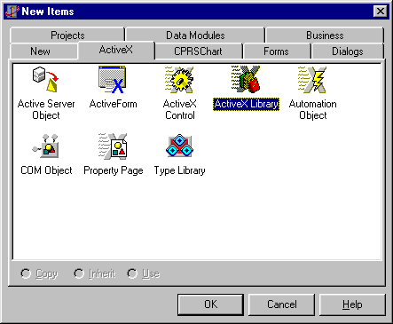
1.  Save your project - give it a meaningful name (don't close the project, just save it). This example uses the project name SampleCPRSExtension.
1.  Select Project \| Import Type Library. This dialog will display:
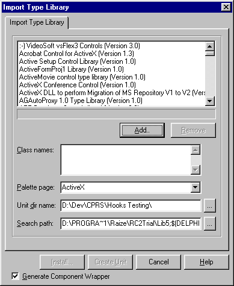
1.  Click the Add button. This will pull up a standard open file dialog - select the CPRSChart.exe file (which may reside in a different directory) and click on the Open button.
1.  CPRSChart Library should now be selected in the Import Type Library window. Click the Create Unit button. A new unit, CPRSChart_TLB.pas will be created and displayed in the Delphi code editor.
1.  Select the File \| New menu again.
1.  Select the ActiveX tab, Automation Object, and click OK.
1.  You will be presented with this dialog. Leave all the defaults, and provide a meaningful CoClass Name and click OK. This example uses the SampleCOMObject class name.
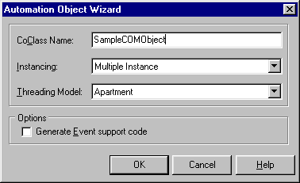
1.  The type library editor will automatically appear. With the ActiveX library name still selected in the tree view, click on the Uses tab.

1.  The uses tab will show two entries - Borland standard VCL type library, and OLE Automation. Uncheck the Borland standard VCL type library check box. This will produce the following message:


1.  Click on Yes. Developers who wish to use interfaces defined in Borland standard VCL type library may do so, but will be required to distribute and register Borland's stdvcl40.dll file with their application.
1.  Right click on the Uses tab, and select the Show All Type Libraries menu option.
1.  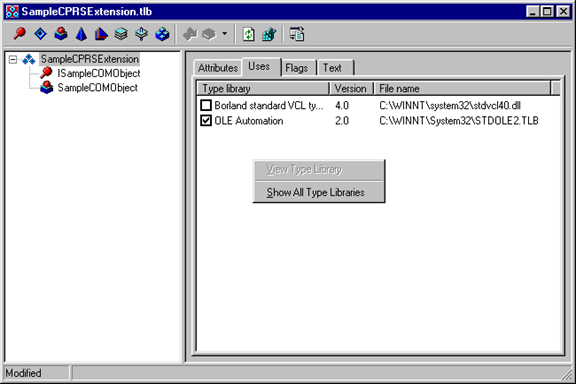
    The Uses tab should now display numerous entries. Scroll down the list until you see CPRSChart Library. Click on the check box to the left of this entry to include the CPRSChart library.
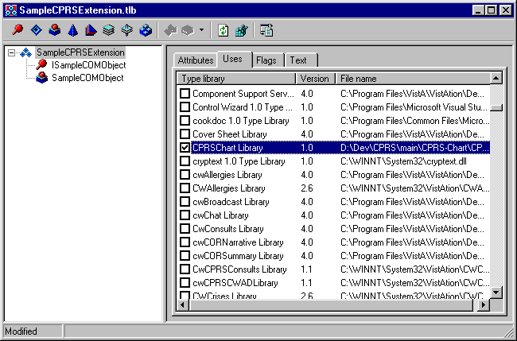
1.  In the tree view on the left, click on the CoClass entry. This will have a  symbol next to it, and will probably be the last entry in the tree view.
1.  Click on the Implements tab.
1.  Right click on the Implements tab, and select the Insert Interface menu option.


1.  A dialog will appear with several entries in it. Select the ICPRSExtension entry, and click OK.
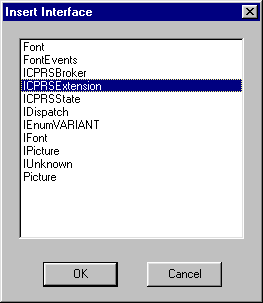
1.  The Implements tab should now contain the ICPRSExtension entry.
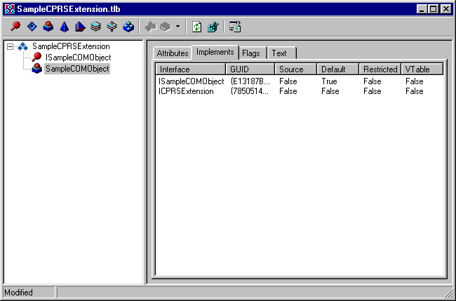
1.  Save the project again. You will be asked to save a new unit. Give this unit a meaningful name, preferably the same CoClass name entered in step \#10. This example uses the SampleCOMObject.pas unit name.
1.  Select the unit just saved in the Delphi code editor (e.g. SampleCOMObject). In the top uses section, add CPRSChart_TLB to the uses clause (you must make this change before you will be able to compile). The unit should now look something like this:
unit SampleCOMObject;
***

interface
***

uses
ComObj, ActiveX, SampleCPRSExtension_TLB, StdVcl, CPRSChart_TLB;
***

type
TSampleCOMObject = class(TAutoObject, ISampleCOMObject, ICPRSExtension)
protected
function Execute(const CPRSBroker: ICPRSBroker;
const CPRSState: ICPRSState; const Param1, Param2,
Param3: WideString; var Data1, Data2: WideString): WordBool;
safecall;
{ Protected declarations }
end;
***

implementation
***

uses ComServ;
***

function TSampleCOMObject.Execute(const CPRSBroker: ICPRSBroker;
const CPRSState: ICPRSState; const Param1, Param2, Param3: WideString;
var Data1, Data2: WideString): WordBool;
begin
***

end;
***

initialization
TAutoObjectFactory.Create(ComServer, TSampleCOMObject, Class_SampleCOMObject,
ciMultiInstance, tmApartment);
end.
***

1.  The Execute method will be called from within CPRS when a specific event is activated. The CPRSBroker and CPRSState parameters are passed into the call, and can be used from within this event to make RPC calls and review current user and patient information. Details on these interfaces are documented below. There are currently three events within CPRS that will cause a COM object to be activated:
-   Patient Selection.
-   Order Acceptance.
-   Template activation (when the template is tied to a COM object).
***

This example will create a simple Patient Selection COM Object that displays a message with patient information. Actual use will vary but might include some kind of dialog being presented to the user, and some kind of user interaction taking place. To make this change, add the Dialogs unit to the uses clause, and add the ShowMessage code as shown:

implementation
***

uses ComServ, Dialogs;
***

function TSampleCOMObject.Execute(const CPRSBroker: ICPRSBroker;
const CPRSState: ICPRSState; const Param1, Param2, Param3: WideString;
var Data1, Data2: WideString): WordBool;
begin
ShowMessage('Patient Selected: ' + CPRSState.PatientName);
end;
***

1.  Save and compile. You will not be able to run the application since it's a DLL.
1.  Select the RUN \| Register ActiveX Server menu option. You should receive a confirmation message indicating successful registration.
1.  Open a terminal emulator program (e.g. KEA). Connect to the account where CPRS GUI v16 has been installed.
1.  Run FileMan.
1.  Select the ENTER OR EDIT FILE ENTRIES option
1.  Select the OE/RR COM OBJECTS file (\#101.15) for editing
1.  You will be asked to "Select OE/RR COM OBJECTS NAME:" - enter a unique, meaningful name in uppercase.
1.  You will then be asked to enter an Object GUID. To find this value, go back to Delphi, and select the type library unit created for the project (the example file is SampleCPRSExtension_TLB.
1.  Near the top of this unit are three GUIDs defined. Select the CLASS GUID. The example would use the CLASS_SampleCOMObject GUID.
const
// TypeLibrary Major and minor versions
SampleCPRSExtensionMajorVersion = 1;
SampleCPRSExtensionMinorVersion = 0;
***

LIBID_SampleCPRSExtension: TGUID = '{D817B0F8-6F2F-11D5-82E8-00C04F72C274}';
***

IID_ISampleCOMObject: TGUID = '{D817B0F9-6F2F-11D5-82E8-00C04F72C274}';
CLASS_SampleCOMObject: TGUID = '{D817B0FB-6F2F-11D5-82E8-00C04F72C274}';
***

1.  Highlight this value, starting with the open braces '{' and ending with the close braces '}', (don't include the quotes) and copy to the clipboard.
1.  Go back to the terminal session, and paste the GUID into the Object GUI field.
1.  Leave the inactive field empty.
1.  The Param1 field will be passed directly to the COM object as Param1 in the execute method.
1.  An optional description field can be entered if desired.
1.  Exit FileMan
1.  Now we need to link the COM object to the patient selection event. Run the XPAR EDIT PARAMETER option
1.  Select the ORWCOM PATIENT SELECTED parameter
1.  Select the desired entity (for testing just use the User entity, and select yourself). You will then be asked to select an entry in the OE/RR COM OBJECTS file. Select the entry just made in steps 25-37.
1.  Run CPRS GIU v16. When selecting a patient, the ShowMessage dialog entered in step 22 should appear.
1.  To link a COM object to order acceptance, by display group, use the ORWCOM ORDER ACCEPTED parameter.
1.  To link a COM object to a template, enter the template editor in the CPRS GUI, and edit shared templates (end users are not allowed to link templates to COM objects, since this requires installation of the COM object on the workstation).
1.  Create a new Shared Template, give the template a name, and select a Template Type of COM Object. The bottom of the template editor will change to display two fields, COM Object and Passed Value. COM Object allows selection of an active entry in the OE/RR COM OBJECTS file. The passed value field is text that will be passed in Param3 of the execute method. When using the template, the COM object will be activated.

***

### CPRS GUI v21 Changes to COM Object Template Functionality

In the original document entitled "Creating CPRS Extension COM Object in Delphi", the Data2 parameter is described as follows with respect to templates:
"Data2 is reserved for future use, but is anticipated to be XML formatted data passed between CPRS and invoked COM objects."
The following block of XML is now transmitted to the COM object template in the Data2 parameter, as a TStrings.Text value, meaning that multiple lines are separated by carriage return line feed pairs.. The DOC_IEN entity contains the pointer to the TIU DOCUMENT file (\#8925) for the current document. The AUTHOR_IEN entity contains the pointer to the NEW PERSON file (\#200) for the currently recorded author of the document. The AUTHOR_NAME entity contains that author's name as contained in the .01 field of the NEW PERSON file (\#200). This XML is passed to the COM object on all of the TIU-related tabs in CPRS (Notes, Consults, Discharge Summary, Surgery).
\<TIU_DOC\>
\<DOC_IEN\>**ien**\</DOC_IEN\>
\<AUTHOR_IEN\>**ien**\</AUTHOR_IEN\>
\<AUTHOR_NAME\>**name**\</AUTHOR_NAME\>
\</TIU_DOC\>
***

On return from the COM object, CPRS will continue to accept modified text for the note in the DATA1 parameter. The DATA2 parameter will now also be scanned for any change in author returned by the COM object. The data returned in DATA2 must be in the following XML format to be correctly processed by CPRS. The AUTHOR_IEN entity MUST contain the pointer to the NEW PERSON file (\#200) for the newly selected author of the document. The AUTHOR_NAME entity contains that author's name as listed in the .01 field in file \#200. Returning the AUTHOR_NAME entity is optional, and it is used only for display of a message to the user in the event that the returned author is determined to be invalid.
\<TIU_DOC\>
\<DOC_IEN\>**ien**\</DOC_IEN\>
\<AUTHOR_IEN\>**ien**\</AUTHOR_IEN\>
\<AUTHOR_NAME\>**name**\</AUTHOR_NAME\>
\</TIU_DOC\>
***

Prior to acceptance and storage, the author returned by the COM object is first validated as a current entry in file 200. Next, that author is evaluated for cosignature requirements. If a cosigner is required, the user is presented with the Note Properties screen, and is required to supply a cosigner for the document. Once these requirements have been addressed, the new author (and cosigner, if applicable) is attached to the note, the COM object's text is inserted, and processing continues as before.
At this time, only the CPRS Notes tab will recognize and process a change of author. The other TIU tabs (Consults, Discharge Summary, Surgery) have additional complicating factors related to authorship which have not been addressed in this release.
### Distribution

In addition to the steps outlined above, COM objects need to be distributed and registered on each workstation where the COM object is to be used. To distribute the COM object, it needs to be copied to each machine. To register a COM object, execute the following command on each machine, after the file has been copied to the hard disk:
regsvr32 [FileName]
***

The regsvr32 program is a windows utility that registers and un-registers COM objects. [FileName] is the file path and name of the COM object being registered. For a list of additional flags that can be passed, run regsvr32 without a filename.
Note that if the COM object is not present or has not been registered, CPRS will raise an error, alerting the user that the COM Object is not registered on the workstation. Following the error, CPRS will continue on as if the COM object did not exist. Additional attempts to run the COM object will be automatically aborted without an error, until CPRS is restarted.
***

### CPRS Registration

In addition to the COM object being registered with Windows, CPRS must also be registered with Windows. Normally CPRS will automatically register itself when it is run. CPRS can optionally be registered as a COM server. An in-depth discussion of COM is beyond the scope of this document. However, by registering CPRS in this manner, client applications can use the RPC Broker in CPRS to communicate with VistA. Due to operating system security restrictions built into Windows 7 and Windows 10, administrative access is required to a computer before the CPRS COM server can be registered. This can be run from either a command prompt using administrator privileges or this can be ran via an administrator run CPRS shortcut:
CPRSChart /register
***

This registration step only needs to be performed once per workstation. If desired, this can be combined with the registration steps taken during the installation of COM objects. If, for any reason, CPRSChart needs to be unregistered, it will accept the /unregister parameter. When the /register or /unregister parameters are passed, CPRSChart will register or unregister itself silently, without any visual indication of execution.
## Appendix F - Interface Specifications

### BrokerParamType Enumeration

The BrokerParamType enumeration is the equivalent of the TParamType enumeration used by the Broker. Valid values are bptLiteral, bptReference, bptList, and bptUndefined.
### ICPRSBroker Interface

The ICPRSBroker interface provides access to the CPRS broker which allows the COM object to make remote procedures without needing to create another partition on the server.
#### SetContext function

Format: function SetContext(const Context: WideString): WordBool;
This function allows the COM object to change broker context. The return boolean result will be true if the context change was allowed.
#### Server function

Format: function Server: WideString;
This function returns the broker's server connection.
#### Port function

Format: function Port: Integer;
This function returns the current port number that is being used by the broker.
#### DebugMode function

Format: function DebugMode: WordBool;
This boolean function returns true if the broker is in debug mode.
#### CallRPC procedure

Format: procedure CallRPC(const RPCName: WideString);
This procedure sets the remote procedure name of the broker and executes the broker call method.
#### RPCVersion property

Format: property RPCVersion: WideString;
This property and its corresponding Get_RPCVersion and Set_RPCVersion methods are used to set the Broker's RPCVersion property.
#### ClearParameters property

Format: property ClearParameters: WordBool;
This property and its corresponding Get_ClearParameters and Set_ClearParameters methods are used to set the Broker's ClearParameters property.
#### ClearResults property

Format: property ClearResults: WordBool;
This property and its corresponding Get_ClearResults and Set_ClearResults methods are used to set the Broker's ClearResults property.
#### Results property

Format: property Results: WideString;
This property and its corresponding Get_Results and Set_Results methods are used to access the Broker's Result property. Since the TRPCBroker class implements this property as a TStrings object, the ICPRSBroker.Results property is the equivalent of the RPCBroker.Results.Text property. It is recommended that an internal TStrings descendant class be used to decipher multi-line Results values.
#### Accessing the RPC Broker's Params property

Three properties and two functions have been provided to access the TRPCBroker Params property.
Format: property Param[Index: Integer]: WideString;
property ParamType[Index: Integer]: BrokerParamType;
property ParamList[Index: Integer; const Node: WideString]: WideString;
function ParamCount: Integer;
function ParamListCount(Index: Integer): Integer;
***

Param[Index] is equivalent to RPCBroker.Param[Index].Value.
***

ParamType[Index] is equivalent to RPCBroker.Param[Index].PType, and accepts the BrokerParamType enumerated values detailed above.
***

ParamList[Index, Node] is equivalent to RPCBroker.Param[Index].Mult[Node].
***

ParamCount is equivalent to RPCBroker.Param.Count.
***

ParamListCount[Index] is equivalent to RPCBroker.Param[Index].Mult.Count.
### ICPRSState Interface

The ICPRSState interface provides COM objects with basic CPRS context information.
#### Handle function

Format: function Handle: WideString;
This function returns a handle unique to a specific instance of CPRS and is provided for COM objects that may need a unique identifier for each instance of CPRS. The handle is comprised of the TCP/IP address of the workstation, followed by the window handle of the main CPRS window.
#### UserDUZ function

Format: function UserDUZ: WideString;
This function returns the internal entry number to the NEW PERSON file (\#200) for the current CPRS user.
#### UserName function

Format: function UserName: WideString;
This function returns the name of the current user.
#### PatientDFN function

Format: function PatientDFN: WideString;
This function returns the internal entry number to the PATIENT file (\#2) for the currently selected patient.
#### PatientName function

Format: function PatientName: WideString;
This function returns the name of the currently selected patient.
#### PatientDOB function

Format: function PatientDOB: WideString;
This function returns the date of birth for the currently selected patient. The patient’s DOB is displayed in MM/DD/YYYY format.
#### PatientSSN function

Format: function PatientSSN: WideString;
This function returns the social security number of the currently selected patient.
#### LocationIEN function

Format: function LocationIEN: Integer;
This function returns the internal entry number to the HOSPITAL LOCATION file (\#44) for the currently selected location. If no location has been selected this value will be 0.
#### LocationName function

Format: function LocationName: WideString;
This function returns the name of the currently selected location. If no location has been selected this value will be blank.
***

### ICPRSExtension Interface

The ICPRSExtension interface is the only interface that must be implemented by the COM object. The only method of this interface, Execute, is called when the COM object is invoked. After Execute returns, the COM object is released. Note that CPRS execution halts until the Execute method returns. It is important to implement the COM object as an in-process server because CPRS can still process callback events from the windows operating system. Out of process COM objects prevent CPRS from processing these callback events. Without out of process COM objects, CPRS is not be able to timeout and is not able to notify the server of its continued presence (resulting in broker disconnects).
***

#### Execute function

Format: function Execute(const CPRSBroker: ICPRSBroker;
const CPRSState: ICPRSState; const Param1: WideString;
const Param2: WideString; const Param3: WideString;
var Data1: WideString; var Data2: WideString): WordBool;
The CPRSBroker parameter is an object that implements the ICPRSBroker interface and provides access to the CPRS Broker.
The CPRSState parameter is an object that implements the ICPRSState interface and provides basic CPRS state information.
Param1 is the value of the Param1 field of the OE/RR COM OBJECTS file (\#101.15).
Param2 varies depending on how the COM object is being invoked.
For Patient Change events, Param2 is P=PatientDFN.
For Order Accept events, Param2 is O=OrderIdentifier.
For templates, Param2 is blank unless the template is also linked directly to a TIU Title, a Consult, or a Procedure Reason for Request. For Titles, Param2 is T=TitleIEN - pointer to the TIU DOCUMENT DEFINITION file (\#8925.1). For Consults, Param2 is C=ServiceIEN - pointer to the REQUEST SERVICES file (\#123.5). For Procedures, Param2 is P=ProcedureIEN - pointer to the GMRC PROCEDURE file (\#123.3).
Param3 contains the Passed Value defined for a template. The Passed Value the value contained in the COM PARAM field (\#.18) of the TIU TEMPLATE file (\#8927). If the COM object is not linked to a template, Param3 is blank.
Data1 is used as note or reason for request text by COM objects linked to templates. For templates associated with a specific title or reason for request, Data1 will initially contain the boilerplate text associated with that title or reason for request. All other templates will leave Data1 blank. Data1 is a var parameter, and should be set by the COM object to return note or reason for request text. Note that Data1 is a TStrings.Text value which means that multiple lines are separated by carriage return line feed pairs.
Data2 is reserved for future use, but is anticipated to be used for XML formatted data passed between CPRS and invoked COM objects.
Return Value - the execute function returns a boolean value. For COM objects linked to templates, this return value must be TRUE in order for CPRS to accept any text passed in Data1. Patient and ordering events ignore the return.
***

## Appendix G - Accessibility

### JAWS Files

JAWS is a screen reader application that enables a computer to verbally describe the controls and content of computer applications. For example, in CPRS, when a user changes tabs, JAWS will speak the name of the tab, such as “Orders tab”, enabling the visually-challenged user to navigate CPRS and complete necessary tasks.
Developers have created specialized scripts and CPRS components that enable JAWS to work more effectively with CPRS. As part of the CPRS GUI v.27 (OR\*3.0\*243) release a zip file (CPRS27_JAWS_SUPPORT_FILES.ZIP) including the JAWS scripts and supporting files is being distributed.
The improvements work only with JAWS 7.1 or later. However, JAWS 8.0.2173 or later is best because it fixes a bug that caused CPRS to crash when reading progress notes with JAWS. This fix is not in earlier versions of JAWS 8.0.
Usually it is best for JAWS users stay up to date with the latest releases of the product.
The following files are contained in the CPRS27_JAWS_SUPPORT_FILES.ZIP file:
-   JAWS.SR - DLL used for communication between JAWS and CPRS
-   JAWSUPDATE.EXE - Used to update JAWS 7.1 to work with the component
-   VA508APP.jcf - JAWS configuration file
-   VA508APP.JSS - JAWS script file
-   VA508JAWS.jss - JAWS script file
-   VA508JAWSDispatcher - Application used for communication between JAWS and multiple applications using the JAWS.SR DLL
-   VA508APP.jkm - JAWS keyboard mapping file
-   VA508JAWS.jsd - Documentation companion file to the VA508JAWS.jss script file
-   Vcredist_x86.exe is the Microsoft Visual C++ 2005 Redistributable. It is called by JAWSUpdate.exe.
***

To use the accessibility features, a user must copy these files into Program Files\\Vista\\Common Files, which is normally found on the workstation at C:\\Program Files\\Vista\\Common Files. If the workstation is running JAWS 8.0.2173 or higher, nothing further is required.
If the workstation is running an earlier version of JAWS 8.0, or JAWS 7.1.500, the user must go to Program Files\\Vista\\Common Files and run JAWSUpdate.exe. JAWSUpdate installs a COM object for compatibility with these versions.
**Note:** You must have administrative rights on the machine to run JAWSUpdate.exe.
If the workstation is running a version of JAWS that is older than v 7.1.500, the new accessibility features in CPRS will not function. CPRS will function as it did without these changes, but the following error message will display:

This error message tells users that they need to update to a newer version of JAWS.
***

### New Accessibility Framework

Beginning with CPRS v.27 (OR\*3.0\*243), a new Accessibility Framework was created in CPRS. This includes a new Delphi component, scripts, and other files that enable JAWS and CPRS to work better together. The new component can be used by other developers creating graphical user interface (GUI) applications. The Office of Information Health Data & Informatics (HDI) has custody of this component. To find out more about the component, please contact VHA OI HDI Section 508 Mail group.
## Appendix H – USING NEWPERS DEBUGGER

As part of the OR\*3.0\*596 release 3 Remote Procedure Calls (RPCs) are updated, a new option (OR NEWPERS DEBUGGER) is added to the OR PARAM COORDINATOR menu (CPRS Configuration (Clin Coord)) in addition to a new parameter definition **ORNEWPERS ACTIVE** [“RPC routine ONEWPERS Active”].

### RPC Updates

The following RPC calls are updated with the OR\*3.0\*596 release:
-   ORWU NEWPERS: Used throughout CPRS for selecting a NEW PERSON for various roles. There are approximately 45 entry points for this call.
-   ORWTPP GETCOS: Used in CPRS for designating a default co-signer.
-   ORWU2 COSIGNER: Used in CPRS for designating an Attending Physician for a Discharge Summary.
The ORWU NEWPERS RPC is the most widely used and offers the most variation of required and optional parameters. Using CPRS’s RPC Log allows users to see the actual parameters being passed into the RPC during use.
***

In CPRS, from “Help” -\> “Last Broker Call” opens up CPRS’s RPC Log:
Using the “Find” box, enter ORWU NEWPERS and press \<Enter\>.
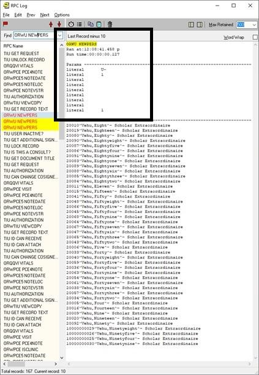
#### Detailed view of “Params” list sent by CPRS with parameters annotated:

The parameter names are not displayed but are added to the graphic below. Parameters are always passed in the same order. CPRS v33 will include a new parameter after the EXCLDE parameter that will indicate whether or not the RPC will include or exclude Non-VA Providers from list boxes.

***

| Parameter | Value | Description                                                                       |
|-----------|-------|-----------------------------------------------------------------------------------|
| FROM      | U\~   | Starting location in the index                                                    |
| DIR       | 1     | Direction to move through the index: 1 – forward, -1 -- backward                  |
| KEY       |       | Name of Security Key the user(s) must hold otherwise screen from selection        |
| DATE      |       | FM Date used for evaluation of Person Class, Termination Date, etc.               |
| VIZ       |       | If 1, allows visitors for selection                                               |
| ALL       |       | If 1, asks for all users selectable regardless of termination or DISUSER’d status |
| PDMP      |       | If 1, asks for only PDMP Authorized users                                         |
| SIM       |       | If 1, asks for a list of similar provider names                                   |
| EXCLDE    | 1     | If 1, uses OR CPRS USER CLASS EXCLUDE parameter definition value                  |
### OR NEWPERS DEBUGGER

The OR NEWPERS DEBUGGER option prompts the user for CPRS specific parameters that control which users to include in the NEW PERSON list boxes. It uses the same remote procedure call (RPC) as CPRS.
Based on the parameters selected, the debugger displays any reason that a specific user may be excluded from selection in a NEW PERSON list box in CPRS.
**Option Name**: OR NEWPERS DEBUGGER
**Option Text**: Evaluate a NEW PERSON for CPRS Selection
**Option Abbreviation**: NP
**Note**: The below image is an example menu only, it does not display all menu options.
Select CPRS Configuration (Clin Coord) \<TEST ACCOUNT\> Option: ??
***

AL Allocate OE/RR Security Keys [ORCL KEY ALLOCATION]
DC Edit DC Reasons [ORCL ORDER REASON]
GP GUI Parameters ... [ORW PARAM GUI]
GA GUI Access - Tabs, RPL [ORCL CPRS ACCESS]
MI Miscellaneous Parameters [OR PARAM ORDER MISC]
NO Notification Mgmt Menu ... [ORB NOT COORD MENU]
OC Order Checking Mgmt Menu ... [ORK ORDER CHK MGMT MENU]
MM Order Menu Management ... [ORCM MGMT]
LI Patient List Mgmt Menu ... [ORLP PATIENT LIST MGMT]
FP Print Formats [ORCL PRINT FORMAT]
PR Print/Report Parameters ... [OR PARAM PRINTS]
RE Release/Cancel Delayed Orders [ORC DELAYED ORDERS]
US Unsigned orders search [OR UNSIGNED ORDERS]
EX Set Unsigned Orders View on Exit [OR PARAM UNSIGNED ORDERS VIEW]
NA Search orders by Nature or Status [OR NATURE/STATUS ORDER SEARCH]
CS Controlled Substance Order Anomalies [OR CS ORDER ANOMALIES]
IS Immunization/Skin Test Data Entry parameters ... [OR VIMM MENU]
CI Consults Clinically Indicated Date Default [ORW CLIN IND DATE DFLT]
DO Event Delayed Orders Menu ... [OR DELAYED ORDERS]
KK Check for Multiple Keys [ORE KEY CHECK]
LO Lapsed Orders search [OR LAPSED ORDERS]
**NP Evaluate a NEW PERSON for CPRS Selection [OR NEWPERS DEBUGGER]**
***

Select CPRS Configuration (Clin Coord) \<TEST ACCOUNT\> Option:
***

### ORNEWPERS ACTIVE

After patch installation, the new parameter definition **ORNEWPERS ACTIVE** [“RPC routine ONEWPERS Active”] default value is set to YES. Use the XPAR MENU TOOLS [“General Parameter Tools”] menu option, “Edit Parameter Values” to modify the ORNEWPERS ACTIVE parameter definition.
This parameter may be set to NO or blank. When set to NO or left blank, CPRS is redirected to use the old NEW PERSON lookup/RPC and the results from the debugger are no longer valid.
Example evaluation of a NEW PERSON:
Enter NEW PERSON to evaluate: CPRSDOCTOR,ONE
***

Required Parameters
Terminated or DISUSER allowed? NO//
Visitor only [for Remote Data View]? NO//
Must be authorized PDMP user? NO//
Screen for default co-signer selection? NO//
Verify co-signature authorization for a document title? NO//
***

Optional Parameters
Enter a SECURITY KEY: XUPROGMODE
Enter a DATE: T
Include Non-VA Providers? NO//
Screen for OR CPRS USER CLASS EXCLUDE parameter? NO// YES
***

Verifying CPRSDOCTOR,ONE...
***

Reason(s) for exclusion
Not assigned XUPROGMODE Security Key
No active 'Person Class' for Jan 13, 2023
Non-VA and 'core' CPRS TAB ACCESS active on Jan 13, 2023
Non-VA Provider excluded via parameter
Not assigned OR CPRS GUI CHART option [any menu tree]
Member of EMERGENCY MEDICINE user class excluded via parameter
***

CPRSDOCTOR,ONE would NOT be selectable.
***

Type \<Enter\> to continue or '\^' to exit:
#### Using the OR NEWPERS DEBUGGER

Enter the name of the NEW PERSON to evaluate.
Enter NEW PERSON to evaluate: CPRSDOCTOR,ONE
##### Required Parameters

CPRS controls how the available users are screened prior to presentation for selection in the various NEW PERSON list boxes through parameters. The debugger can use the exact parameters for CPRS uses depending on the location in CPRS the NEW PERSON list box is being presented. After selecting a user for evaluation, the debugger prompts the user for Required Parameters:
Required Parameters
Terminated or DISUSER allowed? NO//
Visitor only [for Remote Data View]? NO//
Must be authorized PDMP user? NO//
Screen for default co-signer selection? NO//
Verify co-signature authorization for a document title? NO//
#### How the Required Parameters work & their locations in CPRS

Use the following information to set and understand the Required Parameters for the debugger.
At the prompt: Terminated or DISUSER allowed? NO//
Enter YES to include all users, regardless of their status.
**Example CPRS Location:**
Notes Tab -\> View -\> Signed Notes by Author
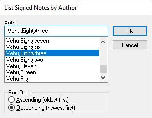
At the prompt: Allow visitors [for Remote Data View]? NO//
Enter YES to include visitors.
**Note**: This excludes terminated users.
***

At the prompt: Must be authorized PDMP user? NO//
Enter YES to exclude users that are not authorized for PDMP access.
**Example CPRS Location**:
Tools -\> PDMP -\> Request PDMP Data

At the prompt: Screen for default co-signer selection? NO//
Enter YES to evaluate the user for default co-signer selection.
**Example CPRS Location**:
Tools -\> Options -\> Notes Tab -\> Notes Button -\> Default cosigner:
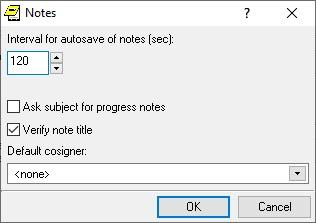
At the prompt: Verify co-signature authorization for a document title? NO//
Enter YES to evaluate the user for co-signature authorization for a specific document title.
THEN
At the prompt: Enter a DOCUMENT DEFINITION: enter the name of a document title to use for co-signer authorization.
Verify co-signature authorization for a document title? NO// YES
Enter a DOCUMENT DEFINITION: DISCHARGE SUMMARY TITLE
**
Note**: The functionality of this parameter is not currently implemented in CPRS v32B. Scheduled for use in CPRS v33.
#### Optional Parameters

Use the following information to set and understand Optional Parameters available in the debugger.
***

At the prompt: Enter a SECURITY KEY:
If a security key is entered, the key must be currently assigned to the user regardless of the required parameter selected.
**Example CPRS Location**:
Notes Tab -\> Encounter Button -\> Skin Tests Tab -\> Add/Edit/Delete Record -\> Select a Skin Test\* -\> Ordered by\*
The “Ordered by\*” list box requires users hold the PROVIDER Security Key.
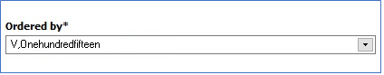
At the prompt: Enter a DATE:
If a date is entered, the user must meet one or more of the following criteria, depending on which required parameter selected:
Terminated ON or AFTER the date entered
Active Person Class for the date entered
Active CPRS TAB ACCESS for the date entered
Not a member of the user class set in the OR CPRS USER CLASS EXCLUDE for the date entered
Not a member of a user class that requires co-signature for the date entered
**Example CPRS Location**:
Notes Tab -\> Encounter Button -\> Visit Type Tab -\> Available providers
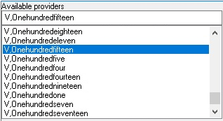
At the prompt: Include Non-VA Providers? YES//
By default, CPRS includes Non-VA Providers in NEW PERSON list boxes. If NO is selected, users that are currently assigned the Non-VA Providers CPRS ACCESS TAB are excluded from the list box.
**Note**: The functionality of this parameter is not currently implemented in CPRS v32B. Scheduled for use in CPRS v33.
***

At the prompt: Screen for OR CPRS USER CLASS EXCLUDE parameter? NO//
If YES is entered, CPRS excludes any users that are currently a member of the ASU user class currently set in the OR CPRS USER CLASS EXCLUDE parameter definition.
**Example CPRS Location**:
Notes Tab -\> Right Click a COMPLETED note -\> Identify Additional Signers
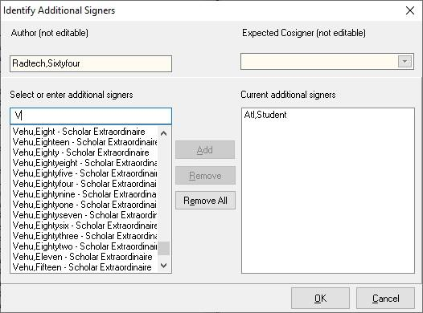
## Glossary

| CPRS              | Computerized Patient Record System, the **V***IST***A** package (in both GUI and character-based formats) that provides access to most components of the patient chart.                                                                                                                                                              |
|-------------------|--------------------------------------------------------------------------------------------------------------------------------------------------------------------------------------------------------------------------------------------------------------------------------------------------------------------------------------|
|                   |                                                                                                                                                                                                                                                                                                                                      |
| ASU               | Authorization/Subscription Utility, a **V***IST***A** application (initially released with TIU) that allows VAMCs to assign privileges such as who can do what in ordering, signing, releasing orders, etc.                                                                                                                          |
|                   |                                                                                                                                                                                                                                                                                                                                      |
| Chart Contents    | The various components of the Patient Record, equivalent to the major categories of a paper record; for example, Problem List, Progress Notes, Orders, Labs, Meds, Reports, etc. In CPRS, these components are listed at the bottom of the screen, to be selected individually for performing actions.                               |
|                   |                                                                                                                                                                                                                                                                                                                                      |
| Consults          | Consult/Request Tracking, a **V***IST***A** product that is also part of CPRS (it can function as part of CPRS, independently as a standalone package, or as part of TIU). It’s used to request and track consultations or procedures from one clinician to another clinician or service.                                            |
|                   |                                                                                                                                                                                                                                                                                                                                      |
| Cover Sheet       | A screen of the CPRS patient chart that displays an overview of the patient’s record.                                                                                                                                                                                                                                                |
|                   |                                                                                                                                                                                                                                                                                                                                      |
| CWAD              | Crises, Warnings, Allergies/Adverse Reactions, and Directives. These are displayed on the Cover Sheet of a patient’s computerized record, and can be edited, displayed in greater detail, or added to. *See Patient Postings.*                                                                                                       |
|                   |                                                                                                                                                                                                                                                                                                                                      |
| D/C Summary       | Discharge Summary; see below.                                                                                                                                                                                                                                                                                                        |
|                   |                                                                                                                                                                                                                                                                                                                                      |
| Discharge Summary | A component of TIU that can function as part of CPRS, Discharge Summaries are recapitulations of a patient’s course of care while in the hospital.                                                                                                                                                                                   |
|                   |                                                                                                                                                                                                                                                                                                                                      |
| GUI               | Graphical User Interface—a Windows-like screen with pull-down menus, icons, pointer device, etc.                                                                                                                                                                                                                                     |
|                   |                                                                                                                                                                                                                                                                                                                                      |
| Health Summary    | A **V***IST***A** product that can be viewed through CPRS, Health Summaries are components of patient information extracted from other **V***IST***A** applications.                                                                                                                                                                 |
|                   |                                                                                                                                                                                                                                                                                                                                      |
| Imaging           | A **V***IST***A** product that is also a component of CPRS; it includes Radiology, X-rays, Nuclear Medicine, etc.                                                                                                                                                                                                                    |
|                   |                                                                                                                                                                                                                                                                                                                                      |
| Notifications     | Alerts regarding specific patients that appear on the CPRS patient chart. They can be responded to through “VA View Alerts.”                                                                                                                                                                                                         |
|                   |                                                                                                                                                                                                                                                                                                                                      |
| OE/RR             | Order Entry/Results Reporting, a **V***IST***A** product that evolved into the more comprehensive CPRS.                                                                                                                                                                                                                              |
|                   |                                                                                                                                                                                                                                                                                                                                      |
| Order Checking    | A component of CPRS that reviews orders as they are placed to see if they meet certain defined criteria that might cause the clinician placing the order to change or cancel the order (e.g., duplicate orders, drug-drug/diet/lab test interactions, etc.).                                                                         |
|                   |                                                                                                                                                                                                                                                                                                                                      |
| PCMM              | Patient Care Management Module, a **V***IST***A** product that manages patient/provider lists.                                                                                                                                                                                                                                       |
|                   |                                                                                                                                                                                                                                                                                                                                      |
| PDMP              | Prescription Drug-Monitoring Program                                                                                                                                                                                                                                                                                                 |
|                   |                                                                                                                                                                                                                                                                                                                                      |
| Patient Postings  | A component of CPRS that includes messages about patients; an expanded version of CWAD (see above).                                                                                                                                                                                                                                  |
|                   |                                                                                                                                                                                                                                                                                                                                      |
| Progress Notes    | A component of TIU that can function as part of CPRS.                                                                                                                                                                                                                                                                                |
|                   |                                                                                                                                                                                                                                                                                                                                      |
| Quick Orders      | Quick Orders allow you to enter many kinds of orders without going through as many steps. They are types of orders that physicians have determined to be their most commonly ordered items and that have standard collection times, routes, and other conditions.                                                                    |
|                   |                                                                                                                                                                                                                                                                                                                                      |
| Reports           | A component of CPRS that includes Health Summary, Action Profile, and other summarized reports of patient care.                                                                                                                                                                                                                      |
|                   |                                                                                                                                                                                                                                                                                                                                      |
| TIU               | Text Integration Utilities; a package for document handling, that includes Consults, Discharge Summary, and Progress Notes, and will later add other document types such as surgical pathology reports. TIU components can be accessed for individual patients through the CPRS, or for multiple patients through the TIU interface. |
|                   |                                                                                                                                                                                                                                                                                                                                      |
| VISN              | Veterans Information System Network, the regional organizations for managing computerization within a region.                                                                                                                                                                                                                        |
|                   |                                                                                                                                                                                                                                                                                                                                      |
| **V***IST***A**   | Veterans Information Systems Technology Architecture, the new name for DHCP.                                                                                                                                                                                                                                                         |

## Index

%DFN, 6
%DUZ, 6
%MREF, 6
%PORT, 6
%SRV, 5
Add/Edit Reminder Categories, 228
**Alerts**, 614
**Allergies**, 613
Antimicrobial Quick Orders
Auditing Options, 147
Tracking, 144
Appointments
return or follow up, 325, 326, 443
ASU, 613
Authorized to Write Medication Orders, 193
Auto-DC Blood orders, 166
Blood bank. *See* VBECS
orders. *See* VBECS
C & A provider, 185
Canceling Lab Orders, 201
card
PIV, 195
card readers, 168
categories, 228
Chart Contents, 613
CHART Copy, 272, 273
check
ePCS provider configuration, 179
Clinic
locations set up, 78
orders user set up, 78
Clinic Orders, 77
Clinically indicated date, 327, 479
command line switches, 2
Computerized Patient Record System, 613
Consults, 613, 615
controlled substances, 188
cover sheet, 225
Cover Sheet, 227, 613
CPRS, 1, 2, 4, 5, 6, 17, 65, 68, 81, 199, 207, 209, 210, 215, 225, 226, 227, 228, 229, 232, 233, 239, 240, 242, 271, 272, 273, 428, 478, 484, 500, 529, 530, 534, 536, 537, 549, 550, 555, 557, 560, 561, 563, 567, 572, 613, 614, 615
CPRS Cover Sheet Reminder List, 227
CPRS Lookup Categories, 229
CWAD, 613, 615
Date
clinically indicated, 327, 479
DEA
check ePCS provider configuation, 179
DEA number, 174, 193
expiration date, 193, 194
digital signature project, 168
ePCS provider data configuration reports, 180
pharmacy drug schedules for, 193
provider data validation reports
Duplicate VA Numbers report, 184
ePCS Provider Incomplete Configuration report, 181
Fee Basis/C & A Providers Without a DEA Number report, 185
Provider Last Names Containing Punctuation report, 186
troubleshooting possible problems, 195
VA number, 174, 193, 194
duplicate, 184
debug switch, 2
Default
lab on Labs tab, 403, 433
Default Printer, 271, 272
digital
certificates, 168
signature, 168–97
Discharge Meds, 76
Discharge Release Event, 103
Discharge Summary, 613, 614, 615
display options (public)
for graphing, 29
ePCS
check provider configuration, 179
Data Entry for Prescriber application, 186
DEA number, 193
expiration date, 193
provider data validation reports
Duplicate VA Numbers report, 184
Fee Basis/C & A Providers Without a DEA Number report, 185
Provider Incomplete Configuration report, 181
Provider Last Names Containing Punctuation report, 186
provider data validation reports, 180
VA number, 193, 194
duplicate, 184
ePCS SITE ENABLE/DISABLE, 170
ePCS USER ENABLE/DISABLE, 170
expiration date
DEA number, 193
Expiring orders, 74
Fee Basis providers, 185
Give Additional Dose Now Option, 115
Glossary, 613
Graphing
adding menu to Available Reports list, 32
creating graph reports, 30
disable background caching processing, 26
disable data sources, 27
disable graphing, 26
public display options and views, 29
reports menu, 31
Group notes locations, 401, 431
GUI, 613, 614
HDR
enable queries from RDV, 380, 566
Health Summary, 614
ICD codes, 51
Imaging, 614
Immediate Collect Issues, 201
*Interface*, 614
JLV
parameter definition by function, 390
parameter definition by name, 568
Joint Legacy Viewer. *See* JLV
key
OREPCSSITE, 170
OREPCSUSER, 170
ORES, 179
XUEPCSEDIT, 170, 174, 179
keys
ORSUPPLY, 80
LABELS, 272, 506, 510
lapsing orders, 140
List Manager, 65, 68, 74, 76, 81, 143, 207, 240, 242, 273
Lookup Categories, 228, 229
medication renewal by telephone, 339, 422
medications
Non-VA clerk parameter by name, 438
Non-VA clerk paramter by function, 373
Non-VA Med reasons parameter by name, 536
Non-VA reasons, 154
Non-VA Med
clerk paramter by function, 373
clerk paramter by name, 438
reasons, 154
reasons parameter by name, 536
Notes
parameter for group application, 401, 431
Notifications, 614
parameter defining what alerts can be removed witout processing, 474
parameter for storing sort method, 366, 476
number
DEA, 174, 193
port, 188
VA, 174, 193, 194
duplicate, 184
nursing administration order, 157
OE, 614
Orders, 613, 615
clinic, 77
expiring, 74
lapsing, 140
Print, 271
supply simple, 80
tab, 197, 198, 241
OREPCSSITE key, 170
OREPCSUSER key, 170
ORSUPPLY key, 80
Other, 229
Patient Postings, 615
PCMM, 614
Personal ldentification Number. *See* PIN
PHARMACY UAP Display Group, 75
phone prescription renewal
proxy user, 339, 422
PIN, 168, 189
PIV card, 168, 174, 195
PKI_verify_services, 173
PKISERVER.EXE, 173, 195
PKIVerifyServerSetup, 173
port switch, 2
Printing, 271
**Problem List**, 613
Progress Note Headers, 231
Progress Notes, 613, 615
Provider
C & A, 185
configured for ePCS, 180
Duplicate VA Numbers report, 184
ePCS Provider Incomplete Configuration report, 181
extra spaces in name, 186
Fee Basis, 185
Fee Basis/C & A Providers Without a DEA Number report, 185
Provider Last Names Containing Punctuation report, 186
punctuation in name, 186
proxy user ID for telephone prescription renewal, 339, 422
Public display options for graphing, 29
Public views for graphing, 29
punctuation in a provider name, 186
Quick Order Free Text Report, 251
Quick Order Mixed-Case, 244
Quick Orders, 141, 142, 143, 615
Reminder categories, 228
Reminder Icon Definitions, 233
Reminder Options, 225, 239
Reports, 613, 615
adding graphing menu to Available reports list, 32
DEA ePCS Duplicate VA Numbers report, 184
DEA ePCS Fee Basis/C & A Providers Without a DEA Number report, 185
DEA ePCS Provider Incomplete Configuration report, 181
DEA ePCS Provider Last Names Containing Punctuation report, 186
default on Labs tab, 433
default report on lab tab, 403
graph, 30
graph report menu, 31
lapsed orders, 140
Quick Order Free Text, 251
Quick Order Mixed-Case, 244
REQUISITIONS, 272, 510, 511
Return to Clinic
additional information parameter, 325
overview, 156
prerequisites parameter, 326, 443
**RR**, 614
RTC. *See* Return to Clinic
SAN, 174, 193
possible need to enter manually, 186
Schedule 2-5 orders, 168, 174, 193, 194
server name, 188
server switch, 2
SHOWRPCS switch, 3
smart cards, 168, 186
SNOMED
concepts
on the Problems tab, 51
splash screen switch, 3
Subject Alternative Name. *See* SAN
Summaries, 613
Supply orders, 80
switches, 2
telephone prescription renewal parameter, 339, 422
TIU, 615
Tools menu, 4, 6, 197, 198, 241
Unified Action Profile, 75, 103
VA number, 174, 193, 194
duplicate, 184
VBECS
adding to the Write Orders list, 162
communication, 157
order dialog, 156
overview, 156
parameters, 167
quick orders, 158
related to file 60, 156
Views (public)
graphing, 29
VISN, 615
*VistA*, 6
VISTA, 1, 572, 613, 614, 615
VistA Blood Establishment Computer Software. *See* VBECS
Window Layout, 2, 14
WORK Copy, 272, 273
XUEPCSEDIT key, 170, 174, 179