# Technical Manual
CPRS: List Manager Version
December 2023

### Outline
```text
Introduction
Implementation & Maintenance
Exported Routines
Menus and Options
Creating and Updating Orders
Ordering Reports and Utilities
Copy/Paste Reports and Parameters
HIPAA Code Set Versioning (CSV)
CPRS Files
Cross-References
External Relations
CPRS Remote Procedure Calls (RPCs)
Package-Wide Variables
How to Get Online Documentation
Glossary
Troubleshooting & Helpful Hints
Appendix A: CPRS Package Security
Appendix B: Electronic Signature
Appendix C: How Notifications Work - Technical Overview
Appendix D: Notification Parameters in CPRS 1 – Technical Overview
Appendix E: Exported (Default) Values for Notification Parameters
Appendix F: Order Check
Appendix G: Creating, Editing, and Viewing Release Events
Appendix H: Automatically Discontinuing Orders (Auto-DC Rules)
Appendix I: Event Delayed Order FAQ
Appendix J: CPRS Parameters vs. OE/RR Parameters: File Locations
Appendix K: Tracking Completed Text (Nursing) Orders
Index

```


### Contents

[**1.**](#introduction) <#introduction>**Introduction 25**
[Purpose and Contents of This Manual 25](#purpose-and-contents-of-this-manual)
[Differences between OE/RR 2.5 and CPRS 1.0 26](#differences-between-oerr-25-and-cprs-10)
[**2.**](#implementation--maintenance) <#implementation--maintenance>**Implementation & Maintenance 30**  
[1. Summary of CPRS Setup 30](#1-summary-of-cprs-setup)  
[2. Patch OR\*2.5\*49 31](#2-patch-or2549)  
[3. Setting CPRS Parameters 34](#3-setting-cprs-parameters)  
[4. CPRS Configuration (IRM) [OR PARAM IRM MENU] 39](#4-cprs-configuration-irm-or-param-irm-menu)  
[5. Other CPRS Configuration 49](#5-other-cprs-configuration)  
[Tasked Jobs 50](#tasked-jobs)  
[**3.**](#exported-routines) <#exported-routines>**Exported Routines 52**
[**4.**](#menus-and-options) <#menus-and-options>**Menus and Options 90**  
[Options 90](#options)  
[Menu Assignment 92](#_2w5ecyt)  
[Menu Descriptions 94](#menu-descriptions)  
[**5.**](#_184mhaj) <#_184mhaj>**Creating and Updating Orders 111**  
[Creating Generic Orders 111](#creating-generic-orders)  
[CPRS Quick Orders and Order Sets 111](#cprs-quick-orders-and-order-sets)  
[Updating Quick Orders 138](#_2ce457m)  
[**6.**](#ordering-reports-and-utilities) <#ordering-reports-and-utilities>**Ordering Reports and Utilities 143**  
[IV Medication Quick Order Report 143](#iv-medication-quick-order-report)  
[Quick Order Reports to Correct Dosages for Order Checks 145](#quick-order-reports-to-correct-dosages-for-order-checks)  
[Convert IV Inpatient Quick Order to Infusion Quick Order 171](#convert-iv-inpatient-quick-order-to-infusion-quick-order)  
[Update IV Quick Order Additive Frequency Utility 174](#update-iv-quick-order-additive-frequency-utility)  
[Order Check Override Reason Report 177](#order-check-override-reason-report)  
[Performance Monitor Reports 182](#performance-monitor-reports)  
[**7.**](#copypaste-reports-and-parameters) <#copypaste-reports-and-parameters>**Copy/Paste Reports and Parameters 189**  
[What does CPRS Define as a Copy and Paste? 189](#what-does-cprs-define-as-a-copy-and-paste)  
[Copy/Paste Parameters in VistA 190](#copypaste-parameters-in-vista)  
[Detailed and Summary Copy/Paste Reports 191](#detailed-and-summary-copypaste-reports)  
[**8.**](#hipaa-code-set-versioning-csv) <#hipaa-code-set-versioning-csv>**HIPAA Code Set Versioning (CSV) 193**  
[**9.**](#cprs-files) <#cprs-files>**CPRS Files 195**  
[**10.**](#cross-references) <#cross-references>**Cross-References 199**  
[ORDER File (\#100) 199](#order-file-100)  
[OE/RR PATIENT (100.2) 199](#oerr-patient-1002)  
[NOTIFICATIONS (100.9) 199](#notifications-1009)  
[ORDER DIALOG (101.41) 199](#order-dialog-10141)  
[ORDER URGENCY (101.42) 199](#order-urgency-10142)  
[ORDER CHECK PATIENT ACTIVE DATA (860.1) 199](#order-check-patient-active-data-8601)  
[ORDER CHECK PATIENT ACTIVE DATA (860.2) 199](#order-check-patient-active-data-8602)  
[ORDER CHECK PATIENT ACTIVE DATA (860.3) 200](#order-check-patient-active-data-8603)  
[ORDER CHECK DATA CONTEXT (860.7) 200](#order-check-data-context-8607)  
[OCX MDD CLASS (863) 200](#ocx-mdd-class-863)  
[OCX MDD APPLICATION (863.1) 200](#ocx-mdd-application-8631)  
[OCX MDD SUBJECT (863.2) 200](#ocx-mdd-subject-8632)  
[OCX MDD LINK (863.3) 200](#ocx-mdd-link-8633)  
[OCX MDD ATTRIBUTE (863.4) 200](#ocx-mdd-attribute-8634)  
[OCX MDD VALUES (863.5) 201](#ocx-mdd-values-8635)  
[OCX MDD METHOD (863.6) 201](#ocx-mdd-method-8636)  
[OCX MDD PUBLIC FUNCTION (863.7) 201](#ocx-mdd-public-function-8637)  
[OCX MDD PARAMETER (863.8) 201](#ocx-mdd-parameter-8638)  
[OCS MDD CONDITION/FUNCTION (863.9) 201](#ocs-mdd-conditionfunction-8639)  
[**11.**](#external-relations) <#external-relations>**External Relations 202**  
[Database Integration Agreements 203](#database-integration-agreements)  
[**12.**](#cprs-remote-procedure-calls-rpcs) <#cprs-remote-procedure-calls-rpcs>**CPRS Remote Procedure Calls (RPCs) 204**  
[How to Register an RPC 204](#how-to-register-an-rpc)  
[**13.**](#package-wide-variables) <#package-wide-variables>**Package-Wide Variables 215**  
[**14.**](#how-to-get-online-documentation) <#how-to-get-online-documentation>**How to Get Online Documentation 216**  
[Retrieving Online Help Using Question Marks 216](#retrieving-online-help-using-question-marks)  
[KIDS Install Print Options 216](#kids-install-print-options)  
[Other Kernel Print Options 217](#other-kernel-print-options)  
[Data Dictionaries/Files 218](#data-dictionariesfiles)  
[**15.**](#glossary) <#glossary>**Glossary 220**  
[**16.**](#troubleshooting--helpful-hints) <#troubleshooting--helpful-hints>**Troubleshooting & Helpful Hints 226**  
[CPRS Use of HL7 226](#cprs-use-of-hl7)  
[Protocol Linkage 226](#protocol-linkage)  
[Multiple Sign-On 226](#multiple-sign-on)  
[Resource Devices 226](#resource-devices)  
[Use of KERNEL HFS Files 227](#use-of-kernel-hfs-files)  
[Time-Delay Order Issues 228](#time-delay-order-issues)  
[Provider Selection List Missing Names 228](#provider-selection-list-missing-names)  
[GUI Debugging Tools 228](#gui-debugging-tools)  
[Configuring the Client HOSTS File 230](#configuring-the-client-hosts-file)  
[OE/RR Error File 230](#oerr-error-file)  
[Notifications Troubleshooting Guide 233](#notifications-troubleshooting-guide)  
[Order Checking Troubleshooting Guide 241](#order-checking-troubleshooting-guide)  
[FAQs (Frequently Asked Questions) 246](#faqs-frequently-asked-questions)  
[Notes on Notifications and Order Checks 248](#notes-on-notifications-and-order-checks)  
[Server Access 249](#server-access)  
[**17.**](#appendix-a-cprs-package-security) <#appendix-a-cprs-package-security>**Appendix A: CPRS Package Security 250**  
[Controlling Which Users Can Enter and Sign Medication Orders 250](#controlling-which-users-can-enter-and-sign-medication-orders)  
[Order Entry Signature Keys 251](#order-entry-signature-keys)  
[Group Note Entry Keys 254](#group-note-entry-keys)  
[CPRS Tab Access and Reports-Only Access 254](#cprs-tab-access-and-reports-only-access)  
[**18.**](#appendix-b-electronic-signature) <#appendix-b-electronic-signature>**Appendix B: Electronic Signature 259**  
[Digital Signature 264](#digital-signature)  
[**19.**](#appendix-c-how-notifications-work---technical-overview) <#appendix-c-how-notifications-work---technical-overview>**Appendix C: How Notifications Work - Technical Overview 265**  
[Introduction 265](#introduction-1)  
[Trigger Methods 268](#trigger-methods)  
[Recipient Determination 268](#_qm3yrf)  
[Notification Specifics 273](#notification-specifics)  
[How to Edit Local Site Terms 318](#how-to-edit-local-site-terms)  
[Editing or Adding Site Local Terms 320](#editing-or-adding-site-local-terms)  
[Notification Processing Matrix 349](#notification-processing-matrix)  
[Lab Result Notifications 350](#lab-result-notifications)  
[Forwarding Alerts to Supervisors/Surrogates 352](#_350ke1r)  
[Debugging Time-Driven Notifications 353](#debugging-time-driven-notifications)  
[Notification Processing Flowchart with Related Parameters 355](#notification-processing-flowchart-with-related-parameters)  
[Notification Algorithm for Processing Potential Recipients 357](#notification-algorithm-for-processing-potential-recipients)  
[Using Kernel Alert Option XQALERT DELETE OLD 358](#using-kernel-alert-option-xqalert-delete-old)  
[How to Enable, Disable, or set a Notification as Mandatory 360](#_2ofcc6n)  
[**20.**](#appendix-d-notification-parameters-in-cprs-1--technical-overview) <#appendix-d-notification-parameters-in-cprs-1--technical-overview>**Appendix D: Notification Parameters in CPRS 1 – Technical Overview 367**  
[Introduction 367](#introduction-2)  
[Parameters 367](#parameters)  
[Option –\> Parameter Mapping 377](#option--parameter-mapping)  
[**21.**](#appendix-e-exported-default-values-for-notification-parameters) <#appendix-e-exported-default-values-for-notification-parameters>**Appendix E: Exported (Default) Values for Notification Parameters 378**  
[Introduction 378](#introduction-3)  
[Overview 378](#overview)  
[Parameters 380](#parameters-1)  
[**22.**](#appendix-f-order-check) <#appendix-f-order-check>**Appendix F: Order Check 397**  
[Order Check Parameters in CPRS 1 - Technical Overview 397](#order-check-parameters-in-cprs-1---technical-overview)  
[CPRS Order Checks: How They Work 403](#cprs-order-checks-how-they-work)  
[**23.**](#appendix-g-creating-editing-and-viewing-release-events) <#appendix-g-creating-editing-and-viewing-release-events>**Appendix G: Creating, Editing, and Viewing Release Events 420**  
[Creating a Release Event 420](#creating-a-release-event)  
[Creating a Child Release Event 422](#creating-a-child-release-event)  
[Explanation of Release Event Prompts (Fields in the OE/RR RELEASE EVENTS file \#100.5) 424](#_1vwsv5w)  
[Sample Release Events 426](#sample-release-events)  
[Activating/Inactivating a Release Event 430](#activatinginactivating-a-release-event)  
[Tracking Event-Delayed Orders (OE/RR PATIENT EVENTS file \#100.2) 436](#tracking-event-delayed-orders-oerr-patient-events-file-1002)  
[Creating a List of Commonly Used Release Events 437](#creating-a-list-of-commonly-used-release-events)  
[Defining a Default Release Event 439](#defining-a-default-release-event)  
[Defining the Orders Menu for a Release Event 442](#defining-the-orders-menu-for-a-release-event)  
[Controlling who can Manually Release Orders 444](#controlling-who-can-manually-release-orders)  
[Setting the Manual Release Parameter (OREVNT MANUAL RELEASE) 446](#setting-the-manual-release-parameter-orevnt-manual-release)  
[Excluding Display Groups from the Copy Active Orders Dialog Box 448](#excluding-display-groups-from-the-copy-active-orders-dialog-box)  
[Changing the Display 450](#changing-the-display)  
[Files Associated with Release Events 451](#_379c39u)  
[**24.**](#appendix-h-automatically-discontinuing-orders-auto-dc-rules) <#appendix-h-automatically-discontinuing-orders-auto-dc-rules>**Appendix H: Automatically Discontinuing Orders (Auto-DC Rules) 454**  
[Creating a New Auto-DC Rule 454](#creating-a-new-auto-dc-rule)  
[Explanation of Auto-DC Rules Prompts (fields in the OE/RR AUTO-DC RULES FILE \#100.6) 456](#explanation-of-auto-dc-rules-prompts-fields-in-the-oerr-auto-dc-rules-file-1006)  
[Sample Rules 457](#_gxk8tv)  
[Activating/Inactivating an Auto-DC Rule 461](#activatinginactivating-an-auto-dc-rule)  
[Editing an Auto-DC Rule 462](#editing-an-auto-dc-rule)  
[Viewing Details of an Auto-DC Rule 464](#viewing-details-of-an-auto-dc-rule)  
[Changing the Display 467](#changing-the-display-1)  
[Files Associated with Auto-DC Rules 468](#files-associated-with-auto-dc-rules)  
[**25.**](#appendix-i-event-delayed-order-faq) <#appendix-i-event-delayed-order-faq>**Appendix I: Event Delayed Order FAQ 474**  
[**26.**](#appendix-j-cprs-parameters-vs-oerr-parameters-file-locations) <#appendix-j-cprs-parameters-vs-oerr-parameters-file-locations>**Appendix J: CPRS Parameters vs. OE/RR Parameters: File Locations 476**  
[**27.**](#_19qdpxb) <#_19qdpxb>**Appendix K: Tracking Completed Text (Nursing) Orders 487**  
[Order Complete 487](#order-complete)  
[**28.**](#index) <#index>**Index 488**  
## Introduction

The Computerized Patient Record System (CPRS) v. 1.0 is a Veterans Health Information Systems and Technology Architecture (VISTA) software application. CPRS enables clinicians, nurses, clerks, and others to enter, review, and continuously update all information connected with any patient.

Developing a computerized patient record is a long-term goal of the Veterans Health Administration (VHA) as part of its mission to provide high quality healthcare for America’s veterans. New information needs are emerging as VHA continues to shift into a primary care, ambulatory healthcare delivery model. In the new clinical information environment, all information relevant to treating any given patient will be readily available to healthcare providers, clinical and management decision-makers, educators, and researchers through a secure platform on a need-to-know basis.

With CPRS, care providers can quickly flip through electronic “pages” of the chart to add new orders, review, or add problems, write progress notes, or see results. Alerts, notifications, cautions, warnings, advanced directives, future appointments, demographic data, medications, and orders are all available. Order entry now includes quick orders, order sets, and order checking.

### Purpose and Contents of This Manual

This manual provides technical information about packages installed with CPRS. Packages that integrate with CPRS, but were released prior to the CPRS installation (such as Dietetics, Lab patches, and Radiology), are described in separate package documentation. Pharmacy (Inpatient Meds and Outpatient Pharmacy) and Consult/Result Tracking are installed with CPRS, but have separate Technical and User Manuals. See those manuals for set-up instructions, lists of routines and files, additional technical information, and user information.

#### Related Manuals

*Computerized Patient Record System v. 1.0 Clinician Guide (GUI)*  
*Computerized Patient Record System v. 1.0 Clinician Guide (LM)*  
*Computerized Patient Record System v. 1.0 Setup Guide*  
*Computerized Patient Record System v. 1.0 Technical Manual*  
*Bulk Parameter Editor for Notifications User Guide (OR\*3.0\*500)*  
*Bulk Parameter Editor for Notifications User Guide (OR\*3.0\*518)*  
***  
### Differences between OE/RR 2.5 and CPRS 1.0

| OE/RR 2.5                                                                                                                                                                                                                                                                                                                                                | CPRS 1.0                                                                                                                                                                                                                                                                                                                                                                                                                                                                                                                                                                                                                                                                                                                                                                                                                                                                                                                                                                                                                                                                                                                                                                                                                                                                                                                                                                                                                                                                                                                                 |
|----------------------------------------------------------------------------------------------------------------------------------------------------------------------------------------------------------------------------------------------------------------------------------------------------------------------------------------------------------|------------------------------------------------------------------------------------------------------------------------------------------------------------------------------------------------------------------------------------------------------------------------------------------------------------------------------------------------------------------------------------------------------------------------------------------------------------------------------------------------------------------------------------------------------------------------------------------------------------------------------------------------------------------------------------------------------------------------------------------------------------------------------------------------------------------------------------------------------------------------------------------------------------------------------------------------------------------------------------------------------------------------------------------------------------------------------------------------------------------------------------------------------------------------------------------------------------------------------------------------------------------------------------------------------------------------------------------------------------------------------------------------------------------------------------------------------------------------------------------------------------------------------------------|
| Features a screen-like interface.                                                                                                                                                                                                                                                                                                                        | Features the List Manager interface.                                                                                                                                                                                                                                                                                                                                                                                                                                                                                                                                                                                                                                                                                                                                                                                                                                                                                                                                                                                                                                                                                                                                                                                                                                                                                                                                                                                                                                                                                                     |
| "Backdoor" packages control ordering dialogs.                                                                                                                                                                                                                                                                                                            | CPRS controls all ordering dialogs.                                                                                                                                                                                                                                                                                                                                                                                                                                                                                                                                                                                                                                                                                                                                                                                                                                                                                                                                                                                                                                                                                                                                                                                                                                                                                                                                                                                                                                                                                                      |
| Multiple patient selection is available.                                                                                                                                                                                                                                                                                                                 | Only single patient selection is available except through the Results Reporting Menu.                                                                                                                                                                                                                                                                                                                                                                                                                                                                                                                                                                                                                                                                                                                                                                                                                                                                                                                                                                                                                                                                                                                                                                                                                                                                                                                                                                                                                                                    |
| You must select an action, then an item.                                                                                                                                                                                                                                                                                                                 | You must select an item, then an action.                                                                                                                                                                                                                                                                                                                                                                                                                                                                                                                                                                                                                                                                                                                                                                                                                                                                                                                                                                                                                                                                                                                                                                                                                                                                                                                                                                                                                                                                                                 |
| Navigation of electronic record takes place through a menu structure of options and protocols.                                                                                                                                                                                                                                                           | The List Manager version allows navigation through the electronic record by way of actions that are equivalent to the tabs of a chart. The GUI version allows navigation by clicking on tabs.                                                                                                                                                                                                                                                                                                                                                                                                                                                                                                                                                                                                                                                                                                                                                                                                                                                                                                                                                                                                                                                                                                                                                                                                                                                                                                                                            |
| Outpatient Pharmacy ordering is not available through OE/RR.                                                                                                                                                                                                                                                                                             | Outpatient Pharmacy is now available.                                                                                                                                                                                                                                                                                                                                                                                                                                                                                                                                                                                                                                                                                                                                                                                                                                                                                                                                                                                                                                                                                                                                                                                                                                                                                                                                                                                                                                                                                                    |
| Consults resulting, and tracking are not available through OE/RR.                                                                                                                                                                                                                                                                                        | Consults resulting is available through TIU.                                                                                                                                                                                                                                                                                                                                                                                                                                                                                                                                                                                                                                                                                                                                                                                                                                                                                                                                                                                                                                                                                                                                                                                                                                                                                                                                                                                                                                                                                             |
| There is no access to Discharge Summary.                                                                                                                                                                                                                                                                                                                 | Discharge Summary is available thru CPRS.                                                                                                                                                                                                                                                                                                                                                                                                                                                                                                                                                                                                                                                                                                                                                                                                                                                                                                                                                                                                                                                                                                                                                                                                                                                                                                                                                                                                                                                                                                |
| There is no time-delay ordering capability.                                                                                                                                                                                                                                                                                                              | Time-delayed orders are available (admission, discharge, and transfer).                                                                                                                                                                                                                                                                                                                                                                                                                                                                                                                                                                                                                                                                                                                                                                                                                                                                                                                                                                                                                                                                                                                                                                                                                                                                                                                                                                                                                                                                  |
| Actions available for orders: • Discontinue Orders • Edit Orders • Hold/Unhold Orders • Flag/Unflag Orders • Renew Orders • Comments for Ward/Clinic • Signature on Chart • Results Display • Long/Short Order Format • Detailed Order Display • Print Orders • Print Labels • Requisition Print • Print Chart Copy • Print Service Copy • Accept Orders | Additional actions available for orders: • Copy • Discontinue • Change • Hold • Release Hold • Flag • Unflag • Renew • Verify • Ward Comments • Sign/On Chart • Results • Details • Print List and Print Screen (List Manager actions)  • Print Labels • Print Requisitions • Print Chart Copies • Print Service Copies • Print Work Copies                                                                                                                                                                                                                                                                                                                                                                                                                                                                                                                                                                                                                                                                                                                                                                                                                                                                                                                                                                                                                                                                                                                                                                                              |
| Duplicate order is the only order check.                                                                                                                                                                                                                                                                                                                 | Twenty-one order checks are available: ALLERGY-CONTRAST MEDIA INTERAC ALLERGY-DRUG INTERACTION AMINOGLYCOSIDE ORDERED BIOCHEM ABNORMALITY FOR CONTRA CLOZAPINE APPROPRIATENESS CRITICAL DRUG INTERACTION CT & MRI PHYSICAL LIMITATIONS DISPENSE DRUG NOT SELECTED DUPLICATE DRUG CLASS ORDER DUPLICATE DRUG ORDER DUPLICATE ORDER ERROR MESSAGE ESTIMATED CREATININE CLEARANCE GLUCOPHAGE-CONTRAST MEDIA LAB ORDER FREQ RESTRICTIONS MISSING LAB TESTS FOR ANGIOGRA ORDER CHECKING NOT AVAILABLE POLYPHARMACY RECENT BARIUM STUDY RECENT ORAL CHOLECYSTOGRAM RENAL FUNCTIONS OVER AGE 65                                                                                                                                                                                                                                                                                                                                                                                                                                                                                                                                                                                                                                                                                                                                                                                                                                                                                                                                                 |
| 23 Notifications are available.                                                                                                                                                                                                                                                                                                                          | 57 Active Notifications are available (inactive are also listed below): ABNL IMAGING RESLT, NEEDS ATTN ABNORMAL LAB RESULT (INFO) ABNORMAL LAB RESULTS (ACTION) ADMISSION ANATOMIC PATHOLOGY CONSULT/PROC INTERPRETATION CONSULT/REQUEST CANCEL/HOLD CONSULT/REQUEST RESOLUTION CONSULT/REQUEST UPDATED CRITICAL LAB RESULT (INFO) CRITICAL LAB RESULTS (ACTION) DEA AUTO DC CS MED ORDER DEA CERTIFICATE EXPIRED DEA CERTIFICATE REVOKED DC ORDER DECEASED PATIENT DISCHARGE DNR EXPIRING ERROR MESSAGE FLAG ORDER FOR CLARIFICATION FLAGGED OI EXPIRING – INPT FLAGGED OI EXPIRING – OUTPT FLAGGED OI ORDER – INPT FLAGGED OI ORDER – OUTPT FLAGGED OI RESULTS – INPT FLAGGED OI RESULTS – OUTPT FOOD/DRUG INTERACTION FREE TEXT (INACTIVE) IMAGING PATIENT EXAMINED IMAGING REQUEST CANCEL/HELD IMAGING REQUEST CHANGED IMAGING RESULTS, NON CRITICAL IMAGING RESULTS AMENDED LAB ORDER CANCELED LAB RESULTS LAB THRESHOLD EXCEEDED LAPSED UNSIGNED ORDER MAMMOGRAM RESULTS MEDICATIONS EXPIRING - INPT MEDICATIONS EXPIRING - OUTPT NEW ORDER NEW SERVICE CONSULT/REQUEST NPO DIET MORE THAN 72 HRS OP NON-RENEWABLE RX RENEWAL ORDER CHECK ORDER REQUIRES CHART SIGNATURE (INACTIVE) ORDER REQUIRES CO-SIGNATURE (INACTIVE) ORDER REQUIRES ELEC SIGNATURE ORDERER-FLAGGED RESULTS PAP SMEAR RESULTS SERVICE ORDER REQ CHART SIGN (INACTIVE) STAT IMAGING REQUEST STAT ORDER STAT RESULTS SUICIDE ATTEMPTED/COMPLETED TRANSFER FROM PSYCHIATRY UNSCHEDULED VISIT UNVERIFIED MEDICATION ORDER UNVERIFIED ORDER URGENT IMAGING REQUEST |
| Processing action for notifications is exported by OE/RR.                                                                                                                                                                                                                                                                                                | The site can control the processing action.                                                                                                                                                                                                                                                                                                                                                                                                                                                                                                                                                                                                                                                                                                                                                                                                                                                                                                                                                                                                                                                                                                                                                                                                                                                                                                                                                                                                                                                                                              |
| Problem lists are available only outside OE/RR.                                                                                                                                                                                                                                                                                                          | CPRS features a Problem List tab.                                                                                                                                                                                                                                                                                                                                                                                                                                                                                                                                                                                                                                                                                                                                                                                                                                                                                                                                                                                                                                                                                                                                                                                                                                                                                                                                                                                                                                                                                                        |
| There is no patient data overview available.                                                                                                                                                                                                                                                                                                             | The Cover Sheet provides a clinical overview of the patient.                                                                                                                                                                                                                                                                                                                                                                                                                                                                                                                                                                                                                                                                                                                                                                                                                                                                                                                                                                                                                                                                                                                                                                                                                                                                                                                                                                                                                                                                             |

## Implementation & Maintenance

See the CPRS Setup Guide for more detailed instructions about planning and setting up CPRS.

### 1. Summary of CPRS Setup

The options on the CPRS Configuration Menus (Clin Coord and IRM) let IRMS staff and Clinical Coordinators set and modify various parameters that control the behavior of the package. These options are described in the following pages of this section.

-   After installation of CPRS, check CPRS parameters to ensure that they are all appropriate for your site (particularly Print parameters)  
-   Set up Pharmacy (Inpatient and Outpatient) parameters (Pharmacy ADPAC). See the CPRS Setup Guide or the Pharmacy Technical Manuals for details  
-   Use Enable or Disable Notification System [ORB3 SYSTEM ENABLE/DISABLE] on the Notification Mgt Menu on the CPRS Manager Menu to turn on Notifications  
-   Turn on Order Checking and set up its parameters  
-   Use the option Edit Site Local Terms [OCX LOCAL TERM EDIT] on the Order Checking Management Menu to link the lab, radiology, and DNR terms used for order checking to local terms  
-   Review and assign sequence numbers to protocols in the DGPM Movement Events field of the Protocol file  
ITEM: DGOERR NOTE SEQUENCE: 13  
ITEM: FHWMAS SEQUENCE: 14  
ITEM: LR70 MOVEMENT EVENT SEQUENCE: 15  
ITEM: OCX ORDER CHECK PATIENT MOVE SEQUENCE: 16  
ITEM: PSJ OR PAT ADT SEQUENCE: 19  
ITEM: ORU AUTOLIST SEQUENCE: 21  
ITEM: ORU REVIEW DELAYED ORDERS SEQUENCE: 22  
ITEM: ORU PATIENT MOVMT SEQUENCE: 100  
ITEM: OR GUA EVENT PROCESSOR NOTASK SEQUENCE: 999  
-   Assign menus and keys for all packages distributed with CPRS, as described in the CPRS Set-up Guide or the Package Security Guide section of this manual and also the other packages’ Technical Manuals  
-   Review patient and team lists to ensure that they are what you will still use. Add or modify patient or team lists as needed, using options on the Patient/Team List menu  
-   Set up Consult/Request Tracking parameters and the SERVICE/SECTION hierarchy. See the *CPRS Setup Guide* or the *Consult/Request Tracking Technical Manual* for details  
-   Set up the GUI executable (install on client computers [PCs])  
### 2. Patch OR\*2.5\*49

Patch OR\*2.5\*49⎯installed prior to CPRS to help prepare VAMCs for CPRS implementation⎯converts menus, orderable items, generic orders, and quick orders set up locally by sites currently using OE/RR 2.5. The Order Menu Management menu exported with Patch 49 is also on the CPRS Configuration Menu (Clin Coord) on the CPRS Management Menu, and can be used after CPRS is installed to create and edit CPRS orderable items, menus, quick orders, and order sets. Other components of CPRS (Pharmacy, Lab, Radiology, Consult/Request Tracking, etc.) run their own conversions.

Patch 49 begins the transition from the PROTOCOL file (\#101) to new files that have been created to handle the ordering mechanism: ORDER DIALOG (\#101.41), and ORDERABLE ITEMS (\#101.43). Patch 49 installs the data dictionaries. When the patch is installed, these files are automatically populated.

The setup steps for patch 49 in preparation for CPRS include:

-   using options on the Protocol Conversion menu to prepare for conversion of menus to the new CPRS files  
-   conversion of menus  
-   using options on the Menu Management Menu to create or modify menus, quick orders, order sets, etc.  
#### Protocol Conversion

Review the Protocol File, using ORCM REVIEW PROTOCOLS on the Protocol Conversion Utilities menu.

**Protocol Conversion Utilities**  
| Option                                  | Option Name           | Description                                                                                                                                                                                                                                                                                                                                                                                                                                                                                        |
|-----------------------------------------|-----------------------|----------------------------------------------------------------------------------------------------------------------------------------------------------------------------------------------------------------------------------------------------------------------------------------------------------------------------------------------------------------------------------------------------------------------------------------------------------------------------------------------------|
| Review protocol file                    | ORCM REVIEW PROTOCOLS | This option queues three tasks to examine the PROTOCOL (\#101) file for potential problems that may occur with the conversion of protocols to the ORDER DIALOG (\#101.41) file. In addition, a task will be queued to examine the PACKAGE (\#9.4) file for problems with the entries for packages that interface with CPRS. A report of each search will be printed to a selected device.                                                                                                          |
| Convert Protocol Menus to Order Dialogs | ORCM CONVERT MENUS    | This option converts “add order” protocol menus that are currently in use to the ORDER DIALOG (\#101.41) file for use in CPRS. All items on the menus will be converted to this file as well. A mail message will be sent to the individual running the option regarding any protocols that could not be successfully converted.                                                                                                                                                                   |
| Locate protocols                        | ORCM FIND PROTOCOL    | This option allows the Clinical Coordinator or IRM staff to see which protocols contain another protocol as an item. This option may be especially useful after the protocol conversion has completed. If one or more protocols must be recreated using the Order Menu Management tools, this option can be used to see where the recreated item should be replaced in the ORDER DIALOG (\#101.41) file.                                                                                           |
| Estimate global growth for CPRS         | ORCM ESTIMATE         | This option estimates the number of outpatient prescriptions that will be backfilled into the ORDER (\#100) file upon installation of CPRS. This figure, along with the current number of entries in the \^OR global and the \^PSRX global, will be used to estimate the amount of global blocks that will be consumed by the installation of CPRS and the subsequent conversion of orders. NOTE: This is only an estimate. There are many variables that can affect the actual space consumption. |
| Order Menu Management                   | ORCM MGMT             | Options on this menu can be used for editing and modifying options and menus for CPRS.                                                                                                                                                                                                                                                                                                                                                                                                             |

#### Checks and Tasks Triggered When Using ORCM REVIEW PROTOCOLS

##### Extended Action Order Set Check

Patch OR\*2.5\*49 will not convert order sets to the ORDER DIALOG (\#101.41) file in the proper sequence if the COLUMN WIDTH field is defined for the specific protocol. This will check all extended action protocols and report any with this problem. This is a common occurrence if an order set was created as a menu and then changed to an extended action protocol.

##### Corrective Action

Deletes the entry in the COLUMN WIDTH field of the listed protocols. This will not affect the protocol and will keep a problem from occurring when converted to file 101.41.

##### Namespace Check

The conversion of protocols to the ORDER DIALOG (\#101.41) file relies heavily on the national namespaces to convert quick orders. This check will identify protocols that belong to a national package, but begin with a namespace differing from that package.

##### Corrective Action

For conversion of these quick orders to take place, the name must begin with the national namespace of the package to which it belongs.

##### Duplicate Item Check

Generic orders in CPRS can’t use the same item within an order dialog more than once. This check looks at all dialog type protocols and lists any that have an item that is used more than one time in the ITEM multiple.

##### Corrective Action

The duplicate item must be removed or replaced with a similar item with a different name.

##### Package File Check

This check looks at your PACKAGE file and makes sure that the packages required by CPRS are present, have the correct prefixes, and are not duplicated.

##### Corrective Action

Due to the variability of problems and the significance of the PACKAGE (\#9.4) file to proper V*IST*A functioning, the recommendation is to contact National VISTA Support for assistance in correction of any problems.

#### Order Menu Management

*See the Patch OR\*2.5\*49 Installation/Implementation Guide for further descriptions and examples of the options on the CPRS Order Menu Management menu.*  
| Option Name          | Menu Text                  | Description                                                                                 |
|----------------------|----------------------------|---------------------------------------------------------------------------------------------|
| ORCM ORDERABLES      | Enter/edit orderable items | Let you enter or edit generic order items.                                                  |
| ORCM PROMPTS         | Enter/edit prompts         | Let you add or edit prompts for generic order dialogs.                                      |
| ORCM ORDERS          | Enter/edit generic orders  | Let you add or edit free-text orders.                                                       |
| ORCM QUICK ORDERS    | Enter/edit quick orders    | Let you create or modify quick orders.                                                      |
| ORCM ORDER SETS      | Enter/edit order sets      | Let you create or modify order sets.                                                        |
| ORCM ACTIONS         | Enter/edit actions         | Let you enter or edit entry and exit actions for order dialogs.                             |
| ORCM MENU            | Enter/edit order menus     | Let you modify the current order menus or create new ones for your site.                    |
| OR PARAM ADD MENU    | Assign primary order menu  | Let you assign ordering menus (including ones you might have created through options here). |
| ORCM PROTOCOLS       | Convert protocols          | Let you convert any protocols that didn’t get automatically converted by the installation.  |
| ORCM SEARCH/ REPLACE | Search/Replace Components  | Let you search for specific components on menus and replace them with new ones.             |

### 3. Setting CPRS Parameters

CPRS Parameters are set through the following menus and options:

#### CPRS Configuration Menu (Clin Coord)

| Abbreviation | Menu Text                                        | Option Name (in Option file \#19) |
|--------------|--------------------------------------------------|-----------------------------------|
| AL           | Allocate OE/RR Security Keys                     | ORCL KEY ALLOCATION               |
| KK           | Check for Multiple Keys                          | ORE KEY CHECK                     |
| DC           | Edit DC Reasons                                  | ORCL ORDER REASON                 |
| GP           | GUI Parameters ...                               | ORW PARAM GUI                     |
| GA           | GUI Access - Tabs, RPL                           | ORCL CPRS ACCESS                  |
| MI           | Miscellaneous Parameter                          | OR PARAM ORDER MISC               |
| NO           | Notification Mgmt Menu ...                       | ORB NOT COORD MENU                |
| OC           | Order Checking Mgmt Menu                         | ORK ORDER CHK MGMT MENU           |
| MM           | Order Menu Management                            | ORCM MGMT                         |
| LI           | Patient List Mgmt Menu ...                       | ORLP PATIENT LIST MGMT            |
| FP           | Print Formats                                    | ORCL PRINT FORMAT                 |
| PR           | Print/Report Parameters ...                      | OR PARAM PRINTS                   |
| RE           | Release/Cancel Delayed Orders                    | ORC DELAYED ORDERS                |
| US           | Unsigned orders search                           | OR UNSIGNED ORDERS                |
| EX           | Set Unsigned Orders View on Exit                 | OR PARAM UNSIGNED ORDERS VIEW     |
| NA           | Search orders by Nature or Status                | OR NATURE/STATUS ORDER SEARCH     |
| CS           | Controlled Substance Order Anomalies             | OR CS ORDER ANOMALIES             |
| IS           | Immunization/Skin Test Data Entry parameters ... | OR VIMM MENU                      |
| WA           | CPRS Write Access Menu ...                       | OR CPRS WRITE ACCESS MENU         |
| CI           | Consults Clinically Indicated Date Default       | ORW CLIN IND DATE DFLT            |
| DL           | Default Locations Administration                 | OR PCE DEFAULT LOC ADMIN          |
| DO           | Event Delayed Orders Menu                        | OR DELAYED ORDERS                 |
| LO           | Lapsed Orders search                             | OR LAPSED ORDERS                  |
| PM           | Performance Monitor Report                       | OR PERFORMANCE MONITOR            |  
See the CPRS Set-up Guide for descriptions of these options.  
-   CPRS Configuration (IRM)  
| Abbreviation | Menu Text                               | Option Name (in Option file \#19) |
|--------------|-----------------------------------------|-----------------------------------|
| OC           | Order Check Expert System Main Menu ... | OCX MAIN                          |
| TI           | ORMTIME Main Menu ...                   | ORMTIME MAIN                      |
| UT           | CPRS Clean-up Utilities ...             | ORE MGR                           |
| XX           | General Parameter Tools ...             | XPAR MENU TOOLS                   |
| DBG          | RPC DEBUG REPORT                        | OR DEBUG REPORT                   |
| DST          | Edit URLs for DST/CTB                   | OR DST/CTB URL EDIT               |
| HD           | HealtheVet Desktop Configuration ...    | XHDX HEALTHEVET DESKTOP           |
| RD           | Remote Data Order Checking Parameters   | OR RDI PARAMS                     |

-   Personal Preferences  
-   Nature of Order file  
-   Parameter options in packages related to CPRS  
The behavior of CPRS is also affected by parameters set through the following options in other applications:  
##### Consults

-   Define Service Hierarchy  
-   Set up Consults Services  
-   Set Up Consult Protocols  
-   Set Up Consult Site Parameters  
##### Imaging

-   Common Procedure Enter/Edit  
-   Rad/NM Procedure Entry/Edit  
-   Modifier List  
-   Procedure Modifier Entry  
-   Division Parameter Set-up  
-   Location Parameter Set-up  
-   Device Specifications for Imaging Locations  
-   Location Parameter List  
-   Sharing Agreement/Contract Entry/Edit  
-   Active Procedure List (Long)  
-   Examination Status Entry/Edit  
-   Examination Status List  
-   Rad/NM Diagnostic Code Enter/Edit  
-   Diagnostic Code List  
#####

##### Lab

-   Domain Level Parameter Edit  
-   Location Level Parameter Edit  
-   Package Level Parameter Edit  
-   Update CPRS Parameters  
-   Update CPRS with Lab order parameters  
-   Update CPRS with Single Lab test  
-   Update CPRS with all Lab test parameters  
-   Merge Accessions  
##### Pharmacy

Pharmacy Data Management Menu

-   Pharmacy/VA Generic Orderable Item Report  
-   VA Generic Orderable Item Report  
-   Create Pharmacy Orderable Items  
-   Manually Match Dispense Drugs  
-   Orderable Item Matching Status  
-   Edit Orderable Items  
-   Dispense Drug/Orderable Item Maintenance  
-   Additive/Solutions, Orderable Item  
-   Orderable Item Report  
-   Drug Enter/Edit  
-   Lookup into Dispense Drug File  
-   Med Route/Instructions Table Maintenance  
-   Med. Route/Instruction File Add/Edit  
-   Medication Instruction File Add/Edit  
-   Standard Schedule Edit  
-   Electrolyte File (IV)  
-   Enter/Edit Local Drug Interaction  
-   Edit Drug Interaction Severity  
-   Primary Drug Edit  
-   Edit IV Identifier  
-   CMOP Mark/Unmark (Single drug)  
-   Locked with PSXCMOPMGR  
Outpatient Pharmacy

-   Site Parameter Enter/Edit [PSO SITE PARAMETERS]  
-   Sets system parameter, ADMISSION CANCEL OF RXS, to discontinue med orders 72 hours after admission  
-   Function call to determine if Outpatient Pharmacy orders can be renewed: S X=\$\$RENEW\^PSORENW(ORIFN). Returned X=-1,1 or 0_"\^"_reason (-1=invalid order, 1=renewable, 0=not renewable)  
##### Maintenance (Outpatient Pharmacy) Menu

-   Site Parameter Enter/Edit  
-   Edit Provider  
-   Add New Providers  
-   Queue Background Jobs  
-   Autocancel Rx's on Admission  
-   Bingo Board Manager  
-   Edit Data for a Patient in the Clozapine Program  
-   Enter/Edit Clinic Sort Groups  
-   Initialize Rx Cost Statistics  
-   Edit Pharmacy Intervention  
-   Delete Intervention  
-   Auto-delete from Suspense  
-   Delete a Prescription  
-   Expire Prescriptions  
-   Purge Drug Cost Data  
-   Purge External Batches  
-   Recompile AMIS Data  
##### Inpatient Meds

Options

-   Auto-Discontinue Set-Up (to auto-discontinue patients’ orders whenever patients are transferred between wards, services, or to Authorized or Unauthorized Absence)  
-   Inpatient Ward Parameters Edit (to edit MAR Parameters)  
-   Site Parameters (IV)  
Files

Inpatient Meds uses the following fields from the Pharmacy System file (\^PS(59.7)):  
-   NON-FORMULARY MESSAGE: This is a message that will be shown to non-pharmacists when they order patient drugs that are not currently stocked by the pharmacy. This is typically a warning and/or a procedure the non-pharmacist must follow before pharmacy will dispense the non-formulary drug  
-   ALLOW THE CHANGE OF ORDER TYPES ON ORDERS FROM OERR: This field is a site parameter that will allow the pharmacist to change the type of order from what is received from CPRS. If this field is set to yes, it will be possible to change the order type on orders where the Orderable Item has data in the CORRESPONDING IV ITEM field for unit dose orders or data in the CORRESPONDING UD ITEM for IV orders  
-   IV IDENTIFIER: This is a free text field that can be up to 30 characters. If the Orderable Item is marked for IV usage, this text will display next to the Orderable Item to distinguish a Unit dose from an IV drug  
-   These fields can be accessed through the Systems Parameters Edit [PSJ SYS EDIT] option  
### 4. CPRS Configuration (IRM) [OR PARAM IRM MENU]

This menu is only available to those with Programmer access (holders of the XUPROG key).

| Option                  | Menu Text                             | Description                                                                                                                                                                                                            |
|-------------------------|---------------------------------------|------------------------------------------------------------------------------------------------------------------------------------------------------------------------------------------------------------------------|
| OCX MAIN                | Order Check Expert System Main Menu   | These options are used for troubleshooting Order Checking and Notifications, for compiling the expert system rules, and for linking local terms with national terms for order checking.                                |
| ORMTIME MAIN            | ORMTIME Main Menu                     | These options are intended for IRMS only, and are used in conjunction with the ORTASK routines.                                                                                                                        |
| ORE MGR                 | CPRS Clean-up Utilities               | This menu contains a menu that contains utilities for checking consistency between lab files and OE/RR files.                                                                                                          |
| XPAR MENU TOOLS         | General Parameter Tools               | This menu contains general purpose tools for managing parameters.                                                                                                                                                      |
| OR DEBUG REPORT         | RPC DEBUG REPORT                      | This is a report that shows a list of reports generated by CPRS to capture the sequence of RPCs that were called.                                                                                                      |
| OR DST/CTB URL EDIT     | Edit URLs for DST/CTB                 | This option allows access to edit the various URL parameters associated with the DST/CTB tools used within CPRS GUI. These parameters are set only at the Package level and will typically be updated via VistA patch. |
| XHDX HEALTHEVET DESKTOP | HealtheVet Desktop Configuration ...  | This menu allows various settings of the HealtheVet Desktop to be controlled.                                                                                                                                          |
| OR RDI PARAMS           | Remote Data Order Checking Parameters | Use this option to modify parameters involved in performing order checks against remote data                                                                                                                           |

#### Order Check Expert System

Order Checking and Notifications both rely on a subset of CPRS called the Order Check Expert System. This includes a library of rules, elements, and a data dictionary, as well as facilities to maintain these data sets. Eventually the Expert System may be used for clinicians and others to create rules of their own by combining entities, elements, and rules.

##### How It Works

The Order Check Expert System is based on a set of Rules or Medical Logic Modules (MLM). The term Medical Logic Module, synonymous with rule or frame, is derived from the Arden Syntax, a standard for sharing MLMs and knowledge bases among decision support developers. The Order Check Expert System will support the Arden Syntax and will be able to share knowledge bases with other nonprofit entities.

At this point, the Expert System is mostly used as a compiler and as a tool for monitoring and debugging Order Checking and Notifications. The options on the Order Check Expert System Main Menu can be used to perform these functions.

##### Compiler

The compiler generates routines. The OCX post-install routine runs the compiler to generate an initial set of Order Checking routines. The post-install runs the compiler with default compiler options. One of the options is called Execution Trace. The default for this option is NO. When this option is set to YES, the compiler adds write statements to the compiled code that displays various aspects of the runtime environment. It displays information about the runtime data stream as well as the sequence of line labels as the compiled routine set executes. When this option is set to NO it does not add these additional statements. Adding this extra code makes the compiled routines bigger. However, since the compiler has a routine size limit (4k) imposed on it, it tends to make more routines instead. Thus, you may end up with more routines.

##### Order Check Expert System Main Menu

1 Compile Rules [OCX RUN COMPILER]  
2 Expert System Rule Activate/Inactivate [OCX RULE ACTIVATE]  
3 Edit Site Local Terms [OCX LOCAL TERM EDIT]  
4 Expert System Inquire [OCX EXPERT SYSTEM INQUIRE]  
After CPRS installation, each site must run this option to link terms used in the expert system to local terms. Some terms like DNR and NPO diet must be mapped to one or more entries in the orderable item file. Other terms like Serum Creatinine must be mapped to the lab test file.

**Edit Site Local Terms Example**  
Select OPTION NAME: **OCX MAIN** Order Check Expert System Main Menu  
1 Compile Rules  
2 Expert System Rule Activate/Inactivate  
3 Edit Site Local Terms  
4 Expert System Inquire  
Select Order Check Expert System Main Menu Option: **3** Edit Site Local Terms  
Order Check National Terms  
SERUM CREATININE  
SERUM UREA NITROGEN  
DNR  
PROTHROMBIN TIME  
THROMBOPLASTIN TIME PARTIAL  
NPO  
SERUM SPECIMEN  
PARTIAL THROMBOPLASTIN TIME  
ANGIOGRAM (PERIPHERAL)  
WBC  
\< Enter ?? to see the rest of the national terms on this list\>  
Select National Term: **PROTHROMBIN** TIME  
National Term: PROTHROMBIN TIME  
Translated from file: 'LABORATORY TEST' 60  
***

PT (467)  
Select LABORATORY TEST NAME: PTT  
468\. PTT  
**Select LABORATORY TEST name: \<Enter\>**  
***

**Mail Message**  
Subj: Order Check Compiler Status [\#16691] 13 Jan 98 10:53 14 Lines  
From: POSTMASTER (Sender: CPRSPROVIDER,ONE) in 'IN' basket. Page 1 \*\*NEW\*\*  
\------------------------------------------------------------------------------  
***

The Order Check routine compiler has completed normally  
on JAN 13,1998 at 10:53 by [15] CPRSPROVIDER,ONE.  
***

ORDER CHECK EXPERT version 1.0 (rev15) released DEC 15,1997 at 12:18  
***

Elapsed time: 6 minutes 50 seconds  
Queued  
Execution Trace Mode: ON  
Elapsed time Logging Mode:  
Raw Data Logging Mode: ON Keep data for 3 days then purge.  
Lines of code generated: 7835  
***

Select MESSAGE Action: IGNORE (in IN basket)//  
##### Expert System Inquire

This option Let you display the components that make up the rules that control order checking and notifications.

1 Compile Rules  
2 Expert System Rule Activate/Inactivate  
3 Edit Site Local Terms  
4 **Expert System Inquire**  
***

Select Order Check Expert System Main Menu Option: **4** Expert System Inquire  
***

Expert System Display  
***

Rule Display a Rule  
***

Element Display an Element  
***

Field Display a Data Field  
***

Option List -\> Element, Field, Rule  
***

Choose an Option: **R**  
Select ORDER CHECK RULE NAME: **?**  
Answer with ORDER CHECK RULE NAME  
Do you want the entire 38-Entry ORDER CHECK RULE List? **Y** (Yes)  
Choose from:  
ABNORMAL LAB RESULTS  
ALLERGY - CONTRAST MEDIA REACTION  
AMINOGLYCOSIDE ORDER  
BIOCHEM ABNORMALITIES/CONTRAST MEDIA CHECK  
CLOZAPINE  
CONCURRENT LAB ORDERS FOR ANGIOGRAM, CATH - PERIPHERAL  
CONSULT/REQUEST CANCELED/HELD \*\*\*INACTIVE  
CONSULT/REQUEST RESOLUTION \*\*\*INACTIVE  
CREATININE CLEARANCE ESTIMATION  
CRITICAL HIGH LAB RESULTS  
CRITICAL LOW LAB RESULTS  
CT OR MRI PHYSICAL LIMIT CHECK  
FOOD/DRUG INTERACTION  
GLUCOPHAGE - CONTRAST MEDIA  
IMAGING REQUEST CANCELLED/HELD  
LAB ORDER CANCELLED  
LAB RESULTS  
NEW ORDER PLACED  
NPO DIET FOR MORE THAN 72 HOURS \*\*\*INACTIVE  
ORDER FLAGGED FOR CLARIFICATION  
ORDER REQUIRES CHART SIGNATURE  
ORDER REQUIRES CO-SIGNATURE  
ORDER REQUIRES ELECTRONIC SIGNATURE  
ORDERABLE ITEM MESSAGE  
ORDERER FLAGGED RESULTS AVAILABLE  
PATIENT ADMISSION  
PATIENT DISCHARGE  
PATIENT TRANSFERRED FROM PSYCHIATRY TO ANOTHER UNIT  
POLYPHARMACY  
RECENT BARIUM STUDY  
RECENT CHOLECYSTOGRAM ORDER  
RENAL FUNCTIONS OVER AGE 65 CHECK  
SERVICE ORDER REQUIRES CHART SIGNATURE  
SITE FLAGGED ORDER  
SITE FLAGGED RESULT  
***

STAT ORDER PLACED  
STAT RESULTS AVAILABLE  
ZZ TEST RULE \*\*\*INACTIVE  
***

Select ORDER CHECK RULE NAME: L  
1 LAB ORDER CANCELLED  
2 LAB RESULTS  
CHOOSE 1-2: 2  
DEVICE: HOME// \<Enter\> ALPHA  
***

Rule: LAB RESULTS (ACTIVE Status)  
***

Rule Element Label: HL7 LAB RESULTS  
Element: HL7 FINAL LAB RESULT  
***

Event-Element Name: HL7 FINAL LAB RESULT  
Data Context: GENERIC HL7 MESSAGE ARRAY  
Compiled Routine:  
Expression \#3: IF \|CONTROL CODE\| EQUALS ELEMENT IN SET'RE'  
Expression \#4: IF \|FILLER\| STARTS WITH 'LR'  
Expression \#5: IF \|REQUEST STATUS (OBR)\| EQ FREE TEXT'F'  
***

Data Field Name: CONTROL CODE  
Abbreviation:  
Data Context: GENERIC HL7 MESSAGE ARRAY  
***

Metadictionary Link: PATIENT.HL7_CONTROL_CODE  
Attribute: HL7 CONTROL CODE  
Data Type: FREE TEXT  
OCXO VARIABLE NAME: OCXODATA("ORC",1)  
OCXO UP-ARROW PIECE NUMBER: 1  
OCXO DATA DRIVE SOURCE: HL7  
***

Data Field Name: FILLER  
Abbreviation: FILL  
Data Context: GENERIC HL7 MESSAGE ARRAY  
***

Metadictionary Link: PATIENT.HL7_FILLER  
Attribute: HL7 FILLER  
Data Type: FREE TEXT  
OCXO UP-ARROW PIECE NUMBER: 2  
OCXO VARIABLE NAME: OCXODATA("ORC",3)  
OCXO DATA DRIVE SOURCE: HL7  
***

Data Field Name: REQUEST STATUS (OBR)  
Abbreviation:  
Data Context: GENERIC HL7 MESSAGE ARRAY  
***

Metadictionary Link: PATIENT.HL7_REQUEST_STATUS  
Attribute: REQUEST STATUS  
Data Type: FREE TEXT  
OCXO VARIABLE NAME: OCXODATA("OBR",25)  
OCXO UP-ARROW PIECE NUMBER: 1  
OCXO DATA DRIVE SOURCE: HL7  
***

Relation Expression: HL7 LAB RESULTS  
Notification: LAB RESULTS  
Notification Message: Lab results: \|ORDERABLE ITEM NAME\|  
***

Data Field Name: ORDERABLE ITEM NAME  
Abbreviation:  
Data Context: DATABASE LOOKUP  
***

Metadictionary Link: PATIENT.ORD_ITEM_NAME  
Attribute: ORDERABLE ITEM  
Data Type: FREE TEXT  
OCXO EXTERNAL FUNCTION CALL: ORDITEM(\|ORDER NUMBER\|)  
***

Press \<enter\> to continue... \<Enter\>  
***

Expert System Display  
***  
Rule Display a Rule  
***

Element Display an Element  
***

Field Display a Data Field  
***

Option List -\> Element, Field, Rule  
***

Choose an Option:  
***

#### ORMTIME

ORMTIME is a background processor that is used in conjunction with the ORTASK routines to manage background jobs for order processing. They are intended for IRMS only.

ORMTIME is automatically scheduled once the Orders conversion is done. REQUEUE\^ORMTIME is called from CLEANUP\^OR3CONV1, which occurs when the conversion completes.

The following notifications/alerts are triggered via ORMTIME. If ORMTIME is not running/queued, they will not be sent.

DNR Expiring  
Medications Expiring – Inpt  
Medications Expiring – Outpt  
NPO Diet \> 72 Hours  
Unverified Medication Order  
Unverified Order  
#### ORMTIME Main Menu [ORMTIME MAIN]

This menu contains options that are used for managing ORMTIME.

| Option                          | Name                           | Description                                                                                                                                                                                                                                                                  |
|---------------------------------|--------------------------------|------------------------------------------------------------------------------------------------------------------------------------------------------------------------------------------------------------------------------------------------------------------------------|
| Reschedule Background Processor | ORMTIME REQUEUE BACKGROUND JOB | Use this option to Queue or Require ORMTIME. It is safe to run this option if ORMTIME is already queued. There is a check in the queuing code to see if the job is already queued and will not queue another if it finds one already there.                                  |
| Get Background Job Status       | ORMTIME BACKGROUND JOB STATUS  | This option gives a status report of when ORMTIME last ran and also indicates when it is next scheduled to run. It also indicates when each of the seven ORMTIME failsafe jobs are supposed to run.                                                                          |
| Kill all ORMTIME Driven Tasks   | ORMTIME KILL ALL TASKS         | This option is used to stop ORMTIME and all of its failsafe jobs. BE VERY CAREFUL WITH THIS OPTION. There are several Expert System purges that depend on ORMTIME and if ORMTIME is not running then the Expert System will eventually fill up the Volume Set it resides in. |

#### CPRS Clean-up Utilities

This menu contains ORE LAB ORDER CHECKS, which has utilities for checking consistency between lab files and OE/RR files. These utilities can help you clean up some files as you move from OE/RR 2.5 to CPRS.  
**☞ NOTE: The developers intend to add other options to this menu for checking the consistency for other packages.**  
Select CPRS Manager Menu Option: IR CPRS Configuration (IRM)  
***

OC Order Check Expert System Main Menu ...  
UT CPRS Clean-up Utilities ...  
***

Select CPRS Configuration (IRM) Option: UT CPRS Clean-up Utilities  
LA Lab Order Checks ...  
***

Select CPRS Clean-up Utilities Option: LA Lab Order Checks  
1 Check Lab orders from file 69 to 100  
\*\*\> Out of order: UNDER CONSTRUCTION  
2 Check Lab orders from file 100 to 69  
***

Select Lab Order Checks Option: **2** Check Lab orders from file 100 to 69  
This utility will look for inconsistencies between OE/RR 3.0 and Lab files.  
It will compare records in the Orders file (100) with the Lab Order file (69).  
Problems identified Resolution  
\------------------- ----------  
\^OR(100,IFN,0) does not exist \^OR(100,IFN) killed  
Bad pointers on child orders Pointers removed  
Child orders with no parent order Pointer removed  
Child order missing parent pointer Pointer restored  
Incorrect status on parent order Status corrected  
Old veiled orders Purged  
Unrecognized pointer to file 69 Order cancelled  
Unconverted orders from OE/RR 2.5 Order lapsed  
Invalid pointer to file 69 Order cancelled  
Incorrect status on uncollected specimens Status updated  
Incorrect status on completed orders Status updated  
Missing reference to file 69 Cancelled (optional)  
Old pending, active & unreleased orders Status changed  
***

Any problems will be displayed. Continue? No// **Y** (Yes)  
Check for CPRS orders that no longer exist in the Lab Order file? No// **Y** (Yes)  
Do you want to remove old PENDING, ACTIVE and UNRELEASED orders? No// **?**  
Unreleased orders are removed from the system.  
Old pending orders are changed to a Lapsed status, which will  
remove them from the current orders context.  
Active orders that no longer have corresponding entries in the lab files  
are changed to Lapsed  
Do you want to remove old PENDING, ACTIVE and UNRELEASED orders? No// **Y** (Yes)  
Remove old orders with Start dates before: T-30// **\<Enter\>** (AUG 29, 1998)  
Do you want me to correct the inconsistencies now? No// **Y** (Yes)p  
2.2=\>GLUCOSE BLOOD S\<2961022.115121\>6\<Didn't get converted, NOT IN 69  
5.2=\>DIGOXIN BLOOD S\<2961022.131419\>6\<Didn't get converted, NOT IN 69  
12.2=\>DIGOXIN BLOOD S\<2961029.154314\>6\<Didn't get converted, NOT IN 69  
23.2=\>PT {Profile} B\<2961031.164613\>6\<Didn't get converted, NOT IN 69  
24.2=\>COAGULATION (PT\<2961031.164613\>6\<Didn't get converted, NOT IN 69  
32.2=\>COAGULATION (PT\<2961101.095846\>6\<Didn't get converted, NOT IN 69  
34.2=\>SMAC (CHEM 20) \<2961101.101734\>6\<Didn't get converted, NOT IN 69  
37.2=\>COAGULATION (PT\<2961101.101814\>6\<Didn't get converted, NOT IN 69  
89.1=\>CHOLESTEROL BLO\<2941129.154843\>6\<Didn't get converted, NOT IN 69  
90.1=\>GLUCOSE BLOOD S\<2941129.154843\>6\<Didn't get converted, NOT IN 69  
91.1=\>HDL BLOOD SERUM\<2941129.154843\>6\<Didn't get converted, NOT IN 69  
96.1=\>CHOLESTEROL BLO\<2941129.155258\>6\<Didn't get converted, NOT IN 69  
97.1=\>GLUCOSE BLOOD S\<2941129.155258\>6\<Didn't get converted, NOT IN 69  
101.1=\>TRANSFUSION REQ\<2950120.120443\>6\<Status should be Complete  
102.1=\>TRANSFUSION REQ\<2950120.125307\>6\<Status should be Complete  
178=\>OCCULT BLOOD (S\<2911120.0936\>5\<Status should be Complete  
277=\>CHOLESTEROL BLO\<2911120.154\>5\<Status should be Complete  
278=\>GLUCOSE BLOOD S\<2911120.154\>5\<Status should be Complete  
281=\>GLUCOSE BLOOD S\<2911121.1127\>5\<Status should be Complete  
304=\>TRANSFUSION REQ\<2931217.1327\>5\<Status should be Complete  
306=\>Consult to PULM\<\>\<No package defined  
307=\>Consult to PULM\<\>\<No package defined  
308=\>Consult to PULM\<\>\<No package defined  
309=\>Consult to PULM\<\>\<No package defined  
310=\>Consult to PULM\<\>\<No package defined  
311=\>Consult to PULM\<\>\<No package defined  
394=\>CHEM 7 BLOOD SE\<2980317.142517\>6\<Status should be Complete  
409=\>CO2 BLOOD SERUM\<2980317.142527\>6\<Status should be Complete  
445=\>TRANSFUSION REQ\<2980317.144511\>6\<Status should be Complete  
472=\>CO2 BLOOD SERUM\<2980611.120016\>6\<Status should be Complete  
560=\>GLUCOSE BLOOD S\<2980616.142934\>6\<Status should be Complete  
***

Total inconsistencies: 221  
Old Pending orders total: 185  
Old Unreleased orders total: 5  
Unconverted 2.5 orders total: 13  
Status should be complete: 12  
***

1 Check Lab orders from file 69 to 100  
\*\*\> Out of order: UNDER CONSTRUCTION  
2 Check Lab orders from file 100 to 69  
***

Select Lab Order Checks Option:  
#### General Parameter Tools

Options on this menu let you display or edit the “values” for selected parameters, entities, packages, and templates. The Parameter File (8989.1) has four fields:

-   **Entity** is the person, place, or thing for which the parameter is being defined  
-   **Parameter** is the definition of this particular parameter  
-   **Instance** is for multi-division or integrated sites  
-   **Value** is what you define or set for this parameter  
| Name                     | Text                                 | Definition                                                                                                                                                                                                 |
|--------------------------|--------------------------------------|------------------------------------------------------------------------------------------------------------------------------------------------------------------------------------------------------------|
| XPAR LIST BY PARAM       | List Values for a Selected Parameter | This option prompts for a parameter (defined in the PARAMETER DEFINITION file) and lists all value instances for that parameter.                                                                           |
| XPAR LIST BY ENTITY      | List Values for a Selected Entity    | This option prompts for the entry of an entity (location, user, etc.) and lists all value instances for that entity.                                                                                       |
| XPAR LIST BY PACKAGE     | List Values for a Selected Package   | This option prompts for a package and lists all parameter values for the selected package.                                                                                                                 |
| XPAR LIST BY TEMPLATE    | List Values for a Selected Template  | This option prompts for a parameter template. Depending on the definition of the template, additional information may be prompted for and then the parameter values defined by the template are displayed. |
| XPAR EDIT PARAMETER      | Edit Parameter Values                | The option calls the low level parameter editor, which allows you to edit the values for every parameter. Normally packages supply other means of editing parameters.                                      |
| XPAR EDIT BY TEMPLATE    | Edit Parameter Values with Template  | This option prompts for a Parameter Template and then uses the selected template to edit parameter values.                                                                                                 |

##### List Values for a Selected Parameter

Select CPRS Configuration (IRM) Option: **XX** General Parameter Tools  
***

LV List Values for a Selected Parameter  
LE List Values for a Selected Entity  
LP List Values for a Selected Package  
LT List Values for a Selected Template  
EP Edit Parameter Values  
ET Edit Parameter Values with Template  
***

Select General Parameter Tools Option: **LV** List Values for a Selected Parameter  
Select PARAMETER DEFINITION NAME: ORPF SERVICE COPY FORMAT Service Copy Format  
Values for ORPF SERVICE COPY FORMAT  
SYS: OEX.ISC-SLC.VA.GOV PHARMACY DOCTOR'S ORDERS  
SYS: OEX.ISC-SLC.VA.GOV LAB SERVICE DOCTOR'S ORDERS  
SYS: OEX.ISC-SLC.VA.GOV RADIOLOGY/NUCLEAR ME DOCTOR'S ORDERS  
SYS: OEX.ISC-SLC.VA.GOV OUTPATIENT PHARMACY DOCTOR'S ORDERS  
SYS: OEX.ISC-SLC.VA.GOV CONSULT/REQUEST TRAC CONSULTATION BODY  
SYS: OEX.ISC-SLC.VA.GOV CONSULT TRACKING CONSULTATION BODY  
***

Enter RETURN to continue or '\^' to exit:  
##### List Values for a Selected Template

Parameter templates have been created for many parameters, to ensure a consistent format for displaying and editing parameters. You can view the default values or local settings for any of these templates through these options.

Select General Parameter Tools Option: **List Values for a Selected Template**  
Select PARAMETER TEMPLATE NAME: **?**  
Answer with PARAMETER TEMPLATE NAME  
Do you want the entire 23-Entry PARAMETER TEMPLATE List? y (Yes)  
Choose from:  
LR DOMAIN Lab Domain Level Parameters  
LR LOC Lab Location Level Parameters  
LR PKG Lab Package Level Parameters  
ORP CHART COPY Chart Copy Definition  
ORP ORDER MISC Miscellaneous OE/RR Definition  
ORP PRINTS (HOSP) Miscellaneous Hospital Prints  
ORP PRINTS (LOC) Print Definition (Loc)  
ORP REQUISITIONS/LABELS Requisition/Label Definition  
ORP SERVICE COPY Service Copy Definition  
ORP SUMMARY REPORTS Summary Report Definition  
ORP WORK COPY Work Copy Definition  
ORQQ SEARCH RANGE (DIVISION) GUI Cover Sheet - Division  
ORQQ SEARCH RANGE (LOCATION) GUI Cover Sheet - Location  
ORQQ SEARCH RANGE (SERVICE) GUI Cover Sheet - Service  
ORQQ SEARCH RANGE (SYSTEM) GUI Cover Sheet - System  
ORQQ SEARCH RANGE (USER) GUI Cover Sheet – User  
XPAR TEST 2 TEST 2  
XPAR TEST TEMPLATE Parameter Tools Test Template  
ZZORQQ SEARCH RANGE (DIVISION) GUI Cover Sheet - Division  
ZZORQQ SEARCH RANGE (LOCATION) GUI Cover Sheet - Location  
ZZORQQ SEARCH RANGE (SERVICE) GUI Cover Sheet - Service  
ZZORQQ SEARCH RANGE (SYSTEM) GUI Cover Sheet - System  
ZZTEST GUI Cover Sheet Display Parm U  
***

Select PARAMETER TEMPLATE NAME: **ORP ORDER MISC** Miscellaneous OE/RR Definition  
***

Miscellaneous OE/RR Definition for System: OEX.ISC-SLC.VA.GOV  
\---------------------------------------------------------------------  
Active Orders Context Hours 24  
Auto Unflag YES  
Confirm Provider YES (Exclude ORES)  
Default Provider YES  
Error Days 2  
Grace Days before Purge 30  
Restrict Requestor YES (ORELSE & OREMAS)  
Review on Patient Movement YES  
Show Status Description YES  
Signed on Chart Default NO  
\---------------------------------------------------------------------  
Enter RETURN to continue or '\^' to exit:  
### 5. Other CPRS Configuration

#### List Manager Terminal Set-Up

Check the List Manager Attributes file. You may need to update the Terminal Type file for the VT100's; If the “Insert Line” field is empty, this will cause List Manager to revert back to scroll mode.

List Manager uses 11 video attributes, which are in the Terminal Type file. These are listed (along with recommended values) in the Site Preparation section of the List Manager Developer’s Guide.

| Attribute            | Value for a VT series terminal                 |
|----------------------|------------------------------------------------|
| Form Feed            | \#,\$C(27,91,50,74, 27,91,72)                  |
| XY CRT               | W \$C(27,91)_((DY+1))_\$C(59)_((DX+1))_\$C(72) |
| Erase to End of Page | \$C(27,91,74)                                  |
| Insert Line          | \$C(27),”[L”                                   |
| Underline On         | \$C(27,91,52,109)                              |
| Underline Off        | \$C(27,91,109)                                 |
| High Intensity       | \$C(27,91,49,109)                              |
| Normal Intensity     | \$C(27,91,109)                                 |
| Save Cursor Pos      | \$C(27,55)                                     |
| Restore Cursor Pos   | \$C(27,56)                                     |
| Set Top/Bottom Marg  | \$C(27,91)_(+IOTM)_\$C(59)_(+IOBM)_\$C(114)    |

#### Nature of Order File

This file determines the actions that are to be taken based on the nature of an order or change to an order.

Per VHA Directive 2005-044, this file has been "locked down" by Data Standardization (DS). The file definition (i.e., data dictionary) shall not be modified. All additions, changes, and deletions to entries in the file shall be done by Enterprise Reference Terminology (ERT) using the Master File Server (MFS), provided by Common Services (CS). Creating and/or editing locally defined fields in the file are not permitted. Use of locally defined fields that were created prior to VHA Directive 2005-044 shall not be supported.

The Orders Domain has approved editing of the following fields in this file:

PRINT CHART COPY (\#.12)

PRINT DAILY SUMMARY (\#.13)

PRINT WORK COPY (\#.15)

INCLUDE IN ACTIVE ORDERS (\#.16)

**Below is a sample execution of the new option**  
Select Print/Report Parameters Option: NA Print Parameters for Nature of Order  
Select NATURE OF ORDER: AUTO A  
PRINT CHART COPY: NO//  
PRINT DAILY SUMMARY: NO//  
PRINT WORK COPY: NO//  
INCLUDE IN ACTIVE ORDERS: NO//  
Select NATURE OF ORDER:  
**These fields include**  
| Field \#    | Field Name               | Description                                                                                                                                                                                                                                                                                                                                                                 |
|-------------|--------------------------|-----------------------------------------------------------------------------------------------------------------------------------------------------------------------------------------------------------------------------------------------------------------------------------------------------------------------------------------------------------------------------|
| 100.02,.03  | NON-INTERACTIVE          | This field identifies this entry for interactive or non-interactive use.                                                                                                                                                                                                                                                                                                    |
| 100.02,.04  | INACTIVE                 | This field is used to inactivate a nature of order.                                                                                                                                                                                                                                                                                                                         |
| 100.02,.05  | FRONT/BACKDOOR           | This field is used to identify entries that are used during an OE/RR dialog (frontdoor), and entries that are used by ancillary services (backdoor).                                                                                                                                                                                                                        |
| 100.02,.06  | DC ONLY                  | Enter YES if this entry is only used for DC actions.                                                                                                                                                                                                                                                                                                                        |
| 100.02,.11  | CREATE ACTION            | Enter YES if an order action should be created and signed, or NO to simply update the status of this order                                                                                                                                                                                                                                                                  |
| 100.02,.12  | PRINT CHART COPY         | This field determines if this entry/action should generate a Chart copy.                                                                                                                                                                                                                                                                                                    |
| 100.02,.13  | PRINT DAILY SUMMARY      | This field determines if this entry/action should appear on the Daily Order Summary.                                                                                                                                                                                                                                                                                        |
| 100.02,.14  | DEFAULT SIGNATURE STATUS | '0' FOR ON CHART w/written orders;  '1' FOR ELECTRONIC;  '2' FOR NOT SIGNED;  '3' FOR NOT REQUIRED;  '4' FOR ON CHART w/printed orders;  '5' FOR NOT REQUIRED due to cancel;  '6' FOR SERVICE CORRECTION to signed order;  This is the signature status that will be assigned to an order having this nature; if a signature is not applicable, this field should be null.  |
| 100.02,.15  | PRINT WORK COPY          | This field determines if this entry/action should generate a Work Copy.                                                                                                                                                                                                                                                                                                     |

### Tasked Jobs

Schedule the following tasks, as appropriate for your site:

1 ORTASK 24HR CHART COPIES Task 24hr Chart Copy Print by Location run routine  
2 ORTASK 24HR SUMMARY Task 24hr Order Summary by Location run routine  
More information is included in the Archiving/Purging section of this manual on the last two tasks.

**Example**  
Select Driven Management Option: **schedule**/Unschedule Options  
***

Select OPTION to schedule or reschedule: **ortask** 24HR CHART COPIES Task 24hr Chart Copy Print by Location run routine  
...OK? Yes// **\<Enter\>** (Yes)  
(R)  
Edit Option Schedule  
Option Name: ORTASK 24HR CHART COPIES  
Menu Text: Task 24hr Chart Copy Print by Lo TASK ID: 385010  
\_________________________________________________________________________\_  
***

QUEUED TO RUN AT WHAT TIME: OCT 18,1997@00:05  
***

DEVICE FOR QUEUED JOB OUTPUT: WORK;P-DOC132;132;64  
***

QUEUED TO RUN ON VOLUME SET:  
***

RESCHEDULING FREQUENCY: 1D  
***

TASK PARAMETERS:  
***

SPECIAL QUEUEING:  
***

\_____________________________________________________________________________\_  
***

COMMAND: Press \<PF1\>H for help Insert  
#

## Exported Routines

OR ; slc/dcm - OE/RR  
OR1 ; slc/dcm - OE/RR  
OR30353P ; alb/drp - postinit for OR\*3\*353 ;04/16/04 12:17  
OR3C100 ; SLC/MKB - Orders file conversion for CPRS/OE3 ;8/8/97 15:27  
OR3C100A ; SLC/MKB - Orders file conversion cont ;8/8/97 15:28  
OR3C101 ; SLC/MKB - Cleanup unused protocols ;8/20/97 08:30  
OR3P453 ;SLC/RBD - Post Install 453 ;Nov 04, 2020@18:43:11  
OR494PIR ;HPS-CS/JSG - OR\*3.0\*494 POST INSTALL ROUTINE;SEP 27, 2018@13:00  
OR498P ; SPOIFO/AJB - Post-Install ;Apr 20, 2021@12:23:32  
OR529P ;SPFO/AJB - VistA Cutoff ;Oct 02, 2020@06:54:55  
OR556PST ;HPS/DSK - OR\*3.0\*556 PATCH POST INSTALL ROUTINE; May 24, 2021@16:38  
ORACCES2 ;SLC/JNM - User Read/Write Access to CPRS ; Feb 08, 2023@13:54  
ORACCES3 ;SLC/JNM - User Read/Write Access to CPRS ;Jan 30, 2023@16:14  
ORACCESS ;SLC/AGP - User Read/Write Access to CPRS ;Jan 30, 2023@10:58  
ORADDFQT ; SLC/AGP - Utility report for Order Dialogs ; 10/15/10  
ORAEHLP ; SPFO/AJB - Alert Enhancements Reports ;Feb 21, 2020@13:04:59  
ORAERPT ; SPFO/AJB - Alert Enhancements Reports ;Dec 18, 2019@08:09:39  
ORAERPT1 ; SPFO/AJB - Alert Enhancements Reports ;Feb 21, 2020@13:04:05  
ORALEAPI ; SPFO/AJB - View Alerts Optimization API ;Dec 16, 2019@06:15:40  
ORALWORD ; SLC/JMH - Utilities for Checking if an order can be ordered ;Sep 14,  
2022@12:38:19  
ORAM ;POR/RSF - ANTICOAGULATION MANAGEMENT RPCS (1 of 4) ;11/26/14 12:08  
ORAM1 ;POR/RSF - ANTICOAGULATION MANAGEMENT RPCS (2 of 4) ; 3/23/18 3:14pm  
ORAM2 ;POR/RSF - ANTICOAGULATION MANAGEMENT RPCS (3 of 4) ; 1/17/18 6:41pm  
ORAM3 ;POR/RSF - ANTICOAGULATION MANAGEMENT RPCS (4 of 4) ;12/09/09 14:44  
ORAMP489 ;HPS/DM - Post Installation Tasks ; 10/22/18 2:29pm  
ORAMP505 ;HPS/DM - Post Installation Tasks ; 3/12/19 9:24am  
ORAMP559 ;SLC/PKR - Post Installation. ;05/26/2021  
ORAMSET ; ISL/JER - Anticoagulation Setup ;11/20/14 11:12  
ORAMTTR ; POR/RSF - Rosendaal Calculations, Individual & Group ;10/05/10 11:57  
ORAMX ;POR/RSF - ADDITIONAL ANTICOAGULATION CALLS ;11/10/14 10:28  
ORAMX1 ;ISL/JER - ADDITIONAL ANTICOAGULATION CALLS ;12/05/14 09:42  
ORAMY ; ISL/JER - Anticoagulation Management Installation ;12/16/09 15:31  
ORAPDLG ;SLC/JNM - LAB ANATOMIC PATHOLOGY ROUTINES ;Feb 18, 2022@14:01:36  
ORAREN ;SLC/JLC - PROCESS RENEWAL REQUEST ;Apr 07, 2022@14:23:48  
ORB3 ;SLC/CLA,WAT,TC - MAIN ROUTINE FOR OE/RR 3 NOTIFICATIONS ;Nov 18,  
2020@09:02:55  
ORB31 ; slc/CLA - Routine to support OE/RR 3 notifications ;06/27/17 07:14  
ORB3C0 ; slc/CLA - Routine to stub in notifications for parameter conversion  
to CPRS ;3/23/97 21:22  
ORB3C1 ; slc/CLA - Routine to pre-convert OE/RR 2.5 to OE/RR 3 notifications ;  
7/3/96 15:16 [ 04/03/97 1:41 PM ]  
ORB3C2 ; slc/CLA - Routine to post-convert OE/RR 2.5 to OE/RR 3 notifications ;  
12/2/97 9:52 [ 04/03/97 1:41 PM ]  
ORB3ENV ; slc/CLA - OE/RR 3 Notifications/Order Check Environment Check Routine ;  
9/19/01 14:29  
ORB3F1 ; slc/CLA - Extrinsic functions to support OE/RR 3 notifications ;08/17/16  
07:57  
ORB3FN ; slc/CLA - Functions which return OE/RR Notification information ;1/13/03  
ORB3FUP1 ;SLC/CLA - ROUTINE TO SUPPORT NOTIFICATION FOLLOW UP ACTIONS ;Jan 12 ,  
2021@11:20  
ORB3FUP2 ; slc/CLA - Routine to support notification follow-up actions ;8/29/17  
ORB3LAB ; slc/CLA/TC - Routine to trigger Lab-related notifications ;10/14/03  
ORB3MGR1 ; SLC/AEB - Manager Options - Notifications Parameters ;9/22/97  
ORB3MGR2 ; SLC/AEB - Utilities for Manager Options - Notifications Parameters  
;4/23/96 16:53  
ORB3P9 ; slc/CLA - Post INIT for OR\*3\*9 v2 ;5/13/98 13:34  
ORB3REC ; SLC/AEB - Notification Management Options for Recipients/Users ;4/30/01  
09:52  
ORB3REG ; slc/CLA - Support routine for ORB3 ;6/28/00 12:00 [ 04/02/97 2:16 PM 1  
ORB3SPEC ; slc/CLA,TC - Support routine for ORB3 ; 9/27/17 4:34pm  
ORB3TIM1 ; slc/CLA - Routine to trigger time-related notifications ;6/28/00 12:00  
[ 04/02/97 11:12 AM ]  
ORB3TIM2 ;SLC/CLA - Routine to trigger time-related notifications ; 9/27/17 1:13pm  
ORB3U1 ;SLC/CLA - Utilities which support OE/RR 3 Notifications ;Nov 03, 2020@14:21  
ORB3U2 ; SLC/CLA - OE/RR 3 Notifications Utilities routine two ;Dec 06, 2021@15:40  
ORB3USER ;SLC/CLA - Alert Recipient Algorithms for OE/RR 3 Notifications;Apr 21,  
2021@11:13:50  
ORB3UTL ;SLC/JMH - OE/RR Notification Utilities ;Aug 20, 2019@09:43  
ORBCMA1 ; SLC/JLI - Pharmacy Calls for Windows Dialog [ 3/7/2006 ]  
ORBCMA2 ;SLC/JDL API for BCMA V2.0 7/15/02 11:00AM  
ORBCMA32 ; SLC/JLI - Pharmacy Calls for GUI Dialog 02/11/2008  
ORBCMA5 ; SLC/JDL - BCMA Order utility ;07/25/14 14:23  
ORBINPTR ;SLC/TC - Input transforms for OE/RR Notifications ;10/30/12 08:02  
ORBPRCHK ; SLC/JMH,TC - API to return who gets notifications TAKEN FROM ORB3;  
; 2/24/12 8:11am  
ORBSMART ;SLC/JMH - SMART NOTIFICATIONS; Oct 4, 2022@11:23  
ORBX31 ; SLC/CLA - Export Package Level Parameters ; Sep 30, 1998@11:03:28  
ORBX3101 ; SLC/CLA - Data for Pkg Level Parameters; Sep 30, 1998@11:03:28  
ORCACT ; SLC/MKB - Act on orders ;4/2/02 16:41  
ORCACT0 ;SLC/MKB - Validate order action ;Mar 24, 2021@10:21:55  
ORCACT0.498;SLC/MKB - Validate order action ;Oct 05, 2020@16:38:15  
ORCACT0.Save1;SLC/MKB-Validate order action ;10/29/19 14:32  
ORCACT0.Save2;SLC/MKB - Validate order action ;Mar 28, 2019@16:49:11  
ORCACT0.Save3;SLC/MKB - Validate order action ;Oct 05, 2020@16:38:15  
ORCACT01 ;SLC/MKB-Validate order actions cont ;Oct 20, 2020@22:36:08  
ORCACT02 ;SLC/MKB-Validation dose conversion for POE  
ORCACT03 ;SLC/MKB-Validate order actions cont ;02/06/2007  
ORCACT1 ;SLC/MKB,ASMR/BL-Act on orders cont ; 10/16/15 1:36pm  
ORCACT2 ;SLC/MKB-DC orders ; 03/27/2007  
ORCACT3 ;SLC/MKB-Delayed Orders ; 6/8/10 9:58am  
ORCACT4 ;SLC/MKB-Act on orders cont ; 08 May 2002 2:12 PM  
ORCB ;SLC/MKB-Notifications followup for LMgr chart ;01/09/2023  
ORCD ; SLC/MKB - Order Dialog utilities ;12/15/2006  
ORCDADT ;SLC/MKB-Utility functions for ADT dialogs ;9/13/02 08:31 [9/25/02 4:28pm]  
ORCDFH ;SLC/MKB-Utility functions for FH dialogs ; 08 May 2002 2:12 PM  
ORCDFH1 ;SLC/MKB,DKM - Utility functions for FH dialogs cont ; 8/31/17 10:37am  
ORCDFHO ;SLC/MKB-Utility functions for Outpt FH dialogs ;8/27/03 15:28  
ORCDFHTF ; SLC/MKB - Utility functions for FH Tubefeeding dialog ;07/16/15 11:07ORCDGMRC ;SLC/MKB-Utility functions for GMRC dialogs ; 5/15/13 11:32am  
ORCDLG ;SLC/MKB-Order dialogs ; 08 May 2002 2:12 PM  
ORCDLG1 ;SLC/MKB - ORDER DIALOGS CONT ;11/14/17 09:49  
ORCDLG2 ;SLC/MKB-Order dialogs cont ;10/12/2007  
ORCDLGH ; SLC/MKB - Help for Order Dialogs ;4/7/97 10:00  
ORCDLR ;SLC/MKB-Utility functions for LR dialogs ;11/22/06  
ORCDLR1 ;SLC/MKB,JFR - Utility fcns for LR dialogs cont ;8/29/02 14:45  
ORCDLR2 ;SLC/MKB - Silent utilities for LR dialogs ; 11/4/2007  
ORCDPS ;SLC/MKB - Pharmacy dialog utilities ;Oct 19, 2022@13:32:56  
ORCDPS1 ;SLC/MKB-Pharmacy dialog utilities ;Nov 13, 2019@09:12:46  
ORCDPS2 ;SLC/MKB-Pharmacy dialog utilities ;Feb 18, 2021@14:20:11  
ORCDPS2.Save1;SLC/MKB-Pharmacy dialog utilities ; 5/17/18 3:00pm  
ORCDPS2.Save2;SLC/MKB - Pharmacy dialog utilities ;May 27, 2020@14:23:35  
ORCDPS3 ;SLC/MKB - Pharmacy dialog utilities ;Jan 11, 2022@09:03:58  
ORCDPSH ;SLC/CLA-Pharmacy dialog utilities-Non-VA Meds ; 09 April 2003 11:00 AM  
ORCDPSIV ;SLC/MKB-Pharmacy IV dialog utilities ;06/17/10  
ORCDRA ; SLC/MKB - Utility functions for RA dialogs ;7/23/01 11:47  
ORCDRA1 ;SLC/MKB-Utility functions for RA dialogs ; 08 May 2002 2:12 PM  
ORCDRA2 ;SLC/JLC-Utility functions for RA dialogs ;Oct 15, 2020@15:21:26  
ORCDSD ;SLC/AGP Scheduling Order dialog utilities ;03/19/2019  
ORCDVBC1 ;SLC/MKB-Utility functions for VBECS dialogs cont ;2/11/08 11:03  
ORCDVBEC ;SLC/MKB-Utility functions for VBECS dialogs ;2/11/08 11:04  
ORCENV ;SLC/MLI - Environment check routine ; 18 March 97  
ORCERNER ;SLC/AGP - OR EHRT utility routine;Feb 08, 2023@12:32:05  
ORCFLAG ; SLC/MKB - Flag orders ;12/26/2006  
ORCHANG1 ; SLC/KCM,MKB - Navigate Display Groups ;9/19/95 15:27  
ORCHANG2 ;SLC/MKB - Change View status ;Feb 11, 2020@14:33:06  
ORCHANG3 ;SLC/MKB - Change view by event ; 08 May 2002 2:12 PM  
ORCHANGE ;SLC/MKB-Change View utilities ; 08 May 2002 2:12 PM  
ORCHART ;SLC/MKB/REV-OE/RR ;Jul 06, 2022@15:58:33  
ORCHECK ;SLC/MKB-Order checking calls ;Jun 19, 2020@09:03:02  
ORCHTAB ;SLC/MKB-Build Chart tab listings ;05:58 PM 23 Aug 2000  
ORCHTAB1 ;SLC/MKB-Build Chart-tabs cont ;6/14/02 12:49  
ORCHTAB2 ;SLC/MKB/REV-Add item to tab listing cont ;03/18/11 12:02  
ORCHTAB3 ;SLC/MKB,dcm-Add item to tab listing ; 08 May 2002 2:12 PM  
ORCHTAB4 ;SLC/MKB,dcm-Add item to tab listing ; 16 Apr 99 2:55 PM  
ORCHTAB5 ;SLC/dcm - Add item to tab listing ;4/17/97 11:08  
ORCMED ;SLC/MKB - MEDICATION ACTIONS ;11/07/13 11:07  
ORCMEDIT ;SLC/MKB-Menu Editor ;4/19/01 11:27  
ORCMEDT0 ;SLC/MKB-Dialog Utilities ;Jun 17, 2022@14:32:43  
ORCMEDT1 ;SLC/MKB-QO,Set editor ;Aug 18, 2022@08:07  
ORCMEDT2 ;SLC/MKB-Menu Editor cont ; 15 Dec 2015 10:00 AM  
ORCMEDT3 ;SLC/MKB-Dialog editor ;Apr 21, 2021@13:21  
ORCMEDT4 ;SLC/MKB-Prompt Editor ;10/08/19 16:41  
ORCMEDT5 ;SLC/MKB-Misc menu utilities ;03:29 PM 12 Feb 1999  
ORCMEDT6 ;SLC/MKB-QO editor utilities ;12/18/02 13:33  
ORCMEDT7 ;SLC/JM-QO,Edit Quick Orders By User ;2/1/06  
ORCMEDT8 ;SLC/JM-QO, Generate quick order CRC ;Oct 20, 2021@13:26:11  
ORCMEDT9 ;ISP/WAT - Move/copy utility for QOs ;08/03/16 11:56  
ORCMENU ;SLC/MKB-Add Orders menus ; 08 May 2002 2:12 PM  
ORCMENU1 ;SLC/MKB-Add Orders cont ;2/7/97 15:41  
ORCMENU2 ;SLC/MKB-Review New Orders ;4/5/01 21:32  
ORCMGMCK ;SLC/JFR - FIND GMRC QO'S WITH INACTIVE CODES ;12/04/12 10:02  
ORCNOTE ; SLC/MKB - Progress Note actions ;Aug 24, 2021@09:58:32  
ORCONSLT ;SLC/MKB-Consult actions ;6/7/01 07:28  
ORCONV0 ; SLC/MKB - Convert protocols/menus to Dialogs cont ;9/15/97 15:41  
ORCONV1 ; SLC/MKB - Convert protocols/menus to Dialogs cont ;6/10/97 10:37  
ORCONV2 ; SLC/MKB - Convert protocols/menus to Dialogs cont ;6/10/97 10:40  
ORCONV3 ; SLC/MKB - Convert diet orders, UD Order Sets ;6/20/97 11:24  
ORCONVRT ; SLC/MKB - Convert protocols/menus to Dialogs ;9/15/97 15:38  
ORCP031 ;EPIP/WLC - Patch 31 Post-install; 12 Sep 2016 ; 15 Sep 2016 9:37 AM  
ORCPOST ; slc/dcm,MKB - CPRS post-init ;10/25/97 16:13  
ORCPRE ; SLC/MKB - CPRS pre-init ;3/26/97 13:41  
ORCPROB ; SLC/MKB/REV - Problem List interface ;03/27/14 09:57  
ORCRC ;SLC/JM - standard CRC routine ;3/1/06  
ORCSAVE ;SLC/MKB/JDL-Save ;Dec 02, 2021@13:09:37  
ORCSAVE1 ; SLC/MKB - Save Order Text ;02/24/09 13:52  
ORCSAVE2 ;SLC/MKB-Utilities to update an order ;Jun 03, 2020@15:21:13  
ORCSEND ;SLC/MKB,ASMR/BL-Release orders ; July 19,2021@10:54  
ORCSEND1 ;SLC/MKB - Release cont ;Aug 31, 2020@16:02:49  
ORCSEND2 ;SLC/MKB - Release cont ;Jan 23, 2019@17:18  
ORCSEND3 ;SLC/MKB,AGP-Release cont ;Aug 19, 2020@11:27:06  
ORCSIGN ;SLC/MKB-Sign/Release orders ;10/29/01 11:44  
ORCSLT ;ABV/MKN - IF ADMIN OR DS CONSULT SERVICE, AUTO-SIGN;05/23/2018 10:00 AM  
ORCXPND ; SLC/MKB - Expanded Display ;6/3/97 11:04  
ORCXPND1 ; SLC/MKB - Expanded Display cont ;May 3, 2021@21:00  
ORCXPND2 ; SLC/MKB - Expanded display cont ;11/16/04 09:29  
ORCXPND3 ; SLC/MKB,dcm - Expanded display of Reports ;08/31/09 09:35  
ORCXPND4 ; SLC/MKB,MA - Expanded Display cont ;06/24/11 11:44  
ORCXPNDR ; SLC/MKB,dcm - Expanded display of Reports ;2/12/97 13:48  
ORD1 ; DRIVER FOR COMPILED XREFS FOR FILE \#101 ; 11/19/98  
ORD11 ; COMPILED XREF FOR FILE \#101 ; 11/19/98  
ORD110 ; COMPILED XREF FOR FILE \#101.021 ; 11/19/98  
ORD111 ; COMPILED XREF FOR FILE \#101.03 ; 11/19/98  
ORD112 ; COMPILED XREF FOR FILE \#101.07 ; 11/19/98  
ORD12 ; COMPILED XREF FOR FILE \#101.01 ; 11/19/98  
ORD13 ; COMPILED XREF FOR FILE \#101.02 ; 11/19/98  
ORD14 ; COMPILED XREF FOR FILE \#101.021 ; 11/19/98  
ORD15 ; COMPILED XREF FOR FILE \#101.03 ; 11/19/98  
ORD16 ; COMPILED XREF FOR FILE \#101.07 ; 11/19/98  
ORD17 ; COMPILED XREF FOR FILE \#101 ; 11/19/98  
ORD18 ; COMPILED XREF FOR FILE \#101.01 ; 11/19/98  
ORD19 ; COMPILED XREF FOR FILE \#101.02 ; 11/19/98  
ORD2 ; DRIVER FOR COMPILED XREFS FOR FILE \#100 ; 08/18/21  
ORD21 ; COMPILED XREF FOR FILE \#100 ; 08/18/21  
ORD210 ; COMPILED XREF FOR FILE \#100.843 ; 08/18/21  
ORD211 ; COMPILED XREF FOR FILE \#100.845 ; 08/18/21  
ORD212 ; COMPILED XREF FOR FILE \#100 ; 08/18/21  
ORD213 ; COMPILED XREF FOR FILE \#100.001 ; 08/18/21  
ORD214 ; COMPILED XREF FOR FILE \#100.002 ; 08/18/21  
ORD215 ; COMPILED XREF FOR FILE \#100.008 ; 08/18/21  
ORD216 ; COMPILED XREF FOR FILE \#100.011 ; 08/18/21  
ORD217 ; COMPILED XREF FOR FILE \#100.045 ; 08/18/21  
ORD218 ; COMPILED XREF FOR FILE \#100.051 ; 08/18/21  
ORD219 ; COMPILED XREF FOR FILE \#100.09 ; 08/18/21  
ORD22 ; COMPILED XREF FOR FILE \#100.001 ; 08/18/21  
ORD220 ; COMPILED XREF FOR FILE \#100.842 ; 08/18/21  
ORD221 ; COMPILED XREF FOR FILE \#100.843 ; 08/18/21  
ORD222 ; COMPILED XREF FOR FILE \#100.845 ; 08/18/21  
ORD23 ; COMPILED XREF FOR FILE \#100.002 ; 08/18/21  
ORD24 ; COMPILED XREF FOR FILE \#100.008 ; 08/18/21  
ORD25 ; COMPILED XREF FOR FILE \#100.011 ; 08/18/21  
ORD26 ; COMPILED XREF FOR FILE \#100.045 ; 08/18/21  
ORD27 ; COMPILED XREF FOR FILE \#100.051 ; 08/18/21  
ORD28 ; COMPILED XREF FOR FILE \#100.09 ; 08/18/21  
ORD29 ; COMPILED XREF FOR FILE \#100.842 ; 08/18/21  
ORDD1 ; slc/dcm - Calls from OE/RR DD ;8/20/92 12:13 ;  
ORDD100 ; slc/dcm - DD entries for file 100 ;06/18/2004 10:00  
ORDD100A ;SLC/DCM - DD ENTRIES FOR FILE 100 ;11/03/2014 13:28  
ORDD101 ; slc/KCM - Build menus in XUTL (file 101) ;10/31/91 14:53 ;  
ORDD41 ;slc/KCM,MKB-Build menus in XUTL (file 101.41) ;10:36 AM 11 Feb 1999  
ORDD43 ; SLC/MKB - Build xrefs for file 101.43 ;7/2/97 10:52  
ORDDPAPI ; SLC/AGP - Misc. Order Dialog functions;02/26/16 09:42  
ORDEA ;ISL/TC & JMH & JLC - DEA related items ;07/10/19 09:22  
ORDEA01 ;ISP/RFR - DEA TOOLS;10/15/2014 08:09  
ORDEA01A ;ISP/RFR - DEA REPORTS 01;10/15/2014 08:03  
ORDEA01B ;ISP/RFR - DEA REPORTS 02;10/15/2014 08:02  
ORDEA02 ;ISL/JLC - DEA PROVIDER REPORT ; 9/13/17 2:24pm  
ORDEAAUD ;ISL/TC & JMH & JLC - DEA related items ;08/27/12 07:49  
ORDEBUG ;SLC/JMH,AJB - CPRS Debug Support Routine ;Jul 23, 2020@11:29:03  
ORDEBUG1 ;SLC/AJB - CPRS Debug Support Routine ;10/13/15 10:13  
ORDEBUG2 ;SLC/JMH - DEBUG REPORT ;07/13/17 12:53  
ORDSGCHK ;SLC/AGP - PRE 0.5 DOSE ORDER CHECKS;Nov 04, 2020@13:35:30  
ORDSTCTB ;SP/WAT - Decision Support Tool & Consult Toolbox Code ;Dec 08, 2020  
@13:21:31  
ORDV01 ; slc/dcm - OE/RR Report Extracts ;10/8/03 11:18  
ORDV02 ;SLC/DCM - OE/RR REPORT EXTRACTS ;04/19/17 12:07  
ORDV02A ; slc/dcm - OE/RR Report Extracts ; 4/15/21 1:08pm  
ORDV02B ;SLC/DCM - OE/RR REPORT EXTRACTS ;Jul 10, 2020@17:54  
ORDV02C ;SLC/DCM - OE/RR REPORT EXTRACTS ;Jul 10, 2020@17:54  
ORDV02D ;SLC/DCM - OE/RR REPORT EXTRACTS ;07/31/19 08:49  
ORDV03 ; slc/dcm - OE/RR Report Extracts ;10/8/03 11:17  
ORDV04 ; SLC/DAN - OE/RR Components ;10/02/14 08:08  
ORDV04A ; SLC/DAN/dcm - OE/RR ;7/30/01 14:33  
ORDV05 ; slc/jdl - OE/RR Report Extracts ;10/8/03 11:18  
ORDV05E ; slc/jdl - Microbiology Extract Routine ;6/13/01 11:49  
ORDV05T ;;slc/jdl- Interim report rpc memo micro ;6/20/2001 18:52  
ORDV05X ; slc/jdl - Microbiology Extended Extracts ;6/13/2001 11:59AM  
ORDV06 ; SLC/DCM - OE/RR Report Extracts ;Dec 02, 2021@12:46:52  
ORDV06A ; slc/dcm - OE/RR Report Extracts ;7/31/13 10:35  
ORDV06B ; slc/dcm - OE/RR Report Extracts ;Aug 19, 2020@08:38:27  
ORDV06C ;ISP/RFR - OE/RR REPORT EXTRACTS ;08/22/2017 13:39  
ORDV06D ; SLC/JAS - OE/RR Report Extracts ;Oct 23, 2020@12:12:49  
ORDV07 ;SLC/DAN/KER - OE/RR Report extracts ;Dec 29, 2021@11:43  
ORDV08 ;DAN/SLC Testing new component ;8/22/01 11:30  
ORDV08A ; slc/dan Medicine procedure component ;8/13/01 14:42  
ORDV09 ; slc/dcm - OE/RR Report Extracts ;3/15/03 08:12  
ORDVU ; slc/dcm - OE/RR Report Extracts ; 08 May 2001 13:32PM  
ORDVX1 ; slc/dcm - OE/RR Extract Lab AP Reports ;01/08/15 08:44  
ORECS01 ;SLC/JDL-CPRS utility for Event Capture System; 2/10/03 13:04P  
ORELR ; slc/dcm - Lab Enforcer  
ORELR1 ; slc/dcm - Cross check/update file 100 with file 69  
ORELR2 ; slc/dcm - Cross check file 100 with file 69 ;2/21/96 13:30 ;  
ORELR3 ; slc/dcm - Cross check file 100 with file 69 ;2/21/96 13:30 ;  
ORELR5 ;slc/dcm - Check 69 against 100 ;Jul 08, 2019@12:17:53  
OREOR0 ; slc/dcm - Check things ; 21 Jan 99 3:20 PM  
OREORV ; SLC/GDU - Orderable Items File Record Validation [10/15/04 09:16]  
OREORV1 ; SLC/GDU - Orderable Items Records Validation [10/15/04 09:16]  
OREORV2 ; SLC/GDU - Orderable Item Records Validation [10/15/04 09:16]  
ORERR ; RJS/SLC-ISC - Order Entry Error Logger ;11/12/97 08:09  
ORERRH ; SLC/AGP - Error handling routines;Feb 01, 2023@12:26:48  
OREV ;SLC/DAN Event delayed orders set up ;10/25/02 13:46  
OREV1 ;SLC/DAN Event delayed orders set up continued ;1/14/03 11:54  
OREV2 ;SLC/DAN Event delayed orders set up ;10/22/03 09:06  
OREV3 ;SLC/DAN Event delayed orders set up continued ;12/23/02 13:28  
OREV4 ;SLC/DAN Event delayed orders cont ;08/03/15 15:25  
OREVNT ; SLC/MKB - Event delayed orders ;3/31/04 13:42 [4/9/04 10:20am]  
OREVNT1 ;SLC/MKB - Release delayed orders ;3/31/04 09:08  
OREVNTX ; SLC/MKB - Event delayed orders RPC's ;06/16/10 05:32  
OREVNTX1 ; SLC/JLI - Event delayed orders RPC's ; 4/5/11 2:53pm  
ORFEDT ;SLC/AGP - GENERIC EDIT FORM ;Aug 25, 2022@11:34:47  
ORFIMM ;SLC/AGP - GENERIC EDIT IMMUNIZATION;May 10, 2022@14:07:55  
ORFIMM1 ;SLC/AGP - GENERIC EDIT IMMUNIZATION CONT;Mar 24, 2022@11:44:51  
ORFIMM2 ;SLC/AGP - GENERIC EDIT IMMUNIZATION CONT;Mar 28, 2022@12:22:51  
ORFSKT ;SLC/AGP - GENERIC EDIT SKIN TEST ;Jun 27, 2022@13:23:13  
ORGUEM ; slc/KCM - Set Up Formatted Protocol Menus ;5/28/92 14:41  
ORGUEM1 ; slc/KCM - Build menu in seq \#, name format ;2/5/92 17:16;  
ORGUEM2 ; slc/KCM - Set Up Formatted Protocol Menus (cont) ;6/1/92 17:08  
ORGUEM3 ; slc/KCM - Setup Formatted Protocol Menus (cont) ;7/13/92 15:40  
ORHLESC ;SLC/JMH - HL7 UTILITY ;11:26 AM 2 Apr 2001  
ORIMO ;SLC/JDL - Inpatient medication on outpatient. ;02/23/16 10:15  
ORINDRP ;BIR/MA - Indication Usage Report ;Mar 30, 2022@08:09:34  
ORINQIV ; SLC/AGP - Utility report for Order Dialogs ; 12/6/10  
ORKCHK ; SLC/CLA - Main routine called by OE/RR to initiate order checks ;Jun 23,  
un 23, 2021@11:33:53  
ORKCHK2 ; slc/CLA - Order Checking support routine to do OCX-related order checks  
;8/8/96 [ 04/02/97 1:08 PM ]  
ORKCHK3 ; slc/CLA - Support routine called by ORKCHK to do DISPLAY mode order  
checks ;3/6/97 9:35  
ORKCHK4 ; SLC/CLA - Support routine called by ORKCHK to do SELECT mode order  
checks ;03/29/18 06:02  
ORKCHK5 ;SLC/CLA - SUPPORT ROUTINE FOR ACCEPT MODE ORDER CHECKS ;Aug 09, 2021  
@10:50:14  
ORKCHK6 ; SLC/CLA - Support routine called by ORKCHK to do SESSION mode order  
checks ;03/21/18 06:21  
ORKLR ;slc/CLA - Order checking support procedure for lab orders ;May 17, 2019@17:00  
ORKLR2 ; slc/CLA - Order checking support proc for lab orders, part 2 ;May 17,  
2019 17:00  
ORKMGR ; SLC/AEB,CLA - Manager Options - Order Checking Parameters ;9/22/97  
ORKOR ; slc/CLA - Order checking support procedure for orders ;12/15/97 [04/02/97  
2:55 PM ]  
ORKPS ; slc/CLA - Order checking support procedures for medications ;12/29/17  
11:58  
ORKPS1 ; SLC/CLA - Order checking support procedures for medications ;Nov 16,  
2021@14:00  
ORKRA ; slc/CLA - Order checking support procedure for Radiology ;12/15/97  
ORKREC ; SLC/AEB - Recipient Options - Order Checking Parameters Management  
;9/22/97  
ORKUTL ; slc/CLA - Utility routine for order checking ;5/21/97 16:25  
ORKX32 ; slc/CLA - Export Package Level Parameters ; Dec 11, 1998@14:57:23  
ORKX3201 ; slc/CLA - Package Level Parameter Data ; Dec 11, 1998@14:57:23  
ORLA1 ; slc/dcm,cla - Order activity alerts ;3/10/05 15:10  
ORLA11 ; slc/MKB - Order activity alerts cont ;11/7/95 10:00  
ORLP ;SLC/CLA - Manager for Team List options ; 10/26/17 12:48pm  
ORLP0 ; SLC/DCM,CLA - Edit Patient Lists ; 11/18/92 [12/28/99 2:37pm]  
ORLP00 ; slc/dcm,cla - Modify Patient Lists ;8/13/91 15:06  
ORLP01 ; SLC/MKB,CLA - Edit Patient Lists cont ; 20 Sep 2005 1:05 PM  
ORLP1 ; SLC/DCM,CLA - Patient Lists, Store ; 1/19/11 10:12am  
ORLP2 ; SLC/Staff - Remove Autolinks from Team List ; 11/3/10 12:44pm  
ORLP3AC1 ; SLC/PKS - ADD and DELETE a patient to clinic Team List Autolinks.  
[12/28/99 2:48pm]  
ORLP3AUC ; SLC/CLA - Automatically load clinic patients into team lists ;9/11/96  
[12/28/99 2:45pm]  
ORLP3AUT ; slc/CLA - Automatically load patients into team lists ;7/21/96  
ORLP3C1 ; slc/CLA - Utilities to convert OE/RR 2.5 lists ;12/15/97 [ 04/03/97  
10:50 AM ]  
ORLP3MGR ; SLC/AEB - Manager Options - Patient List Defaults ;9/22/97 [4/25/00  
3:25pm]  
ORLP3U1 ; SLC/CLA - Utilities which support OE/RR 3 Team/Patient Lists ; [1/3/01  
1:38pm]  
ORLP3U2 ; SLC/PKS - Team List routines. [3/27/00 4:01pm]  
ORLP3USR ; SLC/AEB,CLA -User Options - Pt. List Defaults ;9/22/97 [9/12/00 12:17pm]  
ORLPAUT0 ; slc/CLA - Automatically load patients into lists ;2/12/92  
ORLPL ; slc/CLA - Display/Edit Patient Lists; 8/8/91  
ORLPR ; slc/CLA - Report formatter for patient lists ;11/27/91 [7/20/00 10:33am]  
ORLPR0 ; SLC/CLA - Report formatter for patient lists ;11/27/91 [3/22/00 12:41pm]  
ORLPREM ;ISP/LMT,AGP - CPRS Team List from a Reminder Patient List ;Apr 21,2021@  
22:16:19  
ORLPREML ;ISP/LMT - List Manager CPRS Team List from a Reminder Patient List  
;11/13/17 12:55  
ORLPSR ; SLC/RAF-unsigned orders search ;10/19/00 14:02  
ORLPSRA ;SLC/RAF - Continuation of ORLPSR ; 3/31/08 6:24am  
ORLPSRB ;SLC/RAF - Continuation of ORLPSRA ; 3/31/08 6:23am  
ORLPTU ; SLC/PKS OE/RR - Terminated users, pointer removal. ; [3/13/00 1:04pm]  
ORLPURG ; slc/dcm - Purge Patient Lists ;8/13/90 12:27  
ORLSTVIZ ; SLC/WAT - Editing Team List Visibility ;9/14/06 14:00  
ORM ; SLC/MKB/JDL - ORM msg router ;08/17/17  
ORMARKER ; SLC/MIP,WAT - Use to get chart markers ;7/30/08 11:25  
ORMBLD ; SLC/MKB/JDL - Build outgoing ORM msgs ;05/10/17 10:08  
ORMBLDFH ; SLC/MKB - Build outgoing Dietetics ORM msgs ;11/17/00 11:06  
ORMBLDGM ;SLC/MKB-Build outgoing GMR\* ORM msgs ;Sep 10, 2020@14:16:56  
ORMBLDLR ; SLC/MKB - Build outgoing Lab ORM msgs ;Jan 27, 2021@09:24:22  
ORMBLDOR ; SLC/MKB,ASMR/BL - Build outgoing OR msgs ; 10/16/15 1:36pm  
ORMBLDP1 ;SLC/MKB-Build outgoing Pharmacy ORM msgs ;10/01/2009  
ORMBLDPS ;SLC/MKB-Build outgoing Pharmacy ORM msgs ;Jul 20, 2021@14:08:09  
ORMBLDRA ; SLC/MKB - Build outgoing Radiology ORM msgs ; 6/22/20 2:52pm  
ORMBLDSD ; SLC/MKB - Build outgoing SCHEDULING ORM msgs ;08/19/2020  
ORMBLDVB ;SLC/MKB - Build outgoing Blood Bank ORM msgs ;2/11/08 11:04  
ORMEVNT ;SLC/MKB-Trigger HL7 msg off MAS events ; 6/8/10 9:49am  
ORMEVNT1 ;SLC/MKB-Trigger HL7 msg off OR events,ORMTIME ; 6/8/10 9:55am  
ORMEVNT2 ;SLC/DAN Additional event delayed order utilities ; 11/15/10 12:53pm  
ORMFH ;SLC/MKB - Process Dietetics ORM msgs ;5/5/05 13:18  
ORMFH1 ;SLC/MKB - Process OP Meal ORM msgs ;5/5/05 13:18  
ORMFN ; SLC/MKB - MFN msg router ;Nov 23, 2020@15:02:34  
ORMGMRC ; SLC/MKB - Process Consult ORM msgs ;Sep 10, 2020@14:17:35  
ORMHLREC ; SLC/BNT - ORM HL7 message receiver ;2/11/08 11:05  
ORMLR ; SLC/MKB - Process Lab ORM msgs ;11:59 AM 26 Jul 2000  
ORMLR1 ; SLC/MKB - Process Lab ORM msgs cont ;3/20/97 08:22  
ORMLR4 ; SLC/JLC - Update Package Reference;5/21/2012  
ORMORG ; SLC/MKB - Receive Generic Orders messages ; 08 May 2002 2:12 PM  
ORMPS ; SLC/MKB/TC - Process Pharmacy ORM msgs ;10/16/14 07:34  
ORMPS1 ;SLC/MKB - Process Pharmacy ORM msgs cont ;Nov 17, 2020@13:57:35  
ORMPS2 ;SLC/MKB - Process Pharmacy ORM msgs cont ;Nov 04, 2020@15:30:02  
ORMPS3 ;SLC/MKB - Process Pharmacy ORM msgs cont ;Jun 18, 2021@08:44:23  
ORMRA ; SLC/MKB/RV - Process Radiology ORM msgs ;2/21/02 15:44 [05/30/06  
12:30pm]  
ORMSD ; SLC/AGP - Process Scheduling ORM msgs ;04/05/18  
ORMTIM01 ; SLC-ISC/RJS - PROCESS TIME BASED EVENT ;2/01/00 10:30 [8/3/05 7:19am]  
ORMTIM02 ; JM/SLC-ISC - PERFORM MISC TIME BASED ACTIVITIES ;04/30/13 05:29  
ORMTIME ; SLC/RJS - PROCESS TIME BASED EVENT ;Aug 26, 2021@13:15:12  
ORMTIMST ; JM/SLC-ISC - ORMTIME STATUS ROUTINES ;06/06/2006  
ORMVBEC ; SLC/MKB - Process VBECS order msgs ;Mar 04, 2019@16:11:47  
ORNORC ; SLC/AJB - New Order Checks for Cancelled Orders ;Feb 21, 2023@08:10:31  
OROCAPI ; JMH - ORDER CHECK APIs;8/24/07 ;3/19/08 12:17  
OROCAPI1 ;SLC/JMH - ORDER CHECK INSTANCES FILE APIS; 02/04/2015 12:18 ;05/17/17  
09:34  
OROCLM ; SLC/AJB - ListManager Display for Cancelled Orders ;May 17, 2018@12:28  
ORORDDSC ; SLC/AGP - API for returning Order Dialogs Structure;Dec 08, 2021@10:53:21  
ORORDRPT ;SLC/AGP - Order Reports for orders that need to be acted on ;Feb 07,  
2023@13:12:32  
ORORDSCH ;SLC/AGP - OR Cerner utility routine;Feb 08, 2023@13:35:48  
OROTHBTN ;SLC/SS/RM/JC - OTH LOCAL MESSAGE ; 02/19/2021 09:11  
OROTHCL ;SLC/SS/RM - OTHD CLOCK INTERFACE ; 06/13/19 09:11  
OROVRRPT ;SLC/TC - Order Check Override Reason Report Utility; 8/31/06 1:45pm  
ORPARMG1 ; SPFO/AJB - ListManager Parameter Display for Notifications ;Dec 18,  
2019@08:15:15  
ORPDMP ;SLC/AGP - PDMP Code ;Nov 16, 2022@13:03:03  
ORPDMPHS ;ISP/LMT - PDMP Health Summary Extract ;Apr 24, 2020@13:27:55  
ORPDMPNT ;ISP/LMT - PDMP Note Code ;Dec 06, 2021@15:41  
ORPDMPWS ;ISP/LMT - PDMP Web Service APIs ;Nov 04, 2020@14:19:06  
ORPEAPI ;SLC/JMH - WRAPPERS FOR PHARMACY ENCAPSULATION; ; Compiled April 17,  
2006 09:44:11  
ORPFCNVT ; SLC/AEB - Convert Order Parameter File (100.99) to Parameter Definitions  
(8989.51) ;3/17/97 12:17  
ORPR00 ; slc/dcm - Prints Charming ;5/10/01 10:10  
ORPR01 ; slc/dcm/rv - Some day my prints will come ;09/13/06 13:30  
ORPR010 ; slc/dcm - Silence of the prints  
ORPR02 ; slc/dcm/rv - Dances with Prints ;09/13/06 13:30  
ORPR03 ; slc/dcm - While you were printing ; 07 Dec 99 01:43PM  
ORPR04 ; slc/dcm - Chart house ; 07 Dec 99 01:43PM  
ORPR05 ; slc/dcm - When you are in the Service copies... ; 07 Dec 99 01:43PM  
ORPR06 ; slc/dcm - Rent a Requisition ; 07 Dec 99 01:43PM  
ORPR07 ; slc/dcm - Printless in Tuscaloosa ;6/10/97 15:36  
ORPR07A ; slc/dcm - WWW.PrintCodes.com  
ORPR08 ; slc/dcm - Work Copies ; 07 Dec 99 01:43PM  
ORPR09 ; slc/dcm - Getting Consults pre-formatted output ;12/21/98 12:16  
ORPRF ;SLC/JLI/JMC -Patient record flag ;6/14/06  
ORPRFHST ;SLC/SS/JMC/RM - Active Patient Record flag history ;Sep 23, 2021@13:10  
ORPRPM ;DAN/SLC Performance Measure; ;9/4/08 08:17  
ORPRPM1 ;DAN/SLC Performance Measure Print; ;10/4/01 10:45  
ORPRS01 ; slc/dcm - Hot'n Summary Report utilities ;6/10/97 15:37  
ORPRS02 ; slc/dcm - Jurasic Prints ;11/18/96 20:20  
ORPRS03 ; slc/dcm - (@) Formerly known as prints ;12/7/00 13:15  
ORPRS04 ;slc/dcm - Print Order summaries (SHRIVELED) ;09/30/15 11:55  
ORPRS05 ; slc/dcm - Order summary headers, footers, inerds ;6/10/97 15:42  
ORPRS06 ; slc/dcm - Driving Miss ChartCopy ;7/28/06 15:55  
ORPRS07 ; slc/dcm - Managing multiple reportz ;6/10/97 15:43  
ORPRS08 ; slc/dcm - Nightly Order Summary Task ;6/10/97 15:45  
ORPRS09 ; slc/dcm - The prints_es_n_da_p ;6/10/97 15:33  
ORPRS10 ; slc/dcm - Summary time, when the livin is easy... ;10/19/98 13:50  
ORPRS11 ; slc/dcm - Alternate lifestyle for Summary Reports ;12/7/00 13:13  
ORPRS12 ; slc/dcm - Interactive Chart Sum by loc, pat or chris ;6/10/97 15:50  
ORPRS13 ; slc/dcm,JER - Health Summary Report & Driver (HSR&D) ;6/10/97 15:52  
ORPRS14 ; slc/dcm,JER - Show me your vitals ;6/10/97 15:53  
ORPXRM ; SLC/PKR - Clinical Reminder index routines for file 100. ;8/13/06 14:19  
ORQ1 ;slc/dcm - Get orders for a patient. ;Apr 09, 2020@12:52:38  
ORQ10 ; slc/dcm - Test this utility  
ORQ11 ;SLC/DCM - Get patient orders in context ;May 13, 2020@10:30:45  
ORQ12 ; slc/dcm - Get patient orders in context ;Mar 04, 2019@14:04:01  
ORQ13 ;slc/dcm-Get patient orders in context ; 08 May 2002 2:12 PM  
ORQ2 ; SLC/MKB/GSS - Detailed Order Report ;Aug 9, 2021@13:40:01  
ORQ20 ; SLC/MKB - Detailed Order Report cont ;Dec 02, 2020@15:20:07  
ORQ21 ;SLC/MKB,GSS - DETAILED ORDER REPORT CONTINUED ;Sep 14, 2020@12:05:08  
ORQ3 ;SLC/RBD - Provider Role Tool APIs ;Nov 19, 2020@09:53:02  
ORQOAUIA ;EPIP/RTW - DAILY TASK RETRIEVE ASSOCIATED ORDER FOR A QUICK ORDER ;  
12/29/17 10:03am  
ORQOAUIB ;EPIP/RTW - LIST ANTI-MICROBIAL ORDER, ANTIMICROBIAL QUICK ORDER & NON-  
QUICK ORDER ; 12/28/17 2:20pm  
ORQOAUIC ;EPIP/RTW - QUICK ORDER DATA RETRIEVAL ; 12/28/17 2:21pm  
ORQOCONV ; SLC/AGP - Utility report for Order Dialogs ;Dec 08, 2021@10:45:18  
ORQOCONV1 ; SLC/AGP - Utility report for Order Dialogs cont;Dec 08, 2021@10:44:36  
ORQOR1 ; slc/CLA - Functions which return order information ;12/15/97 [ 04/02/97  
3:01 PM ]  
ORQOR2 ; slc/CLA - Extrinsic functions which return order information ;02/17/16  
12:08  
ORQORB ; slc/CLA - Functions which return OE/RR Notification information ;12/15/97  
ORQOREP ;ISP/JMH,RFR - REPORT FOR QUICK ORDERS ;09/05/2014 14:41  
ORQOUTL ; SLC/AGP - Utility report for Order Dialogs ;Dec 08, 2021@10:59:06  
ORQPT ; SLC/MKB - Patient Selection ; 4/18/07 7:20am  
ORQPT1 ; SLC/MKB - Change Patient Selection List ;1/10/97 13:41 [6/5/01 12:36pm]  
ORQPT2 ;HIRMFO/DAD - Patient Look-Up Security Check and Notification ;Jun 13,  
2019@11:43  
ORQPTQ1 ; SLC/CLA - Functs which return OR patient lists and sources pt 1 ;Mar 13,  
2018@12:21  
ORQPTQ11 ; SLC/CLA - Functs which return patient lists and sources pt 1B ;05/21/14  
21:32  
ORQPTQ2 ; slc/CLA - Functions which return patient lists and list sources pt 2 ;  
3/14/05 10:50  
ORQPTQ3 ; SLC/CLA/KER - Demographic Functions ; 01/09/2003  
ORQPTQ4 ; slc/CLA - Extrinsic functions for patient information ;12/15/97  
ORQPTQ5 ; SLC/PKS - Functions for Patient Selection Lists. [4/23/04 4:49pm];  
05/27/14 18:25  
ORQPTQ6 ; SLC/PKS [8/27/03 11:20am];05/21/14 20:20  
ORQQAL ;SLC/CLA,JFR - FUNCTIONS THAT RETURN PATIENT ADVERSE REACTION DATA ;  
Oct 14, 2020@10:37:30  
ORQQCN ; slc/CLA/REV - Functions which return patient consult requests and  
results ;08:19 AM 20 FEB 2001  
ORQQCN1 ; SLC/REV - Functions for GUI consult actions - RPCs for GMRCGUIA Aug 20,  
2020@10:59:43;Dec 02, 2021@12:46:33  
ORQQCN2 ; slc/REV - Functions for GUI consult actions ;Sep 09, 2020@13:31:05  
ORQQCN3 ; slc/REV - RPCs for Consults/Medicine Resulting ;01:56 PM 12 May 2000  
ORQQLR ; slc/CLA - Functions which return patient lab results ;12/15/97 [ 04/02/97  
3:46 PM ]  
ORQQLR1 ; slc/CLA - Extrinsic functions and procedures which return patient lab  
results ; 7/10/17 5:45pm  
ORQQPL ; ISL/CLA,REV,JER,TC - RPCs to return problem list data ;11/20/14 13:37  
ORQQPL1 ; ALB/PDR,REV,ISL/JER,TC,LAB - PROBLEM LIST FOR CPRS GUI ;04/25/19 09:27  
ORQQPL2 ; ALB/PDR/REV/TC - RPCs FOR CPRS GUI IMPLEMENTATION ;03/08/13 08:25  
ORQQPL3 ; ALB/PDR,REV,ISL/JER/TC - Problem List RPCs ;02/13/17 14:04  
ORQQPL4 ; ISL/JER/TC - Lexicon Look-up w/Synonyms ;07/30/15 08:25  
ORQQPP ;SLC/CLA - Functions which return patient postings ;Feb 02, 2022@15:48  
ORQQPS ; slc/CLA - Functions which return patient medication data ;12/15/97  
[ 04/02/97 3:52 PM ]  
ORQQPX ; SLC/JM - PCE and Reminder routines ;10/16/2019  
ORQQPXRM ;SLC/PJH - Functions for reminder data ;08/17/2018  
ORQQRA ; slc/CLA - Functions which return patient radiology/nuclear med data ;  
12/15/97  
ORQQVI ; slc/STAFF - Functions which return patient vital and I/O data ;Jun 28,  
2021@11:08  
ORQQVI1 ;SLC/STAFF- Vitals rpc grid ;2/4/99 21:11  
ORQQVI2 ;SLC/dee- RPC calls to GMRVPCE0, Vitals data event drivers ;2/2/98  
ORQQVS ; slc/CLA,STAFF - Functions which return patient visits ;3/16/05 10:27  
ORQQXQA ; slc/CLA - Functions which return patient/user alert and mailman data ;  
5/27/98  
ORQRY ; SLC/MKB/JDL - Order Query utilities ;3/17/03 14:45  
ORQRY01 ;SLC/JDL - Order query utility ;11/20/06 09:01  
ORRCACK ;SLC/MKB - Result Acknowledgement file utilities ; 25 Jul 2003 9:31 AM  
ORRCLNP ; SLC/JER - Person functions for CM ; 9/23/04 14:30  
ORRCQLPT ; SLC/TH - CPRS Query Tools - Libraries ; 25 Jul 2003 9:31 AM  
ORRDI1 ;SLC/JMH - RDI ROUTINES FOR API SUPPORTING CDS DATA ;Nov 16, 2022@13:03:48  
ORRDI2 ; SLC/JMH - RDI routine for user interface and data cleanup; 3/24/05  
2:31 ;02/08/12 08:36  
ORRHCO ; SLC/KCM - CPRS Query Tools - Orders ; [4/4/02 2:07pm]  
ORRHCQ ; SLC/KCM/JLI - CPRS Query Tools - Utilities ;2/1/03 11:10  
ORRHCQ1 ; SLC/SRM - CPRS Query Tools - Utilities ;6/10/03 15:11  
ORRHCR ; SLC/KCM/JLI - Hepatitis C Reporting Tools; [4/4/02 2:07pm]  
ORRHCT ; SLC/KCM - CPRS Query Tools - TIU ; [4/4/02 2:07pm]  
ORRHCU ; SLC/KCM - CPRS Query Tools - Utilities ; [8/6/03 1:27Pm]  
ORRU ; SLC/JER - Scroll-mode Utility Subroutines ; 5-APR-2002 12:39:51  
ORS100 ; SLC/RAF-unsigned orders search ;10/19/00 14:02  
ORS100A ;SLC/RAF - Continuation of ORS100 ;10/20/00 14:47  
ORS100B ;SLC/RAF - Continuation of ORS100A ;10/19/00 13:36  
ORS100C ; slc/dcm - OE/RR Controlled Substance RX w/Missing Digital Sig Report;Nov 04, 2020@16:11:29  
ORSET98 ; slc/KCM - Set up display group file ;10/25/97 15:11  
ORSETUP ; SLC/MKB - OE3 Setup post-init ;7/26/97 15:51  
ORSETUP1 ; SLC/MKB - OE3 Setup post-init cont ;2/5/97 11:28  
ORSLTR ; slc/RWF - Print Big Letters ;4/30/92 14:47 ;  
ORSLTR2 ; slc/dcm - Setup letters ;7/29/91 10:33 ;  
ORSMART ;SLC/JMH - SMART UTILITY FUNCTIONS ; 4/15/21 1:06pm  
ORSNAST ;SLC/RAF - Policy order search ;06/25/2007  
ORSNAST1 ;SLC/RAF - continuation of nature/status search ;10/20/00 14:30  
ORSNAST2 ;SLC/RAF - continuation of nature/status search ; 9/13/11 6:56am  
ORSPUTIL ;SLC/JMH - SUPPLY CONVERSION UTILITY ;08/29/17 08:48  
ORSRCHOR ;SLC/TC - Search Utility for Order Check Override Reason Report; 09/28/2009  
15:00 ;09/16/10 20:05  
ORTASK01 ; SLC/RJS - Look for orders to purge; [1/2/01 11:44am]  
ORTOULT4 ;EPIP/RTW-UNIFIED ACTION PROFILE RPCS. ;Mar 05, 2019@08:07:49  
ORTSKLPS ;SLC/JMH - NIGHTLY TASK TO LAPSE OLD UNSIGNED ORDERS;03/27/2015 11:45  
ORU ; slc/dcm,JER - OE/RR Functions ;6/1/92 09:13  
ORU1 ; slc/JER - More OE/RR Functions ;9/27/93 09:55  
ORU2 ; slc/dcm - More OE/RR Utilities ;1/21/92 16:08  
ORU4 ; slc/dcm - Silent utilities/functions ;12/7/00 13:10  
ORUDPA ; slc/dcm,RWF - Object (patient) lookup ;10/7/91 15:21 ; 3/7/08 5:22am  
ORUH ; slc/JER - XECUTABLE HELP for format functions ;10/3/91 15:05  
ORUHDR ; slc/dcm - Order entry display headers ;3/25/92 15:05 ;  
ORULG ; SLC/KER/JVS - COLUMNAR GLOBAL LISTING BY PIECE ;; 08-19-92  
ORUPREF1 ; slc/dcm - Key allocation ;Jan 08, 2021@11:59:33  
ORUQO ;SLC/JLC - SEARCH QOS FOR ; 5/31/17 1:34pm  
ORUS ; slc/KCM - Display List of Items ; 12/4/09 5:03pm  
ORUS1 ; slc/KCM - Select Items from List ; 12/4/09 4:59pm  
ORUS2 ; slc/KCM - Process Selected Items ;11/7/90 18:21 ;  
ORUS3 ; slc/KCM - Help for Display Lists ;11/7/90 16:57  
ORUS4 ; slc/KCM - Select Items from List ;11/7/90 16:30 ;  
ORUS5 ; slc/KCM - Display List of Items ;1/3/91 10:01 ; 12/4/09 5:15pm  
ORUTL ;SLC/DCM,RWF - ORDER UTILITIES ;11/02/2017 17:00  
ORUTL1 ; slc/dcm - OE/RR Utilities ;5/30/07 13:46  
ORUTL2 ;ALB/DRI - OE/RR Utilities ;6/30/11 17:54  
ORUTL3 ;SLC/JLC - OE/RR Utilities ;Oct 12, 2021@10:42:54  
ORUTL4 ;SLC/CB,TC - OE/RR Utilities ; 5/2/17 10:03am  
ORUTL5 ; SLC/JLC - OE/RR Utilities ;12/18/2019  
ORVAA ;;SLC OIFO/GDU - VA Advantage Indicator for GUI;[01/04/05 08:33]  
ORVCO ;SPFO/AJB - VistA Cutoff ;Oct 16, 2020@13:21:27  
ORVCO1 ;SPFO/AJB - VISTA CUTOFF ;Oct 16, 2020@10:34:09  
ORVCO2 ;SPFO/AJB - VistA Cutoff ;Oct 13, 2020@20:43:46  
ORVCO3 ;SPFO/AJB - VistA Cutoff ;Oct 16, 2020@11:43:20  
ORVCO6 ;SPFO/AJB - VISTA CUTOFF ;Oct 19, 2020@11:09:44  
ORVIMM ;SLC/AGP - VIMM RPCS;Mar 08, 2022@15:32:28  
ORVOM ; slc/dcm - Generate ONITS- for OE/RR ;1/22/91 15:39  
ORVOM0 ; slc/dcm - Gathers parts to send ;1/23/91 06:47 ;  
ORVOM1 ; slc/dcm - Creates rtns for Protocol export ;1/23/91 07:13  
ORVOM11 ; slc/dcm - Creats RTN ending in ONIT1 ;1/22/91 15:53  
ORVOM2 ; slc/dcm - Creates rtns ending in 'ONIT1' ;12/11/90 14:28  
ORVOM3 ; slc/dcm - Creates rtn ending in 'ONIT2' ;1/23/91 07:15  
ORVOM4 ; slc/dcm - Creates rtn ending in 'ONIT3' ;9/16/91 15:51 ;  
ORVOM5 ; slc/dcm - ONIT creation ;1/14/91 09:55 ;  
ORVOM6 ; slc/dcm - ONIT creation ;12/11/90 14:30 ;  
ORVOMH ; slc/dcm - Help for ORVOM ;12/11/90 14:30 ;  
ORVW ;FO-SLC/SRM-VISTAWEB GENERAL UTILITES; ; 9/14/09 3:17pm  
ORWCH ; SLC/KCM/SCM - GUI calls specific to CPRS Chart;01:34 PM 15 Dec 1997  
[10:52 AM 13 JUN 2002]  
ORWCIRN ;SLC/DCM,REV - FUNCTIONS FOR GUI CIRN ACTIONS ; 1/16/20 9:38am  
ORWCOM ;SLC/JM - Wraps RPCs for COM Objects Hooks ;8/02/2001  
ORWCS ; ALB/MJK - Consult Tab Calls ;9/18/96 15:02  
ORWCSP ; ALB/MJK - Background Consult Report Print Driver ;1/24/95 15:49  
ORWCV ;SLC/KCM - Background Cover Sheet Load;03/06/20 13:00  
ORWCV1 ;SLC/DCM - CoverSheet calls continued ;Aug 20, 2019@09:35  
ORWD ; SLC/KCM - Utilities for Windows Dialogs ;7/2/01 13:31  
ORWD1 ; SLC/KCM/REV - GUI Prints; 28-JAN-1999 12:51 ;7/31/06 11:34  
ORWD2 ; SLC/KCM/REV - GUI Prints; 28-JAN-1999 12:51 ;1/9/06 00:35  
ORWDAL32 ; SLC/REV - Allergy calls to support windows ;Apr 21, 2022@08:43:40  
ORWDAL33 ;SLC/DAN - Allergy calls to support windows ;7/27/06 11:03  
ORWDBA1 ; SLC OIFO/DKK/GSS - Order Dialogs Billing Awareness ;12/04/12 09:39  
ORWDBA10 ; SLC/GDU - Billing Awareness - Phase I [11/24/04 13:42]  
ORWDBA12 ; SLC/GDU - Billing Awareness - Phase I [10/18/04 10:24]  
ORWDBA14 ; SLC/GDU - Billing Awareness - Phase I [10/18/04 10:26]  
ORWDBA16 ;SLC/GDU Billing Awareness - Phase I [10/18/04 10:26]  
ORWDBA18 ; SLC/GDU - Billing Awareness - Phase I [10/18/04 10:30]  
ORWDBA2 ; SLC/GDU - Billing Awareness - Phase I [11/26/04 15:43] ;05/23/12  
10:35  
ORWDBA3 ; SLC/GSS Billing Awareness (CIDC) [8/20/03 9:19am] ;05/23/12 10:36  
ORWDBA4 ; SLC/GU Billing Awareness - Phase II [11/26/04 15:44] ;05/23/12 10:37  
ORWDBA5 ; SLC/GSS Billing Awareness ;12/9/04 12:02  
ORWDBA6 ; SLC/GDU - Clinical Indicator Data Capture - Phase I [10/12/04 15:40]  
ORWDBA7 ;SLC/GSS Billing Awareness (CIDC-Clinical Indicators Data Capture) ;  
12/04/12 11:13  
ORWDBA8 ; SLC/GDU - Billing Awareness - Phase I [11/16/04 15:39]  
ORWDBA81 ; SLC/GDU - Billing Awareness - Phase I [10/18/04 10:42]  
ORWDBA82 ; SLC/GDU - Billing Awareness - Phase I [10/18/04 10:48]  
ORWDBA83 ; SLC/GDU - Billing Awareness - Phase I [10/18/04 10:52]  
ORWDCN32 ; SLC/KCM/REV - Consults calls [ 12/16/97 12:47 PM ] ;02/23/15 06:35ORWDCSLT ; SLC/KCM - Consults calls [ 08/04/96 7:36 PM ]  
ORWDFH ; SLC/KCM/JLI - Diet Order calls for Windows Dialogs ;12/12/00 14:44  
ORWDGX ; SLC/KCM - Generic Orders calls for Windows Dialogs [ 08/05/96 8:21 AM ]  
ORWDLR ; SLC/KCM - Lab Calls [ 08/04/96 8:47 PM ]  
ORWDLR32 ; SLC/KCM/REV/JDL - Lab Calls; 6/28/2002  
ORWDLR33 ; SLC/KCM/REV/JDL - Lab Calls ;7/1/2002 11AM  
ORWDOR ; SLC/KCM - Generic Orders calls for Windows Dialogs [ 08/05/96 8:21 AM  
];03:50 PM 17 Jun 1998  
ORWDPLM1 ;PBM/HINES/RMS - DISPLAY LAB DATA IN CPRS ORDERING DIALOG ; 21 Dec 2016  
4:46 PM  
ORWDPLM2 ;PBM/RMS - OBJECT FOR DRUG-SPECIFIC LAB RESULTS ; 19 Apr 2017 10:37 AM  
ORWDPS ; SLC/KCM - Pharmacy Calls for Windows Dialog [ 08/04/96 6:57 PM ]  
ORWDPS1 ;SLC/KCM,JLI,TC - Pharmacy Calls for Windows Dialog ;Apr 05, 2018@07:01  
ORWDPS2 ; SLC/KCM/JLI - Pharmacy Calls for Windows Dialog ;Feb 24, 2022@08:28:30  
ORWDPS2.Save1; SLC/KCM/JLI - Pharmacy Calls for Windows Dialog;May 15, 2018@13:12;  
10/12/17 09:35  
ORWDPS2.Save2; SLC/KCM/JLI - Pharmacy Calls for Windows Dialog ;Jan 22, 2019@09:47:46  
ORWDPS3 ;SLC/KCM,JLI - ORDER DIALOGS AND MENUS ;Aug 30, 2018@09:12  
ORWDPS32 ; SLC/KCM - Pharmacy Calls for GUI Dialog ;Aug 31, 2020@11:23:43  
ORWDPS33 ;SLC/KCM - Pharmacy Calls for GUI Dialog ;Aug 05, 2022@12:24:43  
ORWDPS4 ;; SLC/JDL - Order Dialogs CO-PAY and Other;[12/31/01 6:38pm]  
ORWDPS5 ;SLC/JLI - CPRS Orders Utility ; 8/15/2002 11AM  
ORWDRA ; SLC/KCM - Radiology calls to support windows [ 08/03/96 6:42 PM ]  
ORWDRA32 ; SLC/KCM/REV/JDL - Radiology calls to support windows [6/28/02] ;Oct 19,  
2020@08:05:39  
ORWDSD1 ;SLC/AGP - Return to Clinic Calls for Windows Dialog ;03/19/2019  
ORWDVAL ; SLC/KCM - Validate procedures  
ORWDX ; SLC/KCM/REV/JLI - Order dialog utilities ;Oct 18, 2022@15:47  
ORWDX1 ; SLC/KCM/REV - Utilities for Order Dialogs ;06/20/17 07:41  
ORWDX2 ;SLC/JM/AGP - Order dialog utilities ;Sep 14, 2022@12:31:11  
ORWDX3 ; SLC/STAFF - Order dialog utilities ;Apr 12, 2022@12:12:08  
ORWDXA ; SLC/KCM/JLI - Utilites for Order Actions ;Feb 10, 2021@13:25:42  
ORWDXA1 ;SLC/JMC - Utilities for Order Flag Actions ;Dec 14, 2021@08:39:22  
ORWDXC ; SLC/KCM - Utilities for Order Checking ;Feb 09, 2023@08:28:19  
ORWDXC2 ; SLC/KCM - Utilities for Order Checking ;08/17/15 06:07  
ORWDXM ; SLC/KCM/JLI - Order Dialogs, Menus;10:42 AM 3/29/02 10:47AM 4/3/2002  
11AM 4/5/2002 4:30PM  
ORWDXM1 ;SLC/KCM - Order Dialogs, Menus ;Aug 18, 2022@07:44:57  
ORWDXM2 ; SLC/KCM - Quick Orders ; 11/1/11 11:30am  
ORWDXM3 ; SLC/KCM/JLI - Quick Orders ;Sep 13, 2022@13:32:52  
ORWDXM4 ; SLC/KCM - Order Dialogs, Menus;05/09/17 ;Jun 21, 2022@14:26:46  
ORWDXQ ; SLC/KCM - Utilities for Quick Orders;06:18 PM 27 Apr 1998  
ORWDXR ;SLC/KCM/JDL - Utilites for Order Actions ;Sep 01, 2021@10:05:23  
ORWDXR01 ;SLC/JDL - Utilities for Order Actions ;May 04, 2022@13:28:41  
ORWDXVB ;SLC/DCM - Order dialog utilities for Blood Bank ;Dec 02, 2021@12:46:23  
ORWDXVB1 ;slc/dcm - Order dialog utilities for Blood Bank Cont.;3/2/04 09:31;  
12/7/05 17:20  
ORWDXVB2 ;SLC/DCM - Order dialog utilities for Blood Bank Cont. ;Dec 02,2021@12:50:32  
ORWDXVB3 ;;slc/dcm - Order dialog utilities for Blood Bank Cont. ;3/17/10 08:20  
ORWGAPI ; SLC/STAFF - Graph API ;12/21/05 08:14  
ORWGAPI1 ; SLC/STAFF - Graph Items ;12/21/05 08:15  
ORWGAPI2 ; SLC/STAFF - Graph API Items ;12/21/05 08:16  
ORWGAPI3 ; SLC/STAFF - Graph Data ;07/28/09 11:34  
ORWGAPI4 ; SLC/STAFF - Graph Data, indexed ;8/21/06 07:52  
ORWGAPI5 ; SLC/STAFF - Graph Items, Meds ;12/21/05 08:15  
ORWGAPI6 ; SLC/STAFF - Graph API Items, non-indexed ;12/21/05 08:16  
ORWGAPI7 ; SLC/STAFF - Graph Data ;12/21/05 08:17  
ORWGAPI8 ; SLC/STAFF - Graph Data, non-index ;8/21/06 07:52  
ORWGAPIA ; SLC/STAFF - Graph Application Calls ;07/16/13 13:20  
ORWGAPIB ; SLC/STAFF - Graph Blood Bank ;12/21/05 08:21  
ORWGAPIC ; SLC/STAFF - Graph Application Calls - Labs, Meds ;11/1/06 12:49  
ORWGAPID ; SLC/STAFF - Graph API Details ;08/31/15 09:38  
ORWGAPIE ; SLC/STAFF - Graph API Details, Medicine, NVAMeds ;12/21/05 08:19  
ORWGAPIF ; SLC/STAFF - Graph Fast Data Retrieval ;11/1/06 12:49  
ORWGAPIP ; SLC/STAFF - Graph Parameters ;11/20/06 08:59  
ORWGAPIR ; SLC/STAFF - Graph API Router ;7/31/09 13:06  
ORWGAPIT ; SLC/STAFF - Graph Item Types ;11/20/06 08:58  
ORWGAPIU ; SLC/STAFF - Graph API Utilities ;07/28/09 11:34  
ORWGAPIW ; SLC/STAFF - Graph API Utilities, Generic ;8/19/06 15:20  
ORWGAPIX ; SLC/STAFF - Graph External Calls ;9/29/06 11:49  
ORWGN ;;SLC/JDL/DRP - Group Notes ;09/10/12 19:25  
ORWGRPC ; SLC/STAFF - Graph RPC ;3/9/06 13:59  
ORWGTASK ; SLC/STAFF - Graph Task ;3/17/08 10:48  
ORWGTEST ; SLC/STAFF - Graph Test Cache ;5/2/07 09:22  
ORWLEX ; ISL/JER - RPCs wrapping Lexicon APIs;03/22/13 16:24 ;12/05/13 13:15  
ORWLR ; SLC/KCM,ALB/MJK - Lab Calls ;7/20/96 15:02  
ORWLR1 ; SLC/DCM - VBEC Blood Bank Report ;Dec 02, 2021@12:51:03  
ORWLR2 ; slc/dcm - VBEC Blood Bank Report ;2/11/08 11:05  
ORWLR3 ; slc/dcm - VBEC Blood Bank Report cont. ;11/13/07 15:19  
ORWLR4 ; slc/dcm - VBEC Blood Bank Report cont. ;1/15/09 06:56  
ORWLRAP1 ;DSS/TFF - LAB ANATOMIC PATHOLOGY CONFIGURATION SUPPORT ;Sep 19, 2022@15:48  
ORWLRAP2 ;SLC/JNM - ANATOMIC PATHOLOGY DIALOG SUPPORT ROUTINES ;Jul 13, 2022@08:14:55  
ORWLRR ;SLC/STAFF- rpc routing for lab results ;4/9/10 12:54  
ORWLRRG ;SLC/STAFF- lab worksheet data ;4/9/10 12:52  
ORWLRRG1 ;SLC/STAFF- lab worksheet data processing ;07/28/09 11:35  
ORWMC ; slc/dcm -Medicine Calls ;4/2/98 15:02  
ORWMHV ;;SLC OIFO/CLA - My HealtheVet Indicator for CPRS GUI;[01/025/06]  
ORWNSS ;JDL/SLC Non-Standard Schedule ; 6/15/10 1:11pm  
ORWOD ; SLC/GSS - Utility for Order Dialogs ; 7/24/09 9:55am  
ORWOD1 ; SLC/GSS - Utility for Order Dialogs ; 10/01/09 11:28am  
ORWOR ; SLC/KCM - Orders Calls ;Oct 24,2022@10:47  
ORWOR1 ; slc/dcm - PKI RPC functions ;03/27/13 04:57  
ORWOR2 ;SLC/DCM - RESULT RPC FUNCTIONS ;04/28/2015 11:32  
ORWORB ;SLC/DEE,REV,CLA,WAT - RPC FUNCTIONS WHICH RETURN USER ALERT ;Mar 22,  
2022@12:45  
ORWORDG ; SLC/KCM/JLI - Organize display groups;11:25 AM 11 Mar 1998 3/2/024PM  
ORWORR ; SLC/KCM/JLI - Retrieve Orders for Broker ;Oct 26, 2021@10:21:57  
ORWORR1 ; SLC/JLI - Utilities for Retrieve Orders for Broker ;Dec 07, 2020@12:26:20  
ORWOTHER ;SLC/AGP - Other Information Panel RPC ;06/03/2020  
ORWPCE ; SLC/JM/REV - wrap calls to PCE and AICS ;Mar 10, 2021@12:10:52  
ORWPCE1 ;ISL/KCM,JER - PCE Calls from CPRS GUI ;Dec 20, 2022@07:41:45  
ORWPCE2 ; ISL/JM,RV,JER - wrap calls to PCE ;Jul 07, 2021@07:47:42  
ORWPCE3 ; SLC/KCM/REV/JM/TC - Get a PCE encounter for a TIU document ;Feb 07,  
2023@11:28  
ORWPCE4 ;SLC/JM/REV - wrap calls to PCE and AICS ;May 26, 2022@12:27:43  
ORWPCE5 ;SLC/JM - Wrap calls to PCE and Lexicon ;Jul 14, 2021@12:19:12  
ORWPFSS ; SLC/REV/GSS - CPRS PFSS Calls; 11/15/04 [11/15/04 11:43am]  
ORWPFSS0 ;SCL/GDU - CPRS PFSS Parameter Maintainance;[02/24/05 13:13] ;2/28/05 09:51  
ORWPFSS1 ;SLC/GSS - CPRS PFSS; 05/24/05 [05/24/05 11:44am]  
ORWPFSS2 ;SLC-GDU CPRS HL7 PROCESSING FOR RAD PRE-CERT;[04/15/05 09:19]; 4/28  
/05 15:34  
ORWPFSS4 ;SLC-GDU CPRS HL7 PROCESSING FOR RAD PRE-CERT;[08/29/05];  
ORWPS ;SLC/KCM,JLI,REV,CLA - MEDS TAB ;Dec 06, 2021@15:47  
ORWPS1 ; SLC/Staff - Meds Tab ;Aug 09, 2021@10:52:15  
ORWPT ;SLC/KCM/REV - Patient Lookup Functions ;Apr 15, 2022@11:15:28  
ORWPT1 ;SLC/KCM,ART - Patient Lookup Functions (cont) ;11/30/2015 07:09  
ORWPT16 ; SLC/KCM - Patient Lookup Functions - 16bit ;7/20/96 15:43  
ORWPT2 ; SLC/JLC - Patient Lookup Functions (cont) ;04/10/2020  
ORWRA ; ALB/MJK/REV/JDL -Imaging Calls ;8/6/02 1:30 [2/12/04 9:25am]  
ORWRAP ; ALB/MJK - Background Imaging Report Print Driver ;1/24/95 15:49  
ORWRP ; ALB/MJK,dcm Report Calls ;Sep 15, 2020@09:01:07  
ORWRP1 ; ALB/MJK,dcm Report Calls ;9/18/96 15:02  
ORWRP16 ; ALB/MJK Report Calls - 16bit ;5/22/97 19:13  
ORWRP1A ;SLC/DCM - REPORT CALLS CONTINUED ;03/17/2015 10:24  
ORWRP2 ;SLC/DCM - Health Summary Adhoc RPC's ;08/30/2017 11:49  
ORWRP3 ;SLC/DCM - OE/RR REPORT EXTRACT RPCS ;03/17/2015 10:24  
ORWRP4 ; slc/dcm - OE/RR HDR Report Extract Driver;9/21/05 13:21  
ORWRP4A ; slc/dcm - OE/RR HDR Report Extract RPC's Allergies ;9/21/05 13:21  
ORWRP4P ; slc/dcm - OE/RR HDR Report Extract RPC's Outpatient Pharmacy ;9/21/05  
13:21  
ORWRP4V ; slc/dcm - OE/RR HDR Report Extract RPC's Vitals;9/21/05 13:21  
ORWRPL ; SLC/DCM - Background GUI Lab Print Driver;Dec 02, 2021@12:51:24;04/19/17  
13:44  
ORWRPP ; ALB/MJK - Background Report Print Driver ;01/04/18 10:37  
ORWRPP1 ; SLC/DCM - Background Report Prints (cont.) ;Dec 02, 2021@12:51:43  
ORWSR ;SLC/REV-Surgery RPCs ;10/03/19 15:19  
ORWTITR ;ISP/LMT - Titrating RX Renewals ;Jul 27, 2018@06:49  
ORWTIU ;SLC/REV - Functions for GUI PARAMETER ACTIONS ;Feb 10, 2021@11:37:06  
ORWTPD ; slc/jdl - Personal Reference Tool ;6/26/17 14:37  
ORWTPD1 ; SLC/PKS - Personal Preferences. [7/22/04 10:53am]  
ORWTPL ; SLC/STAFF - Personal Preference Lists ;Oct 19, 2018@10:16  
ORWTPN ; SLC/STAFF - Personal Preference - Notes ;Mar 15, 2022@10:43:05  
ORWTPO ; SLC/STAFF Personal Preference - Order Checks ;5/1/01 12:27 [11/29/04  
11:19am]  
ORWTPP ; SLC/STAFF Personal Preference - Personal ;Jul 26, 2021@09:10:23  
ORWTPR ;SLC/STAFF - Personal Preference, Reminders ;Jun 22, 2021@14:06:23  
ORWTPT ; SLC/STAFF Personal Preference - Teams ;05/27/14 18:31  
ORWTPUA ;SLC/STAFF Personal Preference - Utility Alerts ;Jul 19, 2021@12:39:02  
ORWTPUP ; SLC/STAFF Personal Preference - Utility Parameters ;5/22/00 09:59  
ORWU ;SLC/KCM - GENERAL UTILITIES FOR WINDOWS CALLS ;Sep 23, 2022@10:27  
ORWU1 ;SLC/GRE - General Utilities for Windows Calls ;Aug 4, 2021@15:32:01  
ORWU1477 ;SLC/GRE - General Utilities for Windows Calls ;Aug 4, 2021@15:32:01  
ORWU16 ; SLC/KCM - General Utilites for Windows Calls 16bit  
ORWU2 ; SLC/JEH,AJB - General Utilities for Windows Calls ;May 05, 2021@13:34:59  
ORWUBCMA ; SLC/KCM/JLI - General Utilites for Windows Calls; 1/12/02  
ORWUH ; SLC/KCM - Help Utilities  
ORWUL ; SLC/KCM/JLI - Listview Selection ;1/25/02 14:09 [2/4/02 12:23pm] 2/27/06  
ORWUPX ; Export Package Level Parameters ; Aug 21, 2000@13:26:02  
ORWUPX01 ; ; Aug 21, 2000@13:26:02  
ORWUX ; SLC/KCM - Development Utilities  
ORWUXT ; SLC/KCM - General Utilites for Windows Calls;12:27 AM 7 Sep 1998  
ORX ; slc/dcm - OE/RR old entry points ;12/26/96 09:49  
ORX1 ; slc/dcm - OE/RR Nature of Order entry points ;12/26/96 09:49  
ORX2 ;SLC/DCM,AJB - OE/RR PATIENT LOCK ENTRY POINT ;Jun 23, 2022@07:59:29  
ORX3 ; slc/CLA - Support reference (DBIA \#868) for notifications ;11/19/96  
10:50  
ORX4 ; SLC/MKB - OE/RR Orders file extract utilities ;9/30/97 14:58  
ORX8 ;SLC/DCM,MKB - OE/RR Orders file extracts ;12/10/2015 12:32  
ORX87 ; slc/CLA - Export Package Level Parameters for patch OR\*3\*87 ; Jun 05,  
2000@14:48:45  
ORXD ;SLC/MKB-OE/RR Order Dialog entry points ;3/25/97 09:46  
ORXP ; SLC/KCM - Parameters File Calls  
ORXPAR ; Export Package Level Parameters ; Dec 17, 1997@11:35:35  
ORXPAR01 ; ; Dec 17, 1997@11:35:35  
ORXPAR02 ; ; Dec 17, 1997@11:35:35  
ORXPAR03 ; ; Dec 17, 1997@11:35:35  
ORXPAR04 ; ; Dec 17, 1997@11:35:35  
ORXPAR05 ; ; Dec 17, 1997@11:35:35  
ORXPAR06 ; ; Dec 17, 1997@11:35:35  
ORXPAR07 ; ; Dec 17, 1997@11:35:35  
ORXPAR08 ; ; Dec 17, 1997@11:35:35  
ORXPAR09 ; ; Dec 17, 1997@11:35:35  
ORXTABS ; SLC/PKS - Edit tab parameters preferences. [10/17/00 2:44pm]  
ORXTABS1 ; SLC/PKS - Edit tab parameters preferences. [9/11/00 1:40pm]  
ORXTABS2 ; SLC/PKS - Edit calls, tab parameters preferences. [10/2/00 3:53pm]  
ORXTABS3 ; SLC/PKS - Edit calls, tab parameters preferences. [10/17/00 2:39pm]  
ORXTABS4 ; SLC/PKS - Edit calls, tab parameters preferences. [9/28/00 3:05pm]  
ORXTABS5 ;SLC/PKS - Edit calls, tab parameters preferences. [11/22/00 11:16am]  
ORY10 ; SLC/KCM - Patch 10 conversions ;03:16 PM 2 Sep 1998  
ORY1050 ;SLC/RJS,CLA - OCX PACKAGE RULE TRANSPORT ROUTINE (Delete after Install of  
OR\*3\*105) ;OCT 16,2001 at 15:39  
ORY10501 ;SLC/RJS,CLA - OCX PACKAGE RULE TRANSPORT ROUTINE (Delete after Install of  
OR\*3\*105) ;OCT 16,2001 at 15:39  
ORY10502 ;SLC/RJS,CLA - OCX PACKAGE RULE TRANSPORT ROUTINE (Delete after Install of  
OR\*3\*105) ;OCT 16,2001 at 15:39  
ORY10503 ;SLC/RJS,CLA - OCX PACKAGE RULE TRANSPORT ROUTINE (Delete after Install of  
OR\*3\*105) ;OCT 16,2001 at 15:39  
ORY10504 ;SLC/RJS,CLA - OCX PACKAGE RULE TRANSPORT ROUTINE (Delete after Install of  
OR\*3\*105) ;OCT 16,2001 at 15:39  
ORY10505 ;SLC/RJS,CLA - OCX PACKAGE RULE TRANSPORT ROUTINE (Delete after Install of  
OR\*3\*105) ;OCT 16,2001 at 15:39  
ORY10506 ;SLC/RJS,CLA - OCX PACKAGE RULE TRANSPORT ROUTINE (Delete after Install of  
OR\*3\*105) ;OCT 16,2001 at 15:39  
ORY10507 ;SLC/RJS,CLA - OCX PACKAGE RULE TRANSPORT ROUTINE (Delete after Install of  
OR\*3\*105) ;OCT 16,2001 at 15:39  
ORY10508 ;SLC/RJS,CLA - OCX PACKAGE RULE TRANSPORT ROUTINE (Delete after Install of  
OR\*3\*105) ;OCT 16,2001 at 15:39  
ORY10509 ;SLC/RJS,CLA - OCX PACKAGE RULE TRANSPORT ROUTINE (Delete after Install of  
OR\*3\*105) ;OCT 16,2001 at 15:39  
ORY1050A ;SLC/RJS,CLA - OCX PACKAGE RULE TRANSPORT ROUTINE (Delete after Install of  
OR\*3\*105) ;OCT 16,2001 at 15:39  
ORY1050B ;SLC/RJS,CLA - OCX PACKAGE RULE TRANSPORT ROUTINE (Delete after Install of  
OR\*3\*105) ;OCT 16,2001 at 15:39  
ORY1050C ;SLC/RJS,CLA - OCX PACKAGE RULE TRANSPORT ROUTINE (Delete after Install of  
OR\*3\*105) ;OCT 16,2001 at 15:39  
ORY1051 ;SLC/RJS,CLA - OCX PACKAGE RULE TRANSPORT ROUTINE (Delete after Install of  
OR\*3\*105) ;OCT 16,2001 at 15:39  
ORY1052 ;SLC/RJS,CLA - OCX PACKAGE RULE TRANSPORT ROUTINE (Delete after Install of  
OR\*3\*105) ;OCT 16,2001 at 15:39  
ORY1053 ;SLC/RJS,CLA - OCX PACKAGE RULE TRANSPORT ROUTINE (Delete after Install of  
OR\*3\*105) ;OCT 16,2001 at 15:39  
ORY1054 ;SLC/RJS,CLA - OCX PACKAGE RULE TRANSPORT ROUTINE (Delete after Install of  
OR\*3\*105) ;OCT 16,2001 at 15:39  
ORY105ES ;SLC/RJS,CLA - OCX PACKAGE RULE TRANSPORT ROUTINE (Delete after Install of  
OR\*3\*105) ;OCT 16,2001 at 15:39  
ORY106 ;SLC/DAN - Postinit for patch OR\*3\*92 ;2/1/01 16:18  
ORY107 ;DAN/SLC Clean up non-canonic dates ;3/14/01 14:03  
ORY109 ; slc/dcm - Patch 109 Post/Pre-init ;06/19/01 16:09 [9/6/01 3:49pm]  
ORY110 ;SLC/DAN--Clean up orderable items file ;1/4/02 13:57  
ORY115 ; slc/jvs - Patch 115 Post-init  
ORY116 ;SLC/MKB -- postinit rtn for OR\*3\*116 ;9/27/01 16:39 [11/27/01 1:28pm]  
ORY117 ;SLC/MKB -- post-install for OR\*3\*117;02:56 PM 8 May 2001  
ORY120 ;slc/dcm - Patch 120 Post/Pre-init ;08/27/01 10:09  
ORY124 ;SLC/DAN--Find potentially erroneous complex orders ;10/25/01 14:36  
ORY125 ;SLC/REV -- postinit rtn for OR\*3\*125 ;12/13/01 06:25 [12/21/01 10:46am]  
ORY1270 ;SLC/RJS,CLA - OCX PACKAGE RULE TRANSPORT ROUTINE (Delete after Install of  
OR\*3\*127) ;SEP 17,2002 at 13:48  
ORY12701 ;SLC/RJS,CLA - OCX PACKAGE RULE TRANSPORT ROUTINE (Delete after Install of  
OR\*3\*127) ;SEP 17,2002 at 13:48  
ORY12702 ;SLC/RJS,CLA - OCX PACKAGE RULE TRANSPORT ROUTINE (Delete after Install of  
OR\*3\*127) ;SEP 17,2002 at 13:48  
ORY12703 ;SLC/RJS,CLA - OCX PACKAGE RULE TRANSPORT ROUTINE (Delete after Install of  
OR\*3\*127) ;SEP 17,2002 at 13:48  
ORY12704 ;SLC/RJS,CLA - OCX PACKAGE RULE TRANSPORT ROUTINE (Delete after Install of  
OR\*3\*127) ;SEP 17,2002 at 13:48  
ORY12705 ;SLC/RJS,CLA - OCX PACKAGE RULE TRANSPORT ROUTINE (Delete after Install of  
OR\*3\*127) ;SEP 17,2002 at 13:48  
ORY12706 ;SLC/RJS,CLA - OCX PACKAGE RULE TRANSPORT ROUTINE (Delete after Install of  
OR\*3\*127) ;SEP 17,2002 at 13:48  
ORY12707 ;SLC/RJS,CLA - OCX PACKAGE RULE TRANSPORT ROUTINE (Delete after Install of  
OR\*3\*127) ;SEP 17,2002 at 13:48  
ORY12708 ;SLC/RJS,CLA - OCX PACKAGE RULE TRANSPORT ROUTINE (Delete after Install of OR\*3\*127) ;SEP 17,2002 at 13:48  
ORY1271 ;SLC/RJS,CLA - OCX PACKAGE RULE TRANSPORT ROUTINE (Delete after Install of  
OR\*3\*127) ;SEP 17,2002 at 13:48  
ORY1272 ;SLC/RJS,CLA - OCX PACKAGE RULE TRANSPORT ROUTINE (Delete after Install of  
OR\*3\*127) ;SEP 17,2002 at 13:48  
ORY1273 ;SLC/RJS,CLA - OCX PACKAGE RULE TRANSPORT ROUTINE (Delete after Install of  
OR\*3\*127) ;SEP 17,2002 at 13:48  
ORY1274 ;SLC/RJS,CLA - OCX PACKAGE RULE TRANSPORT ROUTINE (Delete after Install of  
OR\*3\*127) ;SEP 17,2002 at 13:48  
ORY127ES ;SLC/RJS,CLA - OCX PACKAGE RULE TRANSPORT ROUTINE (Delete after Install of  
OR\*3\*127) ;SEP 17,2002 at 13:48  
ORY1280 ;SLC/RJS,CLA - OCX PACKAGE RULE TRANSPORT ROUTINE (Delete after Install of  
OR\*3\*128) ;JAN 3,2002 at 16:11  
ORY12801 ;SLC/RJS,CLA - OCX PACKAGE RULE TRANSPORT ROUTINE (Delete after Install of  
OR\*3\*128) ;JAN 3,2002 at 16:11  
ORY12802 ;SLC/RJS,CLA - OCX PACKAGE RULE TRANSPORT ROUTINE (Delete after Install of  
OR\*3\*128) ;JAN 3,2002 at 16:11  
ORY12803 ;SLC/RJS,CLA - OCX PACKAGE RULE TRANSPORT ROUTINE (Delete after Install of  
OR\*3\*128) ;JAN 3,2002 at 16:11  
ORY12804 ;SLC/RJS,CLA - OCX PACKAGE RULE TRANSPORT ROUTINE (Delete after Install of  
OR\*3\*128) ;JAN 3,2002 at 16:11  
ORY12805 ;SLC/RJS,CLA - OCX PACKAGE RULE TRANSPORT ROUTINE (Delete after Install of  
OR\*3\*128) ;JAN 3,2002 at 16:11  
ORY12806 ;SLC/RJS,CLA - OCX PACKAGE RULE TRANSPORT ROUTINE (Delete after Install of  
OR\*3\*128) ;JAN 3,2002 at 16:11  
ORY12807 ;SLC/RJS,CLA - OCX PACKAGE RULE TRANSPORT ROUTINE (Delete after Install of  
OR\*3\*128) ;JAN 3,2002 at 16:11  
ORY1281 ;SLC/RJS,CLA - OCX PACKAGE RULE TRANSPORT ROUTINE (Delete after Install of  
OR\*3\*128) ;JAN 3,2002 at 16:11  
ORY1282 ;SLC/RJS,CLA - OCX PACKAGE RULE TRANSPORT ROUTINE (Delete after Install of  
OR\*3\*128) ;JAN 3,2002 at 16:11  
ORY1283 ;SLC/RJS,CLA - OCX PACKAGE RULE TRANSPORT ROUTINE (Delete after Install of  
OR\*3\*128) ;JAN 3,2002 at 16:11  
ORY1284 ;SLC/RJS,CLA - OCX PACKAGE RULE TRANSPORT ROUTINE (Delete after Install of  
OR\*3\*128) ;JAN 3,2002 at 16:11  
ORY128ES ;SLC/RJS,CLA - OCX PACKAGE RULE TRANSPORT ROUTINE (Delete after Install of  
OR\*3\*128) ;JAN 3,2002 at 16:11  
ORY129 ;SLC/MKB - Postinit for patch OR\*3\*129 ;12/11/01 11:04  
ORY130 ; slc/CLA - Special routine to report mirrored and cyclical Kernel Alert  
surrogates ;12/15/01 16:34  
ORY131 ;SLC/REV -- postinit rtn for OR\*3\*131 ;12/13/01 06:25 [2/6/02 8:35am]  
ORY132 ;SLC/REV -- postinit rtn for OR\*3\*132 ;12/13/01 06:25 [4/29/02 4:53pm  
ORY133 ;SLC/MKB - Postinit for patch OR\*3\*133 ;1/18/02 12:20  
ORY134 ;SLC/DAN ;3/28/02 12:35  
ORY138 ;SLC/DAN ;3/14/02 15:31  
ORY141 ;SLC/REV/JLI -- postinit rtn for OR\*3\*141 ;12/13/01 06:25 [5/21/02 2:02pm]  
6/7/02 1:33PM [11/14/02 2:39pm]  
ORY141EC ; SLC/JDL Event Capture Report ;6/14/02 13:06  
ORY141ED ; SLC/MKB - EDO inits for patch OR\*3\*141 ;8/19/02 10:45  
ORY142 ; SLC/MKB - inits for ED pre-patch OR\*3\*142 ;7/3/02 13:57  
ORY1440 ;SLC/RJS,CLA - OCX PACKAGE RULE TRANSPORT ROUTINE (Delete after Install of  
OR\*3\*144) ;JUN 12,2002 at 12:20  
ORY14401 ;SLC/RJS,CLA - OCX PACKAGE RULE TRANSPORT ROUTINE (Delete after Install of  
OR\*3\*144) ;JUN 12,2002 at 12:20  
ORY14402 ;SLC/RJS,CLA - OCX PACKAGE RULE TRANSPORT ROUTINE (Delete after Install of  
OR\*3\*144) ;JUN 12,2002 at 12:20  
ORY14403 ;SLC/RJS,CLA - OCX PACKAGE RULE TRANSPORT ROUTINE (Delete after Install of  
OR\*3\*144) ;JUN 12,2002 at 12:20  
ORY14404 ;SLC/RJS,CLA - OCX PACKAGE RULE TRANSPORT ROUTINE (Delete after Install of
 OR\*3\*144) ;JUN 12,2002 at 12:20  
ORY14405 ;SLC/RJS,CLA - OCX PACKAGE RULE TRANSPORT ROUTINE (Delete after Install of  
OR\*3\*144) ;JUN 12,2002 at 12:20  
ORY14406 ;SLC/RJS,CLA - OCX PACKAGE RULE TRANSPORT ROUTINE (Delete after Install of  
OR\*3\*144) ;JUN 12,2002 at 12:20  
ORY14407 ;SLC/RJS,CLA - OCX PACKAGE RULE TRANSPORT ROUTINE (Delete after Install of  
OR\*3\*144) ;JUN 12,2002 at 12:20  
ORY1441 ;SLC/RJS,CLA - OCX PACKAGE RULE TRANSPORT ROUTINE (Delete after Install of  
OR\*3\*144) ;JUN 12,2002 at 12:20  
ORY1442 ;SLC/RJS,CLA - OCX PACKAGE RULE TRANSPORT ROUTINE (Delete after Install of
 OR\*3\*144) ;JUN 12,2002 at 12:20  
ORY1443 ;SLC/RJS,CLA - OCX PACKAGE RULE TRANSPORT ROUTINE (Delete after Install of  
OR\*3\*144) ;JUN 12,2002 at 12:20  
ORY1444 ;SLC/RJS,CLA - OCX PACKAGE RULE TRANSPORT ROUTINE (Delete after Install of  
OR\*3\*144) ;JUN 12,2002 at 12:20  
ORY144ES ;SLC/RJS,CLA - OCX PACKAGE RULE TRANSPORT ROUTINE (Delete after Install of  
OR\*3\*144) ;JUN 12,2002 at 12:20  
ORY145 ;SLC/DAN ;4/5/02 07:10  
ORY147 ;slc/dcm - postinit for OR\*3\*147 ;5/17/02 12:17  
ORY148 ;SLC/PKS -- postinit rtn for OR\*3\*148 ;6/21/02 12:04 [7/23/02 2:15pm]  
ORY149 ;SLC/PKS -- postinit rtn for OR\*3\*149 ;12/13/01 06:25 [7/1/03 2:29pm]  
ORY153 ;SLC/JLI Hep-C Post Init ; Feb 04, 2003@11:44:15  
ORY158 ;SLC/DAN ;11/14/02 08:36  
ORY160 ; slc/dcm - postinit for OR\*3\*160 ;11/01/02 12:17  
ORY163 ; slc/dcm - postinit for OR\*3\*160 ;02/13/03 12:17  
ORY164 ;SLC/MKB - Postinit for OR\*3\*164  
ORY165 ; Export Package Level Parameters ;1/15/03 13:50  
ORY165A ;SLC/DAN Clean up non-canonic dates ;12/19/02 12:01  
ORY166 ;SLC/DAN ;12/4/02 08:06  
ORY173 ;SLC/PKS -- postinit rtn for OR\*3\*173 ;2/11/2004 06:25 [7/1/03 2:29pm]  
ORY174 ; Export Package Level Parameters ; Jun 03, 2003@09:27  
ORY17401 ; Install Package Level Parameters ; May 22, 2003@23:35:05  
ORY174A ;SLC/JER - Postinit for OR\*3\*174 cont ; Feb 26, 2003@22:09:21  
ORY176 ; slc/CLA - Pre and Post-init for patch OR\*3\*176 ; Mar 19, 2003@11:02:31  
ORY177 ;SLC/DAN - Clean up broken pointer to deleted parameters ;4/3/03 12:03  
ORY178 ; SLC/KCM/JLI ;2/19/03  
ORY180 ; slc/dcm - postinit for OR\*3\*180 ;03/11/03 12:17  
ORY182 ;SLC/DAN Delete incorrect allergy orders ;5/20/03 15:44  
ORY187 ;SLC/PKS -- postinit rtn for OR\*3\*187;7/2/2003 06:25 [2/4/04 9:43am]  
***

ORY190 ; slc/CLA - Pre and Post-init for patch OR\*3\*190 ; Aug 6, 2003@11:02:31

[6/17/04 12:59pm]  
ORY191 ; slc/dcm - postinit for OR\*3\*191 ;06/17/03 12:17  
ORY192 ; slc/dcm - postinit for OR\*3\*191 ;06/25/03 12:17  
ORY193 ; slc/dcm - postinit for OR\*3\*193 ;07/11/03 12:17  
ORY195 ;SLCOIFO - Pre and Post-init for patch OR\*3\*195 [10/4/04 7:21am] ; [1/20/05  
9:26am]  
ORY195A ;SLC/DAN Post-install for patch 195 ;10/7/04 11:49  
ORY195V ;SLC/JDL -- environment check, if BCMA, then need PSB\*3\*6 [10/7/04 4:20pm]  
ORY201 ;slc/dcm - Post/Pre inits for patch OR\*3.0\*201  
ORY203 ;SLC/PKS -- postinit rtn for OR\*3\*203;7/2/2003 06:25 [9/11/03 10:56am]  
***

ORY206 ;SLC/PKS -- postinit rtn for OR\*3\*206;10/3/2003 06:25 [10/23/03 9:40am]  
ORY208 ; slc/dcm - postinit for OR\*3\*208 ;10/8/03 11:18  
ORY210 ; slc/CLA - Export Package Level Parameters ; Oct 15, 2003@12:06:03  
ORY2110 ;SLC/RJS,CLA - OCX PACKAGE RULE TRANSPORT ROUTINE (Delete after Install of  
OR\*3\*211) ;APR 5,2005 at 08:07  
ORY21101 ;SLC/RJS,CLA - OCX PACKAGE RULE TRANSPORT ROUTINE (Delete after Install of  
OR\*3\*211) ;APR 5,2005 at 08:07  
ORY21102 ;SLC/RJS,CLA - OCX PACKAGE RULE TRANSPORT ROUTINE (Delete after Install of  
OR\*3\*211) ;APR 5,2005 at 08:07  
ORY21103 ;SLC/RJS,CLA - OCX PACKAGE RULE TRANSPORT ROUTINE (Delete after Install of  
OR\*3\*211) ;APR 5,2005 at 08:07  
ORY21104 ;SLC/RJS,CLA - OCX PACKAGE RULE TRANSPORT ROUTINE (Delete after Install of  
OR\*3\*211) ;APR 5,2005 at 08:07  
ORY21105 ;SLC/RJS,CLA - OCX PACKAGE RULE TRANSPORT ROUTINE (Delete after Install of  
OR\*3\*211) ;APR 5,2005 at 08:07  
ORY21106 ;SLC/RJS,CLA - OCX PACKAGE RULE TRANSPORT ROUTINE (Delete after Install of  
OR\*3\*211) ;APR 5,2005 at 08:07  
ORY21107 ;SLC/RJS,CLA - OCX PACKAGE RULE TRANSPORT ROUTINE (Delete after Install of  
OR\*3\*211) ;APR 5,2005 at 08:07  
ORY21108 ;SLC/RJS,CLA - OCX PACKAGE RULE TRANSPORT ROUTINE (Delete after Install of  
OR\*3\*211) ;APR 5,2005 at 08:07  
ORY2111 ;SLC/RJS,CLA - OCX PACKAGE RULE TRANSPORT ROUTINE (Delete after Install of  
OR\*3\*211) ;APR 5,2005 at 08:07  
ORY2112 ;SLC/RJS,CLA - OCX PACKAGE RULE TRANSPORT ROUTINE (Delete after Install of  
OR\*3\*211) ;APR 5,2005 at 08:07  
ORY2113 ;SLC/RJS,CLA - OCX PACKAGE RULE TRANSPORT ROUTINE (Delete after Install of  
OR\*3\*211) ;APR 5,2005 at 08:07  
ORY2114 ;SLC/RJS,CLA - OCX PACKAGE RULE TRANSPORT ROUTINE (Delete after Install of  
OR\*3\*211) ;APR 5,2005 at 08:07  
ORY211ES ;SLC/RJS,CLA - OCX PACKAGE RULE TRANSPORT ROUTINE (Delete after Install of  
OR\*3\*211) ;APR 5,2005 at 08:07  
ORY212 ;SLC/MKB - postinit for OR\*3\*212 ;2/11/08 11:06  
ORY212E ;SLC/MKB - Env Check for OR\*3\*212 ;2/11/08 11:06  
ORY212P ;SLC/MKB - Export Package Level Parameters ;2/11/08 11:07  
ORY215 ;SLCOIFO - Pre and Post-init for patch OR\*3\*215 [10/21/04 6:30am] ;1/26/06  
5:20  
ORY215A ;SLC/DAN Environment check for patch OR\*3\*215 ;3/13/06 08:12  
ORY216 ;SLC/MKB - Clean-up existing Allergy orders ;3/16/04 14:28  
ORY2210 ;SLC/RJS,CLA - OCX PACKAGE RULE TRANSPORT ROUTINE (Delete after Install of  
OR\*3\*221) ;AUG 30,2005 at 11:41  
ORY22101 ;SLC/RJS,CLA - OCX PACKAGE RULE TRANSPORT ROUTINE (Delete after Install of  
OR\*3\*221) ;AUG 30,2005 at 11:41  
ORY22102 ;SLC/RJS,CLA - OCX PACKAGE RULE TRANSPORT ROUTINE (Delete after Install of  
OR\*3\*221) ;AUG 30,2005 at 11:41  
ORY22103 ;SLC/RJS,CLA - OCX PACKAGE RULE TRANSPORT ROUTINE (Delete after Install of  
all of OR\*3\*221) ;AUG 30,2005 at 11:41  
ORY22104 ;SLC/RJS,CLA - OCX PACKAGE RULE TRANSPORT ROUTINE (Delete after Install of  
OR\*3\*221) ;AUG 30,2005 at 11:41  
ORY22105 ;SLC/RJS,CLA - OCX PACKAGE RULE TRANSPORT ROUTINE (Delete after Install of  
OR\*3\*221) ;AUG 30,2005 at 11:41  
ORY22106 ;SLC/RJS,CLA - OCX PACKAGE RULE TRANSPORT ROUTINE (Delete after Install of  
OR\*3\*221) ;AUG 30,2005 at 11:41  
ORY22107 ;SLC/RJS,CLA - OCX PACKAGE RULE TRANSPORT ROUTINE (Delete after Install of  
OR\*3\*221) ;AUG 30,2005 at 11:41  
ORY22108 ;SLC/RJS,CLA - OCX PACKAGE RULE TRANSPORT ROUTINE (Delete after Install of  
OR\*3\*221) ;AUG 30,2005 at 11:41  
ORY22109 ;SLC/RJS,CLA - OCX PACKAGE RULE TRANSPORT ROUTINE (Delete after Install of  
OR\*3\*221) ;AUG 30,2005 at 11:41  
ORY2210A ;SLC/RJS,CLA - OCX PACKAGE RULE TRANSPORT ROUTINE (Delete after Install of  
OR\*3\*221) ;AUG 30,2005 at 11:41  
ORY2210B ;SLC/RJS,CLA - OCX PACKAGE RULE TRANSPORT ROUTINE (Delete after Install of  
OR\*3\*221) ;AUG 30,2005 at 11:41  
ORY2210C ;SLC/RJS,CLA - OCX PACKAGE RULE TRANSPORT ROUTINE (Delete after Install of  
OR\*3\*221) ;AUG 30,2005 at 11:41  
ORY2211 ;SLC/RJS,CLA - OCX PACKAGE RULE TRANSPORT ROUTINE (Delete after Install of  
OR\*3\*221) ;AUG 30,2005 at 11:41  
ORY2212 ;SLC/RJS,CLA - OCX PACKAGE RULE TRANSPORT ROUTINE (Delete after Install of  
OR\*3\*221) ;AUG 30,2005 at 11:41  
ORY2213 ;SLC/RJS,CLA - OCX PACKAGE RULE TRANSPORT ROUTINE (Delete after Install of  
OR\*3\*221) ;AUG 30,2005 at 11:41  
ORY2214 ;SLC/RJS,CLA - OCX PACKAGE RULE TRANSPORT ROUTINE (Delete after Install of  
OR\*3\*221) ;AUG 30,2005 at 11:41  
ORY222 ;;SLC/JDL- Group Notes  
ORY231 ;SLCOIFO - Post-init for patch OR\*3\*231 ; [4/19/05 7:21am]  
ORY232 ;SLC/JMH - OR\*3\*232 INSTALL ROUTINE; [8/10/05 12:30pm]  
ORY2340 ;SLC/RJS,CLA - OCX PACKAGE RULE TRANSPORT ROUTINE (Delete after Install of  
OR\*3\*234) ;MAY 13,2005 at 09:31  
ORY23401 ;SLC/RJS,CLA - OCX PACKAGE RULE TRANSPORT ROUTINE (Delete after Install of  
OR\*3\*234) ;MAY 13,2005 at 09:31  
ORY23402 ;SLC/RJS,CLA - OCX PACKAGE RULE TRANSPORT ROUTINE (Delete after Install of  
OR\*3\*234) ;MAY 13,2005 at 09:31  
ORY23403 ;SLC/RJS,CLA - OCX PACKAGE RULE TRANSPORT ROUTINE (Delete after Install of  
OR\*3\*234) ;MAY 13,2005 at 09:31  
ORY23404 ;SLC/RJS,CLA - OCX PACKAGE RULE TRANSPORT ROUTINE (Delete after Install of  
OR\*3\*234) ;MAY 13,2005 at 09:31  
ORY23405 ;SLC/RJS,CLA - OCX PACKAGE RULE TRANSPORT ROUTINE (Delete after Install of  
OR\*3\*234) ;MAY 13,2005 at 09:31  
ORY23406 ;SLC/RJS,CLA - OCX PACKAGE RULE TRANSPORT ROUTINE (Delete after Install of  
OR\*3\*234) ;MAY 13,2005 at 09:31  
ORY23407 ;SLC/RJS,CLA - OCX PACKAGE RULE TRANSPORT ROUTINE (Delete after Install of  
OR\*3\*234) ;MAY 13,2005 at 09:31  
ORY2341 ;SLC/RJS,CLA - OCX PACKAGE RULE TRANSPORT ROUTINE (Delete after Install of  
OR\*3\*234) ;MAY 13,2005 at 09:31  
ORY2342 ;SLC/RJS,CLA - OCX PACKAGE RULE TRANSPORT ROUTINE (Delete after Install of  
OR\*3\*234) ;MAY 13,2005 at 09:31  
ORY2343 ;SLC/RJS,CLA - OCX PACKAGE RULE TRANSPORT ROUTINE (Delete after Install of  
OR\*3\*234) ;MAY 13,2005 at 09:31  
ORY2344 ;SLC/RJS,CLA - OCX PACKAGE RULE TRANSPORT ROUTINE (Delete after Install of  
OR\*3\*234) ;MAY 13,2005 at 09:31  
ORY234ES ;SLC/RJS,CLA - OCX PACKAGE RULE TRANSPORT ROUTINE (Delete after Install of  
OR\*3\*234) ;MAY 13,2005 at 09:31  
ORY235 ;SLCOIFO - Post-init for patch OR\*3\*235 ; [5/31/05 9:26am]  
ORY238 ;JMH/SLC - OR\*3\*238 INSTALL ROUTINE; [7/27/05 2:16pm]  
ORY24 ;SLC/MKB-Postinit for OR\*3\*24 ;4/16/98 16:18  
ORY240 ;SLC/JMH - Post Install for OR\*3\*240 ; [9/2/05 1:25pm]  
ORY242 ;SLC/MKB -- Support for patch OR\*3\*242 ;11/21/05 11:16  
ORY244 ;SLC/JEH -- post-install for OR\*3\*244 ;12/14/2005  
ORY245 ;SLC/JM -- post-install for OR\*3\*245 ; 1/19/2006  
ORY258 ;SLCOIFO - Post-init for patch OR\*3\*258 ;5/30/06 11:36  
ORY26 ;SLC/MKB-Postinit for patch OR\*3\*26  
ORY260 ; SLC/STAFF - Patch OR\*3.0\*260 post init ;8/21/06 13:13  
ORY264 ;;SLCOIFO - Pre and Post-init for patch OR\*3\*264 ;7/11/06 13:20  
ORY26508 ;SLC/JEH - OCX PACKAGE RULE TRANSPORT ROUTINE - PLUS ;NOV 16, 2006 15:00  
ORY2670 ;SLC/RJS,CLA - OCX PACKAGE RULE TRANSPORT ROUTINE (Delete after Install of  
OR\*3\*267) ;OCT 23,2006 at 10:42  
ORY26701 ;SLC/RJS,CLA - OCX PACKAGE RULE TRANSPORT ROUTINE (Delete after Install of  
OR\*3\*267) ;OCT 23,2006 at 10:42  
ORY26702 ;SLC/RJS,CLA - OCX PACKAGE RULE TRANSPORT ROUTINE (Delete after Install of  
OR\*3\*267) ;OCT 23,2006 at 10:42  
ORY26703 ;SLC/RJS,CLA - OCX PACKAGE RULE TRANSPORT ROUTINE (Delete after Install of  
OR\*3\*267) ;OCT 23,2006 at 10:42  
ORY26704 ;SLC/RJS,CLA - OCX PACKAGE RULE TRANSPORT ROUTINE (Delete after Install of  
OR\*3\*267) ;OCT 23,2006 at 10:42  
ORY26705 ;SLC/RJS,CLA - OCX PACKAGE RULE TRANSPORT ROUTINE (Delete after Install of  
OR\*3\*267) ;OCT 23,2006 at 10:42  
ORY26706 ;SLC/RJS,CLA - OCX PACKAGE RULE TRANSPORT ROUTINE (Delete after Install of  
OR\*3\*267) ;OCT 23,2006 at 10:42  
ORY26707 ;SLC/RJS,CLA - OCX PACKAGE RULE TRANSPORT ROUTINE (Delete after Install of  
OR\*3\*267) ;OCT 23,2006 at 10:42  
ORY2671 ;SLC/RJS,CLA - OCX PACKAGE RULE TRANSPORT ROUTINE (Delete after Install of  
OR\*3\*267) ;OCT 23,2006 at 10:42  
ORY2672 ;SLC/RJS,CLA - OCX PACKAGE RULE TRANSPORT ROUTINE (Delete after Install of  
OR\*3\*267) ;OCT 23,2006 at 10:42  
ORY2673 ;SLC/RJS,CLA - OCX PACKAGE RULE TRANSPORT ROUTINE (Delete after Install of  
OR\*3\*267) ;OCT 23,2006 at 10:42  
ORY2674 ;SLC/RJS,CLA - OCX PACKAGE RULE TRANSPORT ROUTINE (Delete after Install of  
OR\*3\*267) ;OCT 23,2006 at 10:42  
ORY267ES ;SLC/RJS,CLA - OCX PACKAGE RULE TRANSPORT ROUTINE (Delete after Install of  
OR\*3\*267) ;OCT 23,2006 at 10:42  
ORY2690 ;SLC/RJS,CLA - OCX PACKAGE RULE TRANSPORT ROUTINE (Delete after Install of  
OR\*3\*269) ;JUL 26,2013 at 06:56  
ORY26901 ;SLC/RJS,CLA - OCX PACKAGE RULE TRANSPORT ROUTINE (Delete after Install of  
OR\*3\*269) ;JUL 26,2013 at 06:56  
ORY26902 ;SLC/RJS,CLA - OCX PACKAGE RULE TRANSPORT ROUTINE (Delete after Install of  
OR\*3\*269) ;JUL 26,2013 at 06:56  
ORY26903 ;SLC/RJS,CLA - OCX PACKAGE RULE TRANSPORT ROUTINE (Delete after Install of  
OR\*3\*269) ;JUL 26,2013 at 06:56  
ORY26904 ;SLC/RJS,CLA - OCX PACKAGE RULE TRANSPORT ROUTINE (Delete after Install of  
OR\*3\*269) ;JUL 26,2013 at 06:56  
ORY26905 ;SLC/RJS,CLA - OCX PACKAGE RULE TRANSPORT ROUTINE (Delete after Install of  
OR\*3\*269) ;JUL 26,2013 at 06:56  
ORY2691 ;SLC/RJS,CLA - OCX PACKAGE RULE TRANSPORT ROUTINE (Delete after Install of  
OR\*3\*269) ;JUL 26,2013 at 06:56  
ORY2692 ;SLC/RJS,CLA - OCX PACKAGE RULE TRANSPORT ROUTINE (Delete after Install of  
OR\*3\*269) ;JUL 26,2013 at 06:56  
ORY2693 ;SLC/RJS,CLA - OCX PACKAGE RULE TRANSPORT ROUTINE (Delete after Install of  
OR\*3\*269) ;JUL 26,2013 at 06:56  
ORY2694 ;SLC/RJS,CLA - OCX PACKAGE RULE TRANSPORT ROUTINE (Delete after Install of  
OR\*3\*269) ;JUL 26,2013 at 06:56  
ORY269ES ;SLC/RJS,CLA - OCX PACKAGE RULE TRANSPORT ROUTINE (Delete after Install of  
OR\*3\*269) ;JUL 26,2013 at 06:56  
ORY27 ;SLC/MKB-Postinit for OR\*3\*27 ;5/11/98 08:28  
ORY270 ;SLCOIFO - Post-init for patch OR\*3\*270 ;11/16/06 16:07  
ORY272 ;SLC/JMH - post install routine for patch OR\*3\*272; ;07/12/10 07:28  
ORY274 ;SLC/SLCOIFO-Pre and Post-init for patch OR\*3\*274 ;09/27/07 13:44  
ORY277 ;SLCOIFO - Post-init for patch OR\*3\*277 ;08/01/2007  
ORY280 ;ISL/TC,JER - Pre- and Post-install for patch OR\*3\*280 ;09/22/10 07:12  
ORY2800 ;SLC/RJS,CLA - OCX PACKAGE RULE TRANSPORT ROUTINE (Delete after Install of  
OR\*3\*280) ;MAR 3,2010 at 07:20  
ORY28001 ;SLC/RJS,CLA - OCX PACKAGE RULE TRANSPORT ROUTINE (Delete after Install of  
OR\*3\*280) ;MAR 3,2010 at 07:20  
ORY28002 ;SLC/RJS,CLA - OCX PACKAGE RULE TRANSPORT ROUTINE (Delete after Install of  
OR\*3\*280) ;MAR 3,2010 at 07:20  
ORY28003 ;SLC/RJS,CLA - OCX PACKAGE RULE TRANSPORT ROUTINE (Delete after Install of  
OR\*3\*280) ;MAR 3,2010 at 07:20  
ORY28004 ;SLC/RJS,CLA - OCX PACKAGE RULE TRANSPORT ROUTINE (Delete after Install of  
OR\*3\*280) ;MAR 3,2010 at 07:20  
ORY28005 ;SLC/RJS,CLA - OCX PACKAGE RULE TRANSPORT ROUTINE (Delete after Install of  
OR\*3\*280) ;MAR 3,2010 at 07:20  
ORY28006 ;SLC/RJS,CLA - OCX PACKAGE RULE TRANSPORT ROUTINE (Delete after Install of  
OR\*3\*280) ;MAR 3,2010 at 07:20  
ORY28007 ;SLC/RJS,CLA - OCX PACKAGE RULE TRANSPORT ROUTINE (Delete after Install of  
OR\*3\*280) ;MAR 3,2010 at 07:20  
ORY2801 ;SLC/RJS,CLA - OCX PACKAGE RULE TRANSPORT ROUTINE (Delete after Install of  
OR\*3\*280) ;MAR 3,2010 at 07:20  
ORY2802 ;SLC/RJS,CLA - OCX PACKAGE RULE TRANSPORT ROUTINE (Delete after Install of  
OR\*3\*280) ;MAR 3,2010 at 07:20  
ORY2803 ;SLC/RJS,CLA - OCX PACKAGE RULE TRANSPORT ROUTINE (Delete after Install of  
OR\*3\*280) ;MAR 3,2010 at 07:20  
ORY2804 ;SLC/RJS,CLA - OCX PACKAGE RULE TRANSPORT ROUTINE (Delete after Install of  
OR\*3\*280) ;MAR 3,2010 at 07:20  
ORY280ES ;SLC/RJS,CLA - OCX PACKAGE RULE TRANSPORT ROUTINE (Delete after Install of  
OR\*3\*280) ;MAR 3,2010 at 07:20  
ORY280P ;slc/dcm - Export Package Level Parameters ;3/17/10 09:18  
ORY287 ;dcm - Pre and Post-init for patch OR\*3\*287 ;1/14/08 11:42  
ORY290 ;SLCOIFO - Post-init for patch OR\*3\*336 ; 8/3/10 1:41pm  
ORY293 ;SLC/JMH - post install routine for patch OR\*3\*293; ;06/07/10 05:16  
ORY294 ;SLC/JMH - post install routine for patch OR\*3\*294; ;7/2/08 07:42  
ORY296 ;SLCOIFO - Pre and Post-init for patch OR\*3\*296 ; 6/30/08 5:58am  
ORY297 ;SLC/JLC-Search for OIs with PHARMACY restriction ; 3/8/11 11:02am  
ORY301 ; BP/TC - Pre-install routine for patch OR\*3\*301 ;09/10/08  
ORY304 ;SLCOIFO - Post-init for patch OR\*3\*304 ;11/03/08 16:07  
ORY306 ;ISL/TC,JER - Pre- and Post-install for patch OR\*3\*306 ;02/15/13 09:34  
ORY3060 ;SLC/RJS,CLA - OCX PACKAGE RULE TRANSPORT ROUTINE (Delete after Install of  
OR\*3\*306) ;MAR 13,2012 at 13:09  
ORY30601 ;SLC/RJS,CLA - OCX PACKAGE RULE TRANSPORT ROUTINE (Delete after Install of  
OR\*3\*306) ;MAR 13,2012 at 13:09  
ORY30602 ;SLC/RJS,CLA - OCX PACKAGE RULE TRANSPORT ROUTINE (Delete after Install of  
OR\*3\*306) ;MAR 13,2012 at 13:09  
ORY30603 ;SLC/RJS,CLA - OCX PACKAGE RULE TRANSPORT ROUTINE (Delete after Install of  
OR\*3\*306) ;MAR 13,2012 at 13:09  
ORY30604 ;SLC/RJS,CLA - OCX PACKAGE RULE TRANSPORT ROUTINE (Delete after Install of  
OR\*3\*306) ;MAR 13,2012 at 13:09  
ORY30605 ;SLC/RJS,CLA - OCX PACKAGE RULE TRANSPORT ROUTINE (Delete after Install of  
OR\*3\*306) ;MAR 13,2012 at 13:09  
ORY30606 ;SLC/RJS,CLA - OCX PACKAGE RULE TRANSPORT ROUTINE (Delete after Install of  
OR\*3\*306) ;MAR 13,2012 at 13:09  
ORY30607 ;SLC/RJS,CLA - OCX PACKAGE RULE TRANSPORT ROUTINE (Delete after Install of  
OR\*3\*306) ;MAR 13,2012 at 13:09  
ORY3061 ;SLC/RJS,CLA - OCX PACKAGE RULE TRANSPORT ROUTINE (Delete after Install of  
OR\*3\*306) ;MAR 13,2012 at 13:09  
ORY3062 ;SLC/RJS,CLA - OCX PACKAGE RULE TRANSPORT ROUTINE (Delete after Install of  
OR\*3\*306) ;MAR 13,2012 at 13:09  
ORY3063 ;SLC/RJS,CLA - OCX PACKAGE RULE TRANSPORT ROUTINE (Delete after Install of  
OR\*3\*306) ;MAR 13,2012 at 13:09  
ORY3064 ;SLC/RJS,CLA - OCX PACKAGE RULE TRANSPORT ROUTINE (Delete after Install of  
OR\*3\*306) ;MAR 13,2012 at 13:09  
ORY306ES ;SLC/RJS,CLA - OCX PACKAGE RULE TRANSPORT ROUTINE (Delete after Install of  
OR\*3\*306) ;MAR 13,2012 at 13:09  
ORY306PR ;ISL/JLC - Post-install for patch OR\*3\*306 ;12/07/12 06:14  
ORY309 ;;SLCOIFO - Pre and Post-init for patch OR\*3\*309  
ORY312 ;;SLCOIFO - Pre and Post-init for patch OR\*3\*312 ;6/25/14 11:57  
ORY315 ;SLC/JLC - POST INSTALL FOR OR 315 ;4/12/2011  
ORY332 ;;SLCOIFO - Pre and Post-init for patch OR\*3\*332  
ORY348 ;SLC/TC - Post-install for patch OR\*3\*348 ;05/07/12 07:35  
ORY350 ;ISP/RFR - PRE- AND POST-INSTALL FOR PATCH OR\*3.0\*350 ;08/31/15 09:58  
***

ORY350A ;ISP/JLC,RFR - POST-INSTALL FOR PATCH OR\*3.0\*350 ;04/27/2015 08:48  
ORY350B ;SLCOIFO - PRE- AND POST-INSTALL B FOR PATCH OR\*3.0\*350 ;04/16/15 07:44  
ORY352 ;SLC/RFR - PRE/POST INSTALL FOR PATCH OR\*3.0\*352 ;02/09/2012 13:07  
ORY354 ;DJE-Search for anticoag patients with blank notes ;06/20/13 09:21  
ORY36 ;SLC/MKB-Postinit for patch OR\*3\*36 ;10/9/98 15:10  
ORY361 ;ISL/TC - Post-install for patch OR\*3\*361 ;03/24/14 12:29  
ORY371 ;ISL/TC,JER - Pre- and Post-install for patch OR\*3\*371 ;03/27/13 04:56  
ORY374 ;ISL/TC - Post-install for patch OR\*3\*374 ;12/12/13 11:45  
ORY377 ;ISP/RFR - INSTALLATION ACTIONS FOR CPRS VERSION 31.B;Dec 20, 2019@15:10  
ORY377B ;ISP/RFR - ENVIRONMENT CHECK FOR CPRS VERSION 31 ;Jun 20, 2018@11:34  
ORY377O ;SLC/AGP - CPRS VERSION 31 QUICK ORDER CONVERSION ;02/07/19 10:59  
ORY38 ;SLC/MKB-Postinit for patch OR\*3\*38 ;11/20/98 09:24  
ORY389 ;SP/WAT,RFR - PRE/POST INSTALL FOR OR\*3\*389 ;01/06/16 05:57  
ORY389A ;SLC/JLC-Search through Outpatient Pharmacy Quick Orders ;04/27/2015 13:42  
ORY39 ;SLC/JFR - POST-INSTALL OR\*3\*39 11/24/98 13:15  
ORY391 ; ISL/JER - Anticoagulation Management Installation ;11/26/14 08:59  
ORY395 ;ISP/TC,RFR - POST INSTALL FOR PATCH OR\*3\*395;07/23/2014 12:22  
ORY397 ;ISP/RFR - TEMP CODE FOR PATCH OR\*3.0\*397 ;Aug 29, 2019@12:18  
ORY397A ;ISP/JLC - POST FOR PATCH OR\*3.0\*397 ;Aug 01, 2019@15:46  
ORY4 ;SLB/MKB-postinit for OR\*3.0\*4 ;4/30/98 15:52  
ORY40 ; SLC/PKS Remove Parameter Entries ; [2/10/00 1:40pm]  
ORY405 ;SLC/JLC - ENVIRONMENTAL CHECK ROUTINE ;May 5, 2022@16:30:00  
ORY405E ;ISP/WAT - ENV CHECK FOR OR\*3.0\*405 ;Jan 14, 2021@12:29:18  
ORY405NV ;ALB/BKG/gsn - POST-INIT ORDER DIALOG UPDATE ;Apr 29, 2022@10:02:04  
ORY406 ;SLC/WAT - POST INSTALL ;01/27/15 12:57  
ORY423 ;ISP/WAT post-init for OR\*3.0\*423; ;07/12/16 07:44  
ORY4230 ;SLC/RJS,CLA - OCX PACKAGE RULE TRANSPORT ROUTINE (Delete after Install of  
OR\*3\*423) ;JUN 29,2016 at 06:15  
ORY42301 ;SLC/RJS,CLA - OCX PACKAGE RULE TRANSPORT ROUTINE (Delete after Install of  
OR\*3\*423) ;JUN 29,2016 at 06:15  
ORY42302 ;SLC/RJS,CLA - OCX PACKAGE RULE TRANSPORT ROUTINE (Delete after Install of  
OR\*3\*423) ;JUN 29,2016 at 06:15  
ORY42303 ;SLC/RJS,CLA - OCX PACKAGE RULE TRANSPORT ROUTINE (Delete after Install of  
OR\*3\*423) ;JUN 29,2016 at 06:15  
ORY42304 ;SLC/RJS,CLA - OCX PACKAGE RULE TRANSPORT ROUTINE (Delete after Install of  
OR\*3\*423) ;JUN 29,2016 at 06:15  
ORY42305 ;SLC/RJS,CLA - OCX PACKAGE RULE TRANSPORT ROUTINE (Delete after Install of  
OR\*3\*423) ;JUN 29,2016 at 06:15  
ORY42306 ;SLC/RJS,CLA - OCX PACKAGE RULE TRANSPORT ROUTINE (Delete after Install of  
OR\*3\*423) ;JUN 29,2016 at 06:15  
ORY42307 ;SLC/RJS,CLA - OCX PACKAGE RULE TRANSPORT ROUTINE (Delete after Install of  
OR\*3\*423) ;JUN 29,2016 at 06:15  
ORY4231 ;SLC/RJS,CLA - OCX PACKAGE RULE TRANSPORT ROUTINE (Delete after Install of  
OR\*3\*423) ;JUN 29,2016 at 06:15  
ORY4232 ;SLC/RJS,CLA - OCX PACKAGE RULE TRANSPORT ROUTINE (Delete after Install of  
OR\*3\*423) ;JUN 29,2016 at 06:15  
ORY4233 ;SLC/RJS,CLA - OCX PACKAGE RULE TRANSPORT ROUTINE (Delete after Install of  
OR\*3\*423) ;JUN 29,2016 at 06:15  
ORY4234 ;SLC/RJS,CLA - OCX PACKAGE RULE TRANSPORT ROUTINE (Delete after Install of  
\*3\*423) ;JUN 29,2016 at 06:15  
ORY423A ;ISP/JLC,RFR - POST-INSTALL FOR PATCH OR\*3.0\*350 ;06/29/16 06:17  
ORY423E ;WAT/ISP env check for OR\*3.0\*423; ;06/29/16 06:17  
ORY423ES ;SLC/RJS,CLA - OCX PACKAGE RULE TRANSPORT ROUTINE (Delete after Install of  
OR\*3\*423) ;JUN 29,2016 at 06:15  
ORY4270 ;SLC/RJS,CLA - OCX PACKAGE RULE TRANSPORT ROUTINE ; 11/28/18 3:38pm  
ORY42701 ;SLC/RJS,CLA - OCX PACKAGE RULE TRANSPORT ROUTINE ;MAR 7,2017 at 15:12  
ORY42702 ;SLC/RJS,CLA - OCX PACKAGE RULE TRANSPORT ROUTINE ;MAR 7,2017 at 15:12  
ORY42703 ;SLC/RJS,CLA - OCX PACKAGE RULE TRANSPORT ROUTINE ;MAR 7,2017 at 15:12  
ORY42704 ;SLC/RJS,CLA - OCX PACKAGE RULE TRANSPORT ROUTINE ;MAR 7,2017 at 15:12  
ORY42705 ;SLC/RJS,CLA - OCX PACKAGE RULE TRANSPORT ROUTINE ;MAR 7,2017 at 15:12  
ORY42706 ;SLC/RJS,CLA - OCX PACKAGE RULE TRANSPORT ROUTINE ;MAR 7,2017 at 15:12  
ORY42707 ;SLC/RJS,CLA - OCX PACKAGE RULE TRANSPORT ROUTINE ;MAR 7,2017 at 15:12  
ORY42708 ;SLC/RJS,CLA - OCX PACKAGE RULE TRANSPORT ROUTINE ;MAR 7,2017 at 15:12  
ORY4271 ;SLC/RJS,CLA - OCX PACKAGE RULE TRANSPORT ROUTINE ; 11/28/18 3:39pm  
ORY4272 ;SLC/RJS,CLA - OCX PACKAGE RULE TRANSPORT ROUTINE ; 11/28/18 3:41pm  
ORY4273 ;SLC/RJS,CLA - OCX PACKAGE RULE TRANSPORT ROUTINE ; 11/28/18 4:20am  
ORY4274 ;SLC/RJS,CLA - OCX PACKAGE RULE TRANSPORT ROUTINE ; 11/28/18 4:20am  
ORY427ES ;SLC/RJS,CLA - OCX PACKAGE RULE TRANSPORT ROUTINE ;10 May 2019 16:19:28  
ORY434 ;ISL/JLC - ENVIRONMENT CHECK FOR CPRS VERSION 31A ;06/27/17  
ORY44 ; SLC/PKS-KR Remove Terminated Users ; [3/13/00 12:42pm]  
ORY44B ; SLC/PKS-KR Remove Terminated Users (get DD info) ; [11/8/99 1:45pm]  
ORY44C ; SLC/PKS OE/RR - Delete Personal lists for terminated users. ; [2/21/00  
1:02pm]  
ORY45 ;SLC/MKB-Postinit for patch OR\*3\*45 ;2/22/99 15:17  
ORY46 ;SLC/MKB-Preinit for patch OR\*3\*46;04:21 PM 12 Feb 1999  
ORY461 ;HPS/MWA - Post install routine for OR\*3\*461 ; 6/9/17 11:22am  
ORY48 ;SLC/MKB-Postinit for patch OR\*3\*48 ;7/9/99 14:22  
ORY484 ;ISP/RFR - POST INSTALL FOR PATCH OR\*3.0\*484 ;Apr 11, 2018@09:37 [8/15/18  
10:46am]  
ORY498 ;ISP/JLC - INSTALLATION ACTIONS ;Apr 07, 2021@13:23:15  
ORY511 ;SLC/dcm-Pre-init for OR\*3.0\*511 ; 4/3/20 4:51am  
ORY519 ;ISP/LMT - OR\*3\*519 Post-Install ;Oct 15, 2020@08:13:25  
ORY539 ;SLC/TDP - INSTALLATION ACTIONS FOR CPRS VERSION 32A ;Mar 29, 2021@15:39:57  
ORY5390 ;SLC/RJS,CLA - OCX PACKAGE RULE TRANSPORT ROUTINE (Delete after Install of  
OR\*3\*539) ;JAN 13,2021 at 11:13  
ORY53901 ;SLC/RJS,CLA - OCX PACKAGE RULE TRANSPORT ROUTINE (Delete after Install of  
OR\*3\*539) ;JAN 13,2021 at 11:13  
ORY53902 ;SLC/RJS,CLA - OCX PACKAGE RULE TRANSPORT ROUTINE (Delete after Install of  
OR\*3\*539) ;JAN 13,2021 at 11:13  
ORY53903 ;SLC/RJS,CLA - OCX PACKAGE RULE TRANSPORT ROUTINE (Delete after Install of  
OR\*3\*539) ;JAN 13,2021 at 11:13  
ORY53904 ;SLC/RJS,CLA - OCX PACKAGE RULE TRANSPORT ROUTINE (Delete after Install of  
OR\*3\*539) ;JAN 13,2021 at 11:13  
ORY53905 ;SLC/RJS,CLA - OCX PACKAGE RULE TRANSPORT ROUTINE (Delete after Install of  
OR\*3\*539) ;JAN 13,2021 at 11:13  
ORY53906 ;SLC/RJS,CLA - OCX PACKAGE RULE TRANSPORT ROUTINE (Delete after Install of  
OR\*3\*539) ;JAN 13,2021 at 11:13  
ORY5391 ;SLC/RJS,CLA - OCX PACKAGE RULE TRANSPORT ROUTINE (Delete after Install of  
OR\*3\*539) ;JAN 13,2021 at 11:13  
ORY5392 ;SLC/RJS,CLA - OCX PACKAGE RULE TRANSPORT ROUTINE (Delete after Install of  
OR\*3\*539) ;JAN 13,2021 at 11:13  
ORY5393 ;SLC/RJS,CLA - OCX PACKAGE RULE TRANSPORT ROUTINE (Delete after Install of  
OR\*3\*539) ;JAN 13,2021 at 11:13  
ORY5394 ;SLC/RJS,CLA - OCX PACKAGE RULE TRANSPORT ROUTINE (Delete after Install of  
OR\*3\*539) ;JAN 13,2021 at 11:13  
ORY539E ;ISP/JMH - ENV CHECK FOR OR\*3.0\*539 ;Jan 22, 2021@12:37:26  
ORY539ES ;SLC/RJS,CLA - OCX PACKAGE RULE TRANSPORT ROUTINE (Delete after Install of  
OR\*3\*539) ;JAN 13,2021 at 11:13  
ORY543 ;ISL/AGP - INSTALLATION ACTIONS FOR CPRS READ ONLY ;Feb 23, 2022@13:02:07  
ORY553 ;EDE/WCJ - OR\*3\*553 Post-Install ;Mar 18, 2021@14:58  
ORY558 ;ISP/JLC - POST-INSTALL FOR OR\*3.0\*558 ;Dec 30, 2021@16:10  
ORY56 ; SLC/MKB - Postinit for patch OR\*3\*56 ;5/20/99 15:37  
ORY569 ;ISP/LMT - OR\*3\*569 Post-Install ;Jul 13, 2022@14:02:50  
ORY57 ;SLC/MKB - Postinit for patch OR\*3\*57 ;6/2/99 15:35  
ORY588 ;ISL/AGP - INSTALLATION ACTIONS FOR CPRS READ ONLY ;Feb 07, 2023@06:59:52  
ORY588E ;SP/WAT - CPRS V32C ENVIRONMENT CHECK ;Nov 16, 2022@10:38:54  
ORY598 ;SLCOIFO/JLC - Post-init for patch OR\*3\*598 ;Dec 20, 2022@12:07:20  
ORY599 ;SLC/JLC - MAKE INDICATIONS NOT REQUIRED;Dec 13, 2022  
ORY60 ; SLC/MKB - Postinit for patch OR\*3\*60 ;6/17/99 10:42  
ORY61 ; SLC/MKB - Postinit for patch OR\*3\*61 ;7/16/99 15:31  
ORY62 ; SLC/MKB - Postinit for patch OR\*3\*62 ;7/20/99 12:02  
ORY7 ;SLB/MKB-postinit for OR\*3.0\*7 ;3/20/98 14:45  
ORY71 ; SLC/MKB - Postinit for patch OR\*3\*71 ;11/4/99 08:36  
ORY72 ; SLC/MKB - Postinit for patch OR\*3\*72 ;11/24/99 16:01  
ORY8 ;SLC/MKB -- post-install for OR\*3\*8 ;4/13/98 08:52  
ORY85 ; slc/dcm - Patch 85 Post-init ;5/1/01 13:47 [6/15/01 12:37pm]  
ORY92 ;SLC/MKB - Postinit for patch OR\*3\*92 ;1/22/01 08:46  
ORY94 ;SLC/MKB -- post-install for OR\*3\*94;02:56 PM 8 May 2001  
ORY94A ;SLC/MKB -- post-install for OR\*3\*94 cont;07:47 AM 7 Jun 2001  
ORY95 ;SLC/DAN Post-Init for patch OR\*3\*95 ;9/18/01 13:38  
ORY99 ; slc/dcm - Patch 99 Post-init ;12/25/00 16:09  
ORYDLG ;SLC/MKB -- Postinit bulletin for order dialogs ;01/25/18 04:42  
ORYHFS ; ALB/MJK,dcm Report Calls ;9/18/96 15:02  
ORYJLV ; SLC/DCM - postinit for adding JLV RPC ;11/8/16 14:13  
#

## Menus and Options

### Options

OCX EXPERT SYSTEM INQUIRE OCX FUNCT LIB REPORT BRIEF  
OCX FUNCT LIB REPORT EXT CALLS OCX LOCAL TERM EDIT  
OCX MAIN OCX RULE ACTIVATE  
OCX RUN COMPILER OR ADD MENU CLINICIAN  
OR ADD MENU NURSE OR ADD MENU WARD CLERK  
OR ADD ORDERS OR BCMA ORDER COM  
OR BDC MASTER SWITCH OR BDC MENU  
OR BDC PROVIDER SWITCH OR CONV INPT QO TO CLIN ORD QO  
OR CONVERT INP TO IV OR CPRS GUI CHART  
OR CPRS WRITE ACCESS CLEAR OR CPRS WRITE ACCESS COPY  
OR CPRS WRITE ACCESS DISPLAY OR CPRS WRITE ACCESS EDIT  
OR CPRS WRITE ACCESS MENU OR CPRS WRITE ACCESS VIEW USER  
OR CS ORDER ANOMALIES OR DEBUG REPORT  
OR DELAYED ORDERS OR DELAYED ORDERS EDITOR  
OR DST/CTB CPRS CONFIGURATION OR DST/CTB FEATURE SWITCH  
OR DST/CTB URL EDIT OR ENABLE CTB CONS ACT DLGS  
OR EPCS CS RX BY PROVIDER OR EPCS MENU  
OR EPCS PROVIDER CONFIG CHECK OR EPCS SITE PARAMETER  
OR EPCS USERS PARAMETER OR EPCS VALIDATION REPORTS  
OR EVENT PARAMETERS OR FLAG ORDER EXPIRE DEFAULT  
OR FLAG/UNFLAG SETUP OR GN SET LOCATIONS  
OR IMM CONTACT INFO OR IMM COVERSHEET DIAGNOSIS  
OR INDICATION USAGE REPORT OR INPT CLOZAPINE MESSAGE  
OR IV ADD FREQ UTILITY OR LAPSED ORDERS  
OR MAIN MENU CLINICIAN OR MAIN MENU NURSE  
OR MAIN MENU WARD CLERK OR MEDICATION QO CHECKER  
OR NATURE/STATUS ORDER SEARCH OR OE/RR MENU CLINICIAN  
OR OE/RR MENU NURSE OR OE/RR MENU WARD CLERK  
OR ORDER SEARCH MENU OR OTH BTN MSG ADD/EDIT  
OR OTHER BANNER REMINDER OR PARAM ADD MENU  
OR PARAM CHART COPY OR PARAM COORDINATOR MENU  
OR PARAM IRM MENU OR PARAM ORDER MISC  
OR PARAM PRINTS OR PARAM PRINTS (HOSP)  
OR PARAM PRINTS (LOC) OR PARAM REQ/LABEL  
OR PARAM SERVICE COPY OR PARAM SUMMARY REPORTS  
OR PARAM UNSIGNED ORDERS VIEW OR PARAM WORK COPY  
OR PATIENT EVENT INQUIRY OR PCE DEFAULT LOC ADMIN  
OR PCE DEFAULT LOCATION OR PERFORMANCE MONITOR  
OR PRINT SETTINGS MENU OR PROFILES  
OR PRT GUI OR QO CASE REPORT  
OR QO FREETEXT REPORT OR QUICK ORDER AUDIT INQUIRY  
OR QUICK ORDER AUDIT MENU OR QUICK ORDER AUDIT MONTHLY  
OR QUICK ORDER AUDIT PRINT OR QUICK ORDER DIVISION GROUPS  
OR QUICK ORDER NIGHTLY BG OR RDI PARAMS  
OR RESULTS REPORTING OR REVIEW ORDERS  
OR SECURITY KEY MENU OR SUPPLY NF CONVERSION  
OR SUPPLY OP CONVERSION OR SUPPLY QO CONVERSION  
OR SUPPLY UTIL MENU OR TERMINATE CLEANUP  
OR UNFLAGGING KEY SETUP OR UNFLAGGING MESSAGE  
OR UNFLAGGING RESTRICTIONS OR UNSIGNED ORDERS  
OR VIMM IMM NOTE TITLE OR VIMM IMM REM DEFINITIONS  
OR VIMM MENU OR VIMM REMINDER DIALOG ONLY  
OR VIMM SKIN TEST REM DEFS ORAM ANTICOAGULATION CONTEXT  
ORAM ANTICOAGULATION SETUP ORAM CLINIC PARAMETERS  
ORAM COMPLICATIONS REPORT ORAM DIVISION PARAMETERS  
ORAM PATIENT LIST ALL ORAM PATIENT LIST COMPLEX  
ORAM PATIENT LIST MENU ORAM PATIENT LIST NEXT LAB  
ORAM REPORTS MENU ORAM ROSENDAAL SINGLE PT TTR  
ORAM ROSENDAAL TTR REPORT ORAM SET TEAMS  
ORB NOT COORD MENU ORB NOT MENU  
ORB NOT MGR MENU ORB SMART ALERT LIST  
ORB SMART PROVIDER PATIENTS ORB SMART TEAM PATIENTS  
ORB3 ALERT RECIPIENTS ORB3 ALERT TRACKING MENU  
ORB3 ALERT TRACKING REPORT ORB3 ALERT TRACKING REPORT 2  
ORB3 ARCHIVE PERIOD ORB3 DEFAULT RECIPIENT DEVICES  
ORB3 DEFAULT RECIPIENTS ORB3 DELETE MECHANISM  
ORB3 DETERMINE RECIPIENTS ORB3 ERASE NOTIFICATIONS  
ORB3 FLAG ORDERABLE ITEMS ORB3 FLAGGED ORDERS BULLETIN  
ORB3 FORWARD BACKUP REVIEWER ORB3 FORWARD NOTIFS MENU  
ORB3 FORWARD SUPERVISOR ORB3 FORWARD SURROGATES  
ORB3 LM 1 MAIN MENU ORB3 LM 01 E/D NOTIFICATIONS  
ORB3 LM 02 SET URGENCY ORB3 LM 03 DEL PARAM  
ORB3 LM 04 DEF RECIPIENTS ORB3 LM 05 DEF RECIP DEV  
ORB3 LM 06 PROV RECIP ORB3 LM 07 FLAG ORD ITEMS MENU  
ORB3 LM 08 ARCHIVE DEL ORB3 LM 09 FORWARD NOTIF MENU  
ORB3 LM 10 SET DELAYS MENU ORB3 LM 11 FLAG ORD BULLETIN  
ORB3 LM 12 E/D SYSTEM ORB3 LM 14 NOTS FOR USERS  
ORB3 PROCESSING FLAG ORB3 PROVIDER RECIPIENTS  
ORB3 REC ERASE NOTIFICATIONS ORB3 REC FLG ORDERS BULLETIN  
ORB3 REC PROCESSING FLAG ORB3 REC RECIP NOTIFICATIONS  
ORB3 RECIP NOTIFICATIONS ORB3 SYSTEM ENABLE/DISABLE  
ORB3 UNVERIFIED MED ORDER ORB3 UNVERIFIED ORDER  
ORB3 UNVERIFIED ORDERS MENU ORB3 URGENCY  
ORC DELAYED ORDERS ORCL CPRS ACCESS  
ORCL KEY ALLOCATION ORCL MENU  
ORCL NATURE ORCL ORDER REASON  
ORCL PRINT FORMAT ORCM ACTIONS  
ORCM DISABLE ORCM EHRT DC UTILITY  
ORCM EHRT ORDERS REPORT ORCM GMRC CSV CHECK  
ORCM LIST ORDER MENUS ORCM MENU  
ORCM MGMT ORCM ORDER SETS  
ORCM ORDERABLES ORCM ORDERABLES MENU  
ORCM ORDERS ORCM PROMPTS  
ORCM PROTOCOLS ORCM QO ITEMS  
ORCM QUICK ORDERS ORCM QUICK ORDERS BY USER  
ORCM REPORT/CONV UTILITIES ORCM SEARCH/REPLACE  
ORCM SEARCH/REPLACE ORDERABLES ORCM UPD INDICATION QO  
ORCM UPDATE AP DIALOGS ORCM UPDATE TITRATION QO  
ORCM VBECS OI EDIT ORDERING SETUP AND MANAGEMENT  
ORDERS MENU ORE KEY CHECK  
ORE LAB ORDER CHECKS ORE LAB ORDERS CHECK 100=\>69  
ORE LAB ORDERS CHECK 69=\>100 ORE MGR  
ORE ORDERABLE ITEMS VALIDATION ORK CANCELLED ORDER CHK VIEW  
ORK CLINICAL DANGER LEVEL ORK CONTRAST MEDIA CREATININE  
ORK CT LIMIT HT ORK CT LIMIT WT  
ORK DEBUG ENABLE/DISABLE ORK DUP ORDER RANGE LAB  
ORK DUP ORDER RANGE OI ORK DUP ORDER RANGE RADIOLOGY  
ORK EDITABLE BY USER ORK GLUCOPHAGE CREATININE  
ORK MRI LIMIT HT ORK MRI LIMIT WT  
ORK ORD CHK OVERRIDE REPORT ORK ORDER CHK MGMT MENU  
ORK ORDER CHK RECIP MENU ORK POLYPHARMACY  
ORK PROCESSING FLAG ORK REC PROCESSING FLAG  
ORK REC RECIP ORDER CHECKS ORK RECIP ORDER CHECKS  
ORK SYSTEM ENABLE/DISABLE ORLP ADD CLINIC  
ORLP ADD LIST ORLP ADD MENU  
ORLP ADD ONE ORLP ADD PROVIDER  
ORLP ADD SPECIALTY ORLP ADD WARD  
ORLP CLEAR ORLP DELETE  
ORLP DELETE PATIENT ORLP EXAMINE/PRINT  
ORLP LIST ORLP LOAD  
ORLP MENU ORLP MERGE  
ORLP PATIENT LIST MGMT ORLP SETUP TEAM LIST FROM REM  
ORLP TEAM ADD ORLP TEAM DELETE  
ORLP TEAM DELETE AUTOLINKS ORLP TEAM DELETE PATIENTS  
ORLP TEAM DELETE USERS ORLP TEAM LIST FROM REM  
ORLP TEAM LIST VISIBILITY ORLP TEAM MENU  
ORLP TEAM RENAME ORLP3M DEFAULT CLINIC FRIDAY  
ORLP3M DEFAULT CLINIC MONDAY ORLP3M DEFAULT CLINIC SATURDAY  
ORLP3M DEFAULT CLINIC START DT ORLP3M DEFAULT CLINIC STOP DT  
ORLP3M DEFAULT CLINIC SUNDAY ORLP3M DEFAULT CLINIC THURSDAY  
ORLP3M DEFAULT CLINIC TUESDAY ORLP3M DEFAULT CLINIC WEDNESDA  
ORLP3M DEFAULT LIST ORDER ORLP3M DEFAULT LIST SOURCE  
ORLP3M DEFAULT MGR MENU ORLP3M DEFAULT PROVIDER  
ORLP3M DEFAULT SPECIALTY ORLP3M DEFAULT TEAM  
ORLP3M DEFAULT WARD ORLP3M DELETE PERSONAL LISTS  
ORLP3M DISPLAY LIST SOURCE ORLP3M USER PTS VIA TEAMS  
ORLP3M USER TEAMS ORLP3U DEFAULT CLINIC FRIDAY  
ORLP3U DEFAULT CLINIC MONDAY ORLP3U DEFAULT CLINIC SATURDAY  
ORLP3U DEFAULT CLINIC START DT ORLP3U DEFAULT CLINIC STOP DT  
ORLP3U DEFAULT CLINIC SUNDAY ORLP3U DEFAULT CLINIC THURSDAY  
ORLP3U DEFAULT CLINIC TUESDAY ORLP3U DEFAULT CLINIC WED  
ORLP3U DEFAULT COMBINATION ORLP3U DEFAULT LIST ORDER  
ORLP3U DEFAULT LIST SOURCE ORLP3U DEFAULT PROVIDER  
ORLP3U DEFAULT SPECIALTY ORLP3U DEFAULT TEAM  
ORLP3U DEFAULT USER MENU ORLP3U DEFAULT WARD  
ORLP3U DISPLAY LIST SOURCE ORLP3U ON/OFF A/L TEAMS  
ORLP3U TEAM/PATIENT LIST MGMT ORLP3U USER PTS VIA TEAMS  
ORLP3U USER TEAMS ORMGR  
ORMTIME MAIN ORMTIME RUN  
ORMTIME RUN CHECK ORMTIME STATUS  
ORPO MENU ORPU EDIT POPUP FLAG  
ORPU EDIT POPUP TEXT ORPU EDIT TEMP ADDRESS  
ORQ SEARCH RANGE A USER PARAM ORQ SEARCH RANGE DIVISION PAR  
ORQ SEARCH RANGE LOCATION PAR ORQ SEARCH RANGE MGR MENU  
ORQ SEARCH RANGE SERVICE PARAM ORQ SEARCH RANGE SYSTEM PARAM  
ORQ SEARCH RANGE USER PARAM ORQP REPORT MGR MENU  
ORQP REPORT SYSTEM PARAM ORQP REPORT USER PARAM  
ORRCM REPORTING ORRCMC GENERAL  
ORRCMC QUERY TOOL ORRCMP QUERY TOOL  
ORS HEALTH SUMMARY ORTASK 24HR CHART COPIES  
ORTASK 24HR SUMMARY ORVCO CREATE  
ORVCO MENU ORVCO TEST  
ORW ALLERGY EIE ORW CLEAR SIZES USER  
ORW CLIN IND DATE DFLT ORW HEALTH SUMMARY TYPES  
ORW NONVA REASON ORW PARAM GENERAL ALL  
ORW PARAM GENERAL USER ORW PARAM GUI  
ORW PFSS SWITCH ORW TOOL MENU ITEMS  
ORWOR EXPIRED ORDERS ORWORB REMOVE  
ORWORB REMOVE NON-OR ORX PARAM TAB PREF  
ORZ ADD MENU CLINICIAN ORZ SHERI  
ORZVHU PROB LIST UTIL  
### Menu Assignment

#### CPRS Manager Menu [ORMGR MENU]

CL Clinician Menu ...  
NM Nurse Menu ...  
WC Ward Clerk Menu ...  
PE CPRS Configuration Menu (Clin Coord)  
IR CPRS Configuration Menu (IRM)  
***  
**We recommend that you assign menus as follows**  
| Menu Text                            | Option Name             | Assignment                                                                             |
|--------------------------------------|-------------------------|----------------------------------------------------------------------------------------|
| CPRS Manager Menu                    | ORMGR MENU              | IRMS specialists assigned to CPRS                                                      |
| Clinician Menu                       | OR MAIN MENU CLINICIAN  | Clinicians (physicians, psychologists, social workers, nurse practitioners, PAs, etc.) |
| Nurse Menu                           | OR MAIN MENU NURSE      | Nurses                                                                                 |
| Ward Clerk Menu                      | OR MAIN MENU WARD CLERK | Ward Clerks, MAS personnel                                                             |
| CPRS Configuration Menu (Clin Coord) | ORCL MENU               | Clinical Coordinators, ADPACS,                                                         |
| CPRS Configuration Menu (IRM)        | ORE MGR                 | IRMS CPRS specialist (locked with XUPROG key)                                          |

#### ORVCO Menu not assigned until New EHR Cutover

This menu is used during the site's New EHR cutover and has menu options to automatically create documents for a single, user selected patient or initiate a task to create a document for any patient that has had an inpatient, outpatient, or clinic visit in the past three years. The menu should not be given out until directed to do so. Someone would need to request this option and also the security key ORVCO needed to use it.

| **VistA Cutover**                | **ORVCO MENU** | **Clinical Coordinators** **(locked with ORVCO key** |
|----------------------------------|----------------|------------------------------------------------------|
| Run System Benchmark             | ORVCO BENCH    |                                                      |
| Test Data Retrieval              | ORVCO TEST     |                                                      |
| Create VistA Cutover Document(s) | ORVCO CREATE   |                                                      |
| Monitor/Stop Cutover Jobs        | ORVCO MONITOR  |                                                      |

#### Security key: ORVCO

This security key is used to lock the ORVCO menu.

**Note:** When each site transitions to the new EHR, the ORVCO Menu option should be added as a secondary option for HIS/CAC and the ORVCO security key should be assigned to allow the menu to be accessed.

### Menu Descriptions

#### CPRS Configuration Menu (Clin Coord) [OR PARAM COORDINATOR MENU]

| Menu Text                                    | Option Name                   | Description                                                                                                                                                                                                                                                                                                                                                                                                                                                                                                                                                                                                                                                                           |
|----------------------------------------------|-------------------------------|---------------------------------------------------------------------------------------------------------------------------------------------------------------------------------------------------------------------------------------------------------------------------------------------------------------------------------------------------------------------------------------------------------------------------------------------------------------------------------------------------------------------------------------------------------------------------------------------------------------------------------------------------------------------------------------|
| Allocate OE/RR Security Keys                 | ORCL KEY ALLOCATION           | This option Let Clinical Coordinators allocate security keys to CPRS clinicians, nurses, ward clerks, or CPRS Read-Only users.                                                                                                                                                                                                                                                                                                                                                                                                                                                                                                                                                        |
| Check for Multiple Keys                      | OR PARAM SYSTEM               | This menu, for IRMS and coordinators, Let you set various parameters, including order checking and notification parameters. It also Let you allocate security keys.                                                                                                                                                                                                                                                                                                                                                                                                                                                                                                                   |
| Edit DC Reasons                              | ORCL ORDER REASON             | This option allows access to the Order Reason file to enter or edit reasons for discontinuing an order.                                                                                                                                                                                                                                                                                                                                                                                                                                                                                                                                                                               |
| GUI Parameters…                              | ORW PARAM GUI                 | Configuration parameters for the CPRS GUI                                                                                                                                                                                                                                                                                                                                                                                                                                                                                                                                                                                                                                             |
| Miscellaneous Parameters                     | OR PARAM ORDER MISC           | This option is for editing miscellaneous hospital wide CPRS parameters, such as active orders time range, grace days before purge, whether to automatically unflag orders, confirm providers, review on patient movement, etc.                                                                                                                                                                                                                                                                                                                                                                                                                                                        |
| Notification Mgmt Menu                       | ORB NOT COORD MENU            | This menu is used by clinical coordinators and IRM staff to turn notifications on or off for a provider. It prompts the coordinator for the user, then calls other notification mgmt options. It also contains options that can purge existing notifications.                                                                                                                                                                                                                                                                                                                                                                                                                         |
| Order Checking Management                    | ORK ORDER CHK MGMT MENU       | Options on this menu allow IRMS to set order checking parameters for each of the possible entities: System, Division, Service, Location, Team, Class, or User, as applicable.                                                                                                                                                                                                                                                                                                                                                                                                                                                                                                         |
| Order Menu Management …                      | ORCM MGMT                     | Options on this menu let you enter or edit orderable items, prompts, generic orders, quick orders, order sets, and order menus. It also Let you convert protocols.                                                                                                                                                                                                                                                                                                                                                                                                                                                                                                                    |
| Patient List Mgmt Menu..                     | ORLP PATIENT LIST MGMT MENU   | This menu allows coordinators and IRMS to create and manage personal and patient team lists and to set default patient list parameters.                                                                                                                                                                                                                                                                                                                                                                                                                                                                                                                                               |
| Print Formats                                | ORCL PRINT FORMAT             | This option allows the user to define formats for printing labels and requisitions for orders.                                                                                                                                                                                                                                                                                                                                                                                                                                                                                                                                                                                        |
| Print/Report Parameters                      | OR PARAM PRINTS               | This menu is for editing print parameters. It should be available to the clinical coordinator and IRM Staff.                                                                                                                                                                                                                                                                                                                                                                                                                                                                                                                                                                          |
| Release/Cancel Delayed Orders                | ORC DELAYED ORDERS            | This option allows clinical coordinators to release or cancel orders that have been put on delay, but then weren’t ever released for some reason.                                                                                                                                                                                                                                                                                                                                                                                                                                                                                                                                     |
| Unsigned Orders Search                       | OR UNSIGNED ORDERS            | This option provides the user with three choices to search for unsigned orders. Each search criteria will allow a choice of six sort parameters, a start date, an ending date, the option to print only the summary orders, and to select an output device.                                                                                                                                                                                                                                                                                                                                                                                                                           |
| Set Unsigned Orders View on Exit             | OR PARAM UNSIGNED ORDERS VIEW | This option may be used to set the default view of unsigned orders that ORES key holders will see when exiting a patient's chart. Possible views are only those orders entered during the current session, all of the current user's unsigned orders, or all unsigned orders for the patient.                                                                                                                                                                                                                                                                                                                                                                                         |
| Search Orders by Nature or Status            | OR NATURE/STATUS ORDER SEARCH | This option provides the user with a way to review orders by either the nature of the order or the status of the order. These options are generally used for quality assurance purposes to monitor ordering trends but may also be useful in meeting JCAHO requests                                                                                                                                                                                                                                                                                                                                                                                                                   |
| Event Delayed Orders Menu                    | OR DELAYED ORDERS             | This option allows you to set up release events for event-delayed orders and also allows you to configure the auto-discontinue feature for orders.                                                                                                                                                                                                                                                                                                                                                                                                                                                                                                                                    |
| Controlled Substance Order Anomalies         | OR CS ORDER ANOMALIES         | This report will find all orders for controlled substances for Schedule 2-5 medications that are missing a Digital Signature. All orders for these controlled substances require a Digital Signature to comply with DEA regulations. The purpose of this report is to determine the extent of this problem in order to determine how these orders are placed into the system without a Digital Signature.  CPRS version 29 is when the ability to order Controlled Substances with Digital Signatures began. This report looks up the date that CPRS v29 was installed and presents that date as a default start date for the report. Any date range can be entered to do the lookup. |
| Immunization/Skin Test Data Entry parameters | OR VIMM MENU                  | This option allows sites to setup the Immunization/Skin Test functionality in CPRS v32B                                                                                                                                                                                                                                                                                                                                                                                                                                                                                                                                                                                               |
| CPRS Write Access Menu                       | OR CPRS WRITE ACCESS MENU     | This option allows site admistrators to determine write-access functionality at the System, Division and User level in CPRS.                                                                                                                                                                                                                                                                                                                                                                                                                                                                                                                                                          |

#### Unsigned Orders Search

This option provides the user with three choices to search for unsigned orders. Each search criteria will allow a choice of six sort parameters, a starting date, an ending date, the option to print only the orders summary, and an output device.  
##### Search Criteria Option

**Released/Unsigned:** These are orders that have been released to the service but remain unsigned by the requesting clinician. Only released but unsigned orders will be found using this search option.  
**Unsigned:** These are orders that have not been signed by the requesting clinician, regardless of whether they have been released or not. This option will include all orders displayed in options 1 and 3.  
**Unsigned/Unreleased:** These are orders that have not been released to the service and remain unsigned by the requesting clinician. Only unreleased and unsigned orders will be found using this search option.  
##### Sort Criteria

**Service/Section**: This sort will allow the user to find unsigned orders for all service/sections, a single service/section, or multiple selected service/sections.  
**Provider**: This sort will allow the user to find unsigned orders associated with all providers, a single provider, or multiple selected providers.  
**Patient**: This sort will allow the user to find unsigned orders for all patients, a single patient, or multiple selected patients.  
**Location:** This sort will allow the user to find unsigned orders associated with all locations, a single location, or multiple selected locations.  
**Entered By**: This sort will allow the user to find unsigned orders entered by all entering persons, a single entering person, or multiple selected entering persons.  
**Division**: This sort will allow the user to find unsigned orders for all divisions, a single division, or multiple selected divisions.  
***

##### Other Criteria

**Starting Date**: Enter the most recent date you would like the search to begin with. For example, if your site has a 48 hours grace period for signing orders, you can ignore those orders placed and left unsigned within the last 48 hours by entering a T-2 or a date/time. Entries in this field follow FileMan conventions.  
**Ending Date**: Enter the oldest date you would like the search to consider. For example, when running this option for the first time, you may want to use the date/time of the installation of CPRS onto your system in order to avoid listing left over orders from the previous version, OERR 2.5. Entries in this field follow FileMan conventions.  
**Print Summary Only**: Enter YES at this prompt to print only the final summary report statistics of the orders count.  
**Device**: The output of this option is formatted for 132-column and will be much easier to read if sent to a device capable of handling 132 or greater columns.  
**Example of Unsigned Orders Search**  
Select CPRS Configuration (Clin Coord) Option: US Unsigned orders search  
Unsigned Orders Search  
This report is formatted for a 132 column output.  
Select one of the following:  
1 Released/Unsigned  
2 Unsigned  
3 Unsigned/Unreleased  
Enter the type of orders to search: 2 Unsigned  
Select one of the following:  
1 Service/Section  
2 Provider  
3 Patient  
4 Location  
5 Entered By  
6 Division  
Enter the sort criteria: 2 Provider  
Would you like a specific Provider? NO//  
Enter a starting date: T (NOV 21, 2000)  
Enter an ending date: T-30 (OCT 22, 2000)  
Print summary only ? NO//  
DEVICE: HOME// ;132;999 ANYWHERE  
**
The resulting reports would appear similar to the following examples**  
Report Date: Nov 21, 2000@10:43:05 Sort Range From: Nov 21, 2000 To: Oct 22, 2000  
List of UNSIGNED orders by PROVIDER  
PROVIDER ENTERED BY PATIENT SSN STATUS ORDER \# ORDER DATE  
\-------------------------------------------------------------------------------------  
\-------------------------------------------------------------------------------------  
CPRSPROVIDER,EIGHT CPRSPROVIDER,ONE CPRSPATIENT,ONE 1990 UNRELEASED 7095978 Nov 00, 2000  
CPRSPROVIDER,FOUR CPRSPROVIDER,THREE CPRSPATIENT,ONE 1462 ACTIVE 7095976 Nov 00, 2000  
CPRSPROVIDER,FIVE CPRSPROVIDER,NINE CPRSPATIENT,TWO 8322 DELAYED 7095935 Nov 00, 2000  
CPRSPROVIDER,ONE CPRSPROVIDER,TEN CPRSPATIENT,SIX 8322 DELAYED 7095936 Nov 00, 2000  
CPRSPROVIDER,SIX CPRSPROVIDER,FOUR CPRSPATIENT,ONE 8322 DELAYED 7095937 Nov 00, 2000  
CPRSPROVIDER,TEN CPRSPROVIDER,TWO CPRSPATIENT,FIVE 8832 ACTIVE 7095974 Nov 00, 2000  
**
The following is an example of the data included on the report that is generated when you select “Print Summary Only.”**  
Report Date: Nov 21, 2000@10:52:02 Sort Range From: Nov 21, 2000 To: Oct 22, 2000  
Order Statistics for Provider sort  
Provider Patient \# of Orders  
\-------------------------------------------------------------------------------------  
CPRSPROVIDER,TEN CPRSPATIENT,TWO 1  
SUBTOTAL: 1  
CPRSPROVIDER,ONE CPRSPATIENT,ONE 1  
SUBTOTAL: 1  
CPRSPROVIDER,FIVE CPRSPATIENT,FOUR 3  
SUBTOTAL: 3  
CPRSPROVIDER,TWO CPRSPATIENT,FIVE 1  
SUBTOTAL: 1  
\------------  
TOTAL: 6  
#### Search Orders by Nature or Status

This option provides the user with a way to review orders by either the nature of order or the status. These options are generally used for quality assurance purposes to monitor ordering trends but may also be useful in meeting JCAHO requests.  
##### Search Criteria

**Nature of Order**: This search criterion will enable the user to select one of the entries from the NATURE OF ORDER file. This will allow a report of orders based on a specific nature such as POLICY.  
**Order Status**: This search criterion will enable the user to select one of the order statuses from the ORDER STATUS file. This will allow a report of orders based on a specific status such as DISCONTINUED/EDIT.

*Other Search Criteria

***Starting Date**: Enter the date that you wish to mark the beginning of the search period. This date needs to be earlier than the ending date. Enter an \^ to exit the option. Entries in this field follow FileMan conventions.  
**Ending Date**: Enter the date that you wish to use to mark the end of the search period. This date needs to be more recent than the start date. Enter an \^ to exit the option. Entries in this field follow FileMan conventions.  
##### Output Format

The user has the choice of two output formats: detailed format or columnar format.  
**Detailed format** will provide information from the following fields:  
-   **Order Status**: This field will display the status of the order.  
-   **Order Action**: This field will display the action to be taken on the order. Type a question mark to view a list of possible entries.  
-   **ORIFN**: This is the internal entry number of the order from File 100. This number is equivalent to the ORDER \# in the detailed display while in CPRS. When you use FileMan to edit an order in File 100, type a reverse apostrophe (\`) before the number to jump directly to the order.  
-   **Object of Order**: This is the patient’s name  
-   **SSN**: This will display the last four of the patient’s Social Security number.  
-   **Ordered By**: This will display the name of the user who originated the order.  
-   **Veiled**: Orders placed prior to OERR 3.0 may have this field set to YES which hides the order from the end users. You must use FileMan to set this field to NO in order gain access to it thru CPRS.  
-   **Entered By**: This will display the name of the user who entered the order.  
-   **Released By**: This will display the name of the user who released the order.  
-   **Signed By**: This will display the name of the user who signed the order.  
-   **Order Text**: This will display the text of the order.  
**Columnar format** produces an output similar to the unsigned orders format only with the following headings:  
-   Provider  
-   Patient  
-   SSN  
-   Status  
-   Order \#  
-   Order Date  
-   Signed  
***

##### Additional Search Choices

-   **Output by Service**: Entering a YES at this prompt will allow the user to sort the output by service section for all service sections, a single service, or multiple selected services.  
-   **Specific Service/Section**: Entering a NO at this prompt will, by default, select all services. Entering a YES at this prompt will allow the user to enter a single service or a combination of services  
-   **Device:** When using the columnar format, it is best viewed using a device capable of displaying a 132-column format. The detailed display will work well with an 80-column display.  
**Example of Searching for Orders by Nature or Status**  
Select CPRS Configuration (Clin Coord) Option: NA Search Orders by Nature or Status  
***

Nature of Order or Order Status Search.  
This report is formatted for 132 column output.  
***

Select one of the following:  
***

1 Nature of order  
2 Order Status  
***

Enter the search criteria: 2 Order Status  
Select Order Status: DISCONTINUED/EDIT dce  
Enter a starting date: T-30 (OCT 28, 2000)  
Enter a ending date: T (NOV 27, 2000)  
***

Select one of the following:  
1 Detailed format  
2 Columnar format  
***

Select output format: 2 Columnar format  
Would you like to sort the output by service? NO// YES  
Would you like to search for specific SERVICE/SECTIONS? NO//  
DEVICE: HOME// ;132;999 ANYWHERE  
**

The resulting report would appear similar to the following example**  
Report Date: Nov 27, 2000@11:50:19  
Sort Range From: Oct 00, 2000@23:59 TO: Nov 00, 2000@00:01  
Search for orders with a status of DISCONTINUED/EDIT  
Provider Patient SSN Status Order \# Order Date Signed  
\------------------------------------------------------------------------------------------  
Service/Section: OTHER  
Entered by: PSJPROVIDER,TEN  
PSJPROVIDER,TEN CPRSPATIENT,ONE 3333 DISCONTINUED/E 7095898 Nov 02, 2000@13:18  
Entered by: CPRSPROVIDER,TEN  
CPRSPROVIDER,TEN CPRSPATIENT,TWO 4423 DISCONTINUED/E 7095944 Oct 23, 2000@15:12 Oct 23, 2000@15:15  
CPRSPROVIDER,TEN CPRSPATIENT,TWO 3333 DISCONTINUED/E 7095858 Oct 30, 2000@09:28 Oct 30, 2000@09:29  
CPRSPROVIDER,TEN CPRSPATIENT,TWO 3333 DISCONTINUED/E 7095290 Nov 02, 2000@13:02 Nov 02, 2000@13:05  
CPRSPROVIDER,TEN CPRSPATIENT,TWO 3333 DISCONTINUED/E 7095098 Nov 02, 2000@13:30 Nov 02, 2000@13:33  
CPRSPROVIDER,TEN CPRSPATIENT,TWO 3333 DISCONTINUED/E 7095299 Nov 02, 2000@13:32 Nov 02, 2000@13:36  
#### Immunization/Skin Test Data Entry parameters [OR VIMM MENU]

| **Menu Text**                             | **Option Name**              | **Description**                                                                                                                                                                                                   |
|-------------------------------------------|------------------------------|-------------------------------------------------------------------------------------------------------------------------------------------------------------------------------------------------------------------|
| Immunization Note Title                   | OR VIMM IMM NOTE TITLE       | This option is used to populate the parameter OR IMMUNIZATION DOCUMENT TITLE. This parameter is used to determine which note is created when completing an immunization documentation from the CPRS Coversheet.   |
| Immunization Reminder Definitions         | OR VIMM IMM REM DEFINITIONS  | This option is used to populate the parameter OR VIMM IMM REMINDERS. This parameter is used to set which Clinical Reminder Definitions will show in the Immunization Evaluation section of the Immunization form. |
| Skin Test Reminder Definitions            | OR VIMM SKIN TEST REM DEFS   | This option is used to populate the parameter OR VIMM SKIN REMINDERS. This parameter is used to set which Clinical Reminder Definitions will show in the Skin Test Evaluation section of the Immunization form.   |
| Edit Sequence for Immunization Forms      | PXV EDIT SEQUENCE            | This option allows the user to edit the following parameters:  - PXV INFO SOURCE SEQUENCE  - PXV CONTRA SEQUENCE  - PXV REFUSAL SEQUENCE                                                                          |
| Immunization Default Responses Enter/Edit | PXV EDIT DEFAULT RESPONSES   | This option allows the user to enter or update information in the IMM DEFAULT RESPONSES file (\#920.05).                                                                                                          |
| Immunization in a Reminder Dialog Only    | OR VIMM REMINDER DIALOG ONLY | This option set the parameters controls which administration immunization entry can only be documented through a Reminder Dialog.                                                                                 |
| Immunization inventory contact            | OR IMM CONTACT INFO          | This option allows editing parameter OR IMM CONTACT INFORMATION.This parameter allows a site to enter contact information that will display when selecting an immunization that does not have active Lot Numbers. |
| Coversheet location primary diagnosis     | OR IMM COVERSHEET DIAGNOSIS  | This option let the sites marked which location should default a primary diagnosis from the Immunization form on the CPRS coversheet.                                                                             |
| Edit Skin Test Reading CPT Code           | PXV SKIN TEST READING CPT    | This option is used to edit the CPT code thatshould be automatically filed when a skin test reading is recorded. If blank, a CPT code will not automatically be filed when a skin test reading entry is saved.    |  
CPRS Write Access Menu [OR CPRS WRITE ACCESS MENU]

| **Menu Text**                               | **Option Name**                             | **Description**                                                                                                                                                                                                                                                                                                                                                                                                                                                                                                                                                                                                                                                                                                                                            |
|---------------------------------------------|---------------------------------------------|------------------------------------------------------------------------------------------------------------------------------------------------------------------------------------------------------------------------------------------------------------------------------------------------------------------------------------------------------------------------------------------------------------------------------------------------------------------------------------------------------------------------------------------------------------------------------------------------------------------------------------------------------------------------------------------------------------------------------------------------------------|
| CPRS Write Access Display                   | OR CPRS WRITE ACCESS DISPLAY                | This option displays all the Write Access Settings for all the providers at the Package, System, Division and User levels.    If the Write Access value for a tab or functionality is set to Yes, write access is allowed. If it is set to No, write access is restricted.  Under each level, the parameter settings are grouped as follows and the parameters are sorted alphabetically:  -CPRS Write Access Error Message (Not for the user) -CPRS Tabs Write Access -CPRS Other Action Write Access -CPRS Orders Tab Write Access  Division and user are sorted alphabetically.                                                                                                                                                                         |
| CPRS Write Access Editor                    | OR CPRS WRITE ACCESS EDIT                   | This option allows editing of the write access settings at the following levels: System, Division, and User.  If a write-access value for a tab or functionality is set to Yes, write access is allowed. If it is set to No, write access is restricted.  This option allows setting the following parameters for the levels listed above: -CPRS Write Access Error Msg (only available for System and Division) -CPRS Tabs Write Access -CPRS Other Write Access -CPRS Orders Tab Write Access When editing the System level parameters, if some of the System level settings are not set, or are not set to No, you will have the option of automatically setting all System level settings to No. This functionality eases the transition to a New EHR. |
| CPRS Write Access Copy User Settings        | OR CPRS WRITE ACCESS COPY                   | This option allows a user to copy the write access settings from one user to one or multiple users. Only users with write access settings are selectable.                                                                                                                                                                                                                                                                                                                                                                                                                                                                                                                                                                                                  |
| CPRS Write Remove Settings                  | OR CPRS WRITE ACCESS CLEAR                  | This option allows a user to clear the write access settings for the System, or for an individual Division or User. Only divisions or users with write access settings are selectable.                                                                                                                                                                                                                                                                                                                                                                                                                                                                                                                                                                     |
| CPRS Write Access View Single User Settings | CPRS WRITE ACCESS VIEW SINGLE USER SETTINGS | This option displays all the Write Access Settings for an individual user.  Through the View Final Settings option, a user can view Write Access settings at all levels or just the user level.   If the user sets View Final Settings to Yes, the final Write Access Settings for a specific user will display, combining the Package, System, Division and User levels. If the user sets View Final Settings to No, the Write Access Settings will just display at the User level.                                                                                                                                                                                                                                                                       |

CPRS Write Access functionality enables an authorized user to permit or restrict write access for each CPRS tab (Problems, Meds, Orders, Notes, Consults, Surgery and Discharge Summary), and for specific functionality within each tab (for example, Encounters and specific Order Display Groups). At the System and Division levels, each site can define the message that will appear when a CPRS user who does not have permission to access a CPRS functionality attempts to perform a write-access.

##### Using CPRS Write Access Settings

During the installation of CPRS Write Access Settings, all Package level settings will be set to Yes, and the Package level error message will be set to “New information cannot be added into CPRS. Exceptions: contact CACs.” A user must set a parameter (setting) to No to restrict functionality. The highest setting is Package and the lowest is User. The lowest setting will take precedence:

-   Package (will not have access to this level at sites unless the site has XUPROG)  
-   System  
-   Division  
-   User  
**Example of Defining Write Access for a User**

\<CPM\> Select CPRS Write Access Menu \<\*\*CPRS31BMRG\*\*\> Option: ep CPRS Write Access Editor  
***

Select one of the following:  
***

P PACKAGE  
S SYSTEM  
D DIVISION  
U USER  
***

Enter response: USER  
Select NEW PERSON NAME: CPRSPROVIDER,THREE TR TEST PHYSICIAN  
***

CPRS Tabs Write Access for User: CPRSPROVIDER,THREE  
\------------------------------------------------------------------------------  
CPRS Tabs Write Access  
CPRS Other Write Access  
CPRS Orders Tab Write Access  
\------------------------------------------------------------------------------  
***

\-------- Setting CPRS Tabs Write Access for User: CPRSPROVIDER,THREE --------  
Select Instance: ORDERS  
Are you adding ORDERS as a new Instance? Yes// YES  
***

Instance: ORDERS// ORDERS  
Value: YES  
Select Instance: NOTES  
Are you adding NOTES as a new Instance? Yes// YES  
***

Instance: NOTES// NOTES  
Value: NO  
Select Instance:  
***

\------- Setting CPRS Other Write Access for User: CPRSPROVIDER,THREE -------  
Select Instance:  
***

\----- Setting CPRS Orders Tab Write Access for User: CPRSPROVIDER,THREE -----  
Select Instance: OUTPATIENT MEDICATIONS  
CHOOSE 1-2: 2 OUTPATIENT MEDICATIONS  
Are you adding OUTPATIENT MEDICATIONS as a new Instance? Yes// YES  
***

Instance: OUTPATIENT MEDICATIONS// OUTPATIENT MEDICATIONS OUTPATIENT MEDICAT  
IONS  
Value: YES  
Select Instance: UNIT DOSE MEDICATIONS  
Are you adding UNIT DOSE MEDICATIONS as a new Instance? Yes// YES  
***

Instance: UNIT DOSE MEDICATIONS// UNIT DOSE MEDICATIONS UNIT DOSE MEDICATION  
S  
Value: NO  
Select Instance:  
***

CPRS Tabs Write Access for User: CPRSPROVIDER,THREE is now:  
\------------------------------------------------------------------------------  
CPRS Tabs Write Access NOTES NO  
ORDERS YES  
CPRS Other Write Access  
CPRS Orders Tab Write Access OUTPATIENT MEDICATIONS YES  
UNIT DOSE MEDICATIONS NO  
\------------------------------------------------------------------------------  
Type \<Enter\> to continue or '\^' to exit:  
##### Creating a Write Access Error Message

An authorized user can create a Write Access Error Message at the System and Division levels by accessing the CPRS Write Access Editor option. The error message will appear when a user who cannot access a specific functionality attempts to perform a write-access in CPRS.

In the examples below, the CPRS Write Access Error Message is set to “Site-Defined Error Message” for a VAMC and user CPRSPROVIDER,FOUR does not have write-access permissions for Unit Dose medications. Thus, when CPRSPROVIDER,FOUR tries to create a Unit Dose order in CPRS, “Site-Defined Error Message” will display.

**Example of Creating a Write Access Error Message**

Select CPRS Write Access Menu \<TEST ACCOUNT\> Option: EP CPRS Write Access Editor  
***

Select one of the following:  
***

S SYSTEM  
D DIVISION  
U USER  
***

Enter response: DIVISION  
Select INSTITUTION NAME: VAMC DIVISION  
CPRS WRITE ACCESS DISPLAY SETTINGS  
\----------- Division: VAMC DIVISION Level Settings -----------  
\------------------- CPRS Write Access Error Message --------------------  
Value  
\------------------------------------------------------------------  
***

\------------------------ CPRS Tabs Write Access ------------------------  
Type Value  
\--------------------------------------  
Meds No  
***

\-------------------- CPRS Other Action Write Access --------------------  
Type Value  
\--------------------------------------  
***

\--------------------- CPRS Orders Tab Write Access ---------------------  
Type Value  
\--------------------------------------  
\-----------------------------------------------------------------------------  
***

Setting CPRS Write Access Error Msg for Division: VAMC DIVISION  
***

Value: Site-Defined Error Message.  
***

Setting CPRS Tabs Write Access for Division: VAMC DIVISION  
Select Instance:  
***

Setting CPRS Other Write Access for Division: VAMC DIVISION  
Select Instance:  
***

Setting CPRS Orders Tab Write Access for Division: VAMC DIVISION  
Select Instance:  
CPRS WRITE ACCESS DISPLAY SETTINGS  
\----------- Division: VAMC DIVISION Level Settings -----------  
\------------------- CPRS Write Access Error Message --------------------  
Value  
\------------------------------------------------------------------  
Site-Defined Error Message.  
***

\------------------------ CPRS Tabs Write Access ------------------------  
Type Value  
\--------------------------------------  
Meds No  
***

\-------------------- CPRS Other Action Write Access --------------------  
Type Value  
\--------------------------------------  
***

\--------------------- CPRS Orders Tab Write Access ---------------------  
Type Value  
\--------------------------------------  
\-----------------------------------------------------------------------------  
**Example of a User Who Does Not Have Write Access to Unit Dose Medication Orders**

Select CPRS Write Access Menu \<TEST ACCOUNT\> Option: EP CPRS Write Access Editor  
***

Select one of the following:  
***

S SYSTEM  
D DIVISION  
U USER  
***

Enter response: USER  
Select NEW PERSON NAME: CPRSPROVIDER,FOUR 192 OI&T STAFF  
CPRS WRITE ACCESS DISPLAY SETTINGS  
\------------------- User: CPRSPROVIDER,FOUR Level Settings ------------------  
\------------------------ CPRS Tabs Write Access ------------------------  
Type Value  
\--------------------------------------  
Meds Yes  
Notes No  
Orders Yes  
***

\-------------------- CPRS Other Action Write Access --------------------  
Type Value  
\--------------------------------------  
Encounters No  
***

\--------------------- CPRS Orders Tab Write Access ---------------------  
Type Value  
\--------------------------------------  
UNIT DOSE MEDICATIONS No  
\-------------------------------------------------------------------------------  
#####

#### Order Menu Management

| **Menu Text**                           | **Option Name**            | **Description**                                                                                                                                                                                                                                                                                                                 |
|-----------------------------------------|----------------------------|---------------------------------------------------------------------------------------------------------------------------------------------------------------------------------------------------------------------------------------------------------------------------------------------------------------------------------|
| Manage orderable items                  | ORCM ORDERABLES MENU       | This menu contains the options that facilitate entry and edit of orderable items for use in order dialogs and quick orders.                                                                                                                                                                                                     |
| Enter/edit prompts                      | ORCM PROMPTS               | This option lets you create or change prompts for generic order dialogs.                                                                                                                                                                                                                                                        |
| Enter/edit generic orders               | ORCM ORDERS                | This option lets you create or change generic text orders that may be placed on Add Orders menus; limited access to some clinical service ordering dialogs is also available through this option.                                                                                                                               |
| Enter/edit quick orders                 | ORCM QUICK ORDERS          | This option lets you create or change quick orders. The dialog for creating a quick order is similar to a dialog for entering an order. The responses you enter will become the pre-defined responses for this quick order. End users will have the opportunity to edit these pre-defined responses, if desired.                |
| Edit personal quick orders by user      | ORCM QUICK ORDERS BY USER  | This option lets you change all quick orders for a specific user. The dialog for creating a quick order is similar to a dialog for entering an order. The responses you enter will become the pre-defined responses for this quick order. End users will have the opportunity to edit these pre-defined responses, if desired.  |
| Enter/edit order sets                   | ORCM ORDER SETS            | This option lets you create or modify order sets, by combining a group of related quick orders into a single item.                                                                                                                                                                                                              |
| Enter/edit actions                      | ORCM ACTIONS               | This option lets you create or change actions that may be placed on Add Orders menus.                                                                                                                                                                                                                                           |
| Enter/edit order menus                  | ORCM MENU                  |                                                                                                                                                                                                                                                                                                                                 |
| Assign Primary Order Menu               | OR PARAM ADD MENU          | This option is used to assign a primary order menu to users. A primary order menu must be assigned to each user in order to add orders using OE/RR.   Examples of menus assigned to users are:  ORZ ADD MENU CLINICIAN  ORZ ADD MENU NURSE  ORZ ADD MENU WARD CLERK                                                             |
| Convert protocols                       | ORCM PROTOCOLS             | This option lets you convert any protocols that didn't get processed automatically or successfully by the CPRS order menu conversion, for use on Add Orders menus.                                                                                                                                                              |
| Search/replace components               | ORCM SEARCH/REPLACE        | This option lets you search for specific components on menus and replace or delete one or more instances of these components. Components include: quick orders, order sets, prompts, protocols, actions, etc.                                                                                                                   |
| List Primary Order Menus                | ORCM LIST ORDER MENUS      | This option lets you search for specific components on menus and replace or delete one or more instances of these components. Components include: quick orders, order sets, prompts, protocols, actions, etc.                                                                                                                   |
| Disable/Enable order dialogs            | ORCM DISABLE               | This option lets you disable order dialogs so that execution will be prevented if selected; dialogs may also be re-enabled in this option.                                                                                                                                                                                      |
| Update AP Order Dialogs                 | ORCM UPDATE AP DIALOGS     |                                                                                                                                                                                                                                                                                                                                 |
| Quick Order report/conversion utilities | ORCM REPORT/CONV UTILITIES | This menu stores a list of Quick Orders reports and conversion utilities.                                                                                                                                                                                                                                                       |  
#### Quick Order Report/Conversion Utilities

| **Menu Test**                                   | **Option Name**                | **Description**                                                                                                                                                                                                                                                                                                                                                                                                                                                                                                                                           |
|-------------------------------------------------|--------------------------------|-----------------------------------------------------------------------------------------------------------------------------------------------------------------------------------------------------------------------------------------------------------------------------------------------------------------------------------------------------------------------------------------------------------------------------------------------------------------------------------------------------------------------------------------------------------|
| Review Quick Orders for Inactive ICD9 Codes     | ORCM GMRC CSV CHECK            | This option may be run at any time to produce a report of Consult or Procedure quick orders that have a provisional diagnosis code that has been inactivated or will be inactivated in the future.                                                                                                                                                                                                                                                                                                                                                        |
| Medication Quick Order Report                   | OR MEDICATION QO CHECKER       | This option generates two reports (printed to an e-mail message sent to the originator of the report) of Quick Orders that should be evaluated due to the addition of three new fields in CPRS 27: Route, IV Type and Schedule. One report includes QOs that are contained in an order menu, order set or a reminder dialog. The other report includes QOs that are stand alone and not included in another entry.                                                                                                                                        |
| Update Meds Quick Orders for indication prompt  | ORCM UPD INDICATION QO         | This option provides a quick way to find Quick Orders at the site to update for the indication prompt.                                                                                                                                                                                                                                                                                                                                                                                                                                                    |
| Update Outpatient Complex Meds QO for titration | ORCM UPDATE TITRATION QO       | This option provides a quick way to find Quick Orders at the site to update for the titration prompt.                                                                                                                                                                                                                                                                                                                                                                                                                                                     |
| Quick Order Mixed-Case Report                   | OR QO CASE REPORT              | This report identifies quick orders that potentially had the DRUG name edited such that when the quick order is loaded in CPRS the dosage that is saved with the quick order does not match any of the dosages available for selection in the list. This causes the dosage checks not to be able to be performed correctly. The edit to the drug that this specifically looks for is a case change to the DRUG name. If the name is changed so that it contains different characters that are not just case changes, this report will not identify them.  |
| Create Clinic Order QOs from Inpatient QOs      | OR CONV INPT QO TO CLIN ORD QO | This report identifies quick orders that potentially had the DRUG name edited such that when the quick order is loaded in CPRS the dosage that is saved with the quick order does not match any of the dosages available for selection in the list. This causes the dosage checks not to be able to be performed correctly. The edit to the drug that this specifically looks for is a case change to the DRUG name. If the name is changed so that it contains different characters that are not just case changes, this report will not identify them.  |
| Convert IV Inpatient QO to Infusion             | QO OR CONVERT INP TO IV        |                                                                                                                                                                                                                                                                                                                                                                                                                                                                                                                                                           |
| Quick Order Free-Text Report                    | OR QO FREETEXT REPORT          | This report identifies Medication Quick orders that have a free text dosage that does not match exactly one of the Local Dosages from Pharmacy.                                                                                                                                                                                                                                                                                                                                                                                                           |
| IV Additive Frequency Utility                   | OR IV ADD FREQ UTILITY         | This option allows user the ability to add an additive frequency to existing Continuous IV Quick Orders.                                                                                                                                                                                                                                                                                                                                                                                                                                                  |
| Supply Conversion Utility Menu                  | OR SUPPLY UTIL MENU            | This menu provides options to run conversions for Supply Orderable Items to automatically set the QO-ONLY field to yes.                                                                                                                                                                                                                                                                                                                                                                                                                                   |
| EHR Orders Transition Report                    | ORCM EHRT ORDERS REPORT        | This option searches for orders that can be acted on. For an   order to be considered as able to be acted on, it must have one of the following statuses:   HOLD FLAGGED PENDING ACTIVE SCHEDULED PARTIAL RESULTS DELAYED UNRELEASED  RENEWED NO STATUS                                                                                                                                                                                                                                                                                                   |

#####

#### CPRS Configuration (IRM) [OR PARAM IRM MENU]

| Option          | Menu Text                           | Description                                                                                                                                                                             |
|-----------------|-------------------------------------|-----------------------------------------------------------------------------------------------------------------------------------------------------------------------------------------|
| OCX MAIN        | Order Check Expert System Main Menu | These options are used for troubleshooting Order Checking and Notifications, for compiling the expert system rules, and for linking local terms with national terms for order checking. |
| ORMTIME MAIN    | ORMTIME Main Menu                   | These options are intended for IRMS only, and are used in conjunction with the ORTASK routines.                                                                                         |
| ORE MGR         | CPRS Clean-up Utilities             | This menu contains an option that checks consistency between lab files and OE/RR files.                                                                                                 |
| XPAR MENU TOOLS | General Parameter Tools             | This menu contains general purpose tools for managing parameters.                                                                                                                       |  
***

## Creating and Updating Orders

The following sections discuss how to create orders for users at the site. These orders include  
-   Generic orders  
-   Various quick orders  
-   Order sets  
There is also a section on how to update orders for indications.  
### Creating Generic Orders

Generic orders are orders created by a Clinical Applications Coordinator (CAC) or similar individual at your facility. A CAC creates generic orders using existing dialog definitions and places them on order menus. Because they are based on the dialog definitions, the prompts for each generic order are different.

Generic orders do not follow the Inpatient Medications for Outpatients (IMO) rules in that the orders do not work differently for an inpatient location versus an outpatient location. To have generic orders appear under the Clinic Orders display group, users have to define the correct display group. However, when it is defined here, it will always display under Clinic Orders unlike other types of IMO orders.

### CPRS Quick Orders and Order Sets

Clinical Application Coordinators (CACs) and others with appropriate access to the CPRS Configuration (Clin Coord) and the Order Menu Management option can create quick orders. A quick order is an order in which a creator has predefined some or all of the fields for an order. For example, in an inpatient medication quick order, the CAC might define the drug, dosage, route, schedule, and other fields.

Once the order is created, the CAC can assign the quick order to an order menu using the option Order Menu Management \| Enter/edit order menus. Once the item is listed on an order menu, the user can select the quick order.

Using quick orders for frequently ordered items can significantly speed up the ordering process for clinicians. Quick orders can be set up so that they require CPRS to display the order dialog and the user to accept it—giving the provider a chance to review the order. Or, if the creator of the quick order enters all required fields and makes the quick order an auto-accept quick order, CPRS will place the order without displaying the dialog.

Several quick orders can then be combined in an order set. Order sets enable a group of quick orders to be executed in a sequence without having to select each quick order individually. So, for example, three quick orders might be placed in an order set. When the user selects the order set, CPRS would execute the quick orders in the orders that the creator places them in the order sets.

Because the prompts for orders from each package are different, each kind of quick order is slightly different. Quick orders can be created for the following types of orders:

-   Activity  
-   Anatomic Pathology  
-   Blood Products  
-   Clinic Orders  
-   Condition  
-   Consults  
-   Diagnosis  
-   Diet Additional Orders  
-   Diet Orders  
-   Early/Late Trays  
-   General Radiology  
-   Imaging  
-   IV Medications  
-   Laboratory  
-   M.A.S.  
-   Non-VA Medications  
-   Nursing  
-   Outpatient Meals  
-   Outpatient Medications  
-   Precautions  
-   Procedures  
-   Supplies/Devices  
-   Tube feedings  
-   Unit Dose Medications  
-   Vitals/Measurements  
During the creation of quick orders, many prompts are not required. The instructions below are written as if the user was going to enter all the values for the prompts.

#### Creating an Activity Quick Order

To create an activity quick order , a CAC or similar person should follow these steps:

1.  In the List Manager interface, select CPRS Configuration (Clin Coord) [OR PARAM COORDINATOR MENU] **PE** and press \<**Enter**\>.  
1.  Go to **MM** Order Menu Management and press \<**Enter**\>.  
1.  Select the **QO** Enter/edit quick orders option and press \<**Enter**\>.  
1.  At the QUICK ORDER NAME prompt, type the name for the quick order and press \<**Enter**\>.  
1.  At the Are you adding '*name*' as a new ORDER DIALOG? prompt, type **Y** and press \<**Enter**\>.  
1.  Type **ACTIVITY** for the TYPE OF QUICK ORDER and press \<**Enter**\>.  
1.  Confirm the name of the quick order by pressing \<**Enter**\>.  
1.  At the DISPLAY TEXT prompt, type the text that will display on the order menu and press \<**Enter**\>.  
1.  At the VERIFY prompt, choose whether the user will be required to Verify the order before it is accepted. Type 0 (zero) for no or 1 for yes and press \<**Enter**\>.  
1.  At the DESCRIPTION prompt, you may type in a description of this order and press \<**Enter**\>.  
1.  At the Instructions prompt, type any necessary instructions (for example, the order will say “Activity” so to further define it, you add text like “Ambulate” or “Patient may use bathroom,” etc.) and press \<**Enter**\>.  
1.  Enter a start date (NOW is the default) and press \<**Enter**\>.  
1.  Enter a stop date if needed and press \<**Enter**\>.  
1.  If the order is correct, select Place. If the order is wrong, select Cancel or Edit. If you choose Edit, correct the items that need to be corrected. Then, press \<**Enter**\>.  
1.  If you choose Place, indicate if the order will be auto-accepted (choose Yes) or not (choose No) and press \<**Enter**\>.  
#### Creating an Anatomic Pathology Quick Order

**Note:** Anatomic Pathology order dialogs have additional configuration defined in the AP Dialog Config file (\#101.45). Only order prompts, pages and specimens setup in that file can be entered in an AP quick order. These configurations are defined using the Update AP Order Dialogs [ORCM UPDATE AP DIALOGS] option, on the Order Menu Management menu [ORCM MGMT]. This is further detailed in the Computerized Patient Record System (CPRS) OR\*3.0\*569/LR\*5.2\*533 Anatomic Pathology Order Dialog Setup and Configuration Guide, section 4.3 Additional AP Dialog Configuration.  
***

To create an anatomic pathology quick order follow these steps:

1.  In the List Manager interface, select CPRS Configuration (Clin Coord) [OR PARAM COORDINATOR MENU] **PE** and press \<**Enter**\>.  
1.  Go to **MM** Order Menu Management and press \<**Enter**\>.  
1.  Select the **QO** Enter/edit quick orders option and press \<**Enter**\>.  
1.  At the QUICK ORDER NAME prompt, type the name for the quick order and press \<**Enter**\>.  
1.  At the Are you adding '*name*' as a new ORDER DIALOG? prompt, type **Y** and press \<**Enter**\>.  
1.  Type **ANATOMIC PATHOLOGY** for the TYPE OF QUICK ORDER and press \<**Enter**\>.  
1.  Confirm the name of the quick order by pressing \<**Enter**\>.  
1.  At the DISPLAY TEXT prompt, type the text that will display on the order menu and press \<**Enter**\>.  
1.  At the DESCRIPTION prompt, you may type in a description of this order and press \<**Enter**\>.  
1.  At the Anatomic Pathology Test prompt, type the name of the anatomic pathology orderable item.  
1.  Depending on the AP Dialog Config file setup, you may be asked for the Surgeon/Provider. This is a selection from the NEW PERSON file (\#200).  
1.  Depending on the AP Dialog Config file setup, you may be asked for Specimen Submitted by. This is a free-text field.  
1.  Depending on the AP Dialog Config file setup, you may be asked for the Collection Type. This is one of the standard laboratory collection types, such as Ward Collect.  
1.  Depending on the AP Dialog Config file setup, you may be asked for the Collection Date/Time. Since this is a quick-order you want to enter a relative time, such as T+1 or NOW.  
1.  Depending on the AP Dialog Config file setup, you may be asked for the Urgency. These are the standard urgencies used in lab orders, such as STAT or ROUTINE.  
1.  Depending on the AP Dialog Config file setup, you may be asked for How Often (although this field is usually hidden for AP tests). This will be an entry such as ONCE or Q8H.  
1.  Depending on the AP Dialog Config file setup, you may be asked for Comments. This is a word processing field used to default the order comments.  
1.  You will be asked to enter one or more Collection Samples. This usually should be AP SPECIMEN for each sample. You must enter at least one collection sample, and you must have the same number of collection samples, specimens, and specimen descriptions.  
1.  You will be asked to enter one or more Specimens. Depending on the AP Dialog Config file setup the list of available specimens may be limited. You must enter at least one specimen, and you must have the same number of collection samples, specimens, and specimen descriptions.  
1.  You will be asked to enter one or more Specimen Descriptions. These are free text fields. You must enter at least one specimen description, and you must have the same number of collection samples, specimens, and specimen descriptions.  
1.  Depending on the AP Dialog Config file setup, you may be asked for the Clinical History. This is a word processing field.  
1.  Depending on the AP Dialog Config file setup, you may be asked for the Pre-Operative Diagnosis. This is a word processing field.  
1.  Depending on the AP Dialog Config file setup, you may be asked for the Operative Findings. This is a word processing field.  
1.  Depending on the AP Dialog Config file setup, you may be asked for the Post-Operative Findings. This is a word processing field.  
1.  The order text will now display. If you do not have the same number of collection samples, specimens, and specimen descriptions, you will be presented with an error stating that the Anatomic Pathology Quick Order is not valid! It will tell you how many of each Collection Sample, Specimen and Specimen Description you have, and indicate you must have the same number of each. You will then be asked to select Edit or Cancel.  
1.  If no error appears, you will be asked to Place, Edit, or Cancel? Select Place and \<**Enter**\> to save the quick order.  
***

#### Creating a Blood Products Quick Order

1.  In the List Manager interface, select **PE** CPRS Configuration (Clin Coord) [OR PARAM COORDINATOR MENU] and press \<**Enter**\>.  
1.  Go to **MM** Order Menu Management and press \<**Enter**\>.  
1.  Select the **QO** Enter/edit quick orders option and press \<**Enter**\>.  
1.  At the QUICK ORDER NAME prompt, type the name for the quick order and press \<**Enter**\>.  
1.  At the Are you adding '*name*' as a new ORDER DIALOG? prompt, type **Y** and press \<**Enter**\>.  
1.  Type **BLOOD PRODUCTS** for the TYPE OF QUICK ORDER and press \<**Enter**\>.  
1.  Confirm the name of the quick order by pressing \<**Enter**\>.  
1.  At the DISPLAY TEXT prompt, type the text that will display on the order menu and press \<**Enter**\>.  
1.  At the VERIFY prompt, choose whether the user will be required to Verify the order before it is accepted. Type 0 (zero) for no or 1 for yes and press \<**Enter**\>.  
1.  At the DESCRIPTION prompt, you may type in a description of this order and press \<**Enter**\>.  
1.  At the ENTRY ACTION prompt, the creator can enter some M code that will be executed at the top of the dialog in the List Manager interface. If wanted, enter the necessary M code.  
1.  At the Component or Test prompt, enter the type of blood product or the necessary diagnostic test and then press \<**Enter**\>:  
-   Blood component:  
-   Cryoprecipitate  
-   Fresh Frozen Plasma  
-   Other  
-   Platelet  
-   Red Blood Cells  
-   Whole Blood  
-   Diagnostic test:  
-   ABO/Rh  
-   Antibody Screen  
-   Direct Antiglobulin Test  
-   Transfusion Reaction Workup  
-   Type & Screen  
1.  At the Additional Requirements prompt, enter any necessary requirement from the following and then press \<**Enter**\>:  
-   Washed  
-   Irradiated  
-   Leuko Reduced  
-   Volume Reduced  
-   Divided  
-   Leuko Reduced/Irradiated  
1.  Enter the number of units if blood products are ordered and press \<**Enter**\>.  
1.  If needed, select another blood component (use steps 12-14) or test. If no additional items are needed, press \<**Enter**\>.  
1.  At the Collected By prompt, select how the blood specimen will be collected if it is needed and then press \<Enter\>:  
-   SP Send patient to lab  
-   WC Ward collect & deliver  
-   LC Lab blood team  
-   I Immediate collect by blood team  
1.  Enter a collection date and time and press \<**Enter**\>.  
1.  Enter an Urgency and press \<**Enter**\>.  
1.  At the Surgery prompt, enter the surgical procedure if this is for a surgery and press \<**Enter**\>.  
1.  Enter a date and time wanted and press \<**Enter**\>.  
1.  Type a reason for request and press \<**Enter**\>.  
1.  Type comments if needed and press \<**Enter**\>.  
1.  If the order is ready, select Place and press \<**Enter**\>.  
1.  At the Auto-accept this order prompt, indicate if the order should be accepted without user intervention after being selected (choose Yes) or if the user should have to check the order before acceptance (choose No) and then press \<**Enter**\>.  
#### Creating a Clinic Order Quick Order

1.  In the List Manager interface, select **PE** CPRS Configuration (Clin Coord) [OR PARAM COORDINATOR MENU] and press \<**Enter**\>.  
1.  Go to **MM** Order Menu Management and press \<**Enter**\>.  
1.  Select the **QO** Enter/edit quick orders option and press \<**Enter**\>.  
1.  At the QUICK ORDER NAME prompt, type the name for the quick order and press \<**Enter**\>.  
1.  At the Are you adding '*name*' as a new ORDER DIALOG? prompt, type **Y** and press \<**Enter**\>.  
1.  Type **CLINIC ORDERS** for the TYPE OF QUICK ORDER and press \<**Enter**\>.  
1.  Confirm the name of the quick order by pressing \<**Enter**\>.  
1.  At the DISPLAY TEXT prompt, type the text that will display on the order menu and press \<**Enter**\>.  
1.  At the VERIFY prompt, choose whether the user will be required to Verify the order before it is accepted. Type 0 (zero) for no or 1 for yes and press \<**Enter**\>.  
1.  At the DESCRIPTION prompt, you may type in a description of this order and press \<**Enter**\>.  
1.  At the Medication prompt, type the name of the medication and press \<**Enter**\>.  
1.  Indicate if this will be a Complex Dose, type Y for a complex dose or N for a simple dose and press \<**Enter**\>.  
1.  Indicate the Dose by choosing from the list of typing in a dose and pressing \<**Enter**\>.  
1.  Type in the medication route and press \<**Enter**\>.  
1.  Type in a schedule and press \<**Enter**\>.  
1.  For a complex dose, enter the number of days or hours this medication should be given and press \<**Enter**\>. For a simple dose, go to step 19.  
1.  For a complex dose, choose the appropriate conjunction (Then or And) and press \<**Enter**\>.  
1.  For a complex dose with another line, choose another dosage or type in the appropriate dose and press \<**Enter**\>. Then repeat steps 13-18 as needed to create the complex dose.  
1.  At the Priority prompt, indicate the priority and press \<**Enter**\>.  
1.  Type any needed comments and press \<**Enter**\>.  
1.  Review the order text that displays for accuracy. If incorrect, select Edit, press \<Enter\>, and make the necessary changes. To not save the order at all, select Cancel and press \<Enter\>. If the order is correct, select Place and press \<Enter\>.  
1.  At the Auto-accept this order? prompt, choose whether this should be an auto-accept order. To make it auto-accept, type Y and press \<Enter\>. To make the user review the order before it is accepted, type N and press \<Enter\>.  
#### Creating a Condition Quick Order

**Note:** Although it is possible to create a quick order for Condition, it is probably not something sites would often do. Condition is very specific to the patient and a quick order may not be very helpful. But because it is possible, the steps are below.  
***

1.  In the List Manager interface, select **PE** CPRS Configuration (Clin Coord) [OR PARAM COORDINATOR MENU] and press \<**Enter**\>.  
1.  Go to **MM** Order Menu Management and press \<**Enter**\>.  
1.  Select the **QO** Enter/edit quick orders option and press \<**Enter**\>.  
1.  At the QUICK ORDER NAME prompt, type the name for the quick order and press \<**Enter**\>.  
1.  At the Are you adding '*name*' as a new ORDER DIALOG? prompt, type **Y** and press \<**Enter**\>.  
1.  Type **CONDITION** for the TYPE OF QUICK ORDER and press \<**Enter**\>.  
1.  Confirm the name of the quick order by pressing \<**Enter**\>.  
1.  At the DISPLAY TEXT prompt, type the text that will display on the order menu and press \<**Enter**\>.  
1.  At the VERIFY prompt, choose whether the user will be required to Verify the order before it is accepted. Type 0 (zero) for no or 1 for yes and press \<**Enter**\>.  
1.  At the DESCRIPTION prompt, you may type in a description of this order and press \<**Enter**\>.  
1.  At the Condition prompt, type the text describing the patient’s condition (critical, serious, fair, etc.). This field can be up to 240 characters in length and press \<**Enter**\>.  
1.  Review the order text that displays for accuracy. If incorrect, select Edit, press \<Enter\>, and make the necessary changes. To not save the order at all, select Cancel and press \<Enter\>. If the order is correct, select Place and press \<Enter\>.  
1.  At the Auto-accept this order? prompt, choose whether this should be an auto-accept order. To make it auto-accept, type Y and press \<Enter\>. To make the user review the order before it is accepted, type N and press \<Enter\>.  
#### Creating a Consult Quick Order

1.  In the List Manager interface, select **PE** CPRS Configuration (Clin Coord) [OR PARAM COORDINATOR MENU] and press \<**Enter**\>.  
1.  Go to **MM** Order Menu Management and press \<**Enter**\>.  
1.  Select the **QO** Enter/edit quick orders option and press \<**Enter**\>.  
1.  At the QUICK ORDER NAME prompt, type the name for the quick order and press \<**Enter**\>.  
1.  At the Are you adding '*name*' as a new ORDER DIALOG? prompt, type **Y** and press \<**Enter**\>.  
1.  Type **CONSULTS** for the TYPE OF QUICK ORDER and press \<**Enter**\>.  
1.  Confirm the name of the quick order by pressing \<**Enter**\>.  
1.  At the DISPLAY TEXT prompt, type the text that will display on the order menu and press \<**Enter**\>.  
1.  At the VERIFY prompt, choose whether the user will be required to Verify the order before it is accepted. Type 0 (zero) for no or 1 for yes and press \<**Enter**\>.  
1.  At the DESCRIPTION prompt, you may type in a description of this order and press \<**Enter**\>.  
1.  At the Consult to Service/Specialty prompt, type the service or specialty name where the consult request should go and press \<**Enter**\>. (To get a list of services and specialties, type two question marks and press \<Enter\>.)  
1.  At the Consult Type prompt, indicate the type of consult (this can be a free-text response) and press \<**Enter**\>.  
1.  At the Reason for Request prompt, if you want to enter a reason for request, type Y and enter the necessary text and then exit the word processing area.  
1.  At the Category prompt, type an I for inpatient or an O for outpatient and press \<**Enter**\>.  
1.  The Urgency prompt choices vary based on the Category defined as Inpatient or Outpatient Input the desired value and press \<**Enter**\>. Available urgencies are  
-   EMERGENCY (Inpatient only)  
-   NEXT AVAILABLE (Outpatient only)  
-   ROUTINE  
-   STAT  
-   TODAY (Outpatient only)  
-   WITHIN 1 MONTH (Outpatient only)  
-   WITHIN 1 WEEK (Outpatient only)  
-   WITHIN 24 HOURS (Outpatient only)  
-   WITHIN 48 HOURS (Inpatient only)  
-   WITHIN 72 HOURS  
1.  At the Clinically Indicated Date prompt, you may enter a date value greater than or equal to TODAY. Typically, this field is left blank to ensure providers actively choose a clinically relevant date value when placing the order.  
1.  At the Place of Consultation prompt, type where the consults should take place (Emergency Room or Consult’s Choice for outpatients, or Bedside or Consultant’s Choice for inpatients) and press \<**Enter**\>.  
1.  At the Attention prompt, type the name of the person to whom the consult should be sent and press \<**Enter**\>.  
1.  Type the Provisional Diagnosis and press \<**Enter**\>.  
1.  Review the order text that displays for accuracy. If incorrect, select Edit, press \<Enter\>, and make the necessary changes. To not save the order at all, select Cancel and press \<Enter\>. If the order is correct, select Place and press \<Enter\>.  
1.  At the Auto-accept this order? prompt, choose whether this should be an auto-accept order. To make it auto-accept, type Y and press \<Enter\>. To make the user review the order before it is accepted, type N and press \<Enter\>.  
#### Creating a Diagnosis Quick Order

**Note:** Although it is possible to create a quick order for Diagnosis, it is probably not something sites would often do. Diagnosis is very specific to the patient and a quick order may not be very helpful. But because it is possible, the steps are below.  
***

1.  In the List Manager interface, select **PE** CPRS Configuration (Clin Coord) [OR PARAM COORDINATOR MENU] and press \<**Enter**\>.  
1.  Go to **MM** Order Menu Management and press \<**Enter**\>.  
1.  Select the **QO** Enter/edit quick orders option and press \<**Enter**\>.  
1.  At the QUICK ORDER NAME prompt, type the name for the quick order and press \<**Enter**\>.  
1.  At the Are you adding '*name*' as a new ORDER DIALOG? prompt, type **Y** and press \<**Enter**\>.  
1.  Type **DIAGNOSIS** for the TYPE OF QUICK ORDER and press \<**Enter**\>.  
1.  Confirm the name of the quick order by pressing \<**Enter**\>.  
1.  At the DISPLAY TEXT prompt, type the text that will display on the order menu and press \<**Enter**\>.  
1.  At the VERIFY prompt, choose whether the user will be required to Verify the order before it is accepted. Type 0 (zero) for no or 1 for yes and press \<**Enter**\>.  
1.  At the DESCRIPTION prompt, you may type in a description of this order and press \<**Enter**\>.  
1.  At the Diagnosis prompt, type the text describing the patient’s diagnosis. This field can be up to 240 characters in length and press \<**Enter**\>.  
1.  Review the order text that displays for accuracy. If incorrect, select Edit, press \<Enter\>, and make the necessary changes. To not save the order at all, select Cancel and press \<Enter\>. If the order is correct, select Place and press \<Enter\>.  
1.  At the Auto-accept this order? prompt, choose whether this should be an auto-accept order. To make it auto-accept, type Y and press \<Enter\>. To make the user review the order before it is accepted, type N and press \<Enter\>.  
#### Creating an Additional Diet Quick Order

1.  In the List Manager interface, select **PE** CPRS Configuration (Clin Coord) [OR PARAM COORDINATOR MENU] and press \<**Enter**\>.  
1.  Go to **MM** Order Menu Management and press \<**Enter**\>.  
1.  Select the **QO** Enter/edit quick orders option and press \<**Enter**\>.  
1.  At the QUICK ORDER NAME prompt, type the name for the quick order and press \<**Enter**\>.  
1.  At the Are you adding '*name*' as a new ORDER DIALOG? prompt, type **Y** and press \<**Enter**\>.  
1.  Type **DIET ADDITIONAL ORDERS** for the TYPE OF QUICK ORDER and press \<**Enter**\>.  
1.  Confirm the name of the quick order by pressing \<**Enter**\>.  
1.  At the DISPLAY TEXT prompt, type the text that will display on the order menu and press \<**Enter**\>.  
1.  At the VERIFY prompt, choose whether the user will be required to Verify the order before it is accepted. Type 0 (zero) for no or 1 for yes and press \<**Enter**\>.  
1.  At the DESCRIPTION prompt, you may type in a description of this order and press \<**Enter**\>.  
1.  At the Additional Orders prompt, type the Additional Diet Order. This field can be up to 80 characters in length and press \<**Enter**\>.  
1.  Review the order text that displays for accuracy. If incorrect, select Edit, press \<Enter\>, and make the necessary changes. To not save the order at all, select Cancel and press \<Enter\>. If the order is correct, select Place and press \<Enter\>.  
1.  At the Auto-accept this order? prompt, choose whether this should be an auto-accept order. To make it auto-accept, type Y and press \<Enter\>. To make the user review the order before it is accepted, type N and press \<Enter\>.  
#### Creating a Diet Quick Order

1.  In the List Manager interface, select **PE** CPRS Configuration (Clin Coord) [OR PARAM COORDINATOR MENU] and press \<**Enter**\>.  
1.  Go to **MM** Order Menu Management and press \<**Enter**\>.  
1.  Select the **QO** Enter/edit quick orders option and press \<**Enter**\>.  
1.  At the QUICK ORDER NAME prompt, type the name for the quick order and press \<**Enter**\>.  
1.  At the Are you adding '*name*' as a new ORDER DIALOG? prompt, type **Y** and press \<**Enter**\>.  
1.  Type **DIET ORDERS** for the TYPE OF QUICK ORDER and press \<**Enter**\>.  
1.  Confirm the name of the quick order by pressing \<**Enter**\>.  
1.  At the DISPLAY TEXT prompt, type the text that will display on the order menu and press \<**Enter**\>.  
1.  At the VERIFY prompt, choose whether the user will be required to Verify the order before it is accepted. Type 0 (zero) for no or 1 for yes and press \<**Enter**\>.  
1.  At the DESCRIPTION prompt, you may type in a description of this order and press \<**Enter**\>.  
1.  At the Diet prompt, type the type of diet and press \<**Enter**\>:  
-   1GM SODIUM  
-   2GM SODIUM  
-   CARDIAC  
-   CLEAR LIQUID  
-   DIABETIC  
-   FLUID RESTRICTION  
-   FULL LIQUID  
-   KOSHER DIET  
-   LOW CALORIE  
-   LOW CHOL/FAT  
-   LOW POTASSIUM  
-   LOW PROTEIN  
-   LOW SODIUM  
-   MECHANICAL  
-   NEW ADMIT/REGULAR  
-   NPO  
-   REGULAR  
-   VEGETARIAN  
1.  If needed, enter Another diet and press \<**Enter**\>. Repeat this step until the appropriate diet for the patient has been entered. (Up to 5 diets are allowed.)  
**Note:** If a diet conflicts with what has been selected, CPRS displays a message reading: This diet is not orderable with those already selected!  
1.  At the Effective Date/Time prompt, enter the time when the selected diet should take effect, which should be greater than or equal to Now, and press \<**Enter**\>.  
1.  Select the method for Delivery and press \<**Enter**\>:  
-   T TRAY  
-   C CAFETERIA  
-   D DINING ROOM  
-   B BAGGED  
1.  Enter any Special Instructions (1-80 characters in length) and press \<**Enter**\>.  
1.  Review the order text that displays for accuracy. If incorrect, select Edit, press \<Enter\>, and make the necessary changes. To not save the order at all, select Cancel and press \<Enter\>. If the order is correct, select Place and press \<Enter\>.  
1.  At the Auto-accept this order? prompt, choose whether this should be an auto-accept order. To make it auto-accept, type Y and press \<Enter\>. To make the user review the order before it is accepted, type N and press \<Enter\>.  
#### Creating an Early/Late Tray Quick Order

1.  In the List Manager interface, select **PE** CPRS Configuration (Clin Coord) [OR PARAM COORDINATOR MENU] and press \<**Enter**\>.  
1.  Go to **MM** Order Menu Management and press \<**Enter**\>.  
1.  Select the **QO** Enter/edit quick orders option and press \<**Enter**\>.  
1.  At the QUICK ORDER NAME prompt, type the name for the quick order and press \<**Enter**\>.  
1.  At the Are you adding '*name*' as a new ORDER DIALOG? prompt, type **Y** and press \<**Enter**\>.  
1.  Type **EARLY/LATE TRAYS** for the TYPE OF QUICK ORDER and press \<**Enter**\>.  
1.  Confirm the name of the quick order by pressing \<**Enter**\>.  
1.  At the DISPLAY TEXT prompt, type the text that will display on the order menu and press \<**Enter**\>.  
1.  At the VERIFY prompt, choose whether the user will be required to Verify the order before it is accepted. Type 0 (zero) for no or 1 for yes and press \<**Enter**\>.  
1.  At the DESCRIPTION prompt, you may type in a description of this order and press \<**Enter**\>.  
1.  At the Start Date prompt, enter the date when the Early/Late Trays should be ready and press \<**Enter**\>.  
1.  At the End Date prompt, enter the date when the early/late tray should stop and press \<Enter\>.  
1.  At the Days of the Week prompt, enter the days of the week that the early/late tray should be delivered (This response can be free text, from 1-70 characters in length. Enter the days of the week to deliver this tray, e.g. MWF; choose from (M)onday, (T)uesday, (W)ednesday, Thu(R)sday, (F)riday, (S)aturday, and Sunday(X)). Then, press \<**Enter**\>.  
1.  At the Meal prompt, select which meal this order is for and then press \<**Enter**\>:  
-   B BREAKFAST  
-   N NOON  
-   E EVENING  
1.  Select the Early or Late tray and press \<**Enter**\>.  
1.  Review the order text that displays for accuracy. If incorrect, select Edit, press \<Enter\>, and make the necessary changes. To not save the order at all, select Cancel and press \<Enter\>. If the order is correct, select Place and press \<Enter\>.  
1.  At the Auto-accept this order? prompt, choose whether this should be an auto-accept order. To make it auto-accept, type Y and press \<Enter\>. To make the user review the order before it is accepted, type N and press \<Enter\>.  
#### Creating a General Radiology Quick Order

1.  In the List Manager interface, select **PE** CPRS Configuration (Clin Coord) [OR PARAM COORDINATOR MENU] and press \<**Enter**\>.  
1.  Go to **MM** Order Menu Management and press \<**Enter**\>.  
1.  Select the **QO** Enter/edit quick orders option and press \<**Enter**\>.  
1.  At the QUICK ORDER NAME prompt, type the name for the quick order and press \<**Enter**\>.  
1.  At the Are you adding '*name*' as a new ORDER DIALOG? prompt, type **Y** and press \<**Enter**\>.  
1.  Type **RADIOLOGY** for the TYPE OF QUICK ORDER and press \<**Enter**\>.  
1.  Confirm the name of the quick order by pressing \<**Enter**\>.  
1.  At the DISPLAY TEXT prompt, type the text that will display on the order menu and press \<**Enter**\>.  
1.  At the VERIFY prompt, choose whether the user will be required to Verify the order before it is accepted. Type 0 (zero) for no or 1 for yes and press \<**Enter**\>.  
1.  At the DESCRIPTION prompt, you may type in a description of this order and press \<**Enter**\>.  
1.  At the Radiology Procedure prompt, enter the procedure and press \<**Enter**\>.  
1.  At the Procedure Modifier prompt, enter a modifier and press \<**Enter**\>. Repeat this step at the Another Modifier prompt if necessary.  
1.  Enter the Reason for Study (3-64 characters) and press \<**Enter**\>.  
1.  At the Clinical History prompt, type in the clinical history, if desired.  
1.  Enter the Category and then press \<**Enter**\>:  
-   I INPATIENT  
-   O OUTPATIENT  
-   C CONTRACT  
-   S SHARING  
-   E EMPLOYEE  
-   R RESEARCH  
1.  Indicate if the patient is scheduled for pre-Op, Yes or No and press \<**Enter**\>. If yes, enter the Pre-Op scheduled date and time and press \<**Enter**\>.  
1.  Enter the Date Desired and press \<**Enter**\>.  
1.  At the Mode of Transport prompt, indicate how the patient will get to the exam and press \<**Enter**\>:  
-   A AMBULATORY  
-   P PORTABLE  
-   S STRETCHER  
-   W WHEELCHAIR  
1.  At the next prompt, enter the necessary information (ordering location, contract, contract/sharing source, or research source) and press \<**Enter**\>.  
1.  Indicate whether the patient is on isolation procedures, Yes or No and press \<**Enter**\>.  
1.  Indicate the Urgency by making the appropriate entry and then pressing \<**Enter**\>:  
-   ASAP  
-   ROUTINE  
-   STAT  
1.  At the Submit Request to prompt, indicate where this request should go (you can type two question marks and press \<Enter\> for a list of locations) and then press \<**Enter**\>.  
1.  Review the order text that displays for accuracy. If incorrect, select Edit, press \<Enter\>, and make the necessary changes. To not save the order at all, select Cancel and press \<Enter\>. If the order is correct, select Place and press \<Enter\>.  
1.  At the Auto-accept this order? prompt, choose whether this should be an auto-accept order. To make it auto-accept, type Y and press \<Enter\>. To make the user review the order before it is accepted, type N and press \<Enter\>.  
#### Creating an Imaging Quick Order

1.  In the List Manager interface, select **PE** CPRS Configuration (Clin Coord) [OR PARAM COORDINATOR MENU] and press \<**Enter**\>.  
1.  Go to **MM** Order Menu Management and press \<**Enter**\>.  
1.  Select the **QO** Enter/edit quick orders option and press \<**Enter**\>.  
1.  At the QUICK ORDER NAME prompt, type the name for the quick order and press \<**Enter**\>.  
1.  At the Are you adding '*name*' as a new ORDER DIALOG? prompt, type **Y** and press \<**Enter**\>.  
1.  Type **IMAGING** for the TYPE OF QUICK ORDER and press \<**Enter**\>.  
1.  Confirm the name of the quick order by pressing \<**Enter**\>.  
1.  At the DISPLAY TEXT prompt, type the text that will display on the order menu and press \<**Enter**\>.  
1.  At the VERIFY prompt, choose whether the user will be required to Verify the order before it is accepted. Type 0 (zero) for no or 1 for yes and press \<**Enter**\>.  
1.  At the DESCRIPTION prompt, you may type in a description of this order and press \<**Enter**\>.  
1.  At the Imaging Type prompt, enter the type and press \<**Enter**\>:  
-   CT SCAN  
-   MAMMOGRAPHY  
-   MAGNETIC RESONANCE IMAGING  
-   NUCLEAR MEDICINE  
-   GENERAL RADIOLOGY  
-   ULTRASOUND  
1.  At the procedure prompt, select the appropriate procedure and then press \<**Enter**\>. (A listing of procedures may display automatically. If not, type two question marks and press \<Enter\> to get a listing.)  
1.  At the Modifier prompt, enter a modifier and press \<**Enter**\>. Repeat this step at the Another Modifier prompt if necessary.  
1.  Enter the Reason for Study (3-64 characters) and press \<**Enter**\>.  
1.  At the Clinical History prompt, type in the clinical history, if desired.  
1.  Enter the Category and then press \<**Enter**\>:  
-   I INPATIENT  
-   O OUTPATIENT  
-   C CONTRACT  
-   S SHARING  
-   E EMPLOYEE  
-   R RESEARCH  
1.  At the next prompt, enter the necessary information (ordering location, contract, contract/sharing source, or research source) and press \<**Enter**\>.  
1.  Indicate if the patient is scheduled for pre-Op, Yes or No and press \<**Enter**\>. If yes, enter the Pre-Op scheduled date and time and press \<**Enter**\>.  
1.  Enter the Date Desired and press \<**Enter**\>.  
1.  At the Mode of Transport prompt, indicate how the patient will get to the exam and press \<**Enter**\>:  
-   A AMBULATORY  
-   P PORTABLE  
-   S STRETCHER  
-   W WHEELCHAIR  
1.  Indicate whether the patient is on isolation procedures, Yes or No and press \<**Enter**\>.  
1.  Indicate the Urgency by making the appropriate entry and then pressing \<**Enter**\>:  
-   ASAP  
-   ROUTINE  
-   STAT  
1.  At the Submit Request to or Location prompt, indicate where this request should go (you can type two question marks and press \<Enter\> for a list of locations) and then press \<**Enter**\>.  
1.  Review the order text that displays for accuracy. If incorrect, select Edit, press \<Enter\>, and make the necessary changes. To not save the order at all, select Cancel and press \<Enter\>. If the order is correct, select Place and press \<Enter\>.  
1.  At the Auto-accept this order? prompt, choose whether this should be an auto-accept order. To make it auto-accept, type Y and press \<Enter\>. To make the user review the order before it is accepted, type N and press \<Enter\>.  
#### Creating a Continuous IV Medication Quick Order

1.  In the List Manager interface, select **PE** CPRS Configuration (Clin Coord) [OR PARAM COORDINATOR MENU] and press \<**Enter**\>.  
1.  Go to **MM** Order Menu Management and press \<**Enter**\>.  
1.  Select the **QO** Enter/edit quick orders option and press \<**Enter**\>.  
1.  At the QUICK ORDER NAME prompt, type the name for the quick order and press \<**Enter**\>.  
1.  At the Are you adding '*name*' as a new ORDER DIALOG? prompt, type **Y** and press \<**Enter**\>.  
1.  Type **IV MEDICATION** for the TYPE OF QUICK ORDER and press \<**Enter**\>.  
1.  Confirm the name of the quick order by pressing \<**Enter**\>.  
1.  At the DISPLAY TEXT prompt, type the text that will display on the order menu and press \<**Enter**\>.  
1.  At the VERIFY ORDER prompt, choose whether the user will be required to Verify the order before it is accepted. Type 0 (zero) for no or 1 for yes and press \<**Enter**\>.  
1.  At the DESCRIPTION prompt, you may type in a description of this order and press \<**Enter**\>.  
1.  At the ENTRY ACTION prompt, if you or your programmer has defined an action that should occur when the user enters this dialog, enter the appropriate MUMPS code or the call to the routine and press \<**Enter**\>.  
1.  At the Type prompt, select C for Continuous and press \<**Enter**\>.  
1.  At the Solution prompt, enter the type of solution (to get a listing, type two question marks and press \<**Enter**\>, but when ready to exit the list, type the up caret “\^” and type the solution) and then press \<**Enter**\>.  
1.  If you enter a solution and more than one volume is defined, select the volume and press \<**Enter**\>.  
1.  At the ADDITIVE prompt, (to get a listing, type two question marks and press \<Enter\> or “\^” to get out of the list), type the Additive and then press \<**Enter**\>.  
1.  At the Strength prompt, enter the numerical value for the strength and press \<**Enter**\>.  
1.  If wanted, enter an additional additive at the Another Additive prompt and press \<**Enter**\>.  
1.  If you entered an additional additive, enter the strength for the additional additive and press \<**Enter**\>.  
1.  At the Route prompt, select the appropriate route (to get a listing, type two question marks and press \<Enter\> or “\^” to get out of the list) type the Route and then press \<**Enter**\>.  
1.  At the Infusion Rate (ml/hr) prompt, enter the appropriate number of ml/hr or *text*@number of labels per day, and press \<**Enter**\>.  
**Note:** The infusion rate may contain a decimal for fractional amounts, such as 5.5).  
***

1.  At the Limitation prompt, enter the total length of time or the total volume that the fluid should be administered followed by ML for milliliters, L for liters, H for hours, D for days, or DOSES and press \<**Enter**\>.  
1.  Select a Priority and press \<**Enter**\>:  
-   ASAP  
-   ROUTINE  
-   STAT  
1.  At the Provider Comments prompt, type a comment if necessary.  
1.  Review the order text that displays for accuracy. If incorrect, select (E)dit, press \<Enter\>, and make the necessary changes. To not save the order at all, select (C)ancel and press \<Enter\>. If the order is correct, select (P)lace and press \<Enter\>.  
1.  At the Auto-accept this order? prompt, choose whether this should be an auto-accept order. To make it auto-accept, type Y and press \<Enter\>. To make the user review the order before it is accepted, type N and press \<Enter\>.  
#### Creating an Intermittent IV Medication Quick Order

1.  In the List Manager interface, select **PE** CPRS Configuration (Clin Coord) [OR PARAM COORDINATOR MENU] and press \<**Enter**\>.  
1.  Go to **MM** Order Menu Management and press \<**Enter**\>.  
1.  Select the **QO** Enter/edit quick orders option and press \<**Enter**\>.  
1.  At the QUICK ORDER NAME prompt, type the name for the quick order and press \<**Enter**\>.  
1.  At the Are you adding '*name*' as a new ORDER DIALOG? prompt, type **Y** and press \<**Enter**\>.  
1.  Type **IV MEDICATION** for the TYPE OF QUICK ORDER and press \<**Enter**\>.  
1.  Confirm the name of the quick order by pressing \<**Enter**\>.  
1.  At the DISPLAY TEXT prompt, type the text that will display on the order menu and press \<**Enter**\>.  
1.  At the VERIFY ORDER prompt, choose whether the user will be required to Verify the order before it is accepted. Type 0 (zero) for no or 1 for yes and press \<**Enter**\>.  
1.  At the DESCRIPTION prompt, you may type in a description of this order and press \<**Enter**\>.  
1.  At the ENTRY ACTION prompt, if you or your programmer has defined an action that should occur when the user enters this dialog, enter the appropriate MUMPS code or the call to the routine and press \<**Enter**\>.  
1.  At the Type prompt, select **I** for Intermittent and press \<**Enter**\>.  
1.  At the Solution prompt, enter the type of solution (to get a listing, type two question marks and press \<**Enter**\>, but when ready to exit the list, type the up caret “\^” and type the solution) and then press \<**Enter**\>.  
1.  At the Route prompt, select the appropriate route (to get a listing, type two question marks and press \<**Enter**\>, but when ready to exit the list, type the up caret “\^” and type the route) and then press \<**Enter**\>.  
1.  At the Infuse over time (min) prompt, enter the number of minutes over which to infuse this medication and press \<**Enter**\>.  
1.  At the Schedule prompt, select the appropriate schedule (to get a listing, type two question marks and press \<**Enter**\>, but when ready to exit the list, type the up caret “\^” and type the additive) and press \<Enter\>.  
1.  At the Limitation prompt, enter the total length of time or the total volume that the fluid should be administered and press \<**Enter**\>.  
1.  At the Additive prompt, enter the type of additive (to get a listing, type two question marks and press \<**Enter**\>, but when ready to exit the list, type the up caret “\^” and type the additive) and then press \<**Enter**\>. Repeat this step, if necessary.  
1.  Select a Priority and press \<**Enter**\>:  
-   ASAP  
-   ROUTINE  
-   STAT  
1.  At the Provider Comments prompt, type a comment if necessary.  
1.  Review the order text that displays for accuracy. If incorrect, select (E)dit, press \<Enter\>, and make the necessary changes. To not save the order at all, select (C)ancel and press \<Enter\>. If the order is correct, select (P)lace and press \<Enter\>.  
1.  At the Auto-accept this order? prompt, choose whether this should be an auto-accept order. To make it auto-accept, type Y and press \<Enter\>. To make the user review the order before it is accepted, type N and press \<Enter\>.  
#### Creating a Laboratory Quick Order

1.  In the List Manager interface, select **PE** CPRS Configuration (Clin Coord) [OR PARAM COORDINATOR MENU] and press \<**Enter**\>.  
1.  Go to **MM** Order Menu Management and press \<**Enter**\>.  
1.  Select the **QO** Enter/edit quick orders option and press \<**Enter**\>.  
1.  At the QUICK ORDER NAME prompt, type the name for the quick order and press \<**Enter**\>.  
1.  At the Are you adding '*name*' as a new ORDER DIALOG? prompt, type **Y** and press \<**Enter**\>.  
1.  Type **LAB** for the TYPE OF QUICK ORDER and press \<**Enter**\>.  
1.  Confirm the name of the quick order by pressing \<**Enter**\>.  
1.  At the DISPLAY TEXT prompt, type the text that will display on the order menu and press \<**Enter**\>.  
1.  At the VERIFY prompt, choose whether the user will be required to Verify the order before it is accepted. Type 0 (zero) for no or 1 for yes and press \<**Enter**\>.  
1.  At the DESCRIPTION prompt, you may type in a description of this order and press \<**Enter**\>.  
1.  At the Lab Test prompt, type the name of the lab test (to get a listing, type two question marks and press \<Enter\>) and then press \<**Enter**\>.  
1.  At the Collected By prompt, select how the sample should be collected (to get a listing, type two question marks and press \<Enter\>) and then press \<**Enter**\>, such as the following:  
-   SP Send patient to lab  
-   WC Ward collect & deliver  
-   LC Lab blood team  
-   I Immediate collect by blood team  
1.  At the Collection Sample prompt, indicate what sample should be collected (to get a listing, type two question marks and press \<Enter\>) and press \<**Enter**\>.  
1.  Enter a Collection Date/Time and press \<**Enter**\>.  
1.  At the Urgency prompt, select the appropriate urgency (to get a listing, type two question marks and press \<Enter\>) and then press \<**Enter**\>.  
1.  At the How Often prompt, how many days or how many times the test should be administered (to get a listing, type two question marks and press \<Enter\>) and press \<**Enter**\>.  
1.  Review the order text that displays for accuracy. If incorrect, select Edit, press \<Enter\>, and make the necessary changes. To not save the order at all, select Cancel and press \<Enter\>. If the order is correct, select Place and press \<Enter\>.  
1.  At the Auto-accept this order? prompt, choose whether this should be an auto-accept order. To make it auto-accept, type Y and press \<Enter\>. To make the user review the order before it is accepted, type N and press \<Enter\>.  
#### Creating a Non-VA Medication Quick Order

1.  In the List Manager interface, select **PE** CPRS Configuration (Clin Coord) [OR PARAM COORDINATOR MENU] and press \<**Enter**\>.  
1.  Go to **MM** Order Menu Management and press \<**Enter**\>.  
1.  Select the **QO** Enter/edit quick orders option and press \<**Enter**\>.  
1.  At the QUICK ORDER NAME prompt, type the name for the quick order and press \<**Enter**\>.  
1.  At the Are you adding '*name*' as a new ORDER DIALOG? prompt, type **Y** and press \<**Enter**\>.  
1.  Type **NON** for the TYPE OF QUICK ORDER and press \<**Enter**\>.  
1.  Confirm the name of the quick order by pressing \<**Enter**\>.  
1.  At the DISPLAY TEXT prompt, type the text that will display on the order menu and press \<**Enter**\>.  
1.  At the VERIFY ORDER prompt, choose whether the user will be required to Verify the order before it is accepted. Type 0 (zero) for no or 1 for yes and press \<**Enter**\>.  
1.  At the DESCRIPTION prompt, you may type in a description of this order and press \<**Enter**\>.  
1.  At the ENTRY ACTION prompt, if you or your programmer has defined an action that should occur when the user enters this dialog, enter the appropriate MUMPS code or the call to the routine and press \<**Enter**\>.  
1.  At the Herbal/OTC/Non VA Medication prompt, type the name of the herbal or non-VA medication (to get a listing, type two question marks and press \<Enter\>) and then press \<**Enter**\>.  
1.  Indicate whether this is a complex dose: Type Yes if it is a complex dose or No if it is not and then press \<**Enter**\>.  
1.  If CPRS has doses in the system, it will display those doses, select, or enter the appropriate dose and press \<**Enter**\>. If asked to confirm, review the dose is correct and confirm if correct by typing Yes and pressing \<**Enter**\>.  
1.  Select the appropriate route and press \<**Enter**\>.  
1.  Select the appropriate schedule and press \<**Enter**\>.  
1.  If this is a complex dose, repeat steps 13-15 as needed. When you have entered all necessary dosages, proceed to step 17.  
1.  Enter a Start Date/Time and press \<**Enter**\>.  
1.  To enter Comments, type Yes and press \<Enter\> and then type the comments.  
1.  To enter a statement or explanation, type Yes and press \<Enter\> and then type the needed text.  
1.  Review the order text that displays for accuracy. If incorrect, select Edit, press \<Enter\>, and make the necessary changes. To not save the order at all, select Cancel and press \<Enter\>. If the order is correct, select Place and press \<Enter\>.  
1.  At the Auto-accept this order? prompt, choose whether this should be an auto-accept order. To make it auto-accept, type Y and press \<Enter\>. To make the user review the order before it is accepted, type N and press \<Enter\>.  
#### Creating a Nursing Quick Order

1.  In the List Manager interface, select **PE** CPRS Configuration (Clin Coord) [OR PARAM COORDINATOR MENU] and press \<**Enter**\>.  
1.  Go to **MM** Order Menu Management and press \<**Enter**\>.  
1.  Select the **QO** Enter/edit quick orders option and press \<**Enter**\>.  
1.  At the QUICK ORDER NAME prompt, type the name for the quick order and press \<**Enter**\>.  
1.  At the Are you adding '*name*' as a new ORDER DIALOG? prompt, type **Y** and press \<**Enter**\>.  
1.  Type **NURSING** for the TYPE OF QUICK ORDER and press \<**Enter**\>.  
1.  Confirm the name of the quick order by pressing \<**Enter**\>.  
1.  At the DISPLAY TEXT prompt, type the text that will display on the order menu and press \<**Enter**\>.  
1.  At the VERIFY prompt, choose whether the user will be required to Verify the order before it is accepted. Type 0 (zero) for no or 1 for yes and press \<**Enter**\>.  
1.  At the DESCRIPTION prompt, you may type in a description of this order and press \<**Enter**\>.  
1.  At the Patient Care prompt, type the kind of patient care (to get a listing, type two question marks and press \<Enter\>) and then press \<**Enter**\>.  
1.  At the Instructions prompt, type the necessary instructions and press \<**Enter**\>.  
1.  Enter a Start Date/Time and press \<**Enter**\>.  
1.  Enter a Stop Date/Time and press \<**Enter**\>.  
1.  Review the order text that displays for accuracy. If incorrect, select Edit, press \<Enter\>, and make the necessary changes. To not save the order at all, select Cancel and press \<Enter\>. If the order is correct, select Place and press \<Enter\>.  
1.  At the Auto-accept this order? prompt, choose whether this should be an auto-accept order. To make it auto-accept, type Y and press \<Enter\>. To make the user review the order before it is accepted, type N and press \<Enter\>.  
#### Creating an Outpatient Meal Quick Order

1.  In the List Manager interface, select **PE** CPRS Configuration (Clin Coord) [OR PARAM COORDINATOR MENU] and press \<**Enter**\>.  
1.  Go to **MM** Order Menu Management and press \<**Enter**\>.  
1.  Select the **QO** Enter/edit quick orders option and press \<**Enter**\>.  
1.  At the QUICK ORDER NAME prompt, type the name for the quick order and press \<**Enter**\>.  
1.  At the Are you adding '*name*' as a new ORDER DIALOG? prompt, type **Y** and press \<**Enter**\>.  
1.  Type **OUTPATIENT MEALS** for the TYPE OF QUICK ORDER and press \<**Enter**\>.  
1.  Confirm the name of the quick order by pressing \<**Enter**\>.  
1.  At the DISPLAY TEXT prompt, type the text that will display on the order menu and press \<**Enter**\>.  
1.  At the VERIFY prompt, choose whether the user will be required to Verify the order before it is accepted. Type 0 (zero) for no or 1 for yes and press \<**Enter**\>.  
1.  At the DESCRIPTION prompt, you may type in a description of this order and press \<**Enter**\>.  
1.  At the Diet prompt, select the appropriate diet (to get a listing, type two question marks and press \<Enter\>) and then press \<**Enter**\>.  
1.  Enter a Start Date and press \<**Enter**\>.  
1.  Enter an End Date and press \<**Enter**\>.  
1.  At the Meal prompt, select which meal this order is for and then press \<**Enter**\>:  
-   B BREAKFAST  
-   N NOON  
-   E EVENING  
1.  At the Delivery prompt, select the how the person will receive the meal and then press \<**Enter**\>.  
-   T TRAY  
-   C CAFETERIA  
-   D DINING ROOM  
-   B BAGGED  
1.  Review the order text that displays for accuracy. If incorrect, select Edit, press \<Enter\>, and make the necessary changes. To not save the order at all, select Cancel and press \<Enter\>. If the order is correct, select Place and press \<Enter\>.  
1.  At the Auto-accept this order? prompt, choose whether this should be an auto-accept order. To make it auto-accept, type Y and press \<Enter\>. To make the user review the order before it is accepted, type N and press \<Enter\>.  
#### Creating an Outpatient Medication Quick Order

1.  In the List Manager interface, select **PE** CPRS Configuration (Clin Coord) [OR PARAM COORDINATOR MENU] and press \<**Enter**\>.  
1.  Go to **MM** Order Menu Management and press \<**Enter**\>.  
1.  Select the **QO** Enter/edit quick orders option and press \<**Enter**\>.  
1.  At the QUICK ORDER NAME prompt, type the name for the quick order and press \<**Enter**\>.  
1.  At the Are you adding '*name*' as a new ORDER DIALOG? prompt, type **Y** and press \<**Enter**\>.  
1.  Type **OUTPATIENT MEDICATIONS** for the TYPE OF QUICK ORDER and press \<**Enter**\>.  
1.  Confirm the name of the quick order by pressing \<**Enter**\>.  
1.  At the DISPLAY TEXT prompt, type the text that will display on the order menu and press \<**Enter**\>.  
1.  At the VERIFY prompt, choose whether the user will be required to Verify the order before it is accepted. Type 0 (zero) for no or 1 for yes and press \<**Enter**\>.  
1.  At the DESCRIPTION prompt, you may type in a description of this order and press \<**Enter**\>.  
1.  At the Medication prompt, select the appropriate medication (to get a listing, type two question marks and press \<Enter\>) and then press \<**Enter**\>.  
1.  Indicate whether this is a complex dose: Type Yes if it is a complex dose or No if it is not and then press \<**Enter**\>.  
1.  If CPRS has doses in the system, it will display those doses, select, or enter the appropriate dose and press \<**Enter**\>. If asked to confirm, review the dose is correct and confirm if correct by typing Yes and pressing \<**Enter**\>.  
1.  Select the appropriate route and press \<**Enter**\>.  
1.  Select the appropriate schedule and press \<**Enter**\>.  
1.  At the How Long prompt, enter the number of days this dosage should be given and press \<**Enter**\>.  
1.  Select the appropriate conjunction (And, Then, or Except) or for the last dosage, select nothing and then press \<**Enter**\>.  
1.  If this is a complex dose, repeat steps 13-17 as needed. When you have entered all necessary dosages, proceed to step 19.  
1.  Enter the Days Supply and press \<**Enter**\>.  
1.  Enter the Quantity and press \<**Enter**\>.  
1.  Enter the number of Refills and press \<**Enter**\>.  
1.  Select the Pick Up method and then press \<Enter\>:  
-   W WINDOW  
-   M MAIL  
-   P PARK (Only available if Park-a-Prescription is enabled)  
1.  Select the Priority for the medication and then press \<Enter\>:  
-   ASAP  
-   DONE  
-   ROUTINE  
-   STAT  
1.  (Optional) Select the Indication for the medication and then, press \<Enter\>:  
-   FOR HIGH BLOOD PRESSURE  
-   FOR HEART FAILURE  
**Note:** You can choose a common indication from the list or free text an indication between 3-40 characters. This field is not required in a quick order. If left blank the provider will have to fill it during order entry.  
1.  To enter Comments, type Yes and press \<Enter\> and then type the comments.  
1.  Review the order text that displays for accuracy. If incorrect, select Edit, press \<Enter\>, and make the necessary changes. To not save the order at all, select Cancel and press \<Enter\>. If the order is correct, select Place and press \<Enter\>.  
1.  At the Auto-accept this order? prompt, choose whether this should be an auto-accept order. To make it auto-accept, type Y and press \<Enter\>. To make the user review the order before it is accepted, type N and press \<Enter\>.  
#### Creating a Precautions Quick Order

1.  In the List Manager interface, select **PE** CPRS Configuration (Clin Coord) [OR PARAM COORDINATOR MENU] and press \<**Enter**\>.  
1.  Go to **MM** Order Menu Management and press \<**Enter**\>.  
1.  Select the **QO** Enter/edit quick orders option and press \<**Enter**\>.  
1.  At the QUICK ORDER NAME prompt, type the name for the quick order and press \<Enter\>.  
1.  At the Are you adding 'name' as a new ORDER DIALOG? prompt, type Y and press \<Enter\>.  
1.  Type PRECAUTIONS for the TYPE OF QUICK ORDER and press \<Enter\>.  
1.  Confirm the name of the quick order by pressing \<Enter\>.  
1.  At the DISPLAY TEXT prompt, type the text that will display on the order menu and press \<Enter\>.  
1.  At the VERIFY prompt, choose whether the user will be required to Verify the order before it is accepted. Type 0 (zero) for no or 1 for yes and press \<Enter\>.  
1.  At the DESCRIPTION prompt, you may type in a description of this order and press \<Enter\>.  
1.  At the Isolation/Precaution Type prompt, select the type of isolation or precaution and then press \<Enter\>:  
-   PROTECTIVE  
-   RESPIRATORY  
-   STRICT  
-   WOUND/SKIN  
1.  At the Instructions prompt, type any special instructions for this order, up to 240 characters, and press \<**Enter**\>.  
1.  Review the order text that displays for accuracy. If incorrect, select Edit, press \<Enter\>, and make the necessary changes. To not save the order at all, select Cancel and press \<Enter\>. If the order is correct, select Place and press \<Enter\>.  
1.  At the Auto-accept this order? prompt, choose whether this should be an auto-accept order. To make it auto-accept, type Y and press \<Enter\>. To make the user review the order before it is accepted, type N and press \<Enter\>.  
#### Creating a Procedure Quick Order

1.  In the List Manager interface, select PE CPRS Configuration (Clin Coord) [OR PARAM COORDINATOR MENU] and press \<Enter\>.  
1.  Go to MM Order Menu Management and press \<Enter\>.  
1.  Select the QO Enter/edit quick orders option and press \<Enter\>.  
1.  At the QUICK ORDER NAME prompt, type the name for the quick order and press \<Enter\>.  
1.  At the Are you adding 'name' as a new ORDER DIALOG? prompt, type Y and press \<Enter\>.  
1.  Type PROCEDURES for the TYPE OF QUICK ORDER and press \<Enter\>.  
1.  Confirm the name of the quick order by pressing \<Enter\>.  
1.  At the DISPLAY TEXT prompt, type the text that will display on the order menu and press \<Enter\>.  
1.  At the VERIFY prompt, choose whether the user will be required to Verify the order before it is accepted. Type 0 (zero) for no or 1 for yes and press \<Enter\>.  
1.  At the DESCRIPTION prompt, you may type in a description of this order and press \<Enter\>.  
1.  At the Procedure prompt, enter the type of procedure.  
1.  At the Service prompt, type the service or specialty name where the procedure will occur and press \<Enter\>. (To get a list of services and specialties, type two question marks and press \<Enter\>.)  
1.  At the Reason for Request prompt, if you want to enter a reason for request, type Y and enter the necessary text and then exit the word processing area.  
1.  At the Category prompt, type an I for inpatient or an O for outpatient and press \<Enter\>.  
1.  The Urgency prompt choices vary based on the Category defined as Inpatient or Outpatient Input the desired value and press \<**Enter**\>. Available urgencies are  
-   EMERGENCY (Inpatient only)  
-   NEXT AVAILABLE  
-   ROUTINE  
-   STAT  
-   TODAY  
-   WITHIN 1 MONTH (Outpatient only)  
-   WITHIN 1 WEEK (Outpatient only)  
-   WITHIN 24 HOURS  
-   WITHIN 48 HOURS (Inpatient only)  
-   WITHIN 72 HOURS  
1.  At the Clinically Indicated Date prompt, you may enter a date value greater than or equal to TODAY. Typically, this field is left blank to ensure providers actively choose a clinically relevant date value when placing the order.  
1.  At the Place of Consultation prompt, type where the consults should take place (Emergency Room or Consult’s Choice for outpatients, or Bedside or Consultant’s Choice for inpatients) and press \<**Enter**\>.  
1.  At the Attention prompt, type the name of the person to whom the consult should be sent and press \<**Enter**\>.  
1.  Type the Provisional Diagnosis and press \<**Enter**\>.  
1.  Review the order text that displays for accuracy. If incorrect, select Edit, press \<Enter\>, and make the necessary changes. To not save the order at all, select Cancel and press \<Enter\>. If the order is correct, select Place and press \<Enter\>.  
1.  At the Auto-accept this order? prompt, choose whether this should be an auto-accept order. To make it auto-accept, type Y and press \<Enter\>. To make the user review the order before it is accepted, type N and press \<Enter\>.  
#### Creating a Supplies/Devices Quick Order

1.  In the List Manager interface, select **PE** CPRS Configuration (Clin Coord) [OR PARAM COORDINATOR MENU] and press \<**Enter**\>.  
1.  Go to MM Order Menu Management and press \<Enter\>.  
1.  Select the QO Enter/edit quick orders option and press \<Enter\>.  
1.  At the QUICK ORDER NAME prompt, type the name for the quick order and press \<Enter\>.  
1.  At the Are you adding 'name' as a new ORDER DIALOG? prompt, type Y and press \<Enter\>.  
1.  Type SUPPLIES for the TYPE OF QUICK ORDER and press \<Enter\>.  
1.  Confirm the name of the quick order by pressing \<Enter\>.  
1.  At the DISPLAY TEXT prompt, type the text that will display on the order menu and press \<Enter\>.  
1.  At the VERIFY prompt, choose whether the user will be required to Verify the order before it is accepted. Type 0 (zero) for no or 1 for yes and press \<Enter\>.  
1.  At the DESCRIPTION prompt, you may type in a description of this order and press \<Enter\>.  
1.  At the Medication prompt, select the supply or device (to get a listing, type two question marks and press \<Enter\>) and then press \<Enter\>.  
1.  Indicate whether this is a complex dose: Type Yes if it is a complex dose or No if it is not and then press \<Enter\>.  
1.  Enter a Dose and press \<Enter\>.  
1.  Enter a Route and press \<Enter\>.  
1.  Enter a Schedule and press \<Enter\>.  
1.  For a simple dose, go to step 19. (For complex dose) At the How long prompt, enter the number of days for this dosage and press \<Enter\>.  
1.  (For complex dose only) At the And/then/except prompt, indicated the appropriate conjunction and press \<Enter\>.  
1.  (For complex dose only) At the Instructions prompt, enter another dose if needed and then press \<Enter\>. Then repeat steps 13-18.  
1.  Enter the Days Supply and press \<Enter\>.  
1.  Enter the Quantity and press \<Enter\>.  
1.  Enter the number of Refills (0-11) and press \<Enter\>.  
1.  At the Pick Up prompt, indicate how the user will get the supplies and then press \<Enter\>:  
-   W WINDOW  
-   M MAIL  
-   P PARK (Only available if Park-a-Prescription is enabled)  
1.  Indicate the Priority and then press \<Enter\>:  
-   ASAP  
-   DONE  
-   ROUTINE  
-   STAT  
1.  (Optional) Select the Indication for the medication and then, press \<Enter\>:
    Note: You can choose a common Indication from the list or free text an Indication between 3-40 characters. This field is not required in a quick order. If left blank, the provider will need to fill in the Indication field during order entry.  
1.  At the Comments prompt, enter any necessary comments by typing Yes and pressing \<Enter\>, Then, type the comments as needed.  
1.  Review the order text for accuracy. If incorrect, select Edit, press \<Enter\>, and make the necessary changes. To cancel the order, select Cancel and press \<Enter\>. If the order is correct, select Place and press \<Enter\>,  
1.  At the “Auto-accept this order?” prompt, choose whether this should be an auto-accept order. To make it auto-accept, type Y and press \<Enter\>, To make the user review the order before it is accepted, type N and press \<Enter\>.  
#### Creating a Tubefeeding Quick Order

1.  In the List Manager interface, select **PE** CPRS Configuration (Clin Coord) [OR PARAM COORDINATOR MENU] and press \<**Enter**\>.  
1.  Go to MM Order Menu Management and press \<Enter\>.  
1.  Select the QO Enter/edit quick orders option and press \<Enter\>.  
1.  At the QUICK ORDER NAME prompt, type the name for the quick order and press \<Enter\>.  
1.  At the Are you adding 'name' as a new ORDER DIALOG? prompt, type Y and press \<Enter\>.  
1.  Type TUBEFEEDING for the TYPE OF QUICK ORDER and press \<Enter\>.  
1.  Confirm the name of the quick order by pressing \<Enter\>.  
1.  At the DISPLAY TEXT prompt, type the text that will display on the order menu and press \<Enter\>.  
1.  At the VERIFY prompt, choose whether the user will be required to Verify the order before it is accepted. Type 0 (zero) for no or 1 for yes and press \<Enter\>.  
1.  At the DESCRIPTION prompt, you may type in a description of this order and press \<Enter\>.  
1.  At the Product prompt, select the tubefeeding product (to get a listing, type two question marks and press \<Enter\>) and then press \<Enter\>.  
1.  At the Strength prompt, enter the strength and press \<Enter\>.  
1.  Enter the Quantity for the tubefeeding and press \<Enter\>. (For additional help, type ? and press \<Enter\>.  
1.  At the Another Product prompt, to add more to the order, indicate another tubefeeding product and press \<Enter\>. If you indicate a product, repeat steps 11-14 until you have added all necessary products. If you do not want to add another product, simply press \<Enter\>.  
1.  At the Instructions prompt, type any special instructions for this order, up to 240 characters and press \<Enter\>.  
1.  Indicate whether to cancel all current or future tray orders, type Y to cancel or no to retain the orders and press \<Enter\>.  
1.  Review the order text that displays for accuracy. If incorrect, select Edit, press \<Enter\>, and make the necessary changes. To not save the order at all, select Cancel and press \<Enter\>. If the order is correct, select Place and press \<Enter\>.  
1.  At the Auto-accept this order? prompt, choose whether this should be an auto-accept order. To make it auto-accept, type Y and press \<Enter\>. To make the user review the order before it is accepted, type N and press \<Enter\>.  
#### Creating a Unit Dose Medication Quick Order

1.  In the List Manager interface, select **PE** CPRS Configuration (Clin Coord) [OR PARAM COORDINATOR MENU] and press \<**Enter**\>.  
1.  Go to **MM** Order Menu Management and press \<**Enter**\>.  
1.  Select the **QO** Enter/edit quick orders option and press \<**Enter**\>.  
1.  At the QUICK ORDER NAME prompt, type the name for the quick order and press \<**Enter**\>.  
1.  At the Are you adding '*name*' as a new ORDER DIALOG? prompt, type **Y** and press \<**Enter**\>.  
1.  Type **UNIT** for the TYPE OF QUICK ORDER and press \<**Enter**\>.  
1.  Confirm the name of the quick order by pressing \<**Enter**\>.  
1.  At the DISPLAY TEXT prompt, type the text that will display on the order menu and press \<**Enter**\>.  
1.  At the VERIFY prompt, choose whether the user will be required to Verify the order before it is accepted. Type 0 (zero) for no or 1 for yes and press \<**Enter**\>.  
1.  At the DESCRIPTION prompt, you may type in a description of this order and press \<**Enter**\>.  
1.  At the Medication prompt, select the unit dose medication (to get a listing, type two question marks and press \<Enter\>) and then press \<**Enter**\>.  
1.  Indicate whether this is a complex dose: Type Yes if it is a complex dose or No if it is not and then press \<Enter\>.  
1.  Enter a Dose (for a list of doses, if available, type a question mark, ?, and press \<Enter\>) and then press \<Enter\>.  
1.  Enter a Route and press \<Enter\>.  
1.  Enter a Schedule and press \<Enter\>.  
1.  For a simple dose, go to step 19. (For complex dose) At the How long prompt, enter the number of days for this dosage and press \<Enter\>.  
1.  (For complex dose only) At the And/then/except prompt, indicated the appropriate conjunction and press \<Enter\>.  
1.  (For complex dose only) At the Another Dose prompt, enter another dose if needed and then press \<Enter\>. Then repeat steps 13-18.  
1.  Indicate the Priority and then press \<Enter\>:  
-   ASAP  
-   DONE  
-   ROUTINE  
-   STAT  
1.  (Optional) Choose the Indication and then, press \<Enter\>:  
-   For Anxiety  
**Note:** You can choose a common Indication from the list or free text an indication between 3-40 characters. This field is not required in a quick order. If left blank, the provider will need to enter an Indication during order entry.

1.  At the Comments prompt, enter any necessary comments by typing Yes and pressing \<**Enter**\>. Then, type the comments as needed.  
1.  Review the order text that displays for accuracy. If incorrect, select Edit, press \<Enter\>, and make the necessary changes. To not save the order at all, select Cancel and press \<Enter\>. If the order is correct, select Place and press \<Enter\>.  
1.  At the Auto-accept this order? prompt, choose whether this should be an auto-accept order. To make it auto-accept, type Y and press \<Enter\>. To make the user review the order before it is accepted, type N and press \<Enter\>.  
#### Creating a Vitals/Measurements Quick Order

1.  In the List Manager interface, select **PE** CPRS Configuration (Clin Coord) [OR PARAM COORDINATOR MENU] and press \<**Enter**\>.  
1.  Go to MM Order Menu Management and press \<Enter\>.  
1.  Select the QO Enter/edit quick orders option and press \<Enter\>.  
1.  At the QUICK ORDER NAME prompt, type the name for the quick order and press \<Enter\>.  
1.  At the Are you adding 'name' as a new ORDER DIALOG? prompt, type Y and press \<Enter\>.  
1.  Type VITALS for the TYPE OF QUICK ORDER and press \<Enter\>.  
1.  Confirm the name of the quick order by pressing \<Enter\>.  
1.  At the DISPLAY TEXT prompt, type the text that will display on the order menu and press \<Enter\>.  
1.  At the VERIFY prompt, choose whether the user will be required to Verify the order before it is accepted. Type 0 (zero) for no or 1 for yes and press \<Enter\>.  
1.  At the DESCRIPTION prompt, you may type in a description of this order and press \<Enter\>.  
1.  At the Vital Sign prompt, select the type of vital sign or measurement to be taken (to get a listing, type a question mark, ?, and press \<Enter\>) and then press \<Enter\>.  
1.  Enter the Start Date/Time and press \<Enter\>.  
1.  Enter a Schedule and press \<Enter\>.  
1.  Enter a Stop Date/Time and press \<Enter\>.  
1.  At the Special Instructions prompt, type any special instructions for this order, up to 240 characters and then press \<Enter\>.  
1.  Review the order text that displays for accuracy. If incorrect, select Edit, press \<Enter\>, and make the necessary changes. To not save the order at all, select Cancel and press \<Enter\>. If the order is correct, select Place and press \<Enter\>.  
1.  At the Auto-accept this order? prompt, choose whether this should be an auto-accept order. To make it auto-accept, type Y and press \<Enter\>. To make the user review the order before it is accepted, type N and press \<Enter\>.  
### Updating Quick Orders

This section shows how to update quick orders.

#### Updating Quick Orders for Indication Prompt

1.  On the Order Menu Management screen, at the “Select Order Menu Management Option” prompt, enter “RPTS” for Quick Order report/conversion utilities.  
**Example – Order Menu Management screen**

Select OPTION NAME: ORDER MENU MANAGEMENT ORCM MGMT Order Menu Management  
***

OI Manage orderable items …
 PM Enter/edit prompts
 GO Enter/edit generic orders
 QO Enter/edit quick orders
 QU Edit personal quick orders by user
 ST Enter/edit order sets
 AC Enter/edit actions
 MN Enter/edit order menus
 AO Assign Primary Order Menu
 CP Convert protocols
 SR Search/replace components
 LM List Primary Order Menus
 DS Disable/Enable order dialogs
 AP Update AP Order Dialogs
 RPTS Quick Order report/conversion utilities ...  
Select Order Menu Management \<TEST ACCOUNT\> Option: **RPTS Quick Order report/conversion utilities**  
1.  At the “Select Quick Order Report/Conversion Utilities” prompt, enter “IN” for Update Meds Quick Orders for indication prompt.  
**Example – Quick Order Report/Conversion Utilities screen**

CS Review Quick Orders for Inactive ICD9 Codes
 MR Medication Quick Order Report
 IN Update Meds Quick Orders for indication prompt
 TI Update Outpatient Complex Meds QO for titration
 CA Quick Order Mixed-Case Report
 CO Create Clinic Order QOs from Inpatient QOs
 CV Convert IV Inpatient QO to Infusion QO
 DF Quick Order Free-Text Report
 FR IV Additive Frequency Utility
 SP SUPPLY COVERSION UTILITY MENU ...  
***

Select Quick Order report/conversion utilities \<TEST ACCOUNT\> Option: **IN Update Meds Quick Orders for Indication prompt**  
1.  At the “Select which quick orders to convert” prompt, enter a value from the list. In the example below, the user entered “1 All medication and supplies Quick Orders”.  
**Example – “Select which quick orders to convert” option**

This option provides a quick way to update Quick Orders for the new indication prompt. This option will prompt filtering questions to help decrease the number of Quick Orders to review in a session. For each Quick Orders that is found the user will automatically enter the Quick Order Editor.  
Select one of the following:  
1 All medication and supplies Quick Orders
 2 Clinic Medications
 3 Clinic Infusions
 4 Infusion
 5 Non-VA Meds (Documentation)
 6 Out. Meds
 7 Supplies
 8 Inpt. Meds  
Select which quick orders to convert: **1 All medication and supplies Quick Orders**  
1.  At the “Select prompt conditions” prompt, enter a value from the list. In the example below, the user entered “B Both populated comment and no Indication field defined”.  
**Example – “Select prompt conditions” prompt**

Select one of the following:  
B Both populated comment and no Indication field defined
 C Populated Comment Only
 I No Indication field defined  
Select prompt conditions: **B Both populated comment and no Indication field defined**  
1.  At the “Which QO to convert?” prompt, enter a value from the list and at the “Skip disable quick orders?” prompt, enter Yes. In the example below, the user entered “M QO Assigned to Order Menus, Order Sets, or Reminder Dialogs”.  
**Example – “Select prompt conditions” prompt**

Select one of the following:  
A ALL (excluding personal quick order)
 M QO ASSIGNED TO ORDER MENUS, ORDER SETS, OR REMINDER DIALOGS
 N QO NOT ASSIGNED TO ANY OF THESE ITEMS
 P PERSONAL QUICK ORDER REPORT
 S SPECIFIC QUICK ORDER
 R REPORT OUTPUT ONLY
 Q QUIT THE UPDATE UTILITY  
Which QO to convert?: **M QO ASSIGNED TO ORDER MENUS, ORDER SETS, OR REMINDER DIALOGS

**Skip Disable Quick Orders? Yes//  
1.  Update a quick order. In the example below, the user entered “E Edit This Quick Order” at the “Select the Action” prompt and edited the Comments.  
**Example – Updating a Quick Order**

Collecting Quick Order List, this may take some time  
***

Finding Quick Orders \\  
Searching Reminder Dialogs /  
Processing Quick Order List  
Before value:  
\-------------------------------------------------------------------------------  
Name: PSJQ182 CIMETIDINE
 Type: Quick Order
 Display Text: CIMETIDINE 400MG QHS
 Display Group: UNIT DOSE MEDICATIONS
 Package: INPATIENT MEDICATIONS
 Medication: CIMETIDINE TAB 400MG
 Instructions: 400MG ORAL QHS
 Priority: ROUTINE
 Comments: ...  
\------------------------------------------------------------------------------  
***

Select one of the following:  
E EDIT THIS QUICK ORDER
 K SKIP THIS QUICK ORDER
 Q QUIT THE CONVERSION UTILITY  
Select the action: E// EDIT THIS QUICK ORDER  
NAME: PSJQ182 CIMETIDINE//
DISPLAY TEXT: CIMETIDINE 400MG QHS Replace
VERIFY ORDER: YES//
DESCRIPTION:
Take medicine at bedtime.  
Edit? NO//
ENTRY ACTION:  
Medication: CIMETIDINE TAB //
Complex dose? NO//
Dose: 400MG//
Route: ORAL//
Schedule: QHS//
Give additional dose NOW? NO//
Priority: ROUTINE//
Indication:
Comments:
 Edit? No// **Y (Yes)**  
1.  Place and auto-accept a quick order and then, process the next quick order. In the example below, the user edited the comments and entered “Place” at the “(P)lace, (E)dit, or (C)ancel this quick order?” prompt. At the “Auto-accept this quick order? YES” prompt, the user clicked the Enter key and at the “Process next Quick Order?” prompt, the user entered “Yes”.  
**Example – Placing and auto-accepting a quick order**

==[ WRAP ]==[INSERT ]===============\< Comments \>=====[Press \<PF1\>H for help]====  
TAKE MEDICINE WITH FOOD.  
***  
***  
***  
***  
***  
***

\<=======T=======T=======T=======T=======T=======T=======T=======T=======T\>======  
***  
\-------------------------------------------------------------------------------  
Medication: CIMETIDINE TAB 400MG  
Instructions: 400MG ORAL QHS  
Priority: ROUTINE  
Comments: TAKE MEDICINE WITH FOOD.  
\-------------------------------------------------------------------------------  
***

(P)lace, (E)dit, or (C)ancel this quick order? PLACE// **PLACE**  
Auto-accept this order? YES//  
After value:  
\-------------------------------------------------------------------------------  
Name: PSJQ182 CIMETIDINE  
Type: Quick Order  
Display Text: CIMETIDINE 400MG QHS  
Display Group: UNIT DOSE MEDICATIONS  
Package: INPATIENT MEDICATIONS  
Medication: CIMETIDINE TAB 400MG  
Instructions: 400MG ORAL QHS  
Priority: ROUTINE  
Comments: TAKE MEDICINE WITH FOOD.  
\-------------------------------------------------------------------------------  
Process next Quick Order? Yes// **YES**  
1.  Edit the next quick order, skip the next quick order or quit the conversion utility. In the example below, the user entered “Q Quit the Conversion Utility” at the “Select one of the following” prompt.  
**Example – Quitting the Conversion Utility**

Before value:  
\-------------------------------------------------------------------------------  
Name: PSJQ264 MAALOX
 Type: Quick Order
 Display Text: MAALOX XS+ Q4H PRN
 Display Group: UNIT DOSE MEDICATIONS
 Package: INPATIENT MEDICATIONS
 Medication: MAALOX EXTRA STRENGTH SUSP,ORAL
 Dispense Drug: ALOH/MGOH/SIMTH EXTRA STRENGTH 30ML U/D
 Instructions: 15ML OF ALOH/MGOH/SIMTH EXTRA STRENGTH 30ML U/D OR AL Q4H PRN
 Priority: ROUTINE
 Comments: FOR GI UPSET
\-------------------------------------------------------------------------------  
***

Select one of the following:  
E EDIT THIS QUICK ORDER
 K SKIP THIS QUICK ORDER
 Q QUIT THE CONVERSION UTILITY  
Select the action: E// **Q**  
***

####

## Ordering Reports and Utilities

The following sections provide information about reports and utilities regarding orders. The following items are covered:

-   IV Medication Quick order Report  
-   Quick Order Reports to Correct Dosages for Order Checks  
-   IV Inpatient Quick Order to Infusion Quick Order Utility  
-   IV Quick Order Additive Frequency Utility  
-   Order Check Override Reason Report  
-   Performance Monitor Report  
### IV Medication Quick Order Report

With CPRS v.27 (patch OR\*3.0\*243), three new fields were added to IV Medication ordering: Route, IV Type, and Schedule. The Route and IV Type are now required for all IV orders. In addition, for Intermittent IV orders, the Schedule field must also be defined. CPRS does not process the orders unless these fields are defined.

Therefore, after CPRS v.27 is installed, sites may have quick orders (QO) that cannot be processed unless they are edited to define the Route, IV Type, and if necessary, the Schedule. To help sites identify which IV medication quick orders need to be edited, CPRS has a new QO Report that is produced upon the installation of CPRS v.27 that shows the IV medication QO that need editing. Additionally, Auto Accept QO are converted from an Auto Accept QO to a non-Auto Accept QO, if they have an invalid data field or fields.

After this report is created when CPRS v.27 installs, the QO Report can be run manually from the “ORDER MENU MANAGEMENT” menu, option ‘MR’ Medication Quick Order Report.

The report is compiled real time and sent to the MailMan mailbox of the requester (if run manually) or the individual installing CPRS v.27 (upon install).

The Quick Order report shows the list of quick orders that need to be edited. Each entry in the list shows the quick order’s internal entry number (IEN), name, display name, and legend. The letters in the legend represent the problem with the quick order. Please see below for a brief explanation of the problem and the required action:

A. Problem: Either the IV type is not defined, or the route is not defined.  
Action: Please edit the IV Type or route fields with the appropriate information.  
B. Problem: The IV type is ‘I,’ but there is no schedule defined.  
Action: For Intermittent IV Orders a schedule is needed to process the order. Enter a schedule for the Intermittent IV dose.  
C. Problem: The IV type is not ‘C’, is not defined, or the rate is not between 1 and 9999.9, a whole number, or ‘@’.  
Action: If the IV Type field is null, the Quick Order needs to be reviewed to determine if this order should be considered a Continuous or Intermittent IV Order. If the IV Type is defined as ‘C’, then the Infusion Rate does not validate. A correct Infusion Rate must be assigned to the Quick Order. The infusion rate must be a number with 1 to 4 digits before the decimal (1-9999) and may have one digit after the decimal, e.g., 9999.9.  
D. Problem: The IV type is ‘I’, but the rate is not a whole number of minutes or hours, but there is something in the rate field.  
Action: A valid “Infuse Over” value must be assigned to the Quick Order. Using the Quick Order Editor, add an “Infuse Over” value in the number of minutes (maximum of 9999).  
E. Problem: The IV limit or duration (limitation) value is defined, but is not a whole number.  
Action: This field is not required but if it exists, it must be a whole number. To correct this, follow the Help Text for the Limitation Prompt in the Quick Order editor for this Quick Order.  
F. Problem: The Order Dialogs with ‘MM’ in the display text.  
Action: MMOL (millimole) has been added as a unit of measure. Please replace ‘MM’ with ‘MMOL.’  
1.  Problem: Auto Accept Quick Order which was ‘Y’es and now set to ‘N’o.  
Action: These Quick Orders were converted from an Auto Accept Quick Order to a non-Auto Accept Quick because they have at least one invalid field. **Please correct the problems identified by the Legend code(s) for the Quick Order before setting the Quick Order back to an Auto-Accept Quick Order.**  
Note: Some examples of valid entries for ‘Rate’ and ‘Limit’. In the examples below Rate and Limit must be whole numbers.  
**‘Rate’:**  
-   ‘**\# ml/hr**’ for number of milliliters per hour, such as 50ml/hr  
-   ‘\#.\# ml/hr,’ such as 100.5 ml/hr  
-   anything with an '@' in it  
-   \# Minutes, such as 90 minutes  
-   \# Hours, such as 2 hours  
**‘Limit’:**  
-   ‘**\#D**’ for number of Days, such as 2D  
-   ‘**\#ML**’ for number of Milliliters, such as 250ML  
-   ‘**\#H**’ for number of Hours, such as 24H  
-   ‘**\#L**’ for number of Liters, such as 5L  
-   ‘**for \# days**’ text for number of days, such as for 3 days  
-   ‘**for a total of \# doses**’ text for number of doses, such as for a total of 4 doses  
-   ‘**with total volume \#L**’ text for total volume in liters, such as with total volume 4L  
-   ‘**with total volume \#ml**’ text for total volume in milliliters, such as with total volume 2000ml  
-   ‘**for \# hours**’ text for number of hours, such as for 6 hours  
**Below is an example of what this report might look like**  
Quick Orders Which Need Editing  
IEN Name Display Name Legend  
===== ============================== ============================== ======  
669 AGP AUTO ACCEPT 2 BD  
668 AGP AUTO-ACCEPT 1 A  
696 AGP DEFAULT ROUTE TEST C  
694 AGP INFUSION TEST AC  
666 AGP INT NO SCH B  
667 AGP INT NO SCH 1 AB  
688 AGP INTERMITTENT DOSE QO AC  
635 AGP IV DISPLAY GROUP TEST AGP IV DISPLAY GROUP TEST B  
763 AGP IV ROUTE HELP AC  
15805 AGP IV PROMPT AGP IV PROMPT A  
15799 AGP IV QUICK ORDER AGP IV QUICK ORDER A  
### Quick Order Reports to Correct Dosages for Order Checks

CPRS has two quick order reports to help users check on the dosages so that they will function correctly with Medication Order Check HealthCare Application version 2 (MOCHA 2) Dosage Checks. The reports check CPRS quick orders for mixed case and free text dosages so that they can be corrected to comply with a local possible dose on the system. The reports are:

-   Quick Order Mixed-Case Report (OR QO CASE REPORT)  
-   Quick Order Free Text Report (OR QO FREE TEXT)  
#### Quick Order Mixed-Case Report

The accuracy of local dosage setup is vitally important to a site’s success with MOCHA v2.0 Dosage Checks. Dosage and medication route reviews were first introduced with the MOCHA Pre-Implementation patch PSS\*1\*129 in 2009. Additionally, Quick Orders (QO) contain dosages which may need to be updated.

A Quick Order Mixed-Case Report is provided with the OR\*3\*366 patch and will be displayed on the Order Menu Management [ORCM MGMT] menu option. It will identify medication quick orders that are on an ordering menu and contain problematic dosages that do not match any of the Local Possible Dosages (LPD) because of case differences in the drug name. This report specifically looks at Dispense Drugs that have had a change in mixed-case (Tall Man Lettering) since the QO was created.

To run this report, use the follow steps:

1.  In the List Manager interface, if you can enter an option without navigating menus, skip to step 2 or navigate to the option using the following:  
1.  Go to the CPRS Manger Menu by typing ORMGR and pressing \<Enter\>.  
1.  Select the CPRS Configuration (Clin Coord) by typing PE and pressing \<Enter\>.  
1.  Select the Order Menu Management by typing MM and pressing \<Enter\>.  
1.  Select the option CA Quick Order Mixed-Case Report or type OR QO CASE REPORT and press \<Enter\>.  
1.  At the Device prompt, enter the device where the report should be sent.  
1.  The report will run.  
##### Display of Sample Report

**Quick Order Mixed-Case Report [OR QO CASE REPORT]**  
Select OPTION NAME: ORMGR CPRS Manager Menu  
CL Clinician Menu ...  
NM Nurse Menu ...  
WC Ward Clerk Menu ...  
PE CPRS Configuration (Clin Coord) ...  
IR CPRS Configuration (IRM) ...  
***

Select CPRS Manager Menu \<TEST ACCOUNT\> Option: PE CPRS Configuration (Clin Coord)  
AL Allocate OE/RR Security Keys  
KK Check for Multiple Keys  
DC Edit DC Reasons  
GP GUI Parameters ...  
GA GUI Access - Tabs, RPL  
MI Miscellaneous Parameters  
NO Notification Mgmt Menu ...  
OC Order Checking Mgmt Menu ...  
MM Order Menu Management ...  
LI Patient List Mgmt Menu ...  
FP Print Formats  
PR Print/Report Parameters ...  
RE Release/Cancel Delayed Orders  
US Unsigned orders search  
EX Set Unsigned Orders View on Exit  
NA Search orders by Nature or Status  
CM Care Management Menu ...  
DO Event Delayed Orders Menu ...  
LO Lapsed Orders search  
PM Performance Monitor Report  
***

Select CPRS Configuration (Clin Coord) \<TEST ACCOUNT\> Option: MM Order Menu Management  
OI Manage orderable items ...  
PM Enter/edit prompts  
GO Enter/edit generic orders  
QO Enter/edit quick orders  
QU Edit personal quick orders by user  
ST Enter/edit order sets  
AC Enter/edit actions  
MN Enter/edit order menus  
AO Assign Primary Order Menu  
CP Convert protocols  
SR Search/replace components  
LM List Primary Order Menus  
DS Disable/Enable order dialogs  
CS Review Quick Orders for Inactive ICD9 Codes  
MR Medication Quick Order Report  
CA Quick Order Mixed-Case Report  
CV Convert IV Inpatient QO to Infusion QO  
DF Quick Order Free-Text Report  
FR IV Additive Frequency Utility  
***

Select Order Menu Management \<TEST ACCOUNT\> Option: CA Quick Order Mixed-Case Report  
This report identifies quick orders that have potentially had the DRUG name edited such that when the quick order is loaded in CPRS the dosage that is saved with the quick order does not match any of the dosages available for selection in the list. This causes the dosage checks not to be able to be performed correctly. The edit to the drug that this specifically looks for is a case change to the DRUG name. If the name is changed so that it contains different characters that are not just case changes, this report will not identify them.  
DEVICE: TELNET TERMINAL  
QUICK ORDER MIXED-CASE REPORT JAN 1, 2013 07:56 PAGE 1  
\-----------------------------------------------------------------------------  
QUICK ORDER (IEN): AMLODIPINE/ATORVASTATIN 10MG/40MG DAILY (602)  
DISPLAY GROUP: OUTPATIENT MEDICATIONS  
ORDERABLE ITEM IEN: 6882  
ORDERABLE ITEM NAME: AMLODIPINE/ATORVASTATIN TAB  
DRUG IEN: 94402  
DRUG TEXT: amLODIPine 10MG/ATORVASTATIN 40MG TAB  
QO INSTRUCTIONS: 1 TAB(10/40MG) OF AMLODIPINE 10MG/ATORVASTATIN 40MG TAB 1 Quick Orders Found  
##### Purpose of Report

This report is used to identify which Quick Orders will cause the following type of order check message in CPRS until it is corrected:

**Generic Message**  
Maximum Single Dose Check could not be done for Drug: \<\<DRUG NAME HERE\>\>, please complete a manual check for appropriate Dosing.  
**Example Message**  
Maximum Single Dose Check could not be done for Drug: amLODIPine 10MG/ATORVASTATIN 40MG TAB, please complete a manual check for appropriate Dosing.  
**Note:** If there are no results displayed when running this report then there is nothing to update and no further action is required  
##### Example Display in CPRS

The dosage from the drop down box should have been highlighted automatically. Since it is not, this is an indication that the Quick Order is not selecting the dispense drug. This will cause the dosage to be interpreted as a free text dosage and a manual dosing check may be required.


##### When does this happen?

This occurs when a site updates a dispense drug name to/from Tall Man Lettering.

**Example of a drug being changed from all capital letters to mixed-case**  
Select DRUG GENERIC NAME: AMLODIPINE 10MG/ATORVASTATIN 40MG TAB CV200  
...OK? Yes// (Yes)  
\*\*\*\*\*\*\*\*\*\*\*\*\*\*\*\*\*\*\*\*\*\*\*\*\*\*\*\*\*\*\*\*\*\*\*\*\*\*\*\*\*\*\*\*\*\*\*\*\*\*\*\*\*\*\*\*\*\*\*\*\*\*\*\*\*\*\*\*\*\*\*\*  
This entry is marked for the following PHARMACY packages:  
Outpatient  
Unit Dose  
Non-VA Med  
GENERIC NAME: AMLODIPINE 10MG/ATORVASTATIN 40MG TAB  
Replace ... With amLODIPine 10MG/ATORVASTATIN 40MG TAB  
Replace  
##### Is this an issue for all drugs that are changed to/from Tall Man Lettering?

No, this only applies to quick orders when the name of the drug is part of the dose. This name is displayed after the “OF” conjunction (those without a metric dose unit).

##### Example of Quick Order with mixed-cased that will not show up on the report:

**Note:** This example is listed here to explain why a mixed-case dispense drug may not be displayed on the report when you may expect it to be. These will not cause a manual dose check due to mixed-case and thus no editing of the quick order is required.  
Select Order Menu Management Option:  
Enter/edit quick orders  
Select QUICK ORDER NAME: PSJQOS GLYBURIDE 5MG BID  
NAME: PSJQOS GLYBURIDE 5MG BID Replace  
DISPLAY TEXT: GLYBURIDE 5MG BID//  
VERIFY ORDER:  
DESCRIPTION:  
1\>  
ENTRY ACTION:  
Medication: glyBURIDE TAB //  
Patients with existing sulfa compound allergies may react to this  
medication.  
Complex dose? NO//  
Dose: 1 TABLET OF 5MG// ??  
Choose from (or enter another):  
1 1 TABLET OF 5MG \$0.0496  
2 1 TABLET OF 2.5MG \$0.0324  
Enter the dosage instructions for this order, as a dose or amount.  
Dose: 1 TABLET OF 5MG//  
Route: ORAL//  
Schedule: BID-AC//  
Give additional dose NOW? NO//  
Priority: ROUTINE//  
Comments:  
1\>  
\-------------------------------------------------------------------------------  
Medication: glyBURIDE TAB 5MG  
Instructions: 1 TABLET OF 5MG ORAL BID-AC  
Priority: ROUTINE  
\-------------------------------------------------------------------  
(P)lace, (E)dit, or (C)ancel this quick order? PLACE//  
#### Fixing the Quick Orders listed the report

QUICK ORDER MIXED-CASE REPORT JAN 1, 2013 07:56 PAGE 1  
\-----------------------------------------------------------------------------  
QUICK ORDER (IEN): AMLODIPINE/ATORVASTATIN 10MG/40MG DAILY (602)  
DISPLAY GROUP: OUTPATIENT MEDICATIONS  
ORDERABLE ITEM IEN: 6882  
ORDERABLE ITEM NAME: AMLODIPINE/ATORVASTATIN TAB  
DRUG IEN: 94402  
DRUG TEXT: amLODIPine 10MG/ATORVASTATIN 40MG TAB  
QO INSTRUCTIONS: 1 TAB(10/40MG) OF AMLODIPINE 10MG/ATORVASTATIN 40MG TAB 1 Quick Orders Found  
1.  Use Option - Enter/edit quick orders [ORCM QUICK ORDERS] located on the Order Menu Management menu option [ORCM MGMT]  
Select QUICK ORDER NAME:  
1.  Type back quote(grave accent) then the Quick Order (IEN) 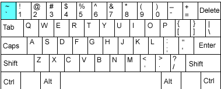  
Select QUICK ORDER NAME: \`602 PSJOZ AMLODIPINE/ATORVASTATIN 10MG/40MG DAILY  
NAME: PSJOZ AMLODIPINE/ATORVASTATIN 10MG/40MG DAILY  
Replace  
1.  Press Enter until you reach the following prompt:  
(P)lace, (E)dit, or (C)ancel this quick order? PLACE//  
**Note:** Once you make changes to the dose, some of the data will be over-written so it is important to have a screen shot or have the ability to scroll back. This step allows you to see the order before any changes.  
***

VERIFY ORDER:  
DESCRIPTION:  
1\>  
ENTRY ACTION:  
Medication: AMLODIPINE/ATORVASTATIN TAB //  
Complex dose? NO//  
Dose: 1 TABLET OF AMLODIPINE 10MG/ATORVASTATIN 40MG TAB  
Replace  
Route: ORAL (BY MOUTH)//  
Schedule: QPM//  
Days Supply: 90//  
Quantity (TAB): 90//  
Refills (0-3): 1//  
Pick Up: WINDOW//  
Priority: ROUTINE//  
Comments:  
1\>  
\---------------------------------------------------------------------  
Medication: AMLODIPINE/ATORVASTATIN TAB  
Dispense Drug: amLODIPine 10MG/ATORVASTATIN 40MG TAB  
Instructions: 1 TABLET OF AMLODIPINE 10MG/ATORVASTATIN 40MG TAB  
ORAL (BY MOUTH) QPM  
Days Supply: 90  
Quantity (TAB): 90  
Refills (0-3): 1  
Pick Up: WINDOW  
Priority: ROUTINE  
\---------------------------------------------------------------------  
1.  Type E to Edit  
(P)lace, (E)dit, or (C)ancel this quick order? PLACE// EDIT  
1.  Press Enter until you reach the Dose Prompt  
Medication: AMLODIPINE/ATORVASTATIN TAB //  
Complex dose? NO//  
1.  Update the Dose (If you know the desired Local Possible Dose then use A. if not then use B.)  
-   Change the Dose:  
1.  Type ...  
1.  Press Enter  
1.  Enter a Local Possible Dose  
1.  Press Enter Twice  
Dose: 1 TABLET OF amLODIPine 10MG/ATORVASTATIN 40MG TAB  
Replace ... With 1 TABLET Replace  
1 TABLET OF amLODIPine 10MG/ATORVASTATIN 40MG TAB \$0.2346  
**Note:** If Dose is not a Local Possible Dose, then a warning will appear  
Dose: 2 TABLET  
WARNING: Dosage check may not occur.  
Route: ORAL (BY MOUTH)//  
Schedule: QPM  
Cannot determine dispense drug - some defaults and order checks may not occur!  
***

**Option A.** Complete - skip to step 11  
-   Delete the Dose:  
1.  Type @  
1.  Press Enter  
Dose: 1 TABLET OF AMLODIPINE 10MG/ATORVASTATIN 40MG TAB  
Replace @  
**Option B.** Complete - continue to step 7  
1.  Press Enter until you reach the following prompt:  
(P)lace, (E)dit, or (C)ancel this quick order? PLACE//  
Are you sure you want to delete this value? NO// y YES  
Days Supply: 90//  
Quantity: 90//  
Refills (0-3): 1//  
Pick Up: WINDOW//  
Priority: ROUTINE//  
Comments:  
1\>  
\---------------------------------------------------------------------  
Medication: AMLODIPINE/ATORVASTATIN TAB  
Dispense Drug: amLODIPine 10MG/ATORVASTATIN 40MG TAB  
Days Supply: 90  
Quantity: 90  
Refills (0-3): 1  
Pick Up: WINDOW  
Priority: ROUTINE  
\---------------------------------------------------------------------  
1.  Type E to Edit  
(P)lace, (E)dit, or (C)ancel this quick order? PLACE// E EDIT  
1.  Press enter until Dose Prompt  
Medication: AMLODIPINE/ATORVASTATIN TAB //  
Choose from (or enter another):  
1 1 TABLET OF amLODIPine 10MG/ATORVASTATIN 40MG TAB \$0.2346  
1.  Select dose from above  
**Note:** If desired dose not listed then go to the Drug Enter/Edit [PSS DRUG ENTER/EDIT] Option or Enter/Edit Dosages [PSS EDIT DOSAGES] to add a new local possible dose.  
Dose: 1 1 TABLET OF amLODIPine 10MG/ATORVASTATIN 40MG TAB \$0.2346 (non- formulary)  
...OK? YES//  
**Note:** If Dose is not a Local Possible Dose, then a warning will appear  
Dose: 2 TABLET  
WARNING: Dosage check may not occur.  
Route: ORAL (BY MOUTH)//  
Schedule: QPM  
Cannot determine dispense drug - some defaults and order checks may not occur!  
1.  Enter the Route, Schedule, Days Supply and Refills based the data you obtained from step 3.  
Route: ORAL (BY MOUTH)//  
Schedule: QPM  
Days Supply: 90  
Quantity (TAB): 90  
Refills (0-3): 1  
Pick Up: WINDOW//  
Priority: ROUTINE//  
Comments:  
1\>  
***

\----------------------------------------------------------------------------  
Medication: AMLODIPINE/ATORVASTATIN TAB  
Dispense Drug: amLODIPine 10MG/ATORVASTATIN 40MG TAB  
Instructions: 1 TABLET OF amLODIPine 10MG/ATORVASTATIN 40MG TAB  
ORAL (BY MOUTH)  
Days Supply: 90  
Quantity: 90  
Refills (0-3): 1  
Pick Up: WINDOW  
Priority: ROUTINE  
\----------------------------------------------------------------------------  
1.  Verify that it looks correct and type P to Place it  
(P)lace, (E)dit, or (C)ancel this quick order? PLACE// PLACE  
#### Quick Order Free Text Report

The accuracy of local dosage setup is vitally important to a site’s success with MOCHA v2.0 Dosage Checks. Dosage and medication route reviews were first introduced with the MOCHA Pre-Implementation patch PSS\*1\*129 in 2009. Additionally, Quick Orders contain dosages that may need to be updated.  
A Quick Order Free Text Report is provided in the OR\*3\*366 patch. It will identify medication quick orders that potentially contain problematic dosages that do not match any of the Possible Dosages (PD) or Local Possible Dosages (LPD) that are associated with the defined Orderable Item.  
When a match cannot be determined, then the dose is considered a free text dose. Dosage checks are possible with free text doses, but if improperly formatted they are more prone to Dose Check failures than orders associated with PDs and LPDs. After initial reviews are completed, the reports may be run periodically.  
The Quick Order Free Text Report is designed to be run in a variety of ways, based on the type of quick order (System Level and Personal) and the type of dosage (PD and LPD). The intent is to group similar issues together in order help users to determine if/where an edit needs to occur and to expedite the review process.  
To understand and perform the review process, users must have knowledge of and access to both quick orders and pharmacy dosage setup. As quick order roles and responsibilities vary from site to site, it is anticipated that a collaborative effort between Pharmacy Informatics and Clinical Coordinators will likely be required at most sites.  
##### Report Options

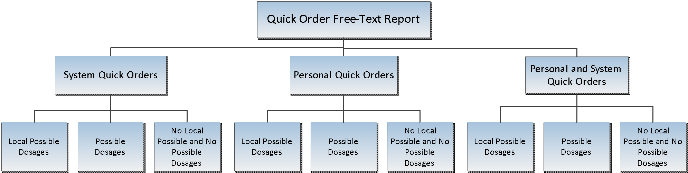  
##### Sample Report Output

**Example 1 System Quick Orders with Local Possible Doses**  
Quick Order Free-Text Report  
This report identifies Medication Quick orders that have a free text dosage that does not match exactly one of the Local Dosages from Pharmacy.  
Select one of the following:  
S System Quick Orders  
P Personal Quick Orders  
PS Personal and System Quick Orders  
SELECT THE TYPE OF QUICK ORDER: PS// **S System Quick Orders**  
Select one of the following:  
L Local Possible Dosages  
P Possible Dosages  
N No Local Possible and No Possible Dosages  
SELECT THE TYPE OF DOSAGE: L// **L Local Possible Dosages**  
DEVICE: 0;80;9999 TELNET TERMINAL  
QUICK ORDER FREE-TEXT REPORT MAY 16, 2013 08:55 PAGE 1  
\-------------------------------------------------------------------------  
QUICK ORDER (IEN): PSJQOS MARTIN 1 (509)  
QO DISPLAY NAME: ALBUTEROL SOLN,INHL  
DISPLAY GROUP: UNIT DOSE MEDICATIONSORDERABLE ITEM IEN: 1987  
ORDERABLE ITEM NAME: ALBUTEROL SOLN,INHL  
QO INSTRUCTIONS: 1ML NEB SOLN  
DISPENSE: ALBUTEROL 0.5% INHL SOLN  
CPRS DOSAGE LIST:  
1 MILLILITER OF 0.5%  
QUICK ORDER (IEN): PSJQOS AUGMENTIN 500 PO TID 1 (512)  
QO DISPLAY NAME: AMOXICILLIN/CLAVULANATE TAB  
DISPLAY GROUP: UNIT DOSE MEDICATIONS  
ORDERABLE ITEM IEN: 2032  
ORDERABLE ITEM NAME: AMOXICILLIN/CLAVULANATE TAB  
QO INSTRUCTIONS: 250MG/62.5MG TAB  
DISPENSE: AMOXICILLIN 500/CLAV K 125MG TAB  
CPRS DOSAGE LIST:  
ONE TABLET OF AMOXICILLIN 500/CLAV K 125MG TAB  
**Example 2 System Quick Orders with Possible Doses**  
Quick Order Free-Text Report  
This report identifies Medication Quick orders that have a free text dosage  
that does not match exactly one of the Local Dosages from Pharmacy.  
Select one of the following:  
S System Quick Orders  
P Personal Quick Orders  
PS Personal and System Quick Orders  
SELECT THE TYPE OF QUICK ORDER: PS// **S System Quick Orders**  
Select one of the following:  
L Local Possible Dosages  
P Possible Dosages  
N No Local Possible and No Possible Dosages  
SELECT THE TYPE OF DOSAGE: L// **P Possible Dosages**  
***

DEVICE: TELNET TERMINAL  
QUICK ORDER FREE-TEXT REPORT MAY 15, 2013 15:27 PAGE 1  
\-------------------------------------------------------------------------  
QUICK ORDER (IEN): PSUZ AMOXICILLIN 500MG PO TID (605)  
QO DISPLAY NAME: Amoxicillin 500mg po TID  
DISPLAY GROUP: UNIT DOSE MEDICATIONS  
ORDERABLE ITEM IEN: 2033  
ORDERABLE ITEM NAME: AMOXICILLIN CAP,ORAL  
QO INSTRUCTIONS: 1 CAPSULE  
DISPENSE: AMOXICILLIN 500MG CAP  
CPRS DOSAGE LIST:  
1000MG  
250MG  
500MG  
QUICK ORDER (IEN): ONDANSETRON 8MG PO 60 MIN PRE CHEMO (1816)  
QO DISPLAY NAME: ONDANSETRON 8MG PO 60 MIN PRE-CHEMO  
DISPLAY GROUP: UNIT DOSE MEDICATIONS  
ORDERABLE ITEM IEN: 2835  
ORDERABLE ITEM NAME: ONDANSETRON HCL TAB  
QO INSTRUCTIONS: 8MG  
DISPENSE: ONDANSETRON HCL 8MG TAB  
CPRS DOSAGE LIST:  
16MG 4MG  
**Example 3 Personal Quick Orders with Possible Doses**  
Quick Order Free-Text Report  
This report identifies Medication Quick orders that have a free text dosage  
that does not match exactly one of the Local Dosages from Pharmacy.  
Select one of the following:  
S System Quick Orders  
P Personal Quick Orders  
PS Personal and System Quick Orders  
***

SELECT THE TYPE OF QUICK ORDER: PS// **P Personal Quick Orders**  
Select one of the following:  
L Local Possible Dosages  
P Possible Dosages  
N No Local Possible and No Possible Dosages  
***

SELECT THE TYPE OF DOSAGE: L// **P Possible Dosages**  
***

DEVICE: TELNET TERMINAL  
***  
QUICK ORDER FREE-TEXT REPORT MAY 15, 2013 15:27 PAGE 1  
\-------------------------------------------------------------------------  
***

QUICK ORDER (IEN): ORWDQ 7C406F44 (1339)  
QO DISPLAY NAME: ASA 81mg  
OWNER(S): PROVIDER, A  
DISPLAY GROUP: UNIT DOSE MEDICATIONS  
ORDERABLE ITEM IEN: 2056  
ORDERABLE ITEM NAME: ASPIRIN TAB,CHEWABLE  
QO INSTRUCTIONS: 81mg  
DISPENSE: ASPIRIN 81MG CHEW TAB  
CPRS DOSAGE LIST:  
162MG  
81MG  
***

QUICK ORDER (IEN): ORWDQ 70CA3BA1 (1448)  
QO DISPLAY NAME: lisinopril 5 mg daily  
OWNER(S): PROVIDER, B  
DISPLAY GROUP: UNIT DOSE MEDICATIONS  
ORDERABLE ITEM IEN: 2680  
ORDERABLE ITEM NAME: LISINOPRIL TAB  
QO INSTRUCTIONS: 5 MG  
DISPENSE: LISINOPRIL 20MG TAB  
CPRS DOSAGE LIST:  
10MG  
20MG  
40MG  
5MG  
#### Comparison of System and Personal Type Quick Orders on two Sample Orders

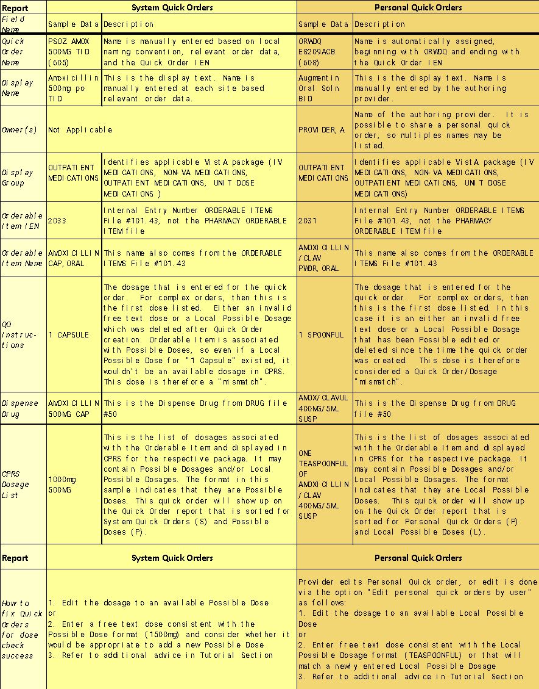  
##### Dosage Basics for CPRS Displays

*The CPRS dosage list and the Quick Order report share the same display rules*  
For Dosages to display the Dispense Drug must be *marked* and Dosage *assigned* to the same package as the Quick Order *type* being used.  
**If:**  
1.  PDs are *assigned* for Inpatient package *(250MG,500MG,1000MG)*  
1.  LPDs are *assigned* for Outpatient package *(1 CAPSULE, 2 CAPSULES)*  
1.  QO type is for entered for Unit Dose Medications  
**Then:**  
1.  The selectable dosages will be PDs (250MG,500MG,1000MG)  
  
If an orderable item (OI) has multiple dispense drugs, and at least one of those dispense drugs has PDs set for a specific package, then PDs will be the only type of dose that is available for any Quick Order entered for that same package.

If no PD is marked for the package that is being used by a QO, then any available LPDs will display as choices during both CPRS ordering and listed on the QO LPD reports.

Free text doses can be entered on QO’s, but PDs and/or LPDs should be used whenever possible. Free-text rules apply for dosage checks.

#####

##### Dosage Scenarios

**Example 1**: System Quick Orders with Possible Dosages in the CPRS Dosage list  
*Local Possible Dosages may also be present and assigned to the Orderable Item and assigned to both packages, but may not be viewable in the CPRS Dosage List because of the display rules for CPRS dosages.*  
Orderable Item -\> **ACETAMINOPHEN**  
dosage Form -\> TAB  
Dispense Drugs:  
ACETAMINOPHEN 325MG TAB MAY 10, 2013  
ACETAMINOPHEN 500MG TAB U.D. JAN 30, 2013  
**ACETAMINOPHEN 500MG TAB**  
ACETAMINOPHEN 325MG TAB U.D. FEB 12, 2013  
ACETAMINOPHEN 500MG TAB  
***

**POSSIBLE DOSAGES:**  
DISPENSE UNITS PER DOSE: 1 DOSE: **500MG** PACKAGE: **IO**  
DISPENSE UNITS PER DOSE: 2 DOSE: **1000MG** PACKAGE: **IO**  
**LOCAL POSSIBLE DOSAGES:**  
**1 TABLET IO**  
**1 TABLET OF 500MG IO**  
**2 TABLET IO**  
**This entry is marked for the following PHARMACY packages:**  
**Outpatient**  
**Unit Dose**  
**Ward Stock**  
**Non-VA Med**  
***

The following Quick Orders are all using the Orderable Item: ACETAMINOPHEN TAB which has a single active dispense drug ‘ACETAMINOPHEN 500MG TAB’ *assigned* to the respective package. For each display group (Outpatient Medications and Unit Dose Medications) there is either a ‘FREE TEXT’ dosage or a selected LPD.  
1 PSUZ APAP IP FREE TEXT  
2 PSUZ APAP IP LPD USED  
3 PSOZ APAP OP FREE TEXT  
4 PSOZ APAP OP LPD USED  
Since none of the free text dosages in the QO INSTRUCTIONS match any of the Possible Dosages in the CPRS Dosage List, this report prints all four Quick Orders. Possible Dosages are available for both packages, so any Local Possible Dosages will not be seen.

If available, additional Possible Dosages from other Dispense Drugs(s) tied to the same Orderable Item (*such as ACETAMINOPHEN 325MG TAB*) would be displayed in the CPRS Dosage List. In this example, ACETAMINOPHEN 325MG TAB has Possible Dosages, but is inactive; therefore, none of the Possible Dosages (325MG or 650MG) are showing.

QUICK ORDER (IEN):  **PSOZ** **APAP OP LPD USED** (560)  
QO DISPLAY NAME: APAP OP  
DISPLAY GROUP: **OUTPATIENT MEDICATIONS**  
ORDERABLE ITEM IEN: 1964  
ORDERABLE ITEM NAME: ACETAMINOPHEN TAB  
QO INSTRUCTIONS: **1 TABLET**  
DISPENSE: ACETAMINOPHEN 500MG TAB  
CPRS DOSAGE LIST:  
**1000MG**  
**500MG**  
QUICK ORDER (IEN): **PSOZ APAP OP FREE TEXT** (561)  
QO DISPLAY NAME: APAP OP FREE TEXT  
DISPLAY GROUP: **OUTPATIENT MEDICATIONS**  
ORDERABLE ITEM IEN: 1964  
ORDERABLE ITEM NAME: ACETAMINOPHEN TAB  
QO INSTRUCTIONS: **FREE TEXT**  
DISPENSE: ACETAMINOPHEN 500MG TAB  
CPRS DOSAGE LIST:  
**1000MG**  
**500MG**  
QUICK ORDER (IEN): **PSUZ APAP IP LPD USED** (562)  
QO DISPLAY NAME: APAP IP LPD USED  
DISPLAY GROUP: **UNIT DOSE MEDICATIONS**  
ORDERABLE ITEM IEN: 1964  
ORDERABLE ITEM NAME: ACETAMINOPHEN TAB  
QO INSTRUCTIONS: **1 TABLET OF 500MG**  
DISPENSE: ACETAMINOPHEN 500MG TAB  
CPRS DOSAGE LIST:  
**1000MG**  
**500MG**  
QUICK ORDER (IEN): **PSUZ APAP IP FREE TEXT** (563)  
QO DISPLAY NAME: APAP IP FREE TEXT  
DISPLAY GROUP: **UNIT DOSE MEDICATIONS**  
ORDERABLE ITEM IEN: 1964  
ORDERABLE ITEM NAME: ACETAMINOPHEN TAB  
QO INSTRUCTIONS: **FREE TEXT**  
DISPENSE: ACETAMINOPHEN 500MG TAB  
CPRS DOSAGE LIST:  
**1000MG**  
**500MG**  
***  
##### Editing Dosages of Quick Orders

Editing the dosages to match an available dosage in CPRS should prevent a Quick Order from appearing on the report.

##### System Quick Order Edits

**Enter/edit quick orders [ORCM QUICK ORDERS] (QO)**  
Select QUICK ORDER NAME: **PSUZ APAP**  
1 PSUZ APAP IP FREE TEXT  
2 PSUZ APAP IP LPD USED  
3 PSOZ APAP OP FREE TEXT  
4 PSOZ APAP OP LPD USED  
***

CHOOSE 1-4: **2 PSUZ APAP IP LPD USED**  
NAME: APAP IP LPD USED//  
DISPLAY TEXT: APAP IP LPD USED//  
VERIFY ORDER: YES//  
DESCRIPTION:  
1\>  
ENTRY ACTION:  
***

Medication: ACETAMINOPHEN TAB //  
Complex dose? NO//  
Dose: **1 TABLET OF 500MG// 500MG**  
Route: ORAL (BY MOUTH)//  
Schedule: Q4H PRN//  
Give additional dose NOW? NO//  
Priority: ROUTINE//  
Comments:  
***  
Since the Quick Order using the dosage ‘1 TABLET OF 500MG’ was edited and matched to a Possible Dosage of ‘500MG’, the Quick Order ‘APAP IP LPD USED’ is now removed from the report.

QUICK ORDER (IEN):  **PSOZ** **APAP OP LPD USED** (560)  
QO DISPLAY NAME: APAP OP  
DISPLAY GROUP: **OUTPATIENT MEDICATIONS**  
ORDERABLE ITEM IEN: 1964  
ORDERABLE ITEM NAME: ACETAMINOPHEN TAB  
QO INSTRUCTIONS: **1 TABLET**  
DISPENSE: ACETAMINOPHEN 500MG TAB  
CPRS DOSAGE LIST:  
**1000MG**  
**500MG**  
QUICK ORDER (IEN): **PSOZ APAP OP FREE TEXT** (561)  
QO DISPLAY NAME: APAP OP FREE TEXT  
DISPLAY GROUP: **OUTPATIENT MEDICATIONS**  
ORDERABLE ITEM IEN: 1964  
ORDERABLE ITEM NAME: ACETAMINOPHEN TAB  
QO INSTRUCTIONS: **FREE TEXT**  
DISPENSE: ACETAMINOPHEN 500MG TAB  
CPRS DOSAGE LIST:  
**1000MG**  
**500MG**  
QUICK ORDER (IEN): **PSUZ APAP IP FREE TEXT** (563)  
QO DISPLAY NAME: APAP IP FREE TEXT  
DISPLAY GROUP: **UNIT DOSE MEDICATIONS**  
ORDERABLE ITEM IEN: 1964  
ORDERABLE ITEM NAME: ACETAMINOPHEN TAB  
QO INSTRUCTIONS: **FREE TEXT**  
DISPENSE: ACETAMINOPHEN 500MG TAB  
CPRS DOSAGE LIST:  
**1000MG**  
**500MG**  
##### Personal Quick Order Edits

**Edit Personal Quick Orders by User [ORCM QUICK ORDERS BY USER]**  
The **Edit personal quick orders by user** allows you to retrieve and edit personal quick orders by the user that created them  
**Personal Quick Order Displayed on Report**  
QUICK ORDER FREE-TEXT REPORT JUN 06, 2013 10:12 PAGE 4  
\-------------------------------------------------------------------------  
QUICK ORDER (IEN): ORWDQ E8209ACB (608)  
QO DISPLAY NAME: **Augmentin Oral Solution BID**  
OWNER(S): **PROVIDER, A**  
DISPLAY GROUP: OUTPATIENT MEDICATIONS  
ORDERABLE ITEM IEN: 2031  
ORDERABLE ITEM NAME: AMOXICILLIN/CLAVULANATE PWDR,RENST-ORAL  
QO INSTRUCTIONS: **1 SPOONFUL**  
DISPENSE: AMOXICILLIN/CLAVUL 400MG/5ML SUSP  
CPRS DOSAGE LIST:  
**ONE TEASPOONFUL (400MG) OF AMOXICILLIN/CLAVUL 400MG/5ML SUSP**  
**ONE-HALF TEASPOONFUL (200MG) OF AMOXICILLIN/CLAVUL 400MG/5ML SUSP**  
**Edit personal quick order by user**  
\^QU Edit personal quick orders by user  
Select NEW PERSON NAME: PROVIDER, A ATP 123 OI&T STAFF  
PROVIDER, A personal quick orders:  
OUTPATIENT MEDICATIONS  
1 Augmentin Oral Solution BID  
2 Amoxicillin 500mg TID  
CHOOSE 1-2: 1  
NAME: ORWDQ E8209ACB//  
DISPLAY TEXT: Augmentin Oral Solution BID Replace  
VERIFY ORDER:  
DESCRIPTION:  
1\>  
ENTRY ACTION:  
Medication: AMOXICILLIN/CLAVULANATE PWDR,RENST-ORAL //  
***

...  
Complex dose? NO//  
Dose: 1 SPOONFUL// ONE TEASPOONFUL (400MG) OF AMOXICILLIN/CLAVUL 400MG/5ML SUSP  
\$0.12  
WARNING: Dosage check may not occur.  
Route: ORAL (BY MOUTH)//  
Schedule: BID-WF//  
Days Supply: 10//  
Quantity: 100//  
Refills (0-11): 0//  
Pick Up: MAIL//  
Priority: ROUTINE//  
Comments:  
1\>  
\------------------------------------------------------------------------  
Medication: AMOXICILLIN/CLAVULANATE PWDR,RENST-ORAL  
Instructions: 1 SPOONFUL ORAL (BY MOUTH) BID-WF  
Sig: TAKE 1 SPOONFUL BY MOUTH TWICE A DAY WIT ...  
Days Supply: 10  
Quantity: 100  
Refills (0-11): 0  
Pick Up: MAIL  
Priority: ROUTINE  
\-------------------------------------------------------------------------  
(P)lace, (E)dit, or (C)ancel this quick order? PLACE//  
##### Determining Menu(s) of Quick Orders

System Quick Orders that are not placed on a menu will be excluded from this report since a user is not able to order it until it is placed. Personal Quick Orders are not required to be placed on a menu but do require active owner(s).

The *Search/replace components* option allows you to find what menu a quick order is on and either replace or remove the quick order from a menu.

##### Search/replace components [ORCM SEARCH/REPLACE] (SR)

Select Order Menu Management \<TEST ACCOUNT\> Option: SR Search/replace components

Search for: **PSUZ APAP**  
1 PSUZ APAP IP FREE TEXT  
2 PSUZ APAP IP LPD USED  
3 PSOZ APAP OP FREE TEXT  
4 PSOZ APAP OP LPD USED  
5 APAP - NO PDS ORWDQ CC07A0B4  
CHOOSE 1-5: 1 **PSUZ APAP IP FREE TEXT**  
Menu items of **PSUZ APAP IP FREE TEXT**  
Name Type  
\-------------------------------------------------------------------------  
1 OR GMENU ORDER SETS menu  
#### Quick Order Report FAQs

**Q: Does this report filter out Personal Quick Orders for Terminated Employees?**  
**A:** The code examines all of the owners of a personal quick order. If all of the owners are inactive (either DISUSERED, TERMINATED, or do not have an access code), the personal quick order will not be listed on the report.  
**Q: Does this report Exclude QO’s not used within specific time frame?**  
**A:** This is not possible because we do not track usage of quick orders. However, a FileMan Report could be created to find these.  
**Q: Does this report screen out QO’s that are not on any active menu?**  
**A:** The code excludes quick orders that are either not on a menu, not a personal quick order, or not part of a reminder dialog.  
***

**Q: How does the dispense drug get chosen? I am seeing several examples of some funny entries with wrong dispense drugs:**  
QUICK ORDER (IEN): ORWDQ EC331281 (6123)  
QO DISPLAY NAME: etodolac  
OWNER(S): PROVIDER, A  
DISPLAY GROUP: OUTPATIENT MEDICATIONS  
ORDERABLE ITEM IEN: 4155  
ORDERABLE ITEM NAME: eTODoLAC CAP,ORAL  
QO INSTRUCTIONS: **400MG**  
DISPENSE: ETODOLAC 300MG CAP **Why ETODOLAC 300MG?**  
CPRS DOSAGE LIST:  
200MG  
300MG  
**A:** CPRS builds a list of dispense drugs associated with an orderable item. In this case the OI comes from the quick order so we build the list of dispense drugs and since this is a free text entry we can’t determine what the dispense drug is yet on the CPRS side. So any dispense drugs under that OI show on this report but do not necessarily reflect the dispense drug sent to pharmacy, it is a best guess.  
**Q: Is there any way to tell who created the quick orders? I’d like to know if anyone still uses them or not.**  
**A:** It doesn’t store who created the quick order, but there is a way to determine if it is on a user’s list.  
Option: Order Menu Management menu option.  
OI Manage orderable items ...  
PM Enter/edit prompts  
GO Enter/edit generic orders  
QO Enter/edit quick orders  
QU Edit personal quick orders by user  
ST Enter/edit order sets  
AC Enter/edit actions  
MN Enter/edit order menus  
AO Assign Primary Order Menu  
**Q: Is there a way to determine which quick orders are on a user’s list?**  
**A:** Yes – By using the Order Menu Management menu option you can see all personal quick orders by a user  
**Q: If you edit the dose on a Quick Order, it removes the information below the field. How is this issue addressed?**  
**A:** You have to review each quick order entirely and then perform the edit, . See example below:  
***

**Current QO**  
NAME: APAP OP LPD USED//  
DISPLAY TEXT: APAP OP//  
VERIFY ORDER: YES//  
DESCRIPTION:  
1\>  
ENTRY ACTION:  
***

Medication: ACETAMINOPHEN TAB //  
Complex dose? NO//  
Dose: 1 TABLET (325MG) OF 325MG Replace  
Route: ORAL (BY MOUTH)//  
Schedule: Q4H PRN//  
***

**Days Supply: 30**  
**TAB (100/BT ONLY)**  
**Quantity (TAB): 30**  
**Refills (0-11): 2**  
Pick Up: WINDOW//  
Priority: ROUTINE//  
Comments:  
1\>  
**Edited QO**  
NAME: APAP OP LPD USED//  
DISPLAY TEXT: APAP OP//  
VERIFY ORDER: YES//  
***

Medication: ACETAMINOPHEN TAB //  
Complex dose? NO//  
Dose: 1 TABLET (325MG) OF 325MG Replace ... With 2 TABLET  
Replace  
2 TABLET (650MG) OF 325MG \$0.0074  
Route: ORAL (BY MOUTH)//  
Schedule: Q4H PRN//  
***

**Days Supply:**  
**TAB (100/BT ONLY)**  
**Quantity (TAB):**  
**Refills (0-11):**  
Pick Up: WINDOW//  
Priority: ROUTINE//  
Comments:  
#### Free Text Formatting

##### Basic logic for successful dose checks when using free text doses

*The following logic can be used to ensure free text dose entries perform dose checks, but may not prevent quick orders from appearing on this report.*  
Compatible Free Text Logic - will generate a successful dosing check

-   Whole numbers (2, two) followed by a valid dose unit (mg, tablet)  
-   Numbers with decimal points and commas (10.5, 1,000)  
-   Sequential Ranges (2-3, 2 – 3, 2 or 3, two to three, two or three, two-three, two – three)  
-   Fractions (1 and ½, one and one half, one and one-half, 1 and one half, 1 and one-half)  
***

Incompatible Free Text Logic - will generate a manual dose check alert

-   More than one space between the numeric value and the dose unit  
-   Trailing spaces or additional trailing data (10mg\<space\>)  
-   Special characters (- &/) and extraneous textual information  
-   Fractions less than ¼ or greater than 10 and ½  
-   Ranges greater than 10 (10-11)  
-   Non-sequential ranges (1-3, 2-5)  
-   Metric ranges (1mg-2mg, 1mL-2mL)  
**Examples**  
| **Valid Format** | **Invalid Format**                            |
|------------------|-----------------------------------------------|
| 10mg             | 10mg\<space\>                                 |
| 10 mg            | 10 mg (has 2 spaces between text)             |
| 10mL             | 1 tablet (*has 2 spaces*)                     |
| 1 tablet         | 10mg (1 tablet) or 10mg (10mL) or 10mg/10mL\* |
| 1tablet          |                                               |

*\*This format will only work if a Local Possible Dosage is created. Name the Local Possible Dosage with the full text, but define the numeric dose (10) and dose unit (mg)*  
#### Quick Order Free Text Report Checklist

Review your hospital’s quick order policies prior to editing System Quick Orders.

Determine an action plan for editing Personal Quick Orders, whether the edit will be performed directly by the provider or alternatively via the Edit Personal Quick Orders by User option

Run each of the following report combinations:

-   Personal Quick Orders  
-   Local Possible Dosages  
-   Possible Dosages  
-   No Local Possible and No Possible Dosages  
-   System Quick Orders  
-   Local Possible Dosages  
-   Possible Dosages  
-   No Local Possible and No Possible Dosages  
For each Quick Order that displays on the report, look into Orderable Item and Drug File to determine what packages the Dispense Drug(s) and available dosages are marked/assigned to.

Review available/applicable Possible Dosages and Local Possible Dosages

Assign the most appropriate dosage to the Quick Order.

-   In some cases an existing Possible Dosage or Local Possible Dosage can be selected  
-   In some cases the existing Local Possible Dosage may need to be edited to a format that is compatible with MOCHA Dosage Checks, and then the Quick Order dosage can also be updated  
-   In some cases a new Possible Dosage or Local Possible Dosage may need to be added to the Drug File \#50  
-   In some cases, the most appropriate dosage will be the one that already exists on that Quick Order, and no change is needed  
-   In some cases a new free text dose will need to be entered. Ensure that a compatible free text format is used whenever possible  
If a drug file edit is required, then other Quick Orders associated with that dispense drug or orderable item may also be affected by the edit. You may consider running a FileMan to identify the other Quick Orders using the drug.

**NOTE**: Not all Quick Orders listed on the report represent MOCHA Dose Check issues; they simply reveal mismatches between doses in quick orders and locally available possible and/or local possible dosages, which is a common cause for manual dose checks alerts.  
### Convert IV Inpatient Quick Order to Infusion Quick Order

The new option Convert IV Inpatient QO to Infusion QO [OR CONVERT INP TO QO] is now on the ORDER MENU MANAGEMENT [ORCM MENU] menu. This option enables CACs at sites to convert an IV quick order that is set up as an Inpatient quick order to the new Infusion quick order format.

This option has three selections to convert quick orders:

-   QUICK ORDERS USED IN OTHER ITEMS (in order menus, order sets, or reminder dialogs)  
-   QUICK ORDERS NOT USED IN OTHER ITEMS (quick orders not assigned to order menus, order sets, or reminder dialogs)  
-   SPECIFIC QUICK ORDER  
Each option prompts for information to convert one quick order at a time. If the user wants to convert all the quick orders that are assigned to order menus, order sets, or a reminder dialog first, the user will select the QUICK ORDERS USED IN OTHER ITEMS prompt.

If the user wants to convert quick order that are NOT assigned to an order menu, order sets, or a reminder dialog, the user will select the QUICK ORDERS NOT USED IN OTHER ITEMS prompt.

If the user wants to convert specific quick orders, the user will select the SPECIFIC QUICK ORDER prompt.

#### Personal Quick Order Exception

This utility will not convert personal IV quick orders. However, after it has converted the quick orders that it can convert, the utility will then list the personal IV quick orders by user. The user running the utility can copy this information and forward this information in a mailman message. The utility will completely ignore any personal quick order assigned to a terminated user.

#### Criteria to Convert IV Quick Orders

To be converted to an Infusion quick order, the order needs to meet the following conditions:  
1.  The quick order must have the Inpatient Medication dialog [PSJ OR PAT OE] as the default dialog.  
1.  The orderable item assigned to the quick order must have the IV BASE field defined as “Yes” or the IV ADDITIVE fields defined as “Yes”.  
#### Conversion Process Overview

There are two parts to the conversion process. The first part is a set of questions that populate the minimum fields needed to convert to the Infusion quick order. The second part puts the user in the standard quick order editor where the user can add any additional Infusion quick order information if needed.

##### Part One: Minimum Conversion Prompts

Once the process is started, for each quick order, the user will see a detailed description of the quick order. Then, the user is presented with the following prompt:

Convert the above Quick Order to an Infusion Quick Order?  
Select one of the following:  
Y YES  
N NO  
S SKIP THIS QUICK ORDER  
Q QUIT THE CONVERSION UTILITY  
Convert?:  
Answering “Yes” begins the conversion process.

Answering “No” does not begin the process for the specified order, but the conversion option then moves on to the next quick order.

The next prompt determines the IV Type:

Select the IV Type for this Quick Order.  
Select one of the following:  
C CONTINUOUS  
I INTERMITTENT  
S SKIP THIS QUICK ORDER  
Q QUIT THE CONVERSION UTILITY  
IV TYPE:  
This prompt is used to define the IV Type value that should be assigned to the infusion quick order.

The next prompt is dependent on the orderable item set up.

Change orderable item NAME to an additive?  
Select one of the following:  
Y YES  
N NO  
S SKIP THIS QUICK ORDER  
Q QUIT THE CONVERSION UTILITY  
Convert to Additive?:  
This prompt will only appear if both the IV BASE and IV ADDITIVE fields are set to “Yes.”

If only the IV BASE field is set to “Yes,” the user will not see this prompt, and the orderable item will automatically be assigned to the solution value of the Infusion quick order.

If only the IV ADDITIVE field is set to “Yes,” the user will see the following message:

Orderable item NAME is not marked as a solution.
This orderable item will be moved to the additive value.  
The IV BASE and IV ADDITIVE fields control in which list box the orderable item should appear in the Infusion order dialog. The user should not be able to override these values when converting the quick order to an infusion quick order.

The next prompt lists the changes that the user has selected and asks the user if CPRS should continue and convert the quick order.

Please confirm the selected changes below.  
If these changes are accepted, the Quick Order will be converted to an Infusion Quick Order.  
This Quick Order will not be able to be converted back to an Inpatient Quick Order.  
Convert to Infusion Quick Order: YES  
IV TYPE: Intermittent  
Change orderable item MORPHINE INJ to an additive: YES  
Select one of the following:  
Y YES  
N NO  
S SKIP THIS QUICK ORDER  
Q QUIT THE CONVERSION UTILITY  
Confirm Changes?:  
Up to this point, the user has the option to Skip this Quick Order and not convert the quick order by selecting the SKIP THIS QUICK ORDER prompt. Also, the user has the option to stop the entire process and exit the conversion option by selecting the QUIT THE CONVERSION UTILITY prompt.

**Warning:** If the user enters “Yes” at this prompt, the IV quick order will be converted to an infusion quick order, and it CANNOT be converted back to inpatient medication quick order.  
##### Conversion Warning Messages

After the conversion process, the user may see up to two warning messages.  
**Check the strength associated with the additive value in the editor.** This warning message displays if the orderable item is converted to the additive value. When this conversion is done, the conversion utility may be unable to select the correct additive strength from the inpatient quick order, so the user will need to select the strength in the editor.  
**Check the limitation value assigned to the quick order in the editor.** This warning message displays if the inpatient medication order is a complex order with a duration defined. In this case, the infusion quick order can have only one duration value, and the user may need to adjust the value—especially if there was more than one duration value defined in the complex inpatient quick order.  
Part Two: Filling in Additional Fields in the Quick Order Editor

When the minimum conversion is done, the conversion utility places the user into the standard quick order editor. At this point, the user can walk through the quick order editor to verify that the values are correct in the Infusion quick order. If corrections are needed, the user can make corrections. In addition, the user can add values, as needed, to the other Infusion quick order fields.  
If the user does not need to make changes to the quick order after the conversion is done, it is still recommended that user walk all the way through the quick order in the editor. If the user exits out of the editor without going all the way through, then the fields that are specific to the inpatient medication dialog will not be removed from the quick order. This should have no impact on CPRS, but it can cause confusion if there is a need to debug the quick order at a later time.  
**Note:** Both the IV BASE and the IV ADDITIVE fields’ values are populated from the USED IN IV FLUID ORDER ENTRY prompt in the corresponding files: the IV SOLUTIONS file, file \#52.7, and the IV ADDITIVES file, file\# 52.6. When the USED IN IV FLUID ORDER ENTRY prompt is edited in one of these files, an update is sent to the CPRS ORDERABLE ITEM file, file\# 101.43. There may be a delay in this update and this delay can affect the conversion option. If the USED IN IV FLUID ORDER ENTRY value is not set to “Yes”, then the quick orders that point to these items will be skipped by this conversion utility. The user will still be able to place the order in CPRS using the current quick order format. However, if pharmacy finishes the order as an IV order, then the CPRS user will NOT be able to take an action (Copy, Change, or Renew) on the order in CPRS.  
### Update IV Quick Order Additive Frequency Utility

The new option IV Additive Frequency Utility [OR IV ADD FREQ UTILITY] is now on the ORDER MENU MANAGEMENT [ORCM MENU] menu. This option enables CACs at sites to define a value for the additive frequency field for continuous IV quick orders.

This option has three selections to convert quick orders:

-   QO ASSIGNED TO ORDER MENUS, ORDER SETS, OR REMINDER DIALOGS  
-   QO NOT ASSIGNED TO ANY OF THESE ITEMS (quick orders not assigned to order menus, order sets, or reminder dialogs)  
-   SPECIFIC QUICK ORDER (to change a specific quick order that the user knows needs to be changed)  
Each option prompts for information to convert one quick order at a time. If the user wants to convert all the quick orders that are assigned to order menus, order sets, or a reminder dialog first, the user will select the QO ASSIGNED TO ORDER MENUS, ORDER SETS, OR REMINDER DIALOGS prompt.

If the user wants to convert quick order that are NOT assigned to an order menu, order sets, or a reminder dialog, the user will select the QO NOT ASSIGNED TO ANY OF THESE ITEMS prompt. If the user wants to convert specific quick orders, the user will select the SPECIFIC QUICK ORDER prompt.

#### Personal Quick Order Exception

This utility will not convert personal IV quick orders. However, after it has converted the quick orders that it can convert, the utility will then list the personal IV quick orders by user. The user running the utility can copy this information and forward this information in a mailman message. The utility will completely ignore any personal quick order assigned to a terminated user.

#### Criteria to Update IV Quick Orders with This Utility

To be converted to an Infusion quick order using this utility, the order needs to meet the following conditions:

1.  The quick order must have the IV Medication dialog [PSJI OR PAT FLUID OE] as the default dialog.  
1.  The quick order must have at least one Additive defined.  
1.  It must not have values defined for the associated additive frequency fields.  
#### Conversion Process Overview

There are two parts to the conversion process. The first part enables the user to set the value for the additive frequency. The second part puts the user in the standard quick order editor where the user can add any additional information to the Infusion quick order.

##### Part One: Minimum Conversion Prompts

Once the process is started, for each quick order, the user will see a detailed description of the quick order. Then, the user is presented with the following prompt:

Add additive frequency to the above Quick Order?  
Select one of the following:  
Y YES  
N NO  
K SKIP THIS QUICK ORDER  
Q QUIT THE CONVERSION UTILITY  
Add additive frequency?:  
Answering “Yes” begins the conversion process.  
Answering “No” does not begin the process for the specified order, but the conversion option then moves on to the next quick order.  
The next prompt displays the Additive value and the default additive frequency defined for the additive in the Pharmacy package. If a default value is defined, then it will be the default for the question "Select Additive Frequency:"  
Additive: ACETAZOLAMIDE INJ  
Default value: All Bags  
Select one of the following:  
A ALL Bags  
1 1 Bag/Day  
S See Comments  
K SKIP THIS QUICK ORDER  
Q QUIT THE CONVERSION UTILITY  
Select Additive Frequency: All Bags//  
The next prompt lists the changes that the user has selected and asks the user if CPRS should update the quick order.

Please confirm the selected changes below.  
If these changes are accepted, the Quick Order will be updated  
Additive: ACETAZOLAMIDE INJ  
Additive Frequency: ALL Bags  
Additive: MULTIVITAMINS INJ  
Additive Frequency: 1 Bag/Day  
Additive: MORPHINE INJ  
Additive Frequency: ALL Bags  
Select one of the following:  
Y YES  
N NO  
K SKIP THIS QUICK ORDER  
Q QUIT THE CONVERSION UTILITY  
Confirm Changes?:  
Up to this point, the user has the option to Skip this Quick Order and not convert the quick order by selecting the SKIP THIS QUICK ORDER prompt. Also, the user has the option to stop the entire process and exit the conversion option by selecting the QUIT THE CONVERSION UTILITY prompt.

**Warning:** If the user enters “Yes” at this prompt, the IV quick order will be updated immediately. If a mistake is made, the user will need to go into the quick order editor and correct the quick order manually.  
##### Part Two: Filling in Additional Fields in the Quick Order Editor

When the minimum conversion is done, the conversion utility places the user into the standard quick order editor. At this point, the user can walk through the quick order editor to verify that the values are correct in the Infusion quick order. If corrections are needed, the user can make corrections. In addition, the user can add values, as needed, to the other Infusion quick order fields.

**Note:** Even if the user feels that there is no need to make changes to the quick order after the conversion is done, it is still recommended that the user review the entire contents of the quick order in the editor. This is a chance to see that the order is complete and correct.  
### Order Check Override Reason Report

When a user receives a critical order check, the user must enter an override reason before CPRS accept the order. Developers created a report to enable users to review the critical order check override reasons. The report can contain the following types of data DATE/TIME ORDERED, DIVISION, DISPLAY GROUP, ORDER CHECK, & OVERRIDDEN BY.

The report will be sorted in *ascending* order by any combination of these fields depending on what search option is chosen. The following options are available:

Select one of the following:  
1 DATE/TIME ORDERED & OVERRIDDEN BY  
2 DATE/TIME ORDERED & ORDER CHECK  
3 DATE/TIME ORDERED & DIVISION  
4 DATE/TIME ORDERED & DISPLAY GROUP  
5 DATE/TIME ORDERED, DIVISION, & DISPLAY GROUP  
The following sort orders correspond to the chosen search options:

1.  Date/Time Ordered, Division, Display Group, Order Check, & Order \#.  
1.  Order Check, Division, Display Group, Date/Time Ordered, & Order \#.  
1.  Division, Display Group, Order Check, Date/Time Ordered, & Order \#.  
1.  Display Group, Division, Order Check, Date/Time Ordered, & Order \#.  
1.  Date/Time Ordered, Division, Display Group, Order Check, & Order \#.  
There are two types of reports: summary and delimited. The delimited report is formatted such that it can be exported to a text file, which with a little work can then be imported into an Excel spreadsheet.

The header of every report whether summary or delimited will display the following information:

-   the CURRENT USER who ran the report  
-   the CURRENT DATE/Time when the report was run  
-   the DATE RANGE of the Date/Time Ordered to be searched  
Other search criteria will be displayed as well depending on which search option the user selects. For example, for option 1, the name of the person who overrode the order check and his/her title will be displayed, for option 2, the type of order check will be displayed, etc. Below is an example of the header for option 1:

Order Check Override Reason Report  
Sorted in Ascending order by:  
Date/Time Ordered, Division, Display Group, Order Chk, & Order\#  
Current User: CPRSPROVIDER,TEN Current Date: May 21, 2007@11:59:04  
Date Range Searched: May 21, 2006 - May 21, 2007 WHERE  
Order Chks are Overridden By: CPRSPROVIDER,TEN  
Title: PHYSICIAN  
If a search finds no records, the message “NO RECORDS FOUND!” is displayed.

#### Running Order Check Reason for Override Reports

Users can create either the summary report or the delimited report. If the user plans to export the data to a text file that can be used, the user should follow the steps under Creating a Delimited Report. The user should be aware that some additional work is required to import that data in an Excel spreadsheet for example.

##### Creating a Summary Reason for Override Report

1.  Select the Order Check Override Reason Report option [ORK ORD CHK OVERRIDE REPORT] from the Order Checking Mgmt Menu [ORK ORDER CHK MGMT MENU].  
1.  At the *FILTER SEARCH by: 1//* prompt, select the appropriate number for the kind of report you want (a number between 1 and 5) and press **\<Enter\>**.  
1.  At the SEARCH Orders Beginning prompt:, enter the beginning date (the date in the past to begin from) and press **\<Enter\>**.  
1.  At the Thru: prompt, enter the ending date for the search (how close to the present) and press **\<Enter\>**.  
1.  At this point, each report option will present different prompts. For the report type selected, enter the appropriate responses (users can always type two question marks and press \<Enter\> to get a list of possible selections, although this list can be quite long):  
-   At option 1’s *SEARCH Order Chks Overridden By:* prompt, enter the name of the person who overrode the order checks that you want to review and press \<Enter\>.  
-   At option 2’s Select ORDER CHECKS NAME: prompt, type the name of the order check to review and press \<Enter\>.  
-   At option 3’s Select MEDICAL CENTER DIVISION NAME: prompt, type the name of the division to review and press \<Enter\>.  
-   At option 4’s Select DISPLAY GROUP NAME: prompt, type the name of the Orders tab display group to review and press \<Enter\>.  
-   At options 5’s Select MEDICAL CENTER DIVISION NAME: prompt, type the name of the division to review and press \<Enter\>, then at the Select DISPLAY GROUP NAME: prompt, type the name of the Orders tab display group and press \<Enter\>.  
1.  At the *Print delimited output only? NO//* prompt, accept the default by pressing **\<Enter\>**.  
1.  At the *DEVICE: HOME//* prompt, do one of the following:  
-   To print to the terminal screen, accept the default of ‘HOME’ by pressing \<Enter\>.  
-   To directly print or queue to a network printer, type the network printer name or ‘Q’ followed by the network printer name, respectively and press \<Enter\>.  
-   To print to a spooler, select a spool/spooler and then enter the spool document name and press \<Enter\>.  
-   To print to a host file, type ‘HFS’ and then type the host file name and press \<Enter\>.  
1.  If printing to the terminal screen, once the report has completed printing, press **\<Enter\>** to exit at the prompt, *Report Completed. Please Press ENTER to EXIT:*.  
Creating a Delimited Reason for Override Report

Users can export a delimited report, one that uses a character, space, or tab to signify each piece of data, so that the data can be used in an outside application, such as Excel. This section contains instructions on how to create a delimited report, how to export that report, and how to import the report into Excel. Most steps are the same for each kind of report, but because prompts are different, some of the steps may be different as well.

Listed below are two methods for exporting the data to a text file. There are two ways that the user can export the delimited report depending on the user’s preference: A) export all the fields and dialog in between into one text file or B) export the non-word processing fields into one text file and then export each of the three remaining word processing fields in their own text files.

Both methods will require the user to clean up the text file for easy importation into Excel. The user will have to:

-   Scan over all the delimited records (especially those of the word-processing fields) and make sure they all print on one line  
-   Ensure that they all have the same number of records before importation, which will ensure that every record will be related in the table and makes it easier to manipulate once imported.  
-   Clean up the dialog prompts in between and after the delimited sections  
-   Remove the report title and header from the text files before importing (the user can choose to keep those items)  
**NOTE:** DO NOT copy and paste the delimited sections directly off the terminal screen. A right margin of 80 columns will retain and transfer into the text file and will cause most of the records to wrap to the next line. This will require more work for the user to fix and clean up so that each record falls on one line and imports nicely.  
1.  Select the Order Check Override Reason Report option [ORK ORD CHK OVERRIDE REPORT] from the Order Checking Mgmt Menu [ORK ORDER CHK MGMT MENU] and press **\<Enter\>**.  
1.  At the FILTER SEARCH by: 1// prompt, select the appropriate number for the kind of report you want (a number between 1 and 5) and press **\<Enter\>**.  
1.  At the SEARCH Orders Beginning prompt:, enter the beginning date (the date in the past to begin from) and press **\<Enter\>**.  
1.  At the Thru: prompt, enter the ending date for the search (how close to the present) and press **\<Enter\>**.  
1.  At this point, each report option will present different prompts. For the report type selected, enter the appropriate responses (users can always type two question marks and press \<Enter\> to get a list of possible selections, although this list can be quite long):  
-   At option 1’s *SEARCH Order Chks Overridden By:* prompt, enter the name of the person who overrode the order checks that you want to review and press \<Enter\>.  
-   At option 2’s Select ORDER CHECKS NAME: prompt, type the name of the order check to review and press \<Enter\>.  
-   At option 3’s Select MEDICAL CENTER DIVISION NAME: prompt, type the name of the division to review and press \<Enter\>.  
-   At option 4’s Select DISPLAY GROUP NAME: prompt, type the name of the Orders tab display group to review and press \<Enter\>.  
-   At options 5’s Select MEDICAL CENTER DIVISION NAME: prompt, type the name of the division to review and press \<Enter\>, then at the Select DISPLAY GROUP NAME: prompt, type the name of the Orders tab display group and press \<Enter\>.  
1.  At the Print delimited output only? NO// prompt, type YES and press **\<Enter\>**.  
1.  At the Specify REPORT DELIMITER CHARACTER: U// prompt, select a delimiter to use in the report: P for Pipe, T for Tilde, or U for Up Arrow and press **\<Enter\>**.  
1.  At the DEVICE: HOME// prompt, enter in ‘;300;9999’ and DO NOT press \<Enter\> yet.  
**Note:** A right margin of 255 or greater will ensure that every record gets printed on a line without any wrapping unless the word processing field is greater than 255 characters.  
Exporting and Importing a Delimited Report Using a Single Text File

1.  Capture the report or incoming data (for example, in KEA!, the user would select Tools \| Capture Incoming Data) before pressing \<Enter\> and save it as a text file under a meaningful name (i.e., DELIMITRPT.TXT) and location that you will remember.  
1.  At the *Continue to export the ORDER TEXT field only? YES//* prompt, accept the default YES by pressing **\<Enter\>**.  
1.  At the *Continue to export the ORDER CHK field only? YES//* prompt, accept the default YES by pressing **\<Enter\>**.  
1.  At the *Continue to export the OVERRIDE REASON field only? YES//* prompt, accept the default YES by pressing **\<Enter\>**.  
1.  End the capture (for example in KEA!, select Tools \| End Capture) and at the *Report Completed. Please Press ENTER to EXIT:* prompt, press \<Enter\>.  
1.  Prepare the text file for importation  
1.  Open the saved text file in Notepad or WordPad  
1.  Remove the text before the title and remove the dialog/prompts (the prompts are listed in steps 9-12) in between and after the delimited sections, leave a blank line in between each section.  
1.  Ensure that the record count is the same in each delimited section.  
1.  Save the file when done.  
1.  Open Microsoft Excel and import the text file by selecting Data \| Import External Data \| Import Data…  
1.  Find the text file in the location you saved it under and open it.  
1.  At Step 1 of the Text Import Wizard window, under Original Data Type, ensure that ‘Delimited’ is selected and click **\<Next\>**.  
1.  At Step 2 of the Text Import Wizard window, uncheck the ‘Tab’ checkbox, check the ‘Other’ checkbox, and type in the delimiter character that you specified when creating the report. The select **\<Next\>**.  
1.  At Step 3 of the Text Import Wizard window, accept the defaults and select **\<Finish\>**.  
1.  At the Import Data window, accept the default and select **\<OK\>**.  
1.  Adjust the widths of the RECNO and Date/Time Ordered columns to a better fit if needed.  
1.  Cut and paste the ORDER TEXT data right next to the D/T Overridden cell (G column).  
1.  Cut and paste the ORDER CHK data right next to the ORDER TEXT cell (H column).  
1.  Cut and paste the OVERRIDE REASON data right next to the ORDER CHK cell (I column).  
1.  Delete the RECNO columns of the 3 fields that were cut from steps 21-23.  
1.  Sort, filter, and manipulate the data as you choose.  
Exporting and Importing a Delimited Report

1.  Capture the report or incoming data (for example, in KEA!, the user would select Tools \| Capture Incoming Data) before pressing \<Enter\> and save it as a text file under a meaningful name (i.e., DELIMITRPT1.TXT) and location that you will remember. Then, ensure that **YES** is the answer to the prompt and press **\<Enter\>**.  
1.  At the *Continue to export the ORDER TEXT field only? YES//* prompt, end the previous capture (DELIMITRPT1.TXT—for example in KEA!, select Tools \| End Capture), then start a new capture (for example, in KEA!, the user would select Tools \| Capture Incoming Data), and save it under a new name (i.e., ORDER TEXT). Ensure that **YES** is the answer to the prompt and press **\<Enter\>**.  
1.  At the *Continue to export the ORDER CHK field only? YES//* prompt, end the previous capture (ORDER TEXT—for example in KEA!, select Tools \| End Capture), then start a new capture (for example, in KEA!, the user would select Tools \| Capture Incoming Data), and save it under a new name (i.e., ORDER CHK). Ensure that **YES** is the answer to the prompt and press **\<Enter\>**.  
1.  At the *Continue to export the OVERRIDE REASON field only? YES//* prompt, end the previous capture (ORDER CHK—for example in KEA!, select Tools \| End Capture), then start a new capture (for example, in KEA!, the user would select Tools \| Capture Incoming Data), and save it under a new name (i.e., OVERRIDE REASON). Ensure that **YES** is the answer to the prompt and press **\<Enter\>**.  
1.  End the capture (for example in KEA!, select Tools \| End Capture) and at the *Report Completed. Please Press ENTER to EXIT:* prompt, press \<Enter\>.  
1.  Prepare the text files for importation  
1.  Open each saved text file in Notepad or WordPad  
1.  Remove the text before the title and remove the dialog/prompts (the prompts are listed in steps 9-12) in between and after the delimited sections, leave a blank line in between each section.  
1.  Ensure that the record count is the same in each delimited section.  
1.  Save the files when done.  
1.  For the following steps, repeat steps 17-22 to import the four text files in the order that they were captured.  
1.  Open Microsoft Excel.  
1.  Import the text file by going to **Data \| Import External Data \| Import Data…**.  
1.  Find the text file in the location where you saved it and open it.  
1.  At Step 1 of the Text Import Wizard window, under Original Data Type, ensure that ‘Delimited’ is selected and click **\<Next\>**.  
1.  At Step 2 of the Text Import Wizard window, uncheck the ‘Tab’ checkbox, check the ‘Other’ checkbox, and type in the delimiter character that you specified when creating the report. The select **\<Next\>**.  
1.  At Step 3 of the Text Import Wizard window, accept the defaults and select **\<Finish\>**.  
1.  At the Import Data window, for each file, see the instruction below:  
-   For the DELIMITRPT1 text file, accept the default and select **\<OK\>**.  
-   For the ORDER TEXT file, change the cell location to the cell right next to the D/T Overridden column header and select **\<OK\>**.  
-   For the ORDER CHK file, change the cell location to the cell right next to the ORDER TEXT column header and select **\<OK\>**.  
-   For the OVERRIDE REASON file, change the cell location to the cell right next to the ORDER CHK column header and select **\<OK\>**.  
1.  Delete the RECNO columns in between the column headers mentioned above.  
1.  Sort, filter, and manipulate the data as you choose.  
### Performance Monitor Reports

The Performance Monitor Reports option on the Clinical Coordinator menu produces reports that can be used to monitor overall physician order entry to show whether physicians are entering their own orders.

The logic for determining whether a provider entered his or her own order has changed slightly. A provider must hold the ORES key in order to be included on the report. By checking for the existence of the ORES key certain providers, such as fee basis providers or any other outside providers that might adversely affect the overall hospital compliance with provider-entered orders, do not appear on the report.

In addition, the report previously counted the order as being entered by the provider if the ENTERED BY field of the ORDERS file also held the ORES key. Now, the ENTERED BY field and the PROVIDER field must match.

**Note:** For consistency, the ORES key should not be deleted when a user is no longer an active user on the system.  
The Performance Monitor provides four reports:

-   Detail report  
-   Summary report  
-   Both (includes the Detail and Summary report)  
-   Summary Report Totals Only (shows only the totals for the selected group of providers but does not list providers individually)  
To improve accuracy of the reports, the report filters out test patients. Also, the Performance Monitor now filters out Non-VA medication entries.

Changes were made to the information displayed in the Summary and Summary Report Totals Only options to better represent the orders that the provider could have entered directly. The changes will be discussed in the sections describing those reports.

Sites can use the Summary Report Totals Only to quickly obtain the numbers that are sent to Office of Quality Management.

#### Detail Report Format

The Detail report provides a list of all orders connected with each provider known as the “universe of orders.” The universe of orders refers to all orders for which the provider has been identified in the PROVIDER field of the ORDERS file.

The Detail report is first sorted alphabetically by provider name. Under each provider’s listing, the report includes an entry for each order in the date range specified. The entries are listed earliest to most recent.

Each entry under the provider’s name includes the following information:

-   order date  
-   order number  
-   patient identification  
-   first orderable item  
-   order type  
-   patient location  
-   package  
-   whether the order was entered by an individual having the ORES key  
The first orderable item can help identify orders when more than one order was given for the same patient on the same date. Order Type indicates whether the order was submitted as a written, verbal, telephone, electronic, or policy. The ORD TYPE column will include an abbreviation indicating the type. The abbreviations are

-   WRI for written orders  
-   TEL for telephone orders  
-   VER for verbal orders  
-   ELE for electronic orders  
-   POL for policy orders  
***

**Example of a Detailed Performance Report**  
CPRS Performance Monitor – Detailed Report May 07, 2001 PAGE 1  
Selected Date Range: 4/00/01 to 5/0/01 ENTERED  
Sort criteria: ALL PATIENTS/ALL ORDERS ORD PATIENT BY HAS  
ORDER DT ORDER \# PAT ID 1st ORD ITEM TYPE LOCATION PACKAGE ORES?  
\--------------------------------------------------------------------------------------  
***

PROVIDER: CPRSPROVIDER,FIVE  
***  
5/3/01 7096701 H2591 GLUCOSE ELE 2B MED LAB SERVICE Y  
***

PROVIDER: CPRSPROVIDER,TEN  
***  
4/30/01 7096685 A0999 WRI 2B MED ADVERSE REA Y  
4/30/01 7096686 A0999 WRI 2B MED ADVERSE REA Y  
4/30/01 7096687 A0999 WRI 2B MED ADVERSE REA Y  
4/30/01 7096688 A0999 WRI 2B MED ADVERSE REA Y  
4/30/01 7096689 A0999 WRI 2B MED ADVERSE REA Y  
4/30/01 7096690 A0999 WRI 2B MED ADVERSE REA Y  
4/30/01 7096691 A0999 WRI 2B MED ADVERSE REA Y  
5/1/01 7096692 B8832 CARDIOLOGY ELE 1A(1&2) CONSULT/REQ Y  
5/1/01 7096693 B8832 CARDIOLOGY ELE 1A(1&2) CONSULT/REQ Y  
5/1/01 7096694 B8832 CARDIOLOGY ELE 1A(1&2) CONSULT/REQ Y  
5/1/01 7096695 B8832 CARDIOLOGY ELE 1A(1&2) CONSULT/REQ Y  
5/3/01 7096699 B8832 FOOT CLINIC ELE 1A(1&2) CONSULT/REQ Y  
***

PROVIDER: CPRSPROVIDER,THIRTY  
***  
4/30/01 7096682 H2591 ABDOMEN 3 ELE 2B MED RADIOLOGY/N Y  
4/30/01 7096683 H2591 1000 CAL ADA ELE 2B MED DIETETICS Y  
4/30/01 7096684 H2591 REGULAR ELE 2B MED DIETETICS Y  
5/3/01 7096696 T3412 ANKLE 3 OR ELE 1A(1&2) RADIOLOGY/N Y  
5/3/01 7096697 T3412 COLON BAR ELE 1A(1&2) RADIOLOGY/N Y  
5/3/01 7096698 S4423 COLON BAR ELE 1A(1&2) RADIOLOGY/N Y  
***

PROVIDER: CPRSPROVIDER,TWO  
***

5/4/01 7096708 W1321 DIAZEPAM ELE NOT 2B INPATIENT M Y  
#### Performance Monitor Summary Reports Format

The CPRS Performance Monitor reports include two summary reports.

• The Summary report gives a summary for each provider selected and includes a total for the selected group on the bottom of the report.  
• The Summary Report Totals Only shows only the totals for the providers selected as a group rather than listing individual providers.  
The format for these reports has changed slightly.

Changes to the Summary Format

The Performance Monitor summary reports have been modified to better represent which orders physicians can enter directly and which they would not enter directly. Below is a simple capture that shows the report format.

CPRS Performance Monitor - Summary Report Aug 13, 2001 PAGE 1  
Selected Date Range: 5/00/01 to 8/00/01  
Sort criteria: ALL PATIENTS/PHARMACY ORDERS BREAKDOWN OF ORDERS  
PROVIDER NOT SELF ENTERED  
PROVIDER UNIVERSE DEA/STU/POL ORDERS ENTERED % WR/VE/TE/EL  
\--------------------------------------------------------------------------------  
CPRSPROVIDER,TEN  
Inpt Tot 11 11 7 64% 2/1/0/1  
Outpt Tot 9 1/0/0 8 5 63% 2/1/0/0  
Sub-tot 20 19 12 63%  
\------------------------------------------------------------------------------  
INPT 11 0/0/0 11 7 64% 2/1/0/1  
OUTPT 9 1/0/0 8 5 63% 2/1/0/0  
TOTAL 20 1/0/0 19 12 63% 4/2/0/1  
The Provider column shows the name and the rows for Inpatient, Outpatient, and Subtotal.

The Universe column introduces the concept of a “universe of orders.” The universe of orders refers to all orders for which the provider has been identified in the PROVIDER field of the ORDERS file.

In the next column under the heading DEA/STU/POL, three new exceptions have been added to identify those orders that the provider would not be expected to enter directly. The exceptions are as follows:

• outpatient pharmacy orders for which the DEA requires a wet signature  
• orders entered by students  
• policy orders  
For the student exception in this report, a student will be a user who has either the PROVIDER CLASS field (53.5) of the NEW PERSON file (200) set to STUDENT or has had a user class (or subclass) of STUDENT assigned through the Authorization/Subscription Utility (ASU) software.

**☞ NOTE: For consistency, it is recommended that you assign an expiration date for a user class rather than deleting or removing the user class from the user when the class no longer applies.**  
The Providers Orders column represents the number of orders that a provider could have entered directly. To get the number in this column, the DEA, student, and policy orders are subtracted from the universe of orders.

The Provider Entered column shows how many orders the provider entered directly.

The % column expresses the ratio of orders entered as a percentage (Provider entered/ provider ordered). The word "NONE" may also appear in the % column. "NONE" indicates that the provider had no orders during the selected time frame, which is different than having a 0%, which indicates that they did not enter any of their own orders.

The Breakdown column shows the nature of order for those orders not directly entered by the provider. There are four groups represented here: Written (WR), Verbal (VE), Telephone (TE) and Electronically Entered (EL). Previously, policy orders were shown in this column but as stated above they are now on the exceptions side of the report.

#### Summary Report

Like the Detail Report, the Summary Report sorts the data by provider first. For each provider, it displays the total number of orders for which the provider is responsible (the universe) for the selected time period, the exceptions broken down by category (DEA/Student/Policy), the number of orders the provider could have entered, the number actually entered by the provider, the percentage (actual/possible), and the breakdown of orders not self-entered by category: WR indicates written orders, VE indicates verbal orders, TE indicates telephone orders, EL indicates electronic orders.  
**Example of Summary Report**  
CPRS Performance Monitor - Summary Report Sep 21, 2001 PAGE 1  
Selected Date Range: 6/0/01 to 9/00/01  
Sort criteria: ALL PATIENTS/PHARMACY ORDERS BREAKDOWN OF ORDERS  
PROVIDER PROVIDER NOT SELF ENTERED  
PROVIDER UNIVERSE DEA/STU/POL ORDERS ENTERED % WR/VE/TE/EL  
\--------------------------------------------------------------------------------  
CPRSPROVIDER,TEN  
Inpt Tot 26 26 26 100%  
Outpt Tot 5 5 4 80% 0/0/0/1  
Sub-tot 31 31 30 97%  
CPRSPROVIDER,TWO  
Inpt Tot 5 5 3 60% 0/0/0/2  
Outpt Tot 34 34 34 100%  
Sub-tot 39 39 37 95%  
\------------------------------------------------------------------------------  
INPT 31 0/0/0 31 29 94% 0/0/0/2  
OUTPT 39 0/0/0 39 38 97% 0/0/0/1  
TOTAL 70 0/0/0 70 67 96% 0/0/0/3  
##### Summary Report Totals Only

The Summary Report Totals Only has the same format as the Summary report, except that it does not show any individual provider information. It displays a simple summary for the selected providers as a group.

**An example of a Summary Report Totals Only is shown**  
CPRS Performance Monitor - Summary Totals Report Sep 00, 2001 PAGE 1  
Selected Date Range: 6/0/01 to 9/00/01  
Sort criteria: ALL PATIENTS/PHARMACY ORDERS BREAKDOWN OF ORDERS  
PROVIDER PROVIDER NOT SELF ENTERED  
UNIVERSE DEA/STU/POL ORDERS ENTERED % WR/VE/TE/EL  
\--------------------------------------------------------------------------------  
INPT 56 0/3/0 53 49 92% 0/1/0/3  
OUTPT 78 1/2/0 75 68 91% 0/0/0/7  
TOTAL 134 1/5/0 128 117 91% 0/1/0/10  
#### Selecting Criteria for the Performance Monitor Report

To create a CPRS Performance Monitor Report, select Performance Monitor Report (PM) from the CPRS Configuration (Clin Coord) Option menu. Then use the steps below to define the report criteria.

1\. **Enter starting date.** You may type in a specific date in standard month-day-year format (APR 30, 2001) or a specific number of days from today using the standard “T-minus” format (T-7 for all orders generates one week ago or less).  
2\. **Enter ending date.** You may type in a specific date in standard month-day-year format (MAY 07, 2001) or specific number of days from today using the standard “T-minus” format (T for all orders generates through today). You may not select a date that is before the start date you entered in Step 1. In this field, you are limited to the dates after the start date you selected and the current date (today).  
3\. **Do you want ALL providers to appear on this report?** The default is “Yes.” Type “NO” to select specific providers.  
4\. **Select provider.** This prompt appears only if you select “NO” in Step 3. Type in the name of the provider you wish to select.  
5\. **Select another provider.** This prompt appears only if you select “NO” in step 3. Type in the name of the next provider you wish to select. This prompt will repeat each time you select an additional provider. To end provider selection, press ENTER on a blank “Select another provider” prompt.  
6\. **Select order category.**  
**• A** All Orders  
**• P** Pharmacy orders only  
Type an “A” to select all orders or type a “P” (default) to select pharmacy orders only.  
7\. **Select patient status.**  
• **I** Inpatient  
• **O** Outpatient  
• **B** Both  
Type an “I” to select inpatient orders. Type an “O” to select only outpatient orders. Type a “B” (default) to select both inpatient and outpatient orders.  
8\. **Select report.**  
• **S** Summary (includes provider details)  
• **D** Detail (includes order details)  
• **B** Both (Summary & Detail)  
• **T**  Summary Report Totals Only (no provider details)  
Type an “S” (default) to select the summary report. Type a “D” to select the detail report. Type a “B” to select both versions of the report. Type a “T” to get a Summary Report Totals Only.  
9\. **DEVICE: HOME//.** The default is HOME, which will print the report to your computer screen. Type two question marks (“??”) to view a list of printers available to you. You can select a printer and send the report. This report can also be queued.  
***

**Example of Selecting the Criteria for a CPRS Performance Monitor Report**  
Select CPRS Manager Menu Option: PE CPRS Configuration (Clin Coord)  
AL Allocate OE/RR Security Keys  
KK Check for Multiple Keys  
DC Edit DC Reasons  
GP GUI Parameters ...  
GA GUI Access - Tabs, RPL  
MI Miscellaneous Parameters  
NO Notification Mgmt Menu ...  
OC Order Checking Mgmt Menu ...  
MM Order Menu Management ...  
LI Patient List Mgmt Menu ...  
FP Print Formats  
PR Print/Report Parameters ...  
RE Release/Cancel Delayed Orders  
US Unsigned orders search  
EX Set Unsigned Orders View on Exit  
NA Search orders by Nature or Status  
DO Event Delayed Orders Menu ...  
PM Performance Monitor Report  
***  
Select CPRS Configuration (Clin Coord) Option: PM Performance Monitor Report  
Enter starting date: 6/1/01 (JUN 01, 2001)  
Enter ending date: T (SEP 21, 2001)  
Do you want ALL providers to appear on this report? Y// NO  
Select provider: CPRSPROVIDER,TEN CLA PHYSICIAN  
Select another provider: CPRSPROVIDER,TWO KMA COMPUTER SPECIALIST  
Select another provider: CPRSPROVIDER,FIVE JL  
Select another provider: CPRSPROVIDER,SIXTY MW CHIEF, MEDICAL SERVICE  
Select another provider: CPRSPROVIDER,EIGHT TR PHYSICIAN  
Select another provider:  
***

Select one of the following:  
***

A All orders  
P Pharmacy orders only  
***

Select order category: P// Pharmacy orders only  
***

Select one of the following:  
***

I Inpatient  
O Outpatient  
B Both  
***

Select patient status: B// Both  
***

Select one of the following:  
***

S Summary (includes provider details)  
D Detail (includes order details)  
B Both (Summary & Detail)  
T Summary Report Totals Only (no provider details)  
***

Select report: S// Summary (includes provider details)  
DEVICE: HOME// ANYWHERE  
***

## Copy/Paste Reports and Parameters

This section discusses several areas about how CPRS tracks text that is pasted into clinical documents. Specifically, it addresses:

-   What does CPRS define as copied and pasted text and which areas within CPRS where text or data that is copied will be tracked?  
-   What parameters govern copy/paste actions?  
-   What reports are available and what is contained in the reports.  
### What does CPRS Define as a Copy and Paste?

CPRS can recognize several sources from Vista or CPRS that users might copy data from and then paste it into a clinical document. The areas are the following:

-   Cover Sheet Tab (Active Problems, Allergies / Adverse Reactions, Postings, Active Medications, Clinical Reminders, Lab Results, Appointments/Visits/Admissions),  
-   Meds Tab (Med details, Med admin report)  
-   Notes Tab (Note details, View Template Notes)  
-   Labs (Chart details)  
-   Patient Selection (Alert Comments)  
-   Problems Tab (Problem details)  
-   View Menu/Information (Demographics, Primary Care, Flags, Reminders, Postings)  
-   Vitals (Details)  
-   Consults (Consults, Consult Details, Display SF &513)  
-   Edit/Resubmit a Cancelled Consult (Cancellation Comments, Added Comments)  
-   Edit and resubmit a cancelled procedure (Cancellation Comments, Added Comments)  
-   Reminders (Clinical Maintenance, Education, Inquiry, Procedure Report, Women Health Notification, Primary Care, Insurance Subscriber Name)  
-   Progress Note Properties (Consult Details)  
-   Boilerplate Text (Boilerplate Text Preview)  
-   Consult Medicine Result (Details)  
-   Templates (Preview)  
-   Orders Tab (Invalid Action Warning, Order Details, Order results, Order Results History)  
-   Lab Orders (Lab Procedure, Changed Orders)  
-   Medication Outlines (Restrictions/Guidelines)  
-   Signature on Chart (Changed Orders)  
-   Release Orders to Service(s) (Changed Orders)  
-   Sign Orders (Changed Orders)  
-   Display Patient Info  
-   Release to Service (Changed Orders)  
-   Notifications (IMAGING REQUEST CHANGED)  
-   Document Herbal/OTC/Non-VA Medications (Restrictions/Guidelines)  
-   Review Sing Changes (Changed Orders)  
-   Enter Allergy or Adverse Reaction (Current Allergies/Adverse Reactions, View previous comments, View previous observations)  
-   Graph(Graph Results, Label Clicks, Selected Items, Details)  
-   Graph Defines (Views and Lab Groups)  
-   DC Summary Tab (Summaries)  
-   Surgery Tab (Surgery documents)  
-   Reports Tab (Reports)  
### Copy/Paste Parameters in VistA

This parameter defines how pasted text is displayed in a note:

-   **Copy/Paste Identifier (ORQQTIU COPY/PASTE IDENT).** This parameter is defined by the user in CPRS using Tools \| Options \| Notes. The user can choose Underline, Italics, Bold, or Highlight (with its color selection) or any combination of the four attributes.  
Several parameters that determine what is considered text that is pasted into CPRS are set under the TIU BASIC EDIT option:

-   **Minimum Copy/Paste:** This parameter determines the number of words necessary for CPRS to consider the text to be pasted and mark it. For example, if this number is set at 20 words and the user pastes only 19, CPRS will not display that as pasted text. The default is 5 words unless changed by your site.  
-   **Copy/Paste Verify Percentage:** Because providers often edit text after it is pasted, this parameter enables sites to determine what percentage of the original paste must be in the document to be considered pasted. For example, if this percentage is set at 85 percent and the user pastes some text but then edits it so that only 75 percent of the original text remains, it will not display as pasted text. The default is 90% unless changed by your site.  
-   **Days to Store Copy Text:** Sites can use this parameter to specify how many days text that was copied from within VistA should be stored so that it can be considered a paste. If the sites set it for 7 days, the text will be stored for 7 days and compared to any paste that occurs into a clinical document. For example, this determines how long the copied text is stored. If this is set at 5 days, the text that was copied from VistA will be stored and compared for a past for up to 5 days to show that it was pasted. The default is 7 days unless you site changes it.  
-   **Userclass to View Copy/Paste:** With this parameter, sites can designate which user classes can view pasted text in clinical documents. Sites can add user classes that can view the pasted text to the two default groups: Chief of MIS and Privacy Act Officer. The default groups are Chief of MIS and Privacy Act Officer. Those who can view the pasted text will see it in their own notes if they create them. The items in the pane will read “New” until the note is saved and will then be replaced with the date/time. Also, the text they paste will only display as such when pasted, but not when the note is then further edited. It will again show as pasted text after the note is saved.  
To exclude a note title from being tracked by the copy/paste feature, CACs or others can set the following by using the TIU DOCUMENT PARAMETER EDIT option:

-   **Exclude from Copy/Paste:** This parameter allows sites to exclude the document titles they designate from being tracked by the copy and paste features. No title are excluded unless your site adds them.  
Clinical Application Coordinators (CACs) set the values for these parameters.

### Detailed and Summary Copy/Paste Reports

Two reports enable sites to review the items that have been pasted into clinical documents:

-   Copy/Paste Tracking Detail Report: The detail report lists for the dates the user specified and whether the report is for all patients or an individual patient. The entry for each paste then contains the following information:  
-   Pasted Date/Time  
-   Copy Patient  
-   Paste Patient  
-   Copy Date/Time  
-   Copy Author  
-   Copy Document Title  
-   Paste Patient  
-   Paste Date/Time  
-   Paste Provider  
-   Paste Document Title  
-   Paste Percentage  
-   Actual Percentage  
-   Original Pasted Text  
**The report would look something like the following although this is for a single note**  
DETAIL COPY/PASTE REPORT  
FOR ALL PATIENTS  
FROM OCT 23, 2013 TO OCT 23, 2013  
PASTED DATE/TIME COPY PATIENT PASTE PATIENT  
COPY DATE/TIME COPY AUTHOR COPY DOCUMENT TITLE  
PASTE DATE/TIME PASTE PROVIDER PASTE DOCUMENT TITLE  
PSTPCT ACTPCT ORIGINAL PASTED TEXT  
=========================================================================================  
OCT 23, 2013@10:29:09 BCMA,FIFTY-PATIENT BCMA,FIVE-PATIENT  
SEP 10, 2008@14:50 CPRSPROVIDER,NINE ADVANCE DIRECTIVE  
OCT 23, 2013@08:28 CPRSPROVIDER,THREE ADVANCE DIRECTIVE  
100% 100% \*\*\* ADVANCE DIRECTIVE Has ADDENDA \*\*\*  
This is a new Advanced Directive for this patient. BCMA,FIFTY-PATIENT has requested that he not be resuscitated in the event that he goes into respiratory distress. See attached scanned document for patient's signature.  
/es/ NINE CPRSPROVIDER  
Signed: 09/10/2008 14:51  
09/10/2008 ADDENDUM STATUS: COMPLETED  
es/ THREE CPRSPROVIDER  
Signed: 09/10/2008 14:54  
TOTAL PASTES FOR DATE RANGE: 1  
TOTAL NOTES FOR DATE RANGE: 3  
-  
-   Copy/Paste Tracking Summary Report: The summary report simply lists the number of pastes for the defined date range and the total number of notes as shown below:  
SUMMARY COPY/PASTE REPORT  
FOR ALL PATIENTS  
FROM AUG 24, 2013 TO OCT 23, 2013  
=========================================================================================  
TOTAL PASTES FOR DATE RANGE: 57  
TOTAL NOTES FOR DATE RANGE: 232  
## HIPAA Code Set Versioning (CSV)

Code set versioning (CSV) modifies VistA to comply with the Health Insurance Portability and Accessibility Act (HIPAA) stipulations that diagnostic and procedure codes used for billing purposes must be the codes that were applicable at the time the service was provided. Because the codes change, CPRS currently checks ICD and CPT code validity as of a specified date when codes are entered, when a new code set is implemented, and whenever Clinical Application Coordinators (CACs) or IRM personnel choose to run the option.

CPRS GUI users will see indicators for inactive codes on the Cover Sheet, Problems tab, Encounter form, and in Clinical Reminders (although the Clinical Reminders changes may be less apparent).

In the CPRS List Manger software, a protocol and an option have been created to identify potential problems with inactive diagnoses or procedures codes in consults or procedures quick orders. These provisional diagnoses are predefined in Consult and Procedure Quick Order Dialogs.

The first protocol, ORCM GMRC CSV EVENT, as shown in the capture below, is a background job that is activated when a new ICD9 code set version is implemented. This protocol checks consults and procedures quick orders for inactive codes or codes that will become inactive. It then puts the information in a MailMan message that is sent to the mail group ORCM CSV EVENT.

NAME: ORCM GMRC CSV EVENT  
ITEM TEXT: Quick order code set version event  
TYPE: action CREATOR: CPRSPROVIDER,TEN  
PACKAGE: ORDER ENTRY/RESULTS REPORTING  
DESCRIPTION: This protocol will be invoked by the ICD event protocol upon installation of a new code set version. The protocol will be responsible for generating a mail message to a mail group containing any consult or procedure quick orders that have provisional diagnoses with inactive ICD9 codes or codes that will be inactivated in the future.  
ENTRY ACTION: D CSVPEP\^ORCMGMCK TIMESTAMP: 59239,49834  
CACs can manually run the option, ORCM GMRC CSV CHECK, at any time to check for any inactive consults or procedures codes in quick orders. Running this option will create a report with provisional diagnoses or procedure codes in consults and procedure quick orders. Here is the description of the option:

NAME: ORCM GMRC CSV CHECK  
MENU TEXT: Review Quick Orders for Inactive ICD9 Codes  
TYPE: run routine CREATOR: CPRSPROVIDER,ONE  
PACKAGE: ORDER ENTRY/RESULTS REPORTING  
DESCRIPTION: This option may be run at any time to produce a report of Consult or Procedure quick orders that have a provisional diagnosis code that has been inactivated or will be inactivated in the future.  
ROUTINE: CSVOPT\^ORCMGMCK  
UPPERCASE MENU TEXT: REVIEW QUICK ORDERS FOR INACTI  
**Running this option will produce a report such as the following**  
Select OPTION NAME: ORCM  
1 ORCM ACTIONS Enter/edit actions run routine  
2 ORCM DISABLE Disable/Enable order dialogs run routine  
3 ORCM GMRC CSV CHECK Review Quick Orders for Inactive ICD9 Codes run routine  
4 ORCM LIST ORDER MENUS List Primary Order Menus run routine  
5 ORCM MENU Enter/edit order menus run routine  
Press \<RETURN\> to see more, '\^' to exit this list, OR  
CHOOSE 1-5: 3 ORCM GMRC CSV CHECK Review Quick Orders for Inactive ICD9 Codes run routine  
Review Quick Orders for Inactive ICD9 Codes  
DEVICE: HOME// ANYWHERE Right Margin: 80//  
Code Set Version review of Consult/Procedure Quick Orders Page: 1  
\-------------------------------------------------------------------------  
The following Consult or Procedure quick orders were found that currently  
have a provisional diagnosis code that is inactive. These should be edited as soon as possible to reduce interruption of ordering these quick orders.  
Quick order name: ZZJFR CARD CSLT QO IEN: 1188  
Provisional Diagnosis code: 633.2  
Quick order name: ORWDQ 3242B943 IEN: 1621  
Provisional Diagnosis code:  
Quick order name: ORWDQ 929E4ADA IEN: 1627  
Provisional Diagnosis code:  
## CPRS Files

| File \# | File Name                            | Description                                                                                                                                                                                                                                                                                                                                                                                                                                                                                                                                                                                                                                                       |
|---------|--------------------------------------|-------------------------------------------------------------------------------------------------------------------------------------------------------------------------------------------------------------------------------------------------------------------------------------------------------------------------------------------------------------------------------------------------------------------------------------------------------------------------------------------------------------------------------------------------------------------------------------------------------------------------------------------------------------------|
| 44      | HOSPITAL LOCATION                    | This file contains information about hospital locations.                                                                                                                                                                                                                                                                                                                                                                                                                                                                                                                                                                                                          |
| 100     | ORDER                                | This is the file of orders/requisitions made for any package through the Order Entry Option (OR).                                                                                                                                                                                                                                                                                                                                                                                                                                                                                                                                                                 |
| 100.01  | ORDER STATUS                         | This file contains the possible statuses that may be associated with an order.                                                                                                                                                                                                                                                                                                                                                                                                                                                                                                                                                                                    |
| 100.02  | NATURE OF ORDER                      | This file should not be added to or deleted from. It determines the actions that are to be taken based on the nature of an order or change to an order. The file is initially populated with data that seems the most appropriate. Sites may find it necessary to change some of the fields for entries in this file.                                                                                                                                                                                                                                                                                                                                             |
| 100.03  | ORDER REASON                         | This file is used to define the possible reasons for DC/ing/canceling an order. The entries are identified by package so that each package can have its own set of reasons. Sites may wish to modify the entries in this file to fit their needs. It is important to maintain the correct links to the Radiology Reason file if modifications are made. These links are maintained in the CODE field. For Radiology Reasons, the code field is the internal \# of the Radiology Reason file, followed by the characters RA. This file points to the Nature of Order file. This relationship is what identifies the appropriate actions to take for any DC reason. |
| 100.04  | ORDER CHECK OVERRIDE REASONS         | This file contains pre-defined override reasons that can be used when order checks are overridden. **Note:** Although an option to edit this file was not provided, there aren’t any known restrictions to sites adding override reasons. Sites that can add a new entry to ORDER CHECK OVERRIDE REASONS via FileMan may do to. However, the original list of override reasons should NOT be edited or deleted.                                                                                                                                                                                                                                                   |
| 100.05  | ORDER CHECK INSTANCES                | This file contains records of order checks that were presented to the user at the time of accepting or signing an order.                                                                                                                                                                                                                                                                                                                                                                                                                                                                                                                                          |
| 100.2   | OE/RR PATIENT EVENT FILE             | This file is used by CPRS to track what happened to a patient's orders as a result of an event, such as an MAS movement or returning from the OR.                                                                                                                                                                                                                                                                                                                                                                                                                                                                                                                 |
| 100.22  | OE/RR PRINT FIELDS                   | Entries in this file with an internal number \>1000 have been exported with the OE/RR package. Every time a new version of OE/RR is installed, the entries above are removed and overwritten. If you want to use one of these exported entries, transfer the entry to a number less than 1000 and give it a new name so that it can be differentiated from the exported entry.                                                                                                                                                                                                                                                                                    |
| 100.23  | OE/RR PRINT FORMATS                  | Entries in this file with an internal number \>1000 have been exported with the OE/RR package. Every time a new version of OE/RR is installed the entries above 1000 are removed and overwritten. If you want to use one of these exported entries, transfer the entry to a number less than 1000 and give it a new name so that it can be differentiated from the exported entry.                                                                                                                                                                                                                                                                                |
| 100.24  | OE/RR PT SEL COMBO                   | This file is used by CPRS to store a user's "Combination" default patient selection settings. It operates behind the scenes, and direct user access is neither provided nor provided.                                                                                                                                                                                                                                                                                                                                                                                                                                                                             |
| 100.4   | OE/RR ERRORS                         | This file contains a record of events that failed or errored out during the use of OE/RR. This file is not to be edited. It is for debugging purposes. Entries in this file are automatically purged. The life of an entry depends on the parameter ERROR DAYS in the Parameters file.                                                                                                                                                                                                                                                                                                                                                                            |
| 100.5   | OE/RR RELEASE EVENTS                 | This file contains the locally-defined events that can release delayed orders within each division.  It is strongly recommended that this file not be edited with File Manager. Please use the edit options provided within CPRS.                                                                                                                                                                                                                                                                                                                                                                                                                                 |
| 100.6   | OE/RR AUTO-DC RULES                  | This file contains the locally-defined rules that control if and when active orders are automatically discontinued within each division.   It is strongly recommended that this file not be edited using File Manager. Please use the edit options provided in CPRS.                                                                                                                                                                                                                                                                                                                                                                                              |
| 100.7   | OE/RR EPCS PARAMETERS                | This file stores the electronic Prescribing of Controlled Substances (e-PCS) parameters used by CPRS.                                                                                                                                                                                                                                                                                                                                                                                                                                                                                                                                                             |
| 100.8   | ORDER CHECKS                         | This file contains the Order Checks used in CPRS.                                                                                                                                                                                                                                                                                                                                                                                                                                                                                                                                                                                                                 |
| 100.9   | OE/RR NOTIFICATIONS                  | This file contains data used to generate notifications. Packages determine if a notification should be sent, then send the patient ID and notification ID (IEN in this file) to order entry routines. Based on the notification IEN, data from this file is used to generate the notification and help determine its recipients.                                                                                                                                                                                                                                                                                                                                  |
| 100.98  | DISPLAY GROUP                        | This file allows orders to be clustered in groups other than by package. It is similar in structure to the OPTION File (19). This allows display groups to be arranged in a hierarchy. The main entry in this file should be ALL SERVICES. Other entries should be logically subordinate to the ALL SERVICES entry.                                                                                                                                                                                                                                                                                                                                               |
| 100.99  | ORDER PARAMETERS                     | This file contains site specific parameters for OE/RR. It has only one entry, Hospital.                                                                                                                                                                                                                                                                                                                                                                                                                                                                                                                                                                           |
| 101     | PROTOCOL                             | This file contains the orderables and methods for accomplishing orders (protocols) within CPRS.                                                                                                                                                                                                                                                                                                                                                                                                                                                                                                                                                                   |
| 101.41  | ORDER DIALOG                         | This file contains the information needed to define how to prompt for each order, what values are acceptable, etc.                                                                                                                                                                                                                                                                                                                                                                                                                                                                                                                                                |
| 101.42  | ORDER URGENCY                        | This file contains the urgencies to assign to an order.                                                                                                                                                                                                                                                                                                                                                                                                                                                                                                                                                                                                           |
| 101.43  | ORDERABLE ITEMS                      | This file contains the orderable items to use in CPRS.                                                                                                                                                                                                                                                                                                                                                                                                                                                                                                                                                                                                            |
| 101.45  | AP DIALOG CONFIG                     | This file contains the information for the configuration of the AP Dialog for CPRS for AP ordering. There is one AP Dialog form which can be reused for any orderable item for AP. This configuration will allow for control over default values, the ability to find controls/prompts, and to build prompt assistance elements (builder blocks) that aid the user in populating the specimen description or word processing fields such as clinical history.                                                                                                                                                                                                     |
| 101.52  | ORDER DEA ARCHIVE INFO FILE          | This file contains the Drug Enforcement Agency (DEA) required prescription information for outpatient controlled substances at the time of signature. This file must reflect the exact information at the time the provider signed the prescription. Sites MUST NOT edit this file manually or through FileMan because it is information that CPRS is required to maintain by the DEA.                                                                                                                                                                                                                                                                            |
| 101.62  | PDMP QUERY LOG                       | This file is used to log Prescription Drug Monitoring Program (PDMP) queries initiated from within CPRS/VistA.                                                                                                                                                                                                                                                                                                                                                                                                                                                                                                                                                    |
| 860.1   | ORDER CHECK PATIENT ACTIVE DATA FILE | This file temporarily holds patient data that is used to trigger rules. This file is only edited by the compiled inferencing routine.                                                                                                                                                                                                                                                                                                                                                                                                                                                                                                                             |
| 860.2   | ORDER CHECK RULE                     | This file holds the rules that determine the conditions necessary for a notification or some other action to be performed. Rules consist of a set of Conditional Elements and a set of Element relationship expressions. When an element is found to be TRUE for a patient, it is compared to the other TRUE elements for the patient by evaluating all the Element relation expressions that contain it. If an expression is found to be TRUE then all of the actions defined for that relation are performed.                                                                                                                                                   |
| 860.3   | ORDER CHECK ELEMENT                  | This file holds the definitions for the rule elements. A rule element consists of a set of Boolean expressions. This takes the form of Data Field -\> Comparison Operator -\> 1 or 2 Comparison fields depending on the Operator.                                                                                                                                                                                                                                                                                                                                                                                                                                 |
| 860.4   | ORDER CHECK DATA FIELD               | This file holds a list of all data fields known to the order check system. It is also the link to the metadictionary, where the Order check system goes to get navigation and data type information.                                                                                                                                                                                                                                                                                                                                                                                                                                                              |
| 860.5   | ORDER CHECK DATA SOURCE              | This file is just for documentation so the rule editor can keep data fields manageable.                                                                                                                                                                                                                                                                                                                                                                                                                                                                                                                                                                           |
| 860.6   | ORDER CHECK DATA CONTEXT             | This file keeps a list of data contexts. A rule event/element can only compare data fields from the same context. A context may involve several data sources. For example the data context   of 'HL7' has a data source for each hl7 segment.                                                                                                                                                                                                                                                                                                                                                                                                                     |
| 860.7   | ORDER CHECK PATIENT RULE EVENT       | This is a short term data archive that holds historical information about triggered rules.                                                                                                                                                                                                                                                                                                                                                                                                                                                                                                                                                                        |
| 860.8   | ORDER CHECK COMPILER FUNCTIONS       |                                                                                                                                                                                                                                                                                                                                                                                                                                                                                                                                                                                                                                                                   |
| 860.9   | ORDER CHECK NATIONAL TERM            | This file holds names of national terms used for order checking; these must be matched to local terms from the Orderable Item or Laboratory Test files.                                                                                                                                                                                                                                                                                                                                                                                                                                                                                                           |
| 861     | ORDER CHECK RAW DATA LOG             | This file is used primarily by developers and IRM staff to troubleshoot HL7 and other related problems.                                                                                                                                                                                                                                                                                                                                                                                                                                                                                                                                                           |
| 863     | OCX MDD CLASS                        | Metadictionary classes                                                                                                                                                                                                                                                                                                                                                                                                                                                                                                                                                                                                                                            |
| 863.1   | OCX MDD APPLICATION                  | Metadictionary file                                                                                                                                                                                                                                                                                                                                                                                                                                                                                                                                                                                                                                               |
| 863.2   | OCX MDD SUBJECT                      | Metadictionary                                                                                                                                                                                                                                                                                                                                                                                                                                                                                                                                                                                                                                                    |
| 863.3   | OCX MDD LINK                         | Metadictionary                                                                                                                                                                                                                                                                                                                                                                                                                                                                                                                                                                                                                                                    |
| 863.4   | OCX MDD ATTRIBUTE                    | Metadictionary                                                                                                                                                                                                                                                                                                                                                                                                                                                                                                                                                                                                                                                    |
| 863.5   | OCX MDD VALUES                       | Metadictionary                                                                                                                                                                                                                                                                                                                                                                                                                                                                                                                                                                                                                                                    |
| 863.6   | OCX MDD METHOD                       | Metadictionary                                                                                                                                                                                                                                                                                                                                                                                                                                                                                                                                                                                                                                                    |
| 863.7   | OCX MDD PUBLIC FUNCTION              | Metadictionary                                                                                                                                                                                                                                                                                                                                                                                                                                                                                                                                                                                                                                                    |
| 863.8   | OCX MDD PARAMETER                    | Metadictionary                                                                                                                                                                                                                                                                                                                                                                                                                                                                                                                                                                                                                                                    |
| 863.9   | OCS MDD CONDITION/FUNCTION           | Metadictionary                                                                                                                                                                                                                                                                                                                                                                                                                                                                                                                                                                                                                                                    |
| 864     | OCX MDD SITE PARAMETERS              | Metadictionary control file used by developers                                                                                                                                                                                                                                                                                                                                                                                                                                                                                                                                                                                                                    |
| 864.1   | OCX MDD DATATYPE                     | Metadictionary                                                                                                                                                                                                                                                                                                                                                                                                                                                                                                                                                                                                                                                    |
| 8989.5  | PARAMETERS                           |                                                                                                                                                                                                                                                                                                                                                                                                                                                                                                                                                                                                                                                                   |
| 8989.51 | PARAMETER DEFINITION                 |                                                                                                                                                                                                                                                                                                                                                                                                                                                                                                                                                                                                                                                                   |
| 8989.52 | PARAMETER TEMPLATE                   |                                                                                                                                                                                                                                                                                                                                                                                                                                                                                                                                                                                                                                                                   |
| 8989.53 | PARAMETER ENTITY                     |                                                                                                                                                                                                                                                                                                                                                                                                                                                                                                                                                                                                                                                                   |

## Cross-References

The following unique cross-references are included in CPRS.

### ORDER File (\#100)

AC This is the individual object of the order. Depending on the parent file entry, this would be the Patient, Control Point, etc.  
AV Allows retrieval of orders associated with a patient MAS movement.  
AS Used to identify unsigned orders.  
AW For sorting by display group  
AO Allows retrieval of patients for whom this item has been ordered.  
ACT Allows retrieval of orders by patient, inverse-date of action, and display group.  
AE Allows retrieval of orders by expiration date; set only for orders that have not already completed, expired, or been discontinued or canceled.  
### OE/RR PATIENT (100.2)

AHLD Locks patient orders to prevent simultaneous editing  
### NOTIFICATIONS (100.9)

E Used to look-up users/recipients who have indicated they want to receive the notification.  
### ORDER DIALOG (101.41)

DAD This MUMPS-type cross-reference allows retrieval of “child” prompts in sequence by parent.  
ATXT Used to build order text.  
AC The “AC” cross-reference puts in window controls in order by creation sequence  
### ORDER URGENCY (101.42)

### ORDER CHECK PATIENT ACTIVE DATA (860.1)

TIME  
### ORDER CHECK PATIENT ACTIVE DATA (860.2)

ATELM  
### ORDER CHECK PATIENT ACTIVE DATA (860.3)

APGM  
### ORDER CHECK DATA CONTEXT (860.7)

AT  
### OCX MDD CLASS (863)

ACLS Parent of Subclass  
APAR Index to rapidly find the parameters in this class  
MN Used to rapidly look up a class by its mnemonic  
UID Enables rapid lookup of an object by its UID  
### OCX MDD APPLICATION (863.1)

APAR Index to rapidly find the parameters associated with this class  
SYN Look up the application by its synonym  
\^\^TRIGGER\^863.1\^4 Triggers a unique ID for this object  
### OCX MDD SUBJECT (863.2)

APAR Index to rapidly find the parameters in this class  
UID Enables rapid lookup of an object by its UID  
SYN This index supports a synonym lookup of the subject  
### OCX MDD LINK (863.3)

AC Rapidly identify links associated with a descendant subject  
AE Rapidly identify links associated with a parent menu group  
AD Rapidly find links associated with an attribute  
ALO  
F  
SYN This index supports synonym lookup  
APAR Index to rapidly find the parameters associated with this class  
UID Enables rapid lookup of an object by its UID  
### OCX MDD ATTRIBUTE (863.4)

APAR Rapidly identify parameters associated with this class  
AP Quickly find the offspring of an attribute  
UID Enables rapid lookup of an object by its ID  
### OCX MDD VALUES (863.5)

AC Rapidly associate a list of values with a context name  
APAR Rapidly identify all parameters associated with this class  
### OCX MDD METHOD (863.6)

AC Rapidly associate a list of values with a context name  
APAR Rapidly identify all parameters associated with this class  
UID Enables rapid lookup of an object by its ID  
### OCX MDD PUBLIC FUNCTION (863.7)

\^\^TRIGGER\^863.6\^4 Triggers a unique ID  
APAR Rapidly identify all parameters associated with this class  
UID Enables rapid lookup of an object by its ID  
### OCX MDD PARAMETER (863.8)

\^\^TRIGGER\^863.8\^3 Triggers a unique object ID  
DD Identifies the set of "primary" parameters; i.e., those which define other parameters  
UID Enables rapid location of an object by its ID  
APAR Rapidly identify all parameters associated with this file  
### OCS MDD CONDITION/FUNCTION (863.9)

\^\^TRIGGER\^863.9\^3 Triggers a unique ID for an object  
AFUN Rapidly identify conditions associated with a certain function  
APAR Rapidly identify all parameters associated with this class  
SYN This index supports synonym lookup  
UID Enables rapid lookup of an object by its ID  
## External Relations

Before CPRS can be installed, the following packages and patches must be installed and **fully** patched in your accounts.

| Application Name                                                                        | Minimum Version  |
|-----------------------------------------------------------------------------------------|------------------|
| Automated Information Collection System (AICS)                                          | V 3.0            |
| Adverse Reaction Tracking (ART)                                                         | V 4.0            |
| Authorization/Subscription Utility (ASU)                                                | V 1.0            |
| \*\*Consolidated Mail Outpatient Pharmacy (CMOP)                                        | V 2.0            |
| \*Consult/Request Tracking                                                              | V 3.0            |
| Dietetics                                                                               | V 5.0            |
| Gen. Med. Rec.-Vitals                                                                   | V. 5.0           |
| Health Summary                                                                          | V. 2.7           |
| HL7                                                                                     | V. 1.6           |
| Integrated Funds Distribution, Control Point Activity, Accounting & Procurement (IFCAP) | V. 4.0           |
| \*Inpatient Medications (IM)                                                            | V. 4.5           |
| Integrated Billing (IB)                                                                 | V. 2.0           |
| Kernel                                                                                  | V. 8.0           |
| Laboratory                                                                              | V. 5.2           |
| Lexicon Utility                                                                         | V. 2.0           |
| National Drug File (NDF)                                                                | V. 3.17          |
| \*Order Entry/Results Reporting (OE/RR)                                                 | V. 3.0           |
| \*Outpatient Pharmacy                                                                   | V. 7.0           |
| Patient Care Encounter (PCE)                                                            | V. 1.0           |
| Pharmacy Data Management (PDM)                                                          | V. 1.0           |
| Problem List                                                                            | V 2.0            |
| Radiology/Nuclear Medicine                                                              | V 4.5            |
| RPC Broker                                                                              | V 1.1            |
| Registration                                                                            | V 5.3            |
| Scheduling                                                                              | V 5.3            |
| Text Integration Utilities (TIU)                                                        | V 1.0            |
| ToolKit                                                                                 | V. 7.3           |
| VA FileMan                                                                              | V. 22.2          |
| Visit Tracking                                                                          | V 2.0            |

*\* If the package is installed on your system prior to CPRS, the required version and patches must be installed. If they are not installed, the package will be installed with CPRS.*  
*\*\* Patch PSX\*2\*3 is required if you have CMOP installed.*  
### Database Integration Agreements

Database Integration Agreements (DBIA) are available on the DBA menu on MailMan.

Callable routines, entry points, Application Program Interfaces (APIs), and Remote Procedure Calls (RPCs) can be subscribed to. Lists of these will be available on the DBA menu on the Forum.

## CPRS Remote Procedure Calls (RPCs)

A remote procedure call (RPC) is M code that can take optional parameters to do some task and then return either a single value or an array to the client application. In the message sent to VISTA, client applications will include the name of the requested RPC to be activated. These RPCs will be registered in the REMOTE PROCEDURE file (\#8994) containing available and authorized RPCs.

**The following four “key” fields of the REMOTE PROCEDURE file (\#8994) must be populated**  
| Field Name                | Entry    | Description                                                                                                                                                                                                                     |
|---------------------------|----------|---------------------------------------------------------------------------------------------------------------------------------------------------------------------------------------------------------------------------------|
| NAME (\#.01)              | Required | The name that identifies the RPC (this entry should be namespaced in the package namespace).                                                                                                                                    |
| TAG (\#.02)               | Required | The tag at which the remote procedure call begins.                                                                                                                                                                              |
| ROUTINE (\#.03)           | Required | The name of the routine which should be invoked to start the RPC.                                                                                                                                                               |
| RETURN VALUE TYPE (\#.04) | Required | This indicates to the Broker how to format the return values. For example, if RETURN VALUE TYPE is WORD PROCESSING, then each entry in the returning list will have a \<CR\>\<LF\> (\<carriage return\>\<line feed\>) appended. |

### How to Register an RPC

Because of security concerns, all RPCs run via the RPC Broker and used internally by any VISTA package must be “registered” to each package application that uses those RPCs. The Broker on the server will check each RPC that it receives whether or not the RPC is registered to the application that the user is running on the client workstation. If the RPC has not been registered, the Broker will reject it and send an appropriate error message to the client. It is highly desirable to make RPCs as generic as possible so they can be utilized by as many packages as possible. Therefore, an individual RPC can be registered to and used by multiple packages.

To register an RPC to a package, the following procedures must be performed:

1\. Select the entry in the OPTION file (\#19) which corresponds to your client/server application.  
2\. Verify the client/server application TYPE field is a B type option.  
**☞ NOTE: The OPTION TYPE "B" represents a Broker client/server type option.**  
3 .In the RPC multiple for this option type, the following information is entered:  
| Field Name   | Entry    | Description                                                                                                                                                                          |
|--------------|----------|--------------------------------------------------------------------------------------------------------------------------------------------------------------------------------------|
| RPC (\#.01)  | Required | This field is used to enter a pointer to the REMOTE PROCEDURE file (\#8994). This field links the remote procedure call in the REMOTE PROCEDURE file (\#8994) to the package option. |
| RPCKEY (\#1) | Optional | field is used to restrict the use of a remote procedure call to a particular package option. The RPCKEY field is a free-text pointer to the SECURITY KEY file (\#19.1).              |
| RULES (\#2)  | Optional | This field is used to enter M code that is executed when an RPC request is made to verify whether the request should be honored.                                                     |  
4\. You provide access to the option of your client/server application the same way as any other in VISTA. You can even place it on the System Command Options menu [XUCOMMAND], if you want everyone to have it, however, don't forget to rebuild the menu trees!  
**☞ NOTE: RPC to package registration can be automated via the KIDS install of the package.**  
#### Exported Remote Procedure Calls (RPCs)

**☞ NOTE: This list is not complete.**  
| RPC  | Description | Tag | Routine | Return Value |
|------|-------------|-----|---------|--------------|

ORALEAPI REPORT REPORT ORALEAPI ARRAY  
This RPC returns TIU and OR notification data from the ALERT TRACKING file for a
 given date range.  
INPUT PARAMETER: SDT PARAMETER TYPE: LITERAL  
REQUIRED: NO SEQUENCE NUMBER: 1  
DESCRIPTION:  
This is the starting date of the date range in FM format.  
INPUT PARAMETER: EDT PARAMETER TYPE: LITERAL  
REQUIRED: NO SEQUENCE NUMBER: 2  
DESCRIPTION:  
This is the ending date of the date range in FM format.  
INPUT PARAMETER: TYP PARAMETER TYPE: LITERAL  
REQUIRED: NO SEQUENCE NUMBER: 3  
DESCRIPTION:  
This is the type of report data requested. Default data returned is both  
OR and TIU alert data. "OR" or "TIU" if only one type is requested.  
RETURN PARAMETER DESCRIPTION:  
Data returned:  
IEN\^RECIPIENT\^TITLE\^SERVICE/SECTION\^TIME\^DATE\^NOTIFICATION\^DIVISION[LOCATION]  
***

ORB DELETE ALERT DEL ORB3FUP1 SINGLE VALUE  
This function deletes an alert.  
ORB FOLLOW-UP ARRAY GUI ORB3FUP1 ARRAY  
This function returns an array of follow-up data. Content of the data  
varies by notification.  
ORB FOLLOW-UP STRING GUI ORB3FUP1 SINGLE VALUE  
This function returns a string of follow-up data. Content of the data  
varies by notification.  
ORB FOLLOW-UP TYPE TYPE ORB3FUP1 SINGLE VALUE  
Returns the follow-up action type for a notification as identified via the  
alert xqaid.  
ORB SORT METHOD SORT ORQORB SINGLE VALUE  
Returns the default sort method for notification display based on the  
precedence USER, DIVISION, SYSTEM, PACKAGE.  
ORK TRIGGER EN ORKCHK ARRAY  
This function returns a list of order check messages.  
ORQ NULL LIST NLIST ORQPTQ2 ARRAY  
Returns a null list.  
ORQOR DETAIL DETAIL ORWOR ARRAY  
Returns detailed information regarding an order.  
ORQOR LIST LIST ORQOR1 ARRAY  
Returns a list of patient orders.  
ORQPT ATTENDING/PRIMARY ATTPRIM ORQPTQ3 SINGLE VALUE  
Returns a patient's attending physician and primary provider.  
ORQPT CLINIC PATIENTS CLINPTS ORQPTQ2 ARRAY  
Returns patients with appointments at a clinic between start and stop dates  
ORQPT CLINICS CLIN ORQPTQ2 ARRAY  
Function returns a list of clinics.  
ORQPT DEFAULT LIST SOURCE DEFSRC ORQPTQ11 SINGLE VALUE  
Function returns the source of the current user's default patient list.  
ORQPT DEFAULT PATIENT LIST DEFLIST ORQPTQ11 ARRAY  
Function returns the current user's default patient list.  
ORQPT PATIENT TEAM PROVIDERS TPTPR ORQPTQ1 ARRAY  
Function returns a list of providers linked to a patient via teams.  
ORQPT PROVIDER PATIENTS PROVPTS ORQPTQ2 ARRAY  
Function returns an array of patients linked to a provider/user.  
ORQPT PROVIDERS PROV ORQPTQ2 ARRAY  
Function returns an array of providers.  
ORQPT SPECIALTIES SPEC ORQPTQ2 ARRAY  
Function returns an array of treating specialties.  
ORQPT SPECIALTY PATIENTS SPECPTS ORQPTQ2 ARRAY  
Function returns an array of patients linked to a treating specialty.  
ORQPT TEAM PATIENTS TEAMPTS ORQPTQ1 ARRAY  
Function returns an array of patients on a team.  
ORQPT TEAMS TEAMS ORQPTQ1 ARRAY  
Function returns a list of teams.  
ORQPT WARD PATIENTS WARDPTS ORQPTQ2 ARRAY  
Function returns a list of patients on a ward.  
ORQPT WARDRMBED WRB ORQPTQ3 SINGLE VALUE  
Returns the ward, room-bed for a patient.  
ORQPT WARDS WARD ORQPTQ2 ARRAY  
Function returns a list of wards.  
ORQQAL DETAIL DETAIL ORQQAL ARRAY  
This function returns a string of information for a specific allergy/  
adverse reaction. Returned data is delimited by "\^" and includes:  
allergen/reactant, originator, originator title, verified/not verified,  
observed/historical,\<blank\>,type, observation date, severity, drug class,  
symptoms/reactions (multiple symptoms possible - delimited by ";"),  
comments.  
ORQQAL LIST LIST ORQQAL ARRAY  
Returns a list of allergies for a patient.  
ORQQAL LIST REPORT LRPT ORQQAL ARRAY  
Returns a list of allergens, severity and signs/symptoms in a report  
format which can be used in a "detailed" display. This RPC was set up  
to support the listing of allergies when selected from the Patient Postings  
list.  
ORQQCN ADDCMT CMT ORQQCN2 SINGLE VALUE  
Allows addition of a comment to a consult request/consult without changing  
its status. Optionally, allows sending of an alert to the requesting  
provider and others.  
ORQQCN DETAIL DETAIL ORQQCN ARRAY  
Returns formatted detailed information regarding the consult request,  
including result report if available.  
ORQQCN DISCONTINUE DC ORQQCN1 SINGLE VALUE  
Discontinue a consult or deny a consult request.  
ORQQCN FORWARD FR ORQQCN1 SINGLE VALUE  
Forwards a consult to a subservice of the forwarding service, as defined  
in file 123.5  
ORQQCN GET CONSULT GETCSLT ORQQCN1 ARRAY  
Given a Consult ID from file 123, return the zero node to the client for  
loading into a consult record in RESULTS[0]. If the consult has any  
associated TIU records (completion, addenda) these will be returned in  
RESULTS[i..j].  
ORQQCN LIST LIST ORQQCN ARRAY  
Returns a list of consult requests for a patient within optional date range  
and optional service.  
ORQQCN MED RESULTS MEDRSLT ORQQCN2 ARRAY  
Returns a display of Medicine Package results, followed by any TIU  
results.  
ORQQCN PRINT SF513 PRT513 ORQQCN2 SINGLE VALUE  
ORQQCN RECEIVE RC ORQQCN1 SINGLE VALUE  
Test version of RECEIVE CONSULT for use with GUI. (REV - 8/22/97)  
ORQQCN SET ACT MENUS SETACTM ORQQCN1 SINGLE VALUE  
Based on the IEN of the consult passed in, returns a value of 1,2, or 3,  
allowing dynamic enabling/disabling of GUI menus based on user access  
level for that particular consult. See CPRS\^GMRCACTM for return value  
explanations.  
ORQQCN SHOW SF513 SHOW513 ORQQCN2 ARRAY  
ORQQCN STATUS STATUS ORQQCN2 ARRAY  
Returns a list of consult statuses currently in use, as reflected in the  
"AC" XREF of \^GMR(123.1.  
ORQQCN SVCTREE SVCTREE ORQQCN2 ARRAY  
Returns a specially formatted list of consult services for use in  
populating a GUI TreeView control.  
ORQQCN URGENCIES URG ORQQCN1 ARRAY  
Returns a list of applicable urgencies from PROTOCOL file 101,  
given a ConsultIEN and type.  
***

| RPC  | Description | Tag | Routine | Return Value |
|------|-------------|-----|---------|--------------|

ORQQLR DETAIL DETAIL ORQQLR ARRAY  
Returns the details of a lab order.  
ORQQLR SEARCH RANGE INPT SRIN ORQQLR SINGLE VALUE  
Returns the date search range in number of days (e.g. 2) to begin the  
search before today. For example, a value of 2 would indicate to limit the  
search between two days and today. Limited to inpatients.  
ORQQLR SEARCH RANGE OUTPT SROUT ORQQLR SINGLE VALUE  
Returns the date search range in number of days (e.g. 90) to begin the  
search before today. For example, a value of 90 would indicate to limit the  
search between ninety day. Limited to Outpatients.  
ORQQPL ADD SAVE ADDSAVE ORQQPL1 SINGLE VALUE  
Add new problem record  
ORQQPL AUDIT HIST HIST ORQQPL2 ARRAY  
RETURN PROBLEM AUDIT HISTORY  
ORQQPL CLIN FILTER LIST GETCLIN ORQQPL3 ARRAY  
rETURNS ARRAY OF IEN\^NAME FOR AN ARRAY OF IEN PASSED IN  
ORQQPL CLIN SRCH CLINSRCH ORQQPL1 ARRAY  
Returns list of clinics for problem list. Should be replaced by CLIN\^ORQPT  
ORQQPL DELETE DELETE ORQQPL2 SINGLE VALUE  
DELETES A PROBLEM  
ORQQPL DETAIL DETAIL ORQQPL ARRAY  
Function returns a string of detailed information for a problem.  
ORQQPL EDIT LOAD EDLOAD ORQQPL1 ARRAY  
Return array of default fields and original fields - GMPFLD() and GMPORIG()  
ORQQPL EDIT SAVE EDSAVE ORQQPL1 SINGLE VALUE  
sAVES EDITED PROBLEM RECORD  
ORQQPL INIT PT INITPT ORQQPL1 ARRAY  
returns death indicator, sc and exposures  
ORQQPL INIT USER INITUSER ORQQPL1 ARRAY  
Returns user parameters for problem list  
ORQQPL LIST LIST ORQQPL ARRAY  
Function returns a list of problems for a patient.  
ORQQPL PROBLEM LEX SEARCH LEXSRCH ORQQPL1 ARRAY  
Get a list from clinical lexicon for display in list or combo box  
ORQQPL PROBLEM LIST PROBL ORQQPL3 ARRAY  
Problem list for CPRS GUI client  
ORQQPL PROV FILTER LIST GETRPRV ORQQPL3 ARRAY  
RETURNS A LIST OF PROVIDERS CORRESPONDING TO INPUT ARRAY OF IEN  
ORQQPL PROVIDER LIST PROVSRCH ORQQPL1 ARRAY  
RETURNS ARRAY OF PROVIDERS MATCHING INPUT  
ORQQPL REPLACE REPLACE ORQQPL2 SINGLE VALUE  
REPLACES A PROBLEM THAT WAS PREVIOUSLY DELETED  
ORQQPL SERV FILTER LIST GETSRVC ORQQPL3 ARRAY  
RETURNS ARRAY OF IEN\^NAME FOR INPUT ARRAY OF IEN  
ORQQPL SRVC SRCH SRVCSRCH ORQQPL1 ARRAY  
gET LIST OF AVAILABLE SERVICES  
ORQQPL UPDATE UPDATE ORQQPL1 ARRAY  
Updates problem record  
ORQQPL USER PROB CATS CAT ORQQPL3 ARRAY  
rETURNS ARRAY OF CATEGORIES FOR USER TO SELECT FROM  
ORQQPL USER PROB LIST PROB ORQQPL3 ARRAY  
Returns array of user specific problems to select from  
ORQQPL VERIFY VERIFY ORQQPL2 SINGLE VALUE  
VERIFY A TRANSCRIBED PROBLEM  
ORQQPP LIST LIST ORQQPP ARRAY  
Returns a list of active Patient Postings for a patient.  
***

| RPC  | Description | Tag | Routine | Return Value |
|------|-------------|-----|---------|--------------|

ORQQPS DETAIL DETAIL ORQQPS ARRAY  
Returns the details of a medication order.  
ORQQPS LIST LIST ORQQPS ARRAY  
Function returns a list of a patient's medications.  
ORQQPX IMMUN LIST IMMLIST ORQQPX ARRAY  
Returns a list of patient immunizations.  
ORQQPX REMINDER DETAIL REMDET ORQQPX ARRAY  
Returns the details of a clinical reminder.  
ORQQPX REMINDERS LIST REMIND ORQQPX ARRAY  
Returns a list of clinical reminders.  
ORQQVI VITALS FASTVIT ORQQVI ARRAY  
Function returns a patient's vital measurements between start date and  
stop date.  
ORQQVI VITALS FOR DATE RANGE VITALS ORQQVI ARRAY  
Function returns a patient's vital measurements between start date and  
stop date.  
ORQQVI1 GRID GRID ORQQVI1 GLOBAL ARRAY  
ORQQVI2 VITALS HELP HELP ORQQVI2 ARRAY  
ORQQVI2 VITALS RATE CHECK RATECHK ORQQVI2 SINGLE VALUE  
ORQQVI2 VITALS STORE  
ORQQVI2 VITALS VAL & STORE VALSTORE ORQQVI2 ARRAY  
ORQQVI2 VITALS VALIDATE VALIDATE ORQQVI2 ARRAY  
ORQQVI2 VITALS VALIDATE TYPE VMTYPES ORQQVI2 SINGLE VALUE  
ORQQVS DETAIL NOTES DETNOTE ORQQVS ARRAY  
Returns the progress notes based on patient and visit identifier.  
ORQQVS DETAIL SUMMARY DETSUM ORQQVS ARRAY  
Returns discharge summary for a visit.  
ORQQVS VISITS/APPTS VSITAPPT ORQQVS ARRAY  
Returns a list of patient appointments and visits for a date/time range.  
ORQQXMB MAIL GROUPS MAILG ORQQXQA ARRAY  
Returns mail groups in a system.  
ORQQXQA PATIENT PATIENT ORQQXQA ARRAY  
Function returns a list of notifications for a patient for the current user.  
ORQQXQA USER USER ORQQXQA ARRAY  
Function returns notifications for current user.  
ORWCH LOADALL LOADALL ORWCH ARRAY  
ORWCH SAVEALL SAVEALL ORWCH SINGLE VALUE  
ORWCH SAVESIZ SAVESIZ ORWCH SINGLE VALUE  
ORWCS LIST OF CONSULT REPORTS LIST ORWCS GLOBAL ARRAY  
This remote procedure call returns a list on consult reports for a  
specific patient.  
ORWCS PRINT REPORT PRINT ORWCSP SINGLE VALUE  
This rpc is used to print a consult report on the Consult tab  
in CPRS.  
ORWCS REPORT TEXT RPT ORWCS GLOBAL ARRAY  
This remote procedure call returns an array containing  
a formatted consult report. This array matches exactly  
the report format on the roll 'n scroll version of CPRS.  
ORWD DEF DEF ORWD ARRAY  
Returns the formatting definition for an ordering dialog from the ORDER  
DIALOG file (101.41).  
ORWD DT DT ORWD SINGLE VALUE  
Returns a date in internal FileMan format.  
ORWD FORMID FORMID ORWD SINGLE VALUE  
Returns the Form ID (mapping to a windows form) for an ordering dialog.  
***

| RPC  | Description | Tag | Routine | Return Value |
|------|-------------|-----|---------|--------------|

ORWD GET4EDIT GET4EDIT ORWD ARRAY  
Returns the responses for an already existing order.  
ORWD KEY KEY ORWD SINGLE VALUE  
ORWD OI OI ORWD ARRAY  
Returns a group of orderable items to be used in the OnNeedData event for  
a long list box.  
ORWD PROVKEY PROVKEY ORWD SINGLE VALUE  
Returns 1 if the users possesses the PROVIDER key.  
ORWD SAVE SAVE ORWD ARRAY  
Saves an order. The order is passed in ORDIALOG format.  
ORWD SAVEACT SAVEACT ORWD ARRAY  
Saves the action on an order in an unsigned/unreleased state.  
ORWD SIGN SIGN ORWD ARRAY  
Changes signature status on a list of orders and optionally releases the  
orders to their respective services.  
ORWD VALIDACT VALIDACT ORWD SINGLE VALUE  
Returns 1 if action is valid for an order, otherwise 0\^error.  
ORWDCN32 DEF DEF ORWDCN32 ARRAY  
Load dialog data (lists & defaults) for a consult order. (32-BIT)  
ORWDCN32 ORDRMSG ORDRMSG ORWDCN32 SINGLE VALUE  
ORWDCSLT DEF DEF ORWDCSLT ARRAY  
Load dialog data (lists & defaults) for a consult order. (16-BIT)  
ORWDCSLT LOOK200 LOOK200 ORWDCSLT SINGLE VALUE  
Validates Attn: field of a consult order.  
ORWDGX LOAD LOAD ORWDGX ARRAY  
Loads a list of activities for an activity order.  
ORWDGX VMDEF VMDEF ORWDGX ARRAY  
Loads dialog data (lists & defaults) for a vitals order.  
ORWDLR ABBSPEC ABBSPEC ORWDLR ARRAY  
Returns lab specimens that have an abbreviation (used as default list).  
ORWDLR ALLSAMP ALLSAMP ORWDLR ARRAY  
Returns a list of collection samples for a lab order.  
ORWDLR DEF DEF ORWDLR ARRAY  
Loads dialog data (lists & defaults) for a lab order.  
ORWDLR LOAD LOAD ORWDLR ARRAY  
Loads sample, specimen, and urgency information for a given lab test.  
ORWDLR OIPARAM LOAD ORWDLR ARRAY  
No longer used.  
ORWDLR STOP STOP ORWDLR SINGLE VALUE  
Calculates a stop date (for lab orders with schedules).  
ORWDLR32 ABBSPEC ABBSPEC ORWDLR32 ARRAY  
ORWDLR32 ALLSAMP ALLSAMP ORWDLR32 ARRAY  
ORWDLR32 ALLSPEC ALLSPEC ORWDLR32 ARRAY  
ORWDLR32 DEF DEF ORWDLR32 ARRAY  
ORWDLR32 LOAD LOAD ORWDLR32 ARRAY  
ORWDLR32 MAXDAYS MAXDAYS ORWDLR32 SINGLE VALUE  
ORWDLR32 STOP STOP ORWDLR32 SINGLE VALUE  
ORWDPS DEF DEF ORWDPS ARRAY  
Loads dialog data (lists & defaults) for a pharmacy order (inpatient and  
outpatient).  
ORWDPS INPT INPT ORWDPS SINGLE VALUE  
ORWDPS LOAD LOAD ORWDPS ARRAY  
Loads dialog data (lists & defaults) for a pharmacy order once an  
orderable item (Drug & Form) is selected.  
ORWDPS OUTPT OUTPT ORWDPS SINGLE VALUE  
ORWDPS32 ALLROUTE ALLROUTE ORWDPS32 ARRAY  
***

| RPC  | Description | Tag | Routine | Return Value |
|------|-------------|-----|---------|--------------|

ORWDPS32 AUTH AUTH ORWDPS32 SINGLE VALUE  
ORWDPS32 DLGSLCT DLGSLCT ORWDPS32 ARRAY  
ORWDPS32 DRUGMSG DRUGMSG ORWDPS32 SINGLE VALUE  
ORWDPS32 FORMALT FORMALT ORWDPS32 ARRAY  
ORWDPS32 MEDISIV MEDISIV ORWDPS32 SINGLE VALUE  
ORWDPS32 OISLCT OISLCT ORWDPS32 ARRAY  
ORWDPS32 SCSTS SCSTS ORWDPS32 SINGLE VALUE  
ORWDRA DEF DEF ORWDRA ARRAY  
Loads dialog data (lists & defaults) for a radiology order.  
ORWDRA32 APPROVAL APPROVAL ORWDRA32 ARRAY  
ORWDRA32 DEF DEF ORWDRA32 ARRAY  
Loads dialog data (lists & defaults) for a radiology order.  
ORWDRA32 IMTYPSEL IMTYPSEL ORWDRA32 ARRAY  
ORWDRA32 ISOLATN ISOLATN ORWDRA32 SINGLE VALUE  
ORWDRA32 PROCMSG PROCMSG ORWDRA32 ARRAY  
ORWDRA32 RADSRC RADSRC ORWDRA32 ARRAY  
ORWDRA32 RAORDITM RAORDITM ORWDRA32 ARRAY  
ORWDX DLGDEF DLGDEF ORWDX ARRAY  
ORWDX DLGQUIK DLGQUIK ORWDX ARRAY  
ORWDX FORMID FORMID ORWDX SINGLE VALUE  
ORWDX LOADRSP LOADRSP ORWDX ARRAY  
ORWDX ORDITM ORDITM ORWDX ARRAY  
ORWDX SAVE SAVE ORWDX ARRAY  
ORWDX SEND SEND ORWDX ARRAY  
ORWDX WRLST WRLST ORWDX ARRAY  
ORWDXA ALERT ALERT ORWDXA SINGLE VALUE  
ORWDXA COMPLETE COMPLETE ORWDXA ARRAY  
ORWDXA DC DC ORWDXA ARRAY  
ORWDXA DCREASON DCREASON ORWDXA ARRAY  
ORWDXA FLAG FLAG ORWDXA ARRAY  
ORWDXA FLAGTXT FLAGTXT ORWDXA ARRAY  
ORWDXA HOLD HOLD ORWDXA ARRAY  
ORWDXA UNFLAG UNFLAG ORWDXA ARRAY  
ORWDXA UNHOLD UNHOLD ORWDXA ARRAY  
ORWDXA VALID VALID ORWDXA SINGLE VALUE  
ORWDXA VERIFY VERIFY ORWDXA ARRAY  
ORWDXA WCGET WCGET ORWDXA ARRAY  
ORWDXA WCPUT WCPUT ORWDXA SINGLE VALUE  
ORWDXQ DLGNAME DLGNAME ORWDXQ SINGLE VALUE  
ORWDXQ DLGSAVE DLGSAVE ORWDXQ SINGLE VALUE  
ORWDXQ GETQLST GETQLST ORWDXQ ARRAY  
ORWDXQ GETQNAM GETQNAM ORWDXQ SINGLE VALUE  
ORWDXQ PUTQLST PUTQLST ORWDXQ SINGLE VALUE  
ORWDXQ PUTQNAM PUTQNAM ORWDXQ SINGLE VALUE  
ORWDXR ISREL ISREL ORWDXR SINGLE VALUE  
ORWDXR RENEW RENEW ORWDXR ARRAY  
ORWDXR RNWFLDS RNWFLDS ORWDXR ARRAY  
ORWLR CUMULATIVE REPORT CUM ORWLR GLOBAL ARRAY  
This call returns an up to date laboratory cumulative report for a given  
patient.  
ORWLR CUMULATIVE SECTION RPT ORWLR GLOBAL ARRAY  
This rpc retrieves the part of the lab cumulative report  
selected by the user on the Labs tab.  
***

| RPC  | Description | Tag | Routine | Return Value |
|------|-------------|-----|---------|--------------|

ORWLR REPORT LISTS LIST ORWLR GLOBAL ARRAY  
This remote procedure call returns a list of lab cumulative sections,  
and date ranges that can be displayed at the workstation.  
There are no input parameters for this rpc.  
ORWLRR ALLTESTS ALLTESTS ORWLRR ARRAY  
ORWLRR ATESTS ATESTS ORWLRR ARRAY  
ORWLRR ATG ATG ORWLRR ARRAY  
ORWLRR ATOMICS ATOMICS ORWLRR ARRAY  
ORWLRR CHART CHART ORWLRR GLOBAL ARRAY  
ORWLRR CHEMTEST CHEMTEST ORWLRR ARRAY  
ORWLRR GRID GRID ORWLRR GLOBAL ARRAY  
ORWLRR INTERIM INTERIM ORWLRR GLOBAL ARRAY  
ORWLRR INTERIMG INTERIMG ORWLRR GLOBAL ARRAY  
ORWLRR INTERIMS INTERIMS ORWLRR GLOBAL ARRAY  
ORWLRR MICRO MICRO ORWLRR GLOBAL ARRAY  
ORWLRR NEWOLD NEWOLD ORWLRR SINGLE VALUE  
ORWLRR PARAM PARAM ORWLRR SINGLE VALUE  
ORWLRR SPEC SPEC ORWLRR ARRAY  
ORWLRR TG TG ORWLRR ARRAY  
ORWLRR USERS USERS ORWLRR ARRAY  
ORWLRR UTGA UTGA ORWLRR ARRAY  
ORWLRR UTGD UTGD ORWLRR ARRAY  
ORWLRR UTGR UTGR ORWLRR ARRAY  
ORWMC PATIENT PROCEDURES PROD ORWMC GLOBAL ARRAY  
This remote procedure call returns a list of patient procedures for a  
specific patient.  
ORWOR RESULT RESULT ORWOR GLOBAL ARRAY  
ORWORDG ALLTREE ALLTREE ORWORDG ARRAY  
ORWORDG GRPSEQB GRPSEQB ORWORDG ARRAY  
ORWORDG IEN IEN ORWORDG SINGLE VALUE  
ORWORDG MAPSEQ MAPSEQ ORWORDG ARRAY  
ORWORDG REVSTS REVSTS ORWORDG ARRAY  
ORWORR GET GET ORWORR ARRAY  
Returns a list of orders & and associated fields and text.  
ORWPCE ACTIVE PROV ACTIVPRV ORWPCE2 SINGLE VALUE  
This calls the PCE API \$\$ACTIVPRV\^PXAPI(provider ien, encounter d/t) to  
see if the provider can be stored by PCE. Returns a 1 if provider is  
good and 0 if the provider is not active or does not have an active  
person class.  
ORWPCE CPTREQD CPTREQD ORWPCE SINGLE VALUE  
ORWPCE DELETE DELETE ORWPCE SINGLE VALUE  
ORWPCE DIAG DIAG ORWPCE ARRAY  
ORWPCE GET EDUCATION TOPICS EDTTYPE ORWPCE2 ARRAY  
ORWPCE GET EXAM TYPE EXAMTYPE ORWPCE2 ARRAY  
ORWPCE GET HEALTH FACTORS TY HFTYPE ORWPCE2 ARRAY  
ORWPCE GET IMMUNIZATION TYPE IMMTYPE ORWPCE2 ARRAY  
ORWPCE GET SET OF CODES GETSET ORWPCE2 ARRAY  
ORWPCE GET SKIN TEST TYPE SKTYPE ORWPCE2 ARRAY  
ORWPCE GET TREATMENT TYPE TRTTYPE ORWPCE2 ARRAY  
ORWPCE HF HF ORWPCE ARRAY  
ORWPCE IMM IMM ORWPCE ARRAY  
ORWPCE LEX LEX ORWPCE ARRAY  
ORWPCE LEXCODE LEXCODE ORWPCE SINGLE VALUE  
ORWPCE NOTEVSTR NOTEVSTR ORWPCE SINGLE VALUE  
ORWPCE PCE4NOTE PCE4NOTE ORWPCE ARRAY  
ORWPCE PED PED ORWPCE ARRAY  
***

| RPC  | Description | Tag | Routine | Return Value |
|------|-------------|-----|---------|--------------|

ORWPCE PROC PROC ORWPCE ARRAY  
ORWPCE SAVE SAVE ORWPCE SINGLE VALUE  
ORWPCE SCDIS SCDIS ORWPCE ARRAY  
ORWPCE SCSEL SCSEL ORWPCE SINGLE VALUE  
ORWPCE SK SK ORWPCE ARRAY  
ORWPCE TRT TRT ORWPCE ARRAY  
ORWPCE VISIT VISIT ORWPCE ARRAY  
ORWPCE XAM XAM ORWPCE ARRAY  
ORWPS ACTIVE ACTIVE ORWPS ARRAY  
ORWPS COVER COVER ORWPS ARRAY  
ORWPS DETAIL DETAIL ORWPS GLOBAL ARRAY  
ORWPT ADMITLST ADMITLST ORWPT ARRAY  
Returns a list of admissions for a patient (for visit selection).  
ORWPT APPTLST APPTLST ORWPT ARRAY  
Returns a list of appointments for a patient (for visit selection).  
ORWPT CLINRNG CLINRNG ORWPT ARRAY  
ORWPT DFLTSRC DFLTSRC ORWPT SINGLE VALUE  
ORWPT DISCHARGE DISCHRG2 ORWPT SINGLE VALUE  
Given a patient and an admission date, return the discharge date/time.  
ORWPT ENCTITL ENCTITL ORWPT SINGLE VALUE  
ORWPT ID INFO IDINFO ORWPT SINGLE VALUE  
Returns identifying information for a patient.  
ORWPT LAST5 LAST5 ORWPT ARRAY  
ORWPT LIST ALL LISTALL ORWPT ARRAY  
Returns a set of patient names for use with a long list box.  
ORWPT PTINQ PTINQ ORWPT GLOBAL ARRAY  
ORWPT SELCHK SELCHK ORWPT SINGLE VALUE  
ORWPT SELECT SELECT ORWPT SINGLE VALUE  
ORWPT SHARE SHARE ORWPT SINGLE VALUE  
ORWPT TOP TOP ORWPT ARRAY  
ORWPT16 ADMITLST ADMITLST ORWPT16 ARRAY  
ORWPT16 APPTLST APPTLST ORWPT16 ARRAY  
ORWPT16 DEMOG DEMOG ORWPT16 SINGLE VALUE  
ORWPT16 GETVSIT GETVSIT ORWPT16 SINGLE VALUE  
ORWPT16 ID INFO IDINFO ORWPT16 SINGLE VALUE  
ORWPT16 LIST ALL LISTALL ORWPT16 ARRAY  
ORWPT16 LOOKUP LOOKUP ORWPT16 ARRAY  
ORWPT16 PSCNVT PSCNVT ORWPT16 SINGLE VALUE  
ORWRA IMAGING EXAMS EXAMS ORWRA GLOBAL ARRAY  
This remote procedure call returns a list on imaging exams for a  
specific patient.  
ORWRA PRINT REPORT PRINT ORWRAP SINGLE VALUE  
This rpc is used to print an imaging report on the Imaging tab  
in CPRS.  
ORWRA REPORT TEXT RPT ORWRA GLOBAL ARRAY  
This remote procedure call returns an array containing  
a formatted imaging report. This array matches exactly  
the report format on the roll 'n scroll version of CPRS.  
ORWRP PRINT REPORT PRINT ORWRPP SINGLE VALUE  
This rpc is used to print a report on the Report tab  
in CPRS.  
ORWRP REPORT LISTS LIST ORWRP ARRAY  
This remote procedure call returns a list of reports,  
Health Summary types and date ranges that can be displayed  
at the workstation.  
There are no input parameters fo this rpc.  
***

| RPC  | Description | Tag | Routine | Return Value |
|------|-------------|-----|---------|--------------|

ORWRP REPORT TEXT RPT ORWRP GLOBAL ARRAY  
This rpc retrieves the report text for a report selected on  
the Report tab.  
the report format on the roll 'n scroll version of CPRS.  
ORWRP1 LISTNUTR LISTNUTR ORWRP1 GLOBAL ARRAY  
ORWRP16 REPORT LISTS LIST ORWRP16 GLOBAL ARRAY  
This remote procedure call returns a list of reports,  
Health Summary types and date ranges that can be displayed  
at the workstation.  
There are no input parameters fo this rpc.  
ORWRP16 REPORT TEXT RPT ORWRP16 GLOBAL ARRAY  
This rpc retrieves the report text for a report selected on  
the Report tab.  
the report format on the roll 'n scroll version of CPRS.  
ORWU CLINLOC CLINLOC ORWU ARRAY  
ORWU DEVICE DEVICE ORWU ARRAY  
Returns a list of print devices.  
ORWU DT DT ORWU SINGLE VALUE  
ORWU EXTNAME EXTNAME ORWU SINGLE VALUE  
ORWU GENERIC GENERIC ORWU ARRAY  
ORWU HASKEY HASKEY ORWU SINGLE VALUE  
ORWU HOSPLOC HOSPLOC ORWU ARRAY  
Returns a set of hospital locations for use in a long list box.  
ORWU NEWPERS NEWPERS ORWU ARRAY  
Returns a set of New Person file entries for use in a long list box.  
ORWU PATCH PATCH ORWU SINGLE VALUE  
ORWU TOOLMENU TOOLMENU ORWU ARRAY  
ORWU USERINFO USERINFO ORWU SINGLE VALUE  
Returns preferences for the current user.  
ORWU VALDT VALDT ORWU SINGLE VALUE  
ORWU VALIDSIG VALIDSIG ORWU SINGLE VALUE  
Validates a broker encrypted electronic signature.  
ORWU16 DEVICE DEVICE ORWU16 ARRAY  
ORWU16 HOSPLOC HOSPLOC ORWU16 ARRAY  
ORWU16 NEWPERS NEWPERS ORWU16 ARRAY  
ORWU16 USERINFO USERINFO ORWU16 SINGLE VALUE  
ORWU16 VALDT VALDT ORWU16 SINGLE VALUE  
ORWU16 VALIDSIG VALIDSIG ORWU16 SINGLE VALUE  
ORWUH POPUP POPUP ORWUH ARRAY  
Retrieves the "What's This" text for a given control.  
ORWUX SYMTAB SYMTAB ORWUX GLOBAL ARRAY  
***

## Package-Wide Variables

CPRS has no package-wide variables.

## How to Get Online Documentation

The CPRS documentation set (Installation Guide, Implementation Guide, Technical Manual, and Clinician Guide) is available on the VistA Documentation Library (VDL) at http://www.va.gov/vdl and then see Computerized Patient Record System. It’s also available in PDF format on the Hines Anonymous account.

### Retrieving Online Help Using Question Marks

Entering question marks within the menu system provides help about options and menus.

**?**  If you enter one question mark at a prompt, the program displays a brief explanation of what kind of information you should enter.  
**??**  If you enter two question marks, the program shows a list of possible responses (if appropriate) or a more detailed description, and also the hidden actions available, if you are in a List Manager screen.  
**???**  Three question marks cause more complete descriptions to be displayed.  
### KIDS Install Print Options

#### Print a List of Package Components

Use the KIDS Build File Print option if you would like a complete listing of package components (e.g., routines and options) exported with this software.

\>D \^XUP  
Setting up programmer environment  
Terminal Type set to: C-VT100  
***

Select OPTION NAME: XPD MAIN Kernel Installation & Distribution System menu  
Edits and Distribution ...  
Utilities ...  
Installation ...  
***

Select Kernel Installation & Distribution System Option: Utilities  
Build File Print  
Install File Print  
Convert Loaded Package for Redistribution  
Display Patches for a Package  
Purge Build or Install Files  
Rollup Patches into a Build  
Update Routine File  
Verify a Build  
Verify Package Integrity  
***

Select Utilities Option: Build File Print  
Select BUILD NAME: COMPUTERIZED PATIENT RECORD SYSTEM 1.0 COMPUTERIZED PATIENT RECORD SYSTEM DEVICE: HOME// VAX  
#### Print Results of the Installation Process

Use the KIDS Install File Print option if you’d like to print out the results of the installation process.

DEVICE: HOME// ANYWHERE  
PACKAGE: COMPUTERIZED PATIENT RECORD SYSTEM 1.0 Jan 21, 1997 3:34 pm PAGE 1  
COMPLETED ELAPSED  
\----------------------------------------------------------------------------  
STATUS: Install Completed DATE LOADED: JAN 21, 1997@12:49:03  
### Other Kernel Print Options

Besides using the Kernel Installation & Distribution (KIDS) options to get lists of routines, files, etc., you can also use other Kernel options to print online technical information.

#### Routines

XUPRROU (List Routines) prints a list of any or all of the TIU routines. This option is found on the XUPR-ROUTINE-TOOLS menu on the XUPROG (Programmer Options) menu, which is a sub-menu of the EVE (Systems Manager Menu) option.

Select Systems Manager Menu Option: **programmer** Options  
***

Select Programmer Options Option: **routine Tools**  
***

Select Routine Tools Option: **list Routines**  
Routine Print  
Want to start each routine on a new page: No// **[ENTER]**  
***

routine(s) ? \> **TIU\***  
The first line of each routine contains a brief description of the general function of the routine. Use the Kernel option XU FIRST LINE PRINT (First Line Routine Print) to print a list of just the first line of each TIU subset routine.

Select Systems Manager Menu Option: **programmer** Options  
***

Select Programmer Options Option: **routine Tools**  
***

Select Routine Tools Option: **First Line Routine Print**  
PRINTS FIRST LINES  
***

routine(s) ? \>**TIU\***  
#### Globals

Select Systems Manager Menu Option: **programmer** Options  
Select Programmer Options Option: **LIST Global**  
Global \^\^**PX\***  
#### XINDEX

XINDEX is a routine that produces a report called the VA Cross-Referencer. This report is a technical and cross-reference listing of one routine or a group of routines. XINDEX provides a summary of errors and warnings for routines that do not comply with VA programming standards and conventions, a list of local and global variables and what routines they are referenced in, and a list of internal and external routine calls.

XINDEX is invoked from programmer mode: D \^XINDEX.

When selecting routines, select OR\* and OC\*.

### Data Dictionaries/Files

The number-spaces for CPRS files are 100-101 and 860-864. Use the VA FileMan DATA DICTIONARY UTILITIES, option \#8 ( DILIST, List File Attributes), to print a list of these files. Depending on the FileMan template used to print the list, this option will print out all or part of the data dictionary for the TIU files.

#### List File Attributes

The FileMan List File Attributes option [DILIST] Let you generate documentation about files and file structure. If you choose the “Standard” format, you can see the following Data Dictionary information for a specified file(s):

• File name and description.  
• Identifiers.  
• Cross-references.  
• Files pointed to by the file specified.  
• Files that point to the file specified.  
• Input templates.  
• Print templates.  
• Sort templates.  
**Example**  
\>D P\^DI  
VA FileMan 21.0  
Select OPTION: DATA DICTIONARY UTILITIES  
Select DATA DICTIONARY UTILITY OPTION: LIST FILE ATTRIBUTES  
START WITH WHAT FILE: 8925  
(1 entry)  
GO TO WHAT FILE: 8925// 8926\*  
Select LISTING FORMAT: STANDARD// [Enter]  
DEVICE: PRINTER  
In addition, the following applicable data is supplied for each field in the file: field name, number, title, global location, description, help prompt, cross-reference(s), input transform, date last edited, and notes.

The “Global Map” format of this option generates an output that lists all cross-references for the file selected, global location of each field in the file, input templates, print templates, and sort templates.

#### Inquire to Option File

The Kernel Inquire option [XUINQUIRE] provides the following information about a specified option(s):

• Option name  
• Menu text  
• Option description  
• Type of option  
• Lock (if any)  
In addition, all items on the menu are listed for each menu option.

## Glossary

**ASU** Authorization/Subscription Utility, a utility that allows sites to associate users with user classes, allowing them to specify the level of authorization needed to sign or order specific document types and orderables.  
**ACTION** A functional process that a clinician or clerk uses in the List Manager computer program. “Edit,” “Create,” and “Find” are examples of actions.  
**ACTIVATE** To make an inactive window active by clicking anywhere in it.  
**AICS** Automated Information Collection System, formerly Integrated Billing; software developed at Albany IRMFO, supported by MCCR, producing scannable Encounter Forms.  
**ALERTS** Brief online notices that are issued to users as they complete a cycle through the menu system. Alerts are designed to provide interactive notification of pending computing activities, such as the need to reorder supplies or review a patient's clinical test results. Along with the alert message is an indication that the View Alerts common option should be chosen to take further action.  
**APPLICATION**  
**COORDINATOR**  
**(ADPAC)** A person at a hospital or clinic assigned to coordinate the ADP activities in a specific department. This person is usually a specialist in his department (e.g., a medical technologist or a pharmacist) first and the applications coordinator second.  
**APPLICATION**  
**PROGRAMMING**  
**INTERFACE (API)** Programmer calls provided for use by application programmers. APIs allow programmers to carry out standard computing activities without needing to duplicate Kernel utilities in their own packages. APIs also further DBA goals of system integration by channeling activities, such as adding new users, through a limited number of callable entry points.  
**BOILERPLATE TEXT** A pre-defined Progress Notes or Discharge Summary template containing standard text, with blanks to fill in for specific data about a patient.  
**BOOT**  To load instructions into main memory to get a computer operational.  
**CIO FIELD OFFICE** Chief Information Office Field Office (formerly known as IRMFO: Information Resource Management Field Office (formerly ISC). **V***IST***A** has nine CIOFOs, each responsible for developing assigned application packages and for supporting the medical centers' VISNs within the IRMFO region.  
**CLIENT** A single term used interchangeably to refer to the user, the workstation, and the portion of the program that runs on the workstation. In an object-oriented environment, a client is a member of a group that uses the services of an unrelated group. If the client is on a local area network (LAN), it can share resources with another computer (server).  
**CLIENT-SERVER**  
**ARCHITECTURE** A Network consisting of a workstation (client) and a central computer holding the database, linked by TCP/IP.  
**CLINICIAN** A doctor or other provider in the medical center who is authorized to provide patient care.  
**COMPONENT** In Progress Notes, Components are "sections" or "pieces" of documents, such as Subjective, Objective, Assessment, and Plan in a SOAP Progress Components may have (sub)Components as items. They may have Boilerplate Text. Components may be designated SHARED.  
**CONSULTS** A component or package of the CPRS (it can function as part of CPRS, independently as a standalone package, or as part of TIU). Consults are referrals of patients by the primary care physician to another hospital service/specialty, to obtain a medical opinion based on patient evaluation and completion of any procedures, modalities, or treatments the consulting specialist deems necessary to render a medical opinion. For instance, if a primary care physician orders a patient evaluation from Cardiology Service, and the cardiology specialist orders an Electrocardiogram (EKG) to complete the evaluation and provide an opinion concerning the patient’s condition, this type of order is considered a “Consult.”  
**CONTROL** An object in a window on the screen which the user can cause action with visible results or change settings to modify a future action.  
**COTS** Commercial Off the Shelf ; products not developed by **V***IST***A**.  
**COVER SHEET** A screen of the CPRS patient chart which displays an overview of the patient’s record, with tabs at the bottom representing components of a patient’s chart.  
**CWAD** Crises, Warnings, Allergies/Adverse Reactions, and Advance Directives.  
**DISCHARGE SUMMARY** A discharge summary is a formal synopsis of a patient’s medical care during a single hospitalization. It includes the pertinent diagnostic and therapeutic tests and procedures as well as the conclusions generated by those tests. A discharge summary is prepared for all discharges and transfers from a VA medical center or domiciliary or from nursing home care. The automated Discharge Summary module provides an efficient and immediate mechanism for clinicians to capture transcribed patient discharge summaries online, where they’re available for review, signing, adding addendum, etc.  
**DLL** Dynamic Link Library. A DLL allows executable routines to be stored separately as files with a DLL extension. These routines are only loaded when a program calls for them. DLLs provide several advantages:  
1\. DLLs help save on computer memory, since memory is only consumed when a DLL is loaded.  
2\. DLLs ease maintenance tasks. Because the DLL is a separate file, any modifications made to the DLL will not affect the operation of the calling program or any other DLL.  
3\. DLLs help avoid redundant routines. They provide generic functions that can be utilized by a variety of programs.  
**EVENTS** An object-oriented term that represents user actions that a GUI application interface recognizes, such as a mouse click or pressing the down arrow key.  
**GUI** Graphical User Interface. A type of display format that enables users to choose commands, initiate programs, and other options by selecting pictorial representations (icons) via a mouse or a keyboard.  
**HEALTH SUMMARY** A **V***IST***A** product which can be viewed through CPRS. It includes snapshots of part or all of a patient’s tests and results (based on how the site has it set up).  
**HL-7** Hospital Level 7, communications standards/protocols to link different computer systems together.  
**ICON** A picture or symbol that graphically represents an object or a concept.  
**IDCU** The Integrated Data Communications Utility which is a wide area network used by VA for transmitting data between VA sites.  
**IMAGING** A component of the patient chart; includes Radiology, X-rays, Nuclear Medicine, etc.  
**IRMS** Information Resource Management Service. A service at VA medical centers responsible for computer management and system security.  
**KERNEL DATA BROKER** See RPC Broker.  
**MODAL** A state or "mode" in which the user can only act or respond to a single dialogue box or window. You must select a response before you can exit or do anything else in the program.  
**MODELESS** The user is free to select and act in any window.  
**NAMESPACING** A convention for naming **V***IST***A** package elements. The Database Administrator (DBA) assigns unique character strings for package developers to use in naming routines, options, and other package elements so that packages may coexist. The DBA also assigns a separate range of file numbers to each package.  
**NOTIFICATIONS** Alerts regarding specific patients that appear on the CPRS patient chart.  
**OCIO** Office of the Chief Information Officer, located in Washington, D.C. All CIO Field Offices ultimately report to this entity, which is subordinate to the Office of the Undersecretary for Health.  
**OBJECT-BASED**  
**PROGRAMMING** Involves the use of components.  
**OBJECT-ORIENTED**  
**PROGRAMMING** Involves the creation of components. These components are self-contained collections of data structures and routines that interact with other components or objects.  
**OE/RR** Order Entry/Results Reporting; a package developed to interface with all **V***IST***A** packages, now part of CPRS.  
**PATIENT POSTINGS** A component of the patient chart; includes messages about patient; an expanded version of CWAD (see above).  
**PCE** Patient Care Encounter; a **V***IST***A** program that’s part of the Ambulatory Data Capture Project (ADCP), and also provides Clinical Reminders, which appear on Health Summaries.  
**PCMM** Patient Care Management Module, a **V***IST***A** product that manages patient/provider lists.  
**PDMP** Prescription Drug-Monitoring Program. CPRS provides capabilities for ad-hoc PDMP queries for retrieving the data and automatic generation of a progress note for the medical record.  
**PROGRESS NOTES** The Progress Notes module of TIU is used by health care givers to enter and sign online patient progress notes and by transcriptionists to enter notes to be signed by caregivers at a later date. Caregivers may review progress notes online or print progress notes in chart format for filing in the patient’s record.  
**REMOTE PROCEDURE**  
**CALL** A remote procedure call (RPC) is essentially some M code that may take optional parameters to do some work and then return either a single value or an array back to the client application.  
**RESOURCE** In **V***IST***A**, a method that enables sequential processing of tasks. The processing is accomplished with a RES device type designed by the application programmer and implemented by IRM. The process is controlled via the RESOURCE file (\#3.54).  
**RPC BROKER** The RPC Broker acts as a bridge connecting the client application front-end on the workstation (e.g., Delphi GUI applications) to the M-based data and business rules on the server. It serves as the communications medium for messaging between VISTA client/server applications.  
**RUBBER BAND JUMP** In roll and scroll mode of **V***IST***A**, a menu jump used to go out to an option and then return, in a bouncing motion. The syntax of the jump is two up-arrows followed by an option's menu text or synonym (e.g., \^\^Print Option File). If the two up-arrows are not followed by an option specification, the user is returned to the primary menu (see Go-home Jump).  
**SEMI-MODAL** A window or dialogue box that will yield focus to the parent window for some limited processing. Typically, semi-modal dialogue boxes remain in the foreground even after yielding focus.  
**SERVER** The computer where the data and the Business Rules reside. It makes resources available to client workstations on the network. In **V***IST***A** , it is an entry in the OPTION file (\#19). An automated mail protocol that is activated by sending a message to a server at another location with the "S.server" syntax. A server's activity is specified in the OPTION file (\#19) and can be the running of a routine or the placement of data into a file.  
**TIU** Text Integration Utilities, a **V***IST***A** application interfacing with CPRS that manages document-oriented modules such as Progress Notes, Discharge Summary, and Consults.  
**USABILITY** The ease and comfort a program provides to people. Programs that are user-centered rather than machine or programmer-centered.  
**USER CLASS** The basic component of ASU (Authorization/ Subscription Utility). The User Class file contains the different categories of users within a hospital. ASU allows sites to designate who is authorized to do what.  
**USER-CENTERED** A program designed to match the way people do things  
**USER INTERFACE** The way the package is presented to the user, such as Graphical User Interfaces that display option prompts, help messages, and menu choices, the List Manager User Interface (described at the beginning of this manual), and the roll and scroll interface, the traditional **V***IST***A** terminal-based user interface.  
**VHA** Veterans Health Administration  
**VISN** Veterans Integrated Service Networks, geographic groupings of VA Medical Centers which together share resources and collaborate to maximize use of resources and efficiently meet the needs of veterans in their service areas.  
**V***IST***A** VHA Information Systems & Technology Architecture, formerly DHCP (Decentralized Hospital Computer Program), the VA's comprehensive, integrated, medical center computer system. It consists of hardware, software packages, and comprehensive support for system-wide and station-specific, clinical and administrative automation needs.  
**WINDOW** An object on the screen that presents information such as a document or message.  
## Troubleshooting & Helpful Hints

Here are a few hints and troubleshooting items to help those supporting CPRS.

### CPRS Use of HL7

-   Standard HL7 protocol is used, but not VA HL7 package.  
-   Package protocol links facilitate HL7 communications.  
-   HL7 messaging updates ancillary packages from CPRS and vice versa.  
-   If protocols are unlinked, status updates between packages will fail.  
-   HL7 is also used to update package orderables.  
### Protocol Linkage

Each interfacing package has protocols that communicate with OE/RR. Order Communications via Protocols/HL7:

-   User places an order.  
-   Order sent by CPRS to the receiving package.  
-   The receiving package processes the order.  
-   The receiving package sends a message to CPRS.  
### Multiple Sign-On

Clinical staff may want to have both GUI CPRS and *VIST*A terminal sessions open.

-   Single sign-on is available with Broker 1.1.  
-   PC must have broker client agent running.  
-   User enters Access/Verify only once for *VIST*A logon (via GUI or roll-and-scroll).  
-   It only works for Telnet-based roll and scroll sessions.  
-   Parameters control availability at system and user levels.  
### Resource Devices

CPRS adds the following resource devices:

-   OR MOVEMENT RESOURCE  
-   ORB NOTIFICATION RESOURCE  
-   ORW THREAD RESOURCE  
-   ORW/PXAPI RESOURCE  
-   ORWG GRAPHING RESOURCE  
#### New Graphing Resource Device

**Note:** In CPRS v.29, caching for graphing is disabled.  
CPRS v.27 has improved performance on graphing patient data by using a “cache”, or gathering the patient’s data in advance of using graphing functions. Gathering the data avoids always fetching the data. When caching is not used, the graphing functions extract data when items are selected.

Caching is only used under specific conditions, and is transparent to any actions by the user. Caching happens only when a user has previously graphed results on a specific patient. When Provider A is reviewing Patient Z for the first time, graphing will extract data only when items are selected. If Provider A selects Patient Z again and uses graphing, the following sequence happens:

1.  A job is started in the background, this job checks to see if the patient already has cached data. If the patient has cached data, then only recent data is extracted to update that cache. If not, then all data on the patient is extracted to create a new cache. This ensures that the cache has all data on the patient.  
1.  The cache is transferred to the CPRS application for use with graphing.  
1.  While the user is graphing data, the application is always checking to see if the cache has been transferred. The application uses cached data if it is available. Otherwise, it continues using the old method of extracting from selected items.  
In order to make sure that there is not excessive system processing of extracting data, a new resource device (ORWG GRAPHING RESOURCE) is included in CPRS v27. It is initially set to only allow 3 processes to be running at one time. The Resource Slots field can be changed to allow more or less processes to occur.

NAME: ORWG GRAPHING RESOURCE \$I: ORWG GRAPHING RESOURCE  
LOCATION OF TERMINAL: CPRS GUI graphing data retrieval  
RESOURCE SLOTS: 3 SUBTYPE: P-OTHER  
TYPE: RESOURCES  
#### Clearing a Resource Device

Errors can cause resources to “plug.” You should monitor resources using TaskMan. KERNEL tools “unplug” resources as shown in the example below.

Select Device Management Option: **CLEAR ONE\<Enter\>**Resource  
Select RESOURCE NAME: **HLCS RESO\<Enter\>**URCE  
Select SLOTS IN USE SLOT IN USE: **?\< \<Enter\>**1  
2  
3  
Select SLOTS IN USE SLOT IN USE: **1\<Enter\>**  
### Use of KERNEL HFS Files

-   CPRS uses host file capabilities to display V*IST*A reports in ListMan and GUI.  
-   HFS files require ZIS-related KERNEL patches (especially OpenM sites!).  
-   Ensure KERNEL parameter DEFAULT DIRECTORY FOR HFS is set appropriately.  
-   Ensure directory has read, write, and delete privileges enabled.  
### Time-Delay Order Issues

-   Time delay orders for admission, transfer, or discharge are available.  
-   Time delay admission and transfer orders are based on treating specialty.  
-   If MAS Movement is entered with different specialty, orders will NOT release!  
-   Option exists to release or cancel time delay orders.  
-   Discharge medications release to pharmacy immediately.  
### Provider Selection List Missing Names

During CPRS GUI v27 testing, a test site identified a problem with the AUSER cross reference affecting the provider selection list, e.g., providers that should have been on the list were not included. The site re-indexed the AUSER cross reference on the NEW PERSON file (\#200), and the problem was resolved.

If a site notices that providers that should be on the list are not there, the site should enter a Remedy ticket and may want to re-index the AUSER cross reference. Sites should consider the side effects of re-indexing before re-indexing AUSER. The AUSER cross reference may be re-indexed using VA FileMan. Sites may want to re-index during off hours to minimize impacts. If someone is using the cross reference during the re-index, names on the list will disappear and may reappear as a partial list.

### GUI Debugging Tools

The main debugging tools that are built into the CPRS executable itself are:

1.  **DEBUG command line parameter**—This uses the broker Debug property. If the keyword DEBUG is on the CPRS executable command line, it sets the debug property to true. This allows Customer Support to step through M code without accessing Delphi source code.  
1.  **Last Broker Call**—CPRS has a wrapper around the broker component. This is mostly so it can treat broker calls as functions and procedures that accept a variable number of parameters of any type. The call allows you to use strong typing on the Delphi side while eliminating the tedium of constant type conversions when calling the broker. This wrapper also logs broker calls, so that the user can step back and see the data that was exchanged in each call. The “wrapper” is part of CPRS, in the ORNet.pas unit. For this to appear on the Help menu in the CPRS GUI, the user must have the XUPROGMODE key.  
1.  **Show ListBox Data**—CPRS uses its own custom controls extensively. These controls allow you to store strings of information along with listbox items. This call will show the data “hidden” behind each listbox item.  
These are the main things we use when debugging from within the CPRS executable itself. When debugging from the Delphi environment, where there is access to the source, we use the regular Delphi debugger. Sometimes we use some additional debugging tricks when debugging from the source code— like setting up timers to continuously display state information (a poor man’s ZWATCH) or calls to the Windows function “OutputDebugString” (a poor man’s ZWRITE).

###

### Configuring the Client HOSTS File

The workstation can be configured in such a way that the client HOSTS file is not used for RPC Broker connections or other TELNET connections. Set up the WinNT or Win95/98 client as follows:

1.  Right-click Network Neighborhood and select Properties.  
1.  Select the Protocols tab.  
1.  Highlight the Network Protocol: TCP/IP Protocol.  
1.  Select Properties.  
1.  Select the DNS tab.  
1.  In the Domain box enter the local Bind Server Domain Name, i.e. SiteName.MED.VA.GOV  
1.  In the DNS Service Search Order box, add the Bind Server numeric address as the top entry.  
1.  Remove any existing entries and add entries in the DNS search order appropriate for your site as stated in FORUM message Subj: VA Intranet Gateway Status [\#25087701].  
1.  Click Apply.  
1.  Click OK.  
1.  Shutdown & Re-Start the client workstation.  
1.  Connect to VISTA via the terminal emulator you choose.  
Most terminal emulators can be configured (with a macro) so that the Username prompt is stuffed with the appropriate Username and the end-user only sees the Access/Verify code prompt.

### OE/RR Error File

#### ORERR Routine ⎯ Purpose

1\. Log errors in the data stream without generating hard errors that would cause Users to be thrown off the system.  
2\. Puts the runtime information into a FileMan compatible file that support people can search with FileMan tools.  
DO \^ORERR(ORTYP,ORMSG,ORVAR)  
***

**Where…**  
ORTYP is copied verbatim into the ‘ERROR TYPE’ field.  
ORMSG either names the HL7 message array or is the HL7 message array  
ORVAR is an array that has as its subscripts the names of local variables that are to be saved in the error record. If the local variable named happens to be an array then the entire local array is saved.  
**Example 1:** ORM+5 🡪 I '\$O(@ORMSG@(0)) D \^ORERR("Missing HL7 message",.ORMSG) Q  
**Example 2:** ORM+7 🡪 I 'MSH D \^ORERR("Missing or invalid MSH segment",.ORMSG) Q  
***

**Example 3:** ORM+9 🡪 I '\$L(ORNMSP) D \^ORERR("Missing or invalid sending application",.ORMSG) Q  
***

**Example 4:** ORM+10 🡪 D PID I '\$G(ORVP) D \^ORERR("Missing or invalid patient ID",.ORMSG) Q  
***

**Example 5:** EN1+10\^ORM. 🡪 S ORTN="EN\^ORM"_ORNMSP D @ORTN  
*(ORTN in this example is equal to ‘ORMRA’)*  
***

EN+1\^ORMRA 🡪 I '\$L(\$T(@ORDCNTRL)) S ORERR="Invalid order control code" Q  
*(OOPS… ORDCNTRL has an invalid value so back to \^ORM)*  
***

EN1+11\^ORM 🡪 D:\$D(ORERR) ERROR K \^TMP("ORWORD",\$J)  
*(Error detected… Do error subroutine)*  
***

ERROR+2\^ORM 🡪 N ORV S ORV("XQY0")="" D \^ORERR(ORERR,.ORMSG,.ORV)  
***

*(While you’re at it, save the value of ‘XQY0’, too…)*  
**The following appears in the OE/RR ERRORS (100.4) File after Example 5**  
DATE/TIME: JUL 23, 1997@1024  
ION: TNA:  
DUZ: CPRSPROVIDER,ONE  
ERROR TYPE: Invalid order control code  
ERROR TEXT: (word processing)  
HL7 Array:  
***

1: MSH\|\^\~\\&\|LABORATORY\|5000\|\|\|ORM  
2: PID\|\|37\|37;DPT(\|APPLESEED,JOHNNY\|  
3: PV1\|I\|1\|\|\|\|\|\|\|\|  
4: ORC\|ZZTOP\|10633\^OR\|1557;2970723;1\^LRCH\|\|IP\|\|\^\^\^19970723082138\^\|\|199707230817\|  
5\^CPRSPATIENT,ONE\|5\^ CPRSPATIENT,ONE \|\|19970723082138\|  
5: OBR\|1\|\|84295.0000\^Sodium\^99NLT\^176\^SODIUM\^99LRT\|\|19970723082138\|\|\|O\|\|19970  
723082235\|0X500;SERUM;SNM;1;BLOOD ;99LRS\|\|\|CH 0723  
Local Variables:  
XQY0: ORMGR\^CPRS Manager Menu\^\^M\^5\^\^\^\^\^\^\^\^\^1\^1  
#### Purposes of the Order Check Raw Data Log

1\. To store samples of the raw HL7 data so any package that deals with HL7 can have a resource for troubleshooting problems.  
2\. To help establish a chronology of HL7 events for a particular patient or user.  
3\. To store sample of all raw data that passes through the expert system.  
##### Elements of the Raw Data Log

A record from the ORDER CHECK RAW DATA LOG File (\#861)…

**TIMESTAMP:** 19971104.084910 (Year Month Day ‘.’ Hour Minute Second When the data was intercepted.)  
***

**DATA ARRAY NAME:** \^TMP("HLS",\$J,"PS") (Variable name of the HL7 array.)  
***

**DATA:** ( The HL7 array data in a word processing field)  
***

MSH\|\^\~\\&\|PHARMACY\|5000\|\|\|ORR\|\|\|\|  
PID\|\|66\|\|CPRSPATIENT,ONE\|\|\|\|\|\|\|\|\|  
PV1\|I\|14\|\|\|\|\|\|\|\|\|719\|\|\|\|\|\|\|\|\|\|\|\|\|\|\|\|  
ORC\|OK\|12378;1\^OR\|1038P\^PS\|\|IP\|\|\|19971104084903\|1311\^CPRSPROVIDER,ONE\|1311\^CPRSPROVIDER,ONE\|\|\^\^99ORN\^\^\^\|  
***

**PROCESS ID:** 549463468 (Job Number of the job that was affected)  
***

**PATIENT:** [66] CPRSPATIENT,ONE ( [DFN] and Name of the patient that was affected)  
***

**SOURCE:** HL7 ( Source of the data. Currently 4 sources: ORERR, OREPS, DGPM PATIENT MOVEMENTS, AND HL7.)  
***

**USER:** [1311] CPRSPROVIDER,ONE ([DUZ] and name of the user that was affected.)  
***

**VERSION:** 3.0T14 released on: Oct 28, 1997 (Version of the expert system that was running at the time)  
### Notifications Troubleshooting Guide

**Problem:** Why is a user not receiving a notification for CPRSPATIENT,ONE?  
**Solution:** Follow the notification trouble-shooting flowchart below:  
Is the Notification System Enabled?  
Yes No [Enable it using option Enable or Disable Notification System]  
***

Is TaskMan blocked by the ORB NOTIFICATION RESOURCE entry in the RESOURCE file?  
Yes [Use option Clear one Resource to release it. No  
Or delete all slots in use for the resource.]  
***

Determine provider recipients using option Set Provider Recipients for Notifications  
Is the Provider Recipients parameter set up correctly for the notification?  
Yes No [Set proper values.]  
***

Review the output from option Display the Notifications a User Can Receive  
Is the notification in question ON (Enabled)?  
Yes No [Enable it.]  
***

Determine the patient’s alerts using option Display Patient Alerts and Alert Recipients  
Look for the alert and display recipients for the related alert.  
Did the user appear on the list of recipients?  
Yes [They did receive the alert or No [If the alert is order-related,  
the alert was reviewed and deleted note the order\# (in brackets) of the  
by another user before this user saw the order. Look in the patient’s chart for  
the alert. the order.]  
***

Review the list of recipients from the option Determine Recipients for a Notification  
Did the user appear on the list of recipients?  
Yes [Something may have changed No  
since the original notification was  
triggered. Check team list membership,  
patient’s providers or notification-related  
parameter values.]  
***

Examine Notification Algorithm Source table  
at the end of this guide and  
Notifications – How It Works document  
How is the notification processed?  
***

**Expert System Rule (MLM)** **M Code**  
1\. Examine the related rule. 1. Examine related M code.  
2\. Using FileMan, search in the ORDER CHECK RAW 2. Ask package developer for assistance.  
DATA LOG file for entries that trigger the rule.  
[e.g. SOURCE equals \<DATA SOURCE from source table\>  
PATIENT contains CPRSPATIENT,ONE  
TIMESTAMP contains 19971106.]  
3\. Review related entries in ORDER CHECK COMPILER FUNCTIONS.  
***

**Problem:** The follow-up action for a notification is not working.  
**Solution:** Follow the steps below:  
1\. Obtain an instance of the alert in question. You may want to ask a recipient of the alert to forward the alert to you via the View Alerts action.  
2\. Search in the Kernel Alert file for the entry corresponding to the alert.  
a. D \^%G  
b. \^XTV(8992,\<DUZ\>,”XQA”,\<date alert was triggered in FM format – e.g. 2971106:2971107\>  
You should get strings that look something like this:  
\^XTV(8992,13,"XQA",2971105.115326,0) =  
2971105.115326\^OR,66,50;1311;2971105.115326\^  
CPRSPATIE (C0005): New order(s) placed.\^\^R\^\^NEWORD\^ ORB3FUP1\^\^\^\^\^1\^1  
\^XTV(8992,13,"XQA",2971105.115326,1) = @OR\|164V@PS  
In the 0 node, the important pieces are:  
**2**: XQAID\^OR,\<dfn\>,\<100.9 ien\>;\<triggering duz\>;\<alert fm d/t\>  
**3**: alert message  
**7**: tag for follow-up action  
**8**: routine for follow-up action  
**13**: days before forwarding alert to user’s mailman surrogate\*  
**14**: days before forwarding alert to user’s service/section chief (supervisor)\*  
\* forwarding alerts to surrogates/supervisors triggered via option XQALERT DELETE OLD  
The 1 node contains data which may or may not be used in the follow-up action.  
3\. Check the follow-up M code and data used to see if the follow-up action occurs properly.  
**Problem:** I cannot figure out what providers are linked to a patient via Teams.  
**Solution:** D TPTPR\^ORQPTQ1(.ORY,\<dfn\>) ZW ORY This will list all providers linked to the patient via Teams. [Hint: Look at the routine ORQPTQ1 for other entry points related to team lists and patient data.]  
**Problem:** After an alert is processed, it goes away. Where does it go?  
**Solution:** Kernel stores alerts that have been processed or deleted in the Alert Tracking file [\^XTV(8992.1]. You can use FileMan to search or inquire regarding entries in this file. For a FileMan inquire you can enter the user’s name, patient’s name or FileMan date/time to obtain results.  
**Problem:** The user had an alert but now it is gone and they did nothing to cause the alert to go away.  
**Solution:** To clean up old alerts, sites should run the Kernel option XQALERT DELETE OLD on a daily basis. If the alert is older than the allotted number of days in the Kernel option, the alert would have been deleted. If the alert does not meet the criteria for Kernel option deletion, another user may have performed the action necessary to delete the alert. Check the parameter value for the alert to determine if it should be deleted for all recipients when one recipient performs the follow-up action or reviews the alert. This value is usually not changed by the site so review the value in the Notification Exported Default Values doc or after running FileMan in programmer mode check the value for OERR via the parameter editor.  
D \^XPAREDIT  
Select PARAMETER DEFINITION NAME: ORB DELETE MECHANISM  
Enter selection: 3 (Package [ORDER ENTRY/RESULTS REPORTING]  
**Problem:** A user wants you to delete one or more alerts.  
**Solution:** Give yourself the XQAL-DELETE key. Run the option XQALERT BY USER DELETE. You’ll get a list of pending alerts for the user. Select those you wish to delete.  
**Problem:** I’m not getting notifications for some lab results.  
**Solution:** Some lab tests are not meant to be resulted. This is indicated in the Lab test file (\#60) and the Orderable Items file (\#101.43). In both files there is a field called TYPE. The field in both files is a set of codes which indicates if the lab test is to be resulted or not. The codes consist of I:Input, O:Output, B:Both and N:Neither. If the TYPE for a lab test in the Lab file or Orderable Item file is set to “I” or “N,” results will not be sent by lab. This may sometimes be set incorrectly and should be looked at when troubleshooting lab results-related notifications/alerts such as Lab Results, Abnormal Lab Results, Critical Lab Results, and STAT Results Available. If a lab results-related notification is not firing for a particular lab test, check the TYPE field for that test in the Lab Test and Orderable Items files. If it is “I” or “N” in either file, the results will not be posted via HL7 and the alert will not be sent.  
**Problem:** None of our users are getting several notifications they should be getting. Are there any other reasons besides those listed above?  
**Solution:** Check ORMTIME. ORMTIME is automatically scheduled once the Orders conversion is done. The following notifications/alerts are triggered via ORMTIME. If ORMTIME is not running/queued, they will not be sent.  
-   DNR Expiring  
-   Medications Expiring – Inpt  
-   Medications Expiring – Outpt  
-   NPO Diet \> 72 Hours  
-   Unverified Medication Order  
-   Unverified Order  
#### Notification Recipient Determination

The OE/RR Notifications utility determines recipients of a patient’s particular notification/alert in the following order:

1\. Check the value of the parameter ORB SYSTEM ENABLE/DISABLE. If it is ‘D’isabled, do not process or send any notifications. If it is ‘E’nabled, process notifications as outlined below.  
2\. Get the default/regular recipients for this notification regardless of patient from the parameter ORB DEFAULT RECIPIENTS. Accessed via the Option ORB3 DEFAULT RECIPIENTS, teams or individuals can be set up to automatically always get a notification. If a team is identified, every user on that team (regardless of other parameter, option settings), will receive the notification/alert. Good uses of this parameter include troubleshooting notifications and delivering the Food/Drug Interaction notification [for all patients] to a team of dietitians.  
3\. Obtain the default/regular device recipients for this notification regardless of patient from the parameter ORB DEFAULT DEVICE RECIPIENTS. Accessed via the Option ORB3 DEFAULT DEVICE RECIPIENTS, one or more devices can be set up to automatically always get a notification. The device may be a printer, file or any other device defined at the site. This is useful if every instance of an alert across all patients is desired for QA, JCAHO or research purposes.  
4\. Additional potential recipients are obtained from:  
a. A recipient list identified by the service triggering the alert. For example, Radiology sends OE/RR Notifications a list of potential recipients when its STAT Imaging Request notification is triggered.  
b. Provider-related recipients indicated in the parameter ORB PROVIDER RECIPIENTS. Accessed via the Option ORB3 PROVIDER RECIPIENTS, the Primary provider, Attending physician, patient care Teams, or Ordering/requesting provider can be set to receive a notification. If set for Teams, all teams to which the patient belongs will be evaluated to obtained potential recipients. If set for Orderer and an order number is passed by the service triggering the alert, the ordering/requesting provider will be determined and added to the potential list. In addition, if the Orderer does not have signature authority (does not hold the ORES key) and the notification either Order Requires Electronic Signature or Order Requires Co-signature, the teams to which the Orderer belongs will be evaluated and every user on those teams (which also include the patient), will be added to the potential recipient list.  
5\. Each user on the potential recipient list is evaluated according to values set for entities identified in the parameter ORB PROCESSING FLAG. These entity values are accessed via the Option ORB3 PROCESSING FLAG also called Enable/Disable Notifications. These entity values are processed in the following order to determine if that particular user should receive the notification/alert or not. *The first condition met stops the processing and determines whether or not the user will receive the notification*. Processing order:  
a. If the USER’s value for the notification is set to Mandatory or Enabled, the user will receive the notification.  
b. If the user’s TEAM value for the notification is set to Mandatory, the user will receive the notification.  
c. If the user’s SERVICE/SECTION value for the notification is set to Mandatory, the user will receive the notification.  
d. If the PATIENT’s HOSPITAL LOCATION (inpatients only) value for the notification is set to Mandatory, the user will receive the notification.  
e. If the PATIENT’s HOSPITAL LOCATION (inpatients only) value for the notification is set to Disabled, the user will NOT receive the notification.  
f. If the user’s DIVISION value for the notification is set to Mandatory, the user will receive the notification.  
g. If the SYSTEM value for the notification is set to Mandatory and DIVISION has no value, the user will receive the notification.  
h. If the PACKAGE (OERR-exported) value for the notification is set to Mandatory and SYSTEM and DIVISION have no value, the user will receive the notification.  
i. If the USER’s value for the notification is set to Disabled, the user will NOT receive the notification.  
j. If the user’s TEAM value for the notification is set to Disabled, the user will NOT receive the notification.  
k. If the user’s SERVICE/SECTION value for the notification is set to Disabled, the user will NOT receive the notification.  
l. If the user’s DIVISION value for the notification is set to Disabled, the user will NOT receive the notification.  
m. If the SYSTEM value for the notification is set to Disabled and DIVISION has no value, the user will NOT receive the notification.  
n. If the PACKAGE (OERR-exported) value for the notification is set to Disabled and SYSTEM and DIVISION have no value, the user will NOT receive the notification.  
o. If none of the above parameter values are found, the notification is processed as Disabled and the user will NOT receive the notification.  
**Notifications Trigger Summary**  
| Notification                             | Expert Rule (Mlm)                     | M Code                 | Data Source                                    |
|------------------------------------------|---------------------------------------|------------------------|------------------------------------------------|
| ABNL IMAGING RESLT, NEEDS ATTN           |                                       | Radiology Pkg          | Radiology Pkg                                  |
| ABNORMAL LAB RESULTS (ACTION)            | ABNORMAL LAB RESULTS                  |                        | HL7                                            |
| ABNORMAL LAB RESULT (INFO)               | ABNORMAL LAB RESULTS                  |                        | HL7                                            |
| ADMISSION                                | PATIENT ADMISSION                     |                        | DGPM                                           |
| ANATOMIC PATHOLOGY RESULTS               |                                       | Lab Pkg                | Lab Pkg                                        |
| CONSULT/PROC INTERPRETATION              |                                       | Consults Pkg           | Consults Pkg                                   |
| CONSULT/REQUEST CANCEL/HOLD              |                                       | Consults Pkg           | Consults Pkg                                   |
| CONSULT/REQUEST RESOLUTION               |                                       | Consults Pkg           | Consults Pkg                                   |
| CONSULT/REQUEST UPDATED                  |                                       | Consults Pkg           | Consults Pkg                                   |
| CRITICAL LAB RESULT (INFO)               | CRITICAL HIGH/LOW LAB RESULTS         |                        | HL7                                            |
| CRITICAL LAB RESULTS (ACTION)            | CRITICAL HIGH/LOW LAB RESULTS         |                        | HL7                                            |
| DC ORDER PLACED                          | NEW ORDER PLACED                      |                        | HL7                                            |
| DECEASED PATIENT                         |                                       | NOTE\^ORX3             | MAS protocols, fields                          |
| DISCHARGE                                | PATIENT DISCHARGE                     |                        | DGPM                                           |
| DEA AUTO DC CS MED ORDER                 | AUTO DCED CONTROLLED SUBSTANCE ORDERS |                        | HL7                                            |
| DEA CERTIFICATE EXPIRED                  |                                       | Outpatient Pharmacy    | Outpatient Pharmacy                            |
| DEA CERTIFICATE REVOKED                  | AUTO DCED CONTROLLED SUBSTANCE ORDERS |                        | HL7                                            |
| DNR EXPIRING                             |                                       | EXPIR\^ORB31           | ORMTIME (TaskMan)                              |
| ERROR MESSAGE                            |                                       | \^OCX RTNS             | Expert System                                  |
| FLAG ORDER FOR CLARIFICATION             | ORDER FLAGGED FOR CLARIFICATION       |                        | OERR                                           |
| FLAGGED ORDERABLE ITEM EXPIRING          |                                       | EXPIR\^ORB31           | ORMTIME (TaskMan)                              |
| FLAGGED ORDERABLE ITEM ORDERED           | SITE FLAGGED ORDER                    |                        | HL7                                            |
| FLAGGED ORDERABLE ITEM RESULTS AVAILABLE | SITE FLAGGED ORDER                    |                        | HL7                                            |
| FOOD/DRUG INTERACTION                    | FOOD/DRUG INTERACTION                 |                        | HL7                                            |
| IMAGING PATIENT EXAMINED                 |                                       | Radiology Pkg          | Radiology Pkg                                  |
| IMAGING REQUEST CANCEL/HELD              | IMAGING REQUEST CANCELLED/HELD        |                        | HL7                                            |
| IMAGING REQUEST CHANGED                  |                                       | Radiology Pkg          | Radiology Pkg                                  |
| IMAGING RESULTS                          |                                       | Radiology Pkg          | Radiology Pkg                                  |
| IMAGING RESULTS AMENDED                  |                                       | Radiology Pkg          | Radiology Pkg                                  |
| LAB ORDER CANCELED                       | LAB ORDER CANCELLED                   |                        | HL7                                            |
| LAB RESULTS                              | LAB RESULTS                           |                        | HL7                                            |
| LAB THRESHOLD EXCEEDED                   | LAB THRESHOLD                         |                        | HL7                                            |
| LACTATION STATUS REVIEW                  |                                       | Clinical Reminders     | Problem List, PCE Pkg, and PTF                 |
| MAMMOGRAM RESULTS                        |                                       | Women’s Health Pkg     | Women’s Health Pkg                             |
| MEDICATIONS EXPIRING – INPT              |                                       | EXPIR\^ORB3TIM2        | ORMTIME (TaskMan)                              |
| MEDICATIONS EXPIRING – OUTPT             |                                       | EXPIR\^ORB3TIM2        | ORMTIME (TaskMan)                              |
| NEW ORDER                                | NEW ORDER PLACED                      |                        | HL7                                            |
| NEW SERVICE CONSULT/REQUEST              |                                       | Consults Pkg           | Consults Pkg                                   |
| NPO DIET MORE THAN 72 HRS                |                                       | NPO\^ORB31             | ORMTIME (TaskMan)                              |
| OP NON-RENEWABLE RX RENEWAL              |                                       | EN\^ORB3               | OERR                                           |
| ORDER CHECK                              |                                       | EN\^ORKCHK             | Order Checking                                 |
| ORDER REQUIRES CHART SIGNATURE           | ORDER REQUIRES CHART SIGNATURE        |                        | OERR                                           |
| ORDER REQUIRES CO-SIGNATURE              | ORDER REQUIRES CO-SIGNATURE           |                        | OERR                                           |
| ORDER REQUIRES ELEC SIGNATURE            | ORDER REQUIRES ELECTRONIC SIGN.       |                        | OERR                                           |
| ORDERER-FLAGGED RESULTS                  | ORDERER FLAGGED RESULTS AVAILABLE     |                        | OERR                                           |
| PAP SMEAR RESULTS                        |                                       | Women’s Health Pkg     | Women’s Health Pkg                             |
| PREG/LACT UNSAFE ORDERS                  |                                       | Women’s Health Pkg     | Women’s Health Pkg                             |
| PREGNANCY STATUS REVIEW                  |                                       | Clinical Reminders     | Problem List, PCE Pkg, PTF, and Laboratory Pkg |
| SERVICE ORDER REQ CHART SIGN             | SERVICE ORDER REQUIRES CHART SIGN.    |                        | OERR                                           |
| STAT IMAGING REQUEST                     |                                       | Radiology Pkg          | Radiology Pkg                                  |
| STAT ORDER                               | STAT ORDER PLACED                     |                        | HL7                                            |
| STAT RESULTS                             | STAT RESULTS AVAILABLE                |                        | HL7                                            |
| SUICIDE ATTEMPTED/COMPLETED              |                                       | Clinical Reminders Pkg | Clinical Reminders Pkg                         |
| TRANSFER FROM PSYCHIATRY                 | PATIENT TRANSFERRED FROM PSYCH.       |                        | DGPM                                           |
| UNSCHEDULED VISIT                        |                                       | NOTE\^ORX3             | MAS protocols, fields                          |
| UNVERIFIED MEDICATION ORDER              |                                       | UNVER\^ORB31           | ORMTIME (TaskMan)                              |
| UNVERIFIED ORDER                         |                                       | UNVER\^ORB31           | ORMTIME (TaskMan)                              |
| URGENT IMAGING REQUEST                   |                                       | Radiology Pkg          | Radiology Pkg                                  |

### Order Checking Troubleshooting Guide

**Problem:** Not getting order checks  
**Trouble-shooting Flowchart**  
Is the OC System Enabled?  
Yes No [Enable it.]  
***  
Display OCs User Can Receive  
Is the OC in question ON (Enabled?)  
Yes No [Enable it.]  
***  
Examine OC Log File for Related Entries  
Is message logging enabled?  
Yes No [Enable it. You must wait until  
after an order check has been  
triggered again to log an entry.]  
***  
D \^%G  
\^XTMP(“ORKLOG”,\<date range\>,\<patient id\>  
e.g. (\^XTMP(“ORKLOG”,2971106:2971107,16)  
Is there a related order check?  
Yes [If an entry matches that patient, No  
oc and user, then for some reason,  
OERR did not display the message.]  
***  
Examine OC Algorithm Source  
How is the OC processed?  
Expert System Rule (MLM) M Code  
1\. Examine the related rule. 1. Determine main routine for OC’s mode.  
2\. Search the ORDER CHECK RAW 2. Examine related M code.  
DATA LOG file for entries that 3. Re-examine \^XTMP(“ORKLOG” for  
trigger the rule: SOURCE equals OEPS entries/data used in the M code.  
PATIENT contains CPRSPATIENT,ONE 4. Test by plugging data from \^XTMP  
TIMESTAMP contains 19971106. log file into M code.  
3\. Review related entries in ORDER CHECK  
COMPILER FUNCTIONS.  
4\. Check linkages used in OC Term Lookup.  
**Problem:** Not getting expected order checks.  
**Possible Reasons:**  
1\. Orderer does not select a dispense drug when ordering a medication. Critical drug interactions, duplicate drug and duplicate drug class order checks will not occur.  
2\. Orderer places an order for an IV solution. Duplicate drug order check will not occur.  
3\. During recompilation of the CPRS Expert System rules, expert system-based order checks will not occur.  
4\. If the CPRS Expert System encounters an error, expert system-based order checks will not occur.  
5\. Ordered medication does not have a corresponding entry (pointer) in the Nat’l Drug File. Drug-allergy interaction order check will not occur.  
6\. Ordered lab procedure does not have an entry in the Lab file [\#60] MAX. ORDER FREQ. field (under the COLLECTION SAMPLE multiple). The Maximum Order Frequency portion of the Lab Order Freq Restrictions order check will not occur.  
7\. Ordered lab procedure does not have an entry in the Lab file [\#60] SINGLE DAY MAX ORDER FREQ field (under the COLLECTION SAMPLE multiple). The Single Day Maximum Order Frequency portion of the Lab Order Freq Restrictions order check will not occur.  
8\. Ordered lab procedure has entries in the Lab file [\#60] for both MAX. ORDER FREQ. and SINGLE DAY MAX ORDER FREQ fields (under the COLLECTION SAMPLE multiple). The Single Day Maximum Order Frequency portion of the Lab Order Freq Restrictions order check will not occur.  
9\. Local terms at site not linked (or linked incorrectly) to Nat’l CPRS Expert System terms. See instructions.  
| Nat’l Expert System Term     | Linked File | Order Check                              |
|------------------------------|-------------|------------------------------------------|
| SERUM CREATININE             | LAB [60]    | AMINOGLYCOSIDE ORDERED                   |
|                              |             | BIOCHEM ABNORMALITY FOR CONTRAST MEDIA   |
|                              |             | ESTIMATED CREATININE CLEARANCE           |
|                              |             | RENAL FUNCTIONS OVER AGE 65              |
| SERUM UREA NITROGEN          | LAB [60]    | AMINOGLYCOSIDE ORDERED                   |
|                              |             | BIOCHEM ABNORMALITY FOR CONTRAST MEDIA   |
|                              |             | ESTIMATED CREATININE CLEARANCE           |
|                              |             | RENAL FUNCTIONS OVER AGE 65              |
| ANGIOGRAM,CATH – PERIPHERAL  | OI [101.43] | MISSING LAB TESTS FOR ANGIOGRAM PROCEDUR |
| PROTHROMBIN TIME             | OI [101.43] | MISSING LAB TESTS FOR ANGIOGRAM PROCEDUR |
| THROMBOPLASTIN TIME PARTIAL  | OI [101.43] | MISSING LAB TESTS FOR ANGIOGRAM PROCEDUR |
| WHITE BLOOD COUNT (WBC)      | LAB [60]    | CLOZAPINE APPROPRIATENESS                |
| BLOOD SPECIMEN               | TOPOG [61]  | CLOZAPINE APPROPRIATENESS                |
| SERUM SPECIMEN               | TOPOG [61]  | AMINOGLYCOSIDE ORDERED                   |
|                              |             | BIOCHEM ABNORMALITY FOR CONTRAST MEDIA   |
|                              |             | ESTIMATED CREATININE CLEARANCE           |
|                              |             | RENAL FUNCTIONS OVER AGE 65              |

#### Order Checking and OE/RR Dialogs

##### Mechanism

1\. OE/RR calls EN\^ORKCHK at the trigger events.  
a. Routines which call EN\^ORKCHK: ORCDLG, ORCDPS, ORCMENU1  
b. Events:  
• Ordering dialog/display  
• Orderable item selection  
• Order acceptance  
• Ordering session completion  
• Special events:  
− Delayed/time-release orders initiated  
− Orders Renewed or Edited  
− Orders signed in a later session (delayed signature)  
2\. EN\^ORKCHK Parameters:  
a. Array of return messages in format: order number\^order check ien[\#100.8]\^clinical danger level\^message  
• return array will be sorted by clinical danger level, order number, then sequence processed  
• clinical danger levels are expressed as integers: 1 = High, 2 = Moderate, 3 = Low  
• DISPLAY mode order checks return a clinical danger level of “’ (null)  
b. Patient dfn  
c. Array of ordering information in format: orderable item ien\|filler application (PS, RA, FH, LR, etc.)\|nat’l id\^nat’l text\^nat’l coding system\^local id\^local text\^local coding system\|order effective date/time\|order number\|filler-specific data  
Filler -specific data:  
LR: specimen of the lab test ordered in the format: ien of  
Topography (specimen) file [\^LAB(61,]  
PS: medications ordered during this session in the format:  
med1\^med2\^med3\^…  
d. Mode/event trigger (DISPLAY,SELECT,ACCEPT,SESSION,NOTIF,ALL)  
3\. Event Examples (this example covers the List Manager interface; a similar process will occur in the GUI where the ORK TRIGGER remote procedure call will be invoked):  
a. DISPLAY example:  
S OCINFO(1)=”\|PS\|\|\|\|”  
S OCINFO=1  
D EN\^ORKCHK(.RTN,1234,.OCINFO,”DISPLAY”)  
b. SELECT example:  
S OCINFO(1)=”1385\|PS\|576.4\^DIGOXIN 0.5MG TAB\^99NDF\^4213\^DIGOXIN 0.5MG TAB\^99PSD\|\|\|”  
S OCINFO=1  
D EN\^ORKCHK(.RTN,1234,.OCINFO,”SELECT”)  
c. ACCEPT example:  
S OCINFO(1)=”1385\|PS\|576.4\^DIGOXIN 0.5MG TAB\^99NDF\^4213\^DIGOXIN 0.5MG TAB\^99PSD \|2960229.103021\|\|”  
S OCINFO=1  
D EN\^ORKCHK(.RTN,1234,.OCINFO,”ACCEPT”)  
\* order d/t not available for PS orders due to PS restrictions  
d. SESSION example:  
S OCINFO(1)=”1385\|PS\|576.4\^DIGOXIN 0.5MG TAB\^99NDF\^4213\^DIGOXIN 0.5MG TAB\^99PSD \|2960229.103021\|4332\|”  
S OCINFO(2)=” 2244\|PS\|355.2\^PENICILLIN 250MG TAB\^99NDF\^1334\^PENICILLIN 250MG TAB\^99PSD \|2960229.103151\|4333\|med1”  
S OCINFO(3)=”57\|RA\|71020\^CHEST X-RAY\^CPT4\^58\^Chest 2 views PA&LAT\^99RAP\|2960229.103410\|4334\|”  
S OCINFO(4)=”2730\|LR\|84330.0000\^\^NLT\^175\^GLUCOSE\^99LRT\| 2970211.1601\|8119\|72”  
S OCINFO=4  
D EN\^ORKCHK(.RTN,1234,.OCINFO,”SESSION”)  
e. NOTIF (delayed/time release orders) example:  
S OCINFO(1)=”1385\|PS\|576.4\^DIGOXIN 0.5MG TAB\^99NDF\^4213\^DIGOXIN 0.5MG TAB\^99PSD \|2960229.103021\|4332\|”  
S OCINFO=1  
D EN\^ORKCHK(.RTN,1234,.OCINFO,”NOTIF”)  
***

f. ALL (renew, edit and signature delayed orders) example:  
S OCINFO(1)=”1385\|PS\|576.4\^DIGOXIN 0.5MG TAB\^99NDF\^4213\^DIGOXIN 0.5MG TAB\^99PSD \|2960229.103021\|\|”  
S OCINFO=1  
D EN\^ORKCHK(.RTN,1234,.OCINFO,”ALL”)  
4\. For each member of the order information array:  
a. Initiate non-MLM order checks designated as appropriate for that mode/event trigger  
b. Initiate MLM order checks designated as appropriate for that mode/event trigger (each MLM created for order checking will have a mode/event trigger data element indicating when the MLM is to be processed)  
Order Checks Categorized by Event:

1\. Ordering dialog/display - including  
• Estimated creatinine clearance, for patients \<50 [MLM]  
• Order checking not available/supported  
• Renal functions for patients over 65 [MLM]  
• Polypharmacy [MLM]  
2\. Orderable item selection  
• Duplicate drug orders (against existing meds)  
• Duplicate drug class orders (against existing meds)  
• Critical drug interactions (against existing meds)  
• Clozapine appropriateness [MLM]  
• Allergy-contrast media interactions [MLM]  
• Physical limitations for CT and MRI scanners [MLM]  
• Biochem abnormality for contrast media [MLM]  
• Glucophage-contrast media interaction [MLM]  
• Dispense drug not selected  
• Recent barium study [MLM]  
3\. Order acceptance (includes checks where time is a factor in reducing false positives)  
• Duplicate orders (non-med)  
• Allergy-drug interactions  
• Recent oral cholecystogram [MLM]  
• Lab order frequency restrictions  
4\. Ordering session completion  
• Aminoglycosides [MLM]  
• Labs req’d with radiology orders [MLM]  
• Duplicate drug orders (against meds placed in same session)  
• Duplicate drug class orders (against meds placed in same session)  
• Critical drug interactions (against meds placed in same session)  
Order Checking Dialog and Override Mechanism:

1\. List of Order Check messages presented to user sorted by clinical danger level  
2\. Based on the Order Check’s clinical danger level and user’s OE/RR 2.5 elec signature key:  
a. User holds OREMAS key:  
• Process without prompting for justification but allow them to ‘Cancel’ or ‘OK’ the order.  
b. User does not hold OREMAS key and clinical danger level is ‘2’ (Moderate) or ‘3’ (Low):  
• Process without prompting for justification but allow them to ‘Cancel’ or ‘OK’ the order.  
c. User does not hold OREMAS key and clinical danger level is ‘1’ (High):  
• Prompt for justification by prompting to ‘Cancel’ or ‘Override’. If select ‘Override’, prompt for justification (allow selection from a list or to enter free text). If a justification is entered, allow them to ‘Cancel’ or ‘OK’.  
3\. Order check messages and any accompanying over-ride justifications are sent with the order to the filling package and are displayed in the order’s detailed display. If the clinical danger level for an order check message is “High” (value of ‘1’), the order check message and justification are stored in the Order file [\#100] under the ‘9’ node.  
### FAQs (Frequently Asked Questions)

These frequently-asked questions are based on questions received from CPRS test sites.  
**Q.** What is the relationship between OE/RR and CPRS? I sometimes hear references to OE/RR 3.0 and much of the CPRS package just seems to be an enhanced OE/RR 2.5.  
**A.** This distinction does get fuzzy at times. CPRS is the umbrella package for a much more comprehensive suite of software. OE/RR 3.0 is a component of CPRS, and can’t be used outside of CPRS. Many of the packages contained within CPRS still have independent lives, for use by their services for administrative and other purposes, and occasionally to add and review orders (known as “backdoor” ordering). The CPRS documentation set mainly documents the OE/RR portion of CPRS (files and routines in the OR, OEX, and XPAR namespaces).  
**Q.** How do sites handle document verification (nurse and clerk)? Do they still print 24-hour summaries, chart copies, etc. for nurses and clerks to initial? How would they know, otherwise, what’s been done?  
**A.** West Palm Beach requires online verification. Nurses do the majority of the verification, and they do this online, periodically throughout the day, at designated workstations on the wards or clinics. Some copies are printed and put in the chart for contingencies and backup, but basically, it is a paperless system.  
**Q.** What are the benefits of a GUI over the traditional **V***IST***A** programs or the List Manager version of CPRS?  
**A.** A Windows-type environment (GUI) allows you to do many things easier and more efficiently. The visibility and accessibility of many components of a patient record allow you to move among them more freely to review and link data. You can choose your own workflow rather than having it dictated by the computer in a sequential way. Sometimes, the traditional roll-and-scroll and List Manager have advantages. For straightforward data entry, these methods can be faster and less complex.  
**Q.** When I write an order for digoxin and quinidine at the same time, the order check does not seem to take place until after it would with an order check between a new med and an old one. Did I understand that correctly?  
**A.** Your observations are correct regarding the order checking against new meds vs. old meds. Almost all medication-related order checks are performed by querying the pharmacy package. During the ordering process, pharmacy doesn't know about the meds placed during the ordering session. Meds are not "released" to the pharmacy service until they have been signed so checks between meds placed in the session cannot occur. Checks against meds already released to Pharmacy occur within the ordering process. Being unable to check against meds placed in a session was not acceptable so we devised a method where at the end of the ordering session all meds placed during the session are passed to the pharmacy package and they perform the med vs. med checks as if the patient were already receiving them. We waited until after the session is completed (just before electronic signature), because order checks are fairly resource-intensive and this approach minimizes the delays between prompts.  
**Q.** You used to be able to get a readout for lab alerts. Now, I get "abn: ldl 160" and that's it, not the whole lipid profile. Plus, you can't get into the lab/note file without re-entering the patient name.  
**A**. The way lab results (abnormal/critical) are displayed in the View Alerts list has been changed. In the old version, they required you to select the alert (a follow-up action) which displayed the abnormal/critical results along with other results associated with that lab order. In CPRS, each abnormal/critical lab result has its own alert, including abbreviated lab test name and result value but without the follow-up display of other associated results. There were many requests for this change from OE/RR 2.5 users. We hope you can get used to it and in the end find it to be better.  
You can set yourself up to get a Lab Results alert that will display all lab results for a lab order. This alert is not given to everyone because it triggers with every lab result and can be a great annoyance. In CPRS, you have more flexibility to turn notifications on or off and at different levels⎯site, division, service, or by user).  
**Q:** Why don’t I get notifications for some lab results?  
**A:** Some lab tests are not meant to be resulted. This is indicated in the Lab test file (\#60) and the Orderable Items file (\#101.43). In both files there is a field called TYPE. The field in both files is a set of codes which indicates if the lab test is to be resulted or not. The codes consist of I:Input, O:Output, B:Both and N:Neither. If the TYPE for a lab test in the Lab file or Orderable Item file is set to “I” or “N,” results will not be sent by lab. This may sometimes be set incorrectly and should be looked at when troubleshooting lab results-related notifications/alerts such as Lab Results, Abnormal Lab Results, Critical Lab Results, and STAT Results Available. If a lab results-related notification is not firing for a particular lab test, check the TYPE field for that test in the Lab Test and Orderable Items files. If it is “I” or “N” in either file, the results will not be posted via HL7 and the alert will not be sent.  
###

### Notes on Notifications and Order Checks

**☞ NOTE:** **All alerts and order checks are a nuisance to some and a benefit to others. That is why they were designed with the flexibility to enable or disable them at many different levels.**  
**☞ NOTE:  Try disabling the objectionable order checks at the patient location level. The check will not be displayed for patients in that location (inpatient only) unless the user specifically has the order check enabled.**  
**☞ NOTE:  Another approach would be to disable the order check for your site (VAMC level) then enable it for the locations or users where the check is desired. You can also screen (enable or disable) order checks based on the user's service/specialty.**  
**☞ NOTE:  For order checks, the order of precedence when determining if order check should be performed or not is USER -\> PT LOCATION -\> SERVICE -\> VAMC. The user’s level has priority over patient location which priority over the user's service/ specialty and so on. If a value does not exist for the user (they have not enabled or disabled the order check), the software looks up the chain for a value at the patient location level. The software looks up the chain until a value is found. If nothing exists for the VAMC, a value released with CPRS is used.**  
**☞ NOTE:  While notifications use a similar hierarchy for determining whether or not an alert should be sent, it is more complicated because a notification/alert can be set to “mandatory.” A value of “mandatory” overrides most other values for that notification/alert.**  
###

### Server Access

**Problem:** Setting up or Accessing A Server.  
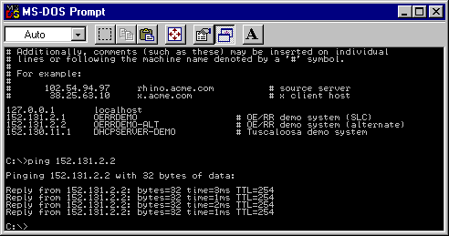  
**Solution:** Use PING to test access.  
\# Additionally, comments (such as these) may be inserted on individual  
\# lines or following the machine name denoted by a ‘\#’ symbol.  
\#  
\# For example:  
\#  
\# 102.54.94.97 rhino.acme.com \# source server  
\# 38.25.63.10 x.acme.com \# x client host  
127.0.0.1 localhost  
152.131.2.1 OERRDEMO \# OE/RR demo system (SLC)  
152.131.2.2 OERRDEMO-ALT \# OE/RR demo system (alternate)  
152.130.11.1 DHCPSERVER-DEMO \# Tuscaloosa demo system  
***

C:\\\>ping 152.131.2.2  
***

Pinging 152.131.2.2 with 32 bytes of data:  
***

Reply from 152.131.2.2: bytes=32 time=3ms TTL=254  
Reply from 152.131.2.2: bytes=32 time=3ms TTL=254  
Reply from 152.131.2.2: bytes=32 time=3ms TTL=254  
Reply from 152.131.2.2: bytes=32 time=3ms TTL=254  
***

C:\\\>  
## Appendix A: CPRS Package Security

CPRS security is maintained through security keys, menu assignment, and VA FileMan protection. The following keys, parameters, and settings determine who can enter or sign orders and who can enter Group Notes.

### Controlling Which Users Can Enter and Sign Medication Orders

Several items control who can enter or sign medication orders:

-   file entries  
-   keys  
-   identification numbers  
-   Order Entry (OR) signature keys  
-   CPRS parameters  
CPRS uses the following OR signature keys:

-   ORES  
-   ORELSE  
-   OREMAS  
**Warning: A user who holds NO keys can enter medication orders in CPRS.**

Sites can also control who can write medication orders using the following:

#### The provider key

The “authorized to write meds” entry in the NEW PERSON file (200).

To place outpatient controlled substance medication orders, a provider must have proper credentials such as a Drug Enforcement Administration (DEA) number for the individual provider, or a VA facility DEA number along with an individual identifier (commonly called a VA number).

To further control orders for outpatient controlled substances, sites have the ability to specify for which controlled substances pharmacy schedules a provider may write medication orders.

In addition, each provider must have a Personal Identification Verification (PIV) card or smart card to order outpatient controlled substances medications. Use of this card with ordering creates the ability to digitally sign the outpatient controlled substances orders.

Several parameters in CPRS help govern who can write medication orders and non-VA medication information:

-   ORWOR DISABLE ORDERING—This parameter disables all clinical ordering.  
-   OR OREMAS MED ORDERS—This parameter controls whether OREMAS key holders can act on medication orders.  
-   OR OREMAS NON-VA MED ORDERS—This parameter controls whether OREMAS holders can enter Non-VA medication information.  
In CPRS, only the following users MAY NOT place orders:

-   Users whose ordering capability was disabled by parameter “ORWOR DISABLE ORDERING”  
-   Users who hold more than one ordering signature key: OREMAS, ORELSE, ORES (multiple key conflict)  
**Warning:** A user who holds NO keys can enter medication orders in CPRS.

Other than the above users, regardless of what key users hold (no key, "provider", or OR\* key), they are all allowed to place orders. But users without an ORE key cannot sign and release orders; the medication orders would remain unreleased until signed by a valid provider.

For a no-key user, CPRS cannot tell whether the user is a medical clerk, a medical student, or an outpatient clerk. Medical students and outpatient clerks may need to enter medication orders that would be signed later by a provider.

Sites can control ordering by administrative staff and clerks in the following ways:

-   To prevent a clerk from entering medication orders, sites can assign the user the OREMAS key .  
-   To disable an individual user’s capability to enter any clinical order, sites can use the parameter “ORWOR DISABLE ORDERING.”  
### Order Entry Signature Keys

The following three keys determine who can sign orders in CPRS.

-   ORES  
-   ORELSE  
-   OREMAS  
Do not assign more than one of the ORES, ORELSE, or OREMAS keys per user.

#### ORES Key

-   Assigned to users authorized to write and sign orders  
-   Typically assigned to licensed physicians  
-   Allows holders to electronically sign orders; available to service immediately  
#### ORELSE Key

-   Assigned to users authorized to release physician’s orders  
-   Typically assigned to RNs or other advanced practice clinicians  
-   Releases orders to service for immediate action  
#### OREMAS Key

-   Assigned to users authorized to release patient orders as signed on chart  
-   Typically assigned to Ward Clerks  
-   Releases orders to service for immediate action  
##### Allocating Signature Keys

Below is one way to assign Signature keys using the Clinical Coordinator menu. Remember that this should be done when creating or editing a user.

You must have Clinical Coordinator access to assign keys.

1.  In the appropriate account, bring up the Clinical Coordinator menu by typing **ORCL MENU** and pressing **\<Enter\>**.  
1.  Choose CPRS Configuration (Clin Coord) … by typing **PE** and **\<Enter\>.**  
1.  Choose Allocate OE/RR Security Keys by typing **AL** and **\<Enter\>**.  
1.  Locate the key you want to assign (ORES, ORELSE, or OREMAS). To advance to the next key, type N and \<Enter\> at the Edit Holders: prompt.  
1.  When you locate the key you want to assign, at its Edit Holders prompt select **Y** and press **\<Enter\>**.  
1.  At the Select HOLDER: prompt, type the name of person to whom you will give the key and press **\<Enter\>**.  
1.  To give the key to additional users, continue typing the users’ names and pressing \<Enter\>.  
1.  When finished giving keys, press \<Enter\> at the Select HOLDER prompt to exit.  
1.  If necessary, type N and press \<Enter\> at the Edit Holders prompt to exit the Allocate OE/RR Key option.  
**Example of allocating signature keys**  
Select OPTION NAME: ORCL MENU Clinical Coordinator's Menu menu  
***

Select Clinical Coordinator's Menu Option: **PE** CPRS Configuration (Clin Coord)  
***

Select CPRS Configuration (Clin Coord) Option: **AL** Allocate OE/RR Security Keys  
***

KEY: ORES  
***

This key is given to users that are authorized to write orders in  
the chart. Users with this key can verify with their electronic  
signature patient orders.  
***

This key is typically given to licensed Physicians.  
***

Orders entered by users with this key can be released to the ancillary  
service for immediate action.  
***

DO NOT give users both the ORES key and the ORELSE key.  
***

Edit Holders? Yes// **\<Enter\>** (Yes)  
***

Select HOLDER: **CPRSPROVIDER,ONE**  
Added.  
***

Select HOLDER: **\<Enter\>**  
==============================================================================  
KEY: ORELSE  
***

This key is given to users that are authorized to release doctors  
orders to an ancillary service for action.  
***

This key is typically given to Nurses.  
Users with this key are allowed to put verbal orders in the system  
and release them to the service for action.  
***  
DO NOT give users both the ORES key and the ORELSE key.  
***

Edit Holders? Yes// **\<Enter\>** (Yes)  
***

Select HOLDER: **CPRSPROVIDER,SIXNURSE**  BC  
Added.  
***

Select HOLDER: **\<Enter\>**  
==============================================================================  
***

KEY: OREMAS  
***

This is the key given to MAS Ward Clerks. It allows the user to  
specify patient orders as 'signed on chart' when entered, which  
releases the orders to the service for action. Users with this  
key are not allowed to put verbal orders in the system.  
***

Edit Holders? Yes// **Y** (Yes)  
***

Select HOLDER: **CPRSPROVIDER,TENCLERK** SBW  
Added.  
***

Select HOLDER: **\<Enter\>**  
===============================================================================  
### Group Note Entry Keys

The OR GN ACCESS key determines which providers can enter Group Notes using the new Group Notes application. To further enable sites to control creation of Group Notes, the Group Notes application restricts creation to designated locations that must be entered in the OR GN LOCATIONS parameter.

**Note:** For instructions on allocating this key and setting locations for group notes, please see the *Group Notes/Encounter Implementation Guide* under Group Notes on the Vista Documentation Library (http://www.va.gov/vdl/).  
### CPRS Tab Access and Reports-Only Access

To use the CPRS GUI, each user now must be given access to either all tabs or to only the CPRS Reports tab. If tabs are not assigned to the user in their NEW PERSON file or if the RESTRICT PATIENT SELECTION prompt does not contain a Yes or No, the CPRS GUI will abort when the user tries to login. This change is part of the Read-Only project and will give sites greater control over who has access to patient records during what time period and is in anticipation of further enhancements to CPRS.

*Note: Post-install code contained in a patch should set the “RESTRICTED PATIENT SELECTION” entry to “N” for all current CPRS GUI users, and create a default “COR” tab entry for them as well so that their access remains the same.*  
After the post-install routine has run, each time a new user is added to the system or if restricted access is needed for existing users, a Clinical Application Coordinator (CAC) or whoever is responsible for granting access to the CPRS GUI at each site, will have to assign the appropriate access. The settings to choose from are

COR All current CPRS GUI tabs  
RPT Reports tab  
Sites should assign either access to all tabs (COR) or just the Reports tab (RPT), but not both. Although CPRS will allow CACs or others to give both COR and RPT access at the same time, doing so it the same as giving the user access to all tabs.  
**Note:** If tab access is given for both COR and RPT with concurrent effective dates, the core tab access overrides the reports only access.  
One of the following four types of access would normally be granted:  
**Full Access to CPRS GUI for All Patients** – The user has no restrictions on which patients they can select (No) and the user can see all CPRS tabs, core access (COR).  
**Full Access to the CPRS GUI for a Restricted Patient List Only** – The user can only see a select group of patients (Yes with valid patient list specified) but can view all CPRS GUI tabs, core access (COR).  
**Reports Tab Access for a Restricted Patient List** – The user can only see a select group of patients, a restricted patient list (YES) with a valid patient list (valid list entered) and can view only the Reports tab (RPT).  
**Reports Tab Access for All Patients** – The user can see all patients (No), but can view only the Reports tab (RPT).  
The user will NOT be able to access CPRS if the site

does not assign tabs (COR or RPT) or the setting has expired  
does not answer Yes or No to patient list restriction  
answers Yes to patient list restriction, but does not assign a patient list  
**The following table is for reference only and shows all possible combinations**  
| Restrict Patient List? | OE/RR Team List           | Tabs Assigned | Result                                                                                                                                                          |
|------------------------|---------------------------|---------------|-----------------------------------------------------------------------------------------------------------------------------------------------------------------|
| Left blank             | None                      | None          | No access to the CPRS GUI                                                                                                                                       |
| Left blank             | XYZ Team                  | None          | No access to the CPRS GUI                                                                                                                                       |
| Left blank             | XYZ Team                  | RPT           | No access to the CPRS GUI                                                                                                                                       |
| Yes                    | None/invalid              | RPT           | No access to the CPRS GUI                                                                                                                                       |
| Yes                    | XYZ Team                  | RPT           | User can access only the CPRS GUI Reports tab. Patient Selection only options under the Tools \| Options. User can select patients from the assigned team list. |
| No                     | XYZ Team                  | RPT           | User gets access to the Reports tab only. The full patient list is available.                                                                                   |
| No                     | Any patient list or blank | COR, RPT      | User sees all tabs and can access all patients                                                                                                                  |
| Yes                    | Any patient list          | COR, RPT      | User sees all tabs but can access only patients in specified list                                                                                               |
| Yes                    | None/Invalid              | COR           | No Access to CPRS GUI                                                                                                                                           |
| No                     | Any patient list or blank | COR           | User sees all tabs and can access all patients                                                                                                                  |
| Left blank             | Any patient list or blank | COR           | No access to the CPRS GUI                                                                                                                                       |
| Left blank             | Any patient list or blank | COR, RPT      | No access to the CPRS GUI                                                                                                                                       |

#### How Sites Can Restrict Access

Even with core access, sites can use the effective and expiration dates to control access to CPRS GUI. A CAC can assign the user core access for a specific period of time that the user will be at the site. Later, if access is needed again, the CAC can edit the existing entry to change the dates or leave that entry as a record and create a new tab access entry for the same tab with new dates. The user then has access to all CPRS GUI tabs and the full patient list for the period of time during which access is granted. To create a duplicate entry of the same tab, the user must select “No” when prompted for the new entry on a blank line.

Restricting core access by dates might be helpful if the CAC knows that a user will do a 90-day rotation. The CAC can set the user up to have core access for the period of time the user will be at the facility using the effective (or starting) date and the expiration date. Currently, an effective date is required for tab settings, but the expiration date is not.

However, of the two, read-only access is the more anticipated. Granting read-only access to CPRS involves assigning the reports tab only. In addition, the user can be assigned a restricted patient list, which is a previously created list in the OE/RR LIST FILE (\#100.21). The purpose of this feature is to allow non-clinical users, such as veterans’ service organizations (VSOs) or others who need to review the chart, to have access to the chart without being able to view the whole chart or make any changes to the chart. Setting the tab and a restricted list would allow these individuals to view only the reports tab of those patients they are assigned.

#### Technical Information

Kernel patches, XU\*8\*214 and XU\*8\*230, provide several new fields in the NEW PERSON (\#200) file for the following:

-   Whether the user’s access is restricted – RESTRICT PATIENT SELECTION (\#101.01)  
-   Which restricted patient list (team list) the user is assigned – PATIENT SELECTION LIST (\#101.02)  
-   Which tabs the user has been given access to and the dates – CPRS TAB (\#101.13 multiple)  
Within the CPRS TAB (\#101.13) multiple, is the CPRS TAB (\#.01) field which is a pointer to the new OR CPRS TABS (\#101.13) file. Additional fields within the CPRS TAB (\#101.13) multiple are EFFECTIVE DATE (\#.02) and EXPIRATION DATE (\#.03). The entries are made through the Clinical Coordinator menu using the GUI Access – Tabs, PL [ORCL CPRS ACCESS] option. In connection with the “Read Only” functionality, the Patient List utilized, which is based on an OE/RR LIST, is stored, displayed, scrolled, and refreshed fully from a \^TMP global.

#### Assigning CPRS GUI Tab Access

In order to assign CPRS tab access, you must be able to use the Clinical Coordinator menu in the List Manager interface. To grant restricted access to the CPRS GUI, an OERR List (file \#100.21) must be defined to contain the selected patients.

A new option has been added to the PE CPRS Configuration (Clin Coord) [OR PARAM COORDINATOR MENU] entitled GA GUI Access - Tabs, PL [ORCL CPRS ACCESS].

To assign CPRS tab access for user, follow these steps:

1.  At the CPRS Configuration (Clinical Coordinator) Option prompt, type **GA** (for GUI Access – Tabs, PL) and press \<**Enter**\>.  
1.  At the Select NEW PERSON prompt, type the last name of the user and press \<**Enter**\>. If necessary, select from the choices given.  
1.  At the RESTRICTED PATIENT SELECTION prompt, type Y if you want to assign the user a specific Team List and press \<**Enter**\>. If you do not want to restrict the user’s access to a specific team list, type **N** and press \<**Enter**\>.  
**Note:** This prompt must be answered with a Yes or No. You can skip it, but if it is not answered, CPRS will abort when the user tries to run CPRS.  
1.  If you answered Yes to the prompt in step 5, at the PATIENT SELECTION LIST prompt, type the name of the list that was previously defined and assigned to the user using the Patient List Management Menu and press \<**Enter**\>.  
1.  Type the letters representing the tab or tab set (COR or RPT) that you want to assign to this user and press \<**Enter**\>.  
**Note:** To get the tab entry options, type **??** and press **\<Enter**\> as necessary. Remember that if you assign the user access to the core tabs (COR) that the user will have full access to CPRS. Also, if you are making a duplicate entry for the same tab such as “RPT” when an “RPT” already exists, you will need to answer N, to the REPORTS TAB? Ok? Yes// prompt to make the duplicate entry.  
1.  When asked if you are adding it as tab and no other entry exists, type **Y** and press \<**Enter**\>.  
1.  At the EFFECTIVE DATE prompt, type a date and press \<**Enter**\>.  
1.  At the EXPIRATION DATE prompt, you can type a date on which you want the access to expire and press \<**Enter**\> or you may press \<**Enter**\> without entering a date to bypass this prompt.  
1.  At the Select CPRS TAB prompt, if you have more editing to do, type which tab you want to edit or add. If you are done editing access press \<**Enter**\>.  
***

**Example of Creating a New Tab Entry for the CPRS GUI**  
Select OPTION NAME: ORCL MENU Clinical Coordinator's Menu menu  
CL Clinician Menu ...  
NM Nurse Menu ...  
WC Ward Clerk Menu ...  
XC Check for Multiple Keys  
PE CPRS Configuration (Clin Coord) ...  
RD Release/Cancel Delayed Orders  
Select Clinical Coordinator's Menu Option: PE CPRS Configuration (Clin Coord)  
AL Allocate OE/RR Security Keys  
KK Check for Multiple Keys  
DC Edit DC Reasons  
GP GUI Parameters ...  
GA GUI Access - Tabs, RPL  
MI Miscellaneous Parameters  
NO Notification Mgmt Menu ...  
OC Order Checking Mgmt Menu ...  
MM Order Menu Management ...  
LI Patient List Mgmt Menu ...  
FP Print Formats  
PR Print/Report Parameters ...  
RE Release/Cancel Delayed Orders  
US Unsigned orders search  
EX Set Unsigned Orders View on Exit  
NA Search orders by Nature or Status  
DO Event Delayed Orders Menu ...  
PM Performance Monitor Report  
Select CPRS Configuration (Clin Coord) Option: GA GUI Access - Tabs, PL  
Select NEW PERSON NAME: CPRSPROVIDER,ONE AB  
RESTRICT PATIENT SELECTION: YES//  
PATIENT SELECTION LIST: restricted list 5//  
Select CPRS TAB: RPT REPORTS TAB.  
Are you adding 'RPT' as a new CPRS TAB (the 1ST for this NEW PERSON)? No// Y  
(Yes)  
EFFECTIVE DATE: T (MAY 30, 2002)  
EXPIRATION DATE: T+365 (MAY 30, 2003)  
Select CPRS TAB:  
## Appendix B: Electronic Signature

An electronic signature is the private code that an authorized user types into the system after performing certain actions. For CPRS, it’s used by clinicians entering orders. This signature has the same validity as the written signature on the chart.

Implementing electronic signature for CPRS is a four-step process:

1\. Define the clinician as a provider in the NEW PERSON file.  
2\. Assign the clinician the Provider key (while in the NEW PERSON file).  
3\. Assign the ORES key to clinicians who have signature authority.  
4\. Assign electronic signature codes (this can be done by the coordinator, at the same time as defining the clinician as a provider in the NEW PERSON file, or by the clinician, using *Electronic Signature Code Edit* on the User’s Toolbox menu. See instructions on following pages).  
Users may have the ORES key but not have an electronic signature code, and will, therefore, not be allowed to electronically sign orders on the system.

**☞NOTE:** **Until ORES key holders have an electronic signature code, the system assumes that orders entered have been entered and manually signed “on chart;” orders are automatically released to the ancillary service for action.**  
Once ORES key holders have an electronic signature code, they will be prompted to enter the electronic signature after accepting the orders. If the electronic signature code is entered correctly, the orders are released to the ancillary services for action. If the electronic signature code is not entered, or is entered incorrectly, the orders are *not* released to the ancillary services for action, but are held in an unreleased/unsigned status. Key holders are given three chances to correctly enter their signature codes.

GUI Review and Sign Works as Follows, According to Signature Status:

**• User has provider key only** (med student)  
If there are notes the user can sign, the ES panel appears in Review/Sign Changes; otherwise it is hidden. Orders appear on the list with the checkbox grayed. If the ES is entered for documents, it is NOT applied to the orders.  
**• User has OREMAS key**  
If users (clerks) have entered notes for which they are the author AND orders on behalf of a provider, TWO review screens will appear⎯one prompting for ES for the things the clerk can sign (a note), and one to allow the clerk to process the orders (mark signed on chart).  
**• User has ORELSE key**  
Works the same as for clerks, but the user can also release the orders.  
**• User has ORES key**  
Sees the review screen with the ES prompting, both for notes and orders.  
#### Electronic Signature Edit Option

Key holders may enter or edit their electronic signature codes through the option, “Electronic Signature Edit,” on the User’s Toolbox menu. To change an existing code, the user must type in the current code and then enter the new one.

##### Setup of Electronic Signature

If key holders forget their electronic signature codes, they must contact their IRM Service so that the old code can be deleted. Once this has been done, the user will be allowed to enter a new code without having to know the old code. IRM staff can delete the electronic signature code by editing the field, ELECTRONIC SIGNATURE CODE (20.4) in the NEW PERSON file (200), or by using the option, “Clear Electronic Signature Code [XUSESIG CLEAR].”  
| **ORDER PARAMETERS File (100.99)** **Field 100.99,21 ELECTRONIC SIGNATURE**  '0' FOR NO;  '1' FOR YES;  This field allows electronic signature functionality to be used. Use of this functionality requires some initial setup before it can be turned on. Users have to be assigned keys that allow them to perform verification steps in the order entry process. They also have to be given an electronic signature code. This also has an effect on who can be selected as the person requesting the order.  **Field 100.99,22 ELECTRONIC RECORD**  '3' FOR YES (ALLOW S.O.C & WRITTEN);  '4' FOR YES (Exempt Service Entered);  A site can use this field to select 1 of 4 modes for Electronic Signature:  **0\> No change** from current Electronic Signature functionality.  **1\> Yes (All orders must be signed online.)**  Signature on chart is not allowed All orders are filed initially with a signature status of Unsigned and a notification for electronic signature is sent to the ordering provider.  **Yes (Allow S.O.C)**  All orders are signed online, but for those cases where an order is written and signed on the paper chart, you can so specify. Backdoor orders send a notification for electronic signature and require a signature, unless the order has a Nature of Order set to null.  **Yes (Allow S.O.C. & Written)**  Is the same as option 2 except that it will allow orders sent from the ancillary packages with a nature of order of Written to be entered without requiring an electronic signature.  **Yes (Exempt Service Entered)**  Is the same as option 2 except that it will allow orders sent from the ancillary packages that have not defined a nature of order to be entered without requiring an electronic signature. This is the way 'backdoor' orders were handled before the changes introduced with this new field (added with patch OR\*2.5\*46) were added. As of the release of patch OR\*2.5\*46 only Pharmacy and Lab have a way of dealing with the nature of order from the backdoor. So until the rest of the backdoor interfaces can deal with this, option 4 is the least disruptive method of evolution, and still get the enhancements for notification and signing of verbal orders.  For options 1, 2, 3 and 4, the default for the prompt "Do you want to mark these orders as 'Signed on Chart'" is changed to NO.  |
|---------------------------------------------------------------------------------------------------------------------------------------------------------------------------------------------------------------------------------------------------------------------------------------------------------------------------------------------------------------------------------------------------------------------------------------------------------------------------------------------------------------------------------------------------------------------------------------------------------------------------------------------------------------------------------------------------------------------------------------------------------------------------------------------------------------------------------------------------------------------------------------------------------------------------------------------------------------------------------------------------------------------------------------------------------------------------------------------------------------------------------------------------------------------------------------------------------------------------------------------------------------------------------------------------------------------------------------------------------------------------------------------------------------------------------------------------------------------------------------------------------------------------------------------------------------------------------------------------------------------------------------------------------------------------------------------------------------------------------------------------------------------------------------------------------------------------------------------------------------------------------------------------------------------------------------------------------------------------------------------------------------------------------------------------------------------------------------------------------------------------------------------------------------------------------------------------------------------------------------------------------------------------------------------------------------------------------------------------------------------------------------------------|  
##### Setup of Electronic Signature

CPRS Configuration Menu (Clin Coord)

AL Allocate OE/RR Security Keys  
KK Check for Multiple Keys  
DC Edit DC Reasons  
GP GUI Parameters ...  
GA GUI Access - Tabs, RPL  
MI Miscellaneous Parameters  
NO Notification Mgmt Menu ...  
OC Order Checking Mgmt Menu ...  
MM Order Menu Management ...  
LI Patient List Mgmt Menu ...  
FP Print Formats  
PR Print/Report Parameters ...  
RE Release/Cancel Delayed Orders  
US Unsigned orders search  
EX Set Unsigned Orders View on Exit  
NA Search orders by Nature or Status  
DO Event Delayed Orders Menu ...  
PM Performance Monitor Report  
| Option                       | Option Name          | Synonym | Description                                                                                                                                                                                                                                       |
|------------------------------|----------------------|---------|---------------------------------------------------------------------------------------------------------------------------------------------------------------------------------------------------------------------------------------------------|
| Allocate OE/RR Security Keys |  ORCL KEY ALLOCATION | KA      | This option is to assist the CPRS Clinical Coordinator when allocating Security keys to users of the OE/RR system.                                                                                                                                |
| Check for Multiple Key       | ORE KEY CHECK        | XC      | This option will identify users that have more than one OR key. Users must only have one OR key to correctly use the software. Any users identified need to have their keys edited so that only one of the OR keys remain (ORES, OREMAS, ORELSE). |

1\. Assign the appropriate keys to the appropriate users, using the CPRS Configuration Menu (Clin Coord) option, *Allocate CPRS Security Keys*.  
2\. Turn electronic signature on in the PARAMETERS file, to make electronic signature requirements active. If the ELECTRONIC SIGNATURE parameter is turned off (set to ‘0’), orders become active automatically after they’re entered.  
3\. Users with the ORES key will not see the electronic signature prompts until they add their signature code (through the option *Edit Electronic Signature*). If they have the ORES key, but haven’t added a signature code, they will be prompted:  
...you do not have an electronic signature code  
Do you want to give yourself a code now? YES//**\<Enter\>** (YES)  
If the ORES key holder answers no to the above prompt, this dialogue will appear:  
You did not enter a signature code!  
...orders requiring signature will be marked as 'SIGNED ON CHART'.  
Once ORES key holders add their signature codes, they will see:  
To electronically sign these orders...  
Enter Signature Code: (xxxxxxx) \<hidden\>  
SIGNED  
4\. Users with the ORELSE and OREMAS keys will see the following prompts after entering orders:  
Select Action: Accept Orders// \<Enter\> Accept Orders  
...insufficient signature authority  
NOT SIGNED  
Do you want to mark these orders as 'Signed on Chart'? YES// \<RET\> (YES)  
a. If ORELSE key holders answer no, the computer dialogue will be:  
...insufficient signature authority  
NOT SIGNED  
Do you want to mark these orders as 'Signed on Chart'? YES// n (NO)  
These orders have not been signed by an authorized physician  
Do you still want to release these orders to the service? YES// \<RET\> (YES)  
NATURE OF ORDER: VERBAL// \<RET\>  
b. If OREMAS key holders answer no, the dialogue will be :  
...insufficient signature authority  
NOT SIGNED  
Do you want to mark these orders as 'Signed on Chart'? YES// n (NO)  
UNRELEASED ORDERS:  
\$ PROTHROMBIN TIME BLOOD PLASMA LB \#1971 WC  
Example of “Allocate CPRS Security Keys”  
Select CPRS Configuration Menu (Clin Coord): **ka** Allocate CPRS Security Keys  
User Security Key Edit  
KEY: ORES  
This key is given to users that are authorized to write orders in the chart. Users with this key can verify with their electronic signature patient orders .  
Edit Holders? YES//**\<Enter\>** (YES)  
***

Select HOLDER: CPRSPROVIDER,ONE // CPRSPROVIDER,ONE  
HOLDER: CPRSPROVIDER,ONE //**\<Enter\>**  
Select HOLDER: **\<Enter\>**  
===============================================================  
***

KEY: ORELSE  
This key is given to users that are authorized to release doctors’ orders to an ancillary service for action.  
This key is typically given to Nurses.  
Users with this key are allowed to put verbal orders in the system and release them to the service for action..  
***

Edit Holders? YES// **n** (NO)  
============================================================  
KEY: OREMAS  
This is the key given to MAS Ward Clerks. It allows the user to specify patient orders as 'signed on chart' when entered, which releases the orders to the service for action. Users with this key are not allowed to put verbal orders in the system.  
***

Edit Holders? YES// **n** (NO)  
#### Menu Assignments

| Menu Text                            | Option Name             | Assignment                                                                             |
|--------------------------------------|-------------------------|----------------------------------------------------------------------------------------|
| CPRS Manager Menu                    | ORMGR MENU              | IRMS specialists assigned to CPRS                                                      |
| Clinician Menu                       | OR MAIN MENU CLINICIAN  | Clinicians (physicians, psychologists, social workers, nurse practitioners, PAs, etc.) |
| Nurse Menu                           | OR MAIN MENU NURSE      | Nurses                                                                                 |
| Ward Clerk Menu                      | OR MAIN MENU WARD CLERK | Ward Clerks, MAS personnel                                                             |
| CPRS Configuration Menu (Clin Coord) | ORCL MENU               | Clinical Coordinators, ADPACS,                                                         |
| CPRS Configuration Menu (IRM)        | ORE MGR                 | IRMS CPRS specialist (locked with XUPROG key)                                          |

### Digital Signature

As part of the Drug Enforcement Agency Electronic Prescription of Controlled Substances (DEA ePCS) project, CPRS uses digital signatures for outpatient controlled substance medication orders. To digitally sign the outpatient controlled substance order, a provider must have a Personal Identification Verification card (PIV) or smart card, a computer that accepts the card, and a Personal Identification Number (PIN). In addition, to electronically place the outpatient controlled substance orders, a provider must be correctly set up in VistA with several credential items, such as a DEA or VA number, keys, entries in file, and other items.

Orders that require digital signatures go through the electronic signature process first. Then, providers must acknowledge the text on the dialog by entering their PIV (also referred to as a smart card) and entering their PIN when prompted.

## Appendix C: How Notifications Work - Technical Overview

### Introduction

In CPRS, most Notifications will be triggered by examining data in HL7 messages. (In limited cases, they will be triggered within individual packages.) As packages update and pass pertinent data in HL7 arrays via protocol event points, the CPRS Expert System will capture and examine those messages and data to determine if a notification should be triggered. The HL7 message data capture and review process is similar to that required by Order Checking which also uses the CPRS Expert System. When compared with order checks, the delivery mechanism for notifications is non-real time with a different destination. (For a detailed comparison of Notifications and Order Checks, refer to the Notifications document entitled, “Notifications, Order Checks and Kernel Alerts”.) To support this new direction for notifications, the Notifications file has been altered. Some of the information that used to reside in the Notifications file has been moved to the Parameter files.

| Notification                                  | \^ORD(100.9 ien | New in CPRS |
|-----------------------------------------------|-----------------|-------------|
| ABNL IMAGING RESLT, NEEDS ATTN                | 25              |             |
| ABNORMAL LAB RESULT (INFO)                    | 58              | √           |
| ABNORMAL LAB RESULTS (ACTION)                 | 14              |             |
| ADMISSION                                     | 18              |             |
| ANATOMIC PATHOLOGY RESULTS                    | 71              | √           |
| CONSULT/PROC INTERPRETATION                   | 66              | √           |
| CONSULT/REQUEST CANCEL/HOLD                   | 30              |             |
| CONSULT/REQUEST RESOLUTION                    | 23              |             |
| CONSULT/REQUEST UPDATED                       | 63              | √           |
| CRITICAL LAB RESULT (INFO)                    | 24              |             |
| CRITICAL LAB RESULTS (ACTION)                 | 57              | √           |
| DEA AUTO DC CS MED ORDER                      | 74              | √           |
| DEA CERTIFICATE EXPIRED                       | 75              | √           |
| DEA CERTIFICATE REVOKED                       | 76              | √           |
| DC ORDER                                      | 62              | √           |
| DECEASED PATIENT                              | 20              |             |
| DISCHARGE                                     | 35              | √           |
| DNR EXPIRING                                  | 45              | √           |
| ERROR MESSAGE                                 | 56              | √           |
| FLAG ORDER COMMENTS                           | 8               | √           |
| FLAG ORDER FOR CLARIFICATION                  | 6               |             |
| FLAGGED OI EXPIRING – INPT                    | 64              | √           |
| FLAGGED OI EXPIRING – OUTPT                   | 65              | √           |
| FLAGGED OI ORDER – INPT                       | 41              | √           |
| FLAGGED OI ORDER – OUTPT                      | 61              | √           |
| FLAGGED OI RESULTS – INPT                     | 32              | √           |
| FLAGGED OI RESULTS – OUTPT                    | 60              | √           |
| FOOD/DRUG INTERACTION                         | 55              | √           |
| FREE TEXT **(INACTIVE)**                      | 46              | √           |
| IMAGING PATIENT EXAMINED                      | 21              |             |
| IMAGING REQUEST CANCEL/HELD                   | 26              |             |
| IMAGING REQUEST CHANGED                       | 67              | √           |
| IMAGING RESULTS, NON CRITICAL                 | 22              |             |
| IMAGING RESULTS AMENDED                       | 53              | √           |
| LAB ORDER CANCELED                            | 42              | √           |
| LAB RESULTS                                   | 3               |             |
| LAB THRESHOLD EXCEEDED                        | 68              | √           |
| LACTATION STATUS REVIEW                       | 87              | √           |
| LAPSED UNSIGNED ORDER                         | 78              | √           |
| MAMMOGRAM RESULTS                             | 69              | √           |
| MEDICATIONS EXPIRING - INPT                   | 47              | √           |
| MEDICATIONS EXPIRING - OUTPT                  | 72              | √           |
| NEW ALLERGY ENTERED/ACTIVE MED                | 88              | √           |
| NEW ORDER                                     | 50              | √           |
| NEW SERVICE CONSULT/REQUEST                   | 27              |             |
| NPO DIET MORE THAN 72 HRS                     | 31              | √           |
| OP NON-RENEWABLE RX RENEWAL                   | 73              | √           |
| ORDER CHECK                                   | 54              | √           |
| ORDER REQUIRES CHART SIGNATURE **(INACTIVE)** | 5               |             |
| ORDER REQUIRES CO-SIGNATURE **(INACTIVE)**    | 37              | √           |
| ORDER REQUIRES ELEC SIGNATURE                 | 12              |             |
| ORDERER-FLAGGED RESULTS                       | 33              | √           |
| PAP SMEAR RESULTS                             | 70              | √           |
| PREG/LACT UNSAFE ORDERS                       | 79              | √           |
| PREGNANCY STATUS REVIEW                       | 86              | √           |
| PROSTHETICS CONSULT UPDATED                   | 89              | √           |
| SCHEDULED ALERT                               | 90              | √           |
| SERVICE ORDER REQ CHART SIGN **(INACTIVE)**   | 28              |             |
| SMART ABNORMAL IMAGING RESULTS                | 84              | √           |
| SMART NON-CRITICAL IMAGING RES                | 85              | √           |
| STAT IMAGING REQUEST                          | 51              | √           |
| STAT ORDER                                    | 43              | √           |
| STAT RESULTS                                  | 44              | √           |
| SUICIDE ATTEMPTED/COMPLETED                   | 77              | √           |
| TRANSFER FROM PSYCHIATRY                      | 36              | √           |
| UNSCHEDULED VISIT                             | 19              |             |
| UNVERIFIED MEDICATION ORDER                   | 48              | √           |
| UNVERIFIED ORDER                              | 59              | √           |
| URGENT IMAGING REQUEST                        | 52              | √           |

### Trigger Methods

Notifications are triggered via six methods:

1\. Hard coded triggers within packages; for example: Imaging Patient Examined  
2\. Time (TaskMan)-driven processes; for example: Medications Expiring - Inpt  
3\. Expert system rules monitoring HL7 messages; for example: Critical Lab Results  
4\. Expert system rules monitoring DGPM Movement Events protocol; for example: Discharge  
5\. Expert system rules monitoring OE/RR Events; for example: Order Requires Elec Signature  
6\. Order checking system; for example: Order Check  
The processing of notifications is determined by information evaluated during the triggering process and the values of parameters set by options in the ORB namespace. For a description of these parameters, refer to Parameters document “Notification Parameters in CPRS 1 - Technical Overview”.

### Recipient Determination

CPRS Notifications determines recipients of a patient’s particular notification/alert in the following order.

**☞ NOTE: Terminated users will not receive notifications/alerts.**  
1\. Check the value of the parameter ORB SYSTEM ENABLE/ DISABLE. If it is ‘D’isabled, do not process or send any notifications. If it is ‘E’nabled, process notifications as outlined below.  
**☞ NOTE: You can check the value of this parameter via option “Enable or Disable Notification System.”**  
2\. Obtain the default/regular recipients for this notification regardless of patient from the parameter ORB DEFAULT RECIPIENTS.  
**☞ NOTE: You can access this parameter via option “Set Default Recipients for Notifications.” With this option, teams and individuals can be set up to automatically always receive a particular notification. If a team is identified, every user on that team (regardless of other parameter and option settings), will receive the notification/alert. Good uses of this parameter include troubleshooting notifications and delivering the Food/Drug Interaction notification (for all patients), to a team of dietitians.**  
3\. Obtain the default/regular device recipients for this notification regardless of patient from the parameter ORB DEFAULT DEVICE RECIPIENTS.  
**☞ NOTE: This parameter is accessed via option “Set Default Recipient Device(s) for Notifications.” One or more devices can be set up to automatically always receive a notification. The device may be a printer, file or any other device defined at the site. This is useful if every instance of an alert across all patients is desired for QA, JCAHO or research purposes.**  
4\. After default recipients are determined, a list of potential alert recipients is obtained from:  
a. Special, notification-specific recipients:  
1) If the notification processed is FLAGGED OI RESULTS - INPT/OUTPT (usually triggered by an HL7 result message from Lab, Imaging or Consults), the orderable item associated with the notification’s order number is found. The parameter ORB OI RESULTS – INPT/OUTPT is then evaluated to determine if users, teams or devices have flagged that orderable item. If the value for the orderable item flag is "YES", the entity (user, team, device), flagging the orderable item becomes a potential alert recipient for ALL patients. If the value is "NO", the entity (user, team, device), flagging the orderable item only becomes a potential alert recipient if that entity is "linked" to the patient. Users are linked to a patient if the user is the patient's attending physician, primary inpatient provider, PCMM primary care practitioner or PCMM associate provider. In addition, users are linked to a patient if the user shares an OE/RR team with the patient or holds a team position assignment on the patient’s primary PCMM team. OE/RR teams are linked to a patient if the patient is on the OE/RR team. (If a patient is on an OE/RR team that has flagged an orderable item, all users on that team become potential alert recipients.) Devices (printers, etc.) are linked to a patient if the device and patient are on the same OE/RR team.  
**☞ NOTE: If a device is added to the potential recipient list, it will always receive the alert.**  
**☞ NOTE: You can check for users or teams linked to flagged orderable item results via option “Flag Orderable Item(s) to Send Notifications.”**  
2) If the notification processed is FLAGGED OI ORDER - INPT/OUTPT (usually triggered by an HL7 order message from OE/RR or a backdoor ancillary package order), the orderable item associated with the notification’s order number is found. The parameter ORB OI ORDERED – INPT/OUTPT is then evaluated to determine if users or teams have flagged that orderable item. If the value for the orderable item flag is "YES", the entity (user, team, device), flagging the orderable item becomes a potential alert recipient for ALL patients. If the value is "NO", the entity (user, team, device), flagging the orderable item only becomes a potential alert recipient if that entity is "linked" to the patient. Users are linked to a patient if the user is the patient's attending physician, primary inpatient provider, PCMM primary care practitioner or PCMM associate provider. In addition, users are linked to a patient if the user shares an OE/RR team with the patient or holds a team position assignment on the patient’s primary PCMM team. OE/RR teams are linked to a patient if the patient is on the OE/RR team.  
**☞ NOTE: If a patient is on an OE/RR team that has flagged an orderable item, all users on that team become potential alert recipients.)**  
Devices (printers, etc.) are linked to a patient if the device and patient are on the same OE/RR team.  
**☞ NOTE: If a device is added to the potential recipient list, it will always receive the alert.**  
**☞ NOTE: You can check for users or teams linked to flagged orderable item orders via option “Flag Orderable Item(s) to Send Notifications.”**  
3) If the notification processed is FLAGGED OI EXPIRING - INPT/OUTPT (triggered when an order will expire before midnight on the next working day), the orderable item associated with the notification’s order number is found. The parameter ORB OI EXPIRING – INPT/OUTPT is then evaluated to determine if users or teams have flagged that orderable item. If the value for the orderable item flag is "YES", the entity (user, team, device), flagging the orderable item becomes a potential alert recipient for ALL patients. If the value is "NO", the entity (user, team, device), flagging the orderable item only becomes a potential alert recipient if that entity is "linked" to the patient. Users are linked to a patient if the user is the patient's attending physician, primary inpatient provider, PCMM primary care practitioner or PCMM associate provider. In addition, users are linked to a patient if the user shares an OE/RR team with the patient or holds a team position assignment on the patient’s primary PCMM team. OE/RR teams are linked to a patient if the patient is on the OE/RR team.  
**☞ NOTE: If a patient is on an OE/RR team that has flagged an orderable item, all users on that team become potential alert recipients.**  
Devices (printers, etc.) are linked to a patient if the device and patient are on the same OE/RR team.  
**☞ NOTE: If a device is added to the potential recipient list, it will always receive the alert.**  
**☞ NOTE: You can check for users or teams linked to expiring flagged orderable items via option “Flag Orderable Item(s) to Send Notifications.”**  
4) If a lab results notification is processed (LAB RESULTS, ABNORMAL LAB RESULTS (ACTION), STAT RESULTS, CRITICAL LAB RESULTS (ACTION)), the unique lab ID (e.g., “1916;2990506;9;CH;7009492.9046”), for the notification is obtained. The patient’s existing alerts are then reviewed for matching notifications and unique lab IDs. If a matching alert is found that alert’s recipients are added to the potential recipient list. In addition, the matching alert’s message text is prefixed to the current alert’s message text and the matching alert is deleted.  
b. The optional recipient list identified by the service triggering the alert. For example, Radiology sends Notifications a list of potential recipients when its STAT Imaging Request notification is triggered.  
c. Provider-related recipients indicated in the parameter ORB PROVIDER RECIPIENTS:  
1) “P” – Primary Provider (inpatient)  
2) “A” – Attending Physician  
3) “T” – Teams. If set for Teams, all OE/RR teams to which the patient belongs will be evaluated to obtain potential recipients from the set of users also on the teams. A user on multiple teams with the patient will be processed for each team that has an Enabled, Disabled or Mandatory value for that notification. Thus it is possible for one team membership to “disable” a user’s alert whereas another team membership “enables” the user’s alert, all for the same patient.  
4) “O” – Ordering Provider. If set for ordering/requesting provider and an order number is passed by the service/HL7 message triggering the alert, the ordering/requesting provider will be determined and added to the potential list.  
**☞ NOTE: If the notification is either Order Requires Electronic Signature or Order Requires Co-signature and the ordering/requesting provider does not have signature authority (does not hold the ORES key), the teams that contain both the ordering/requesting provider and patient will be evaluated. Every user with the ORES key on those teams will be added to the potential recipient list.**  
5) “M” – PCMM Team. If set for PCMM Teams, adds users/providers linked to the patient’s primary PCMM team via PCMM Team Position assignments to the potential recipient list.  
6) “E” – Entering User. If set for entering user and an order number is passed by the service/HL7 message triggering the alert, the user/provider who entered the order’s most recent activity will be added to the potential recipient list.  
7) “R” – PCMM Primary Care Practitioner (PCP)  
8) “S” – PCMM Associate Provider  
**☞ NOTE: You can access the ORB PROVIDER RECIPIENTS parameter value via option “Set Provider Recipients for Notifications.”**  
5\. Obtain a list of the previous "single instance" alert recipients who have NOT deleted the alert and add them as potential recipients to the new alert. As potential recipients, these previous recipients go through the same "ON/OFF" algorithm to determine if they should actually receive the new alert or not. Single instance notifications/alerts that delete the previous instance of the alert and obtain potential recipients for the new alert from the previous alert include:  
DC ORDER  
DNR EXPIRING  
FLAG ORDER FOR CLARIFICATION  
MEDICATIONS EXPIRING – INPT  
MEDICATIONS EXPIRING – OUTPT  
NEW ORDER  
NPO DIET MORE THAN 72 HRS  
ORDER REQUIRES ELEC SIGNATURE  
UNVERIFIED MEDICATION ORDER  
UNVERIFIED ORDER  
6\. Each user on the potential recipient list is evaluated according to values set for entities identified in the parameter ORB PROCESSING FLAG.  
**☞ NOTE: You can access these entity values via options “Enable/Disable Notifications” and “Display the Notifications a User Can Receive.”**  
The parameter’s entity values are processed in the following order to determine if that particular user should receive the notification/alert or not.  
**☞ NOTE: Terminated users will not receive notifications/ alerts.**  
If a user on the recipient list has the notification “ON” (they will receive the alert). If the user has Kernel Alert surrogate, the surrogate will receive the alert. The original user will not receive the alert if he has a surrogate!  
**The first condition met below stops the processing and determines whether or not the user will receive the notification.** These conditions are summarized as a matrix in Appendix A. Processing order:  
a. If the USER’s value for the notification is Mandatory or Enabled, the user will receive the alert.  
b. If the user’s TEAM value for the notification is Mandatory, the user will receive the alert.  
c. If the user’s TEAM value for the notification is Disabled, the user will NOT receive the alert.  
d. If the user’s SERVICE/SECTION value for the notification is Mandatory, the user will receive the alert.  
e. If the PATIENT’s HOSPITAL LOCATION (inpatients only) value for the notification is Mandatory, the user will receive the alert.  
f. If the PATIENT’s HOSPITAL LOCATION (inpatients only) value for the notification is Disabled, the user will NOT receive the alert.  
g. If the user’s DIVISION\* value for the notification is Mandatory (and PATIENT’s HOSPITAL LOCATION has no value), the user will receive the alert.  
h. If the SYSTEM value for the notification is Mandatory (and DIVISION and PATIENT’s HOSPITAL LOCATION have no value), the user will receive the alert.  
i. If the PACKAGE (OERR-exported) value for the notification is Mandatory (and SYSTEM, DIVISION\*, and PATIENT’s HOSPITAL LOCATION have no value), the user will receive the alert.  
j. If the USER’s value for the notification is Disabled, the user will NOT receive the alert.  
k. If the user’s TEAM value for the notification is Enabled, the user will receive the alert.  
l. If the user’s SERVICE/SECTION value for the notification is Disabled, the user will NOT receive the alert.  
m. If the user’s SERVICE/SECTION value for the notification is Enabled, the user will receive the alert.  
n.. If the PATIENT’s HOSPITAL LOCATION (inpatients only) value for the notification is Enabled, the user will receive the alert.  
o. If the user’s DIVISION\* value for the notification is Disabled, the user will NOT receive the alert.  
p. If the user’s DIVISION\* value for the notification is Enabled, the user will receive the alert.  
q. If the SYSTEM value for the notification is Disabled, the user will NOT receive the alert.  
r. If the SYSTEM value for the notification is Enabled, the user will receive the alert.  
s. If the PACKAGE (OERR-exported) value for the notification is Disabled, the user will NOT receive the alert.  
t. If the PACKAGE (OERR-exported) value for the notification is Enabled, the user will receive the alert.  
u. If none of the above parameter values are found, the notification is processed as Disabled and the user will NOT receive the alert.  
**☞ NOTE: All notifications will have a value (Enabled, Disabled or Mandatory), at the package level when exported.**  
**☞ NOTE: \*If the user has multiple divisions, the first division found with a “Mandatory” value is used. If no mandatory division values exist and a division has an “Enabled” value, that division is used. If neither mandatory nor enabled division values exist and a division has a “Disabled” value, that division is used.**  
### Notification Specifics

Each notification and how it works is described below. In most cases, Recipients, Urgency and Deletion can be set at the site via ORB options/parameters. The values indicated below for Recipients, Urgency and Deletion are those exported by CPRS as package entity, (OE/RR) defaults.  
**Local Notifications**  
It is possible for sites to create their own local notifications. Sites that create their own notifications are responsible for the content and maintenance of them. Part of creating a local notification is creating a number for that notification. A range of national numbers is set aside for nationally released notifications.  
Local notifications must be assigned a number in the local site range.  
**Warning:** If a local notification has a national number, it could be overwritten when a national notification is released. You could lose your local notification.  
**Renumbering a Site-Defined Notification**  
Create an entry in the OE/RR Notifications file [\#100.9]. This entry must have a unique, descriptive name and unique internal entry number. In addition, the internal entry number must be specific to your VAMC in the following format:  
\<your station number\>\<incremental notification number ranging from 01-99\>  
For example, if your site is number 456, your first locally created notification would be 45601. All "site-defined" notifications must be defined similarly to the following example:  
NUMBER: \<site number\>\<incremental number\>  
NAME: \<unique site name\>  
PACKAGE ID: OR MESSAGE TEXT: \<alert message text\>  
MESSAGE TYPE: PACKAGE PROVIDES A VARIABLE MESSAGE  
ACTION FLAG: RUN ROUTINE ENTRY POINT: INFODEL  
ROUTINE NAME: ORB3FUP2  
\*RECIPIENT RESTRICTIONS: RESTRICTED TO PACKAGE-DEFINED RECIPIENTS  
RELATED PACKAGE: OR  
\*PROCESSING FLAG: ENABLED  
DESCRIPTION: \<description of the notification\>  
**Note:** Site-defined notifications CANNOT have follow-up actions. (Notifications with follow-up actions must have follow-up action code written for both the ListMgr and GUI interfaces. Currently, this requires the source code to the GUI which is not available.) Therefore, the entry point must be INFODEL and routine name ORB3FUP2.  
**National Notifications**  
Nationally released notifications have a specific number range. These national notifications are described below.  
**Abnormal Imaging Result [ABNL IMAGING RESLT, NEEDS ATTN]**  
**Trigger:** Within Radiology package  
**Mechanism:** Radiology package determines an abnormal imaging result has been verified.  
**Message:** Abnl Imaging Reslt, Needs Attn: \<procedure\>  
**Follow-up:** Display Abnormal Radiology Report  
**Recipients:** Determined by parameter ORB PROVIDER RECIPIENTS. The exported value for this notification is Ordering Provider, Attending, Primary, Teams. ORB PROVIDER RECIPIENTS can be set at the Division and System levels. Values are set via an option under menu options ORB NOT MGR MENU and ORB NOT COORD MENU. Recipients can also be determined by the radiology package. In the Diagnostic Codes file [\#78.3] check the field Generate Abnormal Alert. If it is set to “YES”, the DUZ(s) of the attending/requesting physicians are sent to notifications when the alert is triggered.  
**Urgency:** Determined by parameter ORB URGENCY. The exported value for this notification is High. ORB URGENCY can be set at the User, Service, Division and System levels. Values are set via an option under menu options ORB NOT MGR MENU and ORB NOT COORD MENU.  
**Deletion:** Determined by parameter ORB DELETE MECHANISM. The exported value for this notification is Individual Recipient (Individual completion of follow-up action.) ORB DELETE MECHANISM can be set at the Division and System levels. Values are set via an option under menu options ORB NOT MGR MENU and ORB NOT COORD MENU.

**Note:** Both 22 - IMAGING RESULTS, NON CRITICAL and 25 - ABNL IMAGING RESLT, NEED ATTN must be enabled in order for users to receive all notifications regarding imaging results.  
***

**Abnormal Lab Result for Single Test [ABNORMAL LAB RESULT (INFO)]**  
**Trigger:** Expert system rule intercepts HL7 message.  
**Mechanism:** If ORC 1 piece 1 (order control code) is ‘RE’, ORC 3 piece 2 (filler) is Lab, OBX 11 (status) is F (Final results) or C (Correction to results), and OBX 8 (Abnormal flag) is L or H.  
**Note:**  According to the lab developer, it is not possible for lab to determine abnormal results for non-analyze lab tests, therefore this notification will never trigger for non-‘CH’ labs.  
**Message:** Abnormal lab: \<lab test\> \< value\> \<collection D/T\>  
**Follow-up:** NA  
**Recipients:** Determined by parameter ORB PROVIDER RECIPIENTS. The exported value for this notification is Ordering Provider, Attending, Primary, Teams. ORB PROVIDER RECIPIENTS can be set at the Division and System levels. Values are set via an option under menu options ORB NOT MGR MENU and ORB NOT COORD MENU.  
**Urgency:** Determined by parameter ORB URGENCY. The exported value for this notification is Moderate. ORB URGENCY can be set at the User, Service, Division and System levels. Values are set via an option under menu options ORB NOT MGR MENU and ORB NOT COORD MENU.  
**Deletion:** Determined by parameter ORB DELETE MECHANISM. The exported value for this notification is Individual Recipient (Individual review via View Alerts.) ORB DELETE MECHANISM can be set at the Division and System levels. Values are set via an option under menu options ORB NOT MGR MENU and ORB NOT COORD MENU.  
**Note:**  To prevent redundant alerts, both Abnormal Lab Result(s) notifications should not be concurrently turned-on for a user. Check concurrency via the ‘Display the Notifications a User Can Receive’ option.  
**Abnormal Lab Results with Follow-Up Action [ABNORMAL LAB RESULTS (ACTION)]**  
**Trigger:** Expert system rule intercepts HL7 message.  
**Mechanism:** If ORC 1 piece 1 (order control code) is ‘RE’, ORC 3 piece 2 (filler) is Lab, OBX 11 (status) is F (Final results) or C (Correction to results), and OBX 8 (Abnormal flag) is L or H.  
**Note:**  According to the lab developer it is not possible for lab to determine abnormal results for non-analyze lab tests, therefore this notification will never trigger for non-‘CH’ labs.  
**Message:** Abnormal labs - [\<orderable item name\>]  
**Follow-up:** Display order results.
RPTLAB\^ORB3FUP2  
**Recipients:** Determined by parameter ORB PROVIDER RECIPIENTS. The exported value for this notification is Ordering Provider, Attending, Primary, Teams. ORB PROVIDER RECIPIENTS can be set at the Division and System levels. Values are set via an option under menu options ORB NOT MGR MENU and ORB NOT COORD MENU.  
**Urgency:** Determined by parameter ORB URGENCY. The exported value for this notification is Moderate. ORB URGENCY can be set at the User, Service, Division and System levels. Values are set via an option under menu options ORB NOT MGR MENU and ORB NOT COORD MENU.  
**Deletion:** Determined by parameter ORB DELETE MECHANISM. The exported value for this notification is Individual Recipient (Individual completion of follow-up action.) ORB DELETE MECHANISM can be set at the Division and System levels. Values are set via an option under menu options ORB NOT MGR MENU and ORB NOT COORD MENU.  
***

**Note:** To prevent redundant alerts, both Abnormal Lab Result(s) notifications should not be concurrently turned-on for a user. Check concurrency via the ‘Display the Notifications a User Can Receive’ option.

**Patient Admission [ADMISSION]**  
**Trigger:** Expert system rule intercepts DGPM Movement Events protocol. (Also requires DGOERR NOTE protocol on DGPM MOVEMENT EVNETS protocol to work.)  
**Mechanism:** If DGPM Movement is “new” and Type is “admission”  
**Message:** Admitted on \<Admission D/T\> to \<ward room-bed\>  
**Follow-up:** NA  
**Recipients:** Determined by parameter ORB PROVIDER RECIPIENTS. The exported value for this notification is Attending, Primary, Teams. ORB PROVIDER RECIPIENTS can be set at the Division and System levels. Values are set via an option under menu options ORB NOT MGR MENU and ORB NOT COORD MENU.  
**Urgency:** Determined by parameter ORB URGENCY. The exported value for this notification is Moderate. ORB URGENCY can be set at the User, Service, Division and System levels. Values are set via an option under menu options ORB NOT MGR MENU and ORB NOT COORD MENU.  
**Deletion:** Determined by parameter ORB DELETE MECHANISM. The exported value for this notification is Individual Recipient (Individual review via View Alerts.) ORB DELETE MECHANISM can be set at the Division and System levels. Values are set via an option under menu options ORB NOT MGR MENU and ORB NOT COORD MENU.  
**Anatomic Pathology Lab Results [ANATOMIC PATHOLOGY RESULTS]**  
**Trigger:** Within Lab package.  
**Mechanism:** Anatomic pathology lab results become available.  
**Message:** Anatomic Pathology results available.  
**Follow-up:** Display Anatomic Pathology results:
RPTAP\^ ORB3FUP2  
**Recipients:** Determined by parameter ORB PROVIDER RECIPIENTS. There is no exported value for this notification. ORB PROVIDER RECIPIENTS can be set at the Division and System levels. Values are set via an option under menu options ORB NOT MGR MENU and ORB NOT COORD MENU.  
**Urgency:** Determined by parameter ORB URGENCY. The exported value for this notification is Moderate. ORB URGENCY can be set at the User, Service, Division and System levels. Values are set via an option under menu options ORB NOT MGR MENU and ORB NOT COORD MENU.  
**Deletion:** Determined by parameter ORB DELETE MECHANISM. The exported value for this notification is Individual Recipient (Individual review via View Alerts.) ORB DELETE MECHANISM can be set at the Division and System levels. Values are set via an option under menu options ORB NOT MGR MENU and ORB NOT COORD MENU.  
**Consult/Procedure Interpretation [CONSULT/PROC INTERPRETATION]**  
**Trigger:** Within Consults package (\*\*\* Won’t begin working until Clinical Procedures is installed and implemented.)  
**Mechanism:** When a Clinical Procedure result is linked to a procedure request in Consults an alert is sent to inform recipients a Clinical Procedure is available for interpretation.  
**Message:** Consult/Procedure ready for interpretation.  
**Follow-up:** Display consult/request. If appropriate, possible actions: detailed display, results display, print form 513.
INTCON\^ORB3FUP2  
**Recipients:** Determined by Consults package (consultants/update users for the receiving service) and parameter ORB PROVIDER RECIPIENTS. The exported value for this notification is Ordering Provider. ORB PROVIDER RECIPIENTS can be set at the Division and System levels. Values are set via an option under menu options ORB NOT MGR MENU and ORB NOT COORD MENU.  
**Urgency:** Determined by parameter ORB URGENCY. The exported value for this notification is Moderate. ORB URGENCY can be set at the User, Service, Division and System levels. Values are set via an option under menu options ORB NOT MGR MENU and ORB NOT COORD MENU.  
**Deletion:** Determined by parameter ORB DELETE MECHANISM. The exported value for this notification is Individual Recipient (Individual completion of follow-up action.) ORB DELETE MECHANISM can be set at the Division and System levels. Values are set via an option under menu options ORB NOT MGR MENU and ORB NOT COORD MENU.  
***

**Consult/Request Canceled/Held [CONSULT/REQUEST CANCEL/HOLD]**  
**Trigger:** Within Consults package (MSG\^GMRCP)  
**Mechanism:** Consults package determines a consult/request was canceled or held.  
**Message:** \<Cancelled/Discontinued/On hold\> consult \<consult name or type\>  
**Follow-up:** Display consult/request. If appropriate, possible actions: receive, forward, cancel (deny), discontinue, add comments, complete/update, make addendum, detailed display, results display, print form 513.
DCCON\^ORB3FUP2  
**Recipients:** Determined by Consults package and parameter ORB PROVIDER RECIPIENTS. The exported value for this notification is Ordering Provider. ORB PROVIDER RECIPIENTS can be set at the Division and System levels. Values are set via an option under menu options ORB NOT MGR MENU and ORB NOT COORD MENU.  
**Urgency:** Determined by parameter ORB URGENCY. The exported value for this notification is Moderate. ORB URGENCY can be set at the User, Service, Division and System levels. Values are set via an option under menu options ORB NOT MGR MENU and ORB NOT COORD MENU.  
**Deletion:** Determined by parameter ORB DELETE MECHANISM. The exported value for this notification is Individual Recipient (Individual completion of follow-up action.) ORB DELETE MECHANISM can be set at the Division and System levels. Values are set via an option under menu options ORB NOT MGR MENU and ORB NOT COORD MENU.  
**Consult/Request Resolution [CONSULT/REQUEST RESOLUTION]**  
**Trigger:** Within Consults package – manipulation of docs attached to the consult (MSG\^GMRCP)  
**Mechanism:** Consults package determines a consult has been completed, an addendum is added or a new note is added.  
**Message:** Completed consult \<consult name or type\>  
**Follow-up:** Display consult/request. If appropriate, possible actions: detailed display, results display, print form SF 513.
RPTCON\^ORB3FUP2  
**Recipients:** Determined by Consults package and parameter ORB PROVIDER RECIPIENTS. The exported value for this notification is Ordering Provider, Attending, Primary. ORB PROVIDER RECIPIENTS can be set at the Division and System levels. Values are set via an option under menu options ORB NOT MGR MENU and ORB NOT COORD MENU.  
**Urgency:** Determined by parameter ORB URGENCY. The exported value for this notification is Moderate. ORB URGENCY can be set at the User, Service, Division and System levels. Values are set via an option under menu options ORB NOT MGR MENU and ORB NOT COORD MENU.  
**Deletion:** Determined by parameter ORB DELETE MECHANISM. The exported value for this notification is Individual Recipient (Individual completion of follow-up action.) ORB DELETE MECHANISM can be set at the Division and System levels. Values are set via an option under menu options ORB NOT MGR MENU and ORB NOT COORD MENU.  
***

**Consult/Request Updated [CONSULT/REQUEST UPDATED]**  
**Trigger:** Within Consults package when a user takes the Receive or Schedule actions or adds a comment. [GMRC\*3\*29 changed the way consult comment alerts work. While there is still functionality to send a comment optionally as an alert to one or more persons, the software now makes this work more along the lines of 'automatic' consult activity alerts for IFC requests. Specifically: 1) if the consult requestor makes a comment, the alert is automatically sent to the usual consult alert recipients; 2) if a consult receiver makes a comment, the alert is automatically sent to the consult requestor; 3) if the user making a comment is a 3rd-party (i.e. NEITHER the consult requestor or one of the usual consult service alert recipients), then the alert for the comment action is sent to BOTH the consult requestor and to all the usual consult service alert recipients.]

[OR\*3\*452 and GMRC\*3\*91 altered recipient behavior such that, if a person(s) has been added as a recipient via “Send additional alerts”, then those recipients will receive the alert even if they have disabled the alert.  
**Mechanism:** Consult package determines the consult has been updated.  
**Message:** \<varies but indicates some form of updating\> consult \<consult name or type\>  
**Follow-up:** Display consult/request. If appropriate, possible actions: detailed display, results display, print form SF 513
UPCON\^ORB3FUP2  
**Recipients:** Determined by Consults package and parameter ORB PROVIDER RECIPIENTS. ORB PROVIDER RECIPIENTS can be set at the Division and System levels. Values are set via an option under menu options ORB NOT MGR MENU and ORB NOT COORD MENU.  
**Urgency:** Determined by parameter ORB URGENCY. The exported value for this notification is Moderate. ORB URGENCY can be set at the User, Service, Division and System levels. Values are set via an option under menu options ORB NOT MGR MENU and ORB NOT COORD MENU.  
**Deletion:** Determined by parameter ORB DELETE MECHANISM. The exported value for this notification is Individual Recipient (Individual completion of follow-up action.) ORB DELETE MECHANISM can be set at the Division and System levels. Values are set via an option under menu options ORB NOT MGR MENU and ORB NOT COORD MENU.  
***

**Critical Lab Result for Single Test [CRITICAL LAB RESULT (INFO)]**  
**Trigger:** Expert system rule intercepts HL7 message.  
**Mechanism:** If ORC 1 piece 1 (order control code) is ‘RE’, ORC 3 piece 2 (filler) is Lab, OBX 11 (status) is F (Final results) or C (Correction to results), and OBX 8 (Abnormal flag) is LL or HH. (Note: according to the lab developer it is not possible for lab to determine critical results for non-analyte lab tests, therefore this notification will never trigger for non-‘CH’ labs.)  
**Message:** Critical lab: \<lab test\> \< value\> \<collection D/T\>  
**Follow-up:** NA  
**Recipients:** Determined by parameter ORB PROVIDER RECIPIENTS. The exported value for this notification is Ordering Provider, Attending, Primary, Teams. ORB PROVIDER RECIPIENTS can be set at the Division and System levels. Values are set via an option under menu options ORB NOT MGR MENU and ORB NOT COORD MENU.  
**Urgency:** Determined by parameter ORB URGENCY. The exported value for this notification is High. ORB URGENCY can be set at the User, Service, Division and System levels. Values are set via an option under menu options ORB NOT MGR MENU and ORB NOT COORD MENU.  
**Deletion:** Determined by parameter ORB DELETE MECHANISM. The exported value for this notification is Individual Recipient (Individual review via View Alerts.) ORB DELETE MECHANISM can be set at the Division and System levels. Values are set via an option under menu options ORB NOT MGR MENU and ORB NOT COORD MENU.  
**Note:** To prevent redundant alerts, both Critical Lab Result(s) notifications should not be concurrently turned-on for a user. Check concurrency via the ‘Display the Notifications a User Can Receive’ option.  
***

**Critical Lab Results with Follow-Up Action [CRITICAL LAB RESULTS (ACTION)]**  
**Trigger:** Expert system rule intercepts HL7 message.  
**Mechanism:** If ORC 1 piece 1 (order control code) is ‘RE’, ORC 3 piece 2 (filler) is Lab, OBX 11 (status) is F (Final results) or C (Correction to results), and OBX 8 (Abnormal flag) is LL or HH.  
**Note:** According to the lab developer it is not possible for lab to determine critical results for non-analyte lab tests, therefore this notification will never trigger for non-‘CH’ labs.  
**Message:** Critical labs - [\<orderable item name\>]  
**Follow-up:** Display order results.
RPTLAB\^ORB3FUP2  
**Recipients:** Determined by parameter ORB PROVIDER RECIPIENTS. The exported value for this notification is Ordering Provider, Attending, Primary, Teams. ORB PROVIDER RECIPIENTS can be set at the Division and System levels. Values are set via an option under menu options ORB NOT MGR MENU and ORB NOT COORD MENU.  
**Urgency:** Determined by parameter ORB URGENCY. The exported value for this notification is High. ORB URGENCY can be set at the User, Service, Division and System levels. Values are set via an option under menu options ORB NOT MGR MENU and ORB NOT COORD MENU.  
**Deletion:** Determined by parameter ORB DELETE MECHANISM. The exported value for this notification is Individual Recipient (Individual completion of follow-up actions.) ORB DELETE MECHANISM can be set at the Division and System levels. Values are set via an option under menu options ORB NOT MGR MENU and ORB NOT COORD MENU.  
**Note:**  To prevent redundant alerts, both Critical Lab Result(s) notifications should not be concurrently turned-on for a user. Check concurrency via the ‘Display the Notifications a User Can Receive’ option.  
**DC Order Placed [DC ORDER]**  
**Trigger:** Expert system rule intercepts HL7 message.  
**Mechanism:** If ORC 1 (order control) is ‘DC’, ’OD’, ‘OC’, or ‘CA’. The new alert also deletes the previous instance of this alert if the previous alert is undeleted. (Only one instance of this alert can exist for the patient at any one time.)  
**Message:** [\<pt location\>] New DC order(s) placed  
**Follow-up:** Display patient’s recent orders (including DCed orders).
DCORD\^ORB3FUP1  
**Recipients:** Determined by parameter ORB PROVIDER RECIPIENTS. The exported value for this notification is Teams. ORB PROVIDER RECIPIENTS can be set at the Division and System levels. Values are set via an option under menu options ORB NOT MGR MENU and ORB NOT COORD MENU. This notification was designed to allow nurses (and perhaps clerks), on teams to be notified when a physician enters a new DC order for a patient cared for by that team. This notification is triggered with every new DC order placed, so it should be disabled for the site with the exception of the nurse/clerk teams when it should be enabled. Enabling and disabling of notifications is accomplished via the parameter ORB PROCESSING FLAG which can be set via an option under menu options ORB NOT MGR MENU and ORB NOT COORD MENU.  
**Urgency:** Determined by parameter ORB URGENCY. The exported value for this notification is Moderate. ORB URGENCY can be set at the User, Service, Division and System levels. Values are set via an option under menu options ORB NOT MGR MENU and ORB NOT COORD MENU.  
**Deletion:** Determined by parameter ORB DELETE MECHANISM. The exported value for this notification is Individual Recipient (Individual completion of follow-up action.) ORB DELETE MECHANISM can be set at the Division and System levels. Values are set via an option under menu options ORB NOT MGR MENU and ORB NOT COORD MENU. This alert is deleted when a recipient reviews the patient’s new DC orders via the View Alert follow-up action.  
**Note:**  The DC Order notification is exported as ‘Disabled’ due to the high volume of alerts it generates. Sites can selectively enable this notification for individuals, teams, etc.  
**Auto Discontinue of Controlled Substance Med Orders [DEA AUTO DC CS MED ORDER]**  
**Trigger:** Expert system rule intercepts HL7 message.  
**Mechanism:** If ORC 1 piece 1 (order control code) is ‘OC’ or ‘OD’, ORC 3 piece 2 (filler) is Pharmacy (PS), and ORC 16 (order control reason) contains 16 (Hash mismatch).  
**Message:** Med order(s) DCed. Resubmit or contact Pharmacy.  
**Follow-up:** Display patient’s recent auto-DCed orders.  
**Recipients:** Determined by parameter ORB PROVIDER RECIPIENTS. The exported value for this notification is the Patient Care Team & Ordering Provider. ORB PROVIDER RECIPIENTS can be set at the Division and System levels. Values are set via an option under menu options ORB NOT MGR MENU and ORB NOT COORD MENU.  
**Urgency:** Determined by parameter ORB URGENCY. The exported value for this notification is High. ORB URGENCY can be set at the User, Service, Division and System levels. Values are set via an option under menu options ORB NOT MGR MENU and ORB NOT COORD MENU.  
**Deletion:** Determined by parameter ORB DELETE MECHANISM. The exported value for this notification is Individual Recipient (Individual completion of follow-up action). ORB DELETE MECHANISM can be set at the Division and System levels. Values are set via an option under menu options ORB NOT MGR MENU and ORB NOT COORD MENU. This alert is also deleted when a recipient reviews the patient’s new auto-DC orders via the View Alert follow-up action.  
**NOTE:** The Auto DC CS Med Order notification is exported as ‘Disabled’ due to the possible high volume of alerts it can generate. Sites can selectively enable this notification for individuals, teams, etc.  
**PKI Certificate Expired [DEA CERTIFICATE EXPIRED]**  
**Trigger:** Within Outpatient Pharmacy package.  
**Mechanism:** Outpatient Pharmacy determines that a prescribers PKI certificate has expired after the order is submitted in CPRS, but prior to Pharmacy processing the order.  
**Message:** DEA certificate expired. Renew your certificate.  
**Follow-up:** NA.  
**Recipients:** Determined by parameter ORB PROVIDER RECIPIENTS. The exported value for this notification is the Ordering Provider. ORB PROVIDER RECIPIENTS can be set at the Division and System levels. Values are set via an option under menu options ORB NOT MGR MENU and ORB NOT COORD MENU.  
**Urgency:** Determined by parameter ORB URGENCY. The exported value for this notification is High. ORB URGENCY can be set at the User, Service, Division and System levels. Values are set via an option under menu options ORB NOT MGR MENU and ORB NOT COORD MENU.  
**Deletion:** Determined by parameter ORB DELETE MECHANISM. The exported value for this notification is Individual Recipient (Individual review via View Alerts). ORB DELETE MECHANISM can be set at the Division and System levels. Values are set via an option under menu options ORB NOT MGR MENU and ORB NOT COORD MENU.  
**NOTE:** The PKI Certificate Expired notification is exported as ‘Disabled’. Sites can selectively enable this notification for individuals, teams, etc.  
**PKI Certificate Revoked [DEA CERTIFICATE REVOKED]**  
**Trigger:** Expert system rule intercepts HL7 message.  
**Mechanism:** If ORC 1 piece 1 (order control code) is ‘OC’ or ‘OD’, ORC 3 piece 2 (filler) is Pharmacy (PS), and ORC 16 (order control reason) contains 17 (Certificate Revoked).  
**Message:** Med order(s) DCed. Cert revoked. Contact Pharm.  
**Follow-up:** Display patient’s recent auto-DCed orders.  
**Recipients:** Determined by parameter ORB PROVIDER RECIPIENTS. The exported value for this notification is the Patient Care Team & Ordering Provider. ORB PROVIDER RECIPIENTS can be set at the Division and System levels. Values are set via an option under menu options ORB NOT MGR MENU and ORB NOT COORD MENU.  
**Urgency:** Determined by parameter ORB URGENCY. The exported value for this notification is High. ORB URGENCY can be set at the User, Service, Division and System levels. Values are set via an option under menu options ORB NOT MGR MENU and ORB NOT COORD MENU.  
**Deletion:** Determined by parameter ORB DELETE MECHANISM. The exported value for this notification is Individual Recipient (Individual completion of follow-up action). ORB DELETE MECHANISM can be set at the Division and System levels. Values are set via an option under menu options ORB NOT MGR MENU and ORB NOT COORD MENU. This alert is also deleted when a recipient reviews the patient’s new auto-DC orders via the View Alert follow-up action.  
**NOTE:** The PKI Certificate Revoked notification is exported as ‘Disabled’. Sites can selectively enable this notification for individuals, teams, etc.  
**Deceased Patient [DECEASED PATIENT]**  
**Trigger:** DGPM Movement Events Protocol and Date of Death field in Patient file  
**Mechanism:** DGPM protocol or Date of Death field invokes DGOERNOT routine which calls ORX3.  
**Message:** Died while an inpatient on \<Deceased D/T\> or Died on \<Deceased D/T\>  
**Follow-up:** N/A  
**Recipients:** Determined by parameter ORB PROVIDER RECIPIENTS. The exported value for this notification is Attending, Primary, Teams.  
**Note:** When a patient is entered in the MAS package with a “deceased” A/D/T movement, the patient’s attending and inpt primary physicians are removed. In this case, the alert obtains the attending and inpt primary physicians from the previous A/D/T movement.  
ORB PROVIDER RECIPIENTS can be set at the Division and System levels. Values are set via an option under menu options ORB NOT MGR MENU and ORB NOT COORD MENU.  
**Urgency:** Determined by parameter ORB URGENCY. The exported value for this notification is Moderate. ORB URGENCY can be set at the User, Service, Division and System levels. Values are set via an option under menu options ORB NOT MGR MENU and ORB NOT COORD MENU.  
**Deletion:** Determined by parameter ORB DELETE MECHANISM. The exported value for this notification is Individual Recipient (Individual review via View Alerts.) ORB DELETE MECHANISM can be set at the Division and System levels. Values are set via an option under menu options ORB NOT MGR MENU and ORB NOT COORD MENU.  
***

**Patient Discharged [DISCHARGE]**  
**Trigger:** Expert system rule intercepts DGPM Movement Events protocol.  
**Mechanism:** If DGPM Movement Type is discharge  
**Message:** Discharged on \<Discharge D/T\>  
**Follow-up:** NA  
**Recipients:** Determined by parameter ORB PROVIDER RECIPIENTS. The exported value for this notification is Attending, Primary, Teams.  
**Note:** When a patient is entered in the MAS package with a “deceased” A/D/T movement, the patient’s attending and inpt primary physicians are removed. In this case, the alert obtains the attending and inpt primary physicians from the previous A/D/T movement.  
ORB PROVIDER RECIPIENTS can be set at the Division and System levels. Values are set via an option under menu options ORB NOT MGR MENU and ORB NOT COORD MENU.  
**Urgency:** Determined by parameter ORB URGENCY. The exported value for this notification is Moderate. ORB URGENCY can be set at the User, Service, Division and System levels. Values are set via an option under menu options ORB NOT MGR MENU and ORB NOT COORD MENU.  
**Deletion:** Determined by parameter ORB DELETE MECHANISM. The exported value for this notification is Individual Recipient (Individual review via View Alerts.) ORB DELETE MECHANISM can be set at the Division and System levels. Values are set via an option under menu options ORB NOT MGR MENU and ORB NOT COORD MENU.  
***

**DNR Order Nearing Expiration [DNR EXPIRING]**  
**Trigger:** ORMTIME monitored process (site determined - commonly 30 minutes).  
**Mechanism:** Taskman invokes ORMTIME which calls ORMTIM01 which calls EXPIR\^ORB31. ORB31 searches for a DNR order expiring within 24 hours (72 hours on Fridays.) Exceptions, (alert is not triggered) include: deceased patients and orders with a status of discontinued, complete, expired, discontinued/edit.  
**Note:** For this notification to work, two site setups must be completed:

1\. A link must exist between the nation term, “DNR”, and each site’s local orderable item that denotes DNR.\|
2\. One of more order dialogs must use the DNR orderable items.

Therefore when an order with a DNR orderable item linked to the national term “DNR” is found to be expiring before midnight on the next working day, the alert is sent. The date range to search for expiring DNR orders is based upon day of week and entries in the Holiday file. The range is extended to include all expiring DNR orders through the next working day (excluding holidays and weekends.) The new alert also deletes the previous instance of this alert if the previous alert is undeleted. (Only one instance of this alert can exist for the patient at any one time.)  
**Message:** DNR order nearing expiration  
**Follow-up:** Display DNR order and allow renewal.
EXDNR\^ORB3FUP1  
**Recipients:** Determined by parameter ORB PROVIDER RECIPIENTS. The exported value for this notification is Ordering Provider, Attending, Primary, Teams. ORB PROVIDER RECIPIENTS can be set at the Division and System levels. Values are set via an option under menu options ORB NOT MGR MENU and ORB NOT COORD MENU.  
**Note:** When a patient is entered in the MAS package with a “deceased” A/D/T movement, the patient’s attending and inpt primary physicians are removed. In this case, the alert obtains the attending and inpt primary physicians from the previous A/D/T movement.  
Alert also sent to previous recipients of this patient/alert if the previous alert is undeleted and recipient is still linked to the patient.  
**Urgency:** Determined by parameter ORB URGENCY. The exported value for this notification is High. ORB URGENCY can be set at the User, Service, Division and System levels. Values are set via an option under menu options ORB NOT MGR MENU and ORB NOT COORD MENU.  
**Deletion:** Determined by parameter ORB DELETE MECHANISM. The exported value for this notification is All Recipients (Completion of follow-up action, which is renewal or DCing of the DNR order, by one recipient deletes the alert for all recipients.) ORB DELETE MECHANISM can be set at the Division and System levels. Values are set via an option under menu options ORB NOT MGR MENU and ORB NOT COORD MENU.  
**Error Message [ERROR MESSAGE]**  
**Trigger:** Error in CPRS Expert System processes  
**Mechanism:** Problem in CPRS Expert System  
**Message:** Error occurred.  
**Follow-up:** NA  
**Recipients:** Recipients for this notification are not based on patient. Recipients can be identified via the parameter ORB DEFAULT RECIPIENTS. There is no exported recipient value for this notification. ORB DEFAULT RECIPIENTS can be set at the User and Team levels. Devices can be identified as recipients via the option ORB DEFAULT RECIPIENT DEVICES. ORB DEFAULT RECIPIENT DEVICES can be set at the Division and System levels. There is no exported recipient device value for this notification. Values are set via an option under menu options ORB NOT MGR MENU and ORB NOT COORD MENU.  
**Urgency:** Determined by parameter ORB URGENCY. The exported value for this notification is Low. ORB URGENCY can be set at the User, Service, Division and System levels. Values are set via an option under menu options ORB NOT MGR MENU and ORB NOT COORD MENU.  
**Deletion:** Determined by parameter ORB DELETE MECHANISM. The exported value for this notification is All Recipients (Deletion for all recipients when one recipient reviews the alert via View Alerts.) ORB DELETE MECHANISM can be set at the Division and System levels. Values are set via an option under menu options ORB NOT MGR MENU and ORB NOT COORD MENU.  
***

**Comment Added to Flagged Order [FLAG ORDER COMMENTS]**  
**Trigger:** Within Order Entry Results Reporting package (FLAGCOM\^ORWDXA1)  
**Mechanism:** When a new comment is entered in CPRS GUI using the Flag Comment option on a flagged order, an alert will be sent via RPC ORWDXA1 FLAGCOM to the recipients assigned during flagging or when making the comment.  
**Message:** Comment Added to Flagged Order: \<Drug Name\>  
**Follow-up:** Opens Orders tab in CPRS GUI with a view displaying the specific order that caused the notification.
Recipient can take actions on the order or can add a comment and/or add more recipients.  
**Recipients:** Determined by parameter ORB PROVIDER RECIPIENTS. The exported values for this notification are the Primary Provider and Ordering Provider. ORB PROVIDER RECIPIENTS can be set at the Division and System levels. Values are set via an option under menu options ORB NOT MGR MENU and ORB NOT COORD MENU. Alert also sent to user selected recipients at time of generation of alert.  
**Urgency:** Determined by parameter ORB URGENCY. The exported value for this notification is High. ORB URGENCY can be set at the User, Service, Division and System levels. Values are set via an option under menu options ORB NOT MGR MENU and ORB NOT COORD MENU.  
**Deletion:** Determined by parameter ORB DELETE MECHANISM. The exported value for this notification is Individual Recipient (Individual completion of follow-up action.) ORB DELETE MECHANISM can be set at the Division and System levels. Values are set via an option under menu options ORB NOT MGR MENU and ORB NOT COORD MENU. This alert is deleted when a recipient reviews the patient’s new orders via the View Alert follow-up action.  
***

**Order Flagged [FLAG ORDER FOR CLARIFICATION]**  
**Trigger:** Expert system rules monitoring OE/RR Events  
**Mechanism:** OE/RR determines an order has been flagged in ORCFLAG then invokes CPRS Expert System via EN\^OCXOERR. The new alert also deletes the previous instance of this alert if the previous alert is undeleted. (Only one instance of this alert can exist for the patient at any one time.)  
**Message:** Order(s) needing clarification: Flagged \<date/time\>  
**Follow-up:** Display flagged orders and allow user to unflag and/or edit the orders.
FLORD\^ORB3FUP1  
**Recipients:** Determined by user input via GUI list box and parameter ORB PROVIDER RECIPIENTS. The exported value for this notification is Ordering Provider, Attending, Primary, Teams. ORB PROVIDER RECIPIENTS can be set at the Division and System levels. Values are set via an option under menu options ORB NOT MGR MENU and ORB NOT COORD MENU. Alert also sent to previous recipients of this patient/alert if the previous alert is undeleted and recipient is still linked to the patient.  
**Urgency:** Determined by parameter ORB URGENCY. The exported value for this notification is Moderate. ORB URGENCY can be set at the User, Service, Division and System levels. Values are set via an option under menu options ORB NOT MGR MENU and ORB NOT COORD MENU.  
**Deletion:** Determined by parameter ORB DELETE MECHANISM. The exported value for this notification is All Recipients (Completion of follow-up action, which is unflagging all of the patient’s flagged orders, by one recipient deletes the alert for all recipients.) ORB DELETE MECHANISM can be set at the Division and System levels. Values are set via an option under menu options ORB NOT MGR MENU and ORB NOT COORD MENU. Also deleted when user takes Unflag Order action and patient has no remaining flagged orders.  
***

**Flagged Orderable Item Expiring - Inpatient [FLAGGED OI EXPIRING – INPT]**  
**Trigger:** ORMTIME monitored process (site determined - commonly 30 minutes).  
**Mechanism:** Taskman invokes ORMTIME which calls ORMTIM01 which calls EXPIR\^ORB31. ORB31 searches for expiring orders for the patient based on entries in the \^OR(100,”AE” x-ref. The date range to search is based upon day of week and entries in the Holiday file. The range is extended to include all expiring med orders through the next working day (excluding holidays and weekends.) Alert is not triggered if patient is deceased or an outpatient.  
**Message:** [\<pt location\>] Order expiring: \<oi name\> \<order start D/T\>  
**Follow-up:** Display orders expiring through the next working day and allow renewal.
EXOI\^ORB3FUP2  
**Recipients:** Recipients for this notification are not based specifically on patient. They are based on orderable item. Users, OE/RR Teams and Devices can receive this alert for specific orderable items by flagging the orderable items via parameter ORB OI EXPIRING - INPT. If the value for the orderable item flag is "YES", the entity (user, team, device), flagging the orderable item becomes a potential alert recipient for ALL patients. If the value is "NO", the entity (user, team, device), flagging the orderable item only becomes a potential alert recipient if that entity is "linked" to the patient.  
**Note:** If a device is added to the potential recipient list, it will always receive the alert.  
Users are linked to a patient if the user is the patient's attending physician, primary inpatient provider, PCMM primary care practitioner or PCMM associate provider. In addition, users are linked to a patient if the user shares an OE/RR team with the patient or holds a team position assignment on the patient’s primary PCMM team. OE/RR teams are linked to a patient if the patient is on the OE/RR team.  
**Note:** If a patient is on an OE/RR team that has flagged an orderable item, all users on that team become potential alert recipients.  
Devices (printers, etc.) are linked to a patient if the device and patient are on the same OE/RR team. Recipients can also be identified via the parameter ORB DEFAULT RECIPIENTS. ORB DEFAULT RECIPIENTS can be set at the User and Team levels. Devices can be identified as recipients via the option ORB DEFAULT RECIPIENT DEVICES. ORB DEFAULT RECIPIENT DEVICES can be set at the Division and System levels. Like other notifications, recipients can also be identified via parameter ORB PROVIDER RECIPIENTS. Values are set for these parameters by an option under menu options ORB NOT MGR MENU and ORB NOT COORD MENU.  
**Note:** ORMTIME-driven alerts use the System Postmaster’s as the triggering DUZ. The standard for Postmaster DUZ is a value less than one. When processing alerts for triggering users with a DUZ less than one, the DUZ of the Ordering Provider (based upon order number), is used to determine which Division to use for parameters.  
**Urgency:** Determined by parameter ORB URGENCY. The exported value for this notification is High. ORB URGENCY can be set at the User, Service, Division and System levels. Values are set via an option under menu options ORB NOT MGR MENU and ORB NOT COORD MENU.  
**Deletion:** Determined by parameter ORB DELETE MECHANISM. The exported value for this notification is Individual Recipient (Individual review via View Alerts.) ORB DELETE MECHANISM can be set at the Division and System levels. Values are set via an option under menu options ORB NOT MGR MENU and ORB NOT COORD MENU.  
***

**Flagged Orderable Item Expiring - Outpatient [FLAGGED OI EXPIRING – OUTPT]**  
**Trigger:** ORMTIME monitored process (site determined - commonly 30 minutes).  
**Mechanism:** Taskman invokes ORMTIME which calls ORMTIM01 which calls EXPIR\^ORB31. ORB31 searches for expiring orders for the patient based on entries in the \^OR(100,”AE” x-ref. The date range to search is based upon day of week and entries in the Holiday file. The range is extended to include all expiring med orders through the next working day (excluding holidays and weekends.) Alert is not triggered if patient is deceased or an inpatient.  
**Message:** [\<pt location\>] Order expiring: \<oi name\> \<order start D/T\>  
**Follow-up:** Display orders expiring through the next working day and allow renewal.
EXOI\^ORB3FUP2  
**Recipients:** Recipients for this notification are not based specifically on patient. They are based on orderable item. Users, OE/RR Teams and Devices can receive this alert for specific orderable items by flagging the orderable items via parameter ORB OI EXPIRING - OUTPT. If the value for the orderable item flag is "YES", the entity (user, team, device), flagging the orderable item becomes a potential alert recipient for ALL patients. If the value is "NO", the entity (user, team, device), flagging the orderable item only becomes a potential alert recipient if that entity is "linked" to the patient.  
**Note:** If a device is added to the potential recipient list, it will always receive the alert.  
Users are linked to a patient if the user is the patient's attending physician, primary inpatient provider, PCMM primary care practitioner or PCMM associate provider. In addition, users are linked to a patient if the user shares an OE/RR team with the patient or holds a team position assignment on the patient’s primary PCMM team. OE/RR teams are linked to a patient if the patient is on the OE/RR team.  
**Note:** If a patient is on an OE/RR team that has flagged an orderable item, all users on that team become potential alert recipients.  
Devices (printers, etc.) are linked to a patient if the device and patient are on the same OE/RR team. Recipients can also be identified via the parameter ORB DEFAULT RECIPIENTS. ORB DEFAULT RECIPIENTS can be set at the User and Team levels. Devices can be identified as recipients via the option ORB DEFAULT RECIPIENT DEVICES. ORB DEFAULT RECIPIENT DEVICES can be set at the Division and System levels. Like other notifications, recipients can also be identified via parameter ORB PROVIDER RECIPIENTS. Values are set for these parameters by an option under menu options ORB NOT MGR MENU and ORB NOT COORD MENU.  
**Note:** ORMTIME-driven alerts use the System Postmaster’s as the triggering DUZ. The standard for Postmaster DUZ is a value less than one. When processing alerts for triggering users with a DUZ less than one, the DUZ of the Ordering Provider (based upon order number), is used to determine which Division to use for parameters.  
**Urgency:** Determined by parameter ORB URGENCY. The exported value for this notification is High. ORB URGENCY can be set at the User, Service, Division and System levels. Values are set via an option under menu options ORB NOT MGR MENU and ORB NOT COORD MENU.  
**Deletion:** Determined by parameter ORB DELETE MECHANISM. The exported value for this notification is Individual Recipient (Individual review via View Alerts.) ORB DELETE MECHANISM can be set at the Division and System levels. Values are set via an option under menu options ORB NOT MGR MENU and ORB NOT COORD MENU.  
**Flagged Orderable Item Ordered - Inpatient [FLAGGED OI ORDER – INPT]**  
**Trigger:** Expert system rule intercepts HL7 message.
SITEORD\^ORB3F1  
**Mechanism:** Expert system checks the parameter ORB OI ORDERED – INPT to determine if the orderable item for the order has been flagged to trigger a notification when it is ordered. The expert system also checks the Order Control Code (ORC 1). It must be NW or SN. If the order was placed via the “backdoor” (through lab, pharmacy, etc.) and not through CPRS, an OE/RR order must be included with the “SN” order control code. Therefore, in many backdoor order cases (such as lab backdoor orders), the alert is not sent because an order number is not in the HL7 message. Also the patient must be an INPATIENT as determined by compiler function PATLOC.  
**Note:** The orderable item identified via the parameter must match the order’s orderable item. Orders are linked to orderable items through the order dialog setup.  
**Message:** [\<pt location\>] Order placed: \<oi name\> \<order start D/T\>  
**Follow-up:** NA  
**Recipients:** Recipients for this notification are not based specifically on patient. They are based on orderable item. Users, OE/RR Teams and Devices can receive this alert for specific orderable items by flagging the orderable items via parameter ORB OI ORDERED - INPT. If the value for the orderable item flag is "YES", the entity (user, team, device), flagging the orderable item becomes a potential alert recipient for ALL patients. If the value is "NO", the entity (user, team, device), flagging the orderable item only becomes a potential alert recipient if that entity is "linked" to the patient.  
**Note:** If a device is added to the potential recipient list, it will always receive the alert.  
Users are linked to a patient if the user is the patient's attending physician, primary inpatient provider, PCMM primary care practitioner or PCMM associate provider. In addition, users are linked to a patient if the user shares an OE/RR team with the patient or holds a team position assignment on the patient’s primary PCMM team. OE/RR teams are linked to a patient if the patient is on the OE/RR team.  
**Note:** If a patient is on an OE/RR team that has flagged an orderable item, all users on that team become potential alert recipients.  
Devices (printers, etc.) are linked to a patient if the device and patient are on the same OE/RR team. Recipients can also be identified via the parameter ORB DEFAULT RECIPIENTS. ORB DEFAULT RECIPIENTS can be set at the User and Team levels. Some VAMCs set this notification to go to a team of quality assurance specialists. Devices can be identified as recipients via the option ORB DEFAULT RECIPIENT DEVICES. ORB DEFAULT RECIPIENT DEVICES can be set at the Division and System levels. Like other notifications, recipients can also be identified via parameter ORB PROVIDER RECIPIENTS. Values are set for these parameters by an option under menu options ORB NOT MGR MENU and ORB NOT COORD MENU.  
**Urgency:** Determined by parameter ORB URGENCY. The exported value for this notification is High. ORB URGENCY can be set at the User, Service, Division and System levels. Values are set via an option under menu options ORB NOT MGR MENU and ORB NOT COORD MENU.  
**Deletion:** Determined by parameter ORB DELETE MECHANISM. The exported value for this notification is Individual Recipient (Individual review via View Alerts.) ORB DELETE MECHANISM can be set at the Division and System levels. Values are set via an option under menu options ORB NOT MGR MENU and ORB NOT COORD MENU.  
***

**Flagged Orderable Item Ordered - Outpatient [FLAGGED OI ORDER – OUTPT]**  
**Trigger:** Expert system rule intercepts HL7 message.  
**Mechanism:** Expert system checks the parameter ORB OI ORDERED – OUTPT to determine if the orderable item for the order has been flagged to trigger a notification when it is ordered. The expert system also checks the Order Control Code (ORC 1). It must be NW or SN. If the order was placed via the “backdoor” (through lab, pharmacy, etc.) and not through CPRS, an OE/RR order must be included with the “SN” order control code. Therefore, in many backdoor order cases (such as lab backdoor orders), the alert is not sent because an order number is not in the HL7 message. Also the patient must be an OUTPATIENT as determined by compiler function PATLOC.  
**Note:** The orderable item identified via the parameter must match the order’s orderable item. Orders are linked to orderable items through the order dialog setup.  
**Message:** [\<pt location\>] Order placed: \<oi name\> \<order start D/T\>  
**Follow-up:** NA  
**Recipients:** Recipients for this notification are not based specifically on patient. They are based on orderable item. Users, OE/RR Teams and Devices can receive this alert for specific orderable items by flagging the orderable items via parameter ORB OI ORDERED - OUTPT. If the value for the orderable item flag is "YES", the entity (user, team, device), flagging the orderable item becomes a potential alert recipient for ALL patients. If the value is "NO", the entity (user, team, device), flagging the orderable item only becomes a potential alert recipient if that entity is "linked" to the patient.  
**Note:** If a device is added to the potential recipient list, it will always receive the alert.  
Users are linked to a patient if the user is the patient’s attending physician, primary inpatient provider, PCMM primary care practitioner or PCMM associate provider.  
**Note:** For outpatients, the link with attending physician and inpatient primary provider will not exist.  
In addition, users are linked to a patient if the user shares an OE/RR team with the patient or holds a team position assignment on the patient’s primary PCMM team. OE/RR teams are linked to a patient if the patient is on the OE/RR team. (If a patient is on an OE/RR team that has flagged an orderable item, all users on that team become potential alert recipients.) Devices (printers, etc.) are linked to a patient if the device and patient are on the same OE/RR team. Recipients can also be identified via the parameter ORB DEFAULT RECIPIENTS. ORB DEFAULT RECIPIENTS can be set at the User and Team levels. Some VAMCs set this notification to go to a team of quality assurance specialists. Devices can be identified as recipients via the option ORB DEFAULT RECIPIENT DEVICES. ORB DEFAULT RECIPIENT DEVICES can be set at the Division and System levels. Like other notifications, recipients can also be identified via parameter ORB PROVIDER RECIPIENTS. Values are set for these parameters by an option under menu options ORB NOT MGR MENU and ORB NOT COORD MENU.  
**Urgency:** Determined by parameter ORB URGENCY. The exported value for this notification is High. ORB URGENCY can be set at the User, Service, Division and System levels. Values are set via an option under menu options ORB NOT MGR MENU and ORB NOT COORD MENU.  
**Deletion:** Determined by parameter ORB DELETE MECHANISM. The exported value for this notification is Individual Recipient (Individual review via View Alerts.) ORB DELETE MECHANISM can be set at the Division and System levels. Values are set via an option under menu options ORB NOT MGR MENU and ORB NOT COORD MENU.  
**Flagged Orderable Item Result(s) Available – Inpatient [FLAGGED OI RESULTS - INPT]**  
**Trigger:** Expert system rule intercepts HL7 message.  
**Mechanism:** This notification only functions for Lab, Radiology and Consult results. The expert system checks the parameter ORB OI RESULTS – INPT to determine if the orderable item for the order has been flagged to trigger a notification when it is resulted. The expert system tracks that order by checking HL7 messages. The notification is triggered when the final HL7 results are returned from the filling package. (This notification is currently available for lab, consults and radiology results only.) Also the patient must be an INPATIENT as determined by compiler function PATLOC.  
**Note:** The orderable item identified via the parameter must match the order’s orderable item. Orders are linked to orderable items through the order dialog setup**.**  
**Message:** [\<pt location\>] Result available: \<orderable item name\> \< order start D/T\>  
**Follow-up:** Display lab, consults or radiology results
RESULT\^ORB3FUP2  
**Recipients:** Recipients for this notification are not based specifically on patient. They are based on orderable item. Users, OE/RR Teams and Devices can receive this alert for specific orderable items by flagging the orderable items via parameter ORB OI RESULTS - INPT. If the value for the orderable item flag is "YES", the entity (user, team, device), flagging the orderable item becomes a potential alert recipient for ALL patients. If the value is "NO", the entity (user, team, device), flagging the orderable item only becomes a potential alert recipient if that entity is "linked" to the patient.  
**Note:** If a device is added to the potential recipient list, it will always receive the alert.  
Users are linked to a patient if the user is the patient's attending physician, primary inpatient provider, PCMM primary care practitioner or PCMM associate provider. In addition, users are linked to a patient if the user shares an OE/RR team with the patient or holds a team position assignment on the patient’s primary PCMM team. OE/RR teams are linked to a patient if the patient is on the OE/RR team.  
**Note:** If a patient is on an OE/RR team that has flagged an orderable item, all users on that team become potential alert recipients.  
Devices (printers, etc.) are linked to a patient if the device and patient are on the same OE/RR team. Recipients can also be identified via the parameter ORB DEFAULT RECIPIENTS. ORB DEFAULT RECIPIENTS can be set at the User and Team levels. Some VAMCs set this notification to go to a team of quality assurance specialists. Devices can be identified as recipients via the option ORB DEFAULT RECIPIENT DEVICES. ORB DEFAULT RECIPIENT DEVICES can be set at the Division and System levels. Like other notifications, recipients can also be identified via parameter ORB PROVIDER RECIPIENTS. Values are set for these parameters by an option under menu options ORB NOT MGR MENU and ORB NOT COORD MENU.  
**Urgency:** Determined by parameter ORB URGENCY. The exported value for this notification is High. ORB URGENCY can be set at the User, Service, Division and System levels. Values are set via an option under menu options ORB NOT MGR MENU and ORB NOT COORD MENU.  
**Deletion:** Determined by parameter ORB DELETE MECHANISM. The exported value for this notification is Individual Recipient (Individual review via View Alerts.) ORB DELETE MECHANISM can be set at the Division and System levels. Values are set via an option under menu options ORB NOT MGR MENU and ORB NOT COORD MENU.  
***

**Flagged Orderable Item Result(s) Available – Outpatient [FLAGGED OI RESULTS - OUTPT]**  
**Trigger:** Expert system rule intercepts HL7 message.  
**Mechanism:** This notification only functions for Lab, Radiology and Consult results. The expert system checks the parameter ORB OI RESULTS – OUTPT to determine if the orderable item for the order has been flagged to trigger a notification when it is resulted. The expert system tracks that order by checking HL7 messages. The notification is triggered when the final HL7 results are returned from the filling package with an Order Control Code (ORC 1) of RE and, if the result is from Radiology or Consults, OBR 25 (request status) must be F or C, else if the result is from Lab, OBX 11 (result status) must be F or C. (This notification is currently available for lab, consults and radiology results only.) Also the patient must be an OUTPATIENT as determined by compiler function PATLOC.  
**Note:** The orderable item identified via the parameter must match the order’s orderable item. Orders are linked to orderable items through the order dialog setup.  
**Message:** [\<pt location\>] Result available: \<orderable item name\> \< order start D/T\>  
**Follow-up:** Display lab, consults or radiology results
RESULT\^ORB3FUP2  
**Recipients:** Recipients for this notification are not based specifically on patient. They are based on orderable item. Users, OE/RR Teams and Devices can receive this alert for specific orderable items by flagging the orderable items via parameter ORB OI RESULTS - OUTPT. If the value for the orderable item flag is "YES", the entity (user, team, device), flagging the orderable item becomes a potential alert recipient for ALL patients. If the value is "NO", the entity (user, team, device), flagging the orderable item only becomes a potential alert recipient if that entity is "linked" to the patient.  
**Note:** If a device is added to the potential recipient list, it will always receive the alert.  
Users are linked to a patient if the user is the patient's attending physician, primary inpatient provider, PCMM primary care practitioner or PCMM associate provider. . (For outpatients, the link with attending physician and inpatient primary provider will not exist.) In addition, users are linked to a patient if the user shares an OE/RR team with the patient or holds a team position assignment on the patient’s primary PCMM team. OE/RR teams are linked to a patient if the patient is on the OE/RR team.  
**Note:** If a patient is on an OE/RR team that has flagged an orderable item, all users on that team become potential alert recipients.  
Devices (printers, etc.) are linked to a patient if the device and patient are on the same OE/RR team. Recipients can also be identified via the parameter ORB DEFAULT RECIPIENTS. ORB DEFAULT RECIPIENTS can be set at the User and Team levels. Some VAMCs set this notification to go to a team of quality assurance specialists. Devices can be identified as recipients via the option ORB DEFAULT RECIPIENT DEVICES. ORB DEFAULT RECIPIENT DEVICES can be set at the Division and System levels. Like other notifications, recipients can also be identified via parameter ORB PROVIDER RECIPIENTS. Values are set for these parameters by an option under menu options ORB NOT MGR MENU and ORB NOT COORD MENU.  
**Urgency:** Determined by parameter ORB URGENCY. The exported value for this notification is High. ORB URGENCY can be set at the User, Service, Division and System levels. Values are set via an option under menu options ORB NOT MGR MENU and ORB NOT COORD MENU.  
**Deletion:** Determined by parameter ORB DELETE MECHANISM. The exported value for this notification is Individual Recipient (Individual review via View Alerts.) ORB DELETE MECHANISM can be set at the Division and System levels. Values are set via an option under menu options ORB NOT MGR MENU and ORB NOT COORD MENU.  
***

**Food/Drug Interaction [FOOD/DRUG INTERACTION]**  
**Trigger:** Expert system rule intercepts HL7 message.  
**Mechanism:** If ORC 1 piece 1 (order control code) is ‘NW’ (new order from OE/RR) or ‘SN’ (new order from filling package), the patient is an inpatient as determined by compiler function WARDRMBD and the order is for a pharmacy orderable item mapped to the National Term “FOOD-DRUG INTERACTION MED”.  
**Message:** [\<pt location\>] \<medication\> ordered - adjust diet accordingly  
**Follow-up:** NA  
**Recipients:** Recipients for this notification are not based specifically on patient. Recipients can be identified via the parameter ORB DEFAULT RECIPIENTS. There is no exported recipient value for this notification. ORB DEFAULT RECIPIENTS can be set at the User and Team levels. Some VAMCs have set this notification to go to a team of dieticians (regardless of patient).  
**Note:** Do not add patients to these teams. If patients exist on these teams, the dieticians will also receive alerts for notifications with an ORB PROVIDER RECIPIENT value containing “T” (for teams.)  
Devices can be identified as recipients via the option ORB DEFAULT RECIPIENT DEVICES. ORB DEFAULT RECIPIENT DEVICES can be set at the Division and System levels. There is no exported recipient device value for this notification. Like other notifications, recipients can also be identified via parameter ORB PROVIDER RECIPIENTS. Values are set for these parameters by an option under menu options ORB NOT MGR MENU and ORB NOT COORD MENU.  
**Urgency:** Determined by parameter ORB URGENCY. The exported value for this notification is Moderate. ORB URGENCY can be set at the User, Service, Division and System levels. Values are set via an option under menu options ORB NOT MGR MENU and ORB NOT COORD MENU.  
**Deletion:** Determined by parameter ORB DELETE MECHANISM. The exported value for this notification is Individual Recipient (Individual review via View Alerts.) ORB DELETE MECHANISM can be set at the Division and System levels. Values are set via an option under menu options ORB NOT MGR MENU and ORB NOT COORD MENU.  
***

**Imaging Patient Examined [IMAGING PATIENT EXAMINED]**

**Trigger:** Within Radiology package

**Mechanism:** Radiology package determines a patient has been examined.

**Message:**  Examined: \<procedure\> \<proc D/T\> (results pending).

**Follow-up:** N/A

**Recipients:** Determined and passed by Radiology package and by parameter ORB PROVIDER RECIPIENTS. The exported value for this notification is Ordering Provider. ORB PROVIDER RECIPIENTS can be set at the Division and System levels. Values are set via an option under menu options ORB NOT MGR MENU and ORB NOT COORD

**Urgency:** Determined by parameter ORB URGENCY. The exported value for this notification is Moderate. ORB URGENCY can be set at the User, Service, Division and System levels. Values are set via an option under menu options ORB NOT MGR MENU and ORB NOT COORD MENU.

**Deletion:** Determined by parameter ORB DELETE MECHANISM. The exported value for this notification is Individual Recipient (Individual review via View Alerts.) ORB DELETE MECHANISM can be set at the Division and System levels. Values are set via an option under menu options ORB NOT MGR MENU and ORB NOT COORD MENU.

**Imaging Request Canceled/Held [IMAGING REQUEST CANCEL/HELD]**

**Trigger:** Expert system rule intercept HL7 message.

**Mechanism:** If ORC 3 piece 2 (filler) is Radiology and ORC 1 (control code) is OH (held) or OD (canceled) or (DC) discontinued and user canceling order did not place original order.

**Note:** This notification is triggered only if the order is cancelled by the non-original ordering provider. (If Dr. A cancels a chest xray ordered by Dr. B, the notification is triggered and sent to potential recipients identified via the ORB PROVIDER RECIPIENTS parameter. If Dr B cancels his chest xray order, the notification is not triggered.)  
**Message:** Imaging request canceled/held/discontinued: \<order text (truncated to 51 characters)\>

**Follow-up:** Display order details which will include reason for cancel/held/dced and allow a new order to be placed.
NUMORD\^ORB3FUP1

**Recipients:** Determined by parameter ORB PROVIDER RECIPIENTS. The exported value for this notification is Ordering Provider. ORB PROVIDER RECIPIENTS can be set at the Division and System levels. Values are set via an option under menu options ORB NOT MGR MENU and ORB NOT COORD MENU.

**Urgency:** Determined by parameter ORB URGENCY. The exported value for this notification is Moderate. ORB URGENCY can be set at the User, Service, Division and System levels. Values are set via an option under menu options ORB NOT MGR MENU and ORB NOT COORD MENU.

**Deletion:** Determined by parameter ORB DELETE MECHANISM. The exported value for this notification is Individual Recipient (Individual completion of follow-up action.) ORB DELETE MECHANISM can be set at the Division and System levels. Values are set via an option under menu options ORB NOT MGR MENU and ORB NOT COORD MENU.

**Imaging Request Changed [IMAGING REQUEST CHANGED]**

**Trigger:** Within Radiology package

*Within the "Exam Entry/Edit Menu..." (via RA OVERALL option) are the 4 options where*

*procedure, procedure modifier, and requesting physician can be changed from what they were at the time of ordering.*

*Exam Entry/Edit Menu ...*

*Case No. Exam Edit*

*Edit Exam by Patient*

*Register Patient for Exams*

*Status Tracking of Exams*

**Mechanism:** Radiology package determines a request has been changed. (Req patch RA\*5.0\*28)

**Message:** Imaging Exam Changed: \<procedure name\>

**Follow-up:** Display changed Radiology Request
CHGRAD\^ORB3FUP2 -\> EN1\^RAO7PC4

**Recipients:** Requesting providers before and after the change are provided by Imaging when the alert is triggered. Recipients can also be determined by parameter ORB PROVIDER RECIPIENTS. ORB PROVIDER RECIPIENTS can be set at the Division and System levels. Values are set via an option under menu options ORB NOT MGR MENU and ORB NOT COORD MENU. There is no exported, package-level value for ORB PROVIDER RECIPIENTS with this notification.

**Urgency:** Determined by parameter ORB URGENCY. The exported value for this notification is Moderate. ORB URGENCY can be set at the User, Service, Division and System levels. Values are set via an option under menu options ORB NOT MGR MENU and ORB NOT COORD MENU.

**Deletion:** Determined by parameter ORB DELETE MECHANISM. The exported value for this notification is Individual Recipient (Individual completion of follow-up action.) ORB DELETE MECHANISM can be set at the Division and System levels. Values are set via an option under menu options ORB NOT MGR MENU and ORB NOT COORD MENU.

**Imaging Result Verified [IMAGING RESULTS]**

**Trigger:** Within Radiology package

The alert is triggered by which Examination Status is defined to send the alert within File 72, Examination Status. For example, when the Exam Status becomes Complete:

Select an Examination Status: COM

1 COMPLETE Imaging Type: GENERAL RADIOLOGY

Order: 9

Name of Current Exam Status: COMPLETE//

Order in sequence of status progression: 9//

Should this Status appear in Status Tracking?: YES

User Key needed to move an exam to this status:

Default next status for exam:

Can an exam be cancelled while in this status?: NO

Generate exam alert for requesting physician?: YES 🡸 alert triggered here

**Mechanism:** Radiology package determines a result has been verified.

**Message:** Imaging results: \<procedure\> \<proc D/T\>

**Follow-up:**  Display Radiology Report
RPTRAD2\^ORB3FUP2

**Recipients:** Determined and passed by Radiology package. Recipients can also be identified via the parameter ORB DEFAULT RECIPIENTS. There is no exported recipient value for this notification. ORB PROVIDER RECIPIENTS can be set at the Division and System levels. Values are set via an option under menu options ORB NOT MGR MENU and ORB NOT COORD MENU.

**Urgency:** Determined by parameter ORB URGENCY. The exported value for this notification is Moderate. ORB URGENCY can be set at the User, Service, Division and System levels. Values are set via an option under menu options ORB NOT MGR MENU and ORB NOT COORD MENU.

**Deletion:** Determined by parameter ORB DELETE MECHANISM. The exported value for this notification is Individual Recipient (Individual completion of follow-up action.) ORB DELETE MECHANISM can be set at the Division and System levels. Values are set via an option under menu options ORB NOT MGR MENU and ORB NOT COORD MENU.

**Imaging Result Amended [IMAGING RESULTS AMENDED]**

**Trigger:** Within Radiology package

**Mechanism:** Radiology package determines a result has been amended.

**Message:** Amended Imaging Results: \<procedure\>

**Follow-up:** Display Radiology Report
RPTRAD2\^ORB3FUP2

**Recipients:** Determined by parameter ORB PROVIDER RECIPIENTS. The exported value for this notification is Ordering Provider, Attending, Primary, Teams. ORB PROVIDER RECIPIENTS can be set at the Division and System levels. Values are set via an option under menu options ORB NOT MGR MENU and ORB NOT COORD MENU.

**Urgency:** Determined by parameter ORB URGENCY. The exported value for this notification is Moderate. ORB URGENCY can be set at the User, Service, Division and System levels. Values are set via an option under menu options ORB NOT MGR MENU and ORB NOT COORD MENU.

**Deletion:** Determined by parameter ORB DELETE MECHANISM. The exported value for this notification is Individual Recipient (Individual completion of follow-up action.) ORB DELETE MECHANISM can be set at the Division and System levels. Values are set via an option under menu options ORB NOT MGR MENU and ORB NOT COORD MENU.

**Lab Order Canceled [LAB ORDER CANCELED]**

**Trigger:** Expert system rule intercepts HL7 message.

**Mechanism:** If ORC 3 piece 2 (filler) is Lab and ORC 1 (control code) is OC (canceled) or CA (order request canceled) and user canceling order did not place original order.

**Note:** This notification is triggered only if the order is cancelled by the non-original ordering provider. (If Dr. A cancels a \_hem. 7 ordered by Dr. B, the notification is triggered and sent to potential recipients identified via the ORB PROVIDER RECIPIENTS parameter. If Dr B cancels his \_hem. 7 order, the notification is not triggered.)

**Message:** Lab order canceled: \<order text (truncated to 51 characters)\>

**Follow-up:** Display order details which will include reason for cancellation and allow a new order to be placed.
NUMORD\^ORB3FUP1

**Recipients:** Determined by parameter ORB PROVIDER RECIPIENTS. The exported value for this notification is Ordering Provider, Teams. ORB PROVIDER RECIPIENTS can be set at the Division and System levels. Values are set via an option under menu options ORB NOT MGR MENU and ORB NOT COORD MENU.

**Urgency:** Determined by parameter ORB URGENCY. The exported value for this notification is High. ORB URGENCY can be set at the User, Service, Division and System levels. Values are set via an option under menu options ORB NOT MGR MENU and ORB NOT COORD MENU.

**Deletion:** Determined by parameter ORB DELETE MECHANISM. The exported value for this notification is Individual Recipient (Individual completion of follow-up action.) ORB DELETE MECHANISM can be set at the Division and System levels. Values are set via an option under menu options ORB NOT MGR MENU and ORB NOT COORD MENU.

**Lab Results Available [LAB RESULTS]**

**Trigger:** Expert system rule intercepts HL7 message.

**Mechanism:** If ORC 3 piece 2 (filler) is Lab, Order Control Code (ORC 1) is RE and OBR 25 (request status) is F.

**Message:** Lab results: \<orderable item name\>

**Follow-up:** Display lab order results.
RPTLAB\^ORB3FUP2

**Recipients:** Determined by parameter ORB PROVIDER RECIPIENTS. The exported value for this notification is Ordering Provider, Attending, Primary, Teams. ORB PROVIDER RECIPIENTS can be set at the Division and System levels. Values are set via an option under menu options ORB NOT MGR MENU and ORB NOT COORD MENU.

**Urgency:** Determined by parameter ORB URGENCY. The exported value for this notification is Moderate. ORB URGENCY can be set at the User, Service, Division and System levels. Values are set via an option under menu options ORB NOT MGR MENU and ORB NOT COORD MENU.

**Deletion:** Determined by parameter ORB DELETE MECHANISM. The exported value for this notification is Individual Recipient (Individual review or results via follow-up action.) ORB DELETE MECHANISM can be set at the Division and System levels. Values are set via an option under menu options ORB NOT MGR MENU and ORB NOT COORD MENU.

**Note:** The Lab Results notification is exported as ‘Disabled’ due to the high volume of alerts it generates. Sites can selectively enable this notification for individuals, teams, etc.

**Lab Threshold Exceeded [LAB THRESHOLD EXCEEDED]**

**Trigger:** Expert system rule intercepts HL7 message.

**Mechanism:** The expert system checks the parameters ORB LAB \> THRESHOLD and ORB LAB \< THRESHOLD for greater and less than threshold values for the resulted lab test. If a threshold value is found and the result value exceeds the parameter’s threshold value, a notification/alert is triggered. Additional data that must be present to trigger the notification/alert include an Order Control Code (ORC 1) of RE and an OBX 11 (result status) of F or C.

**Message:** [\<pt location\>] Lab threshold exceeded – [\<orderable item name\>]

**Follow-up:** Display lab results.
RPTLAB\^ORB3FUP2

**Recipients:** Recipients for this notification are not based specifically on patient. Target recipients are determined within the MLM Lab Threshold relation when the relation’s Execute Code is triggered. Recipients are users who have indicated upper and/or lower threshold values for lab tests and are linked to the patient. A user is considered linked to the patient if they are the patient's Inpatient Primary Provider, Attending Physician, PCMM Primary Provider or PCMM Associate Provider. A user is also considered linked if they share an OE/RR or PCMM team with the patient. When a result exceeds a threshold value, the user setting the threshold receives an alert message (if they are linked to the patient.) Recipients can also be identified via the parameter ORB DEFAULT RECIPIENTS. ORB DEFAULT RECIPIENTS can be set at the User and Team levels. Devices can be identified as recipients via the option ORB DEFAULT RECIPIENT DEVICES. ORB DEFAULT RECIPIENT DEVICES can be set at the Division and System levels. Like other notifications, recipients can also be identified via parameter ORB PROVIDER RECIPIENTS. Values are set for these parameters by an option under menu options ORB NOT MGR MENU and ORB NOT COORD MENU.

**Urgency:** Determined by parameter ORB URGENCY. The exported value for this notification is Moderate. ORB URGENCY can be set at the User, Service, Division and System levels. Values are set via an option under menu options ORB NOT MGR MENU and ORB NOT COORD MENU.

**Deletion:** Determined by parameter ORB DELETE MECHANISM. The exported value for this notification is Individual Recipient (Individual review via View Alerts.) ORB DELETE MECHANISM can be set at the Division and System levels. Values are set via an option under menu options ORB NOT MGR MENU and ORB NOT COORD MENU.

**Lactation Status Review (LACTATION STATUS REVIEW]**

**Trigger:** Within Clinical Reminders software package

**Mechanism:** The PXRM PATIENT PTF DATA CHANGE protocol monitors changes in inpatient PTF (DG PTF ICD DIAGNOSIS NOTIFIER), the PXRM PATIENT PROBLEM DATA CHANGE protocol monitors changes in problem list (GMPL EVENT) and the PXRM PATIENT DATA CHANGE protocol monitors changes in PCE (PXK VISIT DATA EVENT). When an ICD code indicates a patient’s lactation status is different from the lactation status stored in the Women’s Health software package, this notification is generated.

**Message:** Variable

**Follow-up:** User must complete the reminder dialog that appears

**Recipients:** Determined by parameter ORB PROVIDER RECIPIENTS. The exported value for this notification is Primary, Attending, Teams, PCMM Team, PCMM Primary Care, PCMM Associate and PCMM Mental Health Treatment Coordinator. ORB PROVIDER RECIPIENTS can be set at the Division and System levels. Values are set via an option under menu options ORB NOT MGR MENU and ORB NOT COORD MENU.

**Urgency:** Determined by parameter ORB URGENCY. The exported value for this notification is High. ORB URGENCY can be set at the User, Service, Division and System levels. Values are set via an option under menu options ORB NOT MGR MENU and ORB NOT COORD MENU.

**Deletion:** Determined by parameter ORB DELETE MECHANISM. The exported value for this notification is All Recipients (Completion of follow-up action for all recipients). ORB DELETE MECHANISM can be set at the Division and System levels. Values are set via an option under menu options ORB NOT MGR MENU and ORB NOT COORD MENU.

**Mammogram Results [MAMMOGRAM RESULTS]**

**Trigger:** Within Women’s Health package.

**Mechanism:** Mammogram results become available.

**Message:** Mammogram results available.

**Follow-up:** Display Mammogram results.
RPTRAD2\^ORB3FUP2

**Recipients:** Determined by parameter ORB PROVIDER RECIPIENTS. There is no exported value for this notification. ORB PROVIDER RECIPIENTS can be set at the Division and System levels. Values are set via an option under menu options ORB NOT MGR MENU and ORB NOT COORD MENU.

**Urgency:** Determined by parameter ORB URGENCY. The exported value for this notification is Moderate. ORB URGENCY can be set at the User, Service, Division and System levels. Values are set via an option under menu options ORB NOT MGR MENU and ORB NOT COORD MENU.

**Deletion:** Determined by parameter ORB DELETE MECHANISM. The exported value for this notification is Individual Recipient (Individual review via View Alerts.) ORB DELETE MECHANISM can be set at the Division and System levels. Values are set via an option under menu options ORB NOT MGR MENU and ORB NOT COORD MENU.

**Medications Nearing Expiration [MEDICATIONS EXPIRING - INPT]**

**Trigger:** ORMTIME monitored process (site determined - commonly 30 minutes).

**Mechanism:** TaskMan invokes ORMTIME which calls ORMTIM01 which calls EXPIR\^ORB3TIM2. ORB3TIM2 searches for expiring medication orders for the patient based on entries in the \^OR(100,”AE” x-ref. The date range to search is based upon day of week and entries in the Holiday file. The range is extended to include all expiring med orders through the next working day (excluding holidays and weekends.) Alert is not triggered if patient is deceased or an outpatient, order is a one-time medication, medication is an outpatient prescription, medication is not renewable or the expiration date is not at least one day after the order’s date of last activity. The new alert also deletes the previous instance of this alert if the previous alert is undeleted. (Only one instance of this alert can exist for the patient at any one time.) This alert also has to be enabled in CPRS – Tools/Option.

**Message:** Medications nearing expiration.

**Follow-up:** Display medication orders expiring through the next working day and allow renewal.
EXMED\^ORB3FUP2

**Recipients:** Determined by parameter ORB PROVIDER RECIPIENTS. The exported value for this notification is Ordering Provider, Attending, Primary, Teams. ORB PROVIDER RECIPIENTS can be set at the Division and System levels. Values are set via an option under menu options ORB NOT MGR MENU and ORB NOT COORD MENU.

**Note:** ORMTIME-driven alerts use the System Postmaster’s as the triggering DUZ. The standard for Postmaster DUZ is a value less than one. When processing alerts for triggering users with a DUZ less than one, the DUZ of the Ordering Provider (based upon order number), is used to determine which Division to use for parameters.

Alert also sent to previous recipients of this patient/alert if the previous alert is undeleted and recipient is still linked to the patient.

**Urgency:** Determined by parameter ORB URGENCY. The exported value for this notification is High. ORB URGENCY can be set at the User, Service, Division and System levels. Values are set via an option under menu options ORB NOT MGR MENU and ORB NOT COORD MENU.

**Deletion:** Determined by parameter ORB DELETE MECHANISM. The exported value for this notification is All Recipients (Completion of follow-up action, which is renewal or Dcing of all medication orders nearing expiration, by one recipient deletes the alert for all recipients.) ORB DELETE MECHANISM can be set at the Division and System levels. Values are set via an option under menu options ORB NOT MGR MENU and ORB NOT COORD MENU.

**Medications Nearing Expiration [MEDICATIONS EXPIRING - OUTPT]**

**Trigger:** ORMTIME monitored process (site determined - commonly 30 minutes).

**Mechanism:** Taskman invokes ORMTIME which calls ORMTIM01 which calls EXPIR\^ORB31. ORB31 searches for expiring medication orders for the patient based on entries in the \^OR(100,”AE” x-ref. The date range to search is based upon day of week and entries in the Holiday file. The range is extended to include all expiring med orders through the next working day (excluding holidays and weekends.) Alert is triggered if patient is an outpatient. The new alert also deletes the previous instance of this alert if the previous alert is undeleted. (Only one instance of this alert can exist for the patient at any one time.)

**Message:** Medications nearing expiration.

**Follow-up:** Display medication orders expiring through the next working day and allow renewal.
EXMED\^ORB3FUP2

**Recipients:** Determined by parameter ORB PROVIDER RECIPIENTS. The exported value for this notification is Ordering Provider, Attending, Primary, Teams. ORB PROVIDER RECIPIENTS can be set at the Division and System levels. Values are set via an option under menu options ORB NOT MGR MENU and ORB NOT COORD MENU.

**Note:** ORMTIME-driven alerts use the System Postmaster’s as the triggering DUZ. The standard for Postmaster DUZ is a value less than one. When processing alerts for triggering users with a DUZ less than one, the DUZ of the Ordering Provider (based upon order number), is used to determine which Division to use for parameters.

Alert also sent to previous recipients of this patient/alert if the previous alert is undeleted and recipient is still linked to the patient.

**Urgency:** Determined by parameter ORB URGENCY. The exported value for this notification is High. ORB URGENCY can be set at the User, Service, Division and System levels. Values are set via an option under menu options ORB NOT MGR MENU and ORB NOT COORD MENU.

**Deletion:** Determined by parameter ORB DELETE MECHANISM. The exported value for this notification is All Recipients (Completion of follow-up action, which is renewal or Dcing of all medication orders nearing expiration, by one recipient deletes the alert for all recipients.) ORB DELETE MECHANISM can be set at the Division and System levels. Values are set via an option under menu options ORB NOT MGR MENU and ORB NOT COORD MENU.

**New Allergy Entered/Active Med [NEW ALLERGY ENTERED/ACTIVE MED]**

**Trigger:**  Within Order Entry Results Reporting package (SENDALRT\^ORWDAL32).

**Mechanism:** When a new allergy is entered in CPRS GUI, a check is made for existing medication orders which result in an allergy order check for the newly entered allergy. For every order identified, an alert will be sent via an RPC (ORWDAL32 SENDALRT).

**Message:** Review New Allergy Entered on Active Med

**Follow-up:** Opens Orders tab in CPRS GUI with a New Allergy Conflict view displaying the specific order that caused the notification.

**Recipients:** Determined by parameter ORB PROVIDER RECIPIENTS. The exported values for this notification are the Primary Provider and Ordering Provider. ORB PROVIDER RECIPIENTS can be set at the Division and System levels. Values are set via an option under menu options ORB NOT MGR MENU and ORB NOT COORD MENU. Alert also sent to user selected recipients at time of generation of alert.

**Urgency:** Determined by parameter ORB URGENCY. The exported value for this notification is High. ORB URGENCY can be set at the User, Service, Division and System levels. Values are set via an option under menu options ORB NOT MGR MENU and ORB NOT COORD MENU.

**Deletion:** Determined by parameter ORB DELETE MECHANISM. The exported value for this notification is Individual Recipient (Individual completion of follow-up action.) ORB DELETE MECHANISM can be set at the Division and System levels. Values are set via an option under menu options ORB NOT MGR MENU and ORB NOT COORD MENU. This alert is deleted when a recipient reviews the patient’s new orders via the View Alert follow-up action.

**New Order Placed [NEW ORDER]**

**Trigger:** Expert system rule intercepts HL7 message.

**Mechanism:** If ORC 1 (order control) is ‘NW’ (new from OE/RR), ‘SN’ (new from backdoor pkg) or “XR” (changed as requested). The new alert also deletes the previous instance of this alert if the previous alert is undeleted. (Only one instance of this alert can exist for the patient at any one time.)

**Message:** [\<pt location\>] New order(s) placed.

**Follow-up:** Display “recent activity” orders for that patient. “Recent activity” orders are those with an activity which occurred within the current 24 hour day (midnight –midnight.) Orders with a status of DISCONTINUED, COMPLETE, HOLD, FLAGGED, PENDING, ACTIVE, EXPIRED, SCHEDULED, PARTIAL RESULTS, DISCONTINUED/EDIT or RENEWED are displayed.
NEWORD\^ORB3FUP1

**Recipients:** Determined by parameter ORB PROVIDER RECIPIENTS. The exported value for this notification is Teams. ORB PROVIDER RECIPIENTS can be set at the Division and System levels. Values are set via an option under menu options ORB NOT MGR MENU and ORB NOT COORD MENU. Alert also sent to previous recipients of this patient/alert if the previous alert is undeleted and recipient is still linked to the patient. This notification was designed to allow nurses (and perhaps clerks), on teams to be notified when a physician enters a new order for a patient cared for by that team. This notification is triggered with every new order placed (it happens often), so it should be disabled for the site with the exception of the nurse/clerk teams when it should be enabled. Enabling and disabling of notifications is accomplished via the parameter ORB PROCESSING FLAG which can be set via an option under menu options ORB NOT MGR MENU and ORB NOT COORD MENU.

**Urgency:** Determined by parameter ORB URGENCY. The exported value for this notification is Moderate. ORB URGENCY can be set at the User, Service, Division and System levels. Values are set via an option under menu options ORB NOT MGR MENU and ORB NOT COORD MENU.

**Deletion:** Determined by parameter ORB DELETE MECHANISM. The exported value for this notification is Individual Recipient (Individual completion of follow-up action.) ORB DELETE MECHANISM can be set at the Division and System levels. Values are set via an option under menu options ORB NOT MGR MENU and ORB NOT COORD MENU. This alert is deleted when a recipient reviews the patient’s new orders via the View Alert follow-up action.

**Note:** The New Order notification is exported as ‘Disabled’ due to the high volume of alerts it generates. Sites can selectively enable this notification for individuals, teams, etc.

**New Service Consult/Request [NEW SERVICE CONSULT/REQUEST]**

**Trigger:** Within Consults package (MSG\^GMRCP)

**Mechanism:** Consults package determines a new consult has been requested.

**Message:** New consult \<consult name or type\> (\<urgency\>)

**Follow-up:** Display Consult/Request and allow user to take action on it.
NEWCON\^ORB3FUP2

**Recipients:** Users passed from Consults in ORBADUZ:
 User entered at “Attention:” prompt during ordering process.

User entered at “SERVICE INDIVIDUAL TO NOTIFY:” for consulting service.
 Users on teams entered at “SERVICE TERM TO NOFITY:” for consulting service.
 If consulting service has “YES” entered at “PROCESS PARENTS FOR NOTIFS:”,
 users and users on team entered at SERVICE INDIVIDUAL/TEAM TO NOTIFY in
 parent services are also added as potential recipients. (This moves up the hierarchy
 until a “NO” is encountered at the “PROCESS PARENTS FOR NOTIFS:” prompt.)

Additional recipients determined by parameter ORB PROVIDER RECIPIENTS. There is no exported recipient value for this notification. ORB PROVIDER RECIPIENTS can be set at the Division and System levels. Values are set via an option under menu options ORB NOT MGR MENU and ORB NOT COORD MENU.

**Urgency:** Determined by parameter ORB URGENCY. The exported value for this notification is Moderate. ORB URGENCY can be set at the User, Service, Division and System levels. Values are set via an option under menu options ORB NOT MGR MENU and ORB NOT COORD MENU.

**Deletion:** Determined by parameter ORB DELETE MECHANISM. The exported value for this notification is Individual Recipient (Individual completion of follow-up action.) ORB DELETE MECHANISM can be set at the Division and System levels. Values are set via an option under menu options ORB NOT MGR MENU and ORB NOT COORD MENU.

**NPO Diet for more than 72 Hours [NPO DIET MORE THAN 72 HRS]**

**Trigger:** ORMTIME monitored process (site determined - commonly 30 minutes).

**Mechanism:** Taskman invokes ORMTIME which calls ORMTIM01 which calls NPO\^ORB31. ORB31 searches for NPO orders which have existed for more than 72 hours. Orders with a status of DC, Expired, Cancelled, Lapsed, Complete, Changed and Released do not trigger this notification/alert. The new alert also deletes the previous instance of this alert if the previous alert is undeleted. (Only one instance of this alert can exist for the patient at any one time.)

**Note:** For this notification to work, two site setups must be completed: 1) a link must exist between the national term “NPO” and each site’s local orderable item that denotes NPO, and 2) one or more order dialogs must use the NPO orderable items. Therefore when an order with a NPO orderable item linked to the national term “NPO” is found to be expiring within 72 hours, the alert is sent.

**Message:** NPO Diet for more than 72 hours.

**Follow-up:** NA

**Recipients:** Determined by parameter ORB PROVIDER RECIPIENTS. The exported value for this notification is Ordering Provider. ORB PROVIDER RECIPIENTS can be set at the Division and System levels. Values are set via an option under menu options ORB NOT MGR MENU and ORB NOT COORD MENU

**Note:** ORMTIME-driven alerts use the System Postmaster’s as the triggering DUZ. The standard for Postmaster DUZ is a value less than one. When processing alerts for triggering users with a DUZ less than one, the DUZ of the Ordering Provider (based upon order number), is used to determine which Division to use for parameters.

Alert also sent to previous recipients of this patient/alert if the previous alert is undeleted and recipient is still linked to the patient.

**Urgency:** Determined by parameter ORB URGENCY. The exported value for this notification is Moderate. ORB URGENCY can be set at the User, Service, Division and System levels. Values are set via an option under menu options ORB NOT MGR MENU and ORB NOT COORD MENU.

**Deletion:** Determined by parameter ORB DELETE MECHANISM. The exported value for this notification is Individual Recipient (Individual completion of follow-up action.) ORB DELETE MECHANISM can be set at the Division and System levels. Values are set via an option under menu options ORB NOT MGR MENU and ORB NOT COORD MENU.

**Order Check [ORDER CHECK]**

**Trigger:** Order checking system.

**Mechanism:** When an order check cannot be delivered real-time it is bundled and sent to notifications.

**Message:** Variable

**Follow-up:** NA

**Recipients:** If an order exists, the Ordering Provider. If no order exists, the inpatient primary provider (first choice) or the outpatient primary provider (second choice). It is also possible to identify potential recipients via parameter ORB PROVIDER RECIPIENTS. There is no exported recipient value for this notification. ORB PROVIDER RECIPIENTS can be set at the Division and System levels. Values are set via an option under menu options ORB NOT MGR MENU and ORB NOT COORD MENU.

**Urgency:** Determined by parameter ORB URGENCY. The exported value for this notification is High. ORB URGENCY can be set at the User, Service, Division and System levels. Values are set via an option under menu options ORB NOT MGR MENU and ORB NOT COORD MENU.

**Deletion:** Determined by parameter ORB DELETE MECHANISM. The exported value for this notification is Individual Recipient (Individual review via View Alerts.) ORB DELETE MECHANISM can be set at the Division and System levels. Values are set via an option under menu options ORB NOT MGR MENU and ORB NOT COORD MENU.

**Note:** The Order Check notification is exported as ‘Disabled’ due to the high volume of alerts it generates. Sites can selectively enable this notification for individuals, teams, etc.

**Order Requires Chart Signature [ORDER REQUIRES CHART SIGNATURE]
 \*\*\* INACTIVE \*\*\***

**Trigger:** Expert system rules monitoring OE/RR Events.

**Mechanism:** OE/RR determines an order requires chart signature in routine ORCSIGN then invokes CPRS Expert System via EN\^OCXOERR. The new alert also deletes the previous instance of this alert if the previous alert is undeleted. (Only one instance of this alert can exist for the patient at any one time.)

**Message:** Order released – requires chart signature.

**Follow-up:** NA

**Recipients:** Determined by parameter ORB PROVIDER RECIPIENTS. The exported value for this notification is Ordering Provider, Attending, Primary, Teams. ORB PROVIDER RECIPIENTS can be set at the Division and System levels. Values are set via an option under menu options ORB NOT MGR MENU and ORB NOT COORD MENU. Alert also sent to previous recipients of this patient/alert if the previous alert is undeleted and recipient is still linked to the patient.

**Urgency:** Determined by parameter ORB URGENCY. The exported value for this notification is Moderate. ORB URGENCY can be set at the User, Service, Division and System levels. Values are set via an option under menu options ORB NOT MGR MENU and ORB NOT COORD MENU.

**Deletion:** Determined by parameter ORB DELETE MECHANISM. The exported value for this notification is Individual Recipient (Individual review via View Alerts.) ORB DELETE MECHANISM can be set at the Division and System levels. Values are set via an option under menu options ORB NOT MGR MENU and ORB NOT COORD MENU.

**Order(s) Require Co-signature [ORDER REQUIRES CO-SIGNATURE] \*\*\* INACTIVE \*\*\***

**Trigger:** Expert system rules monitoring OE/RR Events.

**Mechanism:** OE/RR determines an order requires co-signature then invokes CPRS Expert System via EN\^OCXOERR (UNDER DEVLOPMENT). The new alert also deletes the previous instance of this alert if the previous alert is undeleted. (Only one instance of this alert can exist for the patient at any one time.)

**Message:** Orders require co-signature.

**Follow-up:** Display orders requiring co-signature and allow co-signature.
CSORD\^ORB3FUP1

**Recipients:** Determined by parameter ORB PROVIDER RECIPIENTS. The exported value for this notification is Ordering Provider, Attending, Primary, Teams. ORB PROVIDER RECIPIENTS can be set at the Division and System levels. Values are set via an option under menu options ORB NOT MGR MENU and ORB NOT COORD MENU. Alert also sent to previous recipients of this patient/alert if the previous alert is undeleted and recipient is still linked to the patient.

**Urgency:** Determined by parameter ORB URGENCY. The exported value for this notification is High. ORB URGENCY can be set at the User, Service, Division and System levels. Values are set via an option under menu options ORB NOT MGR MENU and ORB NOT COORD MENU.

**Deletion:** Determined by parameter ORB DELETE MECHANISM. The exported value for this notification is All Recipients (Completion of follow-up action, which is co-signature of all orders requiring co-signature, by one recipient deletes the alert for all recipients.) ORB DELETE MECHANISM can be set at the Division and System levels. Values are set via an option under menu options ORB NOT MGR MENU and ORB NOT COORD MENU.

**Note:** This alert will not work until ASU is incorporated into CPRS.

**Order(s) Require Electronic Signature [ORDER REQUIRES ELEC SIGNATURE]**

**Trigger:** Expert system rules monitoring OE/RR Events.

**Mechanism:** OE/RR determines an order requires electronic signature in routine ORCSIGN then invokes CPRS Expert System via EN\^OCXOERR. The new alert also deletes the previous instance of this alert if the previous alert is undeleted. (Only one instance of this alert can exist for the patient at any one time.)

**Message:** Order requires electronic signature.

**Follow-up:** Display orders requiring electronic signature and allow electronic signature.
ESORD\^ORB3FUP1

**Recipients:** Determined by parameter ORB PROVIDER RECIPIENTS. The exported value for this notification is Ordering Provider (or user entering an unsigned change to an existing order), Attending, Primary, Teams. ORB PROVIDER RECIPIENTS can be set at the Division and System levels. Values are set via an option under menu options ORB NOT MGR MENU and ORB NOT COORD MENU. Alert also sent to previous recipients of this patient/alert if the previous alert is undeleted and recipient is still linked to the patient.

**Note:** When considering OE/RR or PCMM teams for potential recipients, only those teams linked to the patient are evaluated for potential recipients. If the ordering provider does not have the ORES key, users on OE/RR teams linked to the ordering provider and patient are added to the potential recipient list (if the user has ORES.)

**Urgency:** Determined by parameter ORB URGENCY. The exported value for this notification is High. ORB URGENCY can be set at the User, Service, Division and System levels. Values are set via an option under menu options ORB NOT MGR MENU and ORB NOT COORD MENU.

**Deletion:** Determined by parameter ORB DELETE MECHANISM. The exported value for this notification is All Recipients (Completion of follow-up action, which is electronic signature of all orders requiring electronic signature, by one recipient deletes the alert for all recipients.) Also deleted on print event when notification is changed from Order Requires Electronic Signature to Order Requires Chart Signature and resent. ORB DELETE MECHANISM can be set at the Division and System levels. Values are set via an option under menu options ORB NOT MGR MENU and ORB NOT COORD MENU.

**Note:** The following two exception conditions exist when determining how alert deletion will occur. In all other cases, alert deletion will occur when the patient has no unsigned orders.

1) If the recipient of this alert does NOT have the ORES key, the alert will be deleted for that recipient after he reviews the unsigned orders.

2) If the recipient has the ORES key and is NOT linked to the patient as attending physician, inpatient primary provider, PCMM primary care practitioner, PCMM associate provider or via OE/RR or PCMM teams, his alert will be deleted when his unsigned orders are signed. (If unsigned orders written by other providers for the patient remain, alerts for these other providers will not be deleted.) For example, a consulting surgeon (with ORES) places three unsigned orders for a patient. He then receives an “Order requires electronic signature” alert for the patient. He uses the View Alerts follow-up action and is presented with ten unsigned orders for the patient. Only three of the ten orders are his. The surgeon signs his three unsigned orders. If the surgeon is not linked to the patient as attending, inpatient primary provider, PCMM primary care practitioner, PCMM associate provider or via OE/RR or PCMM teams, the alert will be deleted (for him only.)

In most cases alert deletion will occur when the patient has no unsigned orders. For example, if a recipient has the ORES key and is linked to the patient as attending, inpatient primary provider, PCMM primary care practitioner, PCMM associate provider or via OE/RR or PCMM teams, all unsigned orders for the patient must be signed before his alert is deleted.

**Orderer-Flagged Order Result(s) Available [ORDERER-FLAGGED RESULTS]**

**Trigger:** Expert system rules monitoring OE/RR Events.

**Mechanism:** User selects an order then Action item ‘Alert Results’ from the OE/RR Orders screen. User then enters the name of the intended alert recipient. OE/RR determines an order has been flagged and invokes the CPRS Expert System via EN\^OCXOERR. The expert system tracks that order by checking HL7 messages. The notification is triggered when the final HL7 results are returned from the filling package with an Order Control Code (ORC 1) of RE and OBR 25 (request status) must be F. (This notification is currently available for lab, consults and radiology results only.)

**Message:** Requested results available: \<orderable item, order D/T\>

**Follow-up:** Display lab, consults, or radiology results.
RESULT\^ORB3FUP2

**Recipients:** Determined by user input via GUI list box and parameter ORB PROVIDER RECIPIENTS. The exported value for this notification is Ordering Provider. ORB PROVIDER RECIPIENTS can be set at the Division and System levels. Values are set via an option under menu options ORB NOT MGR MENU and ORB NOT COORD MENU.

**Urgency:** Determined by parameter ORB URGENCY. The exported value for this notification is High. ORB URGENCY can be set at the User, Service, Division and System levels. Values are set via an option under menu options ORB NOT MGR MENU and ORB NOT COORD MENU.

**Deletion:** Determined by parameter ORB DELETE MECHANISM. The exported value for this notification is Individual Recipient (Individual review or results via follow-up action.) ORB DELETE MECHANISM can be set at the Division and System levels. Values are set via an option under menu options ORB NOT MGR MENU and ORB NOT COORD MENU.

**Pap Smear Results [PAP SMEAR RESULTS]**

**Trigger:** Within Women’s Health package.

**Mechanism:** Pap smear results become available.

**Message:** Pap smear results available.

**Follow-up:** Display Pap Smear results.
RPTAP\^ ORB3FUP2

**Recipients:** Determined by parameter ORB PROVIDER RECIPIENTS. There is no exported value for this notification. ORB PROVIDER RECIPIENTS can be set at the Division and System levels. Values are set via an option under menu options ORB NOT MGR MENU and ORB NOT COORD MENU.

**Urgency:** Determined by parameter ORB URGENCY. The exported value for this notification is Moderate. ORB URGENCY can be set at the User, Service, Division and System levels. Values are set via an option under menu options ORB NOT MGR MENU and ORB NOT COORD MENU.

**Deletion:** Determined by parameter ORB DELETE MECHANISM. The exported value for this notification is Individual Recipient (Individual review via View Alerts.) ORB DELETE MECHANISM can be set at the Division and System levels. Values are set via an option under menu options ORB NOT MGR MENU and ORB NOT COORD MENU.

**Pregnancy/Lactation Unsafe Order Review [PREG/LACT UNSAFE ORDERS]**

**Trigger:** Within Women’s Health software package

**Mechanism:** A new pregnancy or lactation status entry is stored in the appropriate multiple in the WV PATIENT file (\#790) causing a mumps-style cross-reference to fire code that determines if this notification is needed.

**Message:** Variable

**Follow-up:** Display order(s) considered unsafe

**Recipients:** Determined by parameter ORB PROVIDER RECIPIENTS. The exported value for this notification is Ordering Provider (ordering provider will continue to receive this notification even if it is not in this parameter), Primary and PCMM Primary Care. ORB PROVIDER RECIPIENTS can be set at the Division and System levels. Values are set via an option under menu options ORB NOT MGR MENU and ORB NOT COORD MENU. Each ordering provider receives a unique notification that will only show that provider his/her order(s). The primary provider receives one notification that shows all of the unsafe orders.

**Urgency:** Determined by parameter ORB URGENCY. The exported value for this notification is High. ORB URGENCY can be set at the User, Service, Division and System levels. Values are set via an option under menu options ORB NOT MGR MENU and ORB NOT COORD MENU.

**Deletion:** Determined by parameter ORB DELETE MECHANISM. The exported value for this notification is All Recipients (Completion of follow-up action for all recipients; since each provider receives their own unique notification, it appears that deletion is Individual Recipient). ORB DELETE MECHANISM can be set at the Division and System levels. Values are set via an option under menu options ORB NOT MGR MENU and ORB NOT COORD MENU.

**Pregnancy Status Review [PREGNANCY STATUS REVIEW]**

**Trigger:** Within Clinical Reminders software package

**Mechanism:** The PXRM PATIENT PTF DATA CHANGE protocol monitors changes in inpatient PTF (DG PTF ICD DIAGNOSIS NOTIFIER), the PXRM PATIENT PROBLEM DATA CHANGE protocol monitors changes in problem list (GMPL EVENT), the PXRM PATIENT DATA CHANGE protocol monitors changes in PCE (PXK VISIT DATA EVENT) and the PXRM LAB SEND TO ORDER protocol monitors lab results sent to CRPS (LR7O CH EVSEND OR). When an ICD code or lab result indicates a patient’s pregnancy status is different from the pregnancy status stored in the Women’s Health software package, this notification is generated.

**Message:** Variable

**Follow-up:** User must complete the reminder dialog that appears

**Recipients:** Determined by parameter ORB PROVIDER RECIPIENTS. The exported value for this notification is Primary, Attending, Teams, PCMM Team, PCMM Primary Care, PCMM Associate and PCMM Mental Health Treatment Coordinator. ORB PROVIDER RECIPIENTS can be set at the Division and System levels. Values are set via an option under menu options ORB NOT MGR MENU and ORB NOT COORD MENU.

**Urgency:** Determined by parameter ORB URGENCY. The exported value for this notification is High. ORB URGENCY can be set at the User, Service, Division and System levels. Values are set via an option under menu options ORB NOT MGR MENU and ORB NOT COORD MENU.

**Deletion:** Determined by parameter ORB DELETE MECHANISM. The exported value for this notification is All Recipients (Completion of follow-up action for all recipients). ORB DELETE MECHANISM can be set at the Division and System levels. Values are set via an option under menu options ORB NOT MGR MENU and ORB NOT COORD MENU.

**Prosthetics Consult Updated [PROSTHETICS CONSULT UPDATED]**

**Trigger:** Within Consults package when a user takes the Receive or Schedule actions or adds a comment to a Prosthetics Consult.

**Mechanism:** Consults package determines a consult has been updated.

**Message:** \<varies but indicates some form of updating\> consult \<consult name or type\>

**Follow-up:** Display consult/request. If appropriate, possible actions: detailed display, results display, print form 513.
UPCON\^ORB3FUP2

**Recipients:** Determined by Consults package (ordering provider) and parameter ORB PROVIDER RECIPIENTS. ORB PROVIDER RECIPIENTS can be set at the Division and System levels. Values are set via an option under menu options ORB NOT MGR MENU and ORB NOT COORD MENU.

**Urgency:** Determined by parameter ORB URGENCY. The exported value for this notification is Moderate. ORB URGENCY can be set at the User, Service, Division and System levels. Values are set via an option under menu options ORB NOT MGR MENU and ORB NOT COORD MENU.

**Deletion:** Determined by parameter ORB DELETE MECHANISM. The exported value for this notification is Individual Recipient (Individual completion of follow-up action.) ORB DELETE MECHANISM can be set at the Division and System levels. Values are set via an option under menu options ORB NOT MGR MENU and ORB NOT COORD MENU.

**SMART:Abnormal Imaging results [SMART ABNORMAL IMAGING RESULTS]**

**Trigger:** Within Radiology Package

**Mechanism:** When Radiology triggers the previously existing ABNL IMAGING RESLT, NEEDS ATTN alert, the ORB code looks at the data sent by radiology to determine if this alert should trigger also the SMART ABNORMAL IMAGING RESULT alert. This logic is evaluated by a call to D SMRFIRE\^ORSMART(\$G(ORNUM),\$G(ORBPMSG))

**Message:** SMART:Abnormal Imaging results have been reported

**Follow-up:** N/A

**Recipients:** N/A

**Urgency:** Determined by parameter ORB URGENCY. The exported value for this notification is High. ORB URGENCY can be set at the User, Service, Division and System levels. Values are set via an option under menu options ORB NOT MGR MENU and ORB NOT COORD MENU.

**Deletion:** Determined by parameter ORB DELETE MECHANISM. The exported value for this notification is All Recipients. ORB DELETE MECHANISM can be set at the Division and System levels. Values are set via an option under menu options ORB NOT MGR MENU and ORB NOT COORD MENU.

**Note:** Each user must enable their own SMART alerts. If a user does not enable SMART alerts, they will not receive them. When SMART alerts are not enabled, the user will receive normal Imaging alerts based on their configured settings.

**SMART:Non-Critical Imaging results [SMART NON-CRITICAL IMAGING RES]**

**Trigger:** Within Radiology Package

**Mechanism:** When Radiology triggers the previously existing IMAGING RESULTS, NON CRITICAL alert, the ORB code looks at the data sent by radiology to determine if this alert should trigger also the SMART NON-CRITICAL IMAGING RES alert. This logic is evaluated by a call to D SMRFIRE\^ORSMART(\$G(ORNUM),\$G(ORBPMSG))

**Message:** SMART:Non-Critical Imaging results have been reported

**Follow-up:** N/A

**Recipients:** N/A

**Urgency:** Determined by parameter ORB URGENCY. The exported value for this notification is High. ORB URGENCY can be set at the User, Service, Division and System levels. Values are set via an option under menu options ORB NOT MGR MENU and ORB NOT COORD MENU.

**Deletion:** Determined by parameter ORB DELETE MECHANISM. The exported value for this notification is All Recipients. ORB DELETE MECHANISM can be set at the Division and System levels. Values are set via an option under menu options ORB NOT MGR MENU and ORB NOT COORD MENU.

**Note:** Each user must enable their own SMART alerts. If a user does not enable SMART alerts, they will not receive them. When SMART alerts are not enabled, the user will receive normal Imaging alerts based on their configured settings.

**Service Order Requires Chart Signature [SERVICE ORDER REQ CHART SIGN] \*\*INACTIVE\*\***

**Trigger:** Expert system rules monitoring OE/RR Events.

**Mechanism:** OE/RR determines an order placed via a service option requires chart signature then invokes CPRS Expert System via EN\^OCXOERR (UNDER DEVLOPMENT). The new alert also deletes the previous instance of this alert if the previous alert is undeleted. (Only one instance of this alert can exist for the patient at any one time.)

**Message:** Service order-requires chart signature.

**Follow-up:** NA

**Recipients:** Determined by parameter ORB PROVIDER RECIPIENTS. The exported value for this notification is Ordering Provider, Attending, Primary, Teams. ORB PROVIDER RECIPIENTS can be set at the Division and System levels. Values are set via an option under menu options ORB NOT MGR MENU and ORB NOT COORD MENU. Alert also sent to previous recipients of this patient/alert if the previous alert is undeleted and recipient is still linked to the patient.

**Urgency:** Determined by parameter ORB URGENCY. The exported value for this notification is High. ORB URGENCY can be set at the User, Service, Division and System levels. Values are set via an option under menu options ORB NOT MGR MENU and ORB NOT COORD MENU.

**Deletion:** Determined by parameter ORB DELETE MECHANISM. The exported value for this notification is Individual Recipient (Individual review via View Alerts.) ORB DELETE MECHANISM can be set at the Division and System levels. Values are set via an option under menu options ORB NOT MGR MENU and ORB NOT COORD MENU.

**STAT Imaging Request [STAT IMAGING REQUEST**]

**Trigger:** Within Radiology package

**Mechanism:** Radiology package determines a STAT imaging procedure has been requested.

**Message:** Imaging Request Urgency: STAT

**Follow-up:** NA

**Recipients:** Determined and passed by Radiology package. This notification was developed with the primary intention of alerting radiology technicians and clerical personnel when a STAT imaging request was made. Like other notifications, recipients can also be identified via parameter ORB PROVIDER RECIPIENTS.

**Urgency:** Determined by parameter ORB URGENCY. The exported value for this notification is Moderate. ORB URGENCY can be set at the User, Service, Division and System levels. Values are set via an option under menu options ORB NOT MGR MENU and ORB NOT COORD MENU.

**Deletion:** Determined by parameter ORB DELETE MECHANISM. The exported value for this notification is Individual Recipient (Individual review via View Alerts.) ORB DELETE MECHANISM can be set at the Division and System levels. Values are set via an option under menu options ORB NOT MGR MENU and ORB NOT COORD MENU.

**STAT Order Placed [STAT ORDER]**

**Trigger:** Expert system rule intercepts HL7 message.

**Mechanism:** If ORC 1 (order control) is ‘NW’ or ‘SN’ and ORC 7 (quantity/timing) piece 6 (priority) is S (STAT)

**Message:** STAT order: \<orderable item local text\>

**Follow-up:** NA

**Recipients:** Determined by parameter ORB PROVIDER RECIPIENTS. The exported value for this notification is Teams. ORB PROVIDER RECIPIENTS can be set at the Division and System levels. Values are set via an option under menu options ORB NOT MGR MENU and ORB NOT COORD MENU. This notification was designed to allow nurses (and perhaps clerks), on teams to be notified when a physician enters a STAT order for a patient cared for by that team. This notification is triggered with every STAT order placed, so it should be disabled for the site with the exception of the nurse/clerk teams when it should be enabled. Enabling and disabling of notifications is accomplished via the parameter ORB PROCESSING FLAG which can be set via an option under menu options ORB NOT MGR MENU and ORB NOT COORD MENU.

**Urgency:** Determined by parameter ORB URGENCY. The exported value for this notification is High. ORB URGENCY can be set at the User, Service, Division and System levels. Values are set via an option under menu options ORB NOT MGR MENU and ORB NOT COORD MENU.

**Deletion:** Determined by parameter ORB DELETE MECHANISM. The exported value for this notification is Individual Recipient (Individual review via View Alerts.) ORB DELETE MECHANISM can be set at the Division and System levels. Values are set via an option under menu options ORB NOT MGR MENU and ORB NOT COORD MENU.

**Note:** The STAT Order Placed notification is exported as ‘Disabled’ due to the high volume of alerts it generates. Sites can selectively enable this notification for individuals, teams, etc.

**STAT Result Available [STAT RESULTS]**

**Trigger:** Expert system rule intercepts HL7 message.

**Mechanism:** This notification only functions for Lab, Radiology and Consult STAT results. The expert system checks for an Order Control Code (ORC 1) of RE. If the result is from Radiology or Consults, OBR 25 (request status) must be F and ORC 7 (quantity/timing) piece 6 (priority) must be S (STAT). If the result is from Lab, OBX 11 (result status) must be F and ORC 7 (quantity/timing) piece 6 (priority) must be S (STAT)

**Message:** STAT lab/imaging/consult results: \<orderable item local text\>

**Follow-up:** Display lab or radiology results.
RESULT\^ORB3FUP2

**Recipients:** Determined by parameter ORB PROVIDER RECIPIENTS. The exported value for this notification is Ordering Provider. ORB PROVIDER RECIPIENTS can be set at the Division and System levels. Values are set via an option under menu options ORB NOT MGR MENU and ORB NOT COORD MENU.

**Urgency:** Determined by parameter ORB URGENCY. The exported value for this notification is High. ORB URGENCY can be set at the User, Service, Division and System levels. Values are set via an option under menu options ORB NOT MGR MENU and ORB NOT COORD MENU.

**Deletion:** Determined by parameter ORB DELETE MECHANISM. The exported value for this notification is Individual Recipient (Individual completion of follow-up action.) ORB DELETE MECHANISM can be set at the Division and System levels. Values are set via an option under menu options ORB NOT MGR MENU and ORB NOT COORD MENU.

**Patient Transferred from Psychiatry to Another Unit [TRANSFER FROM PSYCHIATRY]**

**Trigger:** Expert system rule intercepts DGPM Movement Events protocol

**Mechanism:** If DGPM Movement Type is transfer and old location/treating specialty was psychiatry.

**Message:** Transfer from Psych ward: \<pt’s previous ward\> to ward: \<pt’s current ward\>.

**Follow-up:** NA

**Recipients:** Determined by parameter ORB PROVIDER RECIPIENTS. The exported value for this notification is Attending, Primary, Teams. ORB PROVIDER RECIPIENTS can be set at the Division and System levels. Values are set via an option under menu options ORB NOT MGR MENU and ORB NOT COORD MENU.

**Urgency:** Determined by parameter ORB URGENCY. The exported value for this notification is Moderate. ORB URGENCY can be set at the User, Service, Division and System levels. Values are set via an option under menu options ORB NOT MGR MENU and ORB NOT COORD MENU.

**Deletion:** Determined by parameter ORB DELETE MECHANISM. The exported value for this notification is Individual Recipient (Individual review via View Alerts.) ORB DELETE MECHANISM can be set at the Division and System levels. Values are set via an option under menu options ORB NOT MGR MENU and ORB NOT COORD MENU.

**Unscheduled Patient Visit [UNSCHEDULED VISIT]**

**Trigger:** Disposition field in Patient file

Mechanism: When an unscheduled visit occurs, the Disposition field invokes DGOERNOT routine which calls ORX3. Trigger via options DGMGR -\> ADT Mgr -\> “Register A Patient”, then prompts:

Is the patient to be examined in the medical center today? Yes// \<- must enter “Yes”
Registration login date/time: NOW// \<- alert sent after this prompt

**Message:** Unscheduled visit on \<Visit D/T\>

**Follow-up:** NA

**Recipients:** Determined by parameter ORB PROVIDER RECIPIENTS. The exported value for this notification is Attending, Primary, Teams. ORB PROVIDER RECIPIENTS can be set at the Division and System levels. Values are set via an option under menu options ORB NOT MGR MENU and ORB NOT COORD MENU.

**Urgency:** Determined by parameter ORB URGENCY. The exported value for this notification is Moderate. ORB URGENCY can be set at the User, Service, Division and System levels. Values are set via an option under menu options ORB NOT MGR MENU and ORB NOT COORD MENU.

**Deletion:** Determined by parameter ORB DELETE MECHANISM. The exported value for this notification is Individual Recipient (Individual review via View Alerts.) ORB DELETE MECHANISM can be set at the Division and System levels. Values are set via an option under menu options ORB NOT MGR MENU and ORB NOT COORD MENU.

**Unverified Medication Order(s) [UNVERIFIED MEDICATION ORDER]**

**Trigger:** ORMTIME monitored process (site determined - commonly 30 minutes).

**Mechanism:** Taskman invokes ORMTIME which calls ORMTIM01 which calls UVMED\^ORB31. ORB31 searches for unverified inpatient medication orders. If a medication order was placed more than x hours previously, where x is determined by the parameter ORB UNVERIFIED MED ORDER, the alert is triggered. The new alert also deletes the previous instance of this alert if the previous alert is undeleted. (Only one instance of this alert can exist for the patient at any one time.)

**Message:** Medication order(s) unverified by nurse.

**Follow-up:** Display unverified med orders from the current admission. If a current admission cannot be determined, unverified med orders from past 30 days are displayed.
UVMED\^ORB3FUP2

**Recipients:** Determined by parameter ORB PROVIDER RECIPIENTS. The exported value for this notification is Teams. ORB PROVIDER RECIPIENTS can be set at the Division and System levels. Values are set via an option under menu options ORB NOT MGR MENU and ORB NOT COORD MENU. [Note: ORMTIME-driven alerts use the System Postmaster’s as the triggering DUZ. The standard for Postmaster DUZ is a value less than one. When processing alerts for triggering users with a DUZ less than one, the DUZ of the Ordering Provider (based upon order number), is used to determine which Division to use for parameters.] Alert also sent to previous recipients of this patient/alert if the previous alert is undeleted and recipient is still linked to the patient. This notification was designed to allow nurses on teams to be notified when a medication order for a patient has not been verified. This notification should be disabled for the site with the exception of the nurse teams wishing to receive it. Enabling and disabling of notifications is accomplished via the parameter ORB PROCESSING FLAG which can be set via an option under menu options ORB NOT MGR MENU and ORB NOT COORD MENU.

**Urgency:** Determined by parameter ORB URGENCY. The exported value for this notification is Moderate. ORB URGENCY can be set at the User, Service, Division and System levels. Values are set via an option under menu options ORB NOT MGR MENU and ORB NOT COORD MENU.

**Deletion:** Determined by parameter ORB DELETE MECHANISM. The exported value for this notification is All Recipients (completion of follow-up action, which is verification of all orders requiring verification, by one recipient deletes the alert for all recipients.) ORB DELETE MECHANISM can be set at the Division and System levels. Values are set via an option under menu options ORB NOT MGR MENU and ORB NOT COORD MENU.
This alert is deleted when all unverified med orders from the current admission have been verified, cancelled or otherwise become un-unverified. If current admission cannot be determined, then unverified med orders from the past 30 days are used in the deletion criteria.

**Note:** The Unverified Medications notification is exported as ‘Disabled’. Sites can selectively enable this notification for individuals, teams, etc.

**Unverified Order(s) [UNVERIFIED ORDER]**

**Trigger:** ORMTIME monitored process (site determined - commonly 30 minutes).

**Mechanism:** Taskman invokes ORMTIME which calls ORMTIM01 which calls UNVER\^ORB31. ORB31 searches for unverified inpatient orders. If an order was placed more than x hours previously, where x is determined by the parameter ORB UNVERIFIED ORDER, the alert is triggered. This notification will be triggered for ALL unverified orders (including medication orders.) Exceptions, (alert is not triggered) include: outpatient orders, released orders, verified orders and orders with a status of discontinued, complete, expired, unreleased, changed, cancelled or lapsed. The new alert also deletes the previous instance of this alert if the previous alert is undeleted. (Only one instance of this alert can exist for the patient at any one time.)

**Message:** Order(s) unverified by nurse.

**Follow-up:** Display unverified orders from the current admission. If a current admission cannot be determined, unverified orders from past 30 days are displayed.
UNVER\^ORB3FUP2

**Recipients:** Determined by parameter ORB PROVIDER RECIPIENTS. The exported value for this notification is Teams. ORB PROVIDER RECIPIENTS can be set at the Division and System levels. Values are set via an option under menu options ORB NOT MGR MENU and ORB NOT COORD MENU. [Note: ORMTIME-driven alerts use the System Postmaster’s as the triggering DUZ. The standard for Postmaster DUZ is a value less than one. When processing alerts for triggering users with a DUZ less than one, the DUZ of the Ordering Provider (based upon order number), is used to determine which Division to use for parameters.] Alert also sent to previous recipients of this patient/alert if the previous alert is undeleted and recipient is still linked to the patient. This notification was designed to allow nurses on teams to be notified when an order for a patient has not been verified. This notification should be disabled for the site with the exception of the nurse teams wishing to receive it. Enabling and disabling of notifications is accomplished via the parameter ORB PROCESSING FLAG which can be set via an option under menu options ORB NOT MGR MENU and ORB NOT COORD MENU.

**Urgency:** Determined by parameter ORB URGENCY. The exported value for this notification is High. ORB URGENCY can be set at the User, Service, Division and System levels. Values are set via an option under menu options ORB NOT MGR MENU and ORB NOT COORD MENU.

**Deletion:** Determined by parameter ORB DELETE MECHANISM. The exported value for this notification is All Recipients (completion of follow-up action, which is verification of all orders requiring verification, by one recipient deletes the alert for all recipients.) ORB DELETE MECHANISM can be set at the Division and System levels. Values are set via an option under menu options ORB NOT MGR MENU and ORB NOT COORD MENU.
This alert is deleted when all unverified orders from the current admission have been verified, cancelled or otherwise become un-unverified. If current admission cannot be determined, then unverified orders from the past 30 days are used in the deletion criteria.

**Note:** The Unverified Orders notification is exported as ‘Disabled’. Sites can selectively enable this notification for individuals, teams, etc.

**URGENT Imaging Request [URGENT IMAGING REQUEST]**

**Trigger:** Within Radiology package

**Mechanism:** Radiology package determines an URGENT imaging procedure has been requested.

**Message:** Imaging Request Urgency: URGENT

**Follow-up:** NA

**Recipients:** Determined and passed by Radiology package. This notification was developed with the primary intention of alerting radiology technicians and clerical personnel when an urgent imaging request was made. Like other notifications, recipients can also be identified via parameter ORB PROVIDER RECIPIENTS.

**Urgency:** Determined by parameter ORB URGENCY. The exported value for this notification is Moderate. ORB URGENCY can be set at the User, Service, Division and System levels. Values are set via an option under menu options ORB NOT MGR MENU and ORB NOT COORD MENU.

**Deletion:** Determined by parameter ORB DELETE MECHANISM. The exported value for this notification is Individual Recipient (Individual review via View Alerts.) ORB DELETE MECHANISM can be set at the Division and System levels. Values are set via an option under menu options ORB NOT MGR MENU and ORB NOT COORD MENU.

**Patient’s Weight Change Exceeded Threshold Value [WEIGHT THRESHOLD EXCEEDED]**

**Trigger:** Within Vitals package

**Mechanism:** Vitals package determines patient's weight change exceeded a national threshold value.

**Message:** Patient Weight Change Exceeded threshold

**Follow-up:** NA

**Recipients:** Determined by parameter ORB PROVIDER RECIPIENTS. The exported value for this notification is Attending, Primary, Teams. ORB PROVIDER RECIPIENTS can be set at the Division and System levels. Values are set via an option under menu options ORB NOT MGR MENU and ORB NOT COORD MENU.

**Urgency:** Determined by parameter ORB URGENCY. The exported value for this notification is High. ORB URGENCY can be set at the User, Service, Division and System levels. Values are set via an option under menu options ORB NOT MGR MENU and ORB NOT COORD MENU.

**Deletion:** Determined by parameter ORB DELETE MECHANISM. The exported value for this notification is Individual Recipient (Individual review via View Alerts.) ORB DELETE MECHANISM can be set at the Division and System levels. Values are set via an option under menu options ORB NOT MGR MENU and ORB NOT COORD MENU.  
### How to Edit Local Site Terms

Before you edit the Local Site Terms, you may want to check what terms are currently mapped.

The following is an example of an inquiry into the file using FileMan.

VA FileMan 22.0  
Select OPTION NAME: INQUIRE TO FILE ENTRIES  
***

OUTPUT FROM WHAT FILE: ORDER CHECK ELEMENT//  
Select ORDER CHECK ELEMENT NAME: INPATIENT FOOD-DRUG REACTION  
***

NAME: INPATIENT FOOD-DRUG REACTION  
ELEMENT CONTEXT: GENERIC HL7 MESSAGE ARRAY  
EXPRESSION SEQUENCE NUMBER: 1 DATA FIELD 1: FOOD-DRUG  
INTERACTION MED  
OPERATOR/FUNCTION: LOGICAL TRUE  
CONDITIONAL VALUE 1:  
COUMADIN,WARFARIN, DISULFIRAM, PHENELZINE, TRANYLCYPROMINE, PARNATE \<======  
EXPRESSION SEQUENCE NUMBER: 3 DATA FIELD 1: CONTROL CODE  
OPERATOR/FUNCTION: EQUALS ELEMENT IN SET  
CONDITIONAL VALUE 1: NW,SN  
EXPRESSION SEQUENCE NUMBER: 4 DATA FIELD 1: INPATIENT  
OPERATOR/FUNCTION: LOGICAL TRUE  
You must use the Order Check Mgmt option "Edit Site Local Terms" to re-add the hard-coded medication terms. (The CPRS default list included COUMADIN/WARFARIN, DISULFIRAM, PHENELZINE, TRANYLCYPROMINE and PARNATE.) You can also use the option to add any new medications desired by your site. When mapping the old, default medication terms to the new national term FOOD-DRUG INTERACTION MED, the default medication terms may not map directly to medication orderable items. You may need assistance from a pharmacist to make the appropriate mapping. For example, mapping "WARFARIN" to "WARFARIN TAB" is straightforward but there may be other orderable item forms of warfarin in your system that should also be mapped. It is best to do this mapping during off-peak hours because the CPRS Expert System is automatically recompiled after a local term is added, modified or removed. During compilation, some order checks and notifications/alerts are taken off-line.

###

### Editing or Adding Site Local Terms

Here is an example using the option "Edit Site Local Terms" to re-add the hard-coded medication terms. The same process can be used to add new medication terms.

**CPRS Manager Menu Option: PE CPRS Configuration (Clin Coord)**  
AL Allocate OE/RR Security Keys  
KK Check for Multiple Keys  
DC Edit DC Reasons  
GP GUI Parameters ...  
GA GUI Access - Tabs, RPL  
MI Miscellaneous Parameters  
NO Notification Mgmt Menu ...  
OC Order Checking Mgmt Menu ...  
MM Order Menu Management ...  
LI Patient List Mgmt Menu ...  
FP Print Formats  
PR Print/Report Parameters ...  
RE Release/Cancel Delayed Orders  
US Unsigned orders search  
EX Set Unsigned Orders View on Exit  
NA Search orders by Nature or Status  
DO Event Delayed Orders Menu ...  
PM Performance Monitor Report  
**Select CPRS Configuration (Clin Coord) Option: OC Order Checking Mgmt Menu**  
1 Enable/Disable an Order Check  
2 Set Clinical Danger Level for an Order Check  
3 CT Scanner Height Limit  
4 CT Scanner Weight Limit  
5 MRI Scanner Height Limit  
6 MRI Scanner Weight Limit  
7 Orderable Item Duplicate Order Range  
8 Lab Duplicate Order Range  
9 Radiology Duplicate Order Range  
10 Enable or Disable Order Checking System  
11 Enable or Disable Debug Message Logging  
12 Display the Order Checks a User Can Receive  
13 Edit Site Local Terms **\<===**  
14 Set Number of Medications for Polypharmacy  
15 Set Creatinine Date Range for Glucophage-Lab Rslts  
16 Set Order Checks to be Uneditable By Users  
**Select Order Checking Mgmt Menu Option: 13 Edit Site Local Terms**  
Order Check National Terms  
***

SERUM CREATININE  
SERUM UREA NITROGEN  
DNR  
PROTHROMBIN TIME  
NPO  
SERUM SPECIMEN  
PARTIAL THROMBOPLASTIN TIME  
ANGIOGRAM (PERIPHERAL)  
WBC  
BLOOD SPECIMEN  
***

\< Enter ?? to see the rest of the national terms on this list\>  
**Select National Term: ?? \<=== Enter "??" for next screen**  
Choose from:  
ANGIOGRAM (PERIPHERAL)  
BLOOD SPECIMEN  
DANGEROUS MEDS FOR PTS \> 64  
DNR  
FOOD-DRUG INTERACTION MED **\<===**  
NPO  
ONE TIME MED  
PARTIAL THROMBOPLASTIN TIME  
PROTHROMBIN TIME  
SERUM CREATININE  
SERUM SPECIMEN  
SERUM UREA NITROGEN  
WBC  
Select National Term: FOOD-DRUG INTERACTION MED  
National Term: FOOD-DRUG INTERACTION MED  
***

Translated from file: 'ORDERABLE ITEMS' 101.43  
**Select ORDERABLE ITEMS NAME: COUMADIN WARFARIN TAB (2113) \<===**  
National Term: FOOD-DRUG INTERACTION MED  
***

Translated from file: 'ORDERABLE ITEMS' 101.43  
***

WARFARIN TAB (2113)  
**Select ORDERABLE ITEMS NAME: DISULFIRAM TAB (1400) \<===**  
National Term: FOOD-DRUG INTERACTION MED  
***

Translated from file: 'ORDERABLE ITEMS' 101.43  
***

DISULFIRAM TAB (1400)  
WARFARIN TAB (2113)  
**Select ORDERABLE ITEMS NAME: PHENELZINE SULFATE TAB (1846) \<===**  
National Term: FOOD-DRUG INTERACTION MED  
***

Translated from file: 'ORDERABLE ITEMS' 101.43  
***

DISULFIRAM TAB (1400)  
PHENELZINE SULFATE TAB (1846)  
WARFARIN TAB (2113)  
**Select ORDERABLE ITEMS NAME: TRANYLCYPROMINE TAB (2059) \<===**  
National Term: FOOD-DRUG INTERACTION MED  
***

Translated from file: 'ORDERABLE ITEMS' 101.43  
***

DISULFIRAM TAB (1400)  
PHENELZINE SULFATE TAB (1846)  
TRANYLCYPROMINE TAB (2059)  
WARFARIN TAB (2113)  
***

**Select ORDERABLE ITEMS NAME:**  
Order Check National Terms  
***

SERUM CREATININE  
SERUM UREA NITROGEN  
DNR  
PROTHROMBIN TIME  
NPO  
SERUM SPECIMEN  
PARTIAL THROMBOPLASTIN TIME  
ANGIOGRAM (PERIPHERAL)  
WBC  
BLOOD SPECIMEN  
\< Enter ?? to see the rest of the national terms on this list\>  
**Select National Term:**  
**☞ NOTE:  The CPRS Expert System automatically recompiles when a local term is added, modified or removed.**  
Expert system compiler queued to run in 30 seconds.  
You will be sent a MailMan bulletin when it has finished.  
**Removing a Local Site Terms**  
\*\*\*\*\*\*\*\*\*\*\*\*\*\*\*\*\*\*\*\*\*\*\*\*\*\*\*\*\*\*\*\*\*\*\*\*\*\*\*\*\*\*\*\*\*\*\*\*\*\*\*\*\*\*\*\*\*\*\*\*\*\*\*\*\*\*\*\*\*\*  
\* \*  
\* TO DELETE/REMOVE A TERM, ENTER THE TERM'S NUMBER AT THE \*  
\* "ORDERABLE ITEMS NAME:" PROMPT AS IN THE FOLLOWING EXAMPLE: \*  
\* \*  
\*\*\*\*\*\*\*\*\*\*\*\*\*\*\*\*\*\*\*\*\*\*\*\*\*\*\*\*\*\*\*\*\*\*\*\*\*\*\*\*\*\*\*\*\*\*\*\*\*\*\*\*\*\*\*\*\*\*\*\*\*\*\*\*\*\*\*\*\*\*  
***

National Term: FOOD-DRUG INTERACTION MED  
***

Translated from file: 'ORDERABLE ITEMS' 101.43  
***

DISULFIRAM TAB (1400)  
PHENELZINE SULFATE TAB (1846)  
TRANYLCYPROMINE TAB (2059)  
WARFARIN TAB (2113)  
**Select ORDERABLE ITEMS NAME: 2059 \<=== TRANYLCYPROMINE TAB (2059)**  
...OK? Yes// (Yes)  
***

Do you want remove 'TRANYLCYPROMINE TAB (2059)' from the list ? NO//  
YES removed  
**Imaging Patient Examined [IMAGING PATIENT EXAMINED]**  
**Trigger:** Within Radiology package  
**Mechanism:** Radiology package determines a patient has been examined.  
**Message:** Examined: \<procedure\> \<proc D/T\> (results pending)  
**Follow-up:** NA  
**Recipients:** Determined and passed by Radiology package and by parameter ORB PROVIDER RECIPIENTS. The exported value for this notification is Ordering Provider. ORB PROVIDER RECIPIENTS can be set at the Division and System levels. Values are set via an option under menu options ORB NOT MGR MENU and ORB NOT COORD MENU.  
**Urgency:** Determined by parameter ORB URGENCY. The exported value for this notification is Moderate. ORB URGENCY can be set at the User, Service, Division and System levels. Values are set via an option under menu options ORB NOT MGR MENU and ORB NOT COORD MENU.  
**Deletion:** Determined by parameter ORB DELETE MECHANISM. The exported value for this notification is Individual Recipient (Individual review via View Alerts.) ORB DELETE MECHANISM can be set at the Division and System levels. Values are set via an option under menu options ORB NOT MGR MENU and ORB NOT COORD MENU.  
**Imaging Request Canceled/Held [IMAGING REQUEST CANCEL/HELD]**  
**Trigger:** Expert system rule intercept HL7 message.  
**Mechanism:** If an imaging order has been canceled or discontinued and user canceling the order did not place original order  
**☞ NOTE: This notification is triggered only if the order is cancelled by the non-original ordering provider. (If Dr. A cancels a chest x-ray ordered by Dr. B, the notification is triggered and sent to potential recipients identified via the ORB PROVIDER RECIPIENTS parameter. If Dr B cancels his chest x-ray order, the notification is not triggered.)**  
**Message:** Imaging request canceled/held/discontinued: \<order text (truncated to 51 characters)\>  
**Follow-up:** Display order details which will include reason for cancel/held/dced and allow a new order to be placed.  
**Recipients:** Determined by parameter ORB PROVIDER RECIPIENTS. The exported value for this notification is Ordering Provider. ORB PROVIDER RECIPIENTS can be set at the Division and System levels. Values are set via an option under menu options ORB NOT MGR MENU and ORB NOT COORD MENU.  
**Urgency:** Determined by parameter ORB URGENCY. The exported value for this notification is Moderate. ORB URGENCY can be set at the User, Service, Division and System levels. Values are set via an option under menu options ORB NOT MGR MENU and ORB NOT COORD MENU.  
**Deletion:** Determined by parameter ORB DELETE MECHANISM. The exported value for this notification is Individual Recipient (Individual completion of follow-up action.) ORB DELETE MECHANISM can be set at the Division and System levels. Values are set via an option under menu options ORB NOT MGR MENU and ORB NOT COORD MENU.  
***  
**Imaging Request Changed [IMAGING REQUEST CHANGED]**  
**Trigger:** From within Radiology package  
**Mechanism:** If an imaging request is changed, the alert is triggered from within the Radiology package.  
**Message:** Imaging Exam Changed: \<procedure name\>  
**Follow-up:** Displays the request before and after the change.  
**Recipients:** Recipients are determined from either the parameter ORB PROVIDER RECIPIENTS for this alert or by Imaging. Imaging will provide the requesting providers before and after the change. Recipients in the parameter ORB PROVIDER RECIPIENTS can be set at the Division and System levels. Values for the parameter ORB PROVIDER RECIPIENTS are set through an option under the menu options ORB NOT MGR MENU and ORB NOT COORD MENU. There is not exported, package-level value for ORB PROVIDER RECIPIENTS for this notification.  
**Urgency:** Determined by parameter ORB URGENCY. The exported value for this notification is Moderate. ORB URGENCY can be set at the User, Service, Division and System levels. Values are set via an option under menu options ORB NOT MGR MENU and ORB NOT COORD MENU.  
**Deletion:** Determined by parameter ORB DELETE MECHANISM. The exported value for this notification is Individual Recipient (Individual completion of follow-up action.) ORB DELETE MECHANISM can be set at the Division and System levels. Values are set via an option under menu options ORB NOT MGR MENU and ORB NOT COORD MENU.  
***

**Imaging Result Verified [IMAGING RESULTS, NON CRITICAL]**  
**Trigger:** Within Radiology package  
**Mechanism:** Radiology package determines a result has been verified.  
**Message:** Imaging results, Non Critical: \<procedure\> \<proc D/T\>  
**Follow-up:** Display Radiology Report  
**Recipients:** Determined and passed by Radiology package. Recipients can also be identified via the parameter ORB DEFAULT RECIPIENTS. There is no exported recipient value for this notification. ORB PROVIDER RECIPIENTS can be set at the Division and System levels. Values are set via an option under menu options ORB NOT MGR MENU and ORB NOT COORD MENU.  
**Urgency:** Determined by parameter ORB URGENCY. The exported value for this notification is Moderate. ORB URGENCY can be set at the User, Service, Division and System levels. Values are set via an option under menu options ORB NOT MGR MENU and ORB NOT COORD MENU.  
**Deletion:** Determined by parameter ORB DELETE MECHANISM. The exported value for this notification is Individual Recipient (Individual completion of follow-up action.) ORB DELETE MECHANISM can be set at the Division and System levels. Values are set via an option under menu options ORB NOT MGR MENU and ORB NOT COORD MENU.  
**Note:** Both 22 - IMAGING RESULTS, NON CRITICAL and 25 - ABNL IMAGING RESLT, NEED ATTN must be enabled in order for users to receive all notifications regarding imaging results.  
***

**Imaging Result Amended [IMAGING RESULTS AMENDED]**  
**Trigger:** Within Radiology package  
**Mechanism:** Radiology package determines a result has been amended.  
**Message:** Amended Imaging Results: \<procedure\>  
**Follow-up:** Display Radiology Report  
**Recipients:** Determined by parameter ORB PROVIDER RECIPIENTS. The exported value for this notification is Ordering Provider, Attending, Primary, Teams. ORB PROVIDER RECIPIENTS can be set at the Division and System levels. Values are set via an option under menu options ORB NOT MGR MENU and ORB NOT COORD MENU.  
**Urgency:** Determined by parameter ORB URGENCY. The exported value for this notification is Moderate. ORB URGENCY can be set at the User, Service, Division and System levels. Values are set via an option under menu options ORB NOT MGR MENU and ORB NOT COORD MENU.  
**Deletion:** Determined by parameter ORB DELETE MECHANISM. The exported value for this notification is Individual Recipient (Individual completion of follow-up action.) ORB DELETE MECHANISM can be set at the Division and System levels. Values are set via an option under menu options ORB NOT MGR MENU and ORB NOT COORD MENU.  
***

**Lab Order Canceled [LAB ORDER CANCELED]**  
**Trigger:** Expert system rule intercepts HL7 message.  
**Mechanism:** If a lab order has been canceled or discontinued and user canceling the order did not place original order.  
**☞ NOTE: This notification is triggered only if the order is cancelled by the non-original ordering provider. (If Dr. A cancels a Chem 7 ordered by Dr. B, the notification is triggered and sent to potential recipients identified via the ORB PROVIDER RECIPIENTS parameter. If Dr B cancels his Chem 7 order, the notification is not triggered.)**  
**Message:** Lab order canceled: \<order text (truncated to 51 characters)\>  
**Follow-up:** Display order details which will include reason for cancellation and allow a new order to be placed.  
**Recipients:** Determined by parameter ORB PROVIDER RECIPIENTS. The exported value for this notification is Ordering Provider, Teams. ORB PROVIDER RECIPIENTS can be set at the Division and System levels. Values are set via an option under menu options ORB NOT MGR MENU and ORB NOT COORD MENU.  
**Urgency:** Determined by parameter ORB URGENCY. The exported value for this notification is High. ORB URGENCY can be set at the User, Service, Division and System levels. Values are set via an option under menu options ORB NOT MGR MENU and ORB NOT COORD MENU.  
**Deletion:** Determined by parameter ORB DELETE MECHANISM. The exported value for this notification is Individual Recipient (Individual completion of follow-up action.) ORB DELETE MECHANISM can be set at the Division and System levels. Values are set via an option under menu options ORB NOT MGR MENU and ORB NOT COORD MENU.  
***

**Lab Results Available [LAB RESULTS]**  
**Trigger:** Expert system rule intercepts HL7 message.  
**Mechanism:** If final lab results  
**Message:** Lab results: \<orderable item name\>  
**Follow-up:** Display lab order results.  
**Recipients:** Determined by parameter ORB PROVIDER RECIPIENTS. The exported value for this notification is Ordering Provider, Attending, Primary, Teams. ORB PROVIDER RECIPIENTS can be set at the Division and System levels. Values are set via an option under menu options ORB NOT MGR MENU and ORB NOT COORD MENU.  
**Urgency:** Determined by parameter ORB URGENCY. The exported value for this notification is Moderate. ORB URGENCY can be set at the User, Service, Division and System levels. Values are set via an option under menu options ORB NOT MGR MENU and ORB NOT COORD MENU.  
**Deletion:** Determined by parameter ORB DELETE MECHANISM. The exported value for this notification is Individual Recipient (Individual review or results via follow-up action.) ORB DELETE MECHANISM can be set at the Division and System levels. Values are set via an option under menu options ORB NOT MGR MENU and ORB NOT COORD MENU.  
**☞ NOTE:  The Lab Results notification is exported as ‘Disabled’ due to the high volume of alerts it generates. Sites can selectively enable this notification for individuals, teams, etc.**  
**Lab Threshold Exceeded [\#68 - LAB THRESHOLD EXCEEDED]**  
**Trigger:** Expert system rule intercepts HL7 message.  
**Mechanism:** The expert system checks the parameters ORB LAB \> THRESHOLD and ORB LAB \< THRESHOLD for greater and less than threshold values for the resulted lab test. If a threshold value is found and the result value exceeds the parameter’s threshold value, a notification/alert is triggered.  
**Message:** [\<pt location\>] Lab threshold exceeded - [\<orderable item name\>]  
**Follow-up:** Display lab results.  
**Recipients:** Recipients for this notification are not based specifically on patient. Target recipients are determined within the Lab Threshold expert system rule. Recipients are users who have indicated upper and/or lower threshold values for lab tests and are linked to the patient. A user is considered linked to the patient if they are the patient's Inpatient Primary Provider, Attending Physician, PCMM Primary Provider or PCMM Associate Provider. A user is also considered linked if they share an OE/RR or PCMM team with the patient. When a result exceeds a threshold value, the user setting the threshold receives an alert message (if they are linked to the patient.) Recipients can also be identified via the parameter ORB DEFAULT RECIPIENTS. ORB DEFAULT RECIPIENTS can be set at the User and Team levels. Devices can be identified as recipients via the option ORB DEFAULT RECIPIENT DEVICES. ORB DEFAULT RECIPIENT DEVICES can be set at the Division and System levels. Like other notifications, recipients can also be identified via parameter ORB PROVIDER RECIPIENTS. Values are set for these parameters by an option under menu options ORB NOT MGR MENU and ORB NOT COORD MENU.  
**Urgency:** Determined by parameter ORB URGENCY. The exported value for this notification is Moderate. ORB URGENCY can be set at the User, Service, Division and System levels. Values are set via an option under menu options ORB NOT MGR MENU and ORB NOT COORD MENU.  
**Deletion:** Determined by parameter ORB DELETE MECHANISM. The exported value for this notification is Individual Recipient (Individual review via View Alerts.) ORB DELETE MECHANISM can be set at the Division and System levels. Values are set via an option under menu options ORB NOT MGR MENU and ORB NOT COORD MENU.  
***

**Lapsed Unsigned Order(s) [LAPSED UNSIGNED ORDER(S)]**  
**Trigger:** Within Order Entry/Results Reporting package  
**Mechanism:** Order Entry/Results Reporting package lapses an unsigned order that was not signed within the number of days specified by the OR LAPSE ORDERS or the OR LAPSE ORDERS DFLT parameters. If both parameters specify a value for a display group, the value stored in the OR LAPSE ORDERS parameter takes precedence.  
**Message:** Lapsed Unsigned Order(s)  
**Follow-up:** Display orders that were lapsed  
**Recipients:** Determined by parameter ORB PROVIDER RECIPIENTS. The exported value for this notification is Ordering Provider, Attending, Primary, Teams. ORB PROVIDER RECIPIENTS can be set at the Division and System levels. Values are set via an option under menu options ORB NOT MGR MENU and ORB NOT COORD MENU.  
**Urgency:** Determined by parameter ORB URGENCY. The exported value for this notification is High. ORB URGENCY can be set at the User, Service, Division and System levels. Values are set via an option under menu options ORB NOT MGR MENU and ORB NOT COORD MENU.  
**Deletion:** Determined by parameter ORB DELETE MECHANISM. The exported value for this notification is Individual Recipient (Individual completion of follow-up action.) ORB DELETE MECHANISM can be set at the Division and System levels. Values are set via an option under menu options ORB NOT MGR MENU and ORB NOT COORD MENU.  
***

**Mammogram Results [MAMMOGRAM RESULTS]**  
**Trigger:** Within Women’s Health package.  
**Mechanism:** Mammogram results become available.  
**Message:** Mammogram results available.  
**Follow-up:** Display Mammogram results.  
**Recipients:** Determined by parameter ORB PROVIDER RECIPIENTS. There is no exported value for this notification. ORB PROVIDER RECIPIENTS can be set at the Division and System levels. Values are set via an option under menu options ORB NOT MGR MENU and ORB NOT COORD MENU.  
**Urgency:** Determined by parameter ORB URGENCY. The exported value for this notification is Moderate. ORB URGENCY can be set at the User, Service, Division and System levels. Values are set via an option under menu options ORB NOT MGR MENU and ORB NOT COORD MENU.  
**Deletion:** Determined by parameter ORB DELETE MECHANISM. The exported value for this notification is Individual Recipient (Individual review via View Alerts.) ORB DELETE MECHANISM can be set at the Division and System levels. Values are set via an option under menu options ORB NOT MGR MENU and ORB NOT COORD MENU.  
***  
**Medications Nearing Expiration [EXPIRING MEDICATIONS - INPT]**  
**Trigger:** TaskMan monitored process (currently every 15 minutes).  
**Mechanism:** The date range to search is based upon day of week and entries in the Holiday file. The range is extended to include all expiring med orders through the next working day (excluding holidays and weekends.) Alert is not triggered if patient is deceased or an outpatient, order is a one-time medication, or medication is not renewable.  
**Message:** Medications nearing expiration.  
**Follow-up:** Display medication orders expiring through the next working day and allow renewal.  
**Recipients:** Determined by parameter ORB PROVIDER RECIPIENTS. The exported value for this notification is Ordering Provider, Attending, Primary, Teams. ORB PROVIDER RECIPIENTS can be set at the Division and System levels. Values are set via an option under menu options ORB NOT MGR MENU and ORB NOT COORD MENU.  
**Urgency:** Determined by parameter ORB URGENCY. The exported value for this notification is High. ORB URGENCY can be set at the User, Service, Division and System levels. Values are set via an option under menu options ORB NOT MGR MENU and ORB NOT COORD MENU.  
**Deletion:** Determined by parameter ORB DELETE MECHANISM. The exported value for this notification is All Recipients (Completion of follow-up action, which is renewal or DCing of all medication orders nearing expiration, by one recipient deletes the alert for all recipients.) ORB DELETE MECHANISM can be set at the Division and System levels. Values are set via an option under menu options ORB NOT MGR MENU and ORB NOT COORD MENU.  
**Medications Nearing Expiration [MEDICATIONS EXPIRING - OUTPT]**  
**Trigger:** ORMTIME monitored process (site determined - commonly 30 minutes).  
**Mechanism:** TaskMan searches for expiring medication orders for the patient based on entries in an ORDERS file cross-reference. The date range to search is based upon day of week and entries in the Holiday file. The range is extended to include all expiring med orders through the next working day (excluding holidays and weekends). Alert is triggered if patient is an outpatient. The alert is triggered only for medications orders that have renewable statuses: ACTIVE, EXPIRED, and HOLD. The new alert also deletes the previous instance of this alert if the previous alert is undeleted. (Only one instance of this alert can exist for the patient at any one time.)  
**Message:** Medications nearing expiration.  
**Follow-up:** Display medication orders expiring through the next working day and allow renewal.  
**Recipients:** Determined by parameter ORB PROVIDER RECIPIENTS. The exported value for this notification is Ordering Provider, Attending, Primary, and Teams. ORB PROVIDER RECIPIENTS can be set at the Division and System levels. Values are set via an option under menu options ORB NOT MGR MENU and ORB NOT COORD MENU. The alert is also sent to previous recipients of this patient/alert if the previous alert is undeleted and recipient is still linked to the patient.  
**Note:** ORMTIME-driven alerts use the System Postmaster’s DUZ as the triggering DUZ. The standard for Postmaster DUZ is a value less than one. When processing alerts for triggering users with a DUZ less than one, the DUZ of the Ordering Provider (based upon order number), is used to determine which Division to use for parameters.  
**Urgency:** Determined by parameter ORB URGENCY. The exported value for this notification is High. ORB URGENCY can be set at the User, Service, Division and System levels. Values are set via an option under menu options ORB NOT MGR MENU and ORB NOT COORD MENU.  
**Deletion:** Determined by parameter ORB DELETE MECHANISM. The exported value for this notification is All Recipients (Completion of a follow-up action, which is renewal or discontinuing of all medication orders nearing expiration, by one recipient deletes the alert for all recipients.) ORB DELETE MECHANISM can be set at the Division and System levels. Values are set via an option under menu options ORB NOT MGR MENU and ORB NOT COORD MENU.  
***

**New Allergy Entered/Active Med [NEW ALLERGY ENTERED/ACTIVE MED]**  
**Trigger:** Within Order Entry Results Reporting package (SENDALRT\^ORWDAL32)  
**Mechanism:** If a new order is placed through OE/RR or “backdoor” package  
**Message:** Review New Allergy Entered on Active Med  
**Follow-up:** Display specific med order related to the notification processed  
**Recipients:** Determined by parameter ORB PROVIDER RECIPIENTS. The exported value for this notification is Ordering Provider and Primary. ORB PROVIDER RECIPIENTS can be set at the Division and System levels. Values are set via an option under menu options ORB NOT MGR MENU and ORB NOT COORD MENU.  
**Urgency:** Determined by parameter ORB URGENCY. The exported value for this notification is High. ORB URGENCY can be set at the User, Service, Division and System levels. Values are set via an option under menu options ORB NOT MGR MENU and ORB NOT COORD MENU.  
**Deletion:** Determined by parameter ORB DELETE MECHANISM. The exported value for this notification is Individual Recipient (Individual completion of follow-up action.) ORB DELETE MECHANISM can be set at the Division and System levels. Values are set via an option under menu options ORB NOT MGR MENU and ORB NOT COORD MENU.  
***

**New Order Placed [NEW ORDER]**  
**Trigger:** Expert system rule intercepts HL7 message.  
**Mechanism:** If a new order is placed through OE/RR or “backdoor” package  
**Message:** [\<pt location\>] New order(s) placed  
**Follow-up:** Display active orders for that patient.  
**Recipients:** Determined by parameter ORB PROVIDER RECIPIENTS. The exported value for this notification is Teams. ORB PROVIDER RECIPIENTS can be set at the Division and System levels. Values are set via an option under menu options ORB NOT MGR MENU and ORB NOT COORD MENU. This notification was designed to allow nurses (and perhaps clerks), on teams to be notified when a physician enters a new order for a patient cared for by that team. This notification is triggered with every new order placed (it happens often), so it should be disabled for the site with the exception of the nurse/clerk teams when it should be enabled. Enabling and disabling of notifications is accomplished via the parameter ORB PROCESSING FLAG which can be set via an option under menu options ORB NOT MGR MENU and ORB NOT COORD MENU.  
**Urgency:** Determined by parameter ORB URGENCY. The exported value for this notification is Moderate. ORB URGENCY can be set at the User, Service, Division and System levels. Values are set via an option under menu options ORB NOT MGR MENU and ORB NOT COORD MENU.  
**Deletion:** Determined by parameter ORB DELETE MECHANISM. The exported value for this notification is Individual Recipient (Individual completion of follow-up action.) ORB DELETE MECHANISM can be set at the Division and System levels. Values are set via an option under menu options ORB NOT MGR MENU and ORB NOT COORD MENU.  
**☞ NOTE:**  The New Order notification is exported as ‘Disabled’ due to the high volume of alerts it generates. Sites can selectively enable this notification for individuals, teams, etc.  
**New Service Consult/Request [NEW SERVICE CONSULT/REQUEST]**  
**Trigger:** Within Consults package  
**Mechanism:** Consults package determines a new consult has been requested.  
**Message:** New consult \<consult name or type\> (\<urgency\>)  
**Follow-up:** Display Consult/Request and allow user to act on it.  
**Recipients:** “Attention:” provider passed in call from Consults and determined by parameter ORB PROVIDER RECIPIENTS. There is no exported recipient value for this notification. ORB PROVIDER RECIPIENTS can be set at the Division and System levels. Values are set via an option under menu options ORB NOT MGR MENU and ORB NOT COORD MENU.  
**Urgency:** Determined by parameter ORB URGENCY. The exported value for this notification is Moderate. ORB URGENCY can be set at the User, Service, Division and System levels. Values are set via an option under menu options ORB NOT MGR MENU and ORB NOT COORD MENU.  
**Deletion:** Determined by parameter ORB DELETE MECHANISM. The exported value for this notification is Individual Recipient (Individual completion of follow-up action.) ORB DELETE MECHANISM can be set at the Division and System levels. Values are set via an option under menu options ORB NOT MGR MENU and ORB NOT COORD MENU.  
***

**NPO Diet for More Than 72 Hours [NPO DIET MORE THAN 72 HRS]**  
**Trigger:** TaskMan monitored process (currently every 15 minutes).  
**Mechanism:** Triggered for NPO orders that have existed for more than 72 hours. Orders with a status of DC, Expired, Cancelled, Lapsed, Complete, Changed, and Released do not trigger this notification/alert.  
**☞ NOTE:  For this notification to work, two site setups must be completed: 1) a link must exist between the national term “NPO” and each site's local orderable item that denotes NPO, and 2) one or more order dialogs must use the NPO orderable items. Therefore when an order with a NPO orderable item linked to the national term “NPO” is found to be expiring within 72 hours, the alert is sent.**  
**Message:** NPO Diet for more than 72 hours  
**Follow-up:** NA  
**Recipients:** Determined by parameter ORB PROVIDER RECIPIENTS. The exported value for this notification is Ordering Provider. ORB PROVIDER RECIPIENTS can be set at the Division and System levels. Values are set via an option under menu options ORB NOT MGR MENU and ORB NOT COORD MENU.  
**Urgency:** Determined by parameter ORB URGENCY. The exported value for this notification is Moderate. ORB URGENCY can be set at the User, Service, Division and System levels. Values are set via an option under menu options ORB NOT MGR MENU and ORB NOT COORD MENU.  
**Deletion:** Determined by parameter ORB DELETE MECHANISM. The exported value for this notification is Individual Recipient (Individual completion of follow-up action.) ORB DELETE MECHANISM can be set at the Division and System levels. Values are set via an option under menu options ORB NOT MGR MENU and ORB NOT COORD MENU.  
***  
**Rx Renewal Request [OP NON-RENEWABLE RX RENEWAL]**  
**Trigger:** A3A PHONE REFILLS Process Telephone Refills  
**Mechanism:** Renewal request is for non-renewable drug  
**☞ NOTE:  For this notification to work, sites must be using the standard API, RENEW, to interface with third party refill/renewal systems to process Outpatient prescription renewals.**  
**Message:** Non-Renewable RX Request for [DRUG NAME], where [DRUG NAME] is replaced by the name of the drug.  
**Follow-up:** Display non-renewable order for which a renewal request was made; displays until recipient processes  
**Recipients:** Determined by parameter ORB PROVIDER RECIPIENTS. The exported value for this notification is Ordering Provider, Attending, Primary, Teams. ORB PROVIDER RECIPIENTS can be set at the Division and System levels. Values are set via an option under menu options ORB NOT MGR MENU and ORB NOT COORD MENU.  
**☞ NOTE:  When considering OE/RR or PCMM teams for potential recipients, only those teams linked to the patient are evaluated for potential recipients. If the ordering provider does not have the ORES key, users that hold the ORES key on OE/RR teams linked to the ordering provider and patient are added to the potential recipient list.**  
**Urgency:** Determined by parameter ORB URGENCY. The exported value for this notification is High. ORB URGENCY can be set at the User, Service, Division and System levels. Values are set via an option under menu options ORB NOT MGR MENU and ORB NOT COORD MENU.  
**Deletion:** Determined by parameter ORB DELETE MECHANISM. The exported value for this notification is All Recipients. All Recipients means that the alert is deleted for each user when the user processes the alert; processing by one recipient does not delete the alert for all recipients. ORB DELETE MECHANISM can be set at the Division and System levels. Values are set via an option under menu options ORB NOT MGR MENU and ORB NOT COORD MENU.  
**Order Check [ORDER CHECK]**  
**Trigger:** Order checking system  
**Mechanism:** When an order check cannot be delivered real-time, it is bundled and sent to notifications.  
**Message:** Variable  
**Follow-up:** NA  
**Recipients:** If an order exists, the Ordering Provider. If no order exists, the inpatient primary provider (first choice) or the outpatient primary provider (second choice). It is also possible to identify potential recipients via parameter ORB PROVIDER RECIPIENTS. There is no exported recipient value for this notification. ORB PROVIDER RECIPIENTS can be set at the Division and System levels. Values are set via an option under menu options ORB NOT MGR MENU and ORB NOT COORD MENU.  
**Urgency:** Determined by parameter ORB URGENCY. The exported value for this notification is High. ORB URGENCY can be set at the User, Service, Division and System levels. Values are set via an option under menu options ORB NOT MGR MENU and ORB NOT COORD MENU.  
**Deletion:** Determined by parameter ORB DELETE MECHANISM. The exported value for this notification is Individual Recipient (Individual review via View Alerts.) ORB DELETE MECHANISM can be set at the Division and System levels. Values are set via an option under menu options ORB NOT MGR MENU and ORB NOT COORD MENU.  
**☞ NOTE:  The Order Check notification is exported as ‘Disabled’ due to the high volume of alerts it generates. Sites can selectively enable this notification for individuals, teams, etc.**  
**Order Requires Chart Signature [ORDER REQUIRES CHART SIGNATURE]**  
\*\*\* INACTIVE \*\*\*  
**Trigger:** Expert system rules monitoring OE/RR Events.  
**Mechanism:** OE/RR determines an order requires chart signature.  
**Message:** Order released - requires chart signature.  
**Follow-up:** NA  
**Recipients:** Determined by parameter ORB PROVIDER RECIPIENTS. The exported value for this notification is Ordering Provider, Attending, Primary, Teams. ORB PROVIDER RECIPIENTS can be set at the Division and System levels. Values are set via an option under menu options ORB NOT MGR MENU and ORB NOT COORD MENU.  
**Urgency:** Determined by parameter ORB URGENCY. The exported value for this notification is Moderate. ORB URGENCY can be set at the User, Service, Division and System levels. Values are set via an option under menu options ORB NOT MGR MENU and ORB NOT COORD MENU.  
**Deletion:** Determined by parameter ORB DELETE MECHANISM. The exported value for this notification is Individual Recipient (Individual review via View Alerts.) ORB DELETE MECHANISM can be set at the Division and System levels. Values are set via an option under menu options ORB NOT MGR MENU and ORB NOT COORD MENU.  
**Order(s) Require Co-Signature [ORDER REQUIRES CO-SIGNATURE]**  
\*\*\* INACTIVE \*\*\*  
**Trigger:** Expert system rules monitoring OE/RR Events  
**Mechanism:** OE/RR determines an order requires co-signature.  
**Message:** Orders require co-signature.  
**Follow-up:** Display orders requiring co-signature and allow co-signature.  
**Recipients:** Determined by parameter ORB PROVIDER RECIPIENTS. The exported value for this notification is Ordering Provider, Attending, Primary, Teams. ORB PROVIDER RECIPIENTS can be set at the Division and System levels. Values are set via an option under menu options ORB NOT MGR MENU and ORB NOT COORD MENU.  
**Urgency:** Determined by parameter ORB URGENCY. The exported value for this notification is High. ORB URGENCY can be set at the User, Service, Division and System levels. Values are set via an option under menu options ORB NOT MGR MENU and ORB NOT COORD MENU.  
**Deletion:** Determined by parameter ORB DELETE MECHANISM. The exported value for this notification is All Recipients (Completion of follow-up action, which is co-signature of all orders requiring co-signature, by one recipient deletes the alert for all recipients.) ORB DELETE MECHANISM can be set at the Division and System levels. Values are set via an option under menu options ORB NOT MGR MENU and ORB NOT COORD MENU.  
**NOTE:  This alert will not work until ASU is incorporated into CPRS.**  
***

**Order(s) Require Electronic Signature [ORDER REQUIRES ELEC SIGNATURE]**  
**Trigger:** Expert system rules monitoring OE/RR Events  
**Mechanism:** OE/RR determines an order requires electronic signature.  
**Message:** Order requires electronic signature.  
**Follow-up:** Display orders requiring electronic signature and allow electronic signature.  
**Recipients:** Determined by parameter ORB PROVIDER RECIPIENTS. The exported value for this notification is Ordering Provider, Attending, Primary, Teams. ORB PROVIDER RECIPIENTS can be set at the Division and System levels. Values are set via an option under menu options ORB NOT MGR MENU and ORB NOT COORD MENU.  
**☞ NOTE:  When considering OE/RR or PCMM teams for potential recipients, only those teams linked to the patient are evaluated for potential recipients. If the ordering provider does not have the ORES key, users on OE/RR teams linked to the ordering provider and patient are added to the potential recipient list (if the user has ORES.)**  
**Urgency:** Determined by parameter ORB URGENCY. The exported value for this notification is High. ORB URGENCY can be set at the User, Service, Division and System levels. Values are set via an option under menu options ORB NOT MGR MENU and ORB NOT COORD MENU.  
**Deletion:** Determined by parameter ORB DELETE MECHANISM. The exported value for this notification is All Recipients (Completion of follow-up action, which is electronic signature of all orders requiring electronic signature, by one recipient deletes the alert for all recipients.) Also deleted on print event when notification is changed from Order Requires Electronic Signature to Order Requires Chart Signature and resent. ORB DELETE MECHANISM can be set at the Division and System levels. Values are set via an option under menu options ORB NOT MGR MENU and ORB NOT COORD MENU.  
**☞ NOTE:  The following two exception conditions exist when determining how alert deletion will occur. In all other cases, alert deletion will occur when the patient has no unsigned orders.**  
**1) If the recipient of this alert does NOT have the ORES key, the alert will be deleted for that recipient after he reviews the unsigned orders.**  
**2) If the recipient has the ORES key and is NOT linked to the patient as attending physician, inpatient primary provider, PCMM primary care practitioner, PCMM associate provider or via OE/RR or PCMM teams, his alert will be deleted when his unsigned orders are signed. (If unsigned orders written by other providers for the patient remain, alerts for these other providers will not be deleted.) For example, a consulting surgeon (with ORES) places three unsigned orders for a patient. He then receives an “Order requires electronic signature” alert for the patient. He uses the View Alerts follow-up action and is presented with ten unsigned orders for the patient. Only three of the ten orders are his. The surgeon signs his three unsigned orders. If the surgeon is not linked to the patient as attending, inpatient primary provider, PCMM primary care practitioner, PCMM associate provider or via OE/RR or PCMM teams, the alert will be deleted (for him only.)**  
**In most cases alert deletion will occur when the patient has no unsigned orders. For example, if a recipient has the ORES key and is linked to the patient as attending, inpatient primary provider, PCMM primary care practitioner, PCMM associate provider or via OE/RR or PCMM teams, all unsigned orders for the patient must be signed before his alert is deleted.]**  
***

**Order Flag Expired For**  
This notification is part of the [Scheduled Alert](#3z0ybvw). Please see those details. To get this alert, you must ensure that you have the Scheduled Alert enabled.  
***

**Orderer-Flagged Order Result(s) Available [ORDERER-FLAGGED RESULTS]**  
**Trigger:** Expert system rules monitoring OE/RR Events  
**Mechanism:** User selects an order then action ‘Alert Results’ from OE/RR Orders screen. The user then enters the name of the intended recipient. OE/RR determines that an order has been flagged and invokes the CPRS Expert System. The expert system tracks that order by checking HL7 messages. The notification is triggered when the final HL7 results are returned from the filling package. (This notifications is currently available for lab, consults and radiology results only.)  
**Message:** Requested results available: \<orderable item, order D/T\>  
**Follow-up:** Display lab, consults, or radiology results  
**Recipients:** Determined by user input through a GUI list box and parameter ORB PROVIDER RECIPIENTS. The exported value for this notification is Ordering Provider. ORB PROVIDER RECIPIENTS can be set at the Division and System levels. Values are set via an option under menu options ORB NOT MGR MENU and ORB NOT COORD MENU..  
**Urgency:** Determined by parameter ORB URGENCY. The exported value for this notification is High. ORB URGENCY can be set at the User, Service, Division and System levels. Values are set via an option under menu options ORB NOT MGR MENU and ORB NOT COORD MENU.  
**Deletion:** Determined by parameter ORB DELETE MECHANISM. The exported value for this notification is Individual Recipient (Individual review or results via follow-up action.) ORB DELETE MECHANISM can be set at the Division and System levels. Values are set via an option under menu options ORB NOT MGR MENU and ORB NOT COORD MENU.  
**Pap Smear Results [PAP SMEAR RESULTS]**  
**Trigger:** Within Women’s Health package.  
**Mechanism:** Pap smear results become available.  
**Message:** Pap smear results available.  
**Follow-up:** Display Pap Smear results.  
**Recipients:** Determined by parameter ORB PROVIDER RECIPIENTS. There is no exported value for this notification. ORB PROVIDER RECIPIENTS can be set at the Division and System levels. Values are set via an option under menu options ORB NOT MGR MENU and ORB NOT COORD MENU.  
**Urgency:** Determined by parameter ORB URGENCY. The exported value for this notification is Moderate. ORB URGENCY can be set at the User, Service, Division and System levels. Values are set via an option under menu options ORB NOT MGR MENU and ORB NOT COORD MENU.  
**Deletion:** Determined by parameter ORB DELETE MECHANISM. The exported value for this notification is Individual Recipient (Individual review via View Alerts.) ORB DELETE MECHANISM can be set at the Division and System levels. Values are set via an option under menu options ORB NOT MGR MENU and ORB NOT COORD MENU.  
**Pregnancy/Lactation Unsafe Order Review [PREG/LACT UNSAFE ORDERS]**  
**Trigger:** Patient is documented as pregnant and/or lactating in the Women’s Health package  
**Mechanism:** A trigger within the PREGNANCY STATUSES (\#40) and LACTATION STATUSES (\#50) multiple fields within the WV PATIENT file (\#790) executes an order review when the patient is documented as pregnant or lactating. This trigger uses the Clinical Reminder order check system to review pending and active medication and radiology orders to determine which orders require review given the change in the patient’s status.  
**Message:** [Lactating.\|Pregnancy risk high.\|Pregnant.\|Pregnancy desired.] [Imaging agent ordered.\|Potentially harmful medication.\|Imaging test ordered.] [Counsel about express/discard milk.\|Counsel risk/benefit.]  
**Follow-up:** Display medication and/or radiology orders.  
**Recipients:** Determined by parameter ORB PROVIDER RECIPIENTS. The exported value for this notification is ordering provider, primary provider (inpatient) and PCMM primary care practitioner. ORB PROVIDER RECIPIENTS can be set at the Division and System levels. Values are set via an option under menu options ORB NOT MGR MENU and ORB NOT COORD MENU.  
**Urgency:** Determined by parameter ORB URGENCY. The exported value for this notification is High. ORB URGENCY can be set at the User, Service, Division and System levels. Values are set via an option under menu options ORB NOT MGR MENU and ORB NOT COORD MENU.  
**Deletion:** Determined by parameter ORB DELETE MECHANISM. The exported value for this notification is All Recipients. ORB DELETE MECHANISM can be set at the Division and System levels. Values are set via an option under menu options ORB NOT MGR MENU and ORB NOT COORD MENU.  
**Possible Pregnancy Status Conflict [PREGNANCY STATUS REVIEW]**  
**Trigger:** A laboratory test is resulted or an ICD code is added to an encounter, the PTF file or the Problem List that indicates a pregnancy status that is different from the status documented in the Women’s Health package.  
**Mechanism:** Protocols are added or extended between the Clinical Reminders package and the Laboratory, Patient Care Encounter, Problem List and Registration packages. When a protocol message contains a code or a laboratory test of interest (as determined by terms and taxonomies), the Clinical Reminders package executes a computed finding that retrieves the patient’s current pregnancy status. The status is then compared with the term or taxonomy that contains the code to determine if a conflict exists.  
**Message:** [R/O ectopic preg if Hx sterilization-POS preg test & Dx unable to conceive\|Dx unable to conceive-ICD codes entered c/w preg-review/correct record\|Possible pregnancy status conflict: confirm, consider status update.]  
**Follow-**up: Create a new note titled PREGNANCY STATUS REVIEW and open the Pregnancy/Intentions/Contraception reminder dialog. This notification cannot be processed in roll n’ scroll VistA.  
**Recipients:** If the patient is documented as medically unable to conceive in the Women’s Health package and the lab test or ICD code indicates the patient is pregnant, the notification is sent to the patient’s maternity care coordinator (as defined in the Women’s Health package) and the PCMM primary care practitioner. Otherwise, the notification is sent to the patient’s case manager (as defined in the Women’s Health package) and the maternity care coordinator (as defined in the Women’s Health package). Additional recipients are determined by parameter ORB PROVIDER RECIPIENTS. The exported value for this notification is empty (meaning no additional recipients). ORB PROVIDER RECIPIENTS can be set at the Division and System levels. Values are set via an option under menu options ORB NOT MGR MENU and ORB NOT COORD MENU.  
**Urgency:** Determined by parameter ORB URGENCY. The exported value for this notification is High. ORB URGENCY can be set at the User, Service, Division and System levels. Values are set via an option under menu options ORB NOT MGR MENU and ORB NOT COORD MENU.  
**Deletion:** Determined by parameter ORB DELETE MECHANISM. The exported value for this notification is All Recipients. ORB DELETE MECHANISM can be set at the Division and System levels. Values are set via an option under menu options ORB NOT MGR MENU and ORB NOT COORD MENU.  
**Possible Lactation Status Conflict [LACTATION STATUS REVIEW]**  
**Trigger:** An ICD code is added to an encounter, the PTF file or the Problem List that indicates a lactation status that is different from the status documented in the Women’s Health package.  
**Mechanism:** Protocols are added or extended between the Clinical Reminders package and the Patient Care Encounter, Problem List and Registration packages. When a protocol message contains a code of interest (as determined by taxonomies), the Clinical Reminders package executes a computed finding that retrieves the patient’s current lactation status. The status is then compared with the taxonomy that contains the code to determine if a conflict exists.  
**Message:** Possible lactation status conflict: confirm, consider status update.  
**Follow-up:** Create a new note titled LACTATION STATUS REVIEW and open the Update Lactation Status reminder dialog. This notification cannot be processed in roll n’ scroll VistA.  
**Recipients:** The patient’s case manager (as defined in the Women’s Health package) and the maternity care coordinator (as defined in the Women’s Health package). Additional recipients are determined by parameter ORB PROVIDER RECIPIENTS. The exported value for this notification is empty (meaning no additional recipients). ORB PROVIDER RECIPIENTS can be set at the Division and System levels. Values are set via an option under menu options ORB NOT MGR MENU and ORB NOT COORD MENU.  
**Urgency:** Determined by parameter ORB URGENCY. The exported value for this notification is High. ORB URGENCY can be set at the User, Service, Division and System levels. Values are set via an option under menu options ORB NOT MGR MENU and ORB NOT COORD MENU.  
**Deletion:** Determined by parameter ORB DELETE MECHANISM. The exported value for this notification is All Recipients. ORB DELETE MECHANISM can be set at the Division and System levels. Values are set via an option under menu options ORB NOT MGR MENU and ORB NOT COORD MENU.  
**Scheduled Alert [Scheduled Alert]**  
**Trigger:** Multiple. This is a multi-purpose alert to schedule a message to go to a specific user.  
**Mechanism:** Application call to API.  
**Message:** Determined by application at time of call to API to save scheduled alert  
**Follow-**up: Processing the alert in CPRS gives option to remove the alert. This follow-up action will cause it to become process and remove it from the user’s list.  
**Recipients:** Determined by application at time of call to API to save scheduled alert  
**Urgency:** Determined by parameter ORB URGENCY. The exported value for this notification is High. ORB URGENCY can be set at the User, Service, Division and System levels. Values are set via an option under menu options ORB NOT MGR MENU and ORB NOT COORD MENU.  
**Deletion:** Determined by parameter ORB DELETE MECHANISM. The exported value for this notification is All Recipients. ORB DELETE MECHANISM can be set at the Division and System levels. Values are set via an option under menu options ORB NOT MGR MENU and ORB NOT COORD MENU.  
**Service Order Requires Chart Signature [SERVICE ORDER REQ CHART SIGN]**  
\*\*\* INACTIVE \*\*\*  
**Trigger:** Expert system rules monitoring OE/RR Events  
**Mechanism:** OE/RR determines an order placed via a service option requires chart signature.  
**Message:** Service order-requires chart signature.  
**Follow-up:** NA  
**Recipients:** Determined by parameter ORB PROVIDER RECIPIENTS. The exported value for this notification is Ordering Provider, Attending, Primary, Teams. ORB PROVIDER RECIPIENTS can be set at the Division and System levels. Values are set via an option under menu options ORB NOT MGR MENU and ORB NOT COORD MENU.  
**Urgency:** Determined by parameter ORB URGENCY. The exported value for this notification is High. ORB URGENCY can be set at the User, Service, Division and System levels. Values are set via an option under menu options ORB NOT MGR MENU and ORB NOT COORD MENU.  
**Deletion:** Determined by parameter ORB DELETE MECHANISM. The exported value for this notification is Individual Recipient (Individual review via View Alerts.) ORB DELETE MECHANISM can be set at the Division and System levels. Values are set via an option under menu options ORB NOT MGR MENU and ORB NOT COORD MENU.  
***

**SMART:Abnormal Imaging results [SMART ABNORMAL IMAGING RESULTS]**  
**☞ NOTE:  Each user must enable their own SMART alerts. If a user does not enable SMART alerts, they will not receive them. When SMART alerts are not enabled, the user receives normal imaging alerts based on their configured settings.**  
**Trigger:** Within Radiology Package  
**Mechanism:** When Radiology triggers the previously existing ABNL IMAGING RESLT, NEEDS ATTN alert, the ORB code looks at the data sent by radiology to determine if this alert should trigger also the SMART ABNORMAL IMAGING RESULT alert. This logic is evaluated by a call to D SMRFIRE\^ORSMART(\$G(ORNUM),\$G(ORBPMSG))  
**Message:** SMART:Abnormal Imaging results have been reported  
**Follow-**up: N/A  
**Recipients:** N/A  
**Urgency:** Determined by parameter ORB URGENCY. The exported value for this notification is High. ORB URGENCY can be set at the User, Service, Division and System levels. Values are set via an option under menu options ORB NOT MGR MENU and ORB NOT COORD MENU.  
**Deletion:** Determined by parameter ORB DELETE MECHANISM. The exported value for this notification is All Recipients. ORB DELETE MECHANISM can be set at the Division and System levels. Values are set via an option under menu options ORB NOT MGR MENU and ORB NOT COORD MENU.  
**SMART:Non-Critical Imaging results [SMART NON-CRITICAL IMAGING RES]**  
**☞ NOTE:  Each user must enable their own SMART alerts. If a user does not enable SMART alerts, they will not receive them. When SMART alerts are not enabled, the user receives normal imaging alerts based on their configured settings.**  
**Trigger:** Within Radiology Package  
**Mechanism:** When Radiology triggers the previously existing IMAGING RESULTS, NON CRITICAL alert, the ORB code looks at the data sent by radiology to determine if this alert should trigger also the SMART NON-CRITICAL IMAGING RES alert. This logic is evaluated by a call to D SMRFIRE\^ORSMART(\$G(ORNUM),\$G(ORBPMSG))  
**Message:** SMART:Non-Critical Imaging results have been reported  
**Follow-**up: N/A  
**Recipients:** N/A  
**Urgency:** Determined by parameter ORB URGENCY. The exported value for this notification is High. ORB URGENCY can be set at the User, Service, Division and System levels. Values are set via an option under menu options ORB NOT MGR MENU and ORB NOT COORD MENU.  
**Deletion:** Determined by parameter ORB DELETE MECHANISM. The exported value for this notification is All Recipients. ORB DELETE MECHANISM can be set at the Division and System levels. Values are set via an option under menu options ORB NOT MGR MENU and ORB NOT COORD MENU.  
***

**STAT Imaging Request [STAT IMAGING REQUEST]**  
**Trigger:** Within Radiology package  
**Mechanism:** Radiology package determines a STAT imaging procedure has been requested.  
**Message:** Imaging Request Urgency: STAT  
**Follow-up:** NA  
**Recipients:** Determined and passed by Radiology package. This notification was developed with the primary intention of alerting radiology technicians and clerical personnel when a STAT imaging request was made. Like other notifications, recipients can also be identified via parameter ORB PROVIDER RECIPIENTS.  
**Urgency:** Determined by parameter ORB URGENCY. The exported value for this notification is Moderate. ORB URGENCY can be set at the User, Service, Division and System levels. Values are set via an option under menu options ORB NOT MGR MENU and ORB NOT COORD MENU.  
**Deletion:** Determined by parameter ORB DELETE MECHANISM. The exported value for this notification is Individual Recipient (Individual review via View Alerts.) ORB DELETE MECHANISM can be set at the Division and System levels. Values are set via an option under menu options ORB NOT MGR MENU and ORB NOT COORD MENU.  
**STAT Order Placed [STAT ORDER]**  
**Trigger:** Expert system rule intercepts HL7 message  
**Mechanism:** If a new order has an urgency of ‘STAT’  
**Message:** STAT order: \<orderable item local text\>  
**Follow-up:** NA  
**Recipients:** Determined by parameter ORB PROVIDER RECIPIENTS. The exported value for this notification is Teams. ORB PROVIDER RECIPIENTS can be set at the Division and System levels. Values are set via an option under menu options ORB NOT MGR MENU and ORB NOT COORD MENU. This notification was designed to allow nurses (and perhaps clerks), on teams to be notified when a physician enters a STAT order for a patient cared for by that team. This notification is triggered with every STAT order placed, so it should be disabled for the site with the exception of the nurse/clerk teams when it should be enabled. Enabling and disabling of notifications is accomplished via the parameter ORB PROCESSING FLAG which can be set via an option under menu options ORB NOT MGR MENU and ORB NOT COORD MENU.  
**Urgency:** Determined by parameter ORB URGENCY. The exported value for this notification is High. ORB URGENCY can be set at the User, Service, Division and System levels. Values are set via an option under menu options ORB NOT MGR MENU and ORB NOT COORD MENU.  
**Deletion:** Determined by parameter ORB DELETE MECHANISM. The exported value for this notification is Individual Recipient (Individual review via View Alerts.) ORB DELETE MECHANISM can be set at the Division and System levels. Values are set via an option under menu options ORB NOT MGR MENU and ORB NOT COORD MENU.  
**☞ NOTE:  The STAT Order Placed notification is exported as ‘Disabled’ due to the high volume of alerts it generates. Sites can selectively enable this notification for individuals, teams, etc.**  
**STAT Result Available [STAT RESULT]**  
**Trigger:** Expert system rule intercepts HL7 message.  
**Mechanism:** This notification only functions for Lab, Radiology and Consult STAT results. The expert system checks for final STAT results in HL7 messages.  
**Message:** STAT lab/imaging/consult results: \<orderable item local text\>  
**Follow-up:** Display lab or radiology results.  
**Recipients:** Determined by parameter ORB PROVIDER RECIPIENTS. The exported value for this notification is Ordering Provider. ORB PROVIDER RECIPIENTS can be set at the Division and System levels. Values are set via an option under menu options ORB NOT MGR MENU and ORB NOT COORD MENU.  
**Urgency:** Determined by parameter ORB URGENCY. The exported value for this notification is High. ORB URGENCY can be set at the User, Service, Division and System levels. Values are set via an option under menu options ORB NOT MGR MENU and ORB NOT COORD MENU.  
**Deletion:** Determined by parameter ORB DELETE MECHANISM. The exported value for this notification is Individual Recipient (Individual completion of follow-up action.) ORB DELETE MECHANISM can be set at the Division and System levels. Values are set via an option under menu options ORB NOT MGR MENU and ORB NOT COORD MENU.  
**Suicide Attempted/Completed [SUICIDE ATTEMPTED/COMPLETED]**  
**Trigger:** Within Clinical Reminders package.  
**Mechanism:** If Clinical Reminders determines that a MH SUICIDE ATTEMPTED or MH SUICIDE COMPLETED health factor has been documented in PCE.  
**Message:** Suicide attempted/completed on [PCE visit date/time].  
**Follow-up:** NA.  
**Recipients:** Determined by parameter ORB PROVIDER RECIPIENTS. The exported value for this notification is the Mental Health Treatment Coordinator (MHTC) and Teams. ORB PROVIDER RECIPIENTS can be set at the Division and System levels. Values are set via an option under menu options ORB NOT MGR MENU and ORB NOT COORD MENU.  
**Urgency:** Determined by parameter ORB URGENCY. The exported value for this notification is High. ORB URGENCY can be set at the User, Service, Division and System levels. Values are set via an option under menu options ORB NOT MGR MENU and ORB NOT COORD MENU.  
**Deletion:** Determined by parameter ORB DELETE MECHANISM. The exported value for this notification is Individual Recipient (Individual review via View Alerts). ORB DELETE MECHANISM can be set at the Division and System levels. Values are set via an option under menu options ORB NOT MGR MENU and ORB NOT COORD MENU.  
**NOTE:  The Suicide Attempted/Completed notification is exported as ‘Disabled’. Sites can selectively enable this notification for individuals, teams, etc.**  
**Patient Transferred from Psychiatry to Another Unit [TRANSFER FROM PSYCHIATRY]**  
**Trigger:** Expert system rule intercepts DGPM Movement Events protocol.  
**Mechanism:** If DGPM Movement Type is transfer and old location/treating specialty was psychiatry  
**Message:** Transfer from Psych ward: \<pt’s previous ward\> to ward: \<pt’s current ward\>  
**Follow-up:** NA  
**Recipients:** Determined by parameter ORB PROVIDER RECIPIENTS. The exported value for this notification is Attending, Primary, Teams. ORB PROVIDER RECIPIENTS can be set at the Division and System levels. Values are set via an option under menu options ORB NOT MGR MENU and ORB NOT COORD MENU.  
**Urgency:** Determined by parameter ORB URGENCY. The exported value for this notification is Moderate. ORB URGENCY can be set at the User, Service, Division and System levels. Values are set via an option under menu options ORB NOT MGR MENU and ORB NOT COORD MENU.  
**Deletion:** Determined by parameter ORB DELETE MECHANISM. The exported value for this notification is Individual Recipient (Individual review via View Alerts.) ORB DELETE MECHANISM can be set at the Division and System levels. Values are set via an option under menu options ORB NOT MGR MENU and ORB NOT COORD MENU.  
***

**Unscheduled Patient Visit [UNSCHEDULED VISIT]**  
**Trigger:** Disposition field in Patient file  
**Mechanism:** When an unscheduled visit occurs  
**Message:** Unscheduled patient visit \<Visit D/T\>  
**Follow-up:** NA  
**Recipients:** Determined by parameter ORB PROVIDER RECIPIENTS. The exported value for this notification is Attending, Primary, Teams. ORB PROVIDER RECIPIENTS can be set at the Division and System levels. Values are set via an option under menu options ORB NOT MGR MENU and ORB NOT COORD MENU.  
**Urgency:** Determined by parameter ORB URGENCY. The exported value for this notification is Moderate. ORB URGENCY can be set at the User, Service, Division and System levels. Values are set via an option under menu options ORB NOT MGR MENU and ORB NOT COORD MENU.  
**Deletion:** Determined by parameter ORB DELETE MECHANISM. The exported value for this notification is Individual Recipient (Individual review via View Alerts.) ORB DELETE MECHANISM can be set at the Division and System levels. Values are set via an option under menu options ORB NOT MGR MENU and ORB NOT COORD MENU.  
***

**Unverified Medication Order(s) [UNVERIFIED MEDICATION ORDER]**  
**Trigger:** TaskMan monitored process (currently every 15 minutes).  
**Mechanism:** TaskMan process searches for unverified inpatient medication orders. If a medication order was placed more than x hours previously, where x is determined by the parameter ORB UNVERIFIED MED ORDER, the alert is triggered. The parameter can be accessed via options Notification Mgmt Menu -\> Set Delays for Unverified Orders… -\> Set Delays for Unverified Medication Orders.  
**Message:** Medication order(s) unverified by nurse.  
**Follow-up:** Displays unverified orders from the current admission. If a current admission cannot be determined, displays unverified orders for the last 30 days.  
**Recipients:** Determined by parameter ORB PROVIDER RECIPIENTS. The exported value for this notification is Teams. ORB PROVIDER RECIPIENTS can be set at the Division and System levels. Values are set via an option under menu options ORB NOT MGR MENU and ORB NOT COORD MENU. This notification was designed to allow nurses on teams to be notified when a medication order for a patient has not been verified. This notification should be disabled for the site with the exception of the nurse teams wishing to receive it. Enabling and disabling of notifications is accomplished via the parameter ORB PROCESSING FLAG which can be set via an option under menu options ORB NOT MGR MENU and ORB NOT COORD MENU.  
**Urgency:** Determined by parameter ORB URGENCY. The exported value for this notification is Moderate. ORB URGENCY can be set at the User, Service, Division and System levels. Values are set via an option under menu options ORB NOT MGR MENU and ORB NOT COORD MENU.  
**Deletion:** Determined by parameter ORB DELETE MECHANISM. The exported value for this notification is All Recipients (completion of follow-up action, which is verification of all orders requiring verification, by one recipient deletes the alert for all recipients.) ORB DELETE MECHANISM can be set at the Division and System levels. Values are set via an option under menu options ORB NOT MGR MENU and ORB NOT COORD MENU.  
This alert is deleted when all unverified med orders from the current admission have been verified, cancelled or no longer have a status of unverified. If current admission cannot be determined, then unverified med orders from the past 30 days are used in the deletion criteria.  
**☞ NOTE:  The Unverified Medications notification is exported as ‘Disabled’. Sites can selectively enable this notification for individuals, teams, etc.**  
**Unverified Order(s) [UNVERIFIED ORDER]**  
**Trigger:** TaskMan monitored process (currently every 15 minutes).  
**Mechanism:** TaskMan process searches for unverified inpatient orders. If an order was placed more than x hours previously, where x is determined by the parameter ORB UNVERIFIED ORDER, the alert is triggered. This notification will be triggered for ALL unverified orders (including medication orders.) The parameter can be accessed via options Notification Mgmt Menu -\> Set Delays for Unverified Orders… -\> Set Delays for All Unverified Orders.  
**Message:** Order(s) unverified by nurse.  
**Follow-up:** Displays unverified orders from the current admission. If a current admission cannot be determined, displays unverified orders for the last 30 days.  
**Recipients:** Determined by parameter ORB PROVIDER RECIPIENTS. The exported value for this notification is Teams. ORB PROVIDER RECIPIENTS can be set at the Division and System levels. Values are set via an option under menu options ORB NOT MGR MENU and ORB NOT COORD MENU. This notification was designed to allow nurses on teams to be notified when an order for a patient has not been verified. This notification should be disabled for the site with the exception of the nurse teams wishing to receive it. Enabling and disabling of notifications is accomplished via the parameter ORB PROCESSING FLAG which can be set via an option under menu options ORB NOT MGR MENU and ORB NOT COORD MENU.  
**Urgency:** Determined by parameter ORB URGENCY. The exported value for this notification is High. ORB URGENCY can be set at the User, Service, Division and System levels. Values are set via an option under menu options ORB NOT MGR MENU and ORB NOT COORD MENU.  
**Deletion:** Determined by parameter ORB DELETE MECHANISM. The exported value for this notification is All Recipients (completion of follow-up action, which is verification of all orders requiring verification, by one recipient deletes the alert for all recipients.) ORB DELETE MECHANISM can be set at the Division and System levels. Values are set via an option under menu options ORB NOT MGR MENU and ORB NOT COORD MENU.  
This alert is deleted when all unverified med orders from the current admission have been verified, cancelled or otherwise no longer have a status of unverified. If current admission cannot be determined, then unverified med orders from the past 30 days are used in the deletion criteria.  
**NOTE:**  The Unverified Orders notification is exported as ‘Disabled’. Sites can selectively enable this notification for individuals, teams, etc.  
**URGENT Imaging Request [URGENT IMAGING REQUEST]**  
**Trigger:** Within Radiology package  
**Mechanism:** Radiology package determines an URGENT imaging procedure has been requested.  
**Message:** URGENT Imaging request: \<procedure\> \<proc D/T\>.  
**Follow-up:** NA  
**Recipients:** Determined and passed by Radiology package. This notification was developed with the primary intention of alerting radiology technicians and clerical personnel when an urgent imaging request was made. Like other notifications, recipients can also be identified via parameter ORB PROVIDER RECIPIENTS.  
**Urgency:** Determined by parameter ORB URGENCY. The exported value for this notification is Moderate. ORB URGENCY can be set at the User, Service, Division and System levels. Values are set via an option under menu options ORB NOT MGR MENU and ORB NOT COORD MENU.  
**Deletion:** Determined by parameter ORB DELETE MECHANISM. The exported value for this notification is Individual Recipient (Individual review via View Alerts.) ORB DELETE MECHANISM can be set at the Division and System levels. Values are set via an option under menu options ORB NOT MGR MENU and ORB NOT COORD MENU.  
***

###

### Notification Processing Matrix

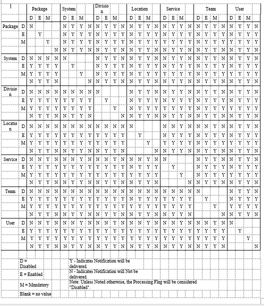

### Lab Result Notifications

OE/RR 2.5 lab result notifications/alerts were modified to fit into the CPRS scheme. CPRS exports seven lab result-related notifications:

**Lab Results** follow-up action displays all results for that order  
**Abnormal Lab Results (Action)** follow-up action displays all results for that order  
**Abnormal Lab Result (Info)** information only, results and collection date/time in alert msg  
**Critical Lab Results (Action)** follow-up action displays all results for that order  
**Critical Lab Result (Info)** information only, results and collection date/time in alert msg  
**Lab Threshold Exceeded** follow-up action displays all results for that order, including results that exceeded the threshold.  
**STAT Lab Results** follow-up action displays all results for that order  
If the parameter controlling notification recipients (ORB PROCESSING FLAG), is set up improperly, it is possible for a user to receive six different alerts for one lab order (they will get Lab Results when it is resulted, Abnormal Lab Results (Action) and Abnormal Lab Result (Info) if the result is 'H' or 'L', Critical Lab Results (Action) and Critical Lab Result (Info) if the result is 'HH' or 'LL', and STAT Lab Results if the urgency for the order was STAT. [Clue: To review how a user is set up to receive notifications/alerts, use the Notifications Mgmt menu option ‘Display the Notifications a User Can Receive’] For example, if a Chem 7 has three abnormal results, users with Abnormal Lab Results (Action) as ‘Mandatory’ will get one alert for the Chem 7. The alert’s follow-up action will display all results for the Chem 7. Users with Abnormal Lab Result (Info) as ‘Mandatory’ will get three “Information” alerts. The abnormal values and collection date/times will be in the alert message. A similar scenario exists for the two Critical Lab Result(s) notifications. In most cases, users should NOT have Lab Results and either Abnormal Lab Result(s) notification set to ‘Mandatory.’

**☞ NOTE:  If any notification is set to ‘Mandatory’ for the user’s Team, user’s Service, patient’s Location, site’s Division, or site’s System, the user will get the notification. With the exception where the patient’s Location (inpatient only) is set to ‘Disabled’. All instances of the notification for patients in that location will be ‘Disabled’ and not processed. Whereas the notification for patients in other hospital locations will be processed as ‘Mandatory’. This feature of CPRS was specifically included to reduce the number of abnormal and critical lab alerts for patients in critical care units like ICU. Patient location notifications are disabled via the Enable/Disable Notifications option then selecting 'Location' and the notification. This option is only available on ORMGR and clinical coordinator menus.**  
To prevent multiple lab alert problems, the following setups are recommended:

• Users who want to see ALL lab results (some users process all lab alerts as part of their job), should set the Lab Results notification to ‘Mandatory’. ‘Disable’ the other lab results notifications for the user.  
• Providers who do not want to get all lab result alerts may find it best to set Abnormal Lab Results (Action) and Critical Lab Result (Info) to ‘Mandatory’. There may be some duplication at times but the docs will be alerted to critical labs and also be able to review Abnormal Labs when desired. STAT Lab Results may also be a notification they wish to set to ‘Mandatory’, depending on how they plan to use the notifications/alerts to follow-up lab orders. Also, set Abnormal Lab Results (Info) and Critical Lab Results (Action) to ‘Disabled.’  
**☞ NOTE: If any notification is set to ‘Mandatory’ for the user’s Team, user’s Service, patient’s Location, site’s Division, or site’s System, the user will get the notification.**  
• Other providers will wish to get only information alerts with no follow-up action. For these users, set Abnormal Lab Result (Info) and Critical Lab Result (Info) to ‘Mandatory’ and the other three lab result notifications to ‘Disabled’. (They may want to set the STAT Lab Results to ‘Mandatory.’)  
• Some providers may want to set Critical Lab Results (Action) or (Info) to ‘Mandatory’ and ‘Disable’ all other lab result notifications.  
### Forwarding Alerts to Supervisors/Surrogates

The forwarding of alerts to supervisors and surrogates works as follows:  
1\. Identify the number of days you want an alert to be held before it is sent to the user's supervisor and/or MailMan surrogate(s). (Supervisor is determined by Kernel to be the service chief of the user’s service section.) This number of days value is set in the Notification Mgmt Menu options.  
2\. When the alert/notification is triggered, the number of days values for forwarding to supervisor and/or surrogate are sent with the alert to the Kernel Alert utility.  
3\. Whenever the option XQALERT DELETE OLD is triggered, alerts older than 14 days are deleted. In addition, the algorithm searches for alerts with the forward to surrogate/supervisor number of days values greater than zero. If forwarding values are found and the recipient has not responded to the alert within the set number of days, it is forwarded to the recipient's supervisor and/or mailman surrogates.  
4\. If forwarding is to occur with regularity, the option XQALERT DELETE OLD must be triggered regularly. Most often this is accomplished via TaskMan. Because this option also cleans up old alerts (the archives are still kept) it should be run daily/nightly. If you want forwarding to surrogates and supervisors to occur, the XQALERT DELETE OLD option must be queued to run regularly.  
5\. No mail message or bulletin is sent to the surrogate(s) or supervisor. The alert is “forwarded” to the surrogate(s) and/or supervisor. The alert will be similar to those noted below.  
**Example of Forwarded Alerts**  
1\. CPRSPATIENT,ONE (C0005): New order(s) placed.  
Forwarded by: CPRSPROVIDER,TEN Generated: 07/00/97 16:26:36  
ALERT NOT PROCESSED BY CPRSPROVIDER,TEN  
2\. CPRSPATIENT,FOUR (C0004): New order(s) placed.  
Forwarded by: CPRSPROVIDER,TEN Generated: 07/00/97 14:40:32  
ALERT NOT PROCESSED BY CPRSPROVIDER,TEN  
#### Parameter Descriptions

##### ORB FORWARD SUPERVISOR: Hold Days before Forward to Supervisor

This parameter is the number of days before a notification is forwarded to a recipient's supervisor. The maximum is 30 days. If not indicted or zero, the notification will not be forwarded. For example, if a notification has a value of 14 for this parameter, it will be forwarded to the supervisor of each recipient who hasn't processed the notification after 14 days. Determination of recipients who have not processed the notification/alert is made when the option XQALERT DELETE OLD is processed. Supervisors are determined by the Kernel Alert Utility to be the user’s service/section chief. Alerts are not forwarded to supervisors of recipients who have processed the alert within 14 days or who have processed the alert within the number of days identified in the parameter. If the value of this parameter is zero or non-existent, the alert/notification is never forwarded.

##### ORB FORWARD SURROGATES: Hold Days before Forward to Surrogates

This parameter is the number of days before a notification is forwarded to a recipient's surrogates. The maximum is 30 days. If not indicated or zero, the notification will not be forwarded. For example, if a notification has a value of 14 for this parameter, it will be forwarded to the surrogates of each recipient who haven't processed the notification after 14 days. Determination of recipients who have not processed the notification/alert is made when the option XQALERT DELETE OLD is processed. Surrogates are determined by the Kernel Alert Utility to be the user’s MailMan surrogates. Alerts are not forwarded to surrogates of recipients who have processed the alert within 14 days or who have processed the alert within the number of days identified in the parameter. If the value of this parameter is zero or non-existent, the alert/notification is never forwarded.

### Debugging Time-Driven Notifications

Usually the reason time-driven alerts are not triggering is the national term is not mapped and/or the expiring or unverified orders do not exist within the correct time range with the correct order status. Here are some useful steps in troubleshooting time-driven notifications/alerts.

1\. Review the mechanism and logic for the notification in the notification description above. Make sure all mapping (if appropriate) is complete and accurate.  
2\. Check to make sure the notification system is enabled:  
W \$\$GET\^XPAR("SYS\^PKG","ORB SYSTEM ENABLE/DISABLE",1,"I")  
It should return an "E".  
3\. Check the last time the process was queued:  
W \$\$GET\^XPAR("SYS","ORB LAST QUEUE DATE",1,"I")  
**☞ HINT: You can use \^XPAREDIT to change this value back to an earlier date time so you will process a wider date/time range. Otherwise it only looks at orders since the last time the process was queued.**  
4\. For Unverified Order notifications, check to see how long an order had to go unverified before it would trigger the alert (the delay period):  
W \$\$GET\^XPAR("ALL","ORB UNVERIFIED ORDER",1,"I")  
Also, this notification will not be present for orders older than 30 days or from a previous admission.  
**☞ HINT: You can use Notification mgmt options or \^XPAREDIT to modify this value to be 0 (zero) hours so you can place an order then run the time-driven alerts code. You can also run the code directly via TNOTIFS\^ORB3TIM1 and bypass ORMTIME. The code looks for unverified orders between the last queue date/time and the delay date/time. The exceptions can be found in the notification’s description. (Order status, outpatient order, etc.) Finally, EN\^ORB3 is called to determine recipients and send the alert.**  
5\. For DNR Expiring notifications, check to see if the DNR term has been mapped properly:  
W \$\$TERMLKUP\^ORB31(.ORBY,"DNR")  
The function should return "101.43", with ORBY equal to something like "ORBY(1)=2581\^Do Not Resuscitate". (101.43 is the Orderable Item file.) Orders with a status noted in the notification’s description or for a deceased patient are screened out. Finally, check to see if the orderable item of the expiring order is the same as the orderable item for the mapped DNR term:  
W \$\$OI\^ORQOR2(\<expiring order number\>)  
If the returned orderable item equals the mapped DNR term’s orderable item, EN\^ORB3 is called to determine recipients and send the alert.  
Remember, you can trigger time-driven notifications/alerts directly via TNOTIFS\^ORB3TIM1 and bypass ORMTIME.  
### Notification Processing Flowchart with Related Parameters

Package data or HL7 event initiates process  
**↓**  
Package identifies list of potential recipients (optional)  
**↓**  
Package or HL7 event invokes main notification processing algorithm  
**↓**  
Continue if parameter ORB SYSTEM ENABLE/DISABLE = “Enabled”  
[option “Enable or Disable Notification System”]  
**↓**  
Continue if potential recipients exist for the notification - true if any of the following conditions exist:  
Parameter ORB PROCESSING FLAG has one or more “Enabled” or “Mandatory” values for the notification  
[option “Enable/Disable Notifications”]  
Parameter ORB DEFAULT RECIPIENT DEVICES has a value for the notification  
[option “Set Default Recipient Device(s) for Notifications”]  
Parameter ORB DEFAULT RECIPIENTS has a “Yes” value for the notification  
[option “Set Default Recipients for Notifications”]  
**↓**  
Queue notification processing off to TaskMan via Resource file entry ORB NOTIFICATION RESOURCE  
**↓**  
TaskMan initiates queued notification processing when resources become available  
**↓**  
Send alert to devices indicated for this notification in parameter ORB DEFAULT RECIPIENT DEVICES  
[option “Set Default Recipient Device(s) for Notifications”]  
**↓**  
Send alert to users and OE/RR team users indicated for this notification in parameter ORB DEFAULT RECIPIENTS  
[option “Set Default Recipient(s) for Notifications”]  
**↓**  
Obtain a list of notification/alert recipients based on the Orderable Item of the Order being flagged by the Parameters below:  
***

ORB OI ORDERED – INPT (Add users/team users/devices\* that flagged this orderable item upon new order for inpatients)  
ORB OI ORDERED – INPT PR (Add provider recipients that flagged this orderable item upon new order for inpatients)  
ORB OI RESULTS – INPT (Add users/team users/devices\* that flagged this orderable item upon results entered for inpatients)  
ORB OI RESULTS – INPT PR (Add provider recipients that flagged this orderable item upon results entered for inpatients)  
ORB OI EXPIRING – INPT (Add users/team users/devices\* that flagged this orderable item upon expiration for inpatients)  
ORB OI EXPIRING – INPT PR (Add provider recipients that flagged this orderable item upon expiration for inpatients)  
ORB OI ORDERED – OUPT (Add users/team users/devices\* that flagged this orderable item upon new order for outpatients)  
ORB OI ORDERED – OUPT PR (Add provider recipients that flagged this orderable item upon new order for outpatients)  
ORB OI RESULTS – OUPT (Add users/team users/devices\* that flagged this orderable item upon results entered for outpatients)  
ORB OI RESULTS – OUPT PR (Add provider recipients that flagged this orderable item upon results entered for outpatients)  
ORB OI EXPIRING – OUPT (Add users/team users/devices\* that flagged this orderable item upon expiration for outpatients)  
ORB OI EXPIRING – OUPT PR (Add provider recipients that flagged this orderable item upon expiration for outpatients)  
***

Provider recipient parameter values can contain the following values:  
***

P (Primary Provider): deliver notification to the patient's Primary Provider.  
A (Attending Physician): deliver notification to the patient's Attending Physician.  
T (Patient Care Team): deliver notification to the patient's primary care Team.  
O (Ordering Provider): deliver notification to the provider who placed the order which trigger the notification.  
M (PCMM Team): deliver notification to users/providers linked to the patient via PCMM Team Position assignments.  
E (Entering User): deliver notification to the user/provider who entered the order's most recent activity.  
R (PCMM Primary Care Practitioner): deliver notification to the patient's PCMM Primary Care Practitioner.  
S (PCMM Associate Provider): deliver notification to the patient's PCMM Associate Provider.  
***

\* Devices that flag an orderable item will always receive the alert for that orderable item.  
**↓**  
Use parameter ORB PROCESSING FLAG and on/off algorithm to determine each potential recipient’s “On/Off” value – send alert to users with “On” value [option “Enable/Disable Notifications”]  
*Refer to “Notification Algorithm for Processing Potential Recipients” document for more information.*  
###

### Notification Algorithm for Processing Potential Recipients

Each user on the potential recipient list is evaluated according to values set for entities identified in the parameter ORB PROCESSING FLAG. The parameter’s entity values are processed in the following order to determine if that particular user should receive the notification/alert or not. If a user on the recipient list has the notification “ON” (they will receive the alert). If the user has a Kernel Alert surrogate, the surrogate will receive the alert. The original user will not receive the alert if he has a surrogate!

**☞ NOTE: You can access these entity values via options “Enable/Disable Notifications” and “Display the Notifications a User Can Receive.”**  
**The first condition met below stops the processing and determines whether or not the user will receive the notification/alert.** Processing order:  
a. If the USER’s value for the notification is Mandatory or Enabled, the user will receive the alert.  
b. If the user’s TEAM value for the notification is Mandatory, the user will receive the alert.  
c. If the user’s TEAM value for the notification is Disabled, the user will NOT receive the alert.  
d. If the user’s SERVICE/SECTION value for the notification is Mandatory, the user will receive the alert.  
e. If the PATIENT’s HOSPITAL LOCATION (inpatients only) value for the notification is Mandatory, the user will receive the alert.  
f. If the PATIENT’s HOSPITAL LOCATION (inpatients only) value for the notification is Disabled, the user will NOT receive the alert.  
g. If the user’s DIVISION\* value for the notification is Mandatory (and PATIENT’s HOSPITAL LOCATION has no value), the user will receive the alert.  
h. If the SYSTEM value for the notification is Mandatory (and DIVISION and PATIENT’s HOSPITAL LOCATION have no value), the user will receive the alert.  
i. If the PACKAGE (OERR-exported) value for the notification is Mandatory (and SYSTEM, DIVISION\*, and PATIENT’s HOSPITAL LOCATION have no value), the user will receive the alert.  
j. If the USER’s value for the notification is Disabled, the user will NOT receive the alert.  
k. If the user’s TEAM value for the notification is Enabled, the user will receive the alert.  
l. If the user’s SERVICE/SECTION value for the notification is Disabled, the user will NOT receive the alert.  
m. If the user’s SERVICE/SECTION value for the notification is Enabled, the user will receive the alert.  
n. If the PATIENT’s HOSPITAL LOCATION (inpatients only) value for the notification is Enabled, the user will receive the alert.  
o. If the user’s DIVISION\* value for the notification is Disabled, the user will NOT receive the alert.  
p. If the user’s DIVISION\* value for the notification is Enabled, the user will receive the alert.  
q. If the SYSTEM value for the notification is Disabled, the user will NOT receive the alert.  
r. If the SYSTEM value for the notification is Enabled, the user will receive the alert.  
s. If the PACKAGE (OERR-exported) value for the notification is Disabled, the user will NOT receive the alert.  
t. If the PACKAGE (OERR-exported) value for the notification is Enabled, the user will receive the alert.  
u. If none of the above parameter values are found, the notification is processed as Disabled and the user will NOT receive the alert.  
**☞ NOTE: All notifications will have a value (Enabled, Disabled or Mandatory), at the package level when exported.**  
**☞ NOTE: \* If the user has multiple divisions, the first division found with a “Mandatory” value is used. If no mandatory division values exist and a division has an “Enabled” value, that division is used. If neither mandatory nor enabled division values exist and a division has a “Disabled” value, that division is used.**  
### Using Kernel Alert Option XQALERT DELETE OLD

The Kernel Alert option XQALERT DELETE OLD is used to perform several alert clean-up and management jobs. These jobs include:

1\. Delete alerts unprocessed after 14 days (unless a different time period is specified).  
2\. Purge alerts from the Alert Tracking file.  
3\. Forward alerts to supervisors.  
1.  Forward alerts to MailMan surrogates.  
1.  Forward alerts to Backup Reviewers.  
The option XQALERT DELETE OLD can be run directly or as a queued job. As a queued job, the option should be setup to run through TaskMan on a regular basis, preferably once per day. This is accomplished by adding XQALERT DELETE OLD as an entry in the OPTION SCHEDULING file.

#### Delete Alerts Unprocessed after a Number of Days

All alerts unprocessed after a specified number of days are deleted and will no longer appear on the “View Alerts” display. The default number of days is 14. However, the number of days can be set as described in the note below. The date/time of deletion by this method is noted in the “Auto deleted:” field of the Alert Tracking file.  
**Note:** If the alerts are deleted at the default 14 days, the alerts will continue to be stored in the Alert Tracking file for another 16 days. (Unless specified otherwise, alerts are deleted from the Alert Tracking file after 30 days.)  
**Note:** The 14 days retention period before deletion is a default value. This value can be changed through the TASK PARAMETERS field of the OPTION SCHEDULING file. A numeric value in the TASK PARAMETERS field will replace the default alert retention value of 14 days.  
##### Purge Alerts from the Alert Tracking File

XQALERT DELETE OLD purges all alerts older than 30 days from the Alert Tracking file. If the alert also exists in the Alert file, it is deleted from there as well. The 30 day default value can be modified by using the Notification Mgmt option “9 Archive (delete) after \<x\> Days” (option ORB3 ARCHIVE PERIOD) to enter a value for parameter ORB ARCHIVE PERIOD. This value is delivered with the alert to Kernel and calculates a value for the RETENTION DATE field of the Alert Tracking file. Purging alerts from the alerts files is especially useful to sites with a high volume of alerts in that it saves disk space and response time.

##### Forward Alerts to Supervisors

Alerts unprocessed after a specified period are forwarded to the alert recipient’s supervisor (service/section chief.) If no forwarding value exists, the alert is not forwarded. The forwarding value can be set by using Notification Mgmt option “10 Forward Notifications ...” then selection “1 Forward Unprocessed Notification to Supervisor” (option ORB3 FORWARD SUPERVISOR), to enter a value for parameter ORB FORWARD SUPERVISOR.

##### Forward Alerts to MailMan Surrogates

Alerts unprocessed after a specified period are forwarded to the alert recipient’s MailMan surrogates.

If no forwarding value exists, the alert is not forwarded. The forwarding value can be set by using Notification Mgmt option “10 Forward Notifications ...” then selection “2 Forward Unprocessed Notification to Surrogates” (option ORB3 FORWARD SURROGATES), to enter a value for parameter ORB FORWARD SURROGATES.

**Example of a Forwarded Alert**  
1\. CPRSPATIENT,TWO (C0002): New order(s) placed.  
Forwarded by: CPRSPROVIDER,SIX Generated: 07/02/00 16:26:36  
ALERT NOT PROCESSED BY CPRSPROVIDER,SIX  
##### Forward Alerts to Backup Reviewers

Alerts unprocessed after a specified period are forwarded to the Backup Reviewer as designated by the ALERT BACKUP REVIEWER parameter. If no forwarding value exists, the alert is not forwarded. The forwarding value, which is the number of days the user has to respond to the alert. After the forwarding value, or number of days elapses, CPRS forwards the alert to another reviewer. You can enter a forwarding value for parameter ORB FORWARD BACKUP REVIEWER using Notification Mgmt option “10 Forward Notifications ...” then selection “3 Forward Unprocessed Notification to Bkup Reviewer” (option ORB3 FORWARD BACKUP REVIEWER). The maximum is 30 days. If not indicated or zero, the notification will not be forwarded. The Backup Reviewer, the individual who will receive the alert, can be set via the option “Set Backup Reviewer for Alerts” (XQAL SET BACKUP REVIEWER) on the Alert Management (XQALERT MGR) menu.

For example, if you set the ORB FORWARD BACKUP REVIEWER parameter to 14, the alert will be forwarded to the backup reviewer of each recipient who hasn't processed the notification after 14 days. The Kernel Alert Utility determines which recipients have not processed their alerts in the specified time and who the backup reviewer for each recipient is.

**How to Enable, Disable, or set a Notification as Mandatory**  
This section explains how to enable, disable, or set a notification as mandatory. Sites should use caution when enabling, disabling, or setting a notification to mandatory. Sites must do their best to provide the right level of information for providers. Providers can receive numerous notifications, to the point where they begin to feel that responding to notifications is all they do.  
However, notifications and the timely actions they require or information they convey can help providers better serve their patients.  
There are two options to enable/disable or set notifications as mandatory.  
The first example allows for selection of one user and one notification to enable, disable, or set as mandatory. The second example allows for selection of one or more users and one or more notifications to enable, disable, or set as mandatory.  
1.  **Use the following steps to enable, disable, or set a notification as mandatory for one user and one notification in CPRS:**  
1.  In the List Manager interface, choose the ORMGR CPRS Manager menu.  
1.  Select the PE CPRS Configuration (Clin Coord) option.  
1.  Select the NO Notification Mgmt Menu option.  
1.  Select Enable/Disable Notifications option.  
1.  Select the level for which you are setting this parameter:  
-   User USR [choose from NEW PERSON]  
-   Team (OE/RR) OTL [choose from OE/RR LIST]  
-   Service SRV [choose from SERVICE/SECTION]  
-   Location LOC [choose from HOSPITAL LOCATION]  
-   Division DIV [choose from INSTITUTION]  
-   System SYS [xxxxx.FO-SLC.MED.VA.GOV]  
-   Package PKG [ORDER ENTRY/RESULTS REPORTING]  
***

1.  Type the name of the notification you want to enable. (You can also type two question marks and press \<Enter\> to get a list of ALL notifications.)  
1.  When prompted if you are adding the notification as a new notification, type Y and press \<Enter\>.  
1.  At the Notification prompt, if the correct notification is listed, press \<Enter\>.  
1.  At the Value prompt, enable, disable or set the notification as mandatory. To enable, type E and press \<Enter\>. To make the notification Mandatory, type M and press \<Enter\>. To disable, type D and press \<Enter\>.  
The notification should now be enabled, disabled or mandatory.  
***  
**Example of How to Enable, Disable, or set a Notification as Mandatory**  
Select OPTION NAME: ORMGR CPRS Manager Menu  
CL Clinician Menu ...  
NM Nurse Menu ...  
WC Ward Clerk Menu ...  
PE CPRS Configuration (Clin Coord) ...  
IR CPRS Configuration (IRM) ...  
***  
***  
***

Select CPRS Manager Menu \<TEST ACCOUNT\> Option: PE CPRS Configuration (Clin Coord)  
***

AL Allocate OE/RR Security Keys  
KK Check for Multiple Keys  
DC Edit DC Reasons  
GP GUI Parameters ...  
GA GUI Access - Tabs, RPL  
MI Miscellaneous Parameters  
NO Notification Mgmt Menu ...  
OC Order Checking Mgmt Menu ...  
MM Order Menu Management ...  
LI Patient List Mgmt Menu ...  
FP Print Formats  
PR Print/Report Parameters ...  
RE Release/Cancel Delayed Orders  
US Unsigned orders search  
EX Set Unsigned Orders View on Exit  
NA Search orders by Nature or Status  
CM Care Management Menu ...  
DO Event Delayed Orders Menu ...  
LO Lapsed Orders search  
PM Performance Monitor Report  
***

Select CPRS Configuration (Clin Coord) \<TEST ACCOUNT\> Option: NO Notification Mgmt Menu  
***

1 Enable/Disable Notifications  
2 Erase Notifications  
3 Set Urgency for Notifications (GUI)  
4 Set Deletion Parameters for Notifications  
5 Set Default Recipient(s) for Notifications  
6 Set Default Recipient Device(s) for Notifications  
7 Set Provider Recipients for Notifications  
8 Flag Orderable Item(s) to Send Notifications  
9 Archive(delete) after \<x\> Days  
10 Forward Notifications ...  
11 Set Delays for Unverified Orders ...  
13 Send Flagged Orders Bulletin  
14 Determine Recipients for a Notification  
15 Display Patient Alerts and Alert Recipients  
16 Enable or Disable Notification System  
17 Display the Notifications a User Can Receive  
***

Select Notification Mgmt Menu \<TEST ACCOUNT\> Option: 1 Enable/Disable Notifications  
***

Set PROCESSING FLAG Parameters for Notifications  
***

Processing Flag may be set for the following:  
***

1 User USR [choose from NEW PERSON]  
2 Team (OE/RR) OTL [choose from OE/RR LIST]  
3 Service SRV [choose from SERVICE/SECTION]  
4 Location LOC [choose from HOSPITAL LOCATION]  
5 Division DIV [choose from INSTITUTION]  
6 System SYS [xxxxx.FO-SLC.MED.VA.GOV]  
7 Package PKG [ORDER ENTRY/RESULTS REPORTING]  
***

Enter selection: 6 System xxxxx.FO-SLC.MED.VA.GOV  
***

\------- Setting Processing Flag for System: xxxxx.FO-SLC.MED.VA.GOV -------  
Select Notification: DEA  
1 DEA AUTO DC CS MED ORDER  
2 DEA CERTIFICATE EXPIRED  
3 DEA CERTIFICATE REVOKED  
CHOOSE 1-3: 1 DEA AUTO DC CS MED ORDER  
Are you adding DEA AUTO DC CS MED ORDER as a new Notification? Yes// YES  
Notification: DEA AUTO DC CS MED ORDER// DEA AUTO DC CS MED ORDER DEA AUTO D  
C CS MED ORDER  
Value: ?  
***

Code indicating processing flag for the entity and notification.  
***

Select one of the following:  
***

M Mandatory  
E Enabled  
D Disabled  
***

Value: Enabled  
***

1.  **Use the following steps to enable, disable, or set a notification as mandatory for one or more users and one or more notification in CPRS:**  
1.  In the List Manager interface, choose the ORMGR CPRS Manager menu.  
1.  Select the PE CPRS Configuration (Clin Coord) option.  
1.  Select the NO Notification Mgmt Menu option.  
1.  Select the Bulk Parameter Editor for Notifications …  
1.  Select Enable/Disable Notifications option.  
1.  Select the level for which you are setting this parameter:  
1 User [choose via ListManager]

2 Team (OE/RR) [choose via ListManager]

3 Service [choose via ListManager]

4 Location [choose via ListManager]

5 Division [choose via ListManager]

6 System [CPRS32.FO-SLC.MED.VA.GOV]  
1.  Add Users to the list by selecting Team, Service, Division, or ALL or New Person.  
1.  Enter the number(s) of the notifications you want to enable.  
1.  At the Value prompt, enable the notification or set it as mandatory. To enable, type E and press \<Enter\>. To make the notification Mandatory, type M and press \<Enter\>.  
The notification (s) should now be enabled for the selected users.  
***  
***  
**Example of How to Enable, Disable, or set a Notification as Mandatory for One or More Users and One or More Notifications**  
Select OPTION NAME: ORMGR CPRS Manager Menu  
CL Clinician Menu ...  
NM Nurse Menu ...  
WC Ward Clerk Menu ...  
PE CPRS Configuration (Clin Coord) ...  
IR CPRS Configuration (IRM) ...  
***  
Select CPRS Manager Menu \<TEST ACCOUNT\> Option: PE CPRS Configuration (Clin Coord)  
***

AL Allocate OE/RR Security Keys  
KK Check for Multiple Keys  
DC Edit DC Reasons  
GP GUI Parameters ...  
GA GUI Access - Tabs, RPL  
MI Miscellaneous Parameters  
NO Notification Mgmt Menu ...  
OC Order Checking Mgmt Menu ...  
MM Order Menu Management ...  
LI Patient List Mgmt Menu ...  
FP Print Formats  
PR Print/Report Parameters ...  
RE Release/Cancel Delayed Orders  
US Unsigned orders search  
EX Set Unsigned Orders View on Exit  
NA Search orders by Nature or Status  
CM Care Management Menu ...  
DO Event Delayed Orders Menu ...  
LO Lapsed Orders search  
PM Performance Monitor Report  
***

Select CPRS Configuration (Clin Coord) \<TEST ACCOUNT\> Option: NO Notification Mgmt Menu  
***

1 Enable/Disable Notifications  
2 Erase Notifications  
3 Set Urgency for Notifications (GUI)  
4 Set Deletion Parameters for Notifications  
5 Set Default Recipient(s) for Notifications  
6 Set Default Recipient Device(s) for Notifications  
7 Set Provider Recipients for Notifications  
8 Flag Orderable Item(s) to Send Notifications  
9 Archive(delete) after \<x\> Days  
10 Forward Notifications ...  
11 Set Delays for Unverified Orders ...  
13 Send Flagged Orders Bulletin  
14 Determine Recipients for a Notification  
15 Display Patient Alerts and Alert Recipients  
16 Enable or Disable Notification System  
17 Display the Notifications a User Can Receive  
18 Bulk Parameter Editor for Notifications ...  
***  
BULK PARAMETER EDITOR MENU  
***

1 Enable/Disable Notifications  
2 Erase Notifications  
3 Set Urgency for Notifications (GUI)  
4 Set Deletion Parameters for Notifications  
5 Set Default Recipient(s) for Notifications  
6 Set Default Recipient Device(s) for Notifications  
7 Set Provider Recipients for Notifications  
8 Flag Orderable Item(s) to Send Notifications ...  
9 Archive(delete) after \<x\> Days  
10 Forward Notifications ...  
11 Set Delays for Unverified Orders ...  
12 Send Flagged Orders Bulletin  
13 Determine Recipients for a Notification  
14 Display Patient Alerts and Alert Recipients  
15 Notifications a User can Receive [DETAILED]  
16 Enable or Disable Notification System  
17 Alert Tracking Reports  
18 Report Menu for Alerts ...  
***  
Select Bulk Parameter Editor for Notifications \<TEST ACCOUNT\> Option: 1 Enable/Disable Notifications  
***

Processing Flag may be set for the following:  
***

1 User [choose via ListManager]  
2 Team (OE/RR) [choose via ListManager]  
3 Service [choose via ListManager]  
4 Location [choose via ListManager]  
5 Division [choose via ListManager]  
6 System [CPRS32.FO-SLC.MED.VA.GOV]  
***

Enter selection: 1 User  
***  
**Parameter Manager** Sep 12, 2019@16:28:29 Page: 1 of 5  
Parameter: PROCESSING FLAG  
Entity: USER [choose via Add/Remove]  
Instance  
1 ABNL IMAGING RESLT, NEEDS ATTN  
2 ABNORMAL LAB RESULT (INFO)  
3 ABNORMAL LAB RESULTS (ACTION)  
4 ADMISSION  
5 ANATOMIC PATHOLOGY RESULTS  
6 APPOINTMENT REQUEST CANCELLED  
7 CONSULT/PROC INTERPRETATION  
8 CONSULT/REQUEST CANCEL/HOLD  
9 CONSULT/REQUEST RESOLUTION  
10 CONSULT/REQUEST UPDATED  
11 CRITICAL LAB RESULT (INFO)  
12 CRITICAL LAB RESULTS (ACTION)  
13 DC ORDER  
14 DEA AUTO DC CS MED ORDER  
15 DEA CERTIFICATE EXPIRED  
\+ Enter ?? for more actions  
Edit Instance Value Add/Remove/View Entities  
View Instance Value(s) Show All Instances  
Quit  
Select Action:Next Screen// a Add/Remove/View Entities  
***  
***  
**Entity Management** Sep 12, 2019@16:28:33 Page: 1 of 0  
User [NEW PERSON] List  
***

Entity  
***

\<NONE\>  
***  
***

Enter ?? for more actions  
Add Entity Remove Entity  
Clear Entity List View Entity Details  
Quit  
Select Action:Quit// a Add Entity  
***

Add USERS to the ENTITY List by Team, Service, Division, or ALL? NO// Nope  
***

Select NEW PERSON NAME: cprsprovider,eight CPRSPROVIDER,EIGHT CAR PHYSICIAN  
***

Select NEW PERSON NAME: cprsprovider,fifty CPRSPROVIDER,FIFTY  
PHYSICIAN  
***

Select NEW PERSON NAME: cprsprovider, fiftyone CPRSPROVIDER,FIFTYONE PHYSICIAN  
***  
***  
***  
***  
***

**Entity Management** Sep 12, 2019@16:29:12 Page: 1 of 1  
User [NEW PERSON] List  
***

Entity  
1 CPRSPROVIDER,EIGHT  
2 CPRSPROVIDER,FIFTY  
3 CPRSPROVIDER,FIFTYONE  
***  
***  
***  
***  
***

Enter ?? for more actions  
Add Entity Remove Entity  
Clear Entity List View Entity Details  
Quit  
Select Action:Quit// Quit  
***  
**Parameter Manager** Sep 12, 2019@16:29:18 Page: 1 of 5  
Parameter: PROCESSING FLAG  
Entity: USER [choose via Add/Remove]  
Instance  
1 ABNL IMAGING RESLT, NEEDS ATTN  
2 ABNORMAL LAB RESULT (INFO)  
3 ABNORMAL LAB RESULTS (ACTION)  
4 ADMISSION  
5 ANATOMIC PATHOLOGY RESULTS  
6 APPOINTMENT REQUEST CANCELLED  
7 CONSULT/PROC INTERPRETATION  
8 CONSULT/REQUEST CANCEL/HOLD  
9 CONSULT/REQUEST RESOLUTION  
10 CONSULT/REQUEST UPDATED  
11 CRITICAL LAB RESULT (INFO)  
12 CRITICAL LAB RESULTS (ACTION)  
13 DC ORDER  
14 DEA AUTO DC CS MED ORDER  
15 DEA CERTIFICATE EXPIRED  
\+ Enter ?? for more actions  
Edit Instance Value Add/Remove/View Entities  
View Instance Value(s) Show All Instances  
Quit  
Select Action:Next Screen// e Edit Instance Value  
Select Instance(s) (1-75): 1-4  
[EDIT] Multiple Values and/or Entries Selected.  
Value: e Enabled  
***

Updating entries...DONE!  
## Appendix D: Notification Parameters in CPRS 1 – Technical Overview

### Introduction

CPRS Notifications uses the Parameter file [\#8989.5] to export values for parameters that determine how notifications are processed. Some of these parameters replaced fields in the Notifications file [\#100.9]; others are new in CPRS. When each parameter is defined and set up via the Parameter Definition file [\#8989.51], a set of entity relationships is established. Most CPRS Notification parameters were set up with links to the “Package” entity. Hence, the exported notification “defaults” are found as parameter values for package entity “Order Entry/Results Reporting.” Notification parameter values for package entities (Order Entry/Results Reporting) should never be modified. Changes specific to your site can be made for system, division, and other entities depending on how each parameter is defined. (Refer to CPRS Install documents for a listing of exported default values.)  
**☞ NOTE: Some parameters have a “Location” entity type. Only inpatient location entities are used. Outpatient location entities are ignored because a patient’s outpatient location cannot be reliably determined and a patient can have several simultaneous outpatient locations.**  
### Parameters

**ORB ARCHIVE PERIOD [Option: ORB3 ARCHIVE PERIOD]**  
This parameter indicates the number of days to archive a notification in the Alert Tracking file [\#8992.1]. If not indicated, the default period of 30 days is used. The maximum number of days is 100,000 or about 220 years. When a notification/alert is triggered, this value is passed to the Kernel Alert Utility. Kernel Alerts stores the value with each individual alert in the Alert Tracking File [\^XTV(8992.1]. The Kernel Alert Utility handles the actual display, archiving, and deletion of alerts.  
ENTITY PRECEDENCE: 1 ENTITY TYPE: Division  
ENTITY PRECEDENCE: 2 ENTITY TYPE: System  
##### Customization Suggestion:

• If you wish to keep alerts for a notification as long as possible, set this value to its maximum of 100,000 (about 220 years.)  
***

**ORB DEFAULT RECIPIENT DEVICES [Option: ORB3 DEFAULT DEVICE RECIPIENTS]**  
This parameter sets devices as default recipients of a notification, regardless of patient. A value of “Yes” indicates the device always receives the notification when it is triggered. Example devices include printers, terminals, and files.  
ENTITY PRECEDENCE: 1 ENTITY TYPE: Division  
ENTITY PRECEDENCE: 2 ENTITY TYPE: System  
##### Customization Suggestions:

• Set a file to receive every instance of a notification useful in meeting JCAHO requirements.  
• Troubleshoot notification occurrences by sending them to a printer or a file.  
• Set a file to receive every instance of a notification for research purposes. Later parse the file removing key data for use in a spreadsheet or research database.  
**ORB DEFAULT RECIPIENTS [Option: ORB3 DEFAULT RECIPIENTS]**  
This parameter sets teams and/or users as default recipients of a notification, regardless of patient. A value of “Yes” indicates the team/user always receives the notification when it is triggered – despite values in the ORB PROCESSING FLAG parameter.  
ENTITY PRECEDENCE: 1 ENTITY TYPE: User  
ENTITY PRECEDENCE: 2 ENTITY TYPE: Team (OE/RR)  
##### Customization Suggestions:

• Set up a dietician team to receive all instances of the Food/Drug Interaction alert by using this parameter to set that team as a “Default Recipient” for the Food/Drug Interaction notification.  
**☞ NOTE: Do not add patients to these teams. If patients exist on these teams, the dieticians will also receive alerts for notifications with an ORB PROVIDER RECIPIENT value containing “T”. To prevent dieticians on this team from receiving unwanted alerts, set the team’s ORB PROCESSING FLAG parameter values to Disabled for all Mandatory notifications. (With patch OR\*3\*74, Disabled Team values take precedence over Mandatory values at all entity levels except User.)**  
• Set up a QA team to receive all instances of a notification.  
**ORB DELETE MECHANISM [Option: ORB3 DELETE MECHANISM]**  
This parameter determines how alerts are deleted when a successful alert follow-up action is taken or a user views an “Information Only” alert. It is a set of codes including:  
• **I** (Individual Recipient): delete the notification for an individual recipient when:  
• That individual completes the follow-up action on notifications with associated follow-up action.  
• That individual reviews notifications without follow-up actions.  
• **A** (All Recipients): delete the notification for all recipients when:  
• Any recipient completes the follow-up action on notifications with follow-up actions.  
• Any recipient reviews notifications without follow-up actions.  
***

ENTITY PRECEDENCE: 1 ENTITY TYPE: Division  
ENTITY PRECEDENCE: 2 ENTITY TYPE: System  
**ORB FLAGGED ORDERS BULLETIN [Option: ORB3 FLAGGED ORDERS BULLETIN]**  
This parameter is used to determine if a bulletin should be sent when an order is “flagged for clarification.” A “Yes” indicates a MailMan bulletin is sent to the order’s Current Provider (usually the Ordering Provider) when the order is flagged. This option has no effect on the Flagged Order for Clarification notification that is also triggered when an order is flagged for clarification.  
ENTITY PRECEDENCE: 1 ENTITY TYPE: User  
ENTITY PRECEDENCE: 2 ENTITY TYPE: Service  
ENTITY PRECEDENCE: 3 ENTITY TYPE: Division  
ENTITY PRECEDENCE: 4 ENTITY TYPE: System  
##### Customization Suggestion:

• If you have a service that prefers bulletins over notifications/alerts when an order is flagged, set this parameter to “Yes” for the service and “Disable” the notification “Flagged Order for Clarification” for the service via the ORB PROCESSING FLAG parameter. Furthermore, if you have a user within that service who prefers notifications/alerts over bulletins when an order is flagged, set this parameter to “No” for the user and set the user’s processing flag value for the notification “Flagged Order for Clarification” to be “Mandatory.”  
**ORB FORWARD BACKUP REVIEWER [Option: ORB3 FORWARD BACKUP REVIEWER]**  
This new parameter supports Kernel Alert functionality that allows users to identify a user (backup reviewer) to receive unattended alerts after x days. The new parameter indicates how many days to wait before forwarding an alert to the backup reviewer. (Specifying a user's backup reviewer is accomplished via Kernel Alert option XQAL SET BACKUP REVIEWER.) This is similar to current functionality that forwards alerts to a user's surrogate or supervisor. The value exported with this patch for each OE/RR notification/alert on your system is 0 (zero.) A zero indicates the notification/alert will never be forwarded to the backup reviewer. This new parameter does not affect TIU and non-OE/RR alerts.  
**Note:** You must change the parameter value for each notification/alert your site intends to be forwarded to the backup reviewer.  
***

ENTITY PRECEDENCE: 1 ENTITY TYPE: Division  
ENTITY PRECEDENCE: 2 ENTITY TYPE: System  
***

**ORB FORWARD SUPERVISOR [Option: ORB3 FORWARD SUPERVISOR]**  
This parameter indicates how many days to hold an unprocessed alert before forwarding it to the user’s supervisor. The maximum is 30 days. If not indicated or zero, the notification is never forwarded. For example, if a notification has a value of “14” for this parameter, it is forwarded to the supervisor of each recipient who hasn’t processed the notification within 14 days. Determination of recipients who have not processed the notification and their supervisors is made by the Kernel Alert Utility. For this purpose, Kernel Alerts recognizes the user’s service/section chief as supervisor.  
ENTITY PRECEDENCE: 1 ENTITY TYPE: Division  
ENTITY PRECEDENCE: 2 ENTITY TYPE: System  
**ORB FORWARD SURROGATES [Option: ORB3 FORWARD SURROGATES]**  
This parameter indicates how many days to hold an unprocessed alert before forwarding it to the user’s MailMan surrogates. The maximum is 30 days. If not indicated or zero, the notification is never forwarded. For example, if a notification has a value of 14 for this parameter, it is forwarded to the MailMan surrogates of each recipient who hasn’t processed the notification within 14 days. Determination of recipients who have not processed the notification and their surrogates is made by the Kernel Alert Utility.  
ENTITY PRECEDENCE: 1 ENTITY TYPE: Division  
ENTITY PRECEDENCE: 2 ENTITY TYPE: System  
**ORB LAST QUEUE DATE [Option: No User Interaction]**  
This parameter indicates the last date/time the Driven-driven notifications were triggered.  
ENTITY PRECEDENCE: 1 ENTITY TYPE: System  
##### Customization Suggestion:

• Do not modify this parameter unless you desire an unrelenting hail of expiring order alerts and riotous user behavior.  
**ORB OI EXPIRING – INPT [Option: ORB3 FLAG ORDERABLE ITEMS]**  
This parameter is used to trigger the FLAGGED OI EXPIRING - INPT notification/alert when a specific orderable item is expiring for an inpatient. For this notification to be triggered, the orderable item selected via this parameter must match the order’s orderable item and the patient must be an inpatient. Orders are linked to orderable items through the order dialog setup. OE/RR Teams, individual users or devices can be set up to receive the alert for one or more orderable items by selecting the desired team, user or device via this parameter. If the value for the orderable item flag is "YES", the entity (user, team, device), flagging the orderable item becomes a potential alert recipient for ALL inpatients. (If a device is added to the potential recipient list, it will always receive the alert.) If the value is "NO", the entity (user, team, device), flagging the orderable item only becomes a potential alert recipient if that entity is "linked" to the patient. Users are linked to a patient if the user is the patient's attending physician, primary inpatient provider, PCMM primary care practitioner or PCMM associate provider. In addition, users are linked to a patient if the user shares an OE/RR team with the patient or holds a team position assignment on the patient’s primary PCMM team. OE/RR teams are linked to a patient if the patient is on the OE/RR team. (If a patient is on an OE/RR team that has flagged an orderable item, all users on that team become potential alert recipients.) Devices (printers, etc.) are linked to a patient if the device and patient are on the same OE/RR team.  
ENTITY PRECEDENCE: 1 ENTITY TYPE: User  
ENTITY PRECEDENCE: 2 ENTITY TYPE: Team (OE/RR)  
ENTITY PRECEDENCE: 3 ENTITY TYPE: Device  
##### Customization Suggestions:

• Flag orderable items for restraints/protective devices that need to be renewed every 24 hours.  
• Flag orderable items of importance to JCAHO.  
• Flag orderable items for telemetry orders.  
• Send an alert to a printer whenever a particular orderable item is ordered.  
**ORB OI EXPIRING – OUTPT [Option: ORB3 FLAG ORDERABLE ITEMS]**  
This parameter is used to trigger the FLAGGED OI EXPIRING - OUTPT notification/alert when a specific orderable item is expiring for an outpatient. For the notification to be triggered, the orderable item selected via this parameter must match the order’s orderable item and the patient must be an outpatient. Orders are linked to orderable items through the order dialog setup. OE/RR Teams, individual users or devices can be set up to receive the alert for one or more orderable items by selecting the desired team, user or device via this parameter. If the value for the orderable item flag is "YES", the entity (user, team, device), flagging the orderable item becomes a potential alert recipient for ALL inpatients. (If a device is added to the potential recipient list, it will always receive the alert.) If the value is "NO", the entity (user, team, device), flagging the orderable item only becomes a potential alert recipient if that entity is "linked" to the patient. Users are linked to a patient if the user is the patient's attending physician, primary inpatient provider, PCMM primary care practitioner or PCMM associate provider. In addition, users are linked to a patient if the user shares an OE/RR team with the patient or holds a team position assignment on the patient’s primary PCMM team. OE/RR teams are linked to a patient if the patient is on the OE/RR team. (If a patient is on an OE/RR team that has flagged an orderable item, all users on that team become potential alert recipients.) Devices (printers, etc.) are linked to a patient if the device and patient are on the same OE/RR team.  
ENTITY PRECEDENCE: 1 ENTITY TYPE: User  
ENTITY PRECEDENCE: 2 ENTITY TYPE: Team (OE/RR)  
ENTITY PRECEDENCE: 3 ENTITY TYPE: Device  
##### Customization Suggestions:

• Flag orderable items for HBHC orders.  
• Flag orderable items of importance to JCAHO.  
• Send an alert to a printer whenever a particular orderable item is ordered.  
**ORB OI ORDERED – INPT [Option: ORB3 FLAG ORDERABLE ITEMS]**  
This parameter identifies or “flags” an orderable item to trigger the FLAGGED OI ORDER - INPT notification/alert when the orderable item is ordered for an inpatient. For the notification to be triggered, the orderable item selected via this parameter must match the order’s orderable item and the patient must be an inpatient. Orders are linked to orderable items through the order dialog setup. OE/RR Teams, individual users or devices can be set up to receive the alert for one or more orderable items by selecting the desired team, user or device via this parameter. If the value for the orderable item flag is "YES", the entity (user, team, device), flagging the orderable item becomes a potential alert recipient for ALL inpatients. (If a device is added to the potential recipient list, it will always receive the alert.) If the value is "NO", the entity (user, team, device), flagging the orderable item only becomes a potential alert recipient if that entity is "linked" to the patient. Users are linked to a patient if the user is the patient's attending physician, primary inpatient provider, PCMM primary care practitioner or PCMM associate provider. In addition, users are linked to a patient if the user shares an OE/RR team with the patient or holds a team position assignment on the patient’s primary PCMM team. OE/RR teams are linked to a patient if the patient is on the OE/RR team. (If a patient is on an OE/RR team that has flagged an orderable item, all users on that team become potential alert recipients.) Devices (printers, etc.) are linked to a patient if the device and patient are on the same OE/RR team.  
ENTITY PRECEDENCE: 1 ENTITY TYPE: User  
ENTITY PRECEDENCE: 2 ENTITY TYPE: Team (OE/RR)  
ENTITY PRECEDENCE: 3 ENTITY TYPE: Device  
##### Customization Suggestions:

• If an infection control officer wants to receive an alert any time a special antibiotic is ordered, identify that user as the entity, then select the antibiotic’s orderable item. (The orderable item must be linked with applicable order dialogs.)  
• Alert the chief of radiology whenever a particularly expensive imaging procedure is ordered.  
• Alert a QA team whenever special lab tests are ordered.  
• Send an alert to a printer whenever a particular orderable item is ordered.  
**ORB OI ORDERED – OUTPT [Option: ORB3 FLAG ORDERABLE ITEMS]**  
This parameter identifies or “flags” an orderable item to trigger the FLAGGED OI ORDER - OUTPT notification/alert when the orderable item is ordered for an outpatient. For the notification to be triggered, the orderable item selected via this parameter must match the order’s orderable item and the patient must be an outpatient. Orders are linked to orderable items through the order dialog setup. OE/RR Teams, individual users or devices can be set up to receive the alert for one or more orderable items by selecting the desired team, user or device via this parameter. If the value for the orderable item flag is "YES", the entity (user, team, device), flagging the orderable item becomes a potential alert recipient for ALL outpatients. (If a device is added to the potential recipient list, it will always receive the alert.) If the value is "NO", the entity (user, team, device), flagging the orderable item only becomes a potential alert recipient if that entity is "linked" to the patient. Users are linked to a patient if the user is the patient's attending physician, primary inpatient provider, PCMM primary care practitioner or PCMM associate provider. In addition, users are linked to a patient if the user shares an OE/RR team with the patient or holds a team position assignment on the patient’s primary PCMM team. OE/RR teams are linked to a patient if the patient is on the OE/RR team. (If a patient is on an OE/RR team that has flagged an orderable item, all users on that team become potential alert recipients.) Devices (printers, etc.) are linked to a patient if the device and patient are on the same OE/RR team.  
ENTITY PRECEDENCE: 1 ENTITY TYPE: User  
ENTITY PRECEDENCE: 2 ENTITY TYPE: Team (OE/RR)  
ENTITY PRECEDENCE: 3 ENTITY TYPE: Device  
##### Customization Suggestions:

• Alert a clinician whenever a particular orderable item is ordered for patients on his team.  
• Send an alert to a printer whenever a particular orderable item is ordered.  
**ORB OI RESULTS – INPT [Option: ORB3 FLAG ORDERABLE ITEMS]**  
This parameter identifies or “flags” an orderable item to trigger the FLAGGED OI RESULTS - INPT notification/alert when a related order is resulted for an inpatient. This only works for results-based orderable items (Lab, Imaging, and Consults.) For the notification to be triggered, the orderable item selected via this parameter must match the related order’s orderable item and the patient must be an inpatient. Orders are linked to orderable items through the order dialog setup. OE/RR Teams, individual users or devices can be set up to receive the alert for one or more orderable items by selecting the desired team, user or device via this parameter. If the value for the orderable item flag is "YES", the entity (user, team, device), flagging the orderable item becomes a potential alert recipient for ALL outpatients. (If a device is added to the potential recipient list, it will always receive the alert.) If the value is "NO", the entity (user, team, device), flagging the orderable item only becomes a potential alert recipient if that entity is "linked" to the patient. Users are linked to a patient if the user is the patient's attending physician, primary inpatient provider, PCMM primary care practitioner or PCMM associate provider. In addition, users are linked to a patient if the user shares an OE/RR team with the patient or holds a team position assignment on the patient’s primary PCMM team. OE/RR teams are linked to a patient if the patient is on the OE/RR team. (If a patient is on an OE/RR team that has flagged an orderable item, all users on that team become potential alert recipients.) Devices (printers, etc.) are linked to a patient if the device and patient are on the same OE/RR team.  
ENTITY PRECEDENCE: 1 ENTITY TYPE: User  
ENTITY PRECEDENCE: 2 ENTITY TYPE: Team (OE/RR)  
ENTITY PRECEDENCE: 3 ENTITY TYPE: Device  
##### Customization Suggestions:

• If an infection control officer wants to receive an alert any time a particular lab procedure is resulted, identify that user as the entity then select the procedure’s orderable item. (The orderable item must be linked with applicable order dialogs.)  
• Send an alert to a file whenever a particular orderable item is resulted.  
**ORB OI RESULTS – OUTPT [Option: ORB3 FLAG ORDERABLE ITEMS]**  
This parameter identifies or “flags” an orderable item to trigger the FLAGGED OI RESULTS - OUTPT notification/alert when a related order is resulted for an outpatient. This only works for results-based orderable items (Lab, Imaging, and Consults.) For the notification to be triggered, the orderable item selected via this parameter must match the related order’s orderable item and the patient must be an outpatient. Orders are linked to orderable items through the order dialog setup. OE/RR Teams, individual users or devices can be set up to receive the alert for one or more orderable items by selecting the desired team, user or device via this parameter. If the value for the orderable item flag is "YES", the entity (user, team, device), flagging the orderable item becomes a potential alert recipient for ALL outpatients. (If a device is added to the potential recipient list, it will always receive the alert.) If the value is "NO", the entity (user, team, device), flagging the orderable item only becomes a potential alert recipient if that entity is "linked" to the patient. Users are linked to a patient if the user is the patient's attending physician, primary inpatient provider, PCMM primary care practitioner or PCMM associate provider. In addition, users are linked to a patient if the user shares an OE/RR team with the patient or holds a team position assignment on the patient’s primary PCMM team. OE/RR teams are linked to a patient if the patient is on the OE/RR team. (If a patient is on an OE/RR team that has flagged an orderable item, all users on that team become potential alert recipients.) Devices (printers, etc.) are linked to a patient if the device and patient are on the same OE/RR team.  
ENTITY PRECEDENCE: 1 ENTITY TYPE: User  
ENTITY PRECEDENCE: 2 ENTITY TYPE: Team (OE/RR)  
ENTITY PRECEDENCE: 3 ENTITY TYPE: Device  
##### Customization Suggestions:

• Alert a clinician whenever a particular orderable item is resulted for patients on his team.  
• Send an alert to a file whenever a particular orderable item is resulted.  
**ORB PROCESSING FLAG [Option: ORB3 PROCESSING FLAG]**  
This parameter determines notification/alert recipients. It replaces the Notifications file Processing Flag field. Whereas the field contained the set of codes “D”isabled, “E”nabled, “M”andatory, and “N”avigation, the parameter contains “E”nabled, “D”isabled and “M”andatory. Unlike most parameters, ORB PROCESSING FLAG is not used to determine an overall value based on Entity Precedence. Instead, a Notifications algorithm obtains the ORB PROCESSING FLAG value for all entity levels when determining alert recipients. (Refer to Notifications documents for a detailed explanation of this process.)  
**☞ NOTE: If a team’s or user’s ORB DEFAULT RECIPIENTS parameter value for a notification is ‘’True,” that Team or User will always receive that notification/alert, regardless of any ORB PROCESSING FLAG value. This is also true for devices identified via the ORB DEFAULT RECIPIENT DEVICES parameter.**  
ENTITY PRECEDENCE: 1 ENTITY TYPE: User  
ENTITY PRECEDENCE: 2 ENTITY TYPE: Team (OE/RR)  
ENTITY PRECEDENCE: 3 ENTITY TYPE: Service  
ENTITY PRECEDENCE: 4 ENTITY TYPE: Location  
ENTITY PRECEDENCE: 5 ENTITY TYPE: Division  
ENTITY PRECEDENCE: 6 ENTITY TYPE: System  
##### Customization Suggestions:

• Disable Critical Lab Result alerts for ICU patients by setting the ICU (Location entity), value of this parameter to “Disabled” for the Critical Lab Results notifications. (For this parameter, Location entity values take precedence over Division and System entity values, even if those values are “Mandatory.”) If a critical lab result now occurs for a patient in ICU, the alert will not be triggered. Critical Lab Result alerts continue to be possible for patients in other locations.  
• To send only one particular notification/alert (and no others) to an OE/RR team, set the team’s parameter value to Mandatory for that notification and all set other team notification parameter values to Disabled. If a user on the team wants to receive additional notifications/alerts, the user can set his parameter value to Enabled or Mandatory for each desired notification.  
**ORB PROVIDER RECIPIENTS [Option: ORB3 PROVIDER RECIPIENTS]**  
This parameter determines if the ordering provider, attending physician, inpatient primary provider, OE/RR patient-related teams, PCMM teams, PCMM primary care practitioner, PCMM associate provider or user entering the order are considered for potential alert recipients. This parameter replaces the Recipient Restrictions, Exclude Attending and Exclude Primary fields in the Notifications file and the Notification to Physician field in the Order Parameter file. The value for this parameter can be any one or combination of the codes listed below. These codes indicate a site’s preferred notification recipients by the user title or relationship to the patient. The codes include:  
**P** (Primary Provider): deliver notification to the patient's (inpatient) Primary Provider.  
**A** (Attending Physician): deliver notification to the patient's Attending Physician.  
**T** (Patient Care Teams): deliver notification to the patient's OE/RR Teams (personal patient and team lists are evaluated for potential recipients) and to devices on an OE/RR team.  
**O** (Ordering Provider): deliver notification to the provider who placed/requested the order (if the notification is order-based.)  
**M** (PCMM Team): deliver notification to the users/providers linked to the patient via PCMM Team Position assignments.  
**E** (Entering User): deliver notification to the user/provider who entered the order’s most recent activity.  
**R** (PCMM PCP): deliver notification to the patient’s PCMM Primary Care Practitioner (PCP).  
**S** (PCMM Assoc Prov.): deliver notification to the patient’s PCMM Associate Provider.  
***

**C** (PCMM Mental Health  
Treatment Coordinator): deliver notification to the patient's PCMM Mental Health Treatment Coordinator.  
**☞ NOTE: The providers, physicians, and teams must be set up properly and accurately for correct recipient determination.**  
ENTITY PRECEDENCE: 1 ENTITY TYPE: Division  
ENTITY PRECEDENCE: 2 ENTITY TYPE: System  
##### Customization Suggestion:

• Create teams for inpatient nurses and/or clerks to receive an alert when new orders are placed on patients in their ward. When creating the team, set up an auto link to the desired ward(s). This will automatically add and remove patients to the team when they are admitted, transferred or discharged. Next, set this parameter to “T” for the New Order notification to indicate the alert should only go to teams. (Most attendings, primary providers, and ordering providers will not want to receive an alert every time one of their patients has a new order placed.) [Please remember a “T” indicates all team and personal lists that include the patient will be evaluated for potential alert recipients.]  
Next, use the parameter ORB PROCESSING FLAG to set the value for the New Order notification to “Disabled” for your System or Division. (Disabling the notification for the System/Division will prevent most teams, personal lists and users from receiving the alert.  
Finally, use the ORB PROCESSING FLAG parameter to set the New Order notification value to “Mandatory” or “Enabled” for the teams you created. (A setting of “Enabled” will allow users on the team to disable the notification/alert if desired whereas “Mandatory” will send the alert to all users on that team.)  
**ORB SORT METHOD [Option: ORB3 SORT METHOD]**  
This parameter determines how notifications are sorted in the GUI display. Possibilities include:  
**P**: Patient: sort by patient name.  
**T**: Type: sort by notification type (Name field in file 100.9.)  
**U**: Urgency: sort by notification’s value in the ORB URGENCY parameter.  
Within these sort methods notifications are presented in reverse chronological order.  
ENTITY PRECEDENCE: 1 ENTITY TYPE: User  
ENTITY PRECEDENCE: 2 ENTITY TYPE: Division  
ENTITY PRECEDENCE: 3 ENTITY TYPE: System  
**ORB SYSTEM ENABLE/DISABLE [Option: ORB3 SYSTEM ENABLE/DISABLE]**  
This parameter determines if any CPRS Notification processing will occur. In effect, it enables or disables all notification processing.  
ENTITY PRECEDENCE: 1 ENTITY TYPE: Division  
ENTITY PRECEDENCE: 2 ENTITY TYPE: System  
**☞ NOTE: This parameter disables all types of notifications. Additional functionality exists in the CPRS Expert System to inactivate specific rule-based notifications.**  
**ORB URGENCY [Option: ORB3 URGENCY]**  
The ORB URGENCY parameter is used in the GUI display. If an entity’s ORB SORT METHOD parameter value is set to “Urgency,” notifications displayed in the GUI are sorted by their value in this parameter. Possible values include:  
**1**: High: display these notifications at the top of the GUI alert list.  
**2**: Moderate: display these notifications in the middle of the GUI alert list.  
**3**: Low: display these notifications at the bottom of the GUI alert list.  
ENTITY PRECEDENCE: 1 ENTITY TYPE: User  
ENTITY PRECEDENCE: 2 ENTITY TYPE: Service  
ENTITY PRECEDENCE: 3 ENTITY TYPE: Division  
ENTITY PRECEDENCE: 4 ENTITY TYPE: System  
**ORBC CONVERSION [Option: No User Interaction]**  
This parameter indicates whether or not the notification conversion from OE/RR 2.5 has occurred. It prevents overwriting of existing parameter values if CPRS must be installed multiple times.  
ENTITY PRECEDENCE: 1 ENTITY TYPE: System  
**☞ NOTE: Do not modify this parameter – unless, of course, you desire a maelstrom of user discontent.**  
**ORDER URGENCY ASAP ALTERNATIVE [Option: No User Interaction]**  
This parameter sets the Pharmacy order urgency replacement for “ASAP” if a site does not use the exact order urgency name “ASAP” in the Order Urgency file (\#101.42). This parameter is delivered blank; if the installation software does not detect the order urgency “ASAP” in the Order Urgency file, then the installer is asked to designate an alternative from existing entries in the file.  
If a site decides to make any modification to the order urgency entry “ASAP” after installation of patch OR\*3.0\*435, then this parameter must be edited to specify the replacement for “ASAP.” Using the [General Parameter Tools](#206ipza) [XPAR MENU TOOLS] menu, select the Edit Parameter Values [XPAR EDIT PARAMETER] option, and then modify the ORDER URGENCY ASAP ALTERNATIVE parameter to use an alternative to “ASAP” from entries present in the Order Urgency file.  
ENTITY PRECEDENCE: 1 ENTITY TYPE: System  
**☞NOTE: If a site renames the order urgency “ASAP” and this parameter is not set, then Pharmacy orders from CPRS might fail.**  
###

### Option –\> Parameter Mapping

**Option Parameter**  
**CPRS Manager Menu**  
**PE** CPRS Configuration (Clin Coord) ...  
**NO Notification Mgmt Menu ... Parameter**  
1 Enable/Disable Notifications ORB PROCESSING FLAG  
2 Erase Notifications  
3 Set Urgency for Notifications (GUI) ORB URGENCY  
4 Set Deletion Parameters for Notifications ORB DELETE MECHANISM  
5 Set Default Recipient(s) for Notifications ORB DEFAULT RECIPIENTS  
6 Set Default Recipient Device(s) for Notifications ORB DEFAULT RECIPIENT DEVICES  
7 Set Provider Recipients for Notifications ORB PROVIDER RECIPIENTS  
8 Flag Orderable Item(s) to Send Notifications  
a. Flag INPATIENT orders/results/expiring orders.  
1) Flag Inpatient ORDERS. ORB OI ORDERED - INPT  
2) Flag Inpatient ORDERS for PROVIDER RECIPIENTS. ORB OI ORDERED - INPT PR  
3) Flag Inpatient RESULTS. ORB OI RESULTS - INPT  
4) Flag Inpatient RESULTS for PROVIDER RECIPIENTS. ORB OI RESULTS - INPT PR  
5) Flag Inpatient EXPIRING orders. ORB OI EXPIRING - INPT  
6) Flag Inpatient EXPIRING orders for PROVIDER RECIPIENTS. ORB OI EXPIRING - INPT PR  
b. Flag OUTPATIENT orders/results/expiring orders.  
1) Flag Outpatient ORDERS. ORB OI ORDERED - OUTPT  
2) Flag Outpatient ORDERS for PROVIDER RECIPIENTS. ORB OI ORDERED - OUTPT PR  
3) Flag Outpatient RESULTS. ORB OI RESULTS - OUTPT  
4) Flag Outpatient RESULTS for PROVIDER RECIPIENTS. ORB OI RESULTS - OUTPT PR  
5) Flag Outpatient EXPIRING orders. ORB OI EXPIRING - OUTPT  
6) Flag Outpatient EXPIRING orders for PROVIDER RECIPIENTS. ORB OI EXPIRING - OUTPT PR  
9 Archive(delete) after \<x\> Days ORB ARCHIVE PERIOD  
10 Forward Notifications...  
a. Forward Unprocessed Notification to Supervisor ORB FORWARD SUPERVISOR  
b. Forward Unprocessed Notification to Surrogates ORB FORWARD SURROGATES  
11 Set Delays for Unverified Orders...  
a. Set Delay for All Unverified Orders ORB UNVERIFIED ORDER  
b. Set Delay for Unverified Medication Orders ORB UNVERIFIED MED ORDER  
12 Set Notification Display Sort Method (GUI) ORB SORT METHOD  
13 Send Flagged Orders Bulletin ORB FLAGGED ORDERS BULLETIN  
14 Determine Recipients for a Notification  
15 Display Patient Alerts and Alert Recipients  
16 Enable or Disable Notification System ORB SYSTEM ENABLE/DISABLE  
17 Display the Notifications a User Can Receive  
***

**PP Personal Preferences**  
**NO Notification Mgmt Menu .. Parameter**  
1 Enable/Disable My Notifications ORB PROCESSING FLAG  
2 Erase All of My Notifications  
3 Set Notification Display Sort Method (GUI) ORB SORT METHOD  
4 Send me a MailMan bulletin for Flagged Orders ORB FLAGGED ORDERS BULLETIN  
5 Show Me the Notifications I Can Receive  
## Appendix E: Exported (Default) Values for Notification Parameters

### Introduction

CPRS Notifications use the Parameter file [\#8989.5] to export values for parameters that determine how notifications will be processed. Some of these parameters replaced fields in the Notifications file [\#100.9]; others are new in CPRS. When each parameter is defined and set up via the Parameter Definition file [\#8989.51], a set of entity relationships is established. Most CPRS Notification parameters were set up with links to the “Package” entity in order to export default values with CPRS. Hence, the exported notification “defaults” are found as parameter values for package entity “Order Entry/Results Reporting.” Notification parameter values for package entities (Order Entry/Results Reporting) should never be modified. Changes specific to your site can be made for system, division, and other entities depending on how each parameter is defined. (For additional information regarding notification parameters, refer to the Parameters documents.)  
### Overview

The **ORB ARCHIVE PERIOD** parameter indicates the number of days to archive the notification in the Alert Tracking file [\#8992.1]. CPRS exports a value of “30” days for all notifications to indicate all alerts derived from OE/RR Notifications will be deleted after 30 days.  
The **ORB DELETE MECHANISM** parameter is used to determine how alerts are deleted when a successful alert follow-up action is taken or a user views an “Information Only” alert. The exported default value for the Notifications Expert Panel determined each notification and test site experience.  
The **ORB ERASE ALL** parameter is used to indicate if a user will have access to an option that allows the user to delete alerts. A value of “Yes” indicates that the user can delete all of the user’s alerts. This parameter will become available with Patch OR\*3\*85.  
The **ORB FLAGGED ORDERS BULLETIN** parameter is used to determine if a bulletin should be sent when an order is flagged. The exported default value is “No,” the bulletin will not be sent.  
The **ORB FORWARD SUPERVISOR** parameter indicates how many days to hold an unprocessed alert before forwarding it to the user’s service/section supervisor. The exported value for all notifications is “0” days, indicating the related alerts will never be forwarded.  
The **ORB FORWARD SURROGATES** parameter indicates how many days to hold an unprocessed alert before forwarding it to the user’s MailMan surrogates. The exported value for all notifications is “0” days, indicating the related alerts will never be forwarded.  
The **ORB PROCESSING FLAG** parameter determines notification/alert recipients. It replaces the Processing Flag field in the Notifications file. Whereas the field contained the set of codes “D” for Disabled, “E” for Enabled, “M” for Mandatory, and “N” Navigation, the parameter only contains “D” for Disabled and “M” for Mandatory. The exported values for all notifications new in CPRS are “D” for Disabled. Experience has shown that bringing these notifications gradually online is better than flooding users with new alerts right after CPRS is installed. Several different entity relationships exist for this parameter enabling sites to selectively “turn on” the new notifications. Exported values for “Mandatory” OE/RR 2.5 notifications remain “Mandatory.” “Enabled” OE/RR 2.5 notifications are exported without any value for this parameter. (Refer to the Parameters documents for additional information.)  
The **ORB PROVIDER RECIPIENTS** parameter determines if the ordering provider, attending physician, primary provider, or patient-related teams will be considered for potential alert recipients. This parameter replaces the Recipient Restrictions, Exclude Attending, and Exclude Primary fields in the Notifications file and the Notification to Physician field in the Order Parameter file. The Notifications Expert Panel and test site experience determined the exported value for each notification.  
The **ORB SORT METHOD** is used to determine how notifications will be sorted in the GUI display. The exported value is “Type” indicating notifications will be sorted by notification.  
The **ORB SYSTEM ENABLE/DISABLE** parameter determines if any CPRS Notification processing will occur. In effect, it enables or disables all notification processing. The exported default value is “Disabled” – no notifications will be processed, no OE/RR alerts will be delivered. (The default value is “Disabled” to speed-up conversions during CPRS installation.) Sites are encouraged to “Enable” this parameter at the System or Division entity as soon as possible after CPRS installation. (It is NOT necessary to wait until all CPRS conversions have completed.) Once this parameter is enabled, OE/RR 2.5 notifications/alerts will resume. However, new CPRS notifications will remain disabled until enabled (set to “Mandatory” at one or more entities), via the ORB PROCESSING FLAG parameter.  
The **ORB UNVERIFIED MED ORDER** parameter sets the number of hours delay after a medication order has been placed before triggering the notification/alert Unverified Medication Order. The exported value is “2” hours - if a medication order has not been verified by a nurse within two hours after the order was placed, the notification is triggered and an alert is sent. Sites can modify this value at the System or Division entity.  
The **ORB UNVERIFIED ORDER** parameter sets the number of hours delay after an order has been placed before triggering the notification/alert Unverified Order. The exported value is “2” hours - if an order has not been verified by a nurse within two hours after the order was placed, the notification is triggered and an alert is sent. Sites can modify this value at the System or Division entity.  
The **ORB URGENCY** parameter is used in the GUI display. If an entity’s ORB SORT METHOD parameter value is set to “Urgency,” notifications displayed in the GUI are sorted by their value in this parameter. The Notification Expert Panel determined the exported default value for each notification.  
Additional CPRS Notification parameters exist that do not have exported default values. These are discussed in the Parameters documents. A list of CPRS Notification parameters with exported default values follows.  
### Parameters

**PARAMETER: ORB ARCHIVE PERIOD**

**ENTITY:** ORDER ENTRY/RESULTS REPORTING  
| Notification                   | Value |
|--------------------------------|-------|
| ABNL IMAGING RESLT, NEEDS ATTN | 30    |
| ABNORMAL LAB RESULT (INFO)     | 30    |
| ABNORMAL LAB RESULTS (ACTION)  | 30    |
| ADMISSION                      | 30    |
| ANATOMIC PATHOLOGY RESULTS     | 30    |
| CONSULT/PROC INTERPRETATION    | 30    |
| CONSULT/REQUEST CANCEL/HOLD    | 30    |
| CONSULT/REQUEST RESOLUTION     | 30    |
| CONSULT/REQUEST UPDATED        | 30    |
| CRITICAL LAB RESULT (INFO)     | 30    |
| CRITICAL LAB RESULTS (ACTION)  | 30    |
| DEA AUTO DC CS MED ORDER       | 30    |
| DEA CERTIFICATE EXPIRED        | 30    |
| DEA CERTIFICATE REVOKED        | 30    |
| DC ORDER                       | 30    |
| DECEASED PATIENT               | 30    |
| DISCHARGE                      | 30    |
| DNR EXPIRING                   | 30    |
| ERROR MESSAGE                  | 30    |
| FLAG ORDER COMMENTS            | 30    |
| FLAG ORDER FOR CLARIFICATION   | 30    |
| FLAGGED OI EXPIRING – INPT     | 30    |
| FLAGGED OI EXPIRING – OUTPT    | 30    |
| FLAGGED OI ORDER – INPT        | 30    |
| FLAGGED OI ORDER – OUTPT       | 30    |
| FLAGGED OI RESULTS – INPT      | 30    |
| FLAGGED OI RESULTS – OUTPT     | 30    |
| FOOD/DRUG INTERACTION          | 30    |
| FREE TEXT                      | 30    |
| IMAGING PATIENT EXAMINED       | 30    |
| IMAGING REQUEST CANCEL/HELD    | 30    |
| IMAGING REQUEST CHANGED        | 30    |
| IMAGING RESULTS, NON CRITICAL  | 30    |
| IMAGING RESULTS AMENDED        | 30    |
| LAB ORDER CANCELED             | 30    |
| LAB RESULTS                    | 30    |
| LAB THRESHOLD EXCEEDED         | 30    |
| LACTATION STATUS REVIEW        | 30    |
| LAPSED UNSIGNED ORDER          | 30    |
| MAMMOGRAM RESULTS              | 30    |
| MEDICATIONS EXPIRING - INPT    | 30    |
| MEDICATIONS EXPIRING - OUTPT   | 30    |
| NEW ALLERGY ENTERED/ACTIVE MED | 30    |
| NEW ORDER                      | 30    |
| NEW SERVICE CONSULT/REQUEST    | 30    |
| NPO DIET MORE THAN 72 HRS      | 30    |
| OP NON-RENEWABLE RX RENEWAL    | 30    |
| ORDER CHECK                    | 30    |
| ORDER REQUIRES CHART SIGNATURE | 30    |
| ORDER REQUIRES CO-SIGNATURE    | 30    |
| ORDER REQUIRES ELEC SIGNATURE  | 30    |
| ORDERER-FLAGGED RESULTS        | 30    |
| PAP SMEAR RESULTS              | 30    |
| PREG/LACT UNSAFE ORDERS        | 30    |
| PREGNANCY STATUS REVIEW        | 30    |
| PROSTHETICS CONSULT UPDATED    | 30    |
| SCHEDULED ALERT                | 30    |
| SERVICE ORDER REQ CHART SIGN   | 30    |
| SMART ABNORMAL IMAGING RESULTS | 30    |
| SMART NON-CRITICAL IMAGING RES | 30    |
| STAT IMAGING REQUEST           | 30    |
| STAT ORDER                     | 30    |
| STAT RESULTS                   | 30    |
| SUICIDE ATTEMPTED/COMPLETED    | 30    |
| TRANSFER FROM PSYCHIATRY       | 30    |
| UNSCHEDULED VISIT              | 30    |
| UNVERIFIED MEDICATION ORDER    | 30    |
| UNVERIFIED ORDER               | 30    |
| URGENT IMAGING REQUEST         | 30    |

**PARAMETER: ORB DELETE MECHANISM**  
**ENTITY:** ORDER ENTRY/RESULTS REPORTING  
| Notification                   | Value                |
|--------------------------------|----------------------|
| ABNL IMAGING RESLT, NEEDS ATTN | Individual Recipient |
| ABNORMAL LAB RESULT (INFO)     | Individual Recipient |
| ABNORMAL LAB RESULTS (ACTION)  | Individual Recipient |
| ADMISSION                      | Individual Recipient |
| ANATOMIC PATHOLOGY RESULTS     | Individual Recipient |
| CONSULT/PROC INTERPRETATION    | Individual Recipient |
| CONSULT/REQUEST CANCEL/HOLD    | Individual Recipient |
| CONSULT/REQUEST RESOLUTION     | Individual Recipient |
| CONSULT/REQUEST UPDATED        | Individual Recipient |
| CRITICAL LAB RESULT (INFO)     | Individual Recipient |
| CRITICAL LAB RESULTS (ACTION)  | Individual Recipient |
| DEA AUTO DC CS MED ORDER       | Individual Recipient |
| DEA CERTIFICATE EXPIRED        | Individual Recipient |
| DEA CERTIFICATE REVOKED        | Individual Recipient |
| DC ORDER                       | Individual Recipient |
| DECEASED PATIENT               | Individual Recipient |
| DISCHARGE                      | Individual Recipient |
| DNR EXPIRING                   | All Recipients       |
| ERROR MESSAGE                  | All Recipients       |
| FLAG ORDER COMMENTS            | Individual Recipient |
| FLAG ORDER FOR CLARIFICATION   | All Recipients       |
| FLAGGED OI EXPIRING – INPT     | Individual Recipient |
| FLAGGED OI EXPIRING – OUTPT    | Individual Recipient |
| FLAGGED OI ORDER – INPT        | Individual Recipient |
| FLAGGED OI ORDER – OUTPT       | Individual Recipient |
| FLAGGED OI RESULTS – INPT      | Individual Recipient |
| FLAGGED OI RESULTS – OUTPT     | Individual Recipient |
| FOOD/DRUG INTERACTION          | Individual Recipient |
| FREE TEXT                      | All Recipients       |
| IMAGING PATIENT EXAMINED       | Individual Recipient |
| IMAGING REQUEST CANCEL/HELD    | Individual Recipient |
| IMAGING REQUEST CHANGED        | Individual Recipient |
| IMAGING RESULTS, NON CRITICAL  | Individual Recipient |
| IMAGING RESULTS AMENDED        | Individual Recipient |
| LAB ORDER CANCELED             | Individual Recipient |
| LAB RESULTS                    | Individual Recipient |
| LAB THRESHOLD EXCEEDED         | Individual Recipient |
| LACTATION STATUS REVIEW        | All Recipients       |
| LAPSED UNSIGNED ORDER          | Individual Recipient |
| MAMMOGRAM RESULTS              | Individual Recipient |
| MEDICATIONS EXPIRING - INPT    | All Recipients       |
| MEDICATIONS EXPIRING - OUTPT   | All Recipients       |
| NEW ALLERGY ENTERED/ACTIVE MED | Individual Recipient |
| NEW ORDER                      | Individual Recipient |
| NEW SERVICE CONSULT/REQUEST    | Individual Recipient |
| NPO DIET MORE THAN 72 HRS      | Individual Recipient |
| OP NON-RENEWABLE RX RENEWAL    | All Recipients       |
| ORDER CHECK                    | Individual Recipient |
| ORDER REQUIRES CHART SIGNATURE | Individual Recipient |
| ORDER REQUIRES CO-SIGNATURE    | All Recipients       |
| ORDER REQUIRES ELEC SIGNATURE  | All Recipients       |
| ORDERER-FLAGGED RESULTS        | Individual Recipient |
| PAP SMEAR RESULTS              | Individual Recipient |
| PREG/LACT UNSAFE ORDERS        | All Recipients       |
| PREGNANCY STATUS REVIEW        | All Recipients       |
| PROSTHETICS CONSULT UPDATED    | Individual Recipient |
| SCHEDULED ALERT                | Individual Recipient |
| SERVICE ORDER REQ CHART SIGN   | Individual Recipient |
| SMART ABNORMAL IMAGING RESULTS | Individual Recipient |
| SMART NON-CRITICAL IMAGING RES | Individual Recipient |
| STAT IMAGING REQUEST           | Individual Recipient |
| STAT ORDER                     | Individual Recipient |
| STAT RESULTS                   | Individual Recipient |
| SUICIDE ATTEMPTED/COMPLETED    | Individual Recipient |
| TRANSFER FROM PSYCHIATRY       | Individual Recipient |
| UNSCHEDULED VISIT              | Individual Recipient |
| UNVERIFIED MEDICATION ORDER    | All Recipients       |
| UNVERIFIED ORDER               | All Recipients       |
| URGENT IMAGING REQUEST         | Individual Recipient |

**PARAMETER: ORB ERASE ALL**  
**ENTITY:** ORDER ENTRY/RESULTS REPORTING Yes  
**PARAMETER: ORB FLAGGED ORDERS BULLETIN**  
**ENTITY:** ORDER ENTRY/RESULTS REPORTING No  
**PARAMETER: ORB FORWARD BACKUP REVIEWER**  
**ENTITY:** ORDER ENTRY/RESULTS REPORTING  
| Notification                   | Value |
|--------------------------------|-------|
| ABNL IMAGING RESLT, NEEDS ATTN | 0     |
| ABNORMAL LAB RESULT (INFO)     | 0     |
| ABNORMAL LAB RESULTS (ACTION)  | 0     |
| ADMISSION                      | 0     |
| ANATOMIC PATHOLOGY RESULTS     | 0     |
| CONSULT/PROC INTERPRETATION    | 0     |
| CONSULT/REQUEST CANCEL/HOLD    | 0     |
| CONSULT/REQUEST RESOLUTION     | 0     |
| CONSULT/REQUEST UPDATED        | 0     |
| CRITICAL LAB RESULT (INFO)     | 0     |
| CRITICAL LAB RESULTS (ACTION)  | 0     |
| DEA AUTO DC CS MED ORDER       | 0     |
| DEA CERTIFICATE EXPIRED        | 0     |
| DEA CERTIFICATE REVOKED        | 0     |
| DC ORDER                       | 0     |
| DECEASED PATIENT               | 0     |
| DISCHARGE                      | 0     |
| DNR EXPIRING                   | 0     |
| ERROR MESSAGE                  | 0     |
| FLAG ORDER COMMENTS            | 0     |
| FLAG ORDER FOR CLARIFICATION   | 0     |
| FLAGGED OI EXPIRING – INPT     | 0     |
| FLAGGED OI EXPIRING – OUTPT    | 0     |
| FLAGGED OI ORDER – INPT        | 0     |
| FLAGGED OI ORDER – OUTPT       | 0     |
| FLAGGED OI RESULTS – INPT      | 0     |
| FLAGGED OI RESULTS – OUTPT     | 0     |
| FOOD/DRUG INTERACTION          | 0     |
| FREE TEXT                      | 0     |
| IMAGING PATIENT EXAMINED       | 0     |
| IMAGING REQUEST CANCEL/HELD    | 0     |
| IMAGING REQUEST CHANGED        | 0     |
| IMAGING RESULTS, NON CRITICAL  | 0     |
| IMAGING RESULTS AMENDED        | 0     |
| LAB ORDER CANCELED             | 0     |
| LAB RESULTS                    | 0     |
| LAB THRESHOLD EXCEEDED         | 0     |
| LACTATION STATUS REVIEW        | 0     |
| LAPSED UNSIGNED ORDER          | 0     |
| MAMMOGRAM RESULTS              | 0     |
| MEDICATIONS EXPIRING - INPT    | 0     |
| MEDICATIONS EXPIRING - OUTPT   | 0     |
| NEW ALLERGY ENTERED/ACTIVE MED | 0     |
| NEW ORDER                      | 0     |
| NEW SERVICE CONSULT/REQUEST    | 0     |
| NPO DIET MORE THAN 72 HRS      | 0     |
| OP NON-RENEWABLE RX RENEWAL    | 0     |
| ORDER CHECK                    | 0     |
| ORDER REQUIRES CHART SIGNATURE | 0     |
| ORDER REQUIRES CO-SIGNATURE    | 0     |
| ORDER REQUIRES ELEC SIGNATURE  | 0     |
| ORDERER-FLAGGED RESULTS        | 0     |
| PAP SMEAR RESULTS              | 0     |
| PREG/LACT UNSAFE ORDERS        | 0     |
| PREGNANCY STATUS REVIEW        | 0     |
| PROSTHETICS CONSULT UPDATED    | 0     |
| SCHEDULED ALERT                | 0     |
| SERVICE ORDER REQ CHART SIGN   | 0     |
| SMART ABNORMAL IMAGING RESULTS | 0     |
| SMART NON-CRITICAL IMAGING RES | 0     |
| STAT IMAGING REQUEST           | 0     |
| STAT ORDER                     | 0     |
| STAT RESULTS                   | 0     |
| SUICIDE ATTEMPTED/COMPLETED    | 0     |
| TRANSFER FROM PSYCHIATRY       | 0     |
| UNSCHEDULED VISIT              | 0     |
| UNVERIFIED MEDICATION ORDER    | 0     |
| UNVERIFIED ORDER               | 0     |
| URGENT IMAGING REQUEST         | 0     |

**PARAMETER: ORB FORWARD SUPERVISOR**  
**ENTITY:** ORDER ENTRY/RESULTS REPORTING  
| Notification                   | Value |
|--------------------------------|-------|
| ABNL IMAGING RESLT, NEEDS ATTN | 0     |
| ABNORMAL LAB RESULT (INFO)     | 0     |
| ABNORMAL LAB RESULTS (ACTION)  | 0     |
| ADMISSION                      | 0     |
| ANATOMIC PATHOLOGY RESULTS     | 0     |
| CONSULT/PROC INTERPRETATION    | 0     |
| CONSULT/REQUEST CANCEL/HOLD    | 0     |
| CONSULT/REQUEST RESOLUTION     | 0     |
| CONSULT/REQUEST UPDATED        | 0     |
| CRITICAL LAB RESULT (INFO)     | 0     |
| CRITICAL LAB RESULTS (ACTION)  | 0     |
| DEA AUTO DC CS MED ORDER       | 0     |
| DEA CERTIFICATE EXPIRED        | 0     |
| DEA CERTIFICATE REVOKED        | 0     |
| DC ORDER                       | 0     |
| DECEASED PATIENT               | 0     |
| DISCHARGE                      | 0     |
| DNR EXPIRING                   | 0     |
| ERROR MESSAGE                  | 0     |
| FLAG ORDER COMMENTS            | 0     |
| FLAG ORDER FOR CLARIFICATION   | 0     |
| FLAGGED OI EXPIRING – INPT     | 0     |
| FLAGGED OI EXPIRING – OUTPT    | 0     |
| FLAGGED OI ORDER – INPT        | 0     |
| FLAGGED OI ORDER – OUTPT       | 0     |
| FLAGGED OI RESULTS – INPT      | 0     |
| FLAGGED OI RESULTS – OUTPT     | 0     |
| FOOD/DRUG INTERACTION          | 0     |
| FREE TEXT                      | 0     |
| IMAGING PATIENT EXAMINED       | 0     |
| IMAGING REQUEST CANCEL/HELD    | 0     |
| IMAGING REQUEST CHANGED        | 0     |
| IMAGING RESULTS, NON CRITICAL  | 0     |
| IMAGING RESULTS AMENDED        | 0     |
| LAB ORDER CANCELED             | 0     |
| LAB RESULTS                    | 0     |
| LAB THRESHOLD EXCEEDED         | 0     |
| LACTATION STATUS REVIEW        | 0     |
| LAPSED UNSIGNED ORDER          | 0     |
| MAMMOGRAM RESULTS              | 0     |
| MEDICATIONS EXPIRING - INPT    | 0     |
| MEDICATIONS EXPIRING - OUTPT   | 0     |
| NEW ALLERGY ENTERED/ACTIVE MED | 0     |
| NEW ORDER                      | 0     |
| NEW SERVICE CONSULT/REQUEST    | 0     |
| NPO DIET MORE THAN 72 HRS      | 0     |
| OP NON-RENEWABLE RX RENEWAL    | 0     |
| ORDER CHECK                    | 0     |
| ORDER REQUIRES CHART SIGNATURE | 0     |
| ORDER REQUIRES CO-SIGNATURE    | 0     |
| ORDER REQUIRES ELEC SIGNATURE  | 0     |
| ORDERER-FLAGGED RESULTS        | 0     |
| PAP SMEAR RESULTS              | 0     |
| PREG/LACT UNSAFE ORDERS        | 0     |
| PREGNANCY STATUS REVIEW        | 0     |
| PROSTHETICS CONSULT UPDATED    | 0     |
| SCHEDULED ALERT                | 0     |
| SERVICE ORDER REQ CHART SIGN   | 0     |
| SMART ABNORMAL IMAGING RESULTS | 0     |
| SMART NON-CRITICAL IMAGING RES | 0     |
| STAT IMAGING REQUEST           | 0     |
| STAT ORDER                     | 0     |
| STAT RESULTS                   | 0     |
| SUICIDE ATTEMPTED/COMPLETED    | 0     |
| TRANSFER FROM PSYCHIATRY       | 0     |
| UNSCHEDULED VISIT              | 0     |
| UNVERIFIED MEDICATION ORDER    | 0     |
| UNVERIFIED ORDER               | 0     |
| URGENT IMAGING REQUEST         | 0     |

**PARAMETER: ORB FORWARD SURROGATES**  
**ENTITY:** ORDER ENTRY/RESULTS REPORTING  
| Notification                   | Value |
|--------------------------------|-------|
| ABNL IMAGING RESLT, NEEDS ATTN | 0     |
| ABNORMAL LAB RESULT (INFO)     | 0     |
| ABNORMAL LAB RESULTS (ACTION)  | 0     |
| ADMISSION                      | 0     |
| ANATOMIC PATHOLOGY RESULTS     | 0     |
| CONSULT/PROC INTERPRETATION    | 0     |
| CONSULT/REQUEST CANCEL/HOLD    | 0     |
| CONSULT/REQUEST RESOLUTION     | 0     |
| CONSULT/REQUEST UPDATED        | 0     |
| CRITICAL LAB RESULT (INFO)     | 0     |
| CRITICAL LAB RESULTS (ACTION)  | 0     |
| DEA AUTO DC CS MED ORDER       | 0     |
| DEA CERTIFICATE EXPIRED        | 0     |
| DEA CERTIFICATE REVOKED        | 0     |
| DC ORDER                       | 0     |
| DECEASED PATIENT               | 0     |
| DISCHARGE                      | 0     |
| DNR EXPIRING                   | 0     |
| ERROR MESSAGE                  | 0     |
| FLAG ORDER COMMENTS            | 0     |
| FLAG ORDER FOR CLARIFICATION   | 0     |
| FLAGGED OI EXPIRING – INPT     | 0     |
| FLAGGED OI EXPIRING – OUTPT    | 0     |
| FLAGGED OI ORDER – INPT        | 0     |
| FLAGGED OI ORDER – OUTPT       | 0     |
| FLAGGED OI RESULTS – INPT      | 0     |
| FLAGGED OI RESULTS – OUTPT     | 0     |
| FOOD/DRUG INTERACTION          | 0     |
| FREE TEXT                      | 0     |
| IMAGING PATIENT EXAMINED       | 0     |
| IMAGING REQUEST CANCEL/HELD    | 0     |
| IMAGING REQUEST CHANGED        | 0     |
| IMAGING RESULTS, NON CRITICAL  | 0     |
| IMAGING RESULTS AMENDED        | 0     |
| LAB ORDER CANCELED             | 0     |
| LAB RESULTS                    | 0     |
| LAB THRESHOLD EXCEEDED         | 0     |
| LACTATION STATUS REVIEW        | 0     |
| LAPSED UNSIGNED ORDER          | 0     |
| MAMMOGRAM RESULTS              | 0     |
| MEDICATIONS EXPIRING - INPT    | 0     |
| MEDICATIONS EXPIRING - OUTPT   | 0     |
| NEW ALLERGY ENTERED/ACTIVE MED | 0     |
| NEW ORDER                      | 0     |
| NEW SERVICE CONSULT/REQUEST    | 0     |
| NPO DIET MORE THAN 72 HRS      | 0     |
| OP NON-RENEWABLE RX RENEWAL    | 0     |
| ORDER CHECK                    | 0     |
| ORDER REQUIRES CHART SIGNATURE | 0     |
| ORDER REQUIRES CO-SIGNATURE    | 0     |
| ORDER REQUIRES ELEC SIGNATURE  | 0     |
| ORDERER-FLAGGED RESULTS        | 0     |
| PAP SMEAR RESULTS              | 0     |
| PREG/LACT UNSAFE ORDERS        | 0     |
| PREGNANCY STATUS REVIEW        | 0     |
| PROSTHETICS CONSULT UPDATED    | 0     |
| SCHEDULED ALERT                | 0     |
| SERVICE ORDER REQ CHART SIGN   | 0     |
| SMART ABNORMAL IMAGING RESULTS | 0     |
| SMART NON-CRITICAL IMAGING RES | 0     |
| STAT IMAGING REQUEST           | 0     |
| STAT ORDER                     | 0     |
| STAT RESULTS                   | 0     |
| SUICIDE ATTEMPTED/COMPLETED    | 0     |
| TRANSFER FROM PSYCHIATRY       | 0     |
| UNSCHEDULED VISIT              | 0     |
| UNVERIFIED MEDICATION ORDER    | 0     |
| UNVERIFIED ORDER               | 0     |
| URGENT IMAGING REQUEST         | 0     |

**PARAMETER: ORB PROCESSING FLAG**  
**ENTITY:** ORDER ENTRY/RESULTS REPORTING  
| Notification                   | Value                                   |
|--------------------------------|-----------------------------------------|
| ABNL IMAGING RESLT, NEEDS ATTN | Mandatory                               |
| ABNORMAL LAB RESULT (INFO)     | Disabled                                |
| ABNORMAL LAB RESULTS (ACTION)  | Disabled                                |
| ADMISSION                      | [No exported value - enabled in OE 2.5] |
| ANATOMIC PATHOLOGY RESULTS     | Disabled                                |
| CONSULT/PROC INTERPRETATION    | Disabled                                |
| CONSULT/REQUEST CANCEL/HOLD    | [No exported value - enabled in OE 2.5] |
| CONSULT/REQUEST RESOLUTION     | [No exported value - enabled in OE 2.5] |
| CONSULT/REQUEST UPDATED        | Disabled                                |
| CRITICAL LAB RESULT (INFO)     | Mandatory                               |
| CRITICAL LAB RESULTS (ACTION)  | Disabled                                |
| DEA AUTO DC CS MED ORDER       | Disabled                                |
| DEA CERTIFICATE EXPIRED        | Disabled                                |
| DEA CERTIFICATE REVOKED        | Disabled                                |
| DC ORDER                       | Disabled                                |
| DECEASED PATIENT               | [No exported value - enabled in OE 2.5] |
| DISCHARGE                      | Disabled                                |
| DNR EXPIRING                   | Disabled                                |
| ERROR MESSAGE                  | Disabled                                |
| FLAG ORDER COMMENTS            | Enabled                                 |
| FLAG ORDER FOR CLARIFICATION   | [No exported value - enabled in OE 2.5] |
| FLAGGED OI EXPIRING – INPT     | Disabled                                |
| FLAGGED OI EXPIRING – OUTPT    | Disabled                                |
| FLAGGED OI ORDER – INPT        | Disabled                                |
| FLAGGED OI ORDER – OUTPT       | Disabled                                |
| FLAGGED OI RESULTS – INPT      | Disabled                                |
| FLAGGED OI RESULTS – OUTPT     | Disabled                                |
| FOOD/DRUG INTERACTION          | Disabled                                |
| FREE TEXT                      | Disabled                                |
| IMAGING PATIENT EXAMINED       | [No exported value - enabled in OE 2.5] |
| IMAGING REQUEST CANCEL/HELD    | [No exported value - enabled in OE 2.5] |
| IMAGING REQUEST CHANGED        | Disabled                                |
| IMAGING RESULTS, NON CRITICAL  | [No exported value - enabled in OE 2.5] |
| IMAGING RESULTS AMENDED        | Disabled                                |
| LAB ORDER CANCELED             | Disabled                                |
| LAB RESULTS                    | Disabled                                |
| LAB THRESHOLD EXCEEDED         | Disabled                                |
| LACTATION STATUS REVIEW        | Enabled                                 |
| LAPSED UNSIGNED ORDER          | Disabled                                |
| MAMMOGRAM RESULTS              | Disabled                                |
| MEDICATIONS EXPIRING - INPT    | Disabled                                |
| MEDICATIONS EXPIRING - OUTPT   | Disabled                                |
| NEW ALLERGY ENTERED/ACTIVE MED | Enabled                                 |
| NEW ORDER                      | Disabled                                |
| NEW SERVICE CONSULT/REQUEST    | [No exported value - enabled in OE 2.5] |
| NPO DIET MORE THAN 72 HRS      | Disabled                                |
| OP NON-RENEWABLE RX RENEWAL    | Disabled                                |
| ORDER CHECK                    | Disabled                                |
| ORDER REQUIRES CHART SIGNATURE | Mandatory                               |
| ORDER REQUIRES CO-SIGNATURE    | Disabled                                |
| ORDER REQUIRES ELEC SIGNATURE  | Mandatory                               |
| ORDERER-FLAGGED RESULTS        | Disabled                                |
| PAP SMEAR RESULTS              | Disabled                                |
| PREG/LACT UNSAFE ORDERS        | Enabled                                 |
| PREGNANCY STATUS REVIEW        | Enabled                                 |
| PROSTHETICS CONSULT UPDATED    | Disabled                                |
| SCHEDULED ALERT                | Disabled                                |
| SERVICE ORDER REQ CHART SIGN   | Mandatory                               |
| SMART ABNORMAL IMAGING RESULTS | Disabled                                |
| SMART NON-CRITICAL IMAGING RES | Disabled                                |
| STAT IMAGING REQUEST           | Disabled                                |
| STAT ORDER                     | Disabled                                |
| STAT RESULTS                   | Disabled                                |
| SUICIDE ATTEMPTED/COMPLETED    | Disabled                                |
| TRANSFER FROM PSYCHIATRY       | Disabled                                |
| UNSCHEDULED VISIT              | [No exported value - enabled in OE 2.5] |
| UNVERIFIED MEDICATION ORDER    | Disabled                                |
| UNVERIFIED ORDER               | Disabled                                |
| URGENT IMAGING REQUEST         | Disabled                                |

**PARAMETER: ORB PROVIDER RECIPIENTS**  
**ENTITY:** ORDER ENTRY/RESULTS REPORTING  
| Notification                   | Value               |
|--------------------------------|---------------------|
| ABNL IMAGING RESLT, NEEDS ATTN | OAPT                |
| ABNORMAL LAB RESULT (INFO)     | OAPT                |
| ABNORMAL LAB RESULTS (ACTION)  | OAPT                |
| ADMISSION                      | APT                 |
| ANATOMIC PATHOLOGY RESULTS     | [No exported value] |
| CONSULT/PROC INTERPRETATION    | [No exported value] |
| CONSULT/REQUEST CANCEL/HOLD    | O                   |
| CONSULT/REQUEST RESOLUTION     | OAP                 |
| CONSULT/REQUEST UPDATED        | [No exported value] |
| CRITICAL LAB RESULT (INFO)     | OAPT                |
| CRITICAL LAB RESULTS (ACTION)  | OAPT                |
| DEA AUTO DC CS MED ORDER       | OT                  |
| DEA CERTIFICATE EXPIRED        | O                   |
| DEA CERTIFICATE REVOKED        | OT                  |
| DC ORDER                       | T                   |
| DECEASED PATIENT               | APT                 |
| DISCHARGE                      | APT                 |
| DNR EXPIRING                   | OAPT                |
| ERROR MESSAGE                  | [No exported value] |
| FLAG ORDER COMMENTS            | [No exported value] |
| FLAG ORDER FOR CLARIFICATION   | OAPT                |
| FLAGGED OI EXPIRING – INPT     | [No exported value] |
| FLAGGED OI EXPIRING – OUTPT    | [No exported value] |
| FLAGGED OI ORDER – INPT        | [No exported value] |
| FLAGGED OI ORDER – OUTPT       | [No exported value] |
| FLAGGED OI RESULTS – INPT      | [No exported value] |
| FLAGGED OI RESULTS – OUTPT     | [No exported value] |
| FOOD/DRUG INTERACTION          | [No exported value] |
| FREE TEXT                      | O                   |
| IMAGING PATIENT EXAMINED       | O                   |
| IMAGING REQUEST CANCEL/HELD    | O                   |
| IMAGING RESULTS, NON CRITICAL  | [No exported value] |
| IMAGING RESULTS AMENDED        | OAPT                |
| LAB ORDER CANCELED             | OT                  |
| LAB RESULTS                    | OAPT                |
| LAB THRESHOLD EXCEEDED         | [No exported value] |
| LACTATION STATUS REVIEW        | [No exported value] |
| LAPSED UNSIGNED ORDER          | OAPT                |
| MAMMOGRAM RESULTS              | [No exported value] |
| MEDICATIONS EXPIRING - INPT    | OAPT                |
| MEDICATIONS EXPIRING - OUTPT   | OAPT                |
| NEW ALLERGY ENTERED/ACTIVE MED | OP                  |
| NEW ORDER                      | T                   |
| NEW SERVICE CONSULT/REQUEST    | [No exported value] |
| NPO DIET MORE THAN 72 HRS      | O                   |
| OP NON-RENEWABLE RX RENEWAL    | OAPT                |
| ORDER CHECK                    | [No exported value] |
| ORDER REQUIRES CHART SIGNATURE | OAPT                |
| ORDER REQUIRES CO-SIGNATURE    | OAPT                |
| ORDER REQUIRES ELEC SIGNATURE  | OAPT                |
| ORDERER-FLAGGED RESULTS        | O                   |
| PAP SMEAR RESULTS              | [No exported value] |
| PREG/LACT UNSAFE ORDERS        | OPR                 |
| PREGNANCY STATUS REVIEW        | [No exported value] |
| PROSTHETICS CONSULT UPDATED    | PATO                |
| SCHEDULED ALERT                | OP                  |
| SERVICE ORDER REQ CHART SIGN   | OAPT                |
| SMART ABNORMAL IMAGING RESULTS | OP                  |
| SMART NON-CRITICAL IMAGING RES | OP                  |
| STAT IMAGING REQUEST           | [No exported value] |
| STAT ORDER                     | T                   |
| STAT RESULTS                   | O                   |
| SUICIDE ATTEMPTED/COMPLETED    | CT                  |
| TRANSFER FROM PSYCHIATRY       | APT                 |
| UNSCHEDULED VISIT              | APT                 |
| UNVERIFIED MEDICATION ORDER    | Disabled            |
| UNVERIFIED ORDER               | Disabled            |
| URGENT IMAGING REQUEST         | [No exported value] |  
***

**PARAMETER: ORB SORT METHOD**  
**ENTITY:** ORDER ENTRY/RESULTS REPORTING Type  
**PARAMETER: ORB SYSTEM ENABLE/DISABLE**  
**ENTITY:** ORDER ENTRY/RESULTS REPORTING Disable  
**PARAMETER: ORB UNVERIFIED MED ORDER**  
**ENTITY:** ORDER ENTRY/RESULTS REPORTING 2  
**PARAMETER: ORB UNVERIFIED ORDER**  
**ENTITY:** ORDER ENTRY/RESULTS REPORTING 2  
**PARAMETER:** ORB URGENCY  
**ENTITY:** ORDER ENTRY/RESULTS REPORTING  
| Notification                   | Value    |
|--------------------------------|----------|
| ABNL IMAGING RESLT, NEEDS ATTN | High     |
| ABNORMAL LAB RESULT (INFO)     | Moderate |
| ABNORMAL LAB RESULTS (ACTION)  | Moderate |
| ADMISSION                      | Moderate |
| ANATOMIC PATHOLOGY RESULTS     | Moderate |
| CONSULT/PROC INTERPRETATION    | Moderate |
| CONSULT/REQUEST CANCEL/HOLD    | Moderate |
| CONSULT/REQUEST RESOLUTION     | Moderate |
| CONSULT/REQUEST UPDATED        | Moderate |
| CRITICAL LAB RESULT (INFO)     | High     |
| CRITICAL LAB RESULTS (ACTION)  | High     |
| DEA AUTO DC CS MED ORDER       | High     |
| DEA CERTIFICATE EXPIRED        | High     |
| DEA CERTIFICATE REVOKED        | High     |
| DC ORDER                       | Moderate |
| DECEASED PATIENT               | Moderate |
| DISCHARGE                      | Moderate |
| DNR EXPIRING                   | High     |
| ERROR MESSAGE                  | Low      |
| FLAG ORDER COMMENTS            | Moderate |
| FLAG ORDER FOR CLARIFICATION   | Moderate |
| FLAGGED OI EXPIRING – INPT     | High     |
| FLAGGED OI EXPIRING – OUTPT    | High     |
| FLAGGED OI ORDER – INPT        | High     |
| FLAGGED OI ORDER – OUTPT       | High     |
| FLAGGED OI RESULTS – INPT      | High     |
| FLAGGED OI RESULTS – OUTPT     | High     |
| FOOD/DRUG INTERACTION          | Moderate |
| FREE TEXT                      | Moderate |
| IMAGING PATIENT EXAMINED       | Moderate |
| IMAGING REQUEST CANCEL/HELD    | Moderate |
| IMAGING REQUEST CHANGED        | Moderate |
| IMAGING RESULTS, NON CRITICAL  | Moderate |
| IMAGING RESULTS AMENDED        | Moderate |
| LAB ORDER CANCELED             | High     |
| LAB RESULTS                    | Moderate |
| LAB THRESHOLD EXCEEDED         | High     |
| LACTATION STATUS REVIEW        | High     |
| LAPSED UNSIGNED ORDER          | High     |
| MAMMOGRAM RESULTS              | Moderate |
| MEDICATIONS EXPIRING - INPT    | High     |
| MEDICATIONS EXPIRING - OUTPT   | High     |
| NEW ALLERGY ENTERED/ACTIVE MED | High     |
| NEW ORDER                      | Moderate |
| NEW SERVICE CONSULT/REQUEST    | Moderate |
| NPO DIET MORE THAN 72 HRS      | Moderate |
| OP NON-RENEWABLE RX RENEWAL    | High     |
| ORDER CHECK                    | High     |
| ORDER REQUIRES CHART SIGNATURE | Moderate |
| ORDER REQUIRES CO-SIGNATURE    | High     |
| ORDER REQUIRES ELEC SIGNATURE  | High     |
| ORDERER-FLAGGED RESULTS        | High     |
| PAP SMEAR RESULTS              | Moderate |
| PREG/LACT UNSAFE ORDERS        | High     |
| PREGNANCY STATUS REVIEW        | High     |
| PROSTHETICS CONSULT UPDATED    | Moderate |
| SCHEDULED ALERT                | High     |
| SERVICE ORDER REQ CHART SIGN   | High     |
| SMART ABNORMAL IMAGING RESULTS | High     |
| SMART NON-CRITICAL IMAGING RES | High     |
| STAT IMAGING REQUEST           | Moderate |
| STAT ORDER                     | High     |
| STAT RESULTS                   | High     |
| SUICIDE ATTEMPTED/COMPLETED    | High     |
| TRANSFER FROM PSYCHIATRY       | Moderate |
| UNSCHEDULED VISIT              | Moderate |
| UNVERIFIED MEDICATION ORDER    | Moderate |
| UNVERIFIED ORDER               | High     |
| URGENT IMAGING REQUEST         | Moderate |

## Appendix F: Order Check

### Order Check Parameters in CPRS 1 - Technical Overview

#### Introduction

CPRS Order Checks use the Parameter file [\#8989.5] to export values for parameters that determine how order checks are processed. All of these parameters are new in CPRS. When each parameter is defined and set up via the Parameter Definition file [\#8989.51], a set of entity relationships is established. Most CPRS Order Check parameters were set up with links to the “Package” entity in order to export default values with CPRS. Hence, the exported order checking “defaults” are parameter values for package entity “Order Entry/Results Reporting.” Order Check parameter values for package entities (Order Entry/Results Reporting) should never be modified. Changes specific to your site can be made for system, division, and other entities, depending on how each parameter is defined. (Refer to CPRS Install documents for a listing of exported default values.)

**☞ NOTE: Some parameters have a “Location” entity type. Only inpatient location entities are used. Outpatient location entities are ignored because a patient’s outpatient location cannot be reliably determined and a patient can have several simultaneous outpatient locations.**  
#### Parameters

**ORK CLINICAL DANGER LEVEL [Option: ORK CLINICAL DANGER LEVEL]**  
This parameter indicates an order check’s potential clinical danger to the patient. Potential values are a set of codes:

1.  (High): Order check indicates a potentially high danger to the patient.  
1.  (Moderate): Order check indicates a moderate danger to the patient.  
1.  (Low): Order check indicates a low danger to the patient.  
For a High value, the order check will be displayed when the provider goes to accept the order. If the provider accepts the order with High clinical danger, CPRS will require the provider to enter a justification for overriding when the provider attempts to sign the order. The order cannot be signed without a justification.

ENTITY PRECEDENCE: 1 ENTITY TYPE: Division  
ENTITY PRECEDENCE: 2 ENTITY TYPE: System  
**Customization Suggestion:**  
• CPRS exports the Duplicate Drug Order order check with a “High” clinical danger level. This indicates duplicate medication orders do display an order check message, then prompt users for an override reason. To prevent the override prompt, set the Clinical Danger Level for this order check to “Moderate.” Providers get the order check message, but will not be prompted for an override reason.  
**ORK CONTRAST MEDIA CREATININE [Option: ORK CONTRAST MEDIA CREATININE]**  
This option is used by the Biochem Abnormality for Contrast Media order check. This order check displays a message if the patient doesn’t have a serum creatinine result within the past X days, where the number of days is determined by the value of this parameter. The exported value is 30 [days].  
ENTITY PRECEDENCE: 1 ENTITY TYPE: Location  
ENTITY PRECEDENCE: 2 ENTITY TYPE: Division  
ENTITY PRECEDENCE: 3 ENTITY TYPE: System  
***

**ORK CT LIMIT HT [Option: ORK CT LIMIT HT]**  
This parameter is used by order checking to determine if a patient is too tall to be examined by the CT scanner. The value indicates the maximum height (in inches) allowed.  
ENTITY PRECEDENCE: 1 ENTITY TYPE: Division  
ENTITY PRECEDENCE: 2 ENTITY TYPE: System  
**Customization Suggestion:**  
• For systems with CT scanners at more than one division, set the value of this parameter at the division level to correspond to that division’s scanner height limit.  
**ORK CT LIMIT WT [Option: ORK CT LIMIT WT]**  
This parameter is used by order checking to determine if a patient weighs too much to be safely examined by the CT scanner. The value indicates the maximum weight (in pounds) allowed.  
ENTITY PRECEDENCE: 1 ENTITY TYPE: Division  
ENTITY PRECEDENCE: 2 ENTITY TYPE: System  
**Customization Suggestion:**  
• For systems with CT scanners at more than one division, set the value of this parameter at the division level to correspond to that division’s scanner weight limit.  
**ORK DEBUG ENABLE/DISABLE [Option: ORK DEBUG ENABLE/DISABLE]**  
This parameter determines if order checking logs debug messages into \^XTMP("ORKLOG".) The possible values are a set of codes:  
**E** (Enabled): Indicates the Order Checking debug log is activated.  
**D** (Disabled): Indicates the Order Checking debug log is inactivated and deleted.  
Information passed to order checking from OE/RR is stored in the zero node. The zero node is in the format:

\^XTMP("ORKLOG",\<order check date/time\>,\<pt id\>,\<orderable item\>,\<dlog mode\>, \<user id\>,0)= \<orderable item\>\|\<filler\>\|\<natl id\^natl text\^natl sys\^local id\^local text\^ local sys\>\|\<order effective date/time\>\|\<order number\>\|\<filler data\>\|.  
***

The data for non-zero node entries is the information passed from order checking back to OE/RR. It is the order check messages plus other info to enhance OE/RR processing. It is in the format:  
\^XTMP("ORKLOG",\<order check date/time\>,\<pt id\>,\<orderable item\>,\<dlog mode\>, \<user id\>,\<non-zero\>)= \<order number\>\^\<order check id - 864.5 ien\>\^\<clin danger level\>\^\<message\>  
This parameter is used primarily for troubleshooting. Under normal circumstances it should be “Disabled.” When this debug global exceeds 5,000 entries, it is killed and begins adding new entries.  
ENTITY PRECEDENCE: 1 ENTITY TYPE: Division  
ENTITY PRECEDENCE: 2 ENTITY TYPE: System  
***

**Customization Suggestion:**  
• To determine if a particular type of order check is occurring, set this parameter to be “Enabled” and check the debug log global periodically.  
**ORK DUP ORDER RANGE LAB [Option: ORK DUP ORDER RANGE LAB]**  
This parameter indicates how many hours back in time to look for duplicate lab orders. If a similar lab order has been placed within the number of hours indicated in this parameter, an order check message is displayed. Lab orders with an OE/RR order status of “Canceled,” “Discontinued,” “Expired,” “Lapsed,” “Discontinued/Edit,” or “Delayed” are not evaluated when looking for duplicates.

**☞ NOTE: This parameter is superseded if the ordered lab procedure has a corresponding orderable item entered in the ORK DUP ORDER RANGE OI parameter.**  
ENTITY PRECEDENCE: 1 ENTITY TYPE: Location  
ENTITY PRECEDENCE: 2 ENTITY TYPE: Service  
ENTITY PRECEDENCE: 3 ENTITY TYPE: Division  
ENTITY PRECEDENCE: 4 ENTITY TYPE: System  
**Customization Suggestion:**  
• Use this parameter to set a duplicate order value for the majority of lab procedures, then use ORK DUP ORDER RANGE OI to set duplicate order values for lab procedures with special duplicate order ranges. (Refer to ORK DUP ORDER RANGE OI customization suggestions for an example.)  
**ORK DUP ORDER RANGE OI [Option: ORK DUP ORDER RANGE OI]**  
This parameter indicates how many hours back in time to look for duplicate orders with a matching orderable item. If an order with the same orderable item has been placed within the number of hours indicated in this parameter, an order check message is displayed. For the order check to occur, the orderable item selected via this parameter must match both the orderable item of the order being placed and the duplicate order’s orderable item. Orders are linked to orderable items through the order dialog setup. Use this parameter to set duplicate order search ranges for special orderable items. This parameter does not affect medication duplicate order ranges. Medication order duplicates are determined within the Pharmacy package. A value of “0” (zero) indicates duplicate order checking for this orderable item does not occur.

**☞ NOTE: If the orderable item of the order being placed has a value in this parameter, this parameter’s value supersedes values entered in the ORK DUP ORDER RANGE LAB/RADIOLOGY parameters.]**  
ENTITY PRECEDENCE: 1 ENTITY TYPE: Location  
ENTITY PRECEDENCE: 2 ENTITY TYPE: Service  
ENTITY PRECEDENCE: 3 ENTITY TYPE: Division  
ENTITY PRECEDENCE: 4 ENTITY TYPE: System  
**Customization Suggestions:**  
• Use the ORK DUP ORDER RANGE LAB parameter to set a duplicate order value for the majority of lab procedures, then use ORK DUP ORDER RANGE OI to set duplicate order values for lab tests with special duplicate order ranges. For example, the exported default value for ORK DUP ORDER RANGE LAB is “48” hours. Use ORK DUP ORDER RANGE LAB to change that value to “24” hours for your System entity. Next, use ORK DUP ORDER RANGE OI at your System entity level to set the duplicate order range for the CBC orderable item to “12” hours. The order check message indicating a duplicate CBC order will now occur if the patient has a previous CBC order within the past 12 hours.  
**☞ NOTE: The order being placed and the duplicate order must each have an orderable item that matches the CBC orderable item entered via this parameter.**  
The order check for CBC will not occur if the patient’s most recent CBC order occurred 13 hours previously. However, if the order is for a different lab test (and no parameter value for that test exists), the order check message will occur if the patient’s most recent lab test was within the past 24 hours.  
• In addition to the suggestion above, set the ICU (Location entity), value of ORK DUP ORDER RANGE OI to “3” hours for orderable item CBC. Now, if the CBC order is for a patient in ICU, the order check occurs only if the most recent order is within the past three hours. CBC orders older than three hours do not trigger the order check for patients in ICU. For non-ICU patients the duplicate range value remains “12” hours.  
• To prevent duplicate order checks on generic nursing orders placed by General Medicine providers (Service entity), use this parameter to set General Medicine’s value of the generic nursing orderable item to “0” (zero.) Remember, the generic nursing orderable item identified in the parameter must match the orderable item of the order dialog used to place generic nursing orders.  
**ORK DUP ORDER RANGE RADIOLOGY [Option: ORK DUP ORDER RANGE RADIOLOGY]**  
This parameter indicates how many hours back in time to look for duplicate imaging orders. If a similar imaging procedure has been placed within the number of hours indicated in this parameter, an order check message is displayed. Imaging orders with an OE/RR order status of “Canceled,” “Discontinued,” “Expired,” “Lapsed,” “Discontinued/Edit,” or “Delayed” are not evaluated when looking for duplicates.  
**☞ NOTE: This parameter is superseded if the ordered imaging procedure has a corresponding orderable item entered in the ORK DUP ORDER RANGE OI parameter.**  
ENTITY PRECEDENCE: 1 ENTITY TYPE: Location  
ENTITY PRECEDENCE: 2 ENTITY TYPE: Service  
ENTITY PRECEDENCE: 3 ENTITY TYPE: Division  
ENTITY PRECEDENCE: 4 ENTITY TYPE: System  
**Customization Suggestion:**  
• Use this parameter to set a duplicate order value for the majority of imaging procedures then use ORK DUP ORDER RANGE OI to set duplicate order values for imaging procedures with special duplicate order ranges. (Refer to ORK DUP ORDER RANGE OI customization suggestions for a similar example with lab procedures.)  
**ORK MRI LIMIT HT [Option: ORK MRI LIMIT HT]**  
This parameter is used by order checking to determine if a patient is too tall to be examined in the MRI scanner. The value indicates the maximum height (in inches) allowed.  
ENTITY PRECEDENCE: 1 ENTITY TYPE: Division  
ENTITY PRECEDENCE: 2 ENTITY TYPE: System  
**Customization Suggestion:**  
• For systems with MRI scanners at more than one division, set the value of this parameter at the division level to correspond to that division’s scanner height limit.  
**ORK MRI LIMIT WT [Option: ORK MRI LIMIT WT]**  
This parameter is used by order checking to determine if a patient weighs too much to be safely examined by the MRI scanner. The value indicates the maximum weight (in pounds) allowed.  
ENTITY PRECEDENCE: 1 ENTITY TYPE: Division  
ENTITY PRECEDENCE: 2 ENTITY TYPE: System  
**Customization Suggestion:**  
• For systems with MRI scanners at more than one division, set the value of this parameter at the division level to correspond to that division’s scanner weight limit.  
**ORK PROCESSING FLAG [Option: ORK PROCESSING FLAG]**  
This parameter determines if an order check will be processed. Potential values are a set of codes:  
**E** (Enabled): Order check enabled for the entity unless an entity of higher precedence has the order check disabled (e.g. Enabled at System level and Disabled at User level—order check will not be processed for that user.)  
**D** (Disabled): Order check disabled for entity unless entity of higher precedence has order check Enabled (e.g. Disabled at System level and Enabled at User level—order check will be processed for that user.)  
ENTITY PRECEDENCE: 1 ENTITY TYPE: User  
ENTITY PRECEDENCE: 2 ENTITY TYPE: Location  
ENTITY PRECEDENCE: 3 ENTITY TYPE: Service  
ENTITY PRECEDENCE: 4 ENTITY TYPE: Division  
ENTITY PRECEDENCE: 5 ENTITY TYPE: System  
**ORK SYSTEM ENABLE/DISABLE [Option: ORK SYSTEM ENABLE/DISABLE]**  
This parameter determines if any CPRS Order Check processing will occur. In effect, it enables or disables all order check processing.  
**E** (Enabled): Order checking is enabled and running.  
**D** (Disabled): Order checking is disabled and not running.  
***

**☞ NOTE: This parameter disables all types of order checks. Additional functionality exists in the CPRS Expert System to inactivate specific rule-based order checks.**  
ENTITY PRECEDENCE: 1 ENTITY TYPE: User  
ENTITY PRECEDENCE: 2 ENTITY TYPE: Location  
ENTITY PRECEDENCE: 3 ENTITY TYPE: Service  
ENTITY PRECEDENCE: 4 ENTITY TYPE: Division  
ENTITY PRECEDENCE: 5 ENTITY TYPE: System  
#### Option –\> Parameter Mapping

**Option            Parameter**  
**CPRS Manager Menu**  
**PE CPRS Configuration (Clinical Coordinator) ...**  
**OC Order Checking Mgmt Menu ...     Parameter**  
1 Enable/Disable an Order Check ORK PROCESSING FLAG  
2 Set Clinical Danger Level for an Order Check ORK CLINICAL DANGER LEVEL  
3 CT Scanner Height Limit ORK CT LIMIT HT  
4 CT Scanner Weight Limit ORK CT LIMIT WT  
5 MRI Scanner Height Limit ORK MRI LIMIT HT  
6 MRI Scanner Weight Limit ORK MRI LIMIT WT  
7 Orderable Item Duplicate Order Range ORK DUP ORDER RANGE OI  
8 Lab Duplicate Order Range ORK DUP ORDER RANGE LAB  
9 Radiology Duplicate Order Range ORK DUP ORDER RANGE RADIOLOGY  
10 Enable or Disable Order Checking System ORK SYSTEM ENABLE/DISABLE  
11 Enable or Disable Debug Message Logging ORK DEBUG ENABLE/DISABLE  
12 Display the Order Checks a User Can Receive  
13 Edit Site Local Terms  
***

**PP Personal Preferences**  
**OC Order Checking Mgmt Menu ...    Parameter**  
1 Enable/Disable My Order Checks ORK PROCESSING FLAG  
2 Show Me the Order Checks I Can Receive  
### CPRS Order Checks: How They Work

#### Introduction

In CPRS, Order Checks occur by evaluating a requested order against existing patient data. Most order checks are processed via the CPRS Expert System. A few are processed within the Pharmacy, Allergy Tracking System, and Order Entry packages. See the table below to determine how an order check is generated:


| ALLERGY-CONTRAST MEDIA INTERACTION                          |   |   | X |
|-------------------------------------------------------------|---|---|---|
| ALLERGY-DRUG INTERACTION                                    | X |   |   |
| AMINOGLYCOSIDE ORDERED                                      |   |   | X |
| BIOCHEM ABNORMALITY FOR CONTRAST MEDIA                      |   |   | X |
| CLOZAPINE APPROPRIATENESS                                   |   |   | X |
| CRITICAL DRUG INTERACTION                                   | X |   |   |
| CT & MRI PHYSICAL LIMITATIONS                               |   |   | X |
| DANGEROUS MEDS FOR PT \> 64                                 |   |   | X |
| DISPENSE DRUG NOT SELECTED                                  |   |   |   |
| DUPLICATE DRUG CLASS ORDER\\Duplicate Therapy as of v28 pre | X |   |   |
| DUPLICATE DRUG ORDER                                        | X |   |   |
| DUPLICATE OPIOID MEDICATIONS                                | X |   |   |
| DUPLICATE ORDER (Non Med)                                   |   | X |   |
| ERROR MESSAGE                                               |   | X |   |
| ESTIMATED CREATININE CLEARANCE                              |   |   | X |
| GLUCOPHAGE-CONTRAST MEDIA                                   |   |   | X |
| GLUCOPHAGE-LAB RESULTS                                      |   |   | X |
| LAB ORDER FREQ RESTRICTIONS                                 |   | X |   |
| MISSING LAB TESTS FOR ANGIOGRAM PROCEDURE                   |   |   | X |
| NO ALLERGY ASSESSMENT                                       |   |   | X |
| ORDER CHECKING NOT AVAILABLE                                |   | X |   |
| POLYPHARMACY                                                |   |   | X |
| RECENT BARIUM STUDY                                         |   |   | X |
| RECENT ORAL CHOLECYSTOGRAM                                  |   |   | X |
| RENAL FUNCTIONS OVER AGE 65                                 |   |   | X |
| SIGNIFICANT DRUG INTERACTION                                | X |   |   |
| Drug Dosage                                                 | X |   |   |
| Clinical Reminder Live                                      |   |   |   |
| Clinical Reminder Test                                      |   |   |   |

Order Checks are a real-time process that occurs during the ordering session and is driven by responses entered by the ordering provider. Order Check messages are displayed interactively in the ordering session.

Order Checks review existing data and current events to produce a relevant message, which is presented to patient caregivers. Order Checks use the CPRS Expert System (OCX namespace), to define logical expressions for this evaluation and message creation. In addition to the expert system Order Checks have some hard-coded algorithms. For example, the drug-drug interaction order check is made via an entry point in the pharmacy package whereas Renal Functions for Patients Over 65 is defined as a rule in the CPRS Expert System.

Once some order checks have fired, they do not fire again for 5 minutes to save the system from making multiple calls. So, once these order checks have fired, they will not fire again for 5 minutes (300 seconds) for any reason. Logging off or refreshing the patient will have no impact. The following order checks follow this rule:

-   ALLERGY-CONTRAST MEDIA INTERACTION  
-   AMINOGLYCOSIDE ORDERED  
-   BIOCHEM ABNORMALITY FOR CONTRAST MEDIA  
-   CLOZAPINE APPROPRIATENESS  
-   CT & MRI PHYSICAL LIMITATIONS  
-   DANGEROUS MEDS FOR PT \> 64  
-   ESTIMATED CREATININE CLEARANCE  
-   GLUCOPHAGE-CONTRAST MEDIA  
-   GLUCOPHAGE-LAB RESULTS  
-   MISSING LAB TESTS FOR ANGIOGRAM PROCEDURE  
-   NO ALLERGY ASSESSMENT  
-   POLYPHARMACY  
-   RECENT BARIUM STUDY  
-   RECENT ORAL CHOLECYSTOGRAM  
-   RENAL FUNCTIONS OVER AGE 65  
#### Order Check Data Caching

Data caching was recently added to improve the speed of order checks. Before data caching, order checks could be slow because each order check retrieved data from the other VISTA packages—even if the order checks used the same data. With data caching, the first order check in an ordering session retrieves data from other VISTA packages, uses the data to evaluate whether it should display a warning, and then stores the retrieved data in the \^XTMP(“OCXCACHE” global for five minutes. The order checks that occur in the next five minutes can use the cached data, if it is the appropriate data, instead of retrieving data from the other packages. After five minutes, the cached data expires, and order checks must retrieve new data from the VISTA packages.

For example, before data caching was implemented, if an order check took 3 seconds to retrieve data from other VISTA packages, and there were 12 order checks, clinicians might wait 36 seconds to sign orders. With data caching, the first order check might take 3 seconds to retrieve the data, but subsequent order checks could use the cache and might take only .03 seconds each. That would be 3.33 seconds compared to 36 seconds. The numbers in this example are for illustration only and do not reflect real system speed. However, data caching should speed up order checks.

To avoid using all available disk space for storing data from order checks, there are several ways to clear the \^XTMP(“OCXCACHE” global. ORMTIME removes data from the global when it runs. The suggested frequency for running ORMTIME is every 30 minutes, but not every site runs it that frequently. Kernel clean up utilities also remove data from the cache when they run, which is usually every 24 hours. If needed, users that have access to the programmer’s prompt can manually clear the cache from that prompt by using PURGE\^OCXCACHE.

Below is an example of what the \^XTMP(“OCXCACHE” global looks like:

\^XTMP("OCXCACHE",0) = 3020815.111506\^3020814.111506  
\^XTMP("OCXCACHE",16,"\$\$LOCLC\^ORQQLR1(16,173,70)","DATA") = 173\^CREAT\^19\^mg/dL\^\^.  
9-20\^3020411.135803  
\^XTMP("OCXCACHE",16,"\$\$LOCLC\^ORQQLR1(16,173,70)","TIME") = 5099625091  
\^XTMP("OCXCACHE",16,"\$\$LOCLC\^ORQQLR1(16,173,72)","DATA") = 173\^CREAT\^10\^mg/dL\^H\^  
.9-NEGATIVE\^3020411.134653  
\^XTMP("OCXCACHE",16,"\$\$LOCLC\^ORQQLR1(16,173,72)","TIME") = 5099625091  
\^XTMP("OCXCACHE",16,"\$\$LOCLC\^ORQQLR1(16,173,73)","DATA") = 173\^CREAT\^13\^mg/dL\^\^.  
9-400\^3020411.140823  
\^XTMP("OCXCACHE",16,"\$\$LOCLC\^ORQQLR1(16,173,73)","TIME") = 5099625091  
\^XTMP("OCXCACHE",16,"\$\$LOCLC\^ORQQLR1(16,174,70)","DATA") =  
\^XTMP("OCXCACHE",16,"\$\$LOCLC\^ORQQLR1(16,174,70)","TIME") = 5099625092  
\^XTMP("OCXCACHE",16,"\$\$LOCLC\^ORQQLR1(16,174,72)","DATA") = 174\^BUN\^3\^mg/dL\^L\^11-  
24\^3010927.101804  
\^XTMP("OCXCACHE",16,"\$\$LOCLC\^ORQQLR1(16,174,72)","TIME") = 5099625092  
\^XTMP("OCXCACHE",16,"\$\$LOCLC\^ORQQLR1(16,174,73)","DATA") =  
\^XTMP("OCXCACHE",16,"\$\$LOCLC\^ORQQLR1(16,174,73)","TIME") = 5099625092  
#### Remote Order Checking

**Note:** Remote order checks will be available at sites when the RDI software, including patches OR\*3.0\*232, OR\*3.0\*238, OR\*3.0\*267, GMRA\*4.0\*26, and GMRA\*4.0\*37, is installed at each site. The RDI rollout is planned as a phased roll out that will last several months until all sites have the software installed. In addition, data from Department of Defense (DoD) facilities will not be available until the CHDR project is released.  
Remote Data Interoperability (RDI) enables CPRS to do drug-drug, drug-drug class, duplicate drug, drug-allergy, and contrast media allergy order checks against data from VA sites, and from participating DoD sites, that is stored in the Health Data Repository (HDR).

RDI uses the same order checks that currently exist in CPRS and adds the benefit of doing those checks against remote Outpatient Pharmacy and remote Allergy data stored in the HDR.

The order checks look very similar to the current order check display in CPRS. For remote medications, the display now includes the date of last refill, quantity dispensed, and the name of the remote location. The display for remote allergies has the words “remote site(s)”.

##### When Will RDI Be Enabled?

RDI features being enabled depends on two things:

The value of the parameter OR RDI HAVE HDR

The existence and configuration of the logical link ORHDR

The menu option to change the value of the OR RDI HAVE HDR parameter will be available in patch OR\*3.0\*238. Until then, the remote order checking features of RDI will be dormant.

**Note:** Sites should not enable the OR RDI HAVE HDR parameter until they receive official instructions.  
How Does RDI Work?

When an order check is needed either because a CPRS user is writing orders or because CPRS receives a request from Outpatient Pharmacy, CPRS sends a request to Clinical Data Service (CDS) for outpatient medication and allergy information.

The request includes the following data, not necessarily in this order:

-   patient internal control number (ICN)  
-   dates (t-30 for outpatient medications with an expired or discontinued status, plus all other statuses—all allergies are returned)  
-   domain (such as outpatient medications)  
Which Items Are NOT Used in Remote Order Checks?

Some items are not used in remote order checking because they are not stored in the HDR. Others have a high annoyance factor and therefore were not included at the request of field sites. The following items are not included in remote order checks:

-   Inpatient Medications  
-   Non-VA Meds  
-   Supply items  
-   Local drugs that are not matched to the National Drug File  
**Note:** The HDR II contains prescriptions with drugs that are not matched to the National Drug File (NDF). This prescription data should be used in remote order checking for duplicate drug classes. Because the National Drug File is updated regularly, these missing order checks could be resolved whenever the NDF is updated. Some drugs may never be matched, especially drugs used in research.  
***

What Happens when CPRS Receives Data from the HDR?

If CPRS receives data from CDS, CPRS stores the data in the global \^XTMP("ORRDI") for the amount of time specified in the OR RDI CACHE TIME parameter; the default is 120 minutes, but sites can change this value. CPRS does not request data from CDS again during the order session unless more than the specified time has elapsed.

Order checks from CPRS can happen several times during a CPRS session:

-   Beginning to write/copy/change orders – When a user selects an order menu to begin writing orders, CPRS requests some order checks, such as polypharmacy, renal function, or creatinine clearance, for example.  
-   On order acceptance – When the user selects Accept, CPRS requests the order checks.  
-   Signature of orders – When a user signs the order, CPRS requests order checks.  
Outpatient Pharmacy and Adverse Reaction Tracking process the information CPRS provides and sends all drug-drug, drug-drug class, contrast media allergy, and drug-allergy order checks back to CPRS for display to the user. For drug-drug and drug-drug class interactions, the message CPRS displays also shows the last refill date, quantity dispensed, and the facility name where the medication was prescribed; allergy information and information about local order checks do not include the facility name. The facility information is provided as a convenience to the user.

With RDI, when a user writes an inpatient or outpatient medication order, an order check against remote outpatient medications is done. The order check is done against all active outpatient medications and all outpatient medications that expired or were discontinued less than 30 days in the past. If the user records that the patient is taking a Non-VA medication, the order check will happen against remote outpatient medication data. However, neither Non-VA medications nor inpatient medications on other systems (remote Non-VA medications nor remote inpatient medications) can be used for order checking because they are not in the HDR.

What If CPRS Receives No Data from the HDR?

If CPRS does not receive a response from CDS within the amount of time specified in the logical link ORHDR, the order checks will be done against local data only. In this case, CPRS displays a “Remote Order Checking not available – checks done on local data only” message at the bottom of the order check screen once during the ordering session (so it will appear once for each patient if there is a problem receiving HDR data) to inform the user that order checks are using only local data. However, in the background, CPRS continues to attempt to communicate with the HDR (by pinging). When communication with the HDR is reestablished, users will begin to see remote order checks again.

**Note:** A national announcement (“Automated Notification Report” or ANR) is sent out when problems with the HDR might be occurring or when scheduled maintenance will occur that would create situations when the HDR will not be available. Someone at your site should monitor ANR messages so that your site will be aware of these outages and can prepare for them or alert staff as needed.  
There are several reasons why CPRS might not receive data from the HDR:  
**The HDR could be down** – The HDR is a database that stores a great deal of data about VHA patients. Because it is new, the HDR may experience some problems. There are many pieces to the communication that takes place between the HDR and a local site, both software and hardware, including Clinical Data Service (CDS) and the database itself, just to name a few; failure of any piece may disrupt communication with the HDR. This might also cause a site to see the “Remote Order Checking not available – checks done on local data only” message.  
**The site may experience local area network (LAN) or wide area network (WAN) problems** – In addition to the HDR software and hardware, each site has a LAN and connections to the WAN that could be having problems. This might also cause a site to see the “Remote Order Checking not available – checks done on local data only” message.  
**The patient may not have a national identifier** – Each patient should have a unique number (called an Integration Control Number (ICN)) that identifies the patient nationally. This number is used by the Master Patient Index (MPI), Remote Data View (RDV), Joint Legacy Viewer (JLV), and other applications. If a patient does not have an ICN, CPRS displays the “Remote Order Checking not available – checks done on local data only” message. In addition, none of the applications mentioned can get data for the patient from other sites, including from the HDR.  
Setting RDI Parameters

Patch OR\*3.0\*238 activates the menu OR RDI PARAMS. This menu sets two parameters:

**OR RDI HAVE HDR** – This parameter defines whether CPRS should query the HDR for remote allergy and Outpatient Pharmacy data. If set to NO, CPRS will not request any remote data for order checking from the HDR. The default is NO, but this parameter is set to YES when patch OR\*3.0\*238 is installed.  
**OR RDI CACHE TIME** – This parameter defines how long (the number of minutes) CPRS should cache the remote allergy and outpatient pharmacy data after it is retrieved so it can used for order checks. The default is 120 minutes, but can be from 0 to 9999 minutes. A setting of 0 (zero) means that data will be requested every time an order check is needed, which would increase WAN traffic significantly. If the data is older than the time set in this parameter, CPRS will request the data from the HDR again when one of the triggers described above occurs, such as an order being accepted.  
**Note:** To edit the values of these parameters, users must use the OR RDI PARAMS menu. Users will not be able to use the general parameter editing menu options, such as XPAR EDIT.  
#### Order Check Name \^ORD(100.8 ien

[ALLERGY-CONTRAST MEDIA INTERACTION](#3ve8xnt) 4  
[ALLERGY-DRUG INTERACTION](#2ajj7vm) 3  
[AMINOGLYCOSIDE ORDERED](#39oh0r8) 20  
[BIOCHEM ABNORMALITY FOR CONTRAST MEDIA](#48tetmu) 9  
[CLOZAPINE APPROPRIATENESS](#2nyp3un) 19  
[CRITICAL DRUG INTERACTION](#133ze2g) 18  
[CT & MRI PHYSICAL LIMITATIONS](#3n3mwq9) 8  
[DANGEROUS MEDS FOR PT \> 64](#228x6y2) 30  
[DISPENSE DRUG NOT SELECTED](#he7h5v) 27  
[DUPLICATE DRUG CLASS ORDER](#31duzto) 17  
[DUPLICATE DRUG ORDER](#1gj5a1h) 16  
[DUPLICATE OPIOID MEDICATIONS](#40isspa) 33  
[DUPLICATE ORDER](#2fo32x3) 11  
[ERROR MESSAGE](#utdd4w) 25  
[ESTIMATED CREATININE CLEARANCE](#3et0vsp) 1  
[GLUCOPHAGE-CONTRAST MEDIA](#4dxyoob) 23  
[GLUCOPHAGE-LAB RESULTS](#2t38yw4) 28  
[LAB ORDER FREQ RESTRICTIONS](#188j93x) 24  
[MISSING LAB TESTS FOR ANGIOGRAM PROCEDURE](#3s86rrq) 22  
[NO ALLERGY ASSESSMENT](#27dh1zj) 32  
[ORDER CHECKING NOT AVAILABLE](#36ieuv5) 2  
[POLYPHARMACY](#1lnp52y) 26  
[RECENT BARIUM STUDY](#45ncnqr) 14  
[RECENT ORAL CHOLECYSTOGRAM](#2ksmxyk) 15  
[RENAL FUNCTIONS OVER AGE 65](#zxx86d) 21  
[SIGNIFICANT DRUG INTERACTION](#3jxkqu6) 31  
#### Trigger Methods

Order checks are triggered via four main ordering events:

1.  Ordering dialog/display  
1.  Orderable item selection  
1.  Order acceptance  
1.  Ordering session completion  
In addition, order checking is triggered by three special events:

1.  Delayed/time-release orders initiated  
1.  Orders Renewed or Edited  
1.  Orders signed in a later session (delayed signature)  
##### Order Checks Categorized by Event

Ordering dialog/display  
Estimated creatinine clearance if \< 50  
Order checking not available/supported  
Renal functions for patients over 65  
Polypharmacy  
Orderable item selection

Duplicate drug orders (against existing meds)  
Duplicate drug class orders (against existing meds)  
Drug-drug interactions (against existing meds)  
Clozapine appropriateness  
Allergy-contrast media interactions  
Physical limitations for CT and MRI scanners  
Biochem abnormality for contrast media  
Glucophage-contrast media interaction  
Glucophage-lab results interaction  
Dispense drug not selected  
Recent barium study  
Duplicate Opioid Medications  
Order Acceptance

(includes checks where time is a factor in reducing false positives)  
Duplicate orders (non-medication)  
Allergy-drug interactions  
Recent oral cholecystogram  
Lab order frequency restrictions  
Dangerous Meds for Pt \> 64  
No Allergy Assessment (CPRS checks to see if an assessment is done between acceptance and signature so that if one is done, the message does not show again.)  
Ordering session completion

Allergy-drug interactions (This was added to catch any allergies entered between the time the order is accepted and when it is signed.)  
Aminoglycosides  
Missing lab tests for angiogram procedure  
Duplicate drug orders (against meds placed in same session)  
Duplicate drug class orders (against meds placed in same session)  
Drug-drug interactions (against meds placed in same session)  
#### Non-VA Medications Order Check Exceptions

Ordering non-VA meds triggers the following order checks:

Duplicate Drug (seen as Duplicate Order check)  
Duplicate Drug Class  
Critical Drug Interaction  
Significant Drug Interaction  
Allergy  
These order checks can appear at the end of the session or on selection based on the trigger. Two differences exist for non-VA medications:

1.  **Duplicate Drug Class**—CPRS does not perform a Duplicate Drug Class order check for interactions between inpatient medications and non-VA medications.  
1.  **Allergies**—Allergies checks for non-VA medications are slightly different. The following three rules apply:  
-   **Allergy to Medications Designated as Herbals**—If a clinician enters an allergy to an herbal (e.g., Gingko) that is in the drug class HA000 in a patient’s record, users should get an allergy-drug interaction order check when they enter that same herbal as a non-VA medication for that patient.  
-   **Allergy for Herbal Drug Class**—If a clinician enters an allergy to an herbal (e.g., Gingko - class HA000) in a patient’s record, users should NOT get an allergy-drug interaction order check when they enter another item (e.g., Ginger) with that same **drug** **class**. All herbal medications have the same drug class HA000, which makes that order check ineffective.  
-   **Allergy for Non-VA Meds from Other Drug Classes**—However, if a clinician enters an allergy to a drug (e.g., famotidine - class GA301) into a patient’s record and then enters another drug from that same class as a non-VA med (e.g., Ranitidine), users should get the allergy-drug interaction order check.  
#### Recipient Determination

In general, order check processing is determined via the ORK SYSTEM ENABLE/DISABLE and ORK PROCESSING FLAG parameters. Specific order checks can also be affected by other parameters in the ORK namespace. These are discussed with the individual order checks later in this document. Order check determination occurs in the following order:

1.  Check the value of the parameter ORK SYSTEM ENABLE/DISABLE. If it is ‘D’isabled, do not process or send any order checks (other than indicating the order checking system is disabled.) If it is ‘E’nabled, process order checks as outlined below.  
1.  Processing is evaluated according to values set for entities identified in the parameter ORK PROCESSING FLAG. These entity values are accessed via the Option ORK PROCESSING FLAG also called Enable/Disable an Order Check. These entity values are processed in the following order to determine if that order check should be processed or not.  
**highest entity        lowest entity**  
user -\> inpatient location -\> user service/specialty -\> division -\> system -\> OERR  
#### Dialog with User

The order check user dialog occurs in the following steps:  
1) List of order check messages are presented to user sorted by clinical danger level.  
2) Based on the order check’s clinical danger level and user’s OE/RR 2.5 elec signature key:  
-   User holds OREMAS key:  
Process without prompting for justification but allow them to ‘Cancel’ or ‘OK’ the order  
-   User does not hold OREMAS key and clinical danger level is ‘2’ (Moderate) or ‘3’ (Low):  
Process without prompting for justification but allow them to ‘Cancel’ or ‘OK’ the order  
-   User does not hold OREMAS key and clinical danger level is ‘1’ (High):  
Prompt for justification by prompting to ‘Cancel’ or ‘Override’. If the user selects ‘Override’, prompt for justification (enter free text). If a justification is entered, allow them to ‘Cancel’ or ‘OK’  
3) Order check messages and any accompanying over-ride justifications are sent with the order to the filling package and are displayed in the order’s detailed display. If the clinical danger level for an order check message is “High” (value of ‘1’), the order check message and justification are stored in the Order file [\#100] under the ‘9’ node.  
####

#### Order Check Specifics

Each order check and how it works is described below.

**Allergy-Contrast Media Interactions**  
Trigger: Selection of a Radiology orderable item.  
Mechanism: The CPRS Expert System checks the radiology orderable item against the orderable item file to determine if it uses a contrast media. If it does, the Allergy Tracking System (ATS) is requested to determine if the patient has a known allergy to contrast media. If both of these conditions are true, OERR is notified and the warning message is displayed.  
Message: Patient allergic to contrast medias: \<list of contrast media allergens (barium or unspecified)\>.  
Danger Lvl: This order check is exported with a High clinical danger level.  
**Allergy-Drug Interactions**  
Trigger: Acceptance of a pharmacy order and signature of pharmacy order.  
Mechanism: The Allergy Tracking System (ATS) is requested to determine if the patient has a known allergy to an ingredient in the medication ordered and/or a VA Drug Class to which the medication ordered belongs. If ATS finds an allergy/adverse reaction, OERR is notified and the warning message is displayed.  
In addition, the VA Drug Class of the medication ordered is compared against the VA Drug Class of existing drug allergens. The comparison is made of the first four characters of the drug classes. The exception is the Analgesics class where the first five characters are compared. For example, CN101 will NOT match CN103 and the order check will NOT occur.  
Message: Previous adverse reaction to: \<list of med allergens\>.  
Danger Lvl: This order check is exported with a High clinical danger level.  
**Aminoglycoside Ordered**  
Trigger: Ordering session completion.  
Mechanism: For each medication order placed during this ordering session, the CPRS Expert System requests the pharmacy package to determine if the medication belongs to the VA Drug Class ‘Aminoglycosides.’ If so, the patient’s most recent BUN results are used to calculate the creatinine clearance then OERR is notified and the warning message is displayed.  
[**Note:** The creatinine clearance value displayed in some order check messages is an estimate based on adjusted body weight if patient height is \> 60 inches. Approved by the CPRS Clinical Workgroup 8/11/04, it is based on a modified Cockcroft-Gault formula and was installed with patch OR\*3\*221.  
CrCl (male) = (140 - age) x (adj body weight\* in kg)

\--------------------------------------

(serum creatinine) x 72

\* If patient height is not greater than 60 inches, actual body weight is used.  
-   CrCl (female) = 0.85 x CrCl (male)  
-   To calculate adjusted body weight, the following equations are used:  
-   Ideal body weight (IBW) = 50 kg x (for men) or 45 kg x (for women) + 2.3 x (height in inches - 60)  
-   Adjusted body weight (Adj. BW) if the ratio of actual BW/IBW \> 1.3 = (0.3 x (Actual BW - IBW)) + IBW  
-   Adjusted body weight if the ratio of actual BW/IBW is not \> 1.3 = IBW or Actual BW (whichever is less)]  
Message: Aminoglycoside - est. CrCl: \<value calculated from most recent serum creatinine\>. (CREAT: \<result\> BUN: \<result\>).  
Danger Lvl: This order check is exported with a High clinical danger level.  
**Biochem (BUN, creatinine) Abnormality For Contrast Media**  
Trigger: Selection of Radiology orderable item.  
Mechanism: The CPRS Expert System checks the radiology orderable item against the orderable item file to determine if it uses a contrast media. If so:  
a) the patient’s BUN and creatinine results are checked for abnormal or critical values. If abnormal or critical values exist, OERR is notified and warning message “a)” is displayed.  
b) the patient’s creatinine results are checked to determine if they occurred within x days. (“X” is obtained from the ORK CONTRAST MEDIA CREATININE parameter.) If no results within x days exist, OERR is notified and warning message “b)” is displayed.  
Message: a) Procedure uses contrast media - abnormal biochem result: \<BUN and/or creatinine results with D/T\>.  
b) Procedure uses non-barium contrast media - no creatinine results within X days  
Danger Lvl: This order check is exported with a High clinical danger level.  
**Clozapine appropriateness**  
Trigger: Selection of Clozapine orderable item.  
Mechanism: The CPRS Expert System asks Pharmacy api (EN\^PSODRG) if the medication is clozapine. If so, it checks for WBC and/or ANC results within past x days then notifies OERR and the warning message is displayed.  
Message: Clozapine – Most recent WBC result: \<WBC result & collection d/t\> else:  
No WBC past fourteen days - pharmacy cannot fill clozapine order. Most recent WBC result: \<WBC result & collection d/t\>  
Danger Lvl: This order check is exported with a High clinical danger level.  
**Critical Drug interaction**  
Trigger: Selection of Pharmacy orderable item for existing medications and at the conclusion of an ordering session against meds placed in that session.  
Mechanism: The Pharmacy package is requested to determine if the patient is currently receiving a medication which will interact in a critical manner with the drug selected for ordering. If Pharmacy finds a drug-drug interaction, OERR is notified and the warning message is displayed.  
Message: Critical drug-drug interaction: \<drug1\> & \<drug2\> (text and status of offending medication order)  
Danger Lvl: This order check is exported with a High clinical danger level.  
**CT and MRI physical limitations**  
Trigger: Selection of Radiology orderable item.  
Mechanism: The CPRS Expert System checks the radiology orderable item’s imaging type. If it is “CT” or “MRI,” patient height and weight are retrieved from the Vitals package and compared against parameter values related to the maximum height and weight tolerances of CT and/or MRI devices at the site or division. If the patient height is greater than the value for parameter ORK CT LIMIT HT the message “Patient may be too tall for the CT scanner”, is sent to OERR and displayed. If the patient height is greater than the value for parameter ORK MRI LIMIT HT the message “Patient may be too tall for the MRI scanner”, is sent to OERR and displayed. If the patient weight is greater than the value for parameter ORK CT LIMIT WT the message “Patient may be too heavy for the CT scanner”, is sent to OERR and displayed. If the patient weight is greater than the value for parameter ORK MRI LIMIT WT the message “Patient may be too heavy for the MRI scanner”, is sent to OERR and displayed. These parameter values are not exported with CPRS so they must be set at the site for this order check to function. Values are set via options under the menu option ORK ORDER CHK MGMT MENU. They should be set at the System level for single division sites and multi-division sites with one device (CT and/or MRI). Values should be set at the Division level for multi-division sites with more than one CT and/or MRI device. For example, a three division site with three CT devices and one MRI device would set the values for the CT-related parameters at the Division level and the values for the MRI-related parameters at the System level.  
Message: Patient may be too \<tall/heavy\> for the \<CT/MRI\>.  
Danger Lvl: This order check is exported with a High clinical danger level.  
**Dangerous Meds for Pt \> 64**  
Trigger: Acceptance of pharmacy orderable items amitriptyline, chlorpropamide or dipyridamole.  
Mechanism: The CPRS Expert System determines if the patient is greater than 64 years old. It then checks the orderable item of the medication ordered to determine if it is mapped as a local term to the national term DANGEROUS MEDS FOR PTS \> 64.  
Message: If the orderable item text contains AMITRIPTYLINE this message is displayed:  
Patient is \<age\>. Amitriptyline can cause cognitive impairment and loss of balance in older patients. Consider other antidepressant medications on formulary.  
If the orderable item text contains CHLORPROPAMIDE this message is displayed:  
Patient is \<age\>. Older patients may experience hypoglycemia with Chlorpropamide due do its long duration and variable renal secretion. They may also be at increased risk for Chlorpropamide-induced SIADH.  
If the orderable item text contains DIPYRIDAMOLE this message is displayed:  
Patient is \<age\>. Older patients can experience adverse reactions at high doses of Dipyridamole (e.g., headache, dizziness, syncope, GI intolerance.) There is also questionable efficacy at lower doses.  
Danger Lvl: This order check is exported with a High clinical danger level.  
**Dispense Drug Not Selected**  
Trigger: Selection of Pharmacy orderable item.  
Mechanism: The person entering the order does not select an entry from the Dispense Drug file [\#50], OERR is notified and the warning message is displayed.  
Message: The order checks: drug interaction, duplicate drug, duplicate drug class and drug allergy were not processed because the medication order was not based on dispense drug.  
Danger Lvl: This order check is exported with a Moderate clinical danger level.  
**Duplicate Drug Class Order**  
Trigger: Selection of Pharmacy orderable item for existing medications and at the conclusion of an ordering session against meds placed in that session.  
Mechanism: The Pharmacy package is requested to determine if the patient is currently receiving a medication which will belongs to a VA Drug Class to which the drug selected for ordering belongs. If so, OERR is notified and the warning message is displayed.  
Message: Duplicate drug class order: \<class\> (text and status of offending medication order)  
Danger Lvl: This order check is exported with a High clinical danger level.  
**Duplicate drug order**  
Trigger: Selection of Pharmacy orderable item for existing medications and at the conclusion of an ordering session against meds placed in that session.  
Mechanism: The Pharmacy package is requested to determine if the patient is currently receiving a medication which matches the drug selected for ordering. Inpatient med orders only check against the patient’s inpatient meds. Outpatient med orders only consider outpatient orders. The comparison is done at the local, dispense drug level so an order for Aminophylline 100mg will trigger this order check if the patient is already receiving Aminophylline 100mg but not if the patient is already receiving Aminophylline 200mg. (However, a duplicate drug class order message will be displayed because Aminophylline 100mg and Aminophylline 200mg are in the same VA Drug Class.) If a duplicate is returned by Pharmacy, OERR is notified and the warning message is displayed.  
Message: Duplicate order: \<text and status of offending medication order\>  
Danger Lvl: This order check is exported with a High clinical danger level.  
**Duplicate Opioid Medications**  
Trigger: Selection of Pharmacy orderable item.  
Mechanism: The medication ordered is evaluated to determine if it is an opioid medication based upon VA Drug Classes “Opioid Analgesics” and “Opioid Antagonist Analgesics”. If the medication belongs in either drug class (is an opioid), the patient’s active pharmacy orders are evaluated for other orders belonging to an opioid drug class. If the patient already has an existing opioid order, OERR is notified and the warning message is displayed.  
Message: Duplicate opioid medications: \<text and status of duplicate opioid orders\>  
Danger Lvl: This order check is exported with a Moderate clinical danger level.  
**Duplicate Order (Non-Medication)**  
Trigger: Acceptance of non-pharmacy orderable item.  
Mechanism: If it’s a Lab order, the parameter ORK DUP ORDER RANGE OI is checked for a value for this orderable item. If so this value is used to determine how many hours back in time to search for duplicate orders. Values for this parameter are not exported with CPRS. They can be set at the site at the Service, Division and System levels. Values are set via an option under the menu option ORK ORDER CHK MGMT MENU. If a value for the orderable item cannot be found in the ORK DUP ORDER RANGE OI parameter, the value for parameter ORK DUP ORDER RANGE LAB is used. The exported value for this parameter is 48 [hours]. ORK DUP ORDER RANGE LAB can be set at the Service, Division and System levels. Values are set via an option under the menu option ORK ORDER CHK MGMT MENU. After the search range hours are determined, the lab orderable item is equated with the equivalent local lab procedures, split into atomic lab procedures (if appropriate) then appended to the order’s specimen. Order Entry is then requested to provide a list of all lab orders placed for the patient from the current order’s date/time to the current order’s date/time minus the number of hours provided by the duplicate order range parameters. Orders with a status of Canceled, Discontinued, Expired, Lapsed, Replaced, or Delayed are ignored. The lab orders returned from Order Entry are equated with equivalent local lab procedures and if necessary, split into atomic lab procedures. The lab order being placed (and atomic procedures) are compared with previous orders (and atomic procedures) for duplicates. If found, OERR is notified and a warning message is displayed.  
If it’s a Radiology order, the parameter ORK DUP ORDER RANGE OI is checked for a value for this orderable item. If so this value is used to determine how many hours back in time to search for duplicate orders. Values for this parameter are not exported with CPRS. They can be set at the site at the Service, Division and System levels. Values are set via an option under the menu option ORK ORDER CHK MGMT MENU. If a value for the orderable item cannot be found in the ORK DUP ORDER RANGE OI parameter, the value for parameter ORK DUP ORDER RANGE RADIOLOGY is used. The exported value for this parameter is 48 [hours]. ORK DUP ORDER RANGE RADIOLOGY can be set at the Service, Division and System levels. Values are set via an option under the menu option ORK ORDER CHK MGMT MENU. After the search range hours are determined, the Order file is searched for the same orderable item ordered for the patient from the current order’s date/time to the current order’s date/time minus the number of hours provided by the duplicate order range parameters. Orders with a status of Canceled, Discontinued, Expired, Lapsed, Replaced, or Delayed are ignored. If a duplicate is found, OERR is notified and a warning message is displayed.  
If it’s not a Pharmacy, Lab or Radiology order, the parameter ORK DUP ORDER RANGE OI is checked for a value for this orderable item. If none exists, 48 [hours] is the value used to determine the duplicate search range. The Order file is searched for the same orderable item ordered for the patient from the current order’s date/time to the current order’s date/time minus 48 hours. Orders with a status of Canceled, Discontinued, Expired, Lapsed, Replaced, or Delayed are ignored. If a duplicate is found, OERR is notified and a warning message is displayed.  
Message: Duplicate order: \<order text truncated to 60 characters\> \<last ordered date/time\> [\<order status\>] (if lab order: \*Most recent result: \<most recent result\>\*)  
Danger Lvl: This order check is exported with a Moderate clinical danger level.  
**Error Message**  
Trigger: Entry of ordering dialog, selection of orderable item, acceptance or order, completion of ordering session.  
Mechanism: The CPRS Expert System is recompiling rules and is momentarily disabled, OERR is notified and a warning message is displayed.  
Message: Order checking is recompiling and momentarily disabled.  
Danger Lvl: This order check is exported with a Low clinical danger level.  
**Estimated Creatinine Clearance If \< 50**  
Trigger: Entry of pharmacy ordering dialog  
Mechanism: The CPRS Expert System calculates the creatinine clearance based on the most recent serum creatinine results. If the value is less than 50 or it cannot be calculated, OERR is notified and a warning message is displayed.  
[**Note:** The creatinine clearance value displayed in some order check messages is an estimate based on adjusted body weight if patient height is \> 60 inches. Approved by the CPRS Clinical Workgroup 8/11/04, it is based on a modified Cockcroft-Gault formula and was installed with patch OR\*3\*221.  
CrCl (male) = (140 - age) x (adj body weight\* in kg)

\--------------------------------------

(serum creatinine) x 72

\* If patient height is not greater than 60 inches, actual body weight is used.  
-   CrCl (female) = 0.85 x CrCl (male)  
-   To calculate adjusted body weight, the following equations are used:  
-   Ideal body weight (IBW) = 50 kg x (for men) or 45 kg x (for women) + 2.3 x (height in inches - 60)  
-   Adjusted body weight (Adj. BW) if the ratio of actual BW/IBW \> 1.3 = (0.3 x (Actual BW - IBW)) + IBW  
-   Adjusted body weight if the ratio of actual BW/IBW is not \> 1.3 = IBW or Actual BW (whichever is less)]  
Message: Est. CrCl: \<value calculated from most recent serum creatinine\>. (CREAT: \<result\> BUN: \<result\>)  
Danger Lvl: This order check is exported with a Moderate clinical danger level.  
**Glucophage-Contrast Media Interactions**  
Trigger: Selection of a Radiology orderable item.  
Mechanism: The CPRS Expert System checks the radiology orderable item against the orderable item file to determine if it uses a non-barium contrast media. If it does, the Pharmacy package is requested to return a list of all medications the patient is currently receiving. If one of these is glucophage/metformin OERR is notified and the warning message is displayed.  
Message: Procedure uses non-barium contrast media and patient is taking glucophage.  
Danger Lvl: This order check is exported with a High clinical danger level.  
**Glucophage-Lab Results Interactions**  
Trigger: Selection of a Pharmacy orderable item.  
Mechanism: The CPRS Expert System checks the pharmacy orderable item’s local text (from the Dispense Drug file [\#50]) to determine if it contains “glucophage” or “metformin”. The expert system next searches for a serum creatinine result within the past x number of days as determined by parameter ORK GLUCOPHAGE CREATININE. It the patient’s creatinine result was greater than 1.5 or does not exist, OE/RR is notified and the warning message is displayed.  
Message: Glucophage – no serum creatinine within past \<x\> days. else:  
Glucophage – Creatinine results: \<creatinine greater than 1.5 w/in past \<x\> days\>  
Danger Lvl: This order check is exported with a High clinical danger level.  
**Lab Order Frequency Restrictions**  
Trigger: Acceptance of a Lab orderable item.  
Mechanism: The lab order is equated with equivalent local lab procedures and split into atomic lab procedures (if appropriate). Lab file fields Max Order Freq and Single Day Max Order Freq are checked for values and equated with the lab procedure/specimen.  
If a procedure/specimen contains a value for Max Order Freq, Order Entry is requested to provide a list of all lab orders placed for the patient from the current order’s date/time to the current order’s date/time minus the number of days indicated in field Max Order Freq. Orders with a status of Canceled, Discontinued, Expired, Lapsed, Replaced, Changed, or Delayed are ignored. The lab orders returned by Order Entry are equated with equivalent local lab procedures and split into atomic lab procedures (if appropriate). If the equivalent local lab procedure of a lab order returned by Order Entry equals an equivalent local lab procedure of the current order and the lab order returned by Order Entry was placed within the past *X* number of days (where *X* is the value of Max Order Freq), OERR is notified and a warning message is displayed. If Max Order Freq exists for a lab procedure/specimen, Single Day Max Order Freq is not processed. If a procedure/specimen does not contain a value for Max Order Freq but does have a Single Day Max Order Freq value, Order Entry is requested to provide a list of all lab orders placed on the same date as the current order’s date/time. Orders with a status of Canceled, Discontinued, Expired, Lapsed, Replaced, Changed, or Delayed are ignored. The lab orders are equated with equivalent local lab procedures and split into atomic lab procedures (if appropriate). If more duplicates than the value of Single Day Max Order Freq are found, OERR is notified and a warning message is displayed.  
Message: Max lab test order freq exceeded for: \<lab test\> or:  
Lab test daily order max exceeded for: \<lab test\>.  
Danger Lvl: This order check is exported with a Moderate clinical danger level.  
**Missing Lab Tests For Angiogram Procedure**  
Trigger: At the conclusion of an ordering session.  
Mechanism: The CPRS Expert System checks the radiology orderable item to determine if it is linked to OCX nat’l term ANGIOGRAM (PERIPHERAL) then determines if the required concurrent lab tests PROTHROMBIN TIME and THROMBOPLASTIN have been ordered in the same ordering session.  
Message: Missing labs for angiogram \<missing lab tests\>.  
Danger Lvl: This order check is exported with a High clinical danger level.  
**No Allergy Assessment**  
Trigger: Acceptance of a Radiology, Pharmacy or Dietetics orderable item.  
Mechanism: The CPRS Expert System calls into the Allergy Tracking System (ATS). If the patient has no allergy data on file, OERR is notified and the warning message is displayed.  
Message: Patient has no allergy assessment.  
Danger Lvl: This order check is exported with a Moderate clinical danger level.  
**Order Checking Not Available/Supported**  
Trigger: Entry of any ordering dialog [Note: this order check is currently not triggered.]  
Mechanism: OERR checks the value of parameter ORK SYSTEM ENABLE/DISABLE. If it is ‘Disabled’, the message is displayed and no further order check processing occurs. The exported value for this parameter is ‘Disabled’. This prevents order checking from processing HL7 messages exchanged during conversions. It can be set at the Division and System levels. Values are set via an option under the menu option ORK ORDER CHK MGMT MENU.  
Message: Order checking currently not available/supported.  
Danger Lvl: This order check is exported with a Low clinical danger level.  
**Polypharmacy**  
Trigger: Entry of pharmacy ordering dialog  
Mechanism: The CPRS Expert System calculates the number of active medications the patient is receiving. For inpatients, only inpatient meds are counted. If the patient is an outpatient, only outpatient meds are counted. Medications with a status of Expired, Discontinue, Deleted, or Renewed are not counted. Supplies are not counted. If the number is greater than number x, as determined by parameter ORK POLYPHARMACY, OERR is notified and a warning message is displayed.  
Message: Potential polypharmacy – patient is currently receiving \<number of meds\> medications.  
Danger Lvl: This order check is exported with a Moderate clinical danger level.  
**Recent Barium Study (w/in 2 Days)**  
Trigger: Selection of Radiology orderable item.  
Mechanism: The CPRS Expert System checks the radiology orderable item against the orderable item file to determine if it uses a barium contrast media. If so, Order Entry is requested to provide a list of all radiology orders placed for the patient within the past 48 hours. Each radiology order is checked to determine if its related orderable item uses barium contrast media. If it does, OERR is notified and the warning message is displayed.  
Message: Recent barium study: \<order text truncated to 60 characters\> \<last ordered date/time\> [\<order status\>].  
Danger Lvl: This order check is exported with a High clinical danger level.  
**Recent Cholecystogram (w/in 7 days)**  
Trigger: Acceptance of Radiology orderable item.  
Mechanism: The CPRS Expert System checks the radiology orderable item against the orderable item file to determine if it is a cholecystogram. If so, Order Entry is requested to provide a list of all radiology orders placed for the patient within the past 7 days. Each radiology order is checked to determine if its related orderable item is a cholecystogram. If it does, OERR is notified and the warning message is displayed.  
Message: Recent cholecystogram: \<order text truncated to 60 characters\> \<last ordered date/time\> [\<order status\>].  
Danger Lvl: This order check is exported with a High clinical danger level.  
**Renal Function (BUN, Creatinine) For Patients Over 65**  
Trigger: Entry of pharmacy ordering dialog  
Mechanism: The CPRS Expert System checks the patient age. If it is greater than 65, OERR is notified and a warning message is displayed.  
Message: Patient \> 65. Renal results: \<BUN and/or creatinine results with D/T\>  
Danger Lvl: This order check is exported with a Moderate clinical danger level.  
**Significant Drug Interaction**  
Trigger: Selection of Pharmacy orderable item for existing medications and at the conclusion of an ordering session against meds placed in that session.  
Mechanism: The Pharmacy package is requested to determine if the patient is currently receiving a medication which will interact in a significant manner with the drug selected for ordering. If Pharmacy finds a drug-drug interaction, OERR is notified and the warning message is displayed.  
Message: Significant drug-drug interaction: \<drug1\> & \<drug2\> (text and status of offending medication order)  
Danger Lvl: This order check is exported with a Moderate clinical danger level.  
## Appendix G: Creating, Editing, and Viewing Release Events

This appendix describes how to create, edit, and view a release event. Creating a release event allows CPRS users to write event-delayed orders that are not executed until the release event occurs. For example, you could create a release event called “Transfer to Medicine Treating Specialty” that includes three different, but related treating specialties. A clinician could then write an order that would be delayed until the “Transfer to Medicine Treating Specialty” release event occurred (i.e., the patient is transferred to one of the treating specialties). After the “Transfer to Medicine Treating Specialty” event occurred, the order would be released.

### Creating a Release Event

**☞NOTE: Release events are stored in the OE/RR RELEASE EVENTS file (\#100.5)**  
**To create a release event, follow these steps:**  
1.  Open the CPRS Configuration (Clin Coord) menu [OR PARAM COORDINATOR MENU].  
AL Allocate OE/RR Security Keys [ORCL KEY ALLOCATION]  
KK Check for Multiple Keys [ORE KEY CHECK]  
DC Edit DC Reasons [ORCL ORDER REASON]  
GP GUI Parameters ... [ORW PARAM GUI]  
GA GUI Access - Tabs, RPL [ORCL CPRS ACCESS]  
MI Miscellaneous Parameters [OR PARAM ORDER MISC]  
NO Notification Mgmt Menu ... [ORB NOT COORD MENU]  
OC Order Checking Mgmt Menu ... [ORK ORDER CHK MGMT MENU]  
MM Order Menu Management ... [ORCM MGMT]  
LI Patient List Mgmt Menu ... [ORLP PATIENT LIST MGMT]  
FP Print Formats [ORCL PRINT FORMAT]  
PR Print/Report Parameters ... [OR PARAM PRINTS]  
RE Release/Cancel Delayed Orders [ORC DELAYED ORDERS]  
US Unsigned orders search [OR UNSIGNED ORDERS]  
EX Set Unsigned Orders View on Exit [OR PARAM UNSIGNED ORDERS VIEW]  
NA Search orders by Nature or Status [OR NATURE/STATUS ORDER SEARCH]  
DO Event Delayed Orders Menu ... [OR DELAYED ORDERS]  
PM Performance Monitor Report [OR PERFORMANCE MONITOR]  
1.  Select the Event Delayed Orders Menu by typing **DO**.  
The following menu will appear:  
DO Delayed Orders/Auto-DC Set-up [OR DELAYED ORDERS EDITOR]  
EP Parameters for event delayed orders [OR EVENT PARAMETERS]  
IN Inquire to OE/RR Patient Event File [OR PATINET EVENT INQUIRY]  
1.  Select Delayed Orders/Auto-DC Set-up by typing **DO**.  
The following menu will appear:  
Select one of the following:  
1.  Auto-DC Rules  
1.  Release Events  
Enter response:  
4\. Select Release Events by typing **2**.  
The existing release events will appear in a numbered list.  
1.  Select Add/Edit by typing **AE**.  
1.  Press **Return** at the Select item(s) prompt.  
1.  Type a name for the release event at the Select *OE/RR RELEASE EVENTS NAME* prompt and press **Return**.  
1.  Type **Y** or **Yes** at the *Are you adding [event name] as a new OE/RR RELEASE EVENTS? Prompt.*  
1.  Enter one of these letters at the OE/RR RELEASE EVENTS TYPE OF EVENT prompt:  
-   A for an admission event.  
-   T for a transfer event.  
-   D for a discharge event.  
-   for an O.R. event.  
-   M for a manual release event.  
10\. Enter a division at the *OE/RR RELEASE EVENTS DIVISION* prompt.  
-   For admission events, enter the location where the patient will be admitted.  
-   For transfer events, enter the location where the patient will be transferred.  
-   For discharge events, enter the location the patient will be leaving.  
-   For O.R. events, enter the location where the patient will have the procedure.  
-   For manual release events, enter the location where the patient will be located.  
11\. Enter Y or N at the *Do you want to copy from an existing entry*? prompt.  
1.  You will now be prompted to enter additional required information. For an explanation of additional prompts and fields you may encounter, see the [Explanation of Release Event Prompts (Fields in the OE/RR RELEASE EVENTS file \#100.5)](#3griky3) topic.  
1.  Once you have entered all of the required information, the *You have now entered the required fields and may \^ to exit* prompt will appear. If you do not wish to further define this event, type \^ to exit.  
**☞NOTE: You can also create a new release event from the detailed display screen.**  
**☞NOTE**: **New release events are inactive by default and must be activated (by following the steps in the** [Activating / Inactivating a Release Event](#explanation-of-release-event-prompts-fields-in-the-oerr-release-events-file-1005) **topic) before they are used.**  
### Creating a Child Release Event

A child release event is a variation of a main or parent release event. A child release event shares the same trigger event as its parent; however, a child release event can be assigned to a different order menu than its parent release event.

For example, suppose your facility has a release event named “transfer to surgery ICU” that releases orders when a patient is transferred to the surgery ICU. This release event is appropriate for most of your needs; however, when a clinician writes delayed orders for a transfer to the orthopedic surgery ICU, you would like the clinician to be presented with a slightly different order menu. In this example, you could create a child release event called “transfer to orthopedic surgery ICU”. This child event would share the same trigger event as its parent; however, clinicians who selected the “transfer to orthopedic surgery ICU” child release event would be presented with a different order menu.

**To create a child release event, follow these steps:**

1.  Open the CPRS Configuration (Clin Coord) menu [OR PARAM COORDINATOR MENU].  
AL Allocate OE/RR Security Keys [ORCL KEY ALLOCATION]  
KK Check for Multiple Keys [ORE KEY CHECK]  
DC Edit DC Reasons [ORCL ORDER REASON]  
GP GUI Parameters ... [ORW PARAM GUI]  
GA GUI Access - Tabs, RPL [ORCL CPRS ACCESS]  
MI Miscellaneous Parameters [OR PARAM ORDER MISC]  
NO Notification Mgmt Menu ... [ORB NOT COORD MENU]  
OC Order Checking Mgmt Menu ... [ORK ORDER CHK MGMT MENU]  
MM Order Menu Management ... [ORCM MGMT]  
LI Patient List Mgmt Menu ... [ORLP PATIENT LIST MGMT]  
FP Print Formats [ORCL PRINT FORMAT]  
PR Print/Report Parameters ... [OR PARAM PRINTS]  
RE Release/Cancel Delayed Orders [ORC DELAYED ORDERS]  
US Unsigned orders search [OR UNSIGNED ORDERS]  
EX Set Unsigned Orders View on Exit [OR PARAM UNSIGNED ORDERS VIEW]  
NA Search orders by Nature or Status [OR NATURE/STATUS ORDER SEARCH]  
DO Event Delayed Orders Menu ... [OR DELAYED ORDERS]  
PM Performance Monitor Report [OR PERFORMANCE MONITOR]  
1.  Select the Event Delayed Orders Menu by typing **DO**.  
The following menu will appear:  
DO Delayed Orders/Auto-DC Set-up [OR DELAYED ORDERS EDITOR]  
EP Parameters for event delayed orders [OR EVENT PARAMETERS]  
IN Inquire to OE/RR Patient Event File [OR PATINET EVENT INQUIRY]  
1.  Select Delayed Orders/Auto-DC Set-up by typing **DO**.  
The following menu will appear  
Select one of the following:  
1\. Auto-DC Rules  
2\. Release Events  
Enter response:  
1.  Select Release Events by typing **2**.  
The existing release events will appear in a numbered list.  
1.  Select Create Child Event by typing **CC**.  
1.  At the *Select item(s)* prompt, enter the number of the parent event that you want to associate with the new child release event.  
1.  At the *Select OE/RR CHILD RELEASE EVENTS NAME* prompt, type a name for the new child release event.  
1.  The name that you entered in step 6 will appear. Verify that you entered the name correctly and press Return.  
1.  Enter the name that you would like displayed to CPRS users at the *DISPLAY TEXT* prompt.  
1.  Once you have entered all of the required information, the *You have now entered the required fields and may \^ to exit* prompt will appear. If you do not wish to further define this child event, type \^ to exit. If you would like to enter additional information, please refer to the [Explanation of Release Event Prompts (Fields in the OE/RR RELEASE EVENTS file \#100.5)](#3griky3) topic.  
**☞ NOTE: New child release events are inactive by default and must be activated (by following the steps in the** [**Activating / Inactivating a Release Event**](#explanation-of-release-event-prompts-fields-in-the-oerr-release-events-file-1005) **topic) before they are used.**  
**☞ NOTE:** **Child release events are indented and displayed under the associated parent event.**  
**Items 3, 4, and 5 are child release events of the Admit to Medicine parent release event.**  
### Explanation of Release Event Prompts (Fields in the OE/RR RELEASE EVENTS file \#100.5)

The list below explains the additional prompts (fields) that you may encounter when entering a new release event:

*Display Text* – the name of the release event as it appears to CPRS users.  
*Type of Event* – the type of release event. The value of this field can be A (admission event), T (transfer event), D (discharge event), O (O.R. event), or M (manual release event).  
*Division* – the division to which the release event will apply.  
-   For admission events the division is the admitting location.  
-   For discharge events the division is the location the patient is leaving.  
-   For transfer events the division is the receiving location where the patient will be transferred.  
-   For O.R. events the division is the location where the patient will have the procedure.  
-   For manual release events the division is where the patient will be located.  
*MAS Movement Type* – the MAS movement type that will trigger this release event.  
-   For admission and discharge events it is recommended that this field be left blank unless you have a need for a very specific admission/discharge event. This way, any admission/discharge type will release delayed orders.  
-   For O.R. events a MAS Movement type is not required.  
*Select Included Locations* – the locations included in the release event.  
*Select Included Treating Specialties* – the treating specialties included in the release event.  
-   For OR events a treating specialty is not required.  
*Short Name* – a short name for the release event (used when space is limited on the Orders tab).  
*Event Order Dialog* – the name of the dialog that appears when a user writes an event-delayed order assigned to the release event.  
-   For admission events use OR(Z) MOVE EVENT or ADMIT PATIENT.  
-   For discharge events use OR(Z) GXMOVE EVENT or DISCHARGE.  
-   For transfer events use OR(Z) GXMOVE EVENT or TRANSFER.  
***

  
**The OR GXMOVE EVENT dialog**  
*Order Set Menu* – the order set/menu that will appear when a user writes an event-delayed order assigned to the release event.  
**NOTE:** Order sets listed in this field should be part of an order menu.  
*Lapse in \# Days* – the number of days that an event-delayed order assigned to the release event will remain active. Once the number of days specified is exceeded, you can no longer release orders assigned to this release event.  
*Ordering Parameters Location* – the location that the release event will use to retrieve its ordering parameters.  
-   For admission, transfer, O.R., and manual release events, be sure to specify a representative location so that the appropriate parameter values for dialogs (such as dietetics and lab) are used.  
-   For discharge events it is recommended that you specify a representative location so that the appropriate parameter values for dialogs are used. However, this is not required because the patient will be leaving the facility.  
*Copy Active Orders* – indicates whether a user should be permitted to copy existing active orders to new event-delayed orders.  
-   For admission and discharge events this field is usually set to no.  
-   For transfer events this field is usually set to yes.  
**NOTE: You can configure the OREVNT EXCLUDE DGRP parameter to prevent orders belonging to specific display groups from being copied. For more information, refer to** [**Excluding Display Groups from the Copy Active Orders Dialog Box**](#-15)  
### Sample Release Events

#### Sample Admission Event

  
**This sample release event uses the OR GXMOVE EVENT dialog and does not specify a MAS movement type**  
#### Sample Discharge Event

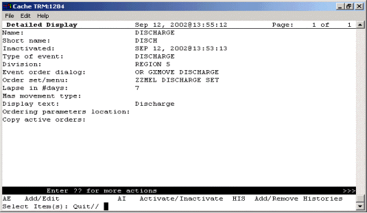  
**A sample discharge event**  
#### Sample Transfer Event: Ward or Division Change

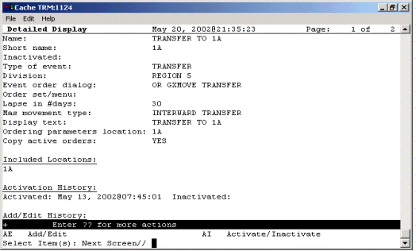  
**A sample transfer event for a ward or division change**  
#### Sample Transfer Event: From PASS

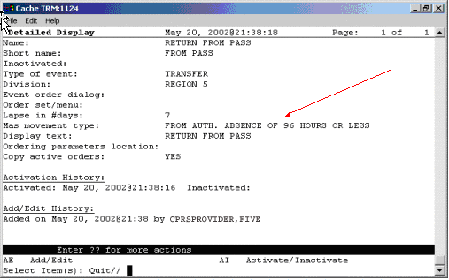  
**The MAS movement type specified in this event distinguishes the type of transfer**  
#### Sample Transfer Event: to ASIH

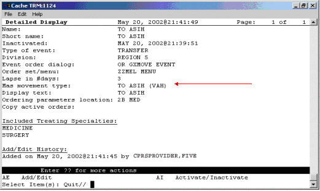  
**Sample transfer event: to ASIH**  
#### Sample Transfer Event: to NHCU

  
**Sample transfer event: to NHCU**  
#### Sample O.R. Event

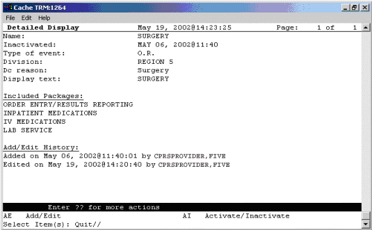  
**A sample O.R. event**  
#### Sample Manual Release Event

  
**A sample manual release event**  
### Activating/Inactivating a Release Event

**☞ NOTE:**  **If a parent release event is inactive, all child release events will also be inactive. However, a child release event can be inactive while the parent release event is active.**  
To activate/inactivate a release event, follow these steps:

1.  Open the CPRS Configuration (Clin Coord) menu [OR PARAM COORDINATOR MENU].  
AL Allocate OE/RR Security Keys [ORCL KEY ALLOCATION]  
KK Check for Multiple Keys [ORE KEY CHECK]  
DC Edit DC Reasons [ORCL ORDER REASON]  
GP GUI Parameters ... [ORW PARAM GUI]  
GA GUI Access - Tabs, RPL [ORCL CPRS ACCESS]  
MI Miscellaneous Parameters [OR PARAM ORDER MISC]  
NO Notification Mgmt Menu ... [ORB NOT COORD MENU]  
OC Order Checking Mgmt Menu ... [ORK ORDER CHK MGMT MENU]  
MM Order Menu Management ... [ORCM MGMT]  
LI Patient List Mgmt Menu ... [ORLP PATIENT LIST MGMT]  
FP Print Formats [ORCL PRINT FORMAT]  
PR Print/Report Parameters ... [OR PARAM PRINTS]  
RE Release/Cancel Delayed Orders [ORC DELAYED ORDERS]  
US Unsigned orders search [OR UNSIGNED ORDERS]  
EX Set Unsigned Orders View on Exit [OR PARAM UNSIGNED ORDERS VIEW]  
NA Search orders by Nature or Status [OR NATURE/STATUS ORDER SEARCH]  
DO Event Delayed Orders Menu ... [OR DELAYED ORDERS]  
PM Performance Monitor Report [OR PERFORMANCE MONITOR]  
1.  Select the Event Delayed Orders Menu by typing DO.  
The following menu will appear:  
DO Delayed Orders/Auto-DC Set-up [OR DELAYED ORDERS EDITOR]  
EP Parameters for event delayed orders [OR EVENT PARAMETERS]  
IN Inquire to OE/RR Patient Event File [OR PATINET EVENT INQUIRY]  
1.  Select Delayed Orders/Auto-DC Set-up by typing DO.  
The following menu will appear  
Select one of the following:  
1\. Auto-DC Rules  
2\. Release Events  
Enter response:  
1.  Select Release Events by typing 2.  
The existing release events will appear in a numbered list.  
1.  Select Activate/Inactivate by typing AI.  
1.  Type the number of the release event you would like to activate/inactivate at the Select items prompt.  
1.  The computer will display a message asking if you are sure you want to activate/inactivate this release event. Type the appropriate response.  
**☞** **NOTE**: **You can also activate/inactivate a release event from the detailed display screen.**  
**☞** **NOTE**: **Once you have activated a release event, the event will appear on the Event Delayed Orders dialog in the CPRS GUI. Users can now write orders that are delayed until the release event occurs.**  
####

#### Detailed Display of a Release Event

To view a detailed display of a release event, follow these steps:

1.  Open the CPRS Configuration (Clin Coord) menu [OR PARAM COORDINATOR MENU].  
AL Allocate OE/RR Security Keys [ORCL KEY ALLOCATION]  
KK Check for Multiple Keys [ORE KEY CHECK]  
DC Edit DC Reasons [ORCL ORDER REASON]  
GP GUI Parameters ... [ORW PARAM GUI]  
GA GUI Access - Tabs, RPL [ORCL CPRS ACCESS]  
MI Miscellaneous Parameters [OR PARAM ORDER MISC]  
NO Notification Mgmt Menu ... [ORB NOT COORD MENU]  
OC Order Checking Mgmt Menu ... [ORK ORDER CHK MGMT MENU]  
MM Order Menu Management ... [ORCM MGMT]  
LI Patient List Mgmt Menu ... [ORLP PATIENT LIST MGMT]  
FP Print Formats [ORCL PRINT FORMAT]  
PR Print/Report Parameters ... [OR PARAM PRINTS]  
RE Release/Cancel Delayed Orders [ORC DELAYED ORDERS]  
US Unsigned orders search [OR UNSIGNED ORDERS]  
EX Set Unsigned Orders View on Exit [OR PARAM UNSIGNED ORDERS VIEW]  
NA Search orders by Nature or Status [OR NATURE/STATUS ORDER SEARCH]  
DO Event Delayed Orders Menu ... [OR DELAYED ORDERS]  
PM Performance Monitor Report [OR PERFORMANCE MONITOR]  
1.  Select the Event Delayed Orders Menu by typing DO.  
The following menu will appear:  
DO Delayed Orders/Auto-DC Set-up [OR DELAYED ORDERS EDITOR]  
EP Parameters for event delayed orders [OR EVENT PARAMETERS]  
IN Inquire to OE/RR Patient Event File [OR PATINET EVENT INQUIRY]  
1.  Select Delayed Orders/Auto-DC Set-up by typing DO.  
The following menu will appear:  
Select one of the following:  
1\. Auto-DC Rules  
2\. Release Events  
Enter response:  
1.  Choose Release Events by typing 2.  
1.  Select Detailed Display by typing DD.  
1.  At the Select item(s) prompt, type the number of the release event that you would like to display.  
A detailed display of the release event will appear.  
**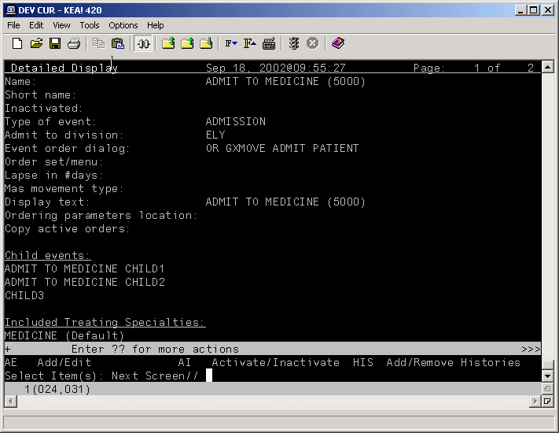**  
**The release event detailed display**  
##### Audit and Activation History

The audit and activation histories on the detailed display can be toggled on or off depending on your preferences.

**To toggle the audit and activation histories on or off, follow these steps:**

1.  Open the CPRS Configuration (Clin Coord) menu [OR PARAM COORDINATOR MENU].  
AL Allocate OE/RR Security Keys [ORCL KEY ALLOCATION]  
KK Check for Multiple Keys [ORE KEY CHECK]  
DC Edit DC Reasons [ORCL ORDER REASON]  
GP GUI Parameters ... [ORW PARAM GUI]  
GA GUI Access - Tabs, RPL [ORCL CPRS ACCESS]  
MI Miscellaneous Parameters [OR PARAM ORDER MISC]  
NO Notification Mgmt Menu ... [ORB NOT COORD MENU]  
OC Order Checking Mgmt Menu ... [ORK ORDER CHK MGMT MENU]  
MM Order Menu Management ... [ORCM MGMT]  
LI Patient List Mgmt Menu ... [ORLP PATIENT LIST MGMT]  
FP Print Formats [ORCL PRINT FORMAT]  
PR Print/Report Parameters ... [OR PARAM PRINTS]  
RE Release/Cancel Delayed Orders [ORC DELAYED ORDERS]  
US Unsigned orders search [OR UNSIGNED ORDERS]  
EX Set Unsigned Orders View on Exit [OR PARAM UNSIGNED ORDERS VIEW]  
NA Search orders by Nature or Status [OR NATURE/STATUS ORDER SEARCH]  
DO Event Delayed Orders Menu ... [OR DELAYED ORDERS]  
PM Performance Monitor Report [OR PERFORMANCE MONITOR]  
1.  Select the Event Delayed Orders Menu by typing DO.  
The following menu will appear:  
DO Delayed Orders/Auto-DC Set-up [OR DELAYED ORDERS EDITOR]  
EP Parameters for event delayed orders [OR EVENT PARAMETERS]  
IN Inquire to OE/RR Patient Event File [OR PATINET EVENT INQUIRY  
1.  Select Delayed Orders/Auto-DC Set-up by typing DO.  
The following menu will appear:  
Select one of the following:  
1\. Auto-DC Rules  
2\. Release Events  
Enter response:  
1.  Type 1 to select Auto-DC Rules or 2 to select Release Events.  
1.  Type DD to select Detailed Display.  
1.  At the Select item(s) prompt, type the number of the release event or auto-DC rule that you would like to display.  
A detailed display of the release event or auto-DC rule will appear.  
1.  Type H to select Add/Remove Histories  
1.  At the Do you want to include them on the detailed display? prompt, type Y to include the audit and activation histories on the detailed display. Type N if you do not wish to display the audit and activation histories.  
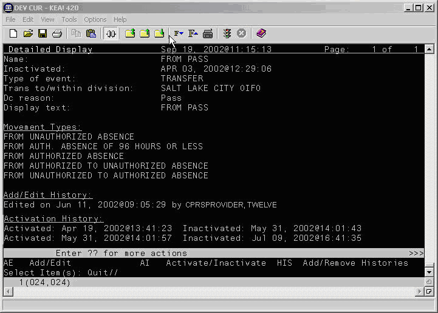  
**The audit and activation history can be toggled on or off on the detailed display screen.**  
###

### Tracking Event-Delayed Orders (OE/RR PATIENT EVENTS file \#100.2)

You can use the information stored in the OE/RR PATIENT EVENTS file (\#100.2) to determine which orders were released as the result of a release event.

To retrieve information from the OE/RR PATIENT EVENTS file (\#100.2), follow these steps:

1.  Open the CPRS Configuration (Clin Coord) menu [OR PARAM COORDINATOR MENU].  
AL Allocate OE/RR Security Keys [ORCL KEY ALLOCATION]  
KK Check for Multiple Keys [ORE KEY CHECK]  
DC Edit DC Reasons [ORCL ORDER REASON]  
GP GUI Parameters ... [ORW PARAM GUI]  
GA GUI Access - Tabs, RPL [ORCL CPRS ACCESS]  
MI Miscellaneous Parameters [OR PARAM ORDER MISC]  
NO Notification Mgmt Menu ... [ORB NOT COORD MENU]  
OC Order Checking Mgmt Menu ... [ORK ORDER CHK MGMT MENU]  
MM Order Menu Management ... [ORCM MGMT]  
LI Patient List Mgmt Menu ... [ORLP PATIENT LIST MGMT]  
FP Print Formats [ORCL PRINT FORMAT]  
PR Print/Report Parameters ... [OR PARAM PRINTS]  
RE Release/Cancel Delayed Orders [ORC DELAYED ORDERS]  
US Unsigned orders search [OR UNSIGNED ORDERS]  
EX Set Unsigned Orders View on Exit [OR PARAM UNSIGNED ORDERS VIEW]  
NA Search orders by Nature or Status [OR NATURE/STATUS ORDER SEARCH]  
DO Event Delayed Orders Menu ... [OR DELAYED ORDERS]  
PM Performance Monitor Report [OR PERFORMANCE MONITOR]  
1.  Select the Event Delayed Orders Menu by typing **DO**.  
The following menu will appear:  
DO Delayed Orders/Auto-DC Set-up [OR DELAYED ORDERS EDITOR]  
EP Parameters for event delayed orders [OR EVENT PARAMETERS]  
IN Inquire to OE/RR Patient Event File [OR PATINET EVENT INQUIRY]  
3\. Select Inquire to OE/RR Patient Event File by typing **IN**.  
4\. Enter either the name of the release event, the name of the patient, or the patient’s social security number at the *Select OE/RR PATIENT EVENT* prompt.  
The records that match the criteria you specified will appear in a numbered list.  
1.  If necessary, type the number of the record you would like to view.  
1.  Choose the output device at the *DEVICE* prompt.  
The details of the record will be sent to the appropriate device.  
### Creating a List of Commonly Used Release Events

The OREVNT COMMON LIST parameter allows a CAC to create a list of commonly used release events that will be displayed at the top of a user’s release event list.

To define a list of commonly used release events, follow these steps:

1.  Open the CPRS Configuration (Clin Coord) menu [OR PARAM COORDINATOR MENU].  
AL Allocate OE/RR Security Keys [ORCL KEY ALLOCATION]  
KK Check for Multiple Keys [ORE KEY CHECK]  
DC Edit DC Reasons [ORCL ORDER REASON]  
GP GUI Parameters ... [ORW PARAM GUI]  
GA GUI Access - Tabs, RPL [ORCL CPRS ACCESS]  
MI Miscellaneous Parameters [OR PARAM ORDER MISC]  
NO Notification Mgmt Menu ... [ORB NOT COORD MENU]  
OC Order Checking Mgmt Menu ... [ORK ORDER CHK MGMT MENU]  
MM Order Menu Management ... [ORCM MGMT]  
LI Patient List Mgmt Menu ... [ORLP PATIENT LIST MGMT]  
FP Print Formats [ORCL PRINT FORMAT]  
PR Print/Report Parameters ... [OR PARAM PRINTS]  
RE Release/Cancel Delayed Orders [ORC DELAYED ORDERS]  
US Unsigned orders search [OR UNSIGNED ORDERS]  
EX Set Unsigned Orders View on Exit [OR PARAM UNSIGNED ORDERS VIEW]  
NA Search orders by Nature or Status [OR NATURE/STATUS ORDER SEARCH]  
DO Event Delayed Orders Menu ... [OR DELAYED ORDERS]  
PM Performance Monitor Report [OR PERFORMANCE MONITOR]  
1.  Select the Event Delayed Orders Menu by typing **DO**.  
The following menu will appear:  
DO Delayed Orders/Auto-DC Set-up [OR DELAYED ORDERS EDITOR]  
EP Parameters for event delayed orders [OR EVENT PARAMETERS]  
IN Inquire to OE/RR Patient Event File [OR PATINET EVENT INQUIRY]  
1.  Select Parameters for event delayed orders by typing **EP**.  
1.  Type **3** to choose Common release event list.  
1.  Choose how you would like to set the OREVNT COMMON LIST parameter by typing one of the following at the *Enter Selection* prompt:  
**1** – for user level  
**2** – for class level  
**3** – for team level  
**4** – for location level  
**5** – for service level  
**6** – for division level  
1.  If you selected 1, the *Select* *NEW PERSON NAME* prompt will appear. If you selected 2, the *Select USR CLASS* prompt will appear. If you selected 3, the *OE/RR LIST NAME* prompt will appear. If you selected 4, the *Select HOSPITAL LOCATION NAME* prompt will appear*.* If you selected 5, the *Select SERVICE/SECTION NAME* prompt will appear. If you selected 6, the *Select* *INSTITUTION NAME* prompt will appear. Type the appropriate response.  
1.  At the *Select Entry Number* prompt, type a number for the entry. The number you enter is simply a placeholder and does **not** represent the position the release event will occupy in the common list. Rather, the list of commonly used release events will be displayed in alphabetical order.  
1.  The number you entered in step 6 will be displayed. Verify that the number is correct and press **Return**.  
1.  Type the name of the release event you would like to add to the common list at the *RELEASE EVEN*T prompt.  
1.  Repeat steps 6-8 if you would like to add additional release events to the list.  
1.  When you have finished adding release events to the list, press Return at the RELEASE EVENT prompt.  
1.  If you have not yet defined a default release event (set the OREVNT DEFAULT parameter), you will be prompted to do so.  
Setting OREVNT COMMON LIST for User: CPRSPROVIDER,FIVE ------------  
Select Entry number: 1  
Entry number: 1// 1  
Release Event: TRANSFER TO MEDICINE (5000)// TRANSFER TO MEDICINE (5000) T  
TRANSFER SALT LAKE CITY HCS  
Select Entry number: 2  
Entry number: 2// 2  
Release Event: POST OP// POST OP O.R. ELY  
Select Entry number: 3  
Entry number: 3// 3  
Release Event: TRANSFER TO ICU// TRANSFER TO ICU TRANSFER SALT LAKE CI  
TY OIFO  
In the example above, the Transfer to Medicine (5000), Post OP, and Transfer to ICU release events have been assigned to the list of commonly used release events for CPRSPROVIDER,FIVE.

**NOTE**: **A release event will only appear on the common list if it is context appropriate. For example, the release event “Transfer to Medicine” will not appear on the list if the current patient is an outpatient.**  
###

### Defining a Default Release Event

The OREVNT DEFAULT parameter allows a CAC to control which event is presented as the default release event when a user writes a new event-delayed order (in both the CPRS GUI and List Manager).

**☞** **NOTE**: **Before a default release event can be defined for a class, team, location, service, or division, you must define a list of commonly used release events for that level. (In other words, you must set the OREVNT DEFAULT LIST parameter.)**  
To define a default release event, follow these steps:

1.  Open the CPRS Configuration (Clin Coord) menu [OR PARAM COORDINATOR MENU].  
AL Allocate OE/RR Security Keys [ORCL KEY ALLOCATION]  
KK Check for Multiple Keys [ORE KEY CHECK]  
DC Edit DC Reasons [ORCL ORDER REASON]  
GP GUI Parameters ... [ORW PARAM GUI]  
GA GUI Access - Tabs, RPL [ORCL CPRS ACCESS]  
MI Miscellaneous Parameters [OR PARAM ORDER MISC]  
NO Notification Mgmt Menu ... [ORB NOT COORD MENU]  
OC Order Checking Mgmt Menu ... [ORK ORDER CHK MGMT MENU]  
MM Order Menu Management ... [ORCM MGMT]  
LI Patient List Mgmt Menu ... [ORLP PATIENT LIST MGMT]  
FP Print Formats [ORCL PRINT FORMAT]  
PR Print/Report Parameters ... [OR PARAM PRINTS]  
RE Release/Cancel Delayed Orders [ORC DELAYED ORDERS]  
US Unsigned orders search [OR UNSIGNED ORDERS]  
EX Set Unsigned Orders View on Exit [OR PARAM UNSIGNED ORDERS VIEW]  
NA Search orders by Nature or Status [OR NATURE/STATUS ORDER SEARCH]  
DO Event Delayed Orders Menu ... [OR DELAYED ORDERS]  
PM Performance Monitor Report [OR PERFORMANCE MONITOR]  
1.  Select the Event Delayed Orders Menu by typing DO.  
The following menu will appear:  
DO Delayed Orders/Auto-DC Set-up [OR DELAYED ORDERS EDITOR]  
EP Parameters for event delayed orders [OR EVENT PARAMETERS]  
IN Inquire to OE/RR Patient Event File [OR PATINET EVENT INQUIRY]  
1.  Select Parameters for event delayed orders by typing EP.  
1.  Select 2 to choose Default release event.  
1.  Choose how you would like to set the OREVNT DEFAULT parameter by typing one of the following at the Enter Selection prompt:  
**1** – for user level  
**2** – for class level  
**3** – for team level  
**4** – for location level  
**5** – for service level  
**6** – for division level  
1.  If you selected 1, the Select NEW PERSON NAME prompt will appear. If you selected 2, the Select USR CLASS NAME prompt will appear. If you selected 3, the Select OE/RR LIST NAME prompt will appear. If you selected 4, the Select HOSPITAL LOCATION NAME prompt will appear. If you selected 5, the Select SERVICE/SECTION prompt will appear. If you selected 6, the Select INSTITUTION NAME prompt will appear. Type the appropriate response.  
A list of available release events will appear.  
OREVNT DEFAULT may be set for the following:  
1 User USR [choose from NEW PERSON]  
2 Class CLS [choose from USR CLASS]  
3 Team (OE/RR) OTL [choose from OE/RR LIST]  
4 Location LOC [choose from HOSPITAL LOCATION]  
5 Service SRV [choose from SERVICE/SECTION]  
6 Division DIV [choose from INSTITUTION]  
The OREVNT DEFAULT parameter may be set at the user, class, team, location, service, or division level.

1.  Type the number of the release event that you would like to set as the default.  
Enter selection: 2 Class USR CLASS  
Select USR CLASS NAME: INTERN PHYSICIAN  
No DEFAULT has been set yet.  
1) TRANSFER TO BLIND REHAB OBSERVATION (5000)  
2) ADMIT TO SURGERY (5000)  
3) POST OP (\*INACTIVE\*)  
Select default release event: (1-3): 1  
In this example, the Transfer to Blind Rehab Observation (5000) release event is set as the default event for the Intern Physician user class.

**NOTE: When a user is writing an event-delayed order, the default release event will appear only if it is context appropriate. For example, the default release event “Transfer to Medicine” will not appear if the current patient is an outpatient.**  
  
**The default release event, Transfer to Blind Rehab Observation (5000) is highlighted on the Release Orders dialog box in the CPRS GUI**  
CPRSPATIENT,FIVE is currently admitted to MEDICINE.  
Delayed orders exist for CPRSPATIENT,FIVE for the following events:  
1 ADMIT TO BLIND REHAB OBSERVATION (5000)  
2 DISCHARGE (5000)  
3 TRANSFER TO SURGERY (5000)  
To review or add delayed orders, select from (1-5) or enter a new event.  
Select RELEASE EVENT: TRANSFER TO BLIND REHAB OBSERVATION (5000)//  
The default release event, Transfer to Blind Rehab Observation (5000) is automatically selected in the List Manager version of CPRS.

###

### Defining the Orders Menu for a Release Event

You can define which orders menu appears in the Write Orders pane (in the GUI) for a particular release event. You can do this by setting the ORWDX WRITE ORDERS EVENT LIST parameter.


**The ORWDX WRITE ORDERS EVENT LIST parameter determines which orders menu appears in the Write Orders pane**  
To set the ORWDX WRITE ORDERS EVENT LIST parameter, follow these steps:

1.  Open the CPRS Configuration (Clin Coord) menu [OR PARAM COORDINATOR MENU].  
AL Allocate OE/RR Security Keys [ORCL KEY ALLOCATION]  
KK Check for Multiple Keys [ORE KEY CHECK]  
DC Edit DC Reasons [ORCL ORDER REASON]  
GP GUI Parameters ... [ORW PARAM GUI]  
GA GUI Access - Tabs, RPL [ORCL CPRS ACCESS]  
MI Miscellaneous Parameters [OR PARAM ORDER MISC]  
NO Notification Mgmt Menu ... [ORB NOT COORD MENU]  
OC Order Checking Mgmt Menu ... [ORK ORDER CHK MGMT MENU]  
MM Order Menu Management ... [ORCM MGMT]  
LI Patient List Mgmt Menu ... [ORLP PATIENT LIST MGMT]  
FP Print Formats [ORCL PRINT FORMAT]  
PR Print/Report Parameters ... [OR PARAM PRINTS]  
RE Release/Cancel Delayed Orders [ORC DELAYED ORDERS]  
US Unsigned orders search [OR UNSIGNED ORDERS]  
EX Set Unsigned Orders View on Exit [OR PARAM UNSIGNED ORDERS VIEW]  
NA Search orders by Nature or Status [OR NATURE/STATUS ORDER SEARCH]  
DO Event Delayed Orders Menu ... [OR DELAYED ORDERS]  
PM Performance Monitor Report [OR PERFORMANCE MONITOR]  
1.  Select the Event Delayed Orders Menu by typing **DO**.  
The following menu will appear:  
DO Delayed Orders/Auto-DC Set-up [OR DELAYED ORDERS EDITOR]  
EP Parameters for event delayed orders [OR EVENT PARAMETERS]  
IN Inquire to OE/RR Patient Event File [OR PATINET EVENT INQUIRY]  
1.  Select Parameters for event delayed orders by typing EP.  
1.  Select Write orders list by event by typing 1.  
1.  Choose how you would like to edit the ORWDX WRITE ORDERS EVENT LIST parameter by typing one of the following at the Enter Selection prompt:  
**2** – for user level  
**4** – for location level  
**5** – for service level  
**7** – for division level  
**8** – for system level  
1.  If you selected 2, the Select NEW PERSON NAME prompt will appear. If you selected 4, the Select HOSPITAL LOCATION NAME prompt will appear. If you selected 5, the Select SERVICE/SECTION NAME prompt will appear. If you selected 7, the Select INSTITUTION NAME prompt will appear Type the appropriate response. If you selected 8, skip to step 6.  
1.  At the Select Release Event prompt, type the name of the release event.  
1.  Enter Y or Yes at the Are you adding [RELEASE EVENT NAME] as a new Release Event? prompt.  
1.  The release event you entered in step 6 will appear. Verify that this is the correct release event and press Return.  
1.  Type the name of the order dialog or the display text at the Value prompt.  
1.  Repeat steps 6-9 for additional release events. When you are finished, press Return at the Select Release Event prompt.  
### Controlling who can Manually Release Orders

The OREVNT MANUAL RELEASE CONTROL and OREVNT MANUAL RELEASE parameters determine who can manually release an event-delayed order.  
The OREVNT MANUAL RELEASE CONTROL parameter determines if the permission to manually release an event-delayed order is granted by:  
-   the ORES and ORELSE keys (keys only).  
-   the OREVNT MANUAL RELEASE parameter (manual release parameter only).-or-  
-   the ORES and ORELSE keys and the OREVNT MANUAL RELEASE parameter (both keys and parameter).  
The OREVNT MANUAL RELEASE parameter must also be set if the OREVNT MANUAL RELEASE CONTROL parameter is set to “manual release parameter only” or to “both keys and parameter.”

To set the OREVENT MANUAL RELEASE CONTROL parameter, follow these steps:

1.  Open the CPRS Configuration (Clin Coord) menu [OR PARAM COORDINATOR MENU].  
AL Allocate OE/RR Security Keys [ORCL KEY ALLOCATION]  
KK Check for Multiple Keys [ORE KEY CHECK]  
DC Edit DC Reasons [ORCL ORDER REASON]  
GP GUI Parameters ... [ORW PARAM GUI]  
GA GUI Access - Tabs, RPL [ORCL CPRS ACCESS]  
MI Miscellaneous Parameters [OR PARAM ORDER MISC]  
NO Notification Mgmt Menu ... [ORB NOT COORD MENU]  
OC Order Checking Mgmt Menu ... [ORK ORDER CHK MGMT MENU]  
MM Order Menu Management ... [ORCM MGMT]  
LI Patient List Mgmt Menu ... [ORLP PATIENT LIST MGMT]  
FP Print Formats [ORCL PRINT FORMAT]  
PR Print/Report Parameters ... [OR PARAM PRINTS]  
RE Release/Cancel Delayed Orders [ORC DELAYED ORDERS]  
US Unsigned orders search [OR UNSIGNED ORDERS]  
EX Set Unsigned Orders View on Exit [OR PARAM UNSIGNED ORDERS VIEW]  
NA Search orders by Nature or Status [OR NATURE/STATUS ORDER SEARCH]  
DO Event Delayed Orders Menu ... [OR DELAYED ORDERS]  
PM Performance Monitor Report [OR PERFORMANCE MONITOR]  
1.  Select the Event Delayed Orders Menu by typing DO.  
The following menu will appear:  
DO Delayed Orders/Auto-DC Set-up [OR DELAYED ORDERS EDITOR]  
EP Parameters for event delayed orders [OR EVENT PARAMETERS]  
IN Inquire to OE/RR Patient Event File [OR PATINET EVENT INQUIRY]  
1.  Select Parameters for event delayed orders by typing EP.  
The following menu will appear:  
Select one of the following:  
1 Write orders list by event  
2 Default release event  
3 Default release event list  
4 Manual release controlled by  
5 Set manual release parameter  
1.  Type 4 to select Manual release controlled by.  
1.  Choose how you would like to set the OREVNT MANUAL RELEASE CONTROL parameter by typing one of the following at the Enter Selection prompt:  
**1** – for division leve**l**  
**2** – for system level  
1.  If you selected 1, the Select INSTITUTION NAME prompt will appear. Type the appropriate response. If you selected 2, skip to step 6.  
1.  At the Manual release controlled by prompt, type one of the following responses:  
-   **K (for Keys Only)** Use this setting if you would like only users who are assigned the ORES and ORELSE key to manually release event-delayed orders. This is the default setting and the setting that CPRS used prior to the release of patch OR\*3.0\*141.  
-   **P (Manual Release Parameter Only)** Use this setting if you want the OREVNT MANUAL RELEASE parameter (discussed below) to control who can manually release an event-delayed order.  
-   **B (Both Keys and Parameter)** If you choose this option, CPRS will first check to see if the user has the ORES or ORELSE key. If they do, they will be allowed to manually release an event-delayed order. If the user does not have the ORES or ORELSE key, CPRS will then check the OREVNT MANUAL RELEASE parameter to see if they should be allowed to manually release the order.  
**NOTE**: **If you select P or B, you will also need to set the OREVNT MANUAL RELEASE parameter by following the instructions below in the** [**Setting the Manual Release Parameter (OREVNT MANUAL RELEASE)**](#-14) **section.**  
###

### Setting the Manual Release Parameter (OREVNT MANUAL RELEASE)

**NOTE: If the OREVNT MANUAL RELEASE CONTROL parameter is set to either P or B, users will be unable to manually release event-delayed orders until the OREVNT MANUAL RELEASE parameter is set. (It is distributed with the system level set to NO).**  
To set the OREVNT MANUAL RELEASE parameter, follow these steps:

1\. Open the CPRS Configuration (Clin Coord) menu [OR PARAM COORDINATOR MENU].  
AL Allocate OE/RR Security Keys [ORCL KEY ALLOCATION]  
KK Check for Multiple Keys [ORE KEY CHECK]  
DC Edit DC Reasons [ORCL ORDER REASON]  
GP GUI Parameters ... [ORW PARAM GUI]  
GA GUI Access - Tabs, RPL [ORCL CPRS ACCESS]  
MI Miscellaneous Parameters [OR PARAM ORDER MISC]  
NO Notification Mgmt Menu ... [ORB NOT COORD MENU]  
OC Order Checking Mgmt Menu ... [ORK ORDER CHK MGMT MENU]  
MM Order Menu Management ... [ORCM MGMT]  
LI Patient List Mgmt Menu ... [ORLP PATIENT LIST MGMT]  
FP Print Formats [ORCL PRINT FORMAT]  
PR Print/Report Parameters ... [OR PARAM PRINTS]  
RE Release/Cancel Delayed Orders [ORC DELAYED ORDERS]  
US Unsigned orders search [OR UNSIGNED ORDERS]  
EX Set Unsigned Orders View on Exit [OR PARAM UNSIGNED ORDERS VIEW]  
NA Search orders by Nature or Status [OR NATURE/STATUS ORDER SEARCH]  
DO Event Delayed Orders Menu ... [OR DELAYED ORDERS]  
PM Performance Monitor Report [OR PERFORMANCE MONITOR]  
1.  Select the Event Delayed Orders Menu by typing **DO**.  
The following menu will appear:

DO Delayed Orders/Auto-DC Set-up [OR DELAYED ORDERS EDITOR]  
EP Parameters for event delayed orders [OR EVENT PARAMETERS]  
IN Inquire to OE/RR Patient Event File [OR PATINET EVENT INQUIRY]  
1.  Select Parameters for event delayed orders by typing EP.  
The following menu will appear:

Select one of the following:  
1 Write orders list by event  
2 Default release event  
3 Default release event list  
4 Manual release controlled by  
5 Set manual release parameter  
1.  Type 5 to select Set manual release parameter.  
1.  Choose how you would like to edit the manual release parameter (OREVNT MANUAL RELEASE) by typing one of the following at the Enter Selection prompt:  
-   1 – for user level  
-   2 – for class level  
-   3 – for team level  
-   4 – for location level  
-   5 – for service level  
-   6 – for division level  
-   7 – for system level  
1.  If you selected 1, the Select NEW PERSON NAME prompt will appear. If you selected 2, the Select USR CLASS NAME prompt will appear. If you selected 3, the Select OE/RR LIST NAME prompt will appear. If you selected 4, the Select HOSPITAL LOCATION NAME prompt will appear. If you selected 5, the Select SERVICE/SECTION NAME prompt will appear. If you selected 6, the Select INSTITUTION NAME prompt will appear. If you selected 7, skip to step 6.  
1.  At the Allow manual release prompt, type Y (yes) to allow users to manually release event-delayed orders or type N (no) to prevent users from manually releasing event-delayed orders.  
###

### Excluding Display Groups from the *Copy Active Orders* Dialog Box

The OREVNT EXCLUDE DGRP parameter allows you to prevent orders that belong to certain display groups from appearing on the *Copy Active Orders* dialog box.

To set the OREVNT EXCLUDE DGRP parameter, follow these steps:

1\. Open the CPRS Configuration (Clin Coord) menu [OR PARAM COORDINATOR MENU].  
AL Allocate OE/RR Security Keys [ORCL KEY ALLOCATION]  
KK Check for Multiple Keys [ORE KEY CHECK]  
DC Edit DC Reasons [ORCL ORDER REASON]  
GP GUI Parameters ... [ORW PARAM GUI]  
GA GUI Access - Tabs, RPL [ORCL CPRS ACCESS]  
MI Miscellaneous Parameters [OR PARAM ORDER MISC]  
NO Notification Mgmt Menu ... [ORB NOT COORD MENU]  
OC Order Checking Mgmt Menu ... [ORK ORDER CHK MGMT MENU]  
MM Order Menu Management ... [ORCM MGMT]  
LI Patient List Mgmt Menu ... [ORLP PATIENT LIST MGMT]  
FP Print Formats [ORCL PRINT FORMAT]  
PR Print/Report Parameters ... [OR PARAM PRINTS]  
RE Release/Cancel Delayed Orders [ORC DELAYED ORDERS]  
US Unsigned orders search [OR UNSIGNED ORDERS]  
EX Set Unsigned Orders View on Exit [OR PARAM UNSIGNED ORDERS VIEW]  
NA Search orders by Nature or Status [OR NATURE/STATUS ORDER SEARCH]  
DO Event Delayed Orders Menu ... [OR DELAYED ORDERS]  
PM Performance Monitor Report [OR PERFORMANCE MONITOR]  
2\. Select the Event Delayed Orders Menu by typing **DO**.  
The following menu will appear:

DO Delayed Orders/Auto-DC Set-up [OR DELAYED ORDERS EDITOR]  
EP Parameters for event delayed orders [OR EVENT PARAMETERS]  
IN Inquire to OE/RR Patient Event File [OR PATINET EVENT INQUIRY]  
***

3\. Select Parameters for event delayed orders by typing **EP**.  
The following menu will appear:  
Select one of the following:  
1 Write orders list by event  
2 Default release event  
3 Default release event list  
4 Manual release controlled by  
5 Set manual release parameter  
6 Exclude display groups from copy  
4\. Type **6** to select Exclude display groups from copy.  
5\. Choose how you would like to edit the OREVNT EXCLUDE RELEASE parameter by typing one of the following at the *Enter Selection* prompt:  
-   1 **– for division level**  
-   2 **– for system level**  
6\. If you selected 1, the *Select* *INSTITUTION NAME* prompt will appear. Enter the name for the institution. If you selected 2, continue to step 6.  
7\. At the *Select Entry Number* prompt, type a number for the entry. The number you enter is simply a placeholder.  
8\. If necessary, type **Y** or **Yes** at the *Are you adding [number] as a new Entry Number?*  
9\. The number you entered in step 6 will appear. Press **Return**.  
10\. Select the display group that you wish to exclude from the *Copy Active Orders* dialog.  
###

### Changing the Display

The change display function allows you to adjust the size of the Delayed Orders / Auto-DC Set-up editor and configure the display to show active entries, inactive entries, or all entries.

**To change the size or content of the display, follow these steps:**  
1\. Open the CPRS Configuration (Clin Coord) menu [OR PARAM COORDINATOR MENU].  
AL Allocate OE/RR Security Keys [ORCL KEY ALLOCATION]  
KK Check for Multiple Keys [ORE KEY CHECK]  
DC Edit DC Reasons [ORCL ORDER REASON]  
GP GUI Parameters ... [ORW PARAM GUI]  
GA GUI Access - Tabs, RPL [ORCL CPRS ACCESS]  
MI Miscellaneous Parameters [OR PARAM ORDER MISC]  
NO Notification Mgmt Menu ... [ORB NOT COORD MENU]  
OC Order Checking Mgmt Menu ... [ORK ORDER CHK MGMT MENU]  
MM Order Menu Management ... [ORCM MGMT]  
LI Patient List Mgmt Menu ... [ORLP PATIENT LIST MGMT]  
FP Print Formats [ORCL PRINT FORMAT]  
PR Print/Report Parameters ... [OR PARAM PRINTS]  
RE Release/Cancel Delayed Orders [ORC DELAYED ORDERS]  
US Unsigned orders search [OR UNSIGNED ORDERS]  
EX Set Unsigned Orders View on Exit [OR PARAM UNSIGNED ORDERS VIEW]  
NA Search orders by Nature or Status [OR NATURE/STATUS ORDER SEARCH]  
DO Event Delayed Orders Menu ... [OR DELAYED ORDERS]  
PM Performance Monitor Report [OR PERFORMANCE MONITOR]  
2\. Select the Event Delayed Orders Menu by typing **DO**.  
The following menu will appear:  
DO Delayed Orders/Auto-DC Set-up [OR DELAYED ORDERS EDITOR]  
EP Parameters for event delayed orders [OR EVENT PARAMETERS]  
IN Inquire to OE/RR Patient Event File [OR PATINET EVENT INQUIRY]  
3\. Select Delayed Orders/Auto-DC Set-up by typing **DO**.  
4\. Select either Auto-DC rules or Release Events by typing either **1** or **2**.  
5\. Select Change display by typing **CD**.  
1.  Type **Y** or **N** at the *Do you want to truncate/expand this display?* Prompt.  
7\. Type **Y** or **N** at the *Terminal emulator in 80-column mode?* prompt.  
8\. At the *Select which entries should appear on the list* prompt type one of the following numbers:  
-   **1** for active entries only  
-   **2** for inactive entries only  
-   **3** for all entries  
The orders that you specified will be displayed.  
### Files Associated with Release Events

#### OE/RR RELEASE EVENTS (\#100.5)

This file contains the locally-defined events that can release delayed orders within each division. It is strongly recommended that this file not be edited with File Manager. Instead, CACs should use the event-delayed orders menu [OR DELAYED ORDERS]

**Fields in OE/RR RELEASE EVENTS (\#100.5)**

| Field Number | Field Name                    | Description                                                                                                                                                                                                                                                                                                                                                                                                                                                                                                                                                                                                                                            |
|--------------|-------------------------------|--------------------------------------------------------------------------------------------------------------------------------------------------------------------------------------------------------------------------------------------------------------------------------------------------------------------------------------------------------------------------------------------------------------------------------------------------------------------------------------------------------------------------------------------------------------------------------------------------------------------------------------------------------|
| .1           | SHORT NAME                    | This field contains a shorter version of the Display Text field. The Short Name is used to display and group delayed orders on the Orders tab when space is limited.                                                                                                                                                                                                                                                                                                                                                                                                                                                                                   |
| 1            | INACTIVATED                   | This field contains the date and time that this release event will become inactive. Once this date/time has passed, you will no longer be able to delay new orders to this release event. However, any event-delayed orders that are already associated with this release event will still be released when the event occurs.                                                                                                                                                                                                                                                                                                                          |
| ,1.5         | ACTIVATION HISTORY            |                                                                                                                                                                                                                                                                                                                                                                                                                                                                                                                                                                                                                                                        |
| 100.52, .01  | ACTIVATION DATE/TIME          | The date/time that this event was activated.                                                                                                                                                                                                                                                                                                                                                                                                                                                                                                                                                                                                           |
| 100.52 ,1    | INACTIVATION DATE/TIME        | The date/time that this event was inactivated.                                                                                                                                                                                                                                                                                                                                                                                                                                                                                                                                                                                                         |
| 2            | TYPE OF EVENT                 | This is the event that should cause delayed orders to be released to the service(s) for action. For OR events, the orders will be released when the TIME PAT IN OR field is entered in the Surgery package.  Orders delayed for Manual Release will not be automatically released by CPRS at all and can only be released via the "Release to Service" action by a user who is authorized to do so.  Authorization is controlled by the parameter OREVNT MANUAL RELEASE CONTROL, which Let sites choose whether release is controlled by keys or by the parameter OREVNT MANUAL RELEASE or both.                                                       |
| 3            | DIVISION                      | This is the division that this event will apply to. For transfers across divisions, this field should be the new division that the patient is going to.                                                                                                                                                                                                                                                                                                                                                                                                                                                                                                |
| 4            | EVENT ORDER DIALOG            | This field contains the name of the dialog that will appear when you are writing a generic event-delayed order that requests this release event. If such an order is not necessary for this event, leave this field empty.  Unlike other delayed orders, the order created by this dialog will become active right away when signed and be visible on the Active Orders view as well as with the delayed orders on the Orders tab.                                                                                                                                                                                                                     |
| 5            | ORDER SET/MENU                | This is a menu or order set containing items that are either necessary or commonly ordered when this event occurs.  The menu or order specified in this field will be invoked when first placing delayed orders for this event. If an EVENT ORDER DIALOG was defined for this event, this order set/menu will be presented to the user immediately following that dialog. This field may be any type of order dialog except prompt types.  Note: Order sets listed in this field should be part of an order menu.                                                                                                                                      |
| 6            | LAPSE IN \#DAYS               | Patient events are evaluated whenever delayed orders are acted upon or viewed. If the number of days specified in this field have passed since delayed orders were entered for this event and for this patient, then the status of all orders delayed for this event will be changed to "lapsed" and the patient event itself will be terminated. The orders can no longer be released to the service.                                                                                                                                                                                                                                                 |
| 7            | MAS MOVEMENT TYPE             | This is an MAS Movement Type that can further define this event. This field is optional, but if it is defined then it must match the patient's movement data to satisfy the event and cause any delayed orders to be released.  For example, to have delayed orders released when a patient returns from pass, enter the movement type of AUTH ABSENCE 96 HOURS OR LESS, or leave this field empty to have the transfer event defined by other criteria such as treating specialty or ward location.                                                                                                                                                   |
| 8            | DISPLAY TEXT                  | This field is the name of the event as it will appear to the user in CPRS.                                                                                                                                                                                                                                                                                                                                                                                                                                                                                                                                                                             |
| 9            | ORDERING PARAMETERS LOCATION  | Many order dialogs use parameters that depend on location. The location specified in the Ordering Parameters Location field is used as the default location for retrieving those parameter values when delaying orders to this event.  The patient's actual location will be saved with the order at the time of its release.                                                                                                                                                                                                                                                                                                                          |
| 10           | INCLUDED TREATING SPECIALTIES | The treating specialties in this field are the treating specialties that can satisfy this event. If the patient's new specialty matches a specialty in this field, then orders delayed for this event may be released.                                                                                                                                                                                                                                                                                                                                                                                                                                 |
| 100.51,.01   | INCLUDED TREATING SPECIALTIES | This is a treating specialty that can satisfy this event. If the treating specialty is defined, then the patient's new specialty must match one in this list in order for any delayed orders to be released. A specialty may only be included in one active release event at a time.  If locations are also defined for this event then both the treating specialty and the location must match for orders to be released.                                                                                                                                                                                                                             |
| 11           | INCLUDED LOCATIONS            | These are ward locations that can satisfy this event. If the patient's new location matches a location in this list, then orders delayed for this event may be released.                                                                                                                                                                                                                                                                                                                                                                                                                                                                               |
| 100.511,.01  | INCLUDED LOCATIONS            | This is a ward location that can satisfy this event. If defined, then the patient's new location must match a location in this list for any delayed orders to be released.  A location may only be included in one active release event at a time. If this event also has treating specialties defined, then both the location and the treating specialty must match for orders to be released.                                                                                                                                                                                                                                                        |
| 12           | EDIT HISTORY                  |                                                                                                                                                                                                                                                                                                                                                                                                                                                                                                                                                                                                                                                        |
| 100.512,.01  | EDIT HISTORY                  | This field tracks when an event was added. It also tracks when the edit options were used on this event.                                                                                                                                                                                                                                                                                                                                                                                                                                                                                                                                               |
| 100.512,1    | WHO ENTERED/EDITED            | This field identifies the person who entered or edited the release event.                                                                                                                                                                                                                                                                                                                                                                                                                                                                                                                                                                              |
| 13           | COPY ACTIVE ORDERS            | This field determines whether or not the user is presented with a list of patient’s active orders, which may be copied to the new release event.  If this field is set to no then the user will not see the patient's active orders and will not be allowed to copy any current orders.  If this field is set to yes then the user will see the patient's active orders and may select orders to copy to the to the release event.  The list of active orders will be presented to the user after the ORDER DIALOG for the release event is processed (if it exists) and before the ORDER SET/MENU for the release event is processed (if it exists).  |

## Appendix H: Automatically Discontinuing Orders (Auto-DC Rules)

A CAC can set up rules that will automatically discontinue an order when a specific event occurs. These rules are known as auto-DC rules. For example, a CAC can set up an auto-DC rule named “Transfer to Medicine Treating Specialty” that automatically discontinues all lab, pharmacy, and diet orders when a patient is transferred to a medicine treating specialty. Although the auto-DC rule will discontinue lab, pharmacy, and diet orders, all other orders will remain active. A number of variables can be used in auto-DC rules, including specific divisions, orderable items, locations, and MAS movement types.

Prior to the release of OR\*3\*142 and OR\*3\*141, you could not specify which orders would be automatically discontinued when the specified event occurred. Instead, all of the orders would be discontinued.

**☞** **NOTE: OR\*3.0\*142 changes the way auto-DC rules are created and processed. After OR\*3.0\*142 is installed, existing auto-DC parameters will be converted into entries in the OE/RR Auto-DC Rules file (\#100.6). The entries in the OE/RR Auto-DC Rules are for your division. Multidivisional sites will need to make copies of these rules for the other divisions in the system.**  
### Creating a New Auto-DC Rule

**☞** **NOTE: Auto-DC rules are stored in the OE/RR AUTO-DC RULES file (\#100.6)**  
**To create a new auto-DC rule, follow these steps:**  
1.  Open the CPRS Configuration (Clin Coord) menu [OR PARAM COORDINATOR MENU].  
AL Allocate OE/RR Security Keys [ORCL KEY ALLOCATION]  
KK Check for Multiple Keys [ORE KEY CHECK]  
DC Edit DC Reasons [ORCL ORDER REASON]  
GP GUI Parameters … [ORW PARAM GUI]  
GA GUI Access – Tabs, RPL [ORCL CPRS ACCESS]  
MI Miscellaneous Parameters [OR PARAM ORDER MISC]  
NO Notification Mgmt Menu … [ORB NOT COORD MENU]  
OC Order Checking Mgmt Menu … [ORK ORDER CHK MGMT MENU]  
MM Order Menu Management … [ORCM MGMT]  
LI Patient List Mgmt Menu … [ORLP PATIENT LIST MGMT]  
FP Print Formats [ORCL PRINT FORMAT]  
PR Print/Report Parameters … [OR PARAM PRINTS]  
RE Release/Cancel Delayed Orders [ORC DELAYED ORDERS]  
US Unsigned orders search [OR UNSIGNED ORDERS]  
EX Set Unsigned Orders View on Exit [OR PARAM UNSIGNED ORDERS VIEW]  
NA Search orders by Nature or Status [OR NATURE/STATUS ORDER SEARCH]  
DO Event Delayed Orders Menu … [OR DELAYED ORDERS]  
PM Performance Monitor Report [OR PERFORMANCE MONITOR]  
1.  Select the Event Delayed Orders Menu by typing **DO**.  
The following menu will appear:  
DO Delayed Orders/Auto-DC Set-up [OR DELAYED ORDERS EDITOR]  
EP Parameters for event delayed orders [OR EVENT PARAMETERS]  
IN Inquire to OE/RR Patient Event File [OR PATINET EVENT INQUIRY]  
1.  Select Delayed Orders/Auto-DC Set-up by typing **DO**.  
1.  Type **1**.  
The existing auto-DC rules will appear.  
1.  Select Add/Edit by typing **AE**.  
1.  Press **Return** at the *Select item(s)* prompt.  
1.  Type a name for the new rule at the *Select OE/RR AUTO-DC RULES NAME* prompt.  
**☞ NOTE: The name should uniquely identify the rule. This is especially important at multidivisional sites.**  
1.  Type Y or Yes at the Are you adding [rule name] as a new OE/RR AUTO-DC RULES? prompt.  
1.  Enter one of the following letters at the *OE/RR AUTO-DC RULES TYPE OF EVENT* prompt:  
**A** for an admission event.  
**T** for a transfer event.  
**D** for a discharge event.  
**S** for a specialty transfer event.  
**O** for an O.R. event.  
**NOTE:** Patch SR\*3.0\*110 is required to create O.R. rules.  
***

1.  Enter the division that this auto-dc rule will apply to at the *OE/RR AUTO-DC RULES DIVISION* prompt.  
For admission rules, enter the admitting location*.*  
For discharge rules, enter the location the patient will be discharged from.  
For O.R. rules, enter the location where the patient will have the procedure.  
1.  For transfer and specialty transfer events the division reflects the receiving location.  
1.  Enter Y or N at the Do you want to copy from an existing entry? prompt.  
1.  You will be prompted to enter additional required information. Once you have entered all the required information, the *You have now entered the required fields and may \^ to exit* prompt will appear. If you do not wish to further define this auto-DC rule, type \^ to exit. If you would like to enter additional information, please refer to the Explanation of Auto-DC Rules Prompts (fields in the OE/RR AUTO-DC RULES file \#100.6) topic below.  
**☞ NOTE: You can also create a new auto-DC rule from the detailed display screen.**  
**☞ NOTE: New auto-DC rules are inactive by default and must be activated by following the steps in Activating/Inactivating an Auto-DC rule before they are used.**  
###

### Explanation of Auto-DC Rules Prompts (fields in the OE/RR AUTO-DC RULES FILE \#100.6)

The list below explains the additional prompts (fields) that you may encounter when entering a new auto-DC rule:

*Display Text* – The name of the auto-DC rule as it will appear to CPRS users.  
*Division* – The division that the auto-DC rule will apply to.  
-   For admission rules, the division reflects the admitting location*.*  
-   For discharge rules, the division reflects the location the patient is discharged from.  
-   For O.R. rules, the division reflects the location where the patient is having the procedure.  
-   For transfer and specialty transfer events, the division reflects the receiving location.  
*DC Reason –* The reason that this auto-DC rule will discontinue an order.  
*Excluded Display Groups –* The groups of orders (often subsets of the included packages) that are exceptions to this rule (should not cause the order to be discontinued).  
*Excluded Treating Specialties –* The specific sending and receiving specialties that are exceptions to the rule (should not cause an order to be discontinued). This prompt (field) is specific to specialty transfer events.  
*Except for Orderable Item* – An orderable item that is an exception to the rule (should not cause an order to be discontinued).  
*Except from Observation –*The field indicates whether a patient leaving an observation treating specialty should be an exception to this rule. This field is only used in discharge rules.  
**Note:** Medication orders in a “Pending” status cannot be exceptions to Auto-Discontinue rules for a Discharge from an Observation Treating Specialty. If this field is set to “YES” or set to “If Readmitting” and the user inputs “YES,” a pending medication order will still be Auto-Discontinued upon Discharge from an Observation Treating Specialty. Only medication orders in an “Active” status will be reinstated if the Except from Observation field is set to “YES” or if the user enters “YES” to the question, “Will the patient be re-admitted immediately?”  
This field can be set in the following ways:  
-   **Yes** – if you set the field to yes, a discharge from an observation treating specialty will always be an exception to this rule (should not cause an order to be discontinued).**[[^1]]**

[^1]: Except from Observation - Medication orders in a “Pending” status cannot be exceptions to Auto-Discontinue rules for a Discharge from an Observation Treating Specialty. If this field is set to “YES” or set to “If Readmitting” and the user inputs “YES,” a pending medication order will still be Auto-Discontinued upon Discharge from an Observation Treating Specialty. Only medication orders in an “Active” status will be reinstated if the Except from Observation field is set to “YES” or if the user enters “YES” to the question, “Will the patient be re-admitted immediately?”  
-   **No** – if you set this field to no, this rule will be applied regardless of whether the patient is discharged from an observation treating specialty.  
-   **If Readmitting** – If you set this field to If Readmitting, the user will be prompted to enter whether the patient will be immediately readmitted. If the user answers yes, the order will not be automatically discontinued. If the user answers no, the rule will be applied.**[]**  
*Inactivated –* After the date/time listed in this field, the rule will no longer be applied.  
*Included Divisions* – For multidivisional sites, the specific sending divisions that are included in this rule.  
*Included Locations –* The specific sending and receiving wards that the auto-DC rule will apply to. This prompt (field) is only used with transfer events (no specialty change).  
*MAS Movement Type* – The MAS movement type that will trigger the auto-DC rule.  
-   For a specialty transfer rule, the only movement type allowed is “Provider Specialty Change”. However, any transfer that includes a specialty change will trigger this rule, even if another movement type is entered.  
*Type of Event* – The type of event that will trigger the auto-DC rule. The value of this field can be A (admission event), T (transfer event), D (discharge event), S (specialty transfer event), or O (O. R event).  
*Type of Orders to DC* – Orders generated by the VistA package specified in this field will be discontinued.  
### Sample Rules

#### Sample Admission Rule

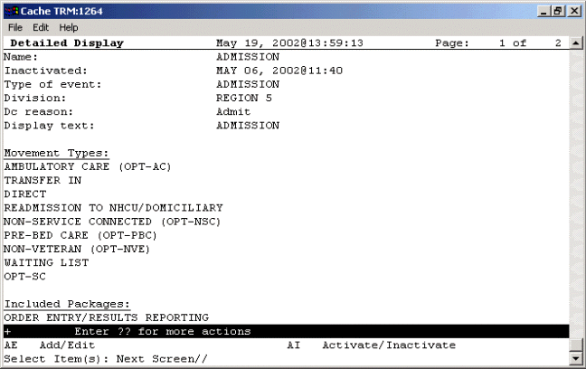  
**A sample admission rule**  
#### Sample Discharge Rule

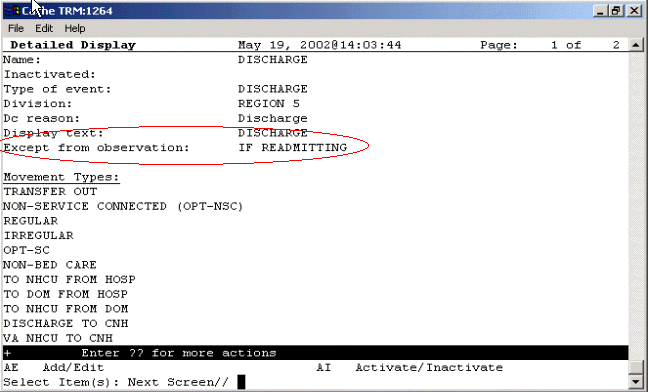  
**The Except from observation field is specific to discharge auto-DC rules**  
#### Sample Discharge/Death Rule

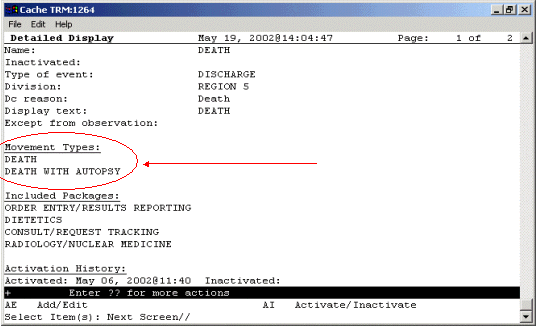  
**You can enter death and death with autopsy movement types for discharge/death rules**  
#### Sample Specialty Change Rule

  
**A Specialty change rule**  
#### Sample Transfer Rule: On PASS

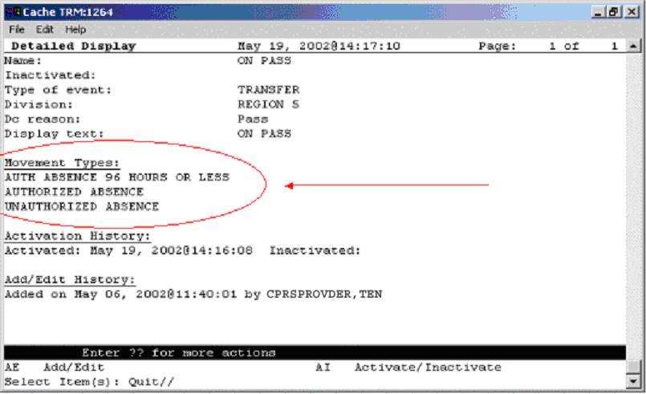  
**Note the movement types and the lack of included locations or divisions. Also notice the activation and add/edit histories**  
#### Sample Transfer Rule: ASIH

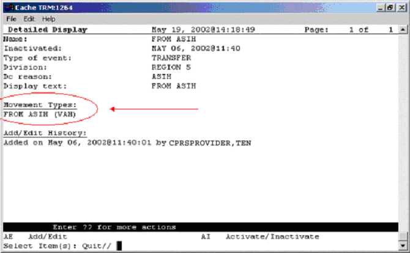  
**A sample ASIH transfer rule**  
#### Sample O.R. Rule

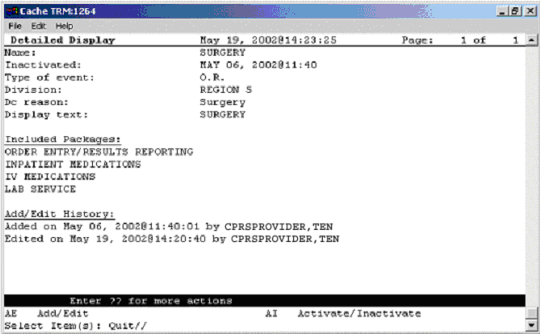  
**A sample OR rule**  
###

### Activating/Inactivating an Auto-DC Rule

To activate/inactivate an auto-DC rule, follow these steps:

1.  Open the CPRS Configuration (Clin Coord) menu [OR PARAM COORDINATOR MENU].  
AL Allocate OE/RR Security Keys [ORCL KEY ALLOCATION]  
KK Check for Multiple Keys [ORE KEY CHECK]  
DC Edit DC Reasons [ORCL ORDER REASON]  
GP GUI Parameters ... [ORW PARAM GUI]  
GA GUI Access - Tabs, RPL [ORCL CPRS ACCESS]  
MI Miscellaneous Parameters [OR PARAM ORDER MISC]  
NO Notification Mgmt Menu ... [ORB NOT COORD MENU]  
OC Order Checking Mgmt Menu ... [ORK ORDER CHK MGMT MENU]  
MM Order Menu Management ... [ORCM MGMT]  
LI Patient List Mgmt Menu ... [ORLP PATIENT LIST MGMT]  
FP Print Formats [ORCL PRINT FORMAT]  
PR Print/Report Parameters ... [OR PARAM PRINTS]  
RE Release/Cancel Delayed Orders [ORC DELAYED ORDERS]  
US Unsigned orders search [OR UNSIGNED ORDERS]  
EX Set Unsigned Orders View on Exit [OR PARAM UNSIGNED ORDERS VIEW]  
NA Search orders by Nature or Status [OR NATURE/STATUS ORDER SEARCH]  
DO Event Delayed Orders Menu ... [OR DELAYED ORDERS]  
PM Performance Monitor Report [OR PERFORMANCE MONITOR]  
1.  Select the Event Delayed Orders Menu by typing **DO**.  
The following menu will appear:  
DO Delayed Orders/Auto-DC Set-up [OR DELAYED ORDERS EDITOR]  
EP Parameters for event delayed orders [OR EVENT PARAMETERS]  
IN Inquire to OE/RR Patient Event File [OR PATINET EVENT INQUIRY]  
***

1.  Select Delayed Orders/Auto-DC Set-up by typing **DO**.  
1.  Type **1** to select Auto-DC Rules  
The available auto-DC rules will appear in a numbered list.  
1.  Select Activate/Inactivate by typing **AI**.  
1.  Type the number of the rule you would like to activate/inactivate at the *Select item(s) prompt*.  
1.  The computer will display a message asking you if you are sure you want to activate/inactivate this auto-DC rule. Type the appropriate response.  
**☞** **NOTE: You can also activate/inactivate an auto-DC rule from the detailed display screen.**  
### Editing an Auto-DC Rule

To edit an auto-DC rule, follow these steps:

1.  Open the CPRS Configuration (Clin Coord) menu [OR PARAM COORDINATOR MENU].  
AL Allocate OE/RR Security Keys [ORCL KEY ALLOCATION]  
KK Check for Multiple Keys [ORE KEY CHECK]  
DC Edit DC Reasons [ORCL ORDER REASON]  
GP GUI Parameters ... [ORW PARAM GUI]  
GA GUI Access - Tabs, RPL [ORCL CPRS ACCESS]  
MI Miscellaneous Parameters [OR PARAM ORDER MISC]  
NO Notification Mgmt Menu ... [ORB NOT COORD MENU]  
OC Order Checking Mgmt Menu ... [ORK ORDER CHK MGMT MENU]  
MM Order Menu Management ... [ORCM MGMT]  
LI Patient List Mgmt Menu ... [ORLP PATIENT LIST MGMT]  
FP Print Formats [ORCL PRINT FORMAT]  
PR Print/Report Parameters ... [OR PARAM PRINTS]  
RE Release/Cancel Delayed Orders [ORC DELAYED ORDERS]  
US Unsigned orders search [OR UNSIGNED ORDERS]  
EX Set Unsigned Orders View on Exit [OR PARAM UNSIGNED ORDERS VIEW]  
NA Search orders by Nature or Status [OR NATURE/STATUS ORDER SEARCH]  
DO Event Delayed Orders Menu ... [OR DELAYED ORDERS]  
PM Performance Monitor Report [OR PERFORMANCE MONITOR]  
1.  Select the Event Delayed Orders Menu by typing DO.  
The following menu will appear:  
DO Delayed Orders/Auto-DC Set-up [OR DELAYED ORDERS EDITOR]  
EP Parameters for event delayed orders [OR EVENT PARAMETERS]  
IN Inquire to OE/RR Patient Event File [OR PATINET EVENT INQUIRY]  
1.  Select Delayed Orders/Auto-DC Set-up by typing DO.  
1.  Type 1 to select Auto-DC Rules  
The available auto-DC rules will appear in a numbered list.  
1.  Select Add/Edit by typing AE.  
1.  Type the number of the rule that you wish to edit at the Select item(s) prompt.  
1.  The content of each of the rule’s fields will be displayed. You can either change the contents of the field, or press Return to advance to the next field. Press \^ to exit.  
**☞** **NOTE: You can also add or release an existing auto-DC rule from the detailed display screen.**  
### Viewing Details of an Auto-DC Rule

To view details of an auto-DC rule, follow these steps:

-   From the CPRS Configuration (Clin Coord) menu, select the Event Delayed Orders Menu by typing **DO**  
The following menu will appear:  
DO Delayed Orders/Auto-DC Set-up  
EP Parameters for event delayed orders  
IN Inquire to OE/RR Patient Event File  
2\. Select Delayed Orders/Auto-DC Set-up by typing **DO**.  
3\. Select Auto-DC Rules by typing **1**.  
A numbered list of the current auto-DC rules will appear.  
4\. Choose Detailed Display by typing **DD**.  
5\. Enter the number of the rule you wish to view at the *Select item(s)* prompt.  
A detailed display of the event or rule will appear.  
  
**The detailed display screen**  
#### Audit and Activation History

The audit and activation histories on the detailed display can be toggled on or off depending on your preferences.

To toggle the audit and activation histories on or off, follow these steps:

1.  Open the CPRS Configuration (Clin Coord) menu [OR PARAM COORDINATOR MENU].  
AL Allocate OE/RR Security Keys [ORCL KEY ALLOCATION]  
KK Check for Multiple Keys [ORE KEY CHECK]  
DC Edit DC Reasons [ORCL ORDER REASON]  
GP GUI Parameters ... [ORW PARAM GUI]  
GA GUI Access - Tabs, RPL [ORCL CPRS ACCESS]  
MI Miscellaneous Parameters [OR PARAM ORDER MISC]  
NO Notification Mgmt Menu ... [ORB NOT COORD MENU]  
OC Order Checking Mgmt Menu ... [ORK ORDER CHK MGMT MENU]  
MM Order Menu Management ... [ORCM MGMT]  
LI Patient List Mgmt Menu ... [ORLP PATIENT LIST MGMT]  
FP Print Formats [ORCL PRINT FORMAT]  
PR Print/Report Parameters ... [OR PARAM PRINTS]  
RE Release/Cancel Delayed Orders [ORC DELAYED ORDERS]  
US Unsigned orders search [OR UNSIGNED ORDERS]  
EX Set Unsigned Orders View on Exit [OR PARAM UNSIGNED ORDERS VIEW]  
NA Search orders by Nature or Status [OR NATURE/STATUS ORDER SEARCH]  
DO Event Delayed Orders Menu ... [OR DELAYED ORDERS]  
PM Performance Monitor Report [OR PERFORMANCE MONITOR]  
1.  Select the Event Delayed Orders Menu by typing **DO**.  
The following menu will appear:  
DO Delayed Orders/Auto-DC Set-up [OR DELAYED ORDERS EDITOR]  
EP Parameters for event delayed orders [OR EVENT PARAMETERS]  
IN Inquire to OE/RR Patient Event File [OR PATINET EVENT INQUIRY]  
1.  Select Delayed Orders/Auto-DC Set-up by typing **DO**.  
The following menu will appear:  
Select one of the following:  
1\. Auto-DC Rules  
2\. Release Events  
Enter response:  
1.  Type **1** to select Auto-DC Rules or **2** to select Release Events.  
1.  Type **DD** to select Detailed Display.  
1.  At the *Select item(s)* prompt, type the number of the release event or auto-DC rule that you would like to display.  
A detailed display of the release event or auto-DC rule will appear.  
1.  Type **H** to select Add/Remove Histories  
1.  At the Do you want to include them on the detailed display? prompt, type Y to include the audit and activation histories on the detailed display. Type N if you do not wish to display the audit and activation histories.  
**The audit and activation history can be toggled on or off on the detailed display screen**  
###

### Changing the Display

The change display function allows you to adjust the size of the Delayed Orders / Auto-DC Set-up editor and configure the display to show active entries, inactive entries, or all entries.

To change the size or content of the display, follow these steps:

1.  Open the CPRS Configuration (Clin Coord) menu [OR PARAM COORDINATOR MENU].  
AL Allocate OE/RR Security Keys [ORCL KEY ALLOCATION]  
KK Check for Multiple Keys [ORE KEY CHECK]  
DC Edit DC Reasons [ORCL ORDER REASON]  
GP GUI Parameters ... [ORW PARAM GUI]  
GA GUI Access - Tabs, RPL [ORCL CPRS ACCESS]  
MI Miscellaneous Parameters [OR PARAM ORDER MISC]  
NO Notification Mgmt Menu ... [ORB NOT COORD MENU]  
OC Order Checking Mgmt Menu ... [ORK ORDER CHK MGMT MENU]  
MM Order Menu Management ... [ORCM MGMT]  
LI Patient List Mgmt Menu ... [ORLP PATIENT LIST MGMT]  
FP Print Formats [ORCL PRINT FORMAT]  
PR Print/Report Parameters ... [OR PARAM PRINTS]  
RE Release/Cancel Delayed Orders [ORC DELAYED ORDERS]  
US Unsigned orders search [OR UNSIGNED ORDERS]  
EX Set Unsigned Orders View on Exit [OR PARAM UNSIGNED ORDERS VIEW]  
NA Search orders by Nature or Status [OR NATURE/STATUS ORDER SEARCH]  
DO Event Delayed Orders Menu ... [OR DELAYED ORDERS]  
PM Performance Monitor Report [OR PERFORMANCE MONITOR]  
1.  Select the Event Delayed Orders Menu by typing **DO**.  
The following menu will appear:  
DO Delayed Orders/Auto-DC Set-up [OR DELAYED ORDERS EDITOR]  
EP Parameters for event delayed orders [OR EVENT PARAMETERS]  
IN Inquire to OE/RR Patient Event File [OR PATINET EVENT INQUIRY]  
1.  Select Delayed Orders/Auto-DC Set-up by typing **DO**.  
The following menu will appear:  
DO Delayed Orders/Auto-DC Set-up [OR DELAYED ORDERS EDITOR]  
EP Parameters for event delayed orders [OR EVENT PARAMETERS]  
IN Inquire to OE/RR Patient Event File [OR PATINET EVENT INQUIRY]  
1.  Select Delayed Orders/Auto-DC Set-up by typing **DO**.  
1.  Select either Auto-DC Rules or Release Events by typing either **1** or **2**.  
1.  Select Change display by typing **CD**.  
1.  Type **Y** or **N** at the Do you want to truncate/expand this display? prompt.  
1.  Type **Y** or **N** at the Terminal emulator in 80-column mode? prompt.  
1.  At the *Select which entries should appear on the list* prompt, type one of the following numbers:  
**1** - for active entries only  
**2** - for inactive entries only  
**3** - for all entries  
The orders that you specified will be displayed.

### Files Associated with Auto-DC Rules

#### OE/RR AUTO-DC RULES (\#100.6)

This file contains the locally-defined rules that control if and when active orders are automatically discontinued within each division. It is strongly recommended that CACs use the event-delayed orders menu [OR DELAYED ORDERS] to edit this file rather than using File Manager.

**Fields in OE/RR AUTO-DC RULES (\#100.6)**

| Field Number | Field Name                     | Description                                                                                                                                                                                                                                                                                                                                                                                                                                                                                                                                                                                                                                                                                                                                                                                                                                                                                                                                                                                                                                                                                                                                                                                                                                                                                                                                                                                                                             |
|--------------|--------------------------------|-----------------------------------------------------------------------------------------------------------------------------------------------------------------------------------------------------------------------------------------------------------------------------------------------------------------------------------------------------------------------------------------------------------------------------------------------------------------------------------------------------------------------------------------------------------------------------------------------------------------------------------------------------------------------------------------------------------------------------------------------------------------------------------------------------------------------------------------------------------------------------------------------------------------------------------------------------------------------------------------------------------------------------------------------------------------------------------------------------------------------------------------------------------------------------------------------------------------------------------------------------------------------------------------------------------------------------------------------------------------------------------------------------------------------------------------|
| .01          | NAME                           | This is the name of the auto-DC rule. It is visible in the Rule Editor only.                                                                                                                                                                                                                                                                                                                                                                                                                                                                                                                                                                                                                                                                                                                                                                                                                                                                                                                                                                                                                                                                                                                                                                                                                                                                                                                                                            |
| .1           | INACTIVATED                    | This rule will no longer apply after the date listed in this field.                                                                                                                                                                                                                                                                                                                                                                                                                                                                                                                                                                                                                                                                                                                                                                                                                                                                                                                                                                                                                                                                                                                                                                                                                                                                                                                                                                     |
| 1.5          | ACTIVATION HISTORY             |                                                                                                                                                                                                                                                                                                                                                                                                                                                                                                                                                                                                                                                                                                                                                                                                                                                                                                                                                                                                                                                                                                                                                                                                                                                                                                                                                                                                                                         |
| 100.61,.01   | ACTIVATION DATE/TIME           | The date/time that this event was activated.                                                                                                                                                                                                                                                                                                                                                                                                                                                                                                                                                                                                                                                                                                                                                                                                                                                                                                                                                                                                                                                                                                                                                                                                                                                                                                                                                                                            |
| 100.61,1     | INACTIVATION DATE/TIME         | This date/time that this event was inactivated.                                                                                                                                                                                                                                                                                                                                                                                                                                                                                                                                                                                                                                                                                                                                                                                                                                                                                                                                                                                                                                                                                                                                                                                                                                                                                                                                                                                         |
| .2           | TYPE OF EVENT                  | This is the event that should cause orders to be automatically discontinued. For OR events, the orders will be discontinued when the TIME PAT IN OR field is entered in the Surgery package.                                                                                                                                                                                                                                                                                                                                                                                                                                                                                                                                                                                                                                                                                                                                                                                                                                                                                                                                                                                                                                                                                                                                                                                                                                            |
| .3           | DIVISION                       | This is the division that this auto-dc rule should be applied to. For a transfer across divisions, this field should contain the division that the patient is going to.                                                                                                                                                                                                                                                                                                                                                                                                                                                                                                                                                                                                                                                                                                                                                                                                                                                                                                                                                                                                                                                                                                                                                                                                                                                                 |
| .4           | DC REASON                      | This field contains the reason the order was automatically discontinued.                                                                                                                                                                                                                                                                                                                                                                                                                                                                                                                                                                                                                                                                                                                                                                                                                                                                                                                                                                                                                                                                                                                                                                                                                                                                                                                                                                |
| .5           | DISPLAY TEXT                   | This field contains the name of the rule as it will appear to CPRS users.                                                                                                                                                                                                                                                                                                                                                                                                                                                                                                                                                                                                                                                                                                                                                                                                                                                                                                                                                                                                                                                                                                                                                                                                                                                                                                                                                               |
| .6           | EXCEPT FROM OBSERVATION        | The field indicates whether a patient leaving an observation treating specialty should be an exception to this rule. This field is only used in discharge rules.  **Note:** Medication orders in a “Pending” status cannot be exceptions to Auto-Discontinue rules for a Discharge from an Observation Treating Specialty. If this field is set to “YES” or set to “If Readmitting” and the user inputs “YES,” a pending medication order will still be Auto-Discontinued upon Discharge from an Observation Treating Specialty. Only medication orders in an “Active” status will be reinstated if the Except from Observation field is set to “YES” or if the user enters “YES” to the question, “Will the patient be re-admitted immediately?” This field can be set in the following ways: **Yes** – if you set the field to yes, a discharge from an observation treating specialty will always be an exception to this rule (should not cause an order to be discontinued).**[]** **No** – if you set this field to no, this rule will be applied regardless of whether the patient is discharged from an observation treating specialty. **If Readmitting** – If you set this field to If Readmitting, the user will be prompted to enter whether the patient will be immediately readmitted. If the user answers yes, the order will not be automatically discontinued. If the user answers no, the rule will be applied.**[]** |
| .30          | MAS MOVEMENT TYPES             | When the MAS movement types defined in this field occur, this rule will be processed (if it is active).                                                                                                                                                                                                                                                                                                                                                                                                                                                                                                                                                                                                                                                                                                                                                                                                                                                                                                                                                                                                                                                                                                                                                                                                                                                                                                                                 |
| 100.63, .01  | MAS MOVEMENT TYPE              | The MAS Movement Type field further defines the trigger event for this rule. This allows for different rules for various types of MAS events.  For example, to define a rule for canceling orders when a patient dies, enter the movement types DEATH and DEATH WITH AUTOPSY.  A MAS movement type may only be used in one active rule.                                                                                                                                                                                                                                                                                                                                                                                                                                                                                                                                                                                                                                                                                                                                                                                                                                                                                                                                                                                                                                                                                                 |
| 40           | EXCLUDED TREATING SPECIALTIES  | These are treating specialties that will cause this rule to not be processed if the EXCEPT FROM and TO specialties match the patient's transfer.                                                                                                                                                                                                                                                                                                                                                                                                                                                                                                                                                                                                                                                                                                                                                                                                                                                                                                                                                                                                                                                                                                                                                                                                                                                                                        |
| 100.64, .01  | EXCEPT FROM SPECIALTY          | This is a treating specialty that will prevent this rule from being applied. Specialty transfer rules will discontinue active orders unless the patient is being transferred from this specialty to one listed in the TO SPECIALTY multiple.                                                                                                                                                                                                                                                                                                                                                                                                                                                                                                                                                                                                                                                                                                                                                                                                                                                                                                                                                                                                                                                                                                                                                                                            |
| 100.64,1     | TO SPECIALTY                   | These are treating specialties that will cause this rule to not be processed, if the EXCEPT FROM and TO specialties match the patient's transfer.                                                                                                                                                                                                                                                                                                                                                                                                                                                                                                                                                                                                                                                                                                                                                                                                                                                                                                                                                                                                                                                                                                                                                                                                                                                                                       |
| 100.641, .01 | TO SPECIALTY                   | This is a treating specialty that will prevent this rule from being applied; specialty transfer rules will discontinue active orders unless the patient is being transferred to this specialty from the EXCEPT FROM SPECIALTY.                                                                                                                                                                                                                                                                                                                                                                                                                                                                                                                                                                                                                                                                                                                                                                                                                                                                                                                                                                                                                                                                                                                                                                                                          |
| 50           | INCLUDED LOCATIONS             |                                                                                                                                                                                                                                                                                                                                                                                                                                                                                                                                                                                                                                                                                                                                                                                                                                                                                                                                                                                                                                                                                                                                                                                                                                                                                                                                                                                                                                         |
| 100.62,.01   | INCLUDED LOCATIONS ID          | Enter an ID (free text) that will represent an entry in the FROM - TO location matrix. The value of the ID field is insignificant as it simply represents a placeholder. You can use any naming or numbering convention that you want. Orders will not auto-dc for location (ward) type transfers unless the transfer from and transfer to locations are identified within the INCLUDED LOCATIONS from - to entries. If the transfer from and to locations are found in this multiple then orders will auto-dc.                                                                                                                                                                                                                                                                                                                                                                                                                                                                                                                                                                                                                                                                                                                                                                                                                                                                                                                         |
| 100.62,2     | FROM LOCATION                  | If you did not select YES for the FROM ALL LOCATIONS field then you must select an individual field for the patient to be coming from.                                                                                                                                                                                                                                                                                                                                                                                                                                                                                                                                                                                                                                                                                                                                                                                                                                                                                                                                                                                                                                                                                                                                                                                                                                                                                                  |
| 100.62,3     | TO ALL LOCATIONS               | If this field is set to yes, it identifies all locations as possible “to” locations for the from-to pair.                                                                                                                                                                                                                                                                                                                                                                                                                                                                                                                                                                                                                                                                                                                                                                                                                                                                                                                                                                                                                                                                                                                                                                                                                                                                                                                               |
| 100.62,4     | TO LOCATION                    | If you did not select YES for the *TO ALL LOCATIONS* field then you must select an individual field for the patient to be going to.                                                                                                                                                                                                                                                                                                                                                                                                                                                                                                                                                                                                                                                                                                                                                                                                                                                                                                                                                                                                                                                                                                                                                                                                                                                                                                     |
| 60           | INCLUDED DIVISIONS             | If the division the patient was transferred from matches a value in this field, and the division has changed, the rule will be processed.                                                                                                                                                                                                                                                                                                                                                                                                                                                                                                                                                                                                                                                                                                                                                                                                                                                                                                                                                                                                                                                                                                                                                                                                                                                                                               |
| 100.66, 01   | FROM DIVISION                  | This is a division that will cause this rule to be applied. If a specialty change did not occur with the transfer, and the division has changed, then the patient must be moving from the division specified in this field in order for active orders to be discontinued.                                                                                                                                                                                                                                                                                                                                                                                                                                                                                                                                                                                                                                                                                                                                                                                                                                                                                                                                                                                                                                                                                                                                                               |
| 70           | INCLUDED PACKAGES              | Orders associated with the packages specified in this field will be automatically discontinued when this rule is processed.                                                                                                                                                                                                                                                                                                                                                                                                                                                                                                                                                                                                                                                                                                                                                                                                                                                                                                                                                                                                                                                                                                                                                                                                                                                                                                             |
| 100.67,.01   | TYPE OF ORDERS TO DC           | This is a package whose active orders are to be automatically discontinued when the conditions of this rule are satisfied.                                                                                                                                                                                                                                                                                                                                                                                                                                                                                                                                                                                                                                                                                                                                                                                                                                                                                                                                                                                                                                                                                                                                                                                                                                                                                                              |
| 80           | EXCLUDED ORDERABLE ITEMS       | These are the orderable items that will not be automatically discontinued when this rule is processed.                                                                                                                                                                                                                                                                                                                                                                                                                                                                                                                                                                                                                                                                                                                                                                                                                                                                                                                                                                                                                                                                                                                                                                                                                                                                                                                                  |
| 100.68,.01   | EXCEPT FOR ORDERABLE ITEM      | The orderable items specified in this field are the orderable items that will not be automatically discontinued when this rule is processed                                                                                                                                                                                                                                                                                                                                                                                                                                                                                                                                                                                                                                                                                                                                                                                                                                                                                                                                                                                                                                                                                                                                                                                                                                                                                             |
| 81           | EDIT HISTORY                   |                                                                                                                                                                                                                                                                                                                                                                                                                                                                                                                                                                                                                                                                                                                                                                                                                                                                                                                                                                                                                                                                                                                                                                                                                                                                                                                                                                                                                                         |
| 100.681,.01  | EDIT HISTORY                   | This field tracks the entering and editing of rules.                                                                                                                                                                                                                                                                                                                                                                                                                                                                                                                                                                                                                                                                                                                                                                                                                                                                                                                                                                                                                                                                                                                                                                                                                                                                                                                                                                                    |
| 100.681,1    | WHO ENTERED/EDITED             | Name of person who added or edited this rule                                                                                                                                                                                                                                                                                                                                                                                                                                                                                                                                                                                                                                                                                                                                                                                                                                                                                                                                                                                                                                                                                                                                                                                                                                                                                                                                                                                            |
| 100.681,2    | ACTION                         | This field contains what action was taken on the rule                                                                                                                                                                                                                                                                                                                                                                                                                                                                                                                                                                                                                                                                                                                                                                                                                                                                                                                                                                                                                                                                                                                                                                                                                                                                                                                                                                                   |
| 100          | EXCLUDED DISPLAY GROUP         | Any order related to the display group entered in the EXCLUDED DISPLAY GROUP multiple will be exempt from any auto-discontinuing normally triggered by this rule. You can use the excluded display group to protect a group of orders from being auto-discontinued. If an order belonging to this display group is found while processing this rule, it will be skipped and will not be auto-discontinued.                                                                                                                                                                                                                                                                                                                                                                                                                                                                                                                                                                                                                                                                                                                                                                                                                                                                                                                                                                                                                              |
| 100.65,.01   | EXCEPT ORDERS IN DISPLAY GROUP | Orders related to this display group will not be auto-discontinued                                                                                                                                                                                                                                                                                                                                                                                                                                                                                                                                                                                                                                                                                                                                                                                                                                                                                                                                                                                                                                                                                                                                                                                                                                                                                                                                                                      |

####

#### OE/RR PATIENT EVENTS (\#100.2)

This file is used by CPRS to track what happened to a patient's orders as a result of an event, such as an MAS movement or returning from the OR.

**Fields in OE/RR PATIENT EVENTS FILE (\#100.2)**

| Field Number | Field Name                     | Description                                                                                                                                                                                                                                                                                                                                                                                                                        |
|--------------|--------------------------------|------------------------------------------------------------------------------------------------------------------------------------------------------------------------------------------------------------------------------------------------------------------------------------------------------------------------------------------------------------------------------------------------------------------------------------|
| .01          | Patient                        | This is a pointer to the patient file                                                                                                                                                                                                                                                                                                                                                                                              |
| .1           | Activity                       | This multiple contains a log of actions taken on this event that are relevant to the release or discontinuance of orders.                                                                                                                                                                                                                                                                                                          |
| 100.25.01    | Date/Time of Activity          | This is the actual date and time that activity occurred.                                                                                                                                                                                                                                                                                                                                                                           |
| 100.25.2     | Type of Event Activity         | This field is a code indicating the type of activity that occurred. This may be new, edited, re-entered, manually released, deleted, or cancelled An event may also be "lapsed" if it stays unprocessed beyond the time frame defined by the "Lapse in \#Days" field of the OE/RR RELEASE EVENTS file \#100.5 for this event.                                                                                                      |
| 100.25.3     | User                           | This field is the user who entered or modified the activity.                                                                                                                                                                                                                                                                                                                                                                       |
| 100.25.4     | Event Type                     | This field is the type of event that was processed. This could be an admission, discharge, transfer, out of O.R., or specialty change event.                                                                                                                                                                                                                                                                                       |
| 100.25.5     | MAS Movement Type              | This field is the MAS Movement Type of the activity that was processed, if it was a MAS patient movement.                                                                                                                                                                                                                                                                                                                          |
| 100.25.6     | Treating Specialty             | This field is the treating specialty associated with this activity, if it is a MAS patient movement.                                                                                                                                                                                                                                                                                                                               |
| 100.25.7     | Ward Location                  | This field is the ward location associated with this activity, if it is a MAS patient movement.                                                                                                                                                                                                                                                                                                                                    |
| .2           | Event                          | This field is a pointer to the OE/RR RELEASE EVENTS file, which defines the conditions under which delayed orders are to be released for this patient event, if delayed orders are related to this event.                                                                                                                                                                                                                          |
| .3           | Admission                      | This field is a pointer to the Admission movement for which this event is valid. If the patient is an inpatient when delayed orders are written, this field will be the current admission. Otherwise, the admission movement will be recorded when the patient is admitted and the orders are released. If the patient is discharged without this event occurring, it will be retired and any orders still delayed will be lapsed. |
| .4           | Order                          | This field is a pointer to the doctor's order requesting that this event occur for this patient when delayed orders are written.                                                                                                                                                                                                                                                                                                   |
| .5           | Created On                     | This field is the timestamp of when this event was entered into the file for this patient.                                                                                                                                                                                                                                                                                                                                         |
| .6           | Created By                     | This field is a pointer to the user who entered this event into the file for this patient.                                                                                                                                                                                                                                                                                                                                         |
| .11          | Event Date/Time                | This field is the date and time that this event occurred for this patient; if the event is a MAS movement, this time will be the DATE/TIME from the MAS movement file.                                                                                                                                                                                                                                                             |
| .12          | Patient Movement               | This field is a pointer to the MAS Patient Movement that satisfied this event for this patient; any changes to this movement that alter the conditions of the event will be tracked in the activity log.                                                                                                                                                                                                                           |
| .13          | Auto-DC Rule                   | This field is the Auto-DC Rule from file \#100.6 that was used to automatically discontinue active orders when this event occurred. Those orders that were dc'd are listed in the Discontinued Orders multiple of this file.                                                                                                                                                                                                       |
| .14          | Surgery                        | This field is a pointer to the Surgery case that satisfied this event for this patient when the TIME PAT IN OR field was entered; any changes to this field will be tracked in the Activity log.                                                                                                                                                                                                                                   |
| .20          | Released Orders                | This multiple field contains the orders that were released based on the release event defined in the OE/RR RELEASE EVENTS file \#100.5 when this event occurred.                                                                                                                                                                                                                                                                   |
| 100.26.01    | Released Orders                | This field is a pointer to the Orders file \#100 of an order that was released as a result of the event occurring.                                                                                                                                                                                                                                                                                                                 |
| .30          | Discontinued Orders            | This multiple contains the orders that were automatically discontinued based on the rules defined in the OE/RR AUTO-DC RULES file \#100.6 when this event occurred.                                                                                                                                                                                                                                                                |
| 100.27.01    | Discontinued Orders            | This field is the number of the order in the Orders file \#100.                                                                                                                                                                                                                                                                                                                                                                    |
| 100.62, 3    | To all Locations               | This is a hospital location that will cause this rule to be applied; if no specialty change occurs with the transfer, then the patient must be moving to this location from the FROM LOCATION for active orders to be discontinued.                                                                                                                                                                                                |
| 100.62, 4    | To Location                    | If you did not set the TO ALL LOCATIONS field to YES then you must specify the location the patient is moving TO that will match with the selection made for the FROM location (either all or individual).  This is a hospital location that will cause this rule to be applied; if no specialty change occurs with the transfer, then the patient must be moving to this location from                                            |
| 60           | Included Divisions             | These are the divisions that will cause this rule to be processed, if the FROM division matches the patient's transfer.                                                                                                                                                                                                                                                                                                            |
| 100.66,.01   | From Division                  | This is a division that will cause this rule to be applied; if no specialty change occurs with the transfer, then the patient must be moving from this division for active orders to be discontinued.                                                                                                                                                                                                                              |
| 70           | Included Packages              | These are the packages whose orders are to be automatically discontinued when this rule is processed.                                                                                                                                                                                                                                                                                                                              |
| 100.67,.01   | Type of Orders to DC           | This is a package whose active orders are to be automatically discontinued when the conditions of this rule are satisfied.                                                                                                                                                                                                                                                                                                         |
| 80           | EXCLUDED ORDERABLE ITEMS       | These are the orderable items that are NOT to be automatically discontinued when this rule is processed, even if an order for it belongs to a package in the INCLUDED PACKAGES multiple.                                                                                                                                                                                                                                           |
| 100.68, .01  | EXCEPT FOR ORDERABLE ITEM      | This is an orderable item that will be exempt from any automatic discontinuing of orders normally triggered by this rule; if an active order for this item is encountered while processing this rule, it will be skipped and not discontinued.                                                                                                                                                                                     |
| 81           | Edit History                   |                                                                                                                                                                                                                                                                                                                                                                                                                                    |
| 100.681,.01  | Edit History                   | Tracks the entering and editing of rules.                                                                                                                                                                                                                                                                                                                                                                                          |
| 100.681,1    | WHO ENTERED/EDITED             | Name of person who added or edited this rule                                                                                                                                                                                                                                                                                                                                                                                       |
| 100.681,2    | Action                         | What action was taken on the rule?                                                                                                                                                                                                                                                                                                                                                                                                 |
| 100          | Excluded Display Group         |                                                                                                                                                                                                                                                                                                                                                                                                                                    |
| 100.65, .01  | Except Orders in Display Group | Any order related to the display group entered in the excluded display group multiple will be exempt from any auto-discontinuing normally triggered by this rule.                                                                                                                                                                                                                                                                  |

## Appendix I: Event Delayed Order FAQ

1.  **Can you disable the ability to write delayed orders?**

Yes. If a user does not have any active release events he or she will not be able to write delayed orders.

1.  **Other packages (such as the Pharmacy package) have parameters that are related to events. Which parameters take precedence CPRS parameters or package parameters?**

The package parameters are evaluated first and take precedence. If you want CPRS parameters to take precedence, turn off package parameters.

1.  **Can release events be created for non-MAS events?**

Release events can be created for outpatient and other non-MAS events. However, because these types of events do not have a MAS trigger, you will have to release them manually

1.  **Some sites have created service-display groups to sort generic text orders (for example, PCA and respiratory). Are auto-DC rules related to the service or the display group?**

To identify orders, CPRS looks at the package (OE/RR for all generic orders regardless of display group). If you define the OE/RR package as an included package for auto-DC, all generic orders will be discontinued regardless of the display group. However, if the *excluded display group* field is populated, the generic orders that are associated with the display group will not be auto-discontinued.

1.  **What happens if there is an excluded orderable item identified in the auto-DC file and the orderable item is changed in the host package?**

The excluded orderable items field should not be used to specify pharmacy items that may change frequently. If the orderable item is changed, the exception will not have any effect.

1.  **Should we remove our generic “transfer to” order dialog from the add orders menus?**

Yes, remove it from your add orders menus. However, you can use the “transfer to” order dialog as the order dialog for your transfer release events. You may also use the new OR GXMOVE EVENT dialog which prompts for the release event rather than the treating specialty.

1.  **Our Chief of Surgery does not feel that “Admit to Intensive Care Surgical” is an appropriate name for a release event. She would prefer that the release event be named “Admit to Vascular Surgery Intensive Care” What do you suggest?**

You can create an “Admit to Intensive Care Surgical” release event and an “Admit to Vascular Surgery Intensive Care” child release event (or vice versa). Both of these release events would be tied to the same trigger event. When the trigger event occurred, orders tied to either of these release events would be released

1.  **Treating specialty choices are controlled by MAS. Which parameters should I look at or change to add a treating specialty?**

Facility treating specialties are usually edited by the HIMS staff. Please consult with your site staff.

1.  **A patient is transferred from a ward to O.R. to PACU to a ward. The patient is still on ward location when orders are written (e.g., patient is not transferred in the computer). How do we write orders to start in PACU?**

Create a release event called OR to PACU (of type “Surgery”). Set up a print location for each OR room and define the printer in PACU. When the OR nurse enters time out of OR, the post-op orders will release and print to PACU.

If you have other orders that need to be released when the patient goes to ward, use the manual release function.

1.  **Do surgery events auto-DC in real-time? What happens if the system is down, the surgery information is entered later, and the patient has already returned to the ward?**

Yes, surgery events auto-DC in real-time. When the system is back online, coordinate recovery efforts between surgery staff members who are backloading data and clinicians who are processing orders. If necessary, inactivate the rule while time out of OR is backloaded and then reactivate.

1.  **Can you set lapse days differently for each ward or specialty?**

Yes.

1.  **Is there a field or other identifier on the Orders tab that indicates an active order was originally entered as a delayed order?**

No; however, this information is included in the detailed order display.

1.  **Can you make an auto-DC rule that does not automatically discontinue specific generic text orders (e.g., DNR orders) and remains active throughout the patient’s hospitalizations?**

Yes, define it as an excluded orderable item in the appropriate auto-DC rule. You could also create a special display group for this type of order and then add that display group to the "excluded display group" field so that orders belonging to this display group would not be auto-discontinued.

1.  **Can MAS discontinue orders when a patient goes to surgery without a treating specialty or ward location change?**

Yes. You can define an auto-DC rule for a surgery type that will discontinue orders based on the time-out of OR.

1.  **What is the status of a delayed order that has lapsed**?

    The status will be “Lapsed.”  
## Appendix J: CPRS Parameters vs. OE/RR Parameters: File Locations

| Old Location           | Old Name                       | New Location   | New Name                       | Edit Thru Option                                                    |
|------------------------|--------------------------------|----------------|--------------------------------|---------------------------------------------------------------------|
| 200/100.11             | Primary OE/RR Menu             | No longer used |                                |                                                                     |
| 200/100.12             | Primary Order Menu             | 8989.51        | OR ADD ORDERS MENU             | [OR PARAM ADD MENU] Adding Primary Order Menu                       |
|                        |                                | 8989.51        | OR ORDER REVIEW DT             | No user interaction                                                 |
|                        |                                | 8989.51        | OR PRINT NO ORDERS ON SUM      | [OR PARAM SUMMARY REPORTS] Summary Report Parameters                |
|                        |                                | 8989.51        | OR SIGNED ON CHART             | [OR PARAM ORDER MISC] Miscellaneous Parameters                      |
| 200/100.13             | Primary Order Display Format   | No longer used |                                |                                                                     |
| 200/100.14             | Ward List                      | 8989.51        | ORLP DEFAULT WARD              | [ORLPSU DEFAULT USER MENU] Patient Selection Preference Menu        |
| 200/100.15             | Patient List                   | No longer used |                                |                                                                     |
| 200/100.16             | Select Patient From            | 8989.51        | ORLP DEFAULT LIST SOURCE       | [ORLPSU DEFAULT USER MENU] Patient Selection Preference Menu        |
| 200/100.17             | Clinic List                    | 8989.51        | ORLP DEFAULT CLINIC MONDAY     | [ORLPSU DEFAULT USER MENU] Patient Selection Preference Menu        |
|                        |                                | 8989.51        | ORLP DEFAULT CLINIC TUESDAY    | [ORLPSU DEFAULT USER MENU] Patient Selection Preference Menu        |
|                        |                                | 8989.51        | ORLP DEFAULT CLINIC WEDNESDAY  | [ORLPSU DEFAULT USER MENU] Patient Selection Preference Menu        |
|                        |                                | 8989.51        | ORLP DEFAULT CLINIC THURSDAY   | [ORLPSU DEFAULT USER MENU] Patient Selection Preference Menu        |
|                        |                                | 8989.51        | ORLP DEFAULT CLINIC FRIDAY     | [ORLPSU DEFAULT USER MENU] Patient Selection Preference Menu        |
|                        |                                | 8989.51        | ORLP DEFAULT CLINIC SATURDAY   | [ORLPSU DEFAULT USER MENU] Patient Selection Preference Menu        |
|                        |                                | 8989.51        | ORLP DEFAULT CLINIC SUNDAY     | [ORLPSU DEFAULT USER MENU] Patient Selection Preference Menu        |
| 200/100.18             | Clinic Appointment Start Date  | 8989.51        | ORLP DEFAULT CLINIC START DATE | [ORLPSU DEFAULT USER MENU] Patient Selection Preference Menu        |
| 200/100.19             | Clinic Appointment Stop Date   | 8989.51        | ORLP DEFAULT CLINIC STOP DATE  | [ORLPSU DEFAULT USER MENU] Patient Selection Preference Menu        |
|                        |                                | 8989.51        | ORLP DEFAULT TEAM              | [ORLPSU DEFAULT USER MENU] Patient Selection Preference Menu        |
| 200/100.21             | Summary Default                | No longer used |                                |                                                                     |
| 200/100.22             | Patient List Order             | 8989.51        | ORLP DEFAULT LIST ORDER        | [ORLPSU DEFAULT USER MENU] Patient Selection Preference Menu        |
| 200/100.23             | Default Result Reporting Menu  | No longer used |                                |                                                                     |
| 200/100.24             | Primary Profile Menu           | No longer used |                                |                                                                     |
| 200/100.25             | Provider List                  | 8989.51        | ORLP DEFAULT PROVIDER          | [ORLPSU DEFAULT USER MENU] Patient Selection Preference Menu        |
| 200/100.26             | Specialty List                 | 8989.51        | ORLP DEFAULT SPECIALTY         | [ORLPSU DEFAULT USER MENU] Patient Selection Preference Menu        |
| 200/100.27             | New Orders Default             | No longer used |                                |                                                                     |
| 79/.121                | Ask Imaging Location           | 8989.51        | RA SUBMIT PROMPT               | [RA SYSDIV] Division Parameter Set-up/Division-wide Order Entry par |
| 79/.17                 | Detailed Procedure Required    | 8989.51        | RA REQUIRE DETAILED            | [RA SYSDIV] Division Parameter Set-up/Exam Entry/Edit Parameters    |
| 69.9/9 Hospital Site/1 | Max Days for continuous orders | 8989.51        | LR MAX DAY CONTINUOUS          | [LRXOSX1] Edit HOSPITAL SITE PARAMETERS                             |
| 69.9/9 Hospital Site/2 | Cancel on Ward transfer        | No longer used |                                |                                                                     |
| 69.9/9 Hospital Site/3 | Cancel on Service transfer     | 69.9/150.5     | CANCEL ON SPECIALTY TRANSFER   | [LRXOSX1] Edit HOSPITAL SITE PARAMETERS                             |
|                        |                                | 69.9/150.1     | DEFAULT NATURE OF ORDER        | [LRXOSX1] Edit HOSPITAL SITE PARAMETERS                             |
|                        |                                | 69.9/150.2     | DEFAULT DC REASON              | [LRXOSX1] Edit HOSPITAL SITE PARAMETERS                             |
|                        |                                | 69.9/150.3     | CANCEL ON ADMIT                | [LRXOSX1] Edit HOSPITAL SITE PARAMETERS                             |
|                        |                                | 69.9/150.4     | CANCEL ON DISCHARGE            | [LRXOSX1] Edit HOSPITAL SITE PARAMETERS                             |
| 69.9/9 Hospital Site/4 | Ask Urgency                    | 8989.51        | LR ASK URGENCY                 | [LRXOSX1] Edit HOSPITAL SITE PARAMETERS                             |
| 69.9/9 Hospital Site/5 | Default for Quick Orders       | 8989.51        | LR DEFAULT TYPE QUICK          | [LRXOSX1] Edit HOSPITAL SITE PARAMETERS                             |
| 69.9/400               | Phlebotomy Order Cut-off Time  | 8989.51        | LR PHLEBOTOMY COLLECTION       | FileMan Edit of file 69.9 then use Lab/OERR Update option           |
| 69.9/500               | Collect Thursday orders in     | 8989.51        | LR COLLECT THURSDAY            | FileMan Edit of file 69.9 then use Lab/OERR Update option           |
| 69.9/501               | Collect Fridays orders in      | 8989.51        | LR COLLECT FRIDAY              | FileMan Edit of file 69.9 then use Lab/OERR Update option           |
| 69.9/506               | Collect Wednesdays orders in   | 8989.51        | LR COLLECT WEDNESDAY           | FileMan Edit of file 69.9 then use Lab/OERR Update option           |
| 69.9/505               | Collect Tuesdays orders in     | 8989.51        | LR COLLECT TUESDAY             | FileMan Edit of file 69.9 then use Lab/OERR Update option           |
| 69.9/504               | Collect Mondays orders in      | 8989.51        | LR COLLECT MONDAY              | FileMan Edit of file 69.9 then use Lab/OERR Update option           |
| 69.9/503               | Collect Sundays orders in      | 8989.51        | LR COLLECT SUNDY               | FileMan Edit of file 69.9 then use Lab/OERR Update option           |
| 69.9/502               | Collect Saturdays orders in    | 8989.51        | LR COLLECT SATURDAY            | FileMan Edit of file 69.9 then use Lab/OERR Update option           |
| 69.9/509               | Excepted Locations             | 8989.51        | LR EXCEPTED LOCATIONS          | FileMan Edit of file 69.9 then use Lab/OERR Update option           |
| 69.9/507               | Ignore Holidays                | 8989.51        | LR IGNORE HOLIDAYS             | FileMan Edit of file 69.9 then use Lab/OERR Update option           |
|                        |                                | 8989.51        | OR ZIP CODE MESSAGE            | Enter/Edit Missing ZIP Code Message Parameter [OR ZIP CODE MESSAGE] |
|                        |                                | 8989.51        | OR ZIP CODE SWITCH             | FileMan Edit                                                        |
|                        |                                | 8989.51        | ORB ARCHIVE PERIOD             | [ORB NOT COORD MENU] Notification Mgmt Menu                         |
|                        |                                | 8989.51        | ORB DELETE MECHANISM           | [ORB NOT COORD MENU] Notification Mgmt Menu                         |
|                        |                                | 8989.51        | ORB FORWARD SUPERVISOR         | [ORB NOT COORD MENU] Notification Mgmt Menu                         |
|                        |                                | 8989.51        | ORB FORWARD SURROGATES         | [ORB NOT COORD MENU] Notification Mgmt Menu                         |
|                        |                                | 8989.51        | ORB ORDERABLE ITEM ORDERED     | [ORB NOT COORD MENU] Notification Mgmt Menu                         |
|                        |                                | 8989.51        | ORB ORDERABLE ITEM RESULTS     | [ORB NOT COORD MENU] Notification Mgmt Menu                         |
|                        |                                | 8989.51        | ORB PROCESSING FLAG            | [ORB NOT COORD MENU] Notification Mgmt Menu                         |
|                        |                                | 8989.51        | ORB PROVIDER RECIPIENTS        | [ORB NOT COORD MENU] Notification Mgmt Menu                         |
|                        |                                | 8989.51        | ORB URGENCY                    | [ORB NOT COORD MENU] Notification Mgmt Menu                         |
|                        |                                | 8989.51        | ORB SORT METHOD                | [ORB NOT COORD MENU] Notification Mgmt Menu                         |
|                        |                                | 8989.51        | ORB FLAGGED ORDERS BULLETIN    | [ORB NOT COORD MENU] Notification Mgmt Menu                         |
|                        |                                | 8989.51        | ORB DEFAULT RECIPIENTS         | [ORB NOT COORD MENU] Notification Mgmt Menu                         |
|                        |                                | 8989.51        | ORB DEFAULT RECIPIENT DEVICES  | [ORB NOT COORD MENU] Notification Mgmt Menu                         |
|                        |                                | 8989.51        | ORB STSTEM ENABLE/DISABLE      | [ORB NOT COORD MENU] Notification Mgmt Menu                         |
|                        |                                | 8989.51        | ORB LAST QUEUE DATE            | No user interaction / [OR PARAM IRM MENU]                           |
|                        |                                | 8989.51        | ORBC CONVERSION                | No user interaction / [OR PARAM IRM MENU]                           |
|                        |                                | 8989.51        | ORCH CONTEXT CONSULTS          | Consults Tab - CV - Select Sort - Save                              |
|                        |                                | 8989.51        | ORCH CONTEXT INPT LABS         | Lab Tab - CV - Select Sort - Save                                   |
|                        |                                | 8989.51        | ORCH CONTEXT INPT MEDS         | Meds Tab - CV - Select Sort - Save                                  |
|                        |                                | 8989.51        | ORCH CONTEXT NOTES             | Notes Tab - CV - Select Sort - Save                                 |
|                        |                                | 8989.51        | ORCH CONTEXT ORDERS            | Orders Tab - CV - Select Sort - Save                                |
|                        |                                | 8989.51        | ORCH CONTEXT OUTPT LABS        | Lab Tab - CV - Select Sort - Save                                   |
|                        |                                | 8989.51        | ORCH CONTEXT OUTPT MEDS        | Meds Tab - CV - Select Sort - Save                                  |
|                        |                                | 8989.51        | ORCH CONTEXT PROBLEMS          | Problem Tab - CV - Select Sort - Save                               |
|                        |                                | 8989.51        | ORCH CONTEXT REPORTS           | Reports Tab - CV - Select Sort - Save                               |
|                        |                                | 8989.51        | ORCH CONTEXT SUMMRIES          | D/C Summaries Tab - CV - Select Sort - Save                         |
|                        |                                | 8989.51        | ORCH CONTEXT XRAYS             | Imaging Tab - CV - Select Sort - Save                               |
|                        |                                | 8989.51        | ORLPC CONVERSION               | No user interaction / [OR PARAM IRM MENU]                           |
|                        |                                | 8989.51        | ORQQLR DATE RANGE INPT         | GUI Cover Sheet User Display Parameters                             |
|                        |                                | 8989.51        | ORQQLR DATE RANGE OUTPT        | GUI Cover Sheet User Display Parameters                             |
|                        |                                | 8989.51        | ORQQRA SEARCH RANGE            |                                                                     |
|                        |                                | 8989.51        | ORQQPX SEARCH ITEMS            | GUI Cover Sheet User Display Parameters                             |
|                        |                                | 8989.51        | ORQQAP SEARCH RANGE START      | GUI Cover Sheet User Display Parameters                             |
|                        |                                | 8989.51        | ORQQAP SEARCH RANGE STOP       | GUI Cover Sheet User Display Parameters                             |
|                        |                                | 8989.51        | ORQQVS SEARCH RANGE START      | GUI Cover Sheet User Display Parameters                             |
|                        |                                | 8989.51        | ORQQVS SEARCH RANGE STOP       | GUI Cover Sheet User Display Parameters                             |
|                        |                                | 8989.51        | ORQQCN DATE RANGE              | GUI Cover Sheet User Display Parameters                             |
|                        |                                | 8989.51        | ORK CLINICAL DANGER LEVEL      | [ORK ORDER CHECK MGMT MENU] Order Checking Mgmt Menu                |
|                        |                                | 8989.51        | ORK PROCESSING FLAG            | [ORK ORDER CHECK MGMT MENU] Order Checking Mgmt Menu                |
|                        |                                | 8989.51        | ORK DUP ORDER RANGE OI         | [ORK ORDER CHECK MGMT MENU] Order Checking Mgmt Menu                |
|                        |                                | 8989.51        | ORK SYSTEM ENABLE/DISABLE      | [ORK ORDER CHECK MGMT MENU] Order Checking Mgmt Menu                |
|                        |                                | 8989.51        | ORK CT LIMIT WT                | [ORK ORDER CHECK MGMT MENU] Order Checking Mgmt Menu                |
|                        |                                | 8989.51        | ORK CT LIMIT HT                | [ORK ORDER CHECK MGMT MENU] Order Checking Mgmt Menu                |
|                        |                                | 8989.51        | ORK MRI LIMIT WT               | [ORK ORDER CHECK MGMT MENU] Order Checking Mgmt Menu                |
|                        |                                | 8989.51        | ORK MRI LIMIT HT               | [ORK ORDER CHECK MGMT MENU] Order Checking Mgmt Menu                |
|                        |                                | 8989.51        | ORK DUP ORDER RANGE LAB        | [ORK ORDER CHECK MGMT MENU] Order Checking Mgmt Menu                |
|                        |                                | 8989.51        | ORK DUP ORDER RANGE RADIOLOGY  | [ORK ORDER CHECK MGMT MENU] Order Checking Mgmt Menu                |
|                        |                                | 8989.51        | ORK DEBUG ENABLE/DISABLE       | [ORK ORDER CHECK MGMT MENU] Order Checking Mgmt Menu                |
| 100.99/5/3             | Setup Action                   | No longer used |                                |                                                                     |
|                        |                                | 8989.51        | ORPF LAST PURGE DATE           | No user interaction / [OR PARAM IRM MENU]                           |
|                        |                                | 8989.51        | ORPF LAST ORDER PURGED         | No user interaction / [OR PARAM IRM MENU]                           |
|                        |                                | 8989.51        | ORPF ERROR DAYS                | [OR PARAM ORDER MISC] Miscellaneous Parameters                      |
|                        |                                | 8989.51        | ORPF SHOW STATUS DESCRIPTION   | [OR PARAM ORDER MISC] Miscellaneous Parameters                      |
|                        |                                | 8989.51        | ORPF REVIEW ON PATIENT MVMT    | [OR PARAM ORDER MISC] Miscellaneous Parameters                      |
|                        |                                | 8989.51        | ORPF ACTIVE ORDERS CONTEXT HRS | [OR PARAM ORDER MISC] Miscellaneous Parameters                      |
|                        |                                | 8989.51        | ORPF DEFAULT PROVIDER          | [OR PARAM ORDER MISC] Miscellaneous Parameters                      |
|                        |                                | 8989.51        | ORPF SHOW LAB \#               | [OR PARAM ORDER MISC] Miscellaneous Parameters                      |
|                        |                                | 8989.51        | ORPF CONFIRM PROVIDER          | [OR PARAM ORDER MISC] Miscellaneous Parameters                      |
|                        |                                | 8989.51        | ORPF RESTRICT REQUESTOR        | [OR PARAM ORDER MISC] Miscellaneous Parameters                      |
|                        |                                | 8989.51        | ORPF GRACE DAYS BEFORE PURGE   | [OR PARAM ORDER MISC] Miscellaneous Parameters                      |
|                        |                                | 8989.51        | ORPF AUTO UNFLAG               | [OR PARAM ORDER MISC] Miscellaneous Parameters                      |
|                        |                                | 8989.51        | ORPF INITIALS ON SUMMARY       | [OR PARAM PRINTS (HOSP)] Print Parameters for Hospital              |
|                        |                                | 8989.51        | ORPF SUMMARY SORT FORWARD      | [OR PARAM SUMMARY REPORTS] Summary Report Parameters                |
|                        |                                | 8989.51        | ORPF WORK SUMMARY SORT         | [OR PARAM SUMMARY REPORTS] Summary Report Parameters                |
|                        |                                | 8989.51        | ORPF DAILY ORDER SUMMARY DEVC  | [OR PARAM PRINTS (LOC)] Print Parameters for Wards/Clinics          |
|                        |                                | 8989.51        | ORPF PRINT CHART COPY SUMMARY  | [OR PARAM PRINTS (LOC)] Print Parameters for Wards/Clinics          |
|                        |                                | 8989.51        | ORPF PRINT DAILY ORDER SUMMARY | [OR PARAM PRINTS (LOC)] Print Parameters for Wards/Clinics          |
|                        |                                | 8989.51        | ORPF SETUP ACTION              | Not used / marked for deletion                                      |
|                        |                                | 8989.51        | ORPF EXPAND CONTINUOUS ORDERS  | [OR PARAM CHART COPY] Chart Copy Parameters                         |
|                        |                                | 8989.51        | ORPF CHART COPY HEADER         | [OR PARAM CHART COPY] Chart Copy Parameters                         |
|                        |                                | 8989.51        | ORPF CHART COPY FORMAT         | [OR PARAM CHART COPY] Chart Copy Parameters                         |
|                        |                                | 8989.51        | ORPF CHART COPY FOOTER         | [OR PARAM CHART COPY] Chart Copy Parameters                         |
|                        |                                | 8989.51        | ORPF CHART COPY PRINT DEVICE   | [OR PARAM PRINTS (LOC)] Print Parameters for Wards/Clinics          |
|                        |                                | 8989.51        | ORPF PRINT CHART COPY WHEN     | [OR PARAM CHART COPY] Chart Copy Parameters                         |
|                        |                                | 8989.51        | ORPF PROMPT FOR CHART COPY     | [OR PARAM PRINTS (LOC)] Print Parameters for Wards/Clinics          |
|                        |                                | 8989.51        | ORPF CHART SUMMARY SORT        |                                                                     |
|                        |                                |                |                                |                                                                     |
|                        |                                | 8989.51        | ORPF SERVICE COPY HEADER       | [OR PARAM SERVICE COPY] Service Copy Parameters                     |
|                        |                                | 8989.51        | ORPF SERVICE COPY FORMAT       | [OR PARAM SERVICE COPY] Service Copy Parameters                     |
|                        |                                | 8989.51        | ORPF SERVICE COPY FOOTER       | [OR PARAM SERVICE COPY] Service Copy Parameters                     |
|                        |                                | 8989.51        | ORPF SERVICE COPY DEFLT DEVICE | [OR PARAM SERVICE COPY] Service Copy Parameters                     |
|                        |                                | 8989.51        | ORPF SERVICE COPY PRINT DEVICE | Not used / marked for deletion                                      |
|                        |                                |                |                                |                                                                     |
|                        |                                | 8989.51        | ORPF PROMPT FOR LABELS         | [OR PARAM PRINTS (LOC)] Print Parameters for Wards/Clinics          |
|                        |                                | 8989.51        | ORPF WARD LABEL FORMAT         | [OR PARAM REQ/LABEL] Requisition/Label Parameters                   |
|                        |                                | 8989.51        | ORPF LABEL PRINT DEVICE        | [OR PARAM PRINTS (LOC)] Print Parameters for Wards/Clinics          |
|                        |                                | 8989.51        | ORPF LABEL SORT FIELD          |                                                                     |
|                        |                                |                |                                |                                                                     |
|                        |                                | 8989.51        | ORPF PROMPT FOR REQUISITIONS   | [OR PARAM PRINTS (LOC)] Print Parameters for Wards/Clinics          |
|                        |                                | 8989.51        | ORPF WARD REQUISITION HEADER   | [OR PARAM REQ/LABEL] Requisition/Label Parameters                   |
|                        |                                | 8989.51        | ORPF WARD REQUISITION FORMAT   | [OR PARAM REQ/LABEL] Requisition/Label Parameters                   |
|                        |                                | 8989.51        | ORPF WARD REQUISITION FOOTER   | [OR PARAM REQ/LABEL] Requisition/Label Parameters                   |
|                        |                                | 8989.51        | ORPF REQUISITION PRINT DEVICE  | [OR PARAM PRINTS (LOC)] Print Parameters for Wards/Clinics          |
|                        |                                | 8989.51        | ORPF REQUISITION SORT FIELD    |                                                                     |
|                        |                                |                |                                |                                                                     |
|                        |                                | 8989.51        | ORPF PROMPT FOR WORK COPY      | [OR PARAM PRINTS (LOC)] Print Parameters for Wards/Clinics          |
|                        |                                | 8989.51        | ORPF WORK COPY HEADER          | [OR PARAM WORK COPY] Work Copy Parameters                           |
|                        |                                | 8989.51        | ORPF WORK COPY FORMAT          | [OR PARAM WORK COPY] Work Copy Parameters                           |
|                        |                                | 8989.51        | ORPF WORK COPY FOOTER          | [OR PARAM WORK COPY] Work Copy Parameters                           |
|                        |                                | 8989.51        | ORPF WORK COPY PRINT DEVICE    | [OR PARAM PRINTS (LOC)] Print Parameters for Wards/Clinics          |
|                        |                                | 8989.51        | ORM TASKMAN QUEUE FREQUENCY    |                                                                     |
|                        |                                | 8989.51        | ORCDLR URGENCIES               | for original GUI(16 bit) will be deleted when Tuscaloosa stops use  |
|                        |                                | 8989.51        | ORCD COMMON LAB MENU INPT      | for original GUI(16 bit) will be deleted when Tuscaloosa stops use  |
|                        |                                | 8989.51        | ORWD PTCARE RESP INPT          | for original GUI(16 bit) will be deleted when Tuscaloosa stops use  |
|                        |                                | 8989.51        | ORWD ACTIVITY INPT             | for original GUI(16 bit) will be deleted when Tuscaloosa stops use  |
|                        |                                | 8989.51        | ORWD PTCARE GENERAL INPT       | for original GUI(16 bit) will be deleted when Tuscaloosa stops use  |
|                        |                                | 8989.51        | ORWD PTCARE NURSING INPT       | for original GUI(16 bit) will be deleted when Tuscaloosa stops use  |
|                        |                                | 8989.51        | ORWD PTCARE SKIN INPT          | for original GUI(16 bit) will be deleted when Tuscaloosa stops use  |
|                        |                                | 8989.51        | ORWD PTCARE HEMODYNAMICS INPT  | for original GUI(16 bit) will be deleted when Tuscaloosa stops use  |
|                        |                                | 8989.51        | ORWD PTCARE TUBES INPT         | for original GUI(16 bit) will be deleted when Tuscaloosa stops use  |
|                        |                                | 8989.51        | ORWD PTCARE OXYGEN INPT        | for original GUI(16 bit) will be deleted when Tuscaloosa stops use  |
|                        |                                | 8989.51        | ORWD COMMON LAB INPT           | for original GUI(16 bit) will be deleted when Tuscaloosa stops use  |
|                        |                                | 8989.51        | ORWD COMMON MED INPT           | for original GUI(16 bit) will be deleted when Tuscaloosa stops use  |
|                        |                                | 8989.51        | ORWD COMMON MED OUTPT          | for original GUI(16 bit) will be deleted when Tuscaloosa stops use  |
|                        |                                | 8989.51        | ORWD CONSULT SERVICES          | for original GUI(16 bit) will be deleted when Tuscaloosa stops use  |
|                        |                                | 8989.51        | ORWD COMMON CLINIC             | for original GUI(16 bit) will be deleted when Tuscaloosa stops use  |
|                        |                                | 8989.51        | ORWRP HEALTH SUMMARY TYPE LIST | GUI Health Summary Types                                            |
|                        |                                | 8989.51        | ORWT TOOLS MENU                | GUI Tool Menu Items                                                 |
|                        |                                | 8989.51        | ORWCH BOUNDS                   | No user interaction                                                 |
|                        |                                | 8989.51        | ORWCH WIDTH                    | No user interaction                                                 |
|                        |                                | 8989.51        | ORWCH COLUMNS                  | No user interaction                                                 |
|                        |                                | 8989.51        | ORWOR CATEGORY SEQUENCE        | No user interaction                                                 |
|                        |                                | 8989.51        | ORWUH WHATSTHIS                | Not used / marked for deletion                                      |
|                        |                                | 8989.51        | ORWDQ ANI                      | Gui quick order params/no user access/[OR PARAM IRM MENU            |
|                        |                                | 8989.51        | ORWDQ CARD                     | Gui quick order params/no user access/[OR PARAM IRM MENU            |
|                        |                                | 8989.51        | ORWDQ CSLT                     | Gui quick order params/no user access/[OR PARAM IRM MENU            |
|                        |                                | 8989.51        | ORWDQ CT                       | Gui quick order params/no user access/[OR PARAM IRM MENU            |
|                        |                                | 8989.51        | ORWDQ DISPLAY NAME             | Gui quick order params/no user access/[OR PARAM IRM MENU            |
|                        |                                | 8989.51        | ORWDQ IV RX                    | Gui quick order params/no user access/[OR PARAM IRM MENU            |
|                        |                                | 8989.51        | ORWDQ LAB                      | Gui quick order params/no user access/[OR PARAM IRM MENU            |
|                        |                                | 8989.51        | ORWDQ MAM                      | Gui quick order params/no user access/[OR PARAM IRM MENU            |
|                        |                                | 8989.51        | ORWDQ MRI                      | Gui quick order params/no user access/[OR PARAM IRM MENU            |
|                        |                                | 8989.51        | ORWDQ NM                       | Gui quick order params/no user access/[OR PARAM IRM MENU            |
|                        |                                | 8989.51        | ORWDQ O RX                     | Gui quick order params/no user access/[OR PARAM IRM MENU            |
|                        |                                | 8989.51        | ORWDQ PROC                     | Gui quick order params/no user access/[OR PARAM IRM MENU            |
|                        |                                | 8989.51        | ORWDQ RAD                      | Gui quick order params/no user access/[OR PARAM IRM MENU            |
|                        |                                | 8989.51        | ORWDQ UD RX                    | Gui quick order params/no user access/[OR PARAM IRM MENU            |
|                        |                                | 8989.51        | ORWDQ US                       | Gui quick order params/no user access/[OR PARAM IRM MENU            |
|                        |                                | 8989.51        | ORWDQ VAS                      | Gui quick order params/no user access/[OR PARAM IRM MENU            |
|                        |                                | 8989.51        | ORWDQ XRAY                     | Gui quick order params/no user access/[OR PARAM IRM MENU            |
|                        |                                | 8989.51        | ORWDQ CATEGORY SEQUENCE        | No user interaction / [OR PARAM IRM MENU]                           |
|                        |                                | 8989.51        | ORWOR WRITE ORDERS LIST        | No user interaction / [OR PARAM IRM MENU]                           |
|                        |                                | 8989.51        | ORWOR COVER FRTRIEVAL          | No user interaction / [OR PARAM IRM MENU]                           |
|                        |                                | 8989.51        | ORWOR DISABLE ORDERING         | No user interaction / [OR PARAM IRM MENU]                           |
| 200/125.1              | PROBLEM SELECTION LIST         | 200/125.1      | PROBLEM SELECTION LIST         | [GMPL USER LIST] Preferred Problem Selection List                   |
|                        |                                |                |                                |                                                                     |
| Namespace key:         |                                |                |                                |                                                                     |
| ORLP=                  | TEAM LISTS                     | ORPF=          | FROM 100.99                    |                                                                     |
| ORB\*                  | NOTIFICATIONS                  | ORK\*          | ORDER CHECKS                   |                                                                     |
| LR =                   | LABORATORY                     | RA=            | IMAGING                        |                                                                     |
| OR =                   | ORDER ENTRY                    | ORQQ=          | GUI & LISTMANAGER              |                                                                     |
| ORM =                  | MESSAGING SYSTEM               | ORW=           | GUI                            |                                                                     |
| ORCH=                  | LISTMANAGER TABS               |                |                                |                                                                     |

## Appendix K: Tracking Completed Text (Nursing) Orders

### Order Complete

There are Commercial Off-The-Shelf (COTS) products that need to know when certain text (nursing) orders are completed. To make this information available to both COTS or VistA packages, a new protocol has been created. The OR COMPLETE ORDER is called whenever a text (nursing) order is completed via CPRS. Any application or product that needs to be notified of complete orders may subscribe to this protocol.

The protocol is invoked for every text order when it is completed. The subscriber will have to make the decision which ones affect their application. The following information will be available for the subscribing application:

-   ORINFO(“OR0”) will be \^OR(100,ORID,0)  
-   ORINFO(“OR3”) will be \^OR(100,ORID,3)  
-   ORINFO(“OR4”) will be \^OR(100,ORID,4)  
-   ORINFO(“OR6”) will be \^OR(100,ORID,6)  
-   ORINFO(“OR7”) will be \^OR(100,ORID,7)  
-   ORINFO(“DIALOG”) will be the Order Dialog name used to create the order  
-   ORINFO(“RESPONSES) will hold the responses to the order dialog prompts (formatted as in GETDLG\^ORCD and GETORDER\^ORCD)  
## Index

**A**  
Accessing A Server 249  
Action 220  
Activity Quick Orders 112, 113  
additional diet quick orders 119  
Alert  
phone prescription renewal denied 333  
Allocate CPRS Security Keys 263  
assigning tab access 256  
AUSER cross-reference 228  
**B**  
Blood Products Quick Orders 115  
Boilerplate 220  
Broker 224  
**C**  
Clinic Orders Quick Orders 116  
Clinical Coordinator’s Menu 93, 264  
Clinician 221  
Clinician Menu 93, 264  
Code Set Versioning 193  
condition  
quick orders 117  
consults  
quick orders *See*, See  
continuous IV quick order 125  
COR 254  
core access 255  
CPRS  
read-only 254  
reports only 254  
tab access 254  
CPRS Clean-up Utilities 93, 264  
CPRS File Descriptions 195  
CPRS Manager Menu 92  
CPRS Security 250  
CPRS tab access  
assigning 256  
COR code 255  
RPT code 255  
Cross-References 199  
CSV 193  
**D**  
Database Integration Agreements 203  
DBIA 203  
DEA 185  
Define Service Hierarchy 35  
Detail Report 183  
diagnosis quick orders 119  
diet quick orders 120  
DoD 405  
**E**  
Early/Late Trays Quick Orders 121  
ELECTRONIC SIGNATURE CODE 260  
Expert System 40  
**F**  
FAQs 246  
File  
descriptions 195  
**G**  
Glossary 220  
Group Note  
locations - parameter name 254  
user key - OR GN ACCESS 254  
GUI 30, 222  
**H**  
HDR 405  
Health Data Repository *See* HDR  
Helpful Hints 226  
HIPAA 193  
How to Get Online Documentation 216  
**I**  
Imaging Quick Orders 123  
Implementation & Maintenance 30  
intermittent IV quick order 126  
Introduction 25  
IV  
continuous quick order 125  
intermittent quick order 126  
quick order report 143  
**K**  
key holders 259  
Keys 254  
assign 252  
**L**  
lab quick orders 127  
List Manager Attributes file 49  
**M**  
Medication  
phone renewal denied alert 333  
Menu Assignment 92, 264  
Menu Descriptions 94  
Menus and Options 90  
**N**  
NEW PERSON file 254, 260  
re-index 228  
Non-VA Medication  
order check exceptions 410  
Non-VA meds quick order 128  
Notifications  
editing local site terms 318  
How they work 265  
removing local site terms 322  
Notifications Troubleshooting 233  
Nurse Menu 93, 264  
nursing quick order 129  
**O**  
OCXCACHE 404  
OE/RR Dialogs 243  
OE/RR Error File 230  
Online Documentation 216  
Options 90  
OR MAIN MENU CLINICIAN 93, 264  
OR MAIN MENU NURSE 93, 264  
OR MAIN MENU WARD CLERK 93, 264  
ORCL MENU 93, 264  
Order check  
and OE/RR Dialogs 243  
data caching 404  
expert system 40  
expert system main menu 40  
OCXCACHE 404  
OR RDI CACHE TIME parameter 407  
OR RDI HAVE HDR parameter 406  
ORDER CHECK RAW DATA LOG File 232  
remote 406  
troubleshooting 241  
XTMP 404  
XTMP("ORRDI") 407  
Order Menu Management … 94  
ORDER URGENCY ASAP ALTERNATIVE 376  
ORE MGR 93, 264  
ORELSE Key 252  
OREMAS Key 252  
ORERR routine 230  
ORES 182  
ORES key 259  
ORES Key 251  
outpatient meal quick order 130  
outpatient medication quick order 131  
**P**  
Package-Wide Variables 215  
Parameter Tools 47  
Performance Monitor Report 95  
creating 186  
definition of student 185  
detail report 183  
exception categories 185  
order types 183  
summary report 186  
summary report format changes 185  
Summary Report Totals Only 186  
universe of orders 185  
Phone prescription renewal  
alert 333  
PING 249  
POL 185  
precaution quick order 132  
**PROGRESS NOTES** 224  
PSO MAINTENANCE 38  
**Q**  
Quick Order Free Text Report 154  
Quick Order Mixed-Case 145  
quick orders  
activity 112, 113  
additional diet 119  
blood products 115  
clinic orders 116  
condition 117  
consults 118, 133  
continuous IV 125  
creating 111  
diagnosis 119  
diet 120  
early/late trays 121  
imaging 123  
intermittent IV 126  
lab 127  
non-VA meds 128  
nursing 129  
outpatient meal 130  
outpatient medication 131  
precaution 132  
radiology 122  
supplies/devices 134  
tubefeeding 135  
unit dose 136  
vitals/measurements 137  
**R**  
Radiology Quick Orders 122  
raw data log 232  
RDI 405  
cache time 407  
enabling 406, 408  
OR RDI CACHE TIME parameter 407  
OR RDI HAVE HDR parameter 406  
read-only 254, 256  
Remote Data Interoperability *See* RDI  
Remote order checks 406  
**REMOTE PROCEDURE CALL** 224  
Reports  
Quick Order Free Text 154  
Quick Order Mixed-Case 145  
**RESOURCE** 224  
restricting access 254  
Routines 217  
**RPC BROKER** 224  
RPT 254  
**S**  
Search Orders by Nature or Status 95, 97  
security 250  
Security 250  
Security Keys 254  
**SERVER** 224  
Set Unsigned Orders View on Exit 95  
Set Up Consult Protocols 35  
Set Up Consult Site Parameters 35  
Set-up Guide 30  
STU 185  
student 185  
Summary Report 186  
Summary Report Totals Only 182, 186  
supplies/devices quick order 134  
**T**  
Terminal Set-Up 49  
**TIU** 225  
TIU\* 218  
troubleshooting  
missing provider names 228  
Troubleshooting 226  
tubefeeding quick order 135  
**U**  
Unit Dose Quick Order 136  
universe of orders 183, 185  
Unsigned Orders Search 94, 95  
**V**  
VA Cross-Referencer 218  
video attributes 49  
vitals/measurements quick order 137  
**W**  
Ward Clerk Menu 93, 264  
wet signature 185  
**X**  
XTMP 404  
XUSESIG CLEAR 260  