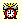
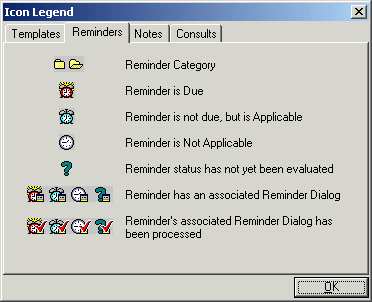
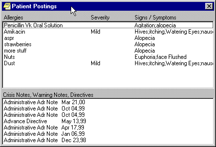

# User Guide
CPRS: Read-Only Version  
December 2023  

### Outline
```text
What is CPRS Read-Only ?
Online Help
CPRS Graphical User Interface (GUI)
The Organization of this Manual
Patient Inquiry Button
Primary Care Information
The Reminders Button
Postings (CWAD)
Setting up Reports Options
Viewing a Report
Available Reports on the Reports Tab
Sorting a Report (Table View)
Printing a Report
Copying Data from a Report
Viewing a Health Summary
Remote Data
```

### Content

[**Introduction** ](#_23ckvvd)**4**  
[What is CPRS Read-Only ? 4](#what-is-cprs-read-only-)  
[Online Help 4](#online-help)  
[CPRS Graphical User Interface (GUI) 4](#cprs-graphical-user-interface-gui)  
[The Organization of this Manual 4](#the-organization-of-this-manual)  
[**Signing on to CPRS** ](#_ihv636)**5**  
[**Open a Patient Record** ](#_32hioqz)**6**  
[**Features Available from the Header Bar** ](#_1hmsyys)**8**  
[Patient Inquiry Button 8](#patient-inquiry-button)  
[*Visit / Encounter Information 9*](#visit--encounter-information)  
[Primary Care Information 10](#primary-care-information)  
[The Reminders Button 10](#the-reminders-button)  
[Postings (CWAD) 12](#postings-cwad)  
[*Viewing a Posting 13*](#viewing-a-posting)  
[**Reports** ](#_41mghml)**14**  
[Setting up Reports Options 14](#setting-up-reports-options)  
[*Set All Reports … 15*](#set-all-reports-)  
[*Set Individual Report … 16*](#set-individual-report-)  
[Viewing a Report 17](#viewing-a-report)  
[Available Reports on the Reports Tab 18](#available-reports-on-the-reports-tab)  
[Sorting a Report (Table View) 22](#sorting-a-report-table-view)  
[Printing a Report 23](#printing-a-report)  
[Copying Data from a Report 25](#copying-data-from-a-report)  
[Viewing a Health Summary 26](#viewing-a-health-summary)  
[Remote Data 27](#remote-data)  
[*How Do I Know a Patient Has Remote Medical Data 27*](#how-do-i-know-a-patient-has-remote-medical-data)  
[*What Does the List of Sites Represent? 27*](#what-does-the-list-of-sites-represent)  
[*What Kind of Data Can I View? 28*](#what-kind-of-data-can-i-view)  
[*How Will the Remote Data Be Viewed? 28*](#how-will-the-remote-data-be-viewed)  
[*Viewing Remote Data 28*](#viewing-remote-data)  
[**Closing CPRS** ](#_2grqrue)**31**  
[**Glossary** ](#_vx1227)**32**  
[**Index** ](#_3fwokq0)**33**  
# Introduction

## What is CPRS Read-Only ?

The CPRS Read-Only (CPRS) enables you to select a patient and view reports from the patient’s medical record. As the name implies, you cannot enter, or update the information connected with any patient. The purpose of the CPRS Read-Only is to give controlled access to specific users that will enable them to review the medical records but not change any information.  
Users will be able to open the patient charts made available to them, including remote data from other facilities, and view, copy, and print reports that are available from the Reports tab only of the CPRS GUI.  
## Online Help

Instructions, procedures, and other information are available from the CPRS online help file. You may access the help file by clicking on **Help \| Contents** from the menu bar or by pressing the F1 key while you have any CPRS dialog open. Once the Help is open, use the contents section or the index section to find the instructions or explanation you need.  
Much of the information in this User Manual is also in the CPRS online help.  
## CPRS Graphical User Interface (GUI)

CPRS was designed to run in both the Microsoft Windows operating environment and on text-based terminals. The terminal or text-based version of CPRS (also known as the List Manager version) is not described in this manual. This manual specifically describes CPRS Read-Only that runs on the Windows operating system.  
## The Organization of this Manual

This manual is organized in the way most people will use the CPRS GUI. It begins with how to log on to the system and then how to select a patient. The manual continues with an explanation of the features that are available from the Reports tab.  
We hope this organization will help you understand the basic layout of the CPRS GUI and provide you with information about the specific tasks you will perform.  
# Signing on to CPRS

Once the CPRS Read-Only application has been installed on your workstation and you have been issued an access code and a verify code, you can sign onto CPRS.

To start CPRS, use the following steps:

1.  Double-click on the CPRS icon on your desktop.  
1.  If the Connect To dialog appears, click on the down-arrow, select the appropriate account (if more than one exists), and click **OK**.  
The VISTA logo window opens for a few moments and is followed by the VISTA Sign-on dialog as shown below.  
  
1.  Type your access code into the Access Code field and press the **Tab** key. Then, type your verify code into the Verify Code field and press the **Enter** key or click on **OK**.  
**Shortcut:** You can also type the access code, followed by a semicolon, followed by the verify code. Once you have done this press the **Enter** key or click **OK**.  
CPRS will then bring up the Patient Selection screen.  
***

# Open a Patient Record

After you log in to CPRS, the Patient Selection screen, shown below, is the first thing to appear. You should now select a patient record to view.

  
To select a patient record, follow these steps:  
1.  If you just logged into CPRS, skip to step 2. If you have been viewing another record, select **File \| Select New Patient…**.  
1.  Do one of the following:  
-   Type the first letter of the patient’s last name and the last four digits of the patient’s Social Security number (s0001).  
-   Type the last four numbers of the patient’s social security number (0001) or type the last four numbers of the social security number with “P” as the last character (0002p) if your facility uses special codes for those patients who do not have a social security number or it is unknown.  
-   Type part or all of the patient’s name (e.g., “patien” or “patient,one”).  
CPRS will try to match what you entered to a patient and highlight that patient. The highlighted patient's name and other demographic information will appear below the Cancel button.  
1.  Verify that the correct patient is highlighted. If the correct patient is highlighted, click **OK**. If the correct patient is not highlighted, scroll through to find the correct patient, highlight the name, and then click **OK**.  
When you click OK, CPRS opens to the Reports tab as shown in the following capture.  
***

  
After selecting a patient, users will see CPRS open to the Reports tab. The header bar and menu are also present.  
***

# Features Available from the Header Bar

There are six buttons located at the top of the CPRS window that are available from any tab. These buttons are: the Patient Inquiry button, the Encounter Provider and Location button, the Primary Care button, the Remote Data Views button, the Reminders button, and the Postings (CWAD) button. A detailed explanation of each of these buttons is included below.  
Buttons available from any CPRS tab

## Patient Inquiry Button

The Patient Inquiry button is located on the left side of the chart directly below the menu bar. The Patient Inquiry button displays the following information:  
-   Patient name  
-   Social Security number (or identification number if assigned by the site)  
-   Date of birth  
-   Age  
The Patient Inquiry button  
If you click on the Patient Inquiry button, the Patient Inquiry dialog appears. The Patient Inquiry dialog includes additional information such as the patient’s mailing address, telephone number(s), admission information, and other relevant data. While in the detailed display, you can select a new patient, print the detailed display, or close the detailed display.  
The Patient Inquiry dialog

### Visit / Encounter Information

CPRS shows the encounter provider and location for the visit on the Visit Encounter button. You can access this feature from any chart tab.  
The Visit Encounter button  
## Primary Care Information

To the immediate right of the Visit Encounter button is the Primary Care button, which displays the primary care team and attending physician assigned to this patient. The message “Primary Care Team Unassigned” is displayed if a primary care team has not been assigned.  
The Primary Care button

For more information on the attending physician or the primary care team if one has been assigned, click the Primary Care button.  
## The Reminders Button

CPRS Read-Only includes the ability to view Clinical Reminders. Reminders are used to aid physicians in performing tasks to fulfill Clinical Practice Guidelines and periodic procedures or education as needed for veteran patients.

**Note:** For more detailed information on Reminders, refer to the *Clinical Reminders Manager Manual* and the *Clinical Reminders Clinician Guide.*  
The Reminders button highlighted in red below shows you at a glance whether the patient has reminders that are due.

The Reminders button

By observing the color and design of the icon on the Reminders button, the user receives immediate feedback on the most important types of Reminders available for the selected patient. Clinical Coordinators can set Reminders to be evaluated when you open the chart or they can set it to evaluate the Reminders only after you click the Reminders button.  
The following icons could be visible on the Reminders button:  
 Due: The patient meets all the conditions for the reminder and the appropriate amount of time has elapsed.  
Applicable: The patient meets all the conditions for the reminder, but the appropriate time has not elapsed. For example, a flu shot is given once a year, but it has not been a year yet.  
 Other: Reminders have been defined, but were not specifically evaluated for the selected patient. An important education topic might be placed in Other.  
 Question Mark: A question mark on the Reminders button indicates that the reminders have not yet been evaluated. This appears when the patient’s chart is first opened to a tab other than the Cover Sheet. Click the Reminders button or the Reminders drawer on the Notes tab to evaluate the reminders.  
 Grayed-out Alarm Clock: This icon indicates that there are no due nor applicable reminders, nor are there any reminder categories available.  
If you click the button, you will see a tree view of the patient’s reminders such as the one shown below. The icons that appear on the Reminders button are also used in the tree view to identify the various types of reminders.  
The Available Reminders tree view  
  
The Reminders tab on the Icon Legends dialog includes a description of the different icons that appear on the Reminders tree view. To access the Icon Legend, click **View** \| **Reminder** **Icon Legend** \| and the **Reminders** tab.

  
The Icon Legend  
***

There is additional information later in this manual about how to retrieve, view, copy, and print remote patient data.  
## Postings (CWAD)

Postings are special types of progress notes. They contain critical information about a patient that hospital staff need to be aware of.  
If a patient record contains postings, the Postings button (located in the upper right corner of the CPRS window) will display the letters C, W, A, and/or D. These letters correspond to the four types of postings described below.  
-   **C (Crisis Notes**) – Cautionary information about critical behavior or health of a patient. *Example: Suicidal attempts or threats.*  
-   **W (Warnings**) – Notifications that inform medical center staff about possible risks associated with a patient. *Example: Patient can be violent.*  
-   **A (Adverse Reactions/Allergies**) – Posting that includes information about medications, foods, and other conditions to which the patient is allergic or may have an adverse reaction. *Example: Patient allergic to penicillin and latex.*  
-   **D (Directives**) – Also called advanced directives, directives are recorded agreements that a patient and/or family have made with the clinical staff. *Example: DNR (Do Not Resuscitate) directive on file.*  
The Postings button  
***

### Viewing a Posting

You can view a posting by pressing the Postings button.  
**To view a posting by using the Postings button, follow these steps:**

1.  Click the **Postings** button.  
    The Patient Postings dialog appears. The Patient Postings dialog contains all postings for the selected patient. The postings are divided into two categories. Allergies are listed in the top half of the dialog and crisis notes, warning notes, and directives are listed in the bottom half.  
      
      
    The Patient Postings dialog  
1.  Click a posting to see a detailed explanation.   
    A new window will appear with the full text of the posting.  
1.  When you are finished reading the posting, click **Close**.  
# Reports

With the CPRS Read-Only, you can do the following with reports:

-   Set the options for reports  
-   View reports and health summaries and sort the data in tabular reports  
-   Print reports to any VistA printer defined on the server or to a Windows printer  
-   Copy data from a report to put in another application  
-   View remote data for the patient from other VA Medical Centers (VAMCs) and/or Department of Defense data if available (To learn more about remote data, go to the Remote Data section of this manual.)  
## Setting up Reports Options

To set up the reports options, select Tools \| Options and then follow the steps below.

This tab allows you to set the date ranges and the maximum number of occurrences for CPRS reports. You can change the settings for all reports or for individual reports.

  
The Reports tab

### Set All Reports …

This option allows you to set a start date, a stop date, and a maximum number of occurrences for all CPRS reports. After you click the **Set All Reports…** button, the “Change Default Settings For Available CPRS Reports” dialog will appear.  
  
The Change Default Setting For Available CPRS Reports dialog  
**When this dialog appears follow these steps**:  
1.  Change the value in the Start Date and Stop Date fields by clicking in the appropriate field and by doing one of the following:  
    a) entering a date (e.g. 6/21/01 or June 21, 2001).  
    b) entering a date formula (e.g. t-200).  
    c) pressing the  button to bring up a calendar.  
1.  After you have entered a start and stop date, you can change the maximum number of occurrences (if necessary) by clicking in the Max field.  
1.  Click **OK**.  
1.  A confirmation dialog box will appear. Click **Yes** to confirm and save your changes.  
1.  Click **OK** to close the Options dialog box.  
### Set Individual Report …

This option allows you to set a start date, a stop date, and a maximum number of occurrences for individual CPRS reports. After you click the **Set Individual Report…** button, the “Customize Individual CPRS Report Setting” dialog box will appear.  
  
You can customize individual CPRS reports from this screen.  
***

**When this dialog appears follow these steps**:  
1.  Place the cursor in the “Type the first few letters of the report you are looking for:” field (located at the top of the dialog box) and type the name of the report that you would like to change  
    \-or-**  
    **use the scroll bars to find the report.

2.  Change the value in the Start Date and/or Stop Date field by clicking in the appropriate column and doing one of the following:  
    a) entering a date (e.g. 6/21/01 or June 21, 2001).  
    b) entering a date formula (e.g. t-200).  
    c) pressing the  button to bring up a calendar.

3.  After you have entered a start and stop date, you can change the maximum number of occurrences (if necessary) by clicking in the Max field.

4.  Click **Apply** to save your changes   
    \-or-**  
    **click **OK** to save your changes and close the dialog box.

5.  Click **OK** to close the “Options” dialog box.

## Viewing a Report

To display a report, follow these steps:

1.  Click the **Reports** tab.  
1.  See if the text on the Remote Data button is blue. If the text is blue, the patient has remote data.  
1.  To view remote data, which may include Department of Defense and/or other VAMC site data, click the **Remote Data** button to display a list of sites that have remote data for the selected patient. If you do not want remote data, skip to step 5.  
1.  Click **All** if you want data from all the sites listed, or click the check box in front of the site names you want to view remote data from and close the Remote Data button by clicking the button again.  
1.  Select the report you want to view from the Available Reports box (click the "+" sign to expand a heading).  
**Note:** All of the reports available in CPRS GUI version 15 are available in this version of CPRS in the new tree view format. The next section, “Available Reports on the Reports Tab,” lists the location of each report when they are exported. The list is configurable and your list may be different.**  
**  
1.  If necessary, select a date range from the Date Range box located in the lower left corner of the screen.  
The report should be displayed either after step 5 or step 6. You can then scroll through and read the report. If the report is in tabular form, click on a row to reveal details about that row (to select more than one row press and hold the **Control** or **Shift** key). The graphic on the following page shows an example of a Vitals cumulative report.  
***

  
## Available Reports on the Reports Tab

The table below lists the reports available from the Reports tab. A “+” sign indicates that the topic is a heading that can be expanded. Some of these reports may have remote data.

In the list below, those reports that may have remote data from the Department of Defense are noted. Also, there is a part of the tree that lists the Department of Defense reports. Please note that the order of the reports may be different depending on the configuration of your site. Below is the exported list from CPRS.

\+ Clinical Reports

Allergies  
\+ Patient information  
Demographics  
Insurance  
Disabilities  
\+ Visits / Admissions  
Adm./Discharge  
Expanded ADT  
Discharge Diagnosis  
Discharges  
Future Clinic Visits  
Past Clinic Visits  
ICD Procedures  
ICD Surgeries  
Transfers  
Treating Specialty  
Comp & Pen Exams  
\+ Dietetics  
Generic  
Diet  
Nutritional Status  
Supp. Feedings  
Tube Feeding  
Dietetics Profile  
Nutritional Assessment  
Discharge Summary  
\+ Laboratory  
Blood Availability  
Blood Transfusion  
Blood Bank Report  
Surgical Pathology **(can contain remote data from Department of Defense)**  
Cytology  
Electron Microscopy  
Lab Orders **(can contain remote data from Department of Defense)**  
Chem & Hematology **(can contain remote data from Department of Defense)**  
Microbiology **(can contain remote data from Department of Defense)**  
\+ Medicine  
Abnormal  
Brief Report  
Full Captioned  
Full Report  
Procedures (local only)  
Procedures  
\+ Orders  
Orders Current  
Daily Order Summary  
Order Summary for a Date Range  
Chart Copy Summary  
\+ Outpatient Encounters / GAF Scores  
Education  
Education Latest  
Exam Latest  
GAF Scores  
Health Factors  
Immunizations  
Outpatient Diagnosis  
Outpatient Encounter  
Skin Tests  
Treatment Provided  
\+ Pharmacy  
Active Outpatient  
All Outpatient **(can contain remote data from Department of Defense)**  
Outpatient RX Profile  
Active IV  
All IV  
Unit Dose  
Med Admin History (BCMA)  
Med Admin Log (BCMA)  
\+ Problem List  
Active Problems  
All Problems  
Inactive Problems  
\+ Progress Notes  
Progress Notes  
Advance Directive  
Clinical Warnings  
Crisis Notes  
\+ Radiology  
Report **(can contain remote data from Department of Defense)**  
Status  
Imaging (local only)  
Imaging  
Surgery Reports  
Vital Signs  
\+ **Health Summary**  
Adhoc Report  
Ac Clinical Summary  
Discharge Summary  
Radiology  
Pain Management  
Remote Demo/Visits/Pce (1y)  
Remote Demo/Vists/Pce (3m)  
Remote Clinical Data (1y)  
Remote Clinical Data (3m)  
Remote Clinical Data (4y)  
Remote Oncology View  
Remote Oncology View  
Global Assessment Functioning  
\+ Dept. of Defense Reports  
\+ Laboratory  
Lab Orders  
Chem & Hematology  
Surgical Pathology  
Microbiology  
Pharmacy All Outpatient  
Radiology  
Imaging (local only)  
Lab Status  
Blood Bank Report  
\+ **Anatomic Path Reports**  
Electron Microscopy  
Surgical Pathology  
Cytopathology  
Autopsy  
**Anatomic Pathology**  
**Dietetics Profile**  
**Nutritional Assessment**  
**Vitals Cumulative**  
**Procedures (local only)**  
**Daily Order Summary**  
**Order Summary for a Date Range**  
**Chart Copy Summary**  
**Outpatient RX Profile**  
**Med Admin Log (BCMA)**  
**Med Admin History (BCMA)**  
**Surgery (local only)**  
**+** Event Capture  
PCE Data Summary Report  
Patient Summary Report  
## Sorting a Report (Table View)

If a report is available in a table view, the table can be sorted alphabetically, numerically, or by date. To sort data in a report table:  
1.  Click the column heading to sort by.  
1.  The table will be sorted alphabetically (A-Z), numerically (0-9), or by date (most recent-least recent).  
1.  If you click the column heading again, the table will be sorted in inverse order (Z-A, 9-0, or least recent-most recent).  
1.  To perform a secondary sort, click on another column heading.  
**Note:** If you hold the pointer over the table, a hover hint will appear with the criteria used to sort the table.  
***

  
The reports tab shown with a table view that can be sorted by clicking the column headings.  
## Printing a Report

To print a report, follow these steps:  
1.  From the Reports tab, select the report to print.  
1.  If the report is in text format, right-click on the text of the report  
    **or**  
    if the report is in table format, click on the row that contains the data to print (to select more than one row, press and hold either the **Shift** or **Control** key). After selecting the appropriate row(s), right-click on the area or row you have selected.  
1.  Select **Print**.  
***

  
This capture shows the pop-up menu that appears when you right-click on an entry.  
***

1.  If a printer has not been selected as the default, select a printer from the dialog that displays, as shown below.  
    The dialog box shown below comes up when you right click on a report and select Print  


Normally, you do not need to enter a right margin or page length value. These values are measured in characters and normally are already defined by the device.  
## Copying Data from a Report

To copy data from a report, follow these steps:  
1.  From the Reports tab, select the report to copy data from.  
1.  If the report is in text format, select the text to copy and then right-click   
    **or**  
    if the report is in table format, click on the row that contains the data to copy (to select more than one row, press and hold either the **Shift** or **Control** key). After selecting the appropriate rows, right-click on the area or row you have selected.  
1.  Select **Copy.**  
You can now paste the data into another area in CPRS or into another program.  
***

  
## Viewing a Health Summary

To display a Health Summary, follow these steps:  
1.  Select a patient after you enter the CPRS system.  
1.  Select the **Reports** tab.  
1.  Under the Available Reports box on the left side of the screen, click the “+” sign in order to expand the Health Summary heading.  
1.  Select a Health Summary by clicking on the summary that you would like to see. After selecting a summary, the appropriate data is displayed on the right side of the screen.  
1.  Use the scroll bar on the right to scroll through the different sections of the Health Summary.  
## Remote Data

You can view remote patient data with CPRS if Master Patient Index/Patient Demographics (MPI/PD) and the appropriate patches have been installed at your site. If these patches have been installed and the proper parameters have been set, you can access remote data from other VA Medical Centers (VAMCs) and Department of Defense (DoD) facilities.  
### How Do I Know a Patient Has Remote Medical Data

As part of opening a patient record, CPRS checks in the Treating Facility file to see if the selected patient has been seen in other facilities. If the patient has remote data, the words on the Remote Data button turn blue as shown in the image below. If there is no remote data for the selected patient, the letters are gray.  
  
### What Does the List of Sites Represent?

If you click on the Remote Data button, a drop-down list appears with the name(s) of sites where the patient has been seen. This list is based on either:  
-   Sites that have been specifically designated for your facility to access. These sites are assigned in a parameter that your Clinical Applications Coordinator (CAC) can set up.  
-   All VAMC sites where the patient has been seen and Department of Defense remote data if it is available.  
### What Kind of Data Can I View?

Currently with CPRS Read-Only , you can view Health Summary components and reports available on the Reports tab. There are limitations to what you can view. You can view health summary components that have the same name on both the local and the remote site. You can therefore exchange national Health Summaries, but locally defined components may not be available unless the other site also has a component with the same name.  
If it is available, CPRS can also show some Department of Defense remote data.  
### How Will the Remote Data Be Viewed?

Viewing remote data is a two-step process. First, you select which remote sites to view data from, and then select the specific information you want to view, such as Health Summary components.  
On the Reports tab, each site you select will have a separate tab for its data. Using the above graphic as an example, you would see six tabs on the Reports tab: Local, Dept. of Defense, Mars, Pluto, Uranus, and Venus.  
You would then select the reports you want to view and a date range (if necessary). After this, CPRS will attempt to retrieve those reports if they are available on the remote sites. You would then click on each Treatment Facility’s tab to see the report from that site. While CPRS is attempting to retrieve the data, the message “Transmission in Progress:” is displayed until the data is retrieved.  
### Viewing Remote Data

To view a patient’s remote data, use these steps**:**  
1.  After opening the patient's record, see if the text on the Remote Data button is blue. If the text is blue, the patient has remote data.  
1.  Click the **Remote Data** button to display a list of sites that have remote data for the selected patient.  
1.  Click **All** if you want data from all the sites listed, or click the check box in front of the site names you want to view remote data from and close the Remote Data button by clicking the button again.  
1.  Select the report you would like to view from the Available Reports section on the left side of the screen (click the “+” sign in order to expand a report heading).  
      
    It may take a few minutes to retrieve the data. While CPRS retrieves the data, the message "Transmission in Progress" is displayed.  
1.  Depending on how the report or lab is configured, CPRS will return the remote data in one of two ways as shown below.  
-   **Text Format with Site Tabs**  
    If the remote data is in text format, the data from each remote site will be displayed under a separate site tab. To view data from a particular site, click on the appropriate tab.

  
Each remote location has a tab above the main editing window.  
-   **Table format**  
    If the report or lab is available in table format, CPRS will return data from all of the sites in a single table. The "facility" column indicates where the data in a particular row was collected. The table can be sorted by facility or by any other column heading (alphabetically, numerically, or by date) by clicking on the appropriate heading. Clicking on the heading again will sort the table in inverse order.  
  
1.  To see detailed information about a particular item in the table, click on that item. If detailed information is available, it will be displayed in the bottom-half of the screen. To select multiple rows, press and hold the **Shift** or **Control** key.  
# Closing CPRS

To close CPRS Read-Only, select **File \| Exit** or click the close box (the X button) in the upper right corner of the Window.  
***

# Glossary

CPRS Computerized Patient Record System, the VistA package (in both GUI and character-based formats) that provides access to most components of the patient chart.

Health Summary A **V***IST***A** product that can be viewed through CPRS, Health Summaries are components of patient information extracted from other VistA applications.

PCE Patient Care Encounter is a VistA program that is part of the Ambulatory Data Capture Project (ADCP) and also provides Clinical Reminders, which appear on Health summaries.

Reports A component of CPRS that includes Health Summary, Action Profile, and other summarized reports of patient care.

VistA Veterans Information Systems Technology Architecture, the new name for DHCP.

# Index

access code, 5  
Adverse Reactions/Allergies, 12  
available reports, 19  
Clinical Coordinators, 10  
Clinical Reminders, 10  
close CPRS, 32  
Computerized Patient Record System, 33  
copy, 26  
Cover Sheet, 10  
CPRS, 4, 5, 6, 9, 27, 28, 29, 33  
Read-Only, 4  
signing on, 5  
Crisis Notes, 12  
date range, 17  
demographic information, 6  
Department of Defense, 19, 28  
remote data available, 17  
reports containing data from, 20, 21, 22  
Directives, 12  
Dod. See Department of Defense  
DoD. See Department of Defense. See Department of Defense  
GCPR. See Department of Defense. See Department of Defense  
Glossary, 33  
GUI, 33  
Health Summary, 27, 33  
Master Patient Index, 28  
MPI/PD, 28  
name, 6  
Notes tab, 10  
Patient Inquiry, 8  
Patient Selection, 6  
Postings, 12, 13  
Primary Care, 10  
printing, 24  
Progress Notes, 12  
Reminders, 10  
Remote Data, 28, 29  
list of sites, 28  
viewing, 29  
Reports, 14, 17, 27, 29, 33  
availale, 19  
copying data from, 26  
date range, 17  
printing, 24  
sorting, 23  
table format, 31  
text format, 30  
Reports tab, 17, 27, 29  
selecting a patient, 6  
setting up report options, 14  
signing on, 5  
social security number, 6  
sorting, 23  
tables  
sorting, 31  
tabs, 29  
Treating Facility, 28  
verify code, 5  
Visit Encounter button, 9, 10  
Visit Information, 9  
VistA, 33  
Warnings, 12  