# User Guide
### CPRS: GUI Version
#### December 2023

[**Introduction 1**](#introduction)  
[**What is CPRS? 1**](#what-is-cprs)  
[**Using CPRS Documentation 1**](#using-cprs-documentation)  
[Related Manuals 1](#related-manuals)  
[VistA Intranet 1](#vista-intranet)  
[Online Help 1](#online-help)  
[**CPRS Graphical User Interface (GUI) 1**](#cprs-graphical-user-interface-gui)  
[**The Organization of this Manual 1**](#the-organization-of-this-manual)  
[**Conventions in the CPRS Interface 2**](#conventions-in-the-cprs-interface)  
[**Entering Dates and Times into CPRS 2**](#entering-dates-and-times-into-cprs)  
[**Signing in to CPRS 3**](#signing-in-to-cprs)`
[**Selecting a Patient 6**](#selecting-a-patient)
[**National Provider Identifier (NPI) Display in CPRS 7**](#national-provider-identifier-npi-display-in-cprs)  
[**How CPRS Sorts Names 8**](#how-cprs-sorts-names)  
[**Patient Selection Messages 10**](#patient-selection-messages)  
[**Patient Lists 10**](#patient-lists)  
[Setting a Default Patient List 10](#setting-a-default-patient-list)  
[**Notifications 11**](#notifications)  
[Action, Informational, and Long Text Informational Alerts 14](#_4f1mdlm)  
[Action Alerts Require User Interaction 14](#_2u6wntf)  
[Sorting Notifications and Viewing Comments of Forwarded Alerts 17](#sorting-notifications-and-viewing-comments-of-forwarded-alerts)  
[Processing, Removing, and Forwarding Notifications 20](#processing-removing-and-forwarding-notifications)  
[**Refreshing a Patient Record 26**](#refreshing-a-patient-record)  
[**CPRS Write Access Functionality 27**](#_1664s55)  
[**Keeping Diagnostic and Procedure Codes Current 32**](#keeping-diagnostic-and-procedure-codes-current)  
[**Cover Sheet Displays 32**](#cover-sheet-displays)  
[Encounter Form Display 33](#encounter-form-display)  
[Consults Tab Display 34](#consults-tab-display)  
[Clinical Reminders 34](#clinical-reminders)  
[**CPRS Time Out 34**](#cprs-time-out)  
[**Features Available from Any Tab 36**](#features-available-from-any-tab)  
[**Clinical Context Management (CCOW) Icon 36**](#clinical-context-management-ccow-icon)  
[**Patient Inquiry Button 39**](#_2nusc19)  
[Encounter Information 43](#encounter-information)  
[Visit / Encounter Information 43](#visit--encounter-information)  
[**Primary Care Information 44**](#primary-care-information)  
[Current Display (CPRS v.30.b before OR\*3.0\*387) 45](#current-display-cprs-v30b-before-or30387)  
[The Primary Care Display after PCMM Web (OR\*3.0\*387) Installation 48](#the-primary-care-display-after-pcmm-web-or30387-installation)  
[**Other than Honorable (OTH)**](#_3jtnz0s)[ **51**](#_3jtnz0s)  
**Patient Insurance and MyHealth**[**e**](#patient-insurance-and-myhealthevet-information)[**Vet Information 53**](#patient-insurance-and-myhealthevet-information)  
[**Presumptive Psychosis 54**](#_rjefff)  
[**Prescription Drug-Monitoring Program (PDMP) 55**](#prescription-drug-monitoring-program-pdmp)  
[Authorized HealthCare Provider Procedure for PDMP Query 55](#authorized-healthcare-provider-procedure-for-pdmp-query)  
[Delegate Procedure for PDMP Query 59](#delegate-procedure-for-pdmp-query)  
[Accessing a PDMP Button on a Reminder Dialog Template 63](#_4fsjm0b)  
[PDMP Accounting of Disclosure (AOD) report 65](#pdmp-accounting-of-disclosure-aod-report)  
[**Patient Record Flags 67**](#patient-record-flags)  
[Category I and Category II Flags 67](#category-i-and-category-ii-flags)  
[Creating, Assigning, and Maintaining PRF 68](#creating-assigning-and-maintaining-prf)  
[Documenting PRF 68](#documenting-prf)  
[Viewing PRF in CPRS GUI 71](#viewing-prf-in-cprs-gui)  
[History of Actions Taken 75](#_thw4kt)  
[PRF Notes 75](#_1smtxgf)  
[Inactive PRF History 79](#_261ztfg)  
[Viewing Inactive Flag History 80](#_2jh5peh)  
[**Remote Data 80**](#remote-data)  
[Viewing Remote Data 82](#viewing-remote-data)  
[**The Reminders Button 84**](#the-reminders-button)  
[**Postings (CWADPL) 87**](#postings-cwadpl)  
[Viewing a Posting 87](#viewing-a-posting)  
[**COVID-19 Identifier/New EHR Banner 89**](#_22vxnjd)  
[Patient Status Messages 89](#patient-status-messages)  
[Possible COVID-19 Status Error Messages 89](#possible-covid-19-status-error-messages)  
[**CPRS Graphing 90**](#cprs-graphing)  
[What You See and What You Get 90](#what-you-see-and-what-you-get)  
[**Using CPRS Graphing 92**](#using-cprs-graphing)  
[Starting CPRS Graphing 92](#starting-cprs-graphing)  
[Configure Settings 93](#configure-settings)  
[Creating Graphs 100](#creating-graphs)  
[Graphing Items from the Select Items and Define Views Dialog Box 101](#graphing-items-from-the-select-items-and-define-views-dialog-box)  
[Displaying Details for Graphed Items 102](#displaying-details-for-graphed-items)  
[Using the Zoom Feature 103](#using-the-zoom-feature)  
[Copy and Paste or Print Graphs 103](#copy-and-paste-or-print-graphs)  
[Exporting Data 104](#exporting-data)  
[**Electronic and Digital Signatures 105**](#electronic-and-digital-signatures)  
[**Electronic Signatures 105**](#electronic-signatures)  
[**Digital Signatures 106**](#digital-signatures)  
[How Does CPRS Show a Digital Signature? 107](#how-does-cprs-show-a-digital-signature)  
[Digitally Signing Orders 109](#digitally-signing-orders)  
[**Understanding Service Connection and Treatment Factors 110**](#understanding-service-connection-and-treatment-factors)  
[Service Connected 110](#service-connected)  
Treatment Factors/Environmental Indicators 110  
[**Review / Sign Changes Dialog 119**](#review--sign-changes-dialog)  
[**Sign Selected Orders Command 127**](#sign-selected-orders-command)  
[**Signing Orders before Selecting a New Patient or Exiting CPRS 135**](#signing-orders-before-selecting-a-new-patient-or-exiting-cprs)  
[**Criteria Used to Determine if the Service Connection and Treatment Factor Buttons are Displayed in the Review/Sign Changes Dialog 143**](#criteria-used-to-determine-if-the-service-connection-and-treatment-factor-buttons-are-displayed-in-the-reviewsign-changes-dialog)  
[**The Sign Note Now and Sign Discharge Summary Now Commands 144**](#the-sign-note-now-and-sign-discharge-summary-now-commands)  
[**Add to Signature List 144**](#add-to-signature-list)  
[**Viewing Unsigned Notes or Discharge Summaries 144**](#viewing-unsigned-notes-or-discharge-summaries)  
[**Identify Additional Signers 145**](#identify-additional-signers)  
[**Printing from Within CPRS 146**](#printing-from-within-cprs)  
[**Printing Single Items 146**](#printing-single-items)  
[**Printing Multiple Notes, Consults, or Discharge Summaries 147**](#printing-multiple-notes-consults-or-discharge-summaries)  
[**Tools Menu 148**](#tools-menu)  
[**Veteran Health Library 148**](#_1hx2z1h)  
[**Lab Test Information 148**](#lab-test-information)  
[**Options 150**](#options)  
[General Tab 151](#general-tab)  
[Notifications Tab 157](#notifications-tab)  
[Order Checks Tab 158](#order-checks-tab)  
[Lists/Teams Tab 159](#liststeams-tab)  
[Notes Tab 163](#notes-tab)  
[Reports Tab 165](#reports-tab)  
[Graphs Tab 168](#graphs-tab)  
[Surrogates Tab 168](#surrogates-tab)  
[Copy/Paste Tab 172](#copypaste-tab)  
[**Support for Women’s Health 175**](#_1p04j8c)  
[**SMART Features 175**](#smart-features)  
[**Potentially Unsafe Medications or Exposures (Teratogens) 175**](#potentially-unsafe-medications-or-exposures-teratogens)  
[**Documenting a Patient’s Immunizations and Skin Tests in CPRS 176**](#_31k882z)  
[Description of the Enter Immunization/Skin Test Screens 176](#description-of-the-enter-immunizationskin-test-screens)  
[**Cover Sheet 181**](#cover-sheet)  
[**Customizing which Panes Display and their Order 181**](#_3sek011)  
[Minimizing and Maximize Panels 182](#_2kz067v)  
[Refresh Icon Options 182](#_104agfo)  
[What You Can Do from the Cover Sheet 183](#_1z989ba)  
[**Navigating a Patient Chart 184**](#navigating-a-patient-chart)  
[**Additional Patient Information 184**](#additional-patient-information)  
[**Entering or Changing Encounter Information 187**](#entering-or-changing-encounter-information)  
[**Viewing Clinical Reminders 188**](#viewing-clinical-reminders)  
**Viewing and Entering Vitals 190**  
[**How CPRS Displays Vitals 191**](#how-cprs-displays-vitals)  
[How the Vitals View Can Be Changed 193](#how-the-vitals-view-can-be-changed)  
[Viewing Vitals from the Cover Sheet 194](#viewing-vitals-from-the-cover-sheet)  
[**Recording Vitals 195**](#recording-vitals)  
[Templates for Entering Vitals 195](#templates-for-entering-vitals)  
[Entering Vitals 197](#entering-vitals)  
[Marking Vitals as Entered in Error 198](#marking-vitals-as-entered-in-error)  
[**Assessing, Entering, and Reviewing Allergies/Adverse Reactions 199**](#assessing-entering-and-reviewing-allergiesadverse-reactions)  
[Entering Allergies 199](#entering-allergies)  
[Entering No-Known-Allergies Assessments from the Cover Sheet 207](#entering-no-known-allergies-assessments-from-the-cover-sheet)  
[Marking Allergies as Entered in Error 208](#marking-allergies-as-entered-in-error)  
[**Reviewing and Creating Postings 210**](#reviewing-and-creating-postings)  
[Creating Postings 211](#creating-postings)  
[**Problems Tab 212**](#problems-tab)  
[**Service-Connected Conditions 212**](#service-connected-conditions)  
[**Coding Systems Used to Represent Problems 213**](#coding-systems-used-to-represent-problems)  
[Using Problems for Encounter Information 213](#using-problems-for-encounter-information)  
[**Customizing the Problems List 213**](#customizing-the-problems-list)  
[**Adding a New Problem 214**](#adding-a-new-problem)  
[**Annotating a Problem 221**](#annotating-a-problem)  
[**Changing a Problem 221**](#changing-a-problem)  
[**Making a Problem Inactive 221**](#making-a-problem-inactive)  
[**Removing a Problem 221**](#removing-a-problem)  
[**Verifying a Problem 221**](#verifying-a-problem)  
[**Meds 222**](#meds)  
[**Medication Details 223**](#medication-details)  
[**Medication Administration History 223**](#medication-administration-history)  
[**Other Medication Actions (popup menu) 223**](#other-medication-actions-popup-menu)  
[**Indications 224**](#_vqntsw)  
[New Field on Medication Order Dialogs 224](#new-field-on-medication-order-dialogs)  
[Indications on Order Details 225](#indications-on-order-details)  
[Indication Displays on Reports where SIG Is Displayed 226](#indication-displays-on-reports-where-sig-is-displayed)  
[**Order Checks 226**](#order-checks)  
[Site-Defined Clinical Reminder Order Checks 226](#site-defined-clinical-reminder-order-checks)  
[Local Order Checks 230](#local-order-checks)  
[Remote Order Checks 233](#remote-order-checks)  
[**Sorting the Medications View 236**](#sorting-the-medications-view)  
[**Ordering Inpatient Medications 237**](#ordering-inpatient-medications)  
[Clozapine Requirements 238](#_3pzf2jn)  
[Simple Dose 238](#simple-dose)  
Complex Dose 244  
[**Ordering Inpatient Medications for Outpatients 252**](#ordering-inpatient-medications-for-outpatients)  
[Criteria for Ordering Inpatient Medications for Outpatients 252](#criteria-for-ordering-inpatient-medications-for-outpatients)  
[Clozapine Requirements 253](#clozapine-requirements-1)  
[Simple and Complex Doses 253](#simple-and-complex-doses)  
[**Outpatient Medications 254**](#outpatient-medications)  
[Simple Dose 255](#simple-dose-1)  
[Complex Dose 259](#complex-dose-1)  
[**Documenting Non-VA Medications 261**](#_2kicxvv)  
[Making Non-VA Meds Available to Document 262](#making-non-va-meds-available-to-document)  
[Different from Ordering Medications 262](#different-from-ordering-medications)  
[Documenting Non-VA Medication Information for Simple Doses 263](#_3x2gmqi)  
[Documenting Non-VA Medication Information for Complex Doses 265](#_4ahmipj)  
[**Release Hold 266**](#release-hold)  
[**Hold Orders 266**](#hold-orders)  
[**Park a Prescription 266**](#_j2f68k)  
[**Renewing Orders 267**](#renewing-orders)  
[**Discontinuing Orders 269**](#discontinuing-orders)  
[**Changing Orders 270**](#changing-orders-1)  
[**Viewing a Medication Order 271**](#viewing-a-medication-order)  
[**Transfer Outpatient Meds Order to Inpatient 271**](#transfer-outpatient-meds-order-to-inpatient)  
[**Transfer Inpatient Meds Order to Outpatient 271**](#transfer-inpatient-meds-order-to-outpatient)  
[**Refilling a Medication 272**](#refilling-a-medication)  
[**Using the Unified Action Profile View 273**](#using-the-unified-action-profile-view)  
[Understanding UAP Sorting 273](#understanding-uap-sorting)  
[Configuring UAP 274](#configuring-uap)  
[**Using the Discharge Meds View 280**](#using-the-discharge-meds-view)  
[**Orders 282**](#orders)  
[**Viewing Orders on the Orders Tab 282**](#viewing-orders-on-the-orders-tab)  
[Locating IV Orders on the Orders Tab 283](#locating-iv-orders-on-the-orders-tab)  
[Changing the View on the Orders Tab 283](#changing-the-view-on-the-orders-tab)  
[Viewing Results 286](#viewing-results)  
[**Writing Orders 286**](#writing-orders)  
[Order Checks 287](#order-checks-1)  
[Site-Defined Clinical Reminder Order Checks 288](#site-defined-clinical-reminder-order-checks-1)  
[Local Order Checks 290](#local-order-checks-1)  
[Quick Orders 297](#quick-orders)  
[Entering Allergies from the Orders Tab 301](#entering-allergies-from-the-orders-tab)  
[Ordering Diets and Outpatient Meals 307](#ordering-diets-and-outpatient-meals)  
[Prevent Previous Active Diet Replacing NPO Order Upon Expire, Discontinue, or Cancel 308](#_3piru7n)  
[Ordering Medications 322](#ordering-medications)  
New Clozapine Requirements 323  
[Adding Non-VA Medications 372](#adding-non-va-medications)  
[Documenting Non-VA Medication Information for Complex Doses 375](#_2ajj7vm)  
[Blood Products 376](#blood-products)  
[Infusion Orders 383](#infusion-orders)  
[Entering Simple Supply Orders 390](#entering-simple-supply-orders)  
[Entering Complex Supply Orders 391](#entering-complex-supply-orders)  
[Ordering Lab Tests 392](#ordering-lab-tests)  
[Anatomic Pathology Orders (Overview) 393](#_1z2v11z)  
[**Entering a Fine Needle Aspirate Lab Test 409**](#entering-a-fine-needle-aspirate-lab-test)  
[**Entering a General Fluid Lab Test 412**](#entering-a-general-fluid-lab-test)  
[Radiology and Imaging 428](#radiology-and-imaging)  
[Requesting a Return Clinic Appointment 430](#requesting-a-return-clinic-appointment)  
[Ordering a Consult 433](#ordering-a-consult)  
[Procedures 436](#procedures)  
[Vitals 438](#vitals)  
[**Text Only Orders 439**](#text-only-orders)  
[**Event-Delayed Orders 440**](#event-delayed-orders)  
[Writing an Event-Delayed Order 440](#writing-an-event-delayed-order)  
[Assigning/Changing the Release Event 443](#assigningchanging-the-release-event)  
[Manually Releasing an Event-Delayed Order 444](#manually-releasing-an-event-delayed-order)  
[Viewing an Event-Delayed Order after It Is Released 445](#viewing-an-event-delayed-order-after-it-is-released)  
[**Notifying a User when Order Results Are Available 445**](#notifying-a-user-when-order-results-are-available)  
[**Flagging an Order 446**](#flagging-an-order)  
[**Unflagging an Order 448**](#_4eovx30)  
[**Overview of CPRS/POE Functionality 449**](#overview-of-cprspoe-functionality)  
[**Notes 450**](#notes-1)  
[**Group Notes 450**](#group-notes)  
[**Icons on the Notes Tab 450**](#icons-on-the-notes-tab)  
[**Viewing Progress Notes 451**](#viewing-progress-notes)  
[**Customizing the Notes Tab 453**](#customizing-the-notes-tab)  
[Viewing All Signed Notes, All Unsigned Notes, or All Uncosigned Notes 454](#viewing-all-signed-notes-all-unsigned-notes-or-all-uncosigned-notes)  
[Viewing All Signed Notes by a Specific Author 454](#viewing-all-signed-notes-by-a-specific-author)  
[Viewing All Signed Notes for a Date Range 455](#viewing-all-signed-notes-for-a-date-range)  
[**Additional Customization 456**](#additional-customization)  
[**Improving the Tree View Custom View Display 457**](#_3y3nv7w)  
[**Searching for Text (Within Current View) 459**](#searching-for-text-within-current-view)  
[**Setting a Default View 459**](#setting-a-default-view)  
[**Creating and Editing Progress Notes 460**](#creating-and-editing-progress-notes)  
[**Encounter Information 465**](#encounter-information-1)  
[**Encounter Form Data 466**](#encounter-form-data)  
[Entering Encounter Form Data 467](#entering-encounter-form-data)  
**Clinical Reminders 469**  
[The Reminders Drawer 470](#the-reminders-drawer)  
[**Reminders Processing 471**](#reminders-processing)  
[Processing a Reminder 472](#processing-a-reminder)  
[Completing Reminder Processing 473](#completing-reminder-processing)  
[Using Mental Health Assessments in CPRS 473](#using-mental-health-assessments-in-cprs)  
[**Document Templates 474**](#document-templates)  
[**Locking Consult Templates 474**](#_48crlau)  
[Template Editor 474](#template-editor)  
[Personal and Shared Templates 475](#personal-and-shared-templates)  
[Types of Templates 478](#types-of-templates)  
[Folders 478](#folders)  
[Reminder Dialog 479](#reminder-dialog)  
[Arranging Templates for Ease of Use 479](#arranging-templates-for-ease-of-use)  
[Adding a Template to a Note 479](#adding-a-template-to-a-note)  
[Searching for Templates 480](#searching-for-templates)  
[Previewing a Template 481](#previewing-a-template)  
[Deleting Document Templates 481](#deleting-document-templates)  
[**Creating Personal Document Templates 481**](#creating-personal-document-templates)  
[Personal Template 481](#personal-template)  
[Group Template 482](#group-template)  
[Associating a Template with a Document Title, Consult, or Procedure 483](#associating-a-template-with-a-document-title-consult-or-procedure)  
[Importing a Document Template 483](#importing-a-document-template)  
[Exporting a Document Template 484](#exporting-a-document-template)  
[Dialog Template 484](#dialog-template)  
[Reminder Dialog 486](#reminder-dialog-1)  
[Folder 486](#folder)  
[View Template Notes 487](#view-template-notes)  
[Copying Template Text 487](#copying-template-text)  
[**Template Fields 487**](#template-fields)  
[Using the Template Field Editor 489](#using-the-template-field-editor)  
[Inserting Template Fields into a Template 490](#inserting-template-fields-into-a-template)  
[**Navigating Template Required Fields 491**](#_32vpgn2)  
[Required Fields Settings 492](#_2h5xjqh)  
[**Auditing Copying and Pasting into Clinical Documents 494**](#_1vg5mtw)  
[Who Can View Pasted Text? 494](#_19qdpxb)  
[What Constitutes a Tracked Paste? 494](#_3tq18l4)  
[Setting How Pasted Text Will Display to Auditors, Authors, and Cosigners 497](#_3809boj)  
[Auditing Pasted Text in Clinical Documents 499](#_11frozr)  
[**Consults 501**](#consults)  
[**Changing the View on the Consults tab 502**](#changing-the-view-on-the-consults-tab)  
[**Ordering Consults 504**](#ordering-consults)  
[**Viewing Consults 504**](#viewing-consults)  
**Tracking Consult Requests 505**  
[Using the Consult Toolbox Functions 506](#using-the-consult-toolbox-functions)  
[Alerts 508](#alerts)  
[**Complete a Consult or Clinical Procedure the Consults Tab 508**](#complete-a-consult-or-clinical-procedure-the-consults-tab)  
[**Ordering a New Consult from the Consults Tab 510**](#ordering-a-new-consult-from-the-consults-tab)  
[**Requesting a New Procedure from the Consults Tab 511**](#requesting-a-new-procedure-from-the-consults-tab)  
[Forwarding a Consult 513](#forwarding-a-consult)  
[**HCP RAS Consult Communication Error Message 514**](#hcp-ras-consult-communication-error-message)  
[**COMMUNITY CARE Direct Schedule or Administrative Consults 514**](#community-care-direct-schedule-or-administrative-consults)  
[**Unique Consult ID (UCID) Display 521**](#unique-consult-id-ucid-display)  
[**Surgery Tab 522**](#surgery-tab)  
[**Customizing the Surgery Tab 524**](#customizing-the-surgery-tab)  
[**Signing a Surgery Report 525**](#signing-a-surgery-report)  
[**Creating Surgery Report Addenda 525**](#creating-surgery-report-addenda)  
[**Discharge Summary 526**](#discharge-summary)  
[**Changing Views on the Discharge Summaries Tab 527**](#changing-views-on-the-discharge-summaries-tab)  
[**Writing Discharge Summaries 528**](#writing-discharge-summaries)  
[**Labs 530**](#labs)  
[**Display of Laboratory Test Results 530**](#display-of-laboratory-test-results)  
[New Reports 530](#new-reports)  
[Changed Report 530](#changed-report)  
[New Order for Items in the Lab Results Pane 531](#new-order-for-items-in-the-lab-results-pane)  
[Lab Order (Collected Specimens) 533](#lab-order-collected-specimens)  
[Pending Lab Orders 533](#pending-lab-orders)  
[Most Recent 533](#most-recent)  
[Worksheet 534](#worksheet)  
[Graph 537](#graph)  
[All Tests by Date 538](#all-tests-by-date)  
[Selected Tests by Date 538](#selected-tests-by-date)  
[Lab Orders (All) 539](#lab-orders-all)  
[Cumulative 539](#cumulative)  
[**Changing Views on the Labs Tab 540**](#changing-views-on-the-labs-tab)  
[Demographics 540](#demographics)  
[Postings 541](#postings)  
[Reminders 542](#reminders)  
[**Reports 543**](#reports)  
[**Viewing a Report 543**](#viewing-a-report)  
[**Available Reports on the Reports Tab 546**](#available-reports-on-the-reports-tab)  
[**Sorting a Report (Table View) 550**](#sorting-a-report-table-view)  
[**Graphing a Report 551**](#graphing-a-report)  
[**Printing a Report 551**](#printing-a-report)  
**Copying Data from a Report 553**  
[**Viewing a Health Summary 553**](#viewing-a-health-summary)  
[**Appendix A – Accessibility for Individuals with Disabilities 555**](#appendix-a--accessibility-for-individuals-with-disabilities)  
[**Changing the Font Size 555**](#changing-the-font-size)  
[CPRS Widows and Dialog Boxes 555](#cprs-widows-and-dialog-boxes)  
[CPRS Menus and Windows Alert Boxes 555](#cprs-menus-and-windows-alert-boxes)  
[**Changing the Window Background Color 556**](#changing-the-window-background-color)  
[**Keyboard Shortcuts for Common CPRS Commands 558**](#keyboard-shortcuts-for-common-cprs-commands)  
[Navigation 558](#navigation)  
[Common Commands 559](#common-commands)  
[Cover Sheet 560](#cover-sheet-1)  
[Problems Tab 560](#problems-tab-1)  
[Meds Tab 561](#meds-tab)  
[Orders Tab 561](#orders-tab)  
[Notes Tab 562](#notes-tab-1)  
[Template Editor 564](#template-editor-1)  
[Consults Tab 565](#consults-tab)  
[DC/Summ Tab 566](#dcsumm-tab)  
[Labs Tab 567](#labs-tab)  
[Reports Tab 567](#reports-tab-1)  
[**Appendix C: JAWS Configuration Files 568**](#appendix-c-jaws-configuration-files)  
[**Using JAWS with CPRS 569**](#using-jaws-with-cprs)  
[**Appendix D – Error Messages and Troubleshooting 570**](#appendix-d--error-messages-and-troubleshooting)  
[**Glossary 574**](#glossary)  
# Introduction

## What is CPRS?

The Computerized Patient Record System (CPRS) is a Veterans Health Information Systems and Technology Architecture (VistA) computer application. CPRS enables you to enter, review, and continuously update all the information connected with any patient. With CPRS, you can order lab tests, medications, diets, radiology tests and procedures, record a patient’s allergies or adverse reactions to medications, request and track consults, enter progress notes, diagnoses, and treatments for each encounter, and enter discharge summaries. In addition, CPRS supports clinical decision-making and enables you to review and analyze patient data.

## Using CPRS Documentation

### Related Manuals

*Computerized Patient Record System Installation Guide Computerized Patient Record System Setup Guide*

*Computerized Patient Record System Technical Manual*

*Computerized Patient Record System Online Help*

*Clinical Reminders Manager Manual*

*Clinical Reminders Clinician Guide*

*Text Integration Utility (TIU) Clinical Coordinator and User Manual*

*Consult/Request Tracking User Manual*

### VistA Intranet

CPRS documentation is also available on the VistA intranet. The intranet version is constantly updated and may contain more current information than this print version. CPRS documentation is available on the VistA intranet.

### Online Help

Instructions, procedures, and other information are available from the CPRS online help file. You may access the help file by clicking Help \| Contents from the menu bar or by pressing the F1 key while you have any CPRS dialog open. Much of the information in this User Manual is also in the CPRS online help.

## CPRS Graphical User Interface (GUI)

CPRS was designed to run in both the Microsoft Windows operating environment and on text-based terminals. The terminal or text-based version of CPRS (also known as the List Manager version) is not described in this manual. This manual describes the Windows version of CPRS.

## The Organization of this Manual

This manual is organized in the way most people will use the CPRS GUI. It begins with how to log on to the system and then how to select a patient. The manual continues with an explanation of the features that are available from each CPRS tab.

We hope this organization will help you understand the basic layout of the CPRS GUI and provide you with information about the specific tasks you will perform.

# Conventions in the CPRS Interface

Throughout CPRS, some items are always or almost always the same. This section deals with a few of these conventions in the CPRS GUI interface.

## Entering Dates and Times into CPRS

CPRS generally allows users to enter time in several different formats. Users can often enter month-day-year dates (such as 05/01/65) or users can sometimes spell out the month (November 22, 2001) or as a date referenced from today (t-30 for a month in the past, today minus 30).

Users often can enter a time as well as a date. For tasks such as medication ordering and administration, entering a time can be critical. Times are entered as a 24-hour time, not with a 12-hour clock and an a.m. and p.m. For example, the time 8 a.m. is entered as 08:00:00, whereas 8 p.m. is entered as 20:00:00.

**Note:**  The time 00:00 presents a challenge because it can be ambiguous as to when it is. To address this issue, CPRS changes the time of 00:00 to 00:01. This makes the time belong to a specific day, increasing clarity. Similarly, if a user selects Midnight, CPRS makes the time 23:59.

In some cases, users can also enter a date with no known time (T@U). CPRS used to assign a time of 00:00 to this entry, but now, it will not put a time in for this case.

# Signing in to CPRS

CPRS now uses a more secure access method called two-factor authentication (sometimes called 2FA). Two-factor authentication simply means that you use your

Personal Identification Verification (PIV) card and your Personal Identification Number (PIN) to gain access to CPRS. If you experience a problem with two-factor authentication, you can select Cancel on the dialog that requests a certificate and enter your access and verify code to log in to CPRS.

**Note:** To use the new two-factor authentication, each user’s Active Directory entry must be “Bound” for each VistA instance. So, if you can access one VistA system, but a different one that you access does not work, you will need to contact support to verify that your Active Directory entry has been bound to all of the accounts you access.

To login to CPRS with your PIV card, follow these steps: Double-click the CPRS icon on your desktop.

If the Connect To dialog appears, click the down-arrow, select the appropriate account (if more than one exists), and click OK.

In the Windows Security dialog, select the certificate associated with your PIV card and press \<Enter\>. If there are multiple certificates, choose the one that is for “internal PIV authentication.” You can see that by hovering over the name for the certificate as shown below.

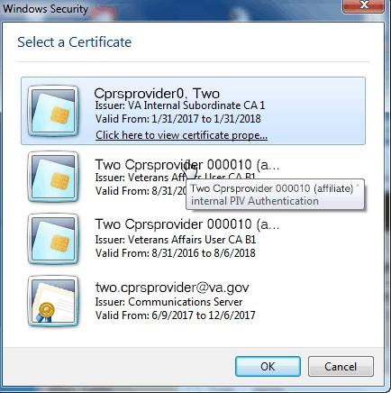

**Note**: If there is a problem with your PIV or PIN, you can select Cancel to revert to using your access and verify codes.

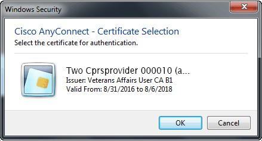

Type your PIN into the dialog that appears and press \<Enter\>.

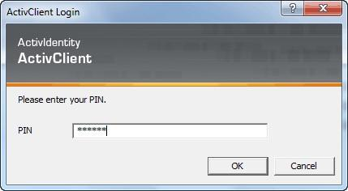

If you lose your PIV card or forget it, there is an alternative way to log into CPRS using your access and verify code. Each user should be assigned an access code and a verify code. You will need to check with your local facility to get your access and verify codes, if necessary.

To login to CPRS with your access and verify code, follow these steps:

1.  Double-click the CPRS icon on your desktop. The VistA logo window and the VistA Sign-on dialog will appear.  
1.  If the Connect To dialog appears, click the down-arrow, select the appropriate account (if more than one exists), and click OK.  
1.  Type your access code into the Access Code field and press the Tab key.  
1.  Type the verify code into the verify code field and press the Enter key or click OK.  
**Note**: You can also type the access code, followed by a semicolon, followed by the verify code. Once you have done this press the **Enter** key or click **OK**.

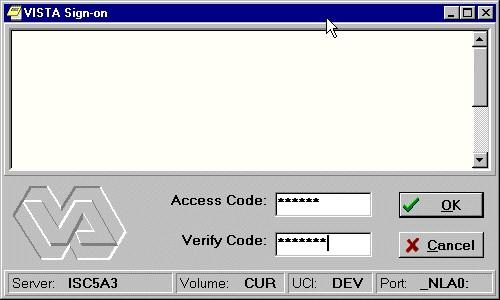

**The VISTA Sign-on screen**  
# Selecting a Patient

After you log in to CPRS, the Patient Selection screen, shown below, is the first thing to appear. You should now select a patient record to view.

**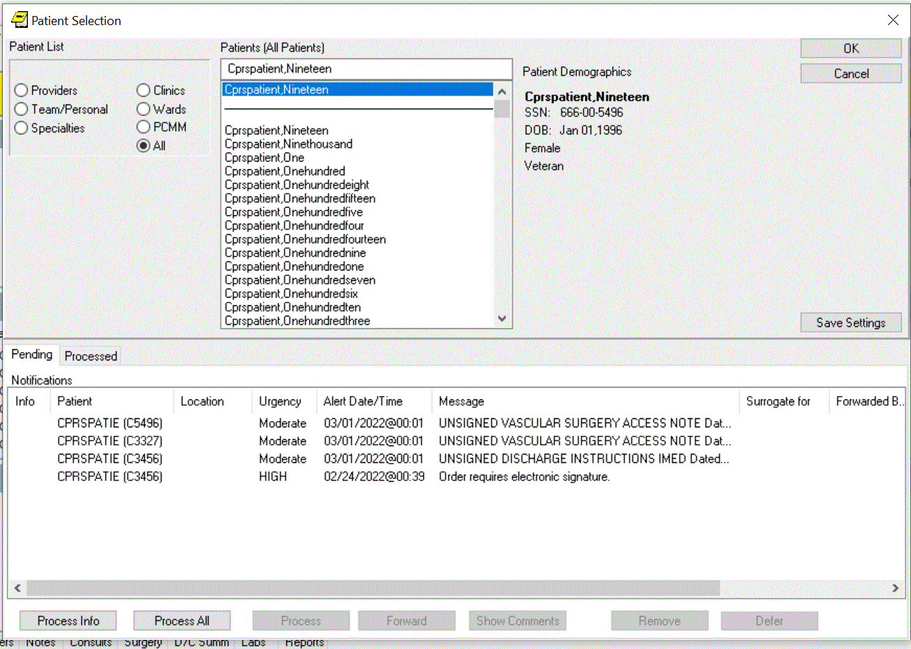**  
**Example of the Patient Selection screen**  
To select a patient record, follow these steps:

1.  If you are just opening CPRS, skip to step 2. Otherwise, select **File \| Select New Patient...**  
**Note:** If you have just entered orders or documents that are unsigned, a screen will pop up asking you to review and sign the changes.

1.  Do one of the following:  
-   Type the patient's full social security number with or without dashes (000-44-4444 or 000444444) or type the full social security number with “P” as the last character (000-44-4444p, or 000444444p).  
-   Type part of the patient’s last name or the patient’s entire name (e.g. “CPRSp” or “CPRSpatient,One”).  
-   Type the first letter of the patient’s last name and the last four digits of the patient’s Social Security number (c4444).  
CPRS will try to match what you entered to a patient and highlight that patient. The patient's name and other information will appear below the Cancel button.

**Note:** CPRS now only auto-selects (highlights in blue and places that entry in the field) a patient name if the user types enough characters to uniquely identify a name in the list. If the user does not enter enough characters to uniquely identify an item, CPRS waits until the user explicitly selects an item using the mouse or the keyboard.

1.  Verify that the correct patient is highlighted. If the correct patient is highlighted, click OK. If the correct patient is not highlighted, scroll through to find the correct patient, highlight the name, and then click OK.  
**Note:** If CPRS finds more than one patient with the same last name and same last four digits of the social security numbers, a box will popup listing possible matches. Select the correct patient and click **OK**.

When you select OK, CPRS opens to the Cover Sheet (unless you have set it to open to a different tab).

You can also use the radio buttons under the Patient List heading (located on the left-side of the window) to group the patient list according to provider, team, specialty, clinic, or ward. When you select a specific list for a provider, team, specialty, clinic, or ward, CPRS will display the associated patients in the Patients list box, followed by a line, and then the comprehensive patient list. You can then scroll to find the name. Your Clinical Coordinator will usually create the lists for the teams, wards, and so on.

## National Provider Identifier (NPI) Display in CPRS

If a provider’s NPI is listed in the NEW PERSON file (\#200), it will display in the provider selection lists in CPRS, as shown in the example below:

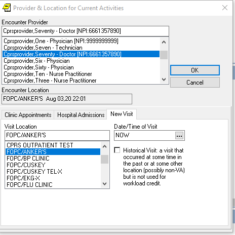

The user will be able to hover over the NPI. However, the NPI will not display when a provider is listed in the top section of the CPRS window, as shown below:

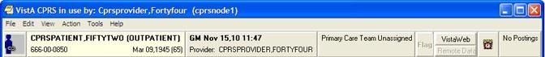

There are two other places where the NPI will not display due to GUI restrictions:

-   Tools \| Graphing \| Select/Define \| Select Person  
-   Tools \| Options \| Notes \| Notes \| Default Cosigner  
The screenshots in this manual that display a provider’s name have not been updated with NPI data. However, there will be a note near the screenshot that tells whether or not the NPI will display.

## How CPRS Sorts Names

VistA software uses a set of characters that include uppercase and lowercase Latin alphabetic characters (A-Z, a-z), numbers (0-9), and other special characters.

This is important because of how names are sorted if the user is searching for a partial name. If VistA has stored characters other than the Latin alphabetic and numeric, such as ñ, and the user does a partial search (types in only part of the name, for example), the names may not display in the order the user expects.

For example, if the system had patients or clinicians with names like Pina, Piña,

Piñon, Pine, Pinto, Pitcher, Pitt, Pixon, and Pizzelo, it is possible that the Piña and Piñon were entered with an ñ. If the user typed in “pi” as what CPRS should search for, CPRS would display the names as shown below:

Pina  
Pine  
Pinto  
Pitcher  
Pitt  
Pixon  
Pizzelo  
Piña  
Piñon  
Note that Piña is after Pizzelo. This is because VistA sorts these characters based on their numeric values in the character set that VistA uses. For example, in that table, the number for lowercase “a” might be 97, “z” might be 122, and “ñ” might be 241. Characters other than the uppercase and lowercase Latin alphabetic characters and numbers, such as ñ or the tilde (\~) will display wherever their numeric equivalent falls, which is generally after z.

## Patient Selection Messages

When you select a patient record to open, you may receive one or more of the following messages:

-   **Means Test Required –** This message tells you that the patient’s ability to pay for medical services must be evaluated.  
-   **Legacy Data Available –** This message would be found only at a consolidated facility. It informs you that the selected patient has data from the system you used before your site was consolidated that is not being displayed and that you may want to access.  
-   **Sensitive Patient Record –** This indicates that the record is sensitive and may only be viewed by authorized users.  
-   **Deceased Patient –** This message tells you that the selected patient is deceased.  
-   Patient with Similar Name or Social Security Number – This message appears if you enter only part of a patient’s name or the last four digits of a social security number. If CPRS finds more than one match for what you have entered, this message appears and CPRS presents the possible matches so that you can select the right one.  
## Patient Lists

You or your Clinical Coordinator can create patient lists or team lists that simplify tasks such as reviewing patient charts, ordering, and signing orders and notes. These lists can be based on wards, clinics, teams, or other groups. Users can create their own personal Patient Lists in the CPRS GUI. When the user creates the list, the user designates if the list can be viewed only by the owner (the person creating the list) or by all CPRS users. Clinical Application Coordinators (CACs) can create and manage general patient lists through the List Manager interface (the character-based version of CPRS).

With patient lists you can:

-   Quickly locate your patients without going through all the patients in the list.  
-   Create lists for teams of clinicians who can sign or cosign for each other.  
-   Tie notifications to teams, ensuring that all team members receive necessary information about a patient.  
### Setting a Default Patient List

To make it easier for you to locate your patients, CPRS enables you to set a default patient list. This is the list that will appear when you launch CPRS. For example, if you work in a specific ward, you can set the default patient list to be the list for that ward.

To set the default patient list, use these steps:

1.  If you are just opening CPRS, skip to step 2. Otherwise, select **File \| Select New Patient...**.  
1.  In the Patient Selection screen, select the category in which you want to search for a patient’s record by clicking the option button in front of the category (Default, Providers, Teams, Specialties, Clinics, Wards, or All).  
1.  In the list box below the option button, click the item that narrows the search further (such as a specific ward).  
1.  If you select something other than All, CPRS sorts the patient list and divides the list into two parts: The names above the line are the names for the category and item you selected; the names below the line make up a comprehensive patient list.  
1.  To save the patient list as your default list, click Save Patient List Settings.  
1.  If you selected “Clinics” in step 2, a dialog that resembles Figure A will appear.  
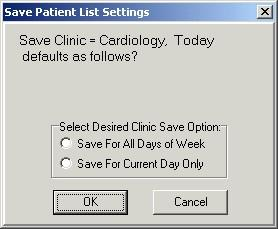

**This dialog enables the user to save kinds of clinic lists**

1.  Select “Save For All Days of Week” to set the clinic as the default patient list for all days of the week.  
\-or-

select “Save For Current Day Only” if you wish to set the clinic as the default for only the current day of the week.

1.  Press **OK**.  
## Notifications

Notifications are messages that provide information or prompt you to act on a clinical event. Clinical events, such as a critical lab value or a change in orders, trigger a notification to be sent to all recipients identified by the triggering package (such as Lab, CPRS, or Radiology).

There are two different listings for Notifications, Provider-centric and patient-centric. Provider-centric notifications are shown on the Patient selection screen and all pertain to the user that is logged in. The user brings up Patient-centric notifications or alerts in their own dialog box by selecting an item from the File menu.

-   Provider-centric: The listing on the Patient Selection screen shows all notifications for the provider  
***  
***  
***  
***  
***  
***  
***

****  
Provider-centric view of Notifications on the Patient Selection screen.  
***

-   Patient-Centric: This listing is reached by selecting File \| View Patient’s Notifications…. The main difference is that all notifications listed in this dialog relate to the current patient only. The last column labeled Mine tells whether the notification belongs to the logged in provider as well.  
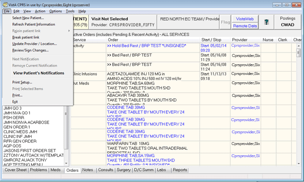  
This screen capture shows how the user can select File \| View Patient’s Notifications to bring up the dialog below.  
***  
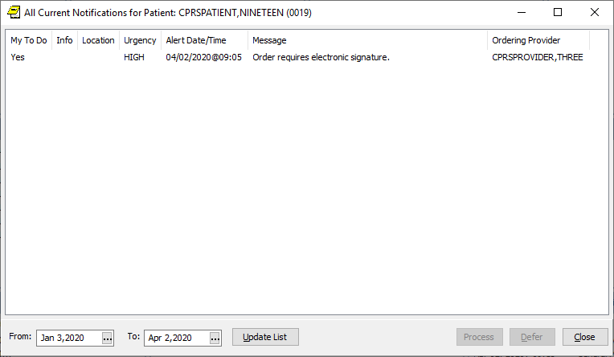  
After a patient is selected, the user can view all notifications for the selected patient. New columns include “My To Do” and the “Ordering Provider” and the user can process, defer, or close the dialog. The date range of displayed alerts is also customizable.  
***

**Action, Informational, and Long Text Informational Alerts**  
-   **Action alerts:** When you process notifications that require an action, such as signing an order, CPRS brings up the chart tab and the specific item (such as a note requiring a signature) that requires action.  
-   **Informational alerts:** CPRS places an “I” before “information-only” notifications. Once you view (process) information-only notifications, CPRS deletes them.  
-   **Long Text Information alerts:** CPRS places an “L” before a long alert. Long alerts have more text than will fit on one line as alerts are normally displayed. Processing the alert will bring up a dialog with additional actions.  
***

**Action Alerts Require User Interaction**  
For action alerts, users can select the alert and CPRS will take them to the appropriate tab to complete the action. This may be to view a lab result, sign orders or notes, respond to System for Mammogram Results Tracking (SMART) notifications, etc.  
SMART notifications are new with CPRS v31b. When users process a SMART notification, they are taken to a progress note title containing a Reminder dialog for them to complete.  
***

From the main listing, users can also Remove, Renew, Forward or Defer notifications.  
-   **Removing** notifications is the same as deleting them. A new parameter (ORB REMOVE) enables you site to identify which notifications can be removed without processing.  
-   **Renewing** notifications is useful when a user is processing a view alert, such as an abnormal lab result, and decides that the alert should not go away after the user views it. In this case, the user can renew the alert and it will still be there the next time the user logs in to CPRS.  
-   **Forwarding** notifications enables users to send an alert to someone else at the site. The user can choose from the list of names that is in your site’s New Person file.  
-   **Deferring** notifications enables a user to defer a notification for a period of time from 5 minutes to 14 days. Deferring will remove the notification from the display for the designated period of time, after which, it will display again. Users can defer notifications as many times as they choose until the system removes them.  
***

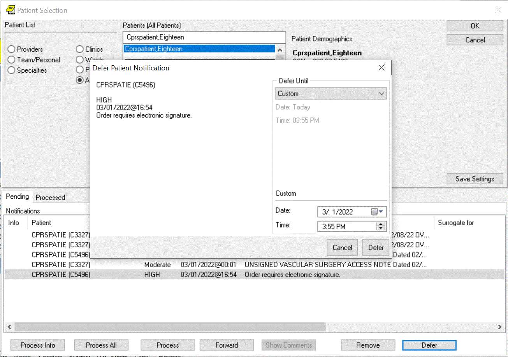  
Example of the Defer Patient Notification option  
***  
***  
***  
***  
***  
***  
***  
***  
***  
***  
***  
***  
***  
***  
***

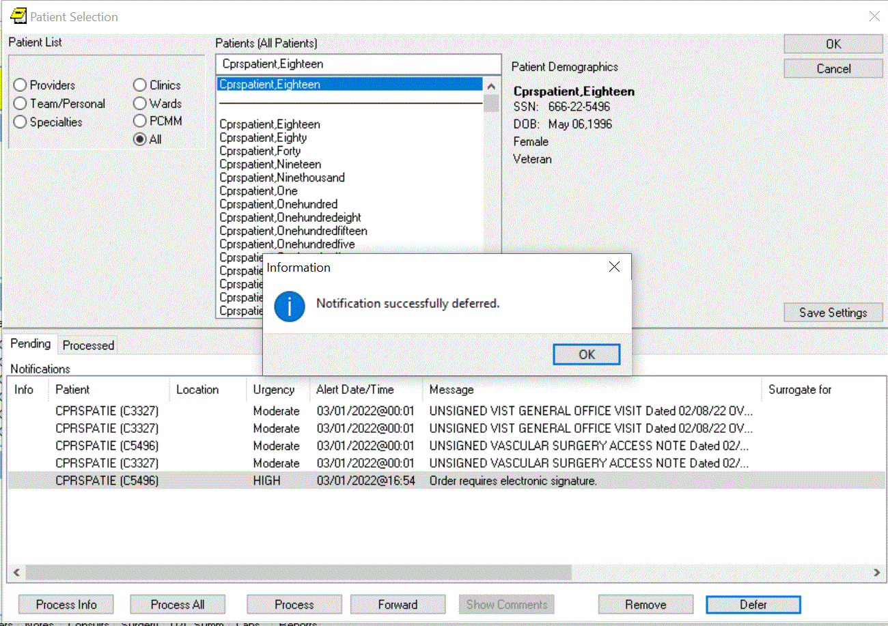  
A dialog shows that the notification was successfully deferred  
***

**Note**: As a default, all Notifications are disabled. Information Resources Management (IRM) staff and Clinical Coordinators enable specific notifications by setting site parameters through the Notifications Management Menus in the List Manager version of CPRS. These specific Notifications are initially sent to all users. Users can then disable unwanted Notifications as desired, through List Manager’s Personal Preferences. Some notifications are mandatory and cannot be disabled.  
Notifications are retained for a predetermined amount of time (up to 30 days), after which they may be sent to another destination, such as your MailMan surrogate or your supervisor. Confer with your clinical coordinator to establish and set up these options. You can also confer with your clinical coordinator to select what types of notifications you will receive. Some notifications are mandatory, however, and cannot be disabled.

Clinical Notifications are displayed on the bottom of the Patient Selection screen when you log in to CPRS. Only notifications for *your* patients or notifications that have been forwarded to you are shown.

### Sorting Notifications and Viewing Comments of Forwarded Alerts

To enable users to decide which of their Notifications or Alerts they would like to process first, the format for displaying Notifications in the CPRS GUI has been changed to columns that enable users to sort their Notifications based on column heading:

-   Info (information alerts are preceded with an “I”)  
-   Patient name (alphabetical or reverse alphabetical)  
-   Location (patient location, if known, alphabetical or reverse alphabetical)  
-   Urgency (valued HIGH, Moderate, or low as indicated by the CPRS parameter ORB URGENCY. TIU alerts are given a Moderate urgency value. Other alerts without a parameter value are given an urgency of low.)  
-   Alert Date/Time (date/time the alert was triggered, newest to oldest or oldest to newest)  
-   Message (alert message or text, alphabetical or reverse alphabetical)  
-   Forwarded By/When (sorts alerts alphabetically and then by time for the same forwarding person)  
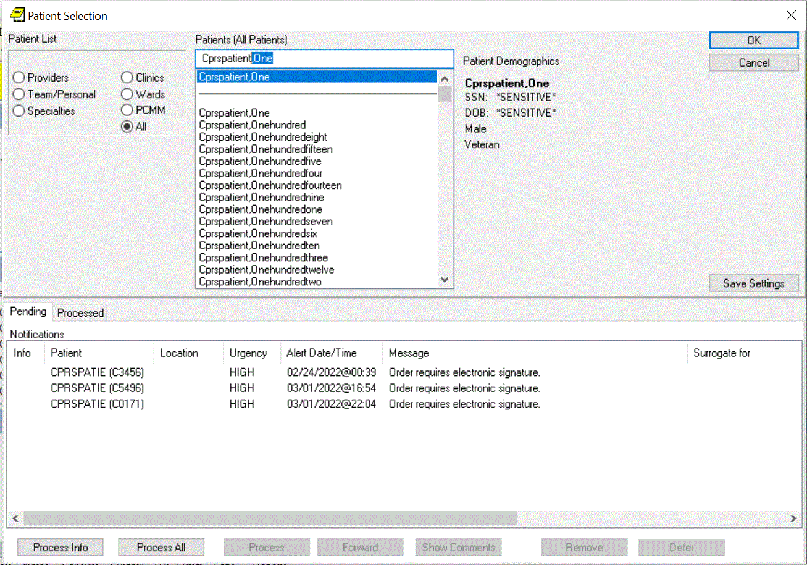

This graphic shows the alerts sorted by date. Clicking a heading will sort the alerts by that heading  
When the user exits CPRS or changes patients, CPRS stores which column the user sorted by and sorts by that column again when the Patient Selection/Notifications screen is next displayed. By default, after the user changes patients or enters CPRS again, the column that is saved will sort in ascending alphabetical order (A-Z) except for the Date/Time column that will sort by most recent date/time to oldest.

#### Sorting Notification Columns Using the Mouse

To sort Notifications using the mouse, click the column heading you want to sort by. To reverse the sort order, click the same heading again. For example, a user could decide to sort by date and time. Normally, the most recent alerts are listed first. The user could click the column heading to reverse the order and have the oldest alerts displayed first. Clicking the column heading again would list the most recent alerts first.

#### Sorting Notifications Using the Keyboard

Users who do not use the mouse can sort Notifications in ascending order (alphabetical order or most recent Date/Time) using the keyboard only. When users sort using the Ctrl + \<key\> combination, CPRS will recognize either upper or lowercase letters (this feature is not case-sensitive). Users can sort Notifications using the following Ctrl + \<key\> combinations:

| **Key Combination**  | **Column Sorted**  |
|----------------------|--------------------|
| Ctrl + I             | Info               |
| Ctrl + P             | Patient            |
| Ctrl + L             | Location           |
| Ctrl + U             | Urgency            |
| Ctrl + D             | Alert Date/Time    |
| Ctrl + M             | Message            |
| Ctrl + F             | Forwarded By/When  |

**Note:** A limitation exists in the programming environment that does not allow the user to user the same key combination to then reverse the sort. Making this change would not be trivial and will not be addressed the CPRS GUI at this time.

#### Viewing Comments for Forwarded Alerts

Users may also want to view comments associated with forwarded alerts. To view a comment, simply place the cursor over the alert, leave it still for a few seconds, and the comment will display. Move the mouse and the comment will no longer be displayed.

To bring up the forwarded comment in a separate dialog, highlight the notification with the comment and select the Show Comment button. CPRS will display a dialog similar to the one shown below:

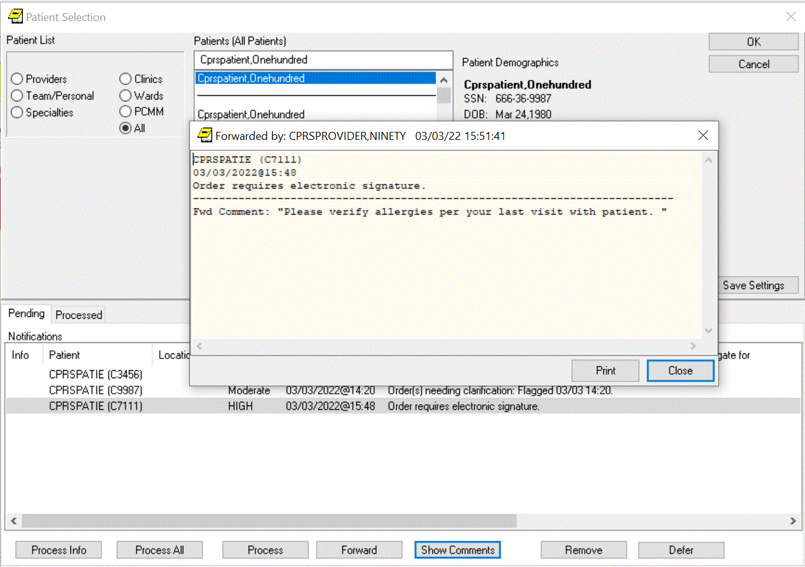

When the user clicks the Show Comment button for a notification that has a forwarded comment, the comment shows in a dialog.  
**Note:** If the provider has an NPI, it will not display on the “Forwarded by” screen.

### Processing, Removing, and Forwarding Notifications

CPRS provides you with flexibility in processing, removing, and forwarding Notifications. First, you select the alerts that you want to act on and then click the appropriate button. For processing notifications, you have three choices: Process Info, Process All, and Process, which will process those notifications that you have highlighted. When you are processing notifications, you can also renew a notification, which ensures that you will see the notification again the next time you log in, or you can forward the notification to one or more users.

**Note:** Sometimes CPRS will display an alert that belongs to a sensitive record— one that the user cannot view. CPRS blocks access to sensitive records when the user is processing notifications and alerts. If the alert that cannot be viewed is the first one to be processed, CPRS will give an error message and return to the Patient Selection screen. If the sensitive record is for an alert other than the first, CPRS will process the alerts until it gets to the sensitive record and will then return the user to the Patient Selection screen. Then the user can reselect alerts, excluding the one to the sensitive record, and continue processing.  
Processed alerts are listed on the Processed tab in the Patient Selection dialog. You have these options for displaying processed alerts:

-   You can specify the date range for the alerts.  
-   You can limit the number of alerts in the table.  
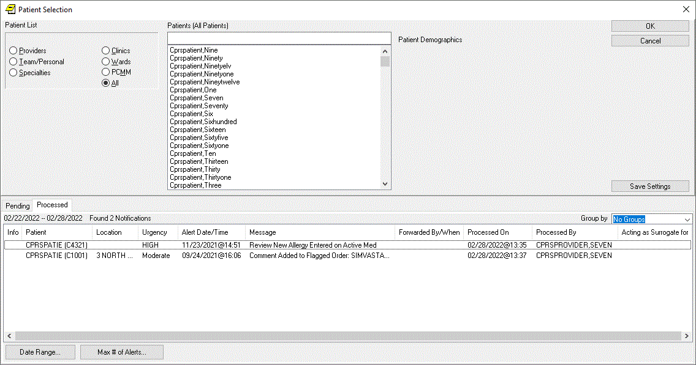

Example of the Processed alerts tab in the Patient Selection dialog  
**To process notifications, use these steps:**

1.  Bring up the Patient Selection screen, either by launching CPRS or if you are already running CPRS, selecting File \| Select New Patient.  
1.  Decide which notifications to process.  
-   To process all information notifications (items preceded by an I.), click **Process Info**.  
-   To process all notifications, select **Process All**.  
-   To process specific notifications, highlight one or more notifications, and then select **Process**. You can also process a notification by double clicking on it.  
**Note:** To select a number of notifications in a row, click the first item, hold down the Shift key, and click the last item. All items in the range will be selected. To select multiple items that are not in a row, click one, hold down the Control key, and click the other specific notifications.

1.  Process the notification by completing the necessary task, such as signing an overdue order or viewing information notifications.  
**Note:** For Audio Renewal requests that cannot be automatically renewed for some reason, CPRS has a new notification. The Nonrenewable RX Request for notification is an action alert that takes the user to the orders tab. The user can then use the Copy to New Order feature (because the order cannot be renewed) if they want to continue the medication therapy for the patient. If providers receive an alert for a patient they no longer see, they can Forward the alert to the appropriate provider. Who receives the alert is based on the set up for the alert. Contact your CAC or similar personnel if you are repeatedly getting alerts for the wrong patients.If you want to renew or forward this notification to someone else, right click the Next button and select either Renew or Forward as shown in the graphic below. If you selected Forward, proceed to step 5. If you selected Renew, go to step 6.

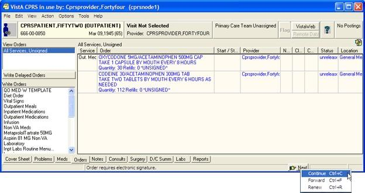

**This above graphic shows the pop-up menu items available by right-clicking the Next button**  
***

1.  Select the individuals that you want to receive this notification.  
**Note:** If the provider has an NPI, it will display on the screen below. See the “National Provider Identifier (NPI) Display in CPRS” section for an example of an NPI displaying on a screen.

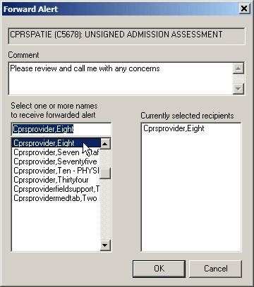

The Forward Alert dialog  
1.  In the field labeled Select or enter name, type the first few letters of the person’s last name.  
1.  Find the person’s name in the list and click it to add it to the list of recipients.  
1.  Repeat steps a and b until all those you want to forward this notification to are listed under Currently selected recipients.  
1.  Type a comment if needed (comment length is limited to 180 characters including spaces).  
1.  Click **OK**.  
1.  When finished with the current Notification, go to the next notification by clicking the Next button on the status bar.  
1.  Process the remaining notifications using steps 3-5.  
1.  When finished, you may select a new patient (File \| Select New Patient…) or exit CPRS (File \| Exit).  
**To specify the date range for processed notifications, and the maximum number of processed alerts to display, use these steps:**

1.  You can specify the date range and maximum number by clicking on either the Tools – Options tab or the Processed tab in the Patient Selection dialog:  
-   If you click the Tools – Options tab:  
1.  On the Notifications tab, click the Processed Alerts Settings button.  
1.  On the Processed Alerts Preferences screen, enter a value in the **Show Log Data for (days)** and/or **Max \# of records to show** field and click **OK**.   
    **Note:** To set the values to the defaults, click the Defaults button.  
1.  Click **OK** on the Notifications tab.  
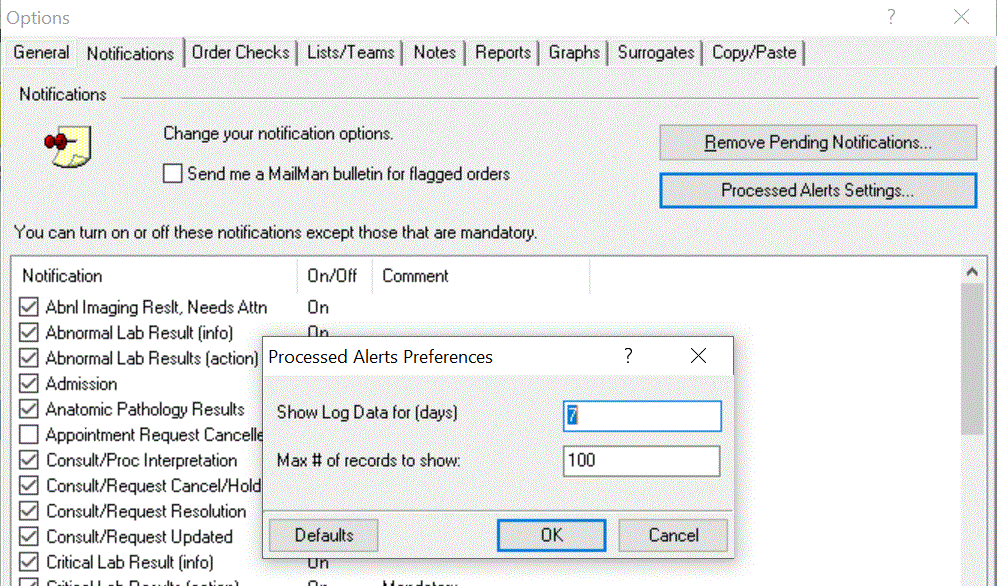  
 Processed Alerts Preferences screen  
-   If you click the Processed tab in the Patient Selection dialog:  
1.  If you want to edit the date range, click the Date Range button:  
1.  On the Range Selector screen, select a value from the Start and/or Stop Date dropdown and click **OK**. To set the values back to the defaults, click the Reset button.  
1.  If you want to change the maximum number of alerts that will display on the Processed tab, click the Max \# of Alerts button:  
1.  On the Processed Alerts Preferences screen, enter a value in the Enter Max \# of Alerts to Review field and click **OK**.  
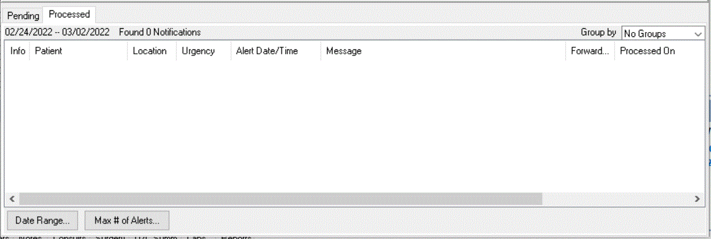

Date Range and Max \# of Alerts buttons on the Processed tab

**To remove notifications, use these steps:**

1.  Bring up the Patient Selection screen, either by launching CPRS or if you are already running CPRS, selecting File \| Select New Patient.  
1.  Highlight the notifications that you want to remove.  
**Note:** To select a number of notifications in a row, click the first item, hold down the Shift key, and click the last item. All items in the range will be selected. To select multiple items that are not in a row, click one, hold down the Control key, and click the other specific notifications.

**Warning:** Once you remove these notifications you cannot get them back. Be careful that you really want to remove or delete these notifications before you proceed.

1.  Click Remove.  
**Note:** A new parameter ORB REMOVE enables sites to specify which notifications can be removed in this way. If the notification is not removed, you will have to process the notification.

**To forward a notification to another user, use these steps:**

1.  Bring up the Patient Selection screen, either by launching CPRS or if you are already running CPRS, selecting File \| Select New Patient.  
1.  Highlight the notifications that you want to forward and click Forward.  
**Note:** To select a number of notifications in a row, click the first item, hold down the Shift key, and click the last item. All items in the range will be selected. To select multiple items that are not in a row, click one, hold down the Control key, and click the other specific notifications.When the dialog shown below displays for each notification, select the recipients’ names for this notification.

**Note:** If the provider has an NPI, it will display on the screen below. See the "National Provider Identifier (NPI) Display in CPRS" section for an example of an NPI displaying on a screen.

1.  In the field labeled Select or enter name, type the first few letters of the person’s last name.  
1.  Find the person’s name in the list and click it to add it to the list of recipients.  
1.  Repeat steps 4 and 5 until all those you want to forward this notification to are listed under Currently selected recipients.  
1.  Type a comment if needed (comment length is limited to 180 characters including spaces).  
1.  Select **OK**.  
Repeat the above steps as necessary for additional notifications you want to forward.

## 

## Refreshing a Patient Record

You can refresh a patient’s information so that recent changes will be reflected. To refresh a patient’s record, select **File \| Refresh Patient Information**. This option will refresh the information of the currently selected patient in the same manner that changing patients looks for the latest information. Refreshing a patient’s information will result in notes in progress being saved, and the review/sign changes screen will appear if changes are pending.

If the user has opened the chart and changed the patient’s location (from an inpatient location to an outpatient location or vice versa), but has not written any orders, the following dialog will appear when the user selects File \| Refresh Patient Information to enable the user to select where orders should be processed that are written later:

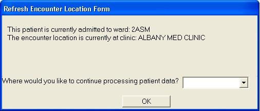

**This dialog appears after a refresh when the patient’s location has been changed, but no orders have been written yet. The reason for this is that sometimes it can be difficult to make sure the patient’s location is correct when the location has changed**  
# CPRS Write Access Functionality

CPRS Write Access functionality enables an authorized VistA user to permit or restrict write access for each CPRS tab (Problems, Meds, Orders, Notes, Consults, Surgery and Discharge Summary), and for specific functionality within each tab (for example, Cover Sheet Vitals, Encounters and specific Ordering Display Groups). The VistA user can permit or restrict write access at the System, Division or User level.

CPRS Write Access functionality eases the transition from CPRS/VistA to the new Electronic Health Record (EHR) system. It ensures continuity of patient care and optimizes validation of data displayed in the new EHR. Write Access functionality exists because Sites transitioning to the new EHR must limit unauthorized write-access in CPRS and Vista. However, sites not moving over immediately to the new EHR can still restrict Write Access to specific areas of CPRS for individual users or divisions. There is no impact to downstream systems or other applications.

**Note:** If the Write Access settings have changed in VistA, the CPRS GUI must be restarted before those updates will take effect.

**Note:** Instructions on how to change the CPRS Write Access settings are in the CPRS List Manager Technical Manual.

**To view the Write Access Permissions, do the following:**

1.  Click on either the Help menu or the New EHR banner (see [**COVID-19 Identifier/New EHR Banner**](#_22vxnjd) section):  
1.  If you clicked on the Help menu, click on **Write Access Permissions**. You will then see the Write Access Permissions screen.  
1.  If you clicked on the New EHR Banner, you will see a screen that displays information about write access permissions. It may also include localized content about the new EHR cutover.  
The Write Access Permission screen lists the tabs and additional functionality where write access is allowed. If there is a ‘Missing write access dependencies’ section, it lists write access permission that has been requested in VistA, but has not been granted because one or more dependencies are missing. For example, setting Delayed Orders write access to Yes is only valid when the user has write access to the Orders tab.   
  
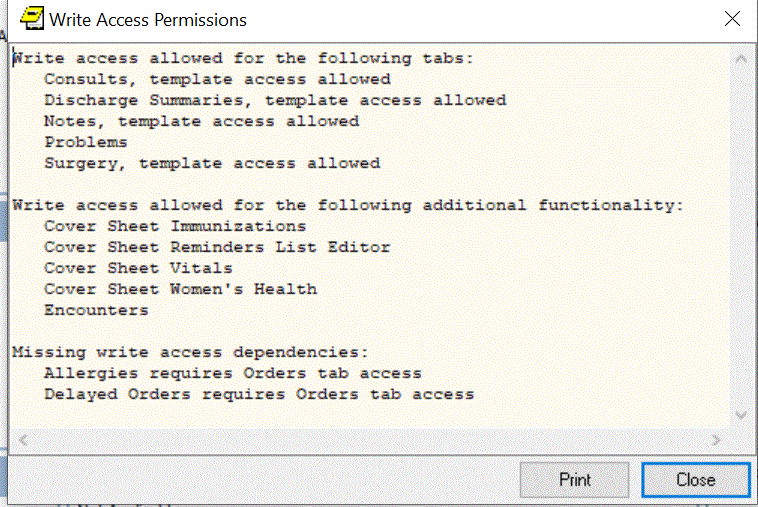  
**Example of the Write Access Permissions screen**

**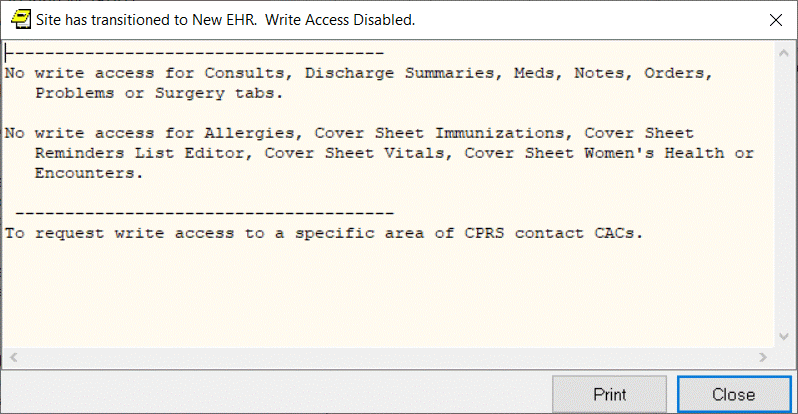**

**Example of the screen that displays after you click the New EHR banner**  
  
Listed below are examples of the differences between Write Access Allowed and Write Access Restricted for several tabs.

When the Problem Tab permission is set to Yes in VistA, the New Problem action is enabled and the user can edit, inactivate, remove, annotate, or restore a Problem in CPRS. When the Problem Tab permission is set to No in VistA, the New Problem action is disabled and the user cannot edit, inactivate, remove, annotate, or restore a Problem in CPRS.**  
  
**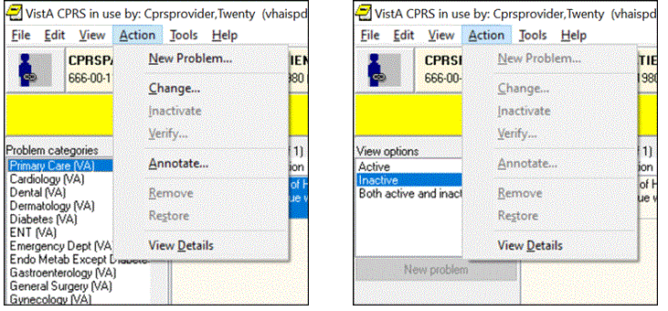  
**Example of the Problem Tab Permissions  
(On the Left screen, Problem Tab = Yes, On the Right, Problem Tab = No)  
**

When the Meds Tab permission is set to Yes, the user can access the functions on the Meds tab. When the Meds Tab permission is set to No, the Action menu option is grayed out/disabled.

**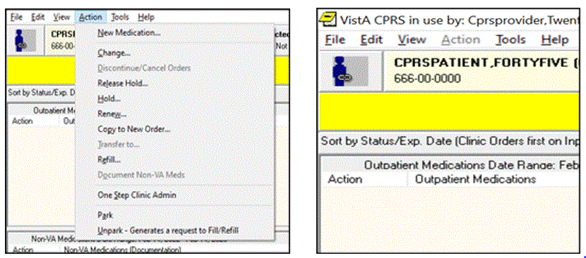  
Example of the Meds Tab Permissions  
(On the Left screen, Meds Tab = Yes, On the Right, Meds Tab = No)  
**

When the Orders Tab permission is set to Yes, the user can create or modify orders. When the Orders Tab permission is set to No, the user can’t create or modify orders.

**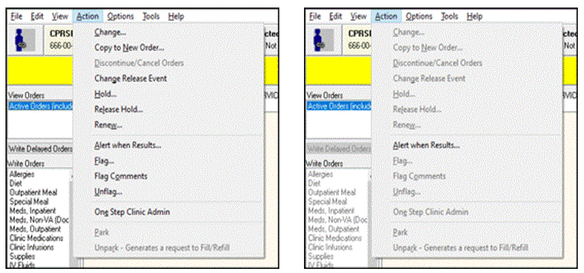**

**Example of the Orders Tab Permissions  
(On the Left screen, Orders tab = Yes, on the Right, Orders Tab = No)  
**

When Reminder editor permission is set to Yes, the user can perform full functions for the Reminder list. The arrows and the OK and Apply functions are enabled. When Reminder editor permission is set to No, the user can’t add available Reminders to the Reminder list panel on the right side. The arrows and the OK and Apply functions are disabled.

**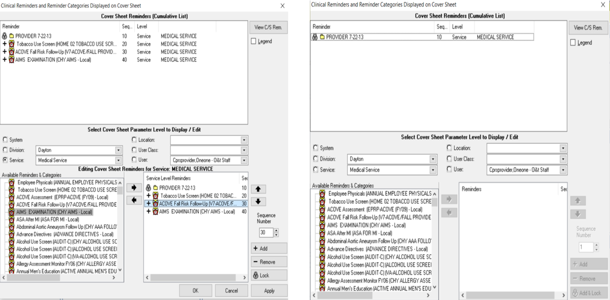  
Example of the Reminder Editor Permissions  
(On the Left screen, Reminders = Yes, on the Right, Reminders = No)**  
In the following example, write-access permission for the Orders Tab was set to Yes, but the Unit Dose Medications write-access was set to No in VistA.

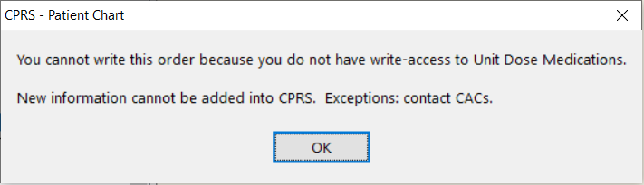

**Example of a user who does not have write-access to a some functionality within the Orders tab**

# Keeping Diagnostic and Procedure Codes Current

Code set versioning (CSV) modifies VistA to comply with the Health Insurance Portability and Accessibility Act (HIPAA) stipulations that diagnostic and procedure codes used for billing purposes must be the codes that were applicable at the time the service was provided. Because the codes change, CPRS currently checks ICD and CPT code validity as of a specified date when codes are entered, when a new code set is implemented, and whenever Clinical Application Coordinators (CACs) or IRM personnel choose to run the option.

CPRS GUI users will see indicators for inactive codes on the Cover Sheet, Problems tab, Encounter form, and in Clinical Reminders (although the Clinical Reminders changes may be less apparent).

In these GUI locations, any diagnosis or procedure codes that are inactive or will become inactive by a specified date because a new code set has been installed display with the “\#” symbol in front of them as shown in the following examples.

## Cover Sheet Displays

On the Cover Sheet, the active problems display. Users can quickly see if the patient has any inactive codes for the active problems.

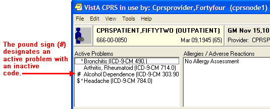

**The ‘\#’ symbol shows the user that this active problem has an inactive code**  
If the user tries to get a detailed display of the problem, the user first gets a warning about the inactive code.

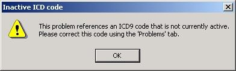

**This warning message informs the user that the current problem has an inactive code**  
The warning message instructs the user to correct the inactive code from the Problems tab. When the user closes the warning dialog, the detailed display then comes up. The detailed display also shows that the code is inactive.

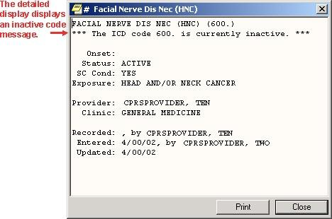

**The detailed display of the problem clearly shows that the associated code is inactive**  
### Encounter Form Display

The Diagnoses tab of the Encounter dialog displays a “\#” next to the code if the code is inactive.

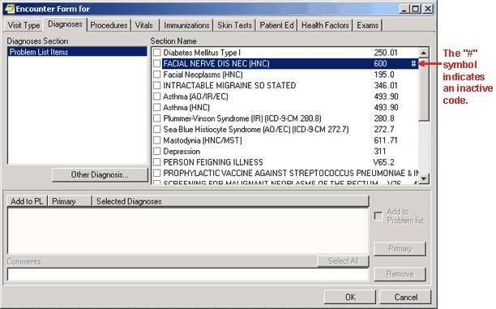

**This screen shows the inactive code with the “\#” or pound symbol**  
If the user tries to select that diagnosis the following warning appears.

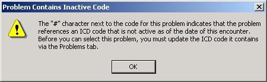

**The warning in this dialog tells users about inactive codes that need to be updated through the Problems tab**  
### Consults Tab Display

For Consults and Procedures, only active codes will be allowed for the following functions:

-   Lexicon look up for provisional diagnosis as of the ordering date  
-   Changing existing orders (the consult or procedure will not be accepted until a valid code is selected)  
-   Edit/Resubmit, the original code will be checked to see if it is active, if it is inactive an active code will need to be entered before CPRS will accept it  
### Clinical Reminders

CPRS GUI will only display codes that were active in the reminder date range.

## CPRS Time Out

If a program has a time out and it is idle for a specific amount of time, it will be closed. A time out ensures that a record can be accessed by others who might need it if someone has opened the record, but is not using it.

IRM can set a different time out or idle value for CPRS (such as 10 minutes) through a CPRS GUI parameter. If CPRS is open but not used for the time specified in the parameter, CPRS will display the dialog informing you that it is going to close in the number of seconds IRM set, count down to zero, and then close.

-   To keep CPRS running, select **Don't Close CPRS**.  
-   To close CPRS immediately, select **Close CPRS**.  
If only one CPRS session is open, the dialog looks like this:

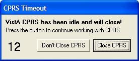

If multiple sessions are open, the dialog looks like this, including the identification of which session is about to close:

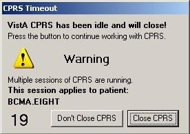

Because CPRS makes the session that is about to close active, users need to make sure they are in the correct chart after the user responds to this dialog.

# Features Available from Any Tab

There are several items located at the top of the CPRS window that are available from any tab. These items are:

-   the CCOW icon  
-   the Patient Inquiry button  
-   the Encounter Provider and Location button  
-   the Primary Care button  
-   the Patient Insurance/My HealtheVet button (which is hidden if the patient has no insurance nor My HealtheVet information)  
-   the Flag button  
-   the Vista Web button, the Remote Data button  
-   the Reminders button  
-   the Postings button  
**Note:** When a user resizes the CPRS window enough, the buttons can be hidden although they are still there. To ensure that users can still get to the information that these buttons provide, an Information menu item was added to the View menu. This item enables users to access the information from these buttons, even if the buttons are not visible because of screen size.  
A detailed explanation of each of these buttons is included below.

**Items available from any CPRS tab**  
## Clinical Context Management (CCOW) Icon

Clinical Context Management (sometimes referred to as “CCOW”) is a way for graphical user interface (GUI) applications to synchronize their clinical context based on the Health Level 7 CCOW standard. In simple terms, this means that if CCOW-compliant applications are sharing context and one of the applications changes to a different patient, the other applications will change to that patient as well.

The VA purchased Sentillion’s Vergence context management software to work with VistA.

To use the CCOW standard, VistA set up must include these two components:

-   a context vault, which is a server on the VA LAN that tracks context for each clinical workstation  
-   desktop components installed on each workstation that will use CCOW  
To allow VistA GUI applications to use context management, the developers must make the necessary changes to HL7 messages for each application to allow synchronization. Current plans call for the following applications to be CCOW compliant:

-   CPRS \*  
-   Health*e*Vet Desktop (Care Management) \*  
-   Imaging \*  
-   Clinical Procedures  
-   BCMA (Bar Code Medication Administration)  
-   Vitals  
-   FIM (Functional Independence Measure)  
-   Scheduling  
*\* These applications will be made CCOW compliant first.*

CPRS has been made CCOW-compliant and can now synchronize with other VistA CCOW-compliant applications. The first three applications that will be CCOW compliant are CPRS, Care Management, and Imaging. Care Management provides one example of applications synchronization. If you were in Care Management, which is also CCOW-compliant, and clicked the CPRS Chart link, the CPRS GUI chart would be launched and would bring up the same patient that had focus in Care Management. You can also have two CPRS sessions synchronized. And, of course, you can bring up two different CPRS sessions and not synchronize them, thus allowing you to view two patients’ charts at the same time.

The CCOW icon shows whether the current application is linked with others on the desktop.

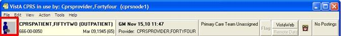

**The above graphic shows the CCOW icon in outlined in red at the far left of the chart**  
CPRS enables users to join or break context with other applications. The icon displays whether CPRS is joined in context or not. The following three icons will display based on the CCOW state:

Linked

**Broken**  

**Changing**  
  
**Note:** There are a few cases when you cannot change context, such as when a print dialog is open or when you are trying to open an application from the Tools menu. If you try to change context with unsigned orders or notes, the following dialog will display.  
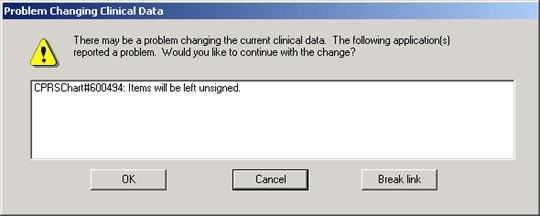

**This graphic shows what a warning message might look like**  
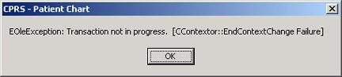

**If the application is busy doing something and cannot change context, CPRS will display a message such as the one above**  
To join context, use the following steps:

**Note:** If a context error occurs, the Rejoin patient link menu item will not be available for the rest of the current CPRS session. It will be available again when the user closes CPRS and then launches CPRS again.

1.  Give focus to the application that you want to join context by either clicking on that application window or by holding down the Alt key and pressing tab until you highlight the appropriate application and then release the keys.  
1.  Choose File \| Rejoin patient link.  
1.  If you want the other open applications to synchronize with the current patient in the application that has focus, choose **Set new context**. Or, if you want the current application to synchronize with the patient the other applications have open, choose **Use Existing Context**.  
To break context between applications, follow these steps:

**Note:** If a context error occurs, the Rejoin patient link menu item will not be available for the rest of the current CPRS session. It will be available again when the user closes CPRS and then launches CPRS again.

1.  Give focus to the application that you want to remove from context by either clicking on that application window or by holding down the Alt key and pressing tab until you highlight the appropriate application and then release the keys.  
1.  Choose File \| Remove from link.  
## Patient Inquiry Button

The Patient Inquiry button is located on the left side of the chart directly below the menu bar. The Patient Inquiry button displays the following information:

-   Patient name  
-   Status (inpatient or outpatient)  
-   Social Security number (or identification number if assigned by the site)  
-   Date of birth  
-   Age  
-   Display Caregiver information (if available). The primary, secondary, and general caregiver(s) will display if they are present and considered active.  
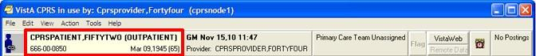

**The Patient Inquiry button**  
If the patient’s preferred name has been entered into VistA, it will display in parentheses after the patient’s first name on the Patient Inquiry button, as shown below:

**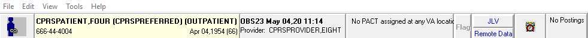  
Patient Inquiry button for a patient with a preferred name**  
If you select the **Patient Inquiry** button, the Patient Inquiry dialog appears. The Patient Inquiry dialog includes additional information such as the patient’s mailing address, telephone numbers (including the patient’s home, work, and cell phone numbers), admission information, and other relevant data, such as provider information (including the patient’s mental health treatment coordinator (MHTC) contact information, displaying in two locations on the Patient Inquiry form) and primary and secondary next-of-kin entries. Caregiver information also displays (if available)—this includes the primary, secondary, and general caregiver(s) if they are present and considered active.

The Mental Health Treatment Coordinator is the liaison between the patient and the mental health system at a VA site. There is only one MHTC per patient, and the MHTC is the key coordinator for behavioral health services care. While in the detailed display, you can select a new patient, print the detailed display, or close the detailed display.

**Patient Inquiry Dialog Example**

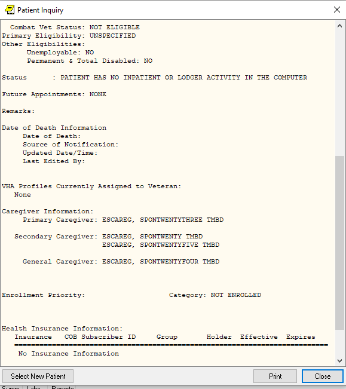

**Patient Inquiry Dialog Example (continued)**

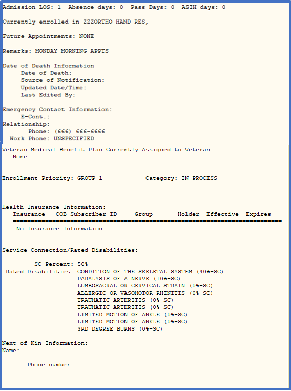

**The Patient Inquiry dialog also shows information that can be printed including demographic information, Permanent & Total Disabled status, and Health Benefit Plans currently assigned to the Veteran.   
**  
If a patient’s preferred name has been entered into VistA, it will display in parentheses next to the patient’s first name, as shown below:**  
  
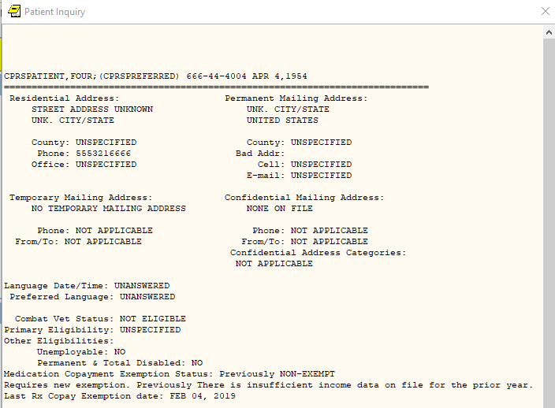**  
**Patient Inquiry screen for a Patient with a Preferred Name**  
**  
**The preferred name will display only on the Patient Inquiry button and screen. It will not display on any other CPRS GUI screen or report.

### Encounter Information

CPRS has two kinds of encounter information: visit information and encounter form data. Encounter form data is explained later in this manual.

For each visit (or telephone call) with a patient, you must enter the provider, location, date, and time. CPRS requires this information before you can place orders, write notes, add to the problem list, and perform other activities.

To receive workload credit, you must enter the encounter form data, including the following information, for each encounter:

-   Service connection  
-   Provider name  
-   Location  
-   Date  
-   Diagnosis  
-   Procedure  
### Visit / Encounter Information

CPRS shows the encounter provider and location for the visit on the Visit Encounter button. You can access this feature from any chart tab.

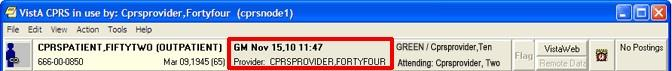

**The Visit Encounter button**  
#### Entering Encounter Provider and Location

If an encounter provider or location has not been assigned, CPRS will prompt you for this information when you try to enter progress notes, create orders, and perform other tasks.

To enter or change the Encounter provider, follow these steps:

1.  If you are already in the Provider & Location for Current Activities dialog skip to step 2. Otherwise, from any chart tab, click the **Provider / Encounter** box located in the top center portion of the dialog.  
**Note:** These instructions are written as if the user must select a provider. If the user making the selection is a provider, the user will be selected by default and the cursor will go to the New Visit tab if no visit is defined, or to the Clinic Appointments tab if one is defined. If the user is not a provider, the cursor will go to the Encounter Provider field so that the user can select the provider for the encounter.

1.  In the Encounter Provider list box, locate and select the provider for this encounter.  
**Note:** To help you distinguish between providers, CPRS displays their titles (if available). When two or more providers have identical names, CPRS also displays:

o The service/section and site division (if any) associated with these providers; site divisions are displayed based on the following rules:

-   When no division is listed for a provider, no division is displayed.  
-   If only one division is listed, this division is displayed.  
-   If the site has multiple divisions or more than one division is listed **and** one of these listed divisions is marked as Default, CPRS displays the division marked as Default.  
-   If more than one division is listed for a provider and none is marked as Default, CPRS does not display division information for this provider.  
o Providers who are listed in the New Person file as Visitors are screened out from the provider list. (These screened-out providers are listed as Visitors because their entries were created as a result of a Remote Data View.)

1.  Select the tab that corresponds to the appropriate encounter category (Clinic Appointments, Hospital Admissions or New Visit.) Select a location for the visit from the choices in the list box.  
1.  If you selected a clinic appointment or hospital admission, skip to step 7. If you are creating a New Visit, enter the date and time of the visit (the default is NOW).  
1.  Select a visit category from the available options (such as, Historical) and select **OK**.  
1.  When you have selected the correct encounter provider and location, select **OK**. If the Similar Providers screen appears, select a provider from the list and select **OK**.   
      
    **Note:** If the last name and the first two letters of the first name match another provider, CPRS will display the Similar Providers screen, which will prompt the user to select the right provider from a list of providers with similar names, as shown in the screenshot below. This functionality exists in thirty-seven areas of CPRS but it always works the same way.   
      
    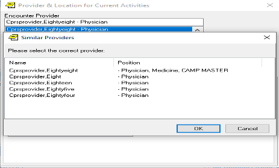  
    **Similar Providers screen**  
1.  For more information and instructions on entering more encounter form data, refer to the Notes section of this manual.  
## Primary Care Information

Improvements are coming to the display of provider and team information that users see on the Primary Care button and in the detailed display that the user can view by selecting the Primary Care button. This section will show the display as it currently is and how it will look after patch OR\*3.0\*387 (also referred to as PCMM Web) is full deployed. The patch deployment will be phased and may take up to a year.

When patch OR\*3.0\*387 is installed, users will immediately see changes in the Primary Care detailed display. Any changes to the items on the Primary Care button itself will be included in a later version of CPRS.

### Current Display (CPRS v.30.b before OR\*3.0\*387)

To the immediate right of the Visit Encounter button is the Primary Care button on which, for an inpatient, CPRS displays might display as many as six items of information if all are assigned to this patient:

-   the Primary Care Management Module (PCMM) or primary care team (outpatient team)  
-   primary care provider or PCP (outpatient provider)  
-   the associate provider (outpatient provider)  
-   the (Inpatient) attending provider  
-   the (Inpatient) provider  
-   the mental health treatment coordinator (for both an inpatient or an outpatient)  
Definitions of different providers:

-   A Primary Care Provider (PCP) provides care to a patient at the time of first– non-emergent contact, which occurs on an outpatient basis.  
-   An Associate Provider is usually the Resident working with a patient’s PCP, and is providing **outpatient** primary care. (A Resident is a graduate and licensed physician receiving training in a specialty.)  
-   An Attending Physician/Admitting Provider is the physician with primary responsibility for the care of a patient who is admitted to the hospital.  
-   An Inpatient Provider is the Resident providing inpatient primary care.  
-   A Mental Health Treatment Coordinator (MHTC) is the person who is designated to coordinator a patient’s mental health needs.  
#### 

#### Possible Providers for Inpatients

The items are arranged on the button as shown below in the diagram and then on the button itself:

\<PCMM Team\> / PCP: \<name\> / Associate PCP: \<name\>  
Inpatient Attending: \<name\> / Provider: \<name\>  
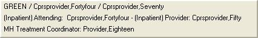

**This screen capture shows the Primary Care button for an inpatient with all the team items displayed and where they are displayed on the button. The first row has three possible items: the PCMM team, the Primary Care Provider, and the Associate Primary Care Provider. The second line has the inpatient provider information: Inpatient Attending or Admitting provider and the Inpatient Provider. The third line displays the Mental Health Treatment Coordinator**  
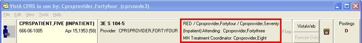

**The Primary Care button for an inpatient with the primary care team, primary care provider, associate provider, attending physician, and mental health treatment coordinator showing**  
#### Possible Providers for Outpatients

For outpatients, CPRS might display up to four items:

-   the PCMM or primary care team (for an outpatient)  
-   primary care provider (for an outpatient)  
-   the associate provider (for an outpatient)  
-   the mental health treatment coordinator (for both an inpatient or an outpatient)  
The items are arranged on the button as shown below in the diagram and then on the button itself:

\<PCMM Team\> / PCP: \<name\> / Associate PCP: \<name\>  
MH Treatment Coordinator: \<name\>  

**This screen capture shows how the Primary Care button would look for an outpatient if all team items are assigned. In the first row, CPRS displays the PCMM or primary care team, the primary care provider, and the associate primary care provider. The second row displays the mental health treatment coordinator**  
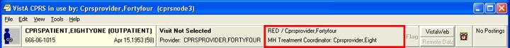

**The Primary Care button as shown for an outpatient with the primary care team, primary care provider, and mental health treatment coordinator**  
#### Primary Care Dialog’s Assigned Providers Contact Information

When the user selects this button, CPRS displays a dialog containing the contact information for the above providers and the mental health treatment coordinator.

Only the information that is available to CPRS is displayed. If the various providers have not been entered, only what has been entered will display. The message “Primary Care Team Unassigned” is displayed if a primary care team has not been assigned.

For more information on the providers listed on the button, select the **Primary Care** button to display the Primary Care details dialog as shown in the example below.

**Note:** If the provider has an NPI, it will not display on the screen below.

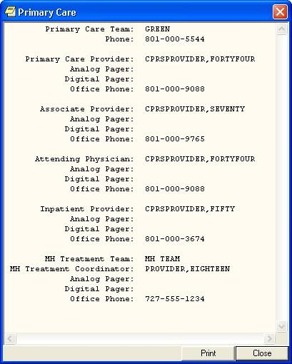

### The Primary Care Display after PCMM Web (OR\*3.0\*387) Installation

When the OR\*3.0\*387 (also known as PCMM Web) is deployed, you will see changes in the Primary Care detailed display.

#### Information on the Primary Care Button

It is anticipated that there will be changes to the information displayed on the Primary Care button with the release of CPRS GUI v31b.

#### Information in the Primary Care Detailed Display

The changes to the Primary Care detailed display provide additional information for users regarding who has seen the patient and giving contact information for them. Several items have been added to the available information, such as information from different sites, additional information about the kinds of providers listed, and new labels for teams, etc.

All active team information will display regardless of station.

Some items only display if certain conditions are met. For example, if the patient is not an inpatient, no inpatient information is displayed. If an associate provider is not explicitly assigned to the patient, it will not display. If information is not entered for a team, no team information or labels will display.

##### Local versus Remote Sites

The detailed display shows whether the information that the user is viewing is local or remote. The detailed display can show both local and remote information at the same time. Sites will display in alphabetical order with all local sites first, then all remote sites, and finally any Non-VA providers that might be entered.

The format is to show the word “Local” or “Remote,” the site name, and then the station number as the example below shows:

LOCAL – CHEYENNE (442)

LOCAL – CHEYENNE (442) \|\|GREELEY CBOC (442GC) [B-03124]

REMOTE – DC VAMC (999)

Non-VA

After each entry such as those above, the team information will display. The middle item above is an example of how a community-based outpatient clinic (CBOC) displays.

A site is labeled as remote if the first three numbers of the station are different from the first three of the station where the user is logged in. Local information is shown first followed by remote information.

##### Inpatient Information

If the patient is not an inpatient, the inpatient information will not display. Inpatient information displays in the following format:

-   **Inpatient Attending:** Name, Phone \#, Pager  
-   **Inpatient Provider:** Name, Phone \#, Pager  
##### Team Information

Team information will display under each heading if the information is available. Team information is displayed below the team name.

Optional information in the examples is shown in formatting surrounded by curved braces {}. Phone numbers will display if they are entered into PCMM.

There are five kinds of teams. Each is labeled as shown below and they are displayed in this order with local teams first and remote teams after:

PACT: for Primary Care

MH: for Mental Health

OEF/OIF/OND: for Operation Enduring Freedom/Operation Iraqi Freedom/ Operation New Dawn

SP: for Specialty Team

Non-VA: for Non-VA Provider

#### Primary Care Team Information

Primary Care Team information for an outpatient could include the following:

-   **Primary Care Provider:** PCP Name, PCP Phone, Pager  
-   **Associate Provider:** AP Name, AP Phone, Pager  
-   **Administrative POC:** Team Role, Admin POC Name, Admin POC Phone, Pager  
-   **Clinical POC:** Team Role, Clinical POC Name, Clinical POC Phone, Pager  
**Note:** The Associate Provider will only display if one is explicitly assigned to the patient. If not, it will not display.

There are several messages that can display if information is missing. Here are a few items to consider:

-   **No PACT assigned at any VA location:** displays if the patient does not have an active PACT team assignment at any station  
-   **PACT: No Local PACT Assigned:** displays if the patient does not have an active PACT team assignment at the local station  
-   **PENDING** (before a team name): displays if the team has been assigned but the patient has not seen a member of the team yet  
#### Mental Health Treatment Team Information

The Mental Health Treatment team information displays the following:

MH: MH Treatment Team Name

MHTC: MH Treatment Role Name, MH Treatment Coordinator Name, Phone, Pager

**Note:** Any additional Mental Health teams will be displayed here.

OEF/OIF/OND Team Information

OEF/OIF/OND: [OEF/OIF/OND Team Name Lead Coordinator Name, LC phone, Pager

**Note:** Any additional OEF/OIF/OND teams will be displayed here.

Specialty Team Information

SP: Specialty Team Name

Team Role Name, Team Member XXX Name, Phone, Pager

**Note:** Any additional Specialty teams will be displayed here.

Non-VA Provider Information

Non-VA Role, Specialty Name, Non-VA Provider Name, Phone, City, State

**Note:** Any additional Non-VA Providers will be displayed here.   
Example Detailed Display Formats

PRIMARY CARE

LOCAL – Station Name (\#) or

LOCAL – VAMC Station Name (\#) \|\| Station Name (\#)

**{** Inpatient Attending: [Name]\|\|PHONE: [Phone \#]\|\|PAGER: [Pager]

Inpatient Provider: [Name]\|\|PHONE: [Phone \#]\|\|PAGER: [Pager] **}**

PACT: {PENDING:} [Primary Care Team Name]

Primary Care Provider: [PCP Name]\|\|PHONE: [PCP Phone]\|\|PAGER:

[Pager]}

Associate Provider: [AP Name]\|\|PHONE: [AP Phone]\|\|PAGER: [Pager]

Administrative POC: [Team Role]\|\|[Admin POC Name]\|\|PHONE: [Admin POC Phone]\|\|PAGER: [Pager]

Clinical POC: [Team Role]\|\|[Clinical POC Name]\|\|PHONE: [Clinical POC Phone]\|\|PAGER: [Pager]

{LOCAL or REMOTE – Station Name (\#)}

MH: MH Treatment Team Name]

(MHTC) [MH Treatment Role Name]\|\|[MH Treatment Coordinator

Name]\|\|PHONE: [Phone]\|\|PAGER: [Pager]

{LOCAL or REMOTE – Station Name (\#)}

OEF/OIF/OND: [OEF/OIF/OND Team Name]

LEAD COORDINATOR: [Lead Coordinator Name]\|\|PHONE: [Phone]\|\|PAGER: [Pager]

{LOCAL or REMOTE – Station Name (\#)}

SP: [Specialty Team Name]

[Team Role Name]\|\|[ Team Member XXX Name]\|\|PHONE: [Phone]\|\|PAGER: [Pager]

Non-VA: [Non-VA Role\|\|Specialty Name]\|\|[Provider Name]\|\|PHONE: [Phone]\|\|[City], [ST]

**Note:** If the provider has an NPI, it will not display on the screen above.

## Other than Honorable (OTH)

To help address veterans with high risk for suicide, the VA provides two types of eligibility for former servicemembers with Other than Honorable (OTH) discharge types seeking mental health care:  
-   OTH-90 care type - Provides one or more 90-day episodes of care within a 365-day period for those who have an OTH discharge.

-   OTH-EXT care type - Provides care with no time limit for those who have an OTH discharge.

    **Note:** The OTH buttons will display only if patches DG\*5.3\*952 and DG\*5.3\*977 are installed and the necessary criteria are met. If the patches are not installed, the OTH button will not display.

    The OTH-EXT care type will display in the OTH button only if patch DG\*5.3\*977 is installed.

When the OTH veteran is enrolled, he or she is given a primary eligibility code that enables the veteran to receive care, but this eligibility will be adjudicated by the Veteran’s Benefits Association (VBA). This OTH eligibility provides two types of OTH care: OTH-90 or OTH-EXT. The OTH button displays either “OTH” or “OTH-EXT” values until VBA changes the eligibility code, then it will no longer display.  
For patients meeting the criteria, the OTH button displays between the team information button and the Flag button on the strip available from any tab as shown in the screen captures below.  
***

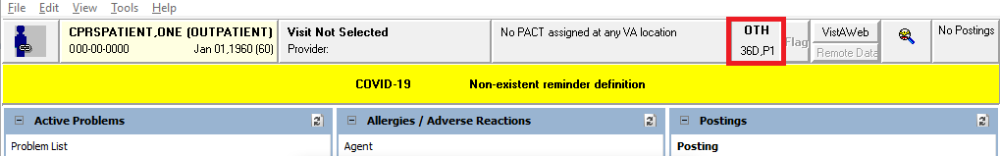  
***

On the OTH button, the label ‘OTH’ displays, along with how many days remain in the period of care and which period of care the patient is in. So, it will be a number followed by the letter “D” for the number of days and then a “P” followed the number of the current period of care.  
The OTH 90 button shown in the example above, shows ‘36D’ meaning 36 days left in the first 90-day period of care (or ‘P1’).  
When the user selects the OTH button, a popup window dialog box displays the same information that displays on the button including additional information.  
**Note:** Number of days will not display on the OTH Button label when the patient has an inactive flag. The image below is an example of an OTH-90 patient with an Inactive Flag history.

**Note:** Patch OR\*3.0\*546 introduces the ability to add a local message for OTH-90 patients. Messages are entered in VistA (Graphical User Interface (GUI) Parameters menu option) by Clinical Care Coordinators and are displayed in CPRS. The figure below is an example of the OTH-90 pop-up window with a local message.  
  
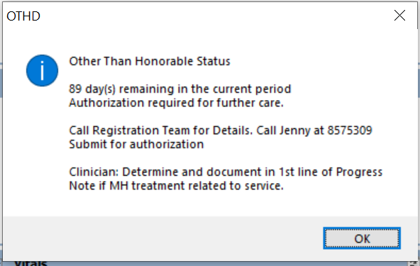  
  
  
**To display the OTH popup window dialog box:**

1.  Select the OTH button.

2.  After viewing the information, close the dialog by selecting the “OK” button.

    **Note:** A tooltip provides detailed information.

-   If the user hovers the cursor over the ‘OTH’ label on the button, “Other Than Honorable, click for details” will be displayed.

-   If the user hovers the cursor over the button with an example text of “54D, P1”, the tooltip will display “54 day(s) remaining in the current period”.

-   If the user hovers the cursor over any white area (non-text area) on the button, “Other Than Honorable, click for details 54 day(s) remaining in the current period” will be displayed.

The OTH-EXT button shows that the “OTH-EXT” care type is assigned to the patient.

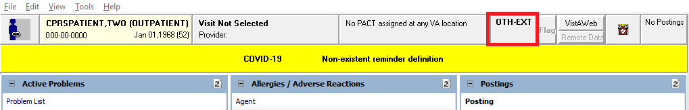

When the user selects the OTH-EXT button, a dialog displays additional information.

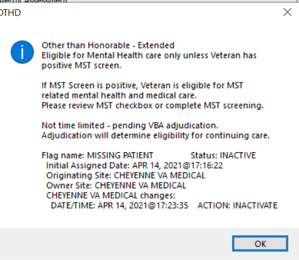

**Note:** Patch OR\*3.0\*546 amended verbiage to include more information about Military Sexual Trauma (MST).

**To display the OTH-EXT popup window dialog box:**

1.  Select the OTH-EXT button.  
1.  After viewing the information, close the dialog by selecting the “OK” button.

    **Note:** A tooltip provides detailed information.

-   If the user hovers the mouse over the ‘OTH-EXT’ label on the button “Other Than Honorable, click for details” will be displayed.  
## Patient Insurance and MyHealth*e*Vet Information

The Patient Insurance and My Health*e*Vet information are available from the button to the right of the Primary Care button. This button displays only if the patient’s insurance information has been entered or if the patient has entered information through My HealtheVet. If the patient does not have either of these types of information the button does not display.

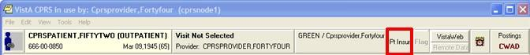

**The Patient Insurance and My HealtheVet button is visible only when the patient has one of these kinds of information. It is located next to the Flag button**  
When this button does display, it will look different based on what information the patient has. If the patient has only patient insurance information, the button will read

“Pt Insur” and clicking the button will bring up a detailed display containing the insurance information.

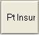

If the patient has only My Health*e*Vet information, the button displays “MHV” and clicking the button will bring up a browser windows with the patient’s information.

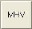

If the patient has both patient insurance and My Health*e*Vet information, the button will appear to be split in half vertically. The top button will read “MHV” and the bottom will read “Pt Insur” The buttons work the same as if they were full size.

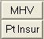

## Presumptive Psychosis

Presumptive Psychosis (PP) patients are registered as Service Connected (less than 50%) Veterans with an Honorable or General discharge and who meet other PP workaround criteria. To identify these patients a PP button will display using the same real estate as the OTH button (left of the Flag button).

**Note:** The PP button will display only if patches DG\*5.3\*1029 and OR\*3.0\*437 are installed *and* the necessary criteria are met. If the patches are not installed, the PP button will not display.

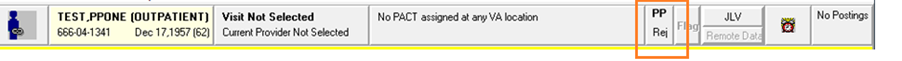

**Example of PP Button Location**

When hovering over PP, the following text displays: Presumptive Psychosis Authority, click for details.

When hovering over the second row (i.e. Rej), the following text displays: Rejected due to income.

The image below is an example of the PP Patient Chart.

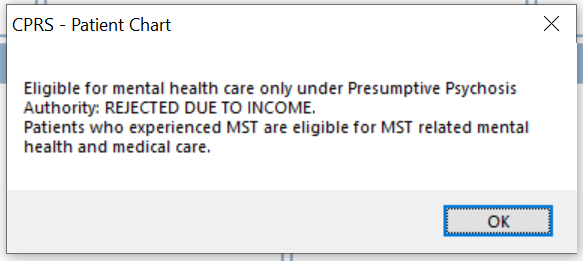

**Example of PP Patient Chart**

Follow the instructions below to open and view Patient Chart:

1.  Look up patient

2.  Navigate to PP button

3.  Click on PP button to open and view Patient Chart

## Prescription Drug-Monitoring Program (PDMP)

Authorized users (licensed prescribers and pharmacists) and delegates are able to access the PDMP query functionality.

The Prescription Drug-Monitoring Program (PDMP) enhancement to CPRS allows authorized users (prescribers and pharmacists) and licensed delegates to submit on demand PDMP queries for use in patient care related decision making when prescribing controlled substances to Veterans. The process allows the user to:

-   View and retrieve controlled substance prescription monitoring data from external sources and within patients electronic medical records  
-   Automatically generate patient progress notes  
-   Query and easily utilize prescription and patient prescription history on an ad-hoc and recurring basis  
-   Perform audit functions that ensure compliance.  
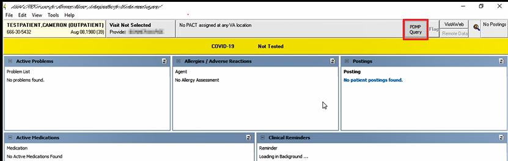  
**CPRS Cover Sheet displaying the PDMP Query Button**  
**Note:** Hover over (put your cursor over) the **PDMP Query** button from the ribbon bar to display the last query completed date. The completed date is the date when the last STATE PRESCRIPTION DRUG MONITORING PROGRAM note was signed and completed). If a previous PDMP note was never completed for this patient, it will display "Last query completed: Unknown."

### Authorized HealthCare Provider Procedure for PDMP Query

Authorized Prescribers (with a DEA \#) and Pharmacists (with an NPI \#) can initiate a PDMP query using their own credentials.

To request a PDMP Query, follow these steps:

1.  From the ribbon bar, click on the **PDMP Query** button, it will change to **PDMP Cancel**. The query will run in the background, and the user can continue to work in CPRS while the query is running. After a few seconds, the **PDMP Cancel** button will change to **PDMP Results**.  
Note: You can also select PDMP from the Tools drop-down menu.  
PDMP Query - requests the query  
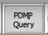

PDMP Cancel - indicates the query is in progress—clicking it cancels the query

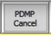

Note: Retrieving the results may take a while as the query searches all 50 states' databases (through a third party PDMP gateway). This process is outside of CPRS’s control.  
PDMP Results - validates the query is completed

1.  Click on the **PDMP Results** button to display the PDMP report. The Prescription Drug Monitoring Program Results report displays in a separate window.  
Note: If encounter information has not been entered, the encounter information dialog will appear before the PDMP report is displayed. You must complete the encounter information dialog before proceeding.  
***

Note: Retrieving the report may take a while as it must be retrieved through a third party PDMP gateway. This process is outside of CPRS’s control.  
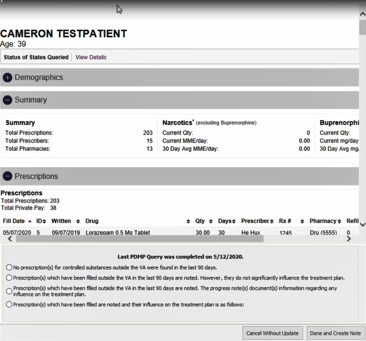  
**PDMP Results Report**  
***

The report allows the user to review the PDMP results and to automatically generate a note to document any findings. It has three sections: Demographics, Summary, and Prescriptions. The bottom of the report displays the date of the last PDMP Query (which is the same date as the date previously noted in the [**hover over Note**](#4anzqyu) for the PDMP Query), Four (4) statement selections, as well as the **Cancel Without Update** and **Done and Create Note** buttons.  
Note: You must select at least one of the Statements. Clicking the Done and Create Note button without selecting a Statement, will produce the error message: "At least one option should be selected."  
#### Provider PDMP Results Report Statements

Each of the four (4) Provider Statement selections is described below:

##### 1st Statement

-   **No prescription (s) for controlled substances outside the VA were found in the last 90 days.**  
-   Selecting this statement will produce a text box to enter comments of up to 250 characters (optional).  
##### 2nd Statement

-   **Prescription(s) filled outside the VA in the last 90 days are noted. However, they do not raise significant safety concerns and do not influence the treatment plan at this time.**  
-   Selecting this statement will produce a text box to enter comments of up to 250 characters (optional) and the following Non-VA Meds reminder statement displays below the text box: "**Please be sure to record any active/chronic medications discovered from PDMP query in the Non-VA Medications section of the Meds Tab in CPRS**."  
##### 3rd Statement

-   **Prescription(s) filled outside the VA in the last 90 days are noted. Safety concerns will be discussed with the patient and documented as part of ongoing treatment planning.**  
-   Selecting this statement will produce a text box to enter comments of up to 250 characters (optional) and the following Non-VA Meds reminder statement displays below the text box: "**Please be sure to record any active/chronic medications discovered from PDMP query in the Non-VA Medications section of the Meds Tab in CPRS."**  
##### 4th Statement

-   **Prescription(s) filled outside the VA are noted and will be addressed as follows:**  
-   Selecting this statement will produce a text box to enter comments of up to 250 characters (required) and the following Non-VA Meds reminder statement displays below the text box: "**Please be sure to record any active/chronic medications discovered from PDMP query in the Non-VA Medications section of the Meds Tab in CPRS."**  
1.  Click the **Done and Create Note** button.  
A STATE PRESCRIPTION DRUG MONITORING PROGRAM progress note will automatically be created in the background. Click on the **Notes** tab at the bottom of the Cover Sheet to view the Progress Note with today's date.

**Note**: For a Progress Note example, refer to [Example of a Progress Note](#1idq7dh) at the end of this section.  
1.  Select the PDMP note. From the top menu, select Action, and click ‘**Sign Note Now**.' The '**Sign Note Now**' window displays.  
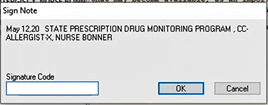  
**Sign Note Now Window**  
1.  Enter the Signature Code for the Provider and click ‘**OK**.’ The status of the note changes to ‘COMPLETED.’ Electronic Signature and Date/time stamp displays on the note.  
**Note:** Refer to '[The Sign Note Now and Sign Discharge Summary Now Commands](#the-sign-note-now-and-sign-discharge-summary-now-commands)' for '**Sign Note Now**' details.  
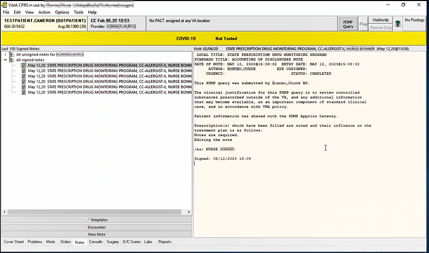

**Example of a Provider Progress Note**  
### Delegate Procedure for PDMP Query

If you are registered with the State PMP as a Delegate using your va.gov email address, you can run a query as a delegate of an authorized PDMP user.

To request a PDMP Query, follow these steps:

1.  From the ribbon bar, click on the **PDMP Query** button.  
  
***

1.  You will be prompted to **Select Authorized User** from the pop-up dialog. The encounter provider (if they are an authorized PDMP user) is selected by default.  
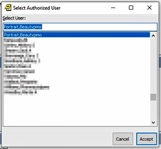  
**Select Authorized User**  
1.  Click **Accept**. **PDMP Query** changes to **PDMP Cancel**. The query will run in the background, and the user can continue to work in CPRS while the query is running. After a few seconds, the **PDMP Cancel** button will change to **PDMP Results**.  
PDMP Cancel - indicates the query is in progress—clicking it cancels the query

**Note:** Retrieving the results may take a while as the query searches all 50 states' databases (through a third party PDMP gateway). This process is outside of CPRS’s control.  
PDMP Results - validates the query is completed

1.  Click on the **PDMP Results** button to display the PDMP report. The Prescription Drug Monitoring Program Results report displays in a separate window.  
**Note:** If encounter information has not been entered, the encounter information dialog will appear before the PDMP report is displayed. You must complete the encounter information dialog before proceeding.  
***

**Note:** Retrieving the report may take a while as it must be retrieved through a third party PDMP gateway. This process is outside of CPRS’s control.  
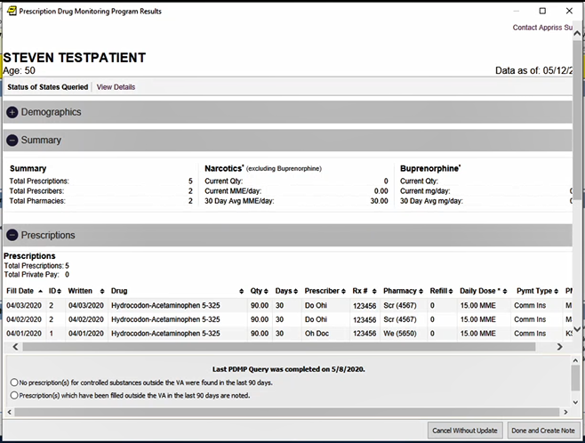  
**PDMP Results Report**  
The report allows the user to review the PDMP results and to automatically generate a note to document any findings. The report has three sections: Demographics, Summary, and Prescriptions. The bottom of the report displays the date of the last PDMP Query (which is the same date as the date previously noted in the [**hover over Note**](#4anzqyu) for the PDMP Query), Two (2) statement selections, as well as the **Cancel Without Update** and **Done and Create Note** buttons.  
**Note:** You must select at least one of the Statements, clicking the **Done and Create Note** button without selecting a Statement, will produce the error message: "At least one option should be selected."  
#### Delegate PDMP Results Report Statements

Each of the two (2) Delegate Statement selections is described below:  
##### 1st Statement

-   **No prescription(s**) **for controlled substances outside the VA were found in the last 90 days.**  
-   Selecting this statement will produce a text box to enter comments of up to 250 characters (optional)  
##### 2nd Statement

-   **Prescription(**s**) that have been filled outside the VA in the last 90 days are noted.**  
-   Selecting this statement will produce a text box to enter comments of up to 250 characters (optional) and the following Non-VA Meds reminder statement displays below the text box: "**Please be sure to record any active/chronic medications discovered from PDMP query in the Non-VA Medications section of the Meds Tab in CPRS.**"  
1.  Click the '**Done and Create Note** button.' A STATE PRESCRIPTION DRUG MONITORING PROGRAM progress note will automatically be created in the background.  
Note: For a Progress Note example, refer to Example of a Progress Note at the end of this section.  

**Sign Note Now Window**  
1.  Enter the Signature Note Code for the Delegate and Click ‘**OK**.’ The status of the note is 'UNCOSIGNED' and a message displays on the note, "NOT YET COSIGNED." Signed Date and Time is created with the electronic signature of the delegate. The note then goes to the cosigner to sign the note.  
Note: Refer to '[The Sign Note Now and Sign Discharge Summary Now Commands](#the-sign-note-now-and-sign-discharge-summary-now-commands)' for Sign Note Now' details.  
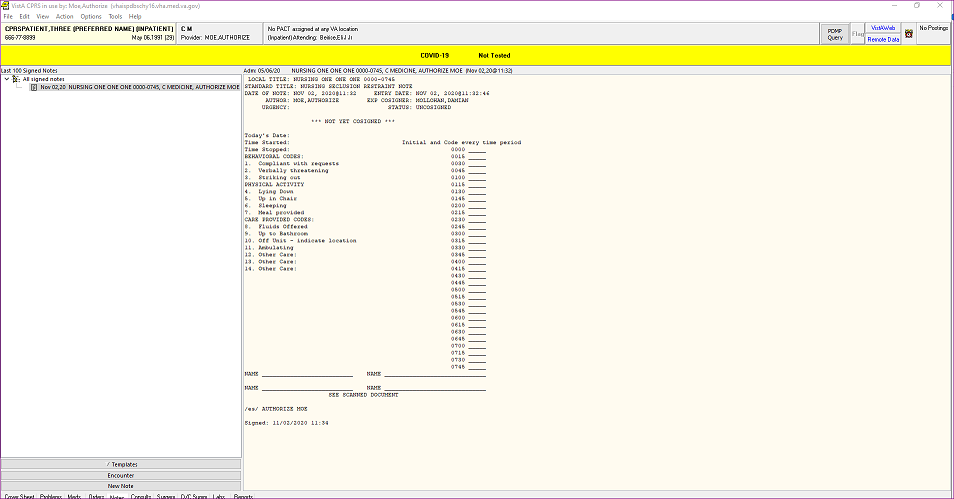

**Example of a Delegate Progress Note**  
### Accessing a PDMP Button on a Reminder Dialog Template

Sites have the option of adding a PDMP Button to a Reminder Dialog Template. This feature is not required. It enables sites to use their own Reminder Dialogs template for preparing notes that include data from PDMP reports. The PDMP button on the Reminder Dialog Template can be used in addition to, or in place of the PDMP button at the top right-hand corner of the CPRS window.

To configure the Reminder Dialog Template with a PDMP button, the site CACs need to add the Reminder Dialog prompt, PXRM PDMP BUTTON, to the template. It would add a PDMP button to a Reminder Dialog template and allow users to click on it to initiate a PDMP query.

There are differences between a PDMP query that is initiated on a reminder dialog template vs when it is initiated from the top of the CPRS window. When it is initiated from a reminder dialog template:

-   The PDMP report will open automatically as soon as it is available.  
-   The report is opened as a modeless window, so that the report and reminder dialog template can be interacted with simultaneously.  
-   The radio buttons on the bottom of the report will not display and the ‘STATE PRESCRIPTION DRUG MONITORING PROGRAM note will not automatically generate. **Note:** To ensure that the PDMP query is captured for compliance measurement, the site’s CAC must ensure that the template is attached to the STATE PRESCRIPTION DRUG MONITORING PROGRAM note title. The template should contain the necessary field elements so that the user can record their findings from the report.  
-   The user may close the report either by selecting the ‘Close’ button, by closing the local reminder dialog template itself, or by selecting another patient.  
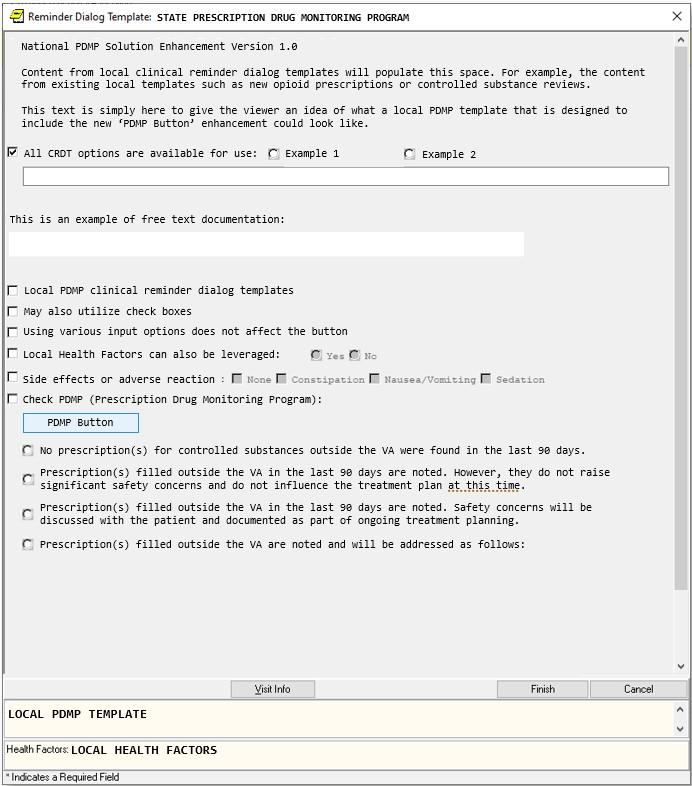

**Example of a PDMP button in a Reminder Dialog Template**  
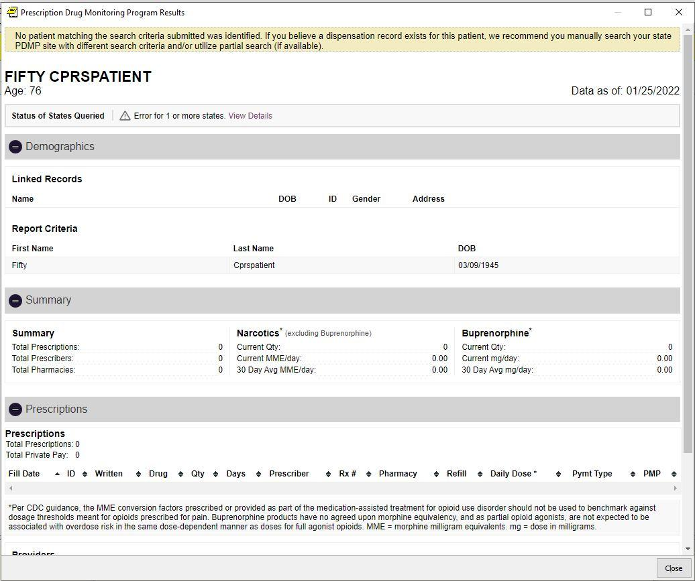

**Example of a Report Generated by a PDMP Button in a Reminder Dialog Template**  
### PDMP Accounting of Disclosure (AOD) report

A PDMP Health Summary Report, PDMP AOD ALL, was created to generate a PDMP Accounting of Disclosure (AOD) report. This component lists the PDMP Accounting of Disclosures for instances where a PDMP query was initiated from within CPRS and patient's data was shared outside of the VA. It will also include cases where a PDMP note was manually created to document a PDMP query made directly on a state's PDMP portal.

Note: For more information, refer to [**Viewing a Health Summary**](#viewing-a-health-summary).  
***

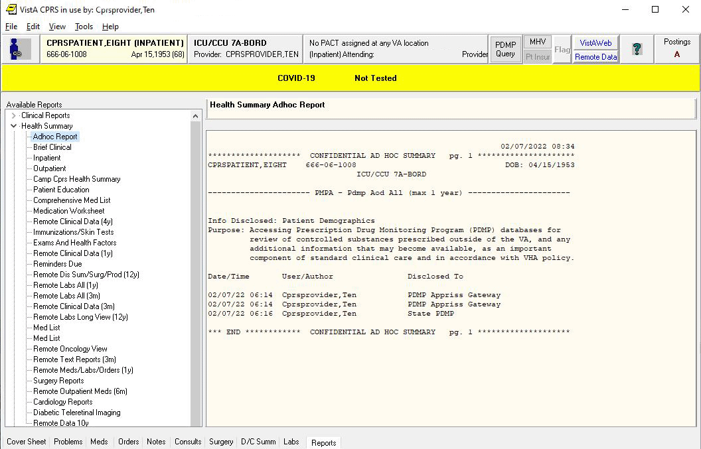

**Example of an Accounting of Disclosure (AOD) report**  
## Patient Record Flags

Patient Record Flags (PRF) are advisories that authorized users place on a patient’s chart to improve employee safety and the efficient delivery of health care. Each advisory or flag includes a narrative that describes the reason for the flag and may include some suggested actions for users to take when they encounter the patient. Other information displayed to the user includes the Flag Type, Flag Category,

Assignment Status, Initial Assignment Date, Approved by, Next Review Date, Owner Site, and Originating Site. When assigning a flag, authorized users must write a progress note that clinically justifies each flag assignment action.

Flags are defined in the PRF List Manager software either through a patch or by an authorized user. Once the flag definition exists, authorized users can use the following actions in the PRF software to assign and maintain the flag on a specific patient’s record: new assignment, continue, inactivate, mark as entered in error, and reactivate.

To make flags widely available to VHA employees who interact with patients, Patient Record Flags are tied to the patient look-up. Whenever a user looks up a patient, the software checks to see if the patient’s record has been flagged, and if a flag exists, the software displays the list of flag names.

To ensure that users notice them, CPRS uses a Patient Record Flags pop-up box. After a user selects a patient with an active flag assignment, CPRS pops up a dialog containing all flags for the patient. Users can review the flags or close the box. The rest of the patient record does not load until the user closes the PRF pop-up box. Once the rest of the record is loaded, users can view flags at any time using the Flag button or the Cover Sheet list of PRF displayed on the upper right of the Cover Sheet under Patient Record Flags.

Sites can help users notice the flags by using Patient Record Flags judiciously. Overusing these flags could make them cumbersome to users who might therefore choose to ignore them. Ignoring flags could put employees, other patients, and the health care environment at risk.

To avoid this situation, before placing a flag on a patient’s record, sites must have in place a system for deciding when a flag is appropriate and when it will be reviewed. Sites should also have policies about how to handle questions about flags. To give sites some direction about implementing Patient Record Flags, VHA Directive 2010-053, dated December 3, 2010, titled: *Patient Record Flags* has been issued.

### Category I and Category II Flags

Patient Record Flags are divided into types: Category I (national) and Category II (local). Category I Patient Record Flags are the most critical and are transmitted to all facilities, ensuring that these flags are universally available. Category II Patient Record Flags are local only, belonging only to the site that created them; they are not shared between sites.

#### Category I or National Flags

CPRS has two Category I Patient Record Flags: a Behavioral flag for violent or potentially violent patients and a High Risk for Suicide flag. The Office of Information created the Behavioral flag to help VHA properly protect its employees and maintain a safe environment for health care–they also now contain information regarding Disruptive Behavior Reporting System Cases for the patient (‘DBRS number’ and ‘Other DBRS data’). The High Risk for Suicide flag aims to identify patients who might be at higher risk of taking their own lives. The Office of Information defines and distributes Category I flags through national patches and the definition of the flag cannot be edited by local sites.

Each Category I flag assignment to a specific patient’s record is owned by a single facility. The facility that placed the Category I flag on the patient’s record would normally own and maintain the flag. The site that owns the Category I flag is the only site that can:

-   review whether to remove or continue the flag  
-   edit the flag  
-   inactivate the flag  
-   reactivate the flag  
-   mark the flag as entered in error  
-   change ownership of the flag  
-   Enter/edit DBRS data (only on a National Category I Behavioral flag)  
-   enter a Patient Record Flag Category I progress note for the flag  
However, ownership of a Category I flag assignment can be transferred. If a patient received the majority of care at a different VA facility than the one that assigned the flag, the site giving the majority of care could request that ownership of the flag be transferred to the that site. The owning site could then change the ownership to the second site through the PRF software in List Manager.

#### Category II or Local Flags

Category II flags are local. Each site can create and maintain its own set of local flags that are not transmitted to other sites. However, the purpose of Category II flags is similar to Category I—to provide important patient information to health care providers. For example, a site could create a Patient Record Flags Cat II – Diabetes flag or a Category II Infectious Disease flag.

In VHA Directive 2010-053, dated December 3, 2010, titled: *Patient Record Flags*, VHA advised sites to create and use Patient Record Flags sparingly so that users will notice flags and pay careful attention to them. Creating a large number of flags for many different reasons might lessen the impact of flags and cause staff to miss important information. Both Category I flags and Category II flags require a progress note to document the reason for placing a flag on the patient’s record.

### Creating, Assigning, and Maintaining PRF

Some sites may have two different groups of users who work with Patient Record Flags: administrative users who create, maintain, and assign flags and the clinical users that document why the flag was placed on the patient’s record. Authorized users can define Category II flags and edit their definitions. They assign and maintain the flag on a patient’s record using the assignment actions in the PRF software through the List Manager interface: new assignment, continue, inactivate, mark as entered in error, and reactivate. (Additional documentation for PRF creation, assignment, and maintenance is available in the *Patient Record Flags User Guide*.)

### Documenting PRF

With CPRS GUI v.26, each Patient Record Flag action (new assignment, continue, inactivate, reactivate, or mark as entered in error) must have a linked progress note that clinically justifies any action taken. Previously, each flag needed to have a progress note, but there was no link between the note and the flag action. Now when the user writes a PRF progress note, the user must link the note to a flag action. The note might also contain references to supporting documentation.

In each flag definition, the user must select the previously created PRF progress note title that will document the reasons for any flag action. This is referred to as associating a progress note title with a PRF. Before a title can be associated with a PRF, the title must be created either by a patch for a national flag or by someone at the site for a local flag.

For example, if a user were defining a Wandering flag in the PRF List Manager software, someone at the site must have already used TIU to create the appropriate note title in the correct document class. Then, the user defining the flag would associate a title such as, Patient Record Flag Category II – Risk, Wandering, by selecting that title from the list of available PRF progress note titles.

Once the flag and the progress note title are associated, when the user writing a new progress note selects a PRF progress note title, CPRS displays the flag actions on the selected patient and whether each action has been linked to PRF progress note (Yes or No). For the new PRF note, the user then selects the available flag action to create the link between the note and the flag action.

**Note:** There is a one-to-one correspondence between flag actions and progress notes. Each PRF action for a patient can only be linked to one progress note; each progress note can only be linked to one flag action.

#### Prerequisites to Writing PRF Progress Notes

Before users can write progress notes that document PRF, PRF progress note titles must be set up correctly. Each PRF progress note title must be associated with a specific flag definition, and users must be assigned to the appropriate user classes to write specific kinds of notes. Also, someone must have assigned the flag to the patient.

For users to write a progress note and correctly link the note to a flag action, sites must complete the following set up:

-   To write a PRF note for a category I flag, the user must belong to the DGPF PATIENT RECORD FLAG MGR user class. Each site will be responsible for populating this user class.  
-   Because Category II Patient Record Flags are local, each site must determine if the site will create a user class and business rules to govern which users can write Category II PRF progress notes.  
-   The PRF note titles should follow the naming conventions described in the directive and be descriptive enough that users can tell which note title corresponds to which flag.  
-   The flag definition must contain the progress note title that documents actions for that flag—each PRF note title can only be associated with one flag.  
-   Category II PRF progress note titles must be in the Patient Record Flag Cat II document class under the Progress Notes document class to allow users to associate them with a PRF Category II definition. If the titles are not in this document class, they will not display when the user attempts to associate the title with a PRF Category II flag nor will CPRS get the information about which flags actions are linked. Progress note titles for Category I patient record flags are defined and associated by national patch.  
#### PRF Note Titles

Currently, there are two Category I flags: Behavioral and High Risk for Suicide. The Progress Note titles for documenting the two flags are:

-   Patient Record Flag Category I (for the Behavioral flag)  
-   Patient Record Flag Category I – High Risk for Suicide  
To help sites that will be creating local Category II flags, four partially customizable Progress Note titles have been distributed:

-   Patient Record Flag Category II – Risk, Fall  
-   Patient Record Flag Category II – Risk, Wandering  
-   Patient Record Flag Category II – Research Study  
-   Patient Record Flag Category II – Infectious Disease  
Clinical Application Coordinators (CACs) can customize these titles by changing the text after the dash using TIU utilities. For example, the first title could be changed from “Patient Record Flag Category II – Risk, Fall” to “Patient Record Flag Category II – Behavioral, Drug Seeking” or other titles sites create. CACs can also create their own titles, but the title must follow the naming convention “Patient Record Flag Category II – *other text*” where *other text* is the text specific to the local note title.

#### Linking PRF Notes to Flag Actions

In the CPRS GUI, users must link a PRF progress note to a flag action when the user writes a PRF note. This linking can also be done through the List Manager interface using TIU options. In the CPRS GUI’s Progress Note Properties dialog, when a user selects a Patient Record Flag progress note title, CPRS displays a list of flag actions to which the note can be linked at the bottom of the dialog. This list shows all the actions for the flag and whether each action has been linked.

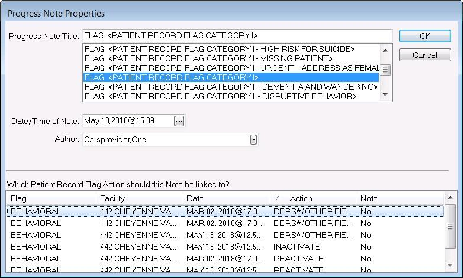

**For progress note titles that document the justification for a patient record flag, users will be able to link the progress note to the specific flag action they are documenting. The example shown here is of a Category I Behavioral PRF progress note and new Edit Flag’s X action–‘DBRS/Other Field Edit Only’. Several actions that can be linked to a note are displayed below**  
**Note:** For PRF notes, users must select a flag action to link the note to before they can write the note—the same way users link a note with a consult. CPRS will not allow the user to write the note unless an unused flag action is selected. If the user does not select a flag action, CPRS displays a dialog that states, “Notes of this title require the selection of a patient record flag action”.

When the user selects a PRF progress note title, CPRS displays this list of note actions only if sites have done the correct set up as described earlier. The user must then pick the action (new assignment, inactivate, reactivate, continue, entered in error, or DBRS/Other Field Edit Only) that the note is documenting.

If a user is viewing a note and wants to see to which PRF action the note is linked, the user can select View \| Details on the Notes tab. The details include the flag name, the date, and the action that was linked.

If a user writing a new progress note chooses a PRF progress note but CPRS does not display any flag actions for linking, one of the following has probably occurred:

-   The flag has not been assigned to this patient yet.  
-   The user has selected the wrong progress note title for the flag.  
-   If it is a Category I flag, the site may not own the flag.  
#### Marking PRF as Entered in Error

Marking PRF as entered in error terminates the flag’s display in the patient’s record. However, if there was a progress note linked to the flag, the progress note is still in the patient’s record. If the flag was entered in error, an authorized TIU user should retract or retract and reassign the linked progress note.

**Note:** Users should be aware that although the flag does not display, a history of this flag is kept in the Patient Record Flag software and users can reactivate the flag. To prevent users from entering notes on previous, inaccurate PRF actions, all previous PRF actions are hidden when a flag is marked as entered in error.

### Viewing PRF in CPRS GUI

Patient Record Flags are displayed in the applications that use the patient look up, including the CPRS GUI. In the CPRS GUI, there are three places where users can see if a patient has PRF:

-   The Patient Record Flag pop-up box  
-   The CPRS Cover Sheet  
-   The Flag button (available from any tab)  
When the user selects a patient name, CPRS begins to load the record, displays any relevant messages (“means test required”, deceased patient, sensitive record, etc.), and then, if the record is flagged, displays a pop-up box with the flag titles for the selected patient to ensure that the user sees the flags. The pop-up box is shown below.

The Patient Record Flags pop-up box displays a list of all flags for the patient, with the first flag in the list highlighted and the narrative for that flag displayed below the flag list and a list of links to notes that have been linked to flag actions. Category I flags are displayed first, followed by any Category II (or local) flags.

The flag narrative is the text the person assigning the flag enters that they want the user to see. It should give the purpose of the flag and may also contain examples of past behavior and instructions for users to follow when encountering the patient. For example, the narrative for a particular Behavioral flag might state that a patient has been known to carry weapons and has verbally threatened VHA staff in the past. It may also recommend that users call the VA police if this patient comes in for care. However, the purpose of Patient Record Flags is not to stigmatize nor discriminate, rather it is to protect VHA staff and patients and to ensure the efficient delivery of health care.

On the bottom of the Patient Record Flags popup box, CPRS displays a list of notes that are linked to specific flag actions. Links will only display for those notes that have been signed and linked to a flag action. When the user selects a link, CPRS displays the linked progress note for the action in a detailed display window.

The Facility that created the Flag Action (if available) will be listed in the bottom portion of the Progress Notes Properties box as shown.

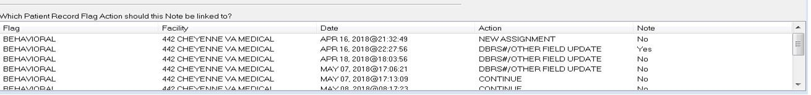

If a Flag Action was taken by a user in the same signed-in division, the name of the Facility will be displayed as shown in the above screen shot. If the Flag Action was taken by a user in a site other than the signed-in division, the value of ‘UNKNOWN’ will be displayed for Facility, as shown in the screen shot below.

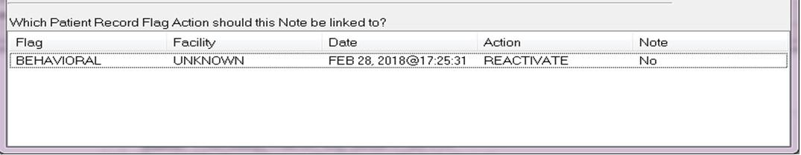

**Users can now sort the Flag Action list by any of the provided data columns; Facility, Date, Action or Note**  
Users can review the flags or close the box.

When the user is already in a patient record and wants to view Patient Record Flags, the user can use either the listing on the Cover Sheet or the Flag button. On the CPRS Cover Sheet, a new box called Patient Record Flags has been added above the Postings area. Flags for the selected patient are listed in the box.

The Flag button is visible from all CPRS tabs. If a patient’s record has been flagged, the Flag button with its red text displays next to the Remote Data button. If the patient’s record does not have any flags, the text on the button is grayed out instead of red. The Cover Sheet and Flag button are shown in the graphic below.

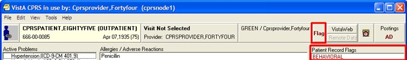

**This screen capture shows the red text on the Flag button indicating this patient record has PRF and shows the flag list on the CPRS Cover Sheet**  
To view a Patient Record Flag when entering a record, use the following steps:

1.  Select a patient from the Patient Selection screen by either double-clicking on a patient name or highlighting the name and pressing the \<Enter\> key.  
**Note:** When the record loads, CPRS checks to see if the record is sensitive and displays a warning to the user that the user must acknowledge to proceed. Then, if the record has one or more flags, CPRS displays a pop-up box with the patient’s record flags title. The first flag is highlighted and the narrative details displayed below. If CPRS displays the pop-up box, the user must close this box before CPRS will load the patient chart.

1.  Then, select the Flag title to view the narrative by clicking the flag name or highlighting the flag name with the tab and arrow keys and pressing \<Tab\> (note that the number of flags in each category is listed after the category label).  
**Note:** If the provider has an NPI, it will not display on the screens below.

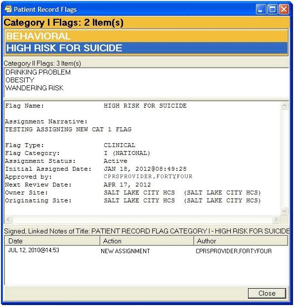

**This graphic shows the Patient Record Flag pop-up box listing the patient’s flags, the narrative for the highlighted flag, and the links to any signed, linked progress notes documenting the reasons for the flag. Using the Flag button or clicking on a flag title on the Cover Sheet also displays this pop-up box. Category I flags are in the orange field, they blink, and the text changes color from white to black and back. Category II flags are in the field below**  
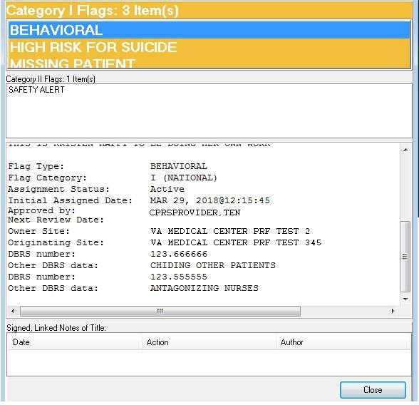

**This screen capture shows a Patient Record Flag dialog with associated Behavioral flag and Disruptive Behavior Reporting System information**  
**Note:** If the provider has an NPI, it will not display on the screen above.

1.  To view the linked progress note, select the appropriate link in the lower part of the dialog. When finished, select Close.  
1.  When finished viewing the narrative, close the narrative box by choosing **Close** or pressing **\<Enter\>**.  
**To view a Patient Record Flag when already viewing a record, use the following steps:**

1.  Go the Cover Sheet by clicking the Cover Sheet tab or pressing **Ctrl** + **S** or use the Flag button by clicking Flag or pressing tab until you highlight the **Flag** button and press **\<Enter\>.**  
1.  Select the flag title to see the narrative details by clicking the title or using the Up and Down arrows to highlight the name and pressing **\<Enter\>**.  
1.  When finished, close the box by clicking **Close** or pressing **\<Enter\>**.  
### History of Actions Taken

With patch OR\*3.0\*542 users can view a History of Actions taken on active National Cat1 Patient Record Flags (PRF) (Behavioral, High Risk for Suicide, and Missing Patient). Actions captured include: Reactivate, Inactivate, Continue, and New Assignment. History is displayed by date in descending order (newest to oldest), by action, by Site Identifier, and Site Name.

Note: New Assignment will only be displayed when there are ten (10) records or less displayed. When there are more than ten (10) records, the following message is displayed “\*\*\* Additional information is in VistA \*\*\*”.

The figure below is an example of Active PRF History of Actions Taken for a patient with less than 10 records; the history displays the action of New Assignment.

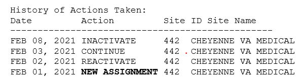

The figure below is an example of a patient with more than ten (10) history records, and thus the system display **\*\*\*Additional Information is in VistA\*\*\*.**

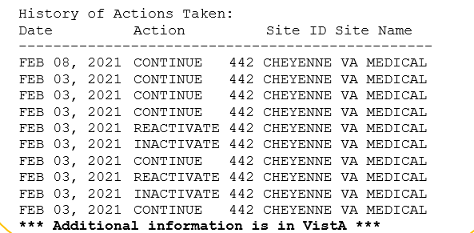

### PRF Notes

On the bottom of the Patient Record Flags popup box, CPRS displays a list of notes that are linked to specific flag actions. Links will only display for those notes that have been signed and linked to a flag action. When the user selects a link, CPRS displays the linked progress note for the action in a detailed display window.

The Facility that created the Flag Action (if available) will be listed in the bottom portion of the Progress Notes Properties box as shown.

If a Flag Action was taken by a user in the same signed-in division, the name of the Facility will be displayed as shown in the above screen shot. If the Flag Action was taken by a user in a site other than the signed-in division, the value of ‘UNKNOWN’ will be displayed for Facility, as shown in the screen shot below.

**Users can now sort the Flag Action list by any of the provided data columns; Facility, Date, Action or Note**  
Users can review the flags or close the box.

When the user is already in a patient record and wants to view Patient Record Flags, the user can use either the listing on the Cover Sheet or the Flag button. On the CPRS Cover Sheet, a new box called Patient Record Flags has been added above the Postings area. Flags for the selected patient are listed in the box.

The Flag button is visible from all CPRS tabs. If a patient’s record has been flagged, the Flag button with its red text displays next to the Remote Data button. If the patient’s record does not have any flags, the text on the button is grayed out instead of red. The Cover Sheet and Flag button are shown in the graphic below.

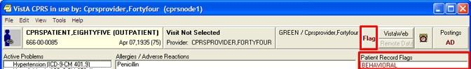

**This screen capture shows the red text on the Flag button indicating this patient record has PRF and shows the flag list on the CPRS Cover Sheet**  
To view a Patient Record Flag when entering a record, use the following steps:

1.  Select a patient from the Patient Selection screen by either double-clicking on a patient name or highlighting the name and pressing the \<Enter\> key.  
**Note:** When the record loads, CPRS checks to see if the record is sensitive and displays a warning to the user that the user must acknowledge to proceed. Then, if the record has one or more flags, CPRS displays a pop-up box with the patient’s record flags title. The first flag is highlighted and the narrative details displayed below. If CPRS displays the pop-up box, the user must close this box before CPRS will load the patient chart.

1.  Then, select the Flag title to view the narrative by clicking the flag name or highlighting the flag name with the tab and arrow keys and pressing \<Tab\> (note that the number of flags in each category is listed after the category label).  
**Note:** If the provider has an NPI, it will not display on the screens below.

**This graphic shows the Patient Record Flag pop-up box listing the patient’s flags, the narrative for the highlighted flag, and the links to any signed, linked progress notes documenting the reasons for the flag. Using the Flag button or clicking on a flag title on the Cover Sheet also displays this pop-up box. Category I flags are in the orange field, they blink, and the text changes color from white to black and back. Category II flags are in the field below**  

**This screen capture shows a Patient Record Flag dialog with associated Behavioral flag and Disruptive Behavior Reporting System information**  
**Note:** If the provider has an NPI, it will not display on the screen above.

1.  To view the linked progress note, select the appropriate link in the lower part of the dialog. When finished, select Close.  
1.  When finished viewing the narrative, close the narrative box by choosing **Close** or pressing **\<Enter\>**.  
**To view a Patient Record Flag when already viewing a record, use the following steps:**

1.  Go the Cover Sheet by clicking the Cover Sheet tab or pressing **Ctrl** + **S** or use the Flag button by clicking Flag or pressing tab until you highlight the **Flag** button and press **\<Enter\>.**  
1.  Select the flag title to see the narrative details by clicking the title or using the Up and Down arrows to highlight the name and pressing **\<Enter\>**.  
1.  When finished, close the box by clicking **Close** or pressing **\<Enter\>**.  
### Inactive PRF History

Users may view Inactive PRF History for Patients who have an Inactive Flag assignment. The Inactive Flag displays only for the following National Category 1 (one) flags:

-   High Risk for Suicide  
-   Missing Patients  
The image below is an example of the location of the Inactive Flag.

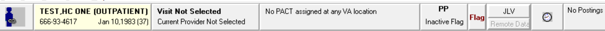

**Location of Inactive Flag**  
The image below is an example of a patient who is not PP or OTH with an Inactive Flag assignment.

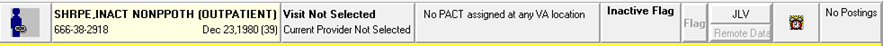

Inactive Flag hover text reads: *Patient has Inactive Flag(s) click to view.*

Clicking the Inactive Flag opens the CPRS Patient Chart; the figure below is an example of the CPRS Patient Chart.

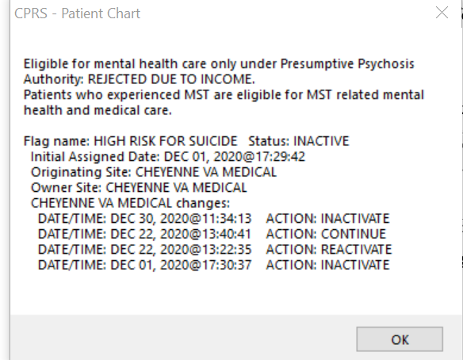

**Example of an Inactive Flag Assignment**  
Note: In the example above, information regarding the patient’s eligibility for OTH or PP is displayed first followed by Inactive Flag Assignment. See the table below for field name and description for Inactive Flag assignment.

**Inactive Flag Assignment Field and Description**  
| **Field Name**          | **Description**                                                                          |
|-------------------------|------------------------------------------------------------------------------------------|
| Flag Name               | This field identifies flag assignment for High Risk for Suicide or Missing Patient only. |
| Initial Assignment Date | Date and time stamp of the initial flag assignment.                                      |
| Originating Site        | Identifies the site who initiated the flag assignment                                    |
| Owner Site              | Identifies the site who owns the flag assignment                                         |

Flag Assignment actions are organized by the site. Actions displayed are: Inactivate, Reactivate, and Continue with the date/time stamp of the action in descending order (newest to oldest). Since there is not a scroll bar on the patient chart pop-up, when there are more actions available than can be displayed, users will see the following disclaimer: **\*\*\*Additional information is in VistA\*\*\***

### Viewing Inactive Flag History

To view Inactive Flag History for PP or OTH Patients, follow the steps below:

1.  Locate/Search for Patient  
1.  Navigate to OTH or PP/Inactive Flag button  
1.  Click on OTH or PP/Inactive Flag button  
1.  Review OTH/PP eligibility and Inactive Flag History.  
\*Note: OTH-90 button label only displays when the patient has an inactive flag; otherwise, button label reads OTH with the number of days remaining.

## Remote Data

**Note:** The Remote Data View (RDV) button will always be active.

You can view remote patient data with CPRS if Master Patient Index /Patient Demographics (MPI/PD) and several other patches have been installed at your site. If these patches have been installed and the proper parameters have been set, you can access remote data generated at other VA and Department of Defense (DOD) facilities.

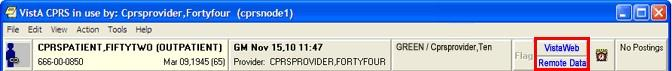

**The Remote Data and VistaWeb buttons**  
The CPRS user now has two choices for viewing remote data. One is the traditional Remote Data View (which has been streamlined), the other is VistAWeb. Each system has its advantages.

**Note:** The Joint Legacy Viewer (JLV) is a new way to view remote data and will

eventually replace VistaWeb. JLV is available now. Some sites may not switch to JLV until VistAWeb is decommissioned, while others may choose to transition sooner. This transition should be made in collaboration with local Informatics staff and the JLV team. When the change occurs, the existing VistaWeb button can be renamed and redirected to take the user to the JLV.

The rest of this section details Remote Data Views. If you want to use VistAWeb, documentation is available on the VistAWeb VA intranet page[.](http://vista.med.va.gov/vistaweb/)

If the patient has remote data, the VistaWeb button text changes color to blue. If the user selects the VistaWeb button, the button changes appearance to look as if it is depressed. It will keep that appearance until the user selects a new patient.

When VistaWeb is launched by CPRS Context Management is maintained. This means that VistAWeb will change patients whenever you select a different patient in CPRS.

How Do I Know a Patient Has Remote Medical Data?

As part of opening a patient record, CPRS checks in the Treating Facility file to see if the selected patient has been seen in other facilities. If the patient has remote data, the words on the Remote Data button turn blue as shown in the image below. If there is no remote data for the selected patient, the letters are gray.

The following graphic shows the Remote Data button with the blue text indicating that there is remote data. When the user selects the button, CPRS displays the list of sites that tells the user where and when the patient has been seen.

**If the Remote Data button is blue, other facilities have data for the current patient**  
**What Does the List of Sites Represent?**  
If you click the **Remote Data** button, a drop-down list appears with the name(s) of sites where the patient has been seen. This list is based on either:

-   Sites that have been specifically designated for your facility to access. These sites are assigned in a parameter that your Clinical Applications Coordinator (CAC) can set up.  
-   All sites where the patient has been seen and HDR and Department of Defense remote data if it is available.  
What Kind of Data Can I View?

Currently with CPRS, you can view some lab and health summary components. There are limitations to what you can view.

-   You can view any lab results that do not require input other than a date range.  
-   All reports listed on the Reports tab unless they are labeled "local only"  
-   You can view health summary components that have the same name on both the local and the remote site. You can therefore exchange national Health Summaries, but locally defined components may not be available unless the other site also has a component with the same name.  
-   If it is available, CPRS can also show some Department of Defense remote data.  
How Will the Remote Data Be Viewed?

Viewing remote data is a two-step process. First, you select which remote sites you want to see data from, and then you select the specific information you want to view, such as Clinical Reports or Health Summary components.

On the Reports tab, each site you select will have a separate tab for its data. Using the above graphic as an example, you would see five tabs on the Reports tab: Local, Dept. of Defense, Devcur, Loma Linda, Ca., and Office of Information.

You would then select the reports you want to view and a date range (if necessary). After this, CPRS will attempt to retrieve those reports if they are available on the remote sites. You would then click each Treatment Facility’s tab to see the report from that site. While CPRS is attempting to retrieve the data, the message “Transmission in Progress:” is displayed until the data is retrieved.

### Viewing Remote Data

The CPRS user now has two choices for viewing remote data. One is the traditional Remote Data View which has been streamlined, the other is VistAWeb. Each system has its advantages.

The rest of this section follows Remote Data Views. If you want to use VistAWeb, documentation is available on the VistAWeb page.

**To view a patient’s remote data, use these steps:**

1.  After opening the patient’s record, see if the text on the Remote Data button is blue. If the text is blue, the patient has remote data.  
1.  Select the tab you want remote data from (e.g. Labs or Reports).  
1.  Select the **Remote Data** button to display a list of sites that have remote data for the patient.  
1.  Select the sites you want to view remote data from by selecting the check box in front of the site name or select All and select the **Remote Data** button again to close the list.  
1.  Select the report or lab you would like to view from the Available Reports or Lab Results section on the left side of the screen (click the “**+**” sign in order to expand a report heading).  
**Note**: With the exception of the DoD Consults report, choosing a Department of Defense (DoD) report does not limit you to DoD data. For example, if you choose Microbiology under Dept. of Defense, you will get DoD data and remote VAMC data. You do not have to run a separate report to get VA data.

It may take a few minutes to retrieve the data. While CPRS retrieves the data, the message "Transmission in Progress" is displayed.

Depending on how the report or lab is configured, CPRS will return the remote data in one of two ways.

-   Text Format with Site Tabs  
If the remote data is in text format, the data from each remote site will be displayed under a separate site tab. To view data from a particular site, select the appropriate tab.

**Note:** If the provider has an NPI, it will not display on the screen below.

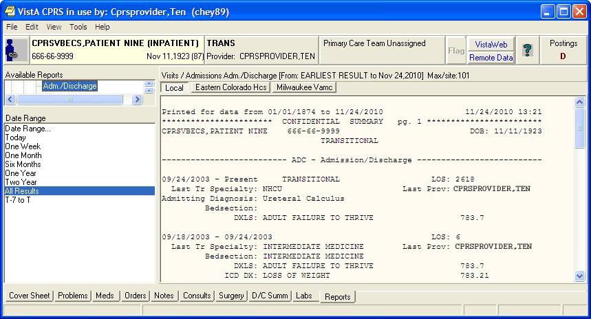

**Site tabs organize remote data from different sites**  
-   Table format  
If the report or lab is available in table format, CPRS will return data from all of the sites in a single table. The "facility" column indicates where the data in a particular row was collected. The table can be sorted by facility or by any other column heading (alphabetically, numerically, or by date) by selecting the appropriate heading. Selecting the heading again will sort the table in inverse order.

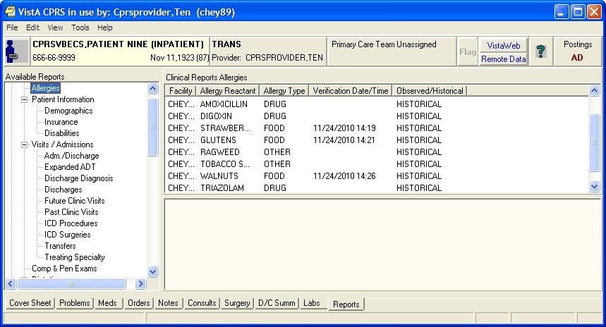

**Remote data is displayed in a table format**  
6\. To see detailed information about a particular item in the table, click that item. If detailed information is available, it will be displayed in the bottom half of the screen. To select multiple rows, press and hold the Shift or Control key.

## The Reminders Button

The CPRS GUI includes functionality from Clinical Reminders. Reminders are used to aid physicians in performing tasks to fulfill Clinical Practice Guidelines and periodic procedures or education as needed for veteran patients.

**Note:**  For more detailed information on Reminders, refer to the *Clinical Reminders Manager Manual* and the *Clinical Reminders Clinician Guide.*

The Reminders button highlighted in red below shows you at a glance whether the patient has reminders that are due.

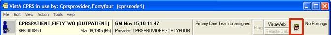

**The Reminders button**  
By observing the color and design of the icon on the Reminders button, the user receives immediate feedback on the most important types of Reminders available for the selected patient. Clinical Coordinators can set Reminders to be evaluated when you open the chart or they can set it to evaluate the Reminders only after you select the **Reminders** button or the **Reminders** drawer.

The following icons could be visible on the Reminders button:

 Due: The patient meets all the conditions for the reminder and the appropriate amount of time has elapsed.

 Applicable: The patient meets all the conditions for the reminder, but the appropriate time has not elapsed. For example, a flu shot is given once a year, but it has not been a year yet.

 Other: Reminders have been defined, but were not specifically evaluated for the selected patient. An important education topic might be placed in Other.

 Question Mark: A question mark on the Reminders button indicates that the reminders have not yet been evaluated. This appears when the patient’s chart is first opened to a tab other than the Cover Sheet. Click the Reminders button or the Reminders drawer on the Notes tab to evaluate the reminders.

 Grayed-out Alarm Clock: This icon indicates that there are no due nor applicable reminders, nor are there any reminder categories available.

If you click the button, you will see a tree view of the patient’s reminders such as the one shown below. The icons that appear on the Reminders button are also used in the tree view to identify the various types of reminders.

**The Available Reminders tree view**  
Additional information on Reminders is located in the Cover Sheet section of this manual.

The Reminders tab on the Icon Legends dialog includes a description of the different icons that appear on the Reminders tree view. To access the Icon Legend, select **View** \| **Reminder** **Icon Legend** \| and the **Reminders** tab.

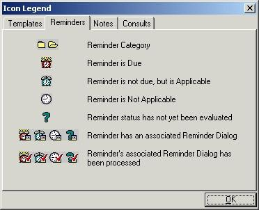

**The Icon Legend**  
## Postings (CWADPL)

Postings contain critical patient-related information about which hospital staffs need to be aware. The **Postings** button is visible on all tabs of the CPRS GUI window and is always located in the upper right corner of the window

If a patient record contains postings, the **Postings** button displays one or more of the following letters: **C**, **W**, **A,** **D, P, and L**. These letters correspond to the six types of postings described below.

-   **C (Crisis Notes)**  – Cautionary information about critical behavior or patient health.  
**Example:** Suicidal attempts or threats.

-   **W (Warnings)** – Notifications that inform medical center staff about possible risks associated with patients.  
**Example:** Patient can be violent.

-   **A (Adverse Reactions/Allergies)** – Posting that displays information about medications, foods, and other items to which patients are allergic or to which they may have an adverse reaction. CPRS creates these postings automatically when users enter allergies.  
-   **D (Directives)** – Also called advanced directives, directives are recorded agreements that a patient and/or family have made with the clinical staff.  
**Example:** DNR (Do Not Resuscitate) directive on file.

-   **P (Pregnant)** – Indicates that the patient is currently pregnant.  
-   **L (Lactating)** – Indicates that the patient is currently lactating or nursing.  
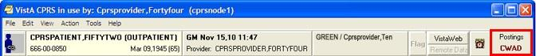

**The Postings button**  
### Viewing a Posting

CPRS offers two ways to View a posting. You can view a posting by clicking the Postings button from any chart tab, or you can select a specific posting from the **Cover Sheet** tab.

To view a posting by using the Postings button, follow these steps:

1.  Select the Postings button or select View \| Postings from the Cover Sheet tab.  
The **Patient Postings** dialog appears. The **Patient Postings** dialog contains all postings for the selected patient. The postings are divided into two categories. Allergies are listed in the top half of the dialog and crisis notes, warning notes, and directives are listed in the bottom half.

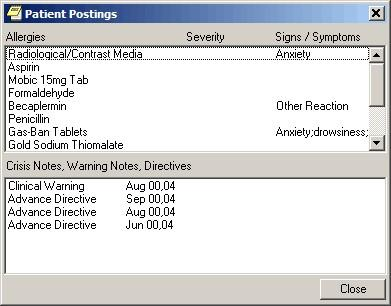

**The Patient Postings dialog**  
1.  Select a posting to see a detailed explanation.  
CPRS displays a new window that contains the full text of the posting.

1.  When you are finished reading the posting, select **Close**.  
To view a specific posting from the Cover Sheet, follow these steps:

1.  Select a posting from the Postings or Allergies / Adverse Reactions area of the Cover Sheet.  
CPRS displays a new window that contains the full text of the posting.

1.  When you are finished reading the posting, select **Close**.  
## COVID-19 Identifier/New EHR Banner

CPRS now displays a patient's COVID-19 status in a banner visible on any CPRS tab as shown below.

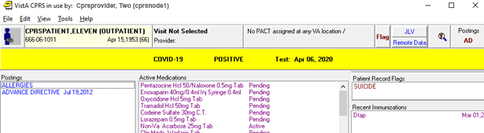

In this example, the banner shows that the patient is positive for COVID-19 and the date.  
However, if you are in an organization that has migrated to a new EHR, the COVID-19 Identifier banner will be repurposed as a New EHR banner, and will look like the screenshot below:

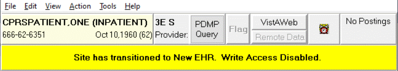

In this example, the banner shows that the site has migrated to a new EHR

### Patient Status Messages

The messages will be pulled from the function finding found text in the reminder definition linked to the banner. These messages will change as the reminder definition is updated. The status document will be found on the following page:

REDACTED

### Possible COVID-19 Status Error Messages

There are three error messages that users could see instead of a status.

-   Non-existent patient  
-   No reminder definition is defined  
-   Reminder evaluation failure, status: \<error text\>  
If you see one of these error messages, please record the patient name and call the help desk for assistance.

## CPRS Graphing

CPRS includes graphing functionality that enables you to create visual representations of relationships between many types of patient data. Specifically, CPRS graphing supports data from the following indexed sources:

• Admissions • Lab tests • Patient education • Surgery

• Allergies • Medication \* • Problems • Visits

• Anatomic pathology • Medicine • Procedures • Vitals

• Blood bank • Mental health • Purpose of visit

• Exams • Microbiology • Radiology exams

• Health factors • Notes • Registration \*\*

• Immunizations • Orders • Skin tests

*\* Includes BCMA, inpatient, non-VA, and outpatient*

*\*\* Includes Dx and Op/Proc*

### What You See and What You Get

CPRS graphing uses different representations for different types of items. Following is a brief discussion of selected items and their corresponding representations.

**Admissions and Visits**: CPRS graphing displays visits and admissions on the horizontal (date/time) axis as lines or bars that indicate the duration of the visits and admissions. Bars representing hospital admissions begin at the date and time of admission and end at the date and time of discharge. Visit representations begin at the appointment date and time and end at the date and time of the visit’s end. Because visit durations are often short, visit representations are typically vertical lines, rather than bars. When visit durations are unavailable, CPRS graphing uses its default duration of one hour.

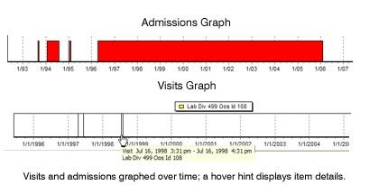

**Events:**  CPRS graphing displays as single events all items that are not laboratory tests, vitals measurements, medications (inpatient, non-VA, or outpatient), or visits. Like representations for admissions and visits, representations for single events use only the horizontal axis. CPRS graphing uses triangle shaped representations to mark these items. (Color, shape, and height differentiate item markers.) It graphs administration times for BCMA medications as events.

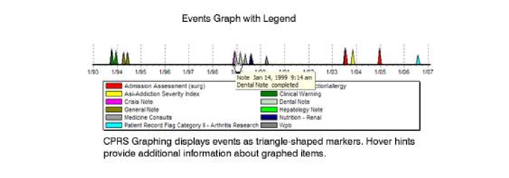

**Medications:**  As it does with admissions and visits, CPRS graphing displays medications as bars that indicate a period of time. In the case of outpatient medications, bars begin on the horizontal axis at the release date of the medications. End dates are based on the following calculation: medication release date + number of days’ supply = end date. For inpatient and non-VA medications, bars begin at medication start times and dates and end at medication stop times and dates. In the case of non-VA medications, if no stop date exists, CPRS graphing uses the current date as the stop date.

CPRS graphing differentiates multiple medications by color and vertically offsets them to ensure the visibility of overlapping bars.

**Important:**  Healthcare professionals have no reliable way to determine whether patients do or do not take their outpatient medications. Use caution when graphing relationships between outpatient medications and other items.

**Vitals:**  CPRS graphing displays vitals measurements as points on two axes. If more than one measurement exists for a given date and time, CPRS graphing connects measurements for like items with a line.

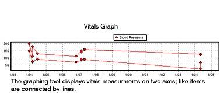

**Labs:**  CPRS graphing also displays as points on two axes laboratory tests that have results with numerical values. Lines connect like items.

CPRS graphing displays lab tests with non-numerical results (positive and negative results, for example) as points on the horizontal axis. It does not connect like items that have non-numerical results. To keep them out of the way of numerical data, CPRS graphing displays non-numerical results above or below the numerical values and line. Values beginning with \> are located at the top margin; others are graphed at the bottom margin. Free-text values display by default as do comments. To hide or show free-text values, click on the “free-text values:” label. Comments are displayed in yellow boxes on the date axis, while the \*\*comments label shows that there are comments. Clicking this label will show details of all items on the graph.

CPRS graphing includes reference ranges in graphs of laboratory test results. Reference ranges are displayed as dashed horizontal lines.

A lab test from different specimens or having different reference ranges will display in separate graphs with the appropriate reference range. If the Merge Labs setting is used then the lab tests will be graphed as a single test (with a warning that different reference ranges are present).

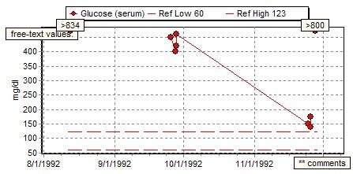

## Using CPRS Graphing

The following sections explain how to:

-   Start CPRS graphing  
-   Configure settings  
-   Create graphs  
-   View details for graphed items  
-   Use the zoom feature to expand areas of interest  
-   Copy and paste or print graphs  
### Starting CPRS Graphing

CPRS displays its graphing functionality as a detached window or a group of panes embedded within the Reports tab. (CPRS supports one detached instance of the graphing window and one Reports-tab instance per session.)You can resize and move the detached window, which enables you to set up graphs as a reference that you can view as you navigate your patient’s chart in CPRS

You can start CPRS graphing in any of the following ways:

-   From any tab: click **Tools** on the main menu and then click **Graphing**. CPRS displays the detached graphing window.  
-   From any tab: simultaneously press the \<**Ctrl**\> and \<**G**\> keys. CPRS displays the detached graphing window.  
-   On the **Reports** tab: click **Graphing (local only)** under **Available Reports.** CPRS displays embedded graphing panes.  
-   On the **Labs** tab: click **Graph** under **Lab Results.** CPRS displays the detached graphing window.  
-   On the **Labs** tab: click **Most Recent** under **Lab Results** and then click on any test displaying lab results.  
You can then display graphs by clicking items in the lists on the Views tab or the **Items** tab (located in the graphing window’s left-hand pane).

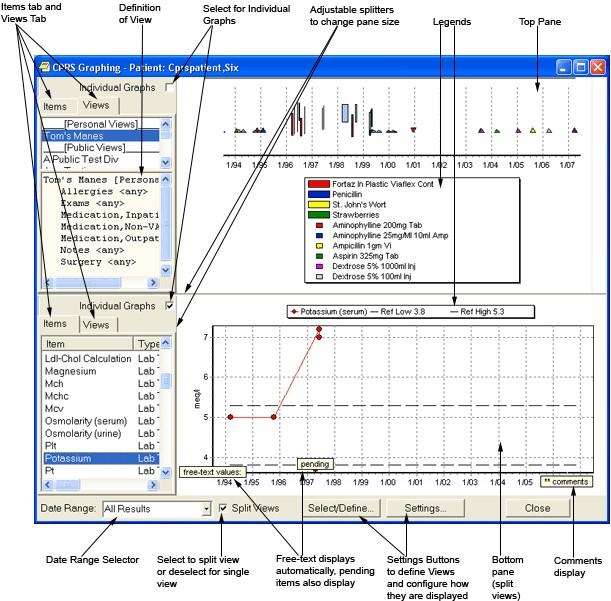

**The Graphing Window is a standalone window where users can review data and configure their graphing. It has many options for view data. Users should use the Setting button to configure the windows display and Select/Define… to create personal or shared views**  
### Configure Settings

CPRS graphing offers many options for selecting and displaying graphed data. For example, you can:

-   Select a date range  
-   Create, edit, delete, and rename predefined views (personal or public)—or save collections of items for reuse  
-   Display individual or multiple items in a single graph  
-   Display graphs in one single or two separate panes  
-   Use the **Graph Settings** dialog box to specify data sources and display options  
Following are instructions for using these options to create customized graphs.

#### Setting Display Options on the Main Window

You can set several display options directly from the main window, including the following options:

-   Date range  
-   Single- or split-pane display  
-   Individual or multi-item graphs  
-   Pane size  
##### Selecting a Date Range

If the user has not specified a date range using the Graph Settings dialog and saving the items as a personal default and a public date range has not been defined, CPRS graphing uses a date range (**All Results**) that encompasses all available items for the selected patient. However, all results may bring in a lot of data depending on the

Items or View defined. Users can set a default date range by selecting the Settings… button or using the Tools \| Options… menu items, selecting the Graphs tab, and selecting Default Graph Settings….

For the current view, users can change this date range by selecting a new date range from the **Date Range** list (one week, six months, two years, All Results, etc.), or by using the **Date Range** dialog box to define a range.

To access the Date Range dialog box:

-   Select **Date Range…** in the **Date Range** list. This sets the date range for the current view.  
Keep in mind the following information when selecting a new date range:

-   CPRS graphing automatically displays all available items for the selected date range. If no items appear in the Item list, the system has no items that fall within the date range you’ve selected.  
-   Date ranges apply to all graphs. That is, you cannot simultaneously graph items using multiple date ranges.  
-   If items cover a date range that extends beyond the range you’ve selected, the graphing tool uses the absence of boarders to visually suggest that the items continue beyond the selected date range.  
##### Displaying Individual or Multi-Item Graphs

Each graph in the display area (or split-pane areas) can include one or multiple items.

To create graphs that include only one item on each set of axes:

-   Select the **Individual Graphs** checkbox (located in the upper left-hand section of the main graphing display).  
To create graphs that include multiple items on each set of axes:

-   Cancel the selection of the **Individual Graphs** checkbox.  
While you can graph one or more vitals and lab measurements on the same set of axes, you cannot graph vitals and lab measurements on a set of axes that includes other types of items.

##### Creating a Split-Pane Display

CPRS graphing offers a split-pane display that enables you to create separate graphs in the top and bottom panes. Each pane includes its own **Individual Graphs** check box, **View** tab, and **Item** tab.

To create a split-pane display:

-   Select the **Split Views** check box located in the lower left-hand section of the main window.  
To return to a single-pane display:

-   Cancel the selection of the **Split Views** check box.  
##### Resizing Panes and Item-Selection and Views Columns

Take the following steps to resize panes and item-selection columns:

1.  Point to the border between panes or columns.  
1.  When the pointer becomes a  , click and hold the left mouse button.  
1.  Drag the border to its new location and release the mouse button.  
#### Creating Predefined Views

CPRS graphing provides predefined graphs through its **View** tab, which is located in the upper left-hand pane of the main window. This tab includes all predefined views from the following sources:

-   Public views you or others—your site’s IRM staff, for example—have created. (Only authorized users can create public views.)  
-   Private views you have created.  
-   Personal Lab Groups that you have created. These lab groups are defined in the Lab Worksheet report.  
Users can now also access other users’ personal views and lab groups that they have defined to build new views. Users with proper authority can save personal views as public views by simply renaming and saving as a public view. Users can also save public views as a personal view and then alter it to suit their personal preferences.

To display view definition, users do this:

1.  Highlight the view name.  
1.  Select View Definition from the pop-up menu.  
The definition with them display in a pane below View list.

**Take the following steps to create new views:**

1.  Access the Define Views or Select Items and Define Views dialog box using one of the following four methods:  
1.  On the CPRS main menu, click **Tools** and then click **Options.** CPRS displays the **Options** dialog box.  
1.  On the **Graphs** tab, click **View Definitions.** CPRS displays the **Define Views** dialog box.  
\-or-

1.  Click **Select/Define** on the right-click menu from the graphing window. CPRS displays the **Select Items and Define Views** dialog box.  
\-or-

1.  Click **Select/Define** at the bottom of the graphing window. CPRS displays the Select Items and Define Views dialog box.  
\-or-

1.  On the CPRS **Reports** tab, click **Graphing (local only)** in the **Available Reports** list. CPRS displays embedded graphing functionality.  
1.  Click the **Select/Define** button. CPRS displays the **Select Items and Define Views** dialog box.  
1.  Select All Items in the Select Items using area located at the top of the dialog.  
1.  Select a data source from the Source list. CPRS displays in the Items list all items associated with this source.  
1.  If you know you want to include all items, double-click the source to add it—and its associated items—to the Items for Graphing list. You can also add all items for the source by clicking the  button.  
\-or-

Double-click individual items you want to add to the **Items for Graphing** list. You can also select individual items by highlighting them and then clicking the \> button.

Other tips for adding items to the **Items for Graphing** list:

-   Select **Drug Class** in the **Source** list to make available for selection *all* drugs (inpatient, outpatient, non-VA, and BCMA).  
-   Select **Medication, BCMA**; **Medication, Inpatient**; **Medication, Outpatient**; or **Medication, Non-VA** to display only medications for these sources. For example, if you want to select a specific outpatient medication, click **Medication, Outpatient** and then add the medication to the **Items for Graphing** list.  
-   In the **Source** list, **Anatomic Pathology** and **Microbiology** include sub sources. When you select the primary sources (**Anatomic Pathology** or **Microbiology**), CPRS graphing displays their sub sources in its **Items** list. If you add to the **Items for Graphing** list sub sources from the **Items** list, you automatically add all items associated with the sub sources. To add individual items associated with sub sources, select the sub sources from the **Source** list.  
-   CPRS moves all selected items to the **Items for Graphing** list. If you select duplicate items from different sources, CPRS merges the duplicate items when you add them to the **Items for Graphing** list.  
1.  (Optional) You can remove items from the Items for Graphing list by double-clicking them. You can also use the \< button or the \<\< button to remove items.  
1.  Repeat steps 2–5 until you have selected all items that you want to include in your view.  
1.  Select Save Personal to save these items in a personal view or, if you are authorized to do so, click Save Public to save the items in a view that is available to all users.  
1.  In the Save your Personal View or Save this Public View dialog box, type a name for your new view. CPRS saves view names in all capital letters and displays them using title caps. Therefore, you cannot use capitalization schemes to save different views that have the same name. You must give each view a new name unless you plan to overwrite an existing view.  
1.  Select OK.  
Your view is now available on the **Source** list in the **Select/Define** and **Select Items and Define Views** dialog boxes**.** It is also available on the **View** list.

#### Editing Predefined Views

**Take the following steps to edit predefined views:**

1.  Access the **Select Items and Define Views** or **Select/Define** dialog box. (See step 1 in “Creating Predefined Views” on p.113 of this manual.)  
1.  Select the view you want to edit. (Views are located near the bottom of the **Source** list.) CPRS displays the view—and the items that comprise it—in the **Items** list.  
1.  Double-click items you want to keep in the view. CPRS displays these items in the **Items for**  
1.  **Graphing** list. (You can also use the right-arrow or double right-arrow buttons to move items from the **Items** list to the **Items for Graphing** list.)  
1.  Make additional changes to the **Items for Graphing** list as needed. (Add items from additional sources by clicking sources in the **Source** list and then selecting associated items from the **Items** list.)  
1.  Select **Save Personal** or **Save Public**, depending on whether you are editing a personal or public view. (Again, only authorized users can create or edit public views.) You can modify and/or save public views as personal views simply by clicking **Save Personal**.  
1.  Type the name of the view you are editing. (If you are saving a public view as your personal view, the personal view can have the same name as its public counterpart.) Click **OK**.  
1.  CPRS displays the **Confirm** dialog box, which warns you that you are about to overwrite an existing view.  
1.  To overwrite (edit) the existing view, select **Yes.**  
#### Deleting Predefined Views

**Take the following steps to delete predefined views:**

1.  Access the Select Items and Define Views or Select/Define dialog box. (See step 1 in “Creating Predefined Views” on p.113 of this manual.)  
1.  In the **Source** list, select the name of the view you want to delete.  
1.  Select **Delete**.  
1.  CPRS displays the **Confirm** dialog, which asks if you want to delete the selected view.  
1.  To delete the view, select **Yes**.  
#### Renaming Predefined Views

**Take the following steps to rename a predefined view:**

1.  Access the Select Items and Define Views or Select/Define dialog box. (See step 1 in “Creating Predefined Views” on p.113 of this manual.)  
1.  In the Source list, select the name of the view you want to rename.  
1.  Select Rename.  
1.  CPRS displays the Rename your Personal View or Rename this Public View dialog box.  
1.  Type a new name for your personal or public view.  
1.  Select OK.  
1.  CPRS displays the **Confirm** dialog box.  
1.  To change the name of your view, select Yes.  
#### Setting Display Options Using the Graph Settings Dialog Box

The **Graph Settings** dialog enables you to specify particular sources that you want CPRS graphing to display in the **Item** list (main window). In addition, these dialog boxes include several display settings.

*Accessing the* **Graph Settings** *Dialog Box*

**To access the** Graph Settings **dialog box**:

1.  Select **Tools** on the CPRS GUI main menu.  
1.  Select **Options.**  
1.  CPRS displays the **Options** dialog box.  
1.  On the Graphs tab, select Default Graph Settings.  
1.  Use the steps in the following sections to specify settings.  
Changes you make using this dialog box from the **Tools** menu may take effect only after you close and restart CPRS.

Accessing the **Graph Settings** Dialog Box

You can access the Graph Settings dialog box in any of the following three ways:

1\. Select the **Settings** button located on the bottom bar of the main window.

\-or-

Select **Settings** on the right-click menu.

\-or-

On the **Reports** tab, select **Graphing** **(local only)** and then select the **Settings** button located below the **Available Reports** list.

**Note:** When you access the **Graph Settings** dialog box from the **Reports** tab, changes apply only to graphs you create from the **Reports** tab.

Regardless of how you access the **Graph Settings** dialog box, CPRS applies your changes only to graphs you create during your current CPRS session unless you save them as your default settings.

##### Specifying Sources

You can specify which sources CPRS graphing uses to display items by taking the following steps:

1.  In the Sources Displayed list, select the checkboxes adjacent to the sources you want to include.  
1.  To select all available sources, select All.  
1.  To cancel the selection of all sources, select Clear.  
##### Setting Display Options

CPRS graphing provides the following display options through the **Graph Settings** dialog box:

**3D**  Select this option if you want your graphs to appear three dimensional. This option is also available on the right-click menu.

**Clear Background** Select this option if you want your graphs to appear on a plain white background.

**Dates**  Select this option if you want to display dates along the horizontal (time/date) axis.

**Fixed Date** **Range** Select this item if you want always to display the selected date range.

**Gradient**  Select this option if you want to display graphs against a gradient blue background.

**Hints**  Select this option if you want CPRS graphing to display hover hints that contain a brief description of items to which you are pointing.

**Legend** Select this option if you want your graphs to include a legend that identifies graphed items.

**Lines**  Select this option if you want graphs to include vertical lines along the horizontal (date/time) axis. (Lines can help orient graphed items in time.)

**Merge Labs** Select this option if you want lab tests to be graphed together regardless of specimen or reference ranges.

**Sort by Type** Select this option if you want CPRS graphing to sort items in its Item list by type.

**Stay on Top** Select this option if you want the detached graphing window to stay on top. This option is also available on the right-click menu.

**Values**  Select this option if you want to display values for graphed items. Free-text values display by default.

**Zoom, Horizontal** Select this option if you want the ability to select and expand graphed items with respect to the horizontal (date/time) axis.

**Zoom, Vertical** Select this option if you want the ability to select and expand graphed items with respect to both the vertical and horizontal axes. (You can select this option only if you have also selected the Zoom, Horizontal option.) This option is also available on the right-click menu.

**Max Graphs in Display** Select the maximum number (1–20) of graphs that you can display simultaneously.

**Minimum Graph Height** Select a minimum height (10–1000 pixels) for each graph.

**Max Items to Select** Select the maximum number of items (1–1000) you can include in a single graph.

**Outpatient Date Default** Select the date range for outpatient data (Today, One Week, Two Weeks, One Month, Six Months, One Year, Two Years, All Results)

**Inpatient Date Default** Select the date range for inpatient data (Today, One Week, Two Weeks, One Month, Six Months, One Year, Two Years, All Results).

##### Personal and Public Default Settings

To save changes for future CPRS sessions:

• Select the **Personal** or **Public** buttons in the **Save as Default** area. You can save settings as public defaults only if you are authorized to do so.

CPRS applies defaults only after you close and subsequently restart CPRS. When you do this, CPRS applies your personal default settings. It applies public default settings only if you have not saved personal default settings.

#### Display Options Available through the Select Items and Define Views Dialog Box

CPRS graphing enables you to display graphs directly from the **Select Items and Define Views** dialog box. Using this dialog box, you can specify the following display options:

**Top**  Select this option to display your graph in a single-pane view, or to display it at the top of a split view if the Split View checkbox on the main window is selected.

**Bottom**  Select this option to display your graph on the bottom pane of a split view.

**Both**  Select this option to display your graph in both the top and bottom panes of a split view.

**No Change**  Select this option if you want to use the display settings you’ve selected in the main window.

### Creating Graphs

You can create graphs from the main window and from the **Select Items and Define Views** dialog box.

#### Graphing Items from the Main Window

When you create graphs from the main window, you select items from the **View** and/or **Item** list. The **View** list contains predefined groups of items that you have saved as personal views, or that you or other users have saved as public views. (See the “Creating Predefined Views” section on p.113 of this manual for more information about creating views.)

The **Item** list contains only items that are available for the patient and date range you have selected. If no items appear on this list, try adjusting your data-source settings. (See the “Specifying Sources” section on p.118 of this manual for information about increasing the number of sources available for the **Item** list.) You can also try expanding the date range you have selected.

If you haven’t already done so, set graphing display options. (See the “Configure Settings” section on p.111 of this manual for information about setting up display options.)

**To graph a view or single item:**

-   In the **Item** or **View** list, click the item or view you want to graph.  
**To graph multiple items, take the following steps:**

1.  (Optional) Sort items in the Item list by clicking a column header. (You can resize columns by dragging—or double-clicking—the border between column headers.)  
1.  In the View or Item list, select a view or first item. If you click a view, CPRS graphing automatically selects and sorts at the top of the Item list the items that comprise the view.  
1.  If you are selecting items from the Item list, press and hold the \<Ctrl\> key or, if the items you want to select are sorted to appear sequentially, press and hold the \<Shift\> key.  
1.  If you are pressing the \<Ctrl\> key, click each additional item you want to add. (You can cancel the selection of an item by clicking it again.) If you are pressing the \<Shift\> key, click the last item in the sequence of items you want to add.  
1.  When you are finished selecting items, release the \<Ctrl\> or \<Shift\> key. CPRS graphing displays your graph (or graphs) in its right-hand pane.  
##### Adjusting the Display

CPRS graphing automatically scales graphs to fit the pane. However, you can resize the main window, or resize the pane. (See “Resizing Panes and Item-Selection Columns” on p.113 of this manual.)

**To split numerical items in your graph from event-based items:**

-   Select **Split Numerics/Events** on the right-click or popup menu.  
**To reverse your split-screen view:**

-   Select **Swap** on the right-click or popup menu.  
**To move a particular item from the bottom to the top of a split-pane view, or vice-versa, or to separate a particular item from a multiple-item graph:**

-   Point to the item and select **Move** on the right-click or popup menu. If you are separating an item from a single-pane view, CPRS graphing automatically displays the item in the bottom pane of a split-pane view.  
**To move all items from the top to the bottom pane of a split view, or vice-versa:**

-   Point to an unpopulated area of the pane containing the graphs you want to move and select **Move** from the right-click menu.  
**To remove a graphed item:**

-   Point to the item and select the **Remove** selection on the right-click menu.  
**To remove all graphed items:**

-   Point to an unpopulated area of the pane from which you want to remove all graphed items and select the **Remove** selection from the right-click menu.  
### Graphing Items from the Select Items and Define Views Dialog Box

When you create graphs from the **Select Items and Define Views** dialog box, you first select data sources that include the items you want to graph. The **Source** list contains all data sources—including all saved public and private views. The patient you have selected may not have items in a given source.

If you haven’t already done so, set graphing display options. (See the “Configure Settings” section on p.111 of this manual for information about setting up display options.)

**Take the following steps to create graphs from the Select Items and Define Views dialog box:**

1.  Select **Patient Items** in the **Select Items using** area located at the top of the dialog.  
1.  Select a source from the **Source** list.  
If the patient you’ve selected has items from this data source, CPRS displays the items under the source’s name in the **Items** list. Otherwise, it displays only the source’s name.

1.  Double-click individual items you want to include in the **Items for Graphing** list. You can also add items to this list by using the **\>** and **\>** buttons. (The **\>** button adds individual items to the **Items for Graphing** list, and the \> button adds all items.)  
1.  (Optional) Use the **\<** and **\<\<** button to remove items from the **Items for Graphing** list. You can also double-click items on this list to remove them.  
1.  Repeat steps 2–4 as necessary to add items from additional sources.  
1.  Select Close and Display.  
CPRS displays the resulting graph (or graphs) in the main window. (See “Adjusting the Display” on p.121 of this manual for information about adjusting this display.) It also displays graphed items (selected and sorted at the top) in the **Item** list and the temporary view in the **View** list. Temporary views are available for creating subsequent graphs only during the current CPRS session.

### Displaying Details for Graphed Items

CPRS graphing offers several options for displaying details associated with graphed items. The following list describes these options.

-   **Hints:** If you have selected **Hints** in the **Graph Settings** dialog box, hover hints containing summary information appear when you point to graphed items.  
-   **Values:** If you have selected **Values** in the **Graph Settings** dialog box—or if you’ve selected **Values** on the right-click menu—CPRS graphing displays informational labels for each graphed item.  
-   **Display details:** When you click on a graphed item, CPRS graphing displays details associated with the item.  
-   **Click on legend:** When you click on a graph’s legend, CPRS graphing displays a limited-data listing for all items that appear on the legend.  
-   **Display point details on right-click menu:** CPRS graphing displays all results associated with specific types of points when you right-click on the points and then click **Details.** For example, if you right-click on a point that represents a vitals measurement for the selected patient—his body temperature on July 24,  
2000, say—and then click **Details**, CPRS graphing displays the results of all vitals measurements entered for July 24, 2000.

-   **Display all details via the right-click menu:** CPRS graphing displays details for all graphed items when you when you right-click on an unpopulated area of the graph and then click **Details** on the right-click menu.  
### Using the Zoom Feature

CPRS graphing’s zoom feature provides a way to visually expand areas of interest. To enable this feature for the horizontal axis, select the **Zoom, Horizontal** checkbox in the **Graph Settings** dialog box. To simultaneously expand areas of interest along the vertical axis, select **Zoom, Vertical** in the **Graph Settings** dialog box or **Vertical Zoom** on the right-click menu.

Take the following steps to visually expand areas of interest:

1.  Point to the upper left-hand corner of the area you want to visually expand.  
1.  Click and hold the left mouse button.  
1.  Drag the mouse pointer downward and to the right until you have described the entire area of interest.  
1.  Release the mouse button. CPRS graphing expands the horizontal and (if applicable) vertical axes of all graphs accordingly. In its information bar, CPRS graphing displays the new (zoomed) date range.  
1.  (Optional) Repeat steps 1–3 as needed to further expand the area of interest.  
#### Reversing the Zoom Process

To instantly return all graphs to their original state:

-   Select **Reset Display** on the right-click menu.  
**Alternately, you can return all graphs to their original state by taking the following steps:**

1.  Point to any area on a graph.  
1.  Click and hold the left mouse button.  
1.  Drag the mouse pointer upward and to the left.  
1.  Release the mouse button.  
**To step backward through the zoom process (reverse the process by increments):**

-   Select **Zoom Back** on the right-click menu. (When you’ve stepped backward through the entire zoom process, this menu selection is unavailable.)  
### Copy and Paste or Print Graphs

The graphing tool relies on Microsoft Word’s copy, paste, and print features. If Word is not installed on your machine; these features are not available for you to use.

**To copy all of the graphs in the main window—including graphs that lie outside your scrolled view:**

-   Select **Copy** on the right-click menu.  
**To paste copied graphs into any application that accepts copied images from the system clipboard:**

-   With the application active, simultaneously press the \<**Ctrl**\> and \<**V**\> keys.  
You cannot paste graphs into progress notes and other text-entry components of CPRS.

To print all of the graphs in the main window—including graphs that lie outside your scrolled view:

-   Select **Print** on the right-click menu.  
### Exporting Data

Graph patient data can also be exported to a spreadsheet. From the right click menu, Export Data automatically puts data into an Excel spreadsheet. The Excel script uses a common auto-format after data is copied. The user can then manipulate the data in the Excel spreadsheet (making other graphs, sorting, applying functions, etc.). The patient info (same as used with Word) is in Excel’s header and footer. The header and footer are only visible when printing or doing a print preview.

The exported data is just a work copy, and any edits the user makes in Excel do not affect the patient’s permanent record. Users can also adjust the column width or do other formatting actions for more readable printouts.

To export the data into an Excel Spreadsheet, use these steps:

• After the selected data has been displayed in a graph, select **File \| Export Data.**

Excel will then be launched and the data from the graph will be displayed in the spreadsheet.

# Electronic and Digital Signatures

CPRS now has two types of signatures: electronic and digital. Electronic signatures, which have been available for some time, require an electronic signature code that can be created at your site. Digital signatures in CPRS are now required to comply with new Drug Enforcement Agency’s (DEA) regulations for identifying a prescriber that orders outpatient controlled substances.

There are three different levels of keys that influence what can be done with orders, including which dialog CPRS brings up when signing orders. Although actual practice at each site may vary, the three levels are usually referred to in these ways:

-   OREMAS is the clerk key  
-   ORELSE is the nurse key  
-   ORES is the provider key  
In CPRS, users who hold the ORES key have additional privileges and are sometimes required to enter more information than those who hold the ORELSE or OREMAS key. ORES key holders (usually an ordering provider) must enter information regarding service connection, environmental conditions or specific treatment factors, such as ionizing radiation, Agent Orange, etc.

This section describes the differences between electronic and digital signatures, gives an overview of service connection and treatment factors, and then gives the steps for the various ways users will sign orders. For example, users can sign orders several different ways:

-   **Review / Sign Changes…**enables users to sign all orders from the current ordering session. Using this method, the user could write a number of orders and create documents and then sign all items at the same time.  
-   **Sign selected…**enables users to highlight one or more orders and then sign them. When the dialog displays, only the selected orders or documents will display for signature.  
-   **Select New Patient** brings up the signature dialog that includes all unsigned orders for the current patient before opening another patient record. The orders are broken into three groups, the user’s orders from this ordering session, the user’s unsigned orders for the patient from previous ordering sessions, and unsigned orders for the patient written by other users. The user can then select and deselect the orders to be signed.  
-   **Exiting the chart** (closing CPRS) brings up the same dialog as selecting a new patient (see above).  
CPRS provides three methods for signing orders and documents. You can sign orders and documents together from the Review / Sign Changes dialog or you can sign orders and documents separately using the Sign Selected Orders and Sign Documents Now commands.

## Electronic Signatures

Most orders or documents, such as progress notes, consults, or discharge summaries, require an electronic signature. Generally, orders that require a signature are not released to services or activated until they are signed.

**Note**: There are two exceptions to this rule: 1) orders that can be designated as “signed on chart” and 2) generic orders that do not require a signature.

To electronically sign an order or a document, a user must have an electronic signature code, which is created in VistA. If a user does not have a signature code and needs one, a Clinical Coordinator can assist the user. As with any password or code that gives access or permission to perform a task, users must keep their signature codes secret and use it properly to help keep an accurate medical record.

## Digital Signatures

Digital signatures are now required for providers who prescribe outpatient controlled substance (controlled substance schedules 2-5) medications. The VA’s implementation of digital signatures for these medications also allows sites to limit, if needed, which outpatient controlled substances pharmacy schedules a prescriber has permission to prescribe. Of course, the site can also allow the provider to write for all schedules.

To digitally sign the controlled substances outpatient orders requires what is called two-factor authentication, which means that in addition to entering their electronic signature, the providers must use their Personal Identification Verification (PIV) cards, card readers attached to workstations, Personal Identification Numbers (PIN), and digital certificates to digitally sign the orders.

When the provider attempts to digitally sign the order, CPRS checks for a valid DEA registration number or VA number for the prescriber and to see if the provider is authorized to write medications for the specified pharmacy schedule to which the selected medication belongs.

By digitally signing the controlled substance order, the prescriber acknowledges and accepts the following as mandated by the DEA:

**By completing the two-factor authentication protocol at this time, you are legally signing the prescription(s) and authorizing the transmission of the above information to the pharmacy for dispersing. The two-factor authentication protocol may only be completed by the practitioner whose name and DEA registration number appear above.**

### How Does CPRS Show a Digital Signature?

CPRS displays order information in several places where users will be able to see that an outpatient controlled substance order was digitally signed.

-   **Cover Sheet:** If the order has been digitally signed, the detailed order display from right-clicking the order on the Cover Sheet where it currently shows “Elec Signature:” will show “Dig Signature:"  
**Note:** If the provider has an NPI, it will not display on the screen below.

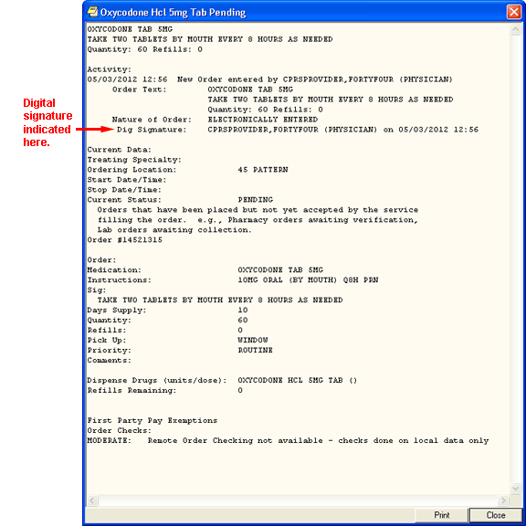

**This graphic is a detailed display of an order on the CPRS Cover Sheet. Note the text change from “Elec. Signature,” to “Dig Signature”**  
-   **Orders Tab and Meds Tab:** If the order has been digitally signed, the detailed order display from right-clicking the order on the Orders tab or from selecting it and choosing Details from the View menu where it currently shows “Elec Signature:” will show “Dig Signature:”  
**Note:** If the provider has an NPI, it will not display on the screen below.

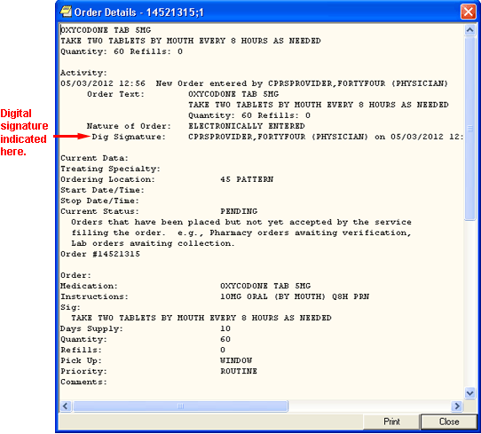

**The above graphic shows the detailed display of an order off the Meds or Orders tab. The text has been changed from “Elec Signature,” to “Dig Signature”**  
**Reports Tab:** On the Daily Order Summary and Order Summary by a Date Range reports, the signature type will be Digital. On the Chart Copy Summary report, the indicator shows that the order was digitally signed.

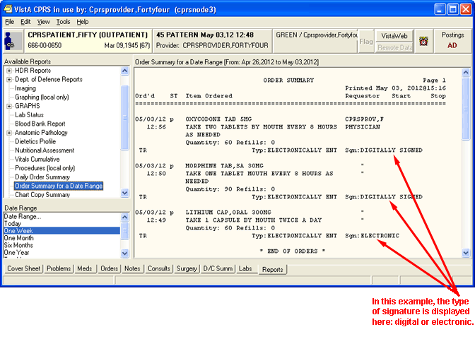

**The above capture of the Reports tab indicates that the orders shown were digitally signed**  
### Digitally Signing Orders

VA employees have been given Personal Identification Verification (PIV) cards to improve security. Digitally signing orders for controlled substances is one area where providers will use their PIV cards.

A Personal Identification Number (PIN) controls access to the smart card. When a user needs to digitally sign an order, the user must be at a workstation with a card reader and must enter the card’s current PIN.

To sign controlled substances orders, digitally sign the order by

-   Proceeding with the normal electronic signature process.  
-   Selecting the controlled substances orders that you want to sign when you see the Smart Card Required caption above the controlled substances orders. You must select each order individually.  
-   Inserting your PIV card into the card reader.  
-   When prompted, entering your PIN and clicking **OK** or pressing **\<Enter\>**.  
## Understanding Service Connection and Treatment Factors

Upon electronic signature, providers will need to deal with the various exemptions for copayment for qualified veterans. To help providers better understand service connection and treatment factors, the following information is provided.

### Service Connected

The assignment of service connected percentage and disability code is based on the degree of disability as determined by the rating board decision following the submission of a claim that a veteran’s illness or injury was incurred in or aggravated by military service.

An adjunct condition, although not service connected, is medically determined to be associated with or is aggravating a disease or condition, which is service connected. A veteran is eligible to receive treatment for an adjunct condition; however, because the adjunct is not a condition that is specifically rated, VA can bill the insurance carrier as well as those veterans responsible for copayments for treatment provided for the adjunct condition.

A secondary condition is defined as a condition that has been caused or is the result of a service-connected condition. This condition is also nonservice-connected and treatment provided is also billable.

It is important that the clinician be aware of the patient’s service-connected conditions. This information is available by clicking the patient’s name in the blue square in the upper left corner in CPRS. It is also found on the encounter form. If a patient is being treated for a service-connected condition during a visit, the provider should check the service-connected box on the encounter form “yes.”

Compensable service-connected veterans are not charged an outpatient copayment. However, nonservice-connected veterans and veterans rated less than 50% service connected with income above the existing threshold may be charged a medication copayment if the medication is for a nonservice-connected condition. If the veteran has health insurance, a claim will be submitted to the insurance carrier for the treatment of nonservice-connected conditions.

### Treatment Factors/Environmental Indicators

The provider must make a clinical decision to determine if an encounter is for a SC condition or one of a number of special categories. If the veteran is being treated during the encounter for a condition that the provider believes is for SC or a special category, the provider should check “Yes” next to the appropriate category on the encounter form. The veteran will not be billed for the encounter if “Yes” is checked. Medication(s) for one of these conditions should be indicated during the outpatient medication ordering process. The veteran will not be charged a copayment for a medication that is for SC or a special category.

The Special Categories included are:

-   Combat Veteran (CV)  
-   Agent Orange (AO)  
-   Ionizing Radiation (IR)  
-   Southwest Asia Conditions (SWAC) – includes Gulf War veterans  
-   Shipboard Hazard and Defense (SHD)  
-   Military Sexual Trauma (MST)  
-   Head and Neck Cancer (HNC), after nasopharyngeal radium treatment in service.  
#### Combat Veteran

##### Overview of Combat Veteran Status

To qualify for the Combat Veteran (CV) exemption, the veteran must have served in combat operations after the Gulf War or in combat against a hostile force after November 11, 1998. In addition, the condition for which the veteran is treated must be related to that combat, the veteran must have registered as a combat veteran, and be within two years of separation from active military service. Finally, the condition must not be already considered to be service related or that exemption should apply.

**Note:** The Combat Veteran exemption is valid for two years from the date of separation from military service, not the registration date. For example, if a veteran registers for Combat Veteran status 18 months after the date of his or her separation, the veteran would be eligible for Combat Veteran exemption for six months only. For further details, see VHA Directive 2002049, Combat Veterans Are Eligible for Medical Services for 2-Years after Separation from Military Service Notwithstanding Lack of Evidence for Service Connection.

##### Combat Veteran Markers

To help users better identify Combat Veteran eligible patients so that appropriate care and prioritization occur for them, CPRS has added several items where Combat Veteran status is more clearly shown. This is especially true in Consults. These markers are shown in various places in CPRS, such as the Patient Selection screen, the buttons available from any tab, the Consults dialog and details, the SF-513 form, etc.

-   **Patient Selection Screen:** When the user selects a patient with Combat Veteran status, CPRS indicates that patient is a combat veteran by displaying the letters CV and a date below the normal demographic information on the Patient Selection screen and above the Save Patient List Settings button. The marker is shown in the screen capture below surrounded by a red box.  
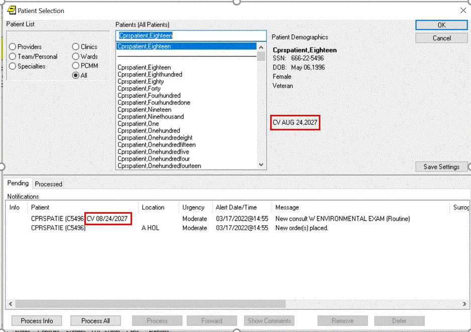  
-   **New Service Consult/Request Notifications:** The lower portion of the Patient Selection screen is the list of notifications for the user that is logged in. For a new consult or procedure request for a veteran with Combat Veteran status, the letters CV and the date display behind the abbreviated patient identifier in the Patient column. The Combat Veteran notification marker is shown in the above screen capture outlined in red.  
-   **Combat Veteran Button and Consult Details:** Available from any CPRS tab, the Combat Veteran button displays the letters CV and the expiration date of Combat Veteran status. The Button displays when the selected patient has Combat Veteran status. The button shares space with the Flag button. The Combat Veteran button only displays for patients with the status, otherwise, the Flag button is whole.  
-   To get details, the user selects the button to display the Combat Veteran Details dialog. See *Combat Veteran Details Dialog* below.  
-   When the user selects the consults from the tree view, the consults details show in the pane to the right. In this view, the Combat Veteran status is shown underneath the primary eligibility.  
**Note:** If the provider has an NPI, it will not display on the screen below.

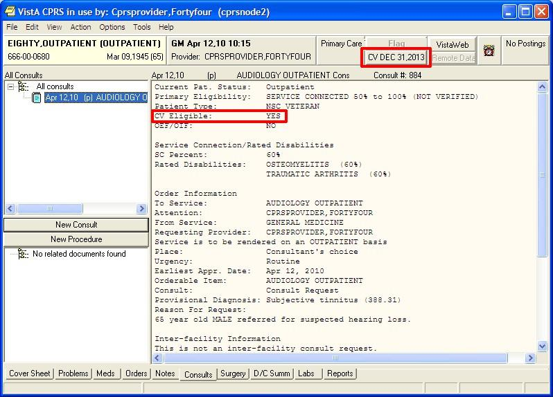

-   **Combat Veteran Details Dialog:** When the user selects the Combat Veteran button, the Combat Veteran Details dialog displays with the following items:  
-   Service Branch  
-   Status  
-   Separation Date  
-   Expiration Date  
-   OEF/OIF (If the patient served in Operation Enduring Freedom (OEF) or Operation Iraqi Freedom (OIF)  
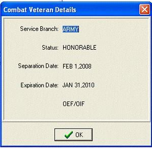

-   **Consult Order Dialog:** The Combat Veteran status and expiration date display near the top of the Consult Order dialog.  
**Note:** If the provider has an NPI, it will display on the screen below. See the "National Provider Identifier (NPI) Display in CPRS" section for an example of an NPI displaying on a screen.

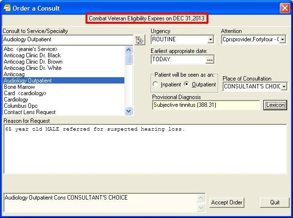

-   **SF-513 Form:** Several changes were made to this form:  
-   At the top of the page on the SF-513, the Combat Veteran marker displays with the demographic information.  
-   The patient’s name was moved to the top of this form.  
-   When printed, the patient’s identifying information will be printed at the top of each page.  
-   When printed, a page number will be printed at the bottom of each page.  
**Note:** If the provider has an NPI, it will not display on the screen below.

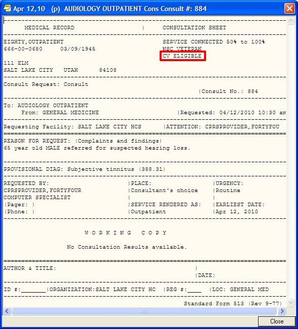

#### Agent Orange

Agent Orange (AO) is an herbicide that was used in Vietnam between 1962 and 1971 to remove unwanted plant life that provided cover for enemy forces. The VA has recognized the following conditions as associated with but not necessarily caused by exposure to Agent Orange:

-   AL Amylodosis  
-   Diabetes (type 2)  
-   Chloracne or other acne form disease consistent with chloracne (must occur within one year of exposure to AO).  
-   Ischemic Heart Disease  
-   Parkinson’s Disease  
-   Porphyria cutanea tarda (must occur within one year of exposure to AO).  
-   Acute and subacute peripheral neuropathy. (For purposes of this section, the term acute and subacute peripheral neuropathy means temporary peripheral neuropathy that appears within weeks or months of exposure to an herbicide agent and resolves within two years of the date of onset.)  
-   Numerous cancers:  
-   Prostate cancer  
-   Hodgkin’s disease.  
-   Multiple myeloma.  
-   Non-Hodgkin’s lymphoma.  
-   Respiratory cancers (cancer of the lung, bronchus, larynx, or trachea). (Must occur within 30 years of exposure to Agent Orange.)  
-   Soft-tissue sarcoma (other than osteosarcoma, chondrosarcoma, Kaposi’s sarcoma, or mesothelioma).  
-   Chronic lymphocytic leukemia  
#### Ionizing Radiation

Atomic veterans may have been exposed to ionizing radiation in a variety of ways at various locations. Veterans exposed at a nuclear device testing site (the Pacific Islands, e.g., Bikini, NM, NV, etc.) or in Hiroshima and/or Nagasaki, Japan, may be included. Atomic veterans with exposure to ionizing radiation are entitled to receive treatment for conditions for this exposure. VA has recognized the following conditions by statute or regulation as being associated with radiation exposure:

Conditions Associated with Ionizing Radiation:

-   All cancers/malignancies  
-   Posterior subcapsular cataracts  
-   Non-malignant thyroid nodular disease  
-   Parathyroid adenoma  
-   Tumors of the brain and central nervous system  
**Note:** Atomic veterans do not have to receive an Ionizing Radiation Registry Exam to have these special treatment eligibilities.

#### Southwest Asia Conditions

Gulf War veterans were exposed to a wide variety of environmental hazards and potentially harmful substances during their service in Southwest Asia. These include depleted uranium, pesticides, the anti-nerve gas pill pyridostigmine bromide, infectious diseases, chemical and biological warfare agents, and vaccinations (including anthrax and botulinum toxoid), and oil well free smoke and petroleum products. VA recognizes that there are other health risk factors encountered by Gulf War veterans. Veterans with service during the Gulf War are entitled to receive treatment for conditions for this service

If the treatment provided during the encounter is for an illness or symptom that may possibly be associated with environmental contamination this should be indicated on the encounter form or medication order

Conditions Associated with Southwest Asia Conditions:

-   Persistent fatigue  
-   Skin rash  
-   Headache  
-   Arthralgias/myalgias  
-   Sleep disturbance  
-   Forgetfulness  
-   Joint pain  
-   Shortness of breath/chest pain  
-   Feverishness  
-   Amyotrophic Lateral Sclerosis  
#### Shipboard Hazard and Defense

Veterans with conditions recognized by VA as associated with Project 112/ SHAD, shipboard and land-based biological and chemical testing conducted by the United States (U.S.) military between 1962 and 1973 are eligible for enrollment in priority group 6, unless eligible for enrollment in a higher priority. In addition, veterans receive care at no charge for care and medications provided for treatment of conditions related to exposure.

#### Military Sexual Trauma

VA is authorized by law to provide counseling services to women and men veterans who experienced incidents of sexual trauma while they served on active duty in the military. This Law defines a sexual trauma as sexual harassment, sexual assault, rape and other acts of violence. It further defines sexual harassment as repeated unsolicited, verbal or physical contact of a sexual nature, which is threatening in nature.

The provider must make a clinical decision to determine if a visit or medication is for MST. If the veteran is being treated for any condition during this episode of care that the provider believes is for MST; the visit should be checked as related on the encounter form and the medication should be designated as for MST. This will mean that the veteran does not have to pay a copayment for the visit or the medication.

#### 

#### Head and Neck Cancer

Veterans with cancer of the head and neck and a history of receipt of Nasopharyngeal (NP) radium therapy are eligible to receive treatment. There are very specific dates and locations where this activity occurred. Eligibility for this special class needs to be verified by HAS. (Not all veterans receiving head and neck cancer treatment fall into this treatment category.)

During the 1920s, nasopharyngeal (NP) radium therapy was developed to treat hearing loss caused by repeated ear infections. Radium-tipped rods were inserted into the nostrils and left in place for several minutes. Military physicians used NP radium to treat aerotitis media (barotrauma) in submariners, aviators, and divers. It is estimated that between 8,000 and 20,000 military personnel received NP radium treatments during World War II and until the 1960s. Veterans also included are those with documentation of NP radium treatment in active military, naval or air service; those who served as an aviator in the active military, naval or air service before the end of the Korean conflict; or underwent submarine training in active naval service before January 1, 1965. Veterans with exposure to NP radium treatments are eligible to receive treatment for conditions related head and neck cancer.

If the veteran is being treated for any condition during this episode of care that is for Head and Neck Cancer; the visit should be checked as related on the encounter form and the medication should be designated for Head and Neck Cancer. This will mean that the veteran does not have to pay a copayment for the visit or the medication.

#### Camp Lejeune

From the 1950s to the 1980s, people living or working at the U.S. Marine Corps Base Camp Lejeune (CL), NC, were exposed to drinking water contaminated with industrial solvents, benzene, and other chemicals. Veterans and family members who served on active duty or resided at Camp Lejeune for 30 days or more between Aug. 1, 1953 and Dec. 31, 1987 may be eligible for VA health benefits for 15 conditions:

-   Esophageal cancer  
-   Breast cancer  
-   Kidney cancer  
-   Multiple myeloma  
-   Renal toxicity  
-   Female infertility  
-   Scleroderma  
-   Non-Hodgkin's lymphoma  
-   Lung cancer  
-   Bladder cancer  
-   Leukemia  
-   Myelodysplastic syndromes  
-   Hepatic steatosis  
-   Miscarriage  
-   Neurobehavioral effects  
On August 6, 2012, President Obama signed into law the “Honoring America’s Veterans and Caring for Camp Lejeune Families Act of 2012” (P. L. 112-154). This law provides health care for Veterans who served on active duty at Camp Lejeune and reimbursement for health care to family members who resided at Camp Lejeune for not fewer than 30 days between August 1, 1953 and December 31, 1987. The law authorizes care for 15 medical conditions, even if there is insufficient medical evidence to conclude that such illnesses or conditions are attributable to the Veterans’ military service or family members’ residence at Camp Lejeune.

**Note:** The Camp Lejeune environmental indicator will not be available until the release of patch OR\*3.0\*407.

## Review / Sign Changes Dialog

The Review / Sign Changes dialog allows you to simultaneously sign multiple orders and documents at the same time. The Review/Sign Changes option is under the File menu and brings up a dialog with the items that need a signature from the current ordering session.

Sometimes during the ordering process, the status of a patient changes from outpatient to inpatient or vice versa. This might happen because an outpatient was admitted to the facility or because an inpatient was sent to a clinic for treatment.

When written unsigned orders exist and the patient’s status changes, the user must indicate which location the orders are associated with.

To designate which location written unsigned orders are associated with, the following dialog will appear:

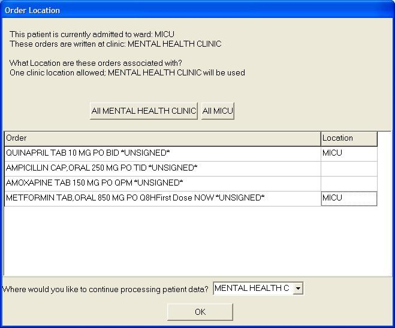

**This dialog asks to which location CPRS should associate the orders that have been placed but not signed**  
The order location dialog shows the user the two locations the user can choose from, generally an outpatient clinic and an inpatient location. The user has two basic options:

-   Associate all of the orders with a single location by selecting the appropriate button above the list of orders. The buttons will read All location where location is the name of the clinic or ward location. In the above screen capture the buttons read All MICU and All Mental Health Clinic.  
-   Individually associate each order with one of the two locations. At the end of each order is a column to select the location for each order.  
If the user is keeping the patient’s chart open, such as selecting File \| Review / Sign changes… and this dialog appears, the “Where would you like to continue processing patient data?” prompt displays enabling the user to choose either the ward location or the clinic location. This prompt does not appear if the user is exiting the chart or switching patients.

To sign orders and documents with the Review / Sign Changes dialog, follow these steps:

1.  Do one of the following:  
-   Select **File** \| **Review** / **Sign Changes....** to sign orders or documents and stay in the current patient record.  
-   Choose **File** \| **Select New Patient** to sign orders or documents and select a new patient.  
-   Choose **File** \| **Exit** to sign orders and documents and exit CPRS.  
1.  (Conditional) This step will only be necessary if CPRS displays order checks similar to what is shown below:  
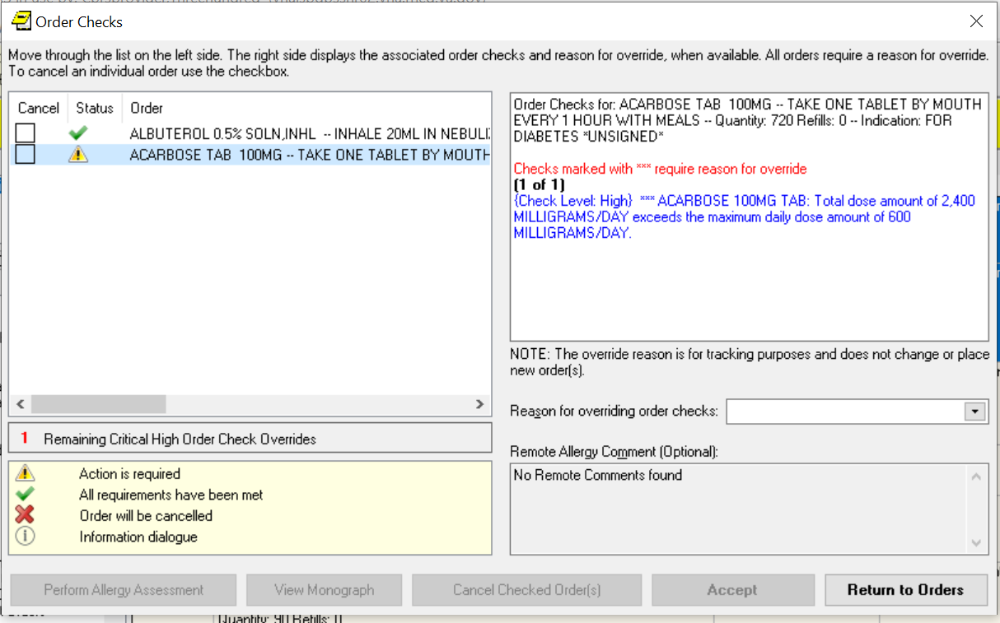

**In this screen capture, CPRS displays a conflict between ordered medications. Users should review each item carefully before completing the order. Each order that has a high-level order check requires you to select that order and an override reason for it. All orders with an “Action is required” status require an override reason in order to be signed. These order checks are designated by the “\*Checks marked with \*\*\*\* require reason to override” text in red and the order check text in blue. The Accept button will not activate until all orders have been viewed, and all override reasons have been entered as needed.**  
***

If CPRS displays order checks, carefully review the order checks and take the appropriate action below:

1.  To redo the orders to avoid a possible interaction, select Return to Orders. This will cancel the signature process, but not the order.  
1.  If the orders should not be placed, check the cancel check box in front of the orders that should not be placed and select Cancel Checked Order(s).  
1.  If the possible interactions are not a problem, type a reason for override if necessary (required only for some order checks) and select Continue.  
After performing step 1 and addressing any order checks in step 2, one of the Review/Sign Changes dialogs shown below will appear. Each item that requires a signature will have a check box in front of it.

**Note:** All non-controlled substances orders will be checked for signature when the dialog displays. To sign controlled substances orders, the user must check the box for each order individually.

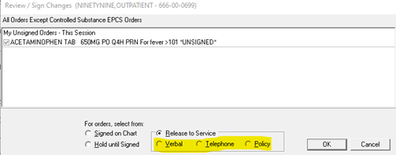

**Figure A: This is for providers that can sign orders by policy, such as nurses or clerks. Note that the default method for release to service can be set by the site to Verbal, Telephone, or Policy. Or the site can leave the default blank forcing the user to select the method.**  
**Note:** If the provider has an NPI, it will not display on the screen below.

**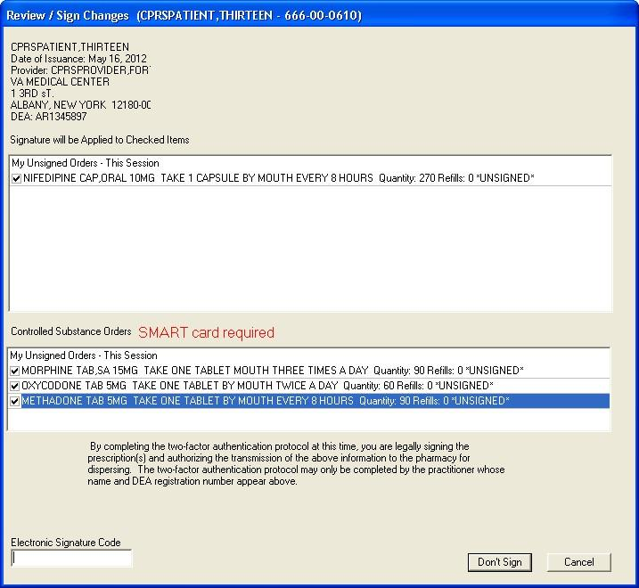**  
**Figure B: The Review/Sign changes dialog may have additional elements depending on the nature of the patient. In this case, the provider can sign controlled substances orders and the patient’s conditions are not service-connected**  
**Note:** If the provider has an NPI, it will not display on the screen below.

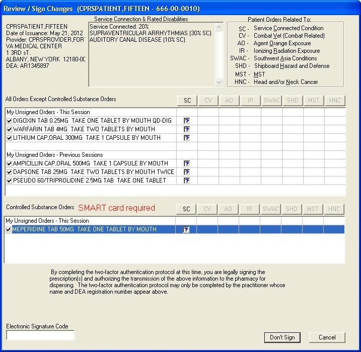

**Figure C: In this example of the Review/Sign Changes dialog, the provider can sign controlled substance orders, and the patient has either Combat Veteran status or service-connected conditions for which the provider must indicate the orders pertain**  
1.  Deselect any items under the All Orders Except Controlled Substance Orders pane that you do not want to sign by clicking the check box to the left of the order or document.  
1.  If the Review / Sign Changes dialog resembles Figure A, enter your electronic signature code and click **Sign**. The documents and orders will now be signed.  
If the Review / Sign Changes dialog resembles Figure B or Figure C and contains question marks, continue to step 5.

1.  To select Controlled Substance order to sign, place a check mark in the box to the left each Controlled Substance order to sign by clicking in the check box, or tabbing to it and pressing the \<Space bar\>.  
**Note:** When the user checks the box to the left of any Controlled Substance order for signature, the phrase “SMART card required” displays next to the label Controlled Substance Orders.

**Note:** If the provider has an NPI, it will not display on the screens below.

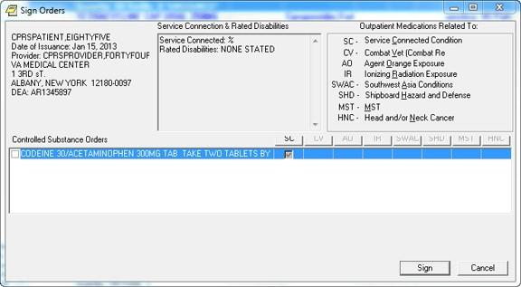

**This is what the dialog looks like before controlled substance outpatient orders are checked for signature.**  
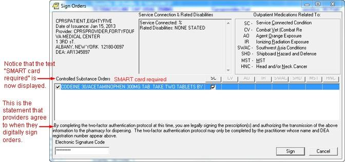

**After the controlled substances orders are checked, the “smart card required” text and the text the provider must acknowledge display**  
1.  The question marks inside the boxes in Figure B indicate that you need to specify how that order is related to the medical condition in that column. (SC = Service Connected Condition, CV=Combat Veteran, AO=Agent Orange Exposure, IR=Ionizing Radiation Exposure, SWAC=Southwest Asia Conditions, SHD=Shipboard Hazard and Defense, MST=Military Sexual Trauma, and HNC=Head or Neck Cancer). If you place a check in a box, you are indicating that a medication order is related to the condition in that column. If you create an empty box, you are indicating that the medication order is not related to the condition in that column. You must either check or uncheck every box that contains a question mark before you can sign the order.  
**Note:** Definitions for service connection and treatment factors are available to users by hovering the cursor over the term or using the appropriate keyboard shortcut as shown in the list below:

-   Service connection (SC) ......................... Alt + c  
-   Combat Veteran (CV) ............................. Alt + v  
-   Agent Orange (AO) ................................. Alt + o  
-   Ionizing Radiation (IR) ............................ Alt + r  
-   Southwest Asia Conditions (SWAC) ....... Alt + a  
-   Shipboard Hazard and Defense (SHD) .. Alt + h  
-   Military Sexual Trauma (MST) ................ Alt + m  
-   Head and/or Neck Cancer (HNC) ........... Alt + n  
You can toggle the check boxes by:

-   Clicking an individual check box.  
This will toggle the box between checked and unchecked.

-   Pressing the appropriate Copay button   
    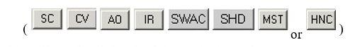  
This will toggle all the check boxes in that column.

-   Pressing the  button.  
This will toggle all the check boxes on the screen.

1.  If you have not already done so, insert your PIV or smart card.  
**Note:** If you do not insert your PIV or smart card before attempting to sign the selected Controlled Substance orders, you will see the following two dialogs:

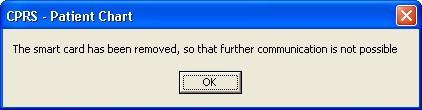

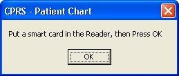

1.  When you have removed all of the question marks from the dialog, enter your electronic signature code (the button will change from Don’t Sign to Sign) and click **Sign**.  
1.  (Conditional) If your PIV card is already set up, you will not see the Digital Signing Setup dialog and you can proceed to step 10. If your PIV or Smart card is not yet linked to your VistA account, you will need to set it up before you can sign outpatient controlled substance medication orders. To set up your PIV card to order outpatient controlled substance orders, select Yes.  
**Note:** If the provider has an NPI, it will not display on the screens below.

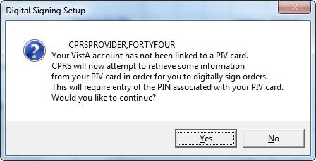

**You may then be asked to enter your PIN**  
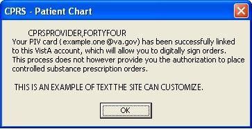

**Then, the signature process will proceed**  
1.  If the Order Check dialog appears, deal with any problems in the dialog: such as entering a reason for override, cancelling specific orders, etc. When ready, select the **Accept Orders** button.  
1.  When prompted, enter your PIN to sign the Controlled Substance orders and select OK or press \<Enter\>.  
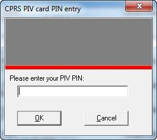

**Warning:** Do NOT enter an incorrect PIN five (5) consecutive times! If you enter the incorrect PIN five (5) consecutive times, your card will be until you visit a PIV issuing station.

If you enter the incorrect PIN three (3) times, CPRS temporarily locks your PIV card for 15 minutes. Then, it will allow you to try again. However, you only have two (2) more attempts to get the correct PIN. If you get to five (5) consecutive incorrect PIN entries, the PIV card will be locked and you will have to go to a PIV station to unlock the card.

## Sign Selected Orders Command

The Sign Selected Orders command allows you to select a number of orders and sign them all simultaneously. However, you cannot sign documents with this command.

Sometimes during the ordering process, the status of a patient changes from outpatient to inpatient or vice versa. This might happen because an outpatient was admitted to the facility or because an inpatient was sent to a clinic for treatment. When written unsigned orders exist and the patient’s status changes, the user must indicate which location the orders are associated with.

To designate which location written unsigned orders are associated with, the following dialog will appear:

**This dialog asks to which location CPRS should associate the orders that have been placed but not signed**  
The order location dialog shows the user the two locations the user can choose from, generally an outpatient clinic and an inpatient location. The user has two basic options:

-   Associate All of the orders with a single location by selecting the appropriate button above the list of orders. The buttons will read All *location* where location is the name of the clinic or ward location. In the above screen capture, the buttons read All MICU and All Mental Health Clinic.  
-   Individually associate each order with one of the two locations. At the end of each order is a column to select the location for each order.  
If the user is keeping the patient’s chart open, such as selecting File \| Review / Sign changes… and this dialog appears, the “Where would you like to continue processing patient data?” prompt displays enabling the user to choose either the ward location or the clinic location. This prompt does not appear if the user is exiting the chart or switching patients.

**To sign a number of orders, use these steps:**

1.  Select the **Orders** tab.  
1.  Highlight the orders you want to sign.  
To select a range of items, click the order at the beginning of the range; then hold down the \<**Shift**\> key and click the order at the end of the range. To select multiple, individual orders, select the first order, hold down the **CTRL** key, and click the next order.  
1.  Select Action \| Sign Selected…  
\-or-  
right-click and select **Sign**…  
1.  (Conditional) This step will only be necessary if CPRS displays order checks similar to what is shown below:  

**In this screen capture, CPRS displays a conflict between ordered medications. Users should review each item carefully before completing the order. Each order that has a high-level order check requires you to select that order and select an override reason for it. All orders with an “Action is required” status require an override reason in order to be signed. These order checks are designated by the “\*Checks marked with \*\*\*\* require reason for override” text in red and the order check text in blue. The Accept button will not activate until all orders have been viewed, and all override reasons have been entered as needed.**  
***

1.  If CPRS displays order checks, carefully review the order checks and take the appropriate action below:  
1.  To redo the orders to avoid a possible interaction, select Return to Orders. This will cancel the signature process, but not the order.  
1.  If the orders should not be placed, check the cancel check box in front of the orders that should not be placed and select Cancel Checked Order(s).  
1.  If the possible interactions are not a problem, type a reason for override if necessary (required only for some order checks) and select Continue.  
After performing step 1 and addressing any order checks in step 2, one of the Review/Sign Changes dialogs shown below will appear. Each item that requires a signature will have a check box in front of it.

**Note:** All non-controlled substances orders will be checked for signature when the dialog displays. To sign controlled substances orders, the user must check the box for each order individually.

**Figure A: This is for providers that can sign orders by policy, such as nurses or clerks. Note that the default method for release to service can be set by the site to Verbal, Telephone, or Policy. Or the site can leave the default blank forcing the user to select the method.**  
**Note:** If the provider has an NPI, it will not display on the screen below.

****  
**Figure B: The Review/Sign changes dialog may have additional elements depending on the nature of the patient. In this case, the provider can sign controlled substances orders and the patient’s conditions are not service-connected**  
**Note:** If the provider has an NPI, it will not display on the screen below.

**Figure C: In this example of the Review/Sign Changes dialog, the provider can sign controlled substance orders, and the patient has either Combat Veteran status or service-connected conditions for which the provider must indicate the orders pertain**  
**Note:** If the provider has an NPI, it will not display on the screen above.

1.  If the Electronic Signature dialog resembles Figure A, enter your electronic signature code (if necessary) and select Sign. The orders will now be signed.  
If the Electronic Signature dialog resembles Figure B or Figure C and contains blue question marks, continue to step 6.  
1.  To select Controlled Substance order to sign, place a check mark in the box to the left each Controlled Substance order to sign by clicking in the check box, or tabbing to it and pressing the \<Space bar\>.  
**Note:** When the user checks the box to the left of any Controlled Substance order for signature, the phrase “SMART card required” displays next to the label Controlled Substance Orders.

**Note:** If the provider has an NPI, it will not display on the screens below.

**This is what the dialog looks like before controlled substance outpatient orders are checked for signature**  
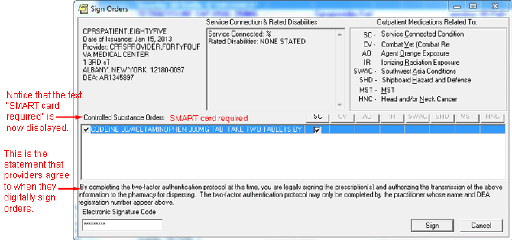

**After the controlled substances orders are checked, the “smart card required” text and the text the provider must acknowledge display**  
1.  The question marks inside the boxes in Figure B indicate that you need to specify how that order is related to the medical condition in that column. (SC = Service Connected Condition, CV=Combat Veteran, AO=Agent Orange Exposure, IR=Ionizing Radiation Exposure, Southwest Asia Conditions (SWAC), Shipboard Hazard and Defense (SHD), MST=Military Sexual Trauma, and HNC=Head and/or Neck Cancer). If you place a check in a box, you are indicating that a medication order is related to the condition in that column. If you create an empty box, you are indicating that the medication order is not related to the condition in that column. You must either check or uncheck every *box that contains a question mark before you can sign the order.*  
**Note:** Definitions for service connection and treatment factors are available to users by hovering the cursor over the term or using the appropriate keyboard shortcut as shown in the list below:

-   Service connection (SC) ......................... Alt + c  
-   Combat Veteran (CV) ............................. Alt + v  
-   Agent Orange (AO) ................................. Alt + o  
-   Ionizing Radiation (IR) ............................ Alt + r  
-   Southwest Asia Conditions (SWAC) ....... Alt + a  
-   Shipboard Hazard and Defense (SHD) .. Alt + h  
-   Military Sexual Trauma (MST) ................ Alt + m  
-   Head and/or Neck Cancer (HNC) ........... Alt + n  
You can toggle the check boxes by:

-   Clicking an individual check box.  
This will toggle the box between checked and unchecked.

-   Pressing the appropriate Copay button.   
      
    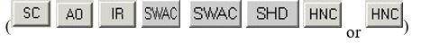  
This will toggle all the check boxes in that column.

-   Pressing the  button.  
This will toggle all the check boxes on the screen.

1.  To select Controlled Substance order to sign, place a check mark in the box to the left each Controlled Substance order to sign by clicking in the check box, or tabbing to it and pressing the \<Space bar\>.  
**Note:** When the user checks the box to the left of any Controlled Substance order for signature, the phrase “SMART card required” displays next to the label Controlled Substance Orders.

1.  If you have not already done so, insert your PIV or smart card.  
**Note:** If you do not insert your PIV or smart card before attempting to sign the selected Controlled Substance orders, you will see the following two dialogs:

1.  When you have removed all of the question marks from the dialog, enter your electronic signature code (the button will change from Don’t Sign to Sign) and click Sign.  
1.  (Conditional) If your PIV card is already set up, you will not see the Digital Signing Setup dialog and you can proceed to step 11. If your PIV or Smart card is not yet linked to your VistA account, you will need to set it up before you can sign outpatient controlled substance medication orders. To set up your PIV card to order outpatient controlled substance orders, select Yes.  
1.  **Note:** If the provider has an NPI, it will not display on the screens below.  

**You may then be asked to enter your PIN**  

**Then, the signature process will proceed**  
1.  If the Order Check dialog appears, deal with any problems in the dialog: such as entering a reason for override, cancelling specific orders, etc. When ready, select the Accept Orders button.  
1.  When prompted, enter your PIN to sign the Controlled Substance orders and select OK or press \<Enter\>.  

**Warning:** Do NOT enter an incorrect PIN five (5) consecutive times! If you enter the incorrect PIN five (5) consecutive times, your card will be until you visit a PIV issuing station.

If you enter the incorrect PIN three (3) times, CPRS temporarily locks your PIV card for 15 minutes. Then, it will allow you to try again. However, you only have two (2) more attempts to get the correct PIN. If you get to five (5) consecutive incorrect PIN entries, the PIV card will be locked and you will have to go to a PIV station to unlock the card.

## Signing Orders before Selecting a New Patient or Exiting CPRS

Whenever a user leaves a patient chart whether to select a new patient or to exit CPRS completely, CPRS prompts the user to sign unsigned orders that the user has privileges to sign. The dialog that CPRS displays may be different than the Review/Sign Changes… or Sign Selected dialogs based on the parameter settings. By changing the parameters settings, the dialog may display one or more of the following categories of unsigned orders:

-   My Unsigned Orders - This Session  
-   My Unsigned Orders - Previous Sessions  
-   Others’ Unsigned Orders - All Sessions  
Sometimes during the ordering process, the status of a patient changes from outpatient to inpatient or vice versa. This might happen because an outpatient was admitted to the facility or because an inpatient was sent to a clinic for treatment. When written unsigned orders exist and the patient’s status changes, the user must indicate which location the orders are associated with.

To designate which location written unsigned orders are associated with, the following dialog will appear:

**This dialog asks to which location CPRS should associate the orders that have been placed but not signed**  
The order location dialog shows the user the two locations the user can choose from, generally an outpatient clinic and an inpatient location. The user has two basic options:

-   Associate All of the orders with a single location by selecting the appropriate button above the list of orders. The buttons will read All *location* where location is the name of the clinic or ward location. In the above screen capture the buttons read All MICU and All Mental Health Clinic.  
-   Individually associate each order with one of the two locations. At the end of each order is a column to select the location for each order.  
If the user selects File \| Review / Sign changes… and this dialog appears, the “Where would you like to continue processing patient data?” prompt displays enabling the user to choose either the ward location or the clinic location. This prompt does not appear if the user is exiting the chart or switching patients.

**To sign a number of orders, use these steps:**

1.  Select the Orders tab.  
1.  Highlight the orders you want to sign.  
To select a range of items, click the order at the beginning of the range; then hold down the \<**Shift**\> key and click the order at the end of the range. To select multiple, individual orders, select the first order, hold down the **CTRL** key, and click the next order.  
1.  Select Action \| Sign Selected…  
\-or-  
right-click and select **Sign**…  
1.  (Conditional) This step will only be necessary if there are conflicts with the orders, as shown below:  

**In this screen capture, CPRS displays conflicts between ordered medications. Users should review each item carefully before completing the order. If an order check is larger than the cell’s available space, the user can either hover with the mouse to the get the full text, use the arrow keys to highlight the order check if using the keyboard or use an accessibility product for the visually challenged. Some order checks require an override reason. These order checks are designated by the “\*Order Check requires Reason for Override” text in red and the order check text in blue.**  
If CPRS displays order checks, carefully review the order checks and take the appropriate action below:

1.  To redo the orders to avoid a possible interaction, select Return to Orders. This will cancel the signature process, but not the order.  
1.  If the orders should not be placed, check the cancel check box in front of the orders that should not be placed and select Cancel Checked Order(s).  
1.  If the possible interactions are not a problem, type a reason for override if necessary (required only for some order checks) and select Continue.  
After performing step 1 and addressing any order checks in step 2, one of the Review/Sign Changes dialogs shown below will appear. Each item that requires a signature will have a check box in front of it.

**Note:** All non-controlled substances orders will be checked for signature when the dialog displays. To sign controlled substances orders, the user must check the box for each order individually.

One of the Electronic Signature dialog boxes shown below will appear.

**Figure A: This is for providers that can sign orders by policy, such as nurses or clerks. Note that the default method for release to service can be set by the site to Verbal, Telephone, or Policy. Or the site can leave the default blank forcing the user to select the method.**  

**Figure B: The Review/Sign changes dialog may have additional elements depending on the nature of the patient. In this case, the provider can sign controlled substances orders and the patient’s conditions are not service-connected**  
**Note:** If the provider has an NPI, it will not display on the screen above.

**Figure C: In this example of the Review/Sign Changes dialog, the provider can sign controlled substance orders, and the patient has either Combat Veteran status or service-connected conditions for which the provider must indicate the orders pertain**  
**Note:** If the provider has an NPI, it will not display on the screen above.

1.  If the Electronic Signature dialog resembles Figure A, enter your electronic signature code (if necessary) and click Sign. The orders will now be signed.  
1.  If the Electronic Signature dialog resembles Figure B and contains checkboxes, continue to step To select Controlled Substance order to sign, place a check mark in the box to the left each Controlled Substance order to sign by clicking in the check box, or tabbing to it and pressing the \<Space bar\>.  
**Note:** When the user checks the box to the left of any Controlled Substance order for signature, the phrase “SMART card required” displays next to the label Controlled Substance Orders.

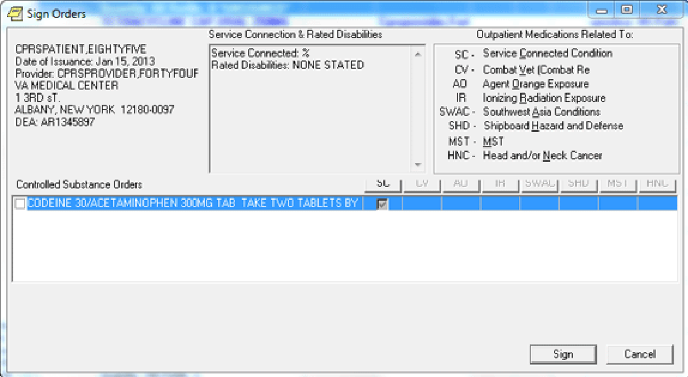

**This is what the dialog looks like before controlled substance outpatient orders are checked for signature**  

**After the controlled substances orders are checked, the “smart card required” text and the text the provider must acknowledge display**  
**Note:** If the provider has an NPI, it will not display on the screen above.

1.  The question marks inside the check boxes in Figure B indicate that you need to specify how that order is related to the medical condition in that column. (SC = Service Connected Condition, CV=Combat Veteran, AO=Agent Orange Exposure, IR=Ionizing Radiation Exposure, Southwest Asia Conditions (SWAC), Shipboard Hazard and Defense (SHD), MST=Military Sexual Trauma, and HNC=Head and/or Neck Cancer). If you place a check in a box, you are indicating that a medication order is related to the condition in that column. If you create an empty box, you are indicating that the medication order is not related to the condition in that column. You must either check or uncheck every box that contains a question mark before you can sign the order.  
**Note:** Definitions for service connection and treatment factors are available to users by hovering the cursor over the term or using the appropriate keyboard shortcut as shown in the list below:

-   Service connection (SC) ......................... Alt + c  
-   Combat Veteran (CV) ............................. Alt + v  
-   Agent Orange (AO) ................................. Alt + o  
-   Ionizing Radiation (IR) ............................ Alt + r  
-   Southwest Asia Conditions (SWAC) ....... Alt + a  
-   Shipboard Hazard and Defense (SHD) .. Alt + h  
-   Military Sexual Trauma (MST) ................ Alt + m  
-   Head and/or Neck Cancer (HNC) ........... Alt + n  
You can toggle the check boxes by:

-   Clicking an individual check box.  
This will toggle the box between checked and unchecked.

-   Pressing the appropriate Copay button.   
      
    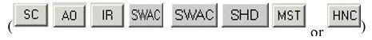  
This will toggle all the check boxes in that column.

-   Pressing the  button.  
This will toggle all the check boxes on the screen.

1.  To select Controlled Substance order to sign, place a check mark in the box to the left each Controlled Substance order to sign by clicking in the check box, or tabbing to it and pressing the \<Space bar\>.  
**Note:** When the user checks the box to the left of any Controlled Substance order for signature, the phrase SMART card required displays next to the label Controlled Substance Orders.

1.  If you have not already done so, insert your PIV or smart card.  
**Note:** If you do not insert your PIV card before attempting to sign the selected Controlled Substance orders, you will see the following two dialogs:

1.  When you have removed all of the question marks from the dialog, enter your electronic signature code (the button will change from Don’t Sign to Sign) and click Sign. (Conditional) If your PIV card is already set up, you will not see the Digital Signing Setup dialog and you can proceed to step 11. If your PIV or Smart card is not yet linked to your VistA account, you will need to set it up before you can sign outpatient controlled substance medication orders. To set up your PIV card to order outpatient controlled substance orders, select Yes.  
**Note:** If the provider has an NPI, it will not display on the screens below.

You may then be asked to enter your PIN.

Then, the signature process will proceed.

1.  If the Order Check dialog appears, deal with any problems in the dialog: such as entering a reason for override, cancelling specific orders, etc. When ready, select the Accept Orders button.  
1.  When prompted, enter your PIN to sign the Controlled Substance orders and select OK or press \<Enter\>.  

**Warning:** Do NOT enter an incorrect PIN five (5) consecutive times! If you enter the incorrect PIN five (5) consecutive times, your card will be until you visit a PIV issuing station.

If you enter the incorrect PIN three (3) times, CPRS temporarily locks your PIV card for 15 minutes. Then, it will allow you to try again. However, you only have two (2) more attempts to get the correct PIN. If you get to five (5) consecutive incorrect PIN entries, the PIV card will be locked and you will have to go to a PIV station to unlock the card.

## Criteria Used to Determine if the Service Connection and Treatment Factor Buttons are Displayed in the Review/Sign Changes Dialog

The Review/Sign Changes dialog may contain the service connection and treatment factor (formerly called the “Copay”) buttons 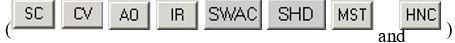if the current patient has outpatient medication orders that need to be signed and certain additional conditions are met. The additional conditions are explained below.

**Note:** These buttons will not display until after December 31, 2001 and PSO\*7\*71 is released and installed.

-   To qualify for the Combat Veteran (CV) exemption, the veteran must have served in combat operations after the Gulf War or in combat against a hostile force after November 11, 1998. In addition, the condition for which the veteran is treated must be related to that combat, the veteran must have registered as a combat veteran, and be within two years of separation from active military service. Finally, the condition must not be already considered to be service related or that exemption should apply.  
**Note:** The Combat Veteran exemption is valid for two years from the date of separation from military service, not the registration date. For example, if a veteran registers for Combat Veteran status 18 months after the date of his or her separation, the veteran would be eligible for Combat Veteran exemption for six months only. For further details, see *VHA Directive 2002-049, Combat Veterans Are Eligible for Medical Services for 2-Years after Separation from Military Service Notwithstanding Lack of Evidence for Service Connection*. If a patient is a veteran *and* 50% service connected *or greater,* then the Copay buttons will not be displayed on the Review / Sign Changes dialog.

-   If a patient is a veteran *and* 50% service connected *or greater,* then the Copay buttons will not be displayed on the Review / Sign Changes dialog.  
-   If a patient is a veteran *and* less than 50% service connected *and* the patient is exempt from copay then the Copay buttons will not be displayed.  
-   If a patient is a veteran *and* less than 50% service connected, *and* the patient is *not exempt* from copay then the Pharmacy package checks to see if the drug specified in the medication order is marked as supply or investigational. If the drug is marked as supply or investigational, the Copay buttons will not appear.  
However, if the drug specified in the order is not marked as supply or investigational, then CPRS checks if the patient has any other exemptions (Service Connected Condition, Combat Veteran, Agent Orange Exposure, Ionizing Radiation Exposure, Southwest Asia Conditions, Shipboard Hazard and Defense, Head and/or Neck Cancer or Military Sexual Trauma). If a patient has any of these exemptions, then CPRS displays the buttons.

## The Sign Note Now and Sign Discharge Summary Now Commands

The Sign Note Now and Sign Discharge Summary Now menu items let you sign the currently selected note or discharge summary.

**Note**: Notes and discharge summaries cannot be altered once they are signed.

To sign a note or discharge summary, use these steps:

1.  Select the Notes or DC/Summ tab.  
1.  Select the note or discharge summary that you would like to sign.  
1.  Select Action \| Sign Note Now (or Sign Discharge Summary Now).  
**-or-**

right-click in the document area and select **Sign Note Now** (or **Sign Discharge Summary Now**).

1.  Type in your electronic signature code.  
1.  Select OK.  
## Add to Signature List

With the Add to Signature List command, you can place notes or discharge summaries for the same patient on a list where you can simultaneously sign them.

To add a note or discharge summary to your signature list, follow these steps:

1.  Click the **Notes** or **DC/Summ** tab.  
1.  Select the note or discharge summary that you would like to add to your signature list.  
1.  Choose Action \| Add to Signature List.  
The note or discharge summary will be added to your signature list. To sign all of the notes or discharge summaries on your signature list select **File** \| **Review / Sign Changes**.

## Viewing Unsigned Notes or Discharge Summaries

With the View Unsigned Notes or View Unsigned Discharge Summaries command you can view all the notes and discharge summaries that you have not yet signed.

To view unsigned notes or discharge summaries, follow these steps:

1.  Click the **Notes** or **DC/Summ** tab.  
1.  Select either View \| Unsigned Notes, View \| Uncosigned Notes, View \| Unsigned Summaries or View \| Uncosigned Summaries.  
The unsigned notes or discharge summaries will appear in the detail portion of the window.

## Identify Additional Signers

With the Identify Additional Signers feature, you can select other individuals that you want to sign a note or discharge summary. Once you have selected the additional signers, CPRS will send them an alert that indicates a note is ready for them to sign.

The Identify Additional Signers feature helps you ensure that team members see a note. For example, one psychiatrist might identify another psychiatrist to sign the note to ensure that he or she agrees with an assessment.

**To identify additional signers, use these steps:**

1.  Select the **Notes** or **DC/Summ** tab.  
1.  Select a signed note or discharge summary.  
1.  Select Action \| Identify Additional Signers  
**-or-**

right-click in the main text area and select Identify Additional Signers.

1.  To identify a signer, locate the person’s name (scroll or type in the first few letters of the last name) and click it.  
**Note:** For a Discharge Summary, if a user requires a cosigner (such as a student or other type of clinician), that user’s name should not appear in the list of potential cosigners. Additionally, for all types of documents, to help users distinguish between providers, CPRS displays their titles (if available). When two or more providers have identical names, CPRS also displays:

-   The service/section and site division (if any) associated with these providers; site divisions are displayed based on the following rules:  
-   When no division is listed for a provider, no division is displayed.  
-   If only one division is listed, this division is displayed.  
-   If the site has multiple divisions or more than one division is listed **and** one of these listed divisions is marked as Default, CPRS displays the division marked as Default.  
-   If more than one division is listed for a provider and none is marked as Default, CPRS does not display division information for this provider.  
-   Providers who are listed in the New Person file as Visitors are screened out from the provider list. (These screened-out providers are listed as Visitors because their entries were created as a result of a Remote Data View.)  
1.  Repeat step 4 as needed.  
1.  (Optional) To remove a name highlight the name under Current Additional Signers and select **Remove**.  
1.  When finished, select **OK**.  
# Printing from Within CPRS

You can print most reports, notes, and detailed displays from within the CPRS GUI.

To print graphics and charts, you will need to print to a Windows printer. To print text documents, you can print to either a Windows printer or a VistA printer. The printer language used by Windows printers can accommodate graphics, while the language used by VistA printers cannot.

## Printing Single Items

You can also print graphics on a Windows printer from the Labs tab and the Vitals screen. You can use **File \| Print Setup...** to set the preferred attributes for the printer. CPRS remembers which printer you used last and will print to that printer again unless you changed it for the duration of the session. You can also configure and save a printer as the default for the user.

The dialog box shown below opens when you select **File \| Print** from the Notes tab. A similar dialog appears for items on other tabs.

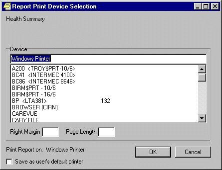

**The Report Print Device Selection dialog**  
Normally, the right margin and page length values (measured in characters) are already defined by the printer.

## 

## Printing Multiple Notes, Consults, or Discharge Summaries

The ability to print multiple Progress Notes, Consults, and Discharge Summaries has been added to the CPRS GUI. This feature is available from those tabs only.

To print multiple Notes, Consults, or Discharge Summaries, use these steps:

1.  Go to the appropriate tab (Notes, Consults, or DC/Summ) by clicking on the tab or using the keyboard commands to locate the tab.  
1.  Select **File \| Print Selected Items…** to bring up the dialog shown below.  
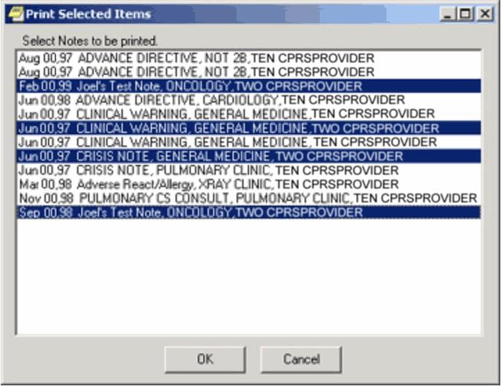

**This graphic shows a number of Progress Notes that can be printed and several highlighted**  
1.  Select the documents you want to print.  
**Note:** To select a number of items in a row, click the first item, hold down the Shift key, and click the last item. All items in the range will be selected. To select multiple items that are not in a row, click one, hold down the Control key, and click the other specific notifications.

1.  Select **OK**.  
# Tools Menu

The Tools menu allows you to quickly access other applications and utilities from within CPRS. Depending on the configuration of your site, the Tools menu may allow you to access other VistA applications such as VistA Imaging or connect you to third-party applications such as word-processing programs or Internet browsers. Talk to your clinical coordinator if you wish to add an application or utility to the Tools menu.

At the request of sites, CPRS added the ability to create nested or submenus (menus within menus) to help them organize the items that sites place on their Tools menus. The number of items was increased to 99 total items (including items and separator lines). Again, these items are placed on the menu and organized by a Clinical Application Coordinator (CAC) or someone with a similar role at your site.

The Tools menu also contains two standard menu items: Lab Test Information and Options… These menu items are explained below.

**Veteran Health Library**  
The MyHealth*e*vet Veteran Health Library (VHL) is the first item listed under the CPRS Tools menu. Selecting this link takes the user to the MyHealth*e*Vet Veteran Health Library web site.  
***

## Lab Test Information

The Lab Test Information menu option displays information about various lab tests.

**To display lab test information:**

1.  Select Tools \| Lab Test Information.  
The Lab Test Description dialog will display.

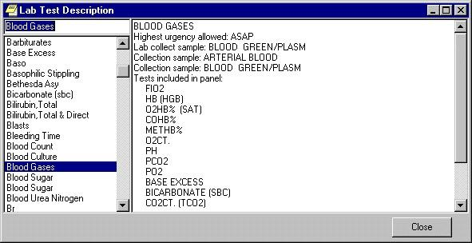

**The Lab Test Description dialog**  
1.  Select a lab test from the panel on the left side of the dialog.  
A description of the lab test you selected will be displayed in the right side of the dialog.

## 

## Options

You can change many of the settings that control the way CPRS works. The Options choice on the Tools menu contains dialogs that allow you to change which notifications and order checking messages you get, manage team and personal lists, assign your default patient selection settings, and modify your default tab preferences. To access the personal preferences settings, click **Tools \| Options** from any CPRS tab.

The Options dialog consists of a number of tabs, each of which allows access to a category or type of preference settings.

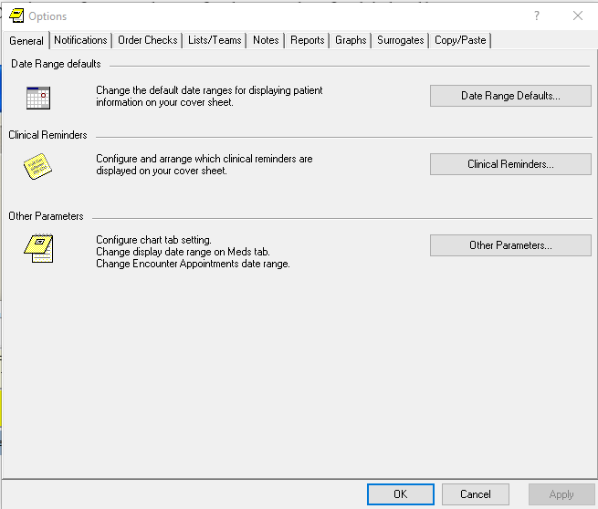

**The Tools \| Options dialog**  
### General Tab

The General tab includes the **Date Range Defaults…**button which allows you to limit the date range for lab results as well as appointments and visits that appear on the cover sheet, the **Clinical Reminders…** button which allows you to configure and arrange which clinical reminders are displayed on the cover sheet, and the **Other Parameters…**button which allows you to set which tab is active when CPRS starts, set the date range for items on the Meds tab, and set the date range for Encounter appointments. The buttons on the General tab are explained in more detail below.

#### Date Range Defaults…

Click **Date Range Defaults…** to set how long lab results, appointments, and visits will be displayed on the Cover Sheet.

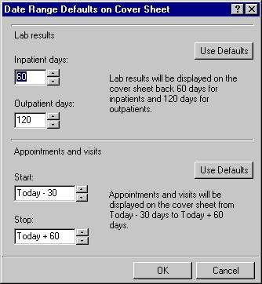

**The Date Range Defaults on Cover Sheet dialog allows you to set the default date range for lab results and appointments and visits**  
#### Clinical Reminders…

Click **Clinical Reminders…** to configure and arrange which clinical reminders are displayed on the Cover Sheet.

Based on the setting of the parameter ORQQPX NEW REMINDER PARAMS, you see one of two dialogs for configuring and arranging clinical reminders on your coversheet. If this parameter is set to “Off,” you will see the “Clinical Reminders on Cover Sheet” dialog. If the parameter is set to “On,” you will see the “Clinical Reminders and Reminder Categories Displayed on Cover Sheet” dialog. Your Clinical Coordinator sets the ORQQPX NEW REMINDERS PARAMS parameter.

##### Clinical Reminders on Cover Sheet

**To select the clinical reminders you want displayed on the Cover Sheet, follow these steps:**

1.  From the Clinical Reminders on Cover Sheet dialog, highlight an item in the “Reminders not being displayed:” field.  
1.  Select the arrow button ( **\>** )  to add the clinical reminder to the “Reminders being displayed:” field. (Hold down the control key to select more than one reminder at a time.) The reminders in this field will be displayed on the Cover Sheet. Select the arrow button ( **\>** ) to remove an item.  
1.  To control how the reminders are displayed on the Cover Sheet, do one of the following:  
-   click the “**Display Order**” option (at the bottom of the dialog) to display the reminders in their current order. To move a reminder up or down the list, select the reminder and click either the up or down arrow.  
-   click the “Alphabetical” option (at the bottom of the dialog) to display the reminders in alphabetical order.  
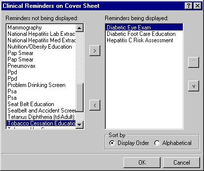

**Clinical Reminders on Cover Sheet dialog**  
#### Clinical Reminders and Reminder Categories Displayed on Cover Sheet

This advanced dialog displays reminders in a way that allows the user to better manage the reminders that are displayed on the Cover Sheet. The dialog consists mainly of three large list fields. The “Cover Sheet Reminders (Cumulative List)” field displays selected information on the Reminders that will be displayed on the

Cover Sheet. The “Available Reminders & Categories” field lists all available reminders and serves as a selection list. The “User Level Reminders” field displays the reminders that you have added to or removed from the cumulative list. You may sort the reminders in the “Cover Sheet Reminders (Cumulative List)” field by clicking any of the column headers. Click the **Seq** (Sequence) column header to view the reminders in the order in which they will be displayed on your Cover Sheet.

An icon legend is displayed to the right of the “Cover Sheet Reminders (Cumulative List)” field. A folder icon represents a group of Reminders while a red alarm clock represents an individual Reminder. A Reminder with a plus sign in the first column has been added to the list while a Reminder with a minus sign in the first column has been removed from the list. The user cannot remove reminders with a padlock icon in the first column.

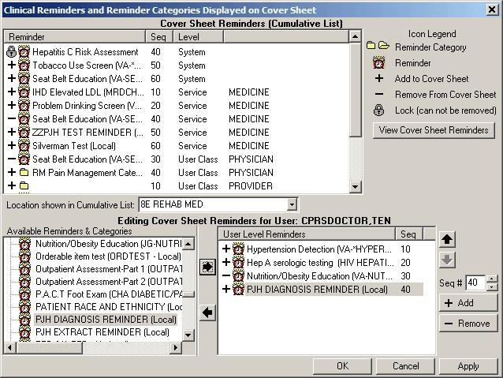

**The Clinical Reminders and Reminder Categories Displayed on Cover Sheet dialog**  
##### Cover Sheet Reminders (Cumulative List)

The Level column of the “Cover Sheet Reminders (Cumulative List)” field displays the originating authority of the Reminder, which can include System, Division, Location, User Class, and User. Reminders on this list that display a small gray padlock icon at the beginning of the line cannot be removed. These Reminders are mandatory. The Seq (Sequence) column defines the order in which the Reminders will be displayed on the Cover Sheet. If there are two or more Reminders with the same sequence number, the Reminders will be listed by level (System, Division, Service, Location, User class, User).

##### Location shown in Cumulative List

Select this drop-down box and select a location. The Reminders assigned to that location appear on the Cumulative List.

##### Available Reminders & Categories

This field displays all of the Reminders and Categories available to the user. Notice that the reminder name is in parentheses after the print name. Categories are groups of related Reminders that can be added as a group. Individual reminders within a category can be removed from the User Level Reminders field. Highlight a Reminder or Category from the field and click the right arrow to add them to the User Level Reminders field.

##### User-Level Reminders

This field displays all of the Reminders selected by the user. To add a Reminder to your User Level Reminders, highlight the desired Reminder in the Available Reminders & Categories field and click the right arrow button. To delete a Reminder from your User Level Reminders field, highlight the Reminder in the User Level Reminders field and click the left arrow.

You may determine the order in which the Reminders will be displayed on the Cover Sheet by changing the Reminder’s sequence number. For example, to place a Reminder at the top of the Reminders list, assign it a number less than 10. To change the order of User Level Reminders, highlight Reminders and click the up arrow or down arrow until the desired order is achieved.

You may remove any or all non-mandatory Reminders assigned at any level by adding the Reminder to your User Level and then selecting the **Remove** button.

##### Cover Sheet Reminders

Once you have the cumulative list, as you want it, select **View Cover Sheet Reminders** to view how the reminders will be displayed on your Cover Sheet for the specified locations.

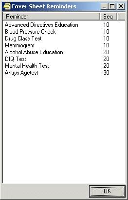

**The Cover Sheet Reminders dialog**  
Once you have made all of the desired changes to the Reminders that will be displayed on the Cover Sheet, select **OK.**

#### Other Parameters…

To set the initial chart tab, Meds tab date range, or Encounter date range preferences select **Other Parameters**.

##### Chart Tabs

Select the drop-down field and select the chart tab with which CPRS should open. Select the check box if you want CPRS to remain on the last selected tab when you change patients.

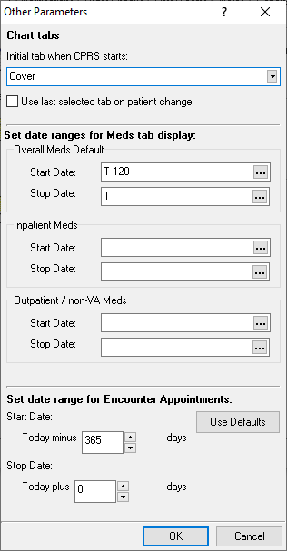

**The Other Parameters dialog**  
**Note:** For this change to take effect, you must exit CPRS and log back in.

##### Meds Tab Date Ranges

There are three date ranges that can be configured for the Meds tab:

-   **Overall Meds Default**: Default date range for the Meds tab. It is used if no date range is defined for Inpatient Meds or Outpatient/Non-VA Meds  
-   **Inpatient Meds**: Date range for inpatient medications. If no date range is defined for Inpatient Meds, the Overall Meds Default date range will be used.  
-   **Outpatient / Non-VA Meds**: Date range for outpatient and non-VA medications. If no date range is defined for Outpatient/Non-VA Meds, the Overall Meds Default date range will be used for outpatient and non-VA medications.  
**To enter the Meds Tab date ranges, perform the following steps:**  
1.  Enter a State Date by doing one of the following:  
-   Typing a date (e.g. 6/21/01 or June 21, 2001).  
-   Typing a date formula (e.g. t-200).  
-   Pressing the  button to bring up a calendar and select a date.  
**Note:** In most cases, users should use relative dates, such as T and T-120, when entering them in the **Tools \| Options** dialog. If the user enters specific dates, they will remain even if the user changes patients. Specific dates will not change until the user changes them.

1.  Enter a Stop Date by doing one of the following:  
-   Typing a date (e.g. 6/21/01 or June 21, 2001).  
-   Typing a date formula (e.g. t-200).  
-   Pressing the  button to bring up a calendar and select a date.  
1.  When you have entered the dates, go to another option on this dialog or select OK.  
##### Encounter Appointments Date Range

This option enables users to set the date range for Encounter appointments that CPRS displays on the Cover Sheet and the Encounter form. The two values are based on today’s date and represent how many days in the past and how many days in the future the user may set for CPRS to display appointments.

To set these values, use the following steps:

1.  In the Start Date field, type or use the arrows to select a number of days in the past CPRS should display appointments.  
1.  In the Stop Date field, type or use the arrows to select a number of days in the future CPRS should display appointments.  
**Note:** Your site can set a parameter to give you a warning if you select an appointment too far in the future. CPRS will display a warning to let you know that you may be going against local policy. This message is just a warning and you may proceed.

1.  When you have entered the dates, go to another option on this dialog or select **OK**.  
### Notifications Tab

This tab allows you to change your notification options. Click the check box if you wish to have MailMan send you a bulletin for flagged orders.   
  
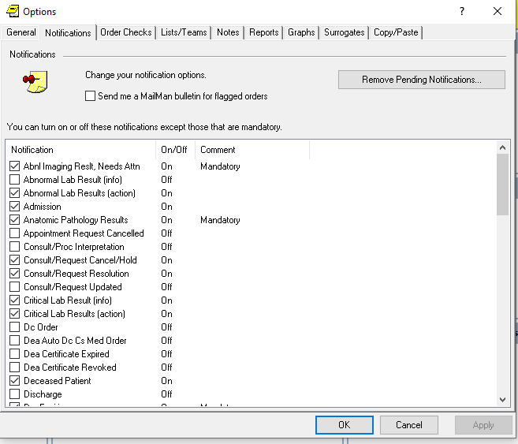

**The Notifications tab   
**  
#### Remove Pending Notifications…

Please use care when using this button to remove pending notifications, especially if you are designated as a surrogate for another user, as patient care may be delayed until the original provider returns.

**To remove pending notifications, if necessary, use the following steps:**

1.  Select the **Remove Pending Notifications** button and then on **Yes** on the Warning dialog to clear all of your current pending notifications. (This button is enabled only if you are authorized to use it.)  
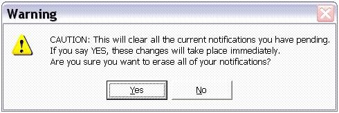

1.  If you are sure you want to remove the pending notifications, select Yes.  
#### Display Sort

Click the **Display Sort** drop-down field to select the sort method for your notifications. Choices include Patient, Type, and Urgency.

#### Notifications list

Click the check box next to any notification to enable or disable it. Notifications with “Mandatory” in the Comment column cannot be turned off or disabled. Click the heading to sort notifications so that you can see which are turned on and which are turned off.

**WARNING:**  When a provider is identified as a surrogate for another user for a designated period of time, notifications from the original user are sent to the surrogate. If a **surrogate user** chooses to use this button to remove pending notifications, all alerts are deleted, even if they are for actions such as requiring signature. The alerts are deleted not only for the surrogate but also the user they are a surrogate for. The alerts are permanently deleted for the surrogate, never to be regenerated, even if they have not been processed. However, if the alerts have not been processed by the surrogate, some may be returned to the original user based on a certain set of rules implemented in the Kernel.

The following are the set of rules. When the surrogacy period expires and unprocessed surrogate alerts have not been returned yet, the alerts sent to the surrogate(s) for the user are checked.

-   If the surrogate has processed an alert, it is ignored.  
-   If the surrogate has not processed an alert originally intended for the user, it is returned to the originally intended recipient.  
-   If the unprocessed alert was also sent to the surrogate as an initial recipient, then the alert is also retained by the surrogate.  
-   If the alert was *forwarded* to the surrogate, *but meant only to be sent to* the original user, then the alert is electronically removed from the surrogate’s notification list.  
-   *Any* unprocessed alerts that are retained by the surrogate will require manual intervention to remove them.  
There is no difference in how informational vs. action notifications are managed with respect to surrogacy. The above rules are applicable regardless of the type of notification.

### Order Checks Tab

Click the check box next to any order check to enable or disable it. Order checks with “Mandatory” in the Comment column cannot be turned off or disabled. Click the heading to sort order checks so that you can see which are turned on and which are turned off.

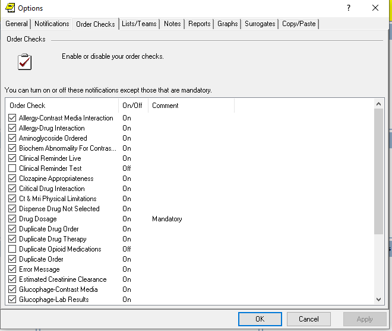

**This dialog indicates that the Duplicate Drug Order check is mandatory and cannot be turned off  
**  
### Lists/Teams Tab

The Lists/Teams tab allows you to set defaults for selecting patients. It also contains your personal lists and the teams of which you are a member.   
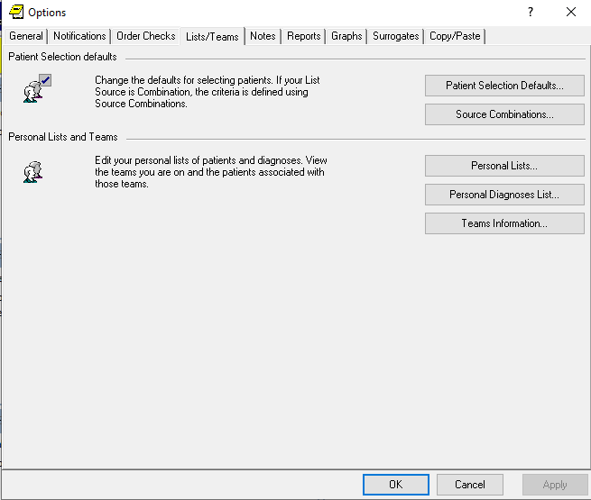

**The Lists/Teams tab**  
#### Patient Selection Defaults…

Click **Patient Selection Defaults…** to change your defaults for selecting patients. Click a radio button in the List Source group. If you select Combination, you will be able to select from more than one source. After selecting a list source, click the appropriate drop-down button (or buttons if Combination is selected) and select the criteria for that source. If you select Clinic or if Clinic is one of the sources in your combination of sources, you will need to select a clinic for each applicable day of the week. If you do not work in any clinic on a particular day, leave the field for that day empty.

Click a radio button in the Sort Order group to determine the sort order for the patients. If an item is dimmed, it is not available with the list source(s) you have selected.

To display patients who have clinic appointments within a specific date range, click the selection buttons. The Start and Stop fields denote the number of days before or after today that appointments should be displayed.

The defaults that are set here are used when you select patients from the Patient Selection dialog in the CPRS chart. Therefore, if you choose Ward, it will display the patients for the ward you have set as your default and if you choose Clinic, it will display the clinic patients for that day.

#### Source Combinations…

Click **Source Combinations…** to edit or create a list of sources from which your patients can be selected. You can change your combinations by adding or removing specific wards, clinics, providers, specialties or lists.

To create a source combination:

1.  Click a radio button in the “Select source by” group.  
1.  Click an entry in the selection field below the “Select source by” group.  
1.  Click Add.  
1.  Repeat steps 1 through 3 for each desired source.  
1.  When all desired entries are in the Combinations field, click OK.  
You can create only one combination list. The Combination list can be set as your default using the Patient Selection dialog.

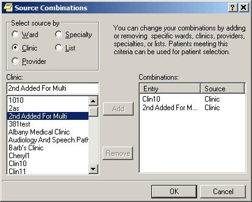

**The Source Combinations dialog**  
#### 

#### Personal Lists…

This option allows you to edit your personal lists of patients or combinations of wards, clinics, providers, specialties, or lists.

**Note:** If the provider has an NPI, it will display on the screen below. See the "National Provider Identifier (NPI) Display in CPRS" section for an example of an NPI displaying on a screen.

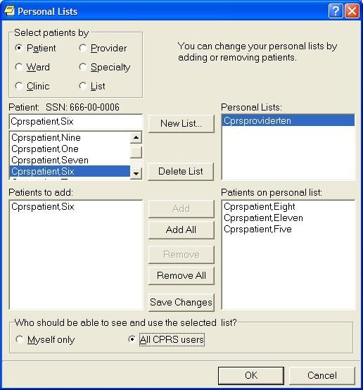

**The Personal Lists dialog allows you to create a personalized patient list**  
**To create a personal list, use these steps:**

1.  Select **Personal Lists...** to edit or create list of patients.  
1.  To create a list, select **New List...**  
1.  In the New Personal List dialog, type in a name for your list. Then, indicate whether the list will by visible only to you by selecting the Myself only radio button or allow all users to see the list by selecting the All CPRS users radio button.  
1.  Locate the appropriate patients by selecting the appropriate category under the “Select patients by” group: Patient, Ward, Clinic, Provider, Specialty, Other.  
When a category is selected, CPRS displays the items for the category. For example, if you choose Clinic, CPRS displays the list of clinics.

1.  Select the item within the category that you want to use. For example, if you have a patient and you know the patient is in a specific clinic, select that clinic.  
1.  The Patients to add field lists all of the patients that can be added from the particular selection method. Highlight the patient names in this field and click Add (which moves the highlighted patient or patients into the Patients on Personal List pane. To add all patients, select Add All to copy all the patients under the Patient to add pane.  
1.  Repeat steps 4-6 until you have added all the patients you want to your new personal list.  
1.  Review the list. If changes need to be made, use the steps 4-6 to add new names. To remove names, highlight them under the Patients on Personal List pane and select Remove. To remove all the names under Patients on Personal List pane, select Remove All.  
1.  If needed, select whether the list should be for Myself only or for All CPRS users.  
1.  When you have all the patients that you want on the list, select Save Changes if you plan to make other changes on the Personal List dialog such as creating one or more additional Personal Lists. If you are finished creating personal lists for now, select OK.  
**To edit a personal list, use these steps:**

1.  On the Lists/Team tab, select **Personal Lists…**.  
1.  In the Personal Lists dialog, select the list under the Personal Lists pane that you want to edit.  
1.  To add patients to the list, locate the appropriate patients by selecting the appropriate category under the “Select patients by” group: Patient, Ward, Clinic, Provider, Specialty, Other.  
When a category is selected, CPRS displays the items for the category. For example, if you choose Clinic, CPRS displays the list of clinics.

1.  Select the item within the category that you want to use. For example, if you have a patient and you know the patient is in a specific clinic, select that clinic.  
1.  The Patients to add field lists all of the patients that can be added from the particular selection method. Highlight the patient names in this field and click Add (which moves the highlighted patient or patients into the Patients on Personal List pane. To add all patients, select Add All to copy all the patients under the Patient to add pane.  
1.  Repeat steps 3-5 until you have added all the patients you want to your new personal list.  
1.  Review the list. If changes need to be made, use the steps 3-5 to add new names. To remove names, highlight them under the Patients on Personal List pane and select Remove. To remove all the names under Patients on Personal List pane, select Remove All.  
1.  If needed, select whether the list should be for Myself only or for All CPRS users.  
1.  When you have all the patients that you want on the list, select **Save Changes** if you plan to make other changes on the Personal List dialog such as creating one or more additional Personal Lists. If you are finished creating personal lists for now, select **OK**.  
#### Teams Information…

This option allows you to view the teams you are on and the patients associated with those teams.

**Note:** If the provider has an NPI, it will not display on the screen below.

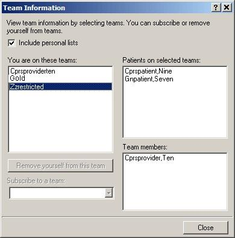

**The Team Information dialog**  
Click a team to view the patients associated with it and other team members. Click the check box to include your personal lists. Click **Remove yourself from this team** to remove yourself from the highlighted team. Click the drop-down button on the “Subscribe to a team” field and select a team to which you wish to be added. You can only subscribe yourself to or remove yourself from teams that have been defined as "subscribable."

### Notes Tab

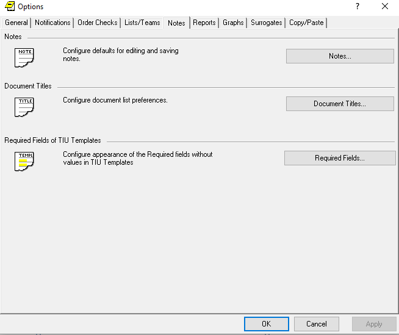

**The Notes tab**  
#### Notes…

This option on the Notes tab allows you to configure defaults for editing and saving notes. Click the selection arrows to change the number of seconds between auto save intervals. You may also assign a default cosigner for notes by clicking the drop-down button and selecting a provider. You may also click either of the two check boxes, if you wish to be prompted for a subject for progress notes and if you wish to verify note titles.

**Note:** If the provider has an NPI, it will display on the screen below. See the "National Provider Identifier (NPI) Display in CPRS" section for an example of an NPI displaying on a screen.

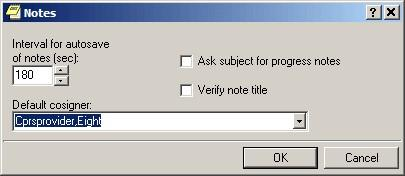

**The Notes dialog**  
#### Document Titles…

You may select a personal list of document titles to be displayed for several different types of documents. Click the drop-down button on the Document class field and select the class of document for which you would like to create a list. When you have selected a document class, the Document titles field is automatically populated with all available choices. Highlight one and click **Add**. Hold down the Control key to select more than one title at a time. To select a title from your list as your default, highlight it and click **Set as Default.** Click **Save Changes** if you will be making more changes on this dialog before you click **OK**.

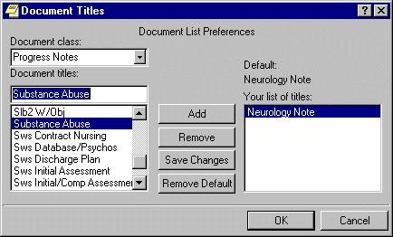

**The Document Titles dialog**  
### Reports Tab

This tab allows you to set the date ranges and the maximum number of occurrences for CPRS reports. You can change the settings for all reports or for individual reports.

**The Reports tab**  
#### Set All Reports …

This option allows you to set a start date, a stop date, and a maximum number of occurrences for all CPRS reports.

When this dialog appears follow these steps:

1.  Select Tools \| Options.  
1.  Select the **Reports** tab.  
1.  Select the **Select All Reports…** button.  
After you press the **Set All Reports…** button the “Change Default Settings For Available CPRS Reports” dialog will appear.

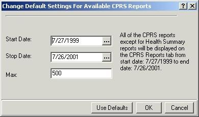

**The Change Default Setting For Available CPRS Reports dialog**  
1.  Change the value in the Start Date and Stop Date fields by selecting the appropriate field and by doing one of the following:  
-   entering a date (e.g. 6/21/01 or June 21, 2001).  
-   entering a date formula (e.g. t-200).  
-   pressing the  button to bring up a calendar.  
1.  After you have entered a start and stop date, you can change the maximum number of occurrences (if necessary) by selecting the Max field.  
1.  Select OK.  
A confirmation dialog box will appear.

1.  Select Yes to confirm and save your changes.  
1.  Select OK to close the Options dialog box.  
#### Set Individual Report…

This option allows you to set a start date, a stop date, and a maximum number of occurrences for individual CPRS reports. After you press the **Set Individual Report…** button the “Customize Individual CPRS Report Setting” dialog box will appear.

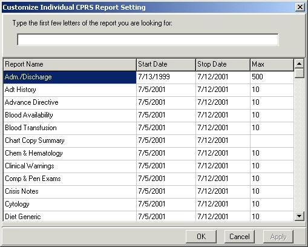

**You can customize individual CPRS reports from this screen**  
When this dialog appears follow these steps:

1.  Place the cursor in the “Type the first few letters of the report you are looking for:” field (located at the top of the dialog box) and type the name of the report that you would like to change  
\-or-

use the scroll bars to find the report.

1.  Change the value in the Start Date and/or Stop Date field by clicking in the appropriate column and doing one of the following:  
1.  entering a date (e.g. 6/21/01 or June 21, 2001).  
1.  entering a date formula (e.g. t-200).  
1.  pressing the  button to bring up a calendar.  
1.  After you have entered a start and stop date, you can change the maximum number of occurrences (if necessary) by clicking in the Max field.  
1.  Click Apply to save your changes  
\-or-

click OK to save your changes and close the dialog box.

1.  Click **OK** to close the “Options” dialog box.  
### Graphs Tab

From the Graphs tab, users can configure collections of data as Graphing view definitions and configure the default graphing settings. Both buttons on this tab bring up dialogs that are discussed elsewhere in this manual.

**  
**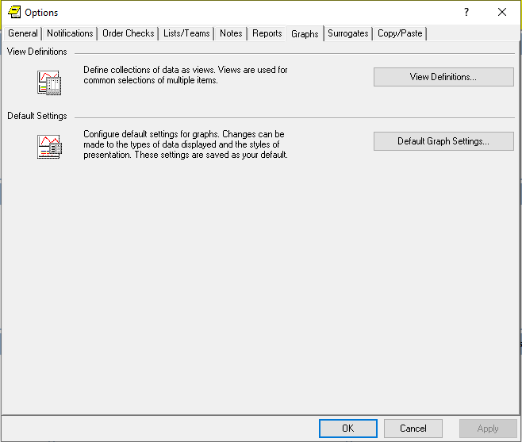

**The Graphs tab**  
For instructions on these two dialogs, please see the following sections:

-   “Creating Predefined Views”  
-   “Setting Display Options Using the Graph Settings Dialog Box”  
***

### Surrogates Tab

This tab allows you to add, edit and remove multiple surrogates for a provider in a single screen. It displays a list of all current and future surrogates and prevents you from scheduling more than one surrogate for the same date/time period.

A surrogate is a person who will receive all notifications that originally would have been sent to the user. It is a way of providing coverage when one party is unavailable.

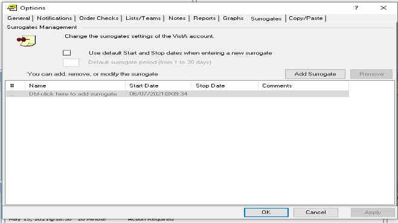

**The Surrogates tab**  
To add a surrogate, follow these steps:

1.  Select Tools \| Options.  
1.  Select the **Surrogates** tab.  
1.  To set a default surrogating period, check the **Use default Start and Stop dates when entering a new surrogate** checkbox. Enter a value from 1 to 30 in the **Default surrogating period (1..30 days)** text box.   
    **Note:** The **Use default Start and Stop dates when entering a new surrogate** checkbox is optional.  
1.  Click on the **Add Surrogate** button or double click the **Dbl-click here to add surrogate** button.  
After you press the **Add Surrogate** button the “Surrogate Management” dialog will appear. Red highlighting has been added for emphasis. In the screenshot below, the default Start Date is the current date and is listed in the **Start** dropdown. The default Stop Date that you have selected is listed in the **Stop** dropdown.

If you have set a default surrogating period, you can change the Start and Stop dates.   
  
If you have not set a default surrogating period, the **Start** and **Stop** dropdowns in the “Surrogate Management” dialog will be blank.

If you change the Start and Stop dates, you will not be able to select a past date, but you can select the present date or any date in the future.   
  
   
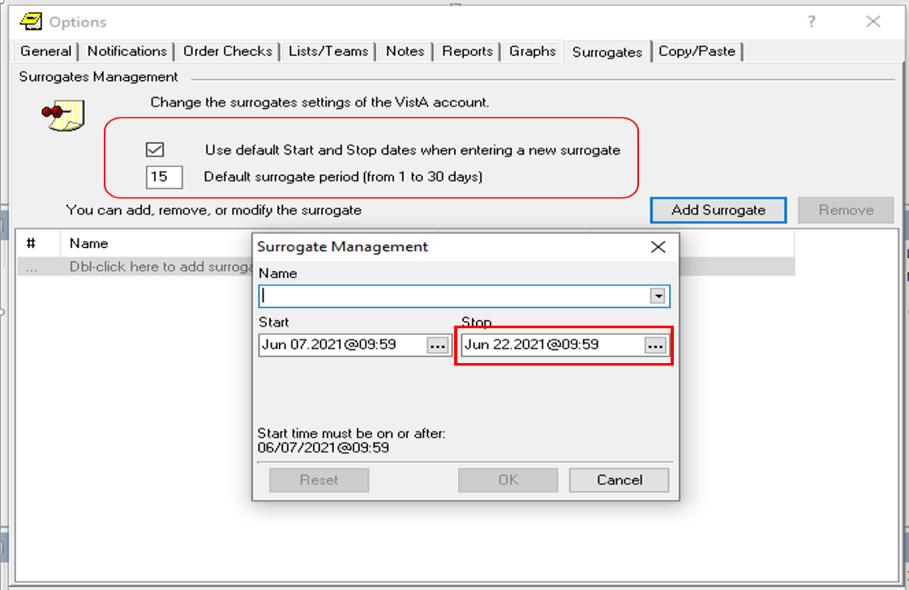

**The Surrogate Management dialog   
**  
1.  Select a surrogate in the **Name** dropdown.  
1.  If desired, change the value in the Start and Stop fields by pressing the  calendar button and entering a date and time.  
Listed below is an example of a calendar. It will show you all the acceptable start dates and times. The **Midnight** button sets the time to midnight and the **Now** button sets the time to the current time.   
  
  
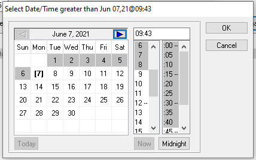  
**Example of a Calendar**

1.  Click **OK**.  
1.  On the Surrogates Management screen, click **Apply.**  
1.  Click **OK** to close the Options screen.  
Listed below is a surrogate that has been added. The exclamation mark indicates that there is information that has not been applied. The **Cancel** button closes the Options window without saving changes.

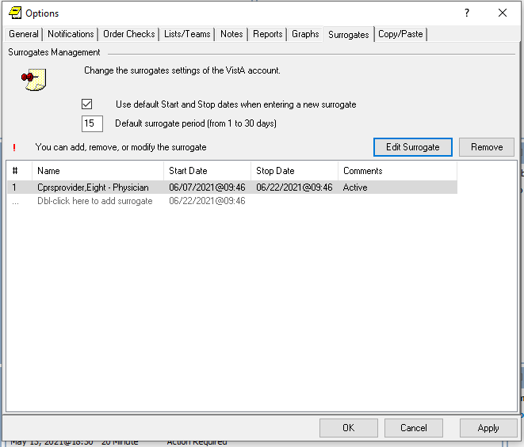

**Example of a Surrogate who has been added  
**

To edit a surrogate, follow these steps:

1.  Select Tools \| Options.  
1.  Select the **Surrogates** tab.  
1.  Click on a surrogate.  
1.  Click on the **Edit Surrogate** button and update the surrogate information. (You will see a Surrogate Management popup that lets you update the **Name** and the **Start** and **Stop** date/times.)  
1.  Click **Apply** to save your changes.  
1.  Click **OK** to close the Options window.  
To remove a surrogate, follow these steps:

1.  Select Tools \| Options.  
1.  Select the **Surrogates** tab.  
1.  Click on a surrogate.  
1.  Click on the **Remove Surrogate** button.  
You will see a popup that asks you to confirm that you want to remove the surrogate.  
  
  
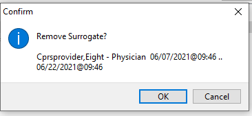  
**Remove Surrogate popup**

1.  On the Remove Surrogate popup, click **OK**.  
1.  On the Surrogates Management screen, click **Apply** to save your changes.  
1.  Click **OK** to close the Options window.  
### Copy/Paste Tab

This tab allows you to determine how pasted Notes will display in CPRS.

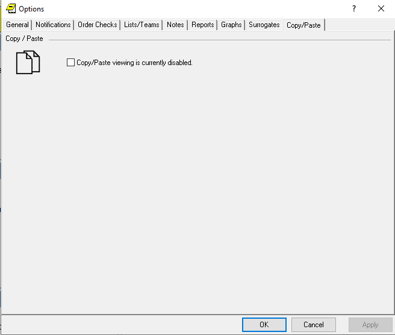

**The Copy/Paste Tab**

To determine how pasted Notes will display in CPRS, follow these steps:

1.  Select Tools \| Options.  
1.  Select the **Copy/Paste** tab.  
1.  Check the “Copy/Paste viewing is currently disabled” checkbox. After the checkbox gets checked, the wording will change to “Copy/Paste viewing is currently enabled.”  
1.  In the “How text is identified on the note” section, select the attributes for pasted text by checking one or more of the following boxes:  
    Bold  
    Italics  
    Underline  
    Highlight  
1.  If you select “Highlight”, you may also use the default color or choose a different color. To select a different color, select the drop-down arrow and choose one of the following colors:  
    Black  
    Maroon  
    Green  
    Olive  
    Navy  
    Purple  
    Teal  
    Gray  
    Silver  
    Red  
    Lime  
    Yellow  
    Blue  
    Fuchsia  
    Aqua  
    White  
1.  If you would like to see the differences between what the author pasted into the note and what was edited, check the “Difference Identifier Toggle”.  
1.  If you check the “Difference Identifier Toggle”, you may select the following:  
1.  Select the attributes for edited text by checking one of more of the following boxes:  
    Bold  
    Italics  
    Underline  
    Text Color  
1.  If you select “Text Color”, you may use the default color or choose a different color. To select a different color, select the drop-down arrow and choose one of the following colors:  
    Black  
    Maroon  
    Green  
    Olive  
    Navy  
    Purple  
    Teal  
    Gray  
    Silver  
    Red  
    Lime  
    Yellow  
    Blue  
    Fuchsia  
    Aqua  
    White  
1.  Enter the character limit. The default number of characters is 5000.  
1.  Click **Apply** to save your changes.  
1.  Click **OK** to close the Options window.  
Listed below is an example of Copy/Paste viewing that is set to enabled. The pasted text will be highlighted in lime and the Difference Identifier Toggle has been enabled. The edited text will be in aqua and the character limit will be 50.

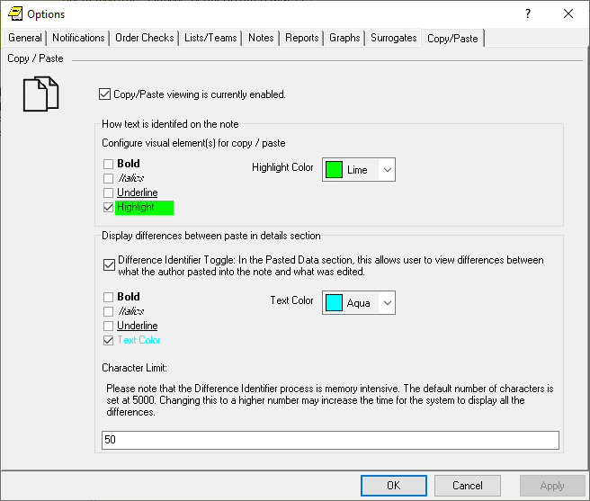  
**Example of Copy/Paste text viewing enabled**

# Support for Women’s Health  
CPRS now offers support for items related to Women’s Health, including for the System for Mammogram Results Tracking (SMART) and order checking for items that are teratogenic or potentially unsafe for breastfed infants.

## SMART Features

SMART enhances the ability to track and manage mammography results. SMART creates the ability to link a result notification directly to a documentation template. These templates are specific to the Breast Imaging Reporting and Data System (BIRAD) code and contain typical next steps in management, links to orders, and ability to document how and when a patient was notified of their result.

The template allows users to view the patient’s last three breast images, regardless of the ordering provider; and to view all data captured in CPRS/VistA related to the patient’s breast care, beginning with when the result was entered into VistA. Once implemented, data from the SMART templates will populate the Breast Cancer Clinical Case Registry (BCCCR), enhancing the registry.

SMART features in CPRS include:

-   new alerts  
-   a new alert dialog that is patient-centric rather than provider-centric  
-   new reminder dialogs and TIU templates  
The features should allow providers to get the alert for a mammogram and process the alert. The patient-centric alert dialog should enable providers to more easily see the alert for the patient if needed. The dialog displays all alerts for the patient, not just SMART alerts.

**Note**: Each user must enable their own SMART alerts. If a user does not enable SMART alerts, they will not receive them. When SMART alerts are not enabled, the user receives normal imaging alerts based on their configured settings.

When the provider processes a SMART alert, it will take them to a template containing a reminder dialog. The provider and fill out the appropriate BIRAD dialog that helps the provider record the result and follow up actions.

Completing the template and dialog

-   creates a progress note  
-   files health factors  
-   when available, updates the BCCCR  
## Potentially Unsafe Medications or Exposures (Teratogens)

Teratogens are drugs (including medications), chemicals, or other exposures, like radiation, that can interfere with normal embryonic/fetal development and thus, may lead to birth defects or pregnancy loss. In addition, there is a group of medications that pose a potential risk to breast-fed infants.

CPRS has enhanced order checks to alert providers if something is ordered for a woman that is pregnant or breast feeding that is teratogenic.

# Documenting a Patient’s Immunizations and Skin Tests in CPRS

Before CPRS v32b (OR\*3.0\*405) was released, most documentation about a patient’s immunizations and skin tests was listed as free text information in a progress note. However, CPRS now provides clinical computable data when a user documents these items.

When documenting the administration or reading of an Immunization or a Skin Test in all locations, CPRS will automatically add specific Current Procedural Terminology (CPT) and International Classification of Diseases-10 (ICD-10) codes associated with it. CPRS will also add the correct administration CPT codes.

**Note:** CPRS will not allow you to document an immunization unless it is marked as Active in the Immunization file and has available Lot Numbers for the encounter location. CPRS does not allow you to enter a future date/time for an immunization or skin test.

You can document a patient’s immunization from these locations in CPRS:

-   Coversheet  
-   Immunization tab in the Encounter form  
-   Reminder Dialogs.  
You can document a patient’s skin tests from these locations in CPRS:

-   Skin Test tab in the Encounter form  
-   Reminder Dialogs.  
### Description of the Enter Immunization/Skin Test Screens

Regardless of the location from where you start recording the immunization/skin test, CPRS will always take you to the Enter Immunization or Enter Skin Test screen, which has the following sections:

-   **Immunization/Skin Test Evaluation Statuses:** Lists the immunizations or skin tests.  
-   **Immunization/Skin Test List:** Shows the immunizations or skin tests that are in the patient record. If you have accessed the Enter Immunization screen from the coversheet, the Immunization List will be filled in only when a user is currently entering an immunization. If you have accessed the Enter Immunization screen from the Immunization tab in the Encounter form, the Immunization List will always contain a patient’s immunizations.  
-   **Immunization/Skin Test Selection:** Allows you to select an immunization/skin test and a documentation type.  
-   **Editor/Detail Viewer:** Displays the fields associated with a specific document/skin test type and allows you to edit them.  
After you access the Enter Immunization/Skin Test screen, you will be able to add, edit, delete, or view an immunization/skin test.

The examples below show what the Enter Immunization screen looks like when you open it from the Coversheet, and what the Enter Skin Test screen looks like when you open it from the Encounter form.

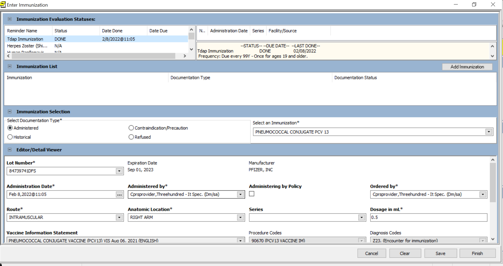  
**Example of the Enter Immunization screen**

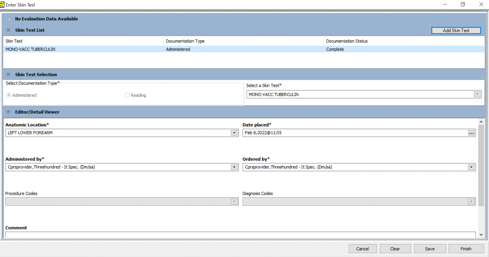  
**Example of the Enter Skin Test screen  
  
**

#### Accessing the Enter Immunization Screen from the Coversheet

When documenting an immunization from the cover sheet, a progress note will automatically be generated, with a standard text for the Immunization entry.

1.  Right-click on the Recent Immunizations pane and select Enter New Immunizations on the dropdown.  
1.  If an encounter location hasn’t been selected, the Location for Current Activities screen will appear, and you will need to select an Encounter Location and Date/Time of Encounter.  
1.  You will now see the Enter Immunization Screen.  
#### Accessing the Enter Immunization/Skin Test Screen from the Encounter form

1.  On the Encounter Form screen, click the Immunizations or Skin Test tab.  
1.  On the Immunizations/Skin Test tab, click the Add/Edit/Delete Record button.  
1.  You will now see the Enter Immunization/Skin Test screen.  
#### Accessing the Enter Immunization/Skin Test Screen from the Reminder Dialogs

1.  Click on the button in the Reminder Dialog that takes you to the immunization/skin test form.  
#### Adding an Immunization/Skin Test to CPRS

1.  On the Enter Immunization/Skin Test screen:  
1.  If you are adding an immunization:  
1.  On the Enter Immunization screen, select a Documentation Type and an Immunization in the Immunization Selection section.  
1.  If you are adding a skin test:  
1.  On the Enter Skin Test screen, select a Documentation Type and a Skin Test in the Skin Test Selection Section.  
1.  Fill in all required fields (marked with an asterisk) for the selected Documentation Type.  
1.  Click **Save**.  
1.  Click **Finish**. Administered and historical vaccines will be listed on the CPRS Coversheet. Contraindicated and refused vaccines will not be listed on the Coversheet. However, they will be listed on the Encounter Form 🡪 Immunizations tab. If a vaccine was contraindicated, you will get a warning message when you click **Finish**.  
**Note:** If a user sets the Contraindication/Precaution Reason or Refused Reason to a health condition that has a default reschedule date, the “Cancel Series and stop forecasting” dropdown will default to “No” and will be disabled, as shown below.

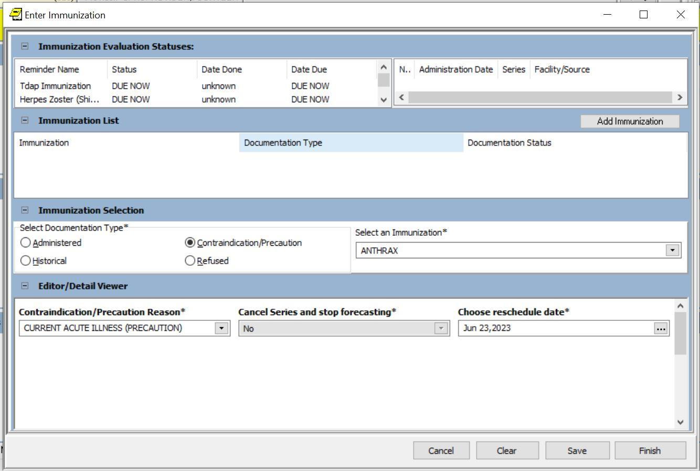**Example of a contraindicated immunization with a default reschedule date**

When a user sets “Cancel Series and stop forecasting” to Yes, the following message will appear on the dropdown: “Yes, this will stop the forecasting reminders of future doses.’

#### Editing an Immunization/Skin Test in CPRS

1.  On the Enter Immunization/Skin Test screen, right-click on an immunization/skin test in the Immunization/Skin Test List section and select Edit Immunization/Skin Test from the dropdown.  
1.  In the Editor/Detailed Viewer section, update the information about the immunization/skin test.  
1.  Click **Save**.  
1.  Click **Finish**.   
    **Note:** You can always edit an immunization/skin test if you accessed the Enter Immunization/Skin Test screen through the Immunization/Skin Test tab in the Encounter form. However, if you accessed an immunization through the Coversheet, you can edit it only under this condition: You have added an immunization and saved it, but you have not finished it and have kept the Edit Immunization screen open.  
***

#### Deleting an Immunization/Skin Test in CPRS

1.  On the Enter Immunization/Skin Test screen, right-click on an immunization/skin test in the Immunization/Skin Test Lists section and select Delete Immunization/Skin Test from the dropdown.  
1.  Click **Save**.  
1.  Click **Finish**.  
    **Note:** You can always delete an immunization/skin test if you accessed the Enter Immunization/Skin Test screen through the Immunization/Skin Test tab in the Encounter form. However, if you accessed an immunization through the Coversheet, you can delete it only under this condition: You have added an immunization and saved it, but you have not finished it and have kept the Edit Immunization screen open.  
#### Viewing the Immunization/Skin Test Status in CPRS

1.  On the Enter Immunization/Skin Test screen, right-click on an immunization/skin test in the Immunization/Skin Test Evaluation Statuses section and select either View Information or Clinical Maintenance from the dropdown.   
    **Note:** View Information and Clinical Maintenance display the same information about the patient’s immunization history. However, View Information displays the information on the right-hand side of the Immunization Evaluation Statuses section while Clinical Maintenance displays the information on a separate screen and allows you to print it.  
1.  Click **Finish**.  
# Cover Sheet

The Cover Sheet is the first screen you see after opening a patient record (unless the site or user defines another tab as the initial screen). The Cover Sheet displays an overview of a patient’s condition and history. It shows active problems, allergies and postings, active medications, clinical reminders, lab results, vitals, and a list of appointments or visits.

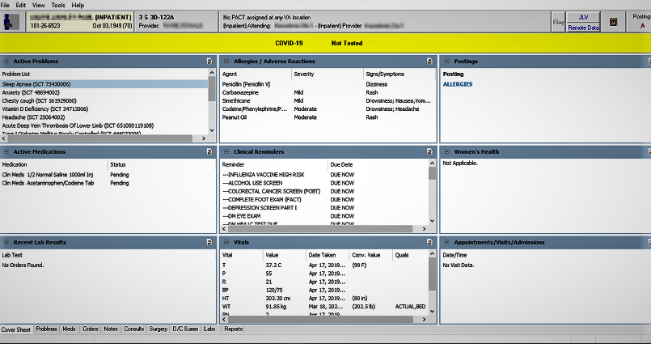  
The CPRS Cover Sheet displays a variety of information about a patient. This example shows the Cover Sheet without customization. Sites can now customize which panels display and their order as described below.  
***

**Customizing which Panes Display and their Order**  
Sites can now customize the CPRS Cover Sheet determining which panes display. There are ten possible panes. The CAC or similar personnel can set the pane order. There will still be three rows available for the panes, which are  
-   Active Problems  
-   Allergies  
-   Postings  
-   Active Medications  
-   Clinical Reminders  
-   Recent Lab Results  
-   Vitals  
-   Appointments  
-   Immunizations  
-   Women's Health  
***

Customizing which panels display must be done by someone who has access to the Clinical Application Coordinator (CAC) menu.  
With the customized Cover Sheet, the panels have a slightly different appearance and the user can minimize and maximize the panels on the Cover Sheet to see things better.  
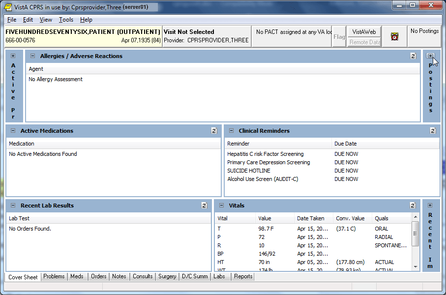  
This capture shows a Cover Sheet that has been customized and three of the panels have been collapsed. Each of the collapsed panels have a small box with a plus sign that can be used to expand it. In the expanded panels, there is also a refresh icon. Right-clicking on these refresh icons will show some options, such as Refresh, Expand or Collapse, and possibly other options, such as No Known Allergies on the Allergies panel.  
**Minimizing and Maximize Panels**  
When the Cover Sheet is customized, each panel can be minimized or maximized. When the panel is maximized, the user can select the minus icon in the panel’s upper left corner to minimize the panel. When minimized, the panel is a smaller vertical area with the name of the panel listed vertically as shown above. If the panel is minimized, the user can select the plus icon to maximize the panel.  
**Refresh Icon Options**  
Each customized Cover Sheet panel also has a refresh icon ()in the upper right corner of the panel. If the user right-clicks the refresh icon, there are options to Refresh and Collapse, and there may be other menu items, such as Update Vitals, Enter New Allergy, Mark as Entered in Error. Each panel has the Refresh and Collapse. Some panels have additional items. Right-click the Refresh icon for each panel to see which options are available.  
**What You Can Do from the Cover Sheet**  
You can quickly review the active problems (asterisks identify acute problems, and dollar signs identify unverified problems. Service-Connected conditions are indicated by abbreviations in parentheses if Problem List patch GMPL\*2.0\*26 is installed. The pound symbol “\#” shows problems that have inactive codes, which users can update using the Change action on the problems tab).

Scroll bars beside a box mean that more information is available if you scroll up or down.

The File menu contains three menu items that you will use often:

-   Select New Patient  
This menu item opens the Patient Selection dialog.

-   Update/Provider/Location  
This menu item opens the Provider & Location for Current Activities dialog. This dialog enables you to change the clinician or location associated with an encounter.

-   Review/Sign Changes  
This menu item enables you to view the orders you have placed that require an electronic signature, select the orders you want to sign at this time, and enter your electronic signature code (if you are an authorized signer).

Click any item to get more detailed information. For example, you can click the **Patient Identification** box (or button) to get more information about the patient. You can click a **Visit** to see details. For example, a patient could have Zantac listed in the Allergies/Adverse Reactions dialog. By clicking on it, you would see the following detail window.

**Note:** If the provider has an NPI, it will not display on the screen below.

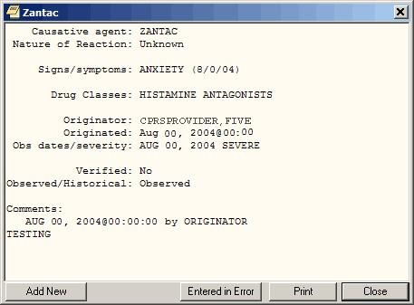

**The Detail window displays additional information about an allergy**  
Select a tab at the bottom of the screen to go to that section of the patient chart.

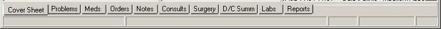

**The CPRS tabs allow you to easily navigate to another area of the patient chart**  
## Navigating a Patient Chart

The CPRS Windows interface mimics the paper chart of a patient’s record, but CPRS makes locating information easier. With the Patient Selection screen, you can quickly bring up a record for any patient on the system. The Cover Sheet summarizes important information about the patient. Along the bottom of this dialog or page are a number of tabs that will quickly take you to the part of the chart you need to see. For example, you might want to see progress motes, Problems, Summaries, Medications, Lab Tests, or place new orders:

To go to a different part of the patient chart, click the appropriate tab at the bottom of the chart or choose **View \| Chart Tab**, and then select the desired tab.

## Additional Patient Information

You can obtain additional patient information by clicking the **Patient ID** box located on the upper left of the dialog. You can access this button from any chart tab.

The button shows the patient’s name (in bold), status (inpatient or outpatient), Social Security number, date of birth, and age (as shown in the graphic below). If you click the button, CPRS brings up a window containing additional information such as the patient’s address, the attending physician, and/or the date of admittance.

**Information about a patient is displayed in the Patient ID box**  
To obtain additional information about a patient, follow these steps:

1.  Select the **Patient ID** box.  
The Patient Inquiry dialog will appear. The Patient Inquiry dialog includes additional information such as the patient’s mailing address, telephone numbers (including the patient’s home, work, and cell phone numbers), admission information, and other relevant data, such as provider information and primary and secondary next of kin entries. If the patient is assigned to a mental health treatment coordinator (MHTC), the provider’s name, position and phone numbers will display as well. While in the detailed display, you can select a new patient, print the detailed display, or close the detailed display.

1.  To print a copy of the Patient Inquiry dialog, select **Print**.  
1.  To close the Patient Inquiry window and return to the Cover Sheet, select **Close**.  
**-or-**

select a new patient by selecting **Select New Patient**.

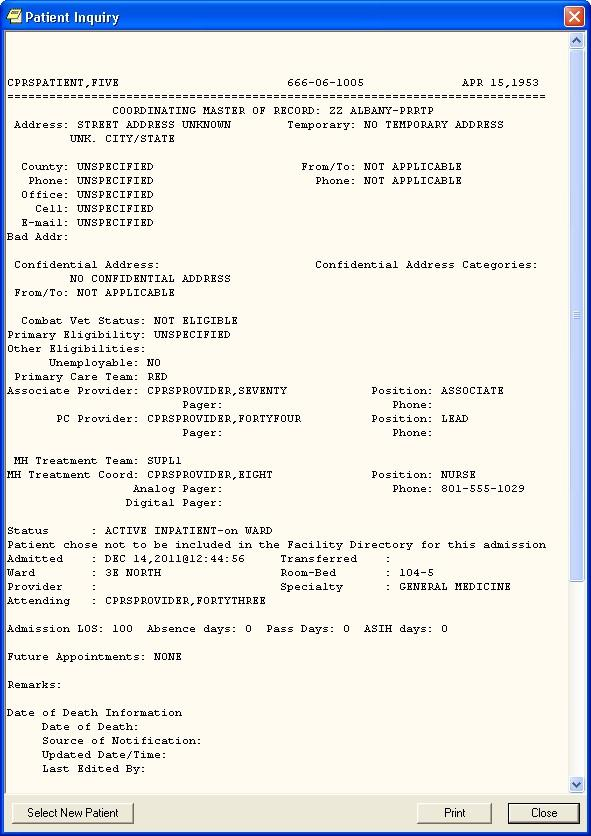

**Note:** If the provider has an NPI, it will not display on the screen above.

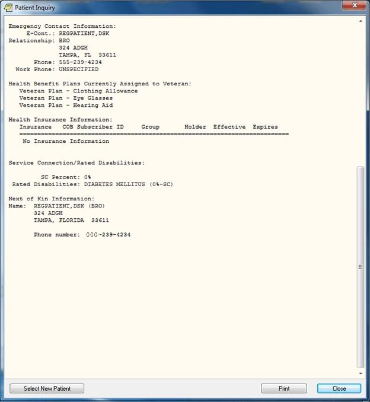

**You can retrieve additional information about a patient by clicking the Patient ID button. The Patient Inquiry dialog also shows information that can be printed including demographic information, Permanent & Total Disabled status, and Health Benefit Plans currently assigned to the Veteran**  
## 

## Entering or Changing Encounter Information

You must enter encounter information before you can enter orders, write progress notes, complete a consult, write a discharge summary, or perform other activities.

**Note:** If the provider has an NPI, it will display on the screen below. See the "National Provider Identifier (NPI) Display in CPRS" section for an example of an NPI displaying on a screen.

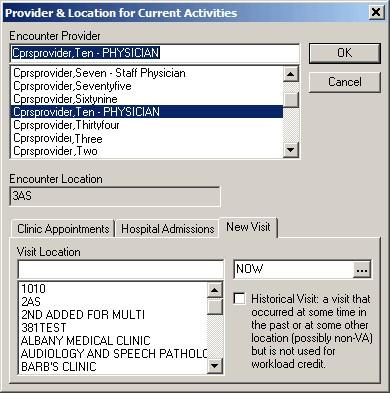

**You must complete the Provider & Location for Current Activities dialog before you can perform certain activities**  
To enter or change the Encounter provider, follow the steps below:

1.  If you are already in the Provider / Encounter dialog skip to step 2. Otherwise, from any chart tab, click the Provider / Encounter box located in the top center portion of the dialog.  
**Note:** These instructions are written as if the user must select a provider. If the user making the selection is a provider, the user will be selected by default and the cursor will go to the New Visit tab if no visit is defined, or to the Clinic Appointments tab if one is defined. If the user is not a provider, the cursor will go to the Encounter Provider field so that the user can select the provider for the encounter.

1.  Locate and click the provider for this encounter in the list box.  
1.  Select the tab of the correct encounter category for this visit:  
-   Clinic Appointments  
-   Hospital Admissions  
-   New Visit  
1.  Select a location for the visit from the choices in the list box.  
1.  If you selected a Clinic Appointment or Hospital Admission, skip to step 7. If you are creating a New Visit, enter the date and time of the visit (the default is NOW).  
1.  Select a visit category from the available options (such as, Historical) and click OK.  
1.  When you have the correct provider and location, select OK. If the Similar Providers screen appears, select a provider from the list and select **OK**.   
      
    **Note:** If the last name and the first two letters of the first name match another provider, CPRS will display the Similar Providers screen, which will prompt the user to select the right provider from a list of providers with similar names, as shown in the screenshot below. This functionality exists in thirty-seven areas of CPRS but it always works the same way.   
      
      
    **Similar Providers screen**  
## Viewing Clinical Reminders

From the Cover Sheet, you can double-click any of the Clinical Reminders listed to obtain a description of the reminder and an explanation of why the reminder applies to the current patient. To process reminders, you must go to the Notes tab.

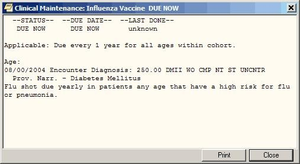

**You can view a description of a reminder from the Cover Sheet**  
If there is a problem when the reminders are evaluated, CPRS uses two messages to inform the users: Error and CNBD, which stand for “could not be determined.”

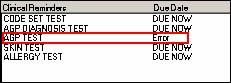

Here the Clinical Reminders portion of the Cover Sheet display of an error in reminder processing.

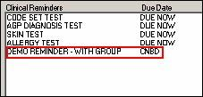

This screen capture shows CNBD for “could not be determined” in the Due Date column.

Both of these messages indicate that someone needs to review the Reminder definition to address the problem. If the user double-clicks the reminder with the error message, a dialog will appear either telling them to contact their reminders coordinator or the message might show why the reminder did not get processed similar to the capture below.

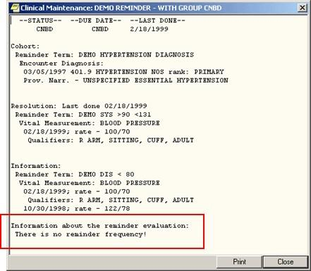

**Here the reason for the CNBD is shown. This reminder is missing a frequency.**  
## Viewing and Entering Vitals

CPRS uses the new Vitals Lite component to view and enter the following vitals and measurements:

-   Blood pressure  
-   Central venous pressure  
-   Circumference/girth  
-   Height  
-   Pain  
-   Pulse  
-   Pulse oximetry  
-   Respiration  
-   Temperature  
-   Weight  
Users bring up detailed vitals information by clicking anywhere in the vitals area on the CPRS cover sheet. By using the new Vitals Lite component, CPRS users can enter vitals with qualifiers, such as sitting, standing, actual, estimated, left arm, right leg, etc., and then on the Cover Sheet, CPRS displays the all vitals that have a value entered, any qualifiers, and the date the vital was entered. For example, a user might see blood pressure, temperature, and pulse from two months ago, while a value for pulse oximetry might be from six months ago.

CPRS users can enter vitals with qualifiers from the Cover Sheet or from the Vitals tab of the Encounter form.

The following items are also displayed in the Vitals view:

-   Body Mass Index (BMI): This value is calculated using the following formula:  
BMI = Weight in Kilograms/[(Height in Meters) x (Height in Meters)]

-   L/Min/%: Liters per minute of oxygen or percentage is entered when the user enters oxygen saturation based on Pulse oximetry.  
-   In 24hr (c.c.): Intake for the past 24 hours measured in cubic centimeters is taken from the Intake and Output package.  
-   Out 24hr (c.c.): Output for the past 24 hours measured in cubic centimeters is taken from the Intake and Output package.  
## How CPRS Displays Vitals

Users can view vitals in CPRS by launching Vitals Lite from the Cover Sheet. Users can then review vitals using the graph and table of vitals.

The values for vitals display as points on the graph connected by line to show trends. A legend above the graph lets the user know what each set of points, distinguished by a shape and color, represents.

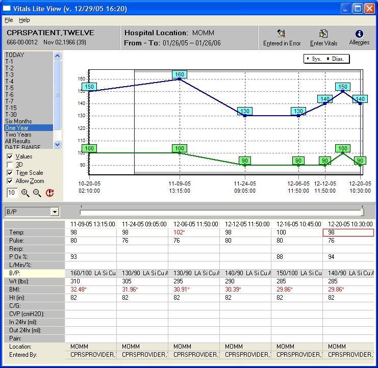

**The Vitals Lite View dialog displays vitals and measurements in a grid or a graph**  
**Note:** If the provider has an NPI, it will not display on the screen above.

Below the graph is a table or grid containing columns of vitals entries. Each column represents the vitals entered at a specific date and time. Each column has 14 rows that contain the vitals measurements whether observed or calculated. Each column also lists the location where the vitals were entered and the name of the person who entered them. The most recent entries are the furthest to the right.

Users enter some values while others are drawn from existing data or calculated. For example, the intake and output for the last 24 hours is only displayed if that information is available from the corresponding package, but the body mass index is calculated based on height and weight.

**Note:** If the user has not entered a height when a weight is entered, Vitals Lite will use the most recent height to calculate the body mass index.

If vitals values have associated qualifiers, qualifier abbreviations display after the value in the table. For example, 120/80 LA Si Cu Ad stands for a blood pressure of 120/80 taken on the left arm while the patient was sitting using a cuff of adult size.

If a value is displayed in red with an asterisk, it means that the value is outside of an acceptable range that can be set locally. A GMV MANAGER key holder can set acceptable ranges for vitals through the VitalsManager application.

### How the Vitals View Can Be Changed

To get the view they want, users can customize the Vitals Lite display using the following controls:

-   **Date range:** By default, Vitals Lite displays six months of vitals beginning with today for outpatients or 7 days beginning with today for inpatients. Users can set the date range by double-clicking a predefined choice (Today, T-1, T-2, T-3, T4, T-5, T-6, T-7, T-15, T-30, Six Months, One Year, Two Years, All Results, and the default date range) or by using the Date Range option to enter specific dates.  
-   **Graph options:** These options may not be visible when the graph first displays. If not, the user can select File \| Show/Hide Graph Options or right-click where the predefined time ranges are and choose Show Graph options. The user can select the checkbox in front of each of these choices to toggle the item on or off.  
-   Values: This selection displays the numerical value of each point on the graph.  
-   3-D: This selection changes the display between two-dimensional and three-dimensional.  
-   Time-scale: This selection toggles between whether each vitals entry is spaced equally on the graph regardless of date or whether the graph displays the amount of time the user designates. For example, if the user selects two weeks, the entire graph would represent two weeks. So if the user selected a vitals entry on January 1, 2005, the graph would show January 1, 2005 to January 15, 2005. The user can set the graph to show: 1 hour, 12 hours, Day, Week, Two Weeks, Month, Six Months, Year, Two Years.  
-   Allow Zoom: The selection enables the user to click-and-drag with the mouse to zoom in on part of the graph.  
-   **Categories to display:** The graph shows only those vitals that are highlighted on the left of the grid. By clicking on a vital in the grid or using the drop-down box between the date ranges and the vitals in the grid, users select the vitals category to display:  
-   TPR: temperature, pulse, respiration  
-   B/P: blood pressure  
-   Height/Weight: Height, Weight, Body Mass Index (BMI, which is calculated by dividing the weight but the height squared, e.g., )  
-   Pain  
-   Pulse Ox.: Blood oxygen saturation based on pulse oximetry  
-   **Time scale slider:** The slider control is directly under the graph and above the table. Based on the date range, the slider position determines what portion of the vitals entries the user will see. Moving the slider furthest to the left shows the oldest vitals entries within the specified date range. As the slider is moved to the right, those vitals entries closest to the present display and some of the older entries will drop off the graph to the right as will entries in the table. If the user has clicked Time Scale, the points the represent the vitals entries are equally spaced. If the Time Scale option has been selected, a box outline shows what portion of the graph the columns showing on the screen relate to.  
-   **Select Graph Color…:** This option on the pop-up menu enables users to change the background color of the graph and the table. To change the color, bring up the pop-up menu by right-clicking on the dialog (although not on the graph) or pressing the pop-up menu key, select 'Select Graph' color…, choose the color, and click OK.  
### Viewing Vitals from the Cover Sheet

As the user moves the slider, the entries move also. If there are enough entries and the user moves the slider far enough to the left, the entries will go off the screen. If the user moves the slider all the way to the right, only the most recent entry will be displayed.

**To view vitals from the CPRS Cover Sheet, use the following steps:**

1.  Select a vital entry displayed on the Cover Sheet.  
1.  CPRS will bring up Vitals Lite. The default date range includes today and goes six months in the past.  
1.  To graph a category, click on the corresponding row in the table.  
1.  From this point, you can customize the display of vitals by doing one or more of the following:  
1.  To choose a different date range, users can double-click a time frame from the predefined options on the left side or double click Date Range to define a custom date range. If you choose a predefined date range, skip to step b. If you choose Date Range, enter a start date by either typing a date in the field (you must enter the month, day, and year separately using the mouse or arrow keys to select them) or use the following steps:  
1.  Click the down arrow next to Start with Date to display the date dialog.  
1.  Click the buttons on the top of the dialog to find the appropriate month and year. (You can also click on the month and select the month from a list and then click on the year and choose the year).  
1.  Repeat steps 1 and 2 for the Go to Date.  
1.  Click OK when you have the appropriate date.  
1.  To use the graph options, right-click where the default date ranges are and select Show/Hide Graph Options. You can then enable or disable, the zoom feature, display of the values, three-dimensional display, and the time scale. These options are discussed below:  
-   **Values:** To display the values, place a check in the Values checkbox by clicking it or using Alt + v. To remove the values, remove the check mark.  
-   Allow Zoom  
1.  To enable the zoom feature, place a check mark in the Enable Zoom checkbox by clicking it or using Alt + z.  
1.  Then, to zoom in on section of the graph, click and drag the mouse from right to left and above to below over the area and release the mouse button.  
1.  To return to the full view, click and drag from right to left.  
-   **3D**: To make the graph display in a slightly three-dimensional (3D) view, place a check mark in the 3D checkbox by clicking it or using Alt + 3. To return to a two-dimensional view, remove the check mark.  
-   **Time Scale**: To view the entire selected date range on the graph, check the Time Scale checkbox. Clear the checkbox to view the data points in evenly spaced intervals.  
1.  To view more vitals if available in the date range you selected, use the slider under the graph and above the table or use the arrows keys. The oldest entries are farthest right while the most recent entries are the farthest to the left.  
1.  When you are finished, click the Close button (the X in the upper right corner).  
## Recording Vitals

Users can enter vitals and measurements from the Cover Sheet or the Encounter form’s Vitals tab. A template must be available for users to enter vitals.

### Templates for Entering Vitals

To enter vitals with the new Vitals Lite in CPRS, a template that defines which vital measurements display on the Vitals Entry form must be available. These templates are not created through CPRS, but through the VitalsManager application. To use the VitalsManager application, a user must hold the GMV MANAGER key.

A GMV MANAGER key holder can define in the template which vitals or measurements display for entry when the user selects Enter Vitals. In defining the template, the key holder can also set default qualifiers for each vital or measurement. The user entering the vitals can change the qualifiers, but a default can be set to make recording the vitals more efficient. Templates can be defined at the following levels:

-   System  
-   Division  
-   Location  
-   User  
For User level templates to display, a GMV MANAGER key holder must check the Allow User Templates checkbox.

The dialog to enter vitals displays the following patient information:

-   Patient name  
-   Social security number  
-   Birth date  
-   Age  
-   Encounter location  
-   Encounter date/time  
-   Vitals and measurements that can be entered using the specified template  
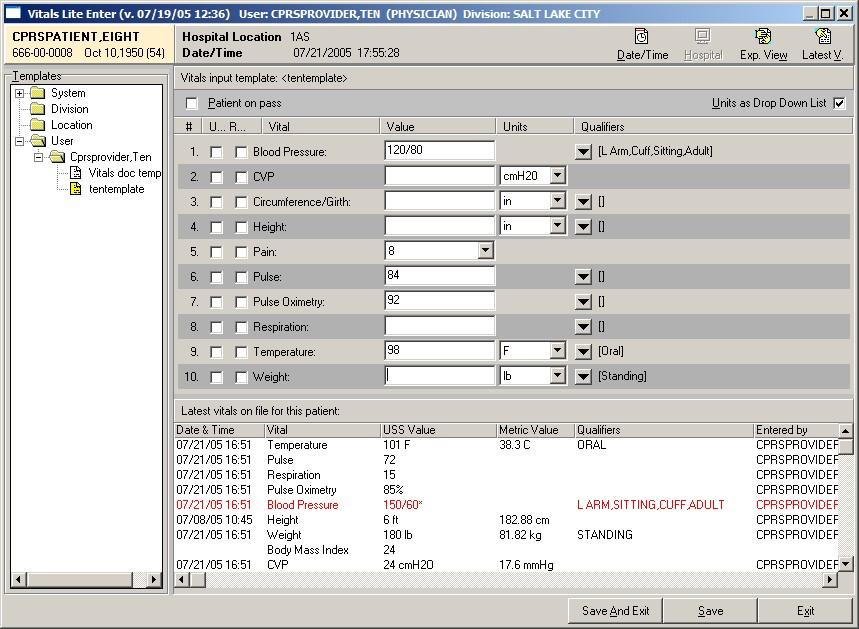

**This screen capture shows the dialog for entering vitals. In this capture, the user is seeing the Expanded view where they can select a template to use and the Latest Vitals that allows them to see the most recent vitals entered for the selected patient**  
**Note:** If the provider has an NPI, it will not display on the screen above.

Templates show the following for each type of vitals that can be entered:

-   **Unavailable checkbox** that records if the vitals cannot be taken. The text for this checkbox may be very small with only the U displaying.  
-   **Refused checkbox** that records if the patient refused to have the vital taken. The text for this checkbox may be very small with only the R displaying.  
-   **Name** shows vital or measurement name.  
-   **Value** field is where the user enters the numeric value.  
-   **Units** show what unit of measurement, such as inches or centimeters, is being used. A checkbox on the top right of the dialog enables users to switch between drop-down lists and checkboxes to change the units.  
-   **Qualifiers** show a drop-down arrow that will bring up a small window with the defined qualifiers for that vital or measurement. If a default qualifier has been defined, it will display to the right of the button. If the user changes the qualifiers, the text to the right of the button changes.  
The dialog also has a checkbox to designate that the patient was on pass and vitals could not be taken.

For more information on how to create and save templates and the other options that for Vitals Lite, please see the Vitals/Measurements documentation by going to <http://www.va.gov/vdl> and selecting Vitals/Measurements.

### Entering Vitals

Once a template has been defined, user can enter vitals and measurements. Users can choose to display or hide the template list and the most recent vitals recorded.

To enter a patient’s vitals, use the following steps:

1.  From the Cover Sheet, select a vitals entry and then select Enter Vitals using the button or the pop-up menu. On the Encounter form, select the Vitals tab and select Enter Vitals.  
1.  If prompted, enter a location and then select OK.  
1.  Bring up the Vitals Lite Enter dialog by selecting the Enter Vitals button or bringing up the pop-up menu and selecting Enter Vitals.  
1.  If necessary, select the appropriate template by doing the following:  
1.  If it is not displayed, show the Templates pane by selecting **Exp. View** in the upper right of the dialog.  
1.  Select the level at which the template resides: System, Division, Location, User (user will only display if it has been set to display).  
1.  Select the appropriate template.  
1.  To view the most recent vitals if they are not displayed, select the Latest V. (for Vitals) button. Select it again to hide them.  
1.  If you cannot take the vitals, place check marks in the appropriate boxes. These boxes might be:  
-   Patient on Pass – use this if the patient is on pass.  
-   Unavailable – there is a check box by each vital sign or measurement.  
-   Refused – there is a checkbox by each vital sign or measurement.  
1.  If necessary, change the units for the vital.  
1.  Enter a vitals value for the patient by placing the cursor in the appropriate field and typing a value.  
1.  Repeat steps 4 and 5 as needed. When finished, check over the entries and select either Save or Save and Exit.  
### Marking Vitals as Entered in Error

Through Vitals Lite, users can now mark a vitals entry as entered in error. The user selects one or more vitals entries from a specific date and then must select a reason before marking them as entered in error.

To mark vitals entries as entered in error, use the following steps:

1.  To bring up the vitals screen from the Cover Sheet, select a vitals entry using the mouse or appropriate keystrokes.  
1.  Display the dialog by selecting Entered in Error using the button or the popup menu.  
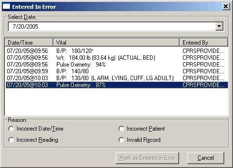

**Through the vitals Entered in Error dialog, users can select the erroneous entries and mark them as entered in error**  
1.  Enter the date of the erroneous entry.  
1.  In the list that displays, highlight the vitals entries that are incorrect. To select multiple entries, hold down the Ctrl key and click each entry to select it, or hold down the Shift key and while clicking the last entry to select a range.  
1.  Select a Reason.  
1.  Select Mark as Entered in Error.  
**Note:** If the provider has an NPI, it will not display on the screen above.

1.    
## Assessing, Entering, and Reviewing Allergies/Adverse Reactions

In the **Allergies/Adverse Reactions** pane on the **Cover Sheet** tab, CPRS displays a list of causative agents associated with patients’ allergies or adverse reactions. If patients have causative agents listed in this pane, CPRS also displays the word *Allergies* in the **Postings** pane and the letter **A** (for allergies) on the **Postings** button. To view more information about allergies or adverse reactions associated with the causative agents listed in the **Allergies/Adverse Reactions** pane, simply click on the causative agent in which you are interested. CPRS then displays a comprehensive listing of the details associated with this causative agent.

You can obtain less comprehensive information about allergies and adverse reactions by clicking the word *Allergies* in the **Postings** pane. When you do this, CPRS displays information about the causative agents, severity, and signs/symptoms associated with patients’ allergies and adverse reactions. From the **Cover Sheet** tab, you can also:

-   Enter new allergies  
-   Mark existing allergies or adverse reactions as having been entered in error  
-   Enter no-known-allergies (NKA) assessments  
### Entering Allergies

You can enter a new allergy or adverse reaction from the **Cover Sheet** tab in either of two ways:

-   Right-click anywhere within the **Allergies/Adverse Reactions** pane.  
-   Click to display more information about a causative agent listed in the **Allergies/Adverse Reactions** pane.  
#### Method One

Take the following steps to enter new allergies using the first of the two methods mentioned above:

1.  Move your mouse arrow to a location anywhere within the Allergies/Adverse Reactions pane.  
1.  Right click to display a pop-up menu.  
1.  From this menu, select Enter new allergy. CPRS displays the Allergy Reactant Lookup dialog.  
1.  In the Enter causative agent for Allergy or Adverse Drug Reaction field, type the first three characters (minimum) of the causative agent’s name.  
1.  Click Search. CPRS displays a list of possible matches.  
1.  If you click on any drug ingredient listed in the Drug Ingredients File dropdown, you will get a notification that Drug Class cross checking will not occur. However, if you check the checkbox next to the notification, you will be able to enter the drug ingredient, as shown below (the notification is highlighted in red for emphasis):  
      
    ![Screenshot of a user selecting  the CAPTOPRIL drug listed in the Drug Ingredients File dropdown and getting this message: If this is a reaction only to the ingredient selected [CAPTOPRIL], check the box to continue.  IIf it may be a reaction to other drugs in the same class, please select an item higher on the list. ](ade8dde3b62c8f0fc7e342c547ad6d5c.jpg)  
1.  If the causative agent you typed does not match any of the agents currently available for your site, CPRS displays the Causative Agent Not On File dialog, from which you can select one of the following three options:  
**Note:** The patient’s chart will not be updated unless you choose a causative agent that is on file.

a. **Yes**: Use this option to request that the causative agent be added to your site’s ALLERGIES file. When you click **Yes**, CPRS displays the **Enter Optional Comments** dialog, which enables you to type additional comments (optional), such as the signs or symptoms that occurred as a result of contact with this causative agent, or whether you observed these symptoms firsthand. After you type your comments, click **Continue**. CPRS then sends to members of your site’s GMRA Request New Reactant mail group a message that includes the following items:

-   The causative agent you attempted to enter  
-   The name of the patient for whom you attempted to make this entry  
-   Your name, title, and contact information  
-   Your comments (if any)  
**Note:** When the bulletin is sent, a message such as the following will display. This message also informs the user that the allergy was NOT entered into the patient’s record.

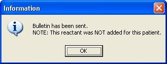

**This message box informs the user that the bulletin has been sent, but no information has been added to the chart**  
Members of your site’s GMRA Request New Reactant mail group will review this message and, if appropriate, add the causative agent to your site’s ALLERGIES file.

**Note:** If your site’s IRM staff has not yet added members to your site’s GMRA Request New Reactant mail group, CPRS displays the following message:

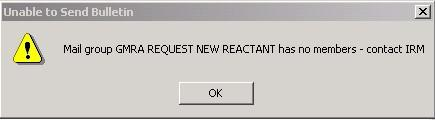

**CPRS displays this message if your IRM staff has not yet added members to the GMRA Request New Reactant mail group**  
1.  **No**: Clicking **No** enables you to try an alternate spelling or trade name for your causative agent, or to type another causative agent.  
1.  **Cancel**: Use this option if you want to cancel your allergy entry.  
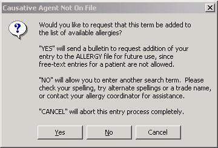

**The Causative Agent Not On File dialog**  
1.  If the causative agent you typed matches an agent that is currently available for your site, select the agent. (Click + to expand a heading.)  
**Note:** With CPRS GUI 24 or later, you may not add free-text causative agents. If you select an item under the “Add new free-text allergy” heading, CPRS displays the *Causative Agent Not On File* dialog. (See Step 6 above.)

1.  Select OK.  
The Enter Allergy or Adverse Reaction dialog appears.

**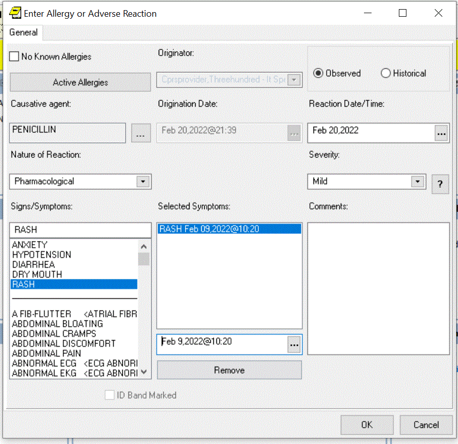**  
**The Enter Allergy or Adverse Reaction dialog**  
**  
Note**: You can view a patient’s current allergies or adverse reactions by selecting the **Active Allergies** button. Also, the user previously could change the Originator, but this is no longer allowed. The originator is the user logged in.

**Note:** If a provider has an NPI, it will display on the screen above. See the "National Provider Identifier (NPI) Display in CPRS" section for an example of an NPI displaying on a screen.

1.  Use the Observed or Historical radio button to indicate whether the entry is for an observed or historical allergy, respectively. (If you point your mouse at either of these option buttons, CPRS displays a hover hint that defines observed and historical.)  
**Note:**  Observed or Historical used to have a default, but the user must now select the appropriate choice. CPRS does not allow you to select future dates for observed allergy/adverse reaction entries.

**Note:** When you select Observed for a drug reaction, CPRS generates a Progress Note. Once this note is signed by the user entering the allergy or by an administrative update user, the note will be viewable by all users.

1.  Select the Nature of Reaction (Allergy, Pharmacological, or Unknown).  
The Nature of Reaction can be Allergy, Pharmacologic, or Unknown. An allergic reaction occurs because the patient is sensitive to a causative agent, regardless of the amount the patient is exposed to. A pharmacologic (nonallergic) reaction occurs when the patient is sensitive to an agent under certain conditions, such as exposure to a large amount. Unknown is provided if you are not sure what Nature of Reaction (mechanism) to enter.

**Note:** Allergies are a subset of adverse reactions. All allergies are adverse reactions, but not all adverse reactions are allergies.

1.  If you are entering an observed allergy, use the Reaction Date/Time and Severity boxes to select a reaction date, time, and severity. (The Severity box is not visible for historical allergies. If the Severity box is visible, CPRS displays a ? button at its side. If you click this button, CPRS displays text explaining severity selections.)  
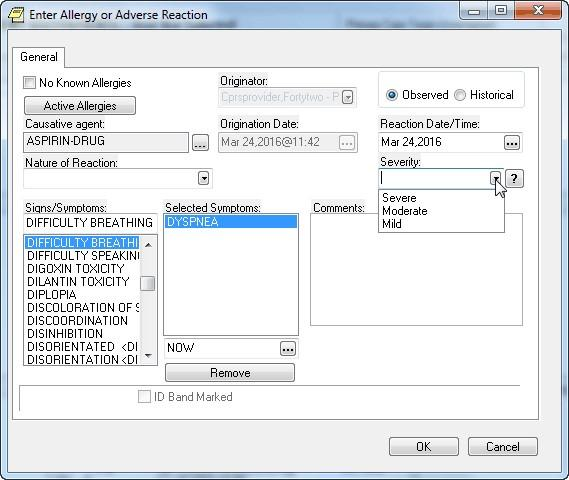

**In the Enter Allergy or Adverse Reaction dialog, the Severity field shows what levels of severity the user can select**  
1.  Using the Signs/Symptoms box, select one or more signs or symptoms. The signs and symptoms you select appear in the Selected Symptoms pane.  
**Note:** You must enter at least one Sign/Symptom or enter a comment of at least four characters when documenting a historical allergy/adverse drug reason. Signs and symptoms must be selected from the Signs/Symptoms list. Users cannot enter free-text entries.

1.  To associate a date and time with a symptom (optional), click to select the symptom in the Selected Symptoms pane.  
1.  Click the Date/Time button located below the Selected Symptoms pane. CPRS displays the Select Date/Time dialog, from which you can select the date and time that the symptom first appeared.  
**Note:** If you mistakenly enter a sign or symptom but have not yet accepted it by selecting OK, select the symptom in the **Selected Symptoms** pane and click the **Remove** button located beneath the pane.

1.  Type comments for the allergy in the Comments box.  
1.  If you have marked the allergy or adverse reaction on the patient’s identification (ID) band (or if you know that someone else has), select the ID Band Marked check box.  
**Note:** CPRS activates the **ID Band Marked** check box only for inpatients and then only if your site’s IRM staff has set a parameter indicating that your site wants to track this information. Depending on whether your IRM staff has set related parameters, if you do *not* select activated **ID Band Marked** check box, the system may send a bulletin notifying a mail group that the patient’s allergy or adverse reaction is not marked on his or her ID band.

1.  Select OK.  
**Note**: When you click OK, CPRS generates an email bulletin to the GMRA MARK CHART mail group. The bulletin provides a reminder that the patient chart must be updated with the allergy/adverse reaction information displayed in the bulletin message.

1.  If the newly entered allergy is related to existing pending and active orders, then the Existing Medication Allergy dialog is displayed for each order discovered, as shown below:  
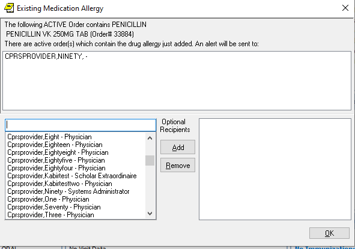

1.  An Existing Medication Allergy will result in the NEW ALLERGY ENTERED/ACTIVE MED notification being sent to the default providers defined in the ORB PROVIDER RECIPIENTS parameter. Those providers who are able to receive the notification are displayed. Note, if a default provider recipient is unable to receive the notification they will not be listed.  
1.  The person entering the new allergy will also be able to select Optional Recipients to receive the NEW ALLERGY ENTERED/ACTIVE MED notification.  
CPRS displays the newly entered causative agent in the **Allergies/Adverse Reactions** pane. If you highlight the causative agent, CPRS displays all of the information you just entered about the associated allergy or adverse reaction. CPRS also displays the letter **A** (for allergies) on the **Postings** button and the word *Allergies* in the **Postings** pane. If you select the word *Allergies* in the **Postings** pane, CPRS displays selected information about all of the patient’s active allergies and adverse reactions, including the allergy or adverse reaction you just entered.

#### Method Two

Take the following steps to enter a new allergy using the second of the two methods mentioned above:

1.  Select a causative agent listed in the Allergies/Adverse Reactions pane. CPRS displays a dialog that includes details about the allergy or adverse reaction associated with the selected causative agent. The dialog also includes four buttons.  
**Note:** If the provider has an NPI, it will not display on the screen below.

**The causative agent dialog contains details about the allergy or adverse reaction associated with the selected causative agent. In addition, it includes four buttons**  
1.  Select the **Add New** button.  
CPRS displays the Allergy Reactant Lookup dialog.  
1.  Follow steps 4 through 18 of the instructions for entering allergies using the first method. CPRS displays the newly entered causative agent in the Allergies/Adverse Reactions pane. If you click on the causative agent, CPRS displays all of the information you just entered about the associated allergy or adverse reaction. CPRS also displays the letter **A** (for allergies) on the Postings button and the word Allergies in the Postings pane. If you click the word Allergies in the Postings pane, CPRS displays selected information about all of the patient’s allergies or adverse reactions, including the allergy or adverse reaction you just entered.  
#### Method Three

A user can do an allergy assessment when discontinuing a medication order:

1.  Click on either the Meds or Orders tab.  
1.  Right-click on a medication order and then, select Discontinue Order on the dropdown. If a visit location hasn’t been selected, the Location for Current Activities screen will appear, and you will need to select a Visit Location and Date/Time of Visit.  
1.  On the Discontinue Order screen, select Allergy/Adverse Drug Reaction on the Reason for Discontinue list, and then, click **OK**.  
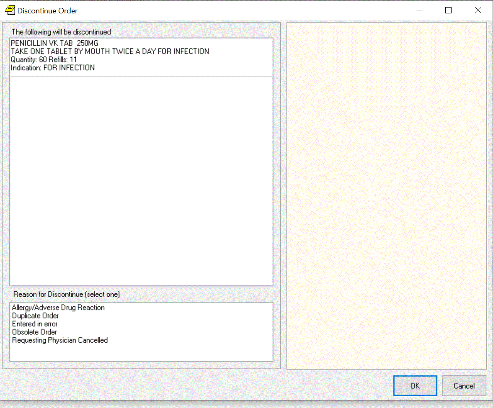

**Example of the Discontinue Order screen**  
1.  On the List of allergies currently recorded for the patient screen, click on the Yes button.  
**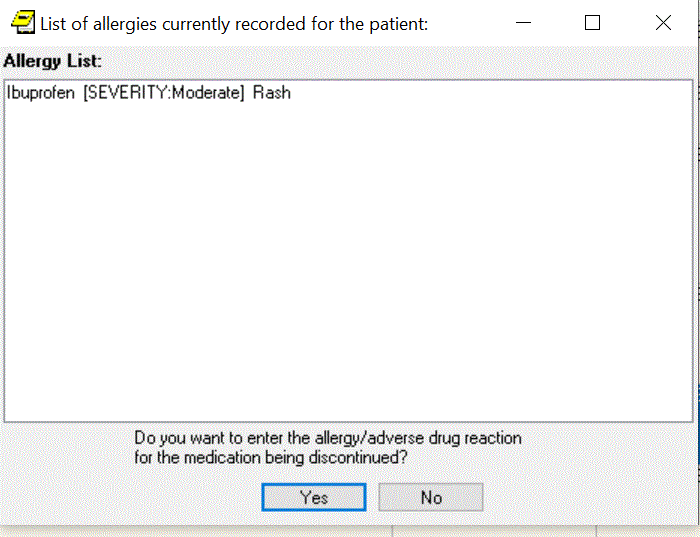  
Example of the List of allergies currently recorded for the patient screen**  
1.  Do an allergy assessment by following steps 4 through 21 in Method One.  
### Entering No-Known-Allergies Assessments from the Cover Sheet

You can enter no-known-allergies (NKA) assessments for patients who have no active allergies by taking the following steps:

1.  Right-click within the **Allergies/Adverse Reactions** pane.  
1.  From this menu, select Mark patient as having No Known Allergies (NKA).  
CPRS displays the No Known Allergies dialog.

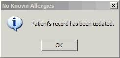

**The No Known Allergies dialog**  
**Note:** CPRS activates **The Mark patient as having No Known Allergies (NKA)** menu selection only for patients who have no active allergies.

When patients have active allergies, CPRS deactivates this selection.

1.  Select **OK**.  
### Marking Allergies as Entered in Error

CPRS offers two methods for marking allergies as having been entered in error. To mark an allergy as entered in error, the user must have the parameter OR ALLERGY ENTERED IN ERROR appropriately set.

#### Method One

Take the following steps to use the first method:

1.  In the Allergies/Adverse Reactions pane, place your mouse pointer over an erroneously entered causative agent and right-click to display a menu.  
1.  From this menu, select Mark selected allergy as entered in error.  
CPRS displays the Mark Allergy/Adverse Reaction Entered In Error dialog.

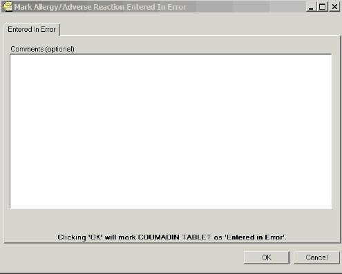

**The Mark Allergy/Adverse Reaction Entered in Error dialog**  
1.  If your site has enabled the Comments feature, you may (optionally) type comments in the Comments (optional) text box.  
**Note:** If your site has not enabled the *Comments* feature, CPRS disables the dialog, which in this case is named Comments (disabled).

1.  Select OK. CPRS displays an Are you Sure? dialog.  
1.  If you are sure the causative agent was entered in error, click Yes. CPRS removes the causative agent from the Allergies/Adverse Reactions pane and from the list of allergies it displays when you click Allergies in the Postings pane.  
**Note:** CPRS also generates a Progress Note when an allergy is marked entered in error. When this note is signed by the user who marked the allergy as entered in error or by an administrative update user, the note will be viewable by all CPRS users.

#### Method Two

Take the following steps to use the second method:

1.  Click a causative agent (or highlight using the Tab and arrow keys and press \<Enter\>) that appears in the Allergies/Adverse Reactions pane.  
CPRS displays a dialog that contains detailed information about the allergy or adverse reaction. This dialog includes four buttons.

1.  Select the Entered in Error button.  
CPRS displays the Mark Allergy/Adverse Reaction Entered In Error dialog.

1.  If your site has enabled the Comments feature, you may (optionally) type comments in the Comments (optional) dialog.  
1.  Select OK.  
CPRS displays an **Are you Sure?** dialog.

1.  If you are sure the causative agent was entered in error, select Yes.  
CPRS removes the causative agent from the **Allergies/Adverse Reactions** pane and from the list of allergies it displays when you select *Allergies* in the **Postings** pane.

**Note:** CPRS also generates a Progress Note when an allergy is marked entered in error. When this note is signed by the user who marked the allergy as entered in error or by an administrative update user, the note will be viewable by all CPRS users.

## Reviewing and Creating Postings

Postings contain critical patient-related information about which hospital staffs need to be aware. The **Postings** button is visible on all tabs of the CPRS GUI window and is always located in the upper right corner of the window.

To view a posting using the Postings (CWAD) button, use these steps:

1.  Select the Postings button (available from any tab) to display the Patient Postings dialog.  
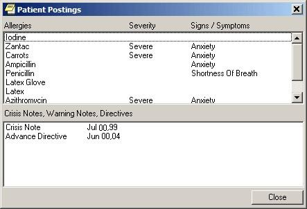

**The Patient Postings dialog**  
1.  From the Patient Postings dialog, select the posting in which you are interested and view the details.  
1.  When finished, select Close.  
**To view the posting from the Cover Sheet, use the following steps:**

1.  On the Cover Sheet tab, click on a specific posting that appears in the Postings pane to display the details.  
1.  When finished, click Close.  
### Creating Postings

You create the following types of postings by creating progress notes using note titles that your site’s IRM staff has configured for this purpose. (Check with your site’s IRM staff if you don’t know which note titles create which types of postings.)

-   Clinical Warning (which is the same as Warning)  
-   Crisis Note  
-   Directive  
-   Warning  
-   Pregnant  
-   Lactating  
For example, to create a posting for a crisis note, take the following steps:

1.  Select the Notes tab.  
1.  Select New Note. CPRS displays the Progress Note Properties dialog.  
1.  In the Progress Note Title pane, select CRISIS NOTE.  
1.  In the Date/Time of Note field, select a date.  
1.  In the Author field, select an author.  
1.  Click OK.  
1.  From the main menu, select File \| Refresh Patient Information. CPRS displays the letter C (for crisis note) on the Postings button and, in the Postings pane on the Cover Sheet Tab, displays the title Crisis Note and the date you selected for the note.  
**Allergy:** To create a posting for an allergy or adverse reaction, enter the allergy from either the **Cover Sheet** tab or the **Orders** tab. (See “Entering Allergies” in the “Assessing,

Entering, and Reviewing Allergies/Adverse Reactions” section of this manual or “Entering Allergies from the Orders Tab” in the “Orders” section of this manual, respectively.)

**Note:** Although you may be able to enter progress notes for allergies and adverse reactions, doing so does not create an *Allergies* postings. As mentioned above, you can create *Allergies* postings only by entering allergies via the Cover Sheet or Orders tab. Furthermore, CPRS cannot perform order checks on allergies you document via progress notes.

Lactation and Pregnancy: These can be entered in several locations, including from the Women’s Health pane of the Cover Sheet if it in configured to display there. If the pane displays, the user can right-click to display a context menu and then select the Add Data menu item.

# Problems Tab

The problems list on the Problems tab displays a patient’s current and historical health care problems entered by clinicians. The problems list allows each identified problem to be traced through the VISTA system.

## Service-Connected Conditions

If a problem is service connected, the problem’s service-connected status is displayed in parentheses in the Description column.

Service-Connected Condition Abbreviations

-   SC – Service-Connected Condition  
-   AO - Agent Orange Exposure  
-   IR - Ionizing Radiation Exposure  
-   SWAC - Southwest Asia Conditions  
-   SHD – Shipboard Hazard and Defense  
-   MST - Military Sexual Trauma  
-   HNC – Head or Neck Cancer  
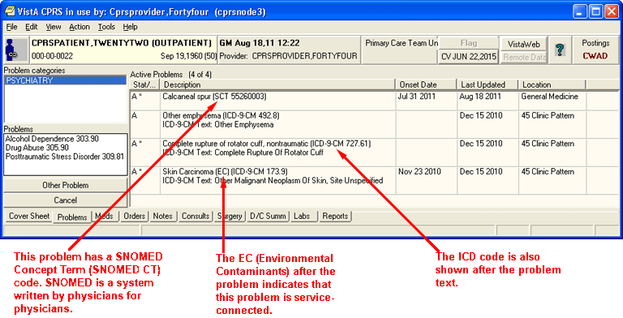  
**The problems list on the Problems tab can be configured to show active, inactive, both active and inactive combined, or removed problems. Treatment factors, SNOMED CT codes, and ICD codes display right after the problem text**  
***

## Coding Systems Used to Represent Problems

Problems in CPRS are represented using two systems: Systematized Nomenclature of Medicine Clinical Terms (SNOMED CT) codes and International Classification of Diseases, Tenth Revision, Clinical Modification (ICD-10-CM) codes. SNOMED CT terminology is the designated national standard for Problem List for clinically expressing problems and to support interoperability and data exchange within VA, DoD, and external partners. ICD-10-CM codes are primarily used for reimbursement purposes. Previously, only ICD codes were used to define problems. SNOMED CT should help providers better define problems, while also mapping to ICD codes in the background.

Depending on the method for documenting a problem, the problem represented in SNOMED CT may or may not be linked to an ICD-10-CM code(s). If the user selects a problem from the National Problem Selection List, the problem will be linked to ICD-10-CM code(s). If the user selects a problem from within the Lexicon Utility, the problem will be linked to an R69 code (an unspecified problem).

### Using Problems for Encounter Information

The Problem List application passes all patients’ problems to the Encounter Form. These problems can be viewed under the Problem List Item section of the Diagnosis tab and may be utilized for Encounter check out. However, if the problem is linked to an inactive code or represented in ICD-9-CM, the system requires the user to update the problem. Updates may require the user to link the problem to an active SNOMED CT or ICD-10-CM code.

## Customizing the Problems List

You can control which problems appear on the problems list by defining specific criteria. For example, you can specify that only inactive problems associated with a specific clinic appear on the problems list.

**To control which problems appear on the problems list, follow these steps:**

1.  From the Problems tab, click any of the options listed in the View options field (Active, Inactive, Both active and inactive, or Removed)  
\-or-

select View \| Active Problems, View \| Inactive Problems, View \| Both Active/Inactive Problems, or View \| Removed Problems.

The appropriate problems will appear on the problems list.

If you would like to filter the problems list further, continue with step 2.

1.  Select View \| Filters….  
The Problem List View Filters dialog appears.

1.  Select the criteria for the problems that you want to display on the problems list by doing some or all of the following:  
1.  Select either Outpatient or Inpatient from the Primary View option group.  
1.  Select a status from the Status drop-down list.  
1.  Move the appropriate source services or source clinics to the Selected Service(s) or Selected Clinic(s) field by clicking the **\>** button.  
1.  Choose a provider from the Selected Provider drop-down list.  
**Note:** If the provider has an NPI, it will display on the screen below. See the "National Provider Identifier (NPI) Display in CPRS" section for an example of an NPI displaying on a screen.

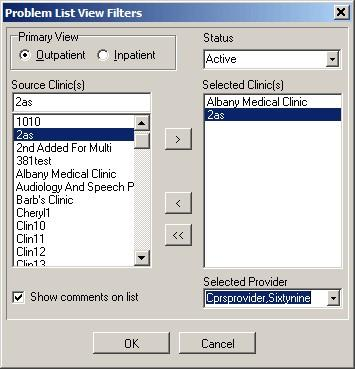

**You can use the Problem List View Filters dialog to select the criteria for the problems that you want to display on the Problems tab**  
1.  Select OK.  
## Adding a New Problem

The Problems tab now uses Systematized Nomenclature of Medicine—Clinical Terms (SNOMED CT) for documenting problems on the patient’s problem list.

**Note:**  Remember that the diagnosis on the Encounter form can be added to the Problems tab by simply selecting the checkbox to put it there.

With the Lexicon search, the initial search contains frequently used problems within the VA and new problems are added each Lexicon Quarterly release. The Extended Search represents a larger subset of SNOMED CT containing all the terms from the Clinical Findings, Events, and Situation with Explicit Context hierarchies. Currently, all terms are linked to a placeholder ICD-10-CM code of R69 and may be updated through the Encounter Form workflow.

To speed up documentation in Problem List and to avoid the dual entry in the Encounter Form application, enhancements were completed to enable the use of the VA-National Problem Selection List or a VISN, or local problem selection list. Sites can use the National Problem Selection List that has curated Problem Categories with problems represented in SNOMED CT that are linked to ICD-10-CM code(s). In addition, sites can create Local Problem Selection Lists. Users or clinics who want to create their own Local Problem Selection List will need to request this from a Clinical Application Coordinator (CAC) and will be responsible for maintaining these Local lists.

It is highly recommended that sites use the National Problem Selection List because it will be nationally maintained. The National Problem Selection List will display by default unless the user or clinic already has a Problem Selection List defined. The Problem Selection List is displayed in the left pane of the Add a New Problem dialog.

**To add a new problem to a patient’s problem list, use these steps:**

1.  Select the Problems tab.  
1.  Select the **New Problem**  
\-or-

select Action \| New Problem…

**Note:** If encounter information has not been entered, the encounter information dialog will appear before the Problem List Lexicon Search dialog. You must complete the encounter information dialog before proceeding.

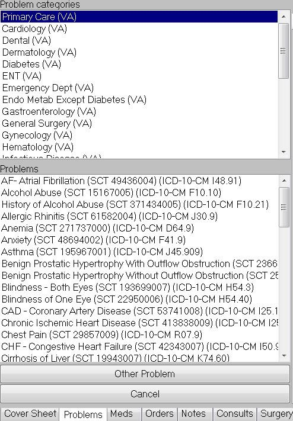

**If sites have not assigned a different problem selection list to a user or clinic, the VA National Problem List Selection list will display as shown above. The top pane shows the problem categories. Selecting a category will display the problems in that category in the pane below**  
1.  If the user is set up to use the National Problem Selection List the National Problem Categories with the associated problem are displayed based on the category. If the problem is not found within the category, skip to step 4 by selecting Other Problem to bring up the Problem List Lexicon Search dialog.  
The Problem List Lexicon Search dialog enables users to search for the term that best describes the patient’s problem. SNOMED codes are used to define the problems.

1.  Enter part or all of a term that describes the problem in the Enter Term to Search field and press \<Enter\> or select **Search**.  
**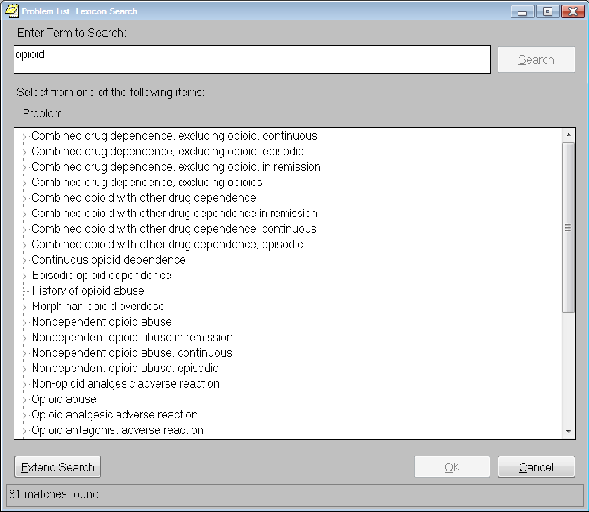**  
**CPRS will search the lexicon for problems that contain the search term. The matching problems will appear in the bottom portion of the Problem List Lexicon Search dialog. The search now looks for SNOMED Clinical Terms (SNOMED CT). There is also a parameter to hide the codes if sites so choose**  
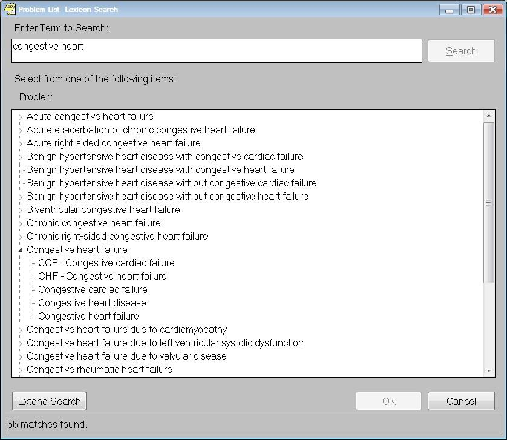

1.  Select the appropriate term if it is in the list. If you do not see the appropriate problem listed, select the **Extend Search** button.  
On the Problems tab, the Extend Search button extends the search to a larger subset of SNOMED CT.

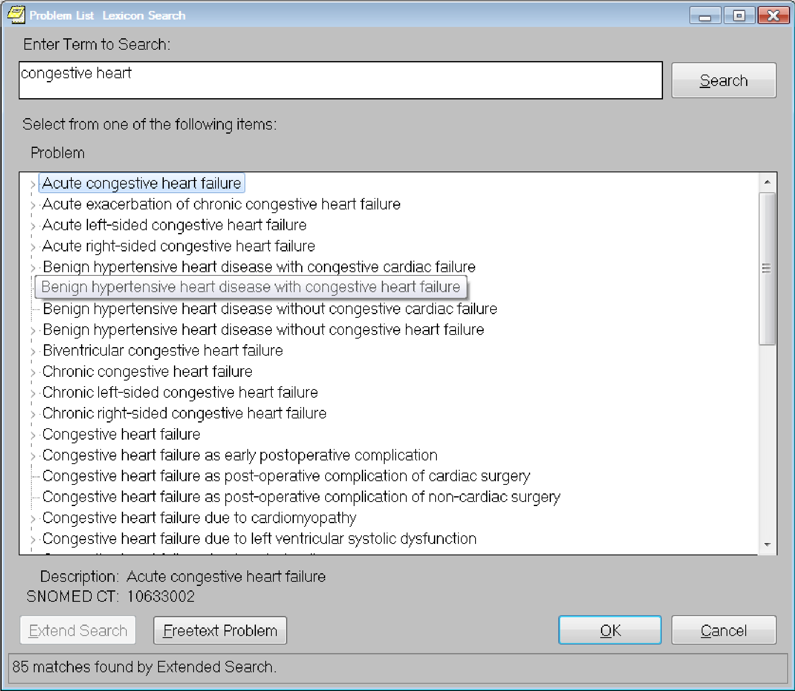

**When the search is extended by the user, more matching results are returned that are linked to the ICD-10-CM R69. If the user still does not find the desired term, the user may choose to enter a free text entry by selecting the Freetext Problem button**  
1.  If the user does not find the desired term using the Extend Search they may choose to enter a free text entry, the user may choose to do the following actions  
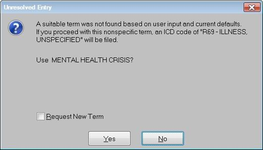

To refine your search, select No and return to step 4. To use this term, select Yes and go to step 7.

o **Terms Found But Not Adequate:** If the extended search displays terms, but not the one you want, you will need to decide whether to enter a free-text term or revise your search.

To begin the search again using another term, return to step 4 and use another term to identify the problem.

To enter a free-text term, select the Freetext Term button. The Unresolved Entry dialog will display as shown below:

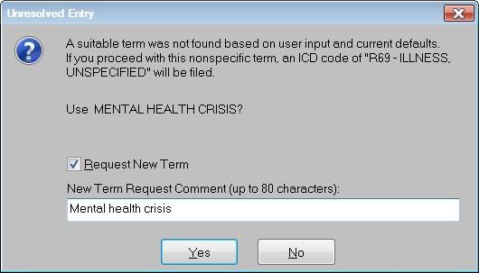

**This dialog shows when the system does not find any terms that match the text entered by the provider or when the provider selects the Freetext button because an adequate term is not displayed. From the Unresolved Entry dialog, the provider can choose to use the term as entered, and if needed, request that it be added as a new term**  
To use this term, you first need to decide if you want to request that the term you entered be added as a new term. To request a new term, you need to check the Request New Term check box and add a comment if needed. If not, leave the check box unchecked. Then, to add this term to the Problem List as entered, select Yes and go to step 10.

**Note:** If you request a new term, a bulletin is sent to a local group for review. This group will then forward the request if it concurs that a new term is needed.

o **No Terms Found:** If the extended search finds no terms, the Unresolved Entry dialog will display as shown below. To try another search, select No and return to step 4.

The New Problem form will appear.

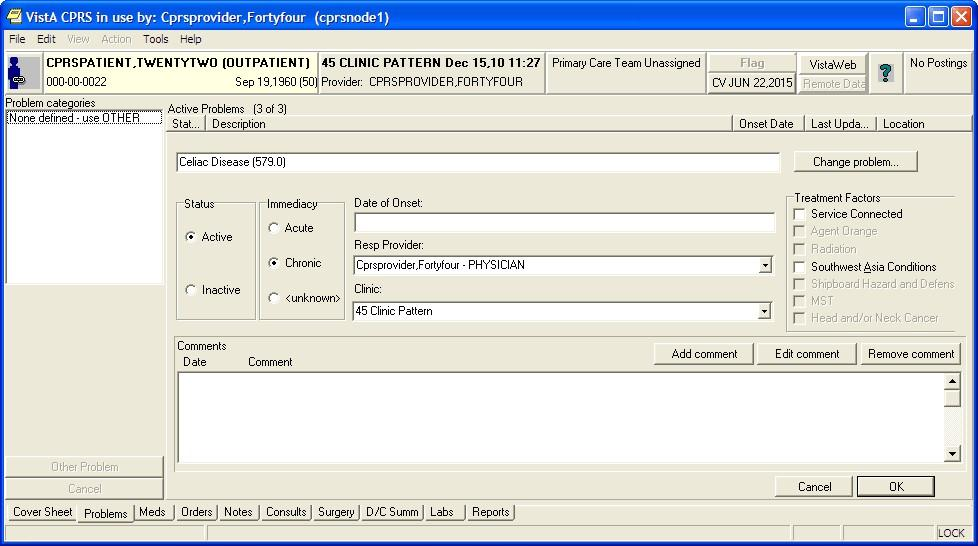

**The New Problem form**  
1.  Complete the New Problem form by following the steps below:  
1.  Select a status for the problem (Active or Inactive).  
1.  Choose an Immediacy for the problem (Acute, Chronic, or unknown).  
1.  Enter the date of onset.  
1.  Select a responsible provider from the drop-down list.  
1.  Select a clinic from the drop-down list.  
1.  Check any applicable treatment factors that apply to this problem.  
1.  Enter any comments (if necessary) by pressing the **Add comment** button. You can also edit a comment or remove the comment using the appropriate buttons.  
1.  Select **OK**.  
## 

## Annotating a Problem

To annotate a problem, use these steps:

1.  Select the Problems tab.  
1.  Select a problem from the problems list.  
1.  Select Action \| Annotate... or right-click the problem and select Annotate... from the pop-up menu.  
**Note:** If you try to select a problem that has an inactive diagnosis or procedure code, you will be prompted to select a problem with an active code.

1.  Enter your annotation in the dialog that appears (up to 60 characters).  
1.  Select OK.  
## Changing a Problem

To change a problem on a patient’s problem list, use these steps:

1.  Select the Problems tab.  
1.  Select a problem from the problems list.  
1.  Select Action \| Change….  
1.  Enter the desired changes.  
1.  Add or remove a comment (if desired).  
**Note**: A comment can be as many as 60 characters (including spaces) in length.

1.  Select OK.  
**Note:** When you view the details of a problem, you will see who changed the problem and when.

## Making a Problem Inactive

To inactivate a problem on a patient’s problem list, use the following steps:

1.  Select the Problems tab  
1.  Select a problem from the problems list.  
1.  Select Action \| Inactivate -or- right-click a problem and select inactive.  
## Removing a Problem

To remove a problem from a patient’s problem list, use these steps:

1.  Select the Problems tab.  
1.  Select a problem from the problems list.  
1.  Select Action \| Remove or right-click the problem and click Remove.  
**Note:** Deleted problems are not actually removed from the database. Rather, a deleted problem is flagged with a hidden tag. The hidden tag prevents the problem from appearing on any reports or lists.

## Verifying a Problem

To verify a problem on a patient’s problem list, use these steps:

1.  Select the Problems tab.  
1.  Select a problem from the problems list.  
1.  Select Action \| Verify or right-click the problem and click Verify on the pop up menu.  
**Note:** If you try to select a problem that has an inactive diagnosis or procedure code, you will be prompted to select a problem with an active code.

# Meds

The Meds tab contains a list of medications for the selected patient. Inpatient, outpatient, and Non-VA (including non-prescription and herbal) medications are listed in separate sections of the window.

When you select the Meds tab, you see a list of medications that have been ordered for this patient. If you would like to view additional information about a specific medication, double click the medication entry or select a medication and choose **View \| Details**.

**Note:**  You can also review or add medication orders from the Orders tab. Also, if a medication is preceded by an asterisk (\*), the asterisk indicates that the order was changed as a service correction.

The Meds tab shows three different sections: Inpatient Medications, Non-VA Medications (Documentation), and Outpatient Medications as shown below. Directly below the Patient Inquiry button, CPRS displays the sort method for the Meds tab--in this case, “Sort by Status/Exp. Date (first on Inpt)”. CPRS will display the date range for the medications viewed under each section (Inpatient Medications, Non-VA Medications, and Outpatient Medications). Users should always check these lines.

**The Meds tab**  
## Medication Details

If you would like to view additional information about a medication, double click the medication entry or select a medication and choose **View \| Details**.

## Medication Administration History

You can view the administration history for a medication in three ways:

-   Double-click a medication. The administration history will be listed at the bottom of the details screen.  
-   Select a medication and then select **View \| Administration History**.  
-   Select a medication and then right-click. Choose **Administration History** from the pop-up menu.  
## Other Medication Actions (popup menu)

To take other actions, such as ordering a new medication, changing a medication order, or changing a medication order status (discontinue, hold, or renew), you use the Action menu or right-click a medication to display a popup menu. You can also place orders for new medications from the Orders tab.

**Note:** When a user takes actions on an order, such as renewing, changing, or discontinuing it, an infrequent error sometimes occurs where the order number in CPRS and the order in Pharmacy do not match. In this case, CPRS displays a warning that there is an “invalid pharmacy order number” and instructing the user to contact someone in the Pharmacy service to complete the action.

Using the right-click or popup menu on the Meds tab, if the user selects several items and the right-clicks either on the items or elsewhere in the list, CPRS displays a popup menu. When the user selects an action from the popup menu, the action applies to all selected items. For example, if the user selects three inpatient medication orders and selects Discontinue, the dialog appears with those three orders listed for discontinuation.

However, if no items are selected (highlighted in blue) and the user right-clicks on an item, it is selected and the popup menu appears. In addition, CPRS treats each section, Inpatient, Non-VA meds, and Outpatient, as a unique area so that if the user has an item selected in, for example, Outpatient, and then right-clicks on an inpatient medication, the outpatient selected will be deselected and the inpatient item will be selected and the popup menu displays.

The popup menu includes the following items:

-   Details…  
-   Administration History…  
-   Change…  
-   Discontinue…  
-   Refill…  
-   Renew…  
-   New Medication…  
## Indications

The Computerized Patient Record System (CPRS) enables providers placing medication or prescription orders to enter an indication for use. For example, the indication for Coumadin might be blood thinning.

Indication is now a required field for medication orders in CPRS. It is not a required field for Non-VA documentation nor Supply orders. An indication identifies the main reason that the medication is being given. The Indication entered can also be included on the medication label if the pharmacist elects to put it there.

CPRS works with the Pharmacy package to enable set up of indications in Pharmacy that will then display in CPRS for a provider to select when ordering. The set up enables sites to designate a primary and secondary indications.

### New Field on Medication Order Dialogs

Once indications have been set up, the primary indication and secondary indications will display in a drop-down box on appropriate CPRS order dialogs. When the provider places an order or takes an action, such as transferring, the provider can select one indication for the order. The primary indication as shown, displays first, then there is a separator line, and then the secondary indications display below the line and are sorted in alphabetical order. The provider can also type in an Indication if they so choose.

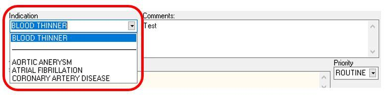

CPRS dialogs that have the Indication field include the following:

-   Inpatient Medications  
-   Outpatient Medications  
-   Clinic Medications  
-   Clinic Infusions  
-   Non-VA Documentation (not a required field)  
-   Supply Items (not a required field)  
-     
### Indications on Order Details

Once the order has been placed, the indication will show on the Order Details.

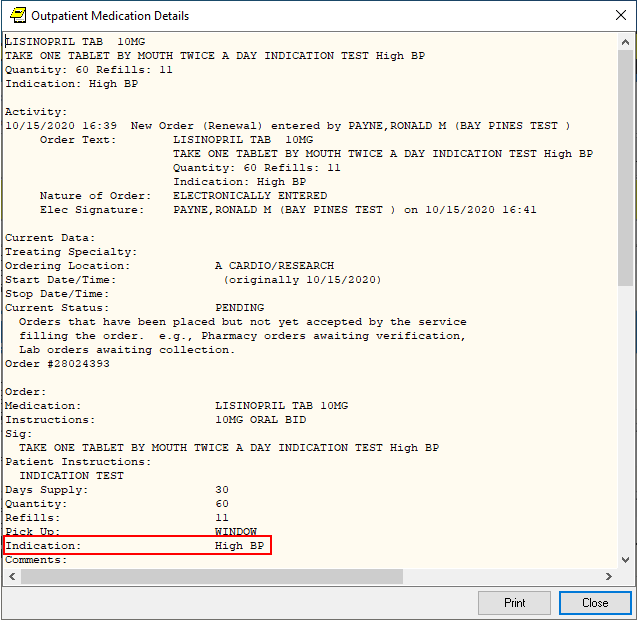

### Indication Displays on Reports where SIG Is Displayed

The Indication displays on reports where the SIG is displayed. There is an example below.

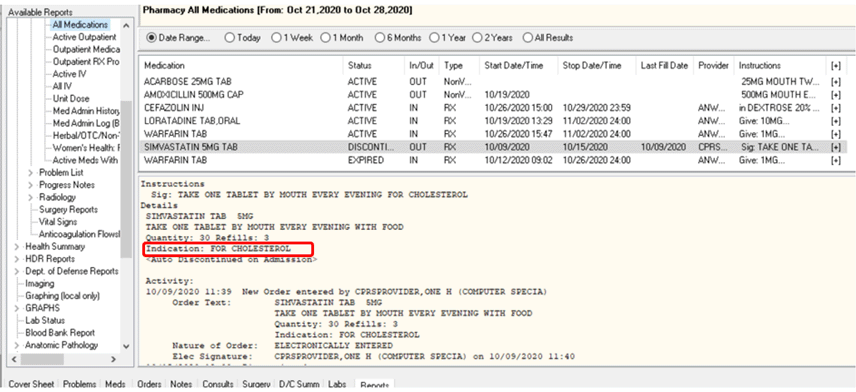

## Order Checks

Order Checking is based on a system of rules that reviews orders to see if they meet defined criteria. If they meet the criteria, an electronic message is sent to the ordering provider to alert the provider to a potential problem (such as creatinine clearance, polypharmacy, duplicate order, drug-lab interaction, etc.). The provider can then choose to cancel the order or override the order check and place the order.

The Order Checking system gives users and clinical application coordinators (CACs) some flexibility to determine which order checks and notifications are sent and whether the provider must enter a reason to override the order check. To accomplish this, CPRS includes several prepackaged order checks as well as three menus for setting Order Checking parameters such as enabling and disabling specific order checks. Order Checks can also be configured to be mandatory by the Clinical Coordinator or IRM. If this feature is enabled, users cannot indicate that they do not want to receive individual order checks. Non-mandatory order checks can be enabled or disabled through the *Tools \| Options* menu.

CPRS calls for order checks on all orders. CPRS calls for order checks at the following times:

-   When the user opens the order dialog by selecting an item from the Write Orders pane or from an order menu  
-   In the order dialog when the user selects Accept Order  
-   When the user selects a sign action—before the user signs  
CPRS uses three kinds of order checks: site-defined Clinical Reminder order checks, nationally released local orders checks, and remote orders checks between sites.

### Site-Defined Clinical Reminder Order Checks

CPRS enables sites to create their own order checks based on the Clinical Reminders features. Sites will define a group of orderable items for which certain rules apply. If the rules apply to the situation, the site can define text that will display in the order check window. Sites can also set the order check to require an override.

#### Setting Up Clinical Reminder Order Checks

Clinical Reminder order checks are defined at the site by those who normally work on the Clinical Reminders package. The set-up of a Clinical Reminders Order Check consists of two parts:

-   Creating a group of orderable items to which the rules should apply.  
-   Creating the rules that will be applied to the orderable item when accepting an order in CPRS. It will be possible to have the same orderable item in multiple groups. Each rule assigned to the different groups will be evaluated when placing the orderable item in CPRS. The order check groups and the rule will be stored in the Reminder Order Check file.  
Rules can either be defined to run against a reminder term or a reminder definition. A reminder term is beneficial when the request is to evaluate the presence of specific data (See Example \#1). A reminder definition is beneficial if you need the full functionality of a reminder definition to determine if the rule should show in the order check form (See Example \#2). The user setting up the Clinical Reminder order check can define only one or the other.

**Note:**  Sites should evaluate all requests to create a Clinical Reminder Order Check to determine the importance of adding it. The more reminders that are used in an order check, the more they could affect the performance of the order check system.

**Example \#1**

Problem: An order check is needed for the interaction between timolol ophthalmic (used to treat glaucoma) and over-the-counter (OTC) antihistamines (which should not be used in the rarer narrow angle glaucoma).

Setup:

1.  Create a reminder term that looks for the presence of a diagnosis of narrow angle glaucoma. (May need to look at multiple files depending on your site practice)  
1.  Create an Orderable Item Group that contains all orderable items for any OTC Antihistamines.  
1.  Create a Rule that contains the term created in step 1.  
1.  Set the rule to trigger the order check if the reminder term is evaluated at True.  
1.  Create the text that should appear in the order check window.  
Example of the Output in CPRS

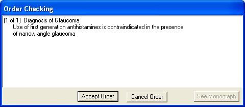

**This is an example of a Clinical Reminders order check**  
Description of solution: A reminder term was used in the setup because the presence of Glaucoma was all that is needed to determine if the rule should trigger an order check. In the screen shot above, the text "Diagnosis of Glaucoma" was defined in the Display Name field. The rest of the text was defined in the Order Check Text field.

**Example \#2**

Problem: Order Check is needed when ordering Glyburide for patients age 65 or greater and serum Cr 2.0 or greater.

Setup:

1.  Create a reminder definition that is applicable to the patient if the patient age is 65 or greater and the patient has a CR serum 2.0 or greater.  
1.  Create an Orderable Item Group that contains all orderable items for the Glyburide.  
1.  Create a Rule that contains the definition created in step 1.  
1.  Set the rule to trigger the order check if the reminder definition is applicable to the patient.  
1.  Create the text that should appear in the order check window. Set the order text to display the finding output in the order check text.  
Example of the output in CPRS

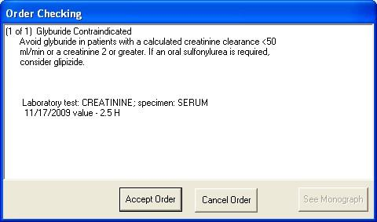

**This is an example of a Clinical Reminders order checks that uses a rule and contains part of the definition**  
Description of solution: We needed a reminder definition to match patients older than 64 who had a lab test with the results greater than 2. In this example we set the rule up to display both the order check text and the definition evaluation text. The text “Glyburide Contraindicated” is the display name. The text “Avoid glyburide in patients with a calculated creatinine clearance \< 50 ml/min or a creating 2 or greater. If an oral sulfonylurea is required, consider glipizide,” is defined by the site. The rest of the text is returned from the reminder definition evaluation.

#### Enabling Users to See the Reminders Order Checks

Clinical Reminder Order checks are defined with a testing field. If the order check is being tested, the Clinical Application Coordinator (CAC) or similar person sets this field in the Clinical Reminders order check definition to True. Then, only users who have the Clinical Reminder Test order check set to Yes will receive the order check—allowing a small number of users to test the order check before it is enabled for all users in the facility.

### Local Order Checks

These nationally released order checks are available on a local CPRS system:

-   Allergy-Contrast Media Interaction  
-   Allergy-Drug Interaction  
-   Aminoglycoside Ordered  
-   Biochem Abnormality For Contrast Media  
-   Clinical Reminder Live  
-   Clinical Reminder Test  
-   Clozapine Appropriateness  
-   Critical Drug Interaction  
-   CT & MRI Physical Limitations  
-   Dangerous Meds For Pt \> 64  
-   Dispense Drug Not Selected  
-   Drug Dosage  
-   Duplicate Drug  
-   Duplicate Drug Class Order  
-   Duplicate Opioid Medications  
-   Duplicate Order  
-   Error Message  
-   Estimated Creatinine Clearance  
-   Glucophage-Contrast Media  
-   Glucophage-Lab Results  
-   Lab Order Freq Restrictions  
-   Missing Lab Tests For Angiogram Procedure  
-   No Allergy Assessment  
-   Order Checking Not Available  
-   Polypharmacy  
-   Recent Barium Study  
-   Recent Oral Cholecystogram  
-   Renal Functions Over Age 65  
-   Significant Drug Interaction  
Several parameters that each site controls determine how these order checks behave.

#### Order Check on Acceptance Dialog

For medication orders, if a possible problem is found, CPRS displays the order check window, such as seen below when the user selects Accept:

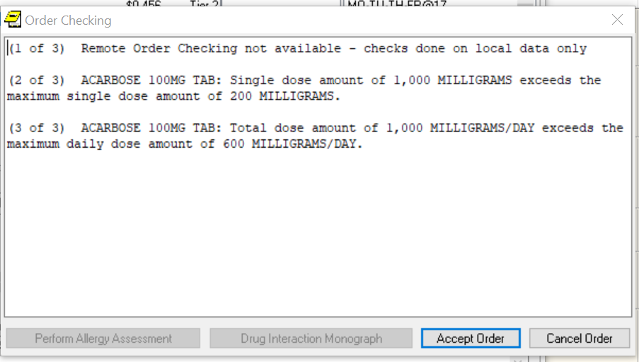

**When accepting a medication order, order checks are performed to identify potential problems**  
The Order Checking dialog separates each order check text, which is numbered using the “1 of 2, 2 of 2” type of format. If an allergy assessment has been done, the Perform Allergy Assessment button will be inactive.

#### Order Checks Dialog on Signature Actions

If the clinician chooses to sign the order, CPRS displays the following dialog:   
  
  
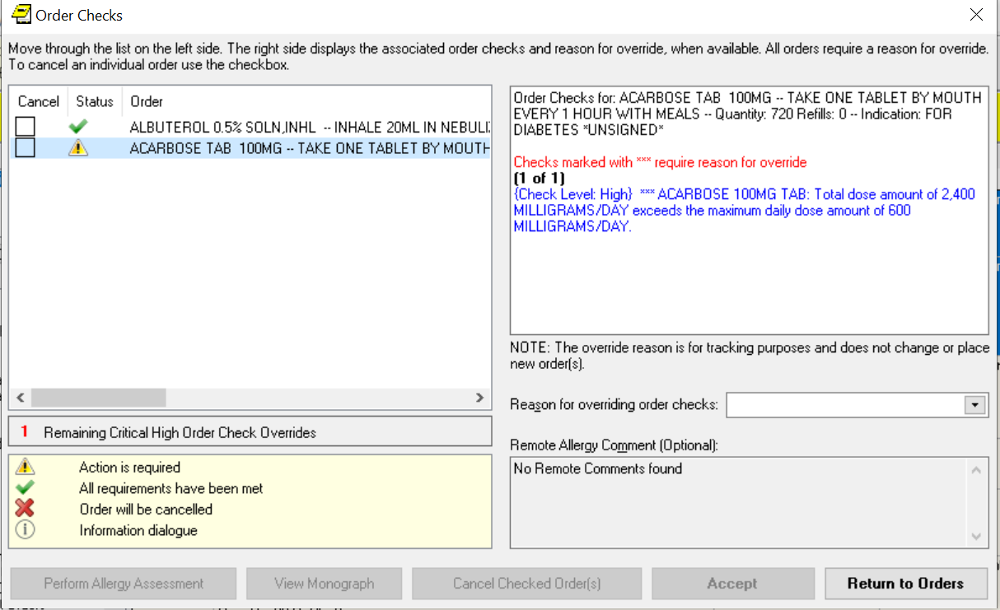

**In this screen capture, CPRS displays conflicts between ordered medications. Users should review each item carefully before completing the order. If an order check is larger than the cell’s available space, the user can either hover with the mouse to the get the full text, use the arrow keys to highlight the order check if using the keyboard or use an accessibility product for the visually challenged. Some order checks require an override reason. These order checks are designated by the “\*Checks marked with \*\*\*\* require reason for override” text in red and the order check text in blue.  
**  
This dialog displays each medication or other item that had an order check in a separate section. Each item will have a check box allowing the user to check any orders that should be canceled at this point. Under the order text, the order checks are displayed, the most serious order checks are listed first. Those with High Clinical Danger Level items are displayed first, labeled as high danger, and are displayed with blue text. To accept these orders, the clinician must enter an override reason to justify accepting the order.

Whether the order check requires the clinician to enter a justification depends of how each site has set the Clinical Danger Level for each order check. For example, the Pharmacy package determines if an interaction is critical or significant. Each site then determines whether the provider must enter a reason for override by setting a Clinical Danger Level in CPRS for the Critical Drug Interaction and Significant Drug Interaction order checks.

Another example would be allergy assessments. If the site has set the No Allergy Assessment order check Clinical Danger Level to High and the patient does not have an allergy assessment, then the order will require a justification for override. If the site has set the Clinical Danger Level to Moderate, no reason is required.

When a user enters a high clinical danger level override reason, the reason for override is sent with the orders to ancillary packages so that the information is available to their users.

The dialog also has a View Monograph button. Selecting the View Monograph button will send the user to a monograph about the drug or drug class to help the provider with additional information. If there is more than one kind of drug, the Monographs for Order Checks dialog will display a dropdown list with the choices for the various kinds of medications.

### Remote Order Checks

In addition, with the Remote Data Interoperability (RDI) project, it is now possible to perform a limited number of order checks against remote outpatient pharmacy and allergy information from other Veterans Health Administration (VHA) facilities that is stored in the Health Data Repository (HDR). Another project, the Clinical Health Data Repository (CHDR) will enable remote order checks against allergies and outpatient medication data from Department of Defense (DoD) facility data that is stored in the HDR. The CHDR data only relates to active dual consumers (patients that are seen at both VHA and DoD facilities).

For the selected patient, RDI requests from the HDR all outpatient pharmacy data with an expiration or discontinued date starting 30 days in the past and going forward, including into the future.

**What Remote Order Checks Are Available?**

With RDI and CHDR, the following order checks occur:

-   Allergy Contrast Media Interaction  
-   Allergy-Drug Interaction  
-   Critical Drug Interaction  
-   Duplicate Drug Class Order  
-   Duplicate Drug Order  
-   Significant Drug Interaction  
**Which Items Are NOT Used in Remote Order Checks?**

Some items are not used in remote order checking because they are not stored in the HDR. Others have a high annoyance factor and therefore were not included at the request of field sites. The following items are not included in remote order checks:

-   Inpatient Medications  
-   Non-VA Meds  
-   Supply items  
-   Local drugs that are not matched to the National Drug File  
**Note:** The HDR-Hx and HDR-IMS contain prescriptions with drugs that are not matched to the National Drug File (NDF). This prescription data should be used in remote order checking for duplicate drug classes. Because the National Drug File is updated regularly, these missing order checks could be resolved whenever the NDF is updated. Some drugs may never be matched, especially drugs used in research.

#### Will the Display Change?

With RDI, if there is a problem with an order check, CPRS displays the information to the user potentially in two separate dialogs. The first dialog displays the allergy order checks:

-   It displays the facility name where the allergy was recorded, the reactant, signs, severity, and symptoms.  
-   For remote allergies, the user is required to give a reason for overriding order checks. The user is also able to write a local comment on a remote facility allergy.  
-   Allergies are sorted by clinical danger level:  
-   In cases where allergy severity and symptoms are identical in one or more order checks, a single consolidated order check will display. The sort order hierarchy is:  
-   First by Severity (Highest to Lowest).  
-   Second by Causative Agent.  
-   Last by Local and Remote locations.  
The second dialog displays the following information:

-   Medication orders include the last refill date and the quantity.  
-   Remote medication order checks display the facility name where the medication was prescribed. Local medication order checks do not display the facility name.  
**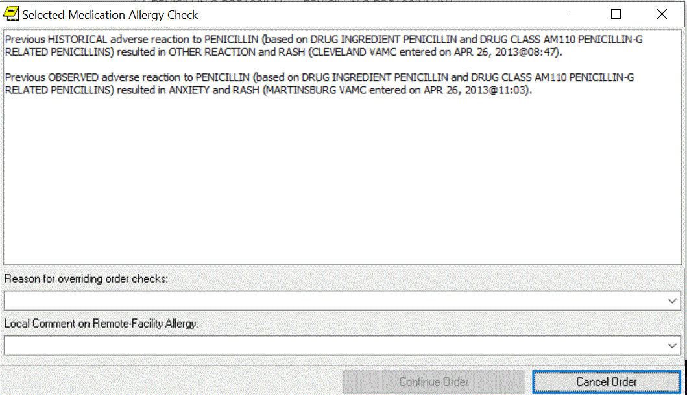**  
**The screen capture above shows order checks with remote facility names listed.**  
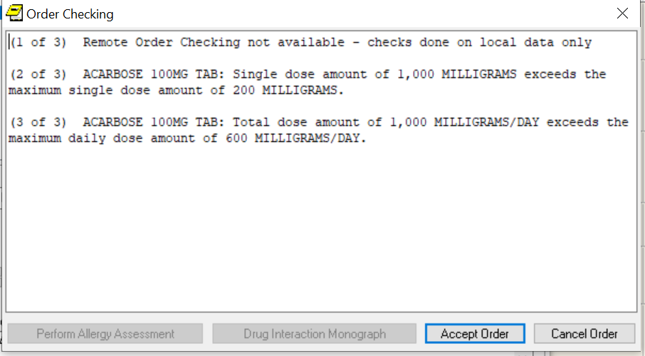

**If CPRS receives no data from the HDR, it will display the message “Remote Order Checking not available – checks done on local data only,” as shown in the screen capture above.**

CPRS shows this message once during an ordering session when it cannot communicate with the HDR and then does not show it again until the user begins another ordering session. However, after displaying the message, CPRS continues to attempt communication with the HDR. If CPRS reaches the HDR, remote order checks will appear when orders are placed.

##### How Is RDI Remote Order Checking Enabled?

To use remote order checking, your site must enable a parameter to access HDR data. This parameter is set for the entire facility.

##### When Does CPRS Get Remote Data?

Order checks from CPRS can happen several times during a CPRS ordering session:

-   Beginning to write/copy/change orders – When a user selects an order menu to begin writing orders, CPRS requests some order checks, such as polypharmacy, renal function, or creatinine clearance, for example.  
-   On order acceptance – When the user selects Accept, CPRS requests the order checks.  
-   Signature of orders – When a user signs the order, CPRS requests order checks.  
##### How Long Is the Data Used?

A parameter that sites can set controls how long HDR data is stored locally and is considered “fresh” and can be used for order checks before the data will be retrieved again from the HDR. The default time for this parameter is 120 minutes or two hours, but each site can change the time in that parameter.

## Sorting the Medications View

CPRS enables users to get different views of the medications a patient is taking based on different sorting criteria. CPRS remembers the value selected by the user for the Meds tab sort. The first time a user signs into CPRS 27 the Meds tab will default to the original sort. The sort name will be display on the meds tab.

The first format is the existing functionality and is sorted by Location**,** then by Status Group**,** then by Stop Date/Expiration Date. The existing functionality uses the following status groups:

-   Pending  
-   NON VERIFIED  
-   NON-VERIFIED  
-   PENDING  
-   Active/Hold  
-   ACTIVE  
-   ON CALL  
-   REFILL  
-   REINSTATED  
-   RENEWED  
-   SUSPENDED  
-   HOLD  
-   PROVIDER HOLD  
-   DONE  
-   DRUG INTERACTIONS  
-   Expired  
-   EXPIRED  
-   Discontinued/Deleted  
-   DATE OF DEATH ENTERED  
-   DELETED  
-   DISCONTINUED  
-   DISCONTINUED (EDIT)  
-   DISCONTINUED (RENEWAL)  
-   DISCONTINUED BY PROVIDER  
-   PURGE  
-   PARKED  
The first new view is sorted by Status Group, then by Status, then by Location, then by Drug Name. The first new view uses the following Status Groups:

-   ACTIVE  
-   Active  
-   Refill  
-   Hold  
-   Suspended  
-   Provider Hold  
-   On Call  
-   Parked  
-   PENDING  
-   Non-verified  
-   Drug Interactions  
-   Incomplete  
-   Pending  
-   DISCONTINUED  
-   Done  
-   Expired  
-   Discontinued  
-   Deleted  
-   Discontinued By Provider  
-   Discontinued (Edit)  
-   Reinstated  
-   Renewed  
The second new Meds tab view within CPRS is sorted alphabetically by Drug:

-   Sort by drug name  
-   Status active  
-   Status recent expired (using ORCH context meds stop date)  
Medications will sort Inpatient, Outpatient**,** and Non-VA meds. Each group will sort in their own section on the CPRS Meds tab.

To sort the medications, use these steps:

1.  Select the Meds tab.  
1.  Select the appropriate sorting method:  
-   Sort by Status/Exp Date (Clinic Orders first on Inpt)  
-   Sort by Status Group/Status/Location/Drug Name  
-   Sort by Drug (alphabetically)/status active/status recent expired  
## Ordering Inpatient Medications

Ordering medications uses two dialogs in the ordering process and eliminates the dispense drug prompt. Inpatient medication orders now require a valid schedule. If users do not find the appropriate schedule in the list, they can choose to create a day-of-week/administration time schedule using the new Schedule builder. This feature also works for renewing and changing inpatient medication orders.

**Note:** Because a valid schedule is required, if you attempt to modify an existing medication order that does not have a valid schedule, you will receive a message box stating that and will have to enter a valid schedule. CPRS now requires a unique match in the Medication, Dosage, Route, and Schedule fields for inpatient medications before CPRS will auto-select an item from the list. For inpatient medications, the Medication and Schedule fields must be an item from the list, but the Dosage and Route can be a free-text entry (the route must be in the MEDICATION ROUTES file \#51.2). If the desired schedule is not on the list, the user can build a day-of-week/administration time schedule using the Schedule Builder.

CPRS displays unit dose routes based on the following rules:

1.  If a default medication route is defined in the orderable item file, CPRS displays only the default medication route for the Unit Dose orderable item in the medication route selection list.  
1.  If there is no default medication route defined for the orderable item, CPRS displays all possible medication routes for the dosage form to the provider for selection.  
1.  If there is only one possible medication route, it will be used as the default.  
1.  If a medication route name or its abbreviation is not included in the selection list, a user may type it in.  
Also, medications that are not in the formulary display in the list with the letters “NF” after the name or synonym, which is also displayed. CPRS checks for nonformulary dosages (e.g., the VA formulary may not have a 2.5 MG pill, but it may have a 5.0 MG pill) and for non-formulary orderable items (e.g., the VA may not carry a specific kind of allergy medication).

### Clozapine Requirements

See Section New Clozapine Requirements for more information about ordering clozapine.

### Simple Dose

**Note:** If the user attempts to order inpatient medications for an inpatient from an outpatient location, CPRS discontinues the order process and returns the user to original Orders or Meds tab display.

To write a new simple dose Inpatient Medications order, use these steps:

1.  Select the Meds tab and then select Action \| New Medication.  
\-or-   
  
select the Orders tab and bring up the inpatient dialog by selecting the appropriate item in the Write Orders pane. CPRS displays the Medication Order dialog as show in the graphic below.

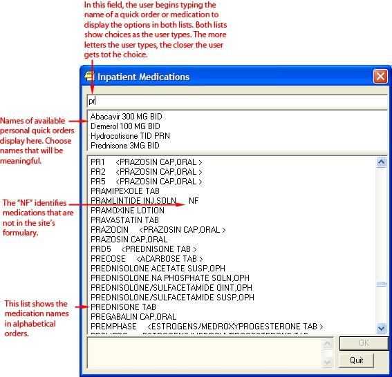

**The Inpatient Medications order dialog allows you to select from a list of personal quick orders or medications**  
1.  Locate the desired medication or medication quick order by typing characters in the Medication field.  
**Note:** CPRS now only auto-selects (highlights in blue and places that entry in the field) a medication, dosage, route, or schedule if the user types enough characters to uniquely identify an item in the list. If the user does not enter enough characters to uniquely identify an item, CPRS waits until the user manually selects an item using the mouse or the keyboard.

1.  Select the quick order or medication name. Once the name is selected, CPRS displays a second dialog to select the items for the rest of the order. In the top field of the second dialog, the generic medication name and the synonym (usually a brand name) are displayed.  
The lab results for the most recent lab test associated with the selected medication are displayed in the Information field, if an associated lab test was performed within the last 365 days.

**Note:** A CAC or ADPAC will need to set the OR CPRS LAB DISPLAY ENABLED parameter to ON to activate the lab results display at a site.

To view associated lab results for Quick Orders, a TIU OBJECT must be inserted into the Quick Order. For more information, refer to the Text Integration Utility (TIU) Clinical Coordinator & User Manual. This functionality will work for generalized Quick Orders only (orders assigned to Order Menus). It is not currently implemented for personal Quick Orders.

The lab results functionality will not work properly for multidivisional facilities or any sites that use different lab test names at different sites, as only one lab test name can be associated with each drug. To successfully implement this functionality, all facilities/divisions that share a VistA system must use the same name for each monitored lab test.

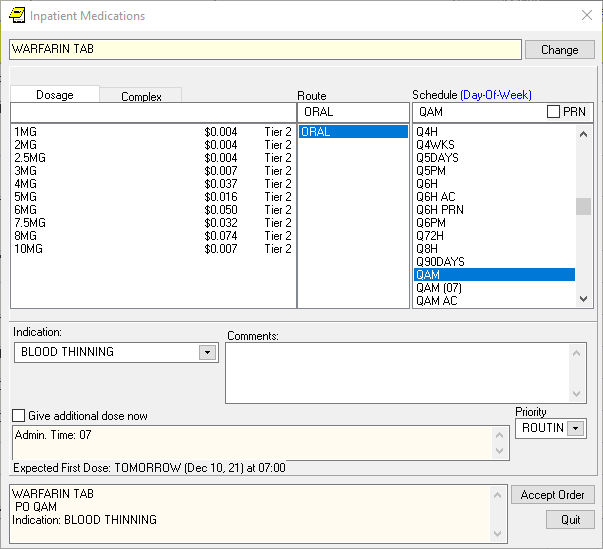

**Note:** CPRS now uses a look up from Pharmacy to determine whether the selected medication is a controlled substance that requires the signature of a provider with a DEA or VA number. For controlled substances, CPRS displays a message—“Order for controlled substance could not be completed. Provider does not have a current, valid DEA\# on record and is ineligible to sign the order”—as shown in the graphic below. CPRS allows orders for controlled substances only when selected providers are able to sign the orders. You may need to exit the dialog, change the provider selection, and then reenter the dialog. See *Appendix D: Error Messages and Troubleshooting* for a full list of error messages related to controlled substance ordering.

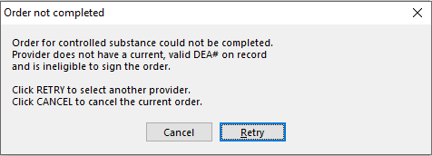

**You must have a DEA\# or VA\# to order certain medications  
**  
**Note:** CPRS requires a patient to have a valid address if the selected outpatient medication is a controlled substance that requires the signature of a provider with a DEA number. For outpatient controlled substances, CPRS displays a message – “Controlled substance prescriptions require a patient address. Please contact administrative support to update patient address information.” if the patient does not have a valid address. The contact information in the display may be customized using the **Enter/Edit Missing ZIP Code Message** option in the GUI Parameters menu.

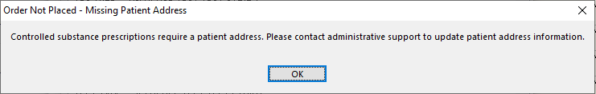

**Controlled substance prescriptions require a patient address.**  
1.  In the Dosage field and select or type a dosage.  
The dosage may not begin with a decimal, for example .5; it must begin with a numerical value, 0.5 for example. Also, the character “\^” may not be entered in the Dosage field. Also, the associated cost of the drug is displayed to the right of the dosage.

**Note:** CPRS now only auto-selects (highlights in blue and places that entry in the field) a medication, dosage, route, or schedule if the user types enough characters to uniquely identify an item in the list. If the user does not enter enough characters to uniquely identify an item, CPRS waits until the user manually selects an item using the mouse or the keyboard.

Once a dosage is selected, any lab test results displayed in the Information field are replaced by the National Standard Orderable Item information.

1.  In the Route field, enter the appropriate route (a default route may have been set up) by either selecting one from the list or typing in a valid route.  
1.  In the Schedule pane, select an existing schedule from the list or, to use a day-of-week/administration time schedule not on the list, select OTHER (you can also click the Non-Standard? link and then click OK on the dialog that displays).  
When the user selects a schedule, the administration times may display under the “Give additional dose now” text. The administration times will display if they have been defined for the ward or if there is a default as long as the order is not a PRN order.

1.  If you selected an existing schedule, skip to step 8. If you selected OTHER, the Order with Schedule ‘OTHER’ dialog appears. Take the following steps:  
1.  Select one or more checkboxes by the appropriate days of the week.  
1.  If the schedule requires specific administration times skip to steps c and d. To select a schedule from the list, highlight the schedule and select Add.  
**Note:** Users can assign either a schedule from the list or specific administration times, but not both. Also, because the user is specifying days of the week and a schedule, the list will contain only schedules less than 24 hours (for example, Q36H will not be in the list).

1.  To use a specific administration time, select the hour and minutes (if the user only selects the hour, the minutes will default to zero) and select Add.  
1.  Repeat step c until you have entered all required administration times.  
**Warning:** The administration times in the Schedule field apply to each day of the week that is listed, such as TU-TH-SA@08002000, for example. To create a schedule such as TU@0800 TH@2000, users would have to enter two separate orders using the complex medication order dialog. Also, users may not enter a schedule that only has administration times and PRN but no days.

1.  If you make a mistake while selecting an administration time or schedule, do one of the following to remove it:  
-   For a single administration time, highlight the hour and minutes in the Set Administration Time fields and select **Remove** (so to remove 08:00, you would have to select that time in the Set Administration Time fields not in the Schedule text box.)  
-   To remove the schedule, highlight the schedule and select **Remove**.  
-   To remove the entire schedule and begin again with step a, select **Reset**.  
1.  Review the Schedule field.  
1.  When you have the correct schedule, select OK.  
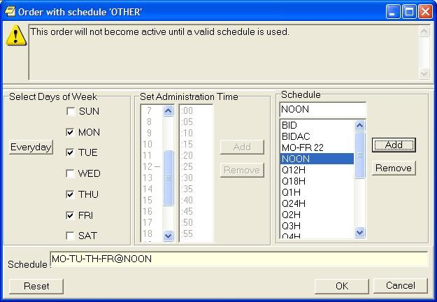

**The Order with Schedule ‘OTHER’ dialog allows you to enter a customized day-of-week and/or administration-time schedule. The user can enter specific administration times or select a schedule from the available list**  
1.  Select PRN if necessary.  
PRN will display in the schedule field if the PRN checkbox is checked or if the schedule is defined in the Pharmacy files as a PRN schedule.

1.  Enter an Indication. If indications have been set up, there will be items in the drop-down list, the most common indication on top. If no indications have been set up, you can type an indication  
1.  Add comments (optional).  
1.  CPRS displays the date and time of the expected first dose if it can determine one. (For example, CPRS cannot show an expected first dose for “on call” or schedules with PRN. On the complex tab, it will not try to determine an expected first dose after a THEN because the first item must be completed.) If you want to give an additional dose now, select the Give additional dose now check box.  
**Note:** Ensure the “Give additional dose now” and the regular order you entered do not overmedicate the patient. “Give additional dose now” is not available for ONCE, ONE-TIME, or NOW orders. It is also not available for delayed orders.

When you select the **Give additional dose now** check box, CPRS creates two new orders. Depending on your version of CPRS, the order priority and dosing schedule may be set automatically or may require manual adjustments. The pop-up messages displayed will also vary.

1.  The dosing schedule and priority are set automatically for each order. The first order is scheduled for immediate administration (NOW) and is assigned the priority ASAP. The second order is given the priority ROUTINE and will be administered following the dosing schedule that you defined. A warning displays that is similar to the following example.  
**Note:** If your site does not use the priority ASAP, then an alternative priority (for example, STAT) will display in place of ASAP.

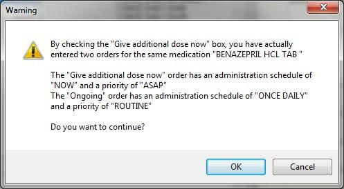

**Warning displayed when “Give additional dose now” is selected**  
1.  Check the warning message to ensure that the orders you created are what you expected. If the orders are acceptable, then click OK. If not, click Cancel to clear the Give additional dose now check box.  
1.  Click the drop-down arrow and then select a value for the Priority field.  
1.  When **Give additional dose now** is selected, the **Priority** field is automatically set to ASAP (or a site-specific alternative). If you select a value for the **Priority** field before you select the **Give additional dose now** checkbox, a message notifies you that the selected priority will be changed to the “Give additional dose now” priority settings.  
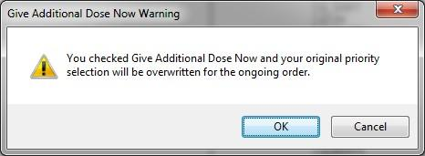

**CPRS displays a notification that “Give additional dose now” overrides any previously selected priority**  
1.  The default value of ASAP can be changed by selecting a different value from the **Priority** field before submitting the order. If the **Priority** field is empty when the order is submitted, it will revert to the default values for “Give additional dose now.”  
1.  Select Accept Order.  
**Note:** If you do not complete the mandatory items or if the information is incorrect, CPRS sends a message that tells you the information is incorrect and shows you the correct type of response.

1.  (Conditional) If the medication ordered may be contraindicated because of allergies, drug interactions, or duplicate orders, CPRS will display the Order Check window. Carefully review all order checks and decide if the medication should be ordered. Do one of the following:  
-   To proceed, select Accept Order.  
-   To stop the ordering process and return to the dialog, Cancel Order.  
1.  Enter another medication order or click Quit.  
**Note:** CPRS requires a signature before it sends the order to pharmacy. You can either sign the order now or wait until later. When using Give additional dose now, it is recommended that you sign the order immediately to send the order to the inpatient pharmacy. You only need to sign once for both orders created when Give additional dose now is selected.

### Complex Dose

**Note:** If the user attempts to order inpatient medications for an inpatient from an outpatient location, CPRS discontinues the order process and returns the user to original Orders or Meds tab display.

In a complex dose order, the user must define specific characteristics for the order. Because the dose can affect the quantity, for example, changing certain fields may cause the quantity field to either recalculate or reset to zero to force the user to enter the quantity.

**To write a new complex dose Inpatient Medications order, use these steps:**

1.  Select the Meds tab and select Action \| New Medication.  
\-or-  
select the Orders tab and bring up the inpatient *Medication Order* dialog by selecting the appropriate item in the Write Orders pane.  
1.  Locate the desired medication or medication quick order by typing characters in the Medication field.  
**Note:** CPRS now only auto-selects (highlights in blue and places that entry in the field) a medication, dosage, route, or schedule if the user types enough characters to uniquely identify an item in the list. If the user does not enter enough characters to uniquely identify an item, CPRS waits until the user manually selects an item using the mouse or the keyboard.

1.  Select the quick order or medication name. Once the name is selected, CPRS displays a second dialog to select the items for the rest of the order. In the top field of the second dialog, the generic medication name and the synonym (usually a brand name) are displayed.  
The lab results for the most recent lab test associated with the selected medication are displayed in the Information field, if an associated lab test was performed within the last 365 days.  
**Note:** A CAC or ADPAC will need to set the OR CPRS LAB DISPLAY ENABLED parameter to ON to activate the lab results display at a site.

To view associated lab results for Quick Orders, a TIU OBJECT must be inserted into the Quick Order. For more information, refer to the *Text Integration Utility (TIU) Clinical Coordinator & User Manual*. This functionality will work for generalized Quick Orders only (orders assigned to Order Menus). It is not currently implemented for personal Quick Orders.

The lab results functionality will not work properly for multidivisional facilities or any sites that use different lab test names at different sites, as only one lab test name can be associated with each drug. To successfully implement this functionality, all facilities/divisions that share a VistA system must use the same name for each monitored lab test.

**Note:** CPRS now uses a look up from Pharmacy to determine whether the selected medication is a controlled substance that requires the signature of a provider with a DEA or VA number. For controlled substances, CPRS displays a message—“Order for controlled substance could not be completed. Provider does not have a current, valid DEA\# on record and is ineligible to sign the order”—as shown in the graphic below. CPRS allows orders for controlled substances only when selected providers are able to sign the orders. You may need to exit the dialog, change the provider selection, and then reenter the dialog. See *Appendix D: Error Messages and Troubleshooting* for a full list of error messages related to controlled substance ordering.

**You must have a DEA\# to order certain medications**  
**Note:**  CPRS requires a patient have a valid address if the selected outpatient medication is a controlled substance that requires the signature of a provider with a DEA number. For outpatient controlled substances, CPRS displays a message – “Controlled substance prescriptions require a patient address. Please contact administrative support to update patient address information.” if the patient does not have a valid address. The contact information in the display may be customized using the Enter/Edit Missing ZIP Code Message option in the GUI Parameters menu.

**Controlled substance prescriptions require a patient address**  
1.  Select the **Complex** dose tab.  
**Note:** After you begin a complex order, you must remain on the Complex tab until you finish the order. Do not attempt to start from or switch back to the Dosage tab. If you do, all complex dosages will be erased and you will be forced to start again.

1.  In the **Dosage** field, select or type the appropriate dosage.  
The dosage may not begin with a decimal, for example .5; it must begin with a numerical value, 0.5 for example. Also, the character “\^” may not be entered in the Dosage field. (The associated cost is displayed to the right of the dosage.)  
**Note:**  CPRS now only auto-selects (highlights in blue and places that entry in the field) a medication, dosage, route, or schedule if the user types enough characters to uniquely identify an item in the list. If the user does not enter enough characters to uniquely identify an item, CPRS waits until the user manually selects an item using the mouse or the keyboard.

Once a dosage is selected, any lab test results displayed in the Information field are replaced by the National Standard Orderable Item information.  
1.  In the Route field, enter the appropriate delivery route for the medication (a default route could have been set up) by either selecting one from the list or by typing a valid route.  
1.  In the Schedule field, select an existing schedule from the list or, to use a day-of week/administration time schedule not on the list, select OTHER.  
1.  If you entered an existing schedule, skip to step 9. If you selected OTHER, CPRS displays the Order with Schedule ‘OTHER’ dialog. Take the following steps:  
1.  Select one or more checkboxes by the appropriate days of the week.  
1.  If the schedule requires specific administration times skip to steps c and d. To select a schedule from the list, highlight the schedule and select **Add**.  
**Note:** Users can assign either a schedule from the list or specific administration times, but not both. If launched from the Complex tab, the Day-of-Week Schedule builder does not display one-time schedules in the schedule list. Also, because the user is specifying days of the week and a schedule, the list will contain only schedules less than 24 hours (for example, Q36H will not be in the list).

1.  To use a specific administration time, select the hour and minutes (if the user only selects the hour, the minutes will default to zero) and select Add.  
1.  Repeat step c until you have entered all required administration times.  
**Warning:** The administration times in the Schedule field apply to each day of the week that is listed, such as TU-TH-SA@08002000, for example. To create a schedule such as TU@0800 TH@2000, users would have to enter two separate orders using the complex medication order dialog. Also, users may not enter a schedule that only has administration times and PRN but no days.

1.  If you make a mistake while selecting an administration time or schedule, do one of the following to remove it:  
-   For a single administration time, highlight the hour and minutes in the Set Administration Time fields and select **Remove** (so to remove 08:00, you would have to select that time in the Set Administration Time fields not in the schedule text box.)  
-   To remove the schedule, highlight the schedule and select **Remove**.  
-   To remove the entire schedule and begin again with step a, select **Reset**.  
1.  Review the Schedule field.  
1.  When you have the correct schedule, select OK.  

**The Order with Schedule ‘OTHER’ dialog allows you to enter a customized day-of-week and/or administration-time schedule. The user can enter specific administration times or select a schedule from the available list**  
1.  Select PRN if necessary.  
PRN will display in the schedule field if the PRN checkbox is checked or if the schedule is defined in the Pharmacy files as a PRN schedule.  
1.  Select the **Duration** field. Enter a number and select units (the default unit is days) a patient should use the specified dose.  
1.  Add the appropriate conjunction: And, Then, or no conjunction for the final line.  
**Note:** The conjunction “Then” requires a duration to be added.

1.  Select the **Dosage** field in the next row and select a dosage.  
The dosage may not begin with a decimal, for example .5; it must begin with a numerical value, 0.5 for example. Also, the character “\^” may not be entered in the Dosage field. (The associated cost is displayed to the right of the dosage.)  
1.  CPRS fills in the Route and Schedule fields. If necessary, change the values in Route and Schedule fields.  
1.  Enter the duration and a conjunction (or no conjunction for the final line).  
**Note:** Your site’s IRM staff may have specified rules governing the status of inpatient medication orders when patients are transferred from one ward or service to another. It may have also specified the number of days an inpatient medication order remains active. Please check with your site’s IRM staff for information about these rules.

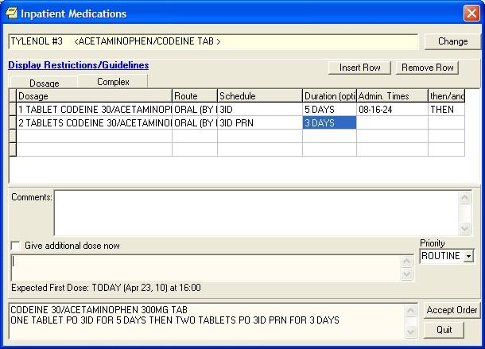

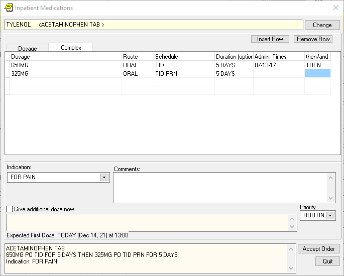

**You should specify the duration for a medication order**  
1.  Repeat steps 12-14 until you have completed the complex dose.  
**Note:** You can also add or remove a row in the complex dosage. If you add a row, CPRS places the new row above the selected row. To add a row, click the gray area in front of the row and click Add Row. To delete a row, click the gray area in front of the row to be deleted and click Delete Row.

1.  Enter an Indication. If indications are defined, you can choose one from the drop-down list. If none are defined or the correct indication is not in the list, type in the appropriate indication.  
1.  Add comments (optional).  
CPRS displays the expected date and time of the first dose. (For example, CPRS cannot show an expected first dose for “on call” or schedules with PRN. On the complex tab, it will not try to determine an expected first dose after a THEN because the first item must be completed.)  
1.  If you want to give an additional dose now, select the **Give additional dose now** check box. If you select the check box, the Give Additional Dose Now for Complex Order warning dialog box appears, as shown below.  
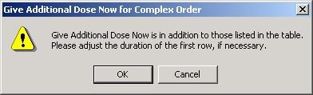

**CPRS displays a warning to providers who select “Give additional dose now” when placing a complex order**  
When you select the **Give additional dose now** check box, CPRS creates two new orders. Depending on your version of CPRS, the order priority and dosing schedule may be set automatically or may require manual adjustments. The pop-up messages displayed will also vary.  
The dosing schedule and priority are set automatically for each order. The first order is scheduled for immediate administration (NOW) and is assigned the priority ASAP. The second order is given the priority ROUTINE and will be administered following the dosing schedule that you defined. A warning displays that is similar to the following example.

**Note:** If your site does not use the priority ASAP, then an alternative priority (for example, STAT) will display in place of ASAP.

**Warning displayed when “Give additional dose now” is selected**  
1.  Check the warning message to ensure that the orders you created are what you expected. If the orders are acceptable, then click **OK**. If not, click Cancel to clear the **Give additional dose now** check box.  
1.  Click the drop-down arrow and then select a value for the **Priority** field.  
When **Give additional dose now** is selected, the **Priority** field is automatically set to ASAP (or a site-specific alternative). If you select a value for the **Priority** field before you select the **Give additional dose now** checkbox, a message notifies you that the selected priority will be changed to the “Give additional dose now” priority settings.

**CPRS displays a notification that “Give additional dose now” overrides any previously selected priority**  
1.  The default value of ASAP can be changed by selecting a different value from the **Priority** field before submitting the order. If the **Priority** field is empty when the order is submitted, it will revert to the default values for “Give additional dose now.” Click Accept Order.  
**Note:** If you do not complete the mandatory items or if the information is incorrect, CPRS sends a message telling you that the information is incorrect and showing you the correct type of response.

1.  (Conditional) If the medication ordered may be contraindicated because of allergies, drug interactions, or duplicate orders, CPRS will display the Order Check window. Carefully review all order checks and decide if the medication should be ordered. Do one of the following:  
-   To proceed, select Accept Order.  
-   To stop the ordering process and return to the dialog, Cancel Order.  
1.  Enter another medication order or click Quit.  
**Note:** You must sign the order before CPRS sends it to the Pharmacy package. You can either sign the order now or wait until later. When using Give additional dose now, it is recommended that you sign the order immediately to send the order to the inpatient pharmacy. You need only sign once for both orders created when Give additional dose now is selected.

## Ordering Inpatient Medications for Outpatients

**Note:** If IMO Nursing orders do not display where expected, they may not be set up properly. IRM or CAC personnel should check the *CPRS Technical Manual: GUI Version* for more information.

**Note:** If the provider has an NPI, it will not display on the screen below.

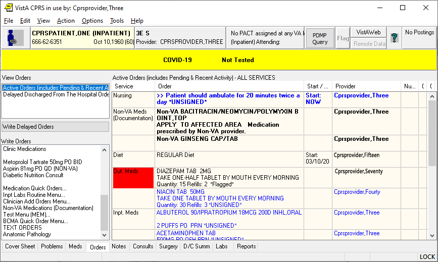

**This example shows the Orders tab with order from several services, including orders that can appear under the IMO display group of Clinic Orders**  
On the Meds tab, IMO medication orders of all statuses except unreleased orders display at the top of the Inpatient Medications pane before other inpatient medications orders. Nursing text orders do not display on the Meds tab. User can distinguish IMO orders because they have an entry in the Location column of the Meds tab display.

**Note:**  IMO orders are affected by both CPRS auto-DC rules and Inpatient Medications rules for auto-discontinuing orders on admission and discharge. If sites do not want IMO orders to auto-discontinue on admission and discharge, sites will have to ensure that neither CPRS nor Inpatient Medications discontinues IMO orders. Inpatient Medications uses the AUTO-DC IMO ORDERS parameter to exclude IMO orders from being discontinued.

### Criteria for Ordering Inpatient Medications for Outpatients

To successfully write inpatient-medication orders for outpatients, the outpatients must meet at least one of the following criteria:

-   They must have a scheduled appointment at an authorized hospital location for the current day or a day in the future  
-   They must be currently checked in at an authorized hospital location  
**Note:**  If patients do not meet either of these criteria, you can create a new visit for them at an authorized hospital clinic. To create a new visit, select the Provider/Encounter button,

1.  Select the Visit tab.  
1.  Select New.  
1.  Select OK.  
In addition, before you can use the **Meds** tab to place IMO orders, your site’s IRM staff must set up the new-medication order dialog to include inpatient medications.

### Clozapine Requirements

See the [New Clozapine Requirements section](#new-clozapine-requirements) for more information about ordering clozapine.

### Simple and Complex Doses

Take the following steps to write IMO orders:

1.  Select the Meds tab  
1.  From the main menu, select Action \| New Medication or click to select the area within the Inpatient Medications window, then right click and select New Medication from the shortcut menu. (You can also place inpatient-medication orders for outpatients via the Orders tab. For detailed instructions, see "Ordering Inpatient Medications for Outpatients" in the “Orders” section of this manual.)  
1.  CPRS prompts you to select a location for current activities. Select a scheduled (current or future) appointment at an authorized hospital/clinic location, or create a new visit in an authorized hospital/clinic location using the default time for new visits (NOW).  
1.  CPRS displays one or more new medication dialogs. These dialogs are site—and sometimes user—specific. For example, the person who manages information resources at your site may have set the ORWDX NEW MEDS parameter (which controls the new-medication order dialog) to display a list of your inpatient and outpatient quick orders.  
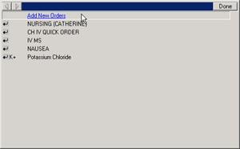

**New-medication dialogs can vary widely. This sample dialog enables a specific user to select from a list of his inpatient and outpatient quick orders, among other things**  
However, the person who manages information resources at your site could also define a generic dialog for all applicable users.

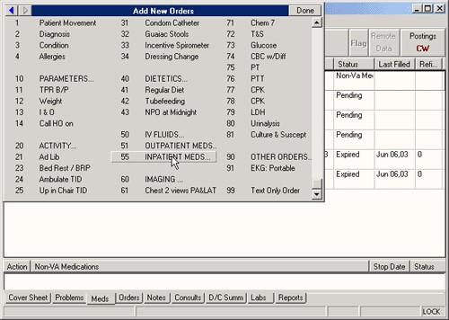

**This new-medication order dialog offers a variety of options that are not user-specific**  
1.  Select an inpatient medication.  
Once the name is selected, CPRS displays a second dialog to select the items for the rest of the order. In the top field of the second dialog, the generic medication name and the synonym (usually a brand name) are displayed.

1.  To place a simple-dose or complex-dose order for this medication, follow the steps outlined in the “Simple Dose” or “Complex Dose” sections of this manual, respectively.  
On the **Meds** tab, CPRS displays IMO orders sorted at the top of the **Inpatient Medications** window with corresponding authorized hospital/clinic locations in the **Location** column.

#### Changing Orders

Users can also change and renew inpatient medication orders for outpatients

(IMO) if the user is ordering from an authorized IMO location. If the patient’s location is not an authorized IMO location (even if the patient is an inpatient), users will not be able to change or renew the IMO orders. To change inpatient medication orders for outpatients, follow the instructions in the “Changing Orders” section of this manual, respectively.

## Outpatient Medications

Outpatient medication orders can be written as simple doses or complex doses. Users must enter a medication name, dosage, route, and schedule. For outpatient medications, dosage, schedule, and route can be free-text entries, but the medication must be chosen from the list of options. The route can be typed in, but to be accepted, it must be a valid route that is in the MEDICATION ROUTES file \#51.2.

CPRS displays unit dose routes based on the following rules:

1.  If a default medication route is defined in the orderable item file, CPRS displays only the default medication route for the Unit Dose orderable item in the medication route selection list.  
1.  If there is no default medication route defined for the orderable item, CPRS displays all possible medication routes for the dosage form to the provider for selection.  
1.  If there is only one possible medication route, it will be used as the default.  
1.  If a medication route name or its abbreviation is not included in the selection list, a user may type it in.  
Also, medications that are not in the formulary display in the list with the letters “NF” after the name or synonym, which is also displayed. CPRS checks for nonformulary dosages (e.g., the VA formulary may not have a 2.5 MG pill, but it may have a 5.0 MG pill) and for non-formulary orderable items (e.g., the VA may not carry a specific kind of allergy medication).

### Simple Dose

**To write a new simple dose Outpatient Medications order, use these steps:**

1.  Select the Meds tab and select Action \| New Medication  
\-**or**-  
Select the **Orders** tab and bring up the Outpatient dialog by clicking the appropriate item under the Write Orders box. CPRS will display the Outpatient Medications dialog as shown in the graphic below.  
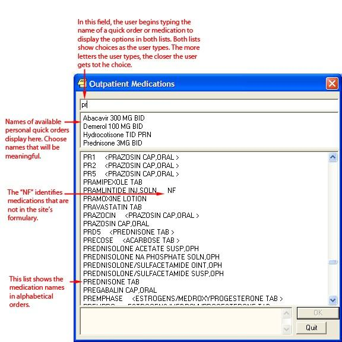  
**The Outpatient Medications order dialog**  
**Note:** If no encounter information has been entered, the Encounter Information dialog appears. Also, a preliminary order check is done and a dialog may appear to provide you with pertinent information.

1.  Locate the medication name or quick order name in the list box by typing characters in the Medication field.  
**Note:** CPRS now only auto-selects (highlights in blue and places that entry in the field) a medication, dosage, route, or schedule if the user types enough characters to uniquely identify an item in the list. If the user does not enter enough characters to uniquely identify an item, CPRS waits until the user manually selects an item using the mouse or the keyboard.

1.  Select the quick order or medication name using the mouse or keyboard. Once the name is selected, CPRS displays a second dialog to select the items for the rest of the order. In the top field of the second dialog, the generic medication name and the synonym (usually a brand name) are displayed.  
The lab results for the most recent lab test associated with the selected medication are displayed in the Information field, if an associated lab test was performed within the last 365 days.

**Note:** A CAC or ADPAC will need to set the OR CPRS LAB DISPLAY ENABLED parameter to ON to activate the lab results display at a site.

To view associated lab results for Quick Orders, a TIU OBJECT must be inserted into the Quick Order. For more information, refer to the *Text Integration Utility (TIU) Clinical Coordinator & User Manual*. This functionality will work for generalized Quick Orders only (orders assigned to Order Menus). It is not currently implemented for personal Quick Orders.

The lab results functionality will not work properly for multidivisional facilities or any sites that use different lab test names at different sites, as only one lab test name can be associated with each drug. To successfully implement this functionality, all facilities/divisions that share a VistA system must use the same name for each monitored lab test.

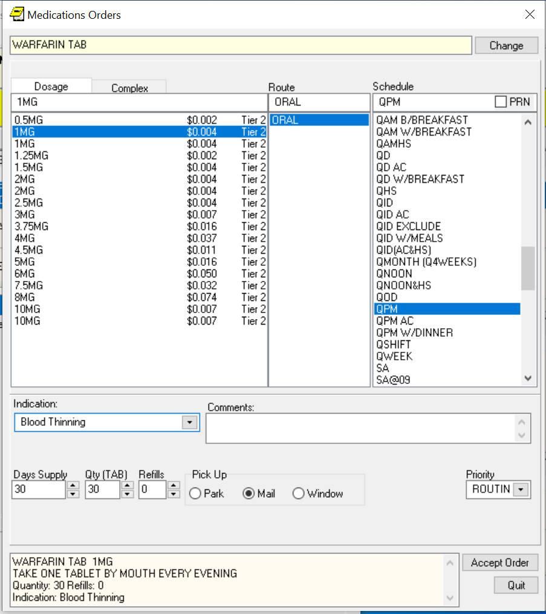

**Note:** CPRS now uses a look up from Pharmacy to determine whether the selected medication is a controlled substance that requires the signature of a provider with a DEA number. For controlled substances, CPRS displays a message —“Order for controlled substance could not be completed. Provider does not have a current, valid DEA\# on record and is ineligible to sign the order”— as shown in the graphic below. CPRS allows orders for controlled substances only when selected providers are able to sign the orders. You may need to exit the dialog, change the provider selection, and then reenter the dialog. See *Appendix D: Error Messages and Troubleshooting* for a full list of error messages related to controlled substance ordering.

**You must have a DEA\# to order certain medications**  
**Note:**  CPRS requires a patient have a valid address if the selected outpatient medication is a controlled substance that requires the signature of a provider with a DEA number. For outpatient controlled substances, CPRS displays a message – “Controlled substance prescriptions require a patient address. Please contact administrative support to update patient address information.” if the patient does not have a valid address. The contact information in the display may be customized using the Enter/Edit Missing ZIP Code Message option in the GUI Parameters menu.

**Controlled substance prescriptions require a patient address   
**  
1.  Select the **Dosage**.  
The dosage may not begin with a decimal, for example .5; it must begin with a numerical value, 0.5 for example. Also, the character “\^” may not be entered in the Dosage field. (The associated cost is displayed to the right of the dosage, see graphic under step 9 for an example.)

**Note:** CPRS now only auto-selects (highlights in blue and places that entry in the field) a medication, dosage, route, or schedule if the user types enough characters to uniquely identify an item in the list. If the user does not enter enough characters to uniquely identify an item, CPRS waits until the user manually selects an item using the mouse or the keyboard.

Once a dosage is selected, any lab test results displayed in the Information field are replaced by the National Standard Orderable Item information.

The tier level represents medication copayment classes for Outpatient Pharmacy charges that are dependent on the medication class. It is used to determine the charge rate for copayments.

1.  Enter a **Route** by either selecting one from the list or typing in a valid route.  
1.  Enter a Schedule (select PRN, if desired).  
**Note:** Outpatient orders for supply items do not require a route.

1.  CPRS puts in the default days’ supply and calculates the quantity based on the formula Days Supply x Schedule = Quantity. If necessary, highlight and change the numbers in these fields.  
**Note:** If you change a number, CPRS will attempt to recalculate the other field, if possible.

1.  Enter the number of refills.  
1.  Select where the patient should pick up the medication.  
1.  Select the **Priority**.  
1.  Enter an Indication. If indications are defined, they will display in the drop-down list for you to select or you may type in an indication.  
1.  You can also add a comment if desired.  
1.  Select Accept Order.  
1.  (Conditional) If the medication ordered may be contraindicated because of allergies, drug interactions, or duplicate orders, CPRS will display the Order Check window. Carefully review all order checks and decide if the medication should be ordered. Do one of the following:  
-   To proceed, select Accept Order.  
-   To stop the ordering process and return to the dialog, Cancel Order.  
If you are finished ordering outpatient medications, select **Quit**.

**Note:** The order must be signed before it is sent to pharmacy. You can either sign the order now or wait until later.

### Complex Dose

In a complex dose order, the user must define specific characteristics for the order. Because the dose can affect the quantity, for example, changing certain fields may cause the quantity field to either recalculate or reset to zero to force the user to enter the quantity.

**To write a new Outpatient Medications order, use these steps:**

1.  Select the Meds tab and select **Action \| New Medication…**  
\-**or**-  
select the **Orders** tab and bring up the Outpatient dialog by clicking the appropriate item under the Write Orders box.  
**Note:** If no encounter information has been entered, the Encounter Information dialog appears. Also, a preliminary order check is done and a dialog may appear to provide you with pertinent information.

1.  Locate the medication name or quick order name in the list box by typing characters in the Medication field.  
**Note:** CPRS now only auto-selects (highlights in blue and places that entry in the field) a medication, dosage, route, or schedule if the user types enough characters to uniquely identify an item in the list. If the user does not enter enough characters to uniquely identify an item, CPRS waits until the user manually selects an item using the mouse or the keyboard.

1.  Select the quick order or medication name using the mouse or keyboard.  
Once the name is selected, CPRS displays a second dialog to select the items for the rest of the order. In the top field of the second dialog, the generic medication name and the synonym (usually a brand name) are displayed.

The lab results for the most recent lab test associated with the selected medication are displayed in the Information field, if an associated lab test was performed within the last 365 days.

**Note:** A CAC or ADPAC will need to set the OR CPRS LAB DISPLAY ENABLED parameter to ON to activate the lab results display at a site.

To view associated lab results for Quick Orders, a TIU OBJECT must be inserted into the

Quick Order. For more information, refer to the *Text Integration Utility (TIU) Clinical Coordinator & User Manual*. This functionality will work for generalized Quick Orders only (orders assigned to Order Menus). It is not currently implemented for personal Quick Orders.

The lab results functionality will not work properly for multi-divisional facilities or any sites that use different lab test names at different sites, as only one lab test name can be associated with each drug. To successfully implement this functionality, all facilities/divisions that share a VistA system must use the same name for each monitored lab test.   
  
**Note**: CPRS now uses a look up from Pharmacy to determine whether the selected medication is a controlled substance that requires the signature of a provider with a DEA number. For controlled substances, CPRS displays a message—“Order for controlled substance could not be completed. Provider does not have a current, valid DEA\# on record and is ineligible to sign the order” —as shown in the graphic below. CPRS allows orders for controlled substances only when selected providers are able to sign the orders. You may need to exit the dialog, change the provider, and then reenter the dialog. See *Appendix D: Error Messages and Troubleshooting* for a full list of error messages related to controlled substance ordering.

**You must have a DEA\# to order certain medications**  
**Note:**  CPRS requires a patient have a valid address if the selected outpatient medication is a controlled substance that requires the signature of a provider with a DEA number. For outpatient controlled substances, CPRS displays a message – “Controlled substance prescriptions require a patient address. Please contact administrative support to update patient address information.” if the patient does not have a valid address. The contact information in the display may be customized using the Enter/Edit Missing ZIP Code Message option in the GUI Parameters menu.

**Controlled substance prescriptions require a patient address**  
1.  Select the **Complex** dose tab.  
**Note:** Once you begin a complex order, you must remain on the Complex tab until you finish that order. Do not attempt to start from or switch back to the Dosage tab. If you do, all complex dosages will be erased and you will be forced to start again.

Once a dosage is selected, any lab test results displayed in the Information field are replaced by the National Standard Orderable Item information.

1.  Select the **Dosage** field and select the appropriate dosage.  
The dosage may not begin with a decimal, for example .5; it must begin with a numerical value, 0.5 for example. Also, the character “\^” may not be entered in the Dosage field. (The associated cost is displayed to the right of the dosage.)

**Note:** CPRS now only auto-selects (highlights in blue and places that entry in the field) a medication, dosage, route, or schedule if the user types enough characters to uniquely identify an item in the list. If the user does not enter enough characters to uniquely identify an item, CPRS waits until the user manually selects an item using the mouse or the keyboard. The tier level represents medication copayment classes for Outpatient Pharmacy charges that are dependent on the medication class. It is used to determine the charge rate for copayments.

1.  Enter a **Route** by either selecting one from the list or typing in a valid route.  
**Note:** Outpatient orders for supply items do not require a route.

1.  Select the **Schedule** cell and enter how often the medication should be taken (select PRN if desired).  
1.  Select the **Duration** cell and enter a number and select units (days is the default) a patient should use the specified dose.  
1.  Add the appropriate conjunction: And, Then, or no conjunction for the final line.  
**Note:** The conjunction “Then” requires a duration to be added.

1.  Select in the dosage field in the next row and select a dosage.  
The dosage may not begin with a decimal, for example .5; it must begin with a numerical value, 0.5 for example. Also, the character “\^” may not be entered in the Dosage field. (The associated cost is displayed to the right of the dosage.)

1.  CPRS will fill in the Route and Schedule fields. If necessary, select and change the Route and Schedule cells.  
1.  Enter a duration and a conjunction (no conjunction on the final line).  
1.  Repeat steps 5-12 until you have completed the complex dose.  
**Note:** You can also add or remove a row in the complex dosage. If you add a row, the new row will be placed above the selected row. To add a row, click the gray area in front of the row and click Add Row. To delete a row, click the gray area in front of the row to be deleted and click Delete Row.

1.  CPRS puts in the default days supply and calculates the quantity based on the Days Supply x Schedule = Quantity. If necessary, highlight and change the number in these fields.  
**Note:** If you change a number, CPRS will attempt to recalculate the other field, if possible.

1.  Enter the number of refills.  
1.  Select where the patient should pick up the medication and the **Priority**.  
1.  Enter an Indication. If indications are defined, they will display in the drop-down list for you to select or you may type in an indication.  
1.  You can also add a comment if desired.  
Under certain circumstances, a check box may appear under the Days Supply field. If the medication is service-connected, make sure the box is checked.

1.  Select Accept Order.  
1.  (Conditional) If the medication ordered may be contraindicated because of allergies, drug interactions, or duplicate orders, CPRS will display the Order Check window. Carefully review all order checks and decide if the medication should be ordered. Do one of the following:  
-   To proceed, select Accept Order.  
-   To stop the ordering process and return to the dialog, Cancel Order.  
1.  If you are finished ordering outpatient medications, select **Quit**.  
**Note:** The order must be signed before it is sent to pharmacy. You can either sign the order now or wait until later.

## Documenting Non-VA Medications

The Joint Commission on Accreditation of Healthcare Organizations (JCAHO) has indicated that all medications, including herbal supplements, over-the-counter (OTC) non-prescription medications, and medications prescribed by providers outside the VA (collectively known as “Non-VA medications”) should be documented in the medical record. CPRS, Outpatient Pharmacy, and Inpatient Medications developers have made changes that enable users to enter this information into the medical record so that providers have a better picture of the medications the patient is taking and that order checks against these medications can occur.

Documenting Non-VA Medications will trigger the following order checks:

-   Duplicate Drug (shows as Duplicate Order check)  
-   Duplicate Drug Class  
-   Critical Drug Interaction  
-   Significant Drug Interaction  
-   Allergy checks  
**Note:** For Non-VA medications, inpatient orders are not checked against documented non-VA medications and the allergy check is slightly different. The duplicate drug class check will not be triggered for two pure herbal medications, such as ginger and gingko. All pure herbal medications belong to the same drug class (HA000). If these checks were made, every time a clinician entered a pure herbal medication, the user would receive a duplicate drug class warning. Allergy checks will still occur for non-VA medications that do not belong to this drug class.

### Making Non-VA Meds Available to Document

For users to be able to document these medications through CPRS, they must be in the CPRS Orderable Items file so that they appear when the user chooses Non-VA Medications (Documentation) from the Write Orders pane. The Pharmacy patch (PSS\*1.0\*68) enables sites to mark items as Non-VA Medications. Initially, all Pharmacy orderable items that are marked as “outpatient” and are not supply items will be automatically made Non-VA medications also. Subsequently, Pharmacy coordinators can use the Pharmacy option Drug Enter/Edit [PSS DRUG ENTER/EDIT] to identify items as Non-VA Meds or remove the designation.

**Note:** For more information about how to get Non-VA Medications added to the appropriate file, please see “Section 5.1: Communicating New Non-VA Meds Entries to the Pharmacist” in the *Herbal/OTC/Non-VA Meds Documentation Release Notes* that will be located on the VistA Documentation Library at <http://www.va.gov/vdl> under the Outpatient Pharmacy listings.

### Different from Ordering Medications

Remember that documenting Non-VA Medications is not the same as placing orders. Users simply enter information to provide a more complete view of what the patient is taking. However, once the items are available in the CPRS Orderable Items file, the process for documenting Non-VA Medications is similar to entering other orders, but there are a few differences:

-   Almost any CPRS user can document the Non-VA medication information. However, sites can restrict access for those holding the OREMAS key by using the OR OREMAS NON-VA MEDS parameter. For more information about this parameter, please see the *CPRS Technical Manual: GUI Version*.  
-   Electronic signature is not required for Non-VA Medication (Documentation) items.  
-   Users can document a Non-VA medication even if they only have partial information. The only required information is the non-VA or herbal medication name. The Medication name must be one that can be selected from the list. The Dosage, Route, and Schedule fields are optional and will accept free-text entries.  
-   Non-VA medications are listed separately on the orders tab and the designation Non-VA Meds (Documentation) is displayed at the beginning of the entry in the Service column of the grid.  
-   Users may pick a reason why the patient is taking the Non-VA medication.  
For the reason/statement that users should enter, developers sent out four reasons or statements at the package level of the parameter GUI Non-VA Med Statements/Reasons that were agreed upon by a workgroup:

-   Non-VA medication not recommended by VA provider.  
-   Non-VA medication recommended by VA provider.  
-   Patient wants to buy from Non-VA pharmacy.  
-   Medication prescribed by Non-VA provider.  
Authorized users can enter their own reasons/statements in the parameter by entering new statements at the System or Division level for this parameter. For more information about changing this parameter, see the *CPRS Technical Manual: List Manager*.

### Documenting Non-VA Medication Information for Simple Doses

Previously, the designation “Non-VA Meds” caused some confusion as to whether providers were ordering or documenting outside medication. Therefore, throughout CPRS the name has been changed to “Non-VA Medications (Documentation)” on the Write Orders pane or “Non-VA Meds (Documentation)” in the Service column. When the user selects the Non-VA Medications (Documentation) option, the dialog displays the items that were marked as Non-VA Meds and copied into the CPRS Orderable Items file.

**As shown on the Orders tab, the Non-VA Meds (Documentation) orders display.**  
To document Non-VA medication information for a simple dose, use the following steps:

1.  If you are not already there, go to the Orders tab by either clicking Orders or pressing Ctrl + O.  
1.  In the Write Orders list, select **Non-VA Medications (Documentation)**.  
**Note**: If encounter information has not been entered, the encounter information dialog will appear before the Medication Order dialog. You must complete the encounter information dialog before proceeding.

1.  In the Document Herbal/OTC/Non-VA Medications dialog, select the medication or herbal supplement by  
1.  Typing a few letters of name.  
**Note:** CPRS now only auto-selects (highlights in blue and places that entry in the field) a medication, dosage, route, or schedule if the user types enough characters to uniquely identify an item in the list. If the user does not enter enough characters to uniquely identify an item, CPRS waits until the user manually selects an item using the mouse or the keyboard.

1.  Selecting the correct name or synonym (often a brand name) from the list by double-clicking it or highlighting it and pressing \<Enter\>. You may need to scroll down to find the name.  
**Note:** If you do not know other information such as dosage, route, or schedule, you may enter only the name of the medication or herbal supplement.

1.  Enter a dosage (if known).  
The dosage may not begin with a decimal, for example .5; it must begin with a numerical value, 0.5 for example. (The associated cost is displayed to the right of the dosage.)

1.  Enter a route (if known).  
1.  Enter a schedule, including PRN if necessary (if known).  
1.  (Not required) Enter an Indication. If indications are defined, they will display in the drop-down list for you to select or you may type in an indication.  
1.  Enter any comments.  
1.  If you want to enter one, select one or more Statements/Explanations as to why the patient is taking the medication or supplement (optional).  
1.  Enter a start date (if known).  
1.  Review the information entered in the text box at the bottom of the dialog.  
1.  Place the information into the patient’s record by clicking Accept Order or by tabbing to Accept Order and pressing \<Enter\>.  
1.  (Conditional) If the medication ordered may be contraindicated because of allergies, drug interactions, or duplicate orders, CPRS will display the Order Check window. Carefully review all order checks and decide if the medication should be ordered. Do one of the following:  
-   To proceed, select Accept Order.  
-   To stop the ordering process and return to the dialog, Cancel Order.  
1.  To document additional Non-VA Medications into the patient’s record, repeat steps 3-12.  
1.  When you are through documenting Non-VA medications, exit the dialog using the Quit button.  
**Note:** Non-VA Meds do not require an electronic signature, but they will be presented at the end of the current CPRS session on the Sign screen. You can do the normal signing process or if you only have Non-VA meds, you might get OK and Cancel buttons on a dialog instead of the normal Sign screen. You cannot click on the checkbox in front of a Non-VA Med to deselect and not approve it. Non-VA Meds because they do not require electronic signature will be automatically entered when you click OK or enter your electronic signature.

### Documenting Non-VA Medication Information for Complex Doses

When you start documenting non-VA medication information for a complex dose, you need to remain on the Complex tab until you click the Accept Order button. If you switch to the Dosage tab, all complex dosages will be erased.

To document Non-VA medication information for a complex dose, use the following steps:

1.  Click on the Meds tab and then, click on the Action menu in the toolbar.  
1.  Select Document Non-VA Meds from the Action menu.  
**Note**: If encounter information has not been entered, the encounter information dialog will appear. You must complete the encounter information dialog before proceeding.

1.  In the Document Herbal/OTC/Non-VA Medications dialog, select the medication or herbal supplement from the dropdown. If you enter a few characters in the Name field, you will immediately see a list of names in the dropdown that contain those characters.  
1.  Select the Complex tab.  
1.  Enter the appropriate dosage in the Dosage field.  
**Note:** The dosage must begin with a numerical value (for example, 0.5). The dosage cannot begin with a decimal (for example, .5) and the \^ character is not allowed.

1.  Enter a Route by either selecting a value from the dropdown or entering a value.  
1.  Select a value from the Schedule dropdown. Check the PRN checkbox, if necessary.  
1.  In the Duration field, enter a numeric value and select the units a patient should use for the specified dose (day is the default).  
1.  In the add/then dropdown, select a direction and a conjunction (no conjunction on the final line).  
**Note:** If you select the “then” conjunction, you are required to add a duration.

1.  In the next row, enter a dosage in the Dosage field.  
1.  If necessary, change the values in the Route and Schedule fields.  
1.  In the add/then dropdown, enter a duration and a conjunction (no conjunction on the final line).  
1.  Repeat steps 5 through 12 until you have completed the complex dose.  
**Note:** To add a row, click on the area where you want to place the new row and then, click on the Insert Row button. To remove a row, click on the row to be deleted and then, click on the Remove Row button.

1.  Enter an Indication (optional). If indications are defined, they will display in the drop-down list or you may type in an indication.  
1.  Add a comment (optional).  
1.  Select one or more Statements/Explanations as to why the patient is taking the medication or supplement (optional).  
1.  Enter a Start Date, if known. A Start Date can be a date in the past.  
1.  Review the information entered in the textbook at the end of the dialog.  
1.  Click the **Accept Order** button.  
1.  (Conditional) If the non-VA medication may be contraindicated because of allergies, drug interactions, or duplicate orders, CPRS will display the Order Check window. Carefully review all order checks and either click the Accept Order button or the Cancel Order button.  
1.  When you finish documenting non-VA medications, click the **Quit** button.  
**Note:** Non-VA Meds do not require an electronic signature. At the end of the current CPRS session, you will see the Review/Sign Changes window and will be able to click on the **OK** or **Cancel** button without signing the order. After you click the **OK** button, you may see the Order Checks screen if there is a potential conflict between a non-VA med and an existing inpatient or outpatient order.

## Release Hold

This action enables a user to release the hold that someone has placed on a medication order.

To release the hold on a medication, use these steps:

1.  Select the Meds tab.  
1.  Locate and highlight the medication that you want to release from being held.  
1.  Select Action \| Release Hold…  
**Note:** If the order has expired, you should see a message that says, “Cannot be released from Hold. Reason: This Order has Expired.”

## Hold Orders

Only active orders may be placed on hold. Orders placed on hold will continue to show under the ACTIVE heading on the profiles until it is removed from hold. An entry is placed in the order’s Activity Log recording the person who placed/removed the order from hold and when the action was taken.

To place a medication on hold, use these steps:

1.  Select the Meds tab.  
1.  Locate and highlight the medication.  
1.  Select Action \| Hold.  
## Park a Prescription

This action enables a user to select “park” as a routing/pickup option when creating or modifying an outpatient pharmacy order. When a prescription is parked, it is on file, but it will not be dispensed until requested by the patient or caregiver. A parked prescription has an Active/Parked status in reports and cannot be sent to automated dispensing equipment or to CMOP until it is unparked. Park a prescription works with mail-in barcode refills requests and the AudioCare AudioRefill System.

**Note:** Park a prescription only works with outpatient pharmacy orders.

Any activity performed for an active prescription can be performed for an active/parked prescription. CPRS allows the initial fill, and the refill of a prescription in Active/Parked status.

Only active prescriptions can be parked. Drugs with a DEA special handling code of “D” and Clozapine orders cannot be parked.

When a patient requests a fill of a prescription that has been replaced by a newer, parked prescription for the same orderable item but different dispense drug, the fill will get processed as if the newer prescription was requested. However, the old prescription number will be used. This “linking and replacement” capability is limited by specific conditions:

-   The patient requesting the prescription must be the same for both the previous and parked prescription.  
-   The prescriptions must be for the same orderable item.  
-   The previous prescription for the orderable item is no longer active.  
-   The most recent prescription is in Active/Parked status.  
-   There is only one prescription on file for the specific patient and orderable item.  
If these conditions are not met, the user will see this error message: “[Rx number] is no longer refillable please speak to a pharmacist”.

Once a prescription is unparked, it will proceed through normal prescription processes.

To park a new prescription, do the following:

1.  Click on either the Meds or Orders tab:  
1.  If you clicked on the Meds tab, click on **Action** and then, click on **New Medication**.  
1.  If you clicked on the Orders tab, click on **Outpatient Meds** in the Write Orders table.  
1.  On the Location for Current Activities screen, select a Visit Location and Date/Time of Visit and click **OK**.  
1.  On the Outpatient Medications or Medications Orders screen, fill in all required fields: Medication, Dosage, Route, Schedule, Indication, Days Supply, Quantity, Refills and Priority. In the Pick Up area, select the **Park** radio button.  
1.  Click **Accept Order**. After the order has been accepted, it will be in the Pending status until the pharmacist processes the order, at which point it will become Active/Parked.  
To park an existing prescription, do the following:

1.  Click on either the Orders or Meds tab.  
1.  Right-click on an active outpatient medications order and then, click on **Park**.  
1.  On the Park Orders screen (the confirmation screen), click **OK**. The order will get into the Active/Parked status.  
To unpark a prescription, do the following:

1.  Click on either the Orders or Meds tab.  
1.  Right-click on an Active/Parked outpatient order and then, click on **Unpark – Generates a request to Fill/Refill**.  
1.  On the Un-Park Orders screen (the confirmation screen), click **OK**. An unparked order will go into an Active/Suspense status.  
## Renewing Orders

Active orders may be renewed. In addition, inpatient medication orders that have expired in the last four days and outpatient medication orders that have expired in the last 120 days may be renewed.

**Note:** If the original order had comments, the comments do not carry over when the user renews an order. This is to prevent comments that should only apply to the original order from mistakenly being carried forward with the renewed order.

The default Start Date/Time for a renewal order is determined as follows:

Default Start Date Calculation = NOW

The default start date/time for the renewal order will be the order’s Login Date/time. Default Start Date Calculation = USE NEXT ADMIN TIME

The original order’s Start Date/Time, the new order’s Login Date/Time, Schedule, and Administration Times are used to find the next date/time the order is to be administered after the new order’s Login Date/Time. If the schedule contains “PRN” any administration times for the order are ignored.

Default Start Date Calculation = USE CLOSEST ADMIN TIME

The original order’s Start Date/Time, the new order’s Login Date/Time, Schedule, and Administration Times are used to find the closest date/time the order is to be administered after the new order’s Login Date/Time. If the schedule contains “PRN” any administration times for the order are ignored.

After the new (renewal) order is accepted, the Start Date/Time for the new order becomes the Stop Date/Time for the original (renewed) order. The original order’s status is changed to RENEWED. The renewal and renewed orders are linked and may be viewed using the History Log function. Once an order has been renewed it may not be renewed again or edited.

CPRS lets you edit the days’ supply, quantity, number of refills and pick-up method for an active outpatient medication during the renewal process. However, it does not let you edit those fields for any other type of order being renewed.

To edit the days’ supply, quantity, number of refills and/or pickup method for an outpatient medication, do the following:

1.  Click on either the Orders or Meds tab.  
1.  In the Outpatient Medications or Out Meds table, right-click on an order in the Active, Active-Susp or Active-Parked status.  
1.  Click **Renew** on the dropdown menu. If a visit location hasn’t been selected, the Location for Current Activities screen will appear, and you will need to select a Visit Location and Date/Time of Visit.  
1.  On the Renew Orders screen, click the order to be renewed and then, click the Change Days Supply/Quantity/Refills/Pick Up button.  
1.  On the Change Refills for Outpatient Medication screen, update the Days Supply, Qty, Refills and/or Pick-Up values and click **OK**.   
    **Note:** If you edit the Days Supply, the system will attempt to update the quantity based on the formula, Days Supply x Schedule = Quantity.  
1.  On the Renew Orders screen, click **OK**.  
**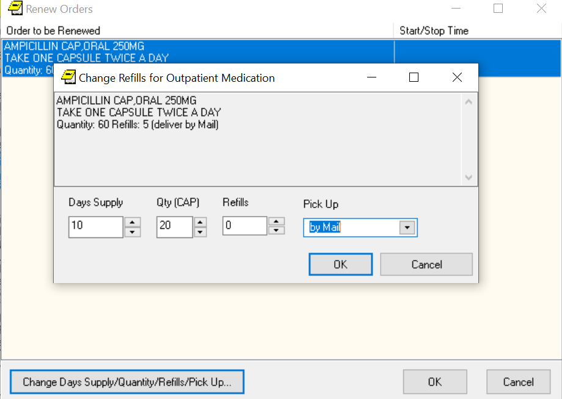  
Example of the Renew Orders and Change Refills for Outpatient Medication screens**  
## Discontinuing Orders

When an order is discontinued, the order’s Stop Date/Time is changed to the date/time the action is taken. An entry is placed in the order’s Activity Log recording who discontinued the order and when the action was taken. Pending and Non-verified orders are deleted when discontinued and will no longer appear on the patient’s profile.

For unsigned, unreleased orders, if the user discontinues the order in the same CPRS session when the order was placed, the order is deleted and will not display. The reason for this is that the order was never seen by anyone else, therefore, it can be deleted. If the order is unsigned and unreleased, but was placed in a different CPRS session, another user may have seen the order, therefore, the order is CANCELLED, but still displays so that others who might have seen it know that it was cancelled.

To discontinue an order, use these steps:

1.  Select the Orders tab.  
1.  Select the order or orders you want to discontinue.  
1.  Select Action \| Discontinue/Cancel.  
A dialog may appear asking for the clinician’s name and the location (encounter information).

1.  Select the name of the clinician (you may need to scroll through the list), select the encounter location, and then select OK.  
Another dialog will appear asking for the reason why the order is being discontinued.

1.  Select the appropriate reason from the box in the lower left of the dialog and select OK.  
1.  If the order you are discontinuing is a pending renewal of another order, CPRS needs to know how to deal with the order you are discontinuing, and the original order. Choose the appropriate action from the dialog that displays:  
-   DC Both  
-   DC Pending  
-   Cancel – No Action Taken  
## Changing Orders

To change an order:

1.  Select the Orders tab.  
1.  Select the order to highlight it.  
1.  Select Action \| Change... or right-click the order and click Change....  
**Note**: If the provider or location has not been defined, you will be prompted for that information.

1.  Complete the changes as appropriate in the dialog box that appears on the screen.  
**Note:** The original order’s comments are not brought forward on a change to prevent inadvertently using a comment that was only for the original order.

1.  Select Accept.  
**Note:** You may sign the order now or later.

## 

## Viewing a Medication Order

When you select the Meds tab, you see a list of medications that have been ordered for this patient. You can get a more detailed display of each order by double clicking the order.

**Note:** You can also review or add medication orders from the Orders tab.

When ordering medications, you can order Outpatient Pharmacy or Inpatient Meds, which includes IV Fluids and Unit Dose.

## Transfer Outpatient Meds Order to Inpatient

You can transfer outpatient medications to inpatient medications with CPRS. CPRS will tell you if the medication cannot be changed to an inpatient medication.

Because of the differences, you will go through each order and make the necessary changes.

To transfer the medication to inpatient, use these steps:

1.  Click the Meds tab.  
1.  Select the outpatient medications you want to transfer. Hold down the CTRL key to select more than one medication. Hold down the Shift key and click the first and last medications to select a range.  
1.  Select Action \| Transfer to Inpatient.  
1.  Enter the necessary information for the first order and click Accept.  
**Note:** Provider comments are brought forward for editing if necessary. Sometimes, provider comments give needed instructions to the patient.

1.  Repeat step 4 as needed for the selected medications.  
**Note:** When finished, you can sign the orders now or wait until later.

## Transfer Inpatient Meds Order to Outpatient

You can transfer inpatient medications to outpatient medications with CPRS. CPRS will tell you if the medication cannot be changed to an outpatient medication.

Because of the differences, you will go through each order and make the necessary changes.

To transfer the medication to outpatient, use these steps:

1.  Select the Meds tab.  
1.  Select the inpatient medications you want to transfer. Hold down the CTRL key to select more than one medication. Hold down the Shift key and click the first and last medications to select a range.  
1.  Select Action \| Transfer to Outpatient.  
CPRS displays the Copy Medication Orders dialog.

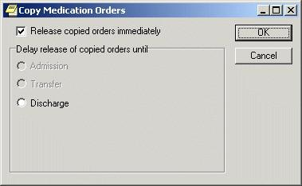

**The Copy Medication Orders dialog**  
1.  If you would like to release the copied order(s) immediately, check the “Released copied orders immediately” option. If you would like to delay the release of the copied order(s), select one of the options in the “Delay release of copied orders until” group.  
1.  Select OK.  
The Medication Order dialog displays.

1.  Enter the necessary information in the Medication Order dialog for the first order and select Accept.  
1.  Repeat Step 6 as needed for the selected medications. Note: When finished, you can sign the orders now or wait until later.  
## Refilling a Medication

Users can order a refill of outpatient medications if:

-   The medication is an outpatient medication.  
-   The provider originally wrote the order with refills and there are refills remaining.  
-   The expiration date is in the past.  
To order an outpatient medication refill, use these steps:

1.  Go to the Meds tab.  
1.  Select the medications you wish to refill that meet the above criteria.  
1.  Select Action \| Refill… or right-click on the orders and select Refill… from the popup.  
The following dialog displays. **Note:** The Refill Orders dialog in CPRS does not allow you to choose Park. A pharmacist would need to update the prescription to Parked when they get the refill request.  
  
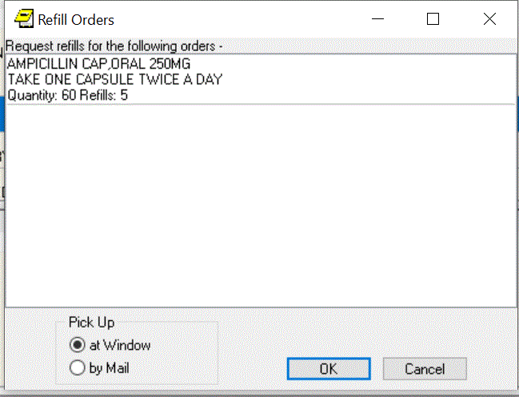

**In the Refill Orders dialog, CPRS displays the medications the user selected to refill and enables the user to choose the pickup method**  
1.  In the Refill Orders dialog, choose the Pick Up method (at Window or by Mail).  
1.  Select OK.  
## Using the Unified Action Profile View

The Unified Action Profile (UAP) view on the Orders tab displays existing inpatient and outpatient medication orders from the local site on a single page. Using this view, a clinician can record decisions for all orders assigned to a patient to ensure that the correct medication orders are continued for the patient upon discharge.

Previously, when preparations were made to discharge a patient, the clinician had to switch views from inpatient to outpatient medication forms. The UAP enables the clinician to review all medication orders at one time. This view simplifies order reconciliation and reduces the time and effort required from the clinician when making decisions on each active inpatient and outpatient order.

### Understanding UAP Sorting

The UAP view sorts medication orders by medication name, with inpatient, outpatient, and non-VA medication orders grouped together. This grouping is essential for medication reconciliation when preparing a patient for discharge. UAP sorting is based on the name of the first orderable item from the Orderable Items file (\#101.43). However, subsequent changes to the order can disrupt this rule and alter the way that the order is sorted by UAP.

The Order Text field (\#100.0081) in the Order file (\#100) is a word processing field that is generated when an order is created. Additional Order Text fields are added each time the order is modified. When working with an order in CPRS, the content of the most recent Order Text field is displayed. UAP checks the first line of the Order Text field against the orderable item name. If this check detects that the first line of the Order Text field does not match the orderable item name, then the order is sorted based on the first line of the most recent Order Text field.

For example, a clinician places an order for “DIAPER TABBED MISCELLANEOUS BRIEF, TRANQUILITY SMARTCORE SMALL \#2311.”

This item is retrieved from the Orderable Items file and saved in the Order Text field when the order is placed. During processing, the Pharmacist changes the order

to “BRIEF, TRANQUILITY SMARTCORE SMALL \#2311” and this update is

saved as a new entry in the Order Text field. During sorting, UAP performs a check and detects that the Orderable Item name and the first line of the most recent entry in the Order Text field are not the same and sorts the item based on the Order Text field entry (i.e., “BRIEF, TRANQUILITY SMARTCORE SMALL \#2311”). If an order is modified by a pharmacist during prescription processing, then the order is marked with an asterisk (“\*”) when displayed in CPRS. In the UAP view, this asterisk is hidden when displaying orders to preserve the alphabetical sorting critical to the reconciliation process.

Infusions are sorted alphabetically by the first orderable item identified as an additive in the Orderable Items file; solutions are ignored for the purpose of sorting. The display of Infusion orderable items is reorganized based on the additive used for sorting. This supports alphabetical sorting by a meaningful additive in the UAP but does not change the original order of items in the ORDER file (\#100).

### Configuring UAP

Before UAP can work as designed, some setup is required. First, Write Delayed Orders must be configured for the DISCHARGE event.

**Note**: To perform the following actions, the DISCHARGE event must be active and Copy Active Orders for Discharge Release Events must be disabled.

Refer to the CPRS Technical Manual: GUI Version for details.

To configure the Write Delayed Orders feature for the Discharge event:

1.  From the CPRS Orders tab, click Write Delayed Orders. The Release Orders window displays.  
1.  Select the Delay release of new order(s) until radio button.  
1.  Select DISCHARGE from the Event Delay List.  
1.  Adjust the Effective Date if necessary and then click OK.  
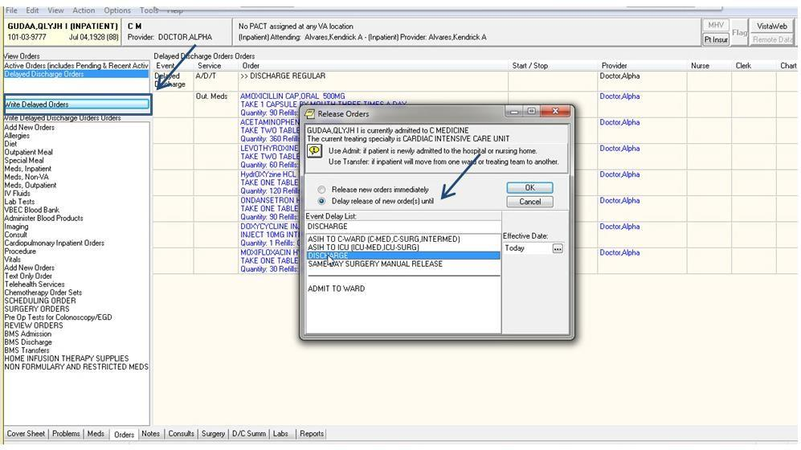

**Write Delayed Orders button displays the Release Orders window**  
**Note:** If the provider has an NPI, it will not display on the screen above.

The view changes to the Delayed DISCHARGE Orders view. The Discharge Patient (Delayed DISCHARGE) dialog box displays with DISCHARGE as the selected event.

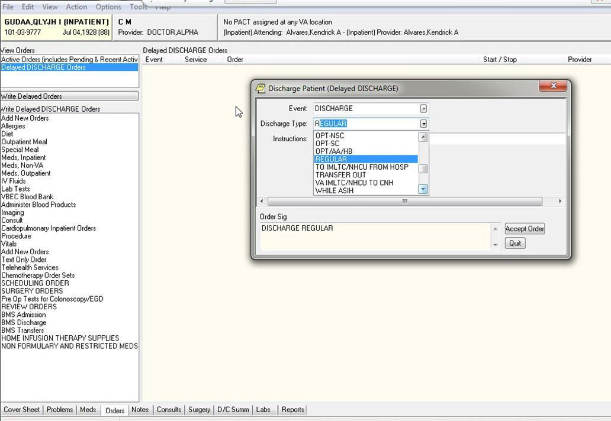

**Discharge Patient (Delayed DISCHARGE) dialog box**  
**Note:** If the provider has an NPI, it will not display on the screen above.

1.  Select a Discharge Type (e.g., REGULAR) and then click Accept Order.  
The Delayed Discharge order displays on the Orders tab. The Service column displays the service “A/D/T” after the order is configured. The Delayed Discharge order remains unsigned until after the UAP review decisions are completed and all medication orders for the patient are ready to be signed.

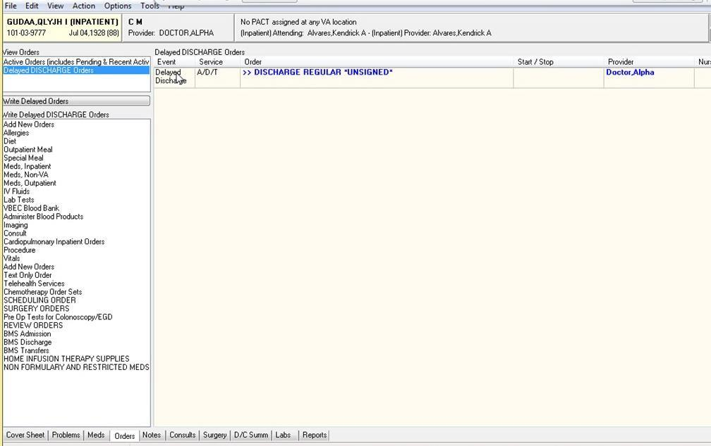

**Unsigned Delayed Discharge Order**  
**Note**: To perform the following actions, the UAP view must be turned On by a CAC or OI&T staff member. If UAP is not displayed in the View menu, then the feature is turned Off. Refer to the *CPRS Technical Manual: GUI Version* for details.

To use the UAP view to reconcile all inpatient and outpatient medications when preparing a patient for discharge:

1.  Select United Action Profile (UAP) from the View menu.  
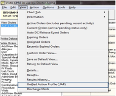

**Unified Action Profile (UAP) option displays on the View menu**  
The Unified Action Profile view is displayed and ready for you to take action on each inpatient and outpatient medication.

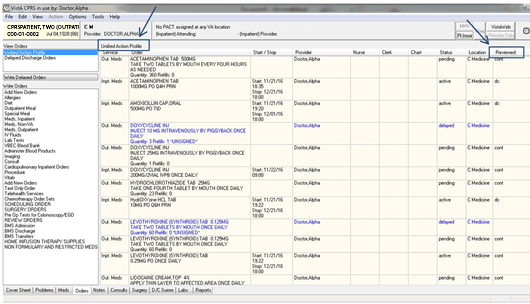

**Unified Action Profile on the CPRS Orders tab**  
**Note:** If the provider has an NPI, it will not display on the screen above.

**Example: Infusion Orders – ALL SERVICES view vs. UAP view**

The following Infusion order is displayed in the ALL SERVICES view. The asterisk indicates that the order was changed by the pharmacist.

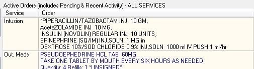

**The ALL SERVICES view displaying the Infusion order with the asterisk and list of orderable items**  
In the UAP view, the Infusion order components are intentionally reorganized for sorting purposes to facilitate medication reconciliation. The asterisk is hidden; the first orderable additive item in the ORDER file, INSULIN, is listed first and the Infusion is displayed in the medication list accordingly. The solution (DEXTROSE) is ignored for sorting purposes.

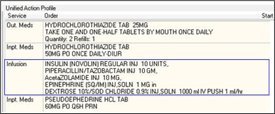

**UAP displaying the Infusion order without asterisk and sorted by first orderable additive item**  
1.  Right click on a medication order and then select an available reconciliation action from the popup list.  
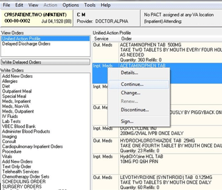

**List of reconciliation actions displayed in the UAP view**  
**Note:**  Infusion orders cannot be continued, changed, or renewed using UAP because CPRS does not convert inpatient infusion orders to an outpatient order when preparing for discharge. To prevent issues with discharge medication orders, these options are grayed when performing UAP medication reconciliation for an inpatient Infusion order.

1.  Complete required information in the secondary window that displays when a reconciliation action is selected. Not all selected actions will display a secondary window.  
Selecting certain actions, such as **Change**, will open the Copy Orders window. When this window displays, the **Delay release of copied orders** radio button is selected by default. Select **DISCHARGE** from the list of suggested events, and then click **OK**.

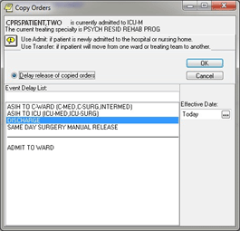

**Copy Orders window**  
When DISCHARGE is selected, the view automatically reverts to

Delayed Discharge Orders. Additional secondary windows, such as Outpatient Medications, open for configuring the Delayed Discharge medication order.

The decision made for each inpatient and outpatient medication is displayed in the UAP “Reviewed” column. Information regarding whether an order was reviewed using the UAP, and who last reviewed it, is added to the order record in the Orders file (\#100) in VistA.

**Note**: When a reconciliation action is canceled before it is complete (for example, if you click Cancel in the Copy Orders window), then no decision is recorded for the selected medication. The action is briefly displayed in the UAP “Reviewed” column, but after processing the display toggles back to the UAP view, the UAP “Reviewed” column is cleared, and no decision is recorded in VistA.

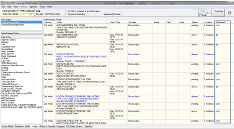

**The UAP Reviewed column shows the decision made for a medication**  
**Note:** If the provider has an NPI, it will not display on the screen above.

After completing the UAP review, use the Discharge Meds view to see a complete list of outpatient medications prescribed for the patient at the time of discharge (refer to Using the Discharge Meds View on page 290).

## Using the Discharge Meds View

The Discharge Meds view on the Orders tab displays a list of the remaining active outpatient orders after medication decisions are recorded in the Unified Action

Profile (UAP) view (refer to *Using the Unified Action Profile* *View***.**). It displays the orders that will be released with the patient upon discharge.

While the UAP provides the ability to review and make decisions about all inpatient and outpatient medications, the Discharge Meds view enables a clinician to see the full list of medication orders from the local site still prescribed for the patient after the UAP review is completed.

To use the Discharge Meds view of all prescribed medications for a patient being discharged:

1.  Select Discharge Meds from the View menu on the Orders tab.  
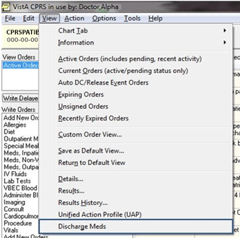

**Discharge Meds option displays on the View menu**  
The Discharge Meds Review is displayed.

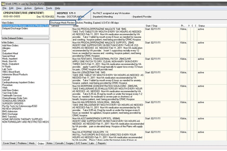

**Discharge Meds Review on the CPRS Orders tab**  
1.  Review the information for each medication displayed on the Discharge Meds Review pane. Verify the dosage, quantity, Start/Stop date, and Status for each outpatient medication prescribed for the patient being discharged.  
# Orders

From the Orders tab, you can write new orders and view existing orders for the selected patient. You can also create quick orders and order sets that make the ordering process more efficient. The Orders tab also allows you to quickly access information about each order such as which services the orders are associated with, the start and stop dates for each order, the name of the provider (or nurse or clerk) that entered the order, and the status of the order.

**Note:** If the provider has an NPI, it will not display on the screen below.

**The Orders tab**  
## Viewing Orders on the Orders Tab

You can control which orders appear on the Orders tab by defining specific criteria. For example, you can specify that only unsigned orders associated with a specific service or section appear on the Orders tab.

Unsigned orders are underlined on the Orders tab. Unsigned orders for the current provider are bold and underlined.

Predefined views or sorting on the Orders tab include the following options:

-   **Active Orders (including pending, recent activity)** – This view includes orders that have a status of  
-   Hold  
-   Flagged  
-   Pending  
-   Active  
-   Scheduled  
-   Partial Results  
-   Unreleased  
-   Renewed  
-   Parked  
Recent activity also includes the following if their status changed in the number of hours you site defines in a system parameter:

-   Discontinued  
-   Complete  
-   Expired  
-   Cancelled  
-   **Current Orders (active/pending status only)** – This name of this view explains it, active and pending orders only.  
-   **Auto DC/Release Event Orders** – This view includes only those orders that will be automatically discontinued or automatically released when an event occurs.  
-   **Expiring Orders** – This view shows all orders that will expire between now and midnight or now and midnight of the following day if the following day is a holiday.  
-   **Unsigned Orders** – This view shows orders that have not been signed.  
-   **Recently Expired Orders** – This view shows orders that have expired within the number of hours specified by a system parameter.  
### Locating IV Orders on the Orders Tab

In which display group CPRS places the IV medication orders depends on how the pharmacist finishes it. After CPRS v. 27, IV orders entered through the Infusion dialog should display under the Infusion display group, while those entered through the Unit Dose dialog should display under the Inpatient display group (Inpt. Meds). However, the key is how the pharmacist finishes the order. If the pharmacist finishes the order as a Unit Dose medication, it will display under the Inpatient display group. If finished as an IV order, then CPRS displays the order under the Infusion display group.

### Changing the View on the Orders Tab

To create a specific view of the orders, users have the Custom Order View menu option. When the user selects Custom Order View, the dialog should display with the settings of the current view.

To view orders on the Orders tab, follow these steps:

1.  Select the Orders tab.  
1.  Select View \| Active Orders (includes pending, recent activity), View \| Current Orders (active/pending status only), View \| Auto DC/Release Event Orders, View \| Expiring Orders, View \| Unsigned Orders, or View \| Recently Expired Orders.  
\-**or**-

Select the type of order you want to view from the **View Orders** pane on the left side of the **Orders** tab.

**Note:** If you select View \| Auto DC/Release Event Orders the *Auto DC/Release Event Orders* dialog box appears, select the release event associated with the orders you would like to view and click OK.

If you select View \| Recently Expired Orders, the parameter ORWOR EXPIRED ORDERS stores the number of hours in the past that CPRS will look for expired orders. A coordinator can set this value for your site.

The appropriate orders will appear on the Orders tab.

If you would like to filter the orders further, continue with step 3.

1.  Select View \| Custom Order View…  
The *Custom Order View* dialog box appears. The settings in the dialog should match what is currently displayed on the Orders tab.

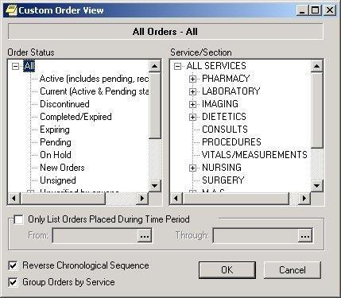

**The Custom Order View dialog. To view Inpatient Medication for Outpatient orders, users can expand the All Services service/section and then select Clinic Orders or they can expand All Services, expand Pharmacy, and then select Clinic Orders**  
1.  Select the criteria for the orders that you want to display on the Orders tab by taking some or all of the following steps:  
-   Select an order status from the left pane. (Click **+** to expand a heading.)  
-   Select a service or section from the right pane. (Click **+** sign to expand a heading.)  
-   If you want to limit the orders to a specific date range, select the **Only List Orders Placed During Time Period** checkbox and enter a from and through date. Click  to choose a date from a calendar.  
-   Click **Reverse Chronological Sequence** if you want the oldest orders to appear at the top of the Orders tab.  
-   Click **Group Orders by Service** if you want the orders to be sorted according to the service they are associated with.  
1.  Select OK.  
The orders that meet the criteria you specified on the Custom Order View dialog will appear on the Orders tab. The criteria for the displayed orders will appear above the Service column.

**Note**: If all of the active orders are not displayed on the Orders tab, the  icon appears below the **Postings** button (on the right side of the screen).

**Note:** If the provider has an NPI, it will not display on the screen below.

**Note**: The Custom Order View status selection screen modified an existing option and added a new option:

1.  Unverified Inpatient by anyone previously named "Unverified by Anyone"  
1.  Unverified Outpatient by anyone  
When any option, under and including “Unverified Outpatient by anyone,” is selected, it will include outpatient orders (except outpatient medications and Non-VA medications), so these patient orders are not missed. Clinic medication and infusion orders will be included in results for inpatient and outpatient views.

When showing search results, the top of the Orders tab view will display the search criteria that was selected.

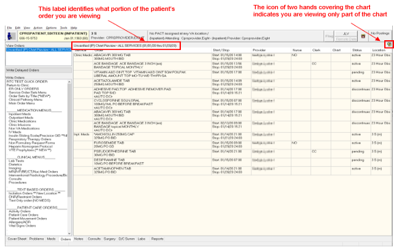

**The Orders tab can be customized to display specific orders**  
Using the right-click menu on the Orders tab, if the user selects several items and the right-clicks either on the items or elsewhere in the list, CPRS displays a popup menu. When the user selects an action from the popup menu, the action applies to all selected items. For example, if the user selects three orders and selects Discontinue, the dialog appears with those three orders listed for discontinuation.

However, if no items are selected (highlighted in blue) and the user right-clicks on an item, it is selected and the popup menu appears.

The Orders tab popup menu includes the following items:

-   Details…  
-   Results  
-   Results History…  
-   Change…  
-   Change Release Event  
-   Copy to New Order…  
-   Discontinue…  
-   Refill…  
-   Renew…  
-   Sign…  
### Viewing Results

To view the results of an order, follow these steps:

1.  Select the Orders tab.  
1.  Highlight the appropriate order.  
1.  Select View \| Results.  
The results of the order will be displayed.

**Note**: You can also right-click on the appropriate order and select **Results…** from the right-click menu.

To view a history of results, follow these steps:

1.  Select the Orders tab.  
1.  Highlight the appropriate order.  
1.  Select View \| Results History… The results history will be displayed.  
**Note:** You can also right-click on the appropriate order and select Results History… from the right-click menu.

To set a default view for the Orders tab, follow these steps:

1.  Customize the Orders tab by following the steps above.  
1.  Select View \| Save as Default View.  
The *Save Default Order View* dialog box appears.

1.  Select OK.  
The current view will be set as the default view for the Orders tab.

## Writing Orders

Orders are placed from the Write Orders pane on the Orders tab. You can place orders for a variety of items and procedures including medications, consults, and lab tests. You can also enter information about a patient’s allergies. Order checks are performed on all orders.

Users can specify that an order become active immediately, or specify that an order be event-delayed and activated only after a specific event occurs, such as when a patient is admitted, transferred, or discharged. You can also save common or standard orders as quick orders or order sets so that they can be placed more quickly.

**Note**: The orders listed in the Write Orders pane vary from site to site. Because of this, the orders discussed in this section may not be available from your Write Orders pane.

**Note**: The View Orders Pane may display additional options for views, including the Unified Action Profile and Active Orders views.

**Note:** If the provider has an NPI, it will not display on the screen below.

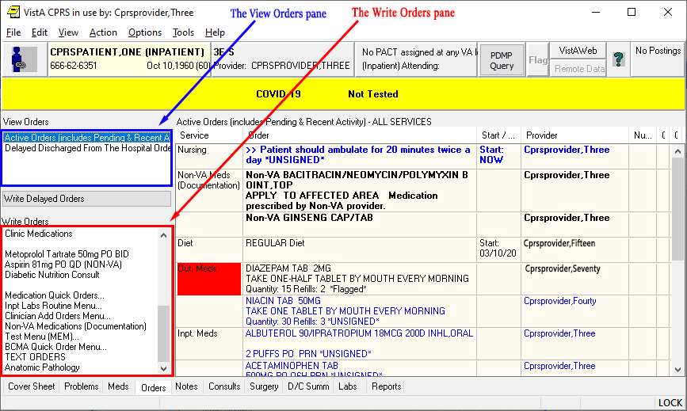

**You can place an order by selecting the type of the order from the write orders pane, selecting the appropriate category from the order menu, if CPRS displays one, and then using the order dialog that appears**  
### Order Checks

Order Checking is based on a system of rules that reviews orders to see if they meet defined criteria. If they meet the criteria, an electronic message is sent to the ordering provider to alert the provider to a potential problem (such as creatinine clearance, polypharmacy, duplicate order, drug-lab interaction, etc.). The provider can then choose to cancel the order or override the order check and place the order.

The Order Checking system gives users and clinical application coordinators (CACs) some flexibility to determine which order checks and notifications are sent and whether the provider must enter a reason to override the order check. To accomplish this, CPRS includes several prepackaged order checks as well as three menus for setting Order Checking parameters such as enabling and disabling specific order checks. Order Checks can also be configured to be mandatory by the Clinical Coordinator or IRM. If this feature is enabled, users cannot indicate that they do not want to receive individual order checks. Non-mandatory order checks can be enabled or disabled through the *Tools \| Options* menu.

CPRS calls for order checks on all orders. CPRS calls for order checks at the following times:

-   When the user opens the order dialog by selecting an item from the Write Orders pane or from an order menu. For medication orders, CPRS does allergy checking only at the moment when the user selects the orderable item.  
-   In the order dialog when the user selects Accept Order. **Note:** Allergy checking has been removed from Accept Order and moved to Orderable Items selection.  
-   When the user selects a sign action—before the user signs the order  
CPRS uses three kinds of order checks: site-defined Clinical Reminder order checks, nationally released local orders checks, and remote orders checks between sites.

### Site-Defined Clinical Reminder Order Checks

CPRS enables sites to create their own order checks based on the Clinical Reminders features. Sites will define a group of orderable items for which certain rules apply. If the rules apply to the situation, the site can define text that will display in the order check window. Sites can also set the order check to require an override.

#### Setting Up Clinical Reminder Order Checks

Clinical Reminder order checks are defined at the site by those who normally work on the Clinical Reminders package. The set-up of a Clinical Reminders Order Check consists of two parts:

-   Creating a group of orderable items to which the rules should apply.  
-   Creating the rules that will be applied to the orderable item when accepting an order in CPRS. It will be possible to have the same orderable item in multiple groups. Each rule assigned to the different groups will be evaluated when placing the orderable item in CPRS. The order check groups and the rule will be stored in the Reminder Order Check file.  
Rules can either be defined to run against a reminder term or a reminder definition. A reminder term is beneficial when the request is to evaluate the presence of specific data (See Example \#1). A reminder definition is beneficial if you need the full functionality of a reminder definition to determine if the rule should show in the order check form (See Example \#2). The user setting up the Clinical Reminder order check can define only one or the other.

**Note:**  Sites should evaluate all requests to create a Clinical Reminder Order Check to determine the importance of adding it. The more reminders that are used in an order check, the more they could affect the performance of the order check system.

**Example \#1**

Problem: An order check is needed for the interaction between timolol ophthalmic (used to treat glaucoma) and over-the-counter (OTC) antihistamines (which should not be used in the rarer narrow angle glaucoma).

Setup:

1.  Create a reminder term that looks for the presence of a diagnosis of narrow angle glaucoma. (May need to look at multiple files depending on your site practice)  
1.  Create an Orderable Item Group that contains all orderable items for any OTC Antihistamines.  
1.  Create a Rule that contains the term created in step 1.  
1.  Set the rule to trigger the order check if the reminder term is evaluated at True.  
1.  Create the text that should appear in the order check window.  
Example of the Output in CPRS:

**This is an example of a Clinical Reminders order check**  
Description of solution: A reminder term was used in the setup because the presence of Glaucoma was all that is needed to determine if the rule should trigger an order check. In the screen shot above, the text "Diagnosis of Glaucoma" was defined in the Display Name field. The rest of the text was defined in the Order Check Text field.

**Example \#2**

Problem: Order Check is needed when ordering Glyburide for patients age 65 or greater and serum Cr 2.0 or greater.

Setup:

1.  Create a reminder definition that is applicable to the patient if the patient age is 65 or greater and the patient has a CR serum 2.0 or greater.  
1.  Create an Orderable Item Group that contains all orderable items for the Glyburide.  
1.  Create a Rule that contains the definition created in step 1.  
1.  Set the rule to trigger the order check if the reminder definition is applicable to the patient.  
1.  Create the text that should appear in the order check window. Set the order text to display the finding output in the order check text.  
Example of the output in CPRS

**This is an example of a Clinical Reminders order checks that uses a rule and contains part of the definition**  
Description of solution: We needed a reminder definition to match patients older than 64 who had a lab test with the results greater than 2. In this example we set the rule up to display both the order check text and the definition evaluation text. The text “Glyburide Contraindicated” is the display name. The text “Avoid glyburide in patients with a calculated creatinine clearance \< 50 ml/min or a creating 2 or greater. If an oral sulfonylurea is required, consider glipizide,” is defined by the site. The rest of the text is returned from the reminder definition evaluation.

#### Enabling Users to See the Reminders Order Checks

Clinical Reminder Order checks are defined with a testing field. If the order check is being tested, the Clinical Application Coordinator (CAC) or similar person sets this field in the Clinical Reminders order check definition to True. Then, only users who have the Clinical Reminder Test order check set to Yes will receive the order check—allowing a small number of users to test the order check before it is enabled for all users in the facility.

### Local Order Checks

These nationally released order checks are available on a local CPRS system:

-   Allergy-Contrast Media Interaction  
-   Allergy-Drug Interaction  
-   Aminoglycoside Ordered  
-   Biochem Abnormality For Contrast Media  
-   Clinical Reminder Live  
-   Clinical Reminder Test  
-   Clozapine Appropriateness  
-   Critical Drug Interaction  
-   CT & MRI Physical Limitations  
-   Dangerous Meds For Pt \> 64  
-   Dispense Drug Not Selected  
-   Drug Dosage  
-   Duplicate Drug Class Order  
-   Duplicate Drug Order  
-   Duplicate Opioid Medications  
-   Duplicate Order  
-   Error Message  
-   Estimated Creatinine Clearance  
-   Glucophage-Contrast Media  
-   Glucophage-Lab Results  
-   Lab Order Freq Restrictions  
-   Missing Lab Tests For Angiogram Procedure  
-   No Allergy Assessment  
-   Order Checking Not Available  
-   Polypharmacy  
-   Recent Barium Study  
-   Recent Oral Cholecystogram  
-   Renal Functions Over Age 65  
-   Significant Drug Interaction  
Several parameters that each site controls determine how these order checks behave.

#### Order Check on Acceptance Dialog

For medication orders, if a possible problem is found, CPRS displays the order check window, such as seen below when the user selects Accept:

**When accepting a medication order, order checks are performed to identify potential problems**  
The Order Checking dialog format separates the order check texts and each order check is numbered using the “(1 of 2)” type format. Since an allergy assessment has been performed, the Perform Allergy Assessment button is disabled.

#### Order Checks Dialog on Signature Actions

If the clinician chooses to sign the order, CPRS displays the following dialog:

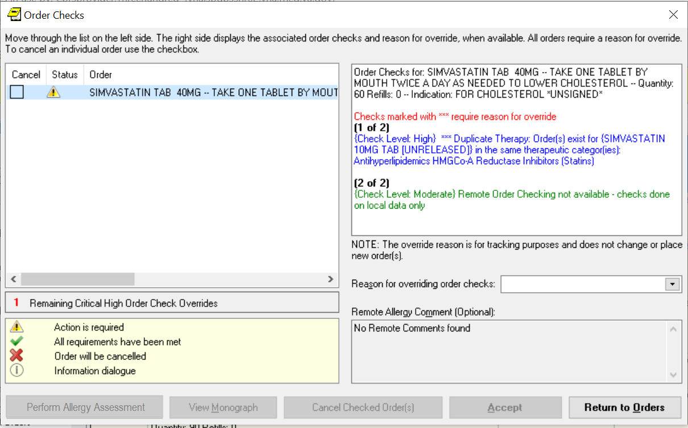

**The Order Checks dialog shows the full text of the order check. In this example, an item labeled “Checks marked with \*\*\*\* require reason for override” in red text and with blue description text would require a justification for overriding it**  
This dialog displays each medication or other item that had an order check in a separate section. Each item will have a check box allowing the user to check any orders that should be canceled at this point. Under the order text, the order checks are displayed, the most serious order checks are listed first. Those that need a justification for overriding the order check are displayed first, with the “Checks marked with \*\*\*\* require reason for override” in red and are displayed with blue descriptive text in the body of the order check. To accept these orders, the clinician must enter an override reason.

Whether the order check requires the clinician to enter a justification depends on how each site has set the severity for each order check. For example, the Pharmacy package determines if an interaction is critical or significant. Each site then determines whether the provider must enter a reason for override for the Critical Drug Interaction and Significant Drug Interaction order checks.

Another example would be allergy assessments. If the site has the No Allergy Assessment order check set as an order check that requires an override reason and the patient does not have an allergy assessment, then the order will require a justification for override. If the site has No Allergy Assessment as a moderate order check, CPRS does not require the clinician to enter an override reason. As an alternative, the user can perform an allergy assessment immediately by selecting the Perform Allergy Assessment button.

When a user enters an override reason, the reason for override is sent with the orders to ancillary packages so that the information is available to their users.

The dialog also has a View Monograph button. The button will not be active unless there is a drug-drug interaction. Selecting the See Monograph button will send the user to a monograph about the drug or drug class to help the provider with additional information. If there is more than one kind of drug, the Monographs for Order Checks dialog will display a dropdown list with the choices for the various kinds of medications.

#### Remote Order Checks

**Note:** Remote order checks will be available at sites when the RDI software, including patches OR\*3.0\*232, OR\*3.0\*238, OR\*3.0\*267, GMRA\*4.0\*26, and GMRA\*4.0\*37, is installed at each site. The RDI rollout is planned as a phased roll out that will last several months until all sites have the software installed.

In addition, with the Remote Data Interoperability (RDI) project, it is now possible to perform a limited number of order checks against remote outpatient pharmacy and allergy information from other Veterans Health Administration (VHA) facilities that is stored in the Health Data Repository (HDR). Another project, the Clinical Health Data Repository (CHDR) will enable remote order checks against allergies and outpatient medication data from Department of Defense (DoD) facility data that is stored in the HDR. The CHDR data only relates to active dual consumers (patients that are seen at both VHA and DoD facilities).

For the selected patient, RDI requests from the HDR all outpatient pharmacy data with an expiration or discontinued date starting 30 days in the past and going forward, including into the future.

**What Remote Order Checks Are Available?**

With RDI and CHDR, the following order checks occur:

-   Allergy Contrast Media Interaction  
-   Allergy-Drug Interaction  
-   Critical Drug Interaction  
-   Duplicate Drug Class Order  
-   Duplicate Drug Order  
-   Significant Drug Interaction  
**Which Items Are NOT Used in Remote Order Checks?**

Some items are not used in remote order checking because they are not stored in the HDR. Others have a high annoyance factor and therefore were not included at the request of field sites. The following items are not included in remote order checks:

-   Inpatient Medications  
-   Non-VA Meds  
-   Supply items  
-   Local drugs that are not matched to the National Drug File  
**Note:** The HDR-Hx and HDR-IMS contain prescriptions with drugs that are not matched to the National Drug File (NDF). This prescription data should be used in remote order checking for duplicate drug classes. Because the National Drug File is updated regularly, these missing order checks could be resolved whenever the NDF is updated. Some drugs may never be matched, especially drugs used in research.

**Will the Display Change?**

With RDI, if there is a problem with an order check, CPRS displays the information to the user potentially in two separate dialogs. The first dialog displays the allergy order checks:

-   It displays the facility name where the allergy was recorded, the reactant, signs, severity, and symptoms.  
-   For remote allergies, the user is required to give a reason for overriding order checks. The user is also able to write a local comment on a remote facility allergy.  
-   Allergies are sorted by clinical danger level:  
-   In cases where allergy severity and symptoms are identical in one or more order checks, a single consolidated order check will display. The sort order hierarchy is:  
-   First by Severity (Highest to Lowest).  
-   Second by Causative Agent.  
-   Last by Local and Remote locations.  
The second dialog displays the following information:

-   Medication orders include the last refill date and the quantity.  
-   Remote medication order checks display the facility name where the medication was prescribed. Local medication order checks do not display the facility name.  
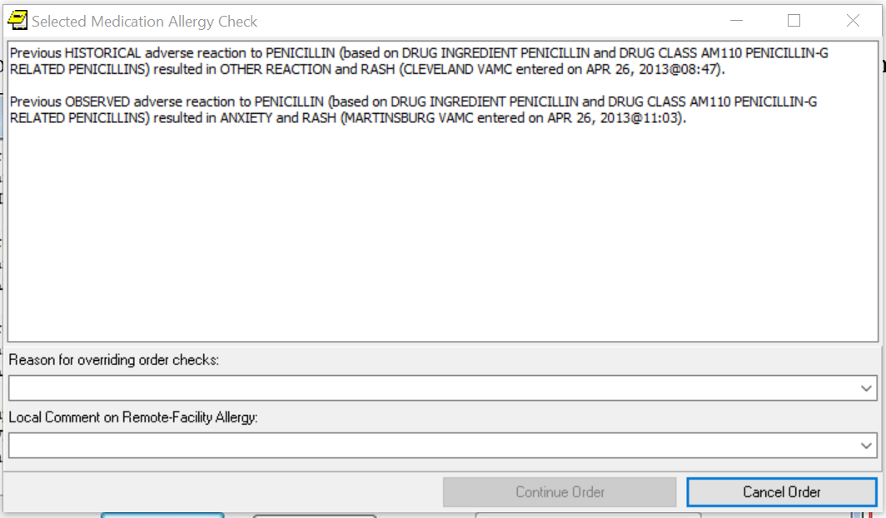

**This screen capture shows the Selected Medication Allergy Check with remote facility names.**

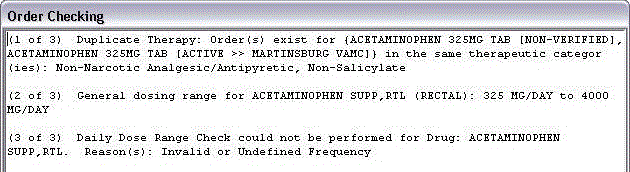

**This screen capture shows a duplicate therapy warning, a general dosing check, and a message that the daily dose range check could not be performed because of missing data**  
Allergies display the facility name where the allergy was recorded. If there is more than one station, the local station is displayed first.

To ensure that providers have the information they need, CPRS also provides the message “Remote Order Checking not available – checks done on local data only," as shown below, if CPRS cannot communicate with remote sources.

**If CPRS cannot communicate with remote sources, it indicates this in the message to the provider. The box and arrow are added here to show how the message will display**  
CPRS shows this message once during an ordering session when it cannot communicate with the HDR and then does not show it again until the user begins another ordering session. However, after displaying the message, CPRS continues to attempt communication with the HDR. If CPRS reaches the HDR, remote order checks will appear when orders are placed.

**How Is RDI Remote Order Checking Enabled?**

To use remote order checking, your site must enable a parameter to access HDR data. This parameter is set for the entire facility.

**When Does CPRS Get Remote Data?**

Order checks from CPRS can happen several times during a CPRS ordering session:

-   Beginning to write/copy/change orders – When a user selects an order menu to begin writing orders, CPRS requests some order checks, such as polypharmacy, renal function, or creatinine clearance, for example.  
-   On order acceptance – When the user selects Accept, CPRS requests the order checks.  
-   Signature of orders – When a user signs the order, CPRS requests order checks.  
**How Long Is the Data Used?**

A parameter that sites can set controls how long HDR data is stored locally and is considered “fresh” and can be used for order checks before the data will be retrieved again from the HDR. The default time for this parameter is 120 minutes or two hours, but each site can change the time in that parameter.

### Quick Orders

A quick order is a predefined order that a user can select. It has a value for some or all of the fields for the specific type of order selected. For example, on an outpatient medication order, the user might define the type of medication, dosage, route, and schedule, quantity, and number of refills. If the user does not define a value for one or more mandatory fields, CPRS will display the dialog for the user to fill in the missing values. Quick orders can be created for many different types of orders. There are two types of quick orders: personal and shared.

#### Personal Quick Orders

Personal quick orders are created when a user fills out the order dialog, but before the user accepts the order, the user can select Options \| Save as Quick Order… and give the quick order a name. CPRS saves the order, and it can then be used from that same dialog where it was created by the user that created it. Personal quick orders display at the top of the list of orders and are separated from the rest of the orders by a line.

For example, if a user creates a lab order and then saves it as a personal quick order, the user will give the personal quick order a name and that item will appear at the top of the lab order dialog with any other personal quick orders, followed by a line and then the full list of lab orders the next time that user opens the dialog.

To create a personal quick order, use these steps:

1.  Fill out an order dialog for a medication, lab, or other order that you frequently place, but DO NOT select Accept.  
1.  With the order dialog still up, select Options \| Save as Quick Order….  
1.  In the Add Quick Orders (type) dialog, where type is the package or type of order, such as Labs, Outpatient meds, etc., enter a name for the quick order and select OK.  
**Note:** You cannot save personal quick orders with the same name, even if the capitalization is different.

To manage personal quick orders, use these steps:

1.  Open the appropriate ordering dialog (Outpatient Meds, Inpatient Meds, Infusions, Labs, etc.).  
1.  Select Options \| Edit Common List….  
1.  To rename a personal quick order, do the following:  
1.  Highlight the personal quick order name.  
1.  Select the **Rename** button.  
1.  In the Rename dialog, type the new name for the personal quick order and select **OK**.  
1.  Repeat steps a-c if needed to rename additional orders.  
1.  To change the position of a personal quick order in the list, do the following:  
1.  Highlight the personal quick order name.  
1.  Use the arrow buttons to the left of the name list to move the name up or down to the chosen position.  
1.  Repeat steps a and b if needed to arrange the list to your preference.  
1.  To delete a quick order, do the following:  
1.  Highlight the personal quick order to be deleted.  
1.  Select the **Delete** button.  
1.  Repeat steps a and b if needed to delete additional personal quick orders.  
1.  When finished managing the personal quick order list, select OK.  
#### Shared Quick Orders

Shared quick orders are created in VistA by someone like a Clinical Applications Coordinator (CAC). These quick orders can be made available to all CPRS users by placing them on order menus, and can be used in order sets.

#### Antimicrobial Medication Quick Orders

Tracking the use of antimicrobial drugs can be accomplished by creating antimicrobial medication quick orders that contain “tracking hooks.” There are two hooks: The \|OR QUICK ORDER AUDIT\| hook tracks clinically preferred antimicrobial drug orders; the \|OR QUICK ORDER AUDIT(ALT)\| hook tracks orders that prescribe an alternative to a clinically preferred antimicrobial drug.

**Note**: Sites that do not wish to track antimicrobial prescribing practices using quick orders, or do not use the VISN 23 Antimicrobial Clinical Decision Support System (CDSS), do not need to perform the setup steps for using the antimicrobial hooks and reporting features described in this document.

Quick orders configured with either of the tracking hooks, and the CPRS menus that provide access to these quick orders, must be set up by a CAC or Office of Information and Technology (OIT) member. For information on how to set up microbial medication quick orders with tracking hooks, refer to the *Computerized Patient Record System (CPRS) Technical Manual: GUI Version*.

Upon logging into CPRS, a clinician with permission to prescribe antimicrobial drugs must navigate to the menu defined by the CAC responsible for implementing quick order audit capabilities. This menu lists available antimicrobial quick orders configured with a tracking hook. From this menu, the clinician can prescribe the clinically preferred medication, or an alternate drug, by selecting the quick order from the menu of available quick orders.

**Note**: The menu shown in the following example may be different from the implementation at your site. This menu should be customized for the specific needs of facility clinicians. Check with your CAC for more information.

In the following example, the menu is named “ANTIMICROBIAL QUICK ORDERS” and displays when the ANTIMICROBIALS option is selected from the Add New Orders menu. The site CAC may place this option elsewhere or use a different name. This is intended as an example only.

**To prescribe an antimicrobial drug using a tracking quick order in CPRS:**

1.  Navigate to the Add New Order menu and then select ANTIMICROBIALS (or the equivalent option defined by your site CAC). The ANTIMICROBIAL QUICK ORDERS menu displays.  
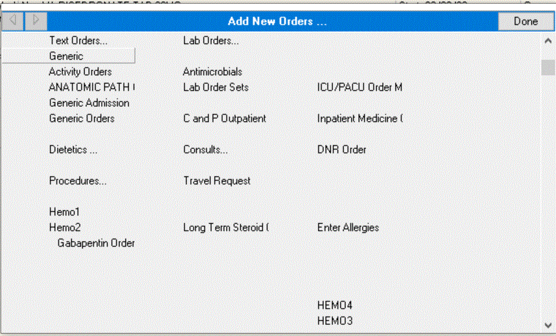

**Antimicrobials menu option on the CPRS Add New Orders popup menu**  
**Note:** Quick orders listed on the ANTIMICROBIAL QUICK ORDERS menu shown below are example quick orders containing either the Primary (clinically preferred drug) or the Alternative (to a clinically preferred drug) tracking hook.

The naming conventions for antimicrobial quick orders are site specific. Your CAC may use an alternative naming schema for the quick orders.

1.  Select a preconfigured quick order from the ANTIMICROBIAL QUICK ORDERS menu or the equivalent menu configured for your site.  
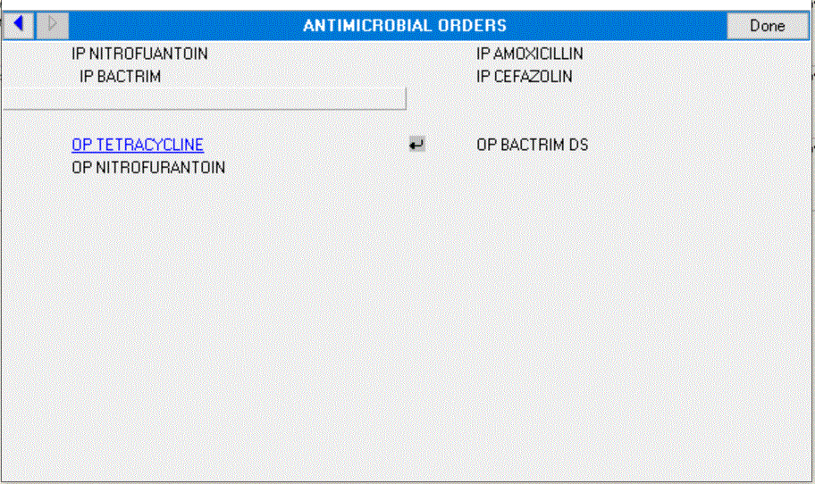

**Antimicrobial Quick Orders menu listing preconfigured antimicrobial quick orders**  
The medications order form displays information about the preconfigured quick order.

1.  Review the medication details and note the “Pharmacy Confirmation \#” displayed in the Comments field. This confirmation number is added automatically whenever an antimicrobial drug quick order is placed.  
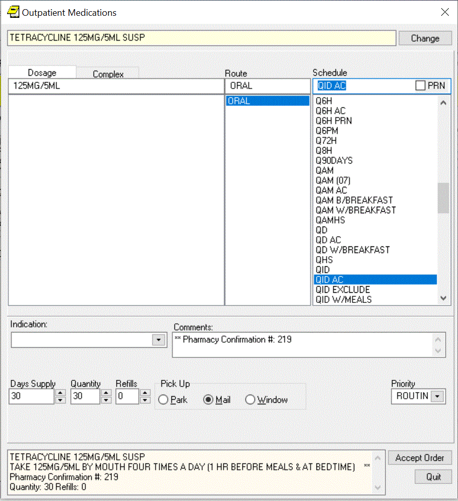

**Outpatient Medications form with Pharmacy Confirmation Number**  
1.  Select Accept to place the order or Quit to cancel without saving.  
1.  Select Done to close the Antimicrobial Quick Orders menu.  
### Entering Allergies from the Orders Tab

Although allergies and adverse reactions are not orders and CPRS does not display them on the **Orders** tab, you can enter allergies and adverse reactions from the **Orders** tab. You can also enter allergies from the **Cover Sheet** tab. (See “Entering Allergies” in the Assessing, Entering, and Reviewing Allergies/Adverse Reactions” section of this manual.)

#### Entering New Allergies

To enter allergies or adverse reactions from the **Orders** tab, take the following steps:

1.  Select the Orders tab.  
1.  Select Allergies from the Write Orders pane.  
The Allergy Reactant Lookup dialog appears.

**Note:** Your site may have defined and configured other order menus to include allergy-entry dialogs. Regardless of the allergy-entry menu you select, if you haven’t entered encounter information, the **Location for Current Activities** dialog appears before the **Allergy Reactant Lookup** dialog appears. You must complete the **Location for Current Activities** dialog before proceeding.

1.  Type the causative agent in the search field. (You must enter the first three letters (minimum) of the agent’s name.)  
1.  Select Search.  
Matching agents appear in the **Select from one of the following items** pane. If the causative agent you typed does not match any of the agents currently available for your site, CPRS displays the **Causative Agent Not On File** dialog, from which you can select one of the following options:

**Note:** The patient’s chart will not be updated unless you choose a causative agent that is on file.

a. **Yes**: Use this option to request that the causative agent be added for your site. When you click **Yes**, CPRS displays the **Enter Optional Comments** dialog, which enables you to type additional comments (optional), such as the signs or symptoms that occurred as a result of contact with this causative agent, or whether you observed these symptoms firsthand. After you type your comments, click **Continue**. CPRS then sends to members of your site’s GMRA Request New Reactant mail group a message that includes the following items:

-   The causative agent you attempted to enter  
-   The name of the patient for whom you attempted to make this entry  
-   Your name, title, and contact information  
-   Your comments  
**Note:** When the bulletin is sent, a message such as the following will display. This message also informs the user that the allergy was NOT entered into the patient’s record.

“Members of your site’s GMRA Request New Reactant mail group will review this message and, if appropriate, add the causative agent to your site’s ALLERGIES file.”

**Note:** If your site’s IRM staff has not yet added members to your site’s GMRA Request New Reactant mail group, CPRS displays the following message:

**CPRS displays this message if your IRM staff has not yet added members to the GMRA Request New Reactant mail group**  
1.  **No**: Use this option if you want to try an alternate spelling or trade name for your causative agent, or if you want to type another causative agent.  
1.  **Cancel**: Use this option if you want to cancel your allergy order.  

**The Causative Agent Not On File dialog**  
1.  If the causative agent you typed matches an agent that is currently available for your site, select the agent. (Click + to expand a heading.)  
**Note:** With CPRS GUI 24 or later, you may not add free-text causative agents. If you select an item under the “Add new free-text allergy” heading, CPRS displays the **Causative Agent Not On File** dialog. (See Step 4 above.)

1.  Select OK.  
The Enter Allergy or Adverse Reaction dialog appears.

**  
The Enter Allergy or Adverse Reaction dialog**  
**Note**: You can view a patient’s current allergies or adverse reactions by clicking the **Active Allergies** button. Also, CPRS no longer allows the user to change the allergy Originator.

**Note:** If the provider has an NPI, it will display on the screen above. See the "National Provider Identifier (NPI) Display in CPRS" section for an example of an NPI displaying on a screen.

1.  Use the Observed or Historical option button to indicate whether the entry is for an observed or historical allergy, respectively. (When you point your mouse at either of these buttons, CPRS displays a hover hint explaining the observed and historical options.)  
**Note:** Observed or Historical used to have a default, but the user must now select the appropriate choice. CPRS does not allow you to select future dates for allergy/adverse reaction entries.

**Note:** When you select Observed for a drug reaction, CPRS generates a Progress Note. Once this note is signed by the user entering the allergy or by an administrative update user, the note will be viewable by all users.

1.  Select the Nature of Reaction (Allergy, Pharmacological, or Unknown).  
The Nature of Reaction (also known as mechanism) can be Allergy, Pharmacologic, or Unknown. An allergic reaction occurs because the patient is sensitive to a causative agent, regardless of the amount the patient is exposed to. A pharmacologic (non-allergic) reaction occurs when the patient is sensitive to an agent under certain conditions, such as exposure to a large amount. Unknown is provided if you are not sure what mechanism to enter.

**Note:** Allergies are a subset of the world of adverse reactions. All allergies are adverse reactions, but not all adverse reactions are allergies.

1.  If you are entering an observed or historical allergy, use the Reaction Date/Time and Severity boxes to select a reaction date, time, and severity. These are required for observed but optional for historical allergies. (When the Severity box is visible, CPRS displays a ? button next to it. If you click this button, CPRS displays text that provides information about available severity selections.)  
**Note:** CPRS does not allow you to enter future dates for observed reactions.

1.  Using the Signs/Symptoms box, select one or more signs or symptoms. The signs and symptoms you select appear in the Selected Symptoms pane.  
**Note:** You must enter at least one Sign/Symptom or enter a comment of at least four characters when documenting a historical allergy/adverse drug reason.

1.  To associate a date and time with a symptom optional), click to select the symptom in the **Selected Symptoms** pane.  
1.  Select the Date/Time button located below the Selected Symptoms pane.  
CPRS displays the **Select Date/Time** dialog, from which you can select the date and time that the symptom first appeared.

**Note:** If you mistakenly entered a sign or symptom but have not yet accepted it by selecting OK, select the symptom in the **Selected Symptoms** pane and click the **Remove** button located beneath the pane.

1.  Type comments for the allergy in the Comments box.  
1.  If you have marked the allergy or adverse reaction on the patient’s identification (ID) band (or if you know someone else has), select the ID Band Marked check box.  
**Note:** CPRS activates the **ID Band Marked** check box only for inpatients and then only if your site’s IRM staff has set a parameter indicating your site wants to track this information. Depending on whether your IRM staff has set related parameters, if you do *not* select activated **ID Band Marked** check box, the system may send a bulletin notifying a mail group that the patient’s allergy or adverse reaction is not marked on his or her ID band.

1.  Select OK.  
**Note**: When you click OK, CPRS generates an email bulletin to the GMRA MARK CHART mail group. The bulletin provides a reminder that the patient chart must be updated with the allergy/adverse reaction information displayed in the bulletin message.

1.  If the newly entered allergy is related to existing pending and active orders, then the Existing Medication Allergy dialog is displayed for each order discovered, as shown in the screenshot below:  

1.  An Existing Medication Allergy will result in the NEW ALLERGY ENTERED/ACTIVE MED notification being sent to the default providers defined in the ORB PROVIDER RECIPIENTS parameter. Those providers who are able to receive the notification are displayed. Note, if a default provider recipient is unable to receive the notification they will not be listed.  
1.  The person entering the new allergy will also be able to select Optional Recipients to receive the NEW ALLERGY ENTERED/ACTIVE MED notification.  
**Note:** Although CPRS does not display allergy-related assessments on the **Orders** tab, you can also enter an assessment of no known allergies (NKA) from the **Orders** tab.

#### Entering No Known Allergies

To enter a no-known allergies assessment from the **Orders** tab, follow these steps:

1.  Select the **Orders** tab.  
1.  Select **Allergies** from the **Write Orders** pane.  
The Allergy Reactant Lookup dialog appears.

**Note:** Your site may have defined and configured other order menus to include allergy-entry dialogs. Regardless of the allergy-entry menu you select, if you haven’t entered encounter information, the **Location for Current Activities** dialog appears before the **Allergy Reactant Lookup** dialog appears. You must complete the **Location for Current Activities** dialog before proceeding.

1.  Select the No Known Allergies check box in the lower portion of the dialog box.  
1.  Select OK.  
**Note:** You can also enter a no-known-allergies assessment from the **Cover Sheet** tab.

### Ordering Diets and Outpatient Meals

From the Orders tab, users can place diet orders for inpatients and outpatients. For inpatients, users can place regular diet orders, tube feeding orders, early/late tray orders, isolations/precautions orders, and additional orders. For outpatients, users can place orders for recurring meals, special meals, tube feeding, early/late tray, isolations/precautions, and additional orders.

Some set up is required to use Outpatient meals. If it is not working properly, contact your IRM or ADPAC staff. An overview of set up issues is covered in the OR\*3.0\*215 Setup Notes.

The Nutrition and Food Service documentation is available on the VistA Documentation Library (VDL) at [http://www.va.gov/vdl/](http://www.va.gov/vdl) under Nutrition and Food Service.

**Note:** If a user begins to enter an inpatient diet and the patient already has a current or delayed diet order, CPRS will display a dialog to tell the user that the existing meal could be replaced. The dialog also shows the components of the existing diets.

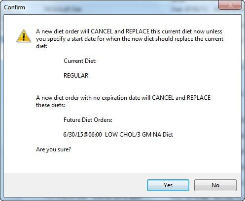

**CPRS displays this Confirm dialog if the user begins to enter an inpatient diet that will cancel and replace the current or delayed diet order**  
**Note:** If a user begins writing delayed diet orders that conflict because start and stop dates are not well defined, CPRS will display a dialog to inform the user that one of the diet orders may be replaced and gives users some guidance.

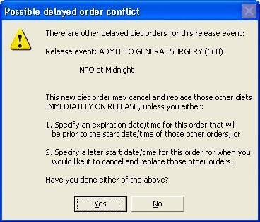

**The Possible delayed order conflict dialog displays to ask the user if the user has checked a couple of items**  
**Prevent Previous Active Diet Replacing NPO Order Upon Expire, Discontinue, or Cancel**  
The dietetics ordering functionality has been modified in order to prevent previous active diet orders replacing Nothing Permitted Orally (NPO) orders upon expiration, DC, or cancellation. The following changes have been made:  
1.  The NPO orderable item will be added to the Auto-DC Rules with the CPRS v31b installation. With this change, the auto-DC rules will prevent the discontinuation of the NPO diet orders for the following event types:  
-   Specialty transfer (S)  
-   OR (O)  
-   Transfer (T)  
***

and the NPO diet remains intact.  
***

1.  When NPO diet orders are attempted to be manually discontinued, CPRS prevents that action from being taken and displays the dialog box to the user with text “NPO Diet cannot be discontinued."  
1.  CPRS disallows all diet orders to have an Expiration Date/Time when ordered and prevent automatic reinstatement of a previous diet. If a new diet order is desired, a new diet must be ordered to replace the active diet order.  
1.  When ordering NPO, if a patient is currently on tube-feeding, the provider is displayed the dialog box “The patient currently has an active tubefeeding order \<display the current tube-feeding order here\>"  
1.  The Cancel Future Order Prompt from the tubefeeding order dialog has been removed. A conversion routine has been created to remove the prompt from any Quick Order. Additionally, Quick Orders will no longer allow the features of Auto Accept or Verify.  
1.  Accepting a tubefeeding order will prompt one of two different messages depending on the current diet status of the patient. If there is no existing order, the user will be prompted to enter a new diet order. If an existing diet order is present, the user will be prompted to keep the current diet or enter a new diet order.  
***

#### How Discharge Affects Diet Orders

The Nutrition and Food Service (N&FS) VistA package manages all diet-related order processing. The auto-discontinue process cannot discontinue active diet orders.

If the diet is to be replaced, then a new diet should be ordered.

Also, the rules for auto-discontinuing (auto-dc) orders can be affected by how different VistA packages handle discontinuing and how the package communicates with CPRS. Depending on the set up and parameters, the results may be different that a user might expect.

**Note:** If discharging/readmitting patients the Nutrition & Food Service package will auto-dc diet orders upon discharge. Plan to print diet lists pre-discharge so that patient’s current diet and standing orders can be manually re-entered/re-ordered upon admission.  
***

#### 

#### Regular Inpatient Diet Orders

To place a regular diet order, follow these steps:

1.  Select the Orders tab.  
1.  Select the active orders view from the View Orders pane. -or- select View \| Active Orders (includes pending, recent activity).  
1.  Select Diet in the Write Orders list box.  
1.  If there is a conflict, ensure that the order you are entering will not create a problem with a current or delayed diet order.  
The Diet Order dialog box appears.

**Note:** The diet order may be labeled differently or may not be available from your Write Orders list box.

**Note:** The encounter information dialog may appear before the Diet Order dialog if you have not entered encounter information. If the encounter information dialog appears, enter the necessary information and select OK.

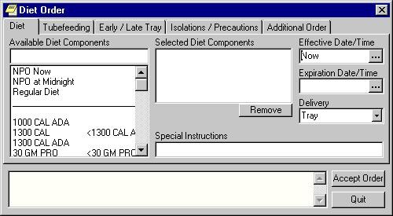

**The Diet Order dialog allows you to order several different types of diets**  
1.  Choose a diet from the Available Diet Components list box on the Diet tab. (Quick orders are at the top of the list).  
The component that you select will be displayed in the Selected Diet Components field. You can remove the component by selecting it and clicking Remove.

1.  Enter the effective date and time and the expiration date and time by doing one of the following:  
-   entering a date (e.g. 6/21/01 or June 21, 2001).  
-   entering a date formula (e.g. t-200).  
-   clicking the  button to bring up a calendar.  
1.  Select a delivery method from the Delivery field.  
1.  Type in any special instructions.  
1.  Select Accept Order.  
**Note**: The order must be signed before it is sent. You can either sign the order now or wait until later.

#### Inpatient Tube feeding Diet Orders

To place a tube feeding diet order, follow these steps:

1.  Select the Orders tab.  
1.  Select the active orders view from the View Orders pane.  
\-or-

select View \| Active Orders (includes pending, recent activity).

1.  Select Diet in the Write Orders list box.  
1.  If there is a conflict, ensure that the order you are entering will not create a problem with a current or delayed diet order.  
The Diet Order dialog will appear.

**Note:** The diet order may be labeled differently or may not be available from your Write Orders field.

**Note:** If encounter information has not been entered, the encounter information dialog appears before the *Diet Order* dialog. You must complete the encounter information dialog before proceeding.

1.  Select the Tube feeding tab.  
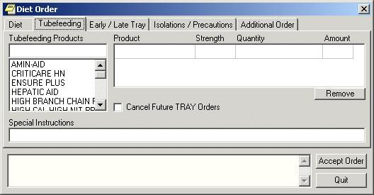

**The Tube feeding tab on the Diet Order dialog**  
1.  Select a tube feeding product from the list.  
1.  Select a strength and a quantity from the grid on the right side of the dialog.  
CPRS will automatically complete the Amount field if it needs to multiply as a result of the schedule. If there is a problem with the Quantity, CPRS displays a dialog to help the user know how to enter an acceptable value:

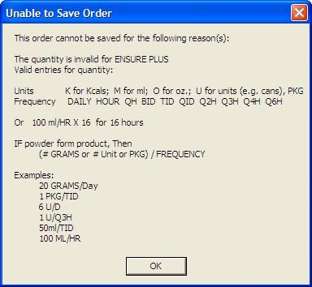

**Note:** You can remove a product by selecting the product and clicking Remove.

1.  If you would like to cancel future tray orders, select the “Cancel Future TRAY Orders” checkbox.  
1.  Enter any special instructions.  
1.  Select Accept Order.  
#### Early / Late Tray Diet Order

Early/Late Tray orders must be associated with an existing diet order. Once these orders have been placed, they are separate from the order with which they are associated. These orders do not discontinue automatically if the existing order is discontinued.

To place an early / late tray diet order, follow these steps:

1.  Select the Orders tab.  
1.  Select the active orders view from the View Orders pane -or- select View \| Active Orders (includes pending, recent activity).  
1.  Select Diet in the Write Orders list box.  
1.  If there is a conflict, ensure that the order you are entering will not create a problem with a current or delayed diet order.  
The *Diet Order* dialog will appear.

**Note:** The diet order may be labeled differently or may not be available from your Write Orders list box.

**Note:** The encounter information dialog may appear before the Diet Order dialog if you have not entered encounter information. If the encounter information dialog appears, enter the necessary information and click OK.

1.  Select the Early / Late Tray tab.  
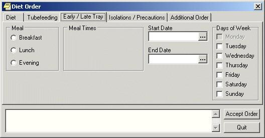

**The Early / Late Tray tab**  
1.  Select Breakfast, Lunch, or Evening from the Meal option group.  
The appropriate meal times will appear in the Meal Times option group.

1.  Select a meal time.  
1.  Select a start and end date by doing one of the following:  
-   entering a date (e.g. 6/21/01 or June 21, 2001)  
-   entering a date formula (e.g. t-200)  
-   clicking the  button to bring up a calendar  
1.  Select which days the order will be effective from the Days of Week option group.  
1.  Select Accept Order.  
#### Isolations/Precautions Order

To place an isolations/precautions order, follow these steps:

1.  Select the Orders tab.  
1.  Select the active orders view from the View Orders pane –  
or-

select **View** \| **Active Orders (includes pending, recent activity)**.

1.  Select Diet in the Write Orders list box.  
1.  If there is a conflict, ensure that the order you are entering will not create a problem with a current or delayed diet order.  
The *Diet Order* dialog will appear.

**Note:** The diet order may be labeled differently or may not be available from your Write Orders field.

**Note:** If encounter information has not been entered, the encounter information dialog appears before the *Diet Order* dialog. You must complete the encounter information dialog before proceeding.

1.  Select the Isolations / Precautions tab.  
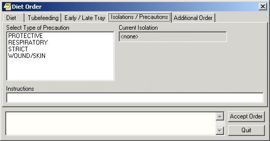

**The Isolations / Precautions tab on the Diet Order dialog box**  
1.  Select a type of precaution.  
1.  Enter any necessary instructions in the Instructions field.  
1.  Select Accept Order.  
#### Additional Diet Order

**To place an additional diet order, follow these steps:**

1.  Select the **Orders** tab.  
1.  Select the active orders view from the View Orders pane  
\-or-  
select View \| Active Orders (includes pending, recent activity).  
1.  Select **Diet** in the Write Orders list box.  
1.  If there is a conflict, ensure that the order you are entering will not create a problem with a current or delayed diet order.  
The Diet Order dialog box will appear  
**Note**: The diet order may be labeled differently or may not be available from your Write Orders field.

**Note**: If encounter information has not been entered, the encounter information dialog appears before the *Diet Order* dialog. You must complete the encounter information dialog before proceeding.

1.  Select the **Additional Order** tab.  
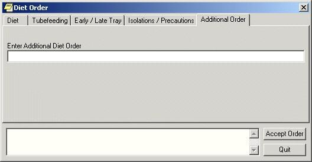

**The Additional Diet Order tab**  
1.  Enter the text for the order in the Additional Diet Order field.  
1.  Select Accept Order.  
#### Outpatient Recurring Meals

Recurring meals for outpatients might be ordered if a patient comes to a clinic regularly for treatment during meal times.

When the users select the Recurring Meal menu item, the Outpatient Meals tab of the Diet Order dialog displays as shown below.

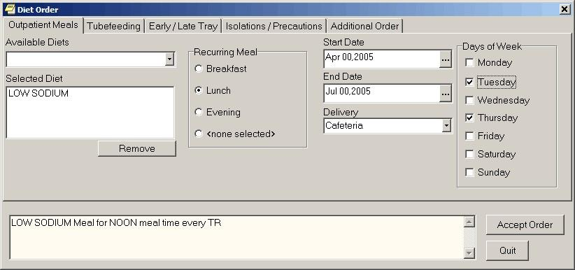

**On the Outpatient Meals tab of the Diet Order dialog, users can order recurring meals for outpatients. In this example, the site set up LOW SODIUM as Outpatient Diet 1, which is therefore the default that displays under Selected Diet when the dialog first displays**  
Sites must set up the Available Diets selections in the Nutrition and Food Service package through the List Manager interface. Sites can designate up to 15 diets, the first of which is the default. The 15 selections and their synonyms display under Available Diets for selection when the user selects the drop-down list. The first diet is the default and is displayed under Selected Diet when the user selects the Recurring Meal menu item.

To order a recurring meal, use the following steps:

1.  Select the Orders tab.  
1.  Select the active orders view from the View Orders pane  
\-or-

select **View** \| **Active Orders (includes pending, recent activity)**.

1.  Select Dietetic Orders from the Write Orders pane.  
1.  Select Outpatient Recurring Meal.  
1.  Select the appropriate diet under Available Diets or if the default is correct, you may simply use it.  
1.  Select the appropriate time (Breakfast, Lunch, or Dinner) under Recurring Meal.  
The default is none selected.

1.  Select a Start Date.  
1.  Select an End Date.  
1.  Select the method of Delivery.  
1.  Select the days of the week that the meal should be given.  
1.  Review the order text in the field at the bottom of the dialog for accuracy.  
1.  Select Accept Order.  
1.  When finished, select Quit.  
#### 

#### Special Meals

Users order special meals for a meal that must be ordered today and is a one-time occurrence instead of a recurring meal. The same Available Diets and default diet that sites defined recurring outpatient meals are used in this dialog. Sites must set up the Available Diet selections in the Nutrition and Food Service package through the List Manager interface. If these outpatient diets are not set up, the user will not be allowed to order outpatient meals.

Sites can designate up to 15 outpatient diets, the first of which is the default. The 15 selections and their synonyms display under Available meals for selection when the user selects the drop-down list. The first diet is the default and is displayed under Selected Diet when the user selects the Recurring Meal menu item.

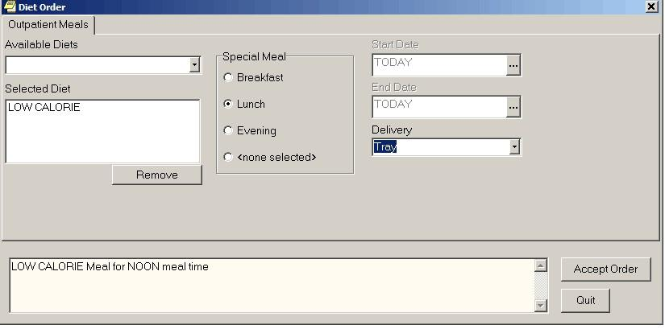

**Users can order special meals for today only. They choose the diet, meal time, and delivery method**  
If a special meal order generates a meal voucher, the meal voucher requires a signature. If the user placing the order can authorize the meal voucher (holds the FHAUTH key), the meal voucher will be “signed” when that person signs the order in CPRS. If the ordering user cannot authorize it, the meal voucher is printed without a signature and must be manually signed.

To order a special meal, use the following steps:

1.  Select the **Orders** tab.  
1.  Select the active orders view from the View Orders pane  
\-or-

select **View \| Active Orders** (includes pending, recent activity).

1.  Select **Dietetic Orders** from the Write Orders pane.  
1.  Select the Outpatient Special Meal menu item.  
1.  Select the appropriate diet under Available Diets, or if the default is correct, you may simply use it.  
1.  Select the appropriate time (Breakfast, Lunch, or Dinner) under Recurring Meal. The default is none selected.  
1.  Select the method of Delivery.  
1.  Review the order text in the field at the bottom of the dialog for accuracy.  
1.  Select Accept Order.  
1.  When finished, select **Quit**.  
#### Outpatient Tube Feeding Diet Orders

Outpatient tube feeding orders must be associated with a recurring meal. If no recurring meal has been ordered for the selected patient, CPRS displays a message informing the user and the user cannot order tube feeding.

To place a tube feeding diet order, follow these steps:

1.  Select the Orders tab.  
1.  Select the active orders view from the View Orders pane. -or- select View \| Active Orders (includes pending, recent activity).  
1.  Select Dietetic Orders in the Write Orders list box.  
The Diet Order dialog will appear.

**Note:** The diet order may be labeled differently or may not be available from your Write Orders field.

**Note:** If encounter information has not been entered, the encounter information dialog appears before the *Diet Order* dialog. You must complete the encounter information dialog before proceeding.

1.  Select the Tube feeding tab.  
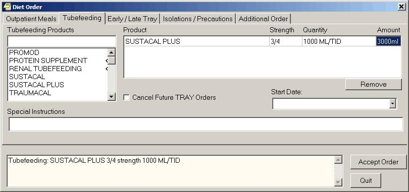

**The Tube feeding tab on the Diet Order dialog**  
1.  Select a tube feeding product from the list.  
1.  Enter strength and a quantity in the grid on the right side of the dialog.  
CPRS will automatically complete the Amount field if it needs to be multiplied as a result of the schedule. If there is a problem with the Quantity, CPRS displays a dialog to help the user know how to enter an acceptable value:

**Note:** You can remove a product by selecting the product and clicking Remove.

1.  If you would like to cancel future tray orders, select the “Cancel Future TRAY Orders” checkbox.  
1.  Select the specific meal for which the tube feeding is being ordered from the Start Date drop-down list.  
1.  Enter any special instructions.  
1.  Select Accept Order.  
#### 

#### Early/Late Tray Outpatient Meal Order

Outpatient early/late tray orders must be associated with a recurring meal. If no recurring meal has been ordered for the selected patient, CPRS displays a message informing the user and the user cannot order the early/late tray.

Once these orders have been placed, they are separate from the order with which they are associated. These orders do not discontinue automatically if the existing order is discontinued.

To place an early / late tray diet order, follow these steps:

1.  Select the Orders tab.  
1.  Select the active orders view from the View Orders pane -or- select View \| Active Orders (includes pending, recent activity).  
1.  Select Dietetic Orders in the Write Orders list box.  
The *Diet Order* dialog will appear.

**Note:** The diet order may be labeled differently or may not be available from your Write Orders list box.

**Note:** The encounter information dialog may appear before the Diet Order dialog if you have not entered encounter information. If the encounter information dialog appears, enter the necessary information and select OK.

1.  Select the Early / Late Tray tab.  
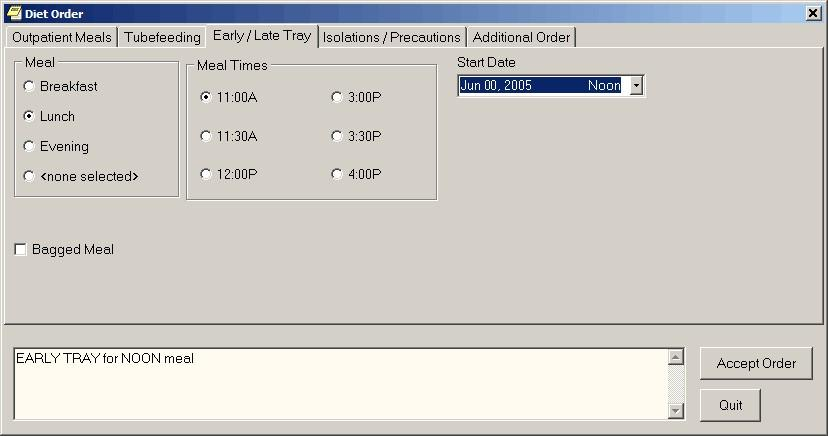

**The Early / Late Tray tab**  
1.  Select Breakfast, Lunch, or Evening from the Meal option group.  
The appropriate meal times display in the Meal Times option group.

1.  Select a meal time.  
1.  Select the specific meal this order applies to from the drop-down list.  
1.  Select Accept Order.  
#### Isolations/Precautions Order

To place an isolations / precautions order, follow these steps:

1.  Select the Orders tab.  
1.  Select the active orders view from the View Orders pane -or- select View \| Active Orders (includes pending, recent activity).  
1.  Select Dietetic Orders in the Write Orders list box.  
The *Diet Order* dialog will appear.

**Note:** The diet order may be labeled differently or may not be available from your Write Orders field.

**Note:** If encounter information has not been entered, the encounter information dialog appears before the *Diet Order* dialog. You must complete the encounter information dialog before proceeding.

1.  Select the Isolations / Precautions tab.  

**The Isolations / Precautions tab on the Diet Order dialog box**  
1.  Select a type of precaution.  
1.  Enter any necessary instructions in the Instructions field.  
1.  Select Accept Order.  
#### 

#### Additional Outpatient Meal Order

To place an additional order for outpatient meals, follow these steps:

1.  Select the Orders tab.  
1.  Select the active orders view from the View Orders pane -or- select View \| Active Orders (includes pending, recent activity).  
1.  Select Dietetic Orders in the Write Orders list box.  
The Diet Order dialog box will appear

**Note:** The diet order may be labeled differently or may not be available from your Write Orders field.

**Note:** If encounter information has not been entered, the encounter information dialog appears before the *Diet Order* dialog. You must complete the encounter information dialog before proceeding.

1.  Select the Additional Order tab.  
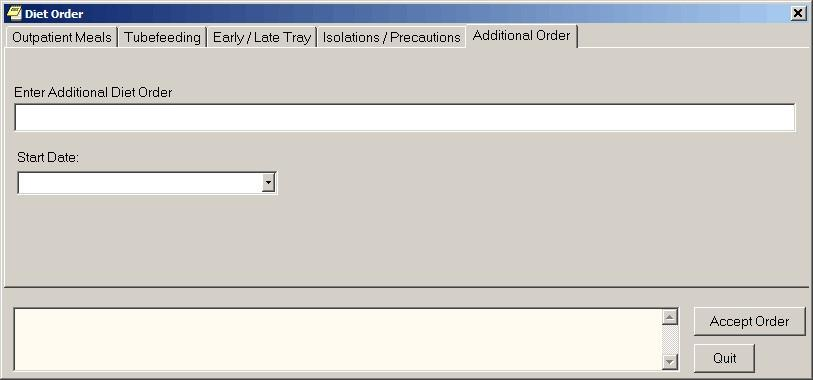

**The Additional Diet Order tab**  
1.  Enter the text for the order in the Additional Diet Order field.  
1.  Select the specific meal that this additional order applies to from the Start Date drop-down box.  
1.  Select Accept Order.  
### 

### Ordering Medications

Using CPRS, providers can order inpatient and outpatient medications with simple doses or complex doses. Providers can place medications orders for unit dose or infusion orders for inpatients. Also, CPRS enables providers to quickly order medications that will be given in clinics.

There are a few items that deal with how CPRS works that providers need to be aware of when ordering medications, such as

-   the need for inpatient mediations to have a valid schedule, including the option to use the schedule builder  
-   a possible error if there is mismatch between the CPRS order number and the pharmacy order number  
-   how CPRS displays unit dose routes  
-   how CPRS displays non-formulary drugs  
-   requirements for Clozapine treatment  
This section then goes through how to order medications for inpatients, outpatients, and patients seen in clinic. The various sections will also include how to write medication orders for unit dose and infusion orders.

#### Valid Routes for Inpatient Medications

Inpatient medication orders now require a valid schedule. If users do not find the appropriate schedule in the list, they can choose to create a day-of week/administration time schedule using the new Schedule Builder. This feature also works for renewing and changing inpatient medication orders. The procedure for ordering medications is described below.

**Note:** Because a valid schedule is required, if you attempt to modify an existing medication order that does not have a valid schedule, you will receive a message box stating that and will have to enter a valid schedule.

#### Order Number Mismatch between CPRS and Pharmacy

When a user takes actions on an order, such as renewing, changing, or discontinuing it, an infrequent error sometimes occurs where the order number in CPRS and the order in Pharmacy do not match. In this case, CPRS displays a warning that there is an “invalid pharmacy order number” and instructing the user to contact someone in the Pharmacy service to complete the action.

#### Rules for the Display of Unit Dose Routes in CPRS

CPRS displays unit dose routes based on the following rules:

1.  If a default medication route is defined in the orderable item file, CPRS displays only the default medication route for the Unit Dose orderable item in the medication route selection list.  
1.  If there is no default medication route defined for the orderable item, CPRS displays all possible medication routes for the dosage form to the provider for selection.  
1.  If there is only one possible medication route, it will be used as the default.  
1.  If a medication route name or its abbreviation is not included in the selection list, a user may type it in.  
#### How CPRS Designates Non-Formulary Drugs

Also, medications that are not in the formulary display in the list with the letters “NF” after the name or synonym, which is also displayed. CPRS checks for nonformulary dosages (e.g., the VA formulary may not have a 2.5 MG pill, but it may have a 5.0 MG pill) and for non-formulary orderable items (e.g., the VA may not carry a specific kind of allergy medication).

### New Clozapine Requirements

**Note:** The following information was provided by the National Clozapine Coordination Project completed in Mental Health patch YS\*5.01\*122.

Enhanced and new functionality includes updated FDA guidelines for using ANC lab results exclusively for treating and monitoring patients taking clozapine, as shown in the following table. The new guidelines replace previous requirements which included both white blood cell (WBC) count and ANC lab results. The Mental Health software’s code replaces the WBC/ANC results combination and supports ANC values solely as the lab value of choice.

**Note:** FDA REMS prescribed dosage and monitoring is based on the ANC value only; however, VA **requires** a matching WBC, indicating the WBC is from the same draw date/time as the ANC.

FDA ANC Levels and Monitoring Guidelines

| **ANC Level**         | **ANC Monitoring**  | **Frequency of ANC lab tests**                                                                                                                        |
|-----------------------|---------------------|-------------------------------------------------------------------------------------------------------------------------------------------------------|
| Normal range          | ANC ≥ 1500 cmm      | Weekly (W) for patients 1 – 6 months on therapy  Bi-weekly (B) for patients 6 – 12 months on therapy  Monthly (M) for patients \>12 months on therapy |
| Mild neutropenia      | 1000 – 1499 cmm     | ANC labs 3 times weekly until ANC stabilizes to 1500 cmm or greater                                                                                   |
| Moderate neutropenia  | 500 – 999 cmm       | ANC labs Daily until ANC stabilizes to 1000 cmm or greater, then 3 times weekly until ANC stabilizes to 1500 cmm or greater                           |
| Severe neutropenia    | \< 500 cmm          | ANC labs Daily until ANC stabilizes to 1000 cmm or greater, then 3 times weekly until ANC stabilizes to 1500 cmm or greater                           |

**Note:**  The ANC unit of measure is expressed as cells per cubic millimeter (cmm) which is equivalent to cu mm, mm3 or µL.

| Absolute Neutrophil Count (ANC) is lab test of choice    | Per the REMS document, “the WBC count is required in order to calculate the ANC; however, ANC is a more relevant indicator of drug-induced neutropenia than WBC count.”  New and enhanced functionality is based on the presence of an ANC result in the last 7 days.  |
|----------------------------------------------------------|------------------------------------------------------------------------------------------------------------------------------------------------------------------------------------------------------------------------------------------------------------------------|
| ANC less than 1000 cmm                                   | The FDA recommends that clozapine treatment be discontinued if the ANC is less than 1000 cmm; however, with correct documentation and justification by the provider, the NCCC Director has the discretion to continue treatment through a National Override.           |

**Note:**  Recently the FDA offered continuation of clozapine when a patient’s ANC result is less than 1000 cmm. To continue clozapine in this situation, VA requires the patient to sign a special informed consent form in which the patient accepts the risks of continuation and prescriber’s clinical justification for medical review is documented by the Director of NCCC.

The other order checks related to clozapine will continue to work as they have prior to these changes.

Additionally, the values of the Days Supply, Quantity, and Refills fields are restricted based on the type of patient that Mental Health designates in their files when the provider is ordering clozapine. This can be a 7, 14, or 28-day recipient of the clozapine drug. For refills, the following rules apply:

-   Patients on a 7-day monitoring frequency have no refills available.  
-   Patients on a 14-day monitoring frequency can receive a full 14-day supply or a 7-day supply and ONE refill.  
-   Patients on a 28-day monitoring frequency can receive EITHER a full 28day supply, or a 14-day supply and ONE refill, or a 7-day supply and THREE refills.  
CPRS now prevents the user from renewing outpatient and inpatient clozapine orders.

**Note:**  Clozapine orders should not be renewed and each order for clozapine should be entered as a new order. Renewal of clozapine is not allowed in CPRS from the Orders tab of the chart and renew is also blocked in the VistA Pharmacy Software. CPRS currently allows clozapine renewal from the CPRS Meds tab. This is a known issue and users should not attempt to renew orders for clozapine.

#### Normal ANC Results

The FDA defines Normal – sometimes referred to as “safe” or “passing” ANC results – as equal to or greater than 1500 cmm. When the system identifies that the ANC results are Normal and a matching WBC is present, the provider completes the prescription/order which is sent as a Pending Order to pharmacy. There are no message updates in CPRS for a Normal ANC result.

#### Mild Neutropenia

The FDA defines Mild neutropenia as an ANC result from 1000 to 1499 cmm. New ANC lab test monitoring guidelines for Mild neutropenia are presented to the ordering provider in a new CPRS message:

Test ANC labs 3x weekly until levels stabilize to greater than or equal to 1500 cmm.

#### Moderate and Severe Neutropenia

FDA defines Moderate neutropenia as ANC 500-999 cmm and severe neutropenia as ANC less than 500 cmm. Both Moderate and Severe neutropenia require the same lab test monitoring guidelines as they are both less than 1000 cmm. A new CPRS message includes:

Test ANC labs daily until levels stabilize to equal to or greater than 1000 cmm, then test ANC labs 3x weekly until levels stabilize to greater than or equal to 1500 cmm.

When there is Moderate or Severe neutropenia with a matching WBC result present, a **National Override** is required. If a matching WBC result is not present, the system will alert the provider that the system will address the ‘No Matching WBC’ issue first. See information on No Matching WBC.

##### Moderate and Severe Neutropenia – National Override in Effect

When a National Override for Moderate or Severe Neutropenia has been approved by the NCCC and is in effect, modified CPRS screens display, including instructions for testing ANC.

##### No ANC Results

The system relies on the presence of an ANC result to treat patients receiving clozapine, with exceptions as noted to override in certain conditions. The system requires an ANC within the last 7 days.

For registered patients with a **history of normal ANC results**, the requirement for a normal ANC result in the last 7 days may be bypassed to meet an urgent need under special conditions.

In CPRS, when the provider is notified that there are no ANC results in the last seven days, they will decide based on the following:

1.  Non-emergency  
If this is **not an emergency**, the provider will request a National Override to dispense the clozapine at the **patient’s normal frequency**. When the National Override is authorized and recorded in the local VistA system, the provider reenters the order and a Pending prescription/order to dispense clozapine at the patient’s normal frequency is sent.

For example, this may be used when:

1.  The patient’s last blood test was done at another facility and isn’t in the local VistA system, but the provider has seen the results  
1.  The provider feels it is unnecessary – perhaps the patient is at end of life or some other medical condition – and there is no need to keep drawing blood  
1.  Emergency 4-day supply – Special Conditions Local Override  
In an **emergency where a 4-day supply is needed**, the provider may choose to use a Special Conditions Local Override which optionally allows a **one-time 4-day emergency supply** to be dispensed for specific prescriber-approved reasons.

**Note:**  A written prescription or order is *required*. Special Conditions Local Override is not supported in CPRS – no Pending Order is available.

If the patient is an **Outpatient**, the prescriber-approved reason must be one of the following:

1.  Weather-related conditions  
1.  Mail order delay  
1.  Inpatient going on leave  
If the patient is an **Inpatient**, the prescriber-approved reason will be:

1\. IP Order Override with Outside Lab Results

When there is No ANC result for the last 7 days, a new CPRS screen displays notifying the provider of the missing results. The top part of the new CPRS message indicates the option to request a National Override when the condition is **not an emergency** and clozapine is to be dispensed at the **patient’s normal frequency**.

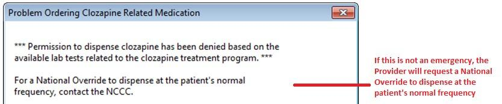

If this is an emergency, the bottom part of the new CPRS message is dependent on whether this is an Outpatient or and Inpatient.

##### Outpatient

If this is an Outpatient, the second part of the message is to instruct the provider to write a prescription and include an **approved reason from the list**.

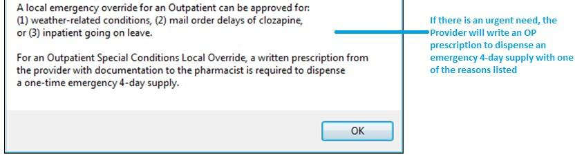

##### Inpatient

If this is an Inpatient, the second part of the message is to instruct the provider to write an order and include the **single approved reason – IP Order Override with Outside Lab Results**.

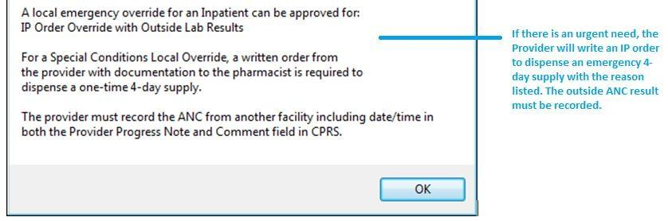

##### No Matching WBC (ANC Present)

When there is an ANC result in the last 7 days but no matching WBC, regardless of whether it is a normal result or indicates mild or moderate to severe neutropenia, the system will address the ‘No Matching WBC’ condition first. A warning message to the provider will require a National Override in order to dispense clozapine. The system can only address one condition at a time.

**Note:**  A Matching WBC result is collected at the same draw date/time as the ANC.

##### Emergency Registration Override

An Emergency Registration Override is typically warranted for the following reasons:

1.  The patient has a current NCCC registration at another VistA facility  
-   Inpatient transferred from another facility  
-   Outpatient from another facility becomes an inpatient  
1.  The patient has never been registered at the local facility  
1.  The patient status has changed from Active to Discontinued  
1.  An Outpatient with a prescription that had previously been filled outside of the VA or at another VA facility arrives during NCCC non-duty hours  
**Note:**  A Clozapine Authorization Number is only valid for a patient at the facility where they were registered. When a Clozapine patient arrives at a new facility, they need to be re-registered with a new Clozapine Authorization Number before the facility’s CPRS and Pharmacy applications will allow a Clozapine order to be processed.

If the patient is not actively registered at NCCC, this new CPRS message displays to the provider prior to a hard stop:

\*\*\* This patient is not registered in the clozapine treatment program or has been discontinued from the program. A new registration number must be assigned. If this is not an emergency, contact the NCCC. For emergency registration during non-NCCC duty hours, a written order to the pharmacist can be used to process a registration override. \*\*\*

#### Ordering Inpatient Medications (Simple Dose)

**Note:** If the user attempts to order inpatient medications for an inpatient from an outpatient location, CPRS discontinues the order process and returns the user to original Orders or Meds tab display.

To write a new inpatient medication order with a simple dose, follow these steps:

1.  Select the **Orders** tab and select the appropriate item in the Write Orders pane.   
      
    The Inpatient Medications dialog appears.  

**The Inpatient Medications order dialog allows you to select from a list of personal quick orders or medication**  
1.  Locate the medication name or quick order name in the list box by typing characters in the Medication field.  
**Note:** CPRS now only auto-selects (highlights in blue and places that entry in the field) a medication, dosage, route, or schedule if the user types enough characters to uniquely identify an item in the list. If the user does not enter enough characters to uniquely identify an item, CPRS waits until the user manually selects an item using the mouse or the keyboard.

1.  Select the quick order or medication name using the mouse or keyboard.  
The lab results for the most recent lab test associated with the selected medication are displayed in the Information field, if an associated lab test was performed within the last 365 days.

**Note:** A CAC or ADPAC will need to set the OR CPRS LAB DISPLAY ENABLED parameter to ON to activate the lab results display at a site.

To view associated lab results for Quick Orders, a TIU OBJECT must be inserted into the Quick Order. For more information, refer to the Text Integration Utility (TIU) Clinical Coordinator & User Manual. This functionality will work for generalized Quick Orders only (orders assigned to Order Menus). It is not currently implemented for personal Quick Orders.

The lab results functionality will not work properly for multidivisional facilities or any sites that use different lab test names at different sites, as only one lab test name can be associated with each drug. To successfully implement this functionality, all facilities/divisions that share a VistA system must use the same name for each monitored lab test.

**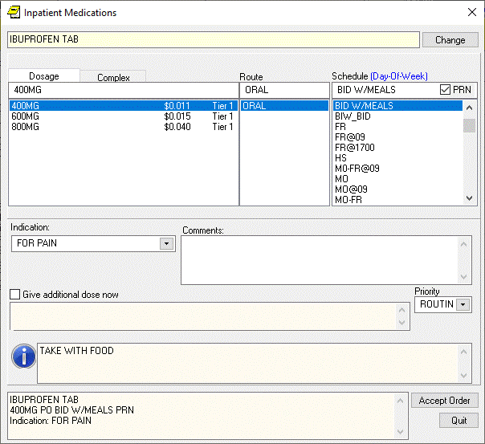**

**Note:** CPRS now uses a look up from Pharmacy to determine whether the selected medication is a controlled substance that requires the signature of a provider with a DEA number. For controlled substances, CPRS displays a message—“Order for controlled substance could not be completed. Provider does not have a current, valid DEA\# on record and is ineligible to sign the order”—as shown in the graphic below. CPRS allows orders for controlled substances only when selected providers are able to sign the orders. You may need to exit the dialog, change the provider selection, and then reenter the dialog. See *Appendix D: Error Messages and Troubleshooting* for a full list of error messages related to controlled substance ordering.

**You must have a DEA\# to order certain medications**  
**Note:**  CPRS requires a patient have a valid address if the selected outpatient medication is a controlled substance that requires the signature of a provider with a DEA number. For outpatient controlled substances, CPRS displays a message – “Controlled substance prescriptions require a patient address. Please contact administrative support to update patient address information.” if the patient does not have a valid address. The contact information in the display may be customized using the Enter/Edit Missing ZIP Code Message option in the GUI Parameters menu.

**Controlled substance prescriptions require a patient address**  
1.  Selected the **Dosage** field and select a dosage.  
The dosage may not begin with a decimal, for example .5; it must begin with a numerical value, 0.5 for example. Also, the character “\^” may not be entered in the Dosage field. (The associated cost is displayed to the right of the dosage.)

Once a dosage is selected, any lab test results displayed in the Information field are replaced by the National Standard Orderable Item information.

**Note:** CPRS now only auto-selects (highlights in blue and places that entry in the field) a medication, dosage, route, or schedule if the user types enough characters to uniquely identify an item in the list. If the user does not enter enough characters to uniquely identify an item, CPRS waits until the user manually selects an item using the mouse or the keyboard.

1.  Enter a **Route** by either selecting one from the list or typing in a valid route (a default route may have been set up).  
1.  In the **Schedule** pane, select an existing schedule from the list or, to use a day-of-week/administration time schedule not on the list, select **OTHER** (you can also click the Day-of-Week link and then click OK on the dialog that displays).  
When the user selects a schedule, the administration times may display under the “Give additional dose now” text for a simple dose. The administration times will display if they have been defined for the ward or if there is a default as long as the schedule is not a PRN schedule.

1.  If you selected an existing schedule, skip to step 8. If you selected **OTHER**, CPRS displays the *Order with Schedule ‘OTHER*’ dialog. Take the following steps:  
1.  Select one or more checkboxes by the appropriate days of the week.  
1.  If the schedule requires specific administration times skip to steps c and d. To select a schedule from the list, highlight the schedule and select **Add**.  
**Note:** Users can assign either a schedule from the list or specific administration times, but not both. Also, because the user is specifying days of the week and a schedule, the list will contain only schedules less than 24 hours (for example, Q36H will not be in the list).

1.  To use a specific administration time, select the hour and minutes (if the user only selects the hour, the minutes will default to zero) and select **Add**.  
1.  Repeat step c until you have entered all required administration times.  
**Warning:** The administration times in the Schedule field apply to each day of the week that is listed, such as TU-TH-SA@08002000, for example. To create a schedule such as TU@0800 TH@2000, users would have to enter two separate orders using the complex medication order dialog. Also, users may not enter a schedule that only has administration times and PRN but no days.

1.  If you make a mistake while selecting an administration time or schedule, do one of the following to remove it:  
-   For a single administration time, highlight the hour and minutes in the Set Administration Time fields and select **Remove** (so to remove 08:00, you would have to select that time in the Set Administration Time fields not in the Schedule text box.)  
-   To remove the schedule, highlight the schedule and select **Remove**.  
-   To remove the entire schedule and begin again with step a, select **Reset**.  
1.  Review the **Schedule** field.  
1.  When you have the correct schedule, select **OK**.  

**The Order with Schedule ‘OTHER’ dialog allows you to enter a customized day-of-week and/or administration-time schedule. The user can enter specific administration times or select a schedule from the available list**  
1.  Select **PRN** if necessary.  
PRN will display in the schedule field if the PRN checkbox is checked or if the schedule is defined in the Pharmacy files as a PRN schedule.

1.  Enter an Indication. If indications are defined, they will display in the drop-down list for you to select or you may type in an indication  
1.  Enter comments (optional).  
The date and time that the patient is scheduled to receive the first dose of the medication appears under the **Comments** field. (For example, CPRS cannot show an expected first dose for “on call” or schedules with PRN. On the complex tab, it will not try to determine an expected first dose after a THEN because the first item must be completed.) If you want the patient to receive an additional dose now, check the **Give additional dose now** check box.

When you select the **Give additional dose now** check box, CPRS creates two new orders. Depending on your version of CPRS, the order priority and dosing schedule may be set automatically or may require manual adjustments. The pop-up messages displayed will also vary.

The dosing schedule and priority are set automatically for each order. The first order is scheduled for immediate administration (NOW) and is assigned the priority ASAP. The second order is given the priority ROUTINE and will be administered following the dosing schedule that you defined. A warning displays that is similar to the following example.

**Note:** If your site does not use the priority ASAP, then an alternative priority (for example, STAT) will display in place of ASAP.

**Warning displayed when “Give additional dose now” is selected**  
1.  Check the warning message to ensure that the orders you created are what you expected. If the orders are acceptable, then click **OK**. If not, click **Cancel** to clear the **Give additional dose now** check box.  
1.  Select a value for the **Priority** field.  
When **Give additional dose now** is selected, the **Priority** field is automatically set to ASAP (or a site-specific alternative). If you select a value for the **Priority** field before you select the **Give additional dose now** checkbox, a message notifies you that the selected priority will be changed to the “Give additional dose now” priority settings.

**CPRS displays a notification that “Give additional dose now” overrides any previously selected priority**  
The default value of ASAP can be changed by selecting a different value from the **Priority** field before submitting the order. If the **Priority** field is empty when the order is submitted, it will revert to the default values for “Give additional dose now.”

1.  Select Accept Order.  
**Note:** If you do not complete the mandatory items or if the information is incorrect, CPRS sends a message telling you that the information is incorrect and showing you the correct type of response.

1.  (Conditional) If the medication ordered may be contraindicated because of allergies, drug interactions, or duplicate orders, CPRS will display the Order Check window. Carefully review all order checks and decide if the medication should be ordered. Do one of the following:  
-   To proceed, select Accept Order.  
-   To stop the ordering process and return to the dialog, Cancel Order.  
1.  Enter another medication order  
\-**or**-

select **Quit**.

**Note:** You must sign the order before CPRS sends it to Pharmacy. You can either sign the order now or wait until later. When using Give additional dose now, it is recommended that you sign the order immediately to send the order to the inpatient pharmacy. You only need to sign once for both orders created when Give additional dose now is selected.

#### Ordering Inpatient Medications (Complex Dose)

**Note:** If the user attempts to order inpatient medications for an inpatient from an outpatient location, CPRS discontinues the order process and returns the user to original Orders or Meds tab display.

In a complex dose order, the user must define specific characteristics for the order. Because the dose can affect the quantity, for example, changing certain fields may cause the quantity field to either recalculate or reset to zero to force the user to enter the quantity.

To write a new Inpatient Medications order with a complex dose, follow these steps:

1.  Click the Meds tab and select Action \| New Medication…  
\-or-

click the **Orders** tab and select the appropriate item under the **Write Orders** list box.

The Inpatient Medications dialog box displays.

1.  In the Medication Order dialog, locate the medication name or quick order name in the list box by typing characters in the Medication field.  
**Note:** CPRS now only auto-selects (highlights in blue and places that entry in the field) a medication, dosage, route, or schedule if the user types enough characters to uniquely identify an item in the list. If the user does not enter enough characters to uniquely identify an item, CPRS waits until the user manually selects an item using the mouse or the keyboard.

1.  Select the quick order or medication name using the mouse or keyboard.  
Once the name is selected, CPRS displays a second dialog to select the items for the rest of the order. In the top field of the second dialog, the generic medication name and the synonym (usually a brand name) are displayed.

The lab results for the most recent lab test associated with the selected medication are displayed in the Information field, if an associated lab test was performed within the last 365 days.

**Note:** A CAC or ADPAC will need to set the OR CPRS LAB DISPLAY ENABLED parameter to ON to activate the lab results display at a site.

To view associated lab results for Quick Orders, a TIU OBJECT must be inserted into the Quick Order. For more information, refer to the *Text Integration Utility (TIU) Clinical Coordinator & User Manual*. This functionality will work for generalized Quick Orders only (orders assigned to Order Menus). It is not currently implemented for personal Quick Orders.

The lab results functionality will not work properly for multi-divisional facilities or any sites that use different lab test names at different sites, as only one lab test name can be associated with each drug. To successfully implement this functionality, all facilities/divisions that share a VistA system must use the same name for each monitored lab test.

**Note:**  If the selected medication is a controlled substance that requires the signature of a provider with a DEA number, the *Order not completed* dialog appears. CPRS allows orders for controlled substances only when selected providers are able to sign the orders. You may need to exit the *Medication Order* dialog, change the provider selection, and then reenter the dialog.

**You must have a DEA\# to order certain medications**  
**Note:**  CPRS requires a patient have a valid address if the selected outpatient medication is a controlled substance that requires the signature of a provider with a DEA number. For outpatient controlled substances, CPRS displays a message – “Controlled substance prescriptions require a patient address. Please contact administrative support to update patient address information.” if the patient does not have a valid address. The contact information in the display may be customized using the Enter/Edit Missing ZIP Code Message option in the GUI Parameters menu.

**Controlled substance prescriptions require a patient address**  
1.  Select the Complex tab.  
**Note:** After you begin a complex dose medication order, you must remain on the **Complex** tab until you finish the order. If you switch to the **Dosage** tab, CPRS clears all complex dosages and you will be forced to start again.

1.  Select the Dosage field and select the appropriate dosage.  
The dosage may not begin with a decimal, for example .5; it must begin with a numerical value, 0.5 for example. Also, the character “\^” may not be entered in the Dosage field. (The associated cost is displayed to the right of the dosage.)

**Note:** CPRS now only auto-selects (highlights in blue and places that entry in the field) a medication, dosage, route, or schedule if the user types enough characters to uniquely identify an item in the list. If the user does not enter enough characters to uniquely identify an item, CPRS waits until the user manually selects an item using the mouse or the keyboard.

Once a dosage is selected, any lab test results displayed in the Information field are replaced by the National Standard Orderable Item information.

1.  Enter a Route by either selecting one from the list or typing in a valid route.  
1.  In the Schedule pane, select an existing schedule from the list or, to use a day-of-week/administration time schedule not on the list, select OTHER.  
When the user selects a regular schedule that does not have PRN, the administration times may display in the Schedule column. The administration times will display if they have been defined for the ward or if there is a default.

1.  If you selected an existing schedule, skip to step 9. If you selected OTHER, CPRS displays the Order with Schedule ‘OTHER’ dialog. Take the following steps:  
1.  Select one or more checkboxes by the appropriate days of the week.  
1.  If the schedule requires specific administration times skip to steps c and d. To select a schedule from the list, highlight the schedule and select **Add**.  
**Note:** Users can assign either a schedule from the list or specific administration times, but not both. If launched from the Complex tab, the Day-of-Week Schedule builder does not display one-time schedules in the schedule list. Also, because the user is specifying days of the week and a schedule, the list will contain only schedules less than 24 hours (for example, Q36H will not be in the list).

1.  To use a specific administration time, select the hour and minutes (if the user only selects the hour, the minutes will default to zero) and select **Add**.  
1.  Repeat step c until you have entered all required administration times.  
**Warning:** The administration times in the Schedule field apply to each day of the week that is listed, such as TU-TH-SA@08002000, for example. To create a schedule such as TU@0800 TH@2000, users would have to enter two separate orders using the complex medication order dialog. Also, users may not enter a schedule that only has administration times and PRN but no days.

1.  If you make a mistake while selecting an administration time or schedule, do one of the following to remove it:  
-   For a single administration time, highlight the hour and minutes in the Set Administration Time fields and select **Remove** (so to remove 08:00, you would have to select that time in the Set Administration Time fields not in the Schedule text box.)  
-   To remove the schedule, highlight the schedule and select **Remove**.  
-   To remove the entire schedule and begin again with step a, select **Reset**.  
1.  Review the **Schedule** field.  
1.  When you have the correct schedule, select **OK**.  

**The Order with Schedule ‘OTHER’ dialog allows you to enter a customized day-of-week and/or administration-time schedule. The user can enter specific administration times or select a schedule from the available list**  
1.  If necessary, select PRN.  
PRN will display in the schedule field if the PRN checkbox is checked or if the schedule is defined in the Pharmacy files as a PRN schedule.

1.  Select the Duration field and select the amount of time that the patient should use the specified dose.  
1.  In the then/and field, select the appropriate conjunction for the order.  
**Note:** The conjunction “Then” requires a duration to be added.

1.  Select the next row in the Dosage field and type or select a dosage.  
The dosage may not begin with a decimal, for example .5; it must begin with a numerical value, 0.5 for example. Also, the character “\^” may not be entered in the Dosage field. (The associated cost is displayed to the right of the dosage.)

1.  CPRS fills in the Route and Schedule fields. You can change the values in these fields if necessary.  
1.  Select a duration and a conjunction (then or and) except on the final row.  
**Note:**  Your site’s IRM staff may have specified rules governing the status of inpatient medication orders when patients are transferred from one ward or service to another. It may have also specified the number of days an inpatient medication order remains active. Please check with your site’s IRM staff for information about these rules.

1.  Repeat steps 12-14 until you have completed the complex dose.  
**Note:**  You can also add or remove a row in the complex dose. To add a row, click the gray area in front of the row and click **Add Row** (CPRS places the new row above the selected row). To delete a row, click the gray area in front of the row you wish to delete and click **Delete Row**.

1.  Enter an Indication. If indications are defined, they will display in the drop-down list for you to select or you may type in an indication.  
1.  Add comments (optional).  
The date and time that the patient is scheduled to receive the first dose of the medication appears under the **Comments** field. (For example, CPRS cannot show an expected first dose for “on call” or schedules with PRN. On the complex tab, it will not try to determine an expected first dose after a THEN because the first item must be completed). If you want the patient to receive an additional dose now, select the **Give additional dose now** check box.

If you select the check box, the **Give Additional Dose Now** for Complex Order warning dialog box appears, as shown below.

**CPRS displays a warning to providers who select “Give additional dose now” when placing a complex order**  
When you select the **Give additional dose now** check box, CPRS creates two new orders. Depending on your version of CPRS, the order priority and dosing schedule may be set automatically or may require manual adjustments. The pop-up messages displayed will also vary.

The dosing schedule and priority are set automatically for each order. The first order is scheduled for immediate administration (NOW) and is assigned a priority of ASAP (or a site-specific alternative). The second order is given the priority ROUTINE and follows the regular dosing schedule that you defined when placing the order.

If you select a value for the **Priority** field before you select the **Give additional dose now** checkbox, a message notifies you that the selected priority will be changed to the “Give additional dose now” priority settings.

**Note:** If your site does not use the priority ASAP, then an alternative priority (for example, STAT) will display in place of ASAP.

**Warning displayed when “Give additional dose now” is selected**  
1.  Check the orders and then select OK to close the warning dialog.  
1.  Choose a priority from the Priority drop-down list.  
When **Give additional dose now** is selected, the **Priority** field is automatically set to ASAP (or a site-specific alternative). If you select a value for the **Priority** field before you select the **Give additional dose now** checkbox, a message notifies you that the selected priority will be changed to the “Give additional dose now” priority settings.

**CPRS displays a notification that “Give additional dose now” overrides any previously selected priority**  
1.  Select Accept Order.  
**Note:** If you do not complete the mandatory items, or if the information is incorrect, CPRS sends a message to tell you that the information is incorrect and shows you the correct type of response.

1.  (Conditional) If the medication ordered may be contraindicated because of allergies, drug interactions, or duplicate orders, CPRS will display the Order Check window. Carefully review all order checks and decide if the medication should be ordered. Do one of the following:  
-   To proceed, select Accept Order.  
-   To stop the ordering process and return to the dialog, Cancel Order.  
1.  Enter another medication order  
\-or-

select **Quit**.

**Note:** You must sign the order before CPRS sends it to the Pharmacy package. You can either sign the order now or wait until later.

When using Give additional dose now, it is recommended that you sign the order immediately to send the order to the inpatient pharmacy. You need only sign once for both orders created when Give additional dose now is selected.

#### Ordering Clinic Medications

Clinic Medications enables a CPRS user to order unit-dose medications that are dispensed by inpatient pharmacy and administered to a patient in a clinic setting, as well as nursing text orders. Clinic Medications also use VistA order checks.

On the Orders tab, CPRS displays these medications and Nursing text orders under a new display group named Clinic Medications. To show under the Clinic Medications display group, Nursing text orders must be written from a clinic location. If they are not ordered from a clinic location, the Nursing text orders will display under the Nursing display group. This includes text orders that are part of an order set.

**Note:** If Clinic Nursing orders do not display where expected, they may not be set up properly. IRM or CAC personnel should check the *CPRS Technical Manual: GUI Version* for more information.

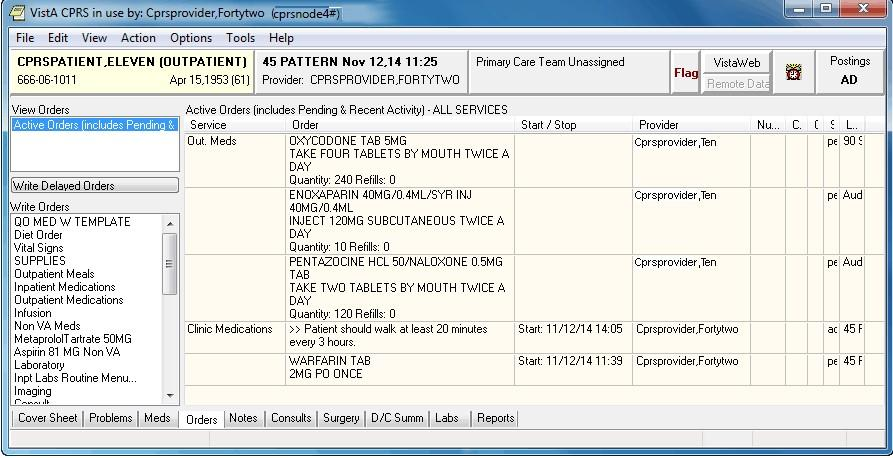

**This example shows the Order tab with a unit dose and nursing text order--that appear under the Clinic Medications display group**  
**Note:** If a provider has an NPI, it will not display on the screen above.

On the Meds tab, Clinic medication orders of all statuses display at the top of the Inpatient Medications pane before other inpatient medications orders. Nursing text orders do not display on the Meds tab. Users can distinguish Clinic orders because they have an entry in the Location column of the Meds tab display.

**Note:**  Clinic Medication orders are affected by both CPRS auto-DC rules and Inpatient Medications rules for auto-discontinuing orders on admission and discharge. If sites do not want Clinic orders to auto-discontinue on admission and discharge, sites will have to ensure that neither CPRS nor Inpatient Medications discontinues Clinic orders. Inpatient Medications uses the AUTO-DC IMO ORDERS parameter to exclude Clinic orders from being discontinued.

##### Criteria for Clinic Medications

To successfully write Clinic medication orders, the encounter must be in a clinic location.

**Note:**  To create a new visit, select the Provider/Encounter button (shown below), select the Visit tab, select New, and then select OK.

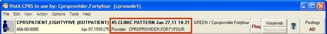

In addition, before you can use the **Meds** tab to place Clinic orders, your site’s CAC (or the person who manages information resources at your site) must set up the new medication order dialog to include inpatient medications.

##### Ordering Simple Clinic Medications

**To write a simple Clinic Medication order, use these steps:**

1.  Select the Orders tab.  
1.  From the Write Orders pane, select Clinic Medications.  
**Note:** Depending on how menus are set up at your particular site, you may need to select a different option from the Write Orders pane. Many sites have customized the items in the Write Orders pane. Check with your CAC (or the person who manages information resources at your site) if you have trouble locating the Clinic Medications item.

**Note:** The following prompts will be slightly different based on the patient’s location. You will be asked to verify that you want to write Clinic Medications and to ensure that the encounter location is a clinic location.

1.  If prompted, enter the appropriate clinic for the encounter information. This will generally happen with an outpatient.  
You can use an existing appointment if one exists or create a new one. To use Clinic Medications, you must enter a location that was previously defined clinic. If you chose a clinic location, you will see this dialog.

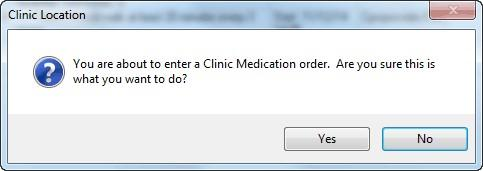

**This dialog is to ensure that the user knows they are about to enter Clinic Medications**  
1.  To continue ordering Clinic Medications, select Yes and continue to the next step. To stop the Clinic Medications process, choose No.  
1.  (Conditional) If the patient’s current location is not a clinic, you will be asked if you want to change the patient’s location.  
1.  In the Clinic Medications dialog, locate the medication name or quick order name in the list box by typing characters in the Medication field.  
**Note:** CPRS now only auto-selects (highlights in blue and places that entry in the field) a medication, dosage, route, or schedule if the user types enough characters to uniquely identify an item in the list. If the user does not enter enough characters to uniquely identify an item, CPRS waits until the user manually selects an item using the mouse or the keyboard.

1.  Select the quick order or medication name using the mouse or keyboard.  
**Note:** If the selected medication is a controlled substance that requires the signature of a provider with a DEA number, the **Order not completed** dialog appears. CPRS allows orders for controlled substances only when selected providers are able to sign the orders. You may need to exit the dialog, change the provider selection, and then reenter the dialog.

**You must have a DEA\# to order certain medications**  
**Note:**  CPRS requires a patient have a valid address if the selected outpatient medication is a controlled substance that requires the signature of a provider with a DEA number. For outpatient controlled substances, CPRS displays a message – “Controlled substance prescriptions require a patient address. Please contact administrative support to update patient address information.” if the patient does not have a valid address. The contact information in the display may be customized using the Enter/Edit Missing ZIP Code Message option in the GUI Parameters menu.

**Controlled substance prescriptions require a patient address**  
1.  Select the appropriate Dosage from the list if displayed. If it is not displayed, you can enter a free-text dosage.  
The dosage may not begin with a decimal, for example .5; it must begin with a numerical value, 0.5 for example. Also, the character “\^” may not be entered in the Dosage field. (The associated cost is displayed to the right of the dosage.)  
1.  Enter the Route by either selecting one from the list or typing in a valid route (a default route may have been set up).  
1.  In the Schedule pane, select an existing schedule from the list or, to use a day-of week/administration time schedule not on the list, select OTHER (you can also click the Day of-Week link and then click OK on the dialog that displays).  
When the user selects a schedule, the administration times may display under the “Give additional dose now” text for a simple dose. The administration times will display if they have been defined for the ward or if there is a default as long as the schedule is not a PRN schedule.  
1.  If you selected an existing schedule, skip to step 12. If you selected OTHER, CPRS displays the Order with Schedule ‘OTHER’ dialog. Take the following steps:  
1.  Select one or more checkboxes by the appropriate days of the week.  
1.  If the schedule requires specific administration times skip to steps c and d. To select a schedule from the list, highlight the schedule and select **Add**.  
**Note:** Users can assign either a schedule from the list or specific administration times, but not both. Also, because the user is specifying days of the week and a schedule, the list will contain only schedules less than 24 hours (for example, Q36H will not be in the list).

1.  To use a specific administration time, select the hour and minutes (if the user only selects the hour, the minutes will default to zero) and select **Add**.  
1.  Repeat step c until you have entered all required administration times.  
**Warning:** The administration times in the Schedule field apply to each day of the week that is listed, such as TU-TH-SA@08002000, for example. To create a schedule such as TU@0800 TH@2000, users would have to enter two separate orders using the complex medication order dialog. Also, users may not enter a schedule that only has administration times and PRN but no days.

1.  If you make a mistake while selecting an administration time or schedule, do one of the following to remove it:  
-   For a single administration time, highlight the hour and minutes in the Set Administration Time fields and select **Remove** (so to remove 08:00, you would have to select that time in the Set Administration Time fields not in the Schedule text box.)  
-   To remove the schedule, highlight the schedule and select **Remove**.  
-   To remove the entire schedule and begin again with step a, select **Reset**.  
1.  Review the **Schedule** field.  
1.  When you have the correct schedule, select **OK**.  

**The Order with Schedule ‘OTHER’ dialog allows you to enter a customized day-of-week and/or administration-time schedule. The user can enter specific administration times or select a schedule from the available list**  
1.  Select PRN if necessary.  
PRN will display in the schedule field if the PRN checkbox is checked or if the schedule is defined in the Pharmacy files as a PRN schedule.  
1.  Enter an Indication. If indications are defined, they will display in the drop-down list for you to select or you may type in an indication.  
1.  (Optional) Enter a Comment if desire by moving the cursor to the field and typing the comment.  
1.  The date and time that the patient is scheduled to receive the first dose of the medication appears under the Comments field. (For example, CPRS cannot show an expected first dose for “on call” or schedules with PRN. On the complex tab, it will not try to determine an expected first dose after a THEN because the first item must be completed).  
1.  If you want the patient to receive an additional dose now, check the Give additional dose now check box. When you click the check box, CPRS creates two new orders. Depending on your version of CPRS, the order priority and dosing schedule may be set automatically or may require manual adjustments. The pop-up messages displayed will also vary.  
The dosing schedule and priority are set automatically for each order. The first order is scheduled for immediate administration (NOW) and is assigned the priority ASAP. The second order is given the priority ROUTINE and will be administered following the dosing schedule that you defined. A warning displays that is similar to the following example.

**Note:** If your site does not use the priority ASAP, then an alternative priority (for example, STAT) will display in place of ASAP.

**Warning displayed when “Give additional dose now” is selected**  
1.  Check the warning message to ensure that the orders you created are what you expected. If the orders are acceptable, click OK. If not, click Cancel to clear the Give additional dose now check box.  
1.  Select a value for the Priority field.  
When **Give additional dose now** is selected, the **Priority** field is automatically set to ASAP

(or a site-specific alternative). If you select a value for the **Priority** field before you select the **Give additional dose now** checkbox, a message notifies you that the selected priority will be changed to the “Give additional dose now” priority settings.

**CPRS displays a notification that “Give additional dose now” overrides any previously selected priority**  
The default value of ASAP can be changed by selecting a different value from the **Priority** field before submitting the order. If the **Priority** field is empty when the order is submitted, it will revert to the default values for “Give additional dose now.” Select Accept Order.

**Note:** If you do not complete the mandatory items or if the information is incorrect, CPRS sends a message telling you that the information is incorrect and showing you the correct type of response.

1.  (Conditional) If the medication ordered may be contraindicated because of allergies, drug interactions, or duplicate orders, CPRS will display the Order Check window. Carefully review all order checks and decide if the medication should be ordered. Do one of the following:  
-   To proceed, select Accept Order.  
-   To stop the ordering process and return to the dialog, Cancel Order.  
1.  Enter another medication order  
\-or-  
select **Quit**  
When you select Quit, if the patient is in inpatient, CPRS changes the patient’s location back to where the patient was before changing to the clinic.

**Note:** You must sign the order before CPRS sends it to Pharmacy. You can either sign the order now or wait until later. When using Give additional dose now, it is recommended that you sign the order immediately to send the order to the inpatient pharmacy. You only need to sign once for both orders created when Give additional dose now is selected.

##### Ordering Complex Clinic Medication Orders

CPRS enables providers to place complex Clinic Medication orders. These orders must be placed from a clinic location. CPRS will ask you to confirm that you are placing a Clinic Medication order. You will also have to change the encounter location to an appropriate clinic. For outpatients, you will be prompted if no encounter location has been defined yet and then asked to confirm that you want to order Clinic Medications. For inpatients, you will be asked to confirm that you want to order Clinic Medications first and then prompted for an appropriate clinic location.

In a complex dose order, the user must define specific characteristics for the order.

Because the dose can affect the quantity, for example, changing certain fields may

cause the quantity field to either recalculate or reset to zero to force the user to enter the quantity.

**To order complex Clinic Medication orders, use the following steps:**

1.  Select the Orders tab.  
1.  From the Write Orders pane, select Clinic Medications.  
**Note:** Depending on how menus are set up at your site, you may need to select a different option from the Write Orders pane. Many sites have customized the items in the Write Orders pane. Check with your CAC (or the person who manages information resources at your site) if you have trouble locating the Clinic Medications item.

**Note:** The following prompts will be slightly different based on the patient’s location. You will be asked to verify that you want to write Clinic Medications and to ensure that the encounter location is a clinic location.

1.  If prompted, enter the appropriate clinic for the encounter information. This will generally happen with an outpatient that does not yet have an encounter defined.  
You can use an existing appointment if one exists or create a new one. To use Clinic Medications, you must enter a location that was previously defined clinic. If you chose a clinic location, you will see this dialog.  

**This dialog is to ensure that the user knows they are about to enter Clinic Medications**  
1.  To continue ordering Clinic Medications, select Yes and continue to the next step. To stop the Clinic Medications process, choose No.  
1.  (Conditional) If the patient’s current location is not a clinic, you will be asked if you want to change the patient’s location.  
1.  In the Clinic Medications dialog, locate the medication name or quick order name in the list box by typing characters in the Medication field.  
**Note:** CPRS now only auto-selects (highlights in blue and places that entry in the field) a medication, dosage, route, or schedule if the user types enough characters to uniquely identify an item in the list. If the user does not enter enough characters to uniquely identify an item, CPRS waits until the user manually selects an item using the mouse or the keyboard.

1.  Select the quick order or medication name using the mouse or keyboard.  
Once the name is selected, CPRS displays a second dialog to select the items for the rest of the order. In the top field of the second dialog, the generic medication name and the synonym (usually a brand name) are displayed.  
**Note:** If the selected medication is a controlled substance that requires the signature of a provider with a DEA or VA number, the *Order not completed* dialog appears. CPRS allows orders for controlled substances only when selected providers are able to sign the orders. You may need to exit the *Medication Order* dialog, change the provider selection, and then reenter the dialog.  

**You must have a DEA\# to order certain medications**  
**Note:**  CPRS requires a patient have a valid address if the selected outpatient medication is a controlled substance that requires the signature of a provider with a DEA number. For outpatient controlled substances, CPRS displays a message – “Controlled substance prescriptions require a patient address. Please contact administrative support to update patient address information.” if the patient does not have a valid address. The contact information in the display may be customized using the Enter/Edit Missing ZIP Code Message option in the GUI Parameters menu.

**Controlled substance prescriptions require a patient address**  
***

1.  Select the Complex tab.  
**Note:** After you begin a complex dose medication order, you must remain on the Complex tab until you finish the order. If you switch to the Dosage tab, CPRS clears all complex dosages and you will be forced to start again.

1.  Select the Dosage field and select the appropriate dosage.  
The dosage may not begin with a decimal, for example .5; it must begin with a numerical value, 0.5 for example. Also, the character “\^” may not be entered in the Dosage field. (The associated cost is displayed to the right of the dosage.)  
**Note:** CPRS now only auto-selects (highlights in blue and places that entry in the field) a medication, dosage, route, or schedule if the user types enough characters to uniquely identify an item in the list. If the user does not enter enough characters to uniquely identify an item, CPRS waits until the user manually selects an item using the mouse or the keyboard.

1.  Enter a Route by either selecting one from the list or typing in a valid route.  
When the user selects a regular schedule that does not have PRN, the administration times may display in the Schedule column. The administration times will display if they have been defined for the ward or if there is a default.  
1.  If you selected an existing schedule, skip to step 13. If you selected OTHER, CPRS displays the Order with Schedule ‘OTHER’ dialog. Take the following steps:  
1.  Select one or more checkboxes by the appropriate days of the week.  
1.  If the schedule requires specific administration times skip to steps c and d. To select a schedule from the list, highlight the schedule and select Add.  
**Note:** Users can assign either a schedule from the list or specific administration times, but not both. If launched from the Complex tab, the Day-of-Week Schedule builder does not display one-time schedules in the schedule list. Also, because the user is specifying days of the week and a schedule, the list will contain only schedules less than 24 hours (for example, Q36H will not be in the list).

1.  To use a specific administration time, select the hour and minutes (if the user only selects the hour, the minutes will default to zero) and select Add.  
1.  Repeat step c until you have entered all required administration times.  
**Warning:** The administration times in the Schedule field apply to each day of the week that is listed, such as TU-TH-SA@08002000, for example. To create a schedule such as TU@0800 TH@2000, users would have to enter two separate orders using the complex medication order dialog. Also, users may not enter a schedule that only has administration times and PRN but no days.

1.  If you make a mistake while selecting an administration time or schedule, do one of the following to remove it:  
-   For a single administration time, highlight the hour and minutes in the Set Administration Time fields and select Remove (so to remove 08:00, you would have to select that time in the Set Administration Time fields not in the Schedule text box.)  
-   To remove the schedule, highlight the schedule and select Remove.  
-   To remove the entire schedule and begin again with step a, select Reset.  
1.  Review the Schedule field.  
1.  When you have the correct schedule, select OK.  

**The Order with Schedule ‘OTHER’ dialog allows you to enter a customized day-of-week and/or administration-time schedule. The user can enter specific administration times or select a schedule from the available list**  
1.  If necessary, select PRN.  
PRN will display in the schedule field if the PRN checkbox is checked or if the schedule is defined in the Pharmacy files as a PRN schedule.  
1.  Select the Duration field and select the amount of time that the patient should use the specified dose.  
1.  In the then/and field, select the appropriate conjunction for the order.  
**Note:** The conjunction “Then” requires a duration to be added.

1.  Select the next row in the Dosage field and type or select a dosage.  
The dosage may not begin with a decimal, for example .5; it must begin with a numerical value, 0.5 for example. Also, the character “\^” may not be entered in the Dosage field. (The associated cost is displayed to the right of the dosage.)

1.  CPRS fills in the Route and Schedule fields. You can change the values in these fields if necessary.  
1.  Select a duration and a conjunction (then or and) except on the final row.  
**Note:** Your site’s IRM staff may have specified rules governing the status of inpatient medication orders when patients are transferred from one ward or service to another. It may have also specified the number of days an inpatient medication order remains active.

Please check with your site’s IRM staff for information about these rules.

1.  Repeat steps 15-18 until you have completed the complex dose.  
**Note:** You can also add or remove a row in the complex dose. To add a row, click the gray area in front of the row and click Add Row (CPRS places the new row above the selected row). To delete a row, click the gray area in front of the row you wish to delete and click Delete Row.

1.  Enter an Indication. If indications are defined, they will display in the drop-down list for you to select or you may type in an indication.  
1.  Add comments (optional).  
The date and time that the patient is scheduled to receive the first dose of the medication appears under the **Comments** field. (For example, CPRS cannot show an expected first dose for “on call” or schedules with PRN. On the complex tab, it will not try to determine an expected first dose after a THEN because the first item must be completed).

1.  If you want the patient to receive an additional dose now, select the Give additional dose now check box. If you select the check box, the Give Additional Dose Now for Complex Order warning dialog box appears, as shown below.  

**This graphic shows an example of the Give Additional Dose Now for Complex Order warning when placing a complex order**  
When you select the **Give additional dose now** check box, CPRS creates two new orders. Depending on your version of CPRS, the order priority and dosing schedule may be set automatically or may require manual adjustments. The pop-up messages displayed will also vary.

The dosing schedule and priority are set automatically for each order. The first order is scheduled for immediate administration (NOW) and is assigned a priority of ASAP (or a site-specific alternative). The second order is given the priority ROUTINE and follows the regular dosing schedule that you defined when placing the order.

If you select a value for the **Priority** field before you select the **Give additional dose now** checkbox, a message notifies you that the selected priority will be changed to the “Give additional dose now” priority settings.

**Note:** If your site does not use the priority ASAP, then an alternative priority (for example, STAT) will display in place of ASAP.

**Warning displayed when “Give additional dose now” is selected**  
1.  Check the orders and then select OK to close the warning dialog.  
1.  Choose a priority from the Priority drop-down list.  
When **Give additional dose now** is selected, the **Priority** field is automatically set to ASAP (or a site-specific alternative). If you select a value for the **Priority** field before you select the **Give additional dose now** checkbox, a message notifies you that the selected priority will be changed to the “Give additional dose now” priority settings.

**CPRS displays a notification that “Give additional dose now” overrides any previously selected priority**  
The default value of ASAP can be changed by selecting a different value from the **Priority** field before submitting the order.

1.  Select Accept Order.  
**Note:** If you do not complete the mandatory items, or if the information is incorrect, CPRS sends a message to tell you that the information is incorrect and shows you the correct type of response.

1.  (Conditional) If the medication ordered may be contraindicated because of allergies, drug interactions, or duplicate orders, CPRS will display the Order Check window. Carefully review all order checks and decide if the medication should be ordered. Do one of the following:  
-   To proceed, select **Accept Order**.  
-   To stop the ordering process and return to the dialog, Cancel Order.  
1.  Enter another medication order  
\-or-  
select **Quit**.  
When you select Quit, if the patient is in inpatient, CPRS changes the patient’s location back to where the patient was before changing to the clinic.

**Note:** You must sign the order before CPRS sends it to the Pharmacy package. You can either sign the order now or wait until later. When using Give additional dose now, it is recommended that you sign the order immediately to send the order to the inpatient pharmacy. You only need to sign once for both orders created when Give additional dose now is selected.

**Note:** If a provider has an NPI, it will not display on the screen below.

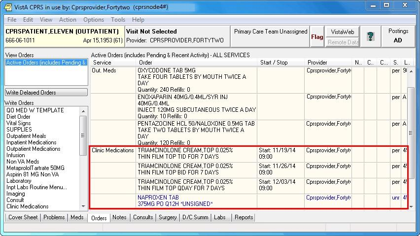

**On the Orders tab, CPRS displays Clinic Medication orders under the Clinic Medications display group, with the ordering location in the Location column**  
##### Changing Orders

Users can also change and renew Clinic Medication orders from a clinic location. If the patient’s location is not a clinic location, users will not be able to change or renew the Clinic Medication orders. To change Clinic Medication orders, follow the instructions in the “Changing Orders” section of this manual.

#### Clinic Infusions Overview

Clinic Infusions enable a CPRS user to place several different kinds of infusion orders, including intravenous (IV), epidural, IV piggyback, and so on, that are dispensed by inpatient pharmacy and administered to an outpatient in a clinic setting. Clinic Infusions enable VistA order checks to function for such medication orders.

Clinic Infusions orders must be placed from a clinic location. When providers select the Clinic Infusions item under the Write Order pane, CPRS will ask the providers to confirm that they are placing a Clinic Infusions order. Either before or after the confirmation dialog appears, providers must assign the encounter location to an appropriate clinic. For outpatients, providers will be prompted if no encounter location has been defined yet and then asked to confirm that they want to order Clinic Medications. For inpatients, providers will be asked to confirm that they want to order Clinic Medications first and then prompted for an appropriate clinic location.

Other than being ordered from a clinic, the infusion ordering process is almost identical to ordering infusions from any other location. However, to be comprehensive, the steps for Clinic Infusions should be complete in this section of the manual. As they are almost identical, the information in this section is the same as much of the information under the infusions ordering section.

##### Continuous versus Intermittent Infusion Orders

In the Infusion Order dialog, the order type—Continuous or Intermittent— affects whether some fields are available or visible. The two types of IVs are defined as follows:

-   **Continuous IV**: an IV that runs at a specified rate (ml/hr, mcg/kg/min, etc.).  
-   **Intermittent IV**: an IV administered at scheduled intervals (Q4H, QDAY) or  
One-Time only, “over a specified period of time” (e.g., “Infuse over 30 min.”).

For Intermittent orders, the Infusion Rate field changes to be Infuse over Time, the

Schedule field becomes available (not greyed out), and checkboxes display for the PRN and Give Additional Dose Now options. On both dialogs, required fields are identified by an asterisk following the field label (such as Route\*, for example). Intermittent orders no longer require a solution to finish the order. Continuous orders still require a solution before the order can be finished. For CPRS to accept the order, the user must enter values in the required fields, including the units.

For the Route field, CPRS uses the following rules to define whether it displays a default route for the selected medication:

-   If all of the orderable items on the order have the same default medication route defined, CPRS designates the default medication route in the selection list.  
-   If one or more orderable items on the order have different default medication routes, no medication route in the selection lest will be denoted as the default.  
##### Placing Continuous Clinic Infusions Orders

Continuous infusion orders run at a specified rate. As the user selects a solution and/or additive, the items from that list are displayed to the right under Solution/Additive. For continuous infusion orders the only optional fields are the Comments and the Duration or Total Volume fields. The schedule field is not available.

The Additive Frequency field enables users to select which IV bag the additive should be placed:

-   Bag/Day: The additive should be put in one bag for 24 hours, normally the first bag.  
-   All Bags: The additive should be placed in all bags given to the patient.  
-   See Comments: The provider wants something other than the above options and will put appropriate instructions in the Comments box.  
**Note:** If the user selects “See Comments” for the Additive Frequency but does not enter appropriate instructions in the Comments box, Pharmacy may interpret that as All Bags.

**To order continuous Clinic Infusions, use these steps:**

1.  Select the **Orders** tab.  
1.  From the Write Orders pane, select **Clinic Infusions**.  
**Note:** Depending on how menus are set up at your site, you may need to select a different option from the Write Orders pane. Many sites have customized the items in the Write Orders pane. Check with your CAC (or the person who manages information resources at your site) if you have trouble locating the Clinic Infusions item.

**Note:** The following prompts will be slightly different based on the patient’s location. You will be asked to verify that you want to write Clinic Infusions and to ensure that the encounter location is a clinic location.

1.  If prompted, enter the appropriate clinic for the encounter information. This will generally happen with an outpatient that does not yet have an encounter defined.  
You can use an existing appointment if one exists or create a new one. To use Clinic Infusions, you must enter a location that was previously defined clinic. If you chose a clinic location, you will see this dialog.

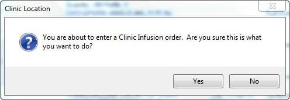

**This dialog is to ensure that the user knows they are about to enter Clinic Infusions**  
1.  To continue ordering Clinic Medications, select Yes and continue to the next step. To stop the Clinic Medications process, choose No.  
1.  (Conditional) If the patient’s current location is not a clinic, change the patient’s location to the appropriate clinic.  
The Clinic Infusion Order dialog displays.

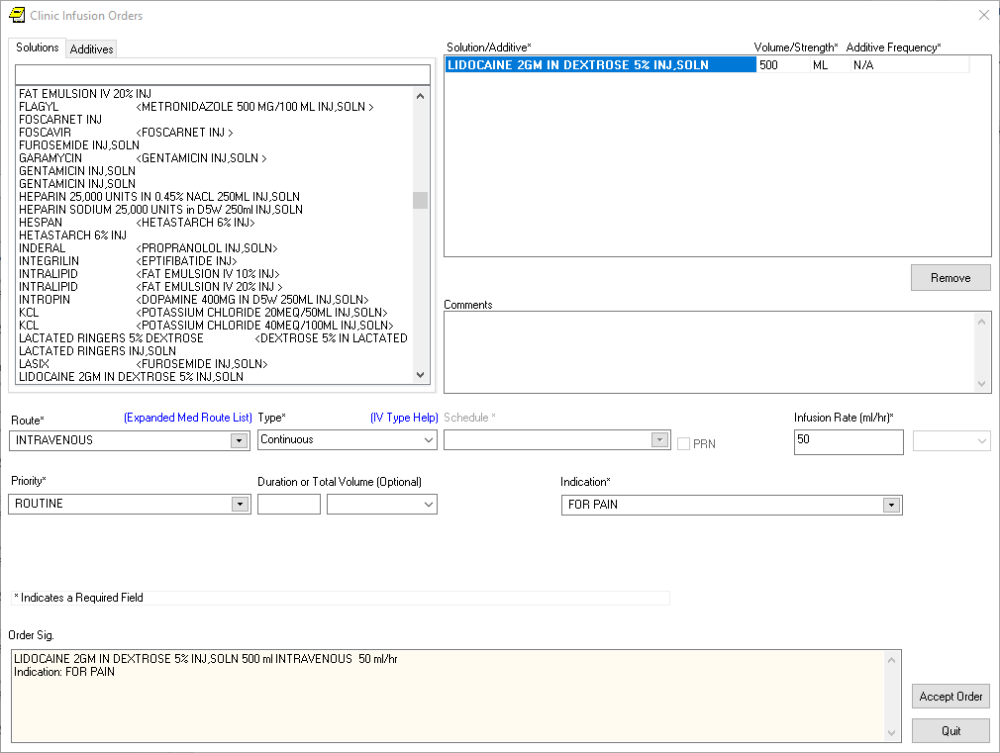

**The Infusion Order dialog for continuous infusion orders does not use a schedule, but it does have an infusion rate. For continuous infusion orders, the new Additive Frequency field enables providers to indicate into which IV bag the additive should be placed**  
1.  Select the needed solutions from the Solutions tab.  
1.  Select an additive from the list (if necessary) and edit the strength if needed. Repeat for additional additives if necessary. How users can edit the strength field will depend on the values for strength defined in the pharmacy files as follows:  
-   If a single strength is defined, users cannot edit the field.  
-   If multiple values for strength are defined in the pharmacy files, the field will have a drop-down list from which users can choose a strength.  
-   If no values have been defined, users can type in a strength. If a strength includes a decimal point, the value must begin with a number: so, .5 is not valid, but 0.5 is.  
The solution and additives you select will appear in the Solution/Additive grid.

**Note:** To remove an additive or a solution, select the solution or additive and select Remove.

1.  Enter a volume and strength in the Solution/Additive grid (if necessary).  
1.  Select the Additive Frequency from the list:  
-   **1 Bag/Day:** The additive should be put in one bag for 24 hours, normally the first bag.  
-   **All Bags:** The additive should be placed in all bags given to the patient.  
-   **See Comments:** The provider wants something other than the above options. Enter the appropriate instructions in the Comments box.  
1.  Select a Route (such as intravenous, epidural, IV piggyback, etc.) If the desired route is not available, select the Other option in the list of routes to bring the expanded med route form that lists all possible IV routes.  
1.  In the Type field, select **Continuous.**  
**Note:** If you change the IV Type from Continuous to Intermittent, the Schedule field becomes available and the Infusion Rate field becomes the Infusion over Time field.

**Note:** For a definition of Continuous and Intermittent orders, select the IV Type Help link and a message box will display with a short definition of what the terms mean.

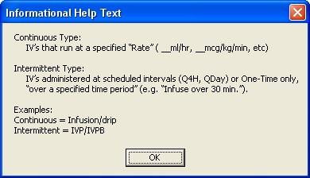

**To help providers enter the correct type of infusion order, this dialog provides a definition of Continuous and Intermittent infusion orders**  
1.  Enter an infusion rate in ml/hr.  
1.  Select a Priority.  
1.  (Optional) Enter a number for the duration or total volume of fluids for this order.  
1.  Select the appropriate unit (liters-L, milliliters-ml, days, or hours).  
**Note:** If you change the units, the value in the Duration or the Total Volume field will be removed and you will need to enter it again. This is a safety feature to ensure the patient does not receive a dangerous amount of fluid.

1.  Enter an Indication for the medication. If they have been entered, you can use the drop-down list and select the indication or you can type an indication in the field.  
1.  Enter any comments (if necessary).  
1.  Review the order text at the bottom of the dialog to ensure that it is correct.  
1.  Select Accept Order.  
1.  Review order check items and respond appropriately. If the order should not be entered because of a possible interaction, select Cancel. If the order is okay to accept, select Accept Order.  
1.  To enter additional Clinic Infusion orders, repeat steps 6-19 as needed. To finish, select Quit. For an outpatient, when you select quit, the encounter location will remain with the current clinic. For an inpatient, when you select Quit, the encounter location will go back to the location where the patient was before you began entering Clinic Infusion orders.  
**Note:** The order must be signed before it is sent. You can either sign the order now or wait until later.

##### Placing Intermittent Clinic Infusion Orders

Intermittent Clinic Infusion orders have many of the same required fields as continuous orders, but there are some important differences. Of course, to order these infusions, the patient must be assigned a clinic location. Intermittent refers to an infusion order administered at scheduled intervals (Q4H, QDAY) or One-Time only, “over a specified period of time” (e.g., “Infuse over 30 min.”). For intermittent infusion orders, as the user selects a solution and/or additive, the items from that list are displayed to the right under Solution/Additive. For Intermittent infusion orders the only optional fields are the Comments, Infuse Over, and the Duration or Total Volume fields.

However, for intermittent orders, the Infusion Rate field changes to the Infuse Over Time field where the user enters either a number of minutes or hours. the schedule field is not available.

**To order intermittent Clinic Infusion orders, follow these steps:**

1.  Select the Orders tab.  
1.  From the Write Orders pane, select **Clinic Infusions**.  
**Note:** Depending on how menus are set up at your particular site, you may need to select a different option from the Write Orders pane. Many sites have customized the items in the Write Orders pane. Check with your CAC (or the person who manages information resources at your site) if you have trouble locating the Clinic Infusions item.

**Note:** The following prompts will be slightly different based on the patient’s location. You will be asked to verify that you want to write Clinic Infusions and to ensure that the encounter location is a clinic location.

1.  If prompted, enter the appropriate clinic for the encounter information. This will generally happen with an outpatient that does not yet have an encounter defined.  
You can use an existing appointment if one exists or create a new one. To use Clinic Infusions, you must enter a location that was previously defined clinic. If you chose a clinic location, you will see this dialog.

**This dialog is to ensure that the user knows they are about to enter Clinic Infusions**  
1.  To continue ordering Clinic Medications, select Yes and continue to the next step. To stop the Clinic Medications process, choose No.  
1.  (Conditional) If the patient’s current location is not a clinic, change the patient’s location to the appropriate clinic.  
The Clinic Infusion Order dialog displays.

**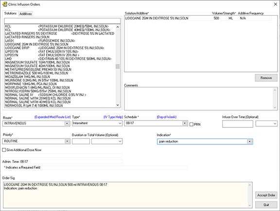 The Infusion Order dialog for continuous infusion orders does not use a schedule, but it does have an infusion rate. For continuous infusion orders, the new Additive Frequency field enables providers to indicate into which IV bag the additive should be placed**  
1.  Select a solution from the Solutions tab.  
1.  Select an additive from the list (if necessary) and edit the Volume/Strength. Repeat for additional additives if necessary.  
The solution and additives you select will appear in the Solution/Additive grid.

**Note:** To remove an additive or a solution, select the solution or additive and click Remove.

1.  Select the Route (for example, intravenous, epidural, IV piggyback, etc.) from the drop-down list. If the desired route is not available select the Other option in the list of routes to bring the expanded med route form that list all possible IV routes.  
1.  In the Type drop-down box, select **Intermittent.**  
**Note:** If you change the IV Type from Intermittent to Continuous, the Schedule field becomes unavailable (greyed out) and the Infusion over Time field becomes the Infusion Rate field.

**Note:** For a definition of Continuous and Intermittent orders, select the IV Type Help link and a message box will display with a short definition of what the terms mean.

**To help providers enter the correct type of infusion order, this dialog provides a definition of Continuous and Intermittent infusion orders**  
1.  Select a schedule from the list or create one using the Day-of-Week schedule builder.  
**Note:** When a user writes an intermittent infusion order with a schedule of ONCE, the following will happen in CPRS:

-   The DURATION field will be disabled.  
-   The Give Additional Dose Now option will be disabled.  
-   Expected First Dose and Administration Times will not be displayed.  
**Note:** When a user writes an intermittent infusion order with a schedule of On Call or a PRN, the following will happen in CPRS:

-   Expected First Dose and Administration Times will not be displayed.  
1.  If you selected an existing schedule, skip to step 14. If you selected OTHER, CPRS displays the Order with Schedule ‘OTHER’ dialog. Take the following steps:  
1.  Select one or more checkboxes by the appropriate days of the week.  
1.  If the schedule requires specific administration times skip to steps c and d. To select a schedule from the list, highlight the schedule and select **Add**.  
**Note:** Users can assign either a schedule from the list or specific administration times, but not both.

1.  To use a specific administration time, select the hour and minutes (if the user only selects the hour, the minutes will default to zero) and select **Add**.  
1.  Repeat step c until you have entered all required administration times.  
**Warning:** The administration times in the Schedule field apply to each day of the week that is listed, such as TU-TH-SA@08002000, for example. To create a schedule such as TU@0800 TH@2000, users would have to enter two separate orders using the complex medication order dialog. Also, users may not enter a schedule that only has administration times and PRN but no days.

1.  If you make a mistake while selecting an administration time or schedule, do one of the following to remove it:  
-   For a single administration time, highlight the hour and minutes in the Set Administration Time fields and select **Remove** (so to remove 08:00, you would have to select that time in the Set Administration Time fields not in the Schedule text box.)  
-   To remove the schedule, highlight the schedule and select **Remove**.  
-   To remove the entire schedule and begin again with step a, select **Reset**.  
1.  Review the Schedule field.  
1.  When you have the correct schedule, select OK.  
1.  If necessary, select the PRN checkbox.  
1.  Enter the number for the duration over which to infuse the medication.  
1.  Move to the next field and select the unit of time (the units can be only Minutes or Hours) over which the infusion should be given.  
For example, you might enter 30 for the number, move to the next field, and then select minutes to define infuse over 30 minutes.

1.  Select the Priority.  
1.  Enter a number for the duration or total volume.  
1.  Move to the next field and select the appropriate unit (liters-L, milliliters-ml, days, hours, or doses).  
**Note:** If you change the units, the value in the Duration or the Total Volume field will be removed and you will need to enter it again. This is a safety feature to ensure the patient does not receive a dangerous amount of fluid.

1.  If necessary, select the Give additional dose now checkbox.  
**Note:** Make sure that you are careful about using give additional-dose-now functionality. When you click the check box, CPRS creates two new orders and sends it to Inpatient Medications. Make sure the “Give additional dose now” and the regular order with the original schedule you entered do not overmedicate the patient. “Give additional dose now” is not available for ONCE, ONE-TIME, or NOW orders. It is also not available for delayed orders.

1.  Enter an Indication. If they have been entered, you can use the drop-down list and select the indication or you can type an indication in the field.  
1.  Enter any comments (if necessary).  
1.  Review the order text at the bottom of the dialog to ensure that it is correct.  
1.  If the order text is correct, select **Accept Order**.  
1.  Review order check items and respond appropriately. If the order should not be entered because of a possible interaction, select Cancel. If the order is okay to accept, select Accept Order.  
1.  To enter additional Clinic Infusion orders, repeat steps 6-19 as needed. To finish, select Quit. For an outpatient, when you select quit, the encounter location will remain with the current clinic. For an inpatient, when you select Quit, the encounter location will go back to the location where the patient was before you began entering Clinic Infusion orders.  
**Note:** The order must be signed before it is sent. You can either sign the order now or wait until later.

#### One Step Clinic Medication Administration

One Step Clinic Administration enables providers to access, order, and document that they administered Clinic Medications in a single process. One Step Clinic Admin bypasses the pharmacy for verification (comes over as ‘done’) and automatically records the clinician administered medication details in the BCMA patient medication log file.

**To use One Step Clinic Admin for Unit Dose medications, please use the following steps:**

**Note:** **One-Step Clinic Medication Administration is only used when the doctor will PERSONALLY administer a medication in a clinic setting.** If a nurse will administer the medication, use Clinic Medications or other ordering method.

1.  Select **One Step Clinic Admin**. (This can be done from the Orders tab Write Orders pane, if an option is available, the Orders tab Action menu, the Meds tab Action menu, or from a progress note).  
**Note:** If the provider has an NPI, it will display on the screen below. See the "National Provider Identifier (NPI) Display in CPRS" section for an example of an NPI displaying on a screen.

The Order Manager dialog displays as shown below.

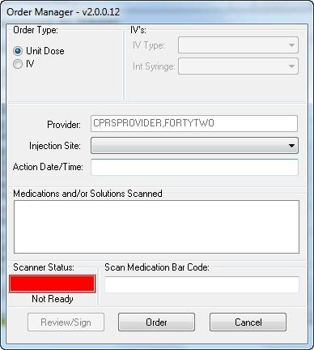

1.  If necessary, select an appropriate clinic encounter location and time.  
1.  If necessary, select the Unit Dose radio button.  
1.  If necessary, designate the injection site using the Injection Site drop-down box to locate and select the site (i.e., ARM, LEFT UPPER or THIGH, LEFT).  
1.  Enter the Action Date/Time for the administration (you can use T for today, N for now, or enter a specific date and time, such as DEC 10, 2014@13:10).  
1.  Place your cursor in the Scan Medication Bar Code field (the colored rectangle in front of the field will turn from red to green indicating that it is ready to receive data) and scan the medication,  
\-or-

To manually enter the medication, place your cursor in the Scan Medication Bar Code field (the colored rectangle in front of the field will turn from red to green indicating that it is ready to receive data) and type part or the entire medication name and press \<Enter\>.

1.  In the Multiple Drugs for Selected Order dialog, select the appropriate drug by either clicking on the drug name or using the up and down arrow buttons to highlight the name and pressing \<OK\>.  
1.  Select the **Order** button.  
In the Clinic Medications dialog that displays, do the following:

1.  Enter a dosage, either picking from the list or typing a dosage in.  
1.  Select a route.  
1.  Select a schedule (Now or Stat).  
1.  (Optional) Enter a comment.  
1.  If the information is correct, select the Accept Order button. If the information is not correct, correct it or select the Quit button to cancel the order.  
**Note:** If you select Quit, the information is removed and a dialog displays the message that the order was canceled. Select OK. You are then returned to the Order Manager dialog as if you are just beginning the process.

1.  If any order checks display, review and act on them appropriately.  
1.  If all is correct, select the Review/Sign button.  
1.  In the Review /Sign Changes dialog, enter your electronic signature and select OK.  
1.  If another order dialog displays, review and take appropriate action, either accepting the order or canceling the order.  
The order displays under the Orders Tab in CPRS. You may need to change the view to see the order. If you do not see the order under the Clinic Medications or Clinic Infusions headings, please use the View \| Custom View menu option in CPRS and selected Completed/Expired option for Pharmacy. The items should display there.

**To use One Step Clinic Admin for IV medications, please use the following steps:**

**Note:** **One-Step Clinic Medication Administration is only used when the doctor will PERSONALLY administer a medication in a clinic setting.** If a nurse will administer the medication, use Clinic Medications or other ordering method.

1.  Select **One Step Clinic Admin**. (This can be done from the Orders tab Write Orders pane, if an option is available, the Orders tab Action menu, the Meds tab Action menu, or from a progress note).  
1.  If necessary, select an appropriate clinic appointment or clinic and time for the encounter.  
1.  Select the **IV** radio button.  
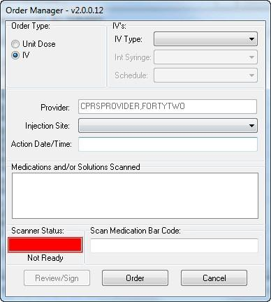

1.  Select the IV type from the drop-down box: Admixture, Piggyback, or Syringe.  
Depending on which IV type you choose, you will need to make selections under the IV’s section. Selecting Admixture does not affect the other fields, but selecting Piggyback will activate the Schedule field and selecting Syringe will active the Intermittent Syringe field.

1.  If you selected Piggyback, you must select a schedule of either NOW or STAT.  
1.  If you selected Syringe, you must designate whether this is an Intermittent Syringe by choosing YES or NO from the Int. Syringe drop-down.  
1.  Select an injection site from the drop-down list.  
1.  Enter a date and time when the medication was administered.  
You can use N for Now, T for today, or you can set a specific date and time, such as 12/11/2014@13:35 (for December 11, 2014 at 1:35 p.m.).

1.  Enter the medication and the solution, if necessary. Place your cursor in the Scan Medication Bar Code field (the colored rectangle in front of the field will turn from red to green indicating that it is ready to receive data) and scan the medication,  
\-or-

To manually enter the medication, place your cursor in the Scan Medication Bar Code field (the colored rectangle in front of the field will turn from red to green indicating that it is ready to receive data) and type part or the entire medication name and press \<Enter\>.

1.  In the Multiple Drugs for Selected Order dialog, select the appropriate drug by either clicking on the drug name or using the up and down arrow buttons to highlight the name and pressing \<OK\>.  
1.  Repeat this step for the solution or medication if necessary.  
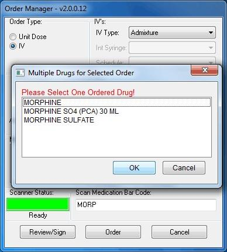

**This screen capture shows the Multiple Drugs for Selected Order dialog that displays if a user is manually entering a medication instead of scanning it**  
1.  Select the Order button.  
1.  Enter the additional information for the IV type you chose below:  
-   **Admixture:** In the Clinic Infusion Orders dialog, enter the Volume/Strength, Route, Infusion Rate, and a comment (optional) and select Accept Order.  
-   **Piggyback:** In the Clinic Infusion Orders dialog, enter the Volume/Strength, Route, Schedule (NOW or STAT). Optionally you can enter a comment (optional) and designate over what period of time the IV should be administered. Then, select Accept Order.  
-   **Syringe:** In the Clinic Infusion Orders dialog, enter the Volume/Strength, Route, Infusion Rate, and a comment (optional) and select Accept Order.  
1.  If any order checks display, review and act on them appropriately If you have more IV medications to order, repeat steps 3-12 until all medications have been ordered.  
1.  When ready, select the Review/Sign button.  
1.  Review the orders to be signed.  
1.  If the orders are correct, enter your electronic signature and select the OK button.  
1.  If another order dialog displays, review and take appropriate action, either accepting the order or canceling the order.  
The order displays under the Orders Tab in CPRS. You may need to change the view to see the order. If you do not see the order under the Clinic Medications or Clinic Infusions headings, please use the View \| Custom View menu option in CPRS and selected Completed/Expired option for Pharmacy. The items should display there.

#### Ordering Outpatient Medications (Simple Dose)

For outpatient medications, the user must enter the required fields. CPRS requires the users to enter the medication, dosage, route, and schedule. For outpatient medications, dosage, schedule, and route can be free-text entries, but the medication must be chosen from the list of options. The route can be typed in, but to be accepted, it must be a valid route that is in the MEDICATION ROUTES file \#51.2.

Also, medications that are not in the formulary display in the list with the letters “NF” after the name or synonym, which is also displayed. CPRS checks for nonformulary dosages (e.g., the VA formulary may not have a 2.5 MG pill, but it may have a 5.0 MG pill) and for non-formulary orderable items (e.g., the VA may not carry a specific kind of allergy medication).

To write a new outpatient medication order with a simple dose, follow these steps:

1\. Select the Meds tab and select Action \| New Medication…

\-or- select the Orders tab and click the appropriate item under the Write Orders list.

The Outpatient Medications dialog appears (as shown in the graphic below).

**The Outpatient Medications order dialog**  
**Note:** If encounter information has not been entered, the encounter information dialog will appear before the Medication Order dialog box. You must complete the encounter information dialog box before proceeding.

**Note:** If the selected medication is a controlled substance that requires the signature of a provider with a DEA number, the *Order not completed* dialog appears. Before an order for a controlled substance can be entered, the provider selected for the encounter must be able to sign the order. You may need to exit the Medication Order dialog, change the provider, and reenter the Medication Order dialog.

**You must have a DEA\# to order certain medications**  
**Note:**  CPRS requires a patient have a valid address if the selected outpatient medication is a controlled substance that requires the signature of a provider with a DEA number. For outpatient controlled substances, CPRS displays a message – “Controlled substance prescriptions require a patient address. Please contact administrative support to update patient address information.” if the patient does not have a valid address. The contact information in the display may be customized using the Enter/Edit Missing ZIP Code Message option in the GUI Parameters menu.

**Controlled substance prescriptions require a patient address**  
**Note:** Provider must have YSCL AUTHORIZED to order clozapine. Currently, CPRS will allow a provider without authorization key to place clozapine order. For example, if PROVIDER, TWO is logged in, they do not have the YSCL AUTHORIZED key, change the encounter provider to PROVIDER, ONE (they do have the key), then place the Clozapine order, it shows up on Orders screen, then sign the order using PROVIDER, TWO. Now the signed order shows PROVIDER, TWO and it is Pending the pharmacist is able to complete the order, making it Active. \*\*Even though CPRS allows the order to go through, this action should not be done.

1.  In the Medication Order dialog, locate the medication name or quick order name in the list box by typing characters in the Medication field.  
**Note:** CPRS now only auto-selects (highlights in blue and places that entry in the field) a medication, dosage, route, or schedule if the user types enough characters to uniquely identify an item in the list. If the user does not enter enough characters to uniquely identify an item, CPRS waits until the user manually selects an item using the mouse or the keyboard.

1.  Select the quick order or medication name using the mouse or keyboard.  
The lab results for the most recent lab test associated with the selected medication are displayed in the Information field, if an associated lab test was performed within the last 365 days.

**Note:** A CAC or ADPAC will need to set the OR CPRS LAB DISPLAY ENABLED parameter to ON to activate the lab results display at a site.

To view associated lab results for Quick Orders, a TIU OBJECT must be inserted into the Quick Order. For more information, refer to the *Text Integration Utility (TIU) Clinical Coordinator & User Manual*. This functionality will work for generalized Quick Orders only (orders assigned to Order Menus). It is not currently implemented for personal Quick Orders.

The lab results functionality will not work properly for multidivisional facilities or any sites that use different lab test names at different sites, as only one lab test name can be associated with each drug. To successfully implement this functionality, all facilities/divisions that share a VistA system must use the same name for each monitored lab test.

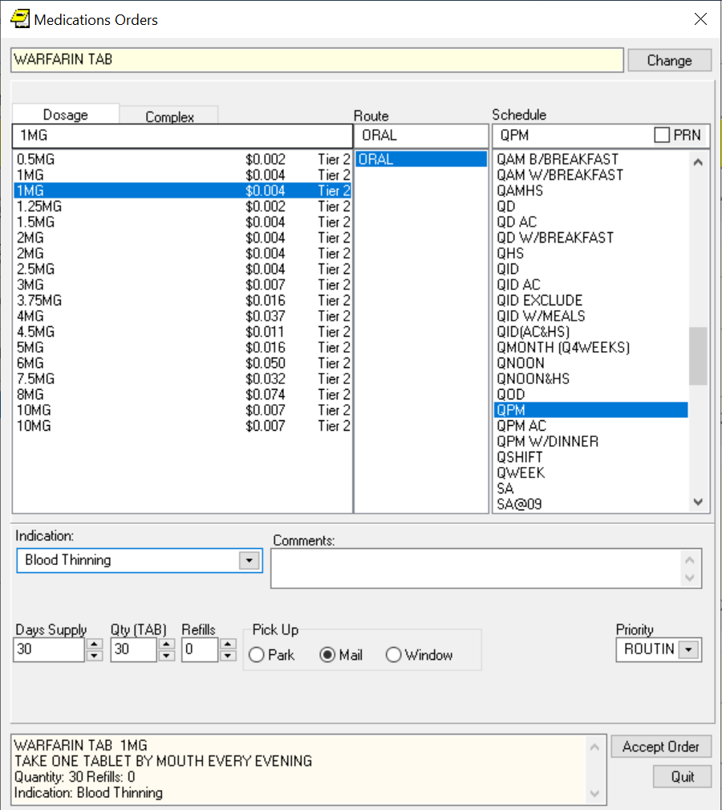

1.  Select the dosage.  
The dosage may not begin with a decimal, for example .5; it must begin with a numerical value, 0.5 for example. Also, the character “\^” may not be entered in the Dosage field. (The associated cost is displayed to the right of the dosage.)

**Note:** CPRS now only auto-selects (highlights in blue and places that entry in the field) a medication, dosage, route, or schedule if the user types enough characters to uniquely identify an item in the list. If the user does not enter enough characters to uniquely identify an item, CPRS waits until the user manually selects an item using the mouse or the keyboard.

Once a dosage is selected, any lab test results displayed in the Information field are replaced by the National Standard Orderable Item information.

The tier level represents medication copayment classes for Outpatient Pharmacy charges that are dependent on the medication class. It is used to determine the charge rate for copayments.

1.  Enter a **Route** by either selecting one from the list or typing in a valid route.  
**Note:** Outpatient orders for supply items do not require a route.

1.  Choose a schedule from the Schedule field. (Select PRN, if desired.)  
1.  CPRS completes the default days supply field and calculates the quantity field based on the formula days supply x schedule = quantity. If necessary, highlight and change the numbers in these fields.  
**Note:** If you change a number, CPRS will attempt to recalculate the other field. If you check PRN, be sure that the quantity field is correct before accepting the order.

1.  Enter the number of refills.  
1.  Select the location where the patient should pick up the medication from the Pick Up field.  
1.  Choose a priority.  
1.  Enter an Indication. If they have been entered, you can use the drop-down list and select the indication or you can type an indication in the field.  
1.  Add comments in the Comments field (if desired).  
1.  Under certain circumstances, a check box may appear under the Days Supply field. If the medication is service-connected, make sure the box is checked  
1.  Select Accept Order.  
1.  (Conditional) If the medication ordered may be contraindicated because of allergies, drug interactions, or duplicate orders, CPRS will display the Order Check window. Carefully review all order checks and decide if the medication should be ordered. Do one of the following:  
-   To proceed, select Accept Order.  
-   To stop the ordering process and return to the dialog, Cancel Order.  
1.  If you are finished ordering outpatient medications, select Quit.  
**Note:** The order must be signed before it is sent to the Pharmacy package. You can either sign the order now or wait until later.

#### Ordering Outpatient Medications (Complex Dose)

Users must enter a medication name, dosage, route, and schedule. For outpatient medications, dosage, schedule, and route can be free-text entries, but the medication must be chosen from the list of options.) The route can be typed in, but to be accepted, it must be a valid route that is in the MEDICATION ROUTES file \#51.2.

In a complex dose order, the user must define specific characteristics for the order. Because the dose can affect the quantity, for example, changing certain fields may cause the quantity field to either recalculate or reset to zero to force the user to enter the quantity.

To write a new Outpatient Medication order with a complex dose, follow these steps:

1.  Select the Meds tab and select Action \| New Medication…  
\-**or**-

1.  Select the Orders tab and select the appropriate item under the Write Orders likst box. CPRS will display the Medication Order dialog.  
**Note:** If encounter information has not been entered, the encounter information dialog will appear before the Medication Order dialog. You must complete the encounter information dialog before proceeding.

1.  In the Medication Order dialog, locate the medication name or quick order name in the list box by typing characters in the Medication field.  
**Note:** CPRS now only auto-selects (highlights in blue and places that entry in the field) a medication, dosage, route, or schedule if the user types enough characters to uniquely identify an item in the list. If the user does not enter enough characters to uniquely identify an item, CPRS waits until the user manually selects an item using the mouse or the keyboard.

1.  Select the quick order or medication name using the mouse or keyboard.  
Once the name is selected, CPRS displays a second dialog to select the items for the rest of the order. In the top field of the second dialog, the generic medication name and the synonym (usually a brand name) are displayed.

The lab results for the most recent lab test associated with the selected medication are displayed in the Information field, if an associated lab test was performed within the last 365 days.

**Note:** A CAC or ADPAC will need to set the OR CPRS LAB DISPLAY ENABLED parameter to ON to activate the lab results display at a site.

To view associated lab results for Quick Orders, a TIU OBJECT must be inserted into the Quick Order. For more information, refer to the *Text Integration Utility (TIU) Clinical Coordinator & User Manual*. This functionality will work for generalized Quick Orders only (orders assigned to Order Menus). It is not currently implemented for personal Quick Orders.

The lab results functionality will not work properly for multi-divisional facilities or any sites that use different lab test names at different sites, as only one lab test name can be associated with each drug. To successfully implement this functionality, all facilities/divisions that share a VistA system must use the same name for each monitored lab test.

**Note:** If the selected medication is a controlled substance that requires the signature of a provider with a DEA, the **Order not completed** dialog will appear. Before an order for a controlled substance can be entered, the provider selected for the encounter must be able to sign the order. You may need to exit the Medication Order dialog, change the provider, and then reenter the Medication Order dialog.

**You must have a DEA\# to order certain medications**  
**Note:**  CPRS requires a patient to have a valid address if the selected outpatient medication is a controlled substance that requires the signature of a provider with a DEA number. For outpatient controlled substances, CPRS displays a message – “Controlled substance prescriptions require a patient address. Please contact administrative support to update patient address information.” if the patient does not have a valid address. The contact information in the display may be customized using the Enter/Edit Missing ZIP Code Message option in the GUI Parameters menu.

**Controlled substance prescriptions require a patient address**  
1.  Click the **Complex** dose tab.  
**Note:** Once you begin a complex medication order, you must remain on the Complex tab until you finish the order. If you switch tabs, all complex dosages will be erased, and you will be forced to start the order again.

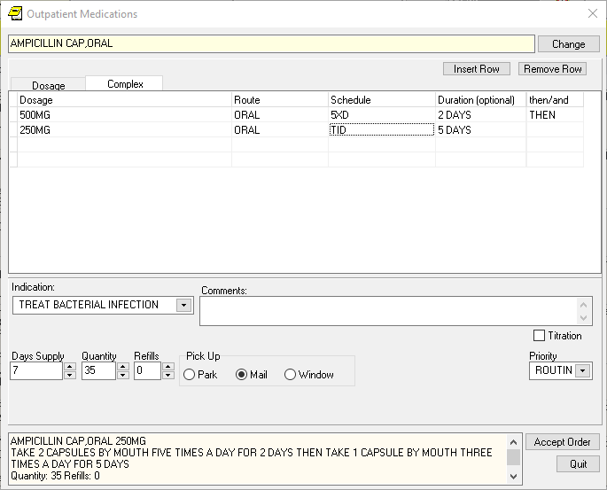

**You can enter a complex medication order from the Medication Order dialog**  
1.  Click the **Dosage** field and select the appropriate dosage.  
The dosage may not begin with a decimal, for example .5; it must begin with a numerical value, 0.5 for example. (The associated cost is displayed to the right of the dosage.)

**Note:** CPRS now only auto-selects (highlights in blue and places that entry in the field) a medication, dosage, route, or schedule if the user types enough characters to uniquely identify an item in the list. If the user does not enter enough characters to uniquely identify an item, CPRS waits until the user manually selects an item using the mouse or the keyboard.

Once a dosage is selected, any lab test results displayed in the Information field are replaced by the National Standard Orderable Item information.

1.  Enter a **Route** by either selecting one from the list or typing in a valid route.  
**Note:** Outpatient orders for supply items do not require a route.

1.  Enter a schedule in the Schedule field. (Select PRN if desired).  
1.  Select the Duration cell and enter a number and select units (days is the default) a patient should use the specified dose.  
1.  Enter the appropriate conjunction in the then or and field except on the final row.  
**Note:** The conjunction “Then” requires a duration to be added.

1.  Select the **Dosage** field in the next row and select a dosage.  
The dosage may not begin with a decimal, for example .5; it must begin with a numerical value, 0.5 for example. Also, the character “\^” may not be entered in the Dosage field. (The associated cost is displayed to the right of the dosage.)

1.  Repeat steps 5-9 until you have completed the complex dose.  
**Note:** You can add or remove a row in the complex dosage. To add a row, click the gray area in front of the row and click Add Row. (The new row will be placed above the selected row.) To delete a row, click the gray area in front of the row to be deleted and click Delete Row.

1.  CPRS will display a default value in the Days Supply and Quantity fields. The quantity is calculated based on the formula Days Supply x Schedule = Quantity. If necessary, you can change the value in these fields.  
**Note:** If you change a number, CPRS will attempt to recalculate the other field.

1.  Enter the number of refills.  
1.  Select the location where the patient should pick up the medication from the Pick Up field.  
1.  Enter an Indication. If they have been entered, you can use the drop-down list and select the indication or you can type an indication in the field.  
1.  Add comments if necessary.  
1.  Under certain circumstances, a check box may appear under the Days Supply field. If the medication is service-connected, make sure the box is checked.  
1.  Select Accept Order.  
1.  (Conditional) If the medication ordered may be contraindicated because of allergies, drug interactions, or duplicate orders, CPRS will display the Order Check window. Carefully review all order checks and decide if the medication should be ordered. Do one of the following:  
-   To proceed, select Accept Order.  
-   To stop the ordering process and return to the dialog, Cancel Order.  
1.  If you are finished ordering outpatient medications, select **Quit**.  
**Note:** The order must be signed before it is sent. You can either sign the order now or wait until later.

### Adding Non-VA Medications

The Joint Commission on Accreditation of Healthcare Organizations (JCAHO) has indicated that all medications, including herbal supplements, over-the-counter (OTC) non-prescription medications, and medications prescribed by providers outside the VA (collectively known as “Non-VA medications”) should be entered in the medical record. CPRS, Outpatient Pharmacy, and Inpatient Medications developers have made changes that enable users to enter this information into the medical record so that providers have a better picture of the medications the patient is taking and that order checks against these medications can occur. Entering Non-VA Medications will trigger the following order checks:

-   Duplicate Drug (shows as Duplicate Order check)  
-   Duplicate Drug Class  
-   Critical Drug Interaction  
-   Significant Drug Interaction  
-   Allergy checks  
**Note:** For Non-VA meds, inpatient orders are not checked against nonVA medications and the allergy check is slightly different. The duplicate drug class check will not be triggered for two pure herbal medications, such as ginger and gingko. All pure herbal medications belong to the same drug class (HA000). If these checks were made, every time a clinician entered a pure herbal medication, the user would receive a duplicate drug class warning. Allergy checks will still occur for non-VA medications that do not belong to this drug class.

#### Making Non-VA Meds Available for Entry

For users to be able to enter these medications through CPRS, they must be in the CPRS Orderable Items file so that they appear when the user chooses the new order sheet. The Pharmacy patch (PSS\*1.0\*68) enables sites to mark items as Non-VA Medications. Initially, all Pharmacy orderable items that are marked as “outpatient” and are not supply items will be automatically made Non-VA medications. Subsequently, Pharmacy coordinators can use the Pharmacy option Drug Enter/Edit [PSS DRUG ENTER/EDIT] to identify items as Non-VA Meds or remove the designation.

**Note:** For more information about how to get Non-VA Medications added to the appropriate file, please see “Section 5.1: Communicating New Non-VA Meds Entries to the Pharmacist” in the *Herbal/OTC/Non-VA Meds Documentation Release Notes* that will be located on the VistA Documentation Library at <http://www.va.gov/vdl> under the Outpatient Pharmacy listings.

#### Different from Ordering Medications

Remember that entering Non-VA Medications is not the same as placing orders. Users simply enter information to provide a more complete view of what the patient is taking. However, once the items are available in the CPRS Orderable Items file, the process for entering Non-VA Medications is similar to entering other orders, but there are a few differences:

-   Almost any CPRS user can enter Non-VA medication information. However, sites can restrict access for those holding the OREMAS key by using the OR OREMAS NON-VA MEDS parameter. For more information about this parameter, please see the CPRS Technical Manual: GUI Version.  
-   Users can enter Non-VA medication even if they only have partial information. The only required information is the non-VA or herbal medication name. The Medication name must be one that can be selected from the list. The Dosage, Route, and Schedule fields are optional and will accept free-text entries.  
-   Non-VA medications are listed separately on the orders tab and the designation “Non-VA Med” is displayed at the beginning of the entry.  
-   Users may to pick a reason why the patient is taking the Non-VA medication.  
For the reason/statement that users should enter, developers sent out four reasons or

statements at the package level of the parameter GUI Non-VA Med Statements/Reasons that were agreed upon by a workgroup:

-   Non-VA medication not recommended by VA provider.  
-   Non-VA medication recommended by VA provider.  
-   Patient wants to buy from Non-VA pharmacy.  
-   Medication prescribed by Non-VA provider.  
Authorized users can enter their own reasons/statements in the parameter by entering new statements at the System or Division level for this parameter. For more information about changing this parameter, see the *CPRS Technical Manual: List Manager*.

#### Documenting Non-VA Medication Information for Simple Doses

Previously, the designation “Non-VA Meds” caused some confusion as to whether providers were ordering or documenting outside medication. Therefore, throughout CPRS the name has been changed to “Non-VA Medications (Documentation)” or “Non-VA Meds (Documentation)”. When the user selects the Non-VA Medications (Documentation) option, the dialog displays the items that were marked as Non-VA Meds and copied into the CPRS Orderable Items file.

To enter Non-VA medication information, use the following steps:

1.  If you are not already there, go to the Orders tab by either clicking **Orders** or pressing **Ctrl + O**.  
1.  In the Write Orders list, select **Meds, Non-VA**.  
**Note**: If encounter information has not been entered, the encounter information dialog will appear before the Medication Order dialog. You must complete the encounter information dialog before proceeding.

1.  In the Document Herbal/OTC/Non-VA Medications dialog, select the medication or herbal supplement by  
1.  Typing a few letters of the name or its synonym (if your site uses synonyms).  
**Note:** CPRS now only auto-selects (highlights in blue and places that entry in the field) a medication, dosage, route, or schedule if the user types enough characters to uniquely identify an item in the list. If the user does not enter enough characters to uniquely identify an item, CPRS waits until the user manually selects an item using the mouse or the keyboard.

1.  Selecting the correct name from the list by double-clicking it or highlighting it and pressing \<Enter\>. You may need to scroll down to find the name.  
**Note:** If you do not know other information such as dosage, route, or schedule, you may enter only the name of the medication or herbal supplement.

1.  Enter a dosage (if known).  
The dosage may not begin with a decimal, for example .5; it must begin with a numerical value, 0.5 for example. (The associated cost is displayed to the right of the dosage.)

1.  Enter a route (if known).  
1.  Enter a schedule, including PRN if necessary (if known).  
1.  (Optional) Enter an Indication. If they have been entered, you can use the drop-down list and select the indication or you can type an indication in the field.  
1.  Enter any comments.  
1.  If you want to enter one, select one or more Statements/Explanations as to why the patient is taking the medication or supplement.  
1.  Enter a start date (if known).  
1.  Review the information entered in the text box at the bottom of the dialog.  
1.  Place the information into the patient’s record by clicking **Accept Order** or by tabbing to **Accept Order** and pressing **\<Enter\>**.  
1.  (Conditional) If the medication ordered may be contraindicated because of allergies, drug interactions, or duplicate orders, CPRS will display the Order Check window. Carefully review all order checks and decide if the medication should be ordered. Do one of the following:  
-   To proceed, select Accept Order.  
-   To stop the ordering process and return to the dialog, Cancel Order.  
1.  To enter additional Non-VA Medications into the patient’s record, repeat steps 3-12.  
1.  When you are through entering Non-VA medications, exit the dialog using the Quit button.  
**Note:** Non-VA Meds do not require an electronic signature, but they will be presented at the end of the current CPRS session on the Sign screen. You can do the normal signing process or if you only have Non-VA meds, you might get OK and Cancel buttons on a dialog instead of the normal Sign screen. You cannot click on the checkbox in front of a Non-VA Med to deselect and not approve it. Non-VA Meds because they do not require electronic signature will be automatically entered when you click OK or enter your electronic signature.

### Documenting Non-VA Medication Information for Complex Doses

When you start documenting non-VA medication information for a complex dose, you need to remain on the Complex tab until you click the Accept Order button. If you switch to the Dosage tab, all complex dosages will be erased.

To document Non-VA medication information for a complex dose, use the following steps:

1.  From the Orders tab, select Non-VA Meds in the Write Orders table.  
**Note**: If encounter information has not been entered, the encounter information dialog will appear. You must complete the encounter information dialog before proceeding.

1.  In the Document Herbal/OTC/Non-VA Medications dialog, select the medication or herbal supplement from the dropdown. If you enter a few characters in the Name field, you will immediately see a list of names in the dropdown that contain those characters.  
1.  Select the Complex tab.  
1.  Enter the appropriate dosage in the Dosage field.  
**Note:** The dosage must begin with a numerical value (for example, 0.5). The dosage cannot begin with a decimal (for example, .5) and the “\^” character is not allowed.

1.  Enter a Route by either selecting a value from the dropdown or entering a value.  
1.  Select a value from the Schedule dropdown. Check the PRN checkbox, if necessary.  
1.  In the Duration field, enter a numeric value and select the units a patient should use for the specified dose (day is the default).  
1.  In the add/then dropdown, select a direction and a conjunction (no conjunction on the final line).  
**Note:** If you select the “then” conjunction, you are required to add a duration.

1.  In the next row, enter a dosage in the Dosage field.  
1.  If necessary, change the values in the Route and Schedule fields.  
1.  In the add/then dropdown, enter a duration and a conjunction (no conjunction on the final line).  
1.  Repeat steps 4 through 11 until you have completed the complex dose.  
**Note:** To add a row, click on the area where you want to place the new row and then, click on the Insert Row button. To remove a row, click on the row to be deleted and then, click on the Remove Row button.

1.  Enter an Indication (optional). If indications are defined, they will display in the drop-down list or you may type in an indication.  
1.  Add a comment (optional).  
1.  Select one or more Statements/Explanations as to why the patient is taking the medication or supplement (optional).  
1.  Enter a Start Date, if known. A Start Date can be a date in the past.  
1.  Review the information entered in the textbook at the end of the dialog.  
1.  Click the **Accept Order** button.  
1.  (Conditional) If the non-VA medication may be contraindicated because of allergies, drug interactions, or duplicate orders, CPRS will display the Order Check window. Carefully review all order checks and either click the Accept Order button or the Cancel Order button.  
1.  When you finish documenting non-VA medications, click the **Quit** button.  
**Note:** Non-VA Meds do not require an electronic signature. At the end of the current CPRS session, you will see the Review/Sign Changes window and will be able to click on the **OK** or **Cancel** button without signing the order. After you click the **OK** button, you may see the Order Checks screen if there is a potential conflict between a non-VA med and an existing inpatient or outpatient order.

### Blood Products

CPRS enables providers to order blood products. The Blood Components and Diagnostic Test Orders dialog has three tabs: Patient Information, Orders, and Lab Results. Because this dialog is modal, meaning that it stays on top of CPRS, these tabs enable the provider to have the necessary information at the time of ordering.

If the user selects an item under the Order tab’s Write Orders pane or from an order menu, the Blood Components and Diagnostic Test Order Form dialog opens to the Patient Information tab. But, if the user selects a quick order that is not an auto accept quick order or elects to edit or copy an existing order, the dialog will open to the Blood Bank Orders tab.

#### The Patient Information Tab

The Patient Information tab displays identifying information for the selected patient (name, social security number, and blood type), along with the following information:

-   **Lab Specimen** – The Lab Specimen ID number and the expiration date for the specimen taken from the patient for diagnostic tests, such as type and screen. The expiration is 3 days from the time the specimen was accessioned. 3 days is a default that the site can change using a CPRS parameter.  
-   **Antibodies Identified** – Any antibodies identified in the type and screen are displayed here.  
-   **Transfusion Requirements** – VBECS provides any necessary instructions or needs for transfusion display here.  
-   **Transfusion Reactions** – Any reactions the patient had during a transfusion are shown here.  
-   Available Units  
-   Unit ID – The blood bank number assigned to the unit.  
-   Component – This shows the type of component.  
-   Status – There are 4 statuses:  
-   Assigned – A unit identified for a patient but has not been crossmatched.  
-   Crossmatched – The unit has been designated as typed and crossed.  
-   Autologous – The unit is the patient’s blood that was previously donated for the patient’s use.  
-   Directed – This unit was donated with the intention that it would be given to this patient.  
-   Expiration Date – This date represents when the unit is no longer good.  
-   Division – The name of the division where the blood component is located.  
##### The Blood Bank Orders Tab

On the Blood Bank Orders tab, providers can place orders for blood components and diagnostic tests that need to be done before the components can be given to the patient. As with many types of orders, the user can create personal quick orders for blood components and tests the user frequently orders.

On this dialog the user specifies:

-   **Blood Components** – The list of items comes from CPRS from a parameter and shows what blood products can be offered. Items might include:  
-   Red blood cells  
-   Fresh frozen plasma  
-   Platelets  
-   Cryoprecipitate  
-   Whole blood  
-   Other  
-   **Modifiers** – The modifiers are controlled by a parameter that is set at each site. It might include things such as washed, irradiated, etc.  
-   **For All Components--Date/Time Wanted\*** - The date and time when the blood components should be ready that enables the user to order the blood for a future date, such as for a surgery.  
-   **Urgency\*** – This list comes from CPRS and might include items such as Routine, Pre-op, ASAP, or STAT. The urgency applies to all items listed under the Selected Components and Tests area.  
-   **Surgery (conditional)** – If the user selects Pre-Op for the urgency, the Surgery field becomes active and the provider can select the surgery to be performed from the drop-down list or enter it manually. If the surgery is not listed, the provider may enter a surgery (the field accepts free-text) because this is not a comprehensive list of surgeries.  
-   **Reason for Request\*** – The user can choose a reason from the drop-down list (sites define items in the list using a parameter) or type a free-text entry. This reason for request applies to the entire order.  
-   **Comment\*** – If the provider has information that should be passed on with the order, the comments can be added in this field. The comments apply to the entire order. (This is a required field if the user selects the Blood Component “Other.”)  
-   **Diagnostic Tests** – The items on this list comes from CPRS and enable the provider to request specific tests associated with blood component ordering. When the user selects this item, the fields under blood components are then cleared. The user can see those items again by highlighting the blood component under Selected Blood Components and Tests.  
-   **Collection Type\*** – The collection type determines how the specimen should be collected: Lab collect, Ward collect, Send patient to Lab, or Immediate collect, for example.  
-   **Collection Date/Time**\* – The date and time enable the user to specify when the sample should be collected.  
Items required to order each blood component or diagnostic test are marked with an asterisk (\*) after the name of the field, such as Reason for Request\*.

##### How the Blood Orders Tab Works

Ordering blood components and diagnostic tests is different than ordering other items in CPRS because users can place orders for several different blood components and tests in one dialog at the same time. For example, if a user wanted to order platelets, whole blood, and a type and screen, the user could do all of that in the dialog at the same time. To accommodate ordering of multiple items, the Blood Bank Orders tab creates a list of items ordered under the Selected Components and Test area.

When the user selects a blood component from the Blood Component drop-down list, the item is immediately added to the Selected Components and Tests area (think of this as a shopping cart like some web sites use). The user can then detail the necessary information for that component, such as quantity, modifiers, date and time wanted for all blood components, the urgency and reason for request, etc.

When the user puts in data for these fields, these values will stay in when the user switches between components or tests. Because the values that apply to the entire order continue to display, the user can select items and enter the other values for each component and diagnostic test.

Alternatively, the user could select all of the components and tests first, then select each item under the Selected Components and Tests list and fill in each individually. To edit any item, the user must either fill in the fields as soon as the item is selected from the drop-down list or highlight the item in the Selected Components and Tests list and then edit the fields.

Under the Selected Components and Test area, the user can also remove a single item by selecting the item and selecting the Remove button, or if the user wants to remove all the items, the user can select the Remove All button.

Based on the set up, CPRS may prompt the user that the selected blood component requires a specific diagnostic test. For example, if the user selects whole blood and the patient does not have a Type and Screen within the last 3 days (3 days is a default, clinical coordinators at the sites can set the number of days based on local policy), the user will see a message under the diagnostic test drop-down box stating that a Type and Screen is required.

As the user enters orders, the order text is built in the field at the bottom of the dialog. Thus, the user should review this area to ensure that all necessary information is included with each item.

To help the user edit the values that go along with each component and test, several values that apply to the entire order now remain visible:

-   Date/Time Wanted for ALL components  
-   diagnostic test Collection Type  
-   diagnostic test Collection Date/Time  
-   Comments  
-   Reason for Request  
-   Urgency  
The Date/Time Wanted for All Component (as the name implies) applies to all blood components and defaults for the diagnostic tests. Modifiers apply only to blood components.

Also, when the user moves the focus to either the Blood Components or the Diagnostic Tests area, values for the last item entered in that area display so that the user can edit the values. If the user wants to edit another item, the user must select it from the Selected Components and Test area first.

##### Configuring the VBECS Dialog

Each site can configure some areas of the Blood Component and Diagnostic Test Order Form dialog. A CPRS parameter lets sites decide if the Blood Component area or the Diagnostic Test area is shown on the left of the dialog. The other area then displays next to the first area on the right of the dialog.

Sites can also customize the order of the following lists:

-   The Blood Components  
-   The Diagnostic Tests  
-   The Reason for Request  
The order of items in these lists is controlled by parameters set by Clinical Application Coordinators (CACs). CACs can therefore put the most used items earlier in the list.

##### Ordering Blood Components and Diagnostic Tests

Use the following instructions to order blood components and associated diagnostic tests. Remember that from this dialog, unlike other CPRS ordering dialogs, you can order several different items from the same dialog.

As with many CPRS order dialogs, users can create personal quick orders and then use them to place these orders. A Clinical Application Coordinator (CAC) at your site can also create quick orders and place them on an order menu for users.

**To order blood components and diagnostic tests, use these steps:**

1.  Go to the **Orders** tab, by clicking on the tab or pressing Ctrl + O.  
1.  Under Write Orders, select Blood Bank (or whatever your site names the VBECS item).  
1.  Review the Patient Information tab for pertinent information.  
1.  Select the Blood Bank Orders tab.  
The following dialog will appear.

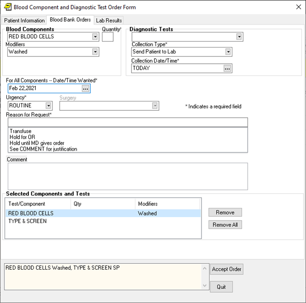

**This dialog enables users to electronically enter orders for blood products and diagnostic tests, view information about blood products related to this patient, and view lab information, if available, related to the blood product or test selected. The location of the Diagnostic Tests and Blood Components areas might be switched at different sites because this can be configured at each site. Date/Time Wanted applies to all components.**  
1.  Select the needed blood component from the drop-down list. (When the user selects a blood component or a diagnostic test, the quick order field is no longer displayed).  
**Note:** For some blood components, a message may appear under the Diagnostic Test drop-down list indicating that a diagnostic test, such as a type and screen, is needed. However, you may want to complete all the fields for the blood component first. Otherwise, you will have to switch back to fill out the needed fields. Also, if there are lab results, they will now be on the Lab Results Available tab.

1.  Enter the quantity.  
1.  (Optional) Select a modifier from the list if needed.  
1.  Indicate when all blood product components are needed by accepting the default of Now, typing in date, or using the calendar control (the button with three dots) to select a date and time.  
1.  Select the urgency from the drop-down list.  
1.  If you select Pre-Op, you must select a surgery from the drop-down list.  
1.  If you select Pre-Op and choose a surgery, the Reason for Request field is automatically populated with the surgery. However, you can also type in a reason for request. (It must be less than 76 characters.)  
**Note:** If you select a surgery that is listed in the MSBOS as not requiring blood components, CPRS displays a dialog warning that no blood is required for the surgery. The MSBOS contains a list of how many units of blood are generally used for the specified surgery.

1.  Under Comment, type any needed comments.  
1.  If a diagnostic test is needed, select the appropriate test under Diagnostic tests.  
**Note:** When you choose a diagnostic test, the fields relating to the blood component are cleared. If you want to see or edit them again, highlight the blood component under the Blood Component and Diagnostic Test area.

1.  Select the collection type from the drop-down list.  
**Note:** Which collection type the user selects first affects the default start time that displays. If Ward Collect is selected first, the default is NOW and stays NOW even if Send Patient is then selected. If Send Patient is selected first, then the default is TODAY and stays TODAY even if Ward Collect is then selected. Immediate collect defaults to a time 10 minutes in the future.

1.  Enter the time and date for the specimen collection.  
1.  To order more blood components, repeat steps 5-12.  
1.  To order additional diagnostic tests, repeat steps 13-15.  
1.  When you have finished, review the order text at the bottom of the dialog.  
1.  When you have the order defined as wanted, select **Accept Order**.  
**Note:** For nursing administration orders, sites will have to create their own orders.

**To create blood component and diagnostic test personal quick orders, use these steps:**

1.  Follow steps 1-18 above.  
1.  Instead of selecting Accept Order, go to the main CPRS window and select Options \| Save as Quick Order….  
1.  In the Add Quick Order (Blood Bank) dialog, type the name for your personal quick order.  
1.  If you want to change where the order will appear in the list, highlight the order and use the arrow buttons on the left of the dialog to move it up or down in the list.  
1.  Select OK.  
After creating the personal quick order, the next time you open the Blood Components and Diagnostic Tests Order Form, your personal quick orders will be listed in the first field.

**Note:** For nursing administration orders, sites will have to create their own orders.

**To place blood bank orders using personal quick orders, use these steps:**

1.  Go to the Orders tab, by clicking on the tab or pressing Ctrl + O.  
1.  Under Write Orders, select Blood Bank (or whatever your site names the VBECS item).  
1.  Select the Blood Bank Orders tab.  
1.  Select the appropriate personal quick order from the drop-down list.  
**Note:** If you inadvertently select the wrong quick order, you can choose Remove All or Cancel to exit the dialog and then reenter the dialog.

1.  Make any changes or additions as needed. Remember that to change part of an order you must highlight that item in the list first.  
1.  When finished, select Accept Order.  
**Note:** For nursing administration orders, sites will have to create their own orders.

#### The Lab Results Tab

The Lab Results tab enables clinicians to view the lab results associated with the selected blood component. If there are lab results in the system when the user selects a blood component, the tab name changes to Lab Results Available. This tab then shows the results from the lab tests designated in VBECS by the administrator at each site. So, for example, the user might see different lab test results based on whether the user selected whole blood or platelets.

**Note:** The most recent results are displayed, but these results may be from tests done some time in the past. Users should use good judgment as to whether they should order a new test.

### Infusion Orders

There are several different kinds of infusion orders, including intravenous (IV), epidural, IV piggyback, etc.

In the Infusion Order dialog, the order type—Continuous or Intermittent— affects whether some fields are available or visible. The two types of IVs are defined as follows:

-   **Continuous IV**: an IV that runs at a specified rate (ml/hr, mcg/kg/min, etc.).  
-   **Intermittent IV**: an IV administered at scheduled intervals (Q4H, QDAY) or  
One-Time only, “over a specified period of time” (e.g., “Infuse over 30 min.”).

For Intermittent orders, the Infusion Rate field changes to be Infuse over Time, the

Schedule field becomes available (not greyed out), and checkboxes display for the PRN and Give Additional Dose Now options. On both dialogs, required fields are identified by an asterisk following the field label (such as Route\*, for example). Intermittent orders no longer require a solution to finish the order. Continuous orders still require a solution before the order can be finished. For CPRS to accept the order, the user must enter values in the required fields, including the units.

For the Route field, CPRS uses the following rules to define whether it displays a default route for the selected medication:

-   If all of the orderable items on the order have the same default medication route defined, CPRS designates the default medication route in the selection list.  
-   If one or more orderable items on the order have different default medication routes, no medication route in the selection lest will be denoted as the default.  
#### Placing Continuous Infusion Orders

Continuous infusion orders run at a specified rate. As the user selects a solution and/or additive, the items from that list are displayed to the right under Solution/Additive. For continuous infusion orders the only optional fields are the Comments and the Duration or Total Volume fields. The schedule field is not available.

With the CPRS GUI v.28, a new Additive Frequency field was added to the Infusion Order dialog. Users must select from this field into which IV bag the additive should be placed:

-   1 Bag/Day: The additive should be put in one bag for 24 hours, normally the first bag.  
-   All Bags: The additive should be placed in all bags given to the patient.  
-   See Comments: The provider wants something other than the above options and will put appropriate instructions in the Comments box.  
**Note:** If the user selects “See Comments” for the Additive Frequency but does not enter appropriate instructions in the Comments box, Pharmacy may interpret that as All Bags.

**To order continuous infusion orders, follow these steps:**

1.  Select the Orders tab.  
1.  Select the active orders view from the View Orders pane -or- select View \| Active Orders (includes pending, recent activity).  
1.  Select Infusion (or your site’s equivalent) in the Write Orders list box.  
**Note:** The Infusion item may be labeled differently or may not be available from your Write Orders list box.

The Infusion Order dialog displays as shown below.

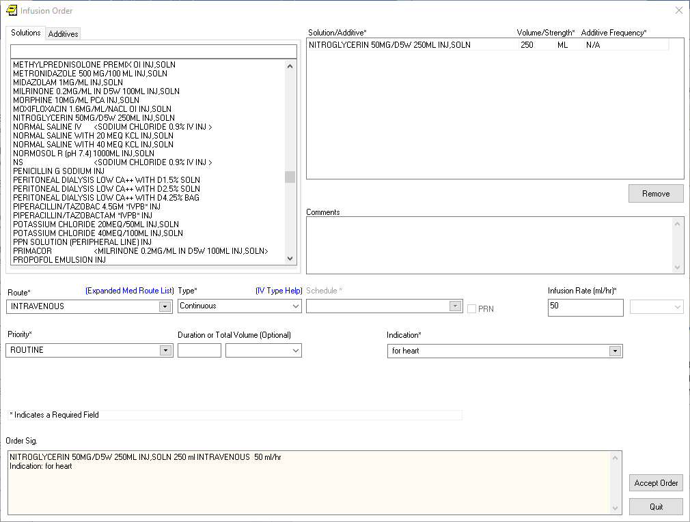

**The Infusion Order dialog for continuous infusion orders does not use a schedule, but it does have an infusion rate. For continuous infusion orders, the new Additive Frequency field enables providers to indicate into which IV bag the additive should be placed**  
**Note:** If encounter information has not been entered, the encounter information dialog will appear before the Infusion Order dialog. You must complete the encounter information dialog before proceeding.

1.  Select the needed solutions from the Solutions tab.  
1.  Select an additive from the list (if necessary) and edit the strength if needed. Repeat for additional additives if necessary. How users can edit the strength field will depend on the values for strength defined in the pharmacy files as follows:  
-   If a single strength is defined, users cannot edit the field.  
-   If multiple values for strength are defined in the pharmacy files, the field will have a drop-down list from which users can choose a strength.  
-   If no values have been defined, users can type in a strength. If a strength includes a decimal point, the value must begin with a number: so, .5 is not valid, but 0.5 is.  
The solution and additives you select will appear in the Solution/Additive grid.

**Note:** To remove an additive or a solution, select the solution or additive and select Remove.

1.  Enter a volume and strength in the Solution/Additive grid (if necessary).  
1.  Select the Additive Frequency from the list:  
-   **1 Bag/Day:** The additive should be put in one bag for 24 hours, normally the first bag.  
-   **All Bags:** The additive should be placed in all bags given to the patient.  
-   **See Comments:** The provider wants something other than the above options. Enter the appropriate instructions in the Comments box.  
1.  Select a Route (such as intravenous, epidural, IV piggyback, etc.) If the desired route is not available, select the Other option in the list of routes to bring the expanded med route form that lists all possible IV routes.  
1.  In the Type field, select Continuous.  
**Note:** If you change the IV Type from Continuous to Intermittent, the Schedule field becomes available and the Infusion Rate field becomes the Infusion over Time field.

**Note:** For a definition of Continuous and Intermittent orders, select the IV Type Help link and a message box will display with a short definition of what the terms mean.

1.  Enter an infusion rate in ml/hr.  
1.  Select a Priority.  
1.  (Optional) Enter a number for the duration or total volume of fluids for this order.  
1.  Select the appropriate unit (liters-L, milliliters-ml, days, or hours).  
**Note:** If you change the units, the value in the Duration or the Total Volume field will be removed and you will need to enter it again. This is a safety feature to ensure the patient does not receive a dangerous amount of fluid.

1.  Enter an Indication. If they have been entered, you can use the drop-down list and select the indication or you can type an indication in the field.  
1.  Enter any comments (if necessary).  
1.  Review the order text at the bottom of the dialog to ensure that it is correct.  
1.  Select Accept Order.  
1.  Enter another order  
\-or-

Select **Quit**.

**Note**: The order must be signed before it is sent. You can either sign the order now or wait until later.

#### Changing or Renewing Continuous Infusion Orders

Users can change and renew Continuous Infusion orders.

A user will not be able to renew an existing Continuous IV Order if the additive frequency value is not defined. The user will be forced into the order dialog when taking another action (Change, Transfer) on an existing Continuous IV Order that does not have an additive frequency value defined.

However, if the continuous infusion order with an additive frequency was placed previously, the order will come back into the dialog with the additive frequency with which Pharmacy finished the order in the Prev. Add. Freq. field that is not editable.

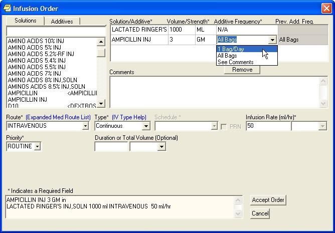

**This screen capture shows the Infusion Order dialog when the user tries to change. A new field displays what the additive frequency was previously. This can help the user decide what additive frequency to select.**  
If Pharmacy did not place anything in that field, it was the same as putting All Bags, but the field will not read All Bags. Additionally, the pharmacist could have entered a value that is acceptable in Pharmacy, but not in CPRS, such as “second bag.”

If the value was accepted before, it will come into the dialog and will display, but it may not be accepted.

The only acceptable values for Additive Frequency in CPRS are 1 Bag/Day, All Bags, or See Comments. And if the user put See Comments, there must be something entered in the Comments box.

#### Placing Intermittent Infusion Orders

Intermittent infusion orders have many of the same required fields as continuous orders, but there are some important differences. Intermittent refers to an infusion order administered at scheduled intervals (Q4H, QDAY) or One-Time only, “over a specified period of time” (e.g., “Infuse over 30 min.”). For intermittent infusion orders, as the user selects a solution and/or additive, the items from that list are displayed to the right under Solution/Additive. For Intermittent infusion orders the only optional fields are the Comments, Infuse Over, and the Duration or Total Volume fields.

However, for intermittent orders, the Infusion Rate field changes to the Infuse Over Time field where the user enters either a number of minutes or hours. the schedule field is not available.

To order intermittent infusion orders, follow these steps:

1.  Select the Orders tab.  
1.  Select the active orders view from the View Orders pane -or- select View \| Active Orders (includes pending, recent activity).  
1.  Select Infusion (or your site’s equivalent) in the Write Orders list box.  
**Note:** The IV fluids item may be labeled differently or may not be available from your Write Orders list box.

The Infusion Order dialog displays as shown below.

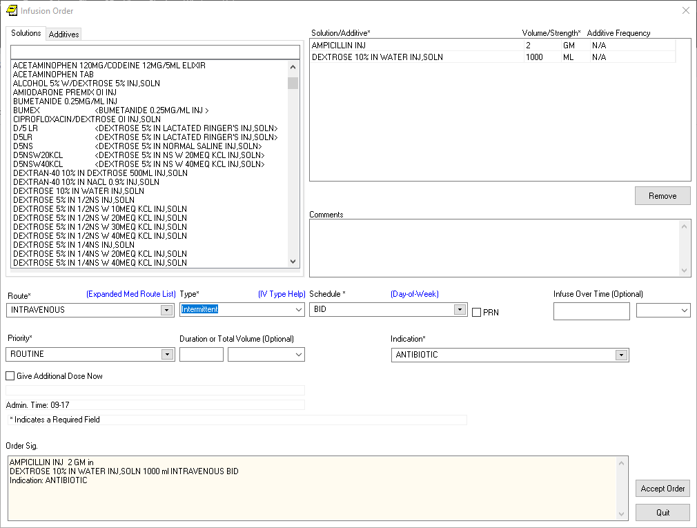

**The Infusion Order dialog for intermittent infusion orders**  
**Note:** If encounter information has not been entered, the encounter information dialog will appear before the Infusion Order dialog. You must complete the encounter information dialog before proceeding.

1.  Select a solution from the Solutions tab.  
After you select a solution, CPRS automatically moves to the Additives tab.

1.  Select an additive from the list (if necessary). Repeat for additional additives if necessary.  
The solution and additives you select will appear in the Solution/Additive grid.

**Note**: To remove an additive or a solution, select the solution or additive and click **Remove**.

1.  Enter a volume and strength in the Solution/Additive grid (if necessary).  
1.  Select the Route (for example, intravenous, epidural, IV piggyback, etc.) from the drop-down list. If the desired route is not available select the Other option in the list of routes to bring the expanded med route form that list all possible IV routes.  
1.  In the Type drop-down box, select Intermittent.  
**Note:** If you change the IV Type from Intermittent to Continuous, the Schedule field becomes unavailable (greyed out) and the Infusion over Time field becomes the Infusion Rate field.

**Note:** For a definition of Continuous and Intermittent orders, select the IV Type Help link and a message box will display with a short definition of what the terms mean.

1.  Select a schedule from the list or create one using the Day-of-Week schedule builder.  
**Note:** When a user writes an intermittent infusion order with a schedule of ONCE, the following will happen in CPRS:

-   The DURATION field will be disabled.  
-   The Give Additional Dose Now option will be disabled  
-   Expected First Dose and Administration Times will not be displayed  
**Note:** When a user writes an intermittent infusion order with a schedule of On Call or a PRN, the following will happen in CPRS:

-   Expected First Dose and Administration Times will not be displayed  
1.  If you selected an existing schedule, skip to step 13. If you selected OTHER, CPRS displays the Order with Schedule ‘OTHER’ dialog. Take the following steps:  
1.  Select one or more checkboxes by the appropriate days of the week.  
1.  If the schedule requires specific administration times skip to steps c and d. To select a schedule from the list, highlight the schedule and select **Add**.  
**Note:** Users can assign either a schedule from the list or specific administration times, but not both.

1.  To use a specific administration time, select the hour and minutes (if the user only selects the hour, the minutes will default to zero) and select **Add**.  
1.  Repeat step c until you have entered all required administration times.  
**Warning:** The administration times in the Schedule field apply to each day of the week that is listed, such as TU-TH-SA@08002000, for example. To create a schedule such as TU@0800 TH@2000, users would have to enter two separate orders using the complex medication order dialog. Also, users may not enter a schedule that only has administration times and PRN but no days.

1.  If you make a mistake while selecting an administration time or schedule, do one of the following to remove it:  
-   For a single administration time, highlight the hour and minutes in the Set Administration Time fields and select **Remove** (so to remove 08:00, you would have to select that time in the Set Administration Time fields not in the Schedule text box.)  
o To remove the schedule, highlight the schedule and select **Remove**.

-   To remove the entire schedule and begin again with step a, select **Reset**.  
1.  Review the **Schedule** field.  
1.  When you have the correct schedule, select **OK**.  
1.  If necessary, select the PRN checkbox.  
1.  Enter the number for the duration over which to infuse the medication.  
1.  Move to the next field and select the unit of time (the units can be only Minutes or Hours) over which the infusion should be given.  
For example, you might enter 30 for the number, move to the next field, and then select minutes to define infuse over 30 minutes.

1.  Select the Priority.  
1.  Enter a number for the duration or total volume.  
1.  Move to the next field and select the appropriate unit (liters-L, milliliters, days, hours, or doses).  
**Note:** If you change the units, the value in the Duration or the Total Volume field will be removed and you will need to enter it again. This is a safety feature to insure the patient does not receive a dangerous amount of fluid.

1.  If necessary, select the Give additional dose now checkbox.  
**Note:** Make sure that you are careful about using give-additional-dose now functionality. When you click the check box, CPRS creates two new orders and sends it to Inpatient Medications. Make sure the “Give additional dose now” and the regular order with the original schedule you entered do not overmedicate the patient. “Give additional dose now” is not available for ONCE, ONE-TIME, or NOW orders. It is also not available for delayed orders.

1.  Enter an Indication. If they have been entered, you can use the drop-down list and select the indication or you can type an indication in the field.  
1.  Enter any comments (if necessary).  
1.  Review the order text at the bottom of the dialog to ensure that it is correct.  
1.  If the order text is correct, select Accept Order.  
1.  Enter another order  
\-or-

Select **Quit**.

**Note**: The order must be signed before it is sent. You can either sign the order now or wait until later.

### Entering Simple Supply Orders

Ordering supplies has changed a little in CPRS. Previously, supplies were included in the Medication Order dialog. This was not an ideal situation because those who might only be tasked with ordering supplies might inadvertently select a medication. In addition, nurses and clerk might also have to have additional permissions to order supplies that would allow them to order medications as well.

**To place simple supply orders, use the following steps:**

1.  On the Order tab under the Write Orders pane, select Supplies.  
1.  In the Supplies order dialog, select the item from the list (you can type part of its name in the text box to move to that part of the list and then select the item).  
1.  On the Dosage tab, select or type a dosage.  
1.  If a Route is needed, select or type an acceptable route.  
1.  Select a schedule.  
1.  Type any comments.  
1.  Type a Days Supply.  
1.  Type a Quantity.  
1.  Enter a number of Refills.  
1.  Under Pick up, select how patient will receive the supply: Clinic, Mail, or Window.  
1.  Under Priority, use the drop-down box to select the priority.  
1.  Review the order text at the bottom of the dialog. If it is correct, select Accept Order. If something is not correct, correct that portion that is wrong. To cancel the process, select Quit.  
### Entering Complex Supply Orders

Ordering supplies has changed a little in CPRS. Previously, supplies were included in the Medication Order dialog. This was not an ideal situation because those who might only be tasked with ordering supplies might inadvertently select a medication. In addition, nurses and clerk might also have to have additional permissions to order supplies that would allow them to order medications as well.

**To place complex supply orders, use the following steps:**

1.  On the Order tab under the Write Orders pane, select Supplies.  
1.  In the Supplies order dialog, select the item from the list (you can type part of its name in the text box to move to that part of the list and then select the item).  
1.  After selecting the item, select the Complex tab.  
1.  Enter a Dosage by selecting on from the drop-down list or typing an appropriate dosage into the field.  
1.  Enter a Schedule using the drop-down list or by typing one in the Schedule field.  
1.  Enter a Duration and the unit of time (such as days, hours, weeks, etc.).  
1.  Select a conjunction (and or then) unless this is the last line.  
1.  Repeat steps 4-7 until you have the entire complex order entered.  
1.  (Optional) Type a Comment if needed.  
1.  Enter a Days Supply.  
1.  Enter a Quantity.  
1.  Enter the number of Refills, if any.  
1.  Select how the patient will receive the supply items (Clinic, Mail, or Window).  
1.  Select a Priority from the drop-down list.  
1.  Review the SIG to make sure it is correct.  
1.  Make any corrections as needed.  
1.  When the order is ready, select Accept Order.  
1.  If the Order Check window displays, review all order checks and act appropriately.  
1.  When finished, you can enter a new supply order or select Quit to exit the dialog.  
### Ordering Lab Tests

To place an order for a lab test, follow these steps:

1.  Select the Orders tab.  
1.  Select the active orders view from the View Orders pane -or- select View \| Active Orders (includes pending, recent activity).  
1.  Select Lab Tests in the Write Orders list.  
**Note**: The lab tests order may be labeled differently or may not be available from your Write Orders field.

The Order a Lab Test dialog will appear.

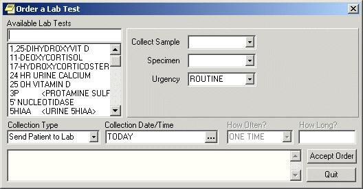

**The Order a Lab Test dialog**  
**Note**: If encounter information has not been entered, the encounter information dialog will appear before the Order a Lab Test dialog. You must complete the encounter information dialog before proceeding.

1.  Select the desired lab test in the Available Lab Tests list box.  
1.  If desired, change the default values for the Collection Sample, Specimen, and/or Urgency fields. If you cannot change a field, the text label (to the left of the field) will be dimmed.  
1.  Select the collection type.  
1.  Choose a collection date and time.  
1.  Complete the How Often? and How Long? fields (if necessary).  
1.  Select Accept Order.  
**Note:** If you have selected an inpatient order with a collection type of “lab collect” or “immediate collect” and if a continuous schedule was selected (such as QD or QWEEKLY) and a child order falls on a day when the lab cannot perform the collection (for example, weekends or holidays), CPRS displays a message telling the user that the collection type will be changed to “ward collect” or of any such changes to child orders.

1.  Enter another lab test  
\-or-

select **Quit**.

**Note**: The Lab Test order must be signed before it is sent. You can either sign the order now or wait until later.

### Anatomic Pathology Orders (Overview)

Atomic Pathology (AP) laboratory service now has a mechanism for clinicians to provide required patient-specific, procedure-specific, and specimen-specific information to facilitate specimen processing by pathologists.

A new Anatomic Pathology Order Dialog is available with the following available order types:

-   Bone Marrow

-   Bronchial Biopsy

-   Bronchial Cytology

-   Dermatology

-   Fine Needle Aspirate

-   Gastrointestinal Endoscopy

-   General Fluid

-   Gynecology (Pap Smear)

-   Renal Biopsy

-   Tissue Exam

-   Urine

-   Urology, Bladder/Ureter

-   Urology, Prostate

When opening the Anatomic Pathology order dialog, you must first select one of the available order types, such as seen below, for example Bone Marrow, Bronchial Biopsy, etc.

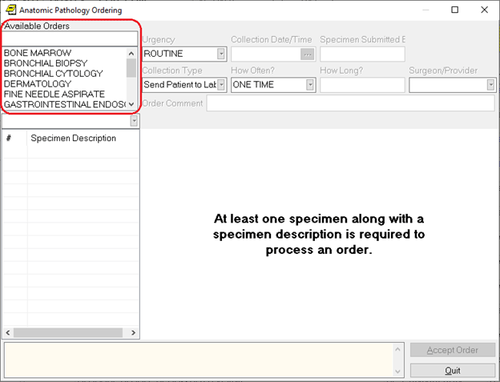  
Because each order type may require different information, different order dialog fields display when the user selects an order type.

#### Common Areas of Anatomic Pathology Order Dialogs

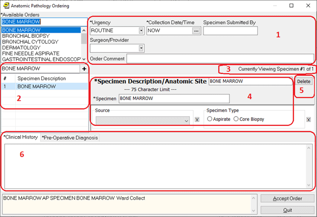

1.  Order-specific fields such as Urgency and Collection Date/Time.  
1.  List of Specimens for this order.  
1.  The Current Specimen being viewed in box 4.  
1.  Specimen-specific fields, such as the Specimen Description/Anatomic Site and Collection Sample.  
1.  Button to delete the current specimen.  
1.  Several Multiple tabs to enter free text fields, such as Clinical History.  
In box 2 above, the Current Specimen List:

-   Some dialogs have a “+” button at the top of the list of specimens. Click this button to add an additional specimen.

    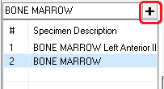

Other dialogs have a dropdown list. When first selecting these dialog types, the dropdown list will automatically open. Select an entry from the list to create your first specimen.

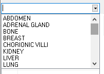

-   To add an additional specimen, you must click on the down arrow button to open the list of types. Select an option from the dropdown list to add an additional specimen.

    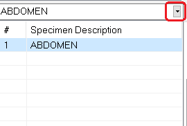  
-   To navigate between specimens, click the entry in the list. The current specimen is shown on the right.

    

Each dialog has a different set of specimen-specific fields. Some examples are:

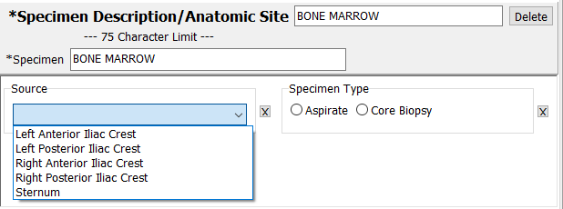

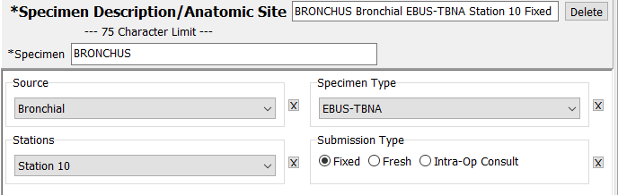

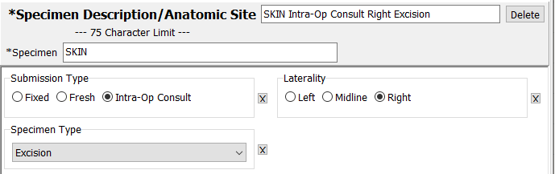

Selections made in the specimen-specific fields will be displayed in the Specimen Description/Anatomic Site field, shown at the top of the above examples. The user can also edit the Specimen Description/Anatomic Site field directly. This is a required field with a maximum length of 75 characters. If the maximum character length is exceeded, a warning dialog will be displayed to the user as shown below.

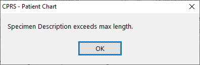

If this happens you may need to edit the text of the Specimen Description/Anatomic Site field to ensure it conveys the desired information.

At the bottom of the Anatomic Pathology order dialog are one or more text fields. Select the tab header of each field to edit the text. Required fields are marked with an asterisk.

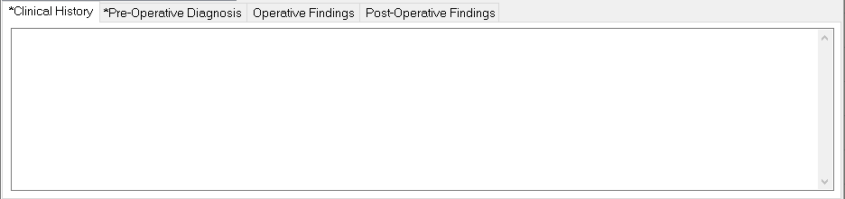

Some dialogs have additional Clinical History fields.

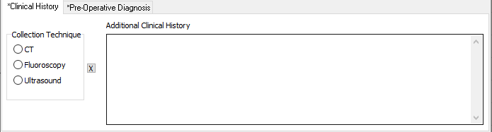

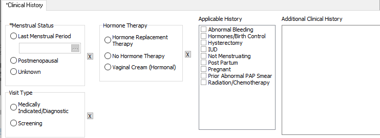

Selecting any of these additional fields satisfies a text entry requirement for Clinical History. Note that when selecting the Additional Clinical History box to type text, it will automatically expand the field to the full width of the dialog, hiding the additional Clinical History fields. This is temporary, these fields will return when exiting the Additional Clinical History control (e.g. you can click on the Clinical History tab header to make the additional fields reappear).

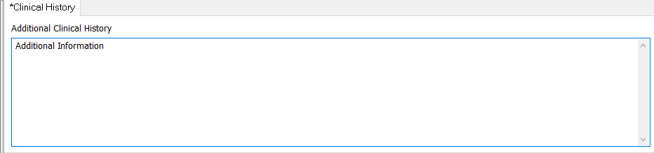

#### Review the Order before Accepting

Choosing Accept Order displays a preview dialog with all the order details displayed.

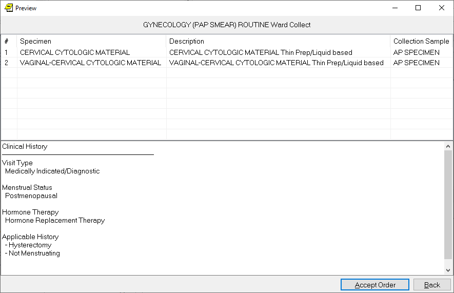

Selecting the Back button will return you to the order dialog. Or the user can select Accept Order.

#### Order Details

After the order is accepted, it can be viewed on the Orders tab. Users must sign the order before it will be available in the Lab package.

The order number and the lab number are both available in the CPRS Order Details display.

#### Requisition and Labels

After the order is completed, your local site will need to follow your procedures for creating a requisition and specimen label. One possibility is to print the order details and use them in place of the SF 515 as a requisition. While this is one possibility, the site will need to choose how to handle printing the requisition and labeling the specimen.

#### Entering a Bone Marrow Lab Test

**To place an order for a Bone Marrow lab test, follow these steps:**

1.  Select the **Orders** tab.  
1.  Select **Anatomic Pathology** from the **Write Orders** list.  
Note: The orders listed in the Write Orders pane vary from site to site.  
1.  If the patient is an outpatient, select a **Visit Location** in the **Location for Current Activities** box and choose a visit location.  
1.  Choose the **Date/Time** of the visit.  
1.  Select **OK**.  
1.  Select **Bone Marrow** in the **Available Lab Tests** list box. The Bone Marrow dialog displays as shown below.  
**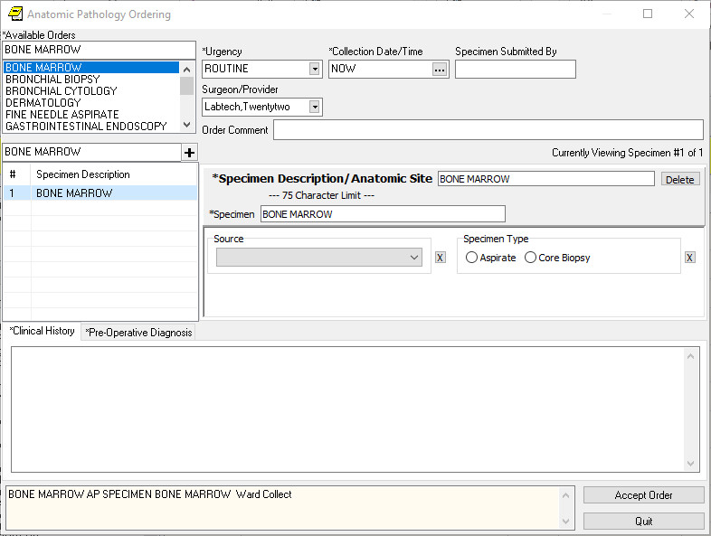Bone Marrow dialog**  
1.  Select the Specimen Description on the left side of the dialog box and choose a specimen. If this is the first specimen, use the +key located above the Specimen Description field. Use the drop-down list for subsequent specimens.  
**Note:** At least one specimen along with a specimen description is required to process an order.  
1.  If desired, change the default values for **Urgency** and/or **Collection Date/Time** fields. These are required fields.  
1.  If desired, enter your name in the **Specimen Submitted By field**. This is an optional field that is intended for the name of the person entering the order.  
1.  Select the **Surgeon/Physician** field and choose a surgeon/physician.  
1.  If desired, enter a comment in the **Order comment** field. This is an optional field that allows letters, numbers, punctuation, and spaces.  
1.  Select the **Source**. Choose a source for the specimen **(Left Anterior Iliac Crest,Left Posterior Iliac Crest,Right Anterior Iliac Crest,Right Posterior Iliac Crest**, or **Sternum**).  
**Note:** The selection made in this field will appear in the Specimen Description field above.  
-   If desired, select the **X** button to delete the entry. Deleting the entry will result in a CPRS Patient Chart Warning dialog box; select the **Yes** button to confirm the deletion or select the **No** button to cancel the deletion.  
***

1.  Select the **Specimen Type**. Choose a specimen type (**Aspirate** or **Core Biopsy**).  
**Note:** The selection made in this field will appear in the Specimen Description field above.  
-   If desired, select the **X** button to delete the entry. Deleting the entry will result in a CPRS Patient Chart Warning dialog box; select the **Yes** button to confirm the deletion or select the **No** button to cancel the deletion.  
***

1.  If desired, enter a description for the specimen in the **Specimen Description** field. This is a required field with a maximum character length of 75 which includes letters, numbers, punctuation, and spaces.  
-   If desired, select the **X** button to delete the entry. Deleting the entry will result in a CPRS Patient Chart Warning dialog box; select the **Yes** button to confirm the deletion or select the **No** button to cancel the deletion.  
***

**Note:** If you delete a specimen and there are multiple specimens, the specimen numbers will be reordered in the Specimen Description list.  
1.  Select the **Clinical History** tab. Enter the patient’s history in the **Clinical History** field. This is a required field that allows letters, numbers, punctuation, and spaces.  
1.  Select the **Pre-Operative Diagnosis** tab. Enter the patient’s pre-operative diagnosis in the **Pre-Operative Diagnosis** field. This is a required field that allows letters, numbers, punctuation, and spaces.  
1.  Select **Accept Order**.  
1.  Preview the order.  
1.  If desired, modify the order by selecting the **Back** button, or select the **Accept Order** button to accept the order.  
1.  If desired, enter another lab test.  
\-or-Select **Accept Order**.  
\-or-Select **Quit**.  
**Note:** The Lab Test order must be signed before it is sent to VistA to be accessioned and processed. You can either sign the order now or wait until later.  
***  
***  
***

#### Entering a Bronchial Biopsy Lab Test

**To place an order for a Bronchial Biopsy lab test, follow these steps:**

1.  Select the **Orders** tab.  
1.  Select **Anatomic Pathology** from the **Write Orders** list.  
1.  If the patient is an outpatient, select a **Visit Location** in the **Location for Current Activities** box and choose a visit location.  
1.  Choose the **Date/Time** of the visit.  
1.  Select **OK**.  
1.  Select **Bronchial Biopsy** in the **Available Lab Tests** list box. The Bronchial Biopsy dialog displays.  
1.  Select the **Specimen Description** on the left side of the dialog box. Choose a specimen description. If this is the first specimen, use the +key located above the Specimen Description field. Use the drop-down list for subsequent specimens.  
**Note:** At least one specimen along with a specimen description is required to process an order.  
1.  If desired, change the default values for **Urgency** and/or **Collection Date/Time** fields. (These are required fields).  
1.  If desired, enter your name in the **Specimen Submitted By** field. This is an optional field that is intended for the name of the person performing the procedure.  
1.  Select the **Surgeon/Physician** field. Choose a surgeon/physician.  
1.  If desired, enter a comment in the **Order comment** field. This is an optional field that allows letters, numbers, punctuation, and spaces.  
1.  Select the **Source**. Choose a source for the specimen (**Bronchial, Left Lower Lobe (LLL) Bronchial, Left Upper Lobe (LUL) Bronchial, Lingula, Main Stem Bronchus, Right Lower Lobe (RLL) Bronchial, Right Middle Lobe (RML) Bronchial,** or **Right Upper Lobe (RUL) Bronchial**).  
**Note:** The selection made in this field will appear in the Specimen Description field above.  
-   If desired, select the **X** button to delete the entry. Deleting the entry will result in a CPRS Patient Chart Warning dialog box; select the **Yes** button to confirm the deletion or select the **No** button to cancel the deletion.  
***

1.  Select the **Specimen Type**. Choose a specimen type (**EBUS-TBNA, Endobronchial Biopsy,** or **Transbronchial Biopsy**).  
**Note:** The selection made in this field will appear in the Specimen Description field above.  
-   If desired, select the **X** button to delete the entry. Deleting the entry will result in a CPRS Patient Chart Warning dialog box; select the **Yes** button to confirm the deletion or select the **No** button to cancel the deletion.  
***

1.  Select the **Station**. Choose a station(**Station 10, Station 2, Station 4,** or **Station 7**).  
-   If desired, select the **X** button to delete the entry. Deleting the entry will result in a CPRS Patient Chart Warning dialog box; select the **Yes** button to confirm the deletion or select the **No** button to cancel the deletion.  
***

1.  Select the **Submission Type**. Choose a submission type (**Fresh, Fixed,** or **Intra-Op Consult**).  
**Note:** The selection made in this field will appear in the Specimen Description field above.  
**Note:** If **Fresh** or **Intra-Op Consult** is selected, the **Urgency** field will change to **STAT**; you will receive a Warning dialog regarding the change.  
**Note:** If you change the **Submission Type** to **Fixed** on all of the specimens (whether only one specimen on the order or multiple specimens on the order), you will need to manually change the **Urgency** to **Routine** if that is desired.  
-   If desired, select the **X** button to delete the entry. Deleting the entry will result in a CPRS Patient Chart Warning dialog box; select the **Yes** button to confirm the deletion or select the **No** button to cancel the deletion.  
***

1.  If desired, enter a description for the specimen in the **Specimen Description** field. This is a required field with a maximum character length of 75 which includes letters, numbers, punctuation, and spaces.  
-   If desired, select the **X** button to delete the entry. Deleting the entry will result in a CPRS Patient Chart Warning dialog box; select the **Yes** button to confirm the deletion or select the **No** button to cancel the deletion.  
***

**Note:** If you delete a specimen and there are multiple specimens, the specimen numbers will be reordered in the Specimen Description list.  
1.  Select the **Clinical History** tab. Enter the patient’s history in the **Clinical History** field. This is a required field that allows letters, numbers, punctuation, and spaces.  
1.  Select the **Pre-Operative Diagnosis** tab. Enter the patient’s pre-operative diagnosis in the **Pre-Operative Diagnosis** field. This is a required field that allows letters, numbers, punctuation, and spaces.  
1.  If desired, select the **Operative Findings** tab. Enter the patient’s operative findings in the **Operative Findings** field. This is an optional field that allows letters, numbers, punctuation, and spaces.  
1.  If desired, select the **Post-Operative Findings** tab. Enter the patient’s **Post-Operative Findings**. This is an optional field that allows letters, numbers, punctuation, and spaces.  
1.  Select **Accept Order**.  
1.  Preview the order.  
1.  If desired, modify the order by selecting the **Back** button, or select the **Accept Order** button to accept the order.  
1.  If desired, enter another lab test.  
\-or-Select Accept Order.  
\-or-Select Quit.  
Note: The Lab Test order must be signed before it is sent to VistA to be accessioned and processed. You can either sign the order now or wait until later.  
#### Entering a Bronchial Cytology Lab Test

**To place an order for a Bronchial Cytology lab test, follow these steps:**

1.  Select the **Orders** tab.  
1.  Select **Anatomic Pathology** from the **Write Orders list**.  
1.  If the patient is an outpatient, select a **Visit Location** in the **Location for Current Activities** box and choose a visit location.  
1.  Choose the **Date/Time** of the visit.  
1.  Select **OK**.  
1.  Select **Bronchial Cytology** in the **Available Lab Tests** list box. The Bronchial Cytology dialog displays.  
1.  Select the **Specimen Description** on the left side of the dialog box. Choose a specimen description. If this is the first specimen, use the +key located above the Specimen Description field. Use the drop-down list for subsequent specimens.  
**Note:** At least one specimen along with a specimen description is required to process an order.  
1.  If desired, change the default values for **Urgency** and/or **Collection Date/Time** fields. (These are required fields).  
1.  If desired, enter your name in the **Specimen Submitted By** field. This is an optional field that is intended for the name of the person performing the procedure.  
1.  Select the **Surgeon/Physician** field. Choose a surgeon/physician.  
1.  If desired, enter a comment in the **Order comment** field. This is an optional field that allows letters, numbers, punctuation, and spaces.  
1.  Select the Source. Choose a source for the specimen (**Bronchial, Left Lower Lobe (LLL) Bronchial, Left Middle Lobe (LML) Bronchial, Left Upper Lobe (LUL) Bronchial, Lingula, Main Stem, Right Lower Lobe (RLL) Bronchial, Right Middle Lobe (RML) Bronchial,** or **Right Upper Lobe (RUL) Bronchial**).  
**Note:** The selection made in this field will appear in the Specimen Description field above.  
-   If desired, select the **X** button to delete the entry. Deleting the entry will result in a CPRS Patient Chart Warning dialog box; select the **Yes** button to confirm the deletion or select the **No** button to cancel the deletion.  
***

1.  Select the **Specimen Type**. Choose a specimen type (**Bronchial-Alveolar Lavage (BAL), Brushing, Sputum, Wang Needle,** or **Washing**).  
**Note:** The selection made in this field will appear in the Specimen Description field above.  
-   If desired, select the **X** button to delete the entry. Deleting the entry will result in a CPRS Patient Chart Warning dialog box; select the **Yes** button to confirm the deletion or select the **No** button to cancel the deletion.  
***

1.  If desired, enter a description for the specimen in the **Specimen Description** field. This is a required field with a maximum character length of 75 which includes letters, numbers, punctuation, and spaces.  
-   If desired, select the **X** button to delete the entry. Deleting the entry will result in a CPRS Patient Chart Warning dialog box; select the **Yes** button to confirm the deletion or select the **No** button to cancel the deletion.  
***

**Note:** If you delete a specimen and there are multiple specimens, the specimen numbers will be reordered in the Specimen Description list.  
1.  Select the **Clinical History** tab. Enter the patient’s history in the **Clinical History** field. This is a required field that allows letters, numbers, punctuation, and spaces.  
1.  Select the **Pre-Operative Diagnosis** tab. Enter the patient’s pre-operative diagnosis in the **Pre-Operative Diagnosis** field. This is a required field that allows letters, numbers, punctuation, and spaces.  
1.  Select **Accept Order**.  
1.  Preview the order.  
1.  If desired, modify the order by selecting the **Back** button, or select the **Accept Order** button to accept the order.  
1.  If desired, enter another lab test.  
\-or-Select **Accept Order**.  
\-or-Select **Quit**.  
**Note:** The Lab Test order must be signed before it is sent to VistA to be accessioned and processed. You can either sign the order now or wait until later.  
***

#### Entering a Dermatology Lab Test

**To place an order for a Dermatology lab test, follow these steps:**

1.  Select the **Orders** tab.  
1.  Select **Anatomic Pathology** from the **Write Orders** list.  
1.  If the patient is an outpatient, select a **Visit Location** in the **Location for Current Activities** box and choose a visit location.  
1.  Choose the **Date/Time** of the visit.  
1.  Select **OK**.  
1.  Select **Dermatology** in the **Available Lab Tests** list box. The Dermatology dialog displays.  
1.  Select the **Specimen Description** on the left side of the dialog box. Choose a specimen description. If this is the first specimen, use the +key located above the Specimen Description field. Use the drop-down list for subsequent specimens.  
**Note:** At least one specimen along with a specimen description is required to process an order.  
1.  If desired, change the default values for **Urgency** and/or **Collection Date/Time** fields. These are required fields.  
1.  If desired, enter your name in the **Specimen Submitted By** field. This is an optional field that is intended for the name of the person performing the procedure.  
1.  Select the **Surgeon/Physician** field. Choose a surgeon/physician.  
1.  If desired, enter a comment in the **Order comment** field. This is an optional field that allows letters, numbers, punctuation, and spaces.  
1.  Select the **Submission Type**. Choose a submission type (**Fresh, Fixed,** or **Intra-Op Consult**).  
**Note:** The selection made in this field will appear in the Specimen Description field above.  
**Note:** If **Fresh** or **Intra-Op Consult** is selected, the **Urgency** field will change to **STAT**; you will receive a Warning dialog regarding the change.  
**Note:** If you change the **Submission Type** to **Fixed** on all of the specimens (whether only one specimen on the order or multiple specimens on the order), you will need to manually change the **Urgency** to **Routine** if that is desired.  
-   If desired, select the **X** button to delete the entry. Deleting the entry will result in a CPRS Patient Chart Warning dialog box; select the **Yes** button to confirm the deletion or select the **No** button to cancel the deletion.  
***

1.  Select the **Specimen Type**. Choose a specimen type **(Biopsy, Excision, MOHS, Punch Biopsy 2 mm, Punch Biopsy 3 mm, Punch Biopsy 4 mm, Punch Biopsy 5 mm, Punch Biopsy 6 mm, Punch Biopsy 7 mm,** or **Punch Biopsy 8 mm, Shave Biopsy,** or **Shave ED&C**).  
**Note:** The selection made in this field will appear in the Specimen Description field above.  
**Note:** If a particular Punch Biopsy size is not available, you may enter it in the Specimen Description field. If information is already in the Specimen Description field, enter the Punch Biopsy size at the very end of the field and use a comma after the last character in the field before entering the information.  
-   If desired, select the **X** button to delete the entry. Deleting the entry will result in a CPRS Patient Chart Warning dialog box; select the **Yes** button to confirm the deletion or select the **No** button to cancel the deletion.  
***

1.  Select the **Laterality**. Choose the laterality (**Left, Midline,** or **Right**).  
1.  If desired, enter a description for the specimen in the **Specimen Description** field. This is a required field with a maximum character length of 75 which includes letters, numbers, punctuation, and spaces.  
-   If desired, select the **X** button to delete the entry. Deleting the entry will result in a CPRS Patient Chart Warning dialog box; select the **Yes** button to confirm the deletion or select the **No** button to cancel the deletion.  
**Note:** If you delete a specimen and there are multiple specimens, the specimen numbers will be reordered in the Specimen Description list.  
1.  Select the **Clinical History** tab. Enter the patient’s history in the **Clinical History** field. This is a required field that allows letters, numbers, punctuation, and spaces.  
1.  Select the **Pre-Operative Diagnosis** tab. Enter the patient’s pre-operative diagnosis in the **Pre-Operative Diagnosis** field. This is a required field that allows letters, numbers, punctuation, and spaces.  
1.  If desired, select the **Operative Findings** tab. Enter the patient’s operative findings in the **Operative Findings** field. This is an optional field that allows letters, numbers, punctuation, and spaces.  
1.  If desired, select the **Post-Operative Findings** tab. Enter the patient’s **Post-Operative Findings**. This is an optional field that allows letters, numbers, punctuation, and spaces.  
1.  Select **Accept Order**.  
1.  Preview the order.  
1.  If desired, modify the order by selecting the **Back** button, or select the **Accept Order** button to accept the order.  
1.  If desired, enter another lab test.  
\-or-Select **Accept Order**.  
\-or-Select **Quit**.  
**Note:** The Lab Test order must be signed before it is sent to VistA to be accessioned and processed. You can either sign the order now or wait until later.  
***

## Entering a Fine Needle Aspirate Lab Test

**To place an order for a Fine Needle Aspirate lab test, follow these steps:**

1.  Select the **Orders** tab.  
1.  Select **Anatomic Pathology** from the **Write Orders** list.  
**Note**: The orders listed in the Write Orders pane vary from site to site.  
1.  If the patient is an outpatient, select a **Visit Location** in the **Location for Current Activities** box and choose a visit location.  
1.  Choose the **Date/Time** of the visit.  
1.  Select **OK**.  
1.  Select **Fine Needle Aspirate** in the Available Lab Tests list box. The Fine Needle Aspirate dialog displays.  
1.  Select the **Specimen Description** on the left side of the dialog box. Choose a specimen description. If this is the first specimen, use the **+** key located above the Specimen Description field. Use the drop-down list for subsequent specimens.  
**Note**: At least one specimen along with a specimen description is required to process an order.  
1.  If desired, change the default values for **Urgency** and/or **Collection Date/Time** fields. These are required fields.  
1.  If desired, enter your name in the **Specimen Submitted By** field. This is an optional field that is intended for the name of the person entering the order.  
1.  Select the **Surgeon/Physician**. Choose a surgeon/physician.  
1.  If desired, enter a comment in the **Order comment** field. This is an optional field that allows letters, numbers, punctuation, and spaces.  
1.  If desired, enter a description for the specimen in the **Specimen Description** field. This is a required field with a maximum character length of 75 which includes letters, numbers, punctuation, and spaces.  
-   If desired, select the **X** button to delete the entry. Deleting the entry will result in a CPRS Patient Chart Warning dialog box; select the **Yes** button to confirm the deletion or select the **No** button to cancel the deletion.  
***

**Note**: If you delete a specimen and there are multiple specimens, the specimen numbers will be reordered in the Specimen Description list.  
1.  Select the Specimen Type. Choose a specimen type (Needle Core Biopsy, Needle Washing, or Slide).  
**Note**: The selection made in this field will appear in the Specimen Description field above.  
-   If desired, select the **X** button to delete the entry. Deleting the entry will result in a CPRS Patient Chart Warning dialog box; select the **Yes** button to confirm the deletion or select the **No** button to cancel the deletion.  
***

1.  Select the **Laterality**. Choose the laterality (**Left**, **Midline**, or **Right**).  
1.  Select the **Clinical History** tab. Enter the patient’s history in the Clinical History field. This is a required field.  
1.  Select a **Collection Technique**. Choose the collection technique (**CT**, **Fluoroscopy**, or **Ultrasound**).  
1.  If desired, select **Additional Clinical History**. Enter information for additional clinical history. This field allows letters, numbers, punctuation, and spaces.  
1.  Select the **Pre-Operative Diagnosis** tab. Enter the patient’s pre-operative diagnosis in the Pre-Operative Diagnosis field. This is a required field that allows letters, numbers, punctuation, and spaces.  
1.  Select **Accept Order**.  
1.  Preview the order.  
1.  If desired, modify the order by selecting the **Back** button, or select the **Accept Order** button to accept the order.  
1.  If desired, enter another lab test.  
\-or- Select **Accept Order**.  
\-or- Select **Quit**.  
**Note**: The Lab Test order must be signed before it is sent to VistA to be accessioned and processed. You can either sign the order now or wait until later.  
***  
#### Entering a Gastrointestinal Endoscopy Lab Test

**To place an order for a Gastrointestinal Endoscopy lab test, follow these steps:**

1.  Select the **Orders** tab.  
1.  Select **Anatomic Pathology** from the **Write Orders** list.  
**Note**: The orders listed in the Write Orders pane vary from site to site.  
1.  If the patient is an outpatient, select a **Visit Location** in the **Location for Current Activities** box and choose a visit location.  
1.  Choose the **Date/Time** of the visit.  
1.  Select **OK**.  
1.  Select **Gastrointestinal Endoscopy** in the Available Lab Tests list box. The Gastrointestinal Endoscopy dialog displays.  
1.  Select the **Specimen Description** on the left side of the dialog box. Choose a specimen description. If this is the first specimen, use the **+** key located above the Specimen Description field. Use the drop-down list for subsequent specimens.  
**Note**: At least one specimen along with a specimen description is required to process an order.  
1.  If desired, change the default values for **Urgency** and/or **Collection Date/Time** fields. These are required fields.  
1.  If desired, enter your name in the **Specimen Submitted By** field. This is an optional field that is intended for the name of the person entering the order.  
1.  Select the **Surgeon/Physician**. Choose a surgeon/physician.  
1.  If desired, enter a comment in the **Order comment** field. This is an optional field that allows letters, numbers, punctuation, and spaces.  
1.  Select the **Technique**. Choose the technique (**Biopsy**, **Brushing**, **EMR**, **FNA**, **Hot Biopsy**, or **Hot Snare**).  
**Note:** The selection made in this field will appear in the Specimen Description field above.  
-   If desired, select the **X** button to delete the entry. Deleting the entry will result in a CPRS Patient Chart Warning dialog box; select the **Yes** button to confirm the deletion or select the **No** button to cancel the deletion.  
***

1.  Select the **Specimen Type**. Choose a specimen type (**Erosion**, **Lesion**, **Mass**, **Polyp**, **Random**, or **Ulcer**).  
**Note**: The selection made in this field will appear in the Specimen Description field above.  
-   If desired, select the **X** button to delete the entry. Deleting the entry will result in a CPRS Patient Chart Warning dialog box; select the **Yes** button to confirm the deletion or select the **No** button to cancel the deletion.  
***

1.  If desired, enter a description for the specimen in the **Specimen Description** field. This is a required field with a maximum character length of 75 which includes letters, numbers, punctuation, and spaces.  
-   If desired, select the **X** button to delete the entry. Deleting the entry will result in a CPRS Patient Chart Warning dialog box; select the **Yes** button to confirm the deletion or select the **No** button to cancel the deletion.  
**Note**: If you delete a specimen and there are multiple specimens, the specimen numbers will be reordered in the Specimen Description list.  
1.  Select the **Clinical History** tab. Enter the patient’s history in the Clinical History field. This is a required field.  
1.  Select an **Indication**. Choose all of the indications that apply (**Barrett’s Esophagus, Candida, Colitis, H. Pylori, Malignancy, Microscopic Colitis,** and/or **Sprue**).  
1.  If desired, select **Additional Clinical History**. Enter information for additional clinical history. This field allows letters, numbers, punctuation, and spaces.  
1.  Select the **Operative Findings** tab. Enter the patient’s operative findings in the Operative Findings field. This is a required field that allows letters, numbers, punctuation, and spaces.  
1.  Select **Accept Order**.  
1.  Preview the order.  
1.  If desired, modify the order by selecting the **Back** button, or select the **Accept Order** button to accept the order.  
1.  If desired, enter another lab test.  
\-or- Select **Accept Order**.  
\-or- Select **Quit**.  
**Note:** The Lab Test order must be signed before it is sent to VistA to be accessioned and processed. You can either sign the order now or wait until later.  
## Entering a General Fluid Lab Test

**To place an order for a General Fluid lab test, follow these steps:**

1.  Select the **Orders** tab.  
1.  Select **Anatomic Pathology** from the **Write Orders** list.  
1.  If the patient is an outpatient, select a **Visit Location** in the **Location for Current Activities** box and choose a visit location.  
1.  Choose the **Date/Time** of the visit.  
1.  Select **OK**.  
1.  Select **General Fluid** in the Available Lab Tests list box. The General Fluid dialog displays.  
1.  Select the **Specimen Description** on the left side of the dialog box. Choose a specimen description. If this is the first specimen, use the **+** key located above the Specimen Description field. Use the drop-down list for subsequent specimens.  
**Note:** At least one specimen along with a specimen description is required to process an order.  
1.  If desired, change the default values for **Urgency** and/or **Collection Date/Time** fields. (These are required fields).  
1.  If desired, enter your name in the **Specimen Submitted By** field. This is an optional field that is intended for the name of the person performing the procedure.  
1.  Select the **Surgeon/Physician**. Choose a surgeon/physician.  
1.  If desired, enter a comment in the **Order comment** field. This is an optional field that allows letters, numbers, punctuation, and spaces.  
1.  When **Synovial Cytologic Material** is selected as a specimen, choose the **Source** for the specimen (**Elbow**, **Knee**, or **Toe**). The General Fluid dialog when Synovial Cytologic Material is selected as a specimen will display as shown below.  
**Note:** The selection made in this field will appear in the Specimen Description field above.  
-   If desired, select the **X** button to delete the entry. Deleting the entry will result in a CPRS Patient Chart Warning dialog box; select the **Yes** button to confirm the deletion or select the **No** button to cancel the deletion.  
***

1.  When **Pleural Cytologic Material** is selected as the specimen, choose the **Laterality** for the specimen of either **Left** or **Right**. The General Fluid dialog when Pleural Cytologic Material is selected as a specimen will display as shown below.  
**Note**: The selection made in this field will appear in the Specimen Description field above.  
-   If desired, select the **X** button to delete the entry. Deleting the entry will result in a CPRS Patient Chart Warning dialog box; select the **Yes** button to confirm the deletion or select the **No** button to cancel the deletion.  
***

1.  If desired, enter a description for the specimen in the **Specimen Description** field. This is a required field with a maximum character length of 75 which includes letters, numbers, punctuation, and spaces.  
-   If desired, select the **X** button to delete the entry. Deleting the entry will result in a CPRS Patient Chart Warning dialog box; select the **Yes** button to confirm the deletion or select the **No** button to cancel the deletion.  
**Note**: If you delete a specimen and there are multiple specimens, the specimen numbers will be reordered in the Specimen Description list.

1.  Select the **Clinical History** tab. Enter the patient’s history in the Clinical History field. This is a required field that allows letters, numbers, punctuation, and spaces.  
1.  Select the **Pre-Operative Diagnosis** tab. Enter the patient’s pre-operative diagnosis in the Pre-Operative Diagnosis field. This is a required field that allows letters, numbers, punctuation, and spaces.  
1.  Select **Accept Order**.  
1.  Preview the order.  
1.  If desired, modify the order by selecting the **Back** button, or select the **Accept Order** button to accept the order.  
1.  If desired, enter another lab test. -or-  
Select **Accept Order**.

\-or-

Select **Quit**.

**Note**: The Lab Test order must be signed before it is sent to VistA to be accessioned and processed. You can either sign the order now or wait until later.  
#### Entering a Gynecology (PAP Smear) Lab Test

**To place an order for a Gynecology (PAP Smear) lab test, follow these steps:**

1.  Select the **Orders** tab.  
1.  Select **Anatomic Pathology** from the **Write Orders** list.  
1.  If the patient is an outpatient, select a **Visit Location** in the **Location for Current Activities** box and choose a visit location.  
1.  Choose the **Date/Time** of the visit.  
1.  Select **OK**.  
1.  Select **Gynecology (PAP Smear)** in the Available Lab Tests list box. The Gynecology (PAP Smear) dialog displays.  
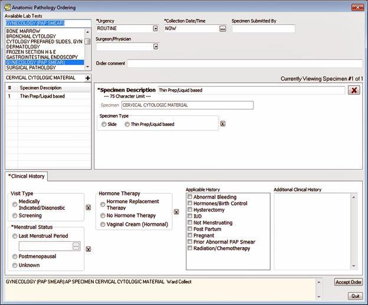

**Gynecology (PAP Smear) dialog**

1.  Select the **Specimen Description** on the left side of the dialog box. Choose a specimen description. If this is the first specimen, use the **+** key located above the Specimen Description field. Use the drop-down list for subsequent specimens.  
**Note**: At least one specimen along with a specimen description is required to process an order.  
1.  If desired, change the default values for **Urgency** and/or **Collection Date/Time** fields. (These are required fields).  
1.  If desired, enter your name in the **Specimen Submitted By** field. This is an optional field that is intended for the name of the person performing the procedure.  
1.  Select the **Surgeon/Physician**. Choose a surgeon/physician.  
1.  If desired, enter a comment in the **Order comment** field. This is an optional field that allows letters, numbers, punctuation, and spaces.  
1.  Select the **Specimen Type**. Choose a specimen type of either **Slide** or **Thin Prep/Liquid Based**.  
1.  If desired, enter a description for the specimen in the **Specimen Description** field. This is a required field with a maximum character length of 75 which includes letters, numbers, punctuation, and spaces.  
-   If desired, select the **X** button to delete the entry. Deleting the entry will result in a CPRS Patient Chart Warning dialog box; select the **Yes** button to confirm the deletion or select the **No** button to cancel the deletion.  
***

**Note**: If you delete a specimen and there are multiple specimens, the specimen numbers will be reordered in the Specimen Description list.  
1.  Select the **Clinical History** tab. Enter the patient’s history in the Clinical History field. This is a required field.  
1.  If desired, select **Visit Type**. Enter a visit type of **Screening** or **Medically Indicated/Diagnostic**.

    1.  Select **Menstrual Status**. Choose the menstrual status (date of **Last Menstrual Period**, **Postmenopausal**, or **Unknown**). This is a required field.

        **Note**: If Postmenopausal is selected, you must select a Hormone Therapy as it will be required.

    2.  If desired, select **Hormone Therapy**. Enter a hormone therapy (**Hormone**

        **Replacement Therapy**, **No Hormone Therapy**, or **Vaginal Cream (Hormonal)**).

-   If desired, select the **X** button to delete any entry. Deleting an entry will result in a CPRS Patient Chart Warning dialog box; select the **Yes** button to confirm the deletion or select the **No** button to cancel the deletion.  
1.  If desired, select **Applicable History**. Enter the patient’s applicable history

    (**Abnormal Bleeding**, **Hormones/Birth Control**, **Hysterectomy**, **IUD**, **Not Menstruating**, **Post Partum**, **Pregnant**, **Prior Abnormal PAP Smear**, or **Radiation/Chemotherapy**).

    1.  If desired, select **Additional Clinical** **History**. Enter information for additional clinical history. This field allows letters, numbers, punctuation, and spaces.

2.  Select **Accept Order**.  
1.  Preview the order.  
1.  If desired, modify the order by selecting the **Back** button, or select the **Accept Order** button to accept the order.  
1.  If desired, enter another lab test. -or-  
Select **Accept Order**.

\-or-

Select **Quit**.

**Note**: The Lab Test order must be signed before it is sent to VistA to be accessioned and processed. You can either sign the order now or wait until later.

#### Entering a Renal Biopsy Lab Test

**To place an order for a Renal Biopsy lab test, follow these steps:**

1.  Select the **Orders** tab.  
1.  Select **Anatomic Pathology** from the **Write Orders** list.  
1.  If the patient is an outpatient, select a **Visit Location** in the **Location for Current Activities** box and choose a visit location.  
1.  Choose the **Date/Time** of the visit.  
1.  Select **OK**.  
1.  Select **Renal Biopsy** in the Available Lab Tests list box. The Renal Biopsy dialog displays as shown below.  
**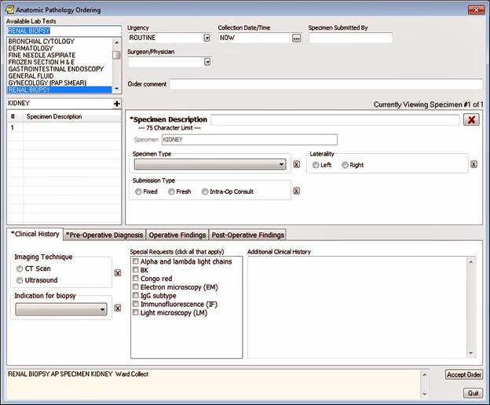**  
**Renal Biopsy dialog**

1.  Select the **Specimen Description** on the left side of the dialog box. Choose a specimen description. If this is the first specimen, use the **+** key located above the Specimen Description field. Use the drop-down list for subsequent specimens.  
**Note**: At least one specimen along with a specimen description is required to process an order.  
1.  If desired, change the default values for **Urgency** and/or **Collection Date/Time** fields. (These are required fields).  
1.  If desired, enter your name in the **Specimen Submitted By** field. This is an optional field that is intended for the name of the person performing the procedure.  
1.  Select the **Surgeon/Physician**. Choose a surgeon/physician.  
1.  If desired, enter a comment in the **Order comment** field. This is an optional field that allows letters, numbers, punctuation, and spaces.  
1.  Select the **Specimen Type**. Choose a specimen type (**IR Core Biopsy**, **Open Wedge Biopsy**, or **Percutaneous Core Biopsy**).  
**Note**: The selection made in this field will appear in the Specimen Description field above.  
-   If desired, select the **X** button to delete the entry. Deleting the entry will result in a CPRS Patient Chart Warning dialog box; select the **Yes** button to confirm the deletion or select the **No** button to cancel the deletion.  
***

1.  Select the **Laterality**. Choose a laterality of either **Left** or **Right**.  
**Note**: The selection made in this field will appear in the Specimen Description field above.  
-   If desired, select the **X** button to delete the entry. Deleting the entry will result in a CPRS Patient Chart Warning dialog box; select the **Yes** button to confirm the deletion or select the **No** button to cancel the deletion.  
***

1.  Select the **Submission Type**. Choose a submission type (**Fresh**, **Fixed**, or **Intra-Op Consult**).  
**Note**: The selection made in this field will appear in the Specimen Description field above.  
**Note**: If **Fresh** or **Intra-Op Consult** is selected, the **Urgency** field will change to **STAT**; you will receive a Warning dialog regarding the change.  
**Note**: If you change the **Submission Type** to **Fixed** on all of the specimens (whether only one specimen on the order or multiple specimens on the order), you will need to manually change the **Urgency** to **Routine** if that is desired.  
-   If desired, select the **X** button to delete the entry. Deleting the entry will result in a CPRS Patient Chart Warning dialog box; select the **Yes** button to confirm the deletion or select the **No** button to cancel the deletion.  
***

1.  If desired, enter a description for the specimen in the **Specimen Description** field. This is a required field with a maximum character length of 75 which includes letters, numbers, punctuation, and spaces.  
-   If desired, select the **X** button to delete the entry. Deleting the entry will result in a CPRS Patient Chart Warning dialog box; select the **Yes** button to confirm the deletion or select the **No** button to cancel the deletion.  
***

**Note**: If you delete a specimen and there are multiple specimens, the specimen numbers will be reordered in the Specimen Description list.  
1.  Select the **Clinical History** tab. Enter the patient’s history in the Clinical History field. This is a required field.  
1.  Select Indication for Biopsy. Choose the indication for biopsy (Acute kidney injury, Chronic kidney disease, Hematuria, or Proteinuria).  
1.  Select Imaging Technique. Choose the imaging technique of either CT Scan or Ultrasound.  
1.  Select Special Requests. Choose all of the special requests that apply (Alpha and lambda light chains, BK, Congo red, Electron microscopy (EM), IgG subtype, Immunofluorescence (IF), Light microscopy (LM)).  
1.  If desired, choose Additional Clinical History. Enter information for additional clinical history. This field allows letters, numbers, punctuation, and spaces.  
1.  Select the **Pre-Operative Diagnosis** tab. Enter the patient’s pre-operative diagnosis in the Pre-Operative Diagnosis field. This is a required field that allows letters, numbers, punctuation, and spaces.  
1.  If desired, select the **Operative Findings** tab. Enter the patient’s operative findings in the Operative Findings field. This is an optional field that allows letters, numbers, punctuation, and spaces.  
1.  If desired, select the **Post-Operative Findings** tab. Enter the patient’s Post-Operative Findings. This is an optional field that allows letters, numbers, punctuation, and spaces.  
1.  Select **Accept Order**.  
1.  Preview the order.  
1.  If desired, modify the order by selecting the **Back** button, or select the **Accept Order** button to accept the order.  
1.  If desired, enter another lab test. -or-  
Select **Accept Order**.  
\-or-  
Select **Quit**.  
**Note**: The Lab Test order must be signed before it is sent to VistA to be accessioned and processed. You can either sign the order now or wait until later.  
***

#### Entering a Tissue Exam Lab Test

**To place an order for a Tissue Exam lab test, follow these steps:**

1.  Select the **Orders** tab.  
1.  Select **Anatomic Pathology** from the **Write Orders** list.  
1.  If the patient is an outpatient, select a **Visit Location** in the **Location for Current Activities** box and choose a visit location.  
1.  Choose the **Date/Time** of the visit.  
1.  Select **OK**.  
1.  Select **Tissue Exam** in the Available Lab Tests list box. The Tissue Exam dialog displays as shown below.  
1.  Select the **Specimen Description** on the left side of the dialog box. Choose a specimen description. If this is the first specimen, use the **+** key located above the Specimen Description field. Use the drop-down list for subsequent specimens.  
**Note**: At least one specimen along with a specimen description is required to process an order.  
1.  If desired, change the default values for **Urgency** and/or **Collection Date/Time** fields. (These are required fields).  
1.  If desired, enter your name in the **Specimen Submitted By** field. This is an optional field that is intended for the name of the person performing the procedure.  
1.  Select the **Surgeon/Physician**. Choose a surgeon/physician.  
1.  If desired, enter a comment in the **Order comment** field. This is an optional field that allows letters, numbers, punctuation, and spaces.  
1.  Select the **Procedure**. Choose a procedure for the specimen (**Biopsy, Cervical Biopsy, Cervix Resection, Cone Biopsy, Endocervical Curettage (ECC), Endometrial w/Pipelle Curettage, Excision, Fallopian Tube(s) Resection, LEEP, Myomas Resection, Nephrectomy, Ovary(s) Resection, Prostectomy, Resection, Uterus Resection, Vaginal Biopsy,** or **Vulvar Biopsy**).  
**Note**: The selection made in this field will appear in the Specimen Description field above.  
-   If desired, select the **X** button to delete the entry. Deleting the entry will result in a CPRS Patient Chart Warning dialog box; select the **Yes** button to confirm the deletion or select the **No** button to cancel the deletion.  
***

1.  Select the **Submission Type**. Choose a submission type (**Fresh**, **Fixed**, or **Intra-Op Consult)**.  
**Note**: The selection made in this field will appear in the Specimen Description field above.  
**Note**: If **Fresh** or **Intra-Op Consult** is selected, the **Urgency** field will change to **STAT**; you will receive a Warning dialog regarding the change.  
**Note**: If you change the **Submission Type** to **Fixed** on all of the specimens (whether only one specimen on the order or multiple specimens on the order), you will need to manually change the **Urgency** to **Routine** if that is desired.  
-   If desired, select the **X** button to delete the entry. Deleting the entry will result in a CPRS Patient Chart Warning dialog box; select the **Yes** button to confirm the deletion or select the **No** button to cancel the deletion.  
1.  If desired, enter a description for the specimen in the **Specimen Description** field. This is a required field with a maximum character length of 75 which includes letters, numbers, punctuation, and spaces.  
1.  If desired, select the **X** button to delete the entry. Deleting the entry will result in a CPRS Patient Chart Warning dialog box; select the **Yes** button to confirm the deletion or select the **No** button to cancel the deletion.  
**Note**: If you delete a specimen and there are multiple specimens, the specimen numbers will be reordered in the Specimen Description list.  
1.  Select the **Clinical History** tab. Enter the patient’s history in the Clinical History field. This is a required field that allows letters, numbers, punctuation, and spaces.  
1.  Select the **Pre-Operative Diagnosis** tab. Enter the patient’s pre-operative diagnosis in the Pre-Operative Diagnosis field. This is a required field that allows letters, numbers, punctuation, and spaces.  
1.  If desired, select the **Operative Findings** tab. Enter the patient’s operative findings in the Operative Findings field. This is an optional field that allows letters, numbers, punctuation, and spaces.  
1.  If desired, select the **Post-Operative Findings** tab. Enter the patient’s Post-Operative Findings. This is an optional field that allows letters, numbers, punctuation, and spaces.  
1.  Select **Accept Order**.  
1.  Preview the order.  
1.  If desired, modify the order by selecting the **Back** button, or select the **Accept Order** button to accept the order.  
1.  If desired, enter another lab test. -or-  
Select **Accept Order**.  
\-or-  
Select **Quit**.  
**Note**: The Lab Test order must be signed before it is sent to VistA to be accessioned and processed. You can either sign the order now or wait until later.  
***

#### Entering a Urine Lab Test

**To place an order for a Urine lab test, follow these steps:**

1.  Select the **Orders** tab.  
1.  Select **Anatomic Pathology** from the **Write Orders** list.  
1.  If the patient is an outpatient, select a **Visit Location** in the **Location for Current Activities** box and choose a visit location.  
1.  Choose the **Date/Time** of the visit.  
1.  Select **OK**.  
1.  Select **Urine** in the **Available Lab Tests** list box. The Urine dialog displays.  
1.  Select the **Specimen Description** on the left side of the dialog box. Choose a specimen description. If this is the first specimen, use the **+** key located above the Specimen Description field. Use the drop-down list for subsequent specimens.  
**Note**: At least one specimen along with a specimen description is required to process an order.  
1.  If desired, change the default values for **Urgency** and/or **Collection Date/Time** fields. (These are required fields).  
1.  If desired, enter your name in the **Specimen Submitted By** field. This is an optional field that is intended for the name of the person performing the procedure.  
1.  Select the **Surgeon/Physician**. Choose a surgeon/physician.  
1.  If desired, enter a comment in the **Order comment** field. This is an optional field that allows letters, numbers, punctuation, and spaces.  
1.  Select the **Specimen Type**. Choose a specimen type (**Bladder Wash**, **Catheterized Urine**, **Ileal Conduit**, **Left Ureter Wash**, **Right Ureter Wash**, or **Voided**).  
1.  If desired, enter a description for the specimen in the **Specimen Description** field. This is a required field with a maximum character length of 75 which includes letters, numbers, punctuation, and spaces.  
-   If desired, select the **X** button to delete the entry. Deleting the entry will result in a CPRS Patient Chart Warning dialog box; select the **Yes** button to confirm the deletion or select the **No** button to cancel the deletion.  
***

**Note**: If you delete a specimen and there are multiple specimens, the specimen numbers will be reordered in the Specimen Description list.  
1.  Select the **Clinical History** tab. Enter the patient’s history in the Clinical History field. This is a required field.  
1.  Select **Instrumentation 72 hours prior to collection** and choose either **No** or **Yes**.  
1.  Select **Cystoscopy** and choose either **No** or **Yes**.  
1.  If desired, select **Additional Clinical History**. Enter information for additional clinical history. This field allows letters, numbers, punctuation, and spaces.  
1.  Select the **Pre-Operative Diagnosis** tab. Enter the patient’s pre-operative diagnosis in the Pre-Operative Diagnosis field. This is a required field that allows letters, numbers, punctuation, and spaces.  
1.  Select **Accept Order**.  
1.  Preview the order.  
1.  If desired, modify the order by selecting the **Back** button, or select the **Accept Order** button to accept the order.  
1.  If desired, enter another lab test. -or-  
Select **Accept Order**.  
\-or-  
Select **Quit**.  
**Note**: The Lab Test order must be signed before it is sent to VistA to be accessioned and processed. You can either sign the order now or wait until later.  
***

#### Entering a Urology, Bladder/Ureter Lab Test

**To place an order for a Urology, Bladder/Ureter lab test, follow these steps:**

1.  Select the **Orders** tab.  
1.  Select **Anatomic Pathology** from the **Write Orders** list.  
**Note**: The orders listed in the Write Orders pane vary from site to site.  
1.  If the patient is an outpatient, select a **Visit Location** in the **Location for Current Activities** box and choose a visit location.  
1.  Choose the **Date/Time** of the visit.  
1.  Select **OK**.  
1.  Select **Urology, Bladder/Ureter** in the Available Lab Tests list box. The Urology, Bladder/Ureter dialog displays.  
1.  Select the **Specimen Description** on the left side of the dialog box. Choose a specimen description. If this is the first specimen, use the **+** key located above the Specimen Description field. Use the drop-down list for subsequent specimens.  
**Note**: At least one specimen along with a specimen description is required to process an order.  
1.  If desired, change the default values for **Urgency** and/or **Collection Date/Time** fields. These are required fields.  
1.  If desired, enter your name in the **Specimen Submitted By** field. This is an optional field that is intended for the name of the person entering the order.  
1.  Select the **Surgeon/Physician**. Choose a surgeon/physician.  
1.  If desired, enter a comment in the **Order comment** field. This is an optional field that allows letters, numbers, punctuation, and spaces.  
1.  Select the **Specimen Type**. Choose a specimen type (**Biopsy**, **Cystectomy** **Partial Cystectomy** **Total, Excision**, **Nephrectomy** **Partial, Nephrectomy** **Total**, or **TURBT**).  
**Note**: The selection made in this field will appear in the Specimen Description field above.  
-   If desired, select the **X** button to delete the entry. Deleting the entry will result in a CPRS Patient Chart Warning dialog box; select the **Yes** button to confirm the deletion or select the **No** button to cancel the deletion.  
***

1.  Select the **Laterality**. Choose a laterality of either **Left** or **Right**.  
**Note**: The selection made in this field will appear in the Specimen Description field above.  
-   If desired, select the **X** button to delete the entry. Deleting the entry will result in a CPRS Patient Chart Warning dialog box; select the **Yes** button to confirm the deletion or select the **No** button to cancel the deletion.  
***

1.  Select the **Submission Type**. Choose a submission type (**Fresh**, **Fixed**, or **Intra-Op Consult**).  
**Note**: The selection made in this field will appear in the Specimen Description field above.  
**Note**: If **Fresh** or **Intra-Op Consult** is selected, the **Urgency** field will change to **STAT**; you will receive a Warning dialog regarding the change.  
**Note**: If you change the **Submission Type** to **Fixed** on all of the specimens (whether only one specimen on the order or multiple specimens on the order), you will need to manually change the **Urgency** to **Routine** if that is desired.  
1.  If desired, enter a description for the specimen in the **Specimen Description** field. This is a required field with a maximum character length of 75 which includes letters, numbers, punctuation, and spaces.  
-   If desired, select the **X** button to delete the entry. Deleting the entry will result in a CPRS Patient Chart Warning dialog box; select the **Yes** button to confirm the deletion or select the **No** button to cancel the deletion.  
***

**Note**: If you delete a specimen and there are multiple specimens, the specimen numbers will be reordered in the Specimen Description list.  
1.  Select the **Clinical History** tab. Enter the patient’s history in the Clinical History field. This is a required field that allows letters, numbers, punctuation, and spaces.  
1.  Select the **Pre-Operative Diagnosis** tab. Enter the patient’s pre-operative diagnosis in the Pre-Operative Diagnosis field. This is a required field that allows letters, numbers, punctuation, and spaces.  
1.  If desired, select the **Operative Findings** tab. Enter the patient’s operative findings in the Operative Findings field. This is an optional field that allows letters, numbers, punctuation, and spaces.  
1.  If desired, select the **Post-Operative Findings** tab. Enter the patient’s Post-Operative Findings. This is an optional field that allows letters, numbers, punctuation, and spaces.  
1.  Select **Accept Order**.  
1.  Preview the order.  
1.  If desired, modify the order by selecting the **Back** button, or select the **Accept Order** button to accept the order.  
1.  If desired, enter another lab test. -or-  
Select **Accept Order**.  
\-or-  
Select **Quit**.  
**Note:** The Lab Test order must be signed before it is sent to VistA to be accessioned and processed. You can either sign the order now or wait until later.  
***

#### Entering a Urology, Prostate Lab Test

**To place an order for a Urology, Prostate lab test, follow these steps:**

1.  Select the **Orders** tab.  
1.  Select **Anatomic Pathology** from the **Write Orders** list.  
**Note**: The orders listed in the Write Orders pane vary from site to site.  
1.  If the patient is an outpatient, select a **Visit Location** in the **Location for Current Activities** box and choose a visit location.  
1.  Choose the **Date/Time** of the visit.  
1.  Select **OK**.  
1.  Select **Urology, Prostate** in the Available Lab Tests list box.  
**Note**: The dialog displayed will change based upon the specimen selected. The dialog shown below will display when either Left Testis or Right Testis is selected as a specimen.  
**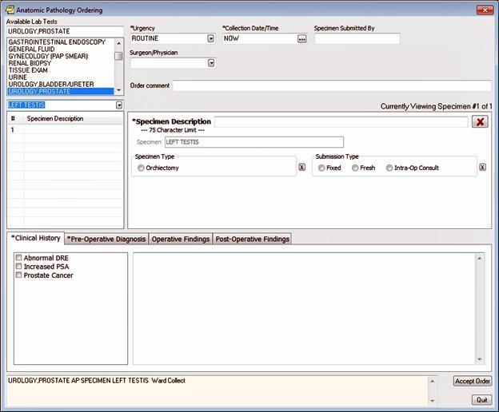**  
**Urology, Prostate dialog**  
1.  Select the **Specimen Description** on the left side of the dialog box. Choose a specimen description. If this is the first specimen, use the **+** key located above the Specimen Description field. Use the drop-down list for subsequent specimens.  
**Note**: At least one specimen along with a specimen description is required to process an order.  
1.  If desired, change the default values for **Urgency** and/or **Collection Date/Time** fields. These are required fields.  
1.  If desired, enter your name in the **Specimen Submitted By** field. This is an optional field that is intended for the name of the person entering the order.  
1.  Select the **Surgeon/Physician**. Choose a surgeon/physician.  
1.  If desired, enter a comment in the **Order comment** field. This is an optional field that allows letters, numbers, punctuation, and spaces.  
1.  Select the **Specimen Type**. Choose a specimen type (**Left Testis**, **Prostate**, **Right Testis**, or **Vas Deferens**).  
1.  When **Left Testis** or **Right Testis** is selected as a specimen, select **Specimen Type.** Choose a specimen type of **Orchiectomy**. The Urology, Prostate dialog when either Left Testis or Right Testis is selected as a specimen will display as shown below.  
**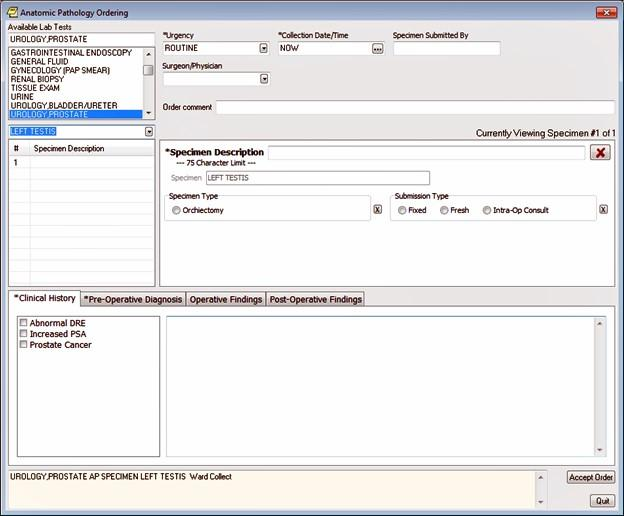**  
**Left Testis (or Right Testis) selected as a specimen**  
1.  When **Prostate** is selected as a specimen, select **Specimen Type.**  Choose a specimen type (**Prostate Needle Biopsy**, **Prostatectomy**, **Radical Prostatectomy**, **Simple Resection**, **Orchiectomy**, **TURP** or **Vasectomy**). The Urology, Prostate dialog when Prostate is selected as a specimen will display as shown below.  
**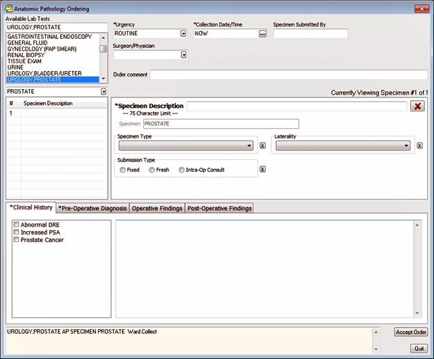**  
**Prostate selected as a specimen**  
1.  When **Vas Deferens** is selected as a specimen, select **Specimen Type**. Choose a specimen type of **Vasectomy**. The Urology, Prostate dialog when Vas Deferens is selected as a specimen will display as shown below.  
**Note**: The selection made in this field will appear in the Specimen Description field above.  
-   If desired, select the **X** button to delete the entry. Deleting the entry will result in a CPRS Patient Chart Warning dialog box; select the **Yes** button to confirm the deletion or select the **No** button to cancel the deletion.  
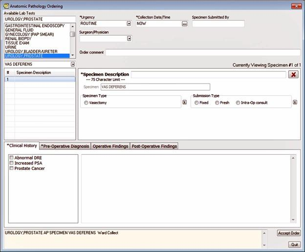

**Vas Deferens selected as a specimen**

1.  Select the **Submission Type**. Choose a submission type (**Fresh**, **Fixed**, or **Intra-Op Consult)**.  
**Note**: The selection made in this field will appear in the Specimen Description field above.  
**Note**: If **Fresh** or **Intra-Op Consult** is selected, the **Urgency** field will change to **STAT**; you will receive a Warning dialog regarding the change.  
**Note**: If you change the **Submission Type** to **Fixed** on all of the specimens (whether only one specimen on the order or multiple specimens on the order), you will need to manually change the **Urgency** to **Routine** if that is desired.  
-   If desired, select the **X** button to delete the entry. Deleting the entry will result in a CPRS Patient Chart Warning dialog box; select the **Yes** button to confirm the deletion or select the **No** button to cancel the deletion.  
***

1.  If desired, enter a description for the specimen in the **Specimen Description** field. This is a required field with a maximum character length of 75 which includes letters, numbers, punctuation, and spaces.  
-   If desired, select the **X** button to delete the entry. Deleting the entry will result in a CPRS Patient Chart Warning dialog box; select the **Yes** button to confirm the deletion or select the **No** button to cancel the deletion.  
***

**Note**: If you delete a specimen and there are multiple specimens, the specimen numbers will be reordered in the Specimen Description list.  
1.  Select the **Clinical History** tab. Enter the patient’s history in the Clinical History field. This is a required field that allows letters, numbers, punctuation, and spaces.  
1.  Select **Applicable History**. Enter the patient’s applicable history (**Abnormal DRE**, **Increased PSA**, or **Prostate Cancer**).  
1.  Select the **Pre-Operative Diagnosis** tab. Enter the patient’s pre-operative diagnosis in the Pre-Operative Diagnosis field. This is a required field that allows letters, numbers, punctuation, and spaces.  
1.  If desired, select the **Operative Findings** tab. Enter the patient’s operative findings in the Operative Findings field. This is an optional field that allows letters, numbers, punctuation, and spaces.  
1.  If desired, select the **Post-Operative Findings** tab. Enter the patient’s Post-Operative Findings. This is an optional field that allows letters, numbers, punctuation, and spaces.  
1.  Select **Accept Order**.  
1.  Preview the order.  
1.  If desired, modify the order by selecting the **Back** button, or select the **Accept Order** button to accept the order.  
1.  If desired, enter another lab test. -or-  
Select **Accept Order**.  
\-or-  
Select **Quit**.  
**Note:** The Lab Test order must be signed before it is sent to VistA to be accessioned and processed. You can either sign the order now or wait until later.  
***  
### Radiology and Imaging

The Reason for Study and the Clinical History fields are now two separate entries. Developers made this change to support a new system. The Reason for Study field is now required and has a limit of 64 characters (numbers, letters, space, and punctuation). The Clinical History field is optional and has no character limit.

To order any type of imaging, such as an x-ray or a nuclear medicine exam or procedure, follow these steps:

1.  Select the Orders tab.  
1.  Select the active orders view from the View Orders pane -or- select View \| Active Orders (includes pending, recent activity).  
1.  Select Imaging in the Write Orders list box.  
**Note:** The imaging order may be labeled differently or may not be available from your Write Orders field.

The Order an Imaging Procedure dialog displays as shown below.

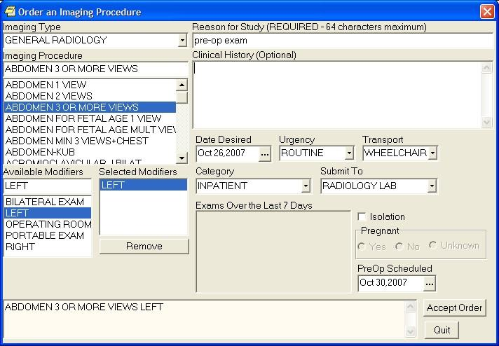

**Order an Imaging Procedure dialog**  
**Note:** If encounter information has not been entered, the encounter information dialog will appear before the Order an Imaging Procedure dialog. You must complete the encounter information dialog before proceeding.

1.  Select the desired imaging type in the Imaging Type field.  
1.  Select a procedure from the Imaging Procedure list box.  
1.  Select an available modifier from the Available Modifiers field.  
The modifier(s) you select will be displayed in the Selected Modifiers field.

**Note:** You can remove a modifier by selecting the modifier and clicking Remove.

1.  Enter a reason for the exam in the Reason for Study field. (This is a required field that allows a maximum of 64 characters—which includes letters, numbers, punctuation, and spaces.)  
1.  (Optional) If wanted, enter the history in the Clinical History field (If you enter anything, it must be at least two consecutive alphanumeric characters).  
1.  If necessary, change the Requested Date, Urgency, Transport, and Category fields.  
**Note:** The Date Desired previously defaulted to TODAY, but this default has been removed from most orders. The user will need to enter the Date Desired.

1.  Complete the Submit To field (if necessary).  
1.  Check the Isolation checkbox (if necessary).  
1.  Select the appropriate response (Yes, No, or Unknown) in the Pregnant field.  
1.  Select the time that the PreOp is scheduled by doing one of the following:  
-   entering a date (e.g. 6/21/01 or June 21, 2001)  
-   entering a date formula (e.g. t-200)  
o pressing the  button to bring up a calendar

1.  Select Accept Order.  
1.  Enter another order -or- click Quit.  
### Requesting a Return Clinic Appointment

As part of the effort to improve access to VA healthcare, the Vista Scheduling Enhancements (VSE) project was initiated. The project makes several enhancements involving scheduling appointments, including the ability to create an order in CPRS that is sent to Scheduling so that a clerk can schedule one or more appointments for a patient to return to a clinic for additional visits.

**Note:** The Return to Clinic dialog will only be accessible if the new Scheduling enhancements are in place, which will be released in patch SD\*5.3\*671. CACs can create Quick Orders and add the Return to Clinic Order Dialog to any menu before the SD patch is installed. If a user tries to access the Return to Clinic Order Dialog before the SD patch is installed, they will see an error message in CPRS stating the Order Dialog cannot be use until the SD patch is installed.

The Return to Clinic dialog has several fields that enable the user to specify the details related to the patient returning for one or more appointments:

**Quick Orders:** This field lists any personal quick orders that the user has already saved for himself or herself. To create Return to Clinic personal quick orders, enter all the necessary data in the Return to Clinic order dialog, but do not select Accept yet. Then, save it as a Personal Quick Order.

**Clinic:** The clinic the patient should return to

**Date:** The date the patient should return to the clinic

**Time Sensitive:** Whether the appointment is Time-Sensitive

-   Not Time Sensitive: If the appointment is not time-sensitive, the order will read “on or around.”  
-   Time Sensitive: If the appointment is Time Sensitive, the order text will read “no later than.”  
**Number of Appointments:** Providers enter the number of future appointments they would like to request. The number of return appointments is limited to 60.

**Interval in day(s):** Note that this field is only available when the number of appointments is greater than 1. Providers can enter the number of days between appointments. For example, a provider may want to request a number of appointments 14 days apart. The maximum interval is 30 days.

**Prerequisites (check all that apply):** This item is available only if the site puts items into a parameter where prerequisites are defined. For example, if nothing is put in the parameter, the user will not have any selections in this field. However, if the site puts in labs or radiology, the provider can select as many of those items as apply.

**Comments:** This is where the user can enter their own comments for the scheduler to see.

**More Information:** This field displays information to the user while they are creating the order. This is information entered by the site, not by the provider.

**Order Sig:** This field is created as information is entered into the dialog by the user.

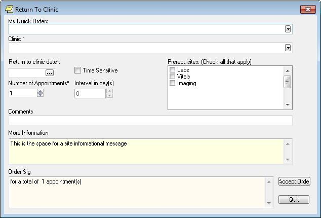

**This shows the Return to Clinic order dialog. Note that if the site does not enter prerequisites, none will display where the above dialog displays the Labs, Vitals, and Imaging choices. The More Information field also has data only if the site enters information in a parameter**  
**To order one or more return visits to a clinic, use these steps:**

1.  On the CPRS Orders tab under the Write Orders pane, select Return to Clinic.  
1.  In the Return to Clinic dialog, if you have saved a Quick Order that you would like to use, select the down arrow and then select the quick order. If not, proceed to step 3.  
1.  Select the Clinic field’s drop-down box’s arrow and then the appropriate clinic name. (This is a required field.)  
1.  In the Date field, select the date. (This is a required field.)  
1.  If the appointment is time-sensitive, select the Time Sensitive check box. Selecting the Time Sensitive check box will change the order text in the Order Sig from “on or around” to “no later than.”  
1.  If you want more than one appointment, place the cursor in the Number of Appointments field, enter the number of appointments.  
1.  In the Interval in day(s) field, enter the number of days between appointments.  
1.  If the field is active, you can select the Prerequisites field, you can select one or more prerequisites, such as lab work or imaging, that should precede the appointments.  
1.  In the Comments field, type in any comments that should go with the orders.  
1.  In the More Information field, additional information displays for the user to see.  
1.  Review the Order Sig to ensure that it is as you need it.  
**Note:** If the order is one that the user will reuse frequently, the user can save it as a personal quick order. To save this as a quick order, go to the menu bar and select Options \| Save as Personal Quick Order.

Then, the order will display in the Quick order field the next time the dialog is opened.

1.  If the Order Sig is correct, select Accept.  
After the user signs the order, the order is sent to Scheduling so that a clerk can make the requested appointments.

Here is an example of an unsigned Return to Clinic order displayed on the Orders tab. The display shows a Return to Clinic order under the new Service category of Clinic Scheduling.

**Note:** If the provider has an NPI, it will not display on the screen below.

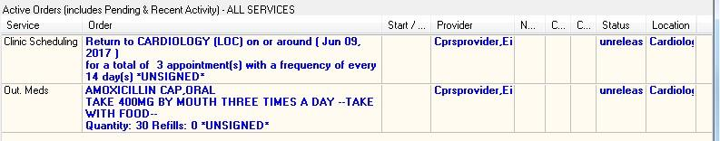

Clinic Scheduling orders can have the following statuses:

-   **Unreleased:** The order will have this status before it is signed.  
-   **Pending:** The order will have this status after it is signed but before being acted upon by the Scheduling package.  
-   **Completed:** The order will have this status after Scheduling has acted up on it.  
-   **Discontinued:** The order will have this status if the order is discontinued in CPRS prior to being acted upon by the Scheduling package.  
After the Clinic Scheduling order is signed, if the user right-clicks on the order, only two items will be available: Discontinue and Change. This is different from medications orders, for example.

This capture shows the detailed display for a Return to clinic order.

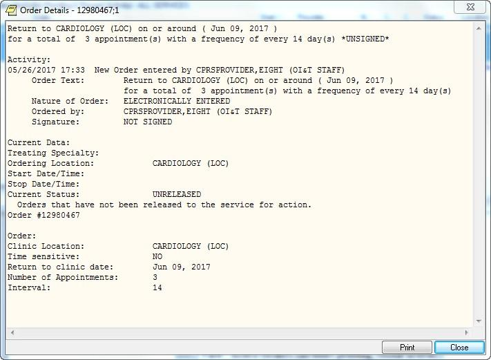

**Note:** If the provider has an NPI, it will not display on the screen above.

### Ordering a Consult

To order a consult from the Orders tab follow these steps:

1.  Select the Orders tab.  
1.  Select the active orders view from the View Orders pane  
\-or-

select **View** \| **Active Orders (includes pending, recent activity)**.

1.  Select Consult in the Write Orders list.  
**Note:** The consults order may be labeled differently or may not be available from your Write Orders field.

**Note:** If encounter information has not been entered, the encounter information dialog will appear before the Order a Consult dialog. You must complete the encounter information dialog before proceeding.

The Order a Consult dialog displays as shown below.

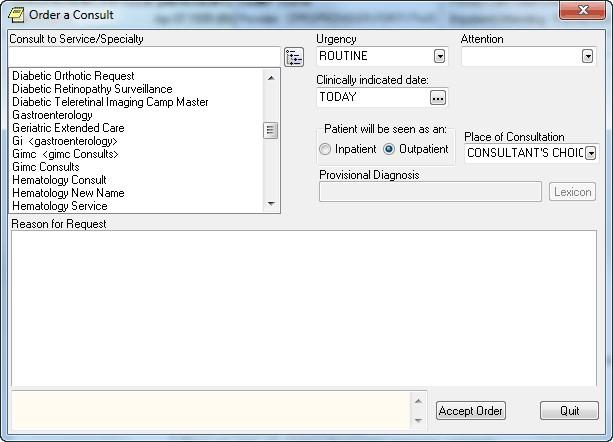

**The Order a Consult dialog**  
1.  Select a type of consult from the Consult to Service/Specialty field.  
When you select the Consult Service or Specialty, several things may happen:

-   If the service has some prerequisites, a dialog will display stating what those are and will allow you to print the information, continue to place the consult order, or cancel the order.  
-   In addition, any predefined text or template will display to help the user fill out the Reason for Request field.  
-   The Provisional Diagnosis field becomes active as well.  
1.  Select the urgency from the Urgency field.  
1.  Select an individual from the Attention field.  
**Note:**  To help you distinguish between providers, CPRS displays their titles (if available). When two or more providers have identical names, CPRS also displays:

o The service/section and site division (if any) associated with these providers; site divisions are displayed based on the following rules:

-   When no division is listed for a provider, no division is displayed.  
-   If only one division is listed, this division is displayed.  
-   If the site has multiple divisions or more than one division is listed **and** one of these listed divisions is marked as Default, CPRS displays the division marked as Default.  
-   If more than one division is listed for a provider and none is marked as Default, CPRS does not display division information for this provider.  
o Providers who are listed in the New Person file as Visitors are screened out from the provider list. (These screened-out providers are listed as Visitors because their entries were created as a result of a Remote Data View.)

1.  If needed, designate a different Clinically Indicated Date.  
**Note:** The Clinically Indicated Date field does not apply to Prosthetics consults services, and the field is not available when the user selects a Prosthetic service.

1.  Choose inpatient or outpatient from the “Patient will be seen as an:” option group.  
1.  Choose a location from the Place of Consultation drop-down box.  
1.  Enter a provisional diagnosis.  
**Note:** If a user tries to enter a diagnosis with an inactive code, CPRS will bring up a message indicating that the code must be changed and giving the user the chance to choose a diagnosis with an active code.

For each consult, this field is either set up to require that

-   The user type in an answer (the box will be white and the  
-   Lexicon button unavailable), or  
-   The user must select a response must be from the Lexicon (the field will be yellow and the Lexicon button is available).  
CPRS will search for diagnoses that contain the search term. The matching terms will display in the bottom portion of the Problem List Lexicon Search dialog. The search now looks for SNOMED Concepts Terms (SNOMED CT) items. Most items will also be mapped to an ICD-9-CM code. The list will show the SNOMED concept text, the SNOMED code, and the ICD-9-CM code if the term is mapped to one.

If you do not see the appropriate problem listed, select the Extend Search button. The Extend Search button extends the search to the ICD-9-CM clinical hierarchy to find additional terms.

1.  Enter a reason for the request in the Reason for Request field.  
Sites can help users by putting in predetermined boilerplate text, text with TIU objects, and/or it could be linked to a template that users can fill out. Users can then add to the text already present. Or the field may be left blank for the user to fill in the reason. However, a reason for request is required and the consult cannot be saved without a reason for request.

1.  Select Accept Order.  
1.  Enter another Consult  
**-or-**

select **Quit**.

**Note:** You may sign the consult now or wait until later.

### Procedures

To order a procedure, follow these steps:

1.  Select the Orders tab.  
1.  Select Procedure in the Write Orders list.  
**Note:** The procedure order may be labeled differently or may not be available from your Write Orders list box.

**Note:** If encounter information has not been entered, the encounter information dialog will appear before the Order a Procedure dialog. You must complete the encounter information dialog before proceeding.

The Order a Procedure dialog displays.

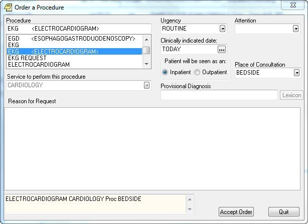

**The Order a Procedure dialog**  
1.  Locate and select the procedure in the Procedure list.  
When you select the Consult Service or Specialty, several things may happen:

-   If the service has some prerequisites, a dialog will display stating what those are and will allow you to print the information, continue to place the consult order, or cancel the order.  
-   In addition, any predefined text or template will display to help the user fill out the Reason for Request field.  
-   The Provisional Diagnosis field becomes active as well.  
1.  Select the urgency from the Urgency field.  
1.  Select an individual from the Attention field.  
**Note:**  To help you distinguish between providers, CPRS displays their titles (if available). When two or more providers have identical names, CPRS also displays:

-   The service/section and site division (if any) associated with these providers; site divisions are displayed based on the following rules:  
-   When no division is listed for a provider, no division is displayed.  
-   If only one division is listed, this division is displayed.  
-   If the site has multiple divisions or more than one division is listed **and** one of these listed divisions is marked as Default, CPRS displays the division marked as Default.  
-   If more than one division is listed for a provider and none is marked as Default, CPRS does not display division information for this provider.  
-   Providers who are listed in the New Person file as Visitors are screened out from the provider list. (These screened-out providers are listed as Visitors because their entries were created as a result of a Remote Data View.)  
1.  If needed, designate a different Clinically Indicated Date.  
**Note:** The Clinically Indicated Date field does not apply to Prosthetics consults services, and the field is not available when the user selects a Prosthetic service.

1.  If necessary, select a service that will perform the procedure by using the down arrow to open the list and then selecting the service.  
Often, the service is already defined. However, sometimes, the user has the chance to choose.

1.  Select whether the patient is an inpatient or outpatient.  
1.  Select a place of consultation from the Place of Consultation drop-down list.  
1.  Enter a provisional diagnosis in the Provisional Diagnosis field.  
For each procedure, this field is either set up to require that

-   the user type in an answer (the box will be white and the Lexicon button unavailable), or  
-   the user must select a response must be from the Lexicon (the field will be yellow and the Lexicon button is available).  
-   CPRS will search for diagnoses that contain the search term. The matching terms will display in the bottom portion of the Problem List Lexicon Search dialog. The search now looks for SNOMED Concepts Terms (SNOMED CT) items. Most items will also be mapped to an ICD-9-CM code. The list will show the SNOMED concept text, the SNOMED code, and the ICD-9-CM code if the term is mapped to one.  
-   If you do not see the appropriate problem listed, select the Extend Search button. The Extend Search button extends the search to the ICD-9-CM clinical hierarchy to find additional terms.  
**Note:** If a user tries to enter a diagnosis with an inactive code, CPRS will bring up a message indicating that the code must be changed and giving the user the chance to choose a diagnosis with an active code.

1.  Enter a reason for this request in the Reason for request field.  
Sites can help users by putting in predetermined boilerplate text, text with TIU objects, and/or it could be linked to a template that users can fill out. Users can then add to the text already present. Or the field may be left blank for the user to fill in the reason. However, a reason for request is required and the consult cannot be saved without a reason for request.

1.  Select Accept Order.  
1.  Enter another order -or- select Quit.  
**Note:** The order must be signed before it is sent. You can either sign the order now or wait until later.

### Vitals

This section gives steps to place an order directing staff to collect vitals with a certain frequency over a time period. To record vitals and measurements, staff should use the new Vitals package or the Vitals Lite interface in CPRS.

To enter a vitals order, follow these steps:

1.  Select the **Orders** tab.  
1.  Select the active orders view from the View Orders pane  
\-or-

select **View \| Active Orders (includes pending, recent activity)**.

1.  Select **Vitals** in the Write Orders list box.  
The VITAL SIGNS dialog appears.

**Note:** The vitals order may be labeled differently or may not be available from your Write Orders list.

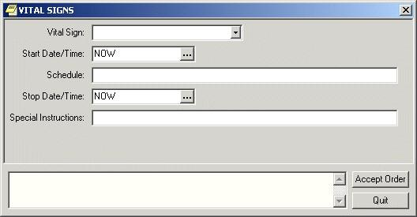

**The VITAL SIGNS dialog box**  
**Note:** If encounter information has not been entered, the encounter information dialog will appear before the VITAL SIGNS dialog. You must complete the encounter information dialog before proceeding.

1.  Select a vital sign from the Vital Sign drop-down list.  
1.  Select a date and time from the Start Date/Time field by doing one of the following:  
-   entering a date (e.g. 6/21/01 or June 21, 2001).  
-   entering a date formula (e.g. t-200).  
-   pressing the  button to bring up a calendar.  
1.  Enter a schedule in the Schedule field.  
1.  Select a stop date and time from the Stop Date/Time field by doing one of the following:  
-   entering a date (e.g. 6/21/01 or June 21, 2001).  
-   entering a date formula (e.g. t-200).  
-   pressing the  button to bring up a calendar.  
1.  Enter any special instructions in the Special Instructions field.  
1.  Select Accept Order.  
## Text Only Orders

Text only orders such as Parameters, Activity, Patient Care, and Free Text orders are different kinds of orders that are placed for nursing and ward staff to take action on. They print only at the patient’s ward/location, and are not transmitted electronically to other services.

Examples of text only orders include:

| **Order Type**  | **Order**                                  |
|-----------------|--------------------------------------------|
| Parameters      | Vital signs                                |
| Activity        | Bed rest, ambulate, up in chair            |
| Patient Care    | Skin and wound care, drains, hemodynamics  |
| Free text       | Immunizations                              |

Predefined nursing orders (quick orders) may be available under various submenus.

To place a text only order, follow these steps:

1.  Select the Orders tab.  
1.  Select the active orders view from the View Orders pane.  
1.  Select Text Only Order in the Write Orders list box.  
The Word Processing Order dialog displays.

**Note:** The text only order may be labeled differently or may not be available from your Write Orders list.

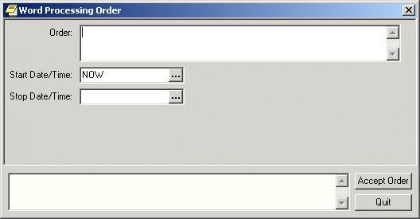

**The Text Only Order dialog**  
1.  Enter the text for the order in the Order field.  
1.  Enter a start date and time by doing one of the following:  
-   entering a date (e.g. 6/21/01 or June 21, 2001).  
-   entering a date formula (e.g. t-200).  
-   pressing the  button to bring up a calendar.  
***

1.  Enter a stop date and time by doing one of the following:  
-   entering a date (e.g. 6/21/01 or June 21, 2001).  
-   entering a date formula (e.g. t-200).  
-   pressing the  button to bring up a calendar.  
1.  Select Accept Order.  
1.  Enter another order  
**-or-**

select **Quit**.

## Event-Delayed Orders

An event-delayed order is an order that is executed only after a predefined event (known as a release event) occurs. A release event can be an event such as an admission, discharge, or transfer. For example, you can write an event-delayed diet order that will not execute until a patient is transferred to a specific ward.

A CAC defines the release events at your site. (For more information on defining release events, see Appendix F of the *CPRS List Manager Technical Manual* or the Event-Delayed Orders topic in the *CPRS GUI Technical Manual*). Once a CAC has defined a release event, you can write an order that will not execute until that release event occurs.

### Writing an Event-Delayed Order

To write an event-delayed order, follow these steps:

1.  Select the Orders tab.  
1.  Select the Write Delayed Orders button located below the View Orders pane.  
The *Release Orders* dialog box appears. The available release events will appear in a list. Your list may contain a highlighted default release event and a common release event list. Your CAC defines the default release event and the common release event list. (For more information about defining a default release event and a common release event list, please see the Event-Delayed Orders topic in the *CPRS GUI Technical Manual* or Appendix F in the *CPRS List Manager Technical Manual*).

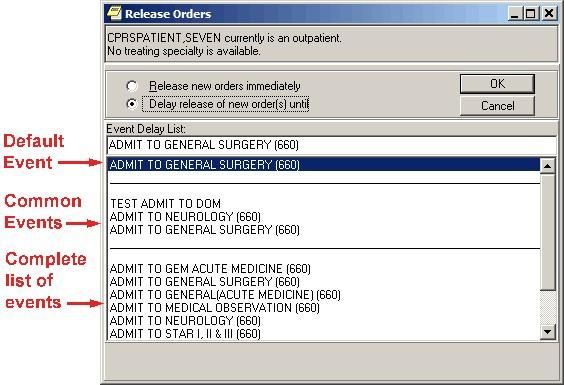

**Your CAC can define a default release event and a common release event list**  
1.  Select Delay Release of New Order(s) until.  
1.  Select the appropriate release event.  
**Note:** If the patient’s location has a treating specialty of “observation” and the user tried to write delayed orders, the “transfer” event should not appear in the selection list. The reason is that orders are discontinued on transfer. The result would be if a patient were in an observation location, and delayed orders were written when the patient was moved out of observation, the orders would be cancelled.

1.  Select OK.  
If the *Copy active orders for selected event* dialog box appears, continue to step 5. Otherwise, the *Release Orders* dialog will close and the name of the release event will now appear below the Write Delayed Orders button. Enter the order as you normally would.

**Note:** If the provider has an NPI, it will not display on the screen below.

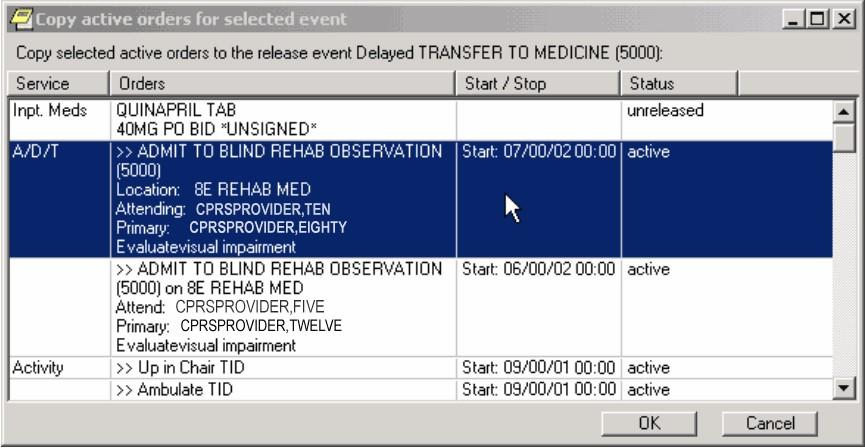

**The Copy active orders for selected event dialog box**  
1.  Select the active orders that you would like to delay in the Copy active orders for selected release event dialog box. These orders will be delayed until the release event specified at the top of the dialog occurs. You can press and hold Shift to select a range of orders or you can press and hold ctrl to select multiple individual orders.  
1.  Select OK.  
The *Ordering Information* dialog box appears. This dialog contains the release event that you have selected. Make sure that you selected the correct release event.

1.  Select OK.  
1.  Enter the order as you normally would.  
**Note:** If the provider has an NPI, it will not display on the screen below.

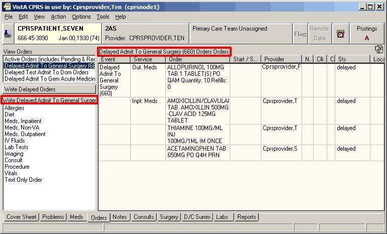

**The name of the release event appears below the Write Delayed Orders button and above the list of orders**  
### Assigning/Changing the Release Event

If an order is not signed, you can change the order’s current release event or assign a release event to a regular order. However, once an order has been signed, you cannot make further changes.

To assign or change a release event, follow these steps:

1.  Select the Orders tab.  
1.  Select the type of order you would like to change from the View Orders pane.  
The orders for the type you select will be displayed in the details pane on the right side of the screen.

1.  Highlight the order you would like to change from the details pane.  
1.  Select Action \| Change Release Event  
**-or-**

right-click on the order and select **Change Release Event** from the right click menu.

The *Change Release Event* dialog box displays. The current release event will be highlighted.

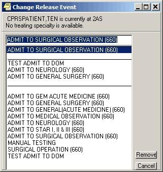

**The current release event is highlighted in the Change Release Event dialog**  
**Note:** If the release event cannot be changed, the *Unable to be Released to Service* dialog box appears. The reason that the release event cannot be changed is listed at the bottom of the dialog box. Press OK to close the dialog box.

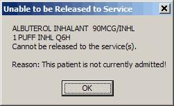

**This dialog box will appear if an order’s release event cannot be changed**  
1.  To change the release event, select another event and click Change. To simply remove the existing event, click Remove.  
A confirmation dialog appears.

1.  Click OK to confirm your changes.  
### Manually Releasing an Event-Delayed Order

**Note:** Each site can set a parameter that determines if the user must hold a key or if a parameter setting will determine which users can release delayed orders.

To release an event-delayed order manually (before the release event occurs), follow these steps:

1.  Select the Orders tab.  
1.  Select the type of order you would like to release from the View Orders pane.  
1.  The corresponding orders will appear on the right side of the screen.  
1.  Highlight the order you would like to release from the details pane on the right side of the screen.  
1.  Select Action \| Release Delayed Orders  
**-or-**

right-click on the order and select **Release Delayed Orders**.

**Note:** You must sign an order before it can be released.

The Release to Service dialog box will appear.

1.  Review the orders you wish to release and select OK.  
1.  If the Print Orders dialog box appears, select the appropriate prints and devices and press Print All Checked Items or Print Highlighted Items Only.  
### Viewing an Event-Delayed Order after It Is Released

To view an event-delayed order after it has been released, follow these steps:

1.  Select the Orders tab.  
1.  Select View \| Auto-DC/Release Event Orders  
The Auto-DC/Release Event Orders dialog appears.

1.  Choose the event the order is associated with.  
1.  Select OK.  
The appropriate orders will appear on the Orders tab.

## Notifying a User when Order Results Are Available

To notify a user when the results of an order are available, follow these steps:

1.  Select the Orders tab.  
1.  Select the desired type of order in the View Orders list box.  
1.  Select an order from the list of orders on the right-hand side of the screen.  
1.  Select Action \| Alert when Results....  
The Alert when Results dialog displays.

1.  Choose an alert recipient from the Alert Recipient drop-down field.  
**Note:** A recipient must have the ORDERER-FLAGGED RESULTS notification/alert enabled in order to receive the alert.

1.  Select OK.  
## Flagging an Order

With CPRS, users can flag an order to draw attention to it. When an order is flagged, the word “Flagged” will appear in the Orders column and the Service or Event column for the flagged order displays red. Below some points about flags are further explained.

-   **Multiple recipients:** CPRS enables users to send the flag to multiple individuals. The user flagging the order can choose from a list of possible recipients and those recipients will receive an alert that the order has been flagged.  
**Note:** A recipient must have the FLAG ORDER FOR CLARIFICATION notification/alert enabled to receive the alert.  
***

-   **No Action Alert:** The user flagging the order can also check the No Action Alert checkbox to receive an alert if none of the recipients acts on the flag before the specified time. When the user checks the No Action Alert checkbox, the time in the field is the default time that is controlled by a parameter. Your site can set a default time or leave it empty. If the sites do not enter a default time, the default time is 24 hours. However, the site can set the default time to a different amount of time, such as 8 hours, or 4 hours, or whatever your site chooses. But, when the user checks the No Action Alert, the user can change the time.  
-   **Flag Information in Order Details:** CPRS records the name of the person who flagged the order and the date and time that it was flagged. CPRS also tracks comments on the flag and who unflags an order with the date and time.  
-   **Reason for Flag when Processing:** When the user processes the order, CPRS displays the reason for the flag in the order text on the Orders tab.  
**To flag an order, use these steps:**

1.  Select the **Orders** tab.  
1.  Select the desired type of orders in the View Orders list box.  
1.  Select the individual order that you would like to flag from the list of orders on the right side of the screen.  
1.  Select **Action \| Flag...**.  
The Flag Order dialog displays.

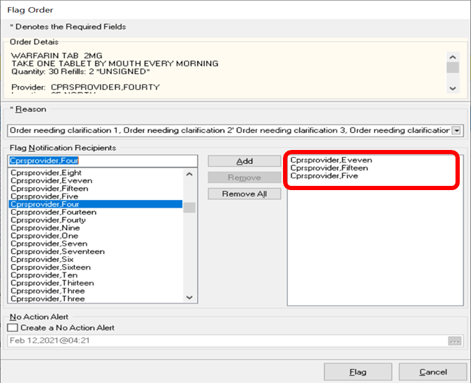

**The Flag Order dialog with the red rectangle added showing that multiple providers can be added as recipients.**  
1.  Enter a reason for the flag in the Reason for Flag field. Users can choose a reason from the drop-down list, choose a reason and add additional text, or enter their own text. The Reason for flag field has a 240-character limit.  
1.  Choose alert recipients from the Alert Recipient drop-down field. To locate names, type part of the name and the list will scroll and you can select the right name and move the name to the recipient pane on the right. Repeat the process until you have all the names you want in the recipient pane on the right.  
**Note:** A recipient must have the FLAG ORDER FOR CLARIFICATION notification/alert enabled to receive the alert.

1.  If you want to receive an alert if no one acts on the flag, check the **Create a No Action Alert** check box.  
1.  Enter the time after which you want to receive the alert. You can accept the default and move to the next step. Or you can set the time you want by selecting the button with three dots to bring up the Calendar component and select a date and time, then move to the next step.  
1.  Select **OK**.  
**Note:** If the OR FLAGGED & WARD COMMENTS parameter is turned On, flagged Order comments and Ward comments will display directly in the Order column. This parameter is turned Off by default; a CAC must activate it for your site. Refer to the *CPRS Technical Manual: GUI Version* for details on how to activate this parameter.

**Note:** If the provider has an NPI, it will not display on the screen below.  
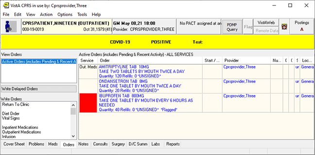

**CPRS Orders tab with a flagged order comment displayed in the Order column**  
## Unflagging an Order

CPRS has enabled sites to restrict which users can unflag an order.

For a user to unflag an order, the user must meet one of the requirements:

-   the user is assigned the ORES key  
-   the user is assigned another security key that the site designates (the sit can determine which keys can unflag orders)  
-   the user who flagged the order  
-   the user is a flag order recipient  
***

If a user tries to unflag an order, but does not have the correct key, the following error message will display:

You are not allowed to unflag this order based on your security keys and the order type.

**Note:** The above message is the standard message. Sites can also add their own text if they choose.  
***

If the user has the right security key, the user can remove the flag from an order very simply. The user must enter a reason for removing the flag (the reason must be a minimum of 4 characters, or the OK button will be disabled).  
In the order's detailed display, CPRS will record the name of the person who removed the flag, the reason entered for removing the flag, and the date and time that person removed it.

**To unflag an order, use these steps:**  
1.  Select the **Orders** tab.  
1.  Select the order you want to unflag.  
1.  Select **Action \| Unflag**.  
1.  Enter a reason (must be at least 4 characters).  
1.  Select **OK**.  
***

## Overview of CPRS/POE Functionality

To make it easier for providers to enter medication orders and have fewer orders that need to be changed by pharmacy and returned for a provider’s signature, the Pharmacy Ordering Enhancement (POE) project was undertaken. The aim of this project was to make it easier for clinicians to enter medication orders and have the computer do the work in the background to provide pharmacists with the information they need to fill orders.

Ordering dialogs were redesigned in an attempt to reduce the number of orders that need to be edited and returned for signature. Changes include replacing the dispense drug prompt with a dose prompt, automatically calculating the quantity of commonly dispensed drugs that are prescribed on standard schedules, and providing more standard schedule options. With the new ordering dialogs, CPRS uses an API to verify that the ordering provider has been assigned a VA or DEA number when the provider attempts to order a controlled substance. If the provider has not been assigned a VA or DEA number, the provider is prevented from ordering the controlled substance.

In addition, a new tab for complex orders enables providers to create complex doses for medications. The interface displays the expected time of next administration and a check box enables you to place an order for “Give First Dose Now.” (You must be careful, however, that the combination of the NOW order and the original schedule do not overmedicate the patient.) In addition, another Medications item called Medications may have been added to your ordering menu. The Medications item can be used in addition to the existing dialogs for INPATIENT MEDS, OUTPATIENT MEDS, and INFUSION. The only difference between this new dialog and the Inpatient and Outpatient dialogs is that Medications will automatically assign the ordering context (Inpatient vs. Outpatient) based on the selected patient's current admission/visit status. The Medications item provides a single dialog for medication orders instead of forcing the provider to pick among the INPATIENT MEDS, OUTPATIENT MEDS, and INFUSION order dialogs. If the provider wants to use those specific dialogs, they are still available.

**Note:** With the new Medications item, the provider will not be able to write a prescription if the patient is currently admitted or order an inpatient IV med for a patient in an outpatient clinic (i.e. you won’t be able to write an order for the opposite context). Therefore, the old INPATIENT MEDS, OUTPATIENT MEDS, and INFUSION items should still be available for the provider to use.

There are several other changes that are explained in the POE Release Notes.

# Notes

From the Notes tab you can create new progress notes for a patient and view existing progress notes and documents. You can also create templates to allow you to quickly and efficiently enter progress notes. Documents on the Notes tab are organized in a tree structure on the left side of the screen.

## Group Notes

A new application called Group Notes enables authorized users to write progress notes and enter encounter information for a group of patients. Users can enter text and encounter information that applies to the entire group of patients and then add information to individual patient’s notes and encounters but sign all the notes at the same time.

Group Notes is a separate application from CPRS. Sites can put an icon on the desktop or authorized personnel at the site can place an item Tools menu. To use the Group Notes application, a user must be given a key (OR GN ACCESS) and choose a location that allows group notes (set in the OR GN LOCATIONS parameter). To find out more about Group Notes, please look for the manuals under Group Notes on the VistA Documentation Library ([http://www.va.gov/vdl/)](http://www.va.gov/vdl/).

Once the notes are signed in the Group Notes application, they are stored in TIU and displayed in CPRS like any other progress note. Thus, they are not a different kind of note, but simply notes created in a way that speeds text entry and signing for a group of patients that have the same treatment or therapy while still allowing personalization of each note and encounter for the patient.

## Icons on the Notes Tab

The icons in front of the document titles on the Notes tab help identify and categorize documents. A description of the icons is available from the Icon Legend (shown below). To access the Icon Legend, click **View \| Icon Legend**.

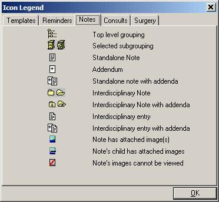

**The Icon Legend dialog box displays a description of the various icons in CPRS**  
## Viewing Progress Notes

To view the text of a progress note, follow these steps:

1.  Select the Notes tab.  
1.  Select a document title from the left side of the screen. (Click the “+” sign to expand a heading.)  
**Note**: If a note has an addendum, the  icon will appear in front of the note title. You may view the addendum by clicking the “+” sign to expand the note title and then selecting the appropriate addendum.

The text of the progress note will be displayed on the right side of the screen as shown below.

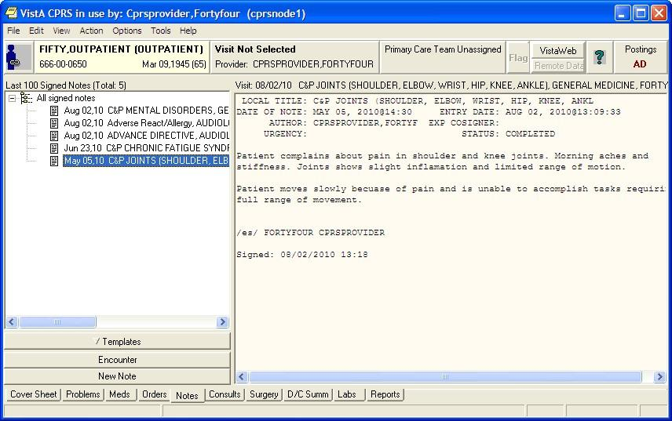

**The list of notes for the selected patient is displayed in the tree view on the left of the dialog. Above the tree view, CPRS displays the sorting of the list (last 100 signed notes in this case). Next to the label of the sorting, CPRS displays the total number of notes the patient has. The text of a document is displayed on the right side of the Notes tab**  
1.  (Optional) To view additional details of the progress note, such as editing history, patient record flag links, associated problems, select View \| Details.  
**Note:** If the provider has an NPI, it will not display on the screen below.

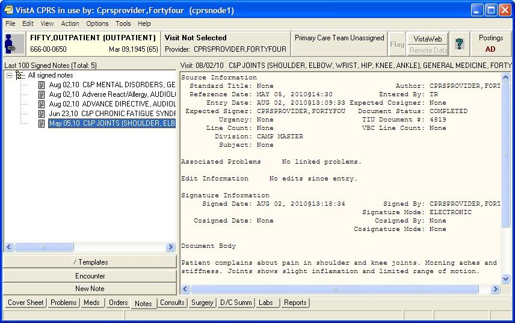

**This screen shows an example of a progress note’s detailed display**  
**To view all the progress notes under a specific heading, follow these steps:**

1.  Select the Notes tab.  
1.  Double-click the heading that you would like to view.  
The notes that are related to that heading will appear in a table on the right side of the screen.

1.  To view a specific note, select the note from the table. You can also sort the table by clicking on the column you wish to sort by (click the column again to sort the table in inverse order).  
**Note:** If a provider has an NPI, it will not display on the screen below.

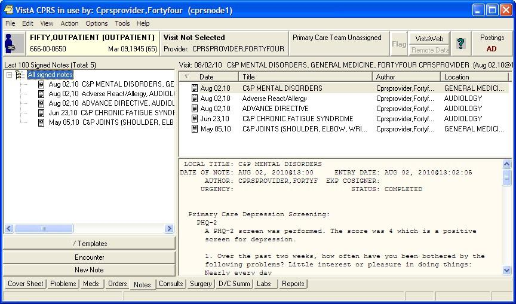

**CPRS Notes Dialog viewing notes under a specific heading**  
## Customizing the Notes Tab

CPRS allows you to control which documents appear on the Notes tab. From the View menu you can specify that only the following note types appear on the tab:

-   All signed notes  
-   Signed notes by a particular author  
-   Signed notes for a particular date range  
-   Uncosigned notes  
-   Unsigned notes  
In addition, you can use the **View** \| **Custom View** option to further customize the Notes tab.

### Viewing All Signed Notes, All Unsigned Notes, or All Uncosigned Notes

To view all signed notes, all unsigned notes, or all uncosigned notes, follow these steps:

1.  Select the Notes tab.  
1.  Select View \| Signed Notes (All), View \| Uncosigned Notes, or View \| Unsigned Notes.  
The appropriate progress notes will appear on the Notes tab.

If you would like to further limit the notes that are displayed on the Notes tab, continue with the “Additional Customization” topic (below).

### Viewing All Signed Notes by a Specific Author

To view all signed notes by a specific author, follow these steps:

1.  Select the Notes tab.  
1.  Select View \| Signed Notes by Author.  
The List Signed Notes by Author dialog displays.

**Note:** If the provider has an NPI, it will display on the screen below. See the "National Provider Identifier (NPI) Display in CPRS" section for an example of an NPI displaying on a screen.

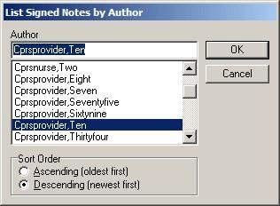

**The List Signed Notes by Author dialog**  
1.  Select the author of the note(s) that you would like to view.  
1.  In the Sort Order option group, select Ascending (oldest first) to view the oldest notes first, or Descending (newest first) to view the newest notes first.  
1.  Select OK.  
The appropriate notes will appear on the Notes tab.

If you would like to further limit the notes that are displayed on the notes tab, continue with the “Additional Customization” topic (below).

### Viewing All Signed Notes for a Date Range

To view all signed notes by a specific author, follow these steps:

1.  Select the **Notes** tab.  
1.  Select View \| Signed Notes by Date Range.  
The List Signed Notes by Date Range dialog will appear.

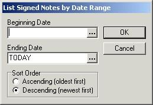

**The List Signed Notes by Date Range dialog**  
1.  Enter a beginning date by doing one of the following:  
-   entering a date (e.g. 6/21/01 or June 21, 2001).  
-   entering a date formula (e.g. t-200).  
-   pressing the  button to bring up a calendar.  
1.  Enter an ending date by doing one of the following:  
-   entering a date (e.g. 6/21/01 or June 21, 2001).  
-   entering a date formula (e.g. t-200).  
-   pressing the  button to bring up a calendar.  
1.  Select OK.  
The appropriate notes will be displayed on the Notes tab.

## Additional Customization

If you would like to further limit the notes that are displayed on the Notes tab, follow these steps:

1.  From the Notes tab, select View \| Custom View.  
The List Selected Documents dialog will appear.

**Note:** If a provider has an NPI, it will display on the screen below. See the "National Provider Identifier (NPI) Display in CPRS" section for an example of an NPI displaying on a screen.

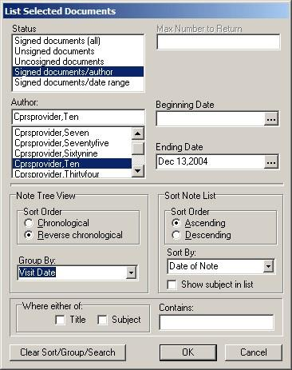

**The List Selected Documents dialog**  
1.  Select the criteria for the documents that you want to display on the Notes tab by doing some or all of the following:  
**Note:** You cannot set all of the fields at the same time. For example, if you choose one of the options for “all notes,” then you are given the option of a date range because that conflicts with the other choice.

1.  Select a status from the left side of the window.  
1.  Enter the maximum number of notes that you would like to display in the Max Number to Return field.  
1.  Select an author or expected cosigner from the Author or Expected Cosigner field.  
1.  Select a beginning and ending date by doing one of the following:  
-   entering a date (e.g. 6/21/01 or June 21, 2001)  
-   entering a date formula (e.g. t-200)  
-   pressing the  button to bring up a calendar  
1.  Select a sort order from the Note Tree View option group.  
1.  If you would like to group the notes, make a selection from the Group By drop-down list.  
1.  If you would like to further sort the notes that have been grouped in step f, select the criteria to sort by in the Sort By drop-down list.  
1.  If you would like the subject of the notes to be displayed in the tree view, check the “Show subject in list” check box.  
1.  If you would like to limit the notes that are displayed to notes that contain specific text in the title or in the subject line, click the appropriate check box and enter the text in the Contains field.  
**Note:** You can erase the contents of the List Selected Documents dialog by clicking the Clear Sort/Group/Search button.

1.  Click OK.  
The notes that meet the criteria you specified will appear on the Notes tab.

## Improving the Tree View Custom View Display

CPRS enables users to set a maximum number of notes that should display when the Notes tab loads. The purpose of defining a maximum number of notes is to avoid loading a large amount of information that might slow performance. When there is a value in the Max Number to Return field (2b above), CPRS has some additional features on the tree view: a “Show More” item and another display category called “Older signed notes with recent addenda”.

1.  **Show More:** If the user has more notes available than the maximum allowed, a “Show More” entry displays in the tree view. If the user double clicks “Show More”, CPRS downloads another set of notes as the initial maximum. If there are still more notes available, “Show More” appears again until there are no more notes to display.  
***

For example, if the selected patient has 300 total notes and the Maximum Number of Notes is set to 30, when the Notes tab initially opens, 30 Notes will be downloaded, and their information displayed in the tree view. A Show More item will display at the end of the tree view because there are more notes. If the user selects Show More, another 30 notes will be downloaded and listed. If the user selects Show More again, another 30 notes and the Show More item will display. This will continue until all the notes have been listed.  
***

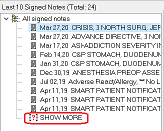  
***  
1.  **Older signed notes with recent addenda:** Sometimes one or more notes outside the maximum range will have an addendum inside the range. These notes are added to the bottom of the list, under the date of the parent note. In this example, the last two notes have recent addenda but are well outside the range of the rest of the notes. This makes it appear that there are no notes between the last normal note (dated April 2019) and the older parent note with the recent addendum (dated March 2009).  
***

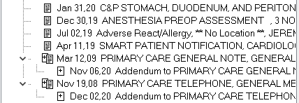  
***

To prevent the appearance of a gap in notes, these older notes are now separated from the rest of the notes after the “Show More” entry, marked with the label “Older signed notes with recent addenda”.  
***

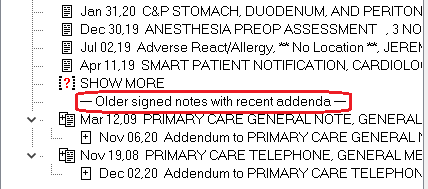  
As shown above, both Show More and Older signed notes with recent addenda can be in the tree view.

## Searching for Text (Within Current View)

CPRS can search for the exact text that users enter, search the notes listed in the current view, and filter the tree view to display only those notes that contain the exact text entered. Users should be careful to enter text that will give them the desired notes. If users know the exact text, this is simple. If they do not know the exact text, they will need to enter something broad enough to bring up the desired notes.

For example, if the user knows that the exact text “strangulated hernia” without the quotes, but with the space, is in the note, the user can enter that exact phrase without the quotes and the appropriate note should be found. However, if the user is uncertain of the exact text, the user might want to search for “hernia” or even “hern” to ensure that the appropriate notes will be found. This search would find words such as hernia, herniated, etc.

To search for specific text in the current view, use these steps:

1.  On the notes tab, select View \| Search for Text (Within Current View).  
1.  In the List Signed Notes by Author dialog, enter the text for which CPRS should search.  
1.  Press OK.  
CPRS will then search the current view of notes and filter the tree view so that only those notes with the exact text are displayed.

## Setting a Default View

To set a default view for the Notes tab, follow these steps:

1.  Customize the Notes tab by following the steps above.  
1.  Select View \| Save as Default View.  
A warning dialog will appear.

1.  Select OK.  
The current view will be set as the default view for the Notes tab.

## Creating and Editing Progress Notes

**To create a new progress note, follow these steps:**

1.  Select the **Notes** tab.  
1.  Select the **New Note** button.  
The Progress Note Properties dialog displays.

**Note:** The encounter information dialog may appear before the Progress Note Properties dialog if you have not entered encounter information. If the encounter information dialog appears, enter the necessary information and select OK.

**Note:** If the provider has an NPI, it will display on the screen below. See the "National Provider Identifier (NPI) Display in CPRS" section for an example of an NPI displaying on a screen.

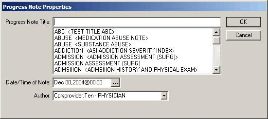

**The Progress Note Properties Dialog is where the user selects the progress note title, date, author, and in the case of a consult or patient record flag note, the consult number or patient record flag action for the note**  
1.  Select a title for the progress note from the Progress Note Title drop-down list.  
1.  If necessary, select a date and time for the progress note by doing one of the following:  
-   entering a date (e.g. 6/21/01 or June 21, 2001)  
-   entering a date formula (e.g. t-200)  
-   pressing the  button to bring up a calendar  
1.  If necessary, select an author for the progress note.  
**Note:**  To help you distinguish between providers, CPRS displays their titles (if available). When two or more providers have identical names, CPRS also displays:

-   The service/section and site division (if any) associated with these providers; site divisions are displayed based on the following rules:  
-   When no division is listed for a provider, no division is displayed.  
-   If only one division is listed, this division is displayed.  
-   If the site has multiple divisions or more than one division is listed **and** one of these listed divisions is marked as Default, CPRS displays the division marked as Default.  
-   If more than one division is listed for a provider and none is marked as Default, CPRS does not display division information for this provider.  
-   Providers who are listed in the New Person file as Visitors are screened out from the provider list. (These screened-out providers are listed as Visitors because their entries were created as a result of a Remote Data View.)  
**Note:** Occasionally a problem occurs if a cosigner’s access lapses and they have become "disusered". If this occurs, you can click OK and proceed with that selection or click Cancel and choose another cosigner.

1.  If the note is to resolve a consult or to document a patient record flag, select the consult number or the patient record flag action to which the note should be linked. To help users select the correct consult when a title that will resolve a consult is selected and a consult is available to resolve, a Show Details button that brings up the details of the consult is available.  
**Note:** If the user attempts to change the characteristics of a PRF note and has highlighted an action that reads Yes under note, CPRS assumes that the user is trying to link to an already linked action and will not allow the change to continue. However, if the user removes the highlight from the Yes action, the changes can occur.

1.  Select **OK**.  
1.  In the main text box, enter the content of the note using one or more of the methods below:  
-   Copy and paste from other documents  
-   Type in text  
-   Insert predefined text from templates.  
1.  Select the **Templates** drawer.  
1.  Locate the template you need.  
1.  Double-click the template, drag-and-drop the template into the document, or right-click and select Insert Template. (It will be placed where the cursor is.)  
1.  Repeat steps b and c as needed.  
**Note:**  If you need to view the consult details while writing a note, bring up the popup menu by right-clicking in the note editing pane and choosing View Consult Details or using the shortcut Shift+Ctrl+U.

1.  After you enter the note, if you select Encounter, you can enter encounter information for the visit.  
Diagnosis, procedure, and Visit Type are required. The check boxes are based on the Encounter Form defined for the Progress Note Title you select. When you click on Other Diagnoses or Other Procedures, a Lexicon look up (terms with their corresponding ICD or CPT codes) is displayed for you to choose from.

**Note:** When finished, you can continue working or select an item from the Action menu, such as Sign Note Now..., Save Without Signature, or Add to Signature List.

**To change a progress note title, use these steps:**

**Note:** Progress Notes can only be edited if they have not been signed. Signed notes cannot be editing. To add to a note, an addendum would have to be created.

1.  When in a note that you have already started, select the Change… button.  
The Progress Note Properties dialog displays in which the user should select the note title, author, and date.

1.  Select the appropriate note title, author, and/or date.  
The Clear Previous Boilerplate Text dialog displays as shown below.

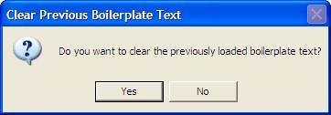

1.  To keep the text in the note, select No. To remove the text, select Yes.  
**To edit a progress note, follow these steps:**

**Note:** Progress Notes can only be edited if they have not been signed. Signed notes cannot be editing. To add to a note, an addendum would have to be created.

1.  Select the Notes tab.  
1.  Select a document title from the left side of the screen. (Click the “+” sign to expand a heading.)  
**Note:** If a note has an addendum, the  icon will appear in front of the note title. You may view the addendum by clicking the “+” sign to expand the note title and then selecting the appropriate addendum.

The text of the progress note will be displayed on the right side of the screen.

1.  Select Action \| Edit Progress Note…  
You can now edit the progress note.

**To find specific text in a progress note, follow these steps:**

1.  Select the Notes tab.  
1.  Select a document title from the left side of the screen. (Click the “+” sign to expand a heading.)  
The text of the progress note will be displayed on the right side of the screen.

**Note:** If a note has an addendum, the  icon will appear in front of the note title. You may view the addendum by clicking the “+” sign to expand the note title and then selecting the appropriate addendum.

1.  Right-click the text of the progress note and select Find in Selected Note.  
The Find dialog appears.

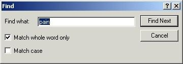

**The Find dialog allows you to replace text in a progress note**  
1.  Enter the text that you want to find.  
**Note:** Check the Match whole world only or Match case check boxes to search using these options.

1.  Select Find Next.  
If the text is found, it will be highlighted in the progress note.

1.  When finished, close the dialog.  
**To replace specific text in a progress note, follow these steps:**

**Note:** Users can edit only unsigned progress notes. Once a note is signed, it cannot be edited.

1.  Select the **Notes** tab.  
1.  Select a document title from the left side of the screen. (Click the “+” sign to expand a heading.)  
The text of the progress note will be displayed on the right side of the screen.

**Note:** If a note has an addendum, the  icon will appear in front of the note title. You may view the addendum by clicking the “+” sign to expand the note title and then selecting the appropriate addendum.

1.  Select Action \| Edit Progress Note….  
1.  Right-click the text of the progress note and select **Replace Text**.  
The Replace dialog displays.

1.  Enter the text you wish to replace in the Find what field.  
1.  Enter the new text in the Replace with field.  
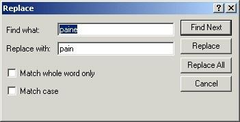

**The Replace dialog allows you to replace text in a progress note**  
**Note:** Check the Match whole world only or Match case check boxes to search using these options.

1.  Select either Find Next, Replace, or Replace All.  
If the text is found it will be highlighted (if you selected Find Next) or changed (if you selected Replace or Replace All).

## Encounter Information

CPRS has two kinds of encounter information: visit information and encounter form data.

For each visit (or telephone call) with a patient, you need to enter the provider, location, date, and time. CPRS requires this information before you can place orders, write notes, add to the problem list, and so on.

The parameter, ORWPCE ANYTIME ENCOUNTERS, can be set to allow

encounters to be entered on the Notes tab when no note is being entered. This will allow encounter entry (at the time of the visit) for dictated notes. This parameter can be set at the User, Service, Division, and System levels. Note that this will edit the encounter associated with the current location and time, which is not necessarily the encounter associated with the currently displayed note.

To receive workload credit, you must enter the encounter form data, including the following information, for each encounter:

-   Service connection  
-   Provider name  
-   Location  
-   Date  
-   Diagnosis  
-   Procedure  
-   Visit Information  
CPRS shows the encounter provider and location for the visit on the Visit Encounter box, identified in the graphic by the pointer. You can access this box from any chart tab.

If a provider or location has not been assigned, CPRS will prompt you for this information when you try to enter progress notes, create orders, and perform other tasks.

## Encounter Form Data

To get workload credit and gather information, enter encounter form data whenever you create a progress note, complete a consult, or write a discharge summary. When you create one of these documents, an Encounter button appears. Click this button to bring up the Encounter Form. (Otherwise, you will be prompted for encounter information when you try to sign the note or exit the current patient’s chart.)

**Note:** If the provider has an NPI, it will display on the screen below. See the "National Provider Identifier (NPI) Display in CPRS" section for an example of an NPI displaying on a screen.

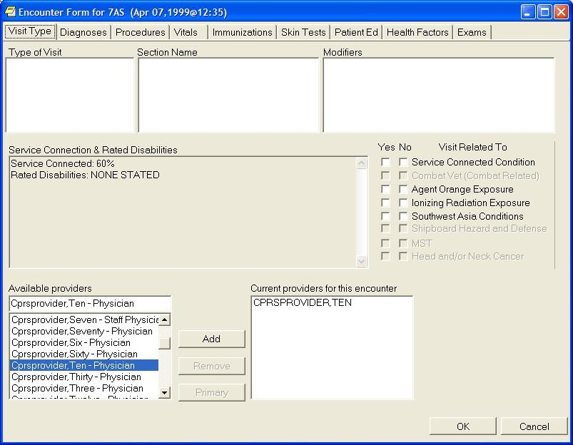

**The Encounter Form**  
The Encounter Form has the following eight tabs:

-   Visit Type  
-   Diagnoses  
-   Procedures  
-   Vitals  
-   Immunizations  
-   Skin Tests  
-   Patient Education  
-   Health Factors  
-   Exams  
-   Global Assessment of Functioning (GAF) (The GAF tab is available only if specific Mental Health patches are installed and if the location is a mental health clinic.)  
Your site defines forms from the Automated Information Collection System (AICS) application to be used with the Encounter Form. Once your site has defined the necessary forms and associated them with the Encounter Form, each tab has a number of general categories on the left. When you click a general category, the corresponding items appear in the list box on the right.

For example, the Visit Type tab might have New Patient, Established Patient, and so on listed in the left list box. The list box on the right would then have check boxes for the different types of patient appointments, such as Brief Exam, Limited Exam, Intermediate Exam, Extended Exam, and Comprehensive exam.

Even if you haven’t defined the form, you can click the Other button to get a list of choices that are active on your system.

When the forms are defined and associated with the Encounter Form, you can use the Encounter Form just as you would a paper form: just click the appropriate tab, category, and check boxes to mark items or click Other and select the appropriate choice. On the Visit Type tab, a provider can indicate if the encounter is related to the various exemption categories, such as Service Connected, Combat Veteran, Agent Orange exposure, Ionizing Radiation exposure, Southwest Asia Conditions,

Shipboard Hazard and Defense, Military Sexual Trauma, and Head and/or Neck Cancer. If these forms have not yet been defined, ask your Clinical Coordinator for assistance.

### Entering Encounter Form Data

In order to receive workload credit, you must enter encounter form data when you create a new progress notes, complete a consult, or write a discharge summary.

**Note**: Once a note, summary, or consult has been completed, you can only change encounter information directly through Patient Care Encounter (PCE.)

To enter encounter form data, follow these steps:

1.  Select the appropriate tab: Notes, Consults, or D/C Summ.  
1.  Select New Note on the Notes tab, or locate the appropriate consult or discharge summary. For the latter two, skip step 3.  
1.  Type in a title for the note or summary or select one from the list and press \<Enter\>.  
1.  On the Notes tab, select the Encounter button, Action \| Encounter, or Edit Encounter Information from the right-click pop-up menu. On the Consults and D/C Summ tabs, only the Edit Encounter Information item is available on the pop-up menu.  
1.  Select the tab where you want to enter information (Type of Visit, where you can also enter the primary and secondary providers, Diagnoses, where you can have diagnoses automatically be added to the Problem List, Procedures, Vitals, Immunizations, Skin Tests, Patient Ed., Health Factors, or Exams).  
**Note:** To enter vitals, follow this manual’s instructions under Recording Vitals.

1.  Click the appropriate category in the list box on the left and then click the check boxes by the appropriate items in the list box on the right. If the section name you want is not shown or the list boxes are empty, use the search feature. To search, click on the Other \<Tab Name\>. (Each tab’s button will be labeled differently.) Locate and double-click the needed item. Some tabs have a simple list to choose from. Diagnoses and Procedures have a search function. On these tabs, you need to enter the beginning of a term and click Search before double-clicking.  
**Note:** If a user tries to enter a diagnosis or procedure that has an inactive code associated with it, CPRS will not accept that selection and will request that the user change it. Also, although it is based on ICD-9-CM codes, the Other Diagnosis… button will now search the SNOMED Concept Terms (SNOMED CT) Problem List dataset, which should enable clinicians to better find the term they need. If the list does not show the item you are looking for, you can select the Extend Search button to search the ICD-9-CM file. All terms returned by this search must map to ICD-9-CM codes so you may not see a code that has a related SNOMED CT term and code, but you will see an ICD-9-CM code. If a provider enters a diagnosis with or problem that has a 799.9 code (something undefined), a notice will be sent to the Standards and Terminology Service and a new mapping will be created. When available, the 799.9 code will automatically be updated to the new code.

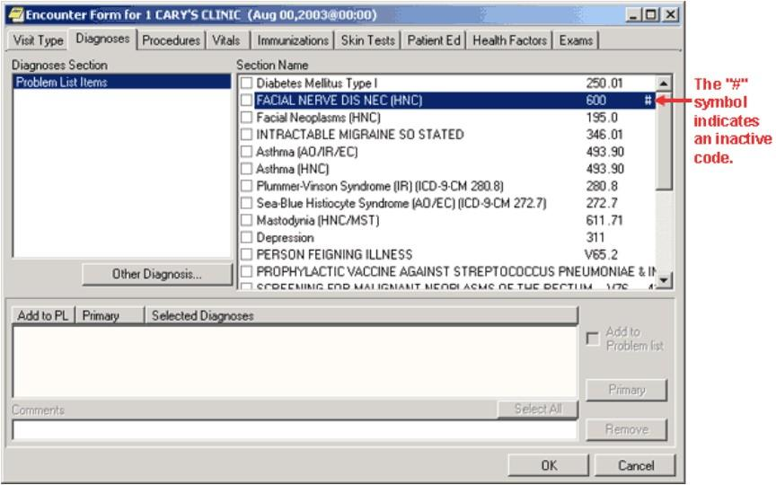

**This screen shows a diagnosis on the Encounter form with an inactive code**  
****  
**If a user selects a diagnosis or procedure with an inactive code, the above dialog will display telling the user that the code is inactive and that the user should change it**  
**Note**: The Type of Visit and Vitals tabs are different. Type of Visit has no button, and Vitals has a Historical Vitals Details button that brings up a dialog containing a graph and a listing of past vitals taken.

1.  Enter any additional information as needed.  
Several tabs have additional features, such as drop-down lists for results of exams, severity of problems, and so on.

1.  Fill in information for other tabs as needed by repeating steps 2-6.  
1.  When finished, select OK.  
## Clinical Reminders

When a user opens a patient record, CPRS starts a job to evaluate whether the patient has reminders that are due, available, etc. While the evaluation is in process, a magnifying glass goes in a circle on the Reminder button. When the magnifying glass stops, and a clock icon appears, the reminders evaluation is complete.

You can find out if a patient has reminders by doing one of the following:

-   Selecting the **Reminders** button near the top right of the CPRS form. When you click this button, a dialog with a reminders tree view will be displayed. The reminders button may display one of five icons. When it displays a red clock, the patient has reminders due.  
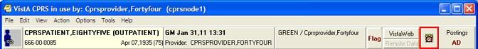

**The Reminders button indicates whether there are reminders for the current patient**  
-   Looking on the coversheet that has an area specifically for reminders.  
**Note:** If under Due Date, the user sees Error or CNBD (which stands for “could not be determined”), a problem occurred while the reminders were being evaluated. You should contact your reminders coordinator.

-   Opening a reminders drawer to check on the reminders for a patient after you have begun a new progress note. When you click the **Reminders** drawer, you will see a dialog with a tree view of due, applicable, and other reminders.  
### The Reminders Drawer

After you begin a new progress note, you will see the reminders drawer. If you click the drawer, a tree view of due, applicable, and other reminders will be displayed. The Due category automatically expands when you open the Reminders drawer, while the Applicable and Other categories do not.

**Note**: Before you can process a reminder, a CAC or someone else must create a dialog in a similar position at your site. A dialog image over the clock or question mark icon shows that a reminder has an associated dialog.

After you process a reminder but before you reevaluate it, a check is placed over the reminder to show it has been processed. Once you reevaluate the reminder, it will be moved to the category for reminders that are applicable but not due.

****  
**Click a reminder to bring up the Reminders Processing dialog and process the reminder**  
Right-click a reminder to get the following options:

-   **Clinical Maintenance**—shows the possible resolutions and the findings associated with the reminder.  
-   **Education Topic Definition**—lists the education topics that have been defined for a reminder. You can select a topic to view the desired education outcome and any standards.  
-   **Reminder Inquiry**—shows the reminder definition describing which patients are selected for this reminder.  
-   **Reference Information**—lists Web sites with additional information.  
-   **Evaluate Reminder**–tells you if a reminder is due, applicable or other.  
-   **Reminder Icon Legend**–displays icon legend screen with icons and meanings.  
Each of these options brings up a window. When you are finished with the window, click Close. For more information on Clinical Reminders, refer to the *Clinical Reminders Manager Manual* and *Clinical Reminders Clinician Guide.*

## Reminders Processing

You process Reminders using the Reminders Processing dialog. The dialog displays the possible activities that can occur during a visit and that can satisfy the reminder. You may need to enter additional information.

If a Reminder dialog generates Primary Care Encounter (PCE) data for the current encounter, the user is prompted to enter the primary encounter provider when clicking the FINISH button, if one is needed (depending on the PCE data created, and the setting of the ORWPCE DISABLE AUTO CHECKOUT parameter).

In the reminder tree dialog, under the View menu, there are now five new menu options for determining which folders will appear in the reminder tree. These menu options, Due, Applicable, Not Applicable, All Evaluated, and Other Categories, will be checked if that folder is to appear in the tree. Individual users can set which folders will appear by selecting the corresponding menu item.

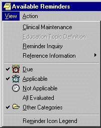

**The Available Reminders dialog**  
When you check an item on a Reminder dialog, it may expand to enable entry of more detailed information, such as dates, locations, test results, and orders that you could place based on a response. The information depends on how the dialog was created at your site. Reminder dialog elements that allow only one choice per dialog group appear as radio buttons.

When you click a check box or item, the associated text that will be placed in the progress note is shown in the area below the buttons. Patient Care Encounter (PCE) data for the item is shown in the area below that.

Text and PCE data for the reminder that you are currently processing are in bold.

When you click the Finish button after entering vital signs in Reminder dialogs, a prompt appears requesting the date and time the vital signs were taken. This prompt defaults to the date of the encounter.

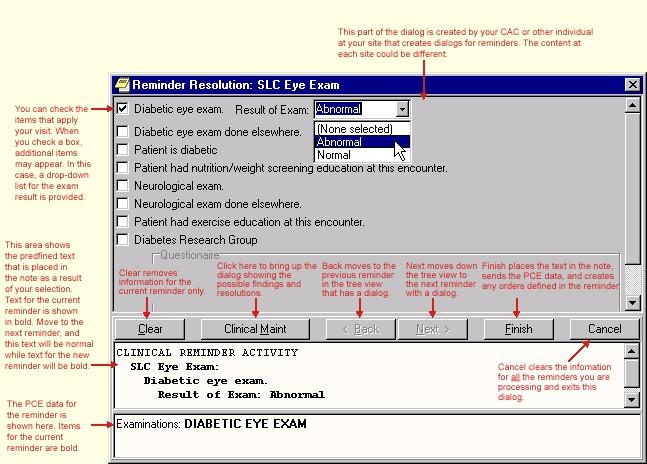

**Reminder Resolution dialog**  
-   Required fields are no longer checked on a Reminder dialog unless at least one entry has been made on the dialog. This allows users to skip Reminders that are not intended for processing.  
-   Reminder dialog groups can now be set to NONE OR ONE SELECTION, which allows up to one entry in a group, but does not require an entry. PX\*1.5\*2 is required to change the reminder dialog definition.  
-   Required prompts and template fields will be marked with an asterisk (\*) to indicate that they are required. A message at the bottom of the Reminder dialog states "\* Indicates a Required Field."  
Reminder dialogs have a Visit Info button. It opens a dialog that allows the user to enter service-connected information, as well as the vital sign entry date and time. If service-connected information is required for the encounter and note title, this dialog automatically appears when you click **Finish**.

### Processing a Reminder

To process a reminder for a patient, complete the following steps:

1.  If you have not already, begin a new progress note by clicking the Notes tab, then New Note, and then select a note title. (If prompted, enter the encounter location and provider.)  
1.  Click the Reminders drawer or the Reminders button to open a tree view of the reminders for this patient.  
1.  Click the plus sign to expand the tree hierarchy where needed and then click the reminder you will process. You will then be presented with the dialog for processing reminders.  
**Note**: If you click the Reminders button, choose Action \| Process Reminders Due to begin with the first reminder due.

1.  Click the check boxes in front of the items that apply to this patient, and enter any additional information requested such as comments, diagnoses, and so forth.  
1.  When you are finished with this reminder, click another reminder or click Next to move to the next reminder.  
1.  Repeat steps 4 and 5 as necessary to process the desired reminders.  
1.  When you have processed all the reminders you want to process, click Finish.  
1.  Review and finish your progress note and enter any information necessary in order dialogs.  
### Completing Reminder Processing

After you have entered all the information, you can finish processing the reminders.

When you finish, the following things will happen:

-   The predefined text is placed in the note you started to write.  
-   The encounter information is sent to the Patient Care Encounter (PCE) application for storage.  
-   If there are orders defined in the dialog, the orders will also be created. If the orders require input, the order dialogs will appear so that you can complete the orders. You must sign any orders that are created. After you have signed the orders, click **Finish** to finish processing remainders.  
### Using Mental Health Assessments in CPRS

When sites install CPRS v27 and the Mental Health dynamic link library (YS_MHA.dll), mental health providers will have enhanced mental health assessment tools. Mental health providers can use these tools through Reminders in CPRS if the following have occurred:

-   Several patches must be installed, including: YS\*5.01\*85 (which distributes YS_MHA.dll), PXRM\*2.0\*6, GMTS \*2.7\*77, and OR\*3.0\*243.  
-   YS_MHA.dll must be in the correct location.  
-   Users need to be assigned an additional secondary menu by a Clinical Applications Coordinator (CAC) or similar individual who performs this kind of set up at the site.  
## Document Templates

With the CPRS GUI, you can create document templates to make writing or editing progress notes, completing consults, or writing discharge summaries quicker and easier. In addition, you can import or export templates and convert Microsoft Word files to document templates.

## Locking Consult Templates

The Austin FSC Healthcare Claims Processing (HCP) Referral & Authorization System (RAS) requested an enhancement to make a TIU template used on a consult request as read-only. This action makes the template and all its associated template fields unavailable for edit—they can be viewed in the editors, but no values may be changed. RAS depends on specific text elements appearing in certain consult templates. If these templates are modified by a site, the messaging between RAS and VistA Consults/Request Tracking can be disrupted.

These templates should not be edited by facilities and as such will be locked during the installation of CPRS GUI v31b.

### Template Editor

The Template Editor is used to create and manage document templates. To access the Template Editor, select **Options \| Create New Template…** from the Notes, Consults, or D/C Summ tab.

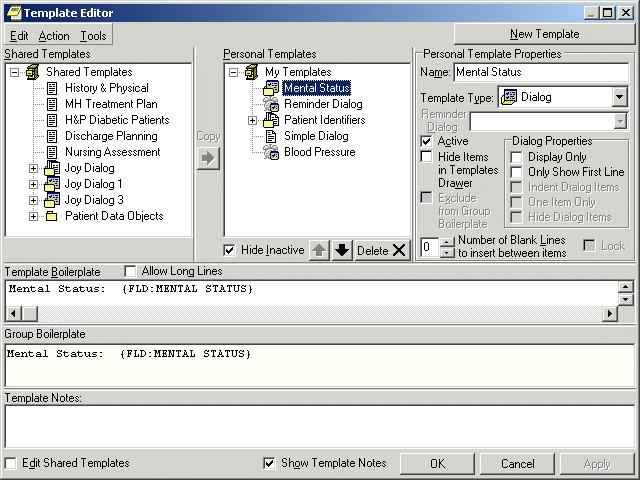

**The Template Editor window**  
For an explanation of the icons used in the Template Editor, select **Tools** \| **Template Icon Legend** and click the **Templates** tab.

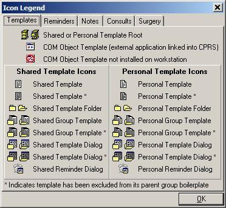

**The Icon Legend**  
### Personal and Shared Templates

You can create and use your own templates, or you can use shared templates created by your Clinical Coordinator.

#### Personal Templates

Authorized users can create personal templates. You can copy and paste text into a template, type in new content, add template fields, or copy a shared template into your personal templates folder. A shared template that you simply copy into your personal templates folder without changing continues to be updated whenever the original template is changed or modified in the Shared Templates folder. Once you personalize or change the copy of the shared template in your personal templates field, the icon used to represent it changes and it becomes a personal template. From that moment on, the personal template is not related to the shared template and is not updated with the original. In the tree view, personal template and folder icons have a folded upper right corner.

#### Shared Templates

Only members of the Clinical Coordinator Authorization/Subscription Utility (ASU) class can create shared templates. Shared templates are available to all users. Clinical Coordinators can copy and paste text into a template, type in new content, add Template Fields, or copy a personal template and then modify it as needed. In the tree view, shared template and folder icons do not have a folded corner.

**Note**: When you install CPRS, a copy of all your existing boilerplate titles is placed in the inactive boilerplates folder under shared templates.

Clinical Coordinators can arrange the boilerplate titles that have been copied into the shared templates, use them to create new shared templates, or make them available to users by moving them out of the inactive boilerplates folder. Users will not see the inactive boilerplates folder or its templates unless you choose to make the folder active.

**To activate the boilerplates folder, Clinical Coordinators should follow these steps:**

1.  Open the Templates Editor.  
1.  Verify that Edit Shared Templates is checked.  
1.  Uncheck Hide Inactive (under shared templates).  
1.  Click the plus sign beside the shared icon.  
Shared Templates includes a lock property that prevents users from making personal changes when it has been set. The status of the lock property is displayed in a check box on the Template Editor dialog. When the Shared Templates root template is locked, no shared templates can be modified.

For more information on boilerplates, refer to the *Text Integration Utility User Manual*.

Another area of shared templates is creating Patient Data Object templates for newly created TIU objects that will enable users to place these objects into their other templates.

**To create a new Patient Data Object template, use the following steps:**

1.  Open the Template Editor by selecting from the Notes, Consults, or DC/Summ tab by selecting Options \| Edit Shared Templates….  
1.  Verify that Edit Shared Templates is checked.  
1.  Expand the tree view of Shared Templates and then Patient Data Objects by clicking on the plus sign beside each.  
1.  Click on the existing object above which you want your new object to be.  
1.  Click New Template and edit the name of the template.  
1.  Place the cursor in the Template Boilerplate box and select Edit \| Insert Patient Data Object or right-click and select Insert Patient Data Object to bring up a dialog containing a list of TUI objects.  
1.  Click the appropriate TIU object (that was probably just created).  
1.  Click Apply or OK to make the new object available in GUI templates.  
#### Mark a Template as Default

A default template will automatically be selected the first time you open the

Templates Drawer. The default template can also be accessed at any time with the Go to Default Template option. Each tab (Notes, Consults, and D/C Summ) can have its own default templates.

To set a template as your default template, follow these steps:

1.  Open the Template Drawer on the Notes tab by clicking on it.  
The available templates will be displayed in a tree view.

1.  Right-click on any template and select Mark as Default from the right-click menu.  
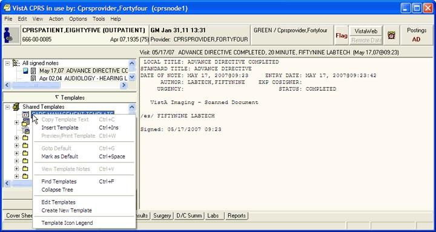

**You can set a template as your default template with a right click menu option**  
#### Hide Child Templates

To make child templates unavailable from the template drawer, follow these steps:

1.  Start the Template Editor by selecting Options \| Edit Templates from the Notes tab.  
1.  Click Hide Dialog Items from the Dialog Properties option group.  
1.  Click OK.  
#### Display Only

Click this check box to make individual parts of a dialog as display only. When a template is display only, the check box is removed and the item is used for information or instructions.

#### Only Show First Line

Click on this check box and the template will display only the first line of text followed by an ellipsis (...). The ellipsis indicates that more text exists. Hold the cursor over the line of text and a Hint box displays the complete text. This feature gives you the ability to have long paragraphs of text that do not take up a lot of room on the template. If selected, the entire paragraph is be inserted into the note.

#### Indent Dialog Items

Clicking on this check box affects the way that children items are displayed on the template. When selected, this feature gives the ability to show hierarchical structure in the dialog. All of the subordinate items for the selected item are indented.

#### One Item Only

Clicking on this check box affects the way that children items are displayed on the template. Click on this check box if you want to allow only one of the subordinate items to be selectable. Clicking on this check box changes the check boxes into radio buttons so that only one item can be selected at a time. To deselect all items, click on the one that is selected and the radio button will be cleared.

#### Hide Dialog Items

Clicking on this check box affects the way that children items are displayed on the template. Click on this option to have subordinate items appear only if the parent item is selected. This feature allows for custom user input. The user only sees the options related to the items selected. This feature requires boiler plated text at the parent level.

#### Allow Long Lines

A check box in the Template Editor named “Allow Long Lines” allows template lines to be up to 240 characters in length. This feature mainly accommodates template field markup.

### Types of Templates

When you create templates, you can go directly into the Template Editor. There, you can type in text, and add Template Fields. If you are in a document and type in something you will use repeatedly, you simply select that text, right-click, select Create New Template, and the editor comes up with the selected text in the editing area. You can create individual templates, group templates, dialog templates, folders, or link templates to Reminder dialogs. Template dialogs are resizable.

#### Templates

Templates contain text, TIU objects, and Template Fields that you can place in a document.

#### Group Templates

Group templates contain text and TIU objects and can also contain other templates. If you place a group template in a document, all text and objects in the group template and all the templates it contains (unless they are excluded from the group template) will be placed in the document. You can also expand the view of the group template and place the individual templates it contains in a document one at a time.

#### Dialog Templates

Dialog templates are like group templates in that they contain other templates. You can place a number of other templates under a dialog template. Then, when you drag the dialog template into your document, a dialog appears that has a checkbox for each template under the Dialog template. The person writing the document can check the items they want and click OK to place them in the note.

### Folders

Folders are used to group and organize templates and assist in navigating the template tree view. For example, you could create a folder called "radiology" for all of the templates relating to radiology.

### Reminder Dialog

Reminder dialogs can be linked to templates. This allows you to place orders and enter PCE information, Vitals information, and mental health data from a template. (Refer to Creating Reminder Dialogs for this procedure.)

### Arranging Templates for Ease of Use

You can use file cabinets and folders to group similar templates together to make them easier to find and use. For example, you may want to place all of the pulmonary templates together rather than listing the templates in alphabetical order.

### Adding a Template to a Note

To add a template to a Note, use the following steps:

1.  From the Notes tab, create a new note by clicking on New Note.  
1.  Complete the Progress Note Properties dialog.  
1.  Click OK.  
The Progress Note Properties dialog will close and the Templates Drawer will appear above the Reminder Drawer.

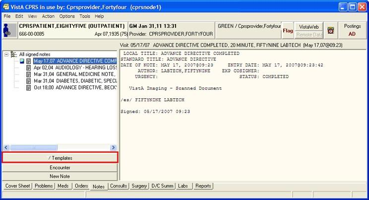

**The Templates Drawer**  
1.  Click the Templates drawer  
The available templates will appear.

1.  Select the template that you would like to use (click the + to expand a heading)  
1.  Drag the template into the detail area of the note  
\-or- double click on the template

\-or-

right click on the template and select Insert Template.

**Note:** If the provider has an NPI, it will not display on the screen below.

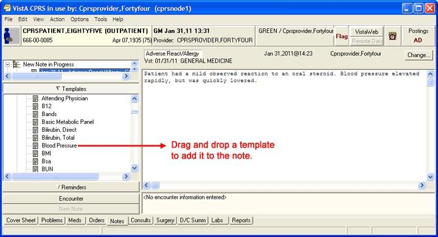

**Drag the template into the detail area of the note**  
### Searching for Templates

Searches for templates used to take some time, but changes included with CPRS v.27 should improve the template search speed.

To search for a template, use the following steps:

1.  Right-click in the tree view (in either the Template Editor or the Templates drawer).  
1.  Select the appropriate option: Find Templates, Find Personal Templates, or Find Shared Templates (depending on which tree view you are in).  
A search field will appear.

**Note**: You may want to narrow your search by using the Find Options feature.

1.  Enter the word or words you want to find and check the appropriate boxes.  
1.  Select Find.  
**Note:** If the search lasts longer a few seconds, a dialog displays letting the user know that CPRS is still looking for the template. This dialog has an animation of a flashlight and there is a Cancel button is the user wishes to cancel the search.

1.  If you do not find the template you want, scan the list or select Find Next.  
1.  Repeat step 5 until you find the desired template.  
### Previewing a Template

To preview a template before inserting it into your document, follow these steps:

1.  Right-click the template in the Templates drawer on the Notes tab.  
1.  Select Preview/Print Template.  
The preview dialog will appear.

**Note**: You can print a copy of the template by pressing the Print button.

### Deleting Document Templates

To delete a document template, follow these steps:

1.  Click the Notes, Consults, or D/C Summ tab.  
1.  Select Options \| Edit Templates  
\-or-

if the Templates drawer is open, right-click in the drawer and select **Edit Templates**.

1.  Find the template you want to delete. (Click the + sign to expand a heading.)  
1.  Right-click the template you want to delete and select Delete. -or- select the template you want to delete and then click the Delete button under the tree view.  
1.  Click Yes to confirm the deletion.  
## Creating Personal Document Templates

To speed document creation, you can create personal templates consisting of text, Template Fields, and Patient Data Objects. You can use the templates to create progress notes, complete consults, and write discharge summaries.

### Personal Template

To create a personal document template, follow these steps**:**

1.  Click the Notes, Consults, or D/C Summ tab.  
1.  Start the Template Editor by selecting Options \| Create New Template  
\-or-

Select the text that you would like to save as a template, right-click the text, and select **Copy into New Template**.

1.  Type in a name for the new template in the Name field under Personal Template Properties.  
**Note:** Template names must begin with a letter or a number, be between 3 and 30 characters in length (including spaces), and cannot be named "New Template."

1.  Click the drop-down button in the Template Type field and select Template.  
1.  Enter the content for the template by copying and pasting from documents outside CPRS, typing in text, and/or inserting Template Fields.  
**Note**: After you enter the content, you can right-click in the Template Boilerplate area to select spell check, grammar check, or check for errors (which looks for invalid Template Fields).

1.  Place the template in the tree view in the desired location. (To do this, click the plus sign next to an item to view its subordinate objects and then drag and-drop the template to its desired location. You can also move the template by using the arrows below the personal templates tree view.)  
1.  Click Apply to save the template.  
1.  Click OK to save and exit the editor.  
**Note**: You are not required to click Apply after each template, but it is recommended. If you click Cancel, you will lose all changes you have made since the last time you clicked Apply or OK.

### Group Template

You can create group templates which contain other templates. You can then place the entire group template in the note, which brings in the text and Template Fields from all templates in that group, or expands the tree view in the Templates drawer and places the individual templates under the group template in the note.

To create a personal Group Template, follow these steps:

1.  Click the Notes, Consults, or D/C Summ tab  
1.  Select Options \| Create New Template  
\-or-

Select the text that you would like to save as a template, right-click the text, and select **Copy into New Template.**

1.  Enter a name for the new template in the Name field under Personal Template Properties.  
**Note:** Template names must begin with a letter or a number, be between 3 and 30 characters in length (including spaces), and cannot be named "New Template."

1.  Click the drop-down button in the Template Type field and select Group Template.  
1.  Enter the text and Template Fields to create content in the main text area of the group template, if desired. (You can enter content by copying and pasting from documents outside CPRS, typing in text, and/or inserting Template Fields.)  
**Note:** After you enter the content, you can right-click in the Template Boilerplate area to select spell check, grammar check, or Check Boilerplate for Errors, which looks for invalid Template Fields.

**Note:** You can also create additional templates under the Group Template that you just created. To do this, simply highlight the appropriate group template and click New Template. Then complete the steps for creating a new template outlined above.

1.  Place the template in the tree view in the desired location. (To do this, click the plus sign next to an item to view its subordinate objects and then drag and-drop the template to its desired location. You can also move the template by using the arrows below the personal templates tree view.)  
1.  Click Apply to save the template.  
1.  Click OK to exit the template editor.  
**Note**: You are not required to click Apply after each template, but it is recommended. If you click Cancel, you will lose all changes you have made since the last time you clicked Apply or OK.

### Associating a Template with a Document Title, Consult, or Procedure

Clinical Coordinators and others who are authorized to edit shared templates and who are also members of the appropriate user class (specified in the EDITOR CLASS field, \#.07 of the TIU TEMPLATE file \#8927) may see the Document Titles, Consult Reasons for Request, and/or the Procedure Reasons for Request template folders. These folders allow you to associate a template with a progress note title, a procedure, or a type of consult. After an association is created, the appropriate template content is inserted in either the body of a note (when a new note is started) or in the Reason for Request field (when a new consult or procedure is ordered).

To associate a template with a document title, type of consult, or a procedure, follow these steps:

1.  Create a new template (by following the instructions above for either the personal template or the group template)  
\-or-

edit an existing template by selecting **Options** \| **Edit Templates**….from the Notes, Consults, or D/C Summ tab.

1.  Click the Edit Shared Templates check box located in the lower left hand corner of the Template Editor window.  
1.  Select the template you would like to associate from the Personal Templates section of the Template Editor window.  
1.  Drag and drop the template into either the Document Titles, Consult Reasons for Request, or Procedure Reasons for Request folder in the Shared Templates area of the window.  
1.  Select the template that you just moved (click “+” to expand a heading) in the Shared Templates area of the window.  
1.  Select a procedure from the Associated Procedure drop-down list  
\-or-

select a consult service from the Associated Consult Service drop-down list.

1.  Click OK.  
The template is now associated.

When you order a consult or a procedure, the associated template text will appear in the Reason for Request field. When you enter a new progress note the associated template text will appear in the text of the note.

### Importing a Document Template

You can import existing template files (.txml), Microsoft Word files (Word 97 or higher), or XML files into the CPRS Template Editor.

To import a template, follow these steps:

1.  Start the Template Editor.  
1.  Browse to the file cabinet or folder where you would like to store the imported template (click “+” to expand a heading).  
**Note**: To import a template to the Shared Templates area of the screen, you must be authorized to edit shared temples *and* place a checkmark in the Edit Shared Templates check box (located in the lower left side of the Template Editor).

1.  Select Tools \| Import Template.  
1.  Select the file you would like to import and click Open.  
1.  The template will appear in the Template Editor.  
1.  If you press OK, the template will be imported without the new fields. If you press Cancel, the import process will be cancelled.  
**Note**: If you do not have authorization to edit template fields, you may see this dialog.

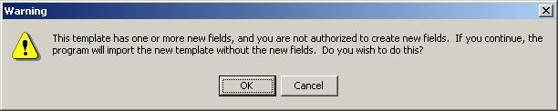

**The template field warning dialog**  
### Exporting a Document Template

You can also export a template or a group of templates with the Template Editor. Exported templates are saved with the .txml file extension.

**Note**: Patient data objects are not exported with a template.

To export a template or a group of templates, follow these steps:

1.  Start the Template Editor.  
1.  Select the template or group of templates (file cabinet) that you would like to export.  
1.  Select Tools \| Export Template.  
1.  Choose a destination and file name for the template file.  
1.  Click Save.  
### Dialog Template

Dialog templates contain other templates. If there is more than one template, each template under a dialog template will have a check box next to it when the template is placed in a document. A single template under a dialog template will not have a check box. Pressing the OK button inserts the dialog element into the note.

If you double-click a dialog template or drag it onto the note, a dialog appears. The dialog shows the text for each template preceded by a check box.

Click the box to check which items are to be included in the note. You can click All to select all of the elements or None to start over. Click OK when you have completed your selection.

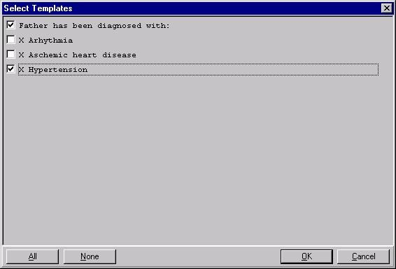

**A dialog template**  
To create a personal Dialog Template, follow these steps:

1.  Select Options \| Create New Template on the Notes, Consults, or D/C Summ tab to bring up the Template Editor  
\-or-

Select the text that you would like to save as a template, right-click the text, and select **Copy into New Template.**

1.  Enter a name for the new template in the Name field under Personal Template Properties.  
**Note:** Template names must begin with a letter or a number, be between 3 and 30 characters in length (including spaces), and cannot be named "New Template."

1.  Click the drop-down button in the Template Type field and select Dialog.  
1.  Enter the text and Template Fields to create content in the main text area of the template, if desired. You can enter content by copying and pasting from documents outside CPRS, typing in text, and/or inserting Template Fields.  
**Note:** After you enter the content, you can right-click in the Template Boilerplate area to select spell check, grammar check, or Check Boilerplate for Errors, which looks for invalid Template Fields.

**Note:** You can also create additional templates under the Group Template that you just created. To do this, simply highlight the appropriate group template and click New Template. Then complete the steps for creating a new template outlined above.

1.  Place the template in the tree view in the desired location. (To do this, click the plus sign next to an item to view its subordinate objects and then drag and-drop the template to its desired location. You can also move the template by using the arrows below the personal templates tree view.)  
1.  Click Apply to save the template.  
1.  Click OK to exit the template editor.  
**Note:** You are not required to click Apply after each template, but it is recommended. If you click Cancel, you will lose all changes you have made since the last time you clicked Apply or OK.

### Reminder Dialog

Templates can be linked to Reminder dialogs that are listed in the TIU Reminder Dialogs parameter. This enables you to use templates to place orders, enter PCE information, and enter vital signs and mental health data. If there are no Reminder Dialogs in the TIU Reminders Dialog parameter, the Reminder Dialog template type will not be available.

To create a Reminder Dialog, follow these steps:

1.  Select Options \| Create New Template… on the Notes, Consults, or D/C Summ tab.  
The Template Editor will appear.

1.  Type in a name for the new template in the Name field under Personal Template Properties.  
**Note:** Template names must begin with a letter or a number, be between 3 and 30 characters in length (including spaces) and cannot be named "New Template."

1.  Click the drop-down button in the Template Type field and select Reminder Dialog.  
1.  Click the drop-down button in the Dialog field and select the Reminder Dialog desired.  
1.  Place the template in the tree view in the desired location. (To do this, click the plus sign next to an item to view its subordinate objects and then drag and-drop the template to its desired location. You can also move the template by using the arrows below the personal templates tree view.)  
1.  Click Apply to save the template.  
1.  Click OK to exit the editor.  
**Note:** You do not have to click Apply after each template, but it is recommended because if you click Cancel, you will lose all changes you have made since the last time you clicked Apply or OK.

### Folder

Folders are simply containers that allow you to organize and categorize your templates. For example, you might want to create a folder for templates about diabetes or one for templates about mental health issues.

To create a personal template folder, complete the following steps:

1.  Select Options \| Create New Template on the Notes, Consults, or D/C Summ tab to bring up the Template Editor  
\-or-

Select the text that you would like to save as a template, right-click the text, and select **Copy into New Template**.

1.  In the Name field under Personal Template Properties, enter a name for the new folder. For ease of use, you should create a name that describes the content of the template.  
1.  Click the template type: Folder.  
1.  Drag-and-drop relevant templates into the template folder that you have created.  
**Note**: It is recommended that you click Apply after adding a template to save your changes. If you accidentally click Cancel, you will lose all the changes you have made since the last time you clicked Apply or OK.

### View Template Notes

Template Notes can be used to describe what is in the template or to track changes to the template.

To add or display Template Notes, follow these steps:

1.  Click the **Notes** tab.  
1.  Click Options *\|* Edit Templates.  
1.  Select the shared or personal template for which you wish to add or change the Template Notes.  
1.  Click the Show Template Notes check box at the bottom of the dialog. The *Template Notes* field appears below the *Template Boilerplate* field.  
1.  Add or change the note as much as you wish.  
**Note**: If the template you wish to edit is a shared template and you have the authority to edit it, you will need to click the Edit Shared Templates check box on the lower left corner of the Template Editor dialog.

To add or display Template Notes from the Template Drawer, complete the following steps:

1.  Select **Options** \| **Edit Templates…** from the Notes, Orders, or D/C Summ tab.  
The Template Editor will appear.  
1.  Select the shared or personal template for which you wish to add or change the Template Notes.  
1.  Click the Show Template Notes check box at the bottom of the dialog. The *Template Notes* field appears below the *Template Boilerplate* field.  
1.  Add or change the note as much as you wish.  
**Note**: If the template you wish to edit is a shared template and you have the authority to edit it, you will need to click the Edit Shared Templates check box on the lower left corner of the Template Editor dialog.

### Copying Template Text

To copy text from a template to any text field, complete the following steps:

1.  Open a new note, consult or discharge summary.  
1.  Select a note, consult or discharge summary title.  
1.  Click the **Notes** tab  
1.  Click the Templates drawer button.  
1.  Expand either the Shared Template or Personal Templates tree.  
1.  Right-click the desired template.  
1.  Click **Copy Template Text** (or press Control+C) to copy the text to the clipboard.  
**Note:** You can paste the copied text into any text field by right clicking in the desired field and selecting Paste.

## Template Fields

Template fields allow you to create text edit boxes and lists of text that can be selected via combo boxes, buttons, check boxes, or radio buttons. Through a new type of markup syntax {FLD: TemplateFieldName}, these controls can be added to templates, boilerplate titles, boiler plate reasons for request, and reminder dialogs. A Template field editor has also been added that can be used by members of the ASU user classes listed in the new TIU FIELD EDITOR CLASSES parameter.

You can access the template field editor through the options menu on Notes,

Consults and D/C Summaries tabs, as well as through the new Template Editor

Tools menu. There is also a new Insert Template Field menu option in the Template Editor, following the Insert Patient Data Object menu option. You can enter free text into Template Field Combo boxes.

Template Dialogs will now show an asterisk (\*) before required template fields (as well as highlight them if enabled), and will not allow you to press the OK button if you have not completed the required fields. A message has also been added at the bottom of the template dialogs that states “\* Indicates a Required Field.”

Template Fields can also be used in boilerplate text that can be associated to a new Note, Consult, or Discharge Summary.

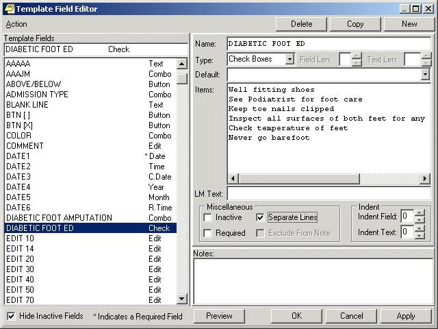

**The Template Field Editor**  
When you click the Preview button, you can view how the template dialog will appear. Since the Separate Lines check box is enabled on the Template field Editor dialog, the check box items on the preview are listed on a separate line. You can mark these fields as required if desired. Template Field Preview forms are resizable.

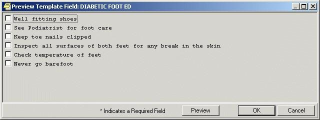

**You can use the Preview button to preview a template dialog**  
### Using the Template Field Editor

You can reduce the time required to complete a note, consult, or discharge summary by adding template fields to your templates and dialogs. Information that you would normally have to look up can be pulled directly into your note, consult, or discharge summary from the template fields in your templates.

To view the predefined characteristics of the template fields:

1.  Select the **Notes**, **Consults**, or **D/C Summ** tab.  
1.  Select Options \| Edit Template Fields.  
1.  Select the desired template field in the Template Fields list on the left side of the dialog. The field is copied to the Name field on the right side of the dialog and all of the existing elements of the field are displayed.  
1.  Click Preview to see how the Template Field will appear on a template or click **OK** to complete the procedure.  
To create a new template field:

1.  Select the Notes, Consults, or D/C Summ tab.  
1.  Select Options \| Edit Template Fields.  
1.  Select **New**.  
1.  Type a unique name for the new template field.  
1.  Select a Type:  
-   Edit Box  
-   Combo Box  
-   Button  
-   Check boxes  
-   Radio buttons  
-   Date  
-   Number  
-   Hyperlink  
-   Text  
-   Word Processing  
1.  Fill in the necessary fields, such as the type of date, any default value that should appear, or minimum and maximum numbers.  
1.  Add the necessary text or items.  
1.  Select Preview to see how the item will look, and then close the Preview box.  
1.  If it is satisfactory, select Apply to save and stay in the Template Field Editor or select OK to save and exit the editor.  
If Edit Box is selected, type or select a number between 1 and 70 into the Maximum Number of Characters field. If Combo Box, Button, Check Boxes or Radio Buttons are selected as the Type, the Default field and Maximum Number of Characters fields are unavailable. The Items field and the Default field below Items are active.

The Default field below the Type field is available only when Edit Box is the Type selected. Type the text that you wish to have appears in the Edit Box by default. On the template, the user can accept the default text or change it, as long as the new text is within the Maximum Number of Characters limit.

If the Type is Combo Box, Button, Check Boxes, or Radio Buttons, the Items field will be active. Type the different choices from which you wish to let the user choose. Each item must be on a separate line in the Items field. However, if you wish to have the Items listed on separate lines in the template, you must enable the Separate Lines check box.

If the Type is Combo Box, Button, Check Boxes, or Radio Buttons, the second Default field will be active. If you wish, you may click the drop-down button and select one of the items as the default.

If you wish, you may type text in the LM Text field and it will appear in the List Manager version. Template Fields have been developed strictly for GUI functionality. If you are still using LM, the text {FLD: TEMPLATE FIELD NAME} will appear in LM body of the note. To avoid this, type text in this field.

If the field being created on the template is required, enable the Required check box, which will prevent the template from being closed without the field being selected or completed.

You may include text in the Notes field that will explain or describe the Template Field. You may also use it to record changes that have been made to the Template field. The text typed into this field will not appear on the template. These notes will not appear to a user when entering a note. They are for development use only as notes to the creator.

Click Preview to see how the Template Field will appear on a template or click OK to complete the procedure.

### Inserting Template Fields into a Template

Once you have decided which Template fields to use or you have defined the Template Field that you need, you can add them into a template. With the Template field in the Template, you can quickly and easily select the items you wish to add to a note, consult or discharge summary.

Developers added two new template fields to CPRS v.27 to enable sites to better serve their visually impaired users:

-   Screen Reader Stop Code  
-   Screen Reader Continue Code  
Screen readers work by speaking text and labels on dialogs and forms presented to the user. The screen reader will stop when it gets to a control, such a drop-down box or some other item. These codes will allow the users who create templates at the sites to control when the screen reader needs to stop and when it would be better for it to continue. For example, if in the template, the user needs to enter a number, but some explanatory text after the number is needed, the Screen reader Continue Code will enable the template creator to make the screen reader continue reading to give the visually impaired user all the information he or she needs. Another example would be some text that normally would not be read until a button received focus.

These codes enable template creators to more tightly control what is read when the screen reader is running. When it is not, they will not have the effect. Template creators will need to work with visually impaired users to ensure the templates are reading correctly.

To add a Template Field into a Template:

1.  From the Notes, Consults or D/C Summ tab, click Options \| Edit Templates... or Create Templates, Edit Shared Templates, or Create New Shared Template...  
1.  From the Template Editor, select the template to which you wish to add a Template Field.  
1.  Insert the cursor at the place in the Template Boilerplate field where you wish to insert the Template Field.  
1.  From the toolbar, click Edit \| Insert Template Field or right-click in the template and select Insert Template Field.  
1.  On the Insert Template Field dialog, type the first few letters of the desired field or scroll through the list until the desired field is located.  
1.  Click the field you wish to insert.  
1.  Click Insert Field.  
1.  Repeat steps 5 through 7 for each additional Template Field you wish to insert.  
1.  Click Done when you have added all of the desired template fields.  
1.  From the tool bar, click Edit \| Preview/Print Template or right-click in the template and select Preview/Print Template. This will preview the template. If the template does not display with the desired appearance, you may continue to edit it.  
1.  On the Template Editor dialog, click OK to save the changes to the template.  
**Note**: The Insert Template Field dialog is non-modal and can be used as a boilerplate if desired.

**Navigating Template Required Fields**  
To aid in the completion of template dialogs, a navigation bar is available to assist with finding and completing “required” fields. This navigation bar will allow the user to quickly access all required fields in the template dialog. The navigation bar provides a count of all unanswered required fields and provides navigation buttons to allow the user to jump directly to the required field. In addition to the \* used to identify required fields, all incomplete required fields will be highlighted within the template. Once the required field is filled in, the counter will reduce and the highlight for the field will be removed.

**Note:** Sites can decide to turn off these additional features for required fields. If you do not see these features, it could be that the features, they could be disabled.  

**This progress note template shows required fields with asterisks and yellow highlighting. On this dialog, there is a Required Fields without Values field and a navigation bar.**  
**Required Fields Settings**  
Users can set preferences for the navigation bar location (Top, Left, Right, and Bottom) and whether the new highlight feature displays and the highlight color.

**Navigation Bar Location:** The user can set the navigation bar position in three ways:

-   a context menu (right-click menu) on the navigation bar itself, then select the location  
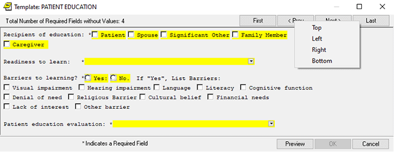  
**Right-click on the Navigation bar to select where it displays.**  
-   a context menu (right click menu on the main dialog, then select Set Highlighting Preferences, then select the location on the dialog that displays (This method and the following one bring up the same dialog.)  
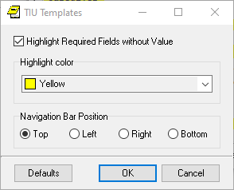  
**Users can select Required Fields preferences.**  
-   Going to Tools \|Options \| Notes tab, then select the Required Fields button, and then selecting the location.  
**Enable/Disable Highlight and Setting the Highlight Color:** The user can enable or disable the highlight and navigation bar features in two ways:

-   The user also can enable/disable the highlighting within the template by accessing the Right Click (Context) menu associated with the body of the template, the user will see an option to Highlight Required Fields. When checked highlighting is enabled, while when it is unchecked the highlighting is disabled. The user can also select the highlight color.  
-   Another way to bring up the dialog is to select Tools \|Options \| Notes tab and then select the Required Fields button  
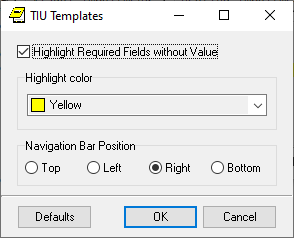

Here, you will be able to enable/disable highlighting, change the highlight color, and change the Navigation Bar position.

**Auditing Copying and Pasting into Clinical Documents**  
To improve clinical documentation, CPRS now enables individuals designated by medical centers to review clinical documents to audit how much text within the documents has been copied and pasted from another location.  
**Note:** This feature is new with CPRS GUI v31b and patch TIU\*1.0\*290. Only documents created after the installation of these patches will have copied and pasted text tracked.  
***

Excessive copying and pasting has at least these impacts on healthcare:  
-   unnecessary duplication of information  
-   lengthening of notes and making chart reading more difficult  
-   slowing the retrieval of notes by the workstation  
-   improving accuracy of the note and the patient information  
***

To help sites better audit what text is copied and pasted into clinical documents, CPRS defines  
-   who can view pasted text  
-   what constitutes tracked pasted text  
-   how CPRS will display pasted text  
-   how the person auditing can turn on or off the display of pasted text  
-   how the auditor can view the pasted text  
***

**Who Can View Pasted Text?**  
In CPRS, pasted text can be viewed by the document author and cosigner before signature. When the note is signed, the displayed text becomes a part of the note and is no longer visible to the author or cosigner unless they belong to one of the user classes that the site has designated to be able to view pasted text.  
After signature, only individuals assigned to specific User Classes will be able to view text that has been copied and pasted. With CPRS v31b, three User Classes are assigned to be able to audit copying and pasting by defaults:  
-   CHIEF, MIS  
-   CHIEF, HIMS  
-   PRIVACY ACT OFFICER  
***

In addition, sites can give other user classes the ability to view copy/paste data.  
**What Constitutes a Tracked Paste?**  
If a user pastes text into a clinical document within CPRS, CPRS will track that as a paste if it meets several criteria. When a user copies information within CPRS, CPRS will store characteristics about the copied text if it is available, such as the title and author of the document it came from, or whatever information it can about the source. The information gathered when text is copied can then be displayed if the text is pasted.  
If text is copied from outside of CPRS or it is altered after being pasted into CPRS, the source information may simply read “Outside of current CPRS tracking,” meaning that CPRS does not know where it came from.  
**Character Limits for Pasted Text**  
A 20,000-character limit is hard-coded for tracking the source of a paste. If a paste exceeds 20,000 characters, CPRS will not try to track the source. It will still show on the report and the percentage will be calculated as discussed below. So, the text is tracked, but the source is not determined.  
***

**Other Copy/Paste Characteristics that Sites Can Set**  
There are several criteria that determine whether a copy and paste will be tracked or displayed with identifying marks in CPRS. Sites have some control over how these criteria are set. The criteria are as follows:  
-   **Minimum Number of Words:** To be considered a paste, there must be at least the specified number of words. For example, if it is set at 15 words and a user pastes 14, CPRS will not identify it as a paste. The default is 5 words.  
-   **Percentage Check:** Because providers often edit text after it is pasted, CPRS checks what percentage of the original paste is in the document. For example, if this percentage is set at 85 percent and the user pastes some text but then edits it so that only 75 percent of the original text remains, it will not display as pasted text. The default is 90% unless changed by your site.  
-   **Role:** Until, the author and cosigner can see highlighted pasted text. After the note is signed, only users in specific user classes will see the pasted text.  
-   **Exclude Note Title:** Site can specify notes that will not be tracked for copy/paste.  
-   **Exclude Application:** Sites can specify that specified applications are not tracked for copy/paste. One application (netspeak.exe) is already included in this parameter.  
***

Clinical Application Coordinators (CACs) set the values for these parameters.  
***

**When Text Will Not Display as Pasted**  
In addition to these parameters, certain actions will determine whether pasted text displays in CPRS with its identifiers.  
-   **After Signature:** While the author of a note is writing the note or editing it, CPRS will identify pasted text with highlighting or other methods as set by the user, if it meets the criteria above. If the author or cosigner of the document signs the document and they are not in the designated user class that can view pasted text, the pasted text will no longer be identified for them as pasted. In other words, if it is highlighted, it will no longer be highlighted and the area showing the pastes will not display it. The pastes can still be identified to auditors in CPRS.  
-   **Within the Same Note:** When text is copied and pasted from within the same note.  
-   **Lines with 2 words or less:** Lines with 2 words or less are not highlighted, but they are tracked.  
**Setting How Pasted Text Will Display to Auditors, Authors, and Cosigners**  
CPRS has several options to determine how pasted text will display to reviewers, those who are in user classes that can view copied and pasted text. The user can select one method or combine all of them:  
-   Bold  
-   Italics  
-   Underline  
-   Highlight  
***

Auditing users can select to make text bold and italicized or whatever combination or individual text attribute they would like to show that a user pasted it. The user’s selection is stored in a CPRS parameter, but it is set in the CPRS GUI.  
Auditing users can also turn on or off the identifying of copy/paste text in the detailed display so that users can see what was originally pasted with text that was changed highlighted, or the feature can be turned off. The edited text is in the body of the note, while the original text is marked in the detailed display.  
**To set what characteristics will indicate text that has been pasted into a clinical document, use these steps:**  
1.  In CPRS, bring up the Options dialog by selecting **Tools \| Options**.  
1.  Select the Copy/Paste tab.  
1.  Under the “How text is identified on the note” section, select which attributes or combination of attributes you want to identify pasted text by checking the box for each attribute:  
Bold  
Italics  
Underline  
Highlight  
***

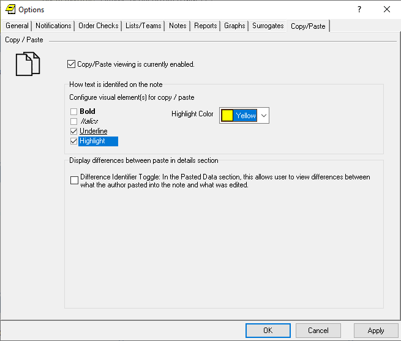  
From the Tools \| Options dialog on the Copy/Paste tab, the auditing user can choose any combination of the way CPRS should display the options.  
***

1.  If you select Highlight, you may also use the default color or choose a different color. To select a different color, select the drop-down arrow and choose the color:  
Black  
Maroon  
Green  
Olive  
Navy  
Purple  
Gray  
Silver  
Red  
Lime  
Yellow  
Blue  
Fuchsia  
Aqua  
White  
***

1.  If you would like to see in the detailed display the original text that was replaced, check the Display differences between what was paste in details pane check box.  
1.  When done, select OK.  
***

**Auditing Pasted Text in Clinical Documents**  
When a user is in the appropriate user class, the user can view pasted text in signed notes according to the parameters the site has set for what constitutes pasted text. For authorized users, the notes will display with a Pasted Data pane. In this pane are two areas: a listing of all items that were pasted into the note. The items are identified as New before the note is saved or signed and by the date after it is saved or signed.  
When the user selects an item by the date, the text of the paste displays in a pane next to the list of pastes. Also, the text displays as a pasted in the way the user selected (bold, highlighted, underlined, italicized, or a combination of these attributes).  
***

  
This screen capture shows a progress note on the Notes tab. The person viewing the note is in a class that enables them to see pasted text. The Pasted Data pane enables the user to select items that have been pasted so that they can be reviewed.  
***

**To view pasted text in CPRS, use these steps:**  
1.  On the Notes tab, if you have been assigned as a user who can audit and there is text that has been pasted into the note you are viewing, you will see a new Pasted Data pane below the main note pane.  
1.  To view what text has been pasted, select an item from the list under Pasted Data by clicking it or tabbing to it.  
1.  When an item is highlighted, such as when the user selects a date, the pasted text will display in the pane to the right of the list and it will be displayed as the user defined on the Notes tab of the Options dialog. In the pane to the right of the Pasted Data List, the user can see the following information about the pasted text:  
**Date:** The date the paste was made  
**User:** Which user pasted the data  
**From:** The Source (if VistA the source will be known, if from outside VistA, it may just read from outside)  
**Copied from Patient:** This will tell what patient the data was copied from if known.  
**Percentage:** What percentage of the original text was pasted.  
**Pasted Text:** This displays the text that was pasted. This is especially useful for user who might have visual difficulties.  
***

1.  To view other pasted entries, simply select the appropriate item (or date) in the list.  
***

# Consults

Consults are requests from one clinician to a hospital, service or specialty for a procedure or other service.

The Consults process involves the following steps. A single individual or service does not take all of the steps.

1.  The clinician orders a consult. From within the patient’s CPRS medical record, the clinician enters an order for a consultation or procedure. The ordering clinician may first have to enter Encounter Information.  
1.  The consult service receives an alert and a printed SF 513. The receiving service can then accept the consult, forward it to another service, or send it back to the originating clinician for more information.  
1.  The consult service accepts or rejects the consult request. To accept the consult, the service uses the receive action. The service can also discontinue or cancel the consult. Cancelled consults can be edited and resubmitted by the ordering clinician. A consult service clinician sees the patient.  
1.  The consult service enters results and comments. Resulting is primarily handled through TIU.  
1.  The originating clinician receives a CONSULT/REQUEST UPDATED alert that the consult is complete. The results can now be examined and further action taken on behalf of the patient.  
1.  The SF 513 report becomes part of the patient’s medical record. A hard copy can be filed and the electronic copy is on line for paperless access.  
1.  Results from the Medicine package can be attached to complete consults involving procedures. This function is available through the GUI for the Consults package, but will only be seen when the supporting Consults patch GMRC\*3.0\*15 is installed. The absence of these patches will result only in the function not being present.  
1.  If Consults patch GMRC\*3.0\*18 has been installed, the Edit/Resubmit action is available for cancelled consults. The consult must be “resubmittable” and the user must be authorized to resubmit consults.  
1.  The Consults tab has a list of consults in a tree view similar to the ones found on the Notes tab and the Discharge Summary tab. However, the list view feature is not available due to differences in the tabs functions. Consults are differentiated from procedures in the tree by the type of icon displayed. Consults are represented by a notepad, while procedures are represented by a caduceus-like symbol.  
1.  Right-click in the Consults text and you may select the “Find in Selected Consult” option from the popup menu. This option allows you to search the displayed text. A “Replace Text” option is also available, but it is only active when a consult is being edited.  
1.  The field below the list of consults displays a list of documents related to the highlighted consult or procedure. These related documents are also in a tree view.  
**Note:** If the provider has an NPI, it will not display on the screen below

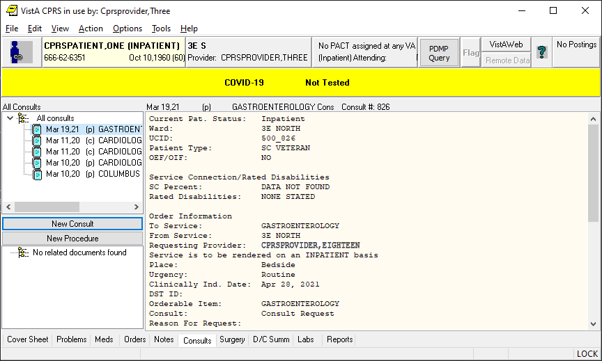

**The Consults tab**  
## Changing the View on the Consults tab

Changing the view of the Consults tab allows you to focus the list of consults on one of several criteria. Focusing the list will speed up the selection process. You may change the Consults view to only include the following problems:

-   All Consults  
-   Consults by Status  
-   Consults by Service  
-   Consults by Date Range  
To change the view, click View on the menu and select the desired list items.

You may select the Custom list option on the menu to further focus the list of notes you wish to have displayed. From the List Selected Consults dialog, you may choose to display consults by any combination of service, status, and date range. You can also group your results by consults versus procedures, by service, or by status.

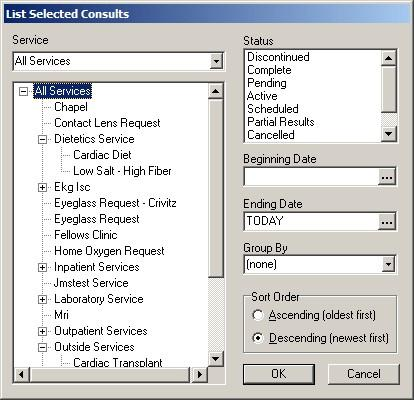

**From the List Selected Consults dialog, you may choose to display consults by any combination of service, status, and date range**  
The Consults tab on the Icon Legends dialog includes a description and explanation of the different icons that appear on the Consults tree view. To access the Icon Legend, click View \| Icon Legend and the click the Consults tab.

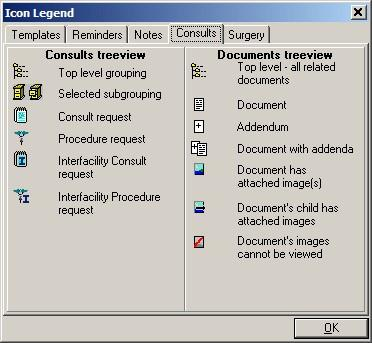

**The Consults tab on the Icon Legends dialog includes a description and explanation of the different icons that appear on the consults tree view**  
## Ordering Consults

You can order a consult or procedure from either the Consults or the Orders tab. As you fill in the options, the consult request will be displayed in the text box at the bottom center of the dialog.

The list of Consults has been changed to a tree view. Consults are distinguished from procedures in the tree by the icon displayed in the tree. Consults are represented by a notepad, while procedures are represented by a caduceus-like symbol.

**Note:** If the provider has an NPI, it will not display on the screen below.

**Consults and procedures are listed on the Consults tab**  
## Viewing Consults

To view the consults or procedures for the selected patient, use the steps below. When you select a specific consult, you will see an area that lists any notes associated with the consult. You can also click a note entry to view the full text of the note.

The All Consults list box shows the date, status (p=pending, c=complete, dc=discontinued, and x=cancelled), and title of each consult. An asterisk preceding the title tells you that there are significant findings for that consult.

To view consults, follow these steps:

1.  Select the Consults tab.  
1.  Select the consult you would like to view from the All Consults list.  
The text of the consult will appear in the details pane. Any notes associated with that consult or procedure will appear in the Related Documents pane. To view the text of a related note, click on the note.

**Note**: The All Consults list shows the date, status (p=pending, c=complete, dc=discontinued, and x=cancelled), and title of each consult. An asterisk preceding the title tells you that there are significant findings for that consult. If a note listed in the related documents pane is a CP-class document, the *Date/Time Performed* and *Procedure Summary Code* fields will appear in the full text of the document.

Below is an example of a detailed display of a Consult

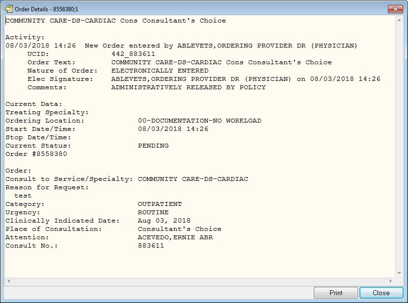

**This screen capture shows a detailed view of a consult**  
**Note:** If the provider has an NPI, it will not display on the screen above

## Tracking Consult Requests

When CPRS displays a request for a new consult, the user can take several actions from the Consult Tracking menu item:

-   **Receive\*** – When the request arrives at the specified service, the designated person, such as a clerk, can use Receive to change the consult status to active.  
-   **Schedule** – The service can schedule a consult, which makes the consult available to be resulted.  
-   **Cancel (Deny)** – A consult service may cancel or deny a consult request because of incomplete information or for some other reason. The consult requester is then notified that the consult was canceled so that the requester can take appropriate action.  
-   **Discontinue\*** – The user can discontinue a consult if it is no longer needed.  
-   **Forward\*** – The user can forward a consult if the user is not the appropriate person for the consult.  
-   **Add Comment\*** – The user can add comments and designate to whom the comment should go in an alert.  
-   **Significant Findings\* –** The user can add significant findings and designate them as such.  
-   **Administratively Complete\*** **–** Allows completion of a consult without creation of a new progress note.  
*\* These actions are supported by the Consult Toolbox, which automates and assists the user’s ability to enter common actions. Right click in the comment area and select the desired type of action.*

### Using the Consult Toolbox Functions

The Consult Toolbox provides user functionality in the “Receive Consult,” “Add Comment to Consult,” and “Discontinue Consult” dialogs in CPRS. To activate any of these functions, choose the item under the Action menu on the CPRS Consults tab, and the CPRS dialog for that action will open. If you have enabled automation, the appropriate Consult Toolbox action screen will then automatically open. If the Consult Toolbox hasn’t been automated, the box will open normally. To manually open the consult toolbox, right click in the dialog’s Comment area.

When the Consult Toolbox displays, the user can select from a number of possible comments listed to document what action the user took. As the user selects items in the Consults Toolbox, text is entered into the comment dialog box.

Add Comment example:

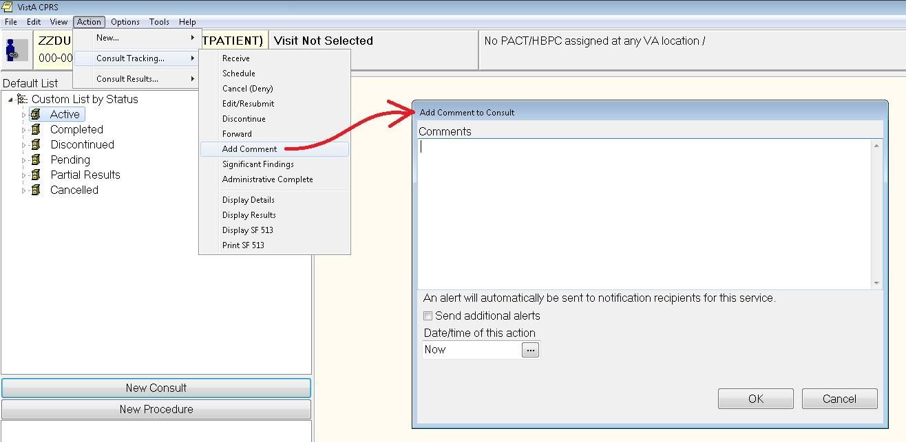

Add Comment to Consult example (with right mouse button clicked):

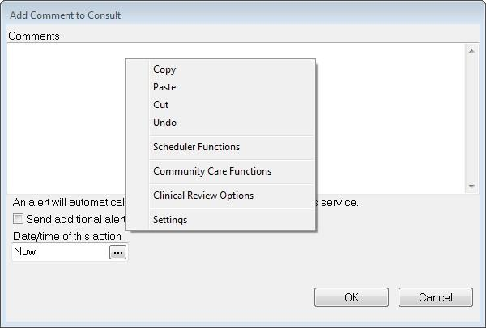

Note that you can also access the settings screen with a right mouse click in the comment area of the CPRS box.

Discontinue Consult Examples:

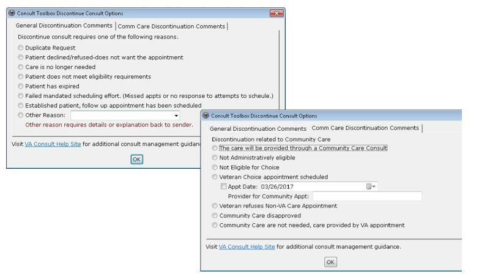

Similar functionality exists for Consult Forwarding (to community care), Significant Results, and for Administratively Complete.

For more information regarding how users can configure and use the Consult Toolbox, please use the link below to find the Consult Toolbox User Manual:

KMS site (you may need to sign in with PIV): REDACTED

### Alerts

Many of the above actions send an alert to the recipients for the service and/or back to the requester to let them know that the status of the request has changed or that some has taken some action on the request.

CPRS alert recipients follow these rules:

-   When a user takes an action on a consult that generates an alert, that individual should not receive the alert.  
-   If an ordering provider, that is a member of a consult team, takes an action on a consult, the alert should be sent to the consult team and not to the ordering provider.  
-   If an unrestricted access user, that is not the ordering provider or a member of the consult team, acts on a consult, the alert should be sent to both the consult team and the ordering provider.  
## Complete a Consult or Clinical Procedure the Consults Tab

**Note:** Until Clinical Procedures 1.0 is released, completion of all consults and procedures will continue to function as it does currently. After the installation and implementation of Clinical Procedures 1.0, any procedure defined as a Clinical Procedure will be completed using a document from the "Clinical Procedures" TIU class, which has some unique properties. In addition, to complete a Clinical Procedure, a person must be defined as an interpreter (update user) for the consult service to which the Clinical Procedure was directed.

To complete a consult from the Consults tab, complete the following steps:

1.  Select the Consults tab.  
1.  Select Action \| Consult Results \| Complete/Update Results.  
**Note**: If this visit is undefined, you will be prompted for encounter type and location, clinician, date, and type of visit, such as Ambulatory, Telephone, or Historical.

1.  In the Consult Note Properties dialog, select Progress Note Title (e.g., General, SOAP, Warning, etc.). For titles that require entry of a cosigner, another field will display where the user can enter the information.  
**Note:** If the provider has an NPI, it will display on the screen below. See the "National Provider Identifier (NPI) Display in CPRS section for an example of an NPI displaying on a screen

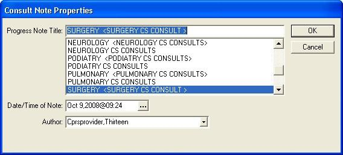

**In the Consult Note Properties dialog, the user selects the items for the note that will complete the consult, including the Note title, the date and time (if not when the user began the note), and the author, which should default to the user if the user is a provider**  
1.  If necessary, change the note date by selecting the button next to the date and entering a new date or by typing in a new date and time directly in the field.  
1.  If necessary, change the note author by selecting the author from the Author drop-down list.  
1.  Enter any additional information, such as an associated consult or an expected cosigner. Completing these steps will allow the note to be automatically saved.  
**Note:**  Occasionally a problem occurs if a cosigner’s access lapses and they have become “disusered.” If this occurs, you can click OK and proceed with that selection or click Cancel and choose another cosigner.

1.  Select OK.  
1.  Create your note by typing text, using templates, and including any test results.  
**Note:** If you need to view the consult details while writing a note, bring up the popup menu by right-clicking in the note editing pane and choosing View Consult Details or using the shortcut Shift+Ctrl+U.

1.  From the Action menu, select either **Sign Note Now** or **Save without Signature**.  
**Note:** The *Date/Time Performed* and *Procedure Summary Code* fields must also be completed on the first CP document that completes the procedure request. Completing the *Date/Time Performed* and *Procedure Summary Code* fields is optional on subsequent CP documents.

## Ordering a New Consult from the Consults Tab

To create a new consult from the Consults tab, complete the following steps:

1.  Go to the Consults tab.  
1.  Select the New Consult button.  
1.  If the Provider and Location for Current Activities dialog opens, fill in the Visit Location and other information, and select OK.  
1.  Select a service from in the Consult to Service/Specialty window.  
When you select the Consult Service or Specialty, several things may happen:

-   If the service has some prerequisites, a dialog will display stating what those are and will allow you to print the information, continue to place the consult order, or cancel the order.  
-   In addition, any predefined text or template will display to help the user fill out the Reason for Request field.  
-   The Provisional Diagnosis field becomes active as well.  
1.  Select the urgency from the Urgency field.  
1.  Select the person to whom you are sending the consult from the Attention field.  
**Note:** To help you distinguish between providers, CPRS displays their titles (if available). When two or more providers have identical names, CPRS also displays:

o The service/section and site division (if any) associated with these providers; site divisions are displayed based on the following rules:

-   When no division is listed for a provider, no division is displayed.  
-   If only one division is listed, this division is displayed.  
-   If the site has multiple divisions or more than one division is listed **and** one of these listed divisions is marked as Default, CPRS displays the division marked as Default.  
-   If more than one division is listed for a provider and none is marked as Default, CPRS does not display division information for this provider.  
o Providers who are listed in the New Person file as Visitors are screened out from the provider list. (These screened-out providers are listed as Visitors because their entries were created as a result of a Remote Data View.)

1.  If necessary, enter a different Clinically Indicated Date.  
**Note:** The Clinically Indicated Date field does not apply to Prosthetics consults services, and the field is not available when the user selects a Prosthetic service.

1.  Select whether the consult is for an inpatient or an outpatient.  
1.  Select the Place of Consultation from the list.  
1.  Enter a Provisional Diagnosis  
For each consult, this field is either set up to require that

-   The user type in an answer (the box will be white and the Lexicon button unavailable), or  
-   The user must select a response from the Lexicon (the field will be yellow and the Lexicon button is available).  
-   CPRS will search for diagnoses that contain the search term. The matching terms will display in the bottom portion of the Problem List Lexicon Search dialog. The search now looks for SNOMED Concepts Terms (SNOMED CT) items. Most items will also be mapped to an ICD-9-CM code. The list will show the SNOMED concept text, the SNOMED code, and the ICD-9-CM code if the term is mapped to one.  
-   If you do not see the appropriate problem listed, select the Extend Search button. On the Consults tab, the Extend Search button extends the search to the ICD-9-CM clinical hierarchy to find additional terms.  
**Note:** If a user tries to enter a diagnosis with an inactive code, CPRS will bring up a message indicating that the code must be changed and giving the user the chance to choose a diagnosis with and active code.

-   Beginning on October 1, 2014, CPRS will use ICD-10-CM codes when providers use the Lexicon to enter a provisional diagnosis for new consult requests.  
1.  Fill in a Reason for Request.  
Sites can help users by putting in predetermined boilerplate text, text with TIU objects, and/or it could be linked to a template that users can fill out. Users can then add to the text already present. Or the field may be left blank for the user to fill in the reason. However, a reason for request is required and the consult cannot be saved without a reason for request.

1.  Select Accept Order.  
1.  If finished ordering consults for this patient, select Quit.  
You may sign the order now from the Orders tab or wait until later.

## Requesting a New Procedure from the Consults Tab

To request a new procedure from the Consults tab, complete the following steps:

1.  Select the Consults Tab.  
1.  Select the New Procedure button.  
1.  If the Provider & Location for Current Activities dialog opens, fill in contact information, and select OK.  
1.  Locate and select the procedure in the Procedure list.  
When you select the Consult Service or Specialty, several things may happen:

-   If the service has some prerequisites, a dialog will display stating what those are and will allow you to print the information, continue to place the consult order, or cancel the order.  
-   In addition, any predefined text or template will display to help the user fill out the Reason for Request field.  
-   The Provisional Diagnosis field becomes active as well.  
1.  Select the urgency from the Urgency field.  
1.  Select an individual from the Attention field.  
**Note:** To help you distinguish between providers, CPRS displays their titles (if available). When two or more providers have identical names, CPRS also displays:

-   The service/section and site division (if any) associated with these providers; site divisions are displayed based on the following rules:  
-   When no division is listed for a provider, no division is displayed.  
-   If only one division is listed, this division is displayed.  
-   If the site has multiple divisions or more than one division is listed and one of these listed divisions is marked as Default, CPRS displays the division marked as Default.  
-   If more than one division is listed for a provider and none is marked as Default, CPRS does not display division information for this provider.  
-   Providers who are listed in the New Person file as Visitors are screened out from the provider list. (These screened-out providers are listed as Visitors because their entries were created as a result of a Remote Data View.)  
1.  If needed, designate a different Clinically Indicated Date.  
**Note:** The Clinically Indicated Date field does not apply to Prosthetics consults services, and the field is not available when the user selects a Prosthetic service. If necessary, select a service that will perform the procedure by using the down arrow to open the list and then selecting the service.

Often, the service is already defined. However, sometimes, the user has the chance to choose.

1.  Select whether the patient is an inpatient or outpatient.  
1.  Select a place of consultation from the Place of Consultation drop-down list.  
1.  Enter a provisional diagnosis in the Provisional Diagnosis field.  
For each procedure, this field is either set up to require that

-   the user type in an answer (the box will be white and the Lexicon button unavailable), or  
-   the user must select a response must be from the Lexicon (the field will be yellow and the Lexicon button is available).  
-   CPRS will search for diagnoses that contain the search term. The matching terms will display in the bottom portion of the Problem List Lexicon Search dialog. The search now looks for SNOMED Concepts Terms (SNOMED CT) items. Most items will also be mapped to an ICD-9-CM code. The list will show the SNOMED concept text, the SNOMED code, and the ICD-9-CM code if the term is mapped to one.  
-   If you do not see the appropriate problem listed, select the Extend Search button. On the Consults tab, the Extend Search button extends the search to the ICD-9-CM clinical hierarchy to find additional terms.  
**Note:** If a user tries to enter a diagnosis with an inactive code, CPRS will bring up a message indicating that the code must be changed and giving the user the chance to choose a diagnosis with and active code.

-   Beginning on October 1, 2014, CPRS will use ICD-10-CM codes when providers use the Lexicon to enter a provisional diagnosis for new procedure requests.  
1.  Enter a reason for this request in the Reason for request field.  
Sites can help users by putting in predetermined boilerplate text, text with TIU objects, and/or it could be linked to a template that users can fill out. Users can then add to the text already present. Or the field may be left blank for the user to fill in the reason. However, a reason for request is required and the consult cannot be saved without a reason for request.

1.  Select Accept Order. Enter another order  
**-or-**

select **Quit**.

**Note:** The order must be signed before it is sent. You can either sign the order now or wait until later.

### Forwarding a Consult

At times, a clinician or service might receive a consult and decide that the consult should be done by someone else. In this case, the user can forward the consult to the appropriate user. To forward a consult, the user can enter the following criteria

-   The service to which the consult should be sent (required)  
-   Any needed comments (optional)  
-   The Urgency (required)  
-   When the action is taken (optional , Now is default)  
-   Who is responsible for the action (who made the decision to forward the consult—required)  
-   To whom the consult will be forwarded, if known (optional)  
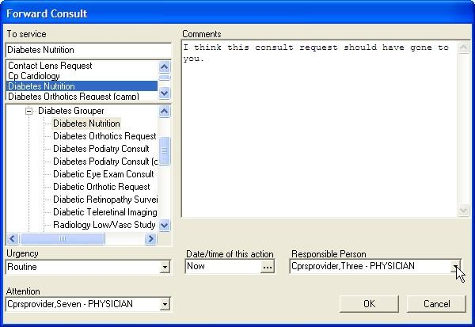

**From the Forward Consult dialog, the user enters the necessary information to send the consult to a more appropriate service or person**  
**Note:** If the provider has an NPI, it will display on the screen above. See the "National Provider Identifier (NPI) Display in CPRS section for an example of an NPI displaying on a screen.

To forward a consult, use these steps:

1.  If not already on it, go to the Consults tab by selecting the tab or choosing View \| Chart tab \| Consults (or Ctrl + t).  
1.  In the Forward Consult dialog under To service, select the consult service to which the consult will be sent. Type in some letters in the service name and scroll to find it, and use the plus sign to expand grouper items.  
1.  Add comments if needed.  
1.  Select the Urgency from the drop-down list.  
1.  Select the date and time of the action (forwarding). The default is Now.  
1.  Select the Responsible Person (the person who made the decision to forward the consult.) This is a required field.  
1.  In the Attention field, select the name of the person to whom the consult should go, if known. Otherwise, this can be left blank.  
## HCP RAS Consult Communication Error Message

The Austin FSC Healthcare Claims Processing (HCP) Referral & Authorization System (RAS) depends on specific text elements appearing in certain consult templates. If these templates are modified by a site, the messaging between RAS and VistA Consults/Request Tracking can be disrupted.

In Consults, a MailMan error message is generated when there is a communication issue between RAS and VistA. This message has been improved to include the HCPS support mail group as a recipient. In addition, the message body will now include the consult number and facility name from where the consult originated. These new elements will assist HCPS support with more rapid resolution of communication errors.

## COMMUNITY CARE Direct Schedule or Administrative Consults

CPRS users who hold the security key OR ADMIN RBP TO CC are able to create and release a Community Care direct schedule or administrative consult order without possessing the ORES provider security key. The consult service order will start with Community Care (case-insensitive), and contain either –DS or –ADMIN

(case insensitive). The consult order will be auto-signed as "Administratively Released by Policy" and released to the service as soon as the order has been accepted. The consult order will appear on the Orders tab with status "pending".

Ordering a COMMUNITY CARE –DS or ADMIN Consult Using the ADMIN Key:

1.  On Consults tab of CPRS, click on New Consult. The Provider & Location for Current Activities dialog box displays.  
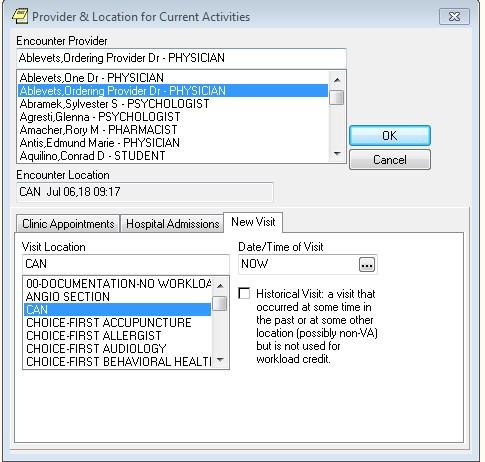

1.  Select a provider from the Encounter Provider section.  
1.  From the New Visit tab, select a location from the Visit Location section.  
1.  Click OK. The Order a Consult dialog box displays.  

**Note:** If a provider has an NPI, it will display on the screens listed in instructions \#1 and \#4 above. See the "National Provider Identifier (NPI) Display in CPRS section for an example of an NPI displaying on a screen.

1.  From the Consult to Service/Specialty section, select the Community Care Direct Schedule or Administrative specialty required. A consult template displays.  
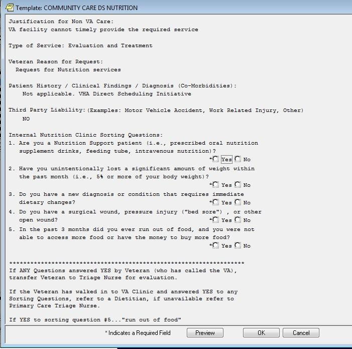

1.  Complete the consult template.  
***

1.  Click OK. The completed fields display in the Reason for Request of the Consult Order Dialog.  
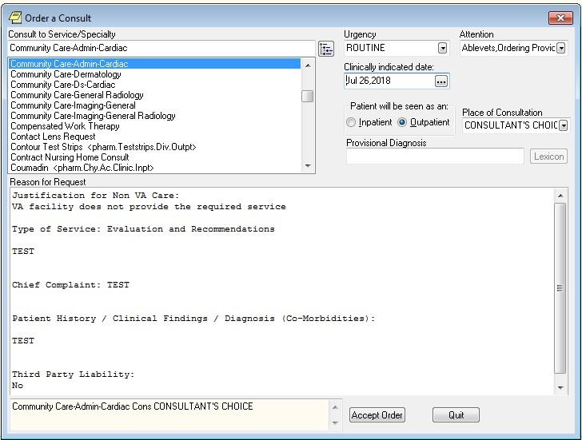

1.  Complete all required order dialog fields.  
1.  Click Accept Order. The consult is created on the Consults tab of CPRS.  
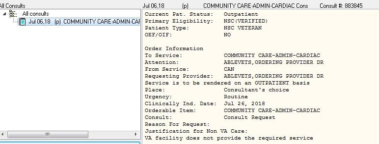

1.  Select the **Orders** tab in CPRS. The new order will show as pending in bold or unreleased in blue.  
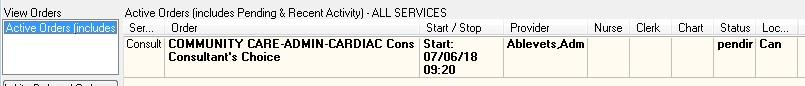

1.  Click File\>Refresh Patient. The Review/Sign Changes dialog box displays.  
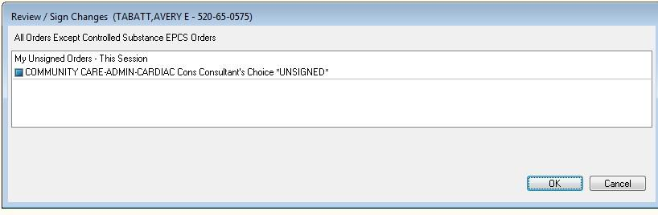

**NOTE**: Select New Patient and Review/Sign Changes will also cause this dialog box to display, as would exiting CPRS.

1.  Click OK to refresh the screen. The Status column now displays as pending and is no longer bold font.  
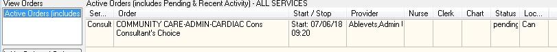

**NOTE**: There are some users that hold both the OR ADMIN RBP TO CC and the OREMAS security keys. In this case the **Review/Sign Changes** dialog box is slightly different.

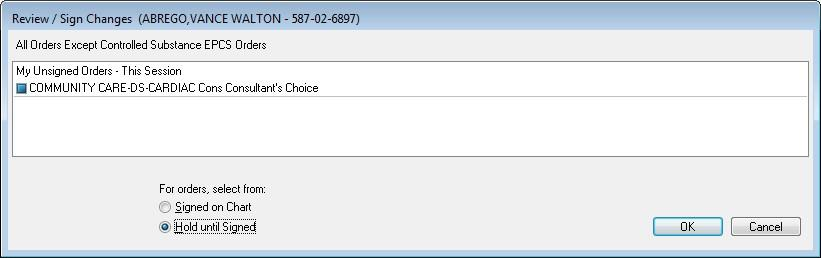

1.  Select the Hold until Signed radio button.  
1.  Click OK to refresh the screen.  
Discontinuing a COMMUNITY CARE -DS or -ADMIN Consult with the Admin Key:

|   | Discontinuing a Consult should always be done on the Consults tab. NEVER ATTEMPT TO DO THIS ON THE ORDERS TAB  |
|---------------------------------------------------------|----------------------------------------------------------------------------------------------------------------|

1.  From the **Consults** tab in CPRS, click on the consult in the left-hand panel to select it.  
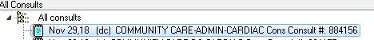

1.  From the Action menu, select Consult Tracking, and then Discontinue. The Discontinue Consult: Comments dialog box displays.  
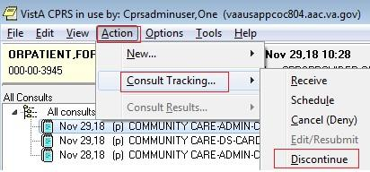

1.  In the Discontinue Consult dialog box, enter comments in the Comments field.  
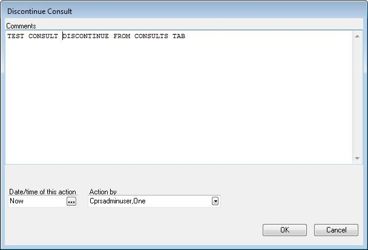

1.  Click **OK**. The consult detail now shows that the consult has been discontinued.  
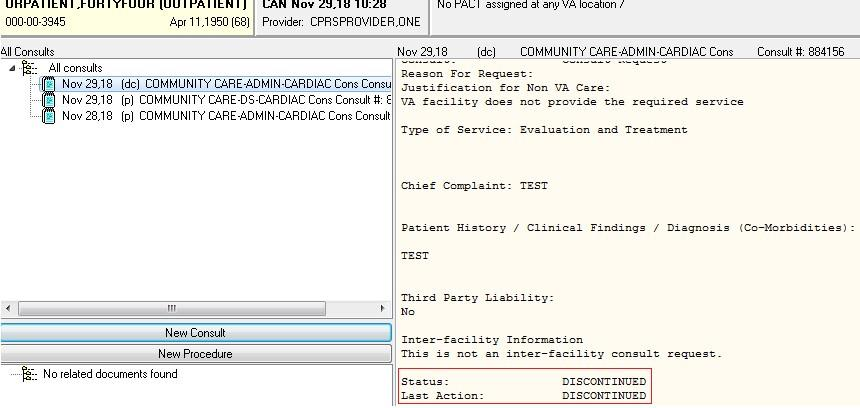

**NOTE**: The Admin Key can be used in conjunction with other security keys and there are several scenarios for this process. To see detailed steps to create and discontinue Community Care -DS and -ADMIN consults see Admin Key Training Guide (VDL\>CPRS: Consult/Request Tracking\>oc_adminkey_tg.docx).

## Unique Consult ID (UCID) Display

When a user clicks on a Consult Order on the CPRS Orders tab, and right-clicks to show the Order Details, the display will now show the Unique Consult ID (UCID) which is in file \#123 (REQUEST/CONSULTATION) in field \#80 (UNIQUE CONSULT ID). The UCID is a tracking number used by Community Care.

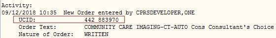

Also, when a user clicks on the Consult detail on the CPRS Consults tab, the UCID will display:

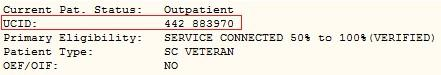

# Surgery Tab

**Note:** Display of the surgery tab is controlled by the parameter ORWOR SHOW SURGERY TAB, which can be set at the User, Division, or System level.

Depending on the configuration of your site and your access permission, the CPRS Surgery tab may be visible. The Surgery tab allows you to view signed operative reports generated in the VistA Surgery package. These reports include the Operation Report, Nurse Intraoperative Report, Anesthesia Report, and Procedure Report (Non-O.R.).

The following graphic shows the icon legend and the various icons on the Surgery tab and their meanings.

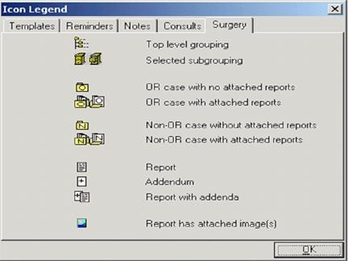

**This tab of the icon legend defines the surgery icons**  
To view a surgery report, follow these steps:

1.  Select the **Surgery** tab.  
1.  Select a report title from the All Surgery Cases section of the window. Click the “+” sign to expand a heading (if necessary).  
1.  The text of the report will be displayed in the right side of the window.  
**Note:** If the provider has an NPI, it will not display on the screen below

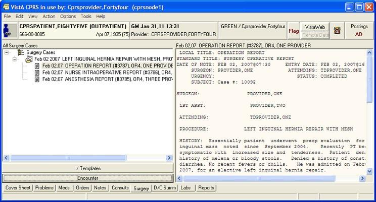

**A report displayed on the CPRS Surgery tab**  
To search a surgery report for specific text, follow these steps:

1.  Select the **Surgery** tab.  
1.  Select a report title from the All Surgery Cases section of the window.  
1.  Right-click in the right-hand section of the window.  
1.  Select Find in Selected Document.  
1.  Type in the text you wish to find in the “Find what” field of the Find dialog box.  
1.  Select Find Next.  
1.  The appropriate text will be highlighted if it is found in the surgery report.  
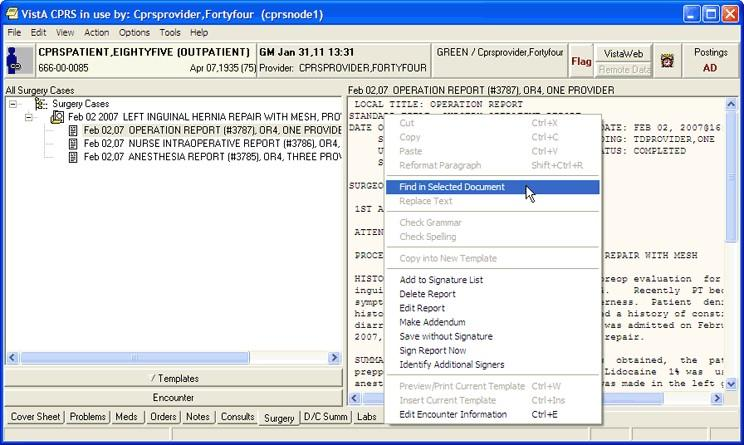

**To find specific text in a surgery report, right-click in the right-hand section of the window**  
## Customizing the Surgery Tab

You can limit the surgery cases that appear on the Surgery tab. You can specify that only surgery cases from a specific date or date range appear on the tab, or you can specify that all available surgery cases appear.

To limit the surgery cases displayed to a specific date range, follow these steps:

1.  Select the **Surgery** tab.  
1.  Select View \| Custom View.  
The List Selected Cases dialog box appears.

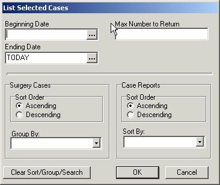

**The List Selected Cases dialog**  
1.  Select a beginning date by selecting in the appropriate field and doing one of the following:  
-   entering a date (e.g. 6/21/01 or June 21, 2001).  
-   entering a date formula (e.g. t-200).  
-   pressing the  button to bring up a calendar.  
1.  Select an ending date by selecting in the appropriate field and doing one of the following:  
-   entering a date (e.g. 6/21/01 or June 21, 2001).  
-   entering a date formula (e.g. t-200).  
-   pressing the  button to bring up a calendar.  
1.  Enter a maximum number of occurrences in the Max Number to Return field.  
1.  Select a surgery case sort order (ascending or descending).  
1.  Select a category to group the surgery cases by (from the Group By dropdown list).  
1.  Select a case report sort order (ascending or descending).  
1.  Select a category to sort case reports by (from the Sort By drop-down list).  
1.  Select **OK**.  
1.  The appropriate surgery cases will appear in the left side of the screen.  
1.  Click the “+” sign to expand a heading (if necessary).  
To view all the surgery cases for a patient, follow these steps:

1.  Select the Surgery tab.  
1.  Select View \| All Cases.  
## Signing a Surgery Report

Depending on the configuration of your site and your access permission, you may be able to sign certain surgery reports.

To sign a surgery report, follow these steps:

1.  Select the Surgery tab.  
1.  Select a surgery report from the All Surgery Cases section of the window.  
1.  Select Action \| Sign Report Now…  
**-or-**

right click in the right-side of the window and select **Sign Report Now**.

1.  Enter your electronic signature code.  
1.  Select Sign.  
## Creating Surgery Report Addenda

Depending on the configuration of your site and your access permission, you may be able to make addenda to certain surgery reports.

To make an addendum to a surgery report, follow these steps:

1.  Select the **Surgery** tab.  
1.  Select a surgery report from the All Surgery Cases section of the window.  
1.  Select Action \| Make Addendum…  
1.  Type the text for the addendum.  
# Discharge Summary

Discharge Orders are sets of orders to be placed for a patient when checking out of the hospital. The Discharge Summary tab gives you quick access to the Discharge Summary for a specific patient. The list of documents in the D/C Summ tab is in a tree structure instead of a simple list. Highlight any discharge summary listed in the left field to view the text of the summary in the right field. Addenda are separately selectable and are displayed as a page with a plus sign behind a note page (See highlight below.) Discharge Summaries with Addenda have a clickable plus sign. Hold the mouse pointer over a listing to see the entire line of the listing. The Discharge Summary that is highlighted is displayed on the right.

Right-click in the Discharge Summary text and you may select the “Find in Selected Summary” option from the popup menu. This option allows you to search the displayed text. A “Replace Text” option is also available, but it is only active when a discharge summary is being edited.

Click the View and Action menus to see the available options. Double click the plus sign to expand the list. Once expanded, any discharge summary may be selected and viewed.

You can also click the New Summary button to create a Discharge Summary. You may also have to enter encounter information if the visit has not been defined.

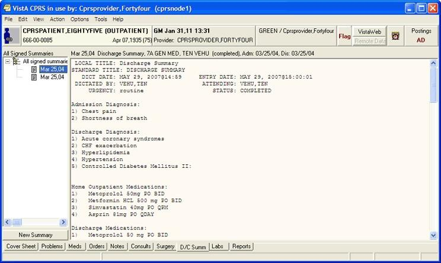

**Discharge Summaries are listed on the D/C Summ tab**  
Select a grouping node (for example "All signed notes") in the tree to display a second list of all the documents falling under that grouping node. This second list can be sorted by clicking on the column headings (Date, Title, Author, Location).

## Changing Views on the Discharge Summaries Tab

Changing the view of the Discharge Summary tab allows you to focus the list of summaries on one of several criteria. Focusing the list will speed up the selection process.

You may change the Discharge Summaries List view to only include the following summaries:

-   Signed Summaries (All)  
-   Signed Summaries by Author  
-   Signed Summaries by Date Range  
-   Uncosigned Summaries  
-   Unsigned Summaries  
To change the view, click View on the menu and select the desired list items.

The Custom View dialog (**View \| Custom View**) has been greatly expanded, allowing the items in the tree to be grouped and sorted in a variety of ways. All custom view selections can be saved as the user's default view (**View \| Save as Default View**).

**Note:** If the provider has an NPI, it will display on the screen below. See the "National Provider Identifier (NPI) Display in CPRS” section for an example of an NPI displaying on a screen.

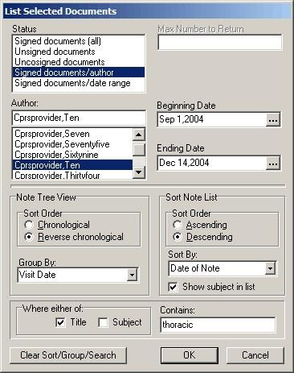

**The List Selected Documents dialog**  
To view a discharge summary, use these steps:

1.  Select the D/C Summ tab.  
1.  Select the summary in the list box.  
1.  To sort the list, select View and the appropriate choice below:  
-   Signed Summaries (All)  
-   Signed Summaries by Author  
-   Signed Summaries by Date Range  
-   Uncosigned Summaries  
-   Unsigned Summaries  
-   Custom View  
**Note**: To set one of these views as the default, select **View** \| **Save as Default**.

1.  Locate the summary and select it.  
## Writing Discharge Summaries

You can enter discharge summaries through CPRS. The document templates and TIU titles that your site can create should make creating these documents much faster and easier.

To write a discharge summary, use these steps:

1.  Select the D/C Summ tab.  
1.  Select New Summary or select Action \| New Discharge Summary.  
**Note**: If this visit is undefined, CPRS prompts for encounter type and location, clinician, date and type of visit, such as Ambulatory, Telephone, or Historical.

1.  In the Discharge Summary Properties dialog, select Discharge Summary Title (e.g., General, SOAP, Warning, etc.). Additional items will appear on the dialog for titles that require entry of a cosigner or an associated consult.  
1.  If necessary, change the note date by clicking the button next to the date and entering a new date.  
1.  If necessary, change the note author by selecting the author from the Author drop-down list.  
**Note:** To help you distinguish between providers, CPRS displays their titles (if available). When two or more providers have identical names, CPRS also displays:

o The service/section and site division (if any) associated with these providers; site divisions are displayed based on the following rules:

-   When no division is listed for a provider, no division is displayed.  
-   If only one division is listed, this division is displayed.  
-   If the site has multiple divisions or more than one division is listed **and** one of these listed divisions is marked as Default, CPRS displays the division marked as Default.  
-   If more than one division is listed for a provider and none is marked as Default, CPRS does not display division information for this provider.  
o Providers who are listed in the New Person file as Visitors are screened out from the provider list. (These screened-out providers are listed as Visitors because their entries were created as a result of a Remote Data View.)

1.  Enter the attending physician.  
1.  Select the admission related to this Discharge Summary.  
1.  Enter any additional information, such as an expected cosigner. Completing these steps will allow the note to be automatically saved.  
**Note:** For a Discharge Summary, if a user requires a cosigner (such as a student or other type of clinician), that user’s name should not appear in the list of potential cosigners. Also, occasionally a problem occurs if a cosigner’s access lapses and they have become “disusered.” If this occurs, you can click OK and proceed with that selection or click Cancel and choose another cosigner.

1.  Select **OK**.  
1.  Create the summary content by typing in text, copying and pasting, and/or inserting templates into the document.  
1.  Select the template drawer if it is not open.  
1.  Locate the appropriate templates.  
1.  Double-click the template (You can also drag-and-drop or right-click the template and select Insert Template) and modify as needed.  
1.  When finished entering text, you may (optional) right-click in the text area and select Check Spelling and Check Grammar.  
1.  When complete, decide when you will sign the summary and choose the appropriate option.  
1.  Click **Add to Signature List** (to place it with other orders or documents you need to sign for this patient). You can also click Save Without Signature or Sign Discharge Summary Now to sign the summary immediately.  
# Labs

On the Labs tab, you can view the results of lab tests that were ordered for a selected patient. Ordering of lab tests is performed on the Orders tab. The Cover Sheet tab displays results of some of the patient’s most recent orders. Some of the lab reports are also found on the Reports tab. The fields on the left side of the Labs tab list available lab results. For some reports, you may need to specify a date range or other criteria. Some reports will prompt for specific tests to be displayed.

**Note:** If the provider has an NPI, it will not display on the screen below.

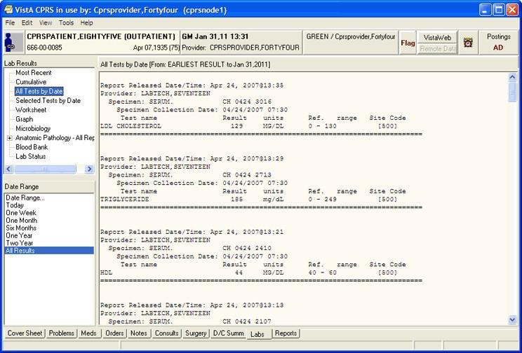

**The Labs tab**  
## Display of Laboratory Test Results

Through CPRS, you can review lab test results in many formats. Based on user feedback, CPRS has made some changes to the Labs tab display, including adding two new reports, replacing one report, a new order for items in the Lab Results pane, and some changes to the display of the reports.

### New Reports

Two new items have been added:

-   Lab Overview (Collected Specimens)  
-   Pending Lab orders.  
### Changed Report

The Lab Status report has been replaced by the Lab Orders (All) report.

### New Order for Items in the Lab Results Pane

With CPRS version 30.B, the order of reports in the Lab Results pane, where the users select which lab report they want to view, is different. The two new reports will be the top two items listed—unless your site has customized the order of the items.

#### Order of Items before v.30.B:

-   Most Recent  
-   Cumulative  
-   All Tests by Date  
-   Selected Tests by Date  
-   Worksheet  
-   Graph  
-   Microbiology  
-   Anatomic Pathology – All Reports  
-   Blood Bank  
-   Lab Status  
#### Nationally Released Order of Items after 30.B

-   Lab Overview (Collected Specimens)  
**Note:** The first item in the list could be different at your site. A new parameter enables sites to set which report they want to appear first in the list. This will also affect the data that displays when the user first goes to the Labs tab.

-   Pending Lab Orders  
-   Most Recent  
-   All Tests by Date  
-   Selected Tests by Date  
-   Worksheet  
-   Graph  
-   Microbiology  
-   Anatomic Pathology – All Reports  
-   Blood Bank  
-   Lab Orders (All)  
-   Cumulative  
**Note:**  Items in bold have changed order. The two new reports are the first two items in the list and Cumulative has moved to the bottom. Lab Orders (All) is new and replaces the Lab Status report.

#### New Date Range Selection Buttons

CPRS has two ways to select the date range for Lab reports. The first way is by using the date pane in the lower left corner of the labs tab when a report is selected as shown below. In this screen capture, the nationally released order for the reports is displayed in the Lab Results pane.

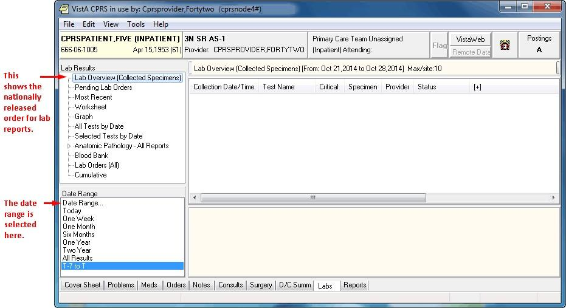

The second way, added with CPRS GUI v.30.B, enables sites to set a parameter to instead have the date ranges set using radio buttons above the main data pane. In the screen capture below, the parameter to have a different report at the top of the Lab Results pane has also been set.

**Note:** If the provider has an NPI, it will not display on the screen below.

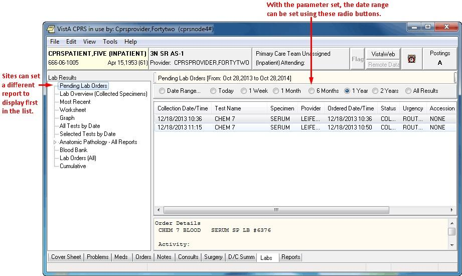

#### 

#### Viewing Laboratory Test Results

To view lab test results, use these steps:

1.  Select the Labs tab.  
1.  In the Lab Results pane, select the type of results you want to see.  
For some selections, you must determine which test results you want to see. If the Select Lab Test dialog appears, you need to choose the tests you want to see.

1.  If necessary, select the tests for which you want to see the results.  
1.  Also, you may need to choose a date range (Today, One Week, Two Weeks, One Month, Six Months, One Year, Two Years, or All Results.)  
### Lab Order (Collected Specimens)

The Lab Order (Collected Specimens) report will show which Lab Order have been collected.

### Pending Lab Orders

This report shows items that are pending so that healthcare givers will know what lab orders are pending so that others are not ordered.

### Most Recent

On the Labs tab, the Most Recent shows the latest lab test and allows the user to move back through the most recent results or items collected. In this dialog, the most recent lab data are listed in the pane. The provider uses four buttons to move to the Oldest, Previous, Next, and Newest. The test’s collection date and time (if there is one) is displayed as the first item in the list. It also displays microbiology results and any comments on the collection.

**Note:** Some lab tests can have a collection date but no collection time. In this case, CPRS displays on the date between the Previous Collected and Next buttons.

Each test then displays the following:

-   The Collection Date/Time  
-   Test name  
-   Result/Status  
-   Flag (L for abnormal low, H for abnormal High, and each may have an asterisk (\*) if the result is critical)  
-   Units  
-   Reference range  
Additional information includes the specimen type, accession number, and the provider who ordered the lab test, the report release date and time, and the name of the lab performing the test.

Clicking on a lab test will display a graph for all results of that particular test.

**Note:** If the provider has an NPI, it will not display on the screen below.

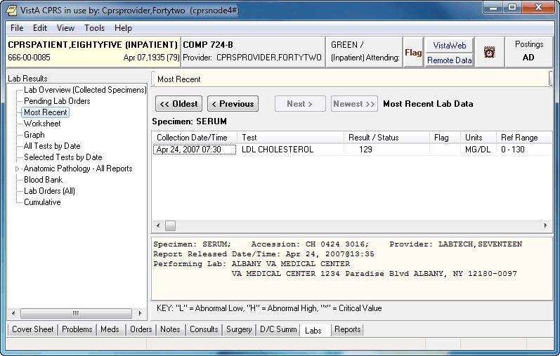

**The most recent lab data are displayed for the selected patient**  
### Worksheet

The Worksheet is similar to the Selected Test by Date report. It does not display microbiology results, but it has many features for viewing lab results. It is very useful for displaying particular types of patterns of results.

Tests can be selected individually or by test groups. Any number of tests can be displayed. When selecting a panel test, such as CBC, the panel will be expanded to show the individual tests. Tests can be restricted to only display results for a specific specimen type. For example, displaying glucose results only on CSF can be accomplished by selecting the specimen CSF and then selecting the test Glucose.

Test groups allow you to combine tests in any manner. For example, a test group could combine CWBC, BUN, Creatinine, and Platelet count. You can save those test groups for later use. You can also select test groups that other users have created. You cannot exchange or delete other’s test groups, only your own. Test groups are limited to seven tests, but you may have an unlimited number of test groups. To define your own test groups, select those tests you want and click the New button. If more than seven tests are selected, the New button will be disabled. If you want to delete a test group, deselect it and click the Delete button. If you want to replace an existing test group with other tests, select the test group, make any changes to the tests to be displayed and click the Replace button.

**Note**: These test groups are the same as those you may have already created using the Lab package. The seven-test restriction is a limitation of the Lab package.

**Note:** If the provider has an NPI, it will display on the screen below. See the "National Provider Identifier (NPI) Display in CPRS” section for an example of an NPI displaying on a screen.

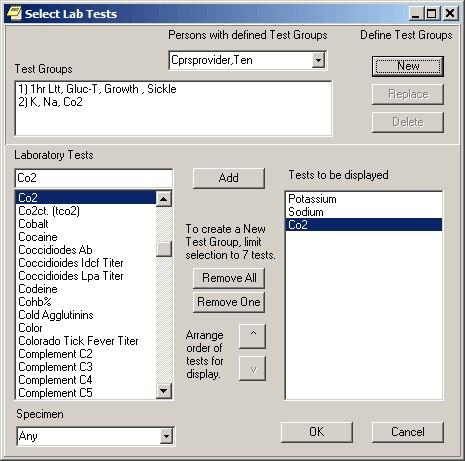

**The Select Lab Tests dialog**  
The Worksheet display is a table of results that can be displayed vertically or horizontally. Since only results are displayed in a table, comments are footnoted with a \*\* and shows in the panel below the table. You can filter the results to only show abnormal values. This will quickly show tests that have results beyond their reference values.

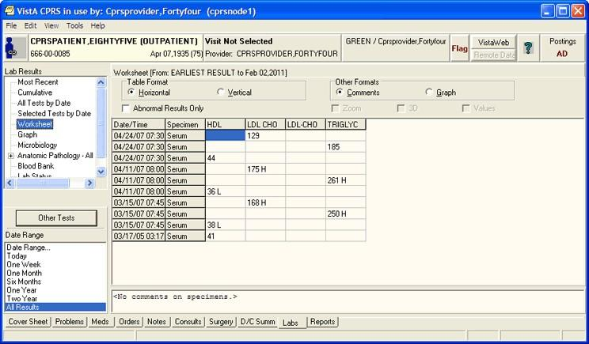

**Lab results displayed on a worksheet**  
You can toggle between view comments and graph view. The graph format displays each test separately. By selecting each test, you see the trend in values for each time range. You may also use features to Zoom, apply 3D, and display values on graph. Zooming is allowed when checking the Zoom check box. You may then click the graph and drag a rectangular area to zoom in on. To undo the zoom feature, you can uncheck the Zoom check box or drag a rectangular area in the upper left corner of the graph and then release the mouse button.

**Note**: Zoom will retain the selected date range when you change to other tests or test groups. This is helpful when you are looking for trends within a given time period.

A right-click on the graph will bring up a pop-up menu with other actions. You can display details of the lab test by right-clicking a point on the graph and then selecting Details. This will display all test values for this collection time. Right clicking on the graph will display all values for the selected test.

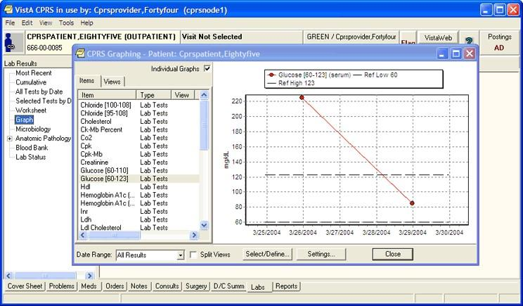

**Glucose (Serum) levels displayed on a graph**  
### Graph

Selecting the Graph option brings up CPRS graphing in a separate window. For more information about graphing, please see CPRS Graphing.

### All Tests by Date

This report displays all lab results (except anatomic pathology and blood bank). The data is displayed in the order of the time of collection.

**Note:** If the provider has an NPI, it will not display on the screen below.

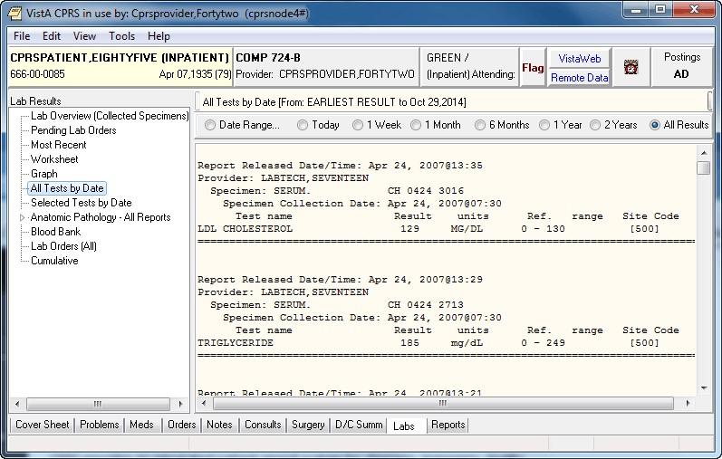

**All lab tests are listed by date**  
### Selected Tests by Date

This report is useful when you only wish to review only specific tests. Microbiology results can also be selected. You will be prompted to select any lab tests. For example, if you select CBC, Chem 7, Lithium, and Liver Profile, only the results for those tests would be displayed.

**Note:** If the provider has an NPI, it will not display on the screen below.

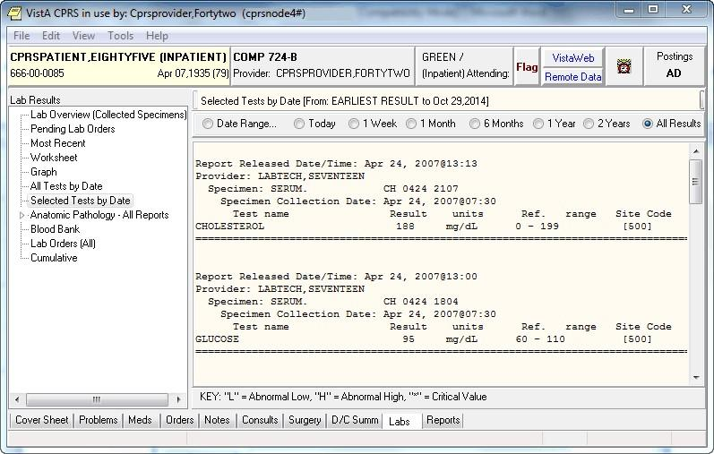

**Test results are displayed for one year**  
#### Microbiology, Anatomic Pathology, Blood Bank

These reports display only the results from these portions of the laboratory.

### Lab Orders (All)

The Lab Order (All) report displays the status on current orders.

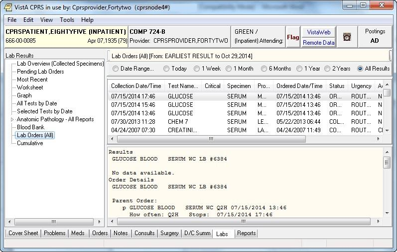

### Cumulative

The cumulative report is the most comprehensive lab report. It displays all of the patient’s lab results. When selecting a large data range, this report may take some time before being displayed. The results are organized into sections. You can automatically scroll to that section by selecting it in the Headings list box.

**Note:** If the provider has an NPI, it will not display on the screen below.

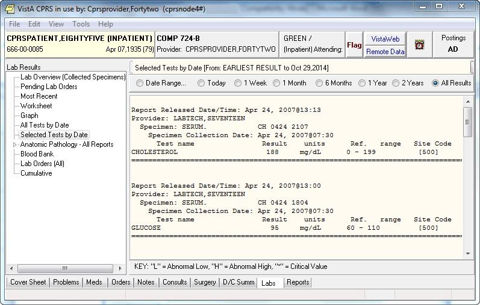

**Cumulative lab results are displayed on the Labs tab**  
## Changing Views on the Labs Tab

The View menu on the Labs tab is different from most of the other tabs in that the menu options do not sort or focus the listed items. The menu items are a way to open different windows and displays with information the clinician may need to see in conjunction with the lab results.

### Demographics

From the Labs tab, click View \| Demographics to display the Patient Inquiry screen of the currently selected patient.

**Note:** If the provider has an NPI, it will not display on the screen below.

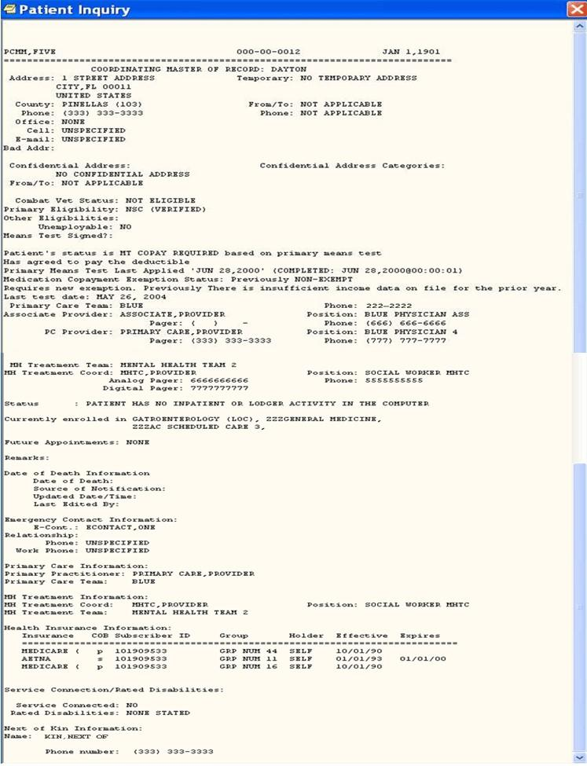

**The Patient Inquiry screen displays demographic data for a patient**  
### Postings

From the Labs tab, click View \| Postings to display the Patient Postings screen of the currently selected patient. The Patient Postings windows displays information about the patient’s allergies, and any Crisis Notes, Warning Notes, and Directives that may apply to the patient.

**The Patient Postings dialog displays Allergies, Crisis Notes, Warning Notes, and Directives, Lactating or Pregnant**  
### Reminders

From the Labs tab, click View \| Reminders to display the Available Reminders dialog for the currently selected patient. The Available Reminders dialog allows you to review all reminders including the ones that apply to the currently selected patient.

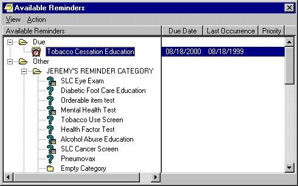

**A patient’s available reminders are displayed on the Available Reminders dialog**  
# Reports

Currently, you can print reports from the Problems, Consults, Labs, Notes, Discharge Summary, and Reports tabs to any VISTA printer defined on the server or to a Windows printer.

You can also now print graphics on a Windows printer from the Labs tab and the Vitals screen. You can use **File \| Print Setup...** to set up a preferred printer for the current session and save it as the default for the user.

The dialog box shown below comes up when you select **File \| Print** from the Notes tab. A similar dialog, without the Chart copy / Work copy option appears for items on other tabs. Many report boxes now have Print button on them to make it easier for you to print the information you need. With most reports you can select a date range and sub-topics to customize your reports.

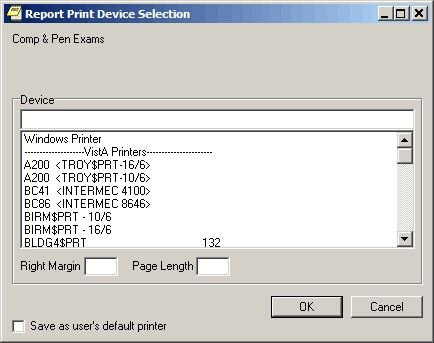

**The Print dialog**  
Normally, you do not need to enter a right margin or page length value. These values are measured in characters and normally are already defined by the device. You will also still have the options to print your regular tasked jobs.

## Viewing a Report

To display a report, follow these steps:

1.  Select the Reports tab.  
1.  See if the text on the Remote Data button is blue. If the text is blue, the patient has remote data.  
1.  To view remote data, which may include Department of Defense data, click the Remote Data button to display a list of sites that have remote data for the selected patient. If you do not want remote data, skip to step 5.  
1.  Select All if you want data from all the sites listed or click the check box in front of the site names you want to view remote data from and close the Remote Data button by clicking the button again.  
**Note:** If there is a problem getting the remote data, the following messages should give the user some feedback. For text reports only, CPRS adds a comment that describes the problem where the report would normally be. For ‘grid’ type reports, the error comment is put in the first column (after the facility name) of the report. Information is also included when the Remote Data button is used to display the list of sites that have data.

-   \<No HDR Data Included\> - Use “HDR Reports” menu for HDR Data.  
-   \<No HDR Data\> - This site is not a source for HDR Data.  
-   \<No DoD Data\> - Use “Dept. of Defense Reports” Menu to retrieve data from DoD.  
-   \<ERROR\> - Unable to communicate with Remote site  
1.  Select the report you want to view from the Available Reports box (click the "+" sign to expand a heading).  
**Note:** The next section, “Available Reports on the Reports Tab,” lists the location of each report when they are exported. The list is configurable and your list may be different.

Choosing a Department of Defense (DoD) report does not limit you to DoD data. For example, if you choose Microbiology under Dept. of Defense, you will get DoD data and remote VA data. You do not have to run a separate report to get VA data.

1.  If necessary, select a date range from the Date Range box located in the lower left corner of the screen.  
The report should be displayed either after step 5 or step 6. You can then scroll through and read the report. If the report is in tabular form, click a row to reveal details about that row. (To select more than one row, press and hold the **Control** or **Shift** key.)

**Note:** If the provider has an NPI, it will not display on the screen below.

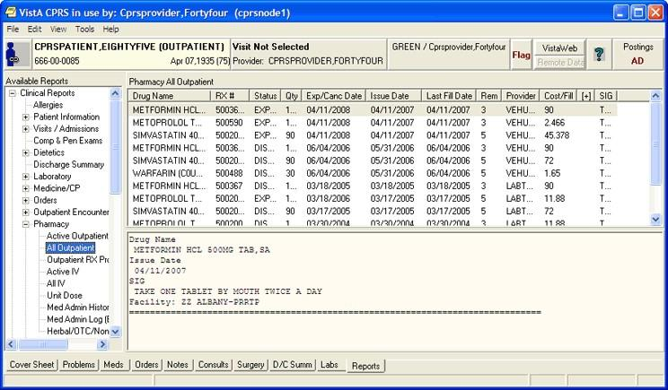

**The All Outpatient Medications report is displayed on the Reports tab**  
## Available Reports on the Reports Tab

The table below lists the reports available from the Reports tab. A “+” sign indicates that the topic is a heading that can be expanded. Some of these reports may have remote data.

In the list below, those reports that may have remote data from the Department of Defense are noted. Also, there is a part of the tree that lists Department of Defense reports.

**Note:** A new Consults (DoD remote data only) report has been added under

Department of Defense (DoD) in the reports tree view. This report has only DoD data. Unlike other items under the Department of Defense heading, this report has no VA data.

Another new addition to the Reports tab tree view is the HDR (Health Data Repository) section that contains four items: Allergies, Chem & Hematology, Vital Signs, and Pharmacy All Outpatient.

**Note:** In the vitals data from DoD through Bidirectional Health Information Exchange (BHIE), CPRS receives only one circumference/girth measurement: the head circumference. Unfortunately, it is not labeled as a “head” circumference, and it is only measured in inches. So, if a provider sees a circumference/girth from a DoD site, the provider should recognize that it is a head circumference measured in inches.

Other changes are the inclusion of modifiers and qualifiers (flow rate, oxygen concentration, and methods) for Pulse Oximetry, and in the HDR All Outpatient Pharmacy report, any set of results that has a SIG with a length greater than 60 characters will show “[+]” in the corresponding column.

**Note:** These items are currently inactive until HDR data is ready and sites receive instruction to begin using HDR data. If the user selects one of these items, CPRS will display the following dialog.

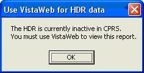

**This dialog will display if the HDR is inactive**  
Please note that the order of the reports may be different depending on the configuration of your site. This list is exported from CPRS.

-   Clinical Reports  
-   Allergies (can contain remote data from Department of Defense)  
-   Patient information  
-   Demographics  
-   Insurance  
-   Disabilities  
-   Visits / Admissions  
-   Adm./Discharge  
-   Expanded ADT (can contain remote data from Department of Defense)  
-   Discharge Diagnosis  
-   Discharges  
-   Future Clinic Visits  
-   Past Clinic Visits  
-   ICD Procedures  
-   ICD Surgeries  
-   Transfers  
-   Treating Specialty  
-   Comp & Pen Exams  
-   Dietetics  
-   Generic  
-   Diet  
-   Nutritional Status  
-   Supp. Feedings  
-   Tube Feeding  
-   Dietetics Profile  
-   Nutritional Assessment  
-   Discharge Summary (can contain remote data from Department of Defense)  
-   Laboratory  
-   Blood Availability  
-   Blood Transfusion  
-   Blood Bank Report  
-   Anatomic Pathology (can contain remote data from Department of Defense)  
-   Lab Orders (can contain remote data from Department of Defense)  
-   Chem & Hematology (can contain remote data from Department of Defense)  
-   Microbiology (can contain remote data from Department of Defense)  
-   Medicine/CP  
-   Abnormal  
-   Brief Report  
-   Full Captioned  
-   Full Report  
-   Procedures (local only)  
-   Procedures  
-   Orders  
-   Orders Current  
-   Daily Order Summary  
-   Order Summary for a Date Range  
-   Chart Copy Summary  
-   Outpatient Encounters / GAF Scores  
-   Education  
-   Education Latest  
-   Exam Latest  
-   GAF Scores  
-   Health Factors  
-   Immunizations  
-   Outpatient Diagnosis  
-   Outpatient Encounter  
-   Skin Tests  
-   Treatment Provided  
***

-   Pharmacy  
-   All Medications  
**Note:** The All Medications report includes All Inpatient and Outpatient Pharmacy data for a patient. The user can limit the data in the report by using date range parameters. To determine the data that is included, based on date range selection, the logic first looks for Last Fill Date, then Issue Date, then Order date (depends on if the date exists for the drug/RX being screened).

The report is initially sorted by STATUS, beginning with Active, followed by Discontinued, followed by Expired (alphabetically within each of those three groups). Users can also sort the by selecting a column header, thus sorting by that column.

-   Active Outpatient  
-   Outpatient Medications (can contain remote data from Department of Defense)  
**Note:** This report was previously called All Outpatient, but has been changed to Outpatient Medications because the user can now set a date range instead of getting all data for the patient. To determine the data that is included, based on date range selection, the logic first looks for Last Fill Date, then Issue Date, then Order date (depends on if the date exists for the drug/RX being screened).

-   Outpatient RX Profile  
-   Active IV  
-   All IV  
-   Unit Dose  
-   Med Admin History (BCMA)  
-   Med Admin Log (BCMA)  
-   Herbal/OTC/Non-VA Meds  
-   Women’s Health: Potentially Unsafe Medications  
-   Active Meds With Allergies  
**Note:** The Active Meds With Allergies report displays all “Active” Pharmacy related Orders which have an interaction with an entered allergy for the patient.

-   Problem List  
-   Active Problems  
-   All Problems  
-   Inactive Problems  
-   Progress Notes  
-   Progress Notes  
-   Advance Directive  
-   Clinical Warnings  
-   Crisis Notes  
-   Radiology  
-   Report (can contain remote data from Department of Defense)  
-   Status  
-   Imaging (local only)  
-   Imaging  
-   Surgery Reports  
-   Vital Signs  
-   Health Summary  
-   Adhoc Report  
-   Ac Clinical Summary  
-   Discharge Summary  
-   Radiology  
-   Pain Management  
-   Remote Demo/Visits/Pce (1y)  
-   Remote Demo/Visits/Pce (3m)  
-   Remote Clinical Data (1y)  
-   Remote Clinical Data (3m)  
-   Remote Clinical Data (4y)  
-   Remote Oncology View  
-   Remote Oncology View  
-   Global Assessment Functioning  
-   HDR  
-   Allergies  
-   Chem & Hematology  
-   Pharmacy All Outpatient  
-   Vital Signs  
-   Department of Defense Reports  
-   Allergies (contains only remote data from DoD and VA)  
-   Expanded ADT (contains only remote data from DoD and VA)  
-   Consults (contains DoD remote data only)  
-   Discharge Summary (contains only remote data from DoD and VA)  
-   Histories (contains DoD remote data only)  
-   Family History  
-   Social History  
-   Other Past Medical History  
-   Laboratory  
-   Lab Orders (contains only remote data from DoD and VA)  
-   Chem & Hematology (contains only remote data from DoD and VA)  
-   Surgical Pathology (contains DoD remote data only)  
-   Cytology (contains DoD remote data only)  
-   Microbiology (contains only remote data from DoD and VA)  
-   Outpatient Encounter (contains only remote data from DoD and VA)  
-   Outpatient Medications (contains only remote data from DoD and VA)  
-   Progress Notes (contains only remote data from DoD and VA)  
-   All Problem List (contains only remote data from DoD and VA)  
-   Questionnaires (DOD Remote data only)  
-   Radiology Report (contains only remote data from DoD and VA)  
-   Vital Signs (contains only remote data from DoD and VA)  
-   Imaging (local only)  
-   Lab Status  
-   Blood Bank Report  
-   Anatomic Pathology  
-   Autopsy  
-   Electron Microscopy  
-   Surgical Pathology  
-   Dietetics Profile  
-   Nutritional Assessment  
-   Vitals Cumulative  
-   Procedures (local only)  
-   Daily Order Summary  
-   Order Summary for a Date Range  
-   Chart Copy Summary  
-   Outpatient RX Profile  
-   Med Admin Log (BCMA)  
-   Med Admin History (BCMA)  
-   Surgery (local only)  
-   Event Capture  
-   Patient PCE Summary  
-   Patient Data Summary  
## Sorting a Report (Table View)

If a report is available in a table view, the table can be sorted alphabetically, numerically, or by date.

To sort data in a report table:

1.  Select the column heading you wish to sort by.  
1.  The table will be sorted alphabetically (A-Z), numerically (0-9), or by date (most recent-least recent).  
1.  If you click the column heading again, the table will be sorted in inverse order (Z-A, 9-0, or least recent-most recent).  
1.  To perform a secondary sort, click another column heading.  
**Note**: If you hold the pointer over the table, a hover hint will appear with the criteria used to sort the table.

**Note**: If the provider has an NPI, it will not display on the screen below.

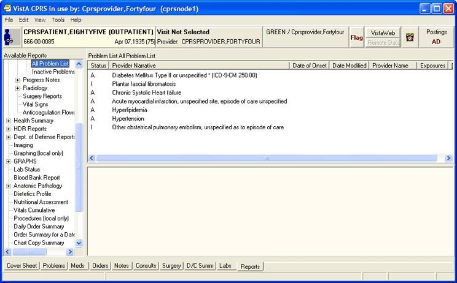

**You can easily sort report data in a tabular view**  
## Graphing a Report

If graph reports are available at your site, you can display them using the CPRS graphing functionality that is available on the **Reports** tab. You can also use **Reports**-tab graphing functionality to graph items from the **View** or **Item** list. In fact, graphing functionality on the **Reports** tab offers the same set of view and setup options you use when creating graphs from CPRS graphing’s detached window. (For information about setting up and using graphing functionality, see the “CPRS Graphing” section on p.106 of this manual.) **To display a graph report:**

Click the graph report in the **Available Reports** list. CPRS automatically starts graphing functionality on the **Reports** tab and displays the graph report.

To launch graphing on the Reports tab without first selecting a graph report:

• Click Graphing (local only) in the Available Reports list.

## Printing a Report

To print a report, follow these steps:

From the **Reports** tab, select the report you would like to print. If the report is in text format, right-click the text of the report

**-or-**

if the report is in table format, click the row that contains the data you would like to print (to select more than one row, press and hold either the **Shift** or **Control** key). After you have selected the appropriate row(s), right-click the area or row you have selected.

Select **Print** (text format) or **Print Data From Table** (table format).

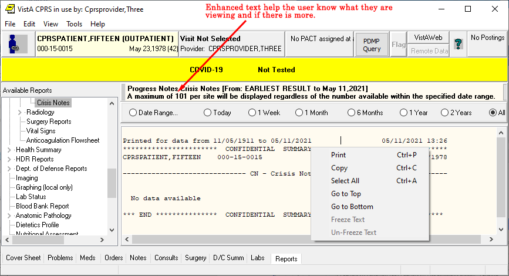

**You can print data from a table using the context that comes up by right-clicking on the appropriate main report area or a data row and selecting the Print option.**  
***

## Copying Data from a Report

To copy data from a report, follow these steps:

1.  From the Reports tab, select the report you would like to copy data from.  
1.  If the report is in text format, select the text you would like to copy and then right-click  
\-or-

if the report is in table format, click the row that contains the data you would like to copy (to select more than one row, press and hold either the Shift or Control key). After you have selected the appropriate rows, right click the area or row you have selected.

1.  Select Copy (text format) or Copy Data From Table (table format).  
1.  You can now paste the data into another area in CPRS or into another program.  
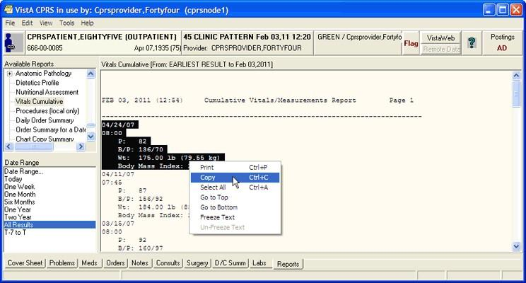

**You can copy data from a report by right-clicking and selecting Copy**  
## Viewing a Health Summary

Health Summaries provide important information to users about a patient’s condition. With Remote Data Views (RDV), users may be able to access remote Health Summary information from other facilities or the Department of Defense (DoD). If the patient has DoD data, but it is not available, CPRS will provide feedback for the text or grid type reports.

CPRS adds a comment that describes the problem where the data from the remote report would normally be. For ‘grid’ type reports, the error comment is put in the first column (after the facility name) of the report. Here are some examples of the comments that could show up, depending on the type of query and what the user has selected:

-   \<No HDR Data Included\> - Use “HDR Reports” menu for HDR Data.  
-   \<No HDR Data\> This site is not a source for HDR Data.  
-   \<No DoD Data\> - Use “Dept. of Defense Reports” Menu to retrieve data from DoD.  
-   \<ERROR\> - Unable to communicate with Remote site  
In addition to this text, error messages will also be shown after each remote site listed under the (blue) Remote Data View button, when appropriate.

To display a Health Summary, follow these steps:

1.  Select a patient after you enter the CPRS system.  
1.  Select the Reports tab.  
1.  Under the Available Reports box on the left side of the screen, click the “+” sign in order to expand the Health Summary heading.  
1.  Select a Health Summary by clicking on the summary that you would like to see. After you have selected a summary, the appropriate data is displayed on the right side of the screen.  
1.  Use the scroll bar on the right to scroll through the different sections of the Health Summary.  
# Appendix A – Accessibility for Individuals with Disabilities

This appendix discusses the features of CPRS that allow people who are blind, who have limited vision, or who have limited dexterity to use the software effectively. The features discussed include changing the font and window sizes, changing the background color, configuring a screen reader, and keyboard equivalents for common CPRS commands.

## Changing the Font Size

CPRS supports 8, 10, 12, 14, and 18 point font sizes. Font sizes larger than 18 point, make CPRS difficult for the user to navigate. If the user requires font sizes larger than 18 point, then the use of font magnification software, such as Windows Magnifier or other similar tools is recommended.

Changing the size of the fonts used in CPRS is a two-step process. The instructions in “CPRS Windows and Dialog Boxes” will change the size of most of the fonts displayed in CPRS windows and dialog boxes. However, to change the font size used for CPRS menus and Windows alert boxes, you will also need to follow the steps in “CPRS Menus and Windows Alert boxes.”

### CPRS Widows and Dialog Boxes

You can adjust the font size for most windows and dialog boxes that appear in CPRS. If you change the font size, some screen components will be resized to fit the new font size. If this occurs, you will need to manually resize some dialog boxes and screen components. CPRS will save the dimensions for the resized components so you will only have to resize them once.

To change the font size for CPRS windows and dialog boxes, follow these steps:

1\. Select **Edit** \| **Preferences** \| **Fonts** and choose the appropriate font size. The font size will be changed.

**Note**: The menu fonts and alert box fonts will not be changed until you follow the steps in CPRS Menus and Windows Alert boxes (below).

### CPRS Menus and Windows Alert Boxes

To change the font size used for CPRS menus and Windows alert boxes, follow these steps:

**Note**: The steps below will change the font used in menus and Windows boxes for ALL of the applications on your computer.

1.  Click Start \| Settings \| Control Panel.  
1.  Double-click on the Display icon.  
1.  Click the Appearance tab.  
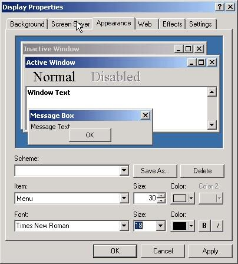

1.  From the Item drop-down list box, select either Menu or Message Box.  
1.  Select a font from the Font drop-down list.  
1.  Select a size from the Size drop-down list.  
1.  Select a color from the Color drop-down list.  
1.  Click Apply.  
1.  If necessary, repeat steps 4-8 to change the display settings for another item.  
1.  Press OK.  
## Changing the Window Background Color

To change the background color of CPRS windows and dialog boxes, follow these steps:

**Note**: The steps below will change the background color of windows and dialog boxes for ALL applications on your computer.

1.  Click Start \| Settings \| Control Panel.  
1.  Double-click on the **Display** icon.  
1.  The *Display Properties* dialog box will appear.  
1.  Click the **Appearance** tab.  
1.  From the Item drop-down list box, select **Window**.  
1.  Select a color from the Color drop-down list box.  
1.  Click **Apply**.  
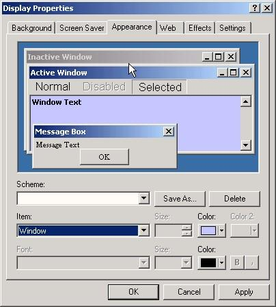

1.  The Appearance tab of the Display Properties dialog box  
1.  If necessary, repeat steps 4-6 to change the display settings for another item.  
1.  Press OK.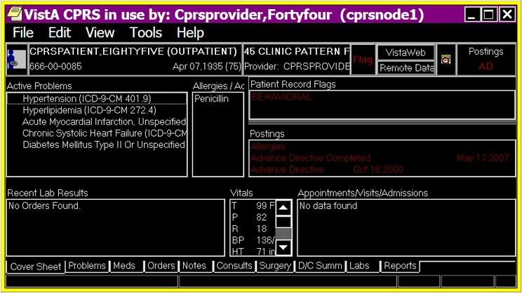  
**In this example, the Window color has been changed to a high contrast selection**  
## Keyboard Shortcuts for Common CPRS Commands

### Navigation

Select the Cover Sheet tab **Ctrl** + **S**

Select the Problems tab **Ctrl** + **P**

Select the Meds tab **Ctrl** + **M**

Select the Orders tab **Ctrl** + **O**

Select the Notes tab **Ctrl** + **N**

Select the Consults tab **Ctrl** + **T**

Select the D/C Summ tab **Ctrl** + **D**

Select the Labs tab **Ctrl** + **L**

Select the Reports tab **Ctrl** + **R**

Advance to the next field, button, or control (left to right) **Tab**

To exit a field that accepts tabs (e.g. the Note pane of the

Notes tab, the Reason for Request field on a consult, the

Fields on the complex medication form) and move to the

next control (left to right) **Control** + **Tab**

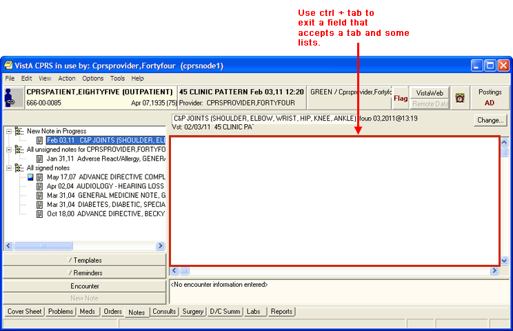

To exit a field that accepts tabs and move to the

previous control (right to left) **Shift + Control + Tab**

Pull down a list box **Down Arrow**

Navigate a list box Arrow **Up Arrow or Down**

Select an item in a list box **Return or Enter**

Expand a tree view **Right Arrow**

Collapse a tree view **Left Arrow**

To advance (left-right) to the next tabbed page of a dialog box **Control** + **Tab**

**An example of a dialog box with tabbed pages. Press Control + Tab to move from left to right (from the Solutions tab to the Additives tab). Press Shift + Control + Tab to move from right to left (from the Additives tab to the Solutions tab)**  
To move backwards (right to left)

between tabbed pages of a dialog box **Shift + Control + Tab**

To toggle a check box on or off **Spacebar**

### Common Commands

#### File Menu

Select New Patient **Alt-F-N**

Display demographic information in the Patient

Selection dialog box so it can be read by a screen reader **Ctrl + D**

Refresh Patient Information **Alt-F-I**

Update Provider / Location **Alt-F-U**

Review/Sign Changes **Alt-F-R**

Next Notification **Alt-F-F**

Remove Current Notification **Alt-F-V**

Print Setup **Alt-F-S**

Print **Alt-F-P**

Exit **Alt-F-X**

#### Edit Menu

Undo/Redo **Ctrl + Z/Ctrl + Y**

Cut **Ctrl + X**

Copy **Ctrl + C**

Paste **Ctrl + V**

Preferences \| Fonts \| 8 pt **Alt-E-R-F-8**

Preferences \| Fonts \| 10 pt **Alt-E-R-F-1**

Preferences \| Fonts \| 12 pt **Alt-E-R-F-2**

Preferences \| Fonts \| 14 pt **Alt-E-R-F-4**

Preferences \| Fonts \| 18 pt **Alt-E-R-F-P**

Preferences \| Fonts \| 24 pt **Alt-E-R-F-T**

#### Help

Contents **Alt-H-C**

About CPRS **Alt-H-A**

### Cover Sheet

#### View Menu

Demographics **Alt-V-M**

Postings **Alt-V-P**

Reminders **Alt-V-R**

### Problems Tab

#### View Menu

Active Problems **Alt-V-A**

Inactive Problems **Alt-V-I**

Both Active/Inactive Problems **Alt**-**V**-**B**

Removed Problems **Alt-V-R**

Filters **Alt-V-L**

Show Comments **Alt-V-C**

Save as Default View **Alt-V-V**

Return to Default View **Alt-V-F**

#### Action Menu

New Problems **Alt**-**A**-**N**

Change **Alt**-**A**-**C**

Inactive **Alt**-**A**-**I**

Verify **Alt**-**A**-**V**

Annotate **Alt**-**A**-**A**

Remove **Alt**-**A**-**R**

Restore **Alt**-**A**-**S**

View Details **Alt**-**A**-**D**

### Meds Tab

#### View Menu

Details **Alt**-**V**-**D**

Administration History **Alt**-**V**-**H**

#### Action Menu

New Medication **Alt-A-N**

Change **Alt-A-C**

Discontinue/Cancel **Alt-A-D**

Release Hold  **Alt-A-L**

Hold **Alt-A-H**

Renew **Alt-A-W**

Copy to New Order **Alt-A-P**

Transfer to **Alt-A-T**

Refill **Alt-A-E**

### Orders Tab

#### View Menu

Active Orders (includes pending, recent activity) **Alt-V-A**

Current Orders (active/pending status only) **Alt-V-O**

Auto DC/Release Event Orders **Alt-V-V**

Expiring Orders **Alt-V-E**

Unsigned Orders **Alt-V-U**

Custom Order View **Alt-V-C**

Save as Default View **Alt-V-S**

Return to Default View **Alt-V-R**

Details **Alt-V-D**

Results **Alt-V-L**

Results History **Alt-V-H**

#### Action Menu

Change **Alt-A-C**

Copy to New Order **Alt-A-N**

Discontinue / Cancel **Alt-A-D**

Change Release Event **Alt-A-G**

Hold **Alt-A-H**

Release Hold **Alt-A-L**

Renew **Alt-A-W**

Alert when Results **Alt-A-A**

Complete **Alt-A-M**

Flag **Alt-A-F**

Unflag Alt-A-U

Order Comments Alt-A-R

Sign Selected **Alt-A-S**

#### Options Menu

Save as Quick Order **Alt-O-S**

Edit Common List **Alt-O-E**

#### Complex Tab of the Medication Order Dialog

Enter a field in a grid **Spacebar**

Insert a row in a grid Select the row and then press **Insert.**

Delete a row in a grid Select the row and then press **Delete.**

Drop down the then/and list **Spacebar**

### Notes Tab

#### View Menu

Signed Notes (All) **Alt-V-S**

Signed Notes by Author **Alt-V-A**

Signed Notes by Date Range **Alt-V-R**

Uncosigned Notes **Alt-V-C**

Unsigned Notes **Alt-V-U**

Custom View **Alt-V-M**

Save as Default View **Alt-V-V**

Return to Default View **Alt-V-F**

Details **Alt-V-D**

Icon Legend **Alt-V-I**

#### Action Menu

New Progress Note **Alt-A-N or Shift + Ctrl + N**

Make Addendum **Alt-A-M or Shift + Ctrl + M**

Add New Entry to Interdisciplinary Note **Alt-A-W**

Attach to Interdisciplinary Note **Alt-A-T**

Detach fm Interdisciplinary Note **Alt-A-H**

Change Title **Alt-A-C**

Reload Boilerplate Text **Alt-A-B**

Add to Signature List **Alt-A-L**

Delete Progress Note **Alt-A-D or Shift + Ctrl + D**

Edit Progress Note **Alt-A-E or Shift + Ctrl + E**

Save Without Signature **Alt-A-A or Shift + Ctrl + A**

Sign Note Now **Alt-A-G or Shift + Ctrl + G**

Identify Additional Signers **Alt-A-I**

#### Options Menu

Edit Templates **Alt-O-T**

Create New Template **Alt-O-N**

Edit Shared Templates **Alt-O-S**

Create New Shared Template **Alt-O-C**

Edit Template Fields **Alt-O-F**

#### Details Pane Right-Click Menu

Reformat Paragraph **Shift + Ctrl + R**

Preview/Print Current Template **Ctrl + W**

Insert Current Template **Ctrl + Insert**

#### Template Pane

Open the templates drawer **Spacebar**

To expand a template file cabinet or tree view **Left Arrow**

To collapse a template file cabinet or tree view **Right Arrow**

Find Templates Select a template or template file cabinet and press **Ctrl + F**

Copy Template Text Select the template and then press **Ctrl + C**

Insert Template Insert Select a template and then press **Ctrl +**

Preview/Print Template Select a template and then press **Ctrl + W**

Go to Default Select a template or template file cabinet and press **Ctrl + G**

Mark as Default Select a template and then press **Ctrl + Space**

View Template Notes **Ctrl + V**

### Template Editor

**Edit Menu**

Undo **Ctrl + Z**

Cut **Ctrl + X**

Copy **Ctrl + C**

Paste **Ctrl + V**

Select All **Ctrl + A**

Insert Patient Data (Object) **Ctrl + I**

Insert Template Field **Ctrl + F**

Check for Errors **Ctrl + E**

Preview/Print Template **Ctrl + T**

Check Grammar **Ctrl + G**

Check Spelling **Ctrl + S**

#### Action Menu

New Template **Alt-A-N**

Generate Template **Alt-A-G**

Copy Template **Alt-A-C**

Paste Template **Alt-A-P**

Delete Template **Alt-A-D**

Sort **Alt-A-O**

Find Shared Templates **Alt-A-S**

Find Personal Templates **Alt-A-F**

Collapse Shared Tree **Alt-A-L**

Collapse Personal Tree **Alt-A-A**

#### Tools Menu

Edit Template Fields **Alt-T-F**

Import Template **Alt-T-I**

Export Template **Alt-T-E**

Refresh Templates **Alt-T-R**

Template Icon Legend **Alt-T-T**

### Consults Tab

#### View Menu

All Consults **Alt-V-A**

Consults by Status **Alt-V-U**

Consults by Service **Alt-V-S**

Consults by Date Range **Alt-V-R**

Custom View **Alt-V-M**

Save as Default View **Alt-V-V**

Return to Default View **Alt-V-F**

Icon Legend **Alt-V-I**

#### Action Menu

New \| Consult **Alt-A-N-C**

New \| Procedure **Alt-A-N-P**

Consult Tracking \| Receive **Alt-A-C-R**

Consult Tracking \| Schedule **Alt-A-C-L**

Consult Tracking \| Cancel (Deny) **Alt-A-C**

Consult Tracking \| Edit/Resubmit **Alt-A-C-E**

Consult Tracking \| Discontinue **Alt-A-C-D**

Consult Tracking \| Forward **Alt-A-C-F**

Consult Tracking \| Add Comment **Alt-A-C-A**

Consult Tracking \| Significant Findings **Alt-A-C-S**

Consult Tracking \| Administrative Complete **Alt-A-C-M**

Consult Tracking \| Display Details **Alt-A-C-T**

Consult Tracking \| Display Results **Alt-A-C-U**

Consult Tracking \| Display SF 513 **Alt-A-C-5**

Consult Tracking \| Print SF 513 **Alt-A-C-P**

Consult Results:

#### Options Menu

Edit Templates **Alt-O-T**

Create New Template **Alt-O-N**

Edit Shared Templates **Alt-O-S**

Create New Shared Template **Alt-O-C**

Edit Template Fields **Alt-O-F**

### DC/Summ Tab

#### View Menu

Signed Summaries (All) **Alt-V-S**

Signed Summaries by Author **Alt-V-A**

Signed Summaries by Date Range **Alt-V-R**

Uncosigned Summaries **Alt-V-C**

Unsigned Summaries **Alt-V-U**

Custom View **Alt-V-M**

Save as Default View **Alt-V-V**

Return to Default View **Alt-V-F**

Details **Alt-V-D**

Icon Legend **Alt-V-I**

#### Action Menu

New Discharge Summary **Alt-A-N or Shift + Ctrl + N**

Make Addendum **Alt-A-M or Shift + Ctrl + M**

Change Title **Alt-A-C or Shift + Ctrl + C**

Reload Boilerplate Text **Alt-A-B**

Add to Signature List **Alt-A-L**

Delete Discharge Summary **Alt-A-D or Shift + Ctrl + D**

Edit Discharge Summary **Alt-A-E or Shift + Ctrl + E**

Save without Signature **Alt-A-A or Shift + Ctrl + A**

Sign Discharge Summary Now **Alt-A-G or Shift + Ctrl + G**

Identify Additional Signers **Alt-A-I**

#### Options Menu

Edit Templates **Alt-O-T**

Create New Template **Alt-O-N**

Edit Shared Templates **Alt-O-S**

Create New Shared Template **Alt-O-C**

Edit Template Fields **Alt-O-F**

### Labs Tab

#### View Menu

Demographics **Alt-V-M**

Postings **Alt-V-P**

Reminder **Alt-V-R**

### Reports Tab

#### View Menu

Demographics **Alt-V-M**

Postings **Alt-V-P**

Reminder **Alt-V-R**

View a selected report **Spacebar**

# Appendix C: JAWS Configuration Files

JAWS is a screen reader application that enables a computer to verbally describe the controls and content of computer applications. For example, in CPRS, when a user changes tabs, JAWS will speak the name of the tab, such as “Orders," enabling the visually-challenged user to navigate CPRS and complete necessary tasks.

**Note:** To install and use JAWS and the scripts referred to below, the user must have administrative access to the workstation JAWS will be installed on.

Developers have created specialized scripts and CPRS components that enable

JAWS to work more effectively with CPRS. As part of the CPRS GUI v.27 (OR\*3.0\*243) release a zip file (CPRS27_JAWS_SUPPORT_FILES.ZIP) including the JAWS scripts and supporting files is being distributed.

**Note:** Users do not need to install the JAWS scripts. When users place them in the appropriate directory, CPRS will automatically install the scripts. The location is given below.

The improvements work only with JAWS 7.1 or later. However, JAWS 8.0.2173 or later is best because it fixes a bug that caused CPRS to crash when reading progress notes with JAWS. This fix is not in earlier versions of JAWS 8.0.

Usually it is best for JAWS users stay up to date with the latest releases of the product.

The following files are contained in the CPRS27_JAWS_SUPPORT_FILES.ZIP file:

-   JAWS.SR - DLL used for communication between JAWS and CPRS  
-   JAWSUPDATE.EXE - Used to update JAWS 7.1 to work with the component  
-   VA508APP.jcf - JAWS configuration file  
-   VA508APP.JSS - JAWS script file  
-   VA508JAWS.jss - JAWS script file  
-   VA508JAWSDispatcher - Application used for communication between JAWS and multiple applications using the JAWS.SR DLL  
-   VA508APP.jkm - JAWS keyboard mapping file  
-   VA508JAWS.jsd - Documentation companion file to the VA508JAWS.jss script file  
-   Vcredist_x86.exe is the Microsoft Visual C++ 2005 Redistributable. It is called by JAWSUpdate.exe.  
To use the accessibility features, a user must copy these files into Program

Files\\Vista\\Common Files, which is normally found on the workstation at

C:\\Program Files\\Vista\\Common Files. If the workstation is running JAWS 8.0.2173 or higher, nothing further is required.

If the workstation is running an earlier version of JAWS 8.0, or JAWS 7.1.500, the user must go to Program Files\\Vista\\Common Files and run JAWSUpdate.exe. JAWSUpdate installs a COM object for compatibility with these versions.

**Note:** You must have administrative rights on the machine to run JAWSUpdate.exe.

If the workstation is running a version of JAWS that is older than v 7.1.500, the new accessibility features in CPRS will not function. CPRS will function as it did without these changes, but the following error message will display:

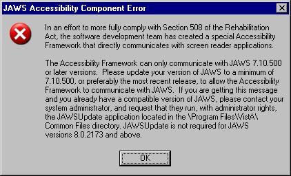

## Using JAWS with CPRS

For JAWS and CPRS to work together, it is best to launch JAWS first before launching CPRS. If JAWS has been closed for a while, but CPRS has remained open, it would be best to shut down CPRS, start JAWS and then relaunch CPRS. Starting JAWS first will help ensure that the two applications communicate correctly.

Also, to run JAWS, the user must have administrative rights on the workstation JAWS will be used on.

# Appendix D – Error Messages and Troubleshooting

This section includes general information regarding signing outpatient controlled substance orders for the Electronic Prescribing of Controlled Substance features (ePCS), errors the user might see, and some possible causes.

Possible hardware problems:

-   **The card reader is not working.** To check, try the user’s card in another workstation’s card reader.  
-   **The card is damaged or broken.** To check, insert the card into a reader that you know works.  
**What does a user need in order to be able to digitally sign outpatient controlled substances prescriptions?**

Providers must have the following to be able to prescribe outpatient controlled substance medication orders:

-   Must be an active user  
-   Must have the provider key  
-   Must be authorized to write medications in File 200  
-   Must have the ORES key  
-   DEA\# (that has not expired, but a date must be entered) or VA\#  
-   Assigned Pharmacy schedules for which the provider can prescribe (some combination of schedules 2-5, or all schedules 2-5)  
-   The ePCS USER ENABLE/DISABLE option enabled  
-   PIV or smart card and PIN  
-   Subject Alternative Name (SAN), usually the user’s Outlook email address, if they have one, which must be linked from the PIV or smart card to the user’s VistA account  
**Is the user prescribing from a remote location?**

The ActivClient software must be installed on the remote workstation or ePCS will not work. The user’s workstation must also have a card reader.

**What do the error messages that the user might see during the signing process mean?**

| **Error Message**                                                                                                                                                                                                                                                                                             | **Cause**                                                                                                                                                                                                                                                                                                                                                                                                                                                                                                                                                                                                                                                                                                                         |
|---------------------------------------------------------------------------------------------------------------------------------------------------------------------------------------------------------------------------------------------------------------------------------------------------------------|-----------------------------------------------------------------------------------------------------------------------------------------------------------------------------------------------------------------------------------------------------------------------------------------------------------------------------------------------------------------------------------------------------------------------------------------------------------------------------------------------------------------------------------------------------------------------------------------------------------------------------------------------------------------------------------------------------------------------------------|
| Order for controlled substance could not be completed. Provider does not have a current, valid DEA\# on record and is ineligible to sign the order.                                                                                                                                                           | There is no DEA Number in file 200 for this provider, or this provider does not have a VA\#, or this provider’s VA\# could not be used because either the facility DEA number is expired, or the provider is not a VA provider (only VA providers may use VA numbers). Contact your CAC or support person who can check on this for you. **Note: With patch OR\*3\*499, a provider must have a DEA number in the NEW DEA\#’s multiple field to order controlled substances. DEA numbers in the obsolete DEA NUMBER field are ignored.**                                                                                                                                                                                           |
| Order for controlled substance could not be completed.  Provider is not authorized to prescribe medications in Federal Schedule X [X is one of 2, 2N, 3, 3N, 4, or 5].                                                                                                                                        | In the provider’s ePCS set up, they have not been assigned permission to write for the specified schedule. Your CAC should know who is responsible for assigning the schedules. If a provider is using their individual DEA number, the schedules associated with the DEA number in the DEA NUMBERS file (\#8991.9) are used to determine privileges. If using VA\# or an institutional DEA number to order controlled substances, the provider’s personal schedules in file 200 are used to determine permissions.  **Note: With patch OR\*3\*499, if a provider has more than one DEA number, the error message specifically applies to the DEA number flagged ‘Use for Inpatient Orders’ in the DEA NUMBERS file (\#8991.9).** |
| Order for controlled substance could not be completed.  Provider’s DEA\# expired on DATE [ex:JAN 01, 2012] and no VA\# is assigned. Provider is ineligible to sign the order.                                                                                                                                 | The text is clear. The provider’s DEA number has expired and the provider does not have a VA number. Contact your ADPAC or CAC to find out who enters credentialing information through the Data Entry for ePrescribing Controlled Substances application to get this corrected.  **Note: With patch OR\*3\*499, if a provider has more than one DEA number, the error message specifically applies to the DEA number flagged ‘Use for Inpatient Orders’ in the DEA NUMBERS file (\#8991.9).**                                                                                                                                                                                                                                    |
| Digital Signing of Controlled  Substances is currently disabled for your site.                                                                                                                                                                                                                                | The prescriber tries to sign and the ePCS switch (OR EPCS SITE PARAMETER) is disabled for the site.                                                                                                                                                                                                                                                                                                                                                                                                                                                                                                                                                                                                                               |
| You are not currently permitted to digitally sign Controlled Substances.                                                                                                                                                                                                                                      | The prescriber tries to sign and the ePCS switch (OR EPCS USERS PARAMETER) is disabled for the signer.                                                                                                                                                                                                                                                                                                                                                                                                                                                                                                                                                                                                                            |
| Problem getting PIN. Cannot Digitally Sign.                                                                                                                                                                                                                                                                   | There are issues reading the PIV or smart card/retrieving the PIN. Contact your CAC or ADPAC for assistance.                                                                                                                                                                                                                                                                                                                                                                                                                                                                                                                                                                                                                      |
| Card has been locked. Cannot Digitally Sign.                                                                                                                                                                                                                                                                  | The card is locked in CPRS after 3 failed attempts at PIV PIN entry. This error occurs when the user attempts to sign while the card is locked. It will be automatically unlocked after 15 minutes. **Warning:** Be careful! 5 consecutive incorrect PIN entry attempts will lock the card and you will have to go to your PIV office station to reinstate or create a new card!                                                                                                                                                                                                                                                                                                                                                  |
| Digital Signing has been cancelled.                                                                                                                                                                                                                                                                           | The digital signature process has been cancelled by CPRS. This error usually shows after another problem has occurred.                                                                                                                                                                                                                                                                                                                                                                                                                                                                                                                                                                                                            |
| Could not digitally sign. An error has occurred: Hash generation failed.                                                                                                                                                                                                                                      | The system has issues creating the hash. The hash is created using the data from the order and a specific value. This process is repeated in Pharmacy during finishing and the hash values are compared to see if anything has been changed.                                                                                                                                                                                                                                                                                                                                                                                                                                                                                      |
| Please verify that you are logged on to the CPRS system and that your PIV card is inserted. There is a possible mismatch between your VistA last name and the last name of the certificate on your card. If it matches and you are still experiencing issues, please contact your card issuer for assistance. | When a user tries to link his/her PIV card to another VistA user logged into CPRS, a series of error messages will appear after PIN entry  Contact your CAC or ADPAC for assistance.                                                                                                                                                                                                                                                                                                                                                                                                                                                                                                                                              |
| CPRS was not able to link your VistA account to a PIV card.                                                                                                                                                                                                                                                   | When a user tries to link his/her PIV card to another VistA user logged into CPRS, a series of error messages will appear after  PIN entry                                                                                                                                                                                                                                                                                                                                                                                                                                                                                                                                                                                        |
| 89802006\^Smart Card Reader not found                                                                                                                                                                                                                                                                         | As stated, the card reader was not found. Contact your local IRM shop.                                                                                                                                                                                                                                                                                                                                                                                                                                                                                                                                                                                                                                                            |
| Problems with verifying certificate chain of authority                                                                                                                                                                                                                                                        | Network problems connecting to the verifying servers Tumbleweed may not be installed on the PKI Verify Server machine or the workstation or is not installed correctly. Contact your CAC or ADPAC for assistance.                                                                                                                                                                                                                                                                                                                                                                                                                                                                                                                 |
| Valid Certificate not found                                                                                                                                                                                                                                                                                   | No valid certificate to use was found on the card. Contact your CAC or ADPAC for assistance.                                                                                                                                                                                                                                                                                                                                                                                                                                                                                                                                                                                                                                      |
| Returned from CertSignData with failure                                                                                                                                                                                                                                                                       | Obtained a valid certificate, but failed to sign data correctly. Contact your CAC or ADPAC for assistance.                                                                                                                                                                                                                                                                                                                                                                                                                                                                                                                                                                                                                        |
| Certificate not valid:  89802019\^Before Cert effective date.                                                                                                                                                                                                                                                 | The current date when the user tries to sign is before the certificate’s effective date. Contact your CAC or ADPAC for assistance.                                                                                                                                                                                                                                                                                                                                                                                                                                                                                                                                                                                                |
| Certificate not valid:  89802020\^Certificate expired.                                                                                                                                                                                                                                                        | The certificate on the card has expired.  The PIV card needs to be renewed.  Contact your PIV office.                                                                                                                                                                                                                                                                                                                                                                                                                                                                                                                                                                                                                             |
| Could not acquire context Last Error value was “specific message for the error”                                                                                                                                                                                                                               | Often means that the ActivClient on that machine needs to be reinstalled. First, the user should try to digitally sign from another workstation, and if that works, then it is probably ActivClient or the card reader hardware.                                                                                                                                                                                                                                                                                                                                                                                                                                                                                                  |
| Invalid PIN entry - You only have \#\# attempts left before it is locked.                                                                                                                                                                                                                                     | This error message displays when the user enters an incorrect PIN one or two times. The message tells the user how many times another incorrect PIN can be entered before CPRS locks ordering for the card. The order will be left unsigned.  **Warning!** If a user incorrectly enters the PIN 5 consecutive times, the card will be completely locked and will require the full PIV station to reinstate or create a new card!                                                                                                                                                                                                                                                                                                  |
| That was three (3) unsuccessful tries, the Card Reader is Locked                                                                                                                                                                                                                                              | The user entered an incorrect PIN three consecutive times. CPRS locks access to the card. The order will be left unsigned.  **Warning!** If a user incorrectly enters the PIN 5 consecutive times, the card will be completely locked and will require the full PIV station to reinstate or create a new card!                                                                                                                                                                                                                                                                                                                                                                                                                    |
| PIN Entry was cancelled                                                                                                                                                                                                                                                                                       | The user cancelled PIN entry and stopped the digital signature process. The order will be left unsigned.                                                                                                                                                                                                                                                                                                                                                                                                                                                                                                                                                                                                                          |
| Unable to read the information from your card. Possible mismatch between your VistA last name and the last name of the certificate on your card.                                                                                                                                                              | No matching certificate found when trying to get the SAN from the PIV card to link.  Contact your CAC or ADPAC for assistance.                                                                                                                                                                                                                                                                                                                                                                                                                                                                                                                                                                                                    |
| Revocation failed - error: “specific text for the error”                                                                                                                                                                                                                                                      | The revocation server that checks to see if a certificate has been revoked or expired couldn’t be reached over the network.  Contact your CAC or ADPAC for assistance.                                                                                                                                                                                                                                                                                                                                                                                                                                                                                                                                                            |
| Could not open the Cert Store                                                                                                                                                                                                                                                                                 | This appears to be a problem with ActivClient. Please check ActivClient and reinstall if necessary.  Contact your CAC or ADPAC for assistance.                                                                                                                                                                                                                                                                                                                                                                                                                                                                                                                                                                                    |
| Did not find a Cert                                                                                                                                                                                                                                                                                           | This error comes from other programs outside of CPRS. The cause may not be as easily determined as other errors.  Contact your CAC or ADPAC for assistance.                                                                                                                                                                                                                                                                                                                                                                                                                                                                                                                                                                       |
| 89802010\^Signature Error – “specific text for the error”                                                                                                                                                                                                                                                     | This error comes from other programs outside of CPRS. The cause may not be as easily determined as other errors.                                                                                                                                                                                                                                                                                                                                                                                                                                                                                                                                                                                                                  |
| 89802009\^Signature Check failed                                                                                                                                                                                                                                                                              | This error comes from other programs outside of CPRS. The cause may not be as easily determined as other errors.  Contact your CAC or ADPAC for assistance.                                                                                                                                                                                                                                                                                                                                                                                                                                                                                                                                                                       |
| Digital signature verification failed:  “specific text for the error”                                                                                                                                                                                                                                         | This error comes from other programs outside of CPRS. The cause may not be as easily determined as other errors.  Contact your CAC or ADPAC for assistance.                                                                                                                                                                                                                                                                                                                                                                                                                                                                                                                                                                       |
| Keyset error                                                                                                                                                                                                                                                                                                  | This error appears to relate a bad SAN being stored for the user.  Contact your CAC or ADPAC for assistance.                                                                                                                                                                                                                                                                                                                                                                                                                                                                                                                                                                                                                      |

# Glossary

AICS Automated Information Collection System, formerly called Integrated Billing; software developed at Albany IRMFO, supported by MCCR, producing scannable Encounter Forms.

ASU Authorization/Subscription Utility, a VistA application (initially released with TIU) that allows VAMCs to assign privileges such as who can do what in ordering, signing, releasing orders, etc.

CAC Clinical Applications Coordinator. The CAC is a person at a hospital or clinic assigned to coordinate the installation, maintenance and upgrading of CPRS and other VistA software programs for the end users.

Chart Contents The various components of the Patient Record, equivalent to the major categories of a paper record; for example, Problem List, Progress Notes, Orders, Labs, Meds, Reports, etc. In CPRS, these components are listed at the bottom of the screen, to be selected individually for performing actions.

Consults Consult/Request Tracking, a VistA product that is also part of CPRS (it can function as part of CPRS, independently as a standalone package, or as part of TIU). It’s used to request and track consultations or procedures from one clinician to another clinician or service.

Cover Sheet A screen of the CPRS patient chart that displays an overview of the patient’s record.

CPRS Computerized Patient Record System, the VistA package (in both GUI and character-based formats) that provides access to most components of the patient chart.

CWAD Crises, Warnings, Allergies/Adverse Reactions, and Directives. These are displayed on the Cover Sheet of a patient’s computerized record, and can be edited, displayed in greater detail, or added to. See Patient Postings.

D/C Summary Discharge Summary; see below.

Discharge Summary A component of TIU that can function as part of CPRS, Discharge Summaries are recapitulations of a patient’s course of care while in the hospital.

GAF Global Assessment of Functioning is a rating of overall psychological functioning on a scale of 0 – 100. The GAF tab is available in the CPRS GUI in VA Mental Health facilities.

GUI Graphical User Interface—a Windows-like screen with pulldown menus, icons, pointer device, etc.

Health Summary A VISTA product that can be viewed through CPRS, Health Summaries are components of patient information extracted from other VistA applications.

ICD Stands for International Classification of Diseases (ICD). ICD-9- CM is a classification system developed by the World Health Organization (WHO) to classify diseases, and aggregate diseases according to similar characteristics. To borrow an analogy from a mailroom, ICD codes are like bins that correspond to different departments in a building. A very important use of ICD coding is to represent patients’ diseases for varying levels of financial reimbursement.

Imaging A VistA product that is also a component of CPRS; it includes Radiology, X-rays, Nuclear Medicine, etc.

Notifications Alerts regarding specific patients that appear on the CPRS patient chart. They can be responded to through “VA View Alerts.”

OE/RR Order Entry/Results Reporting, a VistA product that evolved into the more comprehensive CPRS.

Order Checking A component of CPRS that reviews orders as they are placed to see if they meet certain defined criteria that might cause the clinician placing the order to change or cancel the order (e.g., duplicate orders, drug-drug/diet/lab test interactions, etc.).

Order Sets Order Sets are collections of related orders or Quick Orders, (such as Admission Orders or Pre-Op Orders).

PCE Patient Care Encounter is a VistA program that is part of the Ambulatory Data Capture Project (ADCP) and also provides Clinical Reminders, which appear on Health summaries.

PCMM Patient Care Management Module, a VistA product that manages patient/provider lists.

PDMP Prescription Drug-Monitoring Programs. Provides for ad-hoc PDMP queries for retrieving the data and automatic generation of a progress note for the medical record.  
Patient Postings A component of CPRS that includes messages about patients; an expanded version of CWAD (see above).

Progress Notes A component of TIU that can function as part of CPRS.

Quick Orders Quick Orders allow you to enter many kinds of orders without going through as many steps. They are types of orders that physicians have determined to be their most commonly ordered items and that have standard collection times, routes, and other conditions.

Reports A component of CPRS that includes Health Summary, Action Profile, and other summarized reports of patient care.

SNOMED CT Systematized Nomenclature of Medicine concept terms (SNOMED-CT) is a controlled terminology developed by the College of American Pathologists to uniquely describe diseases and their characteristics, and to organize them into a large hierarchy of all diseases. In the mailroom analogy, SNOMED-CT codes are like individual addresses on parcels.

TIU Text Integration Utilities; a package for document handling, that includes Consults, Discharge Summary, and Progress Notes, and will later add other document types such as surgical pathology reports. TIU components can be accessed for individual patients through the CPRS, or for multiple patients through the TIU interface.

VISN Veterans Information System Network is the collective name of the regional organizations that manage computerization within a region.

VistA Veterans Information Systems Technology Architecture, the new name for DHCP.
